# Can LLM Already Serve as A Database Interface? A BIg Bench for Large-Scale Database Grounded Text-to-SQLs（中文译文）

## 译者说明

本文依据同目录的 `source.pdf` 翻译。章节、图表、公式、算法、代码与参考文献按原文结构保留。

## 作者

Jinyang Li、Binyuan Hui、Ge Qu、Jiaxi Yang、Binhua Li、Bowen Li、Bailin Wang、Bowen Qin、Ruiying Geng、Nan Huo、Xuanhe Zhou、Chenhao Ma、Guoliang Li、Kevin C.C. Chang、Fei Huang、Reynold Cheng、Yongbin Li

本文作者的单位包括香港大学、阿里巴巴集团达摩院、清华大学、上海人工智能实验室、MIT CSAIL、香港中文大学（深圳）及伊利诺伊大学厄巴纳-香槟分校。Jinyang Li、Binyuan Hui 与 Ge Qu 贡献相同；本工作部分完成于阿里巴巴达摩院实习期间。

## 摘要

文本到 SQL（text-to-SQL）解析旨在把自然语言问题转换成可执行 SQL，近年来受到越来越多关注。尤其是 GPT-4 和 Claude-2 已在这项任务上展现出令人印象深刻的效果。然而，Spider、WikiSQL 等主流基准主要关注数据库模式，只包含很少的数据库值行，因此学术研究与现实应用之间仍有差距。为缩小这一差距，我们提出 BIRD——面向大规模数据库值落地的文本到 SQL 大型基准（BIg bench for laRge-scale Database grounded text-to-SQL）。它包含 12,751 个文本到 SQL 对和 95 个数据库，总大小为 33.4 GB，覆盖 37 个专业领域。我们对数据库值的强调揭示了新的挑战：肮脏且带噪的数据值、自然语言问题与数据库值之间的外部知识落地，以及 SQL 效率，特别是在海量数据库环境下。要解决这些问题，文本到 SQL 模型除了语义解析能力之外，还必须具备数据库值理解能力。

实验结果证明，在大型数据库上生成准确的文本到 SQL 时，数据库值至关重要。此外，即使最有效的文本到 SQL 模型 GPT-4，其执行准确率也只有 54.89%，与人类的 92.96% 仍相距甚远，说明挑战依然存在。我们还给出效率分析，为生成对工业界有益的高效 SQL 提供洞见。我们相信，BIRD 将推动文本到 SQL 研究走向现实应用。排行榜和源代码见：<https://bird-bench.github.io/>。

## 1 引言

文本到 SQL 解析 [55, 50, 51, 3, 52, 37] 关注把自然语言问题转换成 SQL 查询，已引起学术界和工业界的广泛研究兴趣。原因在于，它有望让非专业数据分析人员仅用自然语言，就能从无处不在的关系数据库中自动提取所需信息。神经模型近年的进展，包括基于大语言模型（large language model，LLM）的方法，在 Spider [53]、WikiSQL [58] 等现有基准上取得了令人瞩目的成绩。例如，过去三年间，Spider 排行榜最佳模型的执行准确率从 53.5% [59] 提升到 85.3% [35]。Spider 最新的 SOTA 解析器 [35] 得益于大语言模型强大的理解和编码能力，这样优异的表现促使我们追问：LLM 是否已经能够充当数据库接口？

答案是否定的。以往基准聚焦数据库模式，只包含少量数据库值行，在学术研究与现实世界之间留下了差距。如图 1 所示，第一，我们发现当前最先进的模型仍难以泛化到数据库规模更大、取值更嘈杂的现实场景。第二，数据库规模增长往往造成更严重的上下文压缩，使完整上下文难以呈现 [1]，因而需要外部知识推理才能充分理解。第三，现有基准没有考虑 SQL 执行效率，而它在实际应用、特别是大型数据库中具有重要的实践意义。基于这些观察，我们希望开发一种更能代表真实场景的新文本到 SQL 基准，缩小实验环境与实际环境之间的差距。

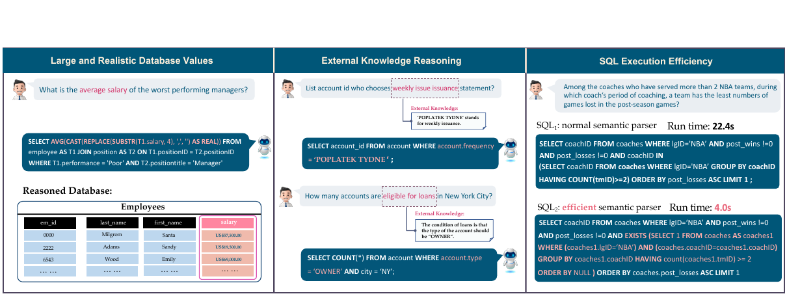

*图 1：BIRD 基准中的挑战示例。1）数据库包含带噪的数据类型 [14, 23, 19, 31]。左侧示例需要去掉 `US$` 和逗号，把 SQLite 中字符串（TEXT）形式的工资转换为浮点数（REAL），才能求出平均工资。2）需要外部知识与推理。中间示例要求模型理解只有 `OWNER` 账户才有贷款资格。3）必须考虑查询执行效率。右侧示例采用更高效的 SQL 后，速度显著提升，这对工业应用极有价值。*

我们提出 BIRD，即面向现实应用、以大规模数据库为落地点的文本到 SQL 大型基准。BIRD 包含 12,751 个复杂的信息查询样例，涉及 95 个大型数据库，总大小 33.4 GB，覆盖 37 个专业领域。训练集和开发集使用从真实分析平台（Kaggle、Relational.fit）收集并改造的 80 个开源关系数据库。为进一步避免数据泄漏，我们又为隐藏测试集构建了 15 个关系数据库。围绕这些数据库，我们通过众包收集自然语言问题及其 SQL。我们还提出新的评测指标——有效效率分数（Valid Efficiency Score，VES），用于评估生成 SQL 的效率。据我们所知，BIRD 是第一个纳入效率评测的文本到 SQL 基准，它鼓励模型在海量、嘈杂数据库值环境中生成更高效的查询。

我们用两类常见方法评测最先进的文本到 SQL 解析器：一类是使用 T5 [38] 的微调（fine-tuning，FT），另一类是使用先进 LLM 的上下文学习（in-context learning，ICL），模型包括 ChatGPT [33]（`gpt-3.5-turbo`）、Claude-2 [2]（`claude-2.0`）和 GPT-4 [32]（`gpt-4-32k`）。实验表明，当前模型难以在 BIRD 上良好泛化。具体而言，即使 GPT-4 的执行准确率也只有 54.89%，远低于人类的 92.96%，说明挑战依然存在。我们还开展了全面分析，以提供洞见和方向，并鼓励 NLP 与数据库社区共同研究本基准所呈现的、更贴近现实的设定。

## 2 任务定义与标注

文本到 SQL 是把自然语言问题 $Q$ 转换为 SQL 查询 $Y$ 的过程，所得查询能够从数据库中检索相关数据。数据库可表示为 $D=\langle C,T\rangle$，其中 $C$ 和 $T$ 分别表示列与表。面对 BIRD 这类复杂数据库值时，必须引入以 $K$ 表示的外部知识证据，才能增进模型对数据库值的理解。于是，文本到 SQL 可形式化为：

$$
Y=f(Q,D,K\mid\theta), \tag{1}
$$

其中，函数 $f(\cdot\mid\theta)$ 可以表示参数为 $\theta$ 的模型或神经网络。

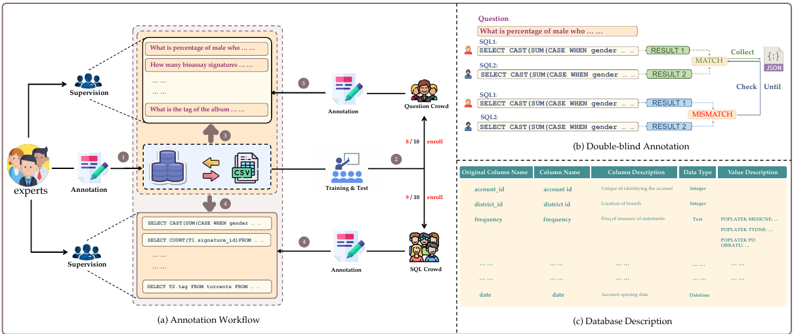

*图 2：图（a）为 BIRD 标注工作流概览，共有四个步骤：1）专业人员汇集并制作数据库和描述文件；2）专家培训并考核众包人员，只保留通过考核者；3）问题标注人员依据数据库及对应描述文件编写问题语料；4）SQL 标注人员依据数据库、描述和问题生成 SQL 文件。图（b）和（c）还分别展示了双盲标注流程与数据库描述示例。*

## 3 数据集构建

### 3.1 标注准入

为提供高质量基准，我们对所有申请者进行全面考核，只聘用通过严格测试者。更多信息见附录 B.2。

### 3.2 数据库来源

受隐私保护限制，很难收集到同时具有复杂模式和充足取值的数据库。早期工作 [45, 53] 选择自行设计数据库模式并生成取值，但这样得到的取值分布和模式可能与真实场景不同。我们从三个不同来源获取和处理数据库，以丰富真实世界属性。32% 的数据库来自 Kaggle（<https://www.kaggle.com/>）；这是知名的数据科学竞赛平台，数据值和模式往往复杂、嘈杂。另有 48% 来自 CTU Prague Relational Learning Repository（<https://relational.fit.cvut.cz/>），它是面向多关系数据机器学习研究的开放平台。其余 20% 通过获取开放表格、综合并规范化模式、生成数据库约束而构建。

所有数据库都拥有真实且规模庞大的取值分布，并可在适当许可下方便获取。最终，我们提供 95 个数据库，其中训练、开发、测试数据库分别为 69、11 和 15 个。它们覆盖区块链、体育、医疗、政治等 37 个专业领域。我们希望这能成为重要资源，供研究者探索大型数据库值环境下语义解析任务的领域泛化。

### 3.3 问题标注

**数据库描述文件。** 数据库描述文件是帮助标注者理解数据库值、进而提出有洞察力问题的关键资源。它提供两类主要信息：1）完整模式名称。数据库表名和列名经常使用缩写，难以理解；2）值描述。当问题中的短语或词元与数据库值不直接匹配时，这部分尤其有用。

**外部知识证据。** 我们在专业数据分析研究中发现，要把自然语言指令映射到相应数据库值，就需要外部知识证据。因此，我们收集这些证据并分成四类：

1. **数值推理知识。** 指某些 SQL 操作所需的数学计算。基准包含 8 种基本数学运算，其中 4 种复杂运算与 [7] 一致：减法、加法、除法、乘法。BIRD 还包含在基本运算上组合而成的百分比、公式等运算。
2. **领域知识。** 指生成 SQL 操作时使用的领域专门知识 [10, 57]。例如，银行业商业分析师需要了解投资回报率、净利润等金融指标，才能生成有效 SQL 查询。
3. **同义词知识。** 指表达方式不同、但含义相同或相近的词语或表达 [11]。
4. **值说明。** 指对数据库值的详细说明，包括值类型、值类别，以及与实体对应的列和值映射组合。例如，在 `professional_basketball` 数据库中，“中锋（center）”可表示为 `pos = C`。

### 3.4 SQL 标注

**双盲标注。** 如图 2（b）所示，我们采用双盲方法 [42] 标注 SQL。两位相互独立的 SQL 标注者在不讨论的情况下为同一问题生成 SQL。标注得到的 SQL 会在数据库中执行；若结果相同便收集，否则由专家持续检查，直至达成共识。当数据库拥有大量取值时，两名熟练标注者恰好生成相同错误结果的概率很低，因此双盲流程能够显著降低 SQL 标注错误率。专家从每个问题的候选中选出语义等价性更好、效率更高的 SQL，作为 BIRD 的真值 SQL；若用到了外部知识证据，也会逐条记录。

**审查。** 专家从两个维度评估每个文本到 SQL 对，以确保最高数据质量：SQL 有效性，以及文本-知识-SQL 对齐。首先确认 SQL 能够执行并从数据库返回有效结果；这里“有效结果”指不是 `NULL` 的结果集。如果执行结果为 `NULL`，专家会对问题条件稍作调整，直到相应 SQL 能返回有效结果。其次，通过文本-知识-SQL 对齐确认 SQL 可以由给定文本和知识证据生成；若证据不足以生成 SQL 或包含错误，则由专家负责修正。

## 4 数据统计

**总体统计。** 表 1 对 BIRD 和其他跨领域文本到 SQL 基准作了总体比较。统计结果表明，BIRD 是一个大规模跨领域基准，覆盖复杂 SQL 函数、知识推理与效率评测。

表 1：BIRD 与其他跨领域文本到 SQL 基准的总体比较。Function 表示 SQL 函数（见附录 B.11）；Knowledge 表示数据集是否要求模型进行外部知识推理；Efficiency 表示数据集是否考虑执行效率。

| 数据集 | 样例数 | 数据库数 | 平均每库表数 | 平均每库行数 | 函数 | 知识 | 效率 |
| --- | ---: | ---: | ---: | ---: | :---: | :---: | :---: |
| WikiSQL [58] | 80,654 | 26,521 | 1 | 17 | × | × | × |
| Spider [53] | 10,181 | 200 | 5.1 | 2K | × | × | × |
| KaggleDBQA [24] | 272 | 8 | 2.3 | 280K | × | ✓ | × |
| BIRD | 12,751 | 95 | 7.3 | 549K | ✓ | ✓ | ✓ |

**问题统计。** 数据库值给文本到 SQL 带来了更多挑战。为突出这一点，我们把问题分为“基本类型”和“推理类型”两个大类，每类再细分为 4 至 5 个小类。基本类型问题无需理解数据库值即可回答，包含基于匹配（83.9%）、排序（20.3%）、比较（16.7%）、计数（30.4%）和聚合（15.7%）。推理类型问题需要以数据库值为落地点使用外部知识，这是 BIRD 独有的类型，包含领域知识（23.6%）、数值计算（24.5%）、同义词（7.2%）和值说明（70.1%）。附录 B.3 给出大量示例。70.1% 的问题需要值说明，这说明现实文本到 SQL 应用中的问题更需要充分理解数据库值，也与我们构建 BIRD 的动机一致。

**数据库统计。** 我们研究 BIRD 中数据库领域、数据库大小和值类型的分布。图 3（a）以旭日图展示训练集和开发集中的详细领域分布及相应数据库。每个半圆的面积对应所在数据库中的文本到 SQL 对数量；颜色越深表示数据库越大，反之亦然。例如，Donor 是数据集中最大的数据库，大小为 4.5 GB。图 3（b）还表明，BIRD 相当一部分数据是日期相关值。现实应用经常依赖时效敏感数据 [25]，此类问题的普遍存在突出了基准的实践用途。

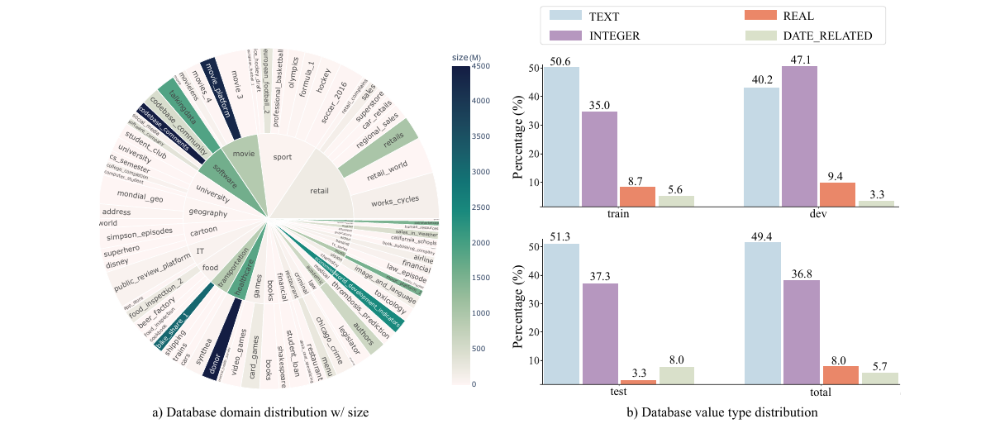

*图 3：BIRD 数据库分布全景。a）各数据库的领域与大小分布；b）数据库值类型分布。*

**SQL 统计。** 我们给出 BIRD 中 SQL 的复杂度和多样性。如图 4 所示，分析覆盖四个维度。每条 SQL 的词元数和 JOIN 数体现 SQL 的复杂程度；关键词数和每条 SQL 的三元组数量（ $n=3$）则佐证 SQL 模式的多样性，因为我们拆分了问题标注与 SQL 标注流程，使场景更接近现实 [6]。

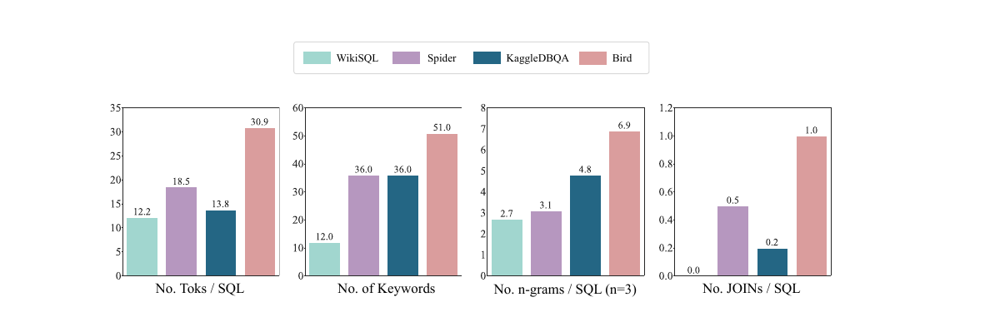

*图 4：BIRD 与其他跨领域文本到 SQL 基准的 SQL 查询统计比较。*

## 5 评测指标

在实际数据分析中，文本到 SQL 模型必须准确且高效地给出预期结果。因此，BIRD 提供执行准确率（Execution Accuracy，EX）和有效效率分数（Valid Efficiency Score，VES）两个指标，用于评测面对大型真实数据库值的文本到 SQL 解析器。

**执行准确率（EX）。** EX 定义为评测集中预测 SQL 与真值 SQL 执行结果相同的样例占全部 SQL 的比例 [37]。设第 $n$ 个真值 SQL $Y_n$ 的结果集为 $V_n$，预测 SQL $\hat{Y} _ n$ 的结果集为 $\hat{V} _ n$，则：

$$
\mathrm{EX}=\frac{\sum _ {n=1}^{N}\mathbf{1}(V_n,\hat{V} _ n)}{N}, \tag{2}
$$

其中 $\mathbf{1}(\cdot)$ 为指示函数：

$$
\mathbf{1}(V,\hat{V})=
\begin{cases}
1,&V=\hat{V},\\
0,&V\ne\hat{V}.
\end{cases} \tag{3}
$$

**有效效率分数（VES）。** VES 用于衡量模型生成的有效 SQL 的效率。这里“有效 SQL”指结果集与真值 SQL 结果集一致的预测 SQL。无法取得正确值的 SQL 一律视为无效，因为无论效率多高，只要无法满足用户请求便毫无用处。因此，VES 同时考虑执行结果的效率与准确性，能够更全面地评估模型表现。形式化地：

$$
\mathrm{VES}=\frac{\sum _ {n=1}^{N}\mathbf{1}(V_n,\hat{V} _ n)\cdot R(Y_n,\hat{Y} _ n)}{N},
\qquad
R(Y_n,\hat{Y} _ n)=\sqrt{\frac{E(Y_n)}{E(\hat{Y} _ n)}}. \tag{4}
$$

 $R(\cdot)$ 表示预测 SQL 相对于真值 SQL 的执行效率比，从而允许机器状态带来的不确定性； $E(\cdot)$ 是在给定环境下衡量每条 SQL 绝对执行效率的函数。BIRD 的评测会让每条 SQL 在同一 CPU 上运行 100 次，剔除离群值后取平均。我们还引入平方根，以减弱相对真值 SQL 异常快或异常慢的随机样例影响。这里的效率可指运行时间、吞吐量、内存开销或组合指标；BIRD 当前主要采用运行时间。附录 B.8 对 VES 作了详细说明。

## 6 实验

### 6.1 基线模型

我们在 BIRD 上给出两类基线模型的表现。第一类基于微调（FT），通过调整语言模型的全部参数来学习已标注训练集并输出 SQL；第二类基于上下文学习（ICL），无需额外训练即可生成结果。FT 模型选用 T5 系列 [38]；ICL 模型给出 Codex（`code-davinci-002`）、ChatGPT（`gpt-3.5-turbo`）、GPT-4（`gpt-4-32k`）、Claude-2（`claude-2.0`）和 Palm-2（`text-bison-001`）的零样本结果。此外，我们还实现 Spider 上的 SOTA 模型 DIN-SQL [35]，用于评估 BIRD 所提出的挑战。表 2、表 3 和图 5 给出先进语言模型在 BIRD 上的总体结果。

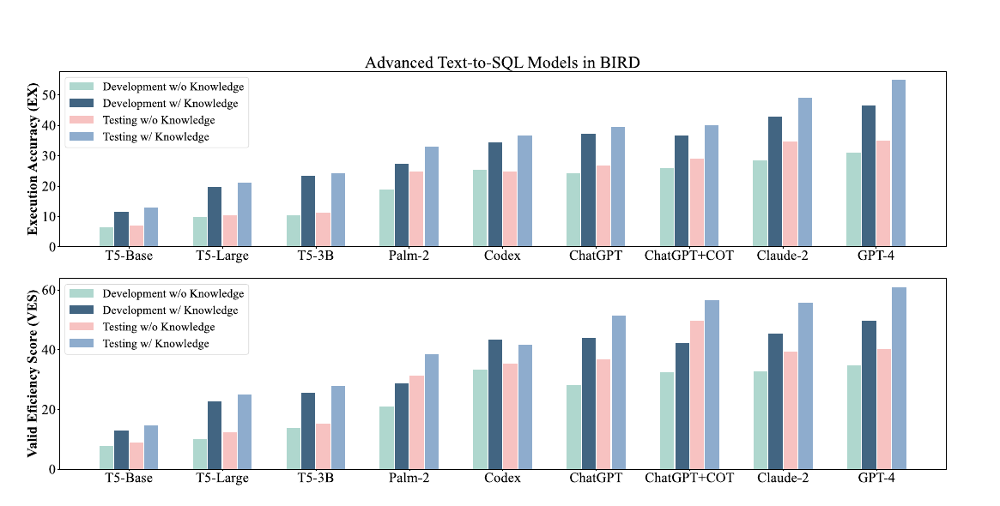

*图 5：柱状图直观展示先进模型在 BIRD 上的表现。*

表 2：先进文本到 SQL 模型的执行准确率（EX），同时给出人类表现。括号内为加入知识后的绝对增益。

| 模型 | 开发集：无知识 | 开发集：有知识 | 测试集：无知识 | 测试集：有知识 |
| --- | ---: | ---: | ---: | ---: |
| **基于 FT** |  |  |  |  |
| T5-Base | 6.32 | 11.54（+5.22） | 7.06 | 12.89（+5.83） |
| T5-Large | 9.71 | 19.75（+10.04） | 10.38 | 20.94（+10.56） |
| T5-3B | 10.37 | 23.34（+12.97） | 11.17 | 24.05（+12.88） |
| **基于 ICL** |  |  |  |  |
| Palm-2 | 18.77 | 27.38（+8.61） | 24.71 | 33.04（+8.33） |
| Codex | 25.42 | 34.35（+8.93） | 24.86 | 36.47（+11.61） |
| ChatGPT | 24.05 | 37.22（+13.17） | 26.77 | 39.30（+12.53） |
| ChatGPT + COT | 25.88 | 36.64（+10.76） | 28.95 | 40.08（+11.24） |
| Claude-2 | 28.29 | 42.70（+14.41） | 34.60 | 49.02（+14.42） |
| GPT-4 | 30.90 | 46.35（+15.45） | 34.88 | 54.89（+20.01） |
| GPT-4 + DIN-SQL | - | 50.72 | - | 55.90 |
| 人类表现 | - | - | 72.37 | 92.96（+20.59） |

### 6.2 执行准确率分析

表 2 和图 5 展示各模型在不同条件下的表现。GPT-4 超过所有基线语言模型；Claude-2 紧随其后，在语义解析和知识推理方面表现突出。进一步地，[35] 引入专门的推理提示，使 DIN-SQL + GPT-4 在 BIRD 上取得新的 SOTA 结果；该方法包含值采样、少样本演示和自我纠正。尽管大语言模型学习和提示智能已有长足进展，模型表现仍明显落后于人类。这一差距既突显 BIRD 的复杂性，也为发现更强模型或适用于现实文本到 SQL 场景的先进推理提示方法提供了机会。

表 3：先进文本到 SQL 模型的有效效率分数（VES），同时给出人类表现。括号内为加入知识后的绝对增益。

| 模型 | 开发集：无知识 | 开发集：有知识 | 测试集：无知识 | 测试集：有知识 |
| --- | ---: | ---: | ---: | ---: |
| **基于 FT** |  |  |  |  |
| T5-Base | 7.78 | 12.90（+5.12） | 8.97 | 14.71（+5.74） |
| T5-Large | 9.90 | 22.74（+12.84） | 12.25 | 25.00（+12.75） |
| T5-3B | 13.62 | 25.57（+11.95） | 15.17 | 27.80（+12.63） |
| **基于 ICL** |  |  |  |  |
| Palm-2 | 20.82 | 28.64（+7.82） | 31.32 | 38.41（+7.09） |
| Codex | 33.37 | 43.41（+10.04） | 35.40 | 41.60（+6.20） |
| ChatGPT | 27.97 | 43.81（+15.84） | 36.68 | 51.40（+14.72） |
| ChatGPT + COT | 32.33 | 42.30（+9.97） | 49.69 | 56.56（+6.87） |
| Claude-2 | 32.75 | 45.28（+12.53） | 39.32 | 55.77（+16.45） |
| GPT-4 | 34.60 | 49.77（+15.17） | 40.20 | 60.77（+20.57） |
| GPT-4 + DIN-SQL | - | 58.79 | - | 59.44 |
| 人类表现 | - | - | 70.36 | 90.27（+19.91） |

### 6.3 Spider 上的基线表现

Spider [53] 是使用最广、也最复杂的跨领域文本到 SQL 基准，主要评估与模式相关的语义解析能力。为说明复杂数据库模式和值如何提高 BIRD 的难度，我们把相同基线模型在 BIRD 与 Spider 上的执行准确率进行可视化。为保证公平，所有模型都获得值知识，并且两套数据集上的语言模型都使用相同的编程提示。图 6 表明，BIRD 对数据库值的关注使其成为最具挑战性的文本到 SQL 基准。各模型在两套基准上的表现差异说明，仍需继续研究开发能够处理复杂数据库模式和值的模型。

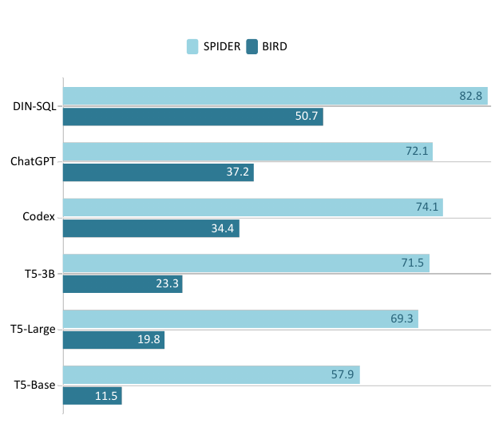

*图 6：相同基线模型在 Spider 与 BIRD 开发集上的 EX 结果。*

### 6.4 效率分析

表 3 显示，EX 越高的模型越可能取得更高 VES。原因在于，要获得更高 VES，文本到 SQL 模型首先必须准确预测结果，这符合实际用途。

**两阶段优化。** 直观而言，文本到高效 SQL 的转换目标可以分解成两个子阶段。第一阶段沿用以往文本到 SQL 任务，聚焦语义解析，即把问题准确转换成 SQL 查询。第二阶段对 SQL 查询进行优化，在保持结果不变的前提下改写成更高效的形式 [61]。为证明这种方法有效，我们从开发集中随机选择 10 个 ChatGPT 结果预测正确的样例，再由专业人员依据既有查询优化规则 [28, 34, 62] 优化查询。两阶段优化在结果不变的情况下平均节省 77.75% 时间。

**与数据库对话。** BIRD 引入新的“Chat With Database”模式，让模型生成与数据库交互的全局 SQL 查询，从而感知数据类型和分布；这为开发更有效、更高效的 SQL 查询奠定基础。实验发现，在数据库中配置索引可让 SQL 查询节省 87.3% 时间。详细效率分析见附录 B.5。

### 6.5 知识证据分析

我们在两种场景下实现每个基线模型。第一种不向每个样例提供真值外部知识证据句（无知识）；第二种提供这些证据（有知识），让文本到 SQL 模型自行完成知识落地。如 3.3 节所述，专家标注的外部知识证据句用于增强模型对数据库值的理解。

只需向模型提供关于数据库值的外部知识证据，所有模型在不同难度上的表现就会明显提高，见表 2 和表 4。这说明 BIRD 中的外部知识证据确实有效，能够指导模型更好地理解数据库值；也说明面对更真实的数据库时，数据库值对文本到 SQL 模型非常重要。此外，ICL 方法比参数少于 5B 的 FT 小模型具有更好的自知识落地能力和预训练 SQL 知识。加入思维链（COT）后，ChatGPT 表现更好，因为在知识和数据稀缺时，多步推理有益。

尽管如此，我们发现 ChatGPT + 外部知识证据的 COT 版本表现反而下降或提升有限。我们推测，在这种情况下，LLM 内部的多步知识推理与外部知识（证据）的表达方式并不兼容。因此，如何把 LLM 强大的多步自推理能力与外部知识推理连贯地结合起来，是一个很有前景的未来方向 [29]。

### 6.6 更多分析

**细粒度类别分析。** 图 7 从多个子能力维度详细比较先进 LLM 在 BIRD 上的表现。GPT-4 在所有方面都优于 ChatGPT 和 Claude-2。然而，所有模型在排序和数值计算（math）方面都存在明显差距。这一局限可能说明当代 LLM 不足以胜任深度数据科学任务，因为这类任务经常要在含糊用户查询下完成数学计算和排序。相反，模型在领域知识、同义词检测和值说明方面相对更好，可归因于预训练阶段充分的语言训练和推理能力。

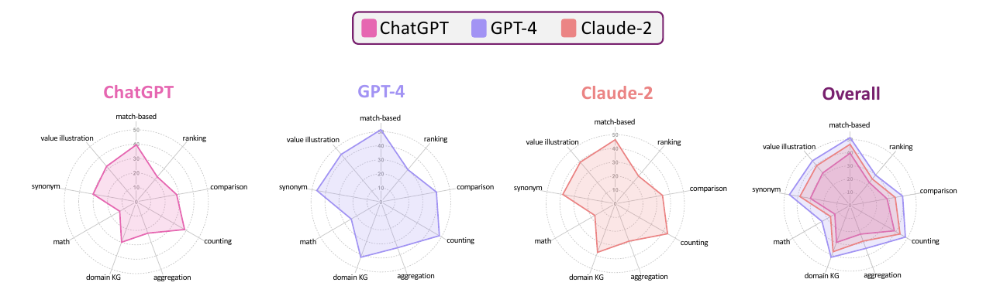

*图 7：先进大语言模型在 BIRD 上的细粒度分类评测。*

**人类表现。** 为推动文本到 SQL 研究在现实场景中达到应用级表现，我们提供 BIRD 上的人类表现。表 2 和表 3 表明，即使 SOTA 文本到 SQL 模型与人类之间仍存在巨大差距。完整采集流程见附录 B.9。

**错误分析。** ChatGPT 是当前最常用且成本效益较高的 LLM，因此错误分析聚焦 ChatGPT，详情见附录 B.6。我们随机观察 500 个错误样例并作深入评估。错误分成以下几类：

- **模式链接错误（41.6%）**：ChatGPT 能正确理解数据库结构，却错误关联到不恰当的列和表。这说明即使在复杂现实场景中，模式链接 [43, 57] 仍是模型的重要障碍。
- **误解数据库内容（40.8%）**：ChatGPT 无法记住正确数据库结构，例如 `rtype` 不属于 `satscores` 表；或者伪造模式项，例如 `lap_records` 不存在于 `formula_1` 数据库，而且许多值预测错误。如何让 ChatGPT 真正理解数据库结构和值 [27]，仍是 LLM 的痛点。
- **误解知识证据（17.6%）**：模型没有正确解释人工标注证据。例如 ChatGPT 直接复制公式 `DIVIDE(SUM(spent), COUNT(spent))`。这表明 ChatGPT 面对陌生提示或知识时不够稳健，会不顾 SQL 语法直接照抄公式 [15]。
- 此外，ChatGPT 偶尔会采用错误关键词，例如把 MySQL 的 `YEAR()` 函数误用于 SQLite 而不是用 `STRFTIME()`，也会出现解码错误。

## 7 相关工作

高质量数据集对推动文本到 SQL 等自然语言处理任务至关重要。早期单领域文本到 SQL 数据集 GeoQuery [55]、ATIS [9] 和 Restaurant [20] 面向特定信息检索任务；较新的 WikiSQL [58] 与 Spider [53] 提出跨领域数据集，要求模型具备领域泛化能力。然而，大多数跨领域文本到 SQL 数据集仍强调数据库模式而非取值，与现实场景不同。KaggleDBQA [24] 从 Kaggle 上的 8 个数据库构建了 272 个文本到 SQL 对，以解决这一问题；EHRSQL [25]、SEDE [13] 和 MIMICSQL [46] 等其他数据集也收集了多样化的大取值数据库和更专业的 SQL 查询。尽管取得这些进展，它们仍聚焦单一领域。近期工作还探索了知识密集型文本到 SQL 基准 [10, 57]，通过知识落地帮助专家进行真实分析。BIRD 是第一个整合这些现实特征、并重点关注数据库值的大规模基准。

## 8 局限与未来工作

双盲标注能产生高质量 SQL，但流程资源开销很大。未来研究可以探索基于人机交互（HCI）的方法，让 GPT-4 等先进 AI 系统承担部分标注职责，在降低人力成本的同时保持数据质量。另外，以往文本到 SQL 基准和本研究都选择 SQLite 作为主要 SQL 代码库，因为它对用户友好；但 SQLite 难以获取查询执行计划（QEP）来精确计算效率，也难以适配不同 SQL 语法。未来工作将提供 BIRD 的 PostgreSQL 和 MySQL 版本，以克服这些局限，为 NLP 与数据库专家提供更健壮的研究环境。

## 9 结论

我们提出 BIRD，一个特别关注大型数据库值的大规模跨领域文本到 SQL 基准。BIRD 通过探索三项额外挑战缩小文本到 SQL 研究与现实应用之间的差距：1）处理大规模且肮脏的数据库值；2）外部知识证据；3）优化 SQL 执行效率。实验结果表明，BIRD 比现有基准更具挑战性；即使最常用、最强大的 LLM ChatGPT，其表现也远低于人类。文本到 SQL 任务仍有广阔的改进和创新空间。我们深入的效率与错误分析还提供了有价值的洞见和未来方向，有助于为现实场景开发更先进、更实用的文本到 SQL 方案。

## 致谢

感谢匿名审稿人的所有建设性意见。Reynold Cheng、Jinyang Li、Ge Qu 和 Nan Huo 获香港赛马会慈善信托基金（项目 260920140）及香港大学（项目 104006830）资助。Chenhao Ma 获国家自然科学基金项目 62302421、广东省基础与应用基础研究基金项目 2023A1515011280、深圳市科技计划 ZDSYS20211021111415025 资助。Jinyang Li 和 Ge Qu 获香港大学校长博士生奖学金计划资助，Ge Qu 还获香港博士研究生奖学金计划资助。本工作还得到阿里巴巴研究实习生计划支持。

## 附录 A 数据集说明书

我们遵循 Datasheets for Datasets 的说明，回答关于该数据集的重要问题。

### A.1 动机

**创建数据集的目的是什么？** 大语言模型的发展引发了一个问题：ChatGPT、Codex 等最先进 LLM 能否在涉及大量数据库值的现实文本到 SQL 任务中取代人力？研究者在 Spider 等既有学术任务上看到它们优异的表现，因而产生这一疑问。然而，我们发现当前跨领域文本到 SQL 基准只关注数据库模式，没有充分关注取值，造成学术研究与现实应用的差距。为此，我们提出 BIRD——面向社区发展的、突出大规模真实数据库的最大跨领域文本到 SQL 基准。我们还希望观察 LLM 与人类的表现差距。实验表明，至少目前 LLM 仍无法替代人力。据我们所知，BIRD 是第一个采集人类表现的文本到 SQL 基准。

**谁创建了数据集，代表什么实体？** 详情见本文作者名单。我们的研究团队涉及香港大学 STAR Lab、阿里巴巴达摩院 Conversational AI（ConAI）团队、伊利诺伊大学厄巴纳-香槟分校计算机科学系、麻省理工学院 EECS、香港中文大学（深圳）数据科学学院以及清华大学数据库组。

**谁资助了数据集创建？** 数据集完全由阿里巴巴达摩院 ConAI 团队资助，共花费 97,654 美元。其中 10% 用于招聘合格研究实习生，80% 用于开发基准，10% 用于完善和实现基准。

### A.2 构成

**数据集实例表示什么？** BIRD 包含自然语言问题、外部知识证据句、处理过的大型数据库、数据库描述文件（CSV）和 SQL 查询。

**每类实例总共有多少？** 12,751 个自然语言问题、12,751 个外部知识证据句、95 个处理过的大型数据库、95 个数据库描述 CSV 文件夹，以及 12,751 条真值 SQL 查询。

**数据集包含所有可能实例，还是来自更大集合的样本？** BIRD 分为训练、开发和测试三部分。训练集和开发集公开，测试集隐藏，以便公平评测所有文本到 SQL 参赛者，并真实见证 LLM 时代文本到 SQL 的发展。

**每个实例是否有标签或目标？** 每个问题实例提供两个标签：SQL（输入的目标）和外部知识证据（专家为每条预期 SQL 标注的证据）。

**单个实例是否缺少信息？** 否。

**实例间关系是否显式给出？** 否。

**是否有推荐的数据划分？** 训练集 9,428 个实例，开发集 1,534 个实例，隐藏测试集 1,789 个实例。训练集和开发集来自公开数据库，测试数据库由专业团队整理设计。这样做是因为部分研究者担心，LLM 在文本到 SQL 上的突出表现未必来自能力提升，而可能来自预训练时已接触相关数据与数据库值。为回应这一担忧，我们用真实表格数据自行设计新的测试数据库，确保 LLM 没有预先见过这些数据库。

**数据集中是否存在错误、噪声或冗余？** 正文所述的双盲标注昂贵而严格，保障了数据质量；但任何数据集、尤其复杂数据集都几乎不可能完全无错。论文接收后团队仍会持续改进数据，为文本到 SQL 社区作贡献。我们也鼓励用户在数据网站反馈并报告错误，以便修正和改进。

**数据集是否自包含，还是链接到或依赖外部资源？** 训练和开发数据库均按适当许可收集，详情见 3.2 节。

**数据集是否包含受法律特权、医患保密或非公开通信保护的机密数据？** 否。

**直接查看数据是否可能令人感到冒犯、受辱、威胁或焦虑？** 否。

**数据集是否识别任何亚群体（如年龄、性别）？** 部分问题提到年龄和性别，但只用于检测模型的文本到 SQL 能力，不涉及偏见或其他观点。

**能否直接或间接识别个人？** 不能。所有数据库均从开源平台收集，敏感数据已预先处理。

**数据集是否包含种族、性取向、宗教、政治、工会、位置、金融、健康、生物特征、政府证件或犯罪记录等敏感数据？** 否。这是基于问答的文本到 SQL 数据集，不要求模型对结果表达任何观点，数据集中也不呈现偏见或观点。

### A.3 收集过程

**如何获得与每个实例相关的数据？** 详见第 3 节和附录 B.2。

**使用了什么收集机制或流程？** 详见第 3 节和附录 B.2。众包人员使用阿里巴巴内部标注软件标注数据并检查结果。

**若数据集是更大集合的样本，采样策略是什么？** 不适用。

**哪些人参与了数据收集，如何获得报酬？** 4 名博士生和 2 名硕士生参与创建数据库描述文件。我们招聘了两个独立众包团队标注问题和 SQL：问题标注者为 11 名英语母语者，SQL 标注者由数据库工程师和数据库专业学生组成。总花费为 97,654 美元。

**数据收集时间范围？** 2022 年 9 月至 2023 年 3 月。

**是否进行了伦理审查？** 是。团队非常重视此类问题。审查中发现某些问题涉及政治或不当语言，我们已修改内容，并严肃警告负责这些实例的标注者。

**数据是直接从相关个人收集，还是通过第三方或其他来源获得？** 详见第 3 节和附录 B.2。

**相关个人是否被告知数据收集？** 是。

**相关个人是否同意收集和使用其数据？** 是。我们招聘他们并支付了令人满意的薪酬。

**同意者是否可在未来或对特定用途撤回同意？** 否。

**是否分析数据集及其使用对数据主体的潜在影响？** 是。论文实验和附录开展了非常全面的分析，包括错误分析和效率分析。

### A.4 预处理、清洗与标注

**是否对数据做了预处理、清洗或标注？** 是。我们用 NLTK 为用户提供每个问题和 SQL 的词元列表。

**是否同时保存原始数据？** 否。

**预处理、清洗或标注软件是否可用？** 是，见 <https://www.nltk.org/>。

### A.5 用途

**数据集是否已经用于其他任务？** 否。

**是否有仓库链接使用该数据集的论文或系统？** 否。

**数据集还可用于什么任务？** 数据库和分析式问题最有价值，因此可能有益于数据库代码生成、数据科学分析等任务。

**数据构成或收集、预处理方式是否可能影响未来用途？** 否。

**是否存在不应使用该数据集的任务？** 否。

### A.6 分发

**数据集是否会分发给创建实体之外的第三方？** 否。

**如何分发？** 所有源代码和数据集均可在排行榜网站 <https://bird-bench.github.io/> 找到；网站还提供快速下载链接。代码仓库位于 <https://github.com/AlibabaResearch/DAMO-ConvAI/tree/main/bird>。

**何时分发？** 现在。

**数据集采用何种知识产权许可或使用条款？** BIRD 的数据库规模目前最大，滥用大量数据库值可能导致不当商业用途。因此，数据集按 CC BY-NC 4.0 分发。

**第三方是否对实例相关数据施加知识产权或其他限制？** 否。

**是否适用出口管制或其他监管限制？** 否。

### A.7 维护

**谁负责支持、托管和维护数据集？** 香港大学 STAR LAB 与阿里巴巴达摩院。

**如何联系所有者、管理者或维护者？** 联系 `bird.bench23@gmail.com`，或本文作者名单中的通讯作者、共同第一作者。

**是否有勘误表？** 否。

**数据集是否会更新？** 是。团队会定期持续打磨和优化数据。

**若数据集涉及个人，相关数据是否有保留期限？** 否。

**是否继续支持、托管或维护旧版本？** 否。最新版本更可靠。

**他人是否有扩展、增强或贡献数据集的机制？** 有，但应先联系本文作者。

## 附录 B

### B.1 文本到 SQL 难度

为帮助研究者深入分析不同难度文本到 SQL 样例上的模型表现，我们把所有样例分成简单（30%）、中等（60%）和挑战（10%）三档。Spider 等以往工作主要依据 SQL 复杂度计算难度；但我们发现，问题理解、模式链接、外部知识推理等因素也会影响模型与人类表现。因此，每位 SQL 标注者都必须据此评估样例，再由专家汇总评分，划分成上述三档。这样可以更全面地分析文本到 SQL 难度。表 4 给出 ChatGPT 在三档难度上的表现。

我们依照既定规则进行人工评分。SQL 标注者为每个问题生成 SQL 时，使用详细众包规则评估四个维度：

1. **问题理解。** 以 1 至 3 的离散分值衡量问题意图的含糊程度和理解难度：1 表示直截了当，2 表示清楚但需要更多思考，3 表示极为含糊。
2. **知识推理。** 以 1 至 3 分衡量从问题映射到 SQL 所需的外部知识量：1 表示无需知识，2 表示需要易于理解的外部知识证据来生成 SQL，3 表示需要大量知识和更多思考。
3. **数据复杂度。** 以 1 至 3 分衡量需分析的模式关系和数据规模：1 表示模式和值简单；2 表示模式和值复杂，但借助数据库描述文件可理解；3 表示即使有描述文件，值和模式仍高度复杂且难以理解。
4. **SQL 复杂度。** 以 1 至 3 分衡量目标 SQL 的句法复杂度：1 表示关键词不多的简单 SQL，2 比 1 更复杂，3 表示含有许多函数以及……的高度复杂 SQL（原文句子在此中断）。

四个维度对文本到 SQL 标注同等重要。SQL 按这些分数排序，再以 30%、60% 和 10% 的比例分别划分为简单、中等和挑战。

表 4：ChatGPT 及其加入外部知识证据落地（KG）的版本在开发集和测试集上的执行准确率（EX）与有效效率分数（VES）。

| 模型/指标 | 开发集：简单 | 开发集：中等 | 开发集：挑战 | 开发集：总计 | 测试集：简单 | 测试集：中等 | 测试集：挑战 | 测试集：总计 |
| --- | ---: | ---: | ---: | ---: | ---: | ---: | ---: | ---: |
| （EX）ChatGPT | 31.08 | 13.29 | 12.08 | 24.05 | 35.41 | 19.46 | 12.28 | 26.77 |
| （EX）ChatGPT + KG | 45.44 | 26.14 | 19.01 | 37.22 | 49.21 | 31.89 | 20.70 | 39.30 |
| （VES）ChatGPT | 36.20 | 15.43 | 14.42 | 27.97 | 50.09 | 24.71 | 15.39 | 36.68 |
| （VES）ChatGPT + KG | 54.71 | 28.16 | 22.80 | 43.81 | 65.06 | 41.21 | 25.81 | 51.40 |

### B.2 标注准入

**标注平台与报酬。** 数据通过阿里巴巴内部版 Alibaba-Appen（<https://appen.com/crowd-2/#crowd>）收集。问题标注者每提交一个通过验证的问题获得 0.6 美元，SQL 标注者每贡献一条 SQL 获得 1 美元。我们还邀请文本到 SQL 专家和教授检查并标注外部知识证据，但不支付报酬。每周约确认 1,340 条 SQL。

**文本到 SQL 专家。** 项目有三名全职专家：1）一名数据库研究科学家，已在 SIGMOD、VLDB 等顶级数据库会议发表 20 多篇论文；2）一名研究兴趣为文本到 SQL 的博士生，曾在文本到 SQL 公开挑战中取得 SOTA 结果；3）一名 DBA 工程师，拥有 10 年以上面向 B2B 与 B2C 业务的文本到 SQL 应用经验。

**问题标注准入。** 我们招聘拥有学士以上学位和数据库相关知识的英语母语者，让他们围绕数据库值提出各种自然语言问题。流程如下：1）准备 ER 图和数据库描述文件，帮助标注者理解数据库；2）向标注者提供三个不同领域的数据库，要求每库生成 10 个问题；3）由三名文本到 SQL 专家依据预定义规则评估问题。至少获得两票的问题视为有效；每个数据库能生成不少于 8 个有效问题的标注者才会保留。最终有 11 名英语母语者为 BIRD 贡献问题。

**SQL 标注准入。** 为提高 SQL 质量，我们组建由熟练数据工程师和数据库专业学生组成的团队。团队须接受严格的文本到 SQL 评测，以检验他们面对不同数据库领域、为各种问题生成 SQL 的能力。每人回答 10 个问题，至少答对 9 个才有资格为 BIRD 标注 SQL。

### B.3 问题分布

图 8 给出详细问题类型及示例。基本类型可与其他文本到 SQL 基准直接比较，包括基于匹配、排序、比较、计数和聚合；推理类型则需要以外部知识为落地点才能回答，包括领域知识、数值计算、同义词和值说明。图中保留了每类问题、对应完整 SQL 与占比。

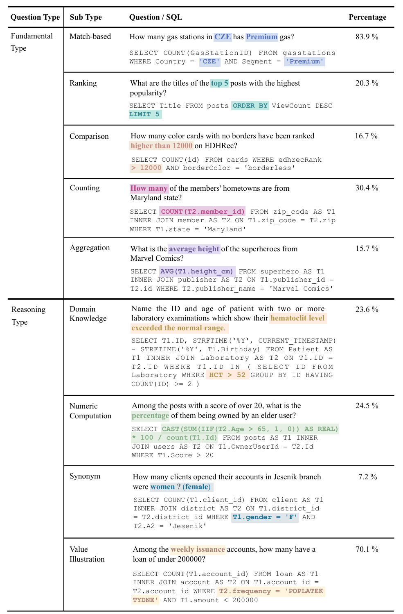

*图 8：BIRD 的问题分成两大类。基本类型与其他文本到 SQL 基准中的问题相当；推理类型需要外部知识落地才能回答。*

### B.4 实验细节

**基于 FT 的模型。** T5 是强大而通用的文本到文本预训练语言模型（PLM），在包括文本到 SQL 在内的多种语义解析任务上取得 SOTA 表现。我们把问题与序列化数据库模式拼接为输入 [40, 49, 41]，只需微调即可端到端生成 SQL。基于 seq2AST 的方法 [43, 5] 对文本到 SQL 也有效，但它们解码时所用的语法规则受限于特定数据集 [25]。实现主要基于 Hugging Face Transformers（<https://huggingface.co/>）。最大输入长度设为 1,024，最大生成长度为 512，批大小为 32；主要优化器为 Adafactor，学习率线性衰减，初始值 $5\times10^{-5}$。所有实验在一张 NVIDIA Tesla A100 80GB 上运行，这种设备大多数研究中心均可获得。所有基于 FT 的模型运行都把随机种子设为 1，因为以往 SOTA 模型已证明 1 是较优种子 [27, 49]。

**基于 ICL 的模型。** Codex（`code-davinci-002`）和 ChatGPT（`gpt-3.5-turbo`）是由 ICL 驱动、常用且强大的大规模预训练语言模型，无需额外训练便可根据人类指令生成包括 SQL 在内的多类代码。我们按 [39] 使用编程式提示并调用 API 收集结果，同时选择 Azure OpenAI API，以便代码与其他 LLM 变体对齐。评测集中的未见数据库和真值 SQL 不允许模型访问，所以零样本生成最合适。

为研究 LLM 多步推理对 BIRD 的影响，我们实现思维链（COT）技术 [48]，只需在生成 SQL 前加入提示句 `Let's think step by step.` [21]。不过，我们发现 ChatGPT 的输出非常不确定，常带有意料之外的解释，因此提供一个 1-shot 伪样例，供 ChatGPT 学习思考流程与输出格式。详细提示设计见图 9。为尽可能减少结果随机性，将 temperature 设为 0，以保证可复现。

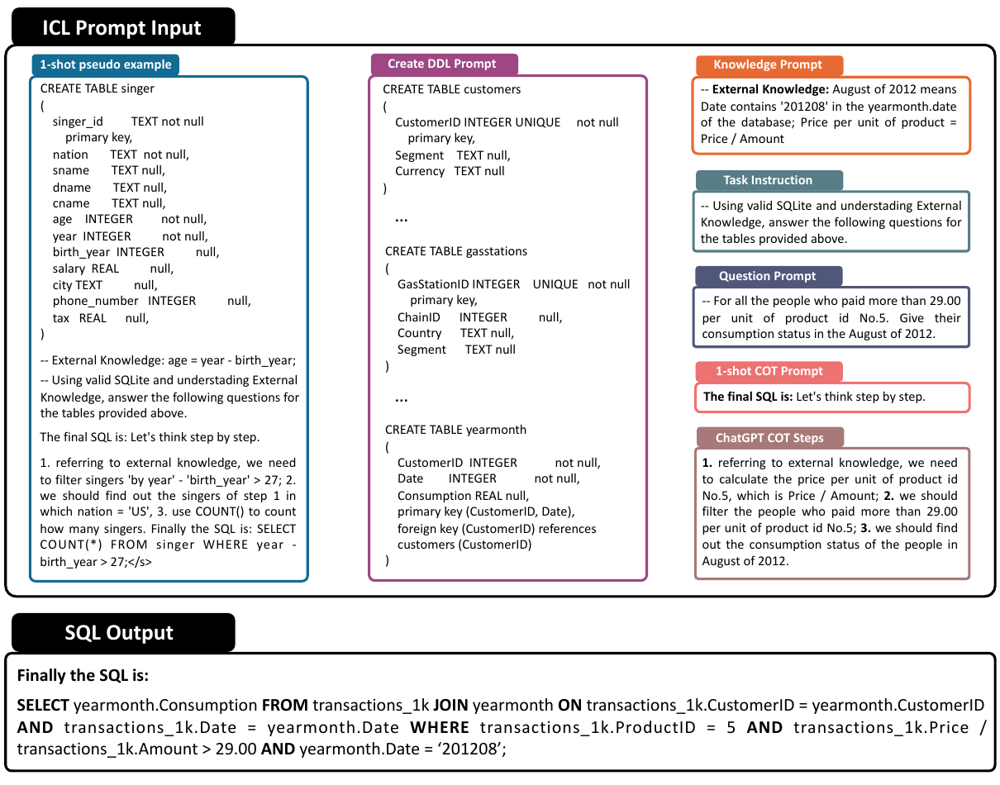

*图 9：实现 ChatGPT + KG + COT 的详细提示设计。图中完整保留 1-shot 伪样例、DDL 提示、知识提示、任务与问题提示、COT 步骤及最终 SQL 输出。*

**知识融合。** 基线实现直接把知识证据句与问题、数据库模式拼接；即便如此简单，也能观察到显著提升。为 ChatGPT 和 T5 设计更复杂、更有效的知识落地策略，是重要的未来课题。知识证据句由 3.3 节所述标注者提供的外部知识归纳而来。

### B.5 效率分析细节

图 10 展示生成高效 SQL 的两类策略。样例表明，两阶段优化和在数据库中内嵌索引都能帮助语义解析生成更高效的 SQL。

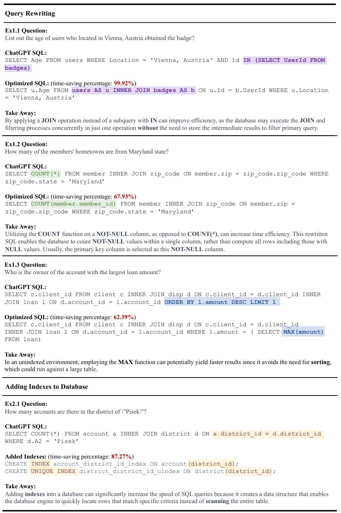

*图 10：两类提高效率的方案及解释。前三个例子展示如何按规则改写 SQL 以提高效率；最后一个例子说明，在不改写查询的情况下，为数据库添加索引也能提高 SQL 效率。*

**查询改写，例 1.1。** 问题：列出位于奥地利维也纳、且获得过徽章的用户年龄。

ChatGPT SQL：

```sql
SELECT Age FROM users
WHERE Location = 'Vienna, Austria'
  AND Id IN (SELECT UserId FROM badges);
```

优化后 SQL（节省时间 99.92%）：

```sql
SELECT u.Age FROM users AS u
INNER JOIN badges AS b ON u.Id = b.UserId
WHERE u.Location = 'Vienna, Austria';
```

要点：用 `JOIN` 代替 `IN` 子查询可提高效率，因为数据库可能在一次操作中并发执行连接和过滤，无需存储中间结果再过滤主查询。

**查询改写，例 1.2。** 问题：有多少会员的家乡在马里兰州？

ChatGPT SQL：

```sql
SELECT COUNT(*) FROM member
INNER JOIN zip_code ON member.zip = zip_code.zip_code
WHERE zip_code.state = 'Maryland';
```

优化后 SQL（节省时间 67.93%）：

```sql
SELECT COUNT(member.member_id) FROM member
INNER JOIN zip_code ON member.zip = zip_code.zip_code
WHERE zip_code.state = 'Maryland';
```

要点：与 `COUNT(*)` 相比，对非空列使用 `COUNT` 可提升时间效率。改写后，数据库只需统计单列中的非空值，而不是计算包括空值在内的全部行；通常选择主键列作为这个非空列。

**查询改写，例 1.3。** 问题：贷款金额最大账户的所有者是谁？

ChatGPT SQL：

```sql
SELECT c.client_id FROM client c
INNER JOIN disp d ON c.client_id = d.client_id
INNER JOIN loan l ON d.account_id = l.account_id
ORDER BY l.amount DESC LIMIT 1;
```

优化后 SQL（节省时间 62.39%）：

```sql
SELECT c.client_id FROM client c
INNER JOIN disp d ON c.client_id = d.client_id
INNER JOIN loan l ON d.account_id = l.account_id
WHERE l.amount = (SELECT MAX(amount) FROM loan);
```

要点：在没有索引的环境中，使用 `MAX` 可能更快，因为它避免了可能作用于大表的排序。

**向数据库添加索引，例 2.1。** 问题：Pisek 地区有多少账户？

ChatGPT SQL：

```sql
SELECT COUNT(*) FROM account a
INNER JOIN district d ON a.district_id = d.district_id
WHERE d.A2 = 'Pisek';
```

添加索引（节省时间 87.27%）：

```sql
CREATE INDEX account_district_id_index ON account(district_id);
CREATE UNIQUE INDEX district_district_id_uindex ON district(district_id);
```

要点：添加索引会建立一种数据结构，使数据库引擎能快速定位符合特定条件的行，而不必扫描整张表，从而显著提高 SQL 查询速度。

### B.6 错误分析细节

图 11 详细展示 ChatGPT 的四类主要错误：模式链接错误（41.6%）、误解数据库内容（40.8%）、误解知识证据（17.6%）和语法错误（3.0%）。每个案例均保留问题、证据、真值 SQL 与 ChatGPT SQL；部分案例为便于展示而缩写。

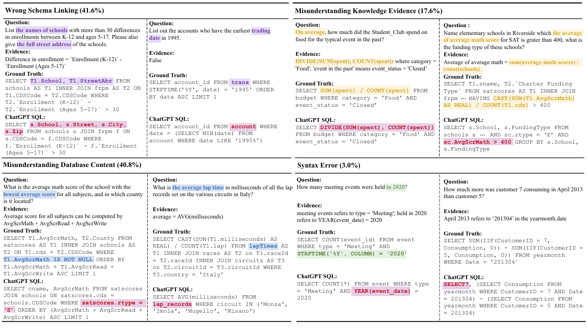

*图 11：四类主要错误案例；部分案例为了更清晰地展示而采用缩写。*

### B.7 评测细节

BIRD 的双盲标注遇到了许多因用户意图不清而导致结果不匹配的歧义。最严重的是 `DISTINCT`：一些标注者认为它只应在问题明确提到 `different` 或 `distinctive` 时使用，另一些则认为它应只返回唯一值。为减少这种歧义，我们比较最终结果时使用 HashSet 而不是 List；HashSet 忽略顺序并自动过滤重复行。

但这种做法可能让含 `ORDER BY` 的问题产生假阳性。我们识别出 BIRD 中三类 `ORDER BY` 用法：

1. **基于排名的问题**，如“按数学成绩展示前 5 名学生”。只要结果包含正确学生，顺序不那么重要。
2. **最高级问题**，如“列出美国最长的河流”。答案通常只包含一个条目（或并列结果），所以影响很小。
3. **要求特定顺序的问题**，如“按数学成绩降序展示前 5 名学生”。这类场景明确要求正确排序，可能产生假阳性。不过此类实例并不常见，占 BIRD 不到 1%。

### B.8 VES 细节

对 $E$ 而言，实验主要用时间表示效率，且 $E\in(\epsilon,30\mathrm{s})$； $\epsilon$ 是防止浮点溢出的很小正数。单次 $E$ 会因机器状态而不稳定。 $E$ 越低表示执行越快，效率越高。

 $R$ 是人工标注 SQL 与预测 SQL 之间归一化后的效率比，用于减弱机器状态影响。每个样例重复计算 100 次、过滤离群值再取平均，保证指标稳定。由于技术快速进步，无法预先确定最快 SQL 的表现，因此当前把效率比定义为 $R\in(0,+\infty)$。如果预测 SQL 的效率 $E(\hat{Y} _ n)$ 显著低于按 EX 判定为真值 SQL 的效率 $E(Y_n)$，相对效率分数 $R$ 就会增大。简言之， $R$ 越高，效率越高。

测量 VES 时，每条 SQL 都在同一 CPU 上运行 100 次，剔除离群值后评估平均结果。开发集和测试集的 VES 在 10 次试验后的标准差分别为 0.043 和 0.025。离群值检测流程如下：

1. 计算数据集的均值与标准差。
2. 下阈值设为“均值减 $3\times$ 标准差”，上阈值设为“均值加 $3\times$ 标准差”。
3. 统计上约 99.7% 的数据点落在均值的 3 个标准差以内。

### B.9 人类表现采集

人类表现的采集流程同样严格。标注期间，专家把所有数据分成 10 个批次，以便管理和追踪错误。前 8 批是最终公开的训练和开发数据，后 2 批用于测试。我们把 SQL 标注者标注前 8 批数据的过程视作学习阶段：专家可以修复错误 SQL，标注者也会学习如何为任务生成高质量 SQL。随后，他们在最后两批测试集上的考试首次得分可视作人类表现，因为考试期间我们不打断也不协助标注者，并保留全部错误。测试结束后，再按 3.4 节的双盲 SQL 标注流程，通过专家讨论修正这些数据的 SQL；第二轮双盲标注后的 SQL 收集为真值。

### B.10 开源数据库许可分布

BIRD 中的数据库均符合以下一种许可：

- **Public Domain Mark（公有领域标记）。** 公有领域许可允许任何人在不受限制的情况下自由使用、分享并基于知识产权作品或发明继续创作。进入公有领域后，作品不再受著作权、专利或商标法保护。
- **CC-BY（Creative Commons Attribution 4.0 International）。** 用户可分享并改编数据集，但必须注明创作者。
- **CC-BY-SA（Creative Commons Attribution-ShareAlike 4.0 International）。** 用户可分享并改编数据集，但必须注明创作者，并以相同许可分发新增、转换或修改的内容。
- **GPL（General Public License）。** GPL 由自由软件基金会创建，也称 GNU GPL，GNU 项目采用该许可；它允许用户在特定条款和条件下使用、研究、分享和修改软件。
- **CPOL（Code Project Open License）。** 常用于 The Code Project 上分享的文章、教程和示例代码。CPOL 旨在提供更宽松的许可，允许开发者使用、修改和分发软件，限制少于 GPL 等许可。
- **CC0（Creative Commons Zero）。** 这是 Creative Commons 创建的公有领域贡献工具，允许创作者放弃作品的全部著作权及相关权利，实际将作品置于公有领域。任何人都可自由使用、分享、修改和继续创作，无需许可或署名原作者。

### B.11 SQL 函数分类

表 1 所称的 BIRD SQL 函数包括多个类别：

- 窗口函数，如 `OVER()`；
- 日期函数，如 `JULIANDAY()`；
- 转换函数，如 `CAST()`；
- 数学函数，如 `ROUND()`；
- 字符串函数，如 `SUBSTR()`。

### B.12 关键词统计

我们全面分析 BIRD 数据集中的关键词，并以图 12 的词云展示结果；同时把关键词进一步分成以下 7 类：

- **主体关键词：** `SELECT`、`FROM`、`WHERE`、`AND`、`OR`、`NOT`、`IN`、`EXISTS`、`IS`、`NULL`、`IIF`、`CASE`、`CASE WHEN`。
- **连接关键词：** `INNER JOIN`、`LEFT JOIN`、`ON`、`AS`。
- **子句关键词：** `BETWEEN`、`LIKE`、`LIMIT`、`ORDER BY`、`ASC`、`DESC`、`GROUP BY`、`HAVING`、`UNION`、`ALL`、`EXCEPT`、`PARTITION BY`。
- **聚合关键词：** `AVG`、`COUNT`、`MAX`、`MIN`、`ROUND`、`SUM`。
- **标量关键词：** `ABS`、`LENGTH`、`STRFTIME`、`JULIADAY`、`NOW`、`CAST`、`SUBSTR`、`INSTR`。
- **比较关键词：** `=`、`>`、`<`、`>=`、`<=`、`!=`。
- **计算关键词：** `-`、`+`、`*`、`/`。

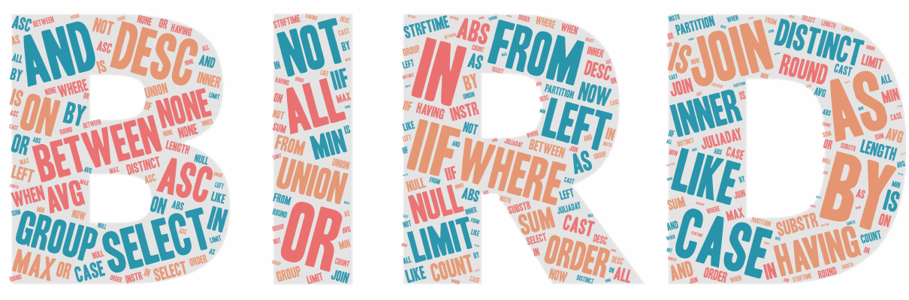

*图 12：BIRD 中 SQL 的关键词词云。*

### B.13 文本到 SQL 模型研究

跨领域文本到 SQL 解析器的基本原理是构建编码器来学习问题与模式的表示，再由解码器生成 SQL [37]。例如，IRNET [12] 设计由基于注意力的双向 LSTM 组成的编码器，以学习问题和模式表示，并用解码器根据编码后的中间表示预测 SQL。RATSQL [43]、SDSQL [17]、LGESQL [5]、S2 SQL [18] 和 Proton [44] 通过关系图神经网络增强自然语言问题与数据库模式的表示学习。R2 SQL [16]、SCORE [54] 和 STAR [4] 则增强对话式文本到 SQL 任务的上下文学习。

此后，T5 [38] 等序列到序列预训练语言模型因便于移植、能跨数据集生成而在文本到 SQL 任务中流行起来。这些模型只需少量微调即可取得优异结果。RASAT [36] 通过把模式对齐注入编码器来增强 T5 的结构信息编码；Graphix [27] 则让 T5 具备多跳推理能力，在复杂跨领域文本到 SQL 任务上取得 SOTA 结果。近年来，ChatGPT [33]、Palm [8]、OPT [56] 等 LLM 凭借强大的零样本推理和领域泛化能力受到广泛关注。ChatGPT 只需极少输入数据，就能在包括文本到 SQL 在内的语义解析任务上取得很好表现。事实上，在 BIRD 项目中，ChatGPT 的表现甚至超过最初预期。

**SQL 效率研究。** 大型数据库上的高效 SQL 执行一直是学术界和工业界的重要议题。研究者提出索引选择 [22]、SQL 优化 [26, 61] 等多种技术。SQL 优化是提高查询效率的常见方法；基于规则和基于代价等 SQL 优化算法 [28, 30, 47] 已被证明有效。基于规则的优化依据一组原则把 SQL 查询转换成更高效的可执行形式；基于代价的优化则分析数据库值的统计分布，估计不同查询计划的执行代价并选择最低者。与 NLP 社区类似，数据库领域近期也开始用人工智能做查询优化，例如 [61]。

索引预测是提高 SQL 执行效率的另一项重要技术。研究者基于不同优化目标提出许多索引预测算法 [60]，例如最小化 SQL 执行时间、最大化索引利用率。我们提供 VES 来衡量文本到 SQL 生成器的效率，以鼓励它们为用户生成准确、快速的 SQL。


## 参考文献

1. Peter Alsberg. Space and time savings through large data base compression and dynamic restructuring. *Proceedings of the IEEE*, 63:1114-1122, 1975.
2. Anthropic. Introducing Claude. 2023. URL: <https://www.anthropic.com/index/introducing-claude>.
3. Ruichu Cai, Boyan Xu, Zhenjie Zhang, Xiaoyan Yang, Zijian Li, and Zhihao Liang. An encoder-decoder framework translating natural language to database queries. In *Proceedings of the Twenty-Seventh International Joint Conference on Artificial Intelligence (IJCAI-18)*, pages 3977-3983, 2018.
4. Zefeng Cai, Xiangyu Li, Binyuan Hui, Min Yang, Bowen Li, Binhua Li, Zheng Cao, Weijie Li, Fei Huang, Luo Si, and Yongbin Li. STAR: SQL guided pre-training for context-dependent text-to-SQL parsing. In *Findings of the Association for Computational Linguistics: EMNLP 2022*, pages 1235-1247, Abu Dhabi, United Arab Emirates, December 2022. Association for Computational Linguistics.
5. Ruisheng Cao, Lu Chen, Zhi Chen, Yanbin Zhao, Su Zhu, and Kai Yu. LGESQL: Line graph enhanced text-to-SQL model with mixed local and non-local relations. In *Proceedings of the 59th Annual Meeting of the Association for Computational Linguistics and the 11th International Joint Conference on Natural Language Processing (Volume 1: Long Papers)*, pages 2541-2555, Online, August 2021. Association for Computational Linguistics.
6. Shuaichen Chang, Jun Wang, Mingwen Dong, Lin Pan, Henghui Zhu, Alexander Hanbo Li, Wuwei Lan, Sheng Zhang, Jiarong Jiang, Joseph Lilien, Steve Ash, William Yang Wang, Zhiguo Wang, Vittorio Castelli, Patrick Ng, and Bing Xiang. Dr.spider: A diagnostic evaluation benchmark towards text-to-SQL robustness. In *The Eleventh International Conference on Learning Representations*, 2023.
7. Zhiyu Chen, Wenhu Chen, Charese Smiley, Sameena Shah, Iana Borova, Dylan Langdon, Reema Moussa, Matt Beane, Ting-Hao Huang, Bryan Routledge, and William Yang Wang. FinQA: A dataset of numerical reasoning over financial data. In *Proceedings of the 2021 Conference on Empirical Methods in Natural Language Processing*, pages 3697-3711, Online and Punta Cana, Dominican Republic, November 2021. Association for Computational Linguistics.
8. Aakanksha Chowdhery, Sharan Narang, Jacob Devlin, Maarten Bosma, Gaurav Mishra, Adam Roberts, Paul Barham, Hyung Won Chung, Charles Sutton, Sebastian Gehrmann, Parker Schuh, Kensen Shi, Sasha Tsvyashchenko, Joshua Maynez, Abhishek Rao, Parker Barnes, Yi Tay, Noam M. Shazeer, Vinodkumar Prabhakaran, Emily Reif, Nan Du, Benton C. Hutchinson, Reiner Pope, James Bradbury, Jacob Austin, Michael Isard, Guy Gur-Ari, Pengcheng Yin, Toju Duke, Anselm Levskaya, Sanjay Ghemawat, Sunipa Dev, Henryk Michalewski, Xavier García, Vedant Misra, Kevin Robinson, Liam Fedus, Denny Zhou, Daphne Ippolito, David Luan, Hyeontaek Lim, Barret Zoph, Alexander Spiridonov, Ryan Sepassi, David Dohan, Shivani Agrawal, Mark Omernick, Andrew M. Dai, Thanumalayan Sankaranarayana Pillai, Marie Pellat, Aitor Lewkowycz, Erica Moreira, Rewon Child, Oleksandr Polozov, Katherine Lee, Zongwei Zhou, Xuezhi Wang, Brennan Saeta, Mark Díaz, Orhan Firat, Michele Catasta, Jason Wei, Kathleen S. Meier-Hellstern, Douglas Eck, Jeff Dean, Slav Petrov, and Noah Fiedel. Palm: Scaling language modeling with pathways. *ArXiv*, abs/2204.02311, 2022.
9. Deborah A. Dahl, Madeleine Bates, Michael Brown, William Fisher, Kate Hunicke-Smith, David Pallett, Christine Pao, Alexander Rudnicky, and Elizabeth Shriberg. Expanding the scope of the ATIS task: The ATIS-3 corpus. In *Human Language Technology: Proceedings of a Workshop held at Plainsboro, New Jersey, March 8-11, 1994*, 1994.
10. Longxu Dou, Yan Gao, Xuqi Liu, Mingyang Pan, Dingzirui Wang, Wanxiang Che, Dechen Zhan, Min-Yen Kan, and Jian-Guang Lou. Towards knowledge-intensive text-to-SQL semantic parsing with formulaic knowledge. In *Proceedings of the 2022 Conference on Empirical Methods in Natural Language Processing*, pages 5240-5253, Abu Dhabi, United Arab Emirates, December 2022. Association for Computational Linguistics.
11. Yujian Gan, Xinyun Chen, Qiuping Huang, Matthew Purver, John R. Woodward, Jinxia Xie, and Pengsheng Huang. Towards robustness of text-to-sql models against synonym substitution. In Chengqing Zong, Fei Xia, Wenjie Li, and Roberto Navigli, editors, *Proceedings of ACL/IJCNLP 2021 (Volume 1: Long Papers)*, pages 2505-2515. Association for Computational Linguistics, 2021. doi: 10.18653/v1/2021.acl-long.195.
12. Jiaqi Guo, Zecheng Zhan, Yan Gao, Yan Xiao, Jian-Guang Lou, Ting Liu, and Dongmei Zhang. Towards complex text-to-SQL in cross-domain database with intermediate representation. In *Proceedings of the 57th Annual Meeting of the Association for Computational Linguistics*, pages 4524-4535, Florence, Italy, July 2019. Association for Computational Linguistics. doi: 10.18653/v1/P19-1444.
13. Moshe Hazoom, Vibhor Malik, and Ben Bogin. Text-to-SQL in the wild: A naturally-occurring dataset based on stack exchange data. In *Proceedings of the 1st Workshop on Natural Language Processing for Programming (NLP4Prog 2021)*, pages 77-87, Online, August 2021. Association for Computational Linguistics. doi: 10.18653/v1/2021.nlp4prog-1.9.
14. Joseph M. Hellerstein. Quantitative data cleaning for large databases. In *Proceedings of the 2008 ACM SIGMOD International Conference on Management of Data*, pages 1197-1200, 2008.
15. Jie Huang, Hanyin Shao, and Kevin Chen-Chuan Chang. Are large pre-trained language models leaking your personal information? In *Findings of the Association for Computational Linguistics: EMNLP 2022*, pages 2038-2047, Abu Dhabi, United Arab Emirates, December 2022. Association for Computational Linguistics.
16. Binyuan Hui, Ruiying Geng, Qiyu Ren, Binhua Li, Yongbin Li, Jian Sun, Fei Huang, Luo Si, Pengfei Zhu, and Xiaodan Zhu. Dynamic hybrid relation exploration network for cross-domain context-dependent semantic parsing. In *Thirty-Fifth AAAI Conference on Artificial Intelligence*, pages 13116-13124. AAAI Press, 2021.
17. Binyuan Hui, Xiang Shi, Ruiying Geng, Binhua Li, Yongbin Li, Jian Sun, and Xiaodan Zhu. Improving text-to-sql with schema dependency learning. *arXiv:2103.04399*, 2021.
18. Binyuan Hui, Ruiying Geng, Lihan Wang, Bowen Qin, Yanyang Li, Bowen Li, Jian Sun, and Yongbin Li. S2 SQL: Injecting syntax to question-schema interaction graph encoder for text-to-SQL parsers. In *Findings of the Association for Computational Linguistics: ACL 2022*, pages 1254-1262, Dublin, Ireland, May 2022. Association for Computational Linguistics. doi: 10.18653/v1/2022.findings-acl.99.
19. Ihab F. Ilyas and Xu Chu. Trends in cleaning relational data: Consistency and deduplication. *Foundations and Trends in Databases*, 5:281-393, 2015.
20. Srinivasan Iyer, Ioannis Konstas, Alvin Cheung, Jayant Krishnamurthy, and Luke Zettlemoyer. Learning a neural semantic parser from user feedback. In *Proceedings of the 55th Annual Meeting of the Association for Computational Linguistics (Volume 1: Long Papers)*, pages 963-973, Vancouver, Canada, July 2017. Association for Computational Linguistics. doi: 10.18653/v1/P17-1089.
21. Takeshi Kojima, Shixiang (Shane) Gu, Machel Reid, Yutaka Matsuo, and Yusuke Iwasawa. Large language models are zero-shot reasoners. In *Advances in Neural Information Processing Systems*, volume 35, pages 22199-22213, 2022.
22. Jan Kossmann, Stefan Halfpap, Marcel Jankrift, and Rainer Schlosser. Magic mirror in my hand, which is the best in the land? An experimental evaluation of index selection algorithms. *Proceedings of the VLDB Endowment*, 13(12):2382-2395, 2020.
23. Prerna S. Kulkarni and Jagdish W. Bakal. Survey on data cleaning. In *2014 International Conference on Advances in Computing, Communications and Informatics (ICACCI)*, pages 2361-2366, 2014.
24. Chia-Hsuan Lee, Oleksandr Polozov, and Matthew Richardson. KaggleDBQA: Realistic evaluation of text-to-SQL parsers. In *Proceedings of ACL/IJCNLP 2021 (Volume 1: Long Papers)*, pages 2261-2273, Online, August 2021. Association for Computational Linguistics.
25. Gyubok Lee, Hyeonji Hwang, Seongsu Bae, Yeonsu Kwon, Woncheol Shin, Seongjun Yang, Minjoon Seo, Jong-Yeup Kim, and Edward Choi. EHRSQL: A practical text-to-SQL benchmark for electronic health records. In S. Koyejo et al., editors, *Advances in Neural Information Processing Systems*, volume 35, pages 15589-15601. Curran Associates, Inc., 2022.
26. Dandan Li, Lu Han, and Yi Ding. SQL query optimization methods of relational database system. In *2010 Second International Conference on Computer Engineering and Applications*, volume 1, pages 557-560. IEEE, 2010.
27. Jinyang Li, Binyuan Hui, Reynold Cheng, Bowen Qin, Chenhao Ma, Nan Huo, Fei Huang, Wenyu Du, Luo Si, and Yongbin Li. Graphix-T5: Mixing pre-trained transformers with graph-aware layers for text-to-SQL parsing. *ArXiv*, abs/2301.07507, 2023.
28. Tanzim Mahmud, KM Azharul Hasan, Mahtab Ahmed, and Thwoi Hla Ching Chak. A rule based approach for NLP based query processing. In *2015 2nd International Conference on Electrical Information and Communication Technologies (EICT)*, pages 78-82. IEEE, 2015.
29. Grégoire Mialon, Roberto Dessì, Maria Lomeli, Christoforos Nalmpantis, Ramakanth Pasunuru, Roberta Raileanu, Baptiste Rozière, Timo Schick, Jane Dwivedi-Yu, Asli Celikyilmaz, Edouard Grave, Yann LeCun, and Thomas Scialom. Augmented language models: A survey. *ArXiv*, abs/2302.07842, 2023.
30. Vamsi Krishna Myalapalli and ASN Chakravarthy. Revamping SQL queries for cost based optimization. In *2016 International Conference on Circuits, Controls, Communications and Computing (I4C)*, pages 1-6. IEEE, 2016.
31. Paulo H. Oliveira, Daniel dos Santos Kaster, Caetano Traina, and Ihab F. Ilyas. Batchwise probabilistic incremental data cleaning. *ArXiv*, abs/2011.04730, 2020.
32. OpenAI. GPT-4 technical report. *ArXiv*, abs/2303.08774, 2023.
33. Long Ouyang, Jeff Wu, Xu Jiang, Diogo Almeida, Carroll L. Wainwright, Pamela Mishkin, Chong Zhang, Sandhini Agarwal, Katarina Slama, Alex Ray, John Schulman, Jacob Hilton, Fraser Kelton, Luke E. Miller, Maddie Simens, Amanda Askell, Peter Welinder, Paul Francis Christiano, Jan Leike, and Ryan J. Lowe. Training language models to follow instructions with human feedback. *ArXiv*, abs/2203.02155, 2022.
34. Hamid Pirahesh, Joseph M. Hellerstein, and Waqar Hasan. Extensible/rule based query rewrite optimization in Starburst. In *Proceedings of the ACM SIGMOD International Conference on Management of Data*, pages 39-48, 1992.
35. Mohammadreza Pourreza and Davood Rafiei. DIN-SQL: Decomposed in-context learning of text-to-SQL with self-correction. *CoRR*, abs/2304.11015, 2023. doi: 10.48550/arXiv.2304.11015.
36. Jiexing Qi, Jingyao Tang, Ziwei He, Xiangpeng Wan, Yu Cheng, Chenghu Zhou, Xinbing Wang, Quanshi Zhang, and Zhouhan Lin. RASAT: Integrating relational structures into pretrained Seq2Seq model for text-to-SQL. In *Proceedings of the 2022 Conference on Empirical Methods in Natural Language Processing*, pages 3215-3229, Abu Dhabi, United Arab Emirates, December 2022. Association for Computational Linguistics.
37. Bowen Qin, Binyuan Hui, Lihan Wang, Min Yang, Jinyang Li, Binhua Li, Ruiying Geng, Rongyu Cao, Jian Sun, Luo Si, Fei Huang, and Yongbin Li. A survey on text-to-SQL parsing: Concepts, methods, and future directions. *arXiv:2208.13629*, 2022.
38. Colin Raffel, Noam Shazeer, Adam Roberts, Katherine Lee, Sharan Narang, Michael Matena, Yanqi Zhou, Wei Li, and Peter J. Liu. Exploring the limits of transfer learning with a unified text-to-text transformer. *Journal of Machine Learning Research*, 21(140):1-67, 2020.
39. Nitarshan Rajkumar, Raymond Li, and Dzmitry Bahdanau. Evaluating the text-to-SQL capabilities of large language models. *ArXiv*, abs/2204.00498, 2022.
40. Torsten Scholak, Nathan Schucher, and Dzmitry Bahdanau. PICARD: Parsing incrementally for constrained auto-regressive decoding from language models. In *Proceedings of the 2021 Conference on Empirical Methods in Natural Language Processing*, pages 9895-9901, Online and Punta Cana, Dominican Republic, November 2021. Association for Computational Linguistics.
41. Peter Shaw, Ming-Wei Chang, Panupong Pasupat, and Kristina Toutanova. Compositional generalization and natural language variation: Can a semantic parsing approach handle both? In *Proceedings of ACL/IJCNLP 2021 (Volume 1: Long Papers)*, pages 922-938, Online, August 2021. Association for Computational Linguistics.
42. Alon Talmor, Ori Yoran, Ronan Le Bras, Chandra Bhagavatula, Yoav Goldberg, Yejin Choi, and Jonathan Berant. CommonsenseQA 2.0: Exposing the limits of AI through gamification. In J. Vanschoren and S. Yeung, editors, *Proceedings of the Neural Information Processing Systems Track on Datasets and Benchmarks*, volume 1. Curran, 2021.
43. Bailin Wang, Richard Shin, Xiaodong Liu, Oleksandr Polozov, and Matthew Richardson. RAT-SQL: Relation-aware schema encoding and linking for text-to-SQL parsers. In *Proceedings of the 58th Annual Meeting of the Association for Computational Linguistics*, pages 7567-7578, Online, July 2020. Association for Computational Linguistics.
44. Lihan Wang, Bowen Qin, Binyuan Hui, Bowen Li, Min Yang, Bailin Wang, Binhua Li, Jian Sun, Fei Huang, Luo Si, and Yongbin Li. Proton: Probing schema linking information from pre-trained language models for text-to-SQL parsing. In Aidong Zhang and Huzefa Rangwala, editors, *KDD '22: The 28th ACM SIGKDD Conference on Knowledge Discovery and Data Mining, Washington, DC, USA, August 14-18, 2022*, pages 1889-1898. ACM, 2022. doi: 10.1145/3534678.3539305.
45. Lijie Wang, Ao Zhang, Kun Wu, Ke Sun, Zhenghua Li, Hua Wu, Min Zhang, and Haifeng Wang. DuSQL: A large-scale and pragmatic Chinese text-to-SQL dataset. In *Proceedings of EMNLP 2020*, pages 6923-6935, Online, November 2020. Association for Computational Linguistics.
46. Ping Wang, Tian Shi, and Chandan K. Reddy. Text-to-SQL generation for question answering on electronic medical records. *Proceedings of The Web Conference 2020*, 2020.
47. Zhaoguo Wang, Zhou Zhou, Yicun Yang, Haoran Ding, Gansen Hu, Ding Ding, Chuzhe Tang, Haibo Chen, and Jinyang Li. WeTune: Automatic discovery and verification of query rewrite rules. In *Proceedings of the 2022 International Conference on Management of Data*, pages 94-107, 2022.
48. Jason Wei, Xuezhi Wang, Dale Schuurmans, Maarten Bosma, Ed Huai hsin Chi, F. Xia, Quoc Le, and Denny Zhou. Chain of thought prompting elicits reasoning in large language models. *ArXiv*, abs/2201.11903, 2022.
49. Tianbao Xie, Chen Henry Wu, Peng Shi, Ruiqi Zhong, Torsten Scholak, Michihiro Yasunaga, Chien-Sheng Wu, Ming Zhong, Pengcheng Yin, Sida I. Wang, Victor Zhong, Bailin Wang, Chengzu Li, Connor Boyle, Ansong Ni, Ziyu Yao, Dragomir Radev, Caiming Xiong, Lingpeng Kong, Rui Zhang, Noah A. Smith, Luke Zettlemoyer, and Tao Yu. UnifiedSKG: Unifying and multi-tasking structured knowledge grounding with text-to-text language models. In *Proceedings of EMNLP 2022*, pages 602-631, Abu Dhabi, United Arab Emirates, December 2022. Association for Computational Linguistics.
50. Xiaojun Xu, Chang Liu, and Dawn Song. SQLNet: Generating structured queries from natural language without reinforcement learning. *ArXiv preprint*, 2017.
51. Navid Yaghmazadeh, Yuepeng Wang, Isil Dillig, and Thomas Dillig. SQLizer: Query synthesis from natural language. *Proceedings of the ACM on Programming Languages*, 1(OOPSLA):1-26, 2017.
52. Tao Yu, Zifan Li, Zilin Zhang, Rui Zhang, and Dragomir Radev. TypeSQL: Knowledge-based type-aware neural text-to-SQL generation. In *Proceedings of NAACL-HLT 2018, Volume 2 (Short Papers)*, pages 588-594, 2018.
53. Tao Yu, Rui Zhang, Kai Yang, Michihiro Yasunaga, Dongxu Wang, Zifan Li, James Ma, Irene Li, Qingning Yao, Shanelle Roman, Zilin Zhang, and Dragomir Radev. Spider: A large-scale human-labeled dataset for complex and cross-domain semantic parsing and text-to-SQL task. In *Proceedings of EMNLP 2018*, pages 3911-3921, 2018.
54. Tao Yu, Rui Zhang, Alex Polozov, Christopher Meek, and Ahmed Hassan Awadallah. SCORE: Pre-training for context representation in conversational semantic parsing. In *9th International Conference on Learning Representations, ICLR 2021*. OpenReview.net, 2021.
55. John M. Zelle and Raymond J. Mooney. Learning to parse database queries using inductive logic programming. In *Proceedings of the Fourteenth National Conference on Artificial Intelligence and Ninth Conference on Innovative Applications of Artificial Intelligence*, pages 1050-1055, 1996.
56. Susan Zhang, Stephen Roller, Naman Goyal, Mikel Artetxe, Moya Chen, Shuohui Chen, Christopher Dewan, Mona Diab, Xian Li, Xi Victoria Lin, Todor Mihaylov, Myle Ott, Sam Shleifer, Kurt Shuster, Daniel Simig, Punit Singh Koura, Anjali Sridhar, Tianlu Wang, and Luke Zettlemoyer. OPT: Open pre-trained transformer language models. *ArXiv*, abs/2205.01068, 2022.
57. Chen Zhao, Yu Su, Adam Pauls, and Emmanouil Antonios Platanios. Bridging the generalization gap in text-to-SQL parsing with schema expansion. In *Proceedings of the 60th Annual Meeting of the Association for Computational Linguistics (Volume 1: Long Papers)*, pages 5568-5578, Dublin, Ireland, May 2022. Association for Computational Linguistics.
58. Victor Zhong, Caiming Xiong, and Richard Socher. Seq2SQL: Generating structured queries from natural language using reinforcement learning. *CoRR*, abs/1709.00103, 2017.
59. Victor Zhong, Mike Lewis, Sida I. Wang, and Luke Zettlemoyer. Grounded adaptation for zero-shot executable semantic parsing. In Bonnie Webber, Trevor Cohn, Yulan He, and Yang Liu, editors, *Proceedings of EMNLP 2020*, pages 6869-6882. Association for Computational Linguistics, 2020. doi: 10.18653/v1/2020.emnlp-main.558.
60. Rong Zhou. Research on key performance index prediction of distributed database based on machine learning algorithm. In *Proceedings of the 2nd International Conference on Cognitive Based Information Processing and Applications (CIPA 2022), Volume 2*, pages 563-567. Springer, 2023.
61. Xuanhe Zhou, Guoliang Li, Chengliang Chai, and Jianhua Feng. A learned query rewrite system using Monte Carlo tree search. *Proceedings of the VLDB Endowment*, 15(1):46-58, 2021. doi: 10.14778/3485450.3485456.
62. Xuanhe Zhou, Chengliang Chai, Guoliang Li, and Ji Sun. Database meets artificial intelligence: A survey. *IEEE Transactions on Knowledge and Data Engineering*, 34(3):1096-1116, 2022. doi: 10.1109/TKDE.2020.2994641.
