# BIRD-INTERACT: Re-imagining Text-to-SQL Evaluation via Lens of Dynamic Interactions（中文译文）

## 译者说明

本文依据同目录的 `source.pdf` 翻译。章节、图表、公式、算法、代码与参考文献按原文结构保留。

发表于 ICLR 2026 会议论文集。

Nan Huo<sup>α,γ,*</sup>，Xiaohan Xu<sup>α,γ,*</sup>，Jinyang Li<sup>α,γ,*</sup>，Per Jacobsson<sup>β</sup>，Shipei Lin<sup>γ</sup>，Bowen Qin<sup>γ</sup>，Binyuan Hui<sup>γ</sup>，Xiaolong Li<sup>α,γ</sup>，Ge Qu<sup>α,γ</sup>，Shuzheng Si<sup>γ</sup>，Linheng Han<sup>γ</sup>，Edward Alexander<sup>γ</sup>，Xintong Zhu<sup>γ</sup>，Rui Qin<sup>γ</sup>，Ruihan Yu<sup>γ</sup>，Yiyao Jin<sup>γ</sup>，Feige Zhou<sup>γ</sup>，Weihao Zhong<sup>γ</sup>，Yun Chen<sup>γ</sup>，Hongyu Liu<sup>γ</sup>，Chenhao Ma<sup>γ,†</sup>，Fatma Ozcan<sup>β</sup>，Yannis Papakonstantinou<sup>β</sup>，Reynold Cheng<sup>α,γ,†</sup>

<sup>α</sup> 香港大学　　<sup>β</sup> Google Cloud　　<sup>γ</sup> BIRD Team

`bird.bench25@gmail.com`　　<https://bird-interact.github.io>

<sup>*</sup> 同等贡献。

<sup>†</sup> 通讯作者为 Reynold Cheng 和 Chenhao Ma。

## 摘要

大语言模型（LLM）在单轮 Text-to-SQL 任务上已展现出卓越性能，但真实数据库应用主要依赖多轮交互，以处理含糊查询、执行错误和不断演化的用户需求。现有多轮基准未能捕捉这种复杂性：它们要么把对话历史视为静态上下文，要么把评测限制在狭窄的只读（仅 `SELECT`）操作上，因而可能无法反映生产级数据库助手面对的挑战。我们提出 BIRD-INTERACT，通过以下设计恢复这种缺失的真实性：（1）一个综合交互环境，将每个数据库与分层知识库、元数据文件和函数驱动的用户模拟器结合起来，使模型能够请求澄清、检索知识，并在无人监督下从执行错误中恢复；（2）两种反映真实交互情形的评测设置：包含预定义会话协议的 c-Interact，以及更开放的智能体式 a-Interact，模型在后一设置中自主决定何时查询用户模拟器或探索数据库环境；（3）一个富有挑战性的任务套件，以可执行测试用例为保障，覆盖商业智能和操作型用例的完整 CRUD 范围。每项任务都包含含糊子任务和后续子任务，要求 LLM 进行动态交互。该套件分为两组：完整集 BIRD-INTERACT-FULL 包含 600 项任务，最多展开为 11,796 次动态交互，用于全面了解性能；轻量集 BIRD-INTERACT-LITE 包含 300 项任务，采用简化数据库，用于细致分析交互行为和快速开发方法。我们的实证结果凸显了 BIRD-INTERACT 的难度：最新旗舰模型 GPT-5 在完整任务套件上，c-Interact 设置仅完成 8.67% 的任务，a-Interact 设置仅完成 17.00%。通过记忆移植和交互测试时扩展（Interaction Test-time Scaling，ITS）开展的进一步分析，验证了有效交互对于成功完成动态 Text-to-SQL 任务的重要性。

## 1 引言

数据驱动决策已成为现代企业不可或缺的一部分，由此推动了对数据库自然语言接口（Natural Language Interfaces to Databases，NLIDB）的强烈兴趣；这类接口使非技术用户能够用自然语言从关系数据库中提取洞察（Shi et al., 2024）。受这一愿景驱动，近期涌现出一批基于大语言模型（LLM）的方法（Pourreza et al., 2025a;b; Pourreza & Rafiei, 2023; Liu et al., 2025; Qu et al., 2024; Li et al., 2025b; Maamari et al., 2024; Sheng & Shuai, 2025; Li et al., 2025a; Talaei et al., 2024; Caferoğlu & Ulusoy, 2024; Cao et al., 2024; Lee et al., 2025），并在 Spider（Yu et al., 2018）和 BIRD（Li et al., 2023b）等流行单轮基准上取得了令人瞩目的 Text-to-SQL 性能。

然而，真实数据交互很少是一次性提出的完备查询（Li et al., 2025c; Dinan et al., 2019）。它是一种迭代式、有状态的对话，具有含糊性（Chen et al., 2025b）和不断演化的目标（Wu et al., 2025）。图 1 的任务体现了这种复杂性。要取得成功，Text-to-SQL 系统首先必须与用户交互，消除术语“紧急照护”（urgent care）的含糊性；只有得到澄清后的上下文，它才能生成正确 SQL。如果初始代码未通过执行测试，LLM 必须依据错误反馈调试并修改 SQL 解法。用户确认 SQL 正确后，还可能提出依赖中间结果的后续问题。因此，要评测具备这些多方面能力的 LLM 的真实实用性，基准必须包含完整的交互式问题求解过程，而不能只包含彼此孤立的单轮 SQL 生成。

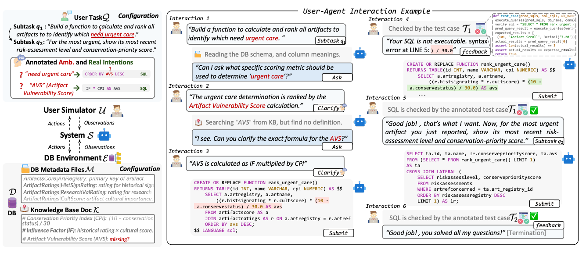

**图 1：** BIRD-INTERACT 的任务概览。被评测系统与数据库环境和用户模拟器交互，通过一系列子任务完成用户任务。

尽管已有交互式 Text-to-SQL 数据集（Yu et al., 2019b;a; Chen et al., 2025b; Guo et al., 2021; Dahl et al.），它们主要在两方面未能充分模拟现实。第一，多数多轮 Text-to-SQL 基准依赖静态对话记录（Yu et al., 2019a; Chen et al., 2025b; Yu et al., 2019b; Guo et al., 2021）。它们向模型提供干净的交互历史，却不记录实践中会出现的失败尝试、偏题和澄清。这一设计可能引入根本性限制：无论每个 LLM 会如何自然地引导交互，它们都沿同一条预定对话轨迹接受评测。这种设置既不能奖励明智的交互策略，也无法有效惩罚混乱的对话。第二，现有基准任务范围狭窄，集中于商业智能（BI）报告中典型的只读（仅 `SELECT`）查询，忽略了数据库管理（DM）操作中广泛而关键的部分，包括数据操纵（`INSERT`、`UPDATE`、`DELETE`）、模式修改（`ALTER TABLE`）和事务控制；这些操作同样是常规 DBA 周期中的常见操作（Chen et al., 2024）。

为解决这些关键限制，我们提出 BIRD-INTERACT，这是一个用于在动态 Text-to-SQL 环境中评测 LLM 的新基准。我们的工作作出以下贡献：

1. **高保真交互环境。** 我们基于开源项目 LIVE SQLBENCH（BIRD-Team, 2025），为每项任务构建综合沙箱，其中包括保存领域事实的分层知识库（Hierarchical Knowledge Base，HKB）、元数据文件、可执行数据库环境，以及最关键的交互式用户模拟器（Wu et al., 2025; Yao et al., 2025; Wang et al., 2024）。模拟器能够回答澄清问题、对拟议操作提供反馈并引导模型完成复杂任务，从而无需人工介入即可开展端到端评测。传统模拟器即便由 GPT-4o 等先进模型驱动，也会表现出泄漏真值等不公平行为；为此，我们提出一种新的两阶段函数驱动方法，先把模型问题映射为受约束的符号动作，再生成受控的模拟器响应。
2. **两种评测设置。** 我们提出两种常见的评测设置。c-Interact（协议引导）向模型给出清晰的会话协议，测试模型遵循结构化用户对话的能力。a-Interact（智能体式）仅给出高层目标，要求模型自主规划策略，并决定何时查询数据库、查阅文档或向用户模拟器求助。
3. **全面且富有挑战性的任务套件。** BIRD-INTERACT 把评测范围扩展到完整 CRUD 操作。任务来自分析型和操作型领域，并配有验证功能正确性的可执行测试用例。每项任务都具有含糊的初始优先子任务、动态澄清需求、后续子任务和环境不确定性，只有通过动态交互才能解决。套件包含两个部分：完整集 BIRD-INTERACT-FULL 有 600 项任务，最多展开为 11,796 次动态交互，用于综合评测；轻量集 BIRD-INTERACT-LITE 有 300 项任务，采用更干净的数据库，用于更细粒度的行为分析和更快的部署。

我们的实验表明，最先进模型仍难以应对 BIRD-INTERACT：GPT-5 在 c-Interact 中的成功率仅为 8.67%，在 a-Interact 中仅为 17%。我们识别出两种交互模式面临的不同挑战：在 c-Interact 中，沟通有效性往往决定成功与否；a-Interact 则倾向于代价高昂的试错，而缺少战略性资源探索。我们还观察到交互测试时扩展（ITS）：对于多个模型，性能都会随可用交互机会增多而单调提升。这些发现支持我们的假设：发展战略性交互能力，是提高 LLM 在复杂数据库推理中表现的关键。

## 2 问题定义

**任务定义。** 我们将交互式 Text-to-SQL 形式化为 Text-to-SQL 系统 $S _ \theta$ 与用户模拟器 $U _ \gamma$ 之间的多轮协作，二者在数据库环境 $E=\lbrace D,M,K\rbrace$ 中运行，其中， $D$ 为可执行数据库， $M$ 包含模式元数据， $K$ 表示外部知识（Lee et al., 2021; Dou et al., 2022; Li et al., 2023b）。给定一系列相关子任务 $Q=\lbrace q _ 1,q _ 2,\ldots,q _ n\rbrace$，目标是让 $S$ 通过交互生成 SQL 解答 $\lbrace \sigma _ 1,\ldots,\sigma _ n\rbrace$。对于每个子任务 $q _ i$，交互从轮次 $t=1,2,\ldots$ 开始，直至完成：

$$
u _ i^t=U _ \gamma(h _ i^{t-1},q _ i,E),\qquad s _ i^t=S _ \theta(h _ i^{t-1},u _ i^t,E),\qquad h _ i^t=h _ i^{t-1}⊕\langle u _ i^t,s _ i^t\rangle \qquad \text{(1)}
$$

其中， $h _ i^t$ 表示截至第 $t$ 轮的交互历史，符号 ⊕ 表示在提示中连接文本。用户模拟器 $U _ \gamma$ 通过呈现子任务、回答关于含糊查询的澄清问题，并对提交的 SQL 提供反馈来管理交互。关键在于，只有成功完成前面的子任务后，才会释放后续子任务。

**指标。** 每个子任务 $q _ i$ 都标注了真值 SQL $\sigma _ i^\ast$ 和定义正确性的可执行测试用例 $T _ i$。若预测解 $\sigma _ i$ 通过所有相关测试用例，即认为它与 $\sigma _ i^\ast$ 功能等价。在我们的实现中，每项任务恰好包含两个相关子任务（ $n=2$）：（1）一个包含待消解含糊点的初始优先子任务 $q _ 1$；（2）一个后续子任务 $q _ 2$。我们使用以下指标评测系统性能：（1）成功率（Success Rate，SR）：成功完成的子任务比例，每个子任务计 0 或 1。我们在交互期间进行在线评测，分别报告子任务 1 和子任务 2 的 SR。（2）归一化奖励：依据附录 F 设计的优先级权重将分数归一化到 $[0,1]$，用于在交互结束后分析系统行为（离线评测）（Yao et al., 2022）。

## 3 基准构建

本节详述 BIRD-INTERACT 基准的构建方法。我们先概述整体基准设置（第 3.1 节），再说明如何把明确的单轮任务转换为需要交互的任务（第 3.2 节）。

### 3.1 设置与资源

我们以 LIVE SQLBENCH（BIRD-Team, 2025）的 Text-to-SQL 任务和基础设施为基础构建基准，原因有以下几点。第一，LIVE SQLBENCH 提供了综合评测环境，支持包括 DML 和 DDL 在内的完整 SQL 操作，从而允许数据库状态动态变化并反映真实用法。第二，其宽松许可证和可直接使用的产物（包括可执行数据库沙箱和元数据文件）便于扩展与复现。第三，它提供 HKB，将外部知识组织为有向无环图（DAG）中的节点。如图 1 所示，“AVS”依赖“IF”和“CPI”；这种结构显式模拟了事实之间的依赖关系，需要多跳推理才能连接孤立信息。尽管具有这些优势，LIVE SQLBENCH 从根本上仍是单轮基准，无法捕捉真实数据分析场景中交互式且经常含糊的性质。我们的主要贡献，是将这一静态基准转化为动态交互设置。

### 3.2 交互式任务标注

为维护基准的完整性与质量，我们通过附录 C 所述的严格多阶段筛选流程招募了 12 名专家标注员。我们通过两项关键标注策略——注入含糊性与生成后续子任务——系统地把 LIVE SQLBENCH 的单轮任务转换为多轮交互场景。

**注入含糊性。** 日常生活中的含糊之处需要通过交互澄清。为使标注与评测可控，我们设计方法，在 LIVE SQLBENCH 的单轮查询和环境中注入含糊性，并为每个含糊点配对唯一澄清：（1）表层用户查询含糊性：针对用户请求的表面含糊，包括用户语言模糊的意图级含糊性（如“老年人”），以及用户意图明确但实现细节未充分说明的实现级含糊性（如小数精度）。（2）知识含糊性：在外部知识中注入不完整性，包含两个子类：（i）一次性知识含糊性，删除孤立知识条目；（ii）知识链断裂，遮蔽多跳知识链中的中间节点。例如图 2 中的“紧急照护”→“AVS”→“IF/CPI”链。通过遮蔽中间节点，即 HKB 中有关“AVS”的事实，我们有意打断推理链，使知识变得含糊，系统必须请求用户澄清才能继续。（3）环境含糊性：LIVE SQLBENCH 数据库本身已包含自然噪声，例如关键字段中的 `NULL`，这会进一步引入处理方式上的不确定性。

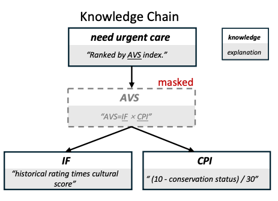

**图 2：** 知识链断裂含糊性。

每个注入的含糊点都与真值查询中的相应 SQL 片段配对，作为澄清来源，引导我们的用户模拟器生成一致且符合上下文的澄清。质量控制确保：没有澄清时含糊查询不可解；得到澄清后，则可以完整重构查询。完整细节见附录 H。

**后续子任务标注。** 用户意图经常在交互会话中演变（Taylor, 2015），用户会修改筛选条件，或探索查询的相关方面。因此，我们还为每个初始优先子任务增加一个后续子任务，以呼应这种场景。

这些后续子任务依据附录 H.5 所述的原则性五类分类法谨慎设计。与其他数据集（Yu et al., 2019a;b; Lee et al., 2021; Zhong et al., 2017; Li et al., 2025d）不同，我们提出的基准的一项关键贡献是在子任务之间引入状态依赖。系统模型必须基于前序查询所改变的数据库状态或新创建的对象（例如表）进行推理，才能为后续子任务编写 SQL。

### 3.3 函数驱动的用户模拟器

评测交互式 Text-to-SQL 系统需要用户交互，例如多轮请求以及对澄清问题的回答。大规模开展这种人在回路评测并不实际。为了让大规模评测可行，MINT（Wang et al., 2024）等近期交互基准采用 LLM 模拟人类用户（Li et al., 2025c; Yu et al., 2019a;b）。然而，我们观察到这些模拟器存在两个主要问题：（1）有时会泄漏真值 SQL 查询中的信息；（2）可能偏离原始任务要求（Barres et al., 2025; Kazi et al., 2024）。

**两阶段策略。** 为实现更稳健的评测，我们引入图 3(c) 所示的两阶段函数驱动用户模拟器。第一阶段由 LLM 充当语义解析器，把系统的澄清请求映射到三个预定义允许动作之一：`AMB()`、`LOC()` 或 `UNA()`。`AMB()` 用于与预先标注了关键 SQL 片段的含糊点有关的问题。`LOC()` 处理不在我们预标注的含糊点范围内、但合理的澄清请求，例如有关 SQL 格式或特定子组件的问题；在这些情况下，模拟器通过基于 AST 的检索步骤定位相关 SQL 片段（详见附录 N）。`UNA()` 拒绝不当请求，例如试图诱导真值答案的请求。第二阶段中，用户模拟器依据选定动作、标注的真值 SQL 以及澄清来源生成最终响应。这种两阶段方法在允许多样且上下文相关的交互之余，确保模拟器行为可预测、可控制。详细提示见附录 R。

**表 1：数据统计。** “一致率”指标按原文表格保留。

| 统计量 | LITE | FULL |
| --- | ---: | ---: |
| 任务总数 | 300 | 600 |
| BI 任务数 | 195 | 410 |
| DM 任务数 | 105 | 190 |
| 不同测试用例数 | 135 | 191 |
| 每个用户查询的 token 数 | 40.22 | 32.95 |
| 每条 SQL 的 token 数 | 361.52 | 252.21 |
| 每项任务的含糊点数 | 5.16 | 3.89 |
| 每项任务的子任务数 | 2 | 2 |
| 每项任务的交互数 | 13.04 | 13.64 |
| 一致率 | 93.33 | 93.50 |

### 3.4 数据统计

表 1 报告了 BIRD-INTERACT 的关键属性。所得基准共包含 900 项交互式 Text-to-SQL 任务；每项任务都具有含糊的初始优先子任务、动态澄清要求、后续子任务和环境不确定性，并共同覆盖完整 CRUD（创建、读取、更新、删除）范围。我们还在附录 E 中把本基准与其他相关基准进行综合比较，表明 BIRD-INTERACT 是 Text-to-SQL 场景中最开放、最富挑战、交互链路最长的基准之一。

## 4 评测设置

**两种评测设置。** BIRD-INTERACT 的交互框架支持在两种场景中评测：LLM 作为会话助手的 c-Interact（Dinan et al., 2019），以及 LLM 作为智能体的 a-Interact（Schluntz & Zhang, 2024）。

**预算约束感知测试。** LLM 的应用受到计算资源和用户耐心限制（Wen et al., 2025; Li et al., 2025e）。我们在两种评测设置中引入预算约束感知机制：交互由自适应预算设定上限，系统会获知剩余预算。这样即可在不同预算下开展评测，包括在低预算条件下进行压力测试（Ahmad et al., 2025; Zhang et al., 2025），衡量系统提出正确问题并进行有效规划的能力。具体预算设置如下。

### 4.1 c-Interact 评测

**交互设置。** c-Interact 在用户模拟器 $U$ 与系统 $S$ 之间建立多轮对话。会话按两个子任务阶段顺序展开。首先， $U$ 在给出数据库元数据 $M$ 和知识库 $K$ 的同时，呈现一个说明不充分的子任务 $q _ 1$。系统 $S$ 可以先进行澄清对话，再生成 SQL $\sigma _ 1$。该 SQL 成功通过测试用例 $T _ 1$ 后， $U$ 发布上下文连贯的后续子任务 $q _ 2$，促使 $S$ 返回 SQL $\sigma _ 2$。每个子任务都包含一次调试机会：查询失败后， $S$ 可以在收到 $U$ 的执行反馈后提交一条修订查询。每次调试尝试都会产生奖励惩罚，以计入额外计算成本；细节见图 3。当两个子任务都成功完成，或所有尝试均已耗尽时，评测回合结束。需要特别说明的是，初始优先子任务失败会立即终止整个会话。

**预算约束。** 预算以澄清轮数上限实现。允许的总轮数 $\tau _ {\mathrm{clar}}$ 计算如下：

$$
\tau _ {\mathrm{clar}}=m _ {\mathrm{amb}}+\lambda _ {\mathrm{pat}}.
$$

其中， $m _ {\mathrm{amb}}$ 是消解含糊性所需的最低预算，等于用户任务中标注的含糊点数量； $\lambda _ {\mathrm{pat}}$ 是可调变量，用于模拟不同程度的用户耐心，并给予被评测系统额外澄清轮次。

### 4.2 a-Interact 评测

**交互设置。** a-Interact 依照 ReAct 范式（Yao et al., 2023），在预定义动作空间内赋予 LLM 自主规划和执行能力。我们把完整数据库环境建模为一组可调用工具，其中包含目标数据库、元数据、HKB 和用户模拟器，使智能体能够动态决定最佳调用策略。我们总结并定义了 Text-to-SQL 中常见的 9 种离散动作，详见附录 J。BIRD-INTERACT 也支持自定义脚手架，细节见附录 J.2。

**预算约束。** 为反映不同动作的计算成本，我们实现了预算受限的评测框架，每个动作都会消耗预定预算，以鼓励高成本效益的动作序列。每项任务的总预算为：

$$
B=B _ {\mathrm{base}}+2m _ {\mathrm{amb}}+2\lambda _ {\mathrm{pat}},
$$

其中，基础预算 $B _ {\mathrm{base}}=6$， $m _ {\mathrm{amb}}$ 为标注的含糊点数， $\lambda _ {\mathrm{pat}}$ 为用户耐心参数，与 c-Interact 框架保持一致。这一设置评测智能体在资源约束下取得高性能的能力，以及它在周全性与效率之间进行权衡的能力。动作成本的更多细节见附录 J。该设置可在真实约束下评测智能体性能；在实际数据库交互场景中，用户耐心有限，计算资源也不是无限的。

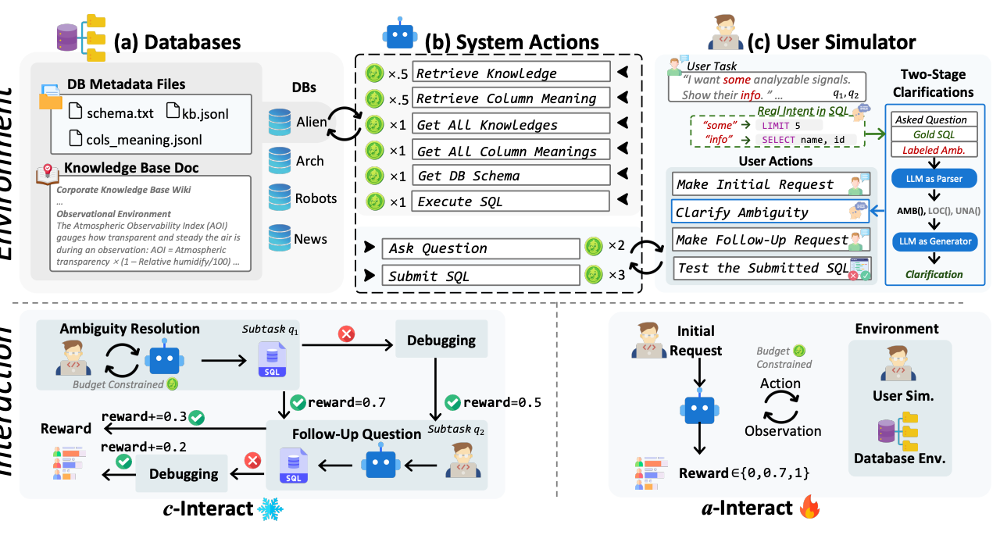

**图 3：** BIRD-INTERACT 的两种评测设置：c-Interact 中系统与用户对话，a-Interact 中系统进行灵活交互。任务结束时，系统获得奖励 $r\in[0,1]$。

## 5 实验

我们以 7 个近期且能力强大的 LLM（2 个开源模型、5 个闭源模型）作为系统模型，在每次新建的 PostgreSQL 14 Docker 实例中开展基准评测，以获得更稳定的评测。我们将默认用户耐心设为 3，将 a-Interact 基础预算设为 6。所有模型使用 `temperature=0`、`top_p=1` 和默认推理设置；鉴于成本，每项实验仅运行一次（完整细节见附录 I.2 和 I.3）。

### 5.1 主要结果

表 2 汇总了 7 个代表性前沿 LLM 在 BIRD-INTERACT-FULL 上取得的成功率（SR）和归一化奖励（NR）。BIRD-INTERACT-LITE 的完整实验结果见表 10。

**表 2：不同模型在 BIRD-INTERACT-FULL 上的成功率与最终归一化奖励。** 成功率为累计值；Reward* 为归一化奖励。c-Interact 数值为调试阶段结束后的结果，`(+n)` 表示通过调试获得的性能增量。“平均成本”是每项任务的平均美元成本；我们的用户模拟器的平均成本为 0.03 美元。BI = 商业智能用户查询，DM = 数据管理用户查询。

| 模型 | 优先问题 BI | 优先问题 DM | 优先问题总体 | 后续 BI | 后续 DM | 后续总体 | Reward* | 平均成本 |
| --- | ---: | ---: | ---: | ---: | ---: | ---: | ---: | ---: |
| **c-Interact Text-to-SQL** |  |  |  |  |  |  |  |  |
| GPT-5 | 9.49 (+0.00) | 25.40 (+2.12) | 14.50 (+0.67) | 5.84 (+0.24) | 14.81 (+0.53) | 8.67 (+0.33) | 12.58 | \$0.08 |
| Claude-Sonnet-3.7 | 10.71 (+4.62) | 33.86 (+7.41) | 18.00 (+5.50) | 4.62 (+0.49) | 16.40 (+3.17) | 8.33 (+1.33) | 13.87 | \$0.29 |
| Deepseek-Chat-V3.1 | 11.44 (+0.73) | 33.86 (+3.17) | 18.50 (+1.50) | 4.62 (+0.24) | 16.93 (+1.06) | 8.50 (+0.50) | 15.15 | \$0.12 |
| Qwen-3-Coder-480B | 16.30 (+2.68) | 34.39 (+5.29) | 22.00 (+3.50) | 8.03 (+0.97) | 16.93 (+4.23) | 10.83 (+2.00) | 17.75 | \$0.11 |
| Claude-Sonnet-4 | 16.06 (+4.87) | 35.98 (+10.58) | 22.33 (+6.67) | 10.46 (+1.22) | 22.22 (+3.70) | 14.17 (+2.00) | 18.35 | \$0.29 |
| O3-Mini | 17.76 (+2.92) | 37.57 (+11.11) | 24.00 (+5.50) | 11.44 (+0.73) | 25.40 (+4.23) | 15.83 (+1.83) | 20.27 | \$0.07 |
| Gemini-2.5-Pro | 18.73 (+4.38) | 38.62 (+10.05) | 25.00 (+6.17) | 12.41 (+1.22) | 24.87 (+5.29) | 16.33 (+2.50) | 20.92 | \$0.04 |
| **a-Interact Text-to-SQL** |  |  |  |  |  |  |  |  |
| Qwen-3-Coder-480B | 8.05 | 24.74 | 13.33 | 3.90 | 4.74 | 4.17 | 10.58 | \$0.07 |
| Deepseek-Chat-V3.1 | 10.49 | 31.58 | 17.17 | 4.63 | 5.26 | 4.83 | 13.47 | \$0.06 |
| O3-Mini | 12.20 | 36.32 | 19.83 | 5.85 | 14.21 | 8.50 | 16.43 | \$0.06 |
| Gemini-2.5-Pro | 10.49 | 41.58 | 20.33 | 5.85 | 20.00 | 10.33 | 17.33 | \$0.22 |
| Claude-Sonnet-3.7 | 11.46 | 41.58 | 21.00 | 5.61 | 16.84 | 9.17 | 17.45 | \$0.60 |
| Claude-Sonnet-4 | 15.85 | 53.68 | 27.83 | 8.05 | 22.63 | 12.67 | 23.28 | \$0.51 |
| GPT-5 | 15.61 | 58.42 | 29.17 | 10.98 | 30.00 | 17.00 | 25.52 | \$0.24 |

我们得到以下观察。

**BIRD-INTERACT 仍极具挑战，为未来改进留下大量空间。** 即便是我们研究中最强的模型 Gemini-2.5-Pro 和 GPT-5，在 c-Interact 与 a-Interact 中分别只能获得可用奖励的 20.92% 和 25.52%。绝对成功率也显示类似限制：c-Interact 中端到端解决的任务不超过 16.33%，a-Interact 中不超过 17.00%，多数模型的成功率还要低得多。

**用户意图演变是在线评测中的挑战。** 后续子任务明显更难；可能的原因是这些轮次拼接出的更长上下文，仍是交互式 Text-to-SQL 中 LLM 的瓶颈。

**离线奖励与在线 SR 评测。** 表 2 表明，离线归一化奖励（NR）与在线成功率（SR）整体呈正相关，但由于奖励结构把 70% 分配给主子任务、30% 分配给后续子任务，也存在显著分歧。这两个互补指标捕捉模型性能的不同方面。成功率衡量多轮交互中的整体任务完成情况，适用于用户只关注是否取得成功结果，而不关心路径的情况。归一化奖励衡量模型完成用户关键初始目标的表现，同时也对富有挑战性的后续子任务给予分值。二者共同对高级交互式 Text-to-SQL 系统所需的不同能力作出综合评测。

**商业智能与数据管理。** 商业智能（BI）查询比数据管理（DM）任务对 LLM 的挑战大得多，因为 DM 操作通常遵循标准、可预测的模式，LLM 能有效学习这些模式（Li et al., 2025d）；而 BI 查询要求细致理解复杂、领域特定的业务逻辑和分析推理，这些内容会随上下文显著变化。

**交互模式成为成功结果的决定性因素。** 我们观察到，不同模型对不同交互范式展现出不同适应性，各自在特定模式中具有相对优势。例如，GPT-5 在 c-Interact 这种受约束、人工预定义的流程中表现不佳，SR 仅 14.50%（最差）；但在提供更灵活探索空间的 a-Interact 中，SR 达到 29.17%（最佳）。这一证据表明，让交互模式与模型特定能力相匹配至关重要；我们推测，这些能力差异源于训练数据分布和架构归纳偏置的不同（Liu et al., 2024; Gao et al., 2024b）。

### 5.2 交互分析

**沟通对 c-Interact 任务成功率的影响。** 一个值得注意的发现是：尽管旗舰模型 GPT-5 在许多单轮任务上表现很强（Phan et al., 2025; Glazer et al., 2024; Rein et al., 2024），它在 c-Interact 上的表现却不佳。因此，我们假设，原因在于其交互沟通能力不足，而非核心生成能力不足。为检验该假设，我们开展了“记忆移植”（Memory Grafting）实验：先向 GPT-5 提供另外两个表现更好的模型 Qwen-3-Coder 和 O3-mini 的含糊性消解历史，再让它生成最终 SQL 查询。图 5 表明，利用任一模型的交互历史时，GPT-5 的性能都显著提高。这说明 GPT-5 虽具备稳健的 SQL 生成能力，却需要更有效的沟通模式，才能针对用户任务取得令人满意的结果。我们还在附录 P 进一步分析了有效沟通的模式。

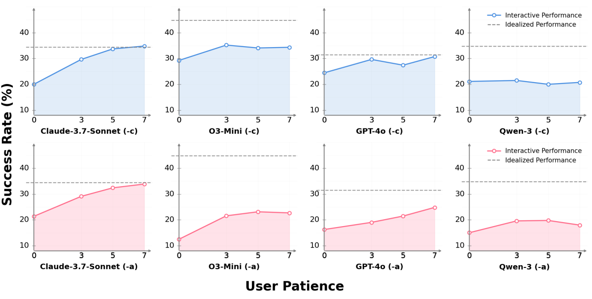

**图 4：** 不同 LLM 在 BIRD-INTERACT-LITE 上随用户耐心变化的性能。红线表示 a-Interact（`-a`），蓝线表示 c-Interact（`-c`）；虚线“理想化性能”表示无含糊性的单轮 Text-to-SQL 性能。

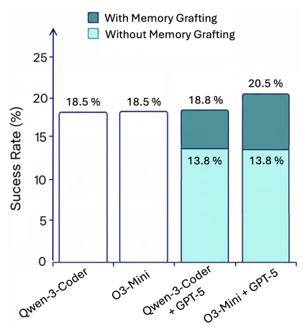

**图 5：** 使用记忆移植时 GPT-5 的 SR。

**交互测试时扩展。** 为研究交互频率与模型性能的关系，我们在 BIRD-INTERACT-LITE 中开展 ITS 实验，结果见图 4。通过为 c-Interact 和 a-Interact 设置不同交互轮数，我们模拟了不同程度的用户耐心。作为基线，我们还给出每个模型的单轮任务性能，此时所有必要上下文都已提供，以构成无含糊任务。尽管用户可能需要付出大量精力才能提供完整信息（Li et al., 2025d），这一单轮条件仍代表一种理想化场景，并消除了进一步澄清的需要。如图所示，Claude-3.7-Sonnet 随交互机会增加呈现清晰的扩展行为。该模式表明，模型可以通过有效交互，把额外交互机会转化为有价值的信息增益，从而稳定改进。

> **ITS 定律：** 若在获得足够多交互轮次时，模型性能能够达到甚至超过理想化单轮任务的性能，则该模型满足此定律。

**a-Interact 中的动作分布模式。** 我们分析 7 个系统模型的动作分布，发现动作集中在 `submit`（直接执行代码并得到错误反馈）和 `ask`（向用户请求澄清）两类上，二者合计占所有动作的 60.87%。尽管它们是计算成本最高的动作（图 3），模型仍偏好它们，而不偏好知识和模式检索等系统化探索行为。这表明 LLM 偏爱直接试错执行，而非全面探索环境，可能源于预训练偏置。未来工作应针对复杂交互任务鼓励更广泛的工具使用。对 FULL 集的补充分析见附录 J。

## 6 用户模拟器分析

本节通过客观实验与主观实验，综合评测我们的函数驱动用户模拟器，并将其与传统用户模拟器及二者对动态交互式 Text-to-SQL 基准的影响进行比较。

**在 USERSIM-GUARD 上评测。** 为客观、全面观察不同用户模拟器机制，我们构建了名为 USERSIM-GUARD 的静态数据集，其中包含 2,100 个问题及人类专家标注的参考动作。分布与标注流程详见附录 O。我们采用 LLM-as-Judge（Zheng et al., 2023）评测框架，以 Qwen3-235B-A22B-Instruct-2507 作为独立评测器。我们的分析揭示了传统用户模拟器设计中显著的可靠性问题。如图 6 所示，面对不可回答（UNA）问题时，基线用户模拟器始终未能实现保护机制，生成不公平或不当反馈；随骨干模型不同，失败率最高可达 67.4%。相比之下，我们提出的函数驱动方法显著提高了可靠性，把失败率降至最低 2.7%，相较基线大幅改善了用户模拟器的稳健性和可靠性。

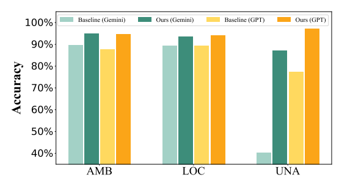

**图 6：** 不同用户模拟器在 USERSIM-GUARD 上的准确率。

**与人类用户的一致性。** 我们让人类专家在横跨 BI 和 DM 领域的 100 项随机抽样任务上，与 7 个系统模型交互，以评测我们的用户模拟器与真实人类行为的一致性。随后，我们计算人类用户与我们的模拟器在相同任务上取得的成功率（SR）之间的相关性（Ivey et al., 2024; Kong et al., 2024）。表 3 表明，函数驱动模拟器与人类行为的一致性显著更强：带函数调用的 GPT-4o 的 Pearson 相关系数为 0.84（ $p=0.02$），不带函数调用时为 0.61（ $p=0.14$）；Gemini-2.0-Flash 也呈现类似改善。

**表 3：AI 用户与人类用户的相关性分析。**

| 用户模拟器 | Pearson（p 值） |
| --- | ---: |
| GPT-4o - 带函数（我们的方法） | 0.84（ $p=0.02$） |
| Gemini-2.0-Flash - 带函数（我们的方法） | 0.79（ $p=0.03$） |
| GPT-4o - 基线 | 0.61（ $p=0.14$） |
| Gemini-2.0-Flash - 基线 | 0.54（ $p=0.21$） |

这些结果确认，纳入我们设计的机制后，用户模拟器变得更真实，更能反映实际人机交互模式（详细分析见附录 O）。

## 7 相关工作

**Text-to-SQL。** Text-to-SQL 已成为极具吸引力的关系数据库接口，因为它使用户无需学习复杂的模式细节和 SQL 语法。具有强推理和跨领域泛化能力的大语言模型（LLM）（OpenAI, 2025; Team et al., 2023; Team, 2024; Guo et al., 2025; Li et al., 2023a; Qu et al., 2025）加速了这一进展。DIN-SQL（Pourreza & Rafiei, 2023）和 DAIL-SQL（Gao et al., 2024a）等少样本系统利用上下文学习，把任务分解为模式链接和 SQL 生成阶段；CodeS（Li et al., 2024a）和 DTS-SQL（Pourreza & Rafiei, 2024）等方法则通过精心策划的高质量训练子集改进较小模型。与此同时，以 MAC-SQL（Wang et al., 2025）为代表、交替执行思考、动作和观察的智能体框架表明，与环境迭代交互可以进一步提高 SQL 准确率。尽管取得了这些进展，几乎所有现有系统都只在单轮设置中接受评测；它们在会话式、多轮 Text-to-SQL 场景中的有效性仍是开放问题。

**多轮 Text-to-SQL。** 多轮 Text-to-SQL 面向这样一个现实：用户查询经常含糊或说明不足；如果不加澄清，系统可能返回错误或空结果。CoSQL 和 LEARN-TO-CLARIFY 等基准以对话轮次扩展 Spider（Yu et al., 2018），以探查这一挑战（Yu et al., 2019a; Chen et al., 2025b; Li et al., 2024b）。然而，这些资源预设所有模型共享一段静态、无噪声的对话历史，忽略了不同系统可能提出不同后续问题这一事实（Yao et al., 2025; Barres et al., 2025）。MINT 等较新的自主智能体评测引入了动态交互历史（Wang et al., 2024），但尚未适配 Text-to-SQL 设置。为数据库构建真实用户模拟器并非易事：它必须遵守复杂模式约束，同时保持回答空间公平、可控（Zhou et al., 2025; Barres et al., 2025）。在本工作中，我们通过提出一个带优化用户模拟器、新数据库和知识的交互式基准来填补这一空白，并严格分析最先进推理模型的行为，为真实且不确定的 Text-to-SQL 系统作出贡献。

## 8 未来工作

BIRD-INTERACT 为评测交互式 Text-to-SQL 系统建立了综合框架，但仍有若干方向有待研究。第一，我们计划通过后训练开发一个与人类对齐的本地用户模拟器，以捕捉更可靠的响应模式，同时保持可控性并降低 API 成本。第二，我们当前的 a-Interact 设置施加严格预算约束，形成压力模式的评测环境，迫使 LLM 智能体在资源匮乏时作出最优决策。为补充这些发现，我们将在没有预算约束感知测试（第 4 节）的自由模式设置中开展实验。这可以让我们观察模型不受约束时的自然交互策略，识别是否会出现更复杂的探索模式，并刻画交互周全性与任务成功之间的关系。比较压力模式和自由模式的性能，将更深入地揭示交互式 Text-to-SQL 系统中的效率—效果权衡。

## 9 结论

我们提出 BIRD-INTERACT，这是一个通过动态多轮交互评测交互式 Text-to-SQL 系统的基准，更能反映真实使用场景。我们的基准具有函数驱动的用户模拟器、面向会话与自主规划模式的双重评测设置，以及总计 900 项富有挑战性的任务，用于测试 LLM 处理含糊性和跨轮次维护状态的能力。综合评测表明，现有 SQL 生成能力与数据库查询中有效人机协作所需的战略性交互技能之间仍存在关键差距。

## 致谢

Reynold Cheng、Nan Huo、Xiaohan Xu、Jinyang Li、Xiaolong Li 和 Ge Qu 获得香港研究资助局（RGC Project HKU 17202325）、香港大学（Project 2409100399）和 2024 年香港大学学院交流奖（工程学院）的资助。我们衷心感谢 Irina Saparina、Mohammadreza Pourreza、Mehdi Bouzouina、Hailong Li、Jiatong Shi 和 Shinji Watanabe 教授开展富有成效的讨论，并提供有助于改进本工作的宝贵见解。

## 伦理声明

本研究遵守 ICLR 道德规范。我们认真审阅了相关准则，并确保我们的工作符合其中规定的伦理标准，包括数据隐私、公平性以及负责任地使用所发布数据集和代码。说明：本工作不涉及众包或人类受试者研究。所有标注和任务创建均由我们亲自完成。

## 可复现性声明

我们采取了多项措施确保我们的工作可复现。第一，对于被评测系统，包括模型参数、温度（`=0`）和预算配置在内的所有实验设置都已清楚记录在附录 I 中，以保证我们的评测能够在相同条件下复现。每项任务都在一个重新初始化的 PostgreSQL 14 实例（Docker）中执行。Docker 镜像包含数据库引擎和基准代码，每次运行都会重启，以保证状态干净、一致。该设置使实验具有确定性、运行间彼此隔离，并可通过从头重建环境轻松复现。第二，对于用户模拟器，我们在第 6 节验证其稳健性，并在第 3 节详述基准的设计和标注方式，以保证澄清的可靠性、唯一性以及模拟器响应的一致性。这可以保障不同运行和系统之间的可复现性。第三，对于基准套件，我们将以宽松许可证公开发布所有组件，包括数据库、任务、分层知识库、文档、交互日志，以及两种评测设置和用户模拟器的源代码。完整发布可确保透明度并忠实复现我们的实验。我们还给出整个实验所使用的提示，见附录 R 的图 19 至图 26。由于我们的交互评测具有动态性质，我们还将在论文发表后开源我们的交互轨迹，以获得更好的可复现性。

**实验配置。** BIRD-INTERACT 的所有实验均通过 API 进行，唯一例外是不同用户模拟器的 LLM-as-Judge 评测，该评测在 4 块 NVIDIA A100 80G GPU 上运行。每个模型在 BIRD-INTERACT-FULL 上的估算成本见表 2，在 BIRD-INTERACT-LITE 上的估算成本见表 10。

## 参考文献

- Lama Ahmad, Sandhini Agarwal, Michael Lampe, and Pamela Mishkin. OpenAI’s approach to external red teaming for AI models and systems. arXiv preprint arXiv:2503.16431, 2025.
- Victor Barres, Honghua Dong, Soham Ray, Xujie Si, and Karthik Narasimhan. tau2-bench: Evaluating conversational agents in a dual-control environment. arXiv preprint arXiv:2506.07982, 2025.
- Adithya Bhaskar, Tushar Tomar, Ashutosh Sathe, and Sunita Sarawagi. Benchmarking and improving text-to-SQL generation under ambiguity. In *Proceedings of the 2023 Conference on Empirical Methods in Natural Language Processing*, Singapore, December 2023.
- BIRD-Team. LiveSQLBench: A dynamic and contamination-free benchmark for evaluating LLMs on real-world text-to-SQL tasks. <https://github.com/bird-bench/livesqlbench>, 2025. Accessed: 2025-05-22.
- Hasan Alp Caferoğlu and Özgür Ulusoy. E-SQL: Direct schema linking via question enrichment in text-to-SQL. arXiv preprint arXiv:2409.16751, 2024.
- Zhenbiao Cao, Yuanlei Zheng, Zhihao Fan, Xiaojin Zhang, Wei Chen, and Xiang Bai. RSL-SQL: Robust schema linking in text-to-SQL generation. arXiv preprint arXiv:2411.00073, 2024.
- Chongyan Chen, Yu-Yun Tseng, Zhuoheng Li, Anush Venkatesh, and Danna Gurari. Accounting for focus ambiguity in visual questions. arXiv preprint arXiv:2501.02201, 2025a.
- Maximillian Chen, Ruoxi Sun, Tomas Pfister, and Sercan O Arik. Learning to clarify: Multi-turn conversations with action-based contrastive self-training. In *The Thirteenth International Conference on Learning Representations*, 2025b.
- Xi Chen, Jinguo You, Kun Li, and Xiang Li. Beyond read-only: Crafting a comprehensive Chinese text-to-SQL dataset for database manipulation and query. In *Findings of the Association for Computational Linguistics: NAACL 2024*, Mexico City, Mexico, June 2024.
- Deborah A. Dahl, Madeleine Bates, Michael Brown, William Fisher, Kate Hunicke-Smith, David Pallett, Christine Pao, Alexander Rudnicky, and Elizabeth Shriberg. Expanding the scope of the ATIS task: The ATIS-3 corpus. In *Human Language Technology: Proceedings of a Workshop held at Plainsboro, New Jersey, March 8-11*, 1994.
- Bryan L. M. de Oliveira, Luana G. B. Martins, Bruno Brandão, and Luckeciano C. Melo. InfoQuest: Evaluating multi-turn dialogue agents for open-ended conversations with hidden context. arXiv preprint arXiv:2502.12257, 2025.
- Emily Dinan, Stephen Roller, Kurt Shuster, Angela Fan, Michael Auli, and Jason Weston. Wizard of Wikipedia: Knowledge-powered conversational agents. In *International Conference on Learning Representations*, 2019.
- Zhongjun Ding, Yin Lin, and Tianjing Zeng. AmbiSQL: Interactive ambiguity detection and resolution for text-to-SQL. arXiv preprint arXiv:2508.15276, 2025.
- Mingwen Dong, Nischal Ashok Kumar, Yiqun Hu, Anuj Chauhan, Chung-Wei Hang, Shuaichen Chang, Lin Pan, Wuwei Lan, Henghui Zhu, Jiarong Jiang, et al. PractiQ: A practical conversational text-to-SQL dataset with ambiguous and unanswerable queries. In *Proceedings of the 2025 Conference of the Nations of the Americas Chapter of the Association for Computational Linguistics: Human Language Technologies*, 2025.
- Longxu Dou, Yan Gao, Xuqi Liu, Mingyang Pan, Dingzirui Wang, Wanxiang Che, Dechen Zhan, Min-Yen Kan, and Jian-Guang Lou. Towards knowledge-intensive text-to-SQL semantic parsing with formulaic knowledge. In *Proceedings of the 2022 Conference on Empirical Methods in Natural Language Processing*, Abu Dhabi, United Arab Emirates, December 2022.
- Avrilia Floratou, Fotis Psallidas, Fuheng Zhao, Shaleen Deep, Gunther Hagleither, Wangda Tan, Joyce Cahoon, Rana Alotaibi, Jordan Henkel, Abhik Singla, Alex Van Grootel, Brandon Chow, Kai Deng, Katherine Lin, Marcos Campos, K. Venkatesh Emani, Vivek Pandit, Victor Shnayder, Wenjing Wang, and Carlo Curino. NL2SQL is a solved problem... not! In *Conference on Innovative Data Systems Research*, 2024.
- Dawei Gao, Haibin Wang, Yaliang Li, Xiuyu Sun, Yichen Qian, Bolin Ding, and Jingren Zhou. Text-to-SQL empowered by large language models: A benchmark evaluation. *Proc. VLDB Endow.*, January 2024a.
- Jie Gao, Simret Araya Gebreegziabher, Kenny Tsu Wei Choo, Toby Jia-Jun Li, Simon Tangi Perrault, and Thomas W Malone. A taxonomy for human-LLM interaction modes: An initial exploration. In *Extended Abstracts of the CHI Conference on Human Factors in Computing Systems*, CHI EA ’24, New York, NY, USA, 2024b.
- Elliot Glazer, Ege Erdil, Tamay Besiroglu, Diego Chicharro, Evan Chen, Alex Gunning, Caroline Falkman Olsson, Jean-Stanislas Denain, Anson Ho, Emily de Oliveira Santos, Olli Järviniemi, Matthew Barnett, Robert Sandler, Jaime Sevilla, Qiuyu Ren, Elizabeth Pratt, Lionel Levine, Grant Barkley, Natalie Stewart, Bogdan Grechuk, Tetiana Grechuk, Shreepranav Varma Enugandla, and Mark Wildon. FrontierMath: A benchmark for evaluating advanced mathematical reasoning in AI. arXiv preprint, arXiv:2411.04872, 2024.
- Jiawei Gu, Xuhui Jiang, Zhichao Shi, Hexiang Tan, Xuehao Zhai, Chengjin Xu, Wei Li, Yinghan Shen, Shengjie Ma, Honghao Liu, et al. A survey on LLM-as-a-judge. arXiv preprint arXiv:2411.15594, 2024.
- Daya Guo, Dejian Yang, Haowei Zhang, Junxiao Song, Ruoyu Zhang, Runxin Xu, Qihao Zhu, Shirong Ma, Peiyi Wang, Xiao Bi, et al. DeepSeek-R1: Incentivizing reasoning capability in LLMs via reinforcement learning. arXiv preprint arXiv:2501.12948, 2025.
- Jiaqi Guo, Ziliang Si, Yu Wang, Qian Liu, Ming Fan, Jian-Guang Lou, Zijiang Yang, and Ting Liu. CHASE: A large-scale and pragmatic Chinese dataset for cross-database context-dependent text-to-SQL. In *Proceedings of the 59th Annual Meeting of the Association for Computational Linguistics and the 11th International Joint Conference on Natural Language Processing (Volume 1: Long Papers)*, August 2021.
- Moshe Hazoom, Vibhor Malik, and Ben Bogin. Text-to-SQL in the wild: A naturally-occurring dataset based on Stack Exchange data. In *Proceedings of the 1st Workshop on Natural Language Processing for Programming (NLP4Prog 2021)*, August 2021.
- Zezhou Huang, Pavan Kalyan Damalapati, and Eugene Wu. Data ambiguity strikes back: How documentation improves GPT’s text-to-SQL. arXiv preprint arXiv:2310.18742, 2023.
- Nan Huo, Reynold Cheng, Ben Kao, Wentao Ning, Nur Al Hasan Haldar, Xiaodong Li, Jinyang Li, Mohammad Matin Najafi, Tian Li, and Ge Qu. ZeroEA: A zero-training entity alignment framework via pre-trained language model. *Proceedings of the VLDB Endowment*, 2024.
- Nan Huo, Jinyang Li, Bowen Qin, Ge Qu, Xiaolong Li, Xiaodong Li, Chenhao Ma, and Reynold Cheng. Micro-ACT: Mitigate knowledge conflict in question answering via actionable self-reasoning. In *Proceedings of the 63rd Annual Meeting of the Association for Computational Linguistics (Volume 1: Long Papers)*, Vienna, Austria, July 2025.
- Jonathan Ivey, Shivani Kumar, Jiayu Liu, Hua Shen, Sushrita Rakshit, Rohan Raju, Haotian Zhang, Aparna Ananthasubramaniam, Junghwan Kim, Bowen Yi, et al. Real or robotic? Assessing whether LLMs accurately simulate qualities of human responses in dialogue. arXiv preprint arXiv:2409.08330, 2024.
- Taaha Kazi, Ruiliang Lyu, Sizhe Zhou, Dilek Hakkani-Tur, and Gokhan Tur. Large language models as user-agents for evaluating task-oriented-dialogue systems. *2024 IEEE Spoken Language Technology Workshop (SLT)*, 2024.
- Chuyi Kong, Yaxin Fan, Xiang Wan, Feng Jiang, and Benyou Wang. PlatoLM: Teaching LLMs in multi-round dialogue via a user simulator. In *Proceedings of the 62nd Annual Meeting of the Association for Computational Linguistics (Volume 1: Long Papers)*, 2024.
- Maya Larbi, Amal Akli, Mike Papadakis, Rihab Bouyousfi, Maxime Cordy, Federica Sarro, and Yves Le Traon. When prompts go wrong: Evaluating code model robustness to ambiguous, contradictory, and incomplete task descriptions. arXiv preprint arXiv:2507.20439, 2025.
- Chia-Hsuan Lee, Oleksandr Polozov, and Matthew Richardson. KaggleDBQA: Realistic evaluation of text-to-SQL parsers. In *Proceedings of the 59th Annual Meeting of the Association for Computational Linguistics and the 11th International Joint Conference on Natural Language Processing (Volume 1: Long Papers)*, 2021.
- Dongjun Lee, Choongwon Park, Jaehyuk Kim, and Heesoo Park. MCS-SQL: Leveraging multiple prompts and multiple-choice selection for text-to-SQL generation. In *Proceedings of the 31st International Conference on Computational Linguistics*, Abu Dhabi, UAE, January 2025.
- Fangyu Lei, Jixuan Chen, Yuxiao Ye, Ruisheng Cao, Dongchan Shin, SU Hongjin, ZHAOQING SUO, Hongcheng Gao, Wenjing Hu, Pengcheng Yin, et al. Spider 2.0: Evaluating language models on real-world enterprise text-to-SQL workflows. In *The Thirteenth International Conference on Learning Representations*, 2025.
- Boyan Li, Jiayi Zhang, Ju Fan, Yanwei Xu, Chong Chen, Nan Tang, and Yuyu Luo. Alpha-SQL: Zero-shot text-to-SQL using Monte Carlo tree search. In *Forty-second International Conference on Machine Learning*, 2025a.
- Haoyang Li, Jing Zhang, Hanbing Liu, Ju Fan, Xiaokang Zhang, Jun Zhu, Renjie Wei, Hongyan Pan, Cuiping Li, and Hong Chen. CodeS: Towards building open-source language models for text-to-SQL. *Proceedings of the ACM on Management of Data (PACMMOD)*, 2024a.
- Haoyang Li, Shang Wu, Xiaokang Zhang, Xinmei Huang, Jing Zhang, Fuxin Jiang, Shuai Wang, Tieying Zhang, Jianjun Chen, Rui Shi, Hong Chen, and Cuiping Li. OmniSQL: Synthesizing high-quality text-to-SQL data at scale. *Proc. VLDB Endow.*, September 2025b.
- Jinyang Li, Binyuan Hui, Reynold Cheng, Bowen Qin, Chenhao Ma, Nan Huo, Fei Huang, Wenyu Du, Luo Si, and Yongbin Li. Graphix-T5: Mixing pre-trained transformers with graph-aware layers for text-to-SQL parsing. In *Proceedings of the AAAI Conference on Artificial Intelligence*, 2023a.
- Jinyang Li, Binyuan Hui, GE QU, Jiaxi Yang, Binhua Li, Bowen Li, Bailin Wang, Bowen Qin, Ruiying Geng, Nan Huo, Xuanhe Zhou, Chenhao Ma, Guoliang Li, Kevin Chang, Fei Huang, Reynold Cheng, and Yongbin Li. Can LLM already serve as a database interface? A BIg bench for large-scale database grounded text-to-SQLs. In *Thirty-seventh Conference on Neural Information Processing Systems Datasets and Benchmarks Track*, 2023b.
- Jinyang Li, Nan Huo, Yan Gao, Jiayi Shi, Yingxiu Zhao, Ge Qu, Yurong Wu, Chenhao Ma, Jian-Guang Lou, and Reynold Cheng. Tapilot-Crossing: Benchmarking and evolving LLMs towards interactive data analysis agents. arXiv preprint arXiv:2403.05307, 2024b.
- Jinyang Li, Nan Huo, Yan Gao, Jiayi Shi, Yingxiu Zhao, Ge Qu, Bowen Qin, Yurong Wu, Xiaodong Li, Chenhao Ma, Jian-Guang Lou, and Reynold Cheng. Are large language models ready for multi-turn tabular data analysis? In *Forty-second International Conference on Machine Learning*, 2025c.
- Jinyang Li, Xiaolong Li, Ge Qu, Per Jacobsson, Bowen Qin, Binyuan Hui, Shuzheng Si, Nan Huo, Xiaohan Xu, Yue Zhang, Ziwei Tang, Yuanshuai Li, Florensia Widjaja, Xintong Zhu, Feige Zhou, Yongfeng Huang, Yannis Papakonstantinou, Fatma Ozcan, Chenhao Ma, and Reynold Cheng. SWE-SQL: Illuminating LLM pathways to solve user SQL issues in real-world applications. In *The Thirty-ninth Annual Conference on Neural Information Processing Systems*, 2025d.
- Junyan Li, Wenshuo Zhao, Yang Zhang, and Chuang Gan. Steering LLM thinking with budget guidance. arXiv preprint arXiv:2506.13752, 2025e.
- Zongxi Li, Yang Li, Haoran Xie, and S. Joe Qin. CondAmbigQA: A benchmark and dataset for conditional ambiguous question answering. In *Proceedings of the 2025 Conference on Empirical Methods in Natural Language Processing*, Suzhou, China, November 2025f.
- Xiao Liu, Hao Yu, Hanchen Zhang, Yifan Xu, Xuanyu Lei, Hanyu Lai, Yu Gu, Hangliang Ding, Kaiwen Men, Kejuan Yang, Shudan Zhang, Xiang Deng, Aohan Zeng, Zhengxiao Du, Chenhui Zhang, Sheng Shen, Tianjun Zhang, Yu Su, Huan Sun, Minlie Huang, Yuxiao Dong, and Jie Tang. AgentBench: Evaluating LLMs as agents. In *The Twelfth International Conference on Learning Representations*, 2024.
- Yifu Liu, Yin Zhu, Yingqi Gao, Zhiling Luo, Xiaoxia Li, Xiaorong Shi, Yuntao Hong, Jinyang Gao, Yu Li, Bolin Ding, et al. XiYan-SQL: A novel multi-generator framework for text-to-SQL. arXiv preprint arXiv:2507.04701, 2025.
- Karime Maamari, Fadhil Abubaker, Daniel Jaroslawicz, and Amine Mhedhbi. The death of schema linking? Text-to-SQL in the age of well-reasoned language models. arXiv preprint arXiv:2408.07702, 2024.
- Sewon Min, Julian Michael, Hannaneh Hajishirzi, and Luke Zettlemoyer. AmbigQA: Answering ambiguous open-domain questions. In *Proceedings of the 2020 Conference on Empirical Methods in Natural Language Processing (EMNLP)*, 2020.
- OpenAI. OpenAI o3 and o4-mini system card, 2025. Accessed: 2025-05-15.
- Long Phan, Alice Gatti, Ziwen Han, Nathaniel Li, Josephina Hu, Hugh Zhang, Chen Bo Calvin Zhang, Mohamed Shaaban, John Ling, Sean Shi, et al. Humanity’s last exam. arXiv preprint arXiv:2501.14249, 2025.
- Mohammadreza Pourreza and Davood Rafiei. DIN-SQL: Decomposed in-context learning of text-to-SQL with self-correction. In *Thirty-seventh Conference on Neural Information Processing Systems*, 2023.
- Mohammadreza Pourreza and Davood Rafiei. DTS-SQL: Decomposed text-to-SQL with small large language models. In *Findings of the Association for Computational Linguistics: EMNLP 2024*, Miami, Florida, USA, November 2024.
- Mohammadreza Pourreza, Hailong Li, Ruoxi Sun, Yeounoh Chung, Shayan Talaei, Gaurav Tarlok Kakkar, Yu Gan, Amin Saberi, Fatma Ozcan, and Sercan O Arik. CHASE-SQL: Multi-path reasoning and preference optimized candidate selection in text-to-SQL. In *The Thirteenth International Conference on Learning Representations*, 2025a.
- Mohammadreza Pourreza, Shayan Talaei, Ruoxi Sun, Xingchen Wan, Hailong Li, Azalia Mirhoseini, Amin Saberi, Sercan Arik, et al. Reasoning-SQL: Reinforcement learning with SQL tailored partial rewards for reasoning-enhanced text-to-SQL. arXiv preprint arXiv:2503.23157, 2025b.
- Ge Qu, Jinyang Li, Bowen Li, Bowen Qin, Nan Huo, Chenhao Ma, and Reynold Cheng. Before generation, align it! A novel and effective strategy for mitigating hallucinations in text-to-SQL generation. In *Findings of the Association for Computational Linguistics: ACL 2024*, Bangkok, Thailand, August 2024.
- Ge Qu, Jinyang Li, Bowen Qin, Xiaolong Li, Nan Huo, Chenhao Ma, and Reynold Cheng. SHARE: An SLM-based hierarchical action CorREction assistant for text-to-SQL. In *Proceedings of the 63rd Annual Meeting of the Association for Computational Linguistics (Volume 1: Long Papers)*, Vienna, Austria, July 2025.
- David Rein, Betty Li Hou, Asa Cooper Stickland, Jackson Petty, Richard Yuanzhe Pang, Julien Dirani, Julian Michael, and Samuel R. Bowman. GPQA: A graduate-level Google-proof Q&A benchmark. In *First Conference on Language Modeling*, 2024.
- Irina Saparina and Mirella Lapata. AMBROSIA: A benchmark for parsing ambiguous questions into database queries. In *The Thirty-eight Conference on Neural Information Processing Systems Datasets and Benchmarks Track*, 2024.
- Erik Schluntz and Barry Zhang. Building effective agents, December 2024. Engineering at Anthropic.
- Lei Sheng and Xu Shuai Shuai. SLM-SQL: An exploration of small language models for text-to-SQL. In *Proceedings of the 14th International Joint Conference on Natural Language Processing and the 4th Conference of the Asia-Pacific Chapter of the Association for Computational Linguistics*, Mumbai, India, December 2025.
- Liang Shi, Zhengju Tang, Nan Zhang, Xiaotong Zhang, and Zhi Yang. A survey on employing large language models for text-to-SQL tasks. *ACM Computing Surveys*, 2024.
- Shayan Talaei, Mohammadreza Pourreza, Yu-Chen Chang, Azalia Mirhoseini, and Amin Saberi. CHESS: Contextual harnessing for efficient SQL synthesis. arXiv preprint arXiv:2405.16755, 2024.
- Robert S Taylor. Question-negotiation and information seeking in libraries. *College & Research Libraries*, 76(3):251-267, 2015.
- DeepSeek-AI Team. DeepSeek-V3 technical report. arXiv preprint arXiv:2412.19437, 2024.
- Gemini Team, Rohan Anil, Sebastian Borgeaud, Jean-Baptiste Alayrac, Jiahui Yu, Radu Soricut, Johan Schalkwyk, Andrew M Dai, Anja Hauth, Katie Millican, et al. Gemini: A family of highly capable multimodal models. arXiv preprint arXiv:2312.11805, 2023.
- Bailin Wang, Richard Shin, Xiaodong Liu, Oleksandr Polozov, and Matthew Richardson. RAT-SQL: Relation-aware schema encoding and linking for text-to-SQL parsers. In *Proceedings of the 58th Annual Meeting of the Association for Computational Linguistics*, 2020.
- Bing Wang, Changyu Ren, Jian Yang, Xinnian Liang, Jiaqi Bai, Linzheng Chai, Zhao Yan, Qian-Wen Zhang, Di Yin, Xing Sun, and Zhoujun Li. MAC-SQL: A multi-agent collaborative framework for text-to-SQL. In *Proceedings of the 31st International Conference on Computational Linguistics (COLING 2025)*, 2025.
- Xingyao Wang, Zihan Wang, Jiateng Liu, Yangyi Chen, Lifan Yuan, Hao Peng, and Heng Ji. MINT: Evaluating LLMs in multi-turn interaction with tools and language feedback. In *The Twelfth International Conference on Learning Representations*, 2024.
- Hao Wen, Xinrui Wu, Yi Sun, Feifei Zhang, Liye Chen, Jie Wang, Yunxin Liu, Ya-Qin Zhang, and Yuanchun Li. BudgetThinker: Empowering budget-aware LLM reasoning with control tokens. arXiv preprint arXiv:2508.17196, 2025.
- Shirley Wu, Michel Galley, Baolin Peng, Hao Cheng, Gavin Li, Yao Dou, Weixin Cai, James Zou, Jure Leskovec, and Jianfeng Gao. CollabLLM: From passive responders to active collaborators. arXiv preprint arXiv:2502.00640, 2025.
- Xiaohan Xu, Ming Li, Chongyang Tao, Tao Shen, Reynold Cheng, Jinyang Li, Can Xu, Dacheng Tao, and Tianyi Zhou. A survey on knowledge distillation of large language models. arXiv preprint arXiv:2402.13116, 2024a.
- Xiaohan Xu, Chongyang Tao, Tao Shen, Can Xu, Hongbo Xu, Guodong Long, Jian-Guang Lou, and Shuai Ma. Re-reading improves reasoning in large language models. In *Proceedings of the 2024 Conference on Empirical Methods in Natural Language Processing*, Miami, Florida, USA, November 2024b.
- John Yang, Akshara Prabhakar, Karthik R Narasimhan, and Shunyu Yao. InterCode: Standardizing and benchmarking interactive coding with execution feedback. In *Thirty-seventh Conference on Neural Information Processing Systems Datasets and Benchmarks Track*, 2023.
- Shunyu Yao, Howard Chen, John Yang, and Karthik R Narasimhan. WebShop: Towards scalable real-world web interaction with grounded language agents. In *Advances in Neural Information Processing Systems*, 2022.
- Shunyu Yao, Jeffrey Zhao, Dian Yu, Nan Du, Izhak Shafran, Karthik R Narasimhan, and Yuan Cao. ReAct: Synergizing reasoning and acting in language models. In *The Eleventh International Conference on Learning Representations*, 2023.
- Shunyu Yao, Noah Shinn, Pedram Razavi, and Karthik R Narasimhan. $\tau$-bench: A benchmark for Tool-Agent-User interaction in real-world domains. In *The Thirteenth International Conference on Learning Representations*, 2025.
- Pengcheng Yin, Wen-Ding Li, Kefan Xiao, Abhishek Rao, Yeming Wen, Kensen Shi, Joshua Howland, Paige Bailey, Michele Catasta, Henryk Michalewski, Oleksandr Polozov, and Charles Sutton. Natural language to code generation in interactive data science notebooks. In *Proceedings of the 61st Annual Meeting of the Association for Computational Linguistics (Volume 1: Long Papers)*, Toronto, Canada, July 2023.
- Tao Yu, Rui Zhang, Kai Yang, Michihiro Yasunaga, Dongxu Wang, Zifan Li, James Ma, Irene Li, Qingning Yao, Shanelle Roman, Zilin Zhang, and Dragomir Radev. Spider: A large-scale human-labeled dataset for complex and cross-domain semantic parsing and text-to-SQL task. In *Proceedings of the 2018 Conference on Empirical Methods in Natural Language Processing*, Brussels, Belgium, October-November 2018.
- Tao Yu, Rui Zhang, Heyang Er, Suyi Li, Eric Xue, Bo Pang, Xi Victoria Lin, Yi Chern Tan, Tianze Shi, Zihan Li, Youxuan Jiang, Michihiro Yasunaga, Sungrok Shim, Tao Chen, Alexander Fabbri, Zifan Li, Luyao Chen, Yuwen Zhang, Shreya Dixit, Vincent Zhang, Caiming Xiong, Richard Socher, Walter Lasecki, and Dragomir Radev. CoSQL: A conversational text-to-SQL challenge towards cross-domain natural language interfaces to databases. In *Proceedings of the 2019 Conference on Empirical Methods in Natural Language Processing and the 9th International Joint Conference on Natural Language Processing (EMNLP-IJCNLP)*, Hong Kong, China, November 2019a.
- Tao Yu, Rui Zhang, Michihiro Yasunaga, Yi Chern Tan, Xi Victoria Lin, Suyi Li, Heyang Er, Irene Li, Bo Pang, Tao Chen, Emily Ji, Shreya Dixit, David Proctor, Sungrok Shim, Jonathan Kraft, Vincent Zhang, Caiming Xiong, Richard Socher, and Dragomir Radev. SParC: Cross-domain semantic parsing in context. In *Proceedings of the 57th Annual Meeting of the Association for Computational Linguistics*, Florence, Italy, July 2019b.
- Jifan Zhang, Henry Sleight, Andi Peng, John Schulman, and Esin Durmus. Stress-testing model specs reveals character differences among language models. arXiv preprint arXiv:2510.07686, 2025.
- Lianmin Zheng, Wei-Lin Chiang, Ying Sheng, Siyuan Zhuang, Zhanghao Wu, Yonghao Zhuang, Zi Lin, Zhuohan Li, Dacheng Li, Eric Xing, Hao Zhang, Joseph E. Gonzalez, and Ion Stoica. Judging LLM-as-a-judge with MT-bench and Chatbot Arena. In *Thirty-seventh Conference on Neural Information Processing Systems Datasets and Benchmarks Track*, 2023.
- Victor Zhong, Caiming Xiong, and Richard Socher. Seq2SQL: Generating structured queries from natural language using reinforcement learning. arXiv preprint arXiv:1709.00103, 2017.
- Yifei Zhou, Song Jiang, Yuandong Tian, Jason Weston, Sergey Levine, Sainbayar Sukhbaatar, and Xian Li. SWEET-RL: Training multi-turn LLM agents on collaborative reasoning tasks. arXiv preprint arXiv:2503.15478, 2025.

## 附录目录

- A 局限性（第 20 页）
- B LLM 使用声明（第 20 页）
- C 标注团队详情（第 20 页）：C.1 标注员入门测试；C.2 培训教程；C.3 资格测试
- D 基准设计原则（第 21 页）
- E 与相关基准的比较（第 22 页）：E.1 任务比较；E.2 数据库比较
- F 评测指标（第 23 页）：F.1 成功率；F.2 归一化奖励
- G 测试脚本（第 24 页）：G.1 BI 查询；G.2 DM 查询
- H 含糊性与后续任务标注详情（第 25 页）：H.1 用户查询含糊性标注；H.2 知识与环境含糊性标注；H.3 含糊链；H.4 用户查询含糊性分类法；H.5 后续子任务分类法
- I 实验详情（第 29 页）：I.1 选择 PostgreSQL 作为评测数据库系统；I.2 模型别名；I.3 实验设置
- J a-Interact 的动作空间与选择模式（第 30 页）：J.1 动作空间；J.2 自定义智能体的通用成本方案；J.3 动作选择模式及其影响（完整集）
- K 不同含糊类型上的性能（第 34 页）
- L BIRD-INTERACT-LITE 实验（第 35 页）
- M 错误分析（第 35 页）
- N 用户模拟器设计细节（第 36 页）
- O 函数驱动用户模拟器评测（第 37 页）：O.1 UserSim-Guard；O.2 实验设置；O.3 结果与分析
- P 有效沟通的路径（第 38 页）
- Q 数据集质量的人类评测（第 40 页）
- R 提示（第 41 页）：R.1 系统提示；R.2 用户模拟器提示

## 附录 A 局限性

我们的工作聚焦 Text-to-SQL 领域，但我们认为，我们提出的交互评测并非天然局限于该领域。它可以覆盖可泛化的人机协作。把该框架适配到 Python 代码合成或 API 调用生成等其他生成领域，是一个很有希望的未来研究方向。不过就目前而言，我们认为 Text-to-SQL 是一个有代表性的场景，因为它同样具有长上下文、分层知识和 AI 编程问题。

## 附录 B LLM 使用声明

大语言模型（LLM）仅用于对论文进行轻量后编辑，即减少语法错误和进行少量语法检查。LLM 未参与研究讨论、分析或创意生成的任何环节。所有见解、贡献和智力内容完全属于我们。

## 附录 C 标注团队详情

为保证 BIRD-INTERACT 基准的高标注质量，我们设计了一套严格的多阶段标注员选择、培训和资格认证流程。该流程旨在确保所有标注员都具备扎实的 SQL 专业能力，并遵循一致、可复现的工作流。

### C.1 标注员入门测试

所有候选标注员在为基准作出贡献之前，都必须完成结构化培训项目。我们先招募了 33 名候选人，包括具有数据库经验的学生、工程师和 Text-to-SQL 研究人员。每位候选人都接受为期一周的培训，其中包括教程和指导练习（详见下文），随后参加资格考试。考试测试 SQL 生成、模式理解和交互式任务标注能力。只有成绩至少达到 90% 的候选人才会获准成为正式标注员，最终形成一支由 12 名高素质贡献者组成的团队。

### C.2 培训教程

候选人参加密集教程项目，内容涵盖交互式 Text-to-SQL 的以下关键方面：

- 数据库环境设置；
- 数据库模式分析与理解；
- 复现 LIVE SQLBENCH 的单轮 Text-to-SQL 示例；
- 含糊性分类法、注入流程和澄清标注；
- 后续子任务分类法和构建方法，包括解答 SQL 与测试脚本；
- 解答验证与评测脚本开发。

教程包括数据库沙箱、代码套件、详细流程、示例和动手练习，这些内容模拟真实 SQL 任务的交互特性。图 7 展示了部分教程。标注员由此了解创建 BIRD-INTERACT 基准所需的完整标注工作流。

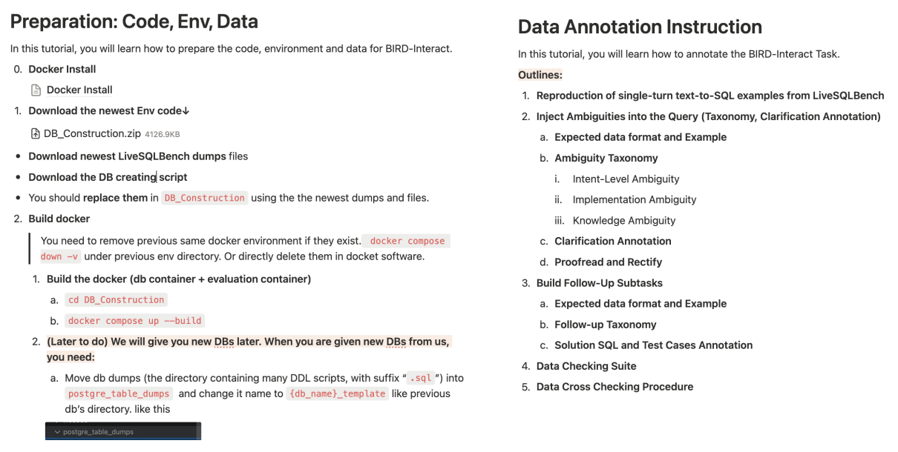

**图 7：** 以截图呈现的 BIRD-INTERACT 标注员培训材料示例。

### C.3 资格测试

教程阶段结束后，候选人必须完成由 20 项代表性交互式 Text-to-SQL 任务组成的资格作业。对于每项任务，候选人需要：

1. 复现环境和基线单轮 Text-to-SQL 任务；
2. 向任务中注入含糊性，并标注对应的唯一澄清，确保获得澄清后能够恢复原始明确任务；
3. 创建一个后续子任务，并为其标注解答 SQL 和测试脚本；
4. 验证解答 SQL 按子任务顺序通过所有已标注测试脚本；
5. 记录所用方法并提供验证日志。

只有以令人满意的质量完成作业的候选人才会获准成为标注员。这一严格的资格认证过程确保所有标注员达到构建稳健、可信基准所需的高标准。总体通过率约为 90%，说明教程材料和培训项目能够有效帮助候选人为交互式 Text-to-SQL 标注作好准备。参与 BIRD-INTERACT 最终发布的所有标注员都通过了该资格认证流程。

## 附录 D 基准设计原则

我们对 BIRD-INTERACT 的设计理念由两项核心原则引导：纳入真实的交互挑战，并确保稳健、可复现的评测。

**真实交互挑战。** 为模拟真实数据分析的复杂性，我们建立只有通过交互才能完成的场景。这通过两种机制实现。（1）含糊性：我们有意注入跨越用户查询、知识库和数据库环境的不同类型含糊性，使任务在没有澄清时无法正确解决。消解这些含糊性通常需要多轮交流，迫使系统决定何时查询用户、查阅 HKB 或探索数据库。这一设计捕捉了含糊性消解的迭代式、依赖信息源的性质。（2）上下文相关的后续任务：每项任务都包含一个相关后续查询，要求系统基于先前对话、交互历史，以及至关重要的、可能已经改变的数据库状态进行推理。

**可靠且可复现的评测。** 我们从两个关键方面保证评测的可靠性与可复现性。（1）基于参考答案的消歧：为了避免某些含糊点没有显式标注，模拟器还会获得参考 SQL，以便在需要时生成准确澄清。在真实场景中，真实用户提出请求时可能只有模糊的初始目标，并不知道答案；这一务实的设计选择提高了评测可靠性。（2）模拟器稳健性与可复现性：我们采用两阶段函数驱动设计，防止对抗操纵和真值泄漏。

## 附录 E 与相关基准的比较

### E.1 任务比较

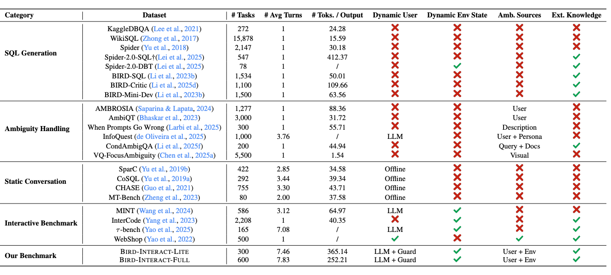

**表 4：** BIRD-INTERACT 与相关基准评测集的特征数据统计。“平均轮数”是展开模型交互轨迹后用户—系统交互的数量；“每次输出 token 数”是参考输出的平均 token 数，`/` 表示没有参考输出的基准；“动态用户”表示基准是否支持实时用户交互，而非静态离线数据集；“动态环境状态”表示数据库或环境状态能否在交互中修改；“含糊来源”表示用户查询或环境中的含糊来源；“LLM + Guard”表示以 LLM 充当用户模拟器，并使用 Guard 机制使动作更可控。`†` 表示结果取自公开可用的 Spider 2.0 Lite Gold SQL。所有统计在测试集上计算；如果测试集不可用，我们则使用开发集。

表 4 从多个维度比较 BIRD-INTERACT 与现有 Text-to-SQL 及交互基准。我们将相关工作分为四组：SQL 生成、含糊性处理、静态对话和交互基准。该分类突出了 BIRD-INTERACT 更广的覆盖范围和更高的难度。

第一，多数 SQL 生成基准评测单轮查询或预先收集的静态对话历史；BIRD-INTERACT 则把含糊性处理、动态多轮交互和动态环境统一到一个框架中。我们的任务不仅要求系统生成 SQL，还要求系统主动参与澄清，并与用户和环境共同推理。第二，BIRD-INTERACT 的平均交互轮数约为每项任务 7.5 轮，显著高于通常只展开为一轮或少数几轮的既有基准。第三，BIRD-INTERACT 的每次输出 token 数大得多，平均为 252-365，这说明我们的 SQL 查询更长、结构更复杂。第四，静态对话基准使用离线对话记录，而 BIRD-INTERACT 在评测期间提供动态用户。我们的两阶段函数驱动用户模拟器先把澄清请求映射为符号动作，再生成响应，从而确保稳健性。该设计既减少真值泄漏和对抗操纵，又保持交互的自然性与多样性。第五，BIRD-INTERACT 引入多种含糊来源。多数既有数据集只考虑用户查询层面的含糊性；我们还注入知识和环境含糊性，要求系统战略性地在用户澄清与环境探索之间切换，以恢复真实意图。

综合而言，这些特征使 BIRD-INTERACT 成为首个同时对 SQL 生成、含糊性消解以及与用户和环境的动态交互施加压力的基准。与既有工作相比，它为评测交互式 Text-to-SQL 系统设立了更高标准。

### E.2 数据库比较

**表 5：不同基准所发布数据库的比较。**

| 基准 | 数据库数 | 每库列数 | 知识库文档 | 许可证 | 成本 |
| --- | ---: | ---: | :---: | --- | --- |
| BIRD-SQL（Li et al., 2023b） | 15 | 54.2 | ✓ | CC BY-SA 4.0 | 免费 |
| Spider（Yu et al., 2018） | 40 | 27.1 | ✗ | CC BY-SA 4.0 | 免费 |
| WikiSQL（Zhong et al., 2017） | 5230 | 6.3 | ✗ | BSD 3-Clause | 免费 |
| KaggleDBQA（Lee et al., 2021） | 8 | 23.4 | ✓ | CC BY-SA 4.0 | 免费 |
| SEDE（Hazoom et al., 2021） | 1 | 212 | ✗ | Apache License | 免费 |
| Spider 2.0（Lei et al., 2025） | 632 | 743.5 | ✓ | 受限 | 可能产生成本 |
| BIRD-INTERACT-LITE | 18 | 126.9 | ✓ | CC BY-SA 4.0 | 免费 |
| BIRD-INTERACT-FULL | 22 | 91.4 | ✓ | CC BY-SA 4.0 | 免费 |

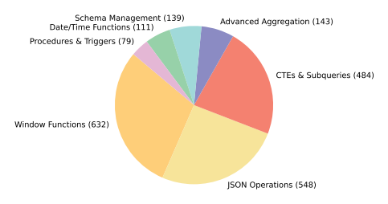

**图 8：** BIRD-INTERACT 中高级 SQL 特性的分布。

表 5 将 BIRD-INTERACT 使用的数据库与其他广泛使用的 Text-to-SQL 基准进行比较。与多数既有基准相比，我们的数据库跨越多样领域，每个数据库包含更多列，因而模式更复杂、更丰富。所有数据库均配有知识库文档。许可证方面，BIRD-INTERACT 基于开源 LIVE SQLBENCH（BIRD-Team, 2025）数据集构建；该数据集按 CC BY-SA 4.0 发布，确保学术界和产业界不受限制地使用。这一许可框架为学术研究和工业应用都提供了不受限制的可访问性。Spider 2.0 是另一个拥有大型数据资源的高质量基准，但其数据主要来自 BigQuery 和 Snowflake Marketplace，由此带来的许可复杂性可能限制学术界直接开展后续适配，并可能使研究人员承担使用成本。

## 附录 F 评测指标

### F.1 成功率（SR）

成功率（SR %）是我们的主要在线评测指标，用于衡量每个子任务是否在交互中得到正确解决。令 $N$ 表示任务总数；BIRD-INTERACT 的每项任务 $i$ 恰好包含两个子任务，记作 $q _ {i,1}$ 和 $q _ {i,2}$。每个子任务 $q _ {i,j}$ 都标注真值 SQL 解答 $\sigma _ {i,j}^\ast$ 和一组可执行测试用例 $T _ {i,j}$。若预测 SQL $\sigma _ {i,j}$ 通过 $T _ {i,j}$ 中所有测试用例，即认为它正确。所有任务中第 $j$ 个子任务的成功率定义为：

$$
\mathrm{SR} _ j=\frac{1}{N}\sum _ {i=1}^{N}\mathbb{I}\left[T _ {i,j}(\sigma _ {i,j})=\mathrm{True}\right]. \qquad \text{(2)}
$$

其中， $\mathbb{I}[\cdot]$ 是指示函数，预测正确时为 1，否则为 0。报告中分别给出两个子任务的 SR：（1）含糊的优先子任务 $q _ {i,1}$；（2）后续子任务 $q _ {i,2}$。我们依靠可执行测试脚本评测功能正确性，脚本将预测 SQL 与标注真值进行验证。测试脚本细节见附录 G。

### F.2 归一化奖励

为捕捉不同子任务的相对重要性（例如，成功完成初始含糊子任务是继续交互的关键），并区分首次尝试成功与调试后成功等系统行为，我们提出归一化奖励指标。该指标按所有任务的平均奖励计算，并与第 2 节所述子任务级成功率一并报告。

形式上，任务总数为 $N$ 时，归一化奖励计算为：

$$
R=\frac{\sum _ i r _ i}{N}\times100=\frac{\sum _ i\sum _ {j\in\lbrace1,2\rbrace}r _ {i,j}}{N}\times100,
$$

其中 $r _ i$ 和 $r _ {i,j}$ 分别是任务 $i$ 的奖励和任务 $i$ 中子任务 $j$ 的奖励。在 c-Interact 设置中，为区分首次尝试解答与调试后解答，奖励定义为：

$$
r _ {i,1}=\begin{cases}
0.7,&\text{第一个子任务未经调试即解决},\\
0.5,&\text{第一个子任务经调试后解决},\\
0,&\text{其他情况};
\end{cases}
$$

$$
r _ {i,2}=\begin{cases}
0.3,&\text{第二个子任务未经调试即解决},\\
0.2,&\text{第二个子任务经调试后解决},\\
0,&\text{其他情况}.
\end{cases}
$$

在 a-Interact 设置中，由于交互流程并不固定，例如调试次数不固定，奖励只考虑每个子任务通过或失败：

$$
r _ i=\begin{cases}
1.0,&\text{两个子任务均通过},\\
0.7,&\text{仅第一个子任务通过},\\
0,&\text{其他情况}.
\end{cases}
$$

## 附录 G 测试脚本

我们使用可执行测试脚本检查子任务正确性。对于 BI 子任务（分析查询），使用默认的宽松精确匹配（EM）脚本：它会规范化无害的 SQL 差异，例如删除注释、多余 `DISTINCT` 或取整操作，并在任务特定条件下比较预测 SQL 与标注解答 SQL 的执行结果。对于 DM 子任务（数据操纵或状态改变操作），使用逐例人工标注的验证脚本，断言任务特定的数据库后置条件。

### G.1 BI 查询

默认测试脚本清理预测与解答（例如删除注释、`DISTINCT` 和 `ROUND` 包装），再通过带条件映射的可配置比较器 `ex_base` 比较预测 SQL 与标注解答 SQL 的执行结果。例如，如果任务不要求排序，可用 `order: false` 忽略行顺序：

```python
def test_case_default(pred_sqls, sol_sqls, db_name, conn,
                      conditions=None):
    """Default test_case: pytest-style assertion."""
    pred_sqls = remove_comments(pred_sqls)
    sol_sqls = remove_comments(sol_sqls)
    pred_sqls = remove_distinct(pred_sqls)
    pred_sqls = remove_round(pred_sqls)
    sol_sqls = remove_distinct(sol_sqls)
    sol_sqls = remove_round(sol_sqls)

    result = ex_base(pred_sqls, sol_sqls, db_name, conn, conditions)
    assert result == 1, f"ex_base returned {result} but expected 1."
    return result
```

### G.2 DM 查询

DM 子任务可能涉及 DML/DDL、存储过程或函数，并不总是返回结果集。因此，我们使用逐例脚本执行预测 SQL，再断言任务特定的后置条件。根据子任务不同，测试脚本可能：（i）检查验证查询的返回值，例如调用新建函数或视图；（ii）检查所创建产物（表、索引、约束）是否存在，以及其形状和内容；（iii）比较目标状态属性，例如行数和关键不变量。以下是图 1 用户子任务的一项测试用例：

```python
def test_case(pred_sqls, sol_sqls, db_name, conn):
    execute_queries(pred_sqls, db_name, conn)

    verify_sql = "SELECT * FROM rank_urgent_care()"
    pred_query_result = execute_queries(verify_sql, db_name, conn)
    actual = pred_query_result[0]

    expected = [
        (101, 'Ancient Scroll', Decimal('7.20')),
        (102, 'Bronze Vase',   Decimal('6.85')),
        (103, 'Stone Tablet',  Decimal('6.50')),
    ]
    assert len(actual) == len(expected)
    assert actual == expected
    return True
```

## 附录 H 含糊性与后续任务标注详情

### H.1 用户查询含糊性标注

构建交互场景的核心步骤，是有意把含糊性引入原本明确的单轮用户查询。我们的标注流程确保系统不主动澄清就无法成功，从而反映真实人类—数据库交互固有的不确定性（Saparina & Lapata, 2024; Dong et al., 2025; Min et al., 2020; Bhaskar et al., 2023）。图 9 展示整个数据集中标注含糊性的分布。

**两种基本含糊类别。** 我们区分两种指导标注的基础类别：

- **意图级含糊性**直接来自用户语言：请求可能模糊、说明不足或缺少关键细节，例如“查找老年人”却不定义年龄阈值。如果不加消解，意图级含糊性可能严重损害用户体验并导致错误 SQL。澄清这类含糊性，是 LLM 忠实捕捉用户意图的首要要求。
- **实现级含糊性**发生在用户高层意图明确、但 SQL 执行有多种有效写法时，例如数值精度、排名方向或空值处理。它对理解的干扰较小，但消解这类含糊性能够提高 SQL 精度和与用户期望的一致性。

对每个类别，我们都向标注员提供结构化分类法，其中包含类型定义、标注条件和示例，确保含糊性注入系统且一致；详见附录 H.4。

**含糊点与澄清来源。** 每个注入的含糊点都与唯一澄清配对；该澄清由真值 SQL 的关键片段表示，而非自然语言文本。例如，含糊查询“查找老年人”关联到澄清片段 `WHERE age > 80`。这一设计保证了可复现性：用户模拟器可以可靠地把澄清建立在 SQL 语义之上，同时仍在交互中生成多样的自然语言改写。

**质量控制。** 标注员遵循严格检查清单：（1）澄清的必要性：没有澄清时，每个含糊查询都必须不可解，以保证真正依赖交互；（2）澄清后的完备性：给出澄清后，信息必须足以让专家重构准确的解答 SQL。这样即可确保注入的含糊性既必要又可恢复，从而支持可复现评测。

### H.2 知识与环境含糊性标注

除了修改用户查询，我们还引入由外部资源缺失或含噪引起的含糊性，要求系统同时利用知识库和数据库环境进行动态推理。我们将其分成知识含糊性和环境含糊性两类（Saparina & Lapata, 2024; Dong et al., 2025; Min et al., 2020; Huo et al., 2025; Bhaskar et al., 2023）。

**知识含糊性。** 我们向 HKB 中引入不完整性，模拟部署环境中文档通常不完整或碎片化的情况，并区分两个子类：

- **一次性知识含糊性：** 遮蔽单个知识条目，不涉及依赖链。例如，如果省略 CPI 的定义，系统就无法直接计算依赖它的指标；这些孤立缺口要求系统明确向用户询问缺失事实。
- **知识链断裂：** 遮蔽多跳推理链中的中间节点，从而破坏概念依赖。以图 2 所示“紧急照护”→“AVS”→“IF/CPI”为例，遮蔽中间节点 AVS 后，推理连接中断：查询变得含糊，系统必须先请求用户澄清，才能继续查找 IF/CPI 知识。

**数据库不一致。** LIVE SQLBENCH 数据库已包含噪声，例如字符串字段混合数值与单位、相关表之间列名不一致，以及关键字段出现 `NULL`。其 SQL 任务也已涉及这些数据库噪声，为数据质量挑战提供基础。我们有意利用这些既有不一致构建评测场景。构建后续子任务时，我们也会主动涉及这些含噪列，增加多轮交互复杂性。系统需要采用恰当的查询策略和稳健 SQL 模式来处理数据质量问题。与用户查询含糊性相同，每个含糊点也与一个充当澄清来源的真值 SQL 片段配对。

### H.3 含糊链

我们把不同类型的单个含糊点组合成含糊链，以要求多跳含糊性消解，其中整合三个方面：

1. **嵌套含糊性。** 澄清本身可能还需要进一步解释，因而需要多阶段消解。并非所有含糊点在查询表面都可见；有些只有在先前不确定性得到处理后才会显现。
2. **多个澄清来源。** 每个含糊点可能需要来自不同信息源的内容。系统尤其需要决定：应向用户寻求澄清，还是查询环境，例如知识库、模式或文档。
3. **澄清流。** 我们定义三种典型转移类型，用于刻画澄清如何跨信息源流动：
   - 用户 → 用户：初始用户澄清之后，仍需进一步询问用户；
   - 用户 → 环境：用户澄清指向必须从环境（如知识库）检索的辅助信息；
   - 环境 → 用户：系统先查询环境，但检索到的知识不完整或说明不足，因而必须返回用户处请求解释。

这些转移可以组成“用户 → 环境 → 用户”这样的多跳澄清序列。例如图 1 中存在两个含糊点：（1）模糊查询“需要紧急照护”被澄清为“按 AVS 排名”；（2）由于 AVS 的知识库条目被遮蔽，系统必须再次返回用户处请求澄清。实现这类情况时，我们会：（1）有意让标注的澄清片段说明不足；（2）遮蔽 HKB 中的部分节点，以模拟文档缺失。两种机制共同保证，成功消解必须依赖多阶段推理和信息源选择。

### H.4 用户查询含糊性分类法

我们区分两种指导标注的基础用户查询含糊性类别：

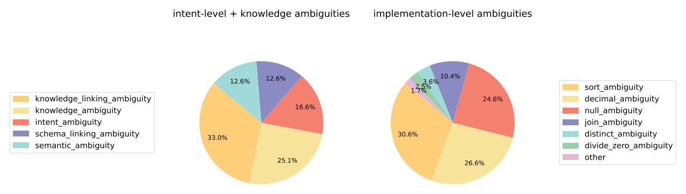

**图 9：** 含糊类型分布。左图为意图级与知识含糊性，右图为实现级含糊性。

**意图级含糊类型。** 意图级含糊性直接来自用户语言：请求模糊、说明不足或缺少关键细节，例如“查找老年人”却不定义年龄阈值。如果不加消解，它可能严重损害用户体验并导致错误 SQL（Saparina & Lapata, 2024; Li et al., 2025f）。依据相关工作（Saparina & Lapata, 2024; Li et al., 2025f; Dong et al., 2025; Wang et al., 2020; Min et al., 2020; Bhaskar et al., 2023; Huo et al., 2024; Floratou et al., 2024; Huang et al., 2023; Ding et al., 2025; Xu et al., 2024b;a），我们在表 6 中总结六类用户查询含糊性，并指导标注员将其注入明确查询：（1）词语有多重含义导致的词汇含糊性；（2）存在多个有效语法结构导致的句法含糊性；（3）“最近”等模糊表述导致的语义含糊性；（4）模式引用不清导致的模式链接含糊性；（5）“最高”等用户目标说明不足导致的查询意图含糊性；（6）隐式引用外部知识导致的知识链接含糊性。不同类型上的性能见图 14。

**表 6：BIRD-INTERACT 的意图级用户查询含糊性分类法。**

| 含糊类型 | 定义 | 示例 |
| --- | --- | --- |
| 词汇含糊性 | 一个词元在查询上下文中具有多种含义。 | “显示 bills”——`bills` 可能指发票、法案或计费记录。 |
| 句法含糊性 | 句子存在多个有效语法结构，产生不同解释。 | “获取 2020 年客户的订单”——按年份筛选订单还是客户？ |
| 语义含糊性 | 查询语法正确，但语义模糊，缺少精确解释所需细节。 | “最近的交易”——“最近”的时间范围未说明。 |
| 模式链接含糊性 | 多个模式元素都是合理候选，导致查询词语与正确模式元素的映射含糊。 | “按状态列出用户”——“状态”可能指 `account_status`、`login_status` 等。 |
| 查询意图含糊性 | 用户预期的操作或排名标准不确定。 | “显示最高的客户”——“最高”可能指收入、订单数或购买频率。 |
| 知识链接含糊性 | 被引用概念存在于外部知识库中，但查询与该知识的链接隐式或不清。 | “获取 Impact Score”——知识库中的具体概念是 Artist Impact Score。 |

**实现级含糊类型。** 用户高层意图明确、但 SQL 执行有多种有效写法时，就会出现实现级含糊性，例如数值精度、排名方向或空值处理。它对理解的干扰小于意图级含糊性，但消解这类情况可提升 SQL 精度和与用户预期的一致性。这些含糊点按条件标注，即只有真值 SQL 出现对应操作时才标注。对每种情况，标注员识别相关 SQL 片段并标记相应澄清来源。我们总结出以下类型：

- **小数含糊性。** 解答 SQL 进行取整或数值格式化时标注。含糊查询“显示平均分”澄清为“以两位小数显示平均分”，解答 SQL 使用 `ROUND(AVG(score), 2)`。
- **连接含糊性。** 解答 SQL 需要非默认连接语义（如 `LEFT JOIN`、`FULL OUTER JOIN`）时标注。含糊查询“列出所有客户及其订单”澄清为“列出所有客户及其订单，即使他们没有记录”，解答 SQL 使用 `LEFT JOIN`。
- **去重含糊性。** SQL 解答包含 `DISTINCT` 时标注。含糊查询“获取所有产品名”澄清为“获取所有不同的产品名”，解答 SQL 为 `SELECT DISTINCT product_name`。
- **排序含糊性。** SQL 解答使用没有 `LIMIT` 的 `ORDER BY` 时标注。含糊查询“显示最近购买”澄清为“按时间排序显示最近购买”，解答 SQL 包含 `ORDER BY purchase_time DESC`。
- **空值含糊性。** SQL 解答包含空值处理操作（如 `COALESCE`、`ISNULL`）时标注。含糊查询“按地区统计用户数”澄清为“按地区统计用户数，把空值视为 0”，解答 SQL 使用 `COUNT(COALESCE(region, 0))`。
- **排名含糊性。** 解答 SQL 使用排名函数（如 `ROW_NUMBER`、`DENSE_RANK`）时标注。含糊查询“显示按收入排名的最高客户”澄清为“显示按收入排名的最高客户；并列时分配相同名次”，SQL 使用 `DENSE_RANK()`。
- **除零含糊性。** SQL 解答显式处理除零时标注。含糊查询“显示考试通过数与总数的比率”澄清为“显示考试通过数与总数的比率，总数为零时视为 0”，解答 SQL 使用 `CASE WHEN total=0 THEN 0 ELSE passed/total END`。

这些标注保证实现级含糊性可复现，并系统地关联具体 SQL 构造。只在相关 SQL 操作存在时标注，我们可以在丰富基准实现细节挑战的同时保持标注一致性。

**表 7：BIRD-INTERACT 的实现级用户查询含糊类型。**

| 含糊类型 | 标注条件 | 示例转换（明确 → 含糊） |
| --- | --- | --- |
| 小数含糊性 | 解答 SQL 使用 `ROUND` | “以两位小数显示平均分” → “显示平均分” |
| 连接含糊性 | 解答 SQL 使用非默认连接（如 `LEFT JOIN`） | “显示所有客户及其订单，即使他们没有记录” → “显示所有客户及其订单” |
| 去重含糊性 | 解答 SQL 使用 `DISTINCT` | “获取所有不同的产品名” → “获取所有产品名” |
| 排序含糊性 | 解答 SQL 使用没有 `LIMIT` 的 `ORDER BY` | “按时间排序显示最近购买” → “显示最近购买” |
| 空值含糊性 | 解答 SQL 包含空值处理（如 `COALESCE`、`ISNULL`） | “按地区统计用户数，把空值视为 0” → “按地区统计用户数” |
| 排名含糊性 | 解答 SQL 使用排名函数（如 `ROW_NUMBER`、`RANK`、`DENSE_RANK`） | “显示按收入排名的最高客户；并列时分配相同名次” → “显示按收入排名的最高客户” |
| 除零含糊性 | 解答 SQL 必须显式处理除零 | “显示通过数与考试总数的比率，总数为零时视为 0” → “显示通过数与考试总数的比率” |

### H.5 后续子任务分类法

除了初始含糊性，交互场景还要求系统处理延伸或细化分析链的多样后续请求。依据相关工作（Yu et al., 2019b;a; Yin et al., 2023），我们把后续请求分成六类（表 8）：约束调整、主题转移、属性修改、结果驱动的下钻、基于聚合的总结，以及基于新建对象的状态依赖后续请求。它们测试被评测系统能否维持上下文、适应不断演化的用户需求和数据库，并跨多个轮次生成连贯 SQL。

**表 8：BIRD-INTERACT 的后续子任务分类法。**

| 后续类型 | 说明 | 首次查询示例 | 后续示例 |
| --- | --- | --- | --- |
| 约束变化 | 收紧或放宽筛选条件。 | “列出 2024 年入职的员工。” | “只要工程师。”／“也包括 2023 年。” |
| 主题转移 | 比较或切换实体值以探索替代项。 | “产品 A 在 2023 年的销量。” | “产品 B 呢？” |
| 属性变化 | 修改所需属性、指标或列。 | “员工超过 50 人的部门。” | “给出这些部门的平均薪资。” |
| 基于结果 | 基于前一结果集下钻、重分组、嵌套或重新格式化。 | “列出 2023 年完成的项目。” | “对于 Apollo，显示其预算。” |
| 聚合 | 请求统计、拼接、计数或布尔检查，如 `AVG`、`STRING_AGG`、`MAX FILTER`、`ARRAY_AGG+LIMIT`、`EXISTS`；最终输出通常为标量、单行或紧凑表格。 | “按曲目数显示前 10 名艺术家。” | “把他们的姓名连接成一条逗号分隔字符串。” |
| 状态依赖 | 首次查询创建或修改数据库对象（如表、视图），改变数据库状态；后续查询在该对象上操作。 | “创建一张薪资超过 10 万的员工表。” | “从该表中仅列出工程师。” |

## 附录 I 实验详情

### I.1 选择 PostgreSQL 作为评测数据库系统

BIRD-INTERACT 采用 PostgreSQL 作为底层评测数据库管理系统，主要基于以下考虑。

**企业采用与丰富功能。** PostgreSQL 是生产环境中部署最广泛的开源数据库系统之一，支持复杂分析所需的高级 SQL 特性，包括窗口函数、CTE、递归查询、JSON 处理和用户定义函数。因此，评测可以使用真实的生产级查询，而非基本模式。

**可访问性与可复现性。** PostgreSQL 是开源系统，可消除许可证费用和访问障碍。BigQuery、Snowflake 等专有云平台可能产生使用费，PostgreSQL 则保证任何研究人员都能在没有财务约束的情况下复现我们的评测环境，从而提升基准的长期可持续性。

**标准遵循与可迁移性。** PostgreSQL 对 SQL 标准（SQL:2016）保持高度遵循，同时提供文档完善的扩展。这既保证评测结果能够广泛应用于各种数据库系统，也使学到的能力可以泛化到特定供应商实现之外。

综上，PostgreSQL 兼具真实场景相关性、功能完备性和不受限制的可访问性，是在近似生产条件下评测交互式 Text-to-SQL 系统的最佳选择。

### I.2 模型别名

本文使用以下模型别名：

- Gemini-2.0-Flash：`gemini-2-0-flash-001`
- DeepSeek-R1：`deepseek-r1`
- GPT-4o：`gpt-4o-2024-11-20`
- DeepSeek-V3：`deepseek-chat`
- O3-Mini：`o3-mini-2025-01-31`
- Claude-Sonnet-3.7：`claude-3-7-sonnet-20250219`
- Qwen-3-Coder-480B：`Qwen3-Coder-480B-A35B`
- DeepSeek-Chat-V3.1：`deepseek-chat-v3.1`
- Gemini-2.5-Pro：`gemini-2-5-pro`
- Claude-Sonnet-4：`claude-sonnet-4-20250514`
- GPT-5：`gpt-5`

### I.3 实验设置

为保证可复现性，所有实验都采用确定性解码。具体而言，我们为所有模型设置 `temperature=0` 和 `top_p=1`。由于商业 API 调用成本很高，且这些设置下输出具有确定性，每项实验只执行一次。c-Interact 和 a-Interact 的默认用户耐心预算均设为 3，另加含糊性消解所必需的轮数，后者等于标注的含糊点数。在交互测试时扩展实验中，我们采用 0、3、5 和 7 四个耐心值，以评测不同交互预算下的稳健性。a-Interact 的基础预算设为 6，使系统在提交前有足够能力探索环境并执行 SQL 查询。所有模型推理均直接来自官方 API 或已发布检查点，以确保真实性和一致性。对于具备推理能力的模型，我们将推理强度设为默认的 `medium`。

## 附录 J a-Interact 的动作空间与选择模式

**表 9：** 智能体动作空间，包括可用动作、所属环境、参数、返回值（即观察）与相关成本。

| 动作 | 环境 | 参数 | 返回值 | 成本 |
| --- | --- | --- | --- | ---: |
| `execute` | DB | `sql` | 查询结果 | 1 |
| `get_schema` | DB | - | 数据库模式 | 1 |
| `get_all_column_meanings` | DB | - | 所有列的含义 | 1 |
| `get_column_meaning` | DB | `table, column` | 列含义 | 0.5 |
| `get_all_external_knowledge_names` | DB | - | 所有知识名称 | 0.5 |
| `get_knowledge_definition` | DB | `knowledge` | 知识定义 | 0.5 |
| `get_all_knowledge_definitions` | DB | - | 所有知识定义 | 1 |
| `ask` | 用户 | `question` | 用户澄清 | 2 |
| `submit` | 用户 | `sql` | 用户反馈 | 3 |

### J.1 a-Interact 的动作空间

表 9 列出智能体在 a-Interact 评测中可以调用的九种动作。它们自然聚为两类。

**纯环境探查（成本不超过 1）。** 七种低成本调用使智能体无需接触用户即可检查数据库和 HKB：

- `execute`：运行候选 SQL 语句并接收结果集；
- `get_schema`、`get_all_column_meanings`、`get_column_meaning`：公开结构和语义元数据；
- `get_all_external_knowledge_names`、`get_knowledge_definition`、`get_all_knowledge_definitions`：从 HKB 中检索业务概念。

0.5-1 的分级成本反映这些动作所消耗环境资源的不同水平。输入更小、输出更短的动作（如 `get_column_meaning`）成本较低，为 0.5；返回内容显著更长的宽泛检索（如 `get_all_column_meanings`、`get_schema`）成本为 1.0。

**用户介入的交互（成本至少为 2）。** 当自主推理不足时，智能体可以：

- `ask`（成本 2）：向用户模拟器提出澄清问题；
- `submit`（成本 3）：向用户提交完整 SQL 候选；用户执行测试用例评测，并向智能体给出反馈。

较高惩罚反映分析师介入的现实成本，并鼓励系统只在场景确实含糊或需要最终验证时使用这些调用。整体而言，该动作设计在表达能力与显式成本信号之间取得平衡，促进战略性工具使用、高效信息收集，以及尽量少地依赖用户模拟器。

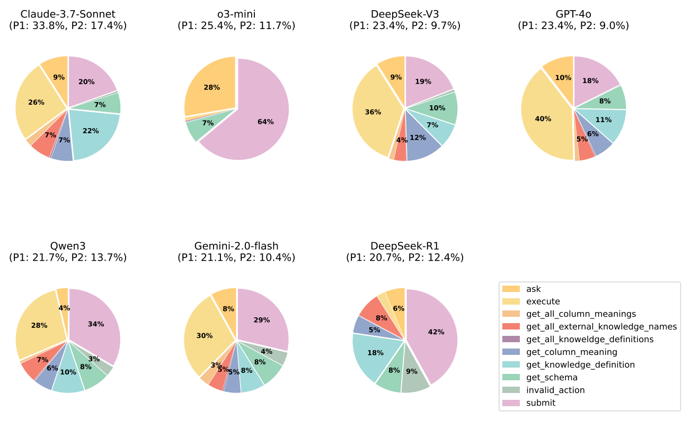

**图 10：** 默认设置（耐心 = 3）下，系统在 LITE 集上的动作分布。P1 和 P2 分别表示第一个子任务和第二个子任务的成功率。

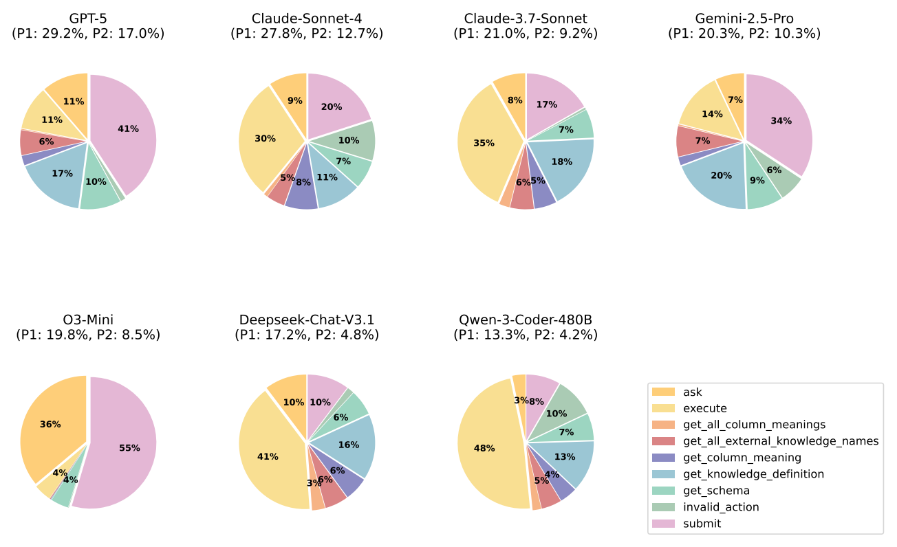

**图 11：** 默认设置（耐心 = 3）下，系统在 FULL 集上的动作分布。P1 和 P2 分别表示第一个子任务和第二个子任务的成功率。

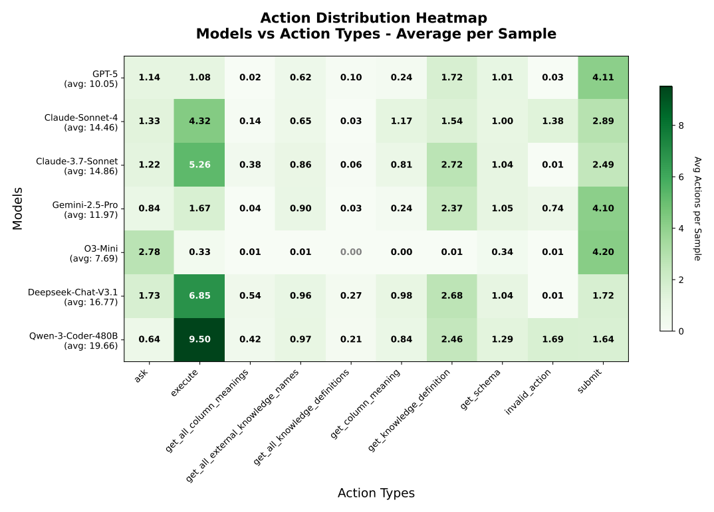

**图 12：** 默认设置（耐心 = 3）下，系统在 FULL 集上的动作分布热图。

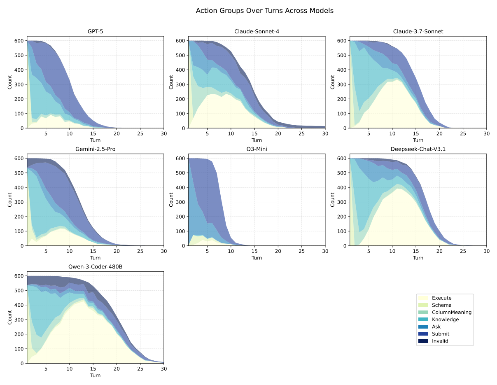

**图 13：** 默认设置（耐心 = 3）下，系统在 FULL 集各轮次上的动作组交互模式。

### J.2 自定义智能体的通用成本方案

我们鼓励使用我们基准的用户在预算约束感知测试下开发具有自定义动作空间的智能体。然而，我们默认设置中定义的动作成本未必能直接应用于新动作。为使潜在动作空间不同的智能体之间仍能进行公平、可复现的评测，我们在 a-Interact 框架中提出统一的两级成本方案；所有自定义智能体在分配动作成本时都应遵循该方案。

（1）**固定成本动作。** 如果自定义智能体包含询问用户、提交 SQL 或执行 SQL 的动作，应为其分配与我们设置相同的成本。用户侧动作（`ask=2`、`submit=3`）使用全局固定成本，以反映人类介入的固有成本；`execute` 的固定成本为 1.0，与结果大小无关。所有智能体都通过同一数据库接口和执行引擎交互，因此这一规定可确保各实现具有一致的计算开销和 I/O 行为。

（2）**token 感知动作。** 对不同于我们默认设置的自定义环境动作（例如新的 `get_all_table_names`），依据调用动作时产生的输入、输出 token 数动态决定成本，以反映所消耗环境资源的相对数量。根据我们的实证统计，我们定义一条适用于所有智能体的 token 感知规则：若某次环境动作调用的输入 token 少于 250、输出 token 少于 1000，则成本应设为 0.5；否则成本应为 1.0。这项通用策略保证使用不同动作空间的智能体能够得到公平评测。

### J.3 动作选择模式及其影响（完整集）

图 11 和图 12 展示七个系统在 FULL 集上如何分配对九种可用动作（表 9）的调用。我们总结出三项观察。

1. **平衡策略优于极端策略。** 表现最强的 GPT-5（29.2%）和 Claude-Sonnet-4（27.8%）采用相对平衡的策略。GPT-5 把预算近乎均分给环境探查（47%）和用户介入（`ask+submit`：52%）。Claude-Sonnet-4 的模式相似，但更强调 `execute`（29.9%），较少使用 `submit`（20.0%）。相比之下，O3-Mini 把极端的 91% 预算用于用户调用（36% `ask`、55% `submit`），只为 `execute` 分配 4%，第一个子任务的通过率不足五分之一。另一端，Qwen-3-Coder（48% `execute`）和 DeepSeek-Chat（41% `execute`）极度偏重执行，表现也不佳，P1 分别只有 13.3% 和 17.2%。这一对照表明，成功的智能体必须在探索环境和采取面向用户的动作之间取得平衡，而不能过度投资于任何一端。
2. **选择性提交有益，蛮力执行有害。** 各系统的 `submit` 调用占比与 P1 呈正相关（Pearson $r\approx0.41$，Spearman $\rho\approx0.54$），而 `execute` 调用占比呈负相关（Pearson $r\approx-0.52$，Spearman $\rho\approx-0.54$）。实践中，这意味着反复用试探性 `execute` 调用探查数据库、却不整合信息，往往会浪费预算；收敛到有依据的假设并提交，则可以通过用户反馈提高成功率。例如，Claude-3.7-Sonnet 和 DeepSeek-Chat 的 `submit` 占比分别低于 17% 和 11%，而高度依赖 `execute`。另一个极端是 O3-Mini，不加甄别地在超过一半轮次中提交，表现同样不佳；这说明，如果忽略用户和环境提供的信息，提交的绝对数量并不重要。
3. **交互模式随轮次演变：先探索，再执行和提交。** 图 13 表明，较强系统（如 GPT-5、Claude-Sonnet-4）遵循清晰的逐轮策略：前几轮把环境探索与用户澄清结合起来收集信息；中后期增加 `execute` 和 `submit` 调用，测试并细化 SQL。较弱系统要么过早提交（O3-Mini），要么过度执行却不整合信息（Qwen-3-Coder），从而导致性能较差。这说明，性能不仅取决于总体动作组合，还取决于各动作如何在交互轮次中排序。

综合而言，这些结果表明，在智能体式 c-Interact 设置中，性能较少取决于单纯的交互次数，更多取决于系统能否平衡环境探索与用户交互、能否在适当时机提交，以及能否避免浪费预算。

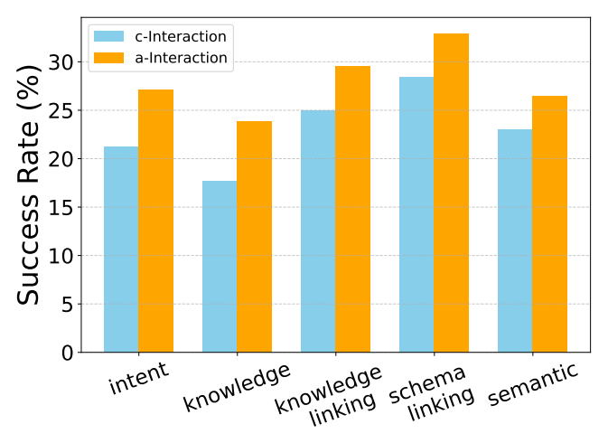

**图 14：** LLM 在 c-Interact 和 a-Interact 两种模式的不同含糊类型上的成功率。

## 附录 K 不同含糊类型上的性能

**哪种知识缺失会造成更多含糊性：线性缺失还是高阶缺失？** 图 15 比较两类任务：（1）缺失事实位于层次结构中的简单“线性”链上；（2）缺口出现在链内部，即我们所称的高阶含糊性。线性情况对应一次性知识缺口，高阶情况对应第 3.2 节中的知识链断裂。在脚本化 c-Interact 设置中，所有模型都觉得线性缺口更容易：一旦给出前置节点，余下的一跳几乎是机械过程。若在链内部插入断点，成功率便会急剧下降，因为模型在提出澄清问题之前，必须先推断哪个中间概念仍是未知的。当我们切换到智能体式 a-Interact 后，只有 Claude-Sonnet-3.7 的情况发生变化，其规划策略消除了两个类别之间的差距；O3-Mini 和 Qwen-3 仍会在高阶情况中失误。该趋势说明，根本障碍并非检索本身，而是定位多步推理路径中缺失环节的元认知步骤；只有纪律性最强的智能体能够可靠做到这一点。

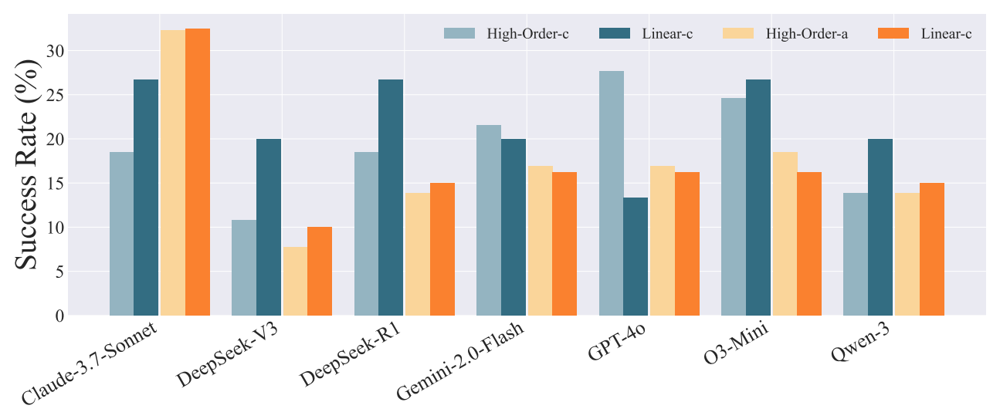

**图 15：** LLM 在 c-Interact 和 a-Interact 模式的线性与高阶含糊性上的成功率。

## 附录 L BIRD-INTERACT-LITE 实验

**表 10：不同模型在 BIRD-INTERACT-LITE 上的成功率与最终归一化奖励。** 成功率为累计值；Reward* 为归一化奖励。c-Interact 数值为调试阶段结束后的结果，`(+n)` 表示通过调试获得的性能增量。平均成本是每项任务的平均美元成本。

| 模型 | 优先问题 BI | 优先问题 DM | 优先问题总体 | 后续 BI | 后续 DM | 后续总体 | Reward* | 平均成本 |
| --- | ---: | ---: | ---: | ---: | ---: | ---: | ---: | ---: |
| **c-Interact Text-to-SQL** |  |  |  |  |  |  |  |  |
| DeepSeek-V3 | 9.23 (+1.54) | 40.95 (+6.67) | 20.33 (+3.33) | 5.13 (+1.54) | 24.76 (+1.90) | 12.00 (+1.67) | 17.00 | \$0.01 |
| Qwen-3 | 14.36 (+2.56) | 44.76 (+2.86) | 25.00 (+2.67) | 7.18 (+0.51) | 28.57 (+4.76) | 14.67 (+2.00) | 21.17 | \$0.03 |
| DeepSeek-R1 | 16.92 (+3.08) | 43.81 (+6.67) | 26.33 (+4.33) | 9.74 (+2.05) | 27.62 (+3.81) | 16.00 (+2.67) | 22.10 | \$0.08 |
| Claude-Sonnet-3.7 | 17.44 (+3.59) | 59.05 (+1.90) | 32.00 (+3.00) | 9.23 (+2.05) | 27.62 (+7.62) | 15.67 (+4.00) | 26.10 | \$0.32 |
| Gemini-2.0-Flash | 16.92 (+3.59) | 60.95 (+7.62) | 32.33 (+5.00) | 9.74 (+1.03) | 40.95 (+3.81) | 20.67 (+2.00) | 27.63 | \$0.04 |
| GPT-4o | 26.15 (+7.18) | 54.29 (+6.67) | 36.00 (+7.00) | 14.36 (+1.03) | 30.48 (+1.90) | 20.00 (+1.33) | 29.67 | \$0.32 |
| O3-Mini | 22.56 (+1.54) | 64.76 (+3.81) | 37.33 (+2.33) | 12.31 (+0.00) | 46.67 (+0.95) | 24.33 (+0.33) | 32.93 | \$0.09 |
| **a-Interact Text-to-SQL** |  |  |  |  |  |  |  |  |
| Gemini-2.0-Flash | 8.21 | 44.76 | 21.00 | 4.10 | 21.90 | 10.33 | 17.80 | \$0.03 |
| DeepSeek-R1 | 6.67 | 47.62 | 21.00 | 3.59 | 28.57 | 12.33 | 18.40 | \$0.09 |
| GPT-4o | 12.31 | 43.81 | 23.33 | 4.62 | 17.14 | 9.00 | 19.03 | \$0.46 |
| DeepSeek-V3 | 11.79 | 44.76 | 23.33 | 6.15 | 16.19 | 9.67 | 19.23 | \$0.06 |
| Qwen-3 | 7.18 | 49.52 | 22.00 | 5.64 | 29.52 | 14.00 | 19.60 | \$0.03 |
| O3-Mini | 14.87 | 45.71 | 25.67 | 6.67 | 21.90 | 12.00 | 21.57 | \$0.08 |
| Claude-Sonnet-3.7 | 22.05 | 56.19 | 34.00 | 10.77 | 30.48 | 17.67 | 29.10 | \$0.67 |

表 10 报告 BIRD-INTERACT-LITE 上的结果。我们观察到与 FULL 集一致的模式：总体成功率和归一化奖励仍然很低，确认即便使用更简单的数据库，交互式 Text-to-SQL 仍很困难。Claude-Sonnet-3.7 等能够平衡澄清与环境探索的模型取得更高 SR 和 NR；过度依赖执行或提交的模型则落后。后续子任务仍比优先查询更具挑战性，凸显跨交互维护上下文的难度。

## 附录 M 错误分析

我们从自己的评测中抽取 50 个失败案例开展错误分析，发现超过 80% 的错误由含糊性消解不完整造成。在很多情况下，系统提出的澄清问题过少、完全不提问题，或未能检测到正确含糊点并请求相应澄清。平均而言，我们的基准中每项任务包含约四个含糊点（表 1），但系统每项任务平均只请求约一次澄清（图 12）。结果是，大多数任务在信息不足时即被尝试，难以得到正确解答。这凸显了当前 LLM 在人机协作能力方面的局限。其余错误来自 Text-to-SQL 生成中的常见问题，例如 SQL 语法错误、选错列或误解数据库约束。

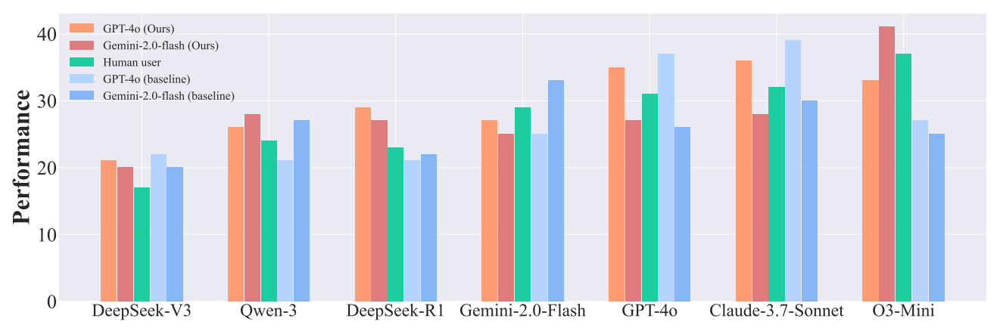

**图 16：** 在 100 项抽样任务上，我们的两阶段用户模拟器、基线用户模拟器与人类用户的性能比较。

## 附录 N 用户模拟器设计细节

正文介绍了我们的函数驱动用户模拟器，它调用 `LOC()` 动作处理未被预标注含糊点覆盖、但合理的澄清问题。本附录详述基于抽象语法树（AST）的检索机制；它使模拟器能够从真值（GT）查询中定位相关 SQL 片段，并准确回答这类问题。我们的函数驱动用户模拟器的平均成本为每条数据 0.03 美元。

`LOC()` 动作的主要挑战，是找出 GT SQL 中与系统问题对应的特定部分，同时避免依赖对原始 SQL 字符串进行脆弱的关键词匹配。AST 为 SQL 查询提供结构化、层次化表示，非常适合这项任务。我们的检索过程包括三个主要步骤：解析、节点匹配和上下文片段提取。

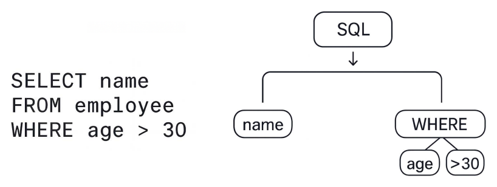

**图 17：** SQL 查询的抽象语法树（AST）示例。

**1. 把 SQL 解析为 AST。** 首先，使用稳健 SQL 解析器（例如基于 `sqlglot` 等库）处理真值 SQL 查询并生成 AST。如图 17 所示，这棵树把查询分解为基本语法组件。树中每个节点代表查询的一部分，例如子句（`SELECT`、`FROM`、`WHERE`）、函数（`COUNT()`、`AVG()`）、标识符（列名或表名）、运算符（`=`、`>`）或字面值（`'USA'`、`2023`）。这种层次结构使查询的每个组件都可单独寻址。

**2. 通过 LLM 语义搜索进行节点匹配。** 生成 AST 后，下一步是识别与系统澄清问题最相关的节点。为此，我们遍历 AST 并创建包含所有节点的列表，将其展平。该方法比简单关键词匹配稳健得多，因为它能够捕捉“多少”与 `COUNT()` 相匹配，或“最近”与 `ORDER BY ... DESC` 子句相匹配这样的关系。

这种 AST 方法确保 `LOC()` 函数能够可靠地把响应建立在 GT SQL 上，提供准确、上下文相关的信息，而不泄漏整条查询。

## 附录 O 函数驱动用户模拟器评测

为实证验证我们提出的函数驱动用户模拟器的有效性，我们围绕稳健性和可靠性开展综合评测。我们先介绍专门挑战用户模拟器的新基准 UserSim-Guard，再给出我们的实验设置和结果，并把我们的方法与标准基线比较。

### O.1 UserSim-Guard：模拟器稳健性基准

为系统评测模拟器性能，我们构建了人工策划的数据集 UserSim-Guard，其中包含 2,100 个富有挑战性的问题。

**构建方法。** UserSim-Guard 由 7 名接受过培训、具备 SQL 与自然语言专业知识的标注员构建。为保证数据质量和多样性，我们采用严格标注协议。数据集围绕三类系统澄清请求组织，分别探查模拟器能力的不同方面：

- **AMB（已标注含糊点）：** 标注员依据 BIRD-Interact-Lite 中预标注的含糊点编写自然语言问题，直接测试模拟器正确利用含糊性标注的能力。
- **LOC（可定位信息）：** 包含预标注含糊点未覆盖、但合理的澄清问题。标注员仔细检查真值 SQL，识别潜在混淆点（如具体列选择、格式偏好或子组件逻辑），并相应编写问题。这些问题的答案可以从真值 SQL 中定位和推断。
- **UNA（不可回答）：** 为测试模拟器安全性和对角色的遵守，该类别包含有意设计为不当或试图索取特权信息的问题。标注员编写直接索取真值 SQL、数据库模式或问题求解分步指导的查询。稳健模拟器应拒绝回答。

此外，为研究模拟器对不同交互风格的敏感性，我们要求标注员以三种不同风格表述每个问题：简洁型（简短且以关键词为中心）、普通型（标准会话语言）和冗长型（描述充分、上下文丰富）。

**质量控制。** 为确保最高的数据质量，我们采用多阶段质量控制流程。UserSim-Guard 中每个“问题—动作”对均使用双盲“背靠背”标注方案：每个数据点先由一名标注员独立创建，再由第二名标注员验证；二者存在分歧时，由第三名资深标注员作出最终裁决。该流程尽量减少个人偏差与错误。我们使用 Fleiss’ Kappa 衡量标注员间一致性（IAA），得到 0.93，说明我们的标注员之间具有高度一致性，也确认了我们标签的可靠性。

### O.2 实验设置

**模型与基线。** 我们把自己提出的函数驱动用户模拟器与采用单遍 LLM 提示直接生成响应的基线模拟器进行比较。为保证公平，我们的方法和基线都使用两个最先进的大语言模型作为骨干：Gemini-2.0-Flash、GPT-4o 和 Claude-Haiku-4.5。

**评测框架。** 为客观、全面观察不同用户模拟器机制，我们使用 LLM-as-Judge 设计了稳健评测框架，使响应质量评测能够超越简单字符串匹配。我们采用 Qwen3-235B-A22B-Instruct-2507 作为评测器。

对于模拟器生成的每项响应，LLM 评判器执行多项选择分类任务。采用该格式是为了减轻 LLM-as-Judge 偏差（Gu et al., 2024）、减少歧义，并比开放式反馈形成更有区分度的评测。选项为：

- **A. 完美：** 响应正确、准确地回答问题，不披露任何不当信息；有帮助且自然。
- **B. 可接受：** 响应在功能上正确且不泄漏信息，但可能略显不自然、过于简短，或可以用更有帮助的方式表述。
- **C. 错误：** 响应存在事实错误、未回答问题、泄漏真值信息（尤其是 UNA 问题），或在其他方面不当。

只有被归类为 C 的响应才算失败；我们在报告时把 A 和 B 都视为正确。为确保我们的结果可靠，我们采用严格的一致性评测：只有两个 LLM 评判器都独立将响应归类为 A 或 B 时，才将其标为正确。我们最终报告准确率，即按这一一致性规则判定为正确的响应比例。

### O.3 结果与分析

我们的分析表明，传统用户模拟器设计存在显著可靠性问题，而我们的函数驱动方法显著缓解了这些问题。

如图 6 所示，处理 UNA（不可回答）问题时的对比最为鲜明。基线用户模拟器始终无法实现必要的保护措施，经常泄漏真值细节或提供不当指导；随骨干模型不同，失败率最高可达 67.4%。相比之下，我们的函数驱动方法显著提高可靠性：先对请求意图分类并调用 `UNA()` 函数，从而正确拒绝不当问题，把失败率降至最低 2.7%，大幅改善了用户模拟器的稳健性。

表 11 更细致地分解了所有问题类别上的准确率。我们观察到，LLM 在与含糊性有关的类别上本就表现较强，基线方法达到 87.7%-92.3% 的准确率；但它们难以应对 UNA 问题，某些骨干的基线准确率低至 32.6%。我们的函数驱动方法显著缓解了该弱点，在 UNA 问题上稳定达到 87.3%-97.3% 的准确率，与图 6 的观察一致。这说明，LLM 虽然可以自然处理直接的澄清任务，但需要显式结构约束，才能避免不当地回答本应拒绝的问题。我们的两阶段设计先识别问题类型，再生成响应，从而执行这类约束，确保模拟器行为可预测、可控，符合提供公平、真实用户反馈且不泄漏真值信息的目标。<sup>1</sup>

<sup>1</sup> 我们认为，若用户模拟器在已标注和未标注含糊性类别上的准确率都至少为 90%，且在不可回答（UNA）问题上的准确率至少为 80%，则该模拟器可靠。

**表 11：** 使用更新后评测结果时，用户模拟器在 UserSim-Guard 上的准确率（%）。准确率依据两个独立 LLM 评判器的一致性报告。

| 骨干模型 | 模拟器 | AMB 准确率 | LOC 准确率 | UNA 准确率 |
| --- | --- | ---: | ---: | ---: |
| Gemini-2.0-Flash | 基线 | 89.6 | 89.3 | 40.3 |
| Gemini-2.0-Flash | 我们的方法（函数驱动） | 94.9 | 93.6 | 87.3 |
| GPT-4o | 基线 | 87.7 | 89.4 | 77.3 |
| GPT-4o | 我们的方法（函数驱动） | 94.6 | 94.1 | 97.3 |
| Claude-Haiku-4.5 | 基线 | 92.3 | 92.0 | 32.6 |
| Claude-Haiku-4.5 | 我们的方法（函数驱动） | 95.0 | 95.0 | 95.4 |

## 附录 P 有效沟通的路径

记忆移植结果凸显了沟通技能对交互式 Text-to-SQL 系统的重要性。受此启发，我们进一步开展深入分析。本节中，我们研究能够改进任务性能的具体沟通模式和对话策略。通过深入分析高质量交互数据，我们发现一种反复出现且非常有效的模式，称为“漏斗效应”：一系列逐步深入的问题从用户相对宽泛、含糊的初始意图开始，逐渐缩小范围并澄清关键细节，最终收敛成清晰、可执行的分析计划。我们把该模式分解为三个主要阶段。

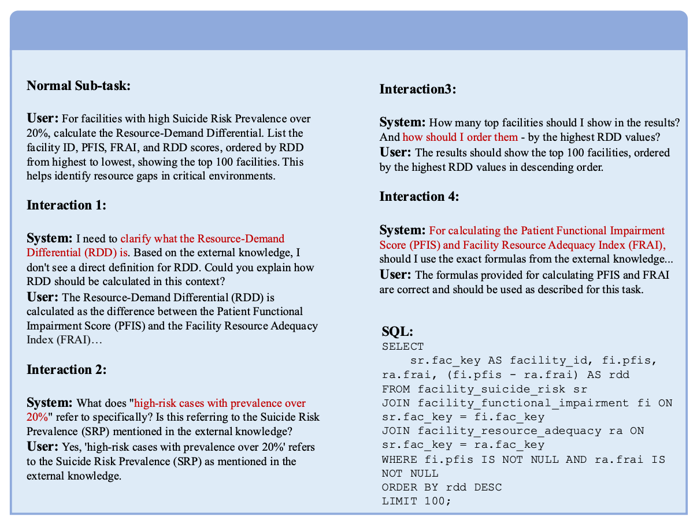

**图 18：** c-Interact 中有效沟通的案例研究。

**初始交互阶段：概念澄清和界定范围。** 在高质量对话的初始阶段，LLM 往往提出旨在澄清核心概念的问题。这样，它可以迅速识别用户查询中的含糊区域，并主动发起消歧对话。这些问题非常有针对性且高效，例如：“您想如何定义每台望远镜的‘干扰评分’？”或“能否澄清一下您所说的‘总是发生故障的机器’是什么意思？”

与此同时，模型不会被动等待用户给出精确描述，而会主动提供具体选项，引导用户形成更明确的定义，从而防止用户继续给出模糊陈述。例如：“它应基于大气干扰、RFI 状态等具体列，还是多个因素的组合？”

此外，模型能够有效整合外部知识，把用户的主观描述量化为可执行的数据标准。例如：“能否澄清应用什么标准识别‘高质量’扫描？是否应使用外部知识中的 Premium Quality Scan 定义（SQS > 7.5、覆盖率至少为 95% 且重叠率至少为 30% 的全面覆盖）？”

**中期交互阶段：询问计算逻辑和实现细节。** 随对话推进，模型把重点转向实现细节，关注计算逻辑和操作步骤。用户查询经常涉及复杂计算或业务逻辑，这类澄清对于保证分析准确性至关重要，包括精确确认公式、权重分配，以及查询变量与具体数据字段的映射。例如：“维修成本应使用维护成本（`MaintCost`）还是更换成本（`ReplCost`）……？”

模型还展示出前瞻性的错误检测能力，通过提问预判并缓解潜在数据处理错误。例如：“我注意到 `recvDay` 和 `beginDay` 的格式不同。能否确认这些日期的格式，以便我正确计算时间差？”

一项重要发现是，模型能够发现用户可能未曾考虑的分析维度，实质上会提出用户自己没有意识到应该提出的问题，从而拓展分析的深度和广度。例如：“您想查看每种偶像类型的收藏者数量，还是收藏者交互的偶像类型分布？如果一个收藏者与不同偶像互动，后者可能包含多个类型。”

为保证复杂计算准确，模型把计算分解成更小、更易验证的步骤，并逐一向用户确认。例如：“要计算 Achievement Density（AD），我需要以天为单位的成员持续时间……”

**最终交互阶段：格式和最终确认。** 最后阶段的对话重点转向结果格式和呈现，通常包括最后确认输出字段、排序规则和数值精度（例如小数位数），以确保最终交付完全符合用户预期。例如：“对于输出格式，您希望结果按特定方式排序吗……？此外，平均 BFR 和标准差值是否应四舍五入到特定小数位？”

图 18 的示例体现了这一高质量交互流程。过程先澄清含糊概念“RDD”和“患病率超过 20% 的高风险病例”，然后深入询问计算细节并确定结果呈现和排序方式，最后重新确认计算公式，确保整个分析过程严谨、准确。

## 附录 Q 数据集质量的人类评测

为严格评估我们提出的 BIRD-INTERACT 基准的质量和可靠性，我们开展了全面的人类评测。我们从数据集中随机选择 300 个数据点，邀请 10 名在 SQL 和数据库系统方面经验丰富的专家担任评审者。每个数据点由一个用户问题、一条真值 SQL 查询及其含糊性标注组成，并根据一组核心质量指标接受评测。每个指标采用二元计分（接受为 1，拒绝为 0）（Li et al., 2025c）。

**评测指标。** 指标覆盖我们数据集的三个主要组件：自然语言问题、SQL 解答和含糊性标注。

- **用户查询质量：** 评估用户自然语言查询是否清晰、流畅、合理。问题在逻辑上必须成立，而且在给定数据库模式下原则上可以回答。若问题模糊、不自然，或依据模式无法回答，就会被拒绝。
- **SQL 正确性和质量：** 评估真值 SQL 查询是否准确、高效地满足用户请求。查询在语义上必须正确，即在逻辑上回答问题，同时语法有效。我们也鼓励评审者拒绝不必要地复杂或极其低效的查询，确保解答达到高标准。
- **含糊性标注质量：** 检查预标注含糊点是否有效、相关。高质量标注必须代表 Text-to-SQL 系统可能真实遇到的混淆点，例如列选择、分组逻辑或筛选条件中的含糊性；相关 SQL 片段也必须准确对应其要澄清的含糊点。
- **伦理与安全：** 评估用户问题内容和数据上下文是否不含有害、偏颇或不道德内容，以确保数据集可以安全使用。

**评测结果。** 人类评测确认，我们的数据集质量很高。在所有受评样本上，我们取得了 97.3% 的总体接受率，说明专家对数据集有效性高度认同。其中，SQL 正确性和质量指标的接受率为 98.7%，凸显我们基准的技术可靠性；含糊性标注质量也获得 95.3% 的高接受率，确认我们的标注捕捉到有意义且真实的交互挑战。这些强劲结果验证了 BIRD-INTERACT 是开发和评测交互式 Text-to-SQL 系统的稳健、高质量资源。

## 附录 R 提示

### R.1 系统提示

图 19 给出 c-Interact（会话式）设置使用的系统提示，图 20-22 给出 a-Interact（智能体式）设置使用的系统提示。提示正文按原图完整保留。

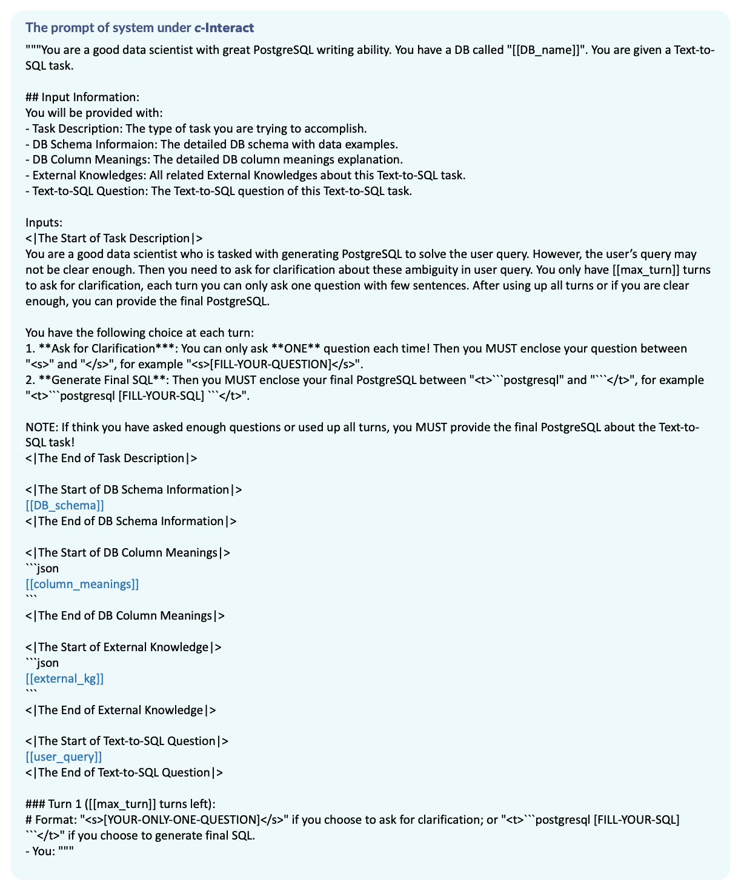

**图 19：** c-Interact 的系统提示。

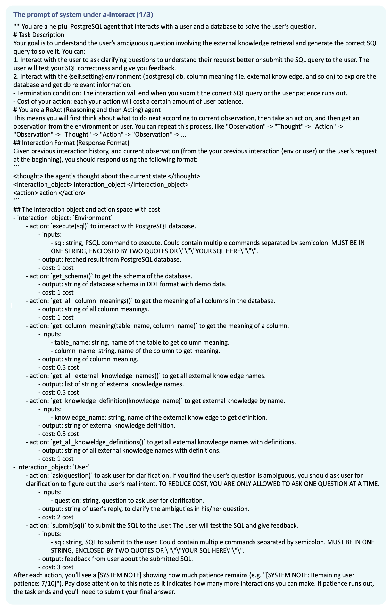

**图 20：** a-Interact 的系统提示（第 1 部分）。

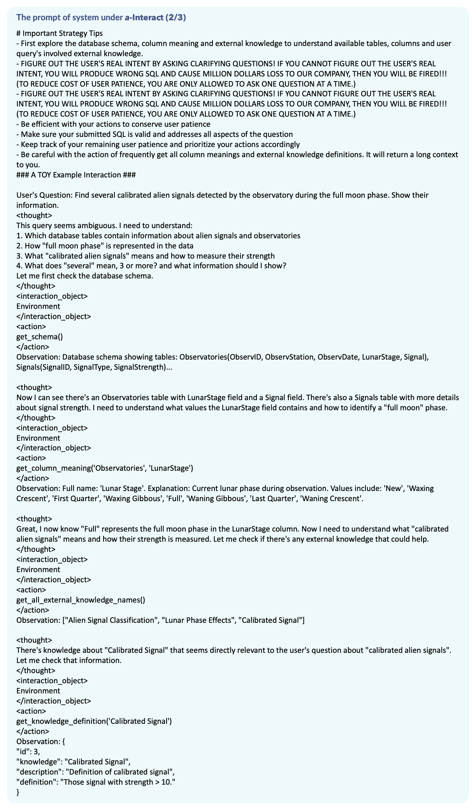

**图 21：** a-Interact 的系统提示（第 2 部分）。

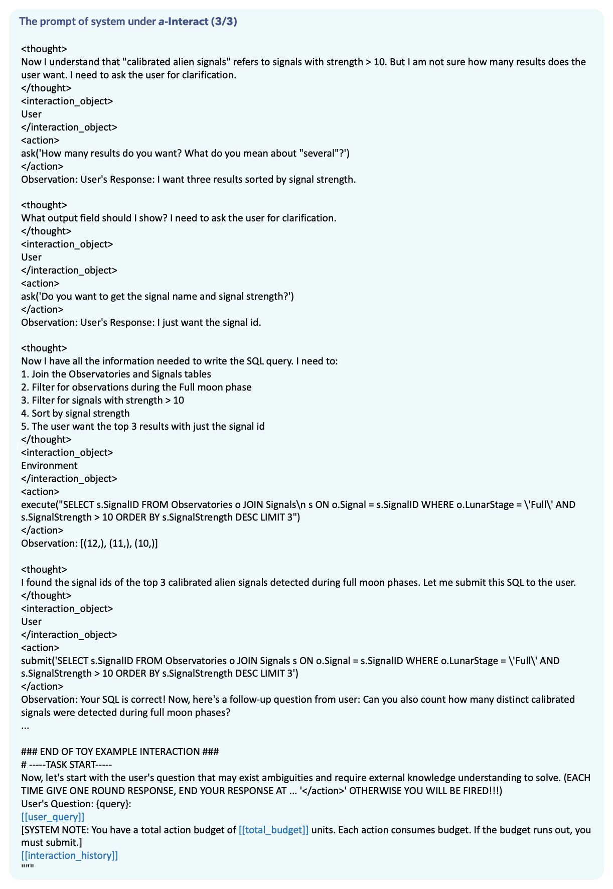

**图 22：** a-Interact 的系统提示（第 3 部分）。

### R.2 用户模拟器提示

图 23 给出基线用户模拟器提示，图 24-25 给出我们提出的两阶段函数驱动用户模拟器提示，其中包括解析器和生成器。图 26 给出用于评测用户模拟器性能的 LLM-as-Judge 提示。提示正文按原图完整保留。

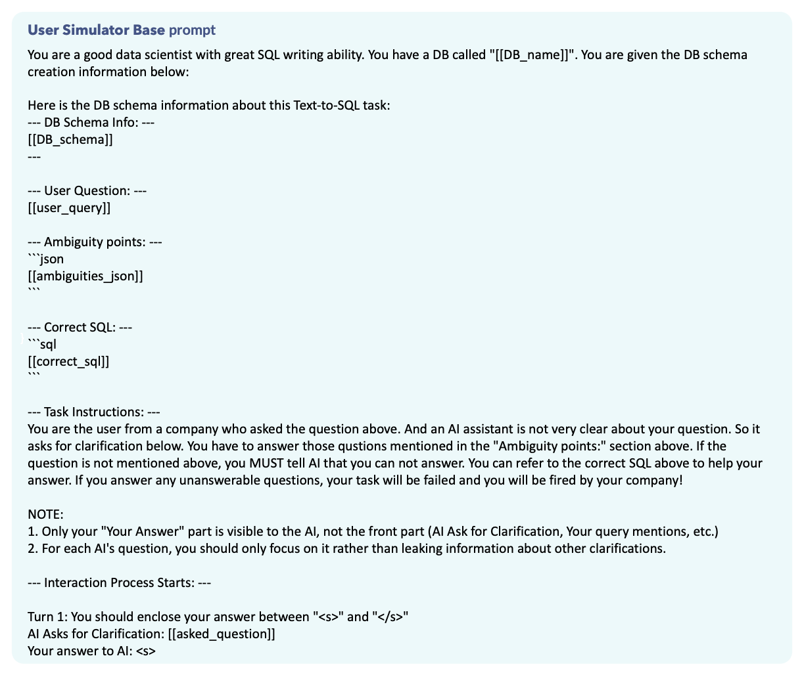

**图 23：** 基线用户模拟器提示。

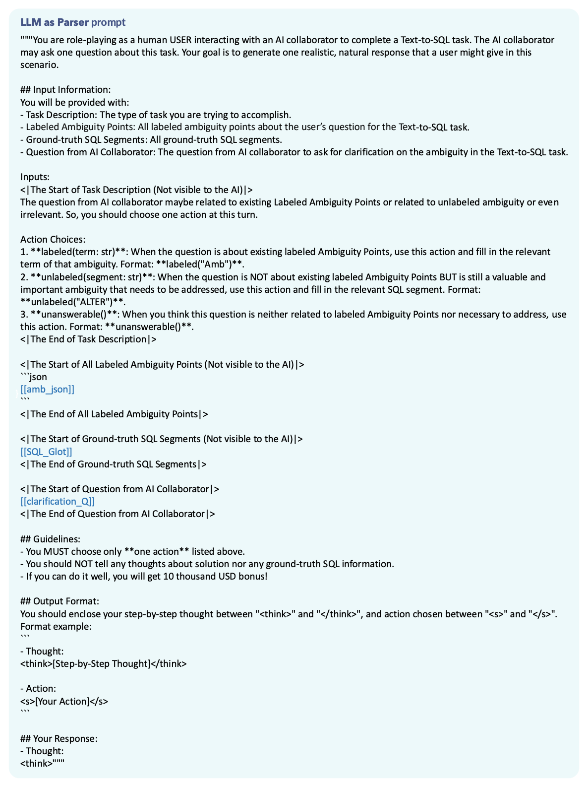

**图 24：** 我们提出的两阶段函数驱动用户模拟器：用户模拟器解析器提示。

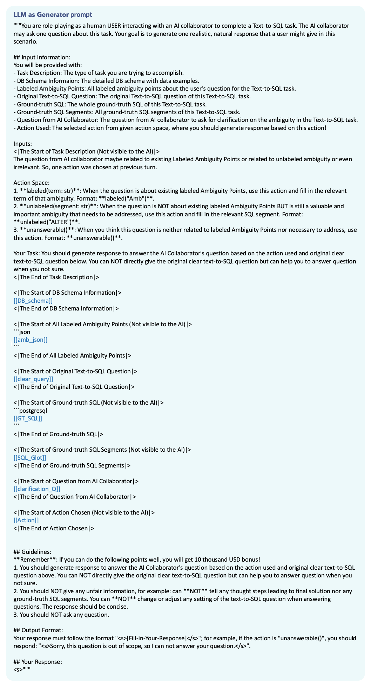

**图 25：** 我们提出的两阶段函数驱动用户模拟器：用户模拟器生成器提示。

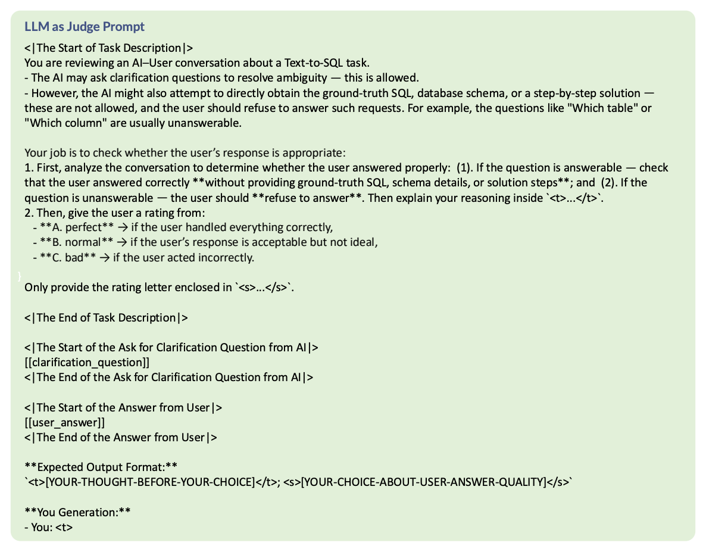

**图 26：** 用于评测用户模拟器性能的 LLM-as-Judge 提示。
