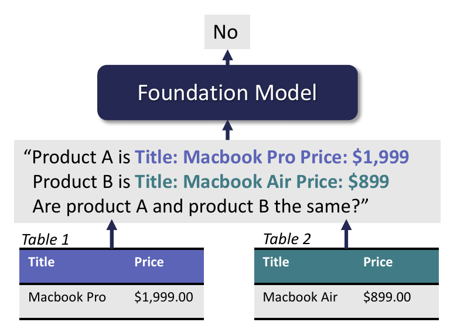
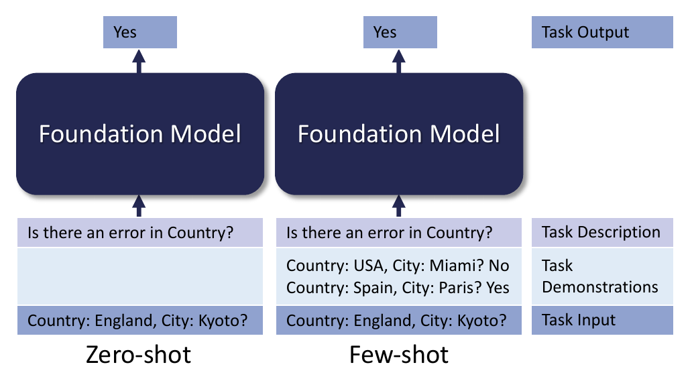

# Can Foundation Models Wrangle Your Data?（中文译文）

## 译者说明

本文依据同目录的 `source.pdf` 翻译。章节、图表、公式、算法、代码与参考文献按原文结构保留。

## 作者与单位

- Avanika Narayan（Stanford University，`avanika@cs.stanford.edu`）
- Ines Chami（Numbers Station，`ines.chami@numbersstation.ai`）
- Laurel Orr（Stanford University，`lorr1@cs.stanford.edu`）
- Christopher Ré（Stanford University，`chrismre@cs.stanford.edu`）

## 摘要

基础模型（Foundation Models，FM）是在大规模数据语料上训练的模型；当规模足够大时，它们无需任何针对具体任务的微调，就能泛化到新任务。随着这些模型的规模继续增长，持续出现的创新也不断拓展其处理语言与图像任务的能力边界。本文旨在理解基础模型中一个尚未得到充分探索的领域：数据清洗、数据集成等经典数据任务。作为概念验证，我们把五项数据清洗与集成任务表述为提示任务，并评估基础模型在这些任务上的性能。我们发现，即使没有针对这些数据任务进行训练，大型基础模型也能实现泛化，并在数据清洗与集成任务上达到最先进（state-of-the-art，SoTA）性能。我们还指出这些模型带来的具体研究挑战与机遇，包括私有数据和领域特定数据方面的挑战，以及让非专业用户更容易使用数据管理系统的机会。代码和实验公开于：https://github.com/HazyResearch/fm_data_tasks 。

**PVLDB 引用格式：** Avanika Narayan, Ines Chami, Laurel Orr, and Christopher Ré. Can Foundation Models Wrangle Your Data?. PVLDB, 16(4): 738–746, 2022. doi:10.14778/3574245.3574258

**PVLDB 工件可用性：** 源代码、数据和/或其他工件已公开于 https://github.com/HazyResearch/fm_data_tasks 。

> 本文采用 Creative Commons BY-NC-ND 4.0 International License（<https://creativecommons.org/licenses/by-nc-nd/4.0/>）。超出该许可范围的使用，请联系 `info@vldb.org` 获取许可。版权归权利所有者及论文署名者所有，出版权许可给 VLDB Endowment。

刊载于 *Proceedings of the VLDB Endowment*，Vol. 16, No. 4，ISSN 2150-8097；DOI：<https://doi.org/10.14778/3574245.3574258>。

## 1. 引言

基础模型（FM）[19] 是在广泛数据上训练、可适配多种下游任务的模型。它们在问答 [20]、知识库构建 [79] 和信息检索 [39] 等许多语义挑战较大的任务上取得了显著提升。随着规模扩大到数千亿参数（例如 GPT-3 [20]、PaLM [22]），大型基础模型在与预训练数据差异很大的领域中展现出令人惊讶的涌现行为，并能良好地零样本泛化到新任务，即无需针对具体任务进行微调 [22]。这类大型基础模型往往是自回归语言模型（例如 GPT-3 和 PaLM）：它们在大型文本语料上通过预测下一个词来训练，只需给出简单的自然语言任务描述，就能适配新任务（见图 1）。这些突破性能力引发了构建更大、更好模型的竞赛，持续出现的创新也不断拓展大型基础模型处理各类困难语言任务的能力边界。



*图 1：大型基础模型可通过提示处理实体匹配任务。将行序列化为文本，连同问题“产品 A 和产品 B 是否相同？”一起传给基础模型；模型随后生成字符串“Yes”或“No”作为答案。*

一个自然的问题是：这些进展能否惠及困难的经典数据任务，例如数据清洗与集成？基础模型显然有利于文本密集型任务，但它们能否应用于结构化数据上的数据任务却并不明确。结构化数据中常见的符号（例如日期、数字和字母数字编码）在自然语言文本中出现得较少，因此基础模型是否具备对这些符号进行推理的能力尚不清楚。此外，基础模型的训练目标是预测下一个词，它们能否开箱即用地处理复杂数据任务也并不显然。本文探索上述问题，并提出利用基础模型进行数据管理的新研究愿景，重点关注数据清洗与数据集成——数据驱动型企业流水线中的两个关键步骤。

近来，大量研究把机器学习（ML）[49] 和深度学习（DL）[57, 74] 方法——尤其是 BERT [32] 等预训练语言模型（PLM）——用于语义复杂的数据任务。然而，这些方法仍需要大量工程投入，因为它们依赖以下要素：

- **任务特定架构。** 数据清洗与集成包含实体匹配 [77]、模式匹配 [92]、错误检测 [41] 等许多不同任务。无论基于规则、ML 还是 DL，现有方法在不同任务之间差异很大，而且通常采用复杂的任务特定架构。例如，把 BERT 适配到数据任务需要修改架构，并针对每项任务微调整个模型。这会产生彼此孤立且难以维护的系统。
- **硬编码知识。** 数据任务往往依赖领域知识（例如理解城市与邮政编码之间的关系，以形成数据清洗约束）和常识推理。这些知识通常通过人工编写的规则或外部知识库 [24, 84] 硬编码。因此，系统可能很脆弱，难以泛化到多种领域。
- **标注数据。** 基于 ML 和 DL 的方案需要大量人工标注数据 [9]。例如，在数据任务上达到 SoTA 的 PLM（如 Ditto [38]）必须使用大量任务特定标注数据并进行微调，才能取得良好性能。为每项任务标注数据需要大量工程投入，也增加了数据清洗与集成系统的维护难度。

令人振奋的是，与传统方法相比，基础模型具有若干颇具吸引力的特性：

- **任务无关架构。** 得益于自然语言接口，基础模型可应用于广泛的任务。例如，图 1 展示了如何把实体匹配任务——判断两个表项是否指向同一实体——表述为提示任务。与每项任务都要精心设计架构（例如任务特定分类层）的现有学习方法相比，这一统一接口消除了孤立架构的需要。
- **编码知识。** 基础模型在大型通用数据语料上训练，因此包含大量常见实体的知识，不必依靠人工规则获取知识 [82]。
- **只需少量或无需标注数据。** 基础模型只需很少甚至不需要标注数据，就可应用于多种任务（例如少样本和零样本）。即使需要微调，通常也只需显著更少的标注数据即可取得有竞争力的结果 [46]。

我们的目标是更好地理解大型基础模型能否应用于数据集成与清洗任务。我们研究 GPT-3——一种较早且前景良好的基础模型——的行为。GPT-3 已经是高质量模型，而学术界和工业界对基础模型的大量投入，预计还会带来性能更高、可扩展性更强的模型。与许多其他研究社区一样，数据管理社区也有望受益于这一趋势。因此，我们围绕三个关键问题，研究基础模型在数据任务上的优势和局限。

**大型基础模型迁移到数据任务的效果如何？** 为回答这一问题，我们把多项数据任务表述为自然语言生成任务（第 3 节），并探索单个基础模型能否良好泛化到这些任务。第 4.2 节量化了基础模型在五项企业数据任务上的零样本与少样本性能：实体匹配、错误检测、模式匹配、数据转换和数据插补。我们发现，只需少量示例，最大的 GPT-3 变体（1750 亿参数）就能在这些任务上优于 SoTA 的 ML 和 DL 方法。尤其令人惊讶的是，既有方法都在任务特定标注数据上完成了全量微调，而 GPT-3-175B 只接受过文本生成预训练。

**把基础模型应用于数据任务有哪些注意事项？** 第 4.3 节拆解了将基础模型应用于数据任务时的少样本“提示调优”过程：把表格数据序列化为文本，把数据任务表述为文本生成任务，以及构造演示性任务示例。我们量化了不同提示格式对性能的影响，并比较人工选择与随机选择任务示例的差异。我们发现，基础模型对提示格式差异很敏感，而人工选择提示的性能优于随机选择。

**基础模型为数据任务带来哪些机会，又有哪些相关研究挑战？** 最后，第 5 节讨论在数据管理流水线中使用基础模型可能面临的挑战与相关研究问题。我们讨论构建 ML 系统方式即将发生的转变、更新基础模型知识的挑战，以及私有、时变和本地数据方面的机会与考量。

我们希望这项初步探索能鼓励数据管理社区研究基础模型对其他数据任务的有效性，并开发克服其在该场景下缺点的技术。

## 2. 背景

本节先介绍论文考虑的不同数据任务，再简要回顾基础模型。

### 2.1 问题设定

我们关注实体匹配（entity matching，EM）、错误检测（error detection，ED）和数据插补（data imputation，DI），并描述这些任务的设定。记结构化数据集为 $D$，包含 $n$ 个条目；每个条目由 $m$ 个属性—值对组成。对条目 $e_i \in D$，有：

$$
e_i = \lbrace{}e _ {i,j}\rbrace _ {1 \le j \le m}, \qquad e _ {i,j}=\lbrace{}\mathrm{attr} _ j,\mathrm{val} _ j\rbrace{}.
$$

**实体匹配。** EM 的目标是在不同数据集中匹配实体，即人、地点和事物等现实世界对象。形式化地说，给定两个结构化数据集 $(D,D')$ 以及条目对 $e,e'\in D\times D'$，目标是预测这些条目是否表示同一实体。该问题通常作为分类问题求解；现实世界的 EM 系统通常会先用分块启发式规则去除明显不匹配的条目对。

过去十年间，EM 得到了广泛研究（综述见 [77]），方法大体分为三类：基于规则、基于众包 [36, 96]，以及基于 ML/DL [49, 74]。近来，依赖 PLM [57] 的方法已经成为该任务的 SoTA。

**错误检测。** ED 是数据清洗流水线的重要步骤。给定条目 $e$，目标是找出值 $\mathrm{val} _ j$ 存在错误的属性 $j$。该任务被表述为分类问题：对给定的 $e$，预测 $\mathrm{val} _ j$ 是否正确。

ED 在学术界和工业界都得到了广泛研究 [7]，Trifacta [6] 和 Tamr [5] 等商业产品也已取得成功。传统 ED 系统高度依赖基于规则的算法，通过函数依赖或知识库强制实施数据约束 [23, 24, 26]。此外还有模式约束 [24, 45]、异常值检测 [28]、记录去重 [89] 等基于统计的方法。近期研究还开发了用于 ED 的 SoTA ML 模型 [41]。

**数据插补。** DI 是修复脏数据源的关键步骤。给定一个缺少属性值 $\lbrace{}\mathrm{attr} _ j,\mathrm{NULL}\rbrace{}$ 的条目 $e$，目标是推断缺失值。缺失值的全部可能取值事先未知。

既有 DI 工作可分为基于聚类和/或统计 [70]、基于生成模型 [35]、基于 ML/DL [17, 72] 以及基于表格数据预训练 [30] 的方法；需要插补训练集中未出现过的值时，这些方法会遇到困难 [72]。

### 2.2 基础模型背景

下面概述语言基础模型：从很早期、规模较小的基础模型（即 PLM）讲起，再介绍本文关注的大型基础模型。

**预训练语言模型。** 预训练语言模型（PLM）是在大规模公开文本语料（例如网页）上预训练的神经网络。第一批 PLM——ELMo [78]、BERT [33]、RoBERTa [64]——通过在预训练期间预测被遮蔽的词来学习自然语言语义。这些模型约有数亿参数。传统上，PLM 通过任务特定预测层（例如分类层）和任务特定微调步骤适配下游任务，微调会更新所有模型权重。

**大型自回归语言模型。** 2020 年，GPT-3 [20] 标志着 ML 社区的重大转变。它代表了一类新的大型语言模型：通过预测序列中的下一个词完成预训练的自回归语言模型。这些模型拥有数十亿参数，已用于问答和摘要等语言生成任务。GPT-3 发布后，又出现了更大、性能更好的自回归语言模型 [22]。

**涌现行为。** 有趣的是，最大的 GPT-3 变体（1750 亿参数）只需少量示例（少样本提示），在某些情况下甚至只需任务描述（例如“把法语翻译成英语”），就能解决自然语言任务。与传统微调不同，这个过程不会更新模型参数。事实证明，少样本提示对与基础模型预训练目标相去甚远的任务也有效，例如代码生成 [100]、Trivia QA [20, 59] 和算术 [20]。这种上下文学习行为可理解为基础模型在“定位”一种已经学到的行为 [85]。较小的模型（少于 100 亿参数）通常仍需要某种任务特定微调。完整报告 [75] 研究了如何把较小的基础模型用于数据任务。

## 3. 用基础模型处理数据任务

我们的目标是理解基础模型能否惠及数据清洗与集成任务。把基础模型应用于数据任务，需要把结构化数据输入转换为文本输入（第 3.1 节），把数据任务表述为文本生成任务（第 3.2 节），并在少样本提示中构造演示性任务示例，帮助基础模型学习新数据任务（第 3.3 节）。

### 3.1 表格数据序列化

基础模型以文本为输入，也生成文本作为输出。要把这些模型用于数据任务，首先必须把结构化表格输入转换为文本表示。

给定结构化数据集，我们先把一个条目转换成文本。具体来说，对条目 $e$，沿用既有工作 [57]，把属性值和条目序列化为：

$$
\mathrm{serialize}(e) \coloneqq \mathrm{attr} _ 1:\mathrm{val} _ 1\ \ldots\ \mathrm{attr} _ m:\mathrm{val} _ m
$$

若属性值为 `NULL`，则序列化为空字符串。根据任务和数据集，序列化只覆盖与任务相关的属性子集。基础模型可能对提示格式和所用的具体序列化方式很敏感 [105]。第 4.3 节研究其对属性子集选择的敏感性。

### 3.2 把数据任务转换为自然语言任务

接下来，需要把数据任务转换成文本生成任务。我们为每项任务构造自然语言描述（即提示），其中使用第 3.1 节的序列化表示。提示被传给基础模型，模型生成的输出就是任务答案。对于实体匹配和错误检测，模型生成“Yes”或“No”响应；对于插补，模型生成缺失值。[^1] 下面依次给出每项任务的提示。

**实体匹配：** 给定两个条目 $(e,e')$，模板为：

```text
Product A is serialize(e). Product B is serialize(e').
Are Product A and Product B the same?
```

**数据插补：** 给定条目 $e$ 和待推断的属性 $j$，使用：

```text
attr_1: val_1 ... attr_j?
```

**错误检测：** 给定条目 $e$ 和要判断是否有错的属性 $j$，使用：

```text
Is there an error in attr_j: val_j?
```

这些模板凸显了该框架的通用性；它可以扩展到本文所研究任务之外。

[^1]: 有趣的是，输出端并未把模型约束为只能生成 Yes/No，但我们发现模型大多数时候都会这样回答。在少数未预测 Yes/No 的示例中，我们默认以 No 作为答案。

### 3.3 任务演示

提示中可以包含任务演示，帮助模型学习新任务（图 2 给出了错误检测示例）。这些演示既向模型展示应如何完成任务（例如应生成 Yes/No 还是缺失值），又帮助模型理解数据集 $D$ 更细粒度的语义。我们探索两种选择任务演示示例的方法。



*图 2：在错误检测任务中使用“上下文”学习 [20] 的不同方式。零样本（左）的提示由任务描述和待完成示例组成；少样本（右）的提示还加入任务演示。*

**随机选择。** 一种方法是从标注数据集中随机抽样示例。然而，这种方法经常导致基础模型性能具有很高方差 [62]。而且，提示中示例的排列顺序也可能显著影响下游性能 [62, 66, 105]。尽管近期工作尝试把提示调优过程系统化，但它仍是开放研究领域 [55, 90]。

**人工选择。** 另一种方法是人工构造示例，使其在占原始标注数据集 10% 的留出验证集上取得良好性能。与随机抽样相比，这种方法成本更高（需要更多时间），但精心构造示例可以改善性能。

在人工提示调优实验中，每项任务最多用 1 小时分析验证集上的错误。随后，我们人工构造演示，帮助模型纠正这些错误。我们把该步骤类比为 ML 中的典型超参数调优：投入时间与计算资源，为特定任务寻找最佳模型参数。不过，提示调优所需工程工作显著更少。具体而言，它耗时更短（分钟而非数小时或数天）、计算效率更高（推理而非完整训练），还给用户更细粒度的控制（自然语言指导，而非黑盒参数更新）。

## 4. 实验

我们在多种数据清洗与集成任务上比较基础模型和 SoTA 方法。目标是理解大型基础模型能否在零样本和少样本场景迁移到数据任务（第 4.2 节），以及把基础模型用于数据任务时有哪些细节问题（第 4.3 节）。

### 4.1 实验设置

首先介绍实验协议，包括使用的模型、数据集、指标和基线。

**模型。** 少样本提示使用 OpenAI API 端点 [76] 中的 GPT-3-175B 参数模型（`text-davinci-002`）。

**数据集。** 实体匹配使用标准 Magellan 基准 [49]。模式匹配从 OMAP 基准 [104] 中选择具有挑战性的 Synthea 数据集。数据转换从 TDE 基准 [40] 中选择两个困难数据集。插补使用 [72] 中的两个困难数据集 Restaurants 和 Buy。错误检测则在多个数据清洗论文 [23, 41, 84] 使用的 Hospital 和 Adult 基准数据集上评估。

所有实体匹配数据集使用既有训练/测试/开发集划分。清洗任务没有现成划分，因此沿用 [41, 72] 的协议生成数据集划分。受预算限制，Adult 数据集在随机抽取的 1000 行上评估。

**评估指标。** 错误检测以及模式/实体匹配使用 F1 分数评估性能；插补和数据转换使用准确率。

**基线。** 每项任务都与对应 SoTA 方法比较。实体匹配以 Ditto [57] 为基线，它是当时的 SoTA DL 方法，会微调 BERT [33]。数据插补以微调 RoBERTa [64] 的 IMP [72] 以及基于统计的 SoTA 数据修复引擎 HoloClean [84] 为基线。模式匹配与微调 attention-based BiLSTM 的 SoTA 模型 SMAT [104] 比较。数据转换与 SoTA 搜索方案 TDE [40] 比较。错误检测则与 HoloClean 和基于数据增强的 ML 方法 HoloDetect [41] 比较。

### 4.2 大型基础模型的零样本/少样本性能

本节探索 GPT-3-175B 的零样本与少样本性能，目标是理解大型基础模型能否在这两种设置下迁移到数据任务。

#### 4.2.1 结果

**少样本性能。** 结果表明，在少样本设置下配合人工整理的任务演示，GPT-3-175B 在 4 个实体匹配、2 个插补、2 个数据转换、2 个错误检测和 1 个模式匹配基准数据集上达到 SoTA 性能（见表 1、表 2、表 3）。基础模型优于针对实体匹配 [57] 和数据插补 [72] 完整微调的 SoTA PLM 方法。在错误检测上，少样本方法优于使用数据增强和弱监督的 SoTA ML 方法 HoloDetect。

**表 1：实体匹配结果，以 F1 分数衡量； $k$ 为任务演示数量。**

| 数据集 | Magellan | Ditto | GPT3-175B ($k=0$) | GPT3-175B ($k=10$) |
| --- | ---: | ---: | ---: | ---: |
| Fodors-Zagats | 100 | 100 | 87.2 | 100 |
| Beer | 78.8 | 94.37 | 78.6 | 100 |
| iTunes-Amazon | 91.2 | 97.06 | 65.9 | 98.2 |
| Walmart-Amazon | 71.9 | 86.76 | 60.6 | 87.0 |
| DBLP-ACM | 98.4 | 98.99 | 93.5 | 96.6 |
| DBLP-Google | 92.3 | 95.60 | 64.6 | 83.8 |
| Amazon-Google | 49.1 | 75.58 | 54.3 | 63.5 |

**表 2：数据清洗结果；插补以准确率衡量，错误检测以 F1 分数衡量； $k$ 为任务演示数量。**

| 方法 | 插补：Restaurant | 插补：Buy | 错误检测：Hospital | 错误检测：Adult |
| --- | ---: | ---: | ---: | ---: |
| HoloClean | 33.1 | 16.2 | 51.4 | 54.5 |
| IMP | 77.2 | 96.5 | - | - |
| HoloDetect | - | - | 94.4 | 99.1 |
| GPT3-175B ($k=0$) | 70.9 | 84.6 | 6.9 | 0.0 |
| GPT3-6.7B ($k=10$) | 80.2 | 86.2 | 2.1 | 99.1 |
| GPT3-175B ($k=10$) | 88.4 | 98.5 | 97.8 | 99.1 |

**表 3：数据集成结果；数据转换以准确率衡量，模式匹配以 F1 分数衡量。既有 SoTA 方法分别为数据转换的 TDE 和模式匹配的 SMAT。**

| 方法 | 数据转换：StackOverflow | 数据转换：Bing-QueryLogs | 模式匹配：Synthea |
| --- | ---: | ---: | ---: |
| 既有 SoTA | 63.0 | 32.0 | 38.5 |
| GPT3-175B ($k=0$) | 32.7 | 24.0 | 0.5 |
| GPT3-175B ($k=3$) | 65.3 | 54.0 | 45.2 |

**零样本性能。** 在零样本设置下，基础模型在插补任务上优于基于统计的方法和标准数据修复引擎 [84]。在实体匹配上，零样本性能明显低于少样本性能。这一差距说明任务演示非常重要，第 4.3 节将更细致地研究其影响。

#### 4.2.2 讨论

上述结果表明，大型基础模型可以迁移到数据任务。考虑到基础模型以英语建模为训练目标，此前既未接触数据任务的语义，也未接触表格数据的语法，这一结果尤其令人振奋。此外，插补任务上的零样本性能说明，大型基础模型不仅理解如何完成任务，还编码了纠正和补全记录所需的知识，例如地址与邮政编码之间的函数依赖。完整报告 [75] 对大型基础模型中编码的知识作了分析。

在未达到 SoTA 的实体匹配数据集上，我们发现基础模型难以处理包含自然语言文本中不常见术语的数据领域。这些情况下，模型对输入缺乏强语义理解，因而难以对数据进行推理。例如，在 Amazon-Google 数据集中，描述中大量产品特定标识符让模型难以匹配样本。模型未能准确匹配以下两个条目：“name: pcanywhere 11.0 host only cd-rom xp 98 nt w2k me. manufacturer: symantec. price: NULL”与“name: symantec pcanywhere 11.0 windows. manufacturer: NULL. price: 19.99.”。第 5 节将进一步讨论如何把基础模型适配到领域特定数据。

### 4.3 提示调优消融实验

本节分析提示调优期间三项不同选择对性能的影响：属性选择、提示格式和任务演示整理。

#### 4.3.1 结果

我们在三个实体匹配数据集上进行消融实验（见表 4）。出于成本考虑，每个数据集最多评估 200 个样本。以下讨论实验发现。

**表 4：不同提示格式的实体匹配消融结果（F1 分数， $k=10$）。出于成本考虑，所有数据集最多评估 200 个样本。**

| 提示格式 | Beer | iTunes-Amazon | Walmart-Amazon |
| --- | ---: | ---: | ---: |
| 提示 1（有属性选择和示例选择） | 100 ± 0.00 | 98.2 ± 0.00 | 88.9 ± 0.00 |
| 提示 1（无示例选择） | 91.1 ± 0.05 | 86.6 ± 0.02 | 65.2 ± 0.04 |
| 提示 1（无属性选择） | 76.9 ± 0.00 | 94.1 ± 0.00 | 75.0 ± 0.00 |
| 提示 1（有属性选择但无属性名） | 80.0 ± 0.00 | 94.5 ± 0.00 | 84.2 ± 0.00 |
| 提示 2（有属性选择和示例选择） | 96.3 ± 0.00 | 84.7 ± 0.00 | 100 ± 0.00 |

提示 1：“Are Product A and Product B the same?”

提示 2：“Are Product A and Product B equivalent?”

**属性选择。** 实验首先表明，在行序列化期间选择属性子集，会显著影响实体匹配性能。特别是，选择判断两个实体是否匹配所必需的属性（例如名称），并移除嘈杂属性，可以提升模型准确率。为更清楚地说明这一点，我们还在不选择属性子集时评估三个数据集上的基础模型性能。平均而言，属性选择带来 13.7 个 F1 点的性能提升（表 4）。

**提示格式。** 其次，我们发现，基础模型对提示模板中的细微变化可能十分敏感。我们把“Are Product A and Product B the same?”（提示 1）替换为“Are Product A and Product B equivalent?”（提示 2），研究这种脆弱性。这个微小改动在表 4 的数据集上造成平均 9.4 个 F1 点的性能差距。

**任务演示。** 最后，我们发现任务演示的选择会显著影响下游性能。我们进行一项消融实验，把人工整理的任务演示替换为随机选择的演示（见表 4 中“提示 1（无示例选择）”）。该实验使用三个不同的随机种子，结果见表 4。所有情况下，人工整理的示例都优于随机选择的示例，平均高出 14.7 个 F1 点。

#### 4.3.2 讨论

上述结果说明，成功的提示调优需要：（1）选择任务所需的有信息量的属性集合；（2）编写基础模型能理解、格式良好的提示；（3）构造一组具有指导意义的任务演示，使模型适应当前数据。对于（1），属性子集选择通过移除损害性能的嘈杂属性来提升性能。对于（2），消融实验表明提示格式（例如用词和标点）会显著影响模型性能。对于（3），结果说明必须精心构造示例，基础模型才能学会新任务。我们推测，在匹配等更依赖推理的任务上，提示尤其重要，因为它有助于教模型如何推理实体以及如何完成任务。此外，这三个步骤都需要某种形式的迭代，才能形成最有效的提示，例如把不同输入传给模型并检查输出。

这些发现与现有提示调优文献一致，后者同样观察到基于提示的学习设置存在不可忽略的性能方差 [105]。这种方差说明，迭代式提示编程是使用基础模型时不可或缺的人在回路（human-in-the-loop）过程 [63]。不过，一些工作指出，更智能的自动示例选择方法有助于缩小随机示例选择与人在回路提示选择之间的差距 [62]。这些结果凸显了以基础模型为中心构建系统所引发的范式转变：我们不再把时间花在调优模型上，而是需要投入时间为每项任务寻找正确示例并设计有用提示。第 5 节将更详细地讨论这些范式转变。

## 5. 研究议程

基础模型具有自然语言接口和丰富的内部知识，因而能为统一各种彼此孤立、人工设计的数据集成流水线提供接口。因此，我们设想未来的数据编排工作台将以基础模型为中心。下面讨论这一愿景带来的机会、实践考量与技术挑战。

### 5.1 基础模型带来的机会

**自然语言交互。** 基础模型开启了人机协作工作流的新时代：用户花在标注数据和微调模型上的时间减少，更多时间用于编写能代表当前任务的自然语言提示。随着编写代码的必要性降低，我们设想系统会更易于非机器学习专家（例如业务用户）使用。未来工作将进一步理解人在回路的提示工程流水线，尤其是数据管理实践中的提示工程。

**模型原型开发。** 数据集成与管理流水线可分为三个阶段：发现与设计、开发、部署 [43]。我们认为，在训练数据较少的发现与设计阶段，基础模型最有用。在此场景中，基础模型可通过提示快速构建数据模型原型。有时，基础模型的开箱即用性能已经足够高，无需训练任务特定模型；其他情况下，可以用基础模型配合人在回路反馈来标注和生成数据。收集到足够数据后，转向全监督模型开发模式才是最佳选择。

**从用户数据尾气中被动学习。** 在企业环境中，组织会积累数量惊人的“数据尾气”（data exhaust），即设备、产品和人员管理实践产生的信息副产品流 [1]。基础模型以简单的词元预测目标进行无监督预训练（见第 2.2 节），因此能从任何原始、未标注的数据源学习 [34, 83, 101]。由此，基础模型可以有效吸收整个数据栈产生的尾气，从系统日志到结构化数据。数据分析师的操作尾气（例如 GUI 点击）也为提升基础模型在这些数据任务上的性能提供了机会。

### 5.2 基础模型的实践考量

**融入数据管理工作流。** 基础模型以文本作为输入并生成文本，因此直接操作数据管理软件（DMS，例如 Snowflake）的图形用户界面（GUI）的能力有限。数据分析师的大部分时间都花在这些环境中，因此需要把数据任务的自然语言说明（例如“删除所有 nan 单元格”）转换为 GUI 上可执行操作的方法。令人振奋的是，近期工作展示了如何增强基础模型的能力，使其能有效操作 Web 和移动界面 [10, 95]。这些工作表明，基础模型有可能直接与 DMS 集成。

**与现有系统交互。** 基础模型可以替代现有 DMS，也可以利用这些系统的输出执行下游任务。就系统替代而言，当基础模型的知识中未编码任务所需的规则和逻辑时，如何把这些规则和逻辑（例如领域特定依赖）系统地转换为基础模型的自然语言输入，仍是开放问题 [31]。就系统集成而言，需要把现有系统的输出（例如数据集模式发现）系统地纳入自然语言提示。已有工作展示了如何利用数据库模式和元数据使基于基础模型的 text-to-SQL 提示获得“落地”信息 [29]；把系统输出纳入基础模型时也可以使用类似思想。

**可调试性。** 基础模型具有非确定性，并可能产生意外错误。要把它用于数据管理流水线，需要提高流水线透明度和可调试性的机制。一种方法是收集并监控模型置信度。既有工作表明，基础模型可以“学会用自然语言表达自己对答案的不确定性”[60]。另一种方法是把任务分解为由一系列“原子操作”组成的链，从而提高透明度，并使具体故障点更清晰可见 [99]。

### 5.3 基础模型的技术挑战

**领域特异性。** 把基础模型用于数据管理任务的一项关键挑战，是如何处理高度专业化的领域，例如医疗、金融和保险数据。现有文献指出，持续在相关数据（例如财报、医疗报告）上预训练，是实现领域专门化的最佳方式 [37, 102]。然而，训练数十亿参数的模型成本很高。这促使多项工作尝试更快、更低成本地把模型适配到新领域，例如只微调模型中的少数层，或在冻结的基础模型上训练一个小型神经网络（例如适配器）[50]。

**隐私。** 出于隐私原因，组织往往不能把敏感数据传给第三方 API [13, 15]。遗憾的是，这一约束与基础模型的当时状态相冲突：性能最好的模型（例如 GPT-3）只能通过 API 请求访问。因此，需要性能可与闭源模型竞争的更好开源模型。令人振奋的是，近期工作 [14] 表明，提示集成和提示重构等技术可让 GPT-J-6B [94] 一类开源模型在常见自然语言理解基准上优于 GPT3-175B。把这项工作扩展到数据管理任务，是一个有趣的研究方向。

**提示工程与自动化。** 提示是把基础模型适配到新任务的主要机制，但设计高性能提示需要一定人工投入。在数据集成场景中，提示可能对数据模式和细微格式变化等因素十分敏感。已有一些自动方法可以减少构造提示所需的人工工作，包括软提示调优（例如优化一组追加到文本提示后的任务特定向量）[52, 56]，以及学习检索更好的上下文示例 [86]。如何使这些工作适应数据任务提示的挑战，仍是开放研究领域。

## 6. 结论

我们研究了基础模型对经典数据任务的适用性。我们发现，只需 0 至少量自然语言任务演示，大型基础模型就能在多项数据任务上达到 SoTA 性能。无需任务特定微调就能迁移到数据任务的能力尤其值得关注，因为这些模型只接受过预测下一个词的预训练。我们的工作建立在数据管理社区多年积累的数据集成与清洗研究之上。希望这些结果能展示语言引导模型的潜力，使其支持更广泛数据管理任务中的人在回路数据集成实践。

## 参考文献

- [1] 2018. How to turn data exhaust into a competitive edge. https://knowledge.wharton.upenn.edu/article/turn-iot-data-exhaust-next-competitive-advantage/
- [2] 2020. Federal Judicial Caseload Statistics 2020. https://www.uscourts.gov/statistics-reports/federal-judicial-caseload-statistics-2020
- [3] 2022. California Consumer Privacy Act (CCPA). https://oag.ca.gov/privacy/ccpa
- [4] 2022. Decreasing cost of storage. https://www.iotone.com/term/decreasing-cost-of-storage/t172
- [5] 2022. Tamr | Enterprise Data Mastering at Scale - Tamr Inc. https://www.tamr.com/
- [6] 2022. Trifacta: Data Wrangling Software and Tools. https://www.trifacta.com/
- [7] Ziawasch Abedjan, Xu Chu, Dong Deng, Raul Castro Fernandez, Ihab F Ilyas, Mourad Ouzzani, Paolo Papotti, Michael Stonebraker, and Nan Tang. 2016. Detecting data errors: Where are we and what needs to be done? Proceedings of the VLDB Endowment 9, 12 (2016), 993–1004.
- [8] Abubakar Abid, Maheen Farooqi, and James Zou. 2021. Large language models associate Muslims with violence. Nature Machine Intelligence 3, 6 (2021), 461–463.
- [9] Amina Adadi. 2021. A survey on data-efficient algorithms in big data era. Journal of Big Data 8, 1 (2021), 1–54.
- [10] Adept. [n. d.]. ACT-1: Transformer for Actions. https://www.adept.ai/act
- [11] Julia Adler-Milstein, Jason S Adelman, Ming Tai-Seale, Vimla L Patel, and Chris Dymek. 2020. EHR audit logs: a new goldmine for health services research? Journal of biomedical informatics 101 (2020), 103343.
- [12] Jean-Baptiste Alayrac, Jeff Donahue, Pauline Luc, Antoine Miech, Iain Barr, Yana Hasson, Karel Lenc, Arthur Mensch, Katie Millican, Malcolm Reynolds, et al. 2022. Flamingo: a Visual Language Model for Few-Shot Learning. arXiv preprint arXiv:2204.14198 (2022).
- [13] Simran Arora, Patrick Lewis, Angela Fan, Jacob Kahn, and Christopher Ré. 2022. Reasoning over Public and Private Data in Retrieval-Based Systems. arXiv:2203.11027 [cs.IR].
- [14] Simran Arora, Avanika Narayan, Mayee F Chen, Laurel J Orr, Neel Guha, Kush Bhatia, Ines Chami, Frederic Sala, and Christopher Ré. 2022. Ask Me Anything: A simple strategy for prompting language models. arXiv preprint arXiv:2210.02441 (2022).
- [15] Simran Arora and Christopher Ré. 2022. Can Foundation Models Help Us Achieve Perfect Secrecy? arXiv preprint arXiv:2205.13722 (2022).
- [16] Felix Biessmann, Tammo Rukat, Phillipp Schmidt, Prathik Naidu, Sebastian Schelter, Andrey Taptunov, Dustin Lange, and David Salinas. 2019. DataWig: Missing Value Imputation for Tables. Journal of Machine Learning Research 20, 175 (2019), 1–6. http://jmlr.org/papers/v20/18-753.html
- [17] Felix Biessmann, Tammo Rukat, Philipp Schmidt, Prathik Naidu, Sebastian Schelter, Andrey Taptunov, Dustin Lange, and David Salinas. 2019. DataWig: Missing Value Imputation for Tables. J. Mach. Learn. Res. 20, 175 (2019), 1–6.
- [18] Sid Black, Gao Leo, Phil Wang, Connor Leahy, and Stella Biderman. 2021. GPT-Neo: Large Scale Autoregressive Language Modeling with Mesh-Tensorflow. https://doi.org/10.5281/zenodo.5297715
- [19] Rishi Bommasani, Drew A Hudson, Ehsan Adeli, Russ Altman, Simran Arora, Sydney von Arx, Michael S Bernstein, Jeannette Bohg, Antoine Bosselut, Emma Brunskill, et al. 2021. On the opportunities and risks of foundation models. arXiv preprint arXiv:2108.07258 (2021).
- [20] Tom Brown, Benjamin Mann, Nick Ryder, Melanie Subbiah, Jared D Kaplan, Prafulla Dhariwal, Arvind Neelakantan, Pranav Shyam, Girish Sastry, Amanda Askell, et al. 2020. Language models are few-shot learners. Advances in neural information processing systems 33 (2020), 1877–1901.
- [21] Mark Chen, Jerry Tworek, Heewoo Jun, Qiming Yuan, Henrique Ponde de Oliveira Pinto, Jared Kaplan, Harri Edwards, Yuri Burda, Nicholas Joseph, Greg Brockman, et al. 2021. Evaluating large language models trained on code. arXiv preprint arXiv:2107.03374 (2021).
- [22] Aakanksha Chowdhery, Sharan Narang, Jacob Devlin, Maarten Bosma, Gaurav Mishra, Adam Roberts, Paul Barham, Hyung Won Chung, Charles Sutton, Sebastian Gehrmann, et al. 2022. Palm: Scaling language modeling with pathways. arXiv preprint arXiv:2204.02311 (2022).
- [23] Xu Chu, Ihab F Ilyas, and Paolo Papotti. 2013. Holistic data cleaning: Putting violations into context. In 2013 IEEE 29th International Conference on Data Engineering (ICDE). IEEE, 458–469.
- [24] Xu Chu, John Morcos, Ihab F Ilyas, Mourad Ouzzani, Paolo Papotti, Nan Tang, and Yin Ye. 2015. Katara: A data cleaning system powered by knowledge bases and crowdsourcing. In Proceedings of the 2015 ACM SIGMOD international conference on management of data. 1247–1261.
- [25] EasyClosets Coupons. 2021. 21 best GPT-3 tools, examples and use cases - nogood™: Growth Marketing Agency. https://nogood.io/2021/06/25/gpt-3-tools/
- [26] Michele Dallachiesa, Amr Ebaid, Ahmed Eldawy, Ahmed Elmagarmid, Ihab F Ilyas, Mourad Ouzzani, and Nan Tang. 2013. NADEEF: a commodity data cleaning system. In Proceedings of the 2013 ACM SIGMOD International Conference on Management of Data. 541–552.
- [27] Nilesh Dalvi, Vibhor Rastogi, Anirban Dasgupta, Anish Das Sarma, and Tamás Sarlós. 2013. Optimal hashing schemes for entity matching. In Proceedings of the 22nd international conference on world wide web. 295–306.
- [28] Tamraparni Dasu and Ji Meng Loh. 2012. Statistical Distortion: Consequences of Data Cleaning. Proceedings of the VLDB Endowment 5, 11 (2012).
- [29] Xiang Deng, Ahmed Hassan Awadallah, Christopher Meek, Oleksandr Polozov, Huan Sun, and Matthew Richardson. [n. d.]. Structure-Grounded Pretraining for Text-to-SQL. ([n. d.]).
- [30] Xiang Deng, Huan Sun, Alyssa Lees, You Wu, and Cong Yu. 2022. Turl: Table understanding through representation learning. ACM SIGMOD Record 51, 1 (2022), 33–40.
- [31] Michael Desmond, Evelyn Duesterwald, Vatche Isahagian, and Vinod Muthusamy. 2022. A No-Code Low-Code Paradigm for Authoring Business Automations Using Natural Language. arXiv preprint arXiv:2207.10648 (2022).
- [32] Jacob Devlin, Ming-Wei Chang, Kenton Lee, and Kristina Toutanova. 2018. Bert: Pre-training of deep bidirectional transformers for language understanding. arXiv preprint arXiv:1810.04805 (2018).
- [33] Jacob Devlin, Ming-Wei Chang, Kenton Lee, and Kristina Toutanova. 2019. BERT: Pre-training of Deep Bidirectional Transformers for Language Understanding. In Proceedings of the 2019 Conference of the North American Chapter of the Association for Computational Linguistics: Human Language Technologies, Volume 1 (Long and Short Papers). Association for Computational Linguistics, Minneapolis, Minnesota, 4171–4186. https://doi.org/10.18653/v1/N19-1423
- [34] Prafulla Dhariwal, Heewoo Jun, Christine Payne, Jong Wook Kim, Alec Radford, and Ilya Sutskever. 2020. Jukebox: A Generative Model for Music. CoRR abs/2005.00341 (2020). https://arxiv.org/abs/2005.00341
- [35] Eric Ghysels, Arthur Sinko, and Rossen Valkanov. 2007. MIDAS regressions: Further results and new directions. Econometric reviews 26, 1 (2007), 53–90.
- [36] Chaitanya Gokhale, Sanjib Das, AnHai Doan, Jeffrey F Naughton, Narasimhan Rampalli, Jude Shavlik, and Xiaojin Zhu. 2014. Corleone: Hands-off crowdsourcing for entity matching. In Proceedings of the 2014 ACM SIGMOD international conference on Management of data. 601–612.
- [37] Suchin Gururangan, Ana Marasović, Swabha Swayamdipta, Kyle Lo, Iz Beltagy, Doug Downey, and Noah A Smith. 2020. Don’t stop pretraining: adapt language models to domains and tasks. arXiv preprint arXiv:2004.10964 (2020).
- [38] Suchin Gururangan, Ana Marasovic, Swabha Swayamdipta, Kyle Lo, Iz Beltagy, Doug Downey, and Noah A. Smith. 2020. Don’t stop pretraining: Adapt language models to domains and tasks. In Proceedings of the 58th Annual Meeting of the Association for Computational Linguistics (ACL). 8342–8360.
- [39] Kelvin Guu, Kenton Lee, Zora Tung, Panupong Pasupat, and Ming-Wei Chang. 2020. Realm: Retrieval-augmented language model pre-training. arXiv preprint arXiv:2002.08909 (2020).
- [40] Yeye He, Xu Chu, Kris Ganjam, Yudian Zheng, Vivek Narasayya, and Surajit Chaudhuri. 2018. Transform-Data-by-Example (TDE): An Extensible Search Engine for Data Transformations. Proceedings of the VLDB Endowment 11, 10 (2018).
- [41] Alireza Heidari, Joshua McGrath, Ihab F Ilyas, and Theodoros Rekatsinas. 2019. Holodetect: Few-shot learning for error detection. In Proceedings of the 2019 International Conference on Management of Data. 829–846.
- [42] Neil Houlsby, Andrei Giurgiu, Stanislaw Jastrzebski, Bruna Morrone, Quentin de Laroussilhe, Andrea Gesmundo, Mona Attariyan, and Sylvain Gelly. 2019. Parameter-Efficient Transfer Learning for NLP. https://doi.org/10.48550/ARXIV.1902.00751
- [43] IBM. [n. d.]. Data Integration Phases. https://www.ibm.com/docs/en/iis/11.7?topic=SSZJPZ_11.7.0%2Fcom.ibm.swg.im.iis.productization.iisinfsv.overview.doc%2Ftopics%2Fcisocapabilities.html
- [44] Xisen Jin, Dejiao Zhang, Henghui Zhu, Wei Xiao, Shang-Wen Li, Xiaokai Wei, Andrew Arnold, and Xiang Ren. 2021. Lifelong pretraining: Continually adapting language models to emerging corpora. arXiv preprint arXiv:2110.08534 (2021).
- [45] Sean Kandel, Andreas Paepcke, Joseph Hellerstein, and Jeffrey Heer. 2011. Wrangler: Interactive visual specification of data transformation scripts. In Proceedings of the sigchi conference on human factors in computing systems. 3363–3372.
- [46] Jared Kaplan, Sam McCandlish, Tom Henighan, Tom B Brown, Benjamin Chess, Rewon Child, Scott Gray, Alec Radford, Jeffrey Wu, and Dario Amodei. 2020. Scaling laws for neural language models. arXiv preprint arXiv:2001.08361 (2020).
- [47] Ehud Karpas, Omri Abend, Yonatan Belinkov, Barak Lenz, Opher Lieber, Nir Ratner, Yoav Shoham, Hofit Bata, Yoav Levine, Kevin Leyton-Brown, et al. 2022. MRKL Systems: A modular, neuro-symbolic architecture that combines large language models, external knowledge sources and discrete reasoning. arXiv preprint arXiv:2205.00445 (2022).
- [48] Zixuan Ke, Bing Liu, Nianzu Ma, Hu Xu, and Lei Shu. 2021. Achieving Forgetting Prevention and Knowledge Transfer in Continual Learning. Advances in Neural Information Processing Systems 34 (2021).
- [49] Pradap Konda, Sanjib Das, AnHai Doan, Adel Ardalan, Jeffrey R Ballard, Han Li, Fatemah Panahi, Haojun Zhang, Jeff Naughton, Shishir Prasad, et al. 2016. Magellan: toward building entity matching management systems over data science stacks. Proceedings of the VLDB Endowment 9, 13 (2016), 1581–1584.
- [50] AI21 Labs. 2022. STANDING ON THE SHOULDERS OF GIANT FROZEN LANGUAGE MODELS. preprint (2022).
- [51] Zhenzhong Lan, Mingda Chen, Sebastian Goodman, Kevin Gimpel, Piyush Sharma, and Radu Soricut. 2020. ALBERT: A Lite BERT for Self-supervised Learning of Language Representations. In International Conference on Learning Representations. https://openreview.net/forum?id=H1eA7AEtvS
- [52] Brian Lester, Rami Al-Rfou, and Noah Constant. 2021. The Power of Scale for Parameter-Efficient Prompt Tuning. In Proceedings of the 2021 Conference on Empirical Methods in Natural Language Processing. Association for Computational Linguistics, Online and Punta Cana, Dominican Republic, 3045–3059. https://doi.org/10.18653/v1/2021.emnlp-main.243
- [53] Brian Lester, Rami Al-Rfou, and Noah Constant. 2021. The Power of Scale for Parameter-Efficient Prompt Tuning. In Proceedings of the 2021 Conference on Empirical Methods in Natural Language Processing. 3045–3059.
- [54] Yoav Levine, Itay Dalmedigos, Ori Ram, Yoel Zeldes, Daniel Jannai, Dor Muhlgay, Yoni Osin, Opher Lieber, Barak Lenz, Shai Shalev-Shwartz, et al. 2022. Standing on the shoulders of giant frozen language models. arXiv preprint arXiv:2204.10019 (2022).
- [55] Xiang Lisa Li and Percy Liang. 2021. Prefix-Tuning: Optimizing Continuous Prompts for Generation. In Proceedings of the 59th Annual Meeting of the Association for Computational Linguistics and the 11th International Joint Conference on Natural Language Processing (Volume 1: Long Papers). 4582–4597.
- [56] Xiang Lisa Li and Percy Liang. 2021. Prefix-Tuning: Optimizing Continuous Prompts for Generation. In Proceedings of the 59th Annual Meeting of the Association for Computational Linguistics and the 11th International Joint Conference on Natural Language Processing (Volume 1: Long Papers). Association for Computational Linguistics, Online, 4582–4597. https://doi.org/10.18653/v1/2021.acl-long.353
- [57] Yuliang Li, Jinfeng Li, Yoshihiko Suhara, AnHai Doan, and Wang-Chiew Tan. 2020. Deep entity matching with pre-trained language models. Proceedings of the VLDB Endowment 14, 1 (2020), 50–60.
- [58] Paul Pu Liang, Chiyu Wu, Louis-Philippe Morency, and Ruslan Salakhutdinov. 2021. Towards understanding and mitigating social biases in language models. In International Conference on Machine Learning. PMLR, 6565–6576.
- [59] Stephanie Lin, Jacob Hilton, and Owain Evans. 2021. TruthfulQA: Measuring How Models Mimic Human Falsehoods. (2021).
- [60] Stephanie Lin, Jacob Hilton, and Owain Evans. 2022. Teaching Models to Express Their Uncertainty in Words. arXiv preprint arXiv:2205.14334 (2022).
- [61] Alisa Liu, Swabha Swayamdipta, Noah A Smith, and Yejin Choi. 2022. WANLI: Worker and AI Collaboration for Natural Language Inference Dataset Creation. arXiv preprint arXiv:2201.05955 (2022).
- [62] Jiachang Liu, Dinghan Shen, Yizhe Zhang, Bill Dolan, Lawrence Carin, and Weizhu Chen. 2021. What Makes Good In-Context Examples for GPT-3? arXiv preprint arXiv:2101.06804 (2021).
- [63] Pengfei Liu, Weizhe Yuan, Jinlan Fu, Zhengbao Jiang, Hiroaki Hayashi, and Graham Neubig. 2021. Pre-train, prompt, and predict: A systematic survey of prompting methods in natural language processing. arXiv preprint arXiv:2107.13586 (2021).
- [64] Yinhan Liu, Myle Ott, Naman Goyal, Jingfei Du, Mandar Joshi, Danqi Chen, Omer Levy, Mike Lewis, Luke Zettlemoyer, and Veselin Stoyanov. 2019. Roberta: A robustly optimized bert pretraining approach. arXiv preprint arXiv:1907.11692 (2019).
- [65] Ilya Loshchilov and Frank Hutter. 2017. Decoupled weight decay regularization. arXiv preprint arXiv:1711.05101 (2017).
- [66] Yao Lu, Max Bartolo, Alastair Moore, Sebastian Riedel, and Pontus Stenetorp. 2021. Fantastically ordered prompts and where to find them: Overcoming few-shot prompt order sensitivity. arXiv preprint arXiv:2104.08786 (2021).
- [67] Li Lucy and David Bamman. 2021. Gender and Representation Bias in GPT-3 Generated Stories. NAACL HLT 2021 (2021), 48.
- [68] Rabeeh Karimi Mahabadi, Luke Zettlemoyer, James Henderson, Marzieh Saeidi, Lambert Mathias, Veselin Stoyanov, and Majid Yazdani. 2022. PERFECT: Prompt-free and Efficient Language Model Fine-Tuning. In Proceedings of the 60th Annual Meeting of the Association for Computational Linguistics (ACL).
- [69] Bernard Marr. 2021. What is unstructured data and why is it so important to businesses? https://www.forbes.com/sites/bernardmarr/2019/10/16/what-is-unstructured-data-and-why-is-it-so-important-to-businesses-an-easy-explanation-for-anyone/?sh=999b04d15f64
- [70] Chris Mayfield, Jennifer Neville, and Sunil Prabhakar. 2010. ERACER: a database approach for statistical inference and data cleaning. In Proceedings of the 2010 ACM SIGMOD International Conference on Management of data. 75–86.
- [71] Joshua Maynez, Shashi Narayan, Bernd Bohnet, and Ryan McDonald. 2020. On Faithfulness and Factuality in Abstractive Summarization. In Proceedings of the 58th Annual Meeting of the Association for Computational Linguistics (ACL). 1906–1919.
- [72] Yinan Mei, Shaoxu Song, Chenguang Fang, Haifeng Yang, Jingyun Fang, and Jiang Long. 2021. Capturing Semantics for Imputation with Pre-trained Language Models. In 2021 IEEE 37th International Conference on Data Engineering (ICDE). IEEE, 61–72.
- [73] Eric Mitchell, Charles Lin, Antoine Bosselut, Chelsea Finn, and Christopher D Manning. 2022. Fast Model Editing at Scale. In International Conference on Learning Representations. https://openreview.net/forum?id=0DcZxeWfOPt
- [74] Sidharth Mudgal, Han Li, Theodoros Rekatsinas, AnHai Doan, Youngchoon Park, Ganesh Krishnan, Rohit Deep, Esteban Arcaute, and Vijay Raghavendra. 2018. Deep learning for entity matching: A design space exploration. In Proceedings of the 2018 International Conference on Management of Data. 19–34.
- [75] Avanika Narayan, Ines Chami, Laurel Orr, and Christopher Ré. 2022. Can Foundation Models Wrangle Your Data? arXiv preprint arXiv:2205.09911 (2022).
- [76] OpenAI. 2021. OpenAI API. https://openai.com/api/
- [77] George Papadakis, Dimitrios Skoutas, Emmanouil Thanos, and Themis Palpanas. 2020. Blocking and filtering techniques for entity resolution: A survey. ACM Computing Surveys (CSUR) 53, 2 (2020), 1–42.
- [78] Matthew E. Peters, Mark Neumann, Mohit Iyyer, Matt Gardner, Christopher Clark, Kenton Lee, and Luke Zettlemoyer. 2018. Deep Contextualized Word Representations. In Proceedings of the 2018 Conference of the North American Chapter of the Association for Computational Linguistics: Human Language Technologies, Volume 1 (Long Papers). Association for Computational Linguistics, New Orleans, Louisiana, 2227–2237. https://doi.org/10.18653/v1/N18-1202
- [79] Fabio Petroni, Tim Rocktäschel, Sebastian Riedel, Patrick Lewis, Anton Bakhtin, Yuxiang Wu, and Alexander Miller. 2019. Language Models as Knowledge Bases?. In Proceedings of the 2019 Conference on Empirical Methods in Natural Language Processing and the 9th International Joint Conference on Natural Language Processing (EMNLP-IJCNLP). 2463–2473.
- [80] Colin Raffel, Noam Shazeer, Adam Roberts, Katherine Lee, Sharan Narang, Michael Matena, Yanqi Zhou, Wei Li, and Peter J Liu. 2020. Exploring the Limits of Transfer Learning with a Unified Text-to-Text Transformer. Journal of Machine Learning Research 21 (2020), 1–67.
- [81] Jeff Rasley, Samyam Rajbhandari, Olatunji Ruwase, and Yuxiong He. 2020. Deepspeed: System optimizations enable training deep learning models with over 100 billion parameters. In Proceedings of the 26th ACM SIGKDD International Conference on Knowledge Discovery & Data Mining. 3505–3506.
- [82] Simon Razniewski, Andrew Yates, Nora Kassner, and Gerhard Weikum. 2021. Language Models As or For Knowledge Bases. arXiv preprint arXiv:2110.04888 (2021).
- [83] Scott Reed, Konrad Zolna, Emilio Parisotto, Sergio Gomez Colmenarejo, Alexander Novikov, Gabriel Barth-Maron, Mai Gimenez, Yury Sulsky, Jackie Kay, Jost Tobias Springenberg, et al. 2022. A Generalist Agent. arXiv preprint arXiv:2205.06175 (2022).
- [84] Theodoros Rekatsinas, Xu Chu, Ihab F Ilyas, and Christopher Ré. 2017. HoloClean: Holistic Data Repairs with Probabilistic Inference. Proceedings of the VLDB Endowment 10, 11 (2017).
- [85] Laria Reynolds and Kyle McDonell. 2021. Prompt programming for large language models: Beyond the few-shot paradigm. In Extended Abstracts of the 2021 CHI Conference on Human Factors in Computing Systems. 1–7.
- [86] Ohad Rubin, Jonathan Herzig, and Jonathan Berant. 2021. Learning to retrieve prompts for in-context learning. arXiv preprint arXiv:2112.08633 (2021).
- [87] Victor Sanh, Albert Webson, Colin Raffel, Stephen H Bach, Lintang Sutawika, Zaid Alyafeai, Antoine Chaffin, Arnaud Stiegler, Teven Le Scao, Arun Raja, et al. 2022. Multitask Prompted Training Enables Zero-Shot Task Generalization. In International Conference on Learning Representations. https://openreview.net/forum?id=9Vrb9D0WI4
- [88] Timo Schick and Hinrich Schütze. 2021. It’s Not Just Size That Matters: Small Language Models Are Also Few-Shot Learners. In Proceedings of the 2021 Conference of the North American Chapter of the Association for Computational Linguistics: Human Language Technologies. 2339–2352.
- [89] Michael Stonebraker, Daniel Bruckner, Ihab F Ilyas, George Beskales, Mitch Cherniack, Stanley B Zdonik, Alexander Pagan, and Shan Xu. 2013. Data Curation at Scale: The Data Tamer System.. In Cidr, Vol. 2013. Citeseer.
- [90] Fan-Keng Sun and Cheng-I Lai. 2020. Conditioned natural language generation using only unconditioned language model: An exploration. arXiv preprint arXiv:2011.07347 (2020).
- [91] Yu Sun, Shuohuan Wang, Yukun Li, Shikun Feng, Hao Tian, Hua Wu, and Haifeng Wang. 2020. Ernie 2.0: A continual pre-training framework for language understanding. In Proceedings of the AAAI Conference on Artificial Intelligence, Vol. 34. 8968–8975.
- [92] Edhy Sutanta, Retantyo Wardoyo, Khabib Mustofa, and Edi Winarko. 2016. Survey: Models and Prototypes of Schema Matching. International Journal of Electrical & Computer Engineering (2088-8708) 6, 3 (2016).
- [93] P. Voigt and A. Von dem Bussche. 2017. The EU General Data Protection Regulation (GDPR). In Springer International Publishing. https://doi.org/10.1007/978-3-319-57959-7
- [94] Ben Wang and Aran Komatsuzaki. 2021. GPT-J-6B: A 6 Billion Parameter Autoregressive Language Model. https://github.com/kingoflolz/mesh-transformer-jax.
- [95] Bryan Wang, Gang Li, and Yang Li. 2022. Enabling Conversational Interaction with Mobile UI using Large Language Models. arXiv preprint arXiv:2209.08655 (2022).
- [96] Jiannan Wang, Tim Kraska, Michael J Franklin, and Jianhua Feng. 2012. CrowdER: Crowdsourcing Entity Resolution. Proceedings of the VLDB Endowment 5, 11 (2012).
- [97] Albert Webson and Ellie Pavlick. 2021. Do Prompt-Based Models Really Understand the Meaning of their Prompts? arXiv preprint arXiv:2109.01247 (2021).
- [98] Jason Wei, Xuezhi Wang, Dale Schuurmans, Maarten Bosma, Ed Chi, Quoc Le, and Denny Zhou. 2022. Chain of thought prompting elicits reasoning in large language models. arXiv preprint arXiv:2201.11903 (2022).
- [99] Tongshuang Wu, Michael Terry, and Carrie Jun Cai. 2022. Ai chains: Transparent and controllable human-ai interaction by chaining large language model prompts. In CHI Conference on Human Factors in Computing Systems. 1–22.
- [100] Frank F Xu, Uri Alon, Graham Neubig, and Vincent Josua Hellendoorn. 2022. A Systematic Evaluation of Large Language Models of Code. In Deep Learning for Code Workshop.
- [101] Wilson Yan, Yunzhi Zhang, Pieter Abbeel, and Aravind Srinivas. 2021. Videogpt: Video generation using vq-vae and transformers. arXiv preprint arXiv:2104.10157 (2021).
- [102] Yi Yang, Mark Christopher Siy Uy, and Allen Huang. 2020. Finbert: A pretrained language model for financial communications. arXiv preprint arXiv:2006.08097 (2020).
- [103] Ehtisham Zaidi and Sharat Menon. 2022. Magic Quadrant for Data Integration Tools.
- [104] Jing Zhang, Bonggun Shin, Jinho D Choi, and Joyce C Ho. 2021. SMAT: An attention-based deep learning solution to the automation of schema matching. Advances in databases and information systems. ADBIS 12843 (2021), 260.
- [105] Zihao Zhao, Eric Wallace, Shi Feng, Dan Klein, and Sameer Singh. 2021. Calibrate before use: Improving few-shot performance of language models. In International Conference on Machine Learning. PMLR, 12697–12706.
