# DAComp: Benchmarking Data Agents across the Full Data Intelligence Lifecycle（中文译文）

## 译者说明

本文依据同目录的 `source.pdf` 翻译。章节、图表、公式、算法、代码与参考文献按原文结构保留。

发表于 ICLR 2026 的会议论文。

**作者：**Fangyu Lei\*¹²³、Jinxiang Meng\*¹²、Yiming Huang⁵、Junjie Zhao³、Yitong Zhang⁶、Jianwen Luo¹²、Xin Zou³、Ruiyi Yang³、Wenbo Shi³、Yan Gao³、Shizhu He¹²、Zuo Wang³、Qian Liu⁴、Yang Wang³、Ke Wang³†、Jun Zhao¹²、Kang Liu¹²†

1. 中国科学院自动化研究所复杂系统认知与决策智能重点实验室，中国北京
2. 中国科学院大学人工智能学院
3. ByteDance Seed
4. TikTok
5. UC San Diego
6. NUS

\* 同等贡献。

† 通讯作者。

## 摘要

真实世界的企业数据智能工作流涵盖两部分：数据工程把原始数据源转化为可供分析的表，数据分析再把这些表转化为面向决策的洞察。我们提出 DAComp，这是一个由 210 项任务组成、能够反映此类复杂工作流的基准。数据工程（DE）任务要求智能体在工业级模式上开展仓库级工程工作，包括从头设计和构建多阶段 SQL 流水线，以及在需求不断变化时演进现有系统。数据分析（DA）任务提出开放式业务问题，要求战略规划、通过迭代编码进行探索性分析、解释中间结果，并综合形成可行动的建议。工程任务采用基于执行的多指标评估；开放式任务由经过实验验证、具有可靠性的 LLM 裁判评估，该裁判以精心设计的分层评分量规为指导。我们的实验表明，即使最先进的智能体在 DAComp 上也举步维艰。DE 任务的表现尤其低，成功率不足 20%，暴露出的关键瓶颈在于整体流水线编排，而不仅是代码生成。DA 任务的平均得分也低于 40%，凸显出开放式推理方面的严重不足，并说明工程与分析是两种不同的能力。通过明确诊断这些局限，DAComp 为推动真正胜任企业场景的自主数据智能体发展提供了严格且现实的试验平台。我们的数据和代码见 [da-comp.github.io](https://da-comp.github.io)。

## 1 引言

数据智能是把原始、零散的数据转化为可行动洞察的过程，现已成为现代企业的基石。大语言模型（LLM）出色的推理与代码生成能力（OpenAI, 2025；Anthropic, 2025；Gemini, 2025）为数据智能任务自动化开辟了新途径。基于 LLM 的智能体已在广泛应用中展现出相当大的潜力，包括文本到 SQL（Yu et al., 2018；Li et al., 2024b；Lei et al., 2024）、软件工程（Jimenez et al., 2023；Chan et al., 2024）和通用计算机控制（Zhou et al., 2024；Xie et al., 2024；Wei et al., 2025）。然而，缺少能够忠实反映真实世界复杂性的基准，仍然制约着这些智能体向企业数据智能领域发展。

现有基准与真实企业实践之间的差距，要求一种能够沿两个不同轴线评估智能体的基准：Hard（工程真实性）和 Soft（分析开放性）。Hard 轴反映系统化、大规模代码实现能力，类似数据工程师的职责。例如，它要求的并非只生成一条 SQL 查询，还要在需求变化时编排并演进复杂的数据工作流。Soft 轴反映战略推理能力，更接近数据分析师的角色。例如，面对开放式业务问题时，需要规划多步骤分析工作流、综合不同分析结果中的洞察、生成可视化并撰写面向决策的报告。多数基准未能捕捉这两个关键维度：它们把复杂工程缩减为孤立的代码片段生成，遗漏了 Hard 轴；又把开放式分析缩减为确定性答案，遗漏了 Soft 轴。

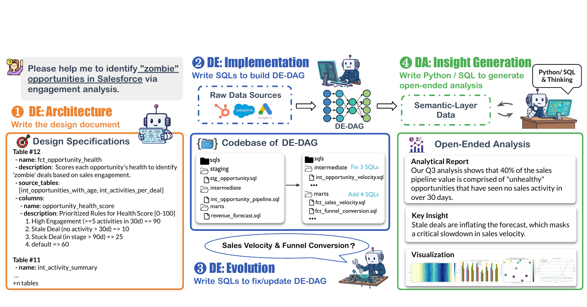

**图 1：**DAComp 旨在评估覆盖完整生命周期数据智能工作流的 LLM，其中包括仓库级数据工程（DE）和开放式数据分析（DA）。

为填补这一空白，我们提出 DAComp，如图 1 所示，它以完整生命周期的数据智能任务评测智能体。DAComp-DE 首次引入仓库级数据工程任务，智能体必须通过在复杂企业模式上生成 DAG 来编排多层数据工作流。其中包含三种不同任务：（1）DE-Architecture 聚焦详细工程规范的高层规划；（2）DE-Implementation 要求智能体从头构建多阶段数据流水线；（3）DE-Evolution 要求智能体响应新需求、修改现有系统。DE-Impl 和 DE-Evol 都极具挑战，常常需要跨 30 多个文件完成超过 4,000 行的大规模代码变更，贴近真实工程工作负载。DAComp-DA 首次探索真实世界的开放式数据分析。在这些场景中，智能体面对下游分析数据上的复杂问题。与具有确定性答案的既有工作（Jing et al., 2024；Lei et al., 2024）不同，这些任务类似真实分析师的工作：智能体必须编写 SQL/Python，对中间结果进行聚合、计算和分析，以生成洞察、报告和可视化，从而同时强调分析精度的严谨性与对人类决策的实际效用。为便于广泛应用，我们还发布了 DAComp-zh，即该基准的高质量中文适配版本及其基线结果。

此类复杂任务的评估方法并不简单。对于确定性的 DE-Impl 和 DE-Evol 任务，我们采用基于执行的方法，系统评估仓库级代码生成表现。开放式 DA 和 DE-Arch 任务由 LLM 裁判（Li et al., 2024a）评估，评估过程由我们提出的评分量规框架指导。该框架不依赖单一答案键，而是针对每个开放式问题明确规定并评估多条有效解题路径，从而形成稳健的多维度评估，并对不同的分析策略给予认可。严格的验证实验确认了 LLM 裁判的可靠性，结果表明其与人类专家高度一致。

我们在 DAComp 上的实验突显了当前模型面临的重大挑战：即使最先进的智能体，在企业级复杂性面前也表现不佳。在 DE 任务上，智能体能力被推至极限，平均得分低于 40%，严格成功率不足 10%，暴露出真实仓库级工程能力的关键缺口。同样，对于需要自主规划的开放式问题，智能体表现也很差。大多数模型的 DA 任务表现跌至 50% 以下，只有少数专有系统表现出更稳健的分析能力。归根结底，数据智能体的进步要求关注点从单纯的代码正确性，转向生成既具分析严谨性又具战略可行动性的洞察所需的细腻能力——规划、开放式推理与系统化综合。DAComp 提供严格、现实的试验平台，旨在推动数据智能体开发从孤立技能转向真实场景所需的、贯穿完整生命周期的综合能力。

## 2 基准构建

### 2.1 任务定义

为弥合上述差距，我们设计了用于评估数据智能体应对真实世界挑战能力的任务。如图 1 所示，我们具体评估智能体作为数据工程师开展仓库级数据工程，以及作为数据分析师处理开放式数据分析的能力。

**DAComp-DE。**智能体 $\pi _ {de}$ 的任务是处理包含架构、实现和演进在内的完整 DE 生命周期。形式化地，这一过程建模为：

$$
(S,C^{\ast})=\pi _ {de}(Q _ {de},C _ 0,B),
$$

其中， $Q _ {de}$ 是初始高层需求， $S$ 表示工程规范（例如 Data Contract）， $B$ 是数据库， $C^{\ast}$ 是最终 DE 仓库。这一统一能力通过三种任务评估：（1）**DE-Arch**：给定高层需求 $Q _ {de}$ 和初始仓库 $C _ 0$，评估智能体生成工程规范 $S$ 的能力；（2）**DE-Impl**：给定详细规范 $S$ 和空仓库（ $C _ 0=\varnothing$），评估智能体从头实现 DE 仓库 $C^{\ast}$ 的能力；（3）**DE-Evol**：给定现有仓库 $C _ 0$ 和新规范 $S$，评估智能体把仓库更新为 $C^{\ast}$ 的能力。

**DAComp-DA。**给定可供分析的数据 $D$（语义层）和开放式问题 $Q _ {da}$，采用策略 $\pi _ {da}$ 的智能体生成分析产物 $O=\pi _ {da}(Q _ {da},D)$（例如分析报告、关键洞察和可行动建议）。这一任务本质上是开放式的，因为同一个问题可以通过多条有效分析路径求解，不存在固定标准答案。

### 2.2 评估指标

**采用分层评分量规和 GSB 评分的 LLM 裁判。**LLM 裁判沿六个维度评估输出 $O$：完整性（Completeness）、准确性（Accuracy）、洞察力（Insightfulness）、可读性（Readability）、分析深度（Analytical depth）和可视化（Visualization，见附录 A.3.1）。分层评分量规评估前三个维度，Good–Same–Bad（GSB）得分（Zheng et al., 2023）覆盖后三个维度。可视化专门评估智能体把数值结果转化为直观图表的能力。

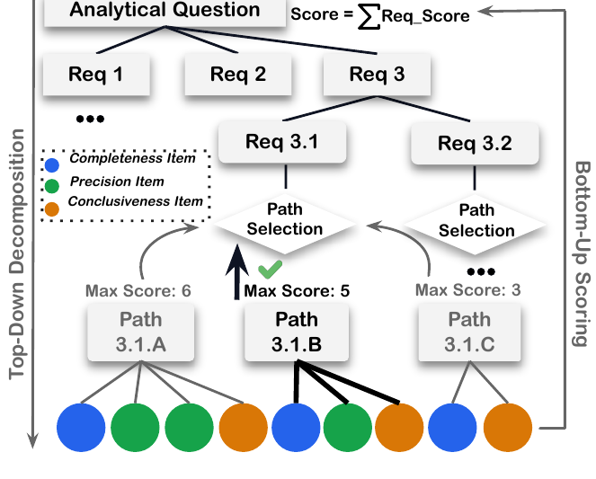

**图 2：**分层评分量规的细节。

如图 2 所示，评分量规 $R$ 把问题 $Q$ 分解为需求和子需求。每项子需求容许多条有效解题路径，每条路径都有自己的评分项（彩色叶节点）。人类专家列举这些路径，并把等价解法合并为同一条路径。评分时，LLM 裁判为每项子需求选择最匹配的路径，仅应用该路径的评分项，再自底向上汇总分数。这种设计可容纳多样的正确方法，不会因方法选择而惩罚模型。我们在表 11 给出了渗透率与盈利能力分析的详细评分量规示例，附录 G.1 讨论了路径枚举方案。

评分量规分数是已满足评分项的归一化加权和：

$$
\mathrm{Score} _ {rubric}(O,R)=\frac{\sum _ {k=1}^{N} s_k}{\sum _ {k=1}^{N} w_k},\qquad s_k=Λ(c_k,O)\in[0,w_k].
$$

对于 Good-Same-Bad（GSB），LLM 裁判只把最终分析结果与预先提供的五份基线报告比较，并由这些轴线的专用评分量规指导，得到：

$$
\mathrm{Score} _ {gsb}(O,O _ {base})=\max\left(0,\frac{|G|-|B|}{|G|+|S|+|B|}\right).
$$

DA 任务最终分数是这两个分量的加权组合：

$$
\mathrm{Score} _ {da}=\alpha\cdot\mathrm{Score} _ {rubric}+(1-\alpha)\cdot\mathrm{Score} _ {gsb}.
$$

开放式 DE-Arch 任务采用类似方式评估，但使用标准的非分层评分量规，也不包含 GSB 分量。更多细节见附录 A。

**确定性任务的执行评估。**DE-Impl 与 DE-Evol 采用严格程度逐级提高的三项执行指标：（1）部分给分的组件分数（Component Score，CS）， $\mathrm{CS} _ {DE\text{-}Impl/Evol}=\sum _ j w_j s_j$，它在使用金标准上游输入的条件下独立评估每个节点，以衡量组件级 SQL 生成的总体表现；（2）级联失败分数（Cascading Failure Score，CFS），它沿 DAG 顺序评估节点，只要任一上游依赖不正确，就把该节点的分数清零，从而衡量端到端数据完整性；（3）严格成功率（Success Rate，SR）， $\mathrm{SR} _ {DE\text{-}Impl/Evol}=\mathbb{I}[\forall j:s_j=1]$，要求每一个组件都完全正确。这组指标对于诊断主要瓶颈至关重要：智能体的组件级生成能力与整体流水线编排能力之间存在差距。更多细节见附录 A.1。

### 2.3 标注流水线

DAComp 由 8 位专家通过严格流水线构建，以确保真实性、质量与一致性。更多细节与示例见附录 E。

1. **数据收集。**基准建立在许可宽松的资产（例如 Apache-2.0、MIT）之上。对于 DE 任务，我们收集了 73 个企业规模的 SaaS 模式及其数据转换项目，每个模式平均包含 400 列，并用大规模、保持关系一致的合成数据填充（见附录 E）。对于 DA 任务，我们从 Web 中整理 100 个复杂数据库，并以 DE 转换数据派生的分析建模层加以补充。
2. **任务设计。**本阶段我们生成 DAComp 问题。对于 DA，标注者先针对每张可供分析的表拟定 8 个开放式分析问题，再由 5 位标注者根据真实性与难度投票，保留排名前 2 的问题。对于 DE-Evol，执业数据工程师依据企业场景和专业标准编写新业务需求。对于 DE-Impl，我们把选定的 SaaS 转换项目逆向工程为单个 `data contract.yaml`，捕捉完整 DAG 及其语义。对于 DE-Arch，从 DE-Impl 和 DE-Evol 示例的分析层出发，DA 标注者为每个项目提出 5 个候选业务需求，再由一位数据工程师选择 1 个可行但具挑战性的需求。
3. **评估构建。**我们为每种任务设计评估协议。对于 DA，标注者按照第 2.2 节构建分层评分量规；每个问题至少由 3 位标注者标注，再通过对齐讨论解决分歧。对于 GSB 协议，经验丰富的数据分析师编写共享评分标准，并组合多个 LLM 的输出生成基线报告。这一评分量规设计的关键，是枚举有效的解题路径（Path）。该过程遵循三项原则：（i）确保路径代表不同且方法论合理的策略，而非增量步骤；（ii）依据程序化计算、可验证的锚点值验证确定性输出；（iii）使用基于方法论的软约束，公平评估有效但未枚举的解题路径（示例见附录 C.4，讨论见附录 G.1）。为确保我们评分量规的完备性，我们还执行验证步骤：我们抽取五种不同 LLM 的输出，确认我们已枚举的路径能够覆盖所有观察到的解题策略。这样可以尽量降低假阴性风险，避免有效但未预料的解法受到不公平惩罚。DE-Impl 与 DE-Evol 的解法是确定性的：我们实现执行脚本，自动对照金标准仓库验证输出，并在节点/层级上给予部分分数，以捕捉逐步正确性。

### 2.4 数据集统计

我们对 DAComp 进行统计分析：表 1 比较其与既有数据集的主要特征，表 2 给出更详细的特性。

**表 1：**DAComp 与其他智能体基准的比较，突出任务范围、任务范式和评估方法的关键差异。DAComp-zh 使用完全相同的任务集。

| 基准 | 领域 | 任务数 | 仓库级 | 每个模式的列数 | 代码规模（LOC） | 主要输出 | 开放式 | 评估方法 |
| --- | --- | ---: | :---: | ---: | ---: | --- | :---: | --- |
| **智能体基准** | | | | | | | | |
| SWE-Bench (Jimenez et al., 2023) | 软件工程 | 2,294 | ✓ | N/A | 32.8 | 代码补丁 | ✗ | 基于执行 |
| WebArena (Zhou et al., 2024) | Web 导航 | 812 | ✓ | N/A | N/A | 操作 | ✗ | 基于执行 |
| OSWorld (Xie et al., 2024) | 计算机控制 | 369 | ✓ | N/A | N/A | 操作 | ✗ | 基于执行 |
| BrowserComp (Wei et al., 2025) | 深度研究 | 2,000 | ✓ | N/A | N/A | 答案 | ✓ | 客观评估 |
| **数据智能体基准** | | | | | | | | |
| DS-1000 (Lai et al., 2023) | 数据科学 | 1,000 | ✗ | N/A | 3.6 | 1 个脚本 | ✗ | 基于执行 |
| BIRD (Li et al., 2024b) | 文本到 SQL | 12,751 | ✗ | 54 | 23.5 | 1 条 SQL | ✗ | 基于执行 |
| Spider 2.0 (Lei et al., 2024) | 文本到 SQL | 632 | ✗ | 320 | 104.6 | 1 条 SQL | ✗ | 基于执行 |
| BIRD-CRITIC (Li et al., 2025) | SQL 调试 | 1,100 | ✗ | 54 | 50–70 | 1 条 SQL | ✗ | 基于执行 |
| DA-Code (Huang et al., 2024) | 数据科学 | 500 | ✗ | 50–100 | 85 | 1 个脚本 | ✗ | 客观评估 |
| DSBench (Jing et al., 2024) | 数据科学 | 540 | ✗ | 27 | 10–20 | N 个脚本 | ✗ | 客观评估 |
| KramaBench (Lai et al., 2025) | 数据科学流水线 | 104 | ✗ | 13 | 50–100 | N 个脚本 | ✓ | LLM 裁判 |
| BLADE (Gu et al., 2024) | 数据分析 | 259 | ✗ | 10–12 | 70–80 | 报告 | ✓ | LLM 裁判 |
| DABStep (Egg et al., 2025) | 数据分析 | 450 | ✗ | 10–12 | 100 | 答案 | ✗ | 客观评估 |
| DAComp | 数据工程与数据分析 | 210 | ✓ | 382 | 约 2,000 | 文档 + 报告、N 条 SQL/脚本 | 两者皆有 | 基于执行 + LLM 裁判（评分量规） |

**表 2：**DAComp 的关键统计量。除总任务数外，所有指标均为单样本平均值。

| 范围 | 指标 | 值 |
| --- | --- | --- |
| 总体（DE-Arch/DE-Impl/DE-Evol/DA） | 总任务数 | 30 / 30 / 50 / 100 |
| 总体 | 问题 token 数 | 166 / 30,883 / 6,508 / 90 |
| DAComp-DA | 列数 / 表数 | 84.7 / 3.9 |
| DAComp-DA | LOC | 433 |
| DAComp-DA | 评分量规（需求 / 子需求 / 路径 / 评分项） | 3.1 / 5.7 / 12.7 / 22.4 |
| DAComp-DA | 完整性 / 准确性 / 洞察力 | 14% / 66% / 20% |
| DAComp-DE | DE-Impl 原始数据（表数 / 列数） | 23.3 / 381.6 |
| DAComp-DE | 代码 LOC（Impl / Evol） | 2,296 / 949.6 |
| DAComp-DE | 变更文件数（Impl / Evol） | 37.0 / 11.7 |
| DAComp-DE | 变更列数（Impl / Evol） | 1,239 / 530.9 |
| DAComp-DE | DE-Arch 评分项数 | 18.5 |
| DAComp-DE | DE-Impl 层级（Staging / Core / Mart） | 16.0 / 11.8 / 8.8 |
| DAComp-DE | DE-Evol 表变更类型（创建 / 编辑） | 3.76 / 7.90 |

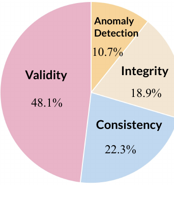

**图 3：**DE-Impl 暂存层的数据清洗任务。

**DAComp-DE 量化企业规模的工程复杂性。**DAComp-DE 的统计数据凸显出它的大规模和复杂性——采用仓库级范式、模式平均包含 412 列、解法需要超过 2,000 行代码，因此区别于既有数据智能体基准。不同于聚焦生成孤立脚本的基准，DAComp 在工业模式上引入任务，这些模式平均有 32 张表和 412 列。所需工程工作量很大：实现任务要从头构建完整流水线，平均跨 43 个不同文件编写 4,612 行代码；演进任务模拟真实维护，平均修改 13 个文件中的 1,718 LOC，智能体需要跨多层数据模型（staging、core 和 mart）管理数据转换。暂存层涉及数据清洗，这是数据治理的核心主题；我们将其分为四类：有效性约束、一致性约束、完整性与唯一性，以及异常检测（如图 3 所示）。中间层与集市层通常聚焦复杂业务逻辑、实体集成和指标聚合。

**DAComp-DA 衡量分析深度和方法多样性。**DAComp-DA 的设计超越简单问答，评估深度分析推理。DAComp 的独特之处在于同时评估确定性工程与开放式分析，而既有基准通常只聚焦一种范式。其开放性由我们的分层评分量规量化：100 个 DA 任务中的每一个平均被分解为 3.1 项需求和 5.7 项子需求，可容纳约 13 条有效解题路径。多维评分量规评估这种方法多样性，其中评分项偏重准确性（66%），同时也奖励完整性（14%）和洞察力（20%）。尽管分析模式比 DE 任务更聚焦（平均 4 张表、85 列），所需推理仍很复杂，平均解法长度达到 347 行代码，显著长于典型文本到 SQL 或单脚本数据科学任务。尤其重要的是，DAComp-DA 高度重视开放式数据可视化，要求智能体自主选择并生成能够有效传达发现的图表。

## 3 实验

### 3.1 实验设置

我们评估了最先进的 LLM，包括 Qwen3（Yang et al., 2025）、DeepSeek-V3.1（Liu et al., 2024）和 Kimi-K2（Team et al., 2025）等开源模型，以及 Gemini（Team et al., 2023）和 GPT（OpenAI, 2023）家族等专有模型。我们对 DE 和 DA 任务均采用广泛使用的 OpenHands（CodeAct-Agent）框架（Wang et al., 2024）。此外，我们为 DAComp-DA 开发了名为 DA-Agent 的定制基线，它通过 Bash 和文件系统交互运行，能够执行 Python 和 SQL。每个智能体的表现使用第 2.2 节所述指标衡量。我们还报告两项聚合分数：DE Score 是所有 DE 任务的平均分（Implementation/Evolution 使用 CFS），Overall Score 表示整个基准的平均分。DA 分数以 $\alpha=0.6$ 聚合评分量规和 GSB 分数，并使用 Gemini-2.5-Flash 作为 LLM 裁判。实验设置的更多细节和额外结果见附录 B。

**表 3：**DAComp-DE 基线表现。所有模型都使用 DE-Agent 框架评估（细节见附录 B.2），覆盖 Implementation（CFS、Max-CFS@8、CS、Max-CS@8）和 Evolution（SR@8、CFS、Max-CFS@8）；指标定义见附录 A.1。末列报告聚合后的 DE Score。

| 方法 | Architecture | Impl CFS | Impl Max-CFS@8 | Impl CS | Impl Max-CS@8 | Evol CFS | Evol Max-CFS@8 | Evol SR@8 | DE Score |
| --- | ---: | ---: | ---: | ---: | ---: | ---: | ---: | ---: | ---: |
| GPT-5 | 63.93(±2.33) | 30.79 | 39.87 | 61.98 | 68.77 | 38.75 | 47.23 | 20.00 | 43.45 |
| Gemini-2.5-Pro | 51.96(±1.78) | 27.66 | 36.88 | 55.32 | 65.32 | 23.97 | 38.92 | 8.00 | 32.88 |
| Qwen3-Coder | 51.43(±3.14) | 23.64 | 32.86 | 54.21 | 63.78 | 27.12 | 39.77 | 12.00 | 32.80 |
| DeepSeek-V3.1 | 52.66(±2.88) | 22.33 | 30.73 | 50.04 | 60.46 | 24.11 | 35.01 | 10.00 | 31.41 |
| o3 | 48.32(±2.13) | 15.07 | 22.32 | 35.55 | 47.81 | 24.42 | 32.07 | 6.00 | 28.39 |
| Qwen3-235B-A22B | 50.73(±2.05) | 2.43 | 5.77 | 20.15 | 31.03 | 12.43 | 21.89 | 2.00 | 20.15 |
| Qwen3-8B | 45.12(±2.06) | 1.31 | 2.34 | 15.33 | 21.23 | 15.89 | 19.12 | 2.00 | 19.89 |

**表 4：**DAComp-DE-zh（中文）基线表现。

| 方法 | Architecture | Impl CFS | Impl Max-CFS@8 | Impl CS | Impl Max-CS@8 | Evol CFS | Evol Max-CFS@8 | Evol SR@8 | DE Score |
| --- | ---: | ---: | ---: | ---: | ---: | ---: | ---: | ---: | ---: |
| GPT-5 | 63.60(±2.14) | 30.49 | 39.24 | 61.85 | 68.43 | 37.88 | 46.91 | 20.00 | 42.88 |
| Gemini-2.5-Pro | 51.90(±3.43) | 26.98 | 36.73 | 55.18 | 65.07 | 24.28 | 38.27 | 8.00 | 32.55 |
| Qwen3-Coder | 51.11(±3.35) | 23.23 | 32.97 | 54.59 | 63.69 | 26.59 | 39.37 | 12.00 | 32.36 |
| DeepSeek-V3.1 | 53.08(±2.54) | 22.62 | 30.84 | 50.22 | 60.34 | 24.69 | 35.17 | 8.00 | 31.87 |
| o3 | 48.02(±1.79) | 15.00 | 22.15 | 35.10 | 47.45 | 24.23 | 32.59 | 6.00 | 28.20 |
| Qwen3-235B-A22B | 50.61(±2.50) | 2.31 | 5.83 | 20.03 | 31.27 | 13.01 | 21.27 | 0.00 | 20.35 |
| Qwen3-8B | 46.22(±1.90) | 1.21 | 2.16 | 15.78 | 21.59 | 15.19 | 19.35 | 0.00 | 19.84 |

**表 5：**DAComp-DA 基准的详细表现分解。

| 方法 | 完整性 | 准确性 | 洞察力 | 可读性 | 分析深度 | 可视化 | DA Score |
| --- | ---: | ---: | ---: | ---: | ---: | ---: | ---: |
| **OpenHands 基线** | | | | | | | |
| GPT-5 | 60.98 | 40.3 | 49.39 | 35.51 | 69.8 | 21.4 | 46.99 |
| Gemini-2.5-Pro | 45.02 | 30.22 | 40.71 | 48.2 | 31.0 | 15.0 | 33.38 |
| o3 | 40.13 | 25.5 | 20.45 | 26.22 | 27.11 | 6.8 | 26.57 |
| DeepSeek-V3.1 | 49.88 | 33.25 | 41.66 | 36.0 | 33.2 | 11.0 | 33.87 |
| Qwen3-Coder | 33.42 | 21.21 | 25.06 | 20.0 | 13.73 | 4.8 | 24.28 |
| Qwen3-235B-A22B | 30.7 | 12.23 | 22.11 | 3.6 | 1.8 | 0.8 | 12.43 |
| **DA-Agent 基线** | | | | | | | |
| GPT-5 | 64.23(±2.37) | 43.81(±3.43) | 56.89(±6.48) | 43.59(±6.08) | 76.80(±4.91) | 27.44(±4.44) | 50.84(±3.12) |
| Kimi-K2 | 52.31(±1.13) | 33.56(±2.09) | 46.82(±2.48) | 62.20(±3.01) | 63.75(±2.84) | 14.40(±2.33) | 41.89(±1.78) |
| Gemini-2.5-Pro | 45.43(±1.34) | 30.30(±0.27) | 41.45(±0.71) | 51.60(±2.73) | 35.75(±2.35) | 13.40(±2.94) | 34.70(±1.39) |
| DeepSeek-V3.1 | 48.74(±2.09) | 32.97(±1.40) | 42.43(±1.89) | 37.25(±2.21) | 35.00(±1.57) | 11.45(±1.31) | 34.33(±0.45) |
| o3 | 40.73(±0.63) | 29.54(±2.93) | 23.95(±3.86) | 25.24(±2.51) | 23.81(±3.37) | 7.32(±1.27) | 28.20(±1.37) |
| Qwen3-Coder | 35.12(±2.21) | 20.05(±2.35) | 25.53(±1.83) | 19.37(±1.44) | 13.42(±2.38) | 5.15(±0.85) | 25.13(±0.82) |
| Doubao-Seed-1.6 | 37.45(±1.95) | 18.45(±2.55) | 27.51(±2.00) | 13.25(±2.48) | 9.01(±1.25) | 6.80(±1.96) | 20.74(±0.82) |
| Qwen3-235B-A22B | 29.37(±1.09) | 13.11(±1.33) | 21.50(±1.81) | 3.64(±0.33) | 1.56(±0.81) | 1.87(±0.78) | 13.25(±0.65) |
| Qwen3-8B | 9.89(±2.46) | 4.12(±0.32) | 5.05(±1.70) | 0.13(±0.15) | 0.00(±0.00) | 0.15(±0.19) | 4.47(±0.63) |

### 3.2 主要结果

**DE 结果。**如表 4 所示，GPT-5 确立了明确领先地位，在不同编排框架下始终取得最高聚合 DE Score。值得注意的是，Qwen3-Coder 和 DeepSeek-V3.1 等专用开源模型展现出优异效能，可以有效媲美 Gemini-2.5-Pro 等通用专有模型。然而，绝对表现指标揭示了仓库级工程复杂性这一严峻现实：即使最先进的 GPT-5，DE Score 也只有约 42.88%，严格成功率仅为 20.00%。这一明显的性能上限说明，框架优化虽能稳定交互，DAComp-DE 仍对当前 LLM 提出严峻挑战，无论模型规模或专用程度如何都尚未掌握它；这凸显了孤立代码生成与整体系统编排之间的关键差距。

**表 6：**DAComp-DA-zh（中文）基准的详细表现分解。

| 方法 | 完整性 | 准确性 | 洞察力 | 可读性 | 分析深度 | 可视化 | DA Score |
| --- | ---: | ---: | ---: | ---: | ---: | ---: | ---: |
| **OpenHands 基线** | | | | | | | |
| GPT-5 | 70.56 | 47.08 | 57.19 | 19.6 | 46.4 | 22.0 | 43.69 |
| Gemini-2.5-Pro | 55.51 | 29.9 | 47.17 | 38.8 | 18.8 | 10.2 | 31.22 |
| o3 | 49.79 | 30.73 | 40.74 | 17.55 | 10.61 | 8.2 | 27.87 |
| DeepSeek-V3.1 | 54.5 | 32.93 | 42.56 | 8.2 | 5.0 | 3.6 | 24.16 |
| Qwen3-Coder | 43.14 | 20.38 | 25.69 | 2.47 | 1.1 | 2.04 | 21.84 |
| Qwen3-235B-A22B | 29.44 | 14.27 | 17.35 | 1.22 | 0.0 | 0.98 | 11.5 |
| **DA-Agent 基线** | | | | | | | |
| GPT-5 | 72.69(±1.41) | 46.96(±1.94) | 61.56(±2.51) | 39.35(±2.19) | 66.40(±3.43) | 25.40(±1.87) | 49.49(±1.04) |
| Gemini-2.5-Pro | 54.63(±2.53) | 33.33(±1.58) | 48.56(±0.50) | 49.95(±3.84) | 26.20(±2.47) | 9.00(±3.52) | 33.75(±1.67) |
| Kimi-K2 | 57.08(±0.55) | 33.54(±2.99) | 47.64(±1.32) | 34.52(±2.35) | 20.28(±3.07) | 3.86(±2.14) | 31.22(±0.75) |
| o3 | 51.10(±1.75) | 30.68(±2.97) | 34.92(±1.29) | 20.00(±0.57) | 12.54(±2.54) | 6.35(±1.22) | 28.70(±1.15) |
| DeepSeek-V3.1 | 55.15(±2.49) | 34.01(±2.36) | 44.62(±2.89) | 7.15(±1.98) | 4.65(±2.00) | 6.30(±2.42) | 27.75(±2.04) |
| Qwen3-Coder | 43.35(±1.76) | 22.75(±3.15) | 30.83(±2.38) | 4.07(±0.98) | 1.55(±1.02) | 1.75(±0.50) | 22.64(±1.19) |
| Doubao-Seed-1.6 | 45.92(±2.07) | 18.73(±2.05) | 33.23(±1.06) | 3.23(±1.12) | 0.75(±0.68) | 1.55(±0.66) | 17.83(±1.33) |
| Qwen3-235B-A22B | 31.64(±2.71) | 13.48(±0.19) | 22.27(±1.22) | 0.87(±0.64) | 0.13(±0.12) | 0.33(±0.42) | 12.74(±0.33) |
| Qwen3-8B | 14.55(±1.04) | 6.30(±2.18) | 6.08(±2.15) | 0.00(±0.00) | 0.00(±0.00) | 0.00(±0.00) | 6.33(±1.25) |

**DA 结果。**表 6 的结果揭示了开放式分析中的重大能力差距，最高总体得分只有 56.14%。分维度分析得到三项关键发现。第一，分析深度和洞察力是不同能力层级之间的主要区分因素。GPT-5 在所有维度保持高分并居于主导地位，而 o3 等注重推理的模型表现出独特的“计算器行为”：尽管准确性（40.99）和完整性（60.73）具有竞争力，o3 的可读性（24.63）和深度（13.37）却严重不足，说明它能计算正确数字，却无法把数字综合为人类可读的洞察。第二，DeepSeek-V3.1（39.16%）与代码专用模型 Qwen3-Coder（28.07%）之间的差距主要来自定性指标；Qwen3-Coder 的可读性（3.15）和可视化（1.93）近乎崩溃，表明开放式分析需要超越单纯 SQL 生成的整体推理。最后，任务复杂性形成了严格的能力阈值，Qwen3-8B 等小模型无法生成连贯的分析产物。

### 3.3 仓库级数据工程的表现分析

**整体编排是数据工程的核心瓶颈。**在 DE 任务中，模型规划良好，却难以端到端执行。Evolution 分数相对较高（例如 GPT-5：37–38%），但 Evolution 的严格 SR 低得多（通常不足 20%）。强模型的组件级正确性（CS）与级联失败分数（CFS）之间下降明显，暴露出超越单文件正确性的流水线级编排瓶颈。例如，GPT-5（DAComp-DE-Agent）在 Implementation 上从 CS 61.85 降至 CFS 30.49，在 Evolution 上从 CFS 37.88 降至 SR 20.00。相比之下，较弱的开源模型（例如 Qwen3-8B）CS 很低（Implementation 为 1.21），说明它们在组件层面已经存在不足；编排进一步放大了失败，却不是唯一成因。所有模型的 CFS 均很低，证实在活动仓库中协调依赖关系才是 DAComp-DE 的主要挑战，而非生成孤立的正确代码。

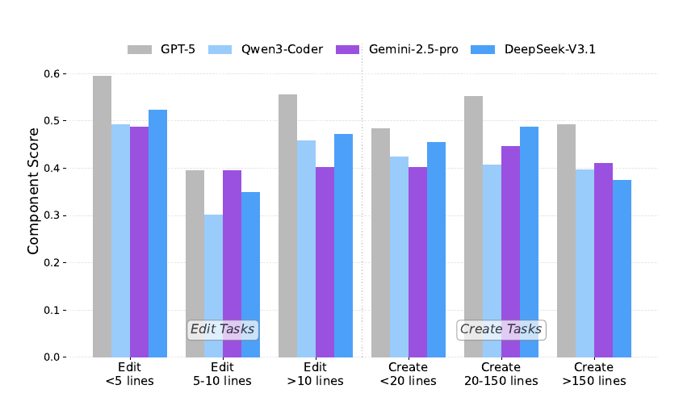

**图 4：**组件级表现分析。

**中等规模代码编辑最难执行。**为得到更细粒度的认识，我们开展节点级分析，研究单个 SQL 文件修改的得分（图 4）。我们把修改分为两类——编辑现有文件或创建新文件——再按所需行数分组。对于创建任务，GPT-5 等模型在中等规模创建（20–150 行）上有明显“甜蜜点”，但所有模型都难以处理超大文件（超过 150 行）。相比之下，编辑任务呈现非线性难度趋势。与直觉相反，中等规模编辑最具挑战。这是因为小修改往往很简单，而大修改经常由逻辑清晰、重复的样板转换构成。中等规模编辑往往包含最复杂、最细腻的业务逻辑、聚合和计算变更，因此提出了最大的推理挑战。

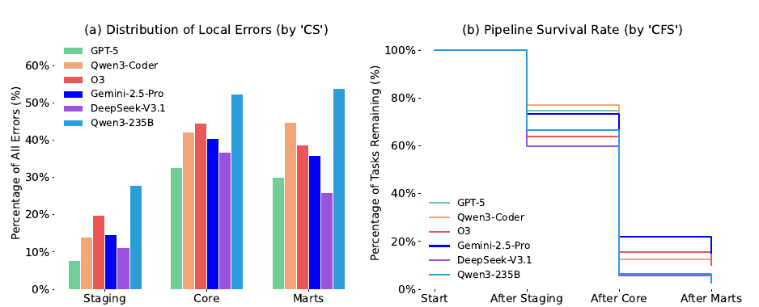

**图 5：**错误分布（左）与流水线存活率（右）。

**分析复杂性与失败率在较高流水线层级中逐步上升。**图 5 表明，智能体从初始数据摄取层移向更复杂的分析层时，数据工程任务的难度显著提高。聚焦基础清洗的暂存层始终具有最少的局部错误和最高的任务存活率。中间（core）层的挑战急剧加大，最复杂的业务逻辑与实体集成发生于此；如子图 (a) 所示，最大比例的局部错误也源于此。子图 (b) 中流水线存活率在该层之后下降最剧烈，清楚显示了这种难度的严重影响。最后，marts 层仍极具挑战。最终层的失败往往直接源于继承 core 层的上游错误，初始任务中只有不足 20% 能存活至完成。综合来看，这些结果展现出清晰的难度层级：core 和 marts 层的分析复杂性比初始 staging 层更具挑战。

**表现最佳的智能体呈现稳定且与任务匹配的交互模式。**图 ?? 展示 DE 任务中的交互轮次分布。GPT-5 等高表现模型在 Implementation 和 Evolution 设置中均保持适中的轮次数和较小的方差，体现出高效而足够彻底的推理。相比之下，Qwen3 等较弱模型要么在 Implementation 中生成过长且波动剧烈的轨迹，要么在 Evolution 中呈现异常短的轨迹，而提前终止往往对应错误或不完整的输出。这些模式表明，交互轮次分布稳定且居中，比单纯减少轮次数更能体现有效智能体的特征。

### 3.4 开放式数据分析任务的分析

**不同分析目标上的表现。**为研究表现与分析任务性质的相关性，我们根据主要目标把每个 DA 任务人工分为五类：描述型（Descriptive）、诊断型（Diagnostic）、战略型（Strategic）、模式识别（Pattern Recognition）和画像（Profiling；定义见附录 C.4）。如图 6 所示，这种分类揭示出明确的表现层级。智能体擅长具体的描述型任务（发生了什么？），但在更抽象的诊断型（为什么发生？）和战略型（我们应该怎么做？）任务上得分急剧下降。这证实更复杂的目标不仅更具挑战，也更能区分先进模型的能力。

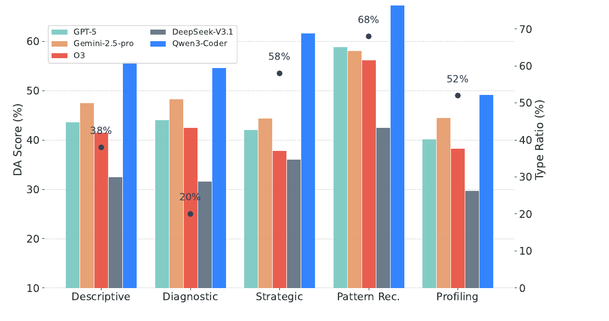

**图 6：**五类分析目标上的 DA 表现。

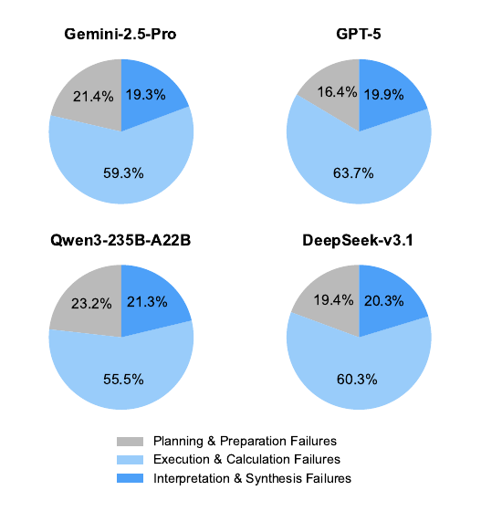

**图 7：**DA 错误分布。

**错误分析。**如图 7 所示，我们把 DA 失败分为三个阶段：规划、执行和解释。定量分解显示，所有模型都呈现一致的难度层级：执行与计算失败占错误分布的主导，平均占全部失败的 59.05%。这表明当前智能体的主要瓶颈在于计算准确性与代码落地能力。然而，挑战并非只有技术层面；规划（20.65%）和解释（20.30%）仍是重要错误来源。这两个认知阶段合计占总体表现缺口的五分之二，说明增强执行稳健性虽然是最紧迫的优先事项，实现可靠自主分析仍需要贯穿完整生命周期的整体改进——从最初的需求分解一直到最终的洞察综合。

### 3.5 LLM 裁判方法的验证

为严格验证我们评估框架的可靠性，我们在 50 个样本上沿四个维度开展广泛分析：人类—模型对齐、跨裁判一致性、随机稳定性和超参数稳健性。

**人类—模型对齐。**为验证我们的 LLM-as-Judge 方法，我们针对由 8 种不同 LLM 生成的 300 份模型响应开展大规模一致性研究。专家依据 7,000 多个具体评分项和 GSB 文档人工标注这些响应。我们通过测量评审者间一致性建立可靠的金标准；结果具有很高的一致性（例如评分量规 case ICC=0.925，Item $κ _ w=0.906$），证实我们的人类基线稳健（表 7）。

**表 7：**评审者间一致性与人类—模型一致性（细节见附录 B.4；Rubric： $N=300$、7k 个 item；GSB Item： $N=600$ 对）。

| 模型 / 指标 | Rubric Item（ $κ _ w$） | Rubric Case ICC(A,1) | GSB Model（ $\tau _ b$） | GSB Read.（ $κ _ w$） | GSB Prof.（ $κ _ w$） | GSB Vis.（ $κ _ w$） |
| --- | ---: | ---: | ---: | ---: | ---: | ---: |
| Human Inter | 0.906 | 0.925 | 1.000 | 0.601 | 0.751 | 0.753 |
| o4-mini | 0.827 | 0.881 | 1.000 | 0.609 | 0.758 | 0.742 |
| Gemini-2.5-Flash | 0.834 | 0.890 | 1.000 | 0.604 | 0.759 | 0.735 |
| GPT-4.1 | 0.797 | 0.848 | 1.000 | 0.596 | 0.786 | 0.748 |
| Gemini-2.5-Pro | 0.808 | 0.878 | 1.000 | 0.602 | 0.765 | 0.751 |
| Kimi-K2-Thinking | 0.808 | 0.872 | 1.000 | 0.575 | 0.732 | – |
| DeepSeek-V3.1 | 0.782 | 0.870 | 1.000 | 0.588 | 0.725 | – |
| Qwen3(-VL)-235B | 0.737 | 0.758 | 1.000 | 0.531 | 0.713 | 0.682 |
| Qwen3(-VL)-30B | 0.680 | 0.775 | 1.000 | 0.507 | 0.691 | 0.656 |

以这一人类基线为参照，我们在三个主要一致性层级上评测多个候选裁判（例如 Gemini 2.5 Flash、o4-mini、GPT-4.1）：（i）case 级一致性，衡量裁判对单项任务的评分与人类专家有多一致；（ii）模型级一致性，验证裁判给出的所有模型最终排名是否匹配人类导出的排行榜；（iii）item 级一致性，以单个评分项或 GSB 文档对为粒度，评估模型与人类专家在原子判断上的一致性。如表 7 所示，Gemini-2.5-Flash 表现出极佳的对齐程度，在所有模型中取得最高的 Rubric Item $κ _ w$（0.834）和 Case ICC（0.890），实际上达到人类级可靠性。GSB 可读性得分因主观性而出现预期内的方差（ $κ _ w\approx0.53$），但裁判在深度与可视化等客观维度上保持高精度，因而适合作为我们的标准评估器。

**表 8：**不同裁判下的排名稳定性。高相关性（ $\tau _ b$）证实排行榜对模型家族偏差具有稳健性。

| 智能体模型 | Flash | Pro | GPT-4.1 | Qwen-235B | Qwen-30B |
| --- | ---: | ---: | ---: | ---: | ---: |
| GPT-5 | 56.14 | 59.52 | 63.37 | 71.57 | 53.72 |
| o3 | 36.08 | 40.08 | 44.25 | 50.76 | 31.63 |
| Gemini-2.5-Pro | 39.46 | 45.69 | 50.98 | 55.48 | 35.70 |
| DeepSeek-V3.1 | 39.16 | 44.68 | 50.61 | 54.58 | 41.44 |
| Qwen3-Coder | 28.07 | 32.12 | 36.14 | 43.79 | 25.86 |
| Qwen3-235B | 18.84 | 20.85 | 21.77 | 23.81 | 18.30 |
| Kimi-K2 | 36.94 | 43.77 | 47.83 | 53.55 | 32.93 |
| 排名相关性（ $\tau _ b$） | – | 1.00 | 1.00 | 1.00 | 0.90 |

**表 9：**不同权重超参数（ $\alpha$）下的排名稳定性。结果显示完全不变（ $\tau _ b=1.00$）。

| 智能体模型 | $\alpha=0.6$ | $\alpha=0.5$ | $\alpha=0.8$ | $\alpha=0.9$ |
| --- | ---: | ---: | ---: | ---: |
| GPT-5 | 56.79 | 52.14 | 58.30 | 60.49 |
| o3 | 36.33 | 30.45 | 39.89 | 43.86 |
| Gemini-2.5-Pro | 39.36 | 34.36 | 42.05 | 44.83 |
| DeepSeek-V3.1 | 33.82 | 26.86 | 38.33 | 43.54 |
| Qwen3-235B | 18.84 | 14.39 | 21.69 | 24.98 |
| 排名相关性（ $\tau _ b$） | – | 1.00 | 1.00 | 1.00 |

**跨裁判一致性。**为严格缓解对模型家族特定偏差（例如自我偏好）的担忧并验证排行榜的可复现性，我们使用多样的专有和开源裁判开展排名稳定性分析。如表 8 所示，智能体的相对排名表现出极佳的一致性，在多数评估器上达到完全相关（ $\tau _ b=1.00$）。特别是，用非 Gemini 裁判（例如 GPT-4.1）评估 Gemini 智能体时，排名位置完全相同，有效反驳了模型家族偏差假设。因此，鉴于裁判模型的选择不会在统计意义上改变排行榜，我们采用在稳定性与成本效益之间取得更优平衡的 Gemini-2.5-Flash 作为标准。

**超参数稳健性。**最终 DA 分数是加权聚合： $\mathrm{Score} _ {da}=\alpha\cdot\mathrm{Score} _ {rubric}+(1-\alpha)\cdot\mathrm{Score} _ {gsb}$。DAComp 的细粒度维度设计允许开发者根据自身对准确性与呈现方式的偏好调整 $\alpha$；我们针对一般 jiu 采用 $\alpha=0.6$，确保客观技术正确性（Rubric）仍是主导因素。为验证这一选择的有效性，我们对 $\alpha\in\lbrace 0.5,0.8,0.9\rbrace$ 各配置开展敏感性分析。表 9 显示，各设置下的相对排名保持不变（ $\tau _ b=1.00$），说明我们的通用标准既稳健，也为专门用例保留了灵活性。

**随机稳定性。**为评估我们评分机制的可复现性，我们量化 LLM 裁判随机性带来的变异。我们针对一组固定且相同的智能体响应独立评分 8 次。如表 10 所示，最终得分的标准差始终可以忽略（小于 0.35），表明尽管 LLM 生成具有内在随机性，我们的评估协议仍能给出统计稳定且可复现的评分。

**表 10：**对固定输出独立评分 8 次时的分数变异（均值 ± 标准差）。

| 模型 | DE-Arch | DA |
| --- | ---: | ---: |
| GPT-5 | 61.3 ± 0.18 | 56.1 ± 0.16 |
| DeepSeek-V3.1 | 53.2 ± 0.25 | 39.1 ± 0.22 |
| Gemini 2.5 Pro | 51.0 ± 0.21 | 39.4 ± 0.22 |
| O3 | 54.8 ± 0.19 | 36.1 ± 0.20 |
| Qwen3-235B | 50.4 ± 0.31 | 18.8 ± 0.29 |

## 4 相关工作

**智能体基准。**随着基于 LLM 的智能体日趋成熟，基准已经覆盖工具使用（Yao et al., 2024）、软件工程（Jimenez et al., 2023；Zan et al., 2025）、移动端交互（Rawles et al., 2024）、Web 导航（Deng et al., 2023；Zhou et al., 2024）、计算机使用（Xie et al., 2024）、科学发现（Chen et al., 2024）和深度研究（Phan et al., 2025；Wei et al., 2025），共同推动了该领域的发展。与此同时，评估已从固定答案评分转向开放式评估（Li et al., 2024a；Wu et al., 2025；Du et al., 2025；Arora et al., 2025；?；?；?）。据我们所知，DAComp 是首个覆盖数据智能工作流的基准，它同时在仓库级数据工程和开放式数据分析上评估端到端数据智能体，旨在推动自主工程与分析能力发展。

**数据智能体基准。**数据智能体是一种由 LLM 驱动的自主系统，它通过工具使用和代码执行来获取、转换并分析数据，规划和执行端到端工作流，以实现用户定义的目标。早期工作强调文本到 SQL（Yu et al., 2018；Li et al., 2024b）和代码生成（Lai et al., 2023；Yin et al., 2023）等单轮任务；较新的工作则推进到真实场景上的现实 SQL 生成（Lei et al., 2024；Li et al., 2025；?）、带迭代执行的多轮数据科学代码生成（Hu et al., 2024；Huang et al., 2024；Jing et al., 2024），以及业务场景中的数据分析（Gu et al., 2024；Egg et al., 2025；Lai et al., 2025）。DAComp 超越这些工作，提出首个覆盖企业数据智能工作流的基准，涵盖仓库级工程和开放式分析，为推进自主智能体提供严格的试验平台。

## 5 结论

在本工作中，我们提出 DAComp，这是一个用于评估数据智能体完整数据智能生命周期能力的综合基准。DAComp 引入两个严格的试验平台，弥合孤立代码生成与真实企业需求之间的差距：DAComp-DE 面向仓库级流水线编排，DAComp-DA 面向开放式分析推理。我们的广泛实验揭示出显著的能力缺口：即使最先进的模型，在整体系统维护和战略洞察综合上也表现不佳，工程任务的成功率低于 20%。此外，DAComp-zh 为评估多语言环境中的智能体稳健性铺平了道路，促进具有全球适应性的系统发展。DAComp 通过建立这一严格标准，旨在推动社区超越单纯的技术正确性，促进真正自主且胜任企业任务的数据智能体演进。

## 致谢

本工作得到北京市自然科学基金（L243006）和国家自然科学基金（No.62376270）的资助。

## 参考文献

1. Anthropic. Introducing Claude 4. https://www.anthropic.com/news/claude-4, 2025.
2. Rahul K Arora, Jason Wei, Rebecca Soskin Hicks, Preston Bowman, Joaquin Quiñonero-Candela, Foivos Tsimpourlas, Michael Sharman, Meghan Shah, Andrea Vallone, Alex Beutel, et al. Healthbench: Evaluating large language models towards improved human health. arXiv preprint arXiv:2505.08775, 2025.
3. Jun Shern Chan, Neil Chowdhury, Oliver Jaffe, James Aung, Dane Sherburn, Evan Mays, Giulio Starace, Kevin Liu, Leon Maksin, Tejal Patwardhan, et al. Mle-bench: Evaluating machine learning agents on machine learning engineering. arXiv preprint arXiv:2410.07095, 2024.
4. Ziru Chen, Shijie Chen, Yuting Ning, Qianheng Zhang, Boshi Wang, Botao Yu, Yifei Li, Zeyi Liao, Chen Wei, Zitong Lu, et al. Scienceagentbench: Toward rigorous assessment of language agents for data-driven scientific discovery. In The Thirteenth International Conference on Learning Representations, 2024.
5. Xiang Deng, Yu Gu, Boyuan Zheng, Shijie Chen, Sam Stevens, Boshi Wang, Huan Sun, and Yu Su. Mind2web: Towards a generalist agent for the web. Advances in Neural Information Processing Systems, 36:28091–28114, 2023.
6. Mingxuan Du, Benfeng Xu, Chiwei Zhu, Xiaorui Wang, and Zhendong Mao. Deepresearch bench: A comprehensive benchmark for deep research agents. arXiv preprint arXiv:2506.11763, 2025.
7. Alex Egg, Martin Iglesias Goyanes, Friso Kingma, Andreu Mora, Leandro von Werra, and Thomas Wolf. Dabstep: Data agent benchmark for multi-step reasoning. arXiv preprint arXiv:2506.23719, 2025.
8. Gemini. Gemini 2.5: Our most intelligent AI model. https://blog.google/technology/google-deepmind/gemini-model-thinking-updates-march-2025/, 2025.
9. Ken Gu, Ruoxi Shang, Ruien Jiang, Keying Kuang, Richard-John Lin, Donghe Lyu, Yue Mao, Youran Pan, Teng Wu, Jiaqian Yu, et al. Blade: Benchmarking language model agents for data-driven science. In Findings of the Association for Computational Linguistics: EMNLP 2024, pp. 13936–13971, 2024.
10. Xueyu Hu, Ziyu Zhao, Shuang Wei, Ziwei Chai, Qianli Ma, Guoyin Wang, Xuwu Wang, Jing Su, Jingjing Xu, Ming Zhu, et al. Infiagent-dabench: Evaluating agents on data analysis tasks. In Forty-first International Conference on Machine Learning, 2024.
11. Yiming Huang, Jianwen Luo, Yan Yu, Yitong Zhang, Fangyu Lei, Yifan Wei, Shizhu He, Lifu Huang, Xiao Liu, Jun Zhao, et al. Da-code: Agent data science code generation benchmark for large language models. In Proceedings of the 2024 Conference on Empirical Methods in Natural Language Processing, pp. 13487–13521, 2024.
12. Carlos E Jimenez, John Yang, Alexander Wettig, Shunyu Yao, Kexin Pei, Ofir Press, and Karthik R Narasimhan. Swe-bench: Can language models resolve real-world github issues? In The Twelfth International Conference on Learning Representations, 2023.
13. Liqiang Jing, Zhehui Huang, Xiaoyang Wang, Wenlin Yao, Wenhao Yu, Kaixin Ma, Hongming Zhang, Xinya Du, and Dong Yu. Dsbench: How far are data science agents to becoming data science experts?, 2024. URL https://arxiv.org/abs/2409.07703.
14. Eugenie Lai, Gerardo Vitagliano, Ziyu Zhang, Sivaprasad Sudhir, Om Chabra, Anna Zeng, Anton A Zabreyko, Chenning Li, Ferdi Kossmann, Jialin Ding, et al. Kramabench: A benchmark for ai systems on data-to-insight pipelines over data lakes. arXiv preprint arXiv:2506.06541, 2025.
15. Yuhang Lai, Chengxi Li, Yiming Wang, Tianyi Zhang, Ruiqi Zhong, Luke Zettlemoyer, Wen-tau Yih, Daniel Fried, Sida Wang, and Tao Yu. Ds-1000: A natural and reliable benchmark for data science code generation. In International Conference on Machine Learning, pp. 18319–18345. PMLR, 2023.
16. Fangyu Lei, Jixuan Chen, Yuxiao Ye, Ruisheng Cao, Dongchan Shin, Hongjin Su, Zhaoqing Suo, Hongcheng Gao, Wenjing Hu, Pengcheng Yin, et al. Spider 2.0: Evaluating language models on real-world enterprise text-to-sql workflows. arXiv preprint arXiv:2411.07763, 2024.
17. Haitao Li, Qian Dong, Junjie Chen, Huixue Su, Yujia Zhou, Qingyao Ai, Ziyi Ye, and Yiqun Liu. Llms-as-judges: a comprehensive survey on llm-based evaluation methods. arXiv preprint arXiv:2412.05579, 2024a.
18. Jinyang Li, Binyuan Hui, Ge Qu, Jiaxi Yang, Binhua Li, Bowen Li, Bailin Wang, Bowen Qin, Ruiying Geng, Nan Huo, et al. Can llm already serve as a database interface? a big bench for large-scale database grounded text-to-sqls. Advances in Neural Information Processing Systems, 36, 2024b.
19. Jinyang Li, Xiaolong Li, Ge Qu, Per Jacobsson, Bowen Qin, Binyuan Hui, Shuzheng Si, Nan Huo, Xiaohan Xu, Yue Zhang, et al. Swe-sql: Illuminating llm pathways to solve user sql issues in real-world applications. arXiv preprint arXiv:2506.18951, 2025.
20. Aixin Liu, Bei Feng, Bing Xue, Bingxuan Wang, Bochao Wu, Chengda Lu, Chenggang Zhao, Chengqi Deng, Chenyu Zhang, Chong Ruan, et al. Deepseek-v3 technical report. arXiv preprint arXiv:2412.19437, 2024.
21. OpenAI. OpenAI GPT5 System Card. https://cdn.openai.com/gpt-5-system-card.pdf, 2025.
22. R OpenAI. Gpt-4 technical report. arxiv 2303.08774. View in Article, 2:13, 2023.
23. Long Phan, Alice Gatti, Ziwen Han, Nathaniel Li, Josephina Hu, Hugh Zhang, Chen Bo Calvin Zhang, Mohamed Shaaban, John Ling, Sean Shi, et al. Humanity’s last exam. arXiv preprint arXiv:2501.14249, 2025.
24. Christopher Rawles, Sarah Clinckemaillie, Yifan Chang, Jonathan Waltz, Gabrielle Lau, Marybeth Fair, Alice Li, William Bishop, Wei Li, Folawiyo Campbell-Ajala, et al. Androidworld: A dynamic benchmarking environment for autonomous agents. arXiv preprint arXiv:2405.14573, 2024.
25. Gemini Team, Rohan Anil, Sebastian Borgeaud, Yonghui Wu, Jean-Baptiste Alayrac, Jiahui Yu, Radu Soricut, Johan Schalkwyk, Andrew M Dai, Anja Hauth, et al. Gemini: a family of highly capable multimodal models. arXiv preprint arXiv:2312.11805, 2023.
26. Kimi Team, Yifan Bai, Yiping Bao, Guanduo Chen, Jiahao Chen, Ningxin Chen, Ruijue Chen, Yanru Chen, Yuankun Chen, Yutian Chen, et al. Kimi k2: Open agentic intelligence. arXiv preprint arXiv:2507.20534, 2025.
27. Xingyao Wang, Boxuan Li, Yufan Song, Frank F Xu, Xiangru Tang, Mingchen Zhuge, Jiayi Pan, Yueqi Song, Bowen Li, Jaskirat Singh, et al. Openhands: An open platform for ai software developers as generalist agents. arXiv preprint arXiv:2407.16741, 2024.
28. Jason Wei, Zhiqing Sun, Spencer Papay, Scott McKinney, Jeffrey Han, Isa Fulford, Hyung Won Chung, Alex Tachard Passos, William Fedus, and Amelia Glaese. Browsecomp: A simple yet challenging benchmark for browsing agents. arXiv preprint arXiv:2504.12516, 2025.
29. Yuning Wu, Jiahao Mei, Ming Yan, Chenliang Li, Shaopeng Lai, Yuran Ren, Zijia Wang, Ji Zhang, Mengyue Wu, Qin Jin, et al. Writingbench: A comprehensive benchmark for generative writing. arXiv preprint arXiv:2503.05244, 2025.
30. Tianbao Xie, Danyang Zhang, Jixuan Chen, Xiaochuan Li, Siheng Zhao, Ruisheng Cao, Toh Jing Hua, Zhoujun Cheng, Dongchan Shin, Fangyu Lei, et al. Osworld: Benchmarking multimodal agents for open-ended tasks in real computer environments. arXiv preprint arXiv:2404.07972, 2024.
31. An Yang, Anfeng Li, Baosong Yang, Beichen Zhang, Binyuan Hui, Bo Zheng, Bowen Yu, Chang Gao, Chengen Huang, Chenxu Lv, et al. Qwen3 technical report. arXiv preprint arXiv:2505.09388, 2025.
32. Shunyu Yao, Jeffrey Zhao, Dian Yu, Nan Du, Izhak Shafran, Karthik R Narasimhan, and Yuan Cao. React: Synergizing reasoning and acting in language models. In The Eleventh International Conference on Learning Representations, 2022.
33. Shunyu Yao, Noah Shinn, Pedram Razavi, and Karthik Narasimhan. tau-bench: A benchmark for tool-agent-user interaction in real-world domains. arXiv preprint arXiv:2406.12045, 2024.
34. Pengcheng Yin, Wen-Ding Li, Kefan Xiao, Abhishek Rao, Yeming Wen, Kensen Shi, Joshua Howland, Paige Bailey, Michele Catasta, Henryk Michalewski, et al. Natural language to code generation in interactive data science notebooks. In Proceedings of the 61st Annual Meeting of the Association for Computational Linguistics (Volume 1: Long Papers), pp. 126–173, 2023.
35. Tao Yu, Rui Zhang, Kai Yang, Michihiro Yasunaga, Dongxu Wang, Zifan Li, James Ma, Irene Li, Qingning Yao, Shanelle Roman, et al. Spider: A large-scale human-labeled dataset for complex and cross-domain semantic parsing and text-to-sql task. In Proceedings of the 2018 Conference on Empirical Methods in Natural Language Processing, pp. 3911–3921, 2018.
36. Daoguang Zan, Zhirong Huang, Wei Liu, Hanwu Chen, Linhao Zhang, Shulin Xin, Lu Chen, Qi Liu, Xiaojian Zhong, Aoyan Li, et al. Multi-swe-bench: A multilingual benchmark for issue resolving. arXiv preprint arXiv:2504.02605, 2025.
37. Lianmin Zheng, Wei-Lin Chiang, Ying Sheng, Siyuan Zhuang, Zhanghao Wu, Yonghao Zhuang, Zi Lin, Zhuohan Li, Dacheng Li, Eric Xing, et al. Judging llm-as-a-judge with mt-bench and chatbot arena. Advances in neural information processing systems, 36:46595–46623, 2023.
38. Shuyan Zhou, Frank F. Xu, Hao Zhu, Xuhui Zhou, Robert Lo, Abishek Sridhar, Xianyi Cheng, Tianyue Ou, Yonatan Bisk, Daniel Fried, Uri Alon, and Graham Neubig. Webarena: A realistic web environment for building autonomous agents, 2024. URL https://arxiv.org/abs/2307.13854.

## 附录 A 评估方法细节

### A.1 DAComp-DE-Impl/Evol

DAComp-DE-Impl/Evol 使用三种严格程度逐级提高的执行指标评估：组件分数（CS）、级联失败分数（CFS）和成功率（SR）。图 8 说明当某个中间节点失败时，这些指标如何以不同方式为简单流水线评分。

**组件分数（CS）。**令 $D$ 为任务集合。对于任务 $d\in D$，令层级集合为 $L$（例如 staging/intermediate/marts），每层 $\ell\in L$ 的表集合为 $T _ {d,\ell}$，权重 $w _ {d,t}\ge 0$。在上游输入完美（渐进式/混合评估）的条件下，通过 DuckDB 检查预测输出与金标准输出在模式和数据上是否完全等价，由此定义表匹配指示量 $m _ {d,t}\in\lbrace 0,1\rbrace$。每层分数和任务级 CS 为：

$$
S _ {d,\ell}=\frac{\sum _ {t\in T _ {d,\ell}}w _ {d,t}m _ {d,t}}{\sum _ {t\in T _ {d,\ell}}w _ {d,t}},\qquad
\mathrm{CS} _ d=100\cdot\sum _ {\ell\in L}\alpha _ \ell S _ {d,\ell},\quad
\alpha _ \ell\ge0,\ \sum _ \ell\alpha _ \ell=1.
$$

我们报告的基准 CS 为：

$$
\mathrm{CS}=\frac{1}{|D|}\sum _ {d\in D}\mathrm{CS} _ d.
$$

**级联失败分数（CFS）。**对于任务 $d$，令流水线 DAG 为 $G _ d=(V _ d,E _ d)$，节点权重为 $w _ {d,j}\ge0$，祖先集合为 $\mathrm{Anc} _ d(j)$。令 $m _ {d,j}\in\lbrace 0,1\rbrace$ 表示在预测上游输入下，节点的模式和数据是否完全匹配。递归定义级联指示量：

$$
s^{\mathrm{CFS}} _ {d,j}=m _ {d,j}\prod _ {k\in\mathrm{Anc} _ d(j)}s^{\mathrm{CFS}} _ {d,k},
$$

任务级 CFS 为：

$$
\mathrm{CFS} _ d=100\cdot\frac{\sum _ {j\in V _ d}w _ {d,j}s^{\mathrm{CFS}} _ {d,j}}{\sum _ {j\in V _ d}w _ {d,j}}.
$$

我们报告：

$$
\mathrm{CFS}=\frac{1}{|D|}\sum _ {d\in D}\mathrm{CFS} _ d.
$$

**成功率（SR）。**只有每个组件都匹配，任务才算成功：

$$
\mathrm{SR} _ d=\prod _ {j\in V _ d}m _ {d,j}\in\lbrace 0,1\rbrace.
$$

基准成功率是完全解决的任务比例：

$$
\mathrm{SR}=\frac{1}{|D|}\sum _ {d\in D}\mathrm{SR} _ d.
$$

为确保评估公平且灵活，我们在评估过程中引入以下容差措施：

**关键列评估：**

1. 只评估关键列。为把评估聚焦于任务核心组成部分，我们只评估数据中的关键列（例如业务相关列、重要计算列），从而让评估准确性集中于任务最关键的部分。
2. 排除时间列。为避免时间列造成干扰（例如不同时间戳引起的微小差异），我们不评估时间列。

**数值列容差：**

四舍五入到小数点后两位。评估数值列时允许一定误差范围。具体而言，所有数值列的值均四舍五入到两位小数，以确保数据精度一致，避免微小波动影响评估结果。不过，对于 DE-Evol 任务，考虑到级联指标的高严格性，我们采用基于阈值的定义：若任务保持了充分的流水线完整性（具体为 $\mathrm{CFS} _ d\ge80$），就视为成功。

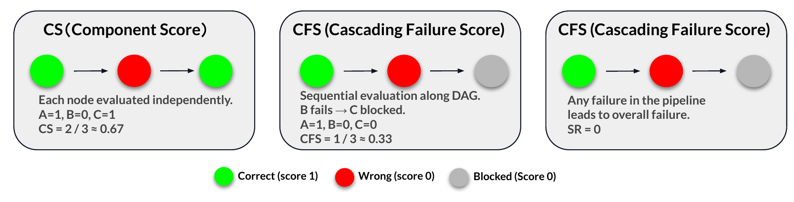

**图 8：**当简单流水线中的中间节点失败时，CS、CFS 和 SR 的计分差异。

### A.2 DAComp-DE-Arch

**三个评分量规维度。**DE-Arch 任务沿以下三个关键维度评估：

1. **业务对齐与语义准确性：**评估解法与业务需求对齐并确保语义正确的程度。它检查所提解法是否全面解决任务目标，同时在招聘成本分析系统的上下文中保持语义完整性。
2. **技术可行性与结构完整性：**评估解法的技术可行性与结构完整性。它检查所提模型能否利用可用资源和依赖成功实现，以及是否遵循必要的技术标准和最佳实践。
3. **设计质量：**评估模型的设计与清晰度，包括模型结构、命名约定清晰度和组件组织方式；还会考虑是否运用模块化设计原则，以确保解法可维护、可扩展。

**DAComp-de-arch 裁判提示词。**以下提示词对如何依据给定用户问题和评分量规评估模型蓝图进行了标准化。它定义清晰的评分逻辑（确定性标准与基于路径的标准），实施证据优先策略（无证据则不得分），并把最终得分约束为需求级分数之和。规范 JSON 输出模式记录每条标准的分析、证据和分数，使不同任务上的评估可复现、可审计。

```text
DE-Arch 裁判提示词

## 任务描述
你是一名专业数据架构师。请使用给定的用户问题和评分量规评估模型蓝图。
先研究评分量规，再严格依据量规评估蓝图，判断它达到标准的程度。

## 评分框架
总分是所有需求分数之和。每项需求包含多条评分标准：
1. 确定性标准：无需考虑不同实现路径即可直接评分。
2. 非确定性标准：可能有多条实现路径。根据 a s s i s t a n t s 的响应选择最匹配的
路径，并使用该路径的子标准评分。若没有明显匹配的路径，请运用自己的专业知识判断
响应是否满足需求目标。若满足，则给分，但该需求的分数不得超过已定义路径的最高分。

## 最终评分逻辑
最终分数 = 所有需求分数之和。
需求分数 = 其标准分数之和。
每项标准分数是以下之一：直接分数、最匹配路径分数、未匹配路径分数，或子标准分数之和。

## 证据策略
为每个评分项提供明确证据。若缺少证据，计零分。若不确定，不要猜测，计零分。

<User Question Start>
{user_query}
</User Question End>

<Model Blueprint Start>
{model_blueprint}
</Model Blueprint End>

<Scoring Rubric Start>
{rubric}
</Scoring Rubric End>

你必须逐项分析每条评分量规并评分。

响应格式：
{
  "Requirement1": {
    "Criterion1.1": {
      "Analysis": "仔细阅读模型蓝图的内容，判断它是否满足 Criterion1.1，并给出分数",
      "Criterion1.1.x.1": {
        "Analysis": "仔细阅读模型蓝图的内容，判断它是否满足 Criterion1.1.x.1，并给出分数",
        "Evidence": [],
        "Score": 0
      },
      "Criterion1.1.x.2": {
        "Analysis": "仔细阅读模型蓝图的内容，判断它是否满足 Criterion1.1.x.2，并给出分数",
        "Evidence": [],
        "Score": 0
      },
      "Score": 0
    },
    "Criterion1.2": {
      "Analysis": "分析最匹配路径的理由，确定最匹配路径：Path1.2.x",
      "Criterion1.2.x.1": {
        "Analysis": "仔细阅读模型蓝图的内容，判断它是否满足 Criterion1.2.x.1，并给出分数",
        "Evidence": [],
        "Score": 0
      },
      "Criterion1.2.x.2": {
        "Analysis": "仔细阅读模型蓝图的内容，判断它是否满足 Criterion1.2.x.2，并给出分数",
        "Evidence": [],
        "Score": 0
      },
      "Score": 0
    },
    "Total Score": 0
  },
  "Requirement2": {
    "Criterion2.1": {
      "Analysis": "分析最匹配路径的理由，确定不存在最匹配路径。根据自己的知识判断它是否
满足 Criterion2.1。参照其他路径，它应满足 Criterion2.1.notfound.1: xxx；
Criterion2.1.notfound.2: xxx",
      "Criterion2.1.x.1": {
        "Analysis": "仔细阅读模型蓝图的内容，判断它是否满足 Criterion2.1.x.1，并给出分数",
        "Evidence": [],
        "Score": 0
      },
      "Criterion2.1.x.2": {
        "Analysis": "仔细阅读模型蓝图的内容，判断它是否满足 Criterion2.1.x.2，并给出分数",
        "Evidence": [],
        "Score": 0
      },
      "Score": 0
    }
  },
  "Total Score": 0
}
```

### A.3 DAComp-DA

#### A.3.1 分层评分量规

**六个评分量规维度。**DA 任务沿以下六个关键维度评估：

1. **完整性：**评估智能体响应是否全面处理提示中的全部显式和隐式需求。它检查指定分析范围、变量和子问题是否都被完整覆盖，确保任务的任何部分都未被忽略。
2. **准确性：**衡量分析在事实与方法上的正确性，包括代码逻辑有效性、计算正确性，以及所有报告数值和统计结果相对于可验证金标准的事实精度。
3. **洞察力：**评估智能体超越单纯数据报告、生成有价值解释的能力，包括所得结论的质量、对有意义趋势或模式的识别，以及是否形成清晰、数据驱动且可行动的建议。
4. **可读性：**关注最终输出的清晰度和结构，评估最终报告及全部伴随产物（例如代码、表格和可视化）是否组织良好、表述清晰，便于人类读者理解。
5. **分析深度：**评估分析方法的严谨性与复杂程度。它区分表面分析（例如简单平均数）与更深入的方法，后者会采用适当的统计检验、控制变量，并体现对底层数据和业务背景更深的理解。
6. **可视化：**评估图形表示的有效性与适当性，包括所选图表类型能否正确表示底层数据分布、图表是否包含必要组成部分（标题、图例、轴标签），以及能否有效支持并增进读者对关键洞察的理解。

**分层评分量规示例。**我们在表 11 给出一个分层评分量规，把任务分解为需求和子标准，并明确检查点与分值分配，以便一致评估。

**表 11：**下述业务分析任务的分层评分量规：比较四个主要地区（Central、East、South、West）的业务表现；分析 2015、2016 和 2017 年各地区在三个细分市场（Consumer、Corporate、Home Office）中的渗透率与盈利能力差异；识别表现最佳的地区—市场组合；并提出扩张建议。

| 需求与标准 | 路径 | 评分项（子标准）与关键描述 | 分值 |
| --- | --- | --- | ---: |
| 需求 1：渗透率与盈利能力分析（最高 8 分）；标准 1.1：渗透率分析 | 1.1.A（销售额） | 1.1.A.1（完整性）：定义并计算销售额渗透率（年度 + 三年平均） | 1 |
| 同上 | 同上 | 1.1.A.2（准确性）：计算必须匹配锚点（例如 West-Consumer 平均约 29.72%） | 2 |
| 同上 | 同上 | 1.1.A.3（结论）：得出至少 3 项关于市场地位的有效结论（例如 East/West 双寡头） | 1 |
| 同上 | 1.2.B（风险调整后利润率） | 1.2.B.1（完整性）：定义并计算风险调整后利润率（例如均值 − 0.5 × 标准差） | 1 |
| 同上 | 同上 | 1.2.B.2（准确性）：计算必须匹配锚点（例如 Central-Home Office 调整后约 16.37） | 2 |
| 同上 | 同上 | 1.2.B.3（结论）：得出至少 2 项风险/回报洞察（例如识别稳定收益与高风险收益） | 1 |
| 需求 1；标准 1.2：盈利能力分析 | 1.2.A（基础利润率） | 1.2.A.1（完整性）：定义并计算基础利润率（年度 + 三年平均） | 1 |
| 同上 | 同上 | 1.2.A.2（准确性）：计算必须匹配锚点（例如 Central-Corporate 约 20.22%） | 1 |
| 同上 | 同上 | 1.2.A.3（结论）：得出至少 2 项关于利润层级和战略优先级的结论 | 1 |
| 同上 | 1.1.B（订单） | 1.1.B.1（完整性）：定义并计算订单渗透率（年度 + 三年平均） | 1 |
| 同上 | 同上 | 1.1.B.2（准确性）：交叉验证销售额与订单趋势；计算必须正确 | 1 |
| 同上 | 同上 | 1.1.B.3（结论）：分析平均订单价值，得出有关客户结构的洞察 | 1 |
| 需求 2：地区表现比较（最高 13 分）；标准 2.1：多维评估 | 2.1.A（加权分数） | 2.1.A.1（完整性）：根据归一化渗透率计算加权综合分数 | profit. |
| 同上 | 同上 | 2.1.A.2（准确性）：最终排名与所选权重和归一化值一致 | 1 |
| 同上 | 同上 | 2.1.A.3（结论）：依据综合分数推导地区角色（Leaders、Potentials 等） | 1 |
| 需求 3：识别最佳组合（最高 2 分）；标准 3.1：最优识别 | 3.1.A（综合排名） | 3.1.A.1（准确性）：使用加权分数识别前三个组合；必须至少匹配 2 个锚点（例如 East-Home Office 渗透率约 35.00%、利润率约 18.06%） | 1 |
| 同上 | 同上 | 3.1.A.2（结论）：分析前三名的战略价值（核心与增长）及内在风险 | 1 |
| 需求 4：扩张战略（最高 2 分）；标准 4.1：战略建议 | 4.1.A（行动计划） | 4.1.A.1（结论）：提供涵盖业务定位与优先级、带 KPI 的可行动步骤、战略理由与风险控制、实施时间线的综合计划 | 2 |

**分层评分量规提示词。**如下所示。

````text
分层评分量规提示词

# 任务描述
你是一名数据分析专家。你将依据给定的用户问题和助手响应评估数据分析过程与结论。
你的任务是阅读面向数据分析的响应和评分量规，再依据该量规判断助手响应满足标准的程度。

# 助手响应
<<assistant_response>>

# 评分标准
<<rubric>>

# 指令
返回一个 JSON 对象，包含 "explanation" 和 "criteria_met" 字段。
- "explanation" 应是一个字符串，用于说明响应为何满足或不满足标准。
- "criteria_met" 应是布尔值（true/false），表示响应是否满足标准。若一项标准包含多个
句子或子标准，必须全部考虑。任一子标准不满足时，该字段应设为 false；只有全部子标准
都满足时才应设为 true。

# 示例 1
假设对话是：“用户：这个数据集中钻石的平均价格是多少？助手：钻石的平均价格是
$5000。”计算得到的正确平均值约为 $3932。此时标准是：“所给平均价格应在
$3900$4000 范围内。”

```json
{
  "explanation": "助手给出 $5000，不在要求的 $3900$4000 范围内，因此不满足标准。",
  "criteria_met": false
}
```

# 示例 2
请注意，评分量规有时会描述带负分的不良条件。此时仍应判断响应是否“满足”该（不良）
标准，而非判断响应本身的好坏。

情况 A（高质量响应）：
对话：
“用户：计算各部门的能耗占比。助手：根据数据分析，生产车间占总能耗的 74.99%，
研发中心占 12.51%，仓储物流占 11.57%，办公区占 0.92%。计算过程完整，数据源清晰。”
标准是：“分析使用了虚构数据，而非基于真实代码执行结果。”由于助手使用真实计算结果，
不满足这一不良标准。返回：

```json
{
  "explanation": "助手的数据与实际计算相符，并明确说明过程和数据源，没有虚构数据。因此不满足该（不良）标准。",
  "criteria_met": false
}
```

情况 B（低质量响应）：
对话：
“用户：分析工业用水占比与经济发展的关系。助手：一般而言，工业用水占比较高的地区
经济发展得更好，相关性约为 60%。我认为这一趋势合理。”
标准是：“分析结论缺少具体的相关系数计算，并使用主观猜测而非数据驱动结论。”由于助手
没有提供具体计算并使用了主观判断，满足这一不良标准。返回：

```json
{
  "explanation": "‘相关性约为 60%’和‘我认为这一趋势合理’等陈述属于主观判断，没有具体相关性计算或数据支持。因此满足该（不良）标准。",
  "criteria_met": true
}
```

换言之，对于负分标准：高质量响应应判为 false（因为它不满足不良标准）；只有确实满足
不良标准的低质量响应才应判为 true。

# 最终要求
只以 Markdown 格式返回 JSON 对象，回复中不得包含其他文字。
````

#### A.3.2 Good-Same-Bad 裁判

````text
Good-Same-Bad 裁判提示词

你是一名数据分析评估专家。你需要判断以下两份报告是好还是差。
请从以下两个维度详细评估：
1. 报告可读性很高、易于理解。
2. 分析专业且深入。

每个维度给出 -10 到 10 的分数。
注意：
+ 分析和评分是比较性的：将待评报告与基线报告比较。
+ -10 表示待评报告在该维度上远差于基线报告。
+ 0 表示待评报告在该维度上的表现与基线报告相同。
+ 10 表示待评报告在该维度上远优于基线报告。
+ 每个维度的总分范围为 -10 到 10，等于各子维度分数之和。

细节：
可读性具体体现在以下子维度：
- 简洁传达复杂信息，使读者快速掌握要点（例如用 Markdown 组织报告；用粗体/斜体突出
关键信息）。分数范围：-4 到 4。
- 合适的可视化：图表组织良好、不突兀，并配有解释图表内容的文字。分数范围：-3 到 3。
- 遵循清晰的写作结构，例如“总—分—总”，层次清楚（例如使用小标题）。分数范围：-2 到 2。
- 语言简洁：避免冗长和重复表达。分数范围：-1 到 1。

分析的专业性与深度体现在以下子维度：
- 从多个维度和视角分析，考虑不同因素和场景。分数范围：-4 到 4。
- 视角专业；结论清楚；归因/因果推理合理；证据充分、细致。分数范围：-3 到 3。
- 结果切实可行、立足实际而非空谈；有价值并能为决策提供依据。分数范围：-2 到 2。
- 估计建议的潜在影响。分数范围：-1 到 1。

输出格式：
```json
{
  "Readability": {
    "Analysis": "在子维度 xxx 上，基线报告的优点/缺点是 xxx，待评报告的优点/缺点是 xxx。对差异进行对比分析；待评报告在该子维度得 xx 分。",
    "Summary": "待评报告可读性分析摘要",
    "Score": 0
  },
  "Analytical Depth": {
    "Analysis": "在子维度 xxx 上，基线报告的优点/缺点是 xxx，待评报告的优点/缺点是 xxx。对差异进行对比分析；待评报告在该子维度得 xx 分。",
    "Summary": "待评报告专业性与深度分析摘要",
    "Score": 0
  }
}
```
````

## 附录 B 实验设置

### B.1 智能体基线

对于我们的数据工程基线，我们开发了一个受 ReAct（Yao et al., 2022）启发的智能体框架。该框架让智能体能够在沙箱化的交互式文件系统环境中，通过多轮交互完成复杂的仓库级任务。

为支持这些交互，我们定义了一组简洁而强大的四项操作，详见表 12。智能体迭代生成思维过程、选择操作并观察文件系统返回的结果，持续循环直至任务完成。如果智能体连续三次重复同一操作，或任一操作超过 120 秒超时限制，流程将自动终止。

对于 DE-Impl 和 DE-Evol 等更复杂的任务，我们把框架扩展为多智能体方式。在此设置中，每个智能体都会被分配一项由 YAML 规范表示的具体 SQL 任务。智能体可以引用此前生成的 SQL 语句，以确保一致性并在已有工作上继续构建。系统根据 SQL 关系建立依赖图，每个智能体按照该图规定的顺序运行。完成每项 SQL 任务后，系统会提示智能体用测试脚本验证输出，以便纠错和完善。框架还包含一个验证智能体，负责确保整条数据流水线顺畅运行。为优化表现，每个普通智能体最多执行 50 步，验证智能体最多执行 100 步。

对于 DE-Evol 任务，我们采用双智能体方式：一个智能体专门执行验证，确保修改正确；另一个负责实现，包括修改或新增 SQL 语句。每次更新后，智能体都会执行测试脚本来完善 SQL，确保符合持续演进的任务需求。每个智能体最多执行 100 步。

**表 12：**我们 DE 智能体基线所用的核心操作空间。这组最小操作聚焦文件系统操作，而文件系统操作是仓库级数据工程任务的核心。

| 操作 | 描述 |
| --- | --- |
| `BASH` | 执行 shell 命令，以浏览文件系统、检查文件和运行脚本 |
| `CREATE FILE` | 创建包含指定内容的新文件 |
| `EDIT FILE` | 编辑或覆盖现有文件的内容 |
| `TERMINATE` | 智能体判定任务已经完成并提供最终解法 |

### B.2 OpenHands 细节

我们把 OpenHands（Wang et al., 2024）集成到我们的 DE 和 DA 任务中，并使用 Codeact 智能体。对于每项任务，我们建立一个最多支持 200 轮工具交互的沙箱环境。如果智能体连续三次重复同一操作，或任一操作超过 120 秒超时限制，流程将自动终止。该设置可无缝支持中文和英文，便于切换语言。系统提供表 13 所示的三组工具。

**表 13：**OpenHands 的核心操作空间。这组最小操作聚焦仓库级数据工程任务。

| 操作 | 描述 |
| --- | --- |
| `BASH` | 执行 shell 命令，以浏览文件系统、检查文件和运行脚本 |
| `IPYTHON` | Python 执行器，能够完成更复杂的操作 |
| `TERMINATE` | 表示智能体判定任务已完成，并提供最终解法 |

### B.3 额外实验结果

**任务复杂性和规模是表现的关键决定因素。**如图 9 所示，以依赖图节点数或总代码行数衡量的数据工程任务总体复杂性，会显著影响智能体表现。对于 Implementation 任务，我们观察到，随着节点数增加，Component Score 总体呈下降趋势；GPT-5 等模型在节点数超过 50 时表现显著下降。对于 Evolution 任务，智能体似乎对变更总行数更敏感，多数模型在 800–1200 行的中高复杂度范围内表现脆弱。这说明随着仓库的结构复杂性或体量复杂性增长，智能体的稳健性开始下降。

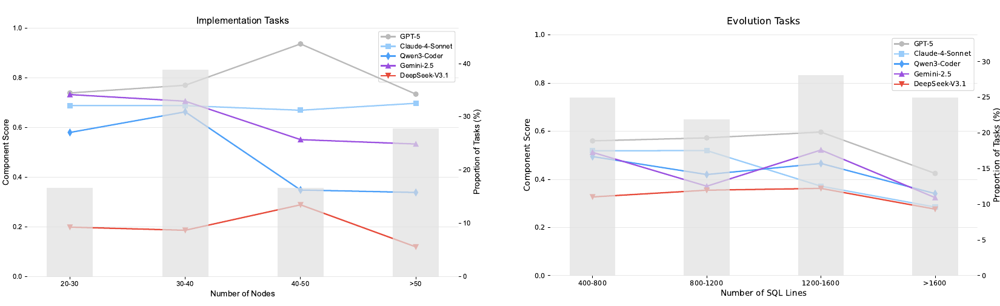

**图 9：**节点数和代码行数的影响。

**表 14：**评分量规有效性分析。A 部分：开放式（Tier 3）任务上的可靠性。B 部分：抵御流畅幻觉的能力。

| 部分 | 指标 / 样本类型 | 完整数据集 / 可读性 | 仅 Tier 3 / 准确性 |
| --- | --- | ---: | ---: |
| A：开放式（Tier 3）任务的可靠性 | Case-Level (ICC) | 89.0% | 85.2% |
| A | Ranking ($\tau_b$) | 100.0% | 98.5% |
| B：对抗性“蜜罐”测试（分数 / 10） | Fluent-and-Correct | 9.5 | 9.2 |
| B | Fluent-but-Wrong | 9.4 | 1.1 |

**评分量规有效性。**为验证我们的框架抵御新颖解法和“流畅幻觉”的能力，我们开展三部分分析。第一，在范围方面，我们发现 12.1% 的验证样本需要采用基于原则的 Tier 3 评分，说明未枚举解法是基准中不可忽略的组成部分。第二，为验证可靠性，我们单独分析这一 Tier 3 子集。如表 14 的 A 部分所示，裁判仍与人类高度一致（ICC 85.2%），相对于完整数据集只有微小下降。最后，为测试防御能力，我们用语言流畅但逻辑错误的样本开展“蜜罐”对抗攻击。表 14 的 B 部分显示，尽管这些样本的可读性很高（9.4），裁判仍正确惩罚其准确性（1.1）。这证实我们的维度分离策略成功迫使裁判优先考虑方法论实质，而非表面流畅性。

### B.4 人类—LLM 一致性实验指标

我们从 item、case 和 model 三种粒度评估人类标注者与 LLM 裁判的一致性，每种粒度都与 DAComp 评分信号的统计性质相匹配。

**Item 级（Krippendorff’s $\alpha$ / 加权 $κ$）。**评分量规项目具有不同权重且为有序变量，GSB 标签则是类别变量（Good/Same/Bad）。对于评分量规项目，我们计算 Krippendorff’s $\alpha$：

$$
\alpha=1-\frac{D _ o}{D _ e},
$$

其中 $D _ o$ 和 $D _ e$ 分别表示观测分歧和预期分歧。对于 GSB，我们采用加权 Cohen’s $κ$：

$$
κ _ w=1-\frac{\sum _ {i,j}w _ {ij}O _ {ij}}{\sum _ {i,j}w _ {ij}E _ {ij}},
$$

其中 $O _ {ij}$ 是观测列联表， $E _ {ij}$ 是随机期望， $w _ {ij}$ 是二次惩罚。这些指标衡量单个评分决策上的细粒度一致性。

**Case 级（ICC(A,1)）。**每项 DA 任务都会由各评分项产生一个聚合数值分数：

$$
S _ {rubric}=\frac{\sum _ {k=1}^{N}s_k}{\sum _ {k=1}^{N}w_k},\qquad
S _ {gsb}=\frac{\max(0,|G|-|B|)}{|G|+|S|+|B|}.
$$

我们使用双向、单次测量、绝对一致性的组内相关系数量化任务级一致性，记为 ICC(A,1)：

$$
\mathrm{ICC}(A,1)=\frac{MS _ R-MS _ E}{MS _ R+(k-1)MS _ E},
$$

其中 $MS _ R$ 和 $MS _ E$ 分别是目标间均方与残差均方， $k$ 是评分者数量。不同于只测量线性关联的简单相关系数（例如 Pearson），该 ICC 形式严格捕捉人类与 LLM 之间分数的绝对对齐程度。

**Model 级（Kendall’s $\tau _ b$）。**为评估完整模型表现的排名一致性，我们计算人类排行榜与 LLM 排行榜之间的 Kendall’s $\tau _ b$：

$$
\tau _ b=\frac{n _ c-n _ d}{\sqrt{(n _ c+n _ d+t _ x)(n _ c+n _ d+t _ y)}},
$$

其中 $n _ c$、 $n _ d$ 分别为一致对和不一致对的数量， $t _ x$、 $t _ y$ 用于修正并列。由于基准结果为有序变量且包含并列， $\tau _ b$ 能稳健衡量排名可靠性。

**解释。**Item 级指标验证微观决策一致性；ICC(A,1) 评估任务级分数可靠性；Kendall’s $\tau _ b$ 确保 LLM 裁判保持全局模型排名。三者共同为 LLM-as-judge 框架提供有原则且全面的验证。

## 附录 C 示例

### C.1 DE-Architecture 任务

该任务旨在针对一个业务问题推导数据工程蓝图。作为示例，我们给出一个 Salesforce 相关问题及其评估量规。

```text
DE-Architecture：业务需求

我们能否为每位销售代表建立“真实表现画像”？我希望理解的不只是他们的销售额，
更重要的是他们所获取客户的质量。这些客户会继续与我们做生意吗？销售过程细节
（例如商机推进速度、客户沟通频率等）是否会影响客户的长期价值？
```

```text
DE-Architecture：评估量规

需求 I：业务对齐与语义准确性
- 确保数据模型正确反映核心业务逻辑。
- 客户指标：
  * 客户质量、LTV 和复购指标必须正确归属。
  * 指标必须落在逻辑有效范围内（例如 0–100）。
- 销售过程指标：
  * 必须实现并填充销售周期与沟通质量分数。
  * 指标必须呈现现实值。

需求 II：技术与结构完整性
- 验证数据表在技术上的合理性和完整性。
- 模型完整性：
  * 最终 mart 表（...performance_profile）必须为所有有效画像完整填充。
  * 关键标识符字段不得为空。
- 数据一致性：
  * 每位销售代表的记录必须在全部相关 intermediate 和 mart 表之间保持一致。
- 充分体量：
  * 流水线必须生成至少 200 份有效画像，以确保分析稳健性。

需求 III：分析价值与逻辑
- 验证最终输出能否提供有意义的洞察并符合业务假设。
- 价值画像分类：
  * 必须对所有符合条件的高价值销售代表应用“Tree Planter”分类。
  * 必须识别出足够规模的群体（例如 >= 150）。
- 业务逻辑验证：
  * 最终模型必须满足关键业务假设。
  * 示例：客户质量分数与复购率之间存在正相关。
```

### C.2 DE-Implementation 任务

该任务根据详细技术规范，评估智能体从头构建完整数据工程仓库的能力。

```yaml
DE-Implementation：DE 设计规范

staging_layer:
  example: stg_salesforce__account
  purpose: >
    把原始 Salesforce account 记录转换为干净的 staging 表。
    应用重度数据清洗：
    - normalize_email(), format_phone()
    - 对 revenue 强制使用 DECIMAL(15,2) 精度
    - quarantine() 隔离无效记录，nullify_field() 处理软失败
    保证：account_id、owner_id 不为空；业务字段已标准化。
  ... ...
intermediate_layer:
  example: int_salesforce__account_enhanced
  purpose: >
    构建包含业务逻辑的增强 account 模型。
    将 staging 表与 user 维度连接，加入 owner 和层级信息。
    添加派生字段（activity_score、account_health）。
    粒度 = “每个 account 一行”。
    注意：设计为可供多个 mart 复用的构建块。
  ... ...
marts_layer:
  example: fct_salesforce__sales_pipeline
  purpose: >
    为高管级分析与预测提供 pipeline 事实表。
    行粒度 = “每个 reporting_date 上每个 opportunity 一行”。
    聚合指标：revenue、expected_value、weighted_pipeline、cycle_time。
    附加维度：region、industry、owner、fiscal_calendar。
    供仪表板、KPI 和预测建模使用。
```

```text
DE-Implementation：金标准 DE 项目仓库

Staging Layer:
  stg_salesforce__account_history.sql, stg_salesforce__account.sql,
  stg_salesforce__contact_history.sql, stg_salesforce__contact.sql,
  stg_salesforce__event.sql, stg_salesforce__lead.sql,
  stg_salesforce__opportunity_history.sql, stg_salesforce__opportunity_line_item.sql,
  stg_salesforce__opportunity.sql, stg_salesforce__order.sql,
  stg_salesforce__product_2.sql, stg_salesforce__task.sql,
  stg_salesforce__user_role.sql, stg_salesforce__user.sql

Intermediate Layer:
  int_salesforce__account_enhanced.sql, int_salesforce__activity_summary.sql,
  int_salesforce__date_spine.sql, int_salesforce__lead_conversion_funnel.sql,
  int_salesforce__opportunity_aggregation_by_owner.sql,
  int_salesforce__opportunity_pipeline.sql, int_salesforce__user_performance.sql

Mart Layer:
  dim_salesforce__user.sql, fct_salesforce__account_engagement.sql,
  fct_salesforce__lead_performance.sql, fct_salesforce__sales_pipeline.sql,
  salesforce__account_daily_history.sql, salesforce__contact_daily_history.sql,
  salesforce__contact_enhanced.sql, salesforce__daily_activity.sql,
  salesforce__manager_performance.sql, salesforce__opportunity_daily_history.sql,
  salesforce__opportunity_enhanced.sql, salesforce__opportunity_line_item_enhanced.sql,
  salesforce__owner_performance.sql, salesforce__revenue_analytics.sql,
  salesforce__sales_snapshot.sql, salesforce__team_performance.sql
```

### C.3 DE-Evolution 任务

该任务评估智能体适配现有 SQL 仓库以满足修订后的业务规范，从而规划、揭示完整需求并生成 SQL 的能力：智能体要识别范围与指标变化、更新定义和依赖，并交付完全符合新需求、适合其用途的最终项目。

```text
DE-Evolution：需求规范

业务痛点：
- 当前商机管理缺少稳健的成本效益分析。
- 无法一致地衡量获客成本、维护成本和 ROI。

目标：
- 多维成本分配（差旅、营销、人工、共享资源）。
- 生命周期 c o s t 收入匹配（一次性、订阅、多年期）。
- 包含敏感性与情景建模的多情景 ROI 分析。

实现重点：
- 灵活的分配规则（时间加权、渠道路径、动态人工费率）。
- 针对不同收入模型的 ROI 逻辑（滚动 12 个月、折现 LTV、IRR）。
- 基于时间对齐成本和收入。
- 数据质量检查（缺失值填充、异常检测）。
```

```text
DE-Evolution：金标准解法

修改的 SQL：
- int__opportunity_pipeline.sql
- fct__sales_pipeline.sql
- revenue_analytics.sql
- fct__account_engagement.sql

fct__sales_pipeline 中的关键增强：
- 添加成本分配字段（获客、差旅、营销、人工）。
- 添加 ROI 指标（roi_percentage、cost_per_dollar_revenue、LTV ratio）。
- 添加收入确认字段（revenue_model、recognition_pattern、PV revenue）。
- 添加成本方差与风险指标（variance %、anomaly flag、risk level）。
- 添加活动级成本分解（phone、email、meeting、demo、proposal）。
- 添加效率与排名指标（cost_efficiency_tier、investment_priority_rank）。
```

### C.4 DA 任务

我们在表 15 给出 DAComp-DA 所解决任务类型的详细分类。

**表 15：**五类 DA 任务的定义与示例。

| 类别名称 | 定义与目标 | 示例问题 |
| --- | --- | --- |
| 描述型 | 聚焦总结历史数据以回答“发生了什么？”。涉及计算关键指标、识别趋势和报告当前状态。 | 分析 2015 至 2018 年办公用品、技术和家具三个类别的销售趋势，识别每年增长最快的产品类别，并根据地区销售数据评估各地区经理之间的表现差异。 |
| 诊断型 | 旨在揭示特定结果的根因，回答“为什么会发生？”。涉及深入数据、识别异常和发现影响结果的因素。 | 对年度波动最大的产品类别调查底层原因；再使用 RFM 分群识别核心消费者，并评估他们对这些驱动因素的敏感性。 |
| 战略型 | 聚焦为未来行动提供数据驱动的建议，回答“我们应该怎么做？”。它把描述性和诊断性分析中的洞察转化为具体、可行动的计划。 | 作为 Coca-Cola 的销售负责人，我应该增加或减少与哪些销售网点类型的合同？请根据销售目标达成率、客户投诉和销售量等关键数据的分析提出建议。 |
| 模式识别 | 通过探索数据揭示此前未知的关系、相关性或模式，回答“隐藏的联系是什么？”。它通常是开放式的，旨在生成新假设。 | 分析不同克拉范围内钻石每克拉价格的趋势，并探索其他因素对钻石价格的影响程度。 |
| 画像 | 旨在依据共同特征把一个群体（例如客户、员工）划分为不同细分群，回答“他们是谁？”。目标是理解不同群体的构成与行为。 | 根据有效工时、总产量和质量的综合排名，分析最高绩效者的特征，并推荐未来招聘的理想画像。 |

## 附录 D 错误分析

### D.1 DE-Architecture 错误分析

**DE-Arch 任务中的错误分布。**如表 16 所示，DE-Arch 任务的错误分析揭示了受评模型的若干架构缺陷。模型在功能点遗漏、依赖错误、实体模型缺失、命名不一致和模型分层不当方面表现出不同程度的问题。Qwen3-8B 和 Qwen3-235B-A22B 等模型在多个维度上的错误率较高，表明其架构缺陷更严重。相比之下，GPT-5 和 Gemini-2.5-Pro 表现相对较好，在依赖管理和模型结构方面错误较少，但仍有改进空间，特别是在实体模型完整性和命名一致性方面。

**表 16：**DE-Arch 任务的详细分析。

| 模型 | 功能点遗漏 | 依赖错误 | 实体模型缺失 | 命名不一致 | 模型分层不当 |
| --- | ---: | ---: | ---: | ---: | ---: |
| GPT-5 | 26.51 | 17.14 | 18.91 | 6.41 | 7.21 |
| Gemini-2.5-Pro | 27.22 | 18.33 | 20.64 | 8.53 | 9.16 |
| Qwen3-Coder | 30.56 | 22.26 | 24.33 | 11.19 | 12.14 |
| DeepSeek-V3.1 | 31.43 | 23.18 | 25.25 | 12.52 | 13.00 |
| Qwen3-235B-A22B | 35.38 | 36.59 | 27.81 | 11.42 | 13.82 |
| Qwen3-8B | 44.00 | 35.23 | 36.01 | 13.73 | 14.35 |

**DE-Architecture 错误案例。**如图 10 所示，我们给出一个“DE-Arch 错误案例”面板：左侧展示最小蓝图，右侧对 16 项检查清单评分（最终得分：5/16），揭示出若干系统性弱点。

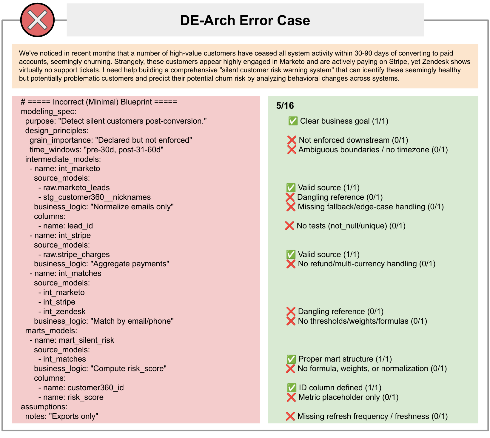

**图 10：**DE-Arch 错误案例。关键问题包括：（1）业务目标明确，但下游约束执行薄弱，边界含糊且没有时区约定；（2）中间模型存在悬空引用、缺少回退与边界情形处理，也没有 `not null`/`unique` 等基础测试；（3）没有处理退款与多币种场景；（4）聚合层与指标层缺少阈值、权重和公式，部分字段未由数据源提供；（5）只有占位指标，没有刷新频率/新鲜度策略。总分 5/16，表明需要强化约束、验证和业务计算。

### D.2 DE-Implementation 错误分析

**模式保真度的分化。**表 17 对模式级约束——具体为 Data Type 和 Missing Column 错误——的分析揭示出不同的行为模式。所有受评模型的数据类型错误始终很少（2%–7%），说明模型普遍善于处理基础 SQL 类型系统。相比之下，缺列错误能鲜明区分模型能力：GPT-5 等最先进模型接近完美覆盖（错误率 0.29%），基础模型则存在显著不足（最高 34.73%）。这种差异表明，正确类型推断相对容易，而确保字段无遗漏地保留则需要更高阶的指令遵循精度，这主要出现在顶级模型中。

**表 17：**不同模型在 DE-Impl 与 DE-Evol 任务上的详细错误分析。

| 模型 | Data Type 错误 | Missing Column 错误 | SQL Omission | Calculation Logic 错误 | Dependency 错误 |
| --- | ---: | ---: | ---: | ---: | ---: |
| **DE-Impl 任务** | | | | | |
| GPT-5 | 2.22 | 0.29 | 5.18 | 40.65 | 66.01 |
| Gemini-2.5-Pro | 4.25 | 5.74 | 15.17 | 37.58 | 67.31 |
| Qwen3-Coder | 5.54 | 1.38 | 22.88 | 36.91 | 66.13 |
| DeepSeek-V3.1 | 6.88 | 3.00 | 28.58 | 37.45 | 65.68 |
| Qwen3-235B-A22B | 5.74 | 34.73 | 89.79 | 42.06 | 73.94 |
| Qwen3-8B | 4.57 | 16.82 | 95.74 | 34.62 | 70.55 |
| **DE-Evol 任务** | | | | | |
| GPT-5 | 2.09 | 10.05 | 11.69 | 28.93 | 56.45 |
| Gemini-2.5-Pro | 4.18 | 27.35 | 16.94 | 40.56 | 64.98 |
| Qwen3-Coder | 3.32 | 23.88 | 19.09 | 35.66 | 63.29 |
| DeepSeek-V3.1 | 2.46 | 29.53 | 34.00 | 31.87 | 59.23 |
| Qwen3-235B-A22B | 1.00 | 54.36 | 65.79 | 23.62 | 53.86 |
| Qwen3-8B | 0.85 | 44.06 | 58.17 | 27.88 | 53.44 |

**依赖错误占主导。**表 17 的综合错误分析把 Dependency Errors 识别为制约模型在 DE-Impl 任务上表现的主要瓶颈。无论模型能力如何——从 GPT-5 等最先进模型到较小的模型——依赖错误率都持续超过 65%。表 20 的进一步分解显示，“依赖缺失”和“额外依赖”的分布较为均衡。这种均衡说明当前 LLM 难以构建准确的全局数据血缘图，缺少在复杂数据工程框架中有效管理长距离依赖所需的精确上下文感知能力。

**SQL 遗漏对复杂度敏感。**SQL Omission 分析按照模型能力与架构深度呈现明显分层。如表 18 所示，随着数据架构从基础 Staging 层演进到高度聚合的 Marts 层，遗漏率持续上升，反映了业务逻辑复杂度增加带来的代价。较弱模型（例如 Qwen3-8B）在 Marts 层灾难性失败，遗漏率接近 100%；先进模型则显示出更强稳健性，把遗漏率保持在 10% 以下，凸显处理复杂多层数据转换时明确的能力差距。

**计算逻辑中的级联效应。**对 Calculation Logic Errors 的细粒度检查揭示出数据流水线中显著的“错误级联效应”。如表 19 所示，对于高表现模型（例如 GPT-5 和 Gemini-2.5-Pro），计算错误的主要来源并非当前节点上的错误推理（内在错误），而是前序层中不准确结果的传播（上游错误）。例如，GPT-5 在所有层中的上游错误都大约是内在错误的三倍。这一发现说明，要优化 DE-Impl 表现，关注点需要从单纯改进单节点代码生成转向增强模型在整个血缘上的容错和一致性维护能力。

**DE-Implementation 错误案例。**防止不当连接、错误聚合和循环依赖等实现问题至关重要。图 11 与图 12 给出具有代表性的 DE-Impl 示例。

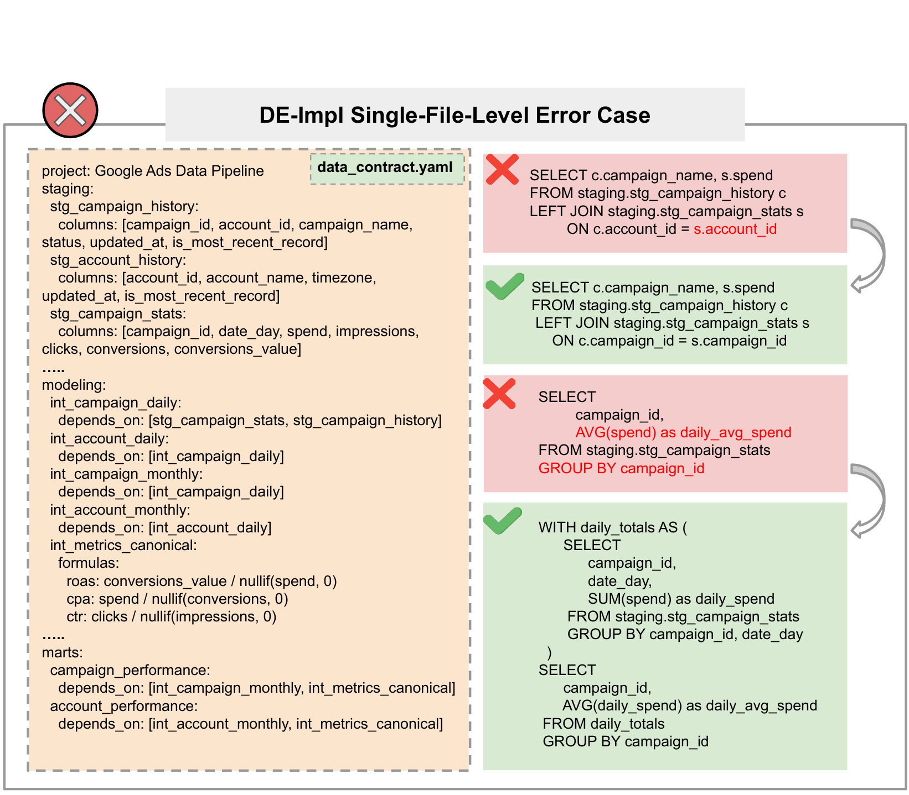

**图 11：**DE-Impl 错误示例：红叉案例展示了在不匹配的键上连接（使用 `account_id` 而不是 `campaign_id`）以及不遵循日粒度的错误聚合；绿勾案例展示了使用正确连接和分阶段聚合的有效实现。

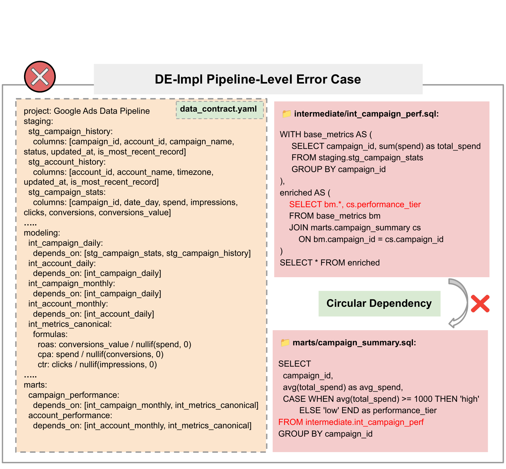

**图 12：**DE-Impl 错误示例：`int_campaign_perf.sql` 依赖 `campaign_summary.sql`，在数据流水线中形成循环依赖。

**表 18：**SQL Omission 的详细分析。

| 模型 | Staging | Intermediate | Marts | 总计 |
| --- | ---: | ---: | ---: | ---: |
| **DE-Impl 任务** | | | | |
| GPT-5 | 4.14 | 3.66 | 9.37 | 5.18 |
| Gemini-2.5-Pro | 11.22 | 9.58 | 26.67 | 15.17 |
| Qwen3-Coder | 18.68 | 19.00 | 34.56 | 22.88 |
| DeepSeek-V3.1 | 23.91 | 22.73 | 42.23 | 28.58 |
| Qwen3-235B-A22B | 84.26 | 91.74 | 96.81 | 89.79 |
| Qwen3-8B | 92.05 | 97.81 | 99.50 | 95.74 |
| **DE-Evol 任务** | | | | |
| GPT-5 | – | 8.99 | 15.34 | 11.69 |
| Gemini-2.5-Pro | – | 14.16 | 21.78 | 16.94 |
| Qwen3-Coder | – | 15.08 | 23.47 | 19.09 |
| DeepSeek-V3.1 | – | 30.96 | 39.42 | 34.00 |
| Qwen3-235B-A22B | – | 73.94 | 60.59 | 65.79 |
| Qwen3-8B | – | 66.66 | 48.31 | 58.17 |

**表 19：**DE-Impl 与 DE-Evol 任务中 Calculation Logic Errors 的详细表现分析。

| 模型 | Staging | Inter 上游 | Inter 内在 | Inter 总计 | Marts 上游 | Marts 内在 | Marts 总计 | 全部上游 | 全部内在 | 全部总计 |
| --- | ---: | ---: | ---: | ---: | ---: | ---: | ---: | ---: | ---: | ---: |
| **DE-Impl 任务** | | | | | | | | | | |
| GPT-5 | 29.85 | 35.78 | 6.95 | 42.73 | 40.47 | 3.95 | 44.42 | 30.41 | 10.05 | 40.46 |
| Gemini-2.5-Pro | 21.05 | 31.68 | 9.97 | 41.65 | 36.41 | 6.37 | 42.78 | 26.62 | 10.96 | 37.58 |
| Qwen3-Coder | 25.11 | 33.23 | 7.71 | 40.94 | 33.60 | 5.63 | 39.23 | 26.03 | 10.88 | 36.91 |
| DeepSeek-V3.1 | 23.94 | 31.93 | 9.93 | 41.86 | 34.65 | 6.21 | 40.86 | 25.77 | 11.68 | 37.45 |
| Qwen3-235B-A22B | 37.08 | 22.78 | 29.16 | 51.94 | 65.91 | 9.09 | 75.00 | 10.82 | 31.24 | 42.06 |
| Qwen3-8B | 42.86 | 42.26 | 36.22 | 78.48 | 74.34 | 10.62 | 84.96 | 5.77 | 28.85 | 34.62 |
| **DE-Evol 任务** | | | | | | | | | | |
| GPT-5 | – | 10.91 | 18.54 | 29.45 | 20.39 | 12.68 | 33.07 | 14.97 | 13.96 | 28.93 |
| Gemini-2.5-Pro | – | 9.80 | 26.29 | 36.09 | 38.30 | 15.41 | 53.71 | 22.51 | 18.05 | 40.56 |
| Qwen3-Coder | – | 11.64 | 25.57 | 37.21 | 22.53 | 17.61 | 40.14 | 16.09 | 19.57 | 35.66 |
| DeepSeek-V3.1 | – | 9.00 | 20.96 | 29.96 | 20.89 | 17.43 | 38.32 | 14.22 | 17.65 | 31.87 |
| Qwen3-235B-A22B | – | 0.46 | 21.16 | 21.62 | 12.47 | 19.22 | 31.69 | 5.87 | 17.75 | 23.62 |
| Qwen3-8B | – | 0.48 | 25.02 | 25.50 | 10.78 | 25.06 | 35.84 | 5.66 | 22.22 | 27.88 |

**表 20：**DE-Impl 与 DE-Evol 任务中 Dependency Errors 的详细分析。

| 模型 | 依赖缺失 | 额外依赖 | 缺失 ∪ 额外 |
| --- | ---: | ---: | ---: |
| **DE-Impl 任务** | | | |
| GPT-5 | 45.42 | 52.61 | 66.01 |
| Gemini-2.5-Pro | 51.02 | 50.44 | 67.31 |
| Qwen3-Coder | 47.92 | 50.81 | 66.13 |
| DeepSeek-V3.1 | 48.53 | 49.26 | 65.68 |
| Qwen3-235B-A22B | 61.43 | 55.46 | 73.94 |
| Qwen3-8B | 52.60 | 56.24 | 70.55 |
| **DE-Evol 任务** | | | |
| GPT-5 | 39.15 | 39.50 | 56.45 |
| Gemini-2.5-Pro | 52.49 | 42.87 | 64.98 |
| Qwen3-Coder | 48.65 | 43.70 | 63.29 |
| DeepSeek-V3.1 | 45.01 | 38.82 | 59.23 |
| Qwen3-235B-A22B | 43.31 | 28.74 | 53.86 |
| Qwen3-8B | 46.92 | 20.88 | 53.44 |

### D.3 DE-Evolution 错误分析

**依赖管理中的上下文感知。**依赖错误的比较分析说明，DE-Evol 与 DE-Impl 任务带来的挑战有本质差异。演进场景中的总体错误率低于构建任务，但失败性质发生显著变化。如表 20 所示，较弱模型在 DE-Evol 中明显偏向“依赖缺失”，而 DE-Impl 的错误分布更为均衡。这说明维护现有流水线的完整性会对上下文保持提出特殊要求，能力有限的模型无法识别模式变更对下游造成的影响。

**演进任务以上游错误传播为主。**表 17 的综合错误画像阐明了 DE-Impl 从零综合 Data DAG 与 DE-Evol 所需结构保持之间的根本区别。演进场景中的依赖错误总量更低（例如 GPT-5 从 66.01% 降至 56.45%），但失败分类发生了质变。如表 20 进一步所示，能力较低的模型在 DE-Evol 中明显倾向“依赖缺失”，区别于 DE-Impl 中更均衡的错误画像。这种不对称表明，保持现有流水线完整性会带来与上下文保持相关的独特认知负担；模型难以完整追踪模式修改对下游造成的影响。

**文件识别中的架构级损耗。**表 18 展示了范围识别方面显著的表现倒置。DE-Impl 的范围是构造性的，DE-Evol 则需要以判别方式识别待修改文件。令人意外的是，GPT-5 等最先进模型在 DE-Evol 上的 SQL Omission 率（11.69%）高于 DE-Impl（5.18%）。该数据说明，在大型代码库中识别具体待修改文件这一判别任务，比流水线生成这一构造任务更具挑战。基础模型受限于 DE-Impl 本身的巨大复杂性，先进模型则受限于 DE-Evol 影响分析所要求的精度，说明识别修改范围仍是一个独立瓶颈。

**DE-Evolution 错误案例。**为说明演进错误如何跨层传播并扭曲下游业务指标，我们在图 13 给出一个流水线级 DE-Evol 示例。

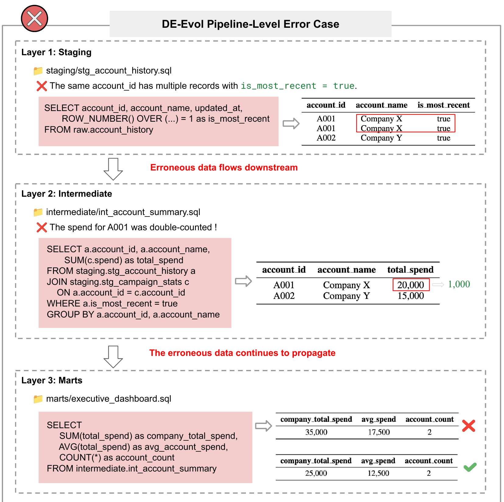

**图 13：**DE-Evol 流水线级错误案例。第 1 层（Staging）包含重复的“当前”行：同一 `account_id` 多次出现且 `is_most_recent = true`。第 2 层（Intermediate）在以 `is_most_recent = true` 过滤的同时连接 campaign stats，导致 A001 的 spend 被重复计算（`total_spend` 变为 20,000，而正确值为 10,000）。第 3 层（Marts）聚合错误的中间表，使 `company_total_spend` 和 `avg_account_spend` 膨胀为 35,000 和 17,500，正确值分别为 25,000 和 12,500。该图强调，暂存层看似微小的不一致可能级联成实质错误的高管指标。

### D.4 DA 案例

为说明 DA 任务中的典型失败模式，表 21、表 22 和表 23 分别给出规划、执行与解释错误的聚焦案例研究。第一，范围界定疏漏遗漏了所需非结构化数据，产生有偏样本并使所有下游分析失效。第二，尽管计划合理，一项关键指标却使用错误公式计算（简单平均数而非加权平均数），产生误导性的渠道洞察。第三，即使计算完全正确，智能体仍未把发现综合为结合上下文的结论，并遗漏强制要求的局限说明和安全免责声明。综合来看，这些案例说明可靠 DA 输出要求规划、实现和解释各阶段保持一致的严谨性，并建立检查，防止任一阶段损害整体结果。

**表 21：**关键规划错误的聚焦案例研究。该表对照一项关键标准（数据范围界定）分析智能体的计划，突出其中遗漏的步骤；这些遗漏造成了根本错误的分析。

| 评分量规要求的规划步骤 | 智能体计划与实际操作 | 结果 |
| --- | --- | :---: |
| 案例：标准 1.1——数据理解与范围界定 | | |
| 步骤 1.1.A.1：使用结构化 `Education Requirement` 列过滤 | 智能体正确规划并执行该步骤 | ✓ 通过 |
| 步骤 1.1.A.2：还要从 `Job Description` 列提取候选项 | **关键规划失败：**该步骤被智能体的计划完全遗漏；它从未考虑搜索这一列 | ✗ 失败 |
| 步骤 1.1.A.3：进一步对 `Job Description` 列应用复杂过滤规则 | **关键规划失败：**这一更高级步骤同样完全没有出现在智能体计划中 | ✗ 失败 |

**错误计划的后果：**规划阶段遗漏两个必需数据源，导致智能体分析了不完整且有偏的样本（9,073 条记录，而非正确的 11,838 条），使全部后续分析失效。这是典型的规划错误：初始策略一旦出错，执行质量再高也无法挽救结果。该标准最终得分：1/4。

**表 22：**关键执行错误的聚焦案例研究。该表检查智能体对标准 2.1（渠道表现指标）的实现，说明一个原本合理的计划如何因关键指标公式不当而部分失败。

| 评分量规要求的计算 | 智能体实现与正确方法 | 结果 |
| --- | --- | :---: |
| 案例：标准 2.1——渠道表现指标 | | |
| 子标准 2.1.A.1：按渠道计算销售量 | 智能体正确使用 `GROUP BY` 与 `SUM(sales volume)` | ✓ 通过 |
| 子标准 2.1.A.2：按渠道计算总收入 | 智能体正确使用 `GROUP BY` 与 `SUM(total revenue)` | ✓ 通过 |
| 子标准 2.1.A.3/4：按渠道计算平均单价 | **关键执行错误：**智能体把单价作为简单平均数，而非收入加权平均数。因此，报告的平均价格错误，并对渠道盈利能力得出误导性结论 | ✗ 失败 |

**执行偏差的影响：**虽然智能体的整体渠道分析计划合理，只因一项关键指标（平均单价）使用错误公式，就产生了关于渠道盈利能力的误导性结论，直接破坏了所有基于价格的战略建议。这是典型的执行错误。该标准最终得分：5/6。

**表 23：**关键解释错误的聚焦案例研究。该表鲜明对比智能体成功执行计算与无法把结果综合为有意义、结合上下文的结论。

| 评分量规中的分析阶段 | 智能体表现与理由 | 结果 |
| --- | --- | :---: |
| 案例：有自杀意念学生的分析 | | |
| 阶段 1：执行与计算（标准 1.1–1.4） | 智能体计划合理、执行完美。它成功筛选出正确的数据群体，并准确计算全部必需统计指标（例如平均经济/学业压力、生活习惯比例） | ✓ 通过 |
| 阶段 2：解释与综合（标准 1.5：创建“高风险画像”） | **关键解释失败：**智能体未能把先前计算的统计值综合为连贯的高层洞察。它没有创建“画像”，只是再次列出数字。裁判指出，摘要“不够深入”，且“只是重述表格内容” | ✗ 失败 |
| 阶段 3：上下文理解（标准 2.2：提供安全免责声明） | **关键解释失败：**智能体最终输出完全遗漏了强制要求的“局限与安全免责声明”。这表明它未能理解该主题严肃且敏感的背景，而这是提供负责且完整的分析交付物的关键组成部分 | ✗ 失败 |

**错误解释的后果：**该案例是纯粹的解释错误。智能体像一台完美计算器，生成了正确数据（阶段 1），却在最后也是最关键的阶段失败：未能把数据转化为有意义、有洞察且符合上下文的结论（阶段 2 和 3）。

## 附录 E 标注细节

### E.1 数据收集

**DE 表的数据合成。**我们的 DE 表来自 73 个企业级 SaaS 领域及其配套数据转换项目，具有生产风格的模式和现实依赖关系。我们从最小业务契约（目标粒度、主键/外键、必需指标）出发，扩展为端到端数据集并放大规模，同时保持业务语义和引用完整性。为使模拟数据既可控又现实，我们只强调关键步骤：（1）模式保真：保留 PK/FK、唯一性、非空和域约束；（2）分布与依赖：拟合边缘分布，并对条件联系建模（例如国家 ⇒ 货币/时区）；（3）时间一致性：注入季节性、趋势和节假日效应，同时保持事实表—维度表完整性；（4）噪声与边界情形：引入受控的缺失值、离群点和类型强制转换，并设计暴露流水线脆弱性的压力因素（例如重复“当前”行、货币冲突、时区不匹配）。合成流水线使用 Python（pandas、numpy、faker）实现，并通过定制生成器扩展数据量，同时遵守列间依赖和业务不变量。

### E.2 DAComp-DE 的构建细节

本小节介绍我们构建 DAComp-DE 语料的经验。我们概述横跨 Architecture、Implementation 和 Evolution 三条轨道的端到端过程：它从 73 个企业级 SaaS 领域及其数据转换项目派生基线，经过纯 SQL 归一化与验证、用于蓝图设计的高层需求设定、契约驱动地实现可运行 SQL，再到现实约束下以变更为导向的迁移。该总结反映领域专家一致认可的决策与最佳实践，以确保严谨性、可复现性和可评估性。

#### E.2.1 DAComp-DE-Architecture 的构建细节

**基线整理与归一化。**我们先选择许可证合规且经实证验证无错误的开源 dbt 项目，通过展开物化和宏并冻结模型依赖，把它们归一化为纯 SQL 仓库。高级数据工程师系统审计连接语义、分析粒度、窗口规范、SCD 处理和测试假设，由此建立适合受控评估的高质量基线。

**高层需求形成。**在这一基线上，我们定义以现实企业场景为依据的任务陈述：它们只给出业务背景、总体目标和预期输出，不提供详细指标定义、精确计算规则或数据约束规范。这些描述强调开放性与跨系统特性，揭示现有仓库未覆盖的缺口，并有意避免指定实现路径或技术细节。模型应自主规划蓝图——识别关键实体和依赖、划分层级与边界、完善测试与新鲜度策略——最终生成一份可执行的架构蓝图，用于评估其在信息不完整条件下规划端到端 SQL 项目并设定约束的能力。

#### E.2.2 DAComp-DE-Implementation 的构建细节

**契约形式化。**DE-Impl 从经过审核的 SQL 基线推导严格需求规范，并将其表示为遵循企业约定的标准化 `data contract.yaml`。该契约将模型清单与血缘、带约束的表模式与列模式、声明的粒度与时间窗口、具有一致单位和货币归一化的指标定义，以及数据质量、新鲜度和性能策略形式化。

#### E.2.3 DAComp-DE-Evolution 的构建细节

**变更规范。**对于 DE-Evol，我们从高质量、生产风格的 SQL 仓库出发，提出由现实企业压力驱动的变更请求，例如修订指标定义、改变分析窗口、模式漂移或强化治理。多位专家指定无歧义的业务语义，区分破坏性与非破坏性变更，并设计安全迁移计划，预先考虑依赖修订与测试升级。

### E.3 DAComp-DA 的标注细节

本节我们介绍 DAComp-DA 数据标注经验，这些经验总结自我们此前的项目讨论会议与对齐会议。

#### E.3.1 核心设计原则

**策略多样性。**评分量规的核心是评估解决问题的策略，而非步骤。每条评分路径都必须表示方法论上不同且自包含的解法。我们避免把同一条路径设计成完整版本与删减版本。例如，分析所有省份与只分析部分省份不应是两条不同路径；后者只是前者的不完整执行。

**客观评估。**评分标准必须可量化、可复现，以减少评分者主观性。所有评分项都应基于明确证据。准则：任何需要数值验证的 Accuracy 评分项都必须具有预先计算的锚点值。对于没有单一正确答案的开放式路径，必须提供伪代码或清晰的方法验证过程。

**能力的维度分离。**把复杂分析技能分解为独立评分维度，以更公平、更细粒度地评估模型表现。准则：严格区分过程执行（步骤是否完成？）、计算准确性（数字是否正确？）和洞察性结论（解释是否有意义？），并将它们设计为不同评分项。

#### E.3.2 评分量规的结构组成

评分量规采用四级层次结构分解任务，确保评估全面且细粒度。

**需求（Requirement）。**定义：任务的最高层目标，直接对应用户的一项核心分析请求。示例：分析不同部门之间员工流失率的差异及其成因。

**标准（Standard）。**定义：为满足一项需求而必须完成的关键分析步骤，或必须得出的核心结论。示例：标准 1，计算并验证部门间流失率差异；标准 2，识别造成这些差异的关键因素。

**路径（Path）。**定义：满足一项标准时，在方法论上不同且有效的策略。这是评分量规设计的核心。示例：在验证差异的标准下，路径 A 可以执行统计显著性检验（例如卡方检验），路径 B 可以进行描述性统计比较（例如百分比差异）。

**子标准 / 评分项（Sub-standard / rubric item）。**定义：评分量规中最小的可评分单元，嵌套在具体路径之下，并严格遵循维度分离原则。它包含三种主要类型：

- **完整性：**评估给定路径所需的全部步骤是否都已执行，关注“做了什么”。
- **准确性：**评估计算结果或执行过程是否正确，关注“是否正确完成”。对于确定性路径，依据锚点值验证；对于开放式路径，依据方法论过程或伪代码验证。
- **洞察力：**评估能否从正确结果中得出合理、有价值的结论或洞察，关注“是否理解了结果”。

#### E.3.3 编写者黄金准则

以下纪律要求用于确保评分量规的质量与一致性。这些准则确保为已知策略创建的评分量规保持一致；下一节进一步说明我们如何公平评估可能不符合预先枚举路径的新颖或未预料解法。

**先计算，再编写。**在敲定评分量规之前，编写者必须亲自通过代码运行完整分析，计算 Accuracy 评估所需的全部锚点值。这是确保客观评分的基石。

**具体且无歧义。**评分量规中的每条陈述都必须具有指令性且无歧义。避免使用“大约”“良好”或“相对全面”等主观用语，以尽量减少评分者裁量空间。

**避免零分路径。**如果某种方法不值得给分，就不应把它设计为单独路径。若模型输出不匹配任何有效路径，自然不会在该标准上得分。

## 附录 F LLM 使用细节

根据 ICLR 2026 关于大语言模型使用的政策，我们披露本工作主要将 LLM 用于三个目的：

- **LLM 评估：**本工作的核心是系统评测多种大语言模型，评估其作为数据智能体的表现与能力。
- **基于 LLM 的裁判：**对于我们基准中的开放式任务，我们采用 LLM 作为自动裁判，依据专家设计的详细评分量规为智能体响应评分。
- **写作辅助：**我们使用 LLM 协助润色论文，包括改进语法、优化措辞和增强整体清晰度。

所有 LLM 输出都经过细致的人工监督与验证。我们对本文全部内容的准确性与完整性承担全部责任，包括经 LLM 辅助增强的任何章节。

## 附录 G 讨论

### G.1 未枚举解题路径的处理

准确性是我们的评分量规中最关键的维度。由于完整列举所有有效分析路径通常不可行，我们为 Accuracy 采用三个层级、逐步放宽的设计：（i）当正确结果可以穷举确定时，用数值锚点直接枚举；（ii）当过程定义明确但路径无法穷举时，用伪代码锚点约束计算；（iii）对于高度开放的情形，采用基于原则的评估。

**常见路径的标准化评估。**只要能够确定性验证正确性，我们就会标准化评分。Tier 1（数值锚点）：对于结果可以穷举的任务，把参考值直接嵌入评分量规（例如“有多少用户满足条件 X？”），得到绝对、可复现的检查。Tier 2（伪代码锚点）：对于计算过程规定明确但存在多个等价推导的任务（例如采用不同加权方案的转化率），我们用伪代码规定规范步骤，以约束过程。这样无需枚举每条路径即可执行过程级验证（输入、顺序、聚合、空值/边界处理），同时保持精度与可复现性。

**新颖路径的原则性评估。**少数任务本质上是开放式的，无法实际枚举或套用伪代码模板。此时，我们依据方法论原则而非单一锚点值评估 Accuracy。例如，“关键驱动因素识别”任务可以用回归和系数解释解决（预定义路径），也可以用梯度提升和 SHAP 归因解决（未枚举路径）。我们沿三方面为此类解法评分：（1）方法适当性——方法适合所述目标和数据情形；（2）执行正确性——流水线实现合理，具有有效的预处理、估计与验证；（3）解释合理性——主张由所得证据支持，并清楚说明注意事项。这一软层确保有效但非传统的方法不会受到惩罚。DAComp 的多数评分项在构造上属于 Tier 1–2，由数值或伪代码锚点提供确定性检查；Tier 3 仅用于真正开放的情形，在不牺牲严谨性的前提下保持公平。

### G.2 关于需求歧义的讨论

DAComp-DE 中的 Implementation 与 Evolution 任务被设计为确定性评估。为平衡真实性与无歧义的可执行性，我们采用三项原则：

1. **专业性。**需求来自企业风格项目，并由高级数据工程师审核其跨层影响、指标定义、SCD 处理和时间语义。Implementation 任务强调从头构建规范建模流水线；Evolution 任务反映真实“变更请求”（例如修订指标、更换数据源）。
2. **无歧义。**Implementation（节点优先）：每个 SQL 节点都具有原子契约（模式、PK/粒度、时间、空值、连接、聚合、SCD、幂等性）。多个智能体必须在冻结契约下收敛；出现分歧时收紧规范。Evolution（增量优先）：自然语言变更映射为最小可验证增量（模式/逻辑/血缘），明确影响范围和前后锚点；智能体出现分歧时细化增量或明确假设。
3. **真实性。**Implementation：把已收敛节点组合成多节点任务，并记录契约和假设（例如 `data contract.yaml`）。Evolution：倾向向后兼容的演进（新增列/视图、指标版本化）；破坏性变更需要迁移说明。为实现可复现性，记录全部假设。

### G.3 关于裁判 LLM 选择的讨论

如表 7 所示，O4-Mini 与 gemini-2.5-flash 都达到人类级一致性，更强的专有模型（例如 gemini-2.5-pro、GPT-5）则取得更高一致性。对于 DAComp，我们采用 gemini-2.5-flash 作为标准，因为它兼顾：（1）大规模基准评测的成本效益；（2）稳定、低延迟的推理；（3）跨运行的可复现性；（4）社区可访问性。选择广泛可用的模型，可确保其他人容易采用、验证和扩展我们的评估流水线。

### G.4 关于端到端评估的讨论

当前 DAComp 任务覆盖数据智能生命周期中相互补充的阶段：DE-Architecture（高层规范与规划）、DE-Implementation（多层流水线构建）、DE-Evolution（需求变化下的安全修改）和 DA（下游数据上的开放式分析）。这些阶段共同勾勒出严格的端到端过程——从需求表述开始，经过系统实现和迭代演进，最终到达分析洞察与决策支持——完整覆盖从规划、实现到演进、解释的闭环。

目前，我们以模块化、解耦的方式评估这些阶段，以便在每一步进行受控测量。我们的下一个关键目标，是把它们整合为单一的端到端纵向评估：由同一个智能体把需求贯穿实现与变更传播，最终完成分析和报告。我们认为，这一端到端设置具有重要的科学与实践价值：它对“规划—执行—演进—解释”的端到端一致性进行压力测试，更好地反映真实工程工作流，并推动对自主数据智能体端到端能力的综合评估。
