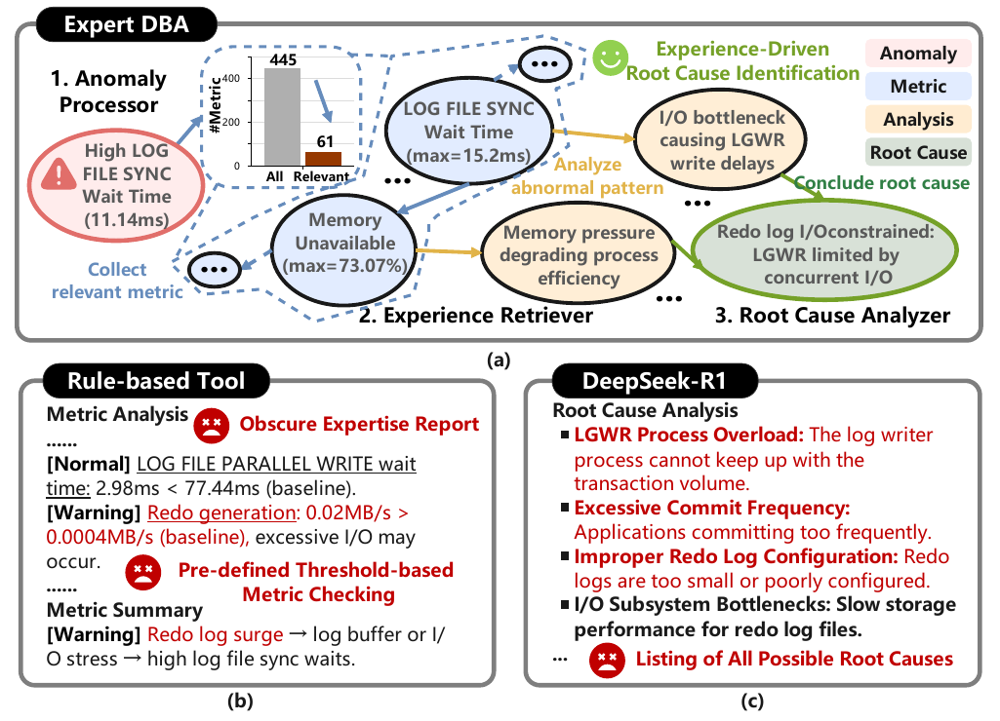
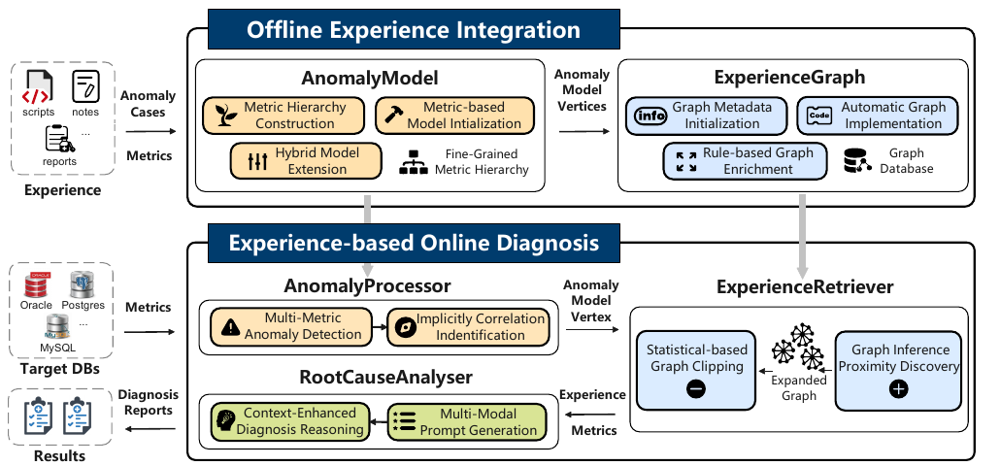
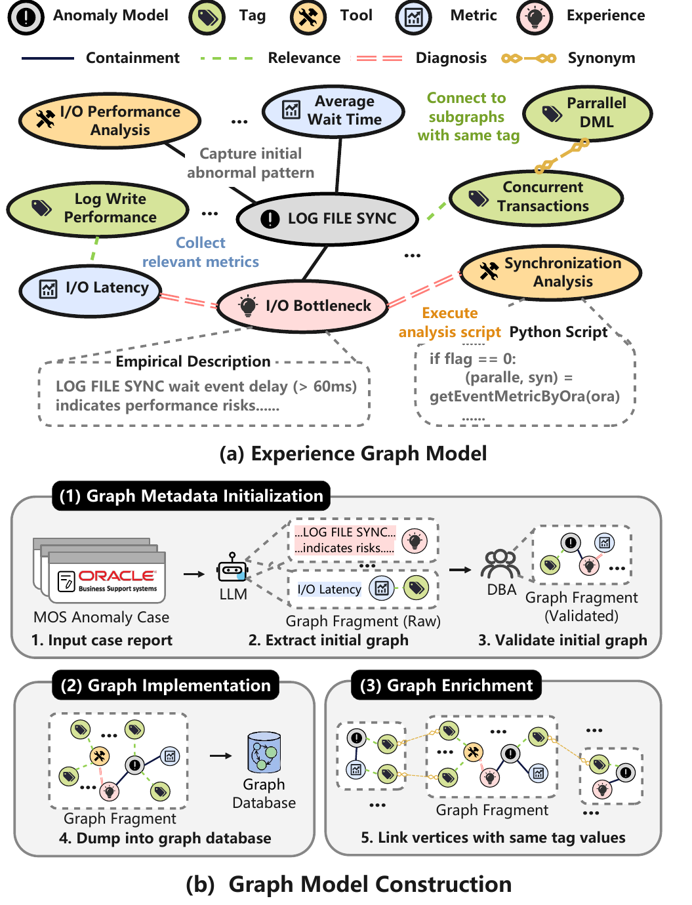
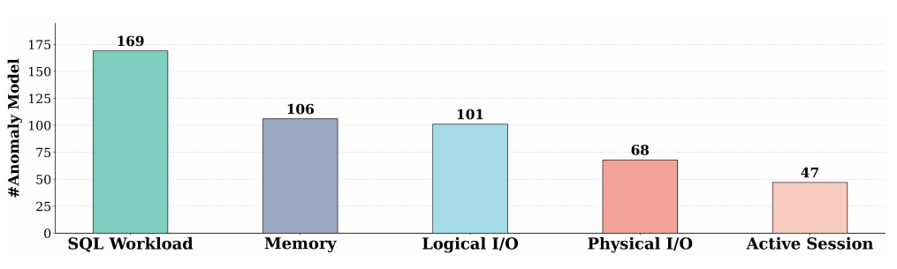
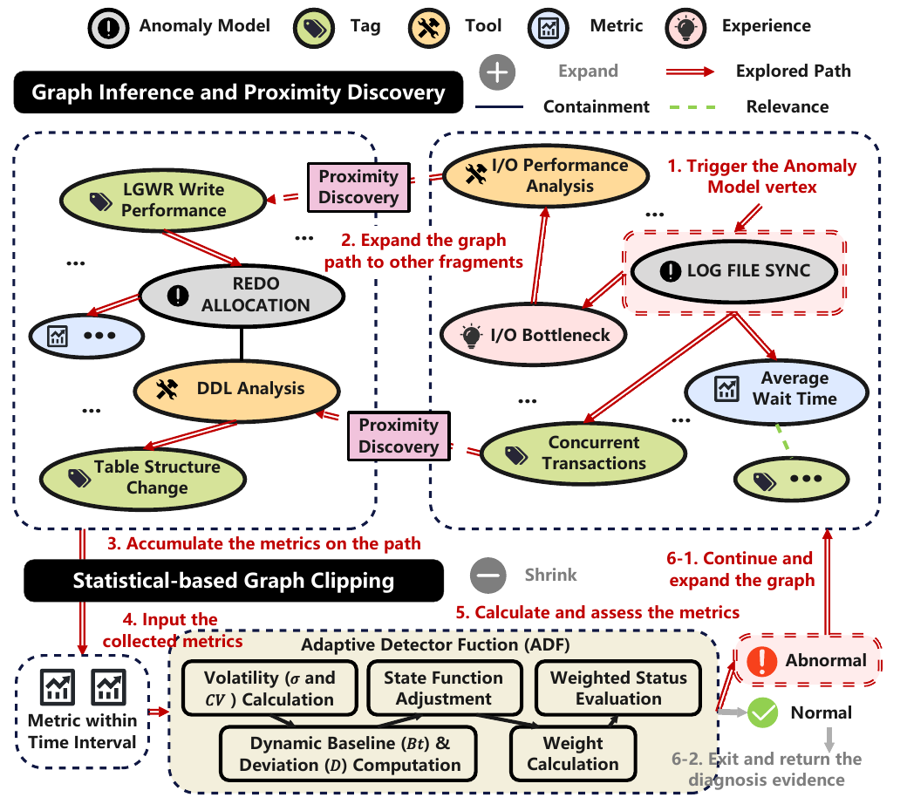
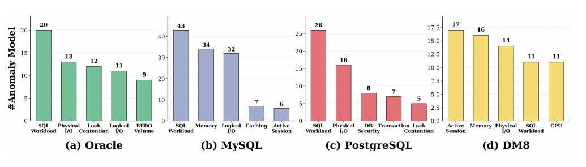
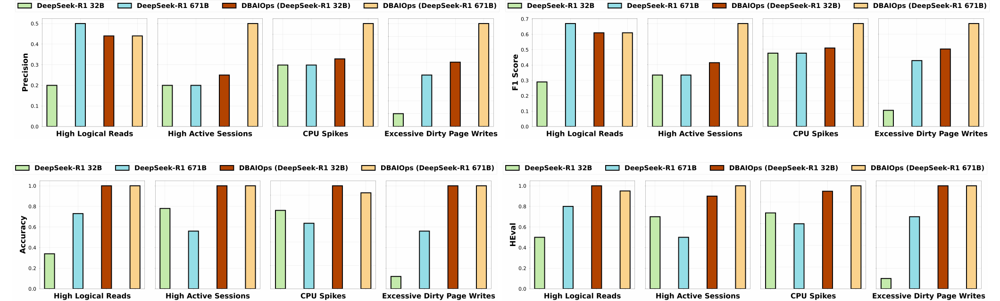
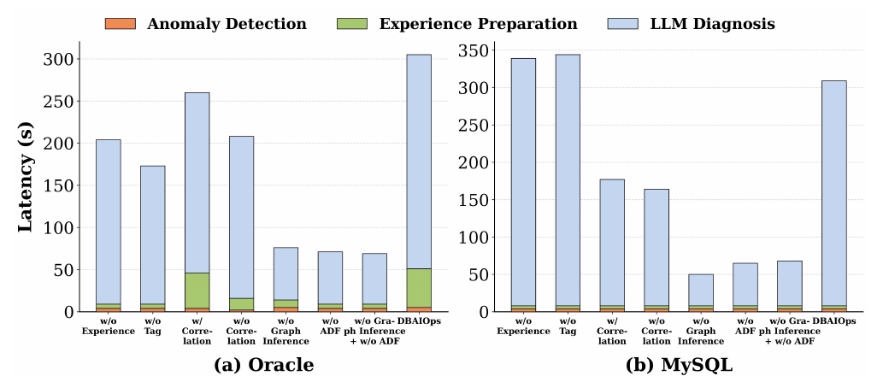
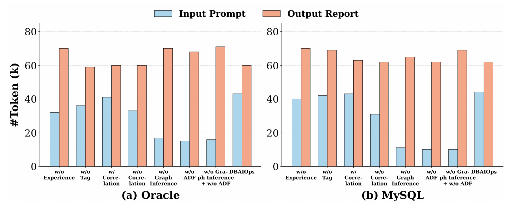

# DBAIOps: A Reasoning LLM-Enhanced Database Operation and Maintenance System using Knowledge Graphs（中文译文）

## 译者说明

本文依据同目录的 `source.pdf` 翻译。章节、图表、公式、算法、代码与参考文献按原文结构保留。

## 摘要

数据库系统的运行与维护（operation and maintenance，O&M）对于保证系统可用性和性能至关重要；有效的诊断与恢复通常需要专家经验，例如识别指标与异常之间的关系。然而，包括商业产品在内的现有自动化数据库运维方法无法有效利用专家经验。一方面，基于规则的方法仅支持基础运维任务（例如基于指标的异常检测）；这些方法主要由数值方程组成，无法有效纳入文字形式的运维经验（例如手册中的故障排查指南）。另一方面，基于大语言模型（LLM）的方法会检索碎片化信息（例如标准文档加 RAG），经常产生不准确或泛化的结果。

为解决这些局限，我们提出 DBAIOps：一种将推理型 LLM 与知识图谱结合起来、实现类 DBA 诊断的新型混合数据库运维系统。首先，DBAIOps 引入一种表示诊断经验的异构图模型，并提出从数千份文档构建该图的半自动图构建算法。其次，DBAIOps 开发了 800 多个可复用异常模型，既能识别直接触发告警的指标，也能识别隐式相关的经验和指标。第三，对于任意给定异常，DBAIOps 使用自动图探索机制遍历图中的相关路径，并在无需人工干预的情况下动态探索潜在缺口（缺失路径）。基于探索得到的诊断路径，DBAIOps 使用推理型 LLM（例如 DeepSeek-R1），将相关路径作为输入，识别根因，并为 DBA 和普通用户生成清晰的诊断报告。

我们在四种主流数据库系统 Oracle、MySQL、PostgreSQL 和 DM8 上的评估表明，DBAIOps 优于最先进基线，其根因准确率和人工评估准确率分别高出 34.85% 和 47.22%。DBAIOps 支持 25 种数据库系统，并已部署于金融、能源和医疗等领域的 20 个真实场景中（https://www.dbaiops.com）。

**PVLDB 工件可用性：**源代码、数据和/或其他工件可在 https://github.com/weAIDB/DBAIOps 获取。



**图 1：数据库自动运维面临的挑战。**（a）专家 DBA 需要分析触发异常所涉及的多种信息。（b）经验式运维可能采用误导性规则（由不正确的阈值造成）。（c）即使提供了充分的相关指标信息，LLM 仍可能因缺少运维经验而无法完成诊断。

## 1 引言

数据库运行与维护旨在检测、分析并解决目标数据库实例中出现的各种异常。数据库在线运行时需要满足严格的高可用性要求（例如金融和电子商务等关键服务每年的停机时间少于 52.6 分钟 [27]）和性能要求（例如云服务提供商实施的服务级别协议，SLA [10, 21, 46]）。例如，由美国联邦航空管理局（FAA）维护、用于向飞行员和航空公司提供安全警报的关键系统——航行通告（NOTAM）数据库发生故障，导致超过 10,000 个航班延误、1,300 多个航班取消，并因服务中断造成数百万美元的经济损失 [8, 13]。

因此，为保证高可用性和性能，许多企业会聘请拥有数十年经验的高级 DBA，或购买昂贵的人工维护服务 [12, 16, 18]。如图 1 所示，传统上诊断 LOG_FILE_SYNC 等异常，需要经验丰富的 DBA 将告警与相关指标（例如 LOG FILE PARALLEL WRITE 等待时间）隐式关联起来，再构建因果链以定位根因（例如“限制 LGWR 进程的 I/O 瓶颈”）。这一过程还需要从大量无关指标中筛出相关指标，例如从 445 个指标中选出 61 个；否则容易得出错误结论。然而，这种高度依赖人工的运维过程耗时、难以扩展，而且在反复处理重复异常时效率尤其低。

现有方法使用经验规则 [19, 24]，甚至使用大语言模型 [38, 39, 44, 48, 49, 51, 52]，来自动化部分数据库运维任务（见表 1）。但它们不支持灵活地整合 DBA 经验，存在显著局限。例如，图 1 中 [19, 24] 一类基于规则的方法，只能用固定阈值整合有限的异常诊断规则：仅因为超过预设阈值，就把异常归因于 Red_log_surge。相比之下，基于 LLM 的方法可以对系统指标进行推理并利用外部知识，从而推断更细微的根因 [51]。但这类方法有两个主要问题，使其很难用于真实场景。第一，它们匹配相关专家经验的准确率较低：（1）简单地把文档切块，却没有捕获隐式关系 [38]；（2）仅依赖基于向量相似度的语义匹配 [20]。第二，检索到的经验往往支离破碎，LLM 难以执行准确的逐步根因分析。例如图 1 中，DeepSeek-R1 罗列了多个可能原因，却无法给出具体、可执行的诊断，例如确定真正根因是 Redo 日志 I/O 瓶颈，或提出优化 Redo 日志放置位置等具体恢复措施。

为了弥合专家 DBA 的经验式运维实践与现有方法有限能力之间的差距，需要解决三个主要挑战。

**C1：如何有效刻画并整合运维经验？** 大量数据库运维经验存在于技术说明、脚本和事件报告中，主要来自大型数据库公司 [9, 10]；但这些经验通常是碎片化的，并分散在不同格式中，例如非正式文本、非结构化日志项和孤立的 SQL 脚本。当前缺少有效的经验表示方式，阻碍了这些经验对运维任务和准确数据库诊断的指导作用，例如无法把反复出现的 LOG_FILE_SYNC 等待事件与历史事件中的存储 I/O 延迟异常关联起来。

**C2：如何捕获不同异常中隐式相关的因素？** 有效分析数据库异常通常需要全局查看系统、日志和跟踪指标，例如 Redo 日志生成速率、I/O 子系统延迟和事务提交频率。但多数现有方法主要关注自身表现出异常模式的指标，例如时间趋势变化或短期波动 [29, 30, 33]。因此，那些具有隐式相关性、但没有明显异常模式的指标经常被忽略，造成严重诊断错误。例如，在出现 LOG_FILE_SYNC 等待时，正常的日志缓冲区命中率可能让 DBA 忽略 I/O 瓶颈，而只关注激增的同步等待时间。

**C3：如何自适应地探索潜在运维诊断路径？** 现有诊断系统通常依赖固定的规则方法，沿预定义决策路径执行，对不同场景的适应性有限 [19, 24]。此外，很多系统要么无法生成包含根因和可行恢复方案的信息丰富型报告 [25, 34, 40, 50]，要么生成过度技术化的输出，例如穷举指标值，普通用户难以理解和采取行动 [32, 33, 37]。

为解决这些挑战，我们设计了以经验为中心的数据库运维系统 DBAIOps，其中包含五个关键组件：

1. 异构运维图模型 ExperienceGraph，用于整合多样且主要以文本形式存在的运维经验。该图通过互连的顶点和边表示诊断路径，使运维经验能够被结构化组织和增量丰富，从而实现精确诊断（对应 C1）。
2. 相关性感知异常模型 AnomalyModel 和 AnomalyProcessor，用于识别与输入异常有关的相关因素。每个模型都纳入统计式多指标相关分析、频率控制和低代码工具，以发现隐式相关指标（对应 C2）。
3. 结合 LLM 推理的两阶段图探索 ExperienceRetriever 与 RootCauseAnalyser，自适应遍历图以收集相关诊断信息（例如异常指标），随后通过上下文学习提示 LLM 生成综合诊断报告，其中包含详细的根因分析和实用恢复方案（对应 C3）。

**贡献。** 我们作出以下贡献：

- 我们设计了用于诊断真实异常的数据库运行与维护系统。据我们所知，这是首个把知识图谱与推理型 LLM 结合起来，以识别根因并提供恢复方案的数据库运维系统（见第 3 节）。
- 我们提出基于图的经验模型，用图路径表示运维经验。当前经验模型（知识图谱）包含 2,000 多个顶点，以及面向 25 种不同数据库系统的 800 多个异常场景（见第 4 节及 https://www.dbaiops.com）。
- 我们提出相关性感知异常模型，用来捕获指标与真实异常之间的隐式相关性，从而在在线诊断期间触发更准确的图探索（见第 5 节）。
- 我们引入两阶段图探索机制，自适应地探索不同异常可能对应的诊断路径。我们提示 LLM 对这些路径进行推理，生成包含具体恢复方案的诊断报告（见第 6 节）。
- 大量实验和案例研究表明，相比基于规则和基于 LLM 的基线，DBAIOps 的根因准确率提高 34.85%，人工评估准确率提高 47.22%。

## 2 背景与相关工作

数据库运维是维护和优化数据库系统的过程，通常包括：（1）收集必要的运维因素，例如系统指标、日志和跟踪；（2）进行根因诊断和恢复。如表 1 所示，我们把现有数据库运维方法分成三类。

**基于规则的方法。** 此类方法依赖人工专家把维护知识编码成规则，并纳入诊断过程，例如为不同异常定义一组诊断路径 [24, 25, 40]。ADDM [24] 基于规则在时间图上进行根因诊断，例如“当某节点的时间异常时，探索其所有子节点”。DBSherlock [40] 把领域知识编码成规则，再用这些规则过滤反映次生症状的谓词（Attr > k）。ADTS [25] 构建包含 175 条“表达式—结果”规则的专家系统，用来诊断根因。

但是，基于规则的方法需要专门知识来设计和实现，而且通常局限于特定数据库系统。例如，ADDM 只适用于 Oracle；若要扩展到其他系统，需要投入大量人工工作，例如添加新规则。此外，对预定义规则的依赖以及无法整合外部知识，会降低方法的灵活性，使其难以适应新异常。

**基于机器学习的方法。** 此类方法使用机器学习算法或模型，提高基于规则方法的根因分析准确率。CauseRank [33] 使用贝叶斯网络结构算法和专家规则构建异常因果图。DBMind [50] 使用基于 LSTM 的编码器，把数据编码成异常向量以匹配根因。iSQUAD [34] 使用贝叶斯案例模型提取 SQL 的关键特征；PinSQL [32] 则使用基于机器学习的聚类算法，根据 SQL 的历史执行趋势进行分组，以完成根因诊断。RCRank [37] 训练多模态机器学习模型，从 SQL、日志、执行计划和指标四类数据中提取特征，为慢查询根因排序。

但基于机器学习的方法通常建立在规则系统之上，因此会继承类似局限。此外，机器学习模型高度依赖训练数据，通常泛化能力较差 [31]，只对某些异常诊断有效。例如，iSQUAD [34] 和 PinSQL [32] 只用于诊断有限类型的慢 SQL。

**基于 LLM 的方法。** 此类方法利用 LLM 的理解和推理能力，提高诊断准确率和适应性。它们同时利用 LLM 的内部知识（例如对不同数据库系统的一般理解）和外部资源（例如历史异常案例）。D-Bot [51] 根据匹配的文档知识和检索到的工具生成提示，使 LLM 能够执行诊断，并用基于树搜索的算法开展多步根因分析。ChatDBA [7] 使用决策树结构检索相关信息并指导 LLM 诊断。Panda [38] 和 GaussMaster [47] 使用 LLM 智能体承担专门的诊断模块或专家角色，进行协作诊断。Andromeda [20] 使用 Sentence-BERT 和基于季节趋势的指标分析，使 LLM 能够结合指标、历史问题和诊断手册中的信息，生成配置调优建议。

**表 1：数据库运维方法比较。**

| 类别 | 方法 | 数值证据 | 文本证据 | 经验整合 | 经验探索 | 支持新异常 |
| --- | --- | :---: | :---: | :---: | :---: | :---: |
| 基于规则 | ADDM [24] | ✓ | × | × | × | × |
| 基于规则 | DBSherlock [40] | ✓ | × | × | × | × |
| 基于规则 | ADTS [19] | ✓ | × | × | × | × |
| 基于机器学习 | CauseRank [33] | ✓ | × | × | × | × |
| 基于机器学习 | DBMind [50] | ✓ | × | × | × | × |
| 基于机器学习 | iSQUAD [34] | ✓ | × | × | × | × |
| 基于机器学习 | PinSQL [32] | ✓ | × | × | × | × |
| 基于机器学习 | RCRank [37] | ✓ | × | × | × | × |
| 基于 LLM | D-Bot [51] | ✓ | ✓ | ✓ | × | ✓ |
| 基于 LLM | Panda [38] | × | ✓ | ✓ | × | ✓ |
| 基于 LLM | ChatDBA [7] | × | ✓ | ✓ | × | ✓ |
| 基于 LLM | Andromeda [20] | × | ✓ | ✓ | × | ✓ |
| 基于 LLM | GaussMaster [47] | ✓ | ✓ | ✓ | × | ✓ |
| 基于 LLM | DBAIOps | ✓ | ✓ | ✓ | ✓ | ✓ |

尽管基于 LLM 的方法具有很强的泛化能力，并能生成灵活的诊断输出，但它们也存在若干局限。第一，这些方法仅使用一些通用文档（例如基础运维概念）来提示 LLM；即便配备思维树等高级技术 [51]，LLM 仍容易给出泛化结果或诊断失败，例如分析不存在的指标。第二，尽管 LLM+RAG 方法可以动态检索文档知识 [20]，典型 RAG 范式会对彼此分离的知识块执行 top-k 匹配，破坏原有知识关系（例如涉及多个步骤的诊断路径），从而造成不准确或不完整的诊断。此外，基于相似度的 RAG 可能返回无关知识，并对诊断产生负面影响，例如在无关知识引导下得出误导性诊断。

因此，我们需要一种经验增强型 LLM 框架：（1）系统整合运维经验，同时不丢失原始关系；（2）支持新的根因和恢复方案，实现有效且可扩展的数据库运维。

## 3 DBAIOps 概览

DBAIOps 是首个把推理型 LLM 与知识图谱结合起来、提供专家级诊断的数据库运维系统。现有基于 LLM 的方法经常检索到碎片化信息 [51] 并生成泛化结果 [7, 38]；与之不同，DBAIOps 提出结构化图模型来捕获多样的诊断信息，并通过五个创新组件为 LLM 动态检索异常相关信息。



**图 2：DBAIOps 系统概览。**

**体系结构。** DBAIOps 包含五个关键组件（图 2）：

1. ExperienceGraph 把专家运维经验编码到异构图模型中：顶点表示运维信息（例如指标），边捕获多步异常分析涉及的关系。
2. AnomalyModel 基于细粒度指标层次（例如从原始数据到聚合数据）和描述性异常元数据（例如症状说明），使用从指标—异常相关分析中得到的方程进行异常检测。
3. AnomalyProcessor 同时利用 AnomalyModel 输出和隐式相关指标，提取相关的异常分析信息。
4. ExperienceRetriever 通过两阶段图探索策略，即基于邻近性的图扩展和统计式图裁剪，自动探索异常分析路径并积累相关经验。
5. RootCauseAnalyser 基于图增强经验使用推理型 LLM 模拟 DBA 式诊断，生成准确且可执行的报告。

借助多指标相关分析、基于图的运维经验编码等组件，DBAIOps 可以有效使用通用推理型 LLM [4, 22]（见第 7 节），不需要专门训练 LLM。

**离线阶段。** 给定历史异常案例和指标，DBAIOps 首先使用 LLM 提取原始顶点和边，并用一个基于多指标关系构建的 AnomalyModel 顶点锚定每个案例。随后，人工专家通过连接相关指标和工具来验证并丰富图，得到结构化 ExperienceGraph。系统通过 Cypher 查询把图存入 Neo4j，并给顶点添加数据库标签以实现跨系统复用。最后，系统连接具有相同或同义标签的顶点，以提高图的连通性和诊断覆盖率。

**在线阶段。** 收到诊断请求后，AnomalyProcessor 接收与异常相关的数值指标，输出被触发的 AnomalyModel 顶点及告警描述。ExperienceRetriever 随后处理这些顶点和指标，输出来自图路径的诊断信息。最后，RootCauseAnalyser 接收检索到的信息，生成能够识别根因并给出恢复方案的综合文本诊断报告。

DBAIOps 通过三种机制泛化到未见根因：

1. **标签锚定的子图连接。** DBAIOps 使用启发式策略连接包含不同诊断经验的子图，例如连接具有相同标签值的顶点，再执行两阶段图探索，为任意输入异常动态检索相关诊断信息（第 6.1 节）。
2. **两阶段图探索。** 从图中检索诊断信息后，DBAIOps 利用 LLM 的推理能力进行图增强诊断。它使用结构化提示清晰组织不同信息，从而推断未见异常（第 6.2 节）。
3. **增量经验整合。** 输入新经验的基本信息后，DBAIOps 把工具、描述等信息映射为顶点，把它们的关系映射为边，并自动生成 Cypher 查询，将这些顶点和边增量加入原经验图（第 4.2 节）。

此外，DBAIOps 对被诊断数据库造成的开销可以忽略不计。它运行在物理隔离的机器上，通过非侵入式系统查询获取运行时指标，例如 Oracle 中预聚合的指标。这些指标是企业级监控所必需的，其开销低于数据库总 CPU 使用量的 2%。

**表 2：运维图模型中的顶点和边类型。**

| 类型 | 描述 |
| --- | --- |
| 异常模型顶点 | 由监控规则或模式定义的特定异常场景。 |
| 指标顶点 | 反映数据库运行状态的定量数据。 |
| 经验顶点 | 诊断知识，包括上下文、根因和解决方案。 |
| 标签顶点 | 对相关顶点分组的语义类别。 |
| 工具顶点 | 包含具体诊断步骤的可执行脚本。 |
| 辅助顶点 | 指标的补充属性，例如采样频率。 |
| 包含边 | 某个顶点被包含在异常模型顶点或指标顶点中。 |
| 相关边 | 顶点与标签顶点之间的分类关系。 |
| 诊断边 | 诊断过程中某顶点对指标顶点或工具顶点的使用关系。 |
| 同义边 | 两个不同表达的标签顶点之间的语义等价关系。 |
| 关联边 | 用于自定义顶点关系的一般逻辑连接。 |

## 4 用于刻画运维经验的图模型

大量运维知识存在于技术说明 [42, 43, 45, 46] 和已解决异常的案例报告 [1–3, 6] 中，但现有方法无法有效捕获和表示这些多样的诊断信息，以用于自动分析 [38, 51]。为弥合这一差距，我们提出 ExperienceGraph：一种系统组织数据库运维专业知识的异构图模型。与使用数值阈值的规则系统或使用简化因果模型的机器学习方法不同，DBAIOps 使用半自动构建算法，把非结构化文本经验转化为可执行图路径，并支持 25 种以上的数据库系统。

### 4.1 经验图模型

为了整合运维经验，现有方法要么依赖具有预定义数值指标阈值的规则 [24, 40]，要么采用基础 RAG 策略，让 LLM 根据松散连接的文档块进行诊断 [20, 38, 47]。这些方法无法捕获运维经验中需要综合考虑异构信息的复杂关系。为此，DBAIOps 提出首个专用于运维的异构图模型 ExperienceGraph，LLM 和人工 DBA 均可方便地使用该模型。

形式化地，我们把 ExperienceGraph 设计为有向异构图：

$$
G=(V,E)
$$

其中， $V$ 是顶点集合， $E$ 是有向边集合。如表 2 所示，DBAIOps 包含六类顶点和五类边。

**顶点建模。** 顶点封装来自不同来源的必要诊断信息：

1. 异常模型顶点充当入口，在检测到特定模式时启动图遍历。
2. 指标顶点提供定量证据，通过统计指标度量异常。
3. 经验顶点编码专家知识，包含详细的异常解释、分析步骤和恢复方案。
4. 工具顶点通过可执行脚本自动完成数据收集和深入调查。
5. 标签顶点把语义相近的顶点聚成组。
6. 辅助顶点通过采集频率、百分位数等上下文属性丰富指标解释。

**边建模。** 边定义了引导图遍历的路径，使系统能够跨顶点积累诊断信息：

1. 包含边把相关组件放入异常模型或指标中，从而组织这些组件。
2. 相关边把顶点连接到其语义标签，建立类别关系。
3. 诊断边把分析步骤连接到执行时需要的具体指标和工具。
4. 同义边合并图中含义相同的等价术语。
5. 关联边在顶点之间建立灵活连接，帮助收集相关信息。



**图 3：DBAIOps 中的运维图模型示例。**

**示例 4.1。** 图 3 展示了 ExperienceGraph 的拓扑结构，其中包括日志文件同步异常，即检测 Oracle 数据库中日志文件同步期间的超长等待时间。中心异常模型顶点“LOG FILE SYNC”作为入口，通过包含边连接到表示 I/O 相关诊断知识（“经验描述”）的经验顶点。该经验顶点使用诊断边连接到指标顶点“I/O 延迟”和工具顶点“同步分析 Python 脚本”。相关边把异常模型顶点和指标顶点连接到标签顶点，并将它们归入有意义的类别“并发事务”。同义边关联等价标签值“并行 DML”，增强图连通性，便于检索诊断知识。

**算法 1：经验图模型构建。**

```text
输入：异常案例 A，数据库指标 M
输出：经验图 G=(V,E)
 1  /* 1. 图元数据初始化 */
 2  初始化 G ← (V ← ∅, E ← ∅)
 3  foreach 异常案例 a_i ∈ A do
 4      V_raw, E_raw ← LLM.ExtractFromDoc(a_i)
 5      v_anomaly ← CreateAnomalyModel(a_i, M)
 6      V ← V ∪ {v_anomaly}
 7      V_valid, E_valid ← DBA.Validate(a_i, v_anomaly, V_raw, E_raw)
 8      V ← V ∪ V_valid, E ← E ∪ E_valid
 9  /* 2. 图实现 */
10  DB ← DB.execute(MapToCypher(G))
11  /* 3. 图丰富 */
12  foreach 顶点对 (v_i, v_j) ∈ V × V do
13      if SameTag(v_i, v_j) or SynonymTag(v_i, v_j) then
14          E ← E ∪ {(v_i, v_j)}
15  return G
```

### 4.2 图模型构建

面对数量庞大且复杂的运维经验片段，降低图模型构建所需的人工投入极其重要 [28, 35, 41]。但现有方法主要使用基础机器学习方法（例如 CauseRank [33]）自动添加图边；它们依赖顶点之间的简单因果假设，可能无法发现隐式关系。我们转而引入一种半自动构建方法：利用 LLM 生成关键顶点的初始图草图，再由人工验证并扩展成统一图。

如算法 1 所示，DBAIOps 分三个步骤系统构建 ExperienceGraph。数据来自多种来源，包括 Oracle 数据库的 15,000 份官方 MOS（My Oracle Support）异常报告 [6]。

1. **图元数据初始化。** 对每个异常案例 $a_i\in A$，我们在提示中给出图定义，使用多个 LLM 从文档实体中提取初始图顶点 $V_{\mathrm{raw}}$（指标、经验和标签顶点）及边 $E_{\mathrm{raw}}$。为提高稳健性，系统通过多数投票聚合多个 LLM 的输出。随后，我们使用统计式多指标关系（第 5.1 节）构建异常模型顶点 $v_{\mathrm{anomaly}}$，作为中心诊断入口。数据库专家从该顶点开始验证图，并围绕它组织其余元素：（a）把相关指标和经验顶点连接到 $v_{\mathrm{anomaly}}$；（b）在存在 Python 脚本时添加工具顶点，以提供多条诊断路径；（c）使用标签顶点对每个顶点分类。最终，经过验证的顶点 $V_{\mathrm{valid}}$ 和边 $E_{\mathrm{valid}}$ 构成图 $G$。
2. **图实现。** 经过验证的图 $G$ 由 $MapToCypher(G)$ 转换成可执行 Cypher 查询并存入 Neo4j，以便在线诊断时高效遍历。为了通过公共标签共享知识，同时消除重复构建工作，我们为每个顶点进一步添加相应数据库标识，为全部 25 种受支持数据库构建统一图。
3. **图丰富。** 我们使用启发式策略自动增强图连通性，在具有相同标签或同义标签的顶点之间添加边：

$$
E \leftarrow E \cup \lbrace{}(v_i,v_j)\mid SameTag(v_i,v_j)\lor SynonymTag(v_i,v_j)\rbrace{}
$$

这会关联不同 $v_{\mathrm{anomaly}}$ 的相关子图，显著扩展图的诊断覆盖率。例如，系统可以从几十个 Oracle 异常模型生成 300,000 多条边。

**示例 4.2。** 如图 3 所示，日志文件同步异常的图分三个阶段系统构建。首先，DBAIOps 使用 LLM 从 My Oracle Support 文档 [6] 中提取原始图实体，包括经验顶点（例如“……表示存在风险……”）和指标顶点（“I/O 延迟”）。随后，数据库专家验证提取的原始图，构建触发条件为“等待时间 > 10 ms”的中心异常模型顶点，并确认它与其他顶点的关系。经过验证的图被转换成可执行 Cypher 查询，持久化到 Neo4j 图数据库，以支持高效在线检索。最后，系统在语义等价标签值的顶点之间建立同义边，自动丰富图，从而把 LOG FILE SYNC 异常模型与其他 I/O 相关异常有效连接起来。

通过这种方式，我们构建了一个图，其中纳入了 DBA 在过去 10 年管理 5,000 多个数据库的经验以及 2,000 多个历史异常案例，并通过自动图探索支持新异常（见第 6.1 节）。表 3 显示，不同数据库的异常模型顶点数量差异显著：Oracle、MySQL 和 PostgreSQL 分别为 82、91 和 36。这说明 DBAIOps 对这些数据库提供了更细粒度的异常检测。图 4 进一步显示，排名前五的模型类别——SQL 工作负载、内存、逻辑 I/O、物理 I/O 和活动会话——在总体分布中占主导地位，对应数据库异常检测中常规监控的关键性能领域。

**表 3：DBAIOps 中的异常模型统计。数量差异源于可用资源不同。**

| 数据库 | Oracle | DB2 | SQL Server | MySQL | PostgreSQL | OceanBase | GaussDB |
| --- | ---: | ---: | ---: | ---: | ---: | ---: | ---: |
| 指标 | 550 | 927 | 314 | 316 | 645 | 963 | 658 |
| 诊断工具 | 396 | 10 | 124 | 215 | 148 | 98 | 151 |
| 异常模型 | 82 | 7 | 25 | 91 | 36 | 34 | 85 |



**图 4：DBAIOps 中数量最多的五类异常模型。**

## 5 相关性感知异常模型

现有方法能够有效检测单个指标的异常 [24, 40]，但会忽略由指标相关性产生的复杂模式。为解决这一局限，我们引入相关性感知异常模型，用来识别指标之间的隐式关系，例如日志同步延迟和并行写入时间的协同尖峰。与传统单指标方法不同，我们的模型使用细粒度指标层次和统计式多指标分析来发现复杂异常。

### 5.1 多指标异常检测

指标是支持有效数据库运维的首要因素。然而，来自不同监控源的指标数量巨大，还需要进一步处理才能得到趋势变化等关键信息。为此，DBAIOps 首先构建统一指标层次，再执行统计式多指标相关分析，自动推导有效的异常检测方程。

**细粒度指标层次。** 为了全面刻画数据库状态，DBAIOps 引入经过仔细设计的三级指标层次，以树形结构把数千个指标从一般领域组织到具体测量项。该层次以半自动方式构建，结合数据库文档中的领域专业知识和真实部署中收集的指标。具体而言，层次包含：（1）表示广泛功能领域的顶层类别，例如“性能”“配置”；（2）定义具体技术组件的中层子类别，例如“性能”之下的 I/O、CPU、内存；（3）子类别下作为可测量异常检测指标的叶级指标，例如 I/O → Redo Log 路径下的 LOG_FILE_SYNC 等待时间和 log file parallel write。

这些指标最初来自 Prometheus [5] 等外部工具的原始数据，只保留类别 ID 和错误消息等必要信息。随后，仅在诊断需要时惰性计算增量差分、滚动平均值和直方图等附加统计数据。例如，DBAIOps 同时采集 Oracle 自动工作负载存储库（AWR）的长间隔性能统计（如 CPU 和 I/O 指标的 30 分钟快照），以及活动会话历史（ASH）的短间隔会话数据；后者每秒捕获一次会话活动，用于实时性能监控。

**指标—异常相关。** 为有效捕获指标与异常的关系，DBAIOps 开发了一组异常模型。每个模型根据不同的多指标模式或单指标纵向比较，捕获一种特定数据库异常。不同于依赖阈值、检测准确率有限的典型方法，这些异常模型：（1）同时利用已有运维经验和多指标分析；（2）由基础元素构成。如函数 1 所示，构建过程包含四个关键步骤。

1. **选择相关指标。** 给定异常案例 $a_i$，我们首先使用多个 LLM 提取初始自然语言描述 $Desc_{a_i}$，以及可能与该异常相关的候选指标集合 $M_{a_i}$。为提高稳健性，我们使用 LLM-as-a-Judge 技术 [26] 促成多数投票机制，聚合不同 LLM 的输出。随后，由具有丰富维护经验的数据库专家验证这些初步结果，得到精炼描述 $Desc^{valid}\relax_{a_i}$ 和经过验证、具有因果相关性的指标集合 $M^{valid}\relax_{a_i}\subseteq M_{a_i}$。
2. **转换选定指标。** 每个经过验证的指标 $m\in M^{valid}\relax_{a_i}$ 都通过函数 $\Phi$ 转换，以突出特定异常模式。令 $\mathbf{m}=[m_1,m_2,\ldots,m_T]$ 表示一个指标在 $T$ 个时间步上的时间序列， $\mathbf{r}=[r_1,r_2,\ldots,r_T]$ 表示参考时间序列，则：

$$
\Phi(\mathbf{m})=
\begin{cases}
\Phi_{\mathrm{iden}}(\mathbf{m})=\mathbf{m}, & \text{恒等变换}\\
\Phi_{\mathrm{shape}}(\mathbf{m},\mathbf{r})=DTW(\mathbf{m},\mathbf{r}), & \text{形状相似度}\\
\Phi_{\mathrm{cate}}(\mathbf{m})=Classify(\mathbf{m}), & \text{类别变换}
\end{cases}
$$

 $\Phi_{\mathrm{iden}}$ 返回原始时间序列值； $\Phi_{\mathrm{shape}}$ 使用动态时间规整（DTW）度量时间序列 $\mathbf{m}$ 与参考序列 $\mathbf{r}$ 的形状相似度，从而捕获存在时间扭曲时的波形相似性； $\Phi_{\mathrm{cate}}$ 根据专家定义的规则把指标映射到离散类别标签集合，实现多级异常刻画。转换后指标集合为：

$$
M'=\lbrace{}\Phi(m)\mid m\in M^{valid}\relax_{a_i}\rbrace{}
$$

3. **构建检测函数。** 系统根据转换后的指标构建析取范式（DNF）检测函数 $f_{\mathrm{detect}}$。该函数包含异常检测方程，使用作用于系统指标和统计模式（趋势）的可配置逻辑表达式。对于每个 $m'\in M'$，系统定义一个表达式 $condition_i$，通常将 $m'$ 与类别或阈值 $\theta$ 比较。这些阈值最初由领域专家设置，之后通过第 6.1 节介绍的自适应检测函数（ADF）自动精炼。条件也可以是复合条件，通过合取（AND）和析取（OR）组合多个指标。总体检测函数为：

$$
f_{\mathrm{detect}}=condition_1\lor condition_2\lor\cdots\lor condition_n
$$

当 $f_{\mathrm{detect}}$ 中至少一个条件为真时，触发异常。

4. **构建异常模型。** 最终异常模型被封装成顶点：

$$
v_{\mathrm{anomaly}}=\langle Desc^{valid}\relax_{a_i},M',f_{\mathrm{detect}}\rangle
$$

它整合经过验证的异常描述、转换后的指标和 DNF 检测逻辑，在图模型中形成完整且可执行的异常表示。

**函数 1：CreateAnomalyModel($a_i,M$)。**

```text
 1  /* 1. 选择相关指标 */
 2  Desc_ai, M_ai ← LLM.ExtractFromDoc(a_i)
 3  Desc_ai_valid, M_ai_valid ← DBA.Validate(a_i, Desc_ai, M_ai)
 4  /* 2. 转换选定指标 */
 5  foreach 指标 m_i ∈ M_ai_valid do
 6      m_i' ← Φ(m_i)      ▷ 恒等/形状相似度/类别变换
 7      M' ← M' ∪ {m_i'}
 8  /* 3. 构建检测函数 */
 9  f_detect ← ∅          ▷ 初始化 DNF 表达式
10  foreach 指标 m_i' ∈ M' do
11      condition_i ← DBA.SetCondition(m_i')
12      f_detect ← f_detect ∨ condition_i   ▷ 以 OR 组合 DNF
13  /* 4. 构建异常模型 */
14  v_anomaly ← CreateVertex(Desc_ai, M', f_detect)
15  return v_anomaly
```

**示例 5.1。** 构建 LOG_FILE_SYNC 异常模型时，首先由多个 LLM 给出初始描述“日志文件同步等待延迟”和候选指标。通过多数投票和专家验证，系统得到精确描述和经过验证的指标 average_wait_time。该指标通过 $\Phi_{\mathrm{iden}}$ 保留原始值，并通过 $\Phi_{\mathrm{cate}}$ 把 10 分钟趋势归入“急剧上升”等类别。这些转换后的指标构成 DNF 检测函数：

$$
f_{\mathrm{detect}}=(METRIC_{\mathrm{raw}}\gt{}60ms)\lor
((Trend_{10min}=sharp\ rise)\land(METRIC_{\mathrm{raw}}\gt{}6ms))
$$

其中阈值最初由专家设置，之后自动精炼。完整模型封装为：

$$
v_{\mathrm{trigger}}=\langle Desc^{valid}\relax_{a_i},
\lbrace{}METRIC_{\mathrm{raw}},Trend_{10min}\rbrace{},f_{\mathrm{detect}}\rangle
$$

由此得到整合了验证描述、转换指标和检测逻辑的可执行异常表示。

### 5.2 隐式相关指标识别

许多关键数据库异常来自看似无关指标之间的复杂交互，而不是单个阈值违规 [47, 51]。这些隐藏关系解释了传统监控遗漏的性能问题。为了系统捕获这些细微连接，DBAIOps 使用三种机制揭示不同指标之间的隐式相关性。

1. **通过标签连接子图。** DBAIOps 使用 $G$ 中的标签顶点，通过边创建函数 $SameTag(v_i,v_j)$ 和 $SynonymTag(v_i,v_j)$ 自动连接彼此断开的子图。例如，系统按语义等价关系连接“Physical Read”和“Disk Read”顶点，从不同 $v_{\mathrm{anomaly}}$ 动态形成未被显式预定义的隐式相关路径。
2. **时间序列相似性分析。** DBAIOps 检测同步波动模式，即使指标来自看似无关的不同领域，也能发现隐藏依赖。系统使用动态时间规整（DTW）[36] 判断波形相似度，并使用互相关判断一个指标领先还是滞后于另一个。例如，当“Log file sync wait time”和“Disk I/O latency”的模式通过 $\Phi_{\mathrm{shape}}$ 对齐时，系统会发现两者之间此前被忽略的联系。
3. **两阶段图探索。** DBAIOps 使用系统化发现过程：首先遍历图中的相邻顶点以扩大搜索范围，再通过统计分析滤除无关指标，只保留具有显著异常模式的指标作为有效隐式相关项。下一节将详细说明该机制如何提高诊断覆盖率。

## 6 场景感知异常诊断

传统方法通常独立处理异常，因而经常无法捕获一个异常触发或加剧另一个异常的关联问题，造成不完整诊断或需要专家解释的误报 [37, 38]。为克服这些局限，我们提出场景感知诊断，把两阶段图探索策略与图增强 LLM 推理结合起来。静态规则系统灵活性有限，标准 LLM 又容易产生幻觉；相比之下，DBAIOps 在图探索过程中动态识别诊断路径，并使用结构化提示指导 LLM，确保生成的报告包含准确根因和恢复方案。



**图 5：DBAIOps 中的两阶段图探索。**

### 6.1 两阶段图探索

真实场景中的异常很少彼此孤立：一个异常模型中的性能问题可能同时触发或加剧另一个模型中的问题。但是，LOG_FILE_SYNC 和 REDO_ALLOCATION 等不同异常模型在初始化后的图中可能只有松散连接，所共享的经验也稀疏且碎片化，例如并发相关的等待事件。为此，我们提出自动图探索机制，动态发现并连接不同异常模型中相关的经验片段。如图 5 所示，该机制包含两个主要阶段。

1. **图推断与邻近发现。** 给定完整图 $G$，DBAIOps 使用图查询语言 Cypher 进行推断，启动图探索。系统从检测函数取值为真的异常模型顶点 $v_{\mathrm{anomaly}}$ 出发，遍历相连的顶点和边，收集并聚合相关诊断信息。探索沿相关边到达指标顶点以执行统计分析，并沿包含边到达经验顶点以收集诊断知识。同义边通过连接不同子图中语义等价的标签顶点来增强图探索，将碎片化经验关联起来以处理复杂根因。在 $k$ 跳范围内迭代之后，系统得到边密度更高的已探索图 $G'$（ $|E'|\gt{}|E|$），为复杂异常形成连通性更强的结构。
2. **基于统计的图裁剪。** 获取已探索图 $G'$ 上的指标后，DBAIOps 使用自适应检测函数（ADF）评估收集的指标是否表现出异常模式，并据此裁剪图。对包含 $T$ 个时间步的指标序列 $\mathbf{m}=[m_1,m_2,\ldots,m_T]$，ADF 分五步执行。

**步骤 1：波动性计算。** 首先计算标准差 $\sigma(\mathbf{m})$，度量指标序列的波动幅度。然后计算系数：

$$
C_V=\rho_V/\rho_R
$$

其中， $\rho_V$ 表示波动模式的自相关， $\rho_R$ 表示随机波动的自相关，用于量化波动随时间延续的程度。

**步骤 2：计算动态基线 $B_t$ 和偏差 $D$。** 系统为每个时间区间 $t$ 推导动态基线 $B_t$。为保持适应性，不同数据库的基线每小时更新一次。偏差为：

$$
D=|m_t-B_t|
$$

 $B_t$ 可以纳入刻画已知运行模式的参数化因素。

**步骤 3：调整状态函数。** 我们引入状态函数 $F_{\mathrm{state}}(m_t,B_t)$，判断 $m_t$ 与基线的接近程度：

$$
F_{\mathrm{state}}(m_t,B_t)=
\begin{cases}
1-\frac{D}{\sigma}, & m_t\text{ 接近 }B_t\\
\frac{D}{\sigma}, & \text{其他情况}
\end{cases}
$$

在第一种情况下，偏离 $B_t$ 越小，函数值越大；反之，较大偏离表示潜在异常。

**步骤 4：计算权重。** 系统根据 $\sigma$ 和阈值 $\theta$ 动态计算波动权重：

$$
w_1=\frac{\sigma}{\sigma+\theta},\qquad w_2=1-w_1
$$

当 $\sigma\gt{}\theta$ 时，DBAIOps 给波动性分配更高权重，表示指标中的较大波动更值得关注。

**步骤 5：加权状态评估。** 最终异常分数为：

$$
S=w_1\cdot\sigma(\mathbf{m})+w_2\cdot F_{\mathrm{state}}(m_t,B_t)
$$

图探索根据该分数裁剪：如果 $S$ 超过环境阈值，则把指标标记为异常，并沿相关边继续探索；否则在当前顶点终止，从而保证只在异常区域进行高效遍历。

**示例 6.1。** 如图 5 所示，日志文件同步异常的图探索分两个关键步骤。首先，在“图推断与邻近发现”阶段，DBAIOps 把 LOG FILE SYNC 顶点作为起点，执行 Cypher 查询遍历相关边，并把搜索扩展到其他图片段，通过相同标签值发现 REDO ALLOCATION 异常模型等隐藏连接。其次，在“基于统计的图裁剪”阶段，DBAIOps 验证并滤除这些扩展顶点中模式正常的顶点。例如，分析指标 I/O Latency 时，动态基线 $B_t\approx15$、当前偏差 $D\approx43$；系统算出异常分数超过阈值（ $\sigma\gt{}\theta$）。因此，保留并合并相关 REDO ALLOCATION 子图，同时剪除统计上正常的分支。系统由此可以探索图并抽取诊断所需的全部相关信息。

### 6.2 图增强 LLM 诊断

从图中探索出路径后，准确异常诊断仍面临若干挑战。第一，可能存在误报，例如某些看似相关的顶点不能准确反映根因。第二，这些顶点中的经验可能不完整，或者普通用户难以理解。为此，DBAIOps 提出基于提示的策略，引导推理型 LLM 分析经验路径，并生成清晰、可执行的诊断报告，其中同时包含识别出的根因及相应恢复方案。

**表 4：在四种数据库系统的真实使用中观察到的常见根因。**

| 数据库 | 高数据选择量 | Redo 文件过小 | Redo 组数过少 | 日志缓冲区不足 | 表 INITRANS 不足 | Buffer Busy Wait | ENQ Lock Wait | Latch Wait | 内存使用率高 | CPU 使用率高 | BGWRITER 参数问题 | 共享缓冲区不足 | Checkpoint 参数问题 | WAL 参数问题 | 表死元组 | 索引问题 | 统计信息过期 |
| --- | :---: | :---: | :---: | :---: | :---: | :---: | :---: | :---: | :---: | :---: | :---: | :---: | :---: | :---: | :---: | :---: | :---: |
| Oracle | ✓ | ✓ | ✓ | ✓ | ✓ | ✓ | ✓ | ✓ | ✓ | ✓ | × | × | × | × | × | × | × |
| DM8 | ✓ | × | × | ✓ | × | ✓ | ✓ | ✓ | ✓ | ✓ | × | × | × | × | × | × | × |
| MySQL | ✓ | × | × | × | × | ✓ | ✓ | ✓ | ✓ | ✓ | × | × | × | × | × | × | × |
| PostgreSQL | × | × | × | × | × | × | × | × | × | × | ✓ | ✓ | ✓ | ✓ | ✓ | ✓ | ✓ |



**图 6：DBAIOps 中不同数据库数量最多的五类异常模型。**

为解决误报和覆盖不完整问题，DBAIOps 向 LLM 提供：（1）图遍历期间收集的大量文本分析经验；（2）积累的指标和执行细节集合，例如日志和历史性能基线。LLM 生成诊断报告时，不仅参考图中的触发顶点，还会沿相关边追踪其他异常。随后，它结合更广泛的环境解释各异常如何相互作用，例如“当 I/O 延迟超过 30 ms 后，并发等待增加，表明存在共享资源争用”。结构化图数据与开放式生成推理的协同，使 DBAIOps 能生成更全面、更易理解的诊断。

**提示 LLM 生成结构化报告。** DBAIOps 的核心设计之一，是用结构化提示引导 LLM 生成既可执行又容易理解的诊断报告。给定观测到的异常，我们把五个必要组件拼接成：

$$
prompt=\langle S^a,S^l,S^m,S^e,S^o\rangle
$$

其中：

- $S^a$（异常）给出症状描述，例如“2023-10-05 16:00 CPU 使用率飙升到 95%”。
- $S^l$（条件）编码异常检测条件，例如“超过 90% 且持续 5 分钟以上”。
- $S^m$（指标）记录关键统计信息，例如指标名（CPU Usage，%）、时间范围（1684600070–1684603670）和阈值（90%）。
- $S^e$（经验）提供上下文事实，例如正常负载（每分钟 10,000 个请求）和最近维护（2023-10-04 内核更新）。
- $S^o$（输出）规定需要生成的报告组成部分。

我们把该提示提供给 LLM，使其生成包含以下内容的诊断报告：（1）异常验证：判断报告的异常是否需要进一步调查；（2）根因分析：根据指标、日志或已知故障特征，识别最多五个可能原因；（3）恢复方案：建议配置变更、查询优化等技术调整；（4）摘要：简明评估整体系统健康状况；（5）SQL 上下文：如果问题涉及数据库操作，则包含相关 SQL 语句或执行计划。

## 7 实验

### 7.1 实验设置

**数据库。** 我们测试四种数据库系统：Oracle [15]、MySQL [14]、PostgreSQL [17] 和 DM8 [11]。指标和日志由 Prometheus [5] 等经过适配的工具收集。

**异常。** 表 4 列出了四种数据库中测试异常的根因。Oracle、MySQL、PostgreSQL 和 DM8 的测试场景总数分别为 178、114、127 和 139。这些异常分成五个主要类别：（1）日志同步与管理问题；（2）资源争用与并发问题；（3）SQL 优化问题；（4）硬件和系统资源瓶颈；（5）数据库写入性能问题。DBAIOps 在四种受测数据库中的细粒度异常模型类型分布见图 6。

此外，我们确保测试异常不同于图模型中的异常；具体来说，图中没有显式包含与测试案例完全相同的根因或解决方案。真值结果来自专家 DBA 的诊断报告。

**评估方法。** 我们评估表 1 中能够生成包含详细分析步骤的完整诊断报告的方法：

1. **规则工具 + DBA：**使用预定义工具生成专门报告，再由专家 DBA 进一步分析，以克服表 1 中传统方法无法生成综合诊断报告的局限。
2. **仅 LLM：**直接把监控指标等必要诊断信息提供给典型 LLM DeepSeek-R1-32B 和 DeepSeek-R1-671B。
3. **ChatDBA [7]：**基于 RAG 的方法，使用树形结构支持 MySQL 和 PostgreSQL 诊断。
4. **D-Bot [51]：**最先进的 LLM 方法，使用配有思维树算法的多智能体框架诊断 PostgreSQL。
5. **DBAIOps：**向模型提供异常模型和运维知识图谱中的指标数据与文本知识描述，并分别以 DeepSeek V3 [22]、DeepSeek-R1-32B 和 DeepSeek-R1-671B [23] 为底层模型。

**评估指标。** 我们采用四个指标。首先，使用 Precision 和 F1 Score 两个基础指标量化不同方法识别根因的有效性。其次，使用 [51] 提出的 Accuracy 量化根因分析的有效性，并把错误根因的存在也计算在内。最后，采用人工评估准确率（Human Evaluation Accuracy，HEval）度量不同方法的整体诊断质量，严格遵循三项人工评估准则：根因召回率（30%）、理论一致性（30%）和证据真实性（40%）。具体准则见 https://github.com/weAIDB/DBAIOps/blob/master/HEval_criteria.md。

**其他设置。** 实验环境包括以下关键组件：（1）LLM 服务器使用 Ollama 框架，配备 RTX 3090 GPU，运行 32B 蒸馏模型；（2）基于 KYD Zhiyan 平台构建的运维知识图谱；（3）使用 DBAIOps 社区版工具采集数据。这些组件共同为实验提供必要技术支持，保证高效运行和准确数据分析。

### 7.2 整体性能

表 5 展示了不同方法在四种数据库系统异常上的整体诊断性能。“N/A”表示对应方法不支持该数据库，例如 D-Bot [51] 只支持 PostgreSQL。

**表 5：不同方法在四种数据库系统异常上的整体诊断性能。**

**Oracle**

| 方法 | Precision | F1-Score | Accuracy | HEval |
| --- | ---: | ---: | ---: | ---: |
| 规则工具 + DBA | 0.88 | 0.89 | 0.88 | 0.88 |
| 仅 DeepSeek-R1 32B | 0.68 | 0.70 | 0.65 | 0.52 |
| 仅 DeepSeek-R1 671B | 0.77 | 0.83 | 0.75 | 0.78 |
| ChatDBA | N/A | N/A | N/A | N/A |
| D-Bot（DeepSeek V3） | N/A | N/A | N/A | N/A |
| D-Bot（DeepSeek-R1 32B） | N/A | N/A | N/A | N/A |
| D-Bot（DeepSeek-R1 671B） | N/A | N/A | N/A | N/A |
| DBAIOps（DeepSeek V3） | 0.50 | 0.67 | 0.45 | 0.66 |
| DBAIOps（DeepSeek-R1 32B） | 0.94 | 0.88 | 0.93 | 0.87 |
| DBAIOps（DeepSeek-R1 671B） | 1.00 | 0.95 | 1.00 | 0.91 |

**MySQL**

| 方法 | Precision | F1-Score | Accuracy | HEval |
| --- | ---: | ---: | ---: | ---: |
| 规则工具 + DBA | 1.00 | 0.67 | 1.00 | 0.50 |
| 仅 DeepSeek-R1 32B | 0.84 | 0.91 | 0.71 | 0.85 |
| 仅 DeepSeek-R1 671B | 0.67 | 0.80 | 0.56 | 0.70 |
| ChatDBA | 0.50 | 0.60 | 0.45 | 0.65 |
| D-Bot（DeepSeek V3） | N/A | N/A | N/A | N/A |
| D-Bot（DeepSeek-R1 32B） | N/A | N/A | N/A | N/A |
| D-Bot（DeepSeek-R1 671B） | N/A | N/A | N/A | N/A |
| DBAIOps（DeepSeek V3） | 0.77 | 0.87 | 1.00 | 0.88 |
| DBAIOps（DeepSeek-R1 32B） | 0.94 | 0.97 | 1.00 | 0.95 |
| DBAIOps（DeepSeek-R1 671B） | 0.92 | 0.96 | 1.00 | 0.98 |

**PostgreSQL**

| 方法 | Precision | F1-Score | Accuracy | HEval |
| --- | ---: | ---: | ---: | ---: |
| 规则工具 + DBA | 1.00 | 1.00 | 1.00 | 0.95 |
| 仅 DeepSeek-R1 32B | 0.10 | 0.13 | 0.83 | 0.05 |
| 仅 DeepSeek-R1 671B | 0.75 | 0.86 | 0.63 | 0.75 |
| ChatDBA | 0.63 | 0.56 | 0.59 | 0.40 |
| D-Bot（DeepSeek V3） | 0.50 | 0.40 | 0.45 | 0.35 |
| D-Bot（DeepSeek-R1 32B） | 0.33 | 0.33 | 0.27 | 0.50 |
| D-Bot（DeepSeek-R1 671B） | 0.40 | 0.36 | 0.34 | 0.35 |
| DBAIOps（DeepSeek V3） | 0.83 | 0.91 | 0.75 | 0.83 |
| DBAIOps（DeepSeek-R1 32B） | 0.87 | 0.93 | 0.93 | 0.85 |
| DBAIOps（DeepSeek-R1 671B） | 0.83 | 0.91 | 0.91 | 0.88 |

**DM8**

| 方法 | Precision | F1-Score | Accuracy | HEval |
| --- | ---: | ---: | ---: | ---: |
| 规则工具 + DBA | 1.00 | 1.00 | 1.00 | 0.90 |
| 仅 DeepSeek-R1 32B | 0.74 | 0.72 | 0.01 | 0.63 |
| 仅 DeepSeek-R1 671B | 0.60 | 0.60 | 0.73 | 0.45 |
| ChatDBA | N/A | N/A | N/A | N/A |
| D-Bot（DeepSeek V3） | N/A | N/A | N/A | N/A |
| D-Bot（DeepSeek-R1 32B） | N/A | N/A | N/A | N/A |
| D-Bot（DeepSeek-R1 671B） | N/A | N/A | N/A | N/A |
| DBAIOps（DeepSeek V3） | 1.00 | 1.00 | 0.82 | 0.95 |
| DBAIOps（DeepSeek-R1 32B） | 1.00 | 0.95 | 0.85 | 0.90 |
| DBAIOps（DeepSeek-R1 671B） | 1.00 | 1.00 | 0.82 | 0.95 |

根据表 5，我们得到以下观察。

1. **DBAIOps 在不同 LLM 下表现相近，并在四种数据库系统上取得最高性能。** DBAIOps（DeepSeek-R1 32B）和 DBAIOps（DeepSeek-R1 671B）的聚合诊断性能分别为 0.92 和 0.94，相比仅使用 DeepSeek-R1 32B 的 0.57 和仅使用 DeepSeek-R1 671B 的 0.70，分别提高 61.40% 和 34.29%。原因在于，即使提供必要诊断信息（例如相关指标），LLM 仍只能根据通用知识推断根因，而不能利用 DBAIOps 图模型中的专门运维经验。
2. **DBAIOps 能够优于最先进的 LLM 方法，甚至优于“规则工具 + DBA”，表现出跨场景的良好泛化能力。** DBAIOps 的 HEval 比 D-Bot 和 ChatDBA 分别高出 37% 和 45% 以上。使用不同 LLM 的 DBAIOps 在各数据库系统上的平均诊断性能达到 0.89，与“规则工具 + DBA”的 0.91 相当。对于 MySQL 异常，DBAIOps 的平均 Accuracy 为 0.94，高于“规则工具 + DBA”的 0.79。DBA 需要在有限时间内处理大量监控数据，往往只能依赖一小部分信号，容易得出不完整或互相冲突的结论。例如在 IO_Latency_MySQL_Critical 异常模型中，工具会生成 14 个诊断项，DBA 很难分析全部相关数据并准确识别所有根因。DBAIOps 从两方面改进：（a）向 LLM 提供准确诊断所需的更全面运维经验，例如指标统计和相关知识点，其中一部分可能不在 LLM 的相关训练语料中；（b）仔细提示模型像 DBA 一样对给定异常信息进行推理，例如用相关运维经验分析指标，并利用 LLM 的生成能力产生定制诊断报告。因此，DBAIOps 能生成更全面、对用户更友好、更易理解的诊断报告（详见第 7.4 节）。
3. **使用中等规模推理模型的 DBAIOps，可以达到与大规模推理模型相近的诊断准确率。** DBAIOps（DeepSeek-R1 32B）在各数据库系统上的平均诊断性能为 0.92，与 DBAIOps（DeepSeek-R1 671B）的 0.94 相近。原因是，异常模型和运维知识图谱联合处理后的数据向模型提供了有用信息，降低了识别正确根因的难度。因此，只要处理后的数据中包含所需信息，中等规模推理模型也能取得良好表现。
4. **DBAIOps 在不同异常上始终取得更高的 HEval。** 在 Oracle 的 LOG SYNCHRONIZATION DELAY 异常上，DBAIOps 比“规则工具 + DBA”高 29.00%；在 PostgreSQL 的 BACKEND PROCESS FLUSHES DIRTY PAGES 异常上，它比 DeepSeek-R1 32B 高 48.00%。这说明 DBAIOps 的集成设计——结构化异常模型、基于知识图谱的推理和受证据约束的 LLM 分析——在异构异常类型上比基线方法产生明显更可靠的诊断（详见第 7.4 节）。

我们还评估了不同方法在各类数据库异常上的详细诊断性能。图 7 给出了四个场景的结果。不同异常下 LLM 的有效性不同，但 DBAIOps 能稳定提高其诊断性能：DBAIOps 在不同异常上的平均诊断性能达到 0.87。相比之下，DeepSeek-R1 32B 在 CPU Spikes 上表现较好，平均诊断性能为 0.59；在 Excessive Dirty Page Writes 上表现很差，平均诊断性能仅为 0.12。这说明仅依赖 LLM 无法有效诊断多样异常，需要像 DBAIOps 一样整合运维知识图谱来提高诊断准确率。



**图 7：不同场景中的诊断性能分布。**

### 7.3 消融研究

我们为 DBAIOps 的五个组件设计了七种变体，评估各组件对系统有效性的贡献。

1. **经验图模型（ExperienceGraph）。** 我们评估：（a）w/o Experience：删除指导 LLM 诊断所需的重要经验顶点；（b）w/o Tag：删除用于增强子图连通性的标签顶点。如表 6 所示，这两种变体使诊断性能平均下降 39.00%。例如，在 Oracle 内存使用异常中，删除内存分配设置等经验后，仅依赖 LLM 会使诊断性能降至 0.20。这凸显了经验增强对于准确诊断的重要性，尤其是在 LLM 内部知识有限时。
2. **相关性感知异常模型（AnomalyModel 和 AnomalyProcessor）。** 我们验证：（a）w/ Correlation：使用能够推断重叠根因的异常模型触发图探索；（b）w/o Correlation：使用推断完全不同根因的异常模型。当异常共享相同根因时，DBAIOps 平均仍能保持 0.63 的合理性能；对于无关异常，性能显著降至 0.19。这是因为异常触发机制专注于具体异常模式，而不是生成泛化结论。DBAIOps 通过相关性感知异常模型和上下文图探索避免错误触发，保证生产环境中异常检测的可靠性。
3. **两阶段图探索 LLM 推理（ExperienceRetriever 和 RootCauseAnalyser）。** 我们验证：（a）不使用图推断从相关子图收集诊断信息；（b）不使用 ADF 识别并滤除图中的正常指标；（c）图推断和 ADF 都不使用。表 6 显示，删除图探索组件会造成显著的性能下降，平均降幅为 43.12%。例如，在 MySQL CPU 异常诊断场景中，缺少 ADF 会使 LLM 无法区分正常指标和异常指标，只能依赖内部知识，从而引入严重损害性能的随机性和幻觉。

**表 6：DBAIOps 变体的诊断性能。**

| 组件与变体 | Oracle Precision | Oracle F1 | Oracle Accuracy | Oracle HEval | MySQL Precision | MySQL F1 | MySQL Accuracy | MySQL HEval |
| --- | ---: | ---: | ---: | ---: | ---: | ---: | ---: | ---: |
| 经验图：w/o Experience | 0.60 | 0.50 | 0.56 | 0.50 | 0.60 | 0.55 | 0.56 | 0.20 |
| 经验图：w/o Tag | 0.75 | 0.67 | 0.70 | 0.60 | 0.80 | 0.89 | 0.78 | 0.50 |
| 相关异常：w/ Correlation | 0.60 | 0.75 | 0.56 | 0.60 | 0.60 | 0.75 | 0.56 | 0.60 |
| 相关异常：w/o Correlation | 0.20 | 0.22 | 0.12 | 0.15 | 0.25 | 0.33 | 0.18 | 0.10 |
| 两阶段探索：无图推断、有 ADF | 0.67 | 0.80 | 0.63 | 0.60 | 0.40 | 0.44 | 0.34 | 0.30 |
| 两阶段探索：有图推断、无 ADF | 0.75 | 0.86 | 0.73 | 0.50 | 0.60 | 0.55 | 0.56 | 0.20 |
| 两阶段探索：无图推断、无 ADF | 0.60 | 0.75 | 0.56 | 0.50 | 0.60 | 0.75 | 0.56 | 0.40 |
| DBAIOps | 1.00 | 1.00 | 1.00 | 1.00 | 1.00 | 1.00 | 1.00 | 1.00 |



**图 8：DBAIOps 变体的延迟分析。**

我们进一步分析 DBAIOps 及其变体的延迟开销，把时间分解为三个阶段：（1）异常检测：触发用于诊断的异常模型；（2）经验准备：从两阶段图探索中检索并处理诊断信息；（3）LLM 诊断：使用收集到的诊断信息，指导 LLM 生成诊断报告。图 8 显示，大多数时间花在 LLM 诊断上，在 Oracle 和 MySQL 异常中平均占 88.47%（135.75 秒）。相比之下，异常检测平均只占 4.01%（不超过 5 秒），而且完全不使用 LLM。这说明 DBAIOps 无需等待 LLM 处理即可快速识别异常，适用于快速检测十分重要的真实场景。



**图 9：输入提示和输出报告的 token 数量。**

我们还分析了 DBAIOps 及其变体的输入提示和输出报告大小，结果见图 9。从图中可见，随着从图中收集的经验减少，输入提示规模下降：各变体平均为 26.2k，DBAIOps 平均为 43.5k。相比之下，输出报告规模保持稳定：各变体平均为 67.3k，DBAIOps 平均为 61.0k。这是因为完整诊断报告具有良好结构，并包含提示中规定的全部必要组成部分，例如根因列表和详细分析。

### 7.4 真实案例分析

我们针对两个代表性异常，评估 DBAIOps 和基线方法生成的诊断报告：Oracle 的 LOG SYNCHRONIZATION DELAY，以及 PostgreSQL 的 BACKEND PROCESS FLUSHES DIRTY PAGES。如表 7 所示，我们使用第 7.1 节 HEval 的三项准则——根因召回率、理论一致性和证据真实性——分别评估每个异常的两份诊断报告。完整报告见原论文工件。

**表 7：DBAIOps 和基线方法生成的诊断报告案例研究。**

**Oracle：LOG SYNCHRONIZATION DELAY。** 异常描述：提交或回滚时等待 Redo 日志写入磁盘；在事务繁重或 I/O 性能较差时，经常造成瓶颈。

| HEval 准则 | 正例：DBAIOps（HEval=1.00） | 反例：工具 / DeepSeek-R1 32B（HEval=0.40） |
| --- | --- | --- |
| 根因召回率：报告内容 | 根因：（1）Redo 日志存储的 I/O 性能不足；（2）日志写入期间出现间歇性 I/O 压力尖峰。 | 根因：（1）log file parallel write 异常；（2）Redo 生成速率异常；（3）检查点延迟异常；（4）内存不足；（5）控制文件写入异常。 |
| 根因召回率：评论 | 找到了以 I/O 存储瓶颈为中心的两个根因。 | 只罗列症状和表现，即根因（1）、（3）和（5）；遗漏 I/O 瓶颈这一核心根因，即（2）和（4）不是直接根因。 |
| 理论一致性：报告内容 | 推理：log_file_sync / log_file_parallel_write = 2 → 存储 I/O 是主要因素；06:00 出现尖峰且操作系统延迟正常 → 瞬时负载。 | 推理：Redo 激增 → 日志缓冲区溢出 → 等待 LGWR；内存压力 → 日志缓冲区不足。 |
| 理论一致性：评论 | 严格的推理链把指标连接到 Oracle 和操作系统知识或机制。 | 尽管根因有误，推理仍遵循 Oracle 原理。 |
| 证据真实性：报告内容 | 指标 2184301（log file sync）：最大值 15.2 ms、平均值 6.0 ms；指标 2184305（log file parallel write）：最大值 7.09 ms、平均值 3.0 ms。 | 指标 2180503（checkpoint delay）：最大值 61,660.0 ms、平均值 61,060.0 ms；指标 2184306（control file write）：最大值 3.78 ms、平均值 1.0 ms。 |
| 证据真实性：评论 | 所有指标都存在于给定数据中，没有幻觉。 | 引用了给定指标中不存在的数据，即幻觉指标。 |

**PostgreSQL：BACKEND PROCESS FLUSHES DIRTY PAGES。** 异常描述：指标 backend buffer write ratio 触发异常告警，表明 shared buffers 或 bgwriter/checkpoint 设置可能不正确。

| HEval 准则 | 正例：DBAIOps（HEval=1.00） | 反例：工具 / DeepSeek-R1 32B（HEval=0.00） |
| --- | --- | --- |
| 根因召回率：报告内容 | 根因：（1）bgwriter_lru_maxpages 过低；（2）I/O 延迟导致 bgwriter 失效；（3）bgwriter_lru_multiplier 过低。 | 根因：（1）I/O 延迟高；（2）检查点配置错误；（3）bgwriter 不足；（4）并发写入高；（5）SQL 未优化。 |
| 根因召回率：评论 | 正确聚焦于 BGWRITER 参数和 I/O 瓶颈根因。 | 根因（4）和（5）描述事务积压，与 Redo 日志无关；根因（1）至（3）部分有效，但被其他结论稀释。 |
| 理论一致性：报告内容 | 推理：bgwriter_stop_scan_count > 0 → 达到 bgwriter_lru_maxpages 上限 → bgwriter 停止 → 后端接管写入。 | 推理：I/O 延迟最大值 5736.96 ms、平均值 827.0 ms（正常值应小于 10 ms）；活动会话平均值 48 → 高并发；检查点延迟最大值 525,058,688.0 ms → 检查点进程严重阻塞。 |
| 理论一致性：评论 | 逻辑清晰，符合操作系统知识。 | 只是描述异常指标告警，没有建立因果关系。 |
| 证据真实性：报告内容 | 指标 2300140（Bgwriter stop scan）：最大值 2.76、平均值 1.0；指标 3000006（I/O latency）：最大值 5736.96 ms、平均值 827.0 ms。 | 指标 3000006（I/O latency）：最大值 5736.96 ms、平均值 827.0 ms；指标 2300145（checkpoint delay）：最大值 525,058,688.0 ms。 |
| 证据真实性：评论 | 指标与给定数据一致，没有幻觉。 | 尽管结论错误，但指标存在于给定数据中，没有幻觉。 |

**根因召回率。** 该准则检查报告是否正确识别异常的直接根因。表 7 显示，DBAIOps 准确捕获了与 I/O 瓶颈和参数配置错误有关的全部根因，例如正确识别 bgwriter_lru_maxpages 设置过低。相比之下，基线方法主要罗列次生症状，而不是直接原因。例如，在 Oracle 异常中，基线只报告 log file parallel write、checkpoint delay 和 control file write 的异常模式，却遗漏真正根因，即 Redo 日志存储的 I/O 性能不足。这一改进来自 DBAIOps 的经验图和异常模型，它们能够有效刻画必要知识并将其提供给 LLM，以实现全面诊断（第 4、5 节）。

**理论一致性。** 该准则评估推理是否遵循已有数据库原理。表 7 显示，DBAIOps 始终以理论知识为依据，形成把异常指标连接到深层机制的因果链。例如，它根据 bgwriter 和 checkpoint 原理，把异常的 bgwriter stop scan 计数明确关联到 bgwriter_lru_maxpages 和 bgwriter_lru_multiplier 设置。相比之下，基线方法只列举 I/O 延迟升高和活动会话等异常告警，没有建立因果关系来识别 bgwriter_lru_maxpages 参数配置错误这一根因。这一优势来自 DBAIOps 基于知识路径的诊断策略：它用组织良好的诊断上下文增强 LLM，并通过结构化提示引导模型仔细沿路径推理（第 6.2 节）。

**证据真实性。** 该准则评估所有引用证据是否来自给定数据。表 7 显示，DBAIOps 只依赖给定证据数据，例如 Oracle 的 log file parallel write 和 PostgreSQL 的 I/O latency；基线则偶尔引用不存在或错误的值，例如不存在的 checkpoint delay 指标和不准确的 control file write 最大值 3.78 ms，幻觉问题损害了可靠性。因此，DBAIOps 可以更好地约束 LLM，使其严格依据图及自动探索机制识别出的必要证据进行推理（第 6.1 节）。

## 8 结论

本文提出首个混合数据库运维系统 DBAIOps。它结合知识图谱和推理型 LLM 的优势，为金融和医疗等领域的 25 种数据库提供真实运维支持。我们构建了异构图模型，使结构化运维经验能够在不同数据库系统间复用；基于细粒度指标层次设计了一组异常模型，用来捕获显式和隐式指标相关性；提出两阶段图探索机制，自适应探索诊断路径，并为新观测到的异常积累经验；还引入长期推理机制，通过自适应图遍历上下文和基于 LLM 的推断指导诊断。大量实验验证了 DBAIOps 的有效性：与传统方法和基于 LLM 的方法相比，它取得了更高的根因准确率和报告质量。

## 致谢

Xuanhe Zhou 为通讯作者。本工作得到以下项目的部分支持：中国国家重点研发计划（编号 2023YFB4502400）；中国国家自然科学基金（编号 62441236、62372296、62432007、U25A6024、U25A20437、62525202、62232009、62502304）；教育部基础学科和交叉学科突破计划（编号 JYB2025XDXM103）；阿里巴巴集团创新研究计划；腾讯犀牛鸟重点研究项目；深圳市项目（CJGJZD20230724093403007）；中关村实验室；北京信息科学与技术国家研究中心（BNRist）；CCF Populus Grove Fund；字节跳动；腾讯；蚂蚁集团 CCF-蚂蚁科研基金；上海交通大学 AI for Engineering Initiative。

## 参考文献

[1] [n.d.]. https://dba.stackexchange.com/. Last accessed on 2025-07.

[2] [n.d.]. https://forums.mysql.com/. Last accessed on 2025-07.

[3] [n.d.]. https://learn.microsoft.com/en-us/answers/tags/780/sql-server. Last accessed on 2025-07.

[4] [n.d.]. https://openai.com/index/hello-gpt-4o/. Last accessed on 2024-10.

[5] [n.d.]. https://prometheus.io/. Last accessed on 2025-07.

[6] [n.d.]. https://support.oracle.com. Last accessed on 2025-04.

[7] [n.d.]. http://web.chatdba.com/. Last accessed on 2025-04.

[8] 2023 FAA system outage. (Wikipedia). https://en.wikipedia.org/wiki/2023_FAA_system_outage. Last accessed on 2025-07.

[9] Alibaba Database. (Database). https://www.alibabacloud.com/en/product/databases

[10] Amazon Database. (Database). https://aws.amazon.com/cn/free/database

[11] Dameng Database. (DBMS). https://en.dameng.com/

[12] dataVail. (DBMS). https://www.datavail.com/solutions/database-administration/

[13] FAA says ‘damaged database file’ prompted halt on domestic US flights. (News). https://www.ft.com/content/e65ee681-f242-45f1-b1ab-b5f1b42d8a12. Last accessed on 2025-07.

[14] MySQL. (DBMS). https://www.mysql.com/

[15] Oracle. (DBMS). https://www.oracle.com/database/

[16] Percona. (DBMS). https://try.percona.com/managed-services/

[17] PostgreSQL. (DBMS). https://www.postgresql.org

[18] Rackspace. (DBMS). https://docs.rackspace.com/docs/database-administration-solutions/

[19] Darcy G. Benoit. 2005. Automatic Diagnosis of Performance Problems in Database Management Systems. In ICAC. IEEE Computer Society, 326–327.

[20] Sibei Chen, Ju Fan, Bin Wu, Nan Tang, Chao Deng, Pengyi Wang, Ye Li, Jian Tan, Feifei Li, Jingren Zhou, and Xiaoyong Du. 2025. Automatic Database Configuration Debugging using Retrieval-Augmented Language Models. Proc. ACM Manag. Data 3, 1 (2025), 13:1–13:27.

[21] Sudipto Das, Miroslav Grbic, Igor Ilic, Isidora Jovandic, Andrija Jovanovic, Vivek R. Narasayya, Miodrag Radulovic, Maja Stikic, Gaoxiang Xu, and Surajit Chaudhuri. 2019. Automatically Indexing Millions of Databases in Microsoft Azure SQL Database. In SIGMOD Conference. 666–679.

[22] DeepSeek-AI. 2024. DeepSeek-V3 Technical Report. arXiv:2412.19437 [cs.CL]. https://arxiv.org/abs/2412.19437

[23] DeepSeek-AI. 2025. DeepSeek-R1: Incentivizing Reasoning Capability in LLMs via Reinforcement Learning. arXiv:2501.12948 [cs.CL]. https://arxiv.org/abs/2501.12948

[24] Karl Dias, Mark Ramacher, Uri Shaft, Venkateshwaran Venkataramani, and Graham Wood. 2005. Automatic Performance Diagnosis and Tuning in Oracle. In CIDR. www.cidrdb.org, 84–94.

[25] Dejan Dundjerski and Milo Tomasevic. 2022. Automatic Database Troubleshooting of Azure SQL Databases. IEEE Trans. Cloud Comput. 10, 3 (2022), 1604–1619.

[26] Jiawei Gu, Xuhui Jiang, Zhichao Shi, Hexiang Tan, Xuehao Zhai, Chengjin Xu, Wei Li, Yinghan Shen, Shengjie Ma, Honghao Liu, Yuanzhuo Wang, and Jian Guo. 2024. A Survey on LLM-as-a-Judge. CoRR abs/2411.15594 (2024).

[27] Allan Hirt. 2007. Pro SQL server 2005 high availability. Apress. https://www.sqlservercentral.com/wp-content/uploads/2019/05/Hirt_BusinessofAvailability_Apress_780X.pdf

[28] Ihab F. Ilyas, Theodoros Rekatsinas, Vishnu Konda, Jeffrey Pound, Xiaoguang Qi, and Mohamed A. Soliman. 2022. Saga: A Platform for Continuous Construction and Serving of Knowledge at Scale. In SIGMOD Conference. ACM, 2259–2272.

[29] Prajakta Kalmegh, Shivnath Babu, and Sudeepa Roy. 2017. Analyzing Query Performance and Attributing Blame for Contentions in a Cluster Computing Framework. CoRR abs/1708.08435 (2017).

[30] Prajakta Kalmegh, Shivnath Babu, and Sudeepa Roy. 2019. iQCAR: inter-Query Contention Analyzer for Data Analytics Frameworks. In SIGMOD Conference. ACM, 918–935.

[31] Yann LeCun, Yoshua Bengio, and Geoffrey E. Hinton. 2015. Deep learning. Nat. 521, 7553 (2015), 436–444.

[32] Xiaoze Liu, Zheng Yin, Chao Zhao, Congcong Ge, Lu Chen, Yunjun Gao, Dimeng Li, Ziting Wang, Gaozhong Liang, Jian Tan, and Feifei Li. 2022. PinSQL: Pinpoint Root Cause SQLs to Resolve Performance Issues in Cloud Databases. In ICDE. IEEE, 2549–2561.

[33] Xianglin Lu, Zhe Xie, Zeyan Li, Mingjie Li, Xiaohui Nie, Nengwen Zhao, Qingyang Yu, Shenglin Zhang, Kaixin Sui, Lin Zhu, and Dan Pei. 2022. Generic and Robust Performance Diagnosis via Causal Inference for OLTP Database Systems. In CCGRID. IEEE, 655–664.

[34] Minghua Ma, Zheng Yin, Shenglin Zhang, Sheng Wang, Christopher Zheng, Xinhao Jiang, Hanwen Hu, Cheng Luo, Yilin Li, Nengjun Qiu, Feifei Li, Changcheng Chen, and Dan Pei. 2020. Diagnosing Root Causes of Intermittent Slow Queries in Large-Scale Cloud Databases. Proc. VLDB Endow. 13, 8 (2020), 1176–1189.

[35] Yongli Mou, Li Liu, Sulayman K. Sowe, Diego Collarana, and Stefan Decker. 2024. Leveraging LLMs Few-shot Learning to Improve Instruction-driven Knowledge Graph Construction. In VLDB Workshops. VLDB.org.

[36] Cory S. Myers and Lawrence R. Rabiner. 1981. Connected word recognition using a level building dynamic time warping algorithm. In ICASSP. IEEE, 951–955.

[37] Biao Ouyang, Yingying Zhang, Hanyin Cheng, Yang Shu, Chenjuan Guo, Bin Yang, Qingsong Wen, Lunting Fan, and Christian S. Jensen. 2025. RCRank: Multimodal Ranking of Root Causes of Slow Queries in Cloud Database Systems. CoRR abs/2503.04252 (2025).

[38] Vikramank Y. Singh, Kapil Vaidya, Vinayshekhar Bannihatti Kumar, Sopan Khosla, Balakrishnan Narayanaswamy, Rashmi Gangadharaiah, and Tim Kraska. 2024. Panda: Performance Debugging for Databases using LLM Agents. In CIDR. www.cidrdb.org.

[39] Zirui Tang, Weizheng Wang, Zihang Zhou, Yang Jiao, Bangrui Xu, Boyu Niu, Xuanhe Zhou, Guoliang Li, Yeye He, Wei Zhou, Yitong Song, Cheng Tan, Bin Wang, Conghui He, Xiaoyang Wang, and Fan Wu. 2025. LLM/Agent-as-Data-Analyst: A Survey. arXiv preprint (2025). https://arxiv.org/abs/2509.23988

[40] Dong Young Yoon, Ning Niu, and Barzan Mozafari. 2016. DBSherlock: A Performance Diagnostic Tool for Transactional Databases. In SIGMOD Conference. ACM, 1599–1614.

[41] Lingfeng Zhong, Jia Wu, Qian Li, Hao Peng, and Xindong Wu. 2024. A Comprehensive Survey on Automatic Knowledge Graph Construction. ACM Comput. Surv. 56, 4 (2024), 94:1–94:62.

[42] Wei Zhou, Yuyang Gao, Xuanhe Zhou, and Guoliang Li. 2025. Cracking SQL Barriers: An LLM-based Dialect Translation System. Proc. ACM Manag. Data 3, 3 (2025), 141:1–141:26.

[43] Wei Zhou, Yuyang Gao, Xuanhe Zhou, and Guoliang Li. 2025. CrackSQL: A Hybrid SQL Dialect Translation System Powered by Large Language Models. arXiv Preprint (2025). https://arxiv.org/abs/2504.00882

[44] Wei Zhou, Guoliang Li, Haoyu Wang, Yuxing Han, Xufei Wu, Fan Wu, and Xuanhe Zhou. 2025. PARROT: A Benchmark for Evaluating LLMs in Cross-System SQL Translation. In NeurIPS.

[45] Wei Zhou, Chen Lin, Xuanhe Zhou, and Guoliang Li. 2024. Breaking It Down: An In-depth Study of Index Advisors. Proc. VLDB Endow. 17, 10 (2024), 2405–2418.

[46] Wei Zhou, Chen Lin, Xuanhe Zhou, Guoliang Li, and Tianqing Wang. 2024. TRAP: Tailored Robustness Assessment for Index Advisors via Adversarial Perturbation. In ICDE. IEEE, 42–55.

[47] Wei Zhou, Ji Sun, Xuanhe Zhou, Guoliang Li, Luyang Liu, Hao Wu, and Tianyuan Wang. 2025. GaussMaster: An LLM-based Database Copilot System. arXiv preprint arXiv (2025). https://arxiv.org/abs/2506.23322

[48] Wei Zhou, Jun Zhou, Haoyu Wang, Zhenghao Li, Qikang He, Shaokun Han, Guoliang Li, Xuanhe Zhou, Yeye He, Chunwei Liu, Zirui Tang, Bin Wang, Shen Tang, Kai Zuo, Yuyu Luo, Zhenzhe Zheng, Conghui He, Jingren Zhou, and Fan Wu. 2026. Can LLMs Clean Up Your Mess? A Survey of Application-Ready Data Preparation with LLMs. arXiv preprint (2026). https://arxiv.org/abs/2601.17058

[49] Xuanhe Zhou, Junxuan He, Wei Zhou, Haodong Chen, Zirui Tang, Haoyu Zhao, Xin Tong, Guoliang Li, Youmin Chen, Jun Zhou, Zhaojun Sun, Binyuan Hui, Shuo Wang, Conghui He, Zhiyuan Liu, Jingren Zhou, and Fan Wu. 2025. A Survey of LLM × DATA. arXiv preprint arXiv (2025). https://arxiv.org/abs/2505.18458

[50] Xuanhe Zhou, Lianyuan Jin, Ji Sun, Xinyang Zhao, Xiang Yu, Shifu Li, Tianqing Wang, Kun Li, and Luyang Liu. 2021. DBMind: A Self-Driving Platform in openGauss. Proc. VLDB Endow. 14, 12 (2021), 2743–2746.

[51] Xuanhe Zhou, Guoliang Li, Zhaoyan Sun, Zhiyuan Liu, Weize Chen, Jianming Wu, Jiesi Liu, Ruohang Feng, and Guoyang Zeng. 2024. D-Bot: Database Diagnosis System using Large Language Models. Proc. VLDB Endow. 17, 10 (2024), 2514–2527.

[52] Xuanhe Zhou, Wei Zhou, Liguo Qi, Hao Zhang, Dihao Chen, Bingsheng He, Mian Lu, Guoliang Li, Fan Wu, and Yuqiang Chen. 2025. OpenMLDB: A Real-Time Relational Data Feature Computation System for Online ML. In SIGMOD Conference Companion. ACM, 729–742.
