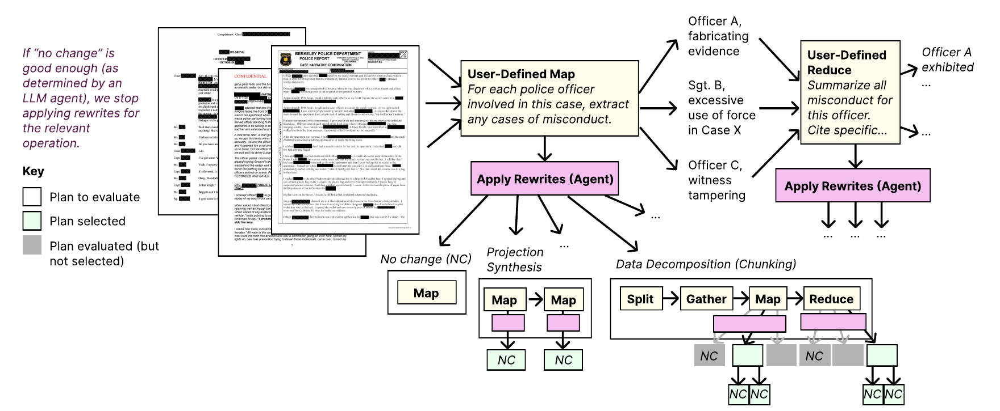
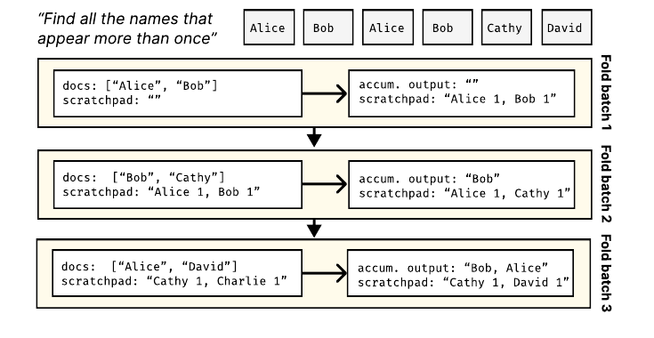
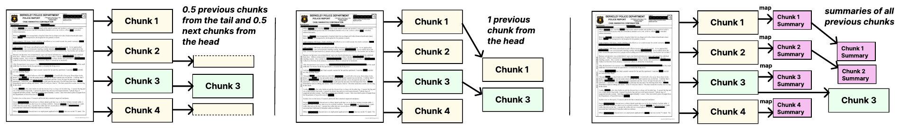
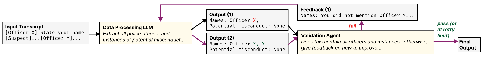
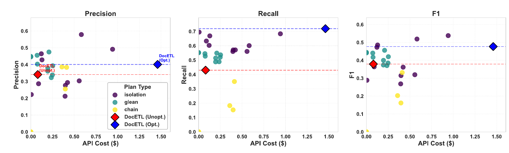

# DocETL: Agentic Query Rewriting and Evaluation for Complex Document Processing（中文译文）

## 译者说明

本文依据同目录的 `source.pdf` 翻译。章节、图表、公式、算法、代码与参考文献按原文结构保留。

## 作者与机构

Shreya Shankar¹，Tristan Chambers²，Tarak Shah²，Aditya G. Parameswaran¹，Eugene Wu³

¹ 加州大学伯克利分校电子工程与计算机科学系（UC Berkeley EECS）

² BIDS 警务记录访问项目（BIDS Police Records Access Project）

³ 哥伦比亚大学（Columbia University）

联系邮箱：`{shreyashankar,tristan.chambers,tarak_shah,adityagp}@berkeley.edu`，`ewu@cs.columbia.edu`

## 摘要

分析非结构化数据一直是数据处理领域的一项长期挑战。近期研究提出了若干由大语言模型（Large Language Model，LLM）驱动的声明式非结构化数据处理框架，但它们通常在一次 LLM 调用中原样执行用户指定的操作，关注成本而非准确性。对于复杂任务，这会带来问题：即使提示词设计得很好，LLM 仍可能漏掉相关信息。例如，要从法律文档中可靠地抽取某一类条款的全部实例，通常必须分解任务、数据，或者同时分解二者。

我们提出 DocETL：一个在考虑 LLM 缺陷的同时优化复杂文档处理流水线的系统。DocETL 为用户提供声明式接口来定义这类流水线，并采用基于智能体的方法自动优化流水线；它既利用新颖的智能体式重写（我们称之为“重写指令”，rewrite directives），也利用一套优化与评估框架。我们引入了：（i）针对基于 LLM 的任务定制的流水线逻辑重写；（ii）由智能体引导的计划评估机制；以及（iii）一种考虑 LLM 执行延迟、能够高效找到有希望计划的优化算法。在四项真实世界的文档处理任务上，DocETL 相比强基线将准确性提升了 21%–80%。DocETL 已在 [docetl.org](https://docetl.org) 开源；截至 2025 年 3 月，它已在不同应用领域获得超过 1,700 个 GitHub star。

**PVLDB 引用格式：** Shreya Shankar, Tristan Chambers, Tarak Shah, Aditya G. Parameswaran, Eugene Wu. DocETL: Agentic Query Rewriting and Evaluation for Complex Document Processing. PVLDB, 18(9): 3035–3048, 2025. DOI: 10.14778/3746405.3746426。

**PVLDB 工件可用性：** 源代码、数据和/或其他工件已发布于 <https://github.com/ucbepic/docetl>。

## 1 引言

大语言模型（LLM）席卷了数据管理领域，其应用涵盖数据集成、调优、查询优化和数据清洗等方面 [12]。就在最近几个月，人们还开始关注使用 LLM 声明式处理非结构化数据的方法 [1, 29, 30, 38]。这些系统通常作为处理文本列的关系模型扩展来实现，并假设每行的文本片段都很短、很容易处理。因此，它们侧重于降低成本，同时尽量维持准确性不变。然而，在我们称为“复杂文档处理任务”的许多真实任务中，准确性本身可能成为严重瓶颈，从而限制实际效用。复杂性可能来自文档、处理任务的性质，或二者兼有。请看来自我们在警务记录访问项目中的合作者¹所提供的场景：

> **示例 1.1（警员不当行为识别）。** 伯克利调查报道项目的记者希望分析通过记录申请获得的大规模异构警务记录语料库，以发现不当行为和违反程序的模式。这些记录包括警务报告、庭审记录、内部事务报告、法医报告以及其他案件文件，单份往往长达数百页。分析过程需要从长文档中抽取关键信息，跨文档聚合信息以识别每名警员的行为模式，并生成突出可疑趋势的摘要。

示例 1.1 代表了法律、医学和社会科学等领域的复杂文档处理任务。考虑这个任务的简化版本：我们只想汇总每份复杂警务记录文档中提到的每名警员所扮演的角色，而每份文档都有数百页。该任务可以表示为一个单步 `map` 操作：将它应用于每份文档的 OCR 输出，在一次 LLM 调用中使用由用户提供的提示词来定义“不当行为”等术语。所有现有系统 [1, 29, 30, 38] 都只会原样执行这个 `map` 操作，对每份文档调用一次 LLM。也就是说，它们假定用户定义的操作由 LLM 执行时足够准确，因而主要关注成本。

但这个 `map` 操作可能因为多种原因而准确性不佳。首先，相关文档可能超过 LLM 的上下文限制；即使文档装得下，输出也可能漏掉某些不当行为实例，或包含虚假信息。近期研究表明，随着输入长度增长，LLM 性能会显著下降 [27]，原因包括模型会被无关上下文分散注意力 [47]，或只选择性关注某些部分 [31]，从而无法形成整体理解 [4, 22, 49, 56]。同期理论工作指出，这种性能退化来自 Transformer 架构本身的限制 [23, 39, 48]。虽然可以使用提示词编译 [26, 54] 来寻找更好的提示词，但这种方法依赖示例；示例可能根本不存在，也可能太长而无法放入上下文（例如一份长达数百页的示例文档）。无论如何，它并未解决 LLM 在复杂文档上执行复杂任务时的根本挑战。

我们的关键洞见是：LLM 输出的质量往往不足以支撑复杂数据处理，因此不能把用户提供的现有算子视为固定不变。相反，我们需要考虑新的重写方式，将复杂但容易出错的操作分解成一系列更简单、更准确的操作。对于我们的 `map` 示例，换一种操作序列就可能提高准确性。一种选择是 $\mathrm{map}\rightarrow\mathrm{map}$：第一个 `map` 删除输入文档中与不当行为无关的所有部分（例如医疗报告），第二个 `map` 则执行前述单步映射。或者，我们可以让第一个 `map` 把每连续 $L$ 个段落汇总为一个段落，同时保持第二个 `map` 不变。还有一种选择，是把单步 `map` 替换成我们所称的 $\mathrm{split}\rightarrow\mathrm{gather}\rightarrow\mathrm{map}\rightarrow\mathrm{reduce}$ 模式：先把文档切分成连续块；再为每个块收集前后各 $L$ 个相邻块，作为提示词中的上下文或背景；然后使用它的 $2L$ 个邻居作为背景上下文，生成每名警员的摘要（`map`）；最后在所有块上做全局汇总（`reduce`）。

然而，我们不能期待用户亲自把流水线重写成多种备选方案，再找出性能最好的一种。上一段仅介绍了大量潜在重写中的三种；每种重写又都能递归应用于流水线中的算子，因而形成一个看似无穷的选择集合。例如，对 $\mathrm{map}\rightarrow\mathrm{map}$ 流水线而言，第一个 `map` 可以做什么有许多种方案，相应提示词也有许多种。即使我们决定用第一个 `map` 每次汇总 $L$ 个块，正确的 $L$ 值也很难确定； $\mathrm{split}\rightarrow\mathrm{gather}\rightarrow\mathrm{map}\rightarrow\mathrm{reduce}$ 也有同样的问题。

此外，我们目前讨论的还只是示例 1.1 总体目标的第一步，即跨全部文档汇总不当行为。因此，我们可能还需要对文档执行 `reduce`，按警员分组并汇总不当行为抽取结果。但同一名警员在一份文档中可能被抽取为“Officer Smith”，在另一份中却是“J. Smith”，于是本应属于同一名警员的信息被拆成多个不完整摘要 [37]。这种实体消歧究竟该如何实现并不明显，且现有系统都不支持它。事实上，要判断两个同名警员是否为同一人，我们可能还需要原始文档中的额外上下文。最后，LLM 可能无法识别多份文档来自同一案件，从而使不当行为摘要对某些事件重复计数 [52]。总体而言，即使是 LLM 专家，也需要大量试验才能设计出准确的流水线，因为结果取决于数据、任务和 LLM 能力。这种复杂性凸显出系统自动探索并评估不同任务分解策略、为给定任务和数据集找到最有效流水线的必要性。



**图 1：** 为完成示例 1.1 任务而设计的流水线优化过程。图中展示了系统正在优化初始 `map` 操作的中间状态。DocETL 使用 LLM 依据新颖的重写指令合成新计划。流程从 LLM 验证器判断某个操作是否已充分优化开始；若没有，则继续重写。尤其是，当一次重写合成出新操作时，系统会立即对它做机会式优化，如嵌套的 “Apply Rewrites (Agent)” 矩形所示。

我们提出 DocETL，这是我们开发面向高准确性复杂文档处理的声明式系统的首次尝试。DocETL 提供基于 YAML 的声明式接口，用户可以用它编写包含 LLM 专用算子的流水线，其中包括两个新算子：用于实体解析的 `resolve`，以及在处理文档块时维持上下文的 `gather`。用户可以在高层指定流水线，DocETL 则负责分解、重写和优化。

如图 1 所示，DocETL 引入一个基于智能体的框架，把用户指定的流水线重写为备选方案。由于直接使用智能体容易出错，我们用由我们识别的新颖重写指令来引导智能体重写查询计划。我们之所以称它们为“指令”而不是“规则”，是因为它们是由 LLM 结合任务和数据特征解释的抽象指南，每条指令可以有无限多种具体实例。我们进一步使用智能体式框架评估所得流水线。由于评估可能很昂贵，我们开发了一种受 Cascades [16] 启发的优化方法：具体而言，我们以自顶向下的、基于规则的策略生成和评估等价计划空间，并机会式地把复杂或容易出错的操作分解（或重写）为简单操作。

DocETL 在 GitHub² 上开源。截至 2025 年 3 月，它已获得 1,700 多个 star，并被用于领域专用分析（如法律、气候科学）、企业与个人生产力场景（如分析客户支持工单和电子邮件）等流水线；相应 Discord 服务器已有 400 多名用户加入。

总体而言，由于搜索空间无限、LLM 具有非确定性、文本边界模糊且任务专用成功标准存在歧义，不可能找到最优的复杂数据处理流水线。然而，即使面对这种困难设置，DocETL 仍能产生对实际需求足够准确的流水线，我们在各领域获得的采用也证明了这一点。DocETL 之所以能做到，是因为它以受约束的方式利用 LLM 智能体的能力，将一组强大而紧凑的重写指令、可验证处理单元的分解，以及对搜索空间的机会式自顶向下探索结合起来。

我们在本文中作出以下贡献：

1. **新颖的重写指令与智能体驱动的重写。** 我们识别出 13 条为基于 LLM 的算子设计的新重写指令，以应对复杂文档处理中特有的挑战。与传统重写规则不同，这些指令由 LLM 智能体实现。当一条规则适用于流水线的一部分时，智能体会为新操作合成合适的提示词和参数。例如，把“汇总不当行为实例”操作分解成多个操作时，智能体可能创建两步：先“按特定类型（例如过度使用武力）列出不当行为实例”，再“汇总每个已列出的实例”，并为每步制作相应提示词。
2. **智能体驱动的计划评估。** 我们还使用 LLM 智能体为每个操作合成任务专用验证提示词，并据此评估输出质量。例如，为验证一份不当行为摘要，智能体可能创建提示词：“这份摘要是否包含文档中的全部不当行为实例？”或者：“提到的所有实例是否确实存在于文档中？”智能体随后在样本数据上执行计划，并使用这些定制提示词评估输出。整个过程无需用户提供或人工验证示例。
3. **机会式子计划优化。** 与生成并评估大量可能计划的传统查询优化器 [6] 不同，我们采用图 1 所示的机会式自顶向下搜索策略：使用重写指令把算子分解成新算子时，立即优化每个新算子。我们先根据前述验证判断每个新算子是否足够准确；如果足够准确，就不再优化它，而把注意力转向其他算子。这样，我们会机会式分解尚不够准确的算子。由于 LLM 操作固有的高延迟，枚举并评估所有理论上可能的计划会耗时过长，因而必须采用这种方法。

第 2 节中，我们介绍 DocETL 的编程模型和算子；第 3 节介绍我们新的、以 LLM 为中心的重写指令；第 4 节介绍用于应用这些指令并评估所得计划的智能体式优化器，以及我们的整体优化框架。第 5 节中，我们给出初步评估，并证明 DocETL 在四项非结构化文档分析任务上找到的计划比基线准确 21%–80%。第 6 节中，我们讨论相关工作。

¹ <https://bids.berkeley.edu/california-police-records-access-project>

² <https://github.com/ucbepic/docetl>

## 2 DocETL DSL 与算子

本节介绍 DocETL 的编程模型和算子。

### 2.1 编程模型

DocETL 处理文档集合。文档由一组（或字典形式的）键值对构成，以 JSON 对象表示。例如，一份警务记录可以包含多组键值对：一个键对应 PDF 的 OCR 输出，其他键则保存机构、文件名或创建日期等元数据。文档集合或数据集是一个 JSON 数组。这种数据表示使我们能够处理结构化程度不同的各种数据类型，也能在操作提示词中方便地引用数据。文档还可以嵌套，例如一份警务记录可能包含 `related_documents` 数组，其中每个元素都包含进一步嵌套的证人证词或证据日志。

**DocETL DSL。** DocETL 使用 YAML 作为定义数据处理流水线的领域专用语言（DSL），原因有四。第一，YAML 能灵活容纳复杂的多行提示词、示例、输出模式和验证机制，同时可以把格式与 Jinja [35] 参数交织在一起。第二，YAML 便于人类阅读，不要求大量编码经验。第三，业界通常使用它描述数据流水线（Apache Airflow、dbt、Prefect）和服务（Kubernetes、Docker、Circle/GitLab CI/CD）。最后，YAML 是一种简单的中间格式，可用于表示经 DocETL 优化、供人检查的流水线，也可服务于我们的无代码界面。不过，我们的优化技术并不依赖 YAML，也可用于其他框架。

**DocETL 流水线。** 以 YAML 表示的 DocETL 流水线描述一串操作。每个操作都指定算子类型、输入源、提示词模板和输出模式。输入源既可以是原始数据集，也可以是前一算子的输出。根据输入基数是一还是多，我们分别用预定义变量 `input` 或 `inputs` 引用输入。流水线以数据集定义作为初始输入。算子处理数据后，生成符合其模式的输出，供后续算子继续使用。这种结构支持灵活、模块化的流水线组合。DocETL 支持为整个流水线设置默认模型，也允许逐操作指定模型。

**容错。** 在流水线中对许多输入文档执行 LLM 算子时，个别操作有时会无法遵从给定提示词。先前工作假定 LLM 输出可靠 [1, 30, 38]，DocETL 则明确处理这种可变性：用户可以为每个算子指定引用文档和输出属性、结果为真或假的 Python 验证表达式。如果任一验证失败，该操作便重试，并利用失败上下文提高后续尝试成功的可能性。

### 2.2 LLM 驱动的算子

这里，我们介绍 DocETL 的 LLM 驱动算子。表 1 汇总了我们的算子；详细语法见我们的文档³，更完整的描述见我们的技术报告 [43]。大多数算子都是经典数据处理算子的 LLM 版本；不过，我们引入了新的 `resolve` 算子，用于规范化某些属性值的不同变体。为使描述简洁，我们在下文中经常把“文档”（由键值对构成、作为数据集基本处理单元的 JSON 对象）与它的文本内容（通常是 JSON 对象某个键对应的值）混用。

**表 1：DocETL 算子套件。** 算子分为利用 LLM 做语义处理的算子，以及负责数据操作的辅助算子（以 * 标记）。对每个算子，表中给出所需的用户配置和功能概述。

| 算子 | 用户配置 | 功能概述 |
| --- | --- | --- |
| Map | 提示词、输出模式 | 使用 LLM 对每份文档执行变换，将结果的新键加入模式（也可以省略已有键）。 |
| Parallel Map | 多个提示词、多个输出模式 | 用 LLM 并行执行每份文档上的多个独立变换，把新键加入模式。 |
| Reduce | 分组键、提示词、输出模式 | 使用 LLM 聚合键值相同的文档组，为每个不同键值生成一份新文档。 |
| Filter | 返回布尔值的提示词 | 使用 LLM 逐文档判断条件，只保留条件为真的文档。 |
| Resolve | 比较提示词、解析提示词 | 用 LLM 识别文档间给定键的模糊匹配值，为每组值生成规范版本，并在文档中原位替换。 |
| Equijoin | 比较提示词 | 用 LLM 基于对应键的模糊/语义匹配判断两个数据集中的文档对是否应连接。 |
| Unnest* | 要展开的数组/字典字段 | 展平嵌套数据：从数组元素生成独立文档，或把嵌套字典字段合并到父文档。 |
| Split* | 切分键、块大小 | 按 token 数或其他标准把文档切成小块，生成与块数相同的新文档。 |
| Gather* | 上下文窗口配置 | 依据指定配置（如前块数、后块数）把周围块的上下文加入每个块，文档总数不变。 |

#### 2.2.1 Map

`map` 算子把 LLM 驱动的投影（也称语义投影）应用到数据集中的每份文档。下面是一项 `map` 操作的示例：

```yaml
- name: extract_officer_misconduct
  type: map
  output:
    schema:
      misconduct: "list[{officer_name: str, misconduct_instance: str}]"
  prompt: |
    Analyze the following police record:
    {{ input.document }}
    Extract any instances of officer misconduct or procedural violations. For
    each instance, provide the name of the officer involved and a brief
    description of the misconduct or violation.
```

该操作使用指定提示词独立处理每份文档。输出模式是一个键值对列表，其中包含警员姓名和不当行为实例。这种灵活的半结构化输出格式允许每份文档具有不同数量的不当行为实例。DocETL 支持采用 Jinja2 模板的提示词，其中 `{{ input.document }}` 用于插入当前文档内容；它还支持带条件逻辑的复杂提示词，正如我们稍后会看到的。应用操作时，`map` 会把输出模式指定的新属性添加到现有文档。用户也可以指定 `drop_keys` 列表来覆盖此行为，只返回属性子集。

DocETL 还支持 parallel map，可在每份文档上并行应用多个独立变换。例如，一个变换可以抽取不当行为，另一个变换可以汇总相关政策。每项操作都用新属性扩充输入文档，而且可以并行而不是串行运行。

#### 2.2.2 Reduce

`reduce` 算子依据一组用户指定的键跨多份文档聚合信息，最终为每种唯一属性值组合产生一份输出文档。例如，对警务报告做 `reduce` 时，键集合可以包含 `officer_name` 和 `incident_date`，从而把同一名警员在某一日期涉及的所有报告分到一组。用户可以定义提示词模板，通过 `{{ inputs }}` 访问分组后的文档（即共享同一键值的一组文档），并通过 `{{ reduce_key }}` 访问当前组的具体键值。默认情况下，DocETL 假定 `reduce` 操作满足结合律，即处理文档的顺序不影响结果；若顺序重要，用户可以在操作定义中指定 `associative: False`。

如果某个文档组太大，LLM 就难以正确处理。此时可以使用折叠（folding）或分层合并，以可控批次处理数据 [7, 17]。折叠串行处理输入，每次更新累加器（或聚合值）；分层合并则以树状结构递归聚合输入。DocETL 当前采用批量折叠：从空累加器开始，每次顺序折入一批（多于一份）文档。我们选择折叠，是因为它既支持不满足结合律的 `reduce` 操作，也能保持输入原始顺序。例如，汇总教材的一章时，DocETL 可以把文本切成若干节，分别汇总各节，再用 `reduce` 汇总这些节摘要；这一过程必须保留原始阅读顺序。构建流水线时，DocETL 会自动确定最佳折叠批大小。



**图 2：** `reduce` 的迭代折叠。每个批次以若干文档和当前 scratchpad 为输入（左），并更新 scratchpad 中的提及次数以及累积输出（右）。

为实现折叠，用户可以提供（或让 DocETL 生成）单独的 `fold_prompt`，它引用累积输出和下一批待折入输入。我们增强系统提示词，使 LLM 可以把额外说明写到 scratchpad [34]；已有研究表明，让模型保持状态有助于提高准确性。每次调用 LLM 时，我们都同时提供当前 scratchpad、累积输出和新输入。LLM 返回更新后的累积输出和 scratchpad，二者再传给下一次折叠操作。

图 2 展示了一项识别跨文档出现超过一次的人名的折叠任务。scratchpad 跟踪所有人名的提及次数。处理每批文档时，LLM 用新提及更新 scratchpad，并把累计达到多次的人加入累积输出。

#### 2.2.3 Resolve

`resolve` 算子规范化文档间表示同一实体、但存在细微差异的一个或多个键。下面的 `resolve` 对第 2.2.1 节 `map` 抽取出的警员姓名变体进行协调：

```yaml
- name: resolve_officer_names
  type: resolve
  comparison_prompt: |
    Compare the following two officers from police records. Officer {{
    input1.officer_name }} mentioned in: {{ input1.record_txt }} and
    Officer {{ input2.officer_name }} mentioned in: {{ input2.record_txt
    }} Are these names referring to the same officer?
  resolution_prompt: |
    The following names correspond to the same officer:
    
    Name: {{ entry.officer_name }}
    
    Provide an officer name (first and last) that best represents the matches.
  output:
    schema:
      officer_name: string
```

用户只需指定如何检测变体以及如何将其规范化。例如，`comparison_prompt` 判断两个警员姓名是否属于同一人，`resolution_prompt` 则从列表中选出规范警员姓名。DocETL 随后用这些提示词比较并解析警员姓名。操作之后，文档数量保持不变；输出模式指定每份文档中要替换或新增的属性。

`resolve` 常跟在展开嵌套数据结构的 `unnest`（第 2.3.1 节）之后。例如，在我们的警员不当行为流水线中，展开后每份文档都有独立的 `officer_name` 和 `misconduct_instance` 键，于是可以对数据集中所有姓名提及做解析。用户无需在流水线中显式定义 `resolve`；为确保整个数据集中的实体引用一致，DocETL 会在需要时自动合成此操作。我们将在第 4.1 节讨论 DocETL 如何评估这种重写的收益。

#### 2.2.4 其他算子

以下算子虽可用 `map` 和 `reduce` 表达，但为了方便仍被单独提供。未来我们计划增加其他算子（例如 `sort`）。`filter` 根据 LLM 提示词指定的条件保留文档；该提示词采用 Jinja2 模板，可引用一个或多个文档键。`equijoin` 使用 `comparison_prompt` 成对比较两个数据集的文档，提示 LLM 返回二元答案，并把文档分别称作 `left` 和 `right`。`equijoin` 不需要输出模式，因为结果直接合并左右文档。

### 2.3 辅助算子

我们介绍三个不由 LLM 驱动、而作为辅助步骤表达复杂任务的基本算子。

#### 2.3.1 Unnest

`unnest` 把数组或字典展开成单独元素。例如，如果 `map` 从警务询问记录中抽取多个警员姓名，每份文档可能包含姓名数组。为了跨多份询问记录分别分析每名警员，`unnest` 会为每个姓名生成独立文档，从而有效展平数据。它还可以提升嵌套字典中的属性，使后续处理可以直接访问这些属性。

#### 2.3.2 Split

`split` 把长文本切成较小块。它需要切分键（文本属性）、切分方式（按 token 或分隔符）以及该方式的专用参数（例如分隔符或块大小）。它为每个块生成唯一标识符和序号，以便在流水线后续重新组装。结果文档继承原始文档的其他属性。

#### 2.3.3 Gather

`gather` 通过为每个块补充理解其内容所需的周边信息，与 `split` 配合使用。从概念上说，`gather` 类似 SQL 窗口：二者都允许按顺序访问当前行或块之外的数据；但 `gather` 专门面向基于 LLM 的处理。例如，一段访谈记录切块后，包含“他”或“她”等代词的块可能缺少说话者姓名，因而难以理解。

图 3 展示了渲染块的不同方式。`gather` 在渲染上下文信息时非常灵活，可以包含完整块（图中 ii）、块的一部分（i），或块的变换结果（例如摘要，iii）。尤其是，在 `split` 与 `gather` 之间还可以插入 `map`，先生成摘要等额外上下文，再用它扩充每个块，之后才做下游处理。输出会为每份输入文档新增一个属性，其中保存带周边上下文的渲染块，并用特殊标签区分当前块和周边上下文。



**图 3：** Split-Gather 流水线：处理单份长文档的示意图。`split` 把长文档拆成可管理的块；`gather` 再用周边块的相关上下文扩充每个块。图中展示了渲染块 3 的三种方式（即三种 `gather` 配置）：（i）包含周围块的部分内容；（ii）包含第一个块的完整内容；（iii）包含此前所有块的摘要。

总体而言，在设计 DocETL DSL 时，我们把抽取、汇总等单文档变换统一归入 `map` 和 `filter`，让用户通过提示词表达意图，而不必学习许多专用算子。但对跨文档操作，我们创建了表达特定处理模式的独立算子。例如，理论上可以用 `equijoin`、`reduce` 和另一个 `equijoin` 实现 `resolve`；专用算子却能让我们知道用户的真实意图是实体解析，从而使我们能够更好地优化流水线。我们还区分 `gather` 与 `reduce`，因为二者目的不同：`reduce` 做多对一聚合，`gather` 则保持基数不变并用上下文丰富文档，类似 SQL 窗口函数。

³ <https://www.docetl.org/>

## 3 重写指令

现在，我们介绍 DocETL 当前支持的重写指令。我们称它们为“指令”，是为了强调它们属于语义多少有些模糊、可由 LLM 智能体以多种方式具体实例化的抽象框架，而不是更具体、完整、稳健的“规则”。这些指令主要通过对单个操作做逻辑分解来优化 DocETL 流水线的输出质量。我们重点讨论 `map`、`reduce` 和 `equijoin` 的重写指令；`filter` 也可以套用 `map` 重写指令。我们把指令分成三类：数据分解、投影合成和以 LLM 为中心的改进。

在本节中，我们采用如下记号：给定算子 $A$ 和 $B$，我们以 $A \rightarrow B$ 表示二者组合，其中 $(A \rightarrow B)(D)=B(A(D))$。我们以 $A\mathbin{\Vert}B$ 表示 $A$ 与 $B$ 在同一输入上独立执行。为便于阅读，我们有时省略实参，例如 $\mathrm{Map} _ x(D)$ 简写为 $\mathrm{Map} _ x$；同一个算子不在多处出现时，我们也省略下标。我们还把文档的文本内容（通常保存在某个属性中）与文档本身混称。箭头 $\Rightarrow$ 表示把左侧算子（或算子序列）进行语义重写，得到右侧形式。

### 3.1 数据分解

处理大文档，或文档太多、无法全部装入一个提示词并得到准确结果时，数据分解至关重要。我们介绍两类重写指令：文档分块和多级聚合。

#### 3.1.1 文档分块（Map）

大文档常常超过 LLM 上下文窗口或有效推理能力，导致结果不完整或不一致。我们为这种情况设计的主要重写指令称为 `split` 指令：

$$
\mathrm{Map} _ x \Rightarrow
\text{(2)}\ \mathrm{Split}
\xrightarrow{(3)}
\mathrm{Gather}
\xrightarrow{(4)}
\mathrm{Map} _ y
\xrightarrow{(5)}
\mathrm{Reduce}
\qquad \text{(1)}
$$

忽略图中的紫色标注，该指令将 `map` 重写为：把文档切成多个块；为每个块收集周边上下文；逐块应用修改后的 `map`；最后 `reduce` 结果。 $\mathrm{Map} _ y$ 的提示词可以明确说明它只处理原文的一部分。为了提供更大灵活性和更多优化机会，我们为上述步骤（2）–（5）引入更小的分解指令：

$$
\mathrm{Split} \Rightarrow \mathrm{Map} \rightarrow \mathrm{Split}
\qquad \text{(2)}
$$

$$
\mathrm{Split} \rightarrow \mathrm{Gather}
\Rightarrow
\mathrm{Split} \rightarrow
(\mathrm{Map} _ s\mathbin{\Vert}\mathrm{Map} _ h)
\rightarrow \mathrm{Gather}
\qquad \text{(3)}
$$

$$
\mathrm{Gather} \Rightarrow \mathrm{Gather} \rightarrow \mathrm{Filter}
\qquad \text{(4)}
$$

$$
\mathrm{Gather} \rightarrow \mathrm{Map}
\Rightarrow
\mathrm{Gather} \rightarrow \mathrm{Map} \rightarrow \mathrm{Unnest}
\qquad \text{(5)}
$$

切分文档时，三类上下文尤其有用：文档级元数据、层次信息和相邻块摘要。上述较小的分解指令处理这些以及其他文档处理问题：

- **文档级元数据抽取（2）。** 在切分前插入 `map`，抽取与所有块都有关的元数据。例如，分析法律合同时，我们可以从第一页抽取合同日期和当事方，并把这些信息传给每个块，供后续 `gather` 渲染。
- **标题谱系上下文与汇总（3）。** 引入两个独立 `map`： $\mathrm{Map} _ h$ 抽取标题等层次信息， $\mathrm{Map} _ s$ 生成块摘要。这样，我们可以为每个块提供相应层次上下文（例如块内标题的父标题）和/或此前内容的摘要。
- **块过滤（4）。** 文档并非所有部分都与处理任务有关。该指令在收集上下文后插入 `filter`，使我们能够排除无关块。过滤器可以推导得到；例如处理科研论文时，如果致谢和参考文献与分析任务无关，我们可以滤掉它们，但需要时仍可把它们作为其他块的上下文。
- **展平嵌套结果（5）。** 对带上下文的块做 `map` 可能产生嵌套结果。该指令插入 `unnest` 来展平结果，简化后续处理。例如各块分别产生实体列表时，展开操作会把这些列表展平成跨全部块的单一实体集合。

#### 3.1.2 多级聚合（Reduce）

大规模聚合可以受益于分层方法：先以更细粒度聚合，再上卷到目标层级。这种分解基于数据中的语义层次：

$$
\mathrm{Reduce} _ {K,x}
\Rightarrow
\mathrm{Reduce} _ {K \cup K',y}
\rightarrow
\mathrm{Reduce} _ {K,z}
\qquad \text{(6)}
$$

其中， $K$ 是 `reduce` 键，例如 $K=\lbrace{}\mathrm{state}\rbrace{}$； $K'$ 表示实现更细粒度所需的附加键，例如 $K'=\lbrace{}\mathrm{city}\rbrace{}$； $y$ 和 $z$ 分别是子 `reduce` 和最终 `reduce` 的 LLM 驱动聚合。例如，按州汇总社交媒体帖文中的投票模式时，我们可以先按州和城市聚合，即 $\mathrm{Reduce} _ {\lbrace{}\mathrm{state},\mathrm{city}\rbrace{},y}$，再把城市级摘要合并到州级，即 $\mathrm{Reduce} _ {\lbrace{}\mathrm{state}\rbrace{},z}$。该方法能够保留单次大规模聚合可能丢失的细微差别，也允许验证中间结果。

### 3.2 以 LLM 为中心的改进

我们介绍两类利用 LLM 独特行为进行优化的重写指令：gleaning（拾遗式精炼）和重复键解析。

#### 3.2.1 Gleaning（Map 与 Reduce）

对于这条指令，我们基于如下洞见：把此前的输入和输出提供给 LLM，并要求改进输出，LLM 就能迭代精炼结果。迭代精炼此前已用于知识图谱实体抽取 [10]，我们把它推广为可用于任意 `map` 或 `reduce` 任务的重写指令。我们把这一方法称为 gleaning；它通过彼此分离的数据处理步骤和验证器 LLM 步骤，迭代改善输出质量。我们把 `map` 操作的 gleaning 过程形式化为：

$$
\mathrm{Map}
\Rightarrow
\mathrm{Map} \rightarrow
(\mathrm{Map} _ v \rightarrow \mathrm{Map} _ i)^{\leq k}
\qquad \text{(7)}
$$

其中 $k$ 是最大精炼迭代次数， $\mathrm{Map} _ v$ 是验证操作， $\mathrm{Map} _ i$ 是精炼操作。流程如下：

1. **初始化：** 在输入文档上运行原始 `map`。
2. **评估：** 单独的验证器 $\mathrm{Map} _ v$ 根据原始提示词、初始化输出和任务专用验证提示词检查结果。验证器判断是否需要精炼；若需要，还描述应如何改进。
3. **精炼：** 我们使用 $\mathrm{Map} _ i$ 根据验证器反馈改进上一轮输出。关键是，这一步保留聊天历史，包括原始提示词、它此前的响应以及验证器反馈，因此能够迭代精炼。
4. **迭代：** 最多重复 $k$ 次，或者在不再需要精炼时停止。

`reduce` 可采用相似方法：

$$
\mathrm{Reduce}
\Rightarrow
\mathrm{Reduce} \rightarrow
(\mathrm{Map} _ v \rightarrow \mathrm{Reduce} _ i)^{\leq k}
\qquad \text{(8)}
$$

对 `reduce` 而言，精炼发生在组一级，而不是单份文档一级。



**图 4：** $k=1$ 轮精炼时的 gleaning 过程。LLM 首先从输入访谈中抽取信息，但输出漏掉了警员 Y。由 LLM 驱动的验证智能体识别出这一遗漏并给出反馈。原 LLM 在第二轮处理中纳入反馈（紫色箭头），得到更完整的最终输出，其中同时包含警员 X 和警员 Y。

#### 3.2.2 重复键解析（Reduce）

LLM 驱动的数据处理中，一个重要挑战是 LLM 输出没有规范化，可能包含许多语义重复项，因而难以正确分组、聚合和汇总。为处理 `reduce` 键中的语义重复项，特别是来自 LLM 操作的键，我们引入 `resolve`：

$$
\mathrm{Reduce} _ {K,x}
\Rightarrow
(\mathrm{Resolve} _ {k_1}\mathbin{\Vert}\cdots\mathbin{\Vert}\mathrm{Resolve} _ {k_m})
\rightarrow
\mathrm{Reduce} _ {K,x}
\qquad \text{(9)}
$$

其中 $\lbrace{}k _ 1,\ldots,k _ m\rbrace{}\subseteq K$，而且每个 $k _ i$ 都是待解析键的互不相交子集。每个 $\mathrm{Resolve} _ {k_i}$ 都把键 $k _ i$ 的语义等价值合并起来。我们引入这条重写指令，以处理 LLM 输出固有的变化：LLM 为 `reduce` 生成键时，可能产生语义等价而语法不同的值。例如，“New York City”“NYC”和“The Big Apple”可能都指同一个实体。如果不做解析，它们会被当成独立键，造成聚合错误。

### 3.3 投影合成

投影合成策略受数据库系统投影下推优化启发。选择及选择下推也可以合成，但我们没有实现，因为我们发现智能体并不善于判断某些数据是否与查询有关：它们过度受提示词措辞影响，并倾向于纳入过多内容。此外，基于 LLM 的选择与 `map` 成本相同，二者都必须对每份文档调用一次 LLM。因此，我们专注于通过某种投影缩减文档大小的 `map`。我们介绍以下投影合成指令：

$$
\mathrm{Map} _ x
\Rightarrow
\mathrm{Map} _ {x_1} \rightarrow \mathrm{Map} _ {x_2}
\rightarrow \cdots \rightarrow \mathrm{Map} _ {x_n}
\qquad \text{(10)}
$$

$$
\mathrm{Map} _ y
\Rightarrow
(\mathrm{Map} _ {y_1}\mathbin{\Vert}\mathrm{Map} _ {y_2}
\mathbin{\Vert}\cdots\mathbin{\Vert}\mathrm{Map} _ {y_m})
\rightarrow \mathrm{Reduce}
\qquad \text{(11)}
$$

$$
\mathrm{Reduce} _ {K,x}
\Rightarrow
\mathrm{Map} _ y \rightarrow \mathrm{Reduce} _ {K,z}
\qquad \text{(12)}
$$

$$
\mathrm{Equijoin} _ x
\Rightarrow
(\mathrm{Map} _ {y,L}\mathbin{\Vert}\mathrm{Map} _ {z,R})
\rightarrow \mathrm{Equijoin} _ w
\qquad \text{(13)}
$$

- **串接（10）。** 对包含多条指令的复杂 `map`，把简单投影串接起来，每个 $\mathrm{Map} _ {x_i}$ 都基于前一步结果。法律文档分析可以依次抽取条款、汇总并生成建议。
- **隔离（11）。** 对包含独立子任务的 `map`，把它们拆成并行投影，最后执行 `reduce`。例如，客户反馈分析可以把情感分类、特征识别和紧急问题标记分别投影。
- **预聚合（12）。** 在 `reduce` 前过滤并投影每份文档中的相关数据，同时提高效率和聚合质量。例如按产品类别汇总运输反馈时，可以先把每条详细评论投影成简洁的运输意见摘要，再聚合。
- **预连接（13）。** 在复杂 `equijoin` 前预处理文档。直接比较计算代价很高时，这会很有用。例如，把科研论文与资助机会匹配时，可以先把论文投影成少量关键主题，把资助说明投影成评判标准，再做连接。

不同算子各自拥有指令（例如 `reduce` 前的 `map`、`equijoin` 前的 `map`），是因为指令适用条件因算子而异。例如做预连接时，LLM 智能体会评估当前键是否充分以及是否存在长/大属性；若有益，就生成提示词来创建更相关的数据表示键值对。其他算子同样由智能体考虑算子专用因素，判断指令是否适用。

## 4 优化器

这里，我们详述 DocETL 的查询规划与优化过程。用户在 `pipeline.yaml` 中定义流水线，再运行 `docetl build pipeline.yaml`，生成含有优化后流水线的新 YAML 文件。DocETL 的优化包含两类智能体：**生成智能体**应用逻辑重写指令创建候选计划（图 1 中 “Apply Rewrites (Agent)” 框）；**验证智能体**生成定制提示词来评估这些计划的质量。对每个操作或子流水线，验证智能体在数据样本上评估候选子计划并选择最优者；图 1 以绿色表示选中的计划，以灰色表示已评估但未选中的计划。下面我们将依次介绍这两个步骤。

我们的框架类似 Cascades [16] 等自顶向下方法，但扩展标准（使用指令）以及使用基于 LLM 的验证评估子计划的方式不同。传统的基于代价的优化器关注成本，而我们关注准确性；成本和延迟约束留待未来工作。

### 4.1 优化方法

如图 1 所示，DocETL 采用同时考虑单个操作和子流水线的自顶向下优化方法。我们从左到右推进，并递归分解由 LLM 验证器判断为准确性不足的操作。我们将流程概括如下：

1. **遍历流水线并识别子流水线。** 我们从输入到输出（从左向右）遍历。对每个操作，我们判断它与左侧已优化操作的某个后缀能否组成匹配任一重写指令的子流水线。如果找不到匹配，我们就把当前操作本身视为待优化的单操作子流水线。对识别出的每个子流水线：（i）我们使用验证智能体合成与该子流水线所述具体任务相适应的定制验证提示词；（ii）验证智能体用该提示词检查输出样本，判断是否还有改进空间。如果当前实现令人满意，我们就不再优化，转向下一个操作；这对应图 1 中“不变”（NC）路径。伪代码见我们的技术报告 [43]。
2. **应用重写指令并递归优化。** 需要优化时，我们对子流水线或单个操作应用匹配的重写指令。如图 1 所示，我们探索第 3 节中的重写指令。对于每条适用指令，LLM 智能体都会合成符合该指令的新操作和配置（例如提示词、输出模式）。每创建一个新操作，我们就立即递归优化它，之后再继续当前优化过程；图 1 中嵌套的 “Apply Rewrites” 矩形即表示这一点。
3. **评估并选择计划。** 重写指令可能产生多个候选计划。我们采用两阶段评估选择最佳计划。第一阶段，我们在数据样本上执行每个计划，并使用验证智能体逐文档评分，再计算每个计划的平均分；随后我们选出得分最高的 $k$ 个计划（当前 $k=6$）进入下一阶段。第二阶段，智能体在这些头部计划间做成对比较，相互对照其输出；“胜出”次数最多的计划被选为当前子流水线或操作的最优计划，对应图 1 中的绿色框。成对比较适合评估相对质量 [32, 37]，但候选计划可能超过 100 个，无法比较所有计划对；这种混合方法在效率和准确性间取得了平衡。
4. **更新流水线。** 我们把选中的优化计划整合进流水线，替换原操作或子流水线。

为了执行并比较候选计划，我们按文档大小抽样，较大文档的入选概率更高。优化每个子流水线时，我们跟踪它的选择率（输出文档数/输入文档数），并用该比率调整后续操作的样本量。例如，前两个操作的选择率分别为 0.5 和 0.3 时，在优化第三个操作时，我们会把初始样本量扩大 $(1/0.5/0.3)\approx 6.67$ 倍。这样，即使选择性操作过滤了数据，后续优化仍有足够样本。

不过，抽样文档未必充分代表完整数据集。例如，样本都在 LLM 上下文限制内，但完整数据集中某些文档超出限制时，我们在完整执行时仍可能遇到错误。我们正在开发在流水线执行期间相应调整计划的方法。

### 4.2 智能体与系统实现

我们的生成智能体应用重写指令创建多样化候选计划，合成同时涵盖逻辑选择（如提示词、输出模式）和物理参数（如块大小、批大小）的配置，类似传统 DBMS 维持逻辑与物理分离 [15]。对物理参数，直接问 LLM 最优值并不可靠，例如询问“这份文档的最佳块大小是多少？”因此，我们的优化器通过生成候选配置、在抽样数据上执行、按任务专用标准排序来经验性选择参数。

为确定 `map` 分解时的块大小，DocETL 动态生成 8 个候选块大小（原文如此；随后列出的两组数量分别为 5 个和 6 个）：其中 5 个是 LLM token 上限的 15%–75%（均匀采样），另 6 个是平均文档长度的 15%–100%（均匀采样）。对可能的 `gather`，DocETL 为每个块大小评估多种周边上下文策略：（1）没有周边上下文；（2）前一个块；（3）前一个块和后一个块；（4）前序块数量与“文档大小/块大小”比值的平方根成比例；（5）对于很小的块（小于文档大小的 10%），取前 5 个块和后 2 个块；（6）对于小块（小于文档大小的 20%），取此前所有块的摘要。

为确定折叠批大小，DocETL 依据模型最大 token 上限的特定比例经验性生成 5 个候选配置：20%、40%、60%、75% 和 90%。优化期间，我们的 LLM 智能体生成两类阻塞规则，减少匹配文档时不必要的 LLM 比较：一是基于嵌入的过滤，只比较余弦相似度高于阈值的文档（阈值被调至召回 95% 的真实匹配）；二是定制 Python 过滤器，用于排除显然不匹配的文档。各参数选择方法的详细策略和经验观察见我们的技术报告 [43]。

我们的验证智能体围绕准确性、精确率和召回率，为各算子合成显式验证标准，以评估子流水线的有效性，而不只是检查是否遵守操作提示词。智能体会生成多项标准来评估输出的不同方面，例如对警员不当行为抽取，同时检查支持证据是否存在、是否没有幻觉。通过把验证分解成具体而不同的可测试性质，我们可以提高评估可靠性 [44, 46]。智能体还在数据样本上依据这些标准评估输出，判断是否需要继续优化，并比较计划。我们的方法有助于控制 LLM 验证的不确定性，同时仍适用于传统准确性指标和 ground truth 未定义的应用。

DocETL 默认使用 GPT-4o 做优化（也支持 GPT-4o-mini）；流水线执行则支持任何具备工具调用能力的 LLM。系统以 Python 实现，包含 16K 行代码；`resolve` 和 `equijoin` 执行中的阻塞规则等性能关键部件以 Rust 实现，包含 2K 行代码。

## 5 评估

我们的评估主要要证明：在不需要训练标签或开发者干预的情况下，DocETL 的重写指令和优化框架能够提升我们自动分析复杂文档的能力。虽然不可能找到最优计划，但我们证明了 DocETL 通过系统性分解任务和文档、探索处理策略空间，能够得到足够准确的计划。

总体而言，我们发现 DocETL 计划在精确率、召回率和 F1 等任务专用准确性指标上提升了 21%–80%。我们首先考虑三项复杂文档处理任务：法律合同分析、解密文章分析和电子游戏评论分析（第 5.1–5.3 节）。这些任务分别代表不同挑战：从非结构化数据的语义内容中抽取结构化信息；解析实体并跨文档汇总其信息；在长文档上推理时间一致性。

对法律合同分析（第 5.1 节），我们同时比较近期的 LLM 驱动系统 LOTUS [38]、Palimpzest [30]、Aryn [1]，以及使用 spaCy [20] 或 NLTK [5] 的传统 NLP 基线。对电子游戏评论（第 5.2 节）和解密文章（第 5.3 节）任务，我们只比较非 LLM 基线，因为 LOTUS、Palimpzest 和 Aryn 不支持实体解析，也不支持超过 LLM 上下文窗口的文档。对每项任务，我们的评估既包括任务专用指标（精确率、召回率的定制变体），也包括衡量事实一致性的幻觉率。随后，我们在 Patel 等人 [38] 提出的高难度 Biodex 文本分类任务上评估 DocETL；我们的优化流水线的排名精确率比基线高 33%–80%（第 5.4 节）。最后，我们通过案例研究考察 DocETL 在真实警员不当行为识别中的应用、LLM 智能体重写的有效性，以及用户采用情况（第 5.5 节）。

对所有流水线，我们都使用 OpenAI 的 `gpt-4o-mini` 模型，并在一台配备 M1 芯片的 2021 款 MacBook Pro 上运行实验。DocETL 优化器也使用 `gpt-4o-mini`，只有第 5.4 节 Biodex 任务使用 `gpt-4o`。更多实现细节见我们的技术报告 [43]。所有实验均在 2024 年 9 月进行；Aryn 和非 LLM 基线结果另于 2025 年 2 月采集。需要注意，各系统自相应评估日期以来都可能已有重大变化。

### 5.1 法律合同分析

Contract Understanding Atticus Dataset（CUAD）[19] 包含 510 份法律合同，专家为其中 41 类条款做了标注。这些类别既包括文档名称、当事方等基础信息，也包括最惠国待遇、知识产权所有权、终止后服务等复杂概念。任务是从每份合同中抽取每种相关条款的文本片段；并非所有合同都包含所有条款类型。

我们在前 50 份合同上评估，并把抽取结果与 ground truth 比较。若满足以下两个条件，抽取就视为正确：（i）条款类型匹配；（ii）抽取文本片段与 ground truth 片段的 Jaccard 相似度大于 0.15。该阈值既容许 LLM 输出存在差异，又能确保模型正确定位了条款。阈值设得相当低，是因为我们没有提供训练示例，LLM 并不知道应抽取多长的文本；但它又足够高，能确保存在某种匹配。我们还试过其他值，比较关系相近。我们测量精确率、召回率、F1 和幻觉率；幻觉率指抽取条款中不属于我们预定义的 41 类条款的比例。

#### 5.1.1 实现

我们采用五个基线，并列出优化后的 DocETL 计划：

1. **DocETL 基线。** 我们的未优化流水线只有一个 `map`，其提示词依据 41 类条款的单句描述抽取所有相关条款；输出模式指定由 `clause_type` 和 `text_span` 键组成的对象列表。流水线代码见我们的技术报告 [43]。
2. **LOTUS 基线。** 我们使用 LOTUS 的 `sem_map` 实现一条流水线，提示词与 DocETL 的 `map` 相同；由于 LOTUS 不支持显式输出模式，还要补充输出结构化指令。
3. **Palimpzest 基线。** 我们使用 Palimpzest 的 `convert` 算子实现抽取。Palimpzest 不让用户直接写提示词，而是让用户提供模式描述，系统再据此生成提示词。我们把条款类型描述放在模式的 `description` 中。
4. **非 LLM 基线。** 我们使用 spaCy [20] 编写程序，遍历所有条款类型，抽取语义最相似且相似度超过 0.9 的句子。我们分别使用 spaCy 的句子切分器和 `tok2vec` 模型进行句子切分和嵌入。
5. **Aryn 基线。** 我们使用 Aryn 的 `llm_query` 操作实现抽取，提示词与我们的 LOTUS 基线相同；为处理解析错误和格式不一致，采用与 LOTUS 相同的输出规范化流程。
6. **DocETL 优化计划。** DocETL 优化器把单个 `map` 变成隔离投影分解：21 个彼此独立的 `map`，每个抽取 1–3 个语义相关片段（例如把协议和生效日期放在同一组抽取），随后由一个 `reduce` 合并全部已抽取条款。值得注意的是，优化器选择了隔离投影（指令 11），而不是文档分块；这表明，即使面对长文档，LLM 也擅长集中抽取少量信息。

**表 2：法律合同分析结果。**

| 系统 | 平均精确率 | 平均召回率 | 平均 F1 | 平均字符数 | 平均幻觉率 |
| --- | ---: | ---: | ---: | ---: | ---: |
| DocETL（优化） | 0.401 | 0.719 | 0.477 | 162.60 | 0.000 |
| DocETL（未优化） | 0.341 | 0.430 | 0.379 | 49.35 | 0.072 |
| LOTUS | 0.402 | 0.471 | 0.393 | 46.301 | 0.073 |
| Palimpzest | 0.059 | 0.013 | 0.022 | 35.10 | 0.000 |
| Aryn | 0.450 | 0.370 | 0.352 | 49.56 | 0.069 |
| 非 LLM | 0.224 | 0.219 | 0.190 | 212.73 | 0.000 |

#### 5.1.2 结果

如表 2 所示，我们观察到以下结果。DocETL 优化计划显著优于所有基线：相比第二好的 LLM 计划 LOTUS，F1 提升 21.4%；相比未优化 DocETL，召回率提升 67%，而且没有幻觉。LOTUS、Aryn 和未优化 DocETL 的得分和幻觉率相近（6.9%–7.3%）。非 LLM 基线的得分远低于 LLM 方法，文本片段却更长，因为它只能以句子为粒度抽取，而“文档名称”或“协议日期”等短条款并不需要整句。有趣的是，Palimpzest 优化器为此任务选择了基于代码而非 LLM 的计划，这可能解释了它较低的得分。

虽然优化流水线的成本和运行时间更高（表 3），但我们优先考虑准确性，而它往往需要更多计算。更高的运行时间和成本来自新 `map` 中增加的 LLM 调用，以及合并结果所需的额外 `reduce`。进一步提高并行度可以缩短运行时间，但这不是我们的重点。随着 LLM 定价下降，成本也会降低：三年内已下降 1,000 倍，预计此后每年再下降 10 倍 [2]；使用开源模型时，成本还会变得可以忽略。优化本身只花费 1.58 美元（使用 `gpt-4o-mini`），而且只在样本上执行，不随数据集大小增长。

**表 3：法律任务的运行时间和成本分析。** Palimpzest 采用单线程运行，其运行时间包含优化时间。

| 系统 | 运行时间（秒） | 成本（美元） | 优化器成本（美元） |
| --- | ---: | ---: | ---: |
| DocETL（优化） | 180.30 | 1.46 | 1.58 |
| DocETL（未优化） | 23.43 | 0.08 | N/A |
| LOTUS | 28.12 | 0.07 | N/A |
| Palimpzest | 84.07 | 未知* | 未知* |
| Aryn | 52.53 | 未知* | N/A |
| 非 LLM | 217.99 | 0.00 | N/A |

\* 系统没有报告成本。

### 5.2 游戏评论分析

我们使用 Steam 电子游戏评论数据集（<https://www.kaggle.com/datasets/najzeko/steam-reviews-2021>）评估 DocETL 的时间分析能力。我们为 10 款热门游戏各创建一份文档，其中包含 300 条带时间戳但去掉评分的用户评论。每份文档按任意顺序拼接评论，长度超过标准 LLM 上下文窗口。任务是为每款游戏分别找出 10 条正面评论和 10 条负面评论及其评论 ID，并按时间顺序呈现。

我们从以下指标评估这些流水线：（i）幻觉率，即抽取出的评论 ID 中未出现在原文的比例；（ii）情感准确率，即所识别评论情感是否与用户评分一致，只在非幻觉评论上计算；（iii）时间戳顺序的 Kendall’s Tau 相关系数，用以衡量评论排序与时间顺序的一致程度。

#### 5.2.1 实现

由于文档超过上下文限制，我们不与现有 LLM 系统比较，因为它们不支持超出上下文窗口的文档。我们的 DocETL 基线流水线使用单个 `map` 抽取 `positive_reviews` 和 `negative_reviews`，并从中间截断文档使其适合上下文窗口，相当于随机抽样评论。准确流水线见我们的技术报告 [43]。

DocETL 优化器把该流水线变为：（a）一个按 token 数切分输入的 `split`，每块 104,652 个 token，不使用 `gather`；（b）每块执行两个 `map`，分别处理正面与负面评论，每个 `map` 都包含一轮 gleaning（指令 7），以确保评论有效；（c）一个 `reduce`，合并各块的正、负评论并按时间顺序呈现。

我们还增加非 LLM 基线：用正则表达式抽取评论，用 NLTK 和 VADER [5, 21] 分类情感，然后选择前 10 条正面评论和前 10 条负面评论。由于该基线只做分类而不是生成，因此幻觉率和 Kendall’s Tau 不适用。

**表 4：游戏评论分析结果。**

| 指标 | DocETL（未优化） | DocETL（优化） | 非 LLM |
| --- | ---: | ---: | ---: |
| 幻觉率（越低越好） | 0.465 | 0.312 | N/A |
| 情感准确率（越高越好） | 0.664 | 0.650 | 0.605 |
| Kendall’s Tau（越高越好） | 0.470 | 0.631 | N/A |

#### 5.2.2 结果

如表 4 所示，我们观察到幻觉率下降了 32.9%，说明评论抽取更加可靠。情感准确率基本稳定（66.4% 对 65.0%），Kendall’s Tau 则提升 34.3%，说明时间排序更好。两种 LLM 方法除了做情感分类，还必须处理更复杂的附加任务，但情感准确率仍超过非 LLM 基线。

优化流水线成本 1.48 美元、运行 173.63 秒；基线成本 0.12 美元、运行 29.27 秒。不过，基线是通过截断数据来满足 LLM 上下文限制的；如果处理完整文档，基线成本将为 0.28 美元。成本增加换来了更准确的时间推理，且一部分来自 gleaning 等步骤（它使操作成本翻倍）。gleaning 验证器持续发现时间问题，并给出诸如“这些……评论没有按时间戳正确排序；它们应按时间顺序组织”的反馈。优化成本为 6.60 美元，但这是一次性成本。非 LLM 基线运行 15.89 秒。

### 5.3 解密文章分析

我们使用 The Black Vault 的 733 份超自然事件案卷评估 DocETL 执行 `resolve` 和 `reduce` 的有效性。The Black Vault 是解密国际政府文档的资料库；每篇文章平均 700 词，记录一项被报告的超自然事件及地点、证人叙述等细节。我们从网站抓取文章，并用 Azure Document Intelligence 把全部 PDF 附件转换为文本。我们的任务是确定每类超自然事件的不同地点，包含两个挑战：（i）跨文章规范化事件类型；（ii）为每种事件类型跨文章抽取并聚合地点提及。

评估地点精确率时，我们先以程序检查地点是否存在于源文本，再尝试用基于 OpenStreetMap 的 Nominatim API 做地理编码。我们还测量幻觉率——精确率的一个子集——定义为源文本中不存在的地点所占比例。对文本中存在但无法地理编码的地点（例如具体河流或山脉），我们做人工验证。

#### 5.3.1 实现

我们考虑四条流水线。由于其他系统不支持 `resolve`，我们只考虑一条以 DocETL 编写的 LLM 基线，包含：（i）一个 `map`，从每篇文章抽取事件类型（例如 “humanoid sighting”）；（ii）一个 `reduce`，收集某事件类型全部文章中的不同地点。

DocETL 优化器用两种方式修改流水线。第一，在 `map` 和 `reduce` 之间合成 `resolve`，规范化事件类型（指令 9）。第二，为 `reduce` 确定折叠批大小 41，以批次处理文档。为隔离优化后 `reduce` 的影响，我们还评估“仅 `resolve`”版本：保留原始 `reduce`，不做批量折叠。我们的第四条流水线是非 LLM 基线，用 spaCy 的 `en_core_web_lg` 模型 [20] 从文章文本中抽取地点（LOC）实体。该脚本处理 DocETL 优化流水线已经解析的结果，为地点精确率和召回率提供比较点。

**表 5：解密文章分析结果。** 未优化基线有 233 种不同事件类型，其中多数类别只有一个实例，因此无法做有意义的地点聚合，地点指标为 N/A。

| 指标 | DocETL（未优化） | DocETL（仅 Resolve） | DocETL（优化） | 非 LLM |
| --- | ---: | ---: | ---: | ---: |
| 地点精确率 | N/A | 0.994 | 1.000 | 0.6812 |
| 地点召回数 | N/A | 298 | 435 | 435 |
| 不同事件类型数 | 164 | 83 | 83 | N/A |
| 幻觉率 | N/A | 0.01 | 0.01 | 0.00 |

#### 5.3.2 结果

如表 5 所示，DocETL 基线抽取出 233 种不同事件类型，其中包含许多语义重复项，例如 “UFO Sighting”“Category: UFO Sighting”和“Event Type: UFO Sighting”；由于多数事件类型只有一篇文章，地点聚合并不实用。加入 `resolve` 后，这些类型被合并为 83 种，从而可以做有意义的聚合。“仅 `resolve`”流水线以 99.4% 精确率抽取 298 个地点；优化流水线进一步达到 100% 精确率，并抽取 435 个地点，即地点召回量（抽取地点数）提高 46%。非 LLM 基线的召回数与优化流水线相同，但精确率显著更低（68.12% 对 100%），说明 LLM 更能结合上下文准确识别相关地点。所有系统的幻觉率都很低。

召回改善的原因是，批量折叠让 LLM 渐进处理并跟踪不同地点，而不是一次处理所有文档；一次性处理时，上下文窗口过载会丢掉重要细节 [27, 31]。“仅 `resolve`”流水线成本 1.16 美元（307.36 秒），优化版本成本 1.84 美元，其中执行 1.34 美元、优化 0.50 美元（625.64 秒）。优化流水线运行更久，是因为折叠时每种事件类型需要多次 LLM 调用，而仅 `resolve` 版本只调用一次。非 LLM 基线运行 158.85 秒。

### 5.4 生物医学分类

我们在 LOTUS 论文 [38] 的高难度 Biodex 生物医学药物反应分类任务上评估 DocETL。对 250 篇生物医学论文中的每一篇，任务要从 MedDRA 列表中的 24,300 种药物不良反应里识别文章讨论了哪些反应。性能以排名精确率 `RP@k` 衡量，同时评估已识别反应的准确性和排序；分数越高，表示真阳性反应在列表中越靠前。我们还评估幻觉率，即已识别反应中不在药物反应列表里的比例。

#### 5.4.1 实现

我们使用 LOTUS 预印本第一版中的数字以及对其流水线的复现结果做比较；复现时 LLM 调用使用 `gpt-4o-mini`，嵌入使用 `text-embedding-3-small`。我们实现了其第一版预印本中表现最好的连接算法 `map-search-filter`，细节见我们的技术报告 [43]。

在 DocETL 中，我们把任务实现为文章与 MedDRA 标签之间的 `equijoin`，比较提示词询问：“Can the following condition be found in the article?”（“能否在文章中找到以下病症？”）。未优化版本需要超过 600 万次 LLM 调用，无法实际运行，因此不予评估。DocETL 把它优化成 `map-equijoin` 流水线：`map` 从每篇文章抽取医学病症；`equijoin` 使用合成的阻塞规则，包括 0.5253 的嵌入相似度阈值，以及“反应标签中的全部单词都必须出现在文章文本中”的要求。最后，我们增加一个 `reduce`，让 LLM 按置信度从高到低排列每篇文章识别出的标签，以便测量排名性能。我们没有对该排名步骤应用 DocETL 的 `reduce` 优化。

我们还加入一条非 LLM 基线，它通过检查精确子串来识别候选标签，再按长度排序。由于比较次数很多，我们的非 LLM 基线采用关键词匹配，而没有使用更复杂的 NLP 库。更多细节见我们的技术报告 [43]。

**表 6：生物医学分类结果。** 由于多数文章的相关标签少于 25 个，`RP@25` 实际衡量的是召回率，而不是排序质量。

| 系统 | RP@5 | RP@10 | RP@25 | 幻觉率 |
| --- | ---: | ---: | ---: | ---: |
| DocETL | 0.281 | 0.313 | 0.371 | 0.001 |
| LOTUS（我们对 `map-search-filter` 的实现） | 0.213 | 0.207 | 0.206 | 0.000 |
| LOTUS（2024 年 10 月报告） | 0.241 | 0.258 | N/A | 0.000 |
| 非 LLM 基线 | 0.106 | 0.158 | 0.262 | 0.000 |

#### 5.4.2 结果

文章 ground truth 中的标签少于 25 个，因此 `RP@25` 实际衡量召回率；DocETL 找到的计划比基线提高 80%。对 `RP@5` 和 `RP@10`，DocETL 分别提升 33% 和 50%。非 LLM 基线的 `RP@5` 和 `RP@10` 低于 LLM 方法，但 `RP@25` 颇具竞争力。召回改善可能来自 DocETL 合成的阻塞规则以及用于计算 `RP@k`、因而在 DocETL 流水线中不可或缺的额外 `reduce`。就幻觉率而言，所有系统都很好，基本为零。

LOTUS 报告性能与我们复现结果之间的差异，可能来自模型选择和提示策略，因为我们统一使用 `gpt-4o-mini`，且提示词中没有 few-shot 示例。

**成本与数据集分析。** 非 LLM 基线运行 290.65 秒。我们复现的 LOTUS 流水线成本 0.47 美元，运行 925 秒。DocETL 流水线成本 3.65 美元，运行 463.28 秒，另有 2.37 美元的优化成本。

### 5.5 案例研究、用户采用和影响

为进一步评估我们的智能体式优化器，我们开展了我们的技术报告 [43] 详述的两项案例研究：一项是真实警员不当行为识别应用（示例 1.1），另一项是关于 LLM 智能体能否有效实例化重写指令的模式化实验。下面我们汇总两项研究的主要发现，并介绍用户采用情况和系统限制。

在第一项案例研究中，我们为 California Police Records Access Project（示例 1.1）中超过 128K token 的超长警务记录构建了识别警员不当行为的流水线。DocETL 优化流水线相比未优化流水线，将不当行为检测召回率提高 90%。

在我们的第二项案例研究中，我们分析 LLM 如何把抽象重写指令转成具体计划：在法律合同分析上，考察三类指令的 30 种实现。如图 5 所示，尽管质量差异很大，许多 LLM 生成计划仍优于我们的基线：47% 的计划精确率更高，67% 的计划召回率更高。20% 的 LLM 生成计划存在严重错误，例如提示词漏掉文档占位符，导致 LLM 没有文本可分析。然而，我们的优化器能有效淘汰坏计划；我们的 LLM 评估机制与 F1 分数呈相关，Kendall’s Tau 为 0.642。



**图 5：** 应用于法律合同分析任务的 30 种 LLM 生成重写指令实现，其成本与精确率、召回率和 F1 的关系。每个点代表一种计划实现，并按指令类型着色：隔离投影（公式 11）、串接投影（公式 10）或 gleaning（公式 7）。第 5.1 节的 DocETL 未优化基线和优化计划以虚线作为参照，但它们并非在本实验中生成。由于优化器具有非确定性，本实验中的部分计划取得了比原始优化计划更高的指标。

自 2024 年 10 月开源 DocETL 以来，我们已经看到医疗、法律、安全和科学研究等领域采用 DocETL。用户报告称，对其他工具难以处理的复杂文档任务，DocETL 往往“第一次尝试”就能显著改善结果。我们的技术报告 [43] 详述了更多用例、发布后功能，并讨论 DocETL 在系统栈各层面与传统数据库系统的差异，从物理与逻辑算子、重写与优化，一直到用户指定与意图。我们还讨论了 LLM 的非确定性如何影响算子行为和优化，以及我们通过人在回路方法解决当前限制的持续工作。

## 6 相关工作

LLM 驱动的数据处理框架近期在数据库社区受到广泛关注。LOTUS [38] 引入语义算子，定义了一种 LLM 驱动操作模型，并以高质量 LLM 参考算法为参照提供准确性保证。Palimpzest [30] 提供声明式框架，侧重类似 `map` 的操作。在我们的评估之后，Palimpzest 引入了新优化器，并给出法律任务的新结果 [42]；LOTUS 也推出了基于模型级联的新连接实现，在生物医学分类任务上取得更好结果。Aryn [1] 提供类似 Spark 的 API，具备从 PDF 提取内容和人在回路处理的能力。

与 DocETL 不同，这些系统主要对任务复杂度作简化假设，通常聚焦于能力足够强的 LLM 无需分解就能处理的抽取任务或查询。它们采用多种基于代价的优化，包括谓词下推 [18] 等经典技术，以及模型级联 [24, 53] 等机器学习专用方法。然而，把它们用于复杂文档处理任务时，即使最先进的模型也能力不足。DocETL 以智能体驱动优化处理这一限制，通过探索分解来提高准确性。此外，DocETL 是唯一支持长度超过 LLM 上下文窗口的文档的系统，为此引入 `gather`、`split` 等新算子，并把实体解析作为一等功能。

其他 LLM 数据处理系统面向不同设置，通常强假设文档结构和格式可预测。ZenDB [29] 优化模板化文档上的 SQL 查询，DocETL 则处理任意文档。EVAPORATE [3] 通过代码合成专门处理表格抽取，只适用于半结构化场景，但可以与 DocETL 互补。就 LLM 智能体而言，Caesura [51] 使用 LLM 把自然语言转成 SQL 流水线，但将优化留作未来工作；CleanAgent [41] 用智能体标准化并清洗数据，同样不考虑优化。

其他系统为特定任务提出专用流水线。例如，Edge 等人 [10] 使用带预定义提示词的固定 map-reduce 流水线做知识图谱查询。这些系统的共同局限是上下文管理不足，特别是对超过上下文窗口的文档或需要跨文档推理的任务。提示词优化 [26, 54] 可以补充 DocETL，但在复杂文档任务上，即便有人工引导仍显不足 [55]。LLM 还被用于文档处理之外的多种数据任务，包括连接发现 [9, 25]、数据库调优 [50]、机器学习流水线 [45]、自然语言到 SQL [40]、语义表格理解 [8, 11] 等 [13]，但这些工作不处理复杂文档。

最后，智能数据处理的声明式框架在数据库研究中有悠久历史，包括 CrowdDB、Deco、CDB 和 Qurk 等众包系统 [14, 28, 33, 36]。这些系统使用人类而不是机器智能，但证明了声明式接口对复杂任务的价值。DocETL 延续这一传统，以灵活接口和智能体驱动优化处理 LLM 数据处理特有的挑战 [37]。

## 7 结论

我们介绍了 DocETL：一个使用 LLM 优化复杂文档处理任务的声明式系统。我们提出了多条新颖重写指令、一个用于计划重写与评估的智能体框架，以及一种机会式优化策略。四项任务的评估表明，DocETL 能找到输出比基线准确 21%–80% 的计划。DocETL 是迈向 LLM 数据处理智能体式优化器的第一步。尽管探索巨大的计划分解空间十分困难，我们的方法表明自动优化既可行也有益。未来工作将考虑在较简单子任务上使用更便宜的模型以降低成本，并引入人工反馈精炼计划。

## 致谢

我们感谢美国国家科学基金会资助项目 DGE-2243822、IIS-2129008、IIS-1940759、IIS-1940757 和 IIS-2312991，加利福尼亚州资金、NDSEG Fellowship、Alfred P. Sloan Foundation 资金，以及 EPIC 实验室赞助方 Adobe、Google、G-Research、Microsoft、PromptQL、Sigma Computing 和 Snowflake 的支持。Amazon 和 CAIT 也提供了额外支持。

## 参考文献

[1] Eric Anderson, Jonathan Fritz, Austin Lee, Bohou Li, Mark Lindblad, Henry Lindeman, Alex Meyer, Parth Parmar, Tanvi Ranade, Mehul A. Shah, Benjamin Sowell, Dan Tecuci, Vinayak Thapliyal, and Matt Welsh. 2024. The Design of an LLM-powered Unstructured Analytics System. arXiv:2409.00847 [cs.DB]. <https://arxiv.org/abs/2409.00847>

[2] Guido Appenzeller. 2024. Welcome to LLMflation - LLM inference cost is going down fast. a16z Blog. <https://a16z.com/llmflation-llm-inference-cost/> (2024).

[3] Simran Arora, Brandon Yang, Sabri Eyuboglu, Avanika Narayan, Andrew Hojel, Immanuel Trummer, and Christopher Ré. 2023. Language models enable simple systems for generating structured views of heterogeneous data lakes. arXiv preprint arXiv:2304.09433 (2023).

[4] Yushi Bai, Xin Lv, Jiajie Zhang, Hongchang Lyu, Jiankai Tang, Zhidian Huang, Zhengxiao Du, Xiao Liu, Aohan Zeng, Lei Hou, et al. 2023. Longbench: A bilingual, multitask benchmark for long context understanding. arXiv preprint arXiv:2308.14508 (2023).

[5] Steven Bird, Ewan Klein, and Edward Loper. 2009. Natural language processing with Python: analyzing text with the natural language toolkit. O'Reilly Media, Inc.

[6] Surajit Chaudhuri. 1998. An overview of query optimization in relational systems. In Proceedings of the seventeenth ACM SIGACT-SIGMOD-SIGART symposium on Principles of database systems. 34-43.

[7] Tyson Condie, Neil Conway, Peter Alvaro, Joseph M Hellerstein, Khaled Elmeleegy, and Russell Sears. 2010. MapReduce online. In NSDI, Vol. 10. 20.

[8] Tianji Cong, Madelon Hulsebos, Zhenjie Sun, Paul Groth, and HV Jagadish. 2023. Observatory: Characterizing Embeddings of Relational Tables. Proceedings of the VLDB Endowment 17, 4 (2023), 849-862.

[9] Yuyang Dong, Chuan Xiao, Takuma Nozawa, Masafumi Enomoto, and Masafumi Oyamada. 2022. DeepJoin: Joinable Table Discovery with Pre-trained Language Models. arXiv preprint arXiv:2212.07588 (2022).

[10] Darren Edge, Ha Trinh, Newman Cheng, Joshua Bradley, Alex Chao, Apurva Mody, Steven Truitt, and Jonathan Larson. 2024. From local to global: A graph rag approach to query-focused summarization. arXiv preprint arXiv:2404.16130 (2024).

[11] Xi Fang, Weijie Xu, Fiona Anting Tan, Jiani Zhang, Ziqing Hu, Yanjun Qi, Scott Nickleach, Diego Socolinsky, Srinivasan Sengamedu, and Christos Faloutsos. 2024. Large Language Models on Tabular Data-A Survey. arXiv preprint arXiv:2402.17944 (2024).

[12] Raul Castro Fernandez, Aaron J. Elmore, Michael J. Franklin, Sanjay Krishnan, and Chenhao Tan. 2023. How Large Language Models Will Disrupt Data Management. Proc. VLDB Endow. 16, 11 (jul 2023), 3302-3309. <https://doi.org/10.14778/3611479.3611527>

[13] Raul Castro Fernandez, Aaron J Elmore, Michael J Franklin, Sanjay Krishnan, and Chenhao Tan. 2023. How large language models will disrupt data management. Proceedings of the VLDB Endowment 16, 11 (2023), 3302-3309.

[14] Michael J Franklin, Donald Kossmann, Tim Kraska, Sukriti Ramesh, and Reynold Xin. 2011. CrowdDB: answering queries with crowdsourcing. In Proceedings of the 2011 ACM SIGMOD International Conference on Management of data. 61-72.

[15] Goetz Graefe. 1993. Options in physical database design. ACM Sigmod Record 22, 3 (1993), 76-83.

[16] Goetz Graefe. 1995. The Cascades Framework for Query Optimization. IEEE Data(base) Engineering Bulletin 18 (1995), 19-29. <https://api.semanticscholar.org/CorpusID:260706023>

[17] Ashish Gupta, Inderpal Singh Mumick, and Venkatramanan Siva Subrahmanian. 1993. Maintaining views incrementally. ACM SIGMOD Record 22, 2 (1993), 157-166.

[18] Joseph M Hellerstein and Michael Stonebraker. 2005. Anatomy of a database system. Readings in Database Systems (2005).

[19] Dan Hendrycks, Collin Burns, Anya Chen, and Spencer Ball. 2021. CUAD: An Expert-Annotated NLP Dataset for Legal Contract Review. NeurIPS (2021).

[20] Matthew Honnibal, Ines Montani, Sofie Van Landeghem, and Adriane Boyd. 2020. spaCy: Industrial-strength Natural Language Processing in Python. <https://doi.org/10.5281/zenodo.1212303>

[21] Clayton Hutto and Eric Gilbert. 2014. Vader: A parsimonious rule-based model for sentiment analysis of social media text. In Proceedings of the international AAAI conference on web and social media, Vol. 8. 216-225.

[22] Huiqiang Jiang, Qianhui Wu, Xufang Luo, Dongsheng Li, Chin-Yew Lin, Yuqing Yang, and Lili Qiu. 2023. Longllmlingua: Accelerating and enhancing llms in long context scenarios via prompt compression. arXiv preprint arXiv:2310.06839 (2023).

[23] Adam Tauman Kalai and Santosh S Vempala. 2024. Calibrated language models must hallucinate. In Proceedings of the 56th Annual ACM Symposium on Theory of Computing. 160-171.

[24] Daniel Kang, John Emmons, Firas Abuzaid, Peter Bailis, and Matei Zaharia. 2017. NoScope: Optimizing Neural Network Queries over Video at Scale. Proceedings of the VLDB Endowment 10, 11 (2017).

[25] Moe Kayali, Anton Lykov, Ilias Fountalis, Nikolaos Vasiloglou, Dan Olteanu, and Dan Suciu. 2024. Chorus: Foundation Models for Unified Data Discovery and Exploration. Proceedings of the VLDB Endowment 17, 8 (2024), 2104-2114.

[26] Omar Khattab, Arnav Singhvi, Paridhi Maheshwari, Zhiyuan Zhang, Keshav Santhanam, Saiful Haq, Ashutosh Sharma, Thomas T Joshi, Hanna Moazam, Heather Miller, et al. 2024. DSPy: Compiling Declarative Language Model Calls into State-of-the-Art Pipelines. In The Twelfth International Conference on Learning Representations.

[27] Mosh Levy, Alon Jacoby, and Yoav Goldberg. 2024. Same task, more tokens: the impact of input length on the reasoning performance of large language models. arXiv preprint arXiv:2402.14848 (2024).

[28] Guoliang Li, Chengliang Chai, Ju Fan, Xueping Weng, Jian Li, Yudian Zheng, Yuanbing Li, Xiang Yu, Xiaohang Zhang, and Haitao Yuan. 2018. CDB: A crowd-powered database system. Proceedings of the VLDB Endowment 11, 12 (2018), 1926-1929.

[29] Yiming Lin, Madelon Hulsebos, Ruiying Ma, Shreya Shankar, Sepanta Zeigham, Aditya G Parameswaran, and Eugene Wu. 2024. Towards Accurate and Efficient Document Analytics with Large Language Models. arXiv preprint arXiv:2405.04674 (2024).

[30] Chunwei Liu, Matthew Russo, Michael Cafarella, Lei Cao, Peter Baile Chen, Zui Chen, Michael Franklin, Tim Kraska, Samuel Madden, Rana Shahout, et al. 2025. Palimpzest: Optimizing ai-powered analytics with declarative query processing. In Proceedings of the Conference on Innovative Database Research (CIDR).

[31] Nelson F Liu, Kevin Lin, John Hewitt, Ashwin Paranjape, Michele Bevilacqua, Fabio Petroni, and Percy Liang. 2024. Lost in the middle: How language models use long contexts. Transactions of the Association for Computational Linguistics 12 (2024), 157-173.

[32] Yinhong Liu, Han Zhou, Zhijiang Guo, Ehsan Shareghi, Ivan Vulić, Anna Korhonen, and Nigel Collier. 2024. Aligning with Human Judgement: The Role of Pairwise Preference in Large Language Model Evaluators. In First Conference on Language Modeling. <https://openreview.net/forum?id=9gdZI7c6yr>

[33] Adam Marcus, Eugene Wu, David R Karger, Samuel Madden, and Robert C Miller. 2011. Crowdsourced databases: Query processing with people. CIDR.

[34] Maxwell Nye, Anders Johan Andreassen, Guy Gur-Ari, Henryk Michalewski, Jacob Austin, David Bieber, David Dohan, Aitor Lewkowycz, Maarten Bosma, David Luan, et al. 2021. Show your work: Scratchpads for intermediate computation with language models. arXiv preprint arXiv:2112.00114 (2021).

[35] Pallets. 2024. Jinja. <https://github.com/pallets/jinja/>. Version 3.1.x.

[36] Aditya Ganesh Parameswaran, Hyunjung Park, Hector Garcia-Molina, Neoklis Polyzotis, and Jennifer Widom. 2012. Deco: declarative crowdsourcing. In Proceedings of the 21st ACM international conference on Information and knowledge management. 1203-1212.

[37] Aditya G Parameswaran, Shreya Shankar, Parth Asawa, Naman Jain, and Yujie Wang. 2024. Revisiting Prompt Engineering via Declarative Crowdsourcing. CIDR (2024).

[38] Liana Patel, Siddharth Jha, Parth Asawa, Melissa Pan, Carlos Guestrin, and Matei Zaharia. 2024. Semantic Operators: A Declarative Model for Rich, AI-based Analytics Over Text Data. arXiv preprint arXiv:2407.11418 (2024).

[39] Binghui Peng, Srini Narayanan, and Christos Papadimitriou. 2024. On limitations of the transformer architecture. arXiv preprint arXiv:2402.08164 (2024).

[40] Mohammadreza Pourreza, Hailong Li, Ruoxi Sun, Yeounoh Chung, Shayan Talaei, Gaurav Tarlok Kakkar, Yu Gan, Amin Saberi, Fatma Ozcan, and Sercan O Arik. 2024. Chase-sql: Multi-path reasoning and preference optimized candidate selection in text-to-sql. arXiv preprint arXiv:2410.01943 (2024).

[41] Danrui Qi and Jiannan Wang. 2024. CleanAgent: Automating Data Standardization with LLM-based Agents. arXiv preprint arXiv:2403.08291 (2024).

[42] Matthew Russo, Sivaprasad Sudhir, Gerardo Vitagliano, Chunwei Liu, Tim Kraska, Samuel Madden, and Michael Cafarella. 2025. Abacus: A Cost-Based Optimizer for Semantic Operator Systems. arXiv preprint arXiv:2505.14661 (2025).

[43] Shreya Shankar, Tristan Chambers, Tarak Shah, Aditya G Parameswaran, and Eugene Wu. 2024. DocETL: Agentic Query Rewriting and Evaluation for Complex Document Processing. arXiv preprint arXiv:2410.12189 (2024).

[44] Shreya Shankar, Haotian Li, Parth Asawa, Madelon Hulsebos, Yiming Lin, JD Zamfirescu-Pereira, Harrison Chase, Will Fu-Hinthorn, Aditya G Parameswaran, and Eugene Wu. 2024. spade: Synthesizing Data Quality Assertions for Large Language Model Pipelines. Proceedings of the VLDB Endowment 17, 12 (2024), 4173-4186.

[45] Shreya Shankar and Aditya G Parameswaran. 2024. Building Reactive Large Language Model Pipelines with Motion. In Companion of the 2024 International Conference on Management of Data. 520-523.

[46] Shreya Shankar, JD Zamfirescu-Pereira, Björn Hartmann, Aditya Parameswaran, and Ian Arawjo. 2024. Who validates the validators? aligning llm-assisted evaluation of llm outputs with human preferences. In Proceedings of the 37th Annual ACM Symposium on User Interface Software and Technology. 1-14.

[47] Freda Shi, Xinyun Chen, Kanishka Misra, Nathan Scales, David Dohan, Ed H Chi, Nathanael Schärli, and Denny Zhou. 2023. Large language models can be easily distracted by irrelevant context. In International Conference on Machine Learning. PMLR, 31210-31227.

[48] Peiqi Sui, Eamon Duede, Sophie Wu, and Richard Jean So. 2024. Confabulation: The Surprising Value of Large Language Model Hallucinations. arXiv preprint arXiv:2406.04175 (2024).

[49] Raphael Tang, Xinyu Zhang, Xueguang Ma, Jimmy Lin, and Ferhan Ture. 2023. Found in the middle: Permutation self-consistency improves listwise ranking in large language models. arXiv preprint arXiv:2310.07712 (2023).

[50] Immanuel Trummer. 2022. DB-BERT: a Database Tuning Tool that "Reads the Manual". In Proceedings of the 2022 international conference on management of data. 190-203.

[51] Matthias Urban and Carsten Binnig. 2024. Demonstrating CAESURA: Language Models as Multi-Modal Query Planners. In Companion of the 2024 International Conference on Management of Data. 472-475.

[52] Tempest A. van Schaik and Brittany Pugh. 2024. A Field Guide to Automatic Evaluation of LLM-Generated Summaries. In Annual International ACM SIGIR Conference on Research and Development in Information Retrieval. <https://api.semanticscholar.org/CorpusID:271114432>

[53] Xin Wang, Yujia Luo, Daniel Crankshaw, Alexey Tumanov, Fisher Yu, and Joseph E Gonzalez. 2017. Idk cascades: Fast deep learning by learning not to overthink. arXiv preprint arXiv:1706.00885 (2017).

[54] Yuxin Wen, Neel Jain, John Kirchenbauer, Micah Goldblum, Jonas Geiping, and Tom Goldstein. 2024. Hard prompts made easy: Gradient-based discrete optimization for prompt tuning and discovery. Advances in Neural Information Processing Systems 36 (2024).

[55] Jules White, Quchen Fu, Sam Hays, Michael Sandborn, Carlos Olea, Henry Gilbert, Ashraf Elnashar, Jesse Spencer-Smith, and Douglas C Schmidt. 2023. A prompt pattern catalog to enhance prompt engineering with chatgpt. arXiv preprint arXiv:2302.11382 (2023).

[56] Jun Zhao, Can Zu, Hao Xu, Yi Lu, Wei He, Yiwen Ding, Tao Gui, Qi Zhang, and Xuanjing Huang. 2024. LongAgent: Scaling Language Models to 128k Context through Multi-Agent Collaboration. arXiv preprint arXiv:2402.11550 (2024).
