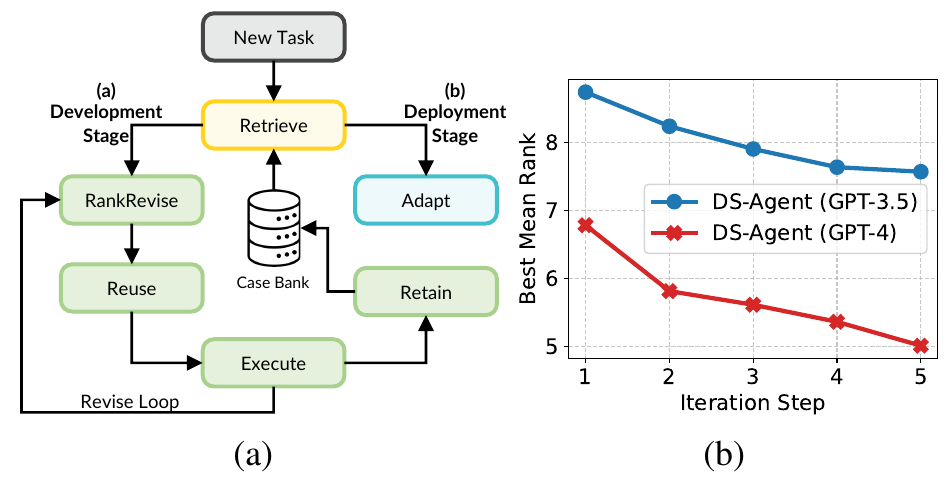
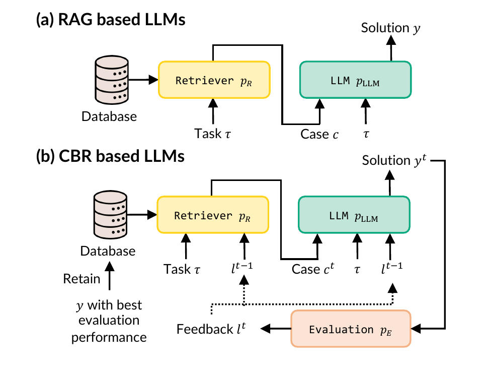
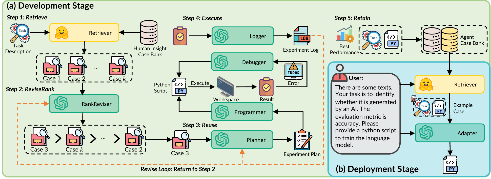
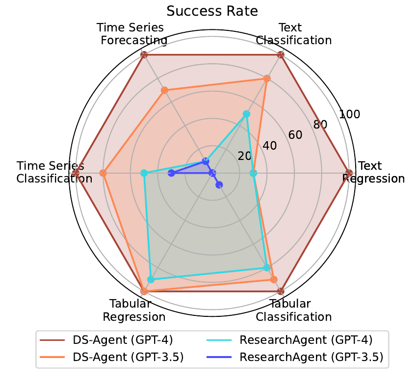
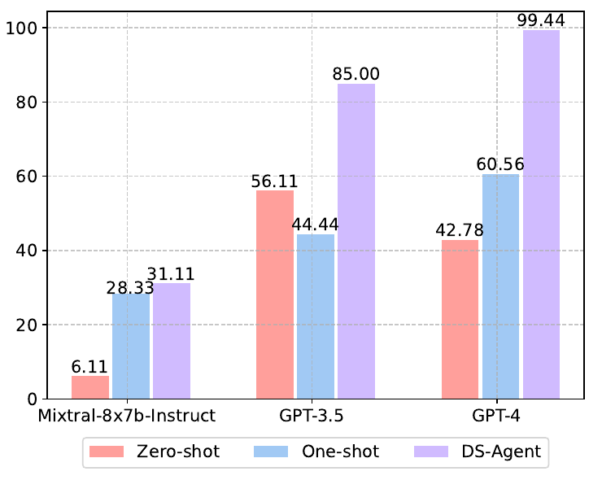
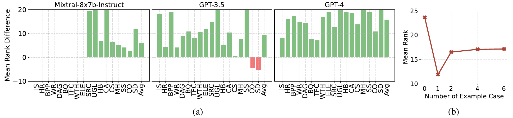

# DS-Agent: Automated Data Science by Empowering Large Language Models with Case-Based Reasoning（中文译文）

## 译者说明

本文依据同目录的 `source.pdf` 翻译。章节、图表、公式、算法、代码与参考文献按原文结构保留。

## 首页信息

**作者：** Siyuan Guo¹²³、Cheng Deng⁴、Ying Wen⁴、Hechang Chen¹²、Yi Chang¹²³、Jun Wang⁵

1. 吉林大学人工智能学院
2. 吉林大学知识驱动人机智能工程研究中心
3. 吉林大学未来科学国际中心
4. 上海交通大学
5. 伦敦大学学院

**通讯作者：** Hechang Chen（`chenhc@jlu.edu.cn`）、Yi Chang（`yichang@jlu.edu.cn`）、Jun Wang（`jun.wang@cs.ucl.ac.uk`）

发表于第 41 届国际机器学习大会（International Conference on Machine Learning），奥地利维也纳；PMLR 235，2024。

## 摘要

在这项工作中，我们研究基于大语言模型（large language model，LLM）的智能体自动执行数据科学任务的潜力，其目标是理解任务需求，进而构建和训练最适合的机器学习模型。尽管 LLM 智能体已取得广泛成功，现有智能体在这一场景中仍受制于不合理的实验计划。为此，我们提出 DS-Agent，这是一种结合 LLM 智能体与基于案例的推理（case-based reasoning，CBR）的新型自动化框架。在开发阶段，DS-Agent 遵循 CBR 框架组织自动迭代流水线，既能灵活利用来自 Kaggle 的专家知识，也能借助反馈机制促使性能持续提升。此外，DS-Agent 采用简化的 CBR 范式实现低资源部署阶段，把开发阶段以往的成功方案适配为直接生成的代码，从而显著降低对 LLM 基础能力的要求。实验表明，使用 GPT-4 的 DS-Agent 在开发阶段达到 100% 的成功率；在部署阶段，使用不同 LLM 时平均一次通过率提升 36%。在两个阶段中，DS-Agent 的性能排名均为最佳；使用 GPT-4 时，每次运行的成本分别为 1.60 美元和 0.13 美元。我们的数据与代码已在 <https://github.com/guosyjlu/DS-Agent> 开源。

## 1. 引言

近年来，大语言模型（LLM）（OpenAI, 2022; 2023）表现出卓越的基础能力，使自主语言智能体能够有效处理广泛的任务（Brohan et al., 2023; Kim et al., 2023; Shen et al., 2023; Boiko et al., 2023; Romera-Paredes et al., 2023）。在这项工作中，我们探索一个开放式决策场景，即自动化数据科学（De Bie et al., 2022; Mahadi Hassan et al., 2023）。这一方向旨在减少对专门技能的需求，让更多人能够获取数据洞见。具体而言，我们关注自动化机器学习（ML）这一专业性尤其强的环节，主要目标是理解任务需求、构建并训练最适合的 ML 模型，并最终部署训练好的模型。

尽管 LLM 智能体已取得广泛成功，近期研究（Huang et al., 2023）指出，现有智能体，包括 AutoGPT（Significant Gravitas, 2023）、LangChain（Chase, 2022）以及当前先进的 ResearchAgent（Huang et al., 2023），在数据科学场景中很难达到较高的任务完成率，即使采用能力最强的 LLM GPT-4 也同样如此。主要原因在于 LLM 无法生成合理计划，并且存在幻觉问题。一种有前景的缓解方法是进一步微调 LLM，使其与自动化数据科学场景对齐（Carta et al., 2023; Zeng et al., 2023; Chen et al., 2023; Christianos et al., 2023）。然而，由于自动化数据科学任务必须完成代码执行后才能获得反馈，收集足够微调样本需要很高的时间成本，因而极具挑战性。更糟的是，LLM 通常拥有数十亿参数，微调期间的反向传播与优化会耗费大量计算资源。

在这一背景下，Kaggle 成为一项关键资源。作为全球最大的数据科学竞赛平台，Kaggle 汇集了经验丰富的数据科学家贡献的大量技术报告与代码。为了让 LLM 智能体高效利用这些丰富的专家知识，我们采用一种经典的 AI 问题求解范式：基于案例的推理（CBR）（Kolodner, 1992; Watson & Marir, 1994）。CBR 框架会检索相似的既往问题，将其解法复用于当前问题，评估效果、修订解法，并保留成功方案。借助 CBR，LLM 智能体能够分析人类洞见，从中提取并复用解法模式，还能根据执行反馈迭代修订解法，持续改善性能。把 CBR 融入 LLM 智能体，既提升了其解决数据科学任务的能力，也提高了样本和计算资源的使用效率。

为此，我们提出 DS-Agent。如图 1(a) 所示，它结合 LLM 智能体与 CBR，服务于以模型为中心的自动化数据科学。总体而言，DS-Agent 分为两个阶段：标准开发阶段和低资源部署阶段。在开发阶段，DS-Agent 基于 CBR 框架利用从 Kaggle 收集的人类洞见，并据此组织自动迭代流水线。面对新任务时，DS-Agent 会检索并复用来自 Kaggle 的相关人类洞见，以制定实验计划；随后根据执行反馈，迭代调整检索到的案例并修订实验计划。CBR 框架使 DS-Agent 能利用 Kaggle 专家知识制定有依据的实验计划，还能把成功方案保留到案例库中，以此提供灵活的学习机制，无需通过反向传播执行资源密集的参数更新。此外，CBR 的反馈机制使 DS-Agent 能迭代检索有用案例并修订实验计划，从而实现持续的性能提升，如图 1(b) 所示。

在部署阶段，DS-Agent 针对低资源场景采用简化的 CBR 框架：任务是直接响应用户需求生成代码，不再依据执行反馈反复修订。具体而言，DS-Agent 会检索并复用开发阶段收集的既往成功方案，用于当前任务。简化的 CBR 框架可把既往方案中的知识迁移到同一任务分布内尚未见过的部署任务中。有了上下文里的相似方案案例，DS-Agent 只需做少量适配修改，因而能够显著降低对 LLM 基础能力的要求。

我们在两个阶段共 30 项数据科学任务上验证了 DS-Agent 的优势。在开发阶段，使用 GPT-4 的 DS-Agent 在 12 项任务上的成功率达到 100%。在部署阶段，使用 GPT-3.5 和 GPT-4 的 DS-Agent 在 18 项部署任务上的一次通过率分别达到 85% 和 99%，而最佳基线仅为 56% 和 60%。值得注意的是，DS-Agent 把开源 LLM Mixtral-8x7b-Instruct 的一次通过率从仅 6% 提高到 31%。在两个阶段中，使用 GPT-4 和 GPT-3.5 的 DS-Agent 分别取得最高和第二高的性能排名。此外，在标准场景下，使用 GPT-3.5 和 GPT-4 的 DS-Agent 每次运行成本分别为 0.06 美元和 1.60 美元；在低资源场景下，成本进一步降至 0.0045 美元和 0.135 美元，因此 DS-Agent 对真实部署很有吸引力。



**图 1。** (a) 采用基于 CBR 的 LLM 的 DS-Agent 概览。(b) 在 12 项开发任务上，CBR 迭代步数增加时 DS-Agent 的性能提升。

## 2. 预备知识

**基于 CBR 的 LLM。** CBR（Kolodner, 1992; Watson & Marir, 1994）是一种经典 AI 范式。它通过检索其他相似问题、复用其解法、评估效果，并在需要时迭代修订解法来解决新任务。评估性能最佳的解法会保留到数据库中，供未来复用。在这项工作中，我们把 CBR 框架融入 LLM，以增强其问题求解能力。如图 2(b) 所示，基于 CBR 的 LLM 包含三个组件：(i) 检索器 $p _ R$，它根据任务 $\tau$ 和反馈 $l$ 返回数据库上的分布；(ii) LLM $p _ {\mathrm{LLM}}$，它根据任务 $\tau$、反馈 $l$ 和检索到的案例 $c$ 生成解法 $y$；(iii) 评估器 $p _ E$，它针对解法 $y$ 产生反馈 $l$。形式化地，基于 CBR 的 LLM 包含一个迭代循环，其第 $t$ 步为：

$$
p _ {\mathrm{CBR}}(y^t \mid \tau)
= \sum _ {l^{t-1}} p _ E(l^{t-1} \mid \tau)
  \sum _ {c^t} p _ R(c^t \mid \tau, l^{t-1})
  p _ {\mathrm{LLM}}(y^t \mid c^t, \tau, l^{t-1})
\qquad \text{(1)}
$$

其中，解法分布对上一步执行反馈 $l^{t-1}$ 和检索到的案例 $c^t$ 进行边缘化。反馈分布可写为：

$$
p _ E(l^t \mid \tau)
= \sum _ {y^t} p _ {\mathrm{CBR}}(y^t \mid \tau) p _ E(l^t \mid y^t, \tau)
\qquad \text{(2)}
$$

由此，当前解法分布经评估后产生反馈，后续解法分布再根据当前反馈进行修订，从而形成性能持续提升的迭代循环。



**图 2。** (a) 基于 RAG 的 LLM 与 (b) 基于 CBR 的 LLM 对比。

**与检索增强生成的比较。** 基于 CBR 的 LLM 与检索增强生成（retrieval-augmented generation，RAG）（Rubin et al., 2022; Wang et al., 2023b; Gao et al., 2023）存在相似之处：两者都包含检索与复用。如图 2(a) 所示，基于 RAG 的 LLM 只包含检索器与 LLM，可表示为：

$$
p _ {\mathrm{RAG}}(y \mid \tau)
= \sum _ c p _ R(c \mid \tau) p _ {\mathrm{LLM}}(y \mid c, \tau)
\qquad \text{(3)}
$$

其中，解法分布只对一个潜变量，即检索到的案例 $c$，进行边缘化。因此，两类 LLM 都能从检索到的案例中检索并复用解法模式；基于 CBR 的 LLM 还可以根据评估反馈调整检索到的案例并修订解法。此外，把优质解法保留到数据库，使基于 CBR 的 LLM 获得灵活的学习机制，从而持续改善性能。

## 3. DS-Agent

本节中，我们介绍 DS-Agent：一种利用 LLM 智能体和 CBR 解决数据科学任务的自动化框架。如图 3 所示，DS-Agent 分为开发阶段和部署阶段。两个阶段分别处理相应的任务集 $T _ {\mathrm{develop}}$ 和 $T _ {\mathrm{deploy}}$，其中任务定义为五元组 $(\tau, D _ {\mathrm{train}}, D _ {\mathrm{valid}}, D _ {\mathrm{test}}, M)$。在两个阶段中，DS-Agent 都会理解任务描述 $\tau$，生成代码并使用训练集 $D _ {\mathrm{train}}$ 训练 ML 模型，再用评估指标 $M$ 在验证集 $D _ {\mathrm{valid}}$ 上评估模型性能。我们报告训练后 ML 模型在测试集 $D _ {\mathrm{test}}$ 上的性能。



**图 3。** DS-Agent 示意图。(a) 开发阶段：DS-Agent 组织自动迭代流水线，根据执行反馈构建并修订模型。(b) 部署阶段：DS-Agent 适配既往成功方案来生成代码。

### 3.1. 开发阶段：自动迭代流水线

在开发阶段，我们组织 DS-Agent 的工作流，使其模拟数据科学家面对数据科学任务时构建、训练与验证 ML 模型的迭代过程。然而，LLM 并未针对数据科学场景进行专门训练，因此缺乏生成合理 ML 模型设计计划所需的精确知识，导致任务完成率不可靠（Huang et al., 2023）。Kaggle 是领先的数据科学竞赛平台，汇集了采用前沿 ML 技术的大量专家洞见与解法。通过把这些实践性专家样例融入 LLM 智能体，我们可以显著提升其解决复杂数据科学任务的能力。为此，我们提出把 CBR 融入 DS-Agent 的自动迭代流水线，如图 3(a) 所示。下面，我们详细说明这一流水线。

**人类洞见案例收集。** 我们的首要目标是从 Kaggle 收集采用先进 ML 技术的专家洞见与解法。具体而言，我们选择若干近期结束的 Kaggle 竞赛，聚焦文本、时间序列和表格数据三种模态，这与本工作开发任务集和部署任务集中的模态一致。我们从选定竞赛中抓取获胜团队分享的技术报告，以及公开排行榜中得分靠前的代码。随后重新组织这些材料：清理技术报告以保留核心洞见，并使用 GPT-3.5 总结代码，把复杂实现转化成文本洞见。处理后的材料存入人类洞见案例库。

**步骤 1：检索。** DS-Agent 首先从人类洞见案例库 $C$ 中检索与当前数据科学任务相关的案例。具体而言，`Retriever` 使用余弦相似度计算任务描述 $\tau$ 与案例 $c \in C$ 的相似度： $\mathrm{sim}(\tau,c)=\mathrm{cos}(E(\tau),E(c))$，其中 $E(\cdot)$ 表示预训练嵌入模型。该步骤随后检索与任务描述相似度最高的前 $k$ 个案例。

**步骤 2：修订排序（ReviseRank）。** 上述步骤通常能够保证检索案例的相关性，却无法依据上一次迭代的执行反馈动态调整检索案例。一种可能方法是使用执行反馈微调检索器（Shi et al., 2023; Wang et al., 2023a）。然而，自动化数据科学任务需要执行代码才能产生反馈，会带来可观的时间和计算开销。为解决这一问题，我们利用 LLM 分析执行反馈、估计检索案例效用的能力，再修订排序次序以调整检索案例。

受近期在 Web 搜索场景中使用 LLM 进行相关性排序的工作（Sun et al., 2023）启发，我们采用类似的提示词格式，为前 $k$ 个检索案例 $\lbrace c _ 1,c _ 2,\ldots,c _ k\rbrace$ 分配唯一标识符，例如 `[1]`、`[2]` 等。随后，我们提示 LLM 参考上一次迭代的反馈，根据各案例对当前数据科学任务的估计效用，生成按降序排列的案例置换。排序结果采用 `[2] > [1] > [3]` 等格式。形式化地，在第 $t$ 个迭代步骤中，每个案例的效用分布估计为 $p _ {\mathrm{RR}}(c \mid \tau,l^{t-1})=p _ {\mathrm{LLM}}(c \mid c _ 1,c _ 2,\ldots,c _ k,\tau,l^{t-1})$，其中 $p _ {\mathrm{LLM}}$ 表示 LLM 的分布， $l^{t-1}$ 表示第 $t-1$ 个迭代步骤的执行反馈，初始化为空字符串，即 $l^0=\varnothing$。随后，排名最高的案例 $c^t$ 进入下一复用步骤。因此，在自动迭代流水线中，`ReviseRanker` 会根据执行反馈迭代优化待复用案例。这种动态调整持续为 DS-Agent 提供更新后的基础材料，用于修订实验计划的解法。

**步骤 3：复用。** 在这一阶段，DS-Agent 使用 `Planner` 复用检索到的案例，制定实验计划解法。在第 $t$ 个迭代步骤中，`Planner` 检查任务描述 $\tau$ 和上一次执行反馈 $l^{t-1}$，以理解当前上下文；随后仔细分析排名最高的案例 $c^t$，复用其中的人类洞见并适配当前任务，最后制定新的实验计划解法 $y^t$。

**步骤 4：执行。** 随后，DS-Agent 使用 Python 脚本实现实验计划并执行脚本，以获得经验反馈。具体来说，`Programmer` 阅读任务描述和实验计划，生成相应的 Python 代码。代码生成后，脚本会执行并检查输出。如有报错，则由 `Debugger` 定位并修复缺陷。受 Reflexion（Shinn et al., 2023）启发，`Debugger` 首先根据执行反馈反思潜在缺陷，再生成并重新执行修正后的代码。调试过程持续到不再报告错误，或达到预定义的最大调试次数。最后，`Logger` 以自然语言形式全面总结已完成实验的过程与结果。保留实验日志可以向 DS-Agent 提供执行反馈，使其进一步修订实验计划，为当前任务设计更好的 ML 模型。

**步骤 5：保留。** 每个迭代步骤结束时，我们使用训练后的 ML 模型对测试集进行预测。若观察到性能提升，DS-Agent 会把任务描述 $\tau$ 与相应 Python 脚本 $s$ 一并存入人类洞见案例库 $C$ 和智能体案例库 $B$，作为未来复用的示例解法案例。

**修订循环：返回步骤 2。** `Retain` 步骤结束后，工作流返回 `ReviseRank` 步骤，形成修订循环。该循环使 DS-Agent 能根据当前步骤的执行反馈 $l^t$ 进一步修订实验计划解法。达到预定最大迭代步数后，修订循环终止。

通过开发阶段的上述步骤，DS-Agent 使用 CBR 框架迭代检索和复用相关且有效的案例，修订实验计划的解法，从而提升其解决数据科学任务的能力。这里，CBR 框架可写为：

$$
p _ {\mathrm{CBR}}^{\mathrm{dev}}(y^t \mid \tau)
= \sum _ {l^{t-1}} p _ E(l^{t-1} \mid \tau)
  \sum _ {c \in \mathrm{top\text{-}k}(\mathrm{sim}(\tau,\cdot))}
  p _ {\mathrm{RR}}(c \mid \tau,l^{t-1})
  p _ {\mathrm{LLM}}(y^t \mid \tau,c,l^{t-1})
\qquad \text{(4)}
$$

它与式 (1) 中基于 CBR 的 LLM 解法分布一致，唯一差别是我们同时使用 `Retriever` 和 `ReviseRanker`，根据任务与执行反馈检索案例。

算法 1 汇总了自动流水线的伪代码。总体而言，DS-Agent 可从 CBR 范式的两个方面获益。第一，CBR 融入了包含大量数据科学专家知识的人类洞见案例库，使 DS-Agent 能制定合理实验计划。此外，CBR 把成功解法案例保留到人类洞见案例库，以此提供灵活的学习机制，无需通过反向传播微调 LLM，避免资源密集的训练。例如，当遇到涉及此前未见数据模态的新任务，如图数据（Pei et al., 2020; 2024a; b）时，只需把最新人类洞见加入案例库 $C$。借助扩展后的知识库，DS-Agent 便能熟练解决与图数据相关的数据科学任务。

第二，CBR 内部的修订循环使 DS-Agent 能用上一次迭代的执行反馈指导案例检索，并通过案例复用修订实验计划。该迭代循环不断修订 ML 模型设计，使之逐渐接近最优适配，从而持续提升性能。图 1(b) 绘制了 DS-Agent 随迭代步数增加的性能曲线，实验中可观察到性能持续提升的趋势。

### 3.2. 部署阶段：从既往案例学习

在部署阶段，我们希望复用存档于智能体案例库 $B$ 的既往成功解法案例，形成低资源场景：DS-Agent 直接根据用户任务需求生成用于训练 ML 模型的 Python 代码。该阶段没有迭代循环；我们简化开发阶段的 CBR 范式，把相似任务的解法代码适配到当前任务，以此实现 DS-Agent。

如图 3 所示，DS-Agent 先检索相关案例，再复用案例以适配部署任务。具体而言，给定部署任务 $\tau$，DS-Agent 首先从智能体案例库 $B$ 中检索任务描述相似的案例对 $(\tau _ 0,s _ 0)$，即 $(\tau _ 0,s _ 0)=\arg\max _ {(\tau _ 0,s _ 0)\in B}\mathrm{sim}(\tau,\tau _ 0)$。随后，DS-Agent 使用 `Adapter` 复用检索到的示例案例对，适配当前任务并生成训练 ML 模型的解法代码。该简化 CBR 框架可写为：

$$
p _ {\mathrm{CBR}}^{\mathrm{dep}}(s \mid \tau)
= p _ {\mathrm{LLM}}\left(
s \mid \arg\max _ {(\tau _ 0,s _ 0)\in B}\mathrm{sim}(\tau,\tau _ 0),\tau
\right)
\qquad \text{(5)}
$$

在部署阶段，DS-Agent 使用简化的 CBR 范式，把既往成功案例中的知识迁移到同一任务分布内尚未见过的数据科学任务。上下文中提供一个相似解法案例后，DS-Agent 只需少量修改即可适配新任务。这显著降低了对 LLM 推理与编程能力的要求。因此，部署阶段的 DS-Agent 甚至可以建立在开源 LLM 之上。

## 4. 实验

### 4.1. 实验设置

**任务选择。** 我们选择了 30 项数据科学任务，覆盖文本、时间序列和表格数据三种数据模态，以及回归和分类两类基础任务。这些多样的数据集来自不同平台，并采用不同评估指标。其中 12 项任务用于开发阶段，其余 18 项用于部署阶段。对于每个数据集，我们编写自然语言任务描述，并把数据划分为训练集、验证集和测试集。此外，我们准备一个建立随机猜测基线的 Python 脚本，作为初始参考点。数据集详情见表 5。

**评估指标。** 我们主要从三个方面评估智能体能力：(1) **完成 ML 模型构建。** 在开发阶段，我们使用成功率，即智能体能否在固定步数内以无缺陷方式构建 ML 模型；部署阶段使用一次通过率，表示智能体能否仅用一次尝试构建 ML 模型。(2) **所构建 ML 模型的性能。** 在两个阶段，我们都使用平均排名和最佳排名来评估智能体的自动化数据科学能力。(3) **资源成本。** 由于我们在这项工作中主要使用闭源 LLM，因此我们以货币消耗评估资源成本。

更多实验细节见附录 B。

### 4.2. 开发阶段结果

#### 4.2.1. 主要结果

**基线。** 在开发阶段，我们比较 DS-Agent 与 ResearchAgent（Huang et al., 2023）。后者是用于解决 ML 研究相关任务的先进语言智能体。两个智能体分别建立在 GPT-3.5 和 GPT-4 之上。

**Table 1.** 开发阶段 12 项数据科学任务按任务特定评估指标计算的平均排名和最佳排名。结果来自五次重复试验。原文以粗体标出最佳性能、以下划线标出第二佳性能。

| 指标 | LLM | 智能体 | FB | AR | TE | CP | ETT | ILI | HW | EC | MCS | WBY | ST | ES | 平均 |
| --- | --- | --- | ---: | ---: | ---: | ---: | ---: | ---: | ---: | ---: | ---: | ---: | ---: | ---: | ---: |
| 平均排名 | GPT-3.5 | ResearchAgent | 8.0 | 10.0 | 12.0 | 13.0 | 9.4 | 11.0 | 14.2 | 12.2 | 15.0 | 16.0 | 15.8 | 14.0 | 12.6 |
| 平均排名 | GPT-3.5 | DS-Agent | <u>7.4</u> | <u>8.2</u> | <u>6.2</u> | <u>7.2</u> | <u>7.2</u> | <u>8.2</u> | <u>6.4</u> | 10.2 | **6.2** | <u>6.0</u> | <u>7.4</u> | 9.6 | <u>7.5</u> |
| 平均排名 | GPT-4 | ResearchAgent | 7.6 | 8.6 | 10.6 | 11.8 | 10.0 | 9.4 | 12.6 | <u>7.2</u> | 10.4 | 10.0 | 10.6 | <u>9.2</u> | 9.8 |
| 平均排名 | GPT-4 | DS-Agent | **3.4** | **4.2** | **5.8** | **4.4** | **4.4** | **4.4** | **5.4** | **6.6** | <u>6.8</u> | **5.6** | **4.4** | **4.4** | **5.0** |
| 最佳排名 | GPT-3.5 | ResearchAgent | 8.0 | 10.0 | 12.0 | 13.0 | 7.0 | 11.0 | 12.0 | 9.0 | 15.0 | 16.0 | 15.0 | 14.0 | 11.8 |
| 最佳排名 | GPT-3.5 | DS-Agent | <u>5.0</u> | <u>2.0</u> | <u>2.0</u> | <u>3.0</u> | <u>3.0</u> | 6.0 | **1.0** | 7.0 | <u>2.0</u> | **1.0** | <u>2.0</u> | 6.0 | <u>3.3</u> |
| 最佳排名 | GPT-4 | ResearchAgent | 6.0 | 5.0 | 7.0 | 10.0 | 10.0 | <u>3.0</u> | 9.0 | <u>2.0</u> | **1.0** | <u>2.0</u> | 7.0 | <u>3.0</u> | 5.4 |
| 最佳排名 | GPT-4 | DS-Agent | **1.0** | **1.0** | **1.0** | **1.0** | **1.0** | **1.0** | <u>3.0</u> | **1.0** | 4.0 | <u>2.0</u> | **1.0** | **1.0** | **1.5** |

**成功率比较。** 我们首先分析开发阶段不同智能体在六类数据科学任务上的成功率。如图 4 所示，使用 GPT-4 的 DS-Agent 在所有任务上的成功率最高，达到 100%。值得注意的是，使用 GPT-3.5 的 DS-Agent 在所有任务上都持续优于使用 GPT-4 的 ResearchAgent，证明了所提智能体框架的有效性。其中，使用 GPT-3.5 的 ResearchAgent 在几乎每类任务上都失败，这可归因于其对 LLM 推理与编程能力的苛刻要求。有趣的是，智能体在表格任务上比在其他类型任务上更熟练。这一倾向可以用如下观察来解释：表格任务通常只需调用 sklearn（Pedregosa et al., 2011）中的函数，对 LLM 智能体推理与编程能力的要求远低于其他任务。



**图 4。** 开发阶段四种智能体的成功率。结果取五次重复试验的平均值。

**按任务特定评估指标比较。** 接下来，我们详细比较 12 项开发任务的任务特定评估指标，结果见表 1。从表中我们可以看到，使用 GPT-4 的 DS-Agent 在平均排名和最佳排名上都显著优于其他智能体。具体而言，它在 12 项数据科学任务中的 9 项取得最佳性能。使用 GPT-3.5 的 DS-Agent 在平均排名和最佳排名的平均结果上均位居第二，并在大多数任务中超过使用 GPT-4 的 ResearchAgent。这些结果说明 DS-Agent 更善于解决数据科学任务。

DS-Agent 设计的关键之一，是由 CBR 支持的自动迭代流水线，使其能够吸收代码执行产生的真实反馈，并持续修订实验计划。为展示这一过程，我们在图 1(b) 中绘制了随着迭代步数增加，DS-Agent 在所有任务上的最佳平均排名均值。使用 GPT-3.5 和 GPT-4 的 DS-Agent 都随迭代增加而显著改善性能，证明了所提自动迭代流水线的有效性。

#### 4.2.2. 消融研究

为验证开发阶段 CBR 范式的有效性，我们对 DS-Agent 进行两项消融研究，结果见表 2。

**Table 2.** 12 项开发任务上平均最佳排名的消融结果。结果来自五次重复试验。

| GPT-4 | 平均最佳排名 |
| --- | ---: |
| DS-Agent | **2.08** |
| DS-Agent（无 ReviseRank） | 2.58 |
| DS-Agent（无 CBR） | 3.41 |

首先，我们研究第一项变体 **无 ReviseRank**：它直接使用检索结果中排名最高的案例，不根据执行反馈调整案例，也可视为基于 RAG 的 LLM 智能体。结果符合预期，该消融会使性能下降，说明在检索过程中根据执行反馈调整案例十分重要。

接下来，我们评估第二项变体 **无 CBR**，以验证 CBR 范式的整体有效性。它提示 LLM 在不吸收人类洞见的情况下生成实验计划。该变体在三种智能体中性能最差，因为 LLM 并未针对数据科学场景进行对齐训练，无法自主制定合理实验计划。融入 CBR 范式成功弥补了这一局限，使 LLM 能熟练吸收 Kaggle 专家知识来解决数据科学任务。

### 4.3. 部署阶段结果

#### 4.3.1. 主要结果

**基线。** 在部署阶段，我们比较 DS-Agent 与两个基线：(1) **零样本**，直接提示 LLM 生成代码；(2) **单样本**，从智能体案例库中随机选择一个示例案例并加入 LLM 上下文，这也可视为检索过程的消融。所有智能体分别使用 GPT-3.5、GPT-4 和开源 LLM Mixtral-8x7b-Instruct（Jiang et al., 2024）实现。

**Table 3.** 部署阶段 18 项数据科学任务按任务特定评估指标计算的平均排名。结果来自 10 次重复运行。原文以粗体标出最佳性能、以下划线标出第二佳性能。

| LLM | 方法 | JS | HR | BPP | WR | DAG | BQ | TFC | WTH | ELE | SRC | UGL | HB | CA | CS | MH | SS | CO | SD | 平均 |
| --- | --- | ---: | ---: | ---: | ---: | ---: | ---: | ---: | ---: | ---: | ---: | ---: | ---: | ---: | ---: | ---: | ---: | ---: | ---: | ---: |
| Mixtral-8x7b-Instruct | 零样本 | 37.0 | 35.0 | 35.0 | 31.0 | 35.0 | 32.0 | 29.0 | 32.0 | 30.0 | 44.0 | 54.0 | 46.0 | 73.1 | 66.6 | 65.8 | 63.6 | 33.7 | 72.0 | 45.3 |
| Mixtral-8x7b-Instruct | 单样本 | 35.2 | 35.0 | 32.2 | 31.0 | 35.0 | 29.1 | 29.0 | 32.0 | 30.0 | 36.5 | 47.1 | 46.0 | 50.1 | 53.1 | 51.2 | 51.1 | 23.6 | 61.5 | 39.4 |
| Mixtral-8x7b-Instruct | DS-Agent | 37.0 | 35.0 | 35.0 | 31.0 | 35.0 | 32.0 | 29.0 | 32.0 | 30.0 | <u>20.1</u> | 16.4 | 38.5 | <u>25.3</u> | 54.5 | 53.7 | 53.9 | 32.2 | 47.6 | 35.5 |
| GPT-3.5 | 零样本 | 21.7 | 35.0 | 30.1 | 28.6 | 27.1 | 28.3 | 27.1 | 29.1 | 28.1 | 33.1 | 48.4 | 21.4 | 29.0 | 35.3 | 28.8 | 35.7 | 25.2 | 42.3 | 30.8 |
| GPT-3.5 | 单样本 | 27.6 | 25.8 | 27.6 | 25.6 | 34.6 | 23.0 | 20.8 | 29.1 | 27.0 | 35.7 | 48.4 | 21.1 | 27.1 | 50.5 | 58.4 | 57.5 | 33.9 | 56.4 | 35.0 |
| GPT-3.5 | DS-Agent | **6.0** | <u>22.6</u> | 15.0 | <u>20.6</u> | <u>15.1</u> | **13.1** | <u>17.3</u> | <u>13.4</u> | <u>14.4</u> | **20.0** | <u>13.0</u> | 23.0 | 29.0 | <u>19.3</u> | **7.6** | **2.0** | 37.0 | <u>19.5</u> | <u>17.1</u> |
| GPT-4 | 零样本 | 36.7 | 31.8 | 35.0 | 29.0 | 29.4 | 32.0 | 29.0 | 32.0 | 30.0 | 37.3 | 45.7 | 33.6 | **1.0** | 15.3 | 23.2 | 17.9 | 28.3 | 20.1 | 28.2 |
| GPT-4 | 单样本 | 35.1 | 24.4 | **13.8** | 26.6 | 29.6 | 28.8 | 23.1 | 30.1 | 26.6 | 26.7 | 41.6 | 36.7 | 29.7 | 21.9 | 35.3 | 28.9 | 21.4 | 23.2 | 28.0 |
| GPT-4 | DS-Agent | <u>18.6</u> | **1.0** | <u>14.6</u> | **5.2** | **6.2** | <u>18.8</u> | **15.7** | **6.3** | **8.1** | **20.0** | **11.4** | <u>21.2</u> | **1.0** | 32.6 | <u>14.5</u> | <u>8.2</u> | **13.0** | **12.4** | **12.7** |

**一次通过率比较。** 我们首先考察九种智能体在 18 项部署任务上的一次通过率。如图 5 所示，DS-Agent 在不同 LLM 上都显著优于其他基线。使用 GPT-4 的 DS-Agent 尤其突出，达到前所未有的、接近 100% 的一次通过率；使用 GPT-3.5 的 DS-Agent 以 85% 位居第二。此外，使用 Mixtral-8x7b-Instruct 的 DS-Agent 相比零样本策略将一次通过率提高了 25%。这些结果说明，CBR 范式能够增强 LLM 在数据科学任务中的无缺陷编程能力。单样本策略通常优于零样本方法，但 GPT-3.5 是例外，可能因为其推理能力相对较弱。DS-Agent 还持续优于单样本策略，说明检索过程很重要。



**图 5。** 九种不同智能体在 18 项部署任务上的一次通过率。结果取 10 次随机运行的平均值。

**按任务特定评估指标比较。** 随后，我们关注 18 项部署任务的任务特定性能，结果见表 3。使用 GPT-4 的 DS-Agent 在九种智能体中平均排名最高，使用 GPT-3.5 的 DS-Agent 排名第二，甚至超过使用 GPT-4 的基线。遗憾的是，采用开源 LLM 的 DS-Agent 仍弱于采用 GPT-3.5 或 GPT-4 的智能体，这是因为开源 LLM 的基础能力较弱。尽管如此，在 18 项部署任务中的 13 项上，它仍优于或不逊于采用同一开源 LLM 的其他基线。这些实验观察证明了所提 CBR 范式的有效性。

**资源成本比较。** DS-Agent 的一项关键设计是划分两个不同阶段。开发阶段着重探索有效模型设计，资源成本相对较高；部署阶段则以最少资源迅速高效地解决数据科学任务。如表 4 所示，在部署阶段，使用 GPT-3.5 和 GPT-4 的 DS-Agent 单次运行成本分别为 0.0045 美元和 0.1350 美元。与开发阶段相比，成本降低超过 90%，因此 DS-Agent 对真实部署场景很有吸引力。

**Table 4.** DS-Agent 在开发阶段和部署阶段单次运行的货币成本比较。

| DS-Agent | 开发阶段 | 部署阶段 | 成本降低比例 |
| --- | ---: | ---: | ---: |
| GPT-3.5 | \$0.06 | \$0.0045 | 92.5% |
| GPT-4 | \$1.60 | \$0.1350 | 91.5% |

#### 4.3.2. 进一步分析

**消融研究。** 在部署阶段，DS-Agent 通过适配既往成功的智能体经验来解决尚未见过的数据科学任务。一种自然想法是直接把开发阶段收集的文本人类洞见加入 LLM 上下文，以增强其数据科学能力。为此，我们研究 DS-Agent 的一个消融变体，它在部署阶段从相关人类洞见学习并生成代码。如图 6(a) 所示，从既往成功经验学习的 DS-Agent 在几乎所有任务上都显著优于从文本人类洞见学习的对应变体。这说明，从同质案例，即一个示例任务及其一个解法，学习的效果优于从异质案例，即文本解法洞见，学习。该结果凸显了 DS-Agent 开发和部署两个阶段都十分重要。

**上下文案例数量的超参数分析。** 接下来，我们分析 DS-Agent 的一个关键超参数：LLM 上下文中检索到的示例案例数量，如图 6(b) 所示。没有示例案例时，DS-Agent 退化为零样本策略，在所有设置中性能最差。这说明 LLM 能从上下文案例中获得有助于解决 ML 任务的洞见。有趣的是，随着上下文中示例案例数量增加，DS-Agent 性能迅速下降，这与典型少样本学习场景中的结果不同。需要强调的是，DS-Agent 的复用过程以适配单个示例案例来解决当前 ML 任务为中心。因此，在上下文中加入多个示例案例会向 LLM 引入干扰信息，妨碍其为当前任务生成恰当代码。



**图 6。** DS-Agent 在部署阶段的进一步分析。(a) DS-Agent 从既往成功经验或文本人类洞见学习时的性能差异。(b) 使用 GPT-3.5 的 DS-Agent 在示例案例数量变化时的超参数研究。

## 5. 相关工作

**LLM 智能体。** LLM 已表现出卓越的基础能力，包括语言理解、复杂推理、工具使用和代码生成，由此催生了为各类任务设计的自主语言智能体（Yao et al., 2022; Hong et al., 2024b; Wu et al., 2023; Wang et al., 2023c; Zhao et al., 2024; Boiko et al., 2023; Romera-Paredes et al., 2023; Deng et al., 2023; Lin et al., 2023）。在数据科学领域，Mahadi Hassan et al.（2023）讨论了把 LLM 用作数据科学工作流中对话智能体的潜力。近期研究还考察了 LLM 智能体在特征工程（Hollmann et al., 2023）、超参数调优（Zhang et al., 2023c; a）、使用 ML 库（Liu et al., 2023）、辅助 AI 研究（Huang et al., 2023）、数据操作（Lai et al., 2023）等不同领域的应用。我们则专注于开发能够构建和训练 ML 模型的自动语言智能体，为自动化数据科学领域作出贡献。与我们同期的工作中，Hong et al.（2024a）提出 Data Interpreter，重点优化数据科学场景中的 LLM 智能体工作流，以充分释放 LLM 的内在知识。Data Interpreter 与 DS-Agent 的核心技术具有互补性。未来可以用 Data Interpreter 增强 DS-Agent，或把 CBR 融入 Data Interpreter，以进一步提升性能。

**基于案例的推理。** 基于案例的推理（CBR）（Kolodner, 1992; Watson & Marir, 1994; Aamodt & Plaza, 1994）是一种数十年前提出的经典 AI 范式，旨在分析检索到的相关案例并进行推理，再适配其中的洞见来解决新问题。把 CBR 融入 LLM（Yang et al., 2023; Sourati et al., 2023; Guo et al., 2023），在流程上与广为人知的检索增强生成（RAG）框架（Lewis et al., 2020; Rubin et al., 2022; Wang et al., 2023b; Gao et al., 2023）相似，尤其是检索和复用步骤。然而，CBR 的独特特征是反馈机制，它可以迭代调整检索案例并相应修订解法。此外，CBR 还通过保留和复用成功案例来增强未来的问题求解能力。

## 6. 结论

在这项工作中，我们提出 DS-Agent，这是一种结合 LLM 智能体和基于案例的推理来解决数据科学任务的新型框架。在开发阶段，DS-Agent 基于 CBR 框架组织自动迭代流水线，旨在检索并复用来自 Kaggle 的相关人类洞见来制定实验计划，再根据执行反馈迭代调整检索案例并修订计划。在部署阶段，DS-Agent 使用简化的 CBR 框架，通过检索和复用开发阶段收集的成功解法案例来形成低资源场景。我们开展了大量实验，证明 DS-Agent 对数据科学任务的有效性。

## 致谢

我们诚挚感谢审稿人为我们的投稿付出的巨大努力。本工作得到中国国家重点研发计划（编号 2023YFF0905400）、国家自然科学基金（编号 U2341229、61976102、U19A2065）、吉林省重点研发项目（编号 20240304200SF）以及吉林省国际合作项目（编号 20220402009GH）的支持。

## 影响声明

我们在此强调 DS-Agent 可能带来的若干伦理问题：

1. **失业与技能过时。** 我们研究最主要的担忧，是可能造成失业和技能过时。然而，正如 Karmaker et al.（2021）所讨论的，自动化数据科学的目的在于协助数据科学家，让他们专注于数据科学工作中更复杂的方面，而非取代他们。数据科学家只需集中处理更高层次的数据科学问题，例如任务构造、数据可视化、清洗与整理、预测工程，以及结果总结和建议。此外，通过支持自然语言交互，自动化数据科学降低了准入门槛，让用户更容易从数据中获得洞见，从而推动数据科学民主化。
2. **恶意代码生成。** 随着 DS-Agent 这类自动化数据科学工具普及，一个常被低估但十分关键的风险是，它们可能生成损害计算设备或数据完整性的代码。DS-Agent 在数据问题的广阔解空间中探索时，可能无意生成低效、易受攻击甚至直接有害的代码。我们的实验虽未观察到此类问题，用户在执行 DS-Agent 生成的任何代码前仍应审查代码。为增强安全性，我们建议在 Docker 容器中运行 DS-Agent，为主机文件系统提供隔离层。
3. **数据隐私与安全。** DS-Agent 设计为本地运行，无需上传敏感数据，以保护数据隐私与安全。然而，集成 GPT-3.5 或 GPT-4 等基于 API 的 LLM 时，交互通常需要把数据传输至外部服务器，因此存在固有隐私风险。我们建议用户仔细检查 API 提示词中发送的任何数据，避免无意泄露。

## 参考文献

1. Aamodt, A. and Plaza, E. Case-based reasoning: Foundational issues, methodological variations, and system approaches. *AI Communications*, 7(1):39-59, 1994.
2. Boiko, D. A., MacKnight, R., Kline, B., and Gomes, G. Autonomous chemical research with large language models. *Nature*, 624(7992):570-578, 2023.
3. Brohan, A., Chebotar, Y., Finn, C., Hausman, K., Herzog, A., Ho, D., Ibarz, J., Irpan, A., Jang, E., Julian, R., et al. Do as I can, not as I say: Grounding language in robotic affordances. In *Conference on Robot Learning*, pp. 287-318. PMLR, 2023.
4. Carta, T., Romac, C., Wolf, T., Lamprier, S., Sigaud, O., and Oudeyer, P.-Y. Grounding large language models in interactive environments with online reinforcement learning. In *Proceedings of the 40th International Conference on Machine Learning*, volume 202 of *Proceedings of Machine Learning Research*, pp. 3676-3713. PMLR, 23-29 Jul 2023.
5. Chase, H. LangChain, October 2022. URL <https://github.com/langchain-ai/langchain>.
6. Chen, B., Shu, C., Shareghi, E., Collier, N., Narasimhan, K., and Yao, S. Fireact: Toward language agent fine-tuning. *arXiv preprint arXiv:2310.05915*, 2023.
7. Christianos, F., Papoudakis, G., Zimmer, M., Coste, T., Wu, Z., Chen, J., Khandelwal, K., Doran, J., Feng, X., Liu, J., et al. Pangu-agent: A fine-tunable generalist agent with structured reasoning. *arXiv preprint arXiv:2312.14878*, 2023.
8. De Bie, T., De Raedt, L., Hernández-Orallo, J., Hoos, H. H., Smyth, P., and Williams, C. K. Automating data science. *Communications of the ACM*, 65(3):76-87, 2022.
9. Deng, C., Zhang, T., He, Z., Chen, Q., Shi, Y., Zhou, L., Fu, L., Zhang, W., Wang, X., Zhou, C., Lin, Z., and He, J. K2: A foundation language model for geoscience knowledge understanding and utilization. 2023. URL <https://api.semanticscholar.org/CorpusID:259108887>.
10. Erickson, N., Mueller, J., Shirkov, A., Zhang, H., Larroy, P., Li, M., and Smola, A. Autogluon-tabular: Robust and accurate automl for structured data. *arXiv preprint arXiv:2003.06505*, 2020.
11. Gao, Y., Xiong, Y., Gao, X., Jia, K., Pan, J., Bi, Y., Dai, Y., Sun, J., and Wang, H. Retrieval-augmented generation for large language models: A survey. *arXiv preprint arXiv:2312.10997*, 2023.
12. Guo, C., Tian, Z., Tang, J., Wang, P., Wen, Z., Yang, K., and Wang, T. A case-based reasoning framework for adaptive prompting in cross-domain text-to-sql. *arXiv preprint arXiv:2304.13301*, 2023.
13. Hollmann, N., Müller, S., and Hutter, F. Large language models for automated data science: Introducing caafe for context-aware automated feature engineering. In *Thirty-seventh Conference on Neural Information Processing Systems*, 2023.
14. Hong, S., Lin, Y., Liu, B., Wu, B., Li, D., Chen, J., Zhang, J., Wang, J., Zhang, L., Zhuge, M., et al. Data interpreter: An llm agent for data science. *arXiv preprint arXiv:2402.18679*, 2024a.
15. Hong, S., Zheng, X., Chen, J., Cheng, Y., Wang, J., Zhang, C., Wang, Z., Yau, S. K. S., Lin, Z., Zhou, L., et al. MetaGPT: Meta programming for multi-agent collaborative framework. In *The Twelfth International Conference on Learning Representations*, 2024b. URL <https://openreview.net/forum?id=VtmBAGCN7o>.
16. Huang, Q., Vora, J., Liang, P., and Leskovec, J. Benchmarking large language models as ai research agents. *arXiv preprint arXiv:2310.03302*, 2023.
17. Hutter, F., Kotthoff, L., and Vanschoren, J. *Automated machine learning: methods, systems, challenges*. Springer Nature, 2019.
18. Jiang, A. Q., Sablayrolles, A., Roux, A., Mensch, A., Savary, B., Bamford, C., Chaplot, D. S., Casas, D. de las, Hanna, E. B., Bressand, F., et al. Mixtral of experts. *arXiv preprint arXiv:2401.04088*, 2024.
19. Karmaker, S. K., Hassan, M. M., Smith, M. J., Xu, L., Zhai, C., and Veeramachaneni, K. Automl to date and beyond: Challenges and opportunities. *ACM Computing Surveys (CSUR)*, 54(8):1-36, 2021.
20. Kim, G., Baldi, P., and McAleer, S. M. Language models can solve computer tasks. In *Thirty-seventh Conference on Neural Information Processing Systems*, 2023.
21. Kolodner, J. L. An introduction to case-based reasoning. *Artificial Intelligence Review*, 6(1):3-34, 1992.
22. Kwon, W., Li, Z., Zhuang, S., Sheng, Y., Zheng, L., Yu, C. H., Gonzalez, J., Zhang, H., and Stoica, I. Efficient memory management for large language model serving with pagedattention. In *Proceedings of the 29th Symposium on Operating Systems Principles*, pp. 611-626, 2023.
23. Lai, Y., Li, C., Wang, Y., Zhang, T., Zhong, R., Zettlemoyer, L., Yih, W.-t., Fried, D., Wang, S., and Yu, T. DS-1000: A natural and reliable benchmark for data science code generation. In *International Conference on Machine Learning*, pp. 18319-18345. PMLR, 2023.
24. LeDell, E. and Poirier, S. H2o automl: Scalable automatic machine learning. In *Proceedings of the AutoML Workshop at ICML*, volume 2020. ICML, 2020.
25. Lewis, P., Perez, E., Piktus, A., Petroni, F., Karpukhin, V., Goyal, N., Küttler, H., Lewis, M., Yih, W.-t., Rocktäschel, T., et al. Retrieval-augmented generation for knowledge-intensive nlp tasks. *Advances in Neural Information Processing Systems*, 33:9459-9474, 2020.
26. Lin, Z., Deng, C., Zhou, L., Zhang, T., Xu, Y., Xu, Y., He, Z., Shi, Y., Dai, B., Song, Y., Zeng, B., Chen, Q., Shi, T., Huang, T., Xu, Y., Wang, S., Fu, L., Zhang, W., He, J., Ma, C., Zhu, Y., Wang, X., and Zhou, C. Geogalactica: A scientific large language model in geoscience. *ArXiv*, abs/2401.00434, 2023. URL <https://api.semanticscholar.org/CorpusID:266693296>.
27. Liu, Y., Tang, X., Cai, Z., Lu, J., Zhang, Y., Shao, Y., Deng, Z., Hu, H., Yang, Z., An, K., et al. Ml-bench: Large language models leverage open-source libraries for machine learning tasks. *arXiv preprint arXiv:2311.09835*, 2023.
28. Mahadi Hassan, M., Knipper, A., and Kanti Karmaker Santu, S. Chatgpt as your personal data scientist. *arXiv e-prints*, pp. arXiv-2305, 2023.
29. OpenAI. Introducing ChatGPT. 2022. URL <https://openai.com/blog/chatgpt>.
30. OpenAI. Gpt-4 technical report. *arXiv preprint arXiv:2303.08774*, 2023.
31. Pedregosa, F., Varoquaux, G., Gramfort, A., Michel, V., Thirion, B., Grisel, O., Blondel, M., Prettenhofer, P., Weiss, R., Dubourg, V., et al. Scikit-learn: Machine learning in python. *The Journal of Machine Learning Research*, 12:2825-2830, 2011.
32. Pei, H., Yang, B., Liu, J., and Chang, K. C.-C. Active surveillance via group sparse bayesian learning. *IEEE Transactions on Pattern Analysis and Machine Intelligence*, 44(3):1133-1148, 2020.
33. Pei, H., Chen, T., Chen, A., Deng, H., Tao, J., Wang, P., and Guan, X. Hago-net: Hierarchical geometric massage passing for molecular representation learning. In *Proceedings of the AAAI Conference on Artificial Intelligence*, volume 38, pp. 14572-14580, 2024a.
34. Pei, H., Xiong, Y., Wang, P., Tao, J., Liu, J., Deng, H., Ma, J., and Guan, X. Memory disagreement: A pseudo-labeling measure from training dynamics for semi-supervised graph learning. In *Proceedings of the ACM on Web Conference 2024*, pp. 434-445, 2024b.
35. Romera-Paredes, B., Barekatain, M., Novikov, A., Balog, M., Kumar, M. P., Dupont, E., Ruiz, F. J., Ellenberg, J. S., Wang, P., Fawzi, O., et al. Mathematical discoveries from program search with large language models. *Nature*, pp. 1-3, 2023.
36. Rubin, O., Herzig, J., and Berant, J. Learning to retrieve prompts for in-context learning. In *Proceedings of the 2022 Conference of the North American Chapter of the Association for Computational Linguistics: Human Language Technologies*, pp. 2655-2671, 2022.
37. Shen, Y., Song, K., Tan, X., Li, D., Lu, W., and Zhuang, Y. Hugginggpt: Solving ai tasks with chatgpt and its friends in huggingface. In *Advances in Neural Information Processing Systems*, 2023.
38. Shi, W., Min, S., Yasunaga, M., Seo, M., James, R., Lewis, M., Zettlemoyer, L., and Yih, W.-t. Replug: Retrieval-augmented black-box language models. *arXiv preprint arXiv:2301.12652*, 2023.
39. Shinn, N., Cassano, F., Gopinath, A., Narasimhan, K. R., and Yao, S. Reflexion: Language agents with verbal reinforcement learning. In *Thirty-seventh Conference on Neural Information Processing Systems*, 2023.
40. Significant Gravitas. AutoGPT, 2023. URL <https://github.com/Significant-Gravitas/AutoGPT>.
41. Sourati, Z., Ilievski, F., Sandlin, H.-Â., and Mermoud, A. Case-based reasoning with language models for classification of logical fallacies. *arXiv preprint arXiv:2301.11879*, 2023.
42. Sun, W., Yan, L., Ma, X., Wang, S., Ren, P., Chen, Z., Yin, D., and Ren, Z. Is ChatGPT good at search? Investigating large language models as re-ranking agents. In *Proceedings of the 2023 Conference on Empirical Methods in Natural Language Processing*, pp. 14918-14937, 2023.
43. Wang, L., Yang, N., and Wei, F. Learning to retrieve in-context examples for large language models. *arXiv preprint arXiv:2307.07164*, 2023a.
44. Wang, L., Yang, N., and Wei, F. Learning to retrieve in-context examples for large language models. *arXiv preprint arXiv:2307.07164*, 2023b.
45. Wang, Z., Cai, S., Chen, G., Liu, A., Ma, X., and Liang, Y. Describe, explain, plan and select: Interactive planning with LLMs enables open-world multi-task agents. In *Thirty-seventh Conference on Neural Information Processing Systems*, 2023c. URL <https://openreview.net/forum?id=KtvPdGb31Z>.
46. Watson, I. and Marir, F. Case-based reasoning: A review. *The Knowledge Engineering Review*, 9(4):327-354, 1994.
47. Wu, Q., Bansal, G., Zhang, J., Wu, Y., Li, B., Zhu, E., Jiang, L., Zhang, X., Zhang, S., Liu, J., Awadallah, A. H., White, R. W., Burger, D., and Wang, C. Autogen: Enabling next-gen llm applications via multi-agent conversation framework. 2023.
48. Yang, Z., Du, X., Cambria, E., and Cardie, C. End-to-end case-based reasoning for commonsense knowledge base completion. In *Proceedings of the 17th Conference of the European Chapter of the Association for Computational Linguistics*, pp. 3491-3504, 2023.
49. Yao, S., Zhao, J., Yu, D., Du, N., Shafran, I., Narasimhan, K. R., and Cao, Y. React: Synergizing reasoning and acting in language models. In *The Eleventh International Conference on Learning Representations*, 2022.
50. Zeng, A., Liu, M., Lu, R., Wang, B., Liu, X., Dong, Y., and Tang, J. Agenttuning: Enabling generalized agent abilities for llms. *arXiv preprint arXiv:2310.12823*, 2023.
51. Zhang, L., Zhang, Y., Ren, K., Li, D., and Yang, Y. Ml-copilot: Unleashing the power of large language models in solving machine learning tasks. *arXiv preprint arXiv:2304.14979*, 2023a.
52. Zhang, P., Xiao, S., Liu, Z., Dou, Z., and Nie, J.-Y. Retrieve anything to augment large language models. *arXiv preprint arXiv:2310.07554*, 2023b.
53. Zhang, S., Gong, C., Wu, L., Liu, X., and Zhou, M. Automl-gpt: Automatic machine learning with gpt. *arXiv preprint arXiv:2305.02499*, 2023c.
54. Zhao, A., Huang, D., Xu, Q., Lin, M., Liu, Y.-J., and Huang, G. Expel: Llm agents are experiential learners. *Thirty-Eighth AAAI Conference on Artificial Intelligence*, 2024.

## 附录

本文附录组织如下。我们首先在附录 A 给出 DS-Agent 的伪代码，随后在附录 B 给出实验细节，包括任务选择（附录 B.1）、人类洞见收集详情（附录 B.2），以及模型配置与超参数设置（附录 B.3）。接着，我们在附录 C.1 进一步讨论 AutoML 技术，并在附录 C.2 给出 DS-Agent 的两个案例研究，在附录 C.3 给出详细错误模式分析。最后，附录 D 给出 DS-Agent 的详细提示词设计。

## A. DS-Agent 的伪代码

我们分别给出 DS-Agent 在开发阶段（算法 1）和部署阶段（算法 2）的伪代码。

### Algorithm 1（算法 1）：DS-Agent 的开发阶段

**Algorithm 1.** DS-Agent 的开发阶段。

```text
1: 初始化：开发任务集 T_develop；人类洞见案例库 C；智能体经验案例库 B = ∅；
   嵌入模型 E(·)；检索案例数 k；修订排序智能体 ReviseRanker；规划智能体 Planner；
   编程智能体 Programmer；调试智能体 Debugger；日志智能体 Logger。
2: 对 T_develop 中的每个 τ：
3:   初始化实验日志 l⁰ = {}。
4:   从人类洞见案例库 C 中检索余弦相似度最高的前 k 个案例 c₁,c₂,...,cₖ。
5:   对 t = 1,2,...,T：
6:     使用 ReviseRanker(c₁,c₂,...,cₖ,τ,lᵗ⁻¹) 修订 c₁,c₂,...,cₖ 的排序次序。
7:     选择排名最高的案例作为 cᵗ。
8:     使用 Planner(cᵗ,τ,lᵗ⁻¹) 复用 cᵗ，制定实验计划 yᵗ。
9:     使用 Programmer(τ,sᵗ⁻¹,yᵗ)，根据实验计划 yᵗ 生成 Python 代码 sᵗ。
10:    执行代码 sᵗ 并观察执行结果 oᵗ。
11:    当 oᵗ 报告错误且调试次数 n_debug < N 时：
12:      使用 Debugger(τ,sᵗ⁻¹,yᵗ,sᵗ,oᵗ) 调试并生成修正代码 sᵗ。
13:      执行修正代码 sᵗ 并观察执行结果 oᵗ。
14:    结束 while。
15:    使用 Logger(τ,lᵗ⁻¹,yᵗ,sᵗ⁻¹,sᵗ,oᵗ) 编写实验日志 lᵗ。
16:    如果测试集上的性能有所改善：
17:      保存任务描述与代码：B ← (τ,sᵗ)。
18:    结束 if。
19:  结束内层 for。
20: 结束外层 for。
```

### Algorithm 2（算法 2）：DS-Agent 的部署阶段

**Algorithm 2.** DS-Agent 的部署阶段。

```text
1: 初始化：部署任务集 T_deploy；智能体案例库 B；嵌入模型 E(·)；适配智能体 Adapter。
2: 对 T_deploy 中的每个 τ：
3:   从 B 中检索相似度排名最高的既往示例案例 (τ₀,s₀))。
4:   使用 Adapter(τ₀,s₀,τ) 生成代码 s。
5: 结束 for。
```

## B. 实验细节

### B.1. 任务选择

我们选择了 30 项代表性数据科学任务，覆盖三种数据模态和两类基础 ML 任务。任务详情见表 5。我们为这些任务采用多种评估指标，包括准确率、受试者工作特征曲线下面积（AUROC）、负对数似然（NLL）、按列平均的均方根误差（MCRMSE）、均方误差（MSE）、均方根对数误差（RMLSE）、平均绝对误差（MAE）、均方根误差（RMSE）和中位数平方误差（MedAE）。值得注意的是，大多数数据集发布于 2021 年 9 月之后，因而可确保它们不属于 LLM 的预训练语料。对于每项任务，我们编写自然语言任务描述，并提供一个建立随机猜测基线的 Python 脚本，作为智能体的初始参考点。下面展示 `airline-reviews`（AR）的示例任务。

**任务描述**

> 你正在解决这项机器学习回归任务：
>
> 此处给出的数据集（Airline reviews）包含英国航空的客户反馈。我们在此提供文本评论。你的任务是根据测试集中的评论，预测相应的评分，取值范围为 $\lbrace 1,\ldots,10\rbrace$。评估指标是均方根误差（RMSE）。
>
> 我们在 `train.py` 中提供了完整流水线。现在请补全所提供的 `train.py` 脚本，训练语言模型并取得良好性能。

**所提供的 Python 脚本（`train.py`）**

```python
import pandas as pd
from sklearn.metrics import mean_squared_error
import numpy as np
import random
import torch
from sklearn.model_selection import train_test_split
from submission import submit_predictions_for_test_set

SEED = 42
random.seed(SEED)
torch.manual_seed(SEED)
np.random.seed(SEED)
device = torch.device("cuda" if torch.cuda.is_available() else "cpu")


def compute_metrics_for_regression(y_test, y_test_pred):
    rmse = mean_squared_error(y_test, y_test_pred, squared=False)
    return rmse


def train_model(X_train, y_train, X_valid, y_valid):
    # 待实现：定义并训练模型
    # 应返回训练后的模型
    model = None
    return model


def predict(model, X):
    # 待实现：使用模型预测
    # 应返回预测数组
    y_pred = np.random.randint(1, 11, len(X))
    return y_pred


if __name__ == '__main__':
    data_df = pd.read_csv('train.csv')
    data_df = data_df.dropna(subset=['OverallRating'])

    # 处理数据并存入 NumPy 数组。
    X = list(data_df.ReviewBody.to_numpy())
    y = data_df.OverallRating.to_numpy()

    # 划分训练集与验证集。
    X_train, X_valid, y_train, y_valid = train_test_split(
        X, y, test_size=0.10, random_state=SEED
    )

    # 定义并训练模型；应补全 train_model 函数。
    model = train_model(X_train, y_train, X_valid, y_valid)

    # 使用 compute_metrics_for_regression 在验证集上评估模型并输出结果；
    # 应补全 predict 函数。
    y_valid_pred = predict(model, X_valid)
    rmse = compute_metrics_for_regression(y_valid, y_valid_pred)
    print("final RMSE on validation set: ", rmse)

    # 提交测试集预测。
    submission_df = pd.read_csv('test.csv')
    submission_df = submission_df.dropna(subset=['OverallRating'])
    X_submission = list(submission_df.ReviewBody.to_numpy())
    y_submission = predict(model, X_submission)
    submit_predictions_for_test_set(y_submission)
```

**Table 5.** 实验所选数据科学任务详情。

| 阶段 | 数据集名称 | 缩写 | 来源 | 模态 | 任务 | 评估指标 | 训练 | 验证 | 测试 |
| --- | --- | --- | --- | --- | --- | --- | ---: | ---: | ---: |
| 开发 | feedback | FB | Kaggle Competition | 文本 | 回归 | MCRMSE | 3449 | 383 | 79 |
| 开发 | airline-reviews | AR | Kaggle Dataset | 文本 | 回归 | RMSE | 2997 | 333 | 371 |
| 开发 | textual-entailment | TE | Kaggle Dataset | 文本 | 分类 | Accuracy | 4417 | 490 | 4908 |
| 开发 | chatgpt-prompt | CP | Kaggle Dataset | 文本 | 分类 | Accuracy | 468 | 116 | 585 |
| 开发 | ett-m2 | ETT | Research Dataset | 时间序列 | 预测 | MSE | 34465 | 11521 | 11521 |
| 开发 | ili | ILI | Research Dataset | 时间序列 | 预测 | MSE | 617 | 74 | 170 |
| 开发 | handwriting | HW | Research Dataset | 时间序列 | 分类 | Accuracy | 150 | 0 | 850 |
| 开发 | ethanol-concentration | EC | Research Dataset | 时间序列 | 分类 | Accuracy | 261 | 0 | 263 |
| 开发 | media-campaign-cost | MCS | Kaggle Competition | 表格 | 回归 | RMLSE | 291872 | 32430 | 324303 |
| 开发 | wild-blueberry-yield | WBY | Kaggle Competition | 表格 | 回归 | MAE | 12384 | 1376 | 13761 |
| 开发 | spaceship-titanic | ST | Kaggle Competition | 表格 | 分类 | Accuracy | 6259 | 695 | 1739 |
| 开发 | enzyme-substrate | ES | Kaggle Competition | 表格 | 分类 | AUROC | 12019 | 1335 | 13355 |
| 部署 | jigsaw | JS | Kaggle Dataset | 文本 | 回归 | RMSE | 8639 | 959 | 720 |
| 部署 | bitcoin-price-prediction | BPP | Kaggle Dataset | 文本 | 回归 | RMSE | 1757 | 195 | 217 |
| 部署 | hotel-reviews | HR | Kaggle Dataset | 文本 | 回归 | RMSE | 9220 | 1024 | 1025 |
| 部署 | webmd-reviews | WR | Kaggle Dataset | 文本 | 分类 | Accuracy | 11612 | 2903 | 871 |
| 部署 | detect-ai-generation | DAG | Kaggle Dataset | 文本 | 分类 | Accuracy | 8751 | 2187 | 1093 |
| 部署 | boolq | BQ | Kaggle Dataset | 文本 | 分类 | Accuracy | 1308 | 327 | 1635 |
| 部署 | traffic | TFC | Research Dataset | 时间序列 | 预测 | MSE | 12185 | 1757 | 3509 |
| 部署 | weather | WTH | Research Dataset | 时间序列 | 预测 | MSE | 36792 | 5271 | 10540 |
| 部署 | electricity | ELE | Research Dataset | 时间序列 | 预测 | MSE | 18317 | 2633 | 5261 |
| 部署 | self-regulation-scp1 | SRC | Research Dataset | 时间序列 | 分类 | Accuracy | 268 | 0 | 293 |
| 部署 | uwave-gesture-library | UGL | Research Dataset | 时间序列 | 分类 | Accuracy | 120 | 0 | 320 |
| 部署 | heartbeat | HB | Research Dataset | 时间序列 | 分类 | Accuracy | 204 | 0 | 250 |
| 部署 | crab-age | CA | Kaggle Competition | 表格 | 回归 | MAE | 59981 | 6664 | 66646 |
| 部署 | concrete-strength | CS | Kaggle Competition | 表格 | 回归 | RMSE | 4380 | 486 | 4867 |
| 部署 | mohs-hardness | MH | Kaggle Competition | 表格 | 回归 | MedAE | 8430 | 936 | 9367 |
| 部署 | cirrhosis-outcomes | CO | Kaggle Competition | 表格 | 分类 | NLL | 6403 | 711 | 7115 |
| 部署 | smoker-status | SS | Kaggle Competition | 表格 | 分类 | AUROC | 128997 | 14333 | 143331 |
| 部署 | software-defects | SD | Kaggle Competition | 表格 | 分类 | AUROC | 82428 | 9158 | 91587 |

### B.2. 人类洞见案例收集详情

DS-Agent 在开发阶段的一项主要要求是从 Kaggle 收集人类洞见。具体来说，我们共选择 12 项近期结束的 Kaggle 竞赛，文本、时间序列和表格数据三种模态各 4 项。随后，我们抓取私有排行榜前 10 名获胜团队分享的技术报告，以及公开排行榜得分前 10 的 Jupyter notebook。对于技术报告，我们只做基本文本清理，以保留大多数洞见。对于代码，我们提示 GPT-3.5 从中提取文本解法。下面给出处理代码的提示词，以及两个收集到的人类洞见案例示例。

**用于提取解法的提示词**

````text
假设你是一名熟练的数据科学家。下面的 Python 代码是某项 Kaggle 竞赛的高性能解法。

请逐一回答以下问题，并尽可能详细。确保另一名数据科学家能够根据你的回答精确复现这份代码。重点关注训练过程。

(1) 请总结整体设计。
(2) 整体模型架构是什么？请用一篇长文尽可能准确、详细地回答。
(3) 这份代码中的重要超参数如何设置？
(4) 优化目标是什么？
(5) 这份代码采用了什么先进机器学习技术？
(6) 你认为还有哪些重要技巧对高性能发挥了重要作用？

请确保答案直接来自 Python 代码，而非基于你的假设。

```python
{此处为 Python 代码。}
```
````

**来自公开技术报告的人类洞见案例示例**

> 我的方案很简单，因为我几乎没有使用复杂技巧，只是构建了一条可靠流水线并找到了合适的超参数。我有过一些绝妙想法（至少我自己这么认为 :)），例如使用数据增强，并基于 commonlit.org 上的其他文本，用某个大模型生成合成数据。但当时文本许可证尚不确定，而我仍在积极参赛；此外，我的工作太忙了（正设法让 RLHF 跑起来），所以没有完成数据增强，后来退出了竞赛。我的最后一次提交是在一个月前。不过这个决定显然不错，至少我没有过拟合 :)
>
> 下面把我的方案拆成几部分。
>
> **1. 数据：**
>
> 我采用了相当标准的模板：提示 + 问题 + 文本。参赛后期，我尝试深入研究数据并做好预处理，因为存在很多得分相同或不同、文本却非常相似的作文。因此，我尝试按相似度（例如 Levenstein）找到这些样本，然后合并。此外，我决定利用这一洞见做数据增强：如果有许多非常相似的作文，例如仅拼写错误不同，就可以采用某种反向自动更正，随机把一些词替换为相近词。仅在 fold3 上，这项技术便让我在私有榜单取得 0.453（优于我选择的融合方案，或许能让我升到第二名）。但那时我太累，没有继续研究数据增强。我认为数据增强或许能让我获胜。
>
> **2. 模型**
>
> Deberta 是王者，所以这里没什么可多说的。我尝试过 Llama 等解码器模型，但 Deberta 仍然更好。有几项技术带来了提升：使用 EMA（坦率说，没有 EMA 时非常不稳定，所以它大概是必需的）以及使用差分学习率。我尝试了数种池化方式，对我而言最佳做法是拼接 CLS token 与学生文本的 mean pooling。我还使用 `token_type_ids` 区分提示、问题和作文。
>
> **3. 推理与训练**
>
> 我采用如下方案：先在某个折上寻找合适的超参数，例如 fold0，再用完全相同的超参数训练其他折。然后，我提交整个融合结果和 4 个单独模型，一天共 5 次提交，第二天再重复这一过程。我发现推理时可以采用 1500 的 `maxlen`（我没有深入研究这个数值；尝试过约 1024 和 2048，但 1500 的效率更高），因此最终混合了各折中最好的 10 个检查点，有些折取 2 个，有些折取 3 个。我先按折求平均，再对其余结果求平均。就这些。
>
> 简要列出有效方法（按我认为的重要性从高到低排序）：
>
> 1. 使用 Deberta
> 2. EMA
> 3. 数据增强
> 4. 差分学习率
> 5. 自定义池化
> 6. `token_type_ids`
> 7. 数据清理
>
> 无效方法（顺序随机）：
>
> 1. 解码器模型
> 2. AWP
> 3. FGM
> 4. WD
> 5. 恒定学习率
> 6. 手工特征
> 7. 用于堆叠的 GBT
>
> 最后，这对我而言是一项不错的竞赛。去年我参加另一项 NLP 竞赛，获得银牌，但那时我整天都在参赛（当时没有工作，所以有很多空闲时间）。这次我也期待获得银牌，并认为那是一个扎实的成绩，结果却拿到了第三名。无论如何，这次竞赛对我来说很轻松，因为投入很少（至少与上次相比）。我希望这意味着今年我能成长很多；我认为那正是参加 Kaggle 的主要目标。
>
> 祝大家好运。

**来自公开代码的人类洞见案例示例**

1. 代码的整体设计，是训练 DebertaV3 模型以预测学生摘要的内容和措辞得分。代码包括数据预处理、模型训练、验证和预测步骤。
2. 整体模型架构基于 DebertaV3，这是一种基于 Transformer 的模型。代码使用 `transformers` 库中的 `AutoModelForSequenceClassification` 类加载预训练 DebertaV3 模型。模型针对单个输出标签进行序列分类微调。模型输入是提示问题、摘要文本和提示文本的拼接。模型使用 `AutoTokenizer` 类对输入进行分词，并为模型生成输入张量。模型架构由多个带自注意力机制的 Transformer 层组成，随后接一个用于分类的线性层。
3. 代码中的重要超参数在 `CFG` 类中设置，包括模型名称、学习率、权重衰减、隐藏层 dropout 概率、注意力 dropout 概率、训练轮数、交叉验证划分数、批大小、随机种子、保存步数和最大序列长度。
4. 优化目标是最小化预测分数与真实分数之间的均方根误差（RMSE）。代码使用均方误差（MSE）作为损失函数，并计算 RMSE 作为评估指标。
5. 代码采用的先进机器学习技术是迁移学习。代码加载预训练 DebertaV3 模型，并在学生摘要数据集上微调。迁移学习使模型能够利用从大规模预训练数据集学到的知识，提高特定任务上的性能。
6. 对高性能发挥作用的一些重要技巧包括：
   - **数据预处理：** 代码通过对文本分词、去除停用词、修正拼写错误，以及提取文本长度、词重叠、n-gram 共现、引语重叠和语法检查等特征来预处理输入数据。
   - **模型架构：** 代码使用 DebertaV3，这是一种先进的 Transformer 模型，以在不同自然语言处理任务上的强大性能著称。
   - **训练策略：** 代码使用 k 折交叉验证，在多个数据子集上训练和验证模型。这有助于减少过拟合，更稳健地评估模型性能。
   - **评估指标：** 代码使用均方根误差（RMSE）作为评估指标，这是回归任务中的常用指标。相比平均绝对误差（MAE），该指标对大误差施加更大惩罚，能够更全面地衡量模型性能。
   - **特征工程：** 代码加入词难度、可读性得分，以及摘要文本与提示文本之间的余弦相似度等附加特征。这些特征捕获文本的不同方面，可为模型预测提供额外信息。
   - **集成学习：** 代码组合交叉验证多个折的预测，得到更稳健的预测结果，有助于降低方差并提升整体性能。

### B.3. 模型配置与超参数设置

对于 GPT-3.5 和 GPT-4，我们通过 OpenAI API 使用 `gpt-3.5-turbo-16k` 和 `gpt-4-0613` 模型。对于开源 LLM，我们使用 `Mixtral-8x7B-Instruct-v0.1`，并使用 vLLM 框架（Kwon et al., 2023）加速。在开发阶段，我们采用温度 $T=0.5$ 的解码策略；在部署阶段，我们把温度调整为 $T=0.7$，以提高生成多样性。我们使用 `llm-embedder`（Zhang et al., 2023b）作为预训练嵌入语言模型。

对于开发阶段的 DS-Agent，我们把迭代次数设为 $T=5$、检索案例数设为 $k=5$、调试次数设为 $n _ {\mathrm{debug}}=5$。为公平比较，复现基线时，我们严格采用 ResearchAgent（Huang et al., 2023）原文报告的超参数。

## C. 进一步讨论

### C.1. 与 AutoML 技术比较

自动化机器学习（AutoML）（Hutter et al., 2019; Karmaker et al., 2021）与 DS-Agent 的目标相似，都旨在优化数据科学工作流中的机器学习。DS-Agent 可从 LLM 和 CBR 的以下三个方面获益。

第一，AutoML 系统经常需要大量领域知识和软件开发，并且需要频繁更新，才能使用最新 ML 技术管理不同数据模态；DS-Agent 则只需收集 Kaggle 上更新后的公开技术报告与代码，便能高效处理数据科学任务。

第二，DS-Agent 能动态构建和训练 ML 模型来解决各类数据科学任务，灵活性很高。相比之下，大多数现有 AutoML 系统通常把任务类型限制在表格数据场景（Erickson et al., 2020; LeDell & Poirier, 2020）。例如，`enzyme-substrate`（ES）是一项基于表格数据的多任务分类任务。然而，先进 AutoML 系统 AutoGluon（Erickson et al., 2020）并不原生支持这一设置；用户需要把多任务分类重新构造成多个单任务分类，才能与 AutoGluon 兼容。

第三，DS-Agent 利用对话界面革新用户交互，使用户能够用自然语言描述数据科学任务。这与传统 AutoML 系统形成鲜明对比：后者要求用户通过代码交互，因此用户必须全面理解机器学习任务、目标函数和优化策略（Mahadi Hassan et al., 2023）。DS-Agent 的直观方式既简化了用户体验，也让更广泛的受众能够使用先进数据科学，消除了专业技术门槛，推动数据科学民主化。

下面，我们在 4 项表格数据开发任务上，从实验角度比较 DS-Agent 与先进 AutoML 系统 AutoGluon（Erickson et al., 2020）。由于 AutoGluon 无法灵活处理时间序列分类和文本回归等其他任务，我们只纳入表格任务。实验结果见表 6。我们让 DS-Agent 重复运行五次，并报告最佳结果与平均结果。使用 GPT-3.5 的 DS-Agent 在 `spaceship-titanic` 任务上有一次运行失败，因此我们不报告该设置下的平均性能。AutoGluon 系统不涉及随机性，所以我们只报告单次运行性能。如表 6 所示，使用 GPT-4 的 DS-Agent 在 4 项表格任务中的 2 项上大幅优于 AutoGluon，另外 2 项则与 AutoGluon 性能相当。这证明了所提 DS-Agent 的优势。

**Table 6.** DS-Agent 与 AutoGluon 在四项表格数据开发任务上的比较。

| 方法 | 统计 | media-campaign-cost：RMLSE（↓） | wild-blueberry-yield：MAE（↓） | spaceship-titanic：Accuracy（↑） | enzyme-substrate：AUROC（↑） |
| --- | --- | ---: | ---: | ---: | ---: |
| AutoGluon | 单次运行 | 0.2707 | 305 | 0.8044 | 0.8683 |
| DS-Agent（GPT-3.5） | 5 次平均 | 0.2702 | 291 | / | 0.5534 |
| DS-Agent（GPT-4） | 5 次平均 | 0.2947 | 267 | 0.7977 | 0.8322 |
| DS-Agent（GPT-3.5） | 5 次最佳 | **0.1968** | **180** | 0.8027 | 0.7031 |
| DS-Agent（GPT-4） | 5 次最佳 | 0.2858 | 182 | **0.8062** | **0.9761** |

### C.2. 案例研究

本小节中，我们展示 DS-Agent 在开发任务和部署任务上的两个代表性案例。

#### C.2.1. 开发阶段案例研究

我们的案例研究首先说明 DS-Agent 如何在开发阶段处理 `chatgpt-prompt` 任务。开始时，DS-Agent 使用 TF-IDF 向量化器和逻辑回归构建简单基线模型，在验证集上取得 75.21% 的准确率。第二步使用预训练 BERT 语言模型进行分类，把准确率小幅提升至 76.06%。第三步换用另一预训练语言模型 RoBERTa 后，性能下降，准确率跌至 47.86%。第四步调整学习率与训练轮数，把准确率显著提升至 90.59%。最后一步把 RoBERTa 从 `base` 版本换成 `large` 版本，并重新校准若干超参数，最终达到 98.46% 的最高准确率。

##### 步骤 1

**实验计划**

下一项实验为文本分类任务定义一个简单基线模型，可以是逻辑回归或简单神经网络。请在 Python 代码的 `train_model` 函数中实现模型定义，使用训练数据训练模型，再用验证数据评估性能，并报告模型在验证数据上的准确率。

**Python 脚本**

```python
import pandas as pd
from sklearn.metrics import accuracy_score
from sklearn.linear_model import LogisticRegression
import numpy as np
import random
from sklearn.feature_extraction.text import CountVectorizer
from sklearn.model_selection import train_test_split
from submission import submit_predictions_for_test_set

SEED = 42
LABEL_NUM = 8
random.seed(SEED)
np.random.seed(SEED)
device = "cpu"


def compute_metrics_for_classification(y_test, y_test_pred):
    acc = accuracy_score(y_test, y_test_pred)
    return acc


def train_model(X_train, y_train):
    # 定义 CountVectorizer，把文本转换成词元计数矩阵。
    vectorizer = CountVectorizer()
    X_train_counts = vectorizer.fit_transform(X_train)
    # 定义模型。
    model = LogisticRegression(random_state=SEED).fit(X_train_counts, y_train)
    return model, vectorizer


def predict(model, vectorizer, X):
    # 把文本转换成词元计数矩阵。
    X_counts = vectorizer.transform(X)
    # 使用模型预测。
    y_pred = model.predict(X_counts)
    return y_pred


if __name__ == '__main__':
    data_df = pd.read_csv('train.csv')
    # 处理数据并存入 NumPy 数组。
    X = data_df.Sentence.to_numpy()
    y = data_df.Label.to_numpy()
    # 划分训练集与验证集。
    X_train, X_valid, y_train, y_valid = train_test_split(
        X, y, test_size=0.20, random_state=SEED
    )
    # 定义并训练模型。
    model, vectorizer = train_model(X_train, y_train)
    # 使用 compute_metrics_for_classification 在验证集上评估模型并输出结果。
    y_valid_pred = predict(model, vectorizer, X_valid)
    acc = compute_metrics_for_classification(y_valid, y_valid_pred)
    print("final Accuracy on validation set: ", acc)
    # 提交测试集预测。
    submission_df = pd.read_csv('test.csv')
    X_submission = submission_df.Sentence.to_numpy()
    y_submission = predict(model, vectorizer, X_submission)
    submit_predictions_for_test_set(y_submission)
```

**结果**

```text
final Accuracy on validation set: 0.7521367521367521
final Accuracy on test set: 0.9145299145299145
```

**实验日志**

- **实验摘要：** 上一步使用逻辑回归定义了一个简单文本分类基线模型。修改后的 `train_model` 函数加入 `CountVectorizer`，把文本转换成词元计数矩阵。模型使用训练数据训练，并在验证数据上评估。
- **实验结果：** 模型在验证数据上的准确率为 0.7521367521367521。

##### 步骤 2

**实验计划**

下一项实验将为文本分类任务实现一个基于 Transformer 的模型，例如 BERT。输入文本经过分词后送入 Transformer 模型，Transformer 的输出再送入线性层进行分类。调节学习率和训练轮数，以优化模型性能。使用验证集上的准确率指标评估模型性能。

**Python 脚本**

```python
import pandas as pd
from sklearn.metrics import accuracy_score
from sklearn.model_selection import train_test_split
from transformers import BertTokenizer, BertForSequenceClassification, AdamW
from torch.utils.data import DataLoader, TensorDataset
import torch
import numpy as np
import random
from submission import submit_predictions_for_test_set

SEED = 42
LABEL_NUM = 8
LEARNING_RATE = 2e-5
EPOCHS = 4
random.seed(SEED)
np.random.seed(SEED)
torch.manual_seed(SEED)
device = torch.device("cuda" if torch.cuda.is_available() else "cpu")


def compute_metrics_for_classification(y_test, y_test_pred):
    acc = accuracy_score(y_test, y_test_pred)
    return acc


def train_model(dataloader, model, optimizer):
    model.train()
    for epoch in range(EPOCHS):
        for batch in dataloader:
            b_input_ids, b_labels = batch[0].to(device), batch[1].to(device)
            model.zero_grad()
            outputs = model(b_input_ids, labels=b_labels)
            loss = outputs[0]
            loss.backward()
            optimizer.step()
    return model


def predict(model, dataloader):
    model.eval()
    predictions = []
    for batch in dataloader:
        b_input_ids = batch[0].to(device)
        with torch.no_grad():
            outputs = model(b_input_ids)
        logits = outputs[0]
        logits = logits.detach().cpu().numpy()
        predictions.extend(np.argmax(logits, axis=1).flatten())
    return predictions


if __name__ == '__main__':
    data_df = pd.read_csv('train.csv')
    # 处理数据并存入 NumPy 数组。
    X = data_df.Sentence.to_numpy()
    y = data_df.Label.to_numpy()
    # 划分训练集与验证集。
    X_train, X_valid, y_train, y_valid = train_test_split(
        X, y, test_size=0.20, random_state=SEED
    )
    # 定义分词器与模型。
    tokenizer = BertTokenizer.from_pretrained('bert-base-uncased', do_lower_case=True)
    model = BertForSequenceClassification.from_pretrained(
        'bert-base-uncased', num_labels=LABEL_NUM
    )
    model.to(device)
    # 对训练集和验证集序列进行分词与编码。
    encoded_data_train = tokenizer.batch_encode_plus(
        X_train.tolist(),
        add_special_tokens=True,
        return_attention_mask=False,
        pad_to_max_length=True,
        max_length=256,
        return_tensors='pt'
    )
    encoded_data_valid = tokenizer.batch_encode_plus(
        X_valid.tolist(),
        add_special_tokens=True,
        return_attention_mask=False,
        pad_to_max_length=True,
        max_length=256,
        return_tensors='pt'
    )
    # 创建张量数据集。
    dataset_train = TensorDataset(
        encoded_data_train['input_ids'], torch.tensor(y_train)
    )
    dataset_valid = TensorDataset(
        encoded_data_valid['input_ids'], torch.tensor(y_valid)
    )
    # 创建数据加载器。
    dataloader_train = DataLoader(dataset_train, batch_size=32)
    dataloader_valid = DataLoader(dataset_valid, batch_size=32)
    # 定义优化器。
    optimizer = AdamW(model.parameters(), lr=LEARNING_RATE)
    # 训练模型。
    model = train_model(dataloader_train, model, optimizer)
    # 在验证集上评估模型并输出结果。
    y_valid_pred = predict(model, dataloader_valid)
    acc = compute_metrics_for_classification(y_valid, y_valid_pred)
    print("final Accuracy on validation set: ", acc)
    # 提交测试集预测。
    submission_df = pd.read_csv('test.csv')
    X_submission = submission_df.Sentence.to_numpy()
    # 对测试集序列进行分词与编码。
    encoded_data_submission = tokenizer.batch_encode_plus(
        X_submission.tolist(),
        add_special_tokens=True,
        return_attention_mask=False,
        pad_to_max_length=True,
        max_length=256,
        return_tensors='pt'
    )
    # 创建张量数据集。
    dataset_submission = TensorDataset(encoded_data_submission['input_ids'])
    # 创建数据加载器。
    dataloader_submission = DataLoader(dataset_submission, batch_size=32)
    # 对测试集进行预测。
    y_submission = predict(model, dataloader_submission)
    submit_predictions_for_test_set(y_submission)
```

**结果**

```text
final Accuracy on validation set: 0.7606837606837606
final Accuracy on test set: 0.7555555555555555
```

**实验日志**

- **实验摘要：** 上一步为文本分类任务实现了基于 BERT 的 Transformer 模型。输入文本经过分词后送入 BERT，BERT 的输出再送入线性层进行分类。学习率与训练轮数经过调节，以优化模型性能。
- **实验结果：** 模型在验证集上的准确率为 0.7606837606837606。

##### 步骤 3

**实验计划**

下一项实验首先微调模型超参数。具体而言，调整学习率和训练轮数，观察是否改善模型性能。其次，尝试不同的 Transformer 模型：把当前的 `bert-base-uncased` 替换为另一个预训练模型，例如 `roberta-base`，并在验证集上评估其性能。最后，实现混合精度训练（FP16），以期加快训练并降低内存使用。变更期间应密切监控模型性能。

**Python 脚本**

```python
import pandas as pd
from sklearn.metrics import accuracy_score
from sklearn.model_selection import train_test_split
from transformers import (
    RobertaTokenizer,
    RobertaForSequenceClassification,
    AdamW,
    get_linear_schedule_with_warmup,
)
from torch.utils.data import DataLoader, TensorDataset
import torch
import numpy as np
import random
from submission import submit_predictions_for_test_set
from torch.cuda.amp import GradScaler, autocast

SEED = 42
LABEL_NUM = 8
LEARNING_RATE = 1e-5
EPOCHS = 6
random.seed(SEED)
np.random.seed(SEED)
torch.manual_seed(SEED)
device = torch.device("cuda" if torch.cuda.is_available() else "cpu")
scaler = GradScaler()


def compute_metrics_for_classification(y_test, y_test_pred):
    acc = accuracy_score(y_test, y_test_pred)
    return acc


def train_model(dataloader, model, optimizer, scheduler):
    model.train()
    for epoch in range(EPOCHS):
        for batch in dataloader:
            b_input_ids, b_labels = batch[0].to(device), batch[1].to(device)
            model.zero_grad()
            with autocast():
                outputs = model(b_input_ids, labels=b_labels)
                loss = outputs[0]
            scaler.scale(loss).backward()
            scaler.step(optimizer)
            scaler.update()
            scheduler.step()
    return model


def predict(model, dataloader):
    model.eval()
    predictions = []
    for batch in dataloader:
        b_input_ids = batch[0].to(device)
        with torch.no_grad():
            outputs = model(b_input_ids)
        logits = outputs[0]
        logits = logits.detach().cpu().numpy()
        predictions.extend(np.argmax(logits, axis=1).flatten())
    return predictions


if __name__ == '__main__':
    data_df = pd.read_csv('train.csv')
    # 处理数据并存入 NumPy 数组。
    X = data_df.Sentence.to_numpy()
    y = data_df.Label.to_numpy()
    # 划分训练集与验证集。
    X_train, X_valid, y_train, y_valid = train_test_split(
        X, y, test_size=0.20, random_state=SEED
    )
    # 定义分词器与模型。
    tokenizer = RobertaTokenizer.from_pretrained('roberta-base', do_lower_case=True)
    model = RobertaForSequenceClassification.from_pretrained(
        'roberta-base', num_labels=LABEL_NUM
    )
    model.to(device)
    # 对训练集和验证集序列进行分词与编码。
    encoded_data_train = tokenizer.batch_encode_plus(
        X_train.tolist(),
        add_special_tokens=True,
        return_attention_mask=False,
        pad_to_max_length=True,
        max_length=256,
        return_tensors='pt'
    )
    encoded_data_valid = tokenizer.batch_encode_plus(
        X_valid.tolist(),
        add_special_tokens=True,
        return_attention_mask=False,
        pad_to_max_length=True,
        max_length=256,
        return_tensors='pt'
    )
    # 创建张量数据集。
    dataset_train = TensorDataset(
        encoded_data_train['input_ids'], torch.tensor(y_train)
    )
    dataset_valid = TensorDataset(
        encoded_data_valid['input_ids'], torch.tensor(y_valid)
    )
    # 创建数据加载器。
    dataloader_train = DataLoader(dataset_train, batch_size=32)
    dataloader_valid = DataLoader(dataset_valid, batch_size=32)
    # 定义优化器。
    optimizer = AdamW(model.parameters(), lr=LEARNING_RATE)
    # 创建学习率调度器。
    scheduler = get_linear_schedule_with_warmup(
        optimizer,
        num_warmup_steps=0,
        num_training_steps=len(dataloader_train) * EPOCHS,
    )
    # 训练模型。
    model = train_model(dataloader_train, model, optimizer, scheduler)
    # 在验证集上评估模型并输出结果。
    y_valid_pred = predict(model, dataloader_valid)
    acc = compute_metrics_for_classification(y_valid, y_valid_pred)
    print("final Accuracy on validation set: ", acc)
    # 提交测试集预测。
    submission_df = pd.read_csv('test.csv')
    X_submission = submission_df.Sentence.to_numpy()
    # 对测试集序列进行分词与编码。
    encoded_data_submission = tokenizer.batch_encode_plus(
        X_submission.tolist(),
        add_special_tokens=True,
        return_attention_mask=False,
        pad_to_max_length=True,
        max_length=256,
        return_tensors='pt'
    )
    # 创建张量数据集。
    dataset_submission = TensorDataset(encoded_data_submission['input_ids'])
    # 创建数据加载器。
    dataloader_submission = DataLoader(dataset_submission, batch_size=32)
    # 对测试集进行预测。
    y_submission = predict(model, dataloader_submission)
    submit_predictions_for_test_set(y_submission)
```

**结果**

```text
final Accuracy on validation set: 0.47863247863247865
final Accuracy on test set: 0.48376068376068376
```

**实验日志**

- **实验摘要：** 上一步通过调整学习率与训练轮数微调模型超参数。此外，使用另一个 Transformer 模型 `roberta-base` 替代 `bert-base-uncased`，并实现混合精度训练（FP16），以期加快训练并降低内存使用。
- **实验结果：** 完成这些修改后，模型在验证集上的准确率为 0.47863247863247865。

##### 步骤 4

**实验计划**

下一项实验把学习率调高，例如调整为 `1e-4`，并增加训练轮数，例如调整为 10。其他参数和设置保持不变。训练后在验证集上评估模型，把准确率与此前结果比较，以评估这些变更的影响。

**Python 脚本**

```python
import pandas as pd
from sklearn.metrics import accuracy_score
from sklearn.model_selection import train_test_split
from transformers import (
    RobertaTokenizer,
    RobertaForSequenceClassification,
    AdamW,
    get_linear_schedule_with_warmup,
)
from torch.utils.data import DataLoader, TensorDataset
import torch
import numpy as np
import random
from submission import submit_predictions_for_test_set
from torch.cuda.amp import GradScaler, autocast

SEED = 42
LABEL_NUM = 8
LEARNING_RATE = 1e-4  # 调整后的学习率
EPOCHS = 10  # 增加后的训练轮数
random.seed(SEED)
np.random.seed(SEED)
torch.manual_seed(SEED)
device = torch.device("cuda" if torch.cuda.is_available() else "cpu")
scaler = GradScaler()


def compute_metrics_for_classification(y_test, y_test_pred):
    acc = accuracy_score(y_test, y_test_pred)
    return acc


def train_model(dataloader, model, optimizer, scheduler):
    model.train()
    for epoch in range(EPOCHS):
        for batch in dataloader:
            b_input_ids, b_labels = batch[0].to(device), batch[1].to(device)
            model.zero_grad()
            with autocast():
                outputs = model(b_input_ids, labels=b_labels)
                loss = outputs[0]
            scaler.scale(loss).backward()
            scaler.step(optimizer)
            scaler.update()
            scheduler.step()
    return model


def predict(model, dataloader):
    model.eval()
    predictions = []
    for batch in dataloader:
        b_input_ids = batch[0].to(device)
        with torch.no_grad():
            outputs = model(b_input_ids)
        logits = outputs[0]
        logits = logits.detach().cpu().numpy()
        predictions.extend(np.argmax(logits, axis=1).flatten())
    return predictions


if __name__ == '__main__':
    data_df = pd.read_csv('train.csv')
    # 处理数据并存入 NumPy 数组。
    X = data_df.Sentence.to_numpy()
    y = data_df.Label.to_numpy()
    # 划分训练集与验证集。
    X_train, X_valid, y_train, y_valid = train_test_split(
        X, y, test_size=0.20, random_state=SEED
    )
    # 定义分词器与模型。
    tokenizer = RobertaTokenizer.from_pretrained('roberta-base', do_lower_case=True)
    model = RobertaForSequenceClassification.from_pretrained(
        'roberta-base', num_labels=LABEL_NUM
    )
    model.to(device)
    # 对训练集和验证集序列进行分词与编码。
    encoded_data_train = tokenizer.batch_encode_plus(
        X_train.tolist(),
        add_special_tokens=True,
        return_attention_mask=False,
        pad_to_max_length=True,
        max_length=256,
        return_tensors='pt'
    )
    encoded_data_valid = tokenizer.batch_encode_plus(
        X_valid.tolist(),
        add_special_tokens=True,
        return_attention_mask=False,
        pad_to_max_length=True,
        max_length=256,
        return_tensors='pt'
    )
    # 创建张量数据集。
    dataset_train = TensorDataset(
        encoded_data_train['input_ids'], torch.tensor(y_train)
    )
    dataset_valid = TensorDataset(
        encoded_data_valid['input_ids'], torch.tensor(y_valid)
    )
    # 创建数据加载器。
    dataloader_train = DataLoader(dataset_train, batch_size=32)
    dataloader_valid = DataLoader(dataset_valid, batch_size=32)
    # 定义优化器。
    optimizer = AdamW(model.parameters(), lr=LEARNING_RATE)
    # 创建学习率调度器。
    scheduler = get_linear_schedule_with_warmup(
        optimizer,
        num_warmup_steps=0,
        num_training_steps=len(dataloader_train) * EPOCHS,
    )
    # 训练模型。
    model = train_model(dataloader_train, model, optimizer, scheduler)
    # 在验证集上评估模型并输出结果。
    y_valid_pred = predict(model, dataloader_valid)
    acc = compute_metrics_for_classification(y_valid, y_valid_pred)
    print("final Accuracy on validation set: ", acc)
    # 提交测试集预测。
    submission_df = pd.read_csv('test.csv')
    X_submission = submission_df.Sentence.to_numpy()
    # 对测试集序列进行分词与编码。
    encoded_data_submission = tokenizer.batch_encode_plus(
        X_submission.tolist(),
        add_special_tokens=True,
        return_attention_mask=False,
        pad_to_max_length=True,
        max_length=256,
        return_tensors='pt'
    )
    # 创建张量数据集。
    dataset_submission = TensorDataset(encoded_data_submission['input_ids'])
    # 创建数据加载器。
    dataloader_submission = DataLoader(dataset_submission, batch_size=32)
    # 对测试集进行预测。
    y_submission = predict(model, dataloader_submission)
    submit_predictions_for_test_set(y_submission)
```

**结果**

```text
final Accuracy on validation set: 0.905982905982906
final Accuracy on test set: 0.9384615384615385
```

**实验日志**

- **实验摘要：** 上一步使用逻辑回归定义了一个简单文本分类基线模型。修改后的 `train_model` 函数加入 `CountVectorizer`，把文本转换成词元计数矩阵。模型使用训练数据训练，并在验证数据上评估。
- **实验结果：** 模型在验证数据上的准确率为 0.7521367521367521。

##### 步骤 5

**实验计划**

下一项实验把当前 Python 代码中的 `roberta-base` Transformer 模型替换为 `deberta-v3-large`。同时调节学习率超参数：从较小的学习率开始，例如 `1e-5`，并监控模型性能；如果准确率提高，则继续使用该学习率，否则尝试略大的学习率，例如 `3e-5`。调节学习率时，其他参数保持不变，以隔离学习率对模型性能的影响。

**Python 脚本**

```python
import pandas as pd
from sklearn.metrics import accuracy_score
from sklearn.model_selection import train_test_split
from transformers import (
    DebertaTokenizer,
    DebertaForSequenceClassification,
    get_linear_schedule_with_warmup,
)
from torch.utils.data import DataLoader, TensorDataset
import torch
import numpy as np
import random
from submission import submit_predictions_for_test_set
from torch.cuda.amp import GradScaler, autocast

SEED = 42
LABEL_NUM = 8
LEARNING_RATE = 1e-5  # 调整后的学习率
EPOCHS = 10  # 增加后的训练轮数
BATCH_SIZE = 16  # 减小后的批大小
random.seed(SEED)
np.random.seed(SEED)
torch.manual_seed(SEED)
device = torch.device("cuda" if torch.cuda.is_available() else "cpu")
scaler = GradScaler()


def compute_metrics_for_classification(y_test, y_test_pred):
    acc = accuracy_score(y_test, y_test_pred)
    return acc


def train_model(dataloader, model, optimizer, scheduler):
    model.train()
    for epoch in range(EPOCHS):
        for batch in dataloader:
            b_input_ids, b_labels = batch[0].to(device), batch[1].to(device)
            model.zero_grad()
            with autocast():
                outputs = model(b_input_ids, labels=b_labels)
                loss = outputs[0]
            scaler.scale(loss).backward()
            scaler.step(optimizer)
            scaler.update()
            scheduler.step()
    return model


def predict(model, dataloader):
    model.eval()
    predictions = []
    for batch in dataloader:
        b_input_ids = batch[0].to(device)
        with torch.no_grad():
            outputs = model(b_input_ids)
        logits = outputs[0]
        logits = logits.detach().cpu().numpy()
        predictions.extend(np.argmax(logits, axis=1).flatten())
    return predictions


if __name__ == '__main__':
    data_df = pd.read_csv('train.csv')
    # 处理数据并存入 NumPy 数组。
    X = data_df.Sentence.to_numpy()
    y = data_df.Label.to_numpy()
    # 划分训练集与验证集。
    X_train, X_valid, y_train, y_valid = train_test_split(
        X, y, test_size=0.20, random_state=SEED
    )
    # 定义分词器与模型。
    tokenizer = DebertaTokenizer.from_pretrained(
        'microsoft/deberta-large', do_lower_case=True
    )
    model = DebertaForSequenceClassification.from_pretrained(
        'microsoft/deberta-large', num_labels=LABEL_NUM
    )
    model.to(device)
    # 对训练集和验证集序列进行分词与编码。
    encoded_data_train = tokenizer.batch_encode_plus(
        X_train.tolist(),
        add_special_tokens=True,
        return_attention_mask=True,
        padding=True,
        truncation=True,
        max_length=256,
        return_tensors='pt'
    )
    encoded_data_valid = tokenizer.batch_encode_plus(
        X_valid.tolist(),
        add_special_tokens=True,
        return_attention_mask=True,
        padding=True,
        truncation=True,
        max_length=256,
        return_tensors='pt'
    )
    # 创建张量数据集。
    dataset_train = TensorDataset(
        encoded_data_train['input_ids'], torch.tensor(y_train)
    )
    dataset_valid = TensorDataset(
        encoded_data_valid['input_ids'], torch.tensor(y_valid)
    )
    # 创建数据加载器。
    dataloader_train = DataLoader(dataset_train, batch_size=BATCH_SIZE)
    dataloader_valid = DataLoader(dataset_valid, batch_size=BATCH_SIZE)
    # 定义优化器。
    optimizer = torch.optim.AdamW(model.parameters(), lr=LEARNING_RATE)
    # 创建学习率调度器。
    scheduler = get_linear_schedule_with_warmup(
        optimizer,
        num_warmup_steps=0,
        num_training_steps=len(dataloader_train) * EPOCHS,
    )
    # 训练模型。
    model = train_model(dataloader_train, model, optimizer, scheduler)
    # 在验证集上评估模型并输出结果。
    y_valid_pred = predict(model, dataloader_valid)
    acc = compute_metrics_for_classification(y_valid, y_valid_pred)
    print("final Accuracy on validation set: ", acc)
    # 提交测试集预测。
    submission_df = pd.read_csv('test.csv')
    X_submission = submission_df.Sentence.to_numpy()
    # 对测试集序列进行分词与编码。
    encoded_data_submission = tokenizer.batch_encode_plus(
        X_submission.tolist(),
        add_special_tokens=True,
        return_attention_mask=True,
        padding=True,
        truncation=True,
        max_length=256,
        return_tensors='pt'
    )
    # 创建张量数据集。
    dataset_submission = TensorDataset(encoded_data_submission['input_ids'])
    # 创建数据加载器。
    dataloader_submission = DataLoader(dataset_submission, batch_size=BATCH_SIZE)
    # 对测试集进行预测。
    y_submission = predict(model, dataloader_submission)
    submit_predictions_for_test_set(y_submission)
```

**结果**

```text
final Accuracy on validation set: 0.9487179487179487
final Accuracy on test set: 0.9846153846153847
```

**实验日志**

- **实验摘要：** 上一步在 Python 代码中使用 `deberta-v3-large` 模型替换 `roberta-base` Transformer 模型。此外，调节了学习率超参数。学习率初始设置为 `1e-5`，并监控模型性能。
- **实验结果：** 完成这些修改后，模型在验证集上的准确率为 0.9487179487179487。

#### C.2.2. 部署阶段案例研究

下面，我们转向 DS-Agent 在部署阶段的案例研究：它对相似任务 `ett-m2` 的案例解法做少量修改，从而解决 `electricity` 任务。如下例所示，开发阶段收集的解法案例使用 Bi-GRU 与 Bi-LSTM 的集成模型解决时间序列预测任务。面对相似的时间序列预测任务，部署阶段的 DS-Agent 只需对原 Python 脚本做少量修改即可完成适配，从而显著降低对 LLM 基础能力的要求。

**解法案例**

**任务描述：**

> 你正在解决这项机器学习时间序列预测任务：
>
> 此处给出的数据集（ETTm2 数据集）包含真实世界时间序列数据。我们已把数据集划分为训练、验证和测试三部分。输入是固定大小的过去观测序列（`INPUT_SEQ_LEN=96`，`INPUT_DIM=7`）。你的任务是预测固定大小的下一个未来序列（`PRED_SEQ_LEN=96`，`PRED_DIM=7`）。评估指标是均方损失（MSE）和平均绝对误差（MAE）。
>
> 我们在 `train.py` 中提供了完整流水线。现在请补全所提供的 `train.py` 脚本，训练时间序列预测模型，并在给定固定序列上取得良好性能。

**Python 脚本：**

```python
import torch
import numpy as np
import random
from torch import nn, optim
from torch.utils.data import TensorDataset, DataLoader
from submission import submit_predictions_for_test_set
from dataset import get_dataset
from torch.cuda.amp import autocast, GradScaler

SEED = 42
random.seed(SEED)
torch.manual_seed(SEED)
np.random.seed(SEED)
INPUT_SEQ_LEN = 96
INPUT_DIM = 7
PRED_SEQ_LEN = 96
PRED_DIM = 7
HIDDEN_DIM = 32
NUM_LAYERS = 3
BATCH_SIZE = 64
EPOCHS = 10
device = torch.device("cuda" if torch.cuda.is_available() else "cpu")


def compute_metrics_for_time_series_forecasting(y_test, y_test_pred):
    y_test = y_test.reshape(-1, PRED_SEQ_LEN, PRED_DIM)
    y_test_pred = y_test_pred.reshape(-1, PRED_SEQ_LEN, PRED_DIM)
    mae = np.mean(np.abs(y_test - y_test_pred))
    mse = np.mean((y_test - y_test_pred) ** 2)
    return mse, mae


class BiGRU(nn.Module):
    def __init__(self, input_dim, hidden_dim, num_layers, output_dim):
        super(BiGRU, self).__init__()
        self.hidden_dim = hidden_dim
        self.num_layers = num_layers
        self.gru = nn.GRU(
            input_dim, hidden_dim, num_layers, batch_first=True, bidirectional=True
        )
        self.fc = nn.Linear(hidden_dim * 2, output_dim)  # 2 表示双向

    def forward(self, x):
        h0 = torch.zeros(
            self.num_layers * 2, x.size(0), self.hidden_dim
        ).to(device)  # 2 表示双向
        out, _ = self.gru(x, h0)
        out = self.fc(out)
        return out


class BiLSTM(nn.Module):
    def __init__(self, input_dim, hidden_dim, num_layers, output_dim):
        super(BiLSTM, self).__init__()
        self.hidden_dim = hidden_dim
        self.num_layers = num_layers
        self.lstm = nn.LSTM(
            input_dim, hidden_dim, num_layers, batch_first=True, bidirectional=True
        )
        self.fc = nn.Linear(hidden_dim * 2, output_dim)  # 2 表示双向

    def forward(self, x):
        h0 = torch.zeros(
            self.num_layers * 2, x.size(0), self.hidden_dim
        ).to(device)  # 2 表示双向
        c0 = torch.zeros(
            self.num_layers * 2, x.size(0), self.hidden_dim
        ).to(device)  # 2 表示双向
        out, _ = self.lstm(x, (h0, c0))
        out = self.fc(out)
        return out


def train_model(model, X_train, y_train, X_valid, y_valid):
    criterion = nn.L1Loss()  # 把损失函数改为平均绝对误差（MAE）。
    optimizer = optim.Adam(model.parameters(), lr=0.001)
    scaler = GradScaler()
    scheduler = torch.optim.lr_scheduler.StepLR(
        optimizer, step_size=1, gamma=0.1
    )
    train_data = TensorDataset(
        torch.tensor(X_train).float(), torch.tensor(y_train).float()
    )
    train_loader = DataLoader(train_data, batch_size=BATCH_SIZE, shuffle=True)
    valid_data = TensorDataset(
        torch.tensor(X_valid).float(), torch.tensor(y_valid).float()
    )
    valid_loader = DataLoader(valid_data, batch_size=BATCH_SIZE)
    for epoch in range(EPOCHS):
        model.train()
        for X, y in train_loader:
            X, y = X.to(device), y.to(device)
            optimizer.zero_grad()
            with autocast():
                output = model(X)
                loss = criterion(output, y)
            scaler.scale(loss).backward()
            scaler.step(optimizer)
            scaler.update()
            scheduler.step()
        model.eval()
        with torch.no_grad():
            valid_losses = []
            mses = []
            maes = []
            for X, y in valid_loader:
                X, y = X.to(device), y.to(device)
                valid_output = model(X)
                valid_loss = criterion(valid_output, y)
                valid_losses.append(valid_loss.item())
                mse, mae = compute_metrics_for_time_series_forecasting(
                    y.cpu().numpy(), valid_output.cpu().numpy()
                )
                mses.append(mse)
                maes.append(mae)
        print(
            f"Epoch {epoch+1}, Train Loss: {loss.item()}, "
            f"Valid Loss: {np.mean(valid_losses)}, "
            f"MSE: {np.mean(mses)}, MAE: {np.mean(maes)}"
        )
    return model, np.mean(valid_losses)


def predict(model, X):
    model.eval()
    X = torch.tensor(X).float().to(device)
    with torch.no_grad():
        preds = model(X)
    return preds.cpu().numpy()


if __name__ == '__main__':
    # 加载训练集。
    X_train, y_train = get_dataset(flag='train')
    # 加载验证集。
    X_valid, y_valid = get_dataset(flag='val')
    # 定义并训练 GRU 模型。
    gru_model = BiGRU(INPUT_DIM, HIDDEN_DIM, NUM_LAYERS, PRED_DIM).to(device)
    gru_model, gru_valid_loss = train_model(
        gru_model, X_train, y_train, X_valid, y_valid
    )
    # 定义并训练 LSTM 模型。
    lstm_model = BiLSTM(INPUT_DIM, HIDDEN_DIM, NUM_LAYERS, PRED_DIM).to(device)
    lstm_model, lstm_valid_loss = train_model(
        lstm_model, X_train, y_train, X_valid, y_valid
    )
    # 组合 GRU 与 LSTM 模型的预测。
    y_valid_pred_gru = predict(gru_model, X_valid)
    y_valid_pred_lstm = predict(lstm_model, X_valid)
    gru_weight = 1 / gru_valid_loss
    lstm_weight = 1 / lstm_valid_loss
    total_weight = gru_weight + lstm_weight
    y_valid_pred = (
        y_valid_pred_gru * gru_weight + y_valid_pred_lstm * lstm_weight
    ) / total_weight
    # 在验证集上评估集成方法的性能。
    mse, mae = compute_metrics_for_time_series_forecasting(y_valid, y_valid_pred)
    print(
        f"Final MSE on validation set: {mse}, "
        f"Final MAE on validation set: {mae}."
    )
    # 提交测试集预测。
    X_test, y_test = get_dataset(flag='test')
    y_test_pred_gru = predict(gru_model, X_test)
    y_test_pred_lstm = predict(lstm_model, X_test)
    y_test_pred = (
        y_test_pred_gru * gru_weight + y_test_pred_lstm * lstm_weight
    ) / total_weight
    submit_predictions_for_test_set(y_test, y_test_pred)
```

**部署任务**

**任务描述：**

> 你正在解决这项机器学习时间序列预测任务：
>
> 此处给出的数据集（Electricity 数据集）包含真实世界时间序列数据。我们已把数据集划分为训练、验证和测试三部分。输入是固定大小的过去观测序列（`INPUT_SEQ_LEN=96`，`INPUT_DIM=321`）。你的任务是预测固定大小的下一个未来序列（`PRED_SEQ_LEN=96`，`PRED_DIM=321`）。评估指标是均方损失（MSE）和平均绝对误差（MAE）。
>
> 我们在 `train.py` 中提供了完整流水线。现在请补全所提供的 `train.py` 脚本，训练时间序列预测模型，并在给定固定序列上取得良好性能。

**Python 脚本：**

```python
import torch
import numpy as np
import random
from torch import nn, optim
from torch.utils.data import TensorDataset, DataLoader
from submission import submit_predictions_for_test_set
from dataset import get_dataset
from torch.cuda.amp import autocast, GradScaler

SEED = 42
random.seed(SEED)
torch.manual_seed(SEED)
np.random.seed(SEED)
INPUT_SEQ_LEN = 96
INPUT_DIM = 321
PRED_SEQ_LEN = 96
PRED_DIM = 321
HIDDEN_DIM = 64
NUM_LAYERS = 3
BATCH_SIZE = 64
EPOCHS = 10
device = torch.device("cuda" if torch.cuda.is_available() else "cpu")


def compute_metrics_for_time_series_forecasting(y_test, y_test_pred):
    y_test = y_test.reshape(-1, PRED_SEQ_LEN, PRED_DIM)
    y_test_pred = y_test_pred.reshape(-1, PRED_SEQ_LEN, PRED_DIM)
    mae = np.mean(np.abs(y_test - y_test_pred))
    mse = np.mean((y_test - y_test_pred) ** 2)
    return mae, mse


class BiGRU(nn.Module):
    def __init__(self, input_dim, hidden_dim, num_layers, output_dim):
        super(BiGRU, self).__init__()
        self.hidden_dim = hidden_dim
        self.num_layers = num_layers
        self.gru = nn.GRU(
            input_dim, hidden_dim, num_layers, batch_first=True, bidirectional=True
        )
        self.fc = nn.Linear(hidden_dim * 2, output_dim)  # 2 表示双向

    def forward(self, x):
        h0 = torch.zeros(
            self.num_layers * 2, x.size(0), self.hidden_dim
        ).to(device)  # 2 表示双向
        out, _ = self.gru(x, h0)
        out = self.fc(out)
        return out


def train_model(model, X_train, y_train, X_valid, y_valid):
    criterion = nn.L1Loss()  # 把损失函数改为平均绝对误差（MAE）。
    optimizer = optim.Adam(model.parameters(), lr=0.001)
    scaler = GradScaler()
    scheduler = torch.optim.lr_scheduler.StepLR(
        optimizer, step_size=1, gamma=0.1
    )
    train_data = TensorDataset(
        torch.tensor(X_train).float(), torch.tensor(y_train).float()
    )
    train_loader = DataLoader(train_data, batch_size=BATCH_SIZE, shuffle=True)
    valid_data = TensorDataset(
        torch.tensor(X_valid).float(), torch.tensor(y_valid).float()
    )
    valid_loader = DataLoader(valid_data, batch_size=BATCH_SIZE)
    for epoch in range(EPOCHS):
        model.train()
        for X, y in train_loader:
            X, y = X.to(device), y.to(device)
            optimizer.zero_grad()
            with autocast():
                output = model(X)
                loss = criterion(output, y)
            scaler.scale(loss).backward()
            scaler.step(optimizer)
            scaler.update()
            scheduler.step()
        model.eval()
        with torch.no_grad():
            valid_losses = []
            mses = []
            maes = []
            for X, y in valid_loader:
                X, y = X.to(device), y.to(device)
                valid_output = model(X)
                valid_loss = criterion(valid_output, y)
                valid_losses.append(valid_loss.item())
                mae, mse = compute_metrics_for_time_series_forecasting(
                    y.cpu().numpy(), valid_output.cpu().numpy()
                )
                mses.append(mse)
                maes.append(mae)
        print(
            f"Epoch {epoch+1}, Train Loss: {loss.item()}, "
            f"Valid Loss: {np.mean(valid_losses)}, "
            f"MSE: {np.mean(mses)}, MAE: {np.mean(maes)}"
        )
    return model


def predict(model, X):
    model.eval()
    X = torch.tensor(X).float().to(device)
    with torch.no_grad():
        preds = model(X)
    return preds.cpu().numpy()


if __name__ == '__main__':
    # 加载训练集。
    X_train, y_train = get_dataset(flag='train')
    # 加载验证集。
    X_valid, y_valid = get_dataset(flag='val')
    # 定义并训练模型。
    model = BiGRU(INPUT_DIM, HIDDEN_DIM, NUM_LAYERS, PRED_DIM).to(device)
    model = train_model(model, X_train, y_train, X_valid, y_valid)
    # 在验证集上评估模型并输出结果。
    y_valid_pred = predict(model, X_valid)
    mae, mse = compute_metrics_for_time_series_forecasting(y_valid, y_valid_pred)
    print(
        f"Final MSE on validation set: {mse}, "
        f"Final MAE on validation set: {mae}."
    )
    # 提交测试集预测。
    X_test, y_test = get_dataset(flag='test')
    y_test_pred = predict(model, X_test)
    submit_predictions_for_test_set(y_test, y_test_pred)
```

### C.3. 错误模式分析

本节中，我们分析 DS-Agent 的运行轨迹，并分别给出开发阶段和部署阶段的详细失败模式分析。我们还在 <https://github.com/guosyjlu/DS-Agent/blob/main/failure-case.md> 给出了一些失败案例。

#### C.3.1. 开发阶段的错误模式分析

在开发阶段，得益于 GPT-4 强大的基础能力，使用 GPT-4 的 DS-Agent 可以达到 100% 的成功率；使用 GPT-3.5 的 DS-Agent 则可能因以下失败模式而失败：

- **不合理计划：** DS-Agent 为任务生成不合理的计划。
- **过度复杂的计划：** DS-Agent 生成过于复杂的计划，使 `Programmer` 和 `Debugger` 无法完成。
- **调试失败：** `Debugger` 无法成功修复脚本中的错误。

**Table 7.** DS-Agent 在开发阶段的错误模式统计。

| DS-Agent | 不合理计划 | 过度复杂的计划 | 调试失败 |
| --- | ---: | ---: | ---: |
| GPT-3.5 | 5 | 2 | 8 |
| GPT-4 | 0 | 0 | 0 |

如表 7 所示，使用 GPT-3.5 的 DS-Agent 往往会因基础能力相对较弱而失败。可以使用更强的 LLM，或通过进一步微调来改善对齐，从而缓解这一问题。

#### C.3.2. 部署阶段的错误模式分析

在部署阶段，使用 GPT-4、GPT-3.5 和 Mixtral-8x7b-Instruct 的 DS-Agent 存在以下失败模式：

- **形状不匹配：** DS-Agent 未能正确对齐神经网络内部的形状。
- **未定义变量：** DS-Agent 尝试使用脚本中尚未定义的变量。
- **函数调用错误：** DS-Agent 调用函数时未正确传递参数。
- **缺少包导入：** DS-Agent 尝试使用尚未导入的包。
- **键错误：** DS-Agent 尝试访问 dataframe 中不存在的键。
- **数据类型不对齐：** DS-Agent 对数据类型不兼容的张量进行计算。
- **程序不完整：** DS-Agent 无法生成完整程序。

**Table 8.** DS-Agent 在部署阶段的错误模式统计。

| 错误模式 | Mixtral-8x7b-Instruct | GPT-3.5 | GPT-4 |
| --- | ---: | ---: | ---: |
| 形状不匹配 | 36 | 17 | 1 |
| 未定义变量 | 7 | 1 | 0 |
| 函数调用错误 | 6 | 3 | 0 |
| 缺少包导入 | 43 | 5 | 0 |
| 键错误 | 4 | 0 | 0 |
| 数据类型不对齐 | 1 | 0 | 0 |
| 程序不完整 | 27 | 0 | 0 |

如表 8 所示，部署阶段只有一次尝试时，DS-Agent 可能出现程序缺陷。可以通过使用更强的 LLM、加入额外调试过程等方式解决这一问题。

### C.4. 关于 DS-Agent 的一些讨论

**如果案例库中相当一部分解法由 LLM 生成，是否会形成放大 LLM 偏差的回音室？** 当 LLM 智能体复用 LLM 生成的解法解决任务时，确实存在放大 LLM 偏差的潜在风险。不过，可以从三个方面打破这一回音室：(1) DS-Agent 只收集高性能解法，因此收集低质量或有偏解法的概率较低。该选择过程相当于质量过滤器，确保只收集最有效的解法。(2) DS-Agent 可借助 CBR 循环，根据执行反馈迭代探索和修订模型设计。该过程鼓励发现 ML 技术的新组合，有助于打破放大现有偏差的循环，并推动生成更多样的解法。(3) LLM 倾向于使用既往 ML 技术组织解法。然而，每天都有大量前沿技术出现，人类可能始终能够提出更新颖、实验结果更强的解法。因此，LLM 生成的解法无法在排行榜中占据相当大的覆盖比例，人类解法仍可被收集。

**对外部来源的依赖。** 当外部资源不可用时，DS-Agent 可以通过两种可能方式处理：(1) 依赖 LLM 的内在知识，这正是第 4.2.2 节中的消融变体 DS-Agent（无 CBR）。不过，该策略的性能完全依赖 LLM 的基础能力。(2) 人机协作，由人类专家提供实验计划，DS-Agent 负责实现；不过，该策略可能依赖人类专家。

## D. DS-Agent 的提示词

本节中，我们给出 DS-Agent 各步骤的提示词设计，包括开发阶段的 `RankReviser`、`Planner`、`Programmer`、`Debugger` 和 `Logger`，以及部署阶段的 `Adapter`。

### D.1. RankReviser

````text
RankReviser

你是一个有帮助的智能系统，能够在给定数据科学问题和实验日志时，判断若干案例的信息价值。

任务描述：
```
{此处为任务描述}
```

实验日志：
```
{此处为实验日志}
```

下面是与该研究问题相关的若干解法案例，每个案例都用方括号内的编号标识。

[1]
```
{此处为第一个案例}
```

[2]
```
{此处为第二个案例}
```

[3]
```
{此处为第三个案例}
```

[4]
```
{此处为第四个案例}
```

[5]
```
{此处为第五个案例}
```

根据上述 5 个案例与任务描述和实验日志的相关性、信息量和帮助程度，对它们进行排序，以便规划下一实验步骤。案例应使用标识符按降序列出，最相关、信息量最大、最有帮助的案例排在第一位。输出格式应为 [] > []，例如 [1] > [2]。只回答排序结果，不要说任何其他内容，也不要解释。
````

### D.2. Planner

````text
Planner

你是一个有帮助的 AI 专家助手，负责对实验计划作出决策。你已获得以下信息：任务描述、实验日志、Python 代码，以及截至目前的一个相关案例。

任务描述是：
```
任务描述：
{此处为任务描述}
```

当前实验日志是：
```
当前实验日志：
{此处为实验日志}
```

当前任务描述对应的上一步实验 Python 代码是：
```python
{此处为 Python 脚本}
```

下面是人类专家针对一个相关但不同的任务撰写的既往经验案例：
```
案例：
{此处为检索到的案例}
```

遵循并牢记以下指令：

- 在计划中逐步引入用于解决任务的新技术，因为执行你的决策的程序员一次无法处理太多指令。
- 不要在 [Decision] 中加入 Python 代码表明已经实现的任何技术或步骤。
- 只决定下一单个实验步骤。不要在 [Decision] 中加入需要多次实验试验的计划。
- 确保 [Decision] 包含下一实验步骤的所有要点。
- 在得出任何结论前，突出说明支持性的实验结果与推理。

确保不违反以下禁令：

- 绝不要执行任何可视化分析，因为你无法查看图形。
- 实验期间绝不要以任何方式改变数据集划分方式。
- 除非你充分了解特征及其含义，否则绝不要引入任何新特征。
- 单个实验步骤中绝不要调节超过两个超参数，因为这会增加计算成本。
- 绝不要引入任何分布式训练技术。我们只有一张 GPU 卡。

请仔细推理这个相关案例和所提供的任务描述，并严格按以下格式回答：

[Reflection]：这项任务描述对应的实验进展如何？当前实验日志和 Python 代码说明了什么？

[Reasoning]：当前任务描述能怎样从相关案例中获益？

[Thought]：为了完成这项任务描述并迭代提升性能，下一实验试验应采用什么计划？

[Check]：列出 [Thought] 中的所有计划，并仔细检查：(1) 该计划是否需要多次实验试验；(2) 是否已在当前 Python 代码中实现；(3) 是否违反上述禁令。

[Decision]：简短、精确且详细地概括下一单次试验的最终实验计划指令。
````

### D.3. Programmer

````text
Programmer

你是一名有帮助的 AI 编程专家。现在，我们正在解决一项数据科学任务。给定以下 Python 脚本：

```python
{此处为 Python 脚本}
```

现在，请根据以下指令编辑该脚本：

```instruction
{此处为实验计划}
```

注意，你应提供编辑后的完整代码，不做任何其他修改。请确保代码完整，无需额外修改即可运行。代码会在配备一张 24 GB 显存 NVIDIA GPU 卡的环境中执行。

请严格按以下格式回答：

```python
此处为 Python 代码。
```
````

### D.4. Debugger

````text
Debugger

你是一名有帮助的 AI 编程专家。现在，我们正在解决一项数据科学任务。给定以下原始 Python 脚本：

```python
{此处为原始 Python 脚本}
```

修改指令是：

```instruction
{此处为实验计划}
```

这是当前 Python 代码：

```python
{此处为存在缺陷的 Python 脚本}
```

然而，这个版本存在一些缺陷。以下是执行日志：

```log
{此处为输出结果}
```

请修订脚本并修复这些缺陷。注意，你应提供修订后的完整代码，不做任何其他修改。请确保代码完整，无需额外修改即可运行。代码会在配备一张 24 GB 显存 NVIDIA GPU 卡的环境中执行。

请严格按以下格式回答：

```reflection
上一个修改版本为何出现错误或异常？应如何修复？
```

```python
在此提供修正后的 Python 代码。
```
````

### D.5. Logger

````text
Logger

给定该任务上一步实验的指令（预期要做什么）、执行日志（实验结果）以及代码差异（实际做了什么；如果实验失败，则为空）：

{此处为实验计划}

[Execution Log]：
```
{此处为输出结果}
```

[Code Difference]：
```
{此处为本步骤与上一步代码之间的差异}
```

下面是实验的运行日志：

[Running Log]：
```
{此处为上一步的实验日志}
```

请按以下格式总结上一步进展并追加到运行日志：

[Experiment Summary]：根据指令和代码差异，客观总结上一步进行了什么实验。

[Experiment Result]：根据执行日志和运行日志，客观总结上一步实验是否带来性能提升。只有当这是第一个实验结果时，才报告性能。

不要包含任何根据观察无法直接确认、仅靠猜测得到的结果。不要包含附加信息或建议。
````

### D.6. Adapter

````text
Adapter

下面是解决数据科学任务的一些示例案例：

[Task]
{此处为案例的任务描述}

[train.py]
```python
{此处为案例的原始 Python 脚本}
```

[Solution]
```python
{此处为案例的解法代码}
```

现在，请根据上述示例案例解决以下数据科学任务。

[Task]
{此处为当前任务的任务描述}

[train.py]
```python
{此处为当前任务的原始 Python 脚本}
```

请以 "```python" 开始 Python 代码。请确保代码完整，无需额外修改即可运行。
````
