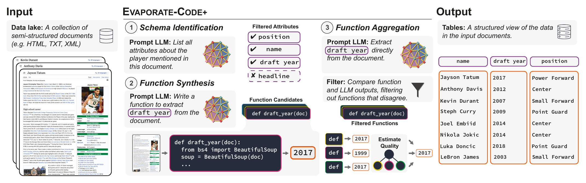
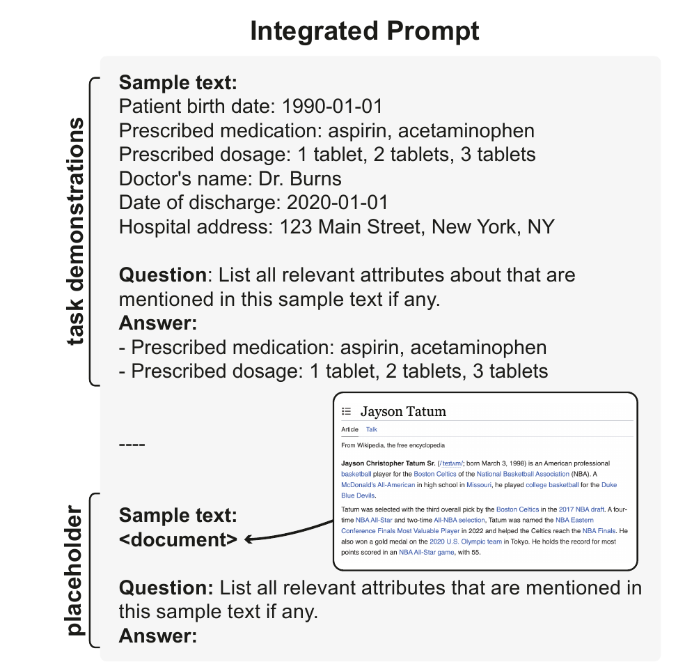
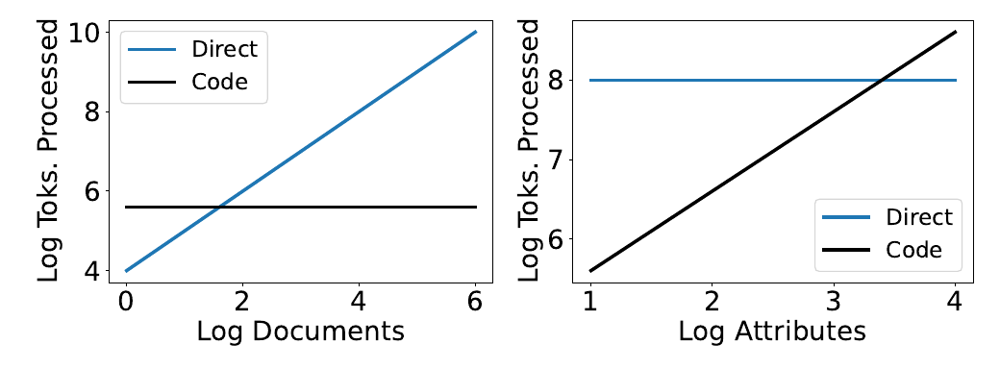
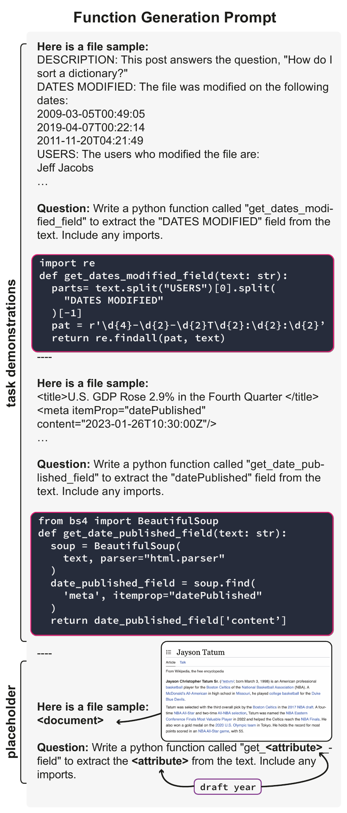
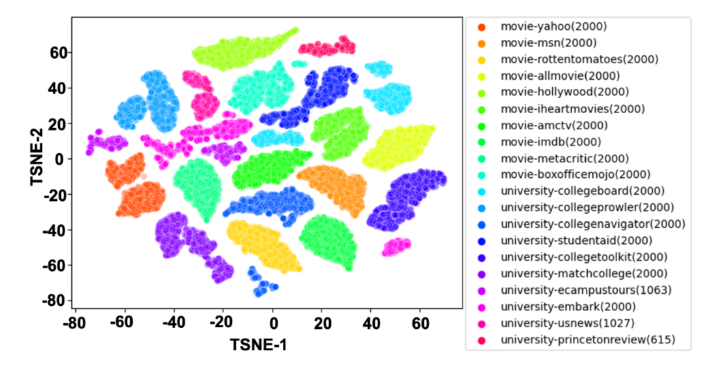

# Language Models Enable Simple Systems for Generating Structured Views of Heterogeneous Data Lakes（中文译文）

## 译者说明

本文依据同目录的 `source.pdf` 翻译。章节、图表、公式、算法、代码与参考文献按原文结构保留。

## 摘要

数据管理领域的一个长期目标，是开发无需用户参与、输入文档即可输出可查询表格的系统。潜在文档种类极其繁多，因此当前最先进的系统会采用简化假设，并使用特定领域的训练。我们探讨能否利用大语言模型（large language model，LLM）的上下文学习能力，在保持通用性的同时解决这一问题。我们提出并评估了由 LLM 驱动的原型系统 Evaporate。我们发现该系统可以采用两种实现策略：提示 LLM 直接从文档中抽取值，或者提示 LLM 合成执行抽取的代码。评估表明，这两种方法之间存在成本—质量权衡。代码合成成本低，但准确率远低于让 LLM 直接处理每篇文档。为了在保持低成本的同时提高质量，我们提出扩展实现 Evaporate-Code+，其质量优于直接抽取。核心洞见是生成许多候选函数，并利用弱监督对其抽取结果进行集成。Evaporate-Code+ 仅让 LLM 以次线性规模遍历文档，却优于当前最先进的系统。在 16 个真实评估场景中，这相当于让 LLM 需要处理的文档数量减少 110 倍。

**PVLDB 引用格式：** Simran Arora、Brandon Yang、Sabri Eyuboglu、Avanika Narayan、Andrew Hojel、Immanuel Trummer 和 Christopher Ré。Language Models Enable Simple Systems for Generating Structured Views of Heterogeneous Data Lakes。PVLDB, 17(2): 92–105, 2023。doi:10.14778/3626292.3626294。

**PVLDB 工件可用性：** 源代码、数据和/或其他工件已发布于 <https://github.com/HazyResearch/evaporate>。

## 1 引言

组织常常希望从异构数据湖（例如 Web、企业数据湖和电子健康记录）中获取被封存的洞见 [10, 26, 54]。这些数据源以原始形式存在时，无法方便地支持分析查询。数据管理领域的一个长期目标，就是开发能够自动把异构数据湖转化为可查询结构化表格的系统 [12, 15, 47, 66 等]。我们研究近期的大语言模型能否帮助解决这个问题。

我们研究的系统以异构文档（例如 HTML 网页、PDF、文本）为输入，输出这些文档的表格式结构化视图。系统必须识别模式（schema），并执行抽取来填充表格。

> **示例 1。** 医学研究人员经常综合电子健康记录（EHR）、临床试验、知识源（例如 PubMed）和 FDA 报告中的数据，以理解并监测患者和治疗 [8]。以规模庞大的 FDA 510(k) 医疗器械上市前通知审查报告为例，它们已经成为多项研究的对象 [64, 68]。我们的目标是输出一张表，自动组织散布在约 20 页 PDF 中的属性，例如器械分类（device classification）、对比器械代码（predicate device code）和适用范围（indications for use）。

解决这一问题的系统必须平衡三个方面：成本（数据湖可能包含数百万篇文档）、质量（输出表格应能准确支持分析人员的查询）和通用性（不同数据湖具有不同的文档类型与结构）。第 2 节将给出正式的任务定义，并进一步讨论这一权衡。

由于文档的格式、属性和领域跨度很大，以往系统都依赖简化假设，例如只处理一种文档格式。大多数工作聚焦于结构化 HTML [12, 15, 25]，并假设属性和值位于 HTML DOM 的特定位置 [22, 43, 44, 67]。对于非结构化文本，当前方法使用语言学工具（例如依存句法分析器）引入结构 [15, 25, 31, 48]，再在所得结构上应用启发式规则抽取信息。示例 1 中的文档凸显了这些方法的局限：它们缺少 HTML 一类的结构；与近期评估 [67] 一致，我们发现针对非结构化文本的当前最先进方法在长篇半结构化 PDF 上表现很差（见 [5]）。有些系统假设有人在环，负责标注数据和编写抽取启发式规则 [53, 57]；另一些系统则假设可以获得目标领域的已标注文档 [22, 43, 44]。示例 1 中的报告正是由研究人员人工标注的 [64]。



**图 1：** 用户提供一组文档（例如 NBA 球员简介），Evaporate 通过识别属性并填充各列来输出表格。Evaporate 避免在全部文档上运行昂贵的 LLM 推理，做法是：（1）从少量文档样本中合成关键属性；（2）合成可大规模复用、用于处理文档的函数（例如 Python 函数）。由于函数质量并不稳定，Evaporate 还会（3）应用一种算法，生成大量候选函数，并使用弱监督集成其抽取结果。

我们探索能否利用 LLM 提高通用性。LLM 是在广泛数据上预训练的深度学习模型，可以适配从机器翻译到数据整理等多种任务 [14, 46]。推理时，模型以称为提示（prompt）的自然语言任务描述为输入 [11, 14]，生成自然语言回答。第 2.3 节将进一步介绍 LLM 背景。

**Evaporate（第 3 节）。** 我们提出 Evaporate，一个使用 LLM 为半结构化数据湖生成结构化视图的系统。评估覆盖 16 个真实场景，从电影网站、大学网站到 FDA 510(k) 审查报告 [22, 32, 34, 37, 43, 64, 68]。

用户输入一组文档，Evaporate 自动识别模式并执行抽取以填充表格。为了支持这些多样的评估场景，我们的实现无需定制、训练或人工操作。我们提出实现这一接口的两种基本策略，并揭示二者在成本与质量之间的权衡：

1. **Evaporate-Direct（图 2）：** LLM 直接从文档中抽取值。
2. **Evaporate-Code（图 4）：** LLM 合成代码，再用该代码大规模处理文档。

在所有评估场景上取平均，Evaporate-Code 虽然便宜，但比 Evaporate-Direct 低 24.9%（13.8 个 F1 点）。因此我们寻求新的代码合成方法，并提出质量优于直接抽取的 Evaporate-Code+。其核心思路是合成大量抽取代码片段，再利用弱监督集成其输出。

**直接抽取（第 3.1 节）。** 第一个实现 Evaporate-Direct 对输入中的每篇文档应用同一个提示（完整提示见 [5]），指示 LLM 同时识别模式并抽取值。值得注意的是，在一些场景中，仅凭一个固定提示、不做任何针对任务的修改，其性能便足以与依赖特定领域假设和训练的最先进系统竞争。

不过，这种实现非常昂贵。LLM 针对交互式、有人在环的应用（例如 ChatGPT）优化 [65]，而不是面向高吞吐数据处理任务 [56]。Evaporate-Direct 中 LLM 处理的 token 数量随数据湖规模线性增长。按 2023 年 3 月的价格，把 OpenAI 模型应用于 5,500 万篇维基百科文章，成本将超过 11 万美元（gpt-3.5，每千 token 0.002 美元）或 110 万美元（text-davinci-003，每千 token 0.02 美元）[1, 49]。更广阔的互联网包含数十亿网页 [35]，事实还会随时间变化：维基百科会新增 NBA 球员，交易后球员所属球队会变化，每场比赛后场均得分指标也会变化。数据处理是一项常规开销（多个数据分析人员都会重复承担），而不是一次性成本 [55]。

**代码合成（第 3.2 节）。** 能否只让 LLM 次线性地遍历文档，就生成结构化表格？Evaporate-Code 把任务拆为两个子任务：（1）识别表格模式；（2）抽取值。这一视角使我们能够利用在对每篇文档运行 LLM 推理时、两个子任务分别呈现的冗余：

1. **模式生成。** 为识别模式，只需让 LLM 处理少量文档样本。之所以可行，是因为跨文档提及的属性存在冗余。例如在示例 1 中，大多数报告都会提到对比器械名称。
2. **函数合成。** 提示 LLM 合成可以大规模应用于文档的函数（例如 Python 函数）。之所以可行，是因为属性—值对的格式存在冗余。例如，FDA 510(k) 报告采用一致的格式 `Predicate device name: k`。

Evaporate-Code 中 LLM 处理的 token 数量固定，不随数据湖规模增长（如图 3 所示），从而解决了 Evaporate-Direct 的成本问题。不过，LLM 合成的信息抽取函数质量不一，其抽取结果的 Pair F1 最多比 Evaporate-Direct 低 14 个点。

**代码合成与聚合（第 3.3 节）。** 为了在低成本下提高质量，我们提出 Evaporate-Code+。观察合成函数后，我们发现有些函数仅适用于很窄的文档子集，另一些则包含语法或逻辑错误。为降低方差，我们合成许多候选函数，估计其质量，再通过弱监督聚合其抽取结果。这建立在我们先前的工作 [4] 之上；该工作首次把弱监督广泛应用于提示。

弱监督（weak supervision，WS）是一种统计框架，无需任何标注数据，即可建模并组合覆盖率各异的噪声源 [53, 62]。但弱监督通常用于人工编写的函数，而我们面对的是机器生成函数，因此直接使用现有弱监督工具会出现问题：（1）弱监督在理论上假设所有噪声源都优于随机性能（准确率 50%），但我们生成的函数中有 40% 的性能低于 25%（第 3.2 节）；（2）弱监督希望部署仅在狭窄数据切片上达到高质量（高精度）的函数，并让函数对切片之外的数据弃权（低召回率）。人能够明确表达函数何时应弃权，但机器生成的函数不包含这种逻辑。为处理开放式弱监督场景，我们提出一种新的函数集成算法（算法 1）。

我们的主要贡献如下：

1. **我们的系统为研究已久的结构化视图生成问题提供了新能力。** 现有系统需要域内训练，且只能处理有限的文档格式（例如 HTML [16, 22, 24, 43]）。Evaporate 无需训练，即可直接处理 HTML、PDF、TXT 等不同格式（第 4 节）。
2. **我们研究了数据任务中直接抽取与代码合成之间的新权衡空间。** Evaporate 渐近地减少 LLM 为生成输出而需处理的 token 数量。每个评估场景有 1 万篇文档时，成本降低 110 倍。以往使用 LLM 处理数据任务的工作还要求用户手写提示 [46]；Evaporate 使用与任务无关、可跨场景泛化的提示。
3. **我们提出了把弱监督应用于开放式函数和抽取任务的算法及理论分析。** Evaporate-Code 更高效，但 Evaporate-Direct 的质量显著更高。使用我们的算法后，Evaporate-Code+ 比直接用 LLM 处理每篇文档的 Evaporate-Direct 高 10.1 个 F1 点（18%）（表 3）。
4. **我们在 5 个领域、3 种数据格式的 16 个数据场景以及 4 个 LLM 上广泛验证系统。** （1）端到端生成表格（模式生成加抽取）时，Evaporate 比最先进的学习型基线高 3.2 个 F1 点（6%），仅比较抽取步骤时高 6.7 个 F1 点（10%）；（2）使用 text-davinci-003 时，Evaporate-Code+ 比 Evaporate-Direct 高 10.1 个 F1 点；（3）在四种不同 LLM 上，Evaporate-Direct 与 Evaporate-Code+ 的相对质量保持一致。

第 2 节定义问题，第 3 节介绍 Evaporate，第 4 节给出评估，第 5 节讨论相关工作。

## 2 预备知识

本节首先定义问题场景和系统设计目标。

### 2.1 问题设定

我们研究如何为一组半结构化文档（例如 HTML、PDF、TXT）构造结构化视图（即数据库表）。正式定义如下：

- **输入：** 用户提供一组 $n$ 篇半结构化文档 $D=\lbrace{}d_1,d_2,\ldots,d_n\rbrace{}$，例如一组用于医疗器械上市前通知的 FDA 510(k) 审查报告。
- **输出：** 系统输出一张表。表由属性名集合 $A=\lbrace{}a_1,a_2,\ldots,a_m\rbrace{}$（例如 $a_1=$ 适用范围、 $a_2=$ 分类）以及 $n$ 条抽取记录 $R=\lbrace{}r_1,r_2,\ldots,r_n\rbrace{}$ 定义，每篇文档对应一条记录；其中 $r_i$ 是一个 $m$ 元组，例如 $r_1=(\text{“骨折”},\text{“X 射线”})$。

以往工作提出的系统依赖人工标注 [57] 或人工调优提示 [46, 59]，而我们的目标是开发无需用户操作的自动化方案。

**衡量系统质量。** 我们把生成的表 $(A,R)$ 与人工整理的“真值”表 $(\hat A,\hat R)$ 比较。一个属性的覆盖率，是包含该属性及其值的文档所占比例。沿用以往工作，我们优先考虑高覆盖率属性，因为它们往往更适合分析 [16, 18]。我们使用 Pair F1 衡量两张表之间的一致程度。评估设置的更多细节见第 4.3 节。

### 2.2 系统设计目标

当前生成结构化视图的系统在通用性、成本/灵活性以及质量/可用性方面均有局限 [16, 18, 48, 67]。下面回顾现有系统。

**通用性。** 理想系统应跨文档格式和领域泛化，无需人工设计规则或针对任务训练。这一点很重要，因为输入文档 $D$ 可能涉及任何主题，也可能采用任何文件格式 [67]。现有系统通过命名实体识别（NER）、依存句法树和词性（POS）标注为文档构造特征，再训练模型预测某段文本是否为有用事实 [39]。遗憾的是，这些解析、NER 和 POS 标注在半结构化数据（例如 HTML 元素）和较长文本序列（即完整文档）上的性能会大幅下降 [67]。详细错误分析见 [5]。另有一类专门系统利用 HTML DOM 树作为特征，处理半结构化 Web HTML 文档 [13, 16, 22, 25, 44 等]，但它们因而不支持其他文档格式。

**成本。** 理想系统应允许用户管理成本—覆盖率权衡，而不是强制“全抽取或全不抽取”。现有系统旨在抽取文档中所有可能的事实，既不优先考虑重要属性，也不允许用户影响抽取内容 [21, 67]。处理每篇文档的每一行可能很昂贵。用户可以先定义感兴趣的属性，再应用闭集信息抽取系统来缓解成本问题，但这需要前期人工投入。因此，理想系统应让用户管理成本—覆盖率权衡，而不是强迫用户“全抽取或全不抽取”。

**质量。** 理想系统应输出列内容完整（即属性覆盖率高）、抽取准确且格式一致的表 $(A,R)$。现有开放信息抽取（OpenIE）系统通常直接从文档中抽取未规范化形式的元组 [21]，这会使结果难以分析，需要高级系统或用户定义的后处理代码，把主语、宾语和谓词解析到规范形式 [15]。

### 2.3 大语言模型背景

本节介绍我们工作的核心——大语言模型（LLM）。

> **定义 1（大语言模型）。** 在海量文本语料上，以自监督任务（例如下一词预测）训练的机器学习模型 $\mathcal{F}$ [29]。语言模型可以根据给定上下文生成新文本。例如：
>
> $$
> \mathcal{F}(\text{All that glitters}) \rightarrow \text{is not gold.}
> $$

许多研究证明，LLM 无需更新任何模型参数即可解决新任务，这一现象称为上下文学习（in-context learning）[2, 14, 46]。具体而言，只要给出适当的任务描述，模型往往就能生成完成任务的文本。

> **定义 2（提示）。** 用于诱导 LLM 生成特定内容的自然语言任务说明。提示通常包含任务演示。例如，下列提示会诱导模型把单词 *cheese* 翻译为法语：
>
> $$
> \mathcal{F}(\underbrace{\text{Translate. Eng: hello, Fr: bonjour; Eng: cheese, Fr:}}\relax_{\text{提示}})\rightarrow\underbrace{\text{fromage}}\relax_{\text{生成结果}}
> $$

本文使用的提示示例见图 2 和图 4，系统使用的所有提示均见 [5]。

## 3 Evaporate：由语言模型驱动的原型系统

我们提出 Evaporate，一个利用 LLM 物化异构半结构化数据湖之结构化视图的原型系统。以往系统依赖人工标注 [57] 或针对某个领域调优提示 [46]；Evaporate 则提供极为通用的接口：用户输入文档，系统自动输出文档的结构化视图，无需任何特定领域训练或提示定制。

**概览。** Evaporate 接口有三种实现。可以把每篇文档都送入 LLM，提示它直接抽取值（直接抽取，图 2）；也可以只送入少量文档样本，提示 LLM 编写抽取代码（代码抽取，图 4）。第 3.1 和 3.2 节分别介绍这两种策略的基线实现 Evaporate-Direct 和 Evaporate-Code。我们发现两种实现会在成本和质量之间取舍。随后，第 3.3 节提出利用弱监督提高质量、同时保持低成本的代码抽取实现。

**提示管理。** Evaporate 使用一组与任务无关的提示，其原文全部见技术报告 [5]；面对不同任务，这些提示不会修改。在系统内部，提示是 Python f-string，包含用来填入当前数据集文本块的占位符。格式化后的字符串作为 LLM 提示。我们使用参与开发的缓存工具 Manifest [50]，把 LLM 提示的输入—补全对存入本地 SQLite 数据库；键为提示输入，值为补全结果。因此，用户对同一数据集重复运行系统时，无需再次承担 LLM 推理成本。



**图 2：** Evaporate-Direct 的结构化提示。提示模板包含上下文示例与推理示例（即数据湖文档）的占位符，并应用于数据湖中的每篇文档。图中的完整提示内容转写如下：

```text
Sample text:
Patient birth date: 1990-01-01
Prescribed medication: aspirin, acetaminophen
Prescribed dosage: 1 tablet, 2 tablets, 3 tablets
Doctor's name: Dr. Burns
Date of discharge: 2020-01-01
Hospital address: 123 Main Street, New York, NY

Question: List all relevant attributes about that are
mentioned in this sample text if any.
Answer:
- Prescribed medication: aspirin, acetaminophen
- Prescribed dosage: 1 tablet, 2 tablets, 3 tablets

----

Sample text:
<document>

Question: List all relevant attributes that are mentioned in
this sample text if any.
Answer:
```

### 3.1 Evaporate-Direct

Evaporate-Direct 是一个简单的直接抽取实现，它把同一个提示模板应用于每篇文档。图 2 中的模板会要求 LLM 同时识别模式并抽取值（完整提示见 [5]）；其中包含少量通用上下文示例，不针对特定格式、领域或文档定制。

下面讨论如何：（1）管理无法放入 LLM 上下文窗口的长文档；（2）处理 LLM 的文本输出；（3）依据以往工作 [16] 的原则优先选择最有用的属性。

**管理长文档。** Evaporate 的输入是原始文档的文件路径，而文档可能长达数页。例如，示例 1 中的 FDA 医疗报告约有 20 页。不过，现代 LLM 底层的 Transformer 架构每次推理只能处理固定数量的 token（例如几千个），这一上限称为上下文窗口。因此 Evaporate 会切分原始文档，保证每个片段都位于上下文窗口内，再如图 2 所示依次把各片段插入提示。

**处理文本输出。** 语言模型输出开放式文本，最后一步因而是将其转换为可用表格。为便于这种数据转换，可以在提示的演示中规定格式，鼓励 LLM 以相似结构组织输出。例如，图 2 的演示为每个条目规定 `<attribute>: <value(s)>` 列表格式。Evaporate 可以把这种格式的输出反序列化为表格。

**优先选择常见属性。** 抽取出的属性和值可能包含只适用于个别文档的小众属性，而数据库设计的常见原则是捕获高频属性 [15]。因此，Evaporate 对各文档输出的属性取并集，再按频率排序，从而优先处理头部属性。

**分析。** 我们按照三个设计目标分析直接抽取实现 Evaporate-Direct。文档处理结果见表 3，并在第 4 节详述。

总体而言，在 16 个场景中的 8 个，Evaporate-Direct 的质量达到或超过第 4 节所述基线系统。考虑到它的简单程度——用一个固定提示处理全部 16 个场景——这一结果令人惊讶。然而，根本性的成本限制阻碍了该方法的实际部署。

高成本使它不适合大型、重复性工作负载。LLM 处理的 token 数随数据湖规模以 $O(n)$ 线性增长，而数据湖可能包含数十亿篇文档 [35, 47]。此外，对大多数组织而言，数据处理不是一次性开销；数据湖动态变化，因此必须反复应用 Evaporate-Direct。

### 3.2 Evaporate-Code

Evaporate-Code 相比 Evaporate-Direct 显著降低成本。它把模式识别与值抽取分开，从而利用两个子任务的根本差异来降低成本。模式识别只需处理少量文档样本，因为属性在文档之间具有一致性；而值抽取必须处理每篇文档。不过，值在不同文档中的出现方式（即在文档中的相对位置）通常一致，因此抽取逻辑也跨文档一致。

拆分后的实现包含两步：

1. **模式合成（第 3.2.1 节）。** 虽然不同文档的值不同，但属性输出中的 `<attributes>` 相对一致。为利用这种冗余，Evaporate-Direct 提示 LLM 分析少量文档样本，为输出模式识别属性。例如，给定 FDA 医疗器械报告样本，LLM 会输出一张器械表，其中包含 `510(k) number` 等属性。
2. **函数合成（第 3.2.2 节）。** 属性在文档中的嵌入方式具有一致性。例如，FDA 文档中的 510(k) 代码总以字母 `k` 开头，NBA 球员维基页面中的球员位置属性总在 HTML 的 `infobox` 元素中。研究人员手工抓取文档做分析时很可能利用这种冗余。Evaporate-Code 则让 LLM 自动合成一组数据湖专用函数，再大规模应用于许多文档。

下面给出各子任务的细节。

#### 3.2.1 模式合成

Evaporate 首先使用 LLM，为输出模式识别属性 $A=\lbrace{}a_1,a_2,\ldots,a_m\rbrace{}$。

**生成候选属性。** 具体而言，从 $D$ 中抽取 $k\ll n$ 篇文档组成集合 $\tilde D$。对每篇文档，像 Evaporate-Direct 一样提示 LLM 抽取最有用的属性。由此得到一组属性，并按它们跨文档被抽取的频率排序。为了确保模式识别具有来源可追溯性，我们只保留文档中明确提到的属性。

**候选属性重排序。** 现在 Evaporate 只从少量文档识别属性，所得排名会比 Evaporate-Direct 处理每篇文档时更有噪声，例如某个重要属性可能只在 $k$ 篇文档中被 LLM 选中几次。因此，我们向 LLM 展示抽取属性的并集，并提示它识别最有用的属性（提示见 [5]）。如果某属性出现在 LLM 输出中，则提高它在基于频率的排名中的权重。

#### 3.2.2 函数合成

给定属性 $A=\lbrace{}a_1,a_2,\ldots,a_m\rbrace{}$，Evaporate-Code 第二阶段的目标，是为每篇文档 $d_i\in D$ 抽取这些属性的值。关键洞见是：不同文档表达属性—值的方式相似。为了利用这一点，我们不让 LLM 逐篇处理文档来抽取属性 $a_i$ 的值，而是让它生成可复用于许多文档的代码。

图 4 展示 Evaporate 的函数合成提示。上下文示例给出文本片段，以及从中抽取目标属性的函数。Evaporate 通过简单的关键字搜索，在数据湖中查找提到 $a_i$ 的文档片段，并把它们纳入提示。函数按模式合成阶段得到的属性排名顺序生成；因此，Evaporate 认定最相关、最常见的属性会首先被抽取，用户可在需要时停止合成。



**图 3：** 通过直接提示（Direct）和代码合成（Code）处理文档的权衡。对于小型数据湖以及属性数量很大时，Direct 已经足够；随着文档数量增加，Code 的效率会高出多个数量级。左图固定为 10 个属性，右图固定为 1 万篇文档，并假设每篇文档含 1 万个 token。

图 4 给出函数合成所用的完整提示布局。



**图 4：** 一个具有代表性的函数合成提示，包含两个与数据湖无关的上下文示例。完整提示及其代码转写如下（原文中可见的省略号原样保留）：

```text
Here is a file sample:
DESCRIPTION: This post answers the question, "How do I
sort a dictionary?"
DATES MODIFIED: The file was modified on the following
dates:
2009-03-05T00:49:05
2019-04-07T00:22:14
2011-11-20T04:21:49
USERS: The users who modified the file are:
Jeff Jacobs
...

Question: Write a python function called "get_dates_modified_field"
to extract the "DATES MODIFIED" field from the text. Include any imports.
```

```python
import re

def get_dates_modified_field(text: str):
    parts = text.split("USERS")[0].split("DATES MODIFIED")[-1]
    pat = r'\d{4}-\d{2}-\d{2}T\d{2}:\d{2}:\d{2}'
    return re.findall(pat, text)
```

```text
----
Here is a file sample:
<title>U.S. GDP Rose 2.9% in the Fourth Quarter </title>
<meta itemProp="datePublished"
content="2023-01-26T10:30:00Z"/>
...

Question: Write a python function called "get_date_published_field"
to extract the "datePublished" field from the text. Include any imports.
```

```python
from bs4 import BeautifulSoup

def get_date_published_field(text: str):
    soup = BeautifulSoup(text, parser="html.parser")
    date_published_field = soup.find(
        'meta', itemprop="datePublished"
    )
    return date_published_field['content']
```

```text
----
Here is a file sample:
<document>

Question: Write a python function called "get_<attribute>_field"
to extract the <attribute> from the text. Include any imports.
```

**分析。** 下面按照三个设计目标简要分析 Evaporate-Code。文档处理结果见表 3，并在第 4 节详述。

**成本。** 图 3 展示 Evaporate-Direct 与 Evaporate-Code 的渐近成本差异。对文档数量而言，Evaporate-Code 渐近更高效：函数生成所需的 LLM 调用数与属性数成正比，而不与文档数成正比；二者交叉点为 40 篇文档。另一方面，Evaporate-Direct 每次推理可能从上下文文档中抽取多个属性，而 Evaporate-Code 必须为每个属性生成新函数。因此 Evaporate-Code 的成本随属性数增长，Evaporate-Direct 的成本则保持不变；交叉点为 2,500 个属性（图 3）。

**质量。** 在 SWDE 数据集上，Evaporate-Code 生成的表平均比 Evaporate-Direct 低 21.9 个 Pair F1 点（表 2）。由于 Evaporate-Code 便宜得多，这表明两种实现之间存在成本—质量权衡。

### 3.3 Evaporate-Code+

Evaporate-Code+ 是 Evaporate-Code 的扩展，在保持低成本的同时显著提高质量。它合成许多候选函数，再使用弱监督集成其抽取结果。任务分为三部分：

1. **模式识别（第 3.2.1 节）：** 与 Evaporate-Code 相同。
2. **函数合成（第 3.3.1 节）：** 与 Evaporate-Code 相同，但不再为每个属性只生成一个函数，而是生成许多候选函数；下文将介绍如何鼓励候选函数具有多样性。
3. **函数聚合（第 3.3.2 节）：** 合成的候选函数具有不同的质量和覆盖率，因此并不可靠。我们引入基于弱监督的算法，聚合各函数对文档属性值给出的不同预测。

#### 3.3.1 合成多样的候选函数

我们发现，LLM 生成函数的质量会随提示所用的文档片段和上下文示例发生显著变化。为应对这种波动，我们采用 Arora 等人 [4] 提出的策略：为同一任务准备多个不同的提示模板（即多个图 4 风格的函数生成提示），依次用每个模板提示 LLM，从而产生多样的候选函数集合 $F=\lbrace{}f_1,f_2,\ldots,f_k\rbrace{}$。

Evaporate 允许使用多个函数生成提示。我们使用 $P_A$ 和 $P_B$（见 [5]）。 $P_A$ 没有上下文示例，其任务描述鼓励 LLM 使用正则表达式； $P_B$ 有两个上下文示例，其任务描述鼓励 LLM 导入并使用任意 Python 库。两者都不能稳定胜过对方：在 8 个 SWDE Movie 场景、5 个 SWDE University 场景、FDA 报告、Enron 和维基百科球员页面中， $P_A$ 分别在 69%、45%、60%、91% 和 31% 的属性上生成质量更高的函数。设计一个“完美”的单一提示并不容易，因此 Evaporate 会聚合多个提示的结果。

#### 3.3.2 聚合候选函数

下面讨论如何组合候选函数的抽取结果。

**背景：无监督聚合方法。** 我们的场景没有真值标签，无法直接评估候选函数质量。一种流行的无监督聚合策略，是对函数输出进行多数投票（majority vote，MV）[63]。形式上，MV 把函数视为彼此独立，并赋予所有函数输出相同权重。然而，函数质量并不相等——超过 40% 的合成函数，其抽取质量低于 25 Text F1。因此 Evaporate 使用弱监督（WS）：这是一种用于建模噪声信息源准确率及其相关性的标准统计框架，无需任何标注数据 [27, 53]。弱监督学习一个标签模型，其参数为候选函数的准确率和相关性；该方法已广泛用于工业界 [53]。

遗憾的是，现有弱监督设置有以下假设，并不适用于我们的场景。标准设置假定函数由人设计，而这里的函数由机器生成，并输出非标准化的抽取文本。

1. **假设 1：函数会对不适用的样本弃权 [27, 53]。** 函数对某篇文档返回空值可能有两种原因：（1）文档中不存在该属性，例如球员未上大学时，维基百科页面可能没有 `college` 属性；（2）属性存在，但函数不够复杂，无法抽取，例如 FDA 报告的 `product code` 可能以小写 `k` 或大写 `K` 开头，而某函数只会抽取小写形式，因此在大写文档上返回空字符串。在情形（1）中，如果函数输出了值，其精度很低，我们希望忽略它；在情形（2）中，函数精度很高，理想情况下系统应学会有选择地使用它。遗憾的是，我们的场景很难判断空值属于哪种情形；传统弱监督由人提供函数时，人会直接写明这种逻辑，例如“邮件含 URL 时，投票认为它包含垃圾内容，否则弃权”[58]。
2. **假设 2：函数与真值标签 $y$ 的相关性优于随机性能 [27, 53]。** 函数由人设计时这个假设合理，但 Evaporate 使用机器生成函数。我们发现 51% 的生成函数低于 50 Text F1。
3. **假设 3：弱监督通常用于分类场景中类别定义明确的任务 [27, 53]。** 我们的函数输出的是抽取文本，可能输出空间几乎不受约束，而且会随文档变化，例如 NBA 球员的出生日期各不相同。函数收集到的唯一抽取结果数量也可能因文档而异。

我们提出以下方法来利用弱监督。令 $D_{eval}$ 为数据湖 $D$ 中的少量文档样本，已有生成函数集合 $F$ 和 LLM $\mathcal{F}$。

**处理函数弃权。** 为估计函数空输出属于弃权的概率，我们用 $\mathcal{F}$ 衡量 $D_{eval}$ 中有多少文档能被抽取出值，得到比例 $e$。直观上， $e$ 较高时，应先验地认为该属性存在于大量文档中，因此函数输出空值时更可能是在弃权； $e$ 较低时，该属性只存在于少量文档，因而应认为函数是在预测空值。 $e$ 可以同时指导函数评估和后续聚合。需要注意， $\mathcal{F}$ 也可能弃权或产生幻觉，进而影响 $e$ 的估计。

**算法 1：函数聚合（来自 Evaporate-Code+）**

```text
1  输入：文档 D、候选函数 F、LLM 𝓕。
   输出：各文档的预测抽取结果 ŷ₁,…,ŷₙ。
2  收集样本预测：抽样 D_eval ⊂ D，应用函数 f_j ∈ F 和 LLM 𝓕，
   对文档 d_i 分别得到 ŷ_ij 和 ŷ_i𝓕。
3  处理弃权：对空的 ŷ_ij，判断它表示函数弃权，还是预测 d_i 中
   没有该属性值。让 𝓕 在两种情形之间作判断：计算 D_eval 中
   ŷ_i𝓕 非空的文档比例 e。
4  函数评分：根据 e，用度量函数 m(·) 为 f_j 计算分数 â_j：
   若 e > τ，â_j = Σ(i=1…n) m(ŷ_i𝓕, ŷ_ij) | ŷ_i𝓕 ≠ ∅；
   否则，â_j = Σ(i=1…n) m(ŷ_i𝓕, ŷ_ij)。
5  过滤低质量函数：删除所有满足 â_j ≤ 0.5 的 f_j ∈ F，得到 F′。
6  收集投票：对全部 d_i ∈ D 应用 f ∈ F′，收集其对 d_i 中属性值
   的“投票”。根据 e，把空投票后处理为弃权或“没有该属性”的预测。
7  聚合：使用弱监督，根据函数投票 {ŷ_ij | f_j ∈ F′} 得到最终预测 ŷ_i。
```

**处理质量劣于随机的函数。** 我们把 $\mathcal{F}$ 对少量文档 $D_{eval}$ 的抽取结果（我们使用 $|D_{eval}|\le 10$）视为这些文档的近似真值。然后，把 $f_j$ 在 $d_i\in D_{eval}$ 上的输出与 $\mathcal{F}$ 输出比较，估计函数质量 $\hat a_j$。在低 $e$ 区间，应在全部 $d\in D_{eval}$ 上评估输出；在高 $e$ 区间，则只在 $f_j$ 抽取出值的 $d\in D_{eval}$ 上评估。最后过滤 $\hat a_j\le 0.5$ 的 $f_j$，阈值 0.5 来自弱监督的典型假设 [27, 53, 61]。

注意， $\mathcal{F}$ 本身也有误差率 $e$，会影响 $\hat a_j$ 的估计。我们从理论上研究了 $e$ 对弱监督所学标签模型的影响，证明见 [5]。

> **命题 1。** 设有 $m$ 个函数，以误差率为 $e$ 的噪声标签评估，得到经验准确率 $\hat a$；弱监督标签模型估计的函数准确率为 $\tilde a$，测得误差低于阈值 $\epsilon$。如果每个函数至少为
>
> $$
> n\ge \frac{1}{2(\gamma-\epsilon-e)}\log\left(\frac{2m}{\delta}\right)
> $$
>
> 个数据点打标签，则弱监督标签模型将以 $1-\delta$ 的概率成功学到满足 $\Vert{}a^\ast{}-\tilde a\Vert{}\relax_\infty\lt{}\gamma$ 的准确率。

**处理不受约束的输出空间。** 对单篇无标签文档 $d_i$， $k$ 个生成函数可能给出 $[0..k]$ 个不同的预测投票，而且不同文档 $d_i$ 与 $d_j$ 的唯一投票数也可能不同。因此，对每个 $d_i\in D$，我们把相同投票装入同一桶，并取出现频率最高的 $b$ 个桶。输出值不在前 $b$ 个桶中的函数，其投票被标为弃权。如果唯一投票数少于 $b$，就在前 $b$ 个桶中插入占位值。最后，由于不同文档的“类别”也不同，我们在目标函数中加入约束，鼓励各类别的条件准确率相等。

处理上述假设后，便可像 [4, 53] 那样，利用以往方法把候选函数的噪声抽取结果聚合为质量更高的抽取结果。在弱监督下，每个函数的输出都被视为对真值标签的一次“投票”，目标是在无任何标注数据的情况下，构造潜变量图模型，考虑函数之间各异的准确率和相关性。聚合方法总结于算法 1。

**分析。** 下面按照三个设计目标简要分析 Evaporate-Code+。结果见表 3，并在第 4 节详述。

**成本。** 与 Evaporate-Code 一样，Evaporate-Code+ 中 LLM 处理的 token 数量相对于文档数保持固定。图 3 展示它与 Evaporate-Direct 的渐近成本差异。LLM 必须处理的 token 只增加一个常数因子，即生成的候选函数数；用户可以设置该数量以权衡成本与质量。

**质量。** 三种实现中，Evaporate-Code+ 生成的表格质量最高。它平均比 Evaporate-Direct 高 12.1 个 F1 点（22%），使用的计算资源却少得多；函数聚合相对 Evaporate-Code 提高 25.1 个 F1 点。

## 4 评估

下面评估 Evaporate，并验证以下主张：

- **函数合成可为 LLM 数据处理带来渐近成本下降。** 近期有大量工作关注使用 LLM 开发各种数据管理应用 [17, 36, 40, 46]，以往方法直接用 LLM 处理数据。相较 Evaporate-Direct，Evaporate-Code+ 把 LLM 需要处理的 token 数减少 110 倍。
- **函数合成加聚合的质量高于直接抽取。** 尽管 Evaporate-Direct 让 LLM 直接处理每篇文档，Evaporate-Code+ 的平均性能仍高 10.1 个 F1 点（18%）。与只合成一个函数的 Evaporate-Code 比较表明，函数聚合是实现这种改进的关键。
- **Evaporate 比最先进基线质量更高，同时提供更通用的接口。** Evaporate-Code+ 仅用六个自然语言提示表达任务（全部见 [5]），并且不做训练。尽管如此，从头生成表格时它仍比最先进系统高 3.2 个 F1 点（6%），抽取预定义真值属性时高 6.7 个点（10%）；同时，它支持的场景比任何基线都广。
- **上述权衡在不同语言模型上成立。** 我们评估了来自三个不同提供方的四个模型 [6, 42, 49]，发现 Evaporate-Direct 和 Evaporate-Code+ 在各种 LLM 上的质量仍可相互竞争。

### 4.1 实验设置

我们主要在结构化视图生成这一端到端任务上评估 Evaporate。为了与以往工作比较，还评估闭集信息抽取子任务。下面先定义任务、指标和基线，再介绍 Evaporate 的实现细节。

**结构化视图生成任务。** 该任务涵盖识别模式和填充输出表的端到端过程，常被视为视觉系统问题 [16]。由于任务困难，可比较的工作很少，因此我们选择最接近的一类工作——开放信息抽取（OpenIE）系统作为基线，其任务是从文档中抽取所有事实 [7, 48]。基线分为两组：（1）面向 HTML 的 OpenIE：Deng 等人 [22]、Lockard 等人 [43, 44]；（2）面向通用非结构化文本的 Kolluru 等人 [39]。前一类模型明确使用 HTML DOM 树结构处理页面，假定属性值是叶节点，并明确在目标领域文档上训练。后一类系统先使用语言学工具（依存句法分析器、词性标注器和命名实体标注器）标注文句，再基于这些特征微调 LLM 来执行任务 [67]。

**指标。** 标准指标为 Pair F1 [22, 43]，即对预测元组集合与真值元组集合计算 F1；元组形式为（文档 ID $d_i$，属性 $a_j$，值 $r_{i,j}$）。只有元组与真值中的元组完全匹配才算正确。由于 Evaporate 对属性排序并按顺序生成函数，为公平比较，我们报告前 $k$ 个属性所对应全部元组的 OpenIE 分数，其中 $k$ 是当前场景的真值属性数。相比之下，以往系统会以“全有或全无”的方式抽取元组。

**闭集信息抽取任务。** 该任务中用户提供预定义模式，Evaporate 用于填充表格。闭集 IE 的最先进比较方法包括：（1）面向 HTML 的 Deng 等人 [22]、Lockard 等人 [43, 44]；（2）面向通用非结构化文本的 Clark 等人 [19]、He 等人 [33]。前一类模型明确利用 HTML DOM 树结构处理页面，假定属性值为叶节点，并在测试领域文档上进行显式训练；后一类是预训练 LLM，并在海量已标注的（属性，值）对上微调 [52]。我们按每篇文档中的每个值，用 Text F1 报告 ClosedIE 结果。

**Evaporate 实现细节。** 以下实验用当前流行的 LLM API 实例化 Evaporate。第 4.3 和 4.4.1 节的实验使用 OpenAI 的 text-davinci-003；第 4.4.2 节评估来自三个模型提供方的其他 LLM。实验中，每个数据湖取 10 篇样本文档用于模式合成、函数合成和函数验证。对每个属性和数据湖合成的函数，取分数最高的 10 个应用算法 1。提示在不同数据湖和模型间保持不变。[5] 中的消融实验展示了样本文档数与前 $k$ 个函数数量变化时的质量变化。

衡量不同 Evaporate 实现的成本时，我们计算 LLM 完成端到端任务所处理的 token 总数，即提示 token 与模型生成 token 数之和。采用该指标，是因为模型的实际耗时和美元价格都会波动，但二者都应与处理的 token 数成正比。

### 4.2 评估场景

我们在代表不同真实数据湖的 16 个场景上评估 Evaporate。首先使用由 13 个电影和大学网站组成的基准套件，把 Evaporate 与最先进的信息抽取系统比较 [22, 32, 43]。随后，为评估更非结构化的数据（即非 HTML），我们使用：已被三千多篇学术论文分析过的 Enron 企业邮件语料库 [3, 34, 37]；多项重要研究涉及的 FDA 510(k) 医疗器械上市前通知审查报告 [64, 68]；以及 HTML 比现有基准更复杂的 NBA 球员维基百科页面 [22]。我们发布了这些基准，更多细节见 [5]。下面简述各场景旨在研究的性质：

1. **基准套件：SWDE Movies 与 Universities。** SWDE 是以往文档级 IE 工作的标准基准 [22, 32, 43, 44 等]。其中有 8 组电影网站页面（例如 IMDB）和 5 组大学网站页面（例如 US News）。每个网站包含 1,063–2,000 个页面，并有 8–274 个属性的标注。我们使用 SWDE 与最先进方法比较，并测试一系列属性类型：从简单的电影“时长”到复杂的电影“演职员表”，从常见的电影“导演”到少见的“第二助理导演”。
2. **复杂 HTML：NBA。** SWDE 的属性总是出现在 HTML DOM 树的独立叶节点中，因此我们使用 NBA 球员维基百科页面评估更复杂的 HTML。例如，NBA 的 `draft` 属性同时包含选秀轮次、年份、顺位和选中该球员的球队。我们随机选择 100 个球员页面（时间跨度从 1940 年代至今），并使用 19 个属性标注进行评估。
3. **非结构化文本：Enron 与 FDA。** 现有文档级非结构化文本 IE 基准很少；直观上，以往几代模型面对这种场景很困难，因为它完全没有可用于锚定的结构（当前系统依赖 HTML DOM 元素或句子级 NER、依存关系和 POS 标注）。因此我们采用上述 Enron 与 FDA 场景。Enron 场景包含 15 个真值属性和 50 万篇文档；FDA 场景包含 16 个真值属性，以及从 FDA 510(k) 随机抽样的 100 篇 PDF 文档，每篇最长 20 页。

**数据集协议。** SWDE 的比较基线需要训练数据，因此采用按网站交叉验证：在一些网站上训练，在另一些网站上评估；它们尝试多种组合，保证每个网站都进入评估集。Evaporate 不需要任何训练数据，我们直接在全部网站上评估，使其与基线在相同样本上接受评估。

为匹配基线协议 [22]，我们分别用 Evaporate 处理每个数据集。但在真实数据湖中，文档来源可能未知、彼此混杂。我们对混合文档应用标准 TF-IDF 向量化器和 K-means 聚类，验证了无需任何标注或监督也能完美恢复文档来源（图 5，细节见 [5]）。直观上，由于格式信息丰富，半结构化数据可能很容易聚类。



**图 5：** SWDE 数据集中文档的 T-SNE 可视化。先取 TF-IDF 向量的前 16 个主成分，再执行 T-SNE；颜色表示来源网站。

### 4.3 Evaporate 与基线比较

首先验证 Evaporate 在通用性（即支持不同领域和格式数据的灵活性）与质量上均优于第 4.1 节定义的基线，再比较 Evaporate-Code+ 与基线的效率。

#### 4.3.1 质量与通用性比较

**半结构化文本系统。** 表 2 显示 Evaporate 在 SWDE 上优于最先进方法。我们采用基线论文报告的指标。Evaporate 完全不做训练，而且可跨文档格式（HTML、PDF、TXT）应用；相比之下，基线仅限于 HTML，并明确使用 Movie 和 University 领域网页的标签进行监督学习 [22, 44]。例如，Deng 等人 [22] 假定属性值位于 HTML DOM 树的叶节点，因此不能处理非 HTML 文档。

基线系统还把范围限制在 HTML `<body>` 文本明确提及的属性上，但属性经常出现在 HTML 头部（例如 `<title>` 元素内）和标签中（例如 `<a href='year/2012'>`）。我们验证了 Evaporate 能识别并抽取文档任意位置提到的属性。扩展 SWDE 基准、纳入散布在完整 HTML 中的属性后，Evaporate 在这个更困难的场景中分别在 Movies 和 University 上取得 52.2 与 49.0；新标注也随之发布。

**表 1：** 使用 text-davinci-003 时，Evaporate-Code+ 在 ClosedIE 上以 Text F1 评估、在 OpenIE 上以 Pair F1 评估的质量。

| 来源（格式） | ClosedIE F1 | OpenIE R | OpenIE P | OpenIE F1 |
| --- | ---: | ---: | ---: | ---: |
| FDA（TXT） | 80.1 | 62.0 | 68.1 | 64.9 |
| Enron 邮件（TXT） | 93.3 | 80.3 | 94.6 | 86.9 |
| Wiki NBA（HTML） | 84.7 | 55.7 | 88.2 | 68.2 |
| SWDE Movie（HTML） | 79.5 | 48.5 | 71.0 | 56.8 |
| SWDE University（HTML） | 73.7 | 50.9 | 71.4 | 59.0 |
| 平均 | 82.3 | 58.9 | 78.5 | 66.7 |

**表 2：** ClosedIE 采用 Text F1、OpenIE 采用 Pair F1，与最先进方法比较。基线在域内文档上训练，Evaporate 不做训练 [22]。

| 系统 | SWDE Movie Closed | SWDE Movie Open | SWDE University Closed | SWDE University Open |
| --- | ---: | ---: | ---: | ---: |
| ZeroShot Ceres [44] | — | 50.0 | — | 50.0 |
| RoBERTa-Base | 49.3 | 35.6 | 36.6 | 38.0 |
| RoBERTa-Structural | 47.7 | 39.9 | 46.5 | 42.3 |
| DOM-LM [22] | 71.9 | 54.1 | 68.0 | 55.2 |
| Evaporate-Direct | 84.4 | 45.2 | 72.6 | 53.8 |
| Evaporate-Code | 55.0 | 33.0 | 40.5 | 22.2 |
| Evaporate-Code+ | 79.5 | 56.8 | 73.7 | 59.0 |

**非结构化文本系统。** 据我们所知，没有可用于 HTML 之外文档格式的强基线。最相关的是 Kolluru 等人 [39] 的 OpenIE6，它对任意非结构化文本执行 OpenIE。我们发现该系统只能处理格式良好的句子，难以扩展到异构数据类型。即便文档包含完整句子，系统也会抽取数量极大的关系集合，而且不保证跨文档抽取的一致性。例如在一篇 FDA 510(k) 文档样本上，OpenIE6 抽取了 427 个关系，其中 184 个关系的置信度为 0.99。详细错误分析见 [5]。

#### 4.3.2 效率比较

我们比较 Evaporate 所用的 OpenAI 1,750 亿参数模型（参数量根据 [28] 估算）与基线所用预训练 1.25 亿参数 RoBERTa 模型 [22] 的效率，并将成本分解为预训练、微调、推理和参数（内存）成本。使用 Brown 等人 [14] 报告的 FLOPS；对于包含 $n$ 篇文档、 $m$ 个属性的数据场景，成本如下：

- **RoBERTa：** 模型有 1.25 亿参数，总预训练 FLOPS 为 $1.50\times10^{21}$；每 token 推理 FLOPS 是参数量的 2 倍，即 0.250 GFLOPS。总推理成本为：

$$
n\times\frac{\text{tokens}}{\text{document}}\times0.250\ \text{GFLOP}.
$$

- **GPT3-175B：** 模型有 1,750 亿参数，总预训练 FLOPS 为 $3.14\times10^{23}$；每 token 推理 FLOPS 是参数量的 2 倍，即 350 GFLOPS。总推理成本为：

$$
m\times P\times\frac{\text{tokens}}{\text{chunk}}\times350\ \text{GFLOP},
$$

  其中 $P$ 是每个属性的提示数。注意，我们评估的实现会在 10 篇文档上生成函数，因此 $P\approx10c$。

Evaporate 使用的模型参数量多 1,400 倍，预训练成本高 300 倍。不过，基线用户很可能需要在本地微调并托管模型。在我们的数据集上，基线与 Evaporate 的推理成本处于同一数量级（总结见 [5]），扩展成本比较与分析也见 [5]。用户应根据数据场景，即文档数与属性数选择方法。还可把底层语言模型换成更小的变体，让 Evaporate 在质量和效率之间取舍。

### 4.4 Evaporate 各实现的比较

本文提出一个基本权衡空间：直接用 LLM 处理数据工作负载，或者合成代码来完成处理。第 4.4.1 节先讨论固定 LLM 时的权衡，即使用当时最先进的 text-davinci-003 [41]；第 4.4.2 节再比较三个不同模型提供方训练的一系列 LLM。

#### 4.4.1 Evaporate 各实现之间的权衡

如第 3.2 节所述，Evaporate 的基础例程 Evaporate-Direct 直接用 LLM 处理文档，而优化例程 Evaporate-Code 则合成处理函数。下面按设计目标评估二者。

**保持通用性。** LLM 以文本为输入、以文本为输出；这一统一自然语言接口意味着 Evaporate-Direct 和 Evaporate-Code 无需额外工程即可接收任何文档格式。关键在于，Evaporate 在 16 个不同场景上的结果无需用户操作、无需任何训练，也无需定制。

**渐近成本下降。** 图 3 展示用 Evaporate-Direct 直接处理数据湖与使用 Evaporate-Code+ 的渐近成本差异。（图 3 左）就数据湖文档数量而言，Evaporate-Code+ 的渐近效率更高：函数生成所需 LLM 调用数与待抽取属性数成正比，而与文档数无关，交叉点约为 40 篇文档。原文此处把实现名误写为 Evaporate-Direct，但图 3、第 3.2 节及本句后半的成本定义均明确对应 Evaporate-Code+。（图 3 右）Evaporate-Direct 在一次推理调用中即可从上下文文档抽取多个（即全部）属性，而 Evaporate-Code+ 要为每个属性合成新函数。因此函数合成成本随属性数增长，Evaporate-Direct 的成本保持不变；交叉点约为 2,500 个属性。

从各评估场景的实证结果看，Evaporate-Code+ 让 LLM 需要处理的 token 数平均降低 110 倍（假设每个场景有 1 万篇文档；若使用基准真实规模则为 378 倍），与 Evaporate-Direct 的比较见表 3。此外，数据湖持续变化；已有函数可以复用，而 Evaporate-Direct 必须重新运行，成本会不断叠加。

运行时结果显示，生成函数能高效处理文档。例如在 FDA 510(k) 场景中，对 100 篇文档评估 95 个函数，共运行 9,500 次；在一台双 CPU 机器上，一个函数处理一篇文档平均只需 0.00025 秒。

**表 3：** 生成结构化视图时的质量（OpenIE Pair F1）与成本（LLM 处理的 token 数）。使用 text-davinci-003 比较直接提示与代码合成实现。Evaporate-Code+ 在完整数据集上评估；由于成本原因，Evaporate-Direct 只在随机抽样的文档比例上评估：FDA 与 Wiki 为 20%，SWDE 为 2%，Enron 为 0.0002%。

| 来源（格式） | Direct F1 | Direct token/1 万文档（M） | Direct 成本（\$） | Code+ F1 | Code+ token/1 万文档（M） | Code+ 成本（\$） | 质量差 | 成本下降 |
| --- | ---: | ---: | ---: | ---: | ---: | ---: | ---: | ---: |
| FDA（TXT） | 45.5 | 145.6 | 2,900 | 62.8 | 1.9 | 38 | +17.3 | 77x |
| Enron 邮件（TXT） | 93.8 | 21.2 | 425 | 86.9 | 0.6 | 12 | -6.9 | 35x |
| Wiki NBA（HTML） | 44.8 | 650.1 | 13,000 | 68.2 | 3.0 | 60 | +23.4 | 217x |
| SWDE Movie（HTML） | 45.2 | 282.9 | 5,660 | 56.8 | 2.3 | 46 | +11.6 | 123x |
| SWDE University（HTML） | 53.8 | 190.1 | 3,800 | 59.0 | 1.9 | 38 | +5.2 | 100x |
| 平均 | 56.6 | 258 | 5,157 | 66.7 | 1.9 | 39 | +10.1 | 110x |

**质量与可靠性提高。** 尽管 Evaporate-Direct 直接让 LLM 处理每篇文档，Evaporate-Code+ 竟然仍高 10.1 个 F1 点（18%）（表 3）。

**Evaporate-Direct 的失败模式是什么？** 该方法的生成结果不一致。在 FDA 医疗报告场景中：（1）每篇文档平均漏掉真值模式中已有的 4.4 个属性，占真值属性的 27.5%；但每个被漏掉的真值属性都至少在另一篇文档中被抽取过一次。（2）LLM 平均输出 9.7 个文档没有明确提及的属性或值。（3）同一属性会在不同文档中被改写为不同形式；例如在 10 篇文档样本中，`classification` 属性以四种方式出现：`classification`、`device classification`、`regulatory information` 或缺失。错误模式十分多样，难以确定如何改进质量。

**Evaporate-Code+ 为什么提高质量？** 实验验证了算法 1 对函数进行选择和聚合，带来了相对 Evaporate-Direct 的质量改进。

**合成多样函数。** 多样化提示有助于解决函数合成不可靠的问题。Evaporate-Code+ 的提示模板包含一到两个上下文示例和一个推理示例（即文档文本）占位符（图 4）。可以通过替换上下文示例，或抽取更多文档（改变推理示例），从模板生成多个提示。两种增加多样性的方式都能改善质量：

- **上下文演示。** 我们的实现（表 1）通过替换上下文演示实例化两个提示 $P_A$ 和 $P_B$。在 SWDE Movie 和 SWDE University 上，只用 $P_A$ 或 $P_B$ 合成函数，分别比二者并用低 8.5 和 8.0 个 F1 点。
- **推理文档。** Evaporate-Code+ 的提示使用 5 篇而非 3 篇样本文档时，16 个场景的平均 ClosedIE 和 OpenIE 质量分别提高 6.8 个 F1 点（9%）和 6.5 个 F1 点（14%）。

**使用 LLM 估计函数质量。** 表 4 首先直接评估以往工作的两个无监督聚合基线：多数投票（MV）和弱监督（WS）[4, 53, 63]；随后衡量算法 1 所提出的函数过滤和弃权处理的效果。

**表 4：** 使用不同方法聚合合成函数时的质量。左侧为多数投票（MV）与弱监督（WS）基线；右侧为算法 1 的组成部分：“Abstain”处理弃权，“Filter”过滤低质量函数。

| 来源 | MV | WS | WS + Filter | WS + Abstain + Filter |
| --- | ---: | ---: | ---: | ---: |
| FDA（TXT） | 52.9 | 51.1 | 55.0 | 62.8 |
| Enron 邮件（TXT） | 81.4 | 82.7 | 86.9 | 86.9 |
| Wiki NBA（HTML） | 59.5 | 64.9 | 68.4 | 68.2 |
| SWDE Movie（HTML） | 44.3 | 46.3 | 56.6 | 56.8 |
| SWDE University（HTML） | 42.7 | 43.5 | 57.3 | 59.0 |
| 平均 | 56.2 | 57.7 | 64.8 | 66.7 |

表 4 显示，与单独使用 WS 相比，带过滤的 WS 在各场景中都有稳定提升：平均质量高 7.1 个 F1 点，在 SWDE University 上最高可提升 13.8 个点。在带过滤的 WS 之上再处理弃权，平均又提高 1.9 个 F1 点，在 FDA 场景中最多提高 7.8 个点。定性来看，当属性在不同文档中有多种表达方式时，考虑弃权很有帮助；Enron 等场景则不一定需要。这些结果凸显了 Evaporate-Code+ 聚合方法对系统整体可靠性的重要性；没有算法 1，质量不会超过 Evaporate-Direct。

#### 4.4.2 理解不同语言模型上的权衡空间

可用 LLM 越来越多，不同提供方使用各自的训练协议 [41]。为理解我们发现的权衡能否适用于不同 LLM，我们用来自三个不同提供方的另三种 LLM 评估 Evaporate：（1）GPT-4 [49]；（2）Anthropic Claude-V1 [6]；（3）Jurassic Jumbo-2-Instruct [42]。结果总结于表 5。

**总体结果。** gpt-4 的质量与 text-davinci-003 相当。claude 和 jumbo 上 Evaporate-Direct 与 Evaporate-Code+ 的质量都有下降，这与大规模基准评测结果一致 [41]；不过，两种实现之间的相对质量与表 3 相似。两者的质量仍似乎可以相互竞争，并且会同步上升。

**表 5：** 使用三个模型提供方的其他语言模型评估 Evaporate，指标为 OpenIE Pair F1。出于成本考虑，Evaporate-Direct 只应用于每个场景的 10 篇文档样本。为公平比较，Evaporate-Code+ 也报告相同样本、而非完整文档集上的分数。 $k$ 为当前场景的真值属性数。

| 来源（格式） | Direct FDA | Direct Wiki | Direct Movie | Direct University | Direct Enron | Code+ FDA | Code+ Wiki | Code+ Movie | Code+ University | Code+ Enron | Schema ID F1@ $k$ |
| --- | ---: | ---: | ---: | ---: | ---: | ---: | ---: | ---: | ---: | ---: | ---: |
| OpenAI GPT-4 [49] | 59.2 | 40.5 | 35.1 | 56.1 | 92.7 | 57.5 | 61.4 | 54.9 | 57.2 | 85.5 | 67.3 |
| Anthropic Claude-V1 [6] | 45.1 | 20.6 | 27.5 | 44.3 | 88.1 | 44.4 | 33.5 | 38.7 | 30.4 | 84.7 | 69.0 |
| Jurassic Jumbo-2-Instruct [42] | 25.9 | 0.0 | 13.3 | 29.2 | 90.3 | 1.2 | 0.0 | 20.6 | 18.6 | 85.7 | 62.3 |

Evaporate-Code+ 的精度在不同模型上始终较高。算法 1 帮助 Evaporate 过滤低质量函数；如果所有候选函数都被过滤，该属性就从输出表中删除。属性只要被纳入输出，精度就很高；这与表 1 一致：text-davinci-003 的精度比召回率高近 20 个点。表 5 中 Evaporate-Code+ 对应的平均精度为 gpt-4 70.9、claude 67.6、jumbo 50.9；Evaporate-Direct 则分别为 61.9、55.1 和 49.9，凸显了两种方法之间的精度—召回率权衡。

**理解错误。** 总体而言，Evaporate 依赖多种推理能力：从带噪上下文中识别模式并直接抽取属性值，以及合成代码。令人振奋的是，结果证明这些能力在多个模型家族中同时存在。我们研究了相较 text-davinci-003 质量下降时，哪些所需推理能力是主要原因。结果表明模式合成只起很小作用。对于 Evaporate 排名最高的模式属性，我们衡量预测属性集合与真值属性集合之间的平均 F1@ $k$，其中 $k$ 是每个场景的真值属性数。text-davinci-003 的平均 F1@ $k$ 为 71.9，表 5 最右列显示其他模型表现相当。

主要错误来源有两个：（1）无法为某些属性生成函数；（2）个别情况下直接抽取质量低，例如提示 claude 抽取属性值时，它可能以聊天机器人风格回答“我不确定，请提供更多信息”。我们评估的模型均针对聊天机器人应用优化 [38]。

## 5 相关工作

**异构数据的结构化查询。** 把异构数据转换为结构化数据库，是一个长期的数据管理问题 [12, 16, 31 等]。知识库构建（KBC）或闭集信息抽取（IE）系统 [57, 66] 假设已有预定义模式，并专注于按该模式填充数据库；我们的场景则依赖 OpenIE。OpenIE 的任务是在没有预定义本体（即待抽取事实的类型或类别）的情况下抽取有用事实 [7, 20]。面对范围广泛的输入文档，动态构造模式并填充相应数据库的能力非常有用。

现有系统会对数据领域 [22, 51, 60]、文件格式（例如 XML 文件）[30] 或有用事实的句法模式 [12, 15, 25, 31, 39, 45, 48, 67] 作出假设。例如，早期系统 Cafarella 等人 [15] 聚焦于以三元组表达的事实：两个实体之间是一段描述其关系的字符串，实体之间具有“is-a”上位关系。近期基于深度学习的系统：（1）需要特定于领域和文档格式的训练；（2）聚焦于句子推理，而不是长文档；（3）依赖高质量语言学工具（例如依存句法分析、POS、NER）为非结构化文本引入结构 [39, 67]。

对于从 Web 数据生成结构化视图这一较窄问题 [15, 23, 25]，当前最先进方法会：（1）使用远程监督训练站点专用抽取模型 [43]，因而特定于领域；（2）依赖属性和值在 HTML DOM 中位置的假设 [22, 44]，因而特定于格式。我们研究一种与领域和文档格式无关的方法是否可行。

**用于数据管理的语言模型。** 上下文学习出现时间很短，探索它对数据处理之益处的工作还很少。最相关的是 Chen 等人 [17]：该工作提出用上下文学习查询异构数据湖的系统，需要让 LLM 处理每篇文档来抽取目标值。我们提出另一种用 LLM 处理数据的方法及权衡空间。

其他近期工作把语言模型应用于数据整理 [46]、为 SQL 查询生成代码 [59] 等任务。与可支持多种数据格式的 Evaporate 不同，这些方法仅聚焦关系数据，并人工设计提示来展示高质量。

**数据编程。** 我们的工作建立在数据编程和弱监督工作 [53] 之上。Evaporate 自动生成函数，而不是使用人工设计函数。以往自动化弱监督研究考虑分类任务 [9, 61]，我们则把弱监督用于开放式任务，并展示如何用 LLM 处理弃权及过滤低质量函数。

## 6 结论

我们提出 Evaporate：使用 LLM 上下文学习为半结构化数据湖生成结构化视图的系统。我们识别并探索了两种方式之间的成本—质量权衡：直接用 LLM 处理数据，或者合成并聚合多个用于数据处理的代码片段。我们提出把弱监督应用于代码片段聚合的算法和理论分析。基于代码的方法旨在利用半结构化文档语料中存在的结构冗余。我们在横跨 5 个领域、3 种文档格式的 16 个不同数据场景上验证 Evaporate，并同时考察系统的成本、质量和通用性。研究结果凸显了基于 LLM 的数据管理系统的潜力。

## 参考文献

[1] April 2023. Wikipedia Statistics. <https://en.wikipedia.org/wiki/Special:Statistics>

[2] Monica Agrawal, Stefan Hegselmann, Hunter Lang, Yoon Kim, and David Sontag. 2022. Large Language Models are Few-Shot Clinical Information Extractors. The 2022 Conference on Empirical Methods in Natural Language Processing (EMNLP) (2022).

[3] Simran Arora, Patrick Lewis, Angela Fan, Jacob Kahn, and Christopher Ré. 2023. Reasoning over Public and Private Data in Retrieval-Based Systems. Transactions of Computational Linguistics (TACL) (2023).

[4] Simran Arora, Avanika Narayan, Mayee F. Chen, Laurel Orr, Neel Guha, Kush Bhatia, Ines Chami, Frederic Sala, and Christopher Ré. 2023. Ask Me Anything: A simple strategy for prompting language models. International Conference on Learning Representations (ICLR) (2023).

[5] Simran Arora, Brandon Yang, Sabri Eyuboglu, Avanika Narayan, Andrew Hojel, Immanuel Trummer, and Christopher Ré. 2023. Language Models Enable Simple Systems for Generating Structured Views of Heterogeneous Data Lakes. (2023). <https://www.dropbox.com/scl/fi/3gt3ixdbvp986ptyz5j4t/VLDB_Revision.pdf?rlkey=mxi2kqp7rqx0frm9s7bpttwcq&dl=0>

[6] Amanda Askell, Yushi Bai, Anna Chen, Dawn Drain, Deep Ganguli, T. J. Henighan, Andy Jones, and Nicholas Joseph et al. 2021. A General Language Assistant as a Laboratory for Alignment. arXiv:2112.00861v3 (2021).

[7] Michele Banko, Michael J. Cafarella, Stephen Soderland, Matthew G. Broadhead, and Oren Etzioni. 2007. Open information extraction from the web. IJCAI (2007).

[8] David W. Bates, David M. Levine, Hojjat Salmasian, Ania Syrowatka, David M. Shahian, Stuart Lipsitz, Jonathan P. Zebrowski, Laura C. Myers, Merranda S. Logan, Christopher G. Roy, et al. 2023. The Safety of Inpatient Health Care. New England Journal of Medicine 388, 2 (2023), 142–153.

[9] Benedikt Boecking, Willie Neiswanger, Eric Xing, and Artur Dubrawski. 2021. Interactive weak supervision: Learning useful heuristics for data labeling.

[10] Rideout J. R., Dillon M. R., Bokulich N. A., Abnet C. C., Al-Ghalith G. A., Alexander H., Alm E. J., Arumugam M., et al. Bolyen, E. 2019. Reproducible, interactive, scalable and extensible microbiome data science using qiime 2. In Nature biotechnology.

[11] Rishi Bommasani, Drew A. Hudson, E. Adeli, Russ Altman, Simran Arora, S. von Arx, Michael S. Bernstein, Jeanette Bohg, A. Bosselut, Emma Brunskill, et al. 2021. On the opportunities and risks of foundation models. arXiv:2108.07258 (2021).

[12] S. Brin. 1998. Extracting patterns and relations from the WorldWide Web. In WebDB.

[13] Mirko Bronzi, Valter Crescenzi, Paolo Merialdo, and Paolo Papotti. 2013. Extraction and integration of partially overlapping web sources. PVLDB (2013).

[14] Tom Brown, Benjamin Mann, Nick Ryder, Melanie Subbiah, Jared D. Kaplan, Prafulla Dhariwal, Arvind Neelakantan, Pranav Shyam, Girish Sastry, Amanda Askell, et al. 2020. Language models are few-shot learners. Advances in neural information processing systems 33 (2020), 1877–1901.

[15] Michael J. Cafarella, Christopher Ré, Dan Suciu, Oren Etzioni, and Michele Banko. 2007. Structured Querying of Web Text. In Conference on Innovative Data Systems Research (CIDR).

[16] Michael J. Cafarella, Dan Suciu, and Oren Etzioni. 2007. Navigating Extracted Data with Schema Discovery. In WebDB. 1–6.

[17] Zui Chen, Zihui Gu, Lei Cao, Ju Fan, Sam Madden, and Nan Tang. 2023. Symphony: Towards Natural Language Query Answering over Multi-modal Data Lakes. CIDR (2023).

[18] Eric Chu, Akanksha Baid, Ting Chen, AnHai Doan, and Jeffrey Naughton. 2007. A Relational Approach to Incrementally Extracting and Querying Structure in Unstructured Data. In VLDB.

[19] Kevin Clark, Minh-Thang Luong, Quoc V. Le, and Christopher D. Manning. 2020. ELECTRA: pre-training text encoders as discriminators rather than generators. In International Conference on Learning Representations (ICLR).

[20] W. Cohen. 2004. Information extraction and integration: An overview. IJCAI (2004).

[21] Lei Cui, Furu Wei, and Ming Zhou. 2022. Neural Open Information Extraction. (2022).

[22] Xiang Deng, Prashant Shiralkar, Colin Lockard, Binxuan Huang, and Huan Sun. 2022. DOM-LM: Learning Generalizable Representations for HTML Documents. (2022).

[23] Oren Etzioni, Michele Banko, Stephen Soderland, and Daniel S. Weld. 2008. Open information extraction from the web. Commun. ACM 51, 12 (2008), 68–74.

[24] Oren Etzioni, Michael Cafarella, Doug Downey, Stanley Kok, Ana-Maria Popescu, Tal Shaked, Stephen Soderland, Daniel S. Weld, and Alexander Yates. 2004. Web-scale information extraction in knowitall: (preliminary results). In Proceedings of the 13th international conference on World Wide Web. 100–110.

[25] Oren Etzioni, Michael Cafarella, Doug Downey, Ana-Maria Popescu, Tal Shaked, Stephen Soderland, Daniel S. Weld, and Alexander Yates. 2004. Unsupervised named-entity extraction from the Web: An experimental study. In AAAI.

[26] J. H. Faghmous and V. Kumar. 2014. A big data guide to understanding climate change: The case for theory-guided data science. In Big data.

[27] Daniel Fu, Mayee Chen, Frederic Sala, Sarah Hooper, Kayvon Fatahalian, and Christopher Ré. 2020. Fast and Three-rious: Speeding Up Weak Supervision with Triplet Methods. In Proceedings of the 37th International Conference on Machine Learning (Proceedings of Machine Learning Research), Vol. 119. PMLR, 3280–3291.

[28] Leo Gao. 2021. On the Sizes of OpenAI API Models. <https://blog.eleuther.ai/gpt3-model-sizes/>

[29] Leo Gao, Stella Biderman, Sid Black, Laurence Golding, Travis Hoppe, Charles Foster, Jason Phang, Horace He, Anish Thite, Noa Nabeshima, Shawn Presser, and Connor Leahy. 2021. The Pile: An 800GB Dataset of Diverse Text for Language Modeling.

[30] Minos Garofalakis, Aristides Gionis, Rajeev Rastogi, Sridhar Seshadri, and Kyuseok Shim. 2000. XTRACT: A system for extracting document type descriptors from XML documents. In Proceedings of the 2000 ACM SIGMOD international conference on Management of data. 165–176.

[31] Eugene Agichtein and Luis Gravano. 2000. Snowball: Extracting Relations from Large Plain-Text Collections. In DL ’00: Proceedings of the fifth ACM conference on Digital libraries.

[32] Qiang Hao, Rui Cai, Yanwei Pang, and Lei Zhang. 2011. From one tree to a forest: a unified solution for structured web data extraction. SIGIR (2011).

[33] Pengcheng He, Xiaodong Liu, Jianfeng Gao, and Weizhu Chen. 2021. DeBERTa: Decoding-Enhanced BERT With Disentangled Attention. In International Conference on Learning Representations.

[34] Nathan Heller. 2017. What the Enron E-mails Say About Us. <https://www.newyorker.com/magazine/2017/07/24/what-the-enron-e-mails-say-about-us>

[35] Nick Huss. 2023. How Many Websites Are There in the World?

[36] Omar Khattab, Keshav Santhanam, Xiang Lisa Li, David Hall, Percy Liang, Christopher Potts, and Matei Zaharia. 2022. Demonstrate-Search-Predict: Composing Retrieval and Language Models for Knowledge-Intensive NLP. arXiv preprint arXiv:2212.14024 (2022).

[37] B. Klimt and Y. Yang. 2004. Introducing the enron corpus. In Proceedings of the 1st Conference on Email and Anti-Spam (CEAS).

[38] Jan Kocoń, Igor Cichecki, Oliwier Kaszyca, Mateusz Kochanek, Dominika Szydło, Joanna Baran, Julita Bielaniewicz, Marcin Gruza, Arkadiusz Janz, Kamil Kanclerz, et al. 2023. ChatGPT: Jack of all trades, master of none. arXiv preprint arXiv:2302.10724 (2023).

[39] Keshav Kolluru, Vaibhav Adlakha, Samarth Aggarwal, Mausam, and Soumen Chakrabarti. 2020. OpenIE6: Iterative Grid Labeling and Coordination Analysis for Open Information Extraction. In Proceedings of the 2020 Conference on Empirical Methods in Natural Language Processing (EMNLP).

[40] Yuhang Lai, Chengxi Li, Yiming Wang, Tianyi Zhang, Ruiqi Zhong, Luke Zettlemoyer, Scott Wen-tau Yih, Daniel Fried, Sida Wang, and Tao Yu. 2022. DS-1000: A Natural and Reliable Benchmark for Data Science Code Generation. ArXiv abs/2211.11501 (2022).

[41] Percy Liang, Rishi Bommasani, Tony Lee, Dimitris Tsipras, Dilara Soylu, and more. 2022. Holistic Evaluation of Language Models. ArXiv abs/2211.09110 (2022).

[42] Opher Lieber, Or Sharir, Barak Lenz, and Yoav Shoham. 2021. Jurassic-1: Technical details and evaluation. (2021).

[43] Colin Lockard, Prashant Shiralkar, and Xin Luna Dong. 2019. OpenCeres: When Open Information Extraction Meets the Semi-Structured Web. Proceedings of NAACL-HLT (2019).

[44] Colin Lockard, Prashant Shiralkar, Xin Luna Dong, and Hannaneh Hajishirzi. 2020. ZeroShotCeres: Zero-Shot Relation Extraction from Semi-Structured Webpages. ACL (2020).

[45] Mausam, Michael Schmitz, Stephen Soderland, Robert Bart, and Oren Etzioni. 2012. Open Language Learning for Information Extraction. Proceedings of the 2012 Joint Conference on Empirical Methods in Natural Language Processing and Computational Natural Language Learning.

[46] Avanika Narayan, Ines Chami, Laurel Orr, Simran Arora, and Christopher Ré. 2022. Can Foundation Models Wrangle Your Data? Proceedings of the VLDB Endowment International Conference on Very Large Databases (2022).

[47] Fatemeh Nargesian, Erkang Zhu, Reneé J. Miller, Ken Q. Pu, and Patricia C. Arocena. 2019. Data Lake Management: Challenges and Opportunities. Proceedings of the VLDB Endowment (2019).

[48] Christina Niklaus, Matthias Cetto, André Freitas, and Siegfried Handschuh. 2018. A Survey on Open Information Extraction. In Proceedings of the 27th International Conference on Computational Linguistics.

[49] OpenAI. March 2023. OpenAI API. <https://openai.com/api/>

[50] Laurel Orr. 2022. Manifest. <https://github.com/HazyResearch/manifest>

[51] F. Chen, A. Doan, P. DeRose, W. Shen, and R. Ramakrishnan. 2007. Building structured web community portals: A top-down, compositional, and incremental approach. VLDB (2007).

[52] Pranav Rajpurkar, Jian Zhang, Konstantin Lopyrev, and Percy Liang. 2016. SQuAD: 100,000+ Questions for Machine Comprehension of Text. arXiv:1606.05250 (2016).

[53] Alexander Ratner, Stephen H. Bach, Henry Ehrenberg, Jason Fries, Sen Wu, and Christopher Ré. 2017. Snorkel: Rapid Training Data Creation with Weak Supervision. Proceedings of the VLDB Endowment (VLDB) (2017).

[54] C. Romero and S. Ventura. 2013. Data mining in education. In Wiley Interdisciplinary Reviews: Data Mining and Knowledge Discovery.

[55] Shreya Shankar, Rolando Garcia, Joseph M. Hellerstein, and Aditya G. Parameswaran. 2022. Operationalizing Machine Learning: An Interview Study. arXiv:2209.09125 (2022).

[56] Ying Sheng, Lianmin Zheng, Binhang Yuan, Zhuohan Li, Max Ryabinin, Daniel Y. Fu, Zhiqiang Xie, Beidi Chen, Clark Barrett, Joseph E. Gonzalez, et al. 2023. High-throughput Generative Inference of Large Language Models with a Single GPU. arXiv preprint arXiv:2303.06865 (2023).

[57] Jaeho Shin, Sen Wu, Feiran Wang, Christopher De Sa, Ce Zhang, and Christopher Ré. 2015. Incremental knowledge base construction using deepdive. In Proceedings of the VLDB Endowment International Conference on Very Large Data Bases (VLDB).

[58] Ryan Smith, Jason A. Fries, Braden Hancock, and Stephen H. Bach. 2022. Language Models in the Loop: Incorporating Prompting into Weak Supervision. arXiv:2205.02318v1 (2022).

[59] Immanuel Trummer. 2022. CodexDB: synthesizing code for query processing from natural language instructions using GPT-3 codex. Proceedings of the VLDB Endowment 11 (2022). <https://doi.org/10.14778/3551793.3551841>

[60] S. Raghavan, S. Vaithyanathan, T. S. Jayram, R. Krishnamurthy, and H. Zhu. 2006. Avatar information extraction system. IEEE Data Eng. Bull (2006).

[61] Paroma Varma and Christopher Ré. 2018. Snuba: Automating Weak Supervision to Label Training Data.

[62] Paroma Varma, Frederic Sala, Ann He, Alexander Ratner, and Christopher Ré. 2019. Learning Dependency Structures for Weak Supervision Models. Proceedings of the 36th International Conference on Machine Learning (ICML).

[63] Xuezhi Wang, Jason Wei, Dale Schuurmans, Quoc Le Le, Ed H. Cho, Sharan Narang, Aakanksha Chowdhery, and Denny Zhou. 2022. Self-Consistency Improves Chain of Thought Reasoning in Language Models. arXiv:2203.11171v2.

[64] Eric Wu, Kevin Wu, Roxana Daneshjou, David Ouyang, Daniel Ho, and James Zou. 2021. How medical AI devices are evaluated: limitations and recommendations from an analysis of FDA approvals. Nature Medicine 27 (04 2021), 1–3.

[65] Tongshuang Wu, Michael Terry, and Carrie Jun Cai. 2022. AI chains: Transparent and controllable human-AI interaction by chaining large language model prompts. In CHI Conference on Human Factors in Computing Systems. 1–22.

[66] Wael M. S. Yafooz, Siti Z. Z. Abidin, Nasiroh Omar, and Zanariah Idrus. 2013. Managing unstructured data in relational databases. In 2013 IEEE Conference on Systems, Process Control (ICSPC).

[67] Shaowen Zhou, Bowen Yu, Aixin Sun, Cheng Long, Jingyang Li, Haiyang Yu, Jian Sun, and Yongbin Li. 2022. A Survey on Neural Open Information Extraction: Current Status and Future Directions. IJCAI22 (2022).

[68] Diana M. Zuckerman, Paul Brown, and Steven E. Nissen. 2011. Medical Device Recalls and the FDA Approval Process. Archives of Internal Medicine 171, 11 (06 2011), 1006–1011.
