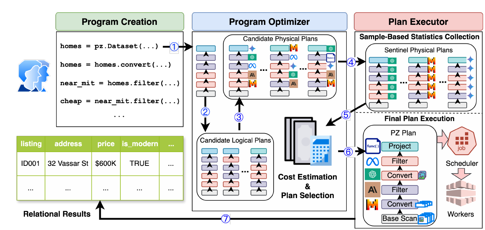
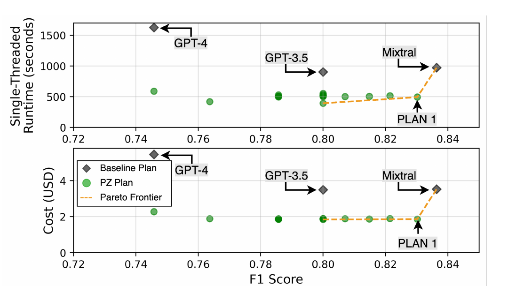
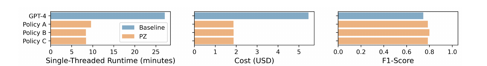

# Palimpzest: Optimizing AI-Powered Analytics with Declarative Query Processing（中文译文）

## 译者说明

本文依据同目录的 `source.pdf` 翻译。章节、图表、公式、算法、代码与参考文献按原文结构保留。

作者：Chunwei Liu、Matthew Russo、Michael Cafarella、Lei Cao、Peter Baile Chen、Zui Chen、Michael Franklin、Tim Kraska、Samuel Madden、Rana Shahout、Gerardo Vitagliano

作者单位：MIT；University of Arizona；University of Chicago；Harvard University

联系邮箱：`chunwei,mdrusso,michjc,madden,gerarvit@csail.mit.edu, peterbc,chenz429,kraska@mit.edu, caolei@arizona.edu, mjfranklin@uchicago.edu, rana@seas.harvard.edu`

## 摘要

数据管理系统长期以来的一个目标，是构建能够以经济高效的方式从大规模非结构化数据集合中计算定量洞见的系统。直到最近，从企业文档中提取事实、从科学论文中提取数据，或从图像和视频语料库中提取指标，仍然困难且昂贵。如今的模型能够以很高的准确率完成这些任务。然而，希望回答一个实质性 AI 驱动查询的程序员，必须编排大量模型、提示词和数据操作。

本文提出 PALIMPZEST：一个让程序员能够使用简单声明式语言，对任意非结构化数据集合提出 AI 驱动分析查询的系统。系统采用成本优化框架，探索 AI 模型、提示技术及相关基础模型优化所构成的搜索空间。PALIMPZEST 在运行时间、财务成本与输出数据质量之间权衡，并据此实现查询。我们介绍一种用于 AI 驱动分析任务的新语言、PALIMPZEST 所采用的优化方法，以及原型系统本身。我们在真实世界工作负载上评估 PALIMPZEST。在单线程配置下，本系统生成的计划相较基线方法最高快 3.3 倍、便宜 2.9 倍，同时还取得了更高的 F1 分数。PALIMPZEST 自动应用这些优化，无需用户付出额外工作。

## 1 引言

AI 模型的进步推动了问答 [11, 25]、聊天机器人 [5]、自主智能体 [17, 18] 和代码合成 [7, 9] 等应用的发展。在许多情况下，这些系统已经远远超出向聊天模型提出一个简单问题的范畴：它们是复合 AI 系统 [24]，会组合检索增强生成（Retrieval Augmented Generation，RAG）等数据处理元素、不同模型的集成、多步思维链推理，以及很多情况下的云端模块。当这些 AI 系统应用于大规模文档集合时，其运行时间、成本和复杂度很容易迅速攀升。

传统数据处理组件与 AI 驱动组件之间存在巨大的性能鸿沟。若以朴素方式扩展 AI 系统，使其处理包含数千或数百万输入的工作负载，就需要花费大量时间和资金来运行高端 AI 模型。例如，一个高质量开源 LLM 在现代 GPU 上每秒大约处理 100-125 个 token；若假设每个 token 平均 5 字节，其吞吐量不足 1 KB/s。OpenAI 的 GPT-4o mini 模型每 100 万输入 token 收费 0.15 美元，相当于处理 5 MB 数据。与现代数据处理栈中的其他任何组件（如存储、网络带宽、SQL 查询处理时间等）相比，这些数字都差了许多个数量级。因此，优化 AI 组件的使用至关重要。

与此同时，当前 AI 基础设施正处于剧烈的技术变动之中。新模型和实现技术每周都会发布，模型成本与运行时间也频繁变化。要利用模型在运行时间、成本和质量方面的最新进展，过程复杂、容易出错，并且迫使 AI 应用开发者不断重写和重新调优系统。

AI 工程师面临多种技术决策，包括优化提示词措辞和策略（例如思维链、ReAct [23]），在时间、成本和质量之间取得平衡的同时为每个子任务选择最佳模型，以及决定每个子任务最好的实现方式（例如使用基础模型查询、合成代码、本地训练模型或智能体混合 [20]）。此外，工程师还必须管理 GPU 缓存和内存使用，处理 LLM 上下文限制，为扩展到更大数据集设计高效执行计划，并集成并行化组件以获得最佳系统效率。与外部数据系统的集成同样需要谨慎选择参数，才能在速度、成本与质量之间取得最佳权衡。

可能的决策空间极为庞大，而正确选择取决于具体任务的底层细节。此外，“最佳”的定义会随时间变化：开发者在快速验证早期概念时可能偏好“低成本、低质量”的执行，在面向客户部署时则转向“高成本、高质量”。最后，技术环境不断变化，意味着今天作出的优化选择明天可能已经过时。

**我们的目标。** 核心洞见在于：应由机器而非人类工程师决定如何以最佳方式优化 AI 应用。工程师应当能够在较高抽象层次编写 AI 程序，并依靠优化器找到最符合其使用场景的物理实现。这一理念呼应了 20 世纪 70 年代关系数据库查询优化器诞生时的情境：当时技术发生重大转变，同时又迫切需要提升性能。尽管今天的技术挑战有所不同，声明式程序优化的原则仍然极其重要。

> 本文依据知识共享署名 4.0 国际许可协议（CC-BY 4.0）发布。本文作者保留在个人和公司网站上适当署名传播本工作的权利，前提是注明原作者及 CIDR 2025。第 15 届创新数据系统研究年会（CIDR '25），1 月 19-22 日，荷兰阿姆斯特丹。



**图 1：PALIMPZEST 系统概览。** 用户以声明式语言编写程序，随后依次进行编译（①）、逻辑计划生成（②）和物理计划生成（③）。后续步骤包括对样本计划进行性能剖析（④），并分析性能统计数据以估计成本（⑤）。系统根据用户指定的偏好（例如在固定成本下最大化质量）选择最优计划（⑥）并执行，将关系结果交付给用户（⑦）。

**算法 1：优化计划选择**

```text
要求：code, policy                                               # 步骤 ①
 1: logicalPlans = getLogicalPlans(code)                         # 步骤 ②
 2: sentinels = getSentinelPlans(logicalPlans)                   # 步骤 ③
 3:
 4: planStats = {}
 5: for 0...NUM_SAMPLES do
 6:     input = getSampledInput()
 7:     stats = runAndProfile(sentinels, input)                   # 步骤 ④
 8:     planStats.update(stats)                                  # 步骤 ⑤
 9: end for
10:
11: physicalPlans = getPhysPlans(logicalPlans, planStats)
12: reducedPlans = naivePrune(physicalPlans)
13: frontier = scoreAndPrunePlans(reducedPlans, planStats)
14: return chooseBestPlan(frontier, policy)                       # 步骤 ⑥
```

本文提出 PALIMPZEST[^1]，使工程师能够编写简洁的声明式代码，再将其编译为经过优化的程序。PALIMPZEST 旨在优化一大类数据密集型 AI 工作负载，我们称之为语义分析应用（Semantic Analytics Applications，在第 2 节定义）。这类工作负载包括大规模信息抽取、数据集成、从科学论文中发现信息、图像理解任务以及多模态分析。如图 1 所示，在运行用户输入程序时，PALIMPZEST 会考虑一系列逻辑和物理优化，并产生一组可能的、可实际执行的程序。PALIMPZEST 估计每个程序的成本、时间和质量，然后根据运行时的用户偏好选择程序。系统被设计为可扩展的，以便未来轻松加入新的优化。正如 RDBMS 使用户能够比编写传统代码更快、更正确地编写数据库查询一样，PALIMPZEST 将帮助工程师比完全依靠自己更快地写出更好的 AI 程序。

**我们的方法。** 构建 PALIMPZEST 的核心挑战之一，是创建一个能够调度多种优化、满足用户对成本、运行时间与质量目标的优化器。通过高层次、以类型为中心的声明式语言，PALIMPZEST 可以利用许多其他方式无法获得的优化。另一个关键挑战，是设计一种编程接口：既让工程师能够表达尽可能广泛的 AI 程序，又对程序施加优化器可以利用的结构。为此，我们创建了一个 Python 库，它在底层关系代数之上实现了一层薄抽象。

PALIMPZEST 与先前数据库风格系统之间最核心的思想差异，是加入了关系 `convert` 算子：它把具有一种用户定义模式的对象转换为具有另一种模式的对象。该算子可以由多种方法实现，通常以基础模型为基础，从而让程序员能够以关系式、可优化的风格实现许多 AI 任务。

**贡献。** 本文的贡献如下：

- 提出语义分析应用（SAPP）：一类重要但要求很高的数据密集型 AI 工作负载，它能够受益于许多传统数据管理思想。要解决这类工作负载，需要一系列解决方案和抽象。（第 2 节）
- 讨论 PALIMPZEST 的体系结构，包括 `convert` 算子和优化模块，并说明其如何应对 SAPP 相关挑战。（第 3 节）
- 描述原型中实现并评估的一组物理和逻辑优化。（第 4 节）
- 给出实验结果，证明借助这些优化，PALIMPZEST 能够以单线程和并行模式执行 SAPP 工作负载，并提供一系列比基线方法更有利的权衡。（第 5 节）

[^1]: 如同古代的 palimpsest（重写本），本系统不断经历修订与重新思考；在我们的系统中，这由优化器完成。只是更有“zest”而已！开源代码见 <https://github.com/mitdbg/palimpzest>。

## 2 工作负载

在介绍 PALIMPZEST 系统细节之前，有必要先讨论它希望支持的工作负载，尤其是语义分析应用，即 SAPP。

SAPP 具有三个特征：（1）结合传统数据处理元素与 AI 元素；（2）可能处理大量数据；（3）可以分解为一棵作用在数据对象集合上的操作树。下面以“房地产搜索”任务作为贯穿全文的示例。在该任务中，用户希望搜索马萨诸塞州剑桥附近的所有房源，以找到这样的住宅：（a）现代且有吸引力；（b）距离 MIT 两英里以内；（c）处于某个价格区间内。

该任务满足第一项标准，因为它很可能需要视觉模型或文本模型分析房源文字和图像，以判断住宅是否“现代且有吸引力”，并从文本中提取价格和位置数据。它也满足第二项标准：Zillow 当时在剑桥和波士顿地区展示 1,327 条住宅房源，每条都包含文字描述，通常还有 10 张以上图片。最后，该任务可以分解为一棵作用在房源文字和图像上的操作树，用于计算字段（如地址、价格、吸引力）并应用选择谓词。

**优化挑战。** 面向 SAPP 工作负载的 AI 系统，其理想实现应联合优化 AI 元素和传统数据处理元素。例如，在房地产搜索中，一种极其朴素的实现可能先处理公寓图片以测试它们是否“现代且有吸引力”，却在它们未通过基于文本的约束时才丢弃，从而浪费时间和金钱。稍微复杂一些的实现会重新排列计划，优先应用成本最低、限制性最强的约束，避免对之后会被丢弃的候选对象调用视觉模型。对于每个新任务和数据集，应采用哪些优化都具有独特性和任务特异性。

针对 SAPP 工作负载优化 AI 系统，需要准确预测每个数据处理步骤的运行时间、成本和质量，而这对语义任务尤其困难。例如，预测视觉模型性能，需要了解每条记录的输入/输出 token 数量以及处理记录总数。此外，在缺少标注数据时，评估输出质量往往依赖容易出错的启发式方法，或成本高昂的、与更强模型之间的比较。系统还必须预测各种物理优化（如使用多个模型或降低图像分辨率）会怎样影响这些指标。第 3 节将讨论 PALIMPZEST 如何进行成本估计并搜索物理计划空间。

## 3 概览

PALIMPZEST 主要将其程序视为一种计算关系视图的方式：用户指定一个（或一组）输入关系（称为 `Dataset`）和一个要计算的目标输出关系。每个关系都有对应的 `Schema`。用户还会描述一系列要应用的操作，把输入转换成输出。图 2 展示了一个简短的示例程序。

与 SQL 不同，PALIMPZEST 主要被设计为宿主语言中的库：当前实现使用 Python，但并不依赖任何语言特有的功能。

PALIMPZEST 支持的逻辑关系算子见表 1。图 2 没有展示 `groupby`、聚合和 `limit` 等部分算子。这些算子目前沿用数据管理文献中的标准定义，但未来 `groupby` 和聚合也可以用基于 AI 的操作实现。需要强调的是，用户不必指定某个操作的具体实现；实现并执行该操作是系统的职责。通过使用一系列不同的 AI 模型和生成技术，PALIMPZEST 可以自动为用户程序对应的数据流计算出一种实现。

**图 2：PALIMPZEST 用于邮件处理任务的代码。** 用户程序构造一系列逻辑操作（例如扫描、转换、过滤），它们定义初始逻辑计划。用户还指定一个策略，即希望在物理计划的 Pareto 前沿上选择哪个位置。计划和策略被传给 `pz.Execute`；它将初始逻辑计划编译为一组物理计划，为给定策略选择 Pareto 最优的物理计划，并执行该计划。

```text
 1  import palimpzest as pz
 2
 3  class Email(pz.TextFile):
 4      """Represents an email, subclass of text file"""
 5      sender = pz.StringField(desc="The email address of the sender", required=True)
 6      subject = pz.StringField(desc="The subject of the email", required=True)
 7
 8  # define logical plan
 9  emails = pz.Dataset(source="enron-emails", schema=Email)
10  emails = emails.filter("The email is not quoting from a news article or an article ...")
11  emails = emails.filter("The email refers to a fraudulent scheme (i.e., 'Raptor', ...)")
12
13  # user specified policy and plan execution
14  policy = pz.MinimizeCostAtFixedQuality(min_quality=0.8)
15  results = pz.Execute(emails, policy=policy)
```

**表 1：PALIMPZEST 的完整关系代数包含能够产生多个关系的算子（例如 `Group by`）。**

| 算子 | 定义 | 算子 | 定义 |
| --- | --- | --- | --- |
| 投影（Project） | $\pi(\text{rel.}, \text{cols})$ | 分组（Group by） | $\Gamma(\text{rel.}, \text{group\_cond.}, \text{agg.})$ |
| 选择（Select） | $\sigma(\text{rel.}, \text{predicate})$ | 转换（Convert） | $\chi(\text{rel.}, \text{schema\_a}, \text{schema\_b})$ |
| 限制（Limit） | $L(\text{rel.}, \text{limit})$ | 聚合（Aggregate） | $\alpha(\text{rel.}, \text{func})$ |

**Convert。** `Convert` 算子把一个模式为 A 的有类型数据对象转换成模式为 B 的新对象，方法是计算模式 B 中存在、但模式 A 中没有显式存在的字段集合。`convert` 的一种物理实现使用 LLM：系统把模式 A 的字段作为键值对组织进提示词，同时加入用户提供的字段描述，再要求 LLM 为模式 B 生成输出字段。

`convert` 操作的正确行为往往只由用户对输入和输出 `Schema` 的说明所暗示。例如，在图 2 中，`convert` 算子（由指定模式的 `pz.Dataset` 调用隐式产生）从原始文本中提取 `sender` 和 `subject` 字段，生成一个 `Email`。

**成本优化框架。** PALIMPZEST 的核心能力是让用户定义并执行逻辑计划，即数据集上的关系操作序列。此类计划具有声明性，往往没有完全指定执行细节。PALIMPZEST 的成本优化器在识别符合用户偏好的、（近似）Pareto 最优的物理实现方面发挥关键作用。从程序实现到选择并执行成本效益最高的计划，其流程见图 1，算法细节见算法 1。

开发者首先编写声明式程序，如图 2 所示；该程序惰性地构造一系列数据加载和处理逻辑操作。在第 14 行，开发者指定一个策略，用于决定系统应如何在逻辑计划的多个 Pareto 最优实现中进行选择。（此处优先选择预期财务成本最低、同时满足质量下界的计划。）当前策略预定义为关注运行时间、成本或质量，用户可以设置可定制参数。

第 15 行执行 `Execute()` 时，程序优化器把这条操作链编译成初始逻辑计划（步骤 ①；算法 1 第 1 行）。该计划经过逻辑优化，产生功能等价、但在成本、运行时间和质量权衡方面不同的计划（步骤 ②；算法 1 第 2 行）。在我们的原型实现中，唯一考虑的逻辑优化是过滤器下推，但未来也可以考虑更多优化，例如连接重排。

对于每个逻辑计划，程序优化器生成一组规模更大的候选物理计划（步骤 ③）。这一阶段包含 AI 系统特有的决策，如模型选择和提示词生成。例如，把多个子任务合并为一次 LLM 查询以减少 token 重复，是一种类似 FrugalGPT 查询拼接方法 [4] 的优化。最坏情况下，这需要枚举指数级数量的物理计划，并估计每个计划的性能。

但在实践中，我们作出一个简化假设：各个算子相互独立。这简化了估计每个算子运行时间、成本和质量的问题；随后可以组合这些估计，为规模大得多的计划空间估计运行时间、成本和质量。算子独立性是一个很强的假设，但它使指数级计划空间中的成本估计变得可处理，而且仍能让优化器选出实际表现良好的计划（第 5 节将对此加以证明）。

为了高效估计逐算子统计信息，PALIMPZEST 在少量验证样例上执行一组哨兵计划（sentinel plans），其中每个计划的 LLM 操作使用不同模型。在我们的原型中，验证样例是工作负载的前 $N$ 条记录（相对于工作负载大小，$N$ 很小）。对于每个算子，我们直接观察其运行时间分布和每条记录的执行成本。我们还通过将该算子的性能与使用“冠军模型”的算子进行比较，推断其质量分布（实验中冠军模型为 GPT-4；通常是最昂贵和/或质量最高的模型）。

虽然无法保证冠军模型的输出正确，但以这种方式计算质量可以保证：最坏情况下，我们也能识别出输出质量接近冠军模型、成本却只有其一小部分的算子和计划。（我们也可以用真实标注验证算子质量，但将其留作未来工作。）给定逐算子的运行时间、成本与质量估计，PALIMPZEST 通过组合逐算子估计来估计每个物理计划的质量。具体来说，它对各算子的运行时间和成本求和，并对质量取乘积。对于准确率等质量指标，质量相乘与我们的算子独立假设一致。

随后，程序优化器生成一组可能规模很大的程序，它们与用户输入一致，并覆盖运行时间、财务成本和质量构成的优化空间。然而，PALIMPZEST 仍需为每个物理计划计算这些指标的估计值（步骤 ④ 和 ⑤；算法 1 第 4-9 行）。计划执行器运行少量哨兵计划，收集计划执行统计的样本数据；随后在单个算子的粒度上，将计划输出质量与“冠军”计划的输出比较。（当前使用每个操作都调用 GPT-4 的计划作为比较对象。）

最后，程序优化器根据计划估计和用户提供的策略选择最佳物理计划（步骤 ⑥；算法 1 第 14 行）。计划执行器随后执行该选择，消耗计算和财务资源，并可能调用多个外部模型和数据服务提供商（步骤 ⑦）。

这一优化框架帮助 PALIMPZEST 提出假设、选择并执行更符合用户偏好的优化计划。

## 4 程序优化

管理和利用规模庞大的有用优化空间，是 PALIMPZEST 的核心功能。本节介绍 PALIMPZEST 可以使用的关键逻辑优化和物理优化。

**逻辑优化。** PALIMPZEST 使用逻辑优化来改进从用户程序推导出的逻辑计划，目标是提高运行效率并降低成本。由于操作成本和过滤器选择率不同，这些优化会生成逻辑等价、但执行成本和效率可能不同的计划。

已实现的优化包括：

1. **过滤器重排（Filter Reordering）**：排列逻辑计划中选择过滤器的顺序。通过评估所有可能的排列，即使初始选择率未知、要到执行期间才估计，PALIMPZEST 仍有可能把处理记录数降至最低。
2. **Convert 重排（Convert Reordering）**：重新排列计划中的 `convert` 操作。如果不依赖某个昂贵 `convert` 输出的高选择性过滤器可以提前执行，就能把该 `convert` 推迟到过滤器之后，从而节省计算。系统会考虑操作间的依赖关系，以保证计划等价。这些优化确保逻辑计划在语义上等价，同时允许物理执行不同；这对保持下文所述结果的完整性至关重要。

**物理优化。** 得益于声明式编程框架，PALIMPZEST 解锁了许多标准 LLM API 服务无法提供的底层优化。我们实现并评估以下优化，以证明它们的有效性：

1. **模型选择（Model Selection）**：选择不同模型和 LLM 服务来执行不同操作。PALIMPZEST 可以把高层程序分解为较小操作，并为每个操作选择最合适的模型。简单操作可以使用便宜、小型、快速的模型，只有较难操作才使用昂贵模型。这个想法很简单，实现起来却不简单，因为：（1）一个程序可能包含很多操作；（2）准确的操作分解可能随着其他优化而变化；（3）操作难度会随时间变化；（4）LLM 服务更新时，模型质量也会波动。如果没有 PALIMPZEST 的帮助，这项优化很容易成为负担。
2. **代码合成（Code Synthesis）**：动态生成合成代码，处理不需要深层语义理解的特定操作。PALIMPZEST 基于一组样例输入，用合成函数替代 LLM 调用，从而显著降低运行时间和成本。PALIMPZEST 使用 LLM 分析样例输入，并为转换操作生成函数，以优化性能和资源利用。
3. **多数据提示编组（Multi-data Prompt Marshaling）**：确定把用户操作映射到 LLM 提示的最佳方式，例如采用以行为中心或以列为中心的处理方式。以行为中心的处理通过一次 LLM 调用，从一条输入记录产生多个输出；以列为中心的处理每次专注一个字段，可能提升准确率。二者之间的选择取决于多种运行时因素，PALIMPZEST 会根据这些因素和用户指定策略动态剖析并优化。
4. **输入 token 缩减（Input Token Reduction）**：把特定操作所需的输入数据降至最少，同时提高成本效率和执行速度。例如，在文档处理中，PALIMPZEST 能够确定把 PDF 转换为 `ScientificPaper` 所需的关键输入区域，从而显著减少 token 使用。这一过程类似在“微型 RAG”任务中选择关键摘录；PALIMPZEST 可以在模式层面学习算子属性，并在程序执行期间动态优化输入。但在没有清晰模式的场景（如朴素聊天处理用例）中，该方法的适用性有限。

PALIMPZEST 正在积极探索一系列其他优化，其中包括减少输出 token，以及对具有相似特征的请求进行策略性调度和批处理，以改善内存与缓存利用、缩短等待时间、提高吞吐量，同时只用最小的质量妥协来维持数据质量。

## 5 评估

**原型。** 我们用约 9,200 行 Python 代码实现了一个早期 PALIMPZEST 原型。它实现了表 1 中的算子，并且能够运行很多程序；但本文主要详细报告房地产搜索的结果，因为该工作负载具有多模态、多样化算子和富有挑战性的优化空间。技术报告 [12] 中提供了综合工作负载评估。

我们实现了第 4 节描述的优化：模型选择、代码合成、多数据提示编组和输入 token 缩减。当前测试使用 OpenAI 的 `gpt-3.5-turbo-0125`、`gpt-4-0125-preview` 和 `gpt-4-vision-preview` 模型 [14]，以及由 Together.ai API [2] 提供服务的 `Mixtral-8x7B-Instruct-v0.1` 模型。我们还使用 Modal 在线服务 [1] 批量执行非 AI 函数，例如并行 PDF 处理以及公式图像的抽取和转换。

PALIMPZEST 使用迭代器模型实现。因此，计划执行时每次处理一条记录；每个算子会阻塞，直到从其源算子接收到所需输入记录。为了更清楚地展示系统优化节省的工作量，大多数实验报告简单的单线程执行时间。不过，很多操作（包括 `convert` 算子）都有并行实现，可以利用底层服务或硬件提供的并行能力；我们也报告了启用并行的部分实验。

**评估工作负载。** 我们使用房地产搜索工作负载评估 PALIMPZEST，该工作负载由从马萨诸塞州波士顿和剑桥手工抓取的 100 条房源组成。每条房源包含自然语言描述和三张图片。我们手工标注每条房源是否位于指定地理区域、是否处于给定价格区间，以及是否“现代、富有吸引力且自然采光充足”。共有 23 条房源满足全部条件。

**优化权衡。** 第一个实验主张是：无论用户策略如何，PALIMPZEST 都能利用其三种优化策略，创建一组提供有吸引力权衡的物理计划。为评估这一主张，我们运行 PALIMPZEST 直到算法 1 的最后一步之前（不执行最后一步）。随后取出前沿计划、三个基线计划，以及 `reducedCandidates` 中最接近近似 Pareto 前沿的 top-$k$ 计划，最终共执行 20 个计划。

三个基线是各工作负载的朴素物理计划，分别只使用 GPT-4、GPT-3.5 或 Mixtral-8x7B。之所以选择这些计划作为基线，是因为它们代表了这样一种预期性能：使用单一模型朴素实现系统，不对单个算子进行调优或优化。优化过程耗时 13.1 秒。



**图 3：不同计划的性能（越靠右下越好）。** 黑色菱形表示朴素计划，绿色圆点表示优化后的 PALIMPZEST 计划。无论比较运行时间与质量，还是比较成本与质量，PALIMPZEST 计划都始终位于 Pareto 前沿上。

图 3 展示了执行上述所有计划时观测到的运行时间、成本和质量。越靠近右下角的计划越好。在基于样本收集统计数据时，我们使用工作负载总输入规模的 5% 来运行哨兵计划；所收集的数据用于帮助估计所有计划的成本。

我们发现，PALIMPZEST 能够在权衡空间的多个不同位置创建有用计划。PALIMPZEST 证明了它能够生成相较基线计划有显著改进的物理计划。具体来说，PALIMPZEST 生成的物理计划（例如 PLAN 1）相较 GPT-4 基线，运行时间降低 3.3 倍、成本降低 2.9 倍，F1 分数最高提高 1.1 倍。考虑到该工作负载的大部分成本和运行时间由视觉模型调用主导，而当前原型中的方法无法消除这些调用，这些性能提升尤其令人印象深刻。未来我们将探索视觉处理优化方案。

PLAN 1 的物理计划通过组合两项优化，获得了优于 GPT-4 基线的性能。首先，该计划重新排列 `convert` 和 `filter` 操作的执行顺序，使基于文本的算子先于基于图像的算子执行。这样可以完全避免对 GPT-4 视觉模型的部分调用，从而显著节省运行时间和成本。其次，该计划使用输入 token 缩减，将房地产房源文本裁去 50%。这一技术非常有效，因为住宅地址和房源价格通常出现在房源文本顶部。

值得指出的是，GPT-4 基线计划偶尔不能正确格式化其输出，这导致其 F1 分数较低。一个可能的解决方案，是像 SGLang [26] 那样使用正则表达式强制输出遵循格式。然而，用户很少能提前知道模型面对给定提示和输入时是否成功。使用 PALIMPZEST 的一项关键优势，是它能够在运行时替用户检测糟糕的计划，并选择更好的计划。

我们已经证明 PALIMPZEST 能够生成 PLAN 1 这类为用户提供有吸引力性能权衡的计划。但这并不能自动证明 PALIMPZEST 的优化器会在运行时选择这些计划。下一部分将证明：对于多种不同策略，PALIMPZEST 的成本优化器确实能够识别并选择此类计划。



**图 4：相较朴素 GPT-4 基线，PALIMPZEST 选择的计划成本更低、运行时间更短，F1 分数相当。**

**表 2：PALIMPZEST 选择满足（或近似满足）给定策略约束的计划。约束被设定为可行但并不容易满足。**

| 策略 | 约束 | 成本 | 运行时间（秒） | F1 分数 |
| --- | --- | ---: | ---: | ---: |
| 最大化 F1 | 成本 < 3 美元 | 1.87 美元 | 577 | 0.79 |
| 最大化 F1 | 时间 < 600 秒 | 1.88 美元 | 502 | 0.80 |
| 最小化成本 | F1 > 0.80 | 1.87 美元 | 505 | 0.79 |

**成本优化器与性能收益。** 第二个实验主张是：PALIMPZEST 能够找到这样的计划，其端到端运行时间、成本和质量优于每个操作都使用同一个最先进语言模型的朴素计划。为检验这一主张，我们按照算法 1 运行 PALIMPZEST，包括为给定策略选择最优计划这一关键的最后一步。

我们实现了三种具体策略。策略 A 的目标是在成本低于 3 美元的同时最大化质量；策略 B 的目标是在运行时间少于 600 秒的约束下最大化质量；策略 C 的目标是在保证 F1 分数 > 0.8 的同时最小化成本。根据前一组实验的发现，这些阈值被设计为具有挑战性但可实现，详见表 2。

图 4 展示三个性能指标上的结果，每个指标占一列。结果还按优化器选择的物理计划进一步划分，每个计划占一行。我们将 PALIMPZEST 选择的计划，与所有转换和过滤操作都使用 GPT-4 的基线计划进行比较。

总体而言，我们发现 PALIMPZEST 能够从物理候选空间中识别出这样的计划：（1）相较 GPT-4 基线有显著性能提升；（2）通常满足策略约束；（3）其加速和成本节省超过优化自身的开销。PALIMPZEST 选择的计划相较 GPT-4 基线，平均运行时间降低 67.5%，成本降低 65.7%，F1 分数提高 6%。

我们还使用 `convert` 和 `filter` 操作的并行实现评估 PALIMPZEST。与单线程基线相比，这些实现显著缩短运行时间，同时保持有竞争力的成本和 F1 分数。技术报告 [12] 提供了详细结果。PALIMPZEST 简洁直接的并行处理抽象无需用户额外工作，即可显著提升性能。

## 6 相关工作

关于 LLM 和基础模型编程框架的文献非常丰富，重点集中在提示管理和任务特定功能。LangChain [6] 与 LlamaIndex [13] 提供管理提示模板和用户样例的库，但缺少更高层的任务表示。DSPy [8] 通过把高层 LLM 目标转换为具体提示来提升提示质量；它与 PALIMPZEST 的区别在于关注重点不同，而且没有考虑性能和成本。SGLang [26] 把提示模板化和输出约束，与并行执行等性能增强结合起来，未来可能与 PALIMPZEST 形成互补集成。然而，这种结构化生成语言仍然处于较低层次，需要开发者手工作出大量决策。

SkyPilot [22] 以成本效率为目标，优化 ML 任务在不同云平台上的部署；这一目标与 PALIMPZEST 相同，但 PALIMPZEST 还寻求程序特定的高效实现。FrugalGPT [4] 在 LLM 平台 [14] 之上进行优化，与 PALIMPZEST 的效率目标一致，但其任务描述并不明确，也缺少更广泛的 AI 程序集成。AutoGen [21] 把 LLM 应用设想为智能体之间的对话，与 PALIMPZEST 的数据处理模型存在显著差异。它对 LLM 应用的构想由一种与我们根本不同的模型驱动；我们的模型更多植根于数据处理传统。

在查询规划方面，Caesura [19] 根据面向多模态数据的自然语言描述生成可执行查询计划，但不具备优化能力；PALIMPZEST 通过要求程序员显式输入并构造逻辑来填补这一空白。ZenDB [10] 聚焦文档查询的结构性优化，其目标与 PALIMPZEST 相同，但仅限于文本数据和逻辑优化。Evaporate [3] 使用静态提示和代码生成，研究 LLM 工作负载中的成本-质量权衡，与 PALIMPZEST 的策略相似，但关注范围较窄，集中在信息抽取。Lotus [16] 提供丰富的语义操作及专门优化；然而，其查询级优化方法依赖用户指定，缺少自动化逻辑和物理优化流程。

近期工作 [15] 使用 LLM 作为数字众包工作者来改进提示工程，用 LLM 替代人工任务，从而提升效率并管理 LLM 操作中的权衡。与基于众包的系统不同，PALIMPZEST 利用 LLM 提供更广泛的灵活性（例如快速生成代码），解决 token 优化等独特挑战，并规避人工劳动不一致的问题。

## 7 结论

PALIMPZEST 让用户能够使用声明式语言编写 AI 工作负载，并高效优化这些工作负载，使其专注于应用逻辑而非 AI 模型细节。它集成逻辑和物理规划以实现最优执行，并使用样本数据在运行时间、成本和质量之间取得平衡。因此，对于希望高效、经济地利用现代 AI 的开发者和组织，尤其是在开发 SAPP 时，PALIMPZEST 具有很高价值。

## 8 致谢

我们感谢 DARPA ASKEM Award HR00112220042、ARPA-H Biomedical Data Fabric 项目、NSF DBI 2327954、Liberty Mutual 资助以及 Amazon Research Award 的支持。此外，本工作还得到 Amazon、Google 和 Intel 对 MIT Data Systems and AI Lab（DSAIL）的资助，以及 NSF IIS 1900933 的支持。

本研究由美国空军研究实验室和美国空军部人工智能加速器资助，并根据合作协议 FA8750-19-2-1000 完成。本文所含观点和结论仅代表本文作者，不应被解释为美国空军部或美国政府的官方政策，无论该政策是明示还是默示。尽管本文含有版权声明，美国政府仍有权为政府用途复制和分发本文的重印本。

## 参考文献

1. 2024. Modal.com API. <https://modal.com>. Accessed: 2024-04-30.
2. 2024. Together.ai. <https://together.ai>. Accessed: 2024-04-30.
3. Simran Arora, Brandon Yang, Sabri Eyuboglu, Avanika Narayan, Andrew Hojel, Immanuel Trummer, and Christopher Ré. 2023. Language models enable simple systems for generating structured views of heterogeneous data lakes. *arXiv preprint arXiv:2304.09433* (2023).
4. Lingjiao Chen, Matei Zaharia, and James Zou. 2023. Frugalgpt: How to use large language models while reducing cost and improving performance. *arXiv preprint arXiv:2305.05176* (2023).
5. Wei-Lin Chiang, Zhuohan Li, Zi Lin, Ying Sheng, Zhanghao Wu, Hao Zhang, Lianmin Zheng, Siyuan Zhuang, Yonghao Zhuang, Joseph E Gonzalez, et al. 2023. Vicuna: An open-source chatbot impressing gpt-4 with 90%* chatgpt quality. See <https://vicuna.lmsys.org> (accessed 14 April 2023) 2, 3 (2023), 6.
6. LangChain Contributors. 2024. LangChain: Open Source Framework for Building Language Models. <https://github.com/LangChain/langchain>. Accessed: 2024-04-18.
7. Sirui Hong, Xiawu Zheng, Jonathan Chen, Yuheng Cheng, Jinlin Wang, Ceyao Zhang, Zili Wang, Steven Ka Shing Yau, Zijuan Lin, Liyang Zhou, et al. 2023. Metagpt: Meta programming for multi-agent collaborative framework. *arXiv preprint arXiv:2308.00352* (2023).
8. Omar Khattab, Arnav Singhvi, Paridhi Maheshwari, Zhiyuan Zhang, Keshav Santhanam, Sri Vardhamanan, Saiful Haq, Ashutosh Sharma, Thomas T Joshi, Hanna Moazam, et al. 2023. Dspy: Compiling declarative language model calls into self-improving pipelines. *arXiv preprint arXiv:2310.03714* (2023).
9. Yujia Li, David Choi, Junyoung Chung, Nate Kushman, Julian Schrittwieser, Rémi Leblond, Tom Eccles, James Keeling, Felix Gimeno, Agustin Dal Lago, Thomas Hubert, Peter Choy, Cyprien de Masson d'Autume, Igor Babuschkin, Xinyun Chen, Po-Sen Huang, Johannes Welbl, Sven Gowal, Alexey Cherepanov, James Molloy, Daniel J. Mankowitz, Esme Sutherland Robson, Pushmeet Kohli, Nando de Freitas, Koray Kavukcuoglu, and Oriol Vinyals. 2022. Competition-level code generation with AlphaCode. *Science* 378, 6624 (Dec. 2022), 1092-1097. <https://doi.org/10.1126/science.abq1158>
10. Yiming Lin, Madelon Hulsebos, Ruiying Ma, Shreya Shankar, Sepanta Zeigham, Aditya G Parameswaran, and Eugene Wu. 2024. Towards Accurate and Efficient Document Analytics with Large Language Models. *arXiv preprint arXiv:2405.04674* (2024).
11. Chunwei Liu, Enrique Noriega-Atala, Adarsh Pyarelal, Clayton T Morrison, and Mike Cafarella. 2024. Variable Extraction for Model Recovery in Scientific Literature. *arXiv preprint arXiv:2411.14569* (2024).
12. Chunwei Liu, Matthew Russo, Michael Cafarella, Lei Cao, Peter Baille Chen, Zui Chen, Michael Franklin, Tim Kraska, Samuel Madden, and Gerardo Vitagliano. 2024. A Declarative System for Optimizing AI Workloads. *arXiv preprint arXiv:2405.14696* (2024).
13. Jerry Liu. 2022. LlamaIndex. <https://doi.org/10.5281/zenodo.1234>
14. OpenAI. 2024. OpenAI API. <https://platform.openai.com>. Accessed: 2024-04-30.
15. Aditya G Parameswaran, Shreya Shankar, Parth Asawa, Naman Jain, and Yujie Wang. 2023. Revisiting prompt engineering via declarative crowdsourcing. *arXiv preprint arXiv:2308.03854* (2023).
16. Liana Patel, Siddharth Jha, Carlos Guestrin, and Matei Zaharia. 2024. LOTUS: Enabling Semantic Queries with LLMs Over Tables of Unstructured and Structured Data. *arXiv preprint arXiv:2407.11418* (2024).
17. Shishir G Patil, Tianjun Zhang, Xin Wang, and Joseph E Gonzalez. 2023. Gorilla: Large language model connected with massive apis. *arXiv preprint arXiv:2305.15334* (2023).
18. Timo Schick, Jane Dwivedi-Yu, Roberto Dessì, Roberta Raileanu, Maria Lomeli, Eric Hambro, Luke Zettlemoyer, Nicola Cancedda, and Thomas Scialom. 2024. Toolformer: Language models can teach themselves to use tools. *Advances in Neural Information Processing Systems* 36 (2024).
19. Matthias Urban and Carsten Binnig. 2023. CAESURA: Language Models as Multi-Modal Query Planners. *arXiv preprint arXiv:2308.03424* (2023).
20. Junlin Wang, Jue Wang, Ben Athiwaratkun, Ce Zhang, and James Zou. 2024. Mixture-of-Agents Enhances Large Language Model Capabilities. *arXiv preprint arXiv:2406.04692* (2024).
21. Qingyun Wu, Gagan Bansal, Jieyu Zhang, Yiran Wu, Shaokun Zhang, Erkang Zhu, Beibin Li, Li Jiang, Xiaoyun Zhang, and Chi Wang. 2023. Autogen: Enabling next-gen llm applications via multi-agent conversation framework. *arXiv preprint arXiv:2308.08155* (2023).
22. Zongheng Yang, Zhanghao Wu, Michael Luo, Wei-Lin Chiang, Romil Bhardwaj, Woosuk Kwon, Siyuan Zhuang, Frank Sifei Luan, Gautam Mittal, Scott Shenker, and Ion Stoica. 2023. SkyPilot: An Intercloud Broker for Sky Computing. In *Symposium on Networked Systems Design and Implementation*. <https://api.semanticscholar.org/CorpusID:258559424>
23. Shunyu Yao, Jeffrey Zhao, Dian Yu, Nan Du, Izhak Shafran, Karthik Narasimhan, and Yuan Cao. 2023. ReAct: Synergizing Reasoning and Acting in Language Models. In *International Conference on Learning Representations (ICLR)*.
24. Matei Zaharia, Omar Khattab, Lingjiao Chen, Jared Quincy Davis, Heather Miller, Chris Potts, James Zou, Michael Carbin, Jonathan Frankle, Naveen Rao, and Ali Ghodsi. 2024. The Shift from Models to Compound AI Systems. <https://bair.berkeley.edu/blog/2024/02/18/compound-ai-systems/>.
25. Jiahao Zhang, Haiyang Zhang, Dongmei Zhang, Yong Liu, and Shen Huang. 2024. End-to-End Beam Retrieval for Multi-Hop Question Answering. In *2024 Annual Conference of the North American Chapter of the Association for Computational Linguistics*. <https://arxiv.org/abs/2308.08973>
26. Lianmin Zheng, Liangsheng Yin, Zhiqiang Xie, Jeff Huang, Chuyue Sun, Cody Hao Yu, Shiyi Cao, Christos Kozyrakis, Ion Stoica, Joseph E Gonzalez, et al. 2023. Efficiently programming large language models using sglang. *arXiv preprint arXiv:2312.07104* (2023).
