# Spider 2.0: Evaluating Language Models on Real-World Enterprise Text-to-SQL Workflows（中文译文）

## 译者说明

本文依据同目录的 `source.pdf` 翻译。章节、图表、公式、算法、代码与参考文献按原文结构保留。

## 首页信息

发表于 ICLR 2025 的会议论文。

**作者：** Fangyu Lei\*♠、Jixuan Chen\*♠、Yuxiao Ye♠、Ruisheng Cao♠、Dongchan Shin♠、Hongjin Su♠、Zhaoqing Suo♠、Hongcheng Gao♠、Wenjing Hu♠、Pengcheng Yin♡、Victor Zhong⋆、Caiming Xiong♢、Ruoxi Sun△、Qian Liu♣、Sida I. Wang、Tao Yu♠

**机构：** ♠ 香港大学；♢ Salesforce Research；♣ Sea AI Lab；♡ Google DeepMind；△ Google Cloud AI Research；⋆ 滑铁卢大学

\* 同等贡献。

## 摘要

真实世界的企业级 Text-to-SQL 工作流往往涉及分布于不同数据库系统中的复杂云端或本地数据、多种方言下的多条 SQL 查询，以及从数据转换到分析的多样化操作。我们提出 Spider 2.0：一个由 632 个真实世界 Text-to-SQL 工作流问题组成的评测框架，这些问题来自企业级数据库用例。Spider 2.0 中的数据库取自真实数据应用，通常含有超过 1,000 列，并存储在 BigQuery、Snowflake 等本地或云数据库系统中。我们表明，解决 Spider 2.0 的问题经常需要理解并检索数据库元数据、方言文档，乃至项目级代码库。该挑战要求模型与复杂 SQL 工作流环境交互，处理极长上下文，进行复杂推理，并生成包含多种操作的多条 SQL 查询；查询往往超过 100 行，远远超出传统 Text-to-SQL 挑战。我们的评测显示，基于 o1-preview 的代码智能体框架只能成功解决 21.3% 的任务，而在 Spider 1.0 和 BIRD 上分别可达 91.2% 和 73.0%。Spider 2.0 的结果说明：尽管语言模型在代码生成，尤其在以往 Text-to-SQL 基准上已经表现突出，要达到真实企业使用所需的能力仍须显著改进。Spider 2.0 上的进展，是面向真实企业环境开发智能、自主代码智能体的重要一步。代码、基线模型和数据发布于 <https://spider2-sql.github.io>。

## 1 引言

自动代码生成可以成为人与数据之间的重要桥梁，帮助人们利用复杂数据完成困难或单调的任务。现有数据很大一部分存储在关系数据库中，而 SQL 是人类与这些数据交互的重要接口。在这一背景下，语义解析或 Text-to-SQL（Dahl et al., 1994；Zelle & Mooney, 1996；Zettlemoyer & Collins, 2005；Li & Jagadish, 2014；Zhong et al., 2017；Yu et al., 2018）是一项重要技术：它帮助数据分析师执行日常查询、编排数据工作流并完成高级商业智能任务，从而显著减少重复劳动并减轻程序员负担。大语言模型（LLM）在代码生成方面展现出很强的能力（Chen et al., 2021；Austin et al., 2021），尤其擅长把自然语言问题转换成 SQL 查询。值得注意的是，基于 GPT-4 的方法在经典基准 Spider 1.0（Yu et al., 2018）和 BIRD（Li et al., 2024b）上分别达到 91.2% 和 73.0% 的执行准确率。

然而，这些数据集通常使用表和列很少的非工业数据库，SQL 和问题也较为简单，既达不到真实世界的复杂程度，也忽视了不同 SQL 方言。相比之下，真实数据分布于多种数据库系统，每种系统都有自己的 SQL 方言，带来大量不同的语法和函数。企业级应用数据库还具有包含数千列的大规模模式和复杂嵌套结构。更进一步，真实 Text-to-SQL 工作流需要利用项目代码库、外部知识和各种上下文，经由多步过程构造复杂 SQL、完成多种操作并搭建完整的数据工程流水线，其中包括清洗和整理数据的数据规整、重组和增强数据的数据转换，以及提取洞见以支持决策的数据分析。这些复杂性共同说明，我们迫切需要一个更真实的企业级基准。

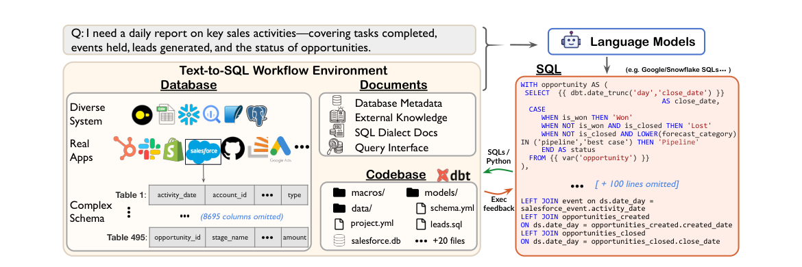

**图 1：** Spider 2.0 旨在评测 LLM 处理真实企业级 Text-to-SQL 工作流的能力。解决每个任务都需要理解数据库元数据、查阅 SQL 方言文档、处理复杂工作流，并通过复杂推理生成多样的 SQL 查询。

我们提出 Spider 2.0，以真实数据工作流为基础，推动企业应用中的 Text-to-SQL 模型发展。它包含 632 项真实而复杂的数据规整、转换和分析任务。如图 1 所示，Spider 2.0 的数据库来自工业应用（如 Google Analytics 和 Salesforce），模式规模巨大，平均有 812 列，并具有独特结构，例如图 11 的嵌套列和图 12 的多模式结构，数据量可达 TB 级。数据库系统既包括 SQLite、DuckDB 等本地数据库，也包括 BigQuery、Snowflake 等云数据仓库。复杂 SQL 方言来自技术教程、社区论坛和开源项目。标准答案 SQL 平均包含 144 个 token，并使用高级函数；例如，`ST_DISTANCE(x1, x2)` 计算两点之间的最短距离，其复杂度显著超过以往基准。所有任务都配有项目代码库、文档和数据库接口，用以模拟真实 Text-to-SQL 编写场景。

不同于以往数据集，Spider 2.0 的智能体任务不依赖预先准备的输入（问题和数据库模式）或期望输出（预测 SQL），而是提供真实项目代码库和数据库接口。任务不再只是预测一条 SQL；智能体必须浏览项目，并通过 SQL 查询及 Python 或 Shell 命令行脚本与复杂数据库动态交互。任务目标是在数据库内执行复杂数据转换，或从数据中提取分析洞见。这一设置贴近真实企业 SQL 工作流：模型必须查阅代码库和文档、生成多条 SQL，并与环境动态交互，才能完成复杂任务并得到最终结果。

为便于与以往 Text-to-SQL 方法和基准比较，并支持更快的开发与评测，我们还推出 Spider 2.0-lite 和 Spider 2.0-snow。它们是自包含数据集，提供预处理后的数据库模式和文档；前者托管在 BigQuery、Snowflake 和 SQLite 上，后者完全托管在 Snowflake 上且更侧重 Text-to-SQL 生成。该设置省去代码库，并将输出限制为 SQL，因此无须预测最终答案或转换数据库。虽然它们与 Spider 2.0 来自相同原始数据，但并不一定更容易，因为 Text-to-SQL 设置能获得的信息更少，例如没有执行反馈。Spider 2.0-lite 和 Spider 2.0-snow 是可直接使用的“文本输入—SQL 输出”挑战；Spider 2.0 则是与多种数据源交互、完成数据转换和分析的真实数据工作流挑战。

我们对 Spider 2.0 的评测显示，LLM 要用于真实企业 Text-to-SQL 工作流仍有很大提升空间。最好的基于 o1-preview 的代码智能体框架仅达到 21.3%，凸显出 LLM 作为熟练 SQL 专家的明显不足（表 2）。在 Spider 2.0-lite 中，即使最先进的 Text-to-SQL 解析器也只能成功回答 5.7% 的问题，与 Spider 1.0 的 91.2% 和 BIRD 的 73.0% 形成鲜明对比（第 3.2 节）。我们进一步分析发现，企业级 Text-to-SQL 的主要困难包括：在极大数据库中准确链接模式、正确处理不同 SQL 方言、规划嵌套 SQL 查询序列以执行复杂转换和分析任务，以及有效利用外部文档并理解项目级代码库（第 4.1、4.2 节）。Spider 2.0 让基准更接近真实场景，也为新一代面向企业数据工程工作流的智能自主智能体指明了方向。

## 2 基准构建

本节我们介绍 Spider 2.0、Spider 2.0-snow 和 Spider 2.0-lite 的任务定义、总体标注流水线及数据集统计；具体示例见附录 B。

### 2.1 任务定义

图 2 展示代码智能体设置和传统 Text-to-SQL 设置。

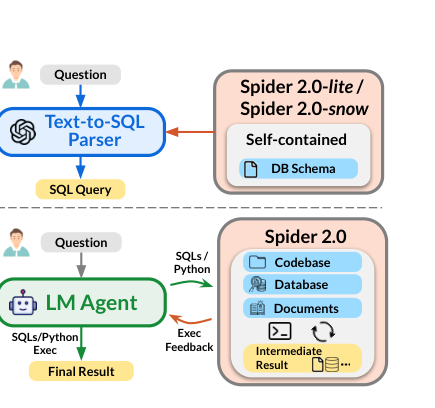

**图 2：** 我们提供两种设置：传统的“文本输入—SQL 输出”Spider 2.0-lite/snow，以及智能体式 Spider 2.0。

**代码智能体任务。** 我们把 Spider 2.0 定义为综合代码智能体任务。给定问题 $Q$、数据库接口 $I$ 和包含项目上下文、配置与文档的代码库 $C$（图 1），智能体依据观察 $O _ k=\mathrm{execute}(C,I,Q)$ 迭代修改 SQL 或 Python 代码 $C$，直到获得最终结果 $A$（文本、表格或数据库）。换言之，最后一次观察就是智能体对问题的回答，即 $A=O _ k$。

**Text-to-SQL 任务。** Spider 2.0-snow 和 Spider 2.0-lite 则是自包含任务。给定数据库模式 $D$、自然语言问题 $Q$ 和辅助文档 $E$，Text-to-SQL 解析器 $f(\cdot)$ 需输出 SQL 查询 $S=f(Q,D,E\mid\theta)$，其中 $\theta$ 为解析器参数。Spider 2.0-lite 分布于与 Spider 2.0 相同的多种数据库；Spider 2.0-snow 完全运行于 Snowflake，更侧重 Text-to-SQL 生成。

### 2.2 标注流水线

八名计算机科学专业、均熟练掌握 SQL 的作者完成数据标注。流水线包含六步。

1. **数据库与 SQL 收集。** 我们从 BigQuery 公共数据、Snowflake Marketplace 等云数据仓库收集数据库，要求每个数据库超过 200 列，或具有嵌套模式。筛选后得到 74 个 BigQuery、54 个 Snowflake、30 个 SQLite、40 个 DuckDB、10 个 PostgreSQL 和 5 个 ClickHouse 数据库。我们又从相应教程和论坛收集 1,021 条复杂 SQL，并从 Fivetran 和 DBT 获取 157 个数据转换项目（见附录 B.2）。SQL 必须超过 50 个按空白切分的 token；作为参照，BIRD（Li et al., 2024b）平均为 30.9 个。SQL 必须来自真实项目或教程，而非合成样例或刻意构造的边界情况。最终保留 547 条高质量 SQL 和 78 个 DBT 项目。

2. **重写 SQL 以防数据泄漏。** 为减少污染并保证评测可信，标注者必须重写每条 SQL 并验证其无缺陷。重写分为复杂度递增的表面层和语义层两级，详见表 1。84.2% 的样例经过表面层重写，42% 经过语义层重写。标注者必须保证重写后的 SQL 能成功执行、在可接受时间内完成且返回非空结果。85.98% 的 SQL 使用不同方言的高级函数（附录 B.7.1），10.76% 还需要 DBT 工具；后者必须结合项目上下文，因而更具挑战。

**表 1：重写类别。** “表面层”重写调整参数和答案格式，“语义层”重写扩展问题含义；示例列中的表号指向相应细节。

| 重写层级 | 类别 | 示例 |
| --- | --- | --- |
| 表面层 | 答案格式 | 表 13：把单个渠道改为按会话数给出渠道排名。 |
| 表面层 | 条件参数 | 表 14：使用更复杂的过滤条件，即 Citi Bike 比出租车更快。 |
| 表面层 | 高级计算 | 表 15：依据所选公开文献计算原创性得分。 |
| 语义层 | 高级要求 | 表 16：把页面浏览顺序改为页面转化率。 |
| 语义层 | 合并相关 SQL | 表 17：合并地理位置与天气相关查询。 |
| 语义层 | SQL 代码库文件 | 附录 B.2：修改原项目中的 SQL 和 YML 文件。 |

3. **代码库与上下文搭建。** 对 Spider 2.0-lite 和 Spider 2.0-snow 的每条复杂 SQL，我们收集完成任务所需的外部参考文档。由于任务跨越不同数据库类型，我们还收集 SQL 方言和外部函数文档（表 18）。对 Spider 2.0，我们保留 SQL 所属项目的原始代码库；除参考文档外，标注者还收集代码库和数据库接口，为每个任务搭建上下文（图 1）。复杂数据转换意图有时无法仅靠自然语言问题充分表达，因此我们补充数据模型描述（附录 B.2）或预定义答案文件（附录 B.5），既保持清晰，也消除潜在歧义。

4. **自然语言任务指令标注。** 标注者依据 SQL 和第 3 步收集的上下文，为两种设置分别写出问题，力求兼顾自然性和无歧义性。代码智能体任务提供上下文和预定义文件以约束答案，因此问题更自然；Text-to-SQL 任务则优先消除歧义，使规格更清楚直接，二者差异见附录 B.6。标注者人工撰写指令，避免生硬描述、消除期望结果歧义，并明确所有 SQL 条件。作为真实数据转换编码场景，DBT 项目任务（图 1、附录 B.2）只用于 Spider 2.0；其任务指令依照既有上下文编写。初步标注后，标注者验证 SQL 与指令语义等价，并借助 LLM 做清晰化改写。

5. **基于执行的聚焦评测。** 标注者以程序方式从数据库得到结果，并编写评测脚本（附录 A）。脚本可处理字符串、表格和数据库文件。表格预测可能包含很多不在标准答案中的列，因为有些问题未明确指定返回列。为减少由此造成的误判，脚本只检查答案的必要组成，忽略非必要列并聚焦指令规定的核心元素，从而显著降低假阴性。Spider 2.0-lite 和 Spider 2.0-snow 要求输出 SQL，故采用表级匹配比较预测 SQL 与标准 SQL 的执行结果。

6. **质量控制。** 每条指令、标准 SQL 和评测脚本至少由三名标注者审阅。标注者反复检查第 3、4、5 步，保证正确、自然且无歧义。第一轮验证发现 45% 的样例含错误；讨论修正后，第二轮仅剩 5%。随后我们修正全部错误、打磨所有标注，最终认定全部样例完成标注。我们还对自动评测进行“红队”测试：输入一组错误结果，检查能否正确判错，同时输入多种格式正确的结果，检查能否正确判对。

### 2.3 数据集统计

表 2 将 Spider 2.0、Spider 2.0-snow 和 Spider 2.0-lite 与多个既有数据集比较；在数据库、SQL 和任务场景等维度，我们的数据集具有更强的复杂性与真实性。

**表 2：Spider 2.0 系列与其他 Text-to-SQL 基准的统计比较。** Tok. 和 Func. 分别代表 token 和函数；由于测试集不可访问，`*` 表示来自开发集的统计。更多统计见附录 B.8。

| 数据集 | 测试样例数 | 测试数据库数 | 每库列数 | 每条 SQL token 数 | 每条 SQL 函数数 | 外部知识 | SQL 方言 | 项目级 |
| --- | ---: | ---: | ---: | ---: | ---: | :---: | :---: | :---: |
| WikiSQL（Zhong et al., 2017） | 15,878 | 5,230 | 6.3 | 12.2 | 0.0 | ✗ | ✗ | ✗ |
| Spider 1.0（Yu et al., 2018） | 2,147 | 40 | 27.1 | 18.5 | 0.0* | ✗ | ✗ | ✗ |
| KaggleDBQA（Lee et al., 2021） | 272 | 8 | 23.4 | 13.8 | 0.0 | ✓ | ✗ | ✗ |
| SEDE（Hazoom et al., 2021） | 857 | 1 | 212.0 | 46.9 | 1.4 | ✗ | ✗ | ✗ |
| BIRD（Li et al., 2024b） | 1,789 | 15 | 54.2 | 30.9 | 0.4* | ✓ | ✗ | ✗ |
| Spider 2.0-lite | 547 | 158 | 803.6 | 144.5 | 6.5 | ✓ | ✓ | ✗ |
| Spider 2.0-snow | 547 | 152 | 812.1 | 161.8 | 6.8 | ✓ | ✓ | ✗ |
| Spider 2.0 | 632 | 213 | 743.5 | 148.3 | 7.1 | ✓ | ✓ | ✓ |

**多种数据库系统和 SQL 方言。** 如图 3 和表 3 所示，我们的基准覆盖多种数据库系统：既有 BigQuery、Snowflake 等云数据仓库，也有 PostgreSQL、ClickHouse 等本地托管数据库，以及 SQLite、DuckDB 等轻量系统。多方言是其区别于以往工作的要点。85.98% 的样例需要使用方言专有函数，每条标准 SQL 平均使用 7.1 个特殊函数。

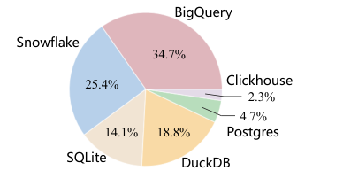

**图 3：** 不同数据库系统的数据分布：BigQuery 34.7%、Snowflake 25.4%、DuckDB 18.8%、SQLite 14.1%、PostgreSQL 4.7%、ClickHouse 2.3%。

**真实而复杂的数据库模式。** Spider 2.0 数据库具有大量表和列，能够反映真实企业环境。表 3 显示，这些数据库包含多模式、嵌套模式和分区表等复杂结构（图 11、图 12），以及每日更新的动态表。数据既有复杂类型（图 16），规模庞大，领域也十分多样（图 15）。

**贯穿数据工程流水线的高难任务。** 我们基准中的样例来自真实教程和论坛，覆盖数据流水线中的数据规整、转换和分析等问题（示例见附录 B.1）。Spider 2.0 的每条 SQL 所含列、token 和函数数都显著多于以往基准（表 2；示例见图 18）。

**表 3：Spider 2.0 的任务特征统计。**

| 统计项 | 数量（占总数百分比） |
| --- | ---: |
| 总样例 | 632（100%） |
| 简单（token < 80） | 160（25.32%） |
| 中等（80 ≤ token < 160） | 279（44.15%） |
| 困难（token ≥ 160） | 193（30.54%） |
| 使用 BigQuery | 214（33.86%） |
| 使用 Snowflake | 198（31.33%） |
| 使用 SQLite | 135（21.36%） |
| 使用 DuckDB | 68（10.76%） |
| 使用 PostgreSQL | 10（1.58%） |
| 使用 ClickHouse | 7（1.11%） |
| 项目级（DBT） | 78（12.34%） |
| 使用文档 | 82（12.97%） |
| 使用函数 | 474（75.00%） |
| 使用分区表 | 54（8.54%） |
| 使用多个模式 | 140（22.15%） |
| 使用嵌套模式 | 117（18.51%） |
| 字符串/数值答案 | 162（25.63%） |
| 表格答案 | 392（62.03%） |
| 数据库答案 | 78（12.34%） |

**带代码库和文档的真实项目场景。** 我们两个数据集的任务都需要使用外部知识（附录 B.4）和 SQL 方言说明（附录 B.7）等文档，必须深入理解这些资源。Spider 2.0 还为每个任务提供模拟真实工作流的代码库上下文（附录 B.5）。更值得注意的是，一些任务来自用 DBT 构建的项目级数据转换工作流（附录 B.2）。DBT 是工业生产中广泛使用的数据转换和分析工程工具。完成这些任务需要浏览复杂项目代码库和数据库、理解文档、处理复杂上下文，并通过多步执行与推理生成多样查询。

## 3 实验

### 3.1 实验设置

**评测指标。** 我们对 Spider 2.0 使用成功率（Success Rate，SR），衡量成功完成的任务比例；Spider 2.0-lite 和 Spider 2.0-snow 的每个任务都必须输出 SQL，故采用常用的执行准确率（Execution Accuracy，EX）（Yu et al., 2018；Li et al., 2024b）。我们使用附录 A 的基于执行的聚焦评测来判断 Spider 2.0 的结果是否成功，并评估 Spider 2.0-lite 中 SQL 执行结果的准确性。脚本接受字符串、表格或数据库输出；每个样例都运行一个脚本，得分为 0 或 1。表格预测可能包含标准答案之外的列，因为部分问题没有明确要求返回哪些列；脚本只检查答案的必要组成，忽略无关列并聚焦指令规定的核心元素。

**难度级别。** 我们按空白对标准 SQL 分词，并依据 token 数划分难度：少于 80 个为简单，80–159 个为中等，至少 160 个为困难。[^difficulty]

[^difficulty]: 衡量难度的方法很多；本文采用 SQL 长度，是因为它最常用，也最适合作为实验参照。

**LLM。** 我们在实验中覆盖先进的开源模型 DeepSeekCoder-V2.5（Zhu et al., 2024）、Qwen2.5-72B-Instruct（Team, 2024）、Llama-3.1-405B（Meta AI, 2024），以及闭源模型 Gemini-Pro-1.5（Reid et al., 2024）、Claude-3.5-Sonnet（Anthropic, 2024）和 GPT 系列（OpenAI, 2023），包括 GPT-4o、GPT-4、o1-preview 和 o3-mini。沿用 Yang et al.（2024a）和 Chen et al.（2024）的做法，我们把温度设为 0.0；输入仍超过模型最大 token 限制时，从输入开头截断。

**代码智能体框架。** 我们采用在其他基准上表现优秀的 Reflexion（Shinn et al., 2023）、CodeR（Chen et al., 2024）和 AutoEval（Pan et al., 2024）。受 ReAct（Yao et al., 2022）和 Intercode（Yang et al., 2023）启发，我们还开发 Spider-Agent，专门处理数据库相关编码任务和项目。它通过命令行接口多轮访问数据库，直到获得最终答案；实现见附录 C.1。

**Text-to-SQL 方法。** 我们评测基于 LLM 提示的 DIN-SQL（Pourreza & Rafiei, 2024）、DAIL-SQL（Gao et al., 2024）、CHESS（Talaei et al., 2024），以及在大规模 Text-to-SQL 语料上微调开源模型的 SFT CodeS（Li et al., 2024a）。DAIL-SQL 和 CHESS 分别是可访问方法中在 Spider 1.0 与 BIRD 上表现最好的方法。实现时，我们优化所有方法的提示组织，以适配当前任务，加入采样单元格值、外部知识和 SQL 方言说明（图 21）。

### 3.2 评测结果

**现有 LLM 离真实 Text-to-SQL 工作流专家仍很远。** 表 4 和表 6 使用 Spider-Agent 及其变体测试 Spider 2.0、Spider 2.0-lite 和 Spider 2.0-snow。o1-preview 与 o3-mini 表现最好，在 Spider 2.0-snow 和 Spider 2.0-lite 上的峰值分别为 23.77% 与 23.40%，仍有巨大提升空间。它们在简单、中等、困难任务上都超过 GPT-4o 和 Claude-3.5-Sonnet，体现出更强推理能力。开源 DeepSeek-V3 达到 8.78%，也仍有明显差距。结合表 6 和 DBT 项目样例，我们观察到类似趋势。

**表 4：使用 Spider-Agent 的不同模型在 Spider 2.0-lite 和 Spider 2.0-snow 上按难度划分的 EX。**

| 模型 | Lite 简单 | Lite 中等 | Lite 困难 | Lite 总体 | Snow 简单 | Snow 中等 | Snow 困难 | Snow 总体 |
| --- | ---: | ---: | ---: | ---: | ---: | ---: | ---: | ---: |
| o1-preview | 33.59% | 23.58% | 15.03% | 23.22% | 39.84% | 21.14% | 15.61% | 23.77% |
| o3-mini | 32.03% | 26.02% | 13.87% | 23.40% | 31.25% | 18.29% | 11.56% | 19.20% |
| Claude-3.5-Sonnet | 26.56% | 15.85% | 6.94% | 15.54% | 25.00% | 16.26% | 7.51% | 15.54% |
| GPT-4o | 22.66% | 13.41% | 5.78% | 13.16% | 24.22% | 11.38% | 6.94% | 12.98% |
| DeepSeek-V3 | 19.53% | 6.50% | 4.05% | 8.78% | 20.31% | 6.1% | 4.05% | 8.78% |
| Qwen2.5-Coder | 13.89% | 4.17% | 3.38% | 5.30% | 11.72% | 4.47% | 2.31% | 5.48% |

**表 5：基线方法在 Spider 1.0、BIRD、Spider 2.0-snow 和 Spider 2.0-lite 上的 EX（↑）。** 原文标题写作“三个 Text-to-SQL 数据集”，但实际列出上述四个数据集。

| 方法 | Spider 1.0 | BIRD | Spider 2.0-snow | Lite 简单 | Lite 中等 | Lite 困难 | Lite 总体 |
| --- | ---: | ---: | ---: | ---: | ---: | ---: | ---: |
| DIN-SQL + GPT-4o | 85.3% | 55.9% | 0.00% | 5.79% | 0.43% | 0.00% | 1.46% |
| DAIL-SQL + GPT-4o | 86.6% | 57.4% | 2.20% | 13.20% | 5.58% | 1.24% | 5.68% |
| CHESS + GPT-4o | 87.2% | 66.7% | 1.28% | 9.92% | 3.00% | 1.24% | 3.84% |
| SFT CodeS-15B | 85.4% | 59.3% | 0.00% | 1.65% | 0.86% | 0.00% | 0.73% |

表 5 表明，Spider 2.0-lite 和 Spider 2.0-snow 对传统 Text-to-SQL 方法极其困难。表现最好的 DAIL-SQL + GPT-4o 在 Lite 上只有 5.68%，远低于 Spider 1.0 的 86.6% 和 BIRD 的 57.4%。CHESS + GPT-4o 通过高效筛选最小充分模式，解决的样例多于 DIN-SQL。即使经过大量微调，SFT CodeS-15B 在 Lite 上也只有 0.73%，再次揭示现有 Text-to-SQL 语料与 Spider 2.0-lite 之间的复杂度鸿沟。在 Spider 2.0-snow 上，最好方法也只有 2.20%，说明 SQL 方言差异进一步加大难度。

**现有代码智能体框架难以处理数据库编码任务。** 表 4 和表 6 表明，我们发现当前智能体框架仍不能有效完成这些任务。它们不但要浏览代码库和文档，还要操作复杂数据库，并生成远比一般代码更复杂的 SQL，因此需要很强的代码落地能力。Spider-Agent 为 Spider 2.0 提供了关键基线，既便于评测各种 LLM，也表明方法仍有广阔改进空间。模型还必须依据 SQL 执行反馈调试，并探索不同数据库系统（如 Snowflake）的模式，这对智能体能力构成很大挑战。要充分释放 LLM 的 Text-to-SQL 能力，Spider-Agent 仍须显著改进。

**表 6：不同框架和模型在 Spider 2.0 上的 SR。** 各设置的成本见表 21。Spider 2.0 由 Spider 2.0-lite 与 DBT 项目任务组成。

| 框架 | 模型 | SR（↑） |
| --- | --- | ---: |
| AutoEval | GPT-4o | 5.70% |
| Reflexion | GPT-4o | 7.28% |
| CodeR | GPT-4o | 7.91% |
| Spider-Agent | o1-preview | 21.36% |
| Spider-Agent | Claude-3.5-Sonnet | 14.87% |
| Spider-Agent | GPT-4o | 12.34% |
| Spider-Agent | GPT-4 | 9.86% |
| Spider-Agent | Qwen2.5-72B | 6.17% |
| Spider-Agent | DeepSeek-V2.5 | 5.22% |
| Spider-Agent | Gemini-Pro-1.5 | 2.53% |
| Spider-Agent | Llama-3.1-405B | 2.21% |

## 4 分析

### 4.1 不同任务类型分析

**LLM 智能体框架难以理解嵌套模式数据库。** 表 7 显示，模型处理嵌套类型列时往往表现很差。嵌套列在工业数据库中十分常见（图 11），一个列内可能以数组或字典形式存储数据。模型很难理解这类模式。如图 29 所示，LLM 因为未完整理解嵌套字段中的信息而发生模式链接错误。对大多数嵌套类型数据库，模型难以全面掌握每个嵌套列的内部信息；人类则可以通过多步推理和迭代理解来掌握模式。

**表 7：非 DBT 项目中，模型在含嵌套列数据库上的表现。**

| 任务子集 | 占总数 | SR（↑） |
| --- | ---: | ---: |
| 含嵌套列 | 18.51% | 10.34% |
| 不含嵌套列 | 68.04% | 27.38% |

**需要外部文档时性能下降。** 从表 8 中我们观察到，任务涉及外部文档时，模型在完整数据集中只正确回答 11 个样例，SR 仅为 11.54%。通过误差分析我们发现，模型并非完全不能把复杂文档信息落到任务中：它通常采取了正确的问题求解策略，也有效探索了数据库，却在最关键的一步失败，即无法把文档中的复杂要求落实为 SQL。图 13 展示所需文档，表 16 给出标准 SQL，图 28 的失败案例则表明模型不能把复杂文档与模式信息结合并转换成 SQL 查询。

**表 8：非 DBT 项目中，模型在外部文档任务上的表现。**

| 任务子集 | 占总数 | SR（↑） |
| --- | ---: | ---: |
| 使用外部文档 | 12.97% | 11.54% |
| 不使用外部文档 | 73.58% | 26.64% |

**LLM 智能体框架难以处理项目级任务。** 表 9 显示，模型在 DBT 项目任务上只解决 12.82%，即 10 个样例。原因包括：（1）数据转换项目常需多条 SQL 完成多个模型，必须全面理解项目；（2）任务使用复杂上下文，需要很强的仓库探索能力；（3）数据存于数据库中，智能体需要在探索既有数据和编写 SQL 的同时执行数据转换。图 26 展示 o1-preview 成功解决附录 B.2 任务的过程；图 27 则是失败案例：模型没有探索 `mrr.md` 中的月度经常性收入分类信息。

**表 9：DBT 项目表现。**

| 任务子集 | 占总数 | SR（↑） |
| --- | ---: | ---: |
| DBT 项目 | 12.34% | 12.82% |
| 非 DBT 项目 | 87.65% | 23.22% |

### 4.2 SQL 生成误差分析

我们对随机抽取的 300 个样例中的代码智能体框架错误进行详细分析，统计见图 4。

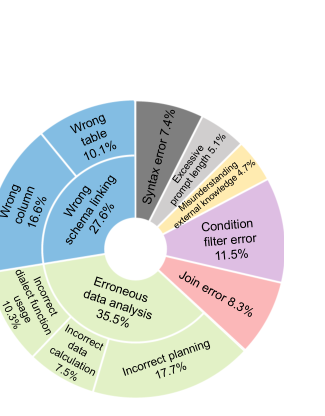

**图 4：** 误差统计。每类误差的详细说明和样例见附录 C.3。

**错误的数据分析（35.5%）。** 与以往基准相比，Spider 2.0 和 Spider 2.0-lite 对数据分析的要求复杂得多，主要包括：

1. **方言函数使用（10.3%）。** 例如处理时间数据的 `DATE_TRUNC`，或处理地理数据的 `ST_DISTANCE`。这些函数需要细致理解，模型经常做不到。
2. **高级数据计算（7.5%）。** 例如使用 `NTILE` 分组样本以分析组内趋势，或应用统计公式，如使用 `CORR` 计算 Pearson 相关系数、使用 `STDDEV` 计算标准差。
3. **复杂查询规划（17.7%）。** 标准 SQL 通常包含多层嵌套查询、通过公共表表达式（CTE）处理中间结果，或以集合运算合并多个子查询结果；模型往往处理不当。案例见图 5。

**模式链接错误（27.6%）。** 该类包含错误表和错误列。列链接错误占 16.6%；Spider 2.0-lite 每个数据库平均列数超过 755，而 BIRD 约为 54，准确链接列极具挑战。表链接错误占 10.1%。BigQuery 样例支持 `_TABLE_SUFFIX` 和通配表达式等高级语法，但模型即使在少样本设置下也难以灵活使用。

**JOIN 错误（8.3%）。** 外键表达有效 SQL JOIN 所需的已知模式关系，但 BigQuery 数据库通常没有显式外键，模型只能根据列名和描述推断潜在键，从而容易出错。

**表 10：Oracle 设置下基线方法在 Spider 2.0-lite 上的 EX。** 为探索性能上限，我们还使用最新的 o1-preview 作为基础 LLM。

| 方法 | 提供 Oracle 函数 EX（↑） | 不提供 Oracle 函数 EX（↑） |
| --- | ---: | ---: |
| DAIL-SQL + GPT-4o | 5.85% | 5.68% |
| DAIL-SQL + o1-preview | 9.51% | 12.60% |

**表 11：使用人工选择示例的少样本设置下，DAIL-SQL 在 Spider 2.0-lite 上的 EX。**

| 方法 | 0-shot EX（↑） | 1-shot EX（↑） | 3-shot EX（↑） |
| --- | ---: | ---: | ---: |
| DAIL-SQL + GPT-4o | 5.68% | 6.40% | 6.76% |

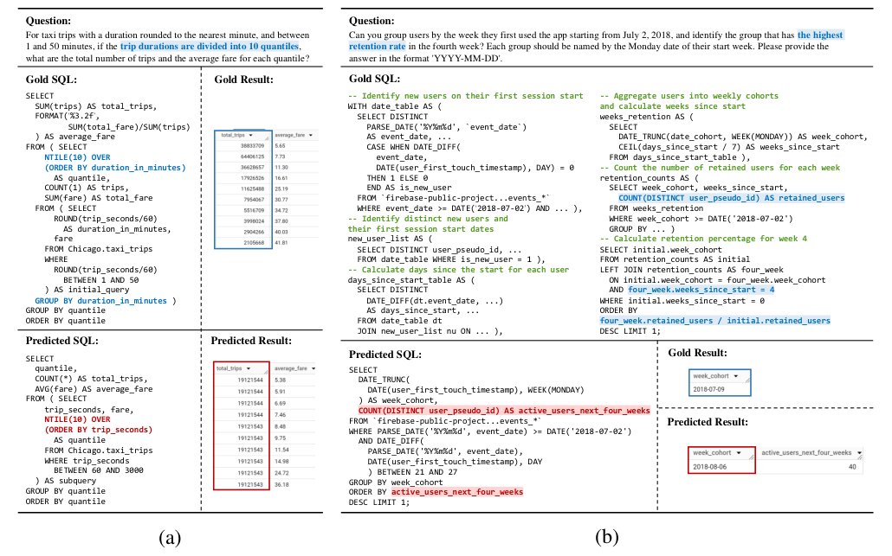

**图 5：** 两个因数据分析错误而产生错误 SQL 的代表性案例。（a）错误的数据计算：模型按行程数量而非题目要求的行程时长划分分位数。（b）错误的规划：预测 SQL 按用户数排序，而非按要求的留存率排序；正确完成任务的前提是规划一串 CTE。所有类别的更多错误案例见图 22、图 23。

### 4.3 不同实验设置分析

**提供 Oracle 函数只带来轻微提升。** Spider 2.0 和 Spider 2.0-lite 涉及多种数据库方言。为避免方法因缺少语法知识而受损，我们提供各系统的语法与函数文档，并人工把每个样例可能需要的函数说明纳入输入，无须检索就能获得必要语法知识。表 10 显示，提供 Oracle SQL 函数文档只带来轻微提升。这表明模型在一定程度上能够选择合适函数并理解基本用途和语法；关键困难是准确使用这些函数表达用户意图，图 5(a) 即为一例。

**少样本提示影响很小。** Spider 2.0-lite 没有训练集和开发集之分。我们人工选择与待预测 SQL 使用相同方言、但特征不同的代表性样例作为少样本示例；这些样例含多个 CTE 或嵌套查询，或需要复杂数据处理。出人意料的是，少样本上下文学习只带来边际提升（表 11）。可能原因是 LLM 使用的简单 Text-to-SQL 预训练数据与少样本示例的复杂度之间存在鸿沟；大规模模式提示也可能妨碍模型有效吸收少样本示例中的信息。

## 5 相关工作

**代码生成和 Text-to-SQL 基准。** 随着模型能力增强，代码生成基准日益复杂和通用。许多基准把代码生成当作序列到序列任务，例如 SQL-Spider（Yu et al., 2018）、Bash-NL2Bash（Lin et al., 2018）和 Python-HumanEval（Chen et al., 2021）。多项工作（Lai et al., 2023；Yin et al., 2023；Huang et al., 2024；Chan et al., 2024；Jing et al., 2024）定义了数据科学代码生成任务；MLAgentBench（Huang et al., 2023）和 Intercode（Yang et al., 2024b）关注交互式环境，SWE-Bench（Jimenez et al., 2023）强调仓库级编码任务，Spider2-V（Cao et al., 2024）则提出多模态数据科学与工程基准。许多数据集（Zhong et al., 2017；Lee et al., 2021；Hazoom et al., 2021；Wang et al., 2020；Li et al., 2024b）推动了 Text-to-SQL 发展，但现有基准主要面向轻量本地数据库，模式规模和数据量远小于集群托管的工业数据库，也没有体现真实场景下使用多种方言编写 SQL 的智能体性质。Spider 2.0 填补了研究与企业级工业 Text-to-SQL 工作流之间的空白。

**代码智能体框架和 Text-to-SQL 方法。** 生成式代码模型与交互式问题求解的交叉，推动了智能体框架和 Text-to-SQL 方法的发展。大量面向代码生成的智能体方法力图提升语言模型推理能力（Yao et al., 2022；Zhang et al., 2022；Chen et al., 2023；Wang et al., 2023b；Shinn et al., 2024；Zhang et al., 2024；Xia et al., 2024），还有工作设计专用动作以规范智能体操作（Wang et al., 2024；Yang et al., 2024a）。专门面向 Text-to-SQL 的微调方法（Li et al., 2024a）和 LLM 提示方法（Dong et al., 2023；Wang et al., 2023a；Zhang et al., 2023；Talaei et al., 2024；Pourreza & Rafiei, 2024；Gao et al., 2024）已在以往基准上取得很强表现。我们提出专门处理数据库任务的 Spider-Agent，并为 Spider 2.0-lite 适配多种 Text-to-SQL 方法。

## 6 结论

我们提出 Spider 2.0，这是一个面向真实企业级 Text-to-SQL 工作流任务的基准。它覆盖具有不同 SQL 方言的多种数据库系统、大而复杂的数据库模式，以及贯穿数据工程流水线的困难任务；所有任务都置于包含代码库和文档的真实项目场景中。即使最先进的 LLM o1-preview 在 Spider 2.0 上也只达到 21.3% 的成功率，足见其难度。Spider 2.0 为 Text-to-SQL 研究提出了新挑战，也为更真实、更智能的解决方案指明方向。

## 致谢

本文作者获得香港研究资助局 ECS 项目（27212023）支持。我们感谢 Snowflake 慷慨支持 Spider 2.0 Challenge 的托管，也感谢 Tianbao Xie、Yiheng Xu、Fan Zhou、Yuting Lan、Per Jacobsson、Yiming Huang、Canwen Xu、Zhewei Yao 和 Binyuan Hui 对本工作的宝贵反馈。

## 参考文献

1. Anthropic. The Claude 3 Model Family: Opus, Sonnet, Haiku. <https://www-cdn.anthropic.com/de8ba9b01c9ab7cbabf5c33b80b7bbc618857627/Model_Card_Claude_3.pdf>, 2024.
2. Jacob Austin, Augustus Odena, Maxwell Nye, Maarten Bosma, Henryk Michalewski, David Dohan, Ellen Jiang, Carrie Cai, Michael Terry, Quoc Le, et al. Program Synthesis with Large Language Models. arXiv preprint arXiv:2108.07732, 2021.
3. Ruisheng Cao, Fangyu Lei, Haoyuan Wu, Jixuan Chen, Yeqiao Fu, Hongcheng Gao, Xinzhuang Xiong, Hanchong Zhang, Yuchen Mao, Wenjing Hu, et al. Spider2-V: How Far Are Multimodal Agents from Automating Data Science and Engineering Workflows? arXiv preprint arXiv:2407.10956, 2024.
4. Jun Shern Chan, Neil Chowdhury, Oliver Jaffe, James Aung, Dane Sherburn, Evan Mays, Giulio Starace, Kevin Liu, Leon Maksin, Tejal Patwardhan, et al. MLE-Bench: Evaluating Machine Learning Agents on Machine Learning Engineering. arXiv preprint arXiv:2410.07095, 2024.
5. Dong Chen, Shaoxin Lin, Muhan Zeng, Daoguang Zan, Jian-Gang Wang, Anton Cheshkov, Jun Sun, Hao Yu, Guoliang Dong, Artem Aliev, et al. CodeR: Issue Resolving with Multi-Agent and Task Graphs. arXiv preprint arXiv:2406.01304, 2024.
6. Mark Chen, Jerry Tworek, Heewoo Jun, Qiming Yuan, Henrique Ponde De Oliveira Pinto, Jared Kaplan, Harri Edwards, Yuri Burda, Nicholas Joseph, Greg Brockman, et al. Evaluating Large Language Models Trained on Code. arXiv preprint arXiv:2107.03374, 2021.
7. Xinyun Chen, Maxwell Lin, Nathanael Schaerli, and Denny Zhou. Teaching Large Language Models to Self-Debug. In *The 61st Annual Meeting of the Association for Computational Linguistics*, 2023.
8. Deborah A. Dahl, Madeleine Bates, Michael K. Brown, William M. Fisher, Kate Hunicke-Smith, David S. Pallett, Christine Pao, Alexander Rudnicky, and Elizabeth Shriberg. Expanding the Scope of the ATIS Task: The ATIS-3 Corpus. In *Human Language Technology: Proceedings of a Workshop Held at Plainsboro, New Jersey, March 8–11, 1994*, 1994.
9. Xuemei Dong, Chao Zhang, Yuhang Ge, Yuren Mao, Yunjun Gao, Jinshu Lin, Dongfang Lou, et al. C3: Zero-Shot Text-to-SQL with ChatGPT. arXiv preprint arXiv:2307.07306, 2023.
10. Dawei Gao, Haibin Wang, Yaliang Li, Xiuyu Sun, Yichen Qian, Bolin Ding, and Jingren Zhou. Text-to-SQL Empowered by Large Language Models: A Benchmark Evaluation. *Proceedings of the VLDB Endowment*, 17(5):1132–1145, 2024.
11. Moshe Hazoom, Vibhor Malik, and Ben Bogin. Text-to-SQL in the Wild: A Naturally-Occurring Dataset Based on Stack Exchange Data. In *Proceedings of the 1st Workshop on Natural Language Processing for Programming (NLP4Prog 2021)*, pp. 77–87, 2021.
12. Qian Huang, Jian Vora, Percy Liang, and Jure Leskovec. Benchmarking Large Language Models as AI Research Agents. arXiv preprint arXiv:2310.03302, 2023.
13. Yiming Huang, Jianwen Luo, Yan Yu, Yitong Zhang, Fangyu Lei, Yifan Wei, Shizhu He, Lifu Huang, Xiao Liu, Jun Zhao, et al. DA-Code: Agent Data Science Code Generation Benchmark for Large Language Models. arXiv preprint arXiv:2410.07331, 2024.
14. Carlos E. Jimenez, John Yang, Alexander Wettig, Shunyu Yao, Kexin Pei, Ofir Press, and Karthik R. Narasimhan. SWE-Bench: Can Language Models Resolve Real-World GitHub Issues? In *The Twelfth International Conference on Learning Representations*, 2023.
15. Liqiang Jing, Zhehui Huang, Xiaoyang Wang, Wenlin Yao, Wenhao Yu, Kaixin Ma, Hongming Zhang, Xinya Du, and Dong Yu. DSBench: How Far Are Data Science Agents to Becoming Data Science Experts? 2024. <https://arxiv.org/abs/2409.07703>.
16. Yuhang Lai, Chengxi Li, Yiming Wang, Tianyi Zhang, Ruiqi Zhong, Luke Zettlemoyer, Wen-tau Yih, Daniel Fried, Sida Wang, and Tao Yu. DS-1000: A Natural and Reliable Benchmark for Data Science Code Generation. In *International Conference on Machine Learning*, pp. 18319–18345. PMLR, 2023.
17. Chia-Hsuan Lee, Oleksandr Polozov, and Matthew Richardson. KaggleDBQA: Realistic Evaluation of Text-to-SQL Parsers. In *Proceedings of the 59th Annual Meeting of the Association for Computational Linguistics and the 11th International Joint Conference on Natural Language Processing (Volume 1: Long Papers)*, pp. 2261–2273, 2021.
18. Fei Li and H. V. Jagadish. Constructing an Interactive Natural Language Interface for Relational Databases. *Proceedings of the VLDB Endowment*, 8(1), 2014.
19. Haoyang Li, Jing Zhang, Hanbing Liu, Ju Fan, Xiaokang Zhang, Jun Zhu, Renjie Wei, Hongyan Pan, Cuiping Li, and Hong Chen. CodeS: Towards Building Open-Source Language Models for Text-to-SQL. *Proceedings of the ACM on Management of Data*, 2(3):1–28, 2024a.
20. Jinyang Li, Binyuan Hui, Ge Qu, Jiaxi Yang, Binhua Li, Bowen Li, Bailin Wang, Bowen Qin, Ruiying Geng, Nan Huo, et al. Can LLM Already Serve as a Database Interface? A BIg Bench for Large-Scale Database Grounded Text-to-SQLs. *Advances in Neural Information Processing Systems*, 36, 2024b.
21. Xi Victoria Lin, Chenglong Wang, Luke Zettlemoyer, and Michael D. Ernst. NL2Bash: A Corpus and Semantic Parser for Natural Language Interface to the Linux Operating System. In *Proceedings of the Eleventh International Conference on Language Resources and Evaluation (LREC 2018)*, 2018.
22. Meta AI. Introducing Meta Llama 3: The Most Capable Openly Available LLM to Date, April 2024. <https://ai.meta.com/blog/meta-llama-3/>. Accessed: 2024-04-18.
23. R. OpenAI. GPT-4 Technical Report. arXiv:2303.08774. *View in Article*, 2:13, 2023.
24. Jiayi Pan, Yichi Zhang, Nicholas Tomlin, Yifei Zhou, Sergey Levine, and Alane Suhr. Autonomous Evaluation and Refinement of Digital Agents. In *First Conference on Language Modeling*, 2024.
25. Mohammadreza Pourreza and Davood Rafiei. DIN-SQL: Decomposed In-Context Learning of Text-to-SQL with Self-Correction. *Advances in Neural Information Processing Systems*, 36, 2024.
26. Machel Reid, Nikolay Savinov, Denis Teplyashin, Dmitry Lepikhin, Timothy Lillicrap, Jean-Baptiste Alayrac, Radu Soricut, Angeliki Lazaridou, Orhan Firat, Julian Schrittwieser, et al. Gemini 1.5: Unlocking Multimodal Understanding Across Millions of Tokens of Context. arXiv preprint arXiv:2403.05530, 2024.
27. Noah Shinn, Federico Cassano, Ashwin Gopinath, Karthik R. Narasimhan, and Shunyu Yao. Reflexion: Language Agents with Verbal Reinforcement Learning. In *Thirty-Seventh Conference on Neural Information Processing Systems*, 2023.
28. Noah Shinn, Federico Cassano, Ashwin Gopinath, Karthik Narasimhan, and Shunyu Yao. Reflexion: Language Agents with Verbal Reinforcement Learning. *Advances in Neural Information Processing Systems*, 36, 2024.
29. Shayan Talaei, Mohammadreza Pourreza, Yu-Chen Chang, Azalia Mirhoseini, and Amin Saberi. CHESS: Contextual Harnessing for Efficient SQL Synthesis. arXiv preprint arXiv:2405.16755, 2024.
30. Qwen Team. Qwen2.5: A Party of Foundation Models, September 2024. <https://qwenlm.github.io/blog/qwen2.5/>.
31. Bing Wang, Changyu Ren, Jian Yang, Xinnian Liang, Jiaqi Bai, Qian-Wen Zhang, Zhao Yan, and Zhoujun Li. MAC-SQL: Multi-Agent Collaboration for Text-to-SQL. arXiv preprint arXiv:2312.11242, 2023a.
32. Lei Wang, Wanyu Xu, Yihuai Lan, Zhiqiang Hu, Yunshi Lan, Roy Ka-Wei Lee, and Ee-Peng Lim. Plan-and-Solve Prompting: Improving Zero-Shot Chain-of-Thought Reasoning by Large Language Models. In *Proceedings of the 61st Annual Meeting of the Association for Computational Linguistics (Volume 1: Long Papers)*, pp. 2609–2634, 2023b.
33. Ping Wang, Tian Shi, and Chandan K. Reddy. Text-to-SQL Generation for Question Answering on Electronic Medical Records. In *Proceedings of The Web Conference 2020*, pp. 350–361, 2020.
34. Xingyao Wang, Boxuan Li, Yufan Song, Frank F. Xu, Xiangru Tang, Mingchen Zhuge, Jiayi Pan, Yueqi Song, Bowen Li, Jaskirat Singh, Hoang H. Tran, Fuqiang Li, Ren Ma, Mingzhang Zheng, Bill Qian, Yanjun Shao, Niklas Muennighoff, Yizhe Zhang, Binyuan Hui, Junyang Lin, Robert Brennan, Hao Peng, Heng Ji, and Graham Neubig. OpenDevin: An Open Platform for AI Software Developers as Generalist Agents, 2024. <https://arxiv.org/abs/2407.16741>.
35. Chunqiu Steven Xia, Yinlin Deng, Soren Dunn, and Lingming Zhang. Agentless: Demystifying LLM-Based Software Engineering Agents. arXiv preprint arXiv:2407.01489, 2024.
36. John Yang, Akshara Prabhakar, Karthik Narasimhan, and Shunyu Yao. Intercode: Standardizing and Benchmarking Interactive Coding with Execution Feedback. *CoRR*, abs/2306.14898, 2023. doi:10.48550/arXiv.2306.14898. <https://doi.org/10.48550/arXiv.2306.14898>.
37. John Yang, Carlos E. Jimenez, Alexander Wettig, Kilian Lieret, Shunyu Yao, Karthik Narasimhan, and Ofir Press. SWE-Agent: Agent Computer Interfaces Enable Software Engineering Language Models, 2024a.
38. John Yang, Akshara Prabhakar, Karthik Narasimhan, and Shunyu Yao. Intercode: Standardizing and Benchmarking Interactive Coding with Execution Feedback. *Advances in Neural Information Processing Systems*, 36, 2024b.
39. Shunyu Yao, Jeffrey Zhao, Dian Yu, Nan Du, Izhak Shafran, Karthik R. Narasimhan, and Yuan Cao. ReAct: Synergizing Reasoning and Acting in Language Models. In *The Eleventh International Conference on Learning Representations*, 2022.
40. Pengcheng Yin, Wen-Ding Li, Kefan Xiao, Abhishek Rao, Yeming Wen, Kensen Shi, Joshua Howland, Paige Bailey, Michele Catasta, Henryk Michalewski, et al. Natural Language to Code Generation in Interactive Data Science Notebooks. In *Proceedings of the 61st Annual Meeting of the Association for Computational Linguistics (Volume 1: Long Papers)*, pp. 126–173, 2023.
41. Tao Yu, Rui Zhang, Kai Yang, Michihiro Yasunaga, Dongxu Wang, Zifan Li, James Ma, Irene Li, Qingning Yao, Shanelle Roman, et al. Spider: A Large-Scale Human-Labeled Dataset for Complex and Cross-Domain Semantic Parsing and Text-to-SQL Task. In *Proceedings of the 2018 Conference on Empirical Methods in Natural Language Processing*, pp. 3911–3921, 2018.
42. John M. Zelle and Raymond J. Mooney. Learning to Parse Database Queries Using Inductive Logic Programming. In *Proceedings of the National Conference on Artificial Intelligence*, pp. 1050–1055, 1996.
43. Luke S. Zettlemoyer and Michael Collins. Learning to Map Sentences to Logical Form: Structured Classification with Probabilistic Categorial Grammars. In *Proceedings of the Twenty-First Conference on Uncertainty in Artificial Intelligence*, pp. 658–666, 2005.
44. Hanchong Zhang, Ruisheng Cao, Lu Chen, Hongshen Xu, and Kai Yu. ACT-SQL: In-Context Learning for Text-to-SQL with Automatically-Generated Chain-of-Thought. In *Findings of the Association for Computational Linguistics: EMNLP 2023*, pp. 3501–3532, 2023.
45. Shun Zhang, Zhenfang Chen, Yikang Shen, Mingyu Ding, Joshua B. Tenenbaum, and Chuang Gan. Planning with Large Language Models for Code Generation. In *The Eleventh International Conference on Learning Representations*, 2022.
46. Yuntong Zhang, Haifeng Ruan, Zhiyu Fan, and Abhik Roychoudhury. AutoCodeRover: Autonomous Program Improvement. In *Proceedings of the 33rd ACM SIGSOFT International Symposium on Software Testing and Analysis*, pp. 1592–1604, 2024.
47. Victor Zhong, Caiming Xiong, and Richard Socher. Seq2SQL: Generating Structured Queries from Natural Language Using Reinforcement Learning. arXiv preprint arXiv:1709.00103, 2017.
48. Qihao Zhu, Daya Guo, Zhihong Shao, Dejian Yang, Peiyi Wang, Runxin Xu, Y. Wu, Yukun Li, Huazuo Gao, Shirong Ma, et al. DeepSeek-Coder-V2: Breaking the Barrier of Closed-Source Models in Code Intelligence. arXiv preprint arXiv:2406.11931, 2024.

## 附录 A：Spider 2.0 评测脚本

本节我们详细定义并讨论 Spider 2.0-lite 和 Spider 2.0 的评测指标。

**Spider 2.0-lite。** Spider 2.0-lite 与传统 Text-to-SQL 任务相似，解析器需要生成 SQL 查询，因此主要指标是执行准确率（EX）。与既有工作略有不同，我们采用基于执行的聚焦评测：检查标准结果中的所有列是否出现在预测 SQL 的输出中。定义如下：

$$
\mathrm{EX}=\frac{\sum _ {n=1}^{N}\mathbf{1}(v _ n,\hat{v} _ n)}{N}
\qquad \text{(1)}
$$

$$
\mathbf{1}(v,\hat{v})=
\begin{cases}
1, & v _ i \in \hat{v},\ \forall v _ i \in v \\
0, & v _ i \notin \hat{v},\ \exists v _ i \in v
\end{cases}
\qquad \text{(2)}
$$

其中， $v _ i$ 表示数据帧 $v$ 的第 $i$ 列； $v _ n$ 和 $\hat{v} _ n$ 分别表示评测集中第 $n$ 个样例的标准 SQL 和预测 SQL 执行结果。经验上，该方法能显著降低假阴性而不增加假阳性。标准答案来自大量数据规整、转换和分析，模型很难操纵或钻评测系统的空子。

**Spider 2.0。** 我们使用成功率（SR）衡量成功解决的任务比例，并通过人工编写的评测脚本判断样例是否解决。依据输出答案的类型，每个样例配有字符串、表格或数据库评测函数，见表 12。

**示例。** 自然性和无歧义性经常互相冲突。为说明如何平衡二者，我们解释两个重要参数：`condition_cols` 和 `ignore_order`。二者很难兼顾，正因如此，我们才把这一机制纳入评测脚本。给定数据帧 $v$ 及其列向量集合 $\lbrace v _ i\rbrace$，每个向量包含第 $i$ 列的单元格值；当且仅当任意 $v _ i \in v$ 都满足 $v _ i \in \hat{v}$ 时，预测 $\hat{v}$ 才与 $v$ 等价。直观地说，只要参考表的所有必要列都出现在结果表中，结果就视为正确。

图 6 的问题没有明确说明我们的回答必须包含哪些列：“公司管理层要求一份 Magnificent 7 股票年初至今表现的详细报告。”我们需要仔细分析任务要求，只检查参考答案中的 `Ticker` 和 `Change_YTD` 两列是否出现在预测答案里。这满足抽象指令的语义要求。经验上，我们发现该指标能可靠识别采用替代输出格式的正确解，假阴性率较低。

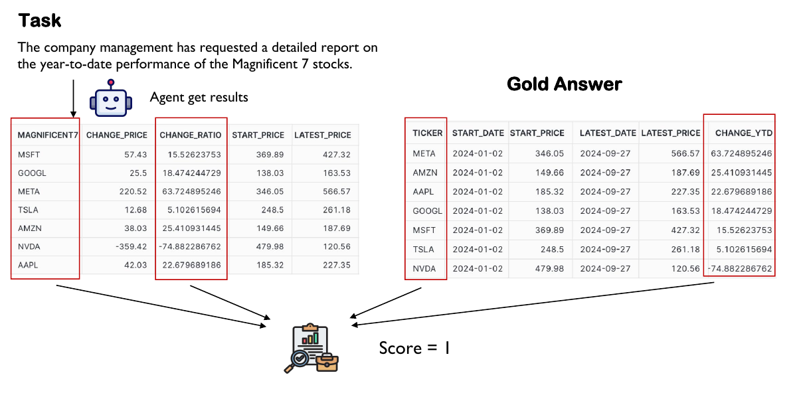

**图 6：** 表级评测脚本示例。此例的 `condition_cols` 为 `{0, 5}`，`ignore_order` 为 `true`；只要这两列预测正确，样例就视为解决。

**表 12：Spider 2.0 的评测脚本按模型输出格式定制。** 每个脚本针对不同输出类型优化，以保证精确且符合上下文的评测。

| 输出类型 | 说明 | 参数 |
| --- | --- | --- |
| 不含数值的字符串 | 若答案出现在字符串中则得 1 分，否则得 0 分。 | `pred (str)`：要搜索的预测字符串。`gold (List[str])`：要在预测中检查的字符串列表。`conj (str)`：匹配连接方式，`and` 或 `or`，默认 `or`。`exclude (List[str])`：答案中不得出现的字符串。 |
| 含数值的字符串 | 抽取输出中的数值，并通过 `number_match` 函数进行数值匹配评分。 | `pred (str)`：预测字符串。`gold (List[str|float])`：要检查的字符串或数值。`percentage (bool)`：标准答案与百分比有关时设为 `true`，默认 `false`。`precision (int)`：比较的小数位数，默认 4。`conj (str)`：`and` 或 `or`，默认且通常为 `or`。 |
| 表格 | 答案为 CSV 文件或字符串形式表格时执行表级评测。 | `result (str)`：CSV 路径或结果字符串。`gold (str | List[str])`：相对根目录的一个或多个标准文件路径。`condition_cols (List[int] | List[List[int]])`：需匹配的列号；如 `[0, 1]` 只使用标准表的第 0、1 列并忽略其余列。`ignore_order (bool)`：匹配元素时是否忽略行序。 |
| 数据库 | 答案存于数据库文件时执行数据库级评测。 | `result (str)`：包含结果表的 DuckDB 文件路径。`gold (str)`：标准 DuckDB 文件路径。`condition_tabs (List[str], optional)`：要检查的表名；未提供时检查标准库所有表。`condition_cols (List[List[int]], optional)`：各表用于匹配的列号，默认检查全部列。`ignore_orders (List[bool], optional)`：逐表指定是否忽略行序，默认每表为 `False`。 |
| SQL | 输出为 SQL 时使用基于执行的评测。主要用于 Spider 2.0-lite。 | 执行预测 SQL 和标准 SQL，并用表格匹配比较结果。 |

## 附录 B：标注细节

### B.1 SQL 标注示例

本节我们给出若干有代表性的 SQL 标注案例，包括原始 SQL、如何重写为标准 SQL，以及如何使用外部知识。

- 表 13 基于 Google Analytics 数据库，任务是计算 Web 流量来源，并统计给定时间范围内每个流量渠道的会话数。
- 表 14 基于纽约市公共数据。任务先找出指定位置之间的 Citi Bike 与出租车行程，再判断哪种交通方式更适合这些路线。原 SQL 只计算指定位置之间的自行车和汽车行程；我们把条件扩展为更贴近现实的问题：找出 Citi Bike 比出租车更快的路线。
- 表 15 基于包含大量专利信息的 Google Patents 数据库。原 SQL 使用多个过滤条件检索一组专利。我们找到一份说明如何计算专利原创性得分的文档，由此加入更高级的计算方法，使最终任务包含额外的复杂计算步骤。
- 表 16 同样基于 Google Analytics。原 SQL 计算产品列表页（Product List Page，PLP）和产品详情页（Product Detail Page，PDP）。依据博客中的说明，我们定义新任务：通过用户从 PLP 点击到 PDP 的概率计算转化率。
- 表 17 中，我们合并并重写两条相关 SQL。第一条计算离芝加哥市中心最近的 50 个气象站，第二条计算纽约市雨天与非雨天的骑行次数。我们把两项任务合并后，必须先找到离纽约市中心最近的气象站，再据此判断是否下雨。

### B.2 DBT 项目标注示例

**DBT 项目标注流水线。** DBT 项目来自在线资源，是 SQL 脚本最多的一类项目。类似数据转换工具已广泛用于工业生产。完成 DBT 项目需要全面理解项目中的代码与文档。图 7 展示 Spider 2.0 中一个基于 Salesforce 的项目，这是自然、真实的 SQL 生成场景。我们以 Fivetran 的 Salesforce transformation package[^fivetran] 为例，通过以下步骤把复杂 DBT 项目转换成 Spider 2.0 样例。

[^fivetran]: <https://github.com/fivetran/dbt_salesforce/>

1. 从头至尾运行 DBT 项目，保证无缺陷，并生成 dbt DAG（图 9），以全面理解数据流。
2. DBT 项目包含 YML 文件和 Markdown 文档，项目开发者已在其中规划数据模型和数据流。我们以这些信息为任务指令的依据。

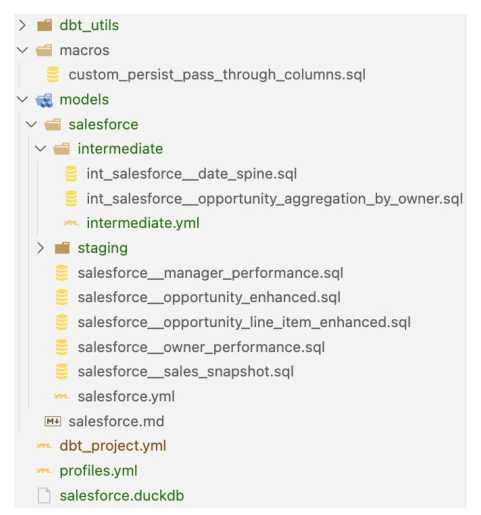

**图 7：** DBT 项目的代码库，展示模型、宏和配置文件。

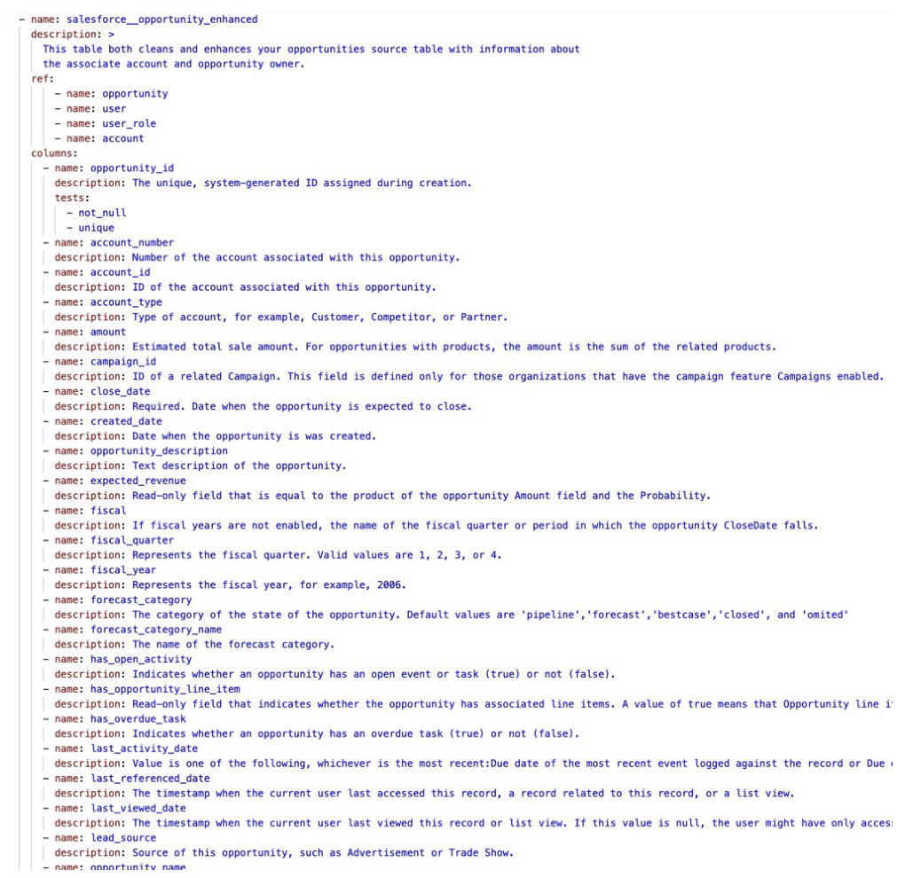

**图 8：** DBT 项目中用于定义数据模型模式的常见配置文件。图中给出 `salesforce_opportunity_enhanced` 模型的字段名、数据类型和引用等信息，代表一种自然 SQL 生成场景。

3. 我们从完整 DBT 项目中删除特定数据流对应的 `.sql` 文件。例如，在图 9 中我们可删除一至三条数据流；图 10 展示我们删除 `salesforce_daily_activity`、`salesforce_contact_enhanced` 及其上游节点后，转换项目如何变得不完整。DAG 只辅助数据标注，不作为任务输入图像。
4. 我们编写任务指令，例如：“我需要一份关键销售活动日报，其中包括已完成任务、已举办活动、新增潜在客户以及商机状态。”数据模型虽然包含很多列，但 YML 文件已给出定义（图 8），所以指令无须逐一描述输出列。

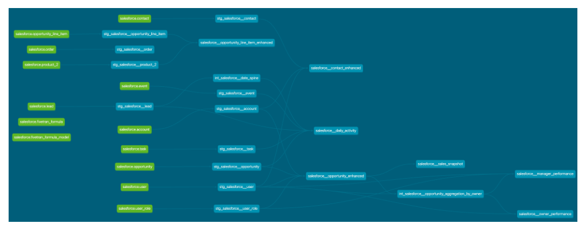

**图 9：** 一个有向无环图（DAG），展示 dbt（data build tool）项目中各 Salesforce 表和模型之间的数据流与依赖关系。数据从原始 Salesforce 数据（绿色节点）流向增强和聚合模型（蓝色节点），涉及商机、联系人、账户和事件等实体。

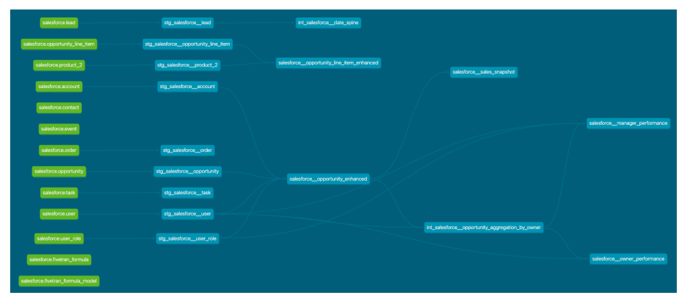

**图 10：** 删除 `salesforce_daily_activity`、`salesforce_contact_enhanced` 及其上游节点后的 DAG；相较图 9，数据流不完整。

**求解 DBT 项目样例所需能力。** 如图 26 所示，完成一个 DBT 项目样例通常需要：

1. **理解问题。** 首先完整理解自然语言任务。
2. **阅读项目。** 真实数据转换项目由多个文件组成（图 7），方法需要探索代码库并阅读 `.yml`、`.md` 和 `.sql` 等相关文件。YML 文件（图 8）一般定义转换的数据模型，Markdown 文件提供模型文字说明，SQL 文件则实现转换模型。
3. **探索数据库。** 代码库只含转换代码，待转换数据存于数据库中。方法必须探索数据库，理解可用源数据并找出缺失数据模型。
4. **定位问题。** 结合自然语言问题和 YML 文件，定位项目中需要添加或修改代码的位置。
5. **编写代码。** 依据 YML 定义的数据模型完成复杂转换代码，并把 `.sql` 文件加入正确位置。从图示角度说，就是补齐 YML 所定义的模型，使图 10 恢复为图 9。
6. **执行数据转换。** SQL 写好后运行 `dbt run`。
7. **调试。** DBT 项目运行后，若转换成功，数据库中的数据模型（表）会新增或删除。方法必须检查数据库，判断转换是否全部成功；若未成功，就重复上述步骤，直到满足任务要求。

#### 表 13：Google Analytics 流量会话示例——答案格式的表面层重写

**问题：** 给出 2020 年 12 月各渠道的会话数及百分比分布。

**参考计划：**

1. 先阅读文档，理解如何主要依据 `source`、`medium` 和 `campaign` 指标把流量划分到 18 个渠道组。
2. 从数据库抽取 12 月的所有访问；每次访问都有唯一用户 ID 和会话 ID，并取得每次访问的 `source`、`medium` 和 `campaign`。
3. 按文档中的渠道组分类标准编写条件语句，主要使用正则表达式判断每条数据所属渠道。例如，当 `source` 包含 `badoo`、`facebook`、`fb`、`instagram`、`linkedin`、`pinterest`、`tiktok`、`twitter` 或 `whatsapp`，且 `medium` 包含 `cp`、`ppc` 或以 `paid` 开头时，归类为 `Paid Social`。
4. 按渠道分组计算会话数和百分比。

以下两段 SQL 忠实保留论文原文中的语法异常：`prep` CTE 后缺少分隔逗号，且若干 `CASE` 分支的 `THEN` 结果后多出逗号。

**重写后的标准 SQL：**

```sql
WITH prep AS (
  SELECT
    user_pseudo_id,
    (SELECT value.int_value
     FROM UNNEST(event_params)
     WHERE key = 'ga_session_id') AS session_id,
    ARRAY_AGG(
      (SELECT value.string_value
       FROM UNNEST(event_params)
       WHERE key = 'source')
      IGNORE NULLS ORDER BY event_timestamp
    )[SAFE_OFFSET(0)] AS source,
    ARRAY_AGG(
      (SELECT value.string_value
       FROM UNNEST(event_params)
       WHERE key = 'medium')
      IGNORE NULLS ORDER BY event_timestamp
    )[SAFE_OFFSET(0)] AS medium,
    ARRAY_AGG(
      (SELECT value.string_value
       FROM UNNEST(event_params)
       WHERE key = 'campaign')
      IGNORE NULLS ORDER BY event_timestamp
    )[SAFE_OFFSET(0)] AS campaign
  FROM `bigquery-public-data.ga4_obfuscated_sample_ecommerce.events_*`
  WHERE _TABLE_SUFFIX BETWEEN '20201201' AND '20201231'
  GROUP BY user_pseudo_id, session_id
)
grouped_data AS (
  SELECT
    CASE
      WHEN source = '(direct)' AND medium IN ('(not set)', '(none)')
        THEN 'Direct',
      WHEN REGEXP_CONTAINS(campaign, 'cross-network')
        THEN 'Cross-network'
      WHEN (
        REGEXP_CONTAINS(
          source,
          'alibaba|amazon|google shopping|shopify|etsy|ebay|stripe|walmart'
        )
        OR REGEXP_CONTAINS(
          campaign,
          '^(.*(([^a-df-z]|^)shop|shopping).*)$'
        )
      )
      AND REGEXP_CONTAINS(medium, '^(.*cp.*|ppc|paid.*)$')
        THEN 'Paid Shopping',
      WHEN REGEXP_CONTAINS(
        source,
        'baidu|bing|duckduckgo|ecosia|google|yahoo|yandex'
      )
      AND REGEXP_CONTAINS(medium, '^(.*cp.*|ppc|paid.*)$')
        THEN 'Paid Search',
      WHEN REGEXP_CONTAINS(
        source,
        'badoo|facebook|fb|instagram|linkedin|pinterest|tiktok|twitter|whatsapp'
      )
      AND REGEXP_CONTAINS(medium, '^(.*cp.*|ppc|paid.*)$')
        THEN 'Paid Social',
      WHEN REGEXP_CONTAINS(
        source,
        'dailymotion|disneyplus|netflix|youtube|vimeo|twitch|vimeo|youtube'
      )
      AND REGEXP_CONTAINS(medium, '^(.*cp.*|ppc|paid.*)$')
        THEN 'Paid Video',
      WHEN medium IN ('display', 'banner', 'expandable', 'interstitial', 'cpm')
        THEN 'Display'
      WHEN REGEXP_CONTAINS(
        source,
        'alibaba|amazon|google shopping|shopify|etsy|ebay|stripe|walmart'
      )
      OR REGEXP_CONTAINS(
        campaign,
        '^(.*(([^a-df-z]|^)shop|shopping).*)$'
      )
        THEN 'Organic Shopping'
      WHEN REGEXP_CONTAINS(
        source,
        'badoo|facebook|fb|instagram|linkedin|pinterest|tiktok|twitter|whatsapp'
      )
      OR medium IN (
        'social', 'social-network', 'social-media', 'sm',
        'social network', 'social media'
      )
        THEN 'Organic Social'
      WHEN REGEXP_CONTAINS(
        source,
        'dailymotion|disneyplus|netflix|youtube|vimeo|twitch|vimeo|youtube'
      )
      OR REGEXP_CONTAINS(medium, '^(.*video.*)$')
        THEN 'Organic Video'
      WHEN REGEXP_CONTAINS(
        source,
        'baidu|bing|duckduckgo|ecosia|google|yahoo|yandex'
      )
      OR medium = 'organic'
        THEN 'Organic Search'
      WHEN REGEXP_CONTAINS(source, 'email|e-mail|e_mail|e mail')
      OR REGEXP_CONTAINS(medium, 'email|e-mail|e_mail|e mail')
        THEN 'Email'
      WHEN medium = 'affiliate' THEN 'Affiliates'
      WHEN medium = 'referral' THEN 'Referral'
      WHEN medium = 'audio' THEN 'Audio'
      WHEN medium = 'sms' THEN 'SMS'
      WHEN medium LIKE '%push'
      OR REGEXP_CONTAINS(medium, 'mobile|notification')
        THEN 'Mobile Push Notifications'
      ELSE 'Unassigned'
    END AS channel_grouping_session,
    COUNT(DISTINCT CONCAT(user_pseudo_id, session_id)) AS session_count
  FROM prep
  GROUP BY channel_grouping_session
),
total_sessions AS (
  SELECT SUM(session_count) AS total_count
  FROM grouped_data
)
SELECT
  gd.channel_grouping_session,
  gd.session_count,
  ROUND(gd.session_count / ts.total_count * 100, 2) AS percentage_of_total
FROM grouped_data gd, total_sessions ts
ORDER BY gd.session_count DESC
LIMIT 10;
```

**原始 SQL：**

```sql
WITH prep AS (
  SELECT
    user_pseudo_id,
    (SELECT value.int_value
     FROM UNNEST(event_params)
     WHERE key = 'ga_session_id') AS session_id,
    ARRAY_AGG(
      (SELECT value.string_value
       FROM UNNEST(event_params)
       WHERE key = 'source')
      IGNORE NULLS ORDER BY event_timestamp
    )[SAFE_OFFSET(0)] AS source,
    ARRAY_AGG(
      (SELECT value.string_value
       FROM UNNEST(event_params)
       WHERE key = 'medium')
      IGNORE NULLS ORDER BY event_timestamp
    )[SAFE_OFFSET(0)] AS medium,
    ARRAY_AGG(
      (SELECT value.string_value
       FROM UNNEST(event_params)
       WHERE key = 'campaign')
      IGNORE NULLS ORDER BY event_timestamp
    )[SAFE_OFFSET(0)] AS campaign
  FROM `bigquery-public-data.ga4_obfuscated_sample_ecommerce.events_*`
  WHERE _TABLE_SUFFIX BETWEEN '20201201' AND '20201231'
  GROUP BY user_pseudo_id, session_id
)
grouped_data AS (
  SELECT
    CASE
      WHEN source = '(direct)' AND medium IN ('(not set)', '(none)')
        THEN 'Direct',
      WHEN REGEXP_CONTAINS(campaign, 'cross-network')
        THEN 'Cross-network'
      WHEN (
        REGEXP_CONTAINS(
          source,
          'alibaba|amazon|google shopping|shopify|etsy|ebay|stripe|walmart'
        )
        OR REGEXP_CONTAINS(
          campaign,
          '^(.*(([^a-df-z]|^)shop|shopping).*)$'
        )
      )
      AND REGEXP_CONTAINS(medium, '^(.*cp.*|ppc|paid.*)$')
        THEN 'Paid Shopping',
      WHEN REGEXP_CONTAINS(
        source,
        'baidu|bing|duckduckgo|ecosia|google|yahoo|yandex'
      )
      AND REGEXP_CONTAINS(medium, '^(.*cp.*|ppc|paid.*)$')
        THEN 'Paid Search',
      WHEN REGEXP_CONTAINS(
        source,
        'badoo|facebook|fb|instagram|linkedin|pinterest|tiktok|twitter|whatsapp'
      )
      AND REGEXP_CONTAINS(medium, '^(.*cp.*|ppc|paid.*)$')
        THEN 'Paid Social',
      WHEN REGEXP_CONTAINS(
        source,
        'dailymotion|disneyplus|netflix|youtube|vimeo|twitch|vimeo|youtube'
      )
      AND REGEXP_CONTAINS(medium, '^(.*cp.*|ppc|paid.*)$')
        THEN 'Paid Video',
      WHEN medium IN ('display', 'banner', 'expandable', 'interstitial', 'cpm')
        THEN 'Display'
      WHEN REGEXP_CONTAINS(
        source,
        'alibaba|amazon|google shopping|shopify|etsy|ebay|stripe|walmart'
      )
      OR REGEXP_CONTAINS(
        campaign,
        '^(.*(([^a-df-z]|^)shop|shopping).*)$'
      )
        THEN 'Organic Shopping'
      WHEN REGEXP_CONTAINS(
        source,
        'badoo|facebook|fb|instagram|linkedin|pinterest|tiktok|twitter|whatsapp'
      )
      OR medium IN (
        'social', 'social-network', 'social-media', 'sm',
        'social network', 'social media'
      )
        THEN 'Organic Social'
      WHEN REGEXP_CONTAINS(
        source,
        'dailymotion|disneyplus|netflix|youtube|vimeo|twitch|vimeo|youtube'
      )
      OR REGEXP_CONTAINS(medium, '^(.*video.*)$')
        THEN 'Organic Video'
      WHEN REGEXP_CONTAINS(
        source,
        'baidu|bing|duckduckgo|ecosia|google|yahoo|yandex'
      )
      OR medium = 'organic'
        THEN 'Organic Search'
      WHEN REGEXP_CONTAINS(source, 'email|e-mail|e_mail|e mail')
      OR REGEXP_CONTAINS(medium, 'email|e-mail|e_mail|e mail')
        THEN 'Email'
      WHEN medium = 'affiliate' THEN 'Affiliates'
      WHEN medium = 'referral' THEN 'Referral'
      WHEN medium = 'audio' THEN 'Audio'
      WHEN medium = 'sms' THEN 'SMS'
      WHEN medium LIKE '%push'
      OR REGEXP_CONTAINS(medium, 'mobile|notification')
        THEN 'Mobile Push Notifications'
      ELSE 'Unassigned'
    END AS channel_grouping_session,
    COUNT(DISTINCT CONCAT(user_pseudo_id, session_id)) AS session_count
  FROM prep
  GROUP BY channel_grouping_session
)
ORDER BY COUNT(DISTINCT CONCAT(user_pseudo_id, session_id)) DESC
LIMIT 1;
```

#### 表 14：纽约市公共数据中的 Citi Bike 与出租车示例——条件参数的表面层重写

**问题：** 在 2016 年最热门的 20 条 Citi Bike 路线中，哪些路线比黄色出租车更快？在这些路线中，哪一条的平均自行车行程时长最长？请给出该路线的起始站名。坐标四舍五入到三位小数。

原文问题和参考计划写的是 2016 年，但重写后的标准 SQL 使用 2015 年数据；以下按原文分别保留。

**参考计划：**

1. 聚焦 2016 年数据，依据起止站找出最热门的 20 条自行车路线，并记录其经纬度。
2. 计算每条路线的平均骑行时长和骑行次数。
3. 使用相同的起止经纬度，提取对应出租车路线的平均时长。
4. 计算匹配路线的平均出租车时长。
5. 过滤出平均骑行时长短于平均出租车时长的路线。
6. 按平均骑行时长降序排列，并只返回一条记录。

**重写后的标准 SQL：**

```sql
WITH top20route AS (
  SELECT
    start_station_name,
    end_station_name,
    avg_bike_duration,
    avg_taxi_duration
  FROM (
    SELECT
      start_station_name,
      end_station_name,
      ROUND(start_station_latitude, 3) AS ss_lat,
      ROUND(start_station_longitude, 3) AS ss_long,
      ROUND(end_station_latitude, 3) AS es_lat,
      ROUND(end_station_longitude, 3) AS es_long,
      AVG(tripduration) AS avg_bike_duration,
      COUNT(*) AS bike_trips
    FROM `bigquery-public-data.new_york.citibike_trips`
    WHERE
      EXTRACT(YEAR FROM starttime) = 2015
      AND start_station_name != end_station_name
    GROUP BY
      start_station_name, end_station_name,
      ss_lat, ss_long, es_lat, es_long
    ORDER BY bike_trips DESC
    LIMIT 20
  ) a
  JOIN (
    SELECT
      ROUND(pickup_latitude, 3) AS pu_lat,
      ROUND(pickup_longitude, 3) AS pu_long,
      ROUND(dropoff_latitude, 3) AS do_lat,
      ROUND(dropoff_longitude, 3) AS do_long,
      AVG(
        UNIX_SECONDS(dropoff_datetime)
        - UNIX_SECONDS(pickup_datetime)
      ) AS avg_taxi_duration,
      COUNT(*) AS taxi_trips
    FROM `bigquery-public-data.new_york.tlc_yellow_trips_2015`
    GROUP BY pu_lat, pu_long, do_lat, do_long
  ) b
  ON
    a.ss_lat = b.pu_lat
    AND a.es_lat = b.do_lat
    AND a.ss_long = b.pu_long
    AND a.es_long = b.do_long
)
SELECT start_station_name
FROM top20route
WHERE avg_bike_duration < avg_taxi_duration
ORDER BY avg_bike_duration DESC
LIMIT 1;
```

**原始 SQL：**

```sql
SELECT
  start_station_name,
  end_station_name,
  avg_bike_duration,
  avg_taxi_duration,
  avg_taxi_fare
FROM (
  SELECT
    start_station_name,
    end_station_name,
    ROUND(start_station_latitude, 3) AS ss_lat,
    ROUND(start_station_longitude, 3) AS ss_long,
    ROUND(end_station_latitude, 3) AS es_lat,
    ROUND(end_station_longitude, 3) AS es_long,
    COUNT(*) AS bike_trips
  FROM `bigquery-public-data.new_york.citibike_trips`
  WHERE start_station_name != end_station_name
  GROUP BY
    start_station_name, end_station_name,
    ss_lat, ss_long, es_lat, es_long
  ORDER BY bike_trips DESC
  LIMIT 100
) a
JOIN (
  SELECT
    ROUND(pickup_latitude, 3) AS pu_lat,
    ROUND(pickup_longitude, 3) AS pu_long,
    ROUND(dropoff_latitude, 3) AS do_lat,
    ROUND(dropoff_longitude, 3) AS do_long,
    COUNT(*) AS taxi_trips
  FROM `bigquery-public-data.new_york.tlc_yellow_trips_2016`
  GROUP BY pu_lat, pu_long, do_lat, do_long
) b
ON
  a.ss_lat = b.pu_lat
  AND a.es_lat = b.do_lat
  AND a.ss_long = b.pu_long
  AND a.es_long = b.do_long
ORDER BY bike_trips DESC
LIMIT 20;
```

#### 表 15：Google Patents 示例——高级计算的表面层重写

**问题：** 2018 年 1 月获批的美国专利中，按其向后引用所含四位 IPC 代码多样性计算，原创性得分最高的专利公布号是什么？

**参考计划：**

1. 筛选美国专利：选取公布号和申请号，只保留国家代码为 `US`、授权日期位于 2018 年 1 月、授权日期不为 0 且 `kind` 代码匹配 `%B2%` 的记录。
2. 提取 IPC 代码：对每项入选专利，选取公布号并统计不同四位 IPC 代码。
3. 找到最大 IPC 代码计数：为每项专利建立一个子集，只保留计数最大的四位 IPC 代码。
4. 计算向后引用中的 IPC 出现次数：把筛选出的专利与向后引用连接，再把每条向后引用与上述子集连接，按专利统计各四位 IPC 代码的出现次数。
5. 计算原创性得分：依据向后引用中四位 IPC 代码的多样性计算每项专利的原创性得分；公式把每种 IPC 代码出现次数的平方和按总出现次数归一化。
6. 选择原创性得分最高的专利。
7. 返回该专利的公布号。

以下两段 SQL 按论文原文保留：其中若干 `FROM` 子句中的完整 BigQuery 表路径没有反引号。

**重写后的标准 SQL：**

```sql
WITH patents_sample AS (
  SELECT
    t1.publication_number,
    t1.application_number
  FROM `patents-public-data.patents.publications` t1
  WHERE
    country_code = 'US'
    AND grant_date BETWEEN 20180101 AND 20180131
    AND grant_date != 0
    AND publication_number LIKE '%B2%'
),
interim_table AS (
  SELECT
    t1.publication_number,
    SUBSTR(ipc_u.code, 0, 4) AS ipc4,
    COUNT(SUBSTR(ipc_u.code, 0, 4)) AS ipc4_count
  FROM
    patents-public-data.patents.publications t1,
    UNNEST(ipc) AS ipc_u
  GROUP BY t1.publication_number, ipc4
),
chosen_ipc4_view AS (
  SELECT *
  FROM interim_table
  WHERE CONCAT(
    interim_table.publication_number,
    interim_table.ipc4_count
  ) IN (
    SELECT CONCAT(publication_number, MAX(ipc4_count))
    FROM interim_table
    GROUP BY publication_number
  )
  ORDER BY ipc4_count DESC
),
ipc_counts AS (
  SELECT
    t1.publication_number,
    t3.ipc4,
    COUNT(t3.ipc4) AS ipc_occurrences
  FROM patents_sample t1
  LEFT JOIN (
    SELECT
      x2.publication_number AS citing_publication_number,
      citation_u.publication_number AS backward_citation
    FROM
      patents-public-data.patents.publications x2,
      UNNEST(citation) AS citation_u
  ) t2
  ON t2.citing_publication_number = t1.publication_number
  LEFT JOIN chosen_ipc4_view t3
  ON t3.publication_number = t2.backward_citation
  GROUP BY t1.publication_number, t3.ipc4
),
max_originality AS (
  SELECT
    publication_number,
    1 - SUM(POWER(ipc_occurrences, 2))
      / POWER(SUM(ipc_occurrences), 2) AS originality
  FROM ipc_counts
  GROUP BY publication_number
  HAVING SUM(ipc_occurrences) > 0
  ORDER BY originality DESC
  LIMIT 1
)
SELECT publication_number
FROM max_originality;
```

**原始 SQL：**

```sql
WITH patents_sample AS (
  SELECT
    t1.publication_number,
    t1.application_number
  FROM `patents-public-data.patents.publications` t1
  WHERE
    country_code = 'US'
    AND grant_date BETWEEN 20180101 AND 20180131
    AND grant_date != 0
    AND publication_number LIKE '%B2%'
),
interim_table AS (
  SELECT
    t1.publication_number,
    SUBSTR(ipc_u.code, 0, 4) AS ipc4,
    COUNT(SUBSTR(ipc_u.code, 0, 4)) AS ipc4_count
  FROM
    patents-public-data.patents.publications t1,
    UNNEST(ipc) AS ipc_u
  GROUP BY t1.publication_number, ipc4
),
chosen_ipc4_view AS (
  SELECT *
  FROM interim_table
  WHERE CONCAT(
    interim_table.publication_number,
    interim_table.ipc4_count
  ) IN (
    SELECT CONCAT(publication_number, MAX(ipc4_count))
    FROM interim_table
    GROUP BY publication_number
  )
  ORDER BY ipc4_count DESC
)
SELECT
  t1.publication_number,
  t3.ipc4,
  COUNT(t3.ipc4) AS ipc_occurrences
FROM patents_sample t1
LEFT JOIN (
  SELECT
    x2.publication_number AS citing_publication_number,
    citation_u.publication_number AS backward_citation
  FROM
    patents-public-data.patents.publications x2,
    UNNEST(citation) AS citation_u
) t2
ON t2.citing_publication_number = t1.publication_number
LEFT JOIN chosen_ipc4_view t3
ON t3.publication_number = t2.backward_citation
GROUP BY t1.publication_number, t3.ipc4;
```

#### 表 16：Google Analytics 页面转化率示例——高级要求的语义层重写

**问题：** 计算 2021 年 1 月 2 日所有会话从产品列表页到产品详情页的转化率。

**参考计划：**

1. 查询事件数据，取得所有不同的事件名。
2. 从 Google Analytics 4 样例电商数据集中选取指定日期 `20210102` 的事件。
3. 只保留代表页面浏览的 `page_view` 事件。
4. 展开嵌套的 `event_params` 数组，提取 `ga_session_id`、`ga_session_number`、`page_title` 和 `page_location`，从而分析每个用户会话中的独立页面浏览。
5. 进一步处理展开后的数据，依据 URL 深度和特定关键词，把页面分为产品详情页（PDP）或产品列表页（PLP）。
6. 对分类结果应用窗口函数，为每个用户会话计算前一个和后一个页面，以分析页面间导航路径。
7. 筛选当前页为 PLP、下一页为 PDP 的会话。
8. 统计从 PLP 转到 PDP 的会话数，再除以 PLP 总浏览数，得到转化率。

以下两段 SQL 忠实保留论文原文中的语法异常：`event_date ASdate` 缺少空格，且 `unnested_events_categorised` CTE 后缺少分隔逗号。原文问题限定 2021 年 1 月 2 日，但 SQL 的 `_table_suffix` 覆盖整个 1 月。

**重写后的标准 SQL：**

```sql
WITH base_table AS (
  SELECT
    event_name,
    event_date,
    event_timestamp,
    user_pseudo_id,
    user_id,
    device,
    geo,
    traffic_source,
    event_params,
    user_properties
  FROM `bigquery-public-data.ga4_obfuscated_sample_ecommerce.events_*`
  WHERE
    _table_suffix BETWEEN '20210101' AND '20210131'
    AND event_name IN ('page_view')
),
unnested_events AS (
  SELECT
    event_date ASdate,
    event_timestamp AS event_timestamp_microseconds,
    user_pseudo_id,
    MAX(
      CASE WHEN c.key = 'ga_session_id'
      THEN c.value.int_value END
    ) AS visitID,
    MAX(
      CASE WHEN c.key = 'ga_session_number'
      THEN c.value.int_value END
    ) AS visitNumber,
    MAX(
      CASE WHEN c.key = 'page_title'
      THEN c.value.string_value END
    ) AS page_title,
    MAX(
      CASE WHEN c.key = 'page_location'
      THEN c.value.string_value END
    ) AS page_location
  FROM base_table, UNNEST(event_params) c
  GROUP BY 1, 2, 3
),
unnested_events_categorised AS (
  SELECT
    *,
    CASE
      WHEN ARRAY_LENGTH(SPLIT(page_location, '/')) >= 5
      AND CONTAINS_SUBSTR(
        ARRAY_REVERSE(SPLIT(page_location, '/'))[SAFE_OFFSET(0)],
        '+'
      )
      AND (
        LOWER(SPLIT(page_location, '/')[SAFE_OFFSET(4)]) IN (
          'accessories', 'apparel', 'brands', 'campus+collection',
          'drinkware', 'electronics', 'google+redesign', 'lifestyle',
          'nest', 'new+2015+logo', 'notebooks+journals', 'office',
          'shop+by+brand', 'small+goods', 'stationery', 'wearables'
        )
        OR LOWER(SPLIT(page_location, '/')[SAFE_OFFSET(3)]) IN (
          'accessories', 'apparel', 'brands', 'campus+collection',
          'drinkware', 'electronics', 'google+redesign', 'lifestyle',
          'nest', 'new+2015+logo', 'notebooks+journals', 'office',
          'shop+by+brand', 'small+goods', 'stationery', 'wearables'
        )
      )
        THEN 'PDP'
      WHEN NOT CONTAINS_SUBSTR(
        ARRAY_REVERSE(SPLIT(page_location, '/'))[SAFE_OFFSET(0)],
        '+'
      )
      AND (
        LOWER(SPLIT(page_location, '/')[SAFE_OFFSET(4)]) IN (
          'accessories', 'apparel', 'brands', 'campus+collection',
          'drinkware', 'electronics', 'google+redesign', 'lifestyle',
          'nest', 'new+2015+logo', 'notebooks+journals', 'office',
          'shop+by+brand', 'small+goods', 'stationery', 'wearables'
        )
        OR LOWER(SPLIT(page_location, '/')[SAFE_OFFSET(3)]) IN (
          'accessories', 'apparel', 'brands', 'campus+collection',
          'drinkware', 'electronics', 'google+redesign', 'lifestyle',
          'nest', 'new+2015+logo', 'notebooks+journals', 'office',
          'shop+by+brand', 'small+goods', 'stationery', 'wearables'
        )
      )
        THEN 'PLP'
      ELSE 'Other'
    END AS page_category
  FROM unnested_events
)
ranked_screens AS (
  SELECT
    *,
    LAG(page_category, 1) OVER (
      PARTITION BY user_pseudo_id, visitID
      ORDER BY event_timestamp_microseconds
    ) AS previous_page,
    LEAD(page_category, 1) OVER (
      PARTITION BY user_pseudo_id, visitID
      ORDER BY event_timestamp_microseconds
    ) AS next_page
  FROM unnested_events_categorised
),
PLPtoPDPTransitions AS (
  SELECT
    page_title,
    COUNT(*) AS transitions
  FROM ranked_screens
  WHERE page_category = 'PLP' AND next_page = 'PDP'
  GROUP BY page_title
),
TotalPLPViews AS (
  SELECT
    page_title,
    COUNT(*) AS total_plp_views
  FROM ranked_screens
  WHERE page_category = 'PLP'
  GROUP BY page_title
),
ConversionRates AS (
  SELECT
    p.page_title,
    (CAST(t.transitions AS FLOAT64) / p.total_plp_views)
      * 100.0 AS conversion_rate
  FROM TotalPLPViews p
  JOIN PLPtoPDPTransitions t
  ON p.page_title = t.page_title
)
SELECT
  page_title,
  MAX(conversion_rate) AS max_conversion_rate
FROM ConversionRates
GROUP BY page_title
ORDER BY max_conversion_rate DESC
LIMIT 1;
```

**原始 SQL：**

```sql
WITH base_table AS (
  SELECT
    event_name,
    event_date,
    event_timestamp,
    user_pseudo_id,
    user_id,
    device,
    geo,
    traffic_source,
    event_params,
    user_properties
  FROM `bigquery-public-data.ga4_obfuscated_sample_ecommerce.events_*`
  WHERE
    _table_suffix BETWEEN '20210101' AND '20210131'
    AND event_name IN ('page_view')
),
unnested_events AS (
  SELECT
    event_date ASdate,
    event_timestamp AS event_timestamp_microseconds,
    user_pseudo_id,
    MAX(
      CASE WHEN c.key = 'ga_session_id'
      THEN c.value.int_value END
    ) AS visitID,
    MAX(
      CASE WHEN c.key = 'ga_session_number'
      THEN c.value.int_value END
    ) AS visitNumber,
    MAX(
      CASE WHEN c.key = 'page_title'
      THEN c.value.string_value END
    ) AS page_title,
    MAX(
      CASE WHEN c.key = 'page_location'
      THEN c.value.string_value END
    ) AS page_location
  FROM base_table, UNNEST(event_params) c
  GROUP BY 1, 2, 3
),
unnested_events_categorised AS (
  SELECT
    *,
    CASE
      WHEN ARRAY_LENGTH(SPLIT(page_location, '/')) >= 5
      AND CONTAINS_SUBSTR(
        ARRAY_REVERSE(SPLIT(page_location, '/'))[SAFE_OFFSET(0)],
        '+'
      )
      AND (
        LOWER(SPLIT(page_location, '/')[SAFE_OFFSET(4)]) IN (
          'accessories', 'apparel', 'brands', 'campus+collection',
          'drinkware', 'electronics', 'google+redesign', 'lifestyle',
          'nest', 'new+2015+logo', 'notebooks+journals', 'office',
          'shop+by+brand', 'small+goods', 'stationery', 'wearables'
        )
        OR LOWER(SPLIT(page_location, '/')[SAFE_OFFSET(3)]) IN (
          'accessories', 'apparel', 'brands', 'campus+collection',
          'drinkware', 'electronics', 'google+redesign', 'lifestyle',
          'nest', 'new+2015+logo', 'notebooks+journals', 'office',
          'shop+by+brand', 'small+goods', 'stationery', 'wearables'
        )
      )
        THEN 'PDP'
      WHEN NOT CONTAINS_SUBSTR(
        ARRAY_REVERSE(SPLIT(page_location, '/'))[SAFE_OFFSET(0)],
        '+'
      )
      AND (
        LOWER(SPLIT(page_location, '/')[SAFE_OFFSET(4)]) IN (
          'accessories', 'apparel', 'brands', 'campus+collection',
          'drinkware', 'electronics', 'google+redesign', 'lifestyle',
          'nest', 'new+2015+logo', 'notebooks+journals', 'office',
          'shop+by+brand', 'small+goods', 'stationery', 'wearables'
        )
        OR LOWER(SPLIT(page_location, '/')[SAFE_OFFSET(3)]) IN (
          'accessories', 'apparel', 'brands', 'campus+collection',
          'drinkware', 'electronics', 'google+redesign', 'lifestyle',
          'nest', 'new+2015+logo', 'notebooks+journals', 'office',
          'shop+by+brand', 'small+goods', 'stationery', 'wearables'
        )
      )
        THEN 'PLP'
      ELSE 'Other'
    END AS page_category
  FROM unnested_events
)
SELECT (
  SELECT COUNT(*)
  FROM unnested_events_categorised
  WHERE page_title_adjusted = 'PDP'
) / (
  SELECT COUNT(*)
  FROM unnested_events_categorised
) * 100;
```

#### 表 17：GSOD 与纽约市公共数据示例——合并相关 SQL 的语义层重写

**问题：** 使用离坐标 `(-74.0060, 40.7128)` 最近的气象站数据，计算 2016 年纽约市雨天和非雨天的平均骑行次数。把降水量超过 0 毫米的日期定义为“雨天”。

重写后的标准 SQL 按原文保留 `distance_from_cent` 的名称不一致，以及 `COALESCE(MAX(prcp), 0) > 0)` 中多出的右括号。

**参考计划：**

1. 确定 2016 年哪些日期下雨，以及如何取得天气信息。
2. GHCN-D 数据库提供各气象站的天气数据。
3. 纽约市中心坐标为 `(-74.0060, 40.7128)`，需要选择一个气象站代表纽约市天气。
4. 按到纽约市中心的距离寻找最近气象站。
5. 取得该站降水量数据。
6. 用降水量把 2016 年日期分成雨天和非雨天。
7. 纽约 Citi Bike 数据库保存逐日租赁数据，可按是否下雨分组并取平均。
8. 比较雨天和非雨天的平均租车次数。

**重写后的标准 SQL：**

```sql
WITH params AS (
  SELECT
    ST_GeogPoint(-74.0060, 40.7128) AS center,
    50 AS maxn_stations,
    50 AS maxdist_km
),
distance_from_center AS (
  SELECT
    id,
    name,
    state,
    ST_GeogPoint(longitude, latitude) AS loc,
    ST_Distance(
      ST_GeogPoint(longitude, latitude),
      params.center
    ) AS dist_meters
  FROM `bigquery-public-data.ghcn_d.ghcnd_stations`, params
  WHERE ST_DWithin(
    ST_GeogPoint(longitude, latitude),
    params.center,
    params.maxdist_km * 1000
  )
),
nearest_stations AS (
  SELECT
    *,
    RANK() OVER (ORDER BY dist_meters ASC) AS rank
  FROM distance_from_cent
),
nearest_nstations AS (
  SELECT station.*
  FROM nearest_stations AS station, params
  WHERE rank <= params.maxn_stations
),
station_ids AS (
  SELECT id, dist_meters
  FROM nearest_nstations
  ORDER BY dist_meters ASC
  LIMIT 50
),
bicycle_rentals AS (
  SELECT
    COUNT(starttime) AS num_trips,
    EXTRACT(DATE FROM starttime) AS trip_date
  FROM `bigquery-public-data.new_york_citibike.citibike_trips`
  GROUP BY trip_date
),
closest AS (
  SELECT
    station_ids.id AS id,
    ANY_VALUE(station_ids.dist_meters) AS dist
  FROM `bigquery-public-data.ghcn_d.ghcnd_2016` AS wx
  JOIN station_ids ON wx.id = station_ids.id
  GROUP BY station_ids.id
  ORDER BY dist ASC
  LIMIT 1
),
rainy_days AS (
  SELECT
    date,
    COALESCE(MAX(prcp), 0) > 0) AS rainy
  FROM (
    SELECT
      wx.date AS date,
      IF(wx.element = 'PRCP', wx.value / 10, NULL) AS prcp
    FROM `bigquery-public-data.ghcn_d.ghcnd_2016` AS wx
    WHERE wx.id IN (SELECT id FROM closest)
  )
  GROUP BY date
)
SELECT
  ROUND(AVG(bk.num_trips)) AS num_trips,
  wx.rainy
FROM bicycle_rentals AS bk
JOIN rainy_days AS wx
ON wx.date = bk.trip_date
GROUP BY wx.rainy;
```

**原始 SQL：**

```sql
-- SQL1: New York City Rainy Days
WITH bicycle_rentals AS (
  SELECT
    COUNT(starttime) AS num_trips,
    EXTRACT(DATE FROM starttime) AS trip_date
  FROM `bigquery-public-data.new_york_citibike.citibike_trips`
  GROUP BY trip_date
),
rainy_days AS (
  SELECT
    date,
    (MAX(prcp) > 5) AS rainy
  FROM (
    SELECT
      wx.date AS date,
      IF(wx.element = 'PRCP', wx.value / 10, NULL) AS prcp
    FROM `bigquery-public-data.ghcn_d.ghcnd_2016` AS wx
    WHERE wx.id = 'USW00094728'
  )
  GROUP BY date
)
SELECT
  ROUND(AVG(bk.num_trips)) AS num_trips,
  wx.rainy
FROM bicycle_rentals AS bk
JOIN rainy_days AS wx
ON wx.date = bk.trip_date
GROUP BY wx.rainy;

-- SQL2: Chicago Nearest Weather Station
WITH params AS (
  SELECT
    ST_GeogPoint(-87.63, 41.88) AS center,
    50 AS maxn_stations,
    50 AS maxdist_km
),
distance_from_center AS (
  SELECT
    id,
    name,
    state,
    ST_GeogPoint(longitude, latitude) AS loc,
    ST_Distance(
      ST_GeogPoint(longitude, latitude),
      params.center
    ) AS dist_meters
  FROM `bigquery-public-data.ghcn_d.ghcnd_stations`, params
  WHERE ST_DWithin(
    ST_GeogPoint(longitude, latitude),
    params.center,
    params.maxdist_km * 1000
  )
)
SELECT *
FROM distance_from_center;
```

### B.3 Spider 2.0 数据库示例

Google Analytics 4 是 Spider 2.0 数据库的代表性示例（图 11）。对每个已启用 BigQuery 导出的 Google Analytics 4 媒体资源及其关联 Firebase 项目，系统都会创建名为 `analytics_<property_id>` 的数据集。开启 Daily export 后，数据集中会生成名为 `events_YYYYMMDD` 的逐日表。

为容纳延迟到达的事件，Google Analytics 4 会继续更新这些逐日表，最长达三天，并保证时间戳正确。表中每列表示一种事件参数，其中一些嵌套在可重复的 `RECORD` 中。例如，`item_params` 这个 `RECORD` 保存每种实现所特有的自定义商品参数。

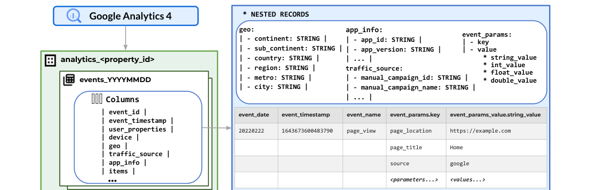

**图 11：** 带嵌套 `RECORD` 的 Google Analytics 4 数据库模式。

图 12 展示 Spider 2.0 中真实企业级 BigQuery 数据库环境。使用者要浏览多个模式，每个模式又包含多张表。该图体现了 Spider 2.0 数据库结构类型的复杂性，说明我们的基准比其他基准覆盖面更广、结构更复杂。

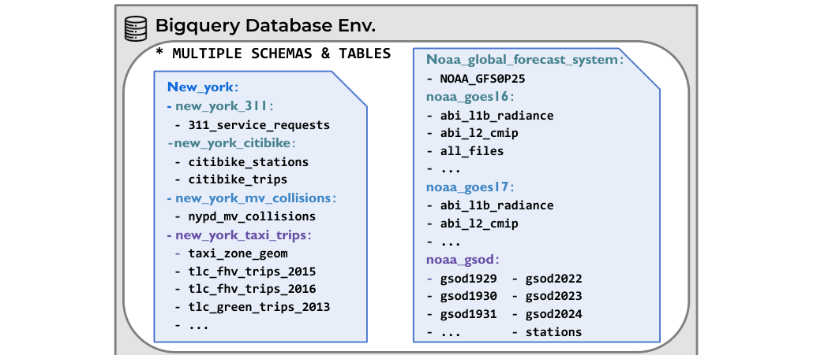

**图 12：** 具有多个模式和多张表的 BigQuery 数据库环境。

### B.4 外部文档示例

本节我们展示 Spider 2.0 使用的外部文档。第一份文档是流量渠道分类表；原文档为 HTML 表格，我们在图 13 中原样呈现。第二份文档是图 14 所示的 Google Page Category，说明如何把页面分类为产品列表页和产品详情页。

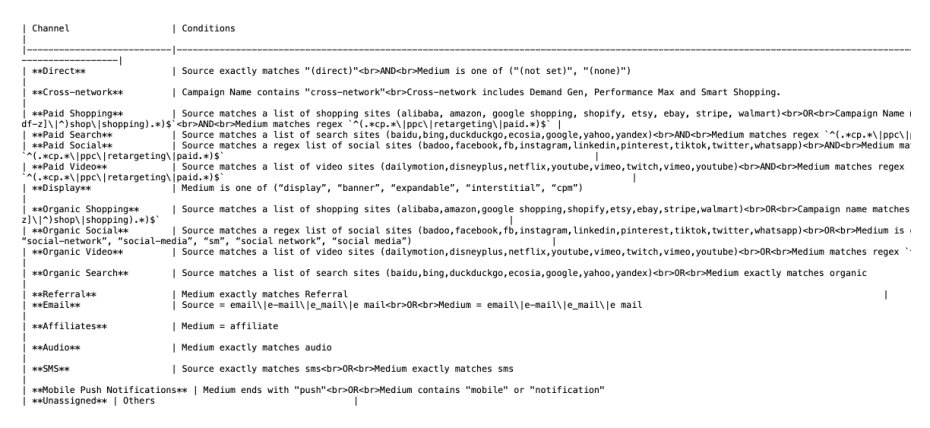

**图 13：** Google Analytics 的渠道组分类；这是某个 BigQuery 样例的外部文档。其规则如下。

| 渠道 | 条件 |
| --- | --- |
| Direct | `source` 精确匹配 `(direct)`，且 `medium` 为 `(not set)` 或 `(none)`。 |
| Cross-network | `campaign` 名包含 `cross-network`；包括 Demand Gen、Performance Max 和 Smart Shopping。 |
| Paid Shopping | `source` 匹配购物网站列表，或 `campaign` 匹配 `shop`/`shopping`；且 `medium` 匹配 `cp`、`ppc` 或 `paid...`。 |
| Paid Search | `source` 匹配搜索网站列表，且 `medium` 匹配 `cp`、`ppc` 或 `paid...`。 |
| Paid Social | `source` 匹配社交网站列表，且 `medium` 匹配 `cp`、`ppc` 或 `paid...`。 |
| Paid Video | `source` 匹配视频网站列表，且 `medium` 匹配 `cp`、`ppc` 或 `paid...`。 |
| Display | `medium` 为 `display`、`banner`、`expandable`、`interstitial` 或 `cpm`。 |
| Organic Shopping | `source` 匹配购物网站列表，或 `campaign` 匹配 `shop`/`shopping`。 |
| Organic Social | `source` 匹配社交网站列表，或 `medium` 为 `social`、`social-network`、`social-media`、`sm`、`social network`、`social media`。 |
| Organic Video | `source` 匹配视频网站列表，或 `medium` 匹配 `video`。 |
| Organic Search | `source` 匹配搜索网站列表，或 `medium` 精确匹配 `organic`。 |
| Referral | `medium` 精确匹配 `referral`。 |
| Email | `source` 或 `medium` 匹配 `email`、`e-mail`、`e_mail` 或 `e mail`。 |
| Affiliates | `medium` 精确匹配 `affiliate`。 |
| Audio | `medium` 精确匹配 `audio`。 |
| SMS | `source` 精确匹配 `sms`，或 `medium` 精确匹配 `sms`。 |
| Mobile Push Notifications | `medium` 以 `push` 结尾，或包含 `mobile` 或 `notification`。 |
| Unassigned | 其他情况。 |

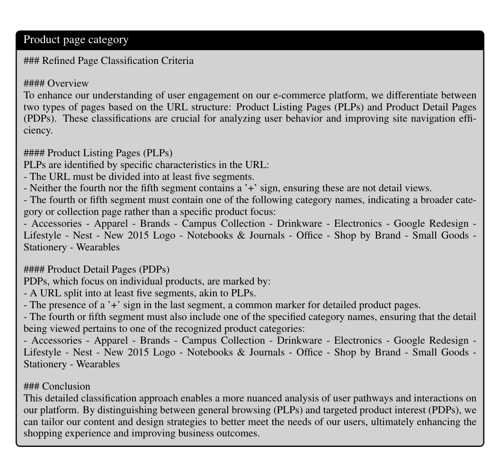

**图 14：** Google Analytics 4 页面分类文档。完整内容如下。

#### 精细页面分类标准

**概述。** 为了更深入理解用户在电商平台上的互动，我们依据 URL 结构区分两类页面：产品列表页（PLP）和产品详情页（PDP）。这种分类对分析用户行为和提高网站导航效率至关重要。

**产品列表页（PLP）。** URL 必须满足：

- 至少划分为五个片段；
- 第四和第五个片段都不含 `+`，以保证它不是详情视图；
- 第四或第五个片段必须包含下列类别名之一，表示较宽泛的类别或集合页面，而非具体产品：Accessories、Apparel、Brands、Campus Collection、Drinkware、Electronics、Google Redesign、Lifestyle、Nest、New 2015 Logo、Notebooks & Journals、Office、Shop by Brand、Small Goods、Stationery、Wearables。

**产品详情页（PDP）。** 聚焦单个产品，URL 必须满足：

- 与 PLP 一样，至少划分为五个片段；
- 最后一个片段含 `+`，这是详情页的常见标志；
- 第四或第五个片段也必须包含上述类别名之一，保证所查看详情属于认可的产品类别。

**结论。** 这种细粒度分类使我们能更精细地分析平台上的用户路径和互动。区分一般浏览（PLP）和定向产品兴趣（PDP）后，我们可以调整内容和设计策略，更好满足用户需要，最终改善购物体验和业务结果。

### B.5 上下文搭建示例

除附录 B.2 的 DBT 项目上下文搭建方法外，本节我们说明一个数据库查询样例如何建立上下文。

任务是：“能否给出 2017 年下半年开始的五次最长共享单车行程的详细信息？”`query.py` 是我们为模型与云数据库交互预定义的接口。该问题天然有歧义；若不约束答案格式，很难评测回答。因此我们提供 `result.csv`，定义所需答案格式：

```text
|--- README.md                   # 任务说明
|--- query.py                    # 查询接口
|--- bigquery_credential.json    # BigQuery 凭据
`--- result.csv                  # 2022 年 11 月数据的答案格式
```

`result.csv` 内容为：

```csv
trip_id,duration_sec,star_date,start_station_name,route,bike_number,subscriber_type,member_birth_year,age,age_class,member_gender,region_name
```

对表 13 的样例，我们还提供特定案例的答案示例。它们既约束答案格式，也允许智能体利用示例自我调试。

任务指令是：“给出 2020 年 12 月各渠道的会话数及百分比分布。”我们提供 `202011.csv` 和 `202101.csv` 作为示范答案。我们设想一种真实 SQL 编写场景：智能体可以先查询 2020 年 11 月，并与 `202011.csv` 对照；若不一致，就能发现 SQL 有误并修正。注意，这不是任务要求，只是我们认为真实 SQL 编写会有这种需求；我们不强制模型这样做。虽然只为少量样例提供答案约束，我们仍认为这一设计更自然、更真实。

```text
|--- README.md                   # 任务说明
|--- query.py                    # 查询接口
|--- BASIC_SQLs                  # Google Analytics SQL 示例
|--- bigquery_credential.json    # BigQuery 凭据
|--- 202012.csv                  # 预定义答案文件
|--- 202101.csv                  # 2021 年 1 月数据的答案格式
`--- 202011.csv                  # 2022 年 11 月数据的答案格式
```

`202011.csv` 内容为：

```csv
item_name,item_quantity
Google Decal,103
Google Clear Pen 4-Pack,81
Google Mesh Bag Red,79
Google Mini Kick Ball,77
Google Light Pen Red,8
Google Laptop and Cell Phone Stickers,7
Google Pen Neon Coral,7
Google Metallic Notebook Set,7
Google Pen Lilac,5
Google Pen Red,5
```

BigQuery 查询接口 `query.py` 如下：

```python
import os
import pandas as pd
from google.cloud import bigquery


def query_data(sql_query, is_save, save_path="result.csv"):
    """
    Queries data from BigQuery based on the provided SQL query and handles the result.

    Args:
      sql_query (str): SQL query string to be executed.
      is_save (bool): If True, saves the query results to a CSV file at
                      the specified save_path. If False, prints the
                      results to the console.
      save_path (str): The file path where the results will be saved if
                       is_save is True. Defaults to 'result.csv'.
    """
    os.environ["GOOGLE_APPLICATION_CREDENTIALS"] = "bigquery_credential.json"
    client = bigquery.Client()
    query_job = client.query(sql_query)
    try:
        results = query_job.result().to_dataframe()
        if results.empty:
            print("No data found for the specified query.")
        else:
            if is_save:
                results.to_csv(save_path, index=False)
                print(f"Results saved to {save_path}")
            else:
                print(results)
    except Exception as e:
        print("Error occurred while fetching data: ", e)


if __name__ == "__main__":
    # Write your SQL query in the sql_query variable to interact with
    # the database; example SQL query related to this task is provided below.
    sql_query = """
    SELECT
      *
    FROM
      `bigquery-public-data.ga4_obfuscated_sample_ecommerce.events_*`
    WHERE
      _TABLE_SUFFIX BETWEEN '20201201' AND '20201231'
    LIMIT 1
    """
    query_data(sql_query, is_save=True, save_path="result.csv")
```

### B.6 Spider 2.0 与 Spider 2.0-lite 任务指令的区别

标注时我们发现，无歧义性和自然性是互相排斥的概念。因此 Spider 2.0-lite 强调无歧义性，Spider 2.0 强调自然性；两种指令分别还原真实 Text-to-SQL 工作流中可能出现的问题形式。

**示例 1**

- Spider 2.0：公司管理层要求一份 Magnificent 7 股票年初至今表现的详细报告。
- Spider 2.0-lite：请展示 Magnificent 7 股票从今年年初到今天的价格变化率。

**示例 2**

- Spider 2.0：能否给出 2017 年下半年开始的五次最长共享单车行程的详细信息？
- Spider 2.0-lite：能否给出 2017 年下半年开始的五次最长共享单车行程的详细信息，包括行程 ID、持续秒数、开始日期、起始站名、路线（起始站到终点站）、自行车编号、订阅者类型、会员出生年份、年龄、年龄分类、性别以及起始站所属区域名？

**示例 3**

- Spider 2.0：对于 2016 年 1 月 1–7 日纽约市黄色出租车行程，在只考虑至少一名乘客且金额非负的有效行程时，各行政区的不付小费比例是多少？
- Spider 2.0-lite：对于 2016 年 1 月 1–7 日纽约市黄色出租车行程，请给出各行政区不付小费的百分比。确保下车时间晚于上车时间、乘客人数大于 0，且行程距离、小费、过路费、MTA 税、车费和总金额均为非负数。

### B.7 SQL 方言文档收集

SQL 方言差异的核心，是不同 SQL 版本之间高级函数和细微语法的不同。为了支持检索增强智能体框架，我们从各数据库的官方网站抓取并预处理函数文档。抓取网页数、解析出的类别数和函数数见表 18。同一类别中的多个函数可能在网页同一段落中介绍，例如 `COUNTIF` 和 `STRING_AGG` 等聚合函数；此时，我们对类别内不同具体函数复用共享的类别说明。

**表 18：Spider 2.0 所用不同数据库系统的文档统计。** `†` 表示 PostgreSQL 官方网页没有定义明确的函数清单，故每个函数类别只使用汇总文档。

| 数据库 | 文档网站 | 页面数 | 类别数 | 函数数 |
| --- | --- | ---: | ---: | ---: |
| BigQuery | <https://cloud.google.com/bigquery/docs/reference/standard-sql/functions-and-operators> | 34 | 34 | 390 |
| Snowflake | <https://docs.snowflake.com/en/sql-reference/> | 719 | 30 | 719 |
| PostgreSQL | <https://www.postgresql.org/docs/current/functions.html> | 30 | 30 | 30† |
| ClickHouse | <https://clickhouse.com/docs/en/sql-reference/functions> | 226 | 6 | 226 |
| SQLite | <https://www.sqlite.org/docs.html> | 6 | 6 | 147 |
| DuckDB | <https://duckdb.org/docs/sql/functions/overview> | 24 | 24 | 513 |
| **总计** |  | **1,039** | **130** | **2,025** |

#### B.7.1 不同数据库系统的已处理函数

本节我们给出不同数据库系统解析后文档的示例。这些预先切分的文档块可以被检索并插入提示，以补偿智能体在 SQL 方言知识上的不足。

**BigQuery 函数文档**

`database="BigQuery", function="ST_INTERSECTS", category="geography-functions"`

```sql
ST_INTERSECTS(geography_1, geography_2)
```

**说明：** 若 `geography_1` 与 `geography_2` 两个点集的交集非空，返回 `TRUE`。也就是说，只要至少有一个点同时出现在两个输入 `GEOGRAPHY` 中就返回 `TRUE`。若 `ST_INTERSECTS` 返回 `TRUE`，则 `ST_DISJOINT` 返回 `FALSE`。

**返回类型：** `BOOL`

**PostgreSQL 函数文档**

`database="Postgres", function category="enum-support-functions"`

对枚举类型（见 PostgreSQL 文档第 8.7 节），下列函数可以避免把具体枚举值硬编码到程序中。示例假定创建了如下枚举：

```sql
CREATE TYPE rainbow AS ENUM (
  'red', 'orange', 'yellow', 'green', 'blue', 'purple'
);
```

**枚举支持函数（PostgreSQL 文档表 9.35）。**

| 函数 | 参数 | 返回类型 | 说明 | 示例 | 结果 |
| --- | --- | --- | --- | --- | --- |
| enum\_first | anyenum | anyenum | 返回输入枚举类型的第一个值。 | enum\_first(null::rainbow) | red |
| enum\_last | anyenum | anyenum | 返回输入枚举类型的最后一个值。 | enum\_last(null::rainbow) | purple |
| enum\_range | anyenum | anyarray | 按顺序返回该枚举类型的所有值。 | enum\_range(null::rainbow) | red, orange, yellow, green, blue, purple |
| enum\_range | anyenum, anyenum | anyarray | 按顺序返回两个给定枚举值之间的范围；两个值必须来自同一枚举类型。第一个参数为 null 时从首值开始，第二个参数为 null 时到末值结束。 | enum\_range('orange'::rainbow, 'green'::rainbow)；enum\_range(NULL, 'green'::rainbow)；enum\_range('orange'::rainbow, NULL) | orange, yellow, green；red, orange, yellow, green；orange, yellow, green, blue, purple |

除双参数形式的 `enum_range` 外，这些函数不考虑传入的具体值，只关心其声明类型；传入 `null` 或该类型的具体值结果相同。实际使用中，更常把这些函数应用于表列或函数参数，而不是示例中的硬编码类型名。

**Snowflake 函数文档**

`database="Snowflake", function="ATAN2", category="numeric-functions"`

类别：数值函数（三角函数）。

`ATAN2` 计算两个参数之比的反正切。例如，当 $x\gt 0$ 时，表达式 `ATAN2(y, x)` 等价于 `ATAN(y/x)`。反正切是 X 轴与从点 $(0,0)$ 指向点 $(X,Y)$ 的射线之间的夹角； $X$ 和 $Y$ 不能同时为 0。另见 `ATAN`。

**语法：**

```sql
ATAN2(<y>, <x>)
```

注意，第一个参数是 Y 坐标，不是 X 坐标。

**参数：**

- `y`：射线终点的 Y 坐标，类型为 `DOUBLE`。
- `x`：射线终点的 X 坐标，类型为 `DOUBLE`。

**返回：** 返回类型为 `DOUBLE`；值以弧度而非角度表示，区间为 $[-\pi,\pi]$。

**使用说明：**

- 参数是 `DOUBLE` 以外的数值类型时，先转换为 `DOUBLE`。
- 参数是字符串时，若可能则转换为 `DOUBLE`。
- 参数为其他数据类型时返回错误。
- 任一参数为 `NULL` 时返回 `NULL`。

**示例：**

```sql
SELECT ATAN2(5, 5);

--------------+
ATAN2(5, 5)   |
--------------+
0.7853981634  |
--------------+
```

**DuckDB 函数文档**

`database="DuckDB", function="datediff", category="date-functions"`

- 函数：`datediff(part, startdate, enddate)`
- 含义：两个日期之间跨越的分区边界数；是 `date_diff` 的别名。
- 示例：`datediff('month', DATE '1992-09-15', DATE '1992-11-14')`
- 结果：`2`
- 别名：`date_diff`

**SQLite 函数文档**

`database="SQLite", function="group_concat(X,Y)", category="aggregate-functions"`

- 用法：`group_concat(X)`、`group_concat(X,Y)`、`string_agg(X,Y)`。
- 说明：`group_concat()` 返回所有非 `NULL` 的 `X` 值连接而成的字符串。提供参数 `Y` 时，以它作为各个 `X` 之间的分隔符；省略 `Y` 时使用逗号 `,`。
- `string_agg(X,Y)` 是 `group_concat(X,Y)` 的别名。`string_agg()` 与 PostgreSQL、SQL Server 兼容，`group_concat()` 与 MySQL 兼容。
- 除非在最后一个参数之后立即提供 `ORDER BY` 参数，否则拼接元素的顺序不确定。

**ClickHouse 函数文档**

`database="Clickhouse", function="JSONHas", category="json-functions"`

`JSONHas` 在值存在于 JSON 文档中时返回 1，不存在时返回 0。

**语法：**

```sql
JSONHas(json [, indices_or_keys]...)
```

**参数：**

- `json`：待解析的 JSON 字符串，类型为 `String`。
- `indices_or_keys`：零个或多个参数，每个参数可以是字符串或整数，类型为 `String, Int*`。
- 字符串表示按键访问对象成员。
- 正整数表示从开头访问第 $n$ 个成员或键。
- 负整数表示从末尾访问第 $n$ 个成员或键。

**返回值：** 值存在于 JSON 中返回 1，否则返回 0；类型为 `UInt8`。

**示例：**

```sql
SELECT JSONHas('{"a": "hello", "b": [-100, 200.0, 300]}', 'b') = 1;
SELECT JSONHas('{"a": "hello", "b": [-100, 200.0, 300]}', 'b', 4) = 0;
```

元素最小下标为 1，因此元素 0 不存在。整数既可访问 JSON 数组，也可访问 JSON 对象：

```sql
SELECT JSONExtractKey('{"a": "hello", "b": [-100, 200.0, 300]}', 1) = 'a';
SELECT JSONExtractKey('{"a": "hello", "b": [-100, 200.0, 300]}', 2) = 'b';
SELECT JSONExtractKey('{"a": "hello", "b": [-100, 200.0, 300]}', -1) = 'b';
SELECT JSONExtractKey('{"a": "hello", "b": [-100, 200.0, 300]}', -2) = 'a';
SELECT JSONExtractString('{"a": "hello", "b": [-100, 200.0, 300]}', 1) = 'hello';
```

### B.8 扩展数据集统计

**数据库领域。** 图 15 显示，Spider 2.0 使用的数据库覆盖大量领域和真实场景，具有显著多样性。一级领域占比分别为：教育 16.1%、社会 14.1%、医学 12.6%、科学 11.1%、生物 10.6%、金融 10.1%、工程 9.5%、环境 9.0%、其他 7.0%；外圈给出各一级领域下的具体数据库或数据集名称。

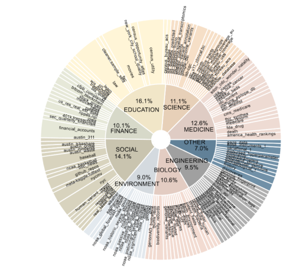

**图 15：** Spider 2.0 数据库的领域分布。

**数据类型。** 图 16 显示，Spider 2.0 数据库包含多种数据类型：`STRING`、`BOOLEAN` 等文本类型，`INTEGER`、`FLOAT` 等数值类型，`STRUCT`、`JSON` 等结构化类型，`TIMESTAMP` 等时间类型，以及 Google BigQuery 数据集中的 `GEOGRAPHY` 等空间类型。类型的多样性和覆盖面体现了我们基准数据库的高度复杂性，也反映在 SQL 方言和数据处理难度上，从而给 SQL 生成带来很大挑战。

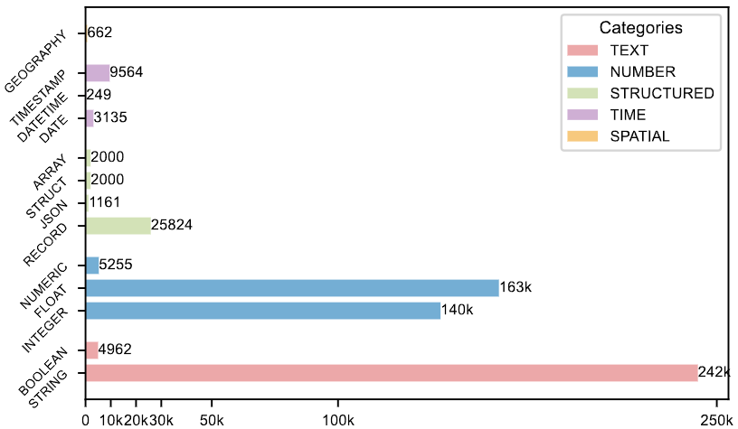

**图 16：** Spider 2.0 数据库的数据类型及数量。图例分为文本、数值、结构化、时间和空间类型。

**关键词。** 由于 Spider 2.0 中的 SQL 很复杂并覆盖多种方言，其 SQL 关键词数超过以往所有数据集，见图 17。

**表数。** Spider 2.0 的数据库比以往数据集包含更多表；每条 SQL 平均需要连接的表也更多。

**数据量。** Spider 2.0 数据库的数据规模显著更大。WikiSQL 中每个数据库平均只有 17 行，Spider 1.0 为 2K 行，KaggleDBQA 为 280K 行，BIRD 为 549K 行；Spider 2.0 每个数据库平均有 5,273.42M 行，许多数据库达到 TB 级。

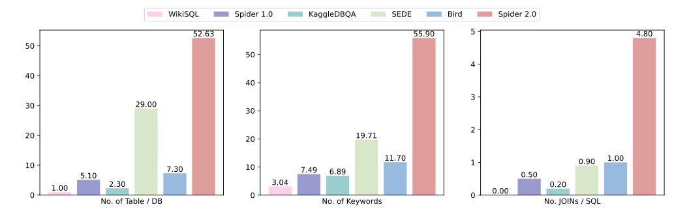

**图 17：** Spider 2.0 与以往 Text-to-SQL 基准的 SQL 统计比较。每库表数依次包括 1.00、5.10、2.30、29.00、7.30、52.63；关键词数包括 3.04、7.49、6.89、19.71、11.70、55.90；每条 SQL 的 JOIN 数包括 0.00、0.50、0.20、0.90、1.00、4.80。

## 附录 C：实验细节

### C.1 Spider-Agent 框架

受 ReAct（Yao et al., 2022）和 Intercode（Yang et al., 2023）启发，我们开发了 Spider-Agent，主要处理数据库相关编码任务和项目。

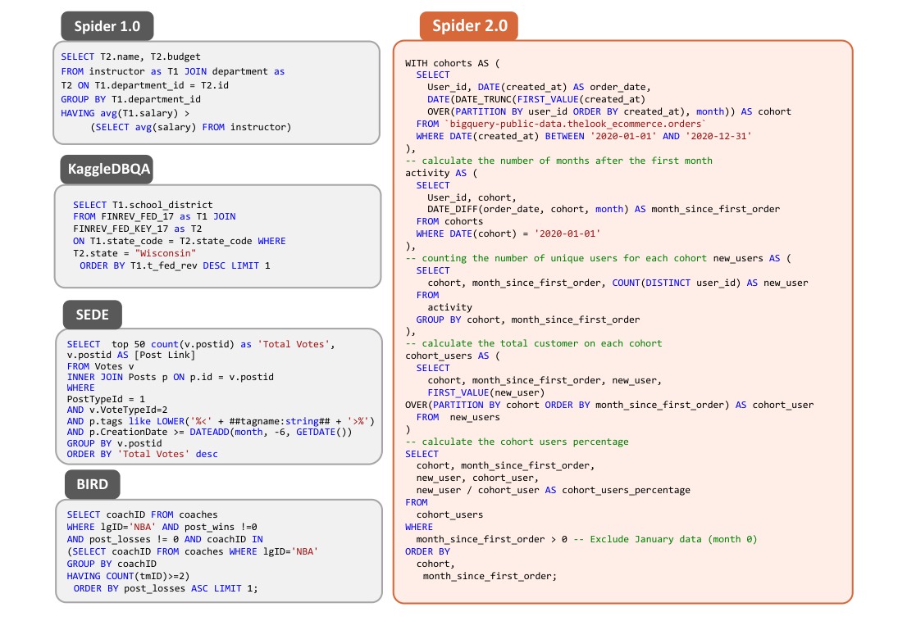

**图 18：** Spider 2.0 与以往 Text-to-SQL 基准中，按 SQL token 中位长度选取的示例。Spider 2.0 使用本数据集中达到中位 token 数的样例；Spider 1.0、KaggleDBQA、SEDE 和 BIRD 的示例取自各自原论文。

Spider-Agent 可经由命令行接口与数据库多轮交互，直到取得最终答案。为让智能体只专注于数据库交互，我们设计了表 19 的专用动作集合。我们把实验温度设为 1.0，top-p 设为 0.9；输入仍超过模型最大 token 限制时，从开头截断。

若模型连续三次输出相同结果，或任一动作耗时超过 120 秒，系统自动终止。实验所用提示见附录 C.7。我们以启发式方式要求智能体最多在 30 步内完成任务，这对大多数任务已经足够。

**表 19：Spider-Agent 的动作空间。** Spider-Agent 是面向 Spider 2.0 的智能体基线。

| 动作 | 说明 |
| --- | --- |
| `BASH` | 执行 Shell 命令，例如检查文件信息、运行代码或执行 DBT 命令。 |
| `CreateFile` | 使用指定内容创建新文件。 |
| `EditFile` | 编辑或覆盖现有文件内容。 |
| `ExecuteSQL` | 在 BigQuery 或 Snowflake 上执行 SQL，可选择打印或保存结果。 |
| `GetTables` | 取得指定 BigQuery 或 Snowflake 数据集的所有表名和模式。 |
| `GetTabInfo` | 取得 BigQuery 或 Snowflake 中指定表的详细列信息。 |
| `SampleRows` | 从 BigQuery 或 Snowflake 表采样指定行数并保存为 JSON。 |
| `FAIL` | 智能体判断任务不可行。 |
| `Terminate` | 智能体判断任务已完成。 |

**JOIN 数与模型性能没有直接相关性。** 原文此处写作“表 19”，实际所指为图 19；我们没有从图中观察到性能与 JOIN 数之间存在清晰相关关系。我们推测，原因是 SQL 标注时已保证所有样例都相当复杂，因而性能不再取决于 SQL 涉及的表数。

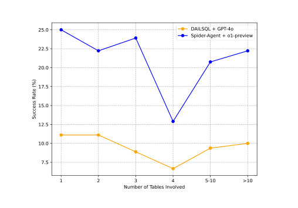

**图 19：** 涉及表数对性能的影响。横轴为 1、2、3、4、5–10、超过 10 张表，纵轴为成功率；Spider-Agent + o1-preview 在所有分组都高于 DAIL-SQL + GPT-4o，但没有单调趋势。

**Spider-Agent 动作分析。** 我们分析 Spider-Agent 的结果：对所有正确完成的任务，智能体在既定动作空间中平均需要 9.0 步，最多 17 步、最少 6 步。我们还在图 20 中分析 Spider-Agent 各轮调用不同动作的频率。

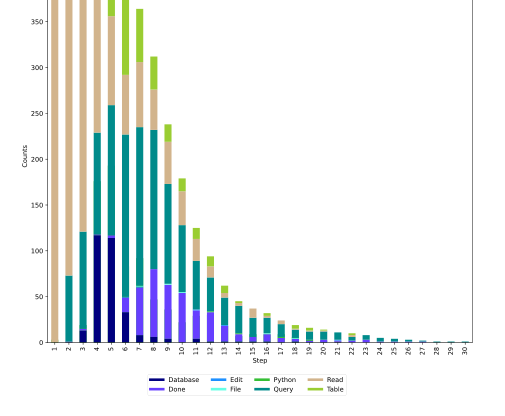

**图 20：** 对 Spider 2.0 中已解决任务的 286 条轨迹，统计 Spider-Agent + o1-preview 在第 1–30 步调用各动作的频率。图例包括 Database、Done、Edit、File、Python、Query、Read 和 Table。

### C.2 Spider 2.0-lite 实验细节

**基线方法。** 基于 LLM 的 Text-to-SQL 方法展现出很强的零样本推理和跨域泛化能力。DIN-SQL（Pourreza & Rafiei, 2024）使用任务分解和随任务复杂度调整的自适应提示。DAIL-SQL（Gao et al., 2024）通过精心设计的提示优化和上下文学习，在 Spider 上取得最佳 EX。CHESS（Talaei et al., 2024）结合基于实体和上下文检索的模式筛选与 SQL 修订，在 BIRD 上取得最佳 EX。CodeS（Li et al., 2024a）在大规模 Text-to-SQL 语料上微调开源代码生成模型，取得了与基于 LLM 提示的方法相当的性能。

**采样单元格值。** Spider 2.0-lite 包含 BigQuery 的嵌套结构（原文写作 `RECORTED`）和数组（原文写作 `REPRATED`）等复杂数据类型。如果我们只提供类型标记，模型很难使用合适 SQL 函数正确处理。因此，对所有评测方法，我们都在提示中以 Markdown 格式提供每张表的采样单元格值。

**值链接。** 评测 BigQuery 样例时，我们不执行值链接，即 CHESS 的实体检索和 CodeS 的值检索器；从 TB 级云数据库检索所有值的 API 成本过高。值链接对识别过滤条件中的实体很重要，缺失它可能影响性能。未来需要研究成本更低的值链接方法或替代方案。

**LLM。** 大规模模式序列化后，提示极长；我们默认使用支持 128K 上下文窗口的 GPT-4o 作为基础模型。对于 CHESS，我们使用 GPT-3.5-turbo 做列筛选，以降低成本。

**温度。** 我们把所有方法的 LLM 温度均设为 0，以保证结果可复现。

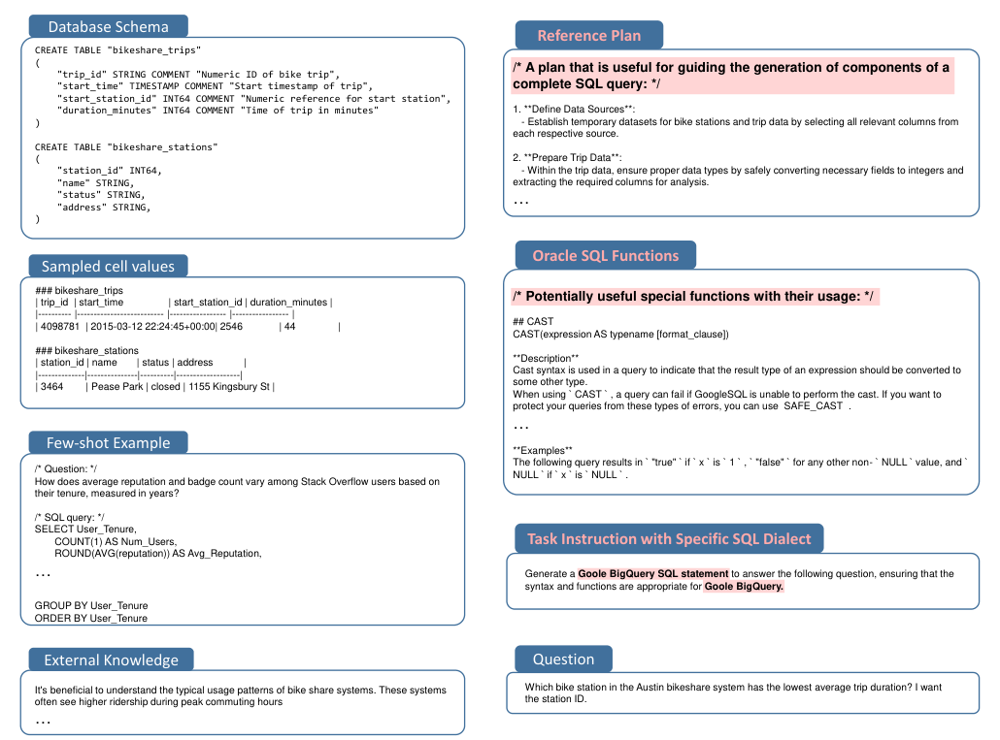

**图 21：** DAIL-SQL 的提示组织示例。为 Spider 2.0-lite 定制的部分包括数据库模式、采样单元格值、少样本示例、外部知识、参考计划、Oracle SQL 函数、指定 SQL 方言的任务指令以及问题。DIN-SQL、CHESS 和 CodeS 也使用相同的组件。

### C.3 误差分析细节

我们在图 22 中汇总所有误差类别的定义与示例。

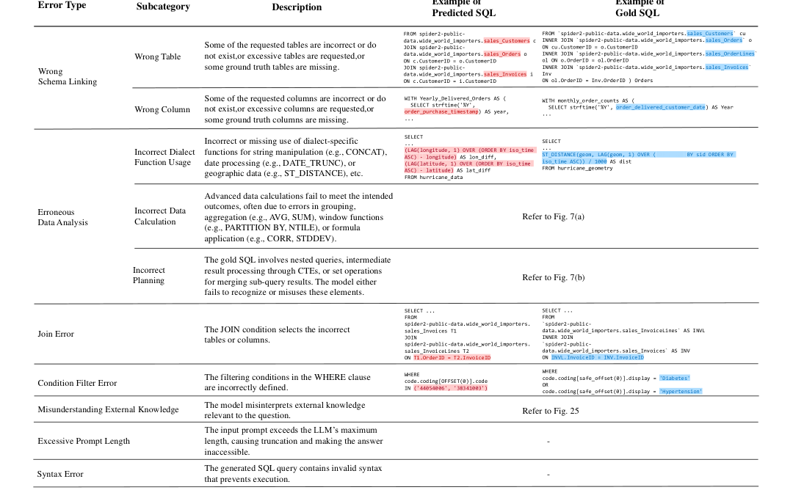

**图 22：** 全部误差类别的说明、预测 SQL 示例和标准 SQL 示例。各类别如下。

| 误差类型 | 子类别 | 说明 |
| --- | --- | --- |
| 模式链接错误 | 错误表 | 请求了错误或不存在的表、请求了多余表，或遗漏标准答案所需表。 |
| 模式链接错误 | 错误列 | 请求了错误或不存在的列、请求了多余列，或遗漏标准答案所需列。 |
| 错误的数据分析 | 方言函数使用错误 | 字符串操作（如 `CONCAT`）、日期处理（如 `DATE_TRUNC`）或地理数据处理（如 `ST_DISTANCE`）的方言专有函数缺失或使用错误。 |
| 错误的数据分析 | 数据计算错误 | 分组、聚合（如 `AVG`、`SUM`）、窗口函数（如 `PARTITION BY`、`NTILE`）或公式应用（如 `CORR`、`STDDEV`）错误，导致高级计算不能满足意图。 |
| 错误的数据分析 | 规划错误 | 标准 SQL 使用嵌套查询、CTE 中间结果或集合运算合并子查询；模型未识别或误用这些元素。 |
| JOIN 错误 | — | JOIN 条件选择了错误的表或列。 |
| 条件过滤错误 | — | `WHERE` 子句的过滤条件定义错误。 |
| 误解外部知识 | — | 模型误解与问题有关的外部知识。 |
| 提示过长 | — | 输入超过 LLM 最大长度，截断后答案所需信息不可访问。 |
| 语法错误 | — | 生成的 SQL 语法无效，无法执行。 |

### C.4 其他分析

**当前基于 LLM 的方法处理企业 Text-to-SQL 的能力有限。** 表 5 显示，Spider 2.0-lite 和 Spider 2.0-snow 很难。表现最好的 DAIL-SQL + GPT-4o 只有 5.68%，远低于 Spider 1.0 的 86.6% 和 BIRD 的 57.4%。CHESS + GPT-4o 通过高效筛选最小充分模式，解决的样例多于 DIN-SQL。经过大规模微调的 SFT CodeS-15B 在 Lite 上也只有 0.73%，再次显示其与现有 Text-to-SQL 语料之间的复杂度鸿沟；Spider 2.0-snow 上最好结果仅为 2.20%，说明 SQL 方言差异进一步增大难度。

**LLM 智能体框架难以处理不同 SQL 方言。** 我们在表 20 中按数据库类型分析 Spider 2.0 样例，发现 Snowflake 类型最难。为评估方言影响，我们随机选取 180 个样例，分别托管到 BigQuery 和 Snowflake，并使用相同问题。BigQuery 上的性能为 12.78%，Snowflake 上为 6.6%，说明细微 SQL 方言语法差异足以引起显著性能差异。

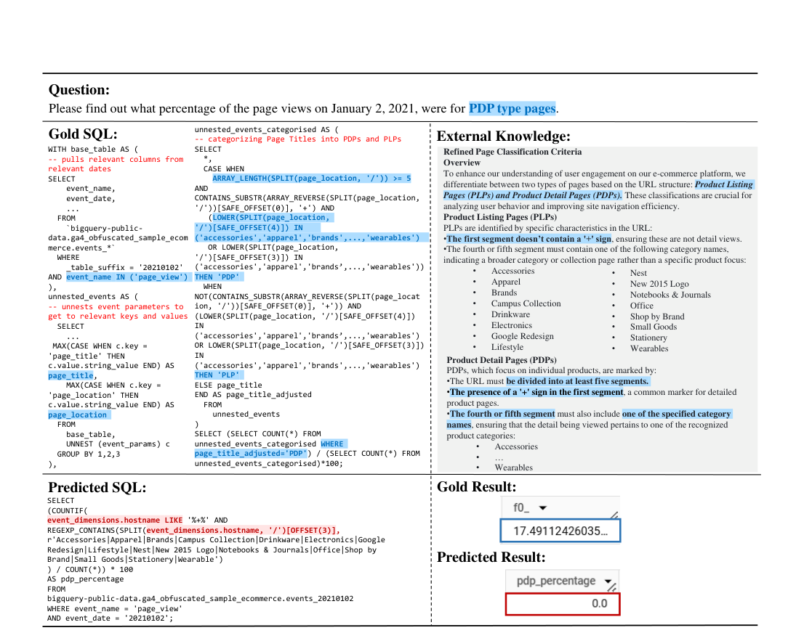

**图 23：** 误解外部知识的案例。问题要求计算 2021 年 1 月 2 日 PDP 页面浏览比例。预测 SQL 只使用简单正则模式匹配，忽略了页面分类规则中的关键部分，例如具体 URL 结构和 `+` 的位置，因此不能正确利用外部知识；图中标准结果约为 17.49112426035，预测结果为 0.0。

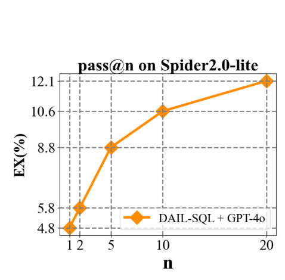

**图 24：** DAIL-SQL + GPT-4o 在 Spider 2.0-lite 上的 `pass@n` 结果： $n=1,2,5,10,20$ 时，EX 约为 4.8%、5.8%、8.8%、10.6%、12.1%。

**表 20：不同数据库类型上的模型表现。**

| 任务子集 | 样例占比 | SR（↑） |
| --- | ---: | ---: |
| Spider 2.0 | 100.00% | 17.0% |
| BigQuery | 33.86% | 24.07% |
| Snowflake | 31.33% | 7.14% |
| SQLite | 21.36% | 20.74% |
| DuckDB | 10.76% | 17.69% |
| PostgreSQL | 1.58% | 12.82% |
| ClickHouse | 1.11% | 57.14% |

### C.5 实验成本

我们在表 21 中汇总各方法每个样例的平均 API 调用成本。

**表 21：所有方法的单样例平均成本。**

| 方法 | 平均成本（↓） |
| --- | ---: |
| Spider-Agent + o1-preview | 0.75 美元 |
| Spider-Agent + GPT-4-Turbo | 0.58 美元 |
| Spider-Agent + GPT-4o | 0.32 美元 |
| DIN-SQL + GPT-4o | 0.14 美元 |
| DAIL-SQL + GPT-4o | 0.09 美元 |
| DAIL-SQL + o1-preview | 0.32 美元 |
| CHESS + GPT-4o | 0.43 美元 |
| SFT CodeS-15B | 0.00 美元 |

### C.6 Spider-Agent 案例分析

本节我们展示使用 o1-preview 和 Spider-Agent 框架处理 Spider 2.0 的成功与失败案例。

- 图 25 是 Google Patents 数据上的成功案例。Spider-Agent 能得到已执行查询的反馈，迭代修正 SQL，直到得到无缺陷结果。自动迭代调试是 Spider-Agent 的关键优势之一。
- 图 26 是成功解决 DBT 项目任务的案例。Spider-Agent 先探索代码库和数据库、定位新增代码的位置，编写两条 SQL 脚本，调试并运行 DBT 命令，最终成功完成数据转换。
- 图 27 是失败案例。智能体没有探索代码库并找到月度经常性收入的关键信息，因而生成了错误 SQL。
- 图 28 是模型读过文档后，仍无法把复杂文档字符串准确转换为 SQL 的失败案例。
- 图 29 是模型不能理解含嵌套列的数据库格式，多次尝试仍写不出正确代码的失败案例。

#### 成功案例 1：专利分析

原图明确标为 17 步，并以 `......` 省略未展示的中间动作；可见轨迹完整转写如下：

```text
Success case 1: about patents analysis
### 17 Steps

Action 0: Bash(code="ls")
Action 1: Bash(code="cat README.md")
Action 2: BQ_GET_TABLES(
  database_name="patents-public-data",
  dataset_name="patents",
  save_path="dataset_metadata.csv"
)
Action 3: BQ_GET_TABLE_INFO(
  database_name="patents-public-data",
  dataset_name="patents",
  table="publications",
  save_path="publication_info.csv"
)
Action 4: BQ_EXEC_SQL(sql_query=..., is_save=False)
Observation-4: Error occurred while fetching data: 400 No matching
signature for function DATE Argument types: INT64 Signature:
DATE(TIMESTAMP, [STRING]) Argument 1: Unable to coerce type INT64
to expected type TIMESTAMP
Thought-4: The error indicates that I'm trying to use the DATE
function on an INT64 field, which is invalid. The date fields in
the dataset are stored as integers in YYYYMMDD format. I need to
convert these integer date fields to DATE using the PARSE_DATE
function. I'll update my SQL query to properly parse the dates and
include the condition for published applications.
......
Action-14: BQ_EXEC_SQL(
  sql_query=...,
  is_save="/workspace/result.csv"
)
Observation-14: Error occurred while fetching data: 400 No matching
signature for function DATE Argument types: INT64 Signature:
DATE(TIMESTAMP, [STRING]) Argument 1: Unable to coerce type INT64
to expected type TIMESTAMP
Action-15: BQ_EXEC_SQL(
  sql_query=...,
  is_save="/workspace/result.csv"
)
Observation-15: Now that the results are saved to
/workspace/result.csv.
Action-16: Terminate(output="result.csv")
```

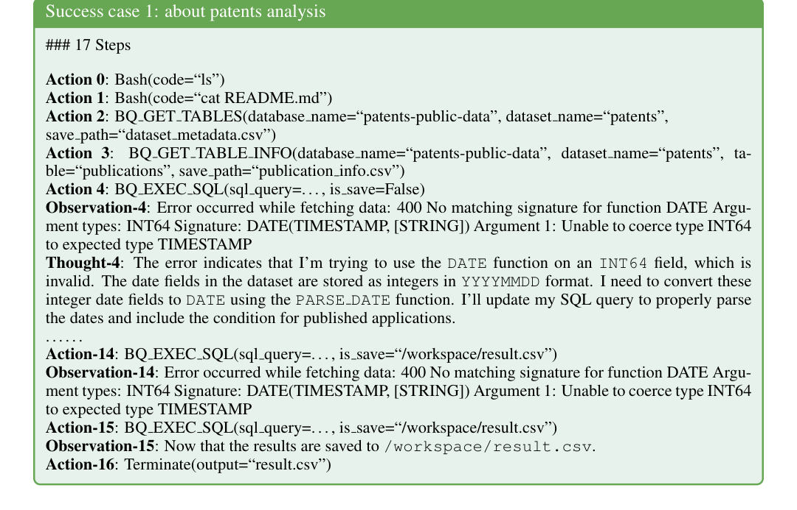

**图 25：** 成功案例 1。经过多轮 SQL 编写和反复调试，最终得到正确答案。

#### 成功案例 2：DBT 数据转换任务

原图明确标为 20 步，并以 `......` 省略未展示动作：

```text
Success case 2: DBT data transformation task
### 20 Steps

......
Action 3: Bash(code="ls models/salesforce")
Action 4: Bash(code="cat models/salesforce/salesforce.yml")
Action 5: Bash(
  code="cat models/salesforce/salesforce_manager_performance.sql"
)
Action 6: Bash(code="ls models/salesforce/intermediate")
Action 7: Bash(
  code="cat models/salesforce/intermedi/int_salesforce_opportunity_by_owner.sql"
)
Action 8: LOCAL_DB_SQL(
  file_path="salesforce.duckdb",
  command="SHOW TABLES;",
  output="direct"
)
Action 9: LOCAL_DB_SQL(
  file_path="salesforce.duckdb",
  command="SHOW TABLES;",
  output="direct"
)
Action 10: CreateFile(
  filepath=models/salesforce/salesforce_daily_sales_activity.sql:
  with date_spine as (
    select date_day as activity ...
  )
)
Action 11: Bash(code="dbt run")
Observation 11: I noticed warnings during 'dbt run' indicating that
'salesforce_daily_activity' is not found. Since we don't have a
model named 'salesforce_daily_activity', I should remove references
to it from 'salesforce.yml'. Additionally, I need to add the new
model 'salesforce_daily_sales_activity' to 'salesforce.yml' with
appropriate descriptions
......
Action 15: LOCAL_DB_SQL(
  file_path="salesforce.duckdb",
  command="SELECT * FROM salesforce_daily_sales_activity LIMIT 5;",
  output="direct"
)
......
Action 18: Bash(code="dbt run")
Action 19: Terminate(output="salesforce.duckdb")
```

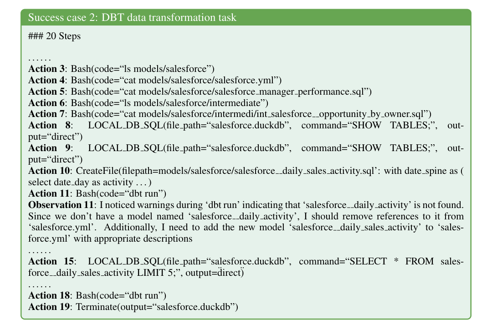

**图 26：** 成功案例 2。经过多轮文件操作和 DBT 操作，数据转换任务得到解决。

#### 失败案例 1：月度经常性收入分类

```text
Failure case 1
Action 1: Bash(code="ls -R")
Action 2: Bash(code="cat models/customer_churn_month.yml")
Action 3: Bash(code="cat models/customer_churn_month.sql")
Action 4: EditFile(filepath="models/customer_churn_month.sql"):
......
Action 5: Bash(code="cat models/mrr.yml")
Action 6: Bash(code="cat models/mrr.sql")
Action 7: EditFile(filepath="models/mrr.sql"):
```

```sql
WITH unioned AS (
  SELECT * FROM {{ ref('customer_revenue_by_month') }}
  UNION ALL
  SELECT * FROM {{ ref('customer_churn_month') }}
),
lagged_values AS (
  SELECT
    *,
    COALESCE(
      LAG(is_active) OVER (
        PARTITION BY customer_id
        ORDER BY date_month
      ),
      false
    ) AS previous_month_is_active,
    COALESCE(
      LAG(mrr) OVER (
        PARTITION BY customer_id
        ORDER BY date_month
      ),
      0
    ) AS previous_month_mrr
  FROM unioned
)
SELECT
  date_month,
  customer_id,
  mrr,
  is_active,
  CASE
    WHEN previous_month_is_active = false AND is_active = true
      THEN 'New Business'
    WHEN previous_month_is_active = true AND is_active = true
      AND mrr_change > 0
      THEN 'Expansion'
    WHEN previous_month_is_active = true AND is_active = true
      AND mrr_change < 0
      THEN 'Contraction'
    WHEN previous_month_is_active = true AND is_active = false
      THEN 'Churn'
    WHEN previous_month_is_active = true AND is_active = true
      AND mrr_change = 0
      THEN 'Renewal'
    WHEN previous_month_is_active = false AND is_active = false
      THEN 'Resurrection'
    ELSE 'Other'
  END AS change_category
FROM lagged_values;
```

```text
Action 8: Bash(code="dbt run")
Action 9: LOCAL_DB_SQL(
  file_path="mrr.duckdb",
  command="SELECT * FROM mrr LIMIT 5",
  output="direct"
)
```

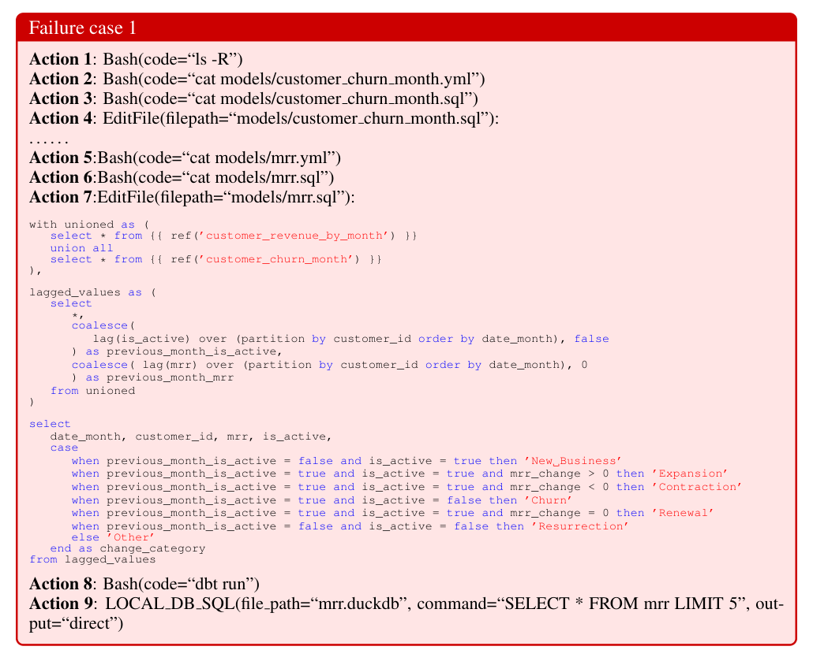

**图 27：** 失败案例 1。数据转换过程看似合理，但没有遵循我们预定义的分类类型。

#### 失败案例 2：无法把复杂文档落实为 SQL

```text
Failure case 2
Action 1: Bash(code="ls -R")
Action 2: Bash(code="cat README.md ga4_page_category.md")
Action 3: BQ_GET_TABLES(
  database_name="bigquery-public-data",
  dataset_name="ga4_obfuscated_sample_ecommerce",
  save_path="dataset_metadata.csv"
)
Action 4: Bash(code="cat dataset_metadata.csv")
Action 5: BQ_GET_TABLE_INFO(
  database_name="bigquery-public-data",
  dataset_name="ga4_obfuscated_sample_ecommerce",
  table="events_20210109",
  save_path="ga4_info.csv"
)
```

```sql
WITH pdp_pages AS (
  SELECT
    event_params.value.string_value AS page_location
  FROM
    `bigquery-public-data.ga4_obfuscated_sample_ecommerce.events_20210102`,
    UNNEST(event_params) AS event_params
  WHERE
    event_name = 'page_view'
    AND event_params.key = 'page_location'
    AND REGEXP_CONTAINS(
      event_params.value.string_value,
      r'\/[^\/]+\/[^\/]+\/[^\/]+\/[^\/]+\/[^\/]*\+[^\/]*\/'
    )
    AND REGEXP_CONTAINS(
      event_params.value.string_value,
      r'\/(Accessories|Apparel|Brands|Campus Collection|Drinkware|Electronics|Google Redesign|Lifestyle|Nest|New 2015 Logo|Notebooks & Journals|Office|Shop by Brand|Small Goods|Stationery|Wearables)\/'
    )
),
total_page_views AS (
  SELECT COUNT(*) AS total_views
  FROM `bigquery-public-data.ga4_obfuscated_sample_ecommerce.events_20210102`
  WHERE event_name = 'page_view'
)
SELECT
  (SELECT COUNT(*) FROM pdp_pages)
    * 100.0
    / total_page_views.total_views AS pdp_percentage
FROM total_page_views;
```

```text
......
Action 9: Terminate(output="result.csv")
```

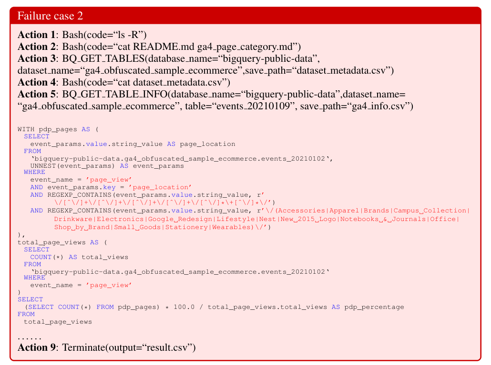

**图 28：** 失败案例 2。模型不能把复杂文档要求落实为 SQL。

#### 失败案例 3：无法理解复杂嵌套模式

```text
Failure case 3
Action 1: Bash(code="ls -R")
Action 2: BQ_GET_TABLES(
  database_name="bigquery-public-data",
  dataset_name="ga4_obfuscated_sample_ecommerce",
  save_path="dataset_metadata.csv"
)
Action 3: Bash(code="cat dataset_metadata.csv")
Action 4: BQ_GET_TABLE_INFO(
  database_name="bigquery-public-data",
  dataset_name="ga4_obfuscated_sample_ecommerce",
  table="events_20210109",
  save_path="ga4_info.csv"
)
```

```sql
SELECT
  event_timestamp,
  event_params.key,
  event_params.value.string_value AS page_location
FROM
  `bigquery-public-data.ga4_obfuscated_sample_ecommerce.events_20210128`,
  UNNEST(event_params) AS event_params
WHERE
  user_id = '1362228'
  AND event_date = '20210128'
ORDER BY event_timestamp;
```

```text
......
Action 9: Terminate(output="result.csv")
```

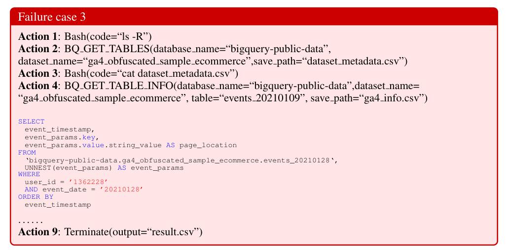

**图 29：** 失败案例 3。模型不能理解复杂嵌套模式。

### C.7 Spider-Agent 提示

我们依据 ReAct（Yao et al., 2022）提示框架构建 Spider-Agent。ReAct 通过迭代的推理（Reasoning）、动作（Action）和观察（Observation）阶段，引导模型把复杂问题拆成可处理步骤；每次动作后先观察当前状态，再进入下一步推理。以下完整保留框架使用的系统消息和动作提示。

#### 系统提示

```text
System Prompt

You are a data scientist proficient in database, SQL and DBT Project.
You are starting in the {work_dir} directory, which contains all the
data needed for your tasks. You can only use the actions provided in
the action space to solve the task.

### [Action space]: {action_prompts}

### [Notice]
1. First, run "ls" to check the current folder for files. If there
   are other markdown files, read them as they may contain useful
   information.
2. Examine the database schema folder, you fully understand the
   structure schema of the database.
3. Use appropriate SQL execution action to run queries.
4. Be prepared to write multiple SQL queries to find the correct
   answer. If an error occurs, revisit the database information and
   previous queries to adjust your SQL accordingly.
5. Ensure the results are valid. If the result.csv file is empty or
   only contains a header, the SQL query is incorrect. The final
   result should be either saved as a CSV or directly provided as a
   text answer, not an intermediate step or SQL statement.
6. After completing the task, verify the output data against the
   definitions. For dbt projects, after writing the SQL, run dbt run
   to update the database and confirm the new data models meet the
   YAML file definitions.

### [Response format]
For each task input, your response should contain:
1. One analysis of the task and the current environment, reasoning
   to determine the next action (prefix "Thought: ").
2. One action string in the ACTION SPACE (prefix "Action: ").

### [Example interaction]
Observation: ...(the output of last actions, as provided by the
environment and the code output, you don't need to generate it)
Thought: ...
Action: ...

### [Task]: {Task}
```

#### 动作空间提示

**Bash**

```text
## Bash Action
* Signature: Bash(code="shell command")
* Description: This action string will execute a valid shell command
  in the code field. Only non-interactive commands are supported.
  Commands like "vim" and viewing images directly (e.g., using
  "display") are not allowed.
* Example: Bash(code="ls -l")
```

**CreateFile**

```text
## CreateFile Action
* Signature: CreateFile(code="shell command")
* Description: This action string will execute a valid shell command
  in the code field. Only non-interactive commands are supported.
  Commands like "vim" and viewing images directly (e.g., using
  "display") are not allowed.
* Example: CreateFile(code="ls -l")
```

**EditFile**

````text
## EditFile
* Signature: EditFile(filepath="path/to/file"):
```
File_content
```
* Description: This action will overwrite the file specified in the
  filepath field with the content wrapped in paired symbols. Normally,
  you need to read the file before deciding to use EditFile to modify it.
* Example: EditFile(filepath="hello_world.py"):
```
print("Hello, world!")
```
````

**BIGQUERY_EXEC_SQL**

```text
## BIGQUERY_EXEC_SQL
* Signature:
  BIGQUERY_EXEC_SQL(
    sql_query="SELECT * FROM your_table",
    is_save=True,
    save_path="/workspace/output_file.csv"
  )
* Description: Executes a SQL query on Google Cloud BigQuery. If
  "is_save" is True, the results are saved to a specified CSV file;
  otherwise, results are printed. If you estimate that the number of
  returned rows is small, you can set is_save=False, to directly view
  the results. If you estimate that the number of returned rows is
  large, be sure to set is_save=True. The save_path CSV must be under
  the "/workspace" directory.
* Examples:
  - Example1: BIGQUERY_EXEC_SQL(
      sql_query="SELECT count(*) FROM sales",
      is_save=False
    )
  - Example2: BIGQUERY_EXEC_SQL(
      sql_query="SELECT user_id, sum(purchases) FROM transactions
                 GROUP BY user_id",
      is_save=True,
      save_path="/workspace/result.csv"
    )
```

**GET_TABLES**

```text
## GET_TABLES
* Signature:
  GET_TABLES(
    database_name="your_database_name",
    dataset_name="your_dataset_name",
    save_path="path/to/output_file.csv"
  )
* Description: Executes a query to fetch all table names and their
  corresponding DDL from the specified dataset in Google Cloud
  BigQuery. The results are saved to the specified CSV file.
  - The BigQuery id of a table is usually in the form of
    database_name.dataset_name.table_name. This action mainly focuses
    on the tables under dataset_name.
* Examples:
  - Example1: GET_TABLES(
      database_name="bigquery-public-data",
      dataset_name="new_york",
      save_path="dataset_metadata.csv"
    )
```

**GET_TABLES_INFO**

```text
## GET_TABLE_INFO Action
* Signature:
  GET_TABLE_INFO(
    database_name="your_database_name",
    dataset_name="your_dataset_name",
    table="table_name",
    save_path="path/to/output_file.csv"
  )
* Description: Executes a query to fetch all column information
  (field path, data type, and description) from the specified table
  in the dataset in Google Cloud BigQuery. The results are saved to
  the specified CSV file.
  - The BigQuery id of a table is usually in the form of
    database_name.dataset_name.table_name.
* Examples:
  - Example1: GET_TABLE_INFO(
      database_name="bigquery-public-data",
      dataset_name="samples",
      table="shakespeare",
      save_path="shakespeare_info.csv"
    )
```

**SAMPLE_ROWS**

```text
## SAMPLE_ROWS Action
* Signature:
  SAMPLE_ROWS(
    database_name="your_database_name",
    dataset_name="your_dataset_name",
    table="table_name",
    save_path="path/to/output_file.csv"
  )
* Description: Executes a query to fetch all column information
  (field path, data type, and description) from the specified table
  in the dataset in Google Cloud BigQuery. The results are saved to
  the specified CSV file.
  - The BigQuery id of a table is usually in the form of
    database_name.dataset_name.table_name.
* Examples:
  - Example1: SAMPLE_ROWS(
      database_name="bigquery-public-data",
      dataset_name="samples",
      table="shakespeare",
      save_path="shakespeare_info.csv"
    )
```
