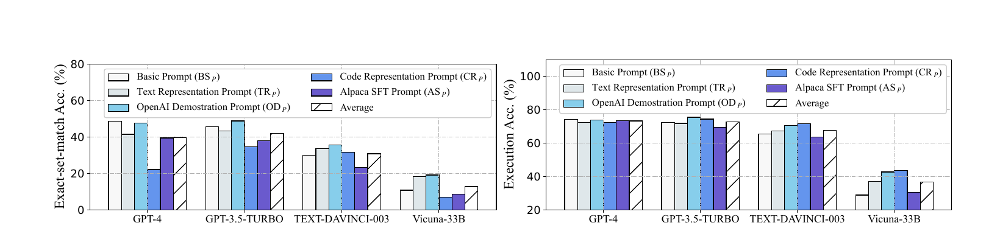
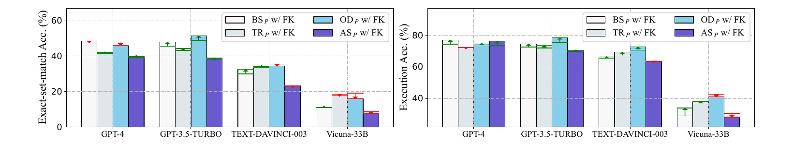
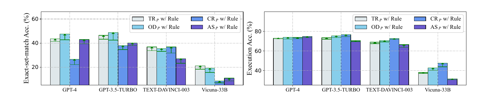
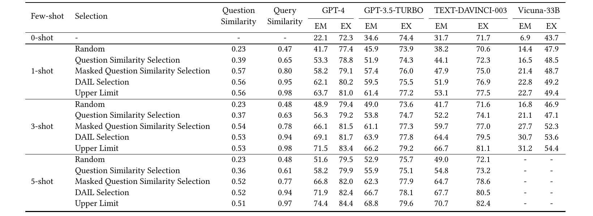
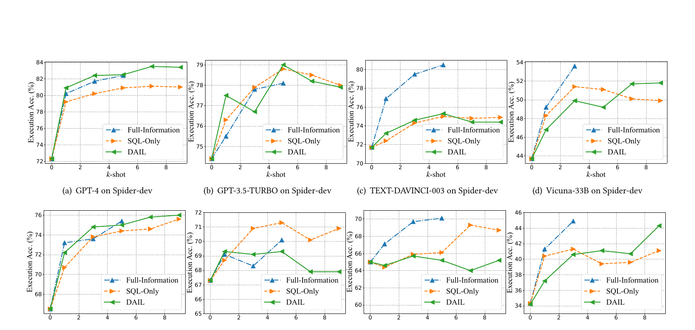
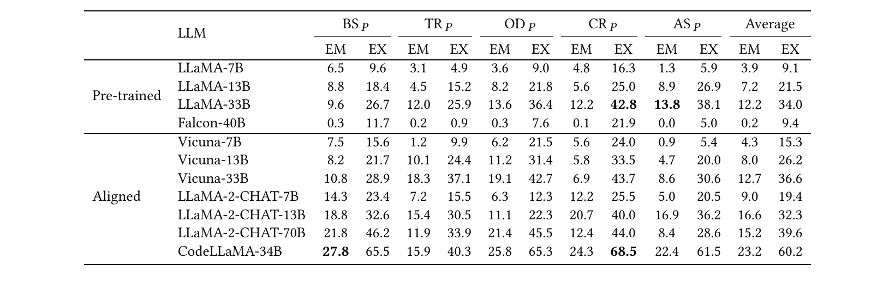
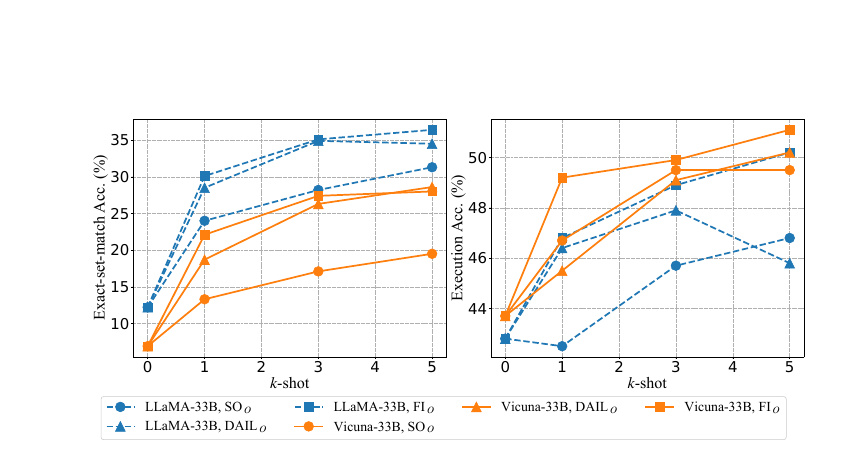
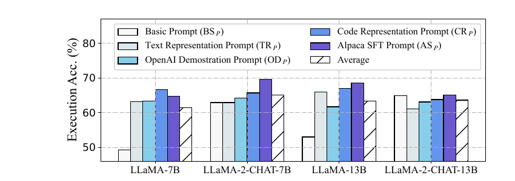
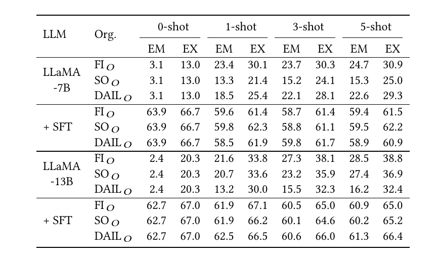
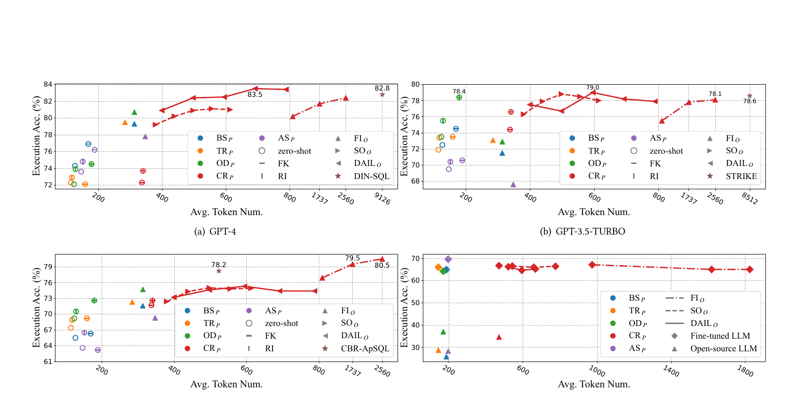

# Text-to-SQL Empowered by Large Language Models: A Benchmark Evaluation（中文译文）

## 译者说明

本文依据同目录的 `source.pdf` 翻译。章节、图表、公式、算法、代码与参考文献按原文结构保留。

## 作者与机构

| 姓名 | 邮箱 | 机构 |
| --- | --- | --- |
| Dawei Gao\* | `gaodawei.gdw@alibaba-inc.com` | Alibaba Group |
| Haibin Wang\* | `binke.whb@alibaba-inc.com` | Alibaba Group |
| Yaliang Li | `yaliang.li@alibaba-inc.com` | Alibaba Group |
| Xiuyu Sun | `xiuyu.sxy@alibaba-inc.com` | Alibaba Group |
| Yichen Qian | `yichen.qyc@alibaba-inc.com` | Alibaba Group |
| Bolin Ding | `bolin.ding@alibaba-inc.com` | Alibaba Group |
| Jingren Zhou | `jingren.zhou@alibaba-inc.com` | Alibaba Group |

\* 共同第一作者。

## 摘要

大语言模型（large language model，LLM）已经成为文本到 SQL（Text-to-SQL）任务的新范式。然而，缺乏系统化基准，阻碍了有效、高效且经济的 LLM 文本到 SQL 方案的发展。为应对这一挑战，我们首先对现有提示工程方法开展系统、广泛的比较，覆盖问题表示、样例选择和样例组织；依据这些实验结果，我们阐述各自的优缺点。基于这些发现，我们提出集成方案 DAIL-SQL，以 86.6% 的执行准确率刷新 Spider 排行榜并建立新的标杆。

为探索开源 LLM 的潜力，我们在多种场景下考察它们，并通过监督微调进一步提升其性能。我们的探索既表明开源 LLM 在文本到 SQL 上具有潜力，也揭示了监督微调的优势与不足。此外，为构建高效、经济的 LLM 文本到 SQL 方案，我们强调提示工程中的 token 效率，并按这一指标比较以往工作。我们希望我们的研究能加深对 LLM 文本到 SQL 的理解，并启发后续研究和广泛应用。

**PVLDB 引用格式：** Dawei Gao, Haibin Wang, Yaliang Li, Xiuyu Sun, Yichen Qian, Bolin Ding, Jingren Zhou. Text-to-SQL Empowered by Large Language Models: A Benchmark Evaluation. PVLDB, 17(5): 1132–1145, 2024. doi:10.14778/3641204.3641221

**PVLDB 工件可用性：** 源代码已公开于 <https://github.com/BeachWang/DAIL-SQL>。

本文采用 Creative Commons BY-NC-ND 4.0 国际许可协议；协议文本见 <https://creativecommons.org/licenses/by-nc-nd/4.0/>。对于该许可未涵盖的使用，须通过 `info@vldb.org` 取得许可。版权归论文权利人所有，出版权已许可给 VLDB Endowment。

*Proceedings of the VLDB Endowment*，Vol. 17, No. 5，ISSN 2150-8097。doi:10.14778/3641204.3641221

## 1 引言

文本到 SQL 是自然语言处理与数据库社区共同面对的一项挑战：它把针对给定关系数据库的自然语言问题映射成 SQL 查询 [8, 18]。以往多数工作 [17, 21, 22, 48, 56] 从文本到 SQL 语料中抽取问题到 SQL 的模式，并通过训练编码器—解码器模型来泛化这些模式。近年来，LLM 已成为文本到 SQL 的新范式 [24, 39, 47]。尤其是 Pourreza 等人 [35] 借助 GPT-4 [28] 取得 85.3% 的执行准确率，登上 Spider 排行榜 [2] 第一。与以往研究不同，基于 LLM 的方案核心问题是如何提示 LLM 生成正确 SQL，即提示工程。这里的提示工程包括问题表示 [6, 12, 31, 35]、样例选择 [14, 26, 27] 和样例组织 [14]。

**文本到 SQL 的提示工程需要系统研究。** 以往工作虽取得显著进展，但基于 LLM 的文本到 SQL 提示工程仍缺少系统研究。就问题表示而言，多数研究把结构化知识文本化为模式，并加入任务指令和外键信息形成提示 [19, 27]；另有研究 [6, 27] 把表表示成若干 `CREATE TABLE` SQL 语句，并在注释中要求 LLM 回答目标问题。然而，即便表示相近，任务指令的细节差异也会造成显著性能差距。例如 OpenAI 官方文本到 SQL 演示 [31] 用井号 `#` 区分提示与响应，取得了令人瞩目的效果 [24]；移除这一符号后，性能会明显下降。因此，亟须系统比较不同表示，并检验它们如何与 LLM 良好配合。

在样例选择方面，常见做法是把与目标问题最相似的样例按同一种表示编码 [6, 24, 27]；Nan 等人 [27] 进一步强调选择多样性的重要性。在样例组织方面，多数工作保留指令、模式、问题和真值 SQL 等完整信息；Guo 等人 [14] 则只保留所选样例的 SQL，以较少 token 引导 LLM。考虑到不同 LLM 的偏好也不相同，最优的选择与组织策略仍不明确。因此，需要跨 LLM、问题表示、样例选择和组织方式开展系统研究。

**开源 LLM 的潜力尚未得到充分探索。** 开源 LLM 近期持续发展，在编程、数学推理和文本生成任务上表现出显著进步。然而，以往文本到 SQL 研究主要关注 OpenAI LLM，对开源 LLM 研究不足。相比 OpenAI LLM，开源模型通常在理解上下文和生成连贯响应方面能力有限。因此，一个关键挑战是如何进一步提升开源 LLM 的文本到 SQL 性能；监督微调为此提供了可能。

**提示效率仍是开放挑战。** 基于 LLM 的文本到 SQL 还面临效率问题。以往工作多依赖 OpenAI LLM，而调用其 API 成本高、耗时长并受速率限制 [30]，包含多个样例的上下文学习提示尤其如此。现有研究尚未解决这一问题。Chang 等人 [6] 观察到执行准确率随提示长度呈倒 U 形，据此猜测 LLM 可能存在提示长度的“甜点区”，但高效提示工程仍是未解问题。

针对上述挑战，我们旨在为基于 LLM 的文本到 SQL 提供全面、系统且公平的基准。我们的基准同时讨论各种提示工程策略的效果与效率，以及使用开源 LLM 的可行性。

为系统、深入地理解文本到 SQL 提示工程，我们首先实证评估既有研究中的多种策略。我们在零样本场景下用不同 LLM 比较典型问题表示，识别各自优缺点；随后，我们在少样本场景下研究样例选择与组织。例如，在选择方面，我们比较不同策略并检验一个假设：LLM 从问题骨架到 SQL 骨架的映射中学习；在组织方面，我们比较完整信息、仅 SQL 以及问题—SQL 对三种方案。

随后，我们从上下文学习与监督微调两方面展示开源 LLM 的潜力。具体而言，我们实证研究采用不同提示工程策略、规模各异的开源模型，并观察到模型规模增大以及良好对齐 [32] 带来的显著收益。为进一步提升性能，我们用多种问题表示微调并评估开源模型；通过这一比较，我们证明表示策略在监督微调中同样关键。微调后，我们还观察到上下文学习能力会下降，这仍需进一步研究。我们相信这些探索将有益于实际的文本到 SQL 应用。

为了得到更经济、高效的方案，我们还以 token 效率评估不同策略，目标是在更少 token 下获得可观性能。我们在分析中考虑提示工程的整个过程，包括问题表示、样例选择和样例组织。

最后，我们的集成方案 DAIL-SQL 把结构知识编码为 SQL 语句，根据骨架相似度选择样例，并从样例中移除跨领域知识以节约 token。DAIL-SQL 以 86.6% 的执行准确率刷新 Spider 排行榜并位列第一；此前最佳结果为 85.3% [35]。因此，我们的方案建立了新的标杆，并期待我们的系统研究能启发更多后续工作。我们的主要贡献如下：

- 我们系统研究 LLM 文本到 SQL 提示工程：在四个 LLM 上比较五种问题表示、两个提示组件、四种样例选择和三种样例组织方式，为如何选择表示及利用上下文学习能力提供依据。
- 据我们所知，我们首次同时探索开源 LLM 在文本到 SQL 上的上下文学习和监督微调。我们通过在文本到 SQL 中对开源 LLM 采用 SFT，说明其潜力并给出相应洞见。
- 我们从成本效率角度实证比较不同提示，为真实文本到 SQL 应用提供实践指导。
- 我们提出 DAIL-SQL，在性能与 token 效率之间取得平衡；其 86.6% 执行准确率超过此前最佳方案 1.3 个百分点，且 token 成本更低。

## 2 预备知识

文本到 SQL 旨在把自然语言问题自动翻译成 SQL 查询。它弥合非专业用户与数据库系统之间的鸿沟，可大幅提高数据处理效率，并支持智能数据库服务、自动数据分析和数据库问答等应用。但由于必须充分理解自然语言问题并生成正确 SQL，文本到 SQL 依然相当困难 [18, 37]。

数据库与自然语言处理社区已对该任务开展大量研究。早期工作采用预定义规则或查询枚举 [3, 38, 42]，或把它视为序列到序列任务并训练编码器—解码器模型 [5, 34, 36]。随着深度学习发展，注意力机制 [25]、图表示 [17, 22, 36, 48, 51, 56]、句法解析 [15, 21, 41, 49] 等技术被用于文本到 SQL。代表性方法 BERT [10] 曾被广泛采用并取得当时的 SOTA [4, 52]。为缩小学术研究与现实部署之间的差距，社区还发布了 WikiSQL [58]、Spider [53]、KaggleDBQA [20]、BIRD [23] 等大规模基准。

近年来，OpenAI 的 GPT-4 [28]、Meta 的 LLaMA [45] 等 LLM 成为自然语言处理与机器学习的重要里程碑。LLM 在海量文本语料上预训练，能够执行多种自然语言任务；其基本工作原理是根据输入提示，逐步生成概率最高的下一个词 [54]。因此，使用 LLM 解决文本到 SQL 的核心是寻找最佳提示，即提示工程 [24, 27]。

按提示中提供的样例数量，提示工程可分为零样本与少样本场景。零样本场景不提供样例，主要挑战是如何有效表示自然语言问题，并纳入对应数据库模式等相关信息 [6, 12, 24, 47]。本文把表示自然语言问题及相关信息的过程称为**问题表示**。少样本场景还需考虑有限数量的样例；除问题表示外，我们还需要研究如何选择最有帮助的样例，并在提示中妥善组织。LLM 从上下文样例中学习的过程称为**上下文学习** [11]：模型可识别输入提示中的显式或隐式模式，在推理阶段无需任务专用训练即可完成新任务。近期研究 [14, 26, 35] 证实了样例对上下文学习的重要作用。

尽管以往研究 [6, 19, 24, 27, 43] 已证明 LLM 在零样本与少样本场景均有效，其性能仍可借助监督微调（supervised fine-tuning，SFT）提升。SFT 使用额外的任务专用数据，使模型更适合特定下游任务；近期它也作为对齐训练范式，使 LLM 避免生成冒犯、偏见和幻觉内容 [29]。我们聚焦用 SFT 增强文本到 SQL 能力。值得注意的是，与大量提示工程研究相比，LLM 文本到 SQL 监督微调研究非常稀缺 [43]，仍属开放问题。

综上，问题表示、上下文学习与监督微调是基于 LLM 的文本到 SQL 的三个关键旋钮。本文中，我们将对三者进行系统研究与讨论。

## 3 方法

如上所述，本文中我们聚焦问题表示、上下文学习与监督微调。本节中，我们对这三个问题给出形式化定义，系统梳理现有方案并指出潜在问题。针对这些问题，我们提出 DAIL-SQL，并以 86.6% 的执行准确率刷新 Spider 排行榜。

### 3.1 问题表示

本节中，我们首先讨论零样本文本到 SQL 中的问题表示。给定数据库 $D$ 上的自然语言目标问题 $q$，问题表示的目标是最大化 LLM $M$ 生成正确 SQL $s^{\ast}$ 的概率：

$$
\max _ {\sigma}\thickspace{} P_M\bigl(s^{\ast} \mid \sigma(q,D)\bigr),
$$

其中，函数 $\sigma(\cdot,\cdot)$ 决定如何表示问题 $q$ 及数据库 $D$ 模式中的有用信息，也可以包含指令、规则暗示与外键。按照这一定义，我们从文献中选取四种代表性零样本表示；此外，我们还加入监督微调中常用的 Alpaca [44] 表示。表 1 汇总五种表示及原论文报告的信息。

**表 1：现有工作中的问题表示及其零样本执行准确率（EX）。指令（INS）是“编写 SQL 回答问题”等任务描述；规则暗示（RI）如“只补全 SQLite SQL 查询，不要解释”；FK 表示外键信息。**

| 问题表示 | INS | RI | FK | 文献 | LLM | EX（%） |
| --- | --- | --- | --- | --- | --- | ---: |
| $\mathrm{BS} _ P$ | ✗ | ✗ | ✗ | [35] | — | — |
| $\mathrm{TR} _ P$ | ✓ | ✗ | ✗ | [27] | CODE-DAVINCI-002 | 69.0 |
| $\mathrm{OD} _ P$ | ✓ | ✓ | ✗ | [24] | GPT-3.5-TURBO | 70.1 |
| $\mathrm{OD} _ P$ | ✓ | ✓ | ✗ | [35] | GPT-4 | 64.9 |
| $\mathrm{CR} _ P$ | ✓ | ✗ | ✓ | [27] | CODE-DAVINCI-002 | 75.6 |
| $\mathrm{CR} _ P$ | ✓ | ✗ | ✓ | [6] | CODE-DAVINCI-002 | 71.8 |
| $\mathrm{CR} _ P$ | ✓ | ✗ | ✓ | [6] | GPT-3.5-TURBO | 70.7 |
| $\mathrm{AS} _ P$ | ✓ | ✗ | ✗ | [44] | — | — |

**清单 1：基本提示（Basic Prompt）示例。**

```text
Table continents, columns = [ContId, Continent]
Table countries, columns = [CountryId, CountryName, Continent]
Q: How many continents are there?
A: SELECT
```

**清单 2：文本表示提示（Text Representation Prompt）示例。**

```text
Given the following database schema:
continents: ContId, Continent
countries: CountryId, CountryName, Continent
Answer the following: How many continents are there?
SELECT
```

**清单 3：OpenAI 演示提示（原文题为 OpenAI Demostration Prompt）示例。**

```text
### Complete sqlite SQL query only and with no explanation
### SQLite SQL tables, with their properties:
#
# continents (ContId, Continent)
# countries (CountryId, CountryName, Continent)
#
### How many continents are there?
SELECT
```

**清单 4：代码表示提示（Code Representation Prompt）示例。**

```sql
/* Given the following database schema: */
CREATE TABLE continents (
  ContId int primary key,
  Continent text,
  foreign key (ContId) references countries (Continent)
);

CREATE TABLE countries (
  CountryId int primary key,
  CountryName text,
  Continent int,
  foreign key (Continent) references continents (ContId)
);

/* Answer the following: How many continents are there? */
SELECT
```

**清单 5：Alpaca SFT 提示示例。**

```text
Below is an instruction that describes a task, paired
with an input that provides further context. Write a
response that appropriately completes the request.

### Instruction:
Write a sql to answer the question "How many continents
are there?"

### Input:
continents (ContId, Continent)
countries (CountryId, CountryName, Continent)

### Response:
SELECT
```

- **基本提示($\mathrm{BS} _ P$)。** 该表示 [35] 如清单 1 所示，由表模式、带 `Q:` 前缀的自然语言问题和响应前缀 `A: SELECT` 组成。由于没有指令，我们称其为基本提示。
- **文本表示提示($\mathrm{TR} _ P$)。** 该表示 [27] 如清单 2 所示，用自然语言表示模式与问题，并在开头加入指令；在 [27] 中，它配合 CODE-DAVINCI-002 时在 Spider-dev 零样本场景取得 69.0% 执行准确率。
- **OpenAI 演示提示($\mathrm{OD} _ P$)。** 它最早用于 OpenAI 官方文本到 SQL 演示 [31]，并在 [24, 35] 中评估。指令、表模式和问题均以 `#` 注释；相比 $\mathrm{TR} _ P$，它额外要求“只补全 SQLite SQL 查询，不要解释”。我们将在第 4.3 节结合实验结果进一步讨论这条规则。
- **代码表示提示($\mathrm{CR} _ P$)。** 该表示 [6, 27] 直接给出 `CREATE TABLE` SQL，并以注释提出问题，能够完整表达列类型、主键和外键等建库信息；[27] 使用 CODE-DAVINCI-002 得到约 75.6% 的正确 SQL。
- **Alpaca SFT 提示($\mathrm{AS} _ P$)。** 这是为监督微调设计的 Markdown 格式提示 [44]，要求模型依照指令与输入上下文完成任务。我们同时考察它在提示工程和 SFT 中的效果与效率。

表 1 表明，不同表示常在不同 LLM、不同框架中评测，难以公平比较；外键、规则暗示等单独组件的作用也不明确。因此，有必要系统研究这些表示，并通过公平比较揭示其利弊。

### 3.2 文本到 SQL 的上下文学习

上述问题表示使 LLM 能在零样本条件下直接输出 SQL，但加入少量样例后，上下文学习可以进一步提升效果。本小节中，我们讨论上下文学习的两个关键问题：样例选择和样例组织。我们先给出形式化定义，以便后续讨论。

给定三元组集合 $Q=\lbrace{}(q_i,s_i,D_i)\rbrace{}$，其中 $q_i$ 是自然语言问题， $s_i$ 是数据库 $D_i$ 上对应的 SQL，文本到 SQL 上下文学习的目标是针对目标问题 $q$ 与数据库 $D$，最大化 LLM $M$ 生成正确 SQL $s^{\ast}$ 的概率：

$$
\max _ {Q',\sigma}\thickspace{} P_M\bigl(s^{\ast}\mid\sigma(q,D,Q')\bigr),
\qquad
\text{s.t. } |Q'|=k,\thickspace{} Q'\subset Q.
$$

函数 $\sigma(\cdot,\cdot,\cdot)$ 决定如何表示目标问题 $q$、数据库 $D$ 的模式信息及从 $Q$ 中选出的 $k$ 个样例。我们研究跨领域文本到 SQL，即目标数据库不出现在候选样例数据库中： $D\notin\lbrace{}D_i\mid(q_i,s_i,D_i)\in Q\rbrace{}$。因此，上下文学习包含两个子任务：选择最有帮助的 $Q'$，以及把所选样例的信息组织进提示。接下来，我们讨论这两个子任务。

#### 3.2.1 样例选择

我们将以往研究的样例选择策略总结如下：

- **随机。** 从候选集中随机抽取 $k$ 个样例；[14, 26, 27] 均将其作为基线。
- **问题相似度选择($\mathrm{QTS} _ S$)。** 用预训练语言模型分别嵌入候选问题与目标问题，再以欧氏距离或负余弦相似度度量，并用 $k\text{-NN}$ 选出最相近的 $k$ 个样例 [26]。
- **掩码问题相似度选择($\mathrm{MQS} _ S$)。** 针对跨领域场景，把所有问题中的表名、列名和值替换为掩码 token，消除领域信息的负面影响，再通过嵌入与 $k\text{-NN}$ 计算相似度 [14]。
- **查询相似度选择($\mathrm{QRS} _ S$)。** 不直接依赖目标问题，而是用初步模型根据 $q$ 与 $D$ 生成 SQL $s'$，把它视为 $s^{\ast}$ 的近似；随后按 SQL 关键字把候选查询编码成二值句法向量，在兼顾与 $s'$ 的相似度及样例多样性的条件下选出 $k$ 个样例 [27]。

这些策略只使用目标问题或目标查询的一侧信息。然而，上下文学习本质上是类比学习 [11]；在文本到 SQL 中，LLM 要学习问题与 SQL 之间的映射。因此，我们指出，选择样例时同时考虑问题与查询可能更有利；我们将在第 3.3 节进一步讨论。

#### 3.2.2 样例组织

样例组织决定把哪些所选样例信息放进提示。我们把以往研究中的现有策略归为完整信息组织和仅 SQL 组织两类，分别见清单 6 与清单 7。`${DATABASE_SCHEMA}` 表示数据库模式，`${TARGET_QUESTION}` 表示清单 4 的问题表示。

**清单 6：完整信息组织（Full-Information Organization）示例。**

```sql
/* Given the following database schema: */
${DATABASE_SCHEMA}
/* Answer the following: How many authors are there? */
SELECT count(*) FROM authors

/* Given the following database schema: */
${DATABASE_SCHEMA}
/* Answer the following: How many farms are there? */
SELECT count(*) FROM farm

${TARGET_QUESTION}
```

**清单 7：仅 SQL 组织（SQL-Only Organization）示例。**

```sql
/* Some SQL examples are provided based on similar problems: */
SELECT count(*) FROM authors

SELECT count(*) FROM farm

${TARGET_QUESTION}
```

- **完整信息组织($\mathrm{FI} _ O$)。** $\mathrm{FI} _ O$ [6, 27] 使用与目标问题相同的表示组织样例。它与目标问题的唯一区别是：样例在末尾 `SELECT` 之后给出完整 SQL。
- **仅 SQL 组织($\mathrm{SO} _ O$)。** $\mathrm{SO} _ O$ [14] 只保留所选样例的 SQL，并在提示前添加说明。它力图在 token 长度有限时容纳更多样例，但删除了问题与 SQL 之间可能有用的映射信息；我们将在后文证明这一信息的作用。

$\mathrm{FI} _ O$ 保留完整信息，重视样例质量； $\mathrm{SO} _ O$ 只保留 SQL，偏重样例数量。我们想知道，是否存在能在样例质量与数量间取得更好平衡的组织方式？

### 3.3 DAIL-SQL

为解决上述样例选择与组织问题，我们提出 DAIL-SQL。受篇幅限制，伪代码见我们的完整版本 [13]。

在样例选择方面，受 $\mathrm{MQS} _ S$ 和 $\mathrm{QRS} _ S$ 启发，我们提出同时考虑问题与查询的 DAIL Selection($\mathrm{DAIL} _ S$)。它首先屏蔽目标问题 $q$ 与候选集 $Q$ 中问题 $q_i$ 的领域专用词，再按掩码后 $q$ 与 $q_i$ 的嵌入欧氏距离对候选样例排序。同时，它计算预先预测的 SQL $s'$ 与候选 SQL $s_i$ 的查询相似度。最终，选择准则优先保留问题相似度排序靠前、且查询相似度超过阈值 $\tau$ 的候选项。这样选出的前 $k$ 个样例在问题和查询两方面都具有较高相似度。

为保留问题—SQL 映射并提高 token 效率，我们提出 DAIL Organization($\mathrm{DAIL} _ O$)，在质量与数量之间折中。 $\mathrm{DAIL} _ O$ 同时给出问题 $q_i$ 及对应 SQL $s_i$（清单 8）。作为 $\mathrm{FI} _ O$ 与 $\mathrm{SO} _ O$ 的折中，它保留问题—SQL 映射，同时删除消耗 token 的数据库模式，从而缩短样例。

**清单 8：DAIL 组织示例。**

```sql
/* Some example questions and corresponding SQL queries
   are provided based on similar problems: */
/* Answer the following: How many authors are there? */
SELECT count(*) FROM authors

/* Answer the following: How many farms are there?. */
SELECT count(*) FROM farm

${TARGET_QUESTION}
```

在 DAIL-SQL 中，我们采用 $\mathrm{CR} _ P$ 作为我们的问题表示。相比其他表示， $\mathrm{CR} _ P$ 包含主键、外键等完整数据库信息，能够为预测 `JOIN` 子句提供有用线索；此外，LLM 在大量代码语料上预训练，可以更自然地理解 $\mathrm{CR} _ P$。

综上，DAIL-SQL 以 $\mathrm{CR} _ P$ 表示问题，根据问题和查询两方面的信息选择样例，并以保留问题—SQL 映射的方式组织样例。借助这种提示设计，DAIL-SQL 在 Spider 排行榜取得 86.2% 的执行准确率。它也是灵活、易扩展的方案；例如，为进一步提升性能，我们为 DAIL-SQL 加入自洽性（self-consistency）[50] 后可达到 86.6%。不过，自洽性只提升 0.4 个百分点，却显著增加耗时和成本，故我们仍聚焦 DAIL-SQL 本身。

### 3.4 文本到 SQL 的监督微调

在零样本场景中，常见增强方式是前述上下文学习；监督微调则是较少探索但很有前景的替代方案。与其他语言任务类似，我们可用它提升 LLM 在文本到 SQL 下游任务上的性能。为进一步理解监督微调如何作用于文本到 SQL，我们首先给出简要的形式化定义。

给定 LLM $M$ 和文本到 SQL 训练集 $T=\lbrace{}(q_i,s_i,D_i)\rbrace{}$，其中 $q_i$ 与 $s_i$ 分别是数据库 $D_i$ 上的自然语言问题和对应查询，监督微调的目标是最小化经验损失：

$$
\min _ {\sigma,M^{\ast}}\thickspace{} \sum _ {i=1}^{|T|}
\mathcal{L} _ {M^{\ast}}\bigl(\sigma(q_i,D_i),s_i\bigr),
$$

其中 $\mathcal{L}$ 衡量生成查询与真值查询之间的差异， $\sigma$ 决定如何表示问题及数据库模式中的有用信息。因此，监督微调包含两个子任务：用监督数据 $T$ 微调 $M$ 得到最优模型 $M^{\ast}$，以及寻找最优问题表示 $\sigma$。3.1 节已讨论表示，本节重点讨论数据准备与微调。

在一般领域，监督数据的每个条目 $T=\lbrace{}(p_i,r_i)\rbrace{}$ 包含输入提示 $p_i$ 与 LLM 的期望响应 $r_i$。为使训练与推理一致，我们采用监督微调，并从文本到 SQL 数据生成提示—响应对。具体而言，给定 $T=\lbrace{}(q_i,s_i,D_i)\rbrace{}$，我们使用生成的微调数据来微调 LLM：构造 $T=\lbrace{}(p_i=\sigma(q_i,D_i),r_i=s_i)\rbrace{}$，即以目标问题和数据库表示为提示，以目标 SQL 为响应。数据就绪后，我们可以按算力选择全量微调 [32] 或参数高效微调 [16]。微调得到的 $M^{\ast}$ 随后根据自然语言问题生成查询；在微调和推理过程中，我们使用相同的 $\sigma$。我们将在后文开展一系列实验，讨论 SFT 在文本到 SQL 中的潜力。

## 4 实验

本节中，我们首先介绍我们的实验设置；然后，我们分别把问题表示、上下文学习和监督微调方案与现有方案广泛比较；最后，我们进一步从 token 效率角度比较它们，以启发更高效的方案。

### 4.1 设置

**数据集。** 我们在 Spider [53] 与 Spider-Realistic [9] 两个公认的数据集上评估文本到 SQL 方法。Spider 是大型跨领域文本到 SQL 数据集，覆盖 200 个数据库，训练集含 8,659 个样例，开发集含 1,034 个样例；每个样例包含针对某个数据库的自然语言问题及对应 SQL。测试集未公开，因此我们使用 Spider-dev 评测。Spider-Realistic [9] 是更具挑战的变体：它从 Spider-dev 选取 508 个样例，人工改写问题但保持 SQL 不变。在少样本场景下，无论测试 Spider-dev 还是 Spider-Realistic，我们都使用 Spider 训练集作为候选样例。

**指标。** 为公平比较，我们遵循 [57]，使用精确集合匹配准确率（exact-set-match accuracy，EM）与执行准确率（execution accuracy，EX）。EM 比较预测 SQL 与真值 SQL 的关键字集合；EX 比较二者在若干数据库实例上的执行结果。一个问题可能存在多条有效 SQL，因此 EX 通常能更准确地估计模型性能。我们使用已发布的评测脚本：<https://github.com/taoyds/test-suite-sql-eval>。

**LLM。** 为公平比较，我们为所有方法使用相同最大上下文长度：OpenAI LLM 为 4,096，开源 LLM 为 2,048。评测时，我们预留 200 token 用于生成响应。默认情况下，我们把温度设为 0，以消除随机性影响。后处理方面，我们遵循既有工作，从响应中提取第一条 SQL 并移除额外输出。更多实现细节见我们的完整版本 [13]。

### 4.2 问题表示

本节中，我们在零样本场景下用 GPT-4、GPT-3.5-TURBO、TEXT-DAVINCI-003 和 Vicuna-33B 评估第 3.1 节的问题表示。



*图 1：Spider-dev 零样本场景下不同问题表示的结果。左图为 EM，右图为 EX。*

从图 1 的不同表示比较中，我们可以观察到， $\mathrm{OD} _ P$ 适配四种 LLM，并在 GPT-3.5-TURBO 上取得 75.5% 执行准确率； $\mathrm{AS} _ P$ 在 GPT-3.5-TURBO、TEXT-DAVINCI-003 和 Vicuna-33B 上表现较差，需要合适的模型才能奏效。出人意料的是，GPT-4 偏好 Din-SQL [35] 的简单 $\mathrm{BS} _ P$，说明强模型可降低表示设计的复杂性。从平均表现看，GPT-4 与 GPT-3.5-TURBO 的零样本能力更强。考虑 GPT-4 成本较高，GPT-3.5-TURBO 配合 $\mathrm{OD} _ P$ 可能是更好的零样本选择；对较弱的 TEXT-DAVINCI-003 和 Vicuna-33B，则更适合 $\mathrm{OD} _ P$ 与 $\mathrm{CR} _ P$。

为进一步理解这些表示，我们对其组件开展消融实验。



*图 2：Spider-dev 上的外键信息消融。绿色箭头表示提升，红色箭头表示下降。*

**外键（FK）。** 外键暗示关系表之间的联系，可能有助于文本到 SQL；在我们的评估中，原始表示里只有 $\mathrm{CR} _ P$ 包含外键。为检验外键的作用，我们给其他表示加入外键信息并在图 2 中评估。在 OpenAI LLM 上，我们观察到，除 GPT-4 的 $\mathrm{TR} _ P$（−0.2%）和 TEXT-DAVINCI-003 的 $\mathrm{AS} _ P$（−0.4%）外，外键均使执行准确率提高 0.6%–2.9%。但它对 Vicuna-33B 的影响不稳定： $\mathrm{BS} _ P$ 意外提升 5.0%， $\mathrm{OD} _ P$ 和 $\mathrm{AS} _ P$ 却下降。



*图 3：Spider-dev 上“不要解释”规则暗示的消融。绿色箭头表示提升，红色箭头表示下降。*

**规则暗示（RI）。** 受 $\mathrm{OD} _ P$ 优异表现启发，我们考察“不要解释”这一规则。为检验这条规则在问题表示中的作用，我们在图 3 中给出消融实验。具体而言，我们绘制加入“不要解释”规则后不同表示的性能及准确率变化。从图 3 中我们观察到，加入规则后，所有 LLM 的 EM 与 EX 均稳定提高，最大提升分别超过 6% 和 3%；从 $\mathrm{OD} _ P$ 中移除规则则使 EM 下降约 2.4%–6.2%，EX 下降 1.3%–2.4%，说明规则暗示很重要。

总之，外键与“不要解释”规则都对文本到 SQL 有益。在我们的评估中，带外键的 $\mathrm{OD} _ P$ 配合 GPT-3.5-TURBO 最有效且经济，EM 为 51.5%，EX 为 78.4%。

### 4.3 文本到 SQL 的上下文学习

在少样本场景下，我们用 GPT-4、GPT-3.5-TURBO、TEXT-DAVINCI-003 和 Vicuna-33B 比较不同样例选择与组织策略。为公平比较，我们在本小节所有实验中都采用表现更好的 $\mathrm{CR} _ P$ 作为问题表示；依据是我们的完整版本 [13] 所示的单样本预实验。

#### 4.3.1 样例选择

为验证问题与查询都很重要，我们计算所选样例与目标实例之间的问题和查询 Jaccard 相似度，并在表 2 中报告平均值。具体而言，我们去除问题 [48] 与查询 [21] 中的数据库专用信息，再计算余下 token 的 Jaccard 相似度。此外，我们加入“上限”作为参考：它与 DAIL Selection 相似，但用真值查询 $s^{\ast}$ 代替初步预测器生成的查询。我们不把真值直接交给 LLM，只把真值查询用于样例选择参考，因此该结果大致代表基于相似度方法的性能上界。



*表 2：固定为完整信息组织时，不同样例选择在 Spider-dev 上的评估。列中的 EM 与 EX 均为百分比。*

表 2 比较 Spider-dev 上 1、3、5 样本场景的选择策略。 $\mathrm{DAIL} _ S$ 总体优于其他策略；5 样本、GPT-4 场景下，DAIL-SQL 的执行准确率达到 82.4%。我们在表 2 中观察到，问题与查询相似度提高通常对应更高 EX，说明二者都很重要。 $\mathrm{DAIL} _ S$ 仍低于“上限”，原因是初步模型生成的查询与真值查询之间存在差距，导致查询相似度较低。

#### 4.3.2 样例组织

我们在 Spider-dev 和 Spider-Realistic 上比较完整信息、仅 SQL 和 DAIL 三种组织方式，结果见图 4。



*图 4：固定 DAIL Selection 时，不同样例组织在 Spider-dev（a–d）与 Spider-Realistic（e–h）上的执行准确率。原论文图注称“Evaluation on Spider-dev”，但子图同时包含 Spider-Realistic。*

从图 4(a) 与 4(e) 中，我们可以观察到，GPT-4 在两个数据集上都随上下文样例增加而稳定受益。采用 DAIL 组织后，其 Spider-dev EX 从 72.3% 升至 83.5%，Spider-Realistic 从 66.5% 升至 76.0%。GPT-3.5-TURBO 与 TEXT-DAVINCI-003 的上下文学习能力有限，增加样例有时反而降低 EX；Vicuna-33B 使用 DAIL 组织时则随样例数持续提升。

通过比较不同组织方式，我们观察到模型偏好存在差异：GPT-4 在两个数据集上都偏好 DAIL 组织，说明它能有效学习问题—SQL 映射；对 GPT-3.5-TURBO（图 4(b) 与图 4(f)），相较图 1 的零样本表现，其上下文学习增益在四种模型中最小；TEXT-DAVINCI-003 明显偏好完整信息组织，且样例越多差距越大（图 4(c) 与图 4(g)）；图 4(d) 与图 4(h) 显示，在 Vicuna-33B 上，DAIL 组织优于仅 SQL，却不及完整信息。通过比较不同 LLM，我们推断上下文学习能力强的模型（如 GPT-4）最能受益于 DAIL 组织，而较弱模型需要样例提供更多信息。不过，我们强调 DAIL 组织仍是取得较高性能的良好选择，而我们的实验中最佳 EX 由 GPT-4 配合 DAIL 组织取得。

总体来看，在样例选择方面，我们的发现强调问题到 SQL 映射的重要性；同时考虑问题与查询相似度的 $\mathrm{DAIL} _ S$ 在我们的实验中优于其他策略。样例组织方面，我们展示了 $\mathrm{DAIL} _ O$ 的有效性，也指出它要求较强的 LLM。最后，在我们的实验中，我们观察到，我们的方法 DAIL-SQL 配合 GPT-4，在 Spider-dev 与 Spider-Realistic 分别达到 83.5% 和 76.0% 的最高执行准确率。

### 4.4 文本到 SQL 的监督微调

本节中，我们研究文本到 SQL 的监督微调。由于微调 OpenAI LLM 成本过高，我们聚焦开源 LLM。已有文本到 SQL 工作很少采用开源模型，其性能也不清楚，因此我们首先用不同问题表示、样例选择和组织策略全面评估开源 LLM；随后，我们对开源 LLM 进行监督微调，观察零样本与少样本场景的改善。

#### 4.4.1 开源 LLM

为考察开源 LLM 的潜力，我们选择 LLaMA [45] 及不同规模的对齐变体。这里“对齐”指模型经过训练而变得更有帮助、更无害、更诚实 [1]；后缀 `-7B`、`-13B`、`-33B` 分别表示约 70 亿、130 亿、330 亿参数。

- **LLaMA-7B/13B/33B** [45] 是 Meta 在海量语料上预训练的一组广泛使用的开源 LLM。
- **Falcon-40B** [33] 仅使用大量精炼 Web 数据预训练。
- **LLaMA-2-CHAT-7B/13B/70B** [46] 是更新版 LLaMA，同时经过预训练和对齐，在多数基准上优于上一代。
- **Vicuna-7/13/33B** [7, 55] 基于 LLaMA、使用用户共享对话对齐。Vicuna-13B [7] 声称表现接近 OpenAI ChatGPT 与 Google Bard，并在多数场景优于 LLaMA 和 Alpaca。
- **CodeLLaMA-34B** [40] 从 LLaMA-2-34B 使用约 500B 个代码 token 微调而来。

#### 4.4.2 开源 LLM 的零样本场景



*表 3：不同开源 LLM 与问题表示在 Spider-dev 上的零样本结果；预训练与对齐模型各自的最佳结果以粗体标出。EM 与 EX 均为百分比。*

表 3 给出 Spider-dev 结果；受篇幅限制，Spider-Realistic 结果见我们的完整版本 [13]。接下来，我们从问题表示、模型规模和对齐三个方面进行分析。

**问题表示的影响。** 我们可以观察到，最佳 EX 为 $\mathrm{CR} _ P$ 的 68.5%。可能原因是 $\mathrm{CR} _ P$ 更能激发 LLM 的编码能力；这一现象在 CodeLLaMA-34B 上尤为明显，它使用基于自然语言的 $\mathrm{TR} _ P$ 时只有 40.3% EX。

**模型规模的影响。** 从结果中，我们观察到，LLaMA 与 Vicuna 的规模都与文本到 SQL 性能正相关。LLaMA 的平均 EX 从 9.1% 提升到 34.0%，Vicuna 从 15.3% 提升到 36.6%；参数最多的 LLaMA-2-CHAT-70B 将平均结果提高到 39.6%。

**对齐的影响。** 从结果中，我们观察到，同规模下，Vicuna 在 Spider-dev 和 Spider-Realistic 上的 EX 均比 LLaMA 高约 5%，表明对齐有益。Falcon-40B 在所有表示上表现都很差，可能是训练数据中缺少专门的代码数据。相反，对齐阶段使用精心收集代码数据的 CodeLLaMA-34B 在相近规模下显著改善；尽管参数只有 LLaMA-2-CHAT-70B 的一半，其平均 EX 仍高 20.6%。这说明模型规模有潜在收益，但训练语料——尤其是任务专用数据——更关键。

#### 4.4.3 开源 LLM 的少样本场景



图 5：开源 LLM 在 Spider-dev 上的少样本评估。左图为 EM，右图为 EX；问题表示固定为 $\mathrm{CR} _ P$，样例选择固定为 DAIL Selection。

图 5 比较使用 $\mathrm{CR} _ P$ 的 LLaMA-33B 与 Vicuna-33B；我们采用第 4.3 节中表现最佳的 DAIL Selection 选择样例。从图中我们可以看出，LLaMA-33B 从样例中获益更多，在 5 样本完整信息组织下达到 36.4% EM。就 EX 而言，增加样例在多数情况下有益；完整信息组织在各个 $k$ 上都优于其他策略，Vicuna-33B 的最高 EX 为 51.5%。更多分析见我们的完整版本 [13]。不过，无论零样本还是少样本，开源 LLM 仍明显落后于 OpenAI LLM；我们将在下节尝试用监督微调进一步提升它们的性能。

#### 4.4.4 开源 LLM 的监督微调

与上下文学习一样，SFT 可能偏好不同表示。为进一步提升开源 LLM 的性能，我们探索文本到 SQL 的监督微调。因此，我们首先用不同表示构造零样本训练样例，对开源 LLM 进行微调。遵循 [32, 44]，我们屏蔽提示部分的梯度，只用响应（SQL）更新参数。我们使用 Spider 训练集，其中含 8,659 个样例。更多训练细节见我们的完整版本 [13]。



*图 6：不同微调开源 LLM 与问题表示在 Spider-dev 上的零样本执行准确率。*

**零样本场景。** 图 6 显示，SFT 后各模型与表示相较表 3 均大幅提升。为 SFT 设计的 Alpaca SFT Prompt 优势明显；我们还观察到，不同表示及模型规模之间的差距也缩小。可能原因是微调后模型无需任务指令与外键信息也能回答新问题。最佳组合为 LLaMA-13B 加 Alpaca SFT Prompt，EX 为 68.6%；更大模型中，LLaMA-33B 加 $\mathrm{CR} _ P$ 达到 69.1%。因此，SFT 对开源 LLM 很有帮助，微调后的 LLaMA-13B 与 30B 在零样本场景已可与 TEXT-DAVINCI-003 相比；此处“30B”沿用原文，前文实验模型及图 6 标注为 33B。



表 4：监督微调 LLM 在 Spider-dev 上的少样本结果。 $\mathrm{FI} _ O$、 $\mathrm{SO} _ O$ 与 $\mathrm{DAIL} _ O$ 分别表示完整信息、仅 SQL 与 DAIL 组织；EM 与 EX 均为百分比。

**少样本场景。** 监督微调后，我们能否继续通过上下文样例提升开源 LLM？为回答这一问题，我们评估微调后的 LLaMA-7B 与 13B 在 0、1、3、5 样本提示上的表现，如表 4 所示；为清晰比较，我们还加入原始 LLaMA-7B 与 13B 的评估结果。出人意料的是，微调模型无法从样例中学习：加入上下文样例使 EM 和 EX 突然下降，加入更多样例也无帮助。可能原因是 LLM 过拟合了零样本提示，导致样例失去作用。

总之，开源 LLM 在文本到 SQL、尤其是 SFT 上显示出显著潜力：微调后的零样本性能可与 TEXT-DAVINCI-003 相比。但与 OpenAI LLM 不同，微调后的开源模型不能从上下文样例中学习。如何在微调后保留上下文学习能力，仍需未来研究。

### 4.5 Token 效率

OpenAI LLM 按 token 数计费，模型运行时间也与 token 长度成正比，因此我们强调提示工程的 token 效率：用更少 token 获得更高准确率。本节中，我们从 token 效率角度回顾我们在 Spider-dev 上的实验；更多效率分析见我们的完整版本 [13]。具体而言，我们实证研究 OpenAI 与开源 LLM 在准确率与 token 数之间的权衡。token 数主要受问题表示与样例组织影响；对于样例选择，我们将其固定为 $\mathrm{DAIL} _ S$。此外，我们还将 DIN-SQL [35]、STRIKE [27] 和 CBR-ApSQL [14] 等 SOTA 纳入我们的比较。



*图 7：不同表示在 Spider-dev 上的 token 效率。我们用不同颜色区分问题表示，用不同形状区分样例组织及是否使用外键/规则暗示；形状重叠表示同时使用外键与规则。圆环表示零样本提示，星形表示既有 LLM 少样本 SOTA。*

图 7 显示，在零样本场景中，相比只用规则暗示，加入外键通常以更多 token 换取更高 EX。在少样本场景中， $\mathrm{FI} _ O$ 的 token 数是 $\mathrm{DAIL} _ O$ 和 $\mathrm{SO} _ O$ 的数倍，效率很低； $\mathrm{DAIL} _ O$ 与 $\mathrm{SO} _ O$ token 成本相近，但前者配合 GPT-4 达到最高 83.5% EX，因此 $\mathrm{DAIL} _ O$ 更高效。

与 SOTA 相比，DAIL-SQL 在准确率和效率两方面都优于 DIN-SQL 与 STRIKE。CBR-ApSQL 配合 TEXT-DAVINCI-003 达到 78.2%，仍低于 $\mathrm{DAIL} _ S$ + $\mathrm{FI} _ O$ 的最佳结果。图 7(d) 中，经过文本到 SQL 微调的开源模型效率更高；但如 4.4 节所述，增加样例对开源模型无益，反而降低 token 效率。

综上，token 效率是 LLM 文本到 SQL 实际应用中的关键指标。我们的方法 DAIL-SQL 同时提供较高执行准确率和更好的 token 效率，因而更适合现实应用。

## 5 讨论

根据我们的实验，我们可以得到以下经验性洞见：

- 对问题表示，推荐代码表示提示与 OpenAI 演示提示；外键、规则暗示等额外信息也很有帮助。
- 对样例选择，自然语言问题和 SQL 查询的相似度都很重要，二者结合是设计有效选择策略的良好指标。
- 对样例组织，如果 LLM 足够强（如 GPT-4），给出问题—SQL 对既有效又高效；否则建议提供完整信息样例。
- 对开源 LLM，更多参数有利于文本到 SQL，但训练语料更关键；SFT 是必要且很有潜力的手段。

本文仍有一些局限。我们只用 Spider 训练集微调开源 LLM，更多文本到 SQL 数据可能继续提升性能；Spider 与 Spider-Realistic 的数据库也可能不够大，我们认为，当数据库含大量表时，效果与效率方面会出现新挑战。此外，现有指标优先衡量正确性而非效率，如何促使 LLM 在多个正确候选中生成更高效的 SQL 仍是重要而未解决的问题。我们将继续研究这些局限与开放问题。

## 6 结论

我们从提示工程与监督微调两方面系统研究基于 LLM 的文本到 SQL。我们指出，现有上下文学习方法忽视了问题与查询之间的映射，以及样例质量与数量之间的权衡。为解决这些问题，我们提出 DAIL-SQL，以 86.6% 执行准确率刷新 Spider 排行榜并位列第一。在监督微调方面，我们展示了开源 LLM 的巨大潜力，强调训练语料与模型规模的重要性，也指出微调后上下文学习能力退化。我们还从效率角度考察现有方案。上述问题都为未来研究带来挑战与机遇；我们希望我们的工作能提供全面认识，为实际应用给出指引，并推动文本到 SQL 继续发展。

## 参考文献

1. Amanda Askell, Yuntao Bai, Anna Chen, Dawn Drain, Deep Ganguli, Tom Henighan, Andy Jones, Nicholas Joseph, Benjamin Mann, Nova DasSarma, Nelson Elhage, Zac Hatfield-Dodds, Danny Hernandez, Jackson Kernion, Kamal Ndousse, Catherine Olsson, Dario Amodei, Tom B. Brown, Jack Clark, Sam McCandlish, Chris Olah, and Jared Kaplan. 2021. A General Language Assistant as a Laboratory for Alignment. *CoRR* abs/2112.00861 (2021).
2. LILY Group at Yale University. 2018. Spider 1.0, Yale Semantic Parsing and Text-to-SQL Challenge. <https://yale-lily.github.io/spider>.
3. Christopher Baik, Zhongjun Jin, Michael J. Cafarella, and H. V. Jagadish. 2020. Duoquest: A Dual-Specification System for Expressive SQL Queries. In *Proceedings of the 2020 International Conference on Management of Data*, 2319–2329.
4. Ursin Brunner and Kurt Stockinger. 2021. ValueNet: A Natural Language-to-SQL System that Learns from Database Information. In *37th IEEE International Conference on Data Engineering*, 2177–2182.
5. Ruichu Cai, Boyan Xu, Zhenjie Zhang, Xiaoyan Yang, Zijian Li, and Zhihao Liang. 2018. An Encoder-Decoder Framework Translating Natural Language to Database Queries. In *Proceedings of the Twenty-Seventh International Joint Conference on Artificial Intelligence*, 3977–3983.
6. Shuaichen Chang and Eric Fosler-Lussier. 2023. How to Prompt LLMs for Text-to-SQL: A Study in Zero-shot, Single-domain, and Cross-domain Settings. *CoRR* abs/2305.11853 (2023).
7. Wei-Lin Chiang, Zhuohan Li, Zi Lin, Ying Sheng, Zhanghao Wu, Hao Zhang, Lianmin Zheng, Siyuan Zhuang, Yonghao Zhuang, Joseph E. Gonzalez, Ion Stoica, and Eric P. Xing. 2023. Vicuna: An Open-Source Chatbot Impressing GPT-4 with 90%\* ChatGPT Quality. <https://lmsys.org/blog/2023-03-30-vicuna/>.
8. Naihao Deng, Yulong Chen, and Yue Zhang. 2022. Recent Advances in Text-to-SQL: A Survey of What We Have and What We Expect. In *Proceedings of the 29th International Conference on Computational Linguistics*, 2166–2187.
9. Xiang Deng, Ahmed Hassan Awadallah, Christopher Meek, Oleksandr Polozov, Huan Sun, and Matthew Richardson. 2021. Structure-Grounded Pretraining for Text-to-SQL. In *Proceedings of the 2021 Conference of the North American Chapter of the Association for Computational Linguistics: Human Language Technologies*, 1337–1350.
10. Jacob Devlin, Ming-Wei Chang, Kenton Lee, and Kristina Toutanova. 2019. BERT: Pre-training of Deep Bidirectional Transformers for Language Understanding. In *Proceedings of the 2019 Conference of the North American Chapter of the Association for Computational Linguistics: Human Language Technologies*, 4171–4186.
11. Qingxiu Dong, Lei Li, Damai Dai, Ce Zheng, Zhiyong Wu, Baobao Chang, Xu Sun, Jingjing Xu, Lei Li, and Zhifang Sui. 2023. A Survey for In-context Learning. *CoRR* abs/2301.00234 (2023).
12. Xuemei Dong, Chao Zhang, Yuhang Ge, Yuren Mao, Yunjun Gao, Lu Chen, Jinshu Lin, and Dongfang Lou. 2023. C3: Zero-shot Text-to-SQL with ChatGPT. *CoRR* abs/2307.07306 (2023).
13. Dawei Gao, Haibin Wang, Yaliang Li, Xiuyu Sun, Yichen Qian, Bolin Ding, and Jingren Zhou. 2023. Text-to-SQL Empowered by Large Language Models: A Benchmark Evaluation. *CoRR* abs/2308.15363 (2023).
14. Chunxi Guo, Zhiliang Tian, Jintao Tang, Pancheng Wang, Zhihua Wen, Kang Yang, and Ting Wang. 2023. A Case-Based Reasoning Framework for Adaptive Prompting in Cross-Domain Text-to-SQL. *CoRR* abs/2304.13301 (2023).
15. Jiaqi Guo, Zecheng Zhan, Yan Gao, Yan Xiao, Jian-Guang Lou, Ting Liu, and Dongmei Zhang. 2019. Towards Complex Text-to-SQL in Cross-Domain Database with Intermediate Representation. In *Proceedings of the 57th Conference of the Association for Computational Linguistics*, 4524–4535.
16. Edward J. Hu, Yelong Shen, Phillip Wallis, Zeyuan Allen-Zhu, Yuanzhi Li, Shean Wang, Lu Wang, and Weizhu Chen. 2022. LoRA: Low-Rank Adaptation of Large Language Models. In *The 10th International Conference on Learning Representations*.
17. Binyuan Hui, Ruiying Geng, Lihan Wang, Bowen Qin, Yanyang Li, Bowen Li, Jian Sun, and Yongbin Li. 2022. S2 SQL: Injecting Syntax to Question-Schema Interaction Graph Encoder for Text-to-SQL Parsers. In *Findings of the Association for Computational Linguistics*, 1254–1262.
18. George Katsogiannis-Meimarakis and Georgia Koutrika. 2023. A Survey on Deep Learning Approaches for Text-to-SQL. *VLDB Journal* 32, 4 (2023), 905–936.
19. Anirudh Khatry, Joyce Cahoon, Jordan Henkel, Shaleen Deep, K. Venkatesh Emani, Avrilia Floratou, Sumit Gulwani, Vu Le, Mohammad Raza, Sherry Shi, Mukul Singh, and Ashish Tiwari. 2023. From Words to Code: Harnessing Data for Program Synthesis from Natural Language. *CoRR* abs/2305.01598 (2023).
20. Chia-Hsuan Lee, Oleksandr Polozov, and Matthew Richardson. 2021. KaggleDBQA: Realistic Evaluation of Text-to-SQL Parsers. In *Proceedings of the 59th Annual Meeting of the Association for Computational Linguistics and the 11th International Joint Conference on Natural Language Processing*, 2261–2273.
21. Haoyang Li, Jing Zhang, Cuiping Li, and Hong Chen. 2023. RESDSQL: Decoupling Schema Linking and Skeleton Parsing for Text-to-SQL. In *37th AAAI Conference on Artificial Intelligence*, 13067–13075.
22. Jinyang Li, Binyuan Hui, Reynold Cheng, Bowen Qin, Chenhao Ma, Nan Huo, Fei Huang, Wenyu Du, Luo Si, and Yongbin Li. 2023. Graphix-T5: Mixing Pre-trained Transformers with Graph-Aware Layers for Text-to-SQL Parsing. In *37th AAAI Conference on Artificial Intelligence*, 13076–13084.
23. Jinyang Li, Binyuan Hui, Ge Qu, Binhua Li, Jiaxi Yang, Bowen Li, Bailin Wang, Bowen Qin, Rongyu Cao, Ruiying Geng, Nan Huo, Xuanhe Zhou, Chenhao Ma, Guoliang Li, Kevin Chen-Chuan Chang, Fei Huang, Reynold Cheng, and Yongbin Li. 2023. Can LLM Already Serve as A Database Interface? A BIg Bench for Large-Scale Database Grounded Text-to-SQLs. *CoRR* abs/2305.03111 (2023).
24. Aiwei Liu, Xuming Hu, Lijie Wen, and Philip S. Yu. 2023. A Comprehensive Evaluation of ChatGPT’s Zero-Shot Text-to-SQL Capability. *CoRR* abs/2303.13547 (2023).
25. Hu Liu, Yuliang Shi, Jianlin Zhang, Xinjun Wang, Hui Li, and Fanyu Kong. 2023. Multi-hop Relational Graph Attention Network for Text-to-SQL Parsing. In *International Joint Conference on Neural Networks*, 1–8.
26. Jiachang Liu, Dinghan Shen, Yizhe Zhang, Bill Dolan, Lawrence Carin, and Weizhu Chen. 2022. What Makes Good In-Context Examples for GPT-3? In *Proceedings of Deep Learning Inside Out: The 3rd Workshop on Knowledge Extraction and Integration for Deep Learning Architectures*, 100–114.
27. Linyong Nan, Yilun Zhao, Weijin Zou, Narutatsu Ri, Jaesung Tae, Ellen Zhang, Arman Cohan, and Dragomir Radev. 2023. Enhancing Few-shot Text-to-SQL Capabilities of Large Language Models: A Study on Prompt Design Strategies. *CoRR* abs/2305.12586 (2023).
28. OpenAI. 2023. GPT-4 Technical Report. *CoRR* abs/2303.08774 (2023).
29. OpenAI. 2023. Introducing ChatGPT. <https://openai.com/blog/chatgpt>. Last accessed on 2023-07-24.
30. OpenAI. 2023. Rate limits. <https://platform.openai.com/docs/guides/rate-limits/overview>. Last accessed on 2023-07-24.
31. OpenAI. 2023. SQL translate. <https://platform.openai.com/examples/default-sql-translate>. Last accessed on 2023-07-24.
32. Long Ouyang, Jeffrey Wu, Xu Jiang, Diogo Almeida, Carroll L. Wainwright, Pamela Mishkin, Chong Zhang, Sandhini Agarwal, Katarina Slama, Alex Ray, John Schulman, Jacob Hilton, Fraser Kelton, Luke Miller, Maddie Simens, Amanda Askell, Peter Welinder, Paul F. Christiano, Jan Leike, and Ryan Lowe. 2022. Training Language Models to Follow Instructions with Human Feedback. In *NeurIPS*.
33. Guilherme Penedo, Quentin Malartic, Daniel Hesslow, Ruxandra Cojocaru, Alessandro Cappelli, Hamza Alobeidli, Baptiste Pannier, Ebtesam Almazrouei, and Julien Launay. 2023. The RefinedWeb Dataset for Falcon LLM: Outperforming Curated Corpora with Web Data, and Web Data Only. *CoRR* abs/2306.01116 (2023).
34. Octavian Popescu, Irene Manotas, Ngoc Phuoc An Vo, Hangu Yeo, Elahe Khorashani, and Vadim Sheinin. 2022. Addressing Limitations of Encoder-Decoder Based Approach to Text-to-SQL. In *Proceedings of the 29th International Conference on Computational Linguistics*, 1593–1603.
35. Mohammadreza Pourreza and Davood Rafiei. 2023. DIN-SQL: Decomposed In-Context Learning of Text-to-SQL with Self-Correction. *CoRR* abs/2304.11015 (2023).
36. Jiexing Qi, Jingyao Tang, Ziwei He, Xiangpeng Wan, Yu Cheng, Chenghu Zhou, Xinbing Wang, Quanshi Zhang, and Zhouhan Lin. 2022. RASAT: Integrating Relational Structures into Pretrained Seq2Seq Model for Text-to-SQL. In *Proceedings of the 2022 Conference on Empirical Methods in Natural Language Processing*, 3215–3229.
37. Bowen Qin, Binyuan Hui, Lihan Wang, Min Yang, Jinyang Li, Binhua Li, Ruiying Geng, Rongyu Cao, Jian Sun, Luo Si, Fei Huang, and Yongbin Li. 2022. A Survey on Text-to-SQL Parsing: Concepts, Methods, and Future Directions. *CoRR* abs/2208.13629 (2022).
38. Abdul Quamar, Vasilis Efthymiou, Chuan Lei, and Fatma Özcan. 2022. Natural Language Interfaces to Data. *Foundations and Trends in Databases* 11, 4 (2022), 319–414.
39. Nitarshan Rajkumar, Raymond Li, and Dzmitry Bahdanau. 2022. Evaluating the Text-to-SQL Capabilities of Large Language Models. *CoRR* abs/2204.00498 (2022).
40. Baptiste Rozière, Jonas Gehring, Fabian Gloeckle, Sten Sootla, Itai Gat, Xiaoqing Ellen Tan, Yossi Adi, Jingyu Liu, Tal Remez, Jérémy Rapin, Artyom Kozhevnikov, Ivan Evtimov, Joanna Bitton, Manish Bhatt, Cristian Canton-Ferrer, Aaron Grattafiori, Wenhan Xiong, Alexandre Défossez, Jade Copet, Faisal Azhar, Hugo Touvron, Louis Martin, Nicolas Usunier, Thomas Scialom, and Gabriel Synnaeve. 2023. Code Llama: Open Foundation Models for Code. *CoRR* abs/2308.12950 (2023).
41. Torsten Scholak, Nathan Schucher, and Dzmitry Bahdanau. 2021. PICARD: Parsing Incrementally for Constrained Auto-Regressive Decoding from Language Models. In *Proceedings of the 2021 Conference on Empirical Methods in Natural Language Processing*, 9895–9901.
42. Jaydeep Sen, Chuan Lei, Abdul Quamar, Fatma Özcan, Vasilis Efthymiou, Ayushi Dalmia, Greg Stager, Ashish R. Mittal, Diptikalyan Saha, and Karthik Sankaranarayanan. 2020. ATHENA++: Natural Language Querying for Complex Nested SQL Queries. *Proceedings of the VLDB Endowment* 13, 11 (2020), 2747–2759.
43. Ruoxi Sun, Sercan Ö. Arik, Hootan Nakhost, Hanjun Dai, Rajarishi Sinha, Pengcheng Yin, and Tomas Pfister. 2023. SQL-PaLM: Improved Large Language Model Adaptation for Text-to-SQL. *CoRR* abs/2306.00739 (2023).
44. Rohan Taori, Ishaan Gulrajani, Tianyi Zhang, Yann Dubois, Xuechen Li, Carlos Guestrin, Percy Liang, and Tatsunori B. Hashimoto. 2023. Stanford Alpaca: An Instruction-following LLaMA model. <https://github.com/tatsu-lab/stanford_alpaca>.
45. Hugo Touvron, Thibaut Lavril, Gautier Izacard, Xavier Martinet, Marie-Anne Lachaux, Timothée Lacroix, Baptiste Rozière, Naman Goyal, Eric Hambro, Faisal Azhar, Aurélien Rodriguez, Armand Joulin, Edouard Grave, and Guillaume Lample. 2023. LLaMA: Open and Efficient Foundation Language Models. *CoRR* abs/2302.13971 (2023).
46. Hugo Touvron, Louis Martin, Kevin Stone, Peter Albert, Amjad Almahairi, Yasmine Babaei, Nikolay Bashlykov, Soumya Batra, Prajjwal Bhargava, Shruti Bhosale, Dan Bikel, Lukas Blecher, Cristian Canton Ferrer, Moya Chen, Guillem Cucurull, David Esiobu, Jude Fernandes, Jeremy Fu, Wenyin Fu, Brian Fuller, Cynthia Gao, Vedanuj Goswami, Naman Goyal, Anthony Hartshorn, Saghar Hosseini, Rui Hou, Hakan Inan, Marcin Kardas, Viktor Kerkez, Madian Khabsa, Isabel Kloumann, Artem Korenev, Singh Koura, Marie-Anne Lachaux, Thibaut Lavril, Jenya Lee, Diana Liskovich, Yinghai Lu, Yuning Mao, Xavier Martinet, Todor Mihaylov, Pushkar Mishra, Igor Molybog, Yixin Nie, Andrew Poulton, Jeremy Reizenstein, Rashi Rungta, Kalyan Saladi, Alan Schelten, Ruan Silva, Eric Michael Smith, Ranjan Subramanian, Xiaoqing Ellen Tan, Binh Tang, Ross Taylor, Adina Williams, Jian Xiang Kuan, Puxin Xu, Zheng Yan, Iliyan Zarov, Yuchen Zhang, Angela Fan, Melanie Kambadur, Sharan Narang, Aurelien Rodriguez, Robert Stojnic, Sergey Edunov, and Thomas Scialom. 2023. LLAMA2: Open Foundation and Fine-Tuned Chat Models. *CoRR* (2023).
47. Immanuel Trummer. 2022. CodexDB: Synthesizing Code for Query Processing from Natural Language Instructions Using GPT-3 Codex. *Proceedings of the VLDB Endowment* 15, 11 (2022), 2921–2928.
48. Bailin Wang, Richard Shin, Xiaodong Liu, Oleksandr Polozov, and Matthew Richardson. 2020. RAT-SQL: Relation-Aware Schema Encoding and Linking for Text-to-SQL Parsers. In *Proceedings of the 58th Annual Meeting of the Association for Computational Linguistics*, 7567–7578.
49. Lihan Wang, Bowen Qin, Binyuan Hui, Bowen Li, Min Yang, Bailin Wang, Binhua Li, Jian Sun, Fei Huang, Luo Si, and Yongbin Li. 2022. Proton: Probing Schema Linking Information from Pre-trained Language Models for Text-to-SQL Parsing. In *The 28th ACM SIGKDD Conference on Knowledge Discovery and Data Mining*, 1889–1898.
50. Xuezhi Wang, Jason Wei, Dale Schuurmans, Quoc V. Le, Ed H. Chi, Sharan Narang, Aakanksha Chowdhery, and Denny Zhou. 2023. Self-Consistency Improves Chain of Thought Reasoning in Language Models. In *The Eleventh International Conference on Learning Representations*.
51. Kun Xu, Lingfei Wu, Zhiguo Wang, Yansong Feng, and Vadim Sheinin. 2018. SQL-to-Text Generation with Graph-to-Sequence Model. In *Proceedings of the 2018 Conference on Empirical Methods in Natural Language Processing*, 931–936.
52. Pengcheng Yin, Graham Neubig, Wen-tau Yih, and Sebastian Riedel. 2020. TaBERT: Pretraining for Joint Understanding of Textual and Tabular Data. In *Proceedings of the 58th Annual Meeting of the Association for Computational Linguistics*, 8413–8426.
53. Tao Yu, Rui Zhang, Kai Yang, Michihiro Yasunaga, Dongxu Wang, Zifan Li, James Ma, Irene Li, Qingning Yao, Shanelle Roman, Zilin Zhang, and Dragomir R. Radev. 2018. Spider: A Large-Scale Human-Labeled Dataset for Complex and Cross-Domain Semantic Parsing and Text-to-SQL Task. In *Proceedings of the 2018 Conference on Empirical Methods in Natural Language Processing*, 3911–3921.
54. Wayne Xin Zhao, Kun Zhou, Junyi Li, Tianyi Tang, Xiaolei Wang, Yupeng Hou, Yingqian Min, Beichen Zhang, Junjie Zhang, Zican Dong, Yifan Du, Chen Yang, Yushuo Chen, Zhipeng Chen, Jinhao Jiang, Ruiyang Ren, Yifan Li, Xinyu Tang, Zikang Liu, Peiyu Liu, Jian-Yun Nie, and Ji-Rong Wen. 2023. A Survey of Large Language Models. *CoRR* abs/2303.18223 (2023).
55. Lianmin Zheng, Wei-Lin Chiang, Ying Sheng, Siyuan Zhuang, Zhanghao Wu, Yonghao Zhuang, Zi Lin, Zhuohan Li, Dacheng Li, Eric P. Xing, Hao Zhang, Joseph E. Gonzalez, and Ion Stoica. 2023. Judging LLM-as-a-judge with MT-Bench and Chatbot Arena. *CoRR* abs/2306.05685 (2023).
56. Yanzhao Zheng, Haibin Wang, Baohua Dong, Xingjun Wang, and Changshan Li. 2022. HIE-SQL: History Information Enhanced Network for Context-Dependent Text-to-SQL Semantic Parsing. In *Findings of the Association for Computational Linguistics*, 2997–3007.
57. Ruiqi Zhong, Tao Yu, and Dan Klein. 2020. Semantic Evaluation for Text-to-SQL with Distilled Test Suites. In *Proceedings of the 2020 Conference on Empirical Methods in Natural Language Processing*, 396–411.
58. Victor Zhong, Caiming Xiong, and Richard Socher. 2017. Seq2SQL: Generating Structured Queries from Natural Language using Reinforcement Learning. *CoRR* abs/1709.00103 (2017).
