# Instant Loading for Main Memory Databases（中文译文）

## 译者说明

本文依据同目录的 `source.pdf` 翻译。章节、图表、公式、算法、代码与参考文献按原文结构保留。

## 摘要

eScience 和大数据分析应用面临一个共同挑战：需要在网络存储解决方案中归档的海量结构化文本数据之上高效求值复杂查询。若在传统磁盘型数据库系统中分析这类数据，必须先执行批量加载（bulk load）。该操作的性能很大程度取决于数据源的线速（wire speed）以及数据汇的速度，也就是磁盘速度。过去网络适配器和磁盘速度增长趋缓，加载因此成为主要瓶颈。由于文本格式具备可移植性，常被选为存储格式，由加载带来的延迟已经非常普遍。

但形势已经改变：主存容量持续增长，推动了内存数据库系统的发展；非常高速的网络基础设施也即将变得经济可行。虽然快速加载的硬件限制正在消失，当前主存数据库的加载方法却无法饱和数十 Gbit/s 的可用线速。本文提出 Instant Loading，一种新的 CSV 加载方法，可以以线速进行可扩展的批量加载。其关键是为现代超标量多核 CPU 优化加载的每个阶段。大容量主存与 Instant Loading 共同支持一种高效的数据暂存（data staging）处理模型：在单节点上围绕数据归档执行即时的 load-work-unload 循环。数据一旦加载完成，就可以借助关系型主存数据库的灵活性、安全性和高性能，高效处理更新与查询。

## 1. 引言

以逗号分隔值（CSV）为代表的结构化文本格式中归档的数据量快速增长，并且仍在以前所未有的速度增加。Sloan Digital Sky Survey 和 Pan-STARRS 等科学数据集既以图像文件存储，也出于可移植性和可调试性，以多 TB 规模的派生 CSV 文件归档；这些文件经常被加载进数据库以求值复杂查询 [27,26]。其他大数据分析和商业应用同样需要分析类似的 CSV 或类 CSV 数据归档 [25,26]。这些归档通常位于数据库服务器之外，例如网络附加存储（NAS）、分布式文件系统（DFS），或本地 SSD/RAID 存储。

为了高效分析 CSV 归档，传统数据库很难绕开“先加载”的前提。解析、反序列化、校验和索引结构化文本数据的代价，要么在批量加载时预先支付，要么在查询外部表时延迟支付。加载性能主要取决于数据源线速和数据汇速度，即磁盘速度。过去网络适配器和磁盘速度停滞时，加载已经成为主要瓶颈。

但硬件条件正在变化。主存容量持续增长，现代网络基础设施和更快磁盘逐渐变得经济可行。配备 1 TB 主存和 10 GbE 适配器（10 Gbit/s 约等于 1.25 GB/s 线速）的服务器已经低于 30000 美元。在这些现代硬件上，加载源和加载汇不再是瓶颈；瓶颈反而变成当前主存数据库的加载方法无法饱和现有线速。Instant Loading 提供一种新的 CSV 加载方法，使可扩展批量加载能够达到线速（见图 1）。这使加载延迟不再显眼，也让关系型主存数据库适合一种在单节点上围绕 CSV 数据归档执行即时 load-work-unload 循环的数据暂存处理模型。

图 1：推进边界：当前批量加载与 Instant Loading 对不同 CSV 源线速的饱和能力比较。

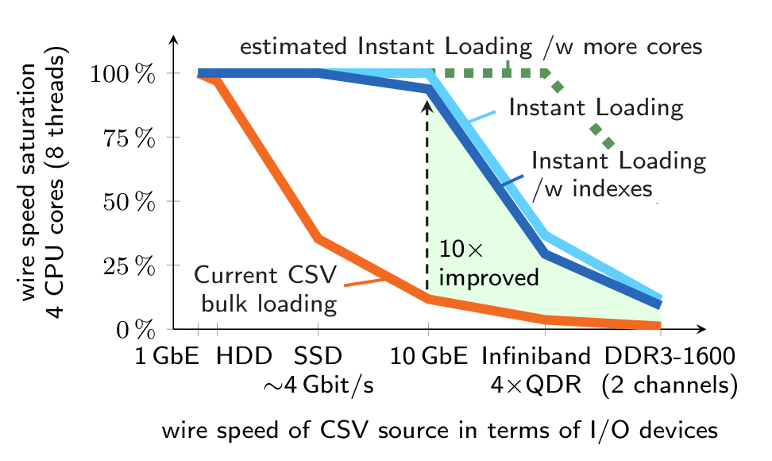

### 贡献

为实现即时加载，本文针对现代超标量多核 CPU 优化 CSV 批量加载，将加载的所有阶段进行任务级和数据级并行化。具体而言，本文提出一个任务并行的 CSV 处理流水线，并给出基于 SSE 4.2 SIMD 指令的通用高性能解析、反序列化和输入校验方法。虽然这些优化已经显著缩短加载时间，加载的其他阶段随后会成为瓶颈。因此，本文进一步说明如何加速将反序列化后的元组复制到存储后端，以及如何使用可合并索引结构（merge-able index structures），例如链式哈希和自适应基数树（Adaptive Radix Tree, ART）[20]，把索引创建高效地交织到并行批量加载之中。

为证明通用 Instant Loading 方法可行，我们将其集成到主存数据库系统 HyPer [19]，并使用行业标准 TPC 基准评估实现。结果显示，在四核商品机器上，相比 MonetDB [4] 和 Vectorwise 等当前主存数据库中的 CSV 批量加载，性能最多提升 10 倍。Instant Loading 的实现目标是在内存计算环境中取得最高性能，在该环境下原始 CPU 成本占主导。因此实现强调良好的代码局部性和数据局部性，并使用原子指令等轻量同步原语。由于顺序代码比例被降到最低，我们预期该方法可随更快数据源和更多核心的 CPU 扩展。

### Instant Loading 的使用方式：(lwu)* 数据暂存处理模型

拥有 1 TB 或更多主存的服务器足以支持对大型结构化文本数据集进行内存分析。然而，当前数据库在这类任务中的采用受到批量加载低效的阻碍（见 3.1 节）。Instant Loading 移除了这一障碍，并支持一种新的数据暂存处理模型：围绕兴趣窗口执行即时的 load-work-unload 循环，即 `(lwu)*`。这种数据暂存工作流存在于 eScience（例如天文学和遗传学 [27,26]）以及其他大数据分析应用中。Netflix 曾报告每天在 DFS 中收集 0.6 TB 类 CSV 日志数据 [11]；每小时，最近一小时的结构化日志会被加载到一个 50 多节点的 Hadoop/Hive 数据仓库，用于提取性能指标和执行即席查询。

我们的愿景是使用单节点主存数据库中的 Instant Loading 支撑这类周期性的 load-work-unload 工作流。图 2 展示三步 `(lwu)*` 方法。第一步，将一个由热 CSV 文件组成的兴趣窗口从 NAS/DFS 或本地高性能 SSD/RAID 以线速加载到主存数据库。即使兴趣窗口大于主存，也可以通过把选择谓词下推到加载过程来处理；此外，数据可在加载时压缩。第二步，多个用户可以在该兴趣窗口上使用关系型主存数据库的完整功能，包括高效查询支持（OLAP）和事务更新（OLTP）。第三步，在加载新数据之前，将可能已修改的数据卸载为压缩二进制格式，或为了可移植性和可调试性卸载为 CSV。Instant Loading 是支撑 `(lwu)*` 方法的关键基础。

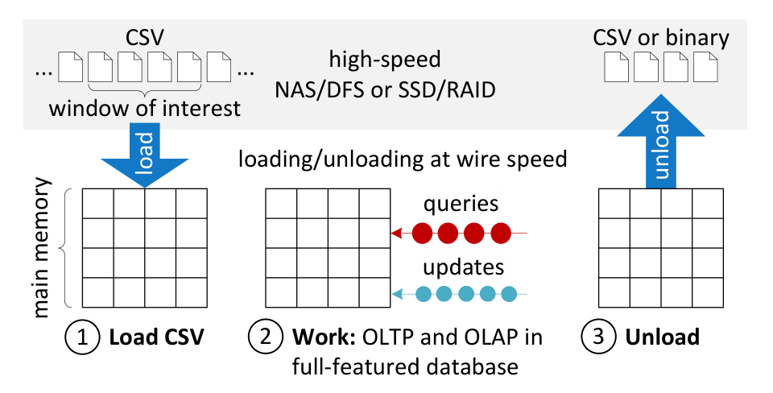

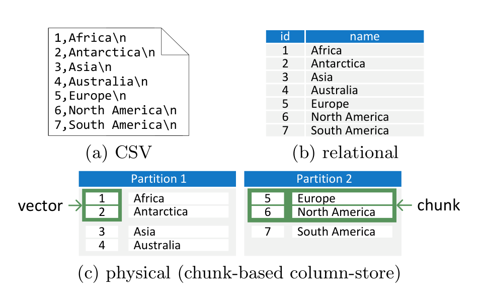

### 与 MapReduce 方法的比较

Google 的 MapReduce [5]（MR）及其开源实现 Hadoop 带来了针对结构化文本文件的新分析方法。本文关注在单节点上分析此类文件，而这些方法把作业扩展到节点集群。由于直接处理原始文件，MR 不需要关系数据库那样的显式加载。缺点是，数据库与 MR 的比较 [23] 显示，数据库通常更易查询，并且在数据分析上显著更快。Hive [28] 和 HAIL [7] 等 MR/Hadoop 扩展尝试通过声明式查询语言、索引和数据预处理等支持缩小这一差距。与 MR 的比较中，当前 Instant Loading 旨在加速单个数据库节点上的批量加载；该节点也可以是服务器集群的一部分。查询和事务处理的横向扩展是正交的研究方向。不过，基于 MR 的系统同样可以受益于本文提出的通用高性能 CSV 解析和反序列化方法。

## 2. 数据表示

批量加载的重要部分，是把数据从一种格式转换并重组为另一种格式。本文关注 CSV、关系表示，以及主存数据库系统中常见的物理表示；图 3 给出了三者示例。

### CSV 表示

CSV 是一种简单但广泛使用的数据格式，以人类可读的字符序列表示表格数据。它常常是信息交换的最小公分母。因此，eScience 和其他大数据分析应用中存在 TB 级 CSV 或类 CSV 数据归档 [27,26,25]。物理上，每个字符用一种字符编码方案中的一个或多个字节编码，常见的是 ASCII 或 UTF-8。ASCII 是 UTF-8 的子集，128 个 ASCII 字符对应 UTF-8 的前 128 个字符。ASCII 字符存储在单个字节中，高位不置位。UTF-8 中的其他字符由最多 6 个字节的序列表示，其中每个字节高位都置位。因此，ASCII 字节不可能成为表示 UTF-8 字符的多字节序列的一部分。

尽管 CSV 广泛使用，它从未完全标准化。RFC 4180 [30] 是朝此方向的早期提案，并与本文对 CSV 的理解接近。数据由记录组成，记录之间由记录分隔符分隔（通常为 `\n` 或 `\r\n`）。每条记录包含字段，字段之间由字段分隔符分隔（例如 `,`）。字段可以带引号，即由引用字符包围（例如 `"`）。在带引号字段内部，记录分隔符和字段分隔符不被视为分隔符。属于带引号字段内容的引号字符必须由转义字符转义（例如 `\`）。若上述特殊字符可由用户定义，CSV 格式就具有很高可移植性。由于其表格形式，CSV 可以自然表示关系，其中元组和属性值分别映射到记录和字段。

### 物理表示

数据库把关系存储在为高效更新和查询处理优化的存储后端中。在 HyPer 主存数据库系统中，一个关系可以存储在行存或列存后端。存储后端由分区组成，分区把关系水平切分为互不相交的子集。这些分区把行或列存储在连续内存块中，或者再次水平划分为多个 chunk（分块后端，见图 3(c)）；这一技术最早由 MonetDB/X100 [4] 提出。这些选项组合出四种可能的存储后端：基于连续内存或分块的行存/列存。多数主存数据库系统，包括 MonetDB、Vectorwise 和 SAP HANA，都实现了类似存储后端。Instant Loading 针对上述所有存储后端类型设计，因此是一种可集成到多种主存数据库系统中的通用方法。

本文关注把数据批量加载到未压缩的物理表示中。不过，字典编码既可以存在于 CSV 数据里，也可以在加载时即时创建。

## 3. Instant Loading

### 3.1 CSV 批量加载分析

为了理解如何在现代硬件上优化 CSV 批量加载，我们首先分析了当前方法为何无法饱和可用线速。HyPer [19] 主存数据库中标准单线程 CSV 批量加载实现，在从内存文件系统读取 10 GB CSV 数据时，加载吞吐约为 100 MB/s。这个结果与 MonetDB [4] 和 Vectorwise 等主流主存数据库的 CSV 加载吞吐相当。然而，100 MB/s 无法饱和内存文件系统的线速；事实上，它甚至无法饱和 SSD（500 MB/s）或 1 GbE（128 MB/s）。perf 分析显示，大约 50% CPU 周期花在解析输入，20% 花在反序列化，10% 花在向关系插入元组，最后 20% 花在更新索引。

标准方法中的解析很昂贵，因为它逐字符比较 CSV 输入和特殊字符，每个比较都实现为 if-then 条件分支。由于流水线架构，当前通用 CPU 会预测这类分支结果；一旦误预测，整个流水线需要刷新，而现代 CPU 更深的流水线导致很高的分支误预测代价 [2]。对 CSV 解析而言，比较分支很难预测，几乎每个字段分隔符和记录分隔符都会引发一次误预测。

解析器发现的每个值都需要反序列化。反序列化方法校验字符串输入，并把字符串值转换为数据库中的数据类型表示。这里同样有多个条件分支，会带来大量分支误预测代价。

已解析和反序列化的元组被插入关系，并写入关系索引。元组插入和索引合计占加载时间的 30%，并非标准加载方法的瓶颈。实验表明，HyPer 分区列存后端的插入与索引速度，超过标准解析与反序列化方法产生新元组的速度。

### 3.2 Instant Loading 流水线设计

上述标准 CSV 批量加载方法采用单线程执行模型。为充分利用现代超标量多核 CPU 性能，应用需要高度并行化 [17]。根据 Amdahl 定律，顺序代码比例必须最小化才能获得最大加速。

Instant Loading 的实现基于 Intel Threading Building Blocks（TBB）[24] 的编程模型。在 TBB 中，并行性通过任务而非线程暴露。任务由运行时引擎动态调度，并在可用硬件线程上执行。该引擎实现任务窃取以做负载均衡，并复用线程以避免初始化开销。基于任务的编程可以充分暴露并行性。

Instant Loading 面向高可扩展性设计，分两步执行（见图 4）。第一步，CSV 输入被切分为 chunk，CSV chunk 由无同步任务处理。每个任务解析并反序列化其 chunk 中的元组；进一步确定元组所属的分区，并把属于同一分区的元组存入一个公共缓冲区，本文称其为分区缓冲区（partition buffer）。分区缓冲区与关系分区具有相同物理布局（例如行式或列式），因此将缓冲区中的元组插入关系分区时不需要进一步转换。此外，分区缓冲区中的元组也按照关系上定义的索引进行索引。第二步，分区缓冲区与对应关系分区合并，包括元组合并和索引合并。CSV chunk 处理按 chunk 并行执行，而与关系分区的合并按分区并行执行。

图 4：Instant Loading 从 CSV 输入到关系分区的示意概览。

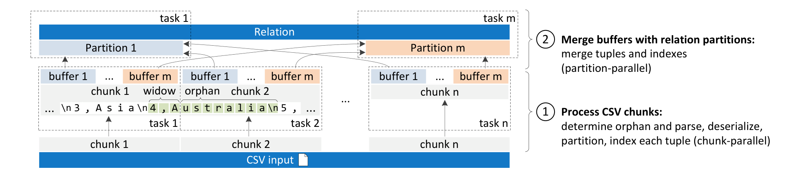

### 3.3 任务并行化

为使解析、反序列化、分区分类和索引建立能够无同步地任务并行化，Instant Loading 把 CSV 输入切分成可并行处理的独立 CSV chunk。chunk 粒度选择具有挑战性，并影响批量加载过程的并行化能力。chunk 越小，chunk 处理步骤与合并步骤越容易交织；但 chunk 不应过小，否则处理 chunk 边界处不完整元组的开销会增加。Instant Loading 按照某个大小切分输入，至少保证在输入格式良好的前提下，一个完整元组能够放入一个 CSV chunk，否则并行解析会受阻。

我们通过不同 chunk 大小评估 Instant Loading 实现（见图 13），得出结论：在最后一级缓存大小为 `l`、硬件线程数为 `n` 的 CPU 上，CSV chunk 大小处于 `0.25 * l/n` 到 `1.0 * l/n` 范围时可获得最高加载吞吐。例如，当前 Intel Ivy Bridge CPU 具备 8 MB L3 缓存和 8 个硬件线程，较好的 chunk 大小范围是 256 kB 到 1 MB。从本地 I/O 设备加载时，我们使用 `madvise` 建议内核预取 CSV chunk。

按固定大小切分 CSV 输入会在 chunk 边界处产生不完整元组。我们称这些元组为 widow 和 orphan。借用排版中的助记语：“orphan has no past, widow has no future”。在 CSV chunk 中，widow 是 chunk 末尾的不完整元组，它与使其完整的部分，也就是 orphan，被 chunk 边界分隔。

如果 chunk 边界按固定大小选择，CSV chunk 处理任务无法再区分真正的记录分隔符和带引号字段内部的记录分隔符，而 RFC 提案 [30] 允许后者。因此，仅分析 chunk 内数据无法确定一个 CSV chunk 的 widow 和 orphan。不过，在要求带引号字段内的记录分隔符必须转义的限制下，widow 和 orphan 又可以被确定。许多应用生成的 CSV 数据确实会转义带引号字段中的记录分隔符，因此我们提出两种加载选项：快速模式和安全模式。

快速模式用于满足该限制的文件，它按固定 chunk 大小切分 CSV 输入。CSV chunk 处理任务一开始扫描其 chunk 中第一个未转义的记录分隔符，然后从该位置开始处理 chunk 数据。当任务到达 chunk 末尾时，它继续读取后继 chunk 的数据，直到再次找到未转义的记录分隔符。安全模式中，一个串行任务扫描 CSV 输入并将其切分为至少某一大小的 CSV chunk。该任务跟踪引号作用域，并在记录分隔符处切分输入，从而不产生 widow 和 orphan。不过，安全模式性能取决于该顺序任务速度。在我们的实现中，当多道程序级别为 8 时，安全模式比快速模式慢 10%。

### 3.4 向量化

解析，也就是查找分隔符和其他特殊字符，以及输入校验，通常基于逐字符比较 CSV 输入与特定特殊字符。这些比较一般实现为 if-then 条件分支。为高效处理，当前通用 CPU 需要在指令流水线中同时保留多条指令。为填充流水线，硬件会预测即将到来的分支。然而，对解析和反序列化来说，这种预测难以高效完成，从而产生大量分支误预测代价 [2]。因此，减少解析和反序列化方法中的控制流分支是可取的。其中一种方式是数据并行化。

现代通用 CPU 是超标量多核处理器，不仅支持任务级并行，也通过单指令多数据（SIMD）指令和专用执行单元支持数据级并行。数据并行化也称为向量化（vectorization），即一条指令同时作用于多个操作数，这些操作数构成一个向量。向量化通常有利于性能和能效 [15]。过去，SSE 和 3DNow! 等 x86 CPU SIMD 扩展主要面向多媒体和科学计算应用。SSE 4.2 [15] 增加了用于字符串和文本处理的字节比较指令。

程序员可以通过 intrinsics 手动使用向量化指令。GCC 等现代编译器也尝试自动向量化源码，但这受限于特定代码模式。据我们所知，还没有编译器能自动使用 SSE 4.2 指令向量化代码，因为使用这些指令需要对算法设计进行非平凡修改。

当前 x86 CPU 使用 128 bit SSE 寄存器，即每个寄存器可包含 16 个 8 bit 字符。虽然 AVX 指令集把 SIMD 寄存器大小增加到 256 bit，SSE 4.2 指令仍在 128 bit 寄存器上工作。我们的方法不假设输入按 16 字节对齐。过去对齐加载到 SIMD 寄存器明显快于非对齐加载，但新一代 CPU 已经减轻了这一惩罚。

SSE 4.2 包含用于比较两个显式或隐式长度 16 字节操作数的指令。Instant Loading 使用 EQUAL ANY 和 RANGES 比较模式加速解析和反序列化：在 EQUAL ANY 模式下，第二个操作数中的每个字符会检查是否等于第一个操作数中的任一字符；在 RANGES 模式下，第二个操作数中的每个字符会检查是否落在第一个操作数定义的范围内。每个范围由两个条目成对定义，分别指定下界和上界。intrinsics 的结果可以是位掩码，也可以是标记首次命中位置的索引；结果还可以取反。图 5 展示了两种模式。

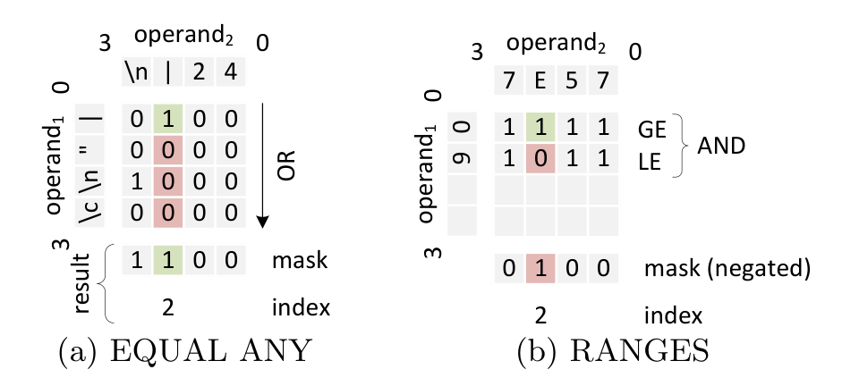

为改进解析，我们使用 EQUAL ANY 以每次 16 字节的方式查找分隔符（见图 5(a)）。只有发现特殊字符时才执行分支。伪代码如下：

```text
1: procedure nextDelimiter(input, specialChars)
2:     while !endOfInput(input) do
3:         special = mm_set_epi8(specialChars)
4:         data = mm_loadu_si128(input)
5:         mode = SIDD_CMP_EQUAL_ANY
6:         index = mm_cmpistri(special, data, mode)
7:         if index < 16 then
8:             // 处理特殊字符
9:         input = input + 16
```

对于长字段，例如变长字符串，寻找下一个分隔符常常需要扫描远多于 16 个字符。为改进这类字段的解析，我们把上述方法改为一次比较 64 个字符：首先把 64 字节（通常是一条缓存行）加载到四个 128 bit SSE 寄存器中；对每个寄存器使用 `_mm_cmpistrm` intrinsic 生成比较掩码；四个掩码被解释为四个 16 bit 掩码，并连续存入一个 64 bit 整数，每一位表示该位置是否找到特殊字符。若该整数为 0，则未发现特殊字符；否则通过计算尾随零数量取得第一个特殊字节的位置。该操作同样有 CPU 指令支持，因此非常高效。

为改进反序列化，我们使用 RANGES 模式做输入校验（见图 5(b)）。整数反序列化示例如下：

```text
1: procedure deserializeIntegerSSE(input, length)
2:     if length < 4 then
3:         deserializeIntegerNoSSE(input, length)
4:     range = mm_set_epi8(0, ..., 0, '9', '0')
5:     data = mm_loadu_si128(input)
6:     mode = SIDD_CMP_RANGES | SIDD_MASKED_NEGATIVE_POLARITY
7:     index = mm_cmpestri(range, 2, data, length, mode)
8:     if index != 16 then
9:         throw RuntimeException("invalid character")
```

实验显示，对长度小于 4 字节的字符串，当前 x86 CPU 上的 SSE 优化整数反序列化比标准非 SSE 变体更慢。因此，整数反序列化采用混合处理模型，仅当字符串长度大于 3 个字符时使用 SSE 优化变体。其他数据类型的反序列化方法也以类似方式优化。

第 5 节评估显示，向量化方法显著减少分支误预测，提高能效，并相比非向量化方法提升约 50% 性能。

### 3.5 分区缓冲区

CSV chunk 处理任务把解析并反序列化的元组，以及这些元组上的索引，存入分区缓冲区。这些缓冲区与关系分区具有相同物理布局，以避免在合并步骤中再转换数据。下面讨论如何把分区缓冲区中的元组合并到存储后端对应的关系分区中（见图 6）。索引合并在下一节讨论。插入式和复制式方法适用于基于连续内存的存储后端以及分块存储后端；基于 chunk 的方法需要分块存储后端。

图 6：将缓冲区合并到关系分区：(a) 插入式，(b) 复制式，(c) 基于 chunk。

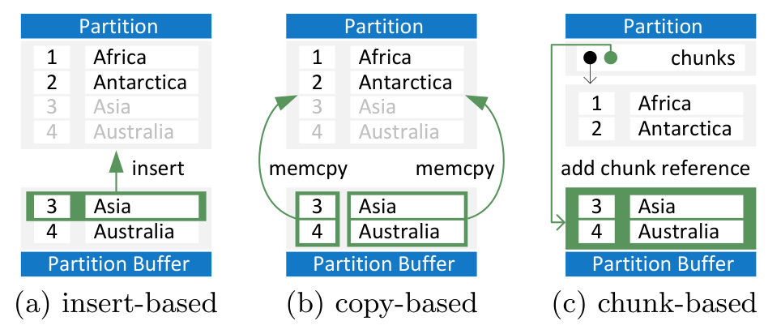

**插入式方法。** 插入式方法是最简单的方法。它遍历缓冲区中的元组，并逐个插入关系分区。该方法实现简单，因为可以复用插入逻辑；但性能受存储后端插入速度限制。

**复制式方法。** 与插入式方法不同，复制式方法一次性把缓冲区中的所有元组复制到关系分区。因此它比插入式更快，主要依赖 `memcpy` 系统调用速度。我们还针对大缓冲区把 `memcpy` 任务并行化，以充分利用现代硬件上的可用内存带宽。由于缓冲区已经使用关系分区的物理布局，不需要额外转换。

**基于 chunk 的方法。** 对分块存储后端，可以完全避免 `memcpy` 系统调用。一次合并只需把一个缓冲区引用插入后端的 chunk 引用列表。虽然合并时间最小，但过小、过多的 chunk 会由于缓存效应而负面影响后端的表扫描和随机访问性能。一般来说，chunk 引用列表越小越有利；最好能够放入 CPU 缓存，从而被高效访问。Instant Loading 面临一个权衡：使用小 CSV chunk 大小以获得高任务并行度（见 3.3 节），同时又希望生成大的存储后端 chunk 以保持后端高效。

一种处理方法是把 CSV chunk 处理任务的分区缓冲区引用存入线程本地存储。由于 TBB 会复用线程，分区缓冲区也会被复用。因此，关系分区 chunk 的期望平均大小等于 CSV 输入大小除以加载使用的硬件线程数。但这不是万能解。如果复用分区缓冲区，分区缓冲区与关系的合并就不能再和 CSV chunk 处理交织执行。此外，该方法要求 CSV 输入达到相应大小。因此，对分块存储后端，使用复制式合并或混合方法也可能合理。我们计划在未来研究适用于不同分块存储后端的更多合并算法。

**缓冲区分配。** 在堆上分配和重新分配分区缓冲区成本很高，因为通常需要同步。提供每线程堆的可扩展分配器并不适用，因为它们对加载用途通常太小，而加载会移动大量数据。初始分配不可避免，但可以通过一开始就为 CSV chunk 中的元组分配足够内存来避免重新分配。困难在于估计某个大小的 CSV chunk 中的元组数量，主要原因是可空属性和变长属性。我们的解决方案是让 CSV chunk 处理任务以原子方式更新分区缓冲区的基数估计，并把它们作为未来任务的分配提示。在实现中，当多道程序级别为 8 时，与动态分配相比，该分配策略性能提高约 5%。

对 HyPer 这样的混合 OLTP&OLAP 数据库，把分区缓冲区分配在大虚拟内存页上也有意义。大页在多数平台的内存管理单元（MMU）中有独立区域。因此，加载和关键 OLTP 工作负载对转译后备缓冲区（TLB）的竞争更少。

### 3.6 索引结构的批量创建

索引对事务和查询执行性能有决定性影响。不过，索引创建时间与查询、事务处理节省的时间之间存在权衡。使用标准方法时，在批量加载期间创建索引会显著降低加载吞吐。数据库破解（database cracking）[13] 和自适应索引 [14] 等替代方法建议把索引创建作为查询处理的副产品，从而允许更快的数据加载，并使查询性能随时间改善。然而，如果数据被批量加载到需要加载后立即提供执行时间保证的关键 OLTP 或 OLAP 系统中，延迟索引创建并不可行。这对本文提出的数据暂存处理模型尤其成立，因为数据以加载、处理、卸载循环执行。此外，为保证一致性，加载至少应检查主键冲突。因此，我们主张在加载时创建主索引。Instant Loading 的目标是在保持线速的同时做到这一点。

我们识别出加载期间创建索引的不同选择。第一种选择是始终为整个关系维护单个索引，在新元组加入关系后增量插入其键。第二种选择是从头完全重建新索引。第一种选择受索引结构插入速度限制。第二种选择可受益于允许高效重建索引的索引结构，但取决于关系大小，它可能带来巨大开销。我们提出第三种方式：每个 CSV chunk 处理任务在其分区缓冲区中维护索引；这些索引随后在合并步骤中与关系分区中的索引合并。我们将支持该方法的索引定义为用于批量加载的可合并索引结构。

**定义（用于批量加载的可合并索引结构）。** 用于批量加载的可合并索引结构允许在键集合 `K = {k1, ..., km}` 上高效并行创建一组索引 `I = {I1, ..., In}`。其中 `K` 被划分为 `n` 个非空互不相交子集 `K1, ..., Kn`，`Ij` 是 `Kj` 上的索引，`1 <= j <= n`。此外，存在一个高效并行合并函数，给定 `I` 可生成 `K` 上的单一统一索引。统一索引创建时间 `t` 是创建 `I` 的时间与合并 `I` 的时间之和。对于用于批量加载的可合并索引结构，在有 `n` 个可用硬件线程的假设下，`t` 会随键分区数 `n` 增加而成比例下降。

下面展示链式哈希表和自适应基数树（ART）[20] 是用于批量加载的可合并索引结构。第 5 节评估进一步表明，这些索引的并行形式在批量索引创建中可以随键分区数和硬件线程数获得近似线性加速。

#### 3.6.1 链式哈希表

哈希表是流行的内存数据结构，并常被主存数据库用作索引。基于哈希表的索引只支持点查询，但由于期望查找时间为 `O(1)`，速度很快。哈希表不可避免会遇到哈希冲突。冲突解决策略包括开放寻址和链式法。使用链式法解决冲突的哈希表尤其适合作为批量加载的可合并索引。

我们实现的可合并批量加载哈希表使用固定大小哈希表，其中具有相同哈希值的条目被串在一个链表中。对给定的分区键范围，对每个分区并行创建大小相同且使用同一哈希函数的哈希表。随后，反复成对合并这些哈希表：扫描其中一个表，并把每个特定哈希值对应的链表条目，与另一个哈希表中该哈希值对应的链表连接起来。扫描操作本身也可以高效并行化。需要注意，基于哈希表的索引方法内在存在空间-时间权衡。我们的链式可合并哈希表为每个并行任务分配固定大小哈希表，因此会浪费空间。相比哈希表，自适应基数树空间效率很高。

#### 3.6.2 自适应基数树（ART）

自适应基数树（Adaptive Radix Tree, ART）[20] 是一种面向主存数据库的高性能、空间高效通用索引结构，并针对现代硬件调优。相比哈希表，基数树（也称 trie）直接使用键的数字表示进行比较。基数树思想类似词典的拇指索引：按条目的首字符前缀索引。基数树递归使用这一技术，直到找到特定条目。图 7(a) 给出了 ART 索引示例。ART 是逐字节基数树，使用键的单个字节进行索引。因此所有操作复杂度为 `O(k)`，其中 `k` 是被索引键的字节长度。哈希表不保序，而基数树按字典序存储键，因此不仅支持精确查找，也支持范围扫描、前缀查找和 top-k 查询。

其他基数树实现依赖全局固定 fanout 参数，因此必须在树高与空间效率之间折中；ART 的特点是使用自适应大小节点。ART 中，节点用四种不同大小、最多 256 个条目的高效紧凑数据结构表示。节点类型根据子节点数量动态选择，从而同时优化空间利用率和访问效率。文献 [20] 的评估显示，ART 是面向现代硬件优化的主存数据库中最快的通用索引结构；其性能只有哈希表可比，而哈希表只支持精确键查找。

本文进一步通过给出高效并行合并算法，说明 ART 属于批量加载的可合并索引结构。图 7 展示两个 ART 索引的合并。一般而言，基数树天然适合高效并行合并：从两个根节点开始，对每一对节点，两个树中具有共同前缀的子节点被递归并行合并。所有共同前缀子节点合并后，较小节点中没有在较大节点中匹配的子节点被插入较大节点；随后较大节点用于合并后的树。理想情况下，对非空树而言，合并可以归约为单次插入。最坏情况下，两棵树只包含具有共同前缀的键，需要合并最大深度处的节点。一般来说，合并两棵基数树 `t1` 和 `t2` 需要 `O(d)` 次复制操作，其中 `d` 是 `diff(t1,t2)` 与 `diff(t2,t1)` 的最小值；`diff(x,y)` 表示 `y` 中不存在于 `x` 中、且其父节点未被计入该数量的内部节点和叶子数。

图 7：两棵自适应基数树（ART）(a)、(b)，以及合并后的结果 (c)。

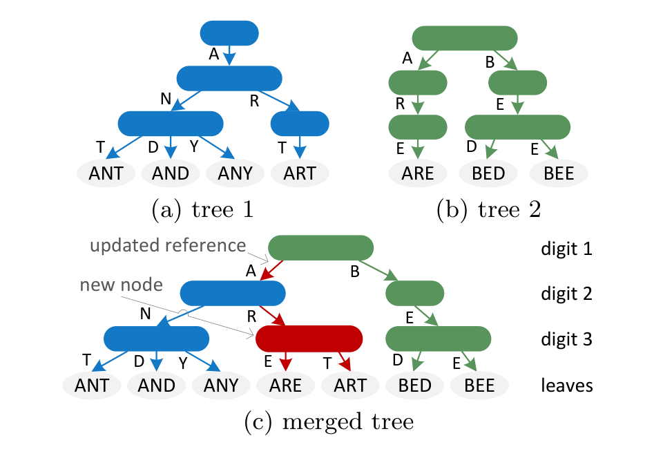

并行合并算法如下：

```text
1: procedure merge(t1, t2, depth)
2:     if isLeaf(t1) then insert(t2, t1.keyByte, t1, depth)
3:     return t2
4:     if isLeaf(t2) then insert(t1, t2.keyByte, t2, depth)
5:     return t1
6:     // 确保 t1 是更大的节点
7:     if t1.count > t2.count then swap(t1, t2)
8:     // 对共同 key byte 并行下降两棵树
9:     parallel for each entry e in t2 do
10:        c = findChildPtr(t1, e.keyByte)
11:        if c then c = merge((c, e.child, depth + 1))
12:    // 顺序插入 t2 中 t1 没有的条目
13:    for each entry e in t2 do
14:        c = findChildPtr(t1, e.keyByte)
15:        if !c then insert(t1, e.keyByte, e.child, depth)
16:    return t1
```

如前所述，较小节点中没有在较大节点中匹配的 key byte 条目被顺序插入，并且在所有共同前缀子节点并行合并之后执行。对 ART 而言，将过程分为并行阶段和顺序阶段，尤其是因为插入新条目时节点可能增长。对最大节点类型，也就是大小为 256 的数组，可以使用无锁原子操作进一步并行化插入。这种插入并行化也适用于其他使用固定大小节点的基数树。完全无锁版 ART 也可行，但不在本文范围内，因为本文聚焦高效合并算法。

## 4. HyPer 中的 Instant Loading

### 4.1 HyPer 主存数据库

我们把通用 Instant Loading 方法集成到高性能关系型主存数据库系统 HyPer [19]。HyPer 属于新兴的混合数据库类别，通过直接在事务数据库上求值 OLAP 查询来支持实时商业智能。借助新的快照技术，HyPer 可在同一数据库上同时运行 OLTP 和 OLAP 工作负载，并在二者上都达到与当时最先进内存数据库相比的最高性能。

OLAP 通过几乎没有同步开销的快照机制与关键 OLTP 解耦。该机制基于 POSIX 系统调用 `fork()`：OLAP 查询在从 OLTP 进程 fork 出来的进程中执行（见图 8）。这很高效，因为只复制 OLTP 进程的虚拟页表。操作系统使用处理器内存管理单元为快照页实现高效的 copy-on-update 语义。当 OLTP 进程首次修改某个已快照页面时，该页会在 fork 出来的进程中复制（见图 8）。

图 8：HyPer 的快照机制。

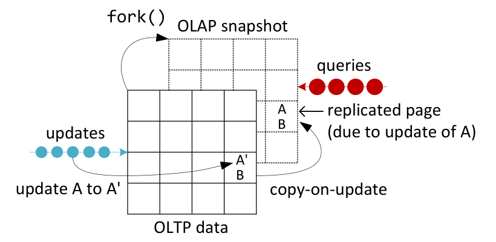

事务用 SQL 或 PL/SQL 风格脚本语言指定，并使用 LLVM 编译器框架 [22] 编译为机器码。结合去除缓冲区管理、锁和 latch 带来的负担，HyPer 在现代硬件上单线程可处理每秒超过 100000 个 TPC-C 事务 [19]。与 H-Store [18] 和 VoltDB 开创的设计类似，HyPer 也实现了分区执行模型：数据库按多数事务只需访问单分区的方式分区。因此，分别在不同分区上独占工作的事务可以无同步并行处理；只有跨分区事务需要同步。

与事务一样，SQL 查询也编译为 LLVM 代码 [22]。以数据为中心的编译器（data-centric compiler）追求良好代码/数据局部性和可预测分支布局。LLVM 代码随后由 LLVM JIT 编译器编译为高效机器码。结合先进查询优化器，HyPer 获得了优异查询响应时间 [19]，可与 MonetDB [4] 或 Vectorwise 相比。

### 4.2 HyPer 中的 Instant Loading

HyPer 中的 Instant Loading 支持 `(lwu)*` 工作流，也可以用于其他需要加载 CSV 数据的场景，包括初始加载和持续数据集成的增量加载。

HyPer 中 Instant Loading 的接口按 PostgreSQL `COPY` 操作符风格设计。Instant Loading 接收 CSV 输入、其遵循的 schema，以及 CSV 特殊字符作为输入。除允许 `\r\n` 作为记录分隔符外，我们假设特殊字符都是单个 ASCII 字符。对每个被创建或修改的关系，系统为处理 CSV chunk 和合并分区缓冲区生成 LLVM glue code 函数（对应图 4 两个步骤）。在运行时生成和编译这些函数的优势是，所得代码具有良好局部性和可预测分支，因为关系布局（例如属性数量和属性类型）已知。分隔符搜索和反序列化方法实现为通用 C++ 函数，不绑定 HyPer 设计。与 HyPer 为事务和查询编译的 LLVM 函数 [22] 一样，Instant Loading 的 LLVM glue code 调用这些静态编译 C++ 函数。类似库的 C++ 函数也可用于为其他类 CSV 格式创建 LLVM glue code 函数。面向 CSV 数据的 LLVM 函数代码生成已为 HyPer 中四种存储后端类型实现（见第 2 节）。

**离线加载。** 在离线加载模式下，加载对关系拥有独占访问权，即没有并发事务和查询；加载也不写日志。CSV chunk 处理和合并步骤尽可能交织，以减少总体加载时间。如果加载过程中发生错误，会抛出异常，但数据库可能处于只加载了部分数据的状态。对 `(lwu)*` 工作流、原位查询和初始加载等场景，这通常可以接受，因为数据库可以从头重建。

**在线事务加载。** 在线事务加载支持具有 ACID 语义的加载，其中只有合并步骤需要封装在单个合并事务中。CSV chunk 处理可以与事务处理并行执行。总体加载时间和合并事务持续时间之间存在权衡：为了缩短加载时间，chunk 处理与合并步骤交织执行；合并事务从第一个合并步骤开始，到最后一个合并步骤结束。在此期间不能处理其他事务。为了缩短合并事务持续时间，则先处理所有 chunk，再一次性执行所有合并步骤。

## 5. 评估

HyPer 中 Instant Loading 的评估在一台商品工作站上进行，配备 Intel Core i7-3770 CPU 和 32 GB 双通道 DDR3-1600 DRAM。CPU 基于 Ivy Bridge 微架构，支持 SSE 4.2 字符串和文本指令，具有 4 个核心（8 个硬件线程）、3.4 GHz 时钟频率和 8 MB 共享 L3 末级缓存。操作系统为 64 bit Linux 3.5。源码使用 GCC 4.7，以 `-O3 -march=native` 优化编译。由于实验室缺少高速 NAS 或 DFS，我们使用内存文件系统 `ramfs` 作为 CSV 源，以模拟数 Gbit/s 线速。每次测量前都刷新文件系统缓存。

### 5.1 解析和反序列化

我们首先单独评估任务并行和数据并行的解析、反序列化方法，不包含加载流程其他部分。CSV 数据从 `ramfs` 读取、解析、反序列化，并存储到堆分配结果缓冲区中。实现包括一个按 3.4 节描述进行 SSE 4.2 优化的变体（SSE）和一个未优化变体（non-SSE）。对比实现基于 Boost Spirit C++ 库 v2.5.2，具体使用 Boost Spirit.Qi，为给定语法生成递归下降解析器。我们也尝试了基于 Boost.Tokenizer 和 Boost.Lexical Cast 的实现，但其性能落后于 Boost Spirit.Qi 变体。与 SSE 和 non-SSE 变体一样，Boost 实现也按 3.3 节进行任务并行化。

实验输入选择 scale-factor 为 10 的 TPC-H CSV 数据（约 10 GB）。SSE 和 non-SSE 变体只需在运行时提供 schema 信息；Spirit.Qi 解析器生成器是一组模板化 C++ 函数，需要在编译时提供 schema 信息。因此，Boost Spirit.Qi 变体中硬编码了 TPC-H schema 信息。

图 9 显示，在所有多道程序级别上，SSE 和 non-SSE 都优于 Boost Spirit.Qi。SSE 优于 non-SSE，并显示更高加速：在多道程序级别为 8 时，SSE 解析和反序列化吞吐超过 1.6 GB/s，而 non-SSE 约为 1.0 GB/s，提升 60%。SSE 的更高性能来自两点：(i) 除所有核心的标量执行单元外，还利用了向量执行引擎；(ii) 相比 non-SSE，减少了分支误预测数量。性能计数器显示，分支误预测从 non-SSE 的 194 次/kB CSV 降到 SSE 的 89 次/kB CSV，降幅超过 50%。使用 CPU 核心的所有执行单元也让 SSE 从 Hyper-Threading 中获益更多。这没有额外成本，并提升能效：近期 Intel CPU 的 Running Average Power Limit 能量传感器显示，SSE 使用 388 J，non-SSE 使用 503 J（多 23%），Boost Spirit.Qi 使用 625 J（多 38%）。

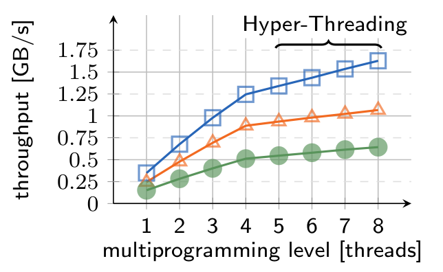

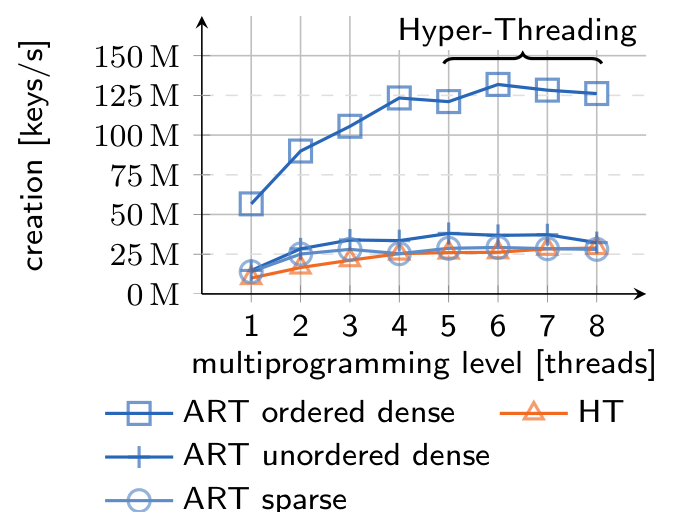

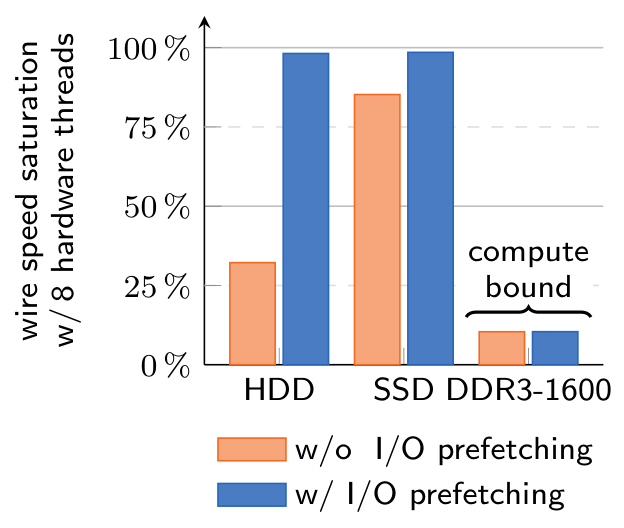

### 5.2 分区缓冲区

我们评估了 HyPer 中列存和行存后端实现（见第 2 节），以及 3.5 节提出的三种分区缓冲区合并方法。插入式和复制式方法使用基于连续内存的存储后端；基于 chunk 的方法使用分块存储后端。表 1 显示加载 scale-factor 为 10 的 TPC-H CSV 数据集的基准结果。对列存后端，复制式比插入式快约 12%；基于 chunk 的方法再提升 12%。对行存后端，插入式和复制式表现相近；基于 chunk 的合并快 8.5%。

表 1：将 TPC-H CSV 数据（scale-factor 10）加载到列存和行存时，使用插入式、复制式和基于 chunk 的分区缓冲区合并耗时。

| 存储后端 | insert | copy | chunk |
| --- | ---: | ---: | ---: |
| column-store | 7841 ms | 6939 ms | 6092 ms |
| row-store | 6609 ms | 6608 ms | 6049 ms |

### 5.3 批量索引创建

我们评估了在键范围分区上并行创建链式哈希表（HT）和自适应基数树（ART），以及并行合并这些索引以创建总键范围上的统一索引。

图 10 展示 1000 万个 32 bit 键的索引创建加速。对有序密集键，也就是从 1 到 1000 万的有序键，ART 在所有多道程序级别上都比 HT 创建索引更快。在有序密集键范围下，ART 索引合并非常高效，常常只需复制少量指针，因此统一索引创建时间主要取决于并行创建的 ART 索引插入速度。当多道程序级别为 4 时，ART 加速（2.2 倍）低于 HT（2.6 倍），原因是缓存效应。ART 性能强烈依赖每个索引实际可用的 CPU 缓存大小 [20]。但从绝对数字看，ART 索引创建速度达到每秒 1.30 亿键，而 HT 为每秒 2700 万键。

HT 性能不依赖键分布，而有序密集键范围是 ART 的最佳情况。对无序密集键（随机排列的密集键）和稀疏键（随机生成，每一 bit 等概率为 1 或 0），ART 性能下降，但索引创建速度仍略好于 HT。对无序键范围，合并成本高于有序键范围，因为主要需要合并叶节点。在多道程序级别为 4 时，合并在有序密集、无序密集和稀疏键场景中分别占加载时间的 1%、16% 和 33%。

### 5.4 离线加载

为评估离线加载端到端应用性能，我们基准测试了一个工作负载：(i) 从 `ramfs` 批量加载 scale-factor 为 10 的 TPC-H CSV 数据（约 10 GB）；(ii) 随后在并行查询流中执行 22 个 TPC-H 查询。实验使用未分区 TPC-H 数据库，即只有一个合并任务并行运行，并配置 HyPer 使用基于连续内存的列存后端。分区缓冲区使用复制式方法合并。对比对象包括：由第 5 节开头所述 4 类节点组成的 Hadoop v1.1.1 Hive v0.10 [28] 集群（1 GbE 互连）、从源码编译的 SQLite v3.7.15、MySQL v5.5.29、从源码编译的 MonetDB [4] v11.13.7，以及 Vectorwise v2.5.2。

图 12 展示结果。相比对手，Instant Loading 在批量加载加查询处理的组合性能上表现最佳。加载耗时 6.9 s（HyPer）；加载后将数据库以 LZ4 压缩二进制卸载到 `ramfs` 额外耗时 4.3 s（HyPer /w unload）。压缩二进制大小为 4.7 GB，是 CSV 文件大小的 50%，再次加载只需 2.6 s（比加载 CSV 快 3 倍）。两种情况下，查询求值都略低于 12 s。HyPer 中的卸载和二进制加载同样高度并行化。我们进一步评估从本地 I/O 设备加载时的 I/O 饱和情况。图 11 显示，Instant Loading 完全饱和传统 HDD（160 MB/s）和 SSD（500 MB/s）的线速。当内存用作源和汇时，只饱和约 10% 可用线速（CPU 受限）。图 11 还显示，要接近 100% 饱和本地设备，必须使用 `madvise` 建议内核从本地 I/O 设备预取数据。

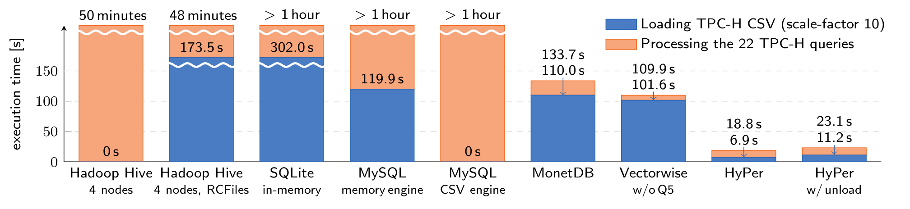

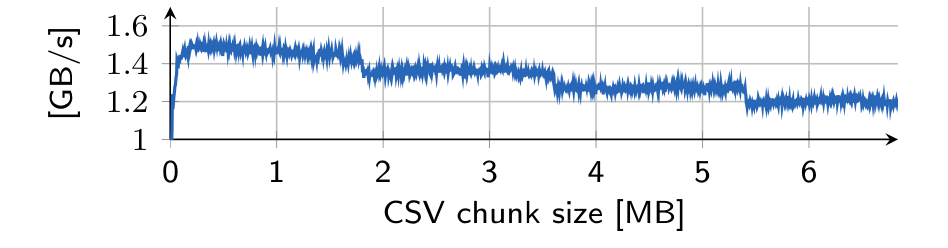

Hive 是基于 Hadoop 的数据仓库方案。基准中使用 4 个 Hadoop 节点。HDFS 和 Hive 配置为在 `ramfs` 中存储数据，其他配置保持默认，包括 HDFS 默认复制因子 3。这意味着每个节点都有 CSV 文件副本。我们没有把 HDFS 加载时间（125.8 s）计入结果，因为假设理想情况下数据已经存储在那里。查询性能使用 TPC-H 查询的官方 HiveQL 实现评估。尽管 Hive 不需要显式加载并且使用 4 个节点，它处理 22 个查询仍需 50 分钟。我们还评估了使用 RCFiles 的 Hive。通过 BinaryColumnarSerDe 把 CSV 文件加载为 RCFiles（一个把字符串反序列化为二进制数据类型表示的转换过程）耗时 173.5 s；但在 RCFiles 上查询只比在原始 CSV 文件上快 5 分钟。

SQLite 以特殊文件名 `:memory:` 启动为内存数据库。批量加载时，表以独占模式锁定，并使用 `.import` 命令。不过 SQLite 查询性能不令人满意，处理 22 个 TPC-H 查询超过 1 小时。

MySQL 运行两组基准：一组使用 MySQL memory engine，并用 `LOAD DATA INFILE` 批量加载；另一组使用 MySQL CSV engine，后者允许直接在外部 CSV 文件上查询。使用 memory engine 的批量加载接近 2 分钟。不过，memory engine 和 CSV engine 处理 22 个 TPC-H 查询都再次超过 1 小时。

MonetDB 编译时启用了 MonetDB5、MonetDB/SQL 和额外优化。批量加载使用 `COPY INTO` 命令，并加上 `LOCKED` 限定符让 MonetDB 跳过日志操作。按文档建议，主键约束在加载后添加。MonetDB 数据库创建在 `ramfs` 内，因此 MonetDB 写出的 BAT 文件也存储在内存中。据我们所知，MonetDB 没有只把数据批量加载到内存而不把二进制表示写入 BAT 文件的选项。因此，MonetDB 的批量加载最适合与 Instant Loading 加二进制卸载（HyPer w/ unload）比较。虽然加载时间与 MySQL memory engine 相当，查询处理快得多。组合工作负载完成时间为 133.7 s。

Vectorwise 使用 `vwload` 工具批量加载文件，并关闭失败回滚。加载时间与 MonetDB 相当，查询处理稍快。TPC-H 查询 5 不能在不先用 `optimizedb` 生成统计信息的情况下处理。我们未把统计信息创建计入基准结果，因为实验中它耗时数分钟。

我们本希望进一步与 MonetDB 的 CSV vault [16] 比较，但未能在当时 MonetDB 版本中运行起来。我们也希望在高性能 I/O 设备和主存数据库上下文中评估 NoDB 实现 PostgresRaw [3]，但其实现尚不可用。

**最优 chunk 大小。** 图 13 展示 TPC-H 数据集上 Instant Loading 吞吐随 chunk 大小的变化。最高吞吐出现在 256 kB 到 1 MB 之间，这等于 L3 缓存大小除以硬件线程数后的 0.25 到 1.0 倍范围。

**Instant Loading 的 scaleup。** 我们在一台配备 8 核 Intel Xeon X7560 CPU 和 256 GB DDR3-1066 DRAM 的服务器上评估 Instant Loading 的 scaleup，批量加载 scale-factor 为 10（约 10 GB）、30（约 30 GB）和 100（约 100 GB）的 TPC-H CSV 数据。随后再次在并行查询流中执行 22 个 TPC-H 查询。如表 2 所示，Instant Loading 实现线性 scaleup。

表 2：在 256 GB 主存服务器上加载 TPC-H 数据集时 Instant Loading 的 scaleup。

| scale-factor | 加载吞吐 | 查询时间 |
| --- | ---: | ---: |
| 10（约 10 GB） | 1.14 GB/s（约 9 Gbit/s） | 16.6 s |
| 30（约 30 GB） | 1.29 GB/s（约 10 Gbit/s） | 57.9 s |
| 100（约 100 GB） | 1.36 GB/s（约 11 Gbit/s） | 302.1 s |

**Instant Loading 的 perf 分析。** 对 TPC-H scale-factor 10 的 `lineitem` CSV 文件执行 Instant Loading 的 perf 分析显示，37% CPU 周期用于寻找分隔符，11.2% 用于反序列化数值，9.1% 用于反序列化日期，6.5% 用于反序列化整数，5.5% 用于处理 CSV chunk 的 LLVM glue code，5% 用于合并分区缓冲区的 LLVM glue code。其余周期大多花在内核中。更细地看，反序列化方法和分隔符查找方法的成本主要由把数据加载到 SSE 寄存器的指令和 SSE 比较指令支配。

### 5.5 在线事务加载

最后，我们在具有 ACID 语义的在线事务加载上下文中评估 Instant Loading。具体基准是在一个按 warehouse 分区、包含 4 个 warehouse 的 TPC-C 数据库中执行分区化 TPC-C 事务。与事务处理并行，系统向 `item` 表批量加载包含 100 万个新 item 的新产品目录；除 100 万 item 外，还为每个 warehouse 向 `stock` 表插入 100 万条 stock 记录。存储后端为分块行存，使用基于 chunk 的分区缓冲区合并。图 14 展示在线批量加载该数据集（约 1.3 GB，CSV 文件存储于 `ramfs`）时的 TPC-C 吞吐。基准中，加载在 1 秒后开始。我们测量四种场景的事务吞吐：单线程（ST）和多线程（MT）事务处理，分别结合单线程和 CSV chunk 并行 Instant Loading。

在 ST 事务处理场景中，配合 ST Instant Loading 时吞吐维持在每秒 200000 事务；配合 chunk 并行 Instant Loading 时，吞吐短暂下降到每秒 100000 事务。ST Instant Loading 加载耗时约 3.5 s，chunk 并行 Instant Loading 加载耗时 1.2 s。合并事务耗时 250 ms。在 MT 事务处理场景中，事务处理和 Instant Loading 竞争硬件资源，吞吐从每秒 600000 显著下降到 250000。配合 ST Instant Loading 时，系统额外负载较低，事务吞吐几乎不下降。chunk 并行 Instant Loading 加载耗时 4.6 s；ST Instant Loading 耗时 7.0 s。合并事务仍耗时 250 ms。

据我们所知，对比系统中没有一个支持在线事务加载。我们仍将该方法与 MySQL memory engine 比较，但后者不支持事务，因此顺序执行 TPC-C 事务。MySQL 达到每秒 36 个事务；加载耗时 19.70 s，加载期间没有事务被处理。

图 14：在线 CSV Instant Loading（IL）中，chunk 并行与单线程（ST）加载 100 万 item 和 400 万 stock 记录，同时进行单线程（ST）和多线程（MT）TPC-C 事务处理的吞吐。

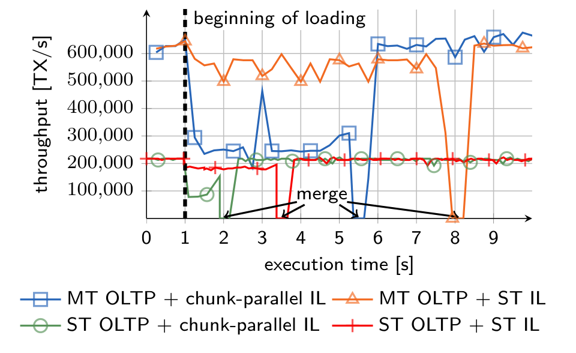

## 6. 相关工作

由于 Amdahl 定律，新兴多核 CPU 只有被高度并行化的应用才能高效利用 [17]。Instant Loading 高度并行化 CSV 批量加载，并把顺序代码比例降到最低。

SIMD 指令已经用于加速多种数据库算子 [31,29]。向量化处理和减少分支常带来超线性加速。GCC 和 LLVM JIT 编译器 [22] 等编译器尝试自动使用 SIMD 指令。然而，利用 SIMD 指令通常需要微妙技巧，编译器很难复现。据我们所知，还没有编译器能自动应用 SSE 4.2 字符串和文本指令。要取得最高加速，算法需要从头重新设计。

早在 2005 年，Gray 等人 [10] 就呼吁文件系统和数据库融合。当时科学家抱怨，把结构化文本数据加载到数据库似乎不值得，而且一旦加载，就不能再使用标准应用程序操作。近期工作针对这些反对意见给出回应 [12,3,16]。NoDB [3] 描述了一类“不需要数据加载但仍保持现代数据库系统完整功能集”的系统。NoDB 直接处理文件，并把位置映射（即文件上的索引结构）和缓存作为查询处理的副产品填充。虽然 NoDB 参考实现 PostgresRaw 已展示无需加载即可处理查询，并且查询处理受益于位置映射和缓存，但我们认为主要问题尚未解决，包括事务的高效支持、查询处理的可扩展性和效率，以及该范式对主存数据库的适应性。Instant Loading 是一种不同的新方法，不面对这些问题：它不是消除数据加载并增加一层额外间接层，而是使加载和卸载尽可能不显眼。

Hive [28] 等 MapReduce 扩展为该范式增加声明式查询语言支持。为改善查询性能，HAIL [7] 等方法建议使用文本文件的二进制表示进行查询处理。将文本数据转换为这些二进制表示，与传统数据库中的批量加载非常相似。HadoopDB [1] 设计为传统数据库和 Hadoop 方法的混合体，使用基于 Hadoop 的通信层连接关系型单节点数据库。单节点数据库加载已被识别为该方法的障碍之一。Instant Loading 可以移除这一障碍。Microsoft SQL Server PDW 的 Polybase [6] 功能把 HDFS 上数据的一些 SQL 算子转换为 MapReduce 作业。是否把算子从数据库下推到 Hadoop，很大程度取决于数据库的文本文件加载性能。

B-tree 的批量加载已有讨论 [8,9]。数据库破解 [13] 和自适应索引 [14] 提出把索引迭代创建作为查询处理副产品。这些工作认为，如果在加载时创建索引，必须预先支付高成本。对磁盘型系统而言这确实成立；但本文已经表明，对主存数据库，至少把主索引创建作为加载副作用是可行的，而主索引可以验证主键约束。

## 7. 展望与结论

持续增长的主存容量推动了内存数据库系统发展；线速达到数十 Gbit/s 的高速网络基础设施也正在变得经济可行。然而，当前主存数据库批量加载方法在加载结构化文本数据时无法利用这些线速。本文提出 Instant Loading，一种新的 CSV 加载方法，可实现线速的可扩展批量加载。通过对加载每个阶段进行任务级和数据级并行化，该方法充分利用现代多核 CPU 性能。

我们将通用 Instant Loading 方法集成到 HyPer 系统，并评估端到端应用性能。结果显示，Instant Loading 的确能够利用新兴 10 GbE 连接器的线速。这为新的 `(load-work-unload)*` 使用场景铺平道路：主存数据库系统可以作为大数据处理的灵活高性能计算引擎，而不是使用资源沉重的 MapReduce 风格基础设施。

未来，我们计划支持其他结构化文本格式，并加入更多数据预处理步骤，例如压缩、聚类和概要生成。例如，小型物化聚合 [21] 可以在加载时高效计算。另一个想法是把可扩展加载方法移植到协处理器硬件和通用 GPU 上。

## 8. 致谢

Tobias Muehlbauer 是 Google Europe Fellowship in Structured Data Analysis 获得者，本文研究部分受该 Fellowship 支持。Wolf Roediger 是 Oracle External Research Fellowship 获得者。本文工作还受到德国联邦教育与研究部（BMBF）HDBC 01IS12026 项目资助。

## 9. 参考文献

[1] A. Abouzeid, K. Bajda-Pawlikowski, D. J. Abadi, A. Rasin, and A. Silberschatz. HadoopDB: An Architectural Hybrid of MapReduce and DBMS Technologies for Analytical Workloads. PVLDB, 2(1):922-933, 2009.

[2] A. Ailamaki, D. J. DeWitt, M. D. Hill, and D. A. Wood. DBMSs on a modern processor: Where does time go? VLDB, pages 266-277, 1999.

[3] I. Alagiannis, R. Borovica, M. Branco, S. Idreos, and A. Ailamaki. NoDB: Efficient Query Execution on Raw Data Files. In SIGMOD, pages 241-252, 2012.

[4] P. Boncz, M. Zukowski, and N. Nes. MonetDB/X100: Hyper-pipelining query execution. In CIDR, pages 225-237, 2005.

[5] J. Dean. MapReduce: simplified data processing on large clusters. CACM, 51(1):107-113, 2008.

[6] D. J. DeWitt, A. Halverson, R. Nehme, S. Shankar, J. Aguilar-Saborit, et al. Split Query Processing in Polybase. In SIGMOD, pages 1255-1266, 2013.

[7] J. Dittrich, J.-A. Quiane-Ruiz, S. Richter, S. Schuh, A. Jindal, and J. Schad. Only Aggressive Elephants are Fast Elephants. PVLDB, 5(11):1591-1602, 2012.

[8] G. Graefe. B-tree indexes for high update rates. SIGMOD Rec., 35(1):39-44, 2006.

[9] G. Graefe and H. Kuno. Fast Loads and Queries. In TLDKS II, LNCS 6380, pages 31-72, 2010.

[10] J. Gray, D. Liu, M. Nieto-Santisteban, A. Szalay, D. DeWitt, and G. Heber. Scientific Data Management in the Coming Decade. SIGMOD Rec., 34(4):34-41, 2005.

[11] Hive user group presentation from Netflix. http://slideshare.net/slideshow/embed_code/3483386.

[12] S. Idreos, I. Alagiannis, R. Johnson, and A. Ailamaki. Here are my Data Files. Here are my Queries. Where are my Results? In CIDR, pages 57-68, 2011.

[13] S. Idreos, M. L. Kersten, and S. Manegold. Database Cracking. In CIDR, pages 68-78, 2007.

[14] S. Idreos, S. Manegold, H. Kuno, and G. Graefe. Merging what's cracked, cracking what's merged: adaptive indexing in main-memory column-stores. PVLDB, 4(9):586-597, 2011.

[15] Extending the worlds most popular processor architecture. Intel Whitepaper, 2006.

[16] M. Ivanova, M. Kersten, and S. Manegold. Data Vaults: A Symbiosis between Database Technology and Scientific File Repositories. In SSDM, LNCS 7338, pages 485-494, 2012.

[17] R. Johnson and I. Pandis. The bionic DBMS is coming, but what will it look like? In CIDR, 2013.

[18] R. Kallman, H. Kimura, J. Natkins, A. Pavlo, A. Rasin, et al. H-store: a high-performance, distributed main memory transaction processing system. PVLDB, 1(2):1496-1499, 2008.

[19] A. Kemper and T. Neumann. HyPer: A hybrid OLTP&OLAP main memory database system based on virtual memory snapshots. In ICDE, pages 195-206, 2011.

[20] V. Leis, A. Kemper, and T. Neumann. The Adaptive Radix Tree: ARTful Indexing for Main-Memory Databases. In ICDE, pages 38-49, 2013.

[21] G. Moerkotte. Small Materialized Aggregates: A Light Weight Index Structure for Data Warehousing. VLDB, pages 476-487, 1998.

[22] T. Neumann. Efficiently compiling efficient query plans for modern hardware. PVLDB, 4(9):539-550, 2011.

[23] A. Pavlo, E. Paulson, A. Rasin, D. J. Abadi, D. J. DeWitt, et al. A Comparison of Approaches to Large-Scale Data Analysis. In SIGMOD, pages 165-178, 2009.

[24] J. Reinders. Intel threading building blocks: outfitting C++ for multi-core processor parallelism. 2007.

[25] E. Sedlar. Oracle Labs. Personal communication, May 29, 2013.

[26] A. Szalay. JHU. Personal communication, May 16, 2013.

[27] A. Szalay, A. R. Thakar, and J. Gray. The sqlLoader Data-Loading Pipeline. JCSE, 10:38-48, 2008.

[28] A. Thusoo, J. S. Sarma, N. Jain, Z. Shao, P. Chakka, et al. Hive: A warehousing solution over a map-reduce framework. PVLDB, 2(2):1626-1629, 2009.

[29] T. Willhalm, N. Popovici, Y. Boshmaf, H. Plattner, A. Zeier, et al. SIMD-Scan: Ultra Fast in-Memory Table Scan using on-Chip Vector Processing Units. PVLDB, 2(1):385-394, 2009.

[30] Y. Shafranovich. IETF RFC 4180, 2005.

[31] J. Zhou and K. A. Ross. Implementing database operations using SIMD instructions. In SIGMOD, pages 145-156, 2002.
