# Speculative Distributed CSV Data Parsing for Big Data Analytics（中文译文）

## 译者说明

本文依据同目录的 `source.pdf` 翻译。章节、图表、公式、算法、代码与参考文献按原文结构保留。

## 论文信息

**作者：** Chang Ge[^author-intern]（滑铁卢大学）；Yinan Li、Eric Eilebrecht、Badrish Chandramouli、Donald Kossmann（微软研究院）

**邮箱：** `c4ge@uwaterloo.ca`；`{yinan.li, eric.eilebrecht, badrishc, donaldk}@microsoft.com`

**会议：** SIGMOD ’19，2019 年 6 月 30 日至 7 月 5 日，荷兰阿姆斯特丹

**出版信息：** ACM，17 页；DOI：10.1145/3299869.3319898

[^author-intern]: 该工作在 Chang Ge 于微软研究院实习期间完成。

## 摘要

近年来，人们对在当代大数据系统中直接对原始数据提供查询能力表现出浓厚兴趣。这些原始数据在处理或用于分析之前必须被解析。因此，分布式大数据系统中的一个基本挑战，是如何高效并行解析原始数据。困难来自于独立解析原始数据 chunk 时固有的歧义，因为解析器不知道这些 chunk 的上下文。具体来说，在这些原始数据 chunk 中找到字段和记录的起点与终点可能很难。

为并行化解析，本文针对 CSV 格式提出一种基于推测（speculation）的方案，而 CSV 可以说是最常用的原始数据格式。由于该格式的语法和统计特性，推测式解析很少失败，因此可以在分布式环境中高效并行化。本文的推测式方法也具有健壮性，能够可靠检测 CSV 数据中的语法错误。我们在 Apache Spark 中使用超过 11000 个真实数据集实验评估该推测式分布式解析方法，结果显示，相比现有方法，该解析器带来显著性能收益。

## 1. 引言

世界正在生成持续增长的数据量。其中很大一部分数据从未被使用。把所有这些数据清洗并加载到数据库系统中成本高到不可接受。相反，这些数据通常以原始格式直接存放在文件系统中，并按需可用。但一旦需要使用，数据在处理前必须被解析。因此，解析处在许多数据处理系统，尤其是大数据处理系统的关键路径上。提供对原始、未解析数据进行 SQL 查询能力的云服务包括 Amazon Athena [1]、Amazon Redshift Spectrum [2] 和 Google BigQuery [4,21]。研究界的 NoDB [8,17] 也是支持原始数据查询能力的示例系统。

为了有效工作，大数据系统在机器集群上执行，并把任务并行运行在这些机器上。由于解析位于关键路径且成本高，解析本身也必须并行化。否则，根据 Amdahl 定律，其他任务并行化带来的收益会被削弱。不幸的是，并行和分布式解析很难 [12]。问题在于，在 HDFS、Amazon S3 或 Microsoft Azure Blob Store 等现代分布式文件系统中，文件可以按任意位置切分为 chunk，而不与记录边界或字段边界对齐。事实上，这些存储系统甚至可能不知道它们存储的是什么数据，也不知道如何最好地把 chunk 边界对齐到字段和记录。

### 1.1 示例

图 1 展示了任意 chunk 边界下并行解析的挑战。该示例是一个真实 CSV 数据集的片段（见第 7 节），可能是 HDFS 集群某台机器上所存 chunk 的开头。解析器在脱离上下文解析这段数据时会面对歧义。根据 CSV 数据格式语义（见第 2 节），存在两种可能解释。解释 1 把 `lice` 视为一个字段的结尾，然后把 `","` 作为下一个字段，后跟一个数值字段，并把换行解释为记录结束。解释 2 则把 `lice,` 视为一个字段的结尾，后面的换行属于下一个字段，并不表示新记录。显然，这两种解释完全不同，如果进一步由 Apache Spark [11,26] 这样的大数据系统处理，会得到截然不同的查询结果。根据 CSV 规范，两种解释都可能成立。传统 CSV 解析器需要获得更多上下文（即前一个 chunk 的解析结果）来消歧，因此无法并行处理该数据 chunk。

图 1：一个存在歧义的 CSV chunk 示例（带引号字段在原图中以灰色标记）。

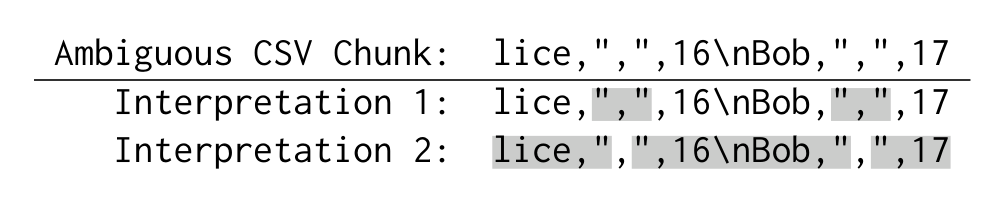

有趣的是，这个例子也指明了构建高效推测式解析器的路径。第一，即便根据 CSV 规范（见第 2 节）两种解释都可能成立，第一种解释更有可能：字符串 `,16\nBob,` 作为字段值很少见，而数值字段和字符串 `Bob` 看起来更像“正常”字段值。第二，虽然处理歧义不可或缺，但实践中这类有歧义的数据 chunk 并不常见。因此，如果存在一种快速检测无歧义 chunk 的方法，就可以对无歧义 chunk 跳过推测过程，以最小化推测开销。总之，虽然 CSV 规范给许多歧义形式留有空间，但没有理由放弃并行解析。

### 1.2 贡献

本文提出一个并行 CSV 解析器，并展示如何将其集成到 Spark 中。论文给出了在真实数据集上的综合性能实验结果。

主要贡献是一种新的推测式方法，用于确定任意 CSV 数据 chunk 中的字段和记录边界。该解析器在几乎所有真实场景中都以单遍并行方式解析 CSV 数据。作为基线，本文还描述了一种保守的、非推测式并行解析方法。该保守方法需要对 CSV 数据执行两遍扫描，以处理图 1 这样的坏情况。第一遍确定字段和记录边界，从而为第二遍 tokenization 提供上下文。虽然两遍都可以并行执行，但考虑到推测式方法几乎总是猜对，并且在误判时会退化为两遍方法，额外一遍扫描是浪费的。

推测式方法的一个重要特性是能够检测格式错误的 CSV 数据。错误检测在实践中显然非常重要，并且与推测结合时并不平凡。另一个重要特性是，该推测式方法可与任何最新解析器集成。近期半结构化数据解析器发展出现突破 [19,24]，本文方法需要能与这些解析器良好组合。性能实验中，我们具体使用了 Mison 解析器 [19]。

虽然本文聚焦 CSV 数据，用于半结构化数据并行解析的推测原则是通用的。我们正在把该框架扩展到 JSON 和 XML 等其他纯文本格式。

我们使用 Apache Spark [11,26] 作为查询引擎，在超过 11000 个真实 CSV 数据集上进行了大量性能实验。结果显示，推测式并行解析器比保守两遍并行解析器最多快 2.4 倍。推测式方法误判率低于每 1000 万个 chunk 1 次。事实上，本文并行解析器的性能几乎与一个拥有完美 oracle 来确定记录边界的理想并行解析器一样好。换言之，预测记录边界并从误判中恢复的推测式方法开销可以忽略。

本文其余部分组织如下：第 2 节介绍 CSV 格式背景；第 3 节提出分布式解析方法；第 4 节给出 CSV chunk 上推测式解析的细节；第 5 节讨论语法错误处理；第 6 节介绍在 Apache Spark 中实现这些方法；第 7 节描述实验结果；第 8 节讨论相关工作；第 9 节总结。

## 2. CSV 格式背景

CSV（Comma-Separated Values）是一种轻量、纯文本、表格型数据格式，在从数据分析到机器学习的许多应用中都是最常用的数据格式。根据 RFC-4180 [25]，CSV 格式可递归定义如下（为节省空间省略 Header 的形式化定义）：

```text
File = [Header \n ] Record \n ... \n Record
Record = Field , ... , Field
Field = Quoted | Unquoted
Quoted = " Escaped...Escaped "
Escaped = Char | "" | \n | ,
Unquoted = Char...Char
Char = Any char except of ", \n, and ,
```

一个 CSV 文件包含一个可选 header 记录，其中包括与文件字段对应的名称；之后是一系列零条或多条记录，记录由换行符 `\n` 分隔。一条 record 是一个或多个字段序列，字段由逗号 `,` 分隔。每个字段可以是 quoted，也可以是 unquoted。包含引号 `"`, 逗号或换行的字段必须加引号，表示为由引号包围的一系列零个或多个转义字符。带引号字段内部的嵌入引号必须通过在其前面再加一个引号来转义。空白字符被视为字段的一部分，不应被忽略。

尽管 CSV 非常流行，它从未被正式标准化。RFC-4180 [25] 被普遍视为 CSV 解析器的主要参考，但它不是正式规范。一些 CSV 变体使用其他分隔符（例如 tab 或空格）分隔字段，或使用替代字符（例如反斜杠）转义带引号字段内部的引号。本文假设所有 CSV 文件都采用 RFC-4180 定义的格式。不过，所提出方法可以扩展以支持 TSV（Tab Separated Values）等其他 CSV 变体。

## 3. 分布式解析

本节概述 CSV 数据上的分布式解析。这里假设 CSV 输入格式良好，即没有语法错误。第 5 节放宽该假设，并扩展方法以处理格式错误的数据。

### 3.1 框架

分布式解析框架的输入是一组从 CSV 输入切分得到的 chunk，以及一个能够处理完整记录序列的 CSV 解析器。对每个 chunk，框架分配一个 worker。该 worker 负责定位 chunk 内第一个记录分隔符，以及 chunk 结束之后的第一个记录分隔符。两个分隔符之间的区域称为 adjusted chunk。若一个 chunk 不包含任何记录分隔符，则其 adjusted chunk 为空。由于每个 adjusted chunk 包含一系列完整 CSV 记录，worker 可以调用输入解析器处理该 adjusted chunk。很容易看到，所有 adjusted chunk 首尾相连，并且 CSV 输入中的任意字符都恰好属于一个 adjusted chunk。因此，解析以分布式方式完全并行化。图 2 展示了一系列 chunk 及其 adjusted chunk。

图 2：chunk 与 adjusted chunk（实线框是 chunk，虚线框是 adjusted chunk）。

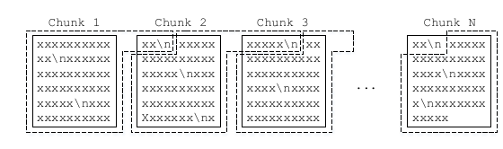

这个框架其实并不新，已经在 Hadoop 生态中广泛使用。例如，Spark [11] 使用该框架处理一种简化 CSV 变体，其中带引号字段内部不允许出现换行。对每个 chunk，Spark 扫描该 chunk，查找 chunk 内第一个换行以及 chunk 结束之后出现的第一个换行，并处理两个换行之间的区域。不幸的是，该方法不能用于处理标准 CSV 数据，因为一般来说，换行可能是带引号字段内部的转义换行，而不是记录分隔符。本节余下部分提出两种方法来支持标准 CSV 数据集：两遍方法（3.2 节）和推测式方法（3.3 节）。两种方法都遵循该框架。

该框架假设 worker 可以访问后续 chunk 中的数据。该假设对多数使用场景成立（例如 HDFS），但并不适用于所有场景。附录 B.2 放宽该假设，并扩展方法以在不访问其他 chunk 数据的情况下处理 chunk 边界处的记录。

需要注意，该框架面向 chunk 通常远大于记录的场景，因此目标是实现粗粒度并行。对于记录大小大于或接近 chunk 大小的情况，该框架仍可正确处理输入，但处理 chunk 边界记录的开销可能显著增加，并阻碍整体解析速度。不过，在大数据系统中这种情况很少发生，因为记录大小通常从几十字节到几千字节，而 chunk 大小通常至少为数 MB。

该框架把解析与分布式处理解耦，并且可与任何 CSV 解析器组合。这种解耦使得系统可以利用 Mison [19] 和 Sparser [24] 等解析算法创新，获得最佳的每 chunk 解析性能。

### 3.2 两遍方法

我们首先提出一种用于分布式 CSV 解析的非推测式方法。该方法以完全并行方式解析 CSV 数据，但需要扫描输入两次。它也被用作推测式方法中的回退方案，以从误判中恢复。

该方法的基本思想已在开源项目 ParaText [5] 中实现，后者目标是在多核机器上并行解析 CSV 数据。不过，据我们所知，文献中尚未记录该方法，因此这里为完整性起见进行描述。

按照 3.1 节框架，该方法运行两遍：第一遍识别 adjusted chunk；第二遍使用 CSV 解析器处理每个 adjusted chunk 中的完整记录。与顺序扫描 CSV 输入来识别 adjusted chunk 的直接方法不同，两遍方法利用 CSV 格式的简单性，以完全并行方式确定切分点。

更具体地说，在第一遍中，每个 worker 扫描被分配的 chunk，并收集三项统计信息：1) chunk 内引号数量；2) chunk 内偶数个引号之后第一个换行的位置；3) chunk 内奇数个引号之后第一个换行的位置。扫描完成后，每个 worker 把这些统计信息发回 master。master 随后顺序遍历所有 chunk 的统计信息，并计算所有 adjusted chunk 的起始位置。对于第 `k` 个 chunk，master 对前 `k-1` 个 chunk 中的引号数量求和。如果该数量为偶数，则第 `k` 个 chunk 不从带引号字段中间开始，偶数个引号之后的第一个换行就是该 chunk 中第一个记录分隔符。否则，如果该数量为奇数，奇数个引号之后的第一个换行就是第一个记录分隔符。adjusted chunk 的结束位置基于下一个 adjusted chunk 的起始位置获得。显然，该方法遵循框架，但需要额外一遍扫描来定位 adjusted chunk。

### 3.3 推测式方法

两遍方法完全并行化 CSV 解析，但需要额外一遍扫描来识别记录分隔符。本节目标是移除这额外一遍，并用一遍处理每个 chunk。如 1.1 节所示，对任意 chunk，完全确定起始解析状态本质上是不可能的。因此，我们利用 1.1 节讨论的机会，设计了一种基于推测的方法。

图 3 展示推测式方法架构。本节聚焦 master，第 4 节介绍 worker 上的解析技术。master 把每个 chunk 分配给一个可并行处理数据的 worker。每个 worker 推测式解析该 chunk，并把解析结果以及预测 adjusted chunk 的位置返回给 master。master 负责验证所有 worker 独立做出的推测。若某个 chunk 的 adjusted chunk 紧接记录分隔符（或输入开头）之后开始，并在记录分隔符处结束，则该 chunk 的推测被认为成功。形式化地，性质 1 用于验证所有 worker 的推测；证明见附录 A。

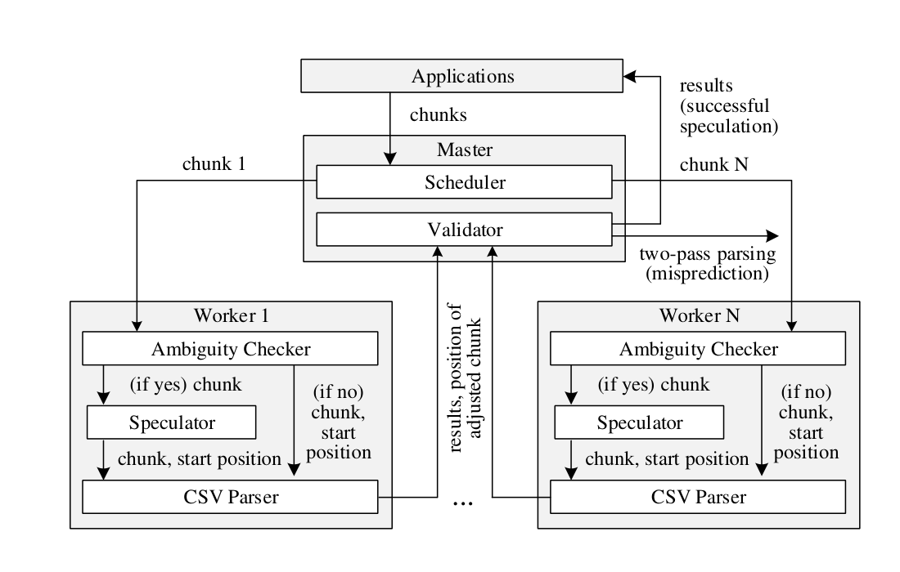

**性质 1。** 如果前 `k` 个预测 adjusted chunk 首尾相连，则第 `k` 个 chunk 上的推测成功。

按照性质 1，master 按 chunk ID 顺序顺序遍历所有预测 adjusted chunk 的位置，并检查每个预测 adjusted chunk 是否与前一个 adjusted chunk 首尾相连。如果没有连接，推测失败，系统回退到两遍方法（3.2 节）以从误判中恢复。如果所有预测 adjusted chunk 都连接，则推测式解析成功完成。

推测式方法同样遵循框架来处理 chunk 边界处的记录（3.1 节）。如果所有推测成功，每个 worker 从对应 chunk 内第一个记录分隔符开始，并在后续 chunk 中的第一个记录分隔符结束，完全符合框架要求。如果推测失败，则丢弃所有解析结果并回退到两遍解析，而两遍解析也遵循框架。

推测式方法在所有 chunk 推测成功时运行一遍；若发生误判，则运行三遍（其中两遍来自回退重新解析）。第 7.3 节将用大量真实数据集经验证明，该方法误判低于每 1000 万个 chunk 1 次。因此从统计意义上看，推测式方法几乎是一遍方法。

图 3：推测式解析架构。

## 4. chunk 上的推测式解析

本节介绍对单个 chunk 进行推测式解析的技术。给定 CSV 文件中的任意 chunk，算法在没有前序 chunk 上下文的情况下预测起始解析状态，并基于预测状态乐观解析该 chunk。

一般来说，解析方法与 CSV 输入的字符编码无关。它依赖输入解码器把编码字节流转换为多字节字符，然后在解码字符上应用本节算法。不过，对于 UTF-8 和 UTF-16 等常见编码，算法可以把编码字节流作为单字节字符序列处理，而无需解码多字节字符。该优化在附录 B.1 讨论。

### 4.1 概述

如果一个 chunk 从带引号字段中间开始，则称该 chunk 为 quoted；否则称为 unquoted。解析单个 chunk 的根本挑战，是推测一个 chunk 是 quoted 还是 unquoted。一旦该起始状态被预测，该 chunk 的 adjusted chunk 以及解析方式就被确定。更具体地说，如果 chunk 被推测为 unquoted，第一个记录分隔符就是 chunk 内偶数个引号之后的第一个换行；否则，如果 chunk 被预测为 quoted，则预测第一个记录分隔符是奇数个引号之后的第一个换行。以预测第一个记录分隔符作为 adjusted chunk 的起始位置后，系统调用解析器乐观扫描并解析该 chunk。当解析到 chunk 末尾时，它继续读取后续 chunk 中的数据，直到遇到记录分隔符，该位置被视为 adjusted chunk 的预测结束位置。

因此，本节余下部分聚焦一个问题：如何推测给定 chunk 是否 quoted。首先，我们观察到，在许多情况下，如果另一种起始状态会导致对该 chunk 的解析无效，worker 就可以完全确定 chunk 的起始状态。基于该观察，若仅分析 chunk 内数据无法完全确定该 chunk 是否 quoted，则称该 chunk ambiguous；反之，若确认其为 quoted 或 unquoted，则称 unambiguous。

本节提出两个算法来确定 chunk 的歧义性。第一个算法见 4.3 节，更直接但计算成本高；不过它奠定了第二个算法的理论基础。4.4 节提出第二个算法，其结果与第一个相同，但效率高得多。如果 chunk 无歧义，起始状态直接确定，无需推测。对于本质有歧义的 chunk，必须推测其起始状态。4.5 节提出一种基于 1.1 节洞见的推测决策算法。

无论是检查歧义的算法，还是推测起始状态的算法，都需要访问 chunk 中的数据。这些与推测相关的过程会在解析前引入一次额外扫描，使推测式方法退化为两遍方法。不过，推测属性允许在推测准确率和处理速度之间折中。这使算法可以只在 chunk 的一小部分数据上运行，通常是固定大小前缀（例如 64KB）。在这种情况下，从 chunk 前缀推断出的歧义性可能对整个 chunk 的歧义性产生假阳性，但绝不会有假阴性。换言之，整个 chunk 要么肯定无歧义，要么可能有歧义。这些假阳性可能引入启动后续推测算法的开销，以及误判时的可能重解析开销。但我们在真实数据集上的统计结果显示，该优化引入的假阳性在实践中极其罕见（7.3 节）。本节余下部分中，“chunk” 指文件的任意片段，它可以是完整 chunk，也可以是 chunk 前缀。

### 4.2 CSV 的有限状态机

我们首先介绍 CSV 格式的有限状态机（Finite-State Machine, FSM），它是全文设计和分析算法的基础。CSV 格式由正则语言定义（见第 2 节），其与 FSM 等价，反之亦然。因此，一个字符串遵循 CSV 规范，当且仅当它被等价 FSM 接受。

CSV 数据的 FSM 有五种可能状态：Record start（R）、Field start（F）、Unquoted field（U）、Quoted field（Q）和 quoted field End（E）。其中 R 是起始状态，终止状态包括 R、F、U 和 E。输入字符有四种可能类型：quote、comma、newline 和 other，即除这三个结构字符之外的任意其他字符。图 4 显示 FSM 的状态转移函数。对每个可能状态，表格展示每种输入产生的输出状态。注意，某些状态下并非所有输入字符都允许。例如，如果当前状态是 U 且下一个字符是 quote，则转移无效（图 4 中标为 `-`），因为包含引号的字段值必须带引号。类似地，在状态 E 下不允许 other，因为此前字符可能是关闭引号，必须后跟结构字符（逗号或换行）；也可能是转义引号，必须后跟被转义的引号。

图 4：CSV 格式 FSM 的状态转移表。

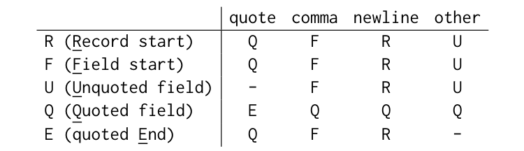

| 状态 | quote | comma | newline | other |
| --- | --- | --- | --- | --- |
| R (Record start) | Q | F | R | U |
| F (Field start) | Q | F | R | U |
| U (Unquoted field) | - | F | R | U |
| Q (Quoted field) | E | Q | Q | Q |
| E (quoted End) | Q | F | R | - |

五个状态可分为两类：R、F、U 和 E 称为 unquoted states，因为这些状态下的字符总是在带引号字段之外；Q 称为 quoted state，因为该状态下的字符嵌入在一对引号内。有趣的是，从图 4 可观察到，同一类别内的状态总是产生相同输出状态（忽略无效转移）；而不同类别的状态对于任何输入字符都不会转移到同一输出状态。

### 4.3 使用 FSM 确定歧义

本节提出一个基于上述 FSM 检查给定 CSV chunk 是否 ambiguous 的算法。该算法改编自 Fisher 算法 [16]。FSM 通常用于从输入开头解析字符序列。有趣的是，也可适配 FSM 来处理开头位于输入中间的 CSV chunk。基本思想是枚举所有可能状态作为起始状态，并同时执行多个状态机，每个可能起始状态对应一个。并非所有 FSM 都能通过该 chunk。有些 FSM 可能遇到无效转移（图 4 中的 `-`），这表示对应起始状态对该 chunk 无效。通过整个 chunk 后，所有无效起始状态被识别。随后，当且仅当剩余有效起始状态既包含 unquoted states 又包含 quoted state，chunk 才是 ambiguous。

图 5 演示了检查两个示例 CSV chunk 歧义性的过程。在图 5(a) 中，起始状态 E 在读取 chunk 第一个字符后遇到无效转移，因此被视为无效起始状态。相比之下，其他所有起始状态都成功通过整个 chunk。由于剩余起始状态 R、F、U 和 Q 落入两个类别，该 chunk 有歧义。这与图 1 中的观察一致。实际上，从 R、F 和 U 状态开始的状态序列对应图 1 的解释 1，而从 Q 状态开始的状态序列对应解释 2。在图 5(b) 中，示例 chunk 还有一个额外无效起始状态 Q，因为从起始状态 Q 读取字符串 `lice,"\n",16\nBob,"` 后转移到 E 状态，而 E 状态后不允许 other。这消除了 Q 作为起始状态的可能性。因此，所有有效起始状态都是 unquoted，该示例 chunk 无歧义。

图 5：使用 FSM 确定歧义（无效起始状态在原图中以灰色标记）。

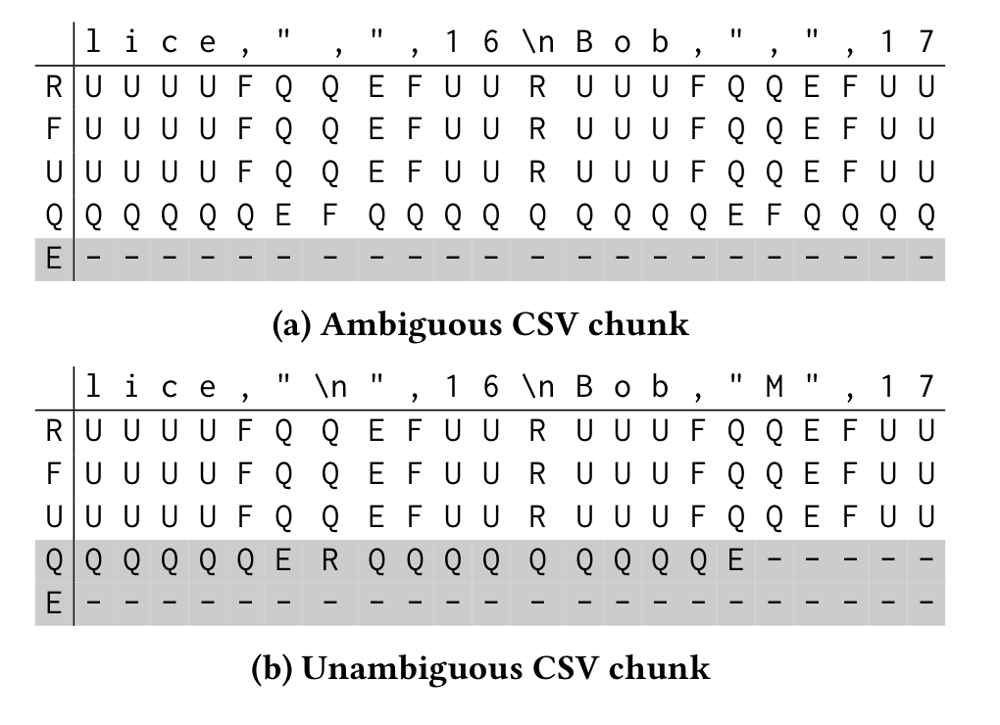

### 4.4 使用模式确定歧义

虽然基于 FSM 的算法（4.3 节）为问题提供了基础视角，但从处理速度看并不是足够实用的方案。它需要同时运行最多五个 FSM，可能主导总体执行时间。当该算法与最新解析器 [19,24] 搭配使用时问题更严重，因为这些解析器比基于 FSM 的解析器快几个数量级。为解决该问题，我们开发了一种新方法，可以更快地完全确定 CSV chunk 的歧义性。

我们引入两个有趣的字符串模式。第一个称为 q-o pattern，表示以 quote 开始、后跟 other（即除 quote、comma 和 newline 之外任意字符）的两字符字符串类别。第二个称为 o-q pattern，表示以 other 开始、后跟 quote 的两字符字符串类别。

q-o 和 o-q 模式有一个关键性质：对于所有可能输入状态，FSM 在读取符合该模式的输入字符串后都会转移到同一个输出状态。图 6 展示了两种模式从五个可能状态开始的转移。可以清楚看到，对 q-o pattern，所有起始状态收敛到 Q 状态；对 o-q pattern，所有起始状态收敛到 E 状态。

图 6：q-o 和 o-q 模式上的状态转移。

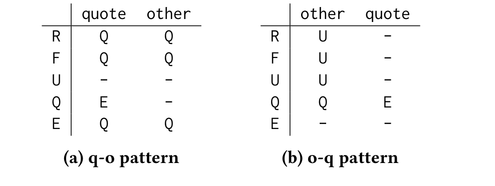

基于这一性质，用模式确定给定 chunk 是否 ambiguous 的算法非常简单：当且仅当 chunk 既不包含 q-o pattern 字符串，也不包含 o-q pattern 字符串时，该 chunk 才有歧义。该算法正确性由性质 2 和性质 3 证明。证明依赖 4.3 节的 FSM 算法，见附录 A。

**性质 2。** 包含 q-o pattern 字符串或 o-q pattern 字符串的 chunk 一定无歧义。

**性质 3。** 一个无歧义 chunk 一定包含 q-o pattern 字符串或 o-q pattern 字符串。

再次考虑图 5 示例。图 5(a) 的 CSV chunk 不包含任何符合 q-o 或 o-q pattern 的字符串，因此是有歧义 chunk。相反，图 5(b) 的 chunk 包含 q-o pattern 字符串 `"M`，因此无歧义。这些结果与基于 FSM 的方法一致。

### 4.5 推测

如上一节所述，既不包含 q-o pattern 字符串也不包含 o-q pattern 字符串的 CSV chunk，对并行解析而言本质上有歧义。在这些情况下，必须推测 chunk 是否 quoted。本节提出一种推测算法，它利用每个 chunk 数据上的条件概率来推测 chunk 起始状态。

我们再次用图 1 的歧义 CSV chunk 解释算法背后的核心洞见和直觉。虽然该示例 chunk 的两种解释理论上都完全可能，第一种解释看起来更可能。原因是，如果第二种解释正确，那么第一种解释中位于带引号字段内部的字符串（例如 `,513\nBob,`）恰好在替代解释中完全遵循 CSV 规范，这过于巧合。如果字符串不以逗号开头或不以逗号结尾，第二种解释中的字符串就不再是有效 CSV 字符串，chunk 也就变成无歧义。这个例子揭示了推测算法直觉：在一种解释下随机化 chunk 中的字段字符串，并计算该 chunk 在替代解释中也遵循 CSV 规范的概率；该值越高，预测解释越可能正确。

形式化地，我们把该问题建模为条件概率问题。给定一个 chunk，令 $s_Q$ 表示把该 chunk 视为 quoted 时产生的状态序列， $s_U$ 表示把该 chunk 视为 unquoted 时产生的状态序列。令 $C$ 为满足如下条件的 chunk 集合：若 chunk 为 quoted，则产生 $s_Q$；若 chunk 为 unquoted，则产生 $s_U$。此外，令 $Q$ 表示 $C$ 中某 chunk 为 quoted（从带引号字段中间开始）的事件， $U$ 表示该 chunk 为 unquoted（不从带引号字段中间开始）的事件。再用 $V_Q$ 和 $V_U$ 分别表示 $C$ 中某 chunk 从 quoted state 和 unquoted state 开始有效的事件。因此， $V_Q \cap V_U$ 表示 $C$ 中某 chunk 有歧义。

于是， $C$ 中一个有歧义 chunk 为 unquoted 的概率为：

$$
P(U \mid V_U \cap V_Q)
= \frac{P(U) \cdot P(V_U \cap V_Q \mid U)}{P(V_U \cap V_Q)}
= \frac{P(U) \cdot P(V_Q \mid U)}{P(V_U \cap V_Q)}
\tag{1}
$$

类似地， $C$ 中一个有歧义 chunk 为 quoted 的概率为：

$$
P(Q \mid V_U \cap V_Q)
= \frac{P(Q) \cdot P(V_U \mid Q)}{P(V_U \cap V_Q)}
\tag{2}
$$

为推测 chunk 起始状态，算法通过计算二者比值来比较 $P(Q \mid V_U \cap V_Q)$ 和 $P(U \mid V_U \cap V_Q)$：

$$
\frac{P(U \mid V_U \cap V_Q)}{P(Q \mid V_U \cap V_Q)}
= \frac{P(U) \cdot P(V_Q \mid U)}{P(Q) \cdot P(V_U \mid Q)}
\tag{3}
$$

接下来，基于 chunk 中字符计算 $P(V_Q \mid U)$。根据性质 2，一个有歧义 chunk 一定既不包含 q-o pattern 字符串，也不包含 o-q pattern 字符串。因此，给定 $C$ 中一个从 unquoted state 开始有效的 chunk，该 chunk 若要从 quoted state 开始也有效，则 opening quote 后第一个字符必须是逗号或换行，并且 closing quote 前最后一个字符也必须是逗号或换行。令 $q$ 表示某字符是逗号或换行的概率。于是，对 chunk 中第 $i$ 个带引号字段，字段字符串在替代解释中也有效的概率 $p_i$ 为：1) 若字段字符串为空，则为 1；2) 若带引号字段是部分字段或长度为 1，则为 $q$；3) 若完整带引号字段至少包含两个字符，则为 $q^2$。因此， $P(V_Q \mid U)$ 可由 chunk 中所有 quoted string 的 $\prod_i p_i$ 计算。

为计算公式 3 中的 $P(U)$ 和 $P(Q)$，我们假设该 chunk 表现出与整个 CSV 输入相同的 quoted 字符比例。因此， $P(U)$（或 $P(Q)$）等于 chunk 中 quoted（或 unquoted）状态的百分比。令 $u_U$ 和 $u_Q$ 分别为状态序列 $s_U$ 和 $s_Q$ 中 unquoted state 的比例，则有：

$$
P(U) = u_U \cdot P(U \mid V_U \cap V_Q)
     + u_Q \cdot P(Q \mid V_U \cap V_Q)
\tag{4}
$$

$$
P(Q) = (1 - u_U) \cdot P(U \mid V_U \cap V_Q)
     + (1 - u_Q) \cdot P(Q \mid V_U \cap V_Q)
\tag{5}
$$

把公式 4 和 5 代入公式 3，可得到关于 $P(U \mid V_U \cap V_Q) / P(Q \mid V_U \cap V_Q)$ 的二次方程。求解后得到该比值。如果大于 1，则 chunk 更可能是 unquoted；如果小于 1，则 chunk 更可能是 quoted。

再以图 1 的歧义 chunk 为例。在第一种解释（从 unquoted state 开始）中，有两个长度为 1 的 quoted fields，因此 $P(V_Q \mid U) = q^2$。类似地，在第二种解释中，有两个 partial quoted fields 和一个长度为 8 的完整 quoted field，因此 $P(V_U \mid Q) = q \cdot q^2 \cdot q = q^4$。随后统计两种解释中的 unquoted state 数量，得到 $u_U = 18/22$ 和 $u_Q = 4/22$。假设 ASCII 字符集中的所有字符均匀分布，则 $q = 2/128$。代入二次方程后，得到 $P(U \mid V_U \cap V_Q) / P(Q \mid V_U \cap V_Q) = 18427 \gg 1$，说明该示例 chunk 很可能是 unquoted。

最后考虑特殊情况： $P(U \mid V_U \cap V_Q) / P(Q \mid V_U \cap V_Q) = 1$。此时概率模型无法确定 chunk 起始状态。算法改用基于启发式的推测方法：在大数据应用中，chunk 通常远大于记录。为应用该启发式，算法分别为两种起始状态计算 chunk 中最大记录大小，并选择产生较小最大记录大小的起始状态。例如，对不含任何引号的 chunk，求解方程总有比值为 1。此时无法区分两种情况：1) chunk 完全位于所有带引号字段之外；2) 整个 chunk 是一个大型带引号字段的一部分。前一种情况下最大记录大小等于 chunk 大小；后一种情况下最大记录大小小于 chunk 大小。根据启发式，算法总是选择记录较小的情况，因此推测该 chunk 为 unquoted。

## 5. 语法错误处理

语法错误在真实数据集中是常态而非例外。这些语法错误通常由多种原因造成，包括程序 bug、字符集和编码错误、工具链使用不当等。对 CSV 数据来说问题更严重，因为前文提到 CSV 格式没有完全标准化，并存在许多 CSV 变体。用户可能不小心把一种格式变体的 CSV 数据交给为另一种变体设计的解析器。因此，实用 CSV 解析方案应能处理这些错误。本节分析并扩展所提出方法以处理格式错误的 CSV 数据。

### 5.1 问题定义

本文聚焦检测 CSV 数据中的语法错误。形式化地，若 FSM 读取 CSV 输入时遇到无效转移，或以非终止状态结束，则该 CSV 输入存在语法错误。语义错误，例如字段类型不一致或字段值无效，从语法角度不可检测，因此不在本文范围内。自动修正检测到的语法错误是一个有趣未来方向，但也超出本文范围。

如果一个解析器满足两个要求，则称其 error-detectable：1) 当且仅当 CSV 输入包含语法错误时，解析器检测到错误；2) 如果输入中有多个语法错误，解析器报告第一个错误。第一个要求保证正确性：如果解析器未能发现 CSV 输入中的错误，可能在不知情的情况下产生错误解析结果。第二个要求保证有用性：由于后续错误通常由前面的错误引起，从用户角度看，只有第一个错误保证是实际错误。

为形式化描述解析期间遇到的语法错误，我们为 CSV 数据 FSM（见图 4）增加一个新的错误状态 X。图 7 展示增强 FSM 的转移表。可以看到，两个转移会把状态从非错误状态切换到错误状态：`U --quote--> X` 和 `E --other--> X`。一旦 FSM 进入 X 状态，就保持在该状态直到输入结束。图 8 展示一个带语法错误的 CSV 输入，以及输入每个字符对应的状态（暂时可忽略输入分块）。

图 7：CSV 格式的增强 FSM。

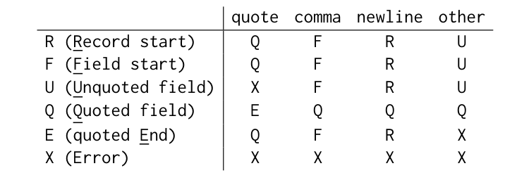

| 状态 | quote | comma | newline | other |
| --- | --- | --- | --- | --- |
| R (Record start) | Q | F | R | U |
| F (Field start) | Q | F | R | U |
| U (Unquoted field) | X | F | R | U |
| Q (Quoted field) | E | Q | Q | Q |
| E (quoted End) | Q | F | R | X |
| X (Error) | X | X | X | X |

### 5.2 扩展框架

本节扩展 3.1 节框架以处理语法错误。该框架假设 CSV 输入中所有字符的状态已知。对分布式解析而言，这显然是不现实的假设（除第一个 chunk 外）。因此，该框架只作为理论工具，用于验证某个分布式解析方法是否 error-detectable。

扩展框架如下定义每个 adjusted chunk 的起始位置。CSV 输入中第一个 chunk 的 adjusted chunk 总是从该 chunk 开头开始。对其他 chunk，如果该 chunk 包含处于 R 状态的字符，则其 adjusted chunk 从第一个 R 状态字符之后立即开始。否则，如果该 chunk 包含 X 状态字符，则其 adjusted chunk 未定义；如果该 chunk 不包含任何 X 状态字符，则 adjusted chunk 为空。

一旦 adjusted chunk 起始位置确定，worker 调用 CSV 解析器从该位置开始解析记录。解析器扫描 CSV 输入，直到遇到 chunk 结束之后第一个处于 R 状态的字符，或直到遇到 X 状态的语法错误。后一种情况下，worker 向 master 报告语法错误；master 负责向应用报告 CSV 输入中的第一个语法错误。

图 8 展示一个被切分成三个 chunk 的 CSV 输入，也展示了 FSM 读取输入中每个字符后的状态。注意第二个 chunk 包含语法错误：`M` 后面的引号不被允许并导致 X 状态。根据扩展框架规范，图中标出了 adjusted chunk 的起始位置。第一个 adjusted chunk 总是从 chunk 开头开始。第二个 adjusted chunk 从标记的换行字符之后开始，该换行是 chunk 2 内第一个 R 状态字符。第三个 chunk 没有定义 adjusted chunk，因为它包含 X 状态字符，但不包含 R 状态字符。

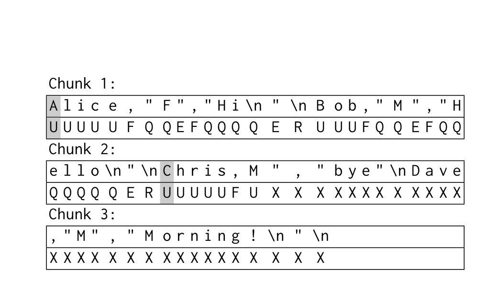

根据性质 4，扩展框架是 error-detectable。证明见附录 A。

**性质 4。** 扩展框架是 error-detectable。

### 5.3 扩展两遍方法

本节调整两遍方法以处理语法错误。除解析结果和 adjusted chunk 位置外，每个 worker 还向 master 返回错误信息。如果检测到多个错误，master 负责查找 CSV 输入中的第一个错误，并报告给应用。

我们证明两遍方法遵循扩展框架，因此是 error-detectable。两遍方法与扩展框架的区别仅在于如何确定 adjusted chunk 起始位置。因此，只需证明两遍方法确定的起始位置遵循扩展框架规范。可分三种情况。情况 1：如果 chunk 包含 X 状态但不含 R 状态，根据框架其 adjusted chunk 未定义。因此，无论算法把 adjusted chunk 确定在哪里，都不违反框架要求。情况 2：如果 chunk 既不包含 X 也不包含 R 状态，则 adjusted chunk 为空，符合扩展框架规范。情况 3：如果 chunk 包含 R 状态，则 CSV 输入中该 R 状态之前不存在语法错误。因此，算法可以根据之前所有 chunk 的引号数量，正确确定该 chunk 开头是否位于带引号字段内部。基于该信息，算法可以正确选择第一个 R 状态字符作为边界，即使 chunk 剩余部分可能包含 X 状态字符。

以图 8 的 CSV 输入为例。在两遍方法的第一遍中，worker 统计每个 chunk 中的引号数量。根据这些统计信息，master 推断第二个 chunk 为 quoted。因此，master 确定第二个 adjusted chunk 从 chunk 2 中标记的换行之后开始，而这确实是扩展框架要求的 chunk 2 中第一个 R 状态字符。从该位置开始，CSV 解析器扫描第二个 adjusted chunk，并在 `M"` 处检测到语法错误。master 也会（错误地）推断第三个 chunk 为 quoted，并把带引号字段 `Morning!\n` 内部的换行当作 adjusted chunk 的开头。这会导致在 chunk 3 的第一个 `M` 处出现一个不期望的语法错误。不过，由于 chunk 2 中发现了第一个语法错误，master 会忽略该错误。

### 5.4 扩展推测式方法

接下来扩展推测式方法以处理语法错误。在推测式方法中，每个 worker 基于其 adjusted chunk 的预测起始位置解析被分配 chunk，并把解析期间遇到的错误报告给 master。由于误判，这类错误可能被误报；但如果之前所有 adjusted chunk 都首尾相连，并且之前所有 chunk 中没有检测到错误，则该错误可被确认。算法 1 展示 master 验证推测的伪代码。

```text
Algorithm 1 ValidateSpeculativeParsing(C)
Input: C: CSV 输入中的 chunk 序列
1: R := empty set                         // 初始化解析结果
2: for i := 0 to |C| do
3:     if i = 0 or C_i.start = C_{i-1}.end + 1 then
4:         if C_i.has_error = false then
5:             R := R union C_i.parsing_results    // 推测成功
6:         else
7:             throw exception on the error         // 确认错误
8:     else
9:         Fall back to two-pass approach           // 推测失败
10: return R
```

我们随后说明推测式方法也遵循扩展框架。令 CSV 输入中的第 `k` 个 chunk 是其 adjusted chunk 包含非 X 状态的最后一个 chunk（若没有语法错误，则第 `k` 个 chunk 就是最后一个 chunk）。如果前 `k` 个 adjusted chunk 没有首尾相连，系统回退到两遍方法，而两遍方法遵循扩展框架。否则，如果前 `k` 个 adjusted chunk 确实连接，根据性质 1，前 `k` 个 chunk 上的所有推测都成功，这意味着前 `k` 个 adjusted chunk 都从每个 chunk 内第一个 R 状态字符之后开始。因此，推测式方法遵循扩展框架，也就是 error-detectable。

不过，在少数情况下，语法错误可能增加误判概率。图 8 给出了这样的例子。在第二个 chunk 中，可以找到 o-q pattern 字符串 `M"`，这表示该 chunk 为 unquoted。于是系统（错误地）推断第一个记录分隔符是 `ello` 后的换行，导致第一和第二个 chunk 之间的 adjusted chunk 不连接，并引入执行回退解析方案的额外成本。根本问题在于，对于格式错误的 CSV 输入，性质 2 和性质 3 不成立。幸运的是，如果语法错误之前在该 chunk 中已经出现 o-q 或 q-o pattern 字符串，该问题就不会发生。在这种情况下，第一个记录分隔符可由第一个 pattern string 正确确定。一般来说，在一个 chunk 的所有 pattern string 之前就出现语法错误并不常见，因为包含语法错误的真实数据集通常每个 chunk 中仍包含大量 pattern string。

## 6. Apache Spark 集成

本节介绍在 Apache Spark 中对两遍方法和推测式方法的实现。这些方法基于 Spark 提供的原语实现，不改变 Spark 架构，因此继承 Spark 的容错特性。

Apache Spark 基于 RDD 抽象构建。RDD 是不可变的、分区化的数据记录集合。Spark 中的查询被编译为一系列 RDD transformation。容错通过跟踪 RDD lineage 实现，使其在失败时可以重现。对原始 CSV 数据的查询中，scan 操作读取并解析 CSV 数据，产生一个可被后续查询处理操作消费的 RDD。

对两遍方法，我们将其实现为两个 RDD transformation：每个 transformation 对应两遍方法中的一遍。master 首先根据并行度设置把文件切分为等大小 chunk。第一个 transformation 读取这些 chunk，并根据 3.2 节方法产生第一个 RDD。该 RDD 的每个分区包含对应 chunk 中的引号数量和记录分隔符候选位置。基于该 RDD，master 计算一个新的 RDD，其中包含所有 adjusted chunk 的位置。以新 RDD 作为输入，第二个 transformation 并行解析 adjusted chunk，并创建结果 RDD，随后由后续操作消费。

推测式方法实现为单个 RDD transformation。与两遍方法类似，master 把文件切分为等大小 chunk，并创建一个关于这些 chunk 边界信息的 RDD。在推测式解析 transformation 中，每个 RDD 分区首先使用第 4 节的推测算法进行推测，然后乐观解析其预测 adjusted chunk。解析结果存储在 RDD 中。除解析结果外，该 transformation 还需要把预测 adjusted chunk 的位置发送给 master 用于验证。我们决定不把这些信息放入结果 RDD，因为结果 RDD 应直接被后续操作消费。相反，该操作通过 Spark 提供的 Accumulators 机制发送这些信息。Accumulators 本质上是只写变量，并可从失败中自动恢复。

master 负责在把结果 RDD 喂给查询计划中的后续操作之前验证推测。我们实现了 5.4 节算法，用于验证预测 adjusted chunk 的位置。如果任何推测失败，master 丢弃结果 RDD，并创建一个新的查询计划，其中包含两遍方法作为解析操作。

## 7. 性能评估

所有实验都在 Microsoft Azure 云计算平台上进行。我们在一个由 1 个 master 节点和 8 个 worker 节点组成的集群上部署修改版 Apache Spark（2.2.2）。worker 部署在具有 4 个 vCPU、128GB RAM 和 2TB SSD、运行 Ubuntu 18.04 的虚拟机上。实验中，每个 worker 配置使用 1 个 vCPU。

**数据集。** 我们从 Kaggle 数据科学仓库下载所有 CSV 数据集。实验时，共有超过 11000 个格式良好的 CSV 文件，以及 41 个带语法错误的文件。第 7.6 节研究格式错误数据上的解析性能，其余评估使用格式良好的数据。CSV 文件大小范围从 3 字节到 11GB。所有文件均为 UTF-8 编码。

为评估解析性能，我们在每个 CSV 文件上运行简单查询 `SELECT count(*) FROM FILE`，以最小化查询处理对执行时间的影响。对每个文件，报告 3 次运行的平均执行时间。先前研究显示，在查询原始数据时，解析占 Spark 端到端查询执行时间的主导（超过 80%）[19,24]。

**实现。** 我们在 Apache Spark 中实现两遍和推测式方法，细节见第 6 节。作为标尺，我们还比较一种顺序解析 CSV 文件的基线方法。这是 Spark 在解析标准 CSV 文件（启用 `multiLine` 选项）而非简化格式变体（带引号字段中不允许换行）时的当前实现。图中 `sequential` 指该方法，`two-pass` 指 3.2 节两遍方法，`speculative` 指本文推测式方法。在每个 worker 上，使用基于 pattern 的算法检查歧义（4.4 节）。除非另有说明，推测在每个 chunk 的 64KB 前缀上执行。

我们使用两个 CSV 解析器评估每种方法：1) Spark 使用的 CSV 解析器 [6]；2) 最新解析器 Mison [19]。Mison 原本为 JSON 格式设计 [19]。我们把 Mison 技术适配到 CSV 格式，并用 C++ 实现 Mison CSV 解析器。Spark 通过 JNI 机制调用该 native Mison CSV 解析器。图中 `default` 和 `mison` 分别指这两个解析器。

### 7.1 实验 1：解析性能

我们首先比较三种分布式解析方法的总体性能。图 10 展示使用 default 和 Mison 解析器时，sequential、two-pass 和 speculative 方法的性能。对每种方法，图中展示在所有大于 1GB 的 CSV 文件上，相对 sequential + default parser 的平均加速。小文件执行时间通常由调度、查询优化、查询编译等其他组件主导或显著影响。文件大小影响在下一个实验中评估。

使用 default parser 时，推测式方法比两遍方法快 20%，并相对顺序方法达到 7.4 倍加速，接近 8 倍理想加速。相对两遍方法的提升来自去除了两遍方法中用于识别记录分隔符的额外扫描。与该保守方法不同，推测式方法只查看每个 chunk 中一小段数据（64KB），并冒着误判风险乐观解析数据。该策略获胜是因为误判极少发生，如 7.3 节所示。去除第一遍扫描带来 20% 提升，因为两遍方法第一遍只统计引号数量，因此比完整解析的第二遍快得多。

图 10 右侧显示三种方法配合 Mison parser 的性能。使用 Mison 时，推测式方法相对两遍方法的收益更大：此时推测式方法比两遍方法快 60%。原因是 Mison 将解析时间降低 4 到 5 倍，两遍方法第一遍所占总执行时间比例变大，从而让推测式方法提升更显著。

图 9(a) 和图 9(b) 分别绘制使用 default 和 Mison parser 时，在所有大于 128MB 文件上推测式方法相对两遍方法的加速。对更小文件，加速方差很高，因为执行时间显著受 Spark 中除解析外的其他组件影响，例如查询优化、查询编译和调度。随着文件增大，加速通常增加，方差降低。对一些大文件，使用 default parser 时推测式方法相对两遍方法达到 1.5 倍加速；使用 Mison 时，推测式方法最多比两遍方法快 2.4 倍。

进一步地，一个有趣问题是推测式方法性能有多接近理想情况，即存在一个 oracle 可以零成本确定 chunk 边界。为模拟这种理想并行解析器，我们禁用 `multiLine` 选项，配置未修改 Spark 查找换行而非实际记录分隔符来确定 chunk 边界。当然，如果 CSV 文件在带引号字段中包含换行，这会导致大量解析错误。因此，为避免异常处理干扰，实验在不含带引号字段的文件子集上运行。值得注意的是，在这组文件上，推测式方法预计在推测方面表现最差，因为无引号 chunk 由于缺少 q-o 和 o-q pattern，始终有歧义（根据性质 2）。尽管如此，图 9(c) 显示推测式方法仍获得与理想方法相近的性能，即使这些文件不利于推测。这是因为即便在这些情况下，推测式解析相关开销也很小。下一节继续分析该开销。

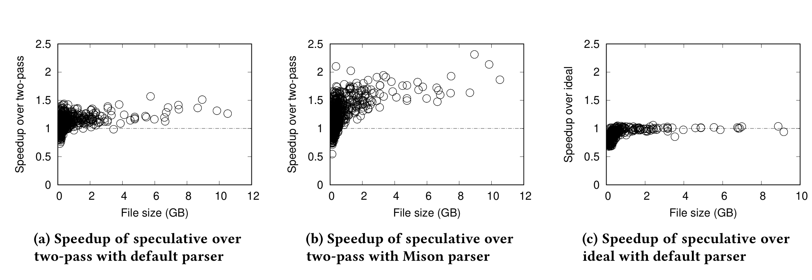

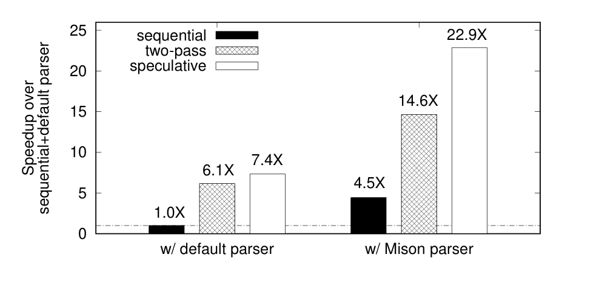

### 7.2 实验 2：推测开销

本节考察推测式方法开销。开销来自两个来源：1) 推测过程，即扫描 chunk 的一部分以确定 chunk 边界；2) 误判时重新解析。图 11 展示三部分时间分解：基础解析时间、推测时间和重新解析时间。图中每个柱表示在所有大于 128MB 文件上，使用特定推测大小时的总体运行时间。推测大小是每个 chunk 中推测算法访问的数据大小。

从图中可见，基础解析时间不受推测大小变化影响。然而，随着推测大小增加，重新解析时间急剧下降。原因是当推测大小不合理地小（例如 16 字节或 256 字节）时，推测算法可能只看到完全位于带引号字段内部的字符串，因此本质上无法区分 quoted string 与 unquoted string。当推测大小大于 4KB 时，重新解析时间降为零，说明这些文件上的所有推测都成功。另一方面，推测时间随推测大小增加而增加，因为推测算法需要扫描更大区域来确定歧义或执行推测。

图 11 展示了推测时间和重新解析时间之间的权衡，并显示推测大小为 64KB 时推测式方法性能最佳。在该推测大小下，推测时间和重新解析时间分别占总执行时间的 0% 和小于 1%。推测开销可以忽略。

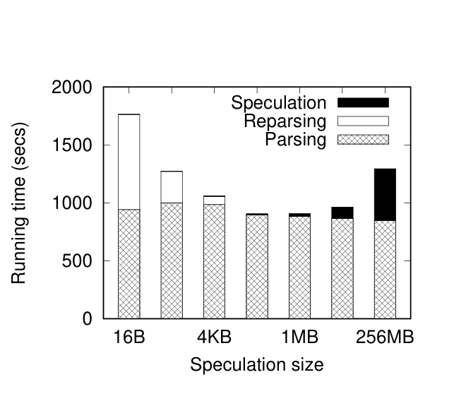

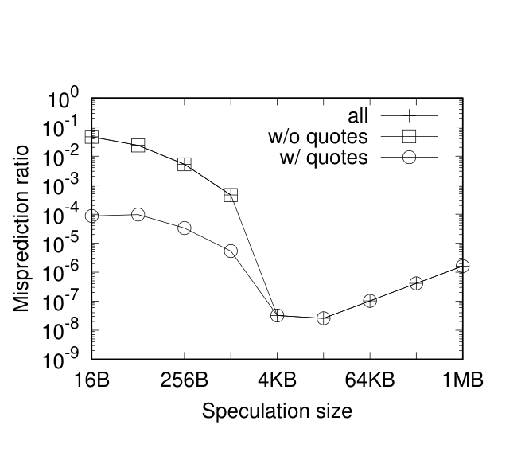

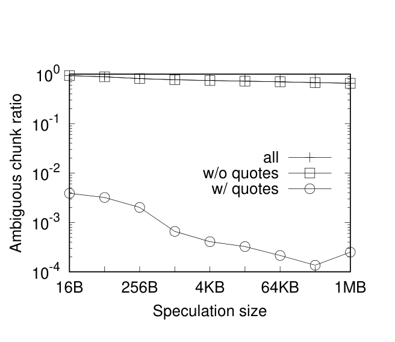

### 7.3 实验 3：推测准确率

该实验测量推测算法的准确率。上一节显示，当推测大小大于 4KB 时没有误判，准确率为 100%。但该数字统计意义不足，因为执行的推测次数不够。原因是每个文件根据 worker 数量只被切分成 8 个 chunk。为得到高精度推测准确率，本实验通过把每个文件切分为长度等于推测大小的 chunk 来生成更多 chunk。例如，当推测大小为 64KB 时，可生成超过 960 万个 chunk。

图 12 绘制推测大小从 16 字节到 1MB 变化时的误判率。随着推测大小增加，总体误判率（图中 `all`）最低降至 `2.6 * 10^-8`。在默认推测大小 64KB 下，误判率为 `1.0 * 10^-7`，意味着该方法误判低于每 1000 万个 chunk 1 次。

为更好理解推测准确率，我们区分两种情况：不含引号的 chunk 和含引号的 chunk。如 4.5 节所述，推测算法总是预测不含引号的 chunk 为 unquoted。如果某 chunk 完全落在带引号字段中，该预测显然错误。因此，当推测大小较小时，不含引号 chunk 的误判率相当高。随着推测大小增加，误判率显著下降，因为大于推测大小的带引号字段更少。当推测大小为 4KB 时，误判率降为 0%，因为没有带引号字段大于 4KB。对含引号 chunk，推测算法也可能做出错误推测。不过，当推测大小小于 4KB 时，这类误判只占所有误判的很小部分。随着推测大小超过 4KB，所有误判都来自含引号 chunk。当推测大小大于 16KB 时，在所有测试 chunk 上推测式方法只产生一次误判。在这些情况下，误判率上升只是因为推测大小（也就是 chunk 大小）增加导致 chunk 数量减少。

接下来，图 13 绘制推测大小变化时的 ambiguous chunk 比例。令人意外的是，多数 chunk 都有歧义。这主要是因为约 70% chunk 不含引号，因此根据性质 2 一定有歧义。除不含引号的 chunk 外，少于 1% 的 chunk 有歧义。

### 7.4 实验 4：最坏情况分析

本节展示推测式方法的最坏情况性能，也就是推测失败时的性能。为生成更多会使推测算法误判的工作负载，我们故意把推测大小设为不理想的值 256 字节。这样收集到 201 个文件作为本实验数据集。

图 14 绘制这些“最坏情况”数据集上，推测式方法相对两遍方法的 slowdown。与前面结果类似，文件较小时方差很高。对大于 1GB 的文件，平均 slowdown factor 为 2.1 倍。该数字与最坏情况下必须同时运行推测式方法和两遍方法这一事实一致。

图 14：最坏情况下 speculative 与 two-pass 的性能比较。

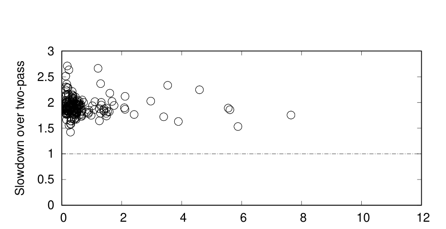

### 7.5 实验 5：可扩展性评估

图 15 展示 worker 数量从 1 变化到 8 时，two-pass 和 speculative 方法配合 default 和 Mison parser 在所有大于 1GB 文件上的吞吐。虚线表示每种配置在线性可扩展性下的理想吞吐。使用 default parser 时，两遍和推测式方法都达到近似线性扩展。使用 8 个 worker 时，两遍方法达到 6.8 倍加速，而推测式方法达到 7.4 倍加速。

然而，使用 Mison parser 时，两种方法在 worker 数量达到 4 或更多时开始偏离线性可扩展性。原因是 Mison 非常快，解析时间显著减少，并在执行时间中占比更小。即使对最大文件（11GB），8 个 worker 下预期执行时间也只有约 2 秒。在这一时间尺度上，许多因素都可能影响执行时间。为确认这一怀疑，我们通过把一个 11GB 文件复制 5 次生成更大文件。在该大文件上，两遍和推测式方法都实现近似线性可扩展性。

图 15：worker 数量变化时的吞吐。

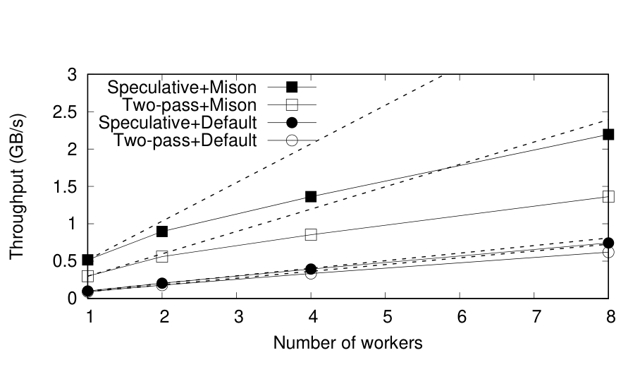

### 7.6 实验 6：错误处理

最后，我们在从 Kaggle 下载的 41 个格式错误 CSV 文件上评估推测式方法。这些语法错误可分为三类：37 个文件在带引号字段内部包含未转义引号；2 个文件有不匹配引号；2 个文件在带引号字段内使用错误字符转义引号。不出意料，推测式方法在所有格式错误 CSV 文件中成功检测到错误，并正确报告每个文件中的第一个错误。

此外，我们观察到在这些格式错误文件上所有推测都成功，这意味着即便 chunk 包含错误，推测算法仍成功预测每个 chunk 的起始状态。如 5.4 节所讨论，语法错误只有在恰好成为某个 chunk 中第一个 o-q 或 q-o pattern string，并因此误导推测算法时，才会导致误判。该结果与分析一致：这些情况在实践中相当罕见。

## 8. 相关工作

本文工作与数据库系统中加载和处理原始数据的研究密切相关 [7-9,14,15,17,18,23]。其中，NoDB [8,9,17,18] 是开创性工作，它在原始 CSV 文件上构建结构化索引，并自适应、增量地使用该索引加载原始数据。工业界也已构建许多系统来满足这一增长需求。例如在 AWS 中，Amazon Athena [1] 和 Amazon Redshift Spectrum [2] 都允许用户使用标准 SQL 直接查询 Amazon S3 中的原始数据，而无需复杂昂贵的 ETL 任务准备和加载数据。Apache Spark [11,26] 是另一个支持访问原始、未解析数据的大数据系统代表。不过，据我们所知，这些系统都不能高效并行化 CSV 解析。它们要么对 CSV 格式施加额外限制（例如带引号字段内部不允许换行），要么简单使用顺序解析。本文提出的分布式解析方法适用于所有这些系统。

并行解析已有大量文献 [10,13,16,20,22,27]。这些工作聚焦通用上下文无关文法 [16,22]，或特定语言，例如算术表达式 [13]、XML [20]、HTML [27]。本文用于确定歧义的 FSM 算法（见 4.3 节）基于 Fisher 算法 [16]，后者奠定了并行解析基础。对一个输入 chunk，该算法针对 FSM 的所有可能起始状态使用多个顺序解析器。不过，这种通用方法存在效率问题，因为必须同时运行多个解析器。因此，本文提出面向 CSV 格式定制的基于 pattern 的歧义判定算法（4.4 节）。一般来说，既有面向通用上下文无关文法或特定语言的并行解析技术不适合 CSV 解析。CSV 规范的简单性为更高效的并行化方法引入了机会。本文开发了专门面向 CSV 解析的推测式解析方法。

近年来，受大数据系统中对原始数据提供 SQL 查询能力需求驱动，优化数据分析中的解析受到越来越多关注。许多技术 [19,23,24] 被开发用于加速数据解析。Muehlbauer 等人提出利用 SIMD 并行性加速 CSV 解析和数据反序列化 [23]。Mison [19] 是一种特别为数据分析应用设计的快速 JSON 解析器。它允许分析引擎把查询操作，例如投影和过滤，下推到解析器中，从而只解析与查询相关的字段，避免大量浪费工作。它还利用现代处理器提供的并行性，避免传统基于 FSM 解析方法的陷阱。Sparser [24] 是一种解析技术，适用于 CSV、JSON 和 Avro [3] 等纯文本和二进制格式。Sparser 可以不解析输入数据就过滤记录：它在原始未解析输入中搜索可能满足查询过滤谓词的记录。匹配记录可能是假阳性，必须用标准解析器验证。所有这些工作实际上都与本文推测式解析方法互补，后者可以利用这些创新在每个 worker 中取得最佳解析性能。

## 9. 结论与未来工作

随着大数据系统中查询原始数据的需求增长，对高效分布式解析技术有强烈需求。本文针对 CSV 数据提出一种基于推测的分布式解析方法。该方案核心是一种算法，即便 CSV 数据格式错误，也能在单个 CSV chunk 中推测式确定记录边界。大量真实数据集上的实验结果表明，该方法误判低于每 1000 万个 chunk 1 次。由于近乎完美的推测准确率，本文并行解析器表现几乎与理想并行解析器一样好，并相对现有方法达到最高 2.4 倍加速。

未来，我们计划把该方案扩展到 JSON 和 XML 等其他常见数据格式。此外，除解析之外，用于寻找记录分隔符的推测式方法还可用于许多其他应用，例如跳过 CSV 数据中的语法错误，以及为机器学习应用采样 CSV 数据。

## 参考文献

[1] Amazon Athena. https://aws.amazon.com/athena/.

[2] Amazon Redshift. https://aws.amazon.com/redshift/.

[3] Apache Avro. https://avro.apache.org/.

[4] Google BigQuery. https://cloud.google.com/bigquery/.

[5] ParaText. https://github.com/wiseio/paratext.

[6] Univocity Parsers. https://github.com/uniVocity/univocity-parsers.

[7] A. Abouzied, D. J. Abadi, and A. Silberschatz. Invisible loading: access-driven data transfer from raw files into database systems. In EDBT, 2013.

[8] I. Alagiannis, R. Borovica, M. Branco, S. Idreos, and A. Ailamaki. NoDB: efficient query execution on raw data files. In SIGMOD, 2012.

[9] I. Alagiannis, R. Borovica-Gajic, M. Branco, S. Idreos, and A. Ailamaki. Nodb: efficient query execution on raw data files. Commun. ACM, 58(12):112-121, 2015.

[10] H. Alblas, R. op den Akker, P. O. Luttighuis, and K. Sikkel. A bibliography on parallel parsing. SIGPLAN Notices, 29(1):54-65, 1994.

[11] M. Armbrust, R. S. Xin, C. Lian, Y. Huai, D. Liu, J. K. Bradley, X. Meng, T. Kaftan, M. J. Franklin, S. Shenker, and I. Stoica. Spark SQL: relational data processing in spark. In SIGMOD, 2015.

[12] K. Asanovic, R. Bodik, B. C. Catanzaro, J. J. Gebis, P. Husbands, K. Keutzer, D. A. Patterson, W. L. Plishker, J. Shalf, S. W. Williams, and K. A. Yelick. The landscape of parallel computing research: A view from berkeley. Technical report, Technial Report, UC Berkeley, 2006.（译者注：原文将第二处 “Technical” 拼作 “Technial”，此处照录。）

[13] F. Baccelli and T. Fleury. On parsing arithmetic expressions in a multiprocessing environment. Acta Inf., 17:287-310, 1982.

[14] S. Blanas, K. Wu, S. Byna, B. Dong, and A. Shoshani. Parallel data analysis directly on scientific file formats. In SIGMOD, pages 385-396, 2014.

[15] Y. Cheng and F. Rusu. Parallel in-situ data processing with speculative loading. In SIGMOD, 2014.

[16] C. N. Fischer. On parsing context free languages in parallel environments. Technical report, Ithaca, NY, USA, 1975.

[17] S. Idreos, I. Alagiannis, R. Johnson, and A. Ailamaki. Here are my data files. here are my queries. where are my results? In CIDR, 2011.

[18] M. Karpathiotakis, M. Branco, I. Alagiannis, and A. Ailamaki. Adaptive query processing on RAW data. PVLDB, 7(12):1119-1130, 2014.

[19] Y. Li, N. R. Katsipoulakis, B. Chandramouli, J. Goldstein, and D. Kossmann. Mison: A fast JSON parser for data analytics. PVLDB, 10(10):1118-1129, 2017.

[20] W. Lu, K. Chiu, and Y. Pan. A parallel approach to XML parsing. In IEEE/ACM GRID, pages 223-230, 2006.

[21] S. Melnik et al. Dremel: Interactive analysis of web-scale datasets. PVLDB, 3(1):330-339, 2010.

[22] M. D. Mickunas and R. M. Schell. Parallel compilation in a multiprocessor environment. In ACM Annual Conference, pages 241-246, 1978.

[23] T. Muehlbauer, W. Roediger, R. Seilbeck, A. Reiser, A. Kemper, and T. Neumann. Instant loading for main memory databases. PVLDB, 6(14):1702-1713, 2013.

[24] S. Palkar, F. Abuzaid, P. Bailis, and M. Zaharia. Filter before you parse: Faster analytics on raw data with sparser. PVLDB, 11(11):1576-1589, 2018.

[25] Y. Shafranovich. Common Format and MIME Type for Comma-Separated Values (CSV) Files. RFC 4180, Oct. 2005.

[26] M. Zaharia et al. Resilient distributed datasets: A fault-tolerant abstraction for in-memory cluster computing. In NSDI, 2012.

[27] Z. Zhao, M. Bebenita, D. Herman, J. Sun, and X. Shen. Hpar: A practical parallel parser for HTML. TACO, 10(4):44:1-44:25, 2013.

## 附录 A. 定理与证明

**性质 1。** 如果前 `k` 个预测 adjusted chunk 首尾相连，则第 `k` 个 chunk 上的推测成功。

**证明。** 该性质可由归纳法直接证明。基本情形：当 `k = 1` 时，第一个 adjusted chunk 总是从 CSV 输入开头开始，并在记录分隔符处结束，因此被认为成功。归纳步骤：给定 `n in N`，假设该性质对 `k = n` 成立。现在证明它对 `k = n + 1` 也成立。如果前 `n + 1` 个 adjusted chunk 首尾相连，则前 `n` 个 adjusted chunk 也首尾相连。因此，根据归纳假设，第 `n` 个 chunk 上的推测成功，也就是说第 `n` 个 adjusted chunk 在记录分隔符处结束。由于第 `n + 1` 个 adjusted chunk 与第 `n` 个 adjusted chunk 首尾相连，第 `n + 1` 个 adjusted chunk 紧接记录分隔符之后开始。由于解析器从记录分隔符之后立即开始解析，它能够正确找到记录分隔符作为第 `n + 1` 个 adjusted chunk 的结束。因此，第 `n + 1` 个 chunk 上的推测成功，该性质对 `k = n + 1` 成立。根据归纳原理，该性质对所有 `k in N` 成立。

**性质 2。** 包含 q-o pattern 字符串或 o-q pattern 字符串的 chunk 一定无歧义。

**证明。** 对符合 q-o 或 o-q pattern 的字符串，FSM 读取该字符串后会把所有可能起始状态转移到单个输出状态（q-o pattern 为 Q，o-q pattern 为 E），如图 6 所示。假设 pattern 末尾位于 chunk 第 `i` 个字符。根据第 `i` 个字符状态，可以基于 FSM 转移表找出 chunk 中第 `i-1` 个字符的所有可能状态。很容易看到，第 `i-1` 个字符的所有可能状态要么全是 unquoted states，要么全是 quoted state，因为同一类别中的状态总是产生相同输出状态，而不同类别中的状态对任何输入字符都不会转移到同一输出状态（如图 4）。继续该过程可知，第 `i` 个字符之前任意字符的所有可能状态也都要么全是 unquoted states，要么全是 quoted state。这意味着该 chunk 的有效起始状态要么全是 unquoted states，要么全是 quoted state。因此，根据 4.3 节算法，该 chunk 无歧义。

**性质 3。** 一个无歧义 chunk 一定包含 q-o pattern 字符串或 o-q pattern 字符串。

**证明。** 考虑一个既不包含 q-o 也不包含 o-q pattern 字符串的无歧义 chunk。现在证明该 chunk 的有效起始状态必须包含 R、F 和 Q。首先，由于这三个状态在读取下一个字符时永远不会转移到无效状态（见图 4），从这三个状态开始的 FSM 在读取第一个字符后都必须有效。现在假设第一个字符之后第 `i` 个字符发生无效转移，即 `i >= 2`。根据 FSM 转移表，必然是两种情况之一：1) 读取第 `i-1` 个字符之前的状态为 Q，且接下来两个字符是 q-o pattern；2) 读取第 `i-1` 个字符之前的状态属于 `{R,F,U}`，且接下来两个字符是 o-q pattern。这意味着第 `i-1` 和第 `i` 个字符组成的字符串必须是 q-o 或 o-q pattern。由于这与假设矛盾，因此从第一个字符之后的所有转移都必须有效。于是，根据基于 FSM 的算法，状态 R、F 和 Q 都必须是有效起始状态。因为 R 和 F 是 unquoted states，而 Q 是 quoted state，根据定义该 chunk 有歧义。由逆否命题完成证明。

**性质 4。** 扩展框架是 error-detectable。

**证明。** 令 CSV 输入中的第 `k` 个 chunk 是其 adjusted chunk 包含非 X 状态的最后一个 chunk（若无语法错误，则第 `k` 个 chunk 是最后一个 chunk）。根据定义，前 `k` 个 chunk 的 adjusted chunk 首尾相连，这意味着第一个语法错误之前的输入中任意字符都恰好属于一个 adjusted chunk。根据扩展框架，每个前 `k` 个 chunk 的 adjusted chunk 都从 chunk 中第一个 R 状态字符之后开始。由于 R 是 FSM 初始状态，从该位置开始的 FSM 在后续字符上产生的转移，与从输入开头开始的 FSM 完全相同。因此，第一个 X 状态之前的每个字符都被正确处理，也就是说在第一个实际语法错误之前不会检测到错误。出于同样原因，第一个语法错误必须被 FSM 检测到。master 随后收集 worker 检测到的所有错误，并报告第一个错误；它必然是第一个实际语法错误，因为第一个实际语法错误之前不会检测到错误。

## 附录 B. 讨论

### B.1 支持多字节编码

本文提出的解析方法一般与 CSV 输入的字符编码无关。这些方法依赖输入解码器把编码字节流转换为多字节字符，并在解码字符上应用算法。不过，对 UTF-8 和 UTF-16 等常见编码，算法可以把编码字节流作为单字节字符序列处理，而无需解码多字节字符。

本节聚焦 UTF-8 编码，它是大数据应用中的主导编码。UTF-8 是一种变长字符编码，使用一到四个字节表示 Unicode 字符。图 16 展示 UTF-8 编码结构。对 ASCII 字符，即 Unicode 码位在 0 到 127 范围内的字符，UTF-8 把它映射为具有相同值的单字节。非 ASCII 字符用多个字节编码，其中每个字节保证不同于任何 ASCII 字节。这意味着 UTF-8 字节流中的 ASCII 字节一定表示 ASCII 字符，而不是多字节字符中的某个字节。

图 16：UTF-8 编码结构。

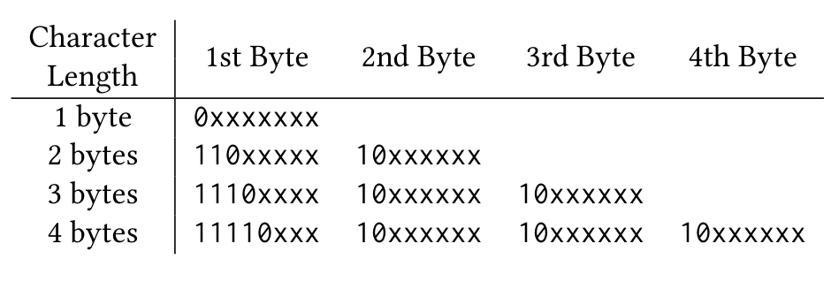

| 字符长度 | 第 1 字节 | 第 2 字节 | 第 3 字节 | 第 4 字节 |
| --- | --- | --- | --- | --- |
| 1 byte | `0xxxxxxx` | | | |
| 2 bytes | `110xxxxx` | `10xxxxxx` | | |
| 3 bytes | `1110xxxx` | `10xxxxxx` | `10xxxxxx` | |
| 4 bytes | `11110xxx` | `10xxxxxx` | `10xxxxxx` | `10xxxxxx` |

利用这一性质，解析算法可以把 UTF-8 字节流作为单字节字符序列处理，而无需解码多字节字符。原因是推测式解析算法只检查每个输入字符是否是三个结构字符之一：quote、comma 或 newline（见图 4）。quote、comma 和 newline 都是 ASCII 字符，因此输入字节流中的某个字节表示 quote/comma/newline，当且仅当该字节值与相应字符相同。所有其他字节，包括其他 ASCII 字节或多字节字符中的字节，都被视为 “other” 字符。因此，一个多字节字符被视为最多 4 个 “other” 字节的序列。有趣的是，这种简化不会影响判定歧义的算法结果（4.4 节）：如果输入包含 q-o（或 o-q）pattern 字符，则也一定包含 q-o（或 o-q）pattern 字节，反之亦然。不过，该方法可能影响推测算法（4.5 节）的准确率，因为它可能改变 “字符” 数量。尽管如此，根据大量真实数据集实验，我们发现这一影响可以忽略。

### B.2 边界处理

3.1 节框架中，我们假设 worker 可以访问文件任意片段。本节放宽该假设，并扩展所提出方法，在不要求 worker 访问后续 chunk 的情况下处理 chunk 边界处的记录。

首先扩展框架来处理 chunk 边界处的记录。在扩展框架中，每个 worker 在被分配的 chunk 中查找第一个和最后一个记录分隔符。两个记录分隔符之间的区域被视为 adjusted chunk。沿用先前工作 [23] 的术语，chunk 中第一个记录分隔符之前的不完整记录称为该 chunk 的 widow record；最后一个记录分隔符之后的不完整记录称为该 chunk 的 orphan record。worker 负责解析其 adjusted chunk 中的记录，并把解析结果连同 widow 和 orphan 记录发送给 master。对每个 chunk，master 需要把该 chunk 的 orphan 记录与下一个 chunk 的 widow 记录连接起来，并解析拼接后的记录。

在推测式方法中，master 负责验证每个 chunk 边界处拼接记录是否为完整且有效的 CSV 记录。如果是，则所有 adjusted chunk 和拼接记录首尾相连，意味着推测成功。如果任何拼接记录不完整，则至少有一个 chunk 中的推测失败。在这种情况下，系统回退到两遍方法以从误判中恢复。
