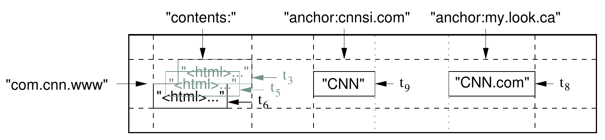
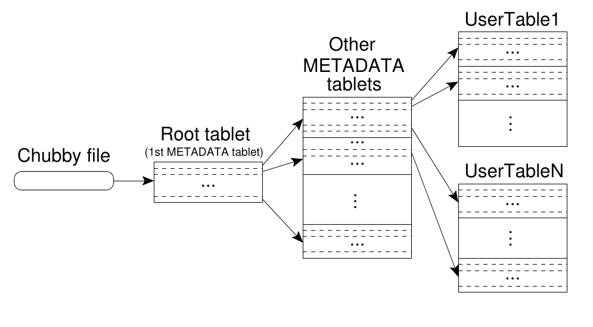
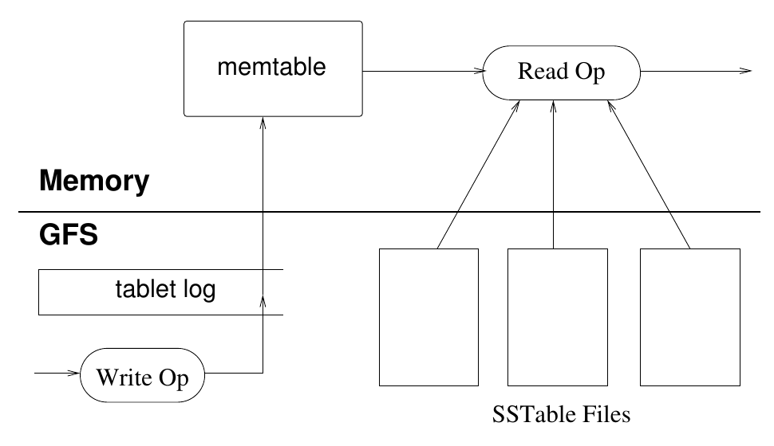
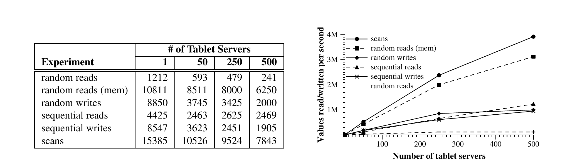

# Bigtable: A Distributed Storage System for Structured Data（中文译文）

## 译者说明

本文依据同目录的 `source.pdf` 翻译。章节、图表、公式、算法、代码与参考文献按原文结构保留。

Fay Chang，Jeffrey Dean，Sanjay Ghemawat，Wilson C. Hsieh，Deborah A. Wallach，Mike Burrows，Tushar Chandra，Andrew Fikes，Robert E. Gruber

Google, Inc.

## 摘要

Bigtable 是一个用于管理结构化数据的分布式存储系统，设计目标是扩展到极大规模：在数千台商品服务器上存储 PB 级数据。Google 的许多项目都把数据存储在 Bigtable 中，包括 Web 索引、Google Earth 和 Google Finance。这些应用在数据大小（从 URL、网页到卫星图像）和延迟要求（从后端批处理到实时数据服务）方面对 Bigtable 提出了截然不同的需求。尽管需求多样，Bigtable 仍成功地为所有这些 Google 产品提供了灵活、高性能的解决方案。我们介绍 Bigtable 提供的简单数据模型——客户端可以动态控制数据布局和格式——并描述 Bigtable 的设计与实现。

## 1. 引言

过去两年半中，我们在 Google 设计、实现并部署了一个名为 Bigtable 的结构化数据分布式存储系统。Bigtable 的设计目标是在数千台机器上可靠扩展到 PB 级数据。它实现了广泛适用性、可扩展性、高性能和高可用性等多个目标。超过 60 个 Google 产品和项目使用 Bigtable，包括 Google Analytics、Google Finance、Orkut、Personalized Search、Writely 和 Google Earth。这些产品用 Bigtable 承载多种高要求工作负载，从面向吞吐量的批处理作业，到对延迟敏感的终端用户数据服务。它们使用的 Bigtable 集群配置跨度很大，从几台到数千台服务器不等，存储数据最多达数百 TB。

Bigtable 在许多方面类似数据库，并与数据库共享许多实现策略。并行数据库 [14] 和主存数据库 [13] 已经实现可扩展性和高性能，但 Bigtable 提供了不同的接口。它不支持完整关系数据模型，而是向客户端提供简单数据模型：支持动态控制数据布局和格式，并允许客户端推理底层存储所表示数据的局部性。数据用行名和列名索引，二者都可以是任意字符串。Bigtable 也把数据视为无解释的字符串，尽管客户端常会把多种结构化与半结构化数据序列化到这些字符串中。客户端可以通过谨慎选择模式来控制数据局部性。最后，Bigtable 的模式参数允许客户端动态控制从内存还是磁盘提供数据。

第 2 节更详细地描述数据模型，第 3 节概述客户端 API。第 4 节简要介绍 Bigtable 依赖的 Google 底层基础设施。第 5 节描述 Bigtable 实现的基本原理，第 6 节介绍为提高性能所做的若干改进。第 7 节给出 Bigtable 的性能测量结果。第 8 节列举 Bigtable 在 Google 的若干使用实例，第 9 节讨论设计和支持 Bigtable 时得到的经验。最后，第 10 节介绍相关工作，第 11 节给出结论。

## 2. 数据模型

Bigtable 是一个稀疏、分布式、持久化的多维有序映射。该映射以行键、列键和时间戳索引；映射中的每个值都是一段不作解释的字节数组。

$$
(\mathrm{row}:\mathrm{string},\ \mathrm{column}:\mathrm{string},\ \mathrm{time}:\mathrm{int64}) \rightarrow \mathrm{string}
$$



*图 1：存储网页的示例表切片。行名是反转后的 URL。`contents` 列族包含页面内容，`anchor` 列族包含所有指向该页面的锚文本。CNN 主页同时被 Sports Illustrated 和 MY-look 主页引用，因此该行包含名为 `anchor:cnnsi.com` 和 `anchor:my.look.ca` 的列。每个 `anchor` 单元格只有一个版本；`contents` 列在时间戳 $t_3$、$t_5$ 和 $t_6$ 上有三个版本。*

我们在考察了类似 Bigtable 系统的多种潜在用途后确定了这一数据模型。一个推动若干设计决策的具体例子是：假设要保存大量网页及相关信息的副本，供许多不同项目使用；我们把这张表称为 Webtable。在 Webtable 中，URL 用作行键，网页的不同方面用作列名，网页内容存储在 `contents:` 列中，并以抓取页面时的时间作为时间戳，如图 1 所示。

### 行

表中的行键是任意字符串（目前最大 64 KB，不过多数用户通常使用 10–100 字节）。对单个行键下数据的每次读写都是原子的，无论该行涉及多少个不同列。这项设计使客户端在同一行并发更新时更容易推理系统行为。

Bigtable 按行键字典序维护数据。表的行区间会动态分区；每个行区间称为一个 tablet，是分布和负载均衡的基本单位。因此，短行区间读取效率很高，通常只需与少量机器通信。客户端可选择合适的行键，让数据访问获得良好局部性。例如，在 Webtable 中，通过反转 URL 的主机名组成部分，同一域中的页面会聚集为连续行。`maps.google.com/index.html` 的数据存储在键 `com.google.maps/index.html` 下。把同一域的页面相邻存储，可提高某些主机和域分析的效率。

### 列族

列键被组织为称作列族（column family）的集合；列族是访问控制的基本单位。同一列族中存储的数据通常类型相同，Bigtable 也把同一列族的数据一起压缩。必须先创建列族，才能在该族的任意列键下存储数据；列族创建后，其中任何列键都可使用。我们的设计意图是让一张表中的不同列族数量保持较小（最多几百个），且列族在运行期间很少改变。相比之下，一张表的列数量可以没有上限。

列键使用以下语法命名：`family:qualifier`。列族名必须是可打印字符串，但限定符可以是任意字符串。Webtable 的一个示例列族是 `language`，用于存储网页所用语言。该族只使用一个列键，存储每个网页的语言 ID。另一个有用列族是 `anchor`；该族中的每个列键代表一个锚，如图 1 所示。限定符是引用站点的名称，单元格内容是链接文本。

访问控制、磁盘计费和内存计费都在列族级别执行。在 Webtable 示例中，这些控制让我们能管理多种应用：添加新基础数据的应用，读取基础数据并创建派生列族的应用，以及只允许查看既有数据的应用——出于隐私原因，它们甚至可能无权查看所有既有列族。

### 时间戳

Bigtable 中的每个单元格可以包含同一数据的多个版本，并以时间戳索引。Bigtable 时间戳是 64 位整数。它可以由 Bigtable 分配，此时表示微秒级“真实时间”；也可以由客户端应用显式分配。需要避免冲突的应用必须自行生成唯一时间戳。同一单元格的不同版本按时间戳降序存储，从而优先读取最新版本。

为降低版本化数据的管理负担，Bigtable 支持两个按列族设置的参数，用于自动垃圾回收单元格版本。客户端可以指定只保留单元格最近的 $n$ 个版本，或只保留足够新的版本，例如仅保留过去七天写入的值。

在 Webtable 示例中，存储于 `contents:` 列中的抓取页面，以实际抓取各页面版本的时间作为时间戳。上述垃圾回收机制让我们只保留每个页面最近的三个版本。

## 3. API

Bigtable API 提供创建和删除表及列族的函数，也提供修改集群、表和列族元数据（例如访问控制权限）的函数。

客户端应用可以在 Bigtable 中写入或删除值、查找单行中的值，或迭代表中某个数据子集。图 2 展示使用 `RowMutation` 抽象执行一系列更新的 C++ 代码；为使示例简短，原文省略了无关细节。调用 `Apply` 会对 Webtable 执行一次原子变更：为 `www.cnn.com` 添加一个锚，并删除另一个锚。

**图 2：写入 Bigtable。**

```cpp
// Open the table
Table *T = OpenOrDie("/bigtable/web/webtable");
// Write a new anchor and delete an old anchor
RowMutation r1(T, "com.cnn.www");
r1.Set("anchor:www.c-span.org", "CNN");
r1.Delete("anchor:www.abc.com");
Operation op;
Apply(&op, &r1);
```

图 3 展示使用 `Scanner` 抽象迭代特定行中所有锚的 C++ 代码。客户端可以跨多个列族迭代，并可通过多种机制限制扫描产生的行、列和时间戳。例如，上述扫描可以被限制为只产生列名匹配正则表达式 `anchor:*.cnn.com` 的锚，或只产生时间戳位于当前时间之前十天范围内的锚。

**图 3：从 Bigtable 读取。**

```cpp
Scanner scanner(T);
ScanStream *stream;
stream = scanner.FetchColumnFamily("anchor");
stream->SetReturnAllVersions();
scanner.Lookup("com.cnn.www");
for (; !stream->Done(); stream->Next()) {
  printf("%s %s %lld %s\n",
         scanner.RowName(),
         stream->ColumnName(),
         stream->MicroTimestamp(),
         stream->Value());
}
```

Bigtable 还支持其他若干功能，让用户能以更复杂方式操作数据。第一，Bigtable 支持单行事务，可用于对单个行键下的数据执行原子读—改—写序列。Bigtable 当时不支持跨行键的通用事务，但提供了在客户端跨行键批量写入的接口。第二，Bigtable 允许把单元格用作整数计数器。最后，Bigtable 支持在服务器地址空间中执行客户端提供的脚本。这些脚本用 Google 为处理数据开发的 Sawzall 语言 [28] 编写。当时，基于 Sawzall 的 API 不允许客户端脚本写回 Bigtable，但支持多种数据转换、基于任意表达式的过滤，以及通过多种运算符完成汇总。

Bigtable 可以与 MapReduce [12] 一起使用；MapReduce 是 Google 开发的、用于运行大规模并行计算的框架。我们编写了一组包装器，让 Bigtable 既可作为 MapReduce 作业的输入源，也可作为输出目标。

## 4. 构建基础

Bigtable 建立在 Google 基础设施的其他若干组件之上。它使用分布式 Google File System（GFS）[17] 存储日志和数据文件。Bigtable 集群通常运行在共享机器池中，其中还会运行多种其他分布式应用；Bigtable 进程经常与其他应用进程共享机器。Bigtable 依赖集群管理系统来调度作业、管理共享机器上的资源、处理机器故障并监控机器状态。

Bigtable 内部使用 Google SSTable 文件格式存储数据。SSTable 提供从键到值的持久化、有序、不可变映射，键和值都是任意字节串。它支持查找指定键对应的值，也支持迭代指定键区间内的所有键值对。每个 SSTable 内部包含一系列块，每块通常为 64 KB，但可配置。位于 SSTable 末尾的块索引用于定位块，打开 SSTable 时该索引会被加载到内存。一次查找只需一次磁盘寻道：先在内存索引中二分查找目标块，再从磁盘读取该块。SSTable 也可以选择整体映射到内存，这样查找和扫描无需访问磁盘。

Bigtable 依赖一个名为 Chubby [8] 的高可用持久化分布式锁服务。Chubby 服务由五个活跃副本组成，其中一个被选为 master 并主动服务请求。多数副本运行且彼此可通信时，服务即处于存活状态。Chubby 使用 Paxos 算法 [9, 23] 在故障情况下保持副本一致。Chubby 提供由目录和小文件组成的命名空间；每个目录或文件都可用作锁，对文件的读写是原子的。Chubby 客户端库为 Chubby 文件提供一致缓存。每个 Chubby 客户端都维持与 Chubby 服务的会话；若客户端无法在租约到期时间内续租，会话便会过期。会话过期时，客户端失去持有的锁和打开的句柄。Chubby 客户端还可在文件和目录上注册回调，以接收变更或会话过期通知。

Bigtable 把 Chubby 用于多种任务：保证任何时候最多只有一个活跃 master；存储 Bigtable 数据的引导位置（见第 5.1 节）；发现 tablet server 并最终确认其死亡（见第 5.2 节）；存储 Bigtable 模式信息，即每张表的列族信息；以及存储访问控制列表。如果 Chubby 长时间不可用，Bigtable 也会不可用。我们最近在跨 11 个 Chubby 实例的 14 个 Bigtable 集群上测量了这一影响。由于 Chubby 不可用（由 Chubby 停机或网络问题引起），Bigtable 中某些数据不可用的服务器小时平均占比为 0.0047%。受 Chubby 不可用影响最严重的单个集群，该比例为 0.0326%。

## 5. 实现

Bigtable 实现有三个主要组件：链接到每个客户端的库、一个 master server，以及许多 tablet server。可以动态向集群添加或移除 tablet server，以适应工作负载变化。

master 负责把 tablet 分配给 tablet server，检测 tablet server 的加入和失效，平衡 tablet server 负载，并对 GFS 中的文件执行垃圾回收。此外，它还处理表和列族创建等模式变更。

每个 tablet server 管理一组 tablet，通常每台服务器有 10 到 1000 个。tablet server 处理已加载 tablet 的读写请求，并拆分增长得过大的 tablet。

与许多单 master 分布式存储系统 [17, 21] 一样，客户端数据不经过 master：客户端直接与 tablet server 通信进行读写。由于 Bigtable 客户端不依赖 master 获取 tablet 位置信息，多数客户端从不与 master 通信。因此，实践中 master 负载很轻。

一个 Bigtable 集群存储多张表。每张表由一组 tablet 组成，每个 tablet 包含一个行区间关联的全部数据。最初每张表只有一个 tablet；随着表增长，它会自动拆分成多个 tablet，默认每个大小约为 100–200 MB。

### 5.1 Tablet 位置

Bigtable 使用类似 B+ 树 [10] 的三级层次结构存储 tablet 位置信息（图 4）。



*图 4：Tablet 位置层次结构。*

第一级是存储在 Chubby 中的文件，包含根 tablet 的位置。根 tablet 包含特殊 `METADATA` 表中所有 tablet 的位置。每个 `METADATA` tablet 包含一组用户 tablet 的位置。根 tablet 只是 `METADATA` 表的第一个 tablet，但会被特殊对待——它永不拆分——以确保 tablet 位置层次结构不超过三级。

`METADATA` 表以编码了 tablet 表标识符和结束行的行键来存储 tablet 位置。每个 `METADATA` 行在内存中大约占 1 KB。在把 `METADATA` tablet 适度限制为 128 MB 时，这套三级位置方案足以寻址 $2^{34}$ 个 tablet；若每个 tablet 为 128 MB，则对应 $2^{61}$ 字节。

客户端库缓存 tablet 位置。若客户端不知道某个 tablet 的位置，或发现缓存位置信息不正确，就沿 tablet 位置层次递归向上查找。客户端缓存为空时，定位算法需要三次网络往返，其中包括一次 Chubby 读取。若缓存过期，定位算法最多需要六次往返，因为旧缓存条目只能在未命中时才会被发现——假设 `METADATA` tablet 不会频繁移动。虽然 tablet 位置存储在内存中，不需要访问 GFS，但在常见情况下还会通过预取进一步降低成本：客户端库每次读取 `METADATA` 表时，会一次读取不止一个 tablet 的元数据。

`METADATA` 表中还存储辅助信息，包括每个 tablet 相关事件的日志，例如服务器开始为它提供服务的时间。这些信息有助于调试和性能分析。

### 5.2 Tablet 分配

每个 tablet 同一时刻只分配给一台 tablet server。master 跟踪存活的 tablet server 集合和 tablet 到 tablet server 的当前分配情况，其中也包括尚未分配的 tablet。若某个 tablet 未分配，且有 tablet server 具备足够空间，master 就向该服务器发送 tablet 加载请求来完成分配。

Bigtable 使用 Chubby 跟踪 tablet server。tablet server 启动时，会在特定 Chubby 目录中创建一个名称唯一的文件，并获取该文件的排他锁。master 监视这个“服务器目录”来发现 tablet server。若 tablet server 失去排他锁，例如网络分区导致其 Chubby 会话丢失，它便停止服务自己的 tablet。Chubby 提供一种高效机制，让 tablet server 无需产生网络流量即可检查自己是否仍持有锁。只要文件仍存在，tablet server 就会尝试重新获取其排他锁；若文件已不存在，该服务器将永远无法再次提供服务，因此会自我终止。tablet server 终止时，例如集群管理系统要从集群中移除它所在的机器，会尝试释放锁，让 master 更快重新分配其 tablet。

master 负责检测 tablet server 何时不再服务 tablet，并尽快重新分配这些 tablet。为此，master 会周期性询问每台 tablet server 的锁状态。如果服务器报告已失去锁，或 master 最近数次尝试都无法联系到该服务器，master 就尝试获取该服务器文件的排他锁。若 master 成功获取锁，说明 Chubby 仍存活，而 tablet server 已死亡或无法访问 Chubby；master 会删除服务器文件，保证它永远不能再次提供服务。服务器文件删除后，master 可把此前分配给该服务器的所有 tablet 移入未分配集合。为防止 Bigtable 集群受到 master 与 Chubby 之间网络问题的影响，master 的 Chubby 会话过期时会自我终止。不过如上所述，master 故障不会改变 tablet 到 tablet server 的分配。

集群管理系统启动 master 后，master 必须先发现当前 tablet 分配，才能作出改变。启动时依次执行：（1）在 Chubby 中获取唯一 master 锁，阻止并发 master 实例；（2）扫描 Chubby 的服务器目录，找到存活服务器；（3）与每台存活 tablet server 通信，发现已分配给它的 tablet；（4）扫描 `METADATA` 表，获知全部 tablet。扫描遇到尚未分配的 tablet 时，master 将其加入未分配集合，使其可被重新分配。

复杂之处在于，只有 `METADATA` tablet 已被分配后才能扫描 `METADATA` 表。因此在开始步骤（4）之前，如果步骤（3）未发现根 tablet 的分配，master 就把根 tablet 加入未分配集合，以确保它会被分配。由于根 tablet 包含所有 `METADATA` tablet 的名称，master 扫描根 tablet 后便知道所有这些 tablet。

现有 tablet 集合只会在创建或删除表、合并两个现有 tablet 形成一个更大的 tablet，或把现有 tablet 拆成两个更小 tablet 时发生变化。除拆分外，其余变化都由 master 发起，因此 master 能够跟踪。tablet 拆分由 tablet server 发起，需要特殊处理：服务器在 `METADATA` 表中记录新 tablet 信息，从而提交拆分；提交后再通知 master。若拆分通知因 tablet server 或 master 死亡而丢失，master 之后要求某台 tablet server 加载已经拆分的 tablet 时，会检测到新 tablet。服务器会通知 master 发生了拆分，因为它在 `METADATA` 表中找到的 tablet 条目只覆盖 master 要求加载的 tablet 的一部分。

### 5.3 Tablet 服务

tablet 的持久化状态存储在 GFS 中，如图 5 所示。更新会提交到存储重做记录的提交日志。最近提交的更新保存在内存中的有序缓冲区 memtable 中，较早更新则存储在一系列 SSTable 中。



*图 5：Tablet 表示。*

为恢复 tablet，tablet server 从 `METADATA` 表读取其元数据。这些元数据包含构成该 tablet 的 SSTable 列表，以及一组重做点——指向可能含有该 tablet 数据的提交日志。服务器把 SSTable 索引读入内存，并应用重做点之后所有已提交更新来重建 memtable。

写操作到达 tablet server 时，服务器检查请求格式是否正确，并确认发送者有权执行变更。授权通过读取 Chubby 文件中的允许写入者列表完成，这几乎总会命中 Chubby 客户端缓存。有效变更被写入提交日志；系统使用组提交提高大量小变更的吞吐量 [13, 16]。写入提交后，其内容插入 memtable。

读操作到达 tablet server 时，也会检查格式和授权。有效读操作在 SSTable 序列与 memtable 的合并视图上执行。SSTable 和 memtable 都是按字典序排序的数据结构，因此可以高效形成合并视图。

tablet 拆分和合并期间，传入的读写操作仍可继续。

### 5.4 压实

随着写操作执行，memtable 不断增大。达到阈值时，当前 memtable 被冻结，创建新 memtable，再把冻结的 memtable 转换为 SSTable 并写入 GFS。这个 minor compaction（次压实）过程有两个目标：降低 tablet server 的内存用量；若服务器死亡，减少恢复时必须从提交日志读取的数据量。压实期间，传入的读写仍可继续。

每次次压实都会创建一个新 SSTable。若不加控制，读操作可能需要合并任意数量 SSTable 中的更新。因此，Bigtable 通过在后台周期性执行 merging compaction（合并压实）来限制文件数量。合并压实读取若干 SSTable 和 memtable 的内容，并写出一个新 SSTable。压实完成后，输入 SSTable 和 memtable 即可丢弃。

把所有 SSTable 重写为恰好一个 SSTable 的合并压实称为 major compaction（主压实）。非主压实产生的 SSTable 可以包含特殊删除条目，用于遮蔽仍存活的旧 SSTable 中已删除的数据；主压实则生成不含删除信息和已删除数据的 SSTable。Bigtable 会循环遍历全部 tablet，定期执行主压实。这样既能回收已删除数据占用的资源，也能确保已删除数据及时从系统消失；对存储敏感数据的服务而言，这一点很重要。

## 6. 改进

上一节描述的实现还需要多项改进，才能达到用户所需的高性能、可用性与可靠性。本节更详细地介绍部分实现，以突出这些改进。

### 局部性组

客户端可以把多个列族组织到同一个局部性组（locality group）。每个 tablet 会为每个局部性组生成独立 SSTable。把通常不会共同访问的列族分离到不同局部性组，可提高读取效率。例如，Webtable 中的页面元数据（如语言和校验和）可以放在一个局部性组，页面内容放在另一个局部性组；只读取元数据的应用无需遍历全部页面内容。

还可以按局部性组指定若干有用的调优参数。例如，可把局部性组声明为内存驻留。属于内存局部性组的 SSTable 会被惰性加载到 tablet server 内存；加载后，该组内的列族无需访问磁盘即可读取。这一功能适合频繁访问的小块数据；Bigtable 内部就把它用于 `METADATA` 表的 `location` 列族。

### 压缩

客户端可以控制是否压缩某个局部性组的 SSTable，并在压缩时选择格式。用户指定的压缩格式分别应用到每个 SSTable 块，块大小可通过局部性组特定参数控制。逐块压缩会损失一些空间效率，但好处是读取 SSTable 的一小部分时无需解压整个文件。许多客户端使用一种定制的两阶段压缩方案。第一阶段使用 Bentley 和 McIlroy 的方案 [6]，在较大窗口中压缩长公共字符串。第二阶段使用快速压缩算法，在较小的 16 KB 数据窗口中查找重复。两阶段都很快：在当时的现代机器上，编码速度为 100–200 MB/s，解码速度为 400–1000 MB/s。

虽然选择压缩算法时更重视速度而不是节省空间，但这套两阶段方案的效果出人意料地好。例如，Webtable 用它存储网页内容。在一项实验中，我们把大量文档存入压缩局部性组。实验只保留每篇文档的一个版本，而不是所有可用版本，最终空间缩小到原来的十分之一。HTML 页面通常用 Gzip 只能压缩到三分之一或四分之一，而这里效果更好，是因为 Webtable 的行布局会把单个主机的所有页面相邻存储，让 Bentley–McIlroy 算法能够识别同一主机页面间大量共享的样板内容。不只是 Webtable，许多应用都会选择行名来聚集相似数据，因而获得很好的压缩率。在 Bigtable 中存储同一值的多个版本时，压缩率还会更好。

### 用缓存提高读取性能

tablet server 使用两级缓存提高读取性能。Scan Cache 是较高层缓存，缓存 SSTable 接口返回给 tablet server 代码的键值对；Block Cache 是较低层缓存，缓存从 GFS 读取的 SSTable 块。Scan Cache 最适合反复读取相同数据的应用。Block Cache 适合读取最近访问数据附近内容的应用，例如顺序读取，或在热点行的同一局部性组内随机读取不同列。

### Bloom filter

如第 5.3 节所述，一次读取必须查询构成 tablet 状态的所有 SSTable。如果这些 SSTable 不在内存，可能产生多次磁盘访问。为减少访问次数，客户端可以指定为特定局部性组中的 SSTable 创建 Bloom filter [7]。Bloom filter 可用于判断某个 SSTable 是否可能包含指定行/列对的数据。对某些应用而言，只需少量 tablet server 内存存储 Bloom filter，就能大幅降低读操作所需的磁盘寻道次数。使用 Bloom filter 还意味着，多数对不存在行或列的查找都无需访问磁盘。

### 提交日志实现

如果每个 tablet 都有独立提交日志文件，GFS 将并发写入大量文件。根据每台 GFS server 底层文件系统的实现，这可能引发大量磁盘寻道，才能写入不同物理日志文件。每个 tablet 使用独立日志还会降低组提交优化效果，因为组往往更小。为解决这些问题，Bigtable 把变更追加到每台 tablet server 唯一的提交日志中，将不同 tablet 的变更混合写入同一个物理日志文件 [18, 20]。

正常运行时，单日志能显著提高性能，但会让恢复更复杂。tablet server 死亡后，它服务的 tablet 会迁移到许多其他服务器，每台新服务器通常只加载原服务器的一小部分 tablet。为了恢复某个 tablet 的状态，新 tablet server 必须重新应用原服务器提交日志中属于该 tablet 的变更。然而，这些 tablet 的变更混合在同一物理日志文件中。一种方案是让每台新 tablet server 读取完整提交日志，再只应用所需条目；但若 100 台机器分别获得故障服务器的一个 tablet，日志文件就会被重复读取 100 次。

为避免重复读取日志，Bigtable 先按键 $\langle\mathrm{table},\mathrm{row\ name},\mathrm{log\ sequence\ number}\rangle$ 对提交日志条目排序。排序后，同一 tablet 的所有变更连续排列，因而可以通过一次磁盘寻道加顺序读取高效恢复。为了并行排序，系统把日志文件划分为 64 MB 的片段，在不同 tablet server 上并行排序。该过程由 master 协调；当 tablet server 表示需要从某个提交日志恢复变更时启动。

向 GFS 写提交日志有时会因多种原因出现性能抖动，例如参与写入的 GFS server 机器崩溃，或到达某三个 GFS server 的网络路径拥塞或负载很高。为保护变更免受 GFS 延迟尖峰影响，每台 tablet server 实际有两个日志写线程，各自写入一个日志文件，但任一时刻只主动使用其中一个。若当前日志文件写入性能不佳，系统切换到另一个线程，由新线程写入提交日志队列中的变更。日志条目带有序列号，恢复过程可据此忽略日志切换造成的重复条目。

### 加速 tablet 恢复

如果 master 把 tablet 从一台 tablet server 移动到另一台，源服务器先对该 tablet 执行一次次压实。通过减少提交日志中未压实状态的数量，这次压实可缩短恢复时间。完成后，源服务器停止服务该 tablet。在实际卸载之前，服务器再执行一次通常很快的次压实，清除第一次压实期间到达的、日志中剩余的未压实状态。第二次次压实完成后，该 tablet 可直接加载到另一台服务器，无需恢复日志条目。

### 利用不可变性

除了 SSTable 缓存外，Bigtable 系统的多个部分都因生成的 SSTable 不可变而得以简化。例如，从 SSTable 读取时无需同步对文件系统的访问，因此可以非常高效地实现行级并发控制。读写都会访问的唯一可变数据结构是 memtable。为减少读取 memtable 时的竞争，每个 memtable 行采用写时复制，让读写并行推进。

由于 SSTable 不可变，永久删除数据的问题转化为对过时 SSTable 做垃圾回收。每个 tablet 的 SSTable 都登记在 `METADATA` 表中；master 对 SSTable 集合执行标记—清扫垃圾回收 [25]，其中 `METADATA` 表保存根集合。

最后，SSTable 的不可变性使 tablet 可以快速拆分。Bigtable 不必为每个子 tablet 生成一套新 SSTable，而是让子 tablet 共享父 tablet 的 SSTable。

## 7. 性能评估

我们搭建一个包含 $N$ 台 tablet server 的 Bigtable 集群，通过改变 $N$ 测量系统性能和可扩展性。每台 tablet server 配置 1 GB 内存，并写入由 1786 台机器组成的 GFS cell；每台 GFS 机器有两块 400 GB IDE 硬盘。$N$ 台客户端机器产生测试负载。客户端数与 tablet server 数相同，确保客户端永远不会成为瓶颈。每台机器包含两颗双核 2 GHz Opteron 芯片、足以容纳全部运行进程工作集的物理内存，以及一条千兆以太网链路。机器组织成两级树形交换网络，根部可用聚合带宽约为 100–200 Gbps。所有机器都在同一托管设施中，因此任意两台机器之间的往返时间低于 1 毫秒。

tablet server、master、测试客户端和 GFS server 运行在同一组机器上。每台机器都运行 GFS server；部分机器还运行 tablet server、客户端进程，或实验期间同时使用该机器池的其他作业进程。

$R$ 表示测试涉及的不同 Bigtable 行键数量。选择 $R$，使每项基准在每台 tablet server 上大约读写 1 GB 数据。

顺序写基准使用名称从 0 到 $R-1$ 的行键，并把行键空间划分为 $10N$ 个等大区间。中央调度器把区间分配给 $N$ 个客户端；客户端处理完当前区间后，调度器立即分配下一个可用区间。这种动态分配有助于缓解客户端机器上其他进程造成的性能波动。每个行键下写入一个随机生成、无法压缩的字符串；不同键下的字符串也彼此不同，因此无法跨行压缩。随机写基准与之类似，但在写入前立即对行键按 $R$ 取模哈希，使整个测试期间写负载大致均匀地分散到完整行空间。

顺序读基准以与顺序写完全相同的方式生成行键，但不再写入，而是读取此前运行顺序写基准时存入该键的字符串。类似地，随机读基准复现随机写基准的访问方式。

扫描基准类似顺序读，但使用 Bigtable API 对一个行区间内全部值进行扫描。扫描减少了 RPC 次数，因为一次 RPC 可以从 tablet server 获取一长串值。

内存随机读基准与普通随机读类似，但包含测试数据的局部性组被标为内存驻留，因此读取由 tablet server 内存满足，不必访问 GFS。仅在这项测试中，每台 tablet server 的数据量从 1 GB 降至 100 MB，使其能舒适地放入可用内存。



*图 6：每秒读写的 1000 字节值数量。表格给出每台 tablet server 的速率，曲线图给出聚合速率。*

图 6 从两个角度展示 Bigtable 读写 1000 字节值时的基准性能：表格是每台 tablet server 每秒的操作数，曲线图是每秒聚合操作数。

### 单 tablet server 性能

首先考察只有一台 tablet server 时的性能。随机读比其他所有操作慢一个或更多数量级。每次随机读都要把一个 64 KB SSTable 块通过网络从 GFS 传到 tablet server，其中只使用一个 1000 字节值。服务器每秒执行约 1200 次读取，相当于从 GFS 读取约 75 MB/s。由于网络栈、SSTable 解析和 Bigtable 代码的开销，这一带宽已足以耗尽 tablet server 的 CPU，也几乎能耗尽系统使用的网络链路。多数具有这类访问模式的 Bigtable 应用都会把块大小降到更小的值，通常为 8 KB。

内存随机读快得多，因为每次 1000 字节读取都由 tablet server 本地内存满足，无需从 GFS 获取大块 64 KB 数据。

随机写和顺序写优于随机读，因为每台 tablet server 把所有传入写追加到同一个提交日志，并使用组提交高效地把写流式传到 GFS。随机写与顺序写之间没有显著性能差异；两种情况下，发往 tablet server 的所有写都会记录到同一个提交日志。

顺序读优于随机读，因为每个从 GFS 获取的 64 KB SSTable 块都会存入块缓存，用于服务接下来的 64 个读请求。

扫描更快，因为 tablet server 可以在一次客户端 RPC 响应中返回大量值，RPC 开销由许多值分摊。

### 扩展性

将系统中的 tablet server 从 1 台增加到 500 台时，聚合吞吐量显著增长，超过 100 倍。例如，内存随机读性能在 tablet server 数增加 500 倍时提高近 300 倍，因为这项基准的性能瓶颈是单台 tablet server 的 CPU。

不过性能并非线性增长。多数基准从 1 台增加到 50 台 tablet server 时，单服务器吞吐量显著下降。这是由多服务器配置中的负载不均衡造成的，原因通常是其他进程争用 CPU 和网络。负载均衡算法会尝试处理这种不均衡，但由于两个主要原因无法做到完美：为减少 tablet 移动次数，重平衡受到节流限制——tablet 移动时会短暂不可用，通常少于 1 秒；同时，基准运行过程中产生的负载位置也在变化。

随机读的扩展性最差：服务器数量增加 500 倍时，聚合吞吐量只提高 100 倍。原因是如上所述，每次 1000 字节读取都要通过网络传输一个 64 KB 大块。这些传输使网络中多条共享千兆链路达到饱和，因此机器数量增加时，单服务器吞吐量会显著下降。

## 8. 实际应用

截至 2006 年 8 月，Google 的不同机器集群中运行着 388 个非测试 Bigtable 集群，共有约 24,500 台 tablet server。表 1 给出每个集群 tablet server 数量的粗略分布。许多集群用于开发，因此会长时间空闲。在一组由 14 个繁忙集群、共 8069 台 tablet server 组成的样本中，聚合请求量超过每秒 120 万次，入站 RPC 流量约 741 MB/s，出站 RPC 流量约 16 GB/s。

**表 1：Bigtable 集群中 tablet server 数量分布。**

| Tablet server 数量 | 集群数 |
| --- | ---: |
| 0–19 | 259 |
| 20–49 | 47 |
| 50–99 | 20 |
| 100–499 | 50 |
| >500 | 12 |

表 2 给出当时正在使用的若干表的数据。有些表存储向用户提供服务的数据，另一些存储批处理数据；这些表在总大小、平均单元格大小、由内存提供的数据比例和表模式复杂度方面差异很大。本节余下部分简要介绍三个产品团队如何使用 Bigtable。

**表 2：生产环境中若干表的特征。表大小为压缩前大小，表大小与单元格数均为近似值。关闭压缩的表不提供压缩率。**

| 项目名 | 表大小（TB） | 压缩率 | 单元格数（十亿） | 列族数 | 局部性组数 | 内存中比例 | 延迟敏感？ |
| --- | ---: | ---: | ---: | ---: | ---: | ---: | --- |
| Crawl | 800 | 11% | 1000 | 16 | 8 | 0% | 否 |
| Crawl | 50 | 33% | 200 | 2 | 2 | 0% | 否 |
| Google Analytics | 20 | 29% | 10 | 1 | 1 | 0% | 是 |
| Google Analytics | 200 | 14% | 80 | 1 | 1 | 0% | 是 |
| Google Base | 2 | 31% | 10 | 29 | 3 | 15% | 是 |
| Google Earth | 0.5 | 64% | 8 | 7 | 2 | 33% | 是 |
| Google Earth | 70 | — | 9 | 8 | 3 | 0% | 否 |
| Orkut | 9 | — | 0.9 | 8 | 5 | 1% | 是 |
| Personalized Search | 4 | 47% | 6 | 93 | 11 | 5% | 是 |

### 8.1 Google Analytics

Google Analytics（`analytics.google.com`）帮助网站管理员分析站点流量模式。它既提供每日独立访客数、每个 URL 的每日页面浏览量等聚合统计，也提供站点跟踪报告，例如先前浏览过特定页面的用户中最终购买商品的比例。

网站管理员在网页中嵌入一小段 JavaScript 程序以启用该服务。每次访问页面时，程序都会被调用，把请求的多种信息记录到 Google Analytics，例如用户标识符和所获取页面的信息。Google Analytics 汇总这些数据，并提供给网站管理员。

下面简述 Google Analytics 使用的两张表。原始点击表（约 200 TB）为每个终端用户会话维护一行。行名是包含网站名和会话创建时间的元组。这一模式保证访问同一网站的会话连续存放，并按时间顺序排列。该表压缩后为原大小的 14%。

汇总表（约 20 TB）包含每个网站的多种预定义汇总，由周期调度的 MapReduce 作业从原始点击表生成。每个 MapReduce 作业从原始点击表抽取近期会话数据。整个系统的吞吐量受 GFS 吞吐量限制。该表压缩后为原大小的 29%。

### 8.2 Google Earth

Google 运营着一组服务，通过基于 Web 的 Google Maps 界面（`maps.google.com`）和 Google Earth 自定义客户端软件（`earth.google.com`），向用户提供地球表面的高分辨率卫星图像。用户可以在地球表面导航，以多种分辨率平移、查看和标注卫星图像。系统使用一张表预处理数据，另用一组表向客户端提供数据。

预处理流水线用一张表存储原始图像。预处理期间，图像被清洗并合并为最终服务数据。这张表包含约 70 TB 数据，因此由磁盘提供。图像本身已经得到高效压缩，所以关闭 Bigtable 压缩。

图像表的每一行对应一个地理区段。行名经过设计，使相邻地理区段相邻存储。表中有一个列族跟踪每个区段的数据来源；该列族包含大量列，基本上每张原始数据图像一列。每个区段只由少量图像构成，因此该列族十分稀疏。

预处理流水线高度依赖在 Bigtable 上运行 MapReduce 来转换数据。在部分 MapReduce 作业中，整个系统每台 tablet server 每秒处理超过 1 MB 数据。

服务系统用一张表索引存储在 GFS 中的数据。该表相对较小，约 500 GB，但每个数据中心必须以低延迟服务每秒数万次查询。因此，该表托管在数百台 tablet server 上，并包含内存驻留列族。

### 8.3 Personalized Search

Personalized Search（`www.google.com/psearch`）是一项选择加入服务，记录用户在 Web 搜索、图片和新闻等不同 Google 产品上的查询与点击。用户可以浏览搜索历史，重新访问过去的查询和点击，也可基于历史 Google 使用模式请求个性化搜索结果。

Personalized Search 把每个用户的数据存储在 Bigtable 中。每个用户都有唯一 `userid`，并获得一个以该 ID 命名的行。所有用户动作都存入一张表，每类动作保留一个独立列族，例如有一个列族存储全部 Web 查询。每个数据元素以相应用户动作发生时间作为 Bigtable 时间戳。Personalized Search 在 Bigtable 上运行 MapReduce 生成用户画像，并用画像个性化实时搜索结果。

Personalized Search 数据被复制到多个 Bigtable 集群，以提高可用性，并降低客户端距离造成的延迟。该团队最初在 Bigtable 上构建了客户端复制机制，保证所有副本最终一致；当时的新系统已改用内建于服务器的复制子系统。

Personalized Search 存储系统的设计允许其他团队在自己的列中添加新的用户级信息。许多需要存储用户配置选项和设置的 Google 产品后来都使用这套系统。多个团队共享一张表，导致列族数量异常庞大。为支持共享，Bigtable 加入了简单的配额机制，限制任一客户端在共享表中的存储消耗，从而在使用该系统存储用户级信息的不同产品团队之间提供一定隔离。

## 9. 经验

在设计、实现、维护和支持 Bigtable 的过程中，我们积累了有用经验，并得到若干值得关注的教训。

第一，大型分布式系统会受到多种故障影响，而不仅是许多分布式协议假设的标准网络分区和 fail-stop 故障。例如，我们遇到过以下所有原因造成的问题：内存与网络损坏、严重时钟偏移、机器挂起、长时间且非对称的网络分区、所依赖系统（例如 Chubby）中的错误、GFS 配额溢出，以及计划内和计划外硬件维护。随着经验积累，我们通过修改多种协议来处理这些问题。例如，RPC 机制中加入了校验和；我们还移除了系统一部分对另一部分行为所作的某些假设，例如不再假定某个 Chubby 操作只会返回固定错误集合中的一种。

第二，应推迟加入新功能，直到明确它们会如何使用。例如，我们最初计划在 API 中支持通用事务，但由于没有立即需求而没有实现。许多真实应用在 Bigtable 上运行后，我们得以考察实际需求，发现多数应用只需要单行事务。有人请求分布式事务时，最重要的用途是维护二级索引；我们计划加入专用机制满足这一需求。它的通用性会弱于分布式事务，但效率更高，尤其适合跨数百行或更多行的更新，也能更好地配合乐观式跨数据中心复制方案。

第三，支持 Bigtable 的实践表明，恰当的系统级监控非常重要——既要监控 Bigtable 本身，也要监控使用 Bigtable 的客户端进程。例如，我们扩展了 RPC 系统，使其对抽样 RPC 保留一次 RPC 执行期间重要动作的详细跟踪。这个功能帮助我们发现并修复许多问题，包括 tablet 数据结构上的锁竞争、提交 Bigtable 变更时向 GFS 的慢写入，以及 `METADATA` tablet 不可用时访问 `METADATA` 表发生阻塞。另一个有用的监控例子是，每个 Bigtable 集群都会在 Chubby 中注册。这样就能追踪所有集群，了解它们的规模、所运行的软件版本、接收的流量，以及是否存在意外高延迟等问题。

最重要的教训是简单设计的价值。系统规模约为 10 万行非测试代码，而且代码会随时间以意想不到的方式演变，因此清晰的代码和设计对维护与调试帮助极大。tablet server 成员协议就是一个例子。最初的协议很简单：master 周期性向 tablet server 发放租约，服务器在租约过期时自我终止。遗憾的是，这套协议在出现网络问题时会显著降低可用性，而且对 master 恢复时间很敏感。我们多次重构，最终得到性能良好的协议，但它过于复杂，并依赖其他应用很少使用的 Chubby 功能。我们发现大量时间耗在调试隐蔽边界情况上，问题不仅存在于 Bigtable 代码，也存在于 Chubby 代码。最终，我们放弃该协议，改用更简单、只依赖广泛使用的 Chubby 功能的新协议。

## 10. 相关工作

Boxwood 项目 [24] 的部分组件与 Chubby、GFS 和 Bigtable 在某些方面重叠，因为它提供分布式一致、锁、分布式块存储和分布式 B 树存储。每个重叠之处，Boxwood 的组件似乎都比对应 Google 服务面向更低层。Boxwood 的目标是为文件系统或数据库等高层服务提供构建基础，而 Bigtable 的目标是直接支持希望存储数据的客户端应用。

近来许多项目研究了通过广域网提供分布式存储或更高层服务的问题，常常号称达到“互联网规模”。其中包括从 CAN [29]、Chord [32]、Tapestry [37] 和 Pastry [30] 等项目开始的分布式哈希表研究。这些系统需要处理 Bigtable 不会遇到的问题，例如高度变化的带宽、不受信任的参与者或频繁重配置；去中心化控制和拜占庭容错并非 Bigtable 的目标。

从向应用开发者提供的分布式数据存储模型来看，我们认为，分布式 B 树或分布式哈希表提供的键值对模型限制太大。键值对是有用的构建块，但不应是提供给开发者的唯一构建块。Bigtable 的模型比简单键值对更丰富，支持稀疏半结构化数据；同时又足够简单，适合非常高效的平面文件表示，而且足够透明，使用户可通过局部性组调优系统的重要行为。

若干数据库厂商开发了可存储海量数据的并行数据库。Oracle Real Application Cluster 数据库 [27] 用共享磁盘存储数据——Bigtable 使用 GFS——并使用分布式锁管理器——Bigtable 使用 Chubby。IBM DB2 Parallel Edition [4] 采用与 Bigtable 类似的 shared-nothing [33] 架构，每台 DB2 server 负责表中的一个行子集，并将其存储在本地关系数据库中。这两个产品都提供带事务的完整关系模型。

Bigtable 局部性组获得了与其他按列而非按行组织磁盘数据的系统相似的压缩与磁盘读取性能优势，包括 C-Store [1, 34]，以及 Sybase IQ [15, 36]、SenSage [31]、KDB+ [22] 和 MonetDB/X100 的 ColumnBM 存储层 [38] 等商业产品。AT&T 的 Daytona 数据库 [19] 也会在平面文件中对数据做纵向和横向分区，并取得良好压缩率。局部性组不支持 Ailamaki [2] 所述的 CPU 缓存级优化。

Bigtable 使用 memtable 和 SSTable 存储 tablet 更新的方式，类似 Log-Structured Merge Tree（LSM-tree）[26] 存储索引数据更新的方式。两种系统都先在内存中缓冲有序数据，再写入磁盘；读取时必须合并内存和磁盘中的数据。

C-Store 与 Bigtable 共有许多特征：都采用 shared-nothing 架构，都用两种不同数据结构分别保存近期写入和长期数据，并提供从一种形式迁移到另一种形式的机制。二者的 API 差异很大：C-Store 表现为关系数据库，Bigtable 则提供更低层的读写接口，设计目标是每台服务器每秒支持数千次这类操作。C-Store 还是“读优化关系 DBMS”，而 Bigtable 对读密集与写密集应用都提供良好性能。

Bigtable 的负载均衡器需要解决 shared-nothing 数据库也会面对的一些负载与内存均衡问题，例如 [11, 35]。Bigtable 的问题稍简单：（1）不考虑同一数据存在多个副本，而且这些副本还可能因视图或索引采用不同形式；（2）由用户告知哪些数据应放在内存、哪些应留在磁盘，而不是尝试动态决定；（3）没有需要执行或优化的复杂查询。

## 11. 结论

我们描述了 Google 用于存储结构化数据的分布式系统 Bigtable。Bigtable 集群从 2005 年 4 月起投入生产，在此之前设计和实现大约耗费了七个人年。截至 2006 年 8 月，已有 60 多个项目使用 Bigtable。用户认可 Bigtable 实现提供的性能和高可用性，也认可随着资源需求变化，只需向系统添加更多机器即可扩展集群容量。

鉴于 Bigtable 接口不同寻常，一个有意思的问题是用户适应它到底有多困难。新用户有时不确定如何以最佳方式使用 Bigtable 接口，尤其是习惯使用支持通用事务的关系数据库时。尽管如此，许多 Google 产品成功使用 Bigtable，说明这一设计在实践中运行良好。

我们正在实现若干其他功能，例如二级索引，以及构建跨数据中心、多 master 副本 Bigtable 的基础设施。我们也开始把 Bigtable 作为服务部署给产品团队，使各团队无需维护自己的集群。随着服务集群扩展，还需要在 Bigtable 内部处理更多资源共享问题 [3, 5]。

最后，我们发现 Google 自建存储方案有显著优势。自行设计 Bigtable 数据模型带来了很大灵活性；对 Bigtable 实现及其依赖的其他 Google 基础设施拥有控制权，也意味着瓶颈和低效出现时可以直接消除。

## 致谢

我们感谢匿名审稿人、David Nagle 和 shepherd Brad Calder 对本文的反馈。Bigtable 系统也极大受益于 Google 内部众多用户的反馈。此外，我们感谢以下人员对 Bigtable 的贡献：Dan Aguayo、Sameer Ajmani、Zhifeng Chen、Bill Coughran、Mike Epstein、Healfdene Goguen、Robert Griesemer、Jeremy Hylton、Josh Hyman、Alex Khesin、Joanna Kulik、Alberto Lerner、Sherry Listgarten、Mike Maloney、Eduardo Pinheiro、Kathy Polizzi、Frank Yellin 和 Arthur Zwiegincew。

## 参考文献

1. D. J. Abadi, S. R. Madden, and M. C. Ferreira. Integrating compression and execution in column-oriented database systems. Proc. of SIGMOD (2006).
2. A. Ailamaki, D. J. DeWitt, M. D. Hill, and M. Skounakis. Weaving relations for cache performance. In The VLDB Journal (2001), pp. 169–180.
3. G. Banga, P. Druschel, and J. C. Mogul. Resource containers: A new facility for resource management in server systems. In Proc. of the 3rd OSDI (Feb. 1999), pp. 45–58.
4. C. K. Baru, G. Fecteau, A. Goyal, H. Hsiao, A. Jhingran, S. Padmanabhan, G. P. Copeland, and W. G. Wilson. DB2 parallel edition. IBM Systems Journal 34, 2 (1995), 292–322.
5. A. Bavier, M. Bowman, B. Chun, D. Culler, S. Karlin, L. Peterson, T. Roscoe, T. Spalink, and M. Wawrzoniak. Operating system support for planetary-scale network services. In Proc. of the 1st NSDI (Mar. 2004), pp. 253–266.
6. J. L. Bentley and M. D. McIlroy. Data compression using long common strings. In Data Compression Conference (1999), pp. 287–295.
7. B. H. Bloom. Space/time trade-offs in hash coding with allowable errors. CACM 13, 7 (1970), 422–426.
8. M. Burrows. The Chubby lock service for loosely-coupled distributed systems. In Proc. of the 7th OSDI (Nov. 2006).
9. T. Chandra, R. Griesemer, and J. Redstone. Paxos made live — An engineering perspective. In Proc. of PODC (2007).
10. D. Comer. Ubiquitous B-tree. Computing Surveys 11, 2 (June 1979), 121–137.
11. G. P. Copeland, W. Alexander, E. E. Boughter, and T. W. Keller. Data placement in Bubba. In Proc. of SIGMOD (1988), pp. 99–108.
12. J. Dean and S. Ghemawat. MapReduce: Simplified data processing on large clusters. In Proc. of the 6th OSDI (Dec. 2004), pp. 137–150.
13. D. DeWitt, R. Katz, F. Olken, L. Shapiro, M. Stonebraker, and D. Wood. Implementation techniques for main memory database systems. In Proc. of SIGMOD (June 1984), pp. 1–8.
14. D. J. DeWitt and J. Gray. Parallel database systems: The future of high performance database systems. CACM 35, 6 (June 1992), 85–98.
15. C. D. French. One size fits all database architectures do not work for DSS. In Proc. of SIGMOD (May 1995), pp. 449–450.
16. D. Gawlick and D. Kinkade. Varieties of concurrency control in IMS/VS fast path. Database Engineering Bulletin 8, 2 (1985), 3–10.
17. S. Ghemawat, H. Gobioff, and S.-T. Leung. The Google file system. In Proc. of the 19th ACM SOSP (Dec. 2003), pp. 29–43.
18. J. Gray. Notes on database operating systems. In Operating Systems — An Advanced Course, vol. 60 of Lecture Notes in Computer Science. Springer-Verlag, 1978.
19. R. Greer. Daytona and the fourth-generation language Cymbal. In Proc. of SIGMOD (1999), pp. 525–526.
20. R. Hagmann. Reimplementing the Cedar file system using logging and group commit. In Proc. of the 11th SOSP (Dec. 1987), pp. 155–162.
21. J. H. Hartman and J. K. Ousterhout. The Zebra striped network file system. In Proc. of the 14th SOSP (Asheville, NC, 1993), pp. 29–43.
22. KX.COM. `kx.com/products/database.php`. Product page.
23. L. Lamport. The part-time parliament. ACM TOCS 16, 2 (1998), 133–169.
24. J. MacCormick, N. Murphy, M. Najork, C. A. Thekkath, and L. Zhou. Boxwood: Abstractions as the foundation for storage infrastructure. In Proc. of the 6th OSDI (Dec. 2004), pp. 105–120.
25. J. McCarthy. Recursive functions of symbolic expressions and their computation by machine. CACM 3, 4 (Apr. 1960), 184–195.
26. P. O’Neil, E. Cheng, D. Gawlick, and E. O’Neil. The log-structured merge-tree (LSM-tree). Acta Inf. 33, 4 (1996), 351–385.
27. ORACLE.COM. `www.oracle.com/technology/products/database/clustering/index.html`. Product page.
28. R. Pike, S. Dorward, R. Griesemer, and S. Quinlan. Interpreting the data: Parallel analysis with Sawzall. Scientific Programming Journal 13, 4 (2005), 227–298.
29. S. Ratnasamy, P. Francis, M. Handley, R. Karp, and S. Shenker. A scalable content-addressable network. In Proc. of SIGCOMM (Aug. 2001), pp. 161–172.
30. A. Rowstron and P. Druschel. Pastry: Scalable, distributed object location and routing for large-scale peer-to-peer systems. In Proc. of Middleware 2001 (Nov. 2001), pp. 329–350.
31. SENSAGE.COM. `sensage.com/products-sensage.htm`. Product page.
32. I. Stoica, R. Morris, D. Karger, M. F. Kaashoek, and H. Balakrishnan. Chord: A scalable peer-to-peer lookup service for Internet applications. In Proc. of SIGCOMM (Aug. 2001), pp. 149–160.
33. M. Stonebraker. The case for shared nothing. Database Engineering Bulletin 9, 1 (Mar. 1986), 4–9.
34. M. Stonebraker, D. J. Abadi, A. Batkin, X. Chen, M. Cherniack, M. Ferreira, E. Lau, A. Lin, S. Madden, E. O’Neil, P. O’Neil, A. Rasin, N. Tran, and S. Zdonik. C-Store: A column-oriented DBMS. In Proc. of VLDB (Aug. 2005), pp. 553–564.
35. M. Stonebraker, P. M. Aoki, R. Devine, W. Litwin, and M. A. Olson. Mariposa: A new architecture for distributed data. In Proc. of the Tenth ICDE (1994), IEEE Computer Society, pp. 54–65.
36. SYBASE.COM. `www.sybase.com/products/database-servers/sybaseiq`. Product page.
37. B. Y. Zhao, J. Kubiatowicz, and A. D. Joseph. Tapestry: An infrastructure for fault-tolerant wide-area location and routing. Tech. Rep. UCB/CSD-01-1141, CS Division, UC Berkeley, Apr. 2001.
38. M. Zukowski, P. A. Boncz, N. Nes, and S. Heman. MonetDB/X100 — A DBMS in the CPU cache. IEEE Data Eng. Bull. 28, 2 (2005), 17–22.
