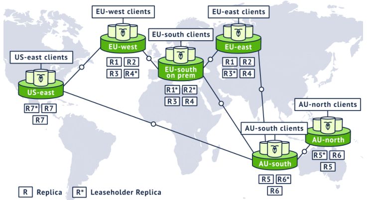
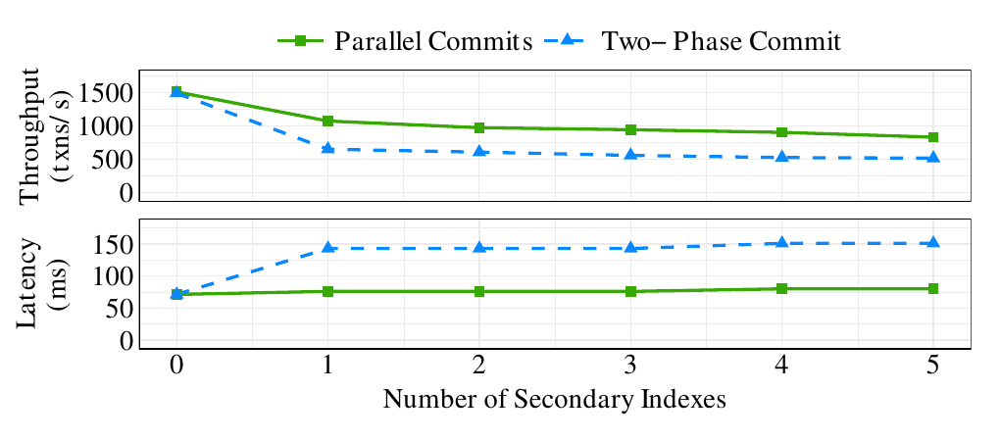
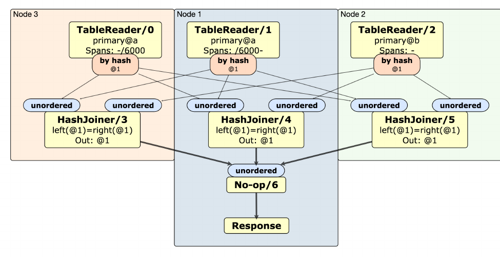
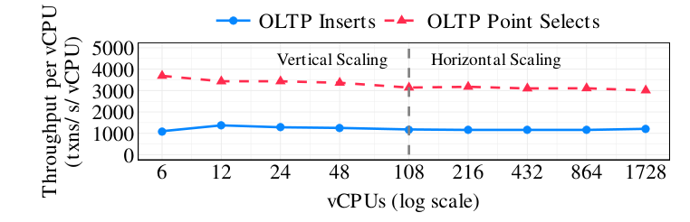
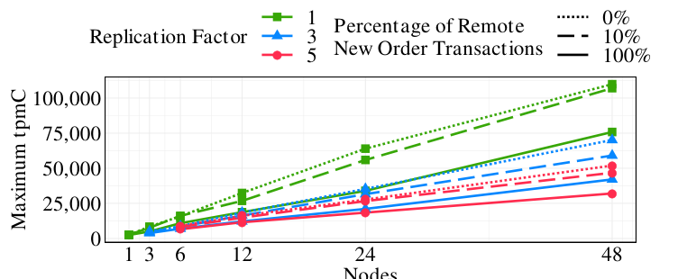
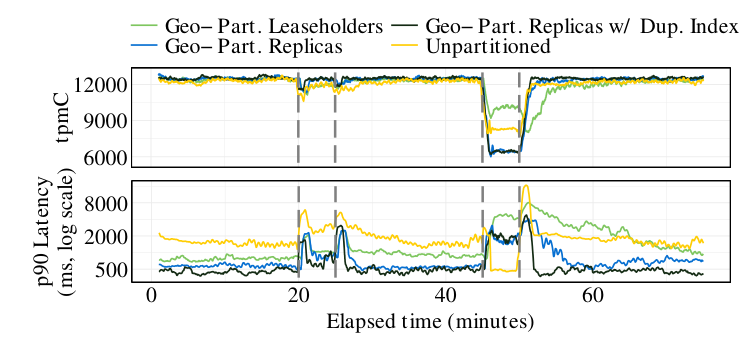
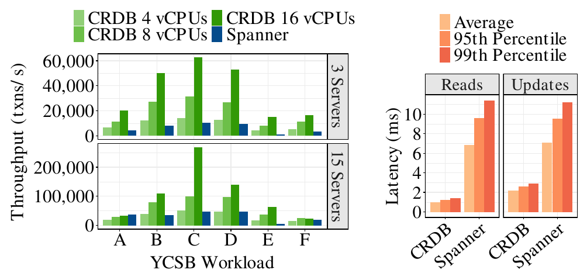

# CockroachDB: The Resilient Geo-Distributed SQL Database（中文译文）

## 译者说明

本文依据同目录的 `source.pdf` 翻译。章节、图表、公式、算法、代码与参考文献按原文结构保留。

## 摘要

我们生活在一个日益互联的世界，许多组织的业务跨越国家乃至大洲。为了服务全球用户，这些组织正在用云端系统替换传统 DBMS；新系统必须能够把 OLTP 工作负载扩展到数百万用户。

CockroachDB（CRDB）是一种可扩展 SQL DBMS，从一开始就面向这种全球 OLTP 工作负载设计，同时保持高可用和强一致性。正如它的名字所暗示的那样，CockroachDB 通过复制与自动恢复机制抵御灾难。

本文介绍 CockroachDB 的设计及其新型事务模型：该模型在商品硬件上支持一致的地理分布式事务。论文说明 CockroachDB 如何复制和分布数据以获得容错与高性能，分布式 SQL 层如何随数据库集群规模自动扩展，同时提供用户所熟悉的标准 SQL 接口。最后，我们给出全面的性能评估和两个用户案例，并总结过去五年构建 CockroachDB 的经验。

## 1. 引言

地理分布式事务处理需求来自全球化应用、数据驻留法规和低延迟访问需求。例如，一个企业可能在欧洲、澳大利亚和美国都有用户；欧洲用户的个人数据必须留在欧盟以满足 GDPR，同时又希望数据尽量靠近访问它的用户。用户期望“永远在线”的体验，因此系统还必须承受区域级故障。为了降低应用复杂度，DBMS 还应提供 SQL 和可串行化事务。



CRDB（CockroachDB 的简称）是一种商业 DBMS，旨在满足上述全部要求。前述公司是真实组织，正在把全球平台迁移到 CRDB；图 1 展示了其 CRDB 部署的战略设想。本文介绍 CRDB 的设计与实现，解释各项设计选择的理由以及沿途总结的经验，并聚焦以下三类特性：

1. **容错与高可用。** 为实现容错，CRDB 在不同地理区域中为数据库的每个分区维护至少三个副本。节点故障时，自动恢复机制维持高可用。
2. **地理分布式分区与副本放置。** CRDB 可水平扩展；增加节点时，系统自动扩容并迁移数据。默认情况下，它用一组启发式规则放置数据（见第 2.2.3 节），也允许用户细粒度控制数据如何跨节点分区以及副本放在哪里，从而优化性能或实施数据驻留策略。
3. **高性能事务。** CRDB 的事务协议支持跨多个分区的高性能地理分布式事务。它无需专用硬件即可提供可串行化隔离，NTP 等标准时钟同步机制就足够，因此可运行在公有云、私有云中的通用服务器上。

CRDB 是以“让数据变得简单”为目标设计的生产级系统。除上述能力外，它还支持 SQL 标准、先进的查询优化器和分布式 SQL 执行引擎，并具备作为记录系统投入生产所需的功能，包括在线 schema change、备份与恢复、快速导入、JSON 支持，以及与外部分析系统集成。

CRDB 的全部源代码可在 GitHub 获取 [12]。数据库核心功能采用 Business Source License（BSL）；三年后该许可证会转换为完全开源的 Apache 2.0 [13]。CRDB 还是“云中立”的：单个集群可以横跨任意数量的公有云和私有云。二者使用户能够降低厂商锁定风险，例如避免依赖专有 SQL 扩展 [6, 23]，或减少暴露于云提供商故障的风险 [70]。

本文其余部分组织如下：第 2 节概述 CRDB，说明复制与战略性数据放置如何提供容错和高可用；第 3 节深入讨论事务模型；第 4 节说明如何在商品硬件的宽松时钟同步条件下，用时间戳排序实现强一致性；第 5 节介绍 SQL 数据模型、规划、执行和 schema change；第 6 节评估系统性能并给出两个用户案例；第 7 节总结构建 CRDB 的经验；第 8 节讨论相关工作；第 9 节给出结论与未来方向。

## 2. 系统概览

CRDB 将所有用户数据组织为一个单调有序的全局键空间。表和索引被编码到该键空间中，再切分为 Range。每个 Range 有多个副本，副本通过 Raft 复制。每个 Range 有一个 leaseholder，负责服务该 Range 上的一致读写请求。

### 2.1 CockroachDB 架构

CRDB 采用标准无共享架构，任意数量节点同时承担数据存储和计算。节点可以共置于一个数据中心，也可以分散到全球各地；客户端可连接集群中任意节点。单节点内部自上而下分为 SQL、事务 KV、分布、复制与存储五层。

#### 2.1.1 SQL 层

SQL 层是所有用户交互的入口，包含解析器、优化器和 SQL 执行引擎，把高层 SQL 语句转成底层 KV 存储的读写请求。通常它看不到数据如何分区或分布，因为下层提供单一整体 KV 存储的抽象；但第 5 节会说明，为提高分布式执行效率，部分查询会有意识地突破这个抽象。

#### 2.1.2 事务 KV 层

SQL 请求进入事务 KV 层后，这一层保证跨多个 KV 对修改的原子性，并承担 CRDB 隔离保证的大部分工作。其核心机制包括 MVCC、事务记录、写意图、并发冲突处理和时间戳推进，详见第 3、4 节。

#### 2.1.3 分布层

分布层把系统数据、内部元数据、用户表和索引统一映射到按键排序的逻辑键空间。该空间按键范围切成连续、约 64MiB 的 Range。系统 Range 中的两级索引维护 Range 边界并被积极缓存，以便快速把每个请求子集路由到相应 Range。

约 64MiB 是搬移速度与访问局部性的折中：足够小，能在节点间快速移动；又足够大，可容纳很可能共同访问的一段连续数据。Range 从空开始增长，过大时拆分、过小时合并；系统还可按负载拆分热点 Range，以缓解 CPU 不均衡。

#### 2.1.4 复制层

每个 Range 默认有 3 个副本，分别位于不同节点。副本组成一个 Raft 组，以共识复制保证修改的持久性和顺序一致。

#### 2.1.5 存储层

最底层是节点本地、由磁盘支撑的 KV 存储，需高效支持点写和范围扫描。论文写作时 CRDB 使用 RocksDB [54]，并把它视为本文不再展开的黑盒。

### 2.2 容错与高可用

#### 2.2.1 使用 Raft 复制

一个 Range 的副本构成 Raft 组，其中长期 leader 协调写入，其他副本为 follower。复制单位是 command，即将应用到底层存储引擎的一组低级编辑。Raft 在副本间维护一致、有序的日志；日志项提交后，各副本分别把命令应用到本地存储。

每个 Range 还使用 lease。Raft 组中只有一个副本是 leaseholder（通常也为 Raft leader），只有它能服务权威的最新读或向 leader 提议写入。所有写都经 leaseholder 后，一致读可绕过一次 Raft 网络往返而不牺牲一致性。用户 Range 的 lease 绑定 leaseholder 所在节点的存活状态；节点每 4.5 秒在系统 Range 中更新一次存活记录，系统 Range 自身使用每 9 秒续租的到期型 lease。检测到 leaseholder 不再存活时，其他副本尝试取得 lease。

Lease 获取也通过 Raft 提交特殊日志项。请求必须携带申请者认为当前有效的旧 lease，避免两个副本取得时间重叠的 lease。第 4 节会说明，lease 区间互不重叠是隔离保证的关键条件。

#### 2.2.2 成员变更与自动负载再平衡

节点加入、移除、暂时故障或永久故障都被视为需要在新节点或剩余存活节点间重新分配负载。短期故障时，只要副本多数仍可用，Raft 就会选出新 leader，事务继续运行；故障副本恢复后，可由同伴发送完整 Range 快照，或只补发缺失日志。选择哪种方式取决于离线期间发生的写入量。

长期故障时，CRDB 自动从健康副本复制出新副本来补足复制因子，并按下一节的规则选择位置。做判断所需的节点存活信息和集群指标通过点对点 gossip 在集群中传播。

#### 2.2.3 副本放置

CRDB 同时提供手动与自动放置。手动方式为节点设置能力属性（硬件、内存、磁盘类型等）和位置属性（国家、区域、可用区等），再在表 schema 中指定放置约束与偏好。例如可以用表中的 `region` 列划分 partition，并把各 partition 映射到指定地理区域。

自动方式在遵守约束和偏好的前提下，让副本跨越磁盘、机架、数据中心或区域等故障域，同时用启发式规则平衡负载与磁盘利用率。

### 2.3 数据放置策略

为了支持地理分布，CRDB 提供几类数据放置策略：

- Geo-partitioned replicas：按地理键把数据分区，每个分区固定在特定区域。该策略支持低延迟本地读写，并可满足数据驻留要求，但区域级故障会导致该区域数据不可用。
- Geo-partitioned leaseholders：leaseholder 固定到访问区域，其他副本分布在剩余区域。该策略提供本地读和区域故障生存能力，但跨区域写入更慢。
- Duplicated indexes：在不同区域复制索引副本，并将每个索引的 leaseholder 固定到对应区域。该策略可服务快速本地读并保持区域故障能力，但写放大和跨区域写入成本更高。

## 3. 事务

CRDB 事务可以跨越整个键空间，访问分布在多个节点上的数据，同时提供 ACID 和可串行化隔离。CRDB 使用 MVCC，事务读取和写入都带时间戳。SQL 客户端连接到 gateway 节点，gateway 作为事务协调器，编排所有操作并最终提交或回滚事务。

### 3.1 概览

SQL 事务从连接所到达的 gateway 节点开始。Gateway 交互式接收 SQL 层请求并把结果返回 SQL 层，同时充当事务协调器。协调器为事务分配时间戳、跟踪写集合和读集合，并把每个 KV 操作路由到相应 Range 的 leaseholder。

#### 3.1.1 在事务协调器上执行

算法 1 展示事务协调器的高级逻辑。协调器维护事务时间戳、未完成操作集合，并将每个 KV 操作发送到对应 Range 的 leaseholder。写流水线（Write Pipelining）允许协调器在不等待当前操作完全复制的情况下返回结果；并行提交（Parallel Commits）允许提交状态与未完成写入并行复制。

```text
Algorithm 1: Transaction Coordinator

inflightOps <- empty
txnTimestamp <- now()
for op <- KV operation received from SQL layer:
  op.ts <- txnTimestamp
  if op.commit:
    op.deps <- inflightOps
  else:
    op.deps <- { x in inflightOps | x.key = op.key }
    inflightOps <- (inflightOps - op.deps) union { op }
  resp <- SendToLeaseholder(op)
  if resp.ts > op.ts:
    if op.key unchanged over (txnTimestamp, resp.ts):
      txnTimestamp <- resp.ts
    else:
      return transaction failed
  send resp to SQL layer
if op.commit:
  asynchronously notify leaseholder to commit
```

SQL 要求当前操作返回响应后才会发出下一项操作。为避免事务在复制期间停顿，协调器采用两项优化：Write Pipelining 允许在当前操作尚未完成复制时就返回结果；Parallel Commits 让提交操作和写流水线并行复制。二者结合后，许多多语句 SQL 事务只需一轮复制延迟即可完成。

协调器跟踪可能尚未复制完的操作，并维护事务时间戳；时间戳初始为当前时间，随后可以向前推进。每项操作都带有待读取或更新的 key，以及是否要随当前操作提交事务的元数据。非提交操作若不与更早操作重叠，就可立即执行，从而把不同 key 上的多个操作流水化；若当前操作依赖同一 key 上较早的 in-flight 操作，就必须等它完成复制，这会形成 pipeline stall。协调器把当前操作登记为 in-flight，并把算出的依赖交给算法 2。

协调器随后把操作发送给对应 leaseholder 并等待响应。响应可能带有升高后的时间戳，表示另一个事务的读取迫使 leaseholder 推进该操作。协调器通过一轮 RPC 验证：在新时间戳重新执行事务先前的读取，是否仍会返回相同值。验证成功就推进事务时间戳；否则事务失败，并可能需要重试。第 3.4 节会详细讨论这一机制。

提交事务时，朴素方案必须先确认所有写都已复制，再提交事务状态，至少需要两轮串行共识。Parallel Commits 引入 `staging` 状态，使事务的真实状态取决于全部写是否已复制。协调器可以在复制 `staging` 状态的同时验证仍未完成的写；二者都成功时，便立即向 SQL 层确认事务已提交，随后异步把事务状态明确记录为 `committed`。第 3.2 节会说明协调器意外崩溃后如何解析 `staging` 记录。

我们用 TLA+ [36, 38] 形式化验证了 Parallel Commits 的安全性。原子性检查断言：无论协调器是否故障，每个 `staging` 事务最终都会被明确提交或中止，且客户端不会收到与此相反的结果；持久性检查断言已提交事务始终保持提交。验证代码可在 GitHub 获取 [14]。

我们还在分布于三个区域的三台服务器上运行微基准。工作负载对一个十列的表做单行写入，并改变这些列上的二级索引数量。图 2 表明，只要表上存在一个或多个二级索引、索引更新因而需要跨 Range 事务，Parallel Commits 就能把吞吐最高提高 72%，把 p50 延迟最高降低 47%。即使事务需要跨 Range 协调，其延迟曲线仍基本保持稳定。



#### 3.1.2 在 Leaseholder 上执行

算法 2 展示 leaseholder 处理单个操作的流程。leaseholder 首先验证自己的 lease 仍然有效，并获取操作依赖 key 上的 latch。对于写操作，它把操作推到 key 的最高读取时间戳之后，以免使已有读失效。随后它执行 evaluation，确定存储层需要的底层命令和返回给客户端的 response。

```text
Algorithm 2: Leaseholder

Function Handle(op):
  verify lease
  wait for latches on keys of {op} union op.deps
  verify writes in op.deps are replicated
  if op is not read-only:
    push op.ts past highest read timestamp for op.key
  command, response <- evaluate op
  response.ts <- op.ts
  if not op.commit:
    send response to coordinator
  if op is not read-only:
    replicate and apply command
  release latches
  if op.commit:
    send response to coordinator
```

读操作不需要复制；写操作需要通过 Raft 达成共识并应用命令。提交操作则在写入复制后通知协调器。算法没有展开 evaluation 阶段，因为这可能包含未提交写、意图解析和并发事务冲突处理。

### 3.2 原子性保证

CRDB 把事务的所有写都视为提交前的临时值，称为写意图（write intent）。Intent 是普通 MVCC KV 对，只是前面带有指向事务记录的元数据。事务记录是每事务唯一的特殊 key，存放 `pending`、`staging`、`committed` 或 `aborted` 状态，并与事务第一次写入位于同一 Range；修改这一条记录即可原子改变全部 intent 的可见性。长事务的协调器会周期性 heartbeat `pending` 记录，向竞争事务表明它仍在推进。

读取者遇到 intent 时跟随指针读取事务记录。若状态为 `committed`，intent 作为普通值可见并顺便清理元数据；若为 `aborted`，则忽略并删除 intent；若为 `pending`，读取者等待事务结束。协调器故障后，竞争事务最终发现记录过期并将其标记为 aborted。`staging` 表示事务已经提交或中止，但读取者尚不能确定；读取者会尝试通过阻止其中一个写完成复制来中止它，如果全部写早已复制，则证明事务实际已提交并更新记录。

CRDB 的并行提交通过 staging 状态减少提交延迟。协调器可以在确认所有写和 staging 记录最终可提交后，向客户端返回成功；若之后异步清理未完成，也不会破坏原子性。

### 3.3 并发控制

每个事务都在其提交时间戳上读写，因而全系统事务可按时间戳全序排列，形成可串行化执行。事务冲突可能要求推进提交时间戳；时间戳改变后，事务通常通过第 3.4 节的 read refresh 证明旧读在新时间戳仍有效，从而不必从头重启。

#### 3.3.1 写-读冲突

读操作遇到时间戳更早的未提交 intent 时，要在内存等待队列中等待该事务结束；遇到时间戳更晚的 intent 时则忽略它，无须等待。

#### 3.3.2 读-写冲突

若 key 已在时间戳 `t_b >= t_a` 被读取，则不能再于 `t_a` 写入。CRDB 把写事务的提交时间戳推进到 `t_b` 之后。

#### 3.3.3 写-写冲突

写操作遇到更早的未提交 intent 时等待；遇到更晚、已经提交的值时，把自己的时间戳推进到它之后。不同事务以不同顺序写 intent 还可能造成死锁，CRDB 使用分布式死锁检测，在等待环中中止一个事务。

### 3.4 读刷新

提交时间戳从 `t_a` 推进到 `t_b > t_a` 后，为维持可串行化，读时间戳必须同步推进。只有能证明事务在 `t_a` 读过的数据在区间 `(t_a, t_b]` 没有更新时，推进才安全；若发生变化，事务必须重启。尚未向客户端交付结果时，CRDB 可在内部重试；为了提高重试成功率，系统会推迟重启，让原事务先在打算写入的 key 上放置作为写锁的 intent。结果已经交付时，则通知客户端丢弃结果并重启。

协调器在内存预算范围内保存读集合。Read refresh 会重新扫描这些 key，检查区间内是否出现 MVCC 版本；这等价于检测 PostgreSQL SSI 跟踪的 rw 反依赖。为避免维护完整依赖图，CRDB 与 PostgreSQL 一样可能产生假阳性，即中止一个理论上可继续的事务。扫描遇到不确定值时也会尝试 refresh；成功推进时间戳后，该值就能作为过去值返回。

### 3.5 Follower 读取

只读查询可通过 `AS OF SYSTEM TIME` 在非 leaseholder 副本上读取足够久远的历史时间戳。副本要安全服务时间戳 `T`，必须知道 leaseholder 已不再接受 `T' <= T` 的新写，并且自己已应用影响该 MVCC 快照的全部 Raft 日志前缀。

为此，leaseholder 跟踪所有请求时间戳并周期性发布 closed timestamp，即以后不会再接受写入的时间下界，同时附带当时的 Raft 日志索引。副本据此判断自己是否具备服务某个历史读的完整数据。为提高效率，closed timestamp 和日志索引按节点而非 Range 生成。每个节点还记录到其他节点的延迟；收到足够旧的读请求时（closed timestamp 通常落后当前约 2 秒），它把请求转发给拥有相应副本且距离最近的节点。

## 4. 时钟同步

CRDB 不依赖专用时钟硬件，因此可在公有云或私有云的商品服务器上运行，使用 NTP、Amazon Time Sync Service 等软件同步。时钟机制既要为事务提供时间戳次序，又要在只有宽松同步的条件下支持一致读写。

### 4.1 混合逻辑时钟

集群每个节点维护混合逻辑时钟（Hybrid-Logical Clock, HLC）[20]，时间戳由基于本机粗同步系统时钟的物理部分和基于 Lamport 时钟 [37] 的逻辑部分组成。部署会配置不同 HLC 物理部分之间允许的最大偏移，默认保守值为 500ms。

HLC 有三项关键性质。第一，节点在每条消息中携带 HLC，收到消息后据此推进本地时钟，从而跟踪跨节点因果关系。CRDB 借此维护每个 Range 的 lease 区间互不重叠：协作式 lease 移交通过 HLC 传递因果关系，非协作式获取则在两个 lease 区间之间等待最大时钟偏移。

第二，同一节点内以及跨重启都严格单调。进程内单调性直接保证；重启后节点在服务请求前等待一个最大时钟偏移周期。这样，同一节点发起的两个有因果关系的事务会获得反映真实顺序的时间戳。第三，孤立的短暂时钟漂移发生时，消息接收会不断把 HLC 向前推进；只要集群通信充分，各节点 HLC 倾向于收敛，即使物理时钟暂时分歧也能自稳定。它不是强保证，但实践中可掩盖部分同步故障。

### 4.2 不确定区间

可串行化本身不约束事务次序与真实时间的关系。正常条件下，CRDB 对单 key 读写提供线性一致性：每个操作像是在某一瞬间原子发生，且全序与真实时间一致，因此不会发生陈旧读。CRDB 不提供严格可串行化，因为访问互不相交 key 集合的事务次序不保证与真实时间一致；除非客户端之间存在能影响数据库操作的外部低延迟通信通道，这通常不构成应用问题。

事务创建时，从协调器本地 HLC 取得暂定提交时间 `commit_ts`，不确定区间为：

$$
[\text{commit\\_ts},\ \text{commit\\_ts}+\text{max\\_offset}].
$$

时间戳低于 `commit_ts` 的值显然属于过去，读时可见、写时可覆盖。没有全局同步时，一个真实时间上更晚的事务，其暂定时间戳可能比因果前驱早至多 `max_offset`。若事务遇到时间戳高于 `commit_ts` 但落在不确定区间内的值，就执行 uncertainty restart：把暂定提交时间推进到该值之后，同时保持不确定区间上界不变。这样区间内所有值都被当作过去写，单 key 操作顺序因而与真实时间一致。

### 4.3 时钟偏斜下的行为

即使节点偏斜超过配置上限，单个 Range 内由 Raft 构造的修改顺序仍保持线性一致，因为 Raft 不依赖时钟。问题来自 leaseholder 可绕过 Raft 服务读：严重偏斜下，多个节点可能同时以为自己持有同一 Range 的有效 lease。

CRDB 使用两道保护维持隔离。其一，lease 带起止时间，leaseholder 不能服务时间戳超出区间的读写，并且 lease 区间互不重叠。其二，每次写入 Raft 日志都携带提议时所依据的 lease 序号；复制成功后再与当前有效 lease 核对，不一致就拒绝。Lease 变更本身也写入同一 Raft 日志，因此任一时刻只有一个 leaseholder 能真正修改 Range。第一道保护防止新 leaseholder 的写使旧 leaseholder 已服务的读失效，第二道保护防止旧 leaseholder 的写使新 leaseholder 的读写失效。即使严重偏斜，CRDB 仍保持可串行化隔离。

超过偏移上限仍可能破坏有因果关系事务之间的单 key 线性一致性。若两个事务通过不同 gateway 发起，第二个节点的时钟比第一个慢超过 `max_offset`，第一个事务写入的时间戳可能落在第二个事务不确定区间之外，造成第二个事务读不到已完成写，即陈旧读。节点会周期测量彼此偏移；若某节点相对多数节点超过最大偏移的 80%，它会主动终止，以降低这种情况的概率。

## 5. 分布式 SQL

所有用户操作都经过 SQL 层。CRDB 支持 ANSI SQL 的大部分 PostgreSQL 方言，并加入地理分布式数据库所需的扩展。

### 5.1 SQL 数据模型

每个 SQL 表和索引被存储在一个或多个 Range 中。所有用户数据存储在一个或多个有序索引中，其中一个是主索引。主索引以主键编码，其他列存储在值中；二级索引以索引键编码，并存储主键列以及索引模式中指定的额外列。CRDB 也支持 hash index，用于避免热点并把负载分散到多个 Range。

### 5.2 查询优化器

CRDB 使用 Cascades 风格查询优化器。转换规则用名为 Optgen 的 DSL 编写，Optgen 会编译成 Go 代码并集成到 CRDB 代码库。规则包括 normalization rule 和 exploration rule：前者重写为逻辑等价的规范形式，后者探索 join 重排、算法选择和分布式执行方式等替代计划。

#### 5.2.1 Optgen：查询变换 DSL

优化器用 200 多条变换规则搜索执行计划空间。Optgen 提供定义、匹配和替换计划树算子的语法。例如消除双重否定的规则为：

```text
[EliminateNot, Normalize]
(Not (Not $input:*)) => $input
```

关系表达式规则可调用任意 Go 方法，但都由箭头左侧匹配模式和右侧逻辑等价替换模式组成。Normalization 规则用新表达式替换原表达式；join 重排、join 算法选择等 Exploration 规则则保留两者，让优化器按估算代价选择。两类规则在统一搜索中交错应用；生成代码会延迟分配算子内存，直到所有适用 normalization 都完成。

#### 5.2.2 感知分布的优化器

优化器知道 CRDB 的地理分布和分区信息。例如表 `t` 有索引 `idx(region, id)`，且只分为 `east`、`west` 两个 partition，那么 `SELECT * FROM t WHERE id = 5` 可静态改写为附加 `(region = 'east' OR region = 'west')` 的查询，从而使用该索引。这类似 Oracle index skip scan [29]，但过滤条件来自 schema 而非直方图。

优化器还把数据分布纳入代价模型。若一个二级索引在每个区域都有副本，它会根据索引副本与查询 gateway 的距离赋予代价，以减少跨区域数据搬移。

### 5.3 查询规划与执行

CRDB 的 SQL 查询可在两种模式下执行：gateway-only 模式中，规划查询的节点负责全部 SQL 处理；distributed 模式中，集群中其他节点参与 SQL 处理。论文所述版本只有只读查询可使用 distributed 模式。由于分布层提供整体键空间抽象，SQL 算子无论在哪种模式下都能从任意节点访问任意 Range。系统用启发式规则估算网络传输量；只读少量行的查询留在 gateway，大查询才做分布式物理规划。



物理规划阶段把优化器计划转换为物理 SQL 算子 DAG。逻辑扫描按 Range 所在节点拆为多个 TableReader；其余过滤、join 和聚合尽量调度到相同节点、靠近物理数据。图 3 的三节点 hash join 中，表 `b` 的目标 Range 位于节点 2，表 `a` 分布在节点 1、3；扫描结果按 hash 重分布到参与节点，本地 HashJoiner 完成连接，再返回 gateway 合并结果。用户可用 `EXPLAIN(DISTSQL)` 为任意查询生成这类物理图。

#### 5.3.1 逐行执行引擎

主执行引擎采用 Volcano 迭代器模型，每次处理一行。CRDB 所有 SQL 功能都在此实现，包括 join、聚合、排序、窗口函数等。

#### 5.3.2 向量化执行引擎

向量化引擎受 MonetDB/X100 [7] 启发，以面向列的数据批而非行处理部分查询。KV 层读取时把磁盘行格式转为列批，发回用户前再转回行格式，转换开销很小。算子针对支持的每种 SQL 类型做单态化，显著降低逐行解释开销；Go 在论文写作时不支持专门化泛型，因此这些实现由模板生成。

所有向量化算子都能处理 selection vector，即紧凑存放尚未被前序过滤移除的行索引，避免每次过滤都物理搬移数据。Merge join 等复杂算子会按是否存在 selection vector 生成不同内部循环。这些优化使单算子加速超过两个数量级，TPC-H 查询最高约加速 4 倍。

### 5.4 Schema Change

CRDB 支持在线 schema change，例如添加列或二级索引。表在 schema change 期间保持在线，可以继续读写，不同节点也可以在不同时间异步切换到新 schema。CRDB 采用 F1 [52] 的方案，将每个 schema change 分解为一系列增量变化。添加二级索引时，初始版本和最终版本之间需要两个中间 schema 版本，以确保整个集群的写入都会更新该索引，然后才能允许读取它。只要始终保证集群中同时使用的 schema 至多为两个相邻版本，数据库在 schema change 全程就能保持一致。

## 6. 评估

论文使用 CRDB v19.2.2 进行评估，考察可扩展性、多区域可用性、与 Spanner 的比较，以及用户案例。

### 6.1 CockroachDB 可扩展性

#### 6.1.1 垂直与水平扩展

我们使用 Sysbench OLTP 套件 [33] 中的插入和点查工作负载评估垂直与水平扩展。图 4 显示，读写吞吐除以 vCPU 后，在 vCPU 数增加时近乎恒定。垂直扩展实验使用三节点集群，并依次采用 `c5d.large`、`c5d.xlarge`、`c5d.2xlarge`、`c5d.4xlarge` 和 `c5d.9xlarge` AWS 实例，分别含 2、4、8、16 和 36 个 vCPU。水平扩展实验固定使用 `c5d.9xlarge`，把集群从 3 个节点扩展到 48 个节点。



所有集群都横跨 `us-east-1` 的三个可用区，每个点是三次运行的平均值。每项实验在每个节点上使用 4 张表、每表 1,000,000 行；48 节点集群的数据量约为 38 GB。结果表明，CRDB 在这些易并行工作负载上具备垂直和水平扩展能力。

#### 6.1.2 跨节点协调的可扩展性

我们使用 TPC-C [68]，改变 New Order 事务访问远程 warehouse 的比例，同时改变同样会引入跨节点协调的复制因子，以评估跨节点协调开销。



相对单副本，三副本的复制开销会使吞吐最高降低 48%，五副本最高降低 57%；分布式事务还会进一步使吞吐最高降低 46%。尽管如此，所有工作负载仍随集群规模线性扩展。实验使用每台 4 vCPU 的 `n1-standard-4` GCP 机器 [25]。每个点取三次运行的平均值；每次运行寻找能够持续至少 10 分钟的最高 tpmC。由于 TPC-C 吞吐随数据量扩展，最大实验使用 10,000 个 warehouse，对应 800 GB 数据。

| System | Warehouses | Max tpmC | Efficiency | NewOrder p90 latency | Machine type | Node count |
| --- | ---: | ---: | ---: | ---: | --- | ---: |
| CockroachDB | 1,000 | 12,474 | 97.0% | 39.8 ms | c5d.4xlarge | 3 |
| CockroachDB | 10,000 | 124,036 | 96.5% | 436.2 ms | c5d.4xlarge | 15 |
| CockroachDB | 100,000 | 1,245,462 | 98.8% | 486.5 ms | c5d.9xlarge | 81 |
| Amazon Aurora | 1,000 | 12,582 | 97.8% | not reported | - | - |
| Amazon Aurora | 10,000 | 9,406 | 7.3% | not reported | - | - |

表 1 展示 CRDB 能在 100,000 warehouse、约 500 亿行和 8 TB 数据上接近最大效率运行。

#### 6.1.3 与 Amazon Aurora 的 TPC-C 性能比较

我们还把 CRDB v19.2.0 的 TPC-C 结果与 Amazon 公布的 Aurora 数据对照。CRDB 的所有实验都遵守 TPC-C 规范，包括 think time 以及外键的使用。Aurora 在 1,000 warehouse 时达到 12,582 tpmC，与三节点 CRDB 的 12,474 tpmC 接近；到 10,000 warehouse 时，单主 Aurora 只有 9,406 tpmC、7.3% 效率，而 15 节点 CRDB 达到 124,036 tpmC、96.5% 效率。CRDB 继续扩展到 81 个 `c5d.9xlarge` 节点，在 100,000 warehouse、约 500 亿行和 8 TB 数据上达到 1,245,462 tpmC、98.8% 效率。Aurora 的延迟、机器类型和节点数未报告，AWS 也尚未发布 multi-master Aurora [3] 的 TPC-C 数字，因此这一对照只能说明已公布结果的量级，不能视为严格同配置基准。

### 6.2 多区域可用性与性能

我们在美国三个区域部署 9 个 `n1-standard-4` GCP 节点，并在每个区域另设工作负载生成器，以 TPC-C 1,000 warehouse 工作负载注入可用区和区域故障，比较第 2.3 节的四种放置策略在性能与容错之间的取舍。



图 6 的虚线区间依次表示一个可用区发生故障并恢复，以及整个区域发生故障并恢复。发生故障时，请求会按策略路由到同一区域或另一区域的备用可用区。对于分区策略，表和索引按 warehouse 分区；对于 duplicated indexes 策略，只读的 `items` 表被复制到每个区域。

所有策略都能容忍可用区故障；故障期间的轻微性能下降来自剩余可用区过载。四种策略中，只有 geo-partitioned leaseholders 能容忍整个区域故障，因此区域故障时维持的吞吐更高，但稳定运行和恢复时的 p90 延迟也高于两种 geo-partitioned replicas 变体。恢复较慢是因为主区域要追赶错过的写。区域故障时的性能下降，按策略不同，来自远程 warehouse 事务被阻塞，或客户端必须跨区域发出查询。稳定条件下，duplicated indexes 的 p90 延迟最低。

### 6.3 与 Spanner 比较

我们使用官方 YCSB 生成器 [76] 及 Spanner、JDBC 客户端，比较 CRDB 与 Cloud Spanner。Spanner 是托管服务，不公开硬件配置，因此实验给出每节点 4、8、16 vCPU 的多种 CRDB 配置作为对照。作为成本参照，三台带本地存储的 `n2-standard-8` GCP 虚拟机（每台 8 vCPU）与一个由三副本组成的 Spanner “node” 价格相差不到 0.2%。所有测试都在单一区域内横跨三个可用区放置副本。



多数 YCSB 工作负载上，CRDB 的吞吐显著高于 Spanner，两套系统都能随集群规模水平扩展。例外是 update-heavy、key 呈 Zipf 分布的 Workload A；CRDB 在其高竞争访问模式下扩展不佳，我们预计 20.1 版将加入的可选读锁会显著改善这类负载。轻负载下，CRDB 的读写平均、p95 和 p99 延迟也明显更低，我们认为原因之一是 Spanner 的 commit-wait。重负载延迟虽然趋势相似，但噪声较大，论文因篇幅未报告。

### 6.4 使用案例

CRDB 被数千个组织使用。论文具体介绍两个案例。

#### 6.4.1 电信服务商的虚拟客服代理

一家美国电信服务商希望通过全天候虚拟代理降低客服成本。代理把客户对话元数据记录在 session 数据库中；团队因 CRDB 的强一致性、区域故障容忍能力和地理分布集群性能而选择它。出于成本原因，该团队把多区域 CRDB 集群拆分部署在自有数据中心与多个 AWS 区域，CRDB 对混合部署的支持使之可行。为承受区域故障，他们采用 geo-partitioned leaseholders：写入要跨区域取得 quorum，但读取保持本地。

#### 6.4.2 在线游戏公司的全球平台

一家每天处理 3,000 万至 4,000 万笔金融事务的在线游戏公司要为全球平台选择数据库。它对数据合规、一致性、性能和服务可用性都有严格要求；核心用户在欧洲和澳大利亚，美国用户快速增长，因此既要隔离故障域，也要为合规与低延迟把用户数据固定到特定地域。CRDB 的架构适合这些要求，已经成为该公司长期路线图中的战略组件；图 1 展示了其部署设想。

## 7. 经验教训

### 7.1 让 Raft 在生产中运行

CRDB 最初选择 Raft 作为共识算法，因为其实现描述精确且被认为易于使用；生产实践表明，把它嵌入复杂数据库仍有挑战。

#### 7.1.1 减少通信噪声

大规模部署可能维护数十万个 Raft group，每个 Range 一个；若每个 leader 分别向 follower 周期发送心跳，通信成本很高。CRDB 做了两项改动：把相同节点之间的心跳合并为每节点一次，以节省每 RPC 开销；暂停近期没有写活动的 Raft group。

#### 7.1.2 Joint Consensus

Raft 默认成员变更一次只能添加或删除一个成员。在每区域一个副本的三区域部署中，把副本从一台机器搬到另一台，若先删后加会临时只剩两个副本；若先加后删会临时出现四副本且两个在同一区域。两种中间状态都无法容忍单区域故障。

CRDB 因此实现 Raft 论文所述的原子成员变更 Joint Consensus。它仍有中间配置，但写入必须同时获得旧多数派和新多数派，只有旧或新多数派本身失效时才不可用。ZooKeeper [59] 的重配置协议类似。团队发现其实现复杂度并未明显高于默认协议，因此建议生产级 Raft 系统直接采用 Joint Consensus。

### 7.2 移除快照隔离

CRDB 最初同时提供 `SNAPSHOT` 和 `SERIALIZABLE`。团队把可串行化设为默认，因为应用开发者不应承担 write skew 异常，而且较弱隔离在实现中的性能优势很小；保留快照隔离的初衷只是让部分用户减少事务重试。

但删除 write skew 检查并不能安全地得到快照隔离。快照隔离下强一致性的唯一安全机制是通过 `FOR SHARE`、`FOR UPDATE` 显式悲观锁定；在两种隔离级别并存时，为保证并发强一致，连 `SERIALIZABLE` 事务的行更新也要悲观加锁。为避免让常用路径退化，CRDB 不再真正支持 `SNAPSHOT`，而把它保留为 `SERIALIZABLE` 的别名。

### 7.3 PostgreSQL 兼容性

CRDB 采用 PostgreSQL SQL 方言和网络协议，以复用成熟客户端驱动生态。这一选择显著促进了早期采用，也持续帮助工程团队聚焦决策。但 CRDB 某些行为不同于 PostgreSQL，客户端代码必须介入，例如 MVCC 冲突后重试事务、配置结果分页。

原样复用 PostgreSQL 驱动意味着每个应用都要在更高层学习并部署 CRDB 专用逻辑，成为团队事先没有预料到的长期摩擦。因此我们开始考虑逐步引入 CRDB 专用客户端驱动。

### 7.4 版本升级的陷阱

对强调运维简单性的系统而言，版本间近乎零停机升级不可或缺。CRDB 采用滚动重启到新二进制，但混合版本集群会在复杂系统上进一步增加风险。

早期 CRDB 直接复制 KV API 请求：leaseholder 先把请求提交给 Raft，各副本再各自求值并应用。Range 副本必须包含完全相同的数据，而不同版本在“求值”或“应用”阶段的代码变化可能让副本产生分歧。解决办法是把求值阶段前移：现在复制的是已经求值的请求效果，而不是原始请求，使不同版本副本应用同一确定结果。

### 7.5 跟随工作负载

“Follow the Workload” 机制会把 leaseholder 自动搬到更接近数据访问者的位置，原本面向访问局部性不断变化的工作负载，以动态优化读延迟。但实际很少有人使用：多数运维人员用副本放置的手动控制就能针对预期访问模式调优。

通用数据库的自适应技术 [47] 很难把握节奏，容易过于激进或响应太慢。运维人员更重视性能的一致和可预测，动态方案的不确定性反而阻碍采用。

## 8. 相关工作

**分布式事务模型。** 工业界和学术界已经提出大量支持不同一致性级别与扩展能力的分布式事务系统。许多工作通过降低一致性，试图克服传统关系数据库的扩展难题 [5, 15, 19, 32, 35, 44, 61, 64, 71]。但对很多应用而言，低于可串行化的隔离会允许危险异常，甚至表现为安全漏洞 [73]。CRDB 的设计理念是从系统层消除这些异常，而不是要求开发者在应用层处理。

Spanner [4, 17] 提供最强隔离级别——严格可串行化 [30]。它在所有读写事务中获取读锁，并在每次提交时等待时钟不确定窗口结束。CRDB 的事务协议明显不同：它使用悲观写锁，但除此之外是带 read refresh 的乐观协议；事务若在时钟不确定窗口内观察到冲突写，就推进提交时间戳。这一方案提供可串行化隔离，在低竞争负载上的延迟低于 Spanner，但高竞争时可能需要更多重试，因此我们计划在未来版本支持悲观读锁。Spanner 的协议只有在专用硬件把不确定窗口限制在数毫秒时才实用，而 CRDB 的协议可运行在任意公有云或私有云。

Calvin [66]、FaunaDB [22] 和 SLOG [53] 也提供严格可串行化，但其确定性执行框架要求预先给出读写集合，因而不支持会话式 SQL。H-Store [31] 和 VoltDB [63] 是支持可串行化的主存数据库，针对可分区工作负载优化；当跨分区事务很多时，因分布式事务由单线程处理而表现较差 [79]。L-Store [39] 与 G-Store [18] 通过让所有事务本地提交缓解这一问题，但数据尚未共置时需要在线搬移。

近期工作还研究了如何缩短地理分布式事务的提交时间 [21, 28, 34, 41–43, 75, 78]。与其中许多方法一样，CRDB 在常见情况下只需一轮数据中心间往返即可提交，对应一轮分布式共识。与要求全局共识，或由单个主区域排序多分区事务的系统 [22, 53, 66] 不同，CRDB 只在事务实际写入的分区上取得共识。

**分布式数据放置。** 一些工作研究如何在地理分布式集群中放置数据：有的在满足容错要求和负载均衡的同时最小化事务延迟、最大化可用性 [2, 9, 48, 58, 77]；另一些在遵守延迟 SLO 的前提下最小化成本 [40, 74]。CRDB 通过多种数据放置策略把选择权交给用户。

另一类工作研究按负载重新分区与放置数据。Slicer [1] 对哈希 key 做 Range 分区，并按负载拆分或合并 Range。其他系统 [56, 57, 65] 支持细粒度重分区，以缓解热点或把经常共同访问的数据共置。CRDB 类似地按原始 key 做 Range 分区；相较 Slicer，这有利于范围扫描的局部性，却也更容易产生热点。为缓解热点，CRDB 也可按哈希 key 分区，并像 Slicer 一样拆分、合并和移动 Range 来平衡负载。

**商业分布式 OLTP DBMS。** CRDB 只是当前众多分布式 OLTP DBMS 之一，各系统提供不同功能与一致性保证。Spanner、FaunaDB、VoltDB 以及多种 NoSQL 系统已在上文讨论。Amazon Aurora [72] 通过把数据库 redo log 写入共享存储来复制；它用跨三个可用区的六副本为读取提供高可用，但在当时除 multi-master 版本 [3] 外，单次故障仍可能让写入暂时不可用，并且只能部署在 AWS。

F1 [52, 60] 是 Google 的联邦 SQL 查询处理平台，启发了 CRDB 的分布式执行引擎和在线 schema change 基础设施；它不作为 GCP 产品公开提供，而是在 Google 内部使用。TiDB [67] 是兼容 MySQL wire protocol、面向 HTAP 的开源分布式 SQL DBMS。NuoDB [45] 是专有 NewSQL 数据库，可独立扩展存储层与事务/缓存层。与 CRDB 不同，这些系统不以地理分布式负载为优化目标，并且只支持快照隔离。FoundationDB [24] 是 Apple 的开源键值存储，支持严格可串行化；Apple 的 FoundationDB Record Layer [10] 在其上支持 SQL 的一个子集。

## 9. 结论与未来展望

CockroachDB 是一个面向地理分布式 OLTP 工作负载的 SQL 数据库。它将 Range 分片、Raft 复制、MVCC、事务协调、地理感知数据放置和分布式 SQL 执行组合起来，在商品硬件上提供强一致、可用和可扩展的系统。论文的评估显示 CRDB 能在 Sysbench、TPC-C 和 YCSB 上扩展，并能支持真实多区域生产应用。

它的事务协议不依赖专用时钟硬件即可在规模化部署中提供可串行化隔离；共识复制带来容错和高可用，并允许 leaseholder 与 follower 副本优化本地读。地理分区与 Follow the Workload 使数据靠近访问者，SQL 层则在保留熟悉接口的同时利用分布式执行能力。

后续版本计划重写存储层、加入地理感知查询优化，并继续改进其他组件。更长期目标是加强运维自动化，使数据库从用户视角真正 serverless。CRDB 已提供全托管服务 [11]，但要隐藏全部运维细节，仍需发展分离式存储、按需扩缩和按使用量计费；如何让地理分布式数据库在这种环境下保持高性能，也是适合独立研究的开放问题。我们期待支持并参与这类研究，继续推进“让数据变得简单”的目标。

## 参考文献

- [1] Atul Adya, Daniel Myers, Jon Howell, Jeremy Elson, Colin Meek, Vishesh Khemani, Stefan Fulger, Pan Gu, Lakshminath Bhuvanagiri, Jason Hunter, et al. 2016. Slicer: Auto-sharding for datacenter appli- cations. In 12th USENIX Symposium on Operating Systems Design and Implementation (OSDI 16). 739-753.
- [2] Sharad Agarwal, John Dunagan, Navendu Jain, Stefan Saroiu, Alec Wol- man, and Habinder Bhogan. 2010. Volley: Automated data placement for geo-distributed cloud services. (2010).
- [3] Amazon Aurora Multi-Master. 2019. https://aws.amazon.com/about- aws/whats-new/2019/08/amazon-aurora-multimaster-now- generally-available/.
- [4] David F Bacon, Nathan Bales, Nico Bruno, Brian F Cooper, Adam Dickinson, Andrew Fikes, Campbell Fraser, Andrey Gubarev, Milind Joshi, Eugene Kogan, et al. 2017. Spanner: Becoming a SQL system. In Proceedings of the 2017 ACM International Conference on Management of Data. 331-343.
- [5] Peter Bailis, Ali Ghodsi, Joseph M Hellerstein, and Ion Stoica. 2013. Bolt-on causal consistency. In Proceedings of the 2013 ACM SIGMOD International Conference on Management of Data. ACM, 761-772.
- [6] Itzik Ben-Gan. 2012. Microsoft SQL Server 2012 T-SQL Fundamentals. Pearson Education.
- [7] Peter Boncz, Marcin Zukowski, and Niels Nes. 2005. MonetDB/X100: Hyper-Pipelining Query Execution. Cidr 5 (2005), 225-237.
- [8] Michael J. Cahill, Uwe Röhm, and Alan D. Fekete. 2008. Serializable Iso- lation for Snapshot Databases. In Proceedings of the 2008 ACM SIGMOD International Conference on Management of Data (SIGMOD ’08). ACM, New York, NY, USA, 729-738. https://doi.org/10.1145/1376616.1376690
- [9] Aleksey Charapko, Ailidani Ailijiang, and Murat Demirbas. 2018. Adapting to Access Locality via Live Data Migration in Globally Dis- tributed Datastores. In 2018 IEEE International Conference on Big Data (Big Data). IEEE, 3321-3330.
- [10] Christos Chrysafis, Ben Collins, Scott Dugas, Jay Dunkelberger, Moussa Ehsan, Scott Gray, Alec Grieser, Ori Herrnstadt, Kfir Lev-Ari, Tao Lin, et al. 2019. FoundationDB Record Layer: A Multi-Tenant Struc- tured Datastore. In Proceedings of the 2019 International Conference on Management of Data. 1787-1802.
- [11] CockroachCloud. [n.d.]. https://www.cockroachlabs.com/product/ cockroachcloud.
- [12] CockroachDB. [n.d.]. https://github.com/cockroachdb/cockroach.
- [13] CockroachDB. 2019. Business Source License. https://github.com/ cockroachdb/cockroach/tree/v19.2.0/licenses.
- [14] CockroachDB. 2019. TLA+ Verification of Parallel Commits. https://github.com/cockroachdb/cockroach/tree/master/docs/tla- plus/ParallelCommits.
- [15] Brian F Cooper, Raghu Ramakrishnan, Utkarsh Srivastava, Adam Sil- berstein, Philip Bohannon, Hans-Arno Jacobsen, Nick Puz, Daniel Weaver, and Ramana Yerneni. 2008. PNUTS: Yahoo!’s hosted data serving platform. Proceedings of the VLDB Endowment 1, 2 (2008), 1277-1288.
- [16] Brian F Cooper, Adam Silberstein, Erwin Tam, Raghu Ramakrishnan, and Russell Sears. 2010. Benchmarking cloud serving systems with YCSB. In Proceedings of the 1st ACM symposium on Cloud computing. 143-154.
- [17] James C. Corbett, Jeffrey Dean, Michael Epstein, Andrew Fikes, Christo- pher Frost, J. J. Furman, Sanjay Ghemawat, Andrey Gubarev, Christo- pher Heiser, Peter Hochschild, Wilson Hsieh, Sebastian Kanthak, Eugene Kogan, Hongyi Li, Alexander Lloyd, Sergey Melnik, David Mwaura, David Nagle, Sean Quinlan, Rajesh Rao, Lindsay Rolig, Ya- sushi Saito, Michal Szymaniak, Christopher Taylor, Ruth Wang, and Dale Woodford. 2012. Spanner: Google’s Globally-distributed Database. In Proceedings of the 10th USENIX Conference on Operating Systems De- sign and Implementation (OSDI’12). USENIX Association, Berkeley, CA, USA, 251-264. http://dl.acm.org/citation.cfm?id=2387880.2387905
- [18] Sudipto Das, Divyakant Agrawal, and Amr El Abbadi. 2010. G-store: a scalable data store for transactional multi key access in the cloud. In Proceedings of the 1st ACM Symposium on Cloud Computing. ACM, 163-174.
- [19] Giuseppe DeCandia, Deniz Hastorun, Madan Jampani, Gunavardhan Kakulapati, Avinash Lakshman, Alex Pilchin, Swaminathan Sivasubra- manian, Peter Vosshall, and Werner Vogels. 2007. Dynamo: amazon’s highly available key-value store. In ACM SIGOPS operating systems review, Vol. 41. ACM, 205-220.
- [20] Murat Demirbas, Marcelo Leone, Bharadwaj Avva, Deepak Madeppa, and Sandeep Kulkarni. 2014. Logical physical clocks and consistent snapshots in globally distributed databases. (2014).
- [21] Hua Fan and Wojciech Golab. 2019. Ocean vista: gossip-based visibility control for speedy geo-distributed transactions. Proceedings of the VLDB Endowment 12, 11 (2019), 1471-1484.
- [22] FaunaDB. [n.d.]. https://fauna.com/.
- [23] Steven Feuerstein and Bill Pribyl. 2005. Oracle pl/sql Programming. ł O’Reilly Media, Inc.ž.
- [24] FoundationDB. [n.d.]. https://www.foundationdb.org.
- [25] Google Cloud. 2020. Machine Types. https://cloud.google.com/ compute/docs/machine-types.
- [26] Goetz Graefe. 1994. Volcano/spl minus/an extensible and parallel query evaluation system. IEEE Transactions on Knowledge and Data Engineering 6, 1 (1994), 120-135.
- [27] Goetz Graefe. 1995. The cascades framework for query optimization. IEEE Data Eng. Bull. 18, 3 (1995), 19-29.
- [28] Rachid Guerraoui and Jingjing Wang. 2017. How fast can a distributed transaction commit?. In Proceedings of the 36th ACM SIGMOD-SIGACT- SIGAI Symposium on Principles of Database Systems. ACM, 107-122.
- [29] Tim Hall. [n.d.]. https://oracle-base.com/articles/9i/index-skip- scanning.
- [30] Maurice P Herlihy and Jeannette M Wing. 1990. Linearizability: A correctness condition for concurrent objects. ACM Transactions on Programming Languages and Systems (TOPLAS) 12, 3 (1990), 463-492.
- [31] Robert Kallman, Hideaki Kimura, Jonathan Natkins, Andrew Pavlo, Alexander Rasin, Stanley Zdonik, Evan PC Jones, Samuel Madden, Michael Stonebraker, Yang Zhang, et al. 2008. H-store: a high- performance, distributed main memory transaction processing system. Proceedings of the VLDB Endowment 1, 2 (2008), 1496-1499.
- [32] Rusty Klophaus. 2010. Riak core: Building distributed applications without shared state. In ACM SIGPLAN Commercial Users of Functional Programming. ACM, 14.
- [33] Alexey Kopytov. 2012. SysBench manual. http://imysql.com/wp- content/uploads/2014/10/sysbench-manual.pdf. MySQL AB (2012).
- [34] Tim Kraska, Gene Pang, Michael J Franklin, Samuel Madden, and Alan Fekete. 2013. MDCC: Multi-data center consistency. In Proceedings of the 8th ACM European Conference on Computer Systems. ACM, 113- 126.
- [35] Avinash Lakshman and Prashant Malik. 2010. Cassandra: a decen- tralized structured storage system. ACM SIGOPS Operating Systems Review 44, 2 (2010), 35-40.
- [36] Leslie Lamport. [n.d.]. The TLA+ Home Page. http://lamport. azurewebsites.net/tla/tla.html
- [37] Leslie Lamport. 1978. Time, clocks, and the ordering of events in a distributed system. Commun. ACM 21, 7 (1978), 558-565.
- [38] Leslie Lamport. 1994. The temporal logic of actions. ACM Transactions on Programming Languages and Systems (TOPLAS) 16, 3 (1994), 872- 923.
- [39] Qian Lin, Pengfei Chang, Gang Chen, Beng Chin Ooi, Kian-Lee Tan, and Zhengkui Wang. 2016. Towards a non-2pc transaction manage- ment in distributed database systems. In Proceedings of the 2016 Inter- national Conference on Management of Data. ACM, 1659-1674.
- [40] Guoxin Liu and Haiying Shen. 2017. Minimum-cost cloud storage service across multiple cloud providers. IEEE/ACM Transactions on Networking (TON) 25, 4 (2017), 2498-2513.
- [41] Hatem Mahmoud, Faisal Nawab, Alexander Pucher, Divyakant Agrawal, and Amr El Abbadi. 2013. Low-latency multi-datacenter databases using replicated commit. Proceedings of the VLDB Endow- ment 6, 9 (2013), 661-672.
- [42] Faisal Nawab, Divyakant Agrawal, and Amr El Abbadi. 2018. Dpaxos: Managing data closer to users for low-latency and mobile applications. In Proceedings of the 2018 International Conference on Management of Data. ACM, 1221-1236.
- [43] Faisal Nawab, Vaibhav Arora, Divyakant Agrawal, and Amr El Abbadi. 2015. Minimizing commit latency of transactions in geo-replicated data stores. In Proceedings of the 2015 ACM SIGMOD International Conference on Management of Data. ACM, 1279-1294.
- [44] Rajesh Nishtala, Hans Fugal, Steven Grimm, Marc Kwiatkowski, Her- man Lee, Harry C Li, Ryan McElroy, Mike Paleczny, Daniel Peek, Paul Saab, et al. 2013. Scaling memcache at facebook. In Presented as part of the 10th USENIX Symposium on Networked Systems Design and Implementation (NSDI 13). 385-398.
- [45] NuoDB. [n.d.]. https://www.nuodb.com.
- [46] Diego Ongaro and John Ousterhout. 2014. In search of an understand- able consensus algorithm. In 2014 USENIX Annual Technical Conference (USENIX ATC 14). 305-319.
- [47] Andrew Pavlo, Gustavo Angulo, Joy Arulraj, Haibin Lin, Jiexi Lin, Lin Ma, Prashanth Menon, Todd C Mowry, Matthew Perron, Ian Quah, et al. 2017. Self-Driving Database Management Systems.. In CIDR, Vol. 4. 1.
- [48] Fan Ping, Jeong-Hyon Hwang, XiaoHu Li, Chris McConnell, and Rohini Vabbalareddy. 2011. Wide area placement of data replicas for fast and highly available data access. In Proceedings of the fourth international workshop on Data-intensive distributed computing. ACM, 1-8.
- [49] Dan RK Ports and Kevin Grittner. 2012. Serializable snapshot isolation in PostgreSQL. Proceedings of the VLDB Endowment 5, 12 (2012), 1850- 1861.
- [50] Raphael ‘kena’ Poss. 2018. The łPostgreSQLž in CockroachDB-Why? (May 2018). https://dr-knz.net/postgresql-cockroachdb-why.html
- [51] PostgreSQL. [n.d.]. https://www.postgresql.org/.
- [52] Ian Rae, Eric Rollins, Jeff Shute, Sukhdeep Sodhi, and Radek Vingralek. 2013. Online, Asynchronous Schema Change in F1. VLDB 6, 11 (2013), 1045-1056.
- [53] Kun Ren, Dennis Li, and Daniel J Abadi. 2019. SLOG: serializable, low-latency, geo-replicated transactions. Proceedings of the VLDB Endowment 12, 11 (2019), 1747-1761.
- [54] RocksDB. [n.d.]. https://rocksdb.org/.
- [55] Debanjan Saha, Gurmit Singh Ghatore, and Brandon O’Brien. 2017. DAT202: Getting started with Amazon Aurora. https://www.slideshare.net/AmazonWebServices/dat202getting- started-with-amazon-aurora/14. AWS re:Invent.
- [56] Marco Serafini, Essam Mansour, Ashraf Aboulnaga, Kenneth Salem, Taha Rafiq, and Umar Farooq Minhas. 2014. Accordion: Elastic scala- bility for database systems supporting distributed transactions. Pro- ceedings of the VLDB Endowment 7, 12 (2014), 1035-1046.
- [57] Marco Serafini, Rebecca Taft, Aaron J Elmore, Andrew Pavlo, Ashraf Aboulnaga, and Michael Stonebraker. 2016. Clay: Fine-grained adaptive partitioning for general database schemas. Proceedings of the VLDB Endowment 10, 4 (2016), 445-456.
- [58] Artyom Sharov, Alexander Shraer, Arif Merchant, and Murray Stokely. 2015. Take me to your leader!: online optimization of distributed storage configurations. Proceedings of the VLDB Endowment 8, 12 (2015), 1490-.
- [59] Alexander Shraer, Benjamin Reed, Dahlia Malkhi, and Flavio P Jun- queira. 2012. Dynamic Reconfiguration of Primary/Backup Clusters. In Presented as part of the 2012 USENIX Annual Technical Conference (USENIX ATC 12). 425-437.
- [60] Jeff Shute, Radek Vingralek, Bart Samwel, Ben Handy, Chad Whip- key, Eric Rollins, Mircea Oancea, Kyle Littlefield, David Menestrina, Stephan Ellner, et al. 2013. F1: A distributed SQL database that scales. Proceedings of the VLDB Endowment 6, 11 (2013), 1068-1079.
- [61] Kristina Spirovska, Diego Didona, and Willy Zwaenepoel. 2018. Wren: Nonblocking reads in a partitioned transactional causally consistent data store. In 2018 48th Annual IEEE/IFIP International Conference on Dependable Systems and Networks (DSN). IEEE, 1-12.
- [62] Michael Stonebraker. 1986. The case for shared nothing. IEEE Database Eng. Bull. 9, 1 (1986), 4-9.
- [63] Michael Stonebraker and Ariel Weisberg. 2013. The VoltDB Main Memory DBMS. IEEE Data Eng. Bull. 36, 2 (2013), 21-27.
- [64] Roshan Sumbaly, Jay Kreps, Lei Gao, Alex Feinberg, Chinmay Soman, and Sam Shah. 2012. Serving large-scale batch computed data with project voldemort. In Proceedings of the 10th USENIX conference on File and Storage Technologies. USENIX Association, 18-18.
- [65] Rebecca Taft, Essam Mansour, Marco Serafini, Jennie Duggan, Aaron J Elmore, Ashraf Aboulnaga, Andrew Pavlo, and Michael Stonebraker. 2014. E-store: Fine-grained elastic partitioning for distributed trans- action processing systems. Proceedings of the VLDB Endowment 8, 3 (2014), 245-256.
- [66] Alexander Thomson, Thaddeus Diamond, Shu-Chun Weng, Kun Ren, Philip Shao, and Daniel J Abadi. 2012. Calvin: fast distributed trans- actions for partitioned database systems. In Proceedings of the 2012 ACM SIGMOD International Conference on Management of Data. ACM, 1-12.
- [67] TiDB. [n.d.]. https://pingcap.com/en/.
- [68] TPC-C. [n.d.]. http://www.tpc.org/tpcc/.
- [69] TPC-H. [n.d.]. http://www.tpc.org/tpch/.
- [70] Benjamin Treynor Sloss. 2019. An update on Sunday’s service dis- ruption. https://cloud.google.com/blog/topics/inside-google-cloud/an- update-on-sundays-service-disruption.
- [71] Misha Tyulenev, Andy Schwerin, Asya Kamsky, Randolph Tan, Alyson Cabral, and Jack Mulrow. 2019. Implementation of Cluster-wide Logical Clock and Causal Consistency in MongoDB. In Proceedings of the 2019 International Conference on Management of Data. ACM, 636-650.
- [72] Alexandre Verbitski, Anurag Gupta, Debanjan Saha, Murali Brahmade- sam, Kamal Gupta, Raman Mittal, Sailesh Krishnamurthy, Sandor Mau- rice, Tengiz Kharatishvili, and Xiaofeng Bao. 2017. Amazon aurora: Design considerations for high throughput cloud-native relational databases. In Proceedings of the 2017 ACM International Conference on Management of Data. ACM, 1041-1052.
- [73] Todd Warszawski and Peter Bailis. 2017. ACIDRain: Concurrency- related attacks on database-backed web applications. In Proceedings of the 2017 ACM International Conference on Management of Data. ACM, 5-20.
- [74] Zhe Wu, Michael Butkiewicz, Dorian Perkins, Ethan Katz-Bassett, and Harsha V Madhyastha. 2013. Spanstore: Cost-effective geo-replicated storage spanning multiple cloud services. In Proceedings of the Twenty- Fourth ACM Symposium on Operating Systems Principles. ACM, 292- 308.
- [75] Xinan Yan, Linguan Yang, Hongbo Zhang, Xiayue Charles Lin, Bernard Wong, Kenneth Salem, and Tim Brecht. 2018. Carousel: low-latency transaction processing for globally-distributed data. In Proceedings of the 2018 International Conference on Management of Data. ACM, 231-243.
- [76] YCSB. [n.d.]. https://ycsb.site.
- [77] Victor Zakhary, Faisal Nawab, Divy Agrawal, and Amr El Abbadi. 2018. Global-Scale Placement of Transactional Data Stores.. In EDBT. 385-396.
- [78] Irene Zhang, Naveen Kr Sharma, Adriana Szekeres, Arvind Krishna- murthy, and Dan RK Ports. 2018. Building consistent transactions with inconsistent replication. ACM Transactions on Computer Systems (TOCS) 35, 4 (2018), 12.
- [79] Tao Zhu, Zhuoyue Zhao, Feifei Li, Weining Qian, Aoying Zhou, Dong Xie, Ryan Stutsman, Haining Li, and Huiqi Hu. 2018. Solar: towards a shared-everything database on distributed log-structured storage. In 2018 USENIX Annual Technical Conference (USENIX ATC 18). 795-807.
