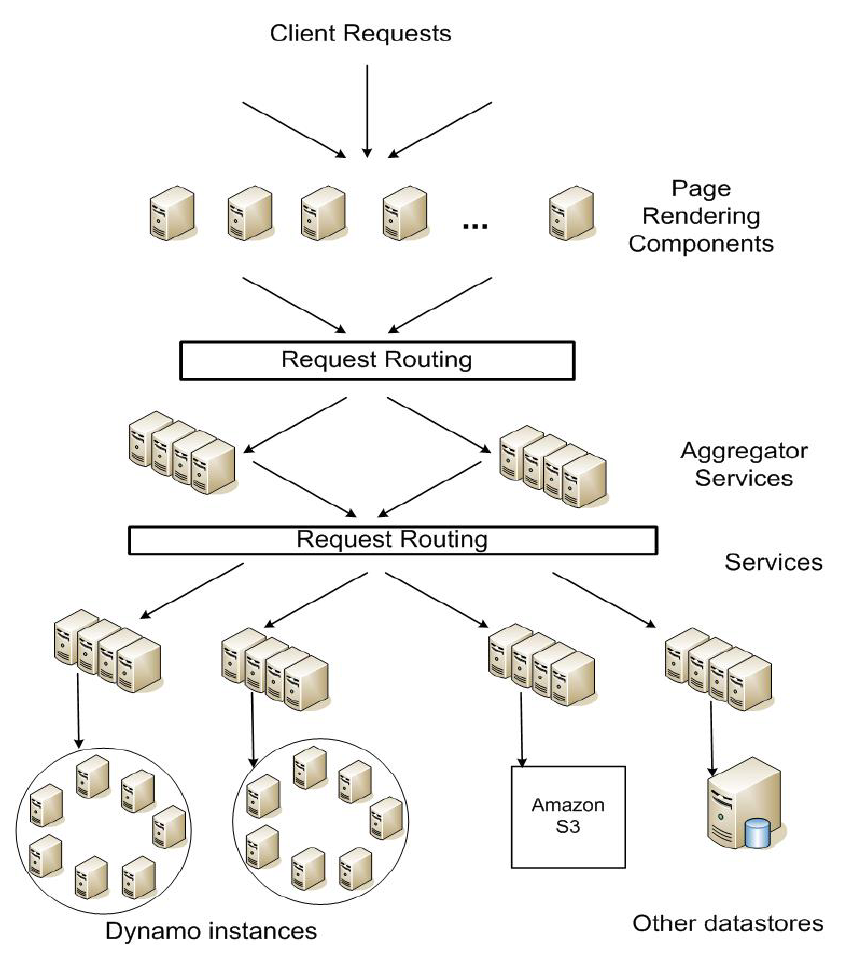
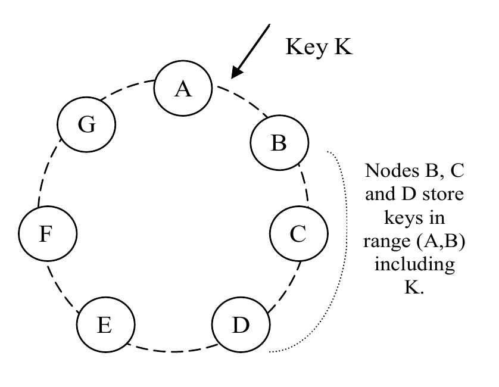
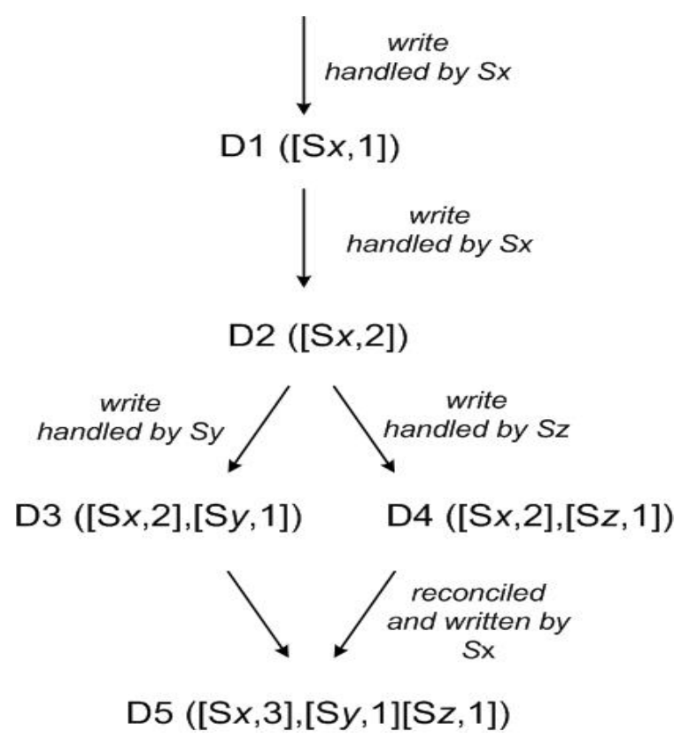
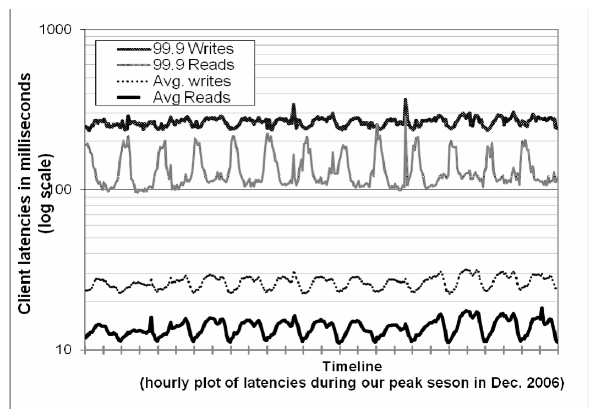
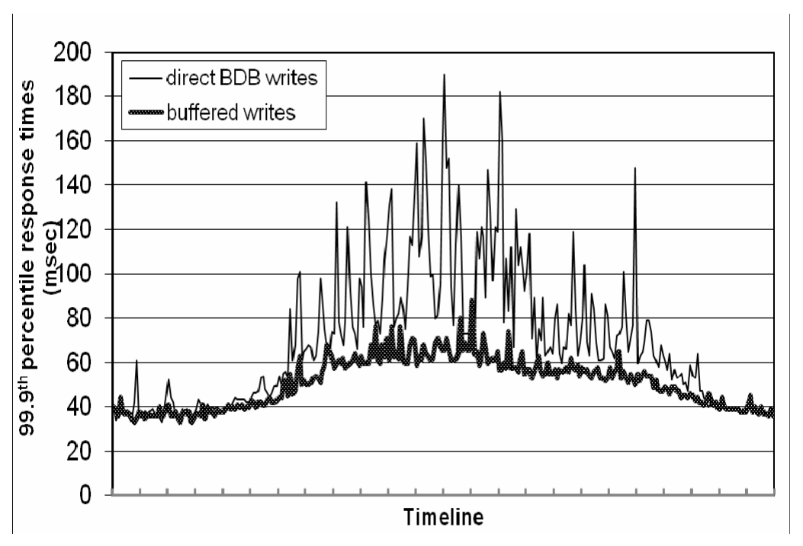
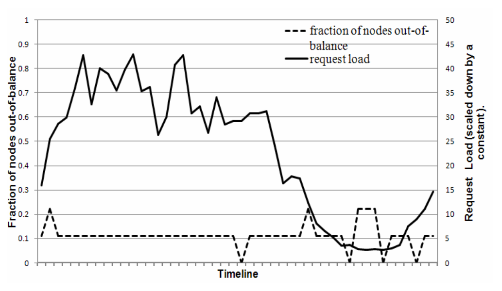
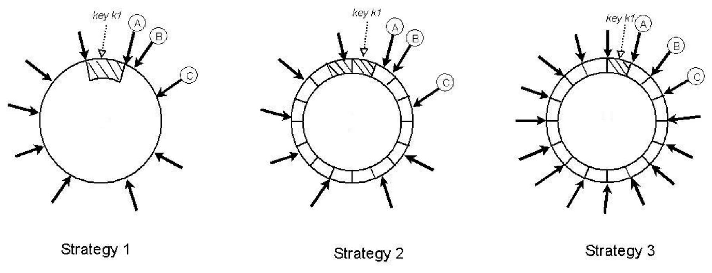
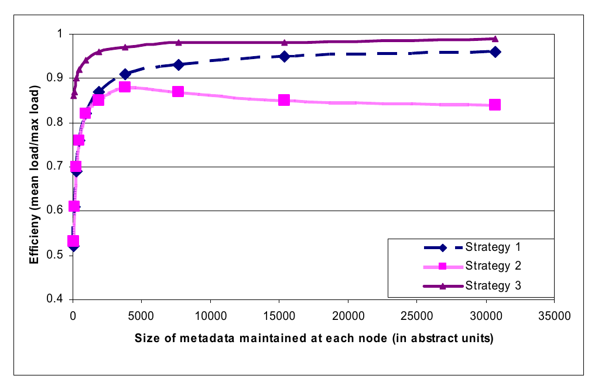

# Dynamo: Amazon’s Highly Available Key-value Store（中文译文）

## 译者说明

本文依据同目录的 `source.pdf` 翻译。章节、图表、公式、算法、代码与参考文献按原文结构保留。

Giuseppe DeCandia、Deniz Hastorun、Madan Jampani、Gunavardhan Kakulapati、Avinash Lakshman、Alex Pilchin、Swaminathan Sivasubramanian、Peter Vosshall、Werner Vogels（Amazon.com）

## 摘要

在超大规模下保障可靠性，是 Amazon.com 面临的最大挑战之一。Amazon.com 是全球规模最大的电子商务业务之一；哪怕最轻微的停机，也会造成显著的财务后果并损害客户信任。Amazon.com 平台为全球许多网站提供服务，其底层基础设施由分布在世界各地多个数据中心的数万台服务器和网络组件组成。在这一规模下，大大小小的组件会持续发生故障；面对这些故障，持久状态的管理方式决定了软件系统的可靠性与可扩展性。

本文介绍 Dynamo 的设计与实现。Dynamo 是一种高可用键值存储系统，Amazon 的若干核心服务用它来提供“始终在线”的体验。为达到这一可用性水平，Dynamo 在某些故障场景下牺牲一致性。它广泛采用对象版本控制和应用辅助的冲突解决，并由此向开发者提供了一种新颖的使用接口。

**分类与主题描述：** D.4.2［操作系统］：存储管理；D.4.5［操作系统］：可靠性；D.4.2［操作系统］：性能。

**一般术语：** 算法、管理、测量、性能、设计、可靠性。

## 1. 引言

Amazon 运行着一个全球电子商务平台：高峰时段，它借助位于世界各地多个数据中心的数万台服务器，为数千万客户提供服务。Amazon 平台在性能、可靠性和效率方面有严格的运行要求；为支持持续增长，平台还必须具有高度可扩展性。可靠性是最重要的要求之一，因为哪怕最轻微的停机，也会带来显著的财务后果并影响客户信任。此外，为支持持续增长，平台必须能够高度扩展。

我们在运行 Amazon 平台的过程中得到的一项经验是：系统的可靠性与可扩展性取决于应用状态的管理方式。Amazon 采用高度去中心化、松耦合的面向服务架构，由数百项服务组成。在这种环境下，尤其需要始终可用的存储技术。例如，即使磁盘正在故障、网络路由反复抖动，或者数据中心被龙卷风摧毁，客户也应当仍能查看购物车并向其中添加商品。因此，负责管理购物车的服务必须始终能够读写其数据存储，并且数据必须跨多个数据中心可用。

在由数百万个组件构成的基础设施里应对故障，是我们的日常运行方式；在任意时刻，总会有数量不大但不可忽视的服务器和网络组件发生故障。因此，Amazon 的软件系统必须把故障处理当作常态，同时不影响可用性和性能。

为满足可靠性与扩展需求，Amazon 开发了多种存储技术，其中最知名的可能是 Amazon Simple Storage Service（Amazon 简单存储服务，它也向 Amazon 外部开放，称为 Amazon S3）。本文介绍为 Amazon 平台构建的另一种高可用、可扩展分布式数据存储 Dynamo 的设计与实现。Dynamo 用于管理那些对可靠性要求极高、并需要严格控制可用性、一致性、成本效益与性能之间取舍的服务状态。Amazon 平台上的应用十分多样，存储需求也各不相同。其中一部分应用需要足够灵活的存储技术，使应用设计者能根据这些取舍恰当地配置数据存储，以最具成本效益的方式实现高可用和有保证的性能。

Amazon 平台上的许多服务只需按主键访问数据存储。对于畅销榜、购物车、客户偏好、会话管理、销售排名和产品目录等许多服务，常见的关系数据库使用模式会导致低效，并限制规模和可用性。Dynamo 提供简单的纯主键接口，以满足这些应用的需求。

Dynamo 综合运用多种成熟技术来实现可扩展性与可用性：使用一致性哈希 [10] 对数据进行分区和复制，并通过对象版本控制 [12] 促进一致性。更新期间的副本一致性由一种类似仲裁的技术和去中心化的副本同步协议维护。Dynamo 采用基于 gossip 的分布式故障检测和成员关系协议。它是一个完全去中心化的系统，几乎不需要人工管理；向 Dynamo 添加或移除存储节点时，也不必手工分区或重新分布数据。

在过去一年里，Dynamo 一直是 Amazon 电子商务平台多项核心服务的底层存储技术。在繁忙的节日购物季，它能够高效扩展到极端峰值负载，且没有任何停机。例如，维护购物车的服务（Shopping Cart Service）单日处理了数千万次请求，由此促成了远超 300 万次结账；管理会话状态的服务则处理了数十万个并发活跃会话。

本工作的主要研究贡献，是评估如何组合不同技术来构成一个统一的高可用系统。它证明，最终一致的存储系统可以用于要求严苛的生产应用；它还展示了如何调节这些技术，以满足性能要求极为严格的生产系统。

本文组织如下：第 2 节介绍背景，第 3 节介绍相关工作，第 4 节介绍系统设计，第 5 节描述实现，第 6 节详细讨论 Dynamo 在生产环境中运行所带来的经验与认识，第 7 节总结全文。本文有若干处本可提供更多信息，但出于保护 Amazon 商业利益的需要，我们不得不降低细节程度。因此，第 6 节中的数据中心内部与跨数据中心延迟、第 6.2 节中的绝对请求率，以及第 6.3 节中的故障持续时间和工作负载，均以汇总指标而非绝对细节给出。

> 复制本文全部或部分内容用于个人或课堂教学无需付费，前提是复制品不得用于牟利或商业优势，并且须在首页保留本声明和完整引文。以其他方式复制、再版、发布到服务器或向邮件列表再分发，须事先获得特别许可和/或付费。SOSP ’07，2007 年 10 月 14—17 日，美国华盛顿州 Stevenson。Copyright 2007 ACM 978-1-59593-591-5/07/0010...$5.00。

## 2. 背景

Amazon 的电子商务平台由数百项协同工作的服务组成，提供从商品推荐、订单履约到欺诈检测等各种功能。每项服务都通过定义明确的接口公开，并可通过网络访问。这些服务运行在由分布于全球多个数据中心的数万台服务器组成的基础设施上。其中有些服务是无状态的，例如汇总其他服务响应的服务；有些则是有状态的，例如基于持久存储中的自身状态执行业务逻辑并生成响应的服务。

传统生产系统把状态保存在关系数据库中。然而，对许多更常见的状态持久化使用模式而言，关系数据库远非理想方案。这些服务大多只按主键存取数据，并不需要 RDBMS 提供的复杂查询和管理功能。多余的功能需要昂贵的硬件和高技能人员来运行，因而效率很低。此外，可用的复制技术能力有限，并且通常选择一致性而不是可用性。尽管近年已有许多进展，数据库的横向扩展以及使用智能分区方案实现负载均衡仍非易事。

本文描述的 Dynamo 是一种高可用数据存储技术，面向这类重要服务的需求。Dynamo 具有简单的键值接口，能在明确定义的一致性窗口内实现高可用，资源利用效率高，并提供简单的横向扩展方案，以应对数据集大小或请求率的增长。每项使用 Dynamo 的服务都运行自己的 Dynamo 实例。

### 2.1 系统假设与要求

面向这类服务的存储系统具有以下要求：

- **查询模型。** 对由键唯一标识的数据项执行简单的读写操作。状态保存为由唯一键标识的二进制对象（即 blob）。没有跨越多个数据项的操作，也不需要关系模式。该要求来自这样一项观察：Amazon 很大一部分服务都能采用这种简单的查询模型工作，不需要任何关系模式。Dynamo 面向需要存储较小对象（通常小于 1 MB）的应用。
- **ACID 属性。** ACID（原子性、一致性、隔离性、持久性）是一组保证数据库事务得到可靠处理的属性。在数据库语境中，对数据的一次逻辑操作称为事务。Amazon 的经验表明，提供 ACID 保证的数据存储往往可用性很差；业界与学界都已广泛承认这一点 [5]。如果较弱的一致性（ACID 中的“C”）能够带来高可用，Dynamo 就面向愿意接受这种一致性的应用。Dynamo 不提供任何隔离性保证，并且只允许单键更新。
- **效率。** 系统需要运行在商用硬件基础设施上。Amazon 平台中的服务有严格的延迟要求，一般按分布的第 99.9 百分位衡量。由于状态访问在服务运行中至关重要，存储系统必须能满足这样严格的 SLA（见下文第 2.2 节）。服务必须能够配置 Dynamo，使其持续达到自身的延迟和吞吐量要求；其中涉及性能、成本效率、可用性和持久性保证之间的取舍。
- **其他假设。** Dynamo 只供 Amazon 内部服务使用。其运行环境假定为非敌对环境，因此没有身份认证和授权等安全要求。此外，由于每项服务使用独立的 Dynamo 实例，其初始设计目标是扩展到数百台存储主机。后文将讨论 Dynamo 的可扩展性局限及可能的扩展方向。

### 2.2 服务级别协议（SLA）

要保证应用在有界时间内交付功能，平台中的每一项依赖都必须在更严格的时限内交付其功能。客户端和服务之间会订立服务级别协议（Service Level Agreement，SLA）：这是一份正式协商的契约，双方约定若干系统相关特性，其中最重要的是客户端针对某个 API 的预期请求率分布，以及在该条件下服务应达到的延迟。例如，一份简单 SLA 可以规定：在客户端峰值负载为每秒 500 次请求时，服务必须为 99.9% 的请求在 300 ms 内返回响应。

SLA 在 Amazon 去中心化的面向服务基础设施中十分重要。例如，对某个电子商务网站的一次页面请求，通常需要渲染引擎向 150 多项服务发出请求来构造响应。这些服务往往还有多项依赖，而依赖项经常也是服务，因此应用调用图具有多层结构并不罕见。为了让页面渲染引擎能够明确约束页面交付时间，调用链中的每项服务都必须遵守其性能契约。

**图 1：Amazon 平台的面向服务架构。**

图 1 给出了 Amazon 平台架构的抽象视图：动态 Web 内容由页面渲染组件生成，而这些组件又会查询许多其他服务。一项服务可以使用不同的数据存储来管理自身状态，并且这些数据存储只能从服务边界内部访问。有些服务会使用另外多项服务来生成复合响应，因此充当聚合器。聚合服务通常是无状态的，不过会广泛使用缓存。

业界制定性能型 SLA 的常见做法，是用平均值、中位数和预期方差来描述。在 Amazon，我们发现，如果目标是让所有客户而不仅是大多数客户都获得良好体验，这些指标并不足够。例如，当系统大量采用个性化技术时，历史较长的客户需要更多处理，这会影响分布高端的性能。以平均或中位响应时间表述的 SLA 无法涵盖这个重要客户群体的性能。为解决这一问题，Amazon 使用分布的第 99.9 百分位来表述和衡量 SLA。之所以选择 99.9% 而不是更高的百分位，是因为成本收益分析表明，进一步改善性能会导致成本显著增加。Amazon 生产系统的经验显示，相比按照平均值或中位数定义 SLA 的系统，这种方法能提供更好的整体体验。

本文多次提到分布的第 99.9 百分位，它体现了 Amazon 工程师从客户体验角度对性能的不懈关注。许多论文报告平均值，因此在适合比较之处，本文也会给出平均值。不过，Amazon 的工程与优化工作并不以平均值为中心。包括负载均衡地选择写协调者在内的多项技术，目标完全是控制第 99.9 百分位的性能。

存储系统往往在建立服务 SLA 时发挥重要作用，特别是在业务逻辑相对轻量的情况下——Amazon 的许多服务正是如此。这时，状态管理会成为服务 SLA 的主要组成部分。Dynamo 的核心设计考虑之一，是让服务能够控制持久性、一致性等系统属性，并由服务自行在功能、性能与成本效益之间取舍。

### 2.3 设计考虑

商业系统使用的数据复制算法传统上会进行同步副本协调，以提供强一致的数据访问接口。为了实现这一一致性水平，这些算法不得不在某些故障场景下牺牲数据可用性。例如，与其面对答案是否正确的不确定性，不如让数据暂时不可用，直至能够完全确定答案正确。从早期复制数据库研究开始，人们就已知道：当必须考虑网络故障的可能性时，强一致性与高数据可用性无法同时实现 [2, 11]。因此，系统和应用必须了解在什么条件下能获得哪些属性。

对于容易发生服务器和网络故障的系统，可以通过乐观复制技术提高可用性：允许变更在后台传播到各副本，并容忍并发、断连的工作。该方法的挑战是，它可能产生必须检测和解决的冲突变更。冲突解决过程带来两个问题：何时解决，以及由谁解决。Dynamo 被设计为最终一致的数据存储，即所有更新最终都会到达所有副本。

一项重要设计考虑，是决定何时执行更新冲突解决：在读时解决，还是在写时解决。许多传统数据存储在写入时解决冲突，以保持读取逻辑简单 [7]。在这类系统中，如果数据存储在某一时刻无法联系全部（或多数）副本，写入就可能被拒绝。Dynamo 则以“始终可写”的数据存储（即写入高可用的数据存储）作为目标设计空间。对若干 Amazon 服务而言，拒绝客户更新会造成糟糕的客户体验。例如，即使发生网络和服务器故障，购物车服务也必须允许客户添加或移除购物车中的商品。该要求迫使我们把冲突解决的复杂性推到读取路径上，从而保证永不拒绝写入。

接下来要选择由谁执行冲突解决。它可以由数据存储完成，也可以由应用完成。如果冲突由数据存储解决，选择会相当有限；数据存储只能采用“最后写入胜出”[22] 等简单策略来解决冲突更新。应用则了解数据模式，可以选择最适合客户体验的冲突解决方法。例如，维护客户购物车的应用可以选择“合并”冲突版本，返回一个统一的购物车。尽管如此灵活，有些应用开发者可能不愿编写自己的冲突解决机制，而选择把这项工作下推给数据存储；数据存储随后采用“最后写入胜出”等简单策略。

设计还遵循以下关键原则：

- **增量可扩展性。** Dynamo 应当能一次横向扩展一台存储主机（下文称为“节点”），同时尽量减小对系统运维人员和系统本身的影响。
- **对称性。** Dynamo 中每个节点应与其对等节点承担相同的职责；不应存在承担特殊角色或额外职责的特异节点。根据我们的经验，对称性简化了系统配置和维护过程。
- **去中心化。** 这是对称性的延伸：设计应优先采用去中心化的点对点技术，而非集中控制。过去，集中控制曾导致系统停机，因此目标是尽可能避免它。这样可得到更简单、更易扩展且更加可用的系统。
- **异构性。** 系统需要能够利用其运行基础设施的异构性。例如，工作分配必须与各服务器的能力成比例。这对于加入容量更高的新节点、而无需一次性升级所有主机至关重要。

## 3. 相关工作

### 3.1 点对点系统

已有多种点对点（P2P）系统研究数据存储与分发问题。第一代 P2P 系统（如 Freenet 和 Gnutella[^1]）主要用作文件共享系统。它们是非结构化 P2P 网络的实例，对等节点之间的覆盖网络连接任意建立。在这类网络中，搜索查询通常会在整个网络中泛洪，以找到尽可能多的共享数据节点。随后 P2P 系统演进为广为人知的结构化 P2P 网络。这些网络采用全局一致协议，保证任意节点都能把搜索查询高效路由到持有所需数据的某个对等节点。Pastry [16] 和 Chord [20] 等系统使用路由机制，保证查询在有界跳数内得到回答。为了减少多跳路由引入的额外延迟，一些 P2P 系统（例如 [14]）采用 $O(1)$ 路由：每个对等节点在本地维护足够的路由信息，从而可在常数跳数内把访问某数据项的请求路由到恰当节点。

OceanStore [9]、PAST [17] 等存储系统构建在这些路由覆盖网络之上。OceanStore 提供一种全球性、事务型、持久的存储服务，支持对广泛复制的数据进行串行化更新。为允许并发更新，同时避免广域锁固有的许多问题，它采用基于冲突解决的更新模型。文献 [21] 为减少事务中止次数而引入了冲突解决。OceanStore 通过处理一系列更新、为其选取一个全序，然后按该顺序原子地应用更新来解决冲突。它面向数据复制在不可信基础设施上的环境。相比之下，PAST 在 Pastry 之上为持久且不可变的对象提供简单抽象层，并假设应用能够在其上构建可变文件等必要的存储语义。

### 3.2 分布式文件系统与数据库

为了性能、可用性和持久性而分布数据，文件系统与数据库系统领域已经进行了广泛研究。相比只支持扁平命名空间的 P2P 存储系统，分布式文件系统通常支持层次化命名空间。Ficus [15]、Coda [19] 等系统通过复制文件换取高可用，但牺牲一致性；更新冲突通常由专用冲突解决过程管理。Farsite [1] 是一个不使用 NFS 式集中服务器的分布式文件系统，通过复制实现高可用性和可扩展性。Google File System [6] 是另一个为托管 Google 内部应用状态而构建的分布式文件系统。GFS 采用简单设计：由单个主服务器托管全部元数据，数据则拆分成块并存储在块服务器中。Bayou 是一个允许断连操作并提供最终数据一致性的分布式关系数据库系统 [21]。

在这些系统中，Bayou、Coda 和 Ficus 都允许断连操作，并能抵御网络分区和停机等问题。它们的冲突解决过程不同，例如 Coda 与 Ficus 在系统层解决冲突，而 Bayou 允许应用层解决；不过它们都保证最终一致性。与这些系统相似，Dynamo 允许读写操作在网络分区期间继续，并使用不同的冲突解决机制来处理更新冲突。

FAB [18] 等分布式块存储系统把大型对象拆成较小的块，并以高可用方式存储每个块。相比这些系统，键值存储在本文场景中更为合适，原因是：（a）它面向相对较小的对象（大小小于 1 MB）；（b）键值存储更容易按应用分别配置。Antiquity 是为处理多台服务器故障而设计的广域分布式存储系统 [23]。它用安全日志维护数据完整性，为保证持久性而把每份日志复制到多台服务器上，并用拜占庭容错协议保证数据一致性。Dynamo 与 Antiquity 不同，它不关注数据完整性与安全问题，而是为可信环境构建。

Bigtable 是一种管理结构化数据的分布式存储系统。它维护一个稀疏、多维、有序映射，并允许应用通过多个属性访问数据 [2]。与 Bigtable 相比，Dynamo 面向只需键值访问的应用，首要关注高可用；即使发生网络分区或服务器故障，也不会拒绝更新。

传统的复制型关系数据库系统主要关注如何为复制数据保证强一致性。强一致性虽然给应用开发者提供了方便的编程模型，但这些系统在可扩展性和可用性方面受限 [7]。它们通常提供强一致性保证，因而无法处理网络分区。

### 3.3 讨论

Dynamo 与上述去中心化存储系统在目标要求上有所不同。第一，Dynamo 主要面向需要“始终可写”数据存储的应用，即不因故障或并发写入拒绝任何更新；这是许多 Amazon 应用的一项关键要求。第二，如前所述，Dynamo 面向单一管理域内的基础设施，并假设所有节点都可信。第三，使用 Dynamo 的应用不需要层次化命名空间（许多文件系统的常规能力）或复杂关系模式（传统数据库提供的能力）。第四，Dynamo 面向延迟敏感的应用，要求至少 99.9% 的读写操作在几百毫秒内完成。为了满足这一严格延迟要求，我们必须避免让请求途经多个节点——Chord、Pastry 等多种分布式哈希表系统通常采用这种设计。多跳路由会增大响应时间的变异性，从而提高高百分位延迟。Dynamo 可被描述为零跳 DHT：每个节点都在本地维护足够的路由信息，以将请求直接路由到恰当节点。

[^1]: http://freenetproject.org/，http://www.gnutella.org

## 4. 系统架构

需要在生产环境运行的存储系统，其架构十分复杂。除实际的数据持久化组件之外，系统还需要为负载均衡、成员关系与故障检测、故障恢复、副本同步、过载处理、状态转移、并发与作业调度、请求编组、请求路由、系统监控与告警，以及配置管理提供可扩展且健壮的解决方案。本文不可能描述每项解决方案的全部细节，因此重点讨论 Dynamo 使用的核心分布式系统技术：分区、复制、版本控制、成员关系、故障处理与扩展。表 1 汇总了 Dynamo 使用的技术及各自优势。

**表 1：Dynamo 使用的技术及其优势汇总。**

| 问题 | 技术 | 优势 |
| --- | --- | --- |
| 分区 | 一致性哈希 | 增量可扩展性 |
| 写入高可用 | 向量时钟，并在读取期间进行协调 | 版本大小与更新速率解耦 |
| 处理临时故障 | 宽松仲裁与提示移交 | 在部分副本不可用时仍提供高可用和持久性保证 |
| 从永久故障中恢复 | 使用 Merkle 树进行反熵 | 在后台同步发生分歧的副本 |
| 成员关系与故障检测 | 基于 gossip 的成员关系协议和故障检测 | 保持对称性，并避免使用集中式注册表保存成员关系和节点存活信息 |

### 4.1 系统接口

Dynamo 通过一个简单接口存储与键关联的对象；它公开两项操作：`get()` 和 `put()`。`get(key)` 操作定位存储系统中与该键关联的对象副本，并返回单个对象，或返回带有上下文的一组冲突版本对象。`put(key, context, object)` 操作根据关联键确定对象副本的放置位置，并把副本写入磁盘。上下文编码对调用者不透明的对象系统元数据，其中包括对象版本等信息。上下文信息与对象一同存储，以便系统验证 `put` 请求所提供上下文对象的有效性。

Dynamo 把调用者提供的键与对象都视为不透明的字节数组。它对键应用 MD5 哈希，生成 128 位标识符；该标识符用于确定负责服务此键的存储节点。

### 4.2 分区算法

Dynamo 的一项关键设计要求是能够增量扩展。为此，需要一种机制，在系统节点（即存储主机）集合上动态划分数据。Dynamo 的分区方案依靠一致性哈希在多台存储主机之间分配负载。在一致性哈希 [10] 中，哈希函数的输出范围被视为固定的圆形空间或“环”（即最大哈希值回绕到最小哈希值）。系统中的每个节点都会在该空间中被赋予一个随机值，表示它在环上的“位置”。对每个由键标识的数据项，系统对其键进行哈希以得到环上位置，然后沿顺时针方向遍历环，找到位置大于该数据项位置的第一个节点，从而把数据项分配给该节点。

**图 2：Dynamo 环上的键分区与复制。**

于是，每个节点负责环上从其前驱节点到自身之间的区域。一致性哈希的主要优势是：节点离开或加入时只影响其直接邻居，其他节点不受影响。

基础一致性哈希算法存在若干挑战。第一，在环上为每个节点随机分配位置，会造成数据和负载分布不均。第二，基础算法不了解节点性能的异构性。为解决这些问题，Dynamo 使用一致性哈希的一种变体（类似文献 [10, 20] 采用的方案）：不把一个节点只映射到圆上的单个点，而是为每个节点分配环上的多个点。Dynamo 为此采用“虚拟节点”概念。虚拟节点看起来像系统中的单个节点，但一台物理节点可以负责多个虚拟节点。实际上，当新节点加入系统时，会在环上被分配多个位置（下文称为“令牌”）。第 6 节将讨论 Dynamo 分区方案的微调过程。

使用虚拟节点有以下优势：

- 如果某个节点因故障或例行维护而不可用，它承担的负载会均匀分散到其余可用节点上。
- 当某个节点恢复可用，或者新节点加入系统时，新可用节点会从其他每个可用节点接收大致相等的负载。
- 可以根据节点容量决定其负责的虚拟节点数量，从而考虑物理基础设施的异构性。

### 4.3 复制

为了实现高可用和持久性，Dynamo 把数据复制到多台主机上。每个数据项在 $N$ 台主机上保存副本，其中 $N$ 是按“实例”配置的参数。每个键 $k$ 都会被分配给一个协调者节点（上一节已有描述）。协调者负责复制其范围内的数据项。协调者除了在本地保存自身范围内的每个键，还会把这些键复制到环上顺时针方向后继的 $N-1$ 个节点。这样一来，每个节点都要负责环上从其第 $N$ 个前驱到自身之间的区域。在图 2 中，节点 B 除了在本地存储键 $k$，还把它复制到节点 C 和 D。节点 D 将存储落在 $(A,B]$、$(B,C]$ 和 $(C,D]$ 范围内的键。

负责存储某个特定键的节点列表称为**偏好列表**。系统采用第 4.8 节将要说明的设计，使得任意节点都能确定任意键的偏好列表中应包含哪些节点。为应对节点故障，偏好列表中包含的节点多于 $N$ 个。需要注意的是，在使用虚拟节点时，某个键的前 $N$ 个后继位置可能由少于 $N$ 台不同的物理节点拥有，也就是说，一台节点可能占据前 $N$ 个位置中的多个。为解决这一问题，构造某个键的偏好列表时，会跳过环上的重复物理节点位置，保证列表只包含不同的物理节点。

### 4.4 数据版本控制

Dynamo 提供最终一致性，允许更新异步传播到全部副本。`put()` 调用可能在更新应用到所有副本之前就返回调用者，因此后续 `get()` 操作可能返回尚未包含最新更新的对象。如果没有故障，更新传播时间存在上界；但在某些故障场景下（如服务器停机或网络分区），更新可能很长时间都无法到达全部副本。

Amazon 平台上有一类应用能够容忍这种不一致，并能被构造成在这些条件下运行。例如，购物车应用要求“加入购物车”操作永远不能被遗忘或拒绝。如果购物车的最新状态不可用，而用户修改了较旧版本的购物车，这项修改仍有意义，应当保留；但它也不应覆盖当前不可用的状态，因为后者本身可能包含应当保留的修改。需要注意的是，“加入购物车”和“从购物车删除商品”都会被转换成发给 Dynamo 的 `put` 请求。当客户想向购物车添加（或移除）商品，而最新版本不可用时，该商品会被添加到（或从中移除）较旧版本，分歧版本稍后再协调。

为提供这种保证，Dynamo 把每次修改的结果都视为数据的一个全新、不可变版本，并允许同一对象的多个版本同时存在于系统中。大多数情况下，新版本涵盖此前版本，系统自身可以确定权威版本（**语法协调**）。不过，在故障与并发更新同时出现时，版本可能分叉，产生对象的冲突版本。在这种情况下，系统无法协调同一对象的多个版本，客户端必须执行协调，把数据演化的多个分支重新折叠成一个分支（**语义协调**）。典型折叠操作是“合并”客户购物车的不同版本。使用这种协调机制，“加入购物车”操作永不丢失；但是，被删除的商品可能重新出现。

必须理解，某些故障模式可能使系统拥有同一数据的两个以上、甚至多个版本。在网络分区和节点故障期间进行更新，可能使对象具有不同的版本子历史，系统未来需要协调这些历史。这要求我们在设计应用时明确承认同一数据可能存在多个版本，以便不丢失任何更新。

Dynamo 使用向量时钟 [12] 捕获同一对象不同版本间的因果关系。向量时钟实际上是一个 `(node, counter)` 对列表。每个对象的每个版本都关联一个向量时钟。通过检查两个对象版本的向量时钟，可以判断它们位于平行分支上，还是存在因果顺序。如果第一个对象时钟中各节点的计数器都小于或等于第二个时钟中相应节点的计数器，那么第一个对象是第二个对象的祖先，可以丢弃；否则，两项变更被视为冲突，需要协调。

在 Dynamo 中，客户端要更新对象时，必须指定自己正在更新哪个版本。为此，它要传入此前读操作得到的上下文，其中包含向量时钟信息。处理读请求时，如果 Dynamo 能访问多个无法通过语法协调合并的分支，就会返回所有叶节点上的对象，并在上下文中带回对应版本信息。使用该上下文执行的更新被视为已经协调这些分歧版本，各分支会折叠成一个新版本。

**图 3：对象版本随时间的演化。**

为说明向量时钟的用法，请考虑图 3 的示例。客户端写入一个新对象。处理该键写入的节点（假设为 $S_x$）递增自身序列号，并用它创建数据的向量时钟。此时系统中有对象 $D_1$ 及其时钟 $[(S_x,1)]$。客户端更新该对象，假设仍由同一节点处理该请求。系统现在还有对象 $D_2$ 及其时钟 $[(S_x,2)]$。$D_2$ 由 $D_1$ 派生，因此覆盖 $D_1$；不过，在尚未见到 $D_2$ 的节点上，可能仍残留 $D_1$ 的副本。再假设同一客户端再次更新对象，但由另一台服务器（假设为 $S_y$）处理请求。系统现在有数据 $D_3$ 及其时钟 $[(S_x,2),(S_y,1)]$。

接着，假设另一客户端读取 $D_2$ 后尝试更新它，并由另一节点（假设为 $S_z$）执行写入。系统此时有 $D_4$（$D_2$ 的后代），其版本时钟为 $[(S_x,2),(S_z,1)]$。知道 $D_1$ 或 $D_2$ 的节点收到 $D_4$ 及其时钟时，可以判断新数据已经覆盖 $D_1$ 和 $D_2$，因而可将它们垃圾回收。知道 $D_3$ 的节点收到 $D_4$ 时，则会发现两者不存在因果关系；换言之，$D_3$ 和 $D_4$ 分别包含对方未反映的变更。系统必须同时保留两个数据版本，并在读取时把它们呈现给客户端进行语义协调。

现在假设某客户端同时读取 $D_3$ 和 $D_4$，上下文将反映读操作找到了两个值。读取上下文是 $D_3$ 与 $D_4$ 时钟的汇总，即 $[(S_x,2),(S_y,1),(S_z,1)]$。如果客户端完成协调，并由节点 $S_x$ 协调写入，$S_x$ 会更新时钟中的自身序列号。新数据 $D_5$ 将具有时钟 $[(S_x,3),(S_y,1),(S_z,1)]$。

向量时钟可能存在一个问题：如果很多服务器协调同一对象的写入，时钟大小可能不断增长。实践中这种情况不太可能发生，因为写入通常由偏好列表中排名靠前的 $N$ 个节点之一处理。不过，发生网络分区或多台服务器故障时，写请求可能由不在偏好列表前 $N$ 名内的节点处理，从而使向量时钟增长。在这些场景中，最好限制向量时钟大小。Dynamo 为此采用以下时钟截断方案：除每个 `(node, counter)` 对以外，Dynamo 还保存一个时间戳，表示该节点上次更新数据项的时间。当向量时钟中的 `(node, counter)` 对数量达到阈值（比如 10）时，移除其中最旧的一对。显然，这种截断方案可能降低协调效率，因为系统无法再准确推导后代关系。不过，该问题尚未在生产环境出现，因此没有得到深入研究。

### 4.5 `get()` 与 `put()` 操作的执行

Dynamo 中任意存储节点都可以接收客户端针对任意键的 `get` 和 `put` 操作。为简便起见，本节描述这些操作在无故障环境中的执行方式，下一节再描述发生故障时读写操作如何执行。

`get` 和 `put` 操作都通过 HTTP，使用 Amazon 基础设施专用的请求处理框架调用。客户端可以采用两种策略选择节点：（1）让请求经过通用负载均衡器，由它根据负载信息选择节点；（2）使用能够感知分区的客户端库，把请求直接路由到恰当的协调者节点。第一种方法的优点是客户端应用不必链接任何 Dynamo 专用代码；第二种策略则跳过一次潜在的转发，因此可实现更低延迟。

处理读写操作的节点称为**协调者**。通常，它是偏好列表前 $N$ 个节点中的第一个。如果请求经过负载均衡器，访问某个键的请求可能被路由到环上的任意随机节点。在这种情况下，如果收到请求的节点不属于该键偏好列表的前 $N$ 个节点，它就不会协调请求，而会把请求转发给偏好列表前 $N$ 个节点中的第一个。

读写操作涉及偏好列表中最前面的 $N$ 个健康节点，会跳过停机或不可访问的节点。当所有节点健康时，访问该键偏好列表中排名前 $N$ 的节点；发生节点故障或网络分区时，则访问偏好列表中排名更低的节点。

为维护副本间一致性，Dynamo 使用一种类似仲裁系统协议的一致性协议。该协议有两个关键可配置值：$R$ 和 $W$。$R$ 是一次成功读操作必须参与的最少节点数，$W$ 是一次成功写操作必须参与的最少节点数。设置 $R$ 和 $W$ 使 $R+W>N$，就会得到一个类似仲裁的系统。在这种模型中，`get`（或 `put`）操作的延迟由 $R$（或 $W$）个副本中最慢的副本决定。因此，为获得更低延迟，$R$ 和 $W$ 通常配置为小于 $N$。

协调者收到某个键的 `put()` 请求时，会为新版本生成向量时钟，并在本地写入新版本。随后，协调者把新版本及其新向量时钟发送给排名最高且可达的 $N$ 个节点。如果至少有 $W-1$ 个节点响应，就认为写入成功。

类似地，收到 `get()` 请求时，协调者向该键偏好列表中排名最高且可达的 $N$ 个节点请求该键的全部现有数据版本，等待收到 $R$ 个响应后再向客户端返回结果。如果协调者最终收集到多个数据版本，就返回其中所有被判断为不存在因果关系的版本。随后协调这些分歧版本，并把覆盖当前各版本的协调后版本写回。

### 4.6 处理故障：提示移交

如果 Dynamo 采用传统仲裁方法，那么在服务器故障和网络分区期间就会不可用；即使在最简单的故障条件下，持久性也会降低。为弥补这一点，它不强制严格的仲裁成员资格，而是使用“**宽松仲裁**”：所有读写操作都在偏好列表中最前面的 $N$ 个健康节点上执行，而这些节点不一定是沿一致性哈希环遍历时遇到的前 $N$ 个节点。

请考虑图 2 中 $N=3$ 的 Dynamo 配置。此例中，如果节点 A 在一次写操作期间临时停机或不可达，原本应位于 A 上的副本就会被发送到节点 D，以维持期望的可用性与持久性保证。发送给 D 的副本会在元数据中携带一个提示，指出该副本原本的目标节点（此处为 A）。收到提示副本的节点会把它们保存在一个单独的本地数据库中，并定期扫描该数据库。D 检测到 A 已恢复后，会尝试把副本交付给 A。转移成功后，D 可以从本地存储中删除该对象，而不会减少系统内的副本总数。

借助提示移交，Dynamo 可保证读写操作不因临时节点或网络故障而失败。需要最高可用性的应用可以把 $W$ 设为 1，这保证只要系统中有一个节点把键持久写入本地存储，就会接受该写入。因此，只有在系统内所有节点都不可用时，写请求才会被拒绝。不过在实践中，Amazon 的大多数生产服务会把 $W$ 设得更高，以满足期望的持久性水平。第 6 节将更详细地讨论 $N$、$R$ 和 $W$ 的配置。

高可用存储系统必须能够处理一个或多个完整数据中心的故障。数据中心可能因断电、冷却故障、网络故障和自然灾害而失效。Dynamo 被配置为让每个对象跨多个数据中心复制。实质上，键的偏好列表构造方式会让其中的存储节点分散在多个数据中心，这些数据中心通过高速网络链路互连。这种跨数据中心复制方案使我们能够处理整个数据中心的故障，而不会发生数据不可用。

### 4.7 处理永久故障：副本同步

当系统成员变动很少、节点故障只是暂时现象时，提示移交最为有效。但在某些场景中，提示副本可能在返回原始副本节点之前就变得不可用。为应对这种情况以及其他持久性威胁，Dynamo 实现了反熵（副本同步）协议，以保持各副本同步。

为了更快检测副本间的不一致，并尽量减少传输的数据量，Dynamo 使用 Merkle 树 [13]。Merkle 树是一种哈希树，叶节点是各个键所对应值的哈希，树中更高层的父节点则是其子节点的哈希。Merkle 树的主要优势是，可以独立检查树的每个分支，而无需节点下载整棵树或整个数据集。此外，Merkle 树有助于减少检查副本间不一致时所需传输的数据量。例如，如果两棵树的根哈希值相同，那么树中叶节点的值也相同，节点之间无需同步；如果不同，则说明某些副本的值存在差异。在这种情况下，节点可以交换子节点的哈希值，并不断重复该过程直至叶节点，届时主机便能找出“失去同步”的键。Merkle 树把同步所需传输的数据量降至最低，并减少反熵过程中执行的磁盘读取次数。

Dynamo 按以下方式将 Merkle 树用于反熵：每个节点为自身托管的每个键范围（即一个虚拟节点覆盖的键集合）维护一棵独立 Merkle 树。这样，节点就能比较一个键范围内的键是否为最新。在该方案中，两个节点交换它们共同托管的键范围所对应 Merkle 树的根。随后，节点使用上述树遍历方法确定是否存在差异，并执行适当的同步操作。该方案的缺点是，当节点加入或离开系统时，许多键范围会发生变化，因而需要重新计算相应的树。第 6.2 节描述的改进分区方案解决了这一问题。

### 4.8 成员关系与故障检测

#### 4.8.1 环成员关系

在 Amazon 环境中，节点因故障和维护任务而发生的停机往往只是暂时现象，但可能持续很长时间。节点停机很少表示永久离开，因此不应触发分区分配的再均衡，也不应立即修复不可达副本。同样，人工错误可能导致新的 Dynamo 节点意外启动。出于这些原因，我们认为应当采用显式机制来发起节点加入或移出 Dynamo 环的操作。管理员使用命令行工具或浏览器连接到某个 Dynamo 节点，发出成员关系变更，令节点加入环或从环中移除。处理请求的节点会把成员关系变更及其发出时间写入持久存储。由于节点可能多次移除后重新加入，这些成员关系变更构成一段历史。基于 gossip 的协议负责传播成员关系变更，并维护最终一致的成员关系视图。每个节点每秒随机选择一个对等节点联系，双方高效协调各自在持久存储中的成员关系变更历史。

节点首次启动时，会选择自身的一组令牌（即一致性哈希空间中的虚拟节点），并把节点映射到各自的令牌集合。该映射持久保存在磁盘上，初始时只包含本地节点及其令牌集合。不同 Dynamo 节点保存的映射，会在协调成员关系变更历史的同一次通信交换中得到协调。因此，分区和放置信息也通过基于 gossip 的协议传播，每个存储节点都知道各个对等节点处理的令牌范围。这样，每个节点都能把某个键的读写操作直接转发到正确的节点集合。

#### 4.8.2 外部发现

上述机制可能暂时形成逻辑上分区的 Dynamo 环。例如，管理员可能先联系节点 A 让 A 加入环，再联系节点 B 让 B 加入环。在这种情况下，A 和 B 都会认为自己是环的成员，却不会立即知道对方的存在。为防止逻辑分区，一些 Dynamo 节点会充当**种子**。种子节点通过外部机制发现，并为所有节点所知。由于所有节点最终都会与某个种子协调成员关系，出现逻辑分区的可能性极低。种子可以来自静态配置，也可以来自配置服务。种子通常是 Dynamo 环中功能完整的节点。

#### 4.8.3 故障检测

Dynamo 中的故障检测用于在 `get()` 和 `put()` 操作期间，以及转移分区和提示副本时，避免尝试与不可达的对等节点通信。就避免失败通信尝试而言，完全局部的故障认知已经足够：如果节点 B 不响应节点 A 的消息，A 就可以认为 B 已故障，即使 B 仍会响应节点 C 的消息也无妨。当客户端请求以稳定速率在 Dynamo 环中产生节点间通信时，若 B 不响应消息，A 很快就会发现 B 无响应；随后 A 会使用其他节点服务映射到 B 分区的请求，并定期重试 B 以检查它是否恢复。若没有客户端请求推动两节点间的流量，双方其实都无需知道对方是否可达、是否响应。

去中心化故障检测协议采用一种简单的 gossip 风格协议，使系统中每个节点都能得知其他节点的到达或离开。对去中心化故障检测器及影响其准确性的参数感兴趣的读者，可参阅文献 [8]。Dynamo 的早期设计使用去中心化故障检测器维护全局一致的故障状态视图。后来我们发现，显式的节点加入与离开方法消除了对全局故障状态视图的需要。这是因为永久节点的加入与移除会通过显式方法通知各节点，而临时节点故障则由各节点在转发请求、无法与其他节点通信时自行检测。

### 4.9 添加与移除存储节点

当新节点（假设为 X）加入系统时，会被分配若干随机散布在环上的令牌。对于分配给 X 的每个键范围，当前可能有不超过 $N$ 个节点负责处理落在该令牌范围内的键。由于键范围重新分配给 X，某些现有节点不再需要存储其中一部分键，于是会把这些键转移给 X。考虑一个简单的引导场景：把节点 X 加入图 2 中 A 与 B 之间的环。X 加入系统后，负责存储范围 $(F,G]$、$(G,A]$ 和 $(A,X]$ 内的键。于是，节点 B、C 和 D 分别不再需要存储这些范围内的键。B、C 和 D 会向 X 提议转移适当的键集合，并在得到 X 确认后执行转移。节点从系统中移除时，键的重新分配按相反过程进行。

运行经验表明，该方法能把键分发的负载均匀分布在各存储节点上，这对于满足延迟要求和保证快速引导非常重要。最后，在源节点与目标节点间增加一轮确认，可确保目标节点不会收到某个给定键范围的重复转移。

## 5. 实现

Dynamo 中每个存储节点有三个主要软件组件：请求协调、成员关系与故障检测，以及本地持久化引擎。这些组件全部使用 Java 实现。

Dynamo 的本地持久化组件允许插接不同的存储引擎。目前使用的引擎有 Berkeley Database（BDB）Transactional Data Store[^2]、BDB Java Edition、MySQL，以及带有持久后备存储的内存缓冲区。设计可插拔持久化组件，主要是为了选择最适合应用访问模式的存储引擎。例如，BDB 能处理通常为几十 KB 的对象，而 MySQL 能处理更大的对象。应用根据对象大小分布选择 Dynamo 的本地持久化引擎。Dynamo 的大多数生产实例使用 BDB Transactional Data Store。

请求协调组件构建在事件驱动的消息传递基础层之上；消息处理流水线被拆分为多个阶段，类似 SEDA 架构 [24]。所有通信均使用 Java NIO 通道实现。协调者代表客户端执行读写请求：读取时从一个或多个节点收集数据，写入时把数据存储到一个或多个节点。每个客户端请求都会在收到该请求的节点上创建一个状态机。状态机包含完整逻辑，用于识别负责某个键的节点、发送请求、等待响应、按需重试、处理回复，以及封装发给客户端的响应。每个状态机实例恰好处理一个客户端请求。

例如，读操作实现以下状态机：（i）向节点发送读请求；（ii）等待达到所需最小响应数；（iii）如果在给定时限内收到的回复太少，则判定请求失败；（iv）否则收集所有数据版本，确定应返回哪些版本；（v）如果启用版本控制，则执行语法协调，并生成不透明的写上下文，其中包含涵盖所有剩余版本的向量时钟。为简洁起见，这里省略故障处理和重试状态。

把读响应返回调用者后，状态机还会等待一小段时间，以接收尚未到达的响应。如果任一响应返回了陈旧版本，协调者会用最新版本更新相应节点。该过程称为**读修复**，因为它会择机修复漏掉最近更新的副本，从而免去反熵协议执行这项工作的需要。

如前所述，写请求由偏好列表前 $N$ 个节点之一协调。理想情况下，应始终由前 $N$ 个节点中的第一个节点协调写入，从而在单一位置串行化所有写入；但该方法会造成负载分布不均，继而违反 SLA，因为请求负载在对象间并非均匀分布。为应对这一问题，偏好列表前 $N$ 个节点中的任意节点都可以协调写入。特别是，每次写入通常紧随一次读取，因此系统会选择对前一次读操作响应最快的节点作为写协调者，并把这一信息保存在请求的上下文中。该优化使我们能够选择持有前一次读操作所读数据的节点，从而提高获得“读己之写”一致性的可能性。它还会减少请求处理性能的变异性，改善第 99.9 百分位的性能。

[^2]: http://www.oracle.com/database/berkeley-db.html

## 6. 经验与教训

Dynamo 被多项服务使用，各服务的配置并不相同。这些实例在版本协调逻辑和读写仲裁特征方面有所不同。Dynamo 的主要使用模式如下：

- **业务逻辑专用协调。** 这是 Dynamo 的一种常见用法。每个数据对象都跨多个节点复制。出现分歧版本时，客户端应用执行自己的协调逻辑。前文讨论的购物车服务是这一类别的典型示例：它的业务逻辑通过合并客户购物车的不同版本来协调对象。
- **基于时间戳的协调。** 这种情况与前一种情况只有协调机制不同。出现分歧版本时，Dynamo 执行简单的“最后写入胜出”时间戳协调逻辑，即选择物理时间戳值最大的对象作为正确版本。维护客户会话信息的服务，是使用这种模式的一个典型示例。
- **高性能读取引擎。** Dynamo 虽然被构建为“始终可写”的数据存储，但有少数服务会调整其仲裁特征，把它作为高性能读取引擎使用。这些服务通常具有很高的读请求率，但更新很少。在这种配置中，一般设置 $R=1$、$W=N$。Dynamo 能为这些服务跨多个节点分区并复制数据，从而提供增量可扩展性。其中一些实例充当数据的权威持久化缓存，而数据也存储在更重量级的后备存储中。维护产品目录和促销商品的服务属于这一类别。

Dynamo 的主要优势是，客户端应用可以调节 $N$、$R$ 和 $W$，达到所需的性能、可用性与持久性水平。例如，$N$ 的值决定每个对象的持久性；Dynamo 用户通常使用的 $N$ 值为 3。

$W$ 和 $R$ 的值会影响对象的可用性、持久性与一致性。例如，如果 $W$ 设为 1，那么只要系统中至少有一个节点能成功处理写请求，系统就永远不会拒绝该请求。不过，较小的 $W$ 和 $R$ 值会增大不一致风险，因为即使写请求没有得到多数副本处理，也会被判定为成功并返回客户端。当写请求已成功返回客户端、却只在少数节点持久保存时，这还会引入一个持久性脆弱窗口。

传统观念认为持久性与可用性相伴而生，但在这里并非必然如此。例如，提高 $W$ 可以缩短持久性的脆弱窗口；但它也可能提高请求被拒绝的概率（从而降低可用性），因为需要更多存储主机处于存活状态才能处理写请求。

多个 Dynamo 实例常用的 $(N,R,W)$ 配置是 $(3,2,2)$。选择这些值是为了满足性能、持久性、一致性和可用性 SLA 所要求的水平。

本节给出的全部测量数据均来自一个实时系统：它使用 $(3,2,2)$ 配置，在数百个硬件配置同质的节点上运行。如前所述，每个 Dynamo 实例都包含位于多个数据中心的节点，这些数据中心通常通过高速网络链路互连。回顾一下，要成功生成 `get`（或 `put`）响应，需要 $R$（或 $W$）个节点响应协调者。显然，数据中心间的网络延迟会影响响应时间；节点及其所在数据中心的选择方式，要使应用能够达到目标 SLA。

### 6.1 平衡性能与持久性

Dynamo 的首要设计目标是构建高可用数据存储，但性能在 Amazon 平台中同样是重要标准。如前所述，为提供一致的客户体验，Amazon 服务会在较高百分位（例如第 99.9 或第 99.99 百分位）设定性能目标。使用 Dynamo 的服务所采用的一项典型 SLA，是 99.9% 的读写请求都要在 300 ms 内执行完毕。

由于 Dynamo 运行在标准商用硬件组件上，其 I/O 吞吐量远低于高端企业服务器，因此持续提供高性能读写并非易事。读写操作涉及多个存储节点，这让问题更具挑战性，因为操作性能受 $R$ 或 $W$ 个副本中最慢副本的限制。图 4 显示 Dynamo 的读写操作在 30 天内的平均延迟和第 99.9 百分位延迟。从图中可见，由于传入请求率具有明显的昼夜模式（即白天与夜间的请求率差异显著），延迟也呈现明确的昼夜模式。此外，写延迟显然高于读延迟，因为写操作总会产生磁盘访问。第 99.9 百分位延迟约为 200 ms，比平均值高一个数量级。这是因为第 99.9 百分位延迟会受到请求负载变异性、对象大小和局部性模式等多种因素影响。

**图 4：2006 年 12 月请求高峰季期间，读写请求的平均延迟和第 99.9 百分位延迟。** 横轴相邻刻度间隔为 12 小时。延迟表现出与请求率类似的昼夜模式，第 99.9 百分位延迟比平均值高一个数量级。

这一性能水平对许多服务来说已经可以接受，但少数面向客户的服务要求更高性能。对于这些服务，Dynamo 允许以持久性保证换取性能。在这项优化中，每个存储节点都在主内存中维护一个对象缓冲区。每次写操作都先存入缓冲区，再由写入线程定期写入存储。读操作则先检查请求的键是否位于缓冲区；如果存在，就从缓冲区而不是存储引擎读取对象。

即使缓冲区很小，只能容纳一千个对象，这项优化也能在流量高峰期把第 99.9 百分位延迟降低到原来的五分之一（见图 5）。图中还可看出，写缓冲能平滑高百分位延迟。显然，该方案以持久性换取性能；服务器崩溃可能丢失缓冲区中排队等待写入的内容。为降低持久性风险，写操作得到改进：协调者从 $N$ 个副本中选择一个执行“持久写入”。由于协调者只等待 $W$ 个响应，写操作的性能不会受某个副本执行持久写入的性能影响。

**图 5：24 小时内，缓冲写入与非缓冲写入的第 99.9 百分位延迟性能比较。** 横轴相邻刻度间隔为 1 小时。

### 6.2 保证负载均匀分布

Dynamo 使用一致性哈希在副本间划分键空间，并保证负载均匀分布。只要键访问分布没有严重偏斜，均匀的键分布就有助于实现均匀的负载分布。具体来说，Dynamo 的设计假设是：即使访问分布明显偏斜，分布热门端仍有足够多的键，可以通过分区把处理热门键的负载均匀分散到各节点。本节讨论 Dynamo 中观察到的负载不平衡，以及不同分区策略对负载分布的影响。

为研究负载不平衡及其与请求负载的相关性，我们测量了 24 小时内每个节点收到的请求总数，并按 30 分钟间隔分段。在一个给定时间窗口内，如果节点请求负载与平均负载的偏差小于某个阈值（此处为 15%），就认为节点“均衡”；否则认为它“不均衡”。图 6 给出了该时段内“不均衡”节点的比例（下文称为“不均衡比率”）。作为参照，图中还绘制了同一时段整个系统收到的相应请求负载。由图可见，不均衡比率会随负载增加而下降。例如，在低负载期间，不均衡比率高达 20%；在高负载期间，则接近 10%。直观上，这是因为高负载时会访问大量热门键，而键的均匀分布使负载得到均匀分配；低负载时（负载只有测得峰值的八分之一）访问的热门键较少，从而造成更高的负载不平衡。

**图 6：不均衡节点所占比例（即请求负载偏离系统平均负载超过给定阈值的节点），以及对应的请求负载。** 横轴相邻刻度间隔表示 30 分钟。

下面讨论 Dynamo 分区方案随时间的演进，以及它们对负载分布的影响。

**策略 1：每节点 $T$ 个随机令牌，按令牌值分区。** 这是最初部署到生产环境的策略（第 4.2 节也描述过）。该方案为每个节点分配 $T$ 个从哈希空间均匀随机选择的令牌，并按哈希空间中的值排序所有节点的令牌。每两个相邻令牌定义一个范围；最后一个令牌与第一个令牌形成一个从哈希空间最大值“回绕”到最小值的范围。由于令牌随机选择，各范围大小不同。随着节点加入和离开系统，令牌集合会发生变化，范围也随之变化。需要注意的是，每个节点维护成员关系所需的空间会随系统节点数线性增加。

使用该策略时遇到了以下问题。第一，新节点加入系统时，需要从其他节点“窃取”自己的键范围；但向新节点移交键范围的节点必须扫描本地持久存储，取出恰当的数据项集合。在生产节点上执行这种扫描很棘手，因为扫描极其消耗资源，而且必须在后台执行，不能影响客户性能。这要求我们以最低优先级运行引导任务，却会显著拖慢引导过程。在繁忙的购物季，当节点每天处理数百万次请求时，引导几乎需要一天才能完成。第二，节点加入或离开系统时，许多节点负责的键范围都会变化，需要重新计算新范围的 Merkle 树；这在生产系统上不是一项轻量操作。最后，键范围的随机性使整个键空间难以创建快照，令归档过程复杂化。在该方案中，要归档整个键空间，必须分别从每个节点检索键，效率极低。

该策略的根本问题是，数据分区与数据放置方案耦合在一起。例如，在某些情况下，希望通过加入更多节点来应对请求负载增长，但在此场景中无法做到添加节点而不影响数据分区。理想情况下，分区和放置应当采用彼此独立的方案。为此，我们评估了以下策略。

**策略 2：每节点 $T$ 个随机令牌，等大小分区。** 该策略把哈希空间划分为 $Q$ 个等大小分区/范围，并为每个节点分配 $T$ 个随机令牌。$Q$ 通常满足 $Q \gg N$ 且 $Q \gg S\times T$，其中 $S$ 是系统节点数。在该策略中，令牌只用于构造把哈希空间中的值映射到有序节点列表的函数，而不用于决定分区。从分区末端开始沿一致性哈希环顺时针遍历时，遇到的前 $N$ 个不同节点负责放置该分区。图 7 以 $N=3$ 展示了该策略。此例中，从包含键 $k_1$ 的分区末端开始遍历环时，会依次遇到节点 A、B、C。该策略的主要优势是：（i）把分区与分区放置解耦；（ii）使运行时改变放置方案成为可能。

**策略 3：每节点 $Q/S$ 个令牌，等大小分区。** 与策略 2 类似，该策略把哈希空间划分为 $Q$ 个等大小分区，并把分区放置与分区方案解耦。此外，每个节点被分配 $Q/S$ 个令牌，其中 $S$ 是系统节点数。当一个节点离开系统时，它的令牌会随机分配给其余节点，同时保持这些属性；类似地，当节点加入系统时，会以保持这些属性的方式从系统内其他节点“窃取”令牌。

**图 7：三种策略中的键分区与放置。** A、B 和 C 表示在一致性哈希环上构成键 $k_1$ 偏好列表的三个不同节点（$N=3$）。阴影区域表示 A、B、C 构成偏好列表的键范围；黑色粗箭头表示各节点的令牌位置。

我们在 $S=30$、$N=3$ 的系统上评估这三种策略的效率。不过，公平比较它们并不容易，因为不同策略用于调节效率的配置不同。例如，策略 1 的负载分布属性取决于令牌数 $T$，而策略 3 取决于分区数 $Q$。一种公平比较方法是：让所有策略都使用等量空间维护成员关系信息，再评估其负载分布偏斜。比如，策略 1 中每个节点要维护环上所有节点的令牌位置；策略 3 中，每个节点则要维护分配给各节点的分区信息。

在下一项实验中，我们改变相关参数（$T$ 和 $Q$）来评估这些策略。对每种需要在节点上维护的成员关系信息大小，测量各策略的负载均衡效率。**负载均衡效率**定义为每个节点服务的平均请求数与最热节点服务的最大请求数之比。

**图 8：在每个节点维护等量元数据的情况下，30 个节点、$N=3$ 的系统中不同策略的负载分布效率比较。** 系统规模与副本数取自我们大多数服务部署的典型配置。

结果见图 8。策略 3 的负载均衡效率最高，策略 2 最低。在 Dynamo 实例从策略 1 迁移到策略 3 的过程中，策略 2 曾短暂充当过渡配置。与策略 1 相比，策略 3 不仅效率更高，还把每个节点维护的成员关系信息大小降低了三个数量级。存储本身虽然不是主要问题，但各节点会定期通过 gossip 传播成员关系信息，因此最好让这些信息尽可能紧凑。除此之外，策略 3 还因为以下原因更有优势、也更容易部署：（i）**更快的引导/恢复。** 分区范围固定，因此可分别存储在不同文件中；只需传输文件，就能把分区作为一个整体重新放置，不需要为定位特定数据项而随机访问。这简化了引导和恢复过程。（ii）**便于归档。** 对大多数 Amazon 存储服务而言，定期归档数据集是一项强制要求。策略 3 可分别归档分区文件，因此更容易归档 Dynamo 存储的整个数据集。相比之下，策略 1 随机选择令牌，归档 Dynamo 数据需要分别从每个节点检索键，通常低效且缓慢。策略 3 的缺点是，改变节点成员关系需要协调，以保持分配方案要求的属性。

### 6.3 分歧版本：何时出现，有多少个？

如前所述，Dynamo 的设计用一致性换取可用性。要理解不同故障对一致性的精确影响，需要关于多种因素的详细数据：停机时长、故障类型、组件可靠性、工作负载等。详细给出这些数字超出了本文范围。不过，本节讨论一个很好的汇总指标：应用在实时生产环境中看到的分歧版本数量。

数据项在两种场景下会产生分歧版本。第一，系统面临节点故障、数据中心故障和网络分区等故障场景。第二，系统要处理大量写入者对单个数据项的并发写入，最终由多个节点同时协调更新。无论从易用性还是效率角度看，都希望任意时刻的分歧版本数尽可能少。如果无法只根据向量时钟对这些版本执行语法协调，就必须把它们传给业务逻辑进行语义协调。语义协调会给服务引入额外负载，因此应尽量减少其需求。

在下一项实验中，我们分析了 24 小时内购物车服务返回的版本数。在此期间，99.94% 的请求恰好看到 1 个版本；0.00057% 的请求看到 2 个版本；0.00047% 的请求看到 3 个版本；0.00009% 的请求看到 4 个版本。这表明分歧版本很少产生。

经验表明，分歧版本数增加并非由故障造成，而是并发写入者数量增加所致。并发写入数量增加通常由繁忙的机器人（自动客户端程序）触发，很少由人类触发。由于这个故事性质敏感，本文不作详细讨论。

### 6.4 客户端驱动还是服务器驱动的协调

如第 5 节所述，Dynamo 有一个使用状态机处理传入请求的请求协调组件。负载均衡器把客户端请求均匀分配给环上的节点。任意 Dynamo 节点都能充当读请求协调者；写请求则必须由该键当前偏好列表中的节点协调。这项限制源于这些偏好节点还负有额外职责：创建一个新的版本戳，使它在因果关系上涵盖写请求所更新的版本。需要注意的是，如果 Dynamo 的版本控制方案使用物理时间戳，任意节点都可以协调写请求。

另一种请求协调方法是，把状态机移到客户端节点。在该方案中，客户端应用使用一个库在本地执行请求协调。客户端定期随机选择一个 Dynamo 节点，下载它当前看到的 Dynamo 成员关系状态。借助这些信息，客户端可以确定任意键的偏好列表由哪些节点构成。读请求可以在客户端节点协调，从而避免请求经负载均衡器分配给随机 Dynamo 节点时产生的额外网络跳。写请求要么转发给键偏好列表中的某个节点；如果 Dynamo 使用基于时间戳的版本控制，也可以在本地协调。

客户端驱动协调方法的一项重要优势是，不再需要负载均衡器来均匀分配客户端负载。键近似均匀地分配到存储节点，隐式保证了公平的负载分布。显然，该方案的效率取决于客户端成员关系信息的新鲜程度。目前，客户端每 10 秒轮询一个随机 Dynamo 节点，以获取成员关系更新。我们选择基于拉取而不是推送的方法，是因为前者在大量客户端下扩展性更好，而且服务器只需为客户端维护极少状态。不过在最坏情况下，客户端可能暴露在陈旧成员关系下长达 10 秒。如果客户端检测到成员关系表陈旧（例如某些成员不可达），会立即刷新成员关系信息。

表 2 显示，在 24 小时内，使用客户端驱动协调相较服务器驱动方法，在平均延迟和第 99.9 百分位延迟上的改善。由表可见，客户端驱动方法把第 99.9 百分位延迟至少降低 30 ms，并把平均延迟降低 3—4 ms。延迟得到改善，是因为客户端驱动方法消除了负载均衡器开销，以及请求被分配给随机节点时可能产生的额外网络跳。表中还能看到，平均延迟往往显著低于第 99.9 百分位延迟，这是因为 Dynamo 的存储引擎缓存和写缓冲具有良好的命中率。此外，负载均衡器和网络会给响应时间引入额外变异，因此客户端驱动方法对第 99.9 百分位响应时间的改善大于对平均值的改善。

**表 2：客户端驱动与服务器驱动协调方法的性能。**

| 协调方式 | 第 99.9 百分位读延迟（ms） | 第 99.9 百分位写延迟（ms） | 平均读延迟（ms） | 平均写延迟（ms） |
| --- | ---: | ---: | ---: | ---: |
| 服务器驱动 | 68.9 | 68.5 | 3.9 | 4.02 |
| 客户端驱动 | 30.4 | 30.4 | 1.55 | 1.9 |

### 6.5 平衡后台任务与前台任务

除正常的前台 `put`/`get` 操作之外，每个节点还会执行多种后台任务，用于副本同步和数据移交（由提示移交或节点加入/移除引起）。在早期生产配置中，这些后台任务引发资源争用问题，影响了正常 `put` 和 `get` 操作的性能。因此，必须保证后台任务只在不会显著影响关键常规操作时运行。为此，后台任务与准入控制机制进行了集成。每项后台任务都使用该控制器，在所有后台任务共享的资源（例如数据库）上预留运行时间片。系统采用基于前台任务监测性能的反馈机制，改变后台任务可用的时间片数量。

准入控制器在执行“前台”`put`/`get` 操作时持续监控资源访问行为。监控内容包括磁盘操作延迟、因锁争用与事务超时而失败的数据库访问，以及请求队列等待时间。系统使用这些信息，检查给定滑动时间窗口内的延迟（或故障）百分位是否接近期望阈值。例如，后台控制器会检查过去 60 秒的数据库读取延迟第 99 百分位与预设阈值（比如 50 ms）的接近程度。控制器借助这类比较来评估前台操作的资源可用性，随后决定可为后台任务提供多少时间片，形成反馈回路来限制后台活动的侵入性。需要注意的是，文献 [4] 研究过类似的后台任务管理问题。

### 6.6 讨论

本节总结 Dynamo 实现与维护过程中获得的一些经验。过去两年，许多 Amazon 内部服务一直使用 Dynamo；它为应用提供了很高的可用性。具体而言，应用 99.9995% 的请求都收到了成功响应（没有超时），截至本文撰写时从未发生数据丢失事件。

此外，Dynamo 的主要优势是通过 $(N,R,W)$ 三个参数提供必要的调节旋钮，让各实例能够按照自身需要调优。Dynamo 与流行的商业数据存储不同，它会把数据一致性与协调逻辑问题直接暴露给开发者。乍看之下，这可能使应用逻辑更复杂。不过，Amazon 平台历来为高可用而构建，许多应用在设计上本就能处理不同故障模式和可能发生的不一致。因此，把这类应用迁移到 Dynamo 相对简单。对希望使用 Dynamo 的新应用，则需要在开发初期进行一定分析，选择恰当的冲突解决机制来满足业务场景。

最后，Dynamo 采用完整成员关系模型，每个节点都知道其对等节点托管的数据。为此，每个节点会主动通过 gossip 与系统中其他节点交换完整路由表。该模型对包含数百个节点的系统运行良好；但把这种设计扩展到数万个节点并不容易，因为维护路由表的开销会随系统规模增加。可以通过为 Dynamo 引入层次化扩展来克服这项限制。还要注意，$O(1)$ DHT 系统（例如 [14]）正在积极解决这一问题。

## 7. 结论

本文描述了 Dynamo：一种高可用、可扩展的数据存储，用来保存 Amazon.com 电子商务平台多项核心服务的状态。Dynamo 提供了期望的可用性和性能水平，能够成功处理服务器故障、数据中心故障与网络分区。它能够增量扩展，允许服务所有者根据当前请求负载扩大或缩小系统规模。服务所有者还可以调节 $N$、$R$、$W$ 参数，定制存储系统，以满足所需的性能、持久性与一致性 SLA。

Dynamo 过去一年的生产使用表明，可以把去中心化技术组合起来，构成一个统一的高可用系统。它在要求最严苛的应用环境之一获得成功，说明最终一致的存储系统可以成为高可用应用的构建块。

## 致谢

本文作者感谢 Pat Helland 对 Dynamo 初始设计所作的贡献。我们还要感谢 Marvin Theimer 和 Robert van Renesse 的意见。最后，感谢论文指导人 Jeff Mogul；在准备终稿期间，他提供了详细意见和建议，极大提高了论文质量。

## 参考文献

[1] Adya, A., Bolosky, W. J., Castro, M., Cermak, G., Chaiken, R., Douceur, J. R., Howell, J., Lorch, J. R., Theimer, M., and Wattenhofer, R. P. 2002. Farsite: federated, available, and reliable storage for an incompletely trusted environment. *SIGOPS Oper. Syst. Rev.* 36, SI (Dec. 2002), 1-14.

[2] Bernstein, P. A., and Goodman, N. An algorithm for concurrency control and recovery in replicated distributed databases. *ACM Trans. on Database Systems*, 9(4):596-615, December 1984.

[3] Chang, F., Dean, J., Ghemawat, S., Hsieh, W. C., Wallach, D. A., Burrows, M., Chandra, T., Fikes, A., and Gruber, R. E. 2006. Bigtable: a distributed storage system for structured data. In *Proceedings of the 7th Conference on USENIX Symposium on Operating Systems Design and Implementation - Volume 7* (Seattle, WA, November 06-08, 2006). USENIX Association, Berkeley, CA, 15-15.

[4] Douceur, J. R. and Bolosky, W. J. 2000. Process-based regulation of low-importance processes. *SIGOPS Oper. Syst. Rev.* 34, 2 (Apr. 2000), 26-27.

[5] Fox, A., Gribble, S. D., Chawathe, Y., Brewer, E. A., and Gauthier, P. 1997. Cluster-based scalable network services. In *Proceedings of the Sixteenth ACM Symposium on Operating Systems Principles* (Saint Malo, France, October 05-08, 1997). W. M. Waite, Ed. SOSP '97. ACM Press, New York, NY, 78-91.

[6] Ghemawat, S., Gobioff, H., and Leung, S. 2003. The Google file system. In *Proceedings of the Nineteenth ACM Symposium on Operating Systems Principles* (Bolton Landing, NY, USA, October 19-22, 2003). SOSP '03. ACM Press, New York, NY, 29-43.

[7] Gray, J., Helland, P., O'Neil, P., and Shasha, D. 1996. The dangers of replication and a solution. In *Proceedings of the 1996 ACM SIGMOD International Conference on Management of Data* (Montreal, Quebec, Canada, June 04-06, 1996). J. Widom, Ed. SIGMOD '96. ACM Press, New York, NY, 173-182.

[8] Gupta, I., Chandra, T. D., and Goldszmidt, G. S. 2001. On scalable and efficient distributed failure detectors. In *Proceedings of the Twentieth Annual ACM Symposium on Principles of Distributed Computing* (Newport, Rhode Island, United States). PODC '01. ACM Press, New York, NY, 170-179.

[9] Kubiatowicz, J., Bindel, D., Chen, Y., Czerwinski, S., Eaton, P., Geels, D., Gummadi, R., Rhea, S., Weatherspoon, H., Wells, C., and Zhao, B. 2000. OceanStore: an architecture for global-scale persistent storage. *SIGARCH Comput. Archit. News* 28, 5 (Dec. 2000), 190-201.

[10] Karger, D., Lehman, E., Leighton, T., Panigrahy, R., Levine, M., and Lewin, D. 1997. Consistent hashing and random trees: distributed caching protocols for relieving hot spots on the World Wide Web. In *Proceedings of the Twenty-Ninth Annual ACM Symposium on Theory of Computing* (El Paso, Texas, United States, May 04-06, 1997). STOC '97. ACM Press, New York, NY, 654-663.

[11] Lindsay, B. G., et al. “Notes on Distributed Databases”, Research Report RJ2571(33471), IBM Research, July 1979.

[12] Lamport, L. Time, clocks, and the ordering of events in a distributed system. *ACM Communications*, 21(7), pp. 558-565, 1978.

[13] Merkle, R. A digital signature based on a conventional encryption function. *Proceedings of CRYPTO*, pages 369-378. Springer-Verlag, 1988.

[14] Ramasubramanian, V., and Sirer, E. G. Beehive: $O(1)$ lookup performance for power-law query distributions in peer-to-peer overlays. In *Proceedings of the 1st Conference on Symposium on Networked Systems Design and Implementation*, San Francisco, CA, March 29-31, 2004.

[15] Reiher, P., Heidemann, J., Ratner, D., Skinner, G., and Popek, G. 1994. Resolving file conflicts in the Ficus file system. In *Proceedings of the USENIX Summer 1994 Technical Conference on USENIX Summer 1994 Technical Conference - Volume 1* (Boston, Massachusetts, June 06-10, 1994). USENIX Association, Berkeley, CA, 12-12.

[16] Rowstron, A., and Druschel, P. Pastry: Scalable, decentralized object location and routing for large-scale peer-to-peer systems. *Proceedings of Middleware*, pages 329-350, November 2001.

[17] Rowstron, A., and Druschel, P. Storage management and caching in PAST, a large-scale, persistent peer-to-peer storage utility. *Proceedings of Symposium on Operating Systems Principles*, October 2001.

[18] Saito, Y., Frølund, S., Veitch, A., Merchant, A., and Spence, S. 2004. FAB: building distributed enterprise disk arrays from commodity components. *SIGOPS Oper. Syst. Rev.* 38, 5 (Dec. 2004), 48-58.

[19] Satyanarayanan, M., Kistler, J. J., Siegel, E. H. Coda: A Resilient Distributed File System. *IEEE Workshop on Workstation Operating Systems*, Nov. 1987.

[20] Stoica, I., Morris, R., Karger, D., Kaashoek, M. F., and Balakrishnan, H. 2001. Chord: A scalable peer-to-peer lookup service for internet applications. In *Proceedings of the 2001 Conference on Applications, Technologies, Architectures, and Protocols for Computer Communications* (San Diego, California, United States). SIGCOMM '01. ACM Press, New York, NY, 149-160.

[21] Terry, D. B., Theimer, M. M., Petersen, K., Demers, A. J., Spreitzer, M. J., and Hauser, C. H. 1995. Managing update conflicts in Bayou, a weakly connected replicated storage system. In *Proceedings of the Fifteenth ACM Symposium on Operating Systems Principles* (Copper Mountain, Colorado, United States, December 03-06, 1995). M. B. Jones, Ed. SOSP '95. ACM Press, New York, NY, 172-182.

[22] Thomas, R. H. A majority consensus approach to concurrency control for multiple copy databases. *ACM Transactions on Database Systems* 4(2):180-209, 1979.

[23] Weatherspoon, H., Eaton, P., Chun, B., and Kubiatowicz, J. 2007. Antiquity: exploiting a secure log for wide-area distributed storage. *SIGOPS Oper. Syst. Rev.* 41, 3 (Jun. 2007), 371-384.

[24] Welsh, M., Culler, D., and Brewer, E. 2001. SEDA: an architecture for well-conditioned, scalable internet services. In *Proceedings of the Eighteenth ACM Symposium on Operating Systems Principles* (Banff, Alberta, Canada, October 21-24, 2001). SOSP '01. ACM Press, New York, NY, 230-243.
