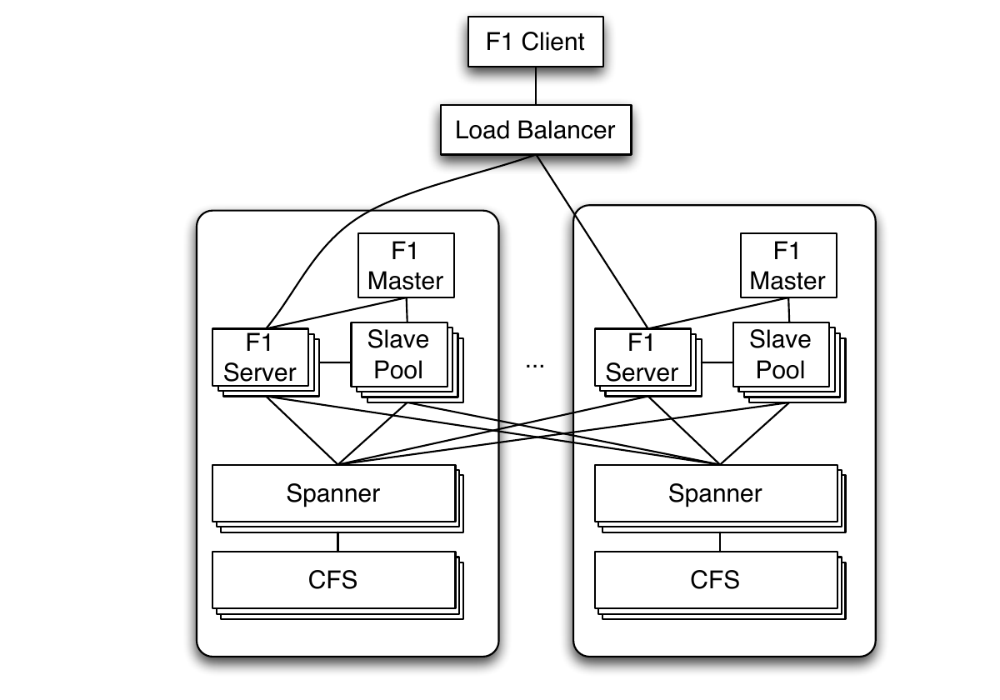
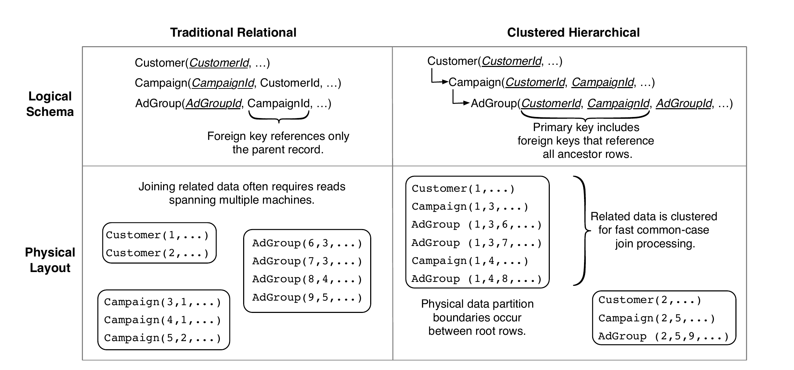
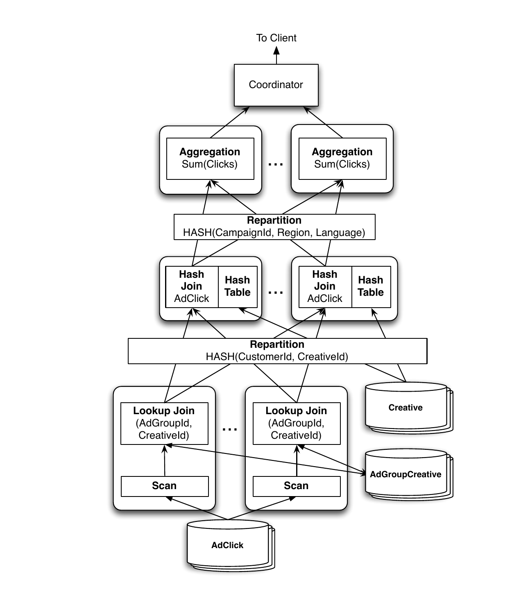

# F1: A Distributed SQL Database That Scales（中文译文）

## 译者说明

本文依据同目录的 `source.pdf` 翻译。章节、图表、公式、算法、代码与参考文献按原文结构保留。

## 作者与机构

Jeff Shute、Radek Vingralek、Bart Samwel、Ben Handy、Chad Whipkey、Eric Rollins、Mircea Oancea、Kyle Littlefield、David Menestrina、Stephan Ellner、John Cieslewicz、Ian Rae\*、Traian Stancescu、Himani Apte

Google, Inc.；\*University of Wisconsin-Madison

## 出版信息

本卷论文受邀在第 39 届超大型数据库国际会议（The 39th International Conference on Very Large Data Bases）上报告；会议于 2013 年 8 月 26-30 日在意大利特伦托省加尔达湖滨举行。论文发表于 *Proceedings of the VLDB Endowment*，第 6 卷第 11 期。Copyright 2013 VLDB Endowment，2150-8097/13/09，定价 10.00 美元。

## 摘要

F1 是 Google 为支撑 AdWords 业务而构建的分布式关系数据库系统。F1 是一种混合数据库：它结合了高可用性、Bigtable 等 NoSQL 系统的可扩展性，以及传统 SQL 数据库的一致性和易用性。F1 构建在 Spanner 之上，后者提供跨数据中心同步复制和强一致性。同步复制意味着更高的提交延迟，但我们通过采用带结构化数据类型的层次化 schema 模型以及合理的应用设计来缓解这一延迟。F1 还包含一个功能完备的分布式 SQL 查询引擎，以及自动的变更跟踪与发布机制。

## 1. 引言

F1[^1] 是 Google 构建的容错、全球分布式 OLTP 与 OLAP 数据库，作为 Google AdWords 系统的新存储系统。其设计目的是取代一种分片 MySQL 实现；后者已无法满足我们不断增长的可扩展性和可靠性需求。

[^1]: 此前已在文献 [22] 中作过简要介绍。

F1 的关键设计目标如下：

1. **可扩展性：** 系统必须能够通过增加资源，以简单且透明的方式扩展。我们基于 MySQL 的分片数据库很难扩展，重新均衡则更加困难。我们的用户需要复杂查询和连接，这意味着他们必须谨慎地对数据分片，而在不破坏应用的前提下重新分片数据又很有挑战性。
2. **可用性：** 系统绝不能因任何原因停机，包括数据中心故障、计划维护、schema 变更等。系统存储 Google 核心业务的数据，任何停机都会对收入造成显著影响。
3. **一致性：** 系统必须提供 ACID 事务，并且必须始终向应用呈现一致、正确的数据。让应用自行应对数据中的并发异常非常容易出错、耗时，而且最终不值得用来换取那点性能收益。
4. **易用性：** 系统必须提供完整的 SQL 查询支持，以及用户期望 SQL 数据库具备的其他功能。索引和即席查询等特性不只是锦上添花，而是我们业务的绝对要求。

近期一些论文认为这些设计目标互相排斥 [5, 11, 23]。本文的一项关键贡献，是展示我们如何在 F1 的设计中实现所有这些目标，以及我们在哪些地方作出了取舍和牺牲。F1 这一名称来自遗传学，其中“子一代杂种”（Filial 1 hybrid）是差异明显的亲本类型杂交后产生的第一代后代。F1 数据库系统确实就是这样一种混合体，它结合了传统关系数据库与 Bigtable [6] 等可扩展 NoSQL 系统各自最优秀的方面。

F1 构建在 Spanner [7] 之上。Spanner 提供高度可扩展的数据存储、同步复制，以及强一致性和强排序属性。F1 继承了 Spanner 的这些特性，并增加了以下能力：

- 分布式 SQL 查询，包括与外部数据源的数据进行连接；
- 事务一致的二级索引；
- 异步 schema 变更，包括数据库重组；
- 乐观事务；
- 自动记录并发布变更历史。

我们在 F1 中作出的设计选择使典型读写具有更高的延迟。我们已经开发出隐藏这部分额外延迟的技术，并发现面向用户的事务可以达到与我们此前 MySQL 系统同样好的性能：

- F1 schema 使用具有层次关系的表和带结构化数据类型的列，明确表达数据聚簇。这种聚簇提高了数据局部性，并减少读取远程数据所需 RPC 的数量和成本。
- F1 用户大量使用批处理、并行和异步读取。我们使用一个新的 ORM（对象关系映射）库来显式表达这些概念。这为典型应用级操作所需的 RPC 数量设定了上界，使这些操作在默认情况下就具有良好的扩展能力。

自 2012 年初起，F1 系统一直在生产环境中管理全部 AdWords 广告活动数据。AdWords 是一个庞大而多样的生态系统，其中有数百个应用和数千名用户共享同一数据库。该数据库超过 100 TB，每秒最多处理数十万次请求，并且每天运行扫描数十万亿行数据的 SQL 查询。即使存在非计划停机，可用性也达到五个 9；与旧 MySQL 系统相比，我们 Web 应用上的可观测延迟并未增加。

我们在全文中始终以 AdWords F1 数据库为讨论对象，因为它是 F1 最初且推动其诞生的用户。Google 的其他若干团队现在也开始部署 F1。

## 2. 基本架构

用户通过 F1 客户端库与 F1 交互。命令行即席 SQL shell 等其他工具也使用同一个客户端实现。客户端把请求发送给众多 F1 服务器中的一台；F1 服务器负责从远程数据源读写数据并协调查询执行。图 1 展示了基本架构和组件之间的通信。



**图 1：F1 系统的基本架构，图中服务器位于两个数据中心。**

由于 F1 采用分布式架构，必须特别注意避免不必要地增加请求延迟。例如，只要可能，F1 客户端和负载均衡器都会优先连接附近数据中心中的 F1 服务器。不过，在高负载或发生故障时，请求可以透明地转发到远程数据中心的 F1 服务器。

F1 服务器通常与存储数据的 Spanner 服务器部署在同一组数据中心。这种共置确保 F1 服务器通常可以快速访问底层数据。为了可用性和负载均衡，必要时 F1 服务器可以与本数据中心之外的 Spanner 服务器通信。每个数据中心的 Spanner 服务器再从同一数据中心的 Colossus File System（CFS）[14] 取回数据。与 Spanner 不同，CFS 不是全球复制的服务，因此 Spanner 服务器绝不会与远程 CFS 实例通信。

F1 服务器大多无状态，因而客户端可以在每次请求时与不同的 F1 服务器通信。唯一的例外是客户端使用悲观事务并且必须持有锁时；在该事务持续期间，客户端会绑定到一台 F1 服务器。第 5 节将更详细地介绍 F1 事务。F1 服务器不拥有任何数据，因此增加或移除服务器不需要移动数据；我们可以根据总负载快速向我们的系统中增加或移除 F1 服务器。

F1 集群还包含若干用于执行分布式 SQL 查询的组件。当查询规划器估计提高并行度能够降低查询处理延迟时，会选择分布式执行而不是集中式执行。共享从进程池（slave pool）由一些 F1 进程组成，这些进程只代表常规 F1 服务器执行分布式查询计划的一部分。F1 master 维护从进程池成员关系：它监控从进程的健康状况，并把可用从进程列表分发给 F1 服务器。F1 还通过 Google 的 MapReduce 框架 [10] 支持大规模数据处理。出于性能考虑，MapReduce worker 可以直接与 Spanner 服务器通信以批量提取数据（图中未画出）。其他客户端则完全通过 F1 服务器执行读写。

整个系统的吞吐量可以通过增加 Spanner 服务器、F1 服务器或 F1 从进程来扩展。F1 服务器不存储数据，所以新增服务器不涉及任何数据重分布成本。新增 Spanner 服务器会导致数据重分布；这一过程对 F1 服务器完全透明，因而对 F1 客户端也完全透明。

基于 Spanner 的远程存储模型和我们的地理分布式部署，使系统呈现出与常规数据库截然不同的延迟特征。数据在多个数据中心间同步复制，而我们选择的数据中心又分布得很广，因此提交延迟相对较高，为 50-150 ms。这种高延迟要求客户端改变与数据库交互的模式。我们在第 7.1 节介绍这些变化，并在第 9、10 节进一步说明我们的部署选择及其带来的可用性和延迟。

### 2.1 Spanner

F1 构建在 Spanner 之上。两个系统同时开发，并且开发过程紧密协作。Spanner 处理持久化、缓存、复制、容错、数据分片和迁移、位置查找以及事务等较低层的存储问题。

在 Spanner 中，数据行依据 schema 中的祖先关系划分为称作目录（directory）的聚簇。每个目录至少有一个分片（fragment），大型目录可以有多个分片。组（group）存储一组目录分片。每个组通常在每个数据中心有一个副本 tablet。数据使用 Paxos 算法 [18] 同步复制，同一组的所有 tablet 都存储相同数据。一个副本 tablet 会被选为该组的 Paxos leader，所有针对该组的事务活动都由这个 leader 作为入口。组还可以包含只读副本；它们不参与 Paxos 投票，也不能成为组 leader。

Spanner 使用严格两阶段锁提供可串行化的悲观事务。一个事务包含多次读取，这些读取获取共享锁或排他锁；随后进行一次写入，由该写入升级锁并原子提交事务。所有提交都使用 Paxos 同步复制。当更新的数据共置在单个组内时，事务效率最高。Spanner 还支持跨多个组的事务；这些组称为事务参与者，事务在 Paxos 之上使用两阶段提交（2PC）协议。2PC 会增加一次网络往返，因此观测到的提交延迟通常会翻倍。2PC 在参与者为数十个时扩展良好，但参与者达到数百个时，中止频率和延迟都会显著上升 [7]。

Spanner 具有很强的一致性和时间戳语义。每个事务都会获得一个提交时间戳，这些时间戳为提交提供全局全序。Spanner 使用部署在 Google 数据中心的硬件时钟，以一种可扩展的新机制选择全局有序的时间戳。Spanner 利用这些时间戳提供多版本一致读，包括无需获取读锁即可对当前数据进行的快照读。为了保证全局一致读既不阻塞也不被阻塞，Spanner 提供一个全局安全时间戳；任何正在执行或未来的事务都不可能在这个时间戳之前提交。全局安全时间戳通常比当前时间落后 5-10 秒。在这个时间戳上进行的读取通常可以在任意副本 tablet 上运行，包括只读副本，并且永远不会被正在运行的事务阻塞。

## 3. 数据模型

### 3.1 层次化 Schema

F1 数据模型与 Spanner 数据模型非常相似。实际上，Spanner 最初的数据模型更接近 Bigtable，后来则采用了 F1 的数据模型。在逻辑层，F1 拥有与传统 RDBMS 类似的关系 schema，但作了一些扩展，包括显式的表层次结构和采用 Protocol Buffer 数据类型的列。

在逻辑上，F1 schema 中的表可以组织成层次结构。在物理上，F1 将每个子表与其父表的行聚簇并交错存储。逻辑 schema 中的表不能任意交错：子表必须具有指向父表的外键，并且该外键必须是其主键的前缀。例如，AdWords schema 包含主键为 `(CustomerId)` 的 `Customer` 表；它有一个主键为 `(CustomerId, CampaignId)` 的子表 `Campaign`；后者又有一个主键为 `(CustomerId, CampaignId, AdGroupId)` 的子表 `AdGroup`。层次结构中根表的一行称为根行。与某个根行对应的所有子表行都会和该根行一起聚簇在单个 Spanner 目录中，也就是说，该聚簇通常存储在一台 Spanner 服务器上。子行按主键顺序存储在父行下面。图 2 给出了示例。



**图 2：传统规范化关系 schema 与 F1 数据库所用聚簇层次化 schema 的数据存储逻辑属性和物理属性对比。**

与扁平关系 schema 相比，层次聚簇的物理 schema 有若干优势。考虑图 2 同样展示的对应传统 schema。在传统 schema 中，取回与给定 `CustomerId` 对应的全部 `Campaign` 和 `AdGroup` 记录需要两个串行步骤，因为无法通过 `CustomerId` 直接取回 `AdGroup` 记录。在 F1 版本中，层次化主键使 `Campaign` 与 `AdGroup` 记录的读取可以并行开始，因为两个表都以 `CustomerId` 为键。主键前缀这一性质意味着，读取某个 `Customer` 的所有 `AdGroup` 可以表达成一次范围读，而不必借助索引逐行读取。此外，两个表都按主键顺序存储，因此可以用简单的有序归并来连接两个表的行。数据聚簇在单个目录中，所以我们可以用一个 Spanner 请求把数据全部读出。层次化 schema 的这些属性都有助于缓解远程数据造成的延迟影响。

层次聚簇对更新尤其有用，因为它减少了事务涉及的 Spanner 组数。每个根行及其所有后代行都存储在单个 Spanner 目录中，所以限制在单个根上的事务通常可以避开 2PC 及其延迟惩罚；因此，大多数应用都尽可能使用单根事务。即使执行跨多个根的事务，也必须限制涉及的根数，因为增加参与者通常会提高延迟，并降低成功提交的可能性。

F1 并不强制使用层次聚簇。一个 F1 schema 通常有多个根表；事实上，也仍然可以使用完全扁平的 MySQL 风格 schema。不过，只要层次结构符合数据语义，采用它就会非常有益。在 AdWords 中，大多数事务通常一次只更新一个广告主的数据，因此我们把广告主设为根表 `Customer`，并把相关表聚簇在它下面。这种聚簇对实现可接受的延迟至关重要。

### 3.2 Protocol Buffers

F1 数据模型支持包含结构化数据类型的表列。这些结构化类型使用 Google 开源 Protocol Buffer [16] 库提供的 schema 和二进制编码格式。Protocol Buffer 包含带类型的字段，字段可以是必填、可选或重复的；字段也可以是嵌套的 Protocol Buffer。在 Google，Protocol Buffer 广泛用于应用之间的数据存储和交换。我们还在使用 MySQL schema 时，用户往往必须在数据库行与内存数据结构之间编写繁琐且容易出错的转换。把 Protocol Buffer 放入 schema 消除了这种阻抗失配，并为用户提供一种通用数据结构，使其既能用于数据库，也能用于应用代码。

Protocol Buffer 允许使用重复字段（repeated field）。在 F1 schema 设计中，当子记录数量的上界较小时，我们经常使用重复字段代替子表。通过使用重复字段，我们避免了存储和连接多个子记录所带来的性能开销与复杂性。整个 Protocol Buffer 实际上被 Spanner 当作一个 blob。除了性能方面的影响，Protocol Buffer 列也更加自然，并降低了用户面对的语义复杂性；用户现在可以把逻辑业务对象作为原子单元读写，无需考虑通过跨多个表的连接来物化它们。第 8.7 节将介绍 F1 SQL 对 Protocol Buffer 的使用。

F1 schema 中的许多表只包含一个 Protocol Buffer 列。另一些表把数据拆分到少数几列中，并依据访问模式对字段分组。可以把字段划分到不同列中，以便把通常一起访问的字段归在一起，分离静态数据与频繁更新的数据，按列指定不同的读写权限，或者允许并发更新不同列。Spanner 可能具有较高的每列开销，因此减少列数通常会改善性能。

### 3.3 索引

F1 中的所有索引都具有事务性且完全一致。索引在 Spanner 中存储为独立的表，以索引键与被索引表主键的拼接值为键。索引键可以是标量列，也可以是从 Protocol Buffer 中提取的字段，包括重复字段。F1 索引有两种物理存储布局：本地索引和全局索引。

本地索引键必须以根行主键为前缀。例如，用于存储每个客户唯一关键词的 `(CustomerId, Keyword)` 索引就是本地索引。与子表一样，本地索引存储在根行所在的同一 Spanner 目录中。因此，本地索引条目和被索引的行存储在同一台 Spanner 服务器上，更新本地索引几乎不会给事务增加额外成本。

相比之下，全局索引键不以根行主键为前缀，因此无法与被索引的行共置。例如，把数据库中的所有关键词映射到使用这些关键词的 `Customer` 的 `(Keyword)` 索引必须是全局索引。全局索引通常很大，并可能具有很高的聚合更新速率。因此，它们会被分片到许多目录，并存储在多台 Spanner 服务器上。写入一行并更新全局索引，需要给事务增加一个额外参与者，这意味着事务必须使用 2PC；不过，为获得一致的全局索引，这一成本是合理的。

全局索引在单行更新时表现尚可，但在大型事务中可能造成扩展问题。考虑一个插入 1000 行的事务。每行都需要增加一个或多个全局索引条目，而这些索引条目可能任意分散在数百个索引目录中，这意味着 2PC 事务将有数百个参与者，因而更慢，也更容易出错。因此，我们在 schema 中慎用全局索引，并鼓励应用开发者在向带有全局索引的表批量插入时使用小事务。

Megastore [3] 通过放弃一致性、只支持异步全局索引来使全局索引具备可扩展性。我们目前正在探索其他机制，以便在不牺牲一致性的前提下提高全局索引的可扩展性。

## 4. Schema 变更

AdWords 数据库由数千名用户共享，并且一直处在持续开发之中。开发者会把成批的 schema 变更排入队列，每天应用一次。该数据库对 Google 的业务至关重要，要求极高的可用性；schema 变更期间停机或锁表，例如添加索引，都是不可接受的。

我们把 F1 设计为让所有 schema 变更完全不阻塞。F1 系统的若干特点使非阻塞 schema 变更格外困难：

- F1 是大规模分布式系统，其服务器位于不同地理区域的多个数据中心；
- 每台 F1 服务器都在本地内存中保存一份 schema，不可能让一次更新在所有服务器上原子发生；
- 所有表上的查询和事务都必须继续运行，包括正在进行 schema 变更的表；
- schema 变更期间不能对系统可用性和延迟造成负面影响。

F1 是大规模分布式系统，因此即使 F1 拥有全局 F1 服务器成员仓库，在所有服务器间同步变更 schema 也会严重影响响应时间。为了使变更具有原子性，服务器必须在某个时刻阻塞事务，直到确认所有其他服务器都已收到变更。为避免这种情况，F1 schema 变更采用异步方式，在不同时间应用到不同 F1 服务器上。这意味着两台 F1 服务器可能使用不同 schema 并发更新数据库。

如果两台 F1 服务器使用不同 schema 更新数据库，而这些 schema 按照我们的 schema 变更算法并不兼容，就可能造成包括数据库损坏在内的异常。我们用一个例子说明数据库损坏的可能性。考虑从 schema $S_1$ 变更到 schema $S_2$，在表 $T$ 上添加索引 $I$。由于 schema 变更会在不同 F1 服务器上异步应用，假设服务器 $M_1$ 使用 schema $S_1$，服务器 $M_2$ 使用 schema $S_2$。首先，服务器 $M_2$ 插入新行 $r$，同时为行 $r$ 增加一个新索引条目 $I(r)$。随后，服务器 $M_1$ 删除行 $r$。该服务器使用 schema $S_1$，不知道索引 $I$ 的存在，因此它删除了行 $r$，却没有删除索引条目 $I(r)$。于是数据库遭到损坏。例如，对 $I$ 执行索引扫描会返回与已删除行 $r$ 对应的虚假数据。

我们实现了一套 schema 变更算法，通过以下方法防止上述异常：

1. 强制保证所有 F1 服务器上最多只有两种不同 schema 处于活动状态。每台服务器使用当前 schema 或下一个 schema。我们为 schema 授予租约，并确保任何服务器在租约过期后都不再使用该 schema。
2. 把每次 schema 变更细分成多个阶段，相邻阶段两两兼容，不会引发异常。在上面的例子中，我们首先以只执行删除操作的模式添加索引 $I$，从而禁止服务器 $M_1$ 向数据库添加 $I(r)$。随后，我们升级索引 $I$，使服务器执行全部写操作。接着，我们启动一次 MapReduce，用精心构造、能够处理并发写入的事务，为表 $T$ 中所有行回填索引条目。完成后，我们让索引 $I$ 对常规读操作可见。

文献 [20] 给出了 schema 变更算法的全部细节。

## 5. 事务

AdWords 产品生态系统需要支持 ACID 事务的数据存储。我们存储财务数据，对数据完整性和一致性有严格要求。我们在 Google 也积累了大量最终一致性系统的经验。在所有这类系统中，我们发现开发者要花费相当大一部分时间，构建极为复杂且容易出错的机制，以应对最终一致性并处理可能已经过时的数据。我们认为，把这种负担放在开发者身上不可接受；一致性问题应该在数据库层解决。完整的事务一致性是 F1 最重要的属性之一。

每个 F1 事务包含多次读取，之后可以选择执行一次写入来提交事务。F1 实现了三类事务，它们都构建在 Spanner 的事务支持之上：

1. **快照事务。** 这是具有快照语义的只读事务，读取由固定 Spanner 快照时间戳确定的可重复数据。默认情况下，快照事务在 Spanner 的全局安全时间戳上读取；该时间戳通常比当前时间早 5-10 秒，并从本地 Spanner 副本读取。用户也可以显式请求特定时间戳，或让 Spanner 选择当前时间戳以查看当前数据。后一种选择可能具有更高的延迟，并且需要远程 RPC。

   快照事务是 SQL 查询和 MapReduce 的默认模式。快照事务让多台客户端服务器能够在同一时间戳上看到整个数据库的一致视图。

2. **悲观事务。** 这类事务直接映射到 Spanner 事务 [7]。悲观事务使用需要持锁的有状态通信协议，因此单个悲观事务中的所有请求都会被定向到同一台 F1 服务器。如果该 F1 服务器重启，悲观事务就会中止。悲观事务中的读取可以请求共享锁或排他锁。

3. **乐观事务。** 乐观事务包含一个可以任意长且绝不获取 Spanner 锁的读阶段，随后是一个很短的写阶段。为了检测行级冲突，F1 随每行返回其最后修改时间戳；这个时间戳存储在该行的一个隐藏锁列中。每当相应数据更新时，无论是在悲观事务还是乐观事务中，新的提交时间戳都会自动写入锁列。客户端库收集这些时间戳，并把它们和提交事务的写入一起传回 F1 服务器。F1 服务器创建一个短暂的 Spanner 悲观事务，并重新读取所有已读行的最后修改时间戳。如果重新读取的任何时间戳与客户端传入的值不同，就说明发生了冲突更新，F1 会中止事务；否则，F1 把写入发送给 Spanner，完成提交。

F1 客户端默认使用乐观事务。乐观事务有以下优点：

- **容忍行为不当的客户端。** 读操作绝不持锁，也绝不与写操作冲突。这避免了行为不当的客户端运行长事务，或遗弃事务却不将其中止所引发的问题。
- **长时间事务。** 乐观事务可以任意长，这在某些场景中很有用。例如，一些 F1 事务会等待最终用户交互。调试一个在单步执行时总被中止的事务也很困难。为了避免锁泄漏，空闲事务通常会在十秒内被终止，这意味着长时间运行的悲观事务往往无法提交。
- **服务器端可重试。** 乐观事务提交是自包含的，因此 F1 服务器很容易透明地重试，并向用户隐藏大多数瞬时 Spanner 错误。F1 服务器无法重试悲观事务，因为那需要重新运行用户的业务逻辑，才能重现相同的锁定副作用。
- **服务器故障转移。** 与乐观事务关联的全部状态都保存在客户端。因此，发生故障后或为了均衡负载，客户端可以把读取和提交发送给不同的 F1 服务器。
- **推测式写入。** 客户端可以在乐观事务之外读取值，也可能是在 MapReduce 中读取，并记住该次读取所用的时间戳。随后，客户端可以在乐观事务中使用这些值和时间戳执行推测式写入；只有在原始读取之后没有发生其他写入时，这些写入才会成功。

乐观事务也有一些缺点：

- **插入幻象。** 只有表中已存在的行才有修改时间戳，因此乐观事务不能防止插入幻象 [13]。如果这会造成问题，可以使用父表锁来避免幻象，参见第 5.1 节。
- **高竞争下吞吐量低。** 例如，一个表维护由许多客户端并发递增的计数器时，乐观事务会导致大量提交失败，因为读时间戳通常在写入时已经过期。在这种情况下，带排他锁的悲观事务可以避免失败事务，但也会限制吞吐量。如果每次提交耗时 50 ms，则每秒最多只能完成 20 个事务。要进一步提高吞吐量，需要在应用层作出改变，例如批量更新。

F1 用户可以任意混用乐观事务和悲观事务，同时仍然保持 ACID 语义。F1 的所有写入都会更新每个相关锁列上的最后修改时间戳。快照事务独立于所有写事务，并且始终保持一致。

### 5.1 灵活的锁粒度

F1 默认提供行级锁。每个 F1 行都包含一个默认锁列，覆盖同一行中的所有列。不过，可以在 schema 中改变并发度。例如，用户可以在同一行中定义额外锁列来提高并发度，每个锁列覆盖列的一个子集。在极端情况下，每列都可以由单独的锁列覆盖，从而实现列级锁。

列级锁的一种常见用途，是处理多个并发写入方分别更新不同列集的表。例如，我们可以让一个前端系统允许用户更改关键词出价，同时让一个后端系统更新相同关键词的投放历史。繁忙客户可能持续提交出价更新，而后端系统同时也在更新统计信息。列级锁可以避免这些独立更新流之间的事务冲突。

用户也可以有选择地降低并发度：使用父表中的锁列覆盖子表中的列。这意味着子表中的一组行共享同一个锁列，该行集合内的写入将串行执行。F1 用户经常使用父表中的锁列避免特定谓词上的插入幻象，或让其他业务逻辑约束更容易实施。例如，每个 `AdGroup` 的关键词数量可能有上限，并且要求关键词不能重复。如果同一 `AdGroup` 中不可能并发插入关键词，就很容易正确实施这类约束。

## 6. 变更历史

许多数据库用户会构建记录变更的机制，或在应用代码中实现，或使用触发器等数据库特性。在 AdWords 使用 F1 之前的 MySQL 系统中，我们的 Java 应用库会把变更历史记录加入所有事务。这个做法很好，但效率低下，而且从未达到 100% 可靠。某些类型的变更不会生成历史记录，包括 Python 脚本写入的变更和手工执行 SQL 产生的数据变更。

在 F1 中，变更历史（Change History）是数据库层的一等特性；我们可以在这一层最高效地实现它，并保证完整覆盖。在启用变更跟踪的数据库中，默认跟踪所有表的变更，不过可以在 schema 中选择排除特定表或列。F1 中每个事务都会创建一个或多个 `ChangeBatch` Protocol Buffer，其中包含每个更新行的主键，以及已变更列的变更前值和变更后值。这些 `ChangeBatch` 被写入普通 F1 表；每个根表下面都有这样的子表。`ChangeBatch` 表的主键包含相应根表键和事务提交时间戳。如果一个事务更新多个根行下面的数据，这些根行还可能来自不同的根表层次结构，那么系统会为每个不同的根行写入一个 `ChangeBatch`；这些 `ChangeBatch` 相互包含指针，以便必要时重组完整事务。这意味着，对每个根行而言，变更历史表都按提交顺序保存相应 `ChangeBatch`，展示该根行所有子行的全部关联变更，而且这些数据很容易用 SQL 查询。这种聚簇还意味着变更历史存储在被跟踪数据附近，所以额外写入通常不会给 Spanner 事务增加参与者，对延迟的影响也很小。

F1 的 `ChangeHistory` 机制有多种用途。最常见的用途是：应用希望在变更发生时获得通知，然后执行一些增量处理。例如，审批系统需要在插入新广告时得到通知，以便批准这些广告。F1 使用发布-订阅系统来推送特定根行已经变更的通知。发布操作发生在 Spanner 中；对任意根行的任意一系列变更，系统保证随后至少发布一次通知。订阅者通常为每个根行记住一个检查点，即高水位；每次收到通知时，都读取比检查点更新的所有变更。这正是 Spanner 时间戳排序属性非常强大的一个例子：它们允许系统利用检查点保证每次变更恰好处理一次。另有一个独立系统，使这些客户端可以只查看它们关心的表或列的变更。

变更历史还以一些有趣的方式用于缓存。一个客户端使用基于数据库状态的内存缓存，该缓存分布在多台服务器上，并在渲染 AdWords Web UI 页面时使用。用户提交更新后，下一次渲染的页面必须反映该更新。这个客户端读取缓存时，会传入根行键，以及必须可见的最近一次写入的提交时间戳。如果缓存落后于该时间戳，客户端就读取检查点之后的变更历史记录，并把这些变更应用到内存状态以追赶进度。与通过完整抽取重新加载缓存相比，这种方法便宜得多；与同类缓存失效协议相比，它也简单得多、准确得多。

## 7. 客户端设计

### 7.1 简化的 ORM

使用分布式数据存储这一工作方式要求我们重新思考我们的客户端应用如何与数据库交互。我们的许多客户端应用都使用基于 MySQL 的 ORM 层编写，而这一 ORM 层无法调整到在 F1 上良好工作。使用该库编写的代码表现出若干常见的 ORM 反模式：

- 对开发者隐藏数据库操作；
- 串行读取，包括每次循环迭代执行一个查询的 `for` 循环；
- 隐式遍历：添加不需要的连接，并“以防万一”加载不必要的数据。

这类模式在 ORM 库中很常见。它们在使用本地数据存储的小规模系统中可能节省开发时间，但即使在那里也会损害可扩展性。与 F1 这样高延迟的远程数据库结合时，它们会造成灾难性后果。对于 F1，我们用一个新的精简 API 替换了该 ORM 层，强制避开这些反模式。新的 ORM 层不使用任何连接，也不会隐式遍历记录之间的关系。所有对象加载都是显式的；ORM 层公开的 API 鼓励使用并行、异步读访问。这种做法在 F1 schema 中切实可行，原因有二。第一，表的数量更少，而且客户端通常直接从数据库加载 Protocol Buffer。第二，层次结构主键让加载某个对象的全部子对象可以表示成一次范围读，不需要连接。

使用新的 F1 ORM 层后，应用代码更加显式，可能比使用 MySQL ORM 的代码稍复杂；但 Protocol Buffer 列降低了阻抗失配，部分抵消了这种复杂性。迁移通常会产生更好的客户端代码，采用效率更高的数据库访问模式。避免串行读取和其他反模式后，代码在数据集增大时具有更好的扩展能力，整体延迟分布也更平坦。

使用 MySQL 时，我们主要交互式应用的延迟变化很大，平均延迟通常为 200-300 ms。小客户上的小操作会快得多，但大客户上的大操作可能慢得多，请求的延迟长尾可达数秒。开发者经常要费力查找并修复代码中过度串行读取、造成高延迟的情形。采用我们在 F1 ORM 上的新编码风格后，这种情况不再发生。用户请求通常只需要固定次数的读取，少于 10 次，与请求大小或数据规模无关。由于最低读取成本更高，最小延迟高于 MySQL；但平均延迟大致相同，而超大请求的长尾延迟只比中位数慢数倍。

### 7.2 NoSQL 接口

F1 支持基于 NoSQL 键值模型的接口，可以快速、简单地以编程方式访问行。读请求可以包含任意一组表，并为每个表指定所需列和键范围。写请求可以针对任意一组表，按主键指定插入、更新和删除以及任意新列值。

ORM 层在内部使用该接口，客户端也可以直接使用它。这个 API 可以在一次调用中批量取回多个表中的行，把完成数据库事务所需的往返次数降到最低。许多应用更喜欢使用该 NoSQL 接口，因为在代码中构造结构化读写请求比生成 SQL 更简单。这个接口也可以在 MapReduce 中用来指定要读取的数据。

### 7.3 SQL 接口

F1 还提供功能完备的 SQL 接口，用于低延迟 OLTP 查询、大型 OLAP 查询以及介于两者之间的各种查询。F1 支持把 Spanner 数据存储中的数据与其他数据源连接起来，包括 Bigtable、CSV 文件和 AdWords 的聚合分析数据仓库。其 SQL 方言扩展了标准 SQL，加入访问 Protocol Buffer 中数据的结构。系统也支持用 SQL 数据操纵语句执行更新，并扩展了对 Protocol Buffer 内部字段的更新，以及对 Protocol Buffer 内部重复结构的处理。完整语法细节超出了本文范围。

## 8. 查询处理

F1 SQL 查询处理系统具有以下关键属性，我们将在本节逐一展开说明：

- 查询可以作为低延迟集中式查询执行，也可以作为高并行分布式查询执行；
- 所有数据都是远程数据，系统大量使用批处理来缓解网络延迟；
- 所有输入数据和内部数据都以任意方式分区，几乎没有可利用的排序属性；
- 查询使用许多基于哈希的重分区步骤；
- 单个查询计划算子被设计为尽早把数据流式传递给后续算子，从而最大化查询计划中的流水线执行；
- 层次聚簇表具有优化的访问方法；
- 查询数据可以并行消费；
- Protocol Buffer 值列为结构化数据类型提供一等支持；
- Spanner 的快照一致性模型提供全局一致的结果。

### 8.1 集中式查询与分布式查询

F1 SQL 同时支持查询的集中式执行和分布式执行。集中式执行用于短小的 OLTP 风格查询，整个查询在一个 F1 服务器节点上运行。分布式执行用于 OLAP 风格查询，把查询工作负载分散到 F1 从进程池中的 worker 任务上，参见第 2 节。分布式查询始终使用快照事务。查询优化器采用启发式方法判断给定查询适合哪种执行模式。在后续小节中，我们将主要把注意力放在分布式查询执行上；其中许多概念也同样适用于集中式执行的查询。

### 8.2 分布式查询示例

以下示例查询会采用分布式方式执行：

```sql
SELECT agcr.CampaignId, click.Region,
       cr.Language, SUM(click.Clicks)
FROM AdClick click
JOIN AdGroupCreative agcr
USING (AdGroupId, CreativeId)
JOIN Creative cr
USING (CustomerId, CreativeId)
WHERE click.Date = '2013-03-23'
GROUP BY agcr.CampaignId, click.Region,
         cr.Language
```

这个查询使用 AdWords schema 的一部分。一个 `AdGroup` 是一组共享某些配置的广告；`Creative` 是实际广告文本。`AdGroupCreative` 表是 `AdGroup` 与 `Creative` 之间的关联表，一个 `Creative` 可以由多个 `AdGroup` 共享。每条 `AdClick` 记录用户看到的 `Creative`，以及选择该 `Creative` 的 `AdGroup`。该查询取得特定日期的所有 `AdClick`，找到对应的 `AdGroupCreative`，再找到 `Creative`；随后按广告活动、区域和语言分组聚合，计算点击次数。

图 3 展示了该查询的一种可能查询计划。



**图 3：一个分布式查询计划。圆角框表示运行在不同机器上的进程。箭头表示进程内部的数据流，或通过 RPC 在网络上传输的数据流。**

在查询计划中，数据自底向上流经各算子，直到聚合算子。最深层的算子扫描 `AdClick` 表。在同一个 worker 节点上，`AdClick` 扫描产生的数据流入 lookup join 算子，后者使用二级索引键查找 `AdGroupCreative` 记录。随后，计划按 `CustomerId` 和 `CreativeId` 的哈希值对数据流重分区，并在以相同方式分区的哈希表中执行查找，这就是分布式哈希连接。完成分布式哈希连接后，数据再次重分区，这一次使用 `CampaignId`、`Region` 和 `Language` 字段的哈希值；随后，数据进入按相同字段分组的聚合算子，执行分布式聚合。

### 8.3 远程数据

SQL 查询处理，尤其是连接处理，给 F1 带来了一些值得关注的挑战，主要原因是 F1 不在本地存储数据。F1 的主数据存储是远程数据源 Spanner；F1 SQL 还可以访问其他远程数据源，并跨这些数据源执行连接。这类远程数据访问的网络延迟变化很大 [9]。相比之下，传统数据库系统通常在托管数据的同一台机器上进行处理，并且主要通过减少磁盘寻道和磁盘访问次数来优化。

网络延迟与磁盘延迟在两个方面有根本区别。第一，网络延迟可以通过批量或流水线式数据访问来缓解。F1 大量采用批处理来缓解网络延迟。第二，磁盘延迟通常源于对单一有限资源，也就是实际磁盘硬件的竞争。这严重限制了同时发出多次数据访问的作用。相比之下，F1 的网络存储通常分布在许多磁盘上，因为 Spanner 把数据划分到许多物理服务器；而 Spanner 又把数据存储在 CFS 中，使分布粒度进一步变细。因此，多次数据访问竞争相同资源的可能性低得多；并行调度多次数据访问通常会带来接近线性的加速，直到真正使底层存储系统过载。

lookup join 查询计划算子是 F1 SQL 利用批处理的首要示例。该算子通过使用等值查找键从内表读取来执行连接。它首先从外表取回行，从中提取查找键值，并对这些键去重；这一过程持续到收集了 50 MB 数据，或 100,000 个唯一查找键值。随后，算子同时在内表中查找所有这些键，所请求的数据会以任意顺序返回。lookup join 算子使用哈希表快速查找，把取回的内表行与内存中保存的外表行连接起来。连接结果会立即从 lookup join 节点以流方式输出。

F1 的查询算子被设计为尽可能流式传输数据，从而减少流水线停顿。这一设计限制了算子保留有意义数据顺序的能力。具体来说，一个 F1 算子通常会异步并行运行许多读取，并在行一旦可用时就把它流式传递给下一个算子。对数据流式传输的强调，会牺牲输入数据的排序属性，但能最大化读请求并发度，并限制行缓冲所需空间。

### 8.4 分布式执行概览

分布式查询计划的结构如下。一个完整查询计划可能由数十个计划分部（plan part）组成，每个分部代表若干执行相同查询子计划的 worker。计划分部组织成一个有向无环图（DAG），数据从 DAG 的叶子向上流到单个根节点。根节点是唯一没有出边的节点，也就是唯一的汇。根节点也称查询协调器，由收到客户端传入 SQL 查询请求的服务器执行。查询协调器规划查询执行，接收倒数第二层计划分部的结果，完成最终的聚合、排序或过滤，然后把结果流式返回客户端；第 8.6 节所述分区消费者除外。

分布式数据库系统经常使用的一项技术，是利用存储数据的显式共分区。借助这种共分区，可以把大量查询处理下推到托管各个分区的处理节点。F1 无法利用这种分区，一部分原因是数据始终位于远程；更重要的是，Spanner 采用任意且实际上随机的分区方式。此外，Spanner 还会动态改变分区。因此，为了高效执行操作，F1 必须频繁地对数据重分区。所有输入数据都没有范围分区，而范围分区又依赖正确的统计信息，因此我们完全摒弃范围分区，只采用哈希分区。

传统上，这种重分区会产生沉重的网络流量，因而被视为应该避免的操作。近来网络交换机硬件在可扩展性上的进步，使我们能够连接由数百个 F1 worker 进程组成的集群，让所有服务器都能以接近网络接口全速的速度同时相互通信。这使我们可以重分区，而不必太过担心网络容量和机架亲和性等概念。这种方案的潜在缺点是：F1 集群的规模受可用网络交换机硬件的能力所限。但对于 F1 系统实际处理的查询和数据规模，这并未造成问题。

使用哈希分区使我们能够实现高效的分布式哈希连接算子和分布式聚合算子。第 8.2 节的示例查询已经展示了这两种算子。哈希连接算子对两个输入都应用连接键哈希函数，从而重新划分输入。在示例查询中，哈希连接键是 `CustomerId` 和 `CreativeId`。每个 worker 负责哈希连接的一个分区。每个 worker 把较小的输入加载到内存哈希表中，大小由查询规划器估计；然后读取较大的输入，逐行探测哈希表，并流式输出结果。对于分布式聚合，我们先在小缓冲区内尽可能完成本地聚合，再按分组键的哈希值对数据重分区，最后在每个哈希分区上执行完整聚合。当哈希表增长到无法装入内存时，我们使用标准算法，把哈希表的一部分溢写到磁盘。

F1 SQL 算子在内存中执行，不把检查点写入磁盘，并尽可能流式传输数据。这避免了把中间结果保存到磁盘的成本，因此查询可以按数据处理能力尽快运行。不过，这也意味着任何服务器故障都可能导致整个查询失败。失败的查询会透明地重试，通常可以隐藏这些故障。在实践中，运行不超过一小时的查询足够可靠；远长于一小时的查询则可能经历过多故障。我们正在探索给我们的查询计划中的一些中间结果增加检查点，但要做到这一点而又不损害正常无故障情况下的延迟，仍然很困难。

### 8.5 层次表连接

如第 3.1 节所述，F1 数据模型支持层次聚簇表，其中子表的行交错存储在父表中。这种数据模型让我们能够通过共享的主键前缀，高效连接父表与后代表。例如，考虑 `Customer` 表与 `Campaign` 表的连接：

```sql
SELECT *
FROM Customer JOIN
     Campaign USING (CustomerId)
```

层次聚簇数据模型使 F1 能通过一次 Spanner 请求完成该连接；在这个请求中，我们同时请求两个表的数据。Spanner 会按主键前缀排序，以交错顺序向 F1 返回数据，也就是进行前序深度优先遍历，例如：

```text
Customer(3)
  Campaign(3,5)
  Campaign(3,6)
Customer(4)
  Campaign(4,2)
  Campaign(4,4)
```

读取这个数据流时，F1 使用一种类似归并连接的算法，我们称之为聚簇连接（cluster join）。聚簇连接算子只需为每张表缓冲一行；随着 Spanner 输入数据到达，它以流方式返回连接结果。只要所有表都位于表层次结构中的同一条祖先路径上，就可以用这种方式通过单个 Spanner 请求对任意数量的表执行聚簇连接。

例如，在下面的表层次结构中，F1 SQL 只能用这种方式把 `RootTable` 与 `ChildTable1` 或 `ChildTable2` 之一连接，不能同时连接两者：

```text
RootTable
  ChildTable1
  ChildTable2
```

当 F1 SQL 必须连接这样的兄弟表时，它会用聚簇连接算法执行其中一个连接，并为余下的连接选择另一种连接算法。lookup join 等算法可以不溢写磁盘，也不使用无界内存就完成该连接，因为它能使用大小有界的查找键批次，逐块构造连接结果。

### 8.6 分区消费者

F1 查询可能产生海量数据，通过单个查询协调器推送这些数据可能成为瓶颈。此外，由单个客户端进程接收所有数据也会成为瓶颈；它很可能无法跟上许多 F1 服务器并行生成结果行的速度。为解决这一问题，F1 允许多个客户端进程并行消费同一个查询产生的分片数据流。该特性用于 MapReduce [10] 等分区消费者。客户端应用把查询发送给 F1，并请求分布式数据检索。F1 随后返回一组可连接的端点；客户端必须连接全部端点，并行取回数据。由于 F1 查询采用流式执行，而频繁哈希重分区又会造成交叉依赖，一个分布式读取方速度较慢也可能拖慢其他分布式读取方，因为 F1 查询会让所有读取方步调一致地产生结果。针对这种横向依赖，一种可能但尚未实现的缓解策略，是使用磁盘支持的缓冲来打破依赖，使各客户端能够独立推进。

### 8.7 查询 Protocol Buffer

如第 3 节所述，F1 数据模型大量使用以 Protocol Buffer 为值的列。F1 SQL 方言把这些值视作一等对象，能够完整访问其中包含的全部数据。例如，以下查询请求国家代码为 `US` 的每位客户的 `CustomerId`，以及完整的 Protocol Buffer 值列 `Info`：

```sql
SELECT c.CustomerId, c.Info
FROM Customer AS c
WHERE c.Info.country_code = 'US'
```

这个查询展示了 Protocol Buffer 支持的两个方面。第一，查询使用路径表达式提取单个字段，如 `c.Info.country_code`。第二，F1 SQL 还允许查询并传递完整的 Protocol Buffer，如 `c.Info`。支持完整 Protocol Buffer 能降低 F1 SQL 与客户端应用之间的阻抗失配，因为客户端应用通常更希望接收完整 Protocol Buffer。

Protocol Buffer 还支持可以有零个或多个实例的重复字段，也就是说，可以把它们视为变长数组。当这些重复字段出现在 F1 数据库列中时，它们实际上与 1:N 关系中的层次子表非常相似。子表与重复字段的主要区别在于：子表包含一个指向父表的显式外键，而重复字段具有一个指向其所在 Protocol Buffer 的隐式外键。F1 SQL 利用这种相似性，通过 `PROTO JOIN` 支持访问重复字段；这是 `JOIN` 的一个变体，按照隐式外键执行连接。例如，假设我们有一个 `Customer` 表，其中包含 Protocol Buffer 列 `Whitelist`，而 `Whitelist` 又包含重复字段 `feature`。进一步假设，该 `feature` 字段中的每个值本身也是 Protocol Buffer，表示父级 `Customer` 的某项具体功能是否被列入白名单。

```sql
SELECT c.CustomerId, f.feature
FROM Customer AS c
     PROTO JOIN c.Whitelist.feature AS f
WHERE f.status = 'STATUS_ENABLED'
```

该查询通过包含关系所隐含的外键，把 `Customer` 表与其虚拟子表 `Whitelist.feature` 连接起来。然后，它根据子表 `f` 中字段 `f.status` 的值过滤所得组合，并返回该子表中的另一个字段 `f.feature`。在这个查询语法中，`PROTO JOIN` 通过以父关系别名 `c` 限定重复字段名，指定重复字段的父关系。`PROTO JOIN` 结构的实现很直接：从外关系读取时，我们取回包含重复字段的完整 Protocol Buffer 列；随后，对于每个外表行，我们只需在内存中枚举重复字段实例，并将它们与外表行连接。

F1 SQL 还允许对 Protocol Buffer 中的重复字段执行子查询。以下查询包含一个标量子查询，用来统计 `Whitelist.feature` 的数量；还包含一个 `EXISTS` 子查询，只选择至少有一个 feature 并非 `ENABLED` 的 `Customer`。每个子查询都迭代当前行 Protocol Buffer 中包含的重复字段值。

```sql
SELECT c.CustomerId, c.Info,
       (SELECT COUNT(*) FROM c.Whitelist.feature) nf
FROM Customer AS c
WHERE EXISTS (SELECT * FROM c.Whitelist.feature f
              WHERE f.status != 'ENABLED')
```

Protocol Buffer 会影响查询处理性能。第一，即使我们只关心少数字段，也始终必须从 Spanner 取回整个 Protocol Buffer 列，这会额外消耗网络和磁盘带宽。第二，为提取查询引用的字段，我们始终必须解析 Protocol Buffer 字段的内容。虽然我们已经实现了只提取所请求字段的优化解析器，但这一解码步骤的影响仍然显著。未来版本将通过把解析和字段选择下推到 Spanner 来改进这一点，从而降低所需网络带宽，节省 F1 中的 CPU，但可能会在 Spanner 中使用更多 CPU。

## 9. 部署

目前为 AdWords 部署的 F1 和 Spanner 集群使用分布在美国大陆的五个数据中心。Spanner 配置采用 5 路 Paxos 复制以保证高可用性。每个区域还有不参与 Paxos 算法的额外只读副本。只读副本只用于快照读，因而使我们可以隔离 OLTP 与 OLAP 工作负载。

直观来看，3 路复制似乎足以提供高可用性，但实践中并非如此。一个数据中心因故障或计划维护而停机时，两个幸存副本都必须保持可用，F1 才能提交事务，因为 Paxos 提交必须在多数副本上成功。如果第二个数据中心也停机，整个数据库将完全不可用。即使单台机器发生故障或重启，也会暂时移除第二个副本，导致托管在该服务器上的数据不可用。

Spanner 的 Paxos 实现会把一个副本指定为 leader。所有事务读取和提交都必须路由到 leader 副本。用户事务通常至少需要与 leader 往返两次，即先读取再提交。此外，F1 服务器通常还会在事务提交过程中执行一次额外读取，用来取得变更历史的旧值、更新索引、验证乐观事务时间戳以及检查引用完整性。因此，当客户端和 F1 服务器与 Spanner leader 副本共置时，事务延迟最低。我们把一个数据中心指定为首选 leader 位置；只要可能，Spanner 就把 leader 副本放在这个首选位置。执行大量数据库修改的客户端通常部署在首选 leader 位置附近。其他客户端，包括主要运行查询的客户端，可以部署在任何地方，并且通常从本地 F1 服务器读取。

我们选择部署我们的五个读写副本：美国东海岸和西海岸各两个，中部一个。leader 位于东海岸时，提交需要往返另一个东海岸数据中心以及中部数据中心，这就造成了 50 ms 的最低延迟。我们选择这种部署，是为了在发生大范围区域性故障时最大化可用性。其他 F1 和 Spanner 实例可以把副本部署得更近，以降低提交延迟。

## 10. 延迟与吞吐量

在我们的配置中，F1 用户看到的读取延迟为 5-10 ms，提交延迟为 50-150 ms。提交延迟主要由数据中心之间的网络延迟决定。只要多数有投票权的 Paxos 副本确认事务，Paxos 算法就允许提交。系统有五个副本时，提交需要从 leader 往返距离最近的两个副本。多组提交需要使用 2PC，通常会使最低延迟翻倍。

尽管数据库延迟较高，AdWords 主要交互式 Web 应用面向用户的整体延迟平均约为 200 ms，与此前运行在 MySQL 上的系统相近。我们的 schema 聚簇和应用编码策略成功隐藏了同步提交固有的延迟，其中很大一部分来自在客户端代码中避免串行读取。事实上，两者平均延迟虽然相近，但 MySQL 应用的长尾延迟远差于 F1 上的同一应用。

对于执行批量更新的非交互式应用，我们优化吞吐量而不是延迟。我们通常让这类应用执行小事务，并尽可能限制在单个 Spanner 目录中，同时使用并行来实现高吞吐量。例如，我们有一个应用每天更新数十亿行；我们把它设计为执行单目录事务，每个事务最多包含 500 行，并行运行，目标是每秒 500 个事务。F1 和 Spanner 对这类并行写入提供非常高的吞吐量，通常不会成为瓶颈；我们设置限速通常是为了保护下游的变更历史消费者，防止其来不及处理变更。

对于查询处理，我们迄今主要关注功能及其完备程度，而不是绝对查询性能。小型集中式查询可以可靠地在 10 ms 内运行，一些应用每秒执行数万到数十万条 SQL 查询。大型分布式查询的延迟与 MySQL 相当。规模最大的查询大多在 F1 上实际运行得更快，因为 F1 可以使用比 MySQL 更多的并行；MySQL 的并行度最多只能达到 MySQL 分片数。F1 中的这类查询在获得更多资源时通常能实现线性加速。

F1 的资源成本通常更高，查询使用的 CPU 经常比同类 MySQL 查询高一个数量级。MySQL 把数据以未压缩形式存储在本地磁盘上，即使使用闪存盘，瓶颈通常也是磁盘而非 CPU。F1 查询从磁盘上的压缩数据开始，数据要经过多层处理，包括解压、处理、重新压缩并通过网络发送；这些步骤都具有显著成本。提高此处的 CPU 效率是未来工作方向。

## 11. 相关工作

F1 是关系系统与 NoSQL 系统的混合体，因此与两个领域的工作都有关。F1 的关系查询执行技术与无共享数据库文献所述技术相似，例如文献 [12]；关键区别包括忽略有意义的顺序，以及不存在共分区数据。F1 的 NoSQL 能力与其他已有详细论述的可扩展键值存储具有共同属性，包括 Bigtable [6]、HBase [1] 和 Dynamo [11]。其层次化 schema 和聚簇属性与 Megastore [3] 相似。

Percolator [19] 和 Megastore [3] 等先前系统都使用过乐观事务。关于事务、一致性与锁定模型，包括乐观事务和悲观事务，已有大量文献，例如 [24] 和 [4]。

先前工作 [15] 也选择在查询处理中使用异步来缓解远程查找的固有延迟。不过，由于 F1 处理的数据量很大，我们的系统不能作出“可以同时发出无限数量异步请求”这一简化假设。这一复杂性再加上存储操作延迟的高度不确定性，促成了第 8.3 节所述的乱序流式设计。

MDCC [17] 提出了一些 Paxos 优化，可以用来降低多参与者事务的开销。

把 Protocol Buffer 作为一等类型，使 F1 在某种程度上成为一种对象数据库 [2]。由此产生的简化 ORM 降低了 Google 大多数客户端应用的阻抗失配；这些应用广泛使用 Protocol Buffer。其层次化 schema 和聚簇属性与 Megastore 和 ElasTraS [8] 相似。F1 把 Protocol Buffer 内部的重复字段视作嵌套关系 [21]。

## 12. 结论

近年来，工程界的普遍看法是：如果需要高度可扩展、高吞吐量的数据存储，唯一可行的选择就是采用 NoSQL 键值存储，并设法绕过 ACID 事务保证的缺失，以及二级索引、SQL 等便利功能的缺失。当我们为 AdWords 产品寻找 Google MySQL 数据存储的替代方案时，这个选择根本不可行：在我们业务逻辑的每个部分处理非 ACID 数据存储，其复杂性会过高；而且没有 SQL 查询，我们的业务根本无法运转。我们没有转向 NoSQL，而是构建了 F1：一个分布式关系数据库系统，它结合了高可用性、NoSQL 系统的吞吐量与可扩展性，以及传统关系数据库的功能、易用性和一致性，包括 ACID 事务和 SQL 查询。

Google 的核心 AdWords 业务现在完全运行在 F1 上。F1 提供我们的开发者熟悉且我们的业务所需的 SQL 数据库功能。与我们的 MySQL 解决方案不同，F1 只需增加机器就能轻松扩展。我们的低层提交延迟更高，但通过使用具有丰富列类型的粗粒度 schema 设计，并改进我们的客户端应用编码风格，可观测的最终用户延迟与以前一样好，最差情况下的延迟实际上还有所改善。

F1 表明，完全可以构建一个高度可扩展且高度可用的分布式数据库，同时仍然提供传统关系数据库的全部保证和便利。

## 13. 致谢

我们谨向 Spanner 团队致谢；没有他们付出的巨大努力，我们不可能构建出 F1。我们还要感谢 AdWords 所有团队中的众多开发者和用户，他们把自己的系统迁移到 F1，并在影响和验证本系统设计方面发挥了重要作用。我们也感谢所有先后加入 F1 团队的成员，其中包括协助撰写本文的 Michael Armbrust，以及参与 F1 查询引擎早期设计的 Marcel Kornacker。

## 14. 参考文献

[1] Apache Foundation. Apache HBase. <http://hbase.apache.org/>.

[2] M. Atkinson et al. The object-oriented database system manifesto. In F. Bancilhon, C. Delobel, and P. Kanellakis, editors, *Building an object-oriented database system*, pages 1-20. Morgan Kaufmann, 1992.

[3] J. Baker et al. Megastore: Providing scalable, highly available storage for interactive services. In *CIDR*, pages 223-234, 2011.

[4] H. Berenson et al. A critique of ANSI SQL isolation levels. In *SIGMOD*, 1995.

[5] E. A. Brewer. Towards robust distributed systems (abstract). In *PODC*, 2000.

[6] F. Chang et al. Bigtable: A distributed storage system for structured data. In *OSDI*, 2006.

[7] J. C. Corbett et al. Spanner: Google’s globally-distributed database. In *OSDI*, 2012.

[8] S. Das et al. ElasTraS: An elastic, scalable, and self-managing transactional database for the cloud. *TODS*, 38(1):5:1-5:45, Apr. 2013.

[9] J. Dean. Evolution and future directions of large-scale storage and computation systems at Google. In *SOCC*, 2010.

[10] J. Dean and S. Ghemawat. Mapreduce: Simplified data processing on large clusters. In *OSDI*, 2004.

[11] G. DeCandia et al. Dynamo: Amazon’s highly available key-value store. In *SOSP*, 2007.

[12] D. J. Dewitt et al. The Gamma database machine project. *TKDE*, 2(1):44-62, Mar. 1990.

[13] K. P. Eswaran et al. The notions of consistency and predicate locks in a database system. *CACM*, 19(11):624-633, Nov. 1976.

[14] A. Fikes. Storage architecture and challenges. Google Faculty Summit, July 2010.

[15] R. Goldman and J. Widom. WSQ/DSQ: A practical approach for combined querying of databases and the web. In *SIGMOD*, 2000.

[16] Google, Inc. Protocol buffers. <https://developers.google.com/protocol-buffers/>.

[17] T. Kraska et al. MDCC: Multi-data center consistency. In *EuroSys*, 2013.

[18] L. Lamport. The part-time parliament. *ACM Trans. Comput. Syst.*, 16(2):133-169, May 1998.

[19] D. Peng and F. Dabek. Large-scale incremental processing using distributed transactions and notifications. In *OSDI*, 2010.

[20] I. Rae et al. Online, asynchronous schema change in F1. *PVLDB*, 6(11), 2013.

[21] M. A. Roth et al. Extended algebra and calculus for nested relational databases. *ACM Trans. Database Syst.*, 13(4):389-417, Oct. 1988.

[22] J. Shute et al. F1: The fault-tolerant distributed RDBMS supporting Google’s ad business. In *SIGMOD*, 2012.

[23] M. Stonebraker. SQL databases v. NoSQL databases. *CACM*, 53(4), 2010.

[24] G. Weikum and G. Vossen. *Transactional Information Systems*. Morgan Kaufmann, 2002.
