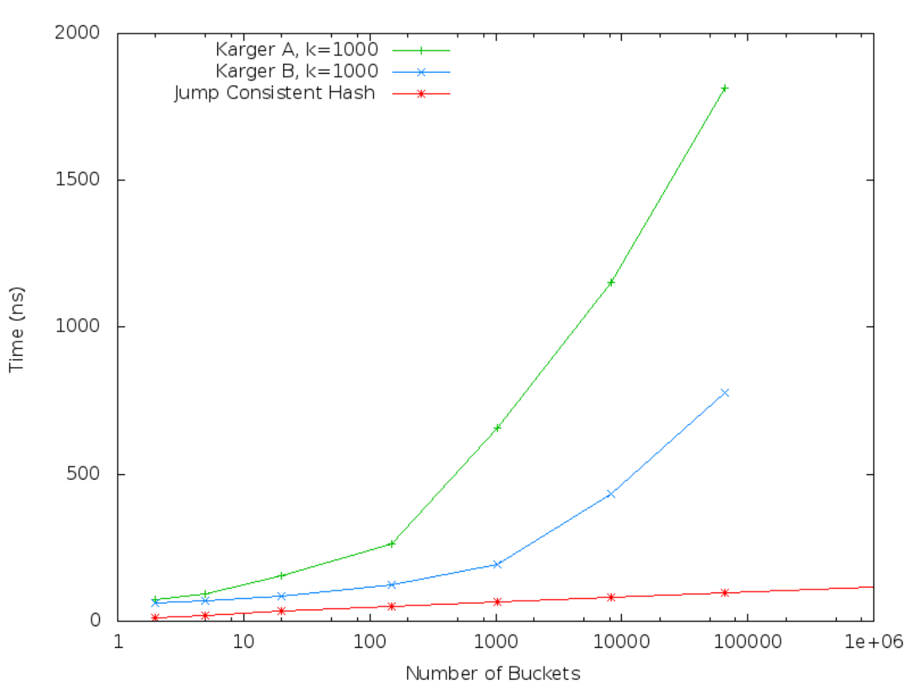
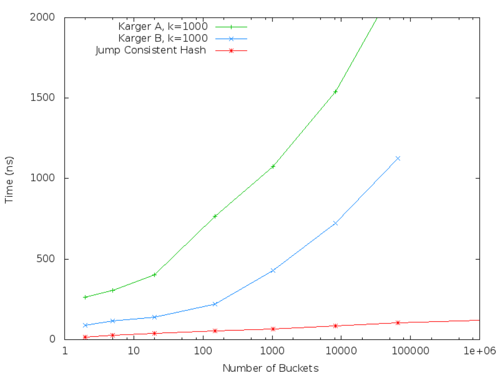

# A Fast, Minimal Memory, Consistent Hash Algorithm（中文译文）

## 译者说明

本文依据同目录的 `source.pdf` 翻译。章节、图表、公式、算法、代码与参考文献按原文结构保留。

John Lamping、Eric Veach（Google）

## 摘要

我们提出跳跃一致性哈希（jump consistent hash）：一种快速、几乎不占额外内存的一致性哈希算法，大约五行代码即可表达。与 Karger 等人的算法相比，跳跃一致性哈希不需要存储空间、速度更快，而且在将键空间均匀分给各桶，以及桶数变化时将工作负载均匀分摊方面表现更好。它的主要限制是桶必须连续编号，因此比起分布式 Web 缓存，它更适合数据存储应用。

## 引言

Karger 等人 [1] 引入了一致性哈希的概念，并给出了实现算法。一致性哈希规定了一种在服务器之间分布数据的方式，使得增减服务器时无须彻底重组数据。它最初是为互联网 Web 缓存提出的，用来解决客户端可能不知道全部缓存服务器的问题。

此后，一致性哈希也广泛用于数据存储应用。在这里，它解决的是把数据分成若干分片的问题，每个分片通常由一台服务器（或少量副本）管理。随着数据总量变化，我们可能希望增加或减少分片数。为使数据在新的分片集合中均匀分布，必须移动部分数据；我们希望移动量尽可能小。

例如，假设要将由键值对组成的数据分到 10 个分片。一种简单方法是计算每个键的哈希值 $h(\mathrm{key})$，并把相应的键值对存入编号为 $h(\mathrm{key}) \bmod 10$ 的分片。但若数据增长到需要 12 个分片，简单方法就会把每个键分配到 $h(\mathrm{key}) \bmod 12$，这很可能不同于 $h(\mathrm{key}) \bmod 10$；分片间的数据就必须彻底重新安排。

然而，要使原先 10 个分片中的数据在 12 个分片间达到均衡，只需要移动其中的 $1/6$。一致性哈希提供了这一点。我们的跳跃一致性哈希函数接收一个键和桶数（即分片数），返回其中一个桶。该函数满足两个性质：（1）映射到每个桶的键数大致相同；（2）桶数改变时，键到桶的映射受到的扰动尽可能小。因此，桶数变化时，只需移动桶分配发生变化的那一小部分键对应的数据。

跳跃一致性哈希速度快，而且与 Karger 等人的算法相比有显著的内存优势。为了使键分布相当均匀，他们的算法需要为每个候选分片存储数千字节。在可能有数千个分片的大型数据存储应用中，这意味着每个客户端都需要用数兆字节内存长期保存算法的数据结构，算法才能高效运行。相比之下，跳跃一致性哈希除几个寄存器能容纳的内容外不需要内存。它还更善于将键均匀分到各桶，并将再均衡的工作负载均匀分摊给各分片。另一方面，跳跃一致性哈希不支持任意服务器名称，只返回分片编号，因此主要适用于数据存储场景。

图 1 给出了跳跃一致性哈希的完整实现。输入是一个 64 位键和桶数；输出是从 0（含）到 `num_buckets`（不含）的桶编号。本文其余部分解释这段代码，并给出理论和实测性能结果。

```cpp
int32_t JumpConsistentHash(uint64_t key, int32_t num_buckets) {
  int64_t b = -1, j = 0;
  while (j < num_buckets) {
    b = j;
    key = key * 2862933555777941757ULL + 1;
    j = (b + 1) * (double(1LL << 31) / double((key >> 33) + 1));
  }
  return b;
}
```

图 1：C++ 实现的跳跃一致性哈希算法。

## 相关工作

Karger 等人的一致性哈希算法为每个桶关联单位圆上随机选取的若干点。对于给定的键，算法先把它哈希到单位圆上的一个位置，再沿顺时针方向寻找第一个被选中的点，返回与该点关联的桶。存储这些关联所需的内存与桶数乘以每桶选取的点数成正比。Karger 等人的实验每桶使用 1000 个点，使分配给不同桶的键数的标准差达到 3.2%。

我们所知的另一种计算一致性哈希的算法，是 Thaler 和 Ravishankar [3] 提出的 rendezvous 算法。将其用作一致性哈希时，原始版本对一个键和每个候选桶计算哈希函数值 $h(\mathrm{key},\mathrm{bucket})$，然后返回哈希值最高的桶。这需要与桶数成正比的时间。Wang 等人 [4] 展示了如何将桶组织成树，使时间与桶数的对数成正比。但他们的变体在增加或删除分片时要以均衡性为代价，因为它只在树的最底层节点之间进行再均衡。

这两种算法都允许桶使用任意 ID，既能处理增加新桶，也能处理删除任意桶。对于仅用于提升性能的缓存服务器，按任意顺序增删桶的能力很有价值。但在数据存储应用中，每个桶代表数据的一个分片，分片不能直接消失，因为对应数据只存储在那里。通常的处理办法是让分片具有冗余副本、能够快速恢复替代分片，或者接受部分数据的可用性降低。因此，服务器故障不会导致数据重新分配；只有容量变化才会。这意味着可按加入顺序为分片分配递增数字 ID，让活动桶 ID 始终填满从 0（含）到 `num_buckets`（不含）的区间。

Karger 等人的论文描述了一致性哈希的四个性质，其中只有两个对数据存储应用重要。它们是均衡性（balance），大体要求对象在桶之间均匀分布；以及单调性（monotonicity），要求增加桶数时，对象只从旧桶移动到新桶，不进行不必要的重排。另两个性质，即分散性（spread）和负载（load），都衡量一个假设下的哈希函数行为：每个客户端可能看到桶集合中不同的任意子集。在我们的数据存储模型中，这种情况不会发生，因为所有客户端看到的都是从 0（含）到 `num_buckets`（不含）的同一桶集合。这个限制使跳跃一致性哈希成为可能。

## 算法解释

跳跃一致性哈希的工作方式，是计算随着桶数增加，其输出何时发生变化。令 `ch(key, num_buckets)` 表示桶数为 `num_buckets` 时该键的一致性哈希值。显然，对任意键 $k$， $ch(k,1)=0$，因为只有一个桶。为使一致性哈希函数保持均衡，一半键的 $ch(k,2)$ 必须保持为 0，另一半则必须跳到 1。一般地，对 $n/(n+1)$ 的键， $ch(k,n+1)$ 必须与 $ch(k,n)$ 相同；对其余 $1/(n+1)$ 的键，则必须跳到 $n$。

下表展示桶数增加时三个键 $k_1$、 $k_2$、 $k_3$ 的一致性哈希值示例：

| 键／桶数 | 1 | 2 | 3 | 4 | 5 | 6 | 7 | 8 | 9 | 10 | 11 | 12 | 13 | 14 |
| --- | ---: | ---: | ---: | ---: | ---: | ---: | ---: | ---: | ---: | ---: | ---: | ---: | ---: | ---: |
| $k_1$ | 0 | 0 | 2 | 2 | 4 | 4 | 4 | 4 | 4 | 4 | 4 | 4 | 4 | 4 |
| $k_2$ | 0 | 1 | 1 | 1 | 1 | 1 | 1 | 7 | 7 | 7 | 7 | 7 | 7 | 7 |
| $k_3$ | 0 | 1 | 1 | 1 | 1 | 5 | 5 | 7 | 7 | 7 | 10 | 10 | 10 | 10 |

利用 $ch(\mathrm{key},j)$ 随 $j$ 增加而跳变的概率公式，可以定义线性时间算法。它基本上沿着上表的一行逐格前进。给定键和桶数，算法依次考虑从 1 到 `num_buckets - 1` 的各桶编号 $j$，用 $ch(\mathrm{key},j)$ 计算 $ch(\mathrm{key},j+1)$。对每个 $j$，它决定让 $ch(k,j+1)$ 保持为 $ch(k,j)$，还是把它跳变为 $j$。为了使正确比例的键发生跳变，它以键为种子使用伪随机数生成器。为使 $1/(j+1)$ 的键跳变，它生成一个在 0.0 到 1.0 之间均匀分布的随机数；若该值小于 $1/(j+1)$，就跳变。循环结束时，它得到所需的 `ch(k, num_buckets)`。代码如下：

```cpp
int ch(int key, int num_buckets) {
  random.seed(key);
  int b = 0; // This will track ch(key, j+1).
  for (int j = 1; j < num_buckets; j++) {
    if (random.next() < 1.0 / (j + 1)) b = j;
  }
  return b;
}
```

我们可以利用如下事实将其改为对数时间算法：随着 $j$ 增加， $ch(\mathrm{key},j+1)$ 通常不变，只偶尔跳变。算法只计算跳变的目的地，即满足 $ch(\mathrm{key},j+1)\ne ch(\mathrm{key},j)$ 的那些 $j$。还要注意，对于这些 $j$， $ch(\mathrm{key},j+1)=j$。推导算法时，我们将 $ch(\mathrm{key},j)$ 视为随机变量，以便用随机变量的记法分析使各种命题成立的键所占比例。由此将得出一个伪随机变量的闭式表达式，其值给出下一次跳变的目的地。

假设算法正在跟踪特定键 $k$ 的跳变目的桶编号，并假设 $b$ 是上一次跳变的目的地，即 $ch(k,b)\ne ch(k,b+1)$，且 $ch(k,b+1)=b$。现在我们要找下一次跳变：使 $ch(k,j+1)\ne ch(k,b+1)$ 成立的最小 $j$；等价地，也就是使 $ch(k,j)=ch(k,b+1)$ 成立的最大 $j$。我们构造一个值为该 $j$ 的伪随机变量。为得到 $j$ 的概率约束，注意对任意桶数 $i$， $j\ge i$ 当且仅当到 $i$ 为止一致性哈希尚未改变，也就是当且仅当 $ch(k,i)=ch(k,b+1)$。因此， $j$ 的分布必须满足：

$$
P(j\ge i)=P\bigl(ch(k,i)=ch(k,b+1)\bigr)
$$

幸运的是，这个概率很容易计算。由于 $P(ch(k,10)=ch(k,11))=10/11$，且 $P(ch(k,11)=ch(k,12))=11/12$，所以 $P(ch(k,10)=ch(k,12))=(10/11)(11/12)=10/12$。一般地，若 $n\ge m$，则 $P(ch(k,n)=ch(k,m))=m/n$。因此对任意 $i\gt b$：

$$
P(j\ge i)=P\bigl(ch(k,i)=ch(k,b+1)\bigr)=\frac{b+1}{i}.
$$

现在生成一个依赖于 $k$ 和 $j$、在 0 到 1 间均匀分布的伪随机变量 $r$。我们希望 $P(j\ge i)=(b+1)/i$，于是原文表述为令 $P(j\ge i)$ 当且仅当 $r\le(b+1)/i$。解这个关于 $i$ 的不等式，得到 $P(j\ge i)$ 当且仅当 $i\le(b+1)/r$。因为 $i$ 是 $j$ 的下界， $j$ 等于满足 $i\le(b+1)/r$ 的最大 $i$。依照向下取整函数的定义， $j=\lfloor(b+1)/r\rfloor$。

借助这个公式，跳跃一致性哈希依次选取跳变目的地，直到找到大于等于 `num_buckets` 的位置，从而求出 `ch(key, num_buckets)`；此时它知道前一个跳变目的地就是答案。

```cpp
int ch(int key, int num_buckets) {
  random.seed(key);
  int b = -1; // bucket number before the previous jump
  int j = 0; // bucket number before the current jump
  while (j < num_buckets) {
    b = j;
    r = random.next();
    j = floor((b + 1) / r);
  }
  return = b;
}
```

译注：上段伪代码的 `return = b;` 按原文保留；图 1 的可运行实现写作 `return b;`。原文关于概率事件的“ $P(j\ge i)$ 当且仅当”记法也按其表述保留。

要将它变成图 1 的实际代码，还需要实现 `random`。我们希望它既快，又能产生分布良好的连续值。我们采用一个 64 位线性同余生成器；选用的具体乘数使随机数在高维空间中的分布尤其好（即用连续随机值组成元组时）[2]。我们以键为种子。（若键装不进 64 位，就应使用该键的 64 位哈希值。）同余生成器每轮更新种子，代码从当前种子导出一个 `double`。测试表明，这个生成器在速度和分布方面表现良好。

值得注意的是，不同于 Karger 等人的算法，如果键本身已是整数，跳跃一致性哈希就不要求先对键做哈希。这是因为它内嵌伪随机数生成器，实质上在每轮迭代中重新哈希键。这个哈希并非特别好（即线性同余生成器），但由于它反复应用，无须对输入键额外做哈希。

## 性能分析

算法的时间复杂度由 `while` 循环的迭代次数决定。该循环依次访问跳变目的地，除最后一个以外，它们都小于桶数 $n$。因此，期望迭代次数比小于 $n$ 的跳变目的地的期望个数多一。由于桶数到达 $i$ 时发生跳变的概率为 $1/i$，目的地小于 $n$ 的期望跳变次数就是从 $i=2$ 到 $n$ 的 $1/i$ 之和，小于 $\ln(n)$。所以期望迭代次数小于 $\ln(n)+1$。

有趣的是，跳跃一致性哈希的期望跳变次数比在 $n$ 个已排序键中二分查找所需的 $\log_2(n)$ 次比较还少（差一个常数因子）。

## 性能测量

### 键分布

我们首先考察这些算法将键均匀分布到桶中的表现。回忆每个键先被映射成整数哈希值，再由该值映射到相应的桶。第一步对两种算法相同，因此我们关注第二步。理想情况下，每个桶应收到相同比例的哈希值。可以计算各桶获分哈希值比例的标准误差（ $\sigma/\mu$），衡量它与理想情况的偏差。注意，Karger 等人的算法中，这取决于每桶选取的点数。结果汇总如下：

| 算法 | 每桶点数 | 标准误差 | 桶大小的 99% 置信区间 |
| --- | ---: | ---: | ---: |
| Karger 等人 | 1 | 0.9979060 | (0.005, 5.25) |
| Karger 等人 | 10 | 0.3151810 | (0.37, 1.98) |
| Karger 等人 | 100 | 0.0996996 | (0.76, 1.28) |
| Karger 等人 | 1000 | 0.0315723 | (0.92, 1.09) |
| 跳跃一致性哈希 | — | 0.00000000764 | (0.99999998, 1.00000002) |

图 2：桶间键空间分布均匀性的度量。

最后一列给出桶大小相对于平均桶大小的 99% 置信区间。例如，Karger 等人的算法每桶使用 10 个点时，约 1% 的桶小于平均桶大小的 0.37 倍，或大于平均桶大小的 1.98 倍。这显然可能带来负载均衡问题。即使每桶使用 1000 个点，约 1% 的桶也会比平均大小至少大或小 8%。相比之下，跳跃一致性哈希几乎完美地划分键空间。

译注：原文此处的“less than 0.37x smaller than average”和“more than 1.98x larger than average”措辞与图 2 的倍数区间不完全一致；上句按图 2 的数值转述。

当然，实际键的分布也会使桶大小发生变化。不过，在许多数据存储应用中，每桶通常有数百万个键（例如每个键对应文件、URL、文档等），因此实际键分布带来的变化与上文所述变化相比可忽略不计。

键分布也会影响桶数变化时再均衡的工作负载。使用跳跃一致性哈希增加一个新桶时，新桶从每个已有桶的键空间中接收相同比例。例如，已有 1000 个桶，再增加一个桶，每个已有桶几乎正好转出其键空间的 0.1%。相比之下，使用 Karger 等人的算法时，只有那些原先包含为新桶选取的点的桶会参与再均衡。例如，已有 1000 个桶、每桶 10 个点，则最多只有 10 个桶会向新桶发送部分数据；各桶发送的数据量也可能差异很大。假如增加桶是为了缓解已有桶中的一个“热点”，这就可能造成问题：除非热点恰好是被选中的 10 个桶之一，否则新桶对它毫无作用；反过来，如果热点被选中，它又可能无力承担转移大量数据带来的额外工作负载。这是 Karger 等人的算法需要每桶使用大量点的另一个原因。

### 空间需求

Karger 等人的算法要使键均匀分布到桶中，必须每桶使用大量点，但这显著增加内存需求。除跳跃一致性哈希外，我们还实现了 Karger 等人算法的两个变体。所有实现均使用 C++ 和标准模板库，在 64 位平台上用 Gnu C++ 编译，并在配有 32 GB 内存的 Intel Xeon E5-1650 CPU 上测量。

我们的第一个 Karger 等人算法实现（“版本 A”）使用 STL `map`，将 64 位哈希值映射到 32 位桶编号，以表示点数据。这可能是最简单、最自然的实现方式。`map` 内部表示为平衡二叉树。此实现每桶的每个点占 48 字节。

第二个实现（“版本 B”）用排序的（哈希值、桶编号）对向量表示点数据，并将哈希值截为 32 位以节省空间。给定哈希值对应的桶通过二分查找定位。这个实现占用空间较少（每桶的每个点 8 字节），但与前一种实现不同，它不能高效地动态更新：桶数一旦改变，就必须重建整个数据结构。

下表给出每桶使用 1000 个点时（沿用 Karger 等人论文中的例子），不同桶数对应的数据总大小。

| 桶数 | 空间（Karger 版本 A） | 空间（Karger 版本 B） |
| ---: | ---: | ---: |
| 10 | 469 KB | 78 KB |
| 1000 | 46 MB | 7.6 MB |
| 100000 | 4.5 GB | 0.75 GB |

图 3：Karger 等人算法两个实现的空间需求。

当一致性哈希用于将请求映射到服务器时，这些相对较大的内存需求是显著缺点。任何希望把请求映射到正确服务器的客户端，都必须在本地持有一份一致性哈希数据，否则就得付出额外网络跳数的代价，将请求路由到正确目的地。因此，随着桶数增长，跳跃一致性哈希具有显著优势。

### 执行时间

我们在上述平台测量了两类算法的执行时间，基准测试对伪随机整数键序列计算一致性哈希值。

| 桶数 | 跳跃一致性哈希 | Karger A, k=10 | Karger A, k=100 | Karger A, k=1000 | Karger B, k=10 | Karger B, k=100 | Karger B, k=1000 |
| ---: | ---: | ---: | ---: | ---: | ---: | ---: | ---: |
| 2 | 12 | 25 | 44 | 73 | 26 | 45 | 63 |
| 5 | 20 | 31 | 54 | 92 | 33 | 54 | 70 |
| 20 | 33 | 44 | 73 | 156 | 44 | 65 | 84 |
| 150 | 50 | 68 | 140 | 262 | 62 | 81 | 124 |
| 1024 | 65 | 120 | 231 | 658 | 78 | 114 | 194 |
| 8192 | 81 | 225 | 608 | 1151 | 114 | 185 | 432 |
| 65536 | 96 | 548 | 1088 | 1814 | 188 | 418 | 777 |
| 1048576 | 116 | — | — | — | — | — | — |
| 1073741824 | 165 | — | — | — | — | — | — |

图 4：没有缓存竞争时的执行时间。原图高亮的列是跳跃一致性哈希、Karger A 的 $k=1000$ 和 Karger B 的 $k=1000$；这三列在图 5 中绘出。

图 4 比较了跳跃一致性哈希与 Karger 等人的两个实现；后者分别使用每桶 $k=10$、 $k=100$ 和 $k=1000$ 个点，相应的曲线图仅展示 $k=1000$ 的情况。所有时间单位均为纳秒，不包括循环开销。图 5 绘制上述三列。



图 5：跳跃一致性哈希与 Karger 等人算法实现的执行时间曲线。

有几点值得注意：

- 跳跃一致性哈希的成本随桶数呈对数增长，即使桶数达到非常大的规模（数十亿）也是如此。
- Karger 等人的实现虽然也具有 $O(\log n)$ 运行时间，但数据规模增大时，缓存未命中会显著降低性能（可能使运行时间增加一个很大的常数因子）。
- 每桶 1000 个点时，在桶数不超过 1000 的范围内，跳跃一致性哈希快 3～4 倍；在桶数不超过 100000 的范围内，可能快 5～8 倍。
- 即使每桶只使用 10 个点（虽然少到不具实用性），跳跃一致性哈希仍快于 Karger 等人的实现。

更重要的是，上述执行时间假设系统除了计算一致性哈希之外不做别的工作。但真实应用通常还要做许多其他工作，会争用各级内存缓存。例如，一台典型服务器可能先收到请求，查询自己数据结构中的信息，再向数据存储系统发送一个或多个请求，获取满足该请求所需的额外数据。最后这一步会使用一致性哈希。但应用每计算一次一致性哈希，几乎肯定还要进行相当多的其他内存访问。

为模拟典型服务器的行为，我们建立了一个基准测试，额外分配 1 GB 内存代表服务器维护的内部数据。每计算一次一致性哈希，基准测试就从这块内存中读取 16 个随机字节，以模拟哈希表查询、指针追踪等；还读取其中连续的一个 64 KB 数据块，以模拟访问大型内存缓存。

下表及曲线图展示这种环境下各一致性哈希实现的时间。与前面一样，时间单位均为纳秒，且已扣除循环开销。

| 桶数 | 跳跃一致性哈希 | Karger A, k=1000 | Karger B, k=1000 |
| ---: | ---: | ---: | ---: |
| 2 | 17 | 262 | 72 |
| 5 | 26 | 304 | 86 |
| 20 | 40 | 401 | 115 |
| 150 | 54 | 766 | 187 |
| 1024 | 67 | 1075 | 341 |
| 8192 | 86 | 1540 | 618 |
| 65536 | 103 | 2221 | 966 |
| 1048576 | 121 | — | — |
| 1073741824 | 176 | — | — |

图 6：存在内存缓存竞争时的执行时间（模拟典型服务器）。

图 7 将图 6 的三列数据绘成曲线。



图 7：存在内存缓存竞争时的执行时间曲线。

基准测试设置的变化对跳跃一致性哈希影响很小，但使 Karger 实现曲线的“拐点”明显移动（即缓存未命中导致运行时间出现较大常数倍增长的位置）。这是因为与其他代码争用后，可供一致性哈希使用的缓存空间减少。

### 初始化时间

构建 Karger 等人算法的数据结构也可能耗费大量时间。下表展示每桶 $k=1000$ 个点时，不同桶数对应的数据结构构建时间（秒）。

| 桶数 | Karger A, k=1000 | Karger B, k=1000 |
| ---: | ---: | ---: |
| 2 | 0.00024 | 0.00011 |
| 5 | 0.00072 | 0.00031 |
| 20 | 0.0039 | 0.0014 |
| 150 | 0.045 | 0.012 |
| 1024 | 0.61 | 0.093 |
| 8192 | 8.94 | 0.85 |
| 65536 | 111.99 | 7.66 |

需要注意的主要几点是：平衡树实现（STL `map`）初始化相对较慢；随着桶数变大，两种实现的初始化时间都非常显著。另外，使用 Karger B 实现时，每次桶数变化都必须完全重建数据结构。

## 致谢

Chad Lester 参与了关于如何对大型数据存储系统重新分片的讨论。Eric Lehman 简化了性能界限的推导。

## 说明

Google 未就本算法申请专利保护，且截至本文写作时也没有申请计划。相反，Google 希望将这个算法贡献给社区。

## 参考文献

[1] David Karger, Eric Lehman, Tom Leighton, Matthew Levine, Daniel Lewin and Rina Panigrahy. Consistent hashing and random trees: Distributed caching protocols for relieving hot spots on the World Wide Web. In *Proceedings of the 29th ACM Symposium on Theory of Computing (STOC)*, pages 654–663, 1997.

[2] P. L'Ecuyer. Tables of Linear Congruential Generators of Different Sizes and Good Lattice Structure. In *Mathematics of Computation* 68 (225): pages 249–260.

[3] David G. Thaler and Chinya V. Ravishankar. Using Name-Based Mappings to Increase Hit Rates. In *IEEE/ACM Transactions on Networking*, Volume 6, pages 1–14, 1997.

[4] Wei Wang and Chinya V. Ravishankar. Hash-Based Virtual Hierarchies for Scalable Location Service in Mobile Ad-hoc Networks. In *Mobile Networks and Applications*, Volume 14, Issue 5, pages 625–637, October 2009.
