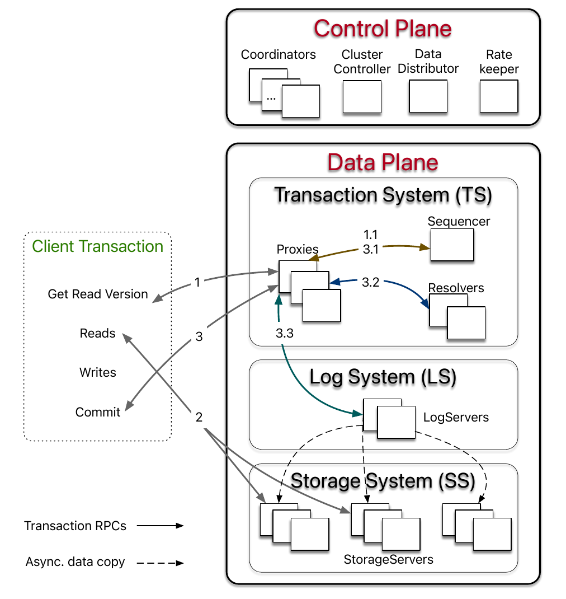
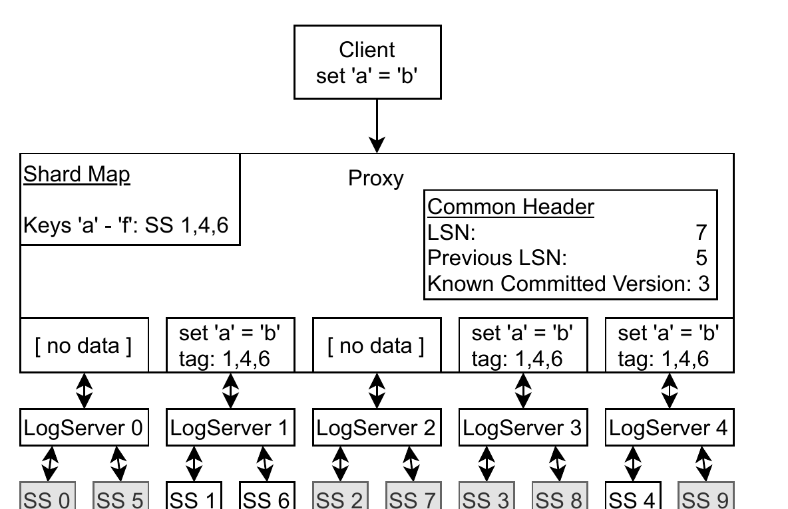
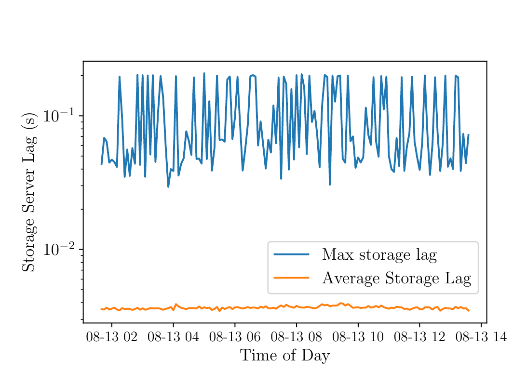
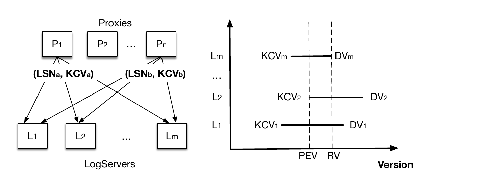
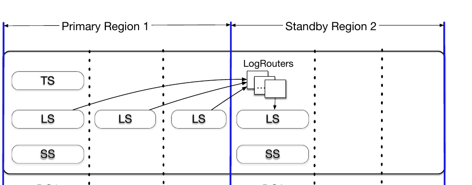
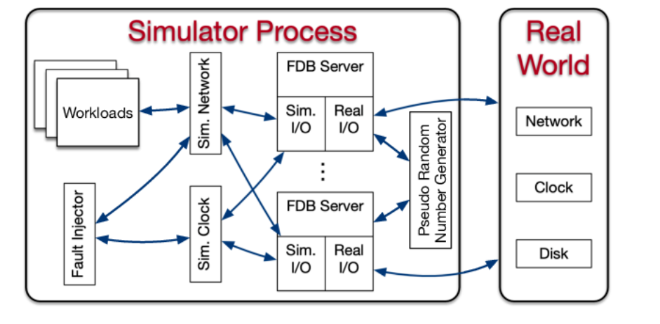
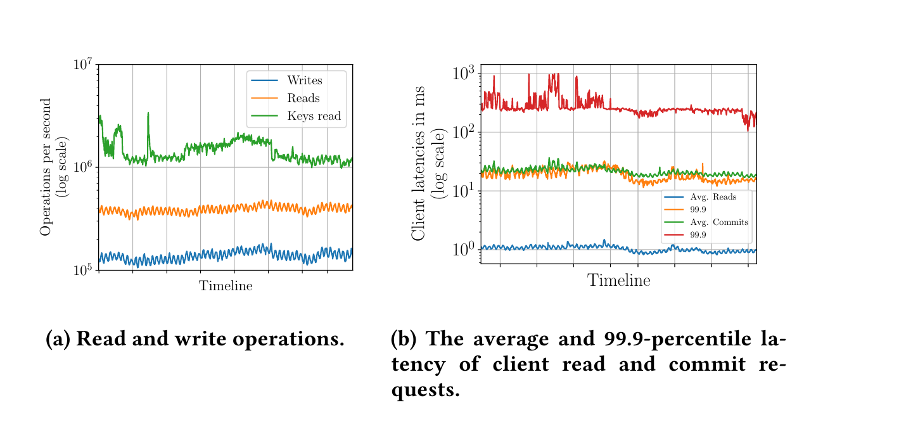
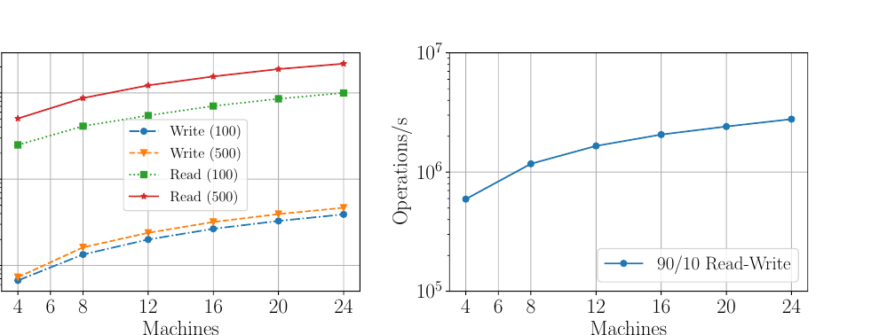
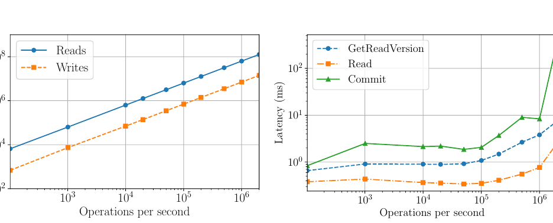
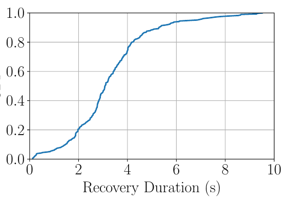

# FoundationDB: A Distributed Unbundled Transactional Key Value Store（中文译文）

## 译者说明

本文依据同目录的 `source.pdf` 翻译。章节、图表、公式、算法、代码与参考文献按原文结构保留。

## 论文信息

**论文署名及机构：**

- Jingyu Zhou、Meng Xu、Alexander Shraer、Bala Namasivayam（Apple Inc.）
- Alex Miller、Evan Tschannen、Steve Atherton、Andrew J. Beamon（Snowflake Inc.）
- Rusty Sears、John Leach、Dave Rosenthal、Xin Dong（Apple Inc.）
- Will Wilson、Ben Collins、David Scherer（antithesis.com）
- Alec Grieser、Young Liu、Alvin Moore（Apple Inc.）
- Bhaskar Muppana、Xiaoge Su、Vishesh Yadav（Apple Inc.）

**会议：** SIGMOD ’21，2021 年 6 月 20–25 日，中国线上会议

**出版信息：** ACM，14 页；DOI：10.1145/3448016.3457559

**许可与版权：** 允许为个人或课堂用途免费制作本文全部或部分内容的数字版或纸质版，但不得以营利或商业获益为目的，且副本须在首页保留本声明及完整引文。对于非论文署名者拥有版权的组成部分，必须尊重其版权；在注明出处的情况下可以制作摘要。复制、再出版、发布到服务器或重新分发到邮件列表，须事先获得明确许可并可能需要付费；许可申请请发送至 permissions@acm.org。© 2021 版权归权利所有者或论文署名者所有，出版权许可给 ACM。ACM ISBN 978-1-4503-8343-1/21/06；价格 \$15.00。

## 摘要

FoundationDB 是一个创建于十多年前的开源事务型键值存储。它是最早将 NoSQL 架构的灵活性、可扩展性与 ACID 事务能力结合起来的系统之一，也就是所谓的 NewSQL 系统。FoundationDB 采用解耦架构，将内存事务管理系统、分布式存储系统和内置分布式配置系统相互分离；各子系统可以独立配置资源，从而达到所需的可扩展性、高可用性和容错目标。

FoundationDB 还独特地集成了一套确定性仿真框架，用来在大量可能故障下测试系统的每项新功能。严格的测试使 FoundationDB 极其稳定，也让开发者能够以很快的节奏引入并发布新功能。FoundationDB 只提供一组经过谨慎选择的最小功能，因此半关系数据库、文档与对象存储、图数据库等差异很大的系统都可以作为其上层构建。凭借存储用户数据、系统元数据、配置和其他关键信息时的一致性、健壮性与可用性，FoundationDB 已成为 Apple、Snowflake 等公司的云基础设施底座。

**CCS 概念：** 信息系统 - 键值存储、分布式数据库事务；计算方法 - 分布式仿真。

**关键词：** 解耦数据库、OLTP、严格串行化、多版本并发控制、乐观并发控制、仿真测试。

## 1. 引言

许多云服务都依赖可扩展的分布式存储后端来持久化应用状态。这类系统既要容错和高可用，也要提供足够强的语义与灵活的数据模型，以支持快速开发；它们还必须扩展到数十亿用户、PB 乃至 EB 级数据，以及每秒数百万请求。

十多年前兴起的 NoSQL 系统降低了应用开发、扩展和运维存储系统的难度，提供容错能力，并支持不同于传统刚性关系模型的多种数据模型。然而，为了扩展，这些系统牺牲了事务语义，以最终一致性取而代之，迫使应用开发者推理并发操作的更新交错。FoundationDB 通过在大型工作负载上仍提供可串行化事务来避开这一取舍。事务不仅让应用能正确管理简单键值数据，也使用户能够实现一致二级索引和引用完整性检查等高级能力 [28]。ACID 对应用开发的重要性后来也促使 Cassandra [45]、MongoDB [10]、Couchbase [1] 等 NoSQL 系统补充某种形式的 ACID 事务和 SQL 方言。

FoundationDB [5] 于 2009 年创建，其名称体现了系统只提供构建高层分布式系统所需“基础构件”的定位。它是有序事务型键值存储，在整个键空间原生支持多键严格串行化事务。传统数据库往往把存储引擎、数据模型和查询语言捆绑在一起，用户只能全盘接受或全部放弃；FDB 则采用模块化方法，只提供可高度扩展的事务存储引擎和一组精心选择的最小功能。它没有结构化语义、查询语言、数据模型或 schema 管理、二级索引等常见数据库功能，以免不需要这些能力或需要不同形式的应用被迫绕开固定实现。FDB 默认提供严格串行化，也允许无需如此强语义的应用通过细粒度冲突控制放宽隔离。

FDB 专注数据库的“下半部”，其余能力留给构建在其上的无状态应用“层（layer）”。传统上需要完全不同存储系统的应用，因而可以共享 FDB。FoundationDB Record Layer [28] 补回了关系数据库用户预期的许多能力；图数据库 JanusGraph [9] 有 FDB 存储适配层 [8]；新版 CouchDB [2] 也重构为 FDB 上的一层。这些实践说明了该设计的用途。

测试和调试分布式系统至少与构建它同样困难。意外的进程和网络故障、消息重排等不确定因素会暴露现实中才出现的细微缺陷和隐含假设，而这类问题极难复现与调试。数据库承诺精确遵守明确契约，且持有长期状态，细微缺陷可能造成数月后才被发现的数据损坏。模型检查可以验证分布式协议模型，却常常无法检查实际实现；只有在特定次序的多次崩溃或重启后才出现的“深层缺陷” [46]，对端到端测试基础设施也是挑战。

FDB 采取了激进路线：在构建数据库之前，先构建确定性数据库仿真框架。它在单个物理进程中模拟交互进程网络，以及磁盘、进程、网络、请求级的多种故障与恢复。严格仿真使 FDB 极其稳定，也允许开发者快速引入功能与发布版本，这在分布式数据库乃至集中式系统中都很少见。

FDB 的解耦架构 [50] 包含控制面和数据面。控制面管理集群元数据，并通过 Active Disk Paxos [27] 提供高可用；数据面包含处理更新的事务管理系统和服务读取的分布式存储层，两者可独立扩展。FDB 用乐观并发控制（OCC）[44] 与多版本并发控制（MVCC）[18] 实现严格串行化。除了无锁架构，其故障处理方式也不同：系统不依靠 quorum 掩盖故障，而是尽早检测故障并通过重配置恢复。因此，容忍 $f$ 个故障只需 $f+1$ 个副本，而不是 $2f+1$ 个。这种方法最适合本地或都会区部署；对于 WAN，FDB 还提供避免跨地域写延迟、同时可在地域间无数据丢失地自动故障切换的策略。

本文贡献如下：

- 给出开源分布式存储系统 FoundationDB。它结合 NoSQL 与 ACID，已在 Apple、Snowflake、VMware 等公司的生产环境中满足严格的扩展、可用和持久性要求；
- 给出一组精心选择的功能，已据此实现多种差异很大的存储系统；
- 集成确定性仿真框架，使 FoundationDB 成为同类系统中最稳定者之一；
- 给出独特的架构，以及事务处理、容错和高可用方法。

下文第 2 节介绍 FDB 设计，第 3 节介绍地理复制与故障切换，第 4 节讨论确定性仿真，第 5 节评估性能，第 6 节总结开发经验，第 7 节回顾相关工作，第 8 节作结。

## 2. 设计

生产数据库必须解决数据持久化、分区、负载均衡、成员与故障检测、故障恢复、副本放置与同步、过载控制、扩展、并发与作业调度、监控告警、备份、多语言客户端库、升级部署和配置管理等问题。本文不可能覆盖所有细节，因此聚焦 FDB 的架构，以及它对事务管理、复制和容错的影响。

### 2.1 设计原则

FDB 遵循四项主要原则：

- **分而治之（职责分离）。** FDB 将事务管理系统（写路径）与分布式存储（读路径）解耦并独立扩展。在事务管理系统内部，不同进程角色分别负责时间戳管理、接收提交、冲突检测和日志记录。过载控制、负载均衡、故障恢复等全局编排任务也拆给额外的异构角色。
- **把故障当作常态。** 对分布式系统而言，故障是常态而非例外。FDB 的事务管理系统统一经恢复路径处理所有故障：它检测到故障时主动关闭，而不是分别修补所有可能情形。这样，故障处理被归约为单一且经常执行、充分测试的恢复操作。只要恢复足够快，这种策略便能简化正常事务处理。
- **快速失败、快速恢复。** FDB 通过缩短平均恢复时间（MTTR）来提高可用性。MTTR 包括检测故障、主动关闭事务管理系统和恢复的时间；在生产集群中总时长通常少于 5 秒（第 5.3 节）。
- **仿真测试。** FDB 使用随机化、确定性的仿真框架检验分布式数据库正确性。仿真既高效又可重复，既能暴露深层缺陷 [46]，也能提高开发效率与代码质量。

### 2.2 系统接口

FDB 提供读写单个 key 和 key range 的操作。`get()` 与 `set()` 分别读、写一个键值对；`getRange()` 返回给定范围内按键排序的键值列表；`clear()` 删除一个范围内或以指定 key prefix 开头的所有键值对。

FDB 事务观察并修改数据库某一版本的快照，只有事务提交时，变更才应用到底层数据库。事务写入，即 `set()` 和 `clear()` 调用，在最终 `commit()` 前由 FDB 客户端缓冲。客户端合并数据库查询结果与事务未提交写入，从而保证“读己之写”（read-your-writes）。为获得更好性能，key 和 value 的大小分别限制为 10 KB 与 100 KB；事务总大小限制为 10 MB，其中包括所有写入的键值，以及显式指定的读、写冲突范围中所有 key 的大小。

### 2.3 架构

如图 1 所示，FDB 集群包含管理关键系统元数据与全局编排的控制面，以及负责事务处理和数据存储的数据面。



#### 2.3.1 控制面

控制面把事务系统配置等关键元数据持久化在 Coordinator 上。Coordinator 组成 Disk Paxos 组 [27]，并选出唯一的 ClusterController。ClusterController 监控集群中的所有服务器，招募三个单例进程 Sequencer、DataDistributor 和 Ratekeeper，并在它们失败或崩溃时重新招募。Sequencer 为事务分配读取版本和提交版本；DataDistributor 负责监测故障并在 StorageServer 间均衡数据；Ratekeeper 为集群提供过载保护。

#### 2.3.2 数据面

FDB 面向以读为主、每个事务读写少量 key、竞争较低且要求扩展性的 OLTP 工作负载。它采用解耦架构 [50]：分布式事务管理系统（TS）在内存中处理事务；日志系统（LS）保存 TS 的预写日志（WAL）；独立的分布式存储系统（SS）保存数据并服务读取。TS 由无状态的 Sequencer、Proxy 和 Resolver 组成，LS 包含一组 LogServer，SS 则包含多个 StorageServer。这套架构已经扩展到 Apple 最大的事务负载 [28]。

Sequencer 给每个事务分配读取版本与提交版本；出于历史原因，它还负责招募 Proxy、Resolver 与 LogServer。Proxy 向客户端提供 MVCC 读取版本并编排事务提交；Resolver 检查事务冲突；LogServer 是经过复制和分片的分布式持久队列，每条队列为一个 StorageServer 保存 WAL。

SS 的 StorageServer 服务客户端读取，每个 StorageServer 保存一组数据分片，即连续 key range。StorageServer 占系统进程的大多数，合起来形成一棵分布式 B-tree。当前每个 StorageServer 的存储引擎是修改版 SQLite [41]，增加了快速 range clear、后台延迟删除和异步编程支持。

#### 2.3.3 读写分离与扩展

FDB 把 Coordinator、StorageServer、Sequencer 等职责分给不同进程角色，并通过扩展每种角色的进程数来扩展数据库。客户端直接向分片 StorageServer 读，故读取随 StorageServer 数量线性扩展；客户端写入，也就是事务提交，则通过增加 TS、LS 中的 Proxy、Resolver 和 LogServer 扩展。为此，MVCC 数据保存在 SS 中，这不同于将 MVCC 数据放在 TS 的 Deuteronomy [48, 51]。ClusterController、Sequencer 等控制面单例和 Coordinator 只执行有限的元数据操作，不构成性能瓶颈。

#### 2.3.4 启动

FDB 不依赖外部服务。全部用户数据以及大部分以 `0xFF` 为前缀的系统元数据存储在 StorageServer；StorageServer 的元数据持久化在 LogServer；LS 配置，也就是 LogServer 信息，存储在所有 Coordinator 中。若没有 ClusterController，服务器便用 Coordinator 组成的 Disk Paxos 组竞争该角色。新选出的 ClusterController 招募 Sequencer，后者读取 Coordinator 中保存的旧 LS 配置，并生成新的 TS 和 LS。Proxy 从旧 LS 恢复包括所有 StorageServer 信息在内的系统元数据。Sequencer 等待新 TS 完成恢复（第 2.4.4 节），再把新 LS 配置写入所有 Coordinator；此时新事务系统才可以接收客户端事务。

#### 2.3.5 重配置

TS 或 LS 发生故障，或数据库配置改变时，重配置流程会让事务管理系统进入一个干净的新配置。Sequencer 监控 Proxy、Resolver 和 LogServer 的健康状况；任一受监控进程失败或配置改变时，Sequencer 自行终止。ClusterController 检测到 Sequencer 故障后，招募一个新 Sequencer；新进程遵循前述启动流程生成新的 TS 与 LS 实例。因此，事务处理被划分成多个 epoch，每个 epoch 代表一代事务管理系统，并拥有唯一的 Sequencer。

### 2.4 事务处理

本节先介绍端到端事务流程与严格串行化，再讨论事务日志与恢复。

#### 2.4.1 端到端事务流程

如图 1 所示，客户端事务首先联系一个 Proxy 获取读取版本，也就是时间戳。Proxy 向 Sequencer 请求一个不小于此前任何事务提交版本的读取版本并返回客户端。客户端随后可以向 StorageServer 发出多次读取，取得该版本下的值；客户端写入则在本地缓冲，不接触集群。

提交时，客户端把包括读写集合（key range）在内的事务数据发给一个 Proxy，等待提交或中止响应。若无法提交，客户端可从头重启事务。Proxy 分三步完成提交：

1. Proxy 联系 Sequencer，取得大于现有所有读取版本和提交版本的提交版本。Sequencer 以每秒一百万版本的速率推进版本号。
2. Proxy 把事务信息发送给按 key range 分区的 Resolver。Resolver 通过检查读写冲突实现 OCC；所有 Resolver 都报告无冲突才进入最终提交阶段，否则 Proxy 将事务标记为中止。
3. 已提交事务被发往一组 LogServer 持久化。所有指定 LogServer 都回复后，事务才视为提交。Proxy 把提交版本报告给 Sequencer，确保之后事务的读取版本晚于该提交，再响应客户端。同时，StorageServer 持续从 LogServer 拉取 mutation log，并把已提交更新应用到磁盘。

FDB 还支持只读事务和快照读取。只读事务既可串行化（发生在读取版本处），又因 MVCC 而高效；客户端可在本地提交，不必联系数据库。这很重要，因为大部分事务都是只读的。快照读取则选择性放宽事务隔离以减少冲突，即并发写不会与快照读发生冲突。

#### 2.4.2 支持严格串行化

FDB 把 OCC 与 MVCC 结合，实现可串行化快照隔离（SSI）。事务 $Tx$ 从 Sequencer 取得读取版本和提交版本：读取版本保证不小于 $Tx$ 开始时任何已提交版本，提交版本则大于所有已有读取版本和提交版本。提交版本确定事务的串行历史，也作为日志序列号（LSN）。因为 $Tx$ 能观察到此前所有已提交事务的结果，FDB 达到严格串行化。

为确保 LSN 之间没有空洞，Sequencer 在返回提交版本时一并返回前一提交版本（前一 LSN）。Proxy 将 LSN 和前一 LSN 同时发给 Resolver 和 LogServer，让它们按 LSN 顺序串行处理事务；StorageServer 同样按递增 LSN 从 LogServer 拉取日志。

算法 1 给出了 Resolver 上的无锁冲突检测。每个 Resolver 维护近期已提交事务修改过的 key range 及其提交版本映射 `lastCommit`。 $Tx$ 的提交请求包括写范围集合 $R_w$ 和读范围集合 $R_r$，单个 key 也转换成单 key range。算法用读集合检查并发已提交事务修改过的范围，从而避免幻读；若不存在读写冲突，Resolver 接受事务并用写集合更新最近修改范围。快照读取不加入 $R_r$。实际实现中，`lastCommit` 是带版本信息的概率 SkipList [56]。

**算法 1：检查事务 Tx 的冲突。**

```text
要求：lastCommit：key range -> 最近提交版本的映射

1  for each range in Rr do
2      ranges <- lastCommit.intersect(range)
3      for each r in ranges do
4          if lastCommit[r] > Tx.readVersion then
5              return abort

   // 提交路径
6  for each range in Rw do
7      lastCommit[range] <- Tx.commitVersion

8  return commit
```

不同于在检查 $R_r$ 后才分配时间戳的 write-snapshot isolation [68]，FDB 在冲突检测前确定提交版本，因而能对版本分配和冲突检测都高效批处理。微基准显示，单线程 Resolver 可以轻松处理 28 万 TPS；其中每个事务读取一个随机 key range，并写另一个随机 key range。

整个键空间分给多个 Resolver，并行执行上述冲突检测。只有所有 Resolver 都接受事务才能提交，否则事务中止。中止事务可能已被部分 Resolver 接受，这些 Resolver 已经更新 `lastCommit`，因而可能让其他事务产生冲突误报。生产负载中，事务的 key range 通常只落入一个 Resolver，这不是实际问题；修改 key 会在 5 秒 MVCC 窗口后过期，因此误报也只会发生在很短的窗口内。Resolver 的 key range 还会动态调整以均衡负载。

FDB 的 OCC 设计避免了获取与释放逻辑锁的复杂逻辑，显著简化 TS 与 SS 的交互；代价是 Resolver 必须保存近期提交历史，而且 OCC 不能保证事务一定提交。多租户生产负载的事务冲突率低于 1%，因此 OCC 表现良好；发生冲突时，客户端只需重启事务。

#### 2.4.3 日志协议

Proxy 决定提交事务后，把日志消息广播到全部 LogServer。如图 2，Proxy 首先查询内存分片映射，确定负责已修改 key range 的 StorageServer，再给 mutation 附上 StorageServer 标签 1、4、6，每个标签都有首选 LogServer。例中标签 1 和 6 的首选 LogServer 相同，因此 mutation 只发往首选 LogServer 1、4，另发给 LogServer 3 以满足复制要求；其他 LogServer 只收到空消息体。



日志消息头包含从 Sequencer 获得的 LSN、前一 LSN，以及该 Proxy 的已知提交版本（KCV）。LogServer 将日志持久化后回复 Proxy；若全部副本 LogServer 都已回复且该 LSN 大于当前 KCV，Proxy 就把 KCV 更新为该 LSN。

从 LS 向 SS 传输 redo log 不在提交路径上，而在后台完成。StorageServer 会在日志于 LS 持久化之前就积极拉取 redo log，因此能以很低延迟提供多版本读取。图 3 给出一个生产集群 12 小时内两者的滞后：平均滞后和最大滞后的 99.9 分位分别为 3.96 ms 与 208.6 ms。滞后很小，所以客户端读抵达 StorageServer 时，请求版本通常已经可用。若短暂延迟使某副本暂时不可读，客户端会等待数据到达或向另一个副本发出第二次请求 [32]；两次都超时则收到可重试错误，并重启事务。



日志已在 LogServer 持久化，所以 StorageServer 可以在内存缓冲更新，稍后成批写盘，通过合并更新提高 I/O 效率。积极预取也意味着 StorageServer 可能拿到“半提交”更新，即恢复期间因 LogServer 故障而中止的事务操作；这类更新需要回滚（第 2.4.4 节）。

#### 2.4.4 事务系统恢复

传统数据库常用 ARIES [53] 恢复协议，依赖 WAL 和周期性粗粒度 checkpoint。恢复从最近 checkpoint 重放 redo log 到相关数据页，使数据库到达故障时的一致状态，再执行 undo log 回滚崩溃时仍在途的事务。

FDB 刻意让恢复代价很低：没有 checkpoint，恢复时也无需重放 redo 或 undo log。传统数据库有一项重要简化原则：redo log 处理与正常日志前推路径相同。FDB 的 StorageServer 始终从 LogServer 拉取日志并在后台应用，相当于把 redo 处理与恢复解耦。恢复从检测故障、招募新事务系统开始，到不再需要旧 LogServer 为止。因为恢复只需找到 redo log 末端，日志应用仍由 StorageServer 异步完成，所以新事务系统甚至能在旧 LogServer 的全部数据处理完之前接收事务。

每个 epoch 中，Sequencer 分多步恢复。它先从 Coordinator 读取前一事务系统状态（事务系统配置），并锁定协调状态，防止另一 Sequencer 同时恢复；随后恢复旧事务系统状态，包括所有更老 LogServer 的信息，阻止这些 LogServer 再接收事务，并招募一组新的 Proxy、Resolver 与 LogServer。旧 LogServer 停止且新事务系统招募完成后，Sequencer 把当前事务系统信息写入协调状态，最后接收新的事务提交。

Proxy 与 Resolver 无状态，恢复时无需额外工作。LogServer 则保存已提交事务日志，系统必须保证凡是 Proxy 可能已返回提交响应的事务，其日志都已按配置的复制程度持久化在多个 LogServer 上，并可由 StorageServer 取得。

#### 2.4.5 PEV 与 RV

恢复旧 LogServer 的本质是确定 redo log 的末端，即恢复版本（RV）；回滚 undo log 等价于丢弃旧 LogServer 和 StorageServer 中 RV 之后的全部数据。图 4 展示 Sequencer 如何确定 RV。Proxy 发给 LogServer 的请求会捎带 KCV，即该 Proxy 已提交的最大 LSN；每个 LogServer 保存收到的最大 KCV 和持久版本（DV），后者是已持久化的最大 LSN。



恢复期间，Sequencer 尝试停止全部 $m$ 个旧 LogServer；每个响应都包含该 LogServer 的 DV 与 KCV。设 LogServer 复制度为 $k$。Sequencer 收到超过 $m-k$ 个回复后，即可得知前一 epoch 已提交到所有 KCV 的最大值，并将其作为前一 epoch 结束版本 PEV；PEV 之前的全部数据都已完整复制。当前 epoch 从 $PEV+1$ 开始，Sequencer 把所有 DV 的最小值选为 RV。它将 $[PEV+1,RV]$ 范围的日志从前一 epoch 的 LogServer 复制到当前 LogServer，在 LogServer 发生故障时恢复复制度。该范围仅含几秒的日志，复制开销很小。若把 LogServer 组织为 Copyset [29]，即每组取一个，则所需的 $m-k$ 个回复可以减少到 $m/k$，提高容错能力。

Sequencer 开始接收新事务时，第一笔是特殊恢复事务，用于通知 StorageServer 当前 RV，使其回滚所有大于 RV 的数据。现有 FDB 存储引擎由无版本 SQLite B-tree [41] 与内存多版本 redo log 数据组成；只有离开 MVCC 窗口的 mutation，也就是确认提交的数据，才写入 SQLite。因此，回滚只需丢弃 StorageServer 内存中的多版本数据。之后，StorageServer 从新 LogServer 拉取版本大于 PEV 的数据。

### 2.5 复制

FDB 针对不同数据组合多种复制策略，以容忍 $f$ 个故障：

- **元数据复制。** 控制面系统元数据通过 Active Disk Paxos [27] 存储在 Coordinator 上。只要 Coordinator 的多数 quorum 存活，元数据就可以恢复。
- **日志复制。** Proxy 向 LogServer 写日志时，每条分片日志记录同步复制到 $k=f+1$ 个 LogServer；只有全部 $k$ 个副本都成功持久化并回复后，Proxy 才向客户端返回提交成功。LogServer 故障会触发事务系统恢复（第 2.4.4 节）。
- **存储复制。** 每个分片，即一个 key range，异步复制到 $k=f+1$ 个 StorageServer，称为一个 team。一个 StorageServer 通常承载多个分片，使其数据均匀分布在多个 team 中。StorageServer 故障会触发 DataDistributor，把包含故障进程的 team 上的数据移到健康 team。

Storage team 比 Copyset 策略 [29] 更复杂。Copyset 只把分片分配给有限数量的 $k$ 进程组，降低多个进程同时故障时丢失数据的概率；否则任意 $k$ 进程故障都可能导致数据丢失。FDB 部署中的 team 必须同时满足多个维度的约束。例如一台主机运行多个进程，而主机级故障会同时影响多个进程，因此一个副本组不能把两个进程放到同一主机。更一般地，一个副本组在机架、云可用区等故障域中至多放一个进程。

为此，FDB 设计了层级复制策略，在主机级和进程级同时构造副本集，并保证每个进程组属于满足故障域要求的主机组。只有选定主机组中的所有主机同时故障，也就是多个故障域并发失效，才会丢失数据；只要任何一个故障域仍可用，每个 team 都保证至少有一个进程存活。

### 2.6 其它优化

**事务批处理。** 为摊销提交成本，Proxy 把多个客户端事务组成一个 batch，只向 Sequencer 请求一个提交版本，再把批次发送给 Resolver 检查冲突，最后将批内可提交事务写入 LogServer。批处理减少了获取提交版本的调用次数，让 Proxy 每秒可提交数万事务而不显著影响 Sequencer。批量程度动态调整：低负载时缩小以降低提交延迟，高负载时增大以维持提交吞吐。

**原子操作。** FDB 支持 atomic add、按位 `and`、compare-and-clear、set-versionstamp 等操作，使事务无需读取数据项当前值即可写入，省去一次到 StorageServer 的往返。多个原子操作访问同一数据项不会产生读写冲突，只仍可能发生写读冲突，因而很适合计数器等频繁修改的 key。set-versionstamp 把 key 或 value 的一部分设为事务提交版本，客户端此后可读回版本号，也可用来提高客户端缓存性能。FDB Record Layer [28] 用原子 mutation 维护多种聚合索引，使并发更新无冲突，并用 set-versionstamp 维护低竞争同步索引。

## 3. 地理复制与故障切换

地域故障下提供高可用的主要难题是性能与一致性的取舍 [12]。同步跨地域复制提供强一致性，却付出高延迟；异步复制只在主地域持久化，延迟较低，但地域切换时可能丢数据。FDB 两种模式都支持，同时还提供利用同一地域内多个可用区的第三种设计：除整个地域同时失效这一小概率事件外，各可用区具有高度故障独立性。

该设计具备五项性质：（1）像异步复制一样始终避免跨地域写延迟；（2）只要同一地域的多个可用区不同时故障，就像同步复制一样提供完整事务持久性；（3）地域间切换快速且完全自动；（4）整个地域同时失效时，可按异步复制的保证手动切换，即仍提供 ACID 中的原子性、一致性和隔离性，但可能违反持久性；（5）只需在主、备地域的主要可用区各放一份完整数据库副本，不要求每地域多份完整副本。



图 5 的双地域集群中，每个地域有一个数据中心（DC）和一个或多个邻近但故障独立的卫星站点。卫星只保存日志副本，即 redo log 的后缀，资源需求很低；数据中心承载 LS、SS，并在作为主地域时承载 TS。控制面 Coordinator 副本跨三个或更多故障域部署，某些部署还会利用额外地域，通常至少有 9 个副本。多数 quorum 使控制面能够容忍一个站点（数据中心或卫星）故障，再加一个副本故障。

典型配置有两个地域，各含一个数据中心和两个卫星。优先级更高的 DC1 是主数据中心并包含完整 TS、LS、SS；备用地域的 DC2 有自己的 LS、SS 数据副本。两个数据中心的存储副本都能服务读取，但一致读仍需从主数据中心取得读取版本。全部客户端写转发到主地域，由 DC1 的 Proxy 处理，再同步持久化到 DC1 和主地域一个或两个卫星的 LogServer，从而避开跨地域 WAN 延迟。更新随后异步复制到 DC2，存入多个 LS，最终分发到多个 StorageServer。

LogRouter 是负责跨地域传输的特殊 FDB 角色，用于避免同一信息多次跨地域传输。每条日志记录只由 LogRouter 跨 WAN 传一次，再在 DC2 本地交付给所有相关 LS。

主数据中心不可用时，集群自动故障切换到备用地域；某些卫星故障也可能触发切换，但目前由人工决定。切换时，DC2 可能缺少日志后缀，系统会从主地域仍存活的 LogServer 取回。

每个地域可独立指定卫星配置，每个卫星有在本地域内比较的静态优先级，且每处通常保存多个日志副本。系统支持三种主要方案：

1. 同步写入本地域优先级最高卫星上的所有日志副本；该卫星失败时，招募下一优先级卫星。
2. 同步写入优先级最高的两个卫星上的全部副本；一个卫星失败时，以更低优先级卫星替代，若没有可替代者则退化为方案 1。备用地域不受影响，仍可从主地域其余 LogServer 拉取更新。
3. 与方案 2 相似，但提交成功只需等待两个卫星之一将 mutation 持久化。

若没有卫星可用，系统只使用 DC1 的 LogServer。方案 1 和 3 可容忍一个站点故障以及一个或多个 LogServer 故障，因为其余位置仍有多个日志副本；方案 2 可容忍两个站点故障以及一个或多个 LogServer 故障。不过方案 1、2 的提交延迟受主数据中心与卫星间尾延迟影响，方案 3 通常更快。最终选择取决于卫星站点数量、与数据中心的连接状况，以及期望的容错和可用程度。

主地域 DC1 突然不可用时，集群在 Coordinator 协助下检测故障，并在 DC2 启动新事务管理系统；按备用地域复制策略从其卫星招募新 LogServer。由于此前是异步复制，DC2 的 LogRouter 在恢复中可能需要从主地域卫星取回故障切换前数秒的数据。恢复后，若地域 1 的故障修复且其复制策略重新满足，集群会因 DC1 优先级较高自动切回 DC1；也可以改为招募另一个备用地域。

## 4. 仿真测试

测试和调试分布式系统既困难又低效。FDB 提供很强的并发控制契约，任何违反都可能让上层系统产生几乎任意形式的数据损坏。因此，从项目伊始，团队就让真实数据库软件与随机合成负载、故障注入一起运行在确定性离散事件仿真中。严酷环境会快速触发数据库缺陷，而确定性保证每个缺陷都能复现、诊断和修复。



**确定性仿真器。** FDB 从零开始按可仿真目标构建。全部数据库代码都是确定性的，因此避免多线程并发，每个数据库节点按一个 CPU 核部署。如图 6，网络、磁盘、时间和伪随机数生成器等所有不确定性与通信源都被抽象。FDB 采用 Flow [4] 编写；Flow 是 C++ 的语法扩展，增加类似 async/await 的并发原语，以 Actor 编程模型 [13] 把服务器行为抽象成由 Flow 运行库调度的 actor。仿真进程可在一次离散事件仿真中生成多个 FDB 服务器，让它们通过模拟网络通信；生产实现则只是相关系统调用的简单适配层。

仿真器运行多个同样以 Flow 编写的工作负载，通过模拟网络与模拟 FDB 服务器通信。工作负载包含故障注入指令、模拟应用、数据库配置变更和直接调用内部数据库功能。它们可以组合以覆盖不同功能，也可复用于构造综合测试用例。

**测试 oracle。** FDB 使用多种测试 oracle 检测仿真失败。多数合成负载都内置断言来验证数据库契约和属性，例如检查只有事务原子性与隔离性成立时才可保持的数据不变量。代码库到处使用断言检查可局部验证的性质。可恢复性（最终可用性）等性质则通过以下方式验证：在一组可能足以破坏可用性的故障后，把模拟硬件环境恢复到理论上可恢复的状态，再检查集群最终确实恢复。

**故障注入。** 仿真器注入机器、机架、数据中心级 fail-stop 故障与重启，多种网络故障、分区和延迟问题，磁盘行为（例如机器重启时破坏未同步写入），并随机化事件时序。这既检验数据库抵御特定故障的能力，也增加仿真状态多样性；注入分布会仔细调校，避免故障率过高反而把系统限制在很小的状态空间。

FDB 代码本身也配合仿真，使稀有状态和事件更常见。这种高层注入技术非正式地称为 **buggification**：代码库许多位置允许仿真注入不违反契约的异常行为，例如让通常成功的操作无必要地返回错误、给通常很快的操作注入延迟、选用不常见的调优参数等，以补充网络与硬件故障注入。随机化调优参数也能防止特定性能参数意外成为正确性的必要条件。

系统广泛采用 swarm testing [40]，最大化不同仿真运行的多样性。每次运行随机选择集群大小与配置、工作负载、故障注入参数和调优参数，并随机启用、禁用不同 buggification 点。FDB 已开源其 swarm testing 框架 [7]。

条件覆盖宏用于评估和调整仿真效果。例如，开发者担心某段代码很少在缓冲区已满时执行，可加入 `TEST(buffer.is_full());`；仿真结果分析会报告多少次不同运行达成该条件。若次数过少或为零，就增加 buggification、工作负载或故障注入，确保场景得到充分测试。

**缺陷发现延迟。** 尽早发现缺陷既能防止其进入生产，也有利于工程效率，因为单次提交中立即发现的问题很容易定位到该提交。若仿真内 CPU 利用率低，离散事件仿真可把时钟快进到下一事件，运行速度可任意快于真实时间。许多分布式缺陷需要很长时间才显现；仿真中加入长时间低利用率阶段，每单位 CPU 时间便能比真实端到端测试找到更多此类缺陷。

运行更多并行仿真也能更快发现缺陷。随机测试天然易于并行，FDB 开发者会在大版本发布前突发增加测试量，寻找此前未被发现的极低概率缺陷。搜索空间实际上无限，因此更多测试会覆盖更多代码并发现更多潜在缺陷，这与脚本化功能或系统测试不同。

**局限。** 仿真不能可靠检测负载均衡算法不完善等性能问题，也无法测试第三方库、外部依赖，乃至未以 Flow 实现的第一方代码。因此 FDB 尽量避免依赖外部系统。文件系统、操作系统等关键依赖的缺陷或对其契约的误解，也可能引发 FDB 缺陷；一些既有问题正是因为真实操作系统契约比团队原先认知的更弱。

## 5. 评估

本节先测量一个生产地理复制 FDB 集群的性能，再研究可扩展性，最后给出重配置耗时数据。

### 5.1 生产测量

测量对象是第 3 节所述的一套 Apple 生产地理复制集群。集群共 58 台机器：主数据中心和远端数据中心各 25 台，主地域两个卫星各 4 台。一个卫星存储日志，网络延迟 6.5 ms；另一个运行 Coordinator，网络延迟 65.2 ms。主数据中心与远端数据中心间延迟为 60.6 ms。

这些机器共运行 862 个 FDB 进程，另预留 55 个进程应急。集群存储 292 TB 数据，共有 464 块 SSD（每机 8 块）。每块 SSD 绑定一个 LogServer 或两个 StorageServer 进程，以最大化 I/O 利用率。测量统计 StorageServer 上的客户端读取和 Proxy 上的写入（提交）操作。



**流量模式。** 图 7a 给出一个月的集群流量，具有清晰的昼夜周期。平均每秒读操作、写操作和读取 key 数分别为 390.4K、138.5K 和 1.467M。许多读是返回多个 key 的 range read，故读取 key 数是读操作数的数倍。

**延迟。** 图 7b 给出客户端读与提交延迟的平均值和 99.9 分位。读延迟分别约为 1 ms 和 19 ms，提交延迟分别约为 22 ms 和 281 ms。提交必须向主 DC 与一个卫星的多个磁盘写入，因而慢于读；但远端地域采用异步复制，所以平均提交延迟仍低于 60.6 ms 的 WAN 延迟。99.9 分位比平均值高一个数量级，受请求负载变化、队列长度、副本性能和事务或键值大小共同影响。由于 CloudKit [59] 是多租户系统，该月平均事务冲突率只有 0.73%。

**恢复与可用性。** 2020 年 8 月仅发生一次事务系统恢复，耗时 8.61 秒，对应“五个九”可用性。

### 5.2 扩展性测试

测试集群位于单数据中心，共 27 台机器。每台配置开启超线程的 16 核 2.5 GHz Intel Xeon、256 GB 内存、8 块 SSD 和 10 GbE；运行 14 个 StorageServer，使用 7 块 SSD，余下一块留给 LogServer。Proxy 与 LogServer 数量相同，二者与 StorageServer 的复制度都设为 3。

合成负载含四类事务：（1）blind write，更新指定数量的随机 key；（2）range read，从随机 key 开始获取指定数量的连续 key；（3）point read，读取 10 个随机 key；（4）point write，读取 5 个随机 key，再更新另外 5 个。blind write 与 range read 分别评估写、读性能；point read 与 point write 组合评估混合负载。例如 90% 读、10% 写的 90/10 负载由 80% point read 和 20% point write 事务构成。key 长 16 字节，value 在 8 到 100 字节均匀分布，平均 54 字节。数据库按相同分布预填充，并保证数据集不能完全缓存于 StorageServer 内存。



图 8 展示 FDB 从 4 台扩展到 24 台机器、Proxy 或 LogServer 从 2 个增至 22 个的结果。对于每事务 100 次操作（T100），写吞吐由 67 MB/s 提升至 391 MB/s，为 5.84 倍；每事务 500 次操作（T500）则由 73 MB/s 增至 467 MB/s，为 6.40 倍。由于每次写都向 LogServer 和 StorageServer 复制三份，原始写吞吐其实是图中三倍；达到最大写吞吐时，LogServer CPU 饱和。

T100 的读吞吐由 2,946 MB/s 增至 10,096 MB/s，为 3.43 倍；T500 由 5,055 MB/s 增至 21,830 MB/s，为 4.32 倍，此时 StorageServer 饱和。无论读写，增加每事务操作数都能提高吞吐，但继续增加到 1,000 等更高值没有显著收益。图 8b 中 90/10 混合负载的操作率由 593K/s 增至 2.779M/s，为 4.69 倍，此时 Resolver 和 Proxy CPU 饱和。



上述实验研究饱和性能。图 9 则在 24 台机器上改变 90/10 负载的操作率；配置包含 2 个 Resolver、22 个 LogServer、22 个 Proxy 和 336 个 StorageServer。图 9a 显示，读写吞吐随每秒操作数线性增长。图 9b 显示，在操作率低于 100K/s 时，平均延迟保持稳定：读一个 key 约 0.35 ms，提交约 2 ms，取得读取版本（GRV）约 1 ms。读取只需一跳，比需要两跳的 GRV 快；提交要经过多跳并持久化到三个 LogServer，因此慢于读和 GRV。操作率超过 100K/s 后，排队时间使各类延迟上升；达到 2M/s 时 Resolver 与 Proxy 饱和。批处理维持了吞吐，但饱和使提交延迟尖峰达到 368 ms。

### 5.3 重配置耗时



我们从通常承载数百 TB 数据的生产集群收集了 289 条重配置，也就是事务系统恢复轨迹。面向客户端的集群要保持高可用，重配置必须很短。如图 10，重配置耗时中位数为 3.08 秒，90 分位为 5.28 秒。恢复时间不受数据量或事务日志大小限制，只与系统元数据大小相关，因此很短。

恢复期间读写事务暂时阻塞，并在超时后重试；StorageServer 仍服务客户端读，所以读取不受影响，客户端往往没有意识到集群曾中断数秒。重配置原因包括软件或硬件故障后的自动恢复、软件升级、数据库配置变更，以及站点可靠性工程（SRE）团队手动缓解生产问题。

## 6. 经验教训

FoundationDB 自 2009 年起持续开发，并于 2018 年以 Apache 许可证开源 [5]。长期生产运行让我们总结出四类经验。

### 6.1 架构设计

分而治之已证明是灵活云部署的关键，使数据库既可扩展功能又有良好性能。事务系统与存储层分离后，计算、存储资源可独立放置和扩展；运维人员也可把异构 FDB 角色放到不同服务器实例类型上，优化性能和成本。解耦还便于扩展数据库功能，例如正在开展的工作可把 RocksDB [38] 作为现有 SQLite 引擎的直接替代品。

近期许多性能改进也来自把功能专门化为独立角色，例如把 DataDistributor 和 Ratekeeper 从 Sequencer 分离、增加存储缓存、把 Proxy 划分为获取读取版本的 Proxy 与提交 Proxy。这种设计模式使团队能够频繁增加新功能和能力。

### 6.2 仿真测试

仿真测试缩短了缺陷从引入到被发现的延迟，并让问题可确定性复现，使一个小团队也能保持很高开发速度。例如增加日志通常不改变事件的确定性顺序，故可保证精确复现。少数最先在生产环境发现的缺陷，团队几乎总是先提高仿真的能力或保真度，直至能在仿真中复现，之后才进入常规调试。

严格正确性仿真让 FDB 极其可靠。过去数年中，CloudKit [59] 部署 FDB 累计超过 50 万磁盘年，没有发生一次数据损坏。系统还持续比较数据记录副本以检查一致性，迄今生产集群从未发现不一致副本。

更难量化的是团队相信系统可测试后带来的生产力提升。FDB 团队曾多次从头重写主要子系统；没有仿真，这些项目可能因风险过高或难度过大而根本不会启动。

仿真的成功促使团队不断消除依赖，并用 Flow 重新实现它们，以扩大可仿真边界。早期 FDB 曾依赖 Apache ZooKeeper 协调；约 2010 年，真实故障注入发现 ZooKeeper 两个相互独立的缺陷，团队遂删除依赖并以 Flow 从零实现 Paxos，此后再未报告生产缺陷。

### 6.3 快速恢复

快速恢复不仅提高可用性，还大幅简化并加速软件升级与配置变更。传统经验要求滚动升级，以便出错时回滚，过程可能持续数小时到数天。FDB 则可同时重启所有进程，通常数秒内完成。该路径在仿真中得到充分测试，所以 Apple 生产集群全部采用这种方式升级。版本兼容也更简单：只需保证磁盘数据兼容，不必维持不同软件版本间的 RPC 协议兼容。

快速恢复还可能掩盖或修复潜在错误，这与软件复壮（software rejuvenation）[42] 类似。Data Distributor 原先随 Sequencer 一起重启，其错误状态会被周期性清除；拆成独立长驻进程后，这些状态不再自动消失，反而让此前未知的缺陷在测试中暴露出来。

### 6.4 五秒 MVCC 窗口

FDB 选择 5 秒 MVCC 窗口，以限制事务系统和 StorageServer 的内存用量，因为多版本数据存放在 Resolver 与 StorageServer 内存中；这也限制了事务时长。经验显示，5 秒足以覆盖大多数 OLTP 场景。事务超时往往暴露客户端效率问题，例如逐个发出本可并行的读取。

许多确实超过 5 秒的事务可以拆小。例如 FDB 连续备份会扫描键空间并创建 key range 快照；受 5 秒限制，它把扫描拆成多个小范围，使每个范围都可在窗口内完成。更一般的模式是：一个事务创建多个作业，每个作业又可继续拆分或在事务内执行。FDB 将该模式实现为 TaskBucket 抽象，备份系统大量依赖它。

## 7. 相关工作

**键值存储与 NoSQL。** Bigtable [25]、Dynamo [33]、PNUTS [30]、MongoDB [10]、CouchDB [2]、Cassandra [45] 不提供 ACID 事务。内存键值系统 RAMCloud [54] 只支持单对象事务。Google Percolator [55]、Apache Tephra [11]、Omid [20, 58] 在键值存储上提供快照隔离事务 API。FDB 则在可扩展键值存储上支持严格串行化 ACID 事务，并已用于实现灵活 schema 和丰富查询 [6, 28, 47]。Hyder [19]、Tell [49]、AIM [21] 也采用了类似的 SQL-over-NoSQL 架构。

**并发控制。** 许多系统 [26, 31, 35, 36, 48, 50, 51, 55, 62] 以取得全部锁的时刻建立事务串行顺序，保证原子性与隔离性。例如 Spanner [31] 取得所有锁后用 TrueTime 确定提交时间戳，CockroachDB [62] 使用结合物理与逻辑时间的混合逻辑时钟。也有系统像 FDB 一样无锁排序 [16, 19, 22, 34, 37, 58, 64]：H-Store [61]、Calvin [64]、Hekaton [34]、Omid [58] 按时间戳顺序执行事务；Hyder [19]、Tango [16]、ACID-RAIN [37] 用共享日志定序；Sprint [22] 用全序 multicast 定序。FDB 以 MVCC 和 OCC 组成无锁并发控制，由 Sequencer 决定串行顺序并提供严格串行化。

**解耦数据库。** 这类系统分离事务组件（TC）与数据组件（DC）[11, 20, 23, 48-51, 58, 66, 67, 71]。Deuteronomy [48] 在事务系统中创建可逻辑加锁的虚拟资源，DC 不知道事务及其提交或中止；Solar [71] 把集群可扩展存储和单服务器事务处理结合；Amazon Aurora [66, 67] 用共享存储简化复制与恢复。这些系统采用基于锁的并发控制。Tell [49] 借助先进硬件与分布式 MVCC 实现快照隔离；FDB 则以通用硬件实现可串行化隔离。FDB 还把 TC 进一步拆成多个专门角色，并把事务日志从 TC 解耦，从而采用无锁并发管理和确定性事务顺序。

**捆绑数据库。** 传统数据库紧耦合事务组件与数据组件。Silo [65] 和 Hekaton [34] 用单服务器事务处理达到高吞吐；许多分布式数据库则通过数据分区扩展 [24, 26, 31, 35, 36, 43, 61, 62, 64]，其中 FaRM [35, 36]、DrTM [26] 借助先进硬件提高事务性能。FDB 面向通用硬件采用解耦设计。

**恢复。** 传统数据库通常实现基于 ARIES [53] 的恢复。VoltDB [52] 使用命令日志，从 checkpoint 开始重放命令；文献 [15, 36] 用 NVRAM 降低恢复时间；Amazon Aurora [66] 借助智能存储把 redo 处理与数据库引擎解耦，只由引擎处理 undo；RAMCloud [54] 在多台机器上并行恢复 redo log。这些系统的恢复时间与日志大小成正比。FDB 则通过谨慎分离 LogServer 与 StorageServer，把 redo 和 undo 处理都从恢复流程完全解耦。

**测试。** 非确定性故障注入已广泛用于分布式系统测试，包括网络分区 [14]、断电 [70]、存储故障 [39]。商业项目 Jepsen [3] 测试了许多分布式数据库，但这些方法都不能确定性复现。模型检查也广泛用于分布式系统 [46, 69]；它可能比仿真更穷尽，却只能验证模型而非实际实现。另有许多方法在没有故障时测试数据库子系统正确性，包括查询引擎 [17, 57, 60] 和并发控制 [63]。FDB 的确定性仿真直接针对真实数据库代码验证数据库不变量与其他性质，同时保证确定性复现。

## 8. 结论

本文介绍了面向 OLTP 云服务的键值存储 FoundationDB。核心思想是把事务处理与日志、存储解耦；这种架构把读写处理分离，并允许二者横向扩展。事务系统用 OCC 与 MVCC 保证严格串行化。日志解耦与确定性事务顺序将 redo、undo 处理移出恢复关键路径，显著简化恢复，带来异常迅速的恢复和更高可用性。确定性随机仿真则保障数据库实现的正确性。性能评估和云负载经验说明，FoundationDB 能满足严苛业务需求。

## 致谢

我们感谢 Ori Herrnstadt、Yichi Chiang、Henry Gray、Maggie Ma，以及 FoundationDB 项目过去和现在的所有贡献者；感谢 SRE 团队，以及 Apple 的 John Brownlee、Joshua McManus、Leonidas Tsampros、Shambugouda Annigeri、Tarun Chauhan、Veera Prasad Battina、Amrita Singh 和 Swetha Mundla；感谢匿名评审、Nicholas Schiefer、Zhe Wu 提出的有益意见，尤其感谢论文 shepherd Eliezer Levy。

## 参考文献

- [1] Couchbase. https://www.couchbase.com/.
- [2] CouchDB. https://couchdb.apache.org/.
- [3] Distributed system safety research. https://jepsen.io/.
- [4] Flow. https://github.com/apple/foundationdb/tree/master/flow.
- [5] FoundationDB. https://github.com/apple/foundationdb.
- [6] FoundationDB Document Layer. https://github.com/FoundationDB/fdb-document-layer.
- [7] FoundationDB Joshua. https://github.com/FoundationDB/fdb-joshua.
- [8] FoundationDB storage adapter for JanusGraph. https://github.com/JanusGraph/janusgraph-foundationdb.
- [9] JanusGraph. https://janusgraph.org/.
- [10] MongoDB. https://www.mongodb.com/.
- [11] Tephra: Transactions for Apache HBase. http://tephra.incubator.apache.org/.
- [12] D. Abadi. Consistency tradeoffs in modern distributed database system design: CAP is only part of the story. Computer, 2012.
- [13] G. Agha. Actors: A Model of Concurrent Computation in Distributed Systems. MIT Press, 1986.
- [14] A. Alquraan et al. An analysis of network-partitioning failures in cloud systems. OSDI, 2018.
- [15] J. Arulraj, M. Perron, and A. Pavlo. Write-behind logging. PVLDB, 2016.
- [16] M. Balakrishnan et al. Tango: Distributed data structures over a shared log. SOSP, 2013.
- [17] H. Bati, L. Giakoumakis, S. Herbert, and A. Surna. A genetic approach for random testing of database systems. In *Proceedings of the 33rd International Conference on Very Large Data Bases*, VLDB ’07, pages 1243–1251, Vienna, Austria, 2007. VLDB Endowment.
- [18] P. A. Bernstein, V. Hadzilacos, and N. Goodman. Concurrency Control and Recovery in Database Systems. Addison-Wesley, 1987.
- [19] P. A. Bernstein, C. W. Reid, and S. Das. Hyder: a transactional record manager for shared flash. CIDR, 2011.
- [20] E. Bortnikov et al. Omid, reloaded: Scalable and highly-available transaction processing. FAST, 2017.
- [21] L. Braun, T. Etter, G. Gasparis, M. Kaufmann, D. Kossmann, D. Widmer, A. Avitzur, A. Iliopoulos, E. Levy, and N. Liang. Analytics in motion: High performance event-processing and real-time analytics in the same database. In *Proceedings of the 2015 ACM SIGMOD International Conference on Management of Data*, SIGMOD ’15, pages 251–264, New York, NY, USA, 2015. Association for Computing Machinery.
- [22] L. Camargos, F. Pedone, and M. Wieloch. Sprint: A middleware for high-performance transaction processing. EuroSys, 2007.
- [23] W. Cao et al. PolarFS: An ultra-low latency and failure resilient distributed file system for shared storage cloud database. PVLDB, 2018.
- [24] S. Chandrasekaran and R. Bamford. Shared cache: the future of parallel databases. ICDE, 2003.
- [25] F. Chang et al. Bigtable: A distributed storage system for structured data. OSDI, 2006.
- [26] H. Chen et al. Fast in-memory transaction processing using RDMA and HTM. ACM TOCS, 2017.
- [27] G. Chockler and D. Malkhi. Active disk Paxos with infinitely many processes. PODC, 2002.
- [28] C. Chrysafis, B. Collins, S. Dugas, J. Dunkelberger, M. Ehsan, S. Gray, A. Grieser, O. Herrnstadt, K. Lev-Ari, T. Lin, M. McMahon, N. Schiefer, and A. Shraer. FoundationDB Record Layer: A Multi-Tenant Structured Datastore. In *Proceedings of the 2019 International Conference on Management of Data*, SIGMOD ’19, pages 1787–1802, New York, NY, USA, 2019. ACM.
- [29] A. Cidon et al. Copysets: Reducing the frequency of data loss in cloud storage. USENIX ATC, 2013.
- [30] B. F. Cooper, R. Ramakrishnan, U. Srivastava, A. Silberstein, P. Bohannon, H.-A. Jacobsen, N. Puz, D. Weaver, and R. Yerneni. PNUTS: Yahoo!’s hosted data serving platform. *Proceedings of the VLDB Endowment*, 1(2):1277–1288, Aug. 2008.
- [31] J. C. Corbett, J. Dean, M. Epstein, A. Fikes, C. Frost, J. Furman, S. Ghemawat, A. Gubarev, C. Heiser, P. Hochschild, W. Hsieh, S. Kanthak, E. Kogan, H. Li, A. Lloyd, S. Melnik, D. Mwaura, D. Nagle, S. Quinlan, R. Rao, L. Rolig, Y. Saito, M. Szymaniak, C. Taylor, R. Wang, and D. Woodford. Spanner: Google’s globally-distributed database. In *10th USENIX Symposium on Operating Systems Design and Implementation*, pages 261–264, Hollywood, CA, Oct. 2012. USENIX Association.
- [32] J. Dean and L. A. Barroso. The tail at scale. CACM, 2013.
- [33] G. DeCandia et al. Dynamo: Amazon's highly available key-value store. SOSP, 2007.
- [34] C. Diaconu, C. Freedman, E. Ismert, P.-A. Larson, P. Mittal, R. Stonecipher, N. Verma, and M. Zwilling. Hekaton: SQL Server’s memory-optimized OLTP engine. In *Proceedings of the 2013 ACM SIGMOD International Conference on Management of Data*, SIGMOD ’13, pages 1243–1254, New York, NY, USA, 2013.
- [35] A. Dragojevic et al. FaRM: Fast remote memory. NSDI, 2014.
- [36] A. Dragojević, D. Narayanan, E. B. Nightingale, M. Renzelmann, A. Shamis, A. Badam, and M. Castro. No compromises: Distributed transactions with consistency, availability, and performance. In *Proceedings of the 25th Symposium on Operating Systems Principles*, SOSP ’15, pages 54–70, New York, NY, USA, 2015. Association for Computing Machinery.
- [37] I. Eyal et al. Ordering transactions with prediction in distributed object stores. LADIS, 2013.
- [38] Facebook. RocksDB. https://rocksdb.org.
- [39] A. Ganesan et al. Redundancy does not imply fault tolerance. FAST, 2017.
- [40] A. Groce et al. Swarm testing. ISSTA, 2012.
- [41] R. D. Hipp. SQLite. https://www.sqlite.org/index.html, 2020.
- [42] Y. Huang et al. Software rejuvenation: analysis, module and applications. FTCS, 1995.
- [43] J. W. Josten et al. DB2's use of the coupling facility for data sharing. IBM Systems Journal, 1997.
- [44] H. T. Kung and J. T. Robinson. On optimistic methods for concurrency control. ACM TODS, 1981.
- [45] A. Lakshman and P. Malik. Cassandra: structured storage system on a P2P network. PODC, 2009.
- [46] T. Leesatapornwongsa, M. Hao, P. Joshi, J. F. Lukman, and H. S. Gunawi. SAMC: Semantic-aware model checking for fast discovery of deep bugs in cloud systems. In *Proceedings of the 11th USENIX Conference on Operating Systems Design and Implementation*, OSDI ’14, pages 399–414, Broomfield, CO, 2014. USENIX Association.
- [47] K. Lev-Ari et al. Quick: a queuing system in CloudKit. SIGMOD, 2021.
- [48] J. Levandoski, D. Lomet, and K. Zhao. Deuteronomy: Transaction support for cloud data. CIDR, 2011.
- [49] S. Loesing et al. On the design and scalability of distributed shared-data databases. SIGMOD, 2015.
- [50] D. Lomet et al. Unbundling transaction services in the cloud. CIDR, 2009.
- [51] D. Lomet and M. F. Mokbel. Locking key ranges with unbundled transaction services. PVLDB, 2009.
- [52] N. Malviya, A. Weisberg, S. Madden, and M. Stonebraker. Rethinking main memory OLTP recovery. In *2014 IEEE 30th International Conference on Data Engineering*, pages 604–615, Chicago, IL, USA, March 2014.
- [53] C. Mohan et al. ARIES: A transaction recovery method. ACM TODS, 1992.
- [54] D. Ongaro et al. Fast crash recovery in RAMCloud. SOSP, 2011.
- [55] D. Peng and F. Dabek. Large-scale incremental processing using distributed transactions and notifications. OSDI, 2010.
- [56] W. Pugh. Skip lists: A probabilistic alternative to balanced trees. CACM, 1990.
- [57] M. Rigger and Z. Su. Testing database engines via pivoted query synthesis. In *14th USENIX Symposium on Operating Systems Design and Implementation (OSDI 20)*, pages 667–682. USENIX Association, Nov. 2020.
- [58] O. Shacham, Y. Gottesman, A. Bergman, E. Bortnikov, E. Hillel, and I. Keidar. Taking Omid to the clouds: Fast, scalable transactions for real-time cloud analytics. *Proceedings of the VLDB Endowment*, 11(12):1795–1808, Aug. 2018.
- [59] A. Shraer, A. Aybes, B. Davis, C. Chrysafis, D. Browning, E. Krugler, E. Stone, H. Chandler, J. Farkas, J. Quinn, J. Ruben, M. Ford, M. McMahon, N. Williams, N. Favre-Felix, N. Sharma, O. Herrnstadt, P. Seligman, R. Pisolkar, S. Dugas, S. Gray, S. Lu, S. Harkema, V. Kravtsov, V. Hong, Y. Tian, and W. L. Yih. CloudKit: Structured storage for mobile applications. *Proceedings of the VLDB Endowment*, 11(5):540–552, Jan. 2018.
- [60] D. R. Slutz. Massive stochastic testing of SQL. VLDB, 1998.
- [61] M. Stonebraker, S. Madden, D. J. Abadi, S. Harizopoulos, N. Hachem, and P. Helland. The end of an architectural era: (it’s time for a complete rewrite). In *Proceedings of the 33rd International Conference on Very Large Data Bases*, VLDB ’07, pages 1150–1160. VLDB Endowment, 2007.
- [62] R. Taft, I. Sharif, A. Matei, N. VanBenschoten, J. Lewis, T. Grieger, K. Niemi, A. Woods, A. Birzin, R. Poss, P. Bardea, A. Ranade, B. Darnell, B. Gruneir, J. Jaffray, L. Zhang, and P. Mattis. CockroachDB: The resilient geo-distributed SQL database. In *Proceedings of the 2020 International Conference on Management of Data*, SIGMOD, pages 1493–1509, Portland, OR, USA, June 2020. ACM.
- [63] C. Tan, C. Zhao, S. Mu, and M. Walfish. Cobra: Making transactional key-value stores verifiably serializable. In *14th USENIX Symposium on Operating Systems Design and Implementation (OSDI 20)*, pages 63–80. USENIX Association, Nov. 2020.
- [64] A. Thomson et al. Calvin: Fast distributed transactions for partitioned database systems. SIGMOD, 2012.
- [65] S. Tu et al. Speedy transactions in multicore in-memory databases. SOSP, 2013.
- [66] A. Verbitski et al. Amazon Aurora: Design considerations for high throughput cloud-native relational databases. SIGMOD, 2017.
- [67] A. Verbitski, A. Gupta, D. Saha, J. Corey, K. Gupta, M. Brahmadesam, R. Mittal, S. Krishnamurthy, S. Maurice, T. Kharatishvilli, and X. Bao. Amazon Aurora: On avoiding distributed consensus for I/Os, commits, and membership changes. In *Proceedings of the 2018 International Conference on Management of Data*, SIGMOD ’18, pages 789–796, 2018.
- [68] M. Yabandeh and D. Gómez Ferro. A Critique of Snapshot Isolation. In *Proceedings of the 7th ACM European Conference on Computer Systems*, EuroSys ’12, pages 155–168, Bern, Switzerland, 2012.
- [69] J. Yang et al. MODIST: transparent model checking of unmodified distributed systems. NSDI, 2009.
- [70] M. Zheng, J. Tucek, D. Huang, F. Qin, M. Lillibridge, E. S. Yang, B. W. Zhao, and S. Singh. Torturing databases for fun and profit. In *Proceedings of the 11th USENIX Conference on Operating Systems Design and Implementation*, OSDI ’14, pages 449–464, Broomfield, CO, 2014. USENIX Association.
- [71] T. Zhu et al. Solar: Towards a shared-everything database on distributed log-structured storage. USENIX ATC, 2018.
