# Mesa: Geo-Replicated, Near Real-Time, Scalable Data Warehousing（中文译文）

## 译者说明

本文依据同目录的 `source.pdf` 翻译。章节、图表、公式、算法、代码与参考文献按原文结构保留。

Ashish Gupta、Fan Yang、Jason Govig、Adam Kirsch、Kelvin Chan、Kevin Lai、Shuo Wu、Sandeep Govind Dhoot、Abhilash Rajesh Kumar、Ankur Agiwal、Sanjay Bhansali、Mingsheng Hong、Jamie Cameron、Masood Siddiqi、David Jones、Jeff Shute、Andrey Gubarev、Shivakumar Venkataraman、Divyakant Agrawal

Google, Inc.

## 摘要

Mesa 是一个高度可扩展的分析型数据仓库系统，存储与 Google 互联网广告业务有关的关键度量数据。Mesa 旨在满足一组复杂而严苛的用户与系统需求，其中既包括近实时的数据摄取和可查询性，也包括面对大规模数据和查询量时的高可用性、可靠性、容错能力与可扩展性。具体而言，Mesa 管理 PB 级数据，每秒处理数百万行更新，并且每天服务数十亿次查询、取回数万亿行数据。Mesa 跨多个数据中心进行地理复制；即使整个数据中心发生故障，它仍能以低延迟给出一致、可重复的查询结果。本文介绍 Mesa 系统，并报告它所达到的性能与规模。

## 1. 引言

Google 运营着一个覆盖多种渠道的大型广告平台，每天向全球用户投放数十亿条广告。与每次广告投放有关的详细信息，例如定向条件、展示次数和点击次数等，都会被实时记录和处理。这些数据在 Google 内部广泛用于报表、内部审计、分析、计费和预测等场景。广告主通过复杂的前端服务对底层数据存储发起在线、按需查询，从而细致了解广告活动的表现。Google 内部的广告投放平台也会实时使用这些数据，根据预算和已投放广告的历史表现，提高当前及未来广告投放的相关性。随着 Google 广告平台持续扩张，以及内外部客户要求更深入地了解其广告活动，对更详细、更细粒度信息的需求推动了数据规模的急剧增长。这些数据的规模及其业务关键性，为处理、存储和查询带来了独特的技术与运维挑战。这样的数据存储必须满足以下要求：

**原子更新（Atomic Updates）。** 一次用户操作在关系数据层面可能引起多项更新，影响由一组维度（例如广告主和国家）上的一组指标（例如点击量和费用）定义的数千个一致视图。系统绝不能处于只有部分更新已经应用、却可以被查询到的状态。

**一致性与正确性（Consistency and Correctness）。** 出于业务和法律原因，系统必须返回一致且正确的数据。即使一次查询涉及多个数据中心，系统也必须提供强一致性和可重复的查询结果。

**可用性（Availability）。** 系统不能有任何单点故障。无论计划内还是计划外维护或故障，包括影响整个数据中心或地理区域的中断，都不能造成停机。

**近实时更新吞吐（Near Real-Time Update Throughput）。** 系统必须支持持续更新，既包括新行，也包括对已有行的增量更新；更新量级为每秒数百万行。这些更新应在几分钟内，以一致方式在不同视图和数据中心中可查询。

**查询性能（Query Performance）。** 系统既要支持为实时客户报表服务、延迟要求极低的延迟敏感型用户，也要支持要求极高吞吐的批量抽取用户。总体而言，系统必须让点查询的第 99 百分位延迟保持在数百毫秒，并达到每天取回数万亿行的总查询吞吐。

**可扩展性（Scalability）。** 系统必须能随数据规模和查询量增长而扩展。例如，它必须支持数万亿行和 PB 级数据；即使这些参数显著增长，更新和查询性能也必须维持不变。

**在线数据与元数据转换（Online Data and Metadata Transformation）。** 为支持新功能发布或改变现有数据的粒度，客户端经常需要转换数据模式，或修改已有数据值。这些变更不得干扰正常的查询和更新操作。

Mesa 是 Google 对上述技术与运维挑战的解决方案。尽管已有数据仓库系统分别解决了这些要求中的一部分，Mesa 的独特之处在于，它能为业务关键数据同时解决所有这些问题。Mesa 是面向结构化数据的分布式、复制式、高可用处理、存储与查询系统。它摄取上游服务生成的数据，在内部聚合并持久化，再通过用户查询提供数据。本文主要在广告指标的语境下讨论 Mesa，但 Mesa 实际上是满足上述全部要求的通用数据仓库解决方案。

Mesa 利用了 Google 的通用基础设施与服务，例如 Colossus（Google 下一代分布式文件系统）[22, 23]、BigTable [12] 和 MapReduce [19]。为实现存储的可扩展性与可用性，数据会被水平分区和复制。更新既可以应用于单张表，也可以跨多张表应用。为在更新期间提供一致且可重复的查询，底层数据采用多版本。为提升更新扩展性，数据更新被分批、分配新版本号，并周期性地（例如每隔几分钟）纳入 Mesa。为保证跨多个数据中心的更新一致性，Mesa 使用基于 Paxos [35] 的分布式同步协议。

大多数基于关系技术与数据立方体 [25] 的商业数据仓库产品，不能一边每隔几分钟持续整合、聚合仓库数据，一边为用户查询提供近实时结果。一般而言，这些方案适用于传统企业环境，其中数据进入仓库并聚合的频率低得多，例如每天或每周一次。同样，Google 内部用于处理大数据的其他技术，特别是 BigTable [12]、Megastore [11]、Spanner [18] 和 F1 [41]，也不适合这里的场景。BigTable 无法提供 Mesa 应用所需的原子性。Megastore、Spanner 与 F1 都面向在线事务处理；尽管它们为地理复制数据提供强一致性，却不支持 Mesa 客户端所需的峰值更新吞吐。不过，Mesa 的元数据存储和维护确实利用了 BigTable，以及 Spanner 底层的 Paxos 技术。

近期研究也在处理大规模数据分析与数据仓库问题。Wong 等人 [49] 开发了一个在云端以服务形式提供大规模并行分析的系统，但该系统面向拥有大量租户、而每个租户数据占用相对较小的多租户环境。Xin 等人 [51] 开发了 Shark，利用分布式共享内存支持大规模数据分析；不过 Shark 关注的是分析查询的内存内处理。Athanassoulis 等人 [10] 提出了 MaSM（materialized sort-merge，物化排序合并）算法，可结合闪存用于支持数据仓库的在线更新。

本文的主要贡献如下：

- 我们说明如何构建一个 PB 级数据仓库：它具备事务处理系统所需的 ACID 语义，同时仍能扩展到处理 Google 广告指标所要求的极高吞吐。
- 我们介绍一种新颖的版本管理系统。它将更新分批，在实现可接受更新延迟与高更新吞吐的同时，提供低延迟、高吞吐的查询性能。
- 我们介绍一种高度可扩展的分布式架构，它能抵御单个数据中心内的机器和网络故障；同时给出应对数据中心故障所需的地理复制架构。设计的突出特点是：应用数据通过多个数据中心中彼此独立且冗余的处理异步复制；只有关键元数据才通过向所有副本复制状态来同步复制。这种技术在提供极高更新吞吐的同时，最大限度降低了跨多个数据中心管理副本时的同步开销。
- 我们说明如何动态、高效地为大量表执行模式变更，而不影响现有应用的正确性或性能。
- 我们介绍抵御软件错误和硬件故障所致数据损坏问题的关键技术。
- 我们介绍在如此规模上维护一个对正确性、一致性和性能提供强保证的系统时所遇到的一些运维挑战，并提出可由新研究推动改进的方向。

本文其余部分安排如下。第 2 节介绍 Mesa 的存储子系统。第 3 节给出 Mesa 的系统架构，并介绍其多数据中心部署。第 4 节介绍 Mesa 的若干高级功能和特性。第 5 节总结 Mesa 开发过程中的经验，第 6 节报告 Mesa 生产部署的指标。第 7 节回顾相关工作，第 8 节给出结论。

## 2. Mesa 存储子系统

Mesa 中的数据持续产生，是 Google 规模最大、价值最高的数据集之一。对这些数据的分析查询，可以简单到“某个广告主在某一天有多少次广告点击？”，也可以复杂到“十月第一周每天上午 8:00 至 11:00 之间，某个广告主匹配关键字 ‘decaf’、在 google.com 上向使用移动设备且处于某个特定地理位置的用户展示的广告，共有多少次点击？”

Mesa 数据天然是多维的：它从不同维度捕捉 Google 广告平台整体表现的全部微观事实。这些事实通常包含两类属性：维度属性（本文称为键）和度量属性（本文称为值）。许多维度属性具有层级结构，甚至可能具有多个层级；例如，日期维度既可按日/月/年组织，也可按财务周/季度/年组织。因此，为支持通过下钻和上卷进行数据分析，一个事实可能会按照这些维度层级聚合进多个物化视图。严谨的数据仓库设计要求：一个事实是否存在，必须在它所有可能的物化与聚合方式之间保持一致。

### 2.1 数据模型

Mesa 使用表维护数据。每张表都有一个规定其结构的表模式。具体而言，表模式指定表的键空间 $K$ 和对应的值空间 $V$，二者都是集合；还指定聚合函数 $F: V \times V \rightarrow V$，用于聚合同一个键对应的值。聚合函数必须满足结合律，也就是说，对任意 $v_0,v_1,v_2 \in V$：

$$
F(F(v_0,v_1),v_2)=F(v_0,F(v_1,v_2))
$$

实践中，它通常也满足交换律，即 $F(v_0,v_1)=F(v_1,v_0)$；不过 Mesa 中确实有采用非交换聚合函数的表，例如用 $F(v_0,v_1)=v_1$ 替换一个值。表模式还为表指定一个或多个索引，每个索引都是 $K$ 上的全序。

键空间 $K$ 与值空间 $V$ 均表示为列的元组，每列具有固定类型，例如 `int32`、`int64`、`string` 等。模式为每一个值列指定一个满足结合律的聚合函数； $F$ 隐式定义为各值列逐坐标的聚合：

$$
F((x_1,\ldots,x_k),(y_1,\ldots,y_k))=(f_1(x_1,y_1),\ldots,f_k(x_k,y_k)),
$$

其中 $(x_1,\ldots,x_k),(y_1,\ldots,y_k) \in V$ 是任意两个列值元组， $f_1,\ldots,f_k$ 则由模式为各值列显式定义。

图 1 给出三张 Mesa 表的示例。三张表都包含广告点击量与费用指标（值列），并按不同属性拆分，例如点击日期、广告主、展示广告的发布商网站以及国家（键列）。两个值列的聚合函数都是 `SUM`。假定相同的底层事件更新了所有这些表中的数据，则指标在三张表之间具有一致表示。图 1 是 Mesa 表模式的简化视图；生产环境中的 Mesa 有一千多张表，其中许多表包含数百列，并使用多种聚合函数。

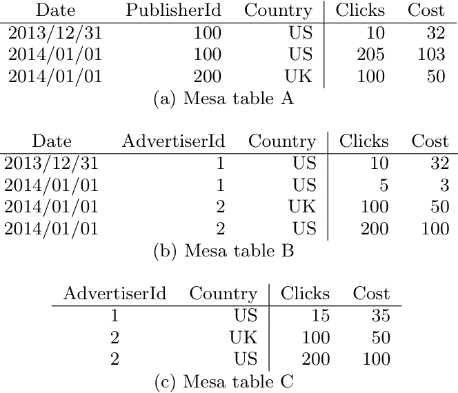

表 A：

| Date | PublisherId | Country | Clicks | Cost |
| --- | ---: | --- | ---: | ---: |
| 2013/12/31 | 100 | US | 10 | 32 |
| 2014/01/01 | 100 | US | 205 | 103 |
| 2014/01/01 | 200 | UK | 100 | 50 |

表 B：

| Date | AdvertiserId | Country | Clicks | Cost |
| --- | ---: | --- | ---: | ---: |
| 2013/12/31 | 1 | US | 10 | 32 |
| 2014/01/01 | 1 | US | 5 | 3 |
| 2014/01/01 | 2 | UK | 100 | 50 |
| 2014/01/01 | 2 | US | 200 | 100 |

表 C：

| AdvertiserId | Country | Clicks | Cost |
| ---: | --- | ---: | ---: |
| 1 | US | 15 | 35 |
| 2 | UK | 100 | 50 |
| 2 | US | 200 | 100 |

### 2.2 更新与查询

为了实现高更新吞吐，Mesa 分批应用更新。更新批次由 Mesa 之外的上游系统生成，通常每隔几分钟产生一次；批次越小、越频繁，更新延迟越低，但资源消耗也越高。形式化地说，对 Mesa 的一次更新指定一个版本号 $n$（从 0 开始顺序分配），以及一组形如 `(table name, key, value)` 的行。每次更新对每一个 `(table name, key)` 至多包含一个已经聚合的值。

对 Mesa 的一次查询由版本号 $n$ 和键空间上的谓词 $P$ 构成。对每个满足 $P$ 且曾在版本 0 至 $n$ 的某次更新中出现的键，响应包含一行；响应中某个键的值，是这些更新里该键所有值的聚合。Mesa 实际支持比这更复杂的查询功能，但所有这些功能都可看作围绕这一基本原语的前处理与后处理。

图 2 展示与图 1 中表对应的两次更新；将二者聚合后，会得到表 A、B、C。为了保持表的一致性（见第 2.1 节），每次更新都包含表 A 与 B 的一致行。表 C 的更新可以直接从表 B 的更新派生，因此由 Mesa 自动计算。从概念上说，也可以让一次同时含有 `AdvertiserId` 与 `PublisherId` 属性的更新来更新三张表；但这样做可能很昂贵，尤其在更一般的情况下，表拥有许多属性并因此涉及笛卡尔积时。

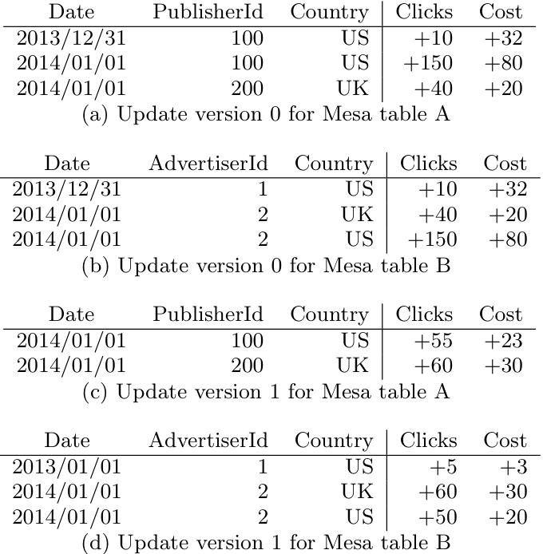

表 A 的更新版本 0：

| Date | PublisherId | Country | Clicks | Cost |
| --- | ---: | --- | ---: | ---: |
| 2013/12/31 | 100 | US | +10 | +32 |
| 2014/01/01 | 100 | US | +150 | +80 |
| 2014/01/01 | 200 | UK | +40 | +20 |

表 B 的更新版本 0：

| Date | AdvertiserId | Country | Clicks | Cost |
| --- | ---: | --- | ---: | ---: |
| 2013/12/31 | 1 | US | +10 | +32 |
| 2014/01/01 | 2 | UK | +40 | +20 |
| 2014/01/01 | 2 | US | +150 | +80 |

表 A 的更新版本 1：

| Date | PublisherId | Country | Clicks | Cost |
| --- | ---: | --- | ---: | ---: |
| 2014/01/01 | 100 | US | +55 | +23 |
| 2014/01/01 | 200 | UK | +60 | +30 |

表 B 的更新版本 1：

| Date | AdvertiserId | Country | Clicks | Cost |
| --- | ---: | --- | ---: | ---: |
| 2013/01/01 | 1 | US | +5 | +3 |
| 2014/01/01 | 2 | UK | +60 | +30 |
| 2014/01/01 | 2 | US | +50 | +20 |

表 C 对应在表 B 上执行下列查询得到的物化视图：

```sql
SELECT SUM(Clicks), SUM(Cost)
GROUP BY AdvertiserId, Country;
```

该查询能直接表示为 Mesa 表，是因为查询中的 `SUM` 与表 B 值列的 `SUM` 聚合函数相同。Mesa 限制物化视图的指标列必须采用与父表相同的聚合函数。

为保证更新原子性，Mesa 采用多版本方法。Mesa 按版本号顺序应用更新，每次都完整纳入一个更新后才转向下一个，由此保证原子性。用户永远看不到只纳入了部分更新所产生的任何效果。

严格的更新顺序除原子性以外还有其他用途。Mesa 模式中的聚合函数可能不满足交换律，例如标准键值存储场景中的 `(key, value)` 更新会完全覆盖该键的旧值。更微妙的是，顺序约束使 Mesa 能支持以逆向操作表示错误事实的用例。Google 使用在线欺诈检测判断广告点击是否合法；欺诈点击会用负事实抵消。例如，在图 2 的更新之后可以有一个版本 2，其中包含负的点击数与费用，表示把先前处理过的广告点击标记为非法。通过强制更新严格有序，Mesa 保证负事实绝不会先于对应的正事实被纳入。

### 2.3 版本化数据管理

版本化数据在 Mesa 的更新与查询处理中都至关重要，但它带来多项挑战。第一，广告统计具有可聚合性，从存储角度看，独立存储每个版本非常昂贵；聚合后的数据通常小得多。第二，在查询时遍历全部版本并聚合也很昂贵，会增加查询延迟。第三，每次更新时都对所有版本做朴素预聚合，开销可能高到无法承受。

为应对这些挑战，Mesa 会预聚合部分版本化数据，并把它们存为 delta。每个 delta 包含一组键不重复的行和一个 delta 版本（简称版本），版本表示为 $[V_1,V_2]$，其中 $V_1$、 $V_2$ 都是更新版本号，且 $V_1 \leq V_2$。含义明确时，本文直接用版本称呼 delta。delta $[V_1,V_2]$ 中的行，对应版本号从 $V_1$ 到 $V_2$（含两端）的更新里出现过的键；每个键的值是它在这些更新中各值的聚合。更新以单例 delta（singleton delta，简称 singleton）纳入 Mesa。版本号为 $n$ 的更新所对应的 singleton，其 delta 版本满足 $V_1=V_2=n$，即 $[n,n]$。

delta $[V_1,V_2]$ 与 delta $[V_2+1,V_3]$ 可以聚合成 delta $[V_1,V_3]$：只需合并行键，并相应聚合值即可。如第 2.4 节所述，delta 内的行按键排序，因此两个 delta 可在线性时间内完成合并。该计算的正确性来自聚合函数 $F$ 的结合律。值得注意的是，它不依赖 $F$ 的交换律：每当 Mesa 聚合同一键的两个值时，delta 版本总是 $[V_1,V_2]$ 和 $[V_2+1,V_3]$ 的形式，且聚合始终按版本递增的顺序进行。

Mesa 只允许用户在有限时段内（例如 24 小时）查询某个特定版本。因此，早于这一时段的版本可以聚合进版本为 $[0,B]$ 的基础 delta（base delta，简称 base），其中基础版本 $B \geq 0$；此后，任何满足 $0 \leq V_1 \leq V_2 \leq B$ 的其他 delta 都可删除。这个过程称为基础压实（base compaction）；Mesa 让它与纳入更新、回答查询等其他操作并发、异步地执行。

用于压实的更新版本时间，是该版本生成的时间，与数据中可能存在的任何时间序列信息无关。例如，对图 1 中的 Mesa 表而言，与 `2014/01/01` 相关的数据永远不会因此被删除；但过一段时间后，Mesa 可能拒绝对图中那个特定版本的查询。数据里的日期只是另一个属性，对 Mesa 而言是不透明的。

有了基础压实，要回答版本号 $n$ 的查询，一种方式是将 base delta $[0,B]$ 与全部 singleton delta $[B+1,B+1],[B+2,B+2],\ldots,[n,n]$ 聚合，再返回所请求的行。即使频繁执行 base 扩展（例如每天一次），singleton 的数量仍很容易达到数百甚至上千，尤其对更新密集的表更是如此。为了提高查询效率，Mesa 通过累积压实（cumulative compaction）维护一组形如 $[U,V]$ 且 $B\lt{}U\lt{}V$ 的累积 delta 集合 $D$。借助这些 delta，可以为版本 $n$ 找到覆盖它的 delta 集合：

$$
\lbrace{}[0,B],[B+1,V_1],[V_1+1,V_2],\ldots,[V_k+1,n]\rbrace{},
$$

与直接使用 singleton 相比，这需要的聚合量显著更少。累积 delta 当然会引入存储和处理成本，但这些成本可由所有能够使用累积 delta 而不是 singleton 的操作（尤其是查询）共同摊销。

delta 压实策略决定 Mesa 在任意时刻维护哪些 delta。它的主要目标，是在查询所需处理量、把更新纳入 Mesa delta 的延迟，以及生成和维护 delta 的处理与存储成本之间取得平衡。更具体地说，delta 策略决定：(i) 允许查询某个更新版本之前，除 singleton 外还必须生成哪些 delta，也就是哪些工作必须同步位于更新路径中，以减慢更新换取更快查询；(ii) 哪些 delta 应在更新路径之外异步生成；(iii) 何时可以删除 delta。

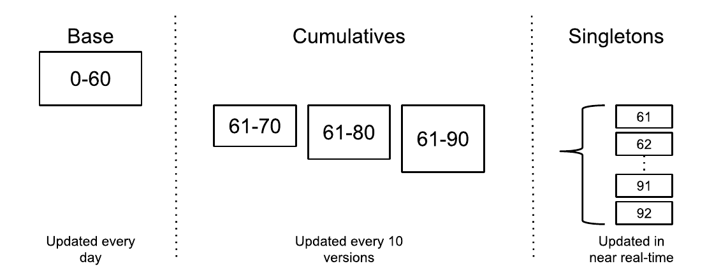

图 3 展示两级 delta 策略的例子。在该策略下，任意时刻都存在 base delta $[0,B]$、版本为 $[B+1,B+10]$、 $[B+1,B+20]$、 $[B+1,B+30]$ 等的累积 delta，以及对每个大于 $B$ 的版本存在的 singleton delta。只要版本 $B+10x$ 的 singleton 被纳入，就异步开始生成累积 delta $[B+1,B+10x]$。系统大约每天计算一个新的 base delta $[0,B']$，但在所有相对于 $B'$ 的对应累积 delta 也生成以前，新 base 不能使用。当基础版本由 $B$ 变成 $B'$ 后，该策略会删除旧 base、旧累积 delta，以及版本小于或等于 $B'$ 的所有 singleton。于是，一次查询只需涉及 base、一个累积 delta 和少量 singleton，减少了查询时的工作量。

Mesa 当前在生产环境中采用两级 delta 策略的变体，其中包含多级累积 delta。对较新的版本，累积 delta 只压实少量 singleton；对较旧的版本，累积 delta 则压实更多版本。例如，一个 delta 层级可以依次维护 base、紧接着 100 个版本的一个 delta、再接着 10 个版本的一个 delta，最后是若干 singleton。LevelDB [2]、BigTable 等其他只追加日志结构存储系统也采用相关的存储管理方法。Mesa 基于差分更新的数据维护，是差分存储方案 [40] 的一种简化改造；差分存储也用于增量视图维护 [7, 39, 53] 和面向读的列式存储更新 [28, 44]。

### 2.4 物理数据与索引格式

Mesa delta 依照 delta 压实策略创建和删除。delta 一经创建便不可变，因此其物理格式无需高效支持增量修改。

不可变性使 Mesa delta 可以采用相当简单的物理格式。主要要求只有两个：其一，格式必须节省空间，因为存储是 Mesa 的主要成本；其二，格式必须支持快速定位到特定键，因为查询往往要定位到多个 delta 中，再跨键聚合结果。为支持使用键高效定位，每张 Mesa 表都有一个或多个表索引。每个表索引都拥有一份自己的数据副本，按该索引规定的顺序排序。

物理格式本身的细节技术性较强，本文只关注最重要的方面。delta 中的行按顺序存储在大小有界的数据文件里，以适应文件系统的文件大小约束。行进一步组织为行块，每个行块单独转置并压缩。转置把数据从按行布局改为按列布局，从而获得更好的压缩。存储是 Mesa 的主要成本，而读/查询时的解压性能远比写入时的压缩性能重要，因此选择压缩算法时，Mesa 更重视压缩率和读取/解压时间，而不是写入/压缩时间。

Mesa 还为每个数据文件存储一个对应的索引文件；前文已说明，每个数据文件属于更高层的一项表索引。索引项包含行块的短键与压缩行块在数据文件中的偏移量。短键是该行块第一个键的定长前缀。查询某一特定键的朴素算法是：先在索引文件上做二分查找，找到可能含有与查询键短键相匹配之行块的范围；再在数据文件的压缩行块中做二分查找，找到目标键。

## 3. Mesa 系统架构

Mesa 使用 Google 的通用基础设施与服务构建，包括 BigTable [12] 与 Colossus [22, 23]。Mesa 运行在多个数据中心中，每个数据中心运行一个 Mesa 实例。下面先介绍单个实例的设计，再说明这些实例如何集成为完整的多数据中心 Mesa 部署。

### 3.1 单数据中心实例

每个 Mesa 实例由两个子系统组成：更新/维护子系统与查询子系统。二者相互解耦，可以独立扩展。所有持久元数据都存储在 BigTable 中，所有数据文件都存储在 Colossus 中。为了保证操作正确性，两个子系统不需要直接通信。

#### 3.1.1 更新/维护子系统

更新与维护子系统执行一切必要操作，以保证本地 Mesa 实例的数据正确、最新并针对查询完成优化。它运行多种后台操作，例如装载更新、执行表压实、应用模式变更和计算表校验和。这些操作由一组统称为控制器/工作器（controller/worker）框架的组件管理和执行，如图 4 所示。

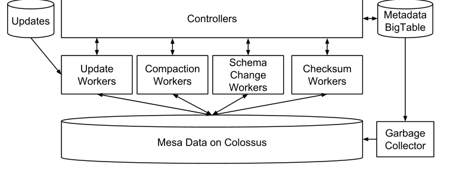

控制器决定需要完成哪些工作，并管理全部表元数据，将其持久保存在元数据 BigTable 中。表元数据包含每张表的详细状态与操作元数据，包括与表关联的所有 delta 文件和更新版本的记录、分配给表的 delta 压实策略，以及按操作类型拆分的当前操作与历史已应用操作的计账条目。

控制器可以看成一个大规模表元数据缓存、工作调度器和工作队列管理器。控制器本身不执行任何表数据操作，只调度工作和更新元数据。启动时，控制器从 BigTable 装入表元数据，其中包括分配给本地 Mesa 实例的所有表。对每张已知表，它都会订阅元数据 feed 来监听表更新；随着实例中增加和删除表，这项订阅会动态更新。通过 feed 收到的新更新元数据会被验证和记录。控制器是 BigTable 中表元数据的唯一写入者。

控制器为不同类型的数据操作工作维护彼此独立的内部队列，例如纳入更新、delta 压实、模式变更和表校验和。对于某个 Mesa 实例特有的操作，如纳入更新和 delta 压实，控制器自行决定把哪些工作加入队列。需要全局协调应用或全局同步的工作，如模式变更和表校验和，则由运行在单个 Mesa 实例上下文之外的其他组件发起。对这些任务，控制器通过 RPC 接受工作请求，并把任务插入对应的内部工作队列。

工作器组件负责在各 Mesa 实例内实际执行数据操作。Mesa 为每种任务类型配置独立的工作器池，使每个池都能独立扩展。Mesa 使用内部工作器池调度器，根据空闲工作器的百分比伸缩工作器数量。

每个空闲工作器会周期性轮询控制器，为自己的任务类型请求工作，直到取得有效任务。收到任务后，工作器验证请求、处理取得的工作，并在任务完成时通知控制器。每项任务都有最大所有权时长和周期性租约续期时间间隔，确保缓慢或已经失效的工作器不会永远占有任务。如果任一条件不能满足，控制器可以重新分配任务；这样做是安全的，因为控制器只接受当前获分配工作器返回的结果。Mesa 因此能够抵御工作器故障。垃圾收集器持续运行，删除工作器崩溃后留下的文件。

控制器/工作器框架只用于更新和维护工作，因此这些组件重启不会影响外部用户。控制器还按表分片，使框架能够扩展。此外，控制器是无状态的，全部状态信息都一致地维护在 BigTable 中。因此 Mesa 能抵御控制器故障：新控制器可以从 BigTable 元数据中重建故障前的状态。

#### 3.1.2 查询子系统

Mesa 的查询子系统由查询服务器组成，如图 5 所示。查询服务器接收用户查询、查找表元数据、确定存储所需数据的文件集合、即时聚合这些数据，并把数据从 Mesa 内部格式转换为客户端协议格式后返回客户端。Mesa 查询服务器提供的查询引擎功能有限，基本支持服务器端条件过滤和 `GROUP BY` 聚合。MySQL [3]、F1 [41]、Dremel [37] 等更高层数据库引擎利用这些原语提供连接查询等更丰富的 SQL 功能。

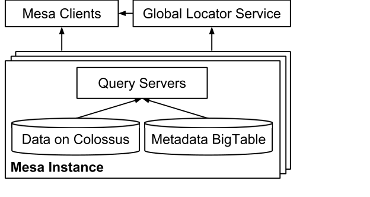

Mesa 客户端的需求和性能特征差异很大。在一些场景中，Mesa 直接接收交互式报表前端发来的查询，这类查询对低延迟要求非常严格；它们通常很小，但必须几乎立即完成。Mesa 也接收大型抽取型工作负载，例如离线日报。这类负载每天发送数百万个请求、取回数十亿行数据，要求高吞吐，但通常对延迟不敏感，数秒或数分钟的延迟也可以接受。Mesa 要求工作负载带有合适的标签，再在查询服务器中使用这些标签进行隔离和优先级控制，从而同时满足延迟与吞吐要求。

单个 Mesa 实例的查询服务器分为多个集合（set），每个集合整体上都能服务控制器已知的全部表。采用多个查询服务器集合后，更容易执行查询服务器更新（例如发布二进制文件）而不过度影响客户端；客户端可以自动故障转移到同一个 Mesa 实例、甚至另一个实例中的其他集合。在一个集合内部，每台查询服务器原则上都能处理任意表的查询。但出于性能考虑，Mesa 倾向于把访问相似数据的查询，例如对同一张表的全部查询，导向查询服务器的一个子集。这种技术一方面通过有效的查询服务器内存预取与 Colossus 数据缓存提供严格延迟保证，另一方面又通过在查询服务器间均衡负载实现很高的总吞吐。启动时，每台查询服务器都会向全局定位服务注册自己主动缓存的表清单，客户端随后利用该服务发现查询服务器。

### 3.2 多数据中心部署

为实现高可用，Mesa 部署在多个地理区域中。每个实例相互独立，存储一份独立的数据副本。本节讨论 Mesa 架构的全局部分。

#### 3.2.1 一致更新机制

Mesa 中所有表均采用多版本，因此在处理新更新时，Mesa 仍能从先前状态提供一致数据。上游系统分批生成供 Mesa 纳入的更新数据，通常每隔几分钟产生一批。如图 6 所示，Mesa 的提交器（committer）负责逐版本协调世界各地所有 Mesa 实例的更新。

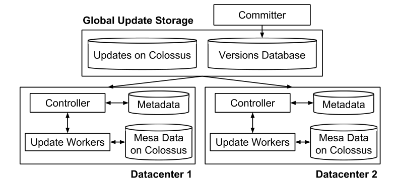

提交器为每个更新批次分配新版本号，并把该更新关联的全部元数据，例如保存更新数据的文件位置，发布到版本数据库（versions database）。版本数据库是建立在 Paxos [35] 共识算法之上的全局复制一致数据存储。提交器本身无状态，其实例运行在多个数据中心内以保证高可用。

Mesa 控制器监听版本数据库的变更，以检测新更新何时可用；然后把相应工作分配给更新工作器，并向版本数据库报告更新已成功纳入。提交器持续判断是否满足提交条件，具体而言，就是更新是否已经被跨多个地理区域的足够多个 Mesa 实例纳入。提交器对一次更新中的全部表统一强制执行提交条件。这一性质对维护相关表的一致性至关重要，例如其中一张 Mesa 表是另一张的物化视图时。满足提交条件后，提交器宣布该更新的版本号成为新的已提交版本，并把这一值写入版本数据库。所有新查询始终针对已提交版本发出。

Mesa 的更新机制设计带来两个重要的性能性质。第一，因为所有新查询都针对已提交版本发出，而更新按批次应用，所以查询与更新之间不需要任何锁。第二，所有更新数据都由各 Mesa 实例异步纳入；只有元数据经过基于 Paxos、同步复制的版本数据库。这两个性质共同使 Mesa 能同时达到极高的查询吞吐与更新吞吐。

#### 3.2.2 新建 Mesa 实例

随着 Google 建设新数据中心、退役旧数据中心，系统需要启动新的 Mesa 实例。Mesa 使用点对点装载机制引导新实例。一个专用装载工作器与控制器/工作器框架中的其他工作器相似，会从另一个 Mesa 实例把一张表复制到当前实例。随后，Mesa 使用更新工作器把该表追赶到最新已提交版本，之后才允许查询使用它。在引导期间，Mesa 用这种方式把全部表装入新实例。Mesa 也使用同一套点对点装载机制从表损坏中恢复。

## 4. 增强功能

本节介绍 Mesa 设计中的若干高级特性：查询处理期间的性能优化、并行化工作器操作、在线模式变更，以及数据完整性保障。

### 4.1 查询服务器性能优化

Mesa 查询服务器会执行 delta 裁剪（delta pruning）：查询服务器检查描述每个 delta 所含键范围的元数据。如果查询中的过滤条件落在该范围之外，就可以完全裁掉该 delta。对指定近期时间的时间序列数据查询，这项优化特别有效，因为这类查询经常能完全裁掉 base delta；常见情形是，行键里的日期列至少大致对应这些行键最近一次更新的时间。类似地，对时间序列数据指定较早时间的查询，通常可以裁掉累积 delta 和 singleton，只读取 base 就能回答。

不对第一键列指定过滤条件的查询，通常需要扫描整张表。不过，对过滤其他键列的某些查询，Mesa 仍能利用索引实施“扫描转定位”（scan-to-seek）优化。例如，一张表的索引键列为 $A$ 和 $B$，过滤条件 $B=2$ 不构成索引前缀，原本需要扫描表中每一行。扫描转定位基于这样一个观察： $B$ 前面的键列值（本例中只有 $A$）构成前缀，因此可以定位到下一条可能匹配的行。

例如，假设表中 $A$ 的第一个值为 1。扫描转定位期间，查询服务器利用索引查找键前缀 $(A=1,B=2)$ 的所有行，从而跳过 $A=1$ 且 $B\lt{}2$ 的全部行。如果 $A$ 的下一个值是 4，查询服务器就继续跳到 $(A=4,B=2)$，依此类推。取决于 $B$ 左侧键列的基数，这项优化可以显著加速查询。

Mesa 查询服务器的另一个有趣特性是恢复键（resume key）。Mesa 通常以流方式逐块向客户端返回数据，每个数据块都附带一个恢复键。如果查询服务器失去响应，受影响的 Mesa 客户端可以透明切换到另一台查询服务器，从恢复键继续查询，而不是重新执行整个查询。查询可以在任意 Mesa 实例恢复。在单台机器随时可能离线的云环境中，这对可靠性与可用性尤其有益。

### 4.2 并行化工作器操作

Mesa 的控制器/工作器框架由一个控制器协调多种 Mesa 工作器。每种工作器专门处理一类操作，而每类操作都会针对一张 Mesa 表读和/或写 Mesa 数据。

顺序处理数 TB 的高度压缩 Mesa 表数据时，一项操作通常需要超过一天才能完成。随着 Mesa 表持续增长，这会成为显著的扩展瓶颈。为改善扩展性，Mesa 通常使用 MapReduce 框架 [19] 并行执行不同类型的工作器。这里的一项挑战，是如何在 MapReduce 操作中的多个 mapper 和 reducer 之间划分工作。

为实现这种并行化，Mesa 工作器在写入任意 delta 时，每隔第 $s$ 个行键采样一次，其中参数 $s$ 的选取方式稍后说明。这些行键样本与 delta 一同存储。为了用多个 mapper 并行读取某个 delta 版本，MapReduce 启动器首先确定一组可聚合出目标版本的覆盖 delta；再读取并合并这些 delta 的行键样本，据此把输入行均衡地划分给多个 mapper。分区数量的选择会限制任意 mapper 的总输入量。

主要难点是定义 $s$：既要让 MapReduce 启动器需要读取的样本数量合理，以减少 mapper 间的负载不均；又要保证没有 mapper 分区大于某个固定阈值，以确保并行度。假设目标版本的覆盖集合中有 $m$ 个 delta，共 $n$ 行，希望划分为 $p$ 个分区。理想情况下，每个分区大小为 $n/p$。把每个行键样本的权重定义为 $s$，然后合并覆盖集合中全部 delta 的样本；每当当前分区样本的权重总和超过 $n/p$ 时，就选该行键样本作为分区边界。

关键观察是：在某个特定 delta 中，当前累积权重未能正确计入的行键数最多为 $s$；如果当前行键样本恰好来自该 delta，则为 0。总误差上界为 $(m-1)s$，所以每个分区的最大输入行数不超过：

$$
\frac{n}{p}+(m-1)s.
$$

为支持快速查询，大多数 delta 版本都能以很小的 $m$ 覆盖，因此通常可以把 $s$ 设得很大，再增加总分区数来补偿分区不均。 $s$ 很大且决定采样率，也就是每 $s$ 行取一行，所以 MapReduce 启动器读取的样本总数很小。

### 4.3 Mesa 中的模式变更

Mesa 用户经常需要修改 Mesa 表的模式，例如支持新功能或改善查询性能。常见模式变更包括增加或删除列（键列和值列都包括）、增加或删除索引，以及增加或删除整张表，尤其是创建上卷表，例如从已有的日粒度时间序列表创建月粒度物化视图。每个月都有数百张 Mesa 表经历模式变更。

Mesa 数据的新鲜度与可用性对 Google 业务至关重要，因此所有模式变更都必须在线进行：模式变更期间，查询和更新都不能阻塞。Mesa 采用两种主要技术执行在线模式变更：一种简单但昂贵、覆盖全部情况；另一种经过优化、覆盖许多重要的常见情况。

Mesa 执行在线模式变更的朴素方法有三步：(i) 在某个固定更新版本上，为表创建一份独立副本，并以新模式版本存储数据；(ii) 重放这段时间内对表生成的所有更新，直到新模式版本追赶到当前状态；(iii) 通过控制器在 BigTable 中执行一次原子元数据操作，把新查询所用的模式版本切换为新版本。旧查询可以继续在旧模式版本上运行一段时间，之后删除旧模式版本以回收空间。

这种方法可靠，但代价高昂，特别是模式变更涉及许多表时。例如，假设用户要给一组相关表增加一个值列，朴素模式变更方法在整个变更期间需要双倍磁盘空间，也需要双倍更新/压实处理资源。

对这种情况，Mesa 改用关联模式变更（linked schema change），在更新/压实时把新旧模式版本视为一个版本。具体做法是：Mesa 立即让新查询看到模式变更；查询时动态转换成新模式版本，对新列使用默认值；同时，表的全部新 delta 都以新模式版本写入。与朴素方法相比，关联模式变更节省 50% 的磁盘空间和更新/压实资源，代价是在下一次基础压实前，查询路径要多做少量计算。

关联模式变更并不适用于某些情况。例如，如果模式变更重新排列了已有表的键列，就必须重新排序现有数据。尽管有这些限制，关联模式变更仍能在许多常见模式变更中有效节省资源，并加快变更过程。

### 4.4 缓解数据损坏问题

Mesa 使用云中的数万台机器托管和处理数据；这些机器独立管理，并由 Google 的许多服务共享。对任意一次计算，故障硬件或软件生成和/或存储错误数据的概率都不可忽略。简单的文件级校验和不足以防范这类事件，因为损坏可能瞬时发生在 CPU 或 RAM 中。在 Mesa 的规模上，这些看似罕见的事件很常见。防范此类损坏是 Mesa 整体设计的重要目标。

虽然 Mesa 在全球部署多个实例，每个实例却独立管理 delta 版本。在逻辑层面，所有实例存储相同数据，但具体的 delta 版本乃至文件并不相同。Mesa 利用这种多样性，通过在线与离线数据验证流程的组合来防范故障机器和人为错误；各种流程在准确性与成本之间具有不同权衡。

每次更新和查询操作都会执行在线检查。写 delta 时，Mesa 检查行顺序、键范围和聚合值。Mesa delta 按序存储行，因此写 delta 的库会显式强制这一性质；如有违反，就重试相应的控制器/工作器操作。生成累积 delta 时，Mesa 合并覆盖 delta 的键范围与聚合值，并检查它们是否和输出 delta 匹配。这些检查能发现计算期间而非存储期间出现的罕见 Mesa 数据损坏，也能发现计算实现中的缺陷。Mesa 的稀疏索引和数据文件还为每个行块存储校验和，每当读取行块时都会验证。索引文件本身也包含头部和索引数据的校验和。

除各实例内部的验证外，Mesa 还周期性执行全局离线检查。最全面的一项，是跨全部实例为一张表的每项索引计算全局校验和。在这一过程中，每个 Mesa 实例都针对某个特定版本的每项索引，计算一个依赖行顺序的强校验和与一个不依赖行顺序的弱校验和；全局组件验证所有索引和实例中的表数据是否一致，尽管底层文件级表示可能不同。只要校验和不匹配，Mesa 就会生成告警。

Mesa 还会运行一种更轻量的离线流程，即全局聚合值检查器。它对每个 Mesa 实例中一张表的每项索引，计算最新已提交版本的覆盖 delta 集；从元数据读取这些 delta 的聚合值并适当聚合，以验证所有索引与实例的一致性。因为整个操作只访问元数据，所以它比完整全局校验和高效得多。

如果一张表损坏，Mesa 实例可以自动从另一个实例重新装载该表未损坏的副本，通常选择附近的数据中心。如果所有实例都损坏，Mesa 可以从备份恢复该表的旧版本，再重放后续更新。

## 5. 经验与教训

本节简要总结过去几年构建大规模数据仓库系统时得到的关键教训。其中一个核心教训是：设计大规模基础设施时，必须为意外做好准备。再者，在 Mesa 的规模上，许多低概率事件确实会发生，并可能严重扰乱生产环境。以下按领域列出一些有代表性的教训，但远非穷尽。

**分布、并行与云计算。** Mesa 完全依靠分布和并行原则，因而能够管理很高的数据增长速率。事实证明，云计算范式与去中心化架构结合，对随数据和查询负载增长进行扩展非常有用。从专用、高性能的独占机器迁移到采用通用服务器的新环境，也对系统整体性能提出了有趣挑战。在这种环境中，需要用新方法弥补通用机器能力有限的问题；在专用高性能机器上效果很好的技术，未必总能在这里奏效。例如，数据现在分布在可能多达数千台机器上，Mesa 查询服务器会积极从 Colossus 预取数据，并大量利用并行性，以抵消数据从本地磁盘迁移到 Colossus 带来的性能下降。

**模块化、抽象与分层架构。** Mesa 团队认识到，即使会损失性能，分层设计与架构对于应对系统复杂性仍至关重要。在 Google，Colossus 和 BigTable 等底层架构组件的模块化与抽象让团队受益，可以把精力集中在 Mesa 自身的架构组件上。如果必须从裸机开始构建 Mesa，任务会困难得多。

**容量规划。** 团队从一开始就必须面向持续增长做规划和设计。Mesa 的前身系统直接构建在企业级机器上；运行该系统时，团队发现可以依据预计数据增长相当容易地预测容量需求，但很难以符合成本效益的方式真正采购并部署专用硬件。迁移到 Google 标准的云基础设施后，Mesa 显著简化了容量规划。

**应用层假设。** 设计大规模基础设施时，必须非常谨慎地对应用作强假设。例如，设计 Mesa 的前身系统时，团队假设模式变更极少发生，事实证明这一假设是错误的。在线企业持续演进，产品、服务和应用不断变化；同时还会自然增加新应用，或因收购其他公司而增加必须支持的应用。总之，设计应尽可能通用，尽量少对当前与未来应用作假设。

**地理复制。** Mesa 支持地理复制，原本是为了提高数据和系统可用性，但团队也发现它给日常运维带来了额外收益。在 Mesa 的前身系统中，某个数据中心计划停机维护时，团队不得不执行繁琐的运维演练，把一个全天候运行的系统迁移到另一个数据中心。如今，这类已相当常规的计划停机对 Mesa 影响极小。

**数据损坏与组件故障。** 对 Mesa 这种规模的系统，数据损坏和组件故障是重大问题。数据损坏可能由多种原因引起，因此配备预防和检测损坏所需的工具极其重要。类似地，某台机器上有故障的浮点运算单元可能极难诊断。云端机器动态分配给 Mesa，无法确定某台机器是否一直处于活跃状态。即使含故障单元的机器确实在 Mesa 中活跃使用，它也可能只间歇性引发问题。如何克服这类运维挑战仍是开放问题。

**测试与增量部署。** Mesa 是一个庞大、复杂、关键且持续演进的系统。既保持新功能开发速度，又维护生产系统健康，是一项关键挑战。幸运的是，团队发现，把一些标准工程实践与 Mesa 整体容错架构及抗数据损坏能力相结合，就能持续为 Mesa 交付重大改进，同时把风险降到最低。所采用的技术包括：单元测试；只需运行少量生产数据的开发者私有 Mesa 实例；以及使用上游系统很大比例生产数据的共享测试环境。团队会谨慎地在各 Mesa 实例间增量部署新功能。例如，部署高风险功能时，可以每次只部署到一个实例。Mesa 具备检测多个数据中心间数据不一致的机制，所有组件也都有完整的监控和告警，因此团队能迅速检测并调试问题。

**人的因素。** 最后一个重大挑战是，每个 Mesa 这样的系统背后都有一支大型工程团队，而且新员工不断加入。主要难题是如何在整个团队中传播知识，并保持知识最新。团队目前依靠清晰的代码、单元测试、常用流程文档、运维演练，以及让工程师在系统各部分之间进行广泛交叉培训。尽管如此，从人员和工程两个角度管理这一切复杂性及多样化职责，始终都非常困难。

## 6. Mesa 生产指标

本节报告 Mesa 生产部署的更新与查询处理性能指标。论文展示连续七天的指标，以说明它们的变化性与稳定性；还展示跨多年系统增长指标，说明系统如何在数据规模上升时仅线性增加资源需求，同时保证所需查询性能。总体而言，Mesa 高度去中心化，跨多个数据中心复制；每个数据中心的更新与查询处理分别使用数百到数千台机器。论文没有披露部署中的专有细节，但所给架构细节足以体现系统高度分布式、大规模的性质。

### 6.1 更新处理

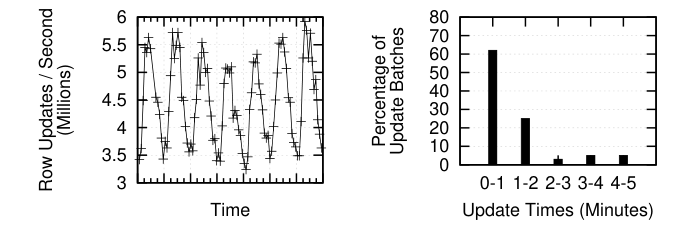

图 7 展示一个数据源连续七天的 Mesa 更新性能。Mesa 支持数百个并发更新数据源。对这个特定数据源，Mesa 平均每秒读取 30 至 60 MB 压缩数据，更新 300 万至 600 万个不同行，并新增约 30 万行。该数据源大约每五分钟分批生成一次更新；Mesa 提交时间的中位数和第 95 百分位分别为 54 秒和 211 秒。Mesa 通过动态伸缩资源维持这种更新延迟，避免更新积压。

### 6.2 查询处理

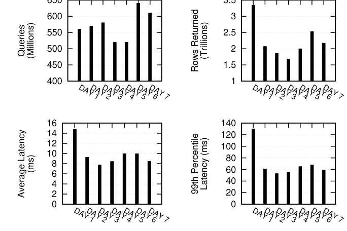

图 8 展示与前述相同数据源之各张表连续七天的 Mesa 查询性能。Mesa 每天在这些表上执行超过 5 亿次查询，返回 1.7 万亿至 3.2 万亿行。这些生产查询的性质差异很大，从简单点查到大型范围扫描均有。图中报告平均延迟和第 99 百分位延迟，表明 Mesa 在数十至数百毫秒内回答绝大多数查询。平均延迟与尾延迟差距很大，原因包括查询类型、查询服务器缓存的内容、云架构不同层中的瞬时故障与重试，甚至偶尔出现的慢机器。

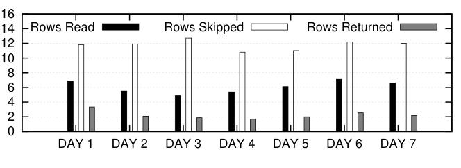

图 9 展示同一个七天期间的查询处理开销，以及第 4.1 节所述扫描转定位优化的有效性。由于 delta 合并以及查询所指定的过滤条件，返回行数仅为读取行数的约 30% 至 50%。扫描转定位避免了解压/读取原本需要处理的 60% 至 70% delta 行。

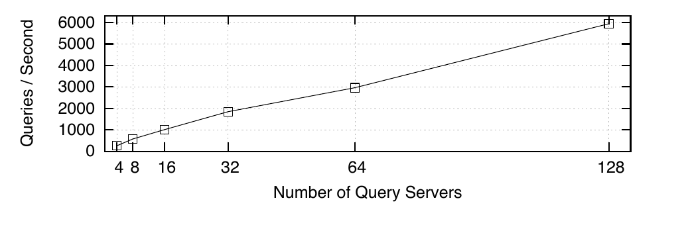

图 10 报告 Mesa 查询服务器的可扩展性特征。Mesa 的设计允许各组件随资源增加而独立扩展。在该评估中，查询服务器数量从 4 增长到 128，并测量查询吞吐。结果确立了 Mesa 查询处理的线性扩展能力。

### 6.3 增长

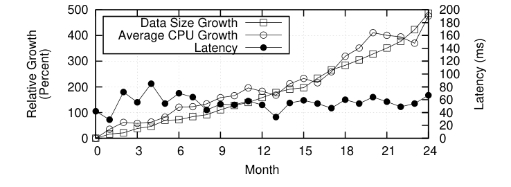

图 11 展示 Mesa 最大生产数据集之一在 24 个月内的数据与 CPU 使用增长。总数据规模增长近 500%，其驱动因素是更新率增长超过 80%，以及新增表、索引和物化视图。CPU 使用也以类似幅度增长，主要由基础压实期间周期性重写数据的成本驱动；一次性计算（例如模式变更）以及这一时期部署的优化也会影响 CPU 使用。

图 11 还包含相当稳定的延迟测量值，来自一个持续发出合成点查询、绕过查询服务器缓存的监控工具。事实上，在整个时期，Mesa 回答用户点查询的延迟一直与图 8 所示一致，同时维持了相近的高返回行率。

## 7. 相关工作

传统上，关系数据库管理系统（RDBMS）广泛用于管理具有强一致性保证的结构化数据，但难以达到现代数据驱动应用所需的扩展性与性能。键值存储（亦称 NoSQL 系统）兴起后，使非关系存储系统能高度扩展 [1, 4, 12, 17, 20, 24]，代价是牺牲事务和强一致性保证。Mesa 探索了设计空间中的一个新位置：系统只允许以批次方式提交、受控且近实时处理的更新，通过这一限制同时实现高扩展性、强一致性和事务保证。

数据仓库 [9, 14] 为挖掘和分析大规模数据提供 OLAP 支持。该领域有大量研究，包括：高效视图选择启发式方法 [26, 27, 52]、视图维护 [7, 15, 30, 39, 53]、数据立方体 [25, 32, 42]、数据仓库中的模式演进 [31]、索引 [33, 38] 与缓存 [21, 29, 43]。这些工作大多置于集中式架构和可变存储的语境中。我们设想把其中一些技术扩展到大规模云分布式架构后用于 Mesa；这类架构通常使用日志结构文件系统提供不可变存储。其他工业研究团队也开展了在键值存储上维护视图的类似工作 [8]。

在商业领域，企业越来越依赖对业务关键数据做在线、实时分析，因此对实时、可扩展数据仓库的需求不断增长。过去几年，无论传统企业还是提供互联网规模服务的公司，数据量都急剧膨胀。Teradata、SAP [5]、Oracle [48] 和 EMC/Greenplum [16] 等行业厂商，把更强大、更并行的硬件与底层数据管理软件中的复杂并行技术结合起来应对挑战。Twitter [36]、LinkedIn [50]、Facebook [45, 46, 47]、Google [13, 37] 及其他互联网服务公司 [6]，则组合使用键值存储、列式存储和 MapReduce 编程范式等新技术来解决扩展问题。

然而，这些系统中有许多采用批量装载接口导入数据，一次运行可能需要数小时。从这个角度看，Mesa 与 OLAP 系统非常相似，但 Mesa 的更新周期只有数分钟，一次处理数亿行。Mesa 使用多版本来支持跨表的事务更新与查询。在同时支持事务数据动态更新和实时查询方面，与 Mesa 接近的系统是 Vertica [34]。不过，据我们所知，这些商业产品或生产系统没有一个是为跨多个数据中心管理复制数据而设计的。此外，也不清楚它们是否真正支持云或弹性；它们动态增配或回收资源以应对负载波动的能力可能有限。

Google 内部的其他数据解决方案 [11, 12, 18, 41] 都无法支持作为 Google 广告业务数据仓库平台所需的数据规模与更新量。Mesa 通过批处理更新达到这一规模。每次更新需要几分钟提交，每个批次的元数据用 Paxos 提交，从而获得与 Megastore、Spanner 和 F1 相同的强一致性。Mesa 的独特之处在于：应用数据在所有数据中心中冗余且独立地处理，而元数据采用同步复制维护。除了增强面对数据损坏时的鲁棒性，这种方法还最大限度降低了跨多个数据中心的同步开销。

## 8. 结论

本文给出一个名为 Mesa 的地理复制、近实时、可扩展数据仓库系统的端到端设计与实现。Mesa 的工程设计利用了数据库和分布式系统领域的基础研究成果。具体而言，Mesa 在支持在线查询与更新的同时，提供强一致性与事务正确性保证。它通过面向批次的接口实现这些性质：引入数据的临时多版本来保证更新原子性，从而不再需要在查询事务与更新事务之间用锁同步。Mesa 跨多个数据中心地理复制，以提高容错能力。最后，在每个数据中心内，Mesa 的控制器/工作器框架能把工作分布到大量机器上，并动态扩展所需计算，因而具备很高的可扩展性。

对持续产生的海量数据（非正式地称为“大数据”）进行实时分析，已经成为数据库与分布式系统研究和实践中的重要挑战。一种方法是使用专用硬件技术，例如配有高速互连和大量主存的大规模并行机器；另一种方法是使用云资源，以类似 MapReduce 的编程范式做批量并行处理。前者能以极高成本支持实时数据分析，后者则为廉价吞吐而牺牲对新鲜数据的分析。

相比之下，Mesa 是一个真正支持云的数据仓库：运行在动态配置的通用机器上，不依赖本地磁盘；跨多个数据中心地理复制；并提供强一致、有序的数据版本。Mesa 还支持 PB 级数据规模以及大型更新和查询工作负载。具体而言，Mesa 以数分钟延迟支持高更新吞吐，为点查询提供低延迟，并为批量抽取查询工作负载提供高查询吞吐。

## 9. 致谢

我们感谢曾经服务于 Mesa 团队的每一位成员，包括前团队成员 Karthik Lakshminarayanan、Sanjay Agarwal、Sivasankaran Chandrasekar、Justin Tolmer、Chip Turner 和 Michael Ballbach；他们为 Mesa 的设计与开发作出了重大贡献。我们也感谢 Sridhar Ramaswamy 为 Mesa 团队提供战略愿景与指导。最后，我们感谢匿名评审；他们的反馈显著改进了本文。

## 10. 参考文献

1. HBase. http://hbase.apache.org/.
2. LevelDB. http://en.wikipedia.org/wiki/LevelDB.
3. MySQL. http:www.mysql.com.
4. Project Voldemart: A Distributed Database. http://www.project-voldemort.com/voldemort/.
5. SAP HANA. http://www.saphana.com/welcome.
6. A. Abouzeid, K. Bajda-Pawlikowski, et al. HadoopDB: An Architectural Hybrid of MapReduce and DBMS Technologies for Analytical Workloads. PVLDB, 2(1):922-933, 2009.
7. D. Agrawal, A. El Abbadi, et al. Efficient View Maintenance at Data Warehouses. In SIGMOD, pages 417-427, 1997.
8. P. Agrawal, A. Silberstein, et al. Asynchronous View Maintenance for VLSD Databases. In SIGMOD, pages 179-192, 2009.
9. M. O. Akinde, M. H. Bohlen, et al. Efficient OLAP Query Processing in Distributed Data Warehouses. Information Systems, 28(1-2):111-135, 2003.
10. M. Athanassoulis, S. Chen, et al. MaSM: Efficient Online Updates in Data Warehouses. In SIGMOD, pages 865-876, 2011.
11. J. Baker, C. Bond, et al. Megastore: Providing Scalable, Highly Available Storage for Interactive Services. In CIDR, pages 223-234, 2011.
12. F. Chang, J. Dean, et al. Bigtable: A Distributed Storage System for Structured Data. In OSDI, pages 205-218, 2006.
13. B. Chattopadhyay, L. Lin, et al. Tenzing A SQL Implementation on the MapReduce Framework. PVLDB, 4(12):1318-1327, 2011.
14. S. Chaudhuri and U. Dayal. An Overview of Data Warehousing and OLAP Technology. SIGMOD Rec., 26(1):65-74, 1997.
15. S. Chen, B. Liu, et al. Multiversion-Based View Maintenance Over Distributed Data Sources. ACM TODS, 29(4):675-709, 2004.
16. J. Cohen, J. Eshleman, et al. Online Expansion of Largescale Data Warehouses. PVLDB, 4(12):1249-1259, 2011.
17. B. F. Cooper, R. Ramakrishnan, et al. PNUTS: Yahoo!'s Hosted Data Serving Platform. PVLDB, 1(2):1277-1288, 2008.
18. J. C. Corbett, J. Dean, et al. Spanner: Google's Globally-Distributed Database. In OSDI, pages 251-264, 2012.
19. J. Dean and S. Ghemawat. MapReduce: Simplified Data Processing on Large Clusters. Commun. ACM, 51(1):107-113, 2008.
20. G. DeCandia, D. Hastorun, et al. Dynamo: Amazon's Highly Available Key-value Store. In SOSP, pages 205-220, 2007.
21. P. Deshpande, K. Ramasamy, et al. Caching Multidimensional Queries Using Chunks. In SIGMOD, pages 259-270, 1998.
22. A. Fikes. Storage Architecture and Challenges. http://goo.gl/pF6kmz, 2010.
23. S. Ghemawat, H. Gobioff, et al. The Google File System. In SOSP, pages 29-43, 2003.
24. L. Glendenning, I. Beschastnikh, et al. Scalable Consistency in Scatter. In SOSP, pages 15-28, 2011.
25. J. Gray, A. Bosworth, et al. Data Cube: A Relational Aggregation Operator Generalizing Group-By, Cross-Tabs and Sub-Totals. In IEEE ICDE, pages 152-159, 1996.
26. H. Gupta and I. S. Mumick. Selection of Views to Materialize Under a Maintenance Cost Constraint. In ICDT, 1999.
27. V. Harinarayan, A. Rajaraman, et al. Implementing Data Cubes Efficiently. In SIGMOD, pages 205-216, 1996.
28. S. Héman, M. Zukowski, et al. Positional Update Handling in Column Stores. In SIGMOD, pages 543-554, 2010.
29. H. V. Jagadish, L. V. S. Lakshmanan, and D. Srivastava. Snakes and Sandwiches: Optimal Clustering Strategies for a Data Warehouse. In SIGMOD, pages 37-48, 1999.
30. H. V. Jagadish, I. S. Mumick, et al. View Maintenance Issues for the Chronicle Data Model. In PODS, pages 113-124, 1995.
31. A. Koeller and E. A. Rundensteiner. Incremental Maintenance of Schema-Restructuring Views in SchemaSQL. IEEE TKDE, 16(9):1096-1111, 2004.
32. L. V. S. Lakshmanan, J. Pei, et al. Quotient cube: How to Summarize the Semantics of a Data Cube. In VLDB, pages 778-789, 2002.
33. L. V. S. Lakshmanan, J. Pei, et al. QC-Trees: An Efficient Summary Structure for Semantic OLAP. In SIGMOD, pages 64-75, 2003.
34. A. Lamb, M. Fuller, et al. The Vertica Analytic Database: C-Store 7 Years Later. PVLDB, 5(12):1790-1801, 2012.
35. L. Lamport. The Part-Time Parliament. ACM Trans. Comput. Syst., 16(2):133-169, 1998.
36. G. Lee, J. Lin, et al. The Unified Logging Infrastructure for Data Analytics at Twitter. PVLDB, 5(12):1771-1780, 2012.
37. S. Melnik, A. Gubarev, et al. Dremel: Interactive Analysis of Web-Scale Datasets. PVLDB, 3(1-2):330-339, 2010.
38. N. Roussopoulos, Y. Kotidis, et al. Cubetree: Organization of and Bulk Incremental Updates on the Data Cube. In SIGMOD, pages 89-99, 1997.
39. K. Salem, K. Beyer, et al. How To Roll a Join: Asynchronous Incremental View Maintenance. In SIGMOD, pages 129-140, 2000.
40. D. Severance and G. Lohman. Differential Files: Their Application to the Maintenance of Large Databases. ACM Trans. Database Syst., 1(3):256-267, 1976.
41. J. Shute, R. Vingralek, et al. F1: A Distributed SQL Database That Scales. PVLDB, 6(11):1068-1079, 2013.
42. Y. Sismanis, A. Deligiannakis, et al. Dwarf: Shrinking the PetaCube. In SIGMOD, pages 464-475, 2002.
43. D. Srivastava, S. Dar, et al. Answering Queries with Aggregation Using Views. In VLDB, pages 318-329, 1996.
44. M. Stonebraker, D. J. Abadi, et al. C-Store: A Column-oriented DBMS. In VLDB, pages 553-564, 2005.
45. A. Thusoo, J. Sarma, et al. Hive: A Warehousing Solution Over a Map-Reduce Framework. PVLDB, 2(2):1626-1629, 2009.
46. A. Thusoo, J. Sarma, et al. Hive - A Petabyte Scale Data Warehouse Using Hadoop. In IEEE ICDE, pages 996-1005, 2010.
47. A. Thusoo, Z. Shao, et al. Data Warehousing and Analytics Infrastructure at Facebook. In SIGMOD, pages 1013-1020, 2010.
48. R. Weiss. A Technical Overview of the Oracle Exadata Database Machine and Exadata Storage Server. Oracle White Paper. Oracle Corporation, Redwood Shores, 2012.
49. P. Wong, Z. He, et al. Parallel Analytics as a Service. In SIGMOD, pages 25-36, 2013.
50. L. Wu, R. Sumbaly, et al. Avatara: OLAP for Web-Scale Analytics Products. PVLDB, 5(12):1874-1877, 2012.
51. R. S. Xin, J. Rosen, et al. Shark: SQL and Rich Analytics at Scale. In SIGMOD, pages 13-24, 2013.
52. J. Yang, K. Karlapalem, et al. Algorithms for Materialized View Design in Data Warehousing Environment. In VLDB, pages 136-145, 1997.
53. Y. Zhuge, H. Garcia-Molina, et al. The Strobe Algorithms for Multi-Source Warehouse Consistency. In PDIS, pages 146-157, 1996.
