# In Search of an Understandable Consensus Algorithm（中文译文）

## 译者说明

本文依据同目录的 `source.pdf` 翻译。章节、图表、公式、算法、代码与参考文献按原文结构保留。

**作者：** Diego Ongaro、John Ousterhout

**机构：** Stanford University（斯坦福大学）

## 出版信息

- **来源页面：** <https://www.usenix.org/conference/atc14/technical-sessions/presentation/ongaro>
- **收录会议：** USENIX ATC ’14（2014 USENIX Annual Technical Conference）论文集
- **日期与地点：** 2014 年 6 月 19–20 日，Philadelphia, PA（费城）
- **ISBN：** 978-1-931971-10-2
- **开放获取：** USENIX ATC ’14（2014 USENIX Annual Technical Conference）论文集的开放获取由 USENIX 赞助。

## 摘要

Raft 是一种用于管理复制日志的共识算法。它产生与（多实例）Paxos 等价的结果，效率也与 Paxos 相当，但其结构与 Paxos 不同；这使 Raft 比 Paxos 更易理解，也为构建实用系统提供了更好的基础。为了增强可理解性，Raft 将领导者选举、日志复制和安全性等共识关键要素彼此分离，并通过更强的一致性约束减少必须考虑的状态数量。用户研究结果表明，学生学习 Raft 比学习 Paxos 更容易。Raft 还包含一种新的集群成员变更机制，它利用重叠多数派保证安全性。

## 1 引言

共识算法使一组机器能够作为一个协调一致的整体工作，并在部分成员发生故障时继续运行。因此，它们在构建可靠的大规模软件系统时扮演着关键角色。过去十年里，Paxos [13, 14] 一直主导着共识算法领域的讨论：大多数共识实现都基于 Paxos 或受到它的影响，Paxos 也已成为向学生讲授共识的主要载体。

遗憾的是，尽管人们多次尝试让 Paxos 更平易近人，它仍然非常难以理解。此外，其体系结构需要经过复杂修改才能支持实用系统。因此，无论系统构建者还是学生，都在理解和使用 Paxos 时倍感困难。

我们自己也曾苦苦钻研 Paxos，于是决定寻找一种新的共识算法，为系统构建和教学提供更好的基础。我们的做法不同寻常，因为首要目标是可理解性：我们能否为实用系统定义一种共识算法，并以明显比 Paxos 更容易学习的方式描述它？我们还希望这种算法有助于形成系统构建者必不可少的直觉。重要的不只是算法能够工作，还必须让人一眼明白它为何能够工作。

这项工作的成果是一种名为 Raft 的共识算法。在设计 Raft 时，我们采用了专门提升可理解性的技术，包括问题分解（Raft 将领导者选举、日志复制和安全性分开）和状态空间缩减（相对于 Paxos，Raft 降低了非确定性，并减少了服务器之间可能出现不一致的方式）。我们在两所大学对 43 名学生开展的用户研究表明，Raft 明显比 Paxos 更易理解：在学习两种算法之后，其中 33 名学生回答 Raft 问题的成绩高于回答 Paxos 问题的成绩。

Raft 在许多方面与现有共识算法相似，其中最突出的是 Oki 和 Liskov 的 Viewstamped Replication [27, 20]，但它也有若干新特点：

- **强领导者（strong leader）：** Raft 采用比其他共识算法更强的领导形式。例如，日志条目只从领导者流向其他服务器。这简化了复制日志的管理，也让 Raft 更容易理解。
- **领导者选举：** Raft 使用随机化定时器选举领导者。它只需在任何共识算法本就需要的心跳机制上增加少量机制，却能简单、快速地解决冲突。
- **成员变更：** Raft 用一种新的联合共识（joint consensus）方法改变集群中的服务器集合；在转换期间，两种不同配置的多数派相互重叠。这样，集群在配置变更期间仍可正常运行。

我们认为，无论用于教学还是作为实现基础，Raft 都优于 Paxos 和其他共识算法。它比其他算法更简单、更易理解；其描述足够完整，能够满足实用系统的需要；它已有多个开源实现并被多家公司采用；其安全性质已经过形式化规约和证明；效率也与其他算法相当。

本文余下部分先介绍复制状态机问题（第 2 节），再讨论 Paxos 的优缺点（第 3 节），说明我们提升可理解性的一般方法（第 4 节），给出 Raft 共识算法（第 5–7 节），评估 Raft（第 8 节），最后讨论相关工作（第 9 节）。由于篇幅限制，这里省略了 Raft 算法的少数要素；扩展技术报告 [29] 提供了这些内容，说明客户端如何与系统交互，以及如何回收 Raft 日志空间。

## 2 复制状态机

共识算法通常出现在复制状态机（replicated state machine）[33] 的场景中。在这种方法里，一组服务器上的状态机分别计算同一状态的相同副本；即使部分服务器停机，系统仍可继续运行。复制状态机用于解决分布式系统中的多种容错问题。例如，GFS [7]、HDFS [34] 和 RAMCloud [30] 这类具有单一集群领导者的大规模系统，通常使用独立的复制状态机管理领导者选举，并保存必须在领导者崩溃后继续存在的配置信息。复制状态机的例子包括 Chubby [2] 和 ZooKeeper [9]。

复制状态机通常用复制日志实现，如图 1 所示。每台服务器保存一份包含一系列命令的日志，其状态机按顺序执行这些命令。每份日志以相同顺序包含相同命令，所以各状态机处理相同的命令序列。由于状态机具有确定性，它们会计算出相同状态和相同输出序列。

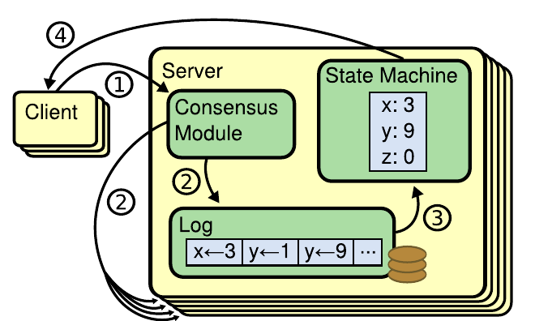

**图 1：复制状态机体系结构。** 共识算法管理一份复制日志，其中包含来自客户端的状态机命令。状态机按相同顺序处理日志中的命令，因此产生相同输出。图中流程为：（1）客户端向共识模块发送命令；（2）共识模块把命令写入日志并在服务器间复制；（3）状态机按日志顺序执行命令；（4）结果返回客户端。

保持复制日志一致是共识算法的职责。一台服务器上的共识模块接收客户端命令并把它们加入本地日志。它与其他服务器上的共识模块通信，以确保即使有服务器故障，每份日志最终仍以相同顺序包含相同请求。命令得到正确复制后，各服务器的状态机按日志顺序处理它们，再把输出返回客户端。这样一来，这些服务器看起来就像一台高度可靠的状态机。

实用系统中的共识算法通常具有以下性质：

- 在所有非拜占庭故障条件下都保证安全性（绝不返回错误结果），包括网络延迟、网络分区，以及数据包丢失、重复和乱序。
- 只要任意多数服务器仍在运行，并且能够彼此通信、也能与客户端通信，系统就可以完全正常工作（即保持可用）。因此，一个典型的五服务器集群可以容忍任意两台服务器故障。这里假定服务器以停机方式失效；它们之后可以从稳定存储中的状态恢复并重新加入集群。
- 不依赖时序来保证日志一致性：错误的时钟和极端的消息延迟最坏也只会造成可用性问题。
- 在通常情况下，只要集群多数派对一轮远程过程调用作出响应，一条命令就能完成；少数缓慢服务器不必影响整体系统性能。

## 3 Paxos 有什么问题？

过去十年中，Leslie Lamport 的 Paxos 协议 [13] 几乎成了共识的同义词：它是课程中最常讲授的协议，也是大多数共识实现的出发点。Paxos 首先定义了一种能就单个决定达成一致的协议，例如对复制日志中的单个条目达成一致。我们把这个子集称为单决策 Paxos（single-decree Paxos）。然后，Paxos 组合该协议的多个实例，以支持日志这类一系列决定，这就是多实例 Paxos（multi-Paxos）。Paxos 同时保证安全性和活性，支持改变集群成员；它的正确性已得到证明，在正常情况下效率也很高。

遗憾的是，Paxos 有两个重大缺点。第一个缺点是 Paxos 极难理解。完整说明 [13] 以晦涩著称；很少有人能真正理解，而且即使理解也要付出巨大努力。因此，人们曾多次尝试用更简单的方式解释 Paxos [14, 18, 19]。这些解释聚焦于单决策子集，但依然颇具挑战性。我们在 NSDI 2012 参会者中开展的一项非正式调查发现，即使在资深研究人员中，也很少有人对 Paxos 感到驾轻就熟。我们自己同样为 Paxos 所困：读过多种简化解释并设计出自己的替代协议之后，我们才理解完整协议；整个过程将近一年。

我们推测，Paxos 的晦涩源于它选择单决策子集作为基础。单决策 Paxos 稠密而微妙：它分为两个阶段，二者都没有简单直观的解释，也无法彼此独立地理解。因此，人们很难形成“单决策协议为何有效”的直觉。多实例 Paxos 的组合规则又增加了大量复杂性和细微之处。我们认为，在多个决定上达成共识这一整体问题（即针对一份日志而不是单个条目）还可以用其他更直接、更显然的方式分解。

Paxos 的第二个问题是，它没有为构建实用实现提供良好基础。其中一个原因是，并不存在一种得到广泛认同的多实例 Paxos 算法。Lamport 的描述主要涉及单决策 Paxos；他勾勒了多实例 Paxos 的可能方案，但缺少许多细节。人们曾尝试补全和优化 Paxos，例如 [24]、[35] 和 [11]，但这些方案彼此不同，也与 Lamport 的草案不同。Chubby [4] 等系统实现了类似 Paxos 的算法，但多数情况下没有发表实现细节。

此外，Paxos 的体系结构也不适合构建实用系统；这是单决策分解方式的又一后果。例如，独立选择一组日志条目后再把它们拼接成顺序日志，几乎没有好处，只会增加复杂性。围绕日志直接设计系统会更简单、更高效：新条目按照受约束的顺序依次追加。另一个问题是，Paxos 的核心采用对称的点对点方式（尽管最终又建议以弱领导形式作为性能优化）。在只做一次决定的简化世界里，这很合理，但很少有实用系统采用这种方式。如果必须做出一系列决定，先选举领导者，再由领导者协调这些决定，会更简单、更快速。

因此，实用系统往往与 Paxos 相去甚远。每个实现都从 Paxos 起步，发现实现困难，再发展出明显不同的体系结构。这个过程耗时且易错，而 Paxos 本身难以理解又进一步加剧了问题。Paxos 的表述可能很适合证明其正确性定理，但真实实现与 Paxos 差异太大，以至于这些证明价值有限。Chubby 实现者的下面这段评论颇具代表性：

> Paxos 算法的描述与现实系统的需求之间存在巨大鸿沟……最终系统将建立在一个未经证明的协议之上 [4]。

基于这些问题，我们得出结论：Paxos 无论作为系统构建还是教学的基础都不够理想。鉴于共识对大规模软件系统至关重要，我们决定尝试设计一种性质优于 Paxos 的替代共识算法。Raft 就是这项实验的成果。

## 4 面向可理解性的设计

设计 Raft 时，我们有几个目标：它必须为系统构建提供完整而实用的基础，从而显著减少开发者需要完成的设计工作；它必须在所有条件下都安全，在典型运行条件下可用；还必须让常用操作高效。但我们最重要的目标——也是最艰难的挑战——是可理解性。必须让广大读者能够轻松理解该算法。此外，还必须让人形成对算法的直觉，以便系统构建者完成现实实现中不可避免的扩展。

在 Raft 的许多设计点上，我们都必须从多个替代方案中做出选择。这时，我们依据可理解性评估各方案：每个方案有多难解释（例如，它的状态空间有多复杂，是否存在隐晦影响）？读者要完整理解该方法及其影响有多容易？

我们承认，这种分析具有很强的主观性；尽管如此，我们采用了两种普遍适用的技术。第一种是众所周知的问题分解：只要可能，就把问题拆成可以相对独立地解决、解释和理解的部分。例如，在 Raft 中，我们把领导者选举、日志复制、安全性和成员变更彼此分开。

第二种方法是简化状态空间：减少需要考虑的状态数，使系统更加协调一致，并尽可能消除非确定性。具体而言，日志中不允许出现空洞，Raft 还限制日志之间可能出现不一致的方式。尽管多数情况下我们都试图消除非确定性，但在某些情形中，非确定性反而能提升可理解性。尤其是，随机化方法会引入非确定性，却往往通过以相似方式处理所有可能选择（“随便选一个，结果不重要”）来缩减状态空间。我们使用随机化来简化 Raft 的领导者选举算法。

## 5 Raft 共识算法

Raft 是一种管理复制日志的算法，该日志采用第 2 节所述形式。图 2 以精简形式概括算法，供读者查阅；图 3 列出了算法的关键性质。本节其余部分将逐一讨论这些图中的要素。

Raft 首先选举一位特殊的领导者，然后让领导者全权负责管理复制日志，以此实现共识。领导者接受客户端的日志条目，将它们复制到其他服务器，并通知服务器何时可以安全地把日志条目应用到状态机。领导者简化了复制日志的管理。例如，它无需询问其他服务器便可决定把新条目放在日志的什么位置，数据也以简单方式从领导者流向其他服务器。领导者可能故障，也可能与其他服务器失去联系；此时系统会选举新的领导者。

采用领导者方案后，Raft 把共识问题分成三个相对独立的子问题：

- **领导者选举：** 现任领导者故障时，必须选择新的领导者（第 5.2 节）。
- **日志复制：** 领导者必须接受客户端日志条目并在集群中复制，迫使其他日志与自己的日志一致（第 5.3 节）。
- **安全性：** Raft 的关键安全性质是图 3 中的状态机安全性质：如果某台服务器已经把某个日志条目应用到自己的状态机，任何其他服务器都不能对同一日志索引应用不同命令。第 5.4 节说明 Raft 如何确保这一性质；其解决方案会对第 5.2 节所述选举机制增加一项限制。

介绍完共识算法后，本节还会讨论可用性问题以及时序在系统中的作用。

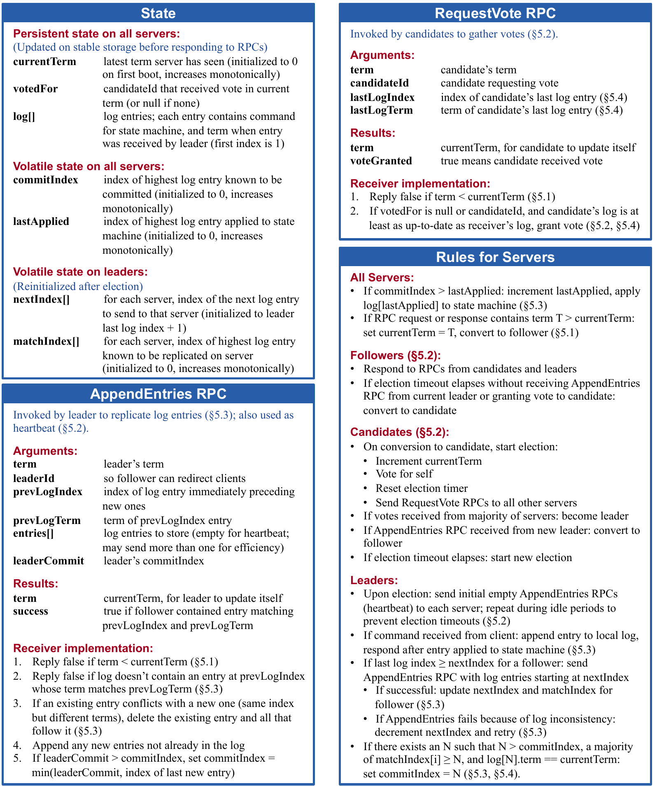

**图 2：Raft 共识算法的精简概要（不包括成员变更和日志压缩）。** “服务器规则”框中的服务器行为是一组彼此独立、反复触发的规则。§5.2 之类的节号指出相应特性在何处讨论。形式化规约 [28] 对算法作出了更精确的描述。下面完整转写图中的算法。

### 图 2 中的状态

**所有服务器上的持久状态**（响应 RPC 之前写入稳定存储）：

| 字段 | 含义 |
| --- | --- |
| `currentTerm` | 服务器见过的最新任期；首次启动时初始化为 0，单调递增 |
| `votedFor` | 当前任期内获得选票的 `candidateId`；若尚未投票则为 `null` |
| `log[]` | 日志条目；每个条目包含状态机命令以及领导者收到该条目时的任期；首个索引为 1 |

**所有服务器上的易失状态：**

| 字段 | 含义 |
| --- | --- |
| `commitIndex` | 已知已提交的最高日志条目索引；初始化为 0，单调递增 |
| `lastApplied` | 已应用到状态机的最高日志条目索引；初始化为 0，单调递增 |

**领导者上的易失状态**（每次选举后重新初始化）：

| 字段 | 含义 |
| --- | --- |
| `nextIndex[]` | 对每台服务器，下一个要发送给它的日志条目索引；初始化为领导者最后一个日志索引加 1 |
| `matchIndex[]` | 对每台服务器，已知在该服务器上完成复制的最高日志条目索引；初始化为 0，单调递增 |

### 图 2 中的 AppendEntries RPC

领导者调用 AppendEntries RPC 来复制日志条目（§5.3），它也用作心跳（§5.2）。

**参数：**

| 字段 | 含义 |
| --- | --- |
| `term` | 领导者的任期 |
| `leaderId` | 供跟随者把客户端重定向到领导者 |
| `prevLogIndex` | 紧接在新条目之前的日志条目索引 |
| `prevLogTerm` | `prevLogIndex` 条目的任期 |
| `entries[]` | 要保存的日志条目；心跳时为空；为提高效率可以一次发送多个 |
| `leaderCommit` | 领导者的 `commitIndex` |

**返回结果：**

| 字段 | 含义 |
| --- | --- |
| `term` | 当前的 `currentTerm`，供领导者更新自身 |
| `success` | 若跟随者包含与 `prevLogIndex`、`prevLogTerm` 匹配的条目则为 `true` |

**接收方实现：**

1. 若 `term` 小于 `currentTerm`，返回 `false`（§5.1）。
2. 若日志中不存在索引为 `prevLogIndex` 且任期与 `prevLogTerm` 相同的条目，返回 `false`（§5.3）。
3. 若已有条目与新条目冲突（索引相同、任期不同），删除已有条目以及它后面的所有条目（§5.3）。
4. 追加日志中尚不存在的所有新条目。
5. 若 `leaderCommit` 大于 `commitIndex`，则把 `commitIndex` 设为 `leaderCommit` 与最后一个新条目索引中的较小者。

### 图 2 中的 RequestVote RPC

候选者调用 RequestVote RPC 收集选票（§5.2）。

**参数：**

| 字段 | 含义 |
| --- | --- |
| `term` | 候选者的任期 |
| `candidateId` | 请求选票的候选者 |
| `lastLogIndex` | 候选者最后一个日志条目的索引（§5.4） |
| `lastLogTerm` | 候选者最后一个日志条目的任期（§5.4） |

**返回结果：**

| 字段 | 含义 |
| --- | --- |
| `term` | 当前的 `currentTerm`，供候选者更新自身 |
| `voteGranted` | `true` 表示候选者获得选票 |

**接收方实现：**

1. 若 `term` 小于 `currentTerm`，返回 `false`（§5.1）。
2. 若 `votedFor` 为 `null` 或 `candidateId`，并且候选者的日志至少与接收方日志一样新，则投票给该候选者（§5.2、§5.4）。

### 图 2 中的服务器规则

**所有服务器：**

- 若 `commitIndex` 大于 `lastApplied`：递增 `lastApplied`，并把 `log[lastApplied]` 应用到状态机（§5.3）。
- 若 RPC 请求或响应包含的任期 $T$ 大于 `currentTerm`：令 `currentTerm` 等于 $T$，并转为跟随者（§5.1）。

**跟随者（§5.2）：**

- 响应候选者和领导者发来的 RPC。
- 如果选举超时前既未收到当前领导者的 AppendEntries RPC，也没有把选票投给候选者，则转为候选者。

**候选者（§5.2）：**

- 转为候选者时开始选举：递增 `currentTerm`；投票给自己；重置选举定时器；向所有其他服务器发送 RequestVote RPC。
- 若收到多数服务器的选票，则成为领导者。
- 若收到新领导者的 AppendEntries RPC，则转为跟随者。
- 若选举超时，则开始新一轮选举。

**领导者：**

- 当选后，立即向每台服务器发送初始的空 AppendEntries RPC（心跳）；空闲期间重复发送，以防止选举超时（§5.2）。
- 收到客户端命令后，把条目追加到本地日志；该条目应用到状态机后再响应（§5.3）。
- 如果对某个跟随者而言，最后一个日志索引不小于其 `nextIndex`，则发送从 `nextIndex` 开始的日志条目：
  - 成功时，更新该跟随者的 `nextIndex` 和 `matchIndex`（§5.3）。
  - 如果 AppendEntries 因日志不一致而失败，则递减 `nextIndex` 并重试（§5.3）。
- 如果存在某个 $N$，满足 $N \gt \mathit{commitIndex}$，多数 `matchIndex[i]` 均不小于 $N$，且 `log[N].term` 等于 `currentTerm`，则把 `commitIndex` 设为 $N$（§5.3、§5.4）。

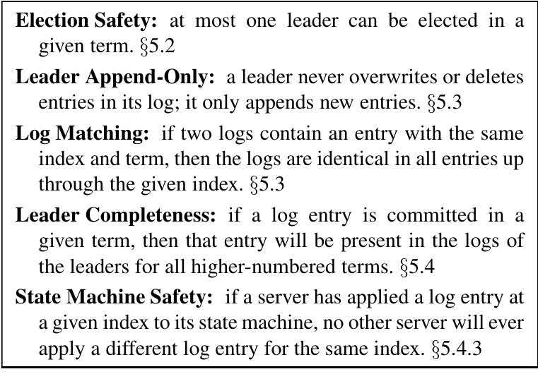

**图 3：Raft 保证下列每项性质始终成立。** 节号指出相应性质在何处讨论。

- **选举安全性（Election Safety）：** 给定任期内至多选出一位领导者。§5.2
- **领导者只追加（Leader Append-Only）：** 领导者从不覆盖或删除自己日志中的条目，只追加新条目。§5.3
- **日志匹配（Log Matching）：** 若两份日志包含索引和任期都相同的条目，则直到该索引为止，两份日志的所有条目都完全相同。§5.3
- **领导者完整性（Leader Completeness）：** 若某个日志条目在给定任期内提交，那么更高编号任期的所有领导者日志都包含该条目。§5.4
- **状态机安全性（State Machine Safety）：** 若一台服务器已把给定索引的日志条目应用到自己的状态机，那么任何其他服务器都绝不会对同一索引应用不同日志条目。§5.4.3

### 5.1 Raft 基础

Raft 集群包含若干服务器；典型数量是五台，这使系统能够容忍两台服务器故障。任意时刻，每台服务器都处于三种状态之一：领导者（leader）、跟随者（follower）或候选者（candidate）。正常运行时恰有一位领导者，其他所有服务器都是跟随者。跟随者是被动的：它们不主动发出请求，只响应领导者和候选者的请求。领导者处理所有客户端请求；如果客户端联系跟随者，跟随者会把它重定向到领导者。第三种状态候选者用于选举新领导者，第 5.2 节将作说明。图 4 展示这些状态及其转换，下面将讨论各项转换。

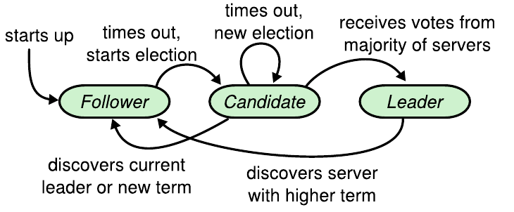

**图 4：服务器状态。** 跟随者只响应其他服务器的请求。若跟随者在一段时间内没有收到通信，它就成为候选者并发起选举。候选者获得整个集群多数服务器的选票后成为新领导者。领导者通常持续工作直到发生故障。

Raft 把时间划分为长度任意的任期（term），如图 5 所示。任期用连续整数编号。每个任期都从选举开始，一个或多个候选者尝试成为领导者，详见第 5.2 节。候选者赢得选举后，会在该任期剩余时间内担任领导者。在某些情况下，选举会出现票数平分；此时该任期结束而没有选出领导者，不久后将开始一个新任期（以及新选举）。Raft 保证一个任期内至多有一位领导者。

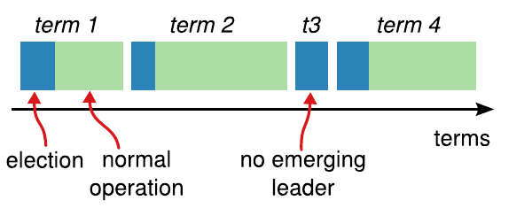

**图 5：时间被划分为任期，每个任期都以一次选举开始。** 选举成功后，由一位领导者管理集群直至任期结束。有些选举会失败，此时任期结束却没有选出领导者。不同服务器可能在不同时间观察到任期转换。

不同服务器可能在不同时间观察到任期之间的转换；在某些情况下，一台服务器可能完全没有观察到某次选举，甚至没有观察到整个任期。任期在 Raft 中充当逻辑时钟 [12]，使服务器能够检测过时信息，例如失效领导者。每台服务器都保存一个当前任期号，它随时间单调递增。服务器每次通信都会交换当前任期；如果一台服务器的当前任期小于另一台，它就更新为较大值。候选者或领导者发现自己的任期已经过时，就立即退回跟随者状态。服务器若收到任期号过时的请求，则拒绝该请求。

Raft 服务器使用远程过程调用（RPC）通信，共识算法只需要两类 RPC。候选者在选举期间发起 RequestVote RPC（第 5.2 节）；领导者发起 AppendEntries RPC，用于复制日志条目并提供一种心跳（第 5.3 节）。如果服务器未及时收到响应，就会重试 RPC；为获得最佳性能，它们并行发出 RPC。

### 5.2 领导者选举

Raft 使用心跳机制触发领导者选举。服务器启动时都是跟随者。只要持续收到领导者或候选者的有效 RPC，服务器就保持跟随者状态。领导者周期性地向所有跟随者发送心跳（不携带日志条目的 AppendEntries RPC），以维持其权威。如果跟随者在称为选举超时（election timeout）的一段时间内没有收到通信，就会假定当前不存在可用的领导者，并开始选举新领导者。

要开始选举，跟随者先递增当前任期并转为候选者状态。然后，它给自己投票，同时向集群中的其他每台服务器并行发送 RequestVote RPC。候选者保持这种状态，直到发生三种情况之一：（a）它赢得选举；（b）另一台服务器确立为领导者；（c）经过一段时间仍没有胜者。下面分别讨论这些结果。

若候选者在同一任期内获得整个集群多数服务器的选票，它就赢得选举。每台服务器在给定任期内最多投给一个候选者，采用先到先得原则（注意：第 5.4 节还会增加一项投票限制）。多数派规则确保一个特定任期内至多有一个候选者胜选，即图 3 中的选举安全性质。候选者胜选后成为领导者，再向所有其他服务器发送心跳，确立自己的权威并防止新选举。

等待选票时，候选者可能收到另一台自称领导者的服务器发来的 AppendEntries RPC。若该领导者的任期（包含在 RPC 中）至少与候选者当前任期一样大，候选者就承认这位领导者合法并退回跟随者状态。若 RPC 中的任期小于候选者当前任期，候选者就拒绝该 RPC 并继续保持候选者状态。

第三种可能结果是候选者既没有赢也没有输：如果许多跟随者同时成为候选者，选票可能被分散，导致没有候选者获得多数票。这时，每个候选者都会超时，递增任期并发起新一轮 RequestVote RPC，从而开始新选举。但是，如果不采取额外措施，票数平分可能无限重复。

Raft 使用随机化选举超时，使票数平分很少出现，即使出现也能迅速解决。为了从一开始就避免平票，选举超时从固定区间（例如 150–300 ms）中随机选择。这样会把各服务器的超时错开，所以多数情况下只有一台服务器先超时；它会赢得选举，并在其他服务器超时前发送心跳。处理平票时也使用同一机制。每个候选者在选举开始时重新启动随机化选举超时，等待超时后才开始下一次选举；这降低了新选举再次平票的概率。第 8.3 节表明，这种方法能够快速选出领导者。

选举体现了可理解性如何指导我们在不同设计方案之间作出选择。最初，我们计划使用排序系统：为每个候选者分配唯一等级，并用等级在互相竞争的候选者之间作出选择。如果某个候选者发现另一个候选者的等级更高，就会退回跟随者状态，让较高等级的候选者更容易赢得下一次选举。我们发现，这种方法在可用性方面引入了微妙问题：如果高等级服务器故障，低等级服务器可能需要超时并重新成为候选者；但如果它太快这样做，又可能重置已经取得的选举进展。我们多次调整算法，但每次调整后都会出现新的边界情况。最终，我们认为随机化重试方法更直观、更容易理解。

### 5.3 日志复制

领导者当选后就开始处理客户端请求。每个客户端请求都包含一条要由复制状态机执行的命令。领导者把命令作为新条目追加到自己的日志，再向其他每台服务器并行发送 AppendEntries RPC 以复制该条目。条目完成安全复制后（见下文），领导者将其应用到自己的状态机，并把执行结果返回客户端。如果跟随者崩溃、运行缓慢或网络数据包丢失，领导者会无限重试 AppendEntries RPC，即使已经响应客户端也会继续，直到所有跟随者最终都保存所有日志条目。

日志如图 6 所示组织。每个日志条目都保存一条状态机命令以及领导者收到该条目时的任期号。条目中的任期号用于检测日志之间的不一致，并保证图 3 中的某些性质。每个日志条目还有一个整数索引，用于标识它在日志中的位置。

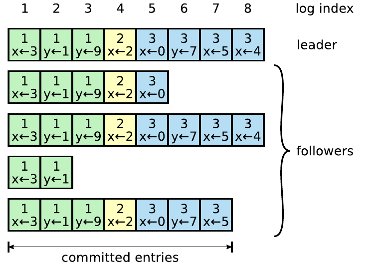

**图 6：日志由顺序编号的条目组成。** 每个条目都包含其创建时的任期（方框内的数字）和一条状态机命令。若把一个条目应用到状态机是安全的，就认为该条目已提交。图中领导者的索引 1–7 已提交；下方为可能处于不同复制进度的跟随者日志。

领导者决定何时可以安全地把日志条目应用到状态机；这种条目称为已提交（committed）。Raft 保证已提交条目持久存在，并最终由所有可用状态机执行。创建某条目的领导者把该条目复制到多数服务器后，该日志条目即被提交（例如图 6 中的条目 7）。这也会提交领导者日志中它之前的所有条目，包括先前领导者创建的条目。第 5.4 节将讨论领导者变更后应用这条规则时的一些微妙问题，并说明这种提交定义是安全的。领导者记录自己已知的最高已提交索引，并把该索引放入后续 AppendEntries RPC（包括心跳），使其他服务器最终获知。一旦跟随者得知某个日志条目已提交，就按日志顺序把该条目应用到本地状态机。

我们设计 Raft 日志机制时，希望不同服务器上的日志保持高度协调一致。这不仅简化了系统行为、使其更可预测，也是保证安全性的重要部分。Raft 保持以下性质，它们共同构成图 3 中的日志匹配性质：

- 若不同日志中的两个条目具有相同索引和任期，则它们保存相同命令。
- 若不同日志中的两个条目具有相同索引和任期，则两份日志在它们之前的所有条目上也完全相同。

第一项性质源于：给定任期内，一位领导者针对一个给定日志索引最多创建一个条目，而且日志条目从不改变自己在日志中的位置。第二项性质由 AppendEntries 执行的一项简单一致性检查保证。发送 AppendEntries RPC 时，领导者会带上自己日志中紧邻新条目之前那个条目的索引和任期。如果跟随者日志中找不到索引和任期都相同的条目，就拒绝这些新条目。一致性检查充当归纳步骤：日志初始为空时满足日志匹配性质，而每次扩展日志时，一致性检查都会保持该性质。因此，只要 AppendEntries 成功返回，领导者就知道跟随者日志直到新条目为止都与自己的日志完全相同。

正常运行期间，领导者与跟随者的日志保持一致，所以 AppendEntries 的一致性检查永远不会失败。但是，领导者崩溃后可能留下不一致的日志，因为旧领导者可能还没有完全复制其日志中的所有条目。这些不一致会随着一系列领导者和跟随者崩溃而叠加。图 7 展示跟随者日志可能以哪些方式不同于新领导者日志。跟随者可能缺少领导者已有的条目，可能多出领导者没有的条目，也可能两者兼有。日志中缺失和多余的条目可能跨越多个任期。

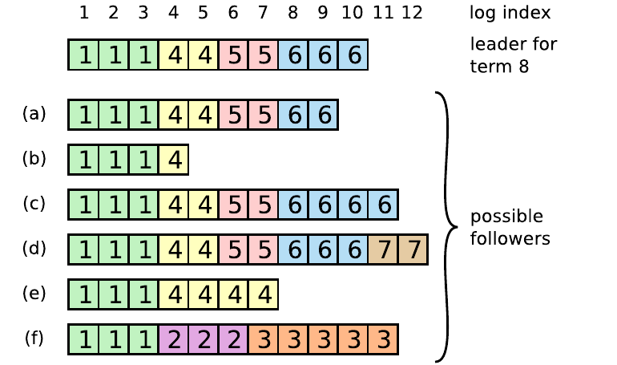

**图 7：顶部的领导者上任时，跟随者日志可能处于情形（a）至（f）中的任意一种。** 每个方框表示一个日志条目，框中数字是其任期。跟随者可能缺少条目（a–b），可能多出尚未提交的条目（c–d），也可能两者兼有（e–f）。例如，情形（f）可能这样产生：该服务器在任期 2 担任领导者，向日志加入若干条目，却在提交任何条目前崩溃；它很快重启，在任期 3 再次成为领导者，又向日志加入几个条目；任期 2 和任期 3 的条目都尚未提交时，该服务器再次崩溃，并在之后几个任期中始终停机。

在 Raft 中，领导者通过强制跟随者日志复制自己的日志来处理不一致。这意味着，跟随者日志中的冲突条目会被领导者日志中的条目覆盖。第 5.4 节将说明，配合另一项限制后，这种做法是安全的。

为使跟随者日志与自己的日志一致，领导者必须先找出两份日志最后一个一致的条目，删除跟随者日志中该点之后的所有条目，再把自己在该点之后的所有条目发送给跟随者。所有这些动作都由 AppendEntries RPC 的一致性检查触发。领导者为每个跟随者维护一个 `nextIndex`，表示接下来要发送给该跟随者的日志条目索引。领导者刚上任时，会把所有 `nextIndex` 初始化为自己最后一个日志索引之后的位置（图 7 中为 11）。如果跟随者日志与领导者日志不一致，下一次 AppendEntries RPC 中的一致性检查就会失败。遭到拒绝后，领导者递减 `nextIndex` 并重试 AppendEntries RPC。最终，`nextIndex` 会到达领导者与跟随者日志相匹配的位置。此时 AppendEntries 成功，删除跟随者日志中的所有冲突条目，并追加领导者日志中的条目（如果有）。AppendEntries 成功后，跟随者日志便与领导者一致，并在该任期剩余时间内始终保持一致。

协议可以进一步优化以减少 AppendEntries RPC 被拒绝的次数；详情见 [29]。

采用这种机制后，领导者上任时不需要采取任何特殊动作来恢复日志一致性。它只需开始正常工作，日志就会随着 AppendEntries 一致性检查失败而自动收敛。领导者从不覆盖或删除自己日志中的条目，即图 3 中的领导者只追加性质。

这种日志复制机制表现出第 2 节所述的理想共识性质：只要多数服务器正常运行，Raft 就能接受、复制并应用新日志条目；正常情况下，只需向集群多数派发送一轮 RPC 就能复制新条目；单个缓慢跟随者不会影响性能。

### 5.4 安全性

前几节说明了 Raft 如何选举领导者和复制日志条目。然而，截至目前描述的机制还不足以保证每个状态机以完全相同的顺序执行完全相同的命令。例如，当领导者提交若干日志条目时，某个跟随者可能不可用；随后，该跟随者可能当选领导者，并用新条目覆盖这些已提交条目，结果不同状态机可能执行不同的命令序列。

本节为 Raft 算法补上一项限制：限制哪些服务器可以当选领导者。这项限制保证任意任期的领导者都包含此前任期中提交的全部条目，即图 3 中的领导者完整性性质。加上选举限制后，我们会更精确地规定提交规则。最后，我们给出领导者完整性性质的证明提纲，并说明该性质如何导出复制状态机的正确行为。

#### 5.4.1 选举限制

在任何基于领导者的共识算法中，领导者最终都必须保存所有已提交日志条目。在 Viewstamped Replication [20] 等一些共识算法中，即使某位领导者最初并不包含所有已提交条目，它仍可当选。这些算法包含额外机制，用于识别缺失条目，并在选举期间或选举后不久把它们传给新领导者。遗憾的是，这会带来大量额外机制和复杂性。

Raft 采用更简单的方法：它保证每位新领导者从当选那一刻起，就包含先前任期提交的所有条目，不必再把这些条目传给领导者。这意味着日志条目只沿一个方向流动，即从领导者流向跟随者；领导者从不覆盖自己日志中的已有条目。

Raft 利用投票过程阻止日志中不包含全部已提交条目的候选者赢得选举。候选者必须联系集群多数派才能当选，这意味着每个已提交条目必然出现在这些服务器中的至少一台上。如果候选者日志至少与该多数派中的任何其他日志一样新（下文会精确定义“新”），那么它就包含全部已提交条目。RequestVote RPC 实现了这项限制：RPC 携带候选者日志的信息；若投票者自己的日志更新，它就拒绝投票给候选者。

Raft 通过比较两份日志最后一个条目的索引和任期，判断哪一份更新。如果最后条目的任期不同，则任期较大的日志更新；如果两份日志以相同任期结束，则较长的日志更新。

#### 5.4.2 提交先前任期的条目

如第 5.3 节所述，领导者把当前任期的一个条目保存到多数服务器后，就知道该条目已经提交。如果领导者在提交某个条目前崩溃，未来的领导者会继续尝试复制该条目。但是，当先前任期的一个条目保存在多数服务器上时，领导者不能立刻断定它已提交。图 8 展示了一种情形：旧日志条目虽然存储在多数服务器上，未来的领导者却仍可能覆盖它。

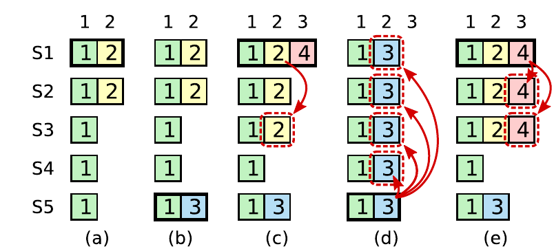

**图 8：该时序说明领导者为何不能依据旧任期日志条目的副本数判定提交。** （a）S1 是领导者，它只在部分服务器上复制了索引 2 的日志条目。（b）S1 崩溃；S5 凭借 S3、S4 和自己投出的选票成为任期 3 的领导者，并在日志索引 2 接受一个不同条目。（c）S5 崩溃；S1 重启并当选领导者，继续复制。此时，来自任期 2 的日志条目已复制到多数服务器，但并未提交。如果 S1 像（d）中那样崩溃，S5 可能凭借 S2、S3 和 S4 的选票当选领导者，并用自己来自任期 3 的条目覆盖它。然而，如果 S1 在崩溃前像（e）那样把当前任期的条目复制到多数服务器，该条目就已提交，因为 S5 无法再赢得选举。此时，日志中该条目之前的所有条目也一并提交。

为消除图 8 所示的问题，Raft 绝不通过统计副本数量直接提交先前任期的日志条目。只有领导者当前任期的日志条目才通过统计副本数提交；一旦以这种方式提交当前任期的一个条目，基于日志匹配性质，它之前的所有条目都被间接提交。在某些情况下，领导者其实可以安全断定旧日志条目已提交，例如该条目存储在每台服务器上；但为了简单，Raft 采取更保守的做法。

Raft 的提交规则之所以多出这项复杂性，是因为领导者复制先前任期的条目时，这些日志条目仍保留其原始任期号。在其他共识算法中，如果新领导者重新复制先前“任期”的条目，就必须使用自己的新“任期号”。Raft 的做法让日志条目更容易推理，因为条目随时间推移、跨不同日志都保持相同任期号。此外，与其他算法相比，Raft 的新领导者从先前任期发送的日志条目更少；其他算法必须重复发送日志条目，为它们重新编号后才能提交。

#### 5.4.3 安全性论证

在完整的 Raft 算法基础上，我们现在可以更精确地论证领导者完整性性质成立；该论证以安全性证明为基础，见第 8.2 节。我们先假定领导者完整性性质不成立，再推出矛盾。假设任期 $T$ 的领导者 $\mathit{leader} _ {T}$ 提交了一个来自自己任期的日志条目，但未来某个任期的领导者没有保存这个条目。考虑满足 $U \gt T$ 且领导者 $\mathit{leader} _ {U}$ 不保存该条目的最小任期 $U$。

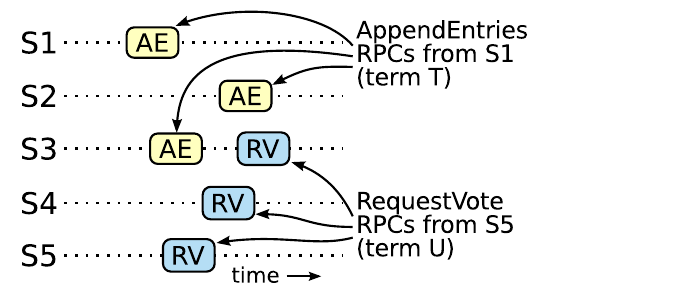

**图 9：** 如果 S1（任期 $T$ 的领导者）提交来自其任期的新日志条目，而 S5 在之后的任期 $U$ 当选领导者，那么至少存在一台服务器（S3）既接受该日志条目，也投票给 S5。

1. $\mathit{leader} _ {U}$ 当选时，其日志中必然没有这个已提交条目，因为领导者从不删除或覆盖条目。
2. $\mathit{leader} _ {T}$ 把该条目复制到集群多数派，而 $\mathit{leader} _ {U}$ 也从集群多数派获得选票。因此，至少有一台服务器（下称“投票者”）既接受了来自 $\mathit{leader} _ {T}$ 的条目，也投票给 $\mathit{leader} _ {U}$，如图 9 所示。投票者是导出矛盾的关键。
3. 投票者必定先接受来自 $\mathit{leader} _ {T}$ 的已提交条目，之后才投票给 $\mathit{leader} _ {U}$；否则，它会拒绝 $\mathit{leader} _ {T}$ 的 AppendEntries 请求，因为届时它的当前任期已经大于 $T$。
4. 投票者投票给 $\mathit{leader} _ {U}$ 时仍保存该条目，因为根据假设，中间出现的每位领导者都包含该条目；领导者从不删除条目，而跟随者只在条目与领导者冲突时才删除条目。
5. 投票者把选票投给了 $\mathit{leader} _ {U}$，所以 $\mathit{leader} _ {U}$ 的日志至少与投票者日志一样新。由此会产生以下两个矛盾之一。
6. 第一种情况：投票者与 $\mathit{leader} _ {U}$ 的最后日志任期相同。那么 $\mathit{leader} _ {U}$ 的日志长度至少与投票者一样长，因而其日志包含投票者日志中的每个条目。这与假设矛盾，因为投票者包含已提交条目，而我们假定 $\mathit{leader} _ {U}$ 不包含它。
7. 否则， $\mathit{leader} _ {U}$ 的最后日志任期必然大于投票者的最后日志任期；而且它还必然大于 $T$，因为投票者的最后日志任期至少是 $T$（投票者包含任期 $T$ 提交的条目）。创建 $\mathit{leader} _ {U}$ 最后一个日志条目的那位较早领导者，根据假设，必定在自己的日志中包含该已提交条目。于是，根据日志匹配性质， $\mathit{leader} _ {U}$ 的日志也必定包含该已提交条目，这又是一个矛盾。
8. 至此反证完成。因此，任意大于 $T$ 的任期，其领导者都必须包含任期 $T$ 中提交的所有任期 $T$ 条目。
9. 日志匹配性质保证未来的领导者还会包含间接提交的条目，例如图 8（d）中的索引 2。

有了领导者完整性性质，就很容易证明图 3 中的状态机安全性质，以及所有状态机都会以相同顺序应用相同日志条目；详见 [29]。

### 5.5 跟随者和候选者崩溃

此前我们一直聚焦领导者故障。跟随者和候选者崩溃远比领导者崩溃容易处理，而且两者采用相同方式处理。如果跟随者或候选者崩溃，后续发给它的 RequestVote 和 AppendEntries RPC 就会失败。Raft 通过无限重试处理这些故障；故障服务器重启后，RPC 就能成功完成。如果一台服务器在完成 RPC 之后、发出响应之前崩溃，它重启后会再次收到同一个 RPC。Raft RPC 是幂等的，因此不会造成问题。例如，如果跟随者收到的 AppendEntries 请求包含其日志中已有的日志条目，它会忽略新请求里的这些条目。

### 5.6 时序与可用性

我们对 Raft 的一项要求是安全性不得依赖时序：系统不能仅仅因为某个事件比预期发生得更快或更慢，就产生错误结果。然而，可用性（系统及时响应客户端的能力）必然依赖时序。例如，如果消息交换所需时间长于服务器崩溃之间的典型间隔，候选者就无法存活足够久以赢得选举；没有稳定的领导者，Raft 便无法取得进展。

领导者选举是 Raft 中时序最关键的部分。只要系统满足下列时序要求，Raft 就能选出并维持一位稳定领导者：

$$
\mathit{broadcastTime} \ll \mathit{electionTimeout} \ll \mathit{MTBF}
$$

在这个不等式中， $\mathit{broadcastTime}$ 是一台服务器并行向集群中每台服务器发送 RPC 并收到响应所需的平均时间； $\mathit{electionTimeout}$ 是第 5.2 节所述选举超时； $\mathit{MTBF}$ 是一台服务器两次故障之间的平均时间。

广播时间应比选举超时小一个数量级，这样领导者才能可靠发送心跳消息，防止跟随者开始选举；考虑到选举超时采用随机化方法，这个不等式也会降低票数平分的概率。选举超时又应比 MTBF 小几个数量级，使系统能够稳定取得进展。领导者崩溃时，系统将在大约一个选举超时的时间内不可用；我们希望这只占总时间的一小部分。

广播时间和 MTBF 是底层系统的性质，而选举超时由我们选择。Raft RPC 通常要求接收方把信息持久化到稳定存储，因此广播时间会随存储技术不同而落在 0.5–20 ms 之间。相应地，选举超时可能落在 10–500 ms 之间。典型服务器的 MTBF 为数月或更长，完全能够满足这一时序要求。

## 6 集群成员变更

到目前为止，我们一直假定集群配置（参与共识算法的服务器集合）保持不变。在实践中，偶尔必须改变配置，例如替换故障服务器或调整复制程度。可以让整个集群离线、更新配置文件，再重启集群，但这会让集群在切换期间不可用。此外，只要存在人工步骤，就有发生操作错误的风险。为避免这些问题，我们决定自动化配置变更，并将其纳入 Raft 共识算法。

为了让配置变更机制保持安全，转换过程中不能有任何时刻允许同一任期选出两个领导者。遗憾的是，任何让服务器直接从旧配置切换到新配置的方法都不安全。不可能让所有服务器在同一时刻原子切换，因此转换期间集群可能分裂成两个相互独立的多数派，如图 10 所示。

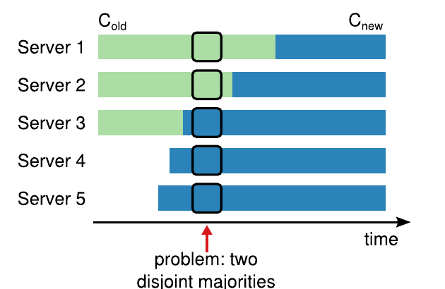

**图 10：直接从一种配置切换到另一种配置并不安全，因为不同服务器会在不同时间切换。** 本例中，集群从三台服务器扩展到五台。遗憾的是，某一时刻可能在同一任期选出两位不同的领导者：一位获得旧配置 $C _ {\mathrm{old}}$ 的多数票，另一位获得新配置 $C _ {\mathrm{new}}$ 的多数票。

为保证安全，配置变更必须采用两阶段方法。两阶段有多种实现方式。例如，一些系统（如 [20]）在第一阶段禁用旧配置，使它无法处理客户端请求；再在第二阶段启用新配置。在 Raft 中，集群首先切换到一种我们称为联合共识的过渡配置；联合共识提交后，系统再转换到新配置。联合共识把新旧配置结合起来：

- 日志条目复制到两种配置中的所有服务器。
- 任一配置中的任意服务器都可担任领导者。
- 无论选举还是条目提交，达成一致都分别需要旧配置和新配置的多数派。

联合共识允许各服务器在不同时间转换配置而不损害安全性。此外，集群在整个配置变更期间仍可继续处理客户端请求。

集群配置通过复制日志中的特殊条目保存和传播；图 11 展示配置变更过程。领导者收到把配置从 $C _ {\mathrm{old}}$ 改成 $C _ {\mathrm{new}}$ 的请求时，先把联合共识配置（图中的 $C _ {\mathrm{old,new}}$）作为一个日志条目保存，并用前述机制复制该条目。一台服务器把新配置条目加入日志后，所有后续决定都会采用这个配置；无论该条目是否提交，服务器始终使用自己日志中的最新配置。因此，领导者将依据 $C _ {\mathrm{old,new}}$ 的规则，判定 $C _ {\mathrm{old,new}}$ 日志条目何时提交。如果领导者崩溃，可能依据 $C _ {\mathrm{old}}$ 或 $C _ {\mathrm{old,new}}$ 选出新领导者，具体取决于胜选候选者是否收到过 $C _ {\mathrm{old,new}}$。无论如何，这段时间内 $C _ {\mathrm{new}}$ 都不能单方面作出决定。

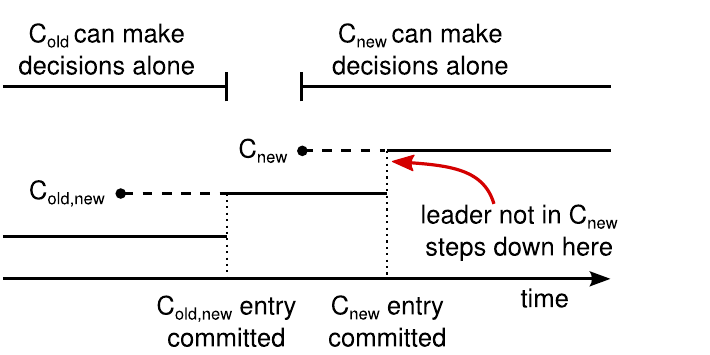

**图 11：配置变更时间线。** 虚线表示已经创建但尚未提交的配置条目，实线表示最新提交的配置条目。领导者先在日志中创建 $C _ {\mathrm{old,new}}$ 配置条目，并向 $C _ {\mathrm{old,new}}$ 提交它，即同时得到 $C _ {\mathrm{old}}$ 多数派和 $C _ {\mathrm{new}}$ 多数派。然后，它创建 $C _ {\mathrm{new}}$ 条目，并向 $C _ {\mathrm{new}}$ 的多数派提交。在整个过程中，不存在 $C _ {\mathrm{old}}$ 和 $C _ {\mathrm{new}}$ 都能独立作出决定的时刻。

$C _ {\mathrm{old,new}}$ 提交后， $C _ {\mathrm{old}}$ 和 $C _ {\mathrm{new}}$ 都无法在未获另一方同意时作出决定；领导者完整性性质还确保，只有日志中包含 $C _ {\mathrm{old,new}}$ 条目的服务器才能当选领导者。此时，领导者便可以安全创建描述 $C _ {\mathrm{new}}$ 的日志条目，并把它复制到集群。同样，每台服务器一看到该配置，就立即让它生效。新配置依据 $C _ {\mathrm{new}}$ 的规则提交后，旧配置便不再相关，不属于新配置的服务器可以关闭。如图 11 所示，任何时刻都不可能让 $C _ {\mathrm{old}}$ 和 $C _ {\mathrm{new}}$ 同时单方面作出决定；这保证了安全性。

重新配置还要解决三个问题。第一个问题是，新服务器最初可能没有保存任何日志条目。如果以这种状态把它们加入集群，它们可能需要相当长时间才能追上；在此期间，系统可能无法提交新日志条目。为避免可用性中断，Raft 在配置变更前增加了一个阶段：让新服务器作为无投票权成员加入集群。领导者会向它们复制日志条目，但在计算多数派时不考虑它们。新服务器追上集群其他成员后，再按上述方式重新配置。

第二个问题是，集群领导者可能不属于新配置。在这种情况下，领导者提交 $C _ {\mathrm{new}}$ 日志条目后就会退位，返回跟随者状态。这意味着在提交 $C _ {\mathrm{new}}$ 期间，领导者会管理一个并不包含自己的集群：它复制日志条目，却不在计算多数派时把自己算进去。领导者在 $C _ {\mathrm{new}}$ 提交时转换状态，因为这是新配置可以独立运行的第一个时刻；此时一定能从 $C _ {\mathrm{new}}$ 中选出领导者。在此之前，可能只有 $C _ {\mathrm{old}}$ 中的服务器能够当选领导者。

第三个问题是，被移除的服务器（不在 $C _ {\mathrm{new}}$ 中）可能干扰集群。这些服务器收不到心跳，因而会超时并开始新选举。随后它们发出带有新任期号的 RequestVote RPC，迫使当前领导者退回跟随者状态。系统最终会选出新领导者，但被移除的服务器还会再次超时，整个过程不断重复，导致可用性很差。

为防止该问题，服务器在认为当前领导者仍然存在时会忽略 RequestVote RPC。具体而言，如果服务器在最近一次收到当前领导者消息后的最短选举超时之内收到 RequestVote RPC，就既不更新自己的任期，也不投票。这不影响正常选举，因为正常情况下，每台服务器在开始选举前都至少等待一个最短选举超时。但是，它有助于避免被移除服务器造成干扰：只要领导者能够把心跳送达自己的集群，就不会被更大的任期号赶下台。

## 7 客户端与日志压缩

由于篇幅限制，本节内容已从本文省略，但论文扩展版 [29] 提供了这些材料。该部分说明客户端如何与 Raft 交互，包括客户端如何找到集群领导者，以及 Raft 如何支持线性一致语义 [8]。扩展版还说明如何用快照方法回收复制日志中的空间。这些问题适用于所有基于共识的系统，Raft 的解决方案与其他系统相似。

## 8 实现与评估

我们已经把 Raft 实现为一个复制状态机的一部分；该状态机为 RAMCloud [30] 保存配置信息，并协助 RAMCloud 协调器进行故障转移。Raft 实现大约有 2,000 行 C++ 代码，不包括测试、注释和空行。源代码可以自由获取 [21]。此外，还有大约 25 个由第三方独立开发的 Raft 开源实现 [31]，它们基于本文草稿，处于不同开发阶段。多家公司也在部署基于 Raft 的系统 [31]。

本节其余部分从三个标准评估 Raft：可理解性、正确性和性能。

### 8.1 可理解性

为了衡量 Raft 相对于 Paxos 的可理解性，我们以斯坦福大学高级操作系统课程和加州大学伯克利分校分布式计算课程中的高年级本科生与研究生为对象开展实验研究。我们录制了一段 Raft 视频讲座和一段 Paxos 视频讲座，并分别编制测验。Raft 讲座涵盖本文内容；Paxos 讲座涵盖构建等价复制状态机所需的足够材料，包括单决策 Paxos、多决策 Paxos、重新配置和实际应用所需的若干优化（如领导者选举）。测验既考查对算法的基本理解，也要求学生推理边界情况。

每位学生先观看一段视频、完成对应测验，再观看另一段视频、完成第二份测验。约一半参与者先完成 Paxos 部分，另一半先完成 Raft 部分，以同时控制个体表现差异和从研究第一部分获得的经验。我们比较参与者在两份测验中的成绩，判断他们是否表现出对 Raft 更好的理解。

我们尽量让 Paxos 与 Raft 之间的比较保持公平。实验在两个方面对 Paxos 有利：43 名参与者中有 15 人报告自己此前对 Paxos 有一定经验，而且 Paxos 视频比 Raft 视频长 14%。如表 1 所示，我们采取措施缓解潜在偏差来源。所有材料均可供审阅 [26, 28]。

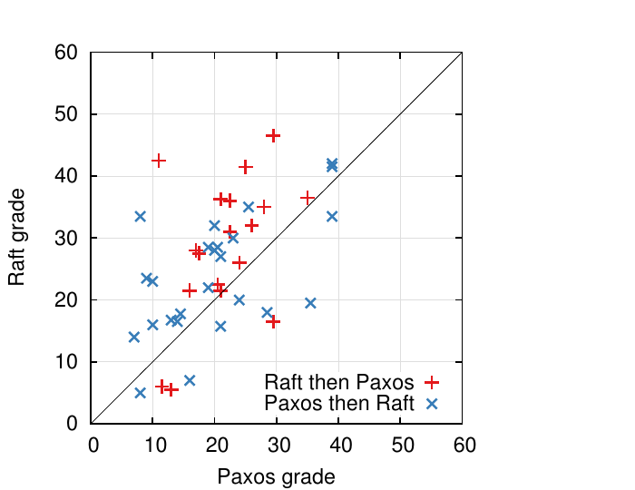

**图 12：43 名参与者在 Raft 与 Paxos 测验中的表现散点图。** 对角线上方的点共 33 个，表示这些参与者在 Raft 测验中的得分更高。横轴为 Paxos 得分，纵轴为 Raft 得分；红色加号表示先学 Raft 再学 Paxos，蓝色叉号表示先学 Paxos 再学 Raft。

平均而言，参与者在 Raft 测验中的得分比 Paxos 测验高 4.9 分，满分均为 60 分；Raft 平均分为 25.7，Paxos 平均分为 20.8。图 12 展示个人得分。配对 $t$ 检验表明，在 95% 置信度下，真实 Raft 得分分布的均值至少比真实 Paxos 得分分布高 2.5 分。

我们还构建了线性回归模型，根据三个因素预测新学生的测验成绩：参加的是哪一份测验、此前对 Paxos 的熟悉程度，以及学习两种算法的顺序。模型预测，测验选择会带来 12.5 分的差异，结果有利于 Raft。这明显高于观测到的 4.9 分差异，因为许多实际参与者此前已有 Paxos 经验，这极大帮助了 Paxos，而对 Raft 的帮助稍小。奇怪的是，模型还预测，已经完成 Paxos 测验的人在 Raft 测验中的得分会低 6.3 分；虽然我们不知道原因，但这看起来确实具有统计显著性。

完成测验后，我们还调查参与者认为哪种算法更容易实现或解释，结果如图 13 所示。绝大多数参与者报告说 Raft 更容易实现和解释；两个问题各有 41 人回答，其中各有 33 人选择 Raft。不过，这些自我报告的感受可能不如测验得分可靠，而且参与者知道我们的假设是“Raft 更易理解”，因而可能受到偏差影响。

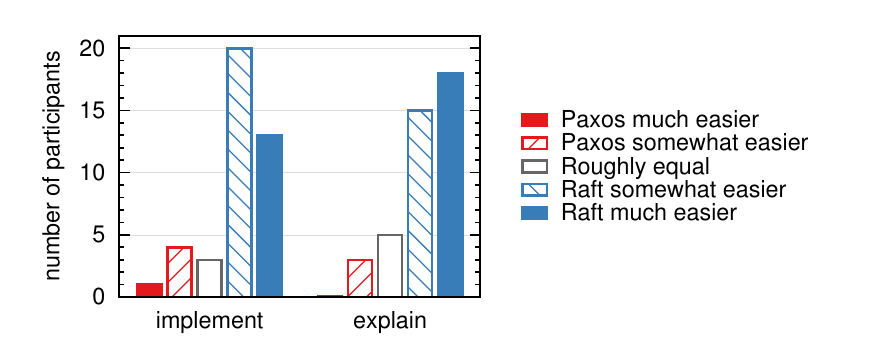

**图 13：参与者按五点量表回答以下问题：** 左图询问，要构建一个可运行、正确且高效的系统，他们认为哪种算法更容易实现；右图询问，哪种算法更容易向计算机科学研究生解释。选项依次为“Paxos 容易得多”“Paxos 稍容易”“大致相同”“Raft 稍容易”“Raft 容易得多”。

**表 1：研究中可能对 Paxos 不利的偏差、采取的缓解措施，以及可供审阅的其他材料。**

| 关注点 | 为缓解偏差采取的措施 | 可供审阅的材料 [26, 28] |
| --- | --- | --- |
| 讲座质量相同 | 两段讲座由同一人主讲。Paxos 讲座依据多所大学使用的既有材料制作并加以改进；Paxos 讲座长 14%。 | 视频 |
| 测验难度相同 | 按难度对问题分组，并在两份测验之间配对。 | 测验 |
| 评分公平 | 使用评分细则；按随机顺序评分，并在两份测验之间交替进行。 | 评分细则 |

关于 Raft 用户研究的详细讨论见 [28]。

### 8.2 正确性

我们已经为第 5 节所述共识机制建立了形式化规约和安全性证明。形式化规约 [28] 使用 TLA+ 规约语言 [15]，把图 2 概括的信息完整、精确地形式化。它大约 400 行，是证明的对象；对于任何实现 Raft 的人来说，它本身也很有用。我们使用 TLA 证明系统 [6] 机械证明了日志完整性性质。不过，这项证明依赖一些尚未经过机械检验的不变量；例如，我们还没有证明规约的类型安全性。此外，我们还写出了一份关于状态机安全性质的非形式化证明 [28]；这份证明是完整的，只依赖规约本身，也相当精确，篇幅约 3,500 词。

### 8.3 性能

Raft 的性能与 Paxos 等其他共识算法相近。对性能最重要的情况是，已经确立的领导者复制新日志条目。Raft 使用最少的消息完成这项工作：从领导者到集群半数服务器只需一次往返。Raft 的性能还可以进一步提高。例如，它很容易支持请求批处理和流水线，以获得更高吞吐量、更低延迟。文献中已经为其他算法提出多种优化；其中许多也可以应用于 Raft，但我们将此留作未来工作。

我们用自己的 Raft 实现测量 Raft 领导者选举算法的性能，并回答两个问题。第一，选举过程能否快速收敛？第二，领导者崩溃后能够达到的最短停机时间是多少？

为测量领导者选举，我们反复让一个五服务器集群的领导者崩溃，并记录检测故障、选出新领导者所需的时间，见图 14。为构造最坏情况，每次试验中各服务器的日志长度都不同，因此部分候选者没有资格当选。为了鼓励出现票数平分，测试脚本还会在终止领导者进程前，触发领导者同步广播心跳 RPC；这近似于领导者在崩溃前复制新日志条目的行为。领导者在自己的心跳间隔内均匀随机地被终止；所有测试中，心跳间隔都是最短选举超时的一半。因此，理论上的最短停机时间约为最短选举超时的一半。

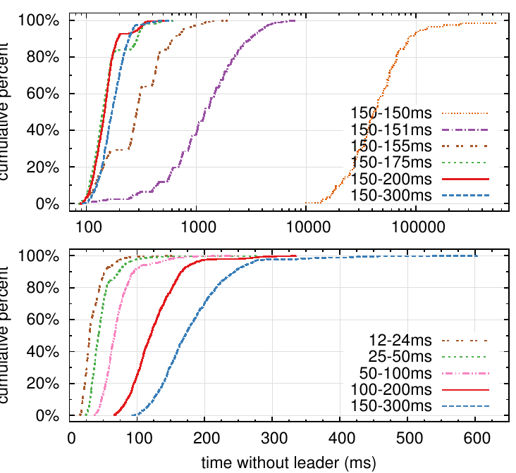

**图 14：检测并替换已崩溃领导者所需的时间。** 上图改变选举超时中的随机化幅度，下图缩放最短选举超时。每条曲线代表 1,000 次试验，但“150–150 ms”只有 100 次；每条曲线对应一种选举超时选择。例如，“150–155 ms”表示选举超时在 150 ms 到 155 ms 之间均匀随机选择。测量使用五服务器集群，广播时间约为 15 ms；九服务器集群的结果相似。纵轴为累计百分比，横轴为无领导者时间（毫秒）。

图 14 上图表明，只需在选举超时中加入少量随机性，就足以避免选举票数平分。在没有随机性的情况下，由于多次平票，我们的测试中领导者选举始终耗时超过 10 秒。仅加入 5 ms 随机性就有显著帮助，使停机时间中位数降为 287 ms。进一步增加随机性会改善最坏情况：使用 50 ms 随机性时，1,000 次试验中的最坏完成时间为 513 ms。

图 14 下图表明，缩短选举超时可以减少停机时间。选举超时为 12–24 ms 时，选出领导者平均只需 35 ms；最长一次试验耗时 152 ms。然而，继续缩短超时会违反 Raft 的时序要求：领导者难以在其他服务器开始新选举前广播心跳。这会造成不必要的领导者变更，降低系统整体可用性。我们建议采用 150–300 ms 这样的保守选举超时；这类超时不太可能导致不必要的领导者变更，同时仍能提供良好可用性。

## 9 相关工作

共识算法相关文献很多，大多属于以下几类：

- Lamport 对 Paxos 的原始描述 [13]，以及试图更清楚地解释 Paxos 的工作 [14, 18, 19]。
- 对 Paxos 的扩展说明：补齐缺失细节并修改算法，使其成为更好的实现基础 [24, 35, 11]。
- 实现共识算法的系统，例如 Chubby [2, 4]、ZooKeeper [9, 10] 和 Spanner [5]。Chubby 和 Spanner 的算法尚未详细发表，尽管二者都声称基于 Paxos。ZooKeeper 的算法发表得更详细，但与 Paxos 有很大不同。
- 可应用于 Paxos 的性能优化 [16, 17, 3, 23, 1, 25]。
- Oki 和 Liskov 的 Viewstamped Replication（VR）：一种与 Paxos 大约同时发展出来的共识替代方案。原始描述 [27] 与分布式事务协议交织在一起，但最近的更新 [20] 已把核心共识协议独立出来。VR 采用基于领导者的方法，与 Raft 有许多相似之处。

Raft 与 Paxos 最大的差异在于 Raft 的强领导者：Raft 把领导者选举作为共识协议的必要组成部分，并尽可能把功能集中在领导者上。这种做法产生了更简单、更易理解的算法。例如，在 Paxos 中，领导者选举与基本共识协议彼此正交：它只是性能优化，并非达成共识所必需。但是，这会带来额外机制：Paxos 既有用于基本共识的两阶段协议，又有单独的领导者选举机制。相反，Raft 把领导者选举直接纳入共识算法，并将它作为共识两个阶段中的第一阶段。因此，它所需的机制比 Paxos 更少。

与 Raft 一样，VR 和 ZooKeeper 都基于领导者，因此共享 Raft 相对于 Paxos 的许多优势。但是，Raft 尽量减少非领导者功能，所以需要的机制比 VR 或 ZooKeeper 更少。例如，Raft 日志条目只沿一个方向流动：由领导者通过 AppendEntries RPC 向外发送。在 VR 中，日志条目双向流动，领导者可以在选举期间接收日志条目；这会增加机制和复杂性。ZooKeeper 已发表的描述也会把日志条目传给领导者和从领导者传出，但其实现显然更像 Raft [32]。

在我们了解的所有基于共识的日志复制算法中，Raft 的消息类型最少。例如，VR 和 ZooKeeper 各自定义了 10 种不同消息，而 Raft 只有 4 种消息，即两个 RPC 请求及其响应。Raft 单条消息所含信息略多于其他算法，但从整体看更简单。此外，VR 和 ZooKeeper 的描述都要求在领导者变更时传输完整日志；要优化这些机制、使其达到实用水平，还需要增加消息类型。

其他工作已经提出或实现了多种集群成员变更方法，包括 Lamport 的原始提议 [13]、VR [20] 和 SMART [22]。我们为 Raft 选择联合共识方法，因为它复用了共识协议的其余部分，成员变更只需极少的额外机制。Lamport 基于 $\alpha$ 的方法不适用于 Raft，因为它假定没有领导者也能达成共识。与 VR 和 SMART 相比，Raft 重新配置算法的优势是：成员变更可以在不限制正常请求处理的情况下进行；相比之下，VR 在配置变更期间停止所有正常处理，SMART 则对未完成请求数量施加一种类似 $\alpha$ 的限制。Raft 的方法增加的机制也少于 VR 和 SMART。

## 10 结论

设计算法时，人们常把正确性、效率和／或简洁性作为首要目标。这些目标都很有价值，但我们认为可理解性同样重要。开发者只有先把算法转化为实用实现，其他目标才可能实现；而实际实现不可避免地会偏离并扩展已发表的形式。如果开发者没有深入理解算法，也无法形成对算法的直觉，就很难在实现中保留算法的理想性质。

在本文中，我们处理了分布式共识问题。在这个领域，广受认可却难以理解的 Paxos 多年来一直困扰着学生和开发者。我们开发了一种新算法 Raft，并已证明它比 Paxos 更易理解。我们也认为 Raft 为系统构建提供了更好的基础。把可理解性作为首要设计目标，改变了我们设计 Raft 的方式；随着设计推进，我们发现自己反复使用少数几种技术，例如分解问题和简化状态空间。这些技术不仅提升了 Raft 的可理解性，也让我们更容易确信它是正确的。

## 11 致谢

如果没有 Ali Ghodsi、David Mazières，以及伯克利 CS 294-91 和斯坦福 CS 240 课程学生的支持，这项用户研究不可能完成。Scott Klemmer 帮助我们设计用户研究，Nelson Ray 就统计分析向我们提供了建议。用户研究中的 Paxos 幻灯片大量借鉴了 Lorenzo Alvisi 最初制作的一套幻灯片。特别感谢 David Mazières 和 Ezra Hoch 发现 Raft 中的隐蔽错误。

许多人对论文和用户研究材料提供了有益反馈，包括 Ed Bugnion、Michael Chan、Hugues Evrard、Daniel Giffin、Arjun Gopalan、Jon Howell、Vimalkumar Jeyakumar、Ankita Kejriwal、Aleksandar Kracun、Amit Levy、Joel Martin、Satoshi Matsushita、Oleg Pesok、David Ramos、Robbert van Renesse、Mendel Rosenblum、Nicolas Schiper、Deian Stefan、Andrew Stone、Ryan Stutsman、David Terei、Stephen Yang、Matei Zaharia、24 位匿名会议评审者（其中有重复），尤其还有我们的 shepherd Eddie Kohler。Werner Vogels 在 Twitter 上发布了早期草稿的链接，让 Raft 获得了大量关注。

本工作得到 Gigascale Systems Research Center 和 Multiscale Systems Center 的支持；二者是 Focus Center Research Program 资助的六个研究中心中的两个，而该计划属于 Semiconductor Research Corporation。工作还得到 STARnet 的支持；STARnet 是由 MARCO 和 DARPA 赞助的 Semiconductor Research Corporation 计划。此外，本工作得到美国国家科学基金会第 0963859 号资助，以及 Facebook、Google、Mellanox、NEC、NetApp、SAP 和 Samsung 的资助。Diego Ongaro 获得 The Junglee Corporation Stanford Graduate Fellowship 的支持。

## 参考文献

[1] Bolosky, W. J., Bradshaw, D., Haagens, R. B., Kusters, N. P., and Li, P. Paxos replicated state machines as the basis of a high-performance data store. In *Proc. NSDI’11, USENIX Conference on Networked Systems Design and Implementation* (2011), USENIX, pp. 141–154.

[2] Burrows, M. The Chubby lock service for loosely-coupled distributed systems. In *Proc. OSDI’06, Symposium on Operating Systems Design and Implementation* (2006), USENIX, pp. 335–350.

[3] Camargos, L. J., Schmidt, R. M., and Pedone, F. Multicoordinated Paxos. In *Proc. PODC’07, ACM Symposium on Principles of Distributed Computing* (2007), ACM, pp. 316–317.

[4] Chandra, T. D., Griesemer, R., and Redstone, J. Paxos made live: an engineering perspective. In *Proc. PODC’07, ACM Symposium on Principles of Distributed Computing* (2007), ACM, pp. 398–407.

[5] Corbett, J. C., Dean, J., Epstein, M., Fikes, A., Frost, C., Furman, J. J., Ghemawat, S., Gubarev, A., Heiser, C., Hochschild, P., Hsieh, W., Kanthak, S., Kogan, E., Li, H., Lloyd, A., Melnik, S., Mwaura, D., Nagle, D., Quinlan, S., Rao, R., Rolig, L., Saito, Y., Szymaniak, M., Taylor, C., Wang, R., and Woodford, D. Spanner: Google’s globally-distributed database. In *Proc. OSDI’12, USENIX Conference on Operating Systems Design and Implementation* (2012), USENIX, pp. 251–264.

[6] Cousineau, D., Doligez, D., Lamport, L., Merz, S., Ricketts, D., and Vanzetto, H. TLA+ proofs. In *Proc. FM’12, Symposium on Formal Methods* (2012), D. Giannakopoulou and D. Méry, Eds., vol. 7436 of *Lecture Notes in Computer Science*, Springer, pp. 147–154.

[7] Ghemawat, S., Gobioff, H., and Leung, S.-T. The Google file system. In *Proc. SOSP’03, ACM Symposium on Operating Systems Principles* (2003), ACM, pp. 29–43.

[8] Herlihy, M. P., and Wing, J. M. Linearizability: a correctness condition for concurrent objects. *ACM Transactions on Programming Languages and Systems* 12 (July 1990), 463–492.

[9] Hunt, P., Konar, M., Junqueira, F. P., and Reed, B. ZooKeeper: wait-free coordination for internet-scale systems. In *Proc. ATC’10, USENIX Annual Technical Conference* (2010), USENIX, pp. 145–158.

[10] Junqueira, F. P., Reed, B. C., and Serafini, M. Zab: High-performance broadcast for primary-backup systems. In *Proc. DSN’11, IEEE/IFIP International Conference on Dependable Systems & Networks* (2011), IEEE Computer Society, pp. 245–256.

[11] Kirsch, J., and Amir, Y. Paxos for system builders. Tech. Rep. CNDS-2008-2, Johns Hopkins University, 2008.

[12] Lamport, L. Time, clocks, and the ordering of events in a distributed system. *Communications of the ACM* 21, 7 (July 1978), 558–565.

[13] Lamport, L. The part-time parliament. *ACM Transactions on Computer Systems* 16, 2 (May 1998), 133–169.

[14] Lamport, L. Paxos made simple. *ACM SIGACT News* 32, 4 (Dec. 2001), 18–25.

[15] Lamport, L. *Specifying Systems, The TLA+ Language and Tools for Hardware and Software Engineers*. Addison-Wesley, 2002.

[16] Lamport, L. Generalized consensus and Paxos. Tech. Rep. MSR-TR-2005-33, Microsoft Research, 2005.

[17] Lamport, L. Fast Paxos. *Distributed Computing* 19, 2 (2006), 79–103.

[18] Lampson, B. W. How to build a highly available system using consensus. In *Distributed Algorithms*, O. Baboaglu and K. Marzullo, Eds. Springer-Verlag, 1996, pp. 1–17.

[19] Lampson, B. W. The ABCD’s of Paxos. In *Proc. PODC’01, ACM Symposium on Principles of Distributed Computing* (2001), ACM, pp. 13–13.

[20] Liskov, B., and Cowling, J. Viewstamped replication revisited. Tech. Rep. MIT-CSAIL-TR-2012-021, MIT, July 2012.

[21] LogCabin source code. http://github.com/logcabin/logcabin.

[22] Lorch, J. R., Adya, A., Bolosky, W. J., Chaiken, R., Douceur, J. R., and Howell, J. The SMART way to migrate replicated stateful services. In *Proc. EuroSys’06, ACM SIGOPS/EuroSys European Conference on Computer Systems* (2006), ACM, pp. 103–115.

[23] Mao, Y., Junqueira, F. P., and Marzullo, K. Mencius: building efficient replicated state machines for WANs. In *Proc. OSDI’08, USENIX Conference on Operating Systems Design and Implementation* (2008), USENIX, pp. 369–384.

[24] Mazières, D. Paxos made practical. http://www.scs.stanford.edu/~dm/home/papers/paxos.pdf, Jan. 2007.

[25] Moraru, I., Andersen, D. G., and Kaminsky, M. There is more consensus in egalitarian parliaments. In *Proc. SOSP’13, ACM Symposium on Operating Systems Principles* (2013), ACM.

[26] Raft user study. http://ramcloud.stanford.edu/~ongaro/userstudy/.

[27] Oki, B. M., and Liskov, B. H. Viewstamped replication: A new primary copy method to support highly-available distributed systems. In *Proc. PODC’88, ACM Symposium on Principles of Distributed Computing* (1988), ACM, pp. 8–17.

[28] Ongaro, D. *Consensus: Bridging Theory and Practice*. PhD thesis, Stanford University, 2014 (work in progress). http://ramcloud.stanford.edu/~ongaro/thesis.pdf.

[29] Ongaro, D., and Ousterhout, J. In search of an understandable consensus algorithm (extended version). http://ramcloud.stanford.edu/raft.pdf.

[30] Ousterhout, J., Agrawal, P., Erickson, D., Kozyrakis, C., Leverich, J., Mazières, D., Mitra, S., Narayanan, A., Ongaro, D., Parulkar, G., Rosenblum, M., Rumble, S. M., Stratmann, E., and Stutsman, R. The case for RAMCloud. *Communications of the ACM* 54 (July 2011), 121–130.

[31] Raft consensus algorithm website. http://raftconsensus.github.io.

[32] Reed, B. Personal communications, May 17, 2013.

[33] Schneider, F. B. Implementing fault-tolerant services using the state machine approach: a tutorial. *ACM Computing Surveys* 22, 4 (Dec. 1990), 299–319.

[34] Shvachko, K., Kuang, H., Radia, S., and Chansler, R. The Hadoop distributed file system. In *Proc. MSST’10, Symposium on Mass Storage Systems and Technologies* (2010), IEEE Computer Society, pp. 1–10.

[35] van Renesse, R. Paxos made moderately complex. Tech. rep., Cornell University, 2012.
