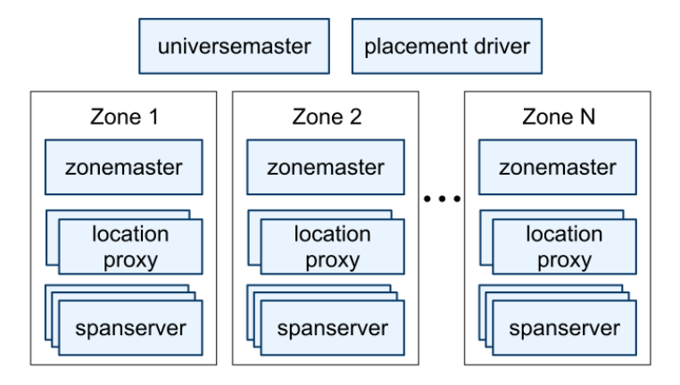
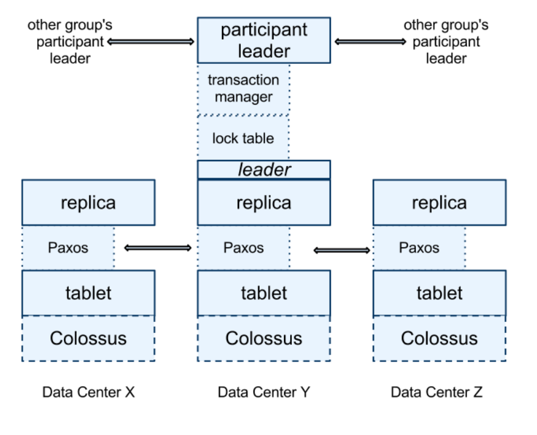
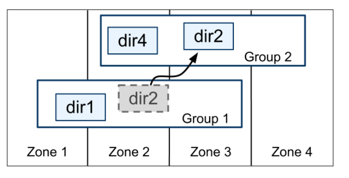
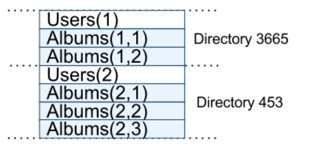
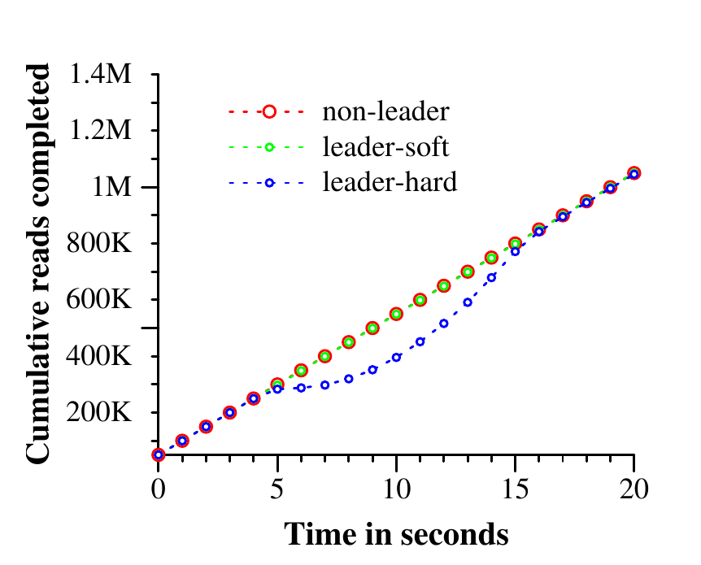
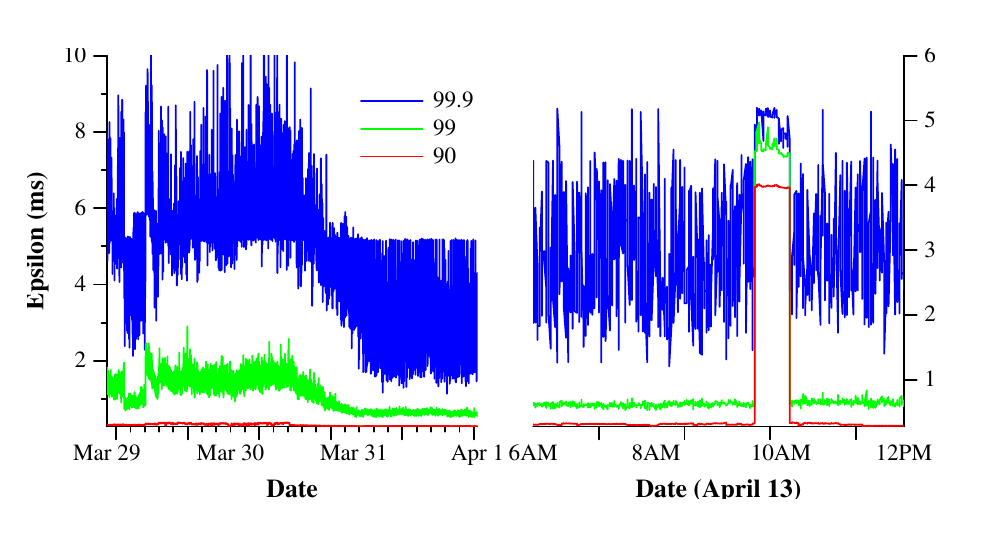

# Spanner: Google’s Globally-Distributed Database（中文译文）

## 译者说明

本文依据同目录的 `source.pdf` 翻译。章节、图表、公式、算法、代码与参考文献按原文结构保留。

James C. Corbett、Jeffrey Dean、Michael Epstein、Andrew Fikes、Christopher Frost、JJ Furman、Sanjay Ghemawat、Andrey Gubarev、Christopher Heiser、Peter Hochschild、Wilson Hsieh、Sebastian Kanthak、Eugene Kogan、Hongyi Li、Alexander Lloyd、Sergey Melnik、David Mwaura、David Nagle、Sean Quinlan、Rajesh Rao、Lindsay Rolig、Yasushi Saito、Michal Szymaniak、Christopher Taylor、Ruth Wang、Dale Woodford

Google, Inc.

## 摘要

Spanner 是 Google 的可扩展、多版本、全球分布且同步复制的数据库。它是第一个能在全球尺度分布数据、同时支持外部一致（externally consistent）分布式事务的系统。本文描述 Spanner 的组织结构、功能集合、各项设计决策背后的理由，以及一种显式暴露时钟不确定性的新型时间 API。该 API 及其实现对于支持外部一致性和一组强大功能至关重要：在整个 Spanner 范围内执行对过去状态的非阻塞读、无锁只读事务，以及原子模式变更。

## 1. 引言

Spanner 是 Google 设计、构建并部署的可扩展全球分布式数据库。从最高层抽象看，它把数据分片到遍布全球各数据中心的多组 Paxos [21] 状态机上。复制用于实现全球可用性和地理局部性，客户端会在副本之间自动故障切换。随着数据量或服务器数量变化，Spanner 会自动在机器间重新分片；它也会自动迁移数据，包括跨数据中心迁移，以均衡负载并应对故障。Spanner 的设计目标是扩展到数百个数据中心中的数百万台机器和数万亿行数据库记录。

应用可以把数据复制到同一洲内乃至跨洲的位置，以便即使发生广域自然灾害也保持高可用。Spanner 的首个客户是 Google 广告后端的重写项目 F1 [35]；F1 使用分布在美国各地的五个副本。多数其它应用很可能会在同一地理区域内、故障模式相对独立的 3 到 5 个数据中心复制数据。换言之，只要能够承受 1 或 2 个数据中心失效，多数应用会以较低延迟优先于更高可用性。

Spanner 的主要关注点是管理跨数据中心复制的数据，但团队也花费了大量时间，在分布式系统基础设施之上设计和实现重要的数据库功能。虽然许多项目乐于使用 Bigtable [9]，用户也持续抱怨 Bigtable 对某些应用很难使用，特别是模式复杂且持续演化的应用，以及在广域复制下仍要求强一致性的应用；其他作者也提出过类似看法 [37]。至少 300 个 Google 内部应用选择了 Megastore [5]，因为它提供半关系数据模型和同步复制，尽管写吞吐相对较差。因此，Spanner 从类似 Bigtable 的版本化键值存储逐渐演化成时态多版本数据库：数据存放在有模式的半关系表中，每个版本都会以其提交时间自动打上时间戳；旧版本受可配置的垃圾回收策略控制；应用可以读取旧时间戳的数据。Spanner 还支持通用事务和基于 SQL 的查询语言。

作为全球分布式数据库，Spanner 提供了若干值得关注的功能。首先，应用能以细粒度动态控制数据的复制配置。应用可以指定约束，控制哪些数据中心保存哪些数据、数据与用户相距多远（以控制读延迟）、副本彼此相距多远（以控制写延迟），以及维护多少个副本（以控制持久性、可用性和读性能）。系统也能在数据中心之间动态、透明地迁移数据，从而均衡各数据中心的资源使用。

其次，Spanner 提供了分布式数据库中很难实现的两项功能：外部一致 [16] 的读写，以及在某一时间戳对整个数据库执行全局一致读。这些功能让 Spanner 能够在全球尺度上、即使有事务持续运行，也支持一致备份、一致的 MapReduce 执行 [12] 和原子模式更新。

这些能力源于 Spanner 为事务分配具有全局意义的提交时间戳，即使事务本身跨越多个位置。时间戳反映序列化顺序，而且该顺序满足外部一致性（等价于线性一致性 [20]）：如果事务 $T_1$ 在事务 $T_2$ 开始之前已经提交，那么 $T_1$ 的提交时间戳小于 $T_2$ 的提交时间戳。Spanner 是第一个在全球尺度提供这种保证的系统。

这些性质的关键促成因素是新的 TrueTime API 及其实现。该 API 直接暴露时钟不确定性，而 Spanner 对时间戳的保证依赖其实现提供的不确定性界。如果不确定性很大，Spanner 就减速并等待不确定时间窗口过去。Google 的集群管理软件实现了 TrueTime API，通过多个现代时钟参考源——GPS 和原子钟——把不确定性保持在较小范围内，通常小于 10ms。

第 2 节介绍 Spanner 实现的结构、功能集合及其设计中的工程取舍。第 3 节介绍 TrueTime API 并概述其实现。第 4 节说明 Spanner 如何用 TrueTime 实现外部一致的分布式事务、无锁只读事务和原子模式更新。第 5 节给出 Spanner 性能和 TrueTime 行为的若干基准，并讨论 F1 的使用经验。第 6、7、8 节分别介绍相关工作、未来工作和结论。

## 2. 实现

本节先介绍 Spanner 实现的结构和设计理由，再介绍用于管理复制与局部性的 directory 抽象；directory 也是数据移动单位。最后，本节说明其数据模型、Spanner 为何更像关系数据库而非键值存储，以及应用如何控制数据局部性。

一套 Spanner 部署称为一个 universe。由于 Spanner 在全球范围管理数据，实际运行的 universe 只会有少数几个。论文发表时，Google 运行着测试/游乐场 universe、开发/生产 universe，以及仅用于生产的 universe。

Spanner 被组织成一组 zone，每个 zone 大致相当于一套 Bigtable server [9] 的部署。Zone 是管理部署单位，同时也是数据可以复制到的位置集合。随着新数据中心上线或旧数据中心停用，可以在运行中的系统增删 zone。Zone 还是物理隔离单位：例如，如果同一数据中心内不同应用的数据必须分布在不同服务器集合上，一个数据中心可以包含一个或多个 zone。



图 1 展示一个 Spanner universe 内的 server。一个 zone 有一个 zonemaster 和 100 到数千个 spanserver；前者把数据分配给 spanserver，后者向客户端提供数据服务。客户端通过每个 zone 的 location proxy 找到负责其数据的 spanserver。Universe master 和 placement driver 目前都是单例。Universe master 主要是一个控制台，展示所有 zone 的状态信息，供交互式调试使用。Placement driver 以分钟为时间尺度自动跨 zone 移动数据；它定期与 spanserver 通信，寻找因复制约束更新或负载均衡而需要移动的数据。受篇幅所限，下文只详细介绍 spanserver。

### 2.1 Spanserver 软件栈

本节以 spanserver 实现为例，说明复制和分布式事务如何叠加到基于 Bigtable 的实现上。软件栈见图 2。位于栈底的每个 spanserver 负责 100 到 1000 个称为 tablet 的数据结构实例。Tablet 类似 Bigtable 的 tablet 抽象，实现下列映射的无序集合：

$$
(\text{key:string},\ \text{timestamp:int64}) \rightarrow \text{string}
$$

与 Bigtable 不同，Spanner 会为数据分配时间戳；这是 Spanner 更像多版本数据库而不只是键值存储的重要原因。Tablet 的状态保存在一组类似 B-tree 的文件和预写日志中，它们都位于名为 Colossus 的分布式文件系统上；Colossus 是 Google File System [15] 的后继系统。



为支持复制，每个 spanserver 在每个 tablet 之上实现一台 Paxos 状态机。Spanner 的早期版本允许每个 tablet 有多台 Paxos 状态机，以提供更灵活的复制配置，但其复杂性促使团队放弃该设计。每台状态机把元数据和日志存入对应 tablet。Paxos 实现支持由基于时间的 leader lease 维持的长期 leader，lease 默认长度为 10 秒。当前实现会把每次 Paxos 写记录两遍：一次写 tablet 日志，一次写 Paxos 日志。这是为开发便利作出的选择，团队计划最终修正。Paxos 实现采用流水线，以提高存在广域网延迟时的吞吐；但 Paxos 仍按顺序应用写入，第 4 节会依赖这一性质。

Paxos 状态机用来实现一致复制的映射集合。每个副本的键值映射状态都存放在相应 tablet 中。写操作必须在 leader 上发起 Paxos 协议；只要副本足够新，读操作就可以直接访问任意副本的底层 tablet。副本集合合称一个 Paxos group。

在每个作为 leader 的副本上，spanserver 都实现一个 lock table，用于并发控制。Lock table 保存两阶段锁的状态，把 key range 映射到锁状态。长期 Paxos leader 对高效管理 lock table 至关重要。Bigtable 与 Spanner 都为长事务而设计，例如生成报表可能持续数分钟；发生冲突时，这些事务在乐观并发控制下表现很差。需要同步的操作（如事务读）会在 lock table 中获取锁，其他操作则绕过 lock table。

在每个作为 leader 的副本上，spanserver 还实现 transaction manager 来支持分布式事务。Transaction manager 用来实现 participant leader，该 group 的其他副本称为 participant slave。如果事务只涉及一个 Paxos group——多数事务都是如此——就可以绕过 transaction manager，因为 lock table 与 Paxos 已能共同提供事务性。如果事务涉及多个 Paxos group，各 group 的 leader 就协调执行两阶段提交。其中一个 participant group 被选为 coordinator：该 group 的 participant leader 称为 coordinator leader，其 slave 称为 coordinator slave。每个 transaction manager 的状态都存入底层 Paxos group，因此也会得到复制。

### 2.2 Directory 与放置

在键值映射集合之上，Spanner 提供称为 directory 的分桶抽象。Directory 是一组具有共同前缀的连续 key。“Directory”这个名字源于历史原因，更合适的名字可能是 bucket；共同前缀的来源将在第 2.3 节解释。应用通过谨慎选择 key，便可利用 directory 控制数据局部性。

Directory 是数据放置单位。一个 directory 内的全部数据具有相同的复制配置。数据在 Paxos group 间移动时，会以 directory 为单位移动，如图 3 所示。Spanner 可能迁移 directory，以降低某个 Paxos group 的负载；把经常一起访问的 directory 放进同一 group；或把 directory 移到更靠近访问者的 group。在客户端操作持续执行时仍可以移动 directory；一个 50MB 的 directory 通常可在数秒内完成迁移。



一个 Paxos group 可以包含多个 directory，因此 Spanner tablet 与 Bigtable tablet 不同：前者不一定是行空间中按字典序连续的单个分区，而是可容纳多个行空间分区的容器。这样设计是为了把经常共同访问的多个 directory 放在一起。

Movedir 是在 Paxos group 之间移动 directory 的后台任务 [14]。由于 Spanner 尚不支持 Paxos 内部配置变更，movedir 也用于给 Paxos group 增删副本 [25]。Movedir 不把整个移动过程实现成单个事务，以免大块数据迁移阻塞正在进行的读写。它先登记数据移动已经开始，再于后台迁移数据；当只剩名义上的少量数据时，使用一个事务原子地移动这部分数据，并更新两个 Paxos group 的元数据。

Directory 也是应用可以指定地理复制性质（简称 placement，放置）的最小单位。放置规范语言把复制配置的管理责任分开。管理员控制两个维度：副本数量与类型，以及副本的地理位置；他们在两个维度上建立一组命名选项菜单，例如“北美、5 路复制并带 1 个见证副本”。应用通过给每个数据库或各个 directory 标上这些选项的组合，来控制数据如何复制。例如，应用可把每个终端用户的数据放入独立 directory，于是用户 A 的数据可以在欧洲有 3 个副本，而用户 B 的数据可以在北美有 5 个副本。

以上说明为清晰起见有所简化。实际上，directory 过大时 Spanner 会把它分成多个 fragment。不同 fragment 可由不同 Paxos group、因而由不同 server 提供服务。Movedir 真正移动的是 fragment，而不是完整 directory。

### 2.3 数据模型

Spanner 向应用暴露以下数据能力：基于有模式半关系表的数据模型、查询语言和通用事务。转向这些能力由多方面因素推动。Megastore [5] 的流行证明了对有模式半关系表和同步复制的需求。Google 内部至少有 300 个应用使用 Megastore；尽管性能相对较低，它的数据模型比 Bigtable 更易管理，而且支持跨数据中心同步复制，而 Bigtable 跨数据中心只支持最终一致复制。使用 Megastore 的知名 Google 应用包括 Gmail、Picasa、Calendar、Android Market 和 AppEngine。

Dremel [28] 作为交互式数据分析工具很受欢迎，因此 Spanner 显然也需要类似 SQL 的查询语言。Bigtable 不支持跨行事务，这一点也屡遭抱怨；Percolator [32] 的构建部分正是为了弥补这一不足。一些作者认为，通用两阶段提交带来的性能或可用性问题使其代价过高 [9, 10, 19]。我们认为，与其让程序员总是围绕事务缺失来编码，不如提供事务，让应用程序员在过度使用事务真正形成瓶颈时再处理性能问题。在 Paxos 上运行两阶段提交可以缓解可用性问题。

应用数据模型建立在实现层按 directory 分桶的键值映射之上。应用在一个 universe 中创建一个或多个数据库，每个数据库可以包含不限数量的有模式表。表看起来像关系数据库表，具有行、列和版本化值。本文不展开 Spanner 查询语言的细节；它类似 SQL，并扩展了对 protocol buffer 类型字段的支持。

Spanner 的数据模型并非纯关系模型，因为行必须有名字。更准确地说，每张表都必须有一个由一个或多个列组成的有序主键。由此处可见 Spanner 仍像键值存储：主键构成行名，每张表都定义从主键列到非主键列的映射。只有在某个值（即使是 NULL）为一行的 key 定义时，该行才存在。施加这一结构很有用，因为应用可通过选择 key 来控制数据局部性。

图 4 给出一个按用户、按相册保存照片元数据的 Spanner schema 示例。Schema 语言类似 Megastore，但增加了一项要求：每个 Spanner 数据库都必须由客户端划分成一个或多个表层次结构。客户端通过数据库 schema 中的 INTERLEAVE IN 声明这些层次结构。层次结构顶部的表是 directory table。Directory table 中键为 $K$ 的每一行，加上所有后代表中以 $K$ 为字典序前缀的行，共同形成一个 directory。ON DELETE CASCADE 表示删除 directory table 的行时也删除相关子行。

```sql
CREATE TABLE Users {
  uid INT64 NOT NULL, email STRING
} PRIMARY KEY (uid), DIRECTORY;

CREATE TABLE Albums {
  uid INT64 NOT NULL, aid INT64 NOT NULL,
  name STRING
} PRIMARY KEY (uid, aid),
  INTERLEAVE IN PARENT Users ON DELETE CASCADE;
```



图中也展示了示例数据库的交错布局。例如，Albums(2,1) 表示 Albums 表中用户 ID 为 2、相册 ID 为 1 的行。把表交错组成 directory 很重要，因为它允许客户端描述多张表之间的局部性关系；在分片分布式数据库中，这对良好性能是必要的。若没有这些信息，Spanner 就不知道哪些局部性关系最重要。

## 3. TrueTime

| 方法 | 返回值 |
| --- | --- |
| TT.now() | TTinterval：[earliest, latest] |
| TT.after(t) | 若 $t$ 确定已经过去则返回 true |
| TT.before(t) | 若 $t$ 确定尚未到来则返回 true |

表 1：TrueTime API。参数 $t$ 的类型为 TTstamp。

本节介绍 TrueTime API 并概述其实现。大多数实现细节留待另一篇论文说明；这里的目标是展示此类 API 的能力。表 1 列出 API 方法。TrueTime 把时间显式表示为 TTinterval，即具有有界时间不确定性的区间；标准时间接口通常不会让客户端知道不确定性。TTinterval 的两个端点类型为 TTstamp。TT.now() 返回一个保证包含调用发生期间绝对时间的 TTinterval。时间纪元类似带闰秒平滑处理的 UNIX 时间。瞬时误差界记为 $\epsilon$，即区间宽度的一半；平均误差界记为 $\bar{\epsilon}$。TT.after() 和 TT.before() 是围绕 TT.now() 的便利封装。

用函数 $t_{abs}(e)$ 表示事件 $e$ 的绝对时间。更形式化地说，对调用 $tt = TT.now()$，TrueTime 保证：

$$
tt.earliest \le t_{abs}(e_{now}) \le tt.latest
$$

其中 $e_{now}$ 是这次调用事件。

TrueTime 的底层时间参考源是 GPS 和原子钟。使用两类参考源是因为二者的故障模式不同。GPS 参考源的脆弱点包括天线和接收器故障、本地无线电干扰、相关故障（例如闰秒处理错误这类设计缺陷和欺骗攻击），以及 GPS 系统中断。原子钟可能以与 GPS 及彼此均不相关的方式故障，而且长时间后可能因频率误差产生显著漂移。

TrueTime 由每个数据中心的一组 time master 机器和每台机器上的 timeslave daemon 实现。多数 master 配有带专用天线的 GPS 接收器；这些 master 在物理上相互分离，以减轻天线故障、无线电干扰和欺骗的影响。其余 master 称为 Armageddon master，配有原子钟。原子钟并不昂贵：一台 Armageddon master 与一台 GPS master 的成本处于同一数量级。

所有 master 的时间参考源都会定期相互比较。每台 master 还用自己的本地时钟交叉检查参考源推进时间的速率；若二者显著偏离，master 会主动退出服务。在两次同步之间，Armageddon master 根据保守采用的最坏时钟漂移发布缓慢增大的时间不确定性；GPS master 发布的不确定性通常接近零。

每个 daemon 会轮询多个 master [29]，降低单一 master 出错带来的风险。其中一些是邻近数据中心的 GPS master，其余包括较远数据中心的 GPS master 和若干 Armageddon master。Daemon 使用 Marzullo 算法 [27] 的变体检测并拒绝说谎者，再把本机时钟与未被拒绝的 master 同步。为防止本地时钟损坏，若机器的频率偏移超过根据组件规格和运行环境推导出的最坏界，该机器会被逐出服务。

在两次同步之间，daemon 发布缓慢增长的时间不确定性。 $\epsilon$ 根据保守采用的最坏本地时钟漂移推导，也取决于 time master 的不确定性和到 master 的通信延迟。在生产环境中， $\epsilon$ 通常随时间呈锯齿状，在每个轮询间隔内约从 1ms 变化到 7ms，因此大多数时间的平均误差界 $\bar{\epsilon}$ 为 4ms。Daemon 的当前轮询间隔是 30 秒，采用的漂移率是每秒 200 微秒；二者共同产生从 0 到 6ms 的锯齿界，其余 1ms 来自与 time master 通信的延迟。

发生故障时可能偏离这一锯齿模式。例如，time master 偶发不可用会使整个数据中心的 $\epsilon$ 上升；机器或网络链路过载也可能导致局部、偶发的 $\epsilon$ 尖峰。

## 4. 并发控制

本节说明如何使用 TrueTime 保证并发控制相关的正确性性质，以及如何利用这些性质实现外部一致事务、无锁只读事务和对过去状态的非阻塞读。例如，这些功能可以保证：在时间戳 $t$ 对整个数据库执行审计读，看到的恰好是截至 $t$ 已提交的每个事务的效果。

下文需要区分 Paxos 看到的写（若上下文没有歧义，称为 Paxos 写）与 Spanner 客户端写。例如，两阶段提交在 prepare 阶段会产生一条并不对应任何 Spanner 客户端写的 Paxos 写。

### 4.1 时间戳管理

| 操作 | 时间戳讨论 | 并发控制 | 所需副本 |
| --- | --- | --- | --- |
| 读写事务 | §4.1.2 | 悲观 | leader |
| 只读事务 | §4.1.4 | 无锁 | leader 分配时间戳；读可在满足 §4.1.3 的任意副本执行 |
| 快照读，客户端提供时间戳 | — | 无锁 | 满足 §4.1.3 的任意副本 |
| 快照读，客户端提供陈旧度上界 | §4.1.3 | 无锁 | 满足 §4.1.3 的任意副本 |

表 2：Spanner 支持的读写类型及其比较。

表 2 列出 Spanner 支持的操作类型。实现支持读写事务、只读事务（预先声明的快照隔离事务）和快照读（snapshot read）。独立写实现为读写事务，非快照的独立读实现为只读事务；二者都会在内部重试，客户端无需编写自己的重试循环。

只读事务是一类具有快照隔离 [6] 性能优势的事务。它必须预先声明不会写入，并不等同于“恰好没有执行写操作的读写事务”。只读事务中的读在系统选择的时间戳执行且不加锁，因此不会阻塞后来的写。只要副本足够新，只读事务中的读就可以在任何副本执行（第 4.1.3 节）。

快照读是在过去某个时间点执行、不获取锁的读。客户端可以为快照读指定时间戳，也可以给出期望时间戳的最大陈旧度，让 Spanner 选择时间戳。两种情况下，快照读都能在任意足够新的副本上执行。

对只读事务和快照读而言，一旦选定时间戳，除非该时间戳的数据已经被垃圾回收，提交就是必然的。因此客户端无需在重试循环内缓冲结果。服务器失败时，客户端可以携带相同时间戳和当前读位置，在另一台服务器上从内部继续查询。

#### 4.1.1 Paxos Leader Lease

Spanner 的 Paxos 实现用有时限的 lease 让 leader 长期稳定，默认持续 10 秒。潜在 leader 发送限时 lease vote 请求；收到 quorum 的 lease vote 后，leader 就知道自己持有 lease。副本会在一次成功写入时隐式延长其 lease vote；如果 vote 快到期，leader 会请求延长。

定义一个 leader 的 lease interval：当它发现自己获得 quorum 的 lease vote 时开始，在它因某些 vote 到期而不再拥有 quorum 时结束。Spanner 依赖如下不相交不变量：对每个 Paxos group，任意 Paxos leader 的 lease interval 都与其他 leader 的 lease interval 不相交。附录 A 说明如何强制该不变量。

Spanner 允许 Paxos leader 通过释放 slave 的 lease vote 来让位。为了保持不相交不变量，系统限制了何时可以让位。令 $s_{max}$ 为 leader 使用过的最大时间戳；后续各节会说明何时推进 $s_{max}$。Leader 在让位前必须等待到 $TT.after(s_{max})$ 为 true。

#### 4.1.2 为读写事务分配时间戳

事务读写使用两阶段锁。因此，时间戳可以在获得全部锁后、释放任何锁之前的任意时刻分配。Spanner 为每个事务分配的时间戳，就是 Paxos 为代表事务提交的 Paxos 写所分配的时间戳。

Spanner 依赖如下单调性不变量：在每个 Paxos group 内，即使跨越多个 leader，Spanner 仍按严格单调递增顺序为 Paxos 写分配时间戳。单个 leader 副本很容易按单调递增顺序分配时间戳；跨 leader 则借助 lease 不相交不变量来强制：leader 只能分配位于自己 leader lease interval 内的时间戳。每当分配时间戳 $s$，就把 $s_{max}$ 推进到 $s$，以保持不相交性。

Spanner 还强制如下外部一致性不变量：若事务 $T_2$ 的开始发生在事务 $T_1$ 提交之后，则 $T_2$ 的提交时间戳必须大于 $T_1$ 的提交时间戳。用 $e_i^{start}$ 和 $e_i^{commit}$ 表示事务 $T_i$ 的开始和提交事件，用 $s_i$ 表示其提交时间戳，不变量为：

$$
t_{abs}(e_1^{commit}) \lt{} t_{abs}(e_2^{start}) \Rightarrow s_1 \lt{} s_2
$$

执行事务并分配时间戳的协议遵守两条规则，这两条规则共同保证上述不变量。把写事务 $T_i$ 的提交请求抵达 coordinator leader 的事件定义为 $e_i^{server}$。

**Start（开始）规则。** 写事务 $T_i$ 的 coordinator leader 在 $e_i^{server}$ 之后计算 TT.now().latest，并分配不小于该值的提交时间戳 $s_i$。这里 participant leader 并不相关；第 4.2.1 节将说明它们如何参与下一条规则的实现。

**Commit Wait（提交等待）规则。** Coordinator leader 保证，在 TT.after($s_i$) 为 true 之前，客户端看不到 $T_i$ 提交的任何数据。Commit wait 保证 $s_i$ 小于 $T_i$ 的绝对提交时间，即：

$$
s_i \lt{} t_{abs}(e_i^{commit})
$$

外部一致性的证明为：

$$
\begin{aligned}
s_1 &\lt{} t_{abs}(e_1^{commit}) && \text{（commit wait）}\\
t_{abs}(e_1^{commit}) &\lt{} t_{abs}(e_2^{start}) && \text{（假设）}\\
t_{abs}(e_2^{start}) &\le t_{abs}(e_2^{server}) && \text{（因果性）}\\
t_{abs}(e_2^{server}) &\le s_2 && \text{（start 规则）}\\
\therefore\quad s_1 &\lt{} s_2 && \text{（传递性）}
\end{aligned}
$$

#### 4.1.3 在某个时间戳服务读

第 4.1.2 节的单调性不变量使 Spanner 能正确判断某个副本是否足够新、能够满足读。每个副本跟踪一个 safe time $t_{safe}$，它是该副本已更新到的最大时间戳。当且仅当 $t \le t_{safe}$ 时，副本才能满足时间戳 $t$ 的读。

定义：

$$
t_{safe} = \min(t_{safe}^{Paxos},\ t_{safe}^{TM})
$$

每台 Paxos 状态机有 safe time $t_{safe}^{Paxos}$，每个 transaction manager 有 safe time $t_{safe}^{TM}$。前者较简单：它是已应用的最高 Paxos 写的时间戳。由于时间戳单调增加且写按序应用，从 Paxos 的角度看，时间戳不大于 $t_{safe}^{Paxos}$ 的写不会再出现。

如果一个副本上没有 prepared 但尚未 committed 的事务，即没有处在两阶段提交两个阶段之间的事务，则 $t_{safe}^{TM} = \infty$。对 participant slave 而言， $t_{safe}^{TM}$ 实际指该副本 leader 的 transaction manager；slave 可从 Paxos 写所携带的元数据推断其状态。

如果存在 prepared 事务，其影响的状态就是未定的：participant replica 尚不知道这些事务是否会提交。第 4.2.1 节说明，提交协议会让每个 participant 知道 prepared 事务时间戳的下界。Group $g$ 中事务 $T_i$ 的每个 participant leader 都为 prepare 记录分配 prepare 时间戳 $s_{i,g}^{prepare}$。Coordinator leader 保证事务提交时间戳满足：

$$
s_i \ge s_{i,g}^{prepare}
$$

对所有 participant group $g$ 都成立。因此，对 group $g$ 中的每个副本，在该 group 上所有 prepared 事务 $T_i$ 之上取：

$$
t_{safe}^{TM} = \min_i(s_{i,g}^{prepare}) - 1
$$

#### 4.1.4 为只读事务分配时间戳

只读事务分两个阶段执行：先分配时间戳 $s_{read}$ [8]，再把事务中的读作为 $s_{read}$ 上的快照读执行。只要副本足够新，这些快照读可以在任意副本执行。

在事务开始后的任意时刻简单地令 $s_{read}=TT.now().latest$，可以用与第 4.1.2 节写事务相似的论证保持外部一致性。但如果 $t_{safe}$ 尚未推进到足够大的值，在 $s_{read}$ 执行数据读取可能被阻塞。选择 $s_{read}$ 还可能推进 $s_{max}$，以保持 lease 不相交。因此，为降低阻塞概率，Spanner 应分配保持外部一致性的最旧时间戳。第 4.2.2 节说明如何选择这种时间戳。

### 4.2 细节

本节补充前文略去的读写事务、只读事务实际实现细节，介绍用来实现原子模式变更的特殊事务类型，并说明对基本方案的若干改进。

#### 4.2.1 读写事务

与 Bigtable 相同，事务中的写会在客户端缓冲到提交。因此，事务内的读看不到该事务自身写入的效果。这一设计在 Spanner 中运作良好，因为读会返回所读数据的时间戳，而未提交写尚未获得时间戳。

读写事务内的读使用 wound-wait [33] 避免死锁。客户端把读请求发到相应 group 的 leader 副本，由后者获取读锁，再读取最新数据。客户端事务保持打开期间，会发送 keepalive 消息，防止 participant leader 让事务超时。

当客户端完成所有读并缓冲所有写后，开始两阶段提交。客户端选择 coordinator group，再向每个 participant leader 发送提交消息，其中包含 coordinator 的身份和所有缓冲写。由客户端驱动两阶段提交可避免数据两次跨越广域链路。

非 coordinator participant leader 先获取写锁，再选择 prepare 时间戳；该时间戳必须大于它分配给先前事务的所有时间戳，以保持单调性。然后，它通过 Paxos 记录一条 prepare 记录。每个 participant 再把自己的 prepare 时间戳通知 coordinator。

Coordinator leader 同样先获取写锁，但跳过 prepare 阶段。它收到其他所有 participant leader 的消息后，为整个事务选择时间戳。提交时间戳 $s$ 必须同时满足三项约束：不小于全部 prepare 时间戳，以满足第 4.1.3 节的约束；大于 coordinator 收到提交消息时的 TT.now().latest；大于该 leader 先前分配的所有时间戳，以保持单调性。然后 coordinator leader 通过 Paxos 记录 commit 记录；若等待其他 participant 时超时，则记录 abort。

在允许任何 coordinator replica 应用 commit 记录之前，coordinator leader 会等待 TT.after($s$)，遵守第 4.1.2 节的 commit-wait 规则。因为 coordinator leader 根据 TT.now().latest 选择 $s$，随后要等到该时间戳确定处于过去，预期等待时间至少为 $2\epsilon$。这段等待通常可以与 Paxos 通信重叠。

Commit wait 完成后，coordinator 把提交时间戳发给客户端及其他所有 participant leader。每个 participant leader 通过 Paxos 记录事务结果。所有 participant 在同一个时间戳应用事务，然后释放锁。

#### 4.2.2 只读事务

分配时间戳需要所有参与读的 Paxos group 进行协商。因此，Spanner 要求每个只读事务提供一个 scope expression，用来概括整个事务将读取的 key。对独立查询，Spanner 会自动推断 scope。

如果 scope 中的值由单个 Paxos group 提供，客户端就把只读事务发给该 group 的 leader。当前实现只在 Paxos leader 上为只读事务选择时间戳。该 leader 分配 $s_{read}$ 并执行读取。对单站点读，Spanner 通常能选择比 TT.now().latest 更好的时间戳。定义 LastTS() 为某 Paxos group 最后一次已提交写的时间戳。如果没有 prepared 事务，令 $s_{read}=LastTS()$ 显然满足外部一致性：事务会看到最近一次写的结果，因而排在该写之后。

若 scope 中的值由多个 Paxos group 提供，则有多种选择。最复杂的选择是与所有 group 的 leader 通信一轮，根据 LastTS() 协商 $s_{read}$。当前 Spanner 实现采用更简单的方案：客户端避免这一轮协商，直接令读取在 $s_{read}=TT.now().latest$ 执行，这可能需要等待 safe time 前进。事务中的所有读都可发送到足够新的副本。

#### 4.2.3 模式变更事务

TrueTime 使 Spanner 能够支持原子模式变更。标准事务不适用于此场景，因为 participant 数量——数据库中的 group 数量——可能达到数百万。Bigtable 支持单个数据中心内的原子模式变更，但会阻塞全部操作。

Spanner 的 schema-change transaction 是标准事务的一种通常非阻塞的变体。首先，系统显式给它分配一个未来时间戳，并在 prepare 阶段登记。因此，即使模式变更涉及数千台服务器，也能在尽量少干扰其他并发活动的情况下完成。其次，隐式依赖 schema 的读写会与时间 $t$ 上已登记的 schema-change 时间戳同步：若操作时间戳早于 $t$，可以继续；若晚于 $t$，则必须阻塞在 schema-change transaction 之后。没有 TrueTime，“模式变更发生在 $t$”这一说法就没有意义。

#### 4.2.4 改进

前文定义的 $t_{safe}^{TM}$ 有一个弱点：单个 prepared 事务就会阻止 $t_{safe}$ 前进。因此，即使读与该事务不冲突，也不能在更晚时间戳执行。可以给 $t_{safe}^{TM}$ 增加从 key range 到 prepared-transaction timestamp 的细粒度映射，消除这种伪冲突。该信息可保存在 lock table 中，因为 lock table 已经把 key range 映射到锁元数据。读到达时，只需检查与其冲突的 key range 的细粒度 safe time。

前文定义的 LastTS() 有类似弱点：如果某事务刚刚提交，即使一个只读事务与它不冲突，仍必须把 $s_{read}$ 分配到该事务之后，因而可能延迟读。类似地，可以在 lock table 中给 LastTS() 增加从 key range 到 commit timestamp 的细粒度映射；论文发表时这一优化尚未实现。只读事务到达时，如果不存在冲突的 prepared 事务——可由细粒度 safe time 判断——就可以在与其冲突的 key range 上取 LastTS() 最大值，作为事务时间戳。

前文定义的 $t_{safe}^{Paxos}$ 在没有 Paxos 写时无法前进。也就是说，如果某 Paxos group 上次写发生在 $t$ 之前，就不能在该 group 上执行时间戳 $t$ 的快照读。Spanner 利用 leader lease interval 不相交的性质来解决这个问题。每个 Paxos leader 维护一个阈值，使未来写的时间戳必定高于该值，从而推进 $t_{safe}^{Paxos}$：它维护从 Paxos 序列号 $n$ 到可分配给序列号 $n+1$ 的最小时间戳的映射 MinNextTS($n$)。当副本已经应用到 $n$ 时，可以把 $t_{safe}^{Paxos}$ 推进到：

$$
MinNextTS(n)-1
$$

单个 leader 很容易遵守自己的 MinNextTS() 承诺。由于 MinNextTS() 承诺的时间戳位于 leader lease 内，lease 不相交不变量也会让该承诺跨 leader 成立。若 leader 想把 MinNextTS() 推进到其 lease 结束点之后，必须先延长 lease。为保持不相交性， $s_{max}$ 总会推进到 MinNextTS() 中的最高值。

Leader 默认每 8 秒推进一次 MinNextTS() 值。因此，在没有 prepared 事务时，空闲 Paxos group 中健康的 slave 最坏也能服务距当前超过 8 秒的时间戳读。Slave 还可以按需请求 leader 推进 MinNextTS()。

## 5. 评估

本节先衡量复制、事务和可用性方面的 Spanner 性能，再给出 TrueTime 行为数据，并介绍首个客户 F1 的案例。

### 5.1 微基准

| 副本数 | 写延迟（ms） | 只读事务延迟（ms） | 快照读延迟（ms） | 写吞吐（Kops/s） | 只读事务吞吐（Kops/s） | 快照读吞吐（Kops/s） |
| --- | ---: | ---: | ---: | ---: | ---: | ---: |
| 1D | 9.4 ± 0.6 | — | — | 4.0 ± 0.3 | — | — |
| 1 | 14.4 ± 1.0 | 1.4 ± 0.1 | 1.3 ± 0.1 | 4.1 ± 0.05 | 10.9 ± 0.4 | 13.5 ± 0.1 |
| 3 | 13.9 ± 0.6 | 1.3 ± 0.1 | 1.2 ± 0.1 | 2.2 ± 0.5 | 13.8 ± 3.2 | 38.5 ± 0.3 |
| 5 | 14.4 ± 0.4 | 1.4 ± 0.05 | 1.3 ± 0.04 | 2.8 ± 0.3 | 25.3 ± 5.2 | 50.0 ± 1.1 |

表 3：操作微基准。数据为 10 次运行的均值与标准差；1D 表示单副本且关闭 commit wait。

表 3 给出 Spanner 的部分微基准。测量在共享机器上进行：每个 spanserver 运行于配有 4GB RAM 和 4 个 CPU 核（AMD Barcelona 2200MHz）的调度单元上，客户端运行在独立机器上。每个 zone 包含一个 spanserver。客户端与 zone 分布在网络距离小于 1ms 的若干数据中心中；这种布局应当很常见，因为多数应用不必把全部数据分布到全球。测试数据库包含 50 个 Paxos group 和 2500 个 directory。操作是独立的 4KB 读写。压缩后全部读都由内存服务，因此测量的只是 Spanner 调用栈开销。正式测量前还额外执行了一轮未计入结果的读，用来预热 location cache。

在延迟实验中，客户端只发出足够少的操作，避免 server 排队。单副本实验显示 commit wait 约为 5ms，Paxos 延迟约为 9ms。随着副本数量增加，延迟大体不变而标准差变小，这是因为 Paxos 在 group 的各副本上并行执行；取得 quorum 的延迟也不那么容易受单个 slave 变慢影响。

在吞吐实验中，客户端发出足够多的操作使 server CPU 饱和。快照读可以在任意足够新的副本执行，因此吞吐随副本数近似线性增加。单次读取的只读事务只能在 leader 执行，因为必须由 leader 分配时间戳。只读事务吞吐随副本数增加，是因为有效 spanserver 的数量增加：该实验中 spanserver 数等于副本数，leader 随机分布于 zone。写吞吐也从这一实验设置中获益，这解释了从 3 副本到 5 副本时的吞吐上升；但随着副本数增加，每次写执行的工作量线性增加，抵消了这种收益。

| Participant 数 | 平均延迟（ms） | 第 99 百分位延迟（ms） |
| ---: | ---: | ---: |
| 1 | 17.0 ± 1.4 | 75.0 ± 34.9 |
| 2 | 24.5 ± 2.5 | 87.6 ± 35.9 |
| 5 | 31.5 ± 6.2 | 104.5 ± 52.2 |
| 10 | 30.0 ± 3.7 | 95.6 ± 25.4 |
| 25 | 35.5 ± 5.6 | 100.4 ± 42.7 |
| 50 | 42.7 ± 4.1 | 93.7 ± 22.9 |
| 100 | 71.4 ± 7.6 | 131.2 ± 17.6 |
| 200 | 150.5 ± 11.0 | 320.3 ± 35.1 |

表 4：两阶段提交的可扩展性。数据为 10 次运行的均值与标准差。

表 4 表明，两阶段提交能扩展到合理数量的 participant。实验跨 3 个 zone 运行，每个 zone 有 25 个 spanserver。无论平均延迟还是第 99 百分位延迟，扩展到 50 个 participant 都较为合理；到 100 个 participant 时，延迟开始明显上升。

### 5.2 可用性

图 5 展示 Spanner 跨多个数据中心运行的可用性收益。图中把三个数据中心故障条件下的吞吐实验叠加在同一时间轴上。测试 universe 包含 5 个 zone $Z_i$，每个 zone 有 25 个 spanserver。测试数据库被分成 1250 个 Paxos group；100 个测试客户端持续以合计 50K 次读/秒的速率发出非快照读。全部 leader 被显式放在 $Z_1$。

每次测试开始 5 秒后，杀掉一个 zone 中的全部 server：non-leader 杀掉 $Z_2$；leader-hard 杀掉 $Z_1$；leader-soft 也杀掉 $Z_1$，但先通知其中所有 server 移交 leadership。



杀掉 $Z_2$ 对读吞吐没有影响。杀掉 $Z_1$ 前若给 leader 时间把 leadership 移交到另一个 zone，影响也很小：吞吐下降在图中不可见，约为 3%–4%。相反，无预警杀掉 $Z_1$ 会产生严重影响，完成速率几乎降到 0。随着重新选出 leader，系统吞吐升到约 100K reads/s；它高于稳态速率是实验的两个产物：系统中存在额外容量，而且 leader 不可用时操作会排队。因此吞吐会先上升，随后再回落并稳定于稳态速率。

图中也能看出 Paxos leader lease 被设为 10 秒的影响。杀掉 zone 时，各 group 的 leader lease 到期时间应均匀分布在接下来的 10 秒内；死 leader 的 lease 到期后不久，新 leader 就会选出。故障约 10 秒后，所有 group 都重新拥有 leader，吞吐恢复。较短 lease 能减小 server 故障对可用性的影响，但会增加 lease 续约的网络流量。论文发表时，团队正在设计和实现一种机制，让 slave 在 leader 失败时主动释放 Paxos leader lease。

### 5.3 TrueTime

评估 TrueTime 需要回答两个问题： $\epsilon$ 是否真能界定时钟不确定性，以及 $\epsilon$ 最坏会有多大。前一个问题最严重的情形是本地时钟漂移超过每秒 200 微秒，这会破坏 TrueTime 的假设。机器统计显示，坏 CPU 的发生概率是坏时钟的 6 倍；相较更严重的硬件问题，时钟问题极少。因此，我们认为 TrueTime 的实现与 Spanner 所依赖的其他软件一样可信。



图 6 的 TrueTime 数据来自跨多个数据中心、彼此最远 2200km 的数千台 spanserver 机器。图中绘制 timeslave daemon 刚轮询完 time master 时采样的 $\epsilon$ 第 90、99 和 99.9 百分位。该采样排除了本地时钟不确定性造成的锯齿，因此衡量的是 time master 的不确定性（通常为 0）加上与 master 通信的延迟。

数据表明，这两个决定 $\epsilon$ 基础值的因素通常不成问题。但显著的尾延迟会造成较高 $\epsilon$。3 月 30 日开始尾延迟下降，是因为网络改进减少了瞬态链路拥塞。4 月 13 日持续约一小时的 $\epsilon$ 上升，则源于某数据中心的两台 time master 因例行维护关机。团队仍在调查并消除 TrueTime 尖峰的成因。

### 5.4 F1

2011 年初，Spanner 开始在生产负载下试验性评估，作为名为 F1 的 Google 广告后端重写项目的一部分 [35]。旧后端基于手工多路分片的 MySQL 数据库。未压缩数据集有数十 TB，虽小于许多 NoSQL 实例，却已足以让分片 MySQL 遇到困难。

MySQL 分片方案把每个客户及其全部相关数据分配到固定 shard。这样能按客户使用索引和复杂查询处理，但应用业务逻辑必须了解分片方式。随着客户数量及其数据增长，给这个关键营收数据库重新分片代价极高。最后一次重新分片投入了超过两年的高强度工作，需要数十个团队协调和测试以降低风险。该操作过于复杂，无法定期执行；团队只得把部分数据放入外部 Bigtable，限制 MySQL 数据库增长，却损害了事务行为和跨全部数据查询的能力。

F1 团队选择 Spanner 有几个原因。第一，Spanner 消除了手工重新分片。第二，Spanner 提供同步复制和自动故障切换；MySQL 主从复制的故障切换很困难，并有数据丢失和停机风险。第三，F1 要求强事务语义，因此其他 NoSQL 系统不切实际。应用语义要求跨任意数据的事务和一致读。F1 还需要数据上的二级索引；Spanner 当时尚未自动支持二级索引，但 F1 团队能用 Spanner 事务自行实现一致的全局索引。

论文发表时，应用写默认都经 F1 发往 Spanner，而不再通过 MySQL 应用栈。F1 在美国西海岸有 2 个副本，在东海岸有 3 个副本。这样选择站点既为了应对重大自然灾害可能导致的中断，也考虑了前端站点位置。据 F1 团队的经验，Spanner 自动故障切换几乎不可见。此前数月虽发生过计划外集群故障，团队最多只需更新数据库 schema，告诉 Spanner 优先把 Paxos leader 放在哪里，使其靠近已经移动的前端。

Spanner 的时间戳语义使 F1 能高效维护根据数据库状态计算的内存数据结构。F1 保存所有变更的逻辑历史日志，每个事务都会把相应记录写入 Spanner。F1 在某个时间戳取得完整数据快照来初始化数据结构，再读取增量变更进行更新。

| Fragment 数 | Directory 数 |
| ---: | ---: |
| 1 | >100M |
| 2–4 | 341 |
| 5–9 | 5336 |
| 10–14 | 232 |
| 15–99 | 34 |
| 100–500 | 7 |

表 5：F1 中每个 directory 的 fragment 数量分布。

该表展示 F1 中每个 directory 的 fragment 数量分布。每个 directory 通常对应 F1 上层应用栈中的一个客户。绝大多数 directory、因而绝大多数客户只有 1 个 fragment，这意味着这些客户数据的读写保证只发生在一台 server 上。拥有超过 100 个 fragment 的 directory 全部是包含 F1 二级索引的表。对这类表，一次写跨越多个 fragment 的情况极少；F1 团队只在把未经调优的批量数据加载作为事务执行时观察到这种行为。

| 操作 | 平均延迟（ms） | 标准差（ms） | 数量 |
| --- | ---: | ---: | ---: |
| 全部读 | 8.7 | 376.4 | 21.5B |
| 单站点提交 | 72.3 | 112.8 | 31.2M |
| 多站点提交 | 103.0 | 52.2 | 32.1M |

表 6：从 F1 server 观察到的 Spanner 操作延迟，测量期为 24 小时。

表 6 给出 F1 server 测得的 Spanner 操作延迟。选择 Paxos leader 时，东海岸数据中心的副本拥有更高优先级；表中数据也从这些数据中心的 F1 server 测得。写延迟标准差很大，原因是锁冲突带来的肥尾。读延迟标准差更大，部分原因是 Paxos leader 分布在两个数据中心，而只有其中一个数据中心的机器配有 SSD。

此外，测量包含两个数据中心内系统的每一次读，读数据量本身分布很宽：读取字节数的均值约为 1.6KB，标准差约为 119KB。

## 6. 相关工作

Megastore [5] 和 DynamoDB [3] 都提供跨数据中心一致复制的存储服务。DynamoDB 暴露键值接口，并且只在一个区域内复制。Spanner 延续 Megastore 的半关系数据模型，甚至使用相似的 schema 语言，但 Megastore 性能不高。它构建在 Bigtable 上，通信成本较高；也不支持长期 leader，多个副本都可能发起写。来自不同副本的所有写即使逻辑上并不冲突，在 Paxos 协议内也必然冲突，导致一个 Paxos group 的吞吐降到每秒数次写。Spanner 则提供更高性能、通用事务和外部一致性。

Pavlo 等人 [31] 比较了数据库与 MapReduce [12] 的性能，并以若干在分布式键值存储上叠加数据库能力的工作 [1, 4, 7, 41] 为证，指出两个领域正在汇合。我们同意这一结论，同时展示了整合多个层次的优势，例如把并发控制与复制结合能降低 Spanner 的 commit-wait 成本。

在复制存储之上叠加事务的概念至少可追溯到 Gifford 的博士论文 [16]。Scatter [17] 是较新的、基于 DHT 的键值存储，在一致复制上叠加事务；Spanner 提供的接口层次比 Scatter 更高。Gray 和 Lamport [18] 描述了基于 Paxos 的非阻塞提交协议，但其消息开销高于两阶段提交，会进一步加重跨广域分布 group 的提交成本。Walter [36] 提供一种快照隔离变体，能在数据中心内部、但不能跨数据中心工作。Spanner 的只读事务则对所有操作提供外部一致性，因此语义更加自然。

当时已有大量工作致力于减少或消除加锁开销。Calvin [40] 消除并发控制：预先分配时间戳，再按时间戳顺序执行事务。H-Store [39] 和 Granola [11] 各自定义事务类型，其中一些类型可以避免加锁。这些系统都不提供外部一致性。Spanner 通过支持快照隔离来应对争用问题。

VoltDB [42] 是分片内存数据库，支持用于灾难恢复的广域主从复制，但不支持更通用的复制配置。它是所谓 NewSQL 的一个例子；NewSQL 是推动可扩展 SQL 的市场趋势 [38]。许多商业数据库实现了对过去状态的读，例如 MarkLogic [26] 和 Oracle Total Recall [30]；Lomet 和 Li [24] 描述了此类时态数据库的一种实现策略。

Farsite 相对于可信时钟参考源推导时钟不确定性界，该界比 TrueTime 宽松得多 [13]；Farsite 的 server lease 与 Spanner 的 Paxos lease 采用相同方式维护。已有工作也曾把松散同步时钟用于并发控制 [2, 23]。Spanner 则证明，TrueTime 能让系统跨多组 Paxos 状态机推理全局时间。

## 7. 未来工作

论文发表前一年，Spanner 团队的大部分工作是与 F1 团队合作，把 Google 广告后端从 MySQL 迁移到 Spanner。团队持续改进监控和支持工具、调优性能，也在提升备份/恢复系统的功能与性能。论文发表时正在实现 Spanner schema 语言、二级索引自动维护和基于负载的自动重新分片。

长期来看，团队计划研究若干功能。乐观地并行执行读可能很有价值，但初步实验表明，正确实现并不简单。此外，团队计划最终支持直接修改 Paxos 配置 [22, 34]。

许多应用预计会在相距较近的数据中心之间复制数据，因此 TrueTime 的 $\epsilon$ 可能显著影响性能。我们认为，把 $\epsilon$ 降到 1ms 以下并不存在不可逾越的障碍：可以缩短 time master 查询间隔，质量更好的时钟晶振也相对便宜；改进网络技术可以降低 time master 查询延迟，甚至可能借助其他时间分发技术完全避免查询延迟。

还有一些显而易见的改进方向。尽管 Spanner 能随节点数量扩展，但节点本地数据结构对复杂 SQL 查询的性能较差，因为它们原本为简单键值访问而设计。数据库文献中的算法和数据结构可以显著改善单节点性能。

另一个长期目标是根据客户端负载变化自动在数据中心间移动数据；但要真正发挥作用，系统还需要以自动、协调的方式在数据中心间移动客户端应用进程。移动进程又引出更难的问题：如何管理数据中心之间的资源获取与分配。

## 8. 结论

总而言之，Spanner 结合并扩展了两个研究社区的思想。数据库社区贡献了熟悉、易用的半关系接口、事务和基于 SQL 的查询语言；系统社区贡献了可扩展性、自动分片、容错、一致复制、外部一致性和广域分布。从 Spanner 项目开始到形成本文所述的设计与实现，团队经历了超过 5 年的迭代。这一过程漫长，部分原因是团队较晚才意识到：Spanner 不应只解决全球复制命名空间问题，还应着重提供 Bigtable 所缺失的数据库功能。

设计中最突出的方面是：TrueTime 是 Spanner 整套功能的关键支点。本文证明，把时钟不确定性实体化到时间 API 中，可以构建具有强得多的时间语义的分布式系统；随着底层系统收紧时钟不确定性界，强语义的开销也会下降。分布式系统研究不应再依赖松散同步的时钟和能力薄弱的时间 API 来设计算法。

## 致谢

许多人帮助改进了本文：shepherd Jon Howell 的投入远超职责要求；匿名审稿人；以及多位 Googler——Atul Adya、Fay Chang、Frank Dabek、Sean Dorward、Bob Gruber、David Held、Nick Kline、Alex Thomson 和 Joel Wein。

管理层对研究工作和论文发表都给予了充分支持：Aristotle Balogh、Bill Coughran、Urs Hölzle、Doron Meyer、Cos Nicolaou、Kathy Polizzi、Sridhar Ramaswany 和 Shivakumar Venkataraman。

Spanner 建立在 Bigtable 和 Megastore 团队的成果之上。F1 团队、特别是 Jeff Shute，与我们密切合作开发数据模型，并在追踪性能和正确性缺陷方面提供了巨大帮助。Platforms 团队、特别是 Luiz Barroso 和 Bob Felderman，帮助促成了 TrueTime。

最后，许多 Googler 曾经属于该团队：Ken Ashcraft、Paul Cychosz、Krzysztof Ostrowski、Amir Voskoboynik、Matthew Weaver、Theo Vassilakis 和 Eric Veach；或在论文发表前不久加入：Nathan Bales、Adam Beberg、Vadim Borisov、Ken Chen、Brian Cooper、Cian Cullinan、Robert-Jan Huijsman、Milind Joshi、Andrey Khorlin、Dawid Kuroczko、Laramie Leavitt、Eric Li、Mike Mammarella、Sunil Mushran、Simon Nielsen、Ovidiu Platon、Ananth Shrinivas、Vadim Suvorov 和 Marcel van der Holst。

## 参考文献

- [1] Azza Abouzeid et al. “HadoopDB: an architectural hybrid of MapReduce and DBMS technologies for analytical workloads”. Proc. of VLDB. 2009, pp. 922–933.
- [2] A. Adya et al. “Efficient optimistic concurrency control using loosely synchronized clocks”. Proc. of SIGMOD. 1995, pp. 23–34.
- [3] Amazon. Amazon DynamoDB. 2012.
- [4] Michael Armbrust et al. “PIQL: Success-Tolerant Query Processing in the Cloud”. Proc. of VLDB. 2011, pp. 181–192.
- [5] Jason Baker et al. “Megastore: Providing Scalable, Highly Available Storage for Interactive Services”. Proc. of CIDR. 2011, pp. 223–234.
- [6] Hal Berenson et al. “A critique of ANSI SQL isolation levels”. Proc. of SIGMOD. 1995, pp. 1–10.
- [7] Matthias Brantner et al. “Building a database on S3”. Proc. of SIGMOD. 2008, pp. 251–264.
- [8] A. Chan and R. Gray. “Implementing Distributed Read-Only Transactions”. IEEE TOSE SE-11.2 (Feb. 1985), pp. 205–212.
- [9] Fay Chang et al. “Bigtable: A Distributed Storage System for Structured Data”. ACM TOCS 26.2 (June 2008), 4:1–4:26.
- [10] Brian F. Cooper et al. “PNUTS: Yahoo!’s hosted data serving platform”. Proc. of VLDB. 2008, pp. 1277–1288.
- [11] James Cowling and Barbara Liskov. “Granola: Low-Overhead Distributed Transaction Coordination”. Proc. of USENIX ATC. 2012, pp. 223–236.
- [12] Jeffrey Dean and Sanjay Ghemawat. “MapReduce: a flexible data processing tool”. CACM 53.1 (Jan. 2010), pp. 72–77.
- [13] John Douceur and Jon Howell. Scalable Byzantine-Fault-Quantifying Clock Synchronization. Tech. rep. MSR-TR-2003-67. MS Research, 2003.
- [14] John R. Douceur and Jon Howell. “Distributed directory service in the Farsite file system”. Proc. of OSDI. 2006, pp. 321–334.
- [15] Sanjay Ghemawat, Howard Gobioff, and Shun-Tak Leung. “The Google file system”. Proc. of SOSP. Dec. 2003, pp. 29–43.
- [16] David K. Gifford. Information Storage in a Decentralized Computer System. Tech. rep. CSL-81-8. PhD dissertation. Xerox PARC, July 1982.
- [17] Lisa Glendenning et al. “Scalable consistency in Scatter”. Proc. of SOSP. 2011.
- [18] Jim Gray and Leslie Lamport. “Consensus on transaction commit”. ACM TODS 31.1 (Mar. 2006), pp. 133–160.
- [19] Pat Helland. “Life beyond Distributed Transactions: an Apostate’s Opinion”. Proc. of CIDR. 2007, pp. 132–141.
- [20] Maurice P. Herlihy and Jeannette M. Wing. “Linearizability: a correctness condition for concurrent objects”. ACM TOPLAS 12.3 (July 1990), pp. 463–492.
- [21] Leslie Lamport. “The part-time parliament”. ACM TOCS 16.2 (May 1998), pp. 133–169.
- [22] Leslie Lamport, Dahlia Malkhi, and Lidong Zhou. “Reconfiguring a state machine”. SIGACT News 41.1 (Mar. 2010), pp. 63–73.
- [23] Barbara Liskov. “Practical uses of synchronized clocks in distributed systems”. Distrib. Comput. 6.4 (July 1993), pp. 211–219.
- [24] David B. Lomet and Feifei Li. “Improving Transaction-Time DBMS Performance and Functionality”. Proc. of ICDE (2009), pp. 581–591.
- [25] Jacob R. Lorch et al. “The SMART way to migrate replicated stateful services”. Proc. of EuroSys. 2006, pp. 103–115.
- [26] MarkLogic. MarkLogic 5 Product Documentation. 2012.
- [27] Keith Marzullo and Susan Owicki. “Maintaining the time in a distributed system”. Proc. of PODC. 1983, pp. 295–305.
- [28] Sergey Melnik et al. “Dremel: Interactive Analysis of Web-Scale Datasets”. Proc. of VLDB. 2010, pp. 330–339.
- [29] D. L. Mills. Time synchronization in DCNET hosts. Internet Project Report IEN-173. COMSAT Laboratories, Feb. 1981.
- [30] Oracle. Oracle Total Recall. 2012.
- [31] Andrew Pavlo et al. “A comparison of approaches to large-scale data analysis”. Proc. of SIGMOD. 2009, pp. 165–178.
- [32] Daniel Peng and Frank Dabek. “Large-scale incremental processing using distributed transactions and notifications”. Proc. of OSDI. 2010, pp. 1–15.
- [33] Daniel J. Rosenkrantz, Richard E. Stearns, and Philip M. Lewis II. “System level concurrency control for distributed database systems”. ACM TODS 3.2 (June 1978), pp. 178–198.
- [34] Alexander Shraer et al. “Dynamic Reconfiguration of Primary/Backup Clusters”. Proc. of USENIX ATC. 2012, pp. 425–438.
- [35] Jeff Shute et al. “F1 — The Fault-Tolerant Distributed RDBMS Supporting Google’s Ad Business”. Proc. of SIGMOD. May 2012, pp. 777–778.
- [36] Yair Sovran et al. “Transactional storage for geo-replicated systems”. Proc. of SOSP. 2011, pp. 385–400.
- [37] Michael Stonebraker. Why Enterprises Are Uninterested in NoSQL. 2010.
- [38] Michael Stonebraker. Six SQL Urban Myths. 2010.
- [39] Michael Stonebraker et al. “The end of an architectural era: (it’s time for a complete rewrite)”. Proc. of VLDB. 2007, pp. 1150–1160.
- [40] Alexander Thomson et al. “Calvin: Fast Distributed Transactions for Partitioned Database Systems”. Proc. of SIGMOD. 2012, pp. 1–12.
- [41] Ashish Thusoo et al. “Hive — A Petabyte Scale Data Warehouse Using Hadoop”. Proc. of ICDE. 2010, pp. 996–1005.
- [42] VoltDB. VoltDB Resources. 2012.

## 附录 A. Paxos Leader-Lease 管理

保证 Paxos leader lease interval 不相交的最简单办法是：每当 leader 要延长 lease interval 时，同步发出一条记录该 interval 的 Paxos 写；后继 leader 读取该 interval 并等待它结束。TrueTime 可以在不增加这些日志写的情况下保证不相交。

潜在的第 $i$ 个 leader 为来自副本 $r$ 的 lease vote 起点维护下界：

$$
v_{i,r}^{leader}=TT.now().earliest
$$

该值在 $e_{i,r}^{send}$ 之前计算； $e_{i,r}^{send}$ 定义为 leader 发送 lease request 的事件。副本 $r$ 在事件 $e_{i,r}^{grant}$ 授予 lease，该事件发生在副本收到 lease request 的事件 $e_{i,r}^{receive}$ 之后。Lease 的结束时间为：

$$
t_{i,r}^{end}=TT.now().latest+10
$$

该值在 $e_{i,r}^{receive}$ 之后计算。副本 $r$ 遵守 single-vote 规则：在 TT.after($t_{i,r}^{end}$) 为 true 之前，不会授予另一个 lease vote。为让此规则跨副本 $r$ 的不同 incarnation 成立，Spanner 在授予 lease 前先把 lease vote 记录到授予它的副本上；这次日志写可以搭载在已有 Paxos 协议日志写中。

当第 $i$ 个 leader 收到 quorum vote（事件 $e_i^{quorum}$）时，它计算自己的 lease interval：

$$
lease_i=
\left[
TT.now().latest,
\min_r(v_{i,r}^{leader})+10
\right]
$$

当 TT.before($\min_r(v_{i,r}^{leader})+10$) 为 false 时，leader 认为 lease 已过期。

为证明不相交，利用第 $i$ 和第 $i+1$ 个 leader 的 quorum 必然至少有一个共同副本这一事实，把该副本记为 $r_0$。证明如下：

$$
\begin{aligned}
lease_i.end
&= \min_r(v_{i,r}^{leader})+10
&& \text{（定义）}\\
\min_r(v_{i,r}^{leader})+10
&\le v_{i,r_0}^{leader}+10
&& \text{（最小值）}\\
v_{i,r_0}^{leader}+10
&\le t_{abs}(e_{i,r_0}^{send})+10
&& \text{（定义）}\\
t_{abs}(e_{i,r_0}^{send})+10
&\le t_{abs}(e_{i,r_0}^{receive})+10
&& \text{（因果性）}\\
t_{abs}(e_{i,r_0}^{receive})+10
&\le t_{i,r_0}^{end}
&& \text{（定义）}\\
t_{i,r_0}^{end}
&\lt{} t_{abs}(e_{i+1,r_0}^{grant})
&& \text{（single-vote）}\\
t_{abs}(e_{i+1,r_0}^{grant})
&\le t_{abs}(e_{i+1}^{quorum})
&& \text{（因果性）}\\
t_{abs}(e_{i+1}^{quorum})
&\le lease_{i+1}.start
&& \text{（定义）}
\end{aligned}
$$

因此 $lease_i.end \lt{} lease_{i+1}.start$，两个 leader lease interval 不相交。
