# Data Prefetch Mechanisms（中文译文）

## 译者说明

本文依据同目录的 `source.pdf` 翻译。章节、图表、公式、算法、代码与参考文献按原文结构保留。

## 作者与出版信息

- Steven P. VanderWiel，IBM Server Group
- David J. Lilja，University of Minnesota

*ACM Computing Surveys*，第 32 卷第 2 期，2000 年 6 月，第 174—199 页。

本工作部分获得美国国家科学基金会项目 MIP-9610379、CDA-9502979 和 CDA-9414015，Minnesota Supercomputing Institute，以及 University of Minnesota–IBM Shared University Research Project 的支持。本文撰写期间，Steve VanderWiel 还部分获得 IBM Graduate Research Fellowship 的支持。

通信地址：S. P. VanderWiel，System Architecture, Performance & Design, IBM Server Group, 3605 Highway 52, North Rochester, MN 55901；电子邮件：svw@us.ibm.com。D. J. Lilja，Dept. of Electrical & Computer Engineering, University of Minnesota, 200 Union St. SE, Minneapolis, MN 55455；电子邮件：lilja@ece.umn.edu。

在副本不用于盈利或商业用途，且副本上载有版权声明、出版物标题及日期，并注明经 ACM, Inc. 许可的前提下，允许免费制作本工作部分或全部的数字或纸质副本，供个人或课堂使用。如需以其他方式复制、重新出版、发布到服务器或重新分发至列表，须事先获得特定许可和/或支付费用。© 2001 ACM 0360-0300/00/0600–0174 \$5.00。

## 摘要

微处理器与 DRAM 性能之间日益扩大的差距，使人们不得不采用越来越激进的技术，以降低或隐藏主存访问延迟。尽管大型高速缓存层次结构能有效降低最常用数据的访问延迟，许多程序仍然经常有一半以上的运行时间耗在等待内存请求上。针对会击败高速缓存策略的数据引用模式，数据预取被提出作为一种隐藏访问延迟的技术。数据预取不会等待高速缓存未命中后才发起内存读取，而是预测这种未命中，并在真正的内存引用之前向内存系统发出读取请求。预取要想有效，必须做到及时、有用，并且引入很小的开销。还必须考虑高速缓存污染和内存带宽需求上升等次生效应。尽管存在这些障碍，预取仍有望通过让计算与内存访问重叠，显著缩短程序的总体执行时间。预取策略多种多样，尚无任何一种方案能提供最优性能。本综述将考察若干备选方法，并讨论实现数据预取策略时涉及的设计权衡。

**类别与主题描述词：** B.3.2 [Memory Structures]：Design Styles—Cache memories；B.3 [Hardware]：Memory Structures。

**一般术语：** Design，Performance。

**其他关键词：** Memory latency，prefetching。

## 目录

1. 引言
2. 背景
3. 软件数据预取
4. 硬件数据预取
   - 4.1 顺序预取
   - 4.2 任意步长的预取
5. 集成硬件与软件预取
6. 多处理器中的预取
7. 结论

## 1. 引言

无论采用什么指标，过去十年间微处理器性能都以惊人的速度提升。持续的体系结构创新与微处理器制造技术进步维持了这一趋势。相比之下，主存动态 RAM（DRAM）的性能提升要缓慢得多，如图 1 所示。

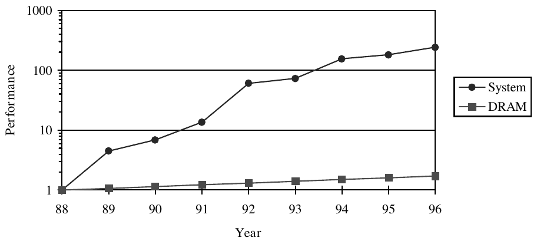

**图 1：** 1988 年以来的系统与 DRAM 性能。系统性能由 SPECfp92 衡量，DRAM 性能由行访问时间衡量。所有数值都归一化到其 1988 年的等价值（来源：Internet SPECtable，ftp://ftp.cs.toronto.edu/pub/jdd/spectable）。

在各种降低延迟的技术中，高速缓存层次结构 [Smith 1982] 居于核心。高速缓存所用的静态 RAM（SRAM）一直能够跟上处理器的内存请求速率，但用作主存仍然过于昂贵。对于寻址模式具有高局部性的程序，大型高速缓存层次结构已被证明能有效降低平均内存访问惩罚；但科学计算及其他数据密集型程序仍经常有一半以上的运行时间因等待内存请求而停顿 [Mowry et al. 1992]。许多此类应用以大型稠密矩阵操作为基础，其数据复用往往很少，因而可能击败高速缓存策略。

这些应用不佳的高速缓存利用率，部分源于大多数高速缓存采用“按需”内存读取策略。只有当处理器请求某个字且发现它不在高速缓存中时，该策略才会从主存将数据读入高速缓存。图 2(a) 展示了这种情况：上方时间线表示计算，其中包括在高速缓存层次内满足的内存引用；下方时间线表示主存访问时间。图中，与内存引用 $r_1$、 $r_2$ 和 $r_3$ 相关的数据块不在高速缓存层次中，因而必须从主存读取。假设使用简单的按序执行单元，处理器会在等待相应高速缓存块读入期间停顿。数据从主存返回后，会被缓存并转发给处理器，此时计算才能继续。

请注意，这种读取策略必然使高速缓存块的首次访问未命中，因为高速缓存中只保存以前访问过的数据。这种高速缓存未命中称为冷启动未命中或强制性未命中。此外，如果被引用的数据属于大型数组操作，那么该数据使用后很可能被替换，以便为流式进入高速缓存的新数组元素腾出空间。稍后再次需要同一数据块时，处理器必须再次将其从主存读入，承担完整的主存访问延迟。这称为容量未命中。

如果我们用数据预取操作增强高速缓存的按需读取策略，就能避免许多这类未命中。数据预取不会等待高速缓存未命中后才读取内存，而是预测这类未命中，并在真正的内存引用之前向内存系统发出读取请求。预取与处理器计算并行进行，为内存系统留出将所需数据从主存传输到高速缓存的时间。理想情况下，预取恰好在处理器访问所需数据之前完成，从而不会使处理器停顿。

发起数据预取的一种日益常见的机制，是由处理器发出显式的读取指令。这种读取指令至少会指定一个要被读入高速缓存空间的数据字地址。执行读取指令时，该地址只是被传递给内存系统，处理器不会被迫等待响应。高速缓存对读取指令的响应与普通加载指令类似，区别在于被引用的字缓存后不会转发给处理器。

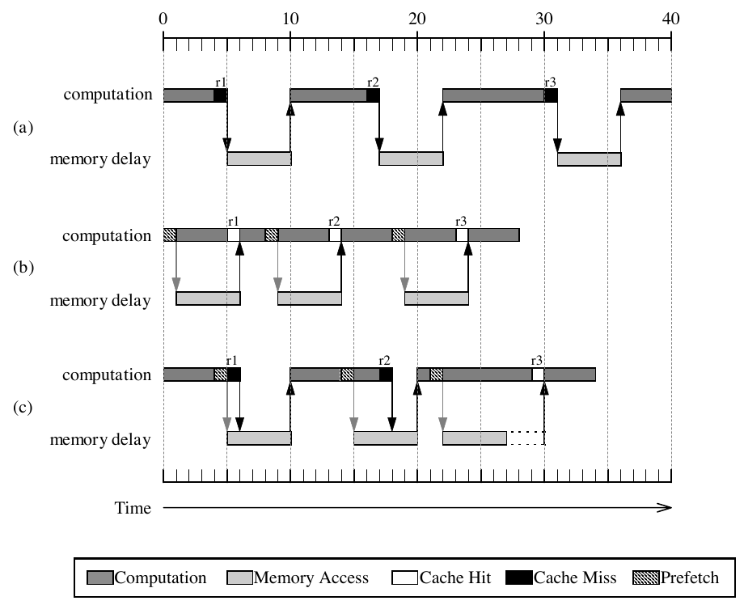

**图 2：** 执行时间图，分别假设：(a) 不预取；(b) 完美预取；(c) 退化的预取。

图 2(b) 说明如何利用预取改进图 2(a) 的按需读取执行时间。在这里，计算与内存访问重叠，隐藏了主存访问延迟，从而缩短总运行时间。该图表示理想情况：预取数据恰好在处理器请求它时到达。

图 2(c) 给出了不那么乐观的情况。对引用 $r_1$ 和 $r_2$ 的预取发出得太晚，无法避免处理器停顿，但 $r_2$ 的数据仍读取得足够早，因而产生了部分收益。 $r_3$ 的数据足够早地到达，能隐藏全部内存延迟，但在处理器使用它之前，必须在处理器高速缓存中保留一段时间。这段时间内，预取数据受高速缓存替换策略影响，可能在使用前被逐出高速缓存。发生这种情况时，该预取称为无用预取，因为提前读取数据块没有产生任何性能收益。

过早预取的数据块还可能把处理器当前正在使用的数据逐出高速缓存，导致所谓的高速缓存污染 [Casmira and Kaeli 1995]。这一效应应与普通的高速缓存替换未命中区分开。如果一次预取造成了不使用预取时本不会发生的高速缓存未命中，这就定义为高速缓存污染。然而，如果预取块逐出的缓存块在预取块被使用之后才受到引用，那么这是普通的替换未命中，因为无论是否使用预取，该高速缓存未命中都会发生。

预取在内存系统中还有一种更隐蔽的次生效应。图 2(a) 中，三个内存请求在程序启动后的前 31 个时间单位内发生；图 2(b) 中，它们被压缩到 19 个时间单位内。预取消除处理器停顿周期，实际上提高了处理器发出内存请求的频率。内存系统必须按照这一更高带宽进行设计，否则可能饱和，使预取收益归零 [Burger 1997]。对总线利用率通常高于单处理器系统的多处理器而言，这一点尤为突出。

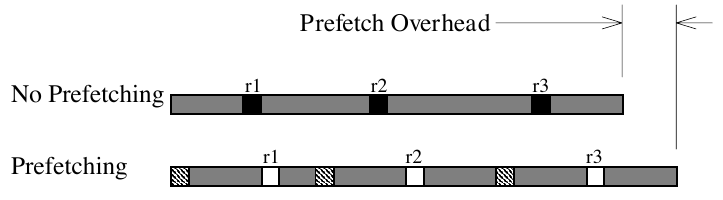

**图 3：** 软件预取的开销。

有趣的是，尽管软件预取会向执行流中添加指令，它仍能缩短运行时间。图 3 忽略图 2 中的内存效应，只显示运行时间的计算组成部分。可以看到，三条预取指令实际上增加了处理器完成的工作量。

人们还提出了若干不需要显式读取指令的硬件预取技术。这些技术使用专用硬件监视处理器，尝试推断预取机会。虽然硬件预取没有指令开销，但它生成的不必要预取往往多于软件预取。这是因为硬件方案在没有编译时信息的情况下对未来内存访问进行推测。如果推测错误，实际不需要的高速缓存块会被读入高速缓存。不必要的预取虽然不影响程序的正确行为，却可能导致高速缓存污染，并消耗内存带宽。

数据预取要想有效，必须以一种能使预取及时、有用且开销很小的方式实现。设计采用预取策略的系统时，还必须考虑内存系统中的次生效应。尽管存在这些障碍，数据预取仍有望通过让计算与内存访问重叠，显著缩短程序的总体执行时间。预取策略多种多样；尚未提出能提供最优性能的单一策略。以下各节将通过比较相对优缺点，考察不同的预取方法。

## 2. 背景

某种形式的预取自 20 世纪 60 年代中期就已存在。早期的高速缓存设计研究 [Anacker and Wang 1967] 已经认识到，从主存将多个字读入高速缓存能够带来收益。这种块式内存传输实际上会预取当前引用周围的字，期望利用内存引用的空间局部性。后来，IBM 370/168 和 Amdahl 470V 实现了对独立高速缓存块的硬件预取 [Smith 1978]。软件技术出现得更晚。Smith 在其高速缓存综述 [Smith 1982] 中首次暗示了这一思路，但当时对其用处持怀疑态度。后来，Porterfield [1989] 提出“高速缓存加载指令”的想法，几乎同一时期 Motorola 在 88110 中引入“touch load”指令，Intel 也提议在 i486 中使用“虚假读取”操作 [Fu et al. 1989]。今天，几乎所有微处理器 ISA 都包含专门设计用来将数据带入处理器高速缓存层次的显式指令。

应当注意，预取并不局限于将数据从主存读入处理器高速缓存。它是一种普遍适用的技术：在处理器真正需要内存对象之前，提前将其移到内存层次中更高的一级。人们通常使用指令与文件系统预取机制防止处理器停顿，例如参见 Young and Shekita [1993] 或 Patterson and Gibson [1994]。为了简洁起见，本文只考察适用于驻留在内存中的数据对象的技术。

非阻塞加载指令与数据预取有很多相似之处。像预取一样，这些指令也会在真正使用数据之前发出，以利用处理器与内存子系统之间的并行性。但它们不是把数据加载到高速缓存，而是将指定的字直接放入处理器寄存器。非阻塞加载属于绑定预取：之所以这样命名，是因为预取发出时，预取变量的值就与一个有名位置（此处为处理器寄存器）绑定。本文不再讨论非阻塞加载，但会考察其他形式的绑定预取。

数据预取在文献中受到了广泛关注，它被视为提升多处理器系统性能的潜在手段。这一兴趣源于降低此类系统中尤为高昂的内存延迟。在对称多处理器中，共享总线和内存模块等共享资源争用加剧，因而内存延迟往往很高。分布式内存多处理器中的内存延迟更加明显，因为内存请求可能必须穿过互连网络才能得到满足。预取可以遮蔽部分或全部这些显著的内存延迟，因而能有效加速多处理器应用。

由于人们重点关注多处理器系统中的预取，下文讨论的许多预取机制都主要或仅在这一场景下得到研究。但其中数种机制在单处理器系统中也可能有效，因此，只有当预取机制是多处理器系统所固有时，本文才把多处理器预取作为独立主题处理。

## 3. 软件数据预取

大多数当代微处理器都支持某种可用来实现预取的读取指令 [Bernstein et al. 1995; Santhanam et al. 1997; Yeager 1996]。读取指令最简单的实现，可以是加载到一个硬连线为零的处理器寄存器。稍微复杂一些的实现会向内存系统提供预取块将如何使用的提示。例如，在数据可以以不同共享状态预取的多处理器中，这类信息可能很有用。

尽管具体实现各不相同，所有读取指令都具有一些共同特征。读取是非阻塞内存操作，因而要求使用无锁死高速缓存 [Kroft 1981]，允许预取绕过高速缓存中其他尚未完成的内存操作。预取通常以读取指令不会引发异常的方式实现。为预取抑制异常，是为了确保它仍是可选的优化功能，不影响程序正确性，也不会引发缺页或其他内存异常等巨大且可能不必要的开销。

与其他预取策略相比，实现软件预取所需的硬件很少。该方法的大部分复杂性在于，如何审慎地把读取指令放到目标应用中。选择程序中读取指令相对于与之匹配的加载或存储指令的位置，这项任务称为预取调度。

实践中，无法精确预测应在何时调度预取，以使数据恰好在处理器请求它时到达高速缓存，如图 2(b) 所示。预取与匹配内存引用之间的执行时间可能变化，内存延迟也会变化。这些不确定性无法在编译时预测，因而要求在程序中调度预取指令时仔细考量。

读取指令可以由程序员添加，也可以在优化遍中由编译器添加。许多优化在程序中出现得过于频繁，或者手工实现过于繁琐；与它们不同，预取调度往往可以由程序员有效完成。研究表明，只向程序添加少数预取指示，就可以大幅提升性能 [Mowry and Gupta 1991]。然而，如果要将编程工作量降到最低，或者程序包含很多预取机会，就可能需要编译器支持。

无论是手工编写还是由编译器自动完成，预取最常用于负责大型数组计算的循环内。这类循环广泛存在于科学计算程序中，高速缓存利用率不佳，并且数组引用模式往往可预测，因而提供了绝佳的预取机会。在编译时确定这些模式后，可以把读取指令放入循环体，使当前迭代预取未来某次迭代的数据。

作为基于循环的预取示例，考虑图 4(a) 的代码段。该循环计算向量 $a$ 和 $b$ 的内积，其方式类似矩阵乘法计算的最内层循环。如果我们假设每个高速缓存块包含四个字，该代码段将每四次迭代发生一次高速缓存未命中。我们可以通过添加图 4(b) 所示的预取指示，尝试避免这些未命中。请注意，该图是编译器将生成的汇编代码的源代码表示。

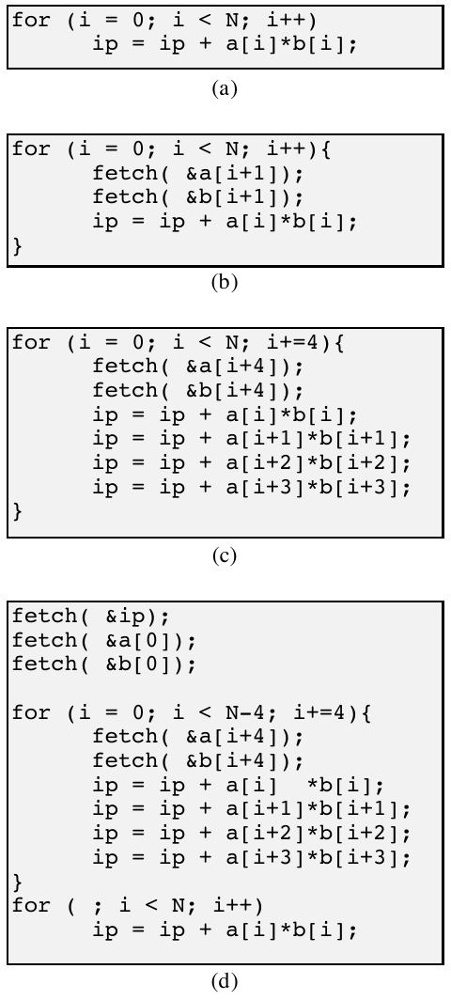

**图 4：** 内积计算：(a) 不预取；(b) 简单预取；(c) 结合循环展开的预取；(d) 软件流水化。

图 4 中的完整代码如下：

```c
/* (a) No prefetching */
for (i = 0; i < N; i++)
    ip = ip + a[i] * b[i];

/* (b) Simple prefetching */
for (i = 0; i < N; i++) {
    fetch(&a[i + 1]);
    fetch(&b[i + 1]);
    ip = ip + a[i] * b[i];
}

/* (c) Prefetching with loop unrolling */
for (i = 0; i < N; i += 4) {
    fetch(&a[i + 4]);
    fetch(&b[i + 4]);
    ip = ip + a[i] * b[i];
    ip = ip + a[i + 1] * b[i + 1];
    ip = ip + a[i + 2] * b[i + 2];
    ip = ip + a[i + 3] * b[i + 3];
}

/* (d) Software pipelining */
fetch(&ip);
fetch(&a[0]);
fetch(&b[0]);
for (i = 0; i < N - 4; i += 4) {
    fetch(&a[i + 4]);
    fetch(&b[i + 4]);
    ip = ip + a[i] * b[i];
    ip = ip + a[i + 1] * b[i + 1];
    ip = ip + a[i + 2] * b[i + 2];
    ip = ip + a[i + 3] * b[i + 3];
}
for (; i < N; i++)
    ip = ip + a[i] * b[i];
```

这种简单预取方法存在若干问题。首先，我们不必在循环的每次迭代中都预取，因为每次读取实际上会将四个字（一个高速缓存块）带入高速缓存。多余的预取操作虽然并非非法，却没有必要，会使性能下降。假设 $a$ 和 $b$ 都按高速缓存块对齐，只应每四次迭代预取一次。一种解决方法是在读取指示外围加上一个 `if` 条件，仅当 $i$ 模 4 等于 0 时成立。但这种显式预取谓词的开销很可能抵消预取的收益，因而应该避免。更好的解决方法是将循环展开 $r$ 倍，其中 $r$ 等于每个高速缓存块中要预取的字数。如图 4(c) 所示，展开循环意味着将循环体复制 $r$ 次，并把循环步长增大为 $r$。读取指示不会复制，用于计算预取地址的索引值则从 $i+1$ 改为 $i+r$。

图 4(c) 的代码段消除了大多数高速缓存未命中和不必要的预取，但仍有改进空间。循环第一次迭代时会发生高速缓存未命中，因为从未为初始迭代发出预取。展开循环的最后一次迭代中会出现不必要的预取，因为读取命令尝试访问超过循环索引边界的数据。使用图 4(d) 所示的软件流水化技术，可以解决这两个问题。在该图中，我们从循环体中提取选定的代码段，并将它们分别放到原循环两侧。主循环之前添加了读取语句，用于预取主循环第一次迭代的数据，包括 `ip`。这段代码称为循环前导（prolog）。主循环末尾添加了循环后尾（epilog），用于执行最后的内积计算，而不会发起任何不必要的预取指令。

如果每个循环引用前都有一次匹配的预取，就称图 4 的代码覆盖了所有循环引用。但要使这些预取真正有效，可能还需要最后一次改进。图 4 中的示例隐含假定：在真正使用数据之前一次迭代预取，就足以隐藏主存访问延迟。但事实未必如此。早期研究 [Callahan et al. 1991] 采用这一假定，Klaiber and Levy [1991] 却认识到它并不具有足够的通用性。当循环的计算体很小时，可能必须提前 $d$ 次迭代发起预取：

$$
d=\left\lceil\frac{l}{s}\right\rceil,
$$

其中， $l$ 是以处理器周期计量的平均内存延迟， $s$ 是穿过一次循环迭代的最短可能执行路径的估计周期时间，其中包括预取开销。选择贯穿一次循环迭代的最短执行路径，并使用上取整算子，是为了让该计算保守偏大，从而提高预取数据在处理器请求前已经进入高速缓存的概率。

回到图 4(d) 的主循环，我们假设平均未命中延迟为 100 个处理器周期，一次循环迭代为 45 个周期，那么最终的内积循环变换如图 5 所示。

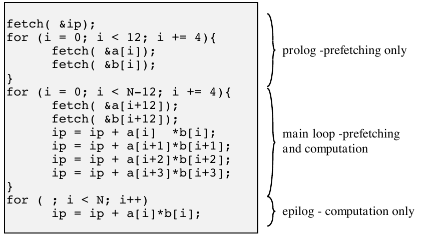

**图 5：** 最终的内积循环变换。

图 5 中的完整代码如下：

```c
fetch(&ip);
for (i = 0; i < 12; i += 4) {
    fetch(&a[i]);
    fetch(&b[i]);
}
for (i = 0; i < N - 12; i += 4) {
    fetch(&a[i + 12]);
    fetch(&b[i + 12]);
    ip = ip + a[i] * b[i];
    ip = ip + a[i + 1] * b[i + 1];
    ip = ip + a[i + 2] * b[i + 2];
    ip = ip + a[i + 3] * b[i + 3];
}
for (; i < N; i++)
    ip = ip + a[i] * b[i];
```

上述循环变换相当机械，稍作改进后可以递归应用于嵌套循环。人们基于这一方法开发了复杂的编译器算法，用于在编译器优化遍中自动添加读取指令，但成效有好有坏 [Mowry et al. 1992]。Bernstein et al. [1995] 在基于 PowerPC 601 的系统上，测量了 12 个科学基准程序在使用与不使用预取时的运行时间。预取带来的典型改善不足 12%；不过有一个基准程序快了 22%，另有三个程序却因预取指令开销而略微变慢。Santhanam et al. [Kroft 1981] 发现，启用预取后，十个 SPECfp95 基准程序中有六个在基于 PA8000 的系统上快了 26%–98%。余下四个 SPECfp95 程序中，三个的运行时间改善不足 7%，一个反而变慢了 12%。

编译器必须能够可靠地预测内存访问模式，因此预取通常仅限于这类循环：其中包含数组访问，且数组下标是循环下标的线性函数。这种循环在科学计算代码中相对常见，在通用应用中却少得多。人们尝试为通用应用建立类似的软件预取策略，但其不规则的引用模式阻碍了这些尝试 [Chen et al. 1991; Lipasti et al. 1995; Luk and Mowry 1996]。由于通用应用典型的控制结构很复杂，能够可靠预测某一数据何时被访问的窗口往往很有限。此外，使用图和链表等数据结构时，一个高速缓存块被访问后，后续若干高速缓存块也会被请求的可能性更低。最后，许多通用应用的时间局部性相对较高，往往带来高速缓存的高利用率，从而减少预取的收益。

即使仅限于规整的循环结构，显式读取指令仍会带来性能惩罚，使用软件预取时必须对此加以考虑。读取指令增加处理器开销，不仅是因为它们需要额外执行周期，也因为必须计算预取源地址并将其保存在处理器中。理想情况下，该预取地址应得到保留，以便匹配的加载或存储指令无须再次计算它。但分配并保留寄存器空间来存放预取地址，会使编译器能够分配给其他活跃变量的寄存器空间减少。因而，添加读取指令会增大寄存器压力，进而可能产生额外的溢出代码，用于管理由于寄存器空间不足而“溢出”到内存的变量。当预取距离大于 1 时，这一问题更加严重，因为这意味着要么保留 $d$ 个地址寄存器来存放多个预取地址，要么在没有足够寄存器时将这些地址存入内存。

将图 5 中的变换后循环与原始循环比较可以看到，软件预取还导致代码大幅膨胀，进而可能降低指令高速缓存性能。最后，软件预取是静态完成的，因而无法检测预取块何时被过早逐出、需要再次读取。

## 4. 硬件数据预取

人们提出了若干硬件预取方案，不需要程序员或编译器干预，就能为系统增加预取能力。既有可执行文件无须任何修改，因而完全消除了指令开销。硬件预取还可以利用运行时信息，从而有可能进一步提高预取效果。

### 4.1 顺序预取

大多数（但并非全部）预取方案都按高速缓存块为单位，将数据从主存读入处理器高速缓存。但应当注意，包含多字的高速缓存块本身就是一种数据预取。高速缓存将连续内存字组合成一个单元，利用空间局部性原理，隐式预取很可能在不久的将来受到引用的数据。

大型高速缓存块在预取数据方面的效果，受随之而来的高速缓存污染限制。换言之，高速缓存块越大，为新块腾出空间而从高速缓存逐出的潜在有用数据也越多。在拥有私有高速缓存的共享内存多处理器中，大型高速缓存块还可能引起假共享 [Lilja 1993]。当两个或更多处理器想访问同一高速缓存块内的不同字，且至少有一次访问是存储时，就会发生假共享。尽管这些访问在逻辑上针对不同字，高速缓存硬件却无法区分，因为它只以完整高速缓存块为单位工作。所以，这些访问会被当作针对同一对象的操作，系统会生成高速缓存一致性流量，以确保对某个块的存储修改被缓存了该块的所有处理器看到。在假共享情况下，这类流量没有必要，因为只有执行存储的处理器会引用正在写入的字。增大高速缓存块，会增加两个处理器共享同一块数据的概率，因而也更可能发生假共享。

顺序预取可以利用空间局部性，而不会引入与大型高速缓存块相关的部分问题。最简单的顺序预取方案是单块前瞻（one block lookahead，OBL）方法的变体：当块 $b$ 被访问时，发起对块 $b+1$ 的预取。这与简单将块大小翻倍不同，因为预取块在高速缓存替换和一致性策略上会被单独处理。例如，某个大块可能包含一个频繁引用的字，以及几个并未使用的字。假设采用 LRU 替换策略，即使实际使用的只是该块中一部分数据，整个块也会被保留。如果用两个较小块取代这个大块，就可以逐出其中一块，为更活跃的数据腾出空间。同样，使用较小的高速缓存块还能降低假共享的概率。

OBL 的不同实现，区别在于对块 $b$ 的哪种访问会引发对 $b+1$ 的预取。Smith [1982] 总结了若干方法，本文将讨论其中的未命中时预取算法和标记预取算法。未命中时预取算法很简单：每当对块 $b$ 的访问发生高速缓存未命中时，就发起对块 $b+1$ 的预取。如果 $b+1$ 已经在高速缓存中，就不发起内存访问。标记预取算法为每个内存块关联一个标记位。该位用于检测某个块是否被按需读取，或某个预取块是否首次受到引用。在两种情况下，都会读取下一个顺序块。

Smith 通过一组跟踪驱动模拟发现，标记预取可将统一高速缓存（同时存放指令和数据）的未命中率降低 50%–90%。未命中时预取对未命中率的降低效果，不到标记预取的一半。图 6 展示两种算法访问三个连续块时的行为，说明了未命中时预取效果较差的原因。严格顺序访问模式在采用未命中时预取算法时，每隔一个高速缓存块就会未命中；而同一访问模式采用标记预取算法时，只发生一次未命中。

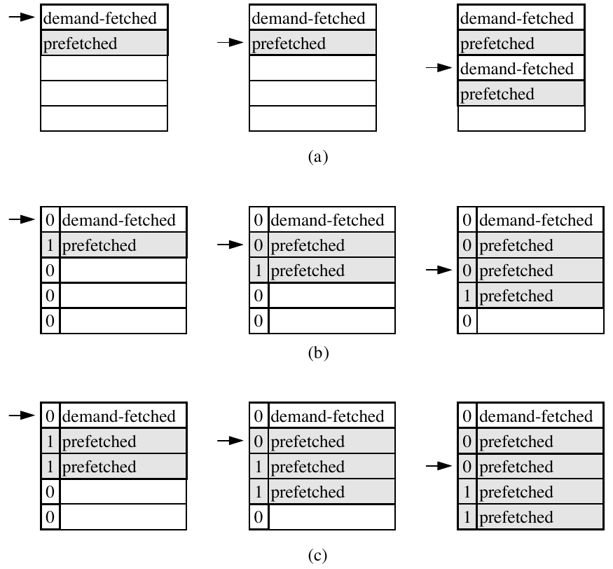

**图 6：** 三种顺序预取：(a) 未命中时预取；(b) 标记预取；(c) $K=2$ 的顺序预取。

HP PA7200 [Chan et al. 1996] 是使用 OBL 预取硬件的当代微处理器之一。PA7200 以定向或非定向模式实现标记预取。非定向模式预取下一条顺序高速缓存线。定向模式的预取方向（向前或向后）和距离，可以根据加载或存储指令中编码的前/后递增量确定。也就是说，当地址寄存器内容自动递增时，会预取与新地址相关的高速缓存块。与不预取的基线比较，PA7200 在 10 个 SPECfp95 基准程序上的运行时间改善范围为 0%–80% [VanderWiel et al. 1997]。尽管性能取决于应用，但除了两个程序以外，其余程序在启用预取后都快了 20% 以上。

OBL 方案的一个缺点是，预取可能没有在真正使用数据之前足够早地发起，从而无法避免处理器因内存而停顿。例如，紧密循环产生的顺序访问流，可能无法在使用块 $b$ 与请求块 $b+1$ 之间留出足够的提前量。要解决这一问题，可以把按需读取后的预取块数从 1 增加到 $K$， $K$ 称为预取度。预取 $K\gt{}1$ 个后续块，有助于内存系统领先处理器对顺序数据块的快速请求。每当预取块 $b$ 首次被访问时，系统都会查询高速缓存，检查块 $b+1,\ldots,b+K$ 是否在高速缓存中；如果不在，就从内存读取缺失的块。当 $K=1$ 时，该方案与标记 OBL 预取完全相同。

增加预取度能够在具有高空间局部性的代码段中降低未命中率，但在空间局部性很低的程序阶段，顺序预取会产生额外流量和高速缓存污染。Przybylski [1990] 发现，当 $K$ 大于 1 时，这类开销往往使顺序预取变得不可行。

Dahlgren et al. [1993] 提出了一种自适应顺序预取策略，允许 $K$ 在程序执行期间变化，使它与程序在某一时刻呈现的空间局部性程度匹配。为此，高速缓存会周期性计算“预取效率”指标，用来表征程序当前的空间局部性特征。预取效率定义为有用预取数与预取总数之比；每当预取块导致高速缓存命中时，就发生一次有用预取。 $K$ 初始化为 1；每当预取效率超过预定上阈值时， $K$ 递增；每当效率低于下阈值时， $K$ 递减，如图 7 所示。

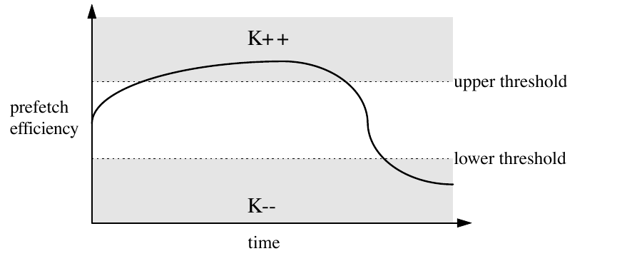

**图 7：** 顺序自适应预取。

如果 $K$ 降为 0，预取实际上就被禁用。此时，预取硬件开始监视：块 $b-1$ 在高速缓存中时，块 $b$ 未命中的频率是多少；如果该数与未命中总数的相应比率超过预取效率下阈值，就重新启动预取。共享内存多处理器的模拟发现，自适应预取相比标记预取可以大幅降低高速缓存未命中率。但两种方案的模拟运行时间只有很小差异。自适应顺序预取较低的未命中率，部分被增加的内存流量与争用开销抵消。

Jouppi [1990] 提出一种方法：在将 $K$ 个预取块带入高速缓存之前，先把它们放入 FIFO 流缓冲区。每当引用某个缓冲区项时，它都会被带入高速缓存，余下数据块向队头移动，同时新的数据块被预取到队尾。预取数据不会直接放入高速缓存，因而该方案避免了所有高速缓存污染。但如果高速缓存未命中，且所需数据块也不在流缓冲区的队头，缓冲区就会被清空。因此，预取块必须按它们进入缓冲区的顺序被访问，流缓冲区才能带来性能收益。

Palacharla and Kessler [1994] 研究了作为大型二级高速缓存的经济替代方案的流缓冲区。一级高速缓存未命中时，系统会分配若干流缓冲区之一来服务新引用流。流缓冲区按 LRU 顺序分配；新分配的缓冲区会立即将未命中块之后的 $K$ 个块读入其中。Palacharla and Kessler 的模拟研究发现，八个流缓冲区且 $K=2$ 可以提供足够的性能。在这些参数下，流缓冲区命中率（由流缓冲区满足的一级高速缓存未命中占比）通常为 50%–90%。

但大量不必要的预取使内存带宽需求急剧上升。为减轻这一影响，系统使用一个小型历史缓冲区，记录最近的一级高速缓存未命中。当该历史缓冲区表明块 $b$ 和 $b+1$ 都曾未命中时，系统分配一条流，并将块 $b+2,\ldots,b+K+1$ 预取到缓冲区中。这种更有选择性的流分配策略降低了带宽需求，代价是流缓冲区命中率略有下降。Palacharla and Kessler 描述的流缓冲区被证明是大型二级高速缓存的经济替代方案，最终被纳入 Cray T3E 多处理器 [Oberlin et al. 1996]。

总体而言，顺序预取技术无须修改既有可执行文件，并且可以用相对简单的硬件实现。但与软件预取相比，顺序硬件预取遇到非顺序内存访问模式时表现很差。标量引用或大步长数组访问可能导致不必要的预取，因为这类访问模式不具备顺序预取所依赖的空间局部性。为了支持带步长和其他不规则数据访问模式的预取，人们提出了若干更复杂的硬件预取技术。

### 4.2 任意步长的预取

人们提出了若干技术，使用专用逻辑监视处理器的地址引用模式，以检测源自循环结构的常量步长数组引用 [Baer and Chen 1991; Fu et al. 1992; Sklenar 1992]。其做法是比较加载或存储指令连续使用的地址。Chen and Baer [1995] 的技术或许是迄今提出的最激进方案。为了说明其设计，假设内存指令 $m_i$ 在连续三次循环迭代中引用地址 $a_1$、 $a_2$ 和 $a_3$。如果

$$
(a_2-a_1)=\Delta\ne 0,
$$

就会为 $m_i$ 发起预取，此处假定 $\Delta$ 是一系列数组访问的步长。第一个预取地址为

$$
A_3=a_2+\Delta,
$$

其中 $A_3$ 是对观测地址 $a_3$ 的预测值。预取将按此方式持续，直到 $A_n\ne a_n$。

该方法要求保存某条内存指令上一次使用的地址，以及最近检测到的步长（如果存在）。显然不可能记录程序中每条内存指令的引用历史。因此，一个名为引用预测表（reference prediction table，RPT）的独立高速缓存，只为最近使用的内存指令保存这些信息。RPT 的组织结构见图 8。表项包含内存指令的地址、该指令上一次访问的地址、已确立步长的表项的步长值，以及记录表项当前状态的状态字段。RPT 表项的状态图见图 9。

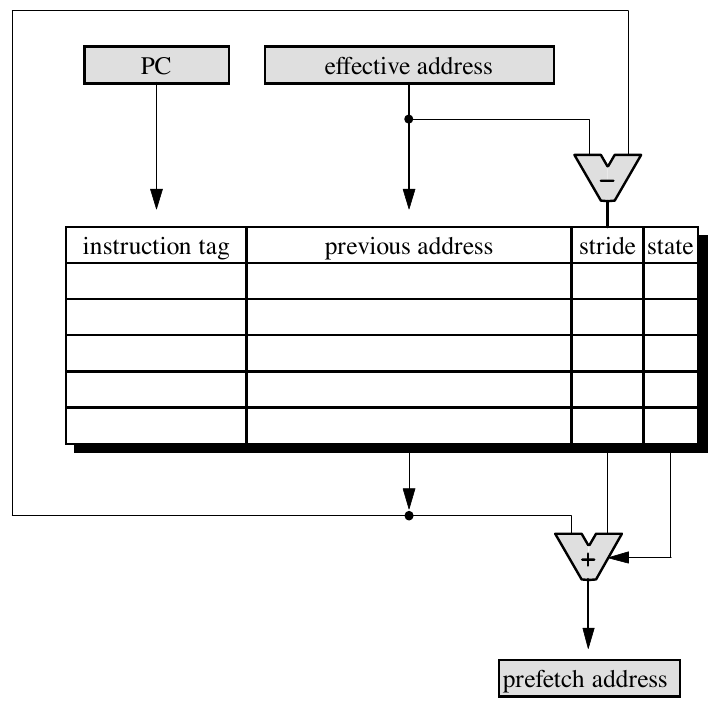

**图 8：** 引用预测表表项的状态转移图。

RPT 由 CPU 的程序计数器（PC）索引。内存指令 $m_i$ 首次执行时，系统为它在 RPT 中创建一个表项，并将状态设为初始，表示尚未为该指令发起预取。如果 $m_i$ 在其 RPT 表项被逐出之前再次执行，系统就用当前有效地址减去 RPT 中保存的上一地址，计算步长值。为了说明 RPT 的功能，考虑图 10 中的矩阵乘法代码及相关 RPT 表项。

该示例只考虑数组 $a$、 $b$ 和 $c$ 的加载指令，并假设三个数组分别从地址 10000、20000 和 30000 开始。为简化起见，还假设每个高速缓存块只包含一个字。最内层循环完成第一次迭代后，RPT 状态如图 10(b) 所示，图中用伪代码助记符表示指令地址。由于 RPT 尚未包含这些指令的表项，步长字段初始化为零，每个表项都处于初始状态。三次引用全部发生高速缓存未命中。

第二次迭代后，按图 10(c) 所示计算步长。数组 $b$ 和 $c$ 引用的表项被置于过渡状态，因为新计算的步长与上一步长不匹配。该状态表示指令的引用模式可能正在过渡；如果“有效地址 $+$ 步长”所得地址的数据块尚未在高速缓存中，就会发出一次试探性预取。数组 $a$ 引用的 RPT 表项被置于稳定状态，因为上一步长与当前步长相同。该表项的步长为零，所以不会为这条指令发起预取。

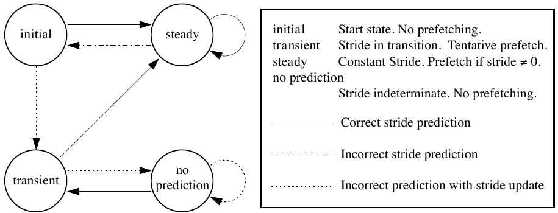

**图 9：** 矩阵乘法执行期间的 RPT。

第三次迭代期间，上一次迭代中计算的试探步长得到确认，因此数组 $b$ 和 $c$ 引用的表项转入稳定状态。如果预取距离 1 已经足够，第二次迭代中发出的预取将使 $b$ 和 $c$ 的引用命中高速缓存。

由上述讨论可知，RPT 能正确处理带步长的数组引用，因而改进了顺序策略。但按上述实现，RPT 仍然把预取距离限制为一次循环迭代。为弥补这一不足，可以在 RPT 中添加一个距离字段，显式指定预取距离。此时预取地址按下式计算：

$$
\text{有效地址}+(\text{步长}\times\text{距离}).
$$

添加距离字段后，需要一种方法来为给定 RPT 表项确定它的值。Chen and Baer 把 RPT 的维护与它作为预取引擎的使用分离，以计算合适的值。RPT 表项仍按上述方式在 PC 的指导下维护，但预取另由一个伪程序计数器发起；该计数器称为前瞻程序计数器（lookahead program counter，LA-PC），它可以领先 PC。PC 与 LA-PC 之差就是预取距离 $d$。添加前瞻程序计数器会引出若干实现问题，感兴趣的读者可参见 Baer and Chen [1991]。

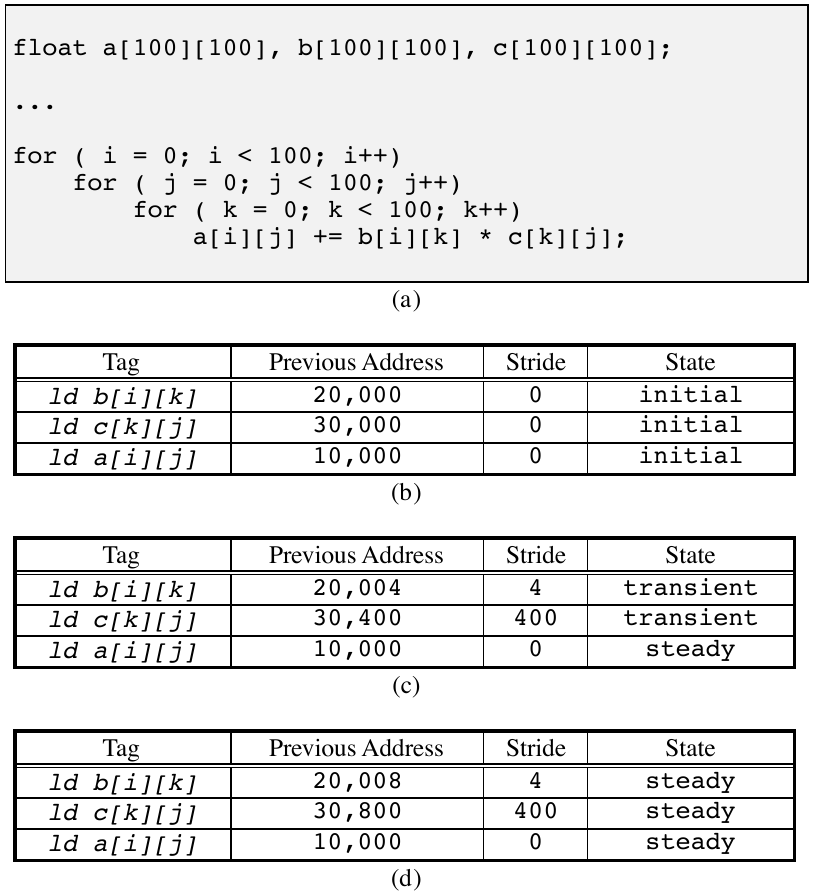

**图 10：** 访问链表元素的 `next` 字段，可以促使系统预取后续链表元素。

图 10(a) 的完整代码如下：

```c
float a[100][100], b[100][100], c[100][100];
...
for (i = 0; i < 100; i++)
    for (j = 0; j < 100; j++)
        for (k = 0; k < 100; k++)
            a[i][j] += b[i][k] * c[k][j];
```

图 10(b)–(d) 的 RPT 表项如下：

| 标记 | 上一地址 | 步长 | 状态 |
| --- | ---: | ---: | --- |
| `ld b[i][k]` | 20,000 | 0 | initial |
| `ld c[k][j]` | 30,000 | 0 | initial |
| `ld a[i][j]` | 10,000 | 0 | initial |

| 标记 | 上一地址 | 步长 | 状态 |
| --- | ---: | ---: | --- |
| `ld b[i][k]` | 20,004 | 4 | transient |
| `ld c[k][j]` | 30,400 | 400 | transient |
| `ld a[i][j]` | 10,000 | 0 | steady |

| 标记 | 上一地址 | 步长 | 状态 |
| --- | ---: | ---: | --- |
| `ld b[i][k]` | 20,008 | 4 | steady |
| `ld c[k][j]` | 30,800 | 400 | steady |
| `ld a[i][j]` | 10,000 | 0 | steady |

Chen and Baer [1994] 将 RPT 预取与 Mowry 的软件预取方案 [Mowry et al. 1992] 进行了比较，发现在模拟共享内存多处理器上，没有任何一种方法的性能始终更好。性能取决于该研究所用四个基准程序的各自特征。对于使用间接引用计算预取地址的某些不规则访问模式，软件预取更有效。RPT 可能无法为使用间接地址的指令建立访问模式，因为该指令可能生成不是以常量步长分隔的有效地址。RPT 在循环开始和结束时也比较低效。只有建立访问模式后，RPT 才会发出预取；这意味着数组数据的头两次迭代至少不会获得预取。Chen and Baer 还指出，使用 LA-PC 时，RPT 可能需要数次迭代，才能达到完全遮蔽内存延迟的预取距离。

最后，RPT 总会越过数组边界继续预取，因为必须出现一次错误预测，后续预取才会停止。但在循环的稳态期间，对于某些数组访问模式，RPT 可以动态调整预取距离，比软件方案更好地与内存延迟重叠。此外，软件预取会产生预取地址计算、读取指令执行以及溢出代码所带来的指令开销。

Dahlgren and Stenstrom [1995] 在分布式共享内存多处理器中比较了标记预取与 RPT 预取。根据六个基准程序的模拟运行时行为，他们得出结论：RPT 预取相对标记预取只有有限的性能收益；对于最常见的内存访问模式，标记预取的表现往往相当或更好。Dahlgren 表明，大多数数组步长小于块大小，因而已被标记预取策略覆盖。此外，某些标量引用具有有限的空间局部性，可由标记预取策略捕获，却无法被 RPT 机制捕获。但如果内存带宽有限，他们推测更保守的 RPT 预取机制可能更可取，因为它往往生成更少的无用预取。

与软件预取一样，大多数硬件预取机制都聚焦于非常规则的数组引用模式。但也有一些显著例外。例如，Harrison and Mehrotra [1994] 提出了 RPT 机制的扩展，允许预取由指针连接的数据对象。该方法向 RPT 添加字段，从而能检测由链表和稀疏矩阵等结构产生的间接引用步长。

Roth et al. [1998] 描述了另一种用于预取指针连接数据结构的硬件机制。像 RPT 及其派生机制一样，该方案使用一张硬件表，记录最近执行的加载指令。但这张表不是为单条指令建立引用模式，而是用来检测加载指令之间的依赖关系。更具体地说，该表记录最近执行的加载指令所加载的数据值，并检测这些值是否被用作后续加载的基地址。这种地址依赖在链表处理中很常见：一个链表元素的 `next` 指针被用作后续元素各字段的基地址，如图 11 所示。

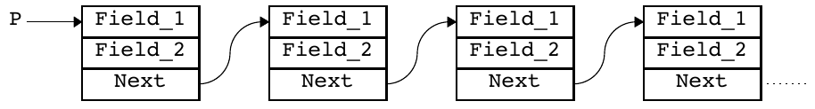

**图 11：** 向量–矩阵乘积计算的块预取。

硬件表一旦建立这些依赖关系，产生基地址的加载指令一执行，就会触发预取。例如，得知 `p->next` 的地址后，就可以预取 `p->next->field_1` 和 `p->next->field_2`。对 `p->next->next` 的预取可以发起进一步预取。但研究发现，这种激进的预取通常没有用，因为处理每个指针连接元素所需的时间相对较长，已经足以隐藏预取延迟。

Alexander and Kedem [1996] 提出一种预取机制，其基础观察是：某个给定地址发生高速缓存未命中后，往往会跟随一次属于相对可预测地址子集的未命中。为利用该特性，系统使用一张硬件表，把当前高速缓存未命中地址与一组可能的后继未命中地址关联起来。也就是说，当高速缓存未命中时，系统使用未命中块的地址索引该表，根据以前的观测找出最可能在下一次未命中时访问的块地址，然后为这些块发出预取。

但数据块并非预取到处理器高速缓存，而是预取到集成在 DRAM 存储器芯片上的 SRAM 缓冲区。当预取机制正确预测高速缓存未命中时，可以直接从 SRAM 缓冲区读取相应数据，避免相对耗时的 DRAM 访问。数据不会被带入处理器高速缓存层次，因为该方案会预取大量数据，以利用集成 DRAM 阵列与 SRAM 缓冲区之间的高片上带宽。Alexander and Kedem 发现，对一组科学与工程应用基准，包含 8–64 个高速缓存块的预取单元表现最好。每次高速缓存未命中最多预取四个这样的单元，平均预测准确率为 88%。

Joseph and Grunwald [1997] 采用类似方法，研究了使用 Markov 预测器驱动硬件数据预取机制。该机制在一张与 Alexander and Kedem [1996] 相似的硬件表中动态记录高速缓存未命中引用序列，尝试预测以前的未命中模式何时开始重复。当在表中找到当前高速缓存未命中地址时，系统会把对可能后续未命中的预取发送到预取请求队列。为防止高速缓存污染和浪费内存带宽，预取请求可以被另一类请求从队列中替换，后者属于更可能在不久的将来发生的引用序列。该概率由与给定引用相关的 Markov 链强度确定。

还有研究不是在内存指令上触发数据预取，而是提议在分支目标缓冲区（branch target buffer，BTB）[Smith 1981] 中存储的分支指令上触发 [Chang et al. 1994; Lui and Kaeli 1996]。当执行一条分支指令时，系统检查它在 BTB 中的表项，不仅预测分支目标地址，也预测采用所预测分支后将消费的数据。该方法的一个优点是，可以将多次内存操作与同一分支目标关联，从而减少支持预取所需的标记空间。

BTB 中控制预取的表项与 RPT 表项类似，包含上一数据地址、步长和表项状态字段。如果分支预测正确且相应内存指令确实执行，就会以类似 RPT 的方式更新这些字段。对这种分支预测式预取的研究表明，每个 BTB 表项最多需要三个预取表项，就能获得接近该方法最大收益的效果。对一种使用分支预测式预取、每个 BTB 表项含三个预取表项的处理器进行模拟，六个 SPECint92 基准的未命中率改善了 11.8%–63.9%。

## 5. 集成硬件与软件预取

软件预取完全依赖编译时分析，在用户程序中调度读取指令。相反，前文讨论的硬件技术不需要编译器或指令集支持，而是在运行时推断预取机会。注意到这两种方法各有优势，一些研究者提出了结合软件与硬件预取元素的机制。

Gornish and Veidenbaum [1994] 描述了标记硬件预取的一种变体：在编译时计算某一引用流的预取度 $K$，再把它传递给预取硬件。该方案为每个高速缓存表项关联一个预取度（prefetching degree，PD）字段。系统提供一条特殊读取指令，将指定块预取到高速缓存，然后设置存放该预取块的高速缓存表项的标记位和 PD 字段值。顺序引用流的前 $K$ 个块用该指令预取。当某个带标记的块 $b$ 被按需读取时，其 PD 字段中的值 $K_b$ 会加到块地址上，用于计算预取地址。新预取块的 PD 字段随后被设为 $K_b$，标记位也被置位。这保证了合适的 $K$ 值沿引用流传播。非顺序引用模式的预取仍由普通读取指令处理。

Zhang and Torrellas [1995] 提出了一种支持不规则数据结构预取的集成技术。该技术为内存位置加标记，使引用某个数据对象的一个元素时，会发起对被引用对象内其他元素，或对该对象所指向对象的预取。因而，数组元素和由指针连接的数据结构都可以预取。该方法依靠编译器初始化内存中的标记，实际预取则由内存系统内的硬件处理。

Chen [1995] 提出使用可编程预取引擎，作为第 4.2 节所述 RPT 的扩展。Chen 的预取引擎与 RPT 的区别在于，标记、地址和步长信息由程序提供，而不是由硬件动态建立。在进入可从预取中受益的循环结构之前，程序先向引擎插入表项。预取引擎编程后，工作方式与 RPT 很相似：当处理器程序计数器与预取引擎中某一标记字段匹配时，发起预取。

VanderWiel and Lilja [1999] 提出了一种位于处理器之外的预取引擎。该引擎是一个简单处理器，执行自己的程序，为 CPU 预取数据。通过共享二级高速缓存，引擎与 CPU 之间建立生产者–消费者关系：引擎把新数据块预取到高速缓存，但只在处理器访问了之前预取的数据之后才这样做。处理器还会通过向预取引擎支持逻辑中的内存映射寄存器写入控制信息，部分指导预取引擎的行为。

这些集成技术旨在利用编译时程序信息，同时避免引入像纯软件预取那么多的指令开销。纯硬件预取中的大部分推测也被消除，因而不必要的预取更少。尽管尚无商用系统支持这种预取模型，但用于评估上述技术的模拟研究表明，其性能可以超过纯软件或纯硬件预取机制。

## 6. 多处理器中的预取

除上述预取机制外，人们还提出了若干多处理器专用预取技术。这些系统中的预取与单处理器至少有三点不同。第一，多处理器应用通常采用与单处理器不同的编程范式，这些范式可以提供额外的数组引用信息，使预取机制更准确。第二，多处理器系统经常包含额外的内存层次，为预取提供不同来源和目的地。最后，多处理器往往有更高的内存延迟和更敏感的内存互连，因而数据预取的性能影响会变得更加重要。

Fu and Patel [1991] 考察了数据预取如何改善向量化多处理器应用的性能。该研究假设向量操作由程序员显式指定，并由指令集支持。由于向量化程序以一系列向量和矩阵操作描述计算，无须编译器分析或步长检测硬件就能建立内存访问模式。向量引用中编码的步长信息可直接提供给处理器高速缓存及相关预取硬件。

研究考察了两种预取策略。第一种是未命中时预取的变体：当高速缓存未命中时，将后续 $K$ 个连续块读入处理器高速缓存。该实现与前文未命中时预取的区别是，只为标量和步长小于或等于高速缓存块大小的向量引用发出预取。第二种策略在此称为向量预取，它与第一种策略类似，但也会为大步长向量引用发出预取。如果对块 $b$ 的向量引用未命中，就会读取块

$$
b,\ b+\text{步长},\ b+(2\times\text{步长}),\ldots,\ b+(K\times\text{步长}).
$$

Fu and Patel 在 Alliant FX/8 模拟器上发现，两种预取策略相比不预取都提高了性能。假设较小的高速缓存块时，加速更显著：小块会限制不预取高速缓存所能捕获的空间局部性，而预取高速缓存可以通过预取更多块来抵消这一劣势。与其他研究不同，Fu and Patel 发现，即使 $K$ 高达 32，两种顺序预取策略仍然有效。这似乎与早期研究冲突，早期研究发现 $K\gt{}1$ 时顺序预取会使性能下降。其中很大一部分差异，可以由 Fu and Patel 的预取方案如何利用向量指令来解释。对未命中时预取而言，指令指定大步长时会抑制预取，从而避免使原始策略性能下降的无用预取。向量预取虽也会为大步长引用模式发出预取，但它能利用程序提供的步长信息，因而比其他顺序方案更精确。

比较两种方案可以发现，大步长应用从向量预取中获益最多，这与预期相符。对于以标量和单位步长引用为主的程序，未命中时预取策略往往略胜一筹。对这些程序而言，向量预取策略带来的更低未命中率，被相应增加的总线流量抵消。

Gornish et al. [1990] 考察了分布式内存多处理器中的预取，其全局内存和局部内存通过多级互连网络连接。数据以大型异步块传输的形式从全局内存预取到局部内存，从而获得高于逐字传输的网络带宽。由于预取的数据量很大，为避免过度的高速缓存污染，数据会被放入局部内存，而不是处理器高速缓存。该方案假设存在某种软件控制的缓存机制，负责在数据进入局部内存后，将全局数组地址转换为局部地址。

与单处理器系统中的软件预取一样，编译器会执行循环变换，将预取操作插入用户代码。但它不是在循环体内为单个字插入读取指令，而是在进入循环前预取完整内存块。图 12 展示了如何将这种块预取用于向量–矩阵乘积。图 12(b) 将原循环（图 12(a)）的迭代分配给多处理器系统的 `NPROC` 个处理器，使每个处理器遍历 $a$ 和 $c$ 的 $1/\mathrm{NPROC}$。请注意，数组 $c$ 按行预取。虽然可以把 $c$ 的预取提到循环外，在进入最外层循环前将整个数组读入局部内存，但此处假设 $c$ 非常大，预取整个数组会占用超过可用量的局部内存。

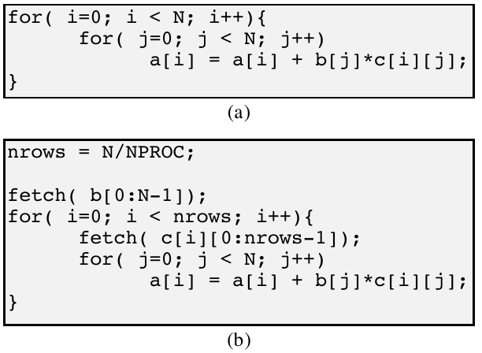

**图 12：** 向量–矩阵乘积计算的块预取。

图 12 中的完整代码如下：

```c
/* (a) Original computation */
for (i = 0; i < N; i++) {
    for (j = 0; j < N; j++)
        a[i] = a[i] + b[j] * c[i][j];
}

/* (b) Block prefetching */
nrows = N / NPROC;
fetch(b[0:N - 1]);
for (i = 0; i < nrows; i++) {
    fetch(c[i][0:nrows - 1]);
    for (j = 0; j < N; j++)
        a[i] = a[i] + b[j] * c[i][j];
}
```

图 12(b) 的块读取与前文软件预取方案类似，向原始计算添加了处理器开销。尽管面向块的预取操作需要大小和步长信息，但它们所需的预取操作更少，因而开销显著低于面向字的方案。假设问题规模相同且忽略对 $a$ 的预取，图 12 的循环会生成 $N+1$ 次块预取；如果应用面向字的预取方案，则会生成 $\frac{1}{2}(N+N^2)$ 次预取。

单次批量数据传输比将其分成若干较小消息更高效，但前者在多条此类消息同时传输时，往往会加剧网络拥塞。再加上预取提高了请求率，这种网络争用可能显著提高平均内存延迟。对一组六个数值基准程序，Gornish 注意到预取使平均内存延迟相对不预取提高到 5.3–12.7 倍。

将数据预取到局部内存而非高速缓存，意味着无法预取图 12 中的数组 $a$。总体而言，该方案要求所有数据在预取到使用期间必须只读，因为它没有提供一致性机制，使一个处理器的写入可被其他处理器看到。循环体中的控制依赖也会限制数据传输。如果某个数组引用受条件语句控制，就不会为该数组发起预取。这样做有两个原因。第一，条件可能只对数组引用的一个子集为真，预取整个数组会不必要地传输潜在的大量数据。第二，条件可能用于防止引用不存在的数据，为这种数据发起预取可能导致不可预测的行为。

遵守上述数据依赖与控制依赖，会限制可以预取的数据量。Gornish 使用的六个基准程序中，平均有 42% 的循环内存引用因这些约束而无法预取。这种预取抑制再加上平均内存延迟上升，使六个基准程序中有五个由预取带来的加速比低于 1.1。

Mowry and Gupta [1991] 研究了 DASH DSM 多处理器体系结构中软件预取的有效性。该研究考虑了两种备选设计。第一种把预取数据放入远程访问高速缓存（remote access cache，RAC），RAC 位于互连网络与系统每个节点的处理器高速缓存层次之间。第二种则简单地将数据从远程内存直接预取到一级处理器高速缓存。两种情况的传输单位都是高速缓存块。

使用 RAC 这样的独立预取高速缓存，动机是减少对一级数据高速缓存的争用。预取高速缓存将预取数据与按需读取数据分离，可以避免污染处理器高速缓存，并提供更多总高速缓存空间。该方法还避免处理器因等待预取数据放入高速缓存而停顿。但对远程访问高速缓存而言，只有远程内存操作能从预取中受益，因为 RAC 位于系统总线上，其访问时间与主存大致相同。

对三个科学基准的模拟发现，直接预取到一级高速缓存带来的收益最大，平均加速比为 1.94；使用 RAC 时平均加速比为 1.70。尽管直接预取到一级高速缓存显著增加了高速缓存争用，并减少了总高速缓存空间，但它产生更高的高速缓存命中率，这被证明是主导性能因素。与单处理器系统中的软件预取一样，预取收益也取决于应用。两个基于数组的程序相对不预取分别达到 2.53 和 1.99 的加速比，第三个较不规则的程序加速比为 1.30。

## 7. 结论

预取方案多种多样。为了对某一具体方法进行分类，回答关于预取机制的三个基本问题很有用：(1) 何时发起预取；(2) 预取数据放在哪里；(3) 预取什么。

### 何时预取

预取可以由程序中的显式读取操作发起，由监视处理器引用模式并推断预取机会的逻辑发起，也可以由两种方法的结合发起。无论以何种方式发起，预取都必须及时发出。如果预取太早，预取数据可能会把其他有用数据从内存层次的较高级逐出，或者自身在使用前被逐出。如果预取太晚，它可能无法在真正的内存引用之前到达，因而引入处理器停顿周期。

不同预取机制的精确度也不同。软件预取只为可能被使用的数据发出读取，而硬件方案往往以更具推测性的方式预取数据。

### 预取到哪里

将预取数据放在内存层次中的何处，是一项根本设计决策。显然，数据必须移到内存层次中更高的一级，才能带来性能收益。大多数方案将预取数据放入某种高速缓存。其他方案则把预取数据放入专用缓冲区，以防止数据过早被高速缓存逐出，并避免高速缓存污染。当预取数据被放入处理器寄存器或内存等有名位置时，该预取称为绑定预取，对数据的使用必须施加额外约束。最后，多处理器系统可以向内存层次引入必须考虑的额外级别。

### 预取什么

数据可以按单字、高速缓存块、连续内存块或程序数据对象为单位预取。被读取的数据量还取决于底层高速缓存与内存系统的组织方式。对单处理器和 SMP 而言，高速缓存块可能是最合适的大小；大型分布式内存多处理器则可以使用更大的内存块，以摊销通过互连网络发起数据传输的成本。

这三个问题并不相互独立。例如，如果预取目的地是小型处理器高速缓存，就必须以尽量减少高速缓存污染概率的方式预取数据。这意味着精确的预取必须安排在真正使用数据前不久，且预取单位必须很小。如果预取目的地很大，就可以放宽时序和大小约束。

确定预取机制后，自然会将其与其他方案比较。但由于各种被提出的预取技术采用的体系结构假设和测试程序差异很大，对它们进行比较评估很困难。不过，仍可以得出一些一般性观察。

大多数预取方案和研究都集中于数值型、基于数组的应用。这些程序生成的内存访问模式虽然相对可预测，却不能高效利用高速缓存，因而比通用应用更能从预取中受益。结果，对通用程序有效的自动技术受到的关注相对较少。

在基于数组的引用模式中，预取机制会根据机制的灵活性提供不同程度的覆盖。单位步长或小步长的数组引用模式最常见，也最容易检测，因此所有预取方案都能捕获这类访问模式。顺序预取技术只关注这类模式。大步长数组引用虽不那么常见，却可能导致高速缓存利用率很差。RPT 的设计动机正是捕获所有常量步长引用模式，其中包括大步长。步长非常量或频繁变化的数组引用模式，通常无法由纯硬件技术覆盖。如果任意引用模式能在编译时检测，软件预取就可以覆盖它。前文讨论的基于数组的集成技术，旨在用软件支持增强既有硬件技术，但它们的覆盖受到底层硬件机制限制。

灵活性还往往会提高预取方案的准确性。软件和集成技术能避免纯硬件机制所特有的许多不必要预取，后者受限于它们所能生成的预取流。这些不必要的预取可能用处理器从不使用的数据，取代高速缓存中的活跃数据。不必要的预取不仅导致高速缓存污染，还会无谓地消耗内存带宽；由于预取本身就会给内存系统施加额外压力，这一带宽可能本已有限。

预取机制还会引入一定的硬件开销。所有技术都依赖支持预取操作的高速缓存硬件。除流缓冲区外，大多数顺序方案会向高速缓存增加额外逻辑；流缓冲区则需要高速缓存之外的硬件。有些技术要求向处理器增加逻辑。纯软件预取要求处理器指令集包含读取指令，RPT 及其派生机制则会向处理器增加相对大量的逻辑开销。

软件预取的硬件需求很低，但该技术会向用户程序引入大量指令开销。集成方案尝试在纯硬件和纯软件方案之间取得平衡：减少指令开销，同时比纯硬件技术提供更好的预取覆盖。

最后，内存系统必须按照预取施加的额外需求进行设计。尽管预取能缩短总执行时间，但预取机制消除处理器停顿周期后，往往会提高平均内存延迟。这实际上提高了处理器的内存引用请求率，进而可能在内存系统内引发拥塞。这在多处理器系统中尤其成问题，因为总线和互连网络由多个处理器共享。

尽管存在许多应用和系统约束，数据预取在模拟研究与真实系统中都已证明能够缩短程序的总体执行时间。改进并扩展这些已知技术，使其适用于更多样的体系结构和应用，是一个活跃且很有希望的研究领域。微处理器与内存性能差距不断扩大，内存层次也日益复杂，两者都会继续提高内存访问惩罚，因而对新预取技术的需求很可能将持续存在。

## 致谢

Steven P. VanderWiel 与 David J. Lilja 感谢匿名审稿人提出的许多有用建议。

## 参考文献

1. ALEXANDER, T. AND KEDEM, G. 1996. Distributed prefetch-buffer/cache design for high performance memory systems. In Proceedings of 2nd IEEE Symposium on High-Performance Computer Architecture. IEEE Press, Piscataway, NJ, 254–263.

2. ANACKER, W. AND WANG, C. P. 1967. Performance evaluation of computing systems with memory hierarchies. IEEE Trans. Comput. 16, 6, 764–773.

3. BAER, J.-L. AND CHEN, T.-F. 1991. An effective on-chip preloading scheme to reduce data access penalty. In Proceedings of the 1991 Conference on Supercomputing (Albuquerque, NM, Nov. 18–22), J. L. Martin, Chair. ACM Press, New York, NY, 176–186.

4. BERNSTEIN, D., COHEN, D., AND FREUND, A. 1995. Compiler techniques for data prefetching on the PowerPC. In Proceedings of the IFIP WG10.3 Working Conference on Parallel Architectures and Compilation Techniques (PACT ’95, Limassol, Cyprus, June 27–29), L. Bic, P. Evripidou, W. Böhm, and J.-L. Gaudiot, Chairs. IFIP Working Group on Algol, Manchester, UK, 19–26.

5. BURGER, D., GOODMAN, J. R., AND KGI, A. 1997. Limited bandwidth to affect processor design. IEEE Micro 17, 6, 55–62.

6. CALLAHAN, D., KENNEDY, K., AND PORTERFIELD, A. 1991. Software prefetching. SIGARCH Comput. Arch. News 19, 2 (Apr.), 40–52.

7. CASMIRA, J. P. AND KAELI, D. R. 1995. Modeling cache pollution. In Proceedings of the Second IASTED Conference on Modeling and Simulation. 123–126.

8. CHAN, K. K. 1996. Design of the HP PA 7200 CPU. Hewlett-Packard J. 47, 1, 25–33.

9. CHANG, P. Y., KAELI, D., AND LIU, Y. 1994. Branch-directed data cache prefetching. In Proceedings of Second Workshop on Shared-Memory Multiprocessing Systems.

10. CHEN, T.-F. 1995. An effective programmable prefetch engine for on-chip caches. In Proceedings of the 28th Annual International Symposium on Microarchitecture (Ann Arbor, MI, Nov. 29–Dec. 1), T. Mudge and K. Ebcioğlu, Chairs. IEEE Computer Society Press, Los Alamitos, CA, 237–242.

11. CHEN, T.-F. AND BAER, J. L. 1994. A performance study of software and hardware data prefetching schemes. In Proceedings of 21st International Symposium on Computer Architecture (Chicago, IL, Apr.). 223–232.

12. CHEN, T.-F. AND BEAR, J. L. 1995. Effective hardware-based data prefetching for high-performance processors. IEEE Trans. Comput. 44, 5 (May), 609–623.

13. CHEN, W. Y., MAHLKE, S. A., CHANG, P. P., AND HWU, W.-M. W. 1991. Data access microarchitectures for superscalar processors with compiler-assisted data prefetching. In Proceedings of the 24th Annual International Symposium on Microarchitecture (MICRO 24, Albuquerque, NM, Nov. 18–20), Y. K. Malaiya, Chair. ACM Press, New York, NY, 69–73.

14. DAHLGREN, F. AND STENSTROM, P. 1995. Effectiveness of hardware-based stride and sequential prefetching in shared-memory multiprocessors. In Proceedings of 1st IEEE Symposium on High-Performance Computer Architecture (Raleigh, NC, Jan.). IEEE Press, Piscataway, NJ, 68–77.

15. DAHLGREN, F., DUBOIS, M., AND STENSTROM, P. 1993. Fixed and adaptive sequential prefetching in shared-memory multiprocessors. In Proceedings of the International Conference on Parallel Processing (St. Charles, IL). 56–63.

16. FU, B., SAINI, A., AND GELSINGER, P. P. 1989. Performance and microarchitecture of the i486 processor. In Proceedings of the IEEE International Conference on Computer Design (Cambridge, MA). 182–187.

17. FU, J. W. C. AND PATEL, J. H. 1991. Data prefetching in multiprocessor vector cache memories. In Proceedings of 18th International Symposium on Computer Architecture (Toronto, Ont., Canada). 54–63.

18. FU, J. W. C., PATEL, J. H., AND JANSSENS, B. L. 1992. Stride directed prefetching in scalar processors. In Proceedings of the 25th Annual International Symposium on Microarchitecture (MICRO 25, Portland, OR, Dec. 1–4), W.-m. Hwu, Chair. IEEE Computer Society Press, Los Alamitos, CA, 102–110.

19. GORNISH, E. H. AND VEIDENBAUM, A. V. 1994. An integrated hardware/software scheme for shared-memory multiprocessors. In Proceedings of International Conference on Parallel Processing (St. Charles, IL). 281–284.

20. GORNISH, E. H., GRANSTON, E. D., AND GRANSTON, A. V. 1990. Compiler-directed data prefetching in multiprocessors with memory hierarchies. In Proceedings of the 1990 ACM International Conference on Supercomputing (ICS ’90, Amsterdam, The Netherlands, June 11–15), A. Sameh and H. van der Vorst, Chairs. ACM Press, New York, NY, 354–368.

21. HARRISON, L. AND MEHROTRA, S. 1994. A data prefetch mechanism for accelerating general computation. 1351. University of Illinois at Urbana-Champaign, Champaign, IL.

22. JOSEPH, D. AND GRUNWALD, D. 1997. Prefetching using Markov predictors. In Proceedings of the 24th International Symposium on Computer Architecture (ISCA ’97, Denver, CO, June 2–4), A. R. Pleszkun and T. Mudge, Chairs. ACM Press, New York, NY, 252–263.

23. JOUPPI, N. 1990. Improving direct-mapped cache performance by the addition of a small fully-associative cache and prefetch buffers. In Proceedings of the 17th International Symposium on Computer Architecture (ISCA ’90, Seattle, WA, May). IEEE Press, Piscataway, NJ, 364–373.

24. KLAIBER, A. C. AND LEVY, H. M. 1991. An architecture for software-controlled data prefetching. SIGARCH Comput. Arch. News 19, 3 (May), 43–53.

25. KROFT, D. 1981. Lockup-free instruction fetch/prefetch cache organization. In Proceedings of the 8th International Symposium on Computer Architecture (Minneapolis, MN, June). ACM Press, New York, NY, 81–85.

26. LILJA, D. J. 1993. Cache coherence in large-scale shared-memory multiprocessors: Issues and comparisons. ACM Comput. Surv. 25, 3 (Sept.), 303–338.

27. LIPASTI, M. H., SCHMIDT, W. J., KUNKEL, S. R., AND ROEDIGER, R. R. 1995. SPAID: Software prefetching in pointer- and call-intensive environments. In Proceedings of the 28th Annual International Symposium on Microarchitecture (Ann Arbor, MI, Nov. 29–Dec. 1), T. Mudge and K. Ebcioğlu, Chairs. IEEE Computer Society Press, Los Alamitos, CA, 231–236.

28. LUI, Y. AND KAELI, D. R. 1996. Branch-directed and stride-based data cache prefetching. In Proceedings of International Conference on Computer Design (ICCD’96, Austin, TX). IEEE Computer Society Press, Los Alamitos, CA, 255–230.

29. LUK, C.-K. AND MOWRY, T. C. 1996. Compiler-based prefetching for recursive data structures. ACM SIGOPS Oper. Syst. Rev. 30, 5, 222–233.

30. MOWRY, T. AND GUPTA, A. 1991. Tolerating latency through software-controlled prefetching in shared-memory multiprocessors. J. Parallel Distrib. Comput. 12, 2 (June), 87–106.

31. MOWRY, T. C., LAM, M. S., AND GUPTA, A. 1992. Design and evaluation of a compiler algorithm for prefetching. In Proceedings of the 5th International Conference on Architectural Support for Programming Languages and Operating Systems (ASPLOS-V, Boston, MA, Oct. 12–15), S. Eggers, Chair. ACM Press, New York, NY, 62–73.

32. OBERLIN, S., KESSLER, R., SCOTT, S., AND THORSON, G. 1996. Cray T3E architecture overview. Cray Supercomputers, Chippewa Falls, MN.

33. PALACHARLA, S. AND KESSLER, R. E. 1994. Evaluating stream buffers as a secondary cache replacement. In Proceedings of 21st International Symposium on Computer Architecture (Chicago, IL, Apr.).

34. PATTERSON, R. H. AND GIBSON, G. A. 1994. Exposing I/O concurrency with informed prefetching. In Proceedings of the Third International Conference on Parallel and Distributed Information Systems (Austin, TX). 7–16.

35. PORTERFIELD, A. K. 1989. Software methods for improvement of cache performance on supercomputer applications. Ph.D thesis,. Ph.D. Dissertation. Rice University, Houston, TX.

36. PRZYBYLSKI, S. 1990. The performance impact of block sizes and fetch strategies. In Proceedings of the 17th International Symposium on Computer Architecture (Seattle, WA). 160–169.

37. ROTH, A., MOSHOVOS, A., AND SOHI, G. 1998. Dependance based prefetching for linked data structures. In Proceedings of the 8th International Conference on Architectural Support for Programming Languages and Operating Systems (ASPLOS-VIII, San Jose, CA, Oct. 3–7), D. Bhandarkar and A. Agarwal, Chairs. ACM Press, New York, NY.

38. SANTHANAM, V., GORNISH, E. H., AND HSU, W.-C. 1997. Data prefetching on the HP PA-8000. In Proceedings of the 24th International Symposium on Computer Architecture (ISCA ’97, Denver, CO, June 2–4), A. R. Pleszkun and T. Mudge, Chairs. ACM Press, New York, NY, 264–273.

39. SKLENAR, I. 1992. Prefetch unit for vector operations on scalar computers. In Proceedings of the 19th International Symposium on Computer Architecture (Gold Coast, Qld., Australia). 31–37.

40. SMITH, A. J. 1978. Sequential program prefetching in memory hierarchies. IEEE Computer 11, 12, 7–21.

41. SMITH, A. J. 1982. Cache memories. ACM Comput. Surv. 14, 3 (Sept.), 473–530.

42. SMITH, J. E. 1981. A study of branch prediction techniques. In Proceedings of the 8th International Symposium on Computer Architecture (Minneapolis, MN, June). ACM Press, New York, NY, 135–147.

43. VANDERWIEL, S. P. AND LILJA, D. J. 1999. A compiler-assisted data prefetch controller. In Proceedings of International Conference on Computer Design (ICCD ’99, Austin TX).

44. VANDERWIEL, S. P., HSU, W. C., AND LILJA, D. J. 1997. When caches are not enough: Data prefetching techniques. IEEE Computer 30, 7, 23–27.

45. YEAGER, K. C. 1996. The MIPS R10000 superscalar microprocessor. IEEE Micro 16, 2 (Apr.), 28–40.

46. YOUNG, H. C. AND SHEKITA, E. J. 1993. An intelligent I-cache prefetch mechanism. In Proceedings of the International Conference on Computer Design (ICCD’93, Cambridge, MA). IEEE Computer Society Press, Los Alamitos, CA, 44–49.

47. ZHANG, Z. AND TORRELLAS, J. 1995. Speeding up irregular applications in shared-memory multiprocessors. In Proceedings of the 22nd Annual International Symposium on Computer Architecture (ISCA ’95, Santa Margherita Ligure, Italy, June 22–24), D. A. Patterson, Chair. ACM Press, New York, NY.

收稿：1998 年 1 月；修订：1999 年 3 月；接受：1999 年 4 月。
