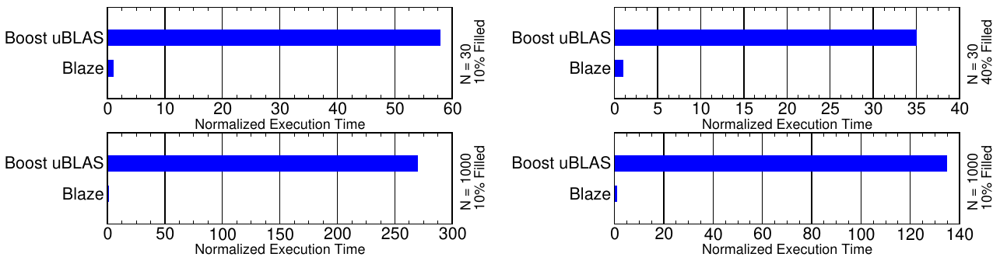
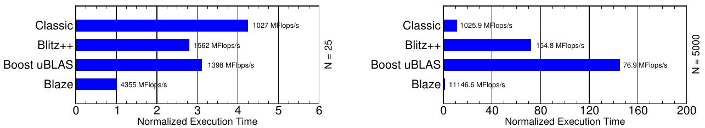

# Expression Templates Revisited: A Performance Analysis of the Current ET Methodology（中文译文）

## 译者说明

本文依据同目录的 `source.pdf` 翻译。章节、图表、公式、算法、代码与参考文献按原文结构保留。

## 作者

Klaus Iglberger、Georg Hager、Jan Treibig、Ulrich Rüde

- Klaus Iglberger、Ulrich Rüde：埃尔朗根-纽伦堡大学科学计算中心（Central Institute for Scientific Computing），91058 Erlangen, Germany
- Georg Hager、Jan Treibig：埃尔朗根地区计算中心（Erlangen Regional Computing Center），埃尔朗根-纽伦堡大学，91058 Erlangen, Germany
- Ulrich Rüde：埃尔朗根-纽伦堡大学系统仿真教席（Chair for System Simulation），91058 Erlangen, Germany

**版本信息：** arXiv:1104.1729v1 [cs.PF]，2011 年 4 月 9 日。PDF 首页另标注日期 November 26, 2024。

## 摘要

过去十年中，Expression Templates（ET）在 C++ 程序中获得了高效性能优化工具的声誉。这种声誉建立在若干基于 ET 的线性代数框架之上，这些框架专注于将优雅的 C++ 代码与高性能结合起来。然而，细加审视后，“ET 是一种性能优化技术”这一假设并不能成立。我们在本文中展示并解释了当前 ET 框架为何无法在稠密和稀疏线性代数操作中提供高性能，并介绍了一种新的“智能”ET 实现：它真正可以把高性能代码与领域专用语言（domain-specific language）的优雅性和可维护性结合起来。

**关键词**：Expression Templates；性能优化；高性能编程；线性代数；Boost；uBLAS；Blitz++；Blaze

## 1. 引言

Expression Templates 最初由 Veldhuizen 于 1995 年提出 [16, 17]，目的是为基于数组的操作提供一种“性能优化”。其总体目标是，在 C++ 中用重载运算符求值算术表达式时，避免创建不必要的临时对象。这种方法通常以加法等简单的 $O(n)$ 数组操作为例，在保持优雅数学语法的同时，可以达到与手工编写的 C 代码相近的性能。这一成功使 ET 很快被标准教材采纳 [19, 1]，因而广泛被视为 C++ 高性能数组数学的标准技术。

完整实现了基于 ET 的算术、且为人熟知的库包括 Blitz++ [3]和 Boost uBLAS [6]。Blitz++ 被开发成“一个用于科学计算的 C++ 类库，其性能与 Fortran 77/90 相当”；Boost uBLAS 则是 Boost 项目 [4] 的一部分。两个框架都成功地用 ET 概念避免创建临时对象，既提供快速的数组算术，也（大致）保留了由 C++ 运算符实现的直观数学语法。二者还把 ET 方法扩展到矩阵，并提供 BLAS level 2 和 level 3 操作。与 Blitz++ 相比，Boost uBLAS 更把 ET 思想扩展到了稀疏向量和稀疏矩阵。

本文的出发点，是在高性能计算（HPC）背景下评估 Blitz++ 和 Boost uBLAS 的单核（串行）性能。Expression Templates 的适用范围虽然更广（例如也用于 lambda 表达式 [5]），但我们只关注它在数值库中的性能。根据这些结果，我们将详细解释当前 ET 方法论为什么总体上不适合高性能计算。作为解决方案，我们描述一种替代 ET 方法，它把高层语言的优点与特定体系结构的性能优化结合起来，因而天然适合 HPC。这种“智能”ET 方法已在 Blaze 库中实现；Blaze 是在 pe 物理引擎 [10] 的开发过程中建立的。

需要注意的是，我们完全不考虑 GPGPU 计算，而是聚焦于当时的 CPU 架构 Intel“Westmere”。为展示可以达到的性能，我们把所有 ET 库的结果与优化的 BLAS 代码（使用 Intel MKL [11]）进行比较。

本文结构如下：第 2 节简要概述相关工作；第 3 节概述 benchmark 平台的细节；第 4 节回顾当前 ET 技术，并评估标准 benchmark（稠密向量加法）上的 ET 性能；第 5 节把分析扩展到稠密矩阵-矩阵乘法，并揭示标准 ET 的若干局限；第 6 节和第 7 节分别研究稀疏数据结构以及复杂表达式（运算符链）中的 ET。第 8 节提出“Smart Expression Templates”新方法，它把领域专用语言的优点与 BLAS 性能结合起来，以纠正标准 ET 的问题。第 9 节详述 ET 的内联问题，第 10 节最后给出结论和未来工作建议。

## 2. 相关工作

投入精力研究 ET 性能的团队并不多。Bassetti 等人 [2] 分析了 C++ Expression Templates 相对于 Fortran 77 代码的性能。他们表明，ET 对性能的承诺无法在不同 ET 实现中统一得到保证，并把原因归结为复杂 ET 实现对寄存器的大量需求。Härdtlein [12] 提出了“easy expression templates”和“fast expression templates”两个概念：前者比经典 ET 更容易实现，后者则利用静态内存改善数组操作的性能。

## 3. Benchmark 平台

所有 benchmark 使用一颗 6 核 Intel Westmere CPU，主频 2.93 GHz，12 MB 共享 L3 缓存。GNU g++ 4.4.2 和 Intel 11.1 编译器得到的结果非常相近，因此文中只展示 GNU g++ 结果。

为了直接比较不同 ET 方法，除必要的循环顺序调整外，我们不做其他低层优化。Blitz++、Boost uBLAS 和 Blaze 都按其原样 benchmark。所有结果都按每个测试中最快实现的执行时间归一化。对稠密向量和矩阵测试，文中还给出 MFlops/s。

## 4. Expression Templates 的基本思想

本节回顾 ET 的基本机制，以两个 `Vector` 类型<sup>1</sup>的稠密向量相加为例：

*<sup>1</sup> 我们在此只关注 Expression Templates 的本质，因而省略一切不必要的细节。例如，我们知道 `Vector` 类可以实现成类模板，但这只会不必要地使代码膨胀，并遮蔽 ET 的核心。*

**代码清单 1. 两个稠密向量相加**

```cpp
Vector a, b, c;
// ... 初始化向量 a 和 b
c = a + b;
```

使用 C++ 算术运算符可以非常简洁地描述加法：把 `a` 和 `b` 相加，结果赋给 `c`。如果 `Vector` 支持下标访问和 `size()`，传统 `operator+` 通常类似如下：

**代码清单 2. 经典加法运算符实现**

```cpp
inline const Vector operator+(const Vector& a, const Vector& b)
{
   Vector tmp(a.size());

   for (size_t i = 0; i < a.size(); ++i)
      tmp[i] = a[i] + b[i];

   return tmp;
}
```

这个实现直观且灵活，例如可以串接多个向量加法。但与手写 C 代码相比，它会因为原文所称“第 6 行的临时向量 `tmp`”而损失性能。创建 `tmp` 涉及动态内存分配、从临时对象复制到目标向量，以及内存释放；额外内存占用还会干扰缓存局部性。手写实现则不需要这些开销：

> **原文一致性说明：** 原文把临时向量 `tmp` 指向代码清单 2 的第 6 行；该行实际向 `tmp[i]` 写入结果，而 `tmp` 的声明位于第 3 行。译文保留原行号并说明这一指代差异。

**代码清单 3. C 风格手写向量加法**

```cpp
for (size_t i = 0; i < size; ++i)
   c[i] = a[i] + b[i];
```

如果在一条语句中相加多个向量，性能损失会更严重，因为表达式会被“贪婪”求值 [1]：

**代码清单 4. 三个稠密向量相加**

```cpp
Vector a, b, c, d;
// ... 初始化 a、b、c
d = a + b + c;
```

每个单独的加法都会创建一个临时向量，而实际上该操作不需要任何临时对象：

**代码清单 5. C 风格手写三个向量相加**

```cpp
for (size_t i = 0; i < size; ++i)
   d[i] = a[i] + b[i] + c[i];
```

ET 的做法是在编译期构造整个表达式的解析树，从而完全消除昂贵的临时对象创建，并把表达式的执行推迟到它被赋给目标对象时。因此，加法运算符不再返回计算代价高昂的加法结果，而是返回一个小型临时对象，作为该加法表达式的占位符 [9]：

**代码清单 6. 基于 ET 的加法运算符实现**

```cpp
template <typename A, typename B>
class Sum
{
 public:
   explicit Sum(const A& a, const B& b)
      : a_(a), b_(b)
   {}

   std::size_t size() const {
      return a_.size();
   }

   double operator[](std::size_t i) const {
      return a_[i] + b_[i];
   }

 private:
   const A& a_;  // 对左操作数的引用
   const B& b_;  // 对右操作数的引用
};

template <typename A, typename B>
Sum<A,B> operator+(const A& a, const B& b)
{
   return Sum<A,B>(a, b);
}
```

`operator+` 不再计算两个向量的加法结果，而是返回 `Sum<A,B>` 类型的对象，其中 `A` 和 `B` 分别是左、右操作数的类型。加法运算符对 `A` 和 `B` 的唯一要求，是它们具有用于访问操作数元素的下标运算符和一个 `size()` 函数。`Sum` 类有两个数据成员，它们是指向两个加法操作数的常量引用，因此与完整的结果向量相比，创建和复制这个对象都很便宜。由于 `Sum` 类表示加法结果，它必须允许访问结果元素。为此，它定义了两个访问函数：`size()` 用来获取结果向量的大小，下标运算符用来访问各个元素。

`Sum` 会临时表示这个加法，直到遇到特殊赋值运算符：

**代码清单 7. ET 赋值运算符**

```cpp
class Vector
{
 public:
   // ...

   template <typename A>
   Vector& operator=(const A& expr)
   {
      resize(expr.size());

      for (std::size_t i = 0; i < expr.size(); ++i)
         v_[i] = expr[i];

      return *this;
   }

   // ...
};
```

除了复制赋值运算符之外，这是 `Vector` 类中唯一的其他赋值运算符；如果向量元素的内存由类手动管理，复制赋值运算符就是必需的。每当表达式对象被赋给 `Vector` 时，这个赋值运算符都会用来处理赋值<sup>2</sup>。它首先相应地调整向量大小，然后在单个 `for` 循环中遍历给定表达式的元素。请注意，遍历期间会因通过下标运算符访问值而触发表达式求值。还要注意，这个 `for` 循环是求值整个表达式所需的唯一一个 `for` 循环。

*<sup>2</sup> 细心的读者可能会注意到，由于这个赋值运算符的签名，所有被赋给向量、且不匹配复制赋值运算符签名的非向量对象，也都会使用这个赋值运算符。如何处理这个问题，文献 [9] 和 [10] 中有详细解释。*

借助这种形式——所有函数都以内联方式表达，求值只在赋值运算符隐藏的单个 `for` 循环中进行——编译器可以生成与类 C 实现（参见代码清单 3）相似的代码。甚至可以像代码清单 4 那样串接多次加法，而不创建任何临时对象，并仍然像代码清单 5 一样只用一个 `for` 循环求值。

Boost uBLAS 和 Blitz++ 都基于上述两个核心思想：

- 表达式求值期间不创建临时对象，除 ET 表达式对象本身外；
- 赋值运算符被调用时，通过右侧表达式的元素访问逐元素计算左侧目标。

下面我们比较六种稠密向量加法实现的性能。第一个参赛者是经典 C++ 运算符重载，第二个是代码清单 3 所示的类 C 手写 `for` 循环。第三种方法是普通函数：它接受两个操作数和一个 `Vector` 类型的目标向量作为参数，并封装向量加法：

**代码清单 8. 普通函数中的两个向量加法**

```cpp
inline void addVectors(const Vector& a, const Vector& b, Vector& c)
{
   // ... 与代码清单 2 相同的实现，但不创建临时对象
}
```

第四和第五个参赛者分别是 Blitz++ 和 Boost uBLAS 库；第六个是将在第 8 节介绍的 Blaze 库。

图 1 给出小向量（缓存内）和大向量（缓存外）的性能结果。正如预期，经典 C++ 运算符重载因临时向量造成的额外数据传输而遥遥落后。这一直接比较清楚表明，创建临时向量的开销会妨碍良好性能。就此而言，与朴素 C++ 运算符重载相比，ET 可以视为一种性能优化：它们避免创建中间临时对象，从而达到手写类 C 向量加法的性能。此外，借助运算符重载，它们还提供了领域专用语言 [1] 的表达力、自然性和灵活性；例如，可以直观地串接多个向量加法。


## 5. ET 是一种性能优化技术吗？

ET 作为性能优化技术的声誉，完全来自它在稠密向量加法等 BLAS level 1 操作中，相对经典 C++ 运算符重载的性能优势。迄今并没有发表其他性能比较。其中一个主要原因是，根据 Veldhuizen 最初的论文，数组操作优化本就是 ET 的主要应用。但 Blitz++ 和 Boost uBLAS 都提供了远超 BLAS level 1 的功能；按 Blitz++ 主页的说法，它还“[...]提供与 Fortran 77/90 相当的性能”。本节将评估一个 BLAS level 3 函数——两个稠密矩阵相乘——的性能。稠密矩阵乘法的特性使它特别适合优化：借助合适的内存访问方案等优化，这个操作可以从内存受限变为算术受限 [8]。

为了进行这项比较，我们使用六种稠密矩阵乘法实现。第一种是使用经典运算符重载的直接 C++ 实现。代码清单 9 给出该实现；除了合适的嵌套 `for` 循环顺序外，它不包含任何优化。

**代码清单 9. 矩阵乘法运算符实现**

```cpp
inline const Matrix operator*(const Matrix& A, const Matrix& B)
{
   Matrix C(A.rows(), B.columns());

   for (size_t i = 0; i < A.rows(); ++i) {
      for (size_t k = 0; k < B.columns(); ++k) {
         C(i,k) = A(i,0) * B(0,k);
      }
      for (size_t j = 1; j < A.columns(); ++j) {
         for (size_t k = 0; k < B.columns(); ++k) {
            C(i,k) += A(i,j) * B(j,k);
         }
      }
   }

   return C;
}
```

第二个参赛者是一个接受三个矩阵作为参数的普通函数，它与代码清单 8 中的 `addVectors` 函数类似。第三、第四个参赛者分别是 Blitz++（代码清单 10）和 Boost uBLAS（代码清单 11）；第五种实现由 Blaze 提供（代码清单 12），第六种则直接调用 BLAS `dgemm` 函数。

**代码清单 10. Blitz++ 中的矩阵乘法**

```cpp
blitz::Array<double,2> A(N, N), B(N, N), C(N, N);
blitz::firstIndex i;
blitz::secondIndex j;
blitz::thirdIndex k;
// ... 初始化矩阵
C = blitz::sum(A(i,k) * B(k,j), k);
```

**代码清单 11. Boost uBLAS 中的矩阵乘法**

```cpp
boost::numeric::ublas::matrix<double> A(N, N), B(N, N), C(N, N);
// ... 初始化矩阵
noalias(C) = prod(A, B);
```

**代码清单 12. Blaze 中的矩阵乘法**

```cpp
pe::MatN A(N, N), B(N, N), C(N, N);
// ... 初始化矩阵
C = A * B;
```

图 2 给出六种实现的性能结果。对于两个大小为 $30^2$ 的缓存内矩阵乘法，以及两个大小为 $5000^2$ 的缓存外矩阵乘法，`dgemm` 函数都显然是最快的参赛者。虽然同样基于 ET，Blaze 也达到了相同的性能水平，因为 Blaze 内部同样使用 `dgemm`（参见第 8 节）。相比之下，另外两个基于 ET 的库表现很差。`dgemm` 的目的就是为矩阵乘法提供最高性能，因而这一结果并不意外；真正令人意外的是，对缓存外矩阵而言，即使是简单、未优化、老式的运算符重载，性能也比基于 ET 的库好得多。


> **原文一致性说明：** 图 2 的原文图注写作“五种实现”，但图中与相邻正文实际列出六种实现；此处分别保留原文图注和正文表述。

**表 1. 稠密矩阵乘法的 LIKWID 性能分析（N=5000）**

| 实现 | 内存带宽 MB/s | retired 指令数（10^11） | 算术操作数（10^11） | CPI |
| --- | ---: | ---: | ---: | ---: |
| STREAM | 11814 | - | - | - |
| Classic | 5008 | 12.5054 | 2.50231 | 0.441127 |
| Plain Function Call | 5328 | 12.5048 | 2.50232 | 0.440912 |
| Blitz++ | 623 | 10.0126 | 2.58185 | 4.67952 |
| Boost uBLAS | 623 | 10.0053 | 2.50197 | 4.72096 |
| Blaze | 496 | 2.02589 | 2.50612 | 0.322074 |
| dgemm | 496 | 2.02589 | 2.50612 | 0.322074 |

`dgemm` 函数使用打包指令，因此算术操作数可能高于 retired 指令数。

表 1 给出 Boost uBLAS 和 Blitz++ 性能如此之差的线索。我们使用 LIKWID 工具集 [18] 测量了实际内存带宽、retired 指令总数、算术操作总数和每指令周期数（CPI）。比较 CPI 可以看出，Boost uBLAS 和 Blitz++ 生成的代码质量都很低。再结合高 retired 指令数和低内存带宽，就不难理解所用 ET 实现为何性能低下。

这种行为的原因是 ET 方法论所固有的。根据“逐个计算目标数据结构元素”的思路，实际执行的代码类似代码清单 13：

**代码清单 13. 慢速矩阵乘法循环顺序**

```cpp
for (size_t i = 0; i < A.rows(); ++i) {
   for (size_t j = 0; j < B.columns(); ++j) {
      for (size_t k = 0; k < A.columns(); ++k) {
         C(i,j) += A(i,k) * B(k,j);
      }
   }
}
```

这种循环顺序对矩阵乘法而言是最差的数据访问方案：每计算目标矩阵的一个元素，都会完整遍历右操作数矩阵的一列，导致每一个数据值都要传输一条缓存线。对缓存外矩阵而言，这种方法的缓存效率特别低，因为每条缓存线在被替换前只能使用一个值。相比之下，经典运算符重载和普通函数调用都使用更具缓存效率的访问方案，同时计算目标矩阵的多个值，因而获得更好的内存带宽和更低的 CPI。

虽然经典运算符重载会创建临时对象，而 ET 库不会，前者的性能却好得多。性能提升显然来自更好的数据访问方案。因而首要问题是：ET 库为什么不实现更高效的循环顺序？原因是，按照当前方法论，ET 无法选择最佳数据访问方案。ET 只基于三点：避免临时对象的目标、逐元素求值右侧表达式的策略，以及对“内联后编译器会优化所得代码结构”的坚信。这对向量加法等数组操作很有效，因为数据访问方案几乎没有优化余地，所以避免临时对象确实能带来性能提升。然而，要让矩阵乘法达到高性能，就必须利用关于数据结构和操作的详细知识。

因此，当前 ET 技术的根本问题是：它并不是一种性能优化技术，而本质上是一种抽象技术。这种抽象虽然提高了框架集成新类型和新操作的灵活性，却在多个层面上与高性能背道而驰。首先，ET 抽象掉了参与运算的数据类型。一个明确迹象是，所涉及的 ET 数据类型必须遵循某个接口，即“Design by Contract”[15]；因此，无法根据所用矩阵的具体类型施加特别优化。其次，ET 抽象掉了操作类型。从抽象角度看，目标矩阵被赋予矩阵加法表达式还是矩阵乘法表达式并无区别；两种情况下，对应的赋值运算符都只是访问这个虚拟矩阵的元素，以填充目标矩阵。但从性能角度看，矩阵加法和矩阵乘法必须以完全不同的方式处理。所以，按照当前方法论，不能恰当实施基于内存优化（对当代缓存体系结构而言最重要的优化 [8]）、向量化和超标量性利用的真正性能优化。ET 的优化能力因而只限于那些“抽象数据访问方案恰好就是最优方案”的操作。

这些结果还有另一个重要含义。ET 的一个关键特性，是把数值操作封装在函数中，从而提供直观、易用的接口和很高的可维护性。这对矩阵乘法等复杂数值操作尤其重要：简单的向量加法 kernel 可以很容易地重写，但不应反复重新实现为达到高性能而凝聚了大量工作的复杂 kernel。因此，从性能角度看，复杂 kernel 的封装比简单 kernel 更重要。鉴于矩阵乘法的性能结果，我们必须得出结论：当前 ET 方法论不适合封装高度优化的复杂 kernel。

## 6. 稀疏算术

ET 在所有操作中都抽象掉实际数据类型，因此可以非常灵活地集成新数据类型。这一抽象通过要求所有数据类型都遵循一个能够访问底层元素的特定接口来实现。Boost uBLAS 展示了这种灵活性的一种用途：与 Blitz++ 不同，Boost uBLAS 提供稀疏向量和稀疏矩阵，而且可以把它们与现有稠密向量和矩阵以统一方式组合。这种扩充的功能显然是 ET 的非凡优势。然而，这种抽象的代价是性能损失。为了展示这一代价，我们选择了两个稠密/稀疏数据类型之间的操作，比较 Boost uBLAS 与 Blaze 的性能。

第一个操作是行存稀疏矩阵乘稠密向量，常用于工程应用中的线性方程组求解：

**代码清单 14. Boost uBLAS 稀疏矩阵/稠密向量乘法**

```cpp
boost::numeric::ublas::compressed_matrix<double> A(N, N);
boost::numeric::ublas::vector<double> a(N), b(N);
// ... 初始化矩阵和向量
noalias(b) = prod(A, a);
```

**代码清单 15. Blaze 稀疏矩阵/稠密向量乘法**

```cpp
SparseMatrixMxN<double> A(N, N);
Vector<double> a(N), b(N);
// ... 初始化矩阵和向量
b = A * a;
```

图 3 分别给出填充率为 10% 和 40% 时的缓存内与缓存外性能。Boost uBLAS 与 Blaze 的直接比较表明，无论规模还是填充率如何，两者都没有巨大的性能差异。原因是 ET 实现使用的默认内存访问方案恰好完全适合这个操作：为了计算结果向量的每个元素，都需要用矩阵的一行乘以稠密向量。按行访问稀疏矩阵和访问稠密向量都完全利用了两种数据结构的结构，因而性能处在合理水平。


第二个操作是行存稠密矩阵乘行存稀疏矩阵：

**代码清单 16. Boost uBLAS 稠密矩阵/稀疏矩阵乘法**

```cpp
boost::numeric::ublas::matrix<double> A(N, N), C(N, N);
boost::numeric::ublas::compressed_matrix<double> B(N, N);
// ... 初始化矩阵和向量
noalias(C) = prod(A, B);
```

**代码清单 17. Blaze 稠密矩阵/稀疏矩阵乘法**

```cpp
MatrixMxN<double> A(N, N), C(N, N);
SparseMatrixMxN<double> B(N, N);
// ... 初始化矩阵
C = A * B;
```

图 4 分别给出填充率为 10% 和 40% 时的缓存内与缓存外性能。显而易见，两个库之间存在巨大性能差异；这无法用代码实现的简单差别解释，而是指向两个 ET 库在方法论上的根本差异。Blaze 尝试利用操作和两个数据类型的所有信息，因而能尽可能高效地处理“右操作数稀疏矩阵按行存储”这一事实。Boost uBLAS 则完全抽象掉当前操作和两个矩阵的数据类型，逐个计算结果矩阵的所有元素<sup>3</sup>：它用行迭代器遍历左操作数稠密矩阵，用列迭代器遍历右操作数稀疏矩阵。列迭代器对库的用户而言可以是很方便的接口，但这种接口在内部被抽象使用时，会在本操作中造成灾难性的性能代价。

*<sup>3</sup> 提醒一下：由于抽象掉了实际操作，这种方法是必需的。*



> **原文一致性说明：** 图 4 右下子图在源 PDF 中标作 “10% Filled”，而图注及相邻正文将右列描述为 40% 填充率；图像按原文保留。

要达到高性能，应当识别右操作数稀疏矩阵的数据结构，并尽可能以缓存高效的方式使用和重用其元素。但由于抽象掉了实际操作和数据类型，这是不可能的。所以，当前 ET 方法论禁止了针对这一操作的任何可能性能优化。

需要注意，我们专门选择这个操作，是为了说明抽象掉数据类型和操作会严重损害性能。如果稀疏矩阵按列存储，性能损失会小得多。然而，ET 库通常作为黑盒系统提供，不能指望库用户事先知道应当（完全）避免某些数据结构组合。

## 7. 复杂表达式

ET 的基本规则之一是在表达式求值期间不创建临时对象。但有些情况下，创建临时对象虽有额外工作，却是获得性能所必需的。我们选择两个复杂表达式展示这一规则的缺陷。

第一个表达式是稠密矩阵乘三个稠密向量之和：

$$
A \cdot (a + b + c)
$$

问题很明显：矩阵-向量乘法会多次使用右侧向量。如果不先计算 $a+b+c$ 的结果，就会重复计算这些加法，必然损失性能。

**代码清单 18. 经典运算符重载中的 $d=A\cdot(a+b+c)$**

```cpp
classic::Matrix<double> A(N, N);
classic::Vector<double> a(N), b(N), c(N), d(N);
// ... 初始化矩阵和向量
d = A * (a + b + c);
```

**代码清单 19. Blitz++ 中的 $d=A\cdot(a+b+c)$**

```cpp
blitz::Array<real,2> A(N, N);
blitz::Array<real,1> a(N), b(N), c(N), d(N), tmp(N);
blitz::firstIndex i;
blitz::secondIndex j;
// ... 初始化
tmp = a + b + c;
d = blitz::sum(A(i,j) * tmp(j), j);
```

**代码清单 20. Boost uBLAS 中的 $d=A\cdot(a+b+c)$**

```cpp
boost::numeric::ublas::matrix<real> A(N, N);
boost::numeric::ublas::vector<real> a(N), b(N), c(N), d(N);
// ... 初始化矩阵
noalias(d) = prod(A, (a + b + c));
```

**代码清单 21. Blaze 中的 $d=A\cdot(a+b+c)$**

```cpp
pe::MatrixMxN<double> A(N, N);
pe::VectorN<double> a(N), b(N), c(N), d(N);
// ... 初始化矩阵
d = A * (a + b + c);
```

代码清单 18、19、20 和 21 分别给出经典运算符重载、Blitz++、Boost uBLAS 和 Blaze 对这个复杂表达式的实现。有趣的是，Blitz++ 在语法上无法用单条语句求值该复杂表达式，因此必须显式创建临时对象 `tmp`。图 5 展示了这四种实现在缓存内和缓存外的性能。

无论 $N$ 较小还是较大，两个传统的基于 ET 的库表现都不好。尤其对大 $N$ 而言，经典运算符重载虽然在求值过程中总共需要三个临时对象，却快于 Boost uBLAS，尤其快于 Blitz++。Blaze 使用一个临时对象保存向量加法的中间结果，再调用优化的 `dgemv` 执行矩阵-向量乘法，因而具有明显的性能优势。


**表 2. 复杂表达式 $A\cdot(a+b+c)$ 的 LIKWID 分析（ $N=5000$ ）**

| 实现 | 内存带宽 MB/s | retired 指令数（10^8） | 算术操作数（10^7） | CPI | L1 数据缓存行替换（10^6） |
| --- | ---: | ---: | ---: | ---: | ---: |
| STREAM | 11814 | - | - | - | - |
| Classic | 5387 | 4.31892 | 7.56438 | 0.455758 | 6.32184 |
| Blitz++ | 2295 | 6.87758 | 7.55893 | 0.531862 | 6.36924 |
| Boost uBLAS | 4382 | 4.5681 | 12.5684 | 0.529004 | 12.5812 |
| Blaze | 11088 | 2.74818 | 7.74858 | 0.57686 | 3.99694 |

表 2 的 LIKWID 结果使我们能够更详细地分析这些性能结果。可以清楚看到，优化的 `dgemv` 函数具有更好的缓存利用率和内存带宽，因而获得更高性能。

第二个复杂表达式涉及四个稠密矩阵：

$$
E = (A + B) \cdot (C - D)
$$

为了高效执行矩阵乘法，左、右矩阵表达式都必须先求值。Blitz++ 同样无法用单条语句计算该表达式，因而会生成两个显式临时矩阵。图 6 展示经典运算符重载、Blitz++、Boost uBLAS 和 Blaze 在缓存内与缓存外的结果。Blitz++ 总是优于不创建任何中间临时对象、因而会反复求值矩阵加法和减法的 Boost uBLAS。但两者都远远慢于 Blaze；Blaze 内部创建两个临时对象来保存矩阵加法和减法的中间结果，然后调用 `dgemm` 执行矩阵乘法。特别惊人的是，对大 $N$ 而言，Blitz++ 和 Boost uBLAS 都被经典运算符重载遥遥超过，因为后者创建了必要的临时对象，并为矩阵乘法使用了更快的 kernel。



**表 3. 复杂表达式 $(A+B)\cdot(C-D)$ 的 LIKWID 分析（ $N=5000$ ）**

| 实现 | 内存带宽 MB/s | retired 指令数（10^11） | 算术操作数（10^11） | CPI | L1 数据缓存行替换（10^9） |
| --- | ---: | ---: | ---: | ---: | ---: |
| STREAM | 11814 | - | - | - | - |
| Classic | 4136 | 12.5106 | 2.50318 | 0.442167 | 31.3006 |
| Blitz++ | 624 | 10.0163 | 2.56789 | 4.68541 | 266.566 |
| Boost uBLAS | 619 | 13.7553 | 6.15386 | 6.90581 | 533.411 |
| Blaze | 490 | 2.02977 | 2.50684 | 0.322925 | 2.07864 |

表 3 的 LIKWID 结果印证了这些性能表现。从很高的 L1 数据缓存行替换率、很高的 CPI 和很低的内存带宽可以看出，生成代码的质量很差。

诚然，一个简单的改进方案是在需要时显式生成临时对象。Boost uBLAS 主页也宣传了这一方案，uBLAS 设计者建议重新引入临时对象作为性能补救手段<sup>4</sup>。但 ET 的首要目标之一，可以说正是使用中缀运算符记法，并为各种数学操作提供方便、直观的黑盒接口。因此，不能因为未能恰当、自动地识别哪些地方需要临时对象，就责怪这些库的用户。既然这些库提供了这种接口，就必须预期真的会有人使用它，并照顾包括自动创建必要临时对象在内的一切后果。“避免所有临时对象”这一奠定 ET 性能优化声誉的基本规则，因而显然也可以成为性能“劣化”。

*<sup>4</sup> 事实上，建议的解决方案经常涉及不优雅的语法表达式，其中已经丝毫不剩 ET 试图达到的优雅性。*

## 8. 新 ET 方法论：Smart Expression Templates

ET 本身显然不能普遍提供高性能。但把高性能代码与 C++ 运算符提供的数学语法结合起来仍然是合理目标：在数学上下文中，高层结构能显著改善代码清晰度、可读性和可维护性。

Blaze 的 smart ET 实现与其他 ET 框架采取完全不同的方法，以实现性能与语法的结合。Blaze 完全放弃了“ET 本身是性能优化”的观念。ET 只作为一种解析功能：它理解给定数学表达式的结构，知道子表达式需要按何种顺序求值（包括创建临时对象；参见第 7 节）<sup>5</sup>，并选择合适的高度优化 kernel。这些 kernel 基于对数据类型和操作的详细知识，提供手工实现的、针对特定体系结构的性能优化。

> **原文脚注 5：** 子表达式的智能求值顺序可以用 $A\cdot B\cdot v$ 说明，其中 $A$ 和 $B$ 是矩阵， $v$ 是向量。通常按从左到右的顺序求值，会先执行矩阵-矩阵乘法，再执行矩阵-向量乘法。但如果先求右侧子表达式，就能用第二次矩阵-向量乘法取代矩阵-矩阵乘法，从而大幅提升性能。

本节只对 Smart Expression Templates 方法论作粗略概述。我们不会深入非常复杂的 C++ 实现；该实现及其详细讨论将在单独的文章中发表。这里只聚焦两个关键概念来解释 smart ET 方法：选择性创建中间临时对象，以及集成优化后的计算 kernel。

### 8.1 创建中间临时对象

传统 ET 不创建临时对象有两个原因。第一，它抽象掉实际操作，因此无法识别什么时候需要临时对象。第二，人们似乎认为在表达式对象内部高效创建中间临时对象是不可能的，因为临时对象通常意味着内存分配、复制和释放。

这个问题的解决方案其实已经包含在 C++ 标准中。考虑如下操作：

**代码清单 22. 三个稠密向量相加**

```cpp
Vector a, b;
// 初始化 a 和 b
Vector c = a + b;  // 等价于 Vector c(a + b);
```

> **原文一致性说明：** 代码清单 22 的原文标题写作“三个稠密向量相加”，但清单代码实际只计算 `a + b`；标题与代码均按源 PDF 保留。

与代码清单 1 中的稠密向量加法不同，这里不是赋值，而是初始化稠密向量 `c`。在这种情况下，所有实现之间都没有性能差异；即使经典运算符重载也与基于 ET 的库具有相同性能。其原因是“具名返回值”（named return value，NRV）优化（参见 ARM [7] 的第 12.1.1c 节或文献 [14]）。代码清单 23 给出代码清单 2 中加法运算符经编译器优化后的实现。如果编译器对代码应用 NRV（由显式复制构造函数的存在触发），局部变量 `tmp` 就会被一个指向调用者中最终返值目标的引用所替换，函数也不再返回临时对象，而是返回 `void`。

**代码清单 23. 稠密向量加法运算符的 NRV 优化形式**

```cpp
inline void operator+(Vector& dest, const Vector& lhs, const Vector& rhs)
{
   dest.Vector::Vector(lhs.size());  // 显式调用构造函数

   for (std::size_t i = 0; i < lhs.size(); ++i)
      dest[i] = lhs[i] + rhs[i];
}
```

因此在初始化场景中，编译器可以直接把结果写入目标向量，达到 ET 形式的效果。在赋值场景中，编译器会通过 NRV 优化代码创建临时对象，再把临时对象赋给目标向量：

**代码清单 24. 向量 copy assignment 的编译器生成代码**

```cpp
Vector a, b, c;

// 通过 NRV 优化，把 a 和 b 的加法结果写入临时对象 tmp
Vector tmp(a + b);

// 把临时对象赋值给向量 c
c = tmp;
```

在 ET 中，如果创建中间临时对象，例如某个子表达式的结果，它也是通过初始化创建，而不是赋值创建。临时表达式对象本身的创建也是如此。因此创建临时对象不涉及复制，只涉及必要的内存分配和释放。Smart ET 方法因此使用临时对象作为其他表达式对象的成员变量，保存子表达式的中间结果。

### 8.2 集成优化计算 kernel

Smart ET 的第二个关键思想是选择合适的计算 kernel。解决方案是省略通过赋值运算符进行的抽象赋值，把责任交给结果表达式对象本身。表达式对象掌握参与的数据类型和操作，因此能尽可能高效地执行赋值。

以下代码片段展示了表示两个稠密矩阵相乘的 `DMatDMatMultExpr` 类如何实现这一优化：

**代码清单 25. 矩阵乘法的 smart expression 对象**

```cpp
template <typename MT1               // 左操作数稠密矩阵的类型
        , typename MT2>              // 右操作数稠密矩阵的类型
class DMatDMatMultExpr : private Expression
{
 public:
   // 省略公共接口

 private:
   // ...

   // 左操作数稠密矩阵表达式的结果类型
   typedef typename MT1::ResultType RT1;

   // 右操作数稠密矩阵表达式的结果类型
   typedef typename MT2::ResultType RT2;

   // 左操作数稠密矩阵表达式的组合类型
   typedef typename MT1::CompositeType CT1;

   // 右操作数稠密矩阵表达式的组合类型
   typedef typename MT2::CompositeType CT2;

   // 左操作数稠密矩阵表达式的成员数据类型
   typedef typename SelectType<IsExpression<MT1>::value, const RT1, CT1>::Type Lhs;

   // 右操作数稠密矩阵表达式的成员数据类型
   typedef typename SelectType<IsExpression<MT2>::value, const RT2, CT2>::Type Rhs;

   Lhs lhs_;  // 乘法表达式的左操作数稠密矩阵
   Rhs rhs_;  // 乘法表达式的右操作数稠密矩阵

   // 注入外围命名空间的专用 assign 函数
   template <typename MT>  // 目标稠密矩阵的类型
   friend inline void assign(DenseMatrix<MT>& lhs,
                             const DMatDMatMultExpr& rhs)
   {
      // 根据数据类型，使用 cblas_dgemm kernel，或者
      // 使用矩阵-矩阵乘法的默认实现
   }

   // ...
};
```

`DMatDMatMultExpr` 实现为一个类模板，以所涉及稠密矩阵的两个数据类型 `MT1` 和 `MT2` 为参数。该类派生自 `Expression` 类，因此 `DMatDMatMultExpr` 本身是一个表达式，与普通矩阵不同。通过“模板元编程”（Template Meta Programming，TMP）[1]，两个操作数的数据类型用来求得两个成员数据类型 `Lhs` 和 `Rhs`。如果其中任意一个类型是表达式（即派生自 `Expression` 类），就使用对应矩阵表达式的 `ResultType` 创建临时对象；这一创建由 NRV 优化，因而不发生复制。否则使用矩阵表达式的 `CompositeType`，它表示该表达式所持有的“自己在复合表达式中应如何被对待”的知识。

该类的核心是 `assign` 函数，它实现了将矩阵-矩阵乘法赋给稠密矩阵的操作。该函数通过 Barton-Nackman trick [13, 19] 注入外围命名空间。当临时 `DMatDMatMultExpr` 对象被赋给稠密矩阵时，这个函数会被调用，并基于最快的可用计算 kernel 执行矩阵乘法的赋值。根据矩阵操作数的类型，它要么应用适用于任何数据类型的默认矩阵乘法 kernel，要么调用优化的 BLAS 函数，即对单精度矩阵使用 `cblas_sgemm`，对双精度矩阵使用 `cblas_dgemm`。

总结来说，Blaze 的 smart ET 方法把 ET 看作围绕一组高度优化 kernel 的智能包装技术。这些 kernel 提供操作、数据类型和体系结构相关的优化。其显著优势是，这种基于 kernel 的方法容易集成多核、众核和 GPU kernel。

## 9. Inlining

Inlining 是所有 ET 框架的核心问题：如果整个 ET 功能不能完全内联，预期性能就无法达到。因此 ET 非常依赖编译器的内联能力。然而 ET 代码包含大量嵌套函数调用，给编译器带来很大压力。此外，`inline` 关键字只是对编译器的建议，不是强制命令。根据函数大小、编译单元大小、总指令数等因素，编译器可能拒绝内联并插入函数调用。

我们在性能测量中经常遇到内联失败，即使在看似很小、只用来测量某个操作性能的程序中也是如此。因此，内联似乎是一个真实问题：即使实现本来能够提供更高性能，内联失败也会导致糟糕表现。在测量中，我们竭尽所能地确保所有 ET 功能都被恰当内联，以测得可能达到的最高性能。但为了展示内联失败的影响，图 7 比较了稠密向量加法在正确内联和内联失败时的结果；图中的内联性能值对应图 1 的结果。

这一比较表明，内联对所有基于 ET 的生产代码都是一个严重且根本性的问题<sup>6</sup>。最重要的是，程序员不能过度相信编译器既能（1）把内联做到所需程度，然后又能（2）生成尽可能高效的低层循环代码。

*<sup>6</sup> 我们必须承认，这同样影响 Blaze 库的 ET 实现；但由于嵌入 HPC kernel 的设计，它受到的影响远小于其他 ET 框架。*


## 10. 结论与未来工作

标准 Expression Templates 作为数组操作性能优化的声誉基础很薄弱。它们确实实现了最初目标：为逐元素数组算术提供快速执行，同时保留高层结构的优势，因为它们有效消除了表达式中的临时对象。就此而言，ET 修补了 C++ 语言的一个特定缺陷。

然而，对 BLAS level 2 和 level 3 过程、稀疏线性代数，以及一般而言任何受益于标准低层优化和特定体系结构低层优化的复杂操作，传统 ET 的性能往往非常糟糕。原因是 ET 本质上是一种抽象技术：它隐藏实际数据类型和操作类型的细节，把它们简化为高效的单元素访问，但这是不够的。我们已经表明，对 C++ 编译器高级内联和优化能力的广泛信念是幼稚且缺乏依据的。激进内联是从 ET 源码获得良好性能的必要前提，但不能保证最佳低层代码。利用关于数据类型、操作和访问模式的所有可用知识，是无可替代的。

我们还介绍了一种称为“Smart Expression Templates”的新 ET 方法论。它把 ET 机制缩减为围绕一组高度优化 kernel 的智能包装，或者在 BLAS 类操作中围绕供应商提供的库进行包装，从而消除标准 ET 的缺陷。Smart ET 把领域专用语言的优势（高层构造带来的易用性、可读性、封装性和可维护性）与适合 HPC 的代码性能结合起来，并且不像标准 ET 那样强烈依赖激进内联。

在本工作中，我们把讨论限定在串行代码上。鉴于高度层次化的多核/多插槽构件在当今高性能系统中十分重要，将 smart ET 推广到分布式数据结构上的并行计算似乎顺理成章，并将在后续工作中得到研究。

## 参考文献

[1] D. Abrahams and A. Gurtovoy. *C++ Template Metaprogramming*. C++ In-Depth Series. Addison-Wesley, 2005.

[2] F. Bassetti, K. Davis, and D. Quinlan. C++ Expression Templates Performance Issues in Scientific Computing. In *Parallel Processing Symposium '98*, 1998.

[3] Blitz++ library. Homepage of the Blitz++ library: http://www.oonumerics.org/blitz/.

[4] Boost. Homepage of the Boost C++ framework: http://www.boost.org.

[5] Boost Lambda library. Homepage of the Boost Lambda library: http://www.boost.org/doc/libs/1_45_0/doc/html/lambda.html.

[6] Boost uBLAS library. Homepage of the Boost uBLAS library: http://www.boost.org/doc/libs/1_45_0/libs/numeric/ublas/doc/index.htm.

[7] M. Ellis and B. Stroustrup. *The Annotated C++ Reference Manual*. Addison-Wesley, 1990.

[8] G. Hager and G. Wellein. *Introduction to High Performance Computing for Scientists and Engineers*. Chapman & Hall/CRC Computational Science Series. CRC Press, 2010.

[9] J. Härdtlein. *Moderne Expression Templates Programmierung – Weiterentwickelte Techniken und deren Einsatz zur Lösung partieller Differentialgleichungen*. PhD thesis, University of Erlangen-Nuremberg, Computer Science 10 – Systemsimulation, 2007.

[10] K. Iglberger. *Software Design of a Massively Parallel Rigid Body Framework*. PhD thesis, 2010.

[11] Intel Math Kernel Library (MKL). Homepage of the IMKL framework: http://www.intel.com/software/products/mkl.

[12] J. Härdtlein, C. Pflaum, A. Linke, and C. H. Wolters. Advanced Expression Template Programming. *Computing and Visualization in Science*, 13(2):59–68, 2009.

[13] J. J. Barton and L. R. Nackman. Algebra for C++ Operators. *C++ Report*, 7(3):70–74, 1995.

[14] S. B. Lippman. *Inside the C++ Object Model*. Addison-Wesley, 10th printing edition, 2007.

[15] B. Meyer. *Object-oriented Software Construction*. Prentice Hall, 1997.

[16] T. Veldhuizen. Expression Templates. *C++ Report*, 7(5):26–31, 1995.

[17] T. Veldhuizen. Expression Templates. In *C++ Gems*, pages 475–487. SIGS Publications, Inc., New York, NY, USA, 1996.

[18] J. Treibig, G. Hager, and G. Wellein. LIKWID: A lightweight performance-oriented tool suite for x86 multicore environments. In *Proceedings of the First International Workshop on Parallel Software Tools and Tool Infrastructures (PSTI2010)*, 2010.

[19] D. Vandevoorde and N. M. Josuttis. *C++ Templates - The Complete Guide*. Addison-Wesley, 2003.
