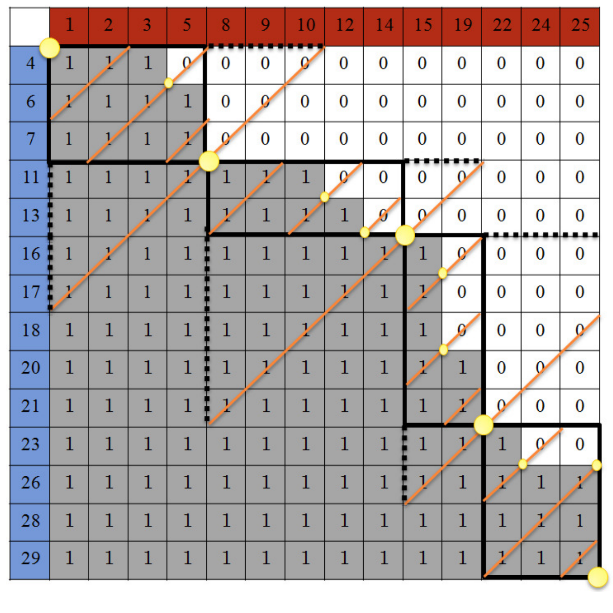
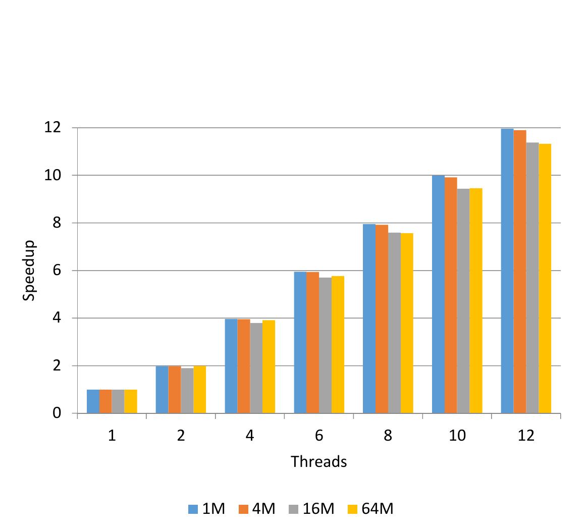
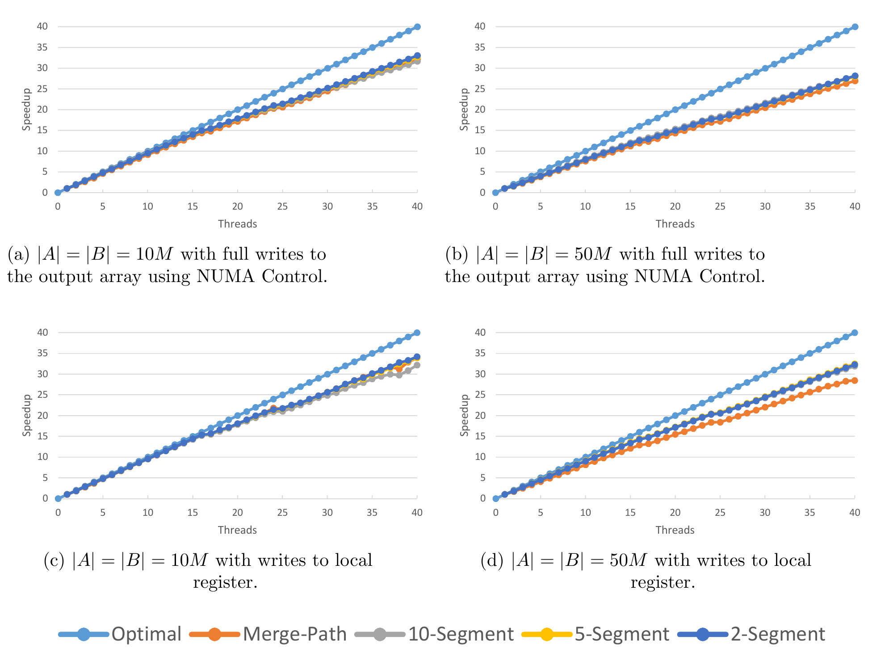
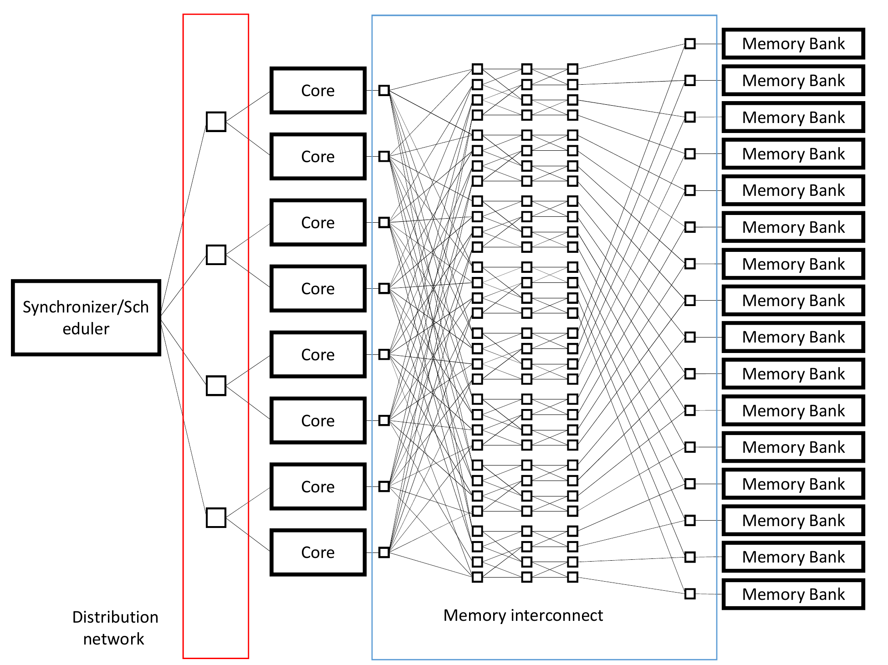
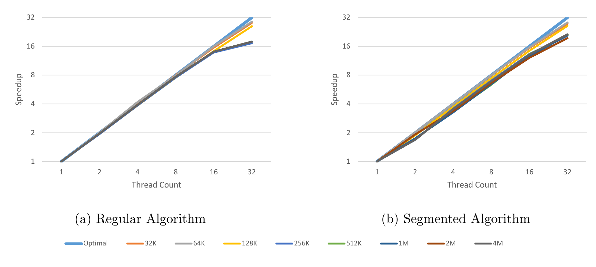
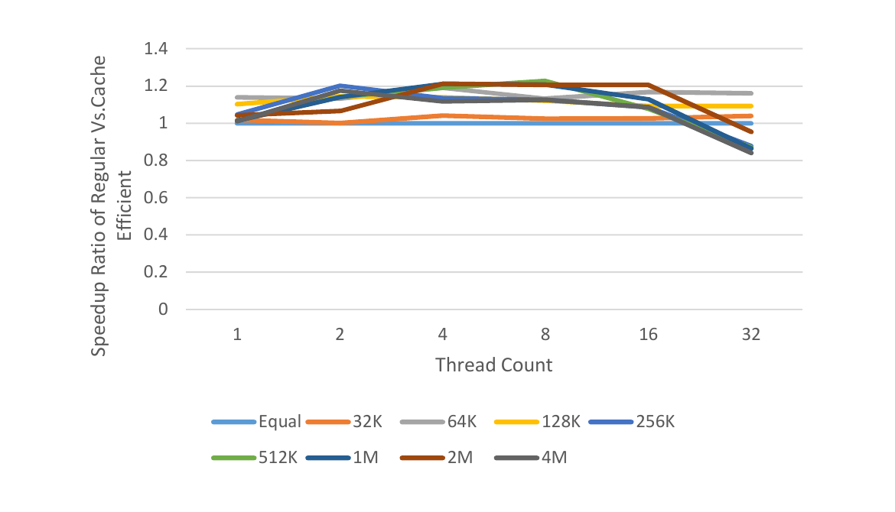

# Merge Path - A Visually Intuitive Approach to Parallel Merging（中文译文）

## 译者说明

本文依据同目录的 `source.pdf` 翻译。章节、图表、公式、算法、代码与参考文献按原文结构保留。

## 作者

Oded Green、Saher Odeh、Yitzhak Birk

作者单位：Oded Green 所属佐治亚理工学院计算学院（美国佐治亚州亚特兰大）；三人均属 Technion - Israel Institute of Technology 电气工程系（以色列海法）。通讯作者为 Oded Green，邮箱：ogreen@gatech.edu。

**版本信息**：arXiv:1406.2628v2 [cs.DC]，2014 年 6 月 20 日。

## 摘要

合并两个有序数组是排序及其他函数中的重要构件。要高效并行化这一操作，需要在计算核心之间平衡负载，尽量减少并行化带来的额外工作，并尽量降低线程间同步需求；高效利用内存同样重要。

我们提出一种新颖且视觉上直观的方法，把两个输入有序数组划分为若干对连续元素序列，每对分别从两个数组中取一个序列，并满足：1）每对可以包含任意期望的元素总数；2）每对元素在合并后的有序输出数组中构成一个连续序列。所得划分及其计算复杂度与某些既有算法相近，但本文方法不同、极为直观，并带来一些有趣洞见。基于这些洞见，我们提出无需同步、缓存高效的合并（及排序）算法。

本文以共享内存架构为基础，但算法很容易适配其他架构。事实上，我们的方法甚至适用于缓存高效的顺序排序。本文给出算法，并讨论重要的缓存相关洞见。

**关键词：** 并行算法；并行处理；合并；排序。

## 1. 引言

把两个有序数组 $A$ 和 $B$ 合并为有序输出数组 $S$ 是一项重要操作，也是归并排序算法的核心 [1]。它还可用于连接数据库查询结果，以及在图收缩中合并顶点的邻接表。

合并（例如按升序）通过重复执行以下操作完成：比较两个数组中尚未使用的最小元素（即下标最小者），并把其中较小者追加到结果数组。

给定一个未排序的 $N$ 元素数组，归并排序包含 $\log_2N$ 轮合并。第一轮将 $N/2$ 对互不相交的相邻元素分别排序，形成 $N/2$ 个长度为 2 的有序数组；下一轮把 $N/4$ 对两元素数组分别合并成长度为 4 的有序数组。以后各轮同样合并数组对，最终得到一个有序数组。

考虑用 $p$ 个计算核心（本文把核心、处理器和线程作为同义词）并行化归并排序。当 $N\gg p$ 时，早期轮次很容易并行化，每个核心处理一部分数组对。但在后期轮次，只剩很少的数组对，情况不再如此。由于各轮计算总量相同，要有效并行化，就必须能够并行合并两个有序数组。

高效的并行合并算法必须具备若干重要特性，其中一些来自计算量与内存访问量之比很低这一事实：1）各核心工作量相等；2）核心间通信最少（其具体影响取决于平台）；3）额外工作最少，包括并行化开销和重复劳动；4）高效访问内存，即缓存命中率高、缓存一致性开销低。一致性问题既可能来自并发访问同一地址，也可能来自并发访问同一缓存行中的不同地址（伪共享）；这些内存问题在不同平台上有不同表现。

一种朴素的并行合并方法，是把两个数组都划分为等长的连续子数组，并把一对同样大小的子数组分配给每个核心。各核心分别合并自己的数组对，再把结果串接成最终结果。遗憾的是，这种做法不正确；只要考虑 $A$ 的所有元素都大于 $B$ 所有元素的情况即可。因此，正确划分是成功的关键。

本文给出一种面向并行随机访问机（Parallel Random Access Machine，PRAM）的并行合并算法，即用于允许并发访问内存的共享内存架构。PRAM 还可分为 CRCW、CREW、ERCW 和 EREW，其中 C、E、R、W 分别表示并发、独占、读、写。本文算法假设 CREW，但可适配其他变体。复杂度计算还假设任一核心访问任一地址的时间相同，不过这不是算法要求。

本文算法负载均衡、无锁，额外工作可忽略，并可扩展为内存高效版本。由于无锁，它不依赖任何特定平台的原子指令集，因而容易应用。其内存访问效率也不限于某一种架构；对私有缓存和共享缓存架构都很高效。

我们建立了合并操作与网格路径遍历之间的对应关系：路径从左上角走到右下角，并且只能向右或向下。这种表示大大简化了对并行合并算法的理解。利用这条称为“合并路径”（Merge Path）的路径，可以把工作量均匀分给各核心；更重要的是，我们还并行化了合并路径的划分。

本文基础算法与 [2] 类似，但更直观、概念更简单。进一步利用上述几何对应关系带来的洞见，我们开发了一种新的缓存高效合并算法，并用它构建内存高效的并行排序算法。

本文其余部分如下。第 2 节介绍合并路径、合并矩阵以及二者关系，并在第 3 节利用它们开发并行合并与排序算法。第 4 节介绍缓存问题和缓存高效合并算法。第 5 节讨论相关工作。第 6 节给出两种新并行算法在两个系统上的实验结果。第 7 节总结全文。


**图 1：** 合并矩阵与合并路径。（a）显式计算合并矩阵的全部值；合并路径位于 0 与 1 的边界上。（b）使用合并矩阵的反对角线寻找 1 与 0 的转换点，即它们与合并路径的交点。

## 2. 合并路径

### 2.1 构造与基本性质

考虑两个有序数组 $A$ 和 $B$，分别有 $|A|$ 和 $|B|$ 个元素；二者长度可以不同，即 $|A|\ne|B|$。不失一般性，假设它们按升序排列。如图 1（a）所示（暂时忽略矩阵内容），建立由 $A$ 的元素组成的一列、由 $B$ 的元素组成的一行，以及一个 $|A|\times|B|$ 的矩阵 $M$，其每一行（列）分别对应 $A$（ $B$）的一个元素。我们称之为合并矩阵（Merge Matrix），稍后给出正式定义和更多细节。

接下来合并两个数组：每一步选择两个数组中尚未使用的最小元素，同时构造合并路径。仍参考图 1（a），从网格左上角，即 $M[1,1]$ 的左上角开始。如果 $A[1]\gt{}B[1]$，向右移动一格；否则向下移动一格。此后，对于左上角恰为当前路径末端的矩阵位置 $(i,j)$：若 $A[i]\gt{}B[j]$，向右移动并递增 $j$；否则向下移动并递增 $i$。到达网格右边界或下边界后，只能沿唯一可行方向继续，直至到达右下角。

以下四条引理由合并路径的构造直接得到。

**引理 1。** 从头至尾遍历一条合并路径，每次向右时取 $B$ 中尚未使用的最小元素，每次向下时取 $A$ 中尚未使用的最小元素，就得到所需合并结果。

**引理 2。** 合并路径的任意连续线段，都由 $A$ 的一个连续元素序列和 $B$ 的一个连续元素序列组成。

**引理 3。** 合并路径中互不重叠的线段由互不相交的元素集合组成，反之亦然。

**引理 4。** 给定合并路径中两个互不重叠的线段，后一个线段所含的全部数组元素，都大于或等于前一个线段中的全部元素。

**定理 5。** 考虑一组元素层面互不相交的子数组对；每一对由 $A$ 的一个子数组和 $B$ 的一个子数组组成，二者都可以为空，并且一对子数组的全部元素经排序后共同构成合并路径的一段连续线段。则可以并行合并这些数组对，再按它们在合并路径中的顺序串接所得合并子数组，形成一个有序数组。

**证明。** 由引理 1，每对子数组的合并结果都是包含该对全部元素的有序子数组。由引理 2，每个这样的子数组由各自原数组中的连续子数组组成；由引理 3，给定数组对对应合并路径中互不重叠的线段。最后，由引理 4 和构造顺序，高编号数组对的全部元素都大于或等于低编号数组对的任意元素，因此串接各合并结果即可得到有序数组。

**推论 6。** 把输入数组 $A$ 和 $B$ 的合并路径划分成若干互不重叠、合起来覆盖整条路径的线段，随后独立合并每段对应的子数组对，再按合并路径线段的顺序串接结果，就会得到一个包含 $A$ 与 $B$ 全部元素的有序数组。

**推论 7。** 把合并路径划分成等长线段，并行合并对应数组对，可以平衡各合并处理器的负载。

**证明。** 无论比较结果如何，合并路径的每一步都需要相同操作，即读、比较和写。

有了这些洞见，接下来要寻找一种把合并路径高效划分为等长线段的方法。显然，不能真的构造合并路径，因为构造它就等于完成了整个合并。我们再次利用图 1（b）的几何洞见：先揭示任意合并路径上的位置与合并矩阵 $M$ 的反对角线（向右上方倾斜的对角线）之间的关系，再定义合并矩阵的内容并揭示其一项性质。利用这两个构件，可以简单地并行把任意合并路径划分为等长线段，从而实现并行合并。

### 2.2 合并路径与反对角线

**引理 8。** 无论合并路径采用何种路线，也即无论 $A$ 和 $B$ 的内容如何，合并路径上的第 $i$ 个点都位于网格、因而也位于合并矩阵 $M$ 的第 $i$ 条反对角线上。

**证明。** 合并路径的每一步不是向右就是向下，两种移动都会进入下一条反对角线。

**定理 9。** 把给定合并路径划分成 $p$ 个等长连续线段，等价于寻找它与 $M$ 中 $p-1$ 条等距反对角线的交点。

**证明。** 由引理 8 直接得到。

### 2.3 合并矩阵：内容与性质

**定义 1。** $A$、 $B$ 的二值合并矩阵 $M$ 是大小为 $|A|\times|B|$ 的二维布尔矩阵，满足：

$$
M[i,j]=
\begin{cases}
1,&A[i]\gt{}B[j],\\
0,&\text{其他情况。}
\end{cases}
$$

**命题 10。** 令 $M$ 为二值合并矩阵。若 $M[i,j]=1$，则对所有满足 $i\le k\le|A|$ 且 $1\le m\le j$ 的 $k,m$，都有 $M[k,m]=1$。

**证明。** 由定义 1， $M[i,j]=1$ 意味着 $A[i]\gt{}B[j]$。因为 $A$ 已排序， $k\ge i\Rightarrow A[k]\ge A[i]$；因为 $B$ 已排序， $j\ge m\Rightarrow B[j]\ge B[m]$。故 $A[k]\ge A[i]\gt{}B[j]\ge B[m]$，再由定义 1 得 $M[k,m]=1$。

**命题 11。** 令 $M$ 为二值合并矩阵。若 $M[i,j]=0$，则对所有满足 $1\le k\lt{}i$ 且 $j\le m\le|B|$ 的 $k,m$，都有 $M[k,m]=0$。

**证明。** 与命题 10 的证明类似。

**推论 12。** $M$ 的任意反对角线上的条目构成单调不增序列。

### 2.4 合并路径与合并矩阵

建立合并路径和合并矩阵各自的性质后，现在把二者关联起来，并用 $P(M)$ 表示合并矩阵 $M$ 对应的合并路径。

**命题 13。** 在给定反对角线上，令 $(i,j)$ 为满足 $M[i,j-1]=1$ 的最高点；如果不存在这样的点，则令 $(i,j)$ 为该反对角线的最低点。那么 $P(M)$ 经过 $(i,j)$，如图 2 所示。

**证明。** 对路径上的点做归纳。

基础情形：路径从 $(1,1)$ 开始。经过 $(1,1)$ 的反对角线只含该点，因此它也是该反对角线的最低点。

归纳步骤：假设从起点到 $(i,j)$ 为止的所有路径点都满足命题。 $P(M)$ 的下一个点只可能是向右得到的 $(i,j+1)$，或向下得到的 $(i+1,j)$。

情形 1，向右：下一点为 $(i,j+1)$。由定义 1， $M[i,j]=1$。由归纳假设，或者 $i=1$，或者 $M[i-1,j]=0$。若 $i=1$，新点就是新反对角线上满足 $M[i,j]=1$ 的最高点；否则由命题 11， $M[i-1,j+1]=0$，所以 $(i,j+1)$ 是其反对角线上满足 $M[i,j]=1$ 的最高点。

情形 2，向下：下一点为 $(i+1,j)$。由定义 1， $M[i,j]=0$。由归纳假设，或者 $j=1$，或者 $M[i,j-1]=1$。若 $j=1$，新点就是新反对角线的最低点；由于 $M[i,j]=0$，由命题 11 可知整条反对角线均为 0。否则 $M[i,j-1]=1$，由命题 10 得 $M[i+1,j-1]=1$。因此， $(i,j+1)$ 是其反对角线上满足 $M[i+1,j-1]=1$ 的最高点。这里的 $(i,j+1)$ 是原文写法，与本情形开头定义的下一点 $(i+1,j)$ 不一致。

**算法 1：`ParallelMerge(A, B, S, p)`**

```text
for i = 1 to p parallel do
    DiagonalNum <- (i - 1) * (|A| + |B|) / p + 1
    length <- (|A| + |B|) / p
    ai_start, bi_start <- DiagonalIntersection(A, B, i, p) // 算法 2
    si_start <- (i - 1) * (|A| + |B|) / p + 1
    Merge(A, ai_start, B, bi_start, S, si_start, length)
end for
Barrier
```

**定理 14。** 给定有序输入数组 $A$ 和 $B$，可以把它们划分为 $p$ 对子数组，分别对应其合并路径的 $p$ 个等长线段。所需的 $p-1$ 个划分点彼此独立地计算（也可并行计算）；每个划分点最多需要 $\log_2(\min(|A|,|B|))$ 步，而且不必实际构造矩阵或路径。

**证明。** 由定理 9，所需划分点就是合并路径与 $M$ 中 $p-1$ 条等距、因而与内容无关的反对角线的交点。由推论 12 和命题 13，每个交点都是相应反对角线上 1 与 0 之间唯一的转换点；如果反对角线全为 0 或全为 1，该点分别是最上点或最下点。可以在反对角线上做二分查找来找到路径与反对角线的交点，每一步只比较 $A$ 的一个元素和 $B$ 的一个元素。反对角线长度至多为 $\min(|A|,|B|)$，所以至多需要 $\log_2(\min(|A|,|B|))$ 步。显然，无须构造合并路径或合并矩阵，而且 $p-1$ 个交点能够彼此独立、因而并行计算。

## 3. 并行合并与排序

给定两个输入数组 $A$ 和 $B$， $p$ 个处理器按算法 1 执行并行合并。为简洁起见，本文不再给出顺序合并的伪代码。

**备注。** 各核心之间不需要通信：它们写入互不相交的地址集合；除寻找合并路径与反对角线交点时的读取外，它们也从互不相交的地址读取。当通常成立的 $|A|+|B|\gg p$ 时，这意味着从同一地址并发读取的情况很少。

综上，对 $|A|+|B|=N$ 和 $p$ 个处理器，算法的时间复杂度为 $O(N/p+\log N)$，工作复杂度为 $O(N+p\log N)$。当 $p\lt{}N/\log N$ 时，该算法是最优的。下一节讨论高效利用内存（缓存）。

最后，归并排序可以在 $\log_2N$ 轮的每一轮使用并行合并；各轮依次执行。

**算法 2：`DiagonalIntersection(A, B, threadid, p)`——寻找合并路径与反对角线的交点**

```text
diag <- i * (|A| + |B|) / p
a_top <- (diag > |A|) ? |A| : diag
b_top <- (diag > |A|) ? (diag - |A|) : 0
a_bottom <- b_top
while true do
    offset <- (a_top - a_bottom) / 2
    a_i <- a_top - offset
    b_i <- b_top + offset
    if A[a_i] > B[b_i - 1] then
        if A[a_i - 1] <= B[b_i] then
            a_start <- a_i
            b_start <- b_i
            break
        else
            a_top <- a_i - 1
            b_top <- b_i + 1
        end if
    else
        a_bottom <- a_i + 1
    end if
end while
return {a_start, b_start}
```

原文算法 2 的形参名是 `threadid`，但第一行使用了未定义的 `i`；此外，原文把 `a_bottom` 初始化为 `b_top`。译文保留算法框的字面内容，不擅自推断实现修正。

该并行归并排序的时间复杂度首先写为：

$$
O\negthinspace{}\left(\frac{N}{p}\log\frac{N}{p}+\frac{N}{p}\log p+\log p\log N\right).
$$

原文随后给出的等价变形含有 `N//p`、小写 `n` 和未闭合括号等排版错误。由上面的完整表达式合并前两项，可得：

$$
O\negthinspace{}\left(\frac{N}{p}\log N+\log p\log N\right).
$$

第一个表达式中，第一项对应每个核心并发地对 $N/p$ 个输入元素执行顺序排序，后两项对应随后各轮并行合并。

## 4. 缓存高效的合并路径

本节其余部分结合本文算法考察缓存效率，给出重要洞见，分析权衡并介绍我们的方法。不过在继续之前，先简要讨论层次化内存，尤其是共享内存环境中的相关重要性质。这里只介绍缓存的相关性质；更多资料可参考 Stenstrom [3] 对缓存一致性的简短综述、Conway 等人 [4] 对现代缓存设计的讨论，以及 Lam 等人 [5] 对缓存感知分块算法性能的研究。

### 4.1 概述

即使在内存中而不是磁盘上，合并和排序的速率也往往由内存系统性能而非处理能力决定。原因是这些操作对每单位数据只执行很少计算，而只有少量内存——缓存——足够快；内存层次中的下一层通常访问延迟高十倍，内存管理粒度也更粗。

在共享内存系统上并行实现还会因以下原因加剧问题：1）计算能力的提升很少伴随相称的内存带宽提升，尤其在一级或二级缓存之外；2）各核心可能共享二级或三级缓存；3）缓存一致性机制可能带来极高开销。本节处理这些内存问题。

对相对于缓存而言很大的数组和归并排序，数据显然必须被载入多次，即合并树每层一次，共 $\log_2N$ 次，因此仍把重点放在合并一对有序数组上。

### 4.2 内存层次要点

#### 缓存组织与管理

与软件管理的缓冲区不同，缓存不给程序员直接控制其内容的能力，尤其无法直接选择被淘汰的项。为了简化操作与管理，缓存通常还根据原地址的某些位（索引位）限制一个项可以驻留的位置。给定地址的项可驻留的缓存位置数称为相联度：全相联缓存没有限制；另一个极端是直接映射缓存，每个地址只能映射到一个特定位置。给定地址可以映射到的缓存位置集合称为组（set），组大小等于相联度。

需要淘汰缓存项为新项腾出空间时，管理系统必须从相关组中选择一项。常见替换策略之一是最近最少使用（LRU），淘汰距今最久未访问的组成员；另一种是先进先出（FIFO），淘汰最早被装入缓存的项。其他考虑还包括优先淘汰驻留期间未修改的页，因为在包含式缓存层次中，下一级通常已有副本，无须再复制。

缓存内容以缓存行为单位管理。开始时假定一个数组项恰好占一条缓存行，随后再放宽这一假设。

#### 缓存性能

缓存性能的主要指标是命中率，即访问时在缓存中找到所需数据的比例；相应地，未命中率等于 $1-$ 命中率。缓存未命中分为三类 [6]：

1. **强制未命中。** 首次请求某个数据项时发生。若一条缓存行能容纳多个项，或使用自动预取，连续数据的访问可能分别只导致每条缓存行一次未命中，甚至完全没有未命中，因此强制未命中率可能低于预期。
2. **容量未命中。** 如果缓存更大就能避免的未命中。
3. **冲突未命中。** 尽管容量足够，但数据放置灵活性有限（相联度有限、各组使用不均）而发生的未命中。

**备注。** 即使可通过适当策略减少缓存未命中，也必须考虑缓存与下一级之间的总通信带宽。预取可以掩蔽延迟，但不会降低平均带宽需求；推测性预取甚至可能增加带宽需求。

#### 缓存一致性

在带私有缓存的多核共享内存系统中，同一数据可同时存在于多个私有缓存中供读取，但写入时必须保持一致。硬件缓存一致性机制使程序员无须为正确性操心，但频繁调用它们很容易成为性能瓶颈。多个处理器尝试写入同一位置时，一致性操作最昂贵。由于管理和一致性机制按缓存行粒度运行，即使核心访问不同地址，只要地址位于同一缓存行，也可能触发相关操作；这称为伪共享。

#### 缓存替换策略

补充缓存内容时可能出现问题。例如采用 LRU，且某段合并只包含 $A$ 的元素。用于补充的元素被载入以替换已经使用的 $A$ 元素时，最久未使用的项实际上是 $B$ 的元素：上一轮既访问了 $A$ 的元素位置和结果位置，却只访问了 $B$ 的一个元素，而且它在比较中反复“落败”。FIFO 也有类似问题。

LRU 的一种解决方案，是在取入补充元素之前，触碰包含未使用输入元素的所有缓存行。如果每条缓存行只含一个项，这约带来 50% 的缓存访问开销：通常用寄存器中上次比较的败者与胜出数组的下一个元素比较，后者必须从缓存读取；结果还必须写入。因此每步缓存访问从 2 次增加到 3 次。如果一条缓存行含多个元素，开销很快就变得可以忽略。

#### 有限相联度

**命题 15。** 相联度为 3 路或更高时，可以避免冲突未命中。

**证明。** 考虑大小为 $C$ 的缓存。采用 $k$ 路相联时，任意 $C/k$ 个连续地址会映射到 $C/k$ 个不同缓存组。把合并路径划分成长度为 $C/3$ 的线段，也就是以 $C/3$ 个元素为一段构造合并数组。对应结果段最多含 $A$ 的 $C/3$ 个元素和 $B$ 的 $C/3$ 个元素，实际数量取决于数据。无论三个元素序列各自从什么地址开始， $A$、 $B$ 和结果数组的 $C/3$ 个项在每个组中都恰好占一个位置。在 6 路组相联缓存中各占至多两个位置，在 9 路中各占至多三个位置，依此类推。相联度大于 3 但不是 3 的整数倍时，可以缩短线段，使每个数组的元素在每个组中最多占据一个安全数量的位置；所谓安全，是即使三个数组都在某组占用最大位置数，总数也不超过组大小，也即相联度。



**图 2：** 缓存高效算法的合并矩阵。黄色圆点表示缓存算法中某个特定分块的路径起点和终点。

### 4.3 缓存高效的并行合并

本小节给出并行合并算法的一项扩展，它同时具备缓存效率，并考虑共享内存层次（包括共享缓存）。

若能保证任意两个项驻留在不同缓存位置，或保证它们在不同时刻驻留缓存，就能避免二者在缓存中冲突。在一次合并中，缓存驻留项通常只需要很短时间，而且只用一次；但大量项会进入缓存。活跃项的相对地址取决于数据：不同数组 $A,B,S$ 的元素如此，令人意外的是，不同核心访问的同一数组元素也如此，因为任一数组中的线段划分点和元素消耗速率都取决于数据。

本文的高效并行化可以并行合并甚至只有缓存大小的数组。因此，我们探索一种方法，确保任一时刻所有可能活跃的元素都能同时驻留缓存。

令 $C$ 表示以元素数计的缓存大小。一般方法是把整条合并路径分成缓存大小（实际是其一部分）的线段，依次合并各线段，而每条线段内部的合并并行执行。我们称之为分段并行合并（Segmented Parallel Merge，SPM），见图 2。其伪代码见可见标题为“算法 3”的算法框；原文正文在此误写为“Algorithm 17”。

**引理 16。** 长度为 $L$ 的合并路径线段，最多包含 $A$ 的 $L$ 个连续元素和 $B$ 的 $L$ 个连续元素。

**定理 17。** 给定 $A$ 的 $L$ 个连续元素和 $B$ 的 $L$ 个连续元素，并从正在构造的线段中二者的第一个元素开始，可以并行计算 $p$ 个线段起点，从而并行构造 $p$ 个连续、各长 $L/p$ 的线段。

**证明。** 考虑上述两数组元素所构成合并矩阵中的 $p-1$ 条反对角线：第一条距左上角 $L/p$，其余以相同步长间隔。最远的反对角线至多需要两个数组各自给出的第 $L$ 个元素，而其他对角线上的点都不需要更“靠后”的元素。又因为最远对角线与左上角的曼哈顿距离为 $L$，所构造线段长度就是 $L$。

**备注。** 与完整合并两个长度为 $L$ 的有序数组不同，并非全部元素都会用到。构造该线段会消耗 $L$ 个元素，但其中来自 $A$ 和 $B$ 的比例取决于数据。

为了避免输入元素和合并数据共用同一空间带来的复杂性，令 $L=C/3$。

**备注。** 足够的缓存总容量不能保证无冲突，仍可能发生冲突未命中。不过，前文已经证明 3 路相联足以保证无冲突。

**计算复杂度。** 假定算法每轮顺序迭代生成的合并数组线段总长为 $L=C/3$，这样的迭代共有 $3N/C$ 次。每次最多需要考虑输入数组的 $2L=2C/3$ 个元素（每个数组各 $L$ 个），才能确定线段终点，进而确定应复制进缓存的元素数。由于这条线段的子线段要并行创建， $p$ 个核心必须分别独立计算自己在 $A$ 和 $B$ 中的起点。之所以要考虑 $2L$ 个元素，是因为线段终点由 $A$ 和 $B$ 各自贡献的元素数决定，而这个数事先未知。

给定大小为 $C$ 的缓存和 $p$ 个核心，合并 $N$ 个元素的缓存高效算法计算复杂度为：

$$
O\negthinspace{}\left(\frac{N}{C}\thinspace{}p\log C+N\right).
$$

**算法 3：`SegmentedParallelMerge(A, B, S, p, C)`**

```text
L <- C / 3
length <- L / p
MAX_iterations <- 3 * (|A| + |B|) / C
startingPoint <- top left corner
for k = 1 to MAX_iterations do
    for i = 1 to p parallel do
        DiagonalNum <- (i - 1) * L / p + 1
        length <- L / p
        ai_start, bi_start <- 用二分查找计算合并路径与 DiagonalNum 的交点
        si_start <- startingPoint + (i - 1) * L / p + 1
        Merge(A, ai_start, B, bi_start, S, si_start, length)
    end for
    if k = p then
        update startingPoint
    end if
    Barrier
end for
```

原文算法 3 在外层 `k` 循环内写的是 `if k = p then update startingPoint`；该条件不会在每次线段迭代后更新起点，和正文描述存在不一致。这里保留原算法框并明确标出这一源文异常。


**图 3：** 缓存高效并行排序的第一阶段。先对每个缓存大小的分块排序，再执行并行合并。

通常 $p\ll C\ll N$，此时计算复杂度变为 $O(N)$，也就是说并行化开销可忽略。时间复杂度为：

$$
O\negthinspace{}\left(\frac{N}{C}\left(\log C+\frac{C}{p}\right)\right).
$$

相对于合并本身的 $C/p$，忽略表示并行化开销的 $\log C$，就得到最优的 $O(N/p)$。从典型参数和实际算法还能看出，各常数系数很小，因此这确实是一种极高效的并行算法，划分成较小线段的开销微不足道。

### 4.4 缓存高效的并行排序

首先，把未排序的输入数组划分成等长子数组，每个子数组的大小取缓存大小 $C$ 的某个比例。

接着，按照前文所述，使用全部 $p$ 个处理器上的并行排序算法逐个对子数组排序。当然也可以并行排序这些子数组，但这会增大缓存占用。

最后执行多轮合并；每轮都对每对子数组应用缓存高效的并行合并算法，反复进行直到只剩一个数组。

下面推导缓存高效并行排序算法的时间复杂度。把复杂度分成两个阶段：第一阶段是对大小至多为 $C$ 的子数组执行并行排序，第二阶段是执行缓存高效的多轮合并。

第一阶段如图 3 所示，在缓存大小的子数组上调用并行排序算法。这样的子数组共有 $O(N/C)$ 个，因此本阶段时间复杂度为：

$$
O\negthinspace{}\left(\frac{N}{C}\left(\frac{C}{p}\log C+\log p\log C\right)\right).
$$

第二阶段可以视为一棵合并操作的二叉树。叶节点是已经排好序、大小为缓存规模的子数组；每两个子数组连接到它们合并所得的子数组，如此递推。原文给出的本阶段复杂度为：

$$
O\negthinspace{}\left(\log\frac{N}{C}\left(\frac{N}{p}+\frac{N}{C}\log p\right)\right).
$$

两个阶段的复杂度相加，缓存高效并行排序算法的总复杂度为：

$$
O\negthinspace{}\left(\frac{N}{p}\log N+\frac{N}{C}\log p\log C\right).
$$

可以再次看到，由于存在大量划分阶段，新算法的复杂度略高，其中有

$$
\frac{N}{C}\log C\log p\gt{}\log N\log p.
$$

不过，在缓存未命中代价较高的系统中，这样做是有益的。

## 5. 相关工作

本节回顾并行排序和并行合并方面的既有工作，并说明本文工作与它们的关系。

既有工作分为两类：一类算法使用随问题规模变化的处理器数量，另一类算法使用固定数量的处理器。

并行排序已有多种算法。并行合并可以作为并行排序的构件，但某些并行排序算法并不需要合并。例如双调排序（Bitonic Sort）[7] 使用 $O(N(\log N)^2)$ 个比较器——每个阶段使用 $N/2$ 个——在 $O((\log N)^2)$ 个周期内对 $N$ 个元素排序。双调排序属于前述第一类，而本文工作属于后一类。

本文考虑两种复杂度指标：一是时间复杂度，即完成任务所需的时间；二是总体工作复杂度，即执行的基本操作总数。对于本文这种负载均衡算法，工作复杂度等于时间复杂度与核心数的乘积。然而，即使负载完全均衡，也必须避免增加总工作量，例如引入额外开销或冗余，否则会增加时延。同样也要避免停顿，例如处理器间同步造成的停顿；即使“净”工作复杂度没有增加，停顿也会延长经过时间。

合并两个有序数组需要 $\Omega(N)$ 次操作。包括本文算法在内的一些并行合并算法，其工作复杂度为 $O(N+p\log N)$；后一项可以忽略，因而正如 [8] 所指出的，复杂度为 $O(N)$。此外，本文算法没有同步停顿。

Shiloach 和 Vishkin [9] 与本文一样采用 CREW PRAM 内存模型，并给出一种工作负载划分机制。该机制不如本文高效，也不能实现完全负载均衡：尽管每个处理器平均负责合并 $O(N/p)$ 个元素，单个处理器却可能被分配多达 $2N/p$ 个元素。所有核心都要等待最重的任务，因此部分核心会停顿。对于本文这类常数项也很紧的真正高效算法，这种负载不均可能让时延增加到两倍。该算法时间复杂度为 $O(1+\log p+\log N+N/p)$；在关注的 $N\gg p$ 情形下，化为 $O(N/p+\log N)$。

Akl 和 Santoro 在 [8] 中提出一种采用 EREW 模型、无内存冲突的合并算法。算法首先在两个给定有序数组中各找一个元素，其中一个元素是输出数组的中位元素。找到的元素 $(A[i],B[j])$ 满足：若 $A[i]$ 是该中位元素，则 $B[j]$ 是 $B$ 中小于 $A[i]$ 的最大元素，或大于 $A[i]$ 的最小元素。找到这个中点后，就可以在两组子数组上重复该过程。他们寻找中位数的方法与本文过程相似，但解释方式不同。寻找中位数的复杂度为 $O(\log N)$。由于这些数组互不重叠，访问数据时不会再产生冲突。反复执行这一阶段直至得到 $p$ 个分区，需要 $O(\log p)$ 轮。找到全部分区后，可并发地顺序合并每对子数组，并直接拼接结果形成最终合并数组。该算法总体复杂度为 $O(N/p+\log N\log p)$；为了彻底消除内存冲突，付出了略高复杂度的代价。

Deo 和 Sarkar 在 [2] 中提出一种概念上类似 [8] 的算法。它先在两个给定有序数组中各找一个元素，使其中一个成为输出合并数组中第 $k$ 小的元素。[8] 从 $k=N/2$ 开始，而 [2] 寻找的是输出数组中等距分布、相隔 $N/p$ 个位置的元素。寻找每个这样的元素复杂度为 $O(\log N)$。该算法面向 CREW 系统，复杂度为 $O(N/p+\log N)$。

本文算法与 [2] 非常相似。区别在于，本文展示了寻找目标元素与寻找网格上特殊点之间的对应关系。借助这一对应关系以及进一步的观察和构想，本文还给出了以往相关工作中未曾出现的缓存高效并行合并与排序算法。

[10] 是 [2] 的扩展，把算法改造为适用于 EREW 机器；由于 EREW 的额外约束，复杂度略增至 $O(N/P+\log N+\log P)$。

表 1 汇总了前述并行合并算法的缓存未命中次数，假定采用命题 15 所讨论的 3 路相联。分段 Merge Path 的渐近界与其他算法不同，这是因为不同核心可能共享缓存行，而分段算法不存在这种共享，因此它在合并阶段具有最低的缓存未命中界。还要注意，分段 Merge Path 的划分阶段和合并阶段存在缓存未命中重叠：划分阶段已经取入的元素，在合并阶段不会再次取入。这里仍以 $C$ 表示缓存大小，并假定 $p\ll C\ll N$。

**表 1：假定 3 路相联时，并行合并算法的缓存未命中次数。**

| 算法 | 划分阶段 | 合并阶段 | 总计 |
| --- | ---: | ---: | ---: |
| [9] | $O(p\log N+p\log p)$ | $\Omega(N)$ | $O(N+p\log N+p\log p)$ |
| [8] | $O(p\log N)$ | $\Omega(N)$ | $O(N+p\log N)$ |
| [2] 与 Merge Path | $O(p\log N)$ | $\Omega(N)$ | $O(N+p\log N)$ |
| 分段 Merge Path | $O(pN/C\log C)$ | $\Theta(N)$ | $\Theta(N)$ |

使用 GPU 进行合并和排序同样是一个备受关注的主题，也会带来额外挑战。NVIDIA 的 CUDA（Compute Unified Device Architecture）[11] 使 GPU 成为流行的并行应用开发平台。

Green 等人 [12] 基于 Merge Path 的性质提出了首个 GPU 并行合并算法。该算法在两种粒度层级上使用 Merge Path。关于 GPU 的详细讨论可参见 [13]；为便于说明，这里把 GPU 编程模型简化为两个层级：流式多处理器（SM）和流处理器（SP）。SM 类似 x86 的多处理器；SP 是分组共享一个指令译码器的轻量级线程计算单元。

Green 等人使用跨对角线搜索把工作划分给 GPU 的多处理器，其过程与本文算法相似。在第二阶段，每个 SM 内的 SP 使用与本文缓存高效算法相似的方法，对路径的更小子集重复跨对角线求交：每轮由 SP 取入 $A$ 和 $B$ 的一个子集，以尽可能充分利用 GPU 的内存控制单元。把这些线段取入内存后，再对 SM 上的全部 SP 重复跨对角线求交。在本文发表时，这是已知最快的 GPU 合并算法。

[14] 提出一种 GPU 基数排序；该文还提出一种 GPU 归并排序，其最后阶段需要成对合并树。[15] 提出一种 GPU 混合排序算法：先用桶排序整理数据，再执行归并排序。桶方法存在工作负载不均问题，而且需要原子指令，也就是同步。

排序算法的另一个研究重点，是如何以缓存无关方式 [16] 实现。本文算法聚焦合并阶段而不是完整排序，并提出的是缓存感知合并算法，因此不再展开缓存无关算法；感兴趣的读者可参见 [17,18,19]。

## 6. 实验结果

根据 Amdahl 定律 [21]，算法中未并行化部分会限制可能获得的加速比。前文已经清楚表明，本文确实把整个合并和排序过程都并行化了，而且对任何实际关注的规模而言，开销都可忽略。不过，我们仍希望在真实系统上获得实际性能结果，主要是为了找出是否还有其他限制性能的问题；实测结果也能增强理论论断的可信度。

我们实现了基本 Merge Path 算法和缓存高效版本。在后者中，按前述方法对两个数组分段，使每对线段都能无冲突地装入 3 路相联缓存；只有前一对线段完成合并后，才开始合并下一对。不过，只有处理器请求数组元素时，元素才会真正取入缓存，系统的预取机制也可能介入。

算法在两种差异很大的平台上实现：x86 平台，以及 Plurality 的新型共享缓存众核架构 HyperCore。下面先简要介绍两个系统及其规格和算法实现中的实际挑战，再给出普通 Merge Path 和缓存高效版本在各系统上的加速比。基线是单线程 Merge Path 的运行时间。



**图 4：** 12 核系统上的 Merge Path 加速比，结果也见 [20]。不同颜色的柱表示不同大小的输入数组；1M 个元素表示 $2^{20}$ 个元素。每种数组规模下，两个输入数组等长。

**表 2：实验采用的 Intel x86 系统。**

| 处理器 | 处理器数 | 每处理器核心数 | 总核心数 | L1 | L2 | L3 | 内存 |
| --- | ---: | ---: | ---: | ---: | ---: | ---: | ---: |
| X5670 Intel | 2 | 6 | 12 | 32KB | 256KB | 12MB | 12GB |
| E7-8870 Intel | 4 | 10 | 40 | 32KB | 256KB | 30MB | 256GB |

### 6.1 x86 系统

我们使用了两台支持超线程的 Intel x86 系统：一台 12 核，一台 40 核。两者的每个核心都有私有 L1 和 L2 缓存，同一处理器上的核心共享 L3 缓存；具体规格见表 2。私有缓存要求系统使用缓存一致性机制保证正确性。由于系统含多个处理器且每个处理器有自己的 L3 缓存，一致性机制还必须跨处理器通信，从时延角度看代价更高。实验不使用超线程。每种数组大小和线程数配置都执行多次并取平均值。

Merge Path 实现基于 OpenMP [22]。在 12 核系统上测试普通算法；在 40 核系统上同时测试普通算法和分段算法。两个系统都采用多种数组大小和线程数。

原文正文把 12 核结果误称为“图 6”，但可见图题及编号均为图 4。图 4 给出 12 核系统中加速比随线程数的变化，不同颜色的柱表示不同输入大小；同一结果也见此前论文 [20]。所有情形下 $|A|=|B|$，输出数组 $S$ 的大小是二者之一的两倍。因此三个数组所需总内存为 $4|A|\thinspace{}|type|$，其中 $|type|$ 是数据类型所占字节数；对 32 位整数而言为 4。1M 个元素表示 $2^{20}$ 个元素。加速比接近线性；较大输入的性能略有下降，12 线程约取得 11.7 倍加速。



**图 5：** 40 核系统上的 Merge Path 与分段 Merge Path 加速比。1M 个元素表示 $2^{20}$ 个元素；每种规模下两个输入数组等长。分段算法分别把合并矩阵划分为 10、5 和 2 段。子图为：（a） $|A|=|B|=10\mathrm{M}$，使用 NUMA Control，将结果完整写回输出数组；（b） $|A|=|B|=50\mathrm{M}$，完整写回；（c） $|A|=|B|=10\mathrm{M}$，结果写入本地寄存器；（d） $|A|=|B|=50\mathrm{M}$，结果写入本地寄存器。

图 5 展示更大的 40 核系统上普通算法和分段算法的加速比。分段算法采用 2、5、10 三种线段数，每段大小为 $|S|/\verb0#0segments$。40 核系统包含 4 个处理器，每个处理器 10 核，因此有效并行化比 12 核系统更具挑战。四处理器设计可能增加同步与缓存一致性开销；此外，算法受通信制约，还要考虑内存带宽饱和问题。

对每种输入大小，本文给出两组结果：包含写回的执行时间和不含写回的执行时间，两者都使用 NUMA Control 软件包 [23]。图 5(a) 和图 5(b) 分别给出 10M 与 50M 数组把结果写回主存时的加速比；图 5(c) 和图 5(d) 分别给出相同规模把结果写入寄存器时的加速比。

对两种数组大小，10 线程所得加速比在 20 线程时都没有翻倍，20 线程的加速比在 40 线程时也没有翻倍。原因有两个：元素写回和同步。

符合预期的是，结果写回主存会增加时延。对于 50M 数组，40 线程执行的加速比因此从约 32 倍降至 28 倍。较小的 10M 数组受此影响较小，因为数组的很大一部分能装入缓存。每个处理器有 30MB L3 缓存，四个处理器共 120MB； $A$、 $B$ 和 $S$ 总共需要 160MB。因此合并结束时，数组的一部分仍在缓存中，没有像更大数组那样写回主存。这不是本文算法的副作用，而是体系结构的行为。

为验证同步的影响，我们只测量路径交点搜索及其紧邻同步的耗时，不把合并本身计入。在等长输入使用主跨对角线求交时，路径求交最多需要 $O(\log_2(\min(|A|,|B|)))$ 步，该交点理应耗时最长。例如使用两个线程时，第二个线程使用主跨对角线，因而应成为计算瓶颈。随着线程数增加，寻找交点的耗时也会增加，而不论所需计算量如何。分段算法的同步时间同样增长，并且占比更为显著；这也不是本文算法的副作用。

下面比较普通算法与分段算法。对于较小数组，普通算法性能略高，因为同步开销在总执行时间中占比较大，而且缓存争用的可能性较小。随着数组增大，划分和合并阶段发生争用的可能性都会提高，因此新的缓存高效算法优于普通算法并不意外。

总的来说，本文的 x86 OpenMP 实现表现很好，达到整个系统利用率的 75%–90%，具体比例取决于问题规模。

### 6.2 HyperCore 架构

Plurality 的 HyperCore 架构 [25,24] 包含数十至数百个计算核心，并连接到更多共同构成共享缓存的存储体；连接由高速、低时延的组合互连实现。核心没有私有缓存，因此 CREW 类算法不存在内存一致性问题。对同一地址的写入会由通信互连串行化，不过本文算法不需要这一能力。所有存储体与各核心等距，因此这是 UMA 系统。共享缓存的存储体数量多于系统核心数，可减少单一存储体上的冲突；地址还采用交错布局，不会因规则访问模式形成持久热点。图 6 展示一个 8 核 HyperCore 系统。



**图 6：** 8 核 HyperCore 系统示意图。图中的存储体表示共享内存；HyperCore 还有图中未画出的 DRAM。

这种架构的好处是不存在处理器—缓存通信瓶颈。没有私有缓存及其中的大量状态，再加上 UMA 架构，使任何核心都能以同样效率执行任意计算任务。内存层次还包含片外共享内存。其编程模型由一组顺序“任务”及任务间的优先关系组成，并由高吞吐、低时延的同步器/调度器强制执行；调度器负责把工作分派给核心。

本文投稿时，Plurality 尚未制造出实际芯片。实验使用 HyperCore 的高级实验版本，运行在 FPGA 卡上；所用 FPGA 版本有 1MB 直接映射缓存和 32 个核心。此外，FPGA 在内存写回方面存在时延问题，因此给出的算法结果不执行内存写入，而是把值保存在私有寄存器中。

实验以不同线程（核心）数运行 Parallel Merge Path 的非分段与分段版本。受 FPGA 限制，Plurality 上测试的整数输入数组远小于 x86 系统上的数组。线程分派开销以及分区点搜索——在跨对角线上二分查找——在计算中的占比增大，可能让人预期合并较小数组不会取得显著加速。然而 HyperCore 能在几个周期内分派一个线程，因此开销不成问题，也使 HyperCore 成为理想的目标平台。输入大小以数组 $A$、 $B$ 各自的元素数表示，两数组仍然等长。



**图 7：** Plurality HyperCore [24] 上的算法加速比。（a）普通算法；（b）分段算法。

图 7(a) 展示基本并行合并算法在多种输入规模下，加速比随核心数的变化。无论数组大小如何，16 核以内都非常接近线性加速；对于较大输入，32 核时加速比有所下降，最可能的原因是共享内存争用，而分段算法没有出现这一情况。

图 7(b) 同样给出分段算法的加速比。需要注意的是，缓存采用直接映射，无法保证无冲突。即便如此，把执行划分为若干顺序迭代、每轮对一个线段执行并行合并，仍然改善了性能。图 8 给出分段版本相对于相同参数下非分段版本的加速比百分比。



**图 8：** HyperCore 上普通算法与分段算法的加速比比较。蓝色的 Equal 曲线表示两种算法加速比相等；曲线位于 Equal 之上表示普通算法优于分段算法，位于 Equal 之下表示分段算法更高效。

## 7. 结论

本文以许多排序算法的基石——合并两个有序数组——为切入点，研究了并行排序问题。

本文的一项重要贡献，是给出一种直观、简单而高效的方法，把两个有序输入数组分别正确划分成线段；每对线段各取自一个输入数组，合并各对后，再拼接结果，即可得到一个有序数组。划分过程本身也并行执行。

另一项重要贡献，是对缓存相关问题作出富有洞见的考察。这些问题极其重要：排序和合并尤其在并行化后，其速度往往由内存子系统而不是计算能力决定。研究最终形成了一种缓存高效的并行合并算法。为此提出的高效分段版本很有前景，因为它能在简单缓存上高效运行。

## 参考文献

[1] T. H. Cormen, C. E. Leiserson, R. L. Rivest, C. Stein, *Introduction to Algorithms*, The MIT Press, New York, 2001.

[2] N. Deo, D. Sarkar, “Parallel Algorithms for Merging and Sorting,” *Information Sciences* 56 (1991) 151–161.

[3] P. Stenstrom, “A Survey of Cache Coherence Schemes for Multiprocessors,” *Computer* 23(6) (1990) 12–24.

[4] P. Conway, N. Kalyanasundharam, G. Donley, K. Lepak, B. Hughes, “Cache Hierarchy and Memory Subsystem of the AMD Opteron Processor,” *Micro, IEEE* 30(2) (2010) 16–29.

[5] M. Lam, E. Rothberg, M. Wolf, “The Cache Performance and Optimizations of Blocked Algorithms,” in *ACM SIGARCH Computer Architecture News*, Vol. 19, ACM, 1991, pp. 63–74.

[6] J. L. Hennessy, D. A. Patterson, *Computer Architecture: A Quantitative Approach*, Morgan Kaufmann, Boston, 2007.

[7] K. Batcher, “Sorting Networks and Their Applications,” in *Proceedings of the April 30–May 2, 1968, Spring Joint Computer Conference*, ACM, 1968, pp. 307–314.

[8] S. G. Akl, N. Santoro, “Optimal Parallel Merging and Sorting Without Memory Conflicts,” *IEEE Transactions on Computers* C-36(11) (1987) 1367–1369.

[9] Y. Shiloach, U. Vishkin, “Finding the Maximum, Merging, and Sorting in a Parallel Computation Model,” *Journal of Algorithms* 2 (1981) 88–102.

[10] N. Deo, A. Jain, M. Medidi, “An Optimal Parallel Algorithm for Merging using Multiselection,” *Information Processing Letters*.

[11] NVIDIA Corporation, *Nvidia CUDA Programming Guide*.

[12] O. Green, R. McColl, D. A. Bader, “GPU Merge Path: a GPU Merging Algorithm,” in *Proceedings of the 26th ACM International Conference on Supercomputing*, ICS ’12, ACM, New York, NY, USA, 2012, pp. 331–340.

[13] C. Nvidia, *Programming Guide*, NVIDIA Corporation, 2010.

[14] N. Satish, M. Harris, M. Garland, “Designing Efficient Sorting Algorithms for Manycore GPUs,” *Parallel and Distributed Processing Symposium, International* 0 (2009) 1–10.

[15] E. Sintorn, U. Assarsson, “Fast Parallel GPU-Sorting Using a Hybrid Algorithm,” *Journal of Parallel and Distributed Computing* 68(10) (2008) 1381–1388.

[16] A. Aggarwal, S. Vitter, Jeffrey, “The Input/Output Complexity of Sorting and Related Problems,” *Communications of the ACM* 31 (1988) 1116–1127.

[17] R. Chowdhury, F. Silvestri, B. Blakeley, V. Ramachandran, “Oblivious Algorithms for Multicores and Network of Processors,” in *2010 IEEE International Symposium on Parallel & Distributed Processing (IPDPS)*, IEEE, 2010, pp. 1–12.

[18] R. Cole, V. Ramachandran, “Resource Oblivious Sorting on Multicores,” *Automata, Languages and Programming* (2010) 226–237.

[19] M. Frigo, C. Leiserson, H. Prokop, S. Ramachandran, “Cache-Oblivious Algorithms,” in *40th Annual Symposium on Foundations of Computer Science*, 1999, pp. 285–297.

[20] S. Odeh, O. Green, Z. Mwassi, O. Shmueli, Y. Birk, “Merge Path - Parallel Merging Made Simple,” in *Parallel and Distributed Processing Symposium, International*, 2012.

[21] G. M. Amdahl, “Validity of the Single Processor Approach to Achieving Large Scale Computing Capabilities,” in *Proceedings of the April 18–20, 1967, Spring Joint Computer Conference*, ACM, 1967, pp. 483–485.

[22] L. Dagum, R. Menon, “OpenMP: an Industry Standard API for Shared-Memory Programming,” *Computational Science & Engineering, IEEE* 5(1) (1998) 46–55.

[23] A. Kleen, *A NUMA API for Linux*, Novel Inc.

[24] EE Times, “Analysis: Hypercore Touts 256 CPUs Per Chip.” URL: `www.eetimes.com/design/signal-processing-dsp/4017491/\Analysis--Hypercore-touts-256-CPUs-per-chip`.

[25] Plurality, *HyperCore Software Developers Handbook*. URL: `www.plurality.com`.
