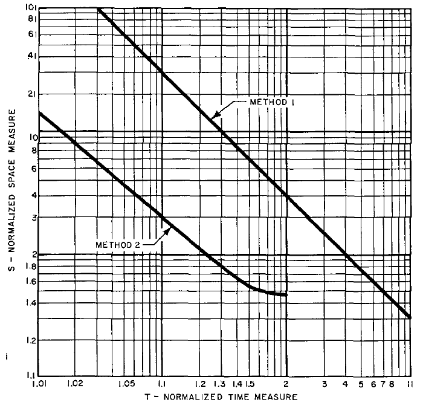

# Space/Time Trade-offs in Hash Coding with Allowable Errors（中文译文）

## 译者说明

本文依据同目录的 `source.pdf` 翻译。章节、图表、公式、算法、代码与参考文献按原文结构保留。

**Burton H. Bloom** 
Computer Usage Company，美国马萨诸塞州 Newton Upper Falls。

本文的部分工作是在作者任职于美国马萨诸塞州剑桥的 Computer Corporation of America 期间完成的。

## 摘要

本文分析散列编码中若干计算因素之间的权衡。我们考虑的典型问题是：逐一检查一系列消息是否属于一个给定的消息集合。本文考察两种新的散列编码方法，并将它们与一种特定的传统散列编码方法进行比较。所考虑的计算因素包括散列区的大小（空间）、确定某条消息不属于给定集合所需的时间（拒绝时间），以及允许的错误频率。

新方法旨在减少存储散列编码信息所需的空间，使其小于传统方法所需的空间。空间的减少利用了这样一种可能性：在某些应用中，可以容忍一小部分误接受错误；尤其是在涉及大量数据、因而采用传统方法无法使散列区驻留于内存的应用中。

在这类应用中，设想可以把一个较小的内存驻留散列区与新方法结合起来，并在必要时使用某种次级的、也许很耗时的测试来“捕获”新方法所产生的少量错误，从而改善整体性能。本文讨论了一个例子，以说明新方法可能适用的领域。

对这一典型问题的分析表明，允许少量测试消息被错误地判为给定集合的成员，就可以在不增加拒绝时间的情况下使用小得多的散列区。

**关键词与短语：** 散列编码、散列寻址、散列存储、搜索、存储布局、检索权衡、检索效率、存储效率。

**CR 分类：** 3.73、3.74、3.79。

## 引言

在传统散列编码中，散列区被组织成若干单元。一个迭代的伪随机计算过程根据给定的消息集合，生成空单元的散列地址，随后将消息存入这些单元。测试消息时采用类似过程，迭代生成单元的散列地址，再将这些单元的内容与测试消息比较。匹配表示测试消息是集合成员；遇到空单元则表示相反的结果。这里假定读者熟悉这种及类似的传统散列编码方法 [1, 2, 3]。

下面介绍的新散列编码方法，建议用于绝大多数待测试消息都不属于给定集合的应用。对于这些应用，适宜采用的时间度量称为拒绝时间，即将一条测试消息判为给定集合的非成员所需的平均时间。此外，由于通常只需检查消息的一部分，就能发现某单元的内容与测试消息不匹配，因此我们将对访问散列区中各个位所需的时间引入一个适当假设。

除拒绝时间和空间（即散列区大小）这两个计算因素之外，本文还考虑第三个计算因素：允许的错误比例。我们将说明，允许少量测试消息被错误地识别为给定集合的成员，可以在不增加拒绝时间的情况下，使用小得多的散列区。在某些实际应用中，散列区大小的这种减少，可能决定了散列区能否保存在内存中并得到快速处理，还是必须放到磁盘之类访问缓慢的大容量存储设备上。

我们将介绍两种通过允许错误来缩小散列区的方法。对于每一种方法，都将分析散列区大小与允许的错误比例之间的权衡，以及由此产生的空间与时间权衡。

读者应注意，这些新方法并不是要在目前使用散列编码的任何应用领域中取代传统散列编码方法，例如符号表管理 [1]。相反，它们旨在使某些领域也能利用散列编码技术的优点：在这些领域中，传统的无错方法所需的散列区过大，无法驻留内存，因而不可行。为了在不引入过长拒绝时间的情况下显著减少散列区大小，需要牺牲传统方法的无错特性。在必须保证无错的应用领域中，这些新方法并不适用。

## 一个应用示例

允许错误有望带来有用的散列区空间节省，这类应用可描述如下。假设一个程序必须针对大量不同的情形执行某个计算过程；再假设其中绝大多数情形的处理都非常简单，但有少数难以识别的情形，其处理过程非常复杂。那么，将这少数情形的标识符进行散列编码，可能是有用的，这样便能更容易地检查每个待处理情形是否属于这个少数集合。如果某个情形被拒绝——这会是大多数时候的情况——就使用简单的处理过程。如果没有被拒绝，则可进一步测试，以确定它究竟是这个少数集合的成员，还是一次“允许的错误”。通过允许这类错误，散列区可以缩小到使这一处理流程具有实用性的程度。

以自动断词程序为例。假设几条简单规则就能正确处理 90% 的英语单词，而另外 10% 需要查词典。再假设词典大到无法放入可用内存，因而存放在磁盘上。如果允许少量单词被错误地判为属于那 10%，那么针对这 10% 单词构造的散列区，可能小到足以放入内存。当发生一次“允许的错误”时，在磁盘词典中找不到该测试单词，于是仍可用简单规则为它断词。不必要的磁盘访问将很少发生，其频率与内存驻留散列区的大小有关。本文最后将详细分析这个应用示例。

## 一种传统的散列编码方法

作为出发点，我们先回顾一种不允许错误的传统散列编码方法。假设要存储由 $n$ 条消息组成的集合，每条消息长 $b$ 位。首先，将散列区组织为 $h$ 个单元，每个单元长 $b+1$ 位，其中 $h\gt n$。每个单元多出的一位用作标志，以表明该单元是否为空。为此，将消息视为一个 $b+1$ 位的对象，其第一位恒为 1。存储过程如下：

> 以依赖于当前消息的方式生成一个伪随机数，称为散列地址，记为 $k$，其中 $0\leq k\leq h-1$。然后检查第 $k$ 个单元是否为空。如果为空，就把消息存入其中；如果不为空，就继续生成散列地址，直到找到一个空单元，并将消息存入该单元。

检查一条新消息是否属于集合的方法，与存储方法类似。使用相同的随机数生成技术，依次生成散列地址，直到出现下列情形之一。

1. 找到一个单元，其中存储的消息与测试消息完全相同。这时，新消息属于该集合，称其被接受。
2. 找到一个空单元。这时，新消息不属于该集合，称其被拒绝。

## 两种允许错误的散列编码方法

**方法 1** 可以从传统的无错方法自然地推导出来。散列区仍组织为若干单元，但单元更小，其中保存一个编码，而不是整条消息。编码由消息生成，其大小取决于允许的错误比例。直观上，当允许的错误比例变小时，单元大小应增大。当错误比例足够小（约为 $2^{-b}$）时，单元就会大到能够容纳整条消息本身，从而不再产生错误。如果用 $P$ 表示允许的错误比例，这里假定 $1\gg P\gg 2^{-b}$。

在确定单元大小为 $c\lt b$，并使预期错误比例接近但小于 $P$ 之后，将散列区组织为每个长 $c$ 位的单元。然后，把每条消息编码为一个 $c$ 位的编码（不一定唯一），并采用与传统无错方法相似的方式存储和测试这些编码。与前面一样，每个编码的第一位都设为 1。由于编码不像原始消息那样唯一，可能发生误接受错误。

**方法 2** 完全放弃了把散列区组织为单元的传统概念。散列区被视为 $N$ 个可单独寻址的位，地址从 0 到 $N-1$。假设散列区的所有位最初都设为 0。接着，把待存集合中的每条消息散列编码为若干个不同的位地址，记为 $a _ 1,a _ 2,\ldots,a _ d$。最后，将这 $d$ 个地址所指的位全部设为 1。

测试一条新消息时，按与存储消息相同的方式生成一个包含 $d$ 个位地址的序列，记为 $a' _ 1,a' _ 2,\ldots,a' _ d$。如果这 $d$ 位全为 1，就接受该新消息。如果其中任何一位为 0，就拒绝该消息。

直观上，在达到收益递减点之前， $d$ 越大，预期错误比例越小。当把 $d$ 增加 1 导致散列区中 1 位的比例过大时，就会达到这一收益递减点。稍后将证明，当散列区中一半位为 1、一半位为 0 时，访问的每一位为 1 的先验概率增加所带来的影响，会超过增加一个待测试位所带来的效果。因此，对于任意给定的散列区大小 $N$，都存在一个最小可能的预期错误比例；所以方法 2 无法像方法 1 那样，在将允许的错误比例取得极小时，通过调整方法而达到无错。

## 计算因素

**允许的错误比例。** 对这个因素的分析，将考察允许少量消息被错误地判为给定集合的成员时，散列区大小能够缩小多少。我们用下式表示错误比例：

$$
P=\frac{n_a-n}{n_t-n}. \qquad \text{(1)}
$$

其中， $n_a$ 是消息空间中会被接受为给定集合成员的消息数量； $n$ 是给定集合中的消息数量； $n_t$ 是消息空间中不同消息的总数。

**空间。** 基本的空间因素是散列区中的位数 $N$。通过分析改变 $N$ 的值对时间因素的影响，后面将引入一种适当的归一化空间度量。使用这一归一化度量，可以将给定消息集合的大小和允许的错误比例对时间的影响，与散列区大小对时间的影响分离开。这种分离有助于更清楚地呈现空间与时间之间的权衡。

**时间。** 时间因素是将一条消息拒绝为给定集合成员所需的平均时间。度量这一因素时，以计算散列区中一个位的地址、访问该位并对其内容进行适当测试所需的时间为单位。对于传统散列编码方法，这种测试是将散列区中所寻址的位与消息的对应位比较。对于方法 1，这种测试是将散列区中的位与根据消息生成的编码中的对应位比较。对于方法 2，测试仅仅是确定散列区中该位的内容，例如它是否为 1。在下面的分析中，假定三种方法的时间单位相同，而且对散列区中的所有位都相同。[^1]

以这种单位度量的时间因素称为归一化时间度量，空间与时间的权衡将围绕这个因素展开分析。归一化时间度量为

$$
T=\mathrm{mean} _ {m_i\in\bar a}(t_i), \qquad \text{(2)}
$$

其中， $M$ 是给定的消息集合； $a$ 是被识别为 $M$ 的成员的消息集合（无论这种识别正确与否）； $\bar a$ 是被识别为 $M$ 的非成员的消息集合； $m_i$ 是第 $i$ 条消息； $t_i$ 是拒绝第 $i$ 条消息所需的时间。

[^1]: 读者应注意，这是一个很强的假设，因为它假定方法 2 中生成连续散列编码位地址所需的时间，与方法 1 中对单个散列编码单元地址进行连续递增所需的时间相同。此外，传统计算机能够以多位组成的块，即字节或字，访问内存并进行比较。块的大小因机器而异。为了建立所需的数学比较，必须确定一个固定的访问和比较单位，最简单的做法是使用单个位。如果读者希望针对以多位为单位的机器分析这两种方法的相对性能，并将每条消息多次散列编码的影响计入其中，可以很容易地采用与这里单个位分析相似的方法来完成。

## 传统散列编码方法的分析

散列区共有 $N$ 位，组织为 $h$ 个单元，每个单元为 $b+1$ 位，其中 $n$ 个单元装入了 $M$ 中的 $n$ 条消息。令 $\phi$ 表示空单元所占的比例，则

$$
\phi=\frac{h-n}{h}=\frac{N-n\cdot(b+1)}{N}. \qquad \text{(3)}
$$

解出 $N$，得到

$$
N=\frac{n\cdot(b+1)}{1-\phi}. \qquad \text{(4)}
$$

现在来计算归一化时间度量 $T$。 $T$ 表示在一次典型的拒绝过程中，需要测试的位数的期望值。 $T$ 也等于访问并放弃一个非空单元之后，还需要测试的位数的期望值。也就是说，如果散列寻址到的单元中所存的消息不同于待测试消息，那么平均而言，比如测试 $E$ 位后，就能发现这一点。随后，整个过程实际上又重新开始。

由于 $\phi$ 表示空单元的比例，访问一个非空单元的概率为 $1-\phi$，访问空单元的概率为 $\phi$。如果访问到非空单元，所需测试位数的期望值为 $E+T$，因为 $E$ 是拒绝所访问的这个非空单元所需测试位数的期望值，而 $T$ 是重新执行该过程时需要测试的位数的期望值。如果访问到空单元，只需测试一位就能发现这一事实。因此

$$
T=(1-\phi)(E+T)+\phi. \qquad \text{(5)}
$$

为计算 $E$，注意在已知单元中所存消息不同于测试消息的条件下，该单元前 $x$ 位与测试消息相同、而第 $x+1$ 位不同的条件概率为 $(1/2)^x$。（读者应记得，消息的第一位总是与非空单元的第一位匹配，因此指数是 $x$，而不是通常会出现的 $x+1$。）所以，当 $b\gg1$ 时， $E$ 的期望值可用下面的和近似：

$$
\sum _ {x=1}^{\infty}(x+1)\cdot\left(\frac12\right)^x=3. \qquad \text{(6)}
$$

因此

$$
T=\frac{3}{\phi}-2, \qquad \text{(7)}
$$

$$
N=n\cdot(b+1)\cdot\frac{T+2}{T-1}. \qquad \text{(8)}
$$

式（8）表示传统散列编码方法的空间与时间权衡。

## 方法 1 的分析

散列区包含 $N'$ 位，组织为每个长 $c$ 位的单元。采用与传统方法类似的方式，可建立以下等式：

$$
\phi'=\frac{N'-n\cdot c}{N'}=\text{空单元的比例}. \qquad \text{(9)}
$$

$$
N'=\frac{n\cdot c}{1-\phi'}. \qquad \text{(10)}
$$

$$
T'=\frac{3}{\phi'}-2. \qquad \text{(11)}
$$

$$
N'=n\cdot c\cdot\frac{T'+2}{T'-1}. \qquad \text{(12)}
$$

还需要推导相应的预期错误比例 $P'$ 与 $c$、 $T'$ 之间，以及与 $N'$、 $T'$ 之间的关系。

当以下两个条件同时成立时，一条不属于消息集合 $M$ 的测试消息会被错误地接受为 $M$ 的成员：

1. 根据测试消息生成的散列地址序列中，某个地址对应的单元包含一个编码，记为 $C$，它与根据测试消息生成的编码相同；并且
2. 该散列地址在序列中出现的位置，早于某个空单元的散列地址。

因此，不属于 $M$ 却被错误接受的测试消息，其预期比例为

$$
P'=\frac{(1/2)^{c-1}}{\phi'}. \qquad \text{(13)}
$$

所以

$$
c=-\log_2P'+1+\log_2\frac{T'+2}{3}, \qquad \text{(14)}
$$

$$
N'=n\cdot\left(-\log_2P'+1+\log_2\frac{T'+2}{3}\right)\cdot\frac{T'+2}{T'-1}. \qquad \text{(15)}
$$

式（15）表示方法 1 中全部三个计算因素之间的权衡。

## 方法 2 的分析

令 $\phi''$ 表示将 $n$ 条消息以散列方式存入后，在包含 $N''$ 位的散列区中仍为 0 的位所占比例的期望值，其中 $d$ 是对给定集合中每条消息设为 1 的不同位的数量。

$$
\phi''=\left(1-\frac{d}{N''}\right)^n. \qquad \text{(16)}
$$

如果所测试的 $d$ 位全为 1，一条不属于给定集合的消息就会被错误地接受。因此，不属于 $M$ 的测试消息产生这种错误的预期比例为

$$
P''=(1-\phi'')^d. \qquad \text{(17)}
$$

假设 $d\ll N''$——情况确实如此——对式（16）两边取以 2 为底的对数，近似得到

$$
\begin{aligned}
\log_2\phi''
&=\log_e\left(1-\frac{d}{N''}\right)^n\cdot\log_2e\\
&=-n\cdot\frac{d}{N''}\cdot\log_2e.
\end{aligned}
$$

因此

$$
N''=n\cdot(-\log_2P'')\cdot\frac{\log_2e}{\log_2\phi''\cdot\log_2(1-\phi'')}. \qquad \text{(19)}
$$

现在推导归一化时间度量 $T''$ 的关系式。当所测试的前 $x-1$ 位均为 1，而第 $x$ 位为 0 时，需要测试 $x$ 位。这种情况发生的概率为 $\phi''\cdot(1-\phi'')^{x-1}$。当 $P''\ll1$ 且 $d\gg1$ 时， $T''$（每条被拒绝的测试消息所需测试位数的期望值）的近似值为

$$
T''=\sum _ {x=1}^{\infty}x\cdot\phi''\cdot(1-\phi'')^{x-1}=\frac{1}{\phi''}. \qquad \text{(20)}
$$

因此

$$
N''=n\cdot(-\log_2P'')\cdot\frac{\log_2e}{\log_2(1/T'')\cdot\log_2(1-1/T'')}. \qquad \text{(21)}
$$

式（21）表示方法 2 中三个计算因素之间的权衡。

## 方法 1 与方法 2 的比较

为了比较方法 1 与方法 2 的相对空间与时间权衡，引入一个归一化空间度量将很有用：

$$
S=\frac{N}{-n\cdot\log_2P}. \qquad \text{(22)}
$$

对 $S$ 进行归一化，是为了消除给定消息集合的大小 $n$ 和允许的错误比例 $P$ 的影响。将关系式（22）代入式（15）和式（21），得到

$$
S'=\frac{T'+2}{T'-1}\left(1+\frac{1+\log_2\frac{T'+2}{3}}{-\log_2P'}\right), \qquad \text{(23)}
$$

$$
S''=\frac{\log_2e}{\log_2(1/T'')\cdot\log_2(1-1/T'')}. \qquad \text{(24)}
$$

注意到 $S'\gt(T'+2)/(T'-1)$，且

$$
\lim _ {P'\to0}S'=\frac{T'+2}{T'-1}. \qquad \text{(25)}
$$

观察图 1 就可以直接看出方法 2 相对于方法 1 的优势。图中绘出了式（24）以及下界极限式（25）对应的 $S$ 随 $T$ 变化的曲线。[^2] 图 1 的曲线展示了两种方法的空间与时间权衡，其中假定预期错误比例 $P$ 和消息数量 $n$ 都固定不变。

对于方法 2， $T''$ 的增大对应着 $\phi''$ 的减小，即全部 $n$ 条消息进行散列编码之后，散列区中 0 位的比例减小。为了维持固定的 $P$ 值， $\phi''$ 的这种减小，需要增加每条消息测试的位数 $d$，并相应调整散列区大小 $N''$。由式（22）可知， $S''$ 与散列区大小 $N''$ 成正比。随着 $T''$ 增大、相应地 $\phi''$ 减小， $S$ 和 $N''$ 随之减小，直到达到一个收益递减点。图 1 展示了这一点：当 $1/T''=1-1/T''$，即 $T''=2$ 时， $S''$ 最小。

图 1。

由于 $\phi''=1/T''$，这意味着方法 2 所能使用的最小散列区，出现在一半位为 1、一半位为 0 时。对应于 $T''=2$ 的 $S''$ 值为 $S''=\log_2e=1.47$。

> 译注：原文此处写为 $\log_2e=1.47$；保留原文数值。 $\log_2e$ 的数值约为 1.4427。

[^2]: 读者应注意，方法 2 相对于方法 1 的优势，依赖于对散列区中的位进行寻址、访问和测试所需时间恒定这一假设。如果考虑访问多位组成的“块”以及计算额外散列编码位地址的影响，这一结果可能不再成立。

## 断词应用示例的分析

本节计算解决前述自动断词示例问题所需散列区的一个标称大小。由于我们已经得出方法 2 优于方法 1 的结论，这里将比较传统方法与方法 2。

假设程序需要为大约 500,000 个单词断词，其中 450,000 个单词可以用几条简单规则处理，另外 50,000 个单词需要查词典。可以合理估计，采用传统散列编码方法时，表示这 50,000 个单词中的每一个，平均至少需要 19 位。如果认为时间因素 $T=4$ 可以接受，则由式（9）可知，散列区大小将为 2,000,000 位。这很可能大到无法作为实用的内存驻留散列区。采用方法 2，允许的错误频率取为例如 $P=1/16$，并令 $T=2$ 以使用尽可能小的散列区，则由式（22）可知，使用不到 300,000 位的散列区就能解决这一问题。这个大小很可能适合驻留内存。

> 译注：上述传统方法的计算，原文引用式（9）；对应的传统方法空间公式实际为式（8）。此处保留原文引用。

当选择 $P=1/16$ 时，在需要断词的 500,000 个单词中，大约有 $50{,}000+450{,}000/16\approx78{,}000$ 个需要访问磁盘上的词典，也就是约 16% 的情况。与散列区和词典全部驻留磁盘的典型传统方法相比，这使磁盘访问次数减少了 84%。

表 I 展示了不同的 $P$ 值选择，如何影响内存驻留散列区的大小，以及与“典型传统方法”相比所节省的磁盘访问百分比。

**表 I：在各种允许错误比例下，使用方法 2 进行散列编码的断词应用的预期性能汇总。**

| $P$：允许的错误比例 | $N$：散列区大小（位） | 节省的磁盘访问 |
| --- | ---: | ---: |
| $1/2$ | 72,800 | 45.0% |
| $1/4$ | 145,600 | 67.5% |
| $1/8$ | 218,400 | 78.7% |
| $1/16$ | 291,200 | 84.4% |
| $1/32$ | 364,000 | 87.2% |
| $1/64$ | 509,800 | 88.5% |

> 译注：表 I 最后一行的 509,800 按原文保留；它与前五行按 $-\log_2P$ 等步递增的数列不一致。

## 致谢

本文作者感谢 Oliver Selfridge 先生，他为本文的写作提出了许多有益建议。

收稿：1969 年 10 月；修订：1970 年 4 月。

## 参考文献

1. Batson, A. The organization of symbol tables. *Communications of the ACM* 8, 2 (Feb. 1965), 111–112.
2. Maurer, W. D. An improved hash code for scatter storage. *Communications of the ACM* 11, 1 (Jan. 1968), 35–38.
3. Morris, R. Scatter storage techniques. *Communications of the ACM* 11, 1 (Jan. 1968), 38–44.
