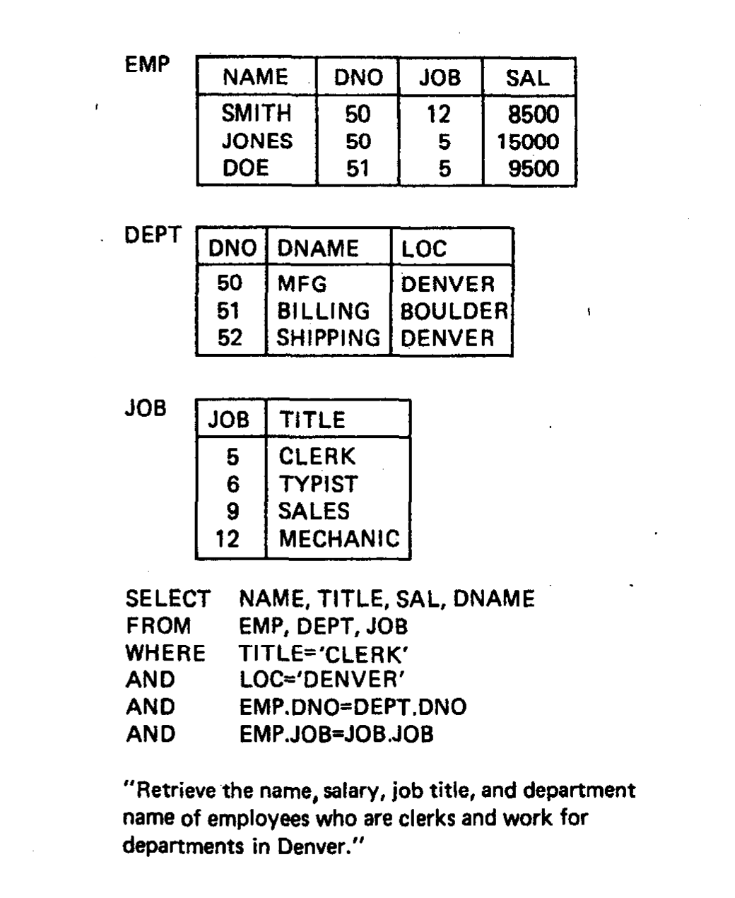
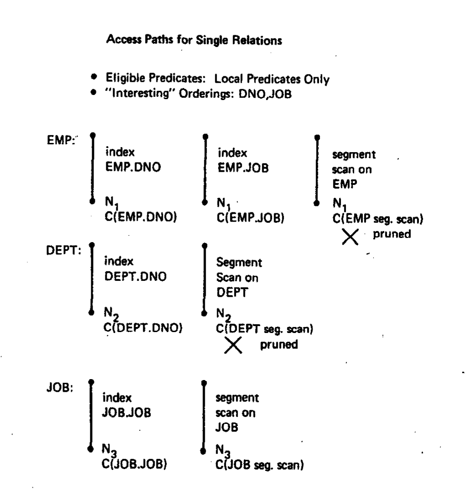
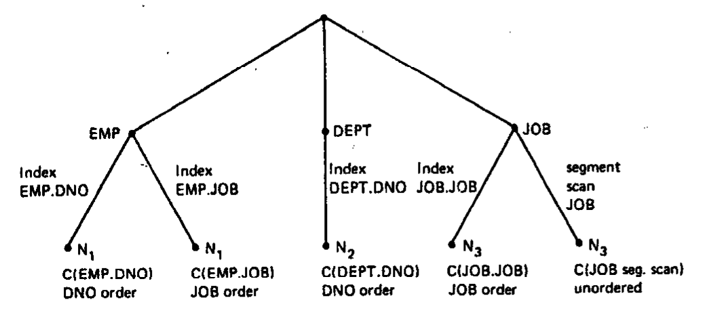
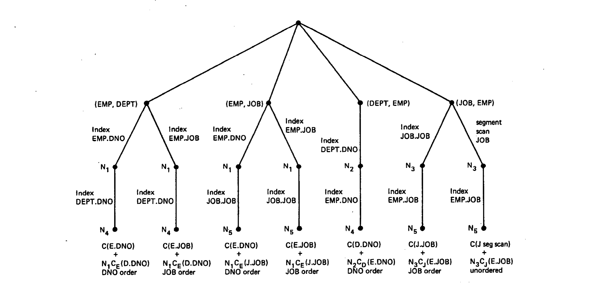
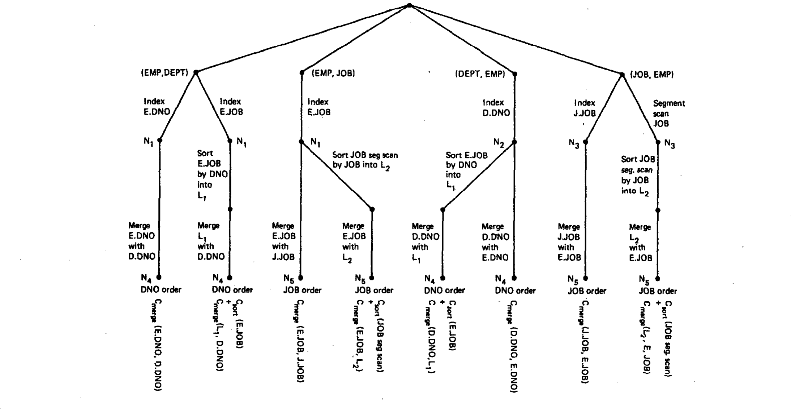
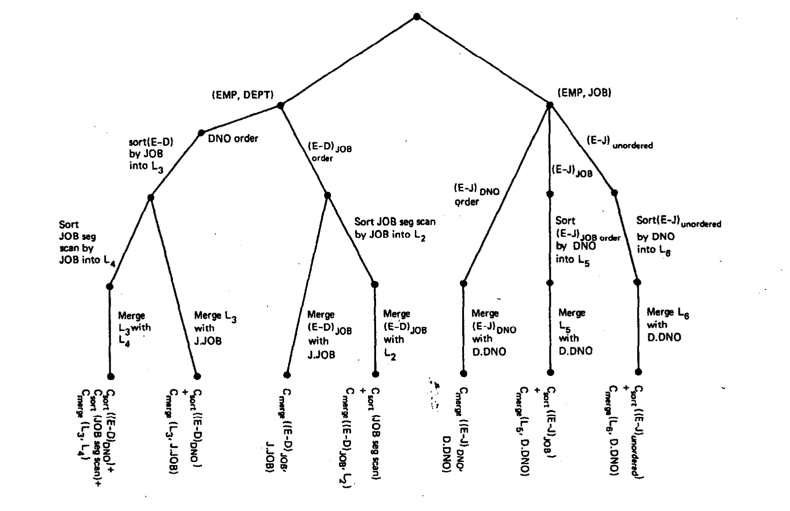

# Access Path Selection in a Relational Database Management System（中文译文）

## 译者说明

本文依据同目录的 `source.pdf` 翻译。章节、图表、公式、算法、代码与参考文献按原文结构保留。

Patricia G. Selinger、Morton M. Astrahan、Donald D. Chamberlin、Raymond A. Lorie、Thomas G. Price

IBM Research Division，San Jose，California 95193

## 摘要

在 SQL 这样的高级查询与数据操纵语言中，请求以非过程式方式表达，并不指明访问路径。本文说明 System R 如何根据用户以谓词布尔表达式给出的目标数据规格，为简单查询（单关系查询）和复杂查询（例如连接）选择访问路径。System R 是为开展关系数据模型研究而开发的实验性数据库管理系统，由 IBM San Jose Research Laboratory 的成员设计并实现。

## 1. 引言

System R 是一个基于关系数据模型的实验性数据库管理系统，自 1975 年起由 IBM San Jose Research Laboratory 开发 [1]。该软件是关系数据库研究的载体，通常不向 IBM Research Division 之外提供。

本文假定读者熟悉 Codd [7] 和 Date [8] 所述的关系数据模型术语。System R 的用户接口是统一的查询、数据定义与数据操纵语言 SQL [5]。SQL 语句既可以从面向临时用户的联机终端界面发出，也可以从 PL/I、COBOL 等程序设计语言中发出。

在 System R 中，用户无须知道元组在物理上如何存储，也无须知道有哪些访问路径可用（例如哪些列上建有索引）。SQL 语句不要求用户指定检索元组所用的访问路径，用户也不指定连接的执行顺序。System R 优化器同时选择连接顺序以及 SQL 语句中每个表的访问路径。在众多可能选择中，优化器选择执行整条语句的“总访问代价”最小者。

本文讨论查询的访问路径选择问题。数据操纵操作（UPDATE、DELETE）的检索以类似方式处理。第 2 节说明优化器在 SQL 语句处理过程中的位置；第 3 节说明对单个物理存储表可用的存储组件访问路径；第 4 节给出单表查询的优化器代价公式；第 5 节讨论两个或更多表的连接及其相应代价；第 6 节讨论嵌套查询（出现在谓词中的查询）。

> 版权声明：在副本不被制作或传播以获取直接商业利益、且副本载明 ACM 版权声明、出版物标题及日期并注明复制经 Association for Computing Machinery 许可的条件下，可以免费复制本文的全部或部分内容。其他复制或再出版行为需要付费和/或取得明确许可。© 1979 ACM 0-89791-001-X/79/0500-0023，$00.75。

## 2. SQL 语句的处理

一条 SQL 语句要经历四个处理阶段。根据语句的来源和内容，这些阶段之间可能相隔任意长的时间。在 System R 中，这些任意时间间隔对处理 SQL 语句的系统组件是透明的。文献 [2] 进一步讨论了这些机制，以及来自程序和终端的 SQL 语句处理过程。这里仅概述与访问路径选择有关的处理步骤。

语句处理的四个阶段是解析、优化、代码生成和执行。每条 SQL 语句先送交解析器检查语法。一个查询块由 SELECT 列表、FROM 列表和 WHERE 树表示，它们分别包含要检索的项目列表、所引用的表，以及用户所指定的简单谓词的布尔组合。一条 SQL 语句可能含有许多查询块，因为某个谓词的一个操作数本身也可能是查询。

如果解析器返回且没有发现错误，就调用 OPTIMIZER（优化器）组件。OPTIMIZER 汇集查询中引用的表名和列名，在 System R 目录中查找它们，以验证其存在并取得有关信息。

OPTIMIZER 的目录查找部分还会取得所引用关系的统计信息以及每个关系上可用的访问路径，稍后访问路径选择将使用这些信息。在目录查找取得每列的数据类型和长度后，OPTIMIZER 再次扫描 SELECT 列表和 WHERE 树，检查表达式及谓词比较中的语义错误和类型兼容性。

最后，OPTIMIZER 执行访问路径选择。它首先确定语句内各查询块的求值顺序，然后处理每个查询块 FROM 列表中的关系。如果一个查询块含有多个关系，就评估连接顺序和连接方法的各种排列。从备选路径构成的树中，选择使该查询块总成本最小的访问路径。这个最小代价解通过对解析树作结构修改来表示，其结果是一个用访问规格语言（Access Specification Language，ASL）[10] 表达的执行计划。

为每个查询块选定计划并在解析树中表示之后，调用 CODE GENERATOR（代码生成器）。CODE GENERATOR 是一个表驱动程序，它把 ASL 树转换为执行 OPTIMIZER 所选计划的机器语言代码。它使用数量相对较少的代码模板，每种连接方法（包括无连接）对应一个模板。嵌套查询的查询块被当作“子程序”，把值返回给包含它们的谓词。代码生成器的更多细节见文献 [9]。

代码生成期间，解析树被可执行机器代码及其相关数据结构取代。依据语句来源（程序或终端），控制流或者立即转交给这些代码，或者把代码存入数据库供以后执行。无论哪种情况，代码最终执行时都会通过存储系统接口（Research Storage Interface，RSI）调用 System R 内部存储系统（Research Storage System，RSS），扫描查询中每个物理存储的关系。这些扫描沿 OPTIMIZER 所选访问路径进行。生成代码可以使用的 RSI 命令将在下一节说明。

## 3. 研究存储系统

Research Storage System（RSS）是 System R 的存储子系统，负责维护关系的物理存储、关系上的访问路径、锁（在多用户环境中），以及日志和恢复设施。RSS 向用户提供面向元组的接口 RSI。尽管 RSS 可以独立于 System R 使用，我们只关心它如何执行上一节所述的、由 SQL 语句处理过程生成的代码。RSS 的完整说明见文献 [1]。

关系在 RSS 中存为元组集合，每个元组的各列在物理上连续。元组存放在 4K 字节的页面上，任何元组都不会跨页。页面组织成称为段（segment）的逻辑单元。一个段可以包含一个或多个关系，但一个关系不能跨段。两个或更多关系的元组可以出现在同一页面上；每个元组都带有所属关系的标识。

访问关系中元组的主要方式是 RSS 扫描。扫描沿指定访问路径每次返回一个元组；OPEN、NEXT 和 CLOSE 是扫描上的主要命令。

SQL 语句当前可以使用两类扫描。第一类是段扫描，用来找出给定关系的全部元组。对段扫描连续执行 NEXT，只会检查段中所有包含元组的页面（无论这些元组属于哪个关系），并返回其中属于给定关系的元组。

第二类是索引扫描。System R 用户可以在关系的一个或多个列上建立索引，一个关系可以拥有任意多个索引（包括零个）。索引存放在与关系元组不同的页面中。索引实现为 B 树 [3]，叶节点是由 `(键, 含有该键的元组标识符集合)` 组成的页面。因此，在索引扫描上连续执行 NEXT，会顺序读取索引叶页，取得与键匹配的元组标识符，再用它们找到数据元组，并按键值顺序返回给用户。索引叶页相互串联，所以 NEXT 不需要引用索引的任何上层页面。

段扫描会访问一个段中的所有非空页面，不论其中是否有目标关系的元组，但每个页面只访问一次。通过索引扫描检查整个关系时，每个索引页只访问一次；但如果同一数据页上的两个元组在索引次序中并不“靠近”，该数据页可能被检查多次。如果元组按索引次序插入段页面，而且与索引键值对应的这种物理邻近性得到维持，就称该索引为聚簇索引（clustered index）。聚簇索引具有这样的性质：沿该索引扫描时，不仅每个索引页只访问一次，包含该关系元组的每个数据页也只访问一次。

索引扫描不必扫描整个关系。可以指定起始键值和终止键值，只扫描键位于某个索引值范围内的元组。索引扫描和段扫描都可以选择性地携带一组谓词，称为搜索参数（search arguments，SARGS），它们会在元组返回给 RSI 调用者之前应用。若元组满足谓词，则返回该元组；否则扫描继续，直到找到一个满足 SARGS 的元组，或者耗尽该段或指定的索引值范围。这样可以在 RSS 内部高效拒绝元组，省去为这些元组发出 RSI 调用的开销，从而降低成本。

并非所有谓词都能成为 SARGS。可作为搜索参数的谓词（sargable predicate）具有，或能够转换成，`列 比较运算符 值` 的形式。SARGS 表示为由这类谓词构成的析取范式布尔表达式。

## 4. 单关系访问路径的成本

接下来的几节说明如何选择查询求值计划。首先讨论最简单的情形，即访问单个关系；随后说明它如何扩展和推广到两路关系连接、n 路连接以及多个查询块（嵌套查询）。

OPTIMIZER 检查查询中的谓词以及被引用关系上可用的访问路径，并用下面的成本公式为每个访问计划作出成本预测：

```text
COST = PAGE-FETCHES + W * (RSI CALLS)
```

这个成本是 I/O（取页次数）和 CPU 使用量（执行的指令）的加权度量。`W` 是 I/O 与 CPU 之间可调的权重因子。`RSI CALLS` 是预计从 RSS 返回的元组数。由于 System R 的 CPU 时间大部分消耗在 RSS 中，RSI 调用数是 CPU 使用量的良好近似。因此，选择处理查询的最小成本路径，目的在于尽量减少所需的总资源。

OPTIMIZER 执行类型兼容性和语义检查时，会检查每个查询块的 WHERE 谓词树。WHERE 树被视为合取范式，每个合取项称为一个布尔因子（boolean factor）。布尔因子之所以重要，是因为返回给用户的每个元组都必须满足每个布尔因子。

如果某个布尔因子是可作为搜索参数的谓词，且它引用的列就是索引键，则称这个索引与该布尔因子匹配。例如，SALARY 上的索引匹配谓词 `SALARY = 20000`。更准确地说，当一个或一组谓词可作为搜索参数，且这些谓词中提到的列构成索引键列集合的一个初始子串时，就称这些谓词与该索引访问路径匹配。例如，`NAME, LOCATION` 索引匹配 `NAME = 'SMITH' AND LOCATION = 'SAN JOSE'`。如果索引匹配某个布尔因子，通过该索引访问就是满足这个布尔因子的高效方式。可作为搜索参数的布尔因子也可以通过把它们表达为搜索参数来高效满足。注意，一个布尔因子可能是以 OR 为根的整棵谓词树。

目录查找期间，OPTIMIZER 取得查询中各关系以及每个关系上可用访问路径的统计信息，具体如下。

对每个关系 `T`：

- `NCARD(T)`：关系 `T` 的基数。
- `TCARD(T)`：段中包含关系 `T` 元组的页面数。
- `P(T)`：段中包含关系 `T` 元组的数据页比例。

```text
P(T) = TCARD(T) /（段中非空页面数）
```

对关系 `T` 上的每个索引 `I`：

- `ICARD(I)`：索引 `I` 中不同键的数量。
- `NINDX(I)`：索引 `I` 的页面数。

这些统计信息保存在 System R 目录中，来自若干来源。关系的初次装载和索引创建会初始化这些统计信息；之后，任何用户都可运行 `UPDATE STATISTICS` 命令定期更新它们。System R 不在每次 INSERT、DELETE 或 UPDATE 时更新统计信息，因为那样会增加数据库操作，并在系统目录处形成锁瓶颈。动态更新统计信息会使修改关系内容的访问趋于串行化。

利用这些统计信息，OPTIMIZER 为谓词列表中的每个布尔因子指定一个选择率因子 `F`。这个选择率因子非常粗略地对应于预计满足谓词的元组比例。表 1 给出了不同类型谓词的选择率因子。系统假定缺少统计信息意味着关系很小，因此会任选一个因子。

**表 1：选择率因子**

| 谓词 | 选择率因子与说明 |
| --- | --- |
| `column = value` | 若 `column` 上有索引，`F = 1 / ICARD(column index)`；这里假定元组在索引键值之间均匀分布。否则 `F = 1/10`。 |
| `column1 = column2` | 若两列都有索引，`F = 1 / MAX(ICARD(column1 index), ICARD(column2 index))`；这里假定基数较小的索引中的每个键值都能在另一索引中找到匹配值。若只有 `column-i` 上有索引，则 `F = 1 / ICARD(column-i index)`；否则 `F = 1/10`。 |
| `column > value`（或其他任何单端开放的比较） | 如果 `column` 是算术类型，且访问路径选择时 `value` 已知，则 `F = (high key value - value) / (high key value - low key value)`，即按该值在键值范围内的位置作线性插值。否则 `F = 1/3`。这个数本身没有特殊意义，只是它比无索引等值谓词的猜测选择性更弱，并且小于 `1/2`；我们假设很少有查询使用会被半数以上元组满足的谓词。 |
| `column BETWEEN value1 AND value2` | 如果 `column` 是算术类型，且访问路径选择时 `value1` 与 `value2` 都已知，则 `F = (value2 - value1) / (high key value - low key value)`，也就是用 BETWEEN 值域与整个键值范围之比作为选择率因子。否则 `F = 1/4`。这个选择本身也无特殊意义，只是位于等值谓词与范围谓词的默认选择率因子之间。 |
| `column IN (list of values)` | `F =（列表中的项数）*（column = value 的选择率因子）`，但最大不超过 `1/2`。 |
| `columnA IN subquery` | `F =（子查询结果的预期基数）/（子查询 FROM 列表中所有关系基数的乘积）`。推导见表后正文。 |
| `(pred1) OR (pred2)` | `F = F(pred1) + F(pred2) - F(pred1) * F(pred2)`。 |
| `(pred1) AND (pred2)` | `F = F(pred1) * F(pred2)`；这里假定列值相互独立。 |
| `NOT pred` | `F = 1 - F(pred)`。 |

查询基数的计算稍后讨论。`columnA IN subquery` 的公式由如下论证得到。考虑最简单的情况，子查询形式为 `SELECT columnB FROM relationC ...`。假设 `relationC` 中全部 `columnB` 值的集合包含全部 `columnA` 值的集合。如果子查询选择 `relationC` 的全部元组，谓词恒为 TRUE，因而 `F = 1`。如果子查询中的元组受某个选择率因子 `F'` 限制，那么假设子查询结果中能与 `columnA` 值匹配的不同值集合也按同比例缩小，也就是说，该谓词的选择率因子应为 `F'`。

`F'` 是子查询所有选择率因子的乘积，也就是：

```text
F' =（子查询基数）/（所有可能子查询答案的基数）
```

稍微乐观一点，可以把这一推理扩展到子查询本身为连接的情况，也可以扩展到 `columnB` 被含有列名的算术表达式替代的情况，于是得到表 1 中给出的公式。

查询基数 `QCARD` 等于查询块 FROM 列表中每个关系的基数之积，再乘以该查询块所有布尔因子的选择率因子之积。预期 RSI 调用数 `RSICARD` 等于关系基数之积乘以可作为搜索参数的布尔因子的选择率因子，因为这些布尔因子会被放入搜索参数，在元组跨 RSS 接口返回之前就将其滤除。

为单个关系选择最优访问路径，就是把这些选择率因子和可用访问路径的统计信息一起代入公式。在说明这个过程之前，需要先作一个定义。使用索引访问路径或对元组排序，会按索引值或排序键顺序产生元组。如果某个元组次序是查询块 GROUP BY 或 ORDER BY 子句所指定的次序，就称其为感兴趣次序（interesting order）。

对单个关系，通过评估每条可用访问路径（该关系上的每个索引，再加上一次段扫描）的成本来取得最便宜的访问路径。成本公式见下文。对于每条访问路径，都同时计算其预测成本以及它将产生的元组次序。例如，按升序扫描 SALARY 索引会产生某个成本 `C` 和 SALARY（升序）的元组次序。要找出单关系查询的最便宜访问计划，只需检查为每一种“感兴趣”次序产生元组的最便宜访问路径，以及最便宜的“无序”访问路径。注意，“无序”访问路径实际上也可能按某种次序产生元组，只是该次序并非“感兴趣”次序。

如果查询没有 GROUP BY 或 ORDER BY 子句，就不存在感兴趣次序，直接选择最便宜的访问路径。如果存在 GROUP BY 或 ORDER BY 子句，则必须把产生该感兴趣次序的成本，与“最便宜无序路径的成本加上把 `QCARD` 个元组排序成适当次序的成本”作比较，选择其中最便宜的方案作为查询块的计划。

单关系访问路径的成本公式见表 2。公式由索引取页数、数据取页数以及权重因子乘 RSI 元组检索调用数构成。`W` 是取页和 RSI 调用之间的权重因子。某些情况给出了若干备选公式，选择取决于检索到的元组集合能否完全放入 RSS 缓冲池（实际是每用户可用的缓冲池部分）。对聚簇索引，系统假定一个页面会在缓冲区中停留足够久，使其中每个元组都能被取出。对非聚簇索引，若关系放不进缓冲区，则假定相对于缓冲区大小而言关系足够大，以致每次检索元组都需要取页。

**表 2：成本公式**

| 情形 | 成本公式（页访问次数） |
| --- | --- |
| 与等值谓词匹配的唯一索引 | `1 + 1 + W` |
| 聚簇索引 `I` 与一个或多个布尔因子匹配 | `F(preds) * (NINDX(I) + TCARD) + W * RSICARD` |
| 非聚簇索引 `I` 与一个或多个布尔因子匹配 | `F(preds) * (NINDX(I) + NCARD) + W * RSICARD`；如果结果能放入 System R 缓冲区，则为 `F(preds) * (NINDX(I) + TCARD) + W * RSICARD` |
| 聚簇索引 `I` 不与任何布尔因子匹配 | `(NINDX(I) + TCARD) + W * RSICARD` |
| 非聚簇索引 `I` 不与任何布尔因子匹配 | `(NINDX(I) + NCARD) + W * RSICARD`；如果结果能放入 System R 缓冲区，则为 `(NINDX(I) + TCARD) + W * RSICARD` |
| 段扫描 | `TCARD / P + W * RSICARD` |

## 5. 连接的访问路径选择

1976 年，Blasgen 和 Eswaran [4] 研究了多种执行两路连接的方法，并在不同的关系基数下分析了每种方法的性能。他们的证据表明，除非常小的关系外，两种方法之一总是最优或接近最优。System R 优化器就在这两种方法之间选择。下面先说明这两种方法，再讨论如何把它们扩展到 n 路连接，最后说明如何选择连接顺序，即各关系被连接的次序。

对于涉及两个关系的连接，先从中取得元组的关系称为外关系（outer relation）；另一个关系称为内关系（inner relation），从中取哪些元组可能取决于外关系元组中取得的值。把待连接的两个表的列联系起来的谓词称为连接谓词（join predicate），连接谓词所引用的列称为连接列（join columns）。

第一种连接方法称为嵌套循环（nested loops），它以任意次序在外关系和内关系上使用扫描。先打开外关系上的扫描并取得第一个元组；对于每个取得的外关系元组，打开内关系上的扫描，逐一取得满足连接谓词的所有内关系元组。由外关系元组与内关系元组配对形成的复合元组构成连接结果。

第二种连接方法称为合并扫描（merging scans），它要求外关系和内关系都按连接列次序扫描。这意味着，除了 ORDER BY 和 GROUP BY 中提到的列外，等值连接谓词（形如 `Table1.column1 = Table2.column2`）中的列也定义“感兴趣”次序。如果有多个连接谓词，就选其中一个作为连接谓词，其余按普通谓词处理。虽然原则上合并扫描也能用于其他类型的连接，但这里仅把它用于等值连接。如果待连接的一个或两个关系在连接列上没有索引，就必须把它们排序成按连接列有序的临时列表。

合并扫描连接方法的逻辑更复杂。它利用连接列上的次序，避免针对外关系的每个元组都重新扫描整个内关系来寻找匹配。具体做法是参照相等的连接列值同步内、外扫描，并“记住”匹配连接组的位置。如果内关系在连接列上聚簇（例如它是按连接列排序的输出），还能进一步节省成本。所谓在某列上“聚簇”，是指该列具有相同值的元组在物理存储上彼此接近，因此一次页面访问可以取得多个元组。

n 路连接可以看成一串两路连接：先连接两个关系，再把所得复合关系与第三个关系连接，以此类推。在 n 路连接的每一步中，都可以确定外关系（通常是复合关系）和内关系（当前加入连接的关系）。因此，上述两路连接方法很容易推广到 n 路连接。

不过必须强调，第一个两路连接不必完成之后才开始第二个两路连接。一旦第一个两路连接产生一个复合元组，就可以把它与第三个关系中的元组连接，形成三路连接的结果元组，以此类推。同一查询中可以混用嵌套循环连接和合并扫描连接。例如，一个三路连接的前两个关系可以用合并扫描连接，其复合结果再用嵌套循环与第三个关系连接。只有下一步连接需要排序时，中间复合关系才会被物理存储。如果没有规定对复合关系排序，复合关系会一次实体化一个元组，立即参与下一步连接。

下面考虑选择关系连接次序的问题。虽然 n 个关系的连接基数与连接次序无关，但不同连接次序的成本可能相差很大。若查询块的 FROM 列表有 n 个关系，就有 `n!` 种关系连接次序。可以利用如下观察缩小搜索空间：一旦前 k 个关系完成连接，把该复合关系与第 k+1 个关系连接的方法就与前 k 个关系的连接次序无关；也就是说，可应用的谓词相同、感兴趣次序集合相同、可能的连接方法相同，等等。利用这一性质，可以依次为越来越大的表子集寻找最佳连接顺序，从而高效地组织搜索。

系统还用一条启发式规则减少需要考虑的连接顺序排列。只要可能，就只考虑这样一些连接顺序：内关系至少有一个连接谓词把它同已经参与连接的其他关系联系起来。也就是说，连接关系 `t1, t2, ..., tn` 时，只检查满足下述条件的顺序 `ti1, ti2, ..., tin`：对于所有 `j (j = 2, ..., n)`，或者

1. `tij` 至少有一个连接谓词把它同某个 `tik` 联系起来，其中 `k < j`；或者
2. 对所有 `k > j`，`tik` 与 `ti1, ti2, ..., ti(j-1)` 中任何关系都没有连接谓词。

这意味着所有需要笛卡尔积的连接都尽可能放到连接序列的后面。例如，若 `T1, T2, T3` 是查询块 FROM 列表中的三个关系，`T1` 与 `T2` 之间有连接谓词，而 `T2` 与 `T3` 之间也有连接谓词，且后一个连接用的是不同于 `T1-T2` 连接的列，则不考虑以下排列：

```text
T1-T3-T2
T3-T1-T2
```

为了找出 n 个关系连接的最优计划，系统构造一棵可能解的树。如上所述，搜索通过寻找各关系子集的最佳连接方法来进行。对于每个已经连接的关系集合，估计并保存复合关系的基数。此外，对无序连接以及到目前为止由连接得到的每个感兴趣次序，都保存实现该次序的最便宜方案及其成本。一个方案包括待连接关系的有序列表、每步连接使用的方法，以及指明如何访问每个关系的计划。如果外部复合关系或内关系需要在连接前排序，计划中也会包含该操作。

与单关系情况一样，“感兴趣”次序包括查询块 GROUP BY 或 ORDER BY 子句列出的次序；此外，每个连接列都定义一个“感兴趣”次序。为减少不同感兴趣次序的数量，进而减少树中的方案数量，系统计算感兴趣次序的等价类，每个等价类只保存最佳方案。例如，若有连接谓词 `E.DNO = D.DNO` 和另一个连接谓词 `D.DNO = F.DNO`，那么这三列都属于同一个次序等价类。

搜索树按目前已经连接的关系数量迭代构造。首先，对于每个感兴趣元组次序和无序情况，找出访问各单个关系的最佳方法。接着，在连接顺序启发式规则的约束下，找出把任一关系连接到这些单关系上的最佳方法，从而得到关系对的连接方案。然后，考察所有双关系集合，并按连接顺序启发式规则连接每个允许的第三个关系，找出连接三关系集合的最佳方法。对于连接某个关系集合的每个计划，复合结果的次序都保存在树中，这样就能考虑无需对复合关系排序的合并扫描连接。

找到完整方案（所有关系全部连接）后，优化器选择能提供所需次序的最便宜方案（如果指定了次序）。注意，只要存在具有正确次序的方案，ORDER BY 或 GROUP BY 就不需要执行排序，除非该有序方案比“最便宜的无序方案加上排序为所需次序的成本”更贵。

必须存储的方案数最多是 `2^n`（n 个表的子集数量）乘以感兴趣结果次序的数量，生成该树的计算时间也近似与此数量成正比。连接顺序启发式规则常常会大幅减少这个数字。我们的经验是，典型情况只需要几千字节存储空间，以及 IBM 370/158 上十分之几秒的 CPU 时间。8 个表的连接可以在几秒内完成优化。

### 连接成本计算

连接成本根据各关系的扫描成本和基数计算。每个关系的扫描成本使用第 4 节给出的单关系访问路径成本公式计算。

令 `C-outer(path1)` 为通过 `path1` 扫描外关系的成本，令 `N` 为满足可应用谓词的外关系元组基数。`N` 的计算如下：

```text
N =（到目前为止参与连接的所有关系 T 的基数之积）
    *（所有可应用谓词的选择率因子之积）
```

令 `C-inner(path2)` 为扫描内关系并应用所有可应用谓词的成本。注意，在合并扫描连接中，这意味着扫描内关系中与外关系某个连接列值相对应的连续元组组。于是，嵌套循环连接的成本为：

```text
C-nested-loop-join(path1, path2) =
    C-outer(path1) + N * C-inner(path2)
```

合并扫描连接的成本可以分成实际执行合并的成本，以及在必要时对外关系或内关系排序的成本。实际执行合并的成本为：

```text
C-merge(path1, path2) =
    C-outer(path1) + N * C-inner(path2)
```

如果内关系被排序成临时关系，第 4 节的单关系访问路径公式都不适用。在这种情况下，内扫描类似段扫描，但合并扫描方法会利用内关系已排序这一事实，不必为了寻找匹配而扫描整个内关系。此时内扫描成本采用下式：

```text
C-inner(sorted list) = TEMPPAGES / N + W * RSICARD
```

其中 `TEMPPAGES` 是容纳内关系所需的页面数。这个公式假定合并过程中内关系的每个页面只取一次。

值得注意的是，嵌套循环连接与合并扫描的成本公式实质相同。合并扫描有时优于嵌套循环，是因为内扫描成本可能低得多。排序后，内关系在连接列上聚簇，这会尽量减少取页次数；而且不必针对外关系的每个元组都扫描整个内关系寻找匹配。

对关系排序的成本 `C-sort(path)` 包括：通过指定访问路径检索数据、对数据排序（可能需要多趟），以及把结果放入临时列表。注意，在对内表排序之前，只能应用局部谓词。并且，如果必须对复合结果排序，就必须先把整个复合关系存入临时关系，再进行排序。排序前把复合元组插入临时关系的成本也包含在 `C-sort(path)` 中。

### 搜索树示例

下面说明如何对图 1 所示连接执行搜索。



**图 1　连接示例。** 图中的 EMP、DEPT 和 JOB 是示例关系；查询要求检索在 Denver 部门工作的职员（clerk）的姓名、工资、职务名称和部门名称。图中查询转录如下：

```sql
SELECT NAME, TITLE, SAL, DNAME
FROM EMP, DEPT, JOB
WHERE TITLE = 'CLERK'
  AND LOC = 'DENVER'
  AND EMP.DNO = DEPT.DNO
  AND EMP.JOB = JOB.JOB
```

首先，只应用各关系的局部谓词，为单关系找出所有合理访问路径，结果见图 2。EMP 表有三条访问路径：DNO 上的索引、JOB 上的索引和段扫描。感兴趣次序是 DNO 和 JOB。DNO 索引按 DNO 次序提供元组，JOB 索引按 JOB 次序提供元组；对我们的目的而言，段扫描访问路径是无序的。本例假设 JOB 索引是最便宜路径，因此剪除段扫描路径。

DEPT 关系有两条访问路径：DNO 上的索引和段扫描。假定 DNO 索引更便宜，剪除段扫描路径。JOB 关系也有两条访问路径：JOB 上的索引和段扫描。假定段扫描路径更便宜，因此两条路径都保存。



**图 2　单关系的访问路径。** 只应用局部谓词；感兴趣次序为 DNO 和 JOB。

上述结果以图 3 的形式保存到搜索树中。图中记号 `C(EMP.DNO)` 或 `C(E.DNO)` 表示通过 DNO 索引扫描 EMP，并应用在指定关系集合的元组已经取出后可以应用的所有谓词的成本。记号 `Ni` 表示不同部分结果的基数。



**图 3　单关系搜索树。**

接着，把第二个关系连接到图 3 所示的单关系结果，以找出关系对的方案。对于每个单关系，都为与之存在连接谓词的每个第二关系寻找访问路径。首先考虑嵌套循环连接的访问路径选择。

本例假定 EMP-JOB 连接通过 JOB 索引访问 JOB 最便宜，因为它很可能直接取得具有匹配 JOB 值的元组，而无须扫描整个关系。实际中会用前述公式估算连接成本并选择最便宜路径。对于 EMP 与 DEPT 的连接，假定 DNO 索引最便宜。每个第二层关系的最佳访问路径与图 3 中的每个计划组合，形成图 4 所示的嵌套循环方案。



**图 4　第二个关系的扩展搜索树（嵌套循环连接）。**

然后生成使用合并扫描方法的方案。图 3 左侧显示 EMP 关系上存在按 DNO 次序的扫描，所以可以用这一扫描和 DEPT 关系上的 DNO 扫描执行合并扫描连接，而不需要排序。尽管如此，使用 EMP 上的 JOB 索引、按 DNO 排序后再合并，仍有可能更便宜。注意，从不考虑对 DEPT 表排序，因为该表最便宜的扫描已经按 DNO 排序。

对于 JOB 与 EMP 的合并，只考虑 EMP 上的 JOB 索引，因为不论次序如何，它都是 EMP 最便宜的访问路径。使用 JOB 上的 JOB 索引可以不排序直接合并；不过，也可能先用关系扫描读取 JOB，将其排序后再合并会更便宜。

由图 3 可见，DEPT 关系选择的是 DNO 索引。通过该索引访问 DEPT 后，可以使用 EMP 上的 DNO 索引与 EMP 合并，同样无须排序。不过，也可能先以 JOB 索引为排序输入对 EMP 排序，然后再合并会更便宜。这两种情况都显示在图 5 中。



**图 5　第二个关系的扩展搜索树（合并连接）。**

在计算图 4 和图 5 中的每项成本时，都会把它与目前为止找到的最便宜等价方案（相同表集合、相同结果次序）比较，只保存最便宜的方案。经过这种剪枝后，再寻找包含全部三个关系的方案。对于每个关系对，为加入剩余的第三个关系寻找访问路径。与前面一样，用嵌套循环连接和合并扫描扩展搜索树。三关系的搜索树见图 6。



**图 6　第三个关系的扩展搜索树。**

注意，其中有一种情况同时对复合关系和被加入的表 JOB 排序；另一些情况完全不执行排序。在后一类情况下，复合结果每次实体化一个元组，中间复合关系从不存储。与前面一样，每算出一个成本，就把它与当前最便宜的等价方案比较并作剪枝。

## 6. 嵌套查询

查询可以作为形如“表达式 运算符 查询”的谓词的一个操作数出现，这样的查询称为嵌套查询（Nested Query）或子查询（Subquery）。如果运算符是六种标量比较之一（`=`、`~=`、`>`、`>=`、`<`、`<=`），子查询必须返回单个值。下面这个使用 `=` 运算符的例子曾在第 2 节给出：

```sql
SELECT NAME
FROM EMPLOYEE
WHERE SALARY =
      (SELECT AVG(SALARY)
       FROM EMPLOYEE)
```

如果运算符是 IN 或 NOT IN，子查询可以返回一个值集合。例如：

```sql
SELECT NAME
FROM EMPLOYEE
WHERE DEPARTMENT_NUMBER IN
      (SELECT DEPARTMENT_NUMBER
       FROM DEPARTMENT
       WHERE LOCATION = 'DENVER')
```

在这两个例子中，子查询都只需求值一次。OPTIMIZER 会安排在顶层查询求值之前对子查询求值。若返回单个值，就把它并入顶层查询，如同它原本就是查询语句的一部分。例如，如果上例中的 `AVG(SAL)` 在执行时求得 15000，谓词就变成 `SALARY = 15000`。

若子查询可能返回值集合，这些值就以临时列表返回。临时列表是一种内部形式，比关系更高效，但只能顺序访问。在上例中，如果子查询返回列表 `(17, 24)`，则谓词的求值方式类似于原谓词写成 `DEPARTMENT_NUMBER IN (17, 24)` 的情况。

子查询也可以含有其谓词中又包含子查询的情况，理论上可以嵌套到任意层。当这些子查询不引用更高层查询块中表的列时，它们都在顶层查询之前求值。此时最深层的子查询最先求值，因为任何子查询都必须在其父查询求值之前完成求值。

子查询也可以引用从更高层查询块候选元组取得的值，这种查询称为相关子查询（correlation subquery）。原则上，对于被引用查询块中的每个候选元组，都必须重新计算一次相关子查询。重新求值必须发生在高层查询块中的父谓词判断接受还是拒绝该候选元组之前。请看以下查询：

```sql
SELECT NAME
FROM EMPLOYEE X
WHERE SALARY > (SELECT SALARY
                FROM EMPLOYEE
                WHERE EMPLOYEE_NUMBER = X.MANAGER)
```

它选择工资高于其经理工资的员工姓名。这里的 `X` 标识为相关性提供候选元组的查询块和关系。对于顶层查询块的每个候选元组，都用其中的 MANAGER 值计算子查询，再把子查询结果返回给 `SALARY >` 谓词，以判断是否接受该候选元组。

如果相关子查询并非直接位于它所引用的查询块之下，而是与该查询块相隔一个或多个中间查询块，那么相关子查询会在最高层中间查询块求值之前完成求值。原文在三层 `SELECT` 左侧分别标注 `level 1`、`level 2`、`level 3`；以下以 SQL 注释保留这些层级标签：

```sql
-- level 1
SELECT NAME
FROM EMPLOYEE X
WHERE SALARY >
      -- level 2
      (SELECT SALARY
       FROM EMPLOYEE
       WHERE EMPLOYEE_NUMBER =
             -- level 3
             (SELECT MANAGER
              FROM EMPLOYEE
              WHERE EMPLOYEE_NUMBER = X.MANAGER))
```

这个查询选择工资高于其经理的经理之工资的员工姓名。和前例一样，对于第 1 层查询块的每个候选元组，都用 `EMPLOYEE.MANAGER` 值计算第 3 层查询块。这里，第 3 层子查询引用第 1 层的值，却不引用第 2 层的值，所以每出现一个新的第 1 层候选元组，它求值一次；而不是针对每个第 2 层候选元组都求值。

如果相关子查询所引用的值（上例中的 `X.MANAGER`）在候选元组集合中不唯一（例如许多员工有同一位经理），上述过程仍会在重复值每次出现时重新计算子查询。不过，如果被引用关系按被引用列有序，就可以根据当前被引用值是否与前一个候选元组中的值相同，有条件地决定是否重新求值。如果两者相同，可以复用上次求值结果。在某些情况下，甚至值得为避免不必要的子查询重复求值，先按被引用列对关系排序。

为了判断被引用列值是否唯一，OPTIMIZER 可以利用诸如 `NCARD > ICARD` 这样的线索，其中 `NCARD` 是关系基数，`ICARD` 是被引用列上索引的索引基数。

## 7. 结论

本文说明了 System R 对单表查询、连接和嵌套查询的访问路径选择。比较优化器选择与“正确”选择的评估工作仍在进行，将在后续论文中说明。初步结果表明，尽管优化器预测的成本在绝对值上往往不准确，但在绝大多数情况下它确实选择了真正的最优路径。在很多情况下，所有候选路径的估算成本排序与实际测量成本的排序完全一致。

此外，路径选择本身的成本并不高。对于一次两路连接，优化成本大致相当于 5 至 20 次数据库检索。在 System R 这样的环境中，这个数字更加无足轻重，因为应用程序只编译一次，却运行多次；优化成本可以摊销到许多次运行之中。

与该领域其他工作相比，这一路径选择器的主要贡献包括：扩大统计信息的使用范围（例如索引基数）、在成本公式中纳入 CPU 使用量，以及确定连接顺序的方法。许多查询受 CPU 限制，特别是需要创建临时关系并执行排序的合并连接。“选择率因子”概念使优化器能够在 RSS 搜索参数和访问路径中尽可能多地利用查询的限制谓词。

通过记住连接以及 ORDER 或 GROUP 规格的“感兴趣次序”等价类，优化器维护的信息比多数路径选择器更多；但这些额外工作在很多情况下避免了中间查询结果的存储和排序。树剪枝和树搜索技术使这些额外的维护工作得以高效完成。

优化器成本公式仍需开展更多验证工作，但从这些初步工作可以得出结论：数据库管理系统能够支持非过程式查询语言，并达到可与支持当时更具过程式特征的语言之系统相当的性能。

## 引用及一般参考文献

- [1] Astrahan, M. M. et al. System R: Relational Approach to Database Management. *ACM Transactions on Database Systems*, Vol. 1, No. 2, June 1976, pp. 97–137.
- [2] Astrahan, M. M. et al. System R: A Relational Database Management System. To appear in *Computer*.
- [3] Bayer, R. and McCreight, E. Organization and Maintenance of Large Ordered Indices. *Acta Informatica*, Vol. 1, 1972.
- [4] Blasgen, M. W. and Eswaran, K. P. On the Evaluation of Queries in a Relational Data Base System. IBM Research Report RJ1745, April, 1976.
- [5] Chamberlin, D. D., et al. SEQUEL2: A Unified Approach to Data Definition, Manipulation, and Control. *IBM Journal of Research and Development*, Vol. 20, No. 6, Nov. 1976, pp. 560–575.
- [6] Chamberlin, D. D., Gray, J. N., and Traiger, I. L. Views, Authorization and Locking in a Relational Data Base System. *ACM National Computer Conference Proceedings*, 1975, pp. 425–430.
- [7] Codd, E. F. A Relational Model of Data for Large Shared Data Banks. *ACM Communications*, Vol. 13, No. 6, June, 1970, pp. 377–387.
- [8] Date, C. J. *An Introduction to Data Base Systems*. Addison-Wesley, 1975.
- [9] Lorie, R. A. and Wade, B. W. The Compilation of a Very High Level Data Language. IBM Research Report RJ2008, May, 1977.
- [10] Lorie, R. A. and Nilsson, J. F. An Access Specification Language for a Relational Data Base System. IBM Research Report RJ2218, April, 1978.
- [11] Stonebraker, M. R., Wong, E., Kreps, P., and Held, G. D. The Design and Implementation of INGRES. *ACM Transactions on Database Systems*, Vol. 1, No. 3, September, 1976, pp. 189–222.
- [12] Todd, S. PRTV: An Efficient Implementation for Large Relational Data Bases. *Proceedings of the International Conference on Very Large Data Bases*, Framingham, Mass., September, 1975.
- [13] Wong, E., and Youssefi, K. Decomposition — A Strategy for Query Processing. *ACM Transactions on Database Systems*, Vol. 1, No. 3 (Sept. 1976), pp. 223–241.
- [14] Zloof, M. M. Query by Example. *Proceedings AFIPS 1975 NCC*, Vol. 44, AFIPS Press, Montvale, N.J., pp. 431–437.
