# Adaptive Execution of Compiled Queries（中文译文）

## 译者说明

本文依据同目录的 `source.pdf` 翻译。章节、图表、公式、算法、代码与参考文献按原文结构保留。

André Kohn，Viktor Leis，Thomas Neumann

慕尼黑工业大学（Technische Universität München），`{kohna,leis,neumann}@in.tum.de`

## 摘要

把查询编译成机器码是一种非常高效的查询执行方式。编译常被忽略的问题是生成机器码本身需要时间。即使使用 LLVM 这样较快的编译框架，复杂查询生成机器码也经常需要数百毫秒。对于大量执行复杂但很快完成的查询的负载，这种延迟会成为主要缺点。为解决这个问题，我们提出一种自适应执行框架（adaptive execution framework），在解释执行和编译执行之间动态切换。论文还提出一个面向 LLVM 的快速字节码解释器（bytecode interpreter），可以不经过昂贵的机器码生成就执行查询，从而显著降低查询延迟。自适应执行是细粒度的，同一查询中的不同代码路径可以使用不同执行模式。实验表明，该方法在多种设置下接近最优：小数据集上低延迟，大数据集上高吞吐。

## I. 引言

将查询编译为机器码已经成为查询执行的常见方法。商业系统和研究系统都采用了这种技术，例如 Hekaton、MemSQL、Spark、Impala、HIQUE、HyPer、DBToaster、Tupleware、LegoBase、ViDa、Voodoo、Weld 和 Peloton。编译的优势很直接：针对给定查询生成代码，可以避免传统执行引擎中的解释开销，从而提升性能。

缺点也很明显：生成机器码要花时间。论文以 pgAdmin 发出的元数据查询为例：

```sql
SELECT c.oid, c.relname, n.nspname
FROM pg_inherits i
JOIN pg_class c ON c.oid = i.inhparent
JOIN pg_namespace n ON n.oid = c.relnamespace
WHERE i.inhrelid = 16490
ORDER BY inhseqno;
```

它只访问极少 tuple，在 HyPer 中执行不足 1 ms，但优化 LLVM 编译需 54 ms，约为执行的 50 倍；若频繁运行同类查询，98% 时间浪费在编译。最大 TPC-DS 查询的编译接近 1 秒。LLVM IR 相比生成 C/C++ 已把编译时间降低一个数量级且机器码质量相当，但对交互式短查询仍不够低。

该查询只是 pgAdmin 启动时发送的几十条复杂元数据查询之一，其中最多有 22 个 join，却都只查很小的系统表。缓存机器码最多改善后续执行，无法改善首次体验；而人能感知的延迟阈值低于 1 秒。商业智能工具还可能生成约 1 MB SQL 文本，标准编译器事实上无法处理。因而编译引擎对这些工作负载的体验可能反而弱于 Volcano 解释器。

维护两套独立查询引擎代价过高，还可能因细微语义差异产生 bug。本文只保留一个生成 LLVM IR 的编译引擎，加入三个组件：数据库专用快速字节码解释器、精确跟踪查询进度的方法、动态切换解释与编译的机制。它不依赖常常不准的优化器代价估计，而以运行时反馈同时追求短查询低延迟和长查询高吞吐，且无需重写既有查询引擎。

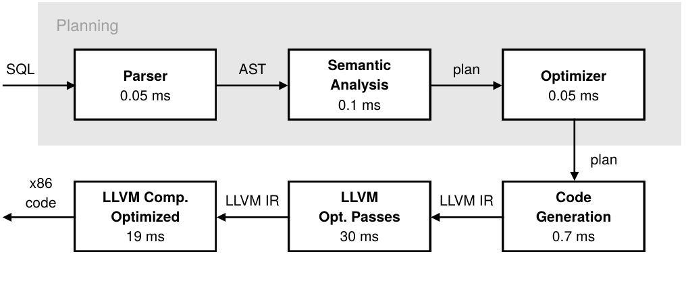

**图 1：基于编译的查询引擎架构。**

图 1 展示 HyPer 风格查询编译路径：SQL 先经 parser、semantic analysis 和 optimizer 得到 plan，再生成 LLVM IR，经过 LLVM optimization passes，最后编译为 x86 code。图中计时说明，在示例 TPC-H Q1 上，query optimization 和 code generation 很快，而 LLVM optimization passes 和 optimized machine-code compilation 占据主要延迟。

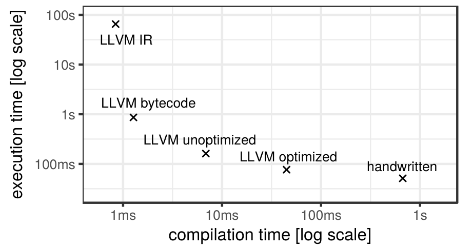

**图 2：TPC-H 查询 1 在 scale factor 1 上，不同执行模式的单线程编译时间与执行时间。**

图 2 把不同执行模式放到 compilation time 与 execution time 的对数坐标中。LLVM IR 解释启动最快但执行最慢；optimized machine code 执行接近手写代码，但编译成本高；bytecode 与 unoptimized machine code 位于中间。自适应执行正是利用这个空间，在运行中选择收益最高的点。

注 1：实验设置见第 V 节。注 2：手写版本没有实现溢出检查，因此运行时间略快。

## II. 通过编译执行查询

关系数据库执行 SQL 要经过多个阶段。SQL 文本先由解析器转换为抽象语法树，语义分析产生未优化计划，优化器再选择物理计划。传统引擎直接解释该计划；编译式引擎则把优化计划转换为命令式、低层、与机器无关的表示，执行第二轮优化，最后生成机器码。有些系统会在关系代数与 LLVM IR 之间加入更多中间表示，但最终机器码生成通常仍是最昂贵的阶段。

### A. 延迟与吞吐的权衡

本文基于 HyPer。以 TPC-H Q1 为例，解析、语义分析、优化和 LLVM IR 生成合计不到 1 ms；LLVM 优化 pass 约需 30 ms，优化后的机器码生成约需 19 ms。因而要降低端到端延迟，关键不是再压缩优化器时间，而是降低或绕过机器码生成成本。

不同编译器设置对应不同的启动成本和稳态速度。关闭 LLVM 优化可明显缩短编译，但执行略慢；LLVM 自带 IR 解释器无需编译，却吞吐很低；本文的字节码解释器也不生成机器码，但比 LLVM 解释器高效得多。长查询适合最大优化等级，短查询适合解释执行，未优化机器码位于两者之间。最优点还取决于 SQL 复杂度和实际访问的数据量。

查询内部也未必应该使用同一模式。例如，一个小 build 端、大 probe 端的内存哈希连接，可以解释执行建表代码、编译 probe 代码。编译器本身通常单线程，而查询执行可以占满多核；若先完整编译再运行，编译期间其余核会空闲，解释器则能更早并行处理数据。

### B. 编译大型查询

TPC-H Q1 的约 59 ms 编译时间对某些应用尚可接受，但它生成的代码并不大；TPC-H 与 TPC-DS 中最大查询分别需要 146 ms 和 911 ms。对商业智能工具生成的超大查询，编译时间会随查询规模超线性增长，甚至无法完成。工业系统必须能够执行这类查询，而传统解释式数据库并不存在“查询太大以至于编译不了”的问题。

论文的核心观察是：查询的输入大小和运行路径在执行前往往不完全确定。如果输入很小，解释执行可能已经足够快；如果输入很大，机器码的长期收益更高；如果某些分支很少被走到，为这些路径提前生成机器码就很浪费。因此执行引擎应当能够按 pipeline、按阶段选择解释或编译。

## III. 自适应执行框架

我们认为，基于编译的引擎应当同时支持图 3 所示的三种模式：字节码解释为快速查询提供极低延迟，未优化机器码是中等查询的折中，优化机器码则为长时间查询提供峰值吞吐。如果能为给定查询选中合适模式，同时支持三者的系统就能提供最优体验。

一种看似自然的选择方法是依赖查询优化器的代价估计，但基数估计和代价模型往往不准确 [17][18]。错误决策的代价可以很高：它会对并不需要的 pipeline 编译数百毫秒，也可能让长查询一直停留在慢一个数量级的解释器中。而且编译本身是单线程的；若预先编译整个查询，其余 CPU 核在编译结束前都会空闲。因此，自适应执行（adaptive execution）的目标是以运行时反馈组合各种模式的优点，而不在执行前作一次性决定：

- 查询到达后立即开始解释执行，避免等待完整编译。
- 编译器在后台生成热点代码路径的机器码。
- 运行时监控执行进度和剩余工作量，决定是否切换。
- 同一个查询内不同函数、基本块或执行路径可以处于不同模式。

系统总是用字节码解释器和全部可用线程开始每条查询，并监控执行进度；若预计编译有利，就在后台线程编译，其他线程继续解释。机器码就绪后，各线程在 morsel 边界切换。三种模式在同一数据结构上执行语义相同的指令，所以已完成工作不会丢失。决策粒度是 pipeline，而不是整条查询；甚至同一 pipeline 也可以先后经历字节码、未优化机器码和优化机器码。

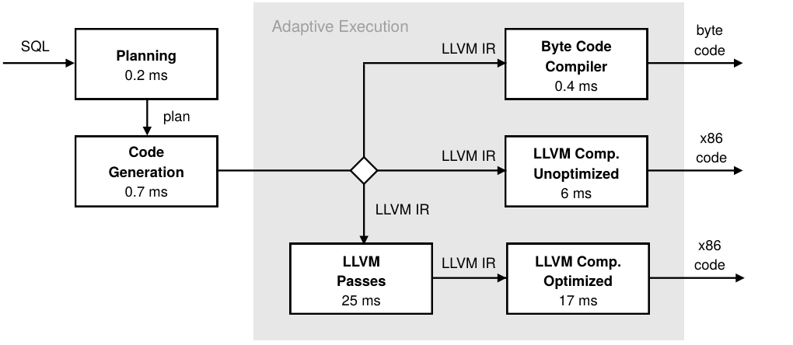

**图 3：三种执行模式及其编译时间。**

图 3 把 adaptive execution 放进编译流水线：plan 与 code generation 之后，系统可以直接生成 byte code，也可以生成 unoptimized 或 optimized x86 code。三个目标共享 LLVM IR，使运行时可以在低延迟和高吞吐之间切换。

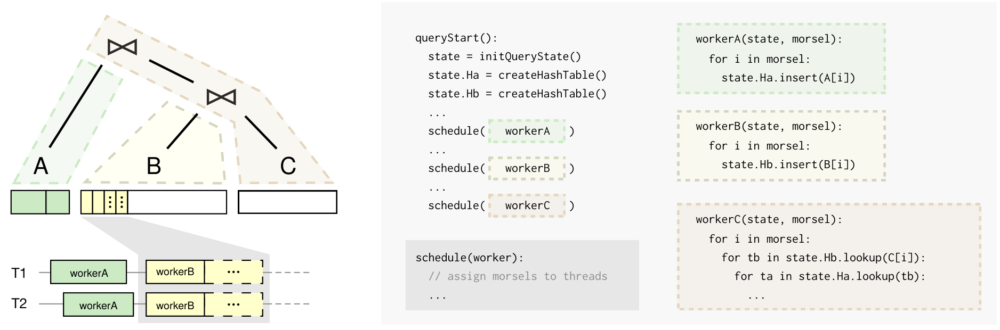

**图 4：查询计划向伪代码的翻译。`queryStart` 是主函数，三个查询 pipeline 分别转换为 worker 函数；左下角显示每个 pipeline 的工作被分成小 morsel 并动态调度到线程。**

图 4 用三条 pipeline 的示例说明 code structure：`queryStart` 初始化共享 state 和 hash table，并调度 `workerA`、`workerB`、`workerC`；每个 worker 处理一个 morsel。左下角展示 pipeline 的工作被切分成小 morsel，并动态调度到线程。

### A. 跟踪查询进度

`queryStart` 只运行一次，负责初始化 C++ 状态并启动各 pipeline，因而不值得编译；数据相关的工作位于 worker 函数中。每个 worker 接收共享状态和一个描述输入范围的 morsel。多个线程以不重叠 morsel 调用同一 worker，并通过 work stealing 负载均衡。这种 morsel-wise（或 block-wise）执行已被证明是内存数据库中高效的算子内并行模型 [19][20]。系统通常每次分配约 10,000 个元组，既避免线程失衡，也自然提供了进度采样点。每处理完一个 morsel，线程本就要访问调度结构；本文只需附加少量计时与计数，并在 pipeline 开始时记录总工作量（例如待扫描的关系或哈希表大小），即可得到已完成比例和处理速率。

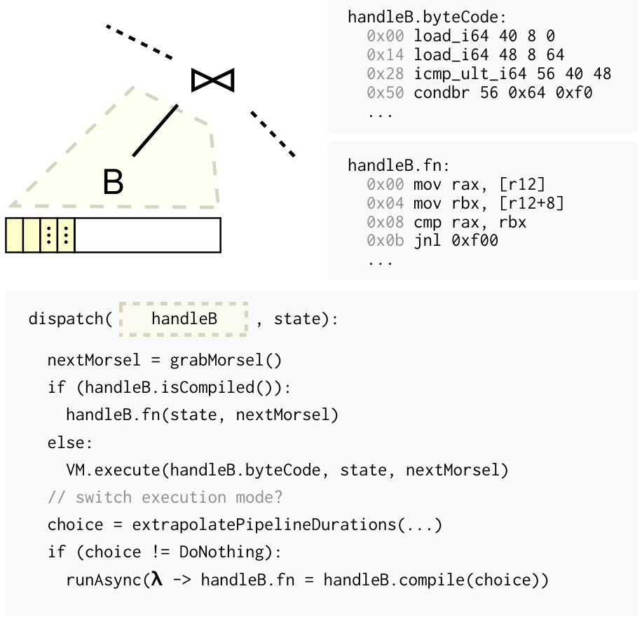

**图 5：从解释执行在线切换到编译执行；每个 morsel 都会运行 dispatch 代码。**

图 5 展示在线切换机制。系统不直接识别 worker 的内存地址，而是引入 handle 间接层；handle 同时保存 bytecode 和已编译函数指针。每处理一个 morsel，dispatch 逻辑都可以选择继续解释、调用已编译函数，或异步编译新变体。

### B. 在执行模式间切换

Morsel 是最小工作单元。worker 的输入范围与共享状态完全显式，因此各 morsel 可独立执行：解释器处理全部、隔一个处理一个，或完全不处理，在语义上都与编译函数处理剩余 morsel 等价。一个 worker 还可按不同优化等级多次编译，逐步提升吞吐。

handle 对象保存同一函数的多个表示。dispatch 每次取得下一个 morsel，若已有机器码就调用函数指针，否则交给 VM；随后重新估计 pipeline 的剩余时间，必要时异步编译。切换只需原子地更新 handle 中的函数指针，之后取得的 morsel 自动使用更快变体。

### C. 选择执行模式

系统连续比较三种选择：维持当前模式、编译未优化机器码、编译优化机器码。不编译时，剩余时间完全取决于当前处理速度。系统在每个 worker 线程完成 morsel 时分别计算局部元组处理率，再根据已知的剩余元组数和活跃 worker 数外推 pipeline 时间；还可用动态增长的 morsel 大小增加早期采样点。选择编译时，还必须加入预计编译时间、预计加速比，并扣除编译期间其余 `w-1` 个线程仍可解释处理的元组。编译时间和加速比用实验数据拟合。自适应策略不要求预测十分精确，只需足以区分明显有利和无利的切换。

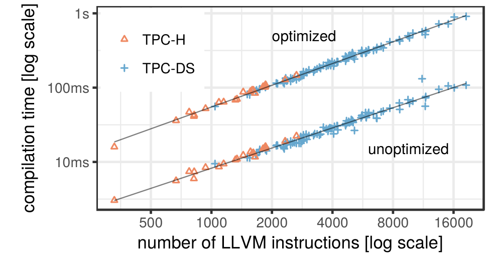

**图 6：TPC-H 与 TPC-DS 查询的 LLVM 优化/未优化机器码编译时间。**

图 6 说明 query plan 生成的 LLVM instruction 数与机器码编译时间高度相关。TPC-H 和 TPC-DS 中的计划约含 300 到 19,000 条指令，在这一范围内，优化与未优化编译时间都近似线性。因此系统可以用已观测数据估算编译成本；不同模式间的加速比则由第 V-D 节的经验数据获得。

图 7 给出比较执行模式的伪代码。它用当前吞吐、剩余元组数和活跃 worker 线程数估计三种选择：不切换、编译为 unoptimized code、编译为 optimized code。

```text
// f: worker function
// n: remaining tuples
// w: active worker threads
extrapolatePipelineDurations(f, n, w):
  r0 = avg(rate in threadRates)
  r1 = r0 * speedup1(f); c1 = ctime1(f)
  r2 = r0 * speedup2(f); c2 = ctime2(f)
  t0 = n / r0 / w
  t1 = c1 + max(n - (w - 1) * r0 * c1, 0) / r1 / w
  t2 = c2 + max(n - (w - 1) * r0 * c2, 0) / r2 / w
  switch min(t0, t1, t2):
    case t0: return DoNothing
    case t1: return Unoptimized
    case t2: return Optimized
```

**图 7：pipeline 持续时间的外推。**

为减小同步开销，只让一个 worker 做外推。首次评估延迟 1 ms，以积累更可靠的速率样本；之后每完成一个 morsel 就重新评估。若选中更快模式，该线程启动编译并清空旧速率记录，以便新代码就绪后重新估计。这样每个 pipeline 都可最终到达适合自己的模式。

## IV. LLVM 字节码解释器

LLVM 自带解释器直接遍历为优化 pass 设计的、指针密集的内存 IR；它 cache 不友好，而且每条通用指令还要在运行时区分 8/16/32/64 位等类型，实测比相应机器码慢 800 倍以上。我们因此把 LLVM IR 线性翻译为紧凑、定长、静态类型的 VM 字节码。VM 必须翻译迅速、解释开销低，并与机器码保持完全一致，才能在运行中无缝切换。

### A. 虚拟机

VM 是寄存器机。调用解释函数时，它在栈上分配寄存器文件，过大才回退到堆；前两个槽位固定为 0 和 1。每个 opcode 已编码操作数类型，因而 LLVM 的通用 `add` 会按类型展开为 `add_i32`、`add_i64` 等 VM 指令。固定长度编码虽然比机器码占空间，却远小于指针密集的 LLVM IR，也使解码更便宜。

重要的是，解释器和编译器使用同一份 LLVM IR，因此系统不需要维护两套查询执行代码生成逻辑。这降低了工程复杂度，也保证解释执行与编译执行的语义一致。

原文示例中，小的 LLVM 函数会被翻译成结构类似的 VM 片段。VM 操作数使用寄存器文件中的 byte offset，例如 `24` 表示结果寄存器，`16` 和 `20` 表示两个函数参数。

```llvm
define i32 @add(i32, i32) {
  %3 = add i32 %1, %0
  ret i32 %3
}
```

```text
add_i32     24 16 20
return_i32 24
```

图 8 的解释器循环是一个大的 `switch`，每个 opcode 直接执行对应操作。`ip` 指向当前 VM 指令，`regs` 指向寄存器文件。

```cpp
while (true) {
  switch ((++ip)->op) {
    case Op::add_i32:
      *((int32_t*)(regs + ip->a1)) =
          *((int32_t*)(regs + ip->a2)) + *((int32_t*)(regs + ip->a3));
      break;
    case Op::add_i64:
      *((int64_t*)(regs + ip->a1)) =
          *((int64_t*)(regs + ip->a2)) + *((int64_t*)(regs + ip->a3));
      break;
    case Op::call_void_i32:
      (void(*)(int32_t))(ip->lit)(*((int32_t*)(regs + ip->a1)));
      break;
    ... // around 500 more instructions
  }
}
```

**图 8：实现解释器循环的 VM 代码片段；`ip` 指向当前指令，`regs` 指向存放寄存器的内存。**

VM 约支持 500 个“指令/类型”组合，每种实现通常只是一行简单 C++；解释器约 800 行代码。它能解释任意生成的查询计划，却无需维护第二套查询代码生成器，这是工程可维护性的关键。

### B. 翻译为 VM 代码

图 9 总结 LLVM IR 到 VM code 的翻译步骤：先计算 liveness 并决定 basic block 顺序，再为块内活跃值分配寄存器，逐条翻译未被 subsume 的 LLVM instruction，传播 phi node 的值，最后释放生命周期结束的寄存器。

```text
compute liveness and order blocks
for each block b:
  allocate registers for values that become live in b
  for each instruction i in b:
    if i is not subsumed:
      translate i into VM opcodes
  propagate values in phi nodes
  release register for values that ended in b
```

**图 9：将 LLVM IR 翻译为 VM 代码。**

LLVM IR 采用 SSA，每个值只定义一次。翻译器按活性分析给出的顺序遍历基本块；若某个跨块值在当前块开始前就必须存活，先为其分配槽位。指令逐条翻译，常见相邻序列可合并成一个 opcode。块末把值复制到后继的 φ 节点，并释放生命周期结束的槽位。生成的 VM 程序执行与原生代码相同的调用和内存写；为解释函数调用增加 VM 程序参数等少量适配后，两种表示可互换。翻译器约 2,400 行，其中大部分用于寄存器分配。

### C. 寄存器分配

虚拟寄存器数量理论上可任意大，但寄存器文件位于解释热点，必须尽量留在 L1 cache。分配器要保证生命周期重叠的 LLVM 值不共享槽位、尽量减少槽位总数，并能线性处理超大函数。传统逐块活性分析具有超线性最坏复杂度；手写程序通常由小函数组成，机器生成查询却可在一个函数中包含数千基本块和数十万值，常规算法可能耗时数小时乃至数天。

更完整地说，本文的寄存器分配需同时满足四个目标：（1）为程序中每个 LLVM 值分配槽位；（2）只在生命周期不重叠时复用槽位；（3）最小化槽位数；（4）高效翻译极大程序。通常的寄存器分配器会用 spilling 切分生命区间，但这里若溢出到内存，仍需再设法让溢出区保持在 cache，所以并不能解决问题。某些 JIT 只在单个基本块内分配，或只考察固定数量的相邻块；这虽然计算简单，却可能产生很差的槽位复用结果。

本文的新算法识别并利用循环结构，用线性时间近似最优分配。SSA 形式下、寄存器数不受限时的最优分配本身也是超线性问题；因此，本算法允许把某个值的生命周期保守扩展到“包含其全部使用的最内层循环”边界。这只在复杂控制流中偶尔发生，实测影响很小，却换来了线性最坏复杂度。我们曾遇到单个最大函数含 300,000 个值和数千基本块的机器生成查询；对它使用超线性算法会带来数小时甚至数天的不可接受编译时间。TPC-DS Q55 若完全不复用槽位需 36 KB，固定窗口贪心策略需 21 KB，本文算法仅需 6 KB。

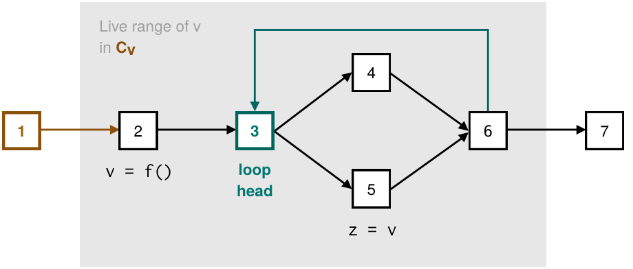

**图 10：计算变量的活性；顶点是由控制流边（即分支指令）连接的基本块。**

图 10 说明变量 `v` 在控制流中的活性范围。虽然 `v` 在 block 2 定义、在 block 5 使用，但 block 5 位于 block 3 开始、覆盖 `[3,6]` 的循环内，而循环中任意基本块都可能最终到达 block 5。因此仅用 `[2,5]` 表示生命周期会低估实际路径；必须把生命范围扩展为 `[2,6]`，以包含使用者所在的完整循环。

### D. 线性时间活性分析

图 11 给出线性时间 liveness computation 的伪代码。算法先找 loop structure 和 dominator tree，再用包含定义和使用的 basic block 集合决定变量的最小覆盖 loop。

```text
// compute the liveness of values in function F
ComputeLiveness(F):
  // find loop structures in F
  label all basic blocks in F in reverse postorder
  compute the dominator tree D for each basic block
  label all nodes in D with pre-/postorder numbers
  mark the first basic block in F as loop head
  for each jump edge j: B -> B':
    if B' is ancestor of B in D:
      mark B' as loop head
  for each basic block B:
    associate B with the next dominating loop head
  for each loop:
    compute the first and last block of the loop
    compute the next dominating loop head
    label loop with nesting depth

  // use the loop information to compute lifetimes
  for each value v in F:
    B_v = set of basic blocks containing definition and users of v
    C_v = innermost loop containing all blocks in B_v
    L_v = empty lifetime interval
    for each B in B_v:
      if C_v is innermost loop for B:
        extend L_v with B
      else:
        extend L_v with outermost loop below C_v that contains B
```

**图 11：活性计算的线性时间算法。**

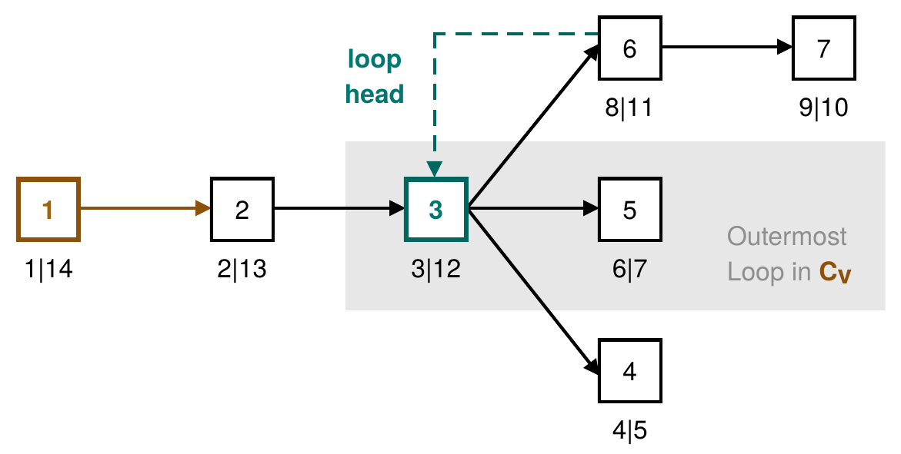

**图 12：以前序/后序编号标注的支配树。**

图 12 给出同一示例的 dominator tree 和 pre-/post-order 标注。借助这些编号，算法能以常数时间判断祖先/后代关系，并快速识别包含循环。

算法先按逆后序标号基本块并构建支配树，再以支配树的前序/后序区间在常数时间内判断祖先关系。若跳转 `B -> B'` 中 `B'` 支配 `B`，则 `B'` 是循环头。为统一处理循环外的块，算法把整个函数体视为一个以入口块为头的伪循环。每个块通过带路径压缩的并查集关联到最近的支配循环头，每个循环记录首尾块、外层循环和嵌套深度。这些结构与支配树算法的选择都是为了保证各阶段为线性时间；省掉前序/后序标号或路径压缩，都会让后续步骤变成超线性。对值 `v`，取包含定义和使用的块集合，求能容纳这些块的最内层公共循环 `C_v`；位于 `C_v` 内层循环中的使用被提升到相应外层循环的完整区间。φ 节点需按控制流边处理：参数在前驱块末读取，φ 值随后写入，并在 φ 所在块读取。

### E. 互操作性

VM 解释原始 LLVM IR 的等价翻译，所有函数调用与状态更新都和原生代码一致。机器码调用只需函数指针，字节码调用还需 VM dispatch 和程序地址。若给指针加 tag 再动态区分签名，会侵入现有代码且增加分支；本文统一让两种函数都多接收一个指针参数，机器码忽略它，解释器把它当字节码程序。切换时只替换函数指针即可。

反向调用既有 C++ 更简单：机器码和 VM 都能调用，只需为所有导出签名提供 opcode。例如 Figure 8 的 `call_void_i32` 对应“一个 32 位整数参数、无返回值”；导出函数集合已知，因此缺少的签名可在编译期发现。

### F. 优化

逐条独立翻译 LLVM IR 并不总是合理。SQL 中所有算术都要检查溢出，LLVM 为一次带溢出检查的运算连续生成 4 条指令；翻译器识别并合并为一个 VM opcode，对部分查询显著减少 dispatch 和时间。另一个高频模式是 `GetElementPtr` 紧跟 load/store，也合并为单 opcode。我们建议未来从大规模查询语料中挖掘更多宏指令，NULL 处理就是明显候选；优化仍需保持字节码生成可扩展。

## V. 实验评估

实验在 8 核 AMD Ryzen 7 1700X、32 GB RAM、Linux 4.11、LLVM 3.8 上运行，并在 Intel CPU 上复现实验得到相似结果。HyPer 原本总用优化编译：手工选择若干 LLVM IR pass，再启用机器相关 backend 优化。本文另加未优化模式，采用 fast instruction selection、跳过 IR pass、降低 backend 优化级别；字节码直接由 LLVM IR 翻译；adaptive 则按 III 节交错执行与机器码生成。端到端时间包含规划、代码生成、编译和执行。

### A. 静态与自适应模式选择

论文在 TPC-H 查询上比较纯解释、纯编译和自适应执行。表 I 给出不同 TPC-H 查询的规划和编译时间，说明复杂查询的编译延迟可达到数十到数百毫秒。表 II 给出 scale factor 1 上的执行时间，展示某些查询本身很快，因而编译时间对端到端延迟影响很大。

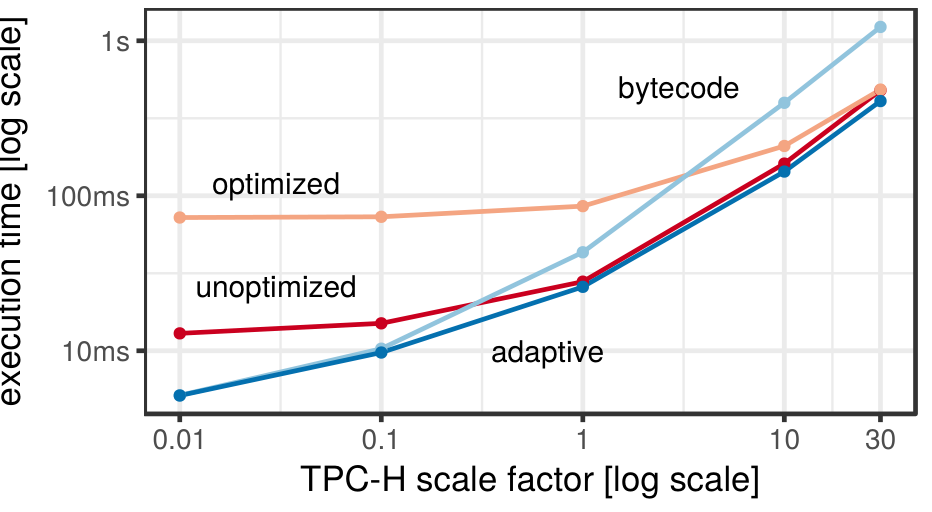

**图 13：使用 8 个线程时，不同 scale factor 和执行模式下全部 TPC-H 查询的几何平均时间，包括规划、编译与执行。**

图 13 报告所有 TPC-H 查询在不同 scale factor 上的几何平均端到端时间，包含 planning、compilation 和 execution。小数据集上 bytecode 占优；scale factor 变大后，adaptive execution 逐步切换到 machine code，避免固定策略的最坏情况。

实验运行全部 22 条 TPC-H，从 SF=0.01（约 10 MB）到 SF=30（约 30 GB）。SF=0.01 和 0.1 完全由启动延迟决定，adaptive 从不编译，与纯字节码相当；SF=1 起许多 pipeline 值得生成未优化机器码，但 adaptive 仍让便宜 pipeline 留在字节码，因此优于全查询未优化编译；SF=30 足以摊销优化编译，adaptive 仍按 pipeline 从三种模式选优并明显胜过两种静态编译。更大规模下优化编译会成为主要对手，但计划中仍会有应立即解释的便宜 pipeline。

### B. 自适应执行过程

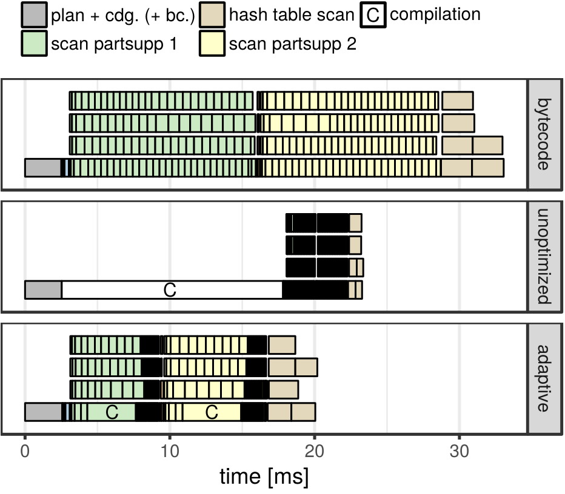

**图 14：TPC-H 查询 11 在 scale factor 1、4 线程下的执行轨迹。优化模式的编译需 103 ms，因而未绘出。**

图 14 展示 scale factor 1、4 线程下 TPC-H Q11 的执行轨迹。Bytecode 很快启动所有线程；adaptive 模式在约 1 ms 后识别两个大 pipeline 值得编译，并在编译完成后让所有 worker 切换到新机器码，同时剩余 pipeline 继续解释执行。

该查询共有 7 个 pipeline，工作量高度不均。纯字节码很快占满 4 个 worker；未优化模式先单线程编译，之后快到各 morsel 在轨迹中几乎不可分辨；优化模式因编译需 103 ms 未画入图。Adaptive 在 1 ms 后只编译 `scan partsupp 1/2` 两个最大 pipeline，并在单个函数完成后让所有 worker 自动换挡；其余五个继续字节码。最终分别比未优化编译、纯字节码和优化编译快约 10%、40% 和 80%。

### C. 编译时间

表 I 比较 PostgreSQL、MonetDB 和 HyPer 在 TPC-H Q1-Q5 以及所有 22 个查询最大值上的 plan/code-generation/compilation 时间，单位为毫秒。

| TPC-H | PG plan | Monet plan | HyPer plan | HyPer cdg. | HyPer bc. | HyPer unopt. | HyPer opt. |
| ---: | ---: | ---: | ---: | ---: | ---: | ---: | ---: |
| 1 | 0.1 | 0.8 | 0.2 | 0.7 | 0.4 | 6 | 42 |
| 2 | 1.0 | 0.7 | 0.7 | 1.5 | 1.2 | 23 | 149 |
| 3 | 0.3 | 0.5 | 0.4 | 0.9 | 0.7 | 10 | 69 |
| 4 | 0.2 | 0.4 | 0.2 | 0.7 | 0.4 | 7 | 47 |
| 5 | 1.2 | 0.8 | 0.7 | 1.2 | 0.9 | 15 | 104 |
| max | 1.9 | 1.0 | 0.8 | 1.5 | 1.2 | 23 | 149 |

规划和 LLVM IR 生成对 22 条查询都不超过约 2 ms，字节码生成也始终低于 2 ms；未优化机器码通常已比它们慢约一个数量级，优化编译最高达 149 ms。

### D. 解释代码与编译代码的性能

表 II 比较 scale factor 1 上 PostgreSQL、MonetDB 和 HyPer 的执行时间。`geo.m.` 是 22 个 TPC-H 查询的几何平均，单位为毫秒。

| TPC-H | PG 1 thread | Monet 1 thread | bc. 1 thread | unopt. 1 thread | opt. 1 thread | bc. 8 threads | unopt. 8 threads | opt. 8 threads |
| ---: | ---: | ---: | ---: | ---: | ---: | ---: | ---: | ---: |
| 1 | 4908 | 484 | 858 | 161 | 77 | 170 | 34 | 16 |
| 2 | 254 | 5 | 94 | 13 | 8 | 25 | 5 | 3 |
| 3 | 1258 | 64 | 323 | 104 | 80 | 54 | 21 | 17 |
| 4 | 193 | 56 | 352 | 67 | 45 | 57 | 16 | 12 |
| 5 | 516 | 51 | 362 | 60 | 37 | 67 | 14 | 10 |
| geo.m. | 497 | 57 | 232 | 60 | 46 | 45 | 15 | 12 |

22 条查询的几何平均显示，单线程字节码比未优化机器码慢 3.6 倍、比优化机器码慢 5.0 倍，但仍比 PostgreSQL 快 2.1 倍；它在多核上的扩展性与编译代码相当。这一速度足以承担启动阶段，而非取代机器码的峰值吞吐。

### E. 编译超大查询

第 III 节的线性编译代价函数来自 TPC-H 与 TPC-DS，而这两套基准并不包含特别复杂的查询；机器生成的查询则可能有数 MB 的 SQL 文本，并给编译器带来很不利的结构。

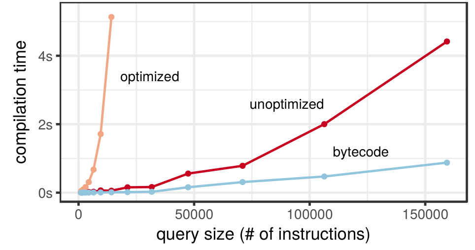

**图 15：对指令数量很大的查询，使用优化编译、未优化编译和解释执行时的编译时间。**

图 15 显示大型机器生成查询的编译时间随 instruction 数增长。Optimized compilation 很快超过 4 秒，unoptimized compilation 到最大样本约 4.4 秒；bytecode 翻译近似线性增长，最大样本约 0.9 秒，说明快速 bytecode translation 对复杂 ad hoc 查询尤其重要。

样本查询扫描一张表，并把聚合表达式从 10 个增至 1,900 个，对应约 1,000 到 160,000 条 LLVM 指令，且大多集中在一个函数。优化 LLVM 在约 10,000 条指令时已超过 4 秒并呈爆炸式增长；未优化编译更平稳但最大样本仍需 4.4 秒；字节码翻译保持线性，只需 0.9 秒。系统因此能先解释几乎任意规模的查询，再仅编译真正需要加速的部分。

实验结论可以概括为：

- 对小数据集或短查询，先解释执行能显著降低响应时间。
- 对大数据集，最终切换到机器码后可接近纯编译执行的吞吐。
- 自适应执行避免了固定策略的极端情况：不会像纯解释那样在大输入上吞吐不足，也不会像纯编译那样在短查询上被编译延迟支配。
- 细粒度策略优于“一次性编译整个查询”，因为它减少了冷路径和不必要函数的编译成本。

## VI. 相关工作

许多查询编译论文只报告执行时间；报告编译时间的工作，在 LLVM IR 目标上约为 5–37 ms，编译到 C 则接近 1 秒。标准基准往往查询规整，而真实客户工具会生成极端复杂查询，因此编译延迟是查询编译走向工业实践的必要问题。

HyPer、Peloton 等直接生成 LLVM IR 的系统可直接采用本文框架。MemSQL 的中层 Bit Code 可解释，也可在该层做同类切换；LegoBase 及其后继在 JVM 执行与低层语言编译之间也有类似空间。对 Volcano 系统，查询专用化同样可由解释启动并按热点编译。Hekaton 编译存储过程，因定义少、执行多，延迟问题相对较轻。

计划缓存与本文方法互补：缓存无法消除首次查询的编译延迟，且常量变化会妨碍复用；自适应执行每次都可让优化器看到具体常量。两者可以结合，跨执行累计 pipeline 热度，最终为频繁查询编译全部热点。

这一设计也类似 Java HotSpot、CLR、V8 等托管语言运行时的“先解释、后编译热点”。区别在于数据库通常用低层语言精确控制内存，不能直接依赖托管运行时；但数据库又知道 pipeline、morsel 和生成指令的结构，因而能做更轻量、数据库专用的适应与宏操作优化。

## VII. 结论

查询编译能提供很高吞吐，但编译延迟限制了它在短查询和 ad hoc 负载中的适用性。本文提出的自适应执行框架把 LLVM IR 解释器和后台编译结合起来，让查询可以立即开始执行，并在收益足够时切换到机器码。实验显示，该方法同时获得小数据集低延迟和大数据集高吞吐。对数据库内核实现者而言，本文的关键启示是：查询编译不应只优化最终机器码速度，还要把编译时间纳入执行策略本身。

## 致谢

本文工作获得 European Research Council (ERC) 在 European Union's Horizon 2020 research and innovation programme 下的资助，grant agreement No. 725286。

## 参考文献

- [1] C. Diaconu, C. Freedman, E. Ismert, P. Larson, P. Mittal, R. Stonecipher, N. Verma, and M. Zwilling, "Hekaton: SQL server’s memory-optimized OLTP engine," in SIGMOD, 2013, pp. 1243–1254.
- [2] C. Freedman, E. Ismert, and P. Larson, "Compilation in the Microsoft SQL Server Hekaton engine," IEEE Data Eng. Bull., vol. 37, no. 1, pp. 22–30, 2014.
- [3] D. Paroski, "Code generation: The inner sanctum of database performance," http://highscalability.com/blog/2016/9/7/code-generation-the-inner-sanctum-of-database-performance.html, 2016.
- [4] S. Agarwal, D. Liu, and R. Xin, "Apache Spark as a compiler: Joining a billion rows per second on a laptop," https://databricks.com/blog/2016/05/23/ apache-spark-as-a-compiler-joining-a-billion-rows-per-second-on-a-laptop html, 2016.
- [5] S. Wanderman-Milne and N. Li, "Runtime code generation in Cloudera Impala," IEEE Data Eng. Bull., vol. 37, no. 1, pp. 31–37, 2014.
- [6] K. Krikellas, S. Viglas, and M. Cintra, "Generating code for holistic query evaluation," in ICDE, 2010, pp. 613–624.
- [7] T. Neumann, "Efficiently compiling efficient query plans for modern hardware," PVLDB, vol. 4, no. 9, 2011.
- [8] C. Koch, Y. Ahmad, O. Kennedy, M. Nikolic, A. Nötzli, D. Lupei, and A. Shaikhha, "DBToaster: higher-order delta processing for dynamic, frequently fresh views," VLDB J., vol. 23, no. 2, pp. 253–278, 2014.
- [9] A. Crotty, A. Galakatos, K. Dursun, T. Kraska, U. Çetintemel, and S. B. Zdonik, "Tupleware: "big" data, big analytics, small clusters," in CIDR, 2015.
- [10] A. Crotty, A. Galakatos, K. Dursun, T. Kraska, C. Binnig, U. Çetintemel, and S. Zdonik, "An architecture for compiling UDF-centric workflows," PVLDB, vol. 8, no. 12, pp. 1466–1477, 2015.
- [11] Y. Klonatos, C. Koch, T. Rompf, and H. Chafi, "Building efficient query engines in a high-level language," PVLDB, vol. 7, no. 10, pp. 853–864, 2014.
- [12] M. Karpathiotakis, I. Alagiannis, T. Heinis, M. Branco, and A. Ailamaki, "Just-in-time data virtualization: Lightweight data management with ViDa," in CIDR, 2015.
- [13] H. Pirk, O. Moll, M. Zaharia, and S. Madden, "Voodoo - a vector algebra for portable database performance on modern hardware," PVLDB, vol. 9, no. 14, pp. 1707–1718, 2016.
- [14] S. Palkar, J. J. Thomas, A. Shanbhag, M. Schwarzkopf, S. P. Amarasinghe, and M. Zaharia, "A common runtime for high performance data analysis," in CIDR, 2017.
- [15] P. Menon, T. C. Mowry, and A. Pavlo, "Relaxed operator fusion for in-memory databases: Making compilation, vectorization, and prefetching work together at last," PVLDB, vol. 11, no. 1, 2017.
- [16] A. Pavlo, G. Angulo, J. Arulraj, H. Lin, J. Lin, L. Ma, P. Menon, T. C. Mowry, M. Perron, I. Quah, S. Santurkar, A. Tomasic, S. Toor, D. V. Aken, Z. Wang, Y. Wu, R. Xian, and T. Zhang, "Self-driving database management systems," in CIDR, 2017.
- [17] V. Leis, A. Gubichev, A. Mirchev, P. Boncz, A. Kemper, and T. Neumann, "How good are query optimizers, really?" PVLDB, vol. 9, no. 3, 2015.
- [18] V. Leis, B. Radke, A. Gubichev, A. Mirchev, P. Boncz, A. Kemper, and T. Neumann, "Query optimization through the looking glass, and what we found running the join order benchmark," VLDB J., 2018.
- [19] C. Chasseur and J. M. Patel, "Design and evaluation of storage organizations for read-optimized main memory databases," PVLDB, vol. 6, no. 13, pp. 1474–1485, 2013.
- [20] V. Leis, P. Boncz, A. Kemper, and T. Neumann, "Morsel-driven parallelism: A NUMA-aware query evaluation framework for the many- core age," in SIGMOD, 2014, pp. 743–754.
- [21] F. M. Q. Pereira, "The design and implementation of a SSA-based register allocator," 2007.
- [22] M. Poletto and V. Sarkar, "Linear scan register allocation," ACM Trans. Program. Lang. Syst., vol. 21, no. 5, pp. 895–913, Sep. 1999.
- [23] L. Georgiadis, R. E. Tarjan, and R. F. F. Werneck, "Finding dominators in practice," J. Graph Algorithms Appl., vol. 10, no. 1, pp. 69–94, 2006.
- [24] W. Fraczak, L. Georgiadis, A. Miller, and R. E. Tarjan, "Finding dominators via disjoint set union," J. Discrete Algorithms, vol. 23, pp. 2–20, 2013.
- [25] T. Grust, "Accelerating XPath location steps," in SIGMOD, 2002, pp. 109–120.
- [26] T. Neumann and V. Leis, "Compiling database queries into machine code," IEEE Data Eng. Bull., vol. 37, no. 1, pp. 3–11, 2014.
- [27] A. Shaikhha, Y. Klonatos, L. Parreaux, L. Brown, M. Dashti, and C. Koch, "How to architect a query compiler," in SIGMOD, 2016, pp. 1907–1922.
- [28] P. Larson, C. Clinciu, E. N. Hanson, A. Oks, S. L. Price, S. Rangarajan, A. Surna, and Q. Zhou, "SQL server column store indexes," in SIGMOD, 2011, pp. 1177–1184.
- [29] D. Abadi, P. A. Boncz, S. Harizopoulos, S. Idreos, and S. Madden, "The design and implementation of modern column-oriented database systems," Foundations and Trends in Databases, vol. 5, no. 3, pp. 197–280, 2013.
- [30] V. Raman, G. K. Attaluri, R. Barber, N. Chainani, D. Kalmuk, V. KulandaiSamy, J. Leenstra, S. Lightstone, S. Liu, G. M. Lohman, T. Malkemus, R. Müller, I. Pandis, B. Schiefer, D. Sharpe, R. Sidle, A. J. Storm, and L. Zhang, "DB2 with BLU acceleration: So much more than just a column store," PVLDB, vol. 6, no. 11, pp. 1080–1091, 2013.
- [31] J. Patel, H. Deshmukh, J. Zhu, H. Memisoglu, N. Potti, S. Saurabh, M. Spehlmann, and Z. Zhang, "Quickstep: A data platform based on the scaling-in approach," University of Wisconsin - Madison, Tech. Rep., 2017.
- [32] R. Zhang, R. T. Snodgrass, and S. Debray, "Micro-specialization in DBMSes," in ICDE, 2012, pp. 690–701.
- [33] R. Zhang, S. Debray, and R. T. Snodgrass, "Micro-specialization: dynamic code specialization of database management systems," in International Symposium on Code Generation and Optimization, 2012, pp. 63–73.
