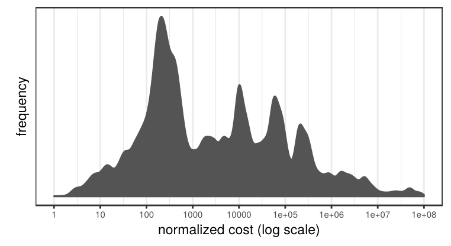
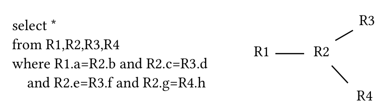
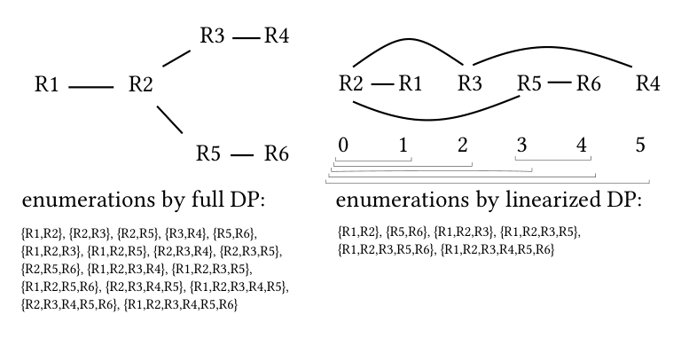
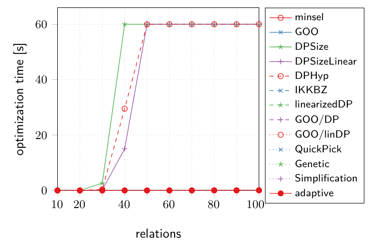
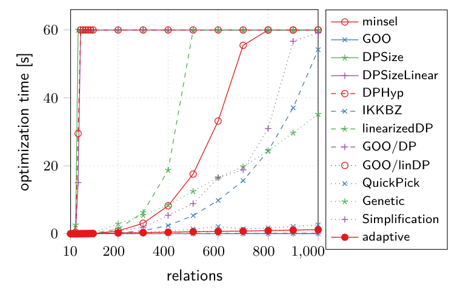
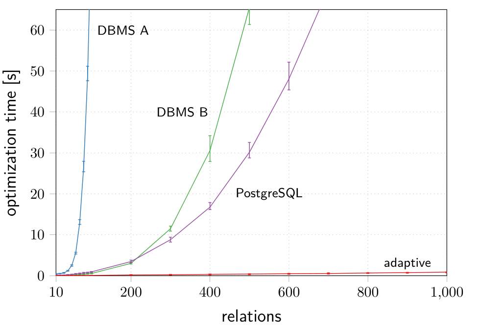
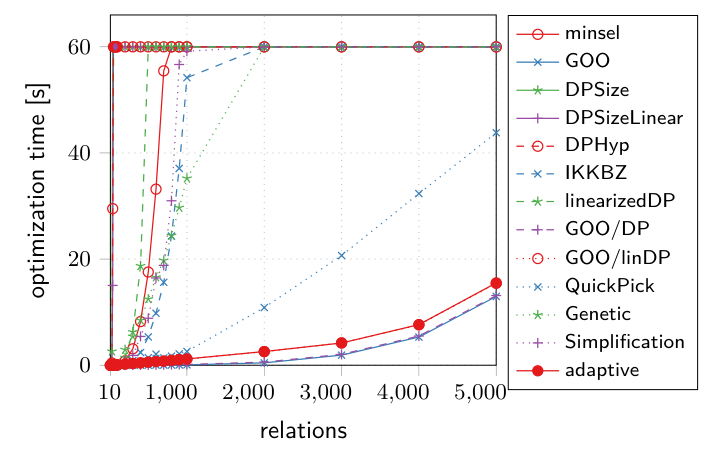
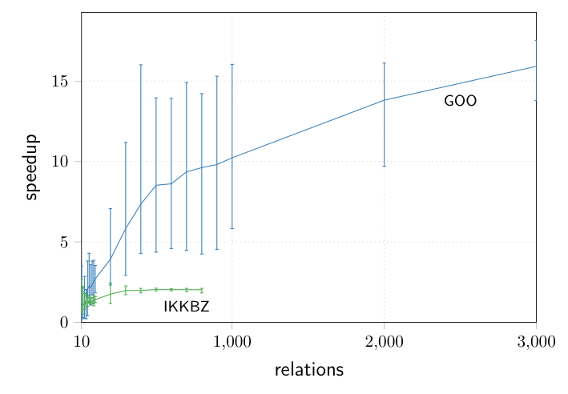

# Adaptive Optimization of Very Large Join Queries（中文译文）

## 译者说明

本文依据同目录的 `source.pdf` 翻译。章节、图表、公式、算法、代码与参考文献按原文结构保留。

Thomas Neumann, Bernhard Radke  
Technische Universität München

联系邮箱：neumann@in.tum.de、radke@in.tum.de。

## 来源与使用说明

© 2018，Thomas Neumann 与 Bernhard Radke 保留版权；出版权许可给 Association for Computing Machinery。此为论文预出版版本，仅供个人使用，不得再分发。正式出版版本载于 *Proceedings of the 2018 International Conference on Management of Data*，https://doi.org/10.1145/3183713.3183733。

## 摘要

商业智能工具以及其他自动生成查询的方式，使 join 查询规模出现了很大差异。大多数查询仍然相当小，但包含上百个关系的 join 查询已经不再罕见，而且查询规模分布有一条极长的尾部。我们所知最大的真实世界查询访问超过 4,000 个关系。如此巨大的跨度使查询优化非常困难。连接顺序选择（join ordering）已知是 NP-hard，这意味着我们不能指望精确求解这种超大问题。另一方面，大多数查询小得多，没有理由在这些查询上牺牲最优性。

本文提出一个自适应优化框架（adaptive optimization framework）。它能够精确求解大多数常见 join 查询，同时扩展到包含数千个 join 的查询。关键组成部分是一种新的搜索空间线性化（search space linearization）技术，它能为大量查询类别产生接近最优的执行计划。此外，本文还描述了若干实现技术，它们对于让 join ordering 算法扩展到这类极大查询是必要的。对 10 多种方法的大量实验表明，本文提出的新自适应方法在非常宽的查询规模范围内表现优异，并为多数常见查询产生最优或近似最优解。

CCS 概念：Information systems -> Query optimization

ACM 引用格式：Thomas Neumann and Bernhard Radke. 2018. Adaptive Optimization of Very Large Join Queries. In Proceedings of 2018 International Conference on Management of Data, Houston, TX, USA, June 10-15, 2018 (SIGMOD'18), 16 pages. https://doi.org/10.1145/3183713.3183733

## 1. 引言

Join 是查询处理的骨干。它几乎出现在每个查询中，并且会极大影响查询运行时间。因此，选择合适的 join 顺序，是查询优化器最重要的任务之一，甚至可能是最重要的任务。除了 join 无处不在之外，join 查询本身的巨大多样性也增加了问题复杂度。多数 join 查询相当小，连接少于 20 个关系。但商业智能工具的出现带来了自动生成的 ad-hoc 查询，这类查询很容易触及上百个关系，数据库系统也必须能够处理它们。

即使是中等规模的查询，例如包含 50 个关系的查询，也远远超出可精确优化的范围。在这种情况下，优化器必须牺牲最优性，采用启发式方法以保持合理的优化时间。图 1 展示一个包含 50 个关系的数据仓库风格查询中，10,000 个随机计划相对最佳计划归一化后的代价分布。大多数计划的代价至少比找到的最便宜计划高 100 倍。在这种规模下，启发式算法很难找到极少数好计划之一。

**图 1：包含 50 个关系的数据仓库风格查询中随机计划的归一化代价分布。** 该图说明多数随机计划与最佳计划相差数个数量级，因此在大 join 查询中，仅靠随机或粗糙启发式很难可靠命中高质量计划。



然而，这远不是查询规模谱系的终点。查询规模存在极长尾部。我们所知最大的真实世界查询在视图展开后包含 4,598 个关系 [19]。必须承认，这些 mega query [7] 即使在 SAP 场景中也是离群值（第二大的查询包含 2,298 个关系，超过 1,000 个关系的只有少数几个），但该工作负载中包含数百个关系的查询并不少见。来自 Tableau Public 数据可视化工具的公开查询日志显示了类似分布：多数查询较小，但有一条超过 100 个关系的长尾，单个 join 查询最多达到 369 个关系。尤其在这类探索式场景中，工作负载无法提前知道，而且多数查询只执行一次。因此，物化等用于改善查询性能或降低复杂度的技术，并不总是适用或可取。

大型 ad-hoc 查询是数据库系统必须面对的现实。例如，PostgreSQL 对少于 12 个关系的查询使用动态规划寻找最优 join 顺序，对更大的查询切换到遗传算法。DB2 使用动态规划，并在查询过大时切换到贪心策略。其他系统使用类似 fallback。通常这些切换点意味着“跌下悬崖”：在某个点之前能获得好计划，而查询稍微变大后结果显著变差，这非常不令人满意。查询优化器应尝试精确求解问题，并在无法再保证最优性时自适应地降低结果质量。

巨大的复杂度跨度确实给查询优化器带来了极大问题。从根本上说，该问题已知为 NP-hard [13]，这似乎暗示除最小查询外都只能使用启发式。但这种论点过于悲观。现实中，我们可以精确优化出乎意料地大的查询；即便不能，也能为更大类别的查询找到非常好的 join 顺序。

因此，本文提出一个自适应优化框架：它为多数常见查询找到最优解，为很大一类查询找到近似最优解，并能平滑扩展到包含最多 5,000 个关系的 mega query。本文通过将动态规划与新的搜索空间线性化技术结合，并引入处理极大查询所需的已有算法实现技巧来实现这一点。大量实验表明，这种组合效果非常好，使我们能够构建一个高效处理从 2 个关系到 5,000 个关系整个查询谱系的查询优化器。

面对从 2 个关系到 5,000 个关系的巨大复杂度跨度，需要认识到不同查询规模有不同要求和预期。对构成多数工作负载主体的小查询，显然希望找到最优顺序。对最多 100 个关系的中等查询，它们仍相当常见，通常无法再保证最优性，但希望接近最优。对最多 1,000 个关系的大查询，它们很少见，必须接受无法找到最佳计划，但仍希望结果好，并且质量平滑下降。对超过 1,000 个关系的独特 mega query，只要能构造出尚可的计划就应感到满意；多数优化器会直接无法处理这类查询 [7]。本文的自适应框架可以平滑处理这一跨度，在从 2 个关系到 5,000 个关系的整个谱系上，把好计划甚至最优计划与低优化时间结合起来。

本文结构如下。第 2 节形式化问题，第 3 节讨论相关工作。第 4 节介绍自适应优化框架。第 5 节展示处理极大查询所需的各种实现细节。第 6 节评估算法。最后，第 7 节总结并讨论未来工作。

## 2. 问题设定

在进入算法之前，本文先简要形式化问题。本文面向可用于商业数据库系统的查询优化器，因此必须支持各种 SQL 查询，包括不寻常谓词和非内连接。假设查询以查询图（query graph）形式给出，如图 2 所示。查询图 $G=(V,E)$ 以关系集合 $V$ 为节点，以查询 join 条件蕴含的 join 可能性 $E$ 为边。如果 join 树 $T$ 的每个子树 $T'=T_1\mathbin{\mathrm{join}}T_2$ 都存在关系 $R_1,R_2$，使得 $R_1\in T_1$、 $R_2\in T_2$ 且 $(R_1,R_2)\in E$，则称 join 树 $T$ 遵循查询图 $G$。

给定查询图 $G$ 和代价函数 $C$，任务是构造一棵遵循 $G$ 且最小化 $C$ 的 join 树 $T$。

图 2 的查询示例如下：

```sql
select *
from R1, R2, R3, R4
where R1.a = R2.b and R2.c = R3.d
  and R2.e = R3.f and R2.g = R4.h
```

**图 2：一个查询及其查询图。** 查询图中， $R_2$ 与 $R_1$、 $R_3$、 $R_4$ 相连， $R_2$ 和 $R_3$ 之间由两个 join 谓词连接。



注意，在一般情况下，也就是存在非内连接的查询中，查询图可能是超图（hyper-graph）而不是普通图 [22]。这意味着一条 join 边连接的不是两个关系，而是两个关系集合；相应地，上述遵循定义中的 `R1` 和 `R2` 也可以是关系集合而不是单个关系。本文假设非内连接的所有重排序约束已经按 [20] 所述编码进查询图。

对算法而言，本文假设查询图是连通的。如果原始查询图不连通，也就是包含隐式笛卡尔积，则用 cross product 边连接各连通分量。注意，优化期间本文不考虑额外的隐式笛卡尔积。原因有两个。第一是性能原因：忽略笛卡尔积会大幅降低搜索空间，而且实践中笛卡尔积很少有用。笛卡尔积天然是 $O(n^2)$ 操作，这意味着它只对非常小的关系有意义。这也是多数现有系统忽略笛卡尔积的原因。第二，也是更重要的正确性原因：存在非内连接时，在任意关系之间引入笛卡尔积可能导致错误结果。因此，本文始终遵循查询图。如果某个系统认为某个查询中的笛卡尔积有吸引力，例如涉及两个非常小的关系，它必须显式把这种 join 可能性加入查询图，并按需更新非内连接的边。

对于代价函数，动态规划部分除 Bellman 原理之外不作假设；任何合理的代价函数都可以使用。某些算法使用的排序步骤要求代价函数具有 ASI 属性（第 3 节讨论），例如最小化中间结果大小的 `Cout` 函数。如果总体代价函数不具有 ASI 属性，仍可用 `Cout` 排序，并在动态规划部分使用真实代价函数。如 [17] 所示，`Cout` [5] 或 `Cmm` [17] 这类简单代价函数通常即使对完整计划也足够好。

本文把所有算法描述为构造式算法，也就是为给定查询图构造 join 树。将它们集成到转换式优化器（transformative optimizer）中时，可以使用 [25] 的技术。

## 3. 相关工作

Selinger 等人开创性地使用动态规划（DP）做 join ordering，通过构造规模递增的最优部分计划来求解 [24]。本文称该算法为 `DPSize`。为降低搜索空间，很多系统只考虑 left-deep 树而不是 bushy 树。本文称该变体为 `DPSizeLinear`。只考虑 left-deep 树很诱人，因为这会显著加速优化，但 bushy plan 往往比线性计划高效得多。

这种基于大小的动态规划广为人知且广泛使用，但它不是最高效的方法。基于图的动态规划策略按查询图结构组织搜索，可以显著优于 `DPSize`，因为它避免考虑无法导向最终 join 树的关系组合 [21]。该原始方法已有多种改进，包括对于某些查询可胜过自底向上 DP 的自顶向下形式，因为它们允许基于代价剪枝 [6, 9]，以及对非内连接的推广 [22]。本文称后者为 `DPHyp`。

虽然 join ordering 问题一般是 NP-hard，但这并不意味着每个问题实例都困难。如果查询图形成一条链，`DPHyp` 可以在 $O(n^3)$ 时间内找到最优解，这即使对相当大的 $n$ 也可处理。其他查询形状更困难。由于困难性来自查询图形状，我们可以：1. 通过观察查询图预测优化时间；2. 通过操纵查询图降低优化时间。这一观察引出了查询简化（query simplification）：使用贪心启发式逐步让查询图更受限制，直到它可由动态规划处理 [23]。如果查询只是略微超过动态规划能力，这很有效，因为只需少量贪心步骤；但对极大查询，该方法会失效，因为贪心步骤主导运行时间，结果也可能很差。

**原文脚注 1：** `DPSize` 对链式查询需要 $O(n^4)$ 时间；这仍是多项式复杂度，但在小得多的 $n$ 上就会变得不可处理。

处理大查询动态规划的另一个思路是迭代动态规划（Iterative Dynamic Programming）[14]。它将动态规划与贪心步骤结合，有两个变体。[14] 中的 `IDP-1` 算法运行 `DPSize` 到给定大小 $k$，贪心选择该大小下最便宜的计划，概念上把它转换成一个基关系，然后重复该过程直到所有关系被 join。该方法总体上合理，但问题在于每次迭代运行时间为 $O(n^k)$，因此对大 $n$ 必须选择很小的 $k$，这会使算法退化为贪心。与本文场景更相关的是 `IDP-2` 变体，它先用贪心方法构造完整 join 树，然后使用 DP 优化大小为 $k$ 的子树。这即使对大查询也有效，本文称该算法为 iterative DP。

贪心算法常用于优化大查询。一种常见变体是 min-sel 启发式，按选择率递增顺序排列 join [27]。它有多种实现方式，最复杂的一种尝试每个关系作为起始关系，并为每个起点尝试选择率最小的序列，最终选总体最便宜者。它容易实现，但生成计划质量可能很差。由于重复计算，该算法也不像表面上那么便宜，对极大查询会变得明显。最著名的贪心启发式之一是 Greedy Operator Ordering [8]，它通过反复选择结果基数最小的一对来贪心构造 bushy join 树。结果质量通常不错，若实现谨慎，也能处理大查询。本文称其为 `GOO`。近期关于 GOO 的后续工作在树合并期间考虑 relation pull-up 或 push-down 来探索替代计划 [2]。本文不考虑该变体，因为额外探索会增加不可忽略的优化开销。其他方法使用元启发式或随机算法寻找好 join 顺序 [26]，但结果质量可能很差。

除专为查询优化设计的算法外，也有工作把通用求解器用于 join ordering [30]。通过把查询图转换为混合整数线性规划（MILP），可以使用现有求解器获得线性 join 树。这种方法受益于数十年来对这些求解器的研究投入。此外，这类求解器可以随时停止并仍给出解（尽管不再最优）。但该方法考虑笛卡尔积，使搜索空间大得多。并且 join ordering 问题的复杂度依旧存在，无论是由专用算法还是通用求解器解决。因此，对本文考虑的大查询而言，使用 MILP 求解器不是替代方案。

另一个非常有趣的方法是 IK/KBZ 算法族 [13, 15]，本文称为 `IKKBZ`。它能在多项式时间内构造最优 join 计划，这是极有吸引力的性质，但有若干限制。第一，它需要具有 Adjacent Sequence Interchange（ASI）属性的代价函数，也就是必须能为每个 join 计算代价/收益比（称为 rank）。这对 `Cout` 等代价函数可行，但并非普遍成立。第二，它要求无环查询图。第三，它只能构造线性 join 树，而线性树劣于 bushy 树。这些限制通常阻止实际使用，但其优良性质很有吸引力，因此本文会把它用作中间步骤。

少数明确讨论大查询的论文之一是 [7]。该文显示，现有优化器通常无法处理包含 1,000 个关系的查询，尤其是许多商业系统使用的转换式方法。该文作者没有整体优化这些 mega query，而是提出贪心选择查询的一部分并只优化这些部分。另一篇论文也提到包含数千张表的查询 [4]，但除贪心构造部分 join 顺序外，细节很少。

## 4. 自适应优化

讨论相关工作之后，本文介绍自适应优化框架。该框架分析查询图，然后选择最合适的算法：如果查询足够小，或者更准确地说，如果查询图足够简单，就使用动态规划构造最优 join 树。如果在给定优化预算内做不到，就切换到启发式方法。但它不是像某些系统那样切换到贪心方法，而是使用新的搜索空间线性化技术，使动态规划可处理。实践中这效果非常好（见第 6 节），允许本文为最多 100 个关系的查询构造最优或近似最优解。对于更大的查询，必须引入贪心步骤，但本文再次使用线性化来改进贪心解。

### 4.1 小查询

对小查询而言，显然希望找到最优 join 顺序。唯一问题是：什么是小查询？答案取决于查询图形状。最佳情况下，线性查询图的链式查询可以用 `DPHyp` 这样的基于图的 DP 轻松精确求解 100 个关系，因为此时算法复杂度为 $O(n^3)$。但最坏情况下，对于 clique 查询，运行时间是 $O(3^n)$，这意味着大概只能精确求解 14 个关系左右的查询。快速机器上可能略多于 14，但不会多很多，指数增长会杀死算法。真实查询介于这些极端之间，并不容易预测优化时间。

不过，可以相当便宜地计数查询图的连通子图数量。连通子图数量等于完整动态规划表大小 [21]，也就是 DP 算法的内存消耗，并间接决定优化时间。如果连通子图数量相当小，例如不超过 10,000，就知道基于图的 DP 算法会很快。前述例子也是如此，即最多 100 个关系的链式查询，以及少于 14 个关系的 clique 查询。

因此，如果查询 join 少于 14 个关系，本文无条件使用 `DPHyp` [22] 找到最优 join 顺序。否则，如果查询最多有 100 个关系，使用图 3 中的算法，在 10,000 的预算内计数连通子图数量。该算法选择每个关系作为起始节点，然后递归扩展子图，跳过将由调用栈更高层函数处理的图部分。该算法是 `DPHyp` 的精简变体，只保留图遍历，不构造 DP 表。由于只关心数量而不是实际 join 树，它比真正的 DP 算法快得多；且一旦看到超过给定预算的子图就停止，因为只想知道数量是否在预算内。如果连通子图数量在选择的 10,000 预算内，就不管关系数量多少，使用 `DPHyp` 最优求解。否则，如果动态规划不再可行，就切换到下一节描述的搜索空间线性化阶段。

```text
countCC(Q = (V, E), budget)
// 计数查询图 Q 的连通子图数量
// 找到 budget 个图后停止
label node v in V from 0 to |V|-1
c = 0
for each vi in V
    if (c = c + 1) > budget return c
    Bi = {vj | vj in V and j < i}
    c = countCCRec(Q, vi, Bi, c, budget)
return c

countCCRec(Q = (V, E), S, X, c, budget)
// 在 Q \ X 中递归扩展子图 S
// 对每个子图更新计数 c
NS = {v | v in V and v notin X and exists s in S: s is connected to v}
for each S' subseteq NS
    if (c = c + 1) > budget return c
    c = countCCRec(Q, S union S', X union NS, c, budget)
return c
```

**图 3：在给定枚举预算下计数查询图 Q 的连通子图数量。**

### 4.2 中等查询

在某个点之后，优化会过于昂贵，无法再使用 DP。不过，DP 何时过于昂贵取决于查询图形状。对线性查询图，可以精确求解很大的查询；而 clique 或 star 更难优化。因此，本文通过线性化搜索空间，让最多 100 个关系的中等查询可由动态规划处理。

搜索空间线性化的核心思想是：限制 DP 算法只考虑某个线性关系顺序中的连通子链，而不是任意关系组合。图 4 给出示例。它展示一个查询图及其线性化表示。对原图，DP 算法需要填充包含 17 个条目的表；如果限制 DP 只按线性化顺序考虑关系，DP 表只有 6 个条目。随着查询规模增大，这种差异会指数级增长。一般而言，完整 DP 是 $O(2^n)$，线性化 DP 是 $O(n^2)$。遗憾的是，超图无法表达为这种线性化形式。因此，linearized DP 只能应用于可由普通图表示的查询。

**图 4：搜索空间线性化示例。** 原查询图的完整 DP 枚举包含多个任意连通关系集合；线性化后只枚举线性顺序中的连续子链，从而显著减少状态数量。



虽然线性化极大降低优化时间，但查询图的线性化方式显然会极大影响最终计划质量。如果选择了坏顺序，动态规划阶段中某些好 join 顺序会变得不可能，从而可能失去最优性。幸运的是，本文知道一种非常好的关系排序方法：`IKKBZ` 算法 [13, 15] 可以在多项式时间内为无环查询图找到最优 left-deep 树（见图 5）。它试图按 rank，也就是代价/收益比，对所有 join 排序。对 `Cout` 而言，rank 为 $(1-\mathrm{sel})/\mathrm{costs}$。如果由于查询图约束无法按 rank 排序，`IKKBZ-normalize` 步骤会把这类矛盾序列折叠成复合关系，直到所有关系按 rank 排好。已有工作证明，该算法能为具有 ASI 代价函数的无环查询图产生最优 left-deep 树。而 left-deep 树当然就是一种线性化。

```text
IKKBZ(Q = (V, E))
// 为无环查询图 Q 构造最优 left-deep 树
b = empty
for each v in V
    Pv = Q directed away from v
    while Pv is not a chain
        pick v' in Pv that has chains as input
        IKKBZ-normalize each input chain of v'
        merge the input chains by rank
    if b = empty or C(Pv) < C(b)
        b = Pv
return b

IKKBZ-normalize(c)
// 规范化链 c，使其按 rank 排序
while exists i: rank(c[i]) > rank(c[i + 1])
    merge c[i] and c[i + 1] into a compound relation
```

**图 5：IKKBZ 算法 [13, 15]。**

因此，如果查询最多 100 个关系，但对上一节的小查询情形而言过于复杂，本文通过运行 `IKKBZ` 线性化其查询图。注意，虽然 `IKKBZ` 给出最优 left-deep 树，但本文考虑 bushy 树，因此在本文设定中，`IKKBZ` 通常不会产生最优 join 树。尽管如此，从它得到的线性化非常好，并为最终 join 树保证了有利性质：如果最优 join 树确实是线性的（left-deep、right-deep 或 zig-zag），linearized DP 生成的解保证最优。如果最优树是 bushy，最优线性树的代价是最终计划代价的上界。注意，这保证了整个 star 查询类别的最优解，因为它们的解本质上线性。

如果查询图有环，运行 `IKKBZ` 之前先构造最小生成树（最小化 join 选择率），如 [15] 所述。注意，该生成树只用于 `IKKBZ` 本身，因为 `IKKBZ` 需要无环查询图。随后的 DP 步骤使用完整查询图，包括环。第 6 节将展示，用 `IKKBZ` 做线性化能得到极好结果，通常保持最优或接近最优。

完整算法见图 6。它先运行 `IKKBZ` 线性化关系顺序，再运行动态规划算法，为该线性化构造最优 bushy plan。注意，这里的 DP 算法不同于 `DPSize` 等普通 DP。它是针对线性化查询图的定制算法。DP 阶段的思想是：关系形成线性链，因此每个要求解的子问题都必须是该线性化的一段子链。于是，可以用链的起点和终点标识每个问题，DP 表 `T` 也组织为 `|V| * |V|`。填充该表后，可以从 `T[0, |V|-1]` 中取出该线性化下的最优解。该 DP 策略显式利用搜索空间线性这一事实，因此比必须处理任意查询图的通用 DP 策略简单得多，也更快。

```text
linearizedDP(Q = (V, E))
// 为查询 Q 构造 bushy join 树
// 使用 IKKBZ 找到线性化
Q' = minimal spanning tree of Q
O = IKKBZ(Q')
label nodes v in V from 0 to |V|-1 as ordered in O

// 为该线性化找到最优计划
T = empty DP table of size |V| * |V|
for vi in V
    T[i, i] = vi
for s = 2 ... |V|
    for i = 0 ... |V| - s
        for j = 1 ... s - 1
            L = T[i, i + j - 1], R = T[i + j, i + s - 1]
            if L can join with R
                P = L join R
                if C(P) < C(T[i, i + s - 1])
                    T[i, i + s - 1] = P
return T[0, |V| - 1]
```

**图 6：线性化与 DP 结合。**

**原文勘误：** 图 6 的原始伪代码把右子计划起点写为 $i+s$，这会与按 $j$ 划分当前子链的循环语义冲突；上面的转写按上下文改为 $i+j$。

线性化步骤让 DP 能处理大得多的查询，但仍有极限。DP 阶段运行时间为 $O(n^3)$，对最多 100 个关系（或在快速机器上更多）是可以接受的，但最终必须切换到更便宜的算法。下一节讨论这类大查询优化。

### 4.3 大查询

当查询对上一节的 $O(n^3)$ 算法而言也太大时，必须引入贪心步骤。这里使用 Iterative DP [14] 的思想：先用贪心算法构造执行计划，然后对大小不超过 $k$ 的子计划运行更昂贵的优化算法来改进该计划。这种方法的优点是可以通过改变 $k$ 控制优化时间，在贪心和完全优化之间插值。不过其限制是更复杂的优化不能跳出当前子树，也就是无法在树中移动某个关系超过 $k$ 个位置。

这对原始 Iterative DP 论文是问题，因为为了保持合理优化时间，它们必须选择相当小的 `k`（例如 4-7）。但本文把上一节的 linearized DP 用作昂贵优化步骤，这允许选择 `k = 100`。这样 DP 阶段有大得多的自由度纠正贪心阶段引入的错误，因为关系现在可以在树中移动最多 100 个位置。贪心阶段使用 Greedy Operator Ordering（GOO）[8]，因为 GOO 产生好的 bushy plan，并且可高效实现。

```text
GOO-DP(Q = (V, E), dp, k, budget)
// 使用 GOO 引导 dp 算法处理大小为 k 的问题
// 使用 GOO 构造 bushy plan
T = V
while |T| > 1
    (L, R) = argmin_{L,R in T, L can join R} |L join R|
    T = T \ {L, R} union {L join R}
T = pick the single element of T

// 在不超过 k 的问题上运行 dp
while budget > 0
    pick T' in T such that size of T' <= k
        and size of T'.parent > k
        and C(T') is maximal
    replace T' with dp(T')
    把新的 T' 视为基关系
    reduce budget by DP table size from last dp call
return T
```

**图 7：使用 GOO 引导 DP 算法。**

图 7 展示所得算法。它先运行 GOO 构造 bushy plan，然后在最昂贵且大小不超过 `k` 的子树上运行动态规划，直到优化预算耗尽。每次迭代后，用内部 DP 算法的 DP 表大小减少优化预算，从而控制总体优化时间。通常运行 `GOO-DP(Q, linearizedDP, 100, 10000)`，这会以适中的优化时间给出非常好的结果，如第 6 节所示。只有当查询图因非内连接而包含超边时，不能轻易使用 `linearizedDP`，因为线性化算法假设普通图。如果查询图包含超边，就改为调用 `GOO-DP(Q, DPHyp, 10, 10000)`，用支持超图的 `DPHyp` 作为内部 DP 算法。这样是正确的，但缺点是必须选择小得多的 `k`。因此，未来工作计划把线性化推广到超图，尽管这只影响相对少数查询。

### 4.4 组合所有部分

给定查询 `Q` 时，自适应优化策略会根据查询复杂度选择最合适的算法（图 8）。如果查询图包含不超过 10,000 个连通子图，就知道基于图的 DP 策略很快，因此可以使用 `DPHyp` 优化查询。如果关系数量少于 14，则无论查询结构如何这总是成立，因此可跳过计数。这样对简单查询可通过运行 `DPHyp` 获得最优 join 顺序。

否则，先检查查询是否因非内连接而包含超边。通常不是这种情况；如果查询包含最多 100 个关系，就用 `linearizedDP` 优化。对更大的查询，使用 GOO 把 `linearizedDP` 优化引导到大小最多 100 的问题上。对带超边的查询也做同样处理，但必须使用 `DPHyp` 作为内部优化算法，因此只考虑大小最多 10 的问题。

```text
adaptive(Q = (V, E))
// 根据查询复杂度自适应优化查询 Q
// 如可能，找到最优解
if |V| < 14 or countCC(Q, 10000) <= 10000
    return DPHyp(Q)

// 使用 linearized DP 处理大查询
if Q contains no hyper-edges
    if |V| <= 100
        return linearizedDP(Q)
    return GOO-DP(Q, linearizedDP, 100, 10000)

// 对超图使用 DPHyp 作为内部 DP 算法
return GOO-DP(Q, DPHyp, 10, 10000)
```

**图 8：考虑查询复杂度的自适应优化算法。**

该自适应策略的一个良好性质是：对相当简单的常见查询，它保证找到最优解；同时又能平滑扩展到含数千个关系的 mega query。它通过两点避免计划质量硬断裂：1. 查询变大时切换到代价更低但仍很强大的 `linearized DP`；2. 在必须引入贪心步骤时，仍用 DP 优化最多 100 个关系的超大子问题。

## 5. 大查询的实现

上一节介绍了自适应 join ordering 框架，它能高效处理宽范围查询。一旦查询相当大，不只是 join ordering 算法本身重要，数据结构及对应算法的实现也会明显影响优化时间。因此，本节更仔细地查看确保最大性能所需的一些实现细节。

### 5.1 表示关系集合

所有经典 join ordering 算法的重要数据结构都是关系集合。因此，尽可能高效地处理这些集合至关重要。本文称这类集合为 BitSet，并使用四种实现：最多 64 个关系时，使用 64 位无符号整数，其中第 `k` 位表示关系 `k` 是否在集合中。整数允许用单条机器指令执行 union 等集合操作。最多 128 个关系时，使用两个整数，union 或 intersection 需要两条指令。对更大的查询，使用整数向量，其中关系 `k` 是否存在由第 `floor(k / 64)` 个整数中位置 `k mod 64` 的位是否置位表示。这里 union 和 intersection 仍是位运算，但必须对向量中的所有整数执行。对超过 1024 个关系的查询，使用稀疏 BitSet，它维护一个有序关系向量。对这类集合，union 和 intersection 的计算会昂贵得多。

### 5.2 表示 Join 边

基数估计是决定某个查询计划代价的最重要度量。初始时只知道涉及的基关系基数和 join 边选择率。在 join order 优化期间，必须估计 join 的结果基数。只要查询无环，就假设谓词之间独立，并把中间结果基数估计为覆盖关系基数与涉及 join 谓词选择率的乘积。虽然已有工作表明这种独立性假设会系统性低估中间结果基数，但它仍被现有数据库系统广泛使用 [17]。为 join 中间结果提供更准确估计仍是重要研究主题 [18]。

然而，对有环查询而言，基数估计会变得不可接受地不准确。为缓解该影响，本文在估计期间基于选择率构造涉及 join 的最小生成树（MST），并基于该 MST 估计结果基数。本文采用 Kruskal 算法 [16]，并利用 union-find 数据结构高效构造 MST。由于这很昂贵，只在实际构造有环部分解时才构造 MST。高效环检测通过两点实现：1. 使用 union-find 数据结构识别冗余 join 边；2. 引入 join lookup table，给出接触某个特定关系的所有 join。通过对 join 较小一侧的关系使用该 lookup，可以快速找到所有相关 join。

union-find 和 join lookup 不仅对高效环检测与基数估计是必要的，也可直接加速所有需要查找连接性 join 边的场景，例如 GOO [8] 和 QuickPick [31]。

## 6. 评估

本文在大范围查询上评估该方法，并与许多竞争算法比较，包括商业数据库系统。以下先讨论实验设置，然后展示 TPC-H 等标准 benchmark 的结果，以及使用极大合成工作负载的可扩展性实验。最后展示单个实现技术对不同算法性能的影响。

### 6.1 实验设置

后续实验提取各工作负载中单个查询图，包括基数和选择率，并使用 [20] 的编码模式 A 表示非内连接边。随后把这些查询图传给各算法构造 join 树。每个算法运行超时时间为 60 秒；如果报告的优化时间为 60 秒，说明该算法无法在给定时间内找到解。代价函数使用 `Cout`，所有代价都归一化到找到的最佳非笛卡尔积解。只要至少一个 DP 算法终止，该解就保证是最优解，即归一化代价 1 确实表示最优。对大查询，最优解未知，因此归一化代价 1 只表示计划是已找到的最佳计划，但这对算法比较仍有用。注意，如果 MILP 认为笛卡尔积有利，它可能产生归一化代价小于 1 的解。

实验运行在一台 4 socket Xeon E7-4870 v2 / 2.30 GHz 机器上，操作系统为 Ubuntu 17.04。算法使用 gcc 6.3 编译，开启 `O3` 和 `march=corei7`。

作为竞争方法，本文实现了广泛算法。首先是经典 System R 风格、按 join 树大小做动态规划的算法 [24]，包括 left-deep 变体 `DPSizeLinear` 和 bushy-tree 算法 `DPSize`。作为基于图的 DP 算法，实现了渐近行为优于 `DPSize` 的 `DPHyp` [22]。为处理大查询，加入查询简化算法 [23]，使它们可由 `DPHyp` 处理。本文还实现了混合整数线性规划方法 [30]，并使用 Gurobi [10] 求解 MILP 以获得线性 join 树。

贪心启发式方面，首先使用按选择率递增排序 join 的 minsel 启发式 [27]。Greedy Operator Ordering [8]（GOO）是更高级的贪心算法，能构造 bushy plan，并且通常效果很好。本文用 Iterative DP（更准确地说是 IDP-2）[14] 组合 GOO 和 `DPHyp`，称所得算法为 `GOO/DP`。`IDP-1` 不适合本文考虑的查询规模。此外，实现了 `IKKBZ` 算法 [13, 15]，它能在多项式时间内为无环查询图找到最优 left-deep 树。如果查询图有环，先根据边选择率构造最小生成树。如果查询图因非内连接而包含超边，就 fallback 到 GOO，因为 `IKKBZ` 不能处理超边（这在工作负载中只发生于少数查询）。作为随机方法，实现了 QuickPick [31]，构造 1,000 个随机 join 树并选择最便宜者。最后，加入了类似 PostgreSQL 遗传算法策略的 join ordering 遗传算法（genetic）。

本文自己的方法包括搜索空间线性化（`linearizedDP`）、GOO 与 `linearizedDP` 的 iterative DP 组合（`GOO/linDP`），以及基于查询复杂度在算法之间切换的自适应策略（`adaptive`）。

所有算法都使用第 5 节中的实现技巧仔细实现。尤其是，我们尽量确保所有观察到的运行时间差异纯粹来自渐近行为差异，而不是实现质量问题。如果可能，也与现有实现比较。例如，本文的 GOO 实现大约比 http://lambda.uta.edu/order/ 中已经相当巧妙的原始 GOO 版本快两倍。除 `IKKBZ` 外，所有算法都扩展为可处理超边；`IKKBZ` 在这种情况下运行 GOO。

**表 1：常见 benchmark 中的总优化时间与归一化代价几何均值。**

| 算法 | TPC-H | TPC-DS | LDBC | JOB | SQLite |
|---|---:|---:|---:|---:|---:|
| minsel | <1 / 1.06 | <1 / 1.03 | <1 / 1.04 | 3 / 1.03 | 958 / 1.00 |
| GOO | <1 / 1.05 | <1 / 1.01 | <1 / 1.02 | <1 / 1.05 | <1 / 1.00 |
| DPSize | <1 / 1.00 | 479 / 1.00 | <1 / 1.00 | 417 / 1.00 | 33K / 1.00 |
| DPSizeLinear | <1 / 1.04 | 36 / 1.03 | <1 / 1.04 | 100 / 1.02 | 1.8K / 1.00 |
| MILP | 698 / 1.05 | 7.7K / 0.92 | 845 / 0.98 | 290K / 1.58 | 5.1M / 1.00 |
| DPHyp | <1 / 1.00 | 128 / 1.00 | <1 / 1.00 | 213 / 1.00 | 2.1K / 1.00 |
| IKKBZ | <1 / 1.02 | <1 / 1.07 | <1 / 1.02 | <1 / 1.17 | 520 / 1.00 |
| linDP | <1 / 1.00 | <1 / 1.00 | <1 / 1.00 | 3 / 1.07 | 4.7K / 1.00 |
| GOO/DP | <1 / 1.00 | 1 / 1.00 | <1 / 1.00 | 1 / 1.00 | 23 / 1.00 |
| GOO/linDP | <1 / 1.00 | 1 / 1.00 | <1 / 1.00 | 3 / 1.05 | 5.0K / 1.00 |
| QuickPick | <1 / 1.00 | 82 / 1.00 | 3 / 1.00 | 113 / 1.01 | 3.8K / 3.10 |
| Genetic | 556 / 1.00 | 5.6K / 1.00 | 751 / 1.00 | 6.6K / 1.02 | 56K / 4.10 |
| Simplification | <1 / 1.00 | 17 / 1.02 | <1 / 1.00 | 112 / 1.00 | 2.2K / 1.00 |
| adaptive | <1 / 1.00 | 5 / 1.00 | <1 / 1.00 | 53 / 1.00 | 2.3K / 1.00 |

表中每个单元为“总优化时间 ms / 归一化代价几何均值”。

### 6.2 标准 Benchmark

本文首先用多种知名标准 benchmark 测试算法。遗憾的是，多数 benchmark 查询对本文目的而言太小，可以轻易用 `DPHyp` 精确求解。尽管如此，本文为完整性仍简要讨论它们。

TPC-H benchmark [29] 的 22 个查询被提取为 23 个查询图（某些查询包含多个 join block，某些查询完全没有 join），最大图大小为 8 个关系，中位数为 3。因此 join ordering 问题非常容易求解，结果见表 1 第一列。本文报告 23 个查询图的总优化时间，后接归一化代价的几何均值。所有算法都在小于 1ms 内完成（genetic 和 MILP 除外），多数算法找到最优解。所有算法构造的 343 个 join plan 中只有 22 个非最优，最大归一化代价为 GOO 的一个计划的 2.98。显然，TPC-H 对 join ordering 算法没有挑战。

TPC-DS benchmark [28] 包含更多、更复杂的查询。从 99 个 TPC-DS 查询中提取了 236 个查询图，最大 18 个关系，中位数 3 个关系。因此，即使 TPC-DS 包含一些较大查询，多数查询仍然小。只有 6 个查询图超过 8 个关系。尽管如此，它们在表 1 第二列中已经可见。多数算法仍非常快，但基于 DP 的算法、genetic 和 MILP 优化时间增加，主要由于少数较大查询。注意，报告时间是全部 236 个查询图的总时间，因此优化时间在这里仍可忽略。还要注意，MILP 求解器解的归一化代价小于 1，因为对少数昂贵查询而言，笛卡尔积有利（其他算法均不考虑笛卡尔积）。

另一个 benchmark 是 LDBC BI [1]，它评估社交网络数据上的分析查询。本文提取 55 个查询图，最大 13 个关系，中位数 3 个关系。只有 3 个查询图超过 7 个关系，因此所有算法都无问题处理这些查询。

Join Order Benchmark（JOB）[17] 旨在压测查询优化器，但遗憾的是它主要压测基数估计质量，而不是优化算法本身。从 113 个查询得到 113 个查询图，最大 17 个关系，中位数 8 个关系。这显著大于其他 benchmark，但由于优化问题的指数性质，整体上并不比 TPC-DS 中 18 个关系的 join 查询昂贵太多。

SQLite test suite [12] 包含另一个有趣 benchmark。`selec5.test` 文件包含规模递增的 join 查询，最多 64 个关系。本文提取 732 个查询图，最大 64 个关系，中位数 34 个关系。这是我们所知唯一公开可用且包含如此大查询的工作负载，因此对 join ordering 很有意思。但遗憾的是，所有 join 都是 PK/FK join，且所有查询都包含一个过滤谓词，保证沿 PK/FK 结构执行时中间结果大小为 1。因此，除随机策略 QuickPick 和 genetic 外，所有算法总能找到最优计划。优化时间本身仍有意义（见表 1 第四列）。使用 MILP 求解器优化 732 个查询耗时超过 84 分钟。由于 MILP 考虑笛卡尔积，无法受益于查询图简单性。动态规划策略开始出现问题，`DPSize` 超过 33 秒。`DPHyp` 平滑处理该工作负载，因为查询图结构非常良性（一条链），且 `DPHyp` 对这些情况具有多项式性能。它在这里甚至超过 `linearizedDP`，因为 `DPHyp` 避免枚举不连通子图并处理交换律，而 `linearizedDP` 会考虑所有 $O(n^2)$ 可能子链，不管是否连通。不过，这只是常数因子差异。自适应策略正确地为所有测试用例选择 `DPHyp`，因此保证最优性，并且只为检查查询复杂度增加了几个百分点开销。

### 6.3 可扩展性实验

标准 benchmark 中的查询太小，无法凸显不同算法的渐近行为。我们能访问商业工作负载中的大查询，但这些查询不可公开。此外，数量太少，尤其是谱系上端。我们只知道少数超过 1000 个关系的查询，这个数量不足以做有意义实验。因此，本文为可扩展性实验生成合成查询。生成过程遵循 [23]，生成 10 到 5,000 个关系的真实感 tree query（多数边为 PK/FK join，少数为 FK/FK join，关系大小不同等）。对每个大小生成 100 个不同查询，并用各算法优化。注意，tree query 一般已知为 NP-hard [3]，因此 DP 算法表现出指数运行时间。为得到有意义图表，本文按不同规模范围依次观察。

首先看最多 100 个关系的小型和中型查询。它们在多数工作负载中占 99% 以上，因此是最重要的规模类别。不同算法的中位优化时间见图 9。所有算法 60 秒超时，因此优化时间上限为 60 秒。为保持图可读，本文只报告中位优化时间。更详细的分布见附录表 5-9。

**图 9：大小 10-100 的随机 tree query 中位优化时间（每个大小 100 个查询）。** 主要观察有两点。第一，基于 DP 的算法由于问题指数性质会在某点失败。确切点取决于算法：`DPSize` 从 30 个关系查询开始失败；`DPHyp` 仍可在一分钟内优化 69% 的 40 个关系查询，但对更大查询 DP 不再可行。`DPHyp` 只能求解 2% 的 50 个关系查询，对更大查询一个也不能求解。`DPSizeLinear` 差不多（40 个关系 85%，50 个关系 5%），且它只考虑受限搜索空间。不过，对小于 40 的查询，DP 完全可行，因为它保证找到最优解，且优化时间不太高，至少 `DPHyp` 如此。MILP 求解器比 DP 算法更差，因为它考虑笛卡尔积。它从 20 个关系查询开始出现超时，从部分 40 个关系查询开始完全无法提供任何解。因此，小查询可以也应该使用动态规划，但大查询必须切换到其他方法。第二，其他替代方法在最多 100 个关系时都表现良好。100 个关系的优化时间通常在 10ms 到 70ms 之间，与查询规模相比可忽略。



优化时间只是算法比较的一方面，另一问题是构造出的计划有多好。表 2 展示所有算法的平均代价、95% 分位代价和最大代价，均归一化到找到的最佳计划。对 MILP 求解器，只在未超时时报告归一化代价，因为一旦超时质量会显著下降。DP 策略显然归一化代价始终为 1，因为它们总能找到最优解。`DPSizeLinear` 大体可接受，但有时代价更高，最高比 `DPHyp` 差 58 倍，因为它只考虑 left-deep plan，而 left-deep plan 劣于 bushy plan。`IKKBZ` 同样如此。MILP 求解器得到的解质量与 `DPSizeLinear` 构造的解相当。但一旦 MILP 因超时提前停止，计划质量会显著变差。我们经常观察到超时时计划比最佳已知计划差数个数量级（表中未显示）。

启发式中，minsel 表现很差，经常构造非常差的计划，归一化代价最高达 `10^6`。GOO 合理得多，即使对大查询也能构造好计划。不过它并不理想，最大归一化代价为 6.8。迭代式 `GOO/DP` 变体基本相同，计划略好但差异只有几个百分点。查询简化在查询相当小时效果好，但对大查询被迫严重依赖其贪心步骤，导致计划质量差。QuickPick 有类似行为：小查询效果好，但随着查询规模增长，质量下降。遗传算法表现尚可，但某些情况代价也很高，对 100 个关系最高达 42。这些随机算法当然可以运行更长时间以改善结果。让 QuickPick 和遗传算法运行 60 秒（远超过本文自适应框架所需）能得到更好计划（表 2 中 QuickPick (60s) 和 Genetic (60s)）。然而，考虑的计划数量随运行时间线性增长，而搜索空间随查询大小指数增长。因此，无论随机算法运行多久，从某个规模开始，它们探索的计划都太少，无法发现少数好计划之一。

**表 2：大小 10-100 的随机 tree query 相对代价（归一化代价 avg / 95% / max）。**

| 算法 | 10 | 20 | 30 | 40 | 70 | 100 |
|---|---:|---:|---:|---:|---:|---:|
| minsel | 5.0 / 6.3 / 309.2 | 44.5 / 35.1 / 2.8e3 | 1.0e3 / 292.4 / 8.7e4 | 125.5 / 160.6 / 1.0e4 | 308.4 / 1.7e3 / 9.6e3 | 2.0e4 / 1.2e5 / 1.0e6 |
| GOO | 1.0 / 1.2 / 1.6 | 1.1 / 1.7 / 2.9 | 1.3 / 2.4 / 6.8 | 1.2 / 1.9 / 2.5 | 1.4 / 2.5 / 6.1 | 1.4 / 2.6 / 4.5 |
| DPSize | 1.0 / 1.0 / 1.0 | 1.0 / 1.0 / 1.0 | 1.0 / 1.0 / 1.0 | 1.0 / 1.0 / 1.0 | - | - |
| DPSizeLinear | 1.6 / 3.0 / 23.7 | 2.1 / 4.1 / 58.4 | 1.5 / 2.0 / 27.9 | 1.2 / 2.0 / 4.9 | - | - |
| MILP (optimal) | 2.3 / 8.1 / 23.7 | 2.8 / 7.1 / 58.8 | 2.0 / 4.6 / 16.8 | 1.6 / 3.5 / 3.5 | 1.1 / 1.3 / 1.3 | - |
| DPHyp | 1.0 / 1.0 / 1.0 | 1.0 / 1.0 / 1.0 | 1.0 / 1.0 / 1.0 | 1.0 / 1.0 / 1.0 | - | - |
| IKKBZ | 1.6 / 3.0 / 23.7 | 2.1 / 4.1 / 58.4 | 1.5 / 2.0 / 27.9 | 1.2 / 2.0 / 4.9 | 1.0 / 1.3 / 1.6 | 1.0 / 1.2 / 1.5 |
| linearizedDP | 1.0 / 1.0 / 1.3 | 1.0 / 1.4 / 1.8 | 1.0 / 1.3 / 2.2 | 1.0 / 1.2 / 1.5 | 1.0 / 1.0 / 1.3 | 1.0 / 1.0 / 1.0 |
| GOO/DP | 1.0 / 1.0 / 1.0 | 1.1 / 1.5 / 2.9 | 1.2 / 2.4 / 6.7 | 1.1 / 1.7 / 2.5 | 1.2 / 2.2 / 4.0 | 1.3 / 2.1 / 4.5 |
| GOO/linDP | 1.0 / 1.0 / 1.0 | 1.0 / 1.4 / 1.8 | 1.0 / 1.3 / 2.2 | 1.0 / 1.2 / 1.5 | 1.0 / 1.0 / 1.3 | 1.0 / 1.0 / 1.0 |
| QuickPick | 1.0 / 1.0 / 1.1 | 1.2 / 2.2 / 3.3 | 5.5 / 22.6 / 54.7 | 9.9 / 35.5 / 120.8 | 162.1 / 291.2 / 9.4e3 | 248.4 / 887.8 / 3.8e3 |
| QuickPick (60s) | 1.0 / 1.0 / 1.0 | 1.0 / 1.0 / 1.0 | 1.0 / 1.0 / 1.0 | 1.0 / 1.0 / 1.10 | 1.3 / 2.0 / 19.5 | 2.1 / 6.1 / 12.5 |
| Genetic | 1.0 / 1.0 / 1.0 | 1.0 / 1.2 / 5.0 | 1.2 / 2.2 / 3.8 | 1.3 / 2.5 / 10.5 | 2.8 / 11.5 / 17.9 | 5.6 / 18.6 / 42.0 |
| Genetic (60s) | 1.0 / 1.0 / 1.0 | 1.0 / 1.0 / 1.5 | 1.1 / 1.4 / 3.9 | 1.1 / 1.2 / 3.4 | 1.3 / 2.6 / 6.5 | 1.4 / 3.0 / 17.8 |
| Simplification | 1.0 / 1.0 / 1.0 | 1.0 / 1.0 / 1.9 | 1.1 / 1.9 / 2.9 | 104.2 / 6.6 / 1.0e4 | 3.5e6 / 342.7 / 3.4e8 | 1.3e4 / 9.3e3 / 6.6e5 |
| adaptive | 1.0 / 1.0 / 1.0 | 1.0 / 1.0 / 1.4 | 1.0 / 1.3 / 2.2 | 1.0 / 1.2 / 1.5 | 1.0 / 1.0 / 1.3 | 1.0 / 1.0 / 1.0 |

本文自己的 `linearizedDP` 算法在整个谱系上表现很好：均值为 1.0（即完美），95% 代价最高 1.3，最大代价 2.2。而这只需完整 DP 很小一部分优化时间。注意，对于该规模类别，`GOO/linDP` 等同于 `linearizedDP`，因为 linDP 步骤优化整棵树。自适应策略在 `DPHyp` 优化时间变得明显前，在这里切换于 `DPHyp` 和 `linearizedDP` 之间。解释代价数字时要注意，代价归一化到找到的最佳计划。到大小 40 为止，这几乎总是包括最优解，因此代价正确；但对更大查询，由于 NP-hard，无法再保证最优性。这解释了为什么 `linearizedDP`（以及 `GOO/linDP` 和 `adaptive`）看起来随问题变大反而变好：在大小 100 时，它只是周围最好的算法，因为 DP 算法失败了。但如较小规模所示，即使普通 DP 可用，它通常也表现很好。

接着看 100 到 1,000 个关系的查询。它们很少见，但确实偶尔出现，而且往往昂贵。因此，无论生成计划质量还是优化时间，都需要合理处理。优化时间见图 10。常规动态规划策略在更小查询上已经失败，但对该规模类别，多数其他算法也开始出现问题。`linearizedDP` 运行时间为 $O(n^3)$，超过 200 个关系后开始昂贵。Minsel、simplification 和 `IKKBZ` 也在不同规模开始超时。遗传算法仍可优化 1,000 个关系，但已经需要 35 秒。只有 QuickPick 和各种 GOO 变体能合理处理这些规模（包括本文自适应策略，它在该规模切换到 `GOO/linDP`）。

**图 10：大小 10-1000 的随机 tree query 中位优化时间（每个大小 100 个查询）。** 该图显示只放弃最优性并不足以处理大查询；如果启发式实现不够可扩展，查询变大时仍可能无法在合理时间内终止。



就结果质量而言，QuickPick 恶化明显（中位数 `10^6`，最大 `10^14`）。GOO 通常还可以（中位数 1.48），但有时也生成差计划，例如大小 800 的某个查询最大代价为 19.1。迭代 DP 变体 `GOO/DP` 基本相同。本文的 GOO 与 `linearizedDP` 组合（`GOO/linDP`）更好，因为它把 GOO 与大得多的 DP 修正相结合。其中位代价为 1.00（大小 800 最大代价 3.89）。最大代价并不完美，但仍可接受，且显著优于所有替代方案。

最后看最大规模类别，包含 1,000 到 5,000 个关系的查询。这些是极少出现的特殊对象，但实践中确实存在 [19]（附录图 12 给出优化时间图）。只有 QuickPick 和 GOO 变体能处理该规模类别（以及这里总使用 `GOO/linDP` 的 adaptive）。QuickPick 计划质量很差（中位代价 `10^10`），GOO 好得多。`GOO/linDP` 由于额外的 `linearizedDP` 步骤优化代价略高，但生成计划也更好，平均和最大代价更低。`GOO/linDP` 的中位归一化代价为 1.0，但这只表示它是周围最好的算法。对这些规模的查询，只要能构造合理计划就应满意；如 [7] 所述，多数优化器做不到这一点。

总体而言，自适应策略能很好处理所有规模类别，基于查询复杂度选择合适算法，并在整个查询规模谱系上稳定结合最佳生成计划和低优化时间。

### 6.4 代价模型

到目前为止，本文用相当简单的 `Cout` 代价函数评估框架。本节研究如果使用更高级代价模型，前述结果是否仍成立。

首先研究 [11] 中著名的 grace-hash join 代价模型。该代价函数详细建模 IO。下表展示所得计划相对代价分布（更详细内容见附录表 10）。

| 查询集 | 1 | (1, 1.1] | (1.1, 2] | >2 |
|---|---:|---:|---:|---:|
| 标准 benchmark | 100% | 0% | 0% | 0% |
| 生成查询 | 73.2% | 26.3% | 0.2% | 0.3% |

该框架为所有标准 benchmark 查询给出最优解。对生成的 tree query，73.2% 的计划最优，26.3% 在最优 10% 以内，2,300 个计划中有 4 个最多差 2 倍，7 个更差。

另一个有趣代价模型是 `Cmm` [17]，它考虑索引。该模型尤其有趣，因为它不能用于 `IKKBZ` 算法排序。因此，本文用 `Cout` 排序，但在其他算法和 `linearizedDP` 的 DP 阶段使用 `Cmm`。本实验随机为 25% 的 join 启用索引。如下表所示，即使没有额外努力让线性化感知索引，计划质量仍然很好（更详细内容见附录表 11）。

| 查询集 | 1 | (1, 1.1] | (1.1, 2] | >2 |
|---|---:|---:|---:|---:|
| 标准 benchmark | 99.9% | 0.1% | 0% | 0% |
| 生成查询 | 65.1% | 34.5% | 0.4% | 0% |

标准 benchmark 的所有计划都是最优的，除一个计划最多差 10%。生成查询得到不错计划：65.1% 最优，34.5% 最多差 10%，0.4% 最多为最佳已知计划两倍代价。不同索引配置（100%、50%、10%、1%）下的实验结果与这里类似。

### 6.5 基数估计

基于代价的优化器很大程度上依赖基数估计来确定查询计划代价。通常，基关系基数可以估计得相当好。然而，即使这些估计中的小误差，也可能对 join 中间结果估计造成巨大误差 [17]。因此，下面研究基数估计误差对自适应 join ordering 框架生成计划质量的影响。本文向基表基数和 join 选择率引入 gamma 分布随机噪声，并使用这些扭曲后的基数运行不同优化算法。对所得计划，使用真实基数计算真实代价，并在表 3 中报告若干主要算法的归一化真实代价。

如预期，查询越大，算法越受坏估计影响。Minsel 再次产生许多差数个数量级的非最优计划。QuickPick 在查询较小时给出相对不错的计划，但更大查询中质量显著下降。即使动态规划多数情况下表现良好，有时也产生最多差 14.8 倍的非最优计划。本文自适应框架的质量也受坏基数估计影响。尽管如此，与其他启发式相比，它的计划在整个查询规模谱系上都还不错。这些结果表明，尽管存在坏基数估计，应用高级 join ordering 算法仍有收益，因为通常应用于这类大查询的廉价启发式总体会产生明显更差的计划。

**表 3：对大小 10-100 的随机 tree query，在基表基数估计和 join 选择率上加入随机噪声后的相对代价（归一化真实代价 avg / 95% / max）。**

| 算法 | 10 | 20 | 30 | 40 | 70 | 100 |
|---|---:|---:|---:|---:|---:|---:|
| minsel | 7.6 / 6.9 / 309.2 | 44.9 / 51.6 / 3.6e3 | 1.5e3 / 2.0e3 / 8.7e4 | 188.3 / 1.2e3 / 1.0e4 | 501.1 / 4.6e3 / 9.7e3 | 1.5e5 / 3.4e5 / 4.5e6 |
| GOO | 1.1 / 1.5 / 2.0 | 1.4 / 3.3 / 11.3 | 1.6 / 3.1 / 7.4 | 3.0 / 16.7 / 54.0 | 6.4 / 34.2 / 105.0 | 8.3 / 58.1 / 159.0 |
| DPHyp | 1.1 / 1.4 / 2.0 | 1.1 / 1.7 / 2.3 | 1.3 / 3.3 / 4.0 | 1.4 / 1.9 / 14.8 | - | - |
| QuickPick | 1.1 / 1.4 / 2.0 | 1.5 / 3.1 / 4.4 | 8.4 / 35.1 / 101.0 | 15.9 / 90.0 / 142.0 | 355.9 / 1.4e3 / 9.5e3 | 5.4e3 / 1.9e4 / 1.7e5 |
| adaptive | 1.1 / 1.4 / 2.0 | 1.1 / 2.0 / 2.3 | 1.3 / 2.3 / 4.0 | 1.7 / 3.2 / 17.5 | 4.2 / 18.0 / 97.4 | 1.2 / 2.2 / 4.0 |

### 6.6 其他系统

由于多数被研究算法已经无法在合理时间内优化中等规模查询，本文接着研究现有数据库系统如何处理更大查询，以及是否实现了快速算法来优化它们。本文将自适应 join ordering 算法与两个商业数据库系统和开源系统 PostgreSQL 比较。注意这里只报告 compile time，因为不同系统优化目标不同，因此无法有意义地比较它们生成计划的质量。

如果系统可用类似 PostgreSQL `explain` 的工具，就运行该工具获取编译时间。某些系统即使提供计划解释，也不报告这类时间；这种情况下测量 explain 工具的响应时间。

这些系统在最多 1,000 个关系的生成查询集上的中位优化时间见图 11。误差条表示最小到最大优化时间范围。所有被研究系统一旦查询包含数百个 join 就开始吃力。对 DBMS A，包含 50 个关系的查询上编译时间已经明显增加。该系统无法在一分钟内编译包含 100 个关系的查询。DBMS B 能在约 10 秒内编译 300 个关系的查询。对超过 500 个关系的查询，它无法在一分钟内提供计划。类似地，被研究系统中最快的 PostgreSQL 对大查询使用遗传算法，能在不到 10 秒内优化 300 个关系的查询。但在 700 个关系的查询上，它的编译时间超过一分钟，而本文自适应方法在该规模约需 500 毫秒。由此可得结论：被研究系统使用的算法和数据结构都没有针对高效处理此类大查询进行定制。

**图 11：与现有系统比较；大小 10-1000 的随机 tree query。** 图中展示 DBMS A、DBMS B、PostgreSQL 与本文 adaptive 方法的编译/优化时间曲线。



### 6.7 Linearized DP

在展示自适应框架在宽查询谱系上的质量和性能后，本节详细考察第 4 节提出的新 `linearizedDP` 的性质。

**质量。** 观察 `linearizedDP` 生成计划质量时，区分三组查询：从标准 benchmark 提取的查询（全部知道最优解）；生成查询中精确算法完成、因此知道最优解的查询；以及生成查询中 `linearizedDP` 成功完成但最优计划未知的查询。下表报告 `linearizedDP` 构造计划的归一化代价分布。

| 查询集 | 1 | (1, 1.1] | (1.1, 2] | >2 |
|---|---:|---:|---:|---:|
| 标准 benchmark | 1,127 | 16 | 13 | 3 |
| 生成查询（最优已知） | 238 | 95 | 37 | 1 |
| 生成查询（最优未知） | 919 | 31 | 20 | 1 |

`linearizedDP` 为从标准 benchmark 提取的 1,127 个查询（97%）找到最优计划。16 个查询（1.3%）中，`linearizedDP` 构造计划的代价在最优计划 10% 以内。另有 13 个计划最多差 2 倍，只有 3 个计划更差。

类似地，对已知最优解的生成查询，`linearizedDP` 得到的大多数计划也是最优或近似最优。对更大查询，精确算法超时，因此最优解未知；与其他算法构造的计划相比，`linearizedDP` 多数情况下能提供最佳解。只有约 5% 的查询中，其他算法给出比 `linearizedDP` 更好的解。

另一个有趣问题是：`IKKBZ` 是否确实给出好的搜索空间线性化。为研究这一点，本文为所有查询生成 1,000 个随机排序，并在其上运行 linearized DP。随后比较最佳结果计划与基于 `IKKBZ` 线性化的 linearized DP 计划。使用 `IKKBZ` 线性化的计划中有 82% 优于其他任何线性化，最高好 20,000 倍。17.8% 的计划好两倍以上，5.2% 好 10 倍以上，0.8% 好 100 倍以上。对 10% 的查询，其他线性化得到的计划更好，但最多只好 2.3 倍。因此，`IKKBZ` 确实是极佳选择：它通常好得多，即使最坏情况也几乎不比 1,000 个其他线性化差。

**性能。** `linearizedDP` 能在 5ms 内优化最多 40 个关系的查询，而这是 `DPHyp` 开始出现超时的规模。最多 100 个关系的查询在 100ms 内优化完成。如图 10 所示，`linearizedDP` 能在约 20 秒内优化最多 400 个关系的查询。对 500 个关系的查询，它有 58% 超时；对 600 或更多关系的查询全部超时。注意，本文自适应框架对超过 100 个关系的查询已经切换到 `GOO-linDP`。

### 6.8 实现细节的影响

除 join ordering 算法本身之外，使用第 5 节描述的高效数据结构对 join order 优化整体性能至关重要。因此，本节详细考察这些实现细节对不同算法性能的影响。

**BitSet 实现。** 高效 join ordering 需要高效处理关系集合。本文实现了第 5 节描述的四类集合，每类用于不同查询规模范围。最慢的实现（sparse）使用有序关系向量，也比使用 C++ 标准库（libstdc++）中的 `set` 快 3 倍以上。由于 libstdc++ 的 `set` 不是可行替代方案，本文测量相对于 sparse BitSet，使用不同 BitSet 实现时自适应 join ordering 框架加速多少。加速见表 4。

**表 4：不同 BitSet 实现相对于 sparse BitSet 的加速。**

| 实现 | min | median | max |
|---|---:|---:|---:|
| 64 bit | 3.99 | 10.3 | 33.0 |
| 128 bit | 2.09 | 6.94 | 28.3 |
| variable | 1.14 | 2.14 | 5.36 |

最快实现是最多 64 个关系的固定大小 BitSet。根据查询大小、查询图形状和使用的 join ordering 算法，它快 3.99 到 33.0 倍，中位数 10.3。使用两个整数把大小翻倍会带来少许开销，但这类集合仍有巨大加速，介于 2.09 到 28.3 倍之间，中位数 6.94。对更大查询，使用整数向量（关系存在性仍由单个位表示）。这种可变大小 BitSet 带来 14% 到 5.36 倍的加速，中位数 2.14。该集合的内存需求随查询大小线性增长。对包含数千个 join 的查询，转向 sparse BitSet，因为多数集合都很稀疏，使用 sparse BitSet 可显著降低内存消耗。

**Join Lookup。** 如第 5 节所述，本文维护 join lookup 结构，以常数时间检索 join 边。本文测量使用该结构相对于遍历 join 边列表的实现所获得的加速。随着查询大小增加，join lookup 对 IKKBZ 和 GOO 整体性能的影响都变得突出（见附录图 13）。对 IKKBZ，超过 300 个关系的查询加速达到 2 倍。注意，使用 join lookup 时，IKKBZ 能在 60 秒内优化最多 1,000 个关系的查询。没有 join lookup 时，它对大于 800 个关系的查询超时。使用 join lookup 对 GOO 的相对影响更大。对大小 3,000 的多数查询，加速超过 15 倍。同样，没有 join lookup 时，更大查询会超时。有 join lookup 后，GOO 能在最多 17 秒内优化最多 5,000 个关系的查询。

**UnionFind。** 本文实现了两个 GOO 版本，一个使用 union-find 数据结构维护已 join 关系集合，另一个维护 join 边列表。后者每当 GOO 选择一个 join 时都会修改现有边（可能从列表中删除冗余边）。Union-find 尤其对大查询有价值，因为避免了额外昂贵的完整边列表遍历。平均而言，使用高效 union-find 实现后，GOO 快 43%。

因此，一旦查询相当大，仔细实现数据结构和算法至关重要。一些算法主要因为第 5 节的实现技巧才变得适用于更大查询。

## 7. 结论

本文提出一个自适应 join order 优化框架，可处理从小而简单的查询到包含数千个关系的 mega query 的宽范围查询。通过把新的搜索空间线性化应用到动态规划上，即使精确优化代价过高，框架也能生成高质量计划。如果查询过大，无法直接由该 linearized DP 算法处理，框架会自适应引入贪心步骤，并仍受益于搜索空间线性化带来的自由度。这使质量比某些优化器那样切换到完全不同算法时下降得平滑得多。

此外，本文提出了实现最高性能所必需的关键实现技术。使用这些技术后，自适应框架一方面在优化小查询时保持最优性，另一方面能在少于 20 秒内优化最多 5,000 个关系的查询。

查询优化器不仅必须能够处理如此宽的查询规模范围，还需要支持含非内连接的查询，而这类查询会产生超图。本文提出的搜索空间线性化无法处理超图，因此这种情况下必须退回到使用 `DPHyp` 的普通 Iterative DP。我们计划研究该技术的推广，以处理非内连接。

本项目获得 European Research Council（ERC）在欧盟 Horizon 2020 research and innovation programme 下的资助（grant agreement No 725286）。

## 参考文献

[1] Renzo Angles, Peter A. Boncz, Josep-Lluis Larriba-Pey, Irini Fundulaki, Thomas Neumann, Orri Erling, Peter Neubauer, Norbert Martínez-Bazan, Venelin Kotsev, and Ioan Toma. 2014. The linked data benchmark council: a graph and RDF industry benchmarking effort. *SIGMOD Record* 43, 1 (2014), 27–31. https://doi.org/10.1145/2627692.2627697

[2] Nicolas Bruno, César A. Galindo-Legaria, and Milind Joshi. 2010. Polynomial heuristics for query optimization. In *Proceedings of the 26th International Conference on Data Engineering, ICDE 2010, March 1–6, 2010, Long Beach, California, USA*. 589–600. https://doi.org/10.1109/ICDE.2010.5447916

[3] Sourav Chatterji, Sai Surya Kiran Evani, Sumit Ganguly, and Mahesh Datt Yemmanuru. 2002. On the Complexity of Approximate Query Optimization. In *Proceedings of the Twenty-first ACM SIGACT-SIGMOD-SIGART Symposium on Principles of Database Systems, June 3–5, Madison, Wisconsin, USA*. 282–292. https://doi.org/10.1145/543613.543650

[4] Yijou Chen, Richard L. Cole, William J. McKenna, Sergei Perfilov, Aman Sinha, and Eugene Szedenits Jr. 2009. Partial join order optimization in the paraccel analytic database. In *Proceedings of the ACM SIGMOD International Conference on Management of Data, SIGMOD 2009, Providence, Rhode Island, USA, June 29–July 2, 2009*. 905–908. https://doi.org/10.1145/1559845.1559945

[5] Sophie Cluet and Guido Moerkotte. 1995. On the Complexity of Generating Optimal Left-Deep Processing Trees with Cross Products. In *Database Theory – ICDT’95, 5th International Conference, Prague, Czech Republic, January 11–13, 1995, Proceedings*. 54–67. https://doi.org/10.1007/3-540-58907-4_6

[6] David DeHaan and Frank Wm. Tompa. 2007. Optimal top-down join enumeration. In *Proceedings of the ACM SIGMOD International Conference on Management of Data, Beijing, China, June 12–14, 2007*. 785–796. https://doi.org/10.1145/1247480.1247567

[7] Nicolas Dieu, Adrian Dragusanu, Françoise Fabret, François Llirbat, and Eric Simon. 2009. 1,000 Tables Inside the From. *PVLDB* 2, 2 (2009), 1450–1461. http://www.vldb.org/pvldb/2/vldb09-1077.pdf

[8] Leonidas Fegaras. 1998. A New Heuristic for Optimizing Large Queries. In *Database and Expert Systems Applications, 9th International Conference, DEXA ’98, Vienna, Austria, August 24–28, 1998, Proceedings*. 726–735. https://doi.org/10.1007/BFb0054528

[9] Pit Fender and Guido Moerkotte. 2013. Counter Strike: Generic Top-Down Join Enumeration for Hypergraphs. *PVLDB* 6, 14 (2013), 1822–1833. http://www.vldb.org/pvldb/vol6/p1822-fender.pdf

[10] Gurobi Optimization, Inc. 2016. *Gurobi Optimizer Reference Manual*. http://www.gurobi.com

[11] Laura M. Haas, Michael J. Carey, Miron Livny, and Amit Shukla. 1997. Seeking the Truth About ad hoc Join Costs. *VLDB J.* 6, 3 (1997), 241–256. https://doi.org/10.1007/s007780050043

[12] R. Hipp et al. 2015. SQLite (Version 3.8.10.2). SQLite Development Team. Available from https://www.sqlite.org/download.html.

[13] Toshihide Ibaraki and Tiko Kameda. 1984. On the Optimal Nesting Order for Computing N-Relational Joins. *ACM Trans. Database Syst.* 9, 3 (1984), 482–502. https://doi.org/10.1145/1270.1498

[14] Donald Kossmann and Konrad Stocker. 2000. Iterative dynamic programming: a new class of query optimization algorithms. *ACM Trans. Database Syst.* 25, 1 (2000), 43–82. https://doi.org/10.1145/352958.352982

[15] Ravi Krishnamurthy, Haran Boral, and Carlo Zaniolo. 1986. Optimization of Nonrecursive Queries. In *VLDB’86 Twelfth International Conference on Very Large Data Bases, August 25–28, 1986, Kyoto, Japan, Proceedings*. 128–137. http://www.vldb.org/conf/1986/P128.PDF

[16] Joseph B Kruskal. 1956. On the shortest spanning subtree of a graph and the traveling salesman problem. *Proceedings of the American Mathematical Society* 7, 1 (1956), 48–50.

[17] Viktor Leis, Andrey Gubichev, Atanas Mirchev, Peter A. Boncz, Alfons Kemper, and Thomas Neumann. 2015. How Good Are Query Optimizers, Really? *PVLDB* 9, 3 (2015), 204–215. http://www.vldb.org/pvldb/vol9/p204-leis.pdf

[18] Guy M Lohman. 2014. Is query optimization a “solved” problem. In *Proc. Workshop on Database Query Optimization*. Oregon Graduate Center Comp. Sci. Tech. Rep, 13.

[19] Norman May, Alexander Böhm, and Wolfgang Lehner. 2017. SAP HANA – The Evolution of an In-Memory DBMS from Pure OLAP Processing Towards Mixed Workloads. In *Datenbanksysteme für Business, Technologie und Web (BTW 2017), 17. Fachtagung des GI-Fachbereichs „Datenbanken und Informationssysteme“ (DBIS), 6.–10. März 2017, Stuttgart, Germany, Proceedings*. 545–563.

[20] Guido Moerkotte, Pit Fender, and Marius Eich. 2013. On the correct and complete enumeration of the core search space. In *Proceedings of the ACM SIGMOD International Conference on Management of Data, SIGMOD 2013, New York, NY, USA, June 22–27, 2013*. 493–504. https://doi.org/10.1145/2463676.2465314

[21] Guido Moerkotte and Thomas Neumann. 2006. Analysis of Two Existing and One New Dynamic Programming Algorithm for the Generation of Optimal Bushy Join Trees without Cross Products. In *Proceedings of the 32nd International Conference on Very Large Data Bases, Seoul, Korea, September 12–15, 2006*. 930–941. http://dl.acm.org/citation.cfm?id=1164207

[22] Guido Moerkotte and Thomas Neumann. 2008. Dynamic programming strikes back. In *Proceedings of the ACM SIGMOD International Conference on Management of Data, SIGMOD 2008, Vancouver, BC, Canada, June 10–12, 2008*. 539–552. https://doi.org/10.1145/1376616.1376672

[23] Thomas Neumann. 2009. Query simplification: graceful degradation for join-order optimization. In *Proceedings of the ACM SIGMOD International Conference on Management of Data, SIGMOD 2009, Providence, Rhode Island, USA, June 29–July 2, 2009*. 403–414. https://doi.org/10.1145/1559845.1559889

[24] Patricia G. Selinger, Morton M. Astrahan, Donald D. Chamberlin, Raymond A. Lorie, and Thomas G. Price. 1979. Access Path Selection in a Relational Database Management System. In *Proceedings of the 1979 ACM SIGMOD International Conference on Management of Data, Boston, Massachusetts, May 30–June 1*. 23–34. https://doi.org/10.1145/582095.582099

[25] Anil Shanbhag and S. Sudarshan. 2014. Optimizing Join Enumeration in Transformation-based Query Optimizers. *PVLDB* 7, 12 (2014), 1243–1254. http://www.vldb.org/pvldb/vol7/p1243-shanbhag.pdf

[26] Michael Steinbrunn, Guido Moerkotte, and Alfons Kemper. 1997. Heuristic and Randomized Optimization for the Join Ordering Problem. *VLDB J.* 6, 3 (1997), 191–208. https://doi.org/10.1007/s007780050040

[27] Arun N. Swami. 1989. Optimization of Large Join Queries: Combining Heuristic and Combinatorial Techniques. In *Proceedings of the 1989 ACM SIGMOD International Conference on Management of Data, Portland, Oregon, May 31–June 2, 1989*. 367–376. https://doi.org/10.1145/67544.66961

[28] Transaction Processing Performance Council. 2017. *TPC Benchmark DS*. Transaction Processing Performance Council. http://www.tpc.org/

[29] Transaction Processing Performance Council. 2017. *TPC Benchmark H*. Transaction Processing Performance Council. http://www.tpc.org/

[30] Immanuel Trummer and Christoph Koch. 2017. Solving the Join Ordering Problem via Mixed Integer Linear Programming. In *Proceedings of the 2017 ACM International Conference on Management of Data, SIGMOD Conference 2017, Chicago, IL, USA, May 14–19, 2017*. 1025–1040. https://doi.org/10.1145/3035918.3064039

[31] Florian Waas and Arjan Pellenkoft. 2000. Join Order Selection – Good Enough Is Easy. In *Advances in Databases, 17th British National Conference on Databases, BNCOD 17, Exeter, UK, July 3–5, 2000, Proceedings*. 51–67. https://doi.org/10.1007/3-540-45033-5_5

## 附录

### A.1 优化时间的详细分布

第 6 节展示了不同算法的中位优化时间。附录进一步给出不同规模类别中这些优化时间的详细分布。表 5、6、7、8、9 报告大小为 10、40、100、1000 和 5000 的生成 tree query 上，优化时间的最小值、5% 和 25% 分位数、中位数、75% 和 95% 分位数、最大值，以及平均值和标准差。

**图 12：大小 10-5000 的随机 tree query 中位优化时间（每个大小 100 个查询）。** 该图显示，只有 QuickPick 与 GOO 系列能覆盖 5,000 个关系的查询；adaptive 在该区间使用 `GOO/linDP`，时间略高于 GOO 但计划质量更好。



**表 5：大小 10 的随机 tree query 优化时间分布（ms，100 个查询，60 秒超时）。**

| 算法 | min | 5% | 25% | median | 75% | 95% | max | avg. | std. dev. |
|---|---:|---:|---:|---:|---:|---:|---:|---:|---:|
| minsel | 0 | 0 | 0 | 0 | 0 | 0 | 0 | 0 | 0 |
| GOO | 0 | 0 | 0 | 0 | 0 | 0 | 0 | 0 | 0 |
| DPSize | 0 | 0 | 0 | 0 | 0 | 0 | 0 | 0 | 0 |
| DPSizeLinear | 0 | 0 | 0 | 0 | 0 | 0 | 0 | 0 | 0 |
| DPHyp | 0 | 0 | 0 | 0 | 0 | 0 | 0 | 0 | 0 |
| IKKBZ | 0 | 0 | 0 | 0 | 0 | 0 | 0 | 0 | 0 |
| linearizedDP | 0 | 0 | 0 | 0 | 0 | 0 | 0 | 0 | 0 |
| GOO/DP | 0 | 0 | 0 | 0 | 0 | 0 | 0 | 0 | 0 |
| GOO/linDP | 0 | 0 | 0 | 0 | 0 | 0 | 0 | 0 | 0 |
| QuickPick | 0 | 1 | 1 | 1 | 1 | 1 | 2 | 1.03 | 0.223 |
| Genetic | 17 | 18 | 19 | 21 | 23 | 29.1 | 43 | 21.9 | 4.03 |
| Simplification | 0 | 0 | 0 | 0 | 0 | 0 | 0 | 0 | 0 |
| adaptive | 0 | 0 | 0 | 0 | 0 | 0 | 0 | 0 | 0 |

下面给出规模 40 的同类分布。

**表 6：大小 40 的随机 tree query 优化时间分布（ms，100 个查询，60 秒超时）。**

| 算法 | min | 5% | 25% | median | 75% | 95% | max | avg. | std. dev. |
|---|---:|---:|---:|---:|---:|---:|---:|---:|---:|
| minsel | 1 | 1 | 1 | 1 | 1 | 1 | 2 | 1.02 | 0.141 |
| GOO | 0 | 0 | 0 | 0 | 0 | 0 | 0 | 0 | 0 |
| DPSize | 7,620 | 29,167 | 60,000 | 60,000 | 60,000 | 60,000 | 60,000 | 56,902 | 10,139 |
| DPSizeLinear | 373 | 1,816 | 5,316 | 14,867 | 35,879 | 60,000 | 60,000 | 23,212 | 20,772 |
| DPHyp | 1,082 | 3,750 | 10,734 | 29,295 | 60,000 | 60,000 | 60,000 | 33,350 | 22,135 |
| IKKBZ | 1 | 1 | 1 | 1 | 1 | 1 | 1 | 1 | 0 |
| linearizedDP | 3 | 3 | 3 | 3 | 4 | 4.05 | 5 | 3.33 | 0.57 |
| GOO/DP | 0 | 0 | 0 | 0 | 0 | 0 | 0 | 0 | 0 |
| GOO/linDP | 3 | 3 | 3 | 3 | 4 | 5 | 5 | 3.39 | 0.695 |
| QuickPick | 6 | 6 | 7 | 7 | 9 | 10 | 11 | 7.85 | 1.27 |
| Genetic | 64 | 65 | 70 | 73 | 89 | 97 | 103 | 77.6 | 11 |
| Simplification | 12 | 13 | 16 | 18 | 20 | 24 | 30 | 18.3 | 3.3 |
| adaptive | 4 | 4 | 4 | 5 | 5.25 | 6 | 7 | 4.78 | 0.871 |

下面给出规模 100 的同类分布。

**表 7：大小 100 的随机 tree query 优化时间分布（ms，100 个查询，60 秒超时）。**

| 算法 | min | 5% | 25% | median | 75% | 95% | max | avg. | std. dev. |
|---|---:|---:|---:|---:|---:|---:|---:|---:|---:|
| minsel | 23 | 23 | 23 | 24 | 24 | 24 | 24 | 23.7 | 0.446 |
| GOO | 0 | 0 | 0 | 0 | 0 | 0 | 0 | 0 | 0 |
| DPSize | 60,000 | 60,000 | 60,000 | 60,000 | 60,000 | 60,000 | 60,000 | 60,000 | 0 |
| DPSizeLinear | 60,000 | 60,000 | 60,000 | 60,000 | 60,000 | 60,000 | 60,000 | 60,000 | 0 |
| DPHyp | 60,000 | 60,000 | 60,000 | 60,000 | 60,000 | 60,000 | 60,000 | 60,000 | 0 |
| IKKBZ | 11 | 11 | 11 | 12 | 12 | 12 | 12 | 11.7 | 0.465 |
| linearizedDP | 67 | 69 | 72 | 74 | 77 | 80 | 98 | 74.2 | 4.16 |
| GOO/DP | 1 | 1 | 1 | 1 | 1 | 1 | 1 | 1 | 0 |
| GOO/linDP | 65 | 68 | 69 | 71 | 73 | 76 | 80 | 71.2 | 2.91 |
| QuickPick | 26 | 27 | 27 | 28 | 28 | 29 | 30 | 27.8 | 0.842 |
| Genetic | 228 | 234 | 242 | 250 | 260 | 276 | 301 | 252 | 13.9 |
| Simplification | 40 | 45 | 52 | 57 | 61 | 72 | 84 | 57.4 | 8.45 |
| adaptive | 70 | 72 | 74 | 76 | 79 | 85.1 | 118 | 77.8 | 7.07 |

下面给出规模 1000 的同类分布。

**表 8：大小 1000 的随机 tree query 优化时间分布（ms，100 个查询，60 秒超时）。**

| 算法 | min | 5% | 25% | median | 75% | 95% | max | avg. | std. dev. |
|---|---:|---:|---:|---:|---:|---:|---:|---:|---:|
| minsel | 60,000 | 60,000 | 60,000 | 60,000 | 60,000 | 60,000 | 60,000 | 60,000 | 0 |
| GOO | 65 | 66 | 68 | 70 | 89 | 106 | 115 | 77.5 | 13.9 |
| DPSize | 60,000 | 60,000 | 60,000 | 60,000 | 60,000 | 60,000 | 60,000 | 60,000 | 0 |
| DPSizeLinear | 60,000 | 60,000 | 60,000 | 60,000 | 60,000 | 60,000 | 60,000 | 60,000 | 0 |
| DPHyp | 60,000 | 60,000 | 60,000 | 60,000 | 60,000 | 60,000 | 60,000 | 60,000 | 0 |
| IKKBZ | 52,040 | 52,571 | 53,394 | 54,175 | 55,083 | 56,144 | 57,544 | 54,239 | 1,162 |
| linearizedDP | 60,000 | 60,000 | 60,000 | 60,000 | 60,000 | 60,000 | 60,000 | 60,000 | 0 |
| GOO/DP | 131 | 132 | 135 | 137 | 153 | 176 | 216 | 145 | 17.6 |
| GOO/linDP | 1,113 | 1,135 | 1,160 | 1,187 | 1,207 | 1,256 | 1,296 | 1,188 | 36.8 |
| QuickPick | 2,489 | 2,532 | 2,583 | 2,610 | 2,648 | 2,736 | 2,754 | 2,622 | 58.9 |
| Genetic | 32,239 | 33,089 | 34,404 | 35,197 | 36,262 | 37,173 | 38,754 | 35,282 | 1,323 |
| Simplification | 17,568 | 27,636 | 45,119 | 59,149 | 60,000 | 60,000 | 60,000 | 51,979 | 11,330 |
| adaptive | 1,115 | 1,138 | 1,162 | 1,187 | 1,216 | 1,259 | 1,303 | 1,192 | 39.7 |

下面给出规模 5000 的同类分布。

**表 9：大小 5000 的随机 tree query 优化时间分布（ms，100 个查询，60 秒超时）。**

| 算法 | min | 5% | 25% | median | 75% | 95% | max | avg. | std. dev. |
|---|---:|---:|---:|---:|---:|---:|---:|---:|---:|
| minsel | 60,000 | 60,000 | 60,000 | 60,000 | 60,000 | 60,000 | 60,000 | 60,000 | 0 |
| GOO | 9,019 | 11,182 | 12,258 | 12,962 | 13,587 | 14,724 | 16,707 | 12,928 | 1,206 |
| DPSize | 60,000 | 60,000 | 60,000 | 60,000 | 60,000 | 60,000 | 60,000 | 60,000 | 0 |
| DPSizeLinear | 60,000 | 60,000 | 60,000 | 60,000 | 60,000 | 60,000 | 60,000 | 60,000 | 0 |
| DPHyp | 60,000 | 60,000 | 60,000 | 60,000 | 60,000 | 60,000 | 60,000 | 60,000 | 0 |
| IKKBZ | 60,000 | 60,000 | 60,000 | 60,000 | 60,000 | 60,000 | 60,000 | 60,000 | 0 |
| linearizedDP | 60,000 | 60,000 | 60,000 | 60,000 | 60,000 | 60,000 | 60,000 | 60,000 | 0 |
| GOO/DP | 10,220 | 11,519 | 12,392 | 13,115 | 13,827 | 14,956 | 16,757 | 13,167 | 1,172 |
| GOO/linDP | 11,813 | 13,425 | 14,359 | 15,404 | 16,202 | 17,534 | 19,954 | 15,376 | 1,444 |
| QuickPick | 42,347 | 42,793 | 43,368 | 43,809 | 44,298 | 45,054 | 46,842 | 43,860 | 756 |
| Genetic | 60,000 | 60,000 | 60,000 | 60,000 | 60,000 | 60,000 | 60,000 | 60,000 | 0 |
| Simplification | 60,000 | 60,000 | 60,000 | 60,000 | 60,000 | 60,000 | 60,000 | 60,000 | 0 |
| adaptive | 11,346 | 13,609 | 14,719 | 15,464 | 16,508 | 17,395 | 19,526 | 15,479 | 1,349 |

### A.2 Join Lookup Table 的影响

**图 13：GOO 和 IKKBZ 使用 join lookup table 后获得的中位加速。** 误差条覆盖最小到最大加速范围。随着关系数量增加，GOO 的加速显著高于 IKKBZ，最多达到十几倍量级。



### A.3 不同代价模型下的计划质量

表 10 和表 11 给出本文研究的两个额外代价模型下相对计划代价分布。

**表 10：使用 “seeking the truth” 代价模型时，大小 10-100 的随机 tree query 相对代价（归一化代价 avg / 95% / max）。**

| 算法 | 10 | 20 | 30 | 40 | 70 | 100 |
|---|---:|---:|---:|---:|---:|---:|
| minsel | 4.4 / 20.6 / 120.7 | 18.0 / 49.7 / 1.2e3 | 596.7 / 90.5 / 5.6e4 | 193.7 / 15.3 / 1.8e4 | 22.3 / 34.1 / 1.7e3 | 205.2 / 976.9 / 1.0e4 |
| GOO | 1.0 / 1.0 / 1.2 | 1.0 / 1.1 / 1.7 | 1.1 / 1.1 / 8.5 | 1.1 / 1.0 / 9.2 | 1.3 / 1.1 / 28.5 | 1.0 / 1.0 / 1.2 |
| DPSize | 1.0 / 1.0 / 1.0 | 1.0 / 1.0 / 1.0 | 1.0 / 1.0 / 1.0 | 1.0 / 1.0 / 1.0 | - | - |
| DPSizeLinear | 4.0 / 10.2 / 120.7 | 15.7 / 12.8 / 1.2e3 | 433.9 / 1.2 / 4.3e4 | 156.0 / 2.9 / 1.2e4 | - | - |
| DPHyp | 1.0 / 1.0 / 1.0 | 1.0 / 1.0 / 1.0 | 1.0 / 1.0 / 1.0 | 1.0 / 1.0 / 1.0 | - | - |
| IKKBZ | 4.0 / 10.2 / 120.7 | 15.7 / 12.8 / 1.2e3 | 433.9 / 1.2 / 4.3e4 | 120.4 / 1.8 / 1.2e4 | 6.5 / 1.0 / 542.9 | 1.0 / 1.0 / 1.0 |
| linearizedDP | 1.0 / 1.0 / 1.2 | 1.0 / 1.0 / 1.1 | 1.0 / 1.0 / 1.1 | 1.1 / 1.0 / 9.2 | 1.3 / 1.0 / 28.6 | 1.0 / 1.0 / 1.0 |
| GOO/DP | 1.0 / 1.0 / 1.0 | 1.0 / 1.0 / 1.1 | 1.0 / 1.0 / 1.1 | 1.1 / 1.0 / 9.2 | 1.3 / 1.0 / 28.6 | 1.0 / 1.0 / 1.0 |
| GOO/linDP | 1.0 / 1.0 / 1.2 | 1.0 / 1.0 / 1.1 | 1.0 / 1.0 / 1.1 | 1.1 / 1.0 / 9.2 | 1.3 / 1.0 / 28.6 | 1.0 / 1.0 / 1.0 |
| QuickPick | 1.0 / 1.0 / 1.1 | 1.0 / 1.1 / 1.5 | 1.2 / 1.9 / 4.3 | 1.2 / 1.9 / 3.2 | 3.6 / 4.6 / 180.2 | 2.9 / 8.4 / 22.6 |
| Genetic | 1.0 / 1.0 / 1.0 | 1.0 / 1.0 / 1.3 | 1.0 / 1.1 / 1.1 | 1.0 / 1.0 / 1.1 | 1.0 / 1.1 / 1.3 | 1.0 / 1.1 / 1.3 |
| Simplification | 1.0 / 1.0 / 1.0 | 1.0 / 1.0 / 1.1 | 1.0 / 1.1 / 2.8 | 91.0 / 2.6 / 8.7e3 | 2.5e4 / 367.7 / 2.4e6 | 1.4e4 / 3.8e3 / 1.4e8 |
| adaptive | 1.0 / 1.0 / 1.0 | 1.0 / 1.0 / 1.0 | 1.0 / 1.0 / 1.1 | 1.1 / 1.0 / 9.2 | 1.3 / 1.0 / 28.6 | 1.0 / 1.0 / 1.0 |

下面给出 $Cmm$ 代价模型下的对应结果。

**表 11：使用 Cmm 代价模型时，大小 10-100 的随机 tree query 相对代价（25% join 有索引，归一化代价 avg / 95% / max）。**

| 算法 | 10 | 20 | 30 | 40 | 70 | 100 |
|---|---:|---:|---:|---:|---:|---:|
| minsel | 2.4 / 5.0 / 78.4 | 14.1 / 11.2 / 914.5 | 193.7 / 91.1 / 1.4e4 | 14.0 / 35.8 / 926.1 | 20.4 / 133.1 / 697.5 | 1.2e3 / 6.5e3 / 5.7e4 |
| GOO | 1.0 / 1.4 / 1.9 | 1.2 / 1.9 / 2.5 | 1.2 / 1.7 / 2.3 | 1.1 / 1.5 / 1.7 | 1.1 / 1.3 / 1.5 | 1.2 / 1.4 / 2.2 |
| DPSize | 1.0 / 1.0 / 1.0 | 1.0 / 1.0 / 1.0 | 1.0 / 1.0 / 1.0 | 1.0 / 1.0 / 1.0 | - | - |
| DPSizeLinear | 1.4 / 3.0 / 6.7 | 1.5 / 4.1 / 13.4 | 1.2 / 1.5 / 9.3 | 1.1 / 1.6 / 3.1 | - | - |
| DPHyp | 1.0 / 1.0 / 1.0 | 1.0 / 1.0 / 1.0 | 1.0 / 1.0 / 1.0 | 1.0 / 1.0 / 1.0 | - | - |
| IKKBZ | 1.4 / 3.0 / 6.7 | 1.5 / 4.1 / 13.4 | 1.2 / 1.5 / 9.3 | 1.1 / 1.4 / 3.1 | 1.0 / 1.1 / 1.4 | 1.0 / 1.0 / 1.1 |
| linearizedDP | 1.0 / 1.0 / 1.3 | 1.0 / 1.2 / 1.6 | 1.0 / 1.1 / 1.7 | 1.0 / 1.0 / 1.1 | 1.0 / 1.0 / 1.1 | 1.0 / 1.0 / 1.0 |
| GOO/DP | 1.0 / 1.0 / 1.0 | 1.0 / 1.3 / 2.5 | 1.1 / 1.4 / 2.0 | 1.0 / 1.2 / 1.6 | 1.0 / 1.1 / 1.2 | 1.0 / 1.1 / 2.1 |
| GOO/linDP | 1.0 / 1.0 / 1.0 | 1.0 / 1.3 / 1.6 | 1.0 / 1.1 / 1.7 | 1.0 / 1.1 / 1.1 | 1.0 / 1.0 / 1.0 | 1.0 / 1.0 / 1.1 |
| QuickPick | 1.0 / 1.0 / 1.1 | 1.1 / 1.5 / 2.2 | 2.0 / 6.4 / 12.7 | 2.2 / 6.4 / 14.0 | 16.1 / 23.8 / 1.0e3 | 13.5 / 48.2 / 141.0 |
| Genetic | 1.0 / 1.0 / 1.0 | 1.0 / 1.2 / 2.1 | 1.0 / 1.3 / 1.7 | 1.0 / 1.2 / 1.8 | 1.2 / 1.7 / 2.7 | 1.3 / 2.1 / 2.9 |
| Simplification | 1.0 / 1.0 / 1.0 | 1.0 / 1.0 / 1.4 | 1.2 / 1.6 / 2.7 | 10.6 / 2.5 / 926.1 | 1.5e5 / 327.3 / 1.5e7 | 1.3e7 / 2.0e4 / 1.4e9 |
| adaptive | 1.0 / 1.0 / 1.0 | 1.0 / 1.0 / 1.2 | 1.0 / 1.1 / 1.7 | 1.0 / 1.0 / 1.1 | 1.0 / 1.0 / 1.1 | 1.0 / 1.0 / 1.0 |
