# Advanced Join Strategies for Large-Scale Distributed Computation（中文译文）

## 译者说明

本文依据同目录的 `source.pdf` 翻译。章节、图表、公式、算法、代码与参考文献按原文结构保留。

## 作者与出版信息

- Nicolas Bruno，Microsoft Corp.，nicolasb@microsoft.com
- YongChul Kwon，Microsoft Corp.，yongchul.kwon@microsoft.com
- Ming-Chuan Wu，Microsoft Corp.，ming-chuan.wu@microsoft.com

本文采用 Creative Commons Attribution-NonCommercial-NoDerivs 3.0 Unported License 授权；许可证见 <http://creativecommons.org/licenses/by-nc-nd/3.0/>。超出许可证范围的使用须事先获得许可，可联系 info@vldb.org。本文所在卷的论文受邀在 2014 年 9 月 1 日至 5 日于中国杭州举行的第 40 届 Very Large Data Bases 国际会议上报告。刊载于 *Proceedings of the VLDB Endowment*，第 7 卷第 13 期；Copyright 2014 VLDB Endowment 2150-8097/14/08。

## 摘要

提供云规模数据服务的公司越来越需要存储和分析海量数据集，例如搜索日志、点击流和 Web 图数据。出于成本与性能原因，这类处理通常使用高级脚本语言，在由数千台通用机器组成的大型集群上完成。近来，把传统关系数据库管理系统中众所周知的技术适配到这一新场景已经取得了显著进展，但仍有一些重要挑战没有解决。我们研究极为常见的连接操作，讨论大规模分布式场景所特有的一些挑战，并说明如何高效而稳健地以分布式方式处理连接。具体来说，我们提出了新的执行策略：其中一些利用集中式场景中不存在的机会，另一些则能稳健地处理数据倾斜。我们在 Scope 生产集群上对我们的这些方法进行了实验验证；这些集群为 Microsoft Applications and Services Group 提供计算能力。

## 1. 引言

越来越多的公司依靠海量数据分析结果制定关键业务决策。这类分析对于提升服务质量、支持新功能以及发现随时间变化的模式至关重要。通常，需要存储和处理的数据规模极大，以至于传统的集中式 DBMS 方案不再可行。因此，多家公司开发了运行在数千台无共享通用服务器集群上的分布式数据存储与处理系统 [2, 4, 11, 24]。

在 MapReduce 模型中，开发者使用 Java 或 C# 等过程式语言提供 map 和 reduce 函数，执行数据转换与聚合。底层运行时系统对数据进行分区，并发处理各分区，从而实现并行性，同时负责负载均衡、异常点检测和故障恢复。较新的脚本语言 [15, 19, 24] 提升了纯 MapReduce 作业的抽象层次。这些语言提供单机式编程抽象，使开发者能够专注于应用逻辑，同时系统化地优化底层分布式计算。

多年来，底层分布式引擎通过引入集中式关系 DBMS 中成熟的技术而不断受益。例如，分布式场景中的查询优化和若干执行方案，都是从传统数据库系统的对应技术适配并推广而来。在数据源上最常见的操作之一，是按一组属性进行连接。幸运的是，多年来关于优化和执行连接查询的许多经验，都可以直接迁移到分布式环境。与此同时，分布式场景的一些独特特征也给高效、可靠的连接处理带来了新的挑战和机会。尽管本文描述的问题与方案具有普适性，我们将重点放在 Scope 系统上，以展示我们的技术；Scope 是 Microsoft Applications and Services Group 的云规模计算环境。

现有的连接方案分类通常围绕连接算法（例如基于哈希的连接）、连接类型（例如左外连接），以及在多元连接中连接树的形状（例如左深树）展开。在分布式系统中，从执行图拓扑出发会产生刻画连接操作的新维度，并由此得到新的处理方案。在这项工作中，我们将详细研究这一主题。

在许多分布式应用中，某些值出现的频率往往远高于其他值[^1]；针对这些值采用朴素连接策略，通常会使单个计算节点产生的中间结果量急剧膨胀。处理这些高度倾斜中间结果的代价，继而可能导致整个查询最终失败，或者主导其延迟。因此，数据倾斜处理之所以重要，不仅源于数据量巨大，也源于极端的重尾分布。在这项工作中，我们提出了多种方案，以稳健地应对如此严重的数据倾斜。

本文余下部分组织如下。第 2 节，我们回顾 Scope 系统的必要背景；第 3 节，我们研究连接处理的解空间，并识别分布式场景中的新方案；第 4 节，我们提出一类逻辑变换，用于减轻数据倾斜对分布式连接操作的影响；第 5 节，我们在生产集群的真实工作负载上对本文技术进行实验评估；第 6 节，我们回顾相关工作。

[^1]: 例如，在 Microsoft Applications and Services 的场景中，可以考虑遭受拒绝服务攻击时的目标 IP 地址、Bing 搜索引擎上的日常查询，或者一位名人的推文被数百万人转发。

## 2. Scope 系统

本节我们描述 Microsoft Scope 计算系统的主要体系结构 [11, 24]。

### 2.1 语言与数据模型

Scope 语言是声明式的，并且有意借鉴 SQL。它保留了 select 语句，同时支持各种连接、聚合和集合算子。与 SQL 一样，数据被建模为由带类型的列组成的行集合，每个行集都有定义明确的模式。与此同时，该语言具有很强的可扩展性，并与 .NET Framework 无缝集成。用户可以轻松定义自己的函数，并实现各类关系算子的自定义版本：提取器（extractor，用于解析原始文件并构造行）、处理器（processor，逐行处理）、归约器（reducer，按组处理）、组合器（combiner，组合两个输入中的行）和输出器（outputter，格式化并输出最终结果）。这些用户定义算子被很好地集成到系统中，可以像其他关系算子一样参与代数变换。这种可扩展性既让用户能够解决难以用 SQL 表达的问题，也使系统可以对脚本实施复杂优化。

除非结构化数据之外，Scope 还支持结构化流。与数据库中的表一样，结构化流具有每条记录都遵循的明确模式。结构化流是自包含的；除数据本身外，它还包括丰富的元数据，例如模式、结构属性（即分区和排序信息）、数据分布统计信息以及数据约束 [24]。

图 1(a) 给出了一个简单的 Scope 脚本，用于统计给定单列结构化流中不同 4-gram 的数量。图中的 `NGramProcessor` 是一个 C# 用户定义算子，它为每个输入行输出全部 n-gram（示例中 n 为 4）。从概念上说，处理器的中间输出是由外层主查询处理的普通行集；运行时并不一定要在算子之间物化中间结果。

图 1(a) 中的脚本如下：

```sql
SELECT ngram, COUNT(*) AS c
FROM (PROCESS
        SSTREAM "input.ss"
        USING NGramProcessor(4))
GROUP BY ngram;

OUTPUT TO "output.txt";
```

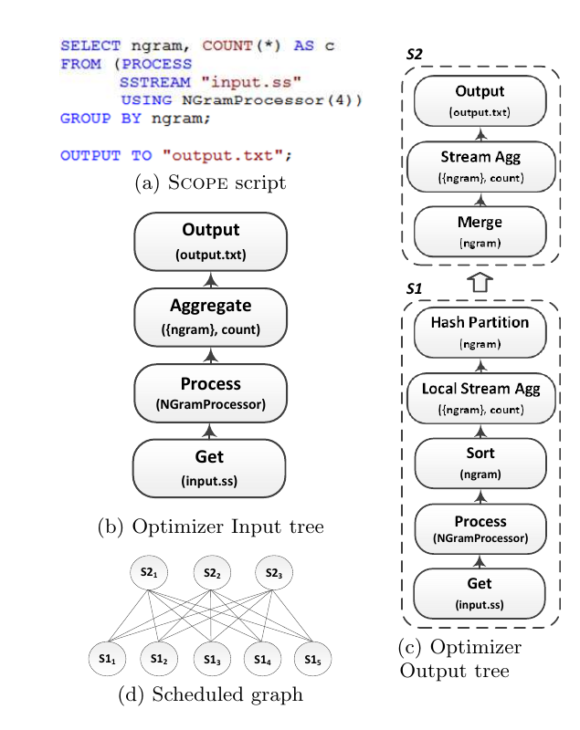

**图 1：** Scope 中的编译与执行。（a）Scope 脚本；（b）优化器输入树；（c）优化器输出树；（d）调度后的图。

### 2.2 查询编译与优化

Scope 脚本在集群中执行之前会经过一系列变换。首先，Scope 编译器解析输入脚本，展开视图和宏指令，执行语法检查与类型检查，并解析名称。这一步的结果是一棵带注解的抽象语法树，随后被传给查询优化器。图 1(b) 展示了示例脚本的输入树。

Scope 优化器是一个基于成本的变换引擎，用于为输入树生成高效执行计划。由于该语言深受 SQL 影响，Scope 可以利用关系查询优化领域的既有成果，从整体上考虑输入脚本，执行丰富且并非平凡的查询重写。优化器返回一个执行计划，规定高效执行脚本所需的步骤。图 1(c) 给出了优化器输出，其中确定了每个操作的具体实现（例如流式聚合）、数据分区操作（例如 partition 和 merge 算子），以及其他实现细节（例如 processor 之后的初始排序，以及把 aggregate 展开为局部/全局两级聚合）。

后端编译器随后为每个算子生成代码，并把一系列算子组合成一个执行单元（或称阶段，stage）。执行单元是通过把输出树切分为若干组件得到的，每个组件将由单个计算节点处理。因此，脚本编译的输出包括：（i）一个图定义文件，枚举所有阶段及其数据流关系；（ii）程序集本身，其中包含生成的代码。该程序包会被发送到集群执行。图 1(c) 中的虚线标出了与输入脚本相对应的两个阶段。

### 2.3 作业调度与运行时

Scope 脚本（即作业）的执行由作业管理器（Job Manager，JM）协调。JM 负责构建作业图，并在集群可用资源之间调度工作。如上所述，Scope 执行计划由一个阶段的有向无环图构成，这些阶段可以独立调度到不同机器上执行。一个阶段包含多个实例，也称顶点（vertex）；它们处理数据的不同分区，如图 1(d) 所示。JM 维护作业图，并跟踪图中每个顶点的状态与历史。当某个顶点的全部输入就绪时，JM 将其视为可运行并放入调度队列。

顶点的实际调度顺序取决于顶点优先级和资源可用性。其中一项调度原则是数据局部性：只要可能，JM 会尝试把顶点调度到存有其输入或离输入较近的机器上。如果选中的机器暂时过载，JM 可以把顶点调度到网络拓扑上较近的另一台机器，使读取输入时的网络流量尽可能小。此外，为应对大型通用硬件集群中潜在的硬件故障和机器负载波动，JM 会谨慎启动重复顶点，这称为推测式重复执行（speculative duplicate execution）。面对集群中意外的环境事件，重复执行有助于改善作业延迟和运行时间的可预测性。

执行期间，顶点从本地或远端读取输入。一个顶点内部的算子采用流水线方式处理，类似单节点数据库引擎。每个顶点会获得足以满足其需求（例如哈希表或外排序）的内存，但不超过总可用内存的一部分，同时也只获得可用处理器的一部分。该做法有时会使新顶点无法立刻在繁忙机器上运行。与传统数据库系统类似，每台机器都使用准入控制，并把尚未执行的顶点排队，直到所需资源可用。顶点的最终结果会写入本地磁盘；出于性能考虑不做复制，等待下一个顶点将其拉取。

在高度分布式计算环境中，拉取式执行模型和中间结果物化具有多项优点。第一，它不要求生产者顶点与消费者顶点同时运行，大幅简化了作业调度。第二，当大型集群中不可避免地发生故障时，只需从缓存的输入重新运行失败顶点，查询计划中仅有一小部分可能需要重新执行。最后，写出中间结果可以释放系统内存以执行其他顶点，并简化计算资源管理。

## 3. 连接处理

本节我们先简要回顾连接处理策略的分类，再描述分布式环境中额外的连接方案。

传统上，连接策略按以下维度分类：

- **连接类型（join type）**：刻画连接的语义，包括交叉连接（笛卡尔积）、内连接（等值连接、自然连接）、外连接（左外、右外和全外连接）以及半连接（左半连接和右半连接）。
- **连接算法（join algorithm）**：实现逻辑连接算子的不同方式，包括嵌套循环连接、基于排序的连接和基于哈希的连接。此外，还会引入二级索引、连接索引、位图索引和布隆过滤器等辅助数据结构，以进一步改进基本连接算法，例如索引循环连接、索引排序归并连接以及分布式半连接。
- **连接树形状（join tree shape）**：在执行多个连接时相关，用于刻画连接树的形状，例如左深树、右深树和浓密树。

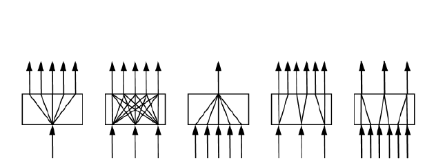

**图 2：** 不同类型的数据交换拓扑。从左到右依次为：初始分区、重分区、全归并、部分重分区和部分归并。

在分布式环境中，连接分类还会引入一个额外维度：连接图拓扑（join graph topology）。图拓扑规定不同数据分区如何以分布式方式处理，并受以下因素影响 [25]：

- **分区方案（partitioning scheme）**：刻画系统如何对数据进行分区。分区方案由分区函数（例如哈希分区、范围分区、随机分区[^2]和自定义分区）、分区键以及分区数构成。
- **数据交换算子（data exchange operator）**：修改数据集的分区方案，包括初始分区、重分区、全归并、部分重分区和部分归并（见图 2）。
- **归并方案（merging scheme）**：通过保证某些额外的分区内属性（例如顺序）来修饰数据交换算子，包括随机归并、排序归并、拼接归并以及排序拼接归并 [25]。
- **分布策略（distribution policy）**：规定分区能否复制到多个执行节点，包括带复制分布和无复制分布。

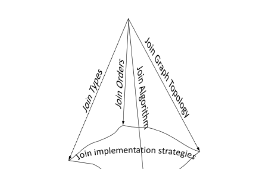

**图 3：** 连接方案的分类。

图 3 展示了连接处理的分类。沿这些维度任取一个组合，都会投影到连接实现策略的超平面上。本节余下部分，我们将详细讨论分布式环境中的各种连接实现策略。具体来说，我们在第 3.1 节关注连接图拓扑与连接类型的交互，并在第 3.2 节讨论“有利属性”如何影响连接图拓扑和连接算法的选择。为简化讨论且不失一般性，连接顺序这一维被省略。

[^2]: 随机分区可以看作键列上的一种分区函数。

### 3.1 连接图拓扑

连接图拓扑可以分为对称连接图和非对称连接图。在对称连接图中，两个输入都按照完全相同的分区方案水平分区，并由 $n$ 个计算节点执行连接，其中 $n$ 是分区数。每个计算节点从两个输入读取第 $i$ 对分区并执行连接，因此这种图也称成对连接图（pair-wise join graph）。串行连接图是对称连接图在 $n=1$ 时的特例。

非对称连接图的两个输入采用不同的分区方案。图 4 给出了一个非对称连接图示例：表 $T$ 被分成 5 个分区，表 $S$ 被分成 6 个分区，并以 5 的并行度（degree of parallelism，DOP）执行连接。它之所以非对称，是因为：（i）某些分区参与多个连接节点，例如 $T_4$ 和 $S_4$ 采用带复制分布；（ii）某些连接接收的输入分区数并不对称，例如从左数第 3 个和第 5 个连接节点都从 $T$ 接收 1 个输入分区，却从 $S$ 接收 2 个输入分区。此外，并非 $T$ 的所有分区都参与连接，例如 $T_5$[^3]。

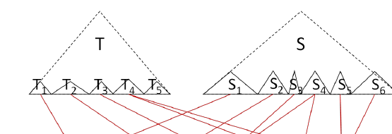

**图 4：** 非对称连接图示例。

必须注意，连接图拓扑描述的是两个输入的分区如何连接到连接算子，与具体连接算法正交。

分布式环境中常见的一种非对称连接策略是广播连接图。在广播连接图中，一个输入被全归并为单个分区，另一个输入则可以任意分区。随后，系统把串行输入广播到另一个连接操作数的所有分区；按定义，这会发生复制。

另一种常见的非对称连接图是全交叉连接图，其中两个连接操作数都可以任意分区。实现连接时，会把左输入的每个分区广播到右输入的所有分区，从而形成完全二部图。

图 5 展示了另一个用于处理数据倾斜的通用连接图。表 $T$ 和 $S$ 都被自定义分成 4 组分区。第一组分区（蓝色）按成对连接图相连；第二组（棕色）按右广播图相连；第三组（红色）按左广播图相连[^4]；最后，第四组（白色）按全交叉图相连。第 4 节将进一步讨论这类策略。

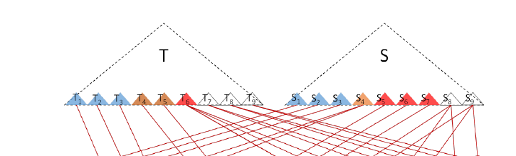

**图 5：** 倾斜连接图示例。

广义连接分类中的方案并非都符合直觉。例如，由于前者需要传输大量数据，通常使用随机分区加嵌套循环算法来实现内连接（得到全交叉连接图），会比使用哈希分区加排序归并算法（得到对称连接图）效率更低。但在某些情况下，这些直觉上并不吸引人的方法反而会成为更好的方案。例如，当输入或连接结果存在极端数据倾斜时，传统的对称并行连接图会让少数异常计算节点承受重负，详见第 4 节。此外，当存在有利属性[^5]时，全交叉连接图会成为传统 DBMS 未曾考虑过的有吸引力的并行连接方案，见第 3.2 节。

如果我们再考虑连接类型这一维，并非所有连接类型都能以任意连接图拓扑朴素实现，特别是那些隐含带复制分布的策略。例如，如果不采取额外的去重措施，左外连接就无法用左广播连接图实现。第 4 节，我们将讨论 Scope 使用的重复消除技术；第 6 节则讨论文献中的既有技术。

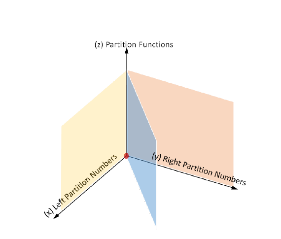

**图 6：** 并行连接图拓扑。

图 6 通过枚举分区函数和分区数这两个维度来描述解空间。 $x$ 轴表示左连接操作数的分区数， $y$ 轴表示右连接操作数的分区数， $z$ 轴表示分区函数。 $z$ 轴，即 $x=y=1$，表示串行连接图； $x=y$ 所在平面表示对称连接图。其余空间均表示非对称连接图，并可进一步分类： $\lbrace{}x,z\rbrace{}$ 平面表示右广播连接图， $\lbrace{}y,z\rbrace{}$ 平面表示左广播连接图，其余空间表示全交叉或部分交叉连接图。

内连接的解空间覆盖图 6 中的整个空间。然而，如果没有高级重复消除技术，左外连接、左半连接和左反半连接只能由 $x=y$ 或 $y=1$ 所在平面覆盖；右外连接、右半连接和右反半连接只能由 $x=y$ 或 $x=1$ 所在平面覆盖；全外连接只能由 $x=y$ 所在平面覆盖；笛卡尔积则可以由除 $x=y$ 平面以外的整个空间覆盖。

[^3]: 仔细的读者可能会质疑图 4 中的连接图为何能作为产生正确结果的有效连接实现策略。只有当系统对底层数据的分布及其语义/约束掌握丰富知识时，这种连接图才可行。

[^4]: 右广播连接图把右输入广播到左输入；类似地，左广播连接图把左输入广播到右输入。

[^5]: 有利属性包括排序、分组、分区属性以及额外访问路径。

### 3.2 有利属性

本节我们讨论分区、排序等有利属性如何进一步拓宽实际可行的解空间，以及我们如何利用这些信息改进并行连接。

考虑图 7 中的贯穿示例，其记号定义见表 1。为简明起见，我们不枚举整个解空间，而只关注一个典型示例。图 7 中的查询按等值谓词 $T_J=S_J$ 连接表 $T$ 与 $S$，连接由索引循环连接实现[^6]。表 $T$ 在列 $T_P$ 上进行范围分区，并按 $T_S$ 排序；表 $S$ 在列 $S_P$ 上进行范围分区，并按 $S_S$ 排序。

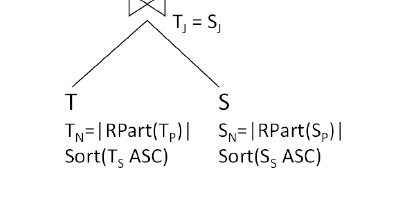

**图 7：** 连接示例。

**表 1：贯穿示例使用的记号。**

| 记号 | 定义 |
| --- | --- |
| $\bowtie$ | 内（等值）连接算子 |
| $\mathrm{RPart}(C)$ | 按列序列 $C$ 进行范围分区 |
| $\mathrm{Sort}(C)$ | 按列序列 $C$ 排序 |
| $T_P, S_P$ | 分别为表 $T$ 和 $S$ 的分区键 |
| $T_S, S_S$ | 分别为表 $T$ 和 $S$ 的排序键 |
| $T_J, S_J$ | 分别为表 $T$ 和 $S$ 的连接键 |
| $T_N, S_N$ | 分别为表 $T$ 和 $S$ 的分区数 |
| $\lvert \chi \rvert$ | $\chi$ 上的并行度（DOP）；例如 $\lvert \bowtie \rvert$ 表示连接的 DOP， $\lvert T \rvert$ 表示表 $T$ 的分区数 |
| $A ⊑ B$ | 列序列 $A$ 是列序列 $B$ 的前缀子集 |
| $A \subseteq B$ | 列集合 $A$ 是列集合 $B$ 的子集 |

由于连接算法是索引循环连接，我们假定排序键 $S_S$ 能对连接列 $S_J$ 的某个子集执行查找。也就是说，存在 $S' ⊑ S_S$，使得 $S' \subseteq S_J$。表 2 汇总了在给定有利属性条件下，分布式环境中的各种连接图拓扑。

**表 2：分布式环境中常见的并行连接图拓扑。**

| 连接的 DOP | 连接图拓扑 | 条件 |
| --- | --- | --- |
| $\lvert \bowtie \rvert=1$ | 串行连接图 | $\lvert T \rvert=\lvert S \rvert=1$ |
| $\lvert \bowtie \rvert=\lvert S \rvert$ | 左广播连接图 | $\lvert T \rvert=1$ |
| $\lvert \bowtie \rvert=\lvert S \rvert\times k$ | $k=1$：对称连接图（成对连接）； $k\lt{}1$：带部分归并的对称连接图； $k\gt{}1$：带部分重分区的对称连接图 | $\lvert T \rvert\gt{}1$、 $\lvert S \rvert\gt{}1$ 且 $S_P ⊑ S_J$ |
| $\lvert \bowtie \rvert=\lvert T \rvert\times k$ | $k=1/\lvert T \rvert$：串行连接； $k=1$ 且 $\lvert S \rvert=1$：右广播连接图； $k\geq 1$ 且 $\lvert S \rvert\gt{}1$：在 $S$ 上进行部分归并的全交叉连接图 | $\lvert T \rvert\gt{}1$ 且 $S_P ⊑ S_J ⊑ S_S$ |
| $\lvert \bowtie \rvert=\lvert T \rvert\times\lvert S \rvert$ | 全交叉连接图 | 无 |

前三种情形是分布式环境中常见的并行连接策略。Scope 系统还会考虑第三种情形中带部分重分区和/或部分归并的两个对称连接图变体；据我们所知，它们尚未在文献中描述。例如，如果 $T_P ⊑ T_J$ 且 $S_P ⊑ S_J$，但 $T_P\neq S_P$ 或 $T_N\neq S_N$，Scope 会尝试细化 $\mathrm{RPart}(T_P)$，得到

$$
T' _ {N}=\lvert \mathrm{RPart}(T' _ {P})\rvert,
$$

使 $T' _ {P}=S_P$ 且 $T' _ {N}=S_N$；或者反向细化另一侧。细化分区时，可能拆分一些分区，也可能合并另一些分区。

对于第四种情形，即 $\lvert\bowtie\rvert=\lvert T\rvert\times k$，前两个变体也是前文介绍过的常用策略。第三个变体满足 $k\geq 1$ 且 $\lvert S\rvert\geq 1$，它是第五种情形（全交叉连接图）的特例，下面将讨论它。用于等值连接的全交叉连接图在传统数据库系统中较少得到研究。由于其产生的中间结果数据量很大，通常效率较低，因此优化器会用启发式方法把它从搜索空间中剪除。在分布式环境里，并行连接策略有两类主要成本：数据分区成本，以及与连接操作直接相关的成本，例如中间结果的 CPU 和本地 I/O 成本。

对称（成对）连接图与全交叉连接图之间的权衡，是用连接成本的下降抵消数据分区成本。大多数情况下，连接成本的下降远高于额外产生的数据分区成本。不过，当存在有利属性时，系统可能不产生数据分区成本，同时进一步降低连接成本。其核心思想是：利用有利属性对完全二部图进行图剪枝。

在该示例中，表 $T$ 和 $S$ 都进行了范围分区，并假设 $T_P ⊑ S_P$ 且 $S_P\subseteq S_J$，由此也蕴含 $T_P\subseteq T_J$。图 8 用不同颜色展示了 $T$ 和 $S$ 上 $\mathrm{RPart}(T_P)$ 的范围边界。由于 $T_P ⊑ S_P$， $\mathrm{RPart}(S_P)$ 的分区边界更细，因而 $\mathrm{RPart}(T_P)$ 的一些边界会落在 $\mathrm{RPart}(S_P)$ 的物理分区内部。又因为 $T_P\subseteq T_J$ 且 $S_P\subseteq S_J$，我们可以推断，例如连接 $T_2$ 与 $S_5$ 将产生空结果。因此，我们可以从全交叉图中剪除 $T_2$ 与 $S_5$ 的连接。剪除 $T_i$ （ $i=1,\ldots,5$ ）与 $S_j$ （ $j=1,\ldots,7$ ）之间所有不必要的连接后，所得连接图如图 8 所示。我们是否应选择这一执行计划，而不是传统的成对连接图，需要基于成本决定。

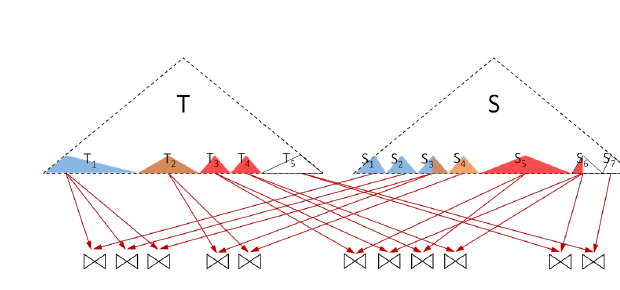

**图 8：** 部分交叉连接图。

影响成本的一个重要因素是连接选择率。图 9 所示的完全二部连接图虽然不会产生数据分区成本，却可能引发极大的数据传输量和总成本。尽管如此，在少见但合理的条件下，它仍可能优于最先进的成对哈希连接或排序连接策略。例如，如果内表 $S$ 提供了可以高效求值连接谓词的有利索引，并且连接选择率非常低，那么数据传输成本和总连接成本都会保持较低，因为索引循环连接可以利用索引结构把连接操作下推到数据所在位置。查找仅会为满足连接谓词的行产生数据传输成本。此外，使用批量查找时，我们还可以良好摊销每次网络往返的成本。

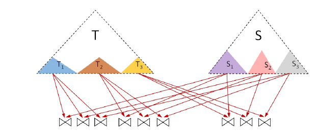

**图 9：** 完全二部连接图。

本节我们讨论了连接图拓扑如何扩展 MapReduce 环境中连接处理的解空间。下一节我们将介绍 Scope 如何应用不同连接图来处理连接倾斜问题。

[^6]: 对其他连接算法稍作修改，也可以应用类似分析。

## 4. 处理连接倾斜

如第 1 节所述，处理数据倾斜是大规模分布式应用中的关键挑战。下面我们提出一类称为 SkewJoin 的逻辑变换。SkewJoin 变换可以减轻数据倾斜对分布式连接操作的影响。我们给出三种具体的 SkewJoin 变换，并讨论各自的优缺点。

### 4.1 概述

SkewJoin 的核心思想很简单：把高频连接键值分离出来，并以不同于低频键值的方式处理。也就是说，对高频键值采用不同的分区方案和连接图拓扑。从高层看，SkewJoin 变换把一个连接分解为三个步骤，见图 10：

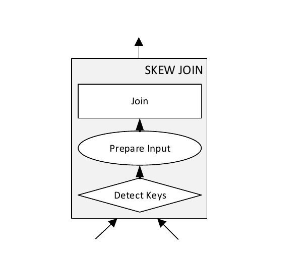

**图 10：** SkewJoin 变换的三个阶段。

1. **检测高频连接键值。** 第一步是识别连接键中的高频值，即倾斜值。如果已有检测连接键列数据倾斜的机制，例如直方图或近似计数，该步骤可以直接利用它；否则，我们生成一个简单的聚合查询来收集高频值，详见第 4.4 节。
2. **准备连接输入。** 识别出需要特殊处理的键值后，SkewJoin 策略通过相应地拆分和/或重分区输入表来准备连接输入。低频值（即非倾斜值）会为普通并行连接做好准备，例如按连接键哈希分区并采用成对连接图；高频值（即倾斜值）则以不同方式准备。我们假定查询执行引擎支持多次读取中间数据，也支持对中间结果重分区。我们将在第 4.2 节给出三种方案，它们采用不同的连接图拓扑，在性能与稳健性之间有不同权衡，并且支持的连接类型和数据倾斜场景也不同。
3. **执行真正的连接。** SkewJoin 策略不需要实现专门的连接算法。查询执行引擎中已有的任意连接算法实现，例如哈希连接或排序归并连接，均可使用。不过，某些连接类型需要谨慎处理，详见第 4.3 节。

本节余下部分，我们使用按 $b$ 连接 $T(a,b)$ 与 $S(b,c)$ 作为贯穿示例，记作 $T(a,b)\bowtie_b S(b,c)$。我们还用 $b^{LL}$、 $b^{HL}$、 $b^{LH}$ 分别表示以下连接键值集合：（i）在 $T$ 和 $S$ 中都不倾斜；（ii）在 $T$ 中倾斜、在 $S$ 中不倾斜；（iii）在 $T$ 中不倾斜、在 $S$ 中倾斜。如果某个键值在两张表中都是高频值，则频率更高的一侧优先。我们把 $T.b^x$ 定义为

$$
T.b^x=\lbrace{}t\mid t\in T\land t.b\in b^x\rbrace{}.
$$

例如， $S.b^{LH}$ 表示 $S$ 中那些 $b$ 值在 $T$ 中不倾斜、但在 $S$ 中倾斜的元组。为简化讨论，我们先把范围限定为内连接，再在第 4.3 节把方法扩展到外连接。

### 4.2 SkewJoin 变换

下面我们描述三种处理连接倾斜的备选变换，并讨论每种方法的收益与不足。

#### 4.2.1 B-SkewJoin

B-SkewJoin（Broadcast SkewJoin，广播式 SkewJoin）或许是规避连接倾斜最直观的方式。我们观察到，许多遇到严重数据倾斜问题的用户，在我们将 SkewJoin 实现到系统中之前，已经通过手工编写脚本来实现这一策略。B-SkewJoin 也称 Partial Replication Partial Redistribution（PRPD，部分复制、部分重分布）[23]。B-SkewJoin 通过拆分连接输入并使用广播连接来缓解数据倾斜。假设执行 $T\bowtie_b S$， $T.b$ 的分布倾斜，而 $T$ 按 $a$ 分区。只要按 $T.a$ 的分区使 $T.b$ 的分布保持相对均匀，广播 $S$ 就会把连接结果倾斜分散到多个分区。根据倾斜值拆分输入，可以让需要广播的行集保持较小，从而使 B-SkewJoin 可用于更大规模的数据。

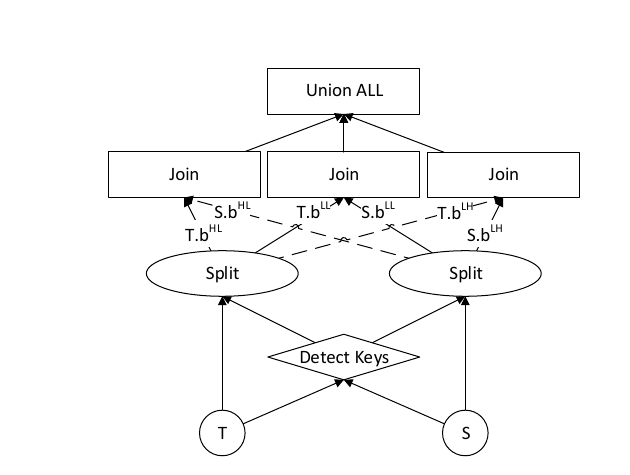

**图 11：** B-SkewJoin，又称部分复制、部分重分布（Partial Replication Partial Redistribution）。

图 11 从高层展示了 B-SkewJoin 的图拓扑。每个连接输入根据键分布被拆成三个互不相交的子集，并由三个不同的并行连接处理。非倾斜的一侧，即 $T.b^{LH}$ 和 $S.b^{HL}$，会被广播到另一侧，图中以虚线表示；非倾斜输入 $T.b^{LL}$ 和 $S.b^{LL}$ 则采用成对并行连接实现。这三个子连接的结果合并后得到最终结果。B-SkewJoin 很简单，却可能是最高效的策略，原因有二。第一，如果输入表带有有利属性，该策略不需要对输入数据重分区。第二，连接结果保留了非广播侧的数据分区属性，因而可能避免后续算子所需的重分区步骤。

B-SkewJoin 以执行时间的可靠性换取性能，因为其整体性能高度依赖非广播侧的初始数据分区。例如，假设 $T$ 已按 $T.b$ 分区。在这种场景中，广播 $S.b^{HL}$ 与普通成对连接并无不同，因为每个高频连接键值仍由单个节点处理。因此，使用 B-SkewJoin 时必须仔细考虑输入数据的分区方案。

#### 4.2.2 F-SkewJoin

第二种方案 F-SkewJoin（Full SkewJoin，完全式 SkewJoin）位于性能与可靠性权衡的另一个极端。B-SkewJoin 尽量避免重分区，F-SkewJoin 则始终对输入数据做完全重分区。完全重分区数据的开销大于 B-SkewJoin，但它可以通过精细调整连接图拓扑，更好地控制连接结果倾斜的均衡；而且，重分区开销比根据初始数据分区估算最终连接结果倾斜更加可预测。

具体来说，F-SkewJoin 按以下方式对输入重分区：

- 表中取值为高频值的行，以轮转方式分区给下游连接算子，即无复制分布。
- 取值在另一张表中为高频值的行，被复制到下游连接算子，即带复制分布。
- 在两张表中都为低频值的行，按连接键哈希分区。

这样，F-SkewJoin 实际上把 B-SkewJoin 的非广播侧重新均衡到多个连接算子。每个连接算子同时处理低频键值和高频键值。如果掌握了相应信息，例如通过第 4.4 节检测阶段中的简单聚合收集到频率，F-SkewJoin 可以改变连接算子的并行度，以分散高频值。注意，如果 F-SkewJoin 对每个高频键值都始终使用完整并行度，其行为将类似 B-SkewJoin。

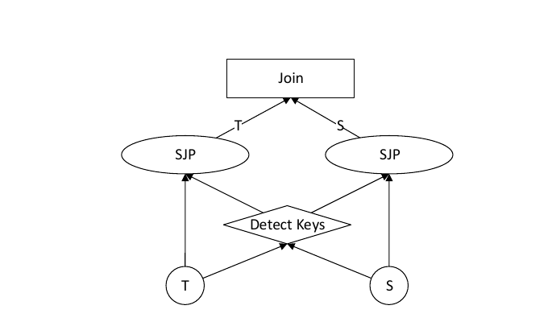

**图 12：** F-SkewJoin。

要实现 F-SkewJoin，查询执行引擎需要一种新的分区算子，称为 Skew Join Partitioner。它依据高频键信息，对输入表重分区和/或复制。如果系统支持用户定义算子（user-defined operator，UDO），Skew Join Partitioner 就可以实现为 UDO。例如，在 Scope 中，我们把 Skew Join Partitioner 实现为一个用户定义组合器，以实现自定义二元操作 [24]。组合器接口允许用户枚举并处理两个输入中具有相同连接键值的所有行。图 13 给出了一个实现为 Scope 组合器 UDO 的 Skew Join Partitioner 示例：它根据高频值检测结果，即左输入表和带频率的高频键值，准备左输入。

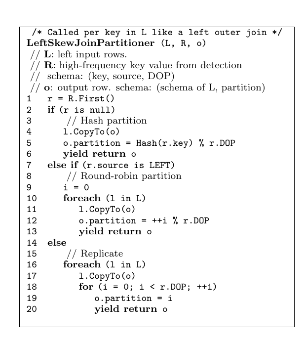

**图 13：** 作为用户定义组合器实现的左侧倾斜连接分区器。

图 13 中的完整伪代码如下：

```text
/* Called per key in L like a left outer join */
LeftSkewJoinPartitioner (L, R, o)
// L: left input rows.
// R: high-frequency key value from detection
//    schema: (key, source, DOP)
// o: output row. schema: (schema of L, partition)
1  r = R.First()
2  if (r is null)
3      // Hash partition
4      l.CopyTo(o)
5      o.partition = Hash(r.key) % r.DOP
6      yield return o
7  else if (r.source is LEFT)
8      // Round-robin partition
9      i = 0
10     foreach (l in L)
11         l.CopyTo(o)
12         o.partition = ++i % r.DOP
13         yield return o
14 else
15     // Replicate
16     foreach (l in L)
17         l.CopyTo(o)
18         for (i = 0; i < r.DOP; ++i)
19             o.partition = i
20             yield return o
```

图 12 从高层展示了 F-SkewJoin。Skew Join Partitioner（SJP）依据检测结果准备每个连接输入：复制 $T.b^{LH}$ 和 $S.b^{HL}$，以轮转方式分区 $T.b^{HL}$ 和 $S.b^{LH}$，并对 $T.b^{LL}$ 和 $S.b^{LL}$ 做哈希分区。准备好的输入由单个并行连接处理，因此不需要 union。

F-SkewJoin 比 B-SkewJoin 更通用、更可靠，但始终对输入数据重分区，在数据集很大时可能产生高额开销。此外，如果连接算子属于更复杂的流水线，后续算子可能还需要额外的重分区步骤，因为 Skew Join Partitioner 会破坏输入已有的数据分区。

#### 4.2.3 H-SkewJoin

最后一种方案 H-SkewJoin（Hybrid SkewJoin，混合式 SkewJoin）是 B-SkewJoin 与 F-SkewJoin 的混合体，在性能与可靠性之间取得平衡。该策略像 B-SkewJoin 一样拆分连接输入，但像 F-SkewJoin 一样使用 Skew Join Partitioner 对倾斜侧重分区。通过拆分输入，H-SkewJoin 可以保留非倾斜侧，即 $\ast.b^{LL}$，原有的数据分区，但会丢失倾斜侧的分区。如果大多数连接键值彼此不同，与 F-SkewJoin 相比，H-SkewJoin 可以避免昂贵的重分区。然而，把数据流拆成两部分可能会增加运行时需要调度的算子数量，这些额外开销可能抵消保留原始数据分区的收益。

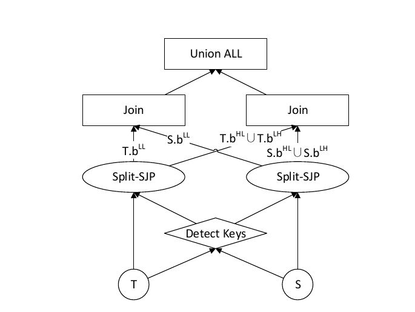

**图 14：** H-SkewJoin。

图 14 展示了 H-SkewJoin 的连接图拓扑。连接输入首先像 B-SkewJoin 一样被拆分为 $\ast.b^{LL}$ 与其余部分，然后由 Skew Join Partitioner 处理包含高频值的元组。两个并行连接处理这些数据，随后我们对部分结果执行 union，得到最终答案。

**小结。** 本节我们回顾了三种 SkewJoin 变换。每种变换在性能与可靠性之间都有独特权衡。我们在表 3 中汇总了这三种变换。

**表 3：SkewJoin 变换汇总。** “左/右”表示数据倾斜来源于左输入还是右输入。

| 类别 | 指标或场景 | B-SkewJoin | F-SkewJoin | H-SkewJoin |
| --- | --- | --- | --- | --- |
| 适用性 | 内连接 | 左 ✓；右 ✓ | 左 ✓；右 ✓ | 左 ✓；右 ✓ |
| 适用性 | 左外连接 | 左 ×；右 ✓ | 左 ✓；右 ✓ | 左 ✓；右 ✓ |
| 适用性 | 右外连接 | 左 ✓；右 × | 左 ✓；右 ✓ | 左 ✓；右 ✓ |
| 适用性 | 全外连接 | 左 ×；右 × | 左 ✓；右 ✓ | 左 ✓；右 ✓ |
| 分区要求 | 重分区低频键 | 必要时 | 是 | 必要时 |
| 分区要求 | 重分区高频键 | 否 | 是 | 是 |
| 分区要求 | 需要 SJP | × | ✓ | ✓ |
| 连接图拓扑 | 高频键来源侧 | 无 | 轮转 | 轮转 |
| 连接图拓扑 | 高频键另一侧 | 广播 | 部分复制 | 部分复制 |
| 连接图拓扑 | 低频键连接 | 分开 | 不分开 | 分开 |
| 派生的有利属性 | 保留分区 | 是 | 否 | 部分保留 |
| 派生的有利属性 | 保留排序 | 是 | 是 | 是 |
| 成本 | 开销 | 低 | 高 | 中等 |
| 成本 | 稳健性 | 低 | 高 | 高 |
| 成本 | 已调度算子数 | 高 | 低 | 中等 |

### 4.3 处理不同的连接类型

SkewJoin 中真正的连接操作可以使用任意连接算法实现。然而，为保证正确性，某些外连接场景中的数据倾斜需要特别留意。例如，第 3 节已经讨论过，在左外连接中把左输入广播到右侧并不正确，因为那些被广播的左侧行在无法与右侧元组连接时，会产生错误的空值。因此，B-SkewJoin 无法处理外连接内表中的数据倾斜。

F-SkewJoin 和 H-SkewJoin 则可以支持这种场景：当以轮转方式重分区内表中带倾斜键值的元组，例如 $S.b^{LH}$ 时，它们确保每个下游分区至少收到一个元组。当高频值的重复次数至少约为

$$
\frac{\lvert D\rvert\cdot\lvert\bowtie\rvert}{2}
$$

时，这一性质成立；其中 $\lvert D\rvert$ 是输入分区数，例如 $\lvert T\rvert$ 或 $\lvert S\rvert$， $\lvert\bowtie\rvert$ 是连接算子的分区数。

如果不满足该条件，Skew Join Partitioner 可以为每个键值生成见证元组（witness tuple），并按轮转方式对其分区，以保证每个连接算子至少看到一个原始元组或见证元组。见证元组可以阻止外连接算子生成空值，但由见证元组产生的结果必须从最终结果中排除。实现方式可以是在连接之后添加一个过滤器，也可以使用原生理解见证元组语义的外连接算子变体。

### 4.4 检测高频键值

前几节讨论的三种 SkewJoin 方案都依赖高频键值信息。本节我们通过成本分析回答两个问题：第一，高频值的阈值是什么；第二，需要使用多少个分区。为简化起见，我们假设执行完全流水化；不同的执行模型可能需要调整结果。我们假设使用 $K$ 个处理器连接 $m\times n$ 个元组，其中 $m\gt{}n$，且两个输入都已按连接键分区。这是 SkewJoin 中最差的场景，因为对每个连接键值，复制和重分布都要处理全部数据。

#### 高频键值的阈值

给定一个值的频率，何时做复制才有收益？令 $c_j$、 $c_r$、 $c_x$ 分别表示：每个输出元组的连接成本、向其他处理器复制/广播一个元组的成本，以及向其他处理器传输一个元组的成本。当单节点连接的运行时间长于多节点运行时间时，SkewJoin 才有收益。多节点运行时， $n$ 个元组会被复制 $K$ 次，每个处理器产生全部输出元组的 $1/K$； $m$ 个元组则以轮转方式均匀分布到 $K$ 个处理器。因此，当串行连接延迟大于 SkewJoin 延迟时，SkewJoin 有收益：

$$
m\cdot n\cdot c_j\gt{}
\max(m\cdot c_x,\ n\cdot K\cdot c_r)
+\frac{m}{K}\cdot n\cdot c_j.
$$

根据轮转分布成本和复制成本的相对大小，我们可得到以下不等式：

$$
m\gt{}
\frac{K^2}{K-1}\frac{c_r}{c_j}
\gt{}K\frac{c_r}{c_j}
\qquad \text{if }m\cdot c_x\leq n\cdot K\cdot c_r,
$$

$$
n\gt{}
\frac{K}{K-1}\frac{c_x}{c_j}
\gt{}\frac{c_x}{c_j}
\qquad \text{if }m\cdot c_x\gt{}n\cdot K\cdot c_r.
$$

因此，我们可以对频率高于这些阈值的键应用 SkewJoin。尽管应根据重分布与复制的相对成本分别应用这两个不等式，但我们的实践发现，只对 $m$，即两侧中较高的频率，设置阈值就已足够。各系数可以确定为系统级常量， $K$ 通常也能从系统配置中预先获知。因此，该阈值可以在数据发生变化时保持不变；相对阈值，例如元组占比，则无法做到这一点。使用绝对阈值还有一个优点：在重尾分布下，可能有数十万个键值得以并行连接，即使需要承担一定开销，这仍然更有利。

#### 每个高频键值的并行度

连接键分布中可能只有一两个取值具有极端频率，也可能有数百乃至数千个取值具有相对较高的频率。显然，如果频率并不极端，就不一定值得使用全部 $K$ 个处理器来均衡工作负载。重排阈值不等式，可以按频率 $m$ 计算期望并行度 $k$：

$$
k\leq\left\lfloor\frac{c_j}{c_r}\cdot m\right\rfloor,
$$

$$
k=\min\left(\left\lfloor\frac{c_j}{c_r}\cdot m\right\rfloor,\ K\right).
$$

如果我们按频率调整并行度，那么阈值不等式中的 $K$ 应使用期望并行度的最小值，例如 2。

## 5. 实验评估

我们在 Scope 系统中实现了本文提出的不同连接策略。Scope 已部署在由数万台机器构成的 Microsoft 生产集群上。Scope 集群每天执行数万个作业，总计读写数十 PB 数据，并为多种在线服务提供支持。我们的实验在一个集群上进行；每台机器配有两颗 1.8 GHz 的六核 AMD Opteron 处理器、24 GB 内存以及四块 1 TB SATA 磁盘，均运行 Windows Server 2008 R2 Enterprise X64 Edition。

### 5.1 连接图拓扑

我们首先评估不同连接图拓扑的性能。第 3 节已经指出，非对称连接图优于对称连接图并不符合直觉。因此，传统并行数据库系统和较新的大数据处理平台往往会在解空间中忽略它们。当存在有利属性时，非对称连接图会变得很有吸引力，因为：（i）不会产生重分区成本；（ii）可以根据有利属性把完全二部图缩减成部分交叉连接图。

我们选取了两个作业，每个作业都包含一个双表连接，但连接选择率不同。较大的表 $T$ 约为 500 TB，较小的表 $S$ 约为 30 TB。表 $T$ 按列序列 $\langle a,b,c,d\rangle$ 范围分区为 $m$ 个分区，表 $S$ 按列序列 $\langle a,b\rangle$ 范围分区为 $n$ 个分区[^7]。连接谓词是 `T.a = S.a AND T.b = S.b`。

我们测量两个指标：作业执行延迟（图 15）以及所有并行执行实例聚合后的总 CPU 时间（图 16）。作业 1 有一个选择谓词，导致连接选择率非常低（小于 5%）；作业 2 的连接选择率很高（大于 90%）。参与比较的两种并行连接策略是：采用图 8 一类部分交叉连接图的连接（PCG），以及采用成对对称连接图的连接（SG）。

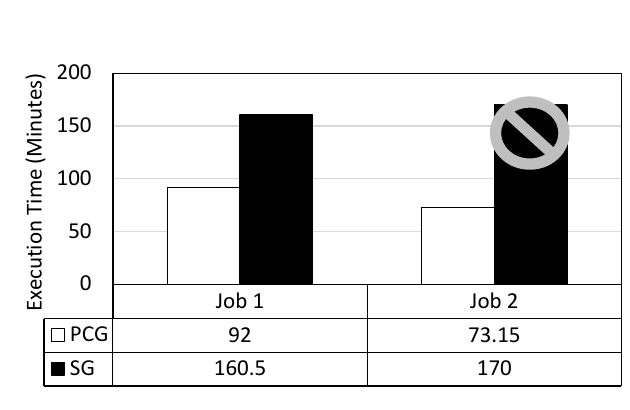

**图 15：** 作业执行延迟，单位为分钟。PCG 在作业 1 和作业 2 上分别为 92 和 73.15；SG 分别为 160.5 和 170，其中作业 2 在 170 分钟时被终止。

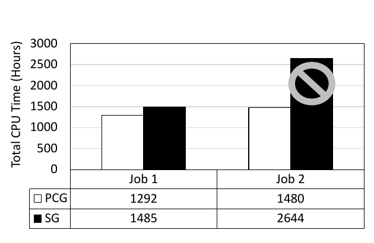

**图 16：** 所有并行执行实例聚合后的总 CPU 时间，单位为小时。PCG 在作业 1 和作业 2 上分别为 1292 和 1480；SG 分别为 1485 和 2644，其中作业 2 未完成。

我们可以看到，由于存在有利的分区属性，PCG 在两个作业中都优于 SG，因为后者需要重分区总计 530 TB 的数据。值得注意的是，在作业 1 中，PCG 的总 CPU 时间只略低于 SG，这是因为分区边界重叠，采用 PCG 的执行会重复读取部分底层数据。此外，由于高选择性的过滤谓词被下推到连接之前，总数据量显著下降，因而两种策略之间的差距缩小。不过，PCG 消除了重分区，所以在延迟上仍有大幅改善。对于作业 2，由于要重分区的数据量巨大，SG 在执行 170 分钟后最终失败；系统为防止失控作业而依据策略将其终止。PCG 则在 74 分钟内完成。

实验使用排序归并连接。若使用其他连接算法，PCG 与 SG 的盈亏平衡点会不同。尽管如此，通过上述实验，我们说明系统可以探索采用非对称连接图的有吸引力的并行连接策略，以进一步缩短连接处理时间。

[^7]: 不失一般性，示例中的排序顺序为升序。

### 5.2 SkewJoin

下面我们评估不同 SkewJoin 方案的特征，并讨论它们在生产集群真实工作负载中的相对性能。

为比较不同 SkewJoin 方案的相对性能，我们从生产工作负载中选取两个有代表性的作业，并强制分别使用每种 SkewJoin 变体执行。图 17 给出了各方法的总用时。作业 1 包含一个内连接，其连接键存在严重数据倾斜，最高频率达到百万量级。作业 2 包含两个左外连接，连接键只有轻度数据倾斜，最高频率为数千量级。图中可以看到，没有一种 SkewJoin 方案能够始终取得最佳性能。

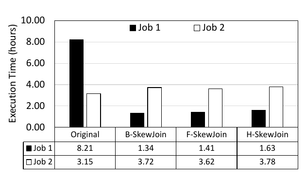

**图 17：** 存在数据倾斜时不同 SkewJoin 方案的执行时间，单位为小时。

| 作业 | 原始方案 | B-SkewJoin | F-SkewJoin | H-SkewJoin |
| --- | ---: | ---: | ---: | ---: |
| 作业 1 | 8.21 | 1.34 | 1.41 | 1.63 |
| 作业 2 | 3.15 | 3.72 | 3.62 | 3.78 |

在作业 1 中，B-SkewJoin 的运行时间最短；在作业 2 中，三种 SkewJoin 变换里 F-SkewJoin 最快。H-SkewJoin 在这两个作业中表现最差，但当后续操作需要有利属性时，它可能优于 F-SkewJoin。

三种 SkewJoin 方案都有各自的优缺点，收益取决于连接键数据倾斜的严重程度。例如，作业 1 的数据倾斜很严重，三种方案都把执行时间改善到原来的五分之一以下。另一方面，在作业 2 中，数据倾斜并不严重，尚不足以抵消 SkewJoin 的开销，因此三种方案都略慢于原始作业。SkewJoin 的开销与中间数据大小成正比；它以额外开销为代价，用性能换取更可靠的运行时间，例如作业 2 的开销约为 14% 至 20%。这种开销是否可以接受取决于用户要求，也是选择变换时的一项标准。

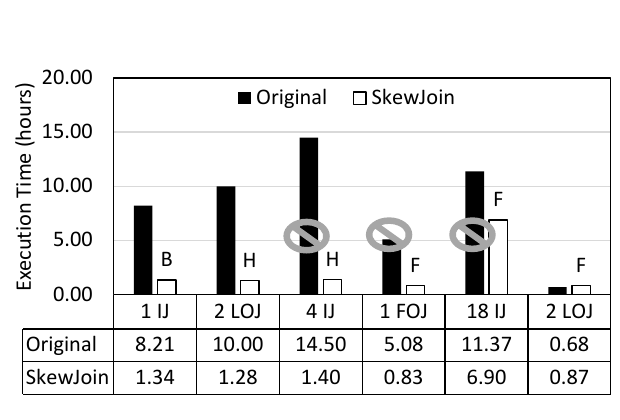

**图 18：** 六个不同作业使用与不使用 SkewJoin 时的执行时间。IJ、LOJ 和 FOJ 分别表示内连接、左外连接和全外连接；B、F、H 分别表示 B-SkewJoin、F-SkewJoin 和 H-SkewJoin。原始作业与 SkewJoin 作业的用时依次为：1 IJ，8.21/1.34；2 LOJ，10.00/1.28；4 IJ，14.50/1.40；1 FOJ，5.08/0.83；18 IJ，11.37/6.90；2 LOJ，0.68/0.87 小时。

图 18 比较了生产集群中六个生产作业采用和不采用 SkewJoin 策略时的用时。原始作业使用传统成对并行连接实现，SkewJoin 作业则在原始作业的部分连接上使用 SkewJoin。例如，标注为 H 的 “2 LOJ” 表示作业中的两个左外连接使用 H-SkewJoin。部分原始作业，即作业 3、4、5，因为某些顶点运行时间过长而被系统或用户终止，未能执行完毕；图中以灰色禁止符号标出。总体而言，改善幅度随数据分布和作业而异，但我们通常观察到至少 4 至 10 倍的延迟改善。如果数据倾斜不够显著，SkewJoin 会略慢于原始作业，如图 18 中使用 F-SkewJoin 的 “2 LOJ” 所示。

**小结。** 本节我们说明 SkewJoin 策略能够有效缓解内连接和外连接中的各种数据倾斜场景。均衡连接工作负载的收益取决于连接键数据倾斜的严重程度。三种 SkewJoin 策略各有优缺点，没有一种方案能在所有场合都优于其他方案。

## 6. 相关工作

数据库领域已经对连接处理进行了数十年的广泛研究。Graefe 对大型数据库的查询处理给出了综合综述，涵盖连接类型、连接顺序和连接算法 [7]。近来又出现了一些研究，改进 MapReduce 环境中连接处理的特定方面，例如多路连接 [1]、存在倾斜时的外连接 [22]，以及广播连接 [16]。在本文中，我们把 MapReduce 环境中并行连接处理的新方面归入解空间的一个新维度——连接图拓扑。据我们所知，之前没有工作提出过这样的分类；近期工作只研究了连接图拓扑中的个别因素，尤其是分区方案、数据交换算子和分布策略 [3]。形式化分类使我们能够系统地发现新的改进方案，并识别遗漏的优化机会。

许多研究团队已经广泛研究了并行数据库中的倾斜问题，尤其是连接算子场景 [5, 9, 10, 12, 13, 17, 20, 21]。这些工作覆盖的范围很广：从利用底层系统支持，例如网络交换机或操作系统特性 [12, 17]，到优化处理器之间的数据分布 [9, 10]，再到以最优顺序调度分区 [20, 21]，以及改进特定连接算法 [13]。

DeWitt 等人提出了一种处理并行连接倾斜的实用方法 [5]。他们考虑了范围分区（结合子集复制和加权）、负载调度（例如轮转、最长处理时间，即 LPT）以及虚拟处理器（即创建许多逻辑分区，并在每个物理处理器上调度多个分区）的不同组合。对于范围分区，DeWitt 等人提出了一种高效采样技术，用于估计连接键值的分布。对于 LPT 调度，他们使用简单成本模型来估算每个分区的成本。由于依赖范围分区，该技术可以处理重分布倾斜，却不能很好地处理连接结果倾斜。该技术易于实现，在实践中也很有效。从高层看，F-SkewJoin 是 DeWitt 等人的虚拟处理器分区加轮转策略的哈希变体，并进一步支持全部数据倾斜场景和外连接。Pig 是 Hadoop 上的声明式层，它实现了 DeWitt 等人的方法，即范围分区中的虚拟处理器加轮转，并把该技术扩展到外连接 [6, 18]。不过，它只能处理内连接一个输入中的数据倾斜，而且在外连接中与 B-SkewJoin 有相同局限。

Xu 等人提出了一种处理数据倾斜的并行连接方法，即 partial redistribution partial duplication（PRPD，部分重分布、部分复制）[23]。PRPD 首先把参与连接的关系中的行拆成三个互不相交的组，再分别采用不同方式处理：重分布、复制或留在本地。带倾斜值的行留在本地；另一个关系中连接属性取值为这些倾斜值的行会被复制；其余行则像普通并行哈希连接一样重分布。最终连接结果是三个连接的 union：每个关系的倾斜连接值各对应一个复制式连接，非倾斜连接值对应一个普通并行连接。第 4 节，我们把 PRPD 纳入 SkewJoin 框架，作为 B-SkewJoin 变换，并讨论了它的优缺点。Xu 等人还提出了存在数据倾斜时的并行外连接算法 OJSO（Outer Join Skew Optimization，外连接倾斜优化）[22]。OJSO 通过以下方式处理外连接链中的数据倾斜：把每个外连接的结果分为空值部分（即已经连接）和非空值部分（即尚未连接），并且在后续外连接中只处理非空值。OJSO 可以与外连接链上的 SkewJoin 正交组合。

Hive 是 Hadoop MapReduce 上另一个流行的声明式层，也实现了两种互补的数据倾斜连接处理策略 [8, 14]。第一种是运行时策略：连接把高频键溢写到 HDFS，再用后续条件式 map-side join，即广播连接，处理这些键。截至 Hive 0.12，该方法仅支持内连接。第二种是类似 B-SkewJoin 的编译时策略：把输入拆成倾斜部分和非倾斜部分，再使用 map-side join 处理数据倾斜。该方法与 Pig 有相同的局限和适用范围。

## 7. 结论

云规模数据中心中的海量数据分析，对制定关键业务决策极为重要。高级脚本语言使用户无须理解各种系统权衡和复杂性，为底层系统提供透明抽象，同时也给查询优化带来巨大机会与挑战。我们研究了极为常见的连接操作，并识别出分布式环境中的挑战和机会。具体来说，我们提出了一种通用分类，从中得到新的连接策略；还提出了新的查询重写，以稳健地处理数据倾斜连接。在 Microsoft 大规模 Scope 生产系统上的实验表明，所提出的技术能够系统地解决数据倾斜带来的挑战，并通常可以显著降低查询延迟。

## 8. 参考文献

[1] F. Afrati and J. Ullman. Optimizing multiway joins in a map-reduce environment. *IEEE Transactions on Knowledge and Data Engineering*, 23(9):1282–1298, 2011.

[2] Apache. Hadoop. <http://hadoop.apache.org/>.

[3] S. Blanas, J. M. Patel, V. Ercegovac, J. Rao, E. J. Shekita, and Y. Tian. A comparison of join algorithms for log processing in MapReduce. In *Proc. of the SIGMOD Conf.*, pages 975–986, 2010.

[4] J. Dean and S. Ghemawat. MapReduce: Simplified data processing on large clusters. In *Proceedings of OSDI Conference*, pages 10–10, 2004.

[5] D. DeWitt, J. Naughton, D. Schneider, and S. S. Seshadri. Practical skew handling in parallel joins. In *Proc. of the 18th VLDB Conf.*, pages 27–40, 1992.

[6] A. F. Gates, O. Natkovich, S. Chopra, P. Kamath, S. M. Narayanamurthy, C. Olston, B. Reed, S. Srinivasan, and U. Srivastava. Building a high-level dataflow system on top of map-reduce: the pig experience. *Proc. of the VLDB Endowment*, 2:1414–1425, August 2009.

[7] G. Graefe. Query evaluation techniques for large databases. *ACM Computing Surveys*, 25(2):73–169, 1993.

[8] He Yongqiang. handle skewed keys for a join in a separate job. <https://issues.apache.org/jira/browse/HIVE-964>.

[9] K. Hua and C. Lee. Handling data skew in multiprocessor database computers using partition tuning. In *Proc. of the 17th VLDB Conf.*, pages 525–535, 1991.

[10] K. Hua, C. Lee, and C. Hua. Dynamic load balancing in multicomputer database systems using partition tuning. *IEEE TKDE*, 7(6):968–983, 1995.

[11] M. Isard, M. Budiu, Y. Yu, A. Birrell, and D. Fetterly. Dryad: Distributed data-parallel programs from sequential building blocks. In *Proc. of EuroSys Conference*, pages 59–72, 2007.

[12] M. Kitsuregawa and Y. Ogawa. Bucket spreading parallel hash: a new, robust, parallel hash join method for data skew in the super database computer (sdc). In *Proc. of the 16th VLDB Conf.*, pages 210–221, 1990.

[13] W. Li, D. Gao, and R. Snodgrass. Skew handling techniques in sort-merge join. In *Proc. of the SIGMOD Conf.*, pages 169–180, 2002.

[14] Namit Jain. Skewed Join Optimization. <https://issues.apache.org/jira/browse/HIVE-3086>.

[15] C. Olston, B. Reed, U. Srivastava, R. Kumar, and A. Tomkins. Pig latin: A not-so-foreign language for data processing. In *Proceedings of SIGMOD Conference*, pages 1099–1110, 2008.

[16] S. Schelter, C. Boden, M. Schenck, A. Alexandrov, and V. Markl. Distributed matrix factorization with mapreduce using a series of broadcast-joins. In *Proc. of the 7th ACM conf. on Recommender Systems*, pages 281–284, 2013.

[17] A. Shatdal and J. F. Naughton. Using shared virtual memory for parallel join processing. In *Proc. of the SIGMOD Conf.*, pages 119–128, 1993.

[18] Sriranjan Manjunath. support for skewed outer join. <https://issues.apache.org/jira/browse/PIG-1035>.

[19] A. Thusoo, J. S. Sarma, N. Jain, Z. Shao, P. Chakka, N. Zhang, S. Antony, H. Liu, and R. Murthy. Hive – a petabyte scale data warehouse using Hadoop. In *Proceedings of ICDE Conference*, pages 996–1005, 2010.

[20] J. L. Wolf, D. M. Dias, and P. S. Yu. An effective algorithm for parallelizing sort merge joins in the presence of data skew. In *Proceedings of the second international symposium on databases in parallel and distributed systems, DPDS ’90*, pages 103–115, 1990.

[21] J. L. Wolf, D. M. Dias, P. S. Yu, and J. Turek. An effective algorithm for parallelizing hash joins in the presence of data skew. In *Proc. of the 7th ICDE Conf.*, pages 200–209, 1991.

[22] Y. Xu and P. Kostamaa. Efficient outer join data skew handling in parallel dbms. *Proc. of the VLDB Endowment*, 2(2):1390–1396, 2009.

[23] Y. Xu, P. Kostamaa, X. Zhou, and L. Chen. Handling data skew in parallel joins in shared-nothing systems. In *Proc. of the SIGMOD Conf.*, pages 1043–1052, 2008.

[24] J. Zhou, N. Bruno, M.-C. Wu, P.-Å. Larson, R. Chaiken, and D. Shakib. SCOPE: Parallel databases meet mapreduce. *The VLDB Journal*, 21(5):611–636, 2012.

[25] J. Zhou, P.-Å. Larson, and R. Chaiken. Incorporating partitioning and parallel plans into the SCOPE optimizer. In *Proceedings of ICDE Conference*, pages 1060–1071, 2010.
