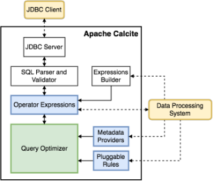
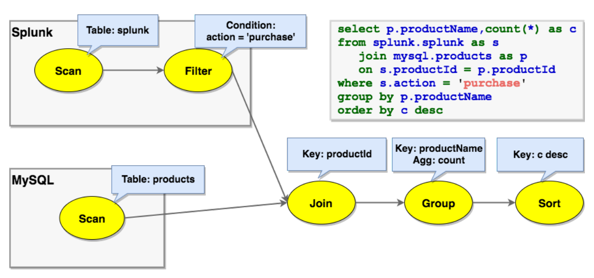
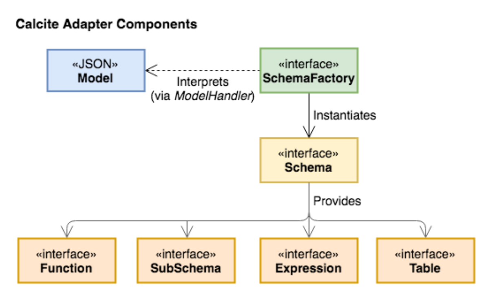
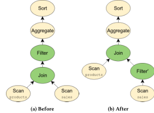

# Apache Calcite: A Foundational Framework for Optimized Query Processing Over Heterogeneous Data Sources（中文译文）

## 译者说明

本文依据同目录的 `source.pdf` 翻译。章节、图表、公式、算法、代码与参考文献按原文结构保留。

## 作者与出版信息

- Edmon Begoli — Oak Ridge National Laboratory（ORNL），Oak Ridge, Tennessee, USA；`begolie@ornl.gov`
- Jesús Camacho-Rodríguez — Hortonworks Inc.，Santa Clara, California, USA；`jcamacho@hortonworks.com`
- Julian Hyde — Hortonworks Inc.，Santa Clara, California, USA；`jhyde@hortonworks.com`
- Michael J. Mior — David R. Cheriton School of Computer Science, University of Waterloo，Waterloo, Ontario, Canada；`mmior@uwaterloo.ca`
- Daniel Lemire — University of Quebec（TELUQ），Montreal, Quebec, Canada；`lemire@gmail.com`

本文发表于 SIGMOD ’18（2018 年 6 月 10–15 日，美国得克萨斯州休斯敦），DOI：<https://doi.org/10.1145/3183713.3190662>。源 PDF 同时标注为 arXiv:1802.10233v1 [cs.DB]（2018 年 2 月 28 日）。

## 摘要

Apache Calcite 是一个基础软件框架，为许多流行的开源数据处理系统提供查询处理、优化和查询语言支持，例如 Apache Hive、Apache Storm、Apache Flink、Druid 和 MapD。Calcite 的架构包括：模块化且可扩展的查询优化器，其中内置数百条优化规则；能够处理多种查询语言的查询处理器；为可扩展性设计的适配器架构；以及对异构数据模型和存储的支持，包括关系、半结构化、流式和地理空间数据。

这种灵活、可嵌入、可扩展的架构，使 Calcite 成为大数据框架愿意采用的组件。Calcite 是一个活跃项目，持续引入对新数据源类型、新查询语言以及新查询处理和优化方法的支持。

CCS 概念：信息系统（Information systems）→ DBMS 引擎架构（DBMS engine architectures）。

关键词：Apache Calcite；关系语义；数据管理；查询代数；模块化查询优化；存储适配器。

## 1 引言

自 System R 以来，传统关系数据库引擎长期主导数据处理领域。早在 2005 年，Stonebraker 和 Çetintemel [49] 就预言会出现一系列专门化引擎，例如列存、流处理引擎、文本搜索引擎等。他们认为，专用引擎可提供更具成本效益的性能，并终结“一刀切”范式。今天，这一愿景比以往更相关。许多专门化开源数据系统已经普及，例如 Storm [50] 和 Flink [16] 用于流处理，Elasticsearch [15] 用于文本搜索，以及 Apache Spark [47]、Druid [14] 等。

随着组织投资于面向自身需求的数据处理系统，出现了两个总体问题。第一，这些专用系统的开发者遇到了相似问题，例如查询优化 [4, 25]，或支持 SQL、流查询 [26]、受 LINQ 启发的语言集成查询 [33] 等查询语言。没有统一框架时，多名工程师独立开发相似优化逻辑和语言支持，会浪费工程投入。第二，使用这些专用系统的程序员通常必须把多个系统集成在一起。一个组织可能同时依赖 Elasticsearch、Apache Spark 和 Druid，因此需要能跨异构数据源支持优化查询的系统 [55]。

Apache Calcite 正是为解决这些问题而开发。它是完整查询处理系统，提供数据库管理系统所需的大量通用功能：查询执行、查询优化和查询语言；但它不负责数据存储和管理，这些职责留给专门化引擎。Calcite 很快被 Hive、Drill [13]、Storm 等许多数据处理引擎采用，为它们提供高级查询优化和查询语言。采用 Calcite 的项目与产品清单见原文脚注所指页面[^1]。例如，Hive [24] 是构建在 Apache Hadoop 之上的流行数据仓库项目；当 Hive 从批处理根基转向交互式 SQL 查询平台时，项目需要强大的核心优化器，因此采用 Calcite 作为优化器，并持续深化集成。随后 Flink、MapD [12] 等项目和产品也采用 Calcite。

[^1]: <http://calcite.apache.org/docs/powered_by>

此外，Calcite 通过向多个系统暴露通用接口，支持跨平台优化。为了获得高效执行，优化器需要做全局推理，例如跨不同系统决定是否选择物化视图。构建通用框架并不容易：框架必须有足够的可扩展性和灵活性，以适配需要集成的不同系统。

我们认为，Calcite 被开源社区和工业界广泛采用，主要得益于以下特征：

- 开源友好。过去十年许多主要数据处理平台都是开源或基于开源。Calcite 是 Apache Software Foundation（ASF）[5] 支持的开源框架，便于协作开发。它用 Java 编写，也更容易与常见的 Java 或 JVM 上的 Scala 数据处理系统 [12, 13, 16, 24, 28, 44] 互操作。
- 多数据模型。Calcite 支持面向流式处理和传统数据处理范式的查询优化与查询语言。Calcite 把流视为按时间排序的记录或事件集合，而不是传统数据处理系统中持久化到磁盘的数据。
- 灵活的查询优化器。优化器的各个组件都可插拔、可扩展，从规则到代价模型都可替换。Calcite 还支持多个规划引擎，优化过程可分解为多个阶段，并由最适合该阶段的优化引擎处理。
- 跨系统支持。Calcite 框架可跨多个查询处理系统和数据库后端运行并优化查询。
- 可靠性。多年广泛采用带来了充分测试。Calcite 也有大量测试，覆盖查询优化规则和后端数据源集成等系统组件。
- 支持 SQL 及其扩展。许多系统不提供自己的查询语言，而更倾向依赖 SQL。Calcite 为这些系统提供 ANSI 标准 SQL、多种 SQL 方言和扩展，例如流查询和嵌套数据查询，并包含符合 Java 标准 API 的 JDBC 驱动。

本文结构如下：第 2 节讨论相关工作；第 3 节介绍 Calcite 架构和主要组件；第 4 节描述 Calcite 核心的关系代数；第 5 节介绍适配器抽象；第 6 节介绍优化器及其主要功能；第 7 节介绍对不同查询处理范式的扩展；第 8 节概述工业和学术界采用情况；第 9 节讨论未来工作；第 10 节总结。

## 2 相关工作

虽然 Calcite 是 Hadoop 生态中目前被最广泛采用的大数据分析优化器，但其背后的许多思想并不新。查询优化器基于 Volcano [20] 和 Cascades [19] 框架的思想，并吸收了物化视图重写 [10, 18, 22] 等广泛使用的优化技术。也有其他系统尝试承担类似角色。

Orca [45] 是 Greenplum 和 HAWQ 等数据管理产品中使用的模块化查询优化器。Orca 通过 Data eXchange Language 将优化器与查询执行引擎解耦，并提供验证生成查询计划正确性和性能的工具。与 Orca 不同，Calcite 可作为独立查询执行引擎，联合多个存储和处理后端，并包含可插拔规划器和优化器。

Spark SQL [3] 扩展 Apache Spark 以支持 SQL 查询执行，也可像 Calcite 一样在多个数据源上执行查询。不过，Spark SQL 中的 Catalyst 优化器虽然也尝试最小化查询执行代价，但缺少 Calcite 使用的动态规划方法，存在陷入局部最小的风险。

Algebricks [6] 是一种查询编译器架构，提供与数据模型无关的代数层和编译器框架。高级语言被编译为 Algebricks 逻辑代数，再由 Algebricks 生成面向 Hyracks 并行处理后端的优化作业。Calcite 与 Algebricks 都采用模块化思路，但 Calcite 还支持基于代价的优化。目前 Calcite 查询优化器基于 Volcano [20] 的动态规划式规划，并带有类似 Orca [45] 的多阶段优化扩展。Algebricks 原则上可支持多个处理后端，但 Calcite 多年来已经为多种后端提供经过充分测试的支持。

Garlic [7] 是异构数据管理系统，用统一对象模型表示来自多个系统的数据。但 Garlic 不支持跨系统查询优化，而依赖各系统自行优化查询。FORWARD [17] 是联邦查询处理器，实现 SQL 的超集 SQL++ [38]。SQL++ 具有半结构化数据模型，同时集成 JSON 和关系模型；Calcite 则在查询规划期间把半结构化数据模型表示为关系数据模型。FORWARD 会把用 SQL++ 编写的联邦查询分解为若干子查询，按照查询计划在底层数据库上执行，并在 FORWARD 引擎内部合并数据。BigDAWG 也是联邦数据存储和处理系统，抽象关系、时序和流等多种数据模型；其抽象单位是 information island，每个 island 有自己的查询语言、数据模型，并连接到一个或多个存储系统。跨存储系统查询只能在同一个 information island 内进行。Calcite 则提供统一关系抽象，允许跨不同数据模型的后端查询。Myria 是通用大数据分析引擎，对 Python 有高级支持 [21]，并为 Spark、PostgreSQL 等后端生成查询计划。

## 3 架构

Calcite 包含典型数据库管理系统中的许多部分，但有意省略了一些关键组件，例如数据存储、数据处理算法以及元数据仓库。这样的省略使 Calcite 很适合在拥有一个或多个数据存储位置、并使用多个数据处理引擎的应用之间起中介作用，也使其成为构建定制数据处理系统的坚实基础。

图 1 展示 Calcite 架构的主要组件。Calcite 优化器使用关系运算符树作为内部表示。优化引擎主要由三类组件组成：规则、元数据提供者和规划器引擎；第 6 节将详细讨论这些组件。虚线表示框架可能与外部系统发生交互。



Calcite 有多种交互方式。第一，Calcite 包含查询解析器和验证器，可把 SQL 查询转换为关系运算符树。由于 Calcite 不包含存储层，它提供机制，通过适配器在外部存储引擎中定义表模式和视图，因此可运行在这些引擎之上。

第二，Calcite 为需要数据库语言支持的系统提供优化 SQL 支持，也为已经有自有语言解析和解释逻辑的系统提供优化支持。部分系统支持 SQL 查询，但没有查询优化器或优化能力有限。例如 Hive 和 Spark 最初支持 SQL 语言，但没有优化器。对于这种情况，Calcite 可在优化后把关系表达式翻译回 SQL，使自己作为独立系统运行在任何具有 SQL 接口但没有优化器的数据管理系统之上。

第三，Calcite 架构并不只面向 SQL 查询优化。数据处理系统经常为自己的查询语言使用自有解析器。Calcite 同样可帮助优化这些查询，因为它允许通过直接实例化关系运算符来构造运算符树，也可使用内置关系表达式构建器。例如，假设要用表达式构建器表达以下 Apache Pig [41] 脚本：

```pig
emp = LOAD 'employee_data' AS (deptno, sal);
emp_by_dept = GROUP emp by (deptno);
emp_agg = FOREACH emp_by_dept GENERATE GROUP as deptno,
  COUNT(emp.sal) AS c, SUM(emp.sal) as s;
dump emp_agg;
```

等价表达式如下：

```java
final RelNode node = builder
  .scan("employee_data")
  .aggregate(builder.groupKey("deptno"),
      builder.count(false, "c"),
      builder.sum(false, "s", builder.field("sal")))
  .build();
```

这个接口暴露了构建关系表达式所需的主要构造。优化阶段完成后，应用可取得优化后的关系表达式，并把它映射回系统的查询处理单元。

## 4 查询代数

**运算符。**

关系代数 [11] 位于 Calcite 核心。除 filter、project、join 等表达常见数据操作的运算符外，Calcite 还包含服务不同目的的附加运算符，例如更简洁地表示复杂操作，或更高效地识别优化机会。

例如，OLAP、决策支持和流式应用常用窗口定义表达复杂分析函数，例如一段时间或若干行上的移动平均值。因此，Calcite 引入 window 运算符，用来封装窗口定义，包括上下界、分区方式等，以及在每个窗口上执行的聚合函数。

**Traits。**

Calcite 不用不同实体分别表示逻辑运算符和物理运算符，而是用 traits 描述与运算符相关的物理属性。这些 traits 帮助优化器评估不同候选计划的代价。改变 trait 值不会改变正在求值的逻辑表达式，也就是说，给定运算符产生的行保持相同。

优化期间，Calcite 尝试在关系表达式上强制某些 traits，例如某些列的排序顺序。关系运算符可实现 converter 接口，说明如何把表达式的 trait 从一个值转换为另一个值。Calcite 包含常见 traits，用于描述关系表达式产生数据的物理属性，例如排序、分组和分区。类似 SCOPE 优化器 [57]，Calcite 优化器能推理这些属性，并利用它们寻找可避免不必要操作的计划。例如，如果 sort 运算符的输入已经正确有序，可能因为后端系统中的行本身按此顺序保存，那么 sort 操作可被移除。

**Calling convention。**

Calcite 的主要特性之一是 calling convention trait。本质上，它表示表达式将在哪个数据处理系统中执行。把 calling convention 作为 trait，使 Calcite 能透明优化跨多个引擎执行的查询，即 convention 会像其他物理属性一样被处理。

图 2 给出一个例子：把 MySQL 中的 Products 表与 Splunk 中的 Orders 表连接。初始时，Orders 的扫描在 splunk convention 中，Products 的扫描在 jdbc-mysql convention 中。表必须在各自引擎中被扫描。连接最初处于 logical convention，表示尚未选择具体实现。SQL 查询含有可被适配器特定规则下推到 Splunk 的过滤器。一种实现是使用 Apache Spark 作为外部引擎，把连接转换为 spark convention，并把输入从 jdbc-mysql 和 splunk 转换到 spark convention。另一种更高效实现是利用 Splunk 可通过 ODBC 对 MySQL 执行查找的事实，把连接通过 splunk-to-spark converter 下推，使连接符合 splunk convention 并在 Splunk 引擎内部运行。



## 5 适配器

适配器是一种架构模式，定义 Calcite 如何纳入多种数据源以支持通用访问。图 3 展示其组件。适配器本质上由 model、schema 和 schema factory 组成。model 描述被访问数据源的物理属性；schema 是 model 中数据定义，即格式和布局；数据本身通过 table 物理访问。Calcite 与适配器中定义的表交互，在查询执行时读取数据。



适配器可定义一组加入规划器的规则。例如，它通常包含把各种逻辑关系表达式转换为适配器 convention 中对应关系表达式的规则。schema factory 从 model 获取元数据信息并生成 schema。

如第 4 节所述，Calcite 使用 calling convention 这一物理 trait 识别对应特定数据库后端的关系运算符。这些物理运算符实现各适配器中底层表的访问路径。查询被解析并转换为关系代数表达式后，每个表都会创建一个表示表扫描的运算符，这是适配器必须实现的最小接口。Table scan 运算符包含适配器向其后端数据库发出扫描所需的信息。如果适配器实现了 table scan 运算符，Calcite 优化器就能使用 sort、filter、join 等客户端运算符对这些表执行任意 SQL 查询。

为了扩展适配器能力，Calcite 定义了 enumerable calling convention。使用 enumerable convention 的关系运算符通过迭代器接口处理元组。该 convention 允许 Calcite 实现某些后端可能缺少的补充运算符。例如，EnumerableJoin 运算符从子节点收集行并连接所需属性，以实现连接。

但对于只访问表中少量数据的查询，让 Calcite 枚举所有元组效率很低。因此，同一个基于规则的优化器可用于实现适配器特定优化规则。例如，查询涉及过滤和排序时，如果某个适配器能在后端执行过滤，就可实现规则匹配 LogicalFilter 并把它转换为适配器 calling convention 下的 Filter。新 Filter 节点的代价较低，因此 Calcite 能跨适配器优化查询。

适配器抽象非常强大：它不仅能优化特定后端中的查询，也能跨多个后端优化查询。Calcite 可回答涉及多个后端表的查询，方式是将所有可能的逻辑下推到每个后端，再对结果数据执行连接和聚合。实现适配器可以简单到只提供一个 table scan 运算符，也可以涉及许多高级优化设计。任何用关系代数表示的表达式，都可通过优化器规则下推到适配器。

## 6 查询处理与优化

查询优化器是 Calcite 框架中的主要组件。Calcite 通过反复对关系表达式应用规划器规则来优化查询。代价模型指导这一过程，规划器引擎尝试生成与原表达式语义相同但代价更低的候选表达式。优化器的每个组件都可扩展，用户可添加关系运算符、规则、代价模型和统计信息。

**规划器规则。**

规划器规则用于转换表达式树。规则匹配树中的给定模式，并执行保持表达式语义的转换。Calcite 包含数百条优化规则。依赖 Calcite 做优化的数据处理系统也常加入自己的规则，以支持特定重写。

例如，Calcite 为 Apache Cassandra [29] 提供适配器。Cassandra 是宽列存储，按表中一部分列对数据分区，并在每个分区内按另一部分列排序。为了效率，适配器应尽量把查询处理下推到后端。把 Sort 下推到 Cassandra 的规则必须检查两个条件：第一，表此前已过滤到单个分区，因为行只在分区内排序；第二，Cassandra 中分区排序与所需排序有共同前缀。这要求 LogicalFilter 先被重写为 CassandraFilter，以确保分区过滤下推到数据库。该规则本身效果很简单，即把 LogicalSort 转换为 CassandraSort，但规则匹配的灵活性使后端即使在复杂场景中也能下推运算符。

更复杂规则的例子如下：

```sql
SELECT products.name, COUNT(*)
FROM sales JOIN products USING (productId)
WHERE sales.discount IS NOT NULL
GROUP BY products.name
ORDER BY COUNT(*) DESC;
```

该查询对应图 4a 的关系代数表达式。由于 WHERE 子句只作用于 sales 表，可把过滤器移动到连接之前，如图 4b 所示。这种优化可显著减少查询执行时间，因为不需要对不满足谓词的行执行连接。如果 sales 和 products 位于不同后端，把过滤器移到连接前还可能让适配器把过滤器下推到后端。Calcite 通过 FilterIntoJoinRule 实现该优化：它匹配以 join 节点为父节点的 filter 节点，并检查该 filter 是否能由 join 执行。



这一优化展示了 Calcite 优化方法的灵活性。

**元数据提供者。**

元数据是 Calcite 优化器的重要组成部分，有两个主要目的：第一，引导规划器降低总体查询计划代价；第二，在规则应用期间向规则提供信息。元数据提供者负责向优化器提供这些信息。Calcite 默认元数据提供者包含若干函数，可返回算子树中子表达式的整体执行代价、该表达式结果的行数和数据大小、可执行的最大并行度等。它也能提供计划结构信息，例如某个树节点以下存在的过滤条件。

Calcite 提供接口，让数据处理系统把自己的元数据信息接入框架。这些系统可编写覆盖既有函数的 provider，或提供优化阶段可能使用的新元数据函数。对许多系统而言，只需提供输入数据统计信息，例如表的行数和大小、给定列的值是否唯一等，Calcite 默认实现即可完成其余工作。

元数据提供者是可插拔的，并在运行时使用 Janino [27] 轻量级 Java 编译器编译和实例化。其实现包含元数据结果缓存，可带来显著性能提升。例如，需要为某个连接计算基数、平均行大小和选择性等多种元数据时，这些计算都依赖输入基数。

**规划器引擎。**

规划器引擎的主要目标是触发提供给引擎的规则，直到达到给定目标。目前 Calcite 提供两种引擎，新的引擎也可插入框架。第一种是基于代价的规划器引擎，以降低总体表达式代价为目标触发输入规则。该引擎使用类似 Volcano [20] 的动态规划算法，创建并跟踪触发规则后产生的不同候选计划。表达式最初被注册到规划器中，并带有基于表达式属性和输入的摘要。当某条规则在表达式 $e_1$ 上触发并生成 $e_2$ 时，规划器把 $e_2$ 加入 $e_1$ 所属的等价表达式集合 $S_a$。此外，规划器还为新表达式生成摘要，并与此前注册的摘要比较；如果找到摘要相同、属于另一集合 $S_b$ 的表达式 $e_3$，规划器便识别出重复表达式，并把 $S_a$ 与 $S_b$ 合并为新的等价集合。该过程持续到达到可配置不动点：可以穷尽搜索空间，直到所有规则已应用到所有表达式；也可以采用启发式方式，当最近若干规划器迭代中的计划代价改进不超过给定阈值 $\delta$ 时停止搜索。代价函数由元数据提供者提供，默认实现结合 CPU、I/O 和内存资源估计。

第二种是穷尽式规划器，它会一直触发规则，直到生成的表达式不再被任何规则修改。该规划器适合快速执行规则，不考虑每个表达式代价。用户可根据具体需求选择已有规划器，也可在系统需求变化时切换规划器。还可以生成多阶段优化逻辑，在优化过程的连续阶段应用不同规则集合。两个规划器并存，使 Calcite 用户能引导不同查询计划搜索，从而降低总优化时间。

**物化视图。**

物化视图是加速数据仓库查询处理的重要技术之一。多个 Calcite 适配器和依赖 Calcite 的项目都有自己的物化视图概念。例如 Cassandra 允许用户基于已有表定义由系统自动维护的物化视图。这些引擎把物化视图暴露给 Calcite，优化器便有机会把输入查询重写为使用这些视图，而不是使用原始表。

Calcite 实现了两种基于物化视图的重写算法。第一种基于 view substitution [10, 18]，目标是用使用物化视图的等价表达式替换关系代数树的一部分。算法先向规划器注册物化视图 scan 运算符和物化视图定义计划，然后触发试图统一计划中表达式的转换规则。视图不必与被替换查询表达式完全匹配；Calcite 重写算法可产生部分重写，并加入额外运算符计算目标表达式，例如带剩余谓词条件的过滤器。第二种方法基于 lattices [22]。一旦声明数据源形成 lattice，Calcite 就把每个 materialization 表示为 tile，优化器可用这些 tile 回答输入查询。该重写算法对星型模式等 OLAP 常见数据源组织方式特别高效，但比视图替换更受限，因为它对底层 schema 施加约束。

## 7 扩展 Calcite

Calcite 不只面向 SQL 处理。它为 SQL 提供扩展，用于表达对半结构化、流式和地理空间等数据抽象的查询；内部运算符也会适配这些查询。除 SQL 扩展外，Calcite 还包含语言集成查询语言。本节逐一介绍这些扩展并给出示例。

### 7.1 半结构化数据

Calcite 支持多种复杂列数据类型，使表中可存储关系数据和半结构化数据的混合体。具体而言，列可为 ARRAY、MAP 或 MULTISET 类型。这些复杂类型还可嵌套，例如 MAP 的值可为 ARRAY。ARRAY 和 MAP 列中以及嵌套数据中的内容可用 `[]` 运算符提取。这些复杂类型中保存值的具体类型不必预先定义。

例如，Calcite 包含 MongoDB [36] 适配器。MongoDB 是文档存储，保存大致等价于 JSON 文档的数据。为了把 MongoDB 数据暴露给 Calcite，每个文档集合被创建为一张表，表中有单列 `_MAP`，它从文档标识符映射到文档数据。许多情况下，文档预期具有共同结构。表示邮政编码的文档集合可能都包含城市名、经纬度等字段。把这些数据暴露为关系表会很有用。在 Calcite 中，可通过提取所需值并转换为适当类型来创建视图：

```sql
SELECT CAST(_MAP['city'] AS varchar(20)) AS city,
       CAST(_MAP['loc'][0] AS float) AS longitude,
       CAST(_MAP['loc'][1] AS float) AS latitude
FROM mongo_raw.zips;
```

以这种方式在半结构化数据上定义视图后，就更容易把不同半结构化来源的数据与关系数据一起处理。

### 7.2 流式处理

Calcite 基于一组面向流的标准 SQL 扩展，为流查询提供一等支持 [26]，包括 STREAM 扩展、窗口扩展、在 join 中通过窗口表达式隐式引用流等。这些扩展受 Continuous Query Language [2] 启发，同时尽量与标准 SQL 有效集成。主要扩展是 STREAM 指令，它告诉系统用户关注的是到达中的记录，而不是已有记录。

```sql
SELECT STREAM rowtime, productId, units
FROM Orders
WHERE units > 25;
```

如果查询流时没有 STREAM 关键字，则查询变为常规关系查询，表示系统应处理已经从流接收的已有记录，而不是正在到达的记录。

由于流天然无界，窗口用于解除 aggregate 和 join 等阻塞算子的阻塞。Calcite 的流扩展使用 SQL 分析函数表达滑动和级联窗口聚合：

```sql
SELECT STREAM rowtime,
       productId,
       units,
       SUM(units) OVER (
         ORDER BY rowtime
         PARTITION BY productId
         RANGE INTERVAL '1' HOUR PRECEDING) unitsLastHour
FROM Orders;
```

tumbling、hopping 和 session window[^2] 由 `TUMBLE`、`HOPPING`、`SESSION` 函数及相关工具函数启用，例如 `TUMBLE_END` 和 `HOP_END`，可分别用于 GROUP BY 子句和投影。

[^2]: Tumbling、hopping、sliding 和 session window 是对流式事件进行分组的不同方案 [35]。

```sql
SELECT STREAM
  TUMBLE_END(rowtime, INTERVAL '1' HOUR) AS rowtime,
  productId,
  COUNT(*) AS c,
  SUM(units) AS units
FROM Orders
GROUP BY TUMBLE(rowtime, INTERVAL '1' HOUR), productId;
```

涉及窗口聚合的流查询要求 GROUP BY 子句中存在单调或准单调表达式；对于滑动和级联窗口查询，则要求 ORDER BY 子句中存在这样的表达式。更复杂的 stream-to-stream join 可在 JOIN 子句中使用隐式时间窗口表达式表示：

```sql
SELECT STREAM o.rowtime, o.productId, o.orderId,
       s.rowtime AS shipTime
FROM Orders AS o
JOIN Shipments AS s
  ON o.orderId = s.orderId
 AND s.rowtime BETWEEN o.rowtime
                  AND o.rowtime + INTERVAL '1' HOUR;
```

在隐式窗口情形下，Calcite 查询规划器会验证该表达式是单调的。

### 7.3 地理空间查询

Calcite 的地理空间支持仍处于早期，但正在基于 Calcite 关系代数实现。实现核心是加入新的 GEOMETRY 数据类型，用来封装点、曲线、多边形等几何对象。我们预期 Calcite 将完全符合 OpenGIS Simple Feature Access [39] 规范，该规范定义了访问地理空间数据的 SQL 接口标准。下面的查询寻找包含 Amsterdam 城市的国家：

```sql
SELECT name
FROM (
  SELECT name,
    ST_GeomFromText(
      'POLYGON ((4.82 52.43, 4.97 52.43, 4.97 52.33,
                 4.82 52.33, 4.82 52.43))') AS "Amsterdam",
    ST_GeomFromText(boundary) AS "Country"
  FROM country
)
WHERE ST_Contains("Country", "Amsterdam");
```

### 7.4 Java 的语言集成查询

Calcite 可查询多种数据源，不只关系数据库；它也不只支持 SQL 语言。虽然 SQL 仍是主要数据库语言，但许多程序员偏好 LINQ [33] 这样的语言集成查询。与嵌入 Java 或 C++ 代码中的 SQL 不同，语言集成查询允许程序员用单一语言编写所有代码。Calcite 提供 Java 的语言集成查询，即 LINQ4J，它紧密遵循 Microsoft 为 .NET 语言提出的 LINQ 约定。

## 8 工业和学术界采用情况

Calcite 被广泛采用，尤其是在工业界使用的开源项目中。由于 Calcite 提供一定集成灵活性，这些项目可选择把 Calcite 嵌入核心，即把它作为库使用；也可实现适配器，让 Calcite 联合查询处理。研究社区也越来越关注把 Calcite 作为数据管理项目开发的基础。以下介绍不同系统如何使用 Calcite。

### 8.1 嵌入 Calcite

表 1 列出把 Calcite 作为库纳入的软件，包括它们向用户暴露的查询语言接口、是否使用 Calcite JDBC 驱动 Avatica、是否使用 Calcite 的 SQL parser 和 validator、是否使用 Calcite 查询代数表示数据操作，以及依赖的执行引擎。

| 系统 | 查询语言 | JDBC Driver | SQL Parser and Validator | Relational Algebra | 执行引擎 |
| --- | --- | --- | --- | --- | --- |
| Apache Drill | SQL + extensions | 是 | 是 | 是 | Native |
| Apache Hive | SQL + extensions | 否 | 否 | 是 | Apache Tez, Apache Spark |
| Apache Solr | SQL | 是 | 是 | 是 | Native, Enumerable, Apache Lucene |
| Apache Phoenix | SQL | 是 | 是 | 是 | Apache HBase |
| Apache Kylin | SQL | 是 | 是 | 否 | Enumerable, Apache HBase |
| Apache Apex | Streaming SQL | 是 | 是 | 是 | Native |
| Apache Flink | Streaming SQL | 是 | 是 | 是 | Native |
| Apache Samza | Streaming SQL | 是 | 是 | 是 | Native |
| Apache Storm | Streaming SQL | 是 | 是 | 是 | Native |
| MapD [32] | SQL | 否 | 是 | 是 | Native |
| Lingual [30] | SQL | 否 | 是 | 是 | Cascading |
| Qubole Quark [42] | SQL | 是 | 是 | 是 | Apache Hive, Presto |

表 1：嵌入 Calcite 的系统列表。

Drill [13] 是基于 Dremel 系统 [34] 的灵活数据处理引擎，内部使用无 schema 的 JSON 文档数据模型。Drill 使用自己的 SQL 方言，包含用于半结构化数据查询的扩展，类似 SQL++ [38]。Hive [24] 最初作为 MapReduce 编程模型 [52] 之上的 SQL 接口流行，后来转向交互式 SQL 查询引擎，并采用 Calcite 作为规则和代价优化器。Hive 不依赖 Calcite 的 JDBC 驱动、SQL parser 和 validator，而使用自己的实现；查询随后被翻译为 Calcite 运算符，优化后再翻译为 Hive 物理代数。Hive 运算符可由多个引擎执行，最常见的是 Apache Tez [43, 51] 和 Apache Spark [47, 56]。

Apache Solr [46] 是构建在 Apache Lucene [31] 之上的全文分布式搜索平台，向用户暴露 REST-like HTTP/XML、JSON API 等多个查询接口，并通过集成 Calcite 提供 SQL 兼容性。Apache Phoenix [40] 和 Apache Kylin [28] 都运行在 Apache HBase [23] 之上；HBase 是以 Bigtable [9] 为模型的分布式键值存储。Phoenix 提供 SQL 接口和编排层来查询 HBase；Kylin 关注 OLAP 风格 SQL 查询，构建声明为物化视图并存储在 HBase 中的 cube，使 Calcite 优化器可把输入查询重写为使用这些 cube。Kylin 的查询计划由 Calcite 原生算子与 HBase 共同执行。近年来 Calcite 也受到流系统欢迎，Apache Apex [1]、Flink [16]、Samza [44] 和 Storm [50] 都选择与 Calcite 集成，用其组件向用户提供流式 SQL 接口。MapD [32]、Lingual [30] 和 Qubole Quark [42] 等商业系统也采用了 Calcite。

### 8.2 Calcite 适配器

除把 Calcite 作为库使用外，其他系统也可通过读取其数据源的适配器与 Calcite 集成。表 2 列出 Calcite 中可用适配器。适配器实现中的关键组件之一是 converter，负责把要下推到系统的代数表达式翻译为该系统支持的查询语言。

| 适配器 | 目标语言 |
| --- | --- |
| Apache Cassandra | Cassandra Query Language (CQL) |
| Apache Pig | Pig Latin |
| Apache Spark | Java (Resilient Distributed Datasets) |
| Druid | JSON |
| Elasticsearch | JSON |
| JDBC | SQL (multiple dialects) |
| MongoDB | Java |
| Splunk | SPL |

表 2：Calcite 适配器列表。

JDBC 适配器支持生成多种 SQL 方言，包括 PostgreSQL 和 MySQL 等流行 RDBMS 方言。Cassandra [8] 适配器生成自己的类 SQL 语言 CQL；Apache Pig [41] 适配器生成 Pig Latin [37] 查询；Apache Spark [47] 适配器使用 Java RDD API。Druid [14]、Elasticsearch [15] 和 Splunk [48] 通过 REST HTTP API 查询，Calcite 为这些系统生成的查询以 JSON 或 XML 表示。

### 8.3 研究用途

在研究环境中，Calcite 被视为面向精准医疗和临床分析场景的 polystore 替代方案 [54]。在这些场景下，异构医疗数据必须被逻辑组装和对齐，以便基于完整病史和患者基因组画像评估最佳治疗方案。数据来自表示电子病历的关系源，表示肿瘤学、精神病学、实验室检查、放射学等报告的结构化和半结构化来源，以及存储在科学数据库中的成像、信号和序列数据。在这些场景中，Calcite 的统一查询接口和灵活适配器架构提供了良好基础；进行中的研究工作则聚焦引入面向数组和文本源的新适配器，以及支持异构数据源的高效连接。

## 9 未来工作

Calcite 的未来工作会聚焦新功能开发和适配器架构扩展：

- 增强 Calcite 设计，使其进一步支持作为独立引擎使用。这需要支持数据定义语言 DDL、物化视图、索引和约束。
- 持续改进规划器设计和灵活性，使其更模块化，允许用户向 Calcite 提供规划程序，即组织为规划阶段的规则集合。
- 将新的参数化方法 [53] 纳入优化器设计。
- 支持扩展 SQL 命令、函数和工具，包括完全符合 OpenGIS。
- 为科学计算的数组数据库等非关系数据源提供新适配器。
- 改进性能剖析和 instrumentation。

### 9.1 性能测试与评估

虽然 Calcite 包含性能测试模块，但它不评估查询执行。评估用 Calcite 构建系统的性能会很有用。例如，可比较 Calcite 与类似框架的性能。但公平比较很困难。例如 Calcite 和 Algebricks 都优化 Hive 查询；Borkar 等人 [6] 把 Algebricks 与 Hyracks 调度器同 Hive 0.12 比较，而该版本 Hive 尚未使用 Calcite。该工作早于 Hive 中重要工程和架构变化。要公平比较 Calcite 和 Algebricks 的时间性能并不可行，因为必须保证二者使用相同执行引擎。Hive 应用主要依赖 Apache Tez 或 Apache Spark 作为执行引擎，而 Algebricks 绑定自己的框架，包括 Hyracks。

此外，评估基于 Calcite 的系统性能时，需要区分两种用例。Calcite 可作为单一系统的一部分，用于加速构建该系统；也可作为公共层，把多个不同系统组合在一起。前者取决于数据处理系统特性，而 Calcite 用途广泛，需要许多不同基准。后者受已有异构基准可用性限制。BigDAWG [55] 已用于集成 PostgreSQL 与 Vertica，并在标准基准上显示集成系统优于把整表从一个系统复制到另一个系统来回答查询的基线。基于真实经验，我们认为集成多系统可有更有野心的目标：整体应优于各部分之和。

## 10 结论

新兴数据管理实践以及相关分析用途持续朝着更多样、更异构的场景演进。同时，通过 SQL 访问的关系数据源仍是企业处理数据的重要方式。在这个具有二元性的空间中，Calcite 扮演独特角色：既强力支持传统数据处理，也支持半结构化、流式和地理空间等其他数据源。

此外，Calcite 以灵活性、适应性和可扩展性为中心的设计哲学，是它成为应用最广泛的查询优化器、并被大量开源框架采用的又一因素。Calcite 的动态灵活查询优化器和适配器架构，使其可被 Hive、Drill、MapD 和 Flink 等多种数据管理框架选择性嵌入。Calcite 对异构数据处理和扩展关系函数集合的支持，将在功能和性能上继续改进。

## 致谢

我们感谢 Calcite 社区、贡献者和用户。他们构建、维护、使用、测试、撰写并持续推动 Calcite 项目前进。本文部分由 UT-Battelle, LLC 在美国能源部合同 DE-AC05-00OR22725 下共同撰写。

## 参考文献

- [1] Apex. Apache Apex. https://apex.apache.org. (Nov. 2017).
- [2] Arvind Arasu, Shivnath Babu, and Jennifer Widom. 2003. The CQL Continuous Query Language: Semantic Foundations and Query Execution. Technical Report 2003-67. Stanford InfoLab.
- [3] Michael Armbrust et al. 2015. Spark SQL: Relational Data Processing in Spark. In Proceedings of the 2015 ACM SIGMOD International Conference on Management of Data (SIGMOD ’15). ACM, New York, NY, USA, 1383–1394.
- [4] Michael Armbrust, Reynold S. Xin, Cheng Lian, Yin Huai, Davies Liu, Joseph K. Bradley, Xiangrui Meng, Tomer Kaftan, Michael J. Franklin, Ali Ghodsi, and Matei Zaharia. 2015. Spark SQL: Relational Data Processing in Spark. In Proceedings of the 2015 ACM SIGMOD International Conference on Management of Data (SIGMOD ’15). ACM, New York, NY, USA, 1383–1394.
- [5] ASF. The Apache Software Foundation. (Nov. 2017). Retrieved November 20, 2017 from http://www.apache.org/
- [6] Vinayak Borkar, Yingyi Bu, E. Preston Carman, Jr., Nicola Onose, Till Westmann, Pouria Pirzadeh, Michael J. Carey, and Vassilis J. Tsotras. 2015. Algebricks: A Data Model-agnostic Compiler Backend for Big Data Languages. In Proceedings of the Sixth ACM Symposium on Cloud Computing (SoCC ’15). ACM, New York, NY, USA, 422–433.
- [7] M. J. Carey et al. 1995. Towards heterogeneous multimedia information systems: the Garlic approach. In IDE-DOM ’95. 124–131.
- [8] Cassandra. Apache Cassandra. (Nov. 2017). Retrieved November 20, 2017 from http://cassandra.apache.org/
- [9] Fay Chang, Jeffrey Dean, Sanjay Ghemawat, Wilson C. Hsieh, Deborah A. Wallach, Michael Burrows, Tushar Chandra, Andrew Fikes, and Robert Gruber. 2006. Bigtable: A Distributed Storage System for Structured Data. In 7th Symposium on Operating Systems Design and Implementation (OSDI ’06), November 6–8, Seattle, WA, USA. 205–218.
- [10] Surajit Chaudhuri, Ravi Krishnamurthy, Spyros Potamianos, and Kyuseok Shim. 1995. Optimizing Queries with Materialized Views. In Proceedings of the Eleventh International Conference on Data Engineering (ICDE ’95). IEEE Computer Society, Washington, DC, USA, 190–200.
- [11] E. F. Codd. 1970. A Relational Model of Data for Large Shared Data Banks. Commun. ACM 13, 6 (June 1970), 377–387.
- [12] Alex Şuhan. Fast and Flexible Query Analysis at MapD with Apache Calcite. (Feb. 2017). Retrieved November 20, 2017 from https://www.mapd.com/blog/2017/02/08/fast-and-flexible-query-analysis-at-mapd-with-apache-calcite-2/
- [13] Drill. Apache Drill. (Nov. 2017). Retrieved November 20, 2017 from http://drill.apache.org/
- [14] Druid. Druid. (Nov. 2017). Retrieved November 20, 2017 from http://druid.io/
- [15] Elastic. Elasticsearch. (Nov. 2017). Retrieved November 20, 2017 from https://www.elastic.co
- [16] Flink. Apache Flink. https://flink.apache.org. (Nov. 2017).
- [17] Yupeng Fu, Kian Win Ong, Yannis Papakonstantinou, and Michalis Petropoulos. 2011. The SQL-based all-declarative FORWARD web application development framework. In CIDR.
- [18] Jonathan Goldstein and Per-Åke Larson. 2001. Optimizing Queries Using Materialized Views: A Practical, Scalable Solution. SIGMOD Rec. 30, 2 (May 2001), 331–342.
- [19] Goetz Graefe. 1995. The Cascades Framework for Query Optimization. IEEE Data Eng. Bull. (1995).
- [20] Goetz Graefe and William J. McKenna. 1993. The Volcano Optimizer Generator: Extensibility and Efficient Search. In Proceedings of the Ninth International Conference on Data Engineering. IEEE Computer Society, Washington, DC, USA, 209–218.
- [21] Daniel Halperin, Victor Teixeira de Almeida, Lee Lee Choo, Shumo Chu, Paraschos Koutris, Dominik Moritz, Jennifer Ortiz, Vaspol Ruamviboonsuk, Jingjing Wang, Andrew Whitaker, Shengliang Xu, Magdalena Balazinska, Bill Howe, and Dan Suciu. 2014. Demonstration of the Myria Big Data Management Service. In Proceedings of the 2014 ACM SIGMOD International Conference on Management of Data (SIGMOD ’14). ACM, New York, NY, USA, 881–884.
- [22] Venky Harinarayan, Anand Rajaraman, and Jeffrey D. Ullman. 1996. Implementing Data Cubes Efficiently. SIGMOD Rec. 25, 2 (June 1996), 205–216.
- [23] HBase. Apache HBase. (Nov. 2017). Retrieved November 20, 2017 from http://hbase.apache.org/
- [24] Hive. Apache Hive. (Nov. 2017). Retrieved November 20, 2017 from http://hive.apache.org/
- [25] Yin Huai, Ashutosh Chauhan, Alan Gates, Gunther Hagleitner, Eric N. Hanson, Owen O’Malley, Jitendra Pandey, Yuan Yuan, Rubao Lee, and Xiaodong Zhang. 2014. Major Technical Advancements in Apache Hive. In Proceedings of the 2014 ACM SIGMOD International Conference on Management of Data (SIGMOD ’14). ACM, New York, NY, USA, 1235–1246.
- [26] Julian Hyde. 2010. Data in Flight. Commun. ACM 53, 1 (Jan. 2010), 48–52.
- [27] Janino. Janino: A super-small, super-fast Java compiler. (Nov. 2017). Retrieved November 20, 2017 from http://www.janino.net/
- [28] Kylin. Apache Kylin. (Nov. 2017). Retrieved November 20, 2017 from http://kylin.apache.org/
- [29] Avinash Lakshman and Prashant Malik. 2010. Cassandra: A Decentralized Structured Storage System. SIGOPS Oper. Syst. Rev. 44, 2 (April 2010), 35–40.
- [30] Lingual. Lingual. (Nov. 2017). Retrieved November 20, 2017 from http://www.cascading.org/projects/lingual/
- [31] Lucene. Apache Lucene. (Nov. 2017). Retrieved November 20, 2017 from https://lucene.apache.org/
- [32] MapD. MapD. (Nov. 2017). Retrieved November 20, 2017 from https://www.mapd.com
- [33] Erik Meijer, Brian Beckman, and Gavin Bierman. 2006. LINQ: Reconciling Object, Relations and XML in the .NET Framework. In Proceedings of the 2006 ACM SIGMOD International Conference on Management of Data (SIGMOD ’06). ACM, New York, NY, USA, 706–706.
- [34] Sergey Melnik, Andrey Gubarev, Jing Jing Long, Geoffrey Romer, Shiva Shivakumar, Matt Tolton, and Theo Vassilakis. 2010. Dremel: Interactive Analysis of Web-Scale Datasets. PVLDB 3, 1 (2010), 330–339. http://www.comp.nus.edu.sg/~vldb2010/proceedings/files/papers/R29.pdf
- [35] Marcelo RN Mendes, Pedro Bizarro, and Paulo Marques. 2009. A performance study of event processing systems. In Technology Conference on Performance Evaluation and Benchmarking. Springer, 221–236.
- [36] Mongo. MongoDB. (Nov. 2017). Retrieved November 28, 2017 from https://www.mongodb.com/
- [37] Christopher Olston, Benjamin Reed, Utkarsh Srivastava, Ravi Kumar, and Andrew Tomkins. 2008. Pig Latin: a not-so-foreign language for data processing. In SIGMOD.
- [38] Kian Win Ong, Yannis Papakonstantinou, and Romain Vernoux. 2014. The SQL++ query language: Configurable, unifying and semi-structured. arXiv preprint arXiv:1405.3631 (2014).
- [39] Open Geospatial Consortium. OpenGIS Implementation Specification for Geographic information - Simple feature access - Part 2: SQL option. http://portal.opengeospatial.org/files/?artifact_id=25355. (2010).
- [40] Phoenix. Apache Phoenix. (Nov. 2017). Retrieved November 20, 2017 from http://phoenix.apache.org/
- [41] Pig. Apache Pig. (Nov. 2017). Retrieved November 20, 2017 from http://pig.apache.org/
- [42] Qubole Quark. Qubole Quark. (Nov. 2017). Retrieved November 20, 2017 from https://github.com/qubole/quark
- [43] Bikas Saha, Hitesh Shah, Siddharth Seth, Gopal Vijayaraghavan, Arun C. Murthy, and Carlo Curino. 2015. Apache Tez: A Unifying Framework for Modeling and Building Data Processing Applications. In Proceedings of the 2015 ACM SIGMOD International Conference on Management of Data, Melbourne, Victoria, Australia, May 31–June 4, 2015. 1357–1369. https://doi.org/10.1145/2723372.2742790
- [44] Samza. Apache Samza. (Nov. 2017). Retrieved November 20, 2017 from http://samza.apache.org/
- [45] Mohamed A. Soliman, Lyublena Antova, Venkatesh Raghavan, Amr El-Helw, Zhongxian Gu, Entong Shen, George C. Caragea, Carlos Garcia-Alvarado, Foyzur Rahman, Michalis Petropoulos, Florian Waas, Sivaramakrishnan Narayanan, Konstantinos Krikellas, and Rhonda Baldwin. 2014. Orca: A Modular Query Optimizer Architecture for Big Data. In Proceedings of the 2014 ACM SIGMOD International Conference on Management of Data (SIGMOD ’14). ACM, New York, NY, USA, 337–348.
- [46] Solr. Apache Solr. (Nov. 2017). Retrieved November 20, 2017 from http://lucene.apache.org/solr/
- [47] Spark. Apache Spark. (Nov. 2017). Retrieved November 20, 2017 from http://spark.apache.org/
- [48] Splunk. Splunk. (Nov. 2017). Retrieved November 20, 2017 from https://www.splunk.com/
- [49] Michael Stonebraker and Uğur Çetintemel. 2005. “One size fits all”: an idea whose time has come and gone. In 21st International Conference on Data Engineering (ICDE ’05). IEEE Computer Society, Washington, DC, USA, 2–11.
- [50] Storm. Apache Storm. (Nov. 2017). Retrieved November 20, 2017 from http://storm.apache.org/
- [51] Tez. Apache Tez. (Nov. 2017). Retrieved November 20, 2017 from http://tez.apache.org/
- [52] Ashish Thusoo, Joydeep Sen Sarma, Namit Jain, Zheng Shao, Prasad Chakka, Suresh Anthony, Hao Liu, Pete Wyckoff, and Raghotham Murthy. 2009. Hive: a warehousing solution over a map-reduce framework. VLDB (2009), 1626–1629.
- [53] Immanuel Trummer and Christoph Koch. 2017. Multi-objective parametric query optimization. The VLDB Journal 26, 1 (2017), 107–124.
- [54] Ashwin Kumar Vajantri, Kunwar Deep Singh Toor, and Edmon Begoli. 2017. An Apache Calcite-based Polystore Variation for Federated Querying of Heterogeneous Healthcare Sources. In 2nd Workshop on Methods to Manage Heterogeneous Big Data and Polystore Databases. IEEE Computer Society, Washington, DC, USA.
- [55] Katherine Yu, Vijay Gadepally, and Michael Stonebraker. 2017. Database engine integration and performance analysis of the BigDAWG polystore system. In 2017 IEEE High Performance Extreme Computing Conference (HPEC). IEEE Computer Society, Washington, DC, USA, 1–7.
- [56] Matei Zaharia, Mosharaf Chowdhury, Michael J. Franklin, Scott Shenker, and Ion Stoica. 2010. Spark: Cluster Computing with Working Sets. In HotCloud.
- [57] Jingren Zhou, Per-Åke Larson, and Ronnie Chaiken. 2010. Incorporating partitioning and parallel plans into the SCOPE optimizer. In 2010 IEEE 26th International Conference on Data Engineering (ICDE 2010). IEEE Computer Society, Washington, DC, USA, 1060–1071.
