# Are We Ready For Learned Cardinality Estimation?（中文译文）

## 译者说明

本文依据同目录的 `source.pdf` 翻译。章节、图表、公式、算法、代码与参考文献按原文结构保留。

Xiaoying Wang、Changbo Qu、Weiyuan Wu、Jiannan Wang（Simon Fraser University）；Qingqing Zhou（Tencent Inc.）。上述名单中的前三位成员对本研究贡献相同。

## 摘要

基数估计是查询优化中的基础问题，却长期没有得到彻底解决。近来，多个研究团队的论文一致报告：学习模型有潜力替代现有基数估计器。我们提出一个面向未来的问题：我们已经准备好把这些学习式基数模型部署到生产环境了吗？研究分为三部分。第一，在静态环境（即数据不更新）中，我们采用统一的工作负载设置，在四个真实数据集上比较五种新学习方法与九种传统方法。结果表明，学习模型的确更准确，但训练和推理成本往往很高。第二，我们考察这些模型能否用于动态环境（即数据频繁更新），发现它们跟不上快速的数据更新，并会因不同原因产生很大误差；更新不那么频繁时，它们会表现得更好，但彼此之间没有明确赢家。第三，我们进一步研究学习模型何时会出错。结果显示，相关性、偏斜度或域大小的变化都可能显著影响学习方法；更重要的是，其行为更难解释，也常常不可预测。基于这些发现，我们提出两个有前景的研究方向——控制学习模型的成本，以及使学习模型值得信赖——并列出若干研究机会。我们希望我们的研究能推动研究者与实践者协作，最终把学习式基数估计器带入真实数据库系统。

**PVLDB 引用格式：** Xiaoying Wang, Changbo Qu, Weiyuan Wu, Jiannan Wang, Qingqing Zhou. *Are We Ready For Learned Cardinality Estimation?* PVLDB, 14(9): 1640–1654, 2021. DOI: 10.14778/3461535.3461552。

**制品可用性：** 源代码、数据和其他制品发布于 <https://github.com/sfu-db/AreCELearnedYet>。

**许可：** 本文采用 Creative Commons BY-NC-ND 4.0 International License；版权由权利人持有，出版权授予 VLDB Endowment。PVLDB 第 14 卷第 9 期，ISSN 2150-8097。

## 1 引言

“ML for DB”的兴起催生了大量研究，探索如何用学习模型替代现有数据库组件 [32, 37, 39, 68, 84, 98]。这些论文反复报告令人瞩目的结果，说明这对数据库社区很有研究价值。若要扩大这一方向的影响，我们应持续追问：这些模型是否已经能够用于生产？

我们针对基数估计回答这一问题，重点讨论单表基数估计——查询优化中一个基础且历史悠久的问题 [18, 95]。它要估计表中满足查询谓词的 tuple 数。查询优化器依赖估计结果选择预计代价最低的执行计划，因此基数估计质量会直接影响优化质量；由错误估计产生的计划，可能比最佳计划慢几个数量级 [42]。

近期多篇论文 [18, 28, 30, 34, 95] 表明，学习模型相较传统方法能大幅提高准确率，但既有实验存在局限：没有覆盖全部学习方法；使用的数据集和工作负载不一致；没有系统地改变更新速率来测试动态环境；主要研究“何时正确”，而非“何时出错”。我们通过综合实验与分析弥补这些缺口，贡献如下。

**学习方法是否已准备好用于静态环境？** 我们提出统一的工作负载生成器，并收集四个真实基准数据集，在无更新环境中，以相同数据和查询比较五种新学习方法与九种传统方法。准确率结果很有希望，但训练和推理时间方面，只有一种方法 [18] 能与现有 DBMS 相当；其余学习方法通常慢 10～1000 倍，而且都需承担额外的超参数调优成本。

**学习方法是否已准备好用于动态环境？** 我们改变四个数据集上的更新速率。结果显示，学习方法跟不上快速更新，并会因陈旧模型处理过多查询、更新周期不足以得到高质量新模型等原因产生大误差。更新较慢时表现会改善，但学习方法之间没有明确赢家。我们还研究了更新时间与准确率的权衡，以及 GPU 能提供多大帮助。

**学习方法何时出错？** 我们分别改变合成数据的相关性、偏斜度和域大小。所有学习方法在更相关的数据上都倾向于产生更大误差，但对偏斜度和域大小的反应不同。黑盒模型使错误行为很难解释；进一步检查若干简单直观的逻辑规则时，我们发现大多数模型都会违反这些规则，并讨论了将这种黑盒且不合逻辑的模型部署到生产中的四类问题。

**研究机会。** 我们提出两个方向：控制学习方法的成本，以及让学习方法值得信赖，并公开代码与数据以支持后续研究。

其余内容如下：第 2 节综述学习式基数估计；第 3 节说明通用实验设置；第 4、5 节分别讨论静态和动态环境；第 6 节研究出错情形；第 7 节提出研究机会；第 8 节讨论多表场景；第 9 节回顾相关工作；第 10 节总结。

## 2 学习式基数估计

本节首先形式化基数估计（cardinality estimation，CE）问题，然后对新的学习方法进行分类并介绍各方法的工作方式，最后讨论既有学习方法评测的局限。

### 2.1 问题定义

考虑具有 $n$ 个属性 $\lbrace{}A_1,\ldots,A_n\rbrace{}$ 的关系 $R$，以及在 $R$ 上含有 $d$ 个合取谓词的查询：

```sql
SELECT COUNT(*) FROM R
WHERE θ1 AND ··· AND θd;
```

其中 $\theta_i\ (i\in[1,d])$ 可以是等值谓词（如 $A=a$）、开放区间谓词（如 $A\le a$），或闭区间谓词（如 $a\le A\le b$）。基数估计的目标是估算查询结果，即 $R$ 中满足这些谓词的 tuple 数。等价问题称为选择率估计，它计算满足谓词的 tuple 比例。

### 2.2 分类

用机器学习进行基数估计并非新想法。近期方法的新意在于采用更先进的模型，包括深度神经网络 [18, 28, 34]、梯度提升树 [18]、和积网络 [30] 与深度自回归模型 [28, 95]。我们将它们称为“新学习方法”或简称“学习方法”，把基于直方图或 KDE、贝叶斯网络等经典机器学习模型的方法称为“传统方法”。

| 方法 | 方法论 | 输入 | 模型 |
| --- | --- | --- | --- |
| MSCN [34] | 回归 | 查询 + 数据 | 神经网络 |
| LW-XGB [18] | 回归 | 查询 + 数据 | 梯度提升树 |
| LW-NN [18] | 回归 | 查询 + 数据 | 神经网络 |
| DQM-Q [28] | 回归 | 查询 | 神经网络 |
| Naru [95] | 联合分布 | 数据 | 自回归模型 |
| DeepDB [30] | 联合分布 | 数据 | 和积网络 |
| DQM-D [28] | 联合分布 | 数据 | 自回归模型 |

表 1：新学习式基数估计器的分类。

按方法论可分为两组。回归方法（亦称查询驱动方法）把基数估计建模为回归问题，通过特征向量学习“查询 → 特征向量 → 基数估计结果”的映射。联合分布方法（亦称数据驱动方法）先从表中构建 $P(A_1,A_2,\ldots,A_n)$，再估计基数。表中的“输入”表示建模所需输入：回归方法均需查询，联合分布方法只依赖数据。

### 2.3 方法一：回归

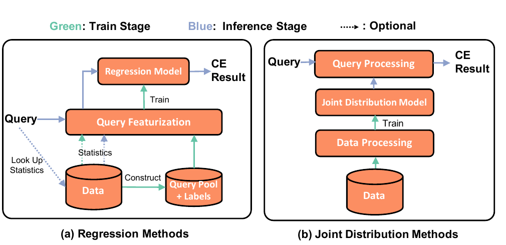

图 1：学习方法的工作流。（a）回归方法；（b）联合分布方法。绿色表示训练阶段，蓝色表示推理阶段，虚线表示可选路径。

**工作流。** 如图 1(a)，训练阶段先构造查询池并获得每条查询的标签（真实基数），随后把查询转换为特征向量。向量既包含查询信息，也可包含从数据取得的统计量（如一个小样本）。最后，以“特征向量—标签”对训练回归模型。推理时，对新查询执行同样的特征化，再由模型输出估计。数据更新后，需要更新查询池及其标签、生成新特征并更新模型。

四种回归方法是 MSCN、LW-XGB、LW-NN 和 DQM-Q。它们普遍对选择率标签做对数变换，因为选择率常呈偏斜分布，而对数变换是常见处理方式 [19]；它们在输入信息、查询特征化和模型架构等方面不同。

**MSCN [34]。** MSCN 是专用的多集合卷积网络，可支持 join 基数估计。它把查询表示为由表、join 和谓词三个模块组成的特征向量，每个模块是两层神经网络；模块输出拼接后进入另一个两层输出网络。MSCN 还以物化样本丰富训练数据：在样本上计算谓词，并把标示样本 tuple 是否满足谓词的 bitmap 加入特征。已有研究证明，这会显著改善模型 [34, 95]。

**LW-XGB/NN [18]。** 其轻量特征由“区间特征 + CE 特征”构成。区间谓词表示为 $(a_1,b_1,a_2,b_2,\ldots,a_n,b_n)$；CE 特征来自启发式估计器，例如假设列彼此独立的估计。数据库已有统计信息可低成本产生这些特征。LW-NN 用神经网络，LW-XGB 用梯度提升树。与最小化平均 q-error 的 MSCN 不同，它们最小化对数标签的均方误差；这等价于以更大权重处理大误差的 q-error 几何均值，并且易于高效计算。

**DQM-Q [28]。** 它以 one-hot 编码分类列，并通过自动离散化 [15] 把数值属性也视为分类属性，再训练神经网络。若有真实查询负载，还可扩充训练集后重新训练。

### 2.4 方法二：联合分布

图 1(b) 给出其工作流。训练阶段先把数据转换为适合联合分布模型的形式；推理时，对模型发出一个或多个请求，并把推理结果组合为最终基数。数据更新后，需要更新或重训联合分布模型。Naru、DeepDB 与 DQM-D 用比直方图和采样更复杂的模型捕捉细粒度相关性或列间条件概率。

**自回归模型。** Naru [95] 与 DQM-D [28] 采用相似思路，按乘法法则把联合分布分解为条件分布：

$$
P(A_1,A_2,\ldots,A_n)=P(A_1)P(A_2\mid A_1)\cdots P(A_n\mid A_1,\ldots,A _ {n-1}).
$$

它们用 MADE [23]、Transformer [89] 等深度自回归模型近似该分布。点查询可以直接得到结果；为支持区间查询，两者采用自适应重要性采样。Naru 的 progressive sampling 按条件概率的中间输出逐列抽样；DQM-D 采用原为 Monte Carlo 多维积分设计的算法 [44]，分多阶段采样，并根据上一阶段各点对查询基数的贡献按比例选择下一阶段样本点。

**和积网络。** DeepDB [30] 用和积网络（SPN）[72] 捕捉联合分布：递归地把表拆分成行簇（用和节点组合），或拆成彼此假定独立的列簇（用积节点组合）。它用 KMeans 聚类行，用随机依赖系数 [50] 识别独立列。叶节点表示单个属性分布：离散属性用直方图，连续属性用分段线性函数近似。

### 2.5 既有实验的局限

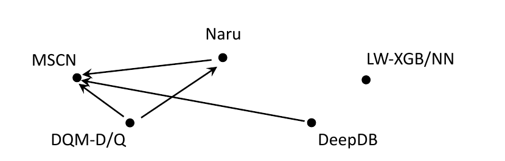

图 2：既有研究中可获得的直接比较结果；由方法 A 指向 B 的边表示 A 的论文比较过 B。

第一，许多新方法没有直接互比。由于它们发表时间相近，图 2 很稀疏，缺少半数以上可能的边。LW-XGB/NN 是表现最好的回归方法之一，却未与其他方法形成任何边；Naru 与 DeepDB 都是先进的联合分布方法，二者之间也没有直接比较。

第二，没有统一的数据集和负载标准。除 MSCN 与 DeepDB 都使用 IMDB 外，一项工作采用的数据集没有在另一项中重现。合成查询的生成方式也不同。

| 方法 | 谓词数量 | 等值 | 区间 | OOD |
| --- | ---: | :---: | :---: | :---: |
| MSCN | $0\sim\lvert D\rvert$ | ✓ | ✓ | × |
| LW-XGB/NN | $2\sim\lvert D\rvert$ | × | 闭区间 | ✓ |
| Naru | $5\sim11$ | ✓ | 开放区间 | ✓ |
| DeepDB | $1\sim5$ | ✓ | ✓ | × |
| DQM-D/Q | $1\sim\lvert D\rvert$ | ✓ | × | ✓ |
| 我们的负载 | $1\sim\lvert D\rvert$ | ✓ | ✓ | ✓ |

表 2：既有实验使用的负载。 $\lvert D\rvert$ 为数据集列数；OOD（out-of-domain）表示查询谓词独立生成，这类查询常得到零基数。

第三，既有工作主要研究静态环境。少数论文虽测试数据更新，却采用不同更新方式，数字无法跨方法比较；更新时间与准确率的权衡也未被系统研究。例如 Naru 更准确但更新更慢，在高更新率下是否仍准确并不清楚。

## 3 实验设置

**指标。** 我们用 q-error 衡量准确率：

$$
\mathrm{error}=\frac{\max(\mathrm{est}(q),\mathrm{act}(q))}{\min(\mathrm{est}(q),\mathrm{act}(q))}.
$$

例如真实基数为 10、估计为 100，则 q-error 为 $\max(100,10)/\min(100,10)=10$。所有被研究的学习方法都采用此指标 [18, 28, 30, 34, 95]。它是对称的相对误差，对大结果和小结果同等惩罚，并已被证明与查询优化中的计划质量直接相关 [59]。

| 数据集 | 大小（MB） | 行数 | 列数/分类列 | 域大小 |
| --- | ---: | ---: | ---: | ---: |
| Census [16] | 4.8 | 49K | 13/8 | $10^{16}$ |
| Forest [16] | 44.3 | 581K | 10/0 | $10^{27}$ |
| Power [16] | 110.8 | 2.1M | 7/0 | $10^{17}$ |
| DMV [62] | 972.8 | 11.6M | 11/10 | $10^{15}$ |

表 3：数据集特征。“列数/分类列”给出总列数和分类列数；“域大小”为各列 distinct value 数量的乘积。

**学习方法与实现。** 我们研究 Naru、MSCN、LW-XGB/NN 与 DeepDB。DQM 被排除：其数据驱动版本与 Naru 表现相似，而查询驱动版本不能支持我们的负载，这一点已由 DQM 的作者确认。Naru 和 DeepDB 使用相应原论文团队提供的实现并作少量适配；Naru 选用兼顾效率与准确率的 ResMADE。MSCN 原本支持 join，会编码不同表上的 join 和谓词；为公平比较单表场景，我们只保留谓词和合格样本特征。LW-NN 基于 PyTorch [67]，LW-XGB 基于 XGBoost [10]，单列 CE 特征由 PostgreSQL 估计结果产生。数据处理、负载生成和评测代码均已公开。

具体实现来源为：Naru 的 <https://github.com/naru-project/naru>、DeepDB 的 <https://github.com/DataManagementLab/deepdb-public>、MSCN 的 <https://github.com/andreaskipf/learnedcardinalities>；我们的全部数据处理、负载生成与估计器评测代码位于 <https://github.com/sfu-db/AreCELearnedYet>。

**硬件。** 实验服务器有 16 个 2.00 GHz Intel Xeon E7-4830 v4 CPU；Naru、MSCN 与 LW-NN 还在 NVIDIA Tesla P100 GPU 上运行，以比较不同设置。

## 4 学习方法是否已准备好用于静态环境？

学习估计器在静态环境中是否比传统方法更准确？更高准确率的代价是什么？本节先比较学习方法与传统方法的准确率，再测量训练与推理时间，以判断它们是否已经适合生产部署。

### 4.1 设置

四个真实数据集覆盖不同量级、分类列比例，并且每个至少曾用于一个相关工作的评测。

**统一负载。** 含 $d$ 个谓词的查询可视为 $d$ 维空间中的超矩形，由中心和宽度控制。例如：

```sql
SELECT COUNT(*) FROM R
WHERE 0 ≤ A1 ≤ 20 AND 20 ≤ A2 ≤ 100;
```

其中心为 $(10,40)$，宽度为 $(20,80)$。查询中心有两种生成方式：（1）随机选表中 tuple，以其相应属性值为中心；（2）分别从各列域中独立抽值，即 OOD，用来测试整个联合域上的鲁棒性。区间宽度也有两种方式：（1）从 $[0,\mathrm{size} _ i]$ 均匀抽取；（2）从参数 $\lambda_i=10/\mathrm{size} _ i$ 的指数分布抽取。分类列只生成等值谓词，宽度为零；越出属性边界的一侧会变为开放区间，因此负载同时包含开放与闭合区间。

每条查询先从 1 到 $|D|$ 均匀选择谓词数，再随机选择互异列。查询中心以 90% 概率取自 tuple、10% 概率用 OOD；两种宽度各占 50%。OOD 比例较低，是因为真实负载中通常较少见。

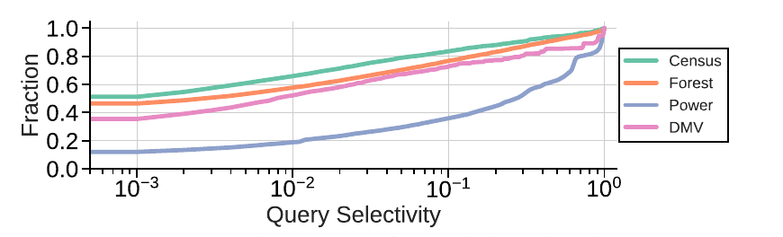

图 3：四个数据集上生成负载的选择率分布，覆盖很宽的范围。

**超参数调优。** Naru、MSCN、LW-NN 的模型大小均限制在数据大小的 1.5% 内。每种方法选择四种层数、隐藏单元、embedding 等不同架构，并按原论文改变 batch size 和 learning rate。查询驱动的 MSCN、LW-NN 用 10K 验证查询；数据驱动的 Naru 以训练损失选参数。LW-XGB 改变树数（16、32、64……）并用 10K 验证查询。DeepDB 对 RDC 阈值和最小实例切片作网格搜索，只保留大小预算内的模型；它不输出训练损失，虽定位为数据驱动方法，调参仍需查询，因此仅用 100 条验证查询。MSCN、LW-XGB/NN 均用 100K 查询训练。

**传统方法。** 比较对象覆盖 PostgreSQL 11.5、MySQL Community Server 8.0.21 与一个领先商业系统 DBMS-A。为使它们达到最佳准确率，PostgreSQL 和 MySQL 的直方图桶分别设为上限 10,000 和 1,024；DBMS-A 创建若干多列统计，使直方图覆盖全部列。即便桶数取最大值，这些统计仍远小于我们的 1.5% 的大小预算，占用内存也少于实验中的其他传统方法和学习方法。

其余传统方法包括：1.5% 均匀样本 Sample-A，以及在样本无命中时假设各谓词独立的 Sample-B；使用 Maxdiff、Value、Area 配置并迭代到 1.5% 大小预算的多维直方图 MHIST [73, 74]；使用 10K 查询训练、以均匀混合模型结合查询反馈的 QuickSel [66]；采用 Naru 论文实现并用 progressive sampling 回答区间查询的 Bayes [13, 95]；以及采样 1.5%（最多 150K tuple）、用 1K 查询优化带宽的 KDE-FB [29]。

### 4.2 学习方法是否更准确？

每种方法在每个数据集上测试 10K 查询。表 4 的传统方法部分以粗体标出传统最优值，学习方法部分以粗体标出不大于传统最优值的结果；末行比较最优学习方法与最优传统方法。

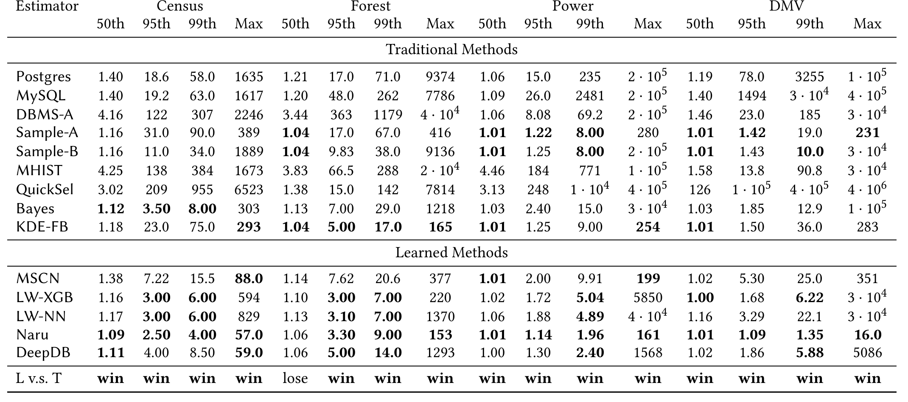

表 4：四个真实数据集上的估计误差（50、95、99 百分位与最大值）。

总体而言，学习方法几乎在所有场景都更准确。最优学习方法在最大 q-error 上最多胜过最优传统方法 14 倍；相对于三个真实 DBMS，在 Census、Forest、Power、DMV 上的最大 q-error 分别改善 28、51、938、1758 倍。唯一失败项是 Forest 的中位数，但仍与传统最优非常接近。

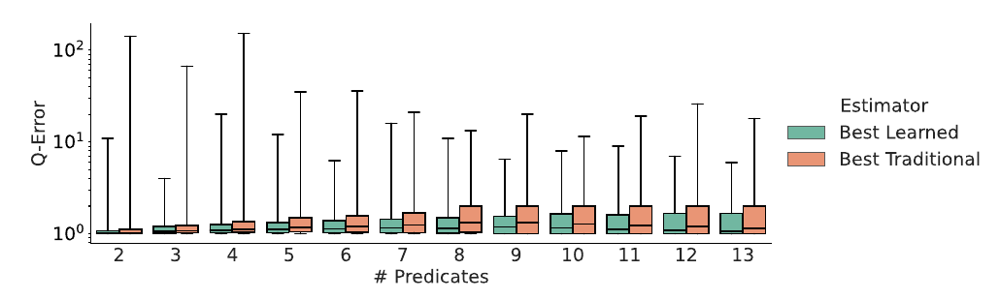

图 4：Census 上按谓词数量分组的误差。“Best Learned/Traditional”表示各自方法在箱线图每个统计位置可达到的最小 q-error。

随着谓词增多，两类方法都会退化，因为选择率趋于更低、属性相关性更复杂；但每组中最优学习方法始终优于最优传统方法。按等值/区间操作符分组时也得到相同结论。

学习方法内部没有统一赢家。Naru 总体最准确且鲁棒，所有数据集最大 q-error 都低于 200。LW-XGB 除最大值外通常很强，但其与 LW-NN 的大误差查询常有同一模式：每个单谓词选择率都很大，多个谓词合取后的选择率却很小。LW 方法采用的 AVI、MinSel、EBO 等 CE 特征难以捕捉这种关系；MSCN 输入中的样本让它更能处理这种情况，因此在最大误差上往往优于 LW-XGB。

同一算法在不同数据集上的最大 q-error 差异显著，而中位数等指标较一致，因为最大值很容易被少数查询左右。DeepDB、LW-XGB/NN 等方法通常在大数据集上有更大极端误差，这是可能基数值范围随 tuple 总数增大所致。Naru 是一个反例：它在最大的 DMV 上反而有更好的最大误差，因为 Naru 把列值离散化并学习各值的 embedding；DMV 域最小且数据最大，因而模型预算最大、可为每个值提供更好的表示。MSCN 借助固定比例随机样本，在各数据集上的最大误差大致保持同一量级，Sample-A 也呈类似现象。故“学习方法更强”不等于某个学习模型可通用于全部数据。

### 4.3 高准确率的代价是什么？

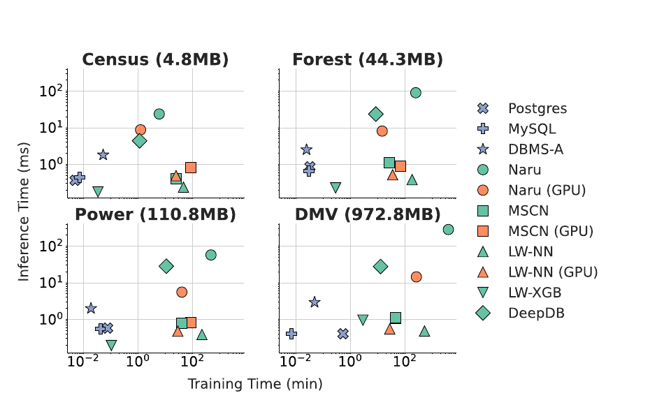

图 5：四个数据集上的训练时间与单查询推理时间。横轴为训练分钟数，纵轴为推理毫秒数；神经网络同时给出 CPU 与 GPU 结果，MSCN 在 DMV 上的 CPU 与 GPU 点重叠。

三个 DBMS 建统计通常只需数秒。学习方法则需数分钟到数小时。基于梯度提升树的 LW-XGB 最快，在 Census、Power 上使用较少树时可接近某些 DBMS；DeepDB 次之，构建 SPN 通常需数分钟，并受输入样本大小与停止条件影响。Naru 在 GPU 上训练 Census 约需 1 分钟，在最大的 DMV 上则超过 4 小时；CPU 又慢 5～15 倍。LW-NN 用 GPU 约 30 分钟，CPU 最多慢 20 倍。GPU 并非总能帮助，例如 MSCN 在小数据集上用 GPU 反而最多慢 3.5 倍，原因是最小化平均 q-error 的条件式工作流在 GPU 上较慢，小模型时开销更明显。

迭代训练存在时间—准确率权衡。我们为一致性采用原论文报告的 epoch 数，尽管某些数据集可少训很多轮。例如 DMV 上 Naru 可少用 80% 时间而只轻微退化；但即便 GPU 上仅训练一个 epoch，仍远慢于 DBMS 的统计收集。

推理方面，实验逐条发出 10K 查询并取平均。DBMS 的 1～2 ms 实际测量的是返回执行计划的延迟，已包含解析、绑定等额外工作，因此真实基数估计只会更快。查询驱动方法较有竞争力，特别是 LW-XGB/NN；DeepDB 约为 5～25 ms；Naru 在 GPU 上约 5～15 ms，而 CPU 最多再慢 20 倍。Naru 为准确回答一次查询需在 progressive sampling 中反复运行模型上千次，且逐属性选择率存在顺序依赖，不能仅靠一般模型压缩轻易消除。优化器可能在一次优化中调用估计器许多次，故这种延迟对短 OLTP 查询尤其可能成为阻塞问题。因而除轻量模型 [18] 外，学习方法训练和推理通常都比 DBMS 慢 10～1000 倍。

超参数调优还放大了成本。不同配置的最大 q-error 之比可达 $10^5$，不能随意省略调参；若 Naru 每个候选在 DMV 上超过 4 小时，仅评估五个配置就需要 20 多 GPU 小时。真实部署还需在每个新数据集上重复这项工作。

### 4.4 主要发现

- 实验中，新的学习估计器总体上比传统方法更准确；学习方法内部，Naru 的表现最稳健。
- 就训练时间而言，除 LW-XGB 外，新的学习方法可能比 DBMS 产品慢若干数量级。
- 基于回归的 MSCN 与 LW-XGB/NN 在推理时间上可以与 DBMS 竞争；直接建模联合分布的 Naru 与 DeepDB 则需要长得多的时间。
- GPU 能加速部分学习估计器的训练和推理，但仍无法使其与 DBMS 一样快，有时还会引入额外开销。
- 超参数调优是部署神经网络估计器时不能忽略的额外成本。

## 5 学习方法是否已准备好用于动态环境？

数据库中的数据更新频繁发生，使基数估计器处于“动态”环境。本节比较学习方法与 DBMS 在动态环境中的表现，考察更新 epoch 数与准确率之间的权衡，并研究 GPU 能提供多大帮助。

### 5.1 设置

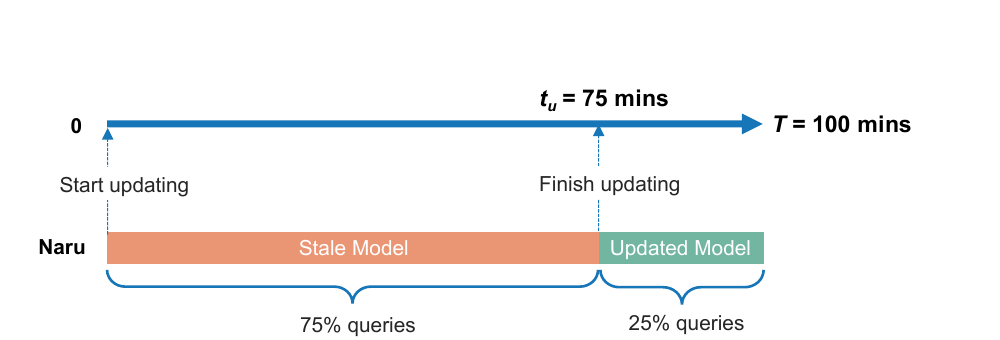

图 6：动态环境示意。总更新窗口为 $T$，模型在 $t_u$ 时更新完成；此前查询由陈旧模型回答，之后由新模型回答。例中 $T=100$ 分钟、 $t_u=75$ 分钟，分别有 75% 与 25% 的查询使用两种模型。

设时间范围为 $[0,T]$，其中均匀分布着 $n$ 条查询。已训练的初始模型从时刻 0 开始更新，在 $t_u\le T$ 时完成。前 $n\cdot t_u/T$ 条查询使用陈旧模型估计，其余 $n\cdot(1-t_u/T)$ 条查询使用更新后的模型。图 6 的例子中， $T=100$ 分钟、 $t_u=75$ 分钟，因此 75% 的查询使用陈旧模型，25% 使用新模型；静态环境中最好的模型在这种动态环境中未必仍最好。

动态实验在原表后追加相当于原数据 20% 的新数据。为确保追加数据的相关性特征不同，我们复制原数据集，把复制品的每一列分别按升序排序，从而使任意列对之间的 Spearman 秩相关性达到最大，再从该复制品随机抽取 20% 的 tuple 追加到原表。窗口内均匀到达 10K 查询。我们改变 $T$ 表示不同更新频率，并报告动态全过程的第 99 百分位 q-error。选择第 99 百分位而非最大值，是因为学习方法相对传统方法在大误差处改善更多，而最大值又容易受离群点影响；10K 测试查询中的第 99 百分位是第 100 大误差，不会由少数离群查询支配。

模型更新策略为：Naru 训练一个 epoch；DeepDB 向树模型插入追加数据的 1% 小样本；MSCN 采用 LW-XGB/NN 的更新流程，因为原 MSCN 论文没有讨论更新。MSCN、LW-XGB、LW-NN 生成训练负载后，用原数据集的 5% 样本更新查询标签；LW-XGB、LW-NN、MSCN 分别使用 2K、16K、10K 条查询更新。更新所用 epoch 少于图 5 的完整训练；查询驱动方法的更新时间还包含更新查询结果的时间，这是它与数据驱动方法的重要差别。

### 5.2 动态环境中谁表现最好？

实验在 CPU 上比较 5 种学习方法与 3 个 DBMS。每个数据集都设置高、中、低三档更新频率；由于四个数据集大小不同，各自的 $T$ 也不同。图中的“×”表示模型无法在 $T$ 内完成更新。

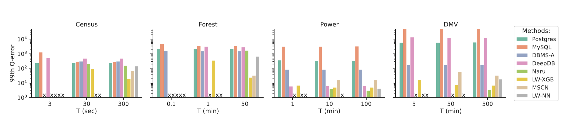

图 7：四个数据集、不同更新周期下，DBMS 与学习方法的第 99 百分位 q-error。“×”表示方法无法在 $T$ 内完成更新。

DBMS 在不同 $T$ 下更稳定，因为统计更新很快，几乎全部查询都能使用新统计。许多学习方法赶不上快速更新；即使完成更新，也不必然优于 DBMS。例如 DMV 上 $T=50$ 分钟时，DBMS-A 比 DeepDB 好约 100 倍，因为 DeepDB 未能很好捕捉相关性变化。

学习方法内部也没有全局赢家。LW-XGB 在大多数情形至少与其他方法相当；Naru 在无更新时准确率很高，但更新频繁时不能胜过 LW-XGB。Census 与 Forest 上，一个 epoch 不足以让 Naru 得到好模型；DMV 上也能观察到类似现象。更新时间亦没有统一赢家：Census 上数据驱动的 DeepDB 最快，DMV 上查询驱动的 LW-XGB 最快。数据驱动模型要压缩整表联合分布，数据越大模型越复杂；查询驱动模型主要付出标签生成成本，固定训练查询数时模型复杂度未必随表大小增长。因此选择何种范式高度依赖应用。

每种方法还受到不同失效原因影响：训练越久，越多查询会交给陈旧模型；Naru 一个 epoch 可能学不出好更新模型；MSCN 和 LW 方法由样本生成标签，可能带入误差；DeepDB 若不重构树，就会假设底层相关结构不变，相关性变化时因而失准。

### 5.3 更新时间与准确率的权衡

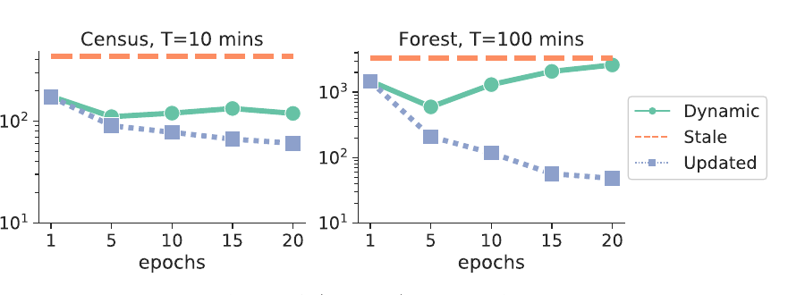

图 8：Naru 在 Census（ $T=10$ 分钟）和 Forest（ $T=100$ 分钟）上的 epoch 数—准确率权衡。Stale 是旧模型，Updated 是新模型，Dynamic 是先旧后新的全过程结果。

Forest 上呈清楚的 U 形权衡：更多 epoch 改善新模型，但延长训练，使更多查询由陈旧模型回答，动态总体误差先降后升。Census 上趋势较弱，但同样不能假设训练越久动态效果越好。查询驱动方法也有类似权衡：用采样减少标签生成时间会引入近似误差。如何在生产中平衡这两端仍是开放问题。

### 5.4 GPU 能提供多少帮助？

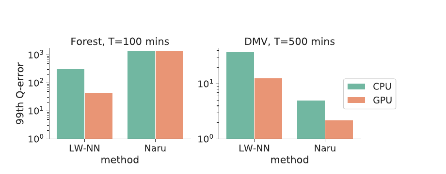

图 9：Forest（ $T=100$ 分钟）和 DMV（ $T=500$ 分钟）上 CPU/GPU 对 LW-NN、Naru 的影响。

GPU 令 LW-NN 在 Forest、DMV 上分别改善约 10 倍和 2 倍：训练最多加速 20 倍，且充分训练的 500 epoch 模型更准确。Naru 在 DMV 上改善约 2 倍，在 Forest 上却没有改善，因为一个 epoch 仍不足以得到好模型；更短更新时间虽让更多查询使用更新模型，却不能补偿新模型质量不足。

### 5.5 主要发现

- MSCN、LW-NN、Naru、DeepDB 均可能跟不上快速更新，并因各自原因产生大误差。
- 更新较慢时 Naru 更强，动态性更高时 LW-XGB 往往更好，但没有明确赢家。
- DeepDB 是最快的数据驱动方法，LW-XGB 是最快的查询驱动方法；实际选择依赖数据规模与负载。
- 更新时间与准确率存在困难的权衡，需要进一步研究。
- GPU 有帮助却不保证改善；必须同时设计合适的模型更新策略。

## 6 学习方法何时出错？

直方图和采样等简单传统方法的一个优点是透明：当属性值独立（AVI）、均匀分布等假设被破坏时，可以预期它们会产生较大的 q-error。学习估计器则不透明，失效机理也不清楚。本节通过微基准改变底层数据，观察大误差如何变化，并检查这些模型是否违反简单直观的逻辑规则。

### 6.1 设置

我们生成含两列、100 万行的合成数据，分别改变三个因素：第一列的分布、两列相关性、两列域大小。第一列由 SciPy [90] 的广义 Pareto 分布生成，偏斜参数 $s$ 从 0 到 2， $s=0$ 表示均匀， $s$ 越大越偏斜。第二列基于第一列产生：对每行 $(v_1,v_2)$，以概率 $c$ 令 $v_2=v_1$，以概率 $1-c$ 从第一列的域中随机取值； $c=0$ 表示独立， $c=1$ 表示函数依赖。域大小 $d$ 取 10、100、1K、10K，连续值会离散成相应数量的 bin。

为尽量发现困难查询，测试查询的每列中心均独立从列域抽取，即全部使用 OOD；其余设置与第 4 节相同。DeepDB 用 RDC 阈值 0.3、最小实例切片 0.01；LW-XGB 固定 128 棵树；三个神经网络仍以数据 1% 为大小预算，并从随机超参数配置中选取稳定较好的模型。每个固定模型都在仅改变一个因素的数据集上测试同一组 10K 查询；为突出大误差，只展示最高 1% q-error 的分布。

### 6.2 学习估计器何时产生大误差？

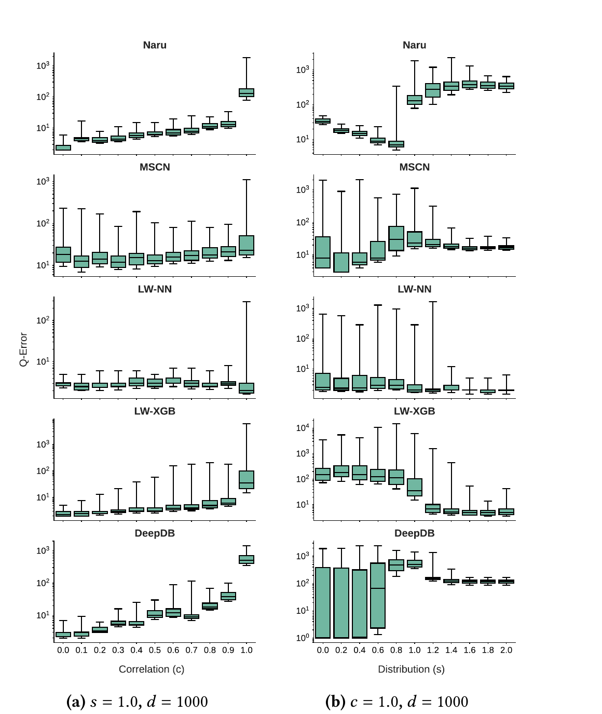

图 10：最高 1% q-error 在不同相关性（a， $s=1.0,d=1000$）和不同分布（b， $c=1.0,d=1000$）下的分布。

**相关性。** 所有模型都随 $c$ 增大而恶化。两列达到函数依赖（ $c=1$）时，q-error 会突增 10～100 倍；这一趋势在其他 $s,d$ 组合下也成立，说明高度相关、尤其存在函数依赖的数据仍是共同薄弱点。

**分布。** 方法反应不同。Naru 在更偏斜（ $s\gt{}1$）时产生更大最大 q-error；MSCN、LW-XGB/NN、DeepDB 则呈相反趋势。后者都利用样本或一维直方图等基础 synopsis，频繁值的真实基数能被直接、较可靠地记录，因此在高度偏斜时可降低最大误差；为 Naru 加入类似思想可能提高鲁棒性。另一方面，MSCN 与 DeepDB 的第 99 百分位 q-error（而非仅最高 1%）呈相反趋势：高偏斜时非常小选择率查询增多，MSCN 的样本 bitmap 多为全零，DeepDB 叶节点的 AVI 假设则会在单谓词选择率较大但合取结果很小时产生大误差。

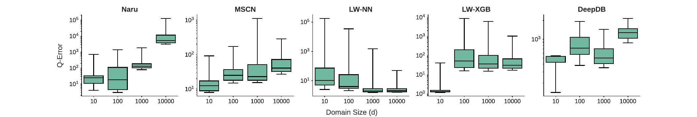

图 11：不同域大小下最高 1% q-error 的分布（ $s=1.0,c=1.0$）。

除 LW-NN 外，域越大通常误差越大。Naru 从域 1K 增至 10K 时恶化约 100 倍，可能因为 10K 域的 embedding matrix 占据很大模型预算，剩余容量不足以学习分布；需要更高效的编码。LW-XGB 在域为 10 时表现很强，域增大后误差约大 100 倍；MSCN 与 DeepDB 相对更鲁棒，但从 10 增至 10K 仍约恶化 10 倍。LW-NN 与 LW-XGB 使用相同输入和目标却呈相反趋势，可能来自底层模型：小域使查询空间离散，谓词轻微变化可能让真实基数剧烈变化，神经网络的平滑连续拟合不如树模型适应。

### 6.3 学习估计器的行为可预测吗？

实验观察到一些不合逻辑的行为。例如把谓词从 $[320,800]$ 收紧为 $[340,740]$ 后，真实基数下降，LW-XGB 的估计却增加了 60.8%。受深度学习可解释性研究 [83] 启发，我们提出基数估计器应满足的五条直观规则：

1. **单调性：** 谓词收紧（或放宽）时，估计不应增加（或减少）。
2. **一致性：** 把一条查询沿某谓词区间拆为互不重叠的子查询时，原查询估计应等于子查询估计之和。例如，属性 $A_i$ 上区间为 $[100,500]$ 的查询可以拆成其他谓词不变、区间分别为 $[100,200]$ 和 $[200,500]$ 的两个查询。
3. **稳定性：** 同一模型对同一查询的估计应始终相同。
4. **保真度 A：** 查询所有属性的完整域时，结果应为 1（选择率）。
5. **保真度 B：** 谓词区间无效时，结果应为 0。

| 规则 | Naru | MSCN | LW-XGB | LW-NN | DeepDB |
| --- | :---: | :---: | :---: | :---: | :---: |
| 单调性 | × | × | × | × | ✓ |
| 一致性 | × | × | × | × | ✓ |
| 稳定性 | × | ✓ | ✓ | ✓ | ✓ |
| 保真度 A | ✓ | × | × | × | ✓ |
| 保真度 B | ✓ | × | × | × | ✓ |

表 5：学习估计器满足或违反逻辑规则的情况。这里检查模型原始输出，不加入可修复某些保真度问题的外部规则。

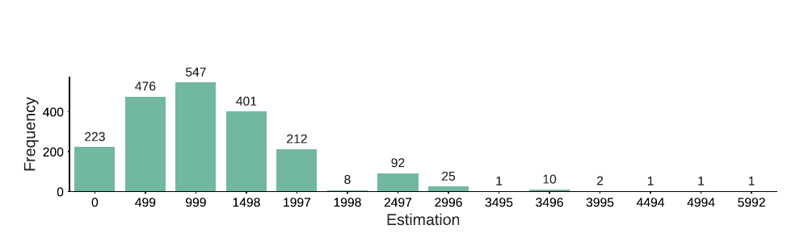

图 12：在 $s=0,c=1,d=1000$ 时，同一条真实基数为 1036 的查询用 Naru 重复运行 2000 次，估计分布于 $[0,5992]$。

Naru 的 progressive sampling 在推理中引入随机性，违反稳定性，并进一步导致单调性和一致性违规。回归方法在训练或推理时没有施加这些逻辑约束，除稳定性外全部违反。DeepDB 由基础直方图构造，节点之间只作加法和乘法，因此满足全部规则。

### 6.4 生产中会出什么问题？

**可调试性。** Naru、MSCN、LW-XGB/NN 等黑盒模型可能静默失败，超参数调优中的 bug 也可能不妨碍模型训练和通过测试；一旦某查询出现大误差，很难判断是正常难例、实现 bug 还是训练数据问题。

**可解释性。** 黑盒模型难以向开发者和用户说明版本升级影响了哪些查询或场景，也难以解释某次估计为何改变。

**可预测性。** 违反基本逻辑规则会让数据库行为违背用户直觉。例如用户通常预期增加过滤条件会使查询更快，但若模型违反单调性，系统未必如此。

**可复现性。** 复现客户问题需要输入查询、优化器配置、元数据等信息 [80]。若采用违反稳定性的 Naru，同样信息也可能无法复现随机推理结果。

### 6.5 主要发现

- 所有新学习估计器都在更相关的数据上产生更大误差，两列函数依赖时最大 q-error 会剧增。
- 模型对偏斜度和大域的反应不同，原因可能来自模型、输入特征与损失函数差异。
- 我们提出五条基数估计逻辑规则；除 DeepDB 外的新模型都违反其中一些规则。
- 黑盒与不合逻辑的行为会给生产环境带来调试、解释、预测和复现问题。

## 7 研究机会

高成本（第 4、5 节）与不透明性（第 6 节）是学习式基数估计进入 DBMS 的两大障碍。

### 7.1 控制学习估计器的成本

**平衡效率与准确率。** 重训时，可用样本而非完整数据计算查询真实值，或增量更新模型。机器学习中的 early stopping [8]、模型压缩 [11] 等方法也可降低成本，但必须量化其准确率代价。

**为学习估计器调优超参数。** 随机搜索 [5]、贝叶斯优化 [78] 和基于 bandit 的方法 [46] 可降低找到高质量配置的成本。目标不应只追求最优 accuracy/loss；在基数估计中，还应把训练和更新时间纳入目标，显式处理前述权衡。

### 7.2 让学习估计器值得信赖

**解释学习估计器。** 机器学习领域已有 surrogate model [75]、saliency map [79]、influence function [35]、decision set [40]、rule summary [76]、通用特征归因 [52, 83] 等方法。例如测试查询出现大误差时，可用 influence function 定位最有影响的训练样本，或用 Shapley value 检查各输入特征的重要性。这些方法在基数估计场景的有效性仍是开放问题。

**处理不合逻辑的行为。** 可以定义更完整的逻辑规则集，标明每种方法违反哪些规则，使行为更透明；也可以把逻辑规则直接作为模型设计约束。机器学习中已有非负权重等约束研究 [12, 20, 36]，类似思路可用于设计基数模型。

## 8 多表场景

我们聚焦理解单表学习式基数估计。本节讨论如何把现有技术扩展到多表场景，以及其中涉及的挑战。

**扩展到多表场景。** MSCN 通过特征化基表集合、连接指示符和谓词，原生支持连接。若各表通过逐 tuple 相关性检查，DeepDB 可以在外连接表上学习模型以支持连接。LW-XGB/NN 和 Naru 本身不原生支持多表，但已有基于它们的扩展：NeuroCard [94] 扩展 Naru，在各表 full outer join 的样本上训练自回归模型；文献 [17] 则把 LW-XGB/NN 扩展到多表，在针对连接表物化视图的查询上训练底层回归模型。

**额外挑战。** 训练阶段，多表方法必须接触被连接表的信息，模型需要在更复杂的数据上同时捕捉表内和跨表相关性。若连接中的一个或多个表发生更新，还需要决定如何同步更新模型，并平衡更新时间与模型准确率。

推理阶段，候选查询计划数随连接数指数增长，因此基数估计器会被调用许多次。暴力做法是在每个候选计划的每个算子上推理，但总推理时间可能无法接受；另一种做法是只推理基表，再用公式计算后续基数，却可能传播误差并损害准确率。因而，一个关键挑战是如何智能分配推理预算，在准确率与效率之间取得更好平衡。

## 9 相关工作

**单表基数估计。** 直方图是最常见的基数估计方法，已得到广泛研究 [1, 6, 21, 25, 26, 31, 47, 57, 60, 61, 71, 73, 74, 81, 86]，也已用于数据库产品。采样方法 [22, 48, 77, 93, 97] 的优点是能支持比范围谓词更复杂的谓词。以往工作主要采用传统机器学习技术估计基数，包括曲线拟合 [9]、小波 [58]、KDE [29]、均匀混合模型 [66] 和图模型 [14, 24, 88]。早期工作 [3, 41, 49, 51] 也用神经网络以回归方式近似数据分布；相比之下，新的学习方法 [18, 34] 展现了更有希望的结果。

**连接基数估计。** 传统数据库系统根据均匀性、独立性等简单假设估计连接基数 [42]。有些方法 [30, 34] 直接支持连接，另一些工作 [17, 33, 91, 94] 研究如何把单表基数估计方法扩展到连接查询。经验研究 [64] 在选择—投影—连接负载上评估不同深度学习架构和机器学习模型。Leis 等人 [43] 提出一种成本低但有效的基于索引的连接采样技术。针对少量“困难”查询，文献 [70, 92] 在推理期间引入重优化过程以“捕获”并纠正大误差；另一条研究路线则通过推断中间连接基数的上界来避免差计划 [7]。

**端到端查询优化。** 越来越多的工作尝试端到端解决查询优化问题。Sun 等人 [82] 提出基于树结构模型的学习式成本估计框架，同时估计成本与基数。先驱工作 [63] 展示了用强化学习学习连接树查询优化状态表示的可能性，后续工作 [38, 55, 87, 96] 进一步证明深度强化学习选择连接顺序的有效性。Marcus 等人提出 Neo [56]，直接用深度学习生成查询计划；开源社区中也有若干端到端查询优化系统 [4, 80, 99]。

**基数估计的基准与经验研究。** Leis 等人 [42] 提出 Join Order Benchmark（JOB）：它基于真实 IMDB 数据集，合成查询包含 3 至 16 个连接；我们与之不同，聚焦单表基数估计。Ortiz 等人 [64] 对多种深度学习和机器学习架构的准确率、空间与时间权衡作经验分析。我们同时覆盖数据驱动和查询驱动方法（该工作聚焦查询驱动模型）、静态和动态环境，还通过受控合成数据研究模型何时出错，并提出简单逻辑规则。Harmouch 等人 [27] 也进行过基数估计实验综述，但目标是估计 distinct value 数量，与本文不同。

**面向数据库系统的机器学习。** Zhou 等人 [100] 系统综述了 ML 与数据库如何相互促进。除基数估计外，ML 还可替代或增强索引 [37]、排序算法 [39] 等数据库组件，也可自动化旋钮调优 [84, 98]、索引选择 [68] 和视图物化 [32] 等数据库配置。支持 COUNT 查询的近似查询处理（AQP）引擎 [2, 45, 65, 69] 也可能用于基数估计；学习式 AQP [53, 54, 85] 正在兴起，其支持 DBMS 基数估计的效果值得研究。

## 10 结论

我们提出一个重要但尚未被充分探索的问题：“我们已经准备好使用学习式基数估计了吗？”我们综述了 7 种新的学习方法，发现既有实验不足以回答这个问题；为此提出统一负载生成器，考察学习方法在静态和动态环境中是否就绪，深入研究它们何时出错，并给出若干有前景的研究机会。

实验表明，新的学习方法比传统方法更准确；但要将其放入成熟系统，仍有许多问题需要解决，包括训练和推理速度慢、超参数调优成本、黑盒属性、不合逻辑的行为，以及频繁数据更新。因此，当前学习方法仍未准备好部署到真实 DBMS 中。总体而言，这是一个重要且值得数据库社区继续探索的方向。

## 致谢

本研究部分得到 Mitacs Accelerate Grant、加拿大自然科学与工程研究委员会（NSERC）的 Discovery Grant 与 CRD Grant，以及 WestGrid（www.westgrid.ca）和 Compute Canada（www.computecanada.ca）的支持。本文的所有观点、发现、结论和建议均为本文作者的意见，不一定代表资助机构的立场。

## 参考文献

[1] A. Aboulnaga and S. Chaudhuri. Self-tuning histograms: Building histograms without looking at data. In *SIGMOD 1999*, pages 181–192. ACM Press, 1999.

[2] S. Agarwal, B. Mozafari, A. Panda, H. Milner, S. Madden, and I. Stoica. BlinkDB: queries with bounded errors and bounded response times on very large data. In *EuroSys 2013*, pages 29–42. ACM, 2013.

[3] C. Anagnostopoulos and P. Triantafillou. Learning to accurately COUNT with query-driven predictive analytics. In *IEEE Big Data 2015*, pages 14–23. IEEE Computer Society, 2015.

[4] E. Begoli, J. Camacho-Rodríguez, J. Hyde, M. J. Mior, and D. Lemire. Apache Calcite: A foundational framework for optimized query processing over heterogeneous data sources. In *SIGMOD 2018*, pages 221–230. ACM, 2018.

[5] J. Bergstra and Y. Bengio. Random search for hyper-parameter optimization. *J. Mach. Learn. Res.*, 13:281–305, 2012.

[6] N. Bruno, S. Chaudhuri, and L. Gravano. STHoles: A multidimensional workload-aware histogram. In *SIGMOD 2001*, pages 211–222. ACM, 2001.

[7] W. Cai, M. Balazinska, and D. Suciu. Pessimistic cardinality estimation: Tighter upper bounds for intermediate join cardinalities. In *SIGMOD 2019*, pages 18–35. ACM, 2019.

[8] R. Caruana, S. Lawrence, and C. L. Giles. Overfitting in neural nets: Backpropagation, conjugate gradient, and early stopping. In *NIPS 2000*, pages 402–408. MIT Press, 2000.

[9] C. Chen and N. Roussopoulos. Adaptive selectivity estimation using query feedback. In *SIGMOD 1994*, pages 161–172. ACM Press, 1994.

[10] T. Chen and C. Guestrin. XGBoost: A scalable tree boosting system. In *KDD 2016*, pages 785–794. ACM, 2016.

[11] Y. Cheng, D. Wang, P. Zhou, and T. Zhang. A survey of model compression and acceleration for deep neural networks. *CoRR*, abs/1710.09282, 2017.

[12] J. Chorowski and J. M. Zurada. Learning understandable neural networks with nonnegative weight constraints. *IEEE Trans. Neural Networks Learn. Syst.*, 26(1):62–69, 2015.

[13] C. K. Chow and C. N. Liu. Approximating discrete probability distributions with dependence trees. *IEEE Trans. Inf. Theory*, 14(3):462–467, 1968.

[14] A. Deshpande, M. N. Garofalakis, and R. Rastogi. Independence is good: Dependency-based histogram synopses for high-dimensional data. In *SIGMOD 2001*, pages 199–210. ACM, 2001.

[15] J. Dougherty, R. Kohavi, and M. Sahami. Supervised and unsupervised discretization of continuous features. In *ICML 1995*, pages 194–202. Morgan Kaufmann, 1995.

[16] D. Dua and C. Graff. UCI machine learning repository. <http://archive.ics.uci.edu/ml>, 2017. Accessed: 2020-01-01.

[17] A. Dutt, C. Wang, V. R. Narasayya, and S. Chaudhuri. Efficiently approximating selectivity functions using low overhead regression models. *Proc. VLDB Endow.*, 13(11):2215–2228, 2020.

[18] A. Dutt, C. Wang, A. Nazi, S. Kandula, V. R. Narasayya, and S. Chaudhuri. Selectivity estimation for range predicates using lightweight models. *Proc. VLDB Endow.*, 12(9):1044–1057, 2019.

[19] C. Feng, H. Wang, N. Lu, T. Chen, H. He, Y. Lu, and X. M. Tu. Log-transformation and its implications for data analysis. *Shanghai Archives of Psychiatry*, 26(2):105, 2014.

[20] W. Fleshman, E. Raff, J. Sylvester, S. Forsyth, and M. McLean. Non-negative networks against adversarial attacks. *CoRR*, abs/1806.06108, 2018.

[21] A. V. Gelder. Multiple join size estimation by virtual domains. In *PODS 1993*, pages 180–189. ACM Press, 1993.

[22] R. Gemulla. *Sampling Algorithms for Evolving Datasets*. PhD thesis, Dresden University of Technology, Germany, 2008.

[23] M. Germain, K. Gregor, I. Murray, and H. Larochelle. MADE: masked autoencoder for distribution estimation. In *ICML 2015*, volume 37, pages 881–889. JMLR.org, 2015.

[24] L. Getoor, B. Taskar, and D. Koller. Selectivity estimation using probabilistic models. In *SIGMOD 2001*, pages 461–472. ACM, 2001.

[25] D. Gunopulos, G. Kollios, V. J. Tsotras, and C. Domeniconi. Approximating multi-dimensional aggregate range queries over real attributes. In *SIGMOD 2000*, pages 463–474. ACM, 2000.

[26] D. Gunopulos, G. Kollios, V. J. Tsotras, and C. Domeniconi. Selectivity estimators for multidimensional range queries over real attributes. *VLDB J.*, 14(2):137–154, 2005.

[27] H. Harmouch and F. Naumann. Cardinality estimation: An experimental survey. *Proc. VLDB Endow.*, 11(4):499–512, 2017.

[28] S. Hasan, S. Thirumuruganathan, J. Augustine, N. Koudas, and G. Das. Deep learning models for selectivity estimation of multi-attribute queries. In *SIGMOD 2020*, pages 1035–1050. ACM, 2020.

[29] M. Heimel, M. Kiefer, and V. Markl. Self-tuning, GPU-accelerated kernel density models for multidimensional selectivity estimation. In *SIGMOD 2015*, pages 1477–1492. ACM, 2015.

[30] B. Hilprecht, A. Schmidt, M. Kulessa, A. Molina, K. Kersting, and C. Binnig. DeepDB: Learn from data, not from queries! *Proc. VLDB Endow.*, 13(7):992–1005, 2020.

[31] H. V. Jagadish, H. Jin, B. C. Ooi, and K. Tan. Global optimization of histograms. In *SIGMOD 2001*, pages 223–234. ACM, 2001.

[32] A. Jindal, S. Qiao, H. Patel, Z. Yin, J. Di, M. Bag, M. Friedman, Y. Lin, K. Karanasos, and S. Rao. Computation reuse in analytics job service at Microsoft. In *SIGMOD 2018*, pages 191–203. ACM, 2018.

[33] M. Kiefer, M. Heimel, S. Breß, and V. Markl. Estimating join selectivities using bandwidth-optimized kernel density models. *Proc. VLDB Endow.*, 10(13):2085–2096, 2017.

[34] A. Kipf, T. Kipf, B. Radke, V. Leis, P. A. Boncz, and A. Kemper. Learned cardinalities: Estimating correlated joins with deep learning. In *CIDR 2019*. www.cidrdb.org, 2019.

[35] P. W. Koh and P. Liang. Understanding black-box predictions via influence functions. In *ICML 2017*, volume 70, pages 1885–1894. PMLR, 2017.

[36] A. Kołcz and C. H. Teo. Feature weighting for improved classifier robustness. In *CEAS 2009*, 2009.

[37] T. Kraska, A. Beutel, E. H. Chi, J. Dean, and N. Polyzotis. The case for learned index structures. In *SIGMOD 2018*, pages 489–504. ACM, 2018.

[38] S. Krishnan, Z. Yang, K. Goldberg, J. M. Hellerstein, and I. Stoica. Learning to optimize join queries with deep reinforcement learning. *CoRR*, abs/1808.03196, 2018.

[39] A. Kristo, K. Vaidya, U. Çetintemel, S. Misra, and T. Kraska. The case for a learned sorting algorithm. In *SIGMOD 2020*, pages 1001–1016. ACM, 2020.

[40] H. Lakkaraju, S. H. Bach, and J. Leskovec. Interpretable decision sets: A joint framework for description and prediction. In *KDD 2016*, pages 1675–1684. ACM, 2016.

[41] M. S. Lakshmi and S. Zhou. Selectivity estimation in extensible databases — A neural network approach. In *VLDB 1998*, pages 623–627. Morgan Kaufmann, 1998.

[42] V. Leis, A. Gubichev, A. Mirchev, P. A. Boncz, A. Kemper, and T. Neumann. How good are query optimizers, really? *Proc. VLDB Endow.*, 9(3):204–215, 2015.

[43] V. Leis, B. Radke, A. Gubichev, A. Kemper, and T. Neumann. Cardinality estimation done right: Index-based join sampling. In *CIDR 2017*. www.cidrdb.org, 2017.

[44] G. P. Lepage. A new algorithm for adaptive multidimensional integration. *Journal of Computational Physics*, 27(2):192–203, 1978.

[45] F. Li, B. Wu, K. Yi, and Z. Zhao. Wander join: Online aggregation via random walks. In *SIGMOD 2016*, pages 615–629. ACM, 2016.

[46] L. Li, K. G. Jamieson, G. DeSalvo, A. Rostamizadeh, and A. Talwalkar. Hyperband: A novel bandit-based approach to hyperparameter optimization. *J. Mach. Learn. Res.*, 18:185:1–185:52, 2017.

[47] L. Lim, M. Wang, and J. S. Vitter. SASH: A self-adaptive histogram set for dynamically changing workloads. In *VLDB 2003*, pages 369–380. Morgan Kaufmann, 2003.

[48] R. J. Lipton, J. F. Naughton, and D. A. Schneider. Practical selectivity estimation through adaptive sampling. In *SIGMOD 1990*, pages 1–11. ACM Press, 1990.

[49] H. Liu, M. Xu, Z. Yu, V. Corvinelli, and C. Zuzarte. Cardinality estimation using neural networks. In *CASCON 2015*, pages 53–59. IBM / ACM, 2015.

[50] D. López-Paz, P. Hennig, and B. Schölkopf. The randomized dependence coefficient. In *NIPS 2013*, pages 1–9, 2013.

[51] H. Lu and R. Setiono. Effective query size estimation using neural networks. *Appl. Intell.*, 16(3):173–183, 2002.

[52] S. M. Lundberg and S. Lee. A unified approach to interpreting model predictions. In *NIPS 2017*, pages 4765–4774, 2017.

[53] Q. Ma, A. M. Shanghooshabad, M. Almasi, M. Kurmanji, and P. Triantafillou. Learned approximate query processing: Make it light, accurate and fast. In *CIDR 2021*. www.cidrdb.org, 2021.

[54] Q. Ma and P. Triantafillou. DBEst: Revisiting approximate query processing engines with machine learning models. In *SIGMOD 2019*, pages 1553–1570. ACM, 2019.

[55] R. Marcus and O. Papaemmanouil. Deep reinforcement learning for join order enumeration. In *aiDM@SIGMOD 2018*, pages 3:1–3:4. ACM, 2018.

[56] R. C. Marcus, P. Negi, H. Mao, C. Zhang, M. Alizadeh, T. Kraska, O. Papaemmanouil, and N. Tatbul. Neo: A learned query optimizer. *Proc. VLDB Endow.*, 12(11):1705–1718, 2019.

[57] V. Markl, N. Megiddo, M. Kutsch, T. M. Tran, P. J. Haas, and U. Srivastava. Consistently estimating the selectivity of conjuncts of predicates. In *VLDB 2005*, pages 373–384. ACM, 2005.

[58] Y. Matias, J. S. Vitter, and M. Wang. Wavelet-based histograms for selectivity estimation. In *SIGMOD 1998*, pages 448–459. ACM Press, 1998.

[59] G. Moerkotte, T. Neumann, and G. Steidl. Preventing bad plans by bounding the impact of cardinality estimation errors. *Proc. VLDB Endow.*, 2(1):982–993, 2009.

[60] M. Müller, G. Moerkotte, and O. Kolb. Improved selectivity estimation by combining knowledge from sampling and synopses. *Proc. VLDB Endow.*, 11(9):1016–1028, 2018.

[61] M. Muralikrishna and D. J. DeWitt. Equi-depth histograms for estimating selectivity factors for multi-dimensional queries. In *SIGMOD 1988*, pages 28–36. ACM Press, 1988.

[62] State of New York. Vehicle, snowmobile, and boat registrations. catalog.data.gov/dataset/vehicle-snowmobile-and-boat-registration, 2019. Accessed: 2019-03-01.

[63] J. Ortiz, M. Balazinska, J. Gehrke, and S. S. Keerthi. Learning state representations for query optimization with deep reinforcement learning. In *DEEM@SIGMOD 2018*, pages 4:1–4:4. ACM, 2018.

[64] J. Ortiz, M. Balazinska, J. Gehrke, and S. S. Keerthi. An empirical analysis of deep learning for cardinality estimation. *CoRR*, abs/1905.06425, 2019.

[65] Y. Park, B. Mozafari, J. Sorenson, and J. Wang. VerdictDB: Universalizing approximate query processing. In *SIGMOD 2018*, pages 1461–1476. ACM, 2018.

[66] Y. Park, S. Zhong, and B. Mozafari. QuickSel: Quick selectivity learning with mixture models. In *SIGMOD 2020*, pages 1017–1033. ACM, 2020.

[67] A. Paszke, S. Gross, F. Massa, A. Lerer, J. Bradbury, G. Chanan, T. Killeen, Z. Lin, N. Gimelshein, L. Antiga, A. Desmaison, A. Kopf, E. Yang, Z. DeVito, M. Raison, A. Tejani, S. Chilamkurthy, B. Steiner, L. Fang, J. Bai, and S. Chintala. PyTorch: An imperative style, high-performance deep learning library. In *NIPS 2019*, pages 8024–8035. Curran Associates, Inc., 2019.

[68] W. G. Pedrozo, J. C. Nievola, and D. C. Ribeiro. An adaptive approach for index tuning with learning classifier systems on hybrid storage environments. In *HAIS 2018*, volume 10870, pages 716–729. Springer, 2018.

[69] J. Peng, D. Zhang, J. Wang, and J. Pei. AQP++: connecting approximate query processing with aggregate precomputation for interactive analytics. In *SIGMOD 2018*, pages 1477–1492. ACM, 2018.

[70] M. Perron, Z. Shang, T. Kraska, and M. Stonebraker. How I learned to stop worrying and love re-optimization. In *ICDE 2019*, pages 1758–1761. IEEE, 2019.

[71] G. Piatetsky-Shapiro and C. Connell. Accurate estimation of the number of tuples satisfying a condition. In *SIGMOD 1984*, pages 256–276. ACM Press, 1984.

[72] H. Poon and P. M. Domingos. Sum-product networks: A new deep architecture. In *ICCV Workshops 2011*, pages 689–690. IEEE Computer Society, 2011.

[73] V. Poosala and Y. E. Ioannidis. Selectivity estimation without the attribute value independence assumption. In *VLDB 1997*, pages 486–495. Morgan Kaufmann, 1997.

[74] V. Poosala, Y. E. Ioannidis, P. J. Haas, and E. J. Shekita. Improved histograms for selectivity estimation of range predicates. In *SIGMOD 1996*, pages 294–305. ACM Press, 1996.

[75] M. T. Ribeiro, S. Singh, and C. Guestrin. “Why should I trust you?”: Explaining the predictions of any classifier. In *KDD 2016*, pages 1135–1144. ACM, 2016.

[76] M. T. Ribeiro, S. Singh, and C. Guestrin. Anchors: High-precision model-agnostic explanations. In *AAAI 2018*, pages 1527–1535. AAAI Press, 2018.

[77] M. Riondato, M. Akdere, U. Çetintemel, S. B. Zdonik, and E. Upfal. The VC-dimension of SQL queries and selectivity estimation through sampling. In *ECML PKDD 2011*, Part II, volume 6912, pages 661–676. Springer, 2011.

[78] B. Shahriari, K. Swersky, Z. Wang, R. P. Adams, and N. de Freitas. Taking the human out of the loop: A review of Bayesian optimization. *Proc. IEEE*, 104(1):148–175, 2016.

[79] A. Shrikumar, P. Greenside, and A. Kundaje. Learning important features through propagating activation differences. In *ICML 2017*, volume 70, pages 3145–3153. PMLR, 2017.

[80] M. A. Soliman, L. Antova, V. Raghavan, A. El-Helw, Z. Gu, E. Shen, G. C. Caragea, C. Garcia-Alvarado, F. Rahman, M. Petropoulos, F. Waas, S. Narayanan, K. Krikellas, and R. Baldwin. Orca: a modular query optimizer architecture for big data. In *SIGMOD 2014*, pages 337–348. ACM, 2014.

[81] U. Srivastava, P. J. Haas, V. Markl, M. Kutsch, and T. M. Tran. ISOMER: consistent histogram construction using query feedback. In *ICDE 2006*, page 39. IEEE Computer Society, 2006.

[82] J. Sun and G. Li. An end-to-end learning-based cost estimator. *Proc. VLDB Endow.*, 13(3):307–319, 2019.

[83] M. Sundararajan, A. Taly, and Q. Yan. Axiomatic attribution for deep networks. In *ICML 2017*, volume 70, pages 3319–3328. PMLR, 2017.

[84] J. Tan, T. Zhang, F. Li, J. Chen, Q. Zheng, P. Zhang, H. Qiao, Y. Shi, W. Cao, and R. Zhang. iBTune: Individualized buffer tuning for large-scale cloud databases. *Proc. VLDB Endow.*, 12(10):1221–1234, 2019.

[85] S. Thirumuruganathan, S. Hasan, N. Koudas, and G. Das. Approximate query processing for data exploration using deep generative models. In *ICDE 2020*, pages 1309–1320, 2020.

[86] H. To, K. Chiang, and C. Shahabi. Entropy-based histograms for selectivity estimation. In *CIKM 2013*, pages 1939–1948. ACM, 2013.

[87] I. Trummer, J. Wang, D. Maram, S. Moseley, S. Jo, and J. Antonakakis. SkinnerDB: Regret-bounded query evaluation via reinforcement learning. In *SIGMOD 2019*, pages 1153–1170. ACM, 2019.

[88] K. Tzoumas, A. Deshpande, and C. S. Jensen. Lightweight graphical models for selectivity estimation without independence assumptions. *Proc. VLDB Endow.*, 4(11):852–863, 2011.

[89] A. Vaswani, N. Shazeer, N. Parmar, J. Uszkoreit, L. Jones, A. N. Gomez, L. Kaiser, and I. Polosukhin. Attention is all you need. In *NIPS 2017*, pages 5998–6008, 2017.

[90] P. Virtanen, R. Gommers, T. E. Oliphant, M. Haberland, T. Reddy, D. Cournapeau, E. Burovski, P. Peterson, W. Weckesser, J. Bright, S. J. van der Walt, M. Brett, J. Wilson, K. J. Millman, N. Mayorov, A. R. J. Nelson, E. Jones, R. Kern, E. Larson, C. J. Carey, İ. Polat, Y. Feng, E. W. Moore, J. VanderPlas, D. Laxalde, J. Perktold, R. Cimrman, I. Henriksen, E. A. Quintero, C. R. Harris, A. M. Archibald, A. H. Ribeiro, F. Pedregosa, P. van Mulbregt, and SciPy 1.0 Contributors. SciPy 1.0: Fundamental algorithms for scientific computing in Python. *Nature Methods*, 17:261–272, 2020.

[91] L. Woltmann, C. Hartmann, M. Thiele, D. Habich, and W. Lehner. Cardinality estimation with local deep learning models. In *aiDM@SIGMOD 2019*, pages 5:1–5:8. ACM, 2019.

[92] W. Wu, J. F. Naughton, and H. Singh. Sampling-based query re-optimization. In *SIGMOD 2016*, pages 1721–1736. ACM, 2016.

[93] Y. Wu, D. Agrawal, and A. E. Abbadi. Using the golden rule of sampling for query estimation. In *SIGMOD 2001*, pages 449–460. ACM, 2001.

[94] Z. Yang, A. Kamsetty, S. Luan, E. Liang, Y. Duan, P. Chen, and I. Stoica. NeuroCard: One cardinality estimator for all tables. *Proc. VLDB Endow.*, 14(1):61–73, 2020.

[95] Z. Yang, E. Liang, A. Kamsetty, C. Wu, Y. Duan, P. Chen, P. Abbeel, J. M. Hellerstein, S. Krishnan, and I. Stoica. Deep unsupervised cardinality estimation. *Proc. VLDB Endow.*, 13(3):279–292, 2019.

[96] X. Yu, G. Li, C. Chai, and N. Tang. Reinforcement learning with tree-LSTM for join order selection. In *ICDE 2020*, pages 1297–1308. IEEE, 2020.

[97] M. Zaït, S. Chakkappen, S. Budalakoti, S. R. Valluri, R. Krishnamachari, and A. Wood. Adaptive statistics in Oracle 12c. *Proc. VLDB Endow.*, 10(12):1813–1824, 2017.

[98] J. Zhang, Y. Liu, K. Zhou, G. Li, Z. Xiao, B. Cheng, J. Xing, Y. Wang, T. Cheng, L. Liu, M. Ran, and Z. Li. An end-to-end automatic cloud database tuning system using deep reinforcement learning. In *SIGMOD 2019*, pages 415–432. ACM, 2019.

[99] Q. Zhou. An experimental relational optimizer and executor. <https://github.com/zhouqingqing/qpmodel>. Accessed: 2020-11-30.

[100] X. Zhou, C. Chai, G. Li, and J. Sun. Database meets artificial intelligence: A survey. *IEEE Transactions on Knowledge and Data Engineering*, 2020.
