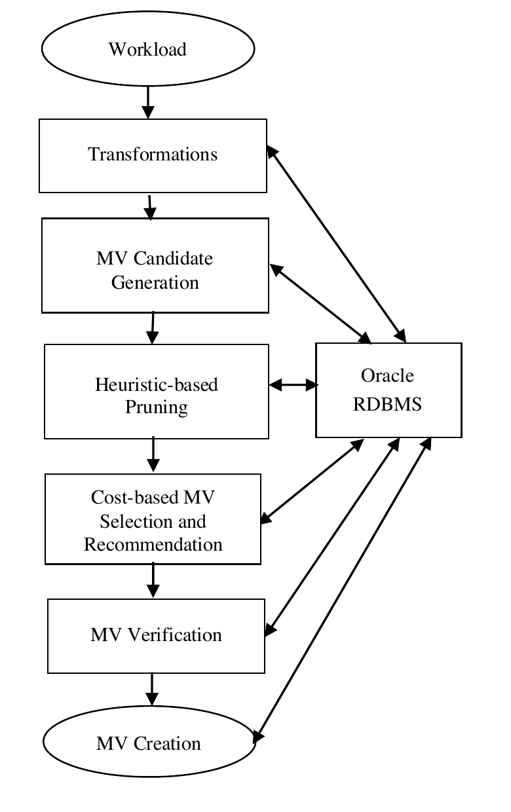
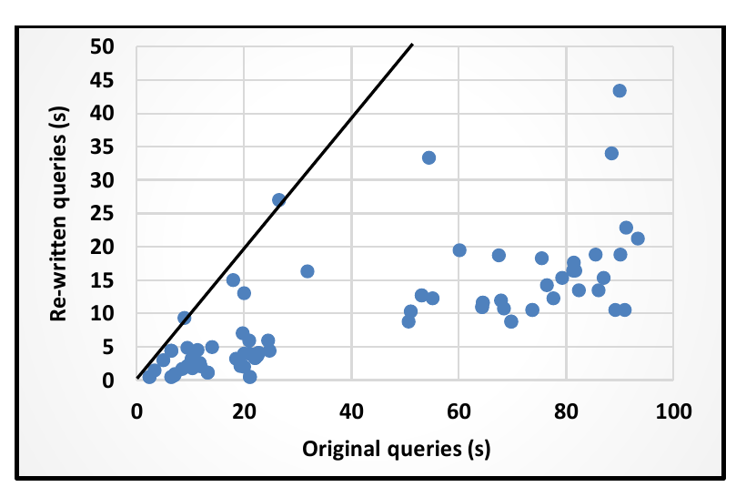
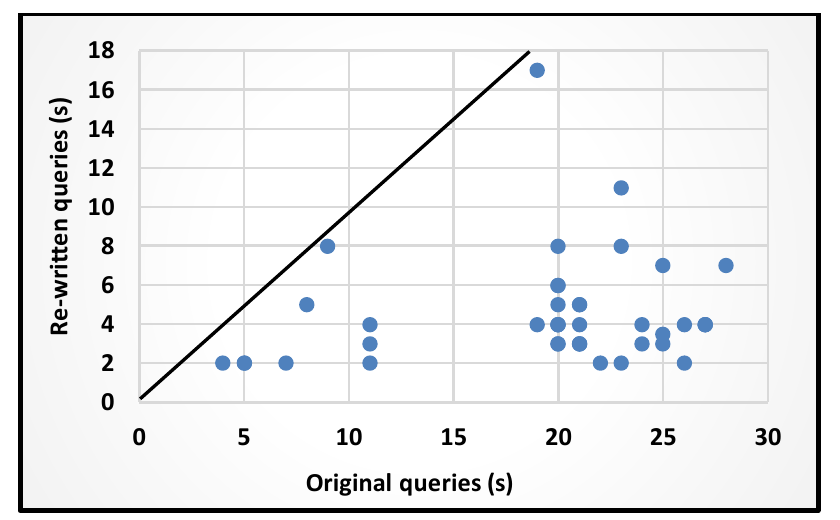

# Automated Generation of Materialized Views in Oracle（中文译文）

## 译者说明

本文依据同目录的 `source.pdf` 翻译。章节、图表、公式、算法、代码与参考文献按原文结构保留。

## 作者与机构

| 作者 | 机构 | 地址 | 联系方式 |
| --- | --- | --- | --- |
| Rafi Ahmed | Oracle Corporation | 500 Oracle Parkway, Redwood Shores, CA 94065, U.S.A. | rafi.ahmed@oracle.com |
| Randall Bello | Oracle Corporation | 2300 Cloud Way, Austin, TX 78741, U.S.A. | randall.bello@oracle.com |
| Andrew Witkowski | Oracle Corporation | 500 Oracle Parkway, Redwood Shores, CA 94065, U.S.A. | andrew.witkowski@oracle.com |
| Praveen Kumar | Oracle Corporation | 1 Oracle Drive, Nashua, NH 03062, U.S.A. | praveen.kumar@oracle.com |

## 摘要

自动生成一组合适的物化视图是一项极具挑战性的任务，也是自治数据库非常需要的一项功能。物化视图的选择必须以成本为依据，并且能够在实际数据库环境中得到验证。本文介绍了 Oracle RDBMS 中一个自动生成、选择、验证和维护物化视图的系统；同时提出一种名为扩展覆盖子表达式（extended covering sub-expression，ECSE）算法的新技术，用于自动生成物化视图。本文还介绍了一组广泛的实验，证明该方法切实可行且效率良好。该系统已完整实现，并将部署到云上的 Oracle Autonomous Database 中。

**PVLDB 参考格式：** Rafi Ahmed, Randall Bello, Andrew Witkowski, Praveen Kumar. Automated Generation of Materialized Views in Oracle. PVLDB, 13(12): 3046-3058, 2020. DOI: https://doi.org/10.14778/3415478.3415533

**出版与许可信息：** 本作品采用 Creative Commons Attribution-NonCommercial-NoDerivatives 4.0 International License 许可。许可证副本见 http://creativecommons.org/licenses/by-nc-nd/4.0/。超出该许可证范围的使用，请发送邮件至 info@vldb.org 获取许可。版权归所有者/作者所有，出版权许可给 VLDB Endowment。Proceedings of the VLDB Endowment, Vol. 13, No. 12，ISSN 2150-8097，DOI: https://doi.org/10.14778/3415478.3415533。

## 1. 引言

当前的关系数据库系统处理复杂 SQL 查询：这些查询涉及多个事实表和维度表，并包含若干嵌套子查询块。此类查询在决策支持系统（Decision-Support Systems，DSS）中正变得越来越重要。为这类查询生成最优执行计划，已成为商业数据库系统的关键能力。物化视图改写 [8, 14] 是优化此类查询的一项知名技术。物化视图具有丰富的结构，这通常使 DBA 面临一项艰巨任务：如何选择一组合适的物化视图。

另一方面，自动生成物化视图本身也带来多种挑战 [1, 17, 29]。我们可以考虑针对工作负载查询中所有可能的表子集，生成每一个在语法上相关的物化视图；然而，即使使用一些基于启发式的剪枝，搜索空间也会爆炸，而且任意表子集还可能在物化视图定义中引入笛卡尔积。另一个极端是：只要语法允许，我们就为每个查询生成一个与查询文本完全匹配的候选物化视图；但这样通常会违反存储约束，并使物化视图刷新成为一个难以处理的问题。理想目标是生成少量物化视图：它们大小合理，包含大量预先计算的连接与分组，并且能够改写当前和未来工作负载中的大量查询。这些要求彼此冲突。包含大量预计算的物化视图，对其所改写的查询更有帮助，但通常只能改写较少的查询。此外，能够改写许多查询的物化视图往往包含很大的分组列集合，却只有很少甚至没有选择谓词；这通常会增加物化视图所含的行数，从而增大其规模。

在本文中，我们讨论一种名为扩展覆盖子表达式（ECSE）算法的新技术，用于自动生成物化视图。ECSE 算法试图在这些相互冲突的要求之间折中，并在上述两个极端之间取得平衡。

自动化物化视图项目是更广泛的 Oracle Autonomous Databases 工作的一项关键组成部分。该项目的其他组成部分包括任务管理、基于机器学习的物化视图自动刷新等。

本文其余部分组织如下。我们首先在第 2 节概述物化视图自动生成系统的架构。我们在第 3 节介绍基本概念、ECSE 算法以及基于成本的物化视图选择技术。第 4 节介绍验证模块。第 5 节概述物化视图维护。在第 6 节中，我们介绍我们在多个客户工作负载上进行的一组广泛实验。最后，我们在第 7 节综述相关工作，并在第 8 节给出我们的结论。

## 2. 自动化物化视图架构

在本文中，我们聚焦于一类单查询块物化视图，它们包含多表连接、分组、聚合，并在少数情况下包含过滤（即选择）谓词；这些物化视图所依据的查询可以包含一个或多个查询块（一个查询块包含 `SELECT`、`FROM`、`WHERE`，以及可选的 `GROUP BY` 子句），查询块中可以有过滤谓词、多表连接、分组与聚合。工作负载可以包含任意复杂的 SQL 语句。



**图 1：自动化物化视图架构**

图 1 给出了 Oracle 中自动生成物化视图（MV）的架构概览。我们的起点是一个包含若干查询的工作负载，系统需要为其生成一组物化视图，使之能够改写当前及未来查询中的相当一部分。该架构的关键组成部分包括：

1. 查询变换，例如简单子查询解嵌套和选择-投影-连接视图合并，用来减少一个查询中的查询块数量（Oracle RDBMS 会在物化视图生成和改写模块被调用之后，以基于成本的方式执行复杂变换 [4]）；
2. 使用 ECSE 算法生成候选物化视图；
3. 对候选物化视图进行基于启发式的剪枝；
4. 枚举查询与物化视图组之间的映射，并基于成本推荐物化视图；
5. 分别在启用和禁用物化视图改写的情况下执行相关工作负载查询，以验证推荐的物化视图；
6. 创建通过验证的物化视图；如果底层事实表采用了分区方案，则使用该方案对物化视图进行分区。

## 3. 物化视图选择

下面，我们重点介绍我们的方法区别于其他方法的方面。

我们考虑包含多个查询块的查询。每个查询块都可以基于星型、雪花型或雪暴型模式 [3]。我们的系统生成的物化视图在用于改写时可能需要再与其他表连接 [6]；这种策略比视图格方法 [14, 28] 更通用，后者假定所有工作负载查询都具有相同的连接模式。在我们的方案中，一个物化视图通常锚定在一个大型事实表上，并可改写多个查询；由于它可能以参照完整性约束为依据，因此可以包含并未出现在可改写查询中的预计算（即连接和分组）。

ECSE 算法通过成对比较，考虑给定查询的连接图之间可能存在的所有关系——等价、超集、子集、交集和并集；在适用时，它利用不变连接属性提取覆盖子表达式，再据此生成候选物化视图。新的 ECSE 策略比为每个查询生成任意子集或子计划 [1, 14, 19] 更高效，并且不同于已报道的子表达式选择、多查询优化和物化视图选择工作。

由于物化视图或索引的选择问题已被证明是 NP-Hard [11, 26]，因此提出的解决方案必须以可扩展的方式推荐高质量物化视图。在最坏情况下，ECSE 算法（第 3.4 节）的时间复杂度为 $O(N^2)$，因为它会对一个给定工作负载中 $N$ 个查询块的连接图做成对比较。为了进一步限制搜索空间，我们在 ECSE 算法内部及执行之后应用了若干启发式规则（第 3.3 节和第 3.4 节）。

### 3.1 基本概念

**连接图（Join Graph）。** 查询块的连接图可能包含由内连接或全外连接产生的无向边，也可能包含由左外连接、反连接和半连接产生的有向边。在我们的方案中，如果存在至少一个顶点，从该顶点出发沿有向边和无向边能够到达所有其他顶点，则认为连接图是连通的。例如，连接图 {T1 ─ T2, T2 → T3} 是连通的，而 {T1 → T3, T2 → T3} 不连通。我们只考虑连通的连接图，因为它们不会产生笛卡尔积。在我们的方案中，连接图可以有环；但如果一个环只包含有向边，则该连接图在 Oracle 中被视为非法。

对给定查询工作负载的连接图进行分类，是我们的候选生成算法的重要方面。我们考察每个连接图的形状、表基数以及连接列的不同值数量（number of distinct values，NDV），并识别事实表、维度表和分支表（即雪花型与雪暴型模式 [3] 中同维度表连接的表）。随后，我们把连接图划分为若干类，每一类中的连接图都引用同一个公共事实表。ECSE 算法分别处理每一类连接图，生成包含该公共事实表以及不同维度表和分支表的候选物化视图。然而，即便无法识别事实表、维度表和分支表，从而不能把连接图分为不同类别，ECSE 算法仍能正确工作。

**连接集（Join Set）。** 连接集是基于查询块的连通连接图的一种抽象。连接集本质上是一组连接边，使我们能够对底层连接图执行集合运算。连接集有一个关联字段，称为 QB 集，它表示可以潜在地用基于该连接集的物化视图来改写的一组查询块（query block，QB）。为简洁起见，本文将连接集表示为一组经过简化的连接边，不显示列或关系运算符；例如 {F1 ─ D1, D1 ─ B1}，其中 F1 ─ D1 表示表 F1 与 D1 之间的一条连接边，D1 ─ B1 表示表 D1 与 B1 之间的一条连接边。

ECSE 算法在多个步骤中对连接集执行集合运算，即等价、子集、超集、并集和交集。两条连接边即使来自两个不同查询块，只要它们由相同的一对 `Table.Column`、相同的关系运算符（例如 $=$ 、 $\gt$ 、 $\le$ 等）和相同的连接类型（例如内连接、外连接、反连接等）定义，就被视为等价。如果两个连接集包含等价的连接边集合，则认为它们等价。连接集上的子集、超集、并集和交集运算，其标准定义可直接从连接边等价的定义得到。这些运算产生的连接集必须连通。

**不变连接（Invariant Join）。** 不变连接可以从表属性和连接属性推导出来。如果表 T1 与表 T2 的连接满足以下五个条件，则 T1 在该连接中保持不变：

1. 连接由一个简单的等值内连接谓词 `T1.fk = T2.pk` 指定；
2. 从 `T1.fk` 到 `T2.pk` 存在参照完整性约束，即 `T1.fk` 是引用主键 `T2.pk` 的外键；
3. 列 `T1.fk` 具有非空约束；
4. T2 没有任何过滤谓词或子查询谓词；
5. T2 在同 T1 之外的其他表进行连接时也保持不变（若存在这样的表），例如雪花型模式中同分支表连接的维度表。

在创建物化视图时，可以通过从物化视图定义中排除违反不变性属性的过滤谓词和表，绕开条件 4 和条件 5。表或连接集 J 相对于其同表 T 的连接是否具有不变性，用 $Invariant(J,T)$ 表示；它意味着表 T 同 J 中的一个或多个表连接时，不会影响 J 的结果行。不变连接的存在被用于识别作为底层连接集并集或超集的连接集，从而允许物化视图包含更大的预计算；也就是说，即使物化视图包含的表和连接比查询块更多，也能用它来改写该查询块。

**连接集的划分（Partition of Join Set）。** 在雪暴型模式 [3] 中，一个连接集可能包含多个事实表，而每个事实表都有自己的维度表和分支表。例如，一个连接集中有两个事实表 F1 和 F2，且 JS1 为 {B1 ─ D1, D1 ─ F1, F1 ─ F2, F2 ─ D2}。在这种情况下，JS1 将被划分为两个连接集 JS2 和 JS3，每个连接集只包含一个事实表及其维度表和分支表：JS2 为 {F1 ─ D1, D1 ─ B1}，JS3 为 {F2 ─ D2}。连接集 JS2 和 JS3 继承 JS1 的 QB 集。

**连接集缩减（Reduction of Join Set）。** 一个连接集可能包含子查询解嵌套 [4] 而产生的反连接表或半连接表。然而，Oracle 中的物化视图不能包含反连接表或半连接表。因此，需要通过移除参与反连接或半连接的表来缩减连接集。

**过滤谓词（Filter Predicates）。** 大多数工作负载查询会随时间反复发出，它们之间的差异仅在于过滤谓词中的常量值。因此，我们系统中的大多数物化视图定义不包含过滤谓词。这使其既能改写当前查询，也能改写未来具有相同签名的查询。

**左外连接（Left Outer-Join）。** Oracle 允许物化视图定义包含左外连接。考虑如下查询：

```sql
SELECT *
FROM T1 LEFT OUTER JOIN T2
  ON T1.x = T2.y AND T2.z = 5;
```

如果 T1 与 T2 之间是多对多连接，两个表的行都可能被复制。在我们的方案中，带左外连接的物化视图定义包含一个指示列：值 1 表示内连接行（即匹配行），值 0 表示反连接行（即不匹配行）。如果必须在改写中只出现一次物化视图，那么使用一个包含 T1 与 T2 左外连接、但不含过滤谓词的物化视图，来改写上述这个在被外连接表 T2 上包含过滤谓词的查询，并非易事。我们使用一种涉及 `LEAD` 窗口函数和该指示列的技术，只引用一次物化视图即可改写这类查询。该技术的细节超出本文范围。

**物化视图的范围（Scope of Materialized Views）。** 我们支持嵌套子查询、视图、物化视图定义中的标准聚合函数，以及基于位图技术的 distinct 聚合。

### 3.2 连接集上的运算

本节中，我们给出五种基本集合运算的函数，用于识别或创建可用来定义物化视图的连接集。对于连接图的每一类别（第 3.1 节），我们使用一个项目列表，本文称之为 JQLST。JQLST 中的每个项目都包含一个连接集及其关联的 QB 集。最初，连接集只基于一个查询块；QB 集被初始化为该连接集所源自的查询块。我们定义函数 `Tables()`：它接收一个连接集，返回其中出现的表集合。

每一种集合运算都涉及对列表中的项目进行成对比较；对 QB 集做并集运算后，所得连接集能够改写属于两个操作数的全部查询块。在 ECSE 算法的第一步之后，一个连接集本身保持不变，但其 QB 集可能动态增长。

每一种集合运算都通过两个单查询块查询，以及由这两个查询派生出的一个物化视图定义来说明。在示例中，每个查询后面都给出它产生的连接集和 QB 集；每个物化视图定义前面也都给出连接集和 QB 集，它们是对两个查询块的连接集与 QB 集执行某种集合运算后得到的。我们使用常见记号：`()` 表示列表，`{}` 表示集合，`[]` 表示结构；连接集（即连接图）和 QB 集在原文中以粗体显示。

派生出的连接集和 QB 集用于生成物化视图定义。派生连接集用于构造物化视图定义的 `FROM` 和 `WHERE` 子句。派生 QB 集中的查询块，其 `SELECT` 与 `GROUP BY` 列表会被合并，以构造物化视图的 `SELECT` 与 `GROUP BY` 列表。派生 QB 集中的查询块，其过滤谓词中的列会被加入 `GROUP BY` 和 `SELECT` 列表，使物化视图能够改写具有相似签名的查询块。用于同物化视图未包含之表连接的连接列，也会被加入其 `GROUP BY` 和 `SELECT` 列表。

该物化视图定义可以改写派生 QB 集中的所有查询块；这些查询块被视为该物化视图的可用查询，反之亦然。在下面的大多数示例中，物化视图改写都需要重新计算分组与聚合。

#### 3.2.1 等价

如果发现两个项目的连接集等价，则移除其中一个连接集，并用被移除项目的 QB 集扩充保留连接集的 QB 集，以表明保留下来的连接集可以改写其 QB 集中的所有查询块。

```text
Function JS-Equivalence (JQLST)
{
  // Prune join sets based on equivalence
  For each item X in JQLST do
    For each item Y in JQLST do
      If (X != Y ∧ X.joinset = Y.joinset)
      {
        X.qbset = X.qbset ⋃ Y.qbset;
        Remove Y from JQLST;
      }
}
```

**图 2：JS-Equivalence**

考虑连接集等价的两个查询块 Q1 和 Q2；因此可以丢弃其中一个连接集。

```sql
SELECT F.n, F.g, SUM(F.m1), COUNT(F.m3), D2.z, D7.y
FROM F, D7, D2
WHERE F.f7 = D7.k AND F.f2 = D2.k AND
      F.x IN (4, 6) AND D7.c = 25
GROUP BY F.n, F.g, D7.y, D2.z;
```

**连接集 / QB 集：** [{F ─ D7, F ─ D2}, {Q1}]

```sql
SELECT F.n, MAX(F.m2), D7.p, D2.y
FROM F, D7, D2
WHERE F.f7 = D7.k AND F.f2 = D2.k AND
      F.x = 9 AND D7.c = 5
GROUP BY F.n, D7.p, D2.y;
```

**连接集 / QB 集：** [{F ─ D7, F ─ D2}, {Q2}]

**派生连接集 / QB 集：** [{F ─ D7, F ─ D2}, {Q1, Q2}]

```sql
CREATE MATERIALIZED VIEW MV0 AS
SELECT F.n, F.g, D7.y, D2.z, D7.p, D2.y, F.x, D7.c,
       MAX(F.m2), SUM(F.m1), COUNT(F.m3)
FROM F, D7, D2
WHERE F.f7 = D7.k AND F.f2 = D2.k AND
      F.x IN (4, 6, 9) AND D7.c IN (5, 25)
GROUP BY F.n, F.g, D7.y, D2.z, D7.p, D2.y, F.x, D7.c;
```

在物化视图 MV0 中，`SELECT` 与 `GROUP BY` 列表已完成合并。仅为便于说明，我们还在 MV0 的定义中展示了来自 Q1 和 Q2 的过滤谓词合一后的结果。

#### 3.2.2 子集

```text
Function JS-Subset (X, Y)
{
  // Identify join set based on subset.
  If (X.joinset ⊂ Y.joinset)
    X.qbset = X.qbset ⋃ Y.qbset;
}
```

**图 3：JS-Subset**

考虑查询块 Q3 和 Q4。Q4 的连接集是 Q3 连接集的子集。

```sql
SELECT F.x, D1.y, D2.z, SUM(F.m1)
FROM F, D1, D2, B2
WHERE F.f1 = D1.k AND F.f2 = D2.k AND D2.c = B2.r AND
      F.y = 5 AND D1.c = 9 AND D2.s < 25
GROUP BY F.x, D1.y, D2.z;
```

**连接集 / QB 集：** [{F ─ D1, F ─ D2, D2 ─ B2}, {Q3}]

```sql
SELECT F.x, D1.h, COUNT(F.m2),
FROM F, D1
WHERE F.f1 = D1.k AND F.y = 7 AND D1.g = 7 AND D1.c = 9
GROUP BY F.x, D1.h;
```

**连接集 / QB 集：** [{F ─ D1}, {Q4}]

**派生连接集 / QB 集：** [{F ─ D1}, {Q3, Q4}]

```sql
CREATE MATERIALIZED VIEW MV1 AS
SELECT F.x, D1.y, D1.h, D1.c, D1.g, F.y,
       F.f2, COUNT(F.m2), SUM(F.m1)
FROM F, D1
WHERE F.f1 = D1.k
GROUP BY F.x, F.y, D1.y, D1.h, D1.c, D1.g, F.f2;
```

在 MV1 中，`SELECT` 与 `GROUP BY` 已完成合并。`SELECT` 与 `GROUP BY` 还加入了过滤谓词中的列，以及用于同 D2 连接的列 `F.f2`。这样，Q4 可以用 MV1 改写而无需任何连接；Q3 则可以通过将 MV1 与 D2 连接来改写。

#### 3.2.3 交集

```text
Function JS-Intersection (JQLST)
{
  // Generate a new join set based on intersection.
  For each item X in JQLST do
    For each item Y in JQLST do
      If (X != Y ∧ Y.joinset ⊈ X.joinset ∧
          X.joinset ⊈ Y.joinset ∧
          X.joinset ⋂ Y.joinset ≠ ∅)
      {
        Z.joinset = X.joinset ⋂ Y.joinset;
        Z.qbset = X.qbset ⋃ Y.qbset;
        Insert Z into NLST;
      }
  Append NLST to JQLST;
}
```

**图 4：JS-Intersect**

图 4 中的函数 `JS-Intersection` 根据给定连接集生成一个新连接集。为了使派生连接集中包含的计算量最大，我们不生成交集闭包，即不再从其他交集连接集派生交集连接集。考虑查询 Q5 和 Q6：二者的连接集有重叠，因此可以对其应用交集运算。

```sql
SELECT F.n, MIN(F.m1), D7.y, D2.z
FROM F, D7, D2
WHERE F.f7 = D7.k AND F.f2 = D2.k AND
      F.x IN (4, 6) AND D7.c = 25
GROUP BY F.n, D7.y, D2.z;
```

**连接集 / QB 集：** [{F ─ D7, F ─ D2}, {Q5}]

```sql
SELECT F.y, SUM(F.m2), D7.h, D3.x
FROM F, D7, D3
WHERE F.f7 = D7.k AND F.f3 = D3.k AND D7.y = 5
      F.x = 11 AND D3.w > 15
GROUP BY F.y, D7.h, D3.x;
```

**连接集 / QB 集：** [{F ─ D7, F ─ D3}, {Q6}]

**派生连接集 / QB 集：** [{F ─ D7}, {Q5, Q6}]

```sql
CREATE MATERIALIZED VIEW MV2 AS
SELECT F.n, F.y, D7.y, D7.h, D7.c, F.x, F.f2, F.f3,
       MIN(F.m1) mn, SUM(F.m2) sm
FROM F, D7
WHERE F.f7 = D7.k
GROUP BY F.n, F.y, F.x, D7.y, D7.h, D7.c, F.f2, F.f3;
```

这里生成了一个新连接集。在 MV2 中，`SELECT` 与 `GROUP BY` 列表已完成合并；它们还加入了物化视图 MV2 未包含之表的连接列。注意，用 MV2 改写 Q5 时需要使用 `F.f2` 与 D2 连接；改写 Q6 时需要使用 `F.f3` 与 D3 连接。下面，我们展示用物化视图 MV2 改写后的查询 Q6。

```sql
SELECT M.y, M.h, D3.x, SUM(M.sm) sm
FROM MV2 M, D3
WHERE M.f3 = D3.k AND M.x = 11 AND D3.w > 15 AND
      M.y = 5
GROUP BY M.y, M.h, D3.x;
```

#### 3.2.4 超集

图 5 给出了超集连接集的派生过程。只有当相关连接满足不变性属性时，才能派生超集连接集。图 5 中的条件检查 Y 的连接集在同 X 与 Y 两连接集之差所包含的全部表进行连接时是否保持不变。

```text
Function JS-Superset (X, Y)
{
  // Identify invariance-based superset join set.
  If (Y.joinset ⊂ X.joinset ∧
      ∀ T ∈ Tables (X.joinset − Y.joinset),
      Invariant (Y.joinset, T))
  {
    X.qbset = X.qbset ⋃ Y.qbset;
    Return True;
  }
  Else
    Return False;
}
```

**图 5：JS-Superset**

考虑查询块 Q7 和 Q8。Q7 的连接集是 Q8 连接集的子集；如果相关连接是不变连接，就可以对其应用超集运算。

```sql
SELECT F.n, SUM(F.m1), D1.m
FROM F, D1
WHERE F.f1 = D1.k AND F.x = 6 AND D1.y = 25
GROUP BY F.n, D1.m;
```

**连接集 / QB 集：** [{F ─ D1}, {Q7}]

```sql
SELECT F.y, MIN(F.m2), D1.h, D5.z
FROM F, D1, D5
WHERE F.f1 = D1.k AND F.fk5 = D5.pk AND
      F.x = 11 AND D1.y = 33 AND D5.g > 6
GROUP BY F.y, D1.h, D5.z;
```

**连接集 / QB 集：** [{F ─ D1, F ─ D5}, {Q8}]

**派生连接集 / QB 集：** [{F ─ D1, F ─ D5}, {Q7, Q8}]

```sql
CREATE MATERIALIZED VIEW MV3 AS
SELECT F.n F.y, D1.m, D1.h, D5.z, D1.y,
       D5.g, F.x, MIN(F.m2), SUM(F.m1)
FROM F, D1, D5
WHERE F.f1 = D1.k AND F.fk5 = D5.pk
GROUP BY F.n, F.y, F.x, D1.y, D1.m, D1.h, D5.z, D5.g;
```

在 Q8 中，`F.fk5` 必须是一个引用主键（P.K.）`D5.pk` 的非空外键（F.K.）；这表明 F 与 D5 之间的连接是不变连接（第 3.1 节）。无需用连接列扩充 `SELECT` 和 `GROUP BY`。用物化视图 MV3 改写 Q7 或 Q8 都不需要连接。

#### 3.2.5 并集

图 6 展示如何基于并集运算派生一个新连接集；该运算适用于相互重叠的连接集 X 和 Y。对于只属于 X 或只属于 Y、但不同时属于二者的所有连接边，都要检查不变性条件。只有相关连接满足不变性属性，才能派生并集连接集。

为简洁起见，我们在图 6 中未考虑这样一种情况：两个连接集仅有一个公共的事实表，而没有公共连接边。

```text
Function JS-Union (JQLST)
{
  // Generate invariance-based union join sets.
  For each item X in JQLST do
    For each item Y in JQLST do
      If (X != Y ∧ Y.joinset ⊈ X.joinset ∧
          X.joinset ⊈ Y.joinset ∧
          X.joinset ⋂ Y.joinset ≠ ∅ ∧
          ∀ T ∈ Tables ((X.joinset ⋃ Y.joinset) −
                        (X.joinset ⋂ Y.joinset)),
          Invariant (X.joinset ⋂ Y.joinset, T))
      {
        Z.joinset = X.joinset ⋃ Y.joinset;
        Z.qbset = X.qbset ⋃ Y.qbset;
        Insert Z into JQLST;
      }
}
```

**图 6：JS-Union**

连续应用并集运算所产生的物化视图，最终可能并不十分有用，因为它往往具有很大的 `GROUP BY` 列表，因而基数很高。因此，ECSE 算法在 `JS-Union`（图 6）中会同时保留操作数（父）连接集和结果（子）连接集。父连接集与子连接集都会参与最终的推荐物化视图选择（第 3.5 节）。

考虑连接集有重叠的两个查询块 Q9 和 Q10；如果相关连接是不变连接，就可以应用并集运算。

```sql
SELECT F.n, D1.m, D5.x, SUM(F.m1),
FROM F, D1, D5
WHERE F.fk1 = D1.pk AND F.fk5 = D5.pk AND F.x = 6 AND
      D1.z = 25
GROUP BY F.n, D5.x, D1.m;
```

**连接集 / QB 集：** [{F ─ D1, F ─ D5}, {Q9}]

```sql
SELECT F.y, D2.w, D5.z, AVG(F.m2)
FROM F, D2, D5
WHERE F.fk2 = D2.pk AND F.x = 12 AND D2.g > 7 AND
      F.fk5 = D5.pk
GROUP BY F.y, D5.z, D2.w;
```

**连接集 / QB 集：** [{F ─ D2, F ─ D5}, {Q10}]

**派生连接集 / QB 集：** [{F ─ D1, F ─ D2, F ─ D5}, {Q9, Q10}]

```sql
CREATE MATERIALIZED VIEW MV4 AS
SELECT F.n, F.y, D1.m, D2.w, D1.z, D2.g, F.x, D5.x, D5.z,
       SUM(F.m2), COUNT(F.m2), SUM(F.m1)
FROM F, D1, D2
WHERE F.fk1 = D1.pk AND F.fk2 = D2.pk AND F.fk5 = D5.pk
GROUP BY F.n, F.y, F.x, D1.m, D2.w, D1.z, D2.g, D5.x,
         D5.z;
```

在 Q9 中，`F.fk1` 必须是引用主键（P.K.）`D1.pk` 的非空外键（F.K.）。在 Q10 中，`F.fk2` 必须是引用主键 `D2.pk` 的非空外键。这里生成了一个新连接集。D1 与 D2 上的过滤谓词不能包含在物化视图 MV4 的定义中。无需用连接列扩充 `SELECT` 与 `GROUP BY` 列表，因为用 MV4 改写 Q9 或 Q10 都不需要连接。在用 MV4 改写查询之前，改写模块会验证不变性属性。

### 3.3 用于连接集剪枝的启发式规则

本节中，我们介绍五种连接集剪枝启发式规则，其依据分别是：（A）连接集缩减；（B）连接集大小；（C）QB 集大小；（D）极大连接集与 QB 集；以及（E）候选物化视图同其引用的事实表之间的基数比。

这些启发式规则使用四个可配置的阈值 α、β、λ 和 ρ。阈值的精确确定取决于多个因素，例如工作负载中的查询数量与复杂度、事实表基数、存储需求等。如何针对给定工作负载自动推导这些阈值，仍需进一步研究。

#### 3.3.1 启发式规则 A：连接集缩减

为了防止物化视图规模爆炸，可能需要从连接集中移除导致多对多连接的维度表或分支表，从而缩减连接集。

我们通过检查一个多对多等值连接的连接谓词来识别它：如果两个操作数列都没有唯一约束/索引，且其不同值数量（NDV）也都不接近所在表的基数，则认为该连接是多对多等值连接。缩减连接集时，要移除导致多对多连接的表；被移除的维度表或分支表所包含的全部分支表，也会从连接集中递归移除。

#### 3.3.2 启发式规则 B：连接集大小

如果一个连接集包含的表数量小于给定阈值 α，就将其剪枝。α 可以取给定工作负载全部查询的全部查询块所含表数量平均值的一半。在我们的实验（第 6 节）中，我们将 α 设为 2。

该启发式规则确保只推荐包含一定数量连接计算的物化视图。

#### 3.3.3 启发式规则 C：QB 集大小

如果连接集的 QB 集基数小于阈值 β（例如 2），就将该连接集剪枝。这确保只推荐至少能够改写 β 个查询块的物化视图。在我们的实验（第 6 节）中，β 取 2；也就是说，只要一个连接集只能改写一个查询块，我们总会将其剪枝。

#### 3.3.4 启发式规则 D：极大连接集与 QB 集

如果存在一个极大连接集 Jᵢ，则对连接集 Jₖ 剪枝。如果 Jₖ 是 Jᵢ 的子集（不一定是真子集），且 Jₖ 的 QB 集也是 Jᵢ 的 QB 集的子集（不一定是真子集），则相对于 Jₖ，Jᵢ 被视为极大连接集。

```text
For each item X in JQLST do
  For each item Y in JQLST do
    If (X != Y ∧ Y.joinset ⊆ X.joinset ∧ Y.qbset ⊆ X.qbset)
      Remove Y;
```

这里，如果存在另一个连接集既包含更大的预计算、又能改写更多查询块，就将当前连接集剪枝。

#### 3.3.5 启发式规则 E：基数比

在本方案中，每个连接集——或基于该连接集的物化视图——都包含一个事实表以及一个或多个维度表和分支表。经验表明，在大多数情况下，如果物化视图的基数没有显著小于事实表的基数，那么基于该物化视图的查询改写就不会有收益。由于在我们的方案中，物化视图定义极少包含过滤谓词，因此根据基数剪除候选物化视图至关重要。

我们把基数比定义为物化视图事实表的行数除以物化视图的行数。如果物化视图的基数比小于给定阈值 λ（例如 3），我们就将其剪枝。

事实表的准确基数来自数据库字典表。我们不采用优化器对物化视图基数的估计，因为基数估计错误始终是查询优化器中一个普遍而顽固的问题 [16, 23, 24]。相反，我们基于物化视图定义发出一个带 `SAMPLE BLOCK` 子句的查询，以估算物化视图行数；替代方法包括近似 distinct 计数以及文献 [9] 所述的方法。给定块采样百分比 ρ，把查询返回的行数乘以 100/ρ，即可得到线性缩放后的基数。使用较小百分比进行块采样可以得到相当准确的估计，因为这些物化视图定义不包含过滤谓词，且所有连接都是多对一连接（第 3.3.1 节）。

例如，考虑下面这个基于 TPC-DS 模式的物化视图定义。

```sql
CREATE MATERIALIZED VIEW MV10 AS
SELECT hd_vehicle_count, hd_dep_count,
       s_store_name, t_minute, t_hour,
       COUNT(*), SUM(ss_ext_sales_price)
FROM store_sales, household_demographics, store,
     time_dim
WHERE hd_demo_sk = ss_hdemo_sk AND
      s_store_sk = ss_store_sk AND
      t_time_sk = ss_sold_time_sk
GROUP BY hd_vehicle_count, hd_dep_count,
         t_minute, t_hour;
```

下面的查询使用事实表 `stores_sales` 的 1% 块采样，返回物化视图 MV10 的基数。

```sql
SELECT COUNT(*)
FROM (SELECT 1
      FROM store_sales SAMPLE BLOCK (1),
           household_demographics, store, time_dim
      WHERE hd_demo_sk = ss_hdemo_sk AND
            s_store_sk = ss_store_sk AND
            t_time_sk = ss_sold_time_sk
      GROUP BY hd_vehicle_count, hd_dep_count,
               s_store_name, t_minute, t_hour);
```

对候选物化视图基数的估算有双重作用。第一，它用于剪除前景不佳的物化视图。第二，采样得到的基数会被注入数据库字典表，替换优化器估算的基数；这使优化器成本模型得以使用更准确的基数，从而显著提升推荐物化视图的数量与质量（第 3.5 节）。

### 3.4 扩展覆盖子表达式（ECSE）算法

我们在图 7 中给出 ECSE 算法。可以看到，该算法内置了启发式规则，用来淘汰前景不佳的候选物化视图。

自动化物化视图候选生成的输入是 SQL Tuning Set [15]。这是 Oracle 用来存储、管理和调优工作负载的工具。SQL Tuning Set 持久存储 SQL 语句文本、SQL-ID、执行计划、优化器估算成本、执行统计信息（例如 CPU 时间、已用时间、buffer-gets、处理行数）、执行上下文等。

如第 3.1 节所述，我们分析给定工作负载中每个查询块的连接图，并根据事实表对连接图分类。对连接集的每一类别都调用 ECSE 算法。算法输入是一个项目列表，其中包含连接集与 QB 集。

```text
Algorithm ECSE (JQLST)
{
  // Prune join sets based on equivalence
  JS-Equivalence (JQLST);

  // Generate intersection join sets.
  JS-Intersection (JQLST);

  // Generate invariance-based union join sets.
  JS-Union (JQLST);

  // Prune join sets based on equivalence.
  JS-Equivalence (JQLST);

  For each item X in JQLST do
    For each item Y in JQLST do
    {
      // Identify invariance-based superset.
      Valid := JS-Superset (X, Y));

      // Identify join sets based on subset.
      If (! Valid)
        JS-Subset (X, Y);
    }

  // Apply the heuristics in the given order.
  Prune the join sets based on heuristics A, B, C, D, and E;

  Form candidate materialized view definitions based on JQLST;
```

**图 7：ECSE 算法**

#### 3.4.1 ECSE 示例

下面，我们给出一个简单示例，说明 ECSE 算法如何工作。考虑一个由 8 条单查询块 SQL 语句 Q1、Q2、Q3、Q4、Q5、Q6、Q7、Q8 组成的工作负载。本例没有参照完整性约束，因此也没有不变连接。这里每个查询块都只引用一个事实表，所以无需在下面第 2 步划分连接集。

**1.** 生成连接图，并识别事实表、维度表和分支表。

**2.** 根据事实表把连接图分为不同类别（第 3.1 节）：{Q2, Q3, Q5, Q6, Q8} 引用事实表 F1，{Q1, Q4, Q7} 引用事实表 F3。

**3.** 从包含事实表 F1 的类别所对应的初始 JQLST 开始。

```text
JQLST: ([{F1 ─ D4}, {Q2}],
        [{F1 ─ D4, F1 ─ D3}, {Q3}],
        [{F1 ─ D1, F1 ─ D5, F1 ─ D6}, {Q5}],
        [{F1 ─ D1, F1 ─ D6, F1 ─ D7}, {Q6}],
        [{F1 ─ D1, F1 ─ D5, F1 ─ D6}, {Q8}])
```

**3.1** 应用 `JS-Equivalence`。

```text
[{F1 ─ D1, F1 ─ D5, F1 ─ D6}, {Q5, Q8}] ←
[{F1 ─ D1, F1 ─ D5, F1 ─ D6}, {Q5}],
[{F1 ─ D1, F1 ─ D5, F1 ─ D6}, {Q8}]

JQLST: ([{F1 ─ D4}, {Q2}],
        [{F1 ─ D4, F1 ─ D3}, {Q3}],
        [{F1 ─ D1, F1 ─ D5, F1 ─ D6}, {Q5, Q8}],
        [{F1 ─ D1, F1 ─ D6, F1 ─ D7}, {Q6}])
```

**3.2** 应用 `JS-Intersection`。

```text
[{F1 ─ D1, F1 ─ D6}, {Q5, Q6, Q8}] ←
[{F1 ─ D1, F1 ─ D5, F1 ─ D6}, {Q5, Q8}],
[{F1 ─ D1, F1 ─ D6, F1 ─ D7}, {Q6}]

JQLST: ([{F1 ─ D4}, {Q2}],
        [{F1 ─ D4, F1 ─ D3}, {Q3}],
        [{F1 ─ D1, F1 ─ D5, F1 ─ D6}, {Q5, Q8}],
        [{F1 ─ D1, F1 ─ D6, F1 ─ D7}, {Q6}],
        [{F1 ─ D1, F1 ─ D6}, {Q5, Q6, Q8}])
```

**3.3** `JS-Equivalence`、`JS-Superset` 和 `JS-Union` 在这里均不适用。

**3.4** 应用 `JS-Subset`。

```text
[{F1 ─ D4}, {Q2, Q3}] ←
[{F1 ─ D4}, {Q2}],
[{F1 ─ D4, F1 ─ D3}, {Q3}]

JQLST: ([{F1 ─ D4}, {Q2, Q3}],
        [{F1 ─ D4, F1 ─ D3}, {Q3}],
        [{F1 ─ D1, F1 ─ D5, F1 ─ D6}, {Q5, Q8}],
        [{F1 ─ D1, F1 ─ D6, F1 ─ D7}, {Q6}],
        [{F1 ─ D1, F1 ─ D6}, {Q5, Q6, Q8}])
```

**3.5** 应用启发式规则 A、B、C、D 和 E，其中 α = 2、β = 2、λ = 2、ρ = 10。

```text
JQLST: ([{F1 ─ D1, F1 ─ D6}, {Q5, Q6, Q8}],
        [{F1 ─ D1, F1 ─ D5, F1 ─ D6}, {Q5, Q8}],
        [{F1 ─ D4}, {Q2, Q3}])
```

注意，包含事实表 F3 的类别也会执行与上述类似的步骤。

### 3.5 基于成本的推荐

本节中，我们首先介绍用于基于成本选择与推荐物化视图之算法的一些基本概念。

图 8 给出一个包含 6 个查询和 5 个候选物化视图的示例。每个查询之后都列出了它包含的查询块，以及可以单独改写该查询块的物化视图集合。

```text
Q1.  QB11 {MV1, MV2}, QB12 {MV3}
Q2.  QB2  {MV2, MV4}
Q3.  QB3  {MV5, MV4}
Q4.  QB4  {MV3, MV5}
Q5.  QB5  {MV2, MV4}
Q6.  QB6  {MV5, MV1}
```

**图 8：可用查询与 MV**

候选物化视图与可用查询块之间可以是多对多关系：一个物化视图可以改写多个查询块，一个查询块也可以由多个物化视图分别改写。多个候选物化视图可以同时改写一个多查询块查询或雪暴型查询。这些候选物化视图被汇集为一个唯一的物化视图集合，称为 MV 组（MV-group）。图 9 展示了如何为图 8 的示例枚举 MV 组。它表示 MV 组与可用查询之间的多对多关系。一个 MV 组内的全部物化视图会同时改写该查询。

一个 MV 组针对某个可用查询的估算收益，被定义为该查询在不改写和改写两种情况下，优化器估算成本之差。一个 MV 组的累计估算收益，就是对其所有可用查询的估算收益求和；这也是下面 GGR 算法使用的性能指标。

```text
[MV1, MV3] ↔ {Q1}
[MV2, MV3] ↔ {Q1}
[MV1]      ↔ {Q1, Q6}
[MV2]      ↔ {Q1, Q2, Q5}
[MV3]      ↔ {Q1, Q4}
[MV4]      ↔ {Q2, Q3, Q5}
[MV5]      ↔ {Q3, Q4, Q6}
```

**图 9：MV 组与查询**

物化视图 MVᵢ 的缩减因子定义为：MVᵢ 所引用的全部表的基数之和，除以 MVᵢ 的基数。

图 10 所示的全局贪心推荐（global greedy recommendation，GGR）算法以以下内容为输入：一个工作负载（一个 SQL Tuning Set）、候选物化视图组集合 M 及其可用查询块（第 3.4 节），以及存储空间约束 C。GGR 算法的目标是选择一个物化视图组集合 R（R ⊆ M），使 R 在存储空间约束 C 下最大化累计估算收益。

尽管 GGR 算法提供了一种高效且有效的解决方案，但它并不保证得到全局最优解 [14]，因为 ECSE 算法不会生成所有可能的候选物化视图（第 3.4 节），而且 GGR 算法使用启发式方法枚举 MV 组。

目前，GGR 算法只考虑一种约束——可用存储空间的大小；未来还可以扩展为同时包含物化视图维护成本（第 5 节）。

```text
Algorithm GGR {
1. 对每个候选物化视图定义，解析其文本，并对解析后的结构调用
   优化器成本函数来生成估算统计信息，从而创建一个仅有统计信息和
   元数据的虚拟物化视图。
2. 使用基于采样的基数修改虚拟物化视图的统计信息（第 3.3.5 节）。
3. 对工作负载查询的每个查询块 QBi：
   3.1. 按缩减因子降序排列 QBi 的所有可用物化视图。
   3.2. 只为 QBi 保留排名前 κ 个（例如 5 个）物化视图。
4. 使用贪心技术，为所有工作负载查询枚举 MV 组集合 M。
5. 对 M 中的每个 MV 组 G：
   5.1. 用 G 改写所有可用工作负载查询（不考虑其他 MV 组），
        并计算其累计估算收益。
   5.2. 如果 G 的累计估算收益不是正数，则丢弃 G。
6. 对工作负载中的每个查询 Qj：
   6.1. 从 Qj 可用的所有 MV 组中，选出累计估算收益最高的 MV 组，
        并对其做标记。
7. 丢弃未在第 6.1 步中被任何查询标记的 MV 组。
8. 令 C 为指定的存储空间约束。按照“累计估算收益 / 估算存储大小”
   降序排列所有 MV 组。
9. T := 0。按第 8 步生成的顺序，对每个物化视图组 G：
   9.1. S := G 的估算存储大小；
   9.2. 如果 (S + T) > C，则丢弃 G；否则令 T := T + S。
10. 推荐 R，即所有剩余候选物化视图的集合。
}
```

**图 10：GGR 算法**

GGR 算法（图 10）第 5.1 步在推荐物化视图时采用的优化器改写策略，不同于用户环境中采用的优化器改写策略。前者的目标，是为多个工作负载查询推荐一组合适的候选物化视图；后者的目标，则是在给定一个或多个物化视图时，每次优化一个查询。第 4 节的验证会使用后者。

图 10 的第 3.2 步采用一种简单启发式规则：只为当前查询块选择最好的 κ 个物化视图，不影响其他查询块的任何可用物化视图。

图 10 的第 7 步之所以丢弃一个没有成为其任何可用查询之最优选择的 MV 组，是因为还存在其他可用于这些查询、且累计估算收益高于被丢弃 MV 组的 MV 组。

## 4. 物化视图验证

最后一步，我们使用 Oracle 工具 SQL Performance Analyzer [15] 验证推荐物化视图的性能。该工具接收一个 SQL 工作负载，使我们能够使用多种性能指标，度量推荐物化视图对工作负载查询执行的影响。

在验证阶段，优化器改写模块以基于成本的方式决定：对每一个工作负载查询，使用哪些推荐物化视图进行改写最有收益。

系统使用能够由推荐物化视图改写的工作负载查询的分层样本，来验证这些物化视图的性能。分层（stratification）把可用查询集合划分为非空且互不相交的层，使每个查询恰好出现在一个层中。这里形成一个层所采用的标准是：该层中的所有查询都能由同一组推荐物化视图改写。分层的思路，是把结构上相似的查询放入同一层，从而得到更具代表性的样本。系统从每一层随机选择一定比例的查询，构成用于验证的样本。

图 11 给出一个由 19 个查询 Q1-Q19 组成的工作负载示例。系统根据 5 个推荐物化视图 MV1-MV5 形成了 6 个层 S1-S6。查询 Q16 和 Q18 未出现在图 11 中，因为它们不适合基于成本的物化视图改写。推荐物化视图集合的幂集还包含其他子集，例如 {MV1, MV5}；图中没有显示这些子集，因为优化器不会用它们改写任何查询。下面每一层都给出一组查询及其可用物化视图。例如，S3 层包含查询 Q3、Q8 和 Q12，它们由物化视图 MV1 与 MV2 共同改写。与图 9 中的分组不同，图 11 的分层会把一个可用查询恰好放入一个层。

```text
S1.  {Q2, Q9, Q11}        →  {MV1}
S2.  {Q1, Q4, Q5, Q6}     →  {MV2}
S3.  {Q3, Q8, Q12}        →  {MV1, MV2}
S4.  {Q7, Q10}            →  {MV3}
S5.  {Q14, Q15, Q17}      →  {MV4}
S6.  {Q13, Q19}           →  {MV4, MV5}
```

**图 11：查询分层**

查询 Qᵢ 使用物化视图改写后的百分比改进（或退化）称为执行收益（execution benefit，EB），由下面的公式给出。其中，MVR 和 PM 分别表示物化视图改写和性能指标（例如已用时间、CPU 时间、buffer-gets 等）。

$$
EB = \frac{[PM(Q_i) - PM(MVR(Q_i))] \times 100}{PM(Q_i)}.
$$

用来度量执行收益的基线查询，可能涉及预先存在的访问结构。

如果改写 Qᵢ 时使用多个 MV，则把 Qᵢ 的执行收益平均分配给所使用的各个物化视图。这可以粗略估算每个物化视图对执行收益的部分影响。

物化视图最初会带数据创建，但处于不可见模式，因此用户无法访问。为验证而创建一个物化视图后，优化器会为其收集真实统计信息。系统执行已采样查询并启用物化视图改写，以确定其性能；不改写时的性能数据则取自给定的 SQL Tuning Set。

如果一个物化视图的平均执行收益超过某个百分比，就认为它通过了验证。通过验证的物化视图会对用户可见；此步骤称为物化视图发布。

未通过验证的物化视图在被丢弃之前，会登记到反馈表中。后续运行选择模块时，如果推荐物化视图在反馈表中存在匹配项，就会主动将其丢弃。

## 5. 物化视图维护

本节中，我们简要介绍自动化物化视图（auto-MV）的维护 [14]。这个主题本身值得另写一篇论文。

### 5.1 DML 与 MV 使用情况跟踪

Oracle 提供对象活动跟踪子系统（Object Activity Tracking Subsystem，OATS），用于跟踪数据操纵语言（DML）操作、分区维护操作、物化视图查询改写和物化视图刷新。

跟踪按每 15 分钟一个时间区间累计进行。对于每个表，OATS 跟踪插入、删除和更新的次数，以及受影响的行数。对于每个物化视图，它跟踪查询改写次数、改写类型（例如完整、部分等）、刷新方法（例如增量、完整等）、刷新时间，以及因陈旧而错失改写的次数。

### 5.2 物化视图刷新

auto-MV 刷新由一个后台作业执行。该作业每 15 分钟周期性运行一次，每次持续一小时，并受到预定义的资源限制。

auto-MV 维护使用 Oracle 数据挖掘包中提供的、基于神经网络的机器学习算法 [21]。目标是安排全部陈旧 auto-MV 的刷新，使未来查询改写的次数最大化。每 24 小时，我们建立一个新的神经网络模型，用来预测未来的 DML 操作和未来的 auto-MV 使用情况。构建神经网络模型的数据——插入、删除、更新的行数，以及 auto-MV 改写次数——来自 OATS。模型构建完成后，会使用五折交叉验证技术 [7] 进行验证；该技术将 OATS 数据划分为五个大小相等的数据块。为了确保模型准确，神经网络算法会运行五次，每次使用不同的数据块作为测试集，并使用其余四块作为训练集。

如果一个 auto-MV 的模型通过交叉验证，模型就会给出该 auto-MV 的预期改写次数和下一个静默窗口，即 auto-MV 的定义表不会被修改、因而可以用于改写的时间段。对于每个 auto-MV，我们使用广义线性回归算法 [5] 确定其估算刷新时间；该算法的输入包括 auto-MV 的大小、刷新方法、定义表中受影响的行数，以及以往刷新的平均 CPU 时间。陈旧 auto-MV 按其有效净影响降序安排刷新；有效净影响由 auto-MV 的累计预期改写次数、静默窗口、估算刷新时间，以及验证模块（第 4 节）提供的执行收益计算得到。

但是，如果模型未通过交叉验证，我们会使用一个名为 change events 的更简单算法。它首先排除定义表在最近四个时间区间内发生过修改的 auto-MV，从而避开很可能在近期变得陈旧的 auto-MV。其余陈旧 auto-MV 再按执行收益降序安排刷新。

## 6. 实验

自动生成物化视图系统的一个实现被用于在多个客户工作负载上进行广泛实验。我们在本节总结其中三个客户工作负载的实验。实验在一台 Exadata X2-8 机器上进行；该机器有 2 个计算节点，每个节点配有 8 颗 8 核 Intel X7560 处理器。我们的性能报告按 buffer-gets、CPU 时间和已用时间三种性能指标给出结果，但我们只展示我们的实验在已用时间方面的结果。

### 6.1 客户工作负载 P

一个客户工作负载——本文称之为 Workload-P——采用星型模式，包含 91 个查询。这些查询引用 200 多个基表。每个查询包含 1 到 5 个表。其中 7 个表是事实表；最大的 3 个事实表包含约 2.4 B 行。

在 Workload-P 的一次实验中，我们使用以下阈值：α = 2、β = 2、λ = 2。系统只推荐了 2 个物化视图，二者分别包含 2 个表和 3 个表。这些物化视图改写了 5 个查询，其已用时间平均改善超过 250%。推荐数量较少有多方面原因：91 个查询引用 200 多个表，因此查询块之间只有很少的公共表；其中 26 个查询只包含一个表；而我们的启发式规则要求连接集至少包含 2 个表（α = 2），最终派生出的连接集至少能够改写 2 个查询块（β = 2）。如果放宽对 α 和 β 的限制，把它们设为 1，就可以推荐许多物化视图。

### 6.2 客户工作负载 G

一个客户工作负载——本文称之为 Workload-G——采用雪暴型模式 [2]，包含约 650 个查询；本实验使用了这些查询。这些查询引用 30 多个基表。每个查询包含的表数从 1 到 19 不等，其中 4 个表是事实表。每个查询平均包含 11 个表。最大的事实表包含约 791 M 行。

在 Workload-G 的一次实验中，我们使用以下阈值：α = 2、β = 2、λ = 2、ρ = 0.1。系统推荐了 29 个物化视图。验证模块丢弃了 12 个物化视图：其中 7 个的收益低于要求的百分比，另有 5 个未被优化器选中来改写任何查询。验证模块发布了 17 个物化视图，总共改写 83 个查询。

图 12 的散点图比较了这些查询在用已发布物化视图改写前后的已用时间。图中，对角线下方的每个数据点都代表一个性能改善的查询；对角线上方的数据点则代表一个性能退化的查询。



**图 12：Workload-G 的已用时间**

这 17 个已发布物化视图共改写 83 个查询，按已用时间计算，平均性能改善超过 440%。

### 6.3 客户工作负载 H

另一个客户工作负载——本文称之为 Workload-H——采用雪花型模式，包含 64 个查询和 12 个基表。每个查询平均包含 7 个表。该工作负载只有一个事实表，包含 3.6 B 行。

在 Workload-H 的实验中，全部 64 个查询均被选中。我们使用的阈值为 α = 2、β = 2、λ = 2；ρ（块采样百分比）则从 1 变化到 25。推荐模块和验证模块的结果汇总于表 1。

由于我们会把采样得到的物化视图基数注入优化器成本模型所使用的字典表（第 3.3.5 节），因此我们观察到采样百分比越大，物化视图选择效果越好；尽管采样基数的主要用途，是剪除前景不佳的物化视图。

**表 1：块采样百分比的影响**

| 采样百分比（ρ） | 推荐 MV 数量 | 发布 MV 数量 | 改写查询数量 |
| ---: | ---: | ---: | ---: |
| 1 | 4 | 4 | 15 |
| 2 | 4 | 4 | 15 |
| 5 | 4 | 4 | 15 |
| 15 | 5 | 5 | 21 |
| 20 | 6 | 6 | 23 |
| 25 | 8 | 7 | 32 |

图 13 的散点图比较了在 ρ = 25 时，32 个查询使用已发布物化视图改写前后的已用时间。



**图 13：Workload-H 的已用时间**

这 7 个物化视图共改写 32 个查询，按已用时间计算，性能改善超过 400%。

## 7. 相关工作

物化视图选择方面的文献采用了许多源自多查询优化和公共子表达式选择研究 [17, 18, 19, 20, 22, 25, 27, 29] 的思想；这些研究具有相似的策略，但目标不一定相同。物化视图选择问题比子表达式选择问题宽泛得多，因为前者可以考虑工作负载查询中没有出现的计算；这扩大了可能的解空间，并使查询包含关系与物化视图改写更加复杂。

文献 [19] 的作者使用基于 ILP 的形式化方法，关注大规模工作负载的子表达式选择问题：他们选择查询逻辑计划中的公共部分并将其物化，以加快后续作业的求值；每次只考虑一个由优化器生成的逻辑计划，并考察其全部子计划。该技术已与 Microsoft SCOPE 集成。文献 [27] 此前采用了另一种方法，利用公共子表达式进行云查询处理；这项工作也已在 SCOPE 中完成原型实现。这两项工作都对各自技术做了形式化论述。

目前，商业数据库厂商和第三方工具开发商提供了多种自动化物理设计工具 [2, 15, 31]。这些工具支持调优物理设计的不同方面。

IBM 的 DB2 Advisor [30, 31] 推荐物化视图和索引；该工具使用查询优化器本身，同时提出并评估候选 MV 和索引。其算法以背包问题为基础，在 MV 或索引的存储成本与其对工作负载查询的收益之间权衡；它构建了新的“explain plan mode”来创建假想配置，并利用文献 [22] 开发的多查询优化技术构造候选 MV。DB2 Design Advisor 的架构为每种物理设计结构设置独立的 advisor；生成最终集成推荐的搜索步骤，以分阶段方式迭代调用各物理结构的 advisor。

Oracle 10g 发布了 SQL Access Advisor [15]，它接收一个工作负载，并为整个工作负载提供索引和物化视图建议。本文所述的当前工作与现有 SQL Access Advisor 有很大不同。

Microsoft SQL Server 2005 的 Database Tuning Advisor（DTA）[2] 是一个为索引、物化视图和水平范围分区提供完全集成建议的工具。DTA 构建在 Index Tuning Wizard 之上，并在多个方面加以改进。DTA 建议的基础是 MS SQL Server 的“what-if”分析 [10]，经扩展后支持物化视图仿真；它使用一个三步候选推荐过程，详见文献 [1]。DTA 还采用工作负载压缩 [2, 12] 的思想来提高工作负载处理的可扩展性。它依据每个查询的签名划分工作负载；如果两个查询除字面量外在所有方面都相同，就具有相同签名。工作负载压缩使用基于聚类的方法，从每个分区选择一个子集。

给定一个查询工作负载，文献 [1] 介绍了一种推荐物化视图的技术。它使用表基数和优化器对工作负载查询的估算成本，探索数据库模式中全部表的任意子集，从中找出有意义的表子集，并据此生成假想候选物化视图。随后，它应用 Greedy (m, k) 算法 [13]，每次为一个查询枚举配置，并使用改写后查询的估算成本选择成本最低的配置。最后，它使用涉及物化视图优化器估算基数的启发式规则，合并两个或更多物化视图定义。这项工作已经为 MS Tuning Wizard 实现。

## 8. 结论

我们介绍了一种新的扩展覆盖子表达式（ECSE）算法：它依据给定工作负载中查询之间的多种集合关系，自动生成候选和推荐物化视图。以可扩展的方式搜索所有可能物化视图的空间至关重要，因此我们应用 ECSE 算法内置的启发式规则、一组外部启发式规则，以及基于优化器估算成本的选择，来推荐有效且高效的物化视图。随后，推荐结果通过创建推荐的物化视图，并比较工作负载查询样本在启用和禁用改写时的性能来验证。实验表明，我们的技术能够显著提高多个客户工作负载查询的性能。该系统已完整实现，并将部署到云上的 Oracle Autonomous Database 中。

我们的未来研究可能会根据工作负载中的查询数量与复杂度、事实表基数、存储需求等因素来确定阈值 α、β、λ、ρ 和 κ。我们未来工作的另一个方向，是周期性监控工作负载查询，以识别静态和动态过滤谓词。静态过滤谓词的常量值不会随时间变化，因此可以包含在候选物化视图定义中，使改写更加高效。我们还计划把预期物化视图维护成本纳入 GGR 算法；该成本可以由基于神经网络的机器学习算法预测。

## 9. 致谢

我们感谢 auto-MV 团队成员 Murali Thiyagarajan、Mohamed Ziauddin、Srinivasan Ramakrishnan 和 Peter Damron，感谢他们在实现过程中给予的帮助和支持。

## 10. 参考文献

[1] Agarwal, S., Chaudhuri, S., and Narasayya, V., Automated Selection of Materialized Views and Indexes for SQL Databases, Proc. of the 26th Int. Conf. on VLDB, Cairo, Egypt, 2000.

[2] Agarwal, S., Chaudhuri, S., Kollar, L., Marathe, A.P., Narasayya, V., and Symala, M., Database Tuning Advisor for Microsoft SQL Server 2005, Proc. of the 30th VLDB Conf., Toronto, Canada, 2004.

[3] Ahmed, R., Sen, R., Poess, M., and Chakkapen, S. Of Snowstorms and Bushy Trees. PVLDB, 7(13):1452-1461, 2014.

[4] Ahmed, R., Lee, A., Witkowski, A., Das, D., Su, H., and Cruanes, T., Cost-Based Query Transformation in Oracle, Proc. of the 32nd VLDB Conf., Seoul, S. Korea, 2006.

[5] Annette, J.D. and Barnett, A.G., An Introduction to Generalized Linear Models, Fourth Edition, 2018.

[6] Arfati, F. and Chirkova, R., Selecting and Using Views to Compute Aggregate Queries, Journal of Computer and System Sciences, vol. 77, no. 6, 2011.

[7] Arlot, S. and Celisse, A., A survey of Cross-Validation Procedures for Model Selection, Statistics Surveys. vol. 4, p. 40-79, 2010.

[8] Bello, R., Dias, K., Downing, A., Feenan, J., Finnerty, J., Norcott, W., Sun, H., Witkowski, A., and Ziauddin, M., Materialized Views in Oracle, Proc. of the 24th Int. Conf. on VLDB, New York, U.S.A., 1998.

[9] Charikar, M., Chaudhuri, S., Motwani, R., and Narasayya, V., Towards Estimation Error guarantees for Distinct Values, Proc. of the 19th ACM SIGMOD-SIGACT-SIGART Symposium on Principles of Database Systems, May 2000.

[10] Chaudhuri, S. and Narasayya, V., Auto-Admin: ‘What-If’ Index Analysis Utility, Proc. of ACM SIGMOD, 1998.

[11] Chaudhuri, S., Datar, M., and Narasayya, V., Index Selection for Databases: A Hardness Study and a Principled Heuristic Solution, IEEE Trans. Knowl. and Data Engg. 16(11), 2004.

[12] Chaudhuri S. and Narasayya, V., Self-Tuning Database Systems: A Decade of Progress, Proc. of the 33rd VLDB Conf., Vienna Austria, 2007.

[13] Chaudhuri S. and Narasayya, V., An Efficient Cost-Driven Index Selection Tool for Microsoft SQL Server, Proc. of 23rd VLDB Conf., Athens, Greece, 1997.

[14] Chirkova, R. and Yang, J., Materialized Views, Foundation and Trends in Databases, vol. 4, no. 4, p. 295-405, 2011.

[15] Dageville, B., Das, D., Dias, K., Yagoub, K., Zait, M., and Ziauddin, M., Automatic SQL Tuning in Oracle 10g, Proc. of the 30th VLDB Conf., Toronto, Canada, 2004.

[16] Das, S., Grbic, M., Ilic, I., Jovandic, I., Jovanovic, A., Narasayya, V., Radulovic, M., Stikic, M., Xu, G., Chaudhuri, S., Automatically Indexing Millions of Databases in Microsoft Azure SQL Database, ACM SIGMOD, Amsterdam, Netherlands, 2019.

[17] Goldstein, J. and Larson, P.A., Optimizing Queries Using Materialized Views: A Practical Scalable Solution, ACM SIGMOD, Santa Barbara, U.S.A, 2001.

[18] Gupta, H., and Mumick, I.S., Selection of Views to Materialize Under Maintenance Cost Constraint, Intl. Conf. on Database Theory, Jerusalem, Israel, 1999.

[19] Jindal, A., Karanasos, K., Rao, S., and Patel, H. Selecting Subexpressions to Materialize at Datacenter Scale. PVLDB, 11(7):800-812, 2018.

[20] Kathuria, T. and Sudarshan, S., Efficient and Provable Multi-Query Optimization, PODS, Chicago, U.S.A., 2017.

[21] Kubat, M., An Introduction to Machine Learning, Springer, 2015.

[22] Lehner, W., Cochrane, B., Pirahesh, H., and Zaharioudakis, M., Applying Mass Query Optimization to Speed Up Automatic Summary Table Refresh, Intl. Conf. on Data Engineering., 2001.

[23] Leis, V., Gubichev, A., Mirchev, A., Boncz, P., Kemper, A., and Neumann, T., How Good are Query Optimizers, Really?, PVLDB 9(3), November 2015.

[24] Lohman, G., Is Query Optimizer a ‘Solved’ Problem?, http://wp.sigmod.org/?p=1075, 2015.

[25] Roy, P., Seshadri, S., Sudarshan, S., and Bhobe, S., Efficient and Extensible Algorithms for Multi Query Optimization, ACM SIGMOD, 2000.

[26] Shapiro, G.P., The Optimal Selection of Secondary Indices is NP-Complete, SIGMOD Record 13(2), 1983.

[27] Silva, Y. N., and Larson, P-A., Zhou, J., Exploiting Common Subexpression for Cloud Processing, ICDE, 2012.

[28] Talebi, Z. A., Chirkova, R., Fathi, Y., and, Stallman, M., Exact and Inexact Methods of Selecting Views and Indexes for Performance Improvement, EDBT, Nantes, France, 2008.

[29] Zhou, J., Larson, P-A., Freytag, J-C. and Lehner, W. Efficient Exploitation of Similar Subexpressions for Query Processing, ACM SIGMOD, Beijing, China, 2007.

[30] Zilio, D. C., Rao, J., Lightstone, S., Lohman, G., Storm, A., Garcia-Arellano, C., and Fadden, S., DB2 Design Advisor: Integrated Automatic Physical Database Design, Proc. of 30th VLDB Conf., Toronto, Canada, 2004.

[31] Zilio, D. C., Rao, J., Lightstone, S., Ma, W., Lohman, G., Cochrane, R., Pirahesh, H., Colby, L.S., Gryz, J., Alton, E., Liang, D., and Valentin, G., Recommending Materialized Views and Indexes with IBM DB2 Design Advisor, Proc. of Intl. Conf. on Autonomic Computing, 2004.
