# Balsa: Learning a Query Optimizer Without Expert Demonstrations（中文译文）

## 译者说明

本文依据同目录的 `source.pdf` 翻译。章节、图表、公式、算法、代码与参考文献按原文结构保留。

Zongheng Yang、Wei-Lin Chiang\*、Sifei Luan\*、Gautam Mittal、Michael Luo、Ion Stoica

加州大学伯克利分校

\* 同等贡献。

## 摘要

查询优化器是每个数据库系统中都攸关性能的组件。由于复杂度很高，专家往往要花数月才能写出优化器，又要用数年持续完善。我们首次证明：不向专家优化器学习，也能够高效地学会查询优化。我们提出 Balsa，一个通过深度强化学习构建的查询优化器。Balsa 先从简单且与环境无关的模拟器中学习基础知识，随后在真实执行环境中安全学习。在 Join Order Benchmark 上，Balsa 经过两小时学习即可达到两个专家查询优化器（一个开源、一个商业）的性能；再学习数小时后，按工作负载运行时间衡量可将它们最多超越 2.8×。因此，Balsa 为未来计算环境中自动学习查询优化开辟了可能性，即便那里尚不存在专家设计的优化器。

## CCS 概念

- 信息系统 → 查询优化。

## 关键词

学习型查询优化；面向系统的机器学习

## ACM 引用格式

Zongheng Yang, Wei-Lin Chiang, Sifei Luan, Gautam Mittal, Michael Luo, and Ion Stoica. 2022. Balsa: Learning a Query Optimizer Without Expert Demonstrations. In *Proceedings of the 2022 International Conference on Management of Data* (SIGMOD ’22), June 12–17, 2022, Philadelphia, PA, USA. ACM, New York, NY, USA, 14 pages. https://doi.org/10.1145/3514221.3517885

## 1. 引言

查询优化器是每个数据库和查询引擎中都攸关性能的组件，它把声明式查询转换为高效的执行计划。优化器必须在每个查询庞大的候选计划空间中导航，并利用数据统计信息，以足够准确的方式为每个计划评分。

这种复杂性使优化器的开发成本高昂。人类专家可能需要数月写出第一个版本，再用数年加以完善。例如，PostgreSQL 是世界上使用最广泛的数据库之一；发布二十多年后，其优化器仍持续收到修改 [6]。因为开发成本过高，一些关系系统只能先采用基于启发式规则的优化，并推迟构建完整的基于代价的优化器。例如，Spark SQL 于 2014 年推出，到 2017 年才加入基于代价的优化器（CBO）；CockroachDB 则经历“九个月的密集投入”后，才在 v2.1 中发布其 CBO 的第一个版本 [11]。

与其让人类专家耗费数年开发最先进的优化器，我们提出一个问题：能否用机器学习学会优化查询，而不向现有专家优化器学习？我们通过设计并实现 Balsa 给出了肯定答案。Balsa 是一个学习型查询优化器，其性能能够达到、甚至超过由专家构建的开源和商业查询优化器。

Balsa 利用深度强化学习（RL）。强化学习已经成功用于学习复杂技能 [3]，并在游戏领域超越人类专家 [26, 27, 33]。RL 由一个智能体组成，智能体通过反复与环境交互来学习解决任务。智能体观察环境状态并采取动作，以最大化奖励。如果动作改善了奖励，它就会得到强化，即智能体会被更新，使未来更可能采取这些动作。对 Balsa 这样的学习型优化器智能体而言，环境是数据库；状态是查询的部分计划；动作是在部分计划上增加算子；完整计划的奖励则是其执行延迟的负值。借助这一反馈回路，Balsa 通过反复试错不断改进生成查询执行计划的能力。

事实上，近期多个项目已经展示 RL 在查询优化中的潜力 [13, 16, 17]。然而，这些方法假设已有成熟查询优化器可供学习。与之不同，Balsa 不向这样的专家优化器学习。据我们所知，Balsa 首次证明，不向专家优化器学习也可以高效地学会查询优化。这一结果影响深远，因为它为在没有成熟优化器的新数据系统 [19, 20] 中自动学习优化铺平了道路。

在缺少专家优化器指导时，学习查询优化会遇到一个独特难题：一个查询的大多数执行计划都很慢，有时比最优计划昂贵几个数量级 [14, 15]。学习伊始，智能体没有先验知识，选中这种灾难性计划的概率很高，甚至可能完全无法取得进展。其他成功的 RL 应用（例如游戏）并没有这种特征。多数游戏（如 AlphaGo [26]、MuZero [23]）中的“坏”动作通常只会让游戏更快结束，因此不会阻碍学习。

为避开灾难性计划，Balsa 采用从模拟到现实（simulation-to-reality）的学习方法 [30]。在“模拟”阶段，Balsa 无需执行查询，就能从模拟器中快速学会避开灾难性计划；在“现实”阶段，它再从真实执行中学习如何生成高性能计划。模拟器使用一个带基数估计器的基础纯逻辑代价模型，向智能体提供代价反馈。为方便起见，我们使用 PostgreSQL 的基数估计器，即一种简单的基于直方图的方法 [14]。之所以选择现有估计器，是因为与优化器不同，基数估计器与执行环境无关，同一个估计器可用于任意环境。（在评估中，我们把 PostgreSQL 的估计用于另一个商业引擎。）而且，估计器无需质量很高，也能有效模拟。事实上，PostgreSQL 的估计可能出现数量级误差 [14]；即便给这些估计进一步注入噪声，我们也没有观察到 Balsa 性能受影响（§10）。原因在于，Balsa 只利用模拟学习避开灾难性计划，而不是在模拟阶段直接达到专家级性能。因此，基础代价模型和估计已经足够。

接下来，为了大幅改进从模拟器获得的不完整知识，Balsa 在真实环境中实际执行查询并学习。模拟知识让智能体避开最糟糕的计划，但它仍可能撞上坏计划，造成学习过程不可预测地停顿。Balsa 用超时机制解决这个问题：学习期间，一个查询的超时值被设为它迄今为止的最佳延迟。若计划超时，就给它一个预定义的低奖励（因为真实奖励未知）；若计划执行完成，则收紧后续迭代的超时。超时由此给每轮学习的运行时间设定上界，确保安全执行并消除不可预测的停顿。

最后，RL 智能体必须在利用既有经验和探索新经验之间取得平衡，才能跳出局部最优。经典解法是随机探索，即偶尔随机选择计划。不幸的是，计划空间中的随机计划很可能代价极高，因此标准策略在这里无效。Balsa 转而从一组“很可能不错”的计划中探索：它生成若干预测最优计划（而非只生成一个），再从中选择此前未见过的最佳计划。这种安全探索改善了计划覆盖率和性能。

给定目标数据集后，Balsa 通过反复优化一组样例查询并试错来训练。训练结束后，我们在同一数据集的一组未见查询上测试其泛化性能。Balsa 的三个组成部分——模拟学习、安全执行和安全探索——都能增强泛化：它们让 Balsa 接触到更多、更丰富的计划，使其能更稳健地优化新查询；我们认为这是学习型优化器实际部署的必要条件。我们还提出用多样化经验进一步增强泛化（§6）。评估对 Balsa 的泛化进行了深入研究（§8.2、§8.5），结果表明，它在未见查询上优于两个专家优化器。

我们把方法称为“Bootstrap, Safely Execute, Safely Explore”，简称 Balsa。¹ 据我们所知，Balsa 是第一个不依赖现有专家优化器所生成计划（示范）的学习型优化器。在专门用于给优化器施压的复杂工作负载 Join Order Benchmark [14] 上，Balsa 经过两小时训练即可达到两个专家优化器的性能，再训练数小时即可超过它们 2.1–2.8×。

我们的贡献如下：

- 提出 Balsa：一个不向现有专家优化器学习的学习型查询优化器。
- 设计一种无需专家示范即可学习查询优化的简单方法：从模拟中自举（§3）、安全执行（§4）以及安全探索计划空间（§5）。
- 提出“多样化经验”，一种进一步增强训练和泛化性能的新方法（§6），包括泛化到连接模板高度不同的未见查询。
- Balsa 经过数小时训练即可超越开源优化器 PostgreSQL 和一个商业查询优化器（§8）。
- 证明 Balsa 虽不向专家优化器学习，却优于此前依赖专家的最先进技术。

Balsa 已在 https://github.com/balsa-project/balsa 开源。

¹ Balsa wood（轻木）以重量轻著称。

### 1.1 与既有工作的区别

为突出 Balsa 的贡献，这里简要比较最相关工作，完整讨论见 §9。

DQ [13] 从专家优化器的代价模型学习，因此性能受代价模型质量上限约束，而代价模型可能不准确。Neo [17] 采取相反方法，从专家优化器的计划和真实执行中学习。它比仅使用代价模型更准确，但成本也更高。重要的是，这些方案都假设有专家代价模型或专家优化器可用于自举。

Balsa 既不要求 DQ 所需的专家代价模型，也不要求 Neo 所需的专家优化器。它通过从最小化的纯逻辑代价模型自举，再在真实执行中安全学习，消除了这些根本假设。该代价模型需要一个基础基数估计器（§3.3）。我们发现，即便估计不准确，模拟仍可成功；而且 Balsa 的大部分知识是在模拟之后学到的（§10）。

总之，本文处理一个新问题：在专家优化器不存在时学会优化。为解决这一问题，我们开发或应用了对学习型优化器领域而言全新的技术，包括模拟到现实（§2）、安全执行（§4.3）、安全探索（§5）、同策略学习（§4.1）和利用多样化经验增强泛化（§6）。

## 2. Balsa 概览

Balsa 的目标是针对给定数据集和执行引擎学会查询优化。我们假设存在一个训练工作负载。测试时，Balsa 要优化同一数据集上此前未见的查询，这些查询可能包含训练查询中没有出现过的过滤条件和连接图。

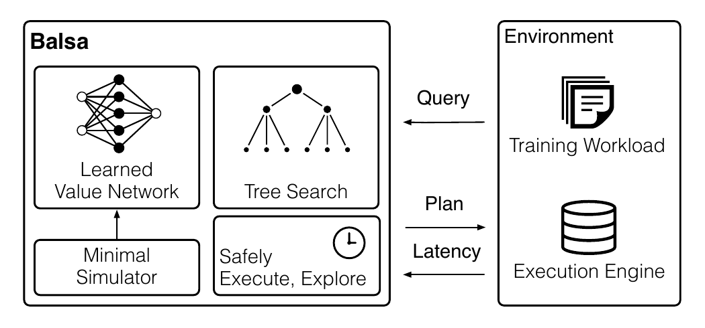

**图 1：Balsa 的体系结构。** Balsa 执行计划并观察引擎返回的延迟反馈，由此学会优化查询。

Balsa 通过试错学习。它优化训练查询、生成不同计划，再在引擎上执行这些计划并观察运行时间。根据运行时间反馈，Balsa 更新自身以纠正错误、强化良好决策。随着反馈回路不断重复，Balsa 越来越擅长生成良好计划。

训练结束后，可以部署 Balsa 来优化一组未见测试查询。智能体的评价维度包括：所生成训练计划的性能、所生成测试计划的性能（即泛化能力）以及学习效率。

学习过程中，Balsa 只访问底层执行引擎来执行计划、观察运行时间，不向现有优化器学习。这个要求来自一项事实：许多数据系统早已有执行引擎，优化器却要很久之后才出现（§1）。

**假设。** 我们假设数据库内容保持静态；模式更新、追加和原地更新可以通过重新训练来处理。这意味着智能体不必在不断漂移的分布上解决学习问题。另一个假设是，Balsa 当前优化 select-project-join（SPJ）块。这符合经典处理方式 [24]：把查询分解为简单 SPJ 块，并逐块优化。

### 2.1 方法

Balsa 的体系结构见图 1，由三个基本组成部分构成：在最小化代价模型中自举一个价值网络；在真实执行中微调价值网络；用树搜索算法构建查询计划。

**经典设计：代价模型 + 枚举。** 经典优化器设计 [24] 使用专家实现的代价模型，它接收一个计划²并输出代价估计：

$$
C:\mathrm{plan}\rightarrow\mathrm{cost}
$$

代价被设计为反映真实执行性能：代价越低，应与执行越快相关。优化器枚举候选计划，再用代价模型评分。对表数较少的查询，通常以动态规划（DP）作为枚举模块。

**RL：价值函数 + 规划。** 代价模型估计计划的即时成本，而 Balsa 学习的是价值函数：它估计将某个计划用作中间步骤（子计划）时，执行整个查询的总体代价或延迟：

$$
V:(\mathrm{query},\mathrm{plan})\rightarrow\text{总体代价或延迟}
$$

给定价值函数，可以自底向上构建计划来优化查询。设查询 $Q$ 连接表 $\lbrace{}A,B,C,D\rbrace{}$。为决定首先执行哪个连接，需要比较所有合法首个连接的总体代价/延迟，即价值：

$$
\lbrace{}A,B,C,D\rbrace{}\Rightarrow [V(Q,A\bowtie B);V(Q,A\bowtie C);\ldots]
$$

也就是说，用 $V$ 为所有二表连接评分；它们都是完成查询 $Q$ 的部分子计划。价值最小的连接是最佳首个连接。假设 $A\bowtie C$ 最好，则继续为所有可能的第二个连接评分：

$$
\lbrace{}A\bowtie C,B,D\rbrace{}\Rightarrow [V(Q,B\bowtie D);V(Q,B\bowtie(A\bowtie C));\ldots]
$$

如此继续规划，最终得到完整查询计划。

与经典代价模型不同，价值函数直接优化完成查询的最终总体代价/延迟——这才是真正关心的目标。此外，学习得到的价值函数可以利用数据适配目标数据库和硬件环境，有可能超过启发式规则。如果已知最优价值函数 $V^{\ast}$，规划就能为查询生成最优计划。我们的目标是尽可能准确地逼近 $V^{\ast}$。

**学习价值网络。** Balsa 用智能体收集的数据训练神经网络 $V _ \theta(\mathrm{query},\mathrm{plan})$（参数为 $\theta$），以逼近最优价值函数。网络的两个输入分别被特征化为查询特征（编码参与连接的表和过滤条件）和计划特征（编码计划的树结构以及每个节点的算子类型）。

价值函数分两个阶段学习。首先，在由最小化代价模型支持的快速模拟环境中学习参数 $\theta _ {\text{sim}}$。接着初始化 $\theta _ {\text{real}}\leftarrow\theta _ {\text{sim}}$，开始在真实执行中微调。两个阶段分别产生价值网络³：

$$
V _ {\text{sim}}:(\mathrm{query},\mathrm{plan})\rightarrow\text{总体代价}
$$

$$
V _ {\text{real}}:(\mathrm{query},\mathrm{plan})\rightarrow\text{总体延迟}
$$

训练结束后，以 $V _ {\text{real}}$ 配合规划来优化新查询。

**第 1 步：从最小化代价模型自举（§3）。** Balsa 首先在查询优化的“模拟器”——即代价模型——中学习。模拟器的关键优势在于，智能体能在学习初期不执行计划就了解灾难性计划。智能体以一个不准确但反馈迅速的代价模型自举初始知识；该模型返回代价估计，不建模目标执行引擎或硬件。

为了训练模拟模型 $V _ {\text{sim}}$，我们用数据收集过程（例如 DP）枚举训练查询集的计划，并向模拟器询问代价。每个查询可以产生数千个训练数据点，最终形成足够大的数据集 $D _ {\text{sim}}=\lbrace{}(\mathrm{query},\mathrm{plan},\text{总体代价})\rbrace{}$。随后以标准监督学习方式在该数据集上训练 $V _ {\text{sim}}$。

**第 2 步：在真实执行中微调（§4）。** 接着，把在模拟器中表现良好的价值函数迁移到真实执行环境。第二阶段用训练好的模拟模型初始化真实执行模型： $V _ {\text{real}}\leftarrow V _ {\text{sim}}$。微调以查询执行和模型更新为迭代单位：每轮中，Balsa 用当前 $V _ {\text{real}}$ 优化训练查询，执行所得计划并测量延迟，再用这些数据更新 $V _ {\text{real}}$，使延迟预测更准确。

真实执行学习的关键难题是缓解慢计划。由 $V _ {\text{sim}}$ 初始化后，Balsa 在第 0 轮的行为会比随机初始化好得多；后者相当于随机挑选计划。第 0 轮后，Balsa 用根据先前运行时间确定的超时值提前终止慢计划（§4.3），并采用安全探索（§5）。

**用树搜索规划。** Balsa 在学习价值函数之上运行树搜索来优化查询。 $V _ {\text{real}}$ 把搜索引向计划空间中有希望的区域；它越准确，就越可能找到更好的计划。树搜索算法的复杂度—最优性权衡各不相同，从贪心规划到蒙特卡洛树搜索等高级算法。我们选择中间路线，使用简单的束搜索（§4.2）。

下文将详细说明 Balsa 的各个组件。

² 我们用“计划”同时指完整计划和部分子计划。

³ 为简化记号，全文用 $V _ {\text{sim}}$ 和 $V _ {\text{real}}$ 分别指模拟模型 $V _ {\theta _ {\text{sim}}}$ 和真实执行模型 $V _ {\theta _ {\text{real}}}$。

## 3. 从模拟中自举

训练第一阶段的目标，是在智能体开始漫长的真实执行学习之前，迅速赋予其基础知识。为此，我们在最小化模拟器（即代价模型）中自举 Balsa。它之所以“模拟”查询优化，是因为查询计划并不实际执行；智能体向模拟器发出大量计划，后者快速返回代价估计，而非测量运行时间。

**为何需要模拟器？** 查询的搜索空间巨大，灾难性执行计划又很常见 [14]。灾难性计划会阻塞学习：智能体可能要等很久，才能在某个慢计划完成后得知这是个坏动作（如果它最终会完成）。这与游戏等 RL 场景恰好相反。在围棋、国际象棋、Atari 等环境中，坏动作通常会让游戏更早结束，因为对手可以利用智能体的错误。

未经模拟训练、随机初始化的 RL 智能体很容易撞上灾难性计划，尤其是在早期。一个简单实验说明了这一点：我们随机初始化 6 个未经模拟学习的智能体，让它们优化 Join Order Benchmark 的 94 个查询（设置见 §8.1）。中位随机智能体生成的计划，工作负载运行时间比专家优化器 PostgreSQL 慢 45×；最慢智能体则慢 79×（2.5 小时对 2 分钟）。

### 3.1 最小化模拟器

Balsa 使用最小化的纯逻辑计划代价模型，它只捕捉“元组越少，计划越好”这一普遍原则。所谓最小化，是因为它不包含有关执行引擎和物理算子（例如合并连接与哈希连接）的先验知识。

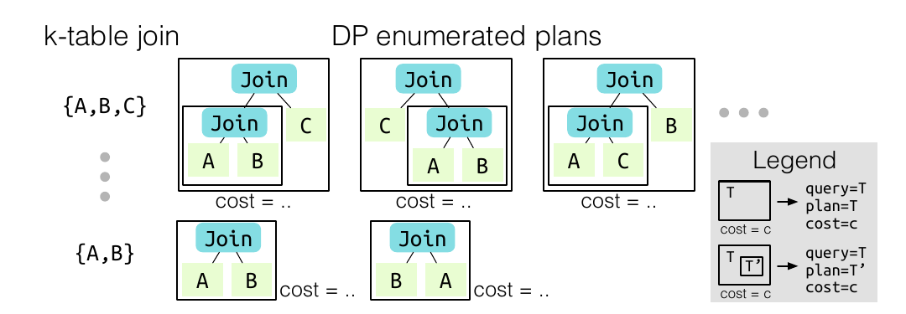

**图 2：模拟数据收集与增强。** 对 DP 中每个 $k$ 表连接，Balsa 收集并增强其枚举出的所有计划。每个带边框的框都会产生一个收集到的数据点（见图例）。

形式上，我们使用 $C _ {\text{out}}$ 代价模型 [5]：

$$
C _ {\text{out}}(T)=
\begin{cases}
|T|, & T\text{ 是表或选择操作}\thickspace{}\\
|T|+C _ {\text{out}}(T_1)+C _ {\text{out}}(T_2), & T=T_1\bowtie T_2
\end{cases}
$$

其中， $|T|$ 表示表（计入过滤条件）或连接的估计基数，由基数估计器得到（§3.3）。该代价模型仅通过对所有算子的估计结果大小求和来估计查询计划代价。

**最小化模拟器的权衡。** 我们选择最小化代价模型，是为了尽量少地注入先验知识。模拟学习的目标，是在智能体开始真实执行时让它避开确定无疑的灾难性计划，而不是灌输专家知识。它也具有通用性：不建模物理细节，因此可用于为任意引擎自举 Balsa。

由于很简单，该代价模型必然不准确。Balsa 会在真实执行微调阶段补全缺失知识并纠正误差（§4）。§8.3.1 将说明，Balsa 虽可利用设计更成熟的代价模型来加速训练，但达到专家级性能并不依赖它们。

### 3.2 模拟数据收集

给定模拟器后，我们用批量数据收集过程尽可能多地提取知识。输出是模拟数据集 $D _ {\text{sim}}=\lbrace{}(\mathrm{query},\mathrm{plan},\text{总体代价})\rbrace{}$，用于训练价值网络 $V _ {\text{sim}}$。具体而言，我们使用动态规划收集数据，DQ [13] 也采用这一方法。

**用动态规划枚举计划。** 对 Balsa 训练工作负载中的每个查询，我们在浓密（bushy）计划空间运行经典 Selinger [24] 自底向上 DP。算法先用基表扫描组成并枚举所有合法二表连接的最佳计划，再枚举三表连接，依此类推。每个枚举计划 $T$ 都从代价模型⁴获得代价估计 $C$，生成数据点 $(\mathrm{query}=T,\mathrm{plan}=T,\text{总体代价}=C)$；这里 $\mathrm{query}=T$ 表示把原查询限制在 $T$ 的表和过滤条件上。该数据点还会经历下述数据增强，产生一组训练点加入 $D _ {\text{sim}}$。

这种数据收集吞吐很高：数据来自所有枚举计划，而不只是最终 DP 结果中的最优计划。因此，其中也包含代价模型判定为次优的计划，从而增加数据多样性并帮助学习。图 2 展示了这个过程。

但对连接表很多的查询，DP 运行时间可能过大。因此，表数不少于 $n$ 时跳过数据收集（我们设置 $n=12$）。也可以采用替代策略。例如，DQ 提出部分 DP：运行前 $j$ 层 DP，其余层用贪心规划。

**数据增强。** Balsa 使用 DQ 提出的数据增强技术，从一个枚举计划产生多个数据点。给定 $(\mathrm{query}=T,\mathrm{plan}=T,\text{总体代价}=C)$， $T$ 的每个子计划 $T'$ 都生成一个独立数据点，它们共享同一个“总体查询” $T$ 和代价：

$$
\lbrace{}(\mathrm{query}=T,\mathrm{plan}=T',\text{总体代价}=C):\forall T'\subseteq T\rbrace{}
$$

该技术显著增加了 $D _ {\text{sim}}$ 的数量和多样性。用 RL 术语解释：增强体现了同一轨迹（总体查询/最终计划）中的所有状态（子计划）共享同一回报，因为中间奖励定义为 0，终止奖励则是最终计划代价的负值。

⁴ Balsa 为 $C _ {\text{out}}$ 枚举物理计划；该模型忽略物理连接/扫描的差异，把它们视为逻辑算子。

### 3.3 讨论

我们发现模拟学习极其有效。§3 开头的实验显示，随机初始化（即不自举）智能体和专家优化器之间最多有 79× 的差距；经过模拟自举后，智能体最差也只比专家慢 5.8×——而且尚未进行任何真实执行。

**基数估计器。** 模拟器需要基数估计器。如 §1 所述，我们选择 PostgreSQL 估计器是因为它简单：使用逐列直方图；对连接启发式地假定独立；对复杂过滤条件使用“魔法常数” [14]。Balsa 不向 PostgreSQL 优化器的代价或计划学习。

使用已有教科书式估计器只是为了方便，而非依赖其良好性能。事实上，Balsa 的大部分质量改善都发生在模拟阶段之后（§8.2、§10）。

**替代代价模型。** Balsa 主张最小化模拟器，但用户若有需要也可以注入更多先验知识。其他代价模型可以逐步加入更多物理算子知识，例如面向内存场景的 $C _ {\text{mm}}$ 模型 [14]。针对其他目标（例如更低内存占用）的新查询引擎，可以继续用 $C _ {\text{out}}$ 自举——其“元组越少越好”的原则通常成立——也可以为目标开发另一种最小化代价模型。

## 4. 从真实执行中学习

模拟学习赋予智能体基础知识，但没有任何模拟器能够完美反映真实执行环境的全部细节。因此，我们通过在真实环境执行查询来微调智能体。

### 4.1 价值函数的强化学习

Balsa 通过强化学习来学习真实执行价值网络 $V _ {\text{real}}(\mathrm{query},\mathrm{plan})\rightarrow\text{总体延迟}$。基本思想是：智能体反复使用当前价值网络优化查询并运行它们，再用延迟反馈改善自身。反馈回路不断运行，收集的执行数据越来越多，智能体的 $V _ {\text{real}}$ 也越来越善于生成好计划。

具体而言，我们以 $V _ {\text{sim}}$ 初始化⁵ $V _ {\text{real}}$，真实执行数据集初始为空，即 $D _ {\text{real}}=\varnothing$。每轮学习包括执行和更新两个阶段。

**执行。** 智能体使用当前 $V _ {\text{real}}$ 优化每个训练查询 $q$，生成执行计划 $p$（规划见 §4.2）。计划在目标引擎执行并测量延迟 $l$，得到数据点 $(\mathrm{query}=q,\mathrm{plan}=p,\text{总体延迟}=l)$；随后进行与 §3.2 相同的子计划数据增强：

$$
D _ {\text{real}}\mathrel{+}=\lbrace{}(\mathrm{query}=q,\mathrm{plan}=p',\text{总体延迟}=l):\forall p'\subseteq p\rbrace{}
$$

**更新。** Balsa 使用收集数据改善 $V _ {\text{real}}$。我们执行随机梯度下降（SGD），损失函数是预测延迟和真实延迟之间的 L2 损失，从而纠正错误预测、强化良好预测。数据点 $(q,p,l)$ 从 $D _ {\text{real}}$ 采样；但模型输出 $V _ {\text{real}}(q,p)$ 的更新目标不是 $l$，而是查询 $q$ 迄今为止所有包含子计划 $p$ 的执行中最佳延迟，这一技术由此前工作 [17] 提出。

延迟标签校正的动机如下。设查询 $q$ 连接 $A,B,C,D$，子计划 $p=\mathrm{Join}(A,B)$ 曾出现在两次执行中：一次接着连接 $C$，另一次接着连接 $D$，延迟可能相差悬殊，例如 1 秒与 100 秒。由于目标是最小化延迟，我们把较低延迟 $l=1$ 定义为子计划 $p$ 的价值，因为 $p$ 确实可以让 $q$ 运行得这样快。迄今为止的最佳延迟从整个 $D _ {\text{real}}$ 计算。

这样，数据收集与价值函数改进交替进行。该算法可视作价值迭代 [29] 或专家迭代 [4]；它的变体近期已用于查询优化 [17]（与 Balsa 不同，该工作每轮都重置并重训价值网络）、定理证明 [21] 和计算调度优化 [2]。

**同策略学习。** Balsa 在上述算法上加入一项新优化：同策略学习。 $V _ {\text{real}}$ 只使用当前 $V _ {\text{real}}$ 生成的数据点更新。换言之，SGD 只从 $D _ {\text{real}}$ 最新一轮的数据点 $(q,p,\verb0_0)$ 采样，而不是使用完整数据集；后者会包含许多轮之前的数据，因此属于异策略。标签校正仍使用整个数据集。

直观地说，最新数据点通常最令智能体意外，而且拥有更快的延迟标签，因而聚焦这些点应当有益。我们发现，同策略学习显著减少每轮 SGD 步数、加速学习，还改善了 Balsa 的计划多样性和性能（§8.3.4）。与使用完全重训方案的既有最先进方法 Neo [17] 相比，同策略学习让 Balsa 的训练快 9.6× 以上（§8.4）。我们推测，该技术也可能改进其他预测运行时间的价值函数应用。

⁵ 通过微调，预测自然会从代价值域变为延迟值域。

### 4.2 计划搜索

给定学习到的价值网络，Balsa 用简单的最佳优先束搜索为查询生成执行计划。

束搜索在搜索状态上运行，每个状态都是查询的一组部分计划。搜索从包含查询全部表（扫描）的根状态开始。大小为 $b$ 的束保存待扩展搜索状态，并按预测延迟排序。⁶ 每步弹出最佳搜索状态，对它应用所有可用动作以生成子状态。每个动作连接当前状态中的两个合法计划，分配一个物理连接算子；如果任一侧为表，还要分配扫描算子。搜索状态由若干部分计划（已连接的关系和尚未连接的表）构成；对它应用动作，最终至少可产生一个完整计划。

然后，用价值网络 $V _ {\text{real}}$ 为所有子状态评分并加入束，束只保留最佳的 $b$ 个状态。学习价值网络就这样引导搜索聚焦计划空间中更有希望的区域。当找到 $k$ 个完整计划时，束搜索终止。Balsa 使用 $b=20$、 $k=10$。

**$\text{Top-}k$ 计划与探索。** 束搜索不保证返回全局最优计划，继续搜索可能找到更好计划。因此，我们持续搜索到获得 $k$ 个完整计划为止；测试时输出列表中的最佳计划。

有趣的是，训练时获得计划列表，还可以在其上实现简单探索。我们把这些计划都视为具有合理的近似最优性，因此从中探索应当安全；束搜索输出时优先选择未见计划。这项技术将在 §5 讨论。

⁶ $V _ {\text{real}}$ 接收 $(\mathrm{query},\mathrm{plan})$，而搜索状态是同一查询的一组部分计划。为给后者评分，定义 $V(\mathrm{state})\equiv\max _ {\mathrm{plan}\in\mathrm{state}}V(\mathrm{query},\mathrm{plan})$。直观而言，一个状态的延迟至少等于其中预测总体延迟最大的子计划。

### 4.3 通过超时实现安全执行

查询优化的一项独特挑战，是即便存在快速计划，庞大的搜索空间中仍充斥昂贵计划。Balsa 从真实执行试错学习时，可能遇到延迟高得不可接受的长运行计划。

Balsa 用分布式系统中的经典思想——超时——解决这一问题。训练按轮进行，因而同一训练工作负载先前的执行时间已知，可用来约束后续迭代。

关键是如何选择初始超时值。得益于模拟学习，我们可以假设真实执行开始时，为一组训练查询首次生成的计划拥有合理但次优的延迟。

**超时策略。** 在第 0 轮的执行阶段（刚完成模拟学习），允许计划完整执行；模拟学习应能给出一个非灾难性的起点。令记录到的最大单查询运行时间为 $T$。

对第 $i\gt{}0$ 轮，所有智能体生成的计划都使用 $S\times T$ 的超时，其中 $S$ 是“松弛因子”。根据 $T$ 的定义，对任意训练查询，都存在一个可在 $T$ 时间内完成的计划。松弛为运行时间波动留出余量，Balsa 使用 $S=2$。

如果计划运行超过当前超时值，就提前终止，因为它无论如何都比该查询此前找到的计划更慢。此时为它赋予一个较大的标签⁷，取代未知的真实延迟。这样的标签会阻止智能体，并使其在后续迭代中远离类似计划。

超时值会逐步收紧。若某轮以最大单查询运行时间 $T'\lt{}T$ 完成，则下一轮超时收紧为 $S\times T'$。这一过程确保超时既不会小到妨碍进展，也不会大到浪费资源，并隐式地为智能体生成难度恰到好处的学习课程。

总之，超时机制显著加速学习：它给每轮执行阶段的运行时间设上界，消除意外停顿，从而实现安全执行。

⁷ 全文使用 4096 秒，也可设为第 0 轮最大单查询运行时间的某个倍数。

## 5. 在真实执行中安全探索

RL 智能体在利用以往经验获得良好性能的同时，也必须探索新经验以跳出局部最优，因此需要探索策略。

然而，大量慢计划是查询优化的独特属性，它还要求探索必须安全，即避开灾难性计划。从搜索空间随机采样的计划很慢 [14]，探索它们会再次阻塞学习。在早期实验中，基础 $\epsilon$-greedy 策略（以较小概率 $\epsilon$ 为每个训练查询随机采样计划，类似 QuickPick [34]）常常选择低劣计划并触发超时，减慢发现更好计划和学习的速度。

为实现安全探索，Balsa 提出一种简单的基于计数的探索技术。这类方法的本质是鼓励智能体探索访问较少的状态或选择次数较少的动作。我们以如下方式实例化这一原则。

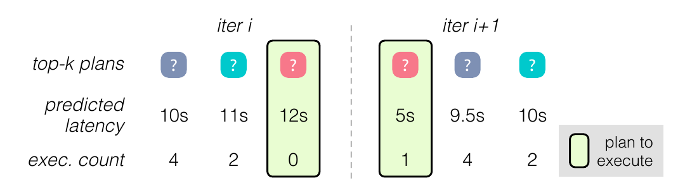

**图 3：安全探索。** 对一个训练查询，Balsa 优先运行树搜索 $\text{Top-}k$ 计划中尚未见过的计划（探索）；如果全都见过，则选择预测最佳计划（利用）。

**束搜索上的基于计数探索。** 目标是为智能体提供由合理计划组成的“信任区域”。束搜索返回按预测延迟升序排列的 $\text{Top-}k$ 计划，而不只是单个最佳计划。系统不执行预测延迟最低的最佳计划，而执行列表中最佳的未见计划。如果 $\text{Top-}k$ 计划全都执行过——表示探索已经充分——Balsa 就退回利用，执行预测最便宜的计划。计划访问次数缓存在哈希表中；由于过去执行已保存在 $D _ {\text{real}}$，开销很低。图 3 用 $k=3$ 的示例统计展示了该技术。

直观而言， $\text{Top-}k$ 计划都“很可能不错”，因为它们来自价值网络引导的束搜索，所以不必严格按照并不完美的预测延迟来选择。因此，在这个“信任区域”内执行新颖的未见计划，既安全又能探索。

## 6. 多样化经验

对学习型查询优化器而言，稳健地优化未见查询至关重要。为进一步增强 Balsa 的泛化性能，我们提出一个简单方法：多样化经验。

**问题：模态多样性。** 由于价值网络引导计划搜索，智能体倾向于只经历其价值网络偏好的计划，并可能逐渐收敛到特征相似的一类计划，即一个“模态” [36]。例如，若哈希连接和循环连接对某个工作负载同样有效，一个智能体可能学会大量使用哈希连接，另一个则可能偏好循环连接。两者都能输出好计划，但可能缺乏关于替代算子或形状的知识。（探索虽然增加计划多样性，新计划仍相对局限在单个智能体的模态内。）模态多样性低，会妨碍智能体泛化到需要陌生模态才能良好优化的、差异很大的未见查询。

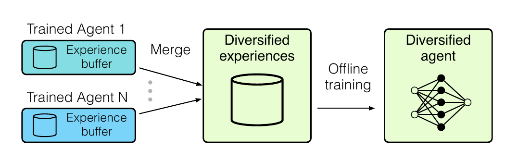

**图 4：多样化经验。** 合并不同智能体收集的经验并重新训练，可产生更稳健的智能体。

**多样化经验。** 我们把多个独立训练、随机种子不同的智能体收集的经验（ $D _ {\text{real}}$）直接合并，再离线训练一个新智能体，不进行任何真实执行。图 4 展示这一过程。关键洞察是：多样化经验覆盖多个模态，在它上面训练能够产生泛化更好的、更稳健的价值网络。

**表 1：多样化经验——数据收集智能体数量与合并后唯一计划数量。** 各智能体的经验高度多样；在 113 个 JOB 查询上训练（详见 §8.1）。

| 智能体数量 | 1 | 4 | 8 |
| --- | ---: | ---: | ---: |
| 唯一计划数量 | 27K（1×） | 102K（3.8×） | 197K（7.3×） |

表 1 验证了这一洞察：唯一计划数量几乎随智能体数量线性增长，说明不同智能体经历的计划确实高度多样。实验表明这种简单方法有效（§8.5），可在算力充足时用更多计算换取更好性能。

## 7. Balsa 实现

本节说明 Balsa 的详细训练设置。概括而言，要把 Balsa 用于新引擎，需要：

- 一个执行环境（能执行计划并支持超时）；
- 搜索空间定义（查询算子集合及组合规则）。

**优化。** 我们通过并行数据收集、计划缓存和流水线优化训练。查询执行使用 Ray [18] 分派到一组相同虚拟机，每台都运行目标数据库实例。每台 VM 每次只运行一个查询，以避免相互干扰。计划缓存让重复提交的计划可以快速查到以往运行时间，跳过重新执行。

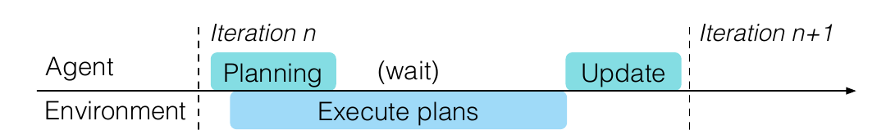

**图 5：智能体规划与远程查询执行的流水线。**

每轮中的规划和远程查询执行采用流水线方式（图 5）：主智能体线程一完成某个训练查询的树搜索，输出计划就被发送到远程执行；随后立即开始规划下一个查询，使两个阶段重叠。智能体等待所有计划完成后，再更新价值网络。

**价值网络细节。** $V _ {\text{sim}}$ 和 $V _ {\text{real}}$ 被实现为简单树卷积网络 [17]，包含 70 万个参数，占 2.9MB。早期也尝试过 Transformer [32]，效果相近，但计算成本更高。训练或更新价值网络时，从经验数据中抽取 10% 作为验证集，用于早停。

价值网络的查询和计划输入编码如下。计划采用与 Neo [17] 相同的编码。查询被特征化为向量 $[\text{table}\rightarrow\text{selec{}tivity}]$，每个槽对应一个表并保存其估计选择率（§3.3），不存在的表以 0 填充。这种编码比 Neo 和 DQ [13] 都更简单。

## 8. 评估

我们对 Balsa 进行了深入评估，主要发现如下：

- Balsa 通过试错生成更好的执行计划，按工作负载运行时间衡量，比两个专家优化器 PostgreSQL 和“CommDB”⁸ 快最多 2.1–2.8×（§8.2）。
- Balsa 用数小时即可超过专家，再用数小时达到测试工作负载上的峰值性能（§8.2）。
- Balsa 虽不向专家优化器学习，却优于依赖专家示范的既有最先进方法 [17]；我们还识别出该方法可能出现泛化不佳的故障模式（§8.4）。
- 多样化经验显著增强泛化，包括泛化到连接模板高度不同的查询（§8.5）。
- Balsa 学到了新颖的算子和计划形状偏好（§8.6）。

此外，§8.3 通过细致消融实验分析 Balsa 的设计选择。

⁸ 一个领先的商业 DBMS。受其许可条款 [22] 限制，我们对名称做匿名处理。

### 8.1 实验设置

我们使用以下工作负载；每个工作负载中，Balsa 都在一组训练查询上训练，再在一组未见查询上测试。

**Join Order Benchmark（JOB）** 包含 Leis 等人 [14] 设计的 113 个分析查询，基于 Internet Movie Database 的真实世界数据集，专门用于给查询优化器施压。查询含复杂连接和谓词，连接数范围为 3–16，平均每个查询 8 个连接。我们评测两个训练—测试划分，每个都包含 94 个训练查询和 19 个测试查询：

- **随机划分（记为“JOB”）：** 随机采样划分。
- **慢查询划分（记为“JOB Slow”）：** 测试集由专家优化器规划时运行最慢的 19 个查询组成。

随机划分测试平均情况；慢查询划分则评估测试查询比训练查询运行慢到最大程度的情形。

**TPC-H** 是标准分析基准，其数据和查询由均匀分布生成。我们使用规模因子 10，以 70 个查询训练、10 个查询测试。⁹

**专家基线和引擎。** 我们与两个成熟专家系统的优化器比较：开源 PostgreSQL 12.5 和匿名的领先商业 DBMS CommDB [22]。对每个专家，都把 Balsa 的计划与该优化器在同一引擎执行的计划比较；Balsa 的计划通过 hint 注入 [7]。

我们使用配备 8 核 CPU、64GB 内存和 SSD 的 Microsoft Azure VM，训练使用 NVIDIA Tesla M60 GPU。PostgreSQL 配置为 32GB shared buffers 和 cache size、4GB work memory，并禁用 GEQO，与 Leis 等人 [14] 的设置相近。CommDB 按其调优指南进行了充分优化。

JOB 工作负载上训练 500 轮；TPC-H 搜索空间更小，训练 100 轮。Balsa 使用前文讨论的全部组件和默认值。

**专家性能。** 按照 Leis 等人 [14] 的建议，我们创建全部主键和外键索引，使基线运行 JOB 的速度远快于先前工作 [17, 31]；这也让搜索空间更复杂、更具挑战。¹⁰

**指标。** 除非另行说明，每个实验重复 8 次并报告中位数。训练/测试曲线的阴影区域显示完整最小—最大范围。工作负载运行时间定义为各查询延迟之和；归一化运行时间相对于专家运行时间计算。

⁹ TPC-H 以模板 3、5、7、8、12、13、14 训练，模板 10 测试，每个模板生成 10 个查询。由于 `pg_hint_plan` 扩展的限制，避开使用视图、子查询等高级 SQL 特性的模板。

¹⁰ PostgreSQL 运行时间（训练/测试）：JOB 115 秒/24 秒；JOB Slow 44 秒/98 秒；TPC-H 452 秒/49 秒。我们没有像 Leis 等人建议的那样禁用嵌套循环连接，因为创建索引后这样做反而让专家运行 JOB 慢 60%。

### 8.2 Balsa 性能

首先用端到端结果回答：Balsa 在训练和测试查询上的性能如何？它分别需要多少小时（以及多少次执行）才能超过专家性能并达到峰值性能？

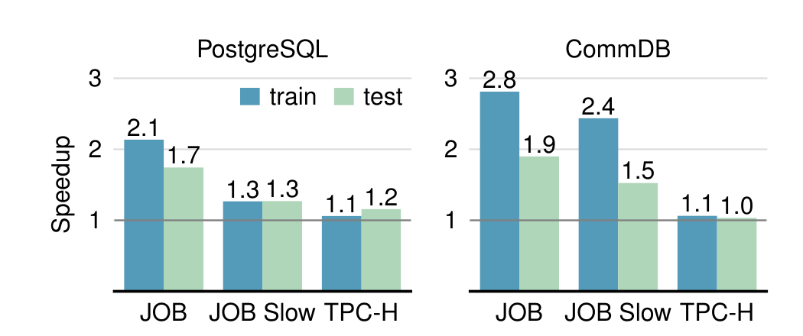

**图 6：Balsa 在 PostgreSQL（左）和 CommDB（右）上的性能。** 图中给出 Balsa 计划相对各专家优化器计划的工作负载加速比；每根柱为 8 次运行的中位数。

**性能。** 图 6 汇总总体性能。在所有工作负载上，Balsa 都能从最小化代价模型出发，学会以显著幅度超过专家优化器。

在 PostgreSQL 上，Balsa 对 JOB 训练集加速 2.1×，对 JOB Slow 加速 1.3×，对 TPC-H 加速 1.1×。测试集加速略低于训练集，但 Balsa 仍可生成比专家更快的执行计划，例如 JOB 上快 1.7×，证明它能泛化到未见查询。

Balsa 也超过 CommDB 优化器。训练集加速 1.1–2.8×，测试集加速 1.0–1.9×。之所以比 PostgreSQL 上更高，是因为 CommDB 不公开浓密计划 hint，允许的搜索空间小得多；按计划形状和算子计数，我们估计对平均规模 JOB 查询小约 1000×。因此，Balsa 可以更全面地探索这个较小空间。

**模拟学习运行时间。** 表 2 表明，模拟阶段数据丰富，耗时数十分钟。相对于真实执行学习时间，它只占一小部分，后文将聚焦后者。

**表 2：模拟学习效率。** 模拟数据集大小、数据收集时间（分钟）和训练时间。训练时间因早停而不同；给出均值 ± 标准差。

| 工作负载 | 大小 | 收集时间（分钟） | 训练时间（分钟） |
| --- | ---: | ---: | ---: |
| JOB | 516K | 6.8 ± 0.1 | 24 ± 8 |
| JOB Slow | 551K | 7.6 ± 0.1 | 28 ± 10 |
| TPC-H | 12K | 1.1 ± 0.01 | 1.0 ± 0.2 |

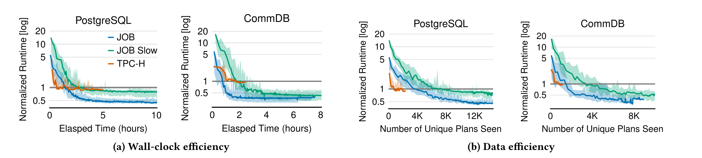

**图 7：Balsa 的学习效率。** 训练查询的归一化运行时间（对数刻度）分别与（a）经过时间、（b）已执行计划数的关系。

**学习效率。** 图 7 以经过时间和执行过的不同查询计划数量为自变量展示 Balsa 的训练性能。后者在 RL 中称为数据/样本效率，因为每次执行都是一次与环境的交互。

**墙钟效率。** 图 7a 展示真实执行阶段的墙钟效率。Balsa 起初比专家慢数倍，这是从简单模拟器自举后的性能。只需数小时学习，Balsa 即可达到专家性能：PostgreSQL 上 JOB 需 1.4 小时、JOB Slow 需 2.5 小时、TPC-H 需 1.5 小时；CommDB 搜索空间更小，因此快约 0.5 小时。Balsa 随后继续改善，约 4–5 小时达到峰值。TPC-H 的连接更少、可优化空间更小，收敛也更快。

**数据效率。** 图 7b 展示数据效率。Balsa 执行数千个计划即可达到专家性能：PostgreSQL 上 JOB 需 3.2K、JOB Slow 需 7.4K、TPC-H 需 0.7K；CommDB 上需要的计划约少 60%。智能体初始性能越慢，达到专家性能所需计划越多；因此，经历更多计划有助于 Balsa 获得更大幅度的改善。

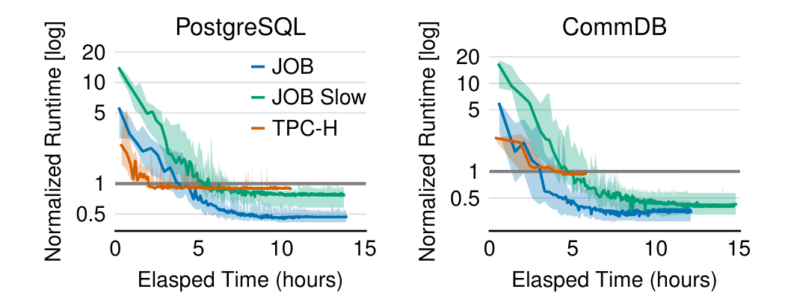

**图 8：非并行训练模式下的墙钟效率。**

**非并行训练墙钟时间。** 上述评估和图 7 中，每次运行平均使用 2.5 个查询执行节点加速训练。图 8 补充展示每次运行只用一个执行节点时的训练时间。所有情况下都在个位数小时内达到峰值，适合“夜间维护”；达到专家性能最多比并行模式慢 3 小时。

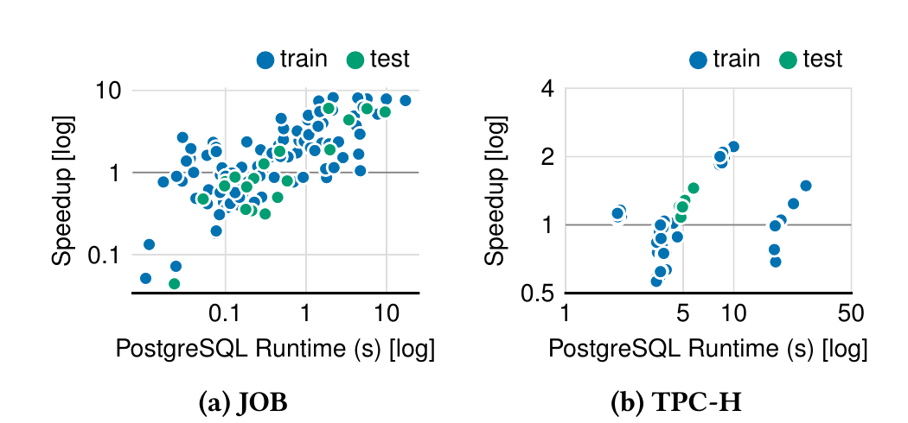

**图 9：Balsa 的逐查询加速分解。** 每个查询的加速比（对数刻度）与 PostgreSQL 专家运行时间（对数刻度）的关系。

**加速来源。** 图 9 显示 Balsa 相对 PostgreSQL 计划的逐查询加速。对 JOB，Balsa 在训练集和测试集的大多数查询上都生成更好计划，尤其显著加速最慢查询。减速主要出现在本来就执行很快的查询上，对总运行时间影响很小。TPC-H 也呈现类似趋势。

**小结。** Balsa 可以从最小化代价模型自举并学会超过开源和商业专家优化器。它训练高效，只需数小时即可追平专家，数千个计划即可达到峰值性能。

### 8.3 设计选择分析

接下来分析 Balsa 各主要组件的设计选择：（1）初始模拟器；（2）超时机制；（3）探索策略；（4）训练方案；（5）束搜索。总的来说，所有组件都对 Balsa 的性能和泛化有正面贡献。

每个实验只改变一个组件，其余保持默认，并测量 PostgreSQL 上 JOB 随机划分的性能。图中以粗体突出默认选择。

#### 8.3.1 初始模拟器的影响

Balsa 从最小化模拟器自举。可以考虑两种先验知识量差异最大的替代方案：

- **专家模拟器：** 专家优化器 PostgreSQL 的代价模型，它精细建模所有物理算子并捕捉执行引擎细节。注意，这个变体只是把代价模型用作 Balsa 的模拟器，并不代表 PostgreSQL 自身的计划。
- **Balsa 模拟器（§3； $C _ {\text{out}}$）：** 对所有算子的估计结果大小求和的最小化代价模型，不含物理算子或执行引擎知识。
- **无模拟器：** 完全跳过自举，以随机权重初始化智能体。

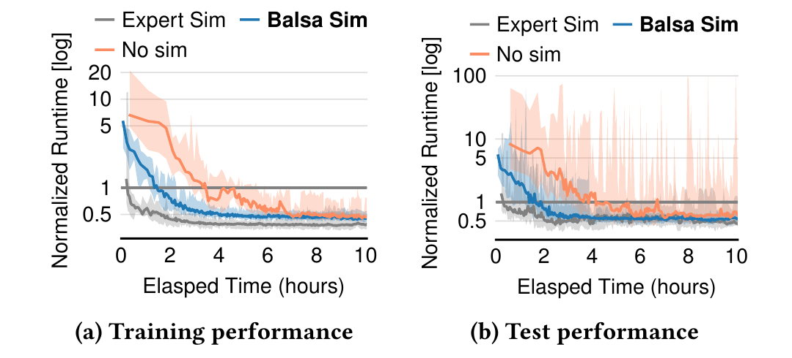

**图 10：初始模拟器的影响。**（a）更好的模拟器会加速学习；（b）模拟对泛化至关重要。

图 10 带来四项观察。

第一，先验知识越多，训练查询达到专家性能的时间越短（图 10a）。专家模拟器只需约 0.3 小时，默认 Balsa 模拟器约需 1.4 小时，无模拟学习的智能体约需 3.8 小时。

第二，先验知识越多，训练结束时的最终性能也略好，但差距较小。使用最小化模拟器的智能体基本追上了专家模拟器。

第三，出人意料的是，“无模拟”智能体也能完成训练。这得益于超时和安全探索，使大部分学习保持安全。

第四，模拟对泛化至关重要。无模拟智能体可能在测试时失败（图 10b 方差很大）；尽管训练表现良好，测试不稳定使该方案不实用。原因是随机初始化智能体过拟合于真实执行阶段收集的少量经验：每轮约 700 个子计划，因此即便每轮数据全都唯一，至少也要约 700 轮才能追上包含 50 万计划的模拟数据集。

总之，从最小化模拟器自举可在训练和测试时都取得良好性能。新执行引擎可能没有专家开发的代价模型，这种方案还可能泛化到新系统并降低人工开发成本。

#### 8.3.2 超时机制的影响

我们比较：

- **超时：** 执行超过当前轮超时值时，提前终止查询计划。
- **无超时：** 关闭该机制。

有超时时，智能体应当能少花时间在无希望计划上，从而更快学习。

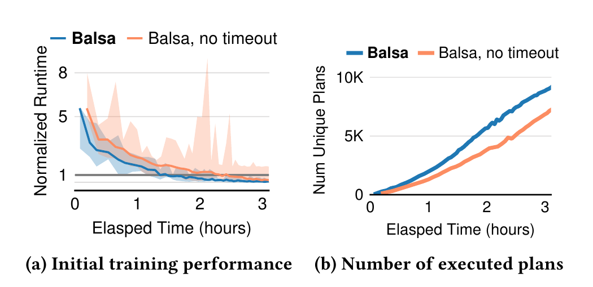

**图 11：超时机制的影响。**（a）超时加速学习并防止尖峰；（b）在相同墙钟时间内，有超时的智能体执行更多计划，提高计划多样性。

图 11 显示，使用超时的智能体达到专家性能约快 35%。两种选择的最终性能相近，但早期阶段差异明显：无超时智能体可能执行昂贵计划，出现显著尖峰；这种回退不可预测，甚至会在达到专家性能后发生。

启用超时后，提前终止的计划会把智能体“推”向其他、更有希望的方向。相同墙钟时间内，它们执行更多计划，从而加速学习。总体上，超时机制既加速学习，也改善 Balsa 的计划多样性。

#### 8.3.3 探索的影响

探索让 RL 智能体接触更多样的状态，从而增强性能和泛化。比较三种方案：

- **基于计数的探索（§5）：** Balsa 的安全探索方法，从束搜索输出中选择最佳未见计划。
- **$\epsilon$-greedy 束搜索：** 每个搜索步骤以较小概率 $\epsilon$ 把束“压缩”为一个状态并丢弃其余状态，随后照常搜索。选择 $\epsilon$ 使约 10% 的训练查询会注入随机连接。
- **无探索：** 不使用探索算法。

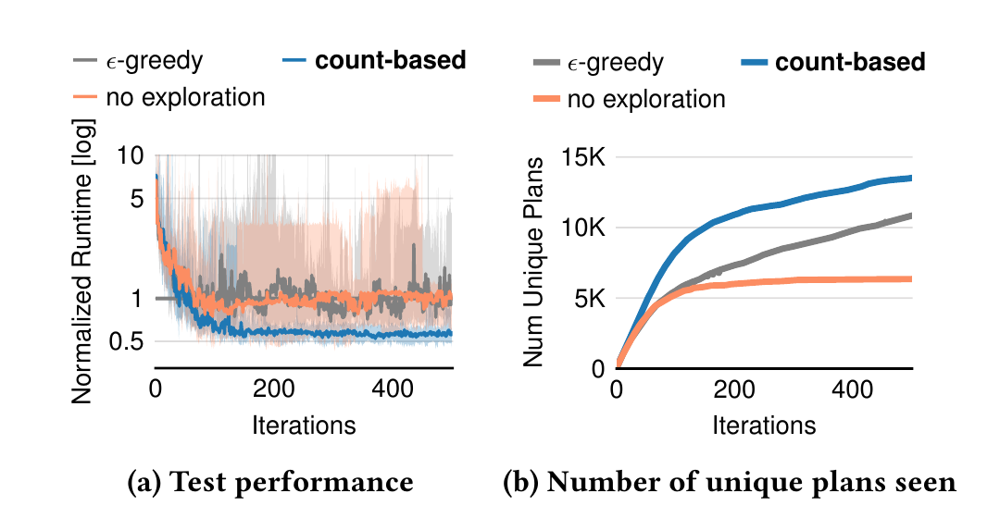

**图 12：探索的影响。** Balsa 基于计数的安全探索改善了对未见测试查询的泛化。

图 12a 显示，基于计数安全探索的智能体在测试查询上明显优于其他变体，这是因为它们经历了更多不同计划（图 12b）。为节省空间未画训练性能；收敛时，基于计数方法分别比无探索和 $\epsilon$-greedy 束搜索快约 8% 和 14%。

有趣的是， $\epsilon$-greedy 束搜索与基于计数方法的计划多样性相近，却更不稳定。因为它包含随机连接，即使价值网络引导后续搜索，也可能只能得到低质量完整计划。可见安全探索并不平凡，而 Balsa 的基于计数方法简单有效。

#### 8.3.4 训练方案的影响

我们把 Balsa 的同策略学习与 Neo [17] 的完全重训方案比较：

- **同策略学习（§4.1）：** 用最新一轮数据更新 $V _ {\text{real}}$。
- **重训：** 每轮重新初始化 $V _ {\text{real}}$，并在完整经验 $D _ {\text{real}}$ 上重训；丢弃上一轮的 $V _ {\text{real}}$。

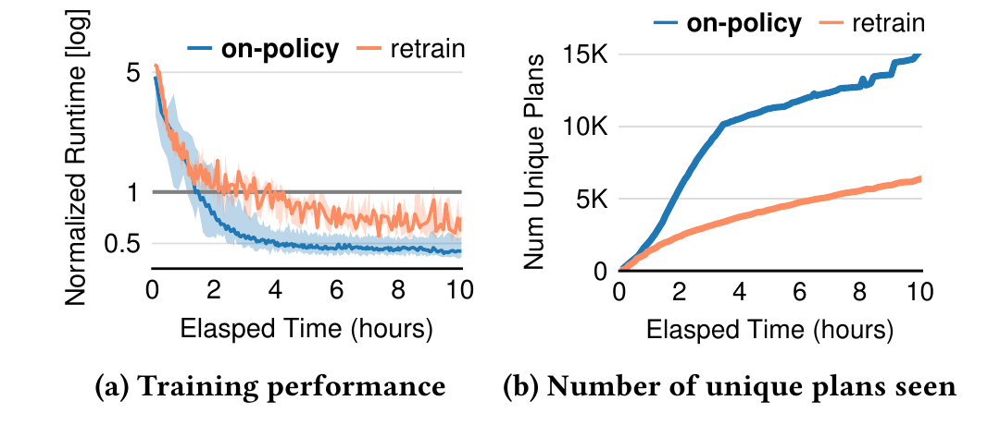

**图 13：训练方案的影响。**（a）同策略学习加速训练；（b）节省的时间用于更多探索。

同策略学习显著加速训练，达到专家性能的速度比重训智能体快 2.1×，且领先贯穿训练全程。原因在于，同策略只在固定大小数据集上更新，而不是在不断增长的数据集上完全重训；节省的时间可用于探索，即执行更多唯一计划（图 13b），更好的探索又进一步加速学习。同策略因 SGD 数据较少，方差略高，但最慢的同策略智能体仍几乎总比重训智能体快。

#### 8.3.5 规划时间的影响

Balsa 使用束大小 $b$ 的束搜索，由价值网络生成 $k$ 个完整查询计划，再选择最佳计划执行；训练时选最佳未探索计划。图 14 在训练好的 checkpoint 上，以不同 $b,k$ 组合测试 JOB 测试查询的规划时间和性能。

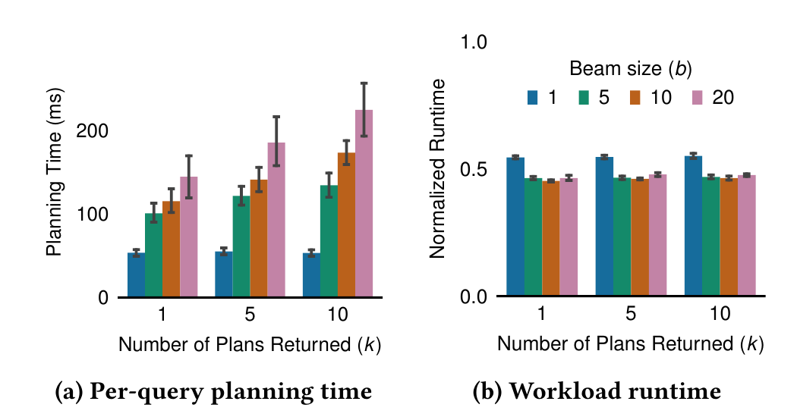

**图 14：搜索参数对 JOB 测试集规划时间和性能的影响。** 给出均值与标准差。

所有设置的平均单查询规划时间都低于 250ms。规划器以 Python 实现，仍有优化空间。 $b=1$ 时束搜索退化为贪心搜索，性能略受损；其余设置产生运行时间相近的计划。因此，Balsa 对这些参数不敏感，部署时可以灵活使用较小值来缩短规划时间。例如 $b=5,k=1$ 可使规划快 2× 而性能不降。训练时使用 $b=20,k=10$，因为较大值有助于探索。

### 8.4 与向专家示范学习的比较

我们把 Balsa 与近期学习型优化器 Neo [17] 比较。Neo 依赖 PostgreSQL 生成的计划，即从专家示范学习。实验设置与 §8.3 相同。Neo 未开源，因此我们尽力复现并记作 “Neo-impl”。两种方法使用相同建模选择（架构、特征化、束搜索等）；对 Neo-impl 则关闭 Balsa 的算法组件：模拟自举、同策略学习、探索和超时。一个显著差别是，Neo 每轮都把模型完全重置为随机权重，再用全部收集经验重训。

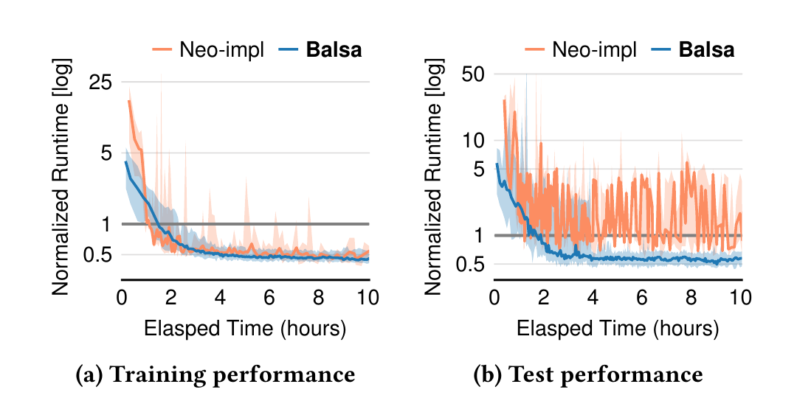

**图 15：与向专家示范学习的比较。**

图 15a 展示训练性能。初始化时 Balsa 比 Neo-impl 快 5×，因为模拟学习带来高状态覆盖率（表 2），而专家示范数量有限，每个查询只有一个完整计划。Balsa 借助超时在整个训练中保持稳定；Neo-impl 没有处理灾难性计划的机制，会出现性能尖峰和较大方差，而且回退可能在训练数小时后突然发生。

Neo-impl 的重训方案随经验累积而越来越慢：完成 100 轮约需 25 小时，Balsa 只需 2.6 小时。令人意外的是，Neo-impl 学习 5 小时后训练性能虽相对稳定，在未见测试查询上仍不稳健且方差很高（图 15b）：中位工作负载运行时间在比专家慢 1–5× 之间波动，最坏可慢 10×。这种故障模式可能使模型无法可靠部署。

Balsa 明显更稳健，在未见查询上持续生成比专家更快的计划，最大加速 2×。它更好的泛化来自模拟、同策略学习和安全探索提供的更广状态覆盖（图 12、13）。总之，Balsa 学得更快、执行安全、借助模拟与更佳探索实现更好泛化，否定了此前“必须有专家示范”的观点 [17]。

#### 8.4.1 与 Bao 比较

Bao [16] 也假设专家优化器存在，并像 Neo 一样需要专家示范训练。Bao 学习为每个查询提供一组 hint（例如禁用哈希连接），“引导”专家优化器生成更好计划；Balsa 则自行生成物理计划。尽管如此，我们仍比较 Balsa 和 PostgreSQL 上 Bao 所生成计划的性能。

我们对 Bao 源码 [1] 做了两项重要优化。第一，开启用 PostgreSQL 专家计划自举模型的优化，而不是从随机状态开始。第二，Bao 论文规定在最近 $k=2000$ 条经验上训练，但我们发现这导致性能很不稳定，因此改为使用全部历史经验，稳定收敛。

**表 3：Balsa 与 Bao 相对 PostgreSQL 的加速比。**

| 方法 | JOB 训练 | JOB 测试 | JOB Slow 训练 | JOB Slow 测试 |
| --- | ---: | ---: | ---: | ---: |
| Balsa | 2.1× | 1.7× | 1.3× | 1.3× |
| Bao | 1.6× | 1.8× | 1.2× | 1.1× |

表 3 显示 Balsa 总体达到或超过 Bao。这并不意外：结果印证 Bao 论文的发现，在稳定工作负载上，自由度（动作空间）更大的学习型优化器可以在计划质量上超过 Bao。

### 8.5 增强泛化

图 6 已表明 Balsa 能很好地泛化到未见测试查询，无需见过它们就能超过专家。本节研究：（i）多样化经验的收益；（ii）泛化到完全不同的连接模板/过滤条件。

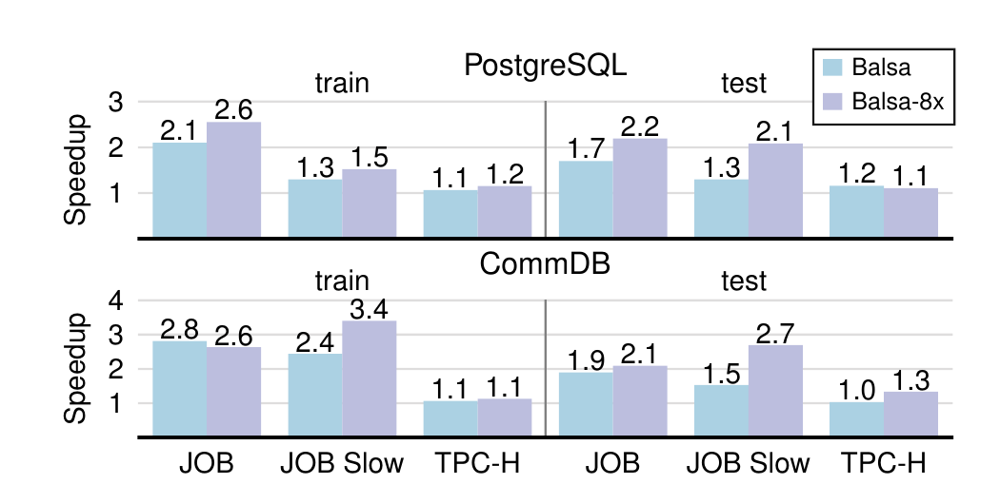

**图 16：利用多样化经验增强泛化。**

**多样化经验。** 对图 6 中所有工作负载/引擎，我们合并每个主实验的 8 个智能体数据，构建多样化经验，并在上面重训一个新智能体，称为 “Balsa-8x”。该过程重复 8 次以控制训练方差；它不执行查询，因此训练高效。

图 16 显示中位性能：Balsa-8x 在几乎所有情况下都改善训练和测试查询的加速比，有时甚至提高 60–80%（JOB Slow 测试）。训练集改善容易理解：重训智能体可组合各基础智能体找到的最佳计划。更重要的是，从未执行过的测试查询也获得很大加速，例如两个引擎上两种 JOB 划分的测试加速都超过 2×。原因是多样化经验含有高度多样的计划，能训练出更可泛化的价值网络。

**连接模板全新的查询。** 首先，我们把 JOB 最慢的 4 个模板（17、16、6、19）作为测试集（20 个查询），其余作为训练集。Balsa 在这个新划分上取得良好训练/测试加速（1.4×、1.5×），进一步验证稳健性。

其次，在 Extended JOB（Ext-JOB）这一困难泛化工作负载 [17] 上评估。它在同一 IMDb 数据集上包含 24 个新查询，连接数 2–10，平均每个查询 5 个连接。它们包含与原 JOB 完全不同的连接模板和谓词，因此具有挑战性且“分布外”。

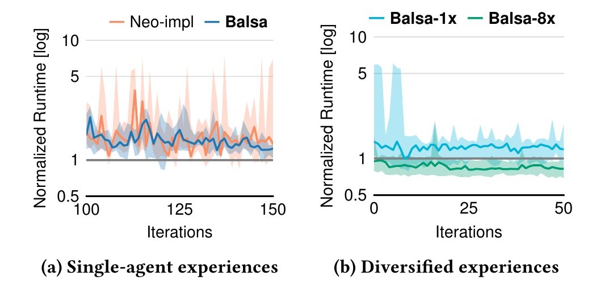

**图 17：泛化到高度不同的连接模板。** 以 JOB 为训练集，在 PostgreSQL 上测试 Ext-JOB 性能。（a）单智能体经验；（b）多样化经验。

图 17a 使用全部 113 个 JOB 查询作为训练集，显示 Neo-impl 与 Balsa 在 Ext-JOB 上的测试性能。Balsa 比 Neo-impl 稳定，但都未超过专家（虽已接近），说明 Ext-JOB 确实是很困难的泛化工作负载。

随后比较使用 8 个智能体数据重训的 Balsa-8x 与只用一个智能体数据重训的 Balsa-1x。令人意外的是，第 0 轮时 Balsa-8x 已在测试集达到专家性能（图 17b）。随后允许它们在训练集继续学习 50 轮；整个过程中从不在 Ext-JOB 测试查询上训练。Balsa-8x 在 Ext-JOB 上取得显著更好的测试性能，比专家快 20%；Balsa-1x 仍无法达到专家水平，而且差距始终存在。结果表明，多样化经验和进一步探索是改善分布外查询泛化的有效策略。

### 8.6 Balsa 学到的行为

为直观理解 Balsa 的行为，我们可视化训练过程中智能体生成计划的算子与形状组成，结果见图 18。

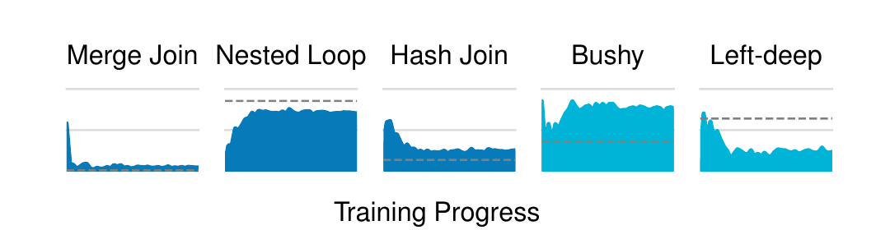

**图 18：Balsa 在 JOB 上使用的连接算子（深蓝）和计划形状（浅蓝）。** 虚线是 PostgreSQL 计划中的数量。

训练早期，Balsa 很快学会减少当前环境中运行时间高的算子和形状。例如，25 轮后，合并连接使用率保持在 10% 以下；同时开始偏好更高效的选择。嵌套循环连接很受偏爱，因为其中很大比例是高效的索引变体（跨各轮为 85%）。

Balsa 的偏好与专家不同，计划形状上的差异尤其明显。原因在于专家优化器是“一体适用”，而 Balsa 学会针对给定工作负载和硬件定制。

## 9. 相关工作

**学习型查询优化器。** Balsa 与 DQ [13] 和 Neo [17] 最相关。DQ 指出，查询优化的经典组件——代价估计和计划枚举——可以转化为长期价值估计与规划。三者都遵循这一表述，使用学习价值网络和计划搜索。Balsa 在模拟学习中也采用 DQ 的方法，在代价模型上批量收集数据；与 DQ 不同，Balsa 证明可在真实执行中微调整个工作负载。

Neo 需要先向专家示范（PostgreSQL 计划）学习，再进行微调。Balsa 则不向专家优化器学习。解除这一限制性假设，让未来环境中自动学习查询优化成为可能。Balsa 还有三项重要区别：（i）从模拟器学习与从专家示范学习根本不同；专家示范的数量和多样性天然有限（每个查询一个专家计划），模拟则可提取尽可能多的经验，增强泛化。（ii）Balsa 处理灾难性慢计划。（iii）Balsa 提出多项新技术，例如同策略学习、以超时构建学习课程、安全探索和多样化经验，它们分别提高效率、性能或稳健性。§8.4 表明，即便不向专家优化器学习，Balsa 也比专家示范方法性能更高，在未见查询上更稳健。

SkinnerDB [31] 是一种执行算法，在查询执行期间尝试多种左深连接顺序并学习。Balsa 和 SkinnerDB 都用超时缓解坏计划，但策略明显不同：SkinnerDB 必须遍历一组与先前执行无关的预定义超时；Balsa 直接使用过去计划的延迟。Balsa 的能力也更通用，可构建浓密计划并分配物理算子，而 SkinnerDB 均不支持。

**优化器助手。** 很多近期工作用 ML 辅助或改进现有优化器。Leis 等人 [14] 指出，不准确的基数估计是差计划的首要原因，此后大量项目用 ML 改善基数估计 [8, 10, 12, 25, 28, 35, 37–39]，帮助现有优化器找到更好计划。Bao [16] 则学习为每个查询设置哪些优化器开关。与这些工作不同，Balsa 不辅助现有优化器，而是处理没有专家优化器时如何学习优化的问题。

**模拟到现实、超时和缓存** 是可用于多种系统问题的通用技术。Hilprecht 等人 [9] 使用模拟到现实学习高质量数据分区，并用超时和缓存优化训练。Balsa 把这些方法用于学习型查询优化，并提出新的发现：模拟学习可以改善泛化。

## 10. 经验与讨论

开发 Balsa 的过程中，我们获得了以下经验。

**模拟学习增强泛化。** 令人惊讶的是，Balsa 能很好地泛化到未见查询，而没有模拟阶段的智能体——包括从专家示范学习的智能体——在新查询上会变得不稳定（§8.3.1、§8.4）。乍看之下，模拟改善泛化似乎违反直觉：我们使用的模拟器只是与执行环境无关的最小化纯逻辑代价模型，会把不准确知识传给智能体，随后还必须纠正。

我们认为，原因在于模拟让 Balsa 高度覆盖计划空间。自举时，Balsa 每个查询训练数千个计划（表 2），远多于真实执行收集的经验。进入真实执行后，经过自举的智能体可以更新信念，同时纠正大量模拟知识，从而改善泛化。相反，只向真实执行学习的智能体只见到很小一组查询计划，容易过拟合。

**使用不准确的基数估计。** 传统优化器的基数估计众所周知地不准确 [14]，会导致差计划。但 Balsa 找到了不准确估计的有效用途：把它用在模拟器中。即便估计不准确，模拟仍然有效。¹¹ 更重要的是，Balsa 性能并没有过度绑定模拟器；大部分学习发生在模拟之后，Balsa 用真实执行大幅改进模拟知识，例如图 7 中初始和最终性能相差 4–40×。与既有工作 [14] 一致，我们预期更好的估计会带来更好的模拟器，从而加速学习，例如图 10 的“专家模拟器”。

**如果已有专家优化器，如何更好地利用？** 即便存在兼容的专家优化器——即目标引擎支持其所有算子——既有最先进方法 [17] 也只从专家计划自举。§8.4 表明，示范数量有限会导致泛化不佳。Balsa 可以更好地利用专家：从专家优化器的代价模型这个数据丰富的模拟器自举（图 10 的“专家模拟器”变体）。§8.3.1 证明从代价模型自举显著改善对新查询的泛化，这是本文的新发现。

¹¹ 我们使用 PostgreSQL 估计；它在 JOB 上的中位误差约为 100×，尾部误差最高达 $10^6$× [14]。我们还向这些估计注入随机噪声、进一步扰动它们（噪声因子中位数 5×），Balsa 的计划几乎不受影响。

## 11. 结论

据我们所知，Balsa 首次证明，不依赖专家示范也可以高效地学会优化器。Balsa 反复规划一组给定查询、执行计划并从延迟中学习，以便未来构建更好的执行计划。为了使学习切实可行，它必须避开会严重阻碍学习的灾难性计划；我们用三项简单技术解决这一关键难题：从模拟器自举、安全执行和安全探索。

Balsa 为自动学习针对工作负载和计算环境定制的查询优化器铺平了道路。新数据系统可能拥有超出现有查询优化知识的执行模型 [20] 或目标 [19]。Balsa 自主学习而非向专家系统学习，有望降低未来系统高昂的优化器开发成本；它是迈向这一令人振奋方向的第一步。

## 参考文献

[1] 2020. Bao source code. https://github.com/learnedsystems/BaoForPostgreSQL.

[2] Andrew Adams, Karima Ma, Luke Anderson, Riyadh Baghdadi, Tzu-Mao Li, Michaël Gharbi, Benoit Steiner, Steven Johnson, Kayvon Fatahalian, Frédo Durand, et al. 2019. Learning to optimize halide with tree search and random programs. *ACM Transactions on Graphics (TOG)* 38, 4 (2019), 1–12.

[3] Ilge Akkaya, Marcin Andrychowicz, Maciek Chociej, Mateusz Litwin, Bob McGrew, Arthur Petron, Alex Paino, Matthias Plappert, Glenn Powell, Raphael Ribas, et al. 2019. Solving rubik’s cube with a robot hand. *arXiv preprint arXiv:1910.07113* (2019).

[4] Thomas Anthony, Zheng Tian, and David Barber. 2017. Thinking Fast and Slow with Deep Learning and Tree Search. In *Proceedings of the 31st International Conference on Neural Information Processing Systems* (Long Beach, California, USA) (NIPS’17). 5366–5376.

[5] Sophie Cluet and Guido Moerkotte. 1995. On the complexity of generating optimal left-deep processing trees with cross products. In *International Conference on Database Theory*. Springer, 54–67.

[6] PostgreSQL developers. [n. d.]. Commit history of the PostgreSQL optimizer. https://github.com/postgres/postgres/commits/master/src/backend/optimizer/. [Online; accessed February, 2021].

[7] NTT OSS Center DBMS Development and Support Team. 2020. pg_hint_plan. https://github.com/ossc-db/pg_hint_plan.

[8] Anshuman Dutt, Chi Wang, Azade Nazi, Srikanth Kandula, Vivek Narasayya, and Surajit Chaudhuri. 2019. Selectivity estimation for range predicates using lightweight models. *Proceedings of the VLDB Endowment* 12, 9 (2019), 1044–1057.

[9] Benjamin Hilprecht, Carsten Binnig, and Uwe Röhm. 2020. Learning a Partitioning Advisor for Cloud Databases. In *Proceedings of the 2020 ACM SIGMOD International Conference on Management of Data* (Portland, OR, USA) (SIGMOD ’20). Association for Computing Machinery, New York, NY, USA, 143–157.

[10] Benjamin Hilprecht, Andreas Schmidt, Moritz Kulessa, Alejandro Molina, Kristian Kersting, and Carsten Binnig. 2020. DeepDB: Learn from Data, not from Queries! *Proceedings of the VLDB Endowment* 13, 7 (2020), 992–1005.

[11] Andy Kimball. 2018. How We Built a Cost-Based SQL Optimizer. https://www.cockroachlabs.com/blog/building-cost-based-sql-optimizer/. [Online; accessed December, 2020].

[12] Andreas Kipf, Thomas Kipf, Bernhard Radke, Viktor Leis, Peter A. Boncz, and Alfons Kemper. 2019. Learned Cardinalities: Estimating Correlated Joins with Deep Learning. In *CIDR 2019, 9th Biennial Conference on Innovative Data Systems Research*, Asilomar, CA, USA, January 13–16, 2019, Online Proceedings.

[13] Sanjay Krishnan, Zongheng Yang, Ken Goldberg, Joseph M. Hellerstein, and Ion Stoica. 2018. Learning to Optimize Join Queries With Deep Reinforcement Learning. *CoRR* abs/1808.03196 (2018). arXiv:1808.03196 http://arxiv.org/abs/1808.03196.

[14] Viktor Leis, Andrey Gubichev, Atanas Mirchev, Peter Boncz, Alfons Kemper, and Thomas Neumann. 2015. How good are query optimizers, really? *Proceedings of the VLDB Endowment* 9, 3 (2015), 204–215.

[15] Viktor Leis, Bernhard Radke, Andrey Gubichev, Atanas Mirchev, Peter Boncz, Alfons Kemper, and Thomas Neumann. 2018. Query optimization through the looking glass, and what we found running the join order benchmark. *The VLDB Journal* (2018), 1–26.

[16] Ryan Marcus, Parimarjan Negi, Hongzi Mao, Nesime Tatbul, Mohammad Alizadeh, and Tim Kraska. 2021. Bao: Making Learned Query Optimization Practical. In *Proceedings of the 2021 International Conference on Management of Data* (Virtual Event, China) (SIGMOD/PODS ’21). Association for Computing Machinery, New York, NY, USA, 1275–1288.

[17] Ryan Marcus, Parimarjan Negi, Hongzi Mao, Chi Zhang, Mohammad Alizadeh, Tim Kraska, Olga Papaemmanouil, and Nesime Tatbul. 2019. Neo: A Learned Query Optimizer. *Proc. VLDB Endow.* 12, 11 (July 2019), 1705–1718.

[18] Philipp Moritz, Robert Nishihara, Stephanie Wang, Alexey Tumanov, Richard Liaw, Eric Liang, Melih Elibol, Zongheng Yang, William Paul, Michael I. Jordan, et al. 2018. Ray: A distributed framework for emerging AI applications. In *13th USENIX Symposium on Operating Systems Design and Implementation (OSDI 18)*. 561–577.

[19] Arjun Narayan. 2020. Materialize: Roadmap to Building a Streaming Database on Timely Dataflow. https://materialize.com/blog-roadmap/. [Online; accessed December, 2020].

[20] Devin Petersohn, Stephen Macke, Doris Xin, William Ma, Doris Lee, Xiangxi Mo, Joseph E. Gonzalez, Joseph M. Hellerstein, Anthony D. Joseph, and Aditya Parameswaran. 2020. Towards Scalable Dataframe Systems. *Proc. VLDB Endow.* 13, 12 (July 2020), 2033–2046.

[21] Stanislas Polu and Ilya Sutskever. 2020. Generative language modeling for automated theorem proving. *arXiv preprint arXiv:2009.03393* (2020).

[22] Anthony G Read. 2006. DeWitt clauses: Can we protect purchasers without hurting Microsoft. *Rev. Litig.* 25 (2006), 387.

[23] Julian Schrittwieser, Ioannis Antonoglou, Thomas Hubert, Karen Simonyan, Laurent Sifre, Simon Schmitt, Arthur Guez, Edward Lockhart, Demis Hassabis, Thore Graepel, et al. 2020. Mastering atari, go, chess and shogi by planning with a learned model. *Nature* 588, 7839 (2020), 604–609.

[24] P. Griffiths Selinger, M. M. Astrahan, D. D. Chamberlin, R. A. Lorie, and T. G. Price. 1979. Access Path Selection in a Relational Database Management System. In *Proceedings of the 1979 ACM SIGMOD International Conference on Management of Data* (Boston, Massachusetts) (SIGMOD ’79). Association for Computing Machinery, New York, NY, USA, 23–34.

[25] Suraj Shetiya, Saravanan Thirumuruganathan, Nick Koudas, and Gautam Das. 2020. Astrid: accurate selectivity estimation for string predicates using deep learning. *Proceedings of the VLDB Endowment* 14, 4 (2020), 471–484.

[26] David Silver, Aja Huang, Chris J. Maddison, Arthur Guez, Laurent Sifre, George van den Driessche, Julian Schrittwieser, Ioannis Antonoglou, Veda Panneershelvam, Marc Lanctot, Sander Dieleman, Dominik Grewe, John Nham, Nal Kalchbrenner, Ilya Sutskever, Timothy Lillicrap, Madeleine Leach, Koray Kavukcuoglu, Thore Graepel, and Demis Hassabis. 2016. Mastering the game of Go with deep neural networks and tree search. *Nature* 529, 7587 (01 Jan 2016), 484–489.

[27] David Silver, Julian Schrittwieser, Karen Simonyan, Ioannis Antonoglou, Aja Huang, Arthur Guez, Thomas Hubert, Lucas Baker, Matthew Lai, Adrian Bolton, Yutian Chen, Timothy Lillicrap, Fan Hui, Laurent Sifre, George van den Driessche, Thore Graepel, and Demis Hassabis. 2017. Mastering the game of Go without human knowledge. *Nature* 550, 7676 (01 Oct 2017), 354–359.

[28] Ji Sun and Guoliang Li. 2019. An end-to-end learning-based cost estimator. *Proceedings of the VLDB Endowment* 13, 3 (2019), 307–319.

[29] Richard S Sutton and Andrew G Barto. 2018. *Reinforcement learning: An introduction*. MIT press.

[30] Josh Tobin, Rachel Fong, Alex Ray, Jonas Schneider, Wojciech Zaremba, and Pieter Abbeel. 2017. Domain randomization for transferring deep neural networks from simulation to the real world. In *2017 IEEE/RSJ international conference on intelligent robots and systems (IROS)*. IEEE, 23–30.

[31] Immanuel Trummer, Junxiong Wang, Deepak Maram, Samuel Moseley, Saehan Jo, and Joseph Antonakakis. 2019. SkinnerDB: Regret-Bounded Query Evaluation via Reinforcement Learning. In *Proceedings of the 2019 International Conference on Management of Data (SIGMOD ’19)*. ACM, New York, NY, USA, 1153–1170.

[32] Ashish Vaswani, Noam Shazeer, Niki Parmar, Jakob Uszkoreit, Llion Jones, Aidan N Gomez, Łukasz Kaiser, and Illia Polosukhin. 2017. Attention is all you need. In *Advances in neural information processing systems*. 5998–6008.

[33] Oriol Vinyals, Igor Babuschkin, Wojciech M. Czarnecki, Michaël Mathieu, Andrew Dudzik, Junyoung Chung, David H. Choi, Richard Powell, Timo Ewalds, Petko Georgiev, et al. 2019. Grandmaster level in StarCraft II using multi-agent reinforcement learning. *Nature* 575, 7782 (2019), 350–354.

[34] Florian Waas and Arjan Pellenkoft. 2000. Join order selection (good enough is easy). In *British National Conference on Databases*. Springer, 51–67.

[35] Xiaoying Wang, Changbo Qu, Weiyuan Wu, Jiannan Wang, and Qingqing Zhou. 2020. Are We Ready For Learned Cardinality Estimation? *arXiv preprint arXiv:2012.06743* (2020).

[36] Eric W Weisstein. [n. d.]. Mode. *MathWorld–A Wolfram Web Resource*. https://mathworld.wolfram.com/Mode.html.

[37] Chenggang Wu, Alekh Jindal, Saeed Amizadeh, Hiren Patel, Wangchao Le, Shi Qiao, and Sriram Rao. 2018. Towards a learning optimizer for shared clouds. *Proceedings of the VLDB Endowment* 12, 3 (2018), 210–222.

[38] Zongheng Yang, Amog Kamsetty, Sifei Luan, Eric Liang, Yan Duan, Xi Chen, and Ion Stoica. 2020. NeuroCard: One Cardinality Estimator for All Tables. *Proc. VLDB Endow.* 14, 1 (Sept. 2020), 61–73.

[39] Zongheng Yang, Eric Liang, Amog Kamsetty, Chenggang Wu, Yan Duan, Xi Chen, Pieter Abbeel, Joseph M. Hellerstein, Sanjay Krishnan, and Ion Stoica. 2019. Deep Unsupervised Cardinality Estimation. *Proc. VLDB Endow.* 13, 3 (Nov. 2019), 279–292.
