# Bao: Making Learned Query Optimization Practical（中文译文）

## 译者说明

本文依据同目录的 `source.pdf` 翻译。章节、图表、公式、算法、代码与参考文献按原文结构保留。

Ryan Marcus、Parimarjan Negi、Hongzi Mao、Nesime Tatbul、Mohammad Alizadeh、Tim Kraska

Ryan Marcus、Nesime Tatbul：MIT 与 Intel Labs；上述名单中的其余成员：MIT

## 摘要

近来，人们尝试把机器学习技术用于查询优化，但由于训练开销巨大、无法适应变化以及尾部性能欠佳，这些工作几乎没有带来实际收益。受这些困难启发，我们提出 Bao（Bandit optimizer，多臂老虎机优化器）。Bao 利用现有查询优化器中积累的知识，为每条查询提供优化提示。Bao 将现代树卷积神经网络与经过充分研究的强化学习算法 Thompson 采样结合起来。因此，Bao 能自动从错误中学习，并适应查询工作负载、数据和模式的变化。实验表明，对于若干包含长时间运行查询的工作负载，Bao 可以快速学到改进端到端查询执行性能（包括尾延迟）的策略。在云环境中，与一个商业系统相比，Bao 还能同时降低成本并改善性能。

**CCS 概念：** 信息系统 → 查询优化。

**关键词：** 查询优化；机器学习；强化学习

**ACM 引用格式：** Ryan Marcus, Parimarjan Negi, Hongzi Mao, Nesime Tatbul, Mohammad Alizadeh, and Tim Kraska. 2021. Bao: Making Learned Query Optimization Practical. In *Proceedings of the 2021 International Conference on Management of Data* (SIGMOD ’21), June 20–25, 2021, Virtual Event, China. ACM, New York, NY, USA, 14 pages. https://doi.org/10.1145/3448016.3452838

**版权与许可说明：** 为个人或课堂用途制作本文部分或全部内容的数字版或纸质副本，只要副本不以营利或商业优势为目的进行制作或分发，并且在首页载有本声明和完整引用，即可免费进行。必须尊重本文第三方组件的版权。其他用途请联系权利人。SIGMOD ’21，2021 年 6 月 20–25 日，中国线上会议。© 2021，版权归权利人所有。ACM ISBN 978-1-4503-8343-1/21/06。

## 1 引言

查询优化是数据库管理系统中的一项重要任务。尽管人们已经研究了几十年 [70]，查询优化最重要的组成部分——基数估计和成本建模——仍然难以攻克 [45]。已有多项工作把机器学习技术用于这些顽固问题 [37, 40, 44, 51, 53, 59, 72, 73, 76]。这些新方案都展示了显著结果，但我们认为它们还不实用，因为它们存在若干根本问题：

1. **训练时间长。** 大多数已提出的机器学习技术，在对查询性能产生正向影响之前，都需要数量不切实际的训练数据。例如，基于监督学习、由机器学习驱动的基数估计器需要从底层数据中收集精确基数；这一操作在实践中代价高得令人望而却步——而我们最初正是因为精确基数难以获得才需要估计它。强化学习技术则必须处理数千条查询后才能胜过传统优化器；若计入数据收集和模型训练，这可能需要数天 [51]。
2. **无法适应数据和工作负载变化。** 即使只进行一次昂贵训练也可能不切实际，查询工作负载、数据或模式的变化还会让问题变得更糟。基于监督学习的基数估计器必须在数据变化时重新训练，否则就可能过时。若干已提出的强化学习技术假定工作负载和模式均保持不变；一旦情况不符，就必须完全重训 [40, 51, 53, 59]。
3. **尾部灾难。** 近期工作表明，学习技术平均而言能够胜过传统优化器，但在尾部却常常发生灾难（例如查询性能回退 100 倍）[27, 51, 58, 60]，训练数据稀疏时尤其如此。虽然一些方法从统计意义上保证平均情况下占优 [76]，但这类失败即使很少发生，在许多真实应用中也不可接受。
4. **黑盒决策。** 传统成本优化器本已十分复杂，使用黑盒深度学习方法后，理解查询优化会更加困难。并且，与传统优化器不同，当前的学习型优化器没有给数据库管理员提供影响或理解学习组件查询规划行为的途径。
5. **集成成本。** 据我们所知，此前所有学习型优化器仍是研究原型，几乎没有与真实 DBMS 集成。它们甚至都不支持标准 SQL 的全部特性，更不用说厂商特有功能。因此，把任意一种学习型优化器完整集成到商业或开源数据库系统中绝非易事。

据我们所知，Bao（Bandit optimizer）是第一个克服上述问题的学习型优化器。Bao 以扩展形式完整集成到 PostgreSQL 中，无需重新编译 PostgreSQL 即可轻松安装。数据库管理员（DBA）只需下载我们的开源模块[^1]，甚至可以选择只对特定查询开启或关闭学习型优化器。

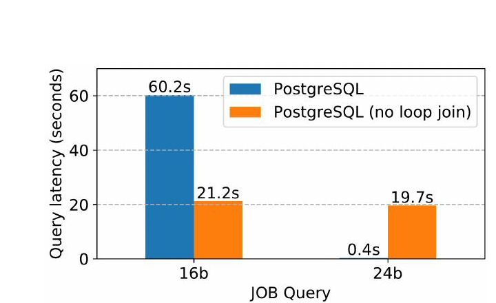

**图 1：** 在 PostgreSQL 中禁用循环连接，可能改善（16b）也可能损害（24b）某条查询的性能。示例查询来自 Join Order Benchmark（JOB）[41]。

Bao 的核心思想是避免从零开始学习一个优化器。我们采用一个现有优化器（例如 PostgreSQL 优化器），并逐查询学习何时启用或禁用它的某些特性。换言之，Bao 是位于现有查询优化器之上的学习组件，它增强查询优化，而不是彻底替换或丢弃传统查询优化器。

例如，对于某条查询，PostgreSQL 优化器可能低估某些连接的基数，因而错误选择循环连接，而合并连接、哈希连接等其他连接算法会更有效 [41, 42]。JOB 查询 16b 就会发生这种情况；对它禁用循环连接可带来 3 倍性能提升（见图 1）。但始终禁用循环连接显然也不正确：对于查询 24b，禁用循环连接会让性能下降近 50 倍，堪称灾难性回退。

在高层上，Bao 尝试学习从到达查询到该查询应采用的优化器执行策略之间的映射，从而“纠正”传统查询优化器。我们把这些纠正——需要启用的策略子集——称为**查询提示集**。实际上，Bao 通过给定提示集来限制并引导传统优化器的搜索空间。

我们的方法假设提示集数量有限，并把上下文多臂老虎机问题中的每个臂对应到一个提示集。我们使用的查询提示会从计划空间中删除整个算子类型（例如不使用哈希连接），但实际中并不要求提示粒度必须如此粗。Bao 学习一个模型，预测哪些提示能让某条查询获得良好性能。查询到达时，系统选择一个提示集，执行所得查询计划，并观察奖励。随着时间推移，Bao 不断改进模型，以便更准确地预测哪个提示集最有利于到达查询。例如，对于高选择性查询，Bao 可以限制优化器使用哈希连接或合并连接，自动引导其生成左深循环连接计划；对于选择性较低的查询，则可以禁用循环连接。

把问题表述为上下文多臂老虎机后，Bao 就能利用 Thompson 采样这一经过充分研究、样本效率高的算法 [17]。由于 Bao 使用底层查询优化器，所以能取得基数估计；因此它可以像底层优化器一样适应新数据和模式变化。其他学习型查询优化方法必须重新学习传统查询优化器已经掌握的知识，而 Bao 会立即开始学习如何改善底层优化器，并且即使与传统查询优化器相比也能降低尾延迟。除了处理以往学习型查询优化系统的实际问题，Bao 还具备许多传统优化器和以往学习型优化器所缺少、或很难实现的理想特性：

1. **训练时间短。** 其他深度学习方法可能需要训练数天，而 Bao 只需少得多的训练时间（约 1 小时）就能胜过传统查询优化器。它充分利用了现今 DBMS 传统优化器中由人类专家编码的现有查询优化知识。Bao 还可以配置为最初只使用传统优化器，仅在系统负载较低时训练。
2. **对模式、数据和工作负载变化具有鲁棒性。** 即使工作负载、数据和模式发生变化，Bao 也能维持性能。这得益于它利用传统查询优化器的成本和基数估计。
3. **更好的尾延迟。** 以往学习方法要么没有改善尾部性能，要么没有评估它；我们表明，仅训练 30 分钟到数小时，Bao 就能让尾部性能提升若干数量级。
4. **可解释、易调试。** 标准工具即可检查 Bao 的决策，并且可逐查询启用或禁用 Bao。因此，当一条查询行为异常时，工程师可以检查 Bao 选择的查询提示，也可以用 `EXPLAIN` 查看底层优化器作出的决策。若底层优化器工作正常而 Bao 决策不佳，可以只对这条查询禁用 Bao；也可以默认关闭 Bao，仅对已知在底层传统优化器下性能不佳的特定查询启用。
5. **集成成本低。** Bao 很容易集成到现有数据库中，通常甚至不需要修改代码，因为多数数据库系统已经暴露了所有必要提示和挂钩。Bao 构建于现有优化器之上，因此可以支持底层数据库支持的所有 SQL 特性。
6. **可扩展。** Bao 可随时间加入新的查询提示，而不必重新训练。也可以轻松在其特征表示中加入优化时应考虑的额外信息，不过这需要重训。例如，如果加入缓存信息，Bao 就能学习如何依据缓存状态改变查询计划。这一点很有价值，因为从缓存读取数据比从磁盘读取快得多，查询的最佳计划可能随缓存内容而变化。把此能力集成进传统成本优化器可能需要大量工程与手工调优，而让 Bao 感知缓存只需暴露缓存状态描述。

Bao 当然也有缺点。首先，最重要的缺点之一是查询优化时间增加，因为每条到达查询都要多次运行传统优化器。对于有问题的长查询，优化时间略增通常无妨，因为 Bao 所选计划节省的延迟往往远大于新增优化时间；但对非常短的查询，尤其是应用会发出大量此类查询时，优化时间增加就可能成为问题。因此，Bao 最适合由尾部主导的工作负载（例如 20% 的查询占用 80% 的查询处理时间），或包含大量长查询的工作负载。Bao 的架构也允许用户轻松对短查询禁用它，或只对有问题的长查询启用它。其次，Bao 只使用有限提示集，动作空间受到限制，因而并不总能学到最佳查询计划。尽管如此，在实验中 Bao 仍显著胜过传统优化器，而且训练与适应变化的速度比 Neo [51] 这类“不受限制”的学习型查询优化器快若干数量级。

综上，本文的主要贡献是：

- 提出 Bao：一个能学习如何逐查询应用查询提示的查询优化学习系统。
- 首次展示一个学习型查询优化系统：它能在成本和延迟上同时胜过开源与商业系统，并能适应工作负载、数据和模式变化。

## 2 系统模型

从高层看，Bao 把树卷积模型 [57]——一种能识别查询计划树重要模式的神经网络算子 [51]——与用于求解上下文多臂老虎机问题的 Thompson 采样 [74] 结合起来。这种独特组合让 Bao 能够快速探索并利用知识。其架构如图 2 所示。

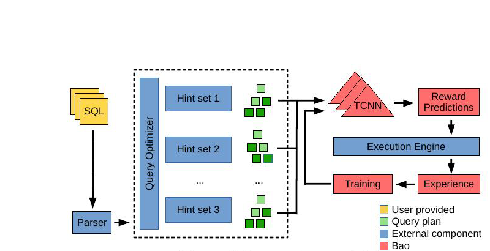

**图 2：** Bao 系统模型。

**生成 $n$ 个查询计划。** 用户提交查询后，Bao 使用底层查询优化器生成 $n$ 个查询计划，每个提示集对应一个计划。许多 DBMS [4–6] 都提供丰富提示。虽然有些提示可应用到单个关系或谓词，Bao 只关注布尔标志形式的查询提示（例如禁用循环连接、强制使用索引）。可供 Bao 使用的提示集必须预先指定，其中一个提示集可以为空，即不施加任何限制而直接使用原始优化器。

**估计每个查询计划的运行时间。** 随后，每个查询计划都转换为向量树（每个节点都是特征向量的树）。这些向量树被送入 Bao 的价值模型——一个树卷积神经网络 [57]——以预测各计划的质量（例如执行时间）。为了缩短优化时间， $n$ 个查询计划可以并行生成和评估。

**选择用于执行的查询计划。** 如果只想执行期望性能最好的计划，可以按标准监督学习方式训练模型，选择预测性能最好的计划。然而价值模型可能出错；若从不尝试替代策略，我们就可能一直选不到最优计划，也永远学不到自己何时出错。为了平衡新计划的探索与已知快速计划的利用，我们采用 Thompson 采样 [74]（见第 3 节）。Bao 也可以配置为离线探索某条特定查询，并保证查询处理期间只选择最佳计划（见第 4 节）。

Bao 选好计划后，把它发送到查询执行引擎。查询执行结束后，选定计划与实测性能的组合会加入 Bao 的经验。系统周期性地用这些经验重新训练预测模型，形成反馈环。由此，Bao 的预测模型不断改善，对每条查询选择最佳提示集也越来越可靠。

**假设与限制。** Bao 假定所有提示产生语义等价的查询计划。此外，Bao 总是把提示用于整个查询计划：它不能只限制计划的一部分，例如在表 $A$ 与 $B$ 之间避免嵌套循环连接，却仍允许表 $C$ 与 $D$ 之间使用嵌套循环。原则上 Bao 架构可以探索这类子优化，但如此细粒度的动作空间（Bao 对每条查询可作出的选择数）会显著增加优化开销。设提示集数为 $n$，查询中的关系数为 $k$，若只选择单个提示集，Bao 对每条查询有 $O(n)$ 个选择；若执行这些子优化，动作空间大小将为 $O(n\times 2^k)$（在查询图完全连通时，对 $k$ 个关系的每个子集有 $n$ 种连接方式）。动作空间大小是决定强化学习算法收敛时间的重要因素 [22]，因此我们选择较小的动作空间，以期快速收敛。

## 3 选择查询提示

本节讨论 Bao 的学习方法。我们先定义 Bao 的优化目标，并把它形式化为上下文多臂老虎机问题，然后应用求解这类问题的经典技术 Thompson 采样。

Bao 把提示集族 $F$ 中的每个提示集 $HSet_i\in F$ 看作一个独立查询优化器，即从查询 $q\in Q$ 映射到查询计划树 $t\in T$ 的函数：

$$
HSet_i: Q \rightarrow T
$$

该函数通过把查询 $Q$ 和选定提示集 $HSet_i$ 传给底层查询优化器实现。为方便起见，后文用 $HSet_i$ 指代该函数。我们假设每棵查询计划树 $t\in T$ 都由任意数量的算子组成，而算子来自某个已知有限集合；也就是说，树可以任意大，但所有不同算子类型均预先已知。

Bao 还假定存在用户定义的性能度量 $P$，它通过执行查询计划来判断计划质量。例如， $P$ 可以测量查询计划的执行时间，也可以测量计划执行的磁盘操作次数。

对于查询 $q$，Bao 必须选择一个提示集。把该选择函数记作 $B:Q\rightarrow F$。Bao 的目标是选择某个提示集所能产生的最佳查询计划（以性能度量 $P$ 衡量）。我们把目标形式化为遗憾最小化问题，其中查询 $q$ 的遗憾 $R_q$ 定义为：Bao 所选提示集产生的计划与理想提示集产生的计划之间的性能差：

$$
R_q=\left(P(B(q)(q))-\min_i P(HSet_i(q))\right)^2 \tag{1}
$$

**上下文多臂老虎机（CMAB）。** 公式（1）的遗憾最小化是一个上下文多臂老虎机问题 [83]。智能体必须反复从固定数量的臂中选择，以最大化奖励（即最小化遗憾）。智能体先收到一些上下文信息，然后必须选一个臂。每次选臂后，它都会得到一个回报；在给定上下文信息时，各臂回报被假定为彼此独立。收到回报后，智能体获得新上下文并再次选臂，每轮试验都被视为独立。

对 Bao 而言，每个“臂”是一个提示集，“上下文”则是底层优化器在各提示集下生成的查询计划集合。因此，智能体观察每个提示集产生的查询计划，从中选一个，并根据所得性能获得奖励。随着时间推移，它需要改进选择，逐渐接近最优决策（即最小化遗憾）。这要求平衡探索和利用：既不能总是随机选计划——那无助于改善性能；也不能盲目沿用第一个表现良好的计划——那可能错过巨大改进空间。

**Thompson 采样。** 求解 CMAB 遗憾最小化的一种方法是 Thompson 采样 [74]。直观上，它逐步积累经验（过去对查询计划及其性能的观察），并周期性地用经验构造预测模型来估计查询计划性能。模型通过选择预测性能最佳的计划来选择提示集。随着经验增多，可以构造更好的预测模型，从而作出更准确的选择，并有望改善性能。

形式化地，Bao 使用参数（权重）为 $\theta$ 的预测模型 $M_\theta$，把查询计划树映射为估计性能，并据此为到达查询选择提示集。选定的查询计划执行后，查询计划树及其实测性能组成的二元组 $(t_i,P(t_i))$ 会加入 Bao 的经验集 $E$。每当 $E$ 中加入新信息，Bao 就更新预测模型 $M_\theta$。

Thompson 采样中的预测模型训练方式不同于标准机器学习模型。大多数训练算法寻找最可能解释训练数据的参数集，即最大似然估计。由此，特定模型参数 $\theta$ 的质量由 $P(\theta\mid E)$ 衡量：给定训练数据后参数似然越高，拟合越好。最可能的模型参数可表示为该分布的期望（众数参数），这里写作 $\mathbb{E}[P(\theta\mid E)]$。

然而，为平衡利用与探索，Thompson 采样要求从分布 $P(\theta\mid E)$ 中**采样**模型参数。因此，它并非每次都选经验意义上的最佳模型，而是按模型在给定经验下的似然比例选择。直观地说，若想最大化探索，就完全随机选择 $\theta$；若想最大化利用，就选择众数 $\theta$，即 $\mathbb{E}[P(\theta\mid E)]$。从 $P(\theta\mid E)$ 采样在这两个目标之间取得平衡 [7]。

为到达查询选择提示集并非严格意义上的老虎机问题。提示集以及由此产生的查询计划会影响下一条查询到达时的缓存状态，因此每个上下文并非完全独立于先前决策。例如，选择含索引扫描的计划会把索引缓存下来，而只含表扫描的计划可能会让更多基础关系进入缓存。不过在 OLAP 环境中，查询常常读取大量数据，单个查询计划对缓存的影响往往很短暂。大量实验证据表明，Thompson 采样在这些场景中仍是合适算法 [17]。

接下来介绍 Bao 的预测模型——用于估计查询计划质量的树卷积神经网络；随后在第 3.2 节讨论 Bao 如何通过 Thompson 采样把预测模型有效用于查询优化。

### 3.1 预测模型

Bao 使用 Thompson 采样逐查询选择提示集，其核心是估计特定查询计划性能的预测模型。鉴于树卷积神经网络（TCNN）在 [51] 中的成功，Bao 也采用 TCNN。本节依次说明：（1）如何把查询计划树转换为适合 TCNN 输入的向量树；（2）TCNN 架构；（3）如何把 TCNN 集成到 Thompson 采样流程，即如何从第 3 节讨论的 $P(\theta\mid E)$ 中采样模型参数。

#### 3.1.1 查询计划树向量化

Bao 先把查询计划树二叉化，再把每个查询计划算子编码为向量，从而将查询计划树转换为向量树；还可选择在表示中加入缓存信息。

**二叉化。** 许多查询涉及聚合、排序等非二元操作。然而严格二叉的查询计划树——每个节点要么没有子节点，要么恰有两个——能显著简化树卷积（下一节详述）。因此，Bao 先把可能非二叉的计划树转换为二叉树。图 3 展示了该过程：原查询计划树（左）被转换为二叉查询计划树（右），方法是在任何仅有一个子节点的节点右侧插入灰色的“null”节点。对有两个以上子节点的节点（例如多路 union），可把它拆成由二元操作组成的左深树来完成二叉化。

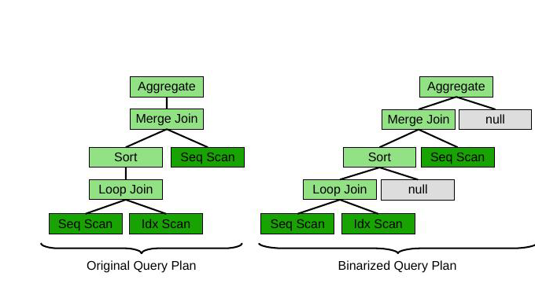

**图 3：** 二叉化一棵查询计划树。

**向量化。** 查询计划树中的每个节点都转换为一个向量，其中包含：（1）算子的独热编码；（2）基数和成本信息；以及可选的（3）缓存信息。

每种算子类型的独热编码与以往方法 [51, 59] 的向量化策略类似。图 4 中每个向量均以算子类型的独热编码开头，例如第二个位置表示算子是否为合并连接。这种简单独热编码能捕获查询计划树的结构属性：例如，一个子节点不是排序的合并连接，可能意味着有不止一个算子在利用已排序次序。

每个向量还可以包含估计基数和成本信息。几乎所有查询优化器都使用此类信息，因此把它暴露给计划树节点的向量表示通常很容易。图 4 中，基数与成本模型信息分别标为 “Card” 和 “Cost”。这些信息有助于编码潜在问题算子，例如大关系上的循环连接或重复排序；它们可能预示着较差计划。我们只使用两个值（一个基数估计和一个成本估计），但也可使用任意数量的值，例如来自不同估计器的多个基数估计或学习型成本模型的预测。

最后，还可选择用当前磁盘缓存状态增强每个向量。新查询到达时，可以从数据库缓冲池取得缓存状态。实验中，我们在每个扫描节点上加入目标文件已缓存的百分比，不过也可以采用许多其他方案。这让 Bao 有机会选择与缓存内容相匹配的计划。

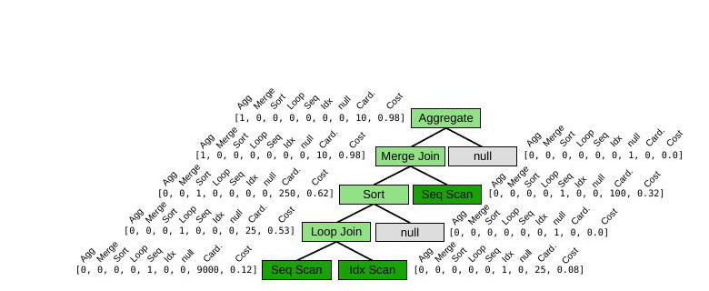

**图 4：** 向量化的查询计划树（向量树）。

Bao 的向量化方案虽简单，却有若干优点。第一，该表示与底层模式无关：以往工作 [40, 51, 53] 会在向量化方案中直接表示表和列，而 Bao 省略这些内容，因此模式变化不必从头开始。第二，Bao 对底层数据只表示基数估计与成本模型，不采用与数据绑定的复杂嵌入模型 [51]。在数据变化时维护基数估计已经得到充分研究并在多数 DBMS 中实现，所以底层数据变化能清晰反映到 Bao 的向量化表示中。

#### 3.1.2 树卷积神经网络

树卷积是一种可组合、可微分的神经网络算子，由 [57] 提出，并由 [51] 首次用于查询计划树。这里给出直观概述；树卷积在计划树上的技术细节与分析见 [51]。

研究查询计划的人类专家会通过模式匹配来识别好坏计划：一串中间没有排序的合并连接流水线可能表现良好；哈希连接之上的合并连接则可能引入多余排序或哈希。同样，在很大关系上构建哈希表的哈希连接可能发生溢写。任何一种模式都不足以独立判断计划好坏，但它们是有用的进一步分析指标；换言之，这类模式是否存在，是学习角度下的有用特征。树卷积恰好适合识别这类模式，而且能从数据本身自动学会识别。

树卷积把树形“滤波器”滑过查询计划树（类似图像卷积用滤波器卷积图像），得到大小相同的变换后树。这些滤波器可以寻找一对哈希连接、小关系上的索引扫描等模式。树卷积算子会堆叠若干层；后续层可以学习识别更复杂的模式，例如很长的合并连接链或浓密的哈希算子树。由于树卷积天然适合表示并学习这些模式，我们称它为查询优化提供了有益的**归纳偏置** [50, 55]：不只是网络参数，网络结构本身也针对底层问题进行了调适。

Bao 的预测模型架构如图 5。向量化查询计划树依次经过三层树卷积。最后一层树卷积之后，使用动态池化 [57] 把树结构展平为单个向量，再由两个全连接层把池化向量映射为性能预测。模型使用 ReLU 激活函数 [25] 和层归一化 [13]，图中未画出。

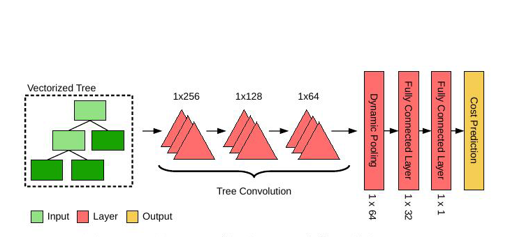

**图 5：** Bao 预测模型架构。

**与 Thompson 采样集成。** Thompson 采样要求能从 $P(\theta\mid E)$ 中采样模型参数 $\theta$，而多数机器学习技术旨在找出给定训练数据时最可能的模型，即 $\mathbb{E}[P(\theta\mid E)]$。对于神经网络，可从复杂贝叶斯神经网络到简单方法等多种技术中实现 $P(\theta\mid E)$ 采样 [68]。最简单、且已被证明实践中效果良好的技术 [63] 是：像往常一样训练神经网络，但使用训练数据的“自助采样” [15]；即从 $E$ 中有放回地随机抽取 $|E|$ 个样本来训练网络，由此获得所需采样性质 [63]。我们因其简单而选择这种自助采样技术。

### 3.2 训练循环

Bao 的训练循环与经典 Thompson 采样流程非常接近：收到查询时，Bao 为每个提示集构建一棵查询计划树，并用当前预测模型选择要执行的计划。执行结束后，把该计划及其实测性能加入经验。Bao 周期性地通过采样模型参数（即神经网络权重）重新训练预测模型，以平衡探索与利用。查询优化中的实际考量要求它稍微偏离经典 Thompson 采样流程，下面对此加以说明。

经典 Thompson 采样 [74] 会在每次选择（每条查询）之后重采样模型参数 $\theta$。这对查询优化并不实际，原因有二。首先，采样 $\theta$ 需要训练神经网络，耗时较长。其次，若经验规模 $|E|$ 随查询处理而无限增长，神经网络训练时间也会无限增长，因为一个训练轮次的时间与训练样本数成线性关系。

我们采用以往工作 [18] 中的两项技术解决这些问题。第一，不在每条查询后重采样模型参数（即重训神经网络），而是每隔第 $n$ 条查询才重采样。让同一组模型参数用于多条查询，显然能把训练开销降低 $n$ 倍。第二，不让 $|E|$ 无限增长，而只在 $E$ 中保留最近 $k$ 条经验。用户可调节 $n$ 与 $k$，按需求控制模型质量与训练开销的权衡。第 6.2 节将评估这一权衡。

我们还提出一项特别适合查询优化的新优化。在 [3] 这类现代云平台上，GPU 可以按秒计费地挂接和卸载。训练神经网络主要使用 GPU，而查询处理主要使用 CPU、磁盘和 RAM，因此模型训练可以与查询执行重叠。需要采样新模型参数时，可以临时配置一块 GPU，把模型训练卸载到 GPU 上。训练完成后，新参数可在下一条查询到来时换入，GPU 随后卸载。用户也可选择带专用 GPU 的机器，或把模型训练完全卸载到另一台机器，但这可能增加成本与网络用量。

## 4 PostgreSQL 集成

Bao 可用于任意数据库系统，但我们投入了大量时间，让它在 PostgreSQL 上特别容易安装和使用。本节讨论 Bao 如何集成到 PostgreSQL，以及为了提升实用性加入了哪些功能。原型实现已公开 [1]。

Bao 原型使用 PostgreSQL 挂钩系统；该系统通过称为 hook 的函数指针扩展数据库功能。其最大优点是无需重新编译代码，便可把新功能轻松集成到现有 PostgreSQL 实例。此外，我们还提供如下易用特性。

**逐查询启用。** Bao 位于传统优化器之上，因此可逐查询启用或禁用。启用时，Bao 用 Thompson 采样选择查询提示；禁用时，则使用 PostgreSQL 优化器。在原型中，启停 Bao 只需设置会话变量：`SET enable_bao TO [on/off]`。逐查询启停很重要，原因有二：第一，对短查询而言，Bao 所需的额外优化时间（通常约 200 ms）可能超过查询执行时间；第二，DBA 可能已经为某条查询设置提示或手工调优了计划，对这些查询禁用 Bao 能保留 DBA 的成果。

即使 Bao 被禁用，也仍可选择性地从查询执行中学习。任何查询计划和记录的执行时间都可加入 Bao 的经验以改进预测模型，即使该计划并非 Bao 选择。这可视为离策略强化学习 [12]。我们不评估该能力，但我们认为它是有价值的未来方向：让优化器能够从人类 DBA 的手工优化工作中学习。

**主动模式与顾问模式。** PostgreSQL 的 Bao 实现全局运行于两种模式之一。主动模式下，Bao 按上文所述自动选择提示集，并从其性能中学习。顾问模式下，Bao 不选择提示集（所有查询均由 PostgreSQL 规划器优化），但仍观察已执行查询的性能并训练预测模型。用户发出 `EXPLAIN` 查询时，输出会多出三项信息：（1）生成计划的预期性能；（2）Bao 在主动模式下会推荐的提示集；（3）该提示集预计带来的改进。示例会话见图 6。顾问模式可采用人在回路方式，帮助用户预测并修复长查询；用户随后可决定是否采用 Bao 推荐的提示（可能先行测试）。

```text
imdb=# EXPLAIN SELECT * FROM ....
                         QUERY PLAN
-----------------------------------------------------------------
Bao prediction: 61722.655 ms
Bao recommended hint: SET enable_nestloop TO off;
                       (estimated 43124.023ms improvement)
Finalize Aggregate (cost=698026.88..698026.89 rows=1 width=64)
  -> Gather (cost=698026.66..698026.87 rows=2 width=64)
       ...
```

**图 6：** Bao 顾问模式的示例输出。

**触发式探索。** 对任何查询优化器——无论是否为学习型——查询回退都是主要担忧（另见第 6.2 节）。优化器变化并非学习系统独有的问题，因此已有多种解决方案被开发并完整集成到不同 DBMS 中 [14, 35]。不过，Bao 会主动探索新查询计划，因此回退可能更不规律。

为了让 DBA 拥有更多控制权，Bao 允许把查询标记为性能关键。标记查询会触发 Bao 周期性地以每个提示集执行该查询，并把所得性能保存到经验集中；这些经验还会标记为关键。重训预测模型时，Bao 会确保新模型对每条关键经验都正确选择最快提示集；若模型对关键经验预测错误，就会对该关键经验赋予更高权重并重新训练，直到模型作出正确决策。因此，对查询执行手工探索可保证 Bao 永远不会为被标记查询选择造成回退的计划。这样，用户既能在一些查询上利用 Bao 样本效率高的学习，又能确保关键查询达到最优性能。

## 5 相关工作

把学习用于查询优化的早期工作之一是 Leo [72]，它利用相似查询的连续运行来调整直方图估计器。较新的方法 [37, 44, 64, 73, 79] 使用深度学习，以监督方式学习基数估计或查询成本。[9–11] 给出查询驱动的基数估计方法，使用自组织映射等技术。也有人提出基于蒙特卡洛积分的无监督方法 [81, 82]。[29] 提出名为 CRN 的方案，通过查询包含率估计基数。上述工作都展示了更准确的基数估计——这本身可能有用，如 [9–11] 所示——但没有证据表明这些改进会产生更好的查询计划。Ortiz 等人 [60] 表明，某些学习型基数估计技术可能改善特定数据集上的平均性能，但没有评估尾延迟。Negi 等人 [58] 则说明，优先训练对查询性能影响较大的基数估计可改善估计模型。

[40, 53] 表明，训练足够充分时，基于强化学习的方法能找到成本更低的计划（以 PostgreSQL 优化器的成本判断）。[59] 表明强化学习算法学到的内部状态与基数高度相关。Neo [51] 表明，深度强化学习可以直接作用于查询延迟，训练 24 小时后可学到能与商业系统竞争的优化策略。然而，这些技术都无法处理模式、数据或查询工作负载变化，也都没有展示尾部性能改进。把强化学习用于自适应查询处理的工作 [33, 76, 77] 取得了有趣结果，但并不适用于 PostgreSQL 这类现有非自适应系统。

强化学习已经在各种系统问题中得到采用 [47, 69]。[38] 描绘了一个完全由强化学习组件构成的数据库系统愿景。更具体地说，强化学习已用于弹性集群管理 [46, 62]、调度 [48] 和物理设计 [65]。

Thompson 采样历史悠久 [17, 34, 63, 74]，近期工作还把它与深度学习模型结合 [24, 68]。Thompson 采样也已用于云工作负载管理 [52] 和 SLA 合规 [61]。

我们的工作属于一种近期趋势：用机器学习构建易用、自适应且具有创造性的系统，这一更广泛的趋势称为机器编程 [26]。在数据管理系统中，机器学习技术已用于多得无法在此穷举的问题，包括索引结构 [39]、数据匹配 [23]、工作负载预测 [66]、索引选择 [20]、查询延迟预测 [21] 以及查询嵌入/表示 [31, 71]。数据管理之外的一些代表性工作包括：用于作业调度的强化学习 [49]、自动性能分析 [8]、循环向量化 [28] 和垃圾回收 [16, 30]。

## 6 实验

评估的核心问题是：对于查询、数据和/或模式会变化的真实数据库工作负载，Bao 能否产生积极且实际的影响？为回答该问题，我们不仅量化查询性能，还量化在云基础设施上执行工作负载的美元成本——其中包括 Bao 引入的训练开销——并与 PostgreSQL 和一个商业数据库系统比较（第 6.2 节）。随后进一步分析 Bao 使用的臂（第 6.3 节）与其神经网络能力（第 6.4 节）。

### 6.1 设置

我们使用表 1 所列数据集评估 Bao。

| 数据集 | 大小 | 查询数 | 工作负载（WL） | 数据 | 模式 |
| --- | ---: | ---: | --- | --- | --- |
| IMDb | 7.2 GB | 5000 | 动态 | 静态 | 静态 |
| Stack | 100 GB | 5000 | 动态 | 动态 | 静态 |
| Corp | 1 TB | 2000 | 动态 | 静态[^table-note] | 动态 |

**表 1：** 评估数据集的大小、查询数量，以及工作负载（WL）、数据和模式是静态还是动态。

- **IMDb** 数据集是在 Join Order Benchmark [41] 基础上的扩充：我们在原有 113 条查询之外增加数千条查询[^2]，并通过周期性引入新模板让查询工作负载随时间变化。
- 我们创建了一个新的真实数据集与工作负载 **Stack**，现也已公开[^3]。Stack 包含十年间来自 StackExchange 网站（如 StackOverflow.com）的 1800 多万个问题和回答。我们每次加载一个月的数据来模拟数据漂移。
- **Corp** 数据集是一家匿名公司捐赠的、在一个月内执行的仪表板工作负载，包含分析人员发出的 2000 条唯一查询。月中，该公司把一个大型事实表正规化，造成重大模式变化。我们在执行第 1000 条查询后引入正规化来模拟该变化；此后查询预期使用新的正规化模式。数据保持静态。

训练与测试 Bao 时，我们采用“时间序列切分”策略。Bao 始终在下一条、从未见过的查询 $q_{t+1}$ 上评估。为 $q_{t+1}$ 作决策时，它只用更早查询的数据训练。决策完成后，只把这次决策的实测奖励加入经验集。这与 [40, 51, 53] 的以往评估不同，因为 Bao 绝不允许从同一查询的不同决策中学习。对于近乎相同查询经常重复的 OLAP 工作负载（例如仪表板），这可能是一种过分谨慎的流程。

Bao 的预测模型采用三层树卷积，随后是一个动态池化层 [57] 和两个线性层。层间使用 ReLU 激活 [25] 和层归一化 [13]。训练使用 Adam [36]，批大小为 16；达到 100 个轮次或收敛（10 个轮次内训练损失下降不足 1%）时停止。

除非另有说明，所有实验均在如下两种环境之一运行：（C1）Google Cloud Platform 的 N1-4 VM 和 TESLA T4 GPU；或（C2）私有服务器上的虚拟机，具有 4 个 CPU 核与 15 GB RAM（与 N1-4 VM 匹配），宿主机有两颗 2.1 GHz Intel Xeon Gold 6230 CPU、一块 NVIDIA Tesla T4 GPU 和 256 GB 裸机内存。成本和时间测量包括查询优化、模型训练（含 GPU）与查询执行。成本按 Google 账单报告，并包含启动时间与最低使用门槛。每次加载新数据集时，都完全重建数据库统计信息。

我们把 Bao 与 PostgreSQL 和一个商业数据库系统（ComSys）[67] 比较。云数据库和分布式数据库系统上的扩展评估见本文扩展版 [2]。两个系统都按照各自文档和最佳实践指南配置与调优；一位 ComSys 顾问还通过小型性能测试复核了我们的配置。对两个基线，我们都通过提示利用原始优化器，把 Bao 集成进数据库。例如，在 ComSys 上，我们利用带提示的 ComSys 原始优化器集成 Bao，并在 ComSys 上执行所有查询。

除非另有说明，查询顺序执行。我们使用 48 个提示集；每个提示集选用连接算子集合 {哈希连接、合并连接、循环连接} 的某个子集，以及扫描算子集合 {顺序扫描、索引扫描、仅索引扫描} 的某个子集。详见在线附录 [2]。我们发现回看窗口大小取 $k=2000$、每 $n=100$ 条查询重训一次，能在 GPU 时间与查询性能间取得良好权衡。

**工作负载特征。** 使用 PostgreSQL 执行时，IMDb、Stack 和 Corp 数据集的查询延迟中位数都较低，分别为 280 ms、310 ms 和 520 ms。三个工作负载都高度偏斜，其第 95 百分位查询耗时显著更长，分别为 21 秒、28 秒和 3 分钟。事实上，三个工作负载中约 20% 的查询分别贡献了 80% 的执行时间，确切占比分别为 18%、23% 和 21%。这种“帕累托原则”分布在数据库系统中很常见 [19, 32, 78, 80]；Corp 的 DBA 也确认，该分布普遍存在于其分析工作负载中。因此，即使查询延迟中位数不变，只要适度改善查询延迟“尾部”（即问题最严重的查询），就能显著改善工作负载性能。

### 6.2 Bao 实用吗？

本节首先评估 Bao 是否真正实用，并在现实的热缓存场景下评估其性能；按照第 3.1.1 节所述，我们在每个叶节点向量中加入缓存信息。

**云中的成本与性能。** 图 7 给出了在 Google Cloud 的 N1-16 VM 上完整执行三个工作负载的成本（左）和所需时间（右）。在不同数据集上，Bao 的成本和延迟都比 PostgreSQL 低近 50%（图 7a）。注意，这包括训练成本以及把 GPU 挂接到 VM 的成本。所有数据集都包含工作负载、数据或模式变化中的至少一种，这说明 Bao 能够适应这些常见且重要的场景。

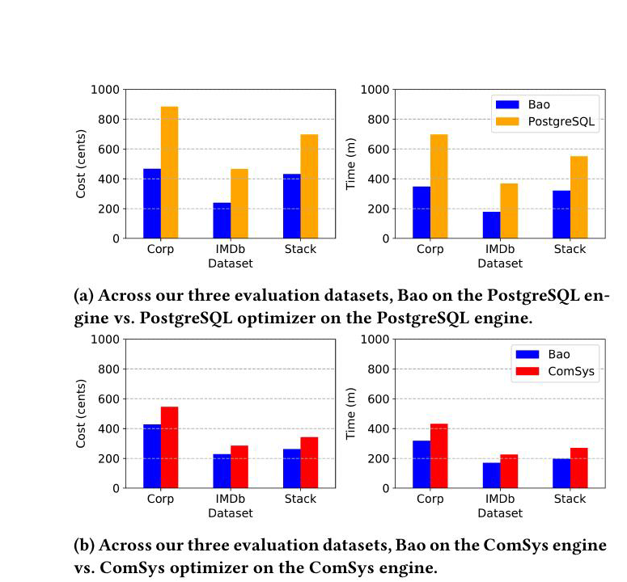

**图 7：** 在 N1-16 Google Cloud VM 上，Bao 与两个传统查询优化器跨三个不同工作负载的成本（左）和工作负载延迟（右）。（a）在 PostgreSQL 引擎上比较 Bao 与 PostgreSQL 优化器；（b）在 ComSys 引擎上比较 Bao 与 ComSys 优化器。

Bao 在商业数据库之上带来的性能改进仍然显著，只是没有那么大（图 7b）。三个数据集上改进约为 20%，说明 ComSys 优化器是强得多的基线。注意，成本并未包含商业系统的许可费用。我们认为，在不要求修改数据库自身任何代码的情况下，相比一个开发数十年的高能力查询优化器仍能取得 20% 的成本与性能改进，是非常令人鼓舞的结果。

**硬件类型。** 第二项实验改变 IMDb 工作负载所用硬件类型（图 8）。对 PostgreSQL（图 8a）而言，在较大 VM 类型上，成本和性能差异最显著（例如 N1-16 相比 N1-8）；这说明 Bao 比 PostgreSQL 更善于针对硬件变化自我调优。我们确实针对每种硬件平台重新调优了 PostgreSQL。Bao 本身也会从更大机器获益，因为它会并行执行所有臂的规划（后文讨论）。

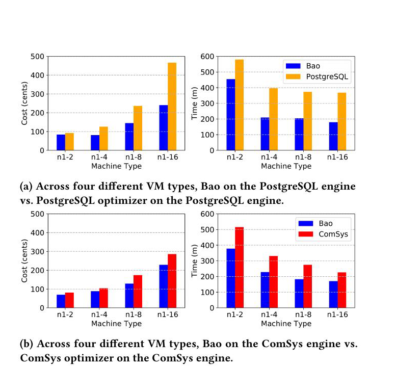

**图 8：** 对 IMDb 工作负载，Bao 与两个传统查询优化器跨四种 Google Cloud Platform VM 大小的成本（左）和工作负载延迟（右）。（a）在 PostgreSQL 引擎上比较 Bao 与 PostgreSQL 优化器；（b）在 ComSys 引擎上比较 Bao 与 ComSys 优化器。

有趣的是，虽然在 PostgreSQL 上 Bao 的收益会随机器变大而增加，在商业系统上却不是如此（图 8b）。这说明商业系统更能适应不同硬件类型，或者商业系统“默认”针对较大机器类型进行了调优。N1-2 机器类型不满足 ComSys 厂商的推荐系统要求，但满足其最低系统要求。

**尾延迟分析。** 前两项实验展示 Bao 降低整个工作负载成本和延迟的能力。实践人员常常关心尾延迟，因此这里考察多个 VM 类型上 IMDb 工作负载内的查询延迟分布。图 9 对每个 VM 类型（每列）给出中位数、第 95、第 99 和第 99.5 百分位延迟；上排为 PostgreSQL，下排为商业系统。对每种 VM 类型，与 PostgreSQL 优化器相比，Bao 都大幅降低尾延迟。例如在 N1-8 实例上，第 99 百分位延迟从 PostgreSQL 优化器的 130 秒降至 Bao 的不足 20 秒。这说明 Bao 的大部分成本与性能收益来自延迟分布尾部的缩短。与商业系统相比，Bao 始终降低尾延迟，但只有在资源更稀缺的小型 VM 上，降幅才显著。

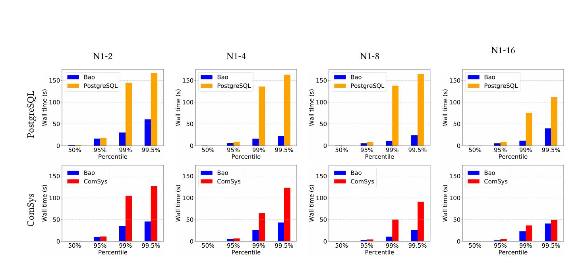

**图 9：** IMDb 工作负载的查询延迟百分位。每列代表一种 VM 类型，从左到右由小到大。上排在 PostgreSQL 引擎上比较 Bao 与 PostgreSQL 优化器；下排在商业系统引擎上比较 Bao 与商业数据库优化器。测量覆盖整个动态 IMDb 工作负载。

需要强调，Bao 对尾延迟的改进（图 9）是整个工作负载性能改善（图 7）的主要原因，因为尾部查询对工作负载延迟的贡献不成比例地高（量化见第 6.1 节）。事实上，Bao 对查询中位性能几乎没有改善（不足 5%）。因此，若工作负载完全由这类“中位”查询组成，Bao 的性能收益可能显著降低。下面考察最坏情况：查询优化器已为每条查询作出近似最优决策。我们用 Bao 和 PostgreSQL 执行 IMDb 工作负载中最快的 20% 查询。在此设置下，Bao 用 4.5 分钟完成受限工作负载，而 PostgreSQL 用 4.2 分钟；18 秒回退来自 Bao 的额外开销，后文会量化。

**训练时间与收敛。** 强化学习应用中的主要担忧是收敛时间。图 10 给出了执行 IMDb 工作负载时，各 VM 类型上的时间—完成查询数曲线（性能曲线）。所有情况下，最初两小时 Bao 的性能与 PostgreSQL 相近，之后则超过 PostgreSQL。Stack 与 Corp 数据集上的曲线相似。Bao 与商业系统比较时也呈现类似曲线，只是收敛时间略长：需要 3 小时才能超过商业优化器。

IMDb 工作负载是动态的，但 Bao 能够维持性能并适应查询工作负载变化。图 10 清楚展示了这一点：短暂初始阶段后，Bao 的性能曲线保持笔直，说明查询工作负载转移并未导致查询性能显著变化。

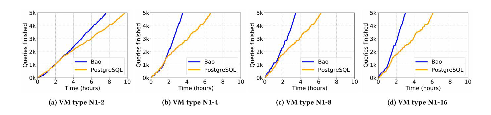

**图 10：** 在 PostgreSQL 引擎上，Bao 与 PostgreSQL 优化器随时间完成的 IMDb 查询数量。IMDb 工作负载包含 5000 条随时间变化的唯一查询。（a）N1-2；（b）N1-4；（c）N1-8；（d）N1-16。

**查询回退分析。** 实践人员常常担忧查询回退（例如统计信息变化或安装了新优化器版本），自然会问 Bao 是否会造成回退。图 11 对 Join Order Benchmark（JOB）[41] 中每条查询——它们是 IMDb 工作负载的一个子集——给出 Bao 的绝对性能改进，以及提示集理论最优选择可达到的改进（绿色）。负值表示性能改善，正值表示回退。该实验先在删除 JOB 查询后的完整 IMDb 工作负载上训练 Bao，随后在不更新预测模型的情况下逐条执行 JOB 查询。也就是说，Bao 从未见过任何 JOB 查询，谓词也不重叠。在 113 条 JOB 查询中，Bao 只在 3 条上发生回退，且回退都不足 3 秒；10 条查询的性能改善超过 20 秒。当然，Bao（蓝色）并不总能选到最优提示集（绿色）。

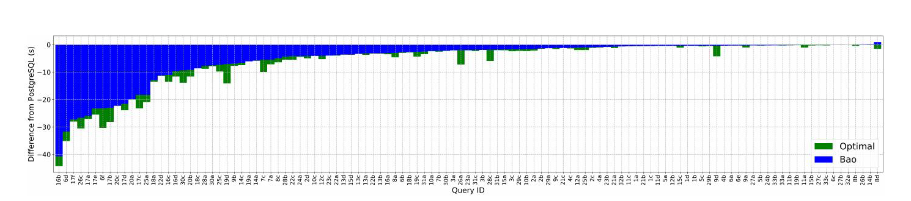

**图 11：** 对 IMDb 中来自 Join Order Benchmark [41] 的查询子集，Bao 所选计划与 PostgreSQL 所选计划的查询延迟绝对差（越低越好）。

**查询优化时间。** PostgreSQL 所需最大优化时间为 140 ms，商业系统为 165 ms，Bao 为 230 ms。对某些应用，优化时间增加 70 ms 可以接受。当前原型也很简单，例如推理代码用 Python 编写，因此还有很大的优化空间。

不过，为把优化时间做到“仅”230 ms，Bao 大量使用并行机制，同时规划每个臂。在必须顺序规划各臂时，可以限制 Bao 使用更少的臂。图 12 给出不同臂数下优化时间与执行时间的权衡（PostgreSQL、N1-4 VM、IMDb），并假定所有臂均顺序规划。臂的子集依据此前观察到的收益预先选定（见第 6.3 节）。其他数据集与 VM 类型的图类似，因篇幅所限省略。若无法预先找到良好臂子集且必须顺序规划，Bao 的可扩展性就受限制，因为臂数必须保持较小。一个臂等价于直接使用原 PostgreSQL 优化器而不使用 Bao。即使采用顺序规划，只要精心选择 5 个臂（见第 6.3 节），仍能显著缩短总工作负载时间。

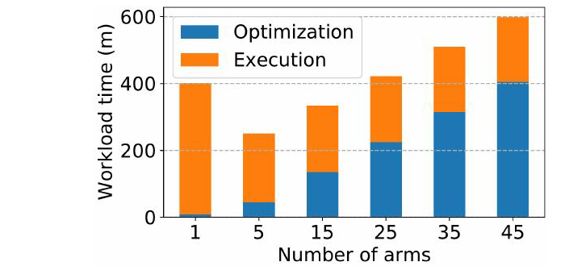

**图 12：** IMDb、N1-4 VM、PostgreSQL 上的优化与执行时间。改变臂数会在优化时间和查询执行时间之间作出权衡；一个臂对应 PostgreSQL 优化器。

接下来考察 $t$ 条查询并发执行时 Bao 的开销。图 13 左图给出 Bao 与 PostgreSQL 在 1、2 或 4 条查询并发时的性能。Bao 单查询执行完成工作负载的速度，甚至快于 PostgreSQL 四查询并发。这很意外，因为人们可能预期 Bao 在查询优化阶段大量使用并行会干扰查询执行。不过该工作负载受 I/O 限制，CPU 总负载从未超过 60%，因而给 Bao 的查询优化留下了充足 CPU 资源。

图 13 右图给出预先把整个数据库缓存在内存中时的性能[^4]。此时在 $t=4$ 时 CPU 总负载达到 100%，发生大量上下文切换，Bao 增加的优化计算压过了其收益。因此，虽然 Bao 的优化开销在许多 I/O 受限工作负载中可能不大，实践人员在 CPU 受限环境中应用 Bao 时仍应谨慎。

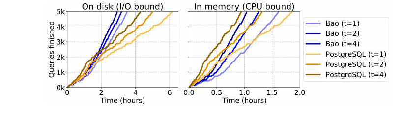

**图 13：** IMDb、N1-4 VM、PostgreSQL 上，完成查询数随时间变化；并发度为 $t$。左图数据位于磁盘（I/O 受限），右图数据位于内存（CPU 受限）。

**以往学习型优化器。** Neo [51] 和 DQ [40] 是另外两种基于学习的查询优化方法。Neo 与 Bao 一样使用树卷积，但它不为特定查询选择提示集，而是自行完整构建查询执行计划。DQ 使用深度 Q 学习 [56]、手工特征化与全连接神经网络（FCNN）。图 14 比较 IMDb 工作负载上的性能：在 N1-16 机器上重复 20 次取平均，并设置 72 小时截止时间。

图 14a 从均匀分布中随机选择查询以创建稳定工作负载；图 14b 使用原动态工作负载。在稳定工作负载上，Neo 24 小时后能超过 PostgreSQL，65 小时后能超过 Bao。原因是 Neo 的自由度比 Bao 多得多：Neo 可以为任意查询使用任何逻辑正确的查询计划，而 Bao 仅限于少数选项。这些自由度有代价——Neo 收敛显著更慢。训练 200 小时后，Neo 的查询性能比 Bao 高 15%。DQ 的自由度与 Neo 类似，但超过 PostgreSQL 所需时间更长，可能是因为 FCNN 对查询优化的归纳偏置 [50] 较差 [51]。在动态工作负载下（图 14b），Neo 和 DQ 的收敛都受到显著阻碍，因为两种技术都难以学到对工作负载变化稳健的策略。动态工作负载上，72 小时内 DQ 和 Neo 都无法超过 Bao。

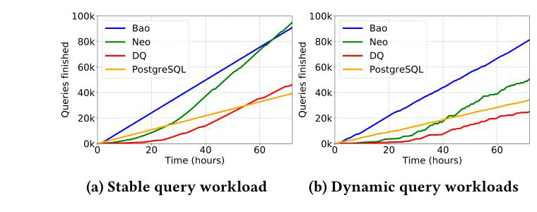

**图 14：** Bao、Neo [51]、DQ [40] 与 PostgreSQL 随时间完成的查询数量；左为稳定查询工作负载，右为动态查询工作负载。

### 6.3 哪些提示最为关键？

**一个提示集能否适用于所有查询？** 是否存在一个提示集，不需要复杂的逐查询提示，就能取得相似的良好结果？为回答该问题，我们在完整 IMDb 工作负载上评估每个提示集。图 15a 把唯一最佳提示集——禁用循环连接——标为 “Best hint set”。虽然它比其他单一提示集都好，但性能显著差于 PostgreSQL 优化器。因此，没有任何单一提示集足以胜过 PostgreSQL。

**哪些提示集最重要？** 实验使用的 48 个提示集中，排名前 5 的提示集贡献了相对 PostgreSQL 优化器总改进的 93%：禁用嵌套循环连接（35%）、禁用索引扫描和合并连接（22%）、禁用嵌套循环连接、合并连接和索引扫描（16%）、禁用哈希连接（10%），以及禁用合并连接（10%）。其中一些提示集的帮助方式很直观：当基数估计器低估连接大小时，禁用嵌套循环连接会有帮助；当基数估计器高估连接大小时，禁用哈希连接会有帮助。

**提示集如何影响查询计划？** 特定提示集可能让查询优化器选择不同的算子实现、访问路径或连接顺序。这里在 PostgreSQL 上评估每类变化在 IMDb 工作负载中的频率与影响。Bao 在 5000 条查询中的 4271 条上引出了不同算子选择，其余 729 条使用与 PostgreSQL 相同的计划；在 5000 条中的 3792 条上选择了不同访问路径（即索引）；在 5000 条中的 2110 条上产生了不同连接顺序，包括相对 PostgreSQL 改进最大的 500 条查询中的 472 条。这符合以往工作 [41] 的结论：连接顺序对查询性能的影响大于算子实现。我们把提示集及其影响的更细致研究留待未来工作。

### 6.4 Bao 的机器学习模型

**是否需要神经网络？** 更简单的模型是否足够？图 15a 给出在 C2 服务器配置与冷缓存下，对 IMDb 工作负载前 2000 条查询，把 Bao 的价值网络替换成随机森林（RF）或线性回归（Linear）后的性能[^5]。这些更朴素模型的性能显著更差，说明采用更复杂的树卷积模型是合理的。

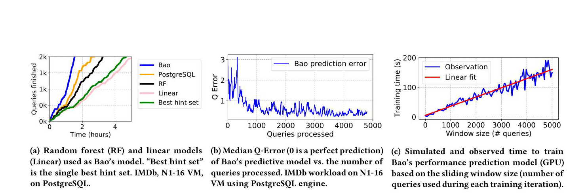

**图 15：** Bao 预测模型评估。（a）用随机森林（RF）和线性模型（Linear）作为 Bao 模型；“Best hint set” 为单一最佳提示集；IMDb、N1-16 VM、PostgreSQL。（b）Bao 预测模型的 Q-Error 中位数（0 表示完美预测）随已处理查询数的变化；IMDb、N1-16 VM、PostgreSQL 引擎。（c）根据滑动窗口大小（每次训练迭代使用的查询数）模拟与观测到的 Bao 性能预测模型 GPU 训练时间。

**Bao 的模型有多准确？** 图 15b 给出在 N1-16 机器上处理 IMDb 工作负载的既往查询之后，Bao 预测模型对下一条查询的准确度。预测模型初始准确度较差，Q-error [43, 54, 75] 峰值为 3。尽管准确度不高，Bao 仍能选出不会造成灾难的计划（图 10d 对此有所体现）。

**所需 GPU 时间。** Bao 的树卷积神经网络在 GPU 上训练，GPU 仅在需要时挂接（见第 3.2 节）。图 15c 给出训练时间如何随窗口大小 $k$（Bao 训练时使用的最大查询数）变化，并把新预测模型的实测训练时间与平均期望时间比较。由于云环境以及 Adam 优化器的随机性质，实测时间波动显著。毫不意外，窗口越长，训练时间越长，模型也越好。我们发现 $k=2000$ 效果良好，但实践人员需要按自身需求与预算调优该值；例如，如果有专用 GPU，可能没有理由限制窗口大小。即使窗口为 $k=5000$ 条查询——对含 5000 条查询的工作负载而言已是最大值——训练也只需约 3 分钟。

**随时间变化的遗憾与尾部。** Bao 是一个老虎机系统，其有效性可用遗憾量化，即 Bao 所选决策与最优选择的差异（见第 3 节）。图 16a 给出在 C2 冷缓存下，IMDb 工作负载每轮迭代中 PostgreSQL（左）和 Bao（右）的遗憾分布。每条查询的最优提示集通过在冷缓存下穷举执行所有查询计划得到。对于两个度量，Bao 从训练后的第一轮起就能获得更好的尾部遗憾；我们认为这足以称为快速收敛。第 6 轮的离群值仍显著低于 PostgreSQL。

**可定制优化目标。** 基于学习的查询优化方法很容易适应新优化目标。图 16 给出以 CPU 时间或 I/O 为目标时 Bao 的遗憾，即性能相对每条查询最优提示集的差异。以最小化 CPU 时间训练时，Bao 的 CPU 时间遗憾中位数更低；以最小化磁盘 I/O 训练时，磁盘 I/O 遗憾中位数更低。可定制 Bao 性能目标的能力，可能有助于满足复杂多租户资源管理需求的云提供商。

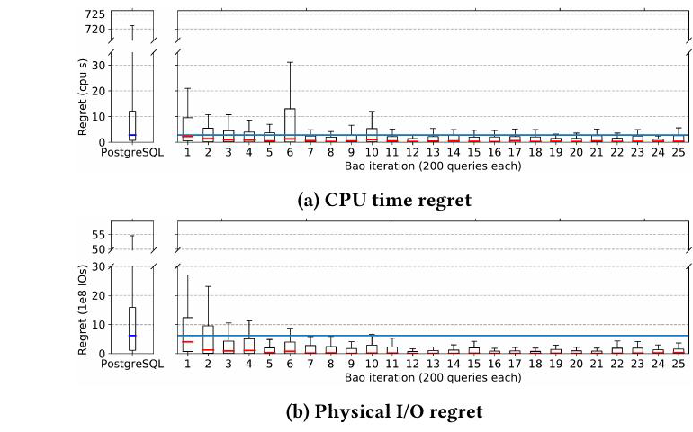

**图 16：** 遗憾（例如最优提示集与所选提示造成的物理 I/O 请求数之差）；25 轮训练迭代，每轮 50 条查询。蓝线表示 PostgreSQL 优化器的遗憾中位数，须线表示第 98 百分位。为容纳 PostgreSQL 的第 98 百分位，纵轴采用截断显示。（a）CPU 时间遗憾；（b）物理 I/O 遗憾。

## 7 结论与未来工作

本文提出 Bao：一个利用强化学习引导查询优化器的老虎机优化器。Bao 只需一小时训练，就能达到开源和商业优化器的性能。我们证明，即使工作负载、数据和模式是动态的，Bao 也能降低中位延迟和尾延迟。

未来，我们计划更全面地研究如何把 Bao 集成进云系统。具体而言，我们将测试 Bao 能否改善多租户环境中的资源利用率；这类环境中磁盘、RAM 和 CPU 时间都是稀缺资源。我们还计划研究能否把 Bao 的预测模型用作传统数据库优化器中的成本模型，让更多传统优化技术也能利用机器学习。

## 致谢

本研究由 Google、Intel 和 Microsoft 作为 MIT DSAIL 的一部分提供支持，并得到 NSF IIS 1900933 与 DARPA 16-43-D3M-FP040 的资助。

## 参考文献

[1] Bao for PostgreSQL prototype, https://learned.systems/bao.

[2] Bao online appendix, https://rm.cab/bao_appendix.

[3] Google Cloud Platform, https://cloud.google.com/.

[4] MySQL hints, https://dev.mysql.com/doc/refman/8.0/en/server-system-variables.html#sysvar_optimizer_switch.

[5] PostgreSQL hints, https://www.postgresql.org/docs/current/runtime-config-query.html.

[6] SQL Server hints, https://docs.microsoft.com/en-us/sql/t-sql/queries/hints-transact-sql-query.

[7] S. Agrawal and N. Goyal. Further Optimal Regret Bounds for Thompson Sampling. In *The International Conference on Artificial Intelligence and Statistics*, AISTATS ’13, 2013.

[8] M. Alam, J. Gottschlich, N. Tatbul, J. S. Turek, T. Mattson, and A. Muzahid. A Zero-Positive Learning Approach for Diagnosing Software Performance Regressions. In H. Wallach, H. Larochelle, A. Beygelzimer, F. d’Alché-Buc, E. Fox, and R. Garnett, editors, *Advances in Neural Information Processing Systems 32*, pages 11627–11639. Curran Associates, Inc., 2019.

[9] C. Anagnostopoulos and P. Triantafillou. Learning Set Cardinality in Distance Nearest Neighbours. In *Proceedings of the 2015 IEEE International Conference on Data Mining (ICDM)*, ICDM ’15, pages 691–696, USA, Nov. 2015. IEEE Computer Society.

[10] C. Anagnostopoulos and P. Triantafillou. Learning to accurately COUNT with query-driven predictive analytics. In *2015 IEEE International Conference on Big Data (Big Data)*, Big Data ’15, pages 14–23, Oct. 2015.

[11] C. Anagnostopoulos and P. Triantafillou. Query-Driven Learning for Predictive Analytics of Data Subspace Cardinality. *ACM Trans. Knowl. Discov. Data*, 11(4):47:1–47:46, June 2017.

[12] K. Arulkumaran, M. P. Deisenroth, M. Brundage, and A. A. Bharath. A Brief Survey of Deep Reinforcement Learning. *IEEE Signal Processing Magazine*, 34(6):26–38, Nov. 2017.

[13] J. L. Ba, J. R. Kiros, and G. E. Hinton. Layer Normalization. arXiv:1607.06450 [cs, stat], July 2016.

[14] T. Boggiano and G. Fritchey. What Is Query Store? In T. Boggiano and G. Fritchey, editors, *Query Store for SQL Server 2019: Identify and Fix Poorly Performing Queries*, pages 1–29. Apress, Berkeley, CA, 2019.

[15] L. Breiman. Bagging Predictors. In *Machine Learning*, Maching Learning ’96, 1996.

[16] L. Cen, R. Marcus, H. Mao, J. Gottschlich, M. Alizadeh, and T. Kraska. Learned Garbage Collection. In *Proceedings of the 4th ACM SIGPLAN International Workshop on Machine Learning and Programming Languages*, MAPL @ PLDI ’20. ACM, 2020.

[17] O. Chapelle and L. Li. An empirical evaluation of Thompson sampling. In *Advances in Neural Information Processing Systems*, NIPS’11, 2011.

[18] M. Collier and H. U. Llorens. Deep Contextual Multi-armed Bandits. arXiv:1807.09809 [cs, stat], July 2018.

[19] J. Dean and L. A. Barroso. The Tail at Scale. *Commun. ACM*, 56(2):74–80, Feb. 2013.

[20] B. Ding, S. Das, R. Marcus, W. Wu, S. Chaudhuri, and V. R. Narasayya. AI Meets AI: Leveraging Query Executions to Improve Index Recommendations. In *38th ACM Special Interest Group in Data Management*, SIGMOD ’19, 2019.

[21] J. Duggan, O. Papaemmanouil, U. Cetintemel, and E. Upfal. Contender: A Resource Modeling Approach for Concurrent Query Performance Prediction. In *Proceedings of the 14th International Conference on Extending Database Technology*, EDBT ’14, pages 109–120, 2014.

[22] G. Dulac-Arnold, R. Evans, H. van Hasselt, P. Sunehag, T. Lillicrap, J. Hunt, T. Mann, T. Weber, T. Degris, and B. Coppin. Deep Reinforcement Learning in Large Discrete Action Spaces. arXiv:1512.07679 [cs, stat], Apr. 2016.

[23] R. C. Fernandez and S. Madden. Termite: A System for Tunneling Through Heterogeneous Data. In *AIDM @ SIGMOD 2019*, aiDM ’19, 2019.

[24] Y. Gal and Z. Ghahramani. Dropout as a Bayesian approximation: Representing model uncertainty in deep learning. In *Proceedings of the 33rd International Conference on International Conference on Machine Learning - Volume 48*, ICML’16, pages 1050–1059, New York, NY, USA, June 2016. JMLR.org.

[25] X. Glorot, A. Bordes, and Y. Bengio. Deep Sparse Rectifier Neural Networks. In G. Gordon, D. Dunson, and M. Dudík, editors, *Proceedings of the Fourteenth International Conference on Artificial Intelligence and Statistics*, volume 15 of PMLR ’11, pages 315–323, Fort Lauderdale, FL, USA, Apr. 2011. PMLR.

[26] J. Gottschlich, A. Solar-Lezama, N. Tatbul, M. Carbin, M. Rinard, R. Barzilay, S. Amarasinghe, J. B. Tenenbaum, and T. Mattson. The three pillars of machine programming. In *Proceedings of the 2nd ACM SIGPLAN International Workshop on Machine Learning and Programming Languages*, MAPL 2018, pages 69–80, Philadelphia, PA, USA, June 2018. Association for Computing Machinery.

[27] R. B. Guo and K. Daudjee. Research challenges in deep reinforcement learning-based join query optimization. In *Proceedings of the Third International Workshop on Exploiting Artificial Intelligence Techniques for Data Management*, aiDM ’20, pages 1–6, Portland, Oregon, June 2020. Association for Computing Machinery.

[28] A. Haj-Ali, N. K. Ahmed, T. Willke, S. Shao, K. Asanovic, and I. Stoica. NeuroVectorizer: End-to-End Vectorization with Deep Reinforcement Learning. arXiv:1909.13639 [cs], Jan. 2020.

[29] R. Hayek and O. Shmueli. Improved Cardinality Estimation by Learning Queries Containment Rates. arXiv:1908.07723 [cs], Aug. 2019.

[30] N. Jacek and J. E. B. Moss. Learning when to garbage collect with random forests. In *Proceedings of the 2019 ACM SIGPLAN International Symposium on Memory Management*, ISMM 2019, pages 53–63, Phoenix, AZ, USA, June 2019. Association for Computing Machinery.

[31] S. Jain, B. Howe, J. Yan, and T. Cruanes. Query2Vec: An Evaluation of NLP Techniques for Generalized Workload Analytics. arXiv:1801.05613 [cs], Feb. 2018.

[32] S. Jain, D. Moritz, D. Halperin, B. Howe, and E. Lazowska. SQLShare: Results from a Multi-Year SQL-as-a-Service Experiment. In F. Özcan, G. Koutrika, and S. Madden, editors, *Proceedings of the 2016 International Conference on Management of Data*, SIGMOD ’16, pages 281–293. ACM, 2016.

[33] T. Kaftan, M. Balazinska, A. Cheung, and J. Gehrke. Cuttlefish: A Lightweight Primitive for Adaptive Query Processing. arXiv preprint, Feb. 2018.

[34] E. Kaufmann, N. Korda, and R. Munos. Thompson sampling: An asymptotically optimal finite-time analysis. In *International Conference on Algorithmic Learning Theory*, ALT ’12, 2012.

[35] Khaled Yagoub, Pete Belknap, Benoit Dageville, Karl Dias, Shantanu Joshi, and Hailing Yu. Oracle’s SQL Performance Analyzer. *Bulletin of the IEEE Computer Society Technical Committee on Data Engineering*, 2008.

[36] D. P. Kingma and J. Ba. Adam: A Method for Stochastic Optimization. In *3rd International Conference for Learning Representations*, ICLR ’15, San Diego, CA, 2015.

[37] A. Kipf, T. Kipf, B. Radke, V. Leis, P. Boncz, and A. Kemper. Learned Cardinalities: Estimating Correlated Joins with Deep Learning. In *9th Biennial Conference on Innovative Data Systems Research*, CIDR ’19, 2019.

[38] T. Kraska, M. Alizadeh, A. Beutel, Ed Chi, Ani Kristo, Guillaume Leclerc, Samuel Madden, Hongzi Mao, and Vikram Nathan. SageDB: A Learned Database System. In *9th Biennial Conference on Innovative Data Systems Research*, CIDR ’19, 2019.

[39] T. Kraska, A. Beutel, E. H. Chi, J. Dean, and N. Polyzotis. The Case for Learned Index Structures. In *Proceedings of the 2018 International Conference on Management of Data*, SIGMOD ’18, New York, NY, USA, 2018. ACM.

[40] S. Krishnan, Z. Yang, K. Goldberg, J. Hellerstein, and I. Stoica. Learning to Optimize Join Queries With Deep Reinforcement Learning. arXiv:1808.03196 [cs], Aug. 2018.

[41] V. Leis, A. Gubichev, A. Mirchev, P. Boncz, A. Kemper, and T. Neumann. How Good Are Query Optimizers, Really? *PVLDB*, 9(3):204–215, 2015.

[42] V. Leis, B. Radke, A. Gubichev, A. Mirchev, P. Boncz, A. Kemper, and T. Neumann. Query optimization through the looking glass, and what we found running the Join Order Benchmark. *The VLDB Journal*, pages 1–26, Sept. 2017.

[43] J. Li, A. C. König, V. Narasayya, and S. Chaudhuri. Robust estimation of resource consumption for SQL queries using statistical techniques. *PVLDB*, 5(11):1555–1566, 2012.

[44] H. Liu, M. Xu, Z. Yu, V. Corvinelli, and C. Zuzarte. Cardinality Estimation Using Neural Networks. In *Proceedings of the 25th Annual International Conference on Computer Science and Software Engineering*, CASCON ’15, pages 53–59, Riverton, NJ, USA, 2015. IBM Corp.

[45] G. Lohman. Is Query Optimization a “Solved” Problem? In *ACM SIGMOD Blog*, ACM Blog ’14, 2014.

[46] K. Lolos, I. Konstantinou, V. Kantere, and N. Koziris. Elastic management of cloud applications using adaptive reinforcement learning. In *IEEE International Conference on Big Data*, Big Data ’17, pages 203–212. IEEE, Dec. 2017.

[47] H. Mao, P. Negi, A. Narayan, H. Wang, J. Yang, H. Wang, R. Marcus, R. Addanki, M. Khani Shirkoohi, S. He, V. Nathan, F. Cangialosi, S. Venkatakrishnan, W.-H. Weng, S. Han, T. Kraska, and M. Alizadeh. Park: An Open Platform for Learning-Augmented Computer Systems. In H. Wallach, H. Larochelle, A. Beygelzimer, F. d’Alché-Buc, E. Fox, and R. Garnett, editors, *Advances in Neural Information Processing Systems 32*, NeurIPS ’19, pages 2490–2502. Curran Associates, Inc., 2019.

[48] H. Mao, M. Schwarzkopf, S. B. Venkatakrishnan, Z. Meng, and M. Alizadeh. Learning Scheduling Algorithms for Data Processing Clusters. arXiv:1810.01963 [cs, stat], Oct. 2018.

[49] H. Mao, M. Schwarzkopf, S. B. Venkatakrishnan, Z. Meng, and M. Alizadeh. Learning Scheduling Algorithms for Data Processing Clusters. arXiv:1810.01963 [cs, stat], 2018.

[50] G. Marcus. Innateness, AlphaZero, and Artificial Intelligence. arXiv:1801.05667 [cs], Jan. 2018.

[51] R. Marcus, P. Negi, H. Mao, C. Zhang, M. Alizadeh, T. Kraska, O. Papaemmanouil, and N. Tatbul. Neo: A Learned Query Optimizer. *PVLDB*, 12(11):1705–1718, 2019.

[52] R. Marcus and O. Papaemmanouil. Releasing Cloud Databases from the Chains of Performance Prediction Models. In *8th Biennial Conference on Innovative Data Systems Research*, CIDR ’17, San Jose, CA, 2017.

[53] R. Marcus and O. Papaemmanouil. Deep Reinforcement Learning for Join Order Enumeration. In *First International Workshop on Exploiting Artificial Intelligence Techniques for Data Management*, aiDM @ SIGMOD ’18, Houston, TX, 2018.

[54] R. Marcus and O. Papaemmanouil. Plan-Structured Deep Neural Network Models for Query Performance Prediction. *PVLDB*, 12(11):1733–1746, 2019.

[55] T. M. Mitchell. The Need for Biases in Learning Generalizations. Technical report, 1980.

[56] V. Mnih, K. Kavukcuoglu, D. Silver, A. A. Rusu, J. Veness, M. G. Bellemare, A. Graves, M. Riedmiller, A. K. Fidjeland, and G. Ostrovski. Human-level control through deep reinforcement learning. *Nature*, 518(7540):529–533, 2015.

[57] L. Mou, G. Li, L. Zhang, T. Wang, and Z. Jin. Convolutional Neural Networks over Tree Structures for Programming Language Processing. In *Proceedings of the Thirtieth AAAI Conference on Artificial Intelligence*, AAAI ’16, pages 1287–1293, Phoenix, Arizona, 2016. AAAI Press.

[58] P. Negi, R. Marcus, H. Mao, N. Tatbul, T. Kraska, and M. Alizadeh. Cost-Guided Cardinality Estimation: Focus Where it Matters. In *Workshop on Self-Managing Databases*, SMDB @ ICDE ’20, 2020.

[59] J. Ortiz, M. Balazinska, J. Gehrke, and S. S. Keerthi. Learning State Representations for Query Optimization with Deep Reinforcement Learning. In *2nd Workshop on Data Management for End-to-End Machine Learning*, DEEM ’18, 2018.

[60] J. Ortiz, M. Balazinska, J. Gehrke, and S. S. Keerthi. An Empirical Analysis of Deep Learning for Cardinality Estimation. arXiv:1905.06425 [cs], Sept. 2019.

[61] J. Ortiz, B. Lee, M. Balazinska, J. Gehrke, and J. L. Hellerstein. SLAOrchestrator: Reducing the Cost of Performance SLAs for Cloud Data Analytics. In *2018 USENIX Annual Technical Conference (USENIX ATC 18)*, USENIX ATX’18, pages 547–560, Boston, MA, 2018. USENIX Association.

[62] J. Ortiz, B. Lee, M. Balazinska, and J. L. Hellerstein. PerfEnforce: A Dynamic Scaling Engine for Analytics with Performance Guarantees. arXiv:1605.09753 [cs], May 2016.

[63] I. Osband and B. Van Roy. Bootstrapped Thompson Sampling and Deep Exploration. arXiv:1507.00300 [cs, stat], July 2015.

[64] Y. Park, S. Zhong, and B. Mozafari. QuickSel: Quick Selectivity Learning with Mixture Models. arXiv:1812.10568 [cs], Dec. 2018.

[65] A. Pavlo, G. Angulo, J. Arulraj, H. Lin, J. Lin, L. Ma, P. Menon, T. C. Mowry, M. Perron, I. Quah, S. Santurkar, A. Tomasic, S. Toor, D. V. Aken, Z. Wang, Y. Wu, R. Xian, and T. Zhang. Self-Driving Database Management Systems. In *8th Biennial Conference on Innovative Data Systems Research*, CIDR ’17, 2017.

[66] A. Pavlo, E. P. C. Jones, and S. Zdonik. On Predictive Modeling for Optimizing Transaction Execution in Parallel OLTP Systems. *PVLDB*, 5(2):86–96, 2011.

[67] A. G. Read. DeWitt clauses: Can we protect purchasers without hurting Microsoft. *Rev. Litig.*, 25:387, 2006.

[68] C. Riquelme, G. Tucker, and J. Snoek. Deep Bayesian Bandits Showdown: An empirical comparison of bayesian deep networks for thompson sampling. In *International Conference on Learning Representations*, ICLR ’18, 2018.

[69] M. Schaarschmidt, A. Kuhnle, B. Ellis, F. Fricke, F. Gessert, and M. Yoneki. LIFT: Reinforcement Learning in Computer Systems by Learning From Demonstrations. arXiv:1808.07903 [cs, stat], Aug. 2018.

[70] P. G. Selinger, M. M. Astrahan, D. D. Chamberlin, R. A. Lorie, and T. G. Price. Access Path Selection in a Relational Database Management System. In J. Mylopolous and M. Brodie, editors, *SIGMOD ’79*, SIGMOD ’79, pages 511–522, San Francisco (CA), 1979. Morgan Kaufmann.

[71] Shrainik Jain, Jiaqi Yan, Thiery Cruanes, and Bill Howe. Database-Agnostic Workload Management. In *9th Biennial Conference on Innovative Data Systems Research*, CIDR ’19, 2019.

[72] M. Stillger, G. M. Lohman, V. Markl, and M. Kandil. LEO - DB2’s LEarning Optimizer. In *VLDB*, VLDB ’01, pages 19–28, 2001.

[73] J. Sun and G. Li. An end-to-end learning-based cost estimator. *Proceedings of the VLDB Endowment*, 13(3):307–319, Nov. 2019.

[74] W. R. Thompson. On the Likelihood that One Unknown Probability Exceeds Another in View of the Evidence of Two Samples. *Biometrika*, 1933.

[75] C. Tofallis. A Better Measure of Relative Prediction Accuracy for Model Selection and Model Estimation. *Journal of the Operational Research Society*, 2015(66):1352–1362, July 2014.

[76] I. Trummer, S. Moseley, D. Maram, S. Jo, and J. Antonakakis. SkinnerDB: Regret-bounded Query Evaluation via Reinforcement Learning. *PVLDB*, 11(12):2074–2077, 2018.

[77] K. Tzoumas, T. Sellis, and C. Jensen. A Reinforcement Learning Approach for Adaptive Query Processing. Technical Reports, June 2008.

[78] A. Vogelsgesang, M. Haubenschild, J. Finis, A. Kemper, V. Leis, T. Mühlbauer, T. Neumann, and M. Then. Get Real: How Benchmarks Fail to Represent the Real World. In A. Böhm and T. Rabl, editors, *Proceedings of the 7th International Workshop on Testing Database Systems*, DBTest@SIGMOD ’18, pages 1:1–1:6. ACM, 2018.

[79] L. Woltmann, C. Hartmann, M. Thiele, D. Habich, and W. Lehner. Cardinality estimation with local deep learning models. In *Proceedings of the Second International Workshop on Exploiting Artificial Intelligence Techniques for Data Management*, aiDM ’19, pages 1–8, Amsterdam, Netherlands, July 2019. Association for Computing Machinery.

[80] C. Xie, C. Su, M. Kapritsos, Y. Wang, N. Yaghmazadeh, L. Alvisi, and P. Mahajan. Salt: Combining {ACID} and {BASE} in a Distributed Database. In *11th {USENIX} Symposium on Operating Systems Design and Implementation ({OSDI} 14)*, OSDI ’14, pages 495–509, 2014.

[81] Z. Yang, A. Kamsetty, S. Luan, E. Liang, Y. Duan, X. Chen, and I. Stoica. NeuroCard: One Cardinality Estimator for All Tables. arXiv:2006.08109 [cs], June 2020.

[82] Z. Yang, E. Liang, A. Kamsetty, C. Wu, Y. Duan, X. Chen, P. Abbeel, J. M. Hellerstein, S. Krishnan, and I. Stoica. Deep unsupervised cardinality estimation. *Proceedings of the VLDB Endowment*, 13(3):279–292, Nov. 2019.

[83] L. Zhou. A Survey on Contextual Multi-armed Bandits. arXiv:1508.03326 [cs], Feb. 2016.

[^1]: https://learned.systems/bao
[^2]: https://rm.cab/imdb
[^3]: https://rm.cab/stack
[^4]: 这需要给 VM 增加 RAM，并重新调优 PostgreSQL 的成本模型。
[^5]: 我们进行了广泛的网格搜索来调优随机森林模型。
[^table-note]: 该模式变化没有引入新数据，但对一个大型事实表进行了正规化。
