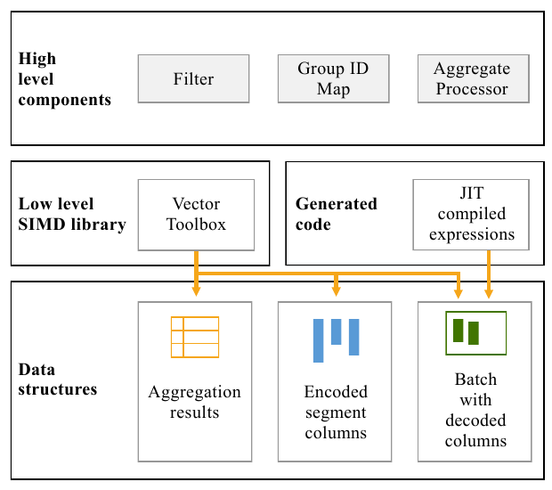
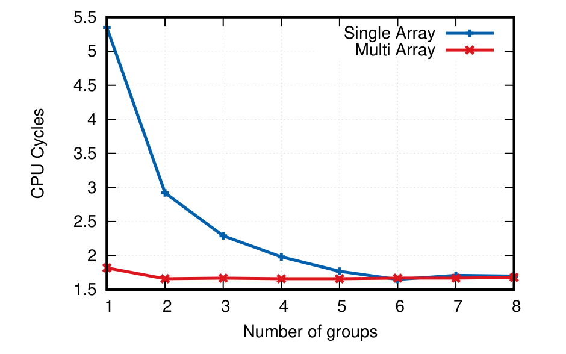
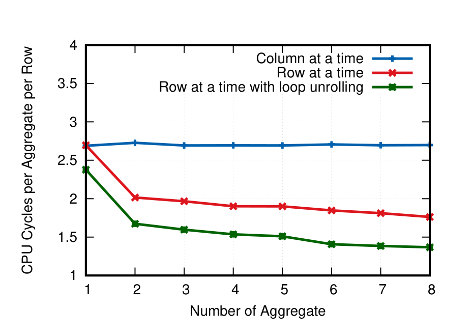
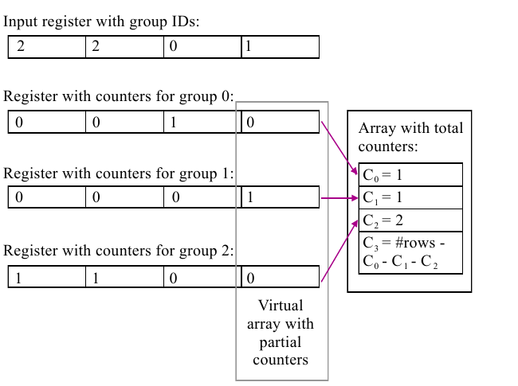
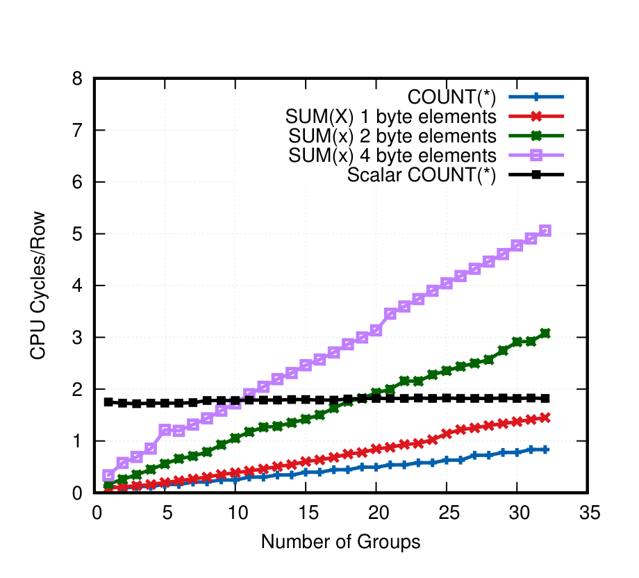
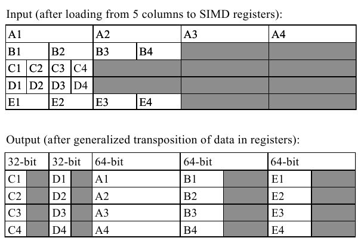
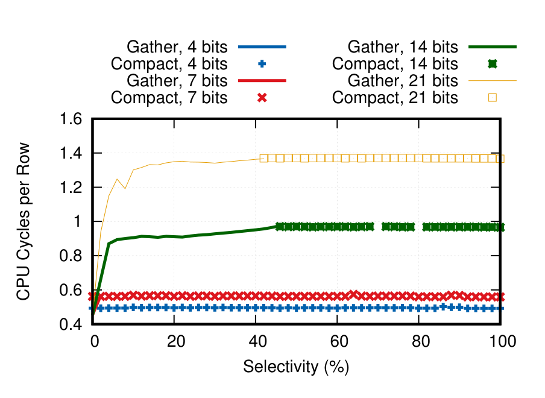
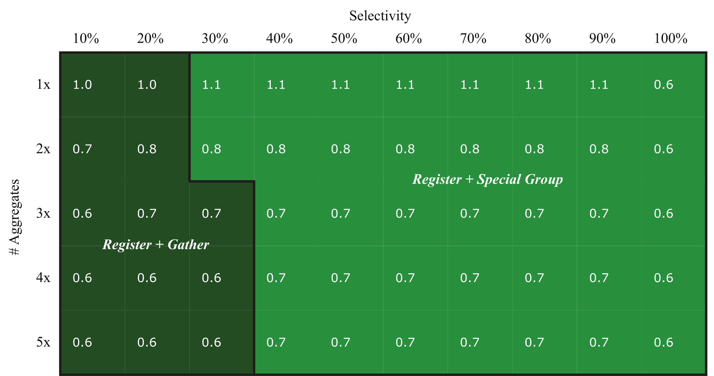
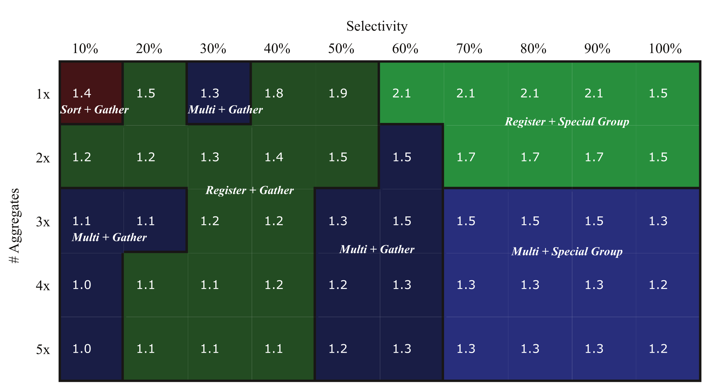
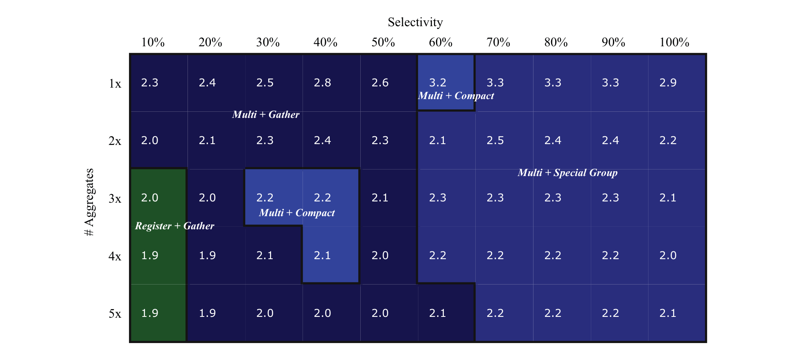

# BIPie: Fast Selection and Aggregation on Encoded Data using Operator Specialization（中文译文）

## 译者说明

本文依据同目录的 `source.pdf` 翻译。章节、图表、公式、算法、代码与参考文献按原文结构保留。

## 作者

Michal Nowakiewicz、Eric Boutin、Eric Hanson、Robert Walzer、Akash Katipally[^author-note]

MemSQL

**ACM 参考格式：** Michal Nowakiewicz、Eric Boutin、Eric Hanson、Robert Walzer、Akash Katipally. 2018. BIPie: Fast Selection and Aggregation on Encoded Data using Operator Specialization. In SIGMOD’18: 2018 International Conference on Management of Data, June 10–15, 2018, Houston, TX, USA. ACM, New York, NY, USA, 13 pages. https://doi.org/10.1145/3183713.3190658

**出版信息：** SIGMOD’18，June 10–15, 2018，Houston, TX, USA；© 2018，版权归本文作者所有，出版权许可给 Association for Computing Machinery；ACM ISBN 978-1-4503-4703-7/18/06；\$15.00；https://doi.org/10.1145/3183713.3190658

## 摘要

现代硬件的发展，例如计算机可用主存容量增长，使得数据分析速度相比过去大幅提高。我们展示了在现代通用硬件上处理分析查询仍有巨大改进空间。我们提出 BIPie，这是一个在 MemSQL 列式存储引擎上执行分析查询的查询处理引擎，实现了高效解码、选择和聚合。

我们表明，这些操作彼此依赖，必须融合并一起考虑，才能达到很高性能。我们提出并比较了多种解码、选择和带 `GROUP BY` 的聚合策略，这些策略都面向现代 CPU 架构设计，包括 SIMD。我们在 MemSQL 中实现了这些方法；MemSQL 是一款面向通用硬件设计的高性能混合事务与分析处理数据库。我们在一系列参数上深入评估该方法，并展示了它相比已发表的 TPC-H Query 1 性能快 2 到 4 倍。

## 1. 引言

硬件技术进步让系统能更快处理数据，使企业可以把分析查询直接发送到数据库，对实时数据做决策。这些查询通常是即席的，过滤条件复杂，并且很少能从预建索引中受益。因此，分析查询往往需要扫描大量数据。为了节省磁盘和内存带宽，数据通常会用更少字节进行编码。正如我们在讨论一组统称为 Business Intelligence ProcessIng on Encoded Data（BIPie[^1]）的增强技术时所展示的，这种编码为提高查询性能提供了巨大机会。

我们在 MemSQL 6 中引入 BIPie，以提升访问列式表数据的查询性能。我们特别关注的查询包括：过滤输入表（`WHERE` 子句）、按一个或多个列或表达式分组（`GROUP BY` 子句）、聚合一个或多个表达式（如 `SUM(x)`）。我们通过直接在编码数据上处理查询、使用 SIMD 向量处理，以及对算子按运行时参数进行专化来实现这些目标。

直接操作编码数据让 BIPie 避免解码和物化已解码值。编码数据还提供额外信息，例如字典编码中从列值到小整数的映射，可直接作为完美哈希函数使用。

BIPie 为选择和聚合实现多个变体，并在运行时选择。每个实现针对不同参数优化，例如每个值的位数、选择率、组数、需要计算的聚合数量。比如，当过滤非常有选择性、组数很少、或整数求和数量很多时，BIPie 使用不同的聚合版本。算子变体由三种选择策略和三种聚合策略组合而成。

三种选择策略是：Gather selection 利用现代微处理器的 gather 指令，适合较低选择率；Special Group selection 面向较高选择率，并与聚合策略融合，在同一步执行选择和聚合；Compaction selection 是安全的 fallback。三种聚合策略是：In-Register aggregation 适合位数少、组数少；Sort-Based aggregation 适合低选择率和大量聚合；Multi-Aggregation 适合需要计算较多聚合的场景。

本文结构如下：我们先介绍 MemSQL 数据库引擎与 BIPie 所优化的实时分析负载（第 2 节），再概述 BIPie 架构（第 3 节），然后深入讨论选择策略（第 4 节）和聚合策略（第 5 节）；随后，我们在广泛参数范围内比较所有策略组合，在 TPC-H Query 1 上评估 BIPie，并将 Query 1 的性能与其他数据库引擎比较（第 6 节）。

## 2. 背景

MemSQL 是分布式、内存优化 SQL 数据库，擅长在规模化环境中混合实时分析和事务处理。MemSQL 可用两种格式存储数据：内存中的行式存储，以及磁盘支持的列式存储。表可创建为 rowstore 或 columnstore，查询也可涉及两类表的任意组合。MemSQL 使用 MVCC 和内存优化无锁数据结构支持高并发读写，从而允许在操作型数据库上进行实时分析。其 columnstore 架构支持对持续写入的表执行低延迟实时流式分析查询 [21]，结合可扩展分布式架构可在大量变化数据上达到亚秒级延迟，并且只依赖通用硬件。

MemSQL 使用 shared-nothing 架构，分布式系统中的节点不共享内存、磁盘或 CPU。节点分为调度节点（aggregator）和执行节点（leaf）。aggregator 作为客户端和集群之间的中介；leaf 提供数据存储和查询处理。用户把查询发送到 aggregator，查询在这里解析、优化和规划。本文优化重点是单个 leaf 内部的执行策略；分布式查询执行与优化的更多细节见文献 [10]。

查询计划使用 LLVM [14] 编译为机器码，并缓存以加速后续执行。编译后的查询计划不预先指定参数值，因此同一结构的后续查询可以用不同参数快速运行。MemSQL 力求让客户能在广泛的硬件平台上运行数据库，包括本地部署和云端安装；与此同时，MemSQL 以性能为先。因此，我们利用硬件发展趋势，采用本文所述的先进查询执行方法。

### 2.1 列式编码数据

BIPie 专注处理列式编码数据；MemSQL columnstore 格式的更多细节见文献 [21]。MemSQL columnstore index 分为可变区和不可变区。不可变区是列式且压缩的；其中的行可标记删除，但不能原地更新。可变区是行式、未压缩且可更新，表示最近新增或修改的一小部分行。后台任务会把可变区压缩进不可变区。本文关注不可变区上的查询处理。

不可变 columnstore 中的行分组为 segment。一个 segment 约含一百万条记录。每个 segment 内的每列单独压缩、存储和访问，所有列保持相同记录顺序。MemSQL 支持多种编码，包括 delta encoding、run-length encoding、dictionary encoding 和 integer bit packing。压缩时会根据压缩后大小和对查询执行的有用性选择编码。

RLE 适合列中相同值连续出现的情况，编码流是 `(value, count)` 对序列。字典编码包含所有不同值的字典，以及标识字典元素的 bit-packed 整数序列。对于 bit packing，我们使用表示最大字典索引所需的最少位数，并把各值无间隙串接到一个 bit vector 中。

每个 segment 含每列元数据，例如最小值和最大值。这些元数据有两个用途。第一，查询处理时可做 segment elimination：若能判断该列过滤表达式会拒绝 segment 内所有行，就跳过整个 segment。第二，可判断数值列在表达式和求和中是否可能溢出。如果我们能确定 segment 内不会溢出，就可以避免溢出检查。本文中，我们假设总能判断一个 segment 内不会溢出，因此在讲解算法时不讨论溢出检查。

MemSQL 表按用户指定的 key 分区；若数据已经正确分区，优化器会利用这一属性，避免连接或聚合中的重新分区。

MemSQL 的列式查询处理遵循 batch processing。扫描 columnstore 表时使用固定行数的移动窗口，MemSQL 中最多 4096 行。窗口内行形成一个 batch。我们完整处理一个 batch 后才进入下一个 batch，并且永不回访之前的 batch。这个技术此前已用于 MonetDB/X100 [7]。

### 2.2 简化假设

为便于讲解算法，我们对输入数据表示和处理它的数据库查询类型做了若干简化假设。第一，我们假设只有一个 group-by 列，且唯一值不超过 256 个；我们还假设该列使用字典编码和 bit packing。所有不同值被分配从 0 开始的连续整数标识，即 group id。每行的 group-by 值替换为对应 group id，再用能够表示最大字典索引的最小固定 bit 数无间隙顺序存储。这种格式允许使用以 group id 为索引的数组更新每组聚合结果，直到输出聚合结果时才需要访问字典。

我们还假设行顺序任意，尤其不按 group-by 列排序；我们假设所有聚合列都是不超过 8 字节的整数类型，不含 null，使用 bit packing，且不使用字典编码。每当我们提到 bit unpacking 时，指的都是把解包值输出到数组中，并使用能容纳所有值的最小 2 的幂字宽（1、2、4、8 字节）。使用最小字宽对某些场景性能很重要。

这些假设不是 BIPie 实现限制，只是为了简化说明。把技术扩展到这些假设之外，是对我们所述技术进行机械且直接的扩展。

### 2.3 工作负载

本文关注在列式编码数据上执行分析负载，尤其是把选择和聚合下推到列式扫描中。BIPie 高效执行如下形式的查询：

```sql
SELECT
  g,
  count(*),
  sum(agg1), ..., sum(aggn)
FROM columnarTable
WHERE <filter expression>
GROUP BY g;
```

`g`、`agg1` 等直接引用 columnstore 列。我们不讨论过滤表达式的求值；本文中，我们假设其结果已经计算好，并且成本相对整体查询成本较小。过滤和所有聚合都是可选的。BIPie 技术适用于这种查询，也适用于可分解为这种形式的查询；TPC-H Query 1 就是一个很好的例子，我们将在第 6.3 节用它评估 BIPie。

## 3. BIPie 概览

我们在 MemSQL 6 中引入 BIPie，用来加速访问 columnstore index 的相对简单查询。具体而言，我们面向过滤输入表、按一个或多个列或表达式分组，以及对一个或多个列或表达式聚合的查询。我们用来提升性能的方法建立在三点之上：直接处理编码数据、使用 SIMD 向量处理，以及针对运行时参数专化算子。

BIPie 把解码、过滤、分组与聚合融合进 columnstore scan，并结合即时编译、向量化和 SIMD；实现分为 Vector Toolbox、生成代码和承载算子逻辑的高层组件三层。



图 1 聚焦单个 segment 的扫描及其主要数据结构；为清晰起见，省略了 segment 管理、segment elimination 和已删除行管理。

Vector Toolbox 是低层向量函数库，高度优化，并为不同代 CPU 编译不同版本，可在运行时按硬件自动切换。它不依赖引擎其他代码，函数可操作已解码或编码数据。

生成代码用于查询中的所有标量表达式，包括过滤表达式、分组表达式和聚合输入表达式。生成函数始终操作解压后的列数据。这对保持低查询编译时间很重要，否则编译器需要为大量编码和算子组合生成代码。

高层组件包含 columnstore scan 的算子逻辑，负责解码、过滤、分组和聚合，并协调 batch、segment、聚合结果等数据结构。过滤组件对列式 batch 求值过滤表达式，并把结果同删除记录信息合并，产生指示哪些记录被选中的 selection vector。聚合又拆成 Group ID Mapper 和 Aggregate Processor：前者接收查询的 group-by 列并生成单个整数 group id 向量，后者接收 group id 向量和过滤组件产生的 selection vector，为每个组计算聚合结果。

Group ID Mapper 取代经典聚合实现中的哈希表查找步骤。它利用编码数据中的机会，例如字典编码本身已经给出了从列值到字典编号的无冲突完美哈希。Aggregate Processor 则在运行时从 Vector Toolbox 提供的多种聚合策略中选择一种。我们为每个 segment 选择一种聚合策略；选择依据是由 segment 元数据计算出的最大组数，以及聚合的数量和类型。

直接操作编码数据提供三类收益：避免完全或部分解码；避免物化解码值；利用编码为我们提供的附加信息。例如，字典编码已提供从列值到小整数的单射映射，可作为该列的完美哈希函数。避免物化解码值还让系统可以在简单循环中处理输入向量，重复可预测指令序列，并在独立数据元素上运行 [7]。这有利于 CPU 流水线和 SIMD 并行。

算子专化通过多个特化实现提升性能。每个实现针对不同输入优化，并有不同适用限制，例如非常有选择性的过滤、极少的不同组，或者大量整数求和。聚合方法在运行时选择，且可按 segment 改变；选择方法可按 batch 改变，并基于过滤后的实际选择率决定。因此，同一查询在不同 segment 或 batch 上可能使用不同实现。

本文重点讨论 Vector Toolbox 中供 Aggregate Processor 使用的部分。我们将展示多种使用 SIMD 完成 Aggregate Processor 任务的方法，并考察每种方法分别适合哪些输入。这些方法并非通用替代品，但能在许多具体、实用且常见的查询情形中显著加速。

## 4. 选择

对当前 batch 求值过滤表达式后，我们得到 selection byte vector。该向量中，需要移除的位置为 0，保留的位置为 `0xFF`，与 AVX2 单字节比较结果一致。为了排除已删除记录，我们还把 batch 中每条已删除记录对应的位置写成 0。


我们有时也使用 selection index vector，即包含合格行序号的数组。本文中我们考虑的选择处理，其高层目标是从后续处理移除不需要的行，并让剩余列数据变成无需再次引用 selection byte vector 或 selection index vector 的形式。

朴素选择会使用依赖过滤结果的条件分支，这会限制 SIMD 等数据级并行，也让 CPU 难以预测下一条指令，降低流水线效率。BIPie 的选择算子避免依赖过滤结果的条件分支，使相邻行遵循一致且可预测的代码路径，从而更有效地使用 CPU 流水线与 SIMD。

### 4.1 压紧算子（Compacting operator）

压紧算子接收 selection vector 与输入向量，输出压紧后的向量。selection vector 对输入向量的每个值使用一个字节；这种表示可由过滤表达式的向量化执行高效地产生。

顺序伪代码可表述为：计数器 $C$ 从 0 开始遍历 selection vector；当当前位置未选中时只递增 $C$，当当前位置被选中时，我们写入输出向量并递增 $C$。写入内容取决于工作模式：在 index vector 模式下，我们把 $C$ 写入输出向量，生成合格行序号；在 physical compaction 模式下，我们把输入向量第 $C$ 个值复制到输出向量。后者要求输入已经解包，且元素大小是 2 的幂。

该过程可用 SIMD 实现为数据并行、无分支代码 [20]。两种模式在数据位于 CPU cache 时都只需约 0.4-0.6 cycles/row。physical compaction 会先解包整列再压紧，后续算子只处理连续的合格值；它适合中等选择率，也是通用而安全的回退方案。

### 4.2 Gather 选择

Gather 选择分两步。第一步以 index vector 模式执行压紧，把 selection byte vector 转成 selection index vector。第二步遍历这些索引：对每个索引，我们从编码列读取包含相应 bit-packed 值的机器字，再抽取实际值。读取、抽取和存储可完全用 AVX2 数据并行实现；其中 gather 指令能按一组索引把多个数组元素装入 SIMD 寄存器的不同 lane。查询涉及的每个 group-by 列和聚合列都需要重复第二步，因此该方法把 bit unpacking 与删除过滤行合在一起。

**表 1：Gather selection 性能。**

| 输入列位宽 | 5 bit | 10 bit | 20 bit |
| --- | ---: | ---: | ---: |
| CPU cycles/row | 1.08 | 1.33 | 1.63 |

位宽越大，单个 SIMD 寄存器能容纳的值越少，因此性能下降。Gather 与 physical compaction 的关键区别是：gather 只解包被选中的值，而 physical compaction 必须解包整个输入列。这使 gather 尤其适合选择率低的 batch。

### 4.3 特殊组分配选择（Selection by Special Group Assignment）

选择和聚合经常出现在同一查询中，而且过滤往往只拒绝很少的行。特殊组分配正是为这一情形设计：它融合过滤组件与 group id mapping，返回的不是紧凑值或索引，而是 group id map。

这一方法源于如下观察：

```sql
SELECT a, sum(x) FROM t WHERE b = 1 GROUP BY a;
```

我们曾运行上面这种简单 SQL 查询，其中 `a`、`b` 都只有少量不同值。我们注意到，它明显慢于：

```sql
SELECT a, b, sum(x) FROM t GROUP BY a, b;
```

即使前一个结果只是后一个结果的子集，并且可以用成本可忽略的后处理得到，情况依然如此。在第二个查询中，我们把过滤表达式替换为一个新的 group-by 列，用它表示所有应被拒绝的行。第一条查询中的 gather 需要按 selection vector 计算地址来读取 `x`，妨碍 CPU 流水化；第二条查询顺序扫描列，访问模式更可预测。

因此，我们创建一个原本未使用的特殊 group id，并为 selection byte vector 中未选中的每一行分配这个 id，其他行保留原 group id。随后聚合方法无条件处理所有行；输出时，我们丢弃特殊组的结果。这个过程也可看作把分组与聚合提前到选择流水线的一部分之前。它在高选择率时避免 gather 或物理压紧，并能将选择与聚合真正融合。

## 5. 分组与聚合

选择策略应用后，我们需要计算聚合。为此，我们把 group id map 同输入 batch 结合起来；group id map 指明每条记录所属的组。一般情形下如何生成 group id map 不在本文范围内；若只按单个字典编码列分组，group id 就是字典 id。真正高性能的聚合必须同时适应组数、聚合数、每个被聚合值的位数以及选择率。本节我们先分析并评估朴素标量方法，然后讨论 Sort-Based、In-Register 与 Multi-Aggregate 三种 SIMD 策略。

### 5.1 标量方法

我们先分析 group-by `SUM` 聚合的朴素标量（不使用 SIMD）实现。单个 `SUM` 的朴素实现如下。

**算法 1：标量聚合。**

```text
for (int i = 0; i < number_of_rows; ++i)
    sum[group_column[i]] += sum_column[i];
```

图 2 的 Single Array 曲线显示一个反直觉现象：组数极少时反而更慢，例如 2 组为 2.9 cycles/row，而 6 组约为 1.65 cycles/row。这很可能是由于相邻行写入同一聚合槽位的概率高，造成 CPU pipeline stall。即使组数很多，只要输入中某个 group id 高频出现，也会有类似现象，例如 group-by 列部分有序或数据倾斜时。把循环展开两次或更多次，在两个或更多 sum 数组间轮转更新，最后合并各数组的部分结果，可以打破这种依赖。



多个 `SUM` 可以按列逐个完成，也可逐行更新所有聚合。在第一种情况下，我们会先完整处理一个 batch 的第一个聚合列，再处理下一列；在后一种情况下，我们会先更新一行的所有 sum，再处理下一行。我们的实验中，聚合结果数组采用面向行的布局，逐行更新全部 sum 的 row-at-a-time 方法更快；展开遍历所有聚合列的内层循环还能进一步改善它。图 3 在 32 组和不同 sum 数量下比较了 column-at-a-time、row-at-a-time 与 loop-unrolled row-at-a-time 三种实现，单位为 cycles/row/aggregate。



### 5.2 基于排序的 SUM 聚合

Sort-Based SUM 是我们提出的第一个使用 SIMD 的聚合策略。它把算法分为重新分组与求和两步。第一遍，我们统计每个 group id 的行数，据此把输出索引数组切成每组一个连续子区间；若查询本来就含 `COUNT(*)`，我们只计算一次并复用该结果。第二遍，我们把每行的索引追加到对应组的区间。组数很少时，相邻行更新同一 bucket counter 仍可能产生与标量方法相似的写冲突；我们为每个 bucket 分配两个 counter，分别处理偶数行和奇数行，以避免写冲突。得到索引数组后，我们对每个组连续遍历索引并对输入列求和，并用 SIMD gather 根据索引取得聚合列值。

聚合时，我们直接对编码输入执行解码或 bit unpacking，把解码、选择和聚合放在同一优化单元中。gather 或 compaction selection 会在排序前排除过滤行；special group assignment 则在排序过程中排除它们。

这一策略只需对 group id 排序一次，随后可把同一索引顺序用于多个聚合列。每个额外 `SUM` 的固定分组成本会被摊薄，因此聚合越多，单位聚合成本越低。表 2 的输入为 23-bit bit-packed 聚合列且没有过滤条件。

**表 2：Sort-Based SUM Aggregation 的每行每聚合 CPU cycles。**

| 组数 | 1 个 sum | 2 个 sum | 4 个 sum |
| --- | ---: | ---: | ---: |
| 4 | 3.13 | 2.21 | 1.74 |
| 8 | 3.59 | 2.49 | 1.89 |
| 16 | 3.61 | 2.48 | 1.92 |

该方法特别适合选择率低而聚合数多的查询，因为要排序的合格行少，重用索引的收益大。它还能直接处理原始 bit-packed、未过滤的聚合列；后文其他方法的结果要求先解码输入，却没有计入该解码成本，因此表中的跨方法对比实际低估了 Sort-Based 方法的性能优势。

### 5.3 寄存器内聚合（In-Register Aggregation）

寄存器内聚合是我们在本文中提出的第二种 SIMD-friendly 聚合策略。核心思路是把中间结果完全保留在 CPU/SIMD 寄存器中，而不是写入内存；该技术同时适用于 `COUNT` 与 `SUM`，但在当时的硬件上只适合约 32 组以内的小组数，并且每个聚合需要单独处理。



为理解数据布局，我们以计算每组行数为例：有 $N$ 个组，group id 均为一字节且范围是 $0,\ldots,N-1$。顺序处理输入时，我们把一批 group id 装入向量 $V$，其中第 $i$ 个 lane 对应第 $i$ 行。每个 lane 都可视为拥有一套独立的“每组计数数组”；实现实际使用 $N$ 个 SIMD 寄存器，每个寄存器保存某一组在各 lane 上的局部计数。对 `COUNT`，我们可以用总行数减去其他组计数，省去对第 $N-1$ 组的处理，从而节省一个寄存器。图 4 的示例使用 4 个 lane 和 4 个组。

**算法 2：寄存器内聚合。** 算法 2 给出更新下一批 group id 值（记为 $V$）的虚拟数组的伪代码；为清晰起见，我们还给出所用 SIMD intrinsic 的标量等价代码。

```text
for i=0..N-1
    mask = simd_compare(V, i)
    virtualArray[i] = simd_add(virtualArray[i], mask)

simd_compare(V, i):
    mask = [0...0]
    for each lane in V:
        if V[lane] = i:
            mask[lane] = 0xFF
        else:
            mask[lane] = 0
    return mask

simd_add(v1, v2)
    result = [0...0]
    for each lane in v1:
        result[lane] = v1[lane] + v2[lane]
    return result
```

由于相等 mask 的每个字节是 `0xFF`，把它相加等价于加 $-1$。一批 group id 处理完后，要先对各 lane 的负计数取相反数，再把每个虚拟数组横向归并成单个组计数，并用总行数补出省略的最后一组。

MemSQL 中，我们为不超过 32 个组的 `COUNT` 以及 1、2、4 字节 `SUM` 生成专化实现，通过宏和 C++ 模板辅助生成，并在运行时选择。字典大小等编码元数据可给出 batch 组数上界。每处理 32 个值，我们的各个实现变体实际使用的每组指令数如下：

**表 3：In-register aggregation 每组处理 32 个值所需指令数。**

| 变体 | 输入大小 | 每计数器宽度 | 每组指令数/32 个值 |
| --- | --- | --- | ---: |
| `COUNT(*)` | - | 4 bit | 1.5 |
| `SUM(x)` | 1 byte | 16 bit | 3 |
| `SUM(x)` | 2 byte | 32 bit | 7 |
| `SUM(x)` | 4 byte | 32 bit | 12 |

组数越多，需要的比较与累加指令越多；值位宽越小，一个寄存器可并行处理的元素越多。因此成本随组数近似线性增长，窄值明显更快。



图 5 比较所有寄存器虚拟数组变体，并加入标量 `COUNT(*)` 作为参照。组数增加时，每组都多执行一次操作，所以性能近似线性下降；输入值越窄，每个寄存器的 lane 越多，可利用的 SIMD 并行度越高。

### 5.4 多聚合 SUM（Multi-Aggregate SUM Aggregation）

Multi-Aggregate 是我们在本文中提出的第三种 SIMD-friendly 聚合策略，面向同一查询计算多个 `SUM` 的情形。它与前两种策略不同：数据级并行沿水平方向展开，即同一输入行的多个聚合一起处理，而不是同一聚合的多行一起处理。传统 column-at-a-time 实现每次更新一个聚合数组；Multi-Aggregate 改为把一行的多个聚合值布局到同一个 SIMD 寄存器中，从一个 group 对应的连续结果区域执行 load-add-store，一次更新多个聚合。



我们在第 5.1 节已经表明，对多个 sum 而言，row-at-a-time 聚合快于 column-at-a-time 聚合；如果我们把同一行的多个 sum 输入装入一个 SIMD 寄存器，并对它们只执行一组 load-add-store 指令，还可以进一步改善。我们的输入在内存中仍按列存储，因此为了组装成行，我们需要重排被求和各列的值。考虑 4 个 64 位输入列的简单情形：从每列装入一个 256 位向量后，我们得到寄存器中的 4×4 矩阵；用 4 条 `PUNPCKLQDQ` 和 4 条 `PUNPCKHQDQ` 转置，就得到每个寄存器保存一行全部聚合的目标布局。

一般情形下，列数和元素宽度都可不同，这给转置带来挑战。BIPie 用组合模板函数为常见组合生成专化 SIMD 转置：1、2 字节输入扩展到 4 字节，更大输入扩展到 8 字节。我们这样做，是为了保证对不超过 4 字节的输入，64 位 lane 可安全累加最多 65536 行而不溢出；8 字节输入需要其他溢出检查。只要扩展后同一行的所有值能装入 256 位寄存器，并保证 32/64 位元素按各自边界对齐，列数和尺寸组合都可任意。

图 6 中字母表示聚合列，数字表示行位置；每一行代表一个 SIMD 寄存器。该方法要求扩展后同一行的所有元素都能装入单个 256 位 SIMD 寄存器；满足这一条件时，只需一次向量装载、一次加法和一次存储。表 4 给出 32 组、不同聚合数和元素大小组合的示例，单位为 cycles/row/sum。

**表 4：Multi-Aggregate 的样例性能。**

| 聚合数 | 各聚合元素字节数 | cycles/row/aggregate |
| ---: | --- | ---: |
| 2 | 8-2 | 1.37 |
| 3 | 8-4-1 | 1.43 |
| 4 | 8-8-4-2 | 0.91 |
| 5 | 8-4-4-2-2 | 0.77 |
| 5 | 4-4-2-2-2 | 0.75 |

聚合越多，每个 `SUM` 的效率越高，因为 group id 读取、地址计算和 load/store 的固定开销由更多聚合共同承担。该策略对组数和输入位宽没有寄存器内聚合那么敏感，因而在较多组或较宽编码值时经常胜出。

## 6. 实验

本节我们评估 BIPie 的性能。我们先比较选择方法，再深入比较前文提出的所有选择与聚合方法组合，并跨选择率、组数、聚合数和编码位数等参数评估各方法；最后，我们在 TPC-H Query 1 上评估 BIPie，并与已发表结果比较。

实验平台为 3.4GHz Intel Core i7-6700、32GB RAM，4 个物理核、8 个硬件线程。单个算子的评测直接使用 Vector Toolbox，在 MemSQL 外运行；端到端查询评测使用修改后的 MemSQL。每次实验中，我们同时使用所有可用硬件线程，以覆盖同一物理核上的共置硬件线程以及不同物理核之间共享硬件资源所产生的影响。所有输入数据始终位于内存中；我们使用至少数亿行的输入，确保其无法装入末级 CPU cache，从而把主存扫描影响计入评测。我们总是把同一实验运行 10 次，并报告这 10 次的中位数。

作为时间单位，我们总是使用每物理核、每输入行、每个计算出的 `SUM` 的 CPU cycles，记作 cycles/row/sum；不计算聚合的算子和完整 SQL 查询不除以聚合数，使用 cycles/row。我们认为，该单位能直观表示操作的总体成本。按物理核与行数归一化可弱化时钟频率、核心数和输入规模差异，并允许估计同一 CPU 系列的另一台机器上可以预期的性能；除以聚合数还能显示新增聚合如何摊薄固定成本。

### 6.1 选择方法比较

直觉上，低选择率适合 gather，中等选择率适合 compaction，高选择率适合 special group。图 7 比较 gather 与“先全列解包、再 physical compaction”。对 4、7、14、21 bit 四种输入，每种位宽都有一个阈值，超过后 compaction 更快。图中只画出两者较快的一段：例如 4 bit 时选择率达到约 2% compaction 就胜出，而 21 bit 时 gather 一直领先到约 38%。较宽编码增加全列解包成本，因此延后交叉点。



### 6.2 BIPie 中选择与聚合的全部组合

我们把 gather、compaction、special group 三种选择方法，与 sort-based、in-register、multi-aggregate 三种聚合方法两两组合，共 9 种实现；然后跨组数、聚合列位宽、选择率和 `SUM` 数量比较。图 8-10 分别对应 8 组/7 bit、12 组/14 bit、32 组/28 bit。每个单元格写出最佳组合的 cycles/row/sum；相邻同色区域表示同一获胜策略。



在该实验中，我们使用从主存取入的超大输入，以确保计入主存访问成本；我们使用所有可用硬件线程；所有输入列、group-by 列和聚合列都是 bit-packed 整数。随着组数和编码 bit width 从图 8 增加到图 10，我们可以看到每个 `SUM` 的总体成本显著上升且近似线性。这来自寄存器内算法的局限、解码成本升高，以及把更宽输入带入 CPU cache 所需的额外内存带宽。

在每个热力图中，随着聚合数量增加，每个聚合摊销成本下降并趋于稳定。一方面，过滤 byte vector 和 group-by 列的处理是固定成本，不随聚合数增加。另一方面，专门为多个聚合优化的算法能带来明显收益。

图 8-10 的最后一列是不过滤任何行（选择率 100%）的情形，此时固定成本只剩 group-by 列的加载与解码。图 8 采用 in-register aggregation，各聚合数下的摊销成本没有差异；图 10 采用 multi-aggregate，新增聚合带来的摊薄则很明显。

接下来，我们分析成本如何随选择率变化。有趣的是，在大多数情形中，选择率变化对成本影响不大。我们观察到，在某些小 bit width 场景中，处理所有行甚至比只选择并聚合 10% 行更便宜。原因是后者还需要加载 selection byte vector 并转换为 index selection vector。还应注意，当每个值 bit 数很少时，即使我们只选择性地读取少量值，也很可能触及每个缓存行，因此从主存到缓存的流量与不过滤时相近。对少数组而言，in-register aggregation 的计算已经足够快，以至于内存读取成为成本主导因素。

实验中 compaction selection 几乎从不获胜，但这并不表示它没有价值。该实验没有考虑更复杂的聚合，例如任意算术表达式上的 `SUM`。compaction 与 special group 的胜负取决于过滤后每行处理成本；成本越高，先压紧的收益越大。我们可以在图 10 中看到，中等选择率范围内有少量 compaction 获胜的单元格，这也说明两者在这些参数下很接近。

总体而言，对小 bit width 和少数组，in-register group-by aggregation 明显胜出。对较高 bit width 和较多组，multi-aggregate 更好，因为它对这两个参数不太敏感；而 in-register 方法对 bit width 和组数都近似线性敏感。





### 6.3 在 TPC-H Query 1 中评估 BIPie

我们把这些技术放入修改后的 MemSQL 引擎，运行 TPC-H Query 1：

```sql
SELECT
  l_returnflag,
  l_linestatus,
  sum(l_quantity),
  sum(l_extendedprice),
  sum(l_extendedprice * (1 - l_discount)),
  sum(l_extendedprice * (1 - l_discount) * (1 + l_tax)),
  avg(l_quantity),
  avg(l_extendedprice),
  avg(l_discount),
  count(*)
FROM lineitem
WHERE l_shipdate <= date '1998-12-01' - interval '90' day
GROUP BY l_returnflag, l_linestatus
ORDER BY l_returnflag, l_linestatus;
```

Q1 是单表扫描，含日期列范围过滤，选择约 98% 行。它聚合到 4 个组上，group-by 两个字符串列，每列不同值不超过 3 个。所有聚合是 `SUM` 或 `AVG`，外加 `COUNT(*)`；7 个数值聚合中有 2 个基于涉及多列的简单算术表达式。BIPie 技术也适用于多列 group-by，但生成多列 group id map 不在本文范围内。

我们的实验使用 TPC-H SF=100，扫描表约 6 亿行，查询使用的编码列可装入我们所用测试机的内存。我们按查询没有使用的 `l_orderkey` 对 `LINEITEM` 排序并分片，因此完全没有利用表中行的顺序。现在来讨论 Query 1 的实现方式。每个 batch 为 4096 行。我们使用 SIMD 整数比较求值过滤条件，并把结果存为 byte vector。两个字符串 group-by 列的整数字典 id 被 bit unpack 为一字节元素向量，再合成范围 0 到 5 的单个整数值。虽然查询输出 4 个组，我们根据元数据计算出理论上有 6 个可能组。随后，我们通过 Special Group Selection 把目前得到的 group index byte vector 与过滤得到的 selection byte vector 组合，引入第 7 个组。

我们使用运行时生成的代码求值表达式，但生成代码不使用 SIMD。`COUNT(*)` 使用 In-Register Aggregation；所有 sum 使用 Multi-Aggregate group-by 方法。5 个计算出的 sum 可在单个 load-add-store 指令序列中为一行更新，因为中间结果能放入 256 位字。

为比较不同数据库系统的 Q1 性能，我们用执行时间乘标称 CPU 时钟频率与物理核心数，再除以表的总行数，把不同 scale factor 下的已发表结果统一成 cycles/row。我们承认，该归一化并不完全公平，因为它忽略了 scale factor 对最大列值的影响、内存速度和 CPU 微架构等差异。不过，我们仍认为它能有意义地概览 Query 1 执行性能的进展：各篇论文的作者都投入了专门精力，凭借对各自产品的专业知识调优硬件和数据库，以取得最优结果；同时，Q1 的跨核同步很少、CPU 压力高于内存带宽，且所选工作都使用较新的 Intel CPU。BIPie 达到 8.6 CPU cycles/row，比 Gubner 等近期发表的手写实现 [11] 成本低约 2 倍，比最快已发表数据库引擎实现 Hyper 低约 3.3 倍。

**表 5：TPC-H Query 1 与既有公开结果的比较。**

| Engine | Scale Factor | Rows（约） | Cores | Clock | Time (s) | Clocks/Row | Date published |
| --- | ---: | ---: | ---: | ---: | ---: | ---: | --- |
| EXASol 5.0 [5] | 100 | 600,000,000 | 120 | 2.8 | 0.6 | 336 | 09/22/14 |
| Vectorwise 3 [1] | 100 | 600,000,000 | 16 | 2.9 | 1.3 | 100.5 | 04/15/14 |
| SQL Server 2014 [4] | 1000 | 6,000,000,000 | 60 | 2.8 | 4.1 | 114.8 | 12/15/14 |
| SQL Server 2016 [6] | 10000 | 60,000,000,000 | 96 | 2.2 | 13.2 | 46.5 | 11/28/16 |
| Vectorwise 3 [2] | 300 | 1,800,000,000 | 16 | 2.9 | 3.8 | 98.0 | 05/10/13 |
| Vectorwise 3 [3] | 100 | 600,000,000 | 16 | 2.9 | 1.3 | 100.5 | 05/13/13 |
| Hyper [16] | 10 | 60,000,000 | 4 | 3.6 | 0.12 | 28.8 | 09/01/17 |
| Voodoo [16] | 10 | 60,000,000 | 4 | 3.6 | 0.162 | 38.9 | 09/01/17 |
| CWI/Handwritten [11] | 100 | 600,000,000 | 1 | 2.6 | 4 | 17.3 | 09/01/17 |
| Hyper/Datablocks [12] | 100 | 600,000,000 | 32 | 2.27 | 0.388 | 47.0 | 06/01/16 |
| MemSQL/BIPie | 100 | 600,000,000 | 4 | 3.4 | 0.381 | 8.6 |  |


## 7. 相关工作

已有大量工作使用 SIMD 实现数据库算子。Zhou 等用 SIMD 实现 scan 和 join，并提供无 group-by 聚合技术 [23]。Polychroniou 等提出多种 SIMD-friendly 查询处理算法，包括用 SIMD 优化哈希表 [17]。Willhalm 等提出列存编码值的 SIMD-friendly 解码，以及在编码数据上应用过滤 [22]。SQL Server 内存扩展 [13]、DB2 BLU [18] 和 SAP HANA [22] 也使用 SIMD 解码和过滤。Voodoo 使用静态分析自动引入 SIMD 数据并行 [16]。Hyper 使用 LLVM 编译查询，但采用 tuple-at-a-time 方法 [15]。DataBlocks 在混合事务与分析数据库中对编码数据使用 SIMD filtering 和 LLVM 编译 [12]。

GPU 数据库 [9]，例如 MapD [19]、Kinetica 和 BlazingDB，通过 GPU 大规模并行性提升分析性能。Boral 和 DeWitt [8] 曾指出，数据库采用专用硬件并非好策略，因为通用硬件发展更快；GPU 究竟属于专用还是通用硬件尚不明确。BIPie 表明，通过针对现代 CPU 架构优化算法，我们可以在不限制部署选项的情况下达到接近 GPU 数据库的性能。

## 8. 结论

我们介绍 BIPie，一个在 MemSQL 中实现、用于压缩列式数据上即席分析查询的扫描引擎。BIPie 包含一组 SIMD-friendly 的选择和聚合算法，每种算法在一组参数范围内最优。我们提出新的 Special Group selection，它在与聚合结合且选择率较高时优化性能。我们还提出新的 SIMD 加速聚合技术：In-register aggregation 适合每个值 bit 数少、组数少；Multi-Aggregate 利用 SIMD 同时处理多个聚合。

我们在广泛参数范围内评估这些选择和聚合技术，并在 TPC-H Query 1 上做端到端评测。归一化查询性能后，我们估计 BIPie 相比最佳已发表结果快约 3.3 倍。我们展示了 BIPie 能以低于 9 CPU cycles/row 的成本计算 Query 1。

## 9. 致谢

我们感谢匿名审稿人富有洞见的反馈。我们感谢整个 MemSQL 工程团队；没有他们，这项工作不可能完成。尤其感谢 Szu-Po Wang 和 PieGuy（David Stolp）为 BIPie 提供的宝贵见解与反馈。我们还要感谢 Jilian Ryan、Kristi Lewandoski 和 Amy Qiu。

[^author-note]: Akash Katipally 的这项工作完成于其在 MemSQL 任职期间。
[^1]: MemSQL 工程师也非常喜欢 pie（馅饼）。


## 参考文献

- [1] 2013. TPC-H Lenovo ThinkServer RD630. http://web.archive.org/web/20170331123020/http://c970058.r58.cf2.rackcdn.com/individual_results/Lenovo/Lenovo-RD630-sf100-130510-ES.pdf. (2013). [Online; accessed 29-November-2017].
- [2] 2013. TPC-H ThinkServer RD630. http://c970058.r58.cf2.rackcdn.com/individual_results/Lenovo/Lenovo-RD630-sf300-130510-ES.pdf. (2013). [Online; accessed 29-November-2017].
- [3] 2013. TPC-H ThinkServer RD630. http://c970058.r58.cf2.rackcdn.com/individual_results/Lenovo/Lenovo-RD630-sf100-130510-ES.pdf. (2013). [Online; accessed 29-November-2017].
- [4] 2014. TPC-H Cisco UCS C460 M4 Server. http://web.archive.org/web/20170421045119/http://c970058.r58.cf2.rackcdn.com/individual_results/Cisco/cisco~tpch~1000~cisco_ucs_c460_m4_server~es~2014-12-15~v02.pdf. (2014). [Online; accessed 29-November-2017].
- [5] 2014. TPC-H Dell PowerEdgeR720xd. http://web.archive.org/web/20170421044648/http://c970058.r58.cf2.rackcdn.com/individual_results/Dell/dell~tpch~100~dell_poweredge_r720xd_using_exasolution_5.0~es~2014-09-23~v02.pdf. (2014). [Online; accessed 29-November-2017].
- [6] 2016. TPC-H Cisco UCS C460 M4 Server. http://c970058.r58.cf2.rackcdn.com/individual_results/Cisco/cisco~tpch~10000~cisco_ucs_c460_m4_server~es~2016-11-28~v01.pdf. (2016). [Online; accessed 29-November-2017].
- [7] Peter A Boncz, Marcin Zukowski, and Niels Nes. [n. d.]. MonetDB/X100: Hyper-Pipelining Query Execution.
- [8] Haran Boral and David J. DeWitt. 1983. Database Machines: an Idea Whose Time has Passed? A Critique of the Future of Database Machines. (July 1983).
- [9] Sebastian Breß, Max Heimel, Norbert Sigmund, Ladjel Bellatrech, and Gunter Aaake. 2014. GPU-accelerated Database Systems: Survey and Open Challenges. Transactions on Large-Scale Data- and Knowledge-Centered Systems XV. Lecture Notes in Computer Science 8920 (2014).
- [10] Jack Chen, Samir Jindel, Robert Walzer, Rajkumar Sen, Nika Jimsheleishvilli, and Michael Andrews. 2016. The MemSQL Query Optimizer: A Modern Optimizer for Real-time Analytics in a Distributed Database. Proc. VLDB Endow. 9, 13 (Sept. 2016), 1401-1412. https://doi.org/10.14778/3007263.3007277.
- [11] Time Gubner and Peter Boncz. [n. d.]. Exploring Query Execution Strategies for JIT, Vectorization and SIMD. Proceedings of ADMS 2017. ([n. d.]).
- [12] Harald Lang, Tobias Mühlbauer, Florian Funke, Peter A. Boncz, Thomas Neumann, and Alfons Kemper. 2016. Data Blocks: Hybrid OLTP and OLAP on Compressed Storage Using Both Vectorization and Compilation. In Proceedings of the 2016 International Conference on Management of Data (SIGMOD '16). ACM, New York, NY, USA, 311-326. https://doi.org/10.1145/2882903.2882925.
- [13] Per-Ake Larson, Adrian Birka, Eric N. Hanson, Weiyun Huang, Michal Nowakiewicz, and Vassilis Papadimos. 2015. Real-time Analytical Processing with SQL Server. Proc. VLDB Endow. 8, 12 (Aug. 2015), 1740-1751. https://doi.org/10.14778/2824032.2824071.
- [14] Chris Lattner and Vikram Adve. 2004. LLVM: A Compilation Framework for Lifelong Program Analysis & Transformation. In Proceedings of the International Symposium on Code Generation and Optimization: Feedback-directed and Runtime Optimization (CGO '04). IEEE Computer Society, Washington, DC, USA, 75（原文未给出终页）. http://dl.acm.org/citation.cfm?id=977395.977673.
- [15] Thomas Neumann. 2011. Efficiently Compiling Efficient Query Plans for Modern Hardware. Proc. VLDB Endow. 4, 9 (June 2011), 539-550. https://doi.org/10.14778/2002938.2002940.
- [16] Holger Pirk, Oscar Moll, Matei Zaharia, and Sam Madden. 2016. Voodoo - a Vector Algebra for Portable Database Performance on Modern Hardware. Proc. VLDB Endow. 9, 14 (Oct. 2016), 1707-1718. https://doi.org/10.14778/3007328.3007336.
- [17] Orestis Polychroniou, Arun Raghavan, and Kenneth A. Ross. 2015. Rethinking SIMD Vectorization for In-Memory Databases. In Proceedings of the 2015 ACM SIGMOD International Conference on Management of Data (SIGMOD '15). ACM, New York, NY, USA, 1493-1508. https://doi.org/10.1145/2723372.2747645.
- [18] Vijayshankar Raman, Gopi Attaluri, Ronald Barber, Naresh Chainani, David Kalmuk, Vincent KulandaiSamy, Jens Leenstra, Sam Lightstone, Shaorong Liu, Guy M. Lohman, Tim Malkemus, Rene Mueller, Ippokratis Pandis, Berni Schiefer, David Sharpe, Richard Sidle, Adam Storm, and Liping Zhang. 2013. DB2 with BLU Acceleration: So Much More Than Just a Column Store. Proc. VLDB Endow. 6, 11 (Aug. 2013), 1080-1091. https://doi.org/10.14778/2536222.2536233.
- [19] Christopher Root and Todd Mostak. 2016. MapD: A GPU-powered Big Data Analytics and Visualization Platform. In ACM SIGGRAPH 2016 Talks (SIGGRAPH '16). ACM, New York, NY, USA, Article 73, 2 pages. https://doi.org/10.1145/2897839.2927468.
- [20] Benjamin Schlegel, Rainer Gemulla, and Wolfgang Lehner. 2010. Fast Integer Compression Using SIMD Instructions. In Proceedings of the Sixth International Workshop on Data Management on New Hardware (DaMoN '10). ACM, New York, NY, USA, 34-40. https://doi.org/10.1145/1869389.1869394.
- [21] A. Skidanov, A. J. Papito, and A. Prout. 2016. A column store engine for realtime streaming analytics. In 2016 IEEE 32nd International Conference on Data Engineering (ICDE). 1287-1297. https://doi.org/10.1109/ICDE.2016.7498332.
- [22] Thomas Willhalm, Ismail Oukid, Ingo Müller, and Franz Färber. 2013. Vectorizing Database Column Scans with Complex Predicates. (08 2013).
- [23] Jingren Zhou and Kenneth A. Ross. 2002. Implementing Database Operations Using SIMD Instructions. In Proceedings of the 2002 ACM SIGMOD International Conference on Management of Data (SIGMOD '02). ACM, New York, NY, USA, 145-156. https://doi.org/10.1145/564691.564709.
