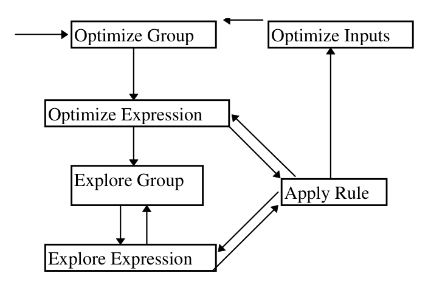
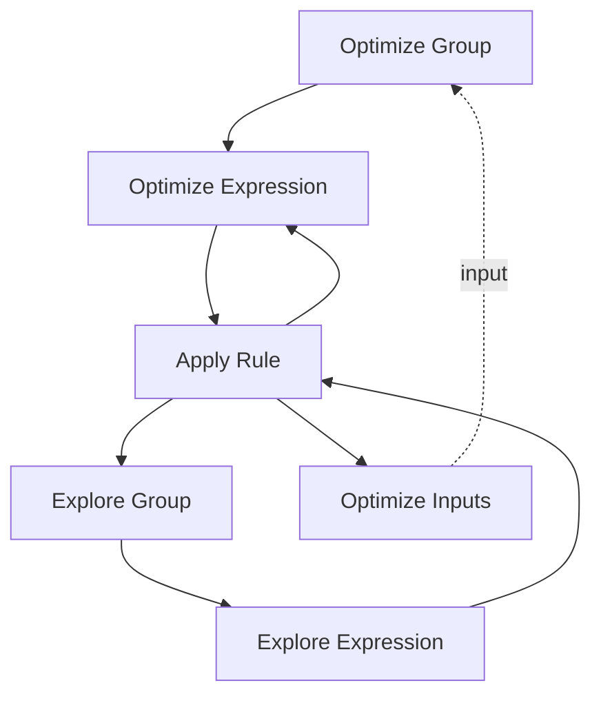

# The Cascades Framework for Query Optimization（中文译文）

## 译者说明

本文依据同目录的 `source.pdf` 翻译。章节、图表、公式、算法、代码与参考文献按原文结构保留。

## 摘要

本文描述一个新的可扩展查询优化框架。该框架解决了 EXODUS 和 Volcano 优化器生成器（optimizer generator）的许多不足。除了继承并扩展 EXODUS 与 Volcano 原型中的可扩展性、动态规划（dynamic programming）和记忆化（memorization）能力之外，这个新的优化器还提供了如下能力：

1. 使用规则或函数操纵算子的参数。
2. 支持谓词等既是逻辑算子又是物理算子的算子。
3. 支持用于物化视图的 schema 相关规则。
4. 支持插入“强制算子”（enforcer）或“胶合算子”（glue operator）的规则。
5. 支持规则级搜索指导（rule-specific guidance），从而允许规则分组。
6. 提供基础设施，以便将来支持并行搜索、部分有序的代价度量和动态计划。
7. 提供大量跟踪支持。
8. 提供清晰的接口和实现，并充分利用 C++ 的抽象机制。

本文会逐项描述并论证这些设计选择。文中描述的优化器系统已经可以运行，并将作为 Tandem NonStop SQL 产品和 Microsoft SQL Server 产品中新查询优化器的基础。

## 1. 引言

在获得 EXODUS Optimizer Generator [GrD87] 的经验之后，我们在 Volcano 项目 [GrM93] 中构建了一个新的优化器生成器。EXODUS 工作的主要贡献包括：基于声明式规则代码生成的优化器生成器架构，逻辑代数与物理代数，将查询优化器划分为模块化组件，以及由数据库实现者（database implementor, DBI）提供的支持函数接口定义。Volcano 工作则把更好的可扩展性与基于动态规划和记忆化的高效搜索引擎结合起来。

通过在两个应用中使用 Volcano Optimizer Generator，一个面向对象数据库系统 [BMG93] 和一个科学数据库系统原型 [WoG93]，我们发现其设计存在若干缺陷。Cascades 项目开发了一个全新的可扩展优化器，目标就是克服这些缺陷。Cascades 是一个新项目，它把 Volcano 项目在可扩展查询优化、并行查询执行和物理数据库设计方面得到的许多经验继续向前推进。

与 Volcano 的设计和实现相比，新的 Cascades 优化器具有以下优点。整体来看，这些优点使它在功能、易用性和健壮性上都显著优于我们团队早先的工作以及其他相关工作。

- 通过抽象接口类定义 DBI 与优化器之间的接口，并允许 DBI 定义自己的子类层次。
- 规则是对象。
- 支持 schema 相关甚至查询相关的规则。
- 支持只需要极少 DBI 支持的简单规则。
- 支持替代表达式本身为复杂表达式的规则。
- 支持把输入模式映射到 DBI 提供函数的规则。
- 支持放置属性强制算子（property enforcer），例如排序操作的规则。
- 支持既是逻辑算子又是物理算子的算子，例如谓词。
- 支持匹配整棵子树的模式，例如谓词。
- 优化任务被表示为数据结构。
- 支持对等价逻辑表达式的增量枚举。
- 支持带指导或穷尽式搜索。
- 支持按 promise（有希望程度）排序搜索动作。
- 支持规则级指导。
- 支持对估计逻辑属性的增量改进。

本文会讨论以上各点及其影响。系统虽然已经可以运行，但尚未做性能研究，也尚未完全调优。对 Cascades 优化器效率进行详细分析和有针对性的改进，是后续工作。

## 2. 优化算法与任务

优化算法被拆分为若干部分，我们称之为“任务”（task）。每个任务都可以很容易实现成一个过程，但 Cascades 选择把任务实现为对象；除其他方法外，每个任务对象都定义一个 `perform` 方法。与过程调用相比，任务对象提供了显著更高的灵活性，尤其是在搜索算法和搜索控制方面。

每一个尚待完成的工作都有一个任务对象。所有任务对象被收集在一个任务结构中。当前实现把任务结构实现为后进先出（LIFO）栈，但也很容易设想其他结构。特别是，任务对象可以在任意时刻很容易地重排，从而支持非常灵活的启发式指导机制。此外，我们计划用图来表示任务结构，用它捕获任务之间的依赖关系或拓扑顺序，并支持高效的共享内存并行搜索。不过，为了快速获得可工作的系统，当前实现限制为 LIFO 栈；调度一个任务与调用函数非常相似，区别在于：子任务完成之后要做的任何工作，都必须被调度为一个单独任务。

图 1 展示组成优化器搜索算法的任务。箭头表示一种任务会调度（调用）哪种其他任务；虚线箭头表示调用作用于输入，也就是子查询或子计划。附录中还给出了这些任务的简短伪代码。`optimize()` 过程首先把原始查询复制到内部 `memo` 结构中，然后用一个任务触发整个优化过程。这个任务优化与原始查询树根节点对应的 group，并进一步触发越来越小的子树优化。

> **来源缺口说明：** 当前 `source.pdf` 共 10 页，并在参考文献后结束，没有包含正文所称的附录。因此这里无法从本地来源恢复任务伪代码，也不以推测内容补写。

### 图 1：优化任务

优化 group 或表达式的任务对应 Volcano 优化器生成器中称为“优化目标”（optimization goal）的概念：它把一个 group 或表达式与代价上限，以及需要和排除的物理属性结合在一起。执行这样的任务，要么得到一个计划，要么失败。优化 group 意味着为该 group 中的任意表达式寻找最佳计划，因此要对所有表达式应用规则；优化表达式则从单个表达式开始。前者通过对每个表达式调用后者来实现。后者会导致传递式规则应用，因此如果规则集完整，就能在起始表达式所在的 group 中找到最佳计划。

这两类任务的区分纯粹是务实的。一方面，必须有一个任务能为 group 中任意表达式寻找最佳计划，以便启动整棵查询树的优化，或者在应用实现规则后启动子树优化。另一方面，在应用变换规则产生新的表达式之后，也必须有一个任务优化这个单个表达式。

优化 group 的任务同时实现动态规划和记忆化。在开始优化 group 中所有表达式之前，它会检查同一个优化目标是否已经被求解过。如果是，就直接返回前一次搜索得到的计划。复用早先派生出的计划，是动态规划和记忆化的关键。

探索 group 或表达式是一个全新的概念，在 Volcano 优化器生成器中没有对应物。在 Volcano 的搜索策略中，第一阶段应用所有变换规则，为查询及其所有子树创建所有可能的逻辑表达式。第二阶段才执行实际优化：在等价类和表达式构成的网络中导航，应用实现规则得到计划，并确定最佳计划。

在 Cascades 优化器中，这种两阶段分离被取消了，因为推导所有表达式的所有逻辑等价形式并不总是有用，例如谓词表达式就是如此。group 只在需要时使用变换规则探索，而且探索只为了创建该 group 中所有匹配给定模式的成员。因此，探索 group 或表达式（这一区分对应优化 group 或表达式的区分）意味着推导所有匹配给定模式的逻辑表达式。这个模式是任务定义的一部分，是规则前件（antecedent）或 before-pattern 的一个子树。

和优化任务一样，探索任务也避免重复工作。在探索 group 的表达式之前，探索 group 的任务会检查同一个 group 是否已经针对同一个模式探索过。如果已经探索过，任务会立即终止，不再派生其他任务。因此，扩展逻辑表达式的总体工作量同样通过动态规划降低，也就是保留并复用早先搜索工作的结果。是否已经探索过某个模式，由 DBI 初始化和管理的“模式记忆”（pattern memory）决定。

为了让讨论更具体，可以考虑连接结合律规则。在 Volcano 中，所有等价类在实际优化阶段开始之前已经被完全展开，包含所有等价逻辑表达式。因此，在优化阶段，当一个 join 算子匹配规则中的顶层 join 算子时，规则中较低层 join 的所有 join 表达式已经可用，规则可以立即用所有可能绑定来应用。在 Cascades 中，这些表达式不会立刻可用，必须在规则应用之前推导出来。探索任务提供这一功能；它们不是像 Volcano 那样在优化前阶段调用，而是在特定 group 和特定模式上按需调用。

可以问 Volcano 技术和 Cascades 技术哪一个更高效、更有效。Volcano 技术在第一阶段穷尽生成所有等价逻辑表达式。即使实际优化阶段使用贪心搜索，Volcano 的第一阶段仍然必须是穷尽的。在 Cascades 技术中，这代表最坏情况。如果没有任何指导指出哪些规则可能产生匹配给定模式的表达式，那么穷尽枚举所有等价逻辑表达式不可避免。另一方面，如果存在某些指导，一部分工作就可以避免，此时 Cascades 搜索策略看起来更优。

不过，同一个 group 可能必须针对不同模式探索多次；如果发生这种情况，可能会出现重复规则应用和重复推导。为了避免这一点，`memo` 结构中的每个表达式都包含一个位图，表示哪些变换规则已经应用于该表达式，因此不应再次应用。我们因此认为 Cascades 搜索策略更高效，因为它只为真正有用的模式探索 group。在最坏情况下，也就是没有任何指导时，Cascades 搜索的效率将等同于 Volcano 搜索策略。

另一方面，如果这种指导不正确，就可能错误剪枝搜索空间，从而损害 Cascades 优化器的有效性。因此，指导的正确性非常重要。我们计划使用两种尚未实现的指导技术。第一，通过检查整个规则集，特别是每条规则前件和后件（after-pattern，substitute）中的顶层算子，可以识别哪些算子可通过一次规则应用映射到哪些其他算子。对这种可达关系求传递闭包后，可以排除一些规则。注意，这个传递闭包可以在根据规则集生成优化器时计算，也就是只需计算一次。第二，我们计划实现由 DBI 提供指导的机制。

应用规则会创建新的表达式。注意，新表达式可以是复杂表达式（例如连接结合律规则中的多个算子），也可以来自变换规则（创建新的逻辑表达式）或实现规则（创建新的物理表达式或计划）。事实上，由于一个算子可以同时是逻辑和物理的，一条规则也可以同时是变换规则和实现规则。Cascades 能保证这种规则的正确应用，尽管我们预计这类算子和规则会是例外而非常规。

执行 `apply rule` 任务相当复杂，大致可分为四个部分：

1. 推导规则模式的所有绑定，并逐个迭代。
2. 对每个绑定，用规则创建一个新表达式。对函数规则而言，每个绑定可能产生多个新表达式。
3. 把新表达式集成到 `memo` 结构中。在这个过程中，会识别并移除 `memo` 中已经存在的完全重复表达式。
4. 对每个不是早先表达式副本的新表达式，用触发当前规则应用的相同目标和上下文继续优化或探索。

由于每条规则的前件（before-pattern）可能很复杂，Cascades 优化器采用一个复杂过程来识别规则的所有可能绑定。该过程是递归的，模式中每个节点都会触发一次递归调用。它的大部分复杂性都服务于获得规则模式的所有可能绑定。实际上，这个过程被实现为迭代器，每次调用都会产生下一个可行绑定。迭代状态由 `BINDING` 类捕获；模式中每个节点都有一个该类实例。

一旦找到绑定，它会被转换为由 `EXPR` 节点构成的树。注意，这个类是 DBI 接口的一部分，而优化器内部数据结构不是。这个复制步骤有一定开销，但它把优化器与 DBI 方法隔离开来，因为这些方法可能会在这棵树上被调用。对于每个绑定，规则的条件函数会被调用；满足条件的绑定随后被转换为规则后件（after-pattern，substitute）。对于某些规则，这非常简单，完全交给优化器处理。对于其他规则，DBI 指定一个函数来创建替代表达式，该函数会被反复调用，以创建尽可能多的替代表达式。换言之，这个函数也可以是一个迭代器，连续调用时产生多个 substitute。因此，从 `memo` 提取绑定的开销可以尽可能摊销到多个变换上。

每个替代表达式随后被集成到 `memo` 结构中。该过程包括查找和检测重复项，也就是优化过程中早先已经派生出的表达式。这与 EXODUS 和 Volcano 优化器生成器中的重复表达式检测非常相似。它是一个递归过程，从 substitute 的叶子开始，向 substitute 根部推进。叶子可以是查询树或计划树的叶子（例如 scan），也可以是表示重写操作作用域的叶算子（这是 DBI 接口的一部分）。必须按从叶到根的方向进行，才能正确检测重复项。重复查找很快，因为它使用哈希表，以算子及其输入 group 为键。

最后，如果 substitute 的根是一个新表达式，就可能启动后续任务。如果 substitute 是探索的一部分，会创建一个任务，用同一模式探索该 substitute。如果 substitute 是优化的一部分，后续任务取决于规则是变换规则还是实现规则，也就是取决于 substitute 根算子是逻辑算子还是物理算子。再次注意，一个算子可以同时是逻辑和物理的，因此一条规则可以同时是变换规则和实现规则。在这种情况下，两类后续任务都会被创建。对于逻辑根算子，会创建优化任务，按相同优化目标优化该 substitute。对于物理根算子，会调度一个新任务来优化该算子的输入并计算处理代价。

`optimize inputs` 任务不同于其他所有任务。其他任务都会调度其后续任务然后消失，而第六种任务类型会多次变为活跃状态。换言之，它调度一个后续任务，等待它完成，恢复执行，再调度下一个后续任务，依此类推。所有后续任务类型相同，都是针对适当优化目标优化输入 group。因此，与 Volcano 搜索策略一样，Cascades 搜索引擎保证只优化那些确实可能参与查询执行计划的子树和 interesting property。每次优化完一个输入后，`optimize inputs` 任务获得已经派生出的最佳执行代价，并为下一个输入的优化推导新的代价上限。因此，剪枝可以尽可能紧。

## 3. 数据抽象与用户接口

开发 Cascades 优化器系统要求快速交替推进三类活动。第一，设计数据库实现者与优化器之间的接口时，必须聚焦于最小、功能完整且清晰的抽象。第二，我们把自己作为 DBI 实现原型优化器，这是一次尽可能有效利用接口的实践。第三，高效搜索策略的设计与实现，建立在 EXODUS 和 Volcano 项目的经验之上，并结合了学术界和工业界查询优化研究者研讨会以及该软件第一批用户组提出的要求。

这三类活动有不同目标，也要求不同思维方式；在内部讨论中，我们不断在这些视角之间切换，以设计和开发真正可扩展且有用的工具。本节描述数据库实现者与优化器之间接口的数据结构设计决策。

EXODUS 和 Volcano 优化器生成器的用户明确表示，这些系统的接口仍可改进。Volcano 用户反馈与我们自己的分析 [BMG93] 一致。因此，我们聚焦于：

1. 为支持函数提供清晰抽象，以便优化器生成器能从规格说明中生成它们。
2. 提供规则机制，让 DBI 能够选择规则或函数来操纵算子参数，例如谓词。
3. 在代码和书面文档中提供更简洁、更完整的接口规格。

基于这些原则，我们设计了如下接口。

构成 Cascades 优化器与 DBI 接口的每个类都被设计为一个子类层次的根。因此，创建这些类之一的新对象时，会与另一个类关联。例如，创建新的 `guidance` 结构与一个 `rule` 对象关联。rule 对象可以是接口类 `RULE` 的某个 DBI 定义子类，而新创建的 guidance 结构可以是接口类 `GUIDANCE` 的任意 DBI 定义子类。优化器只依赖接口中定义的方法；DBI 在定义子类时可以自由添加其他方法。

### 3.1 算子及其参数

任何数据库查询优化器的核心，都是查询语言和查询执行引擎所支持的算子集合。注意，这两个集合是不同的；我们称之为逻辑算子和物理算子 [Gra93]。早先的可扩展优化器要求这两个集合不相交，Cascades 放弃了这一要求。

Cascades 优化器接口中的 `OP-ARG` 类同时包含逻辑算子和物理算子。对每个算子，一个名为 `is-logical` 的方法表示该算子是否为逻辑算子，另一个名为 `is-physical` 的方法表示它是否为物理算子。实际上，一个算子也可能既不是逻辑算子也不是物理算子；如果优化被组织为扩展文法，包括类似 Starburst 优化器 [Loh88] 中的“非终结符”，这样的算子可能有用。另一方面，如果 DBI 希望保持逻辑算子和物理算子的严格分离，也很容易做到：定义具有合适 `is-logical` 和 `is-physical` 方法的子类，并把所有算子定义为这两个类的子类。

算子的定义包含其参数。因此，不需要也不提供 EXODUS 和 Volcano 中那种单独的“参数传递”（argument transfer）机制。不过，有两个关键设施允许并鼓励把谓词等建模为逻辑和物理代数中的一等算子。此前，在我们用 EXODUS 和 Volcano 框架构建的所有原型中，谓词等都被建模为算子参数。

第一，一个算子可以同时是逻辑和物理的。这对单记录谓词是自然的，在 System R [SAC79] 中这类谓词称为 sargable。第二，特定谓词变换可以很容易通过调用 DBI 提供函数的规则实现，这些规则把一个表达式映射到一个或多个替代表达式。例如，从复杂谓词中拆分出能够下推穿过 join 的部分，通常最容易、最高效地用 DBI 函数实现，而不是用优化器搜索引擎解释的规则实现。因此，在 EXODUS 和 Volcano 工作屡次被批评谓词操纵非常笨重之后，Cascades 优化器提供了显著改进的设施。

优化器设计不包含关于待优化逻辑代数和物理代数的假设。因此，优化器内部没有内建查询算子或计划算子。不过，为了在规则中使用，存在两个特殊算子：`LEAF-OP` 和 `TREE-OP`。叶算子可以作为任意规则中的叶子使用；匹配时，它匹配任意子树。在应用规则之前，会从搜索记忆中提取一个匹配规则模式的表达式；如果规则模式中有叶子，提取出的表达式中也有叶算子，它们通过数组索引指向搜索记忆中的等价类。树算子类似叶算子，但提取出的表达式会包含一整棵表达式树，不受大小和复杂度限制，一直向下到逻辑代数中的叶算子。该算子与后文描述的函数规则配合使用时特别有用。

除了 `is-logical` 和 `is-physical` 方法之外，所有算子都必须提供 `opt-cutoff` 方法。给定一次优化任务中的一组动作，该方法确定其中多少动作会被追踪，显然应选择最有希望的动作。默认情况下，所有可能动作都会被追踪，因为穷尽搜索保证可以找到最优计划。

还有一小组方法只需由声明为逻辑的算子提供。为了模式匹配和重复表达式查找，需要匹配和哈希方法。查找并改进逻辑属性的方法用于确定原始属性集合（例如 schema），并在发现替代表达式时改进这些属性（例如获得更多关于选择率或输出大小的界限）。最后，对于探索任务，算子可能被要求初始化模式记忆，并决定在探索任务中追踪多少动作。

类似地，物理算子也有一些方法。显然，需要一个方法确定算子的物理输出属性，也就是表示形式的属性。此外，还有三个方法计算和检查代价。第一个计算某算法的局部代价，不考虑其输入代价。第二个把某算法输入的代价和物理属性组合成整个子计划的代价。第三个在优化同一算法的两个输入之间验证代价上限是否尚未超过，并计算优化下一个输入时应使用的新代价上限。最后，正如上一个方法把表达式的代价上限映射为某个输入的代价上限一样，还有一个方法把表达式的优化目标映射为某个输入的优化目标，也就是代价上限以及需要和排除的物理属性，称为 `input-reqd-prop`。

### 3.2 逻辑属性、物理属性与代价

表示预期执行代价的接口 `COST` 类非常简单，因为代价实例由其他类（例如算子）相关方法创建和返回。除析构和打印之外，代价唯一的方法是比较方法。类似地，逻辑属性封装类 `SYNTH-LOG-PROP` 唯一的方法是哈希函数，用于更快检索重复表达式。由于这个函数甚至不适用于物理表达式，物理属性封装类 `SYNTH-PHYS-PROP` 完全没有方法。必需物理属性类 `REQD-PHYS-PROP` 只有一个相关方法，用于判断一个合成物理属性实例是否覆盖所需物理属性。如果一组属性比另一组更具体，例如一个结果按属性 `A, B, C` 排序，而需求只要求按 `A, B` 排序，则比较方法返回值 `MORE`。该方法的默认实现返回 `UNDEFINED`。

### 3.3 表达式树

为了在 DBI 与优化器之间传递表达式，例如查询、计划或规则，接口中还包含另一个抽象数据类型 `EXPR`。该类的每个实例都是树中的一个节点，由一个算子和指向输入节点的指针组成。显然，任意表达式节点的孩子数量必须等于该节点算子的 arity 函数。表达式节点上的方法除了构造、析构和打印之外，还包括提取算子或某个输入的方法，以及匹配方法。匹配方法递归遍历两棵表达式树，并调用每个节点算子的匹配方法。

### 3.4 搜索指导

除模式、代价上限、需要和排除的物理属性之外，规则应用还可以由 `GUIDANCE` 类实例表示的启发式控制。它的用途是把优化启发式从一次规则应用传递到下一次规则应用。注意，代价和属性属于正在被操纵的表达式，以及查询计划执行时这些表达式会产生的中间结果；guidance 类捕获关于搜索过程的知识，以及未来搜索活动的启发式。

例如，某些规则（如交换律规则）应只应用一次。为此，DBI 接口中提供了一个简单 guidance 结构和一个规则类，称为 `ONCE-GUIDANCE` 和 `ONCE-RULE`。

一些研究者主张把查询优化器规则集划分为可一次调用一个的“模块”，例如 Mitchell 等人 [MDZ93]。guidance 结构可以很容易支持这种设计：guidance 结构指出应选择哪个模块，每条规则在其 promise（或 condition）函数中检查这一指示，然后在为新创建表达式及其输入创建 guidance 结构时创建合适的指示。

### 3.5 模式记忆

除了搜索指导之外，探索工作还可以通过模式记忆来限制。模式记忆的目的是避免同一个 group 被不必要地重复探索，例如针对同一个模式探索两次。每个 group 关联一个模式记忆实例。在某个 group 为某个模式被探索之前，模式记忆可以把该模式加入自身，并被询问是否应进行探索。

在最简单的搜索中，任意模式探索都通过穷尽应用变换规则执行，此时模式记忆只需包含一个布尔值，也就是记住该 group 以前是否被探索过。更复杂的模式记忆会存储每个模式。显然，模式记忆会与探索 promise 函数交互。对总是允许穷尽搜索的最简单 promise 函数而言，上述简单模式记忆就足够了。为待优化代数设计最合适的模式记忆和 promise 函数，是 DBI 的责任。

除了检查给定模式是否已经存在于记忆中，并保存它以检测第二次相同模式探索之外，模式记忆最复杂的方法是把两个模式记忆合并为一个。当两个等价表达式 group 被发现实际上是同一个 group 时，也就是一个变换后的表达式已经出现在搜索记忆中的另一个 group 中时，就需要该方法。

### 3.6 规则

除算子之外，Cascades 优化器中另一类重要对象是规则。注意，规则是对象，因此可以在运行时创建、打印等。其他基于规则的优化器，特别是 EXODUS 和 Volcano 优化器生成器，把逻辑和物理算子，以及逻辑变换规则和物理实现规则划分为不相交集合。Cascades 优化器不区分这些规则，除非在新创建表达式上调用 `is-logical` 和 `is-physical` 方法。

所有规则都是 `RULE` 类实例。该类提供规则名、前件（before pattern）和后件（substitute）。模式和 substitute 都表示为前文讨论过的表达式树。

最简单情况下，规则只包含这些内容；只要模式被找到，或能够通过探索任务创建，对应 substitute 表达式就会被纳入搜索记忆。规则模式和 substitute 都可以任意复杂。在 EXODUS 和 Volcano 优化器生成器中，实现规则的 substitute 不能超过一个实现算子；Cascades 设计移除了这一限制。剩余限制是：substitute 顶层算子之外的所有算子必须是逻辑算子。例如，可以把一个逻辑 join 算子变换成一个物理 nested loops 算子，并在其内侧输入上带一个逻辑 selection，从而把选择谓词从 join 算法中分离出来，并下推到内侧输入树中。

对于更复杂的规则，Cascades 支持两类条件函数。它们不仅考虑规则本身，还考虑当前优化目标，也就是代价上限以及需要和排除的物理属性。

第一，在探索开始之前，`promise` 函数告知优化器该规则可能多有用。优化任务和探索任务各有一个 promise 函数。对无指导的穷尽搜索，所有 promise 函数都应返回 1.0。返回值小于等于 0 会阻止优化器在当前规则和表达式上继续工作。默认 promise 函数在需要特定物理属性时返回 0，在 substitute 是实现算法时返回 2，否则返回 1。如果与算子关联的 cutoff 方法选择穷尽搜索，那么 promise 函数返回值不会改变最终查询执行计划的质量，但可能影响计划发现顺序、剪枝效果以及优化耗时。

由于 promise 函数在探索子 group 之前调用，也就是在对应规则模式的完整表达式树被探索并从搜索记忆中提取之前调用，所以当探索完成且规则模式对应的完整算子集合可用之后，还需要一个 `condition` 函数检查规则是否真正适用。promise 函数返回表达有希望程度的实数，而 condition 函数返回布尔值，表示规则是否适用。

除 promise 和 condition 函数之外，规则还有一小组方法。自然包括构造、析构和打印方法，也包括提取模式、substitute、规则名和规则 arity（模式中叶算子的数量）的方法。`rule-type` 方法表示规则是目前描述的简单规则，还是稍后描述的函数规则。`top-match` 方法判断搜索记忆中的某个算子是否匹配规则模式中的顶层算子；这是 promise 函数调用前唯一内建的检查。`opt-cases` 方法表示一个物理表达式需要用多少种不同物理属性来优化。除少数情况外，这通常为 1。少数例外之一是带有两个等值子句的 merge-join 算法，例如 `R.A == S.A and R.B == S.B`，它应针对两种排序顺序优化：按 `A, B` 排序和按 `B, A` 排序。默认情况下，该方法返回 1。

剩余方法都创建新的 guidance 结构，用于优化新创建的表达式及其输入。优化和探索各有两个方法，新表达式和输入也各有两个，称为 `opt-guidance`、`expl-guidance`、`input-opt-guidance` 和 `input-expl-guidance`。默认情况下，它们全部返回 `NULL`，也就是没有特定指导。

如果一条规则的 substitute 只包含一个叶算子，则该规则是规约规则（reduction rule）。如果规约规则适用，搜索记忆中的两个 group 会被合并。另一方面，如果规则模式只包含一个叶算子，则该规则是总是适用的扩展规则（expansion rule）。Cascades 优化器必须依赖 DBI 设计适当的 promise 和 condition 函数，以避免无用变换。

尽管如此，扩展规则在一类重要场景中很有用：插入用于强制或保证期望物理属性的物理算子。这类规则也可称为 enforcer rule。考虑 merge-join 的输入，它们必须有序。一个 enforcer rule 可以插入排序操作；该规则的 promise 和 condition 函数必须只在需要排序顺序时允许该规则，而排序算子的 `input-reqd-prop` 方法必须设置排除属性，以避免考虑那些输入给 sort 算子时已经以期望排序顺序产生输出的计划。

在某些情况下，直接编写一个函数变换表达式，比为同一变换设计和控制一组规则更容易。例如，把复杂 join 谓词拆分为应用于左输入、右输入以及两个输入的子句，是一个确定性过程，最好由单个函数实现。对于这些情况，Cascades 优化器支持第二类规则，称为 `FUNCTION-RULE` 类。一旦提取出与规则模式对应的表达式，就会反复调用一个迭代器方法，为表达式创建所有 substitute。注意，如果规则模式中使用 tree operator，提取出的表达式可以任意深、任意复杂。因此，tree operator 和 function rule 允许 DBI 编写几乎任意变换。极端情况下，一组 function rule 可以执行所有查询变换，尽管这会违背 Cascades 框架的一部分目的。

## 4. 未来工作

为了让 Cascades 优化器更有用、更完整，还有大量工作要做。

第一，优化器尚未经历彻底评估和调优阶段。第二，基于该框架构建更多优化器无疑会暴露出目前尚不明显的许多弱点。第三，如果能有一个或多个生成器，从更高层的数据模型和代数描述生成 Cascades 规格说明，将非常有用。第四，我们已经知道搜索策略及其实现还有若干值得改进之处。

Cascades 优化器被设计为相当快，不过可扩展性是更重要的设计目标。把优化器框架与 DBI 对算子、代价函数等的规格说明分离，会带来一些副产物：大量使用虚方法，结构之间存在大量引用，以及非常频繁的对象分配与释放。这些虽然不可避免，但很可能仍有改进空间，特别是在愿意放弃强分离的情况下；这种强分离允许修改 DBI 代码而无需重新编译 Cascades 代码。不过，在采取这种“去模块化”（de-modularization）步骤之前，应基于测量研究给出有力论证，证明它确实会改善优化器性能。

## 5. 总结与结论

与 EXODUS 和 Volcano 优化器生成器相比，Cascades 优化器不仅有更好、更健壮的实现，还提供若干优点，同时没有放弃早期原型探索过的模块化、可扩展性、动态规划和记忆化。

第一，谓词和其他 item operation 可以方便地建模为查询和计划代数的一部分。算子可以同时是逻辑和物理的，因此很容易指定既可能出现在优化器输入（查询）中，也可能出现在其输出（计划）中的算子。函数规则和 tree operator 允许使用 DBI 提供的函数直接操纵 item operation 的复杂树。

第二，排序等 enforcer 在各方面都是普通算子；特别是，它们基于显式规则插入计划。在 Volcano 中，它们是不会出现在任何规则中的特殊算子。

第三，探索（枚举等价逻辑表达式）和优化（把逻辑表达式映射为物理表达式）都可以由 DBI 指导和控制。结合工业部署所需的更健壮实现，我们认为 Cascades 优化器相对于早期可扩展数据库查询优化器有显著改进。

## 6. 致谢

Tandem 查询处理小组提供了很大帮助，促使我处理 EXODUS 和 Volcano 优化器生成器中尚未解决的困难问题，并寻找有效且可用的解决方案。David Maier 在 Cascades 优化器的设计和开发过程中，一直是讨论想法的重要对象。

## 7. 参考文献

[BMG93] J. A. Blakeley, W. J. McKenna, and G. Graefe, Experiences Building the Open OODB Query Optimizer, Proc. ACM SIGMOD Conf., Washington, DC, May 1993, 287.

[GrD87] G. Graefe and D. J. DeWitt, The EXODUS Optimizer Generator, Proc. ACM SIGMOD Conf., San Francisco, CA, May 1987, 160.

[Gra93] G. Graefe, Query Evaluation Techniques for Large Databases, ACM Computing Surveys 25, 2 (June 1993), 73-170.

[GrM93] G. Graefe and W. J. McKenna, The Volcano Optimizer Generator: Extensibility and Efficient Search, Proc. IEEE Int'l. Conf. on Data Eng., Vienna, Austria, April 1993, 209.

[Loh88] G. M. Lohman, Grammar-Like Functional Rules for Representing Query Optimization Alternatives, Proc. ACM SIGMOD Conf., Chicago, IL, June 1988, 18.

[MDZ93] G. Mitchell, U. Dayal, and S. B. Zdonik, Control of an Extensible Query Optimizer: A Planning-Based Approach, Proc. Int'l. Conf. on Very Large Data Bases, Dublin, Ireland, August 1993, 517.

[SAC79] P. G. Selinger, M. M. Astrahan, D. D. Chamberlin, R. A. Lorie, and T. G. Price, Access Path Selection in a Relational Database Management System, Proc. ACM SIGMOD Conf., Boston, MA, May-June 1979, 23.

[WoG93] R. H. Wolniewicz and G. Graefe, Algebraic Optimization of Computations over Scientific Databases, Proc. Int'l Conf. on Very Large Data Bases, Dublin, Ireland, August 1993, 13.
