# Everything You Always Wanted to Know About Compiled and Vectorized Queries But Were Afraid to Ask（中文译文）

## 译者说明

本文依据同目录的 `source.pdf` 翻译。章节、图表、公式、算法、代码与参考文献按原文结构保留。

## 摘要

现代数据库系统的查询引擎大多基于向量化执行（vectorization）或以数据为中心的代码生成（data-centric code generation）。这两种先进范式在系统结构和查询执行代码上有根本差异，也都能构建高速系统。但长期以来，人们并不清楚哪一种范式能带来更快的查询执行，因为具体实现选择会妨碍直接比较。本文在同一个测试系统中实现两种模型，使用相同的查询算法、数据结构和并行化框架，进行尽可能公平的比较。实验发现，两者都很高效，但强弱不同：向量化更善于隐藏 cache miss 延迟；以数据为中心的编译需要更少 CPU 指令，因此更有利于缓存驻留负载。除单线程原始性能外，论文还研究 SIMD、多核并行和不同硬件架构，并分析定性差异，为系统架构师提供选择依据。

## 1. 引言

多数查询引擎都用 Volcano 风格迭代实现关系算子 [14]。当磁盘是主要瓶颈时，这一模型运行良好；但在现代 CPU 上执行内存数据库管理系统（DBMS）时，它的效率较低。因此，多数现代查询引擎转而采用由 VectorWise 开创的向量化 [7,52]，或由 HyPer 开创的以数据为中心的代码生成 [28]。采用向量化的系统包括 DB2 BLU [40]、SQL Server 列存 [21] 和 Quickstep [33]；采用以数据为中心的代码生成的系统包括 Apache Spark [2] 和 Peloton [26]。

向量化与 Volcano 模型一样使用拉取式迭代，每个算子都有产生结果元组的 `next` 方法；区别在于每次调用取得一个元组块而非单个元组，从而摊薄迭代器调用开销。真正的查询处理由 primitive 完成，每个 primitive 对一个或多个按类型专用的列执行简单操作，例如为一批整数计算哈希。批量摊销与类型专用化共同消除了传统引擎的大部分开销。

在以数据为中心的代码生成中，每个关系算子实现推送式 `produce`/`consume` 接口，但这些调用并不直接处理元组，而是为给定查询生成代码。也可以把它们看成查询计划树深度优先遍历期间调用的算子方法：首次访问时调用 `produce`，全部子节点处理完后的末次访问调用 `consume`。所得代码针对查询数据类型专用化，并把一个非阻塞关系算子流水线中的全部算子融合进一个可能嵌套的循环，再由 LLVM 等编译器编译为高效机器码。

两种模型都消除了传统引擎开销，但概念上不同：向量化采用拉取模型（从根到叶遍历）、一次处理一个向量并解释执行；以数据为中心的代码生成采用推送模型（从叶到根遍历）、一次处理一个元组并预先编译。第 9 节讨论混合两者思想的其他设计；本文聚焦这两个影响广泛、已被多个常用系统采用的具体模型。

这些差异会决定 DBMS 执行引擎源代码的组织方式和性能特征。更换模型意味着重写大量代码，设计者必须很早作出选择。Quickstep 基于向量化，Peloton 使用以数据为中心的代码生成，说明两种选择都流行且合理；然而此前仍没有系统研究比较这两个先进模型。本文因此进行深入实验，分析数据库架构师应在何种条件下偏好哪一种。

直接比较 HyPer 与 VectorWise 这类完整系统不能隔离执行模型：HyPer 的列存不使用亚字节压缩 [19]，VectorWise 使用更紧凑的压缩 [53]；与此相关，HyPer 在扫描中下推谓词，而 VectorWise 不这样做。两者的并行策略也不同：VectorWise 查询创建由操作系统调度的线程，并以优化时确定并行度的显式 exchange 算子控制并行；HyPer 则在每个核心运行一个线程，通过 NUMA 感知的无锁队列以 morsel-driven 方式显式调度任务。它们还使用不同的查询处理算法与数据结构、数据类型表示和查询优化器。这些选择会影响性能与可扩展性，却独立于查询执行模型。

为排除这些偶然差异，我们在同一测试系统中实现基于编译的关系引擎 Typer 和向量化引擎 Tectorwise（TW）[16]。两者采用相同算法与数据结构，唯一差别是向量化执行还是以数据为中心的编译执行。实验表明两者都非常高效，整体差距通常不大；基于编译的引擎在计算密集型查询中占优，向量化引擎则更善于在哈希连接等操作中隐藏 cache miss 延迟。

第 2 节详细介绍两种模型，第 3 节说明实验方法，第 4 节对内存 OLAP 工作负载做微架构分析；第 5 节研究数据并行操作（SIMD），第 6 节讨论多核 CPU 上的查询内并行，第 7 节比较 Intel、AMD 和 Xeon Phi 平台。第 8 节在定量 OLAP 比较之后讨论 OLTP 与编译时间等因素，第 9 节讨论混合处理模型，第 10 节总结面向系统设计者的结论。

## 2. 执行模型

向量化执行的核心，是在列式数据表示上进行批处理 [30]：每个操作数据的 primitive 不处理单个数据项，而处理表示多个元组的一批值。它尽量把解释决策的成本摊销到操作数据的方法内部，例如一次为数千个值计算哈希、比较数千对字符串、更新数千个聚合值，或从数千个地址取值。以数据为中心的编译则为 SQL 查询生成低层代码，把同一查询流水线中相邻的非阻塞算子融合成一个紧凑循环。为理解两者生成代码的性质，本节给出算子实现示例，并解释这些代码结构的成因。

### 2.1 向量化算法

Typer 通过运行生成代码执行查询，因此开发者可以按需要组织算子实现。图 1a 的函数扫描所有行，在每次迭代中同时判断颜色是否为绿色、轮胎数是否为 4。Tectorwise 尽可能采用同一算法，但任何向量化函数都受两个约束：它只能处理一种数据类型，并且必须一次处理多个元组。生成代码可以把两个判断写在同一个 `if` 中，但这违反单一数据类型约束，因此 Tectorwise 必须像图 1b 那样拆成两个函数。解释控制逻辑先调用第一个函数按颜色选择元素，再调用第二个函数按轮胎数继续筛选；批量处理又满足了第二项约束。

所有 Tectorwise 算子都面对这一约束，因而被拆成同时满足两项条件的 primitives。图 1 使用列式存储，但行式格式同样可行。为了最大化吞吐，数据库开发者会用 predicated evaluation（如 `*res=i; res+=cond`）或 SIMD 指令等方法高度优化这些函数。选择按图中方式实现，表达式也在算术运算符处分解成 primitives。即使是这些简单算子，Tectorwise 也必须改变算法结构并偏离 Typer 的数据访问模式；中间结果物化使快速 cache 对向量化引擎尤为重要。

```cpp
vec<int> sel_eq_row(vec<string> col, vec<int> tir) {
  vec<int> res;
  for (int i = 0; i < col.size(); i++) // for colors and tires
    if (col[i] == "green" && tir[i] == 4) // compare both
      res.append(i); // add to final result
  return res;
}
```

```cpp
vec<int> sel_eq_string(vec<string> col, string o) {
  vec<int> res;
  for (int i = 0; i < col.size(); i++) // for colors
    if (col[i] == o) // compare color
      res.append(i); // remember position
  return res;
}

vec<int> sel_eq_int(vec<int> tir, int o, vec<int> s) {
  vec<int> res;
  for (int i : s) // for remembered position
    if (tir[i] == o) // compare tires
      res.append(i); // add to final result
  return res;
}
```

图 1：多谓词示例。（a）集成实现一次检查一个数据项上的全部谓词；（b）向量化实现必须把求值拆成每个谓词一个 primitive。

### 2.2 向量化哈希连接和分组

图 2 给出两种哈希连接实现的部分伪代码。Typer 与 Tectorwise 都先消费一个输入的全部元组，并以行式格式放入哈希表以改善 cache 局部性；随后对另一输入的每个元组探测哈希表，并把全部匹配组合交给父算子。Typer 生成的对应代码见图 2a。

Tectorwise 无法完全照此执行，难点是探测复合键哈希表时，每次探测都要检查复合键的所有组成部分。把这些检查放入一个操作会违反单一数据类型约束，因此它沿用 2.1 节的分解方法。连接函数先求值 `probeHash` 表达式；使用者必须配置 `probeHash` 及算子其他表达式，使其求值时读取子算子数据。对复合键，`probeHash` 为每个键列调用一个 primitive，并把哈希写入输出向量。连接函数据此取得哈希表中的候选匹配位置，再通过 `cmpKey` 表达式检查键相等；复合键会为每个键列调用一个 primitive。函数把命中加入匹配列表，并把仍有 overflow chain 的候选推进到下一轮，直至候选向量为空，最后由 `buildGather` 把哈希表数据移入下一个算子的缓冲区。

分组算子采用相似方法。聚合的两个阶段都使用保存分组键和聚合值的哈希表。每个输入元组首先像哈希连接一样在表中查找所属分组；若没有找到，就必须新增分组，但不能简单地为每个未找到分组的元组各插入一项，否则同一分组可能被重复添加。因此，系统先把所有未找到分组的元组按相同键重排成分区；复合键则逐组成部分处理。每个分区只向哈希表加入一个分组，待所有输入元组的分组都确定后，再运行聚合 primitives。向量化改写使聚合的数据访问模式比 Typer 偏离得更多，并带来额外工作。

这些差异不是任意实现选择，而是向量化的单类型、批处理约束所致。虽然每个算子因此有两份不同实现，但两者在核心上执行相同算法，并采用相同并行策略。

```cpp
query(...) {
  // build hash table
  for (i = 0; i < S.size(); i++)
    ht.insert(<S.att1[i], S.att2[i]>, S.att3[i]);

  // probe hash table
  for (i = 0; i < R.size(); i++) {
    int k1 = R.att1[i];
    string* k2 = R.att2[i];
    int hash = hash(k1, k2);
    for (Entry* e = ht.find(hash); e; e = e->next)
      if (e->key1 == k1 && e->key2 == *k2)
        ... // code of parent operator
  }
}
```

```cpp
class HashJoin {
  Primitives probeHash_, compareKeys_, buildGather_;
  ...
  int HashJoin::next() {
    ... // 消费 build 端并创建哈希表
    int n = probe->next();
    vec<int> hashes = probeHash_.eval(n);
    vec<Entry*> candidates = ht.findCandidates(hashes);
    vec<Entry*, int> matches = {};
    while (candidates.size() > 0) {
      vec<bool> isEqual = compareKeys_.eval(n, candidates);
      hits, candidates = extractHits(isEqual, candidates);
      matches += hits;
    }
    buildGather_.eval(matches);
    return matches.size();
  }
}
```

图 2：Typer 与 Tectorwise 的哈希连接实现。（a）生成代码可把哈希表键的相等检查合并；（b）向量化代码必须为每一项检查使用单独 primitive。

## 3. 实验方法

我们在同一个开源测试系统中实现编译引擎 Typer 和向量化引擎 Tectorwise（TW）。两者使用相同算法、数据结构和物理计划；计时不包含 SQL 解析、优化、代码生成和编译，从而把唯一变量限制为“向量化执行”或“以数据为中心的编译执行”。

### 3.1 相关工作

向量化由 MonetDB/X100 开创，后来进入 VectorWise、DB2 BLU、SQL Server 列存和 Quickstep；以数据为中心的代码生成由 HyPer 推广，并用于 Peloton 和 Spark。已有工作用微基准比较过向量化与编译，但没有对完整查询做系统、同实现比较；针对 OLTP 的共同原型和微架构分析也不能直接回答 OLAP 执行范式问题。

### 3.2 查询处理算法

两套引擎都实现 scan、select、project/map、join 和 group by。Scan 本质是可并行循环；selection 生成 `if`；projection 把表达式翻成对应 C 代码。原型刻意不做算术溢出检查。Join 使用同一张链式冲突哈希表，并把指针中未用的 16 位编码成类似 Bloom filter 的结构，使选择性 join 的探测未命中通常无需遍历链。Group by 分两阶段：预聚合处理 heavy hitter，并把 group spill 到分区；随后逐分区完成最终聚合。Typer 可直接把这些算法嵌入生成代码，Tectorwise 则必须按单类型、批量处理约束拆为 primitive。

### 3.3 工作负载

主要工作负载是 TPC-H。为逐查询展示计数器，我们选取五条能覆盖主要瓶颈的查询：Q1 是定点算术与 4 组聚合；Q6 是高选择性过滤；Q3 是 build 14.7 万、probe 320 万项的 join；Q9 是 build 32 万、probe 150 万项的 join；Q18 是 150 万组的高基数聚合（均为 SF=1，随规模线性增长）。其余查询大多与 Q3/Q9 的 join 或 Q18 的聚合相似。

### 3.4 实验设置

默认平台为 10 核 Intel i9-7900X（Skylake X），Linux，GCC 7.2；硬件计数器通过 Linux `perf events` 采集。所有计数器除以查询扫描的元组总数，使不同查询、规模和引擎间可直接比较，例如“每处理一个元组多执行多少条指令”。

实验随后扩展到 AMD Threadripper、Intel Knights Landing、多核、SSD 和不同 cache/内存带宽配置，以区分缓存驻留、带宽受限和高并行场景。

## 4. 微架构分析

### 4.1 单线程性能

Figure 3 的 SF=1 结果从 Typer 在 Q1 快 74%，到 Tectorwise 在 Q9 快 32%。差异远小于现代引擎与 PostgreSQL 之间一到两个数量级的差距，说明两种范式都可行，且不存在单方支配。

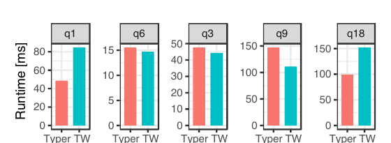

图 3：五条代表性查询的单线程运行时间。Q1/Q18 偏向 Typer，Q3/Q9 偏向 Tectorwise，Q6 基本持平。

表 1 给出 TPC-H SF=1、单线程下按处理元组数归一化后的 CPU 计数器：

| Query/System | cycles | IPC | instr. | L1 miss | LLC miss | branch miss |
| --- | ---: | ---: | ---: | ---: | ---: | ---: |
| Q1 Typer | 34 | 2.0 | 68 | 0.6 | 0.57 | 0.01 |
| Q1 Tectorwise | 59 | 2.8 | 162 | 2.0 | 0.57 | 0.03 |
| Q6 Typer | 11 | 1.8 | 20 | 0.3 | 0.35 | 0.06 |
| Q6 Tectorwise | 11 | 1.4 | 15 | 0.2 | 0.29 | 0.01 |
| Q3 Typer | 25 | 0.8 | 21 | 0.5 | 0.16 | 0.27 |
| Q3 Tectorwise | 24 | 1.8 | 42 | 0.9 | 0.16 | 0.08 |
| Q9 Typer | 74 | 0.6 | 42 | 1.7 | 0.46 | 0.34 |
| Q9 Tectorwise | 56 | 1.3 | 76 | 2.1 | 0.47 | 0.39 |
| Q18 Typer | 30 | 1.6 | 46 | 0.8 | 0.19 | 0.16 |
| Q18 Tectorwise | 48 | 2.1 | 102 | 1.9 | 0.18 | 0.37 |

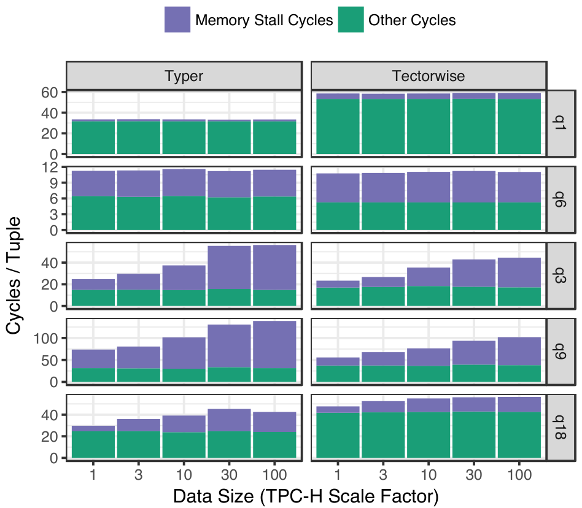

图 4 将 TPC-H 单线程的 cycles/tuple 分解为 memory stall cycles 和 other cycles。Tectorwise 在较大数据和 hash table 场景中能隐藏更多 memory latency；Typer 在计算密集或 cache-resident 场景中通常指令更少。

Tectorwise 把操作拆成 primitive，并在其间物化向量，因此最多执行 2.4 倍指令、产生 3.3 倍 L1 data miss；Typer 常把中间值留在寄存器，故 Q1 这类计算密集、cache-resident 聚合明显占优。Q3/Q9 使用同一哈希表布局、LLC miss 近似相同，Tectorwise 却更快：它的 probe loop 很简单，乱序引擎能提前发出更多独立 load；Typer 的融合循环同时包含 scan、selection、probe 和 aggregation，更快填满乱序窗口，分支误预测也会丢弃更多推测工作。

哈希函数也与代码形态交互。Tectorwise 采用指令更多但吞吐更高的 Murmur2；Typer 采用把两个 32 位 CRC 合并为 64 位的低延迟哈希，在大规模上可快 40%，因为较短依赖链让连续迭代更易并行发起内存访问。IPC 不能单独代表性能：Q1 中 Tectorwise 的 IPC 高 40%，却因总指令近两倍而慢 74%。

### 4.2 解释和指令缓存

向量化仍采用 Volcano 式 pull 和解释，但一次调用处理约 1,000 个值，primitive 又按数据类型预专用。Profiler 显示 SF=10 的五条查询中，解释控制逻辑不足运行时间的 1.5%；额外指令主要不是虚调用或类型分派，而是 primitive 之间物化结果的 load/store。两套引擎的热点代码都能放入 32 KB L1 instruction cache，OLAP 实验中 I-cache miss 可忽略。

这推翻了一个常见但过于简单的解释：向量化落后并不是因为它“仍然是解释器”。批大小已经把 `next()`、switch 和函数指针成本摊到每个值的千分之一量级。真正的差异来自执行边界：Typer 可以把表达式中间值保留在寄存器并跨算子优化，Tectorwise 必须把它们写入向量，供下一个类型专用 primitive 读取。反过来，这些较短、规则的 primitive 也更容易让乱序 CPU 并行发出独立内存访问。

### 4.3 向量大小

向量大小是所有向量化引擎的重要参数。Tectorwise 默认使用 1,000 个元组，与 VectorWise 相同。图 5 把运行时间归一化到 1K 向量，考察从大小 1 到最大值（即完全物化）的范围。很小（小于 64）和很大（大于 64K）的向量都会显著降低性能。

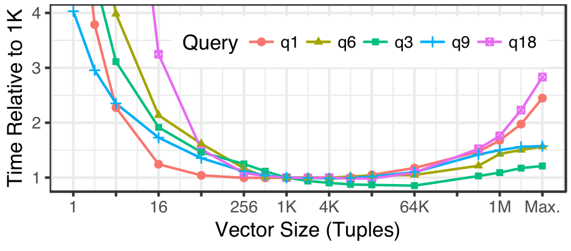

向量大小为 1 时，Tectorwise 退化为 Volcano 风格解释器，CPU 开销很大。大型向量放不进 CPU cache，因此会产生 cache miss；另一端的极限就是 MonetDB 使用的一次处理一整列。总体而言，1,000 左右对所有查询都很合适；唯一明显例外是 Q3，使用 64K 向量时还能再快约 15%。

### 4.4 Star Schema Benchmark

我们还在单线程 SSB SF=30 上验证四组模板。结果与 TPC-H Q3/Q9 一致：Tectorwise 指令更多，但 join-heavy 查询的 memory stall 更少，例如 Q4.1 每元组 stall 从 Typer 的 45.91 cycles 降至 19.48。故后续以 TPC-H 代表这些效应。

| Query/System | cycles | IPC | instr. | L1 miss | LLC miss | branch miss | mem stall |
| --- | ---: | ---: | ---: | ---: | ---: | ---: | ---: |
| Q1.1 Typer | 28 | 0.7 | 21 | 0.3 | 0.31 | 0.69 | 6.33 |
| Q1.1 Tectorwise | 12 | 2.0 | 23 | 0.4 | 0.29 | 0.05 | 2.77 |
| Q2.1 Typer | 39 | 0.8 | 30 | 1.3 | 0.12 | 0.17 | 18.35 |
| Q2.1 Tectorwise | 30 | 1.5 | 44 | 1.6 | 0.13 | 0.23 | 7.63 |
| Q3.1 Typer | 55 | 0.7 | 40 | 1.1 | 0.20 | 0.24 | 27.95 |
| Q3.1 Tectorwise | 53 | 1.3 | 71 | 1.7 | 0.23 | 0.41 | 15.68 |
| Q4.1 Typer | 78 | 0.5 | 39 | 1.8 | 0.31 | 0.38 | 45.91 |
| Q4.1 Tectorwise | 59 | 1.0 | 61 | 2.5 | 0.32 | 0.63 | 19.48 |

### 4.5 原型与生产系统对照

表 2 比较生产系统 HyPer/VectorWise 与本文原型 Typer/Tectorwise 的单线程 TPC-H SF=1 时间：

| Query | HyPer | VectorWise | Typer | Tectorwise |
| --- | ---: | ---: | ---: | ---: |
| Q1 | 53 | 71 | 44 | 85 |
| Q6 | 10 | 21 | 15 | 15 |
| Q3 | 48 | 50 | 47 | 44 |
| Q9 | 124 | 154 | 126 | 111 |
| Q18 | 224 | 159 | 90 | 154 |

HyPer 与 Typer、VectorWise 与 Tectorwise 的量级和相对趋势接近；除 Q6 外，轻量原型略快于生产系统，因为后者还要处理溢出检查等完整语义。这一对照支持原型对两类架构的代表性。

## 5. 数据并行执行（SIMD）

数据库操作的 SIMD 加速已有大量研究 [51,50,36,37,38,35,46,44]，这些工作通常采用向量化执行模型：向量引擎的 primitive 是简单紧凑的循环，容易转成数据并行代码。也有研究把 SIMD 用于以数据为中心的代码 [34,26]，但生成代码更复杂。本文因此以 Tectorwise 为平台，考察 SIMD 对内存 OLAP 工作负载的实际影响，并使用完整 TPC-H 而非微基准作为最终依据。

实验使用的 Skylake X 支持 AVX-512，每周期可执行两条 512-bit SIMD 操作，相比上一代微架构把寄存器宽度和吞吐翻倍：AVX-512 每周期可处理 32 个 32-bit 值，标量代码则只能处理 4 个。与 AVX2 相比，AVX-512 还提供更强且更正交的指令集：几乎全部操作支持 masking，新增 compress/expand，并为 8、16、32、64-bit 类型提供大多数操作。本文重点研究选择与哈希表探测这两类常见关键操作。

### 5.1 数据并行选择

向量化选择 primitive 产生一个 selection vector，其中保存全部匹配元组的下标。AVX-512 比较指令生成 mask，再把该 mask 交给跨 SIMD lane 的 `COMPRESSSTORE`，将被选中的位置写入内存。我们用一个 8,192 元素整数数组做微基准，比较无分支的标量 x86 实现与 SIMD 实现；最佳情形中，32-bit 输入连续且全部位于 L1 cache，图 6a 的加速为 8.4 倍。

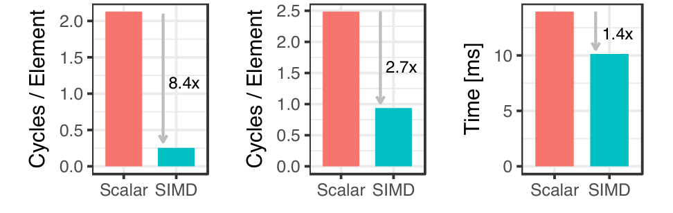

上述结果显示 SIMD selection 的收益从微基准到完整查询会明显缩小：dense input 最高约 8.4 倍，输入 selection vector 的稀疏情形最高约 2.7 倍，完整 TPC-H Q6 中约 1.4 倍，尽管 Q6 近 90% 的处理时间都花在 SIMD primitives 中。实验表明差距来自 selection vector 导致的稀疏加载，以及步长变化造成的 cache miss。

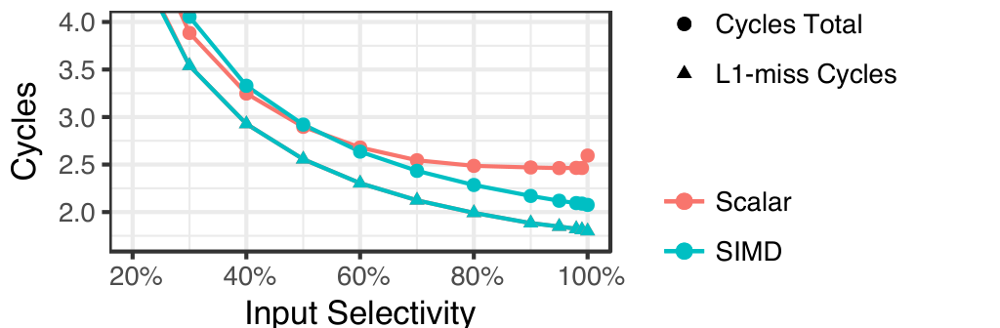

图 7 展示 selection vector 输入下，selectivity 与 cache miss 如何影响 SIMD。选择率低于约 50% 后，scalar 与 SIMD 的差距缩小；大量时间消耗在 L1 miss cycles 上，说明内存系统很快成为瓶颈。

只有第一个选择 primitive 接收连续输入；从第二个开始，所有 primitive 都必须依据 selection vector 从不连续内存位置 gather 元素。Q6 包含一个无输入 selection vector 的初始选择，以及四个必须处理 selection vector 的后续选择，因此整体加速本就应更接近 3 倍而非 8 倍。图 7 又在 4 GB 数据集、输出选择率 40% 的条件下展示输入稀疏度的影响：选择率低于 50% 时标量与 SIMD 几乎一样快，平均时间大多用于解决 cache miss。Q6 的第一个选择留下 43% 的元组，后续选择因此都落在标量与 SIMD 速度相近的范围。

### 5.2 数据并行哈希表探测

TPC-H 的查询处理时间大多花在哈希连接探测上。SIMD 有两个用武之地：计算哈希值，以及真正的哈希表查找。本文使用由整数移位、乘法等 AVX-512 可用算术操作构成的 Murmur2；查表则使用 gather、compress store 和 masking。

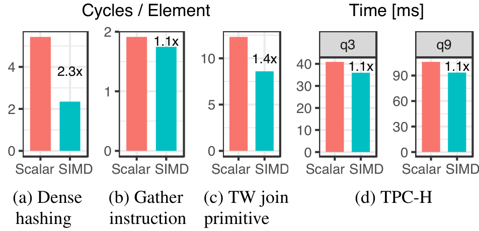

上述对比将 hash join probing 分成 dense hashing、gather instruction、Tectorwise join primitive 和完整 TPC-H 查询。单独 hashing 能有 2.3x，gather 和完整查询中收益接近 1.1x，说明内存访问和真实查询上下文吞噬了大部分 SIMD 优势。

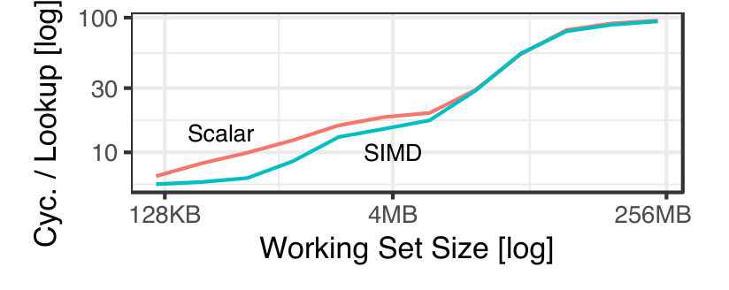

图 9 展示 working set 变大时 hash table lookup 的 cycles/lookup。Scalar 和 SIMD 曲线都随 working set 增长而上升，并在大 working set 处收敛，说明数据不在 cache 中时 SIMD 难以带来稳定收益。

图 8a 中单独计算哈希可加速 2.3 倍；图 8b 的 gather 最佳也只有 1.1 倍，因为测试机内存系统每周期最多执行两次 load，无论使用 SIMD gather 还是标量 load；将 gather 等 SIMD 指令用于 Tectorwise probe primitive，图 8c 的最佳收益为 1.4 倍。但在完整 TPC-H join 中收益几乎消失，即使 Q3、Q9 分别有 55% 和 65% 的时间位于 SIMD 优化 primitive。图 9 解释了原因：working set 增长后，内存延迟主导成本，只有数据全部位于 cache 时 SIMD 才有明显收益。

### 5.3 编译器自动向量化

我们手工用 SIMD intrinsics 改写了 Tectorwise primitives，也测试了 GCC 7.2、Clang 5.0 和 ICC 18 能否自动完成这项工作。只有 ICC 能够自动向量化相当一部分 primitives，而且仅限 AVX-512。图 10 显示，ICC 把相关查询路径的每元组指令数减少 20%-60%；代码轨迹确认 hashing、selection 和 projection 被自动向量化，而哈希表探测与聚合没有被转换。把自动与手工 SIMD 结合，对 Q3 和 Q9 还有额外收益。

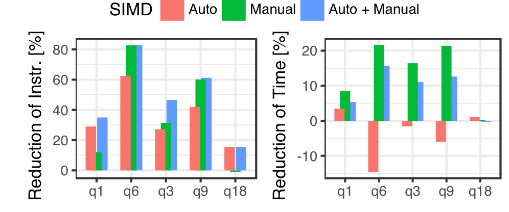

图 10 报告 ICC 18 自动向量化、手工 SIMD、以及二者结合的效果。自动向量化能降低部分查询的 instruction count，但不稳定改善 wall-clock time；手工 SIMD 更可控，二者结合在 Q3/Q9 上有额外收益。

然而，自动 SIMD 优化没有带来显著运行时间改善；单独自动向量化几乎没有收益，甚至让部分代码变慢。即使 Tectorwise 的 primitive 循环足够规则、编译器能够降低指令数，随机内存访问仍可能决定运行时间，因此自动向量化还不是可以直接依赖的方案。

### 5.4 小结

AVX-512 常能直接把标量代码改写为数据并行代码，微基准最高可达 8.4 倍；但在更复杂的 TPC-H 查询中，收益很小，连接查询约为 10%。根本原因是大多数 OLAP 查询受数据访问而非计算限制，后者本来才是 SIMD 的强项。回到以数据为中心的编译与向量化比较，SIMD 因此不会把天平转向向量化；压缩数据 [19] 或 Knights Landing 等面向向量的 CPU 上收益可能更大。

## 6. 查询内并行

### 6.1 Exchange 与 morsel-driven 并行

VectorWise 原本使用 exchange operator，HyPer 使用 morsel-driven 并行；后者在 20 个硬件线程上的五查询平均加速为 11.7 倍，前者为 7.2 倍。但并行框架与执行范式正交，因此本文为两套原型统一采用 morsel-driven。

Typer 只需把 scan loop 换成并行循环，并同步共享 hash table。Tectorwise 为每个 worker 建立一棵算子树和独占资源，每个算子另有共享状态用于结果交换和工作分配；pipeline breaker 使用 barrier，例如 hash join 必须等所有 worker 完成 build 后才能进入 probe。这样两者获得相同的负载均衡行为。

### 6.2 多线程执行

表 3 给出 Skylake 上 TPC-H SF=100 的多线程执行时间和加速比：

| Query | Threads | Typer ms | Typer speedup | Tectorwise ms | Tectorwise speedup | Ratio |
| --- | ---: | ---: | ---: | ---: | ---: | ---: |
| Q1 | 1 | 4426 | 1.0 | 7871 | 1.0 | 0.56 |
| Q1 | 10 | 496 | 8.9 | 867 | 9.1 | 0.57 |
| Q1 | 20 | 466 | 9.5 | 708 | 11.1 | 0.66 |
| Q6 | 1 | 1511 | 1.0 | 1443 | 1.0 | 1.05 |
| Q6 | 10 | 243 | 6.2 | 213 | 6.8 | 1.14 |
| Q6 | 20 | 236 | 6.4 | 196 | 7.4 | 1.20 |
| Q3 | 1 | 9754 | 1.0 | 7627 | 1.0 | 1.28 |
| Q3 | 10 | 1119 | 8.7 | 913 | 8.4 | 1.23 |
| Q3 | 20 | 842 | 11.6 | 743 | 10.3 | 1.13 |
| Q9 | 1 | 28086 | 1.0 | 20371 | 1.0 | 1.38 |
| Q9 | 10 | 3047 | 9.2 | 2394 | 8.5 | 1.27 |
| Q9 | 20 | 2525 | 11.1 | 2083 | 9.8 | 1.21 |
| Q18 | 1 | 13620 | 1.0 | 18072 | 1.0 | 0.75 |
| Q18 | 10 | 2099 | 6.5 | 2432 | 7.4 | 0.86 |
| Q18 | 20 | 1955 | 7.0 | 2026 | 8.9 | 0.97 |

SF=100（约 100 GB）上，10 个物理核对 Q1/Q3/Q9 都达到 8-9 倍加速；考虑全核时降频，这已接近理想。Q6 受读带宽限制，Q18 接近写带宽。AWS 实验也显示两者扩展相近，但更快实例的单查询价格更高：8 vCPU 的几何平均约 2027 ms、每查询 0.0002 美元，48 核约 534 ms、每查询 0.00034 美元。

启用 20 个超线程后，除内存带宽受限的 Q6 外，两者差距普遍缩小；Q3/Q9 的 Tectorwise 优势约减半。硬件多线程能隐藏一部分微架构上不理想的代码。

### 6.3 超出内存的实验

在三块 SATA SSD 组成、读带宽 1.4 GB/s 的 RAID 5 上，SF=100、20 线程结果见表 5。相较 55 GB/s 主存，两者比值更接近 1，但 join/aggregation 的差异仍可见；scan 主导的 Q1/Q6 受 I/O 影响最大。现代存储下，内存实验得到的相对规律仍基本成立。

表 5 给出 SSD 读取数据时 20 线程、SF=100 的运行时间：

| Query | Typer ms | Tectorwise ms | Ratio |
| --- | ---: | ---: | ---: |
| Q1 | 923 | 1184 | 0.78 |
| Q6 | 808 | 773 | 1.05 |
| Q3 | 1405 | 1313 | 1.07 |
| Q9 | 3268 | 2827 | 1.16 |
| Q18 | 2747 | 2795 | 0.98 |

## 7. 硬件

前述实验只测量 Intel 当时最新的 Skylake 微架构。为判断结果能否推广，本节还考察 AMD 的 Ryzen 微架构和 Intel 的 Phi 产品线。

### 7.1 Intel Skylake X 与 AMD Threadripper

两台约 1,000 美元的平台内存带宽接近；Threadripper 有 16 核但每核频率较低、SIMD 吞吐仅 Skylake 的四分之一，Skylake 为 10 个更强的核。图 11 显示 SF=100 上两者绝对性能总体接近：Q1 差异低于 20%，Q3 低于 25%，Q9 低于 40%，Q6/Q18 几乎相同；Typer/Tectorwise 的相对关系也保持一致。主要差别是 Intel hyper-threading 对所有查询有益，AMD SMT 收益小，部分查询甚至退化。

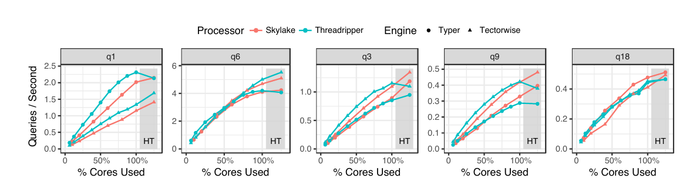

图 11：SF=100 下以可用核心比例归一化的吞吐。灰色 HT 区域表示启用硬件线程后的测量点。

表 4 是实验硬件平台配置：

| Platform | Intel Skylake | AMD Threadripper | Intel KNL |
| --- | --- | --- | --- |
| model | i9-7900X | 1950X | Phi 7210 |
| cores (SMT) | 10 (x2) | 16 (x2) | 64 (x4) |
| issue width | 4 | 4 | 2 |
| SIMD [bit] | 2x512 | 2x128 | 2x512 |
| clock rate [GHz] | 3.4-4.5 | 3.4-4.0 | 1.2-1.5 |
| L1 cache | 32 KB | 32 KB | 64 KB |
| L2 cache | 1 MB | 1 MB | 1 MB |
| LLC | 14 MB | 32 MB | 16 GB |
| list price [$] | 989 | 1000 | 1881 |
| launch | Q2'17 | Q3'17 | Q4'16 |
| mem BW [GB/s] | 58 | 56 | 68 |

### 7.2 Knights Landing（Xeon Phi）

Knights Landing 有 64-72 个较慢核心，每核两组 512-bit 向量单元，6 通道 DDR4，并提供约 300 GB/s 的 16 GB 高带宽内存。实验把它设为硬件管理的 L3 cache、Quadrant 单 NUMA 模式。未经 SIMD 调整时，Q3/Q9 可比 Skylake 快 0-25%，Q18 慢约 20%，Q1 慢约 30%，Q6 因高带宽最多快 2 倍。由于重复实验时 Q6 的整个工作集可放入 16 GB cache，这一结果偏乐观；把硬件配置为无 L3 cache 后，Q6 相对 Skylake 的优势不超过 20%。

加入手工 SIMD 后，KNL 的 join 最多比 Skylake 快 50%，Q6 接近 3 倍；不过其价格约为商品 CPU 的两倍，按每美元性能仍不占优。结论不是某架构必胜，而是 vectorization/compilation 的相对特征能跨硬件保持，SIMD 宽度和内存层次决定具体幅度。

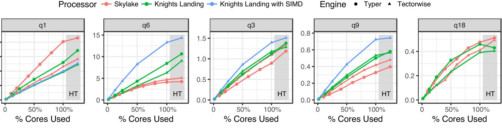

图 12 比较 Skylake、Knights Landing 以及带手工 SIMD 的 Knights Landing 在 SF=100 下随核心使用比例变化的吞吐。不同查询瓶颈不同：Q6 在高带宽和 SIMD 下收益明显，Q18 则受其他开销限制。

## 8. 定性比较

前文聚焦并行化之后的 OLAP 工作负载，只发现两种模型之间较小且依查询而异的微架构差异。因此，原始查询性能不是采用向量化或编译的普遍理由；在实际选择中，本节讨论的 OLTP 性能、实现工作量等因素可能更重要。

### 8.1 OLTP 与多语言支持

向量化只有在一次处理许多值时才能摊薄开销，OLTP 查询常只访问一个 tuple，因此几乎没有收益。编译则能把整个存储过程的多条语句生成一个机器码片段，这对 OLTP/HTAP 是实质优势；SQL Server 即使已有向量化 Apollo，仍加入编译式 Hekaton。统一编译环境也便于融合 UDF 和多种语言。

### 8.2 编译时间

编译时间可能支配短 OLTP 查询，也可能因大 OLAP pipeline 或数千列的简单扫描而超线性增长。存储过程可提前编译；HyPer 禁用部分不扩展的 LLVM pass、使用自有寄存器分配器，并先解释若干 morsel，若已完成就省去机器码编译；Spark 在单 pipeline 超过 8 KB Java bytecode 时回退到逐元组解释。这些缓解手段增加了系统复杂度。

### 8.3 性能剖析与可调试性

向量化 primitive 一次处理约千个值，在每次调用外计时的边际成本很低，因此可细分每个算子的周期。融合编译 pipeline 很难归因到单个关系算子；可用采样 profiler 和“机器码位置到计划算子”映射补救，但 Spark SQL 当前只能按 pipeline 计时。

### 8.4 适应性

运行时重排合取谓词乃至 join 能抵消基数误差。解释式向量引擎可直接更换 primitive 或执行顺序，并结合细粒度 profiling 做 micro-adaptivity。VectorWise 的 Q1 优于 Tectorwise 就来自一个自适应聚合：按 group key 把当前向量拆成 selection vector，成功时把哈希聚合变为寄存器中的有序局部聚合；若 group 太多失败，则指数退避，减少后续尝试。完全固化的编译代码要达到同等适应性则需重编译或间接层。

编译引擎并非不能适应，而是适应点需要显式设计。可以生成包含多个策略和运行时分支的代码，也可以在观测到基数后重新编译剩余 pipeline；前者增加代码体积与分支，后者增加编译延迟和状态迁移。向量化引擎原本就以 primitive 和 vector 为切换边界，所以改变谓词顺序或聚合策略的成本通常更低。

### 8.5 实现问题

向量化的难点是把算子拆成控制逻辑和 primitive，并保证绝大多数时间留在 primitive；编译引擎则是“生成代码的代码”，尤其直接生成 LLVM IR 时难理解、难调试，通常需要可维护的抽象层和多后端接口。复合 `ORDER BY` 或 window sort key 对向量化尤其麻烦：primitive 只能按单类型专用，比较必须拆分并以布尔向量连接，产生额外物化；编译器可直接生成针对完整 record 与复合 key 专用的 sort。

### 8.6 小结

编译适合 OLTP 存储过程和多语言融合，但有编译延迟、剖析粒度低、适应困难及代码生成间接层；向量化几乎无需查询编译，易剖析和动态替换，但算法实现受单类型、批处理和物化接口约束。OLAP 原始性能差异不大时，这些工程特性可能更能决定架构选择。

| 模型 | OLTP | 语言支持 | 编译时间 | 性能剖析 | 适应性 | 实现问题 |
| --- | --- | --- | --- | --- | --- | --- |
| 编译 | 优势 | 优势 | 部分优势 |  |  | 额外间接层 |
| 向量化 |  |  | 优势 | 优势 | 优势 | 代码约束 |

## 9. 超越基础向量化与以数据为中心的代码生成

### 9.1 混合模型

两类技术大多正交，图 13 因而呈现连续设计空间。HyPer 的压缩 Data Block scan 使用模板化 C++ 向量化而不在运行时生成代码：每个约 `2^16` 值的 attribute chunk 可独立选择压缩格式，若为属性与格式的全部组合生成融合代码会指数膨胀；向量化还使 decompression/selection 更易用 SIMD。其他算子仍用以数据为中心的编译，因此实际 HyPer 已是混合系统。

Peloton 的 relaxed operator fusion 在 hash join 等位置有选择地打断 pipeline、批量物化，以提高乱序执行、软件预取和 SIMD；若优化器能正确选择 breaker，它可能胜过两种基础模型。反方向上，Sompolski 等建议 JIT 融合相邻 VectorWise primitive loop，省去物化。Tupleware 用代价模型和 UDF 分析选择执行方式。Impala 保留批量 tuple 的 C++ 算子接口，只把 tuple-specific 的移动、访问和比较函数替换为 LLVM IR；这易测试、剖析，却因不跨算子融合而损失部分效率。

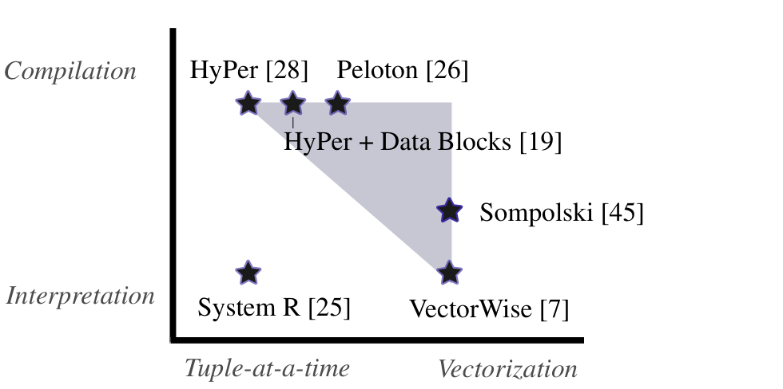

图 13：向量化与编译之间的设计空间。图中把 System R、VectorWise、HyPer、Peloton 等系统按 tuple-at-a-time/vectorization 和 interpretation/compilation 两个维度定位，并标出混合模型可能覆盖的区域。

表 6 对查询处理模型和代表系统按 pipeline 与执行方式分类：

| System | Pipelining | Execution | Year |
| --- | --- | --- | ---: |
| System R [25] | pull | interpretation | 1974 |
| PushPull [27] | push | interpretation | 2001 |
| MonetDB [9] | n/a | vectorization | 1996 |
| VectorWise [7] | pull | vectorization | 2005 |
| Virtuoso [8] | push | vectorization | 2013 |
| Hique [18] | n/a | compilation | 2010 |
| HyPer [28] | push | compilation | 2011 |
| Hekaton [12] | pull | compilation | 2014 |

### 9.2 其他查询处理模型

表 6 以“pipelining：pull/push/无”和“执行：解释/向量化/编译”构成 9 种组合，其中 8 种已有系统采用。System R 以后，多数引擎用 pull 避免中间物化；push 后来常与编译结合，但也用于解释或向量化。Push 可让一个算子向多个 consumer 输出 DAG 计划，也适合分布式 exchange；缺点是 merge-sort 等控制流较不灵活。MonetDB 完全物化各算子结果，简化实现却增加主存带宽。

编译也能结合三种 pipeline 策略，push 最常见且通常生成更高效代码。Hekaton 使用 pull 编译，其优点是算子多次产生结果时不会把 consumer 内联多份；push 编译的 full outer join 等算子必须把 consumer 抽成函数，避免指数代码增长。

因此，push/pull、逐 tuple/逐 vector、解释/编译是三个相互关联但不等价的设计维度。把“vectorized”等同于 pull、把“compiled”等同于 push，会掩盖 Virtuoso、Hekaton 和混合系统已经采用的组合。论文的最终建议不是在两个标签间二选一，而是从这个设计空间中按工作负载选择融合、物化、批大小和专用化程度。


## 10. 总结

令我们意外的是，在 OLAP 工作负载中，向量化执行与以数据为中心的编译查询执行性能非常接近。主要结论如下：

- **计算。** 以数据为中心的编译代码更适合计算密集型查询，因为它能把数据保留在寄存器中，从而执行更少的指令。
- **并行数据访问。** 向量化执行更善于并行产生 cache miss，因此在访问大型聚合或连接哈希表的内存受限查询中略占优势。
- **SIMD。** 近年来，SIMD 是硬件架构师提高 CPU 性能的重要机制；理论上向量化执行更容易从中获益，但实践中收益较小，因为多数操作由内存访问成本主导。
- **并行化。** 采用 morsel-driven 并行后，向量化引擎和编译引擎都能在多核 CPU 上良好扩展。
- **硬件平台。** 实验覆盖 Intel Skylake、Intel Knights Landing 和 AMD Ryzen；上述效应在所有机器上都出现，任何硬件平台上都没有一种模型全面支配另一种。

除 OLAP 性能外，其他因素也很重要。基于编译的引擎在 OLTP 上有优势，因为它能生成快速存储过程；在语言支持上也有优势，因为它可以无缝集成不同语言编写的代码。向量化引擎则在编译时间上有优势，因为 primitives 已预编译；在性能剖析上有优势，因为运行时间可归因到具体 primitive；在适应性上也有优势，因为执行过程中可以替换 primitives。

## 致谢

本文工作部分由 DFG grant KE401/22-1 资助。我们感谢 Orri Erling 解释 Virtuoso 的 vectorized push model，并感谢匿名审稿人的反馈。

## 参考文献

- [1] https://stackoverflow.com/questions/36932240/ avx2-what-is-the-most-efficient-way-to-pack- left-based-on-a-mask, 2016.
- [2] S. Agarwal, D. Liu, and R. Xin. Apache Spark as a compiler: Joining a billion rows per second on a laptop. https://databricks.com/blog/2016/05/23/apache-spark-as-a-compiler-joining-a-billion-rows-per-second-on-a-laptop.html, 2016.
- [3] K. Anikiej. Multi-core parallelization of vectorized query execution. Master’s thesis, University of Warsaw and VU University Amsterdam, 2010. http://homepages.cwi.nl/~boncz/msc/2010- KamilAnikijej.pdf.
- [4] R. Appuswamy, A. Anadiotis, D. Porobic, M. Iman, and A. Ailamaki. Analyzing the impact of system architecture on the scalability of OLTP engines for high-contention workloads. PVLDB, 11(2):121–134, 2017.
- [5] C. Balkesen, J. Teubner, G. Alonso, and M. T. Özsu. Main-memory hash joins on multi-core CPUs: Tuning to the underlying hardware. In ICDE, pages 362–373, 2013.
- [6] P. Boncz, T. Neumann, and O. Erling. TPC-H analyzed: Hidden messages and lessons learned from an influential benchmark. In TPCTC, 2013.
- [7] P. Boncz, M. Zukowski, and N. Nes. MonetDB/X100: Hyper-pipelining query execution. In CIDR, 2005.
- [8] P. A. Boncz, O. Erling, and M. Pham. Advances in large-scale RDF data management. In Linked Open Data - Creating Knowledge Out of Interlinked Data - Results of the LOD2 Project, pages 21–44. Springer, 2014.
- [9] P. A. Boncz, M. L. Kersten, and S. Manegold. Breaking the memory wall in MonetDB. Commun. ACM, 51(12):77–85, 2008.
- [10] P. A. Boncz, W. Quak, and M. L. Kersten. Monet and its geographic extensions: A novel approach to high performance GIS processing. In EDBT, pages 147–166, 1996.
- [11] A. Crotty, A. Galakatos, K. Dursun, T. Kraska, C. Binnig, U. Çetintemel, and S. Zdonik. An architecture for compiling UDF-centric workflows. PVLDB, 8(12):1466–1477, 2015.
- [12] C. Freedman, E. Ismert, and P. Larson. Compilation in the Microsoft SQL Server Hekaton engine. IEEE Data Eng. Bull., 37(1):22–30, 2014.
- [13] G. Graefe. Encapsulation of parallelism in the Volcano query processing system. In SIGMOD, pages 102–111, 1990.
- [14] G. Graefe and W. J. McKenna. The Volcano optimizer generator: Extensibility and efficient search. In ICDE, pages 209–218, 1993.
- [15] T. Gubner and P. Boncz. Exploring query compilation strategies for JIT, vectorization and SIMD. In IMDM, 2017.
- [16] T. Kersten. https://github.com/TimoKersten/db-engine-paradigms, 2018.
- [17] A. Kohn, V. Leis, and T. Neumann. Adaptive execution of compiled queries. In ICDE, 2018.
- [18] K. Krikellas, S. Viglas, and M. Cintra. Generating code for holistic query evaluation. In ICDE, pages 613–624, 2010.
- [19] H. Lang, T. Mühlbauer, F. Funke, P. Boncz, T. Neumann, and A. Kemper. Data Blocks: Hybrid OLTP and OLAP on compressed storage using both vectorization and compilation. In SIGMOD, pages 311–326, 2016.
- [20] P. Larson, C. Clinciu, C. Fraser, E. N. Hanson, M. Mokhtar, M. Nowakiewicz, V. Papadimos, S. L. Price, S. Rangarajan, R. Rusanu, and M. Saubhasik. Enhancements to SQL Server column stores. In SIGMOD, pages 1159–1168, 2013.
- [21] P. Larson, C. Clinciu, E. N. Hanson, A. Oks, S. L. Price, S. Rangarajan, A. Surna, and Q. Zhou. SQL Server column store indexes. In SIGMOD, pages 1177–1184, 2011.
- [22] V. Leis, P. Boncz, A. Kemper, and T. Neumann. Morsel-driven parallelism: A NUMA-aware query evaluation framework for the many-core age. In SIGMOD, pages 743–754, 2014.
- [23] V. Leis, K. Kundhikanjana, A. Kemper, and T. Neumann. Efficient processing of window functions in analytical SQL queries. PVLDB, 8(10):1058–1069, 2015.
- [24] V. Leis, B. Radke, A. Gubichev, A. Mirchev, P. Boncz, A. Kemper, and T. Neumann. Query optimization through the looking glass, and what we found running the join order benchmark. VLDB Journal, 2018.
- [25] R. A. Lorie. XRM - an extended (n-ary) relational memory. IBM Research Report, G320-2096, 1974.
- [26] P. Menon, A. Pavlo, and T. Mowry. Relaxed operator fusion for in-memory databases: Making compilation, vectorization, and prefetching work together at last. PVLDB, 11(1):1–13, 2017.
- [27] T. Neumann. Efficient generation and execution of DAG-structured query graphs. PhD thesis, University of Mannheim, 2005.
- [28] T. Neumann. Efficiently compiling efficient query plans for modern hardware. PVLDB, 4(9):539–550, 2011.
- [29] T. Neumann and V. Leis. Compiling database queries into machine code. IEEE Data Eng. Bull., 37(1):3–11, 2014.
- [30] S. Padmanabhan, T. Malkemus, R. C. Agarwal, and A. Jhingran. Block oriented processing of relational database operations in modern computer architectures. In ICDE, pages 567–574, 2001.
- [31] S. Palkar, J. J. Thomas, D. Narayanan, A. Shanbhag, R. Palamuttam, H. Pirk, M. Schwarzkopf, S. P. Amarasinghe, S. Madden, and M. Zaharia. Weld: Rethinking the interface between data-intensive applications. CoRR, abs/1709.06416, 2017.
- [32] S. Palkar, J. J. Thomas, A. Shanbhag, M. Schwarzkopf, S. P. Amarasinghe, and M. Zaharia. A common runtime for high performance data analysis. In CIDR, 2017.
- [33] J. M. Patel, H. Deshmukh, J. Zhu, H. Memisoglu, N. Potti, S. Saurabh, M. Spehlmann, and Z. Zhang. Quickstep: A data platform based on the scaling-in approach. PVLDB, 11(6):663–676, 2018.
- [34] H. Pirk, O. Moll, M. Zaharia, and S. Madden. Voodoo - A vector algebra for portable database performance on modern hardware. PVLDB, 9(14):1707–1718, 2016.
- [35] O. Polychroniou, A. Raghavan, and K. A. Ross. Rethinking SIMD vectorization for in-memory databases. In SIGMOD, pages 1493–1508, 2005.
- [36] O. Polychroniou and K. A. Ross. High throughput heavy hitter aggregation for modern SIMD processors. In DaMoN, 2013.
- [37] O. Polychroniou and K. A. Ross. Vectorized bloom filters for advanced SIMD processors. In DaMoN, 2014.
- [38] O. Polychroniou and K. A. Ross. Efficient lightweight compression alongside fast scans. In DaMoN, 2015.
- [39] B. Raducanu, P. Boncz, and M. Zukowski. Micro adaptivity in Vectorwise. In SIGMOD, pages 1231–1242, 2013.
- [40] V. Raman, G. K. Attaluri, R. Barber, N. Chainani, D. Kalmuk, V. KulandaiSamy, J. Leenstra, S. Lightstone, S. Liu, G. M. Lohman, T. Malkemus, R. Müller, I. Pandis, B. Schiefer, D. Sharpe, R. Sidle, A. J. Storm, and L. Zhang. DB2 with BLU acceleration: So much more than just a column store. PVLDB, 6(11):1080–1091, 2013.
- [41] S. Schuh, X. Chen, and J. Dittrich. An experimental comparison of thirteen relational equi-joins in main memory. In SIGMOD, pages 1961–1976, 2016.
- [42] A. Shaikhha, Y. Klonatos, L. Parreaux, L. Brown, M. Dashti, and C. Koch. How to architect a query compiler. In SIGMOD, pages 1907–1922, 2016.
- [43] U. Sirin, P. To¨zu¨n, D. Porobic, and A. Ailamaki. Micro-architectural analysis of in-memory OLTP. In SIGMOD, pages 387–402, 2016.
- [44] E. A. Sitaridi, O. Polychroniou, and K. A. Ross. SIMD-accelerated regular expression matching. In DaMoN, 2016.
- [45] J. Sompolski, M. Zukowski, and P. A. Boncz. Vectorization vs. compilation in query execution. In DaMoN, pages 33–40, 2011.
- [46] D. Song and S. Chen. Exploiting SIMD for complex numerical predicates. In ICDE, pages 143–149, 2016.
- [47] R. Y. Tahboub, G. M. Essertel, and T. Rompf. How to architect a query compiler, revisited. In SIGMOD, pages 307–322, 2018.
- [48] A. Vogelsgesang, M. Haubenschild, J. Finis, A. Kemper, V. Leis, T. Mühlbauer, T. Neumann, and M. Then. Get real: How benchmarks fail to represent the real world. In DBTest, 2018.
- [49] S. Wanderman-Milne and N. Li. Runtime code generation in Cloudera Impala. IEEE Data Eng. Bull., 37(1):31–37, 2014.
- [50] T. Willhalm, N. Popovici, Y. Boshmaf, H. Plattner, A. Zeier, and J. Schaffner. SIMD-Scan: Ultra fast in-memory table scan using on-chip vector processing units. PVLDB, 2(1):385–394, 2009.
- [51] J. Zhou and K. A. Ross. Implementing database operations using SIMD instructions. In SIGMOD, pages 145–156, 2002.
- [52] M. Zukowski. Balancing Vectorized Query Execution with Bandwidth-Optimized Storage. PhD thesis, University of Amsterdam, 2009.
- [53] M. Zukowski, S. Héman, N. Nes, and P. A. Boncz. Super-scalar RAM-CPU cache compression. In ICDE, 2006.
