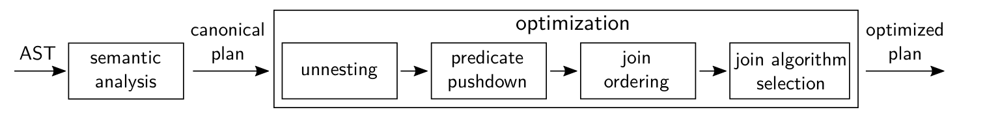
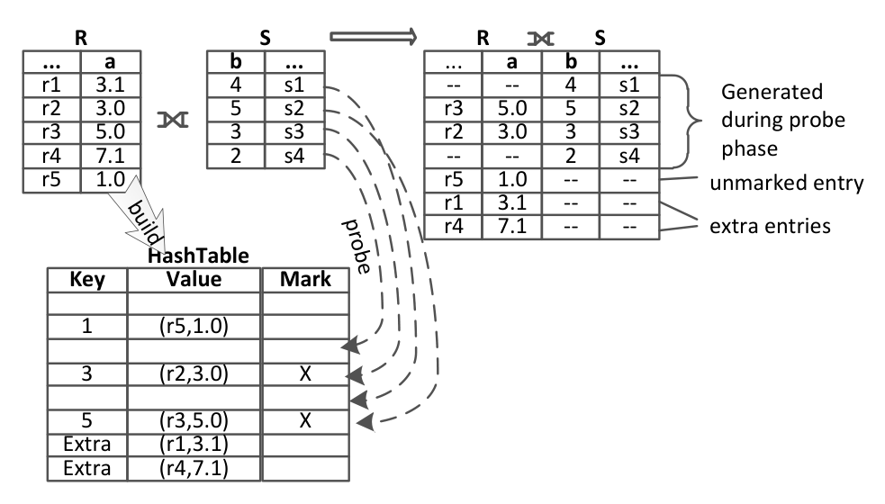

# The Complete Story of Joins (in HyPer)（中文译文）

## 译者说明

本文依据同目录的 `source.pdf` 翻译。章节、图表、公式、算法、代码与参考文献按原文结构保留。

## 作者与出处

- Thomas Neumann（慕尼黑工业大学，`neumann@in.tum.de`）
- Viktor Leis（慕尼黑工业大学，`leis@in.tum.de`）
- Alfons Kemper（慕尼黑工业大学，`kemper@in.tum.de`）

本文发表于 BTW 2017，收录于 B. Mitschang 等人编的 *Datenbanksysteme für Business, Technologie und Web*，Lecture Notes in Informatics（LNI），Gesellschaft für Informatik，Bonn，2017 年，第 31–50 页。

## 摘要

SQL 已经演化成一种几乎完全正交（orthogonal）的查询语言，允许在查询的几乎所有位置出现任意深度嵌套的子查询。为了避免递归求值策略带来的难以接受的 $O(n^2)$ 运行时间，需要一种扩展关系代数，将这类子查询翻译成非标准连接算子。本文聚焦于传统教材中的内连接、外连接和反/半连接之外的非标准连接算子。HyPer 中传统连接算子的实现已在既有论文中讨论，本文仅作引用。本文覆盖两个新的连接算子 - 标记连接（mark join）和单值连接（single join） - 的逻辑和物理两个层面：在逻辑层面，展示它们的翻译方式和重排序可能性，以便有效优化得到的查询计划；在物理层面，描述这些新连接的基于哈希和分块嵌套循环（block-nested loop）实现。基于数据库系统 HyPer，本文给出完整查询翻译和优化流水线的蓝图。通过分析两个著名基准 TPC-H 和 TPC-DS，本文证明高级连接算子具有实际必要性，因为这些连接变体都会在这些查询集中出现。

## 1. 引言（Introduction）

连接（join）可以说是最重要的关系算子，并且有多种变体。任意 SQL 查询的 `FROM` 子句都可能包含内连接，也可能包含左、右、全外连接。此外，许多系统支持反/半连接（anti/semi join），以便把 `(NOT) EXISTS` 子查询表达为连接。

除这些特定结构外，SQL 已变得完全正交，即子查询几乎可以出现在查询的任何地方，包括 `SELECT`、`FROM` 和 `WHERE` 子句。因此，一个查询可以包含一个表达式，而该表达式本身又包含子查询，依此递归。最简单的建模方式是相互递归：表达式和查询都可以互相引用并求值。事实上，一些系统，例如 PostgreSQL，正是这样做的。

这种简单的非关系式方法的缺点是，它使许多重要优化几乎不可能进行。实际上，它会把常见查询模式的执行计划预先固定为嵌套循环式执行，运行时间为 $O(n^2)$。

本文认为，众所周知的内连接、外连接和半连接并不充分。为了高效支持完整 SQL，还需要两个额外的连接类型，HyPer 中称为单值连接（single join）和标记连接（mark join）。这两个变体都在查询优化器的早期阶段引入，用于把某些子查询结构翻译成关系代数。其结果是，表达式和子查询之间难以优化的相互递归被打破，即表达式不再引用子查询；子查询被翻译成可以重排序的连接。

这种基于代数的正交方法：

- 带来额外的连接重排序机会 [MN08]；
- 构成 HyPer 去嵌套（unnesting）技术 [NK15] 的基础。

因此，本文把多条既有工作线索连接起来，给出 HyPer 中连接优化流水线的完整图景。传统连接类型的算法已经在既有工作中描述 [AKN13, La13, Le14]。

本文结构紧密对应 HyPer 的查询优化器。第 2 节讨论预备知识；第 3 节展示如何把 SQL 翻译为扩展关系代数。这个翻译步骤只关注正确性，不关注性能。第 4 节描述如何优化这种代数表达式。第 5 节关注非标准连接算法的实现。

## 2. 预备知识（Preliminaries）

在下一节引入非标准连接算子前，先回顾常见连接变体的定义 [Mo14]。

常规内连接可以定义为笛卡尔积之后接选择：

$$
T_1 \Join_p T_2 := \sigma_p(T_1 \times T_2)
$$

它使用谓词 $p$ 计算关系 $T_1$ 和 $T_2$ 中所有匹配条目的组合。大多数 SQL 查询都会用到它，但在存在相关子查询时，这一定义并不充分。子查询必须对外层查询的每个元组求值，因此定义依赖连接（dependent join）为：

$$
T_1 \Join^{dep} _ p T_2 :=
\lbrace{}t_1 \circ t_2 \mid t_1 \in T_1 \land t_2 \in T_2(t_1) \land p(t_1 \circ t_2)\rbrace{}
$$

其中，右侧输入会针对左侧输入的每个元组求值。按照约定，只有右侧可以依赖左侧，左侧不能依赖右侧。用 $A(T)$ 表示表达式 $T$ 产生的属性，用 $F(T)$ 表示表达式 $T$ 中出现的自由变量。为了求值依赖连接，必须满足 $F(T_2) \subseteq A(T_1)$，也就是说 $T_2$ 需要的属性必须由 $T_1$ 产生。依赖连接及其变换规则构成 HyPer 去嵌套技术的基础，该技术已在此前 BTW 论文中描述 [NK15]。

此外还有半连接、反半连接、左外连接和全外连接：

$$
T_1 \ltimes_p T_2 := \lbrace{}t_1 \mid t_1 \in T_1 \land \exists t_2 \in T_2: p(t_1 \circ t_2)\rbrace{}
$$

$$
T_1 \bar{\ltimes} _ p T_2 := \lbrace{}t_1 \mid t_1 \in T_1 \land \nexists t_2 \in T_2: p(t_1 \circ t_2)\rbrace{}
$$

$$
T_1 \mathbin{\Join _ {\mathrm{left}}} _ p T_2 :=
(T_1 \Join_p T_2) \cup
\lbrace{}t_1 \circ (a:\mathrm{null}) _ {a \in A(T_2)} \mid t_1 \in (T_1 \bar{\ltimes} _ p T_2)\rbrace{}
$$

$$
T_1 \mathbin{\Join _ {\mathrm{full}}} _ p T_2 :=
(T_1 \Join_p T_2)
\cup \lbrace{}t_1 \circ (a:\mathrm{null}) _ {a \in A(T_2)} \mid t_1 \in (T_1 \bar{\ltimes} _ p T_2)\rbrace{}
\cup \lbrace{}(a:\mathrm{null}) _ {a \in A(T_1)} \circ t_2 \mid t_2 \in (T_2 \bar{\ltimes} _ p T_1)\rbrace{}
$$

这些连接变体也都有对应的依赖连接版本，其定义与依赖内连接类似。

除连接算子外，另一个重要算子是 `GROUP BY`：

$$
\Gamma _ {A; a:f}(e) :=
\lbrace{}x \circ (a:f(y)) \mid x \in \Pi_A(e) \land
y = \lbrace{}z \mid z \in e \land \forall a \in A: x.a = z.a\rbrace{}\rbrace{}
$$

它按照属性集合 $A$ 对输入 $e$ 分组，并计算一个或多个聚合函数以产生聚合属性。如果 $A$ 为空，则只产生一个聚合元组，这对应 SQL 中缺失 `GROUP BY` 子句的情形。

## 3. 将复杂 SQL 翻译为扩展关系代数（Translating Complex SQL to Extended Relational Algebra）

上一节中的标准算子广为人知，但不足以翻译现代 SQL 的所有结构。毫不意外，部分例子看起来有些不常见。原因是简单 SQL 查询确实可以用第 2 节中的常见操作翻译。但这些略显特殊的查询同样是合法 SQL，数据库也需要高效手段来求值它们。

本文通过示例查询及其关系代数翻译来说明方法。使用如下模式：

- `Professors`: `{[Name, PersID, Sabbatical, ...]}`
- `Courses`: `{[Title, ECTS, Lecturer references Professors, ...]}`
- `Assistants`: `{[Name, Boss references Professors, JobTitle, ...]}`

在讨论复杂情形之前，先简单说明所谓规范翻译（canonical translation），即教材中 SQL 到关系代数的映射。它取输入关系的笛卡尔积，应用 `WHERE` 谓词作为过滤器，然后输出结果。例如：

```sql
select Title, Name
from Courses, Professors
where PersID = Lecturer
```

会被翻译为：

$$
\Pi _ {Title,Name}(\sigma _ {PersID=Lecturer}(Courses \times Professors))
$$

之后的优化阶段会把这个规范翻译转换成更高效的计划，例如把选择和笛卡尔积合并为连接。不幸的是，这种简单的教材式翻译不足以处理真实查询；下文会通过例子说明这一点，并在此过程中引入高效处理各种结构所需的其他连接算子。为便于阅读，后续例子不再写出最终投影，而只聚焦实际算子。

### 3.1 依赖连接（Dependent Join）

规范翻译最明显的局限是忽略相关子查询。也就是说，它只是取 `FROM` 子句中的输入关系或输入子查询，然后形成笛卡尔积。但现实中并不总是可以这样做。考虑如下查询：

```sql
select Name, Total
from Professors,
     (select sum(ECTS) as Total
      from Courses
      where PersId = Lecturer) C
```

这里的子查询依赖外层连接，因此不能使用笛卡尔积。相关子查询必须通过依赖连接加入：

$$
Professors \Join^{dep} _ {true}
\Gamma _ {\emptyset,total:sum(ECTS)}
(\sigma _ {PersId=Lecturer}(Courses))
$$

当然，查询优化器会尽快尝试消除依赖连接，例如使用 [NK15] 中的技术。但初始的关系代数翻译步骤需要依赖连接，使用普通笛卡尔积是不正确的。有些系统在这里使用嵌套循环连接，但并不显式标注它是依赖连接；然而从性能角度看，嵌套循环连接通常非常不理想。一般更好的做法是先引入依赖连接，再通过去嵌套技术把它转换成更高效的普通连接。

> 原文脚注 4：一些 DBMS 要求用额外语法明确表示这种相关性，例如 PostgreSQL 的 `LATERAL`；HyPer 等其他系统则直接接受上述查询。

### 3.2 单值连接（Single Join）

相关子查询是规范翻译中的一类问题，第二类问题是标量子查询（scalar subquery）。在 SQL 中，只要子查询恰好产生一列且最多一行，就可以用它计算标量值。例如：

```sql
select PersId, p.Name,
       (select a.Name
        from Assistants a
        where a.Boss = p.PersId
          and JobTitle = 'personal assistant')
from Professors p
```

该查询为每位教授选择个人助理的名字。我们不希望回退到相互递归，也就是不希望对每位教授单独求值子查询，因为那会导致 $O(n^2)$ 运行时间。相反，我们希望把 `Professors` 关系与子查询连接起来，同时必须遵守 SQL 语义：如果子查询产生一个结果，则把它作为标量值；如果子查询不产生结果，则标量值为 `NULL`；如果子查询产生超过一个结果，则必须报错。

为了在关系代数中表达这一点，本文引入新算子单值连接。它几乎等同于外连接，但如果发现超过一个连接伙伴，就报告错误：

$$
T_1 \Join^1_p T_2 :=
\begin{cases}
\text{runtime error}, & \text{if } \exists t_1 \in T_1:\left|\lbrace{}t_1\rbrace{} \Join_p T_2\right| \gt 1 \\
T_1 \mathbin{\Join _ {\mathrm{left}}} _ p T_2, & \text{otherwise}
\end{cases}
$$

使用该算子，可以把标量子查询翻译为连接：

$$
Professors \Join^1 _ {true}
\sigma _ {PersId=Boss \land JobTitle='personal assistant'}(Assistants)
$$

查询优化器随后会把相关谓词移入连接算子，得到：

$$
Professors \Join^1 _ {PersId=Boss}
\sigma _ {JobTitle='personal assistant'}(Assistants)
$$

引入单值连接同时有性能和正确性理由。在性能方面，基于哈希的单值连接理想情况下运行时间为 $O(n)$，明显优于递归求值的 $O(n^2)$。在正确性方面，一般不能用其他连接实现替代，因为其他实现不会在发现多个连接伙伴时报错。少数例外是：如果已知子查询最多产生一个元组，例如绑定主键或单元组聚合，则可以用普通左外连接 $T_1 \mathbin{\Join _ {\mathrm{left}}} _ p T_2$ 替代单值连接。但这些属于后续优化；初始翻译步骤总是把标量子查询翻译为单值连接。

### 3.3 标记连接（Mark Join）

另一类特殊连接结构来自谓词子查询，包括 `exists`、`not exists`、`unique` 和量化比较。考虑如下查询：

```sql
select *
from Professors
where exists (select *
              from Courses
              where Lecturer = PersId)
   or Sabbatical = true
```

直接把子查询翻译成半连接很诱人；事实上如果没有析取条件，很多系统会这样做。但这里不能使用半连接，因为即使某位教授没有授课，只要他或她正在休假，也必须输出该教授。

本文引入标记连接，它创建一个新属性，用于标记某个元组是否具有连接伙伴：

$$
T_1 \Join^{M:m} _ p T_2 :=
\lbrace{}t_1 \circ (m:(\exists t_2 \in T_2: p(t_1 \circ t_2))) \mid t_1 \in T_1\rbrace{}
$$

使用标记连接，可以把上述查询翻译成相对普通的连接查询：

$$
\sigma _ {m \lor Sabbatical}
(Professors \Join^{M:m} _ {PersId=Lecturer} Courses)
$$

如果标记只用于合取谓词，查询优化器通常可以把标记连接转换成半连接或反半连接。但一般情况下不能这样做，例如析取会阻止这种转换。即便如此，标记连接仍然可以高效求值，使用哈希时通常是 $O(n)$，因此引入该算子不会给查询优化器造成问题。

注意，当考虑 `NULL` 值时，标记连接的语义比初看起来微妙得多。如下查询：

```sql
select Title,
       ECTS = any (select ECTS
                   from Courses c2
                   where Lecturer = 123) someEqual
from Courses c1
```

可以直接翻译成标记连接：

$$
Courses\ c1 \Join^{M:someEqual} _ {c1.ECTS=c2.ECTS}
\sigma _ {c2.Lecturer=123}(Courses\ c2)
$$

结果列 `someEqual` 可以取 `TRUE`、`FALSE` 和 `NULL`，其中 `NULL` 表示 unknown。因此，实现标记连接时需要格外小心，第 5 节会讨论这一点。其巨大收益是，现在可以把任意 `exists`/`not exists`/`unique`/量化比较查询翻译成连接结构，并在后续优化后获得高效求值策略。

### 3.4 翻译 SQL 查询（Translating SQL Queries）

综合上述内容，可以用以下高层算法把任意 SQL 查询翻译为关系代数：

1. 从左到右翻译 `FROM` 子句。
   - 对每个条目生成一个算子树。
   - 如果没有相关性，就用笛卡尔积 $\times$ 与前一个树组合；否则使用依赖连接 $\Join^{dep}$。
   - 结果是一个单一算子树。
2. 翻译 `WHERE` 子句，如果存在。
   - 对 `exists`、`not exists`、`unique` 和量化子查询，用标记连接把子查询添加到当前树之上，并用标记属性翻译表达式本身。
   - 对标量子查询，引入单值连接，并用唯一结果列/行翻译表达式。
   - 其他表达式都是标量表达式，直接翻译。
   - 将结果通过选择算子 $\sigma$ 添加到当前树之上。
3. 翻译 `GROUP BY` 子句，如果存在。
   - 像 `WHERE` 子句一样翻译分组表达式。
   - 用分组算子 $\Gamma$ 将结果添加到当前树之上。
4. 翻译 `HAVING` 子句，如果存在。
   - 逻辑与 `WHERE` 子句相同。
5. 翻译 `SELECT` 子句。
   - 像 `WHERE` 子句一样翻译结果表达式。
   - 用投影算子 $\Pi$ 将结果添加到当前树之上。
6. 翻译 `ORDER BY` 子句，如果存在。
   - 像 `WHERE` 子句一样翻译结果表达式。
   - 用排序算子将结果添加到当前树之上。

该过程能够把任意 SQL 查询翻译为关系代数，而无需回退到算子和表达式之间的相互递归。随后查询优化器可以利用高效的连接实现来优化结果。

## 4. 优化（Optimizations）

图 1 给出 HyPer 优化器的高层概览。SQL 抽象语法树（AST）到关系代数的翻译由语义分析组件完成。在这一步只引入内连接、外连接、左标记连接和单值连接。所有其他变体都在后续优化阶段中出现，用于提升性能。



*图 1：优化流程概览（Overview over optimization process）。*


### 4.1 去嵌套（Unnesting）

一个重要且对某些查询至关重要的优化是去嵌套。对许多用户而言，相关查询比语义等价的连接式查询更容易表达。如果没有去嵌套，这类查询会产生运行时间为 $O(n^2)$ 的嵌套循环连接。多数系统会检测某些相关模式并将其转换成连接，但无法去嵌套复杂相关。

相比之下，HyPer 的去嵌套技术 [NK15] 能够去嵌套任意查询，而不只是某些模式。这通过一组系统性的、基于代数的转换实现，细节已在 [NK15] 中描述。标记连接和单值连接是该技术的隐式构件。没有这些连接，一些查询无法用关系代数表达，因此去嵌套技术也无法工作。

### 4.2 重排序（Reordering）

查询优化器最重要的任务之一是找到好的连接顺序，因为糟糕的连接顺序可能慢几个数量级 [Le15]。如前所述，与基于相互递归的方法相比，单值连接和标记连接提供了额外的重排序机会。例如：

```sql
select *
from Professors p, Assistants a
where p.PersId = a.Boss
  and (exists (select *
               from Courses c
               where c.Lecturer = p.PersId)
       or p.Sabbatical = true)
```

如果没有标记连接，连接顺序实际上被预先决定，`Professors` 和 `Assistants` 之间的内连接总会先执行。使用标记连接后，也可以先执行标记连接，再与 `Assistants` 连接：

$$
(\sigma _ {m \lor Sabbatical}
(Professors \Join^{M:m} _ {PersId=Lecturer} Courses))
\Join _ {PersId=Boss} Assistants
$$

如果 `Assistants` 比 `Professors` 更多，那么先做标记连接比先做内连接更快。由于连接谓词具有传递性（`PersId = Boss` 且 `Lecturer = PersId`），也可以从 `Courses` 与 `Assistants` 之间的标记连接开始。三种连接顺序之间的选择由基于代价的连接枚举算法完成。HyPer 使用一种名为 DPhyp 的图式动态规划算法，该算法只枚举不包含笛卡尔积的连通分量 [MN08]，并考虑非内连接的顺序约束。

### 4.3 左右连接变体（Left and Right Join Variants）

对大多数连接类型，HyPer 都有左变体和右变体，例如左标记连接和右标记连接。两个变体在语义上产生相同结果，只是左右输入互换。但它们的性能不同。

例如在基于哈希的执行中，哈希表由左输入构建，右输入元组用于探测哈希表。由于哈希表插入通常比查找慢，出于性能原因，HyPer 的查询优化器会交换连接参数顺序，使较小输入位于左侧。这里的“较小”基于基数估计判断。总结来说，为每种连接提供两个方向的变体，会给优化器带来选择自由度，从而改善查询性能。

> 原文脚注 5：与本文约定相反，一些系统对右侧输入做哈希。原文脚注 6：“较小”由基数估计确定。

### 4.4 其他优化（Other Optimizations）

标记连接略慢于反/半连接，因为它需要维护标记。因此，如果可能，应把标记连接翻译为反/半连接。在 HyPer 中，查询：

```sql
select *
from Professors
where exists (select *
              from Courses
              where Lecturer = PersId)
```

最初用标记连接表达，之后在优化步骤中被替换为半连接 $(Professors \ltimes Courses)$。

另一项优化是把外连接翻译为内连接。这在存在拒绝空值（null-rejecting）谓词时可行，例如：

```sql
select Title, Name
from Courses right outer join Professors on PersID = Lecturer
where ECTS > 1
```

最后，如果已知子查询最多计算一行，则左单值连接可以替换为普通左外连接，例如：

```sql
select Name,
       (select sum(ECTS) as Total
        from Courses
        where PersId = Lecturer)
from Professors
```

该查询中普通外连接已经足够，因为子查询是不带 `GROUP BY` 的聚合，总是产生单行。

## 5. 算法（Algorithms）

讨论完各种连接变体及其优化后，接下来讨论实际实现。本文主要关注高层算法，不引入特别调优过的实现，而是讨论它们与普通连接的差异。因此，下文使用简单的主内存算法来描述。把这些算法推广到外存算法相对直接。讨论从等值连接开始，因为它们最常见且可以高效实现，然后覆盖非等值连接。

### 5.1 常规等值连接（Regular Equi-Joins）

为了突出不同连接之间的差异，先从常规基于哈希的等值连接开始。这里只描述内存内情形，因此代码较短，并作为不同变体的基础。为简单起见，假设计算 $R \Join _ {a=b} S$：

```text
List. 1: Equality Hash Join

for each r in R
    store r into H[r.a]
for each s in S
    for each r in H[s.b]
        if r.a = s.b
            emit r,s
```

真实实现当然会复杂得多 [AKN13, La13, Le14]，但这段伪代码足以说明基本算法：哈希表保存一侧所有元组，并按连接属性组织；另一侧探测该哈希表以寻找连接伙伴。

### 5.2 混合类型连接（Joins with Mixed Types）

即使是简单等值连接，如果涉及混合数据类型也会变复杂。在 $R \Join _ {a=b} S$ 的例子中，如果 `a` 的数据类型是 `numeric(6,3)`，而 `b` 的数据类型是 `integer`，应该如何组织哈希表？数值的内部表示很不同，但仍需保证 `3` 能与 `3.000` 连接，而不能与 `3.001` 连接。若直接使用不同数据类型的原生哈希函数，通常无法满足这一点。

关键洞察是：应在限制最强的数据类型上执行连接，本例中为 `integer`。任何不能精确表示为整数的值都不可能有连接伙伴，因此可以从哈希表中省略。假设 `b` 具有限制最强的数据类型，则伪代码如下：

```text
List. 2: Equality Hash Join with Mixed Types

for each r in R
    a' = r.a cast to the type of S.b
    a'' = a' cast to the type of R.a
    if r.a = a''
        store r into H[a']
for each s in S
    for each r in H[s.b]
        if r.a = s.b
            emit r,s
```

这里假设把 `a` 转换为 `b` 的类型，但也可以反向转换。后续算法把限制最强的数据类型称为比较类型（compare type），并把上述逻辑简写为“如果转换是精确的”。

### 5.3 外连接（Outer Joins）

外连接输出与内连接相同的元组，此外还输出所有没有找到连接伙伴的元组。这可以通过标记元组实现。如图 2 所示，每个哈希表条目有一个额外字节，初始值为 0；一旦找到连接伙伴，就设为 1。这样连接完成后可以输出所有没有连接伙伴的元组。对右侧元组而言，是否有连接伙伴可以立即知道。下面给出全外连接伪代码；左外连接和右外连接是该算法的直接子集。



*图 2：外连接示例（Outer Join Example）。*


```text
List. 3: Full Outer Hash Join

for each r in R
    a' = r.a cast to compare type
    if cast was exact
        store r into H[a']
    else
        store r into H["extra"]

for each s in S
    sm = 0
    b' = s.b cast to compare type
    if cast was exact
        for each r in H[b']
            if r.a = s.b
                mark r as joined
                sm = 1
                emit r,s
    if sm = 0
        emit null,s

for each r in H
    if r is not marked
        emit r,null
```

代码首先处理所有 `R` 元组，并把它们未标记地存入哈希表。这里额外的困难是，在混合数据类型时，部分 `R` 值可能无法用比较类型表示。对内连接可以丢弃这些值，但对左外连接和全外连接仍必须输出它们，因此把它们存入一个额外的哈希桶，该桶永远不会被哈希函数选中。

随后处理所有 `S` 元组，把本地标记 `sm` 初始化为 0，并探测哈希表寻找候选元组。找到连接伙伴时，同时标记 `S` 元组和 `R` 元组，然后输出连接元组。哈希探测结束后，就知道该 `S` 元组是否有连接伙伴；如果没有，就在补齐 `NULL` 后输出。处理完 `S` 元组后，再扫描一次哈希表 `H`，输出所有没有连接伙伴的元组，包括因数据类型不匹配进入额外桶的元组。

### 5.4 反/半连接（Anti/Semi Joins）

标记元组的思想可以扩展到反/半连接。半连接中，只在元组此前未被标记时输出它。反半连接则在之后输出所有没有连接伙伴的元组。它们基本上是上文全外连接代码的变体。出于篇幅原因，本文只展示左半连接：

```text
List. 4: Left Semi Hash Join

for each r in R
    a' = r.a cast to compare type
    if cast was exact
        store r into H[a']

for each s in S
    b' = s.b cast to compare type
    if cast was exact
        for each r in H[b']
            if r.a = s.b and r is not marked
                mark r as joined
                emit r
```

半连接代码不复杂，但处理标记时需要小心。如果半连接以多线程方式执行，必须保证只有一个线程能输出某个特定 `r` 值。最简单的办法是使用原子指令更新标记。反半连接会标记元组但不立即输出，而是在末尾增加一次遍历，输出未标记元组。

### 5.5 单值连接（Single Joins）

单值连接使用与左外连接相同的标记机制，并额外使用标记检测多个输出值。用这种方式实现单值连接非常有吸引力，因为实践中它几乎是免费的，成本基本等同于外连接。下面展示左单值连接变体，它本质上是左外连接的扩展：

```text
List. 5: Left Single Hash Join

for each r in R
    a' = r.a cast to compare type
    if cast was exact
        store r into H[a']
    else
        store r into H["extra"]

for each s in S
    b' = s.b cast to compare type
    if cast was exact
        for each r in H[b']
            if r.a = s.b
                if r was marked as joined
                    throw an exception
                mark r as joined
                emit r,s

for each r in H
    if r is not marked
        emit r,null
```

类似地，右单值连接是右外连接的扩展；如果发现超过一个连接伙伴，就抛出异常。

### 5.6 标记连接（Mark Joins）

虽然标记连接使用与其他算法类似的标记机制，但它更复杂，因为标记不仅可能是 `TRUE`（有连接伙伴）或 `FALSE`（无连接伙伴），也可能是 `NULL`（存在比较结果为 `NULL` 的连接伙伴，但不存在比较结果为 `TRUE` 的连接伙伴）。这会显著复杂化代码。在 `NULL` 隐式表现得像 `FALSE` 的场景中，例如析取 `WHERE` 子句，可以把 `NULL` 情况简化为与 `FALSE` 相同；但一般情况下需要额外的 `NULL` 逻辑。左标记连接代码如下：

```text
List. 6: Left Mark Hash Join

for each r in R
    if r.a is NULL
        mark r as NULL
        store r into H["null"]
    else
        mark r as FALSE
        a' = r.a cast to compare type
        if cast was exact
            store r into H[a']
        else
            store r into H["extra"]

hadNull = false
for each s in S
    if s.b is NULL
        hadNull = true
    else
        b' = s.b cast to compare type
        if cast was exact
            for each r in H[b']
                if r.a = s.b
                    mark r as TRUE

if |S| = 0
    mark all entries in H["null"] as FALSE

for each r in H
    if r is marked FALSE and hadNull
        mark r as NULL
    emit r, marker of r
```

这里有多个细节。第一，现在需要两个额外列表。一个列表保存比较类型域外的值，并标记为 `FALSE`，表示没有连接伙伴。另一个列表保存连接属性为 `NULL` 的元组，因为与这类元组的所有比较都会得到 `NULL`。算法不执行这些比较，而是静态地把它们标记为 `NULL` 并放入额外列表。

在连接过程中，算法检查 `S` 的连接属性中是否有 `NULL`。如果遇到 `NULL`，就知道每个输出元组的标记要么是 `TRUE`，要么是 `NULL`，但不会是 `FALSE`，因为该 `NULL` 值会与所有元组“连接”。如果不是 `NULL`，则执行哈希查找，并把所有匹配元组标记为 `TRUE`。

之后扫描哈希表并输出所有元组及其对应标记。这里也有两个特殊情形：如果完全没有看到 `S` 中的任何元组，那么 `null` 列表里初始的 `NULL` 标记必须转换为 `FALSE`。如果某个元组标记为 `FALSE`，但 `S` 中确实出现过 `NULL` 值，那么整个元组现在应标记为 `NULL`，因为该 `NULL` 值会隐式地与它连接。右标记连接代码类似，只是标记右侧输入。

### 5.7 非等值连接（Non-Equi Joins）

等值连接最常见，但并不是唯一的连接类型。一般而言，连接谓词可以是任意表达式，而这并不总能用哈希连接求值。在讨论一般情形前，先考虑“近似”等值连接，例如 $R \Join _ {a=b \land c\gt{}d} S$。这类谓词有一个等值部分，可以用哈希连接求值，而且通常应该这样做。但对非等值部分必须小心处理。对内连接，可以拆分谓词：

$$
R \Join _ {a=b \land c\gt{}d} S \equiv
\sigma _ {c\gt{}d}(R \Join _ {a=b} S)
$$

这很容易回答。但对外连接等情形，这种拆分是不正确的，额外限制必须在连接过程中直接求值，以避免错误结果。对于 HyPer 这类编译型数据库系统 [Ne11]，这种组合求值很自然；但 Vectorwise [ZB12] 之类系统需要额外逻辑，才能在哈希连接中求值任意表达式。注意，连接条件的非等值部分也可能返回 `NULL`，这对标记连接相关；如果当前标记为 `FALSE`，该结果会产生 `NULL` 标记。

对任意谓词，哈希连接不可用，数据库系统也需要对应算法。通常最好的选择是分块嵌套循环连接，即把 `R` 的块加载到内存，并与 `S` 中元组连接。该算法的渐近成本与朴素嵌套循环连接相同，但实践中快得多，往往快几个数量级。下面展示全外连接伪代码，其他连接类型类似：

```text
List. 7: Full Outer Non-Equality Blockwise Nested Loop Join

for each r in R
    if B is full
        call joinBuffer(B)
    store r into B
if B is not empty
    call joinBuffer(B)

for each s in S
    if S is not marked
        emit null,s

function joinBuffer(B):
    for each s in S
        for each r in B
            if p(r,s)
                mark r as joined
                mark s as joined
                emit r,s
    for each r in B
        if r is not marked
            emit r,null
    clear B
```

> 原文伪代码在 `for each s in S` 循环内写作 `if S is not marked`；结合循环变量和后文“输出 `S` 中所有未标记元组”的说明，此处显然应检查当前元组 `s`。上面为忠实保留源文，仍未擅自改写伪代码。

该连接初始化一个空缓冲区，然后把尽可能多的 `R` 元组装入缓冲区。缓冲区满时调用 `joinBuffer`，将 `S` 的所有元组与当前缓冲区内容连接，标记连接伙伴并输出结果。读完 `S` 后，缓冲区中所有未标记元组会补齐 `NULL` 后输出，缓冲区被清空。该过程持续到 `R` 完全处理完。最后，`S` 中所有未标记元组补齐 `NULL` 后输出。

虽然这是不同算法，但标记逻辑与等值情形相同。主要问题是如何实现这些标记。标记左侧很容易，只需为缓冲区中的每个元组使用一个字节。但标记右侧很困难，因为右侧会被多次读取，且不会全部物化在内存中。一种做法是维护一个额外向量并在需要时写到磁盘，但代价昂贵。HyPer 改用一种关联数据结构，为每个元组分配一个比特值，并使用区间压缩。其思想是：通常要么很少元组满足条件，要么几乎所有元组都满足条件；由于区间压缩，这两种情况都会得到较小的数据结构。

## 6. 实验（Experiments）

要有意义地评估本文方法并不容易，因为从相互递归方法转换为专门连接，往往会把 $O(n^2)$ 算法转换成 $O(n)$ 算法。因此，数值比较在很大程度上意义有限，因为即便数据规模适中，差距也会非常大。下文首先展示这些连接确实出现在广泛使用的基准中，然后强调避免相互递归所带来的运行时影响可以任意大。

本文比较两个系统：HyPer 实现了本文描述的技术和算法；PostgreSQL 实现相互递归策略。不过，在使用复杂基准查询比较两个系统的查询执行时间时，很难把查询引擎性能、连接类型和优化等因素分离。因此，本文展示一些简单示例查询，并讨论这些查询如何被求值以及性能如何。

表 1 展示每种连接变体是否出现在 TPC-H 和 TPC-DS 中，并区分规范翻译计划（优化前）和优化计划（优化后）。

| 连接类型 | TPC-H 优化前 | TPC-H 优化后 | TPC-DS 优化前 | TPC-DS 优化后 |
| --- | --- | --- | --- | --- |
| inner（ $\Join$ ） | yes | yes | yes | yes |
| left outer（ $\mathbin{\Join _ {\mathrm{left}}}$ ） | yes | no | yes | yes |
| right outer（ $\mathbin{\Join _ {\mathrm{right}}}$ ） | no | no | no | yes |
| full outer（ $\mathbin{\Join _ {\mathrm{full}}}$ ） | no | no | yes | yes |
| single（ $\Join^1$ ） | no | no | yes | yes |
| left mark（ $\Join^M$ ） | yes | no | yes | yes |
| right mark（ ${}^M\Join$ ） | - | no | - | yes |
| left semi（ $\ltimes$ ） | - | yes | - | yes |
| right semi（ $\rtimes$ ） | - | yes | - | yes |
| left anti semi（ $\bar{\ltimes}$ ） | - | yes | - | yes |
| right anti semi（ $\bar{\rtimes}$ ） | - | yes | - | no |
| group join | - | yes | - | yes |

表中标记为 `-` 的条目不会由翻译阶段引入。巧合的是，TPC 查询中所有连接类型都会在优化前或优化后出现。TPC-H 查询数量少于 TPC-DS，且通常复杂度较低。在 TPC-H 中不会出现单值连接，所有左标记连接都可以翻译成四种左/右半连接或反半连接。相比之下，在 TPC-DS 中，即使优化后，有时仍需要单值连接和标记连接。表格还显示，查询优化器会选择右变体和左变体。总体而言，表 1 表明连接变体的“动物园”确实是必要的，查询优化器会从拥有这些变体中获益。

下面看 TPC-H 数据集（规模因子 1）上的一个简单示例查询，它展示单值连接的性能收益：

```sql
select p_name,
       (select l_orderkey
        from lineitem
        where l_partkey = p_partkey
          and l_returnflag = 'R'
          and l_linestatus = 'O')
from part
```

HyPer 用 1 个线程在 17 ms 内求值该查询，而 PostgreSQL 需要 26 小时。PostgreSQL 表现极差的原因是，它必须对 `part` 的每个元组执行一次 `lineitem` 全表扫描，从而导致二次运行时间。注意，本文描述的一些技术正是为了避免某些查询以 $O(n^2)$ 相互递归方式求值。因此，取决于数据集大小，该方法可以获得任意大的加速。

## 7. 既有与相关工作（Prior and Related Work）

Microsoft SQL Server 的 SQL 翻译在 [GJ01] 中描述。该工作覆盖了一些高级非标准连接，但与本文方法不同，它并不完备，无法把所有查询模板都表示为关系代数。因此，SQL Server 也无法像 [NK15] 中描述的那样去嵌套所有查询变体。Hölsch 等人的工作 [HGS16] 使用 NF2 模型的嵌套关系代数进行去嵌套转换。

HyPer 在逻辑查询优化中使用此前发表的连接排序 [MN08] 和查询简化 [Ne09]。除本文描述的逻辑连接算子外，HyPer 还利用连续算子之间的协同效应，特别是用 group join 组合连接和分组 [MN11]。

HyPer 连接的物理求值已在既有论文中描述。Albutiu 等人 [AKN12] 开发了大规模并行排序归并连接 MPSM。在后续 BTW 论文 [AKN13] 中，这种基础连接被扩展到外连接和半连接变体。目前，HyPer 主要基于并行哈希连接，其并行化已在 [La13, Le14] 中覆盖。

关于多核环境下优化哈希连接已有大量研究，尤其包括 Jens Teubner 团队的工作 [Ba15]，以及 Jens Dittrich 团队的研究 [SCD16]，后者还研究了不同哈希函数的影响 [RAD15]。

## 8. 结论（Conclusions）

基于 HyPer 数据库系统，本文描述了连接查询完整查询翻译和优化流水线的蓝图。随着 SQL 演化成几乎完全正交的查询语言，并允许在查询几乎所有部分出现任意深度嵌套的子查询，数据库系统确实需要高级连接算子，以避免运行时间难以接受的 $O(n^2)$ 递归求值。通过分析两个著名基准 TPC-H 和 TPC-DS，本文证明高级连接算子的实际必要性，因为本文讨论的所有连接变体都会在这些查询集中实际使用。

本文覆盖了逻辑查询翻译和优化，以及这些连接算子的物理算法实现。重点讨论了哈希连接和分块嵌套循环连接变体，因为它们是 HyPer 当前查询引擎中主要使用的实现。对于希望动手评估的读者，我们建议使用 `hyper-db.de` 的在线演示，该演示提供查询翻译和优化各阶段的图形化逐步可视化。

## 参考文献（References）

[AKN12] Albutiu, Martina-Cezara; Kemper, Alfons; Neumann, Thomas: Massively Parallel Sort-Merge Joins in Main Memory Multi-Core Database Systems. PVLDB, 5(10):1064-1075, 2012.

[AKN13] Albutiu, Martina-Cezara; Kemper, Alfons; Neumann, Thomas: Extending the MPSM Join. In: Datenbanksysteme für Business, Technologie und Web (BTW), 15. Fachtagung des GI-Fachbereichs "Datenbanken und Informationssysteme" (DBIS), 11.-15.3.2013 in Magdeburg, Germany. Proceedings. pp. 57-71, 2013.

[Ba15] Balkesen, Cagri; Teubner, Jens; Alonso, Gustavo; Özsu, M. Tamer: Main-Memory Hash Joins on Modern Processor Architectures. IEEE Trans. Knowl. Data Eng., 27(7):1754-1766, 2015.

[GJ01] Galindo-Legaria, César A.; Joshi, Milind: Orthogonal Optimization of Subqueries and Aggregation. In (Mehrotra, Sharad; Sellis, Timos K., eds): Proceedings of the 2001 ACM SIGMOD international conference on Management of data, Santa Barbara, CA, USA, May 21-24, 2001. ACM, pp. 571-581, 2001.

[HGS16] Hölsch, Jürgen; Grossniklaus, Michael; Scholl, Marc H.: Optimization of Nested Queries using the NF2 Algebra. In: Proceedings of the 2016 International Conference on Management of Data, SIGMOD Conference 2016, San Francisco, CA, USA, June 26 - July 01, 2016. pp. 1765-1780, 2016.

[La13] Lang, Harald; Leis, Viktor; Albutiu, Martina-Cezara; Neumann, Thomas; Kemper, Alfons: Massively Parallel NUMA-aware Hash Joins. In: Proceedings of the 1st International Workshop on In Memory Data Management and Analytics, IMDM 2013, Riva Del Garda, Italy, August 26, 2013. pp. 1-12, 2013.

[Le14] Leis, Viktor; Boncz, Peter A.; Kemper, Alfons; Neumann, Thomas: Morsel-driven parallelism: a NUMA-aware query evaluation framework for the many-core age. In (Dyreson, Curtis E.; Li, Feifei; Özsu, M. Tamer, eds): International Conference on Management of Data, SIGMOD 2014, Snowbird, UT, USA, June 22-27, 2014. ACM, pp. 743-754, 2014.

[Le15] Leis, Viktor; Gubichev, Andrey; Mirchev, Atanas; Boncz, Peter A.; Kemper, Alfons; Neumann, Thomas: How Good Are Query Optimizers, Really? PVLDB, 9(3):204-215, 2015.

[MN08] Moerkotte, Guido; Neumann, Thomas: Dynamic programming strikes back. In: Proceedings of the ACM SIGMOD International Conference on Management of Data, SIGMOD 2008, Vancouver, BC, Canada, June 10-12, 2008. pp. 539-552, 2008.

[MN11] Moerkotte, Guido; Neumann, Thomas: Accelerating Queries with Group-By and Join by Groupjoin. PVLDB, 4(11):843-851, 2011.

[Mo14] Moerkotte, Guido: Building Query Compiler [Draft]. December 8, 2014.

[Ne09] Neumann, Thomas: Query simplification: graceful degradation for join-order optimization. In: Proceedings of the ACM SIGMOD International Conference on Management of Data, SIGMOD 2009, Providence, Rhode Island, USA, June 29 - July 2, 2009. pp. 403-414, 2009.

[Ne11] Neumann, Thomas: Efficiently Compiling Efficient Query Plans for Modern Hardware. PVLDB, 4(9):539-550, 2011.

[NK15] Neumann, Thomas; Kemper, Alfons: Unnesting Arbitrary Queries. In: Datenbanksysteme für Business, Technologie und Web (BTW), 16. Fachtagung des GI-Fachbereichs "Datenbanken und Informationssysteme" (DBIS), 4.-6.3.2015 in Hamburg, Germany. Proceedings. pp. 383-402, 2015.

[RAD15] Richter, Stefan; Alvarez, Victor; Dittrich, Jens: A Seven-Dimensional Analysis of Hashing Methods and its Implications on Query Processing. PVLDB, 9(3):96-107, 2015.

[SCD16] Schuh, Stefan; Chen, Xiao; Dittrich, Jens: An Experimental Comparison of Thirteen Relational Equi-Joins in Main Memory. In: Proceedings of the 2016 International Conference on Management of Data, SIGMOD Conference 2016, San Francisco, CA, USA, June 26 - July 01, 2016. pp. 1961-1976, 2016.

[ZB12] Zukowski, Marcin; Boncz, Peter A.: Vectorwise: Beyond Column Stores. IEEE Data Engineering Bulletin, 35(1):21-27, 2012.
