# Debunking the Myth of Join Ordering: Toward Robust SQL Analytics（中文译文）

## 译者说明

本文依据同目录的 `source.pdf` 翻译。章节、图表、公式、算法、代码与参考文献按原文结构保留。

Junyi Zhao，中国清华大学；Kai Su，中国清华大学；Yifei Yang，美国威斯康星大学麦迪逊分校；Xiangyao Yu，美国威斯康星大学麦迪逊分校；Paraschos Koutris，美国威斯康星大学麦迪逊分校；Huanchen Zhang，中国清华大学。

Huanchen Zhang 同时隶属于上海期智研究院，为本文通信作者。

**作者联系信息：** Junyi Zhao，清华大学，中国北京，zhaojy20@mails.tsinghua.edu.cn；Kai Su，清华大学，中国北京，suk23@mails.tsinghua.edu.cn；Yifei Yang，威斯康星大学麦迪逊分校，美国麦迪逊，yyang673@wisc.edu；Xiangyao Yu，威斯康星大学麦迪逊分校，美国麦迪逊，yxy@cs.wisc.edu；Paraschos Koutris，威斯康星大学麦迪逊分校，美国麦迪逊，paris@cs.wisc.edu；Huanchen Zhang，清华大学，中国北京，huanchen@tsinghua.edu.cn。

## 摘要

连接顺序优化对于获得良好查询性能至关重要。尽管已经历数十年的研究与实践，现代查询优化器仍可能生成比最优方案慢数个数量级的劣质连接计划。现有鲁棒查询处理研究往往缺乏连接顺序鲁棒性的理论保证，同时还牺牲查询性能。本文从鲁棒性的角度重新审视近期提出的谓词传递（Predicate Transfer）技术。我们引入 LargestRoot 和 SafeSubjoin 两个新算法，进而提出鲁棒谓词传递（Robust Predicate Transfer，RPT）；可以证明，它对无环查询的任意连接顺序都具有鲁棒性。我们将鲁棒谓词传递集成到先进的分析数据库 DuckDB 中，并使用 TPC-H、JOB、TPC-DS 和 DSB 基准的全部查询进行评估。实验结果表明，相比基线，RPT 将连接顺序鲁棒性提高了数个数量级。使用 RPT 后，对于单个无环查询，随机连接顺序中的最大与最小执行时间之比最高仅为 1.6 倍（大多数被测查询的比值接近 1）。与此同时，应用 RPT 还将端到端查询性能提高了约 1.5 倍（逐查询几何平均）。我们希望这项工作能够为解决实际中的连接顺序问题带来启发。

**CCS 概念：** 信息系统 → 数据库查询处理。

**其他关键词与短语：** 鲁棒查询处理，Yannakakis 算法。

**ACM 引用格式：** Junyi Zhao, Kai Su, Yifei Yang, Xiangyao Yu, Paraschos Koutris, and Huanchen Zhang. 2025. Debunking the Myth of Join Ordering: Toward Robust SQL Analytics. *Proc. ACM Manag. Data* 3, 3 (SIGMOD), Article 146 (June 2025), 28 pages. https://doi.org/10.1145/3725283

出版日期：2025 年 6 月。本文采用 Creative Commons Attribution 4.0 International 许可。

## 1 引言

查询优化器是关系数据库管理系统（RDBMS）中至关重要、也可能最难开发的组件。尽管已经历数十年的研究与实践，现代查询优化器距离可靠仍相去甚远 [52]。在诸多挑战中，连接排序是查询优化皇冠上的明珠。确定最优连接顺序，不仅需要能够搜索庞大计划空间的高效算法，还需要准确估计中间结果的基数。尽管近期有工作试图将机器学习技术用于这一问题 [51, 78]，后者仍极其困难。现实是，如今的优化器经常生成比最优方案慢数个数量级的计划 [35, 50, 55]。

此前的鲁棒查询处理研究通常沿两条路径解决问题。第一条是在查询优化期间，优先选择面对基数估计不确定性时性能更稳定的计划 [18, 25, 42, 43, 82]。但这种“保守”计划往往牺牲查询性能，并且计划的鲁棒性没有理论保证。另一条路径（即重优化）是在查询执行期间收集中间结果的真实基数，并重新调用优化器，生成更好的剩余计划 [17, 44, 45, 57, 66, 90]。然而，在预定义的重优化点物化中间结果所需的开销，往往抵消了切换到更高效计划的收益。

幸运的是，开创性的 Yannakakis 算法给出了令人鼓舞的理论结果 [86]。对于任意无环查询，无论连接顺序如何，该算法都保证复杂度与输入加输出的规模成线性关系。关键思想是在连接输入关系之前（连接阶段），先对它们执行完全半连接约减（半连接阶段），从而使剩余元组必然出现在查询的最终输出中。尽管理论保证很有吸引力，半连接操作的高昂代价使 Yannakakis 算法很少得到采用。

近期的谓词传递（PT）算法提出，构建 Bloom 过滤器而非完整哈希表，以加速上述半连接 [83]。原论文关注这项技术显著的性能优势：在一个原型系统上，相比默认查询计划实现了一个数量级的提升。虽然谓词传递受到了 Yannakakis 算法的启发，却未能继承其针对无环查询的强理论保证，因为该算法不能确保对输入关系进行完全约减。

本文从鲁棒性角度重新审视谓词传递。我们在原有 PT 之上增加两个新算法，提出鲁棒谓词传递（RPT），以保证连接顺序鲁棒性。首先，我们引入 LargestRoot 算法，通过在无环查询的加权连接图上构造最大生成树来寻找连接树，从而确保 RPT 的传递阶段完成完全半连接约减。为保证 RPT 连接阶段的鲁棒性，我们提出 SafeSubjoin 算法：如果查询不是 $\gamma$ 无环的，该算法就验证连接顺序的“安全性”（即运行时代价相对最优值至多相差一个常数因子）。

我们在先进的进程内分析数据库管理系统 DuckDB 中实现了鲁棒谓词传递算法。对 DuckDB 的修改是非侵入式的：我们引入了两个用于构建和探测 Bloom 过滤器的新算子，并在优化器工作流中插入了 RPT 优化步骤／子模块。我们的评估包括最广泛使用的分析工作负载基准：TPC-H [2]、JOB [3]、TPC-DS [1] 和 DSB [27]。我们使用执行不同随机连接顺序之间的性能差距，衡量查询的连接顺序鲁棒性。差距越小，查询越鲁棒。

> 译注：原文此处称“三个”基准，但紧接着列出上述四个；实验部分同样明确使用四个基准。

实验结果令人振奋。相比基线（即未集成 RPT 的 DuckDB），RPT 将无环查询（占这些基准查询的 94%）的鲁棒性因子（随机连接顺序中最大与最小执行时间之比）提高了数个数量级。RPT 使大多数查询的鲁棒性因子接近 1；在 TPC-H、JOB、TPC-DS 和 DSB 的所有无环查询中，最好与最差连接顺序之间的最大性能差距仅为 1.6 倍。随后，我们进一步聚焦并验证了 LargestRoot 算法的鲁棒性。此外，应用 RPT 后，逐查询端到端执行时间相对基线获得约 1.5 倍的改善（几何平均）。我们还得出结论：对 RPT 而言，考虑浓密树（bushy）计划并不值得，因为在我们的评估中，它们相比左深计划几乎没有带来性能收益。

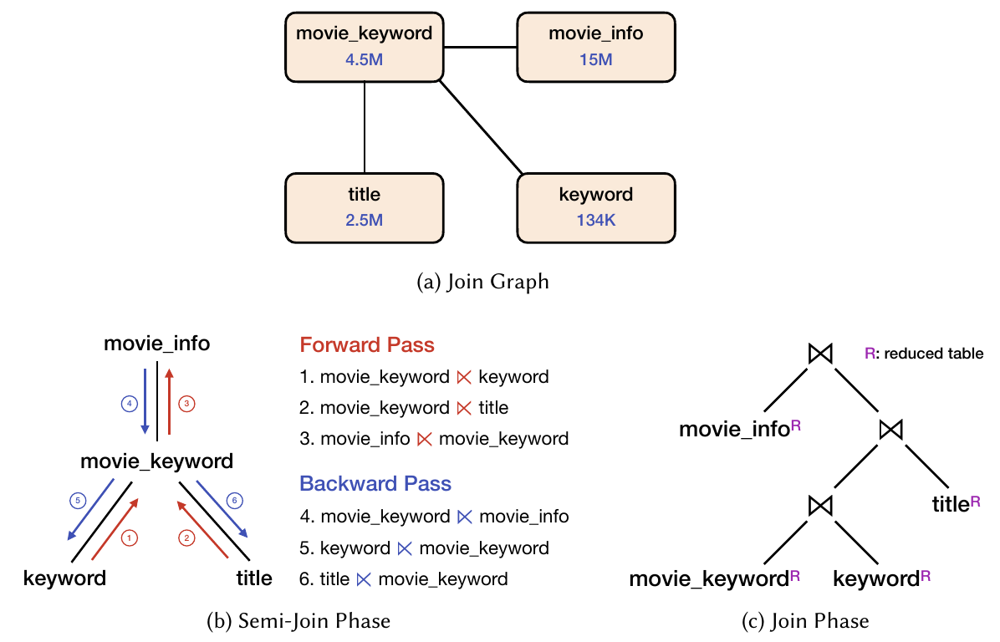

图 1. JOB 3a 上的 Yannakakis 算法。（a）连接图；（b）半连接阶段；（c）连接阶段。R 表示经过约减的表。

我们的结果可能影响未来查询引擎和优化器的设计。有了鲁棒谓词传递，由于 RPT 强有力的理论保证与实际效率，连接顺序优化对于无环查询而言不再是关键挑战。未来优化器可以将搜索空间限制为左深计划（甚至直接随机选取连接顺序），并对基数估计误差具有更强容忍度。尽管我们在实现实用的连接顺序鲁棒性上取得了令人振奋的结果，但是否存在针对有环查询的实例最优连接算法，仍然是开放问题。

本文有三项主要贡献。首先，我们提出两个带有严格证明的新算法，使谓词传递对任意连接顺序都具有鲁棒性。其次，通过在先进分析系统 DuckDB 中实现，我们展示了鲁棒谓词传递算法易于集成。最后，我们通过实验发现，RPT 在提高整体查询性能的同时表现出出色的鲁棒性，朝解决实际连接顺序问题迈出了一大步。

## 2 预备知识

本节首先讨论解决连接顺序问题的挑战与已有工作，随后详细介绍 Yannakakis 算法和谓词传递。

### 2.1 连接顺序优化

优化连接顺序是查询优化中最重要的任务之一。不良连接顺序会产生大量中间结果，速度可能比最优计划慢数个数量级 [35, 52, 73]。查询优化器若要获得最优连接顺序，需要准确的基数估计和高效的计划枚举。经过 40 多年的研究，这两者依然困难。

基数估计（CE）预测查询计划中各个算子产生的元组数量。准确估计连接基数极其困难。在缺乏详细统计信息时，查询优化器通常作出如下假设：（1）均匀性：列值在全局最小值与最大值之间均匀分布；（2）独立性：不同列的取值互不相关；（3）包含性：连接探测端的每个值都必定出现在构建端。这些假设在真实应用中很少成立。虽然进一步的统计信息（例如联合分布的直方图）能够提高连接基数估计的准确性，但维护全面的跨列统计信息代价高得难以承受。更糟的是，研究表明，小的估计误差也会随连接数量呈指数传播 [41, 87]。Leis 等人 [52] 报告，实际 DBMS（包括商业系统）的优化器没有一个能够准确估计连接基数：当连接数量 $\geq 5$ 时，大多数会低估 2 至 4 个数量级。近期方案使用机器学习与深度学习技术处理 CE 问题 [29, 33, 36, 37, 47, 54, 65, 74, 81, 84, 85, 94]，但迄今尚无方案给出能够鲁棒估计的证据。

计划枚举指搜索等价连接顺序，并找出代价最小查询计划的过程。计划枚举已被证明是 NP-hard 问题 [40]。已有工作开发了高效的动态规划算法 [60, 61]，当连接数量较少（例如小于 10）时，它们足以满足需求。然而，搜索空间随连接数量呈指数增长，使得对包含大量连接的查询进行穷举搜索变得不切实际。优化器必须退回启发式方法（例如 PostgreSQL 的遗传算法 [5] 和 DuckDB 的贪心算法 [6]），以牺牲计划最优性换取合理的优化复杂度。

如果即便基数估计严重偏离真实值（这不可避免），查询执行的性能也始终不会远离最优值，那么这种执行就是鲁棒的 [35, 87]。在连接排序语境下，这意味着由于严重 CE 错误而选择灾难性连接顺序的风险较低。提高 SQL 执行鲁棒性通常有两种方式。第一种是在查询优化期间考虑不确定性，偏好“鲁棒计划”而非代价最优计划 [18, 25, 42, 43]。例如，优化器会使用区间 [19] 或概率分布 [18]（而非单个值）来估计基数，并选择在某个置信区间内代价稳定的计划。但是，这样的鲁棒计划可能不存在，而且所选计划相比最优计划往往有明显的性能损失 [87]。

提高计划鲁棒性的第二种方法是重优化 [17, 22, 28, 34, 44, 45, 57, 66, 90]。其主要思想是在执行查询期间纠正 CE 错误。重优化必须在查询计划中定义特定的物化点（通常位于流水线阻断算子处），并收集统计信息，以获得这些位置的真实基数。如果真实基数与估计值之间存在较大差距，系统就重新调用优化器，希望为剩余操作生成更好的计划。虽然重优化允许在运行时自我纠正，但物化中间结果往往代价高昂，可能损害端到端查询性能。

### 2.2 Yannakakis 算法与谓词传递

解决连接顺序鲁棒性的另一种思路，是设计中间结果规模有界的连接算法。给定连接查询 $Q$，令 $N$ 为所有输入关系中的元组总数， $OUT$ 为查询输出中的元组数。经典 Yannakakis 算法 [86] 保证查询复杂度为 $O(N+OUT)$，这与仅扫描输入并写出输出的复杂度相同。这里将查询规模视为常数（原文脚注 1）。因此，Yannakakis 算法是实例最优的。关键思想是预先过滤掉输入关系中不会出现在最终输出里的元组。预过滤通过一系列半连接约减实现。半连接 $R\ltimes S$ 输出左侧关系中在右侧关系有匹配的元组，即：

$$
R\ltimes S=\pi _ {\mathrm{attr}(R)}(R\bowtie S).
$$

换言之，半连接将右表作为过滤器，消除左表中不匹配的元组。

给定查询的连接图，其中每个顶点是一次表扫描、每条边代表一个等值连接（例如图 1a），Yannakakis 算法首先任取一个顶点作为根，并通过 GYO 耳删除算法 [88] 获得一棵连接树（例如图 1b）。该算法要求连接图无环（更准确地说，是 $\alpha$ 无环 [86]），从而保证连接树始终存在。接着，Yannakakis 算法进入半连接阶段 [20]，包括前向遍历和后向遍历。前向遍历从叶节点走到根节点（例如后序遍历）。对于每个节点 $R$，设其子节点为 $S_1,S_2,\ldots,S_n$。算法使用它的所有子节点对 $R$ 进行半连接约减（即对 $i=1,2,\ldots,n$ 执行 $R\ltimes S_i$）。图 1b 给出了示例。前向遍历到达根节点后，算法开始从根到叶的后向遍历（例如层序遍历）。对于每个节点 $R$ 及其父节点 $P$，执行 $R\ltimes P$。访问所有叶节点后，后向遍历结束。

随后，Yannakakis 算法进入连接阶段，在约减后的表上执行普通二元连接（例如哈希连接），如图 1c 所示。每个二元连接必须对应半连接阶段所用连接树的一条边，以保证中间结果不递减。由于半连接阶段确保移除所有不会对查询输出作出贡献的元组（即完全约减），可以证明连接阶段在 $O(OUT)$ 时间内完成。

尽管 Yannakakis 算法具有很有吸引力的理论保证，现代数据库管理系统很少采用它，因为传统的基于哈希表的半连接实现会使算法变慢。Yang 等人近期提出的谓词传递（PT）技术 [83] 使用 Bloom 过滤器执行 Yannakakis 算法中的近似半连接，解决了这一性能问题。具体而言，对于半连接阶段的每个 $R\ltimes S$（在 PT 中该阶段称为谓词传递阶段），PT 使用 $S$ 中的连接键构建 Bloom 过滤器 $\mathcal B_S$，再用 $R$ 中的元组探测 $\mathcal B_S$。如果对 $R$ 中元组 $t$ 的探测返回 false，就消除 $t$。否则，将 $t$ 插入另一个 Bloom 过滤器 $\mathcal B_R$（可以使用不同的连接键），为前向或后向遍历中的下一次半连接作准备。

与原始 Yannakakis 算法相比，谓词传递用少量精度损失（由 Bloom 过滤器的假阳性造成）换取更快的半连接约减。预过滤结果不精确不会影响算法正确性，因为假阳性会在随后的连接阶段被移除。除提高性能外，谓词传递还将 Yannakakis 算法推广到任意连接图，包括有环图。它不再将无环连接图转换成连接树，而是使用一个简单启发式将任意连接图转换为 DAG（即传递图）：每条边都从较小的表指向较大的表。不幸的是，谓词传递没有继承 Yannakakis 算法针对无环查询的强理论保证，因为它可能生成导致不完全半连接约减的传递调度。下一节我们将提出新算法来解决这一问题。对于有环连接，虽然谓词传递在许多情况下从实验上改善了查询性能，但中间结果规模并无理论保证。

## 3 迈向连接顺序鲁棒性

本节介绍新算法及其分析，使谓词传递对无环查询具有鲁棒性。第 3.1 节在传递阶段（对应 Yannakakis 的半连接阶段）提出 LargestRoot 算法，它不仅保证完全约减，还尽量缩短 Bloom 过滤器构建时间。第 3.2 节讨论如何保证连接阶段所选连接顺序“安全”（即中间结果不会膨胀）。

### 3.1 生成鲁棒的传递调度

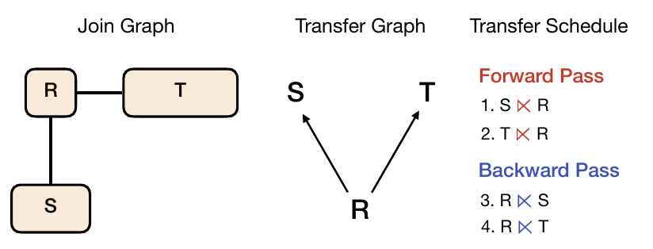

图 2. 原始谓词传递中 Small2Large 算法的示例。依次展示连接图、传递图和传递调度。

原始谓词传递算法 [83] 的传递阶段采用 Small2Large，这是一种基于简单启发式构建传递图的算法。如第 2.2 节所述，Small2Large 将无向连接图中每条边的方向设为从较小表指向较大表，以形成 DAG。随后，谓词传递沿着该 DAG 中的边生成传递调度（即 Bloom 过滤器的前向和后向遍历）。然而，Small2Large 并不保证对无环查询实现完全约减。例如，如图 2 所示，考虑自然连接 $R(A,B)\bowtie S(A,C)\bowtie T(B,D)$，其中 $|R|\lt|S|\lt|T|$。此时，Small2Large 生成的传递图会先前向执行 $S\ltimes_b R$ 和 $T\ltimes_b R$，然后后向执行 $R\ltimes_b S$ 和 $R\ltimes_b T$。这一传递调度未能将 $S$ 与 $T$“连通”：如果 $S$ 上存在谓词，其过滤信息永远无法通过 Bloom 过滤器传递到达 $T$（反之亦然），因此导致不完全约减。

虽然 Small2Large 不能预先过滤掉所有不属于结果的元组，但把较大的表推向传递调度末端仍很有启发性，因为较小的表很可能是选择性更强的过滤器。新的 LargestRoot 将在保证完全约减的同时保留这一策略。在深入新算法之前，我们先精确定义连接树和无环性的概念。

不失一般性，本节仅考虑连接图连通的自然连接。对于 $R.A=S.B$ 这样的等值谓词，在这里将 $A$ 与 $B$ 视为同一属性；如果连接图有多个连通分量，则可以将连接树概念推广到连接森林（原文脚注 2）。对自然连接查询 $q$，其连接图 $G_q$ 是一个无向图，顶点为 $q$ 中的关系。若两个关系有共同属性，则在 $G_q$ 中用边连接。连接树 $T_q$ 是 $G_q$ 的一棵生成树，并且对每个属性 $A$，含有 $A$ 的关系在 $T_q$ 中诱导出的子图 $T_q^A$ 都是连通的。然后，使用连接树定义查询的无环性：

**定义 3.1（ $\alpha$ 无环性 [86]）。** 自然连接查询 $q$ 无环，当且仅当存在 $q$ 的连接树。

无环性对于 Yannakakis 算法实现 $O(N+OUT)$ 复杂度至关重要，因为它保证连接阶段的中间结果不递减。若属性 $A$ 对应的子图不连通，某个元组可能在第一次涉及 $A$ 的连接中存活，却在随后第二次使用 $A$ 的连接中被消除。这就破坏了上述不递减性质。无环自然连接满足下面的引理：

**引理 3.2 [56]。** 设 $q$ 为无环自然连接查询。对于连接图 $G_q$ 中的每条边 $(R,S)$，其中 $R$ 和 $S$ 是顶点（即关系），将边权 $w(R,S)$ 定义为 $R$ 与 $S$ 的共享属性数量： $w(R,S)=|\mathrm{attr}(R)\cap\mathrm{attr}(S)|$。那么， $G_q$ 的一个子图是 $q$ 的连接树，当且仅当它是 $G_q$ 的最大生成树。

**算法 1：LargestRoot**

```text
输入：连接图 G_q
输出：树 T
1  T ← ∅; ℛ ← 所有关系; ℛ′ ← {R_max};
2  while ℛ′ ≠ ℛ do
3      找到权重最大的边 e = {R, S} ∈ E(G_q)，满足
       R ∈ ℛ \ ℛ′, S ∈ ℛ′。若并列，选择 R 最大的边；
4      将 e 加入 T，方向从 R 指向 S；
5      ℛ′ ← ℛ′ ∪ {R};
6  end
7  return T;
```

该引理背后的直觉是，对于 $G_q$ 的一棵生成树 $T$， $T$ 的总权重等于各个属性诱导子图边数的总和。 $T$ 是连接树，意味着每个属性诱导子图 $T^A$ 均连通。这等价于说，每个 $T^A$ 都是一棵子树，且任何 $T^A$ 都不可能再有更多的边（否则 $T$ 就不是树）。因此 $T$ 必须是最大生成树（MST）。注意，这些边权不被视作连接代价的启发式估计。它们用于将寻找连接树的问题转换为在连接图中寻找 MST 的问题。

现在我们知道，对于无环查询，连接树保证查询得到完全的半连接约减；而在加权连接图上构造最大生成树，就可以找到连接树。下面介绍 LargestRoot 算法。如算法 1 所示，我们使用 Prim 算法在连接图 $G_q$ 上构造最大生成树 $T$。 $T$ 中的边从叶指向根，表示前向遍历调度。由于算法一开始就在 $\mathcal R'$ 中放入最大的关系 $R _ {max}$，因此 $R _ {max}$ 是 $T$ 的根（LargestRoot 因此得名）。根据引理 3.2，如果查询 $q$ 无环， $T$ 就是连接树，从而保证传递阶段的完全约减。

将最大的关系放在连接树根部很重要，尤其是对于遵循星型模式的查询。在为事实表构建 Bloom 过滤器之前，先使用维表过滤大得多的事实表会更高效。此外，LargestRoot 在第 3 行的并列处理策略中较早将较大关系纳入 $T$，从而将它们推向根节点。这样，较大关系可以先探测其他 Bloom 过滤器进行过滤，再构建自己的过滤器，从而尽量缩短传递阶段 Bloom 过滤器构建的总时间。注意，LargestRoot 第 3 行并未规定如何从 $S\in\mathcal R'$ 中选择并列候选。实际中，大多数边权为 1，因为关系通常只在一个属性上连接。虽然 $S$ 的选择不会破坏算法产生 MST 的理论保证，却可能影响连接树形状。一般而言，更扁平的树允许更高的 Bloom 过滤器构建并行度，而更深的树可能更早过滤掉无关元组。对 $R$ 和 $S$ 的两种并列处理策略都不影响 LargestRoot 的强理论保证（即完全约减）。

与 Yannakakis 算法不同，LargestRoot 也适用于有环查询。其输出仍是一棵以最大关系为根的生成树，但它不是连接树。在这种情况下，LargestRoot 生成的传递调度不能保证为后续连接阶段提供完全约减的实例。不过，它仍会将任意谓词至少一次传递到所有关系，并且在实验中有效，我们将在第 5 节展示这一点。

### 3.2 选择安全的连接顺序

传递阶段生成完全约减的数据库实例后，算法进入连接阶段以产生最终输出。按照 Yannakakis 算法，连接顺序是通过对半连接阶段使用的连接树自底向上执行连接而得到的。虽然这种几乎固定的连接顺序保证了 Yannakakis 算法的渐近复杂度（即 $O(N+OUT)$），却阻止优化器探索更多可能具有较低代价的连接顺序。理想情况下，我们希望利用优化器的代价模型搜索更便宜的计划，但也希望优化器仅考虑中间结果以上述输出规模为上界的连接顺序。这样的“安全”连接顺序提供了理论上的鲁棒性保证：其运行时代价相对最优值至多相差一个常数因子。换言之，即使数据分布极其不利，也不会使运行时间偏离超过某个有界量。

**定义 3.3 [12]。** 设 $q$ 是无环自然连接查询。如果对每个完全约减的实例 $I$，都有 $q'(I)=\pi _ {\mathrm{attr}(q')}(q(I))$，那么 $q$ 的子连接 $q'$ 就是安全的。

上述定义确保：如果子连接 $q'$ 安全，则 $q'$ 的输出是最终输出的一个投影，因此 $|q'(I)|\leq|q(I)|$。如果某连接顺序中的每个子连接都安全，则累计中间结果规模位于 $|q(I)|$（即最优值）的常数倍以内。显然，涉及笛卡尔积的子连接可能不安全。但不安全子连接并不限于笛卡尔积。考虑自然连接 $q=R(A,B,C)\bowtie S(A,B)\bowtie T(B,C)$。设 $I$ 为如下完全约减的实例：

$$
\begin{aligned}
R&=\lbrace (1,1,1),(2,1,2),\ldots,(n,1,n)\rbrace ,\\
S&=\lbrace (1,1),(2,1),\ldots,(n,1)\rbrace ,\\
T&=\lbrace (1,1),(1,2),\ldots,(1,n)\rbrace .
\end{aligned}
$$

那么，子连接 $q'=S(A,B)\bowtie T(B,C)$ 不安全，因为 $|q'(I)|=n^2$，而 $|q(I)|=n$。因此，任何先连接 $S$ 与 $T$ 的查询计划，即使在完全约减的实例上，也会使中间结果发生平方级膨胀。

避免不安全连接顺序的一种方法，是识别这样一类无环查询：对于它们，任何不涉及笛卡尔积的连接顺序都是安全的。

**定义 3.4（ $\gamma$ 无环性 [30]）。** 自然连接查询 $q$ 是 $\gamma$ 无环的，当且仅当 $q$ 中不存在 $\gamma$ 环。这等价于：（1） $q$ 是 $\alpha$ 无环的；并且（2）找不到带有属性 $x,y,z$ 的三个关系 $R,S,T$ 构成大小为 3 的 $\gamma$ 环： $R(x,y),S(y,z),T(x,y,z)$。

**引理 3.5 [30]。** $q$ 的每个连通连接表达式 $\theta$ 都是单调的（即执行 $\theta$ 中任意二元连接时都不会移除元组），当且仅当 $q$ 是 $\gamma$ 无环的。

这里的连通连接表达式不包含笛卡尔积，仅包含二元连接（原文脚注 3）。

**定理 3.6。** 自然连接查询 $q$ 的每个不含笛卡尔积的子连接都是安全的，当且仅当 $q$ 是 $\gamma$ 无环的。

**证明。** 只需证明：每个子连接都安全，当且仅当每个连通连接表达式都单调。

考虑子连接 $q'$ 的任意连通连接表达式 $\theta'$，以及子连接 $q_1'$ 的 $\theta_1'$、子连接 $q_2'$ 的 $\theta_2'$，其中 $\theta'=\theta_1'\bowtie\theta_2'$。由于每个不含笛卡尔积的子连接都安全，有：

$$
\begin{aligned}
q'(I)&=\pi _ {\mathrm{attr}(q')}(q(I)),\\
q_1'(I)&=\pi _ {\mathrm{attr}(q_1')}(q(I)),\\
q_2'(I)&=\pi _ {\mathrm{attr}(q_2')}(q(I)).
\end{aligned}
$$

因为对 $i=1,2$，都有 $\mathrm{attr}(q_i')\subseteq\mathrm{attr}(q')$，所以：

$$
|\pi _ {\mathrm{attr}(q')}(q(I))|\geq|\pi _ {\mathrm{attr}(q_i')}(q(I))|.
$$

因此， $\theta'$ 单调。

反过来，考虑子连接 $q'$ 的任意连通连接表达式 $\theta'$。将 $\theta'$ 扩展为 $q$ 的完整连接表达式 $\theta$。因为 $\theta'$ 是 $\theta$ 的一部分，并且 $q$ 的每个连通连接表达式都单调，所以对任意完全约减的实例 $I$，都有 $q'(I)=\pi _ {\mathrm{attr}(q')}(q(I))$。因此， $q'$ 安全。□

定理 3.6 给出了强有力的鲁棒性保证：如果查询是 $\gamma$ 无环的，我们可以完全信任优化器在完全约减实例上（即连接阶段）选择连接顺序，因为它永远不会选出不安全的连接顺序。根据定义 3.4， $\gamma$ 无环查询是 $\alpha$ 无环查询（即无环查询）的子集。实际中要快速检查 $\gamma$ 无环性，一个充分（非必要）条件是证明连接图中任意两个关系之间都不会直接由多于一条边相连（即没有复合键连接）。

对于无环但非 $\gamma$ 无环的查询，我们必须监督优化器，检查给定子连接是否安全。安全子连接可由下面的引理刻画：

**引理 3.7 [12]。** 设 $q$ 是无环自然连接查询。 $q$ 的子连接 $q'$ 安全，当且仅当存在 $q$ 的某棵连接树，使 $q'$ 中的关系在其中连通。

对于示例自然连接 $q=R(A,B,C)\bowtie S(A,B)\bowtie T(B,C)$， $q$ 仅有一棵连接树： $S-R-T$。因此， $R\bowtie S$ 和 $R\bowtie T$ 都是安全子连接，但 $S\bowtie T$ 不是。利用引理 3.7，我们开发了 SafeSubjoin 算法来检测子连接 $q'$ 是否安全。如算法 2 所示，SafeSubjoin 首先使用 LargestRoot 为 $q'$ 计算最大生成树 $T'$。然后继续运行另一个 LargestRoot 实例，将初始化步骤改为： $T\leftarrow T'$； $\mathcal R\leftarrow q$ 中所有关系； $\mathcal R'\leftarrow q'$ 中所有关系。如果得到的生成树 $T$ 是 $q$ 的最大生成树（即 $q$ 的连接树），SafeSubjoin 就返回 true。

**算法 2：SafeSubjoin**

```text
输入：自然连接 q，子连接 q′
输出：True 或 False
1  T′ ← LargestRoot(G_q′);
2  T ← LargestRoot(G_q)，其初始化步骤为：
   T ← T′; ℛ ← q 中的所有关系; ℛ′ ← q′ 中的所有关系;
3  if T 是 q 的最大生成树 then
4      return True;
5  else
6      return False;
7  end
```

## 4 与 DuckDB 集成

本节介绍如何将鲁棒谓词传递（RPT）算法集成到快速数据分析系统 DuckDB（v0.9.2）[70] 中。源代码见 https://github.com/embryo-labs/Robust-Predicate-Transfer （原文脚注 4）。我们首先在第 4.1 节简要介绍 DuckDB 的执行模型与优化器，接着在第 4.2 节介绍新的 Bloom 过滤器算子，最后介绍新的鲁棒谓词传递模块。该模块根据运行第 3.1 节 LargestRoot 算法所得的传递调度，将 Bloom 过滤器算子插入查询计划。

### 4.1 DuckDB 预备知识

DuckDB 是先进的进程内分析数据库管理系统。它采用推式向量化执行引擎 [68]，其中每条流水线（即一系列物理算子）以批次（即数据块，默认批大小为 2048）处理元组，从而摊薄解释开销并提高 CPU 并行度。如图 3 所示，根据在流水线中的位置，每个物理算子可以承担三种角色之一：source、operator 和 sink。source 实现 `GetData` 函数，在流水线起始处获取新的数据块。中间算子实现 `Execute` 接口，对输入数据块进行计算，然后输出结果数据块。sink 算子位于流水线末端，通常是流水线阻断算子。它的接口包含三个函数：`Sink`、`Combine` 和 `Finalize`。调用 `Sink` 接收并缓冲数据块，直到所有输入数据耗尽。随后调用 `Combine` 和 `Finalize`，执行一些最终计算，为将数据分发给下一条流水线（或最终输出）作准备。`Combine` 对每个线程调用一次，而 `Finalize` 在所有线程结束后调用。

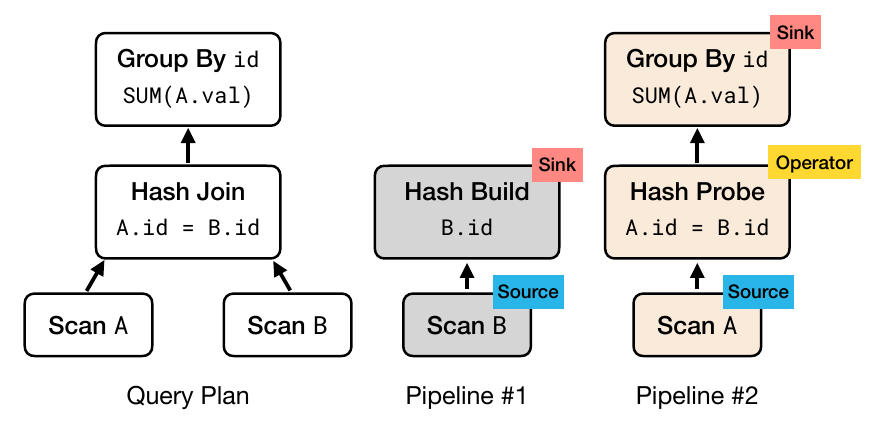

图 3. DuckDB 中的流水线与算子角色示例 [69]。

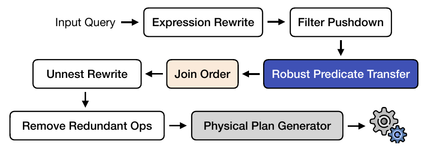

图 4. DuckDB 优化器的工作流。

DuckDB 优化器包含分离的逻辑优化和物理优化阶段，如图 4 所示。逻辑优化依次执行表达式改写、过滤下推等一系列步骤，每一步都是逻辑优化器中的独立子模块。DuckDB 的连接顺序子模块使用动态规划进行连接顺序优化 [61]，对大规模或复杂连接图则退回贪心算法。

### 4.2 Bloom 过滤器算子

为了在 DuckDB 中实现鲁棒谓词传递，我们引入两个基于 Bloom 过滤器的新物理算子：`CreateBF` 与 `ProbeBF`。我们使用 Apache Arrow 16.0 [4] 中的 Bloom 过滤器实现。这是一种分块 Bloom 过滤器 [67]，使用 AVX2 指令加速操作。由于对 Bloom 过滤器进行向量化探测返回位向量，而 DuckDB 使用选择向量标记数据块中的有效项，我们依据 [53] 实现了高效的位向量到选择向量转换。

`CreateBF` 是一个收集／缓冲输入数据块，并在给定列上创建一个或多个 Bloom 过滤器的物理算子。其对应逻辑算子 `LogicalCreateBF` 用于逻辑优化。`CreateBF` 既可以作为 sink，也可以作为 source（第 4.3 节进一步说明）。在 `Sink` 函数中，我们接收输入数据块并将其保留在线程本地缓冲区中。`Combine` 无需计算。在 `Finalize` 中，我们遍历每个线程本地数据缓冲区，为每个给定列创建一个 Bloom 过滤器。Bloom 过滤器的假阳性率（FPR）设为 2%（Arrow 默认值）。当 `CreateBF` 用作 source 时，我们实现 `GetData`：为每个线程分配数据缓冲区中互不重叠的数据块 ID 区间，以进行并行扫描。

`ProbeBF` 是另一个物理算子，它为输入数据块中的每个元组输出 Bloom 过滤器结果。类似地，它也有对应逻辑算子 `LogicalProbeBF`。`ProbeBF` 用作中间算子。`Execute` 函数接收数据块，使用其中元组以向量化方式探测一个或多个 Bloom 过滤器，并输出更新了选择向量的数据块。

### 4.3 鲁棒谓词传递模块

我们在 DuckDB 逻辑优化器中引入鲁棒谓词传递模块，将 `LogicalCreateBF` 和 `LogicalProbeBF` 算子插入查询计划，如图 4 所示。RPT 模块从输入计划构造连接图，并运行 LargestRoot 算法获得传递调度（包括前向与后向遍历）。对传递调度中的每个半连接 $R\ltimes S$，我们为 $S$ 插入一个 `LogicalCreateBF`，为 $R$ 插入一个使用 $S$ 的 Bloom 过滤器的 `LogicalProbeBF`。之后，物理计划生成器会将这些逻辑算子替换成 `CreateBF` 和 `ProbeBF`。

以 JOB 3a 的查询计划为例。假设 LargestRoot 生成的传递调度与图 1b 相同，那么图 5 就展示了插入 `CreateBF` 与 `ProbeBF` 后的物理计划。黑色实线表示数据块流动（自底向上），红色／蓝色虚线箭头表示 Bloom 过滤器的传递（通过共享内存）。每个 `CreateBF` 首先作为 sink 算子，在流水线末端缓冲数据块并创建 Bloom 过滤器。随后，`CreateBF` 又作为下一条流水线的 source 算子，把已缓冲的数据块提供给 `ProbeBF`、哈希连接等后续算子。

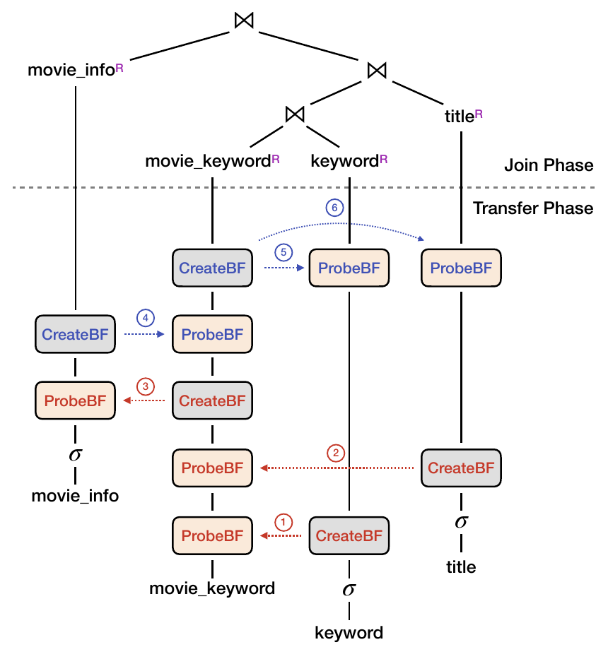

图 5. 集成鲁棒谓词传递后的 JOB 3a 查询计划。红色表示前向遍历，蓝色表示后向遍历。

我们还实现了剪除不必要 Bloom 过滤器操作的优化。具体而言，如果主外键连接中构建端关系此前未经过滤，就可以省略这一对 `CreateBF` 与 `ProbeBF`，因为这个半连接是平凡的（即不会消除任何元组）。如果传递顺序与连接阶段的连接顺序一致，还可以跳过整个后向遍历。[77] 描述了更多消除不必要半连接的机会。

## 5 评估

本节评估集成 RPT 后 DuckDB 的鲁棒性。实验在一台物理机器上进行，配置为两颗 Intel® Xeon® Platinum 8474C @ 2.1 GHz、512 GB DDR5 内存和 8 TB Samsung 870 QVO SATA III 2.5 英寸 SSD。操作系统为 Debian 12.5。我们使用四个标准基准比较原生 DuckDB（标记为 DuckDB）与配备 RPT 的 DuckDB（标记为 RPT）：TPC-H（SF = 100）[2]、Join Order Benchmark（JOB）[3]、TPC-DS（SF = 100）[1] 和 DSB（SF = 100）[27]。实验采用 DuckDB 的主内存设置，即表已预先加载并在缓冲池中解压。第 5.4 节考察基表和中间结果无法放入内存的情况。除第 5.3 节的多线程实验外，所有查询均使用单线程执行。

### 5.1 端到端鲁棒性

在以下实验中，我们修改了 DuckDB 优化器，使其生成随机连接顺序。对每个被测查询，生成 $N$ 个随机左深计划和 $N$ 个随机浓密树计划， $N$ 与该查询中的连接数量 $m$ 成比例。具体而言，对最简单的 3 连接查询，设 $N=20$；对包含 17 个连接的最复杂查询（即 JOB 的查询 29），设 $N=1000$；因此，在 $3\leq m\leq17$ 时， $N=70m-190$。为产生左深计划，每轮迭代随机选取一个能够与当前中间表连接的基表作为最右叶节点。这里“能够连接”指在连接图中有边，即不执行笛卡尔积（原文脚注 5）。对于浓密树计划，每轮迭代从候选集合（最初包含所有基表）随机取出两个能够相互连接的表，再把它们的中间结果表放回，直到集合只剩一个元素（即最终计划）。

#### 5.1.1 无环查询（左深）

图 6 展示各查询随机左深计划的端到端执行时间分布。我们省略 TPC-H 中少于两个连接的查询，因为它们在连接排序方面很简单。对于 JOB 查询，对 33 个查询模板各呈现一个结果。每个查询的执行时间（基线与 RPT 均如此）都除以 DuckDB 执行其默认优化器计划所需的时间 $t _ {opt}$ 进行归一化。图采用对数尺度，并突出显示归一化线（即水平零线）。超时阈值设为 $1000\times t _ {opt}$。柱上方的“*”表示该查询至少一个随机计划超时。红色查询编号表示有环查询。

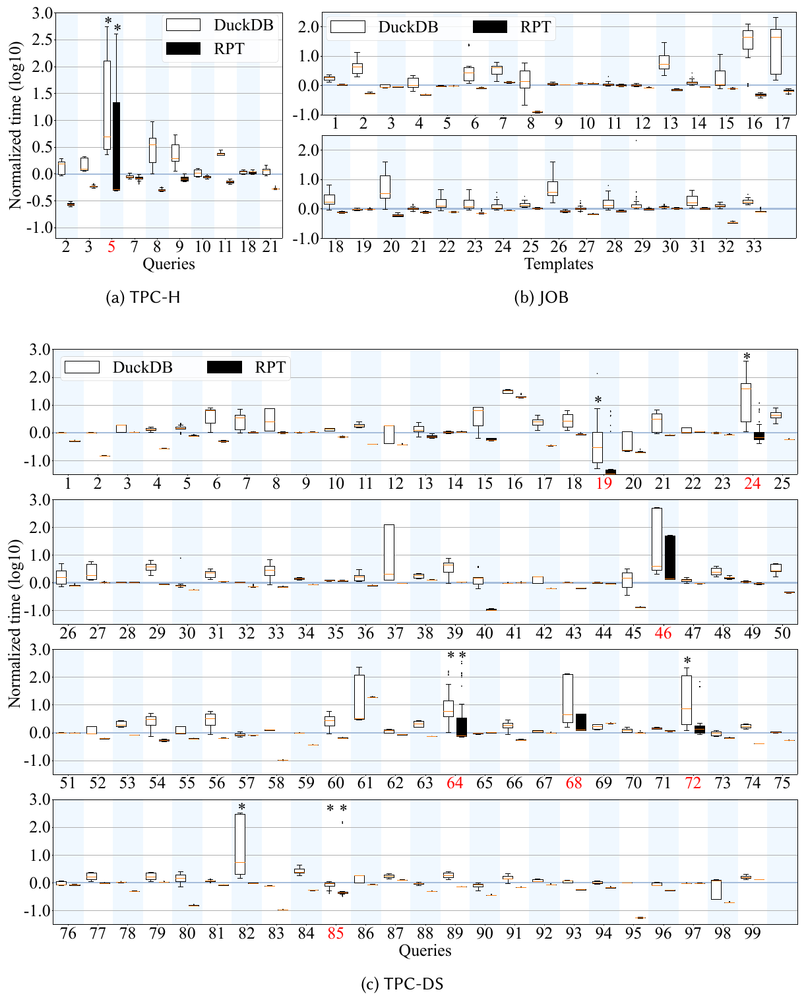

图 6. TPC-H、JOB 和 TPC-DS 中每个查询随机左深计划的执行时间分布，按默认 DuckDB 的执行时间归一化。图采用对数尺度。箱体表示第 25 至第 75 百分位（橙线为中位数），横线表示最小值和最大值（不含离群点）。“*”表示超时。有环查询以红色标记。（a）TPC-H；（b）JOB；（c）TPC-DS。

对所有无环查询，在 DuckDB 中使用 RPT 后均表现出令人印象深刻的连接顺序鲁棒性。为量化这一点，我们将鲁棒性因子（Robustness Factor，RF）定义为最大执行时间与最小执行时间之比。表 1 给出各基准中 DuckDB 和 RPT 的平均、最小和最大 RF。DSB 的结果与 TPC-DS 类似，可见技术报告 [91]（原文脚注 6）。配备 RPT 的 DuckDB，其平均 RF 始终接近 1，最大（即最坏情况）RF 为 1.6，出现在 JOB 查询 17e。这比基线鲁棒数个数量级。

**表 1. 左深连接的鲁棒性因子。**

| RF | TPC-H 平均 | TPC-H 最小 | TPC-H 最大 | JOB 平均 | JOB 最小 | JOB 最大 | TPC-DS 平均 | TPC-DS 最小 | TPC-DS 最大 |
| --- | --- | --- | --- | --- | --- | --- | --- | --- | --- |
| DuckDB | 2.7 | 1.2 | 9.3 | 30.4 | 1.1 | 371 | 7.2 | 1.0 | 224 |
| RPT | 1.3 | 1.2 | 1.5 | 1.2 | 1.0 | 1.6 | 1.1 | 1.0 | 1.5 |

**表 2. 相比 DuckDB（优化器计划）的平均加速比。**

| 加速比 | TPC-H | JOB | TPC-DS | DSB |
| --- | --- | --- | --- | --- |
| Bloom Join | 1.15× | 1.13× | 1.05× | 1.06× |
| PT | 1.45× | 1.46× | 1.27× | 1.18× |
| RPT | 1.44× | 1.46× | 1.56× | 1.54× |

此外，对基准中的大多数查询，应用 RPT 还提高了端到端查询性能（图 6 中大多数 RPT 箱体都在 0 以下）。表 2 展示 RPT 相比使用优化器计划的默认 DuckDB（即 $t _ {opt}$）的平均加速比。（对于 TPC-H，我们省略 Q1 和 Q6，因为它们只有表扫描与过滤。）我们还纳入 Bloom Join [23] 和原始谓词传递 [83]（PT）作为参照。除鲁棒性保证外，应用 RPT 还使逐查询执行时间平均改善约 1.5 倍（几何平均）。Bloom join 相比基线只有很小的加速，而且没有改善连接顺序鲁棒性。Bloom join 与 PT 的完整鲁棒性结果见技术报告 [91]（原文脚注 7）。得益于 LargestRoot 算法，RPT 在 TPC-DS 和 DSB 上优于原始 PT。更重要的是，RPT 保证查询鲁棒性。图 7 展示了 JOB 和 TPC-DS 中选取的几个查询，原始 PT 的性能对不同连接顺序很敏感。根本原因是，PT 产生的传递调度可能导致半连接阶段的不完全约减，如第 3.1 节所讨论。

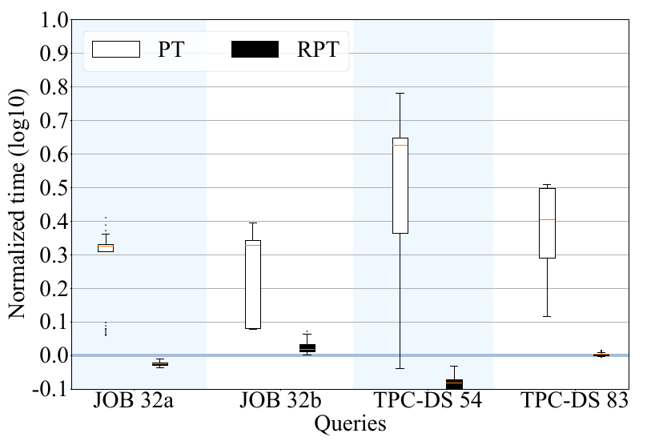

图 7. JOB 与 TPC-DS 中选定查询使用随机左深计划时，PT 与 RPT 的执行时间分布。按 RPT 使用优化器连接顺序时的执行时间归一化。图采用对数尺度。

以上结果令人鼓舞。它们说明，如果使用 RPT 实现连接，连接顺序优化对于占多数的无环查询而言可能不再是关键挑战。事实上，对于图 6 中每个无环查询，RPT 使用优化器连接顺序时的执行时间都位于横线范围内（即不含离群点的最小到最大值）。因此，未来优化器可以变得高效得多：它们可以更好地容忍基数估计误差，并且只需要更简单的连接枚举算法，因为左深计划已经足够好。

在图 6c 中，TPC-DS 的少数无环查询（13 和 48）方差略大于其他查询。查询 13 和 48 包含 DuckDB 在连接表之前无法下推的谓词，例如：

```sql
(R.a < 100 AND S.b < 200) OR (R.a > 500 AND S.b > 400)
```

如果该谓词具有较强选择性，较早连接 $R$ 与 $S$ 会更好。虽然这些特殊情况在随机计划下也表现出足够的鲁棒性，但仍能受益于优化器。

#### 5.1.2 无环查询（浓密树）

图 8 展示随机浓密树计划的端到端执行时间分布，表 3 汇总其鲁棒性因子。纳入浓密树计划后，RPT 对随机连接顺序的鲁棒性指标与左深情况类似，平均 RF 小于 1.8，最大 RF 为 7.7，出现在 JOB 查询 17e。

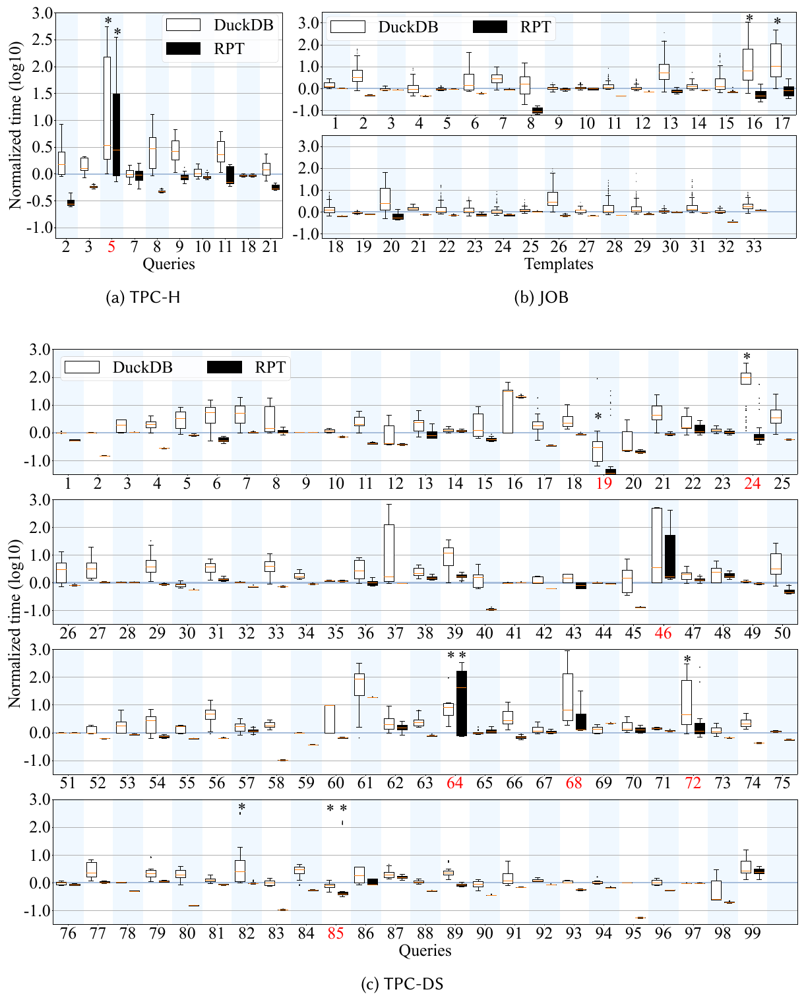

图 8. TPC-H、JOB 和 TPC-DS 中各查询随机浓密树计划的执行时间分布，按默认 DuckDB 的执行时间归一化。图采用对数尺度。箱体表示第 25 至第 75 百分位（橙线为中位数），横线表示最小值和最大值（不含离群点）。“*”表示超时。有环查询以红色标记。（a）TPC-H；（b）JOB；（c）TPC-DS。

**表 3. 浓密树连接的鲁棒性因子。**

| RF | TPC-H 平均 | TPC-H 最小 | TPC-H 最大 | JOB 平均 | JOB 最小 | JOB 最大 | TPC-DS 平均 | TPC-DS 最小 | TPC-DS 最大 |
| --- | --- | --- | --- | --- | --- | --- | --- | --- | --- |
| DuckDB | 5.1 | 1.2 | 13.7 | 120 | 1.1 | 1747 | 35.0 | 1.0 | 1226 |
| RPT | 1.8 | 1.2 | 3.0 | 1.6 | 1.1 | 7.7 | 1.8 | 1.0 | 4.2 |

> 译注：原文正文写“平均 RF < 1.8”，表 3 列出的 TPC-H 和 TPC-DS 平均 RF 则均为 1.8；这里保留正文与表格各自的表述。

我们注意到，从左深计划切换为浓密树计划时，少数查询（如 TPC-H Q7 与 JOB 16b、17e）的鲁棒性略有下降。共同原因是：在最差计划（随机浓密树计划中的最差者）里，优化器错误地将较大的表放在哈希连接构建端。例如图 10 所示，仅 JOB 17e 最顶层哈希连接选错构建端，就使查询变慢了 37%。这种错误在左深计划中不太可能出现，因为每个基表（即构建端）通常在 RPT 传递阶段受到强力过滤，而中间结果（即探测端）的规模则在连接阶段单调增大。

为展示考虑浓密树计划的性能收益，我们为每个查询选择最好的（即执行时间最短的）随机左深计划和随机浓密树计划，并在图 9 中比较性能。图中还纳入 DuckDB 优化器为各查询产生的左深计划与浓密树计划，分别标为 Optimizer's Left-deep 与 Optimizer's Bushy，作为参照。我们观察到，在 RPT 连接阶段考虑浓密树计划，相比左深计划仅使 TPC-H 和 JOB 的端到端执行分别加速 6% 和 11%。大多数优化器计划略慢于我们随机生成连接顺序中的最佳计划，但考虑浓密树计划带来的相对加速仍然较小（TPC-H 为 10%，JOB 为 5%）。RPT 传递阶段执行的半连接约减显著降低了探索更大计划枚举空间的收益。因此，我们得出结论：应用鲁棒谓词传递时，无需探索浓密树计划，因为它们可能以牺牲鲁棒性换取有限的性能改善。

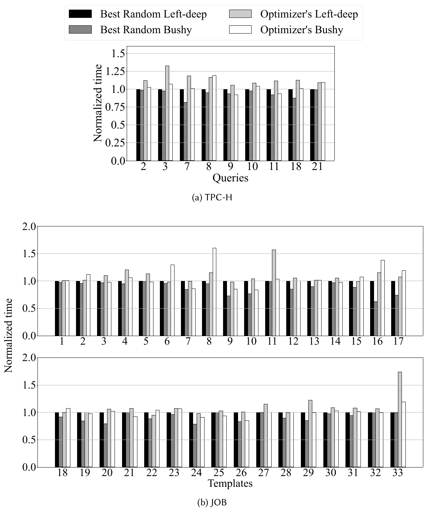

图 9. 浓密树计划相对左深计划的加速情况，按 Best Random Left-deep 的执行时间归一化。对于 TPC-H 和 JOB 中的每个查询，图中绘制 RPT 在随机左深／浓密树计划中的最小执行时间，以及 RPT 使用优化器左深／浓密树计划时的执行时间。

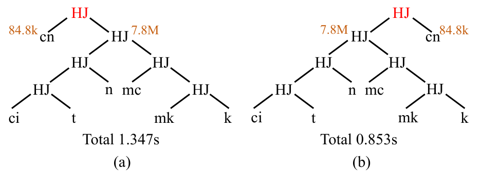

图 10. 选错哈希连接构建端导致的减速（JOB 17e）。（a）是顶层 HJ 构建端错误的随机计划；（b）是交换构建端与探测端后的修正计划。

> 译注：正文保留原文“变慢 37%”的说法。图中时间为 1.347 秒和 0.853 秒；约 37% 对应修正后相对 1.347 秒的时间减少比例，而非以 0.853 秒为分母的变慢比例。

#### 5.1.3 有环查询

RPT 不为有环查询提供鲁棒性保证，图 6 和图 8 中标为红色的查询即体现了这一点（TPC-H Q5，TPC-DS 19、24、46、64、68、72 和 85）。虽然 RPT 在多数情况下改善了执行时间，但有环查询最好与最差计划之间的性能差距仍然很大。我们建议，未来鲁棒执行引擎应采用混合方法处理连接：使用最坏情况最优连接执行查询中的有环部分，而使用鲁棒谓词传递处理其余部分。

#### 5.1.4 案例研究

我们以 JOB 2a 为案例，更好地说明 RPT 带来的鲁棒性保证。图 11 展示基线与 RPT（仅连接阶段）的最好和最差左深计划，并标出每个基表或中间表的规模。不使用 RPT 时，最差连接顺序产生的中间元组比最好顺序多 179 倍。最差连接顺序遭遇 [21] 描述的“菱形问题”：小输入 → 大中间结果 → 小输出，因此浪费了计算。相比之下，使用 RPT 后，最好与最差计划之间中间结果总量的比值降至 1.2 倍。无论连接顺序如何，每个中间表的规模都以上述输出规模（即 7.8k）为界，并随查询执行单调增加。

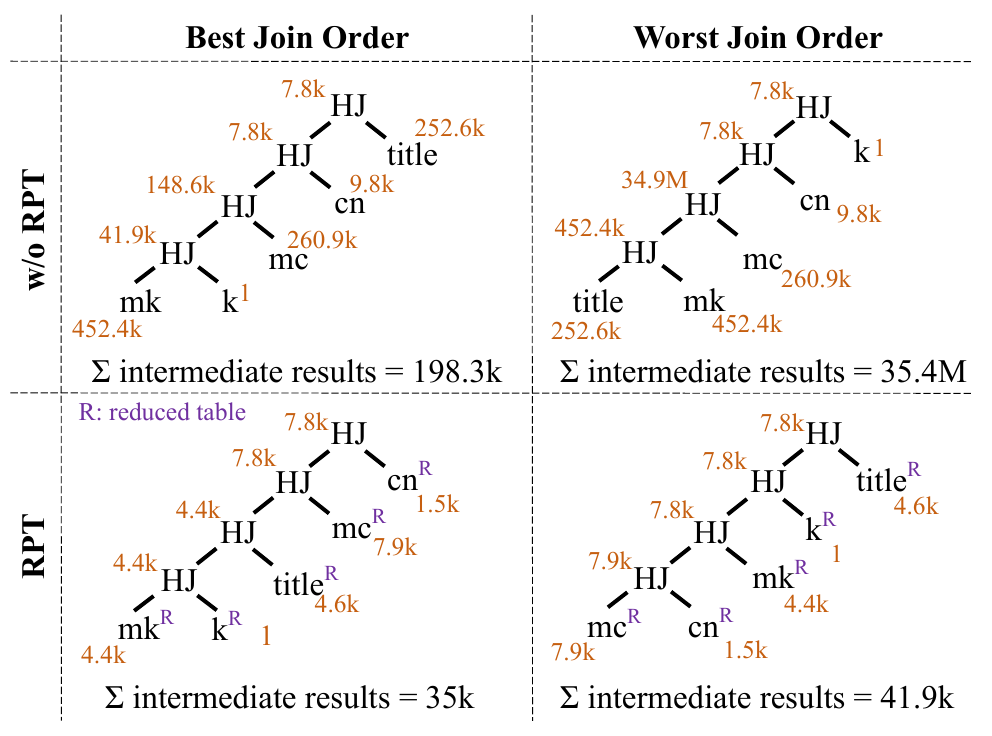

图 11. JOB 2a 鲁棒性的案例研究。这里将 RPT 中的约减表（即传递阶段结束后经过滤的基表）也视为中间结果。

> 译注：原文正文称中间表规模不超过输出规模 7.8k 且单调增加，但图 11 的 RPT 最差计划将约减后的 mc 表和首个哈希连接标为 7.9k，后续连接则为 7.8k；译文保留正文与图中的原有数值。

我们还注意到，即使基线中的最佳计划，其必须处理的中间结果也比任何 RPT 计划大得多（约 5 倍）。这是因为 RPT 相对基线具有严格的复杂度优势。图 12 展示一个例子：查询 $R\bowtie S\bowtie T$ 的输出为空，但任何基线计划（不使用 RPT）都必须处理 $N^2/2$ 个元组，相比 RPT 计划出现平方级膨胀。随着表数增加，这个例子还可以扩展为指数级膨胀。相比之下，Yannakakis 算法保证 RPT 的中间结果规模总和至多为输出规模的 $n$ 倍，其中 $n$ 为连接数量。

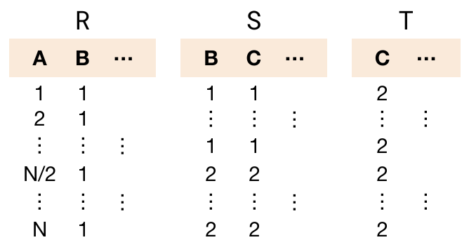

图 12. 一个输出为空的示例查询：任何不使用 RPT 的计划都必须处理 $N^2/2$ 个元组。

### 5.2 LargestRoot 的鲁棒性

接下来，我们聚焦评估 RPT 传递阶段（即 LargestRoot 算法）的鲁棒性。我们修改 LargestRoot，使其生成 50 棵随机连接树，但每棵仍以最大关系为根。具体而言，将 LargestRoot 原本的第 3 行替换为“寻找一条边 $e=\lbrace R,S\rbrace \in E(G_q)$，使 $R\in\mathcal R\setminus\mathcal R'$、 $S\in\mathcal R'$”。每次运行都将连接顺序固定为 DuckDB 默认优化器产生的顺序。其他实验设置遵循第 5.1 节。

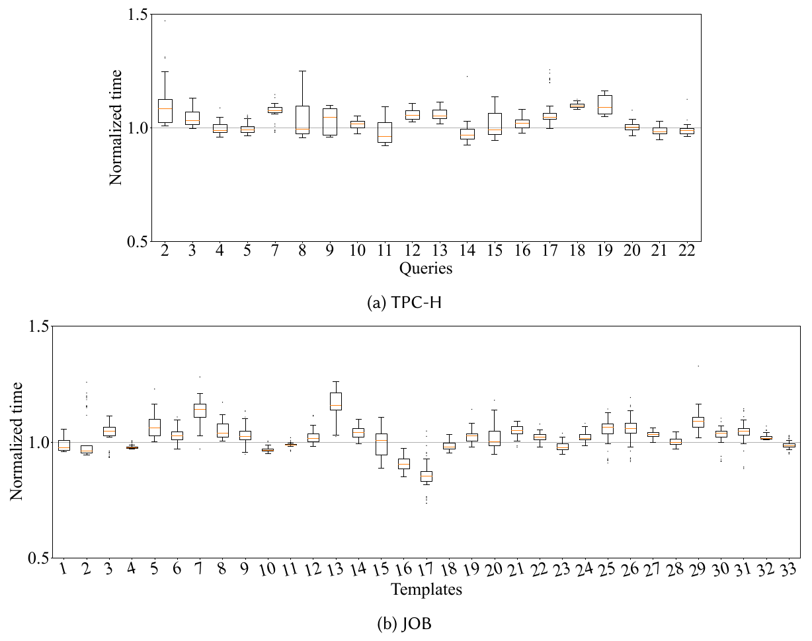

图 13. TPC-H 和 JOB 中各查询采用 50 个随机 LargestRoot 传递图时的执行时间分布。箱体表示第 25 至第 75 百分位（橙线为中位数），横线表示最小值和最大值（不含离群点）。

图 13 展示了 TPC-H 和 JOB 中每个查询采用随机 LargestRoot 传递图时的端到端执行时间分布。每个查询的 50 次执行时间都按未修改的 LargestRoot 所达到的查询时间归一化。我们观察到，只要算法保持最大关系为根，查询性能对于不同传递图（对无环查询而言即连接树）就是鲁棒的。此外，我们注意到图 13 中大多数箱体都在 1.0 之上（即慢于原始 LargestRoot），说明 LargestRoot 第 3 行使用的选边启发式能够有效加速 RPT 的传递阶段。

### 5.3 多线程执行的鲁棒性

为考察多线程执行如何影响 RPT 的鲁棒性，我们使用 32 个线程重复第 5.1 节的左深实验（即图 6）。如图 14 所示，RPT 仍展现出出色的查询鲁棒性，其鲁棒性因子（RF）相比基线改善数个数量级。与图 6 相比，我们发现，从单线程切换到多线程执行后，部分查询在不同左深计划之间的执行时间方差增大。这是因为一些随机左深计划把相对较小的约减表放在较长探测流水线的探测端，没有足够多的数据块分配给 32 个并行线程以充分利用计算资源。这个问题与 RPT 提供的鲁棒性保证相互独立。

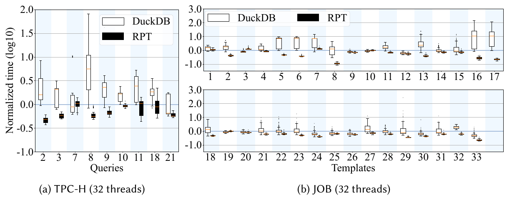

图 14. TPC-H 和 JOB 中各无环查询随机左深计划的多线程执行时间分布，按默认 DuckDB 的执行时间归一化。图采用对数尺度。箱体表示第 25 至第 75 百分位（橙线为中位数），横线表示最小值和最大值（不含离群点）。（a）TPC-H，32 线程；（b）JOB，32 线程。

### 5.4 数据位于磁盘时的性能

我们将评估扩展到以下情况：（1）基表位于磁盘（标记为“on-disk”）；（2）RPT 的部分中间结果无法装入内存（标记为“+spill”）。RPT 的中间结果指在半连接阶段前向遍历后，包含剩余元组的物化数据块。对 TPC-H 和 JOB 中每个查询，我们评估 DuckDB 与 RPT 使用优化器计划时的表现。对于“+spill”，将可用内存设为每个查询 RPT 峰值内存用量的约 50%，并确保溢写数据不驻留在内存中。如图 15 所示，在“on-disk”和“on-disk+spill”情况下，RPT 相比默认 DuckDB 仍分别取得平均 1.3 倍和 1.5 倍加速（几何平均）。虽然 RPT 半连接阶段的后向遍历会重复访问数据，但开销很小。这是因为：（1）半连接过滤器选择性较强，前向遍历后物化的数据量较小；（2）后向遍历对物化数据执行顺序扫描。

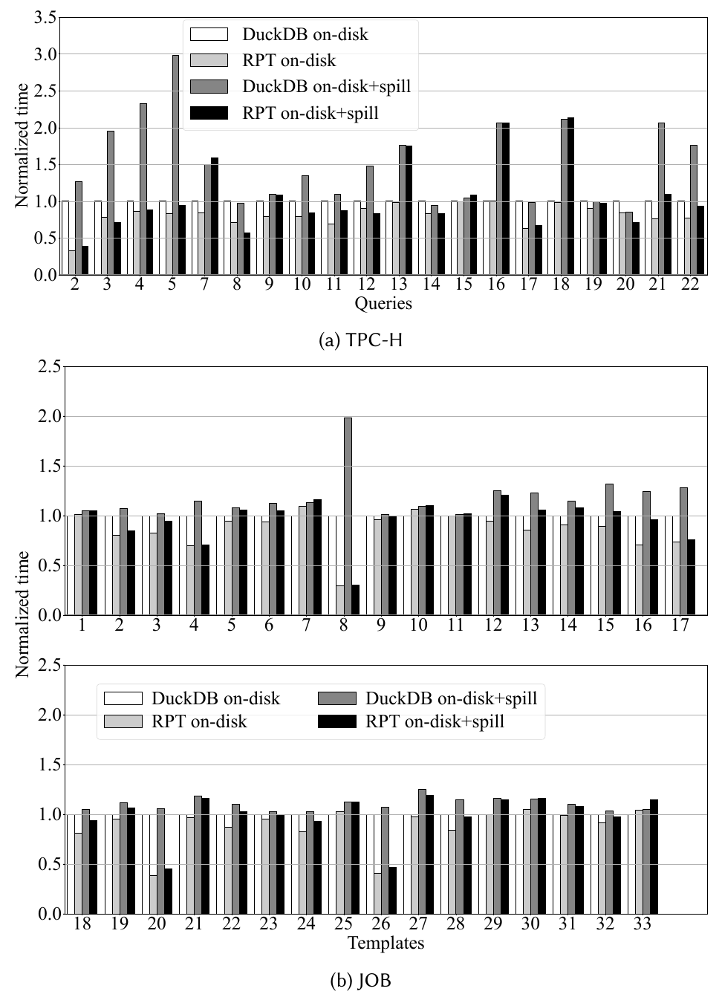

图 15. TPC-H 和 JOB 各查询中，在基表位于磁盘（on-disk），以及中间结果无法装入内存（+spill）时，DuckDB 与 RPT 使用优化器计划的执行时间比较。按基表位于磁盘时默认 DuckDB 的执行时间归一化。

### 5.5 Bloom 过滤器的性能

图 6 表明，除鲁棒性外，RPT 还将整体查询性能提高了约 1.5 倍。我们的性能分解显示，在 TPC-H、JOB 和 TPC-DS 中，RPT 传递阶段的 Bloom 过滤器操作分别平均占总执行时间的 28%、12% 和 46%。本节通过微基准评估 Bloom 过滤器探测与哈希表探测之间的性能差距。我们创建包含两张单列表的合成数据集，将探测端表的规模固定为 10 亿行，并改变构建端规模。每列的整数值在 0 到 $2^{30}$ 之间均匀分布。

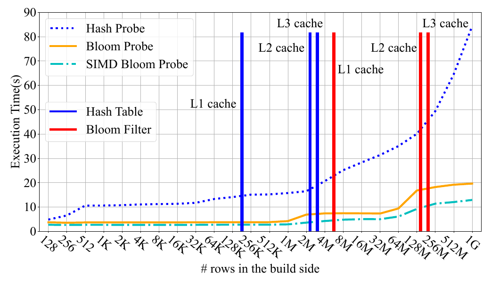

图 16. Bloom 探测与哈希探测的微基准。探测端固定为 10 亿个条目，横轴改变构建端规模。

图 16 报告对不同规模的哈希表或 Bloom 过滤器执行 10 亿次探测的时间。哈希探测使用 DuckDB 的向量化哈希表实现，Bloom 探测使用我们修改后的 Arrow 分块 Bloom 过滤器。蓝色（红色）竖线标出哈希表（Bloom 过滤器）规模超过 L1、L2 和 L3 缓存的位置。我们观察到，SIMD 版本的 Bloom 探测比向量化哈希探测快 2 至 7 倍。随着哈希表／Bloom 过滤器规模增大，性能差距扩大，表明 RPT 在更大数据集上可能具有更大的性能优势。

## 6 相关工作

### 6.1 横向信息传递（SIP）

横向信息传递（Sideways Information Passing，SIP）指通过向目标表传递谓词信息，帮助数据库预先过滤元组以优化连接操作的技术。现有 SIP 技术可以分为 Bloom join [23, 48, 71, 93] 和半连接约减 [20]。在 Bloom join 中，在哈希连接构建端生成 Bloom 过滤器并传递到探测端，使其在访问哈希表之前过滤元组。另一方面，半连接约减则在执行实际哈希连接之前应用半连接操作，预先过滤元组。

前瞻信息传递（Lookahead Information Passing，LIP）[93] 可以视为鲁棒谓词传递在星型模式下的特殊情况。LIP 为每张维表构造 Bloom 过滤器，并在执行连接之前使用它们预先过滤大事实表。LIP 关注动态、自适应地调整 Bloom 过滤器顺序的技术，以降低 SIP 过程的计算开销。这些技术与我们的工作相互独立，也可以应用于 RPT。

与现有 SIP 方法不同，鲁棒谓词传递基于 Yannakakis 算法系统地应用 Bloom 过滤器预过滤，而不是局部关注个别连接，从而为查询鲁棒性提供强理论保证。

### 6.2 鲁棒查询处理

此前研究 [35, 87] 全面综述了鲁棒查询优化方法。这些方法旨在缓解不准确基数估计的影响，可以分为两类：鲁棒计划 [9, 13, 18, 25, 42, 43, 80, 82] 和重优化 [17, 22, 28, 34, 44, 45, 57, 66, 90]。

最小期望代价（Least Expected Cost）[18, 25] 等鲁棒计划方法会估计过滤／连接选择性的分布。相比之下，Cost-Greedy 方法使用低基数近似缩减搜索空间，以偏好性能稳定的计划 [42]。类似地，SEER 使用低基数近似来适应任意估计误差 [43]；[9, 13, 80] 则提出了在查询优化期间量化执行计划鲁棒性的指标。

ReOpt [22, 45] 引入查询执行中途的重优化，查询引擎在执行时检测基数估计误差，并重新调用优化器以改进剩余查询计划。Eddies 在执行期间，让数据元组自适应地经过查询算子网络 [17]。POP 算法为所选计划引入“有效范围”概念，当实际参数值超出该范围时触发重优化 [34, 57]。Plan Bouquet 通过识别一组能够适应运行时选择性变化的“可切换计划”，消除了估计算子选择性的需要 [28]。[66] 的实验表明，查询重优化在 PostgreSQL 上使用 Join Order Benchmark 时取得了出色性能。QuerySplit [90] 引入一种新的重优化技术，以尽量降低重优化期间中间结果爆炸的可能性。POLAR [44] 通过在物理计划中插入多路复用算子，避免查询优化与执行相互交织。

近期少数工作 [21, 39, 77] 开发了本质上与 Yannakakis 算法等价的算法。它们关注即使在最坏情况输入（即预过滤无效的输入）上应用半连接约减时，也能避免性能退化。

与 RPT 相比，大多数现有鲁棒查询处理方法缺乏连接顺序鲁棒性的理论保证。不过，其中一些关于物理算子选择和连接以外算子的技术与 RPT 相互独立，可以补充我们的方法，进一步提高查询性能。

### 6.3 最坏情况最优连接

Yannakakis 算法能够在最优时间内执行无环连接（与输入、输出规模成线性关系），但除非 P = NP，否则不可能在相对于输入、输出和查询规模的多项式时间内回答一般有环查询。

对有环情况的一种可处理扩展是近无环查询，其复杂程度可以使用不同宽度概念衡量，例如树宽 [72]、查询宽度 [24]、超树宽 [32] 和次模宽度 [58]。一般而言，宽度为 $k$ 的查询，其时间复杂度上界为 $O(N^k+OUT)$。一篇综述 [75] 和近期结果 [11] 总结了这些界的层次关系。

最坏情况最优连接（WCOJ）算法旨在保证上述运行时间界。二元连接在关系 DBMS 中无处不在，但在某些数据库实例上逊于 WCOJ 算法。NPRR [62] 是第一个达到 AGM 界 [16] 的算法，随后已有的 LFTJ 算法也被证明运行在 AGM 界内 [76]。这些算法被统一为 Generic Join [63, 64]，使用 trie 每次确定一个变量。PANDA 算法 [10, 46] 使用水平分区逐次消去一个不等式，并达到多拟阵界。WCOJ 算法的变体已用于分布式查询处理 [14, 26, 49]、图处理 [8, 14, 38, 59, 89, 92] 和通用查询处理 [7, 15, 31]。由于在某些查询上性能超过传统二元连接，WCOJ 算法正在走向实用 [79]。

与 WCOJ 算法不同，鲁棒谓词传递仅对无环查询的运行时间提供理论保证。然而，它严格优于 WCOJ 算法，因为它将运行时间约束到实例特定的输出规模，而不是更一般的上界。

## 7 结论

我们提出了鲁棒谓词传递算法，可以证明它对无环查询的任意连接顺序具有鲁棒性。在 DuckDB 中的评估表明，RPT 能确保无环查询的随机连接顺序之间执行时间差异很小，同时改善其端到端性能。我们希望这些结果能够推进鲁棒 SQL 分析的技术发展，并简化未来查询优化器的连接优化逻辑。

## 致谢

本工作部分得到上海期智研究院创新计划 SQZ202406 的支持。

## 参考文献

[1] TPC-DS Benchmark. http://www.tpc.org/tpcds/, 1999.

[2] TPC-H Benchmark. http://www.tpc.org/tpch/, 1999.

[3] Join Order Benchmark. http://github.com/gregrahn/join-order-benchmark/, 2015.

[4] Apache Arrow. http://arrow.apache.org/, 2016.

[5] Postgresql. http://www.postgresql.org/, 2024.

[6] DuckDB. https://duckdb.org, 2024.

[7] Christopher Aberger, Andrew Lamb, Kunle Olukotun, and Christopher Ré. Levelheaded: A unified engine for business intelligence and linear algebra querying. In 2018 IEEE 34th International Conference on Data Engineering (ICDE), pages 449–460, 2018.

[8] Christopher R Aberger, Andrew Lamb, Susan Tu, Andres Nötzli, Kunle Olukotun, and Christopher Ré. Emptyheaded: A relational engine for graph processing. ACM Transactions on Database Systems (TODS), 42(4):1–44, 2017.

[9] M. Abhirama, Sourjya Bhaumik, Atreyee Dey, Harsh Shrimal, and Jayant R. Haritsa. On the stability of plan costs and the costs of plan stability. Proc. VLDB Endow., 3(1):1137–1148, 2010. doi: 10.14778/1920841.1920983. URL http://www.vldb.org/pvldb/vldb2010/pvldb_vol3/R101.pdf.

[10] Mahmoud Abo Khamis, Hung Q Ngo, and Dan Suciu. What do shannon-type inequalities, submodular width, and disjunctive datalog have to do with one another? In Proceedings of the 36th ACM SIGMOD-SIGACT-SIGAI Symposium on Principles of Database Systems, pages 429–444, 2017.

[11] Mahmoud Abo Khamis, Vasileios Nakos, Dan Olteanu, and Dan Suciu. Join size bounds using lp-norms on degree sequences. Proceedings of the ACM on Management of Data, 2(2):1–24, 2024.

[12] Foto N. Afrati. Safe subjoins in acyclic joins, 2022. URL https://arxiv.org/abs/2208.09671.

[13] Khaled Hamed Alyoubi, Sven Helmer, and Peter T. Wood. Ordering selection operators under partial ignorance. In Proceedings of the 24th ACM International Conference on Information and Knowledge Management, CIKM 2015, pages 1521–1530. doi: 10.1145/2806416.2806446. URL https://doi.org/10.1145/2806416.2806446.

[14] Khaled Ammar, Frank McSherry, Semih Salihoglu, and Manas Joglekar. Distributed evaluation of subgraph queries using worst-case optimal lowmemory dataflows. Proceedings of the VLDB Endowment, 11(6):691–704, 2018.

[15] Molham Aref, Balder Ten Cate, Todd J Green, Benny Kimelfeld, Dan Olteanu, Emir Pasalic, Todd L Veldhuizen, and Geoffrey Washburn. Design and implementation of the logicblox system. In Proceedings of the 2015 ACM SIGMOD International Conference on Management of Data, pages 1371–1382, 2015.

[16] Albert Atserias, Martin Grohe, and Dániel Marx. Size bounds and query plans for relational joins. SIAM Journal on Computing, 42(4):1737–1767, 2013.

[17] Ron Avnur and Joseph M Hellerstein. Eddies: Continuously adaptive query processing. In Proceedings of the 2000 ACM SIGMOD International Conference on Management of Data, pages 261–272, 2000.

[18] Brian Babcock and Surajit Chaudhuri. Towards a robust query optimizer: a principled and practical approach. In Proceedings of the 2005 ACM SIGMOD International Conference on Management of Data, pages 119–130, 2005.

[19] Shivnath Babu, Pedro Bizarro, and David DeWitt. Proactive re-optimization. In Proceedings of the 2005 ACM SIGMOD International Conference on Management of Data, pages 107–118, 2005.

[20] Philip A Bernstein and Dah-Ming W Chiu. Using semi-joins to solve relational queries. Journal of the ACM (JACM), 28(1):25–40, 1981.

[21] Altan Birler, Alfons Kemper, and Thomas Neumann. Robust join processing with diamond hardened joins. Proceedings of the VLDB Endowment, 17(11):3215–3228, 2024.

[22] Sophie Bonneau and Abdelkader Hameurlain. Hybrid simultaneous scheduling and mapping in sql multi-query parallelization. In International Conference on Database and Expert Systems Applications, pages 88–98, 1999.

[23] Kjell Bratbergsengen. Hashing methods and relational algebra operations. In Proceedings of the 10th International Conference on Very Large Data Bases, pages 323–333, 1984.

[24] Chandra Chekuri and Anand Rajaraman. Conjunctive query containment revisited. In Database Theory—ICDT’97: 6th International Conference Delphi, Greece, January 8–10, 1997 Proceedings 6, pages 56–70. Springer, 1997.

[25] Francis Chu, Joseph Halpern, and Johannes Gehrke. Least expected cost query optimization: what can we expect? In Proceedings of the twenty-first ACM SIGMOD-SIGACT-SIGART symposium on Principles of database systems, pages 293–302, 2002.

[26] Shumo Chu, Magdalena Balazinska, and Dan Suciu. From theory to practice: Efficient join query evaluation in a parallel database system. In Proceedings of the 2015 ACM SIGMOD International Conference on Management of Data, pages 63–78, 2015.

[27] Bailu Ding, Surajit Chaudhuri, Johannes Gehrke, and Vivek R. Narasayya. DSB: A decision support benchmark for workload-driven and traditional database systems. Proc. VLDB Endow., 14(13):3376–3388, 2021. doi: 10.14778/3484224.3484234. URL http://www.vldb.org/pvldb/vol14/p3376-ding.pdf.

[28] Anshuman Dutt and Jayant R Haritsa. Plan bouquets: A fragrant approach to robust query processing. ACM Transactions on Database Systems (TODS), 41(2):1–37, 2016.

[29] Anshuman Dutt, Chi Wang, Azade Nazi, Srikanth Kandula, Vivek Narasayya, and Surajit Chaudhuri. Selectivity estimation for range predicates using lightweight models. Proceedings of the VLDB Endowment, 12(9):1044–1057, 2019.

[30] Ronald Fagin. Degrees of acyclicity for hypergraphs and relational database schemes. Journal of the ACM (JACM), 30 (3):514–550, 1983.

[31] Michael Freitag, Maximilian Bandle, Tobias Schmidt, Alfons Kemper, and Thomas Neumann. Adopting worst-case optimal joins in relational database systems. Proceedings of the VLDB Endowment, 13(12):1891–1904, 2020.

[32] Georg Gottlob, Nicola Leone, and Francesco Scarcello. Hypertree decompositions and tractable queries. In Proceedings of the eighteenth ACM SIGMOD-SIGACT-SIGART symposium on Principles of database systems, pages 21–32, 1999.

[33] Max Halford, Philippe Saint-Pierre, and Franck Morvan. An approach based on bayesian networks for query selectivity estimation. In Database Systems for Advanced Applications: 24th International Conference, DASFAA 2019, Chiang Mai, Thailand, Proceedings, Part II 24, pages 3–19, 2019.

[34] Wook-Shin Han, Jack Ng, Volker Markl, Holger Kache, and Mokhtar Kandil. Progressive optimization in a shared-nothing parallel database. In Proceedings of the 2007 ACM SIGMOD International Conference on Management of Data, pages 809–820, 2007.

[35] Jayant R Haritsa. Robust query processing: Mission possible. In 2019 IEEE 35th International Conference on Data Engineering (ICDE), pages 2072–2075, 2019.

[36] Shohedul Hasan, Saravanan Thirumuruganathan, Jees Augustine, Nick Koudas, and Gautam Das. Deep learning models for selectivity estimation of multi-attribute queries. In Proceedings of the 2020 ACM SIGMOD International Conference on Management of Data, pages 1035–1050, 2020.

[37] Benjamin Hilprecht, Andreas Schmidt, Moritz Kulessa, Alejandro Molina, Kristian Kersting, and Carsten Binnig. Deepdb: learn from data, not from queries! Proceedings of the VLDB Endowment, 13(7):992–1005, 2020.

[38] Aidan Hogan, Cristian Riveros, Carlos Rojas, and Adrián Soto. A worst-case optimal join algorithm for sparql. In The Semantic Web–ISWC 2019: 18th International Semantic Web Conference, Auckland, New Zealand, October 26–30, 2019, Proceedings, Part I 18, pages 258–275, 2019.

[39] Zeyuan Hu, Yisu Remy Wang, and Daniel P. Miranker. Treetracker join: Turning the tide when a tuple fails to join, 2024. URL https://arxiv.org/abs/2403.01631.

[40] Toshihide Ibaraki and Tiko Kameda. On the optimal nesting order for computing n-relational joins. ACM Transactions on Database Systems (TODS), 9(3):482–502, 1984.

[41] Yannis E Ioannidis and Stavros Christodoulakis. On the propagation of errors in the size of join results. In Proceedings of the 1991 ACM SIGMOD International Conference on Management of data, pages 268–277, 1991.

[42] Harish D Pooja N Darera Jayant and R Haritsa. On the production of anorexic plan diagrams. In Proceedings of the 33rd International Conference on Very Large Data Bases, pages 1081–1092, 2007.

[43] Harish D Pooja N Darera Jayant and R Haritsa. Identifying robust plans through plan diagram reduction. In Proceedings of the 34th International Conference on Very Large Data Bases, pages 1124–1140, 2008.

[44] David Justen, Daniel Ritter, Campbell Fraser, Andrew Lamb, Allison Lee, Thomas Bodner, Mhd Yamen Haddad, Steffen Zeuch, Volker Markl, and Matthias Boehm. Polar: Adaptive and non-invasive join order selection via plans of least resistance. Proceedings of the VLDB Endowment, 17(6):1350–1363, 2024.

[45] Navin Kabra and David J DeWitt. Efficient mid-query re-optimization of sub-optimal query execution plans. In Proceedings of the 1998 ACM SIGMOD International Conference on Management of Data, pages 106–117, 1998.

[46] Mahmoud Abo Khamis, Hung Q. Ngo, and Dan Suciu. Panda: Query evaluation in submodular width, 2024. URL https://arxiv.org/abs/2402.02001.

[47] Andreas Kipf, Thomas Kipf, Bernhard Radke, Viktor Leis, Peter A. Boncz, and Alfons Kemper. Learned cardinalities: Estimating correlated joins with deep learning. In 9th Biennial Conference on Innovative Data Systems Research, CIDR 2019, Asilomar, CA, USA, January 13-16, 2019, Online Proceedings. www.cidrdb.org, 2019. URL http://cidrdb.org/cidr2019/papers/p101-kipf-cidr19.pdf.

[48] Paraschos Koutris. Bloom filters in distributed query execution. University of Washington, CSE, 544, 2011.

[49] Paraschos Koutris, Paul Beame, and Dan Suciu. Worst-case optimal algorithms for parallel query processing. In 19th International Conference on Database Theory (ICDT 2016), 2016.

[50] Hai Lan, Zhifeng Bao, and Yuwei Peng. A survey on advancing the dbms query optimizer: Cardinality estimation, cost model, and plan enumeration. Data Science and Engineering, 6:86–101, 2021.

[51] Claude Lehmann, Pavel Sulimov, and Kurt Stockinger. Is your learned query optimizer behaving as you expect? a machine learning perspective. Proceedings of the VLDB Endowment, 17(7):1565–1577, 2024.

[52] Viktor Leis, Andrey Gubichev, Atanas Mirchev, Peter Boncz, Alfons Kemper, and Thomas Neumann. How good are query optimizers, really? Proceedings of the VLDB Endowment, 9(3):204–215, 2015.

[53] Daniel Lemire. Really fast bitset decoding for “average” densities. https://lemire.me/blog/2019/05/03/really-fast-bitset-decoding-for-average-densities/, 2019.

[54] Jie Liu, Wenqian Dong, Qingqing Zhou, and Dong Li. Fauce: fast and accurate deep ensembles with uncertainty for cardinality estimation. Proceedings of the VLDB Endowment, 14(11):1950–1963, 2021.

[55] Guy Lohman. Is query optimization a “solved” problem. In Proc. Workshop on Database Query Optimization, volume 13, page 10, 2014.

[56] David Maier. The Theory of Relational Databases. 1983.

[57] Volker Markl, Vijayshankar Raman, David Simmen, Guy Lohman, Hamid Pirahesh, and Miso Cilimdzic. Robust query processing through progressive optimization. In Proceedings of the 2004 ACM SIGMOD International Conference on Management of Data, pages 659–670, 2004.

[58] Dániel Marx. Tractable hypergraph properties for constraint satisfaction and conjunctive queries. In STOC, pages 735–744. ACM, 2010.

[59] Amine Mhedhbi and Semih Salihoglu. Optimizing subgraph queries by combining binary and worst-case optimal joins. Proceedings of the VLDB Endowment, 12(11):1692–1704, 2019.

[60] Guido Moerkotte and Thomas Neumann. Analysis of two existing and one new dynamic programming algorithm for the generation of optimal bushy join trees without cross products. In Proceedings of the 32nd International Conference on Very Large Data Bases, pages 930–941, 2006.

[61] Guido Moerkotte and Thomas Neumann. Dynamic programming strikes back. In Proceedings of the 2008 ACM SIGMOD International Conference on Management of Data, pages 539–552, 2008.

[62] Hung Q. Ngo, Ely Porat, Christopher Ré, and Atri Rudra. Worst-case optimal join algorithms: [extended abstract]. In Proceedings of the 31st ACM SIGMOD-SIGACT-SIGAI Symposium on Principles of Database Systems, page 37–48, New York, NY, USA, 2012.

[63] Hung Q Ngo, Christopher Ré, and Atri Rudra. Skew strikes back: new developments in the theory of join algorithms. ACM SIGMOD Record, 42(4):5–16, 2014.

[64] Hung Q Ngo, Ely Porat, Christopher Ré, and Atri Rudra. Worst-case optimal join algorithms. Journal of the ACM (JACM), 65(3):1–40, 2018.

[65] Yongjoo Park, Shucheng Zhong, and Barzan Mozafari. Quicksel: Quick selectivity learning with mixture models. In Proceedings of the 2020 ACM SIGMOD International Conference on Management of Data, pages 1017–1033, 2020.

[66] Matthew Perron, Zeyuan Shang, Tim Kraska, and Michael Stonebraker. How i learned to stop worrying and love re-optimization. In 2019 IEEE 35th International Conference on Data Engineering (ICDE), pages 1758–1761, 2019.

[67] Felix Putze, Peter Sanders, and Johannes Singler. Cache-, hash-and space-efficient bloom filters. In Experimental Algorithms: 6th International Workshop, pages 108–121, 2007.

[68] Yiming Qiao and Huanchen Zhang. Data chunk compaction in vectorized execution. Proc. ACM Manag. Data, 3(1): 26:1–26:25, 2025. doi: 10.1145/3709676. URL https://doi.org/10.1145/3709676.

[69] Mark Raasveldt. Duckdb: In-process analytical database system. https://15721.courses.cs.cmu.edu/spring2023/slides/22-duckdb.pdf, 2023.

[70] Mark Raasveldt and Hannes Mühleisen. Duckdb: an embeddable analytical database. In Proceedings of the 2019 International Conference on Management of Data, pages 1981–1984, 2019.

[71] Sukriti Ramesh, Odysseas Papapetrou, and Wolf Siberski. Optimizing distributed joins with bloom filters. In Distributed Computing and Internet Technology: 5th International Conference, ICDCIT 2008 New Delhi, India, December 10-12, 2008. Proceedings 5, pages 145–156, 2009.

[72] Neil Robertson and P.D Seymour. Graph minors. ii. algorithmic aspects of tree-width. Journal of Algorithms, 7(3): 309–322, 1986.

[73] P Griffiths Selinger, Morton M Astrahan, Donald D Chamberlin, Raymond A Lorie, and Thomas G Price. Access path selection in a relational database management system. In Proceedings of the 1979 ACM SIGMOD International Conference on Management of Data, pages 23–34, 1979.

[74] Suraj Shetiya, Saravanan Thirumuruganathan, Nick Koudas, and Gautam Das. Astrid: accurate selectivity estimation for string predicates using deep learning. Proceedings of the VLDB Endowment, 14(4), 2020.

[75] Dan Suciu. Applications of information inequalities to database theory problems. In 2023 38th Annual ACM/IEEE Symposium on Logic in Computer Science (LICS), pages 1–30, 2023.

[76] Todd L Veldhuizen. Leapfrog triejoin: A simple, worst-case optimal join algorithm. In 17th International Conference on Database Theory (ICDT 2014), 2014.

[77] Qichen Wang, Bingnan Chen, Binyang Dai, Ke Yi, Feifei Li, and Liang Lin. Yannakakis+ : Practical acyclic query evaluation with theoretical guarantees. Proc. ACM Manag. Data, 3(3), 2025. doi: 10.1145/3725423. URL https://doi.org/10.1145/3725423.

[78] Xiaoying Wang, Changbo Qu, Weiyuan Wu, Jiannan Wang, and Qingqing Zhou. Are we ready for learned cardinality estimation? Proceedings of the VLDB Endowment, 14(9), 2021.

[79] Yisu Remy Wang, Max Willsey, and Dan Suciu. Free join: Unifying worst-case optimal and traditional joins. Proceedings of the ACM on Management of Data, 1(2), 2023.

[80] Florian Wolf, Michael Brendle, Norman May, Paul R. Willems, Kai-Uwe Sattler, and Michael Grossniklaus. Robustness metrics for relational query execution plans. Proc. VLDB Endow., 11(11):1360–1372, 2018. doi: 10.14778/3236187.3236191. URL http://www.vldb.org/pvldb/vol11/p1360-wolf.pdf.

[81] Peizhi Wu and Gao Cong. A unified deep model of learning from both data and queries for cardinality estimation. In Proceedings of the 2021 International Conference on Management of Data, pages 2009–2022, 2021.

[82] Haibo Xiu, Pankaj K. Agarwal, and Jun Yang. PARQO: penalty-aware robust plan selection in query optimization. Proc. VLDB Endow., 17(13):4627–4640, 2024. URL https://www.vldb.org/pvldb/vol17/p4627-xiu.pdf.

[83] Yifei Yang, Hangdong Zhao, Xiangyao Yu, and Paraschos Koutris. Predicate transfer: Efficient pre-filtering on multi-join queries. In 14th Conference on Innovative Data Systems Research, CIDR 2024, Chaminade, HI, USA, January 14-17, 2024. www.cidrdb.org, 2024. URL https://www.cidrdb.org/cidr2024/papers/p22-yang.pdf.

[84] Zongheng Yang, Eric Liang, Amog Kamsetty, Chenggang Wu, Yan Duan, Xi Chen, Pieter Abbeel, Joseph M Hellerstein, Sanjay Krishnan, and Ion Stoica. Deep unsupervised cardinality estimation. Proceedings of the VLDB Endowment, 13(3), 2019.

[85] Zongheng Yang, Amog Kamsetty, Sifei Luan, Eric Liang, Yan Duan, Xi Chen, and Ion Stoica. Neurocard: one cardinality estimator for all tables. Proceedings of the VLDB Endowment, 14(1), 2021.

[86] Mihalis Yannakakis. Algorithms for acyclic database schemes. In Proceedings of the 7th International Conference on Very Large Data Bases, volume 81, pages 82–94, 1981.

[87] Shaoyi Yin, Abdelkader Hameurlain, and Franck Morvan. Robust query optimization methods with respect to estimation errors: A survey. ACM SIGMOD Record, 44(3):25–36, 2015.

[88] C.T. Yu and M.Z. Ozsoyoglu. An algorithm for tree-query membership of a distributed query. In Computer Software and The IEEE Computer Society’s Third International Applications Conference, pages 306–312, 1979.

[89] Wangda Zhang, Reynold Cheng, and Ben Kao. Evaluating multi-way joins over discounted hitting time. In 2014 IEEE 30th International Conference on Data Engineering (ICDE), pages 724–735. IEEE, 2014.

[90] Junyi Zhao, Huanchen Zhang, and Yihan Gao. Efficient query re-optimization with judicious subquery selections. Proceedings of the ACM on Management of Data, 1(2):1–26, 2023.

[91] Junyi Zhao, Kai Su, Yifei Yang, Xiangyao Yu, Paraschos Koutris, and Huanchen Zhang. Debunking the myth of join ordering: Toward robust sql analytics, 2025. URL https://arxiv.org/abs/2502.15181.

[92] Guanghui Zhu, Xiaoqi Wu, Liangliang Yin, Haogang Wang, Rong Gu, Chunfeng Yuan, and Yihua Huang. Hymj: A hybrid structure-aware approach to distributed multi-way join query. In 2019 IEEE 35th International Conference on Data Engineering (ICDE), pages 1726–1729. IEEE, 2019.

[93] Jianqiao Zhu, Navneet Potti, Saket Saurabh, and Jignesh M Patel. Looking ahead makes query plans robust: Making the initial case with in-memory star schema data warehouse workloads. Proceedings of the VLDB Endowment, 10(8): 889–900, 2017.

[94] Rong Zhu, Ziniu Wu, Yuxing Han, Kai Zeng, Andreas Pfadler, Zhengping Qian, Jingren Zhou, and Bin Cui. Flat: fast, lightweight and accurate method for cardinality estimation. Proceedings of the VLDB Endowment, 14(9), 2021.

收稿：2024 年 10 月；修订：2025 年 1 月；录用：2025 年 2 月。
