# DeepDB: Learn from Data, not from Queries!（中文译文）

## 译者说明

本文依据同目录的 `source.pdf` 翻译。章节、图表、公式、算法、代码与参考文献按原文结构保留。

**作者：** Benjamin Hilprecht、Andreas Schmidt、Moritz Kulessa、Alejandro Molina、Kristian Kersting、Carsten Binnig

## 摘要

学习型 DBMS 组件的典型做法，是运行一组有代表性的查询来捕获系统行为，再用观测结果训练机器学习模型。然而，这种工作负载驱动的方法有两个主要缺点。第一，收集训练数据可能代价极高，因为所有查询都必须在可能十分庞大的数据库上执行。第二，当工作负载或数据库发生变化时，必须重新收集训练数据。

为克服这些限制，我们采用了不同的路线，提出一种面向学习型 DBMS 组件的新型数据驱动方法；它无需重新训练，就能直接适应工作负载与数据的变化。人们或许会认为，这种方法因无法利用工作负载驱动方法所拥有的更多信息，必然要以较低精度为代价。但事实并非如此。实验评估表明，我们的数据驱动方法不仅比最先进的学习型组件更准确，而且对未见查询具有更好的泛化能力。

## 1. 引言

### 动机

深度神经网络（Deep Neural Networks，DNN）不仅已经证明能够解决图像分类、机器翻译等复杂问题，也被应用于许多其他领域。DBMS 亦是如此：DNN 已成功用于以学习型组件替换现有 DBMS 组件，例如学习型代价模型 [16, 42]、学习型查询优化器 [27]、学习型索引 [17]，以及学习型查询调度和查询处理方案 [24, 39]。

学习型代价模型、学习型查询优化器和学习型查询处理方案通常依赖收集到的训练数据，而这些数据要求执行有代表性的工作负载。此类工作负载驱动方法的一大障碍，是收集训练数据通常非常昂贵：为了得到足够的训练数据，必须执行大量查询。例如，[16, 42] 表明，模型要达到较高精度，需要收集数十万个查询计划的运行时间。即使如此，为避免进一步抬高训练成本，训练语料往往也只覆盖有限的查询模式。例如，[16] 的训练数据仅覆盖至多两个连接（三张表）的查询，以及只涉及有限属性数目的过滤谓词。

此外，训练数据的收集并非一次性工作。如果工作负载发生变化，或者当前数据库并非静态、数据像 OLTP 系统中那样持续更新，就必须一遍又一遍地重复同一流程。否则，如果不针对变化后的工作负载或数据特征重新收集训练数据并重新训练，模型精度会随时间推移而下降。

### 贡献

我们采用不同的路线。我们不再针对工作负载学习模型，而是提出一个纯数据驱动模型：它刻画数据的联合概率分布，同时反映跨属性相关性和单属性数据分布等重要特征。与现有方法的另一项重要区别是，该数据驱动方法支持直接更新；底层数据库发生插入、更新和删除时，模型能够吸收这些变化，无需重新训练。

由于模型捕获的是数据本身的信息，因此它不只服务于某一项特定任务，还可支持从查询回答、基数估计到 DBMS 内机器学习推断等更复杂的任务。有人可能认为，这必然要付出精度代价，因为工作负载驱动方法能够获得比纯数据驱动方法更多的信息。但实验表明事实并非如此：本方法实际上优于多种最先进的工作负载驱动方法，而且泛化能力更好。

不过，我们并不声称数据驱动模型是解决 DBMS 所有任务的“银弹”。相反，在适当场景中，数据驱动模型应与工作负载驱动模型结合。例如，学习型查询优化器的工作负载驱动模型可以把本模型给出的基数估计作为输入特征。数据驱动模型与工作负载驱动模型的结合是一条很有意义的未来研究路线，但超出了本文范围。

本文的主要贡献如下：

1. 我们开发了一类面向数据库的新型深度概率模型——关系和积网络（Relational Sum-Product Networks，RSPN），用于捕获数据库的重要特征。
2. 为支持不同任务，我们设计了概率查询编译方法，把输入的数据库查询转换为 RSPN 上的概率与期望计算。
3. 我们在名为 DeepDB 的原型 DBMS 架构中实现了该数据驱动方法，并与最先进的学习型和非学习型方法进行了比较评估。

### 文章结构

第 2 节首先概述 DeepDB；第 3、4 节分别介绍模型及查询编译细节；第 5 节说明 DeepDB 的进一步扩展；第 6 节通过广泛实验，将 DeepDB 在多项任务上与最先进方法比较；第 7 节回顾相关工作；第 8 节总结全文。

## 2. 概览与应用

### 概览

如图 1 所示，DeepDB 的核心思想是在离线阶段学习数据的表示。需要强调的是，DeepDB 并不试图用模型替换原始数据。相反，DeepDB 中的模型像索引一样扩充数据库：既可加速查询并提供额外的查询能力，也仍可在原始数据上运行标准 SQL 查询。

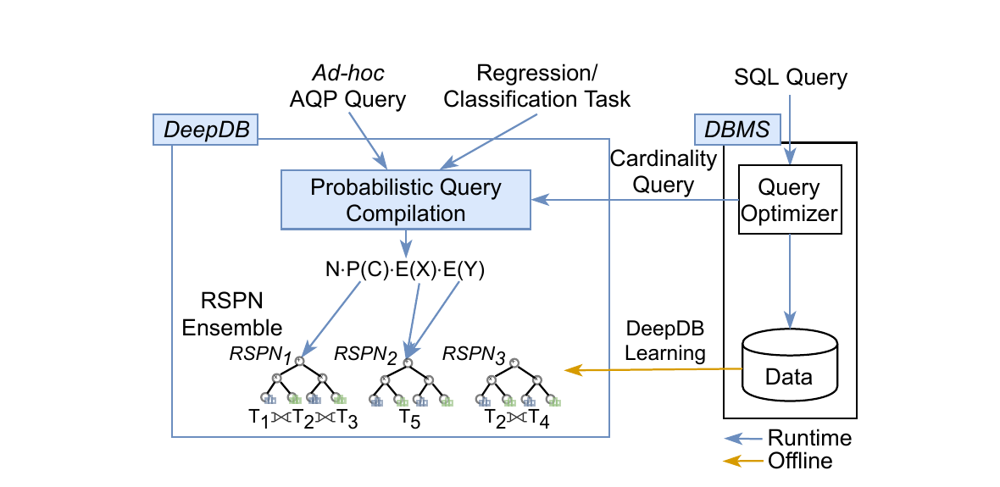

**图 1：DeepDB 概览。**

为在 DeepDB 中恰当地捕获关系数据的重要特征，我们开发了一类称为关系和积网络（RSPN）的新模型。简言之，RSPN 是一类深度概率模型，捕获数据库所有属性上的联合概率分布，并可在运行时为不同用户任务提供答案。

RSPN 虽以和积网络（Sum-Product Networks，SPN）[35, 28] 为基础，但二者存在显著差异：

1. SPN 只支持单表和简单查询（即没有连接和聚合函数），而 RSPN 可建立在任意模式上，支持包含多路连接和不同聚合（`COUNT`、`SUM`、`AVG`）的复杂查询。RSPN 还超越了 [25, 51] 等近期学习型数据模型——后者要求预先知道连接路径，而 RSPN 能组合多个模型，支持真正的即席连接。
2. RSPN 支持直接更新：底层数据库变化时，可直接吸收更新而无需重新训练模型。
3. RSPN 包含一组数据库专用扩展，例如 NULL 值处理和函数依赖支持。

RSPN 在离线阶段建立后，可在运行时用于多种应用：既包括面向用户的任务，例如快速给出 SQL 查询的近似答案；也包括系统内部任务，例如提供基数估计。为支持这些任务，DeepDB 提供一种新的概率查询编译过程，把给定任务转换为 RSPN 上的期望与概率求值。下面概述 DeepDB 查询编译引擎目前支持的应用。

### 基数估计

DeepDB 支持的第一项任务是为查询优化器进行基数估计。基数估计不仅用于给出代价估计，也用于在查询优化期间选择正确的连接顺序。与现有学习型基数估计方法 [16, 42] 相比，DeepDB 的一项突出优势是不必创建专门训练数据，即查询与基数的配对。RSPN 捕获与工作负载无关的数据特征，因此能够支持任意连接查询，而不必针对某种工作负载训练模型。与传统直方图方法相似，RSPN 还能以较低成本保持最新；工作负载驱动的学习型方法 [16, 42] 则需要重新训练。

### 近似查询处理（AQP）

DeepDB 目前支持的第二项任务是近似查询处理（Approximate Query Processing，AQP）。AQP 旨在为大数据集快速给出近似答案。单表查询在 DeepDB 中的基本执行思想很简单：例如，带有条件 $C$ 的聚合查询 `AVG(X)` 等于条件期望 $E(X\mid C)$，可以用 RSPN 近似。DeepDB 实现了更一般的 AQP 过程，利用 RSPN 对多表连接的支持。与 [25, 44] 等其他学习型 AQP 方法相比，DeepDB 的主要区别仍在于支持即席查询，因而不受训练集所覆盖查询类型的限制。

### 其他应用

上述应用展示了 DeepDB 的潜力，但我们认为它并不限于这些应用。例如，RSPN 也可以回答回归和分类等机器学习推断任务；对这些机会的详细讨论超出了本文范围。

## 3. 学习深度数据模型

本节介绍关系和积网络（RSPN）。我们用它学习数据库表示，并通过下一节介绍的查询引擎回答查询。首先回顾和积网络（SPN），然后介绍 RSPN，最后说明如何创建 RSPN 集成来编码含多张表的数据库。

### 3.1 和积网络

和积网络（SPN）[35] 学习数据集中变量 $X_1,X_2,\ldots,X_n$ 的联合概率分布 $P(X_1,X_2,\ldots,X_n)$。它很有吸引力，因为任意条件的概率都能高效计算；后文会把这些概率用于 AQP 和基数估计等应用。

为简化讨论，我们只考虑树形 SPN，即内部节点由和节点、积节点组成并带有叶节点的树。直观而言，和节点把总体（即数据集的行）拆成簇，积节点把总体中相互独立的变量（即数据集的列）拆开。叶节点表示单个属性；我们用直方图近似离散域分布，用分段线性函数近似连续域分布 [29]。

例如，在图 2(c) 中，SPN 学习的是图 2(a) 对应客户表中的 `region` 和 `age` 变量。顶层和节点把数据分成两组：左侧组占总体的 30%，主要是年龄较大的欧洲客户（对应表中前部各行）；右侧组占总体的 70%，主要是年龄较小的亚洲客户（对应表中后部各行）。在每个组内，地区和年龄相互独立，因此分别由一个积节点拆分；叶节点决定每组中地区与年龄变量的概率分布。

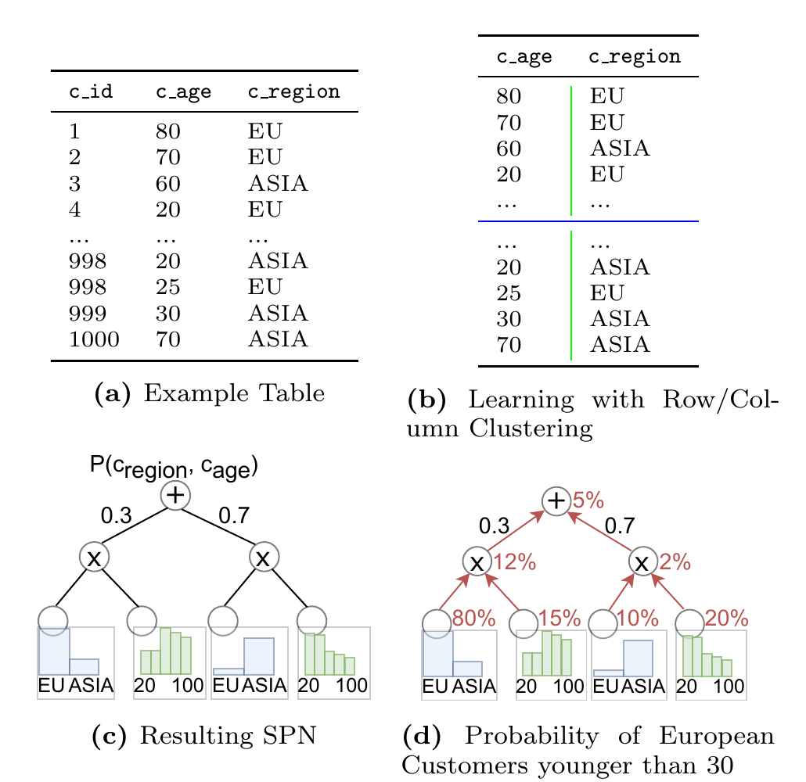

**图 2：客户表及其对应 SPN。** (a) 示例表；(b) 通过行/列聚类学习；(c) 得到的 SPN；(d) 年龄小于 30 岁的欧洲客户概率。

SPN 的学习 [10, 29] 递归地把数据拆分为不同的行簇（引入和节点），或拆分为相互独立的列簇（引入积节点）。行聚类可使用 KMeans 等标准算法，也可按随机超平面拆分。为避免对底层分布作强假设，方法使用随机依赖系数（Randomized Dependence Coefficient，RDC）检验不同列之间的独立性 [23]。一旦某簇的行数低于阈值 $n_{min}$，就假设所有列相互独立。[35, 28] 指出，一般 SPN 的大小是多项式级，推断时间相对于节点数是线性的。在我们的实验配置中，令 $n_{min}=n_s/100$（即相对于样本量），因此甚至可以把 SPN 大小限制为相对于数据集列数的线性复杂度；实践证明该配置较为稳健。

有了 SPN，就能计算任意列条件的概率。直观上，先在每个相关叶节点上计算条件，再自底向上求值。例如在图 2(d) 中，为估计来自欧洲且年龄小于 30 岁的客户数，先在蓝色地区叶节点计算欧洲客户概率（80% 和 10%），再在绿色年龄叶节点计算年龄小于 30 岁的概率（15% 和 20%）。在上方积节点处分别相乘，得到 12% 和 2%；最后在根部和节点结合簇权重，得到 $12\char"0025{}\times0.3+2\char"0025{}\times0.7=5\char"0025{}$。再乘以表中行数，便得到约 50 名年龄小于 30 岁的欧洲客户。

### 3.2 关系和积网络

SPN 的一个重要问题是只能捕获单表数据，而且缺少 DeepDB 所需的其他重要功能。为解决这些问题，我们引入 RSPN。

#### 扩展的推断算法

第一项也是最重要的扩展，是为 `AVG`、`SUM` 等查询计算期望。例如，回答某列平均值的 SQL 聚合查询就需要期望。RSPN 允许对叶节点上的变量计算期望，从而回答这些聚合。若还需应用过滤谓词，则在过滤属性的叶节点上仍计算概率，并把期望与概率一并向上传播。积节点把来自子节点的期望和概率相乘，和节点则计算加权平均。

图 3 展示了如何计算欧洲客户的平均年龄。两项之比给出正确的条件期望：

$$
E(c\char"005F{}age\mid c\char"005F{}region=\text{'EU'})=
\frac{E(c\char"005F{}age\cdot \mathbf{1}\relax_{c\char"005F{}region=\text{'EU'}})}{P(c\char"005F{}region=\text{'EU'})}
=\frac{16.5}{31\char"0025{}}.
$$

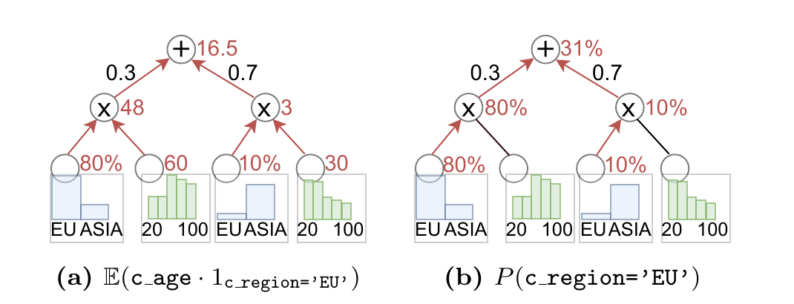

**图 3：计算 $E(c\char"005F{}age\mid c\char"005F{}region=\text{'EU'})$ 的过程。**

另一个相关问题是 SPN 不提供置信区间；第 5.1 节介绍我们为此开发的扩展。

#### 数据库专用处理

SPN 缺少对若干重要数据库特性的支持：

1. **NULL 值。** SPN 没有处理 NULL 的机制。我们在学习时把 NULL 作为离散列和连续列叶节点中的专用值；计算条件概率和期望时，则按照 SQL 三值逻辑处理 NULL。
2. **尽量准确地表示数据。** SPN 旨在泛化数据分布，因此会近似叶节点分布、抽象掉数据集的具体细节。例如，图 2(c) 的年龄叶节点会用分段线性函数近似分布 [29]。但我们希望尽可能准确地表示数据，因此对连续值保存每个独立取值及其频次；只有独立值数量超过给定上限时，才对连续域分箱。
3. **非键属性之间的函数依赖。** SPN 不能很好地捕获 $A\rightarrow B$。简单地让 RSPN 同时学习属性 $A$ 与 $B$，往往会为了实现二者独立而把数据拆成大量小簇，造成很大的 SPN。因此，用户可随表模式一起定义函数依赖。若定义 $A\rightarrow B$，RSPN 会在独立字典中保存从 $A$ 值到 $B$ 值的映射，并在学习时省略列 $B$；运行时把针对 $B$ 的过滤谓词转换为针对 $A$ 的过滤谓词。

#### 可更新性

RSPN 相比 SPN 的最后一项重要扩展是模型可直接更新。底层数据库表变化后，模型可能不再准确。例如，若向图 2(a) 的表中插入更多年轻欧洲客户，图 2(d) 计算出的概率就会偏低，需要更新 RSPN。

RSPN 由积节点、和节点以及表示单变量概率分布的叶节点组成。直接更新现有 RSPN 的核心思想，是自顶向下遍历树，在遍历过程中更新和节点权重的取值分布。例如，可以提高代表年轻欧洲客户子树的和节点权重以反映更新，最后再调整叶节点分布。第 5.2 节给出具体算法。

### 3.3 学习 RSPN 集成

为支持即席连接查询，一种朴素做法是每张表学习一个 RSPN。但这种做法可能丢失表间相关性，产生不准确的近似。因此，我们在为多表数据库学习 RSPN 集成时，会考虑模式中的表是否相关。

下面介绍为给定数据库模式构造“基础集成”的过程。对于每条外键→主键关系，若两表属性相关，就在它们的全外连接上学习一个 RSPN；否则分别为单表学习 RSPN。例如，若模式由图 4 所示的 `Customer` 与 `Order` 表组成，可以学习两个独立 RSPN（每表一个），也可以在全外连接上学习联合 RSPN。

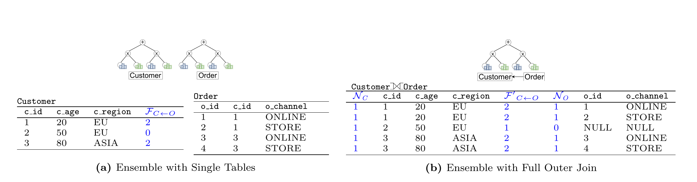

**图 4：同一模式的两种 RSPN 集成。** (a) 单表集成；(b) 全外连接集成。RSPN 还会学习蓝色的附加列。

为了检验两张表是否独立，并据此决定一个还是两个 RSPN 更合适，我们检查所有跨表属性对是否可视为独立。为提高效率，该检验可在一个小型随机样本上完成。作为一种不对分布作强假设的相关性度量，我们计算两属性间的 RDC [23]；SPN 学习算法也使用该度量 [29]。若两表全部属性对中的最大 RDC 超过阈值（我们使用 SPN 的标准阈值），就认为两表相关，并在连接上学习 RSPN。

基础集成只捕获两张表之间的相关性。实验表明，这已能得到很准确的答案，但非直接相邻表间也可能存在相关性。例如，若还有一张可与 `Order` 连接的 `Product` 表，并且产品价格与客户地区相关，基础集成不会考虑这种相关性。第 5.3 节扩展基础集成创建过程，以纳入多表依赖。

## 4. 查询编译

概率查询编译的主要挑战，是把输入查询转换为针对 RSPN 集成的推断过程。DeepDB 当前支持的 SQL 查询类别如下：

```sql
QD: SELECT AGG
    FROM T1 JOIN T2 ON ... JOIN Tn ON ...
    WHERE Ti.a OP LITERAL AND / OR ...
    (GROUP BY ...);
```

其中，`AGG` 是数值属性上的 `COUNT`、`SUM` 或 `AVG`；连接是无环等值连接；`WHERE` 子句中的过滤条件是合取或析取。RSPN 原生支持合取，析取则用容斥原理实现。过滤中的 `OP` 为 `<`、`>`、`=`、`<=`、`>=`、`IN` 之一。查询还可在一个或多个属性上带可选的 `GROUP BY` 子句。

最重要的是，DeepDB 即席支持这些查询：RSPN 集成只学习一次，此后即可用概率查询编译过程回答上述形式的任意查询。下面先介绍无分组 `COUNT` 查询的处理，它足以支持基数估计；再说明如何扩展到更广泛的 AQP 聚合查询，包括 `AVG`、`SUM` 以及分组。

### 4.1 简单 COUNT 查询

本节说明如何转换带或不带过滤谓词的单表 `COUNT` 查询，以及多表内等值连接上的 `COUNT` 查询。这些查询已经足以用于基数估计，也覆盖部分 AQP 聚合查询。把简单 `COUNT` 查询映射到 RSPN 时有三种情形：

1. 存在与查询表集合完全匹配的 RSPN；
2. RSPN 更大，覆盖的表多于查询；
3. 没有单个 RSPN 包含查询的全部表，需要组合多个 RSPN。

#### 情形 1：存在完全匹配的 RSPN

最简单的是带或不带过滤谓词的单表 `COUNT` 查询。若该表有 RSPN，表行数为 $N$，结果就是 $N\cdot P(C)$。例如：

```sql
Q1: SELECT COUNT(*) FROM CUSTOMER C
    WHERE c_region = 'EU';
```

可用图 4(a) 的 `CUSTOMER` RSPN 回答：

$$
|C|\cdot E(\mathbf{1}\relax_{c\char"005F{}region=\text{'EU'}})=3\cdot\frac{2}{3}=2.
$$

 $\mathbf{1}\relax_C$ 表示条件 $C$ 成立时为 1 的随机变量，因此 $E(\mathbf{1}\relax_C)=P(C)$。过滤谓词的合取由 RSPN 直接支持，析取可用容斥原理实现。

把方法自然扩展到连接上的 `COUNT` 查询，可以为底层连接学习 RSPN，再用 $|J|\cdot P(C)$，其中 $|J|$ 是不应用过滤谓词时连接表的大小。例如：

```sql
Q2: SELECT COUNT(*) FROM CUSTOMER C
    NATURAL JOIN ORDER O
    WHERE c_region = 'EU' AND
          o_channel = 'ONLINE';
```

可写成：

$$
|C\bowtie O|\cdot P(o\char"005F{}channel=\text{'ONLINE'}\cap c\char"005F{}region=\text{'EU'})
=4\cdot\frac14=1.
$$

不过，多表联合 RSPN 是在全外连接上学习的。全外连接会保留原表中的全部元组，而不只是至少有一个连接伙伴的元组，因此联合 RSPN 也能回答单表查询，情形 2 将对此加以说明。

回答内连接查询时，必须考虑全外连接产生的额外 NULL 元组。图 4(b) 中第二位客户没有订单，因此不应计入 $Q_2$。为明确标记哪些元组没有连接伙伴、不会出现在给定内连接结果中，我们为每张表增加一列 $N_T$，并让 RSPN 学习该列。查询时可把它作为额外过滤列，排除没有连接伙伴的元组。因而，针对图 4(b) 全外连接 RSPN 的 $Q_2$ 完整转换是：

$$
|C\mathbin{\Join_{\mathrm{full}}}O|\cdot
P(o\char"005F{}channel=\text{'ONLINE'}\cap c\char"005F{}region=\text{'EU'}\cap N_O=1\cap N_C=1)
=5\cdot\frac15=1.
$$

#### 情形 2：存在更大的 RSPN

第二种情形是，现有 RSPN 建在一组连接表上，而查询只需要其中一个子集。假设用图 4(b) 那样在客户与订单全外连接上学习的 RSPN，近似只询问欧洲客户的 $Q_1$。有多个订单的客户会在连接中出现多次，从而被重复计数。全外连接中的欧洲客户比例是 $3/5$，但数据集中实际有三位客户、其中两位来自欧洲。

为解决这个问题，对于表 $P$ 与 $S$ 之间的每条外键关系 $S\leftarrow P$，我们给表 $S$ 增加一列 $F_{S\leftarrow P}$，表示一个元组拥有多少个对应连接伙伴，并称之为**元组因子**。例如图 4(a) 中第一位客户有两个订单，所以其元组因子为 2。对每对可通过外键连接的表，元组因子只需计算一次；DeepDB 在创建 RSPN 时计算它们，更新过程也会相应修改。RSPN 把元组因子作为普通附加列学习；在连接中使用时记作 $F'\relax_{S\leftarrow P}$。由于使用外连接， $F'$ 的值至少为 1。

于是，统计欧洲客户的查询可表示为：

$$
|C\mathbin{\Join_{\mathrm{full}}}O|\cdot
E\left(\frac{1}{F'\relax_{C\leftarrow O}}\cdot
\mathbf{1}\relax_{c\char"005F{}region=\text{'EU'}}\cdot N_C\right)
=5\cdot\frac{1/2+1/2+1}{5}=2.
$$

该式一方面因为 RSPN 学自全外连接而纳入没有订单的客户，另一方面又利用元组因子归一化了拥有两个订单的客户。

**定理 1。** 设 $Q$ 是带过滤谓词 $C$ 的 `COUNT` 查询，只访问全外连接 $J$ 的一部分表； $F'(Q,J)$ 表示使 $Q$ 的结果元组在 $J$ 中重复出现的所有元组因子的乘积，则查询结果等于：

$$
|J|\cdot E\left(
\frac{1}{F'(Q,J)}\cdot \mathbf{1}\relax_C\cdot
\prod_{T\in Q}N_T
\right).
$$

为简化记号，下文把查询 $Q$ 所需的因子写作 $F(Q)$。定理 1 中的期望 $E(F(Q))$ 可由 RSPN 计算，因为所有相关列都已学习。

#### 情形 3：组合多个 RSPN

最后一种情形是 `COUNT` 查询跨越多个 RSPN。先考虑两个 RSPN，再扩展到 $n$ 个。可把查询拆成分别对应两个 RSPN 的子查询 $Q_L$ 和 $Q_R$；二者还可能有重叠，记为 $Q_O$，即对公共表的连接。方法首先用第一个 RSPN 估计 $Q_L$ 的结果，再乘以 $Q_R$ 中元组数相对于重叠部分 $Q_O$ 的比例。直观上，该比例表示不在 $Q_L$ 中的缺失表会把查询结果的 `COUNT` 放大多少。

例如，图 4(a) 分别有 `Customer` 与 `Order` 的 RSPN。 $Q_2$ 被拆成分别在客户 RSPN、订单 RSPN 上执行的 $Q_L$ 和 $Q_R$，此时 $Q_O$ 为空。结果可写为：

$$
\underbrace{|C|\cdot E(\mathbf{1}\relax_{c\char"005F{}region=\text{'EU'}}\cdot F_{C\leftarrow O})}\relax_{Q_L}
\cdot
\underbrace{E(\mathbf{1}\relax_{o\char"005F{}channel=\text{'ONLINE'}})}\relax_{Q_R}
=3\cdot\frac{2+0}{3}\cdot\frac24=1.
$$

左侧 $Q_L$ 计算欧洲客户的订单数，右侧计算全部订单中在线订单所占比例。

更一般地，若重叠不为空，且 $Q_O$（也在 $Q_L$ 中）的表 $S$ 与 $Q_R$ 中但不在 $Q_L$ 中的表 $T$ 存在外键关系 $S\leftarrow T$，则利用左侧 RSPN 中的元组因子 $F_{S\leftarrow T}$。此时估计的不只是 $Q_L$，而是 $Q_L$ 与表 $T$ 的连接，因此重叠扩大为 $Q'\relax_O$。

**定理 2。** 设在给定 $Q_O$ 的过滤谓词后， $Q_L\setminus Q_O$ 与 $Q_R\setminus Q_O$ 的过滤谓词和元组因子条件独立。设要连接的关系为 $S\leftarrow T$，其中 $S$ 属于 $Q_L$， $T$ 属于 $Q_R$。则 $Q$ 的结果等于：

$$
|J_L|\cdot E(F(Q_L)\cdot F_{S\leftarrow T})\cdot
\frac{E(F(Q_R))}{E(F(Q'\relax_O))}.
$$

这种跨 RSPN 独立性通常成立，因为第 3 节介绍的集成创建过程会优先把相关表放入同一个 RSPN。

也可以从 $Q_R$ 开始执行。仍以从订单表开始的 $Q_2$ 为例，可从左侧期望中去掉元组因子 $F_{C\leftarrow O}$，但必须用元组因子归一化 $Q_L$，以正确计算欧洲客户比例：

$$
|O|\cdot E(\mathbf{1}\relax_{o\char"005F{}channel=\text{'ONLINE'}})\cdot
\frac{E(\mathbf{1}\relax_{c\char"005F{}region=\text{'EU'}}\cdot F_{C\leftarrow O}\mid F_{C\leftarrow O}\gt{}0)}
{E(F_{C\leftarrow O}\mid F_{C\leftarrow O}\gt{}0)}.
$$

#### 执行策略

当查询需要多个 RSPN 时，存在多种执行策略。我们的目标是处理尽可能多的过滤谓词相关性，因为位于不同 RSPN 中的谓词会被视为独立。例如，假设集成同时包含图 4 中的 `Customer`、`Order` 和 `Customer-Order` RSPN，而客户—订单连接带有 `c_region`、`c_age` 和 `o_channel` 三个过滤谓词。我们会优先选择 `Customer-Order` RSPN，因为它能处理过滤列之间的全部两两相关性。

因此，运行时贪心选择当前所处理过滤谓词的两两 RDC 之和最高的 RSPN。我们还试验过枚举多种概率查询编译方案并取预测中位数，但并不优于基于 RDC 的策略。用于决定学习哪些 RSPN 的 RDC 已预先算好，故运行时策略也很高效。若连接跨越两个以上 RSPN，只需多次应用定理 2。

### 4.2 其他聚合查询

到目前为止只讨论了不带分组的 `COUNT` 查询。下面说明如何扩展到 `AVG`、`SUM`，以及分组和外连接。

#### AVG 查询

先考虑 RSPN 与查询表集合完全匹配的情况。`AVG` 聚合可写成条件期望。例如：

```sql
Q3: SELECT AVG(c_age) FROM CUSTOMER C
    WHERE c_region = 'EU';
```

在图 4(a) 的集成上，原文将其写为 $|C|\cdot E(c\char"005F{}age\mid c\char"005F{}region=\text{'EU'})$。

若 RSPN 比查询跨越更多表，则不能直接使用该条件期望，否则拥有多个订单的客户权重更高，仍需按元组因子归一化。对于图 4(b) 跨越客户与订单的 RSPN， $Q_3$ 使用：

$$
\frac{E\left(\frac{c\char"005F{}age}{F'\relax_{C\leftarrow O}}\mid c\char"005F{}region=\text{'EU'}\right)}
{E\left(\frac{1}{F'\relax_{C\leftarrow O}}\mid c\char"005F{}region=\text{'EU'}\right)}
=\frac{20/2+20/2+50}{1/2+1/2+1}=35.
$$

一般而言，若要在全外连接 $J$ 的 RSPN 上回答连接查询 $Q$ 中、带过滤谓词 $C$ 的属性 $A$ 平均值，使用：

$$
E\left(\frac{A}{F'(Q,J)}\mid C\right)
\Big/
E\left(\frac{1}{F'(Q,J)}\mid C\right).
$$

最后，若查询需要多个 RSPN，只使用一个包含 $A$ 的 RSPN，并忽略不在该 RSPN 中的部分过滤谓词。只要 $A$ 与这些属性独立，结果就是正确的；否则只是近似。选择 RSPN 时，仍优先处理 $A$ 与谓词 $P$ 之间更强相关性的模型，并以 RDC 衡量。RDC 也可检测近似是否忽略了与 $P$ 中缺失属性的强相关性。

#### SUM 查询

处理 `SUM` 查询时，分别运行一个 `COUNT` 查询和一个 `AVG` 查询，两者相乘即得正确的 `SUM` 结果。

#### GROUP BY 查询

分组查询可通过为每个组增加过滤谓词、执行多个单独查询来处理。对于 $n$ 个组，需要计算的期望数是对应无分组查询的 $n$ 倍。实验表明，在模型上执行时，这不会造成实际性能问题。

#### 外连接

查询编译也很容易扩展到左、右、全外连接。其思想是：只有对所有内连接，才过滤没有连接伙伴的元组（第 4.1 节情形 1、2）；对外连接则根据外连接语义决定是否过滤。此外在情形 3 中，为满足相应外连接语义，取值为 0 的元组因子 $F$ 必须按 1 处理。

## 5. DeepDB 扩展

下面介绍对前述基本框架的几项重要扩展。

### 5.1 支持置信区间

置信区间对 AQP 尤其重要，但 SPN 本身并不提供置信区间。经过概率查询编译后，查询被表示为多个期望的乘积。下面先估计每个因子的不确定性，再推导最终估计的置信区间。

首先，把期望拆成概率与条件期望的乘积。例如：

$$
E(X\cdot\mathbf{1}\relax_C)=E(X\mid C)\cdot P(C).
$$

这样便可把针对过滤谓词 $C_i$ 的全部概率视作一个二项随机变量，其概率为

$$
p=\prod_i P(C_i),
$$

试验次数为 RSPN 的训练数据量 $n_{samples}$。原文把相应不确定性写为

$$
\sqrt{n_{samples}p(1-p)}.
$$

对于条件期望，使用柯尼希—惠更斯公式：

$$
V(X\mid C)=E(X^2\mid C)-E(X\mid C)^2.
$$

RSPN 也能计算平方因子，因为平方运算可下推到叶节点。至此，结果中的每个因子都有相应方差。

组合这些因子时需要两个简化假设：（i）各期望与概率估计相互独立；（ii）最终估计服从正态分布。实验表明，尽管存在这些假设，我们的置信区间仍与典型的基于采样的方法相吻合。

在独立性假设下，可递归应用独立随机变量乘积的标准公式，近似乘积方差：

$$
V(XY)=V(X)V(Y)+V(X)E(Y)^2+V(Y)E(X)^2.
$$

由于已知整个概率查询编译结果的方差，并假设估计服从正态分布，因此可以给出置信区间。

### 5.2 支持更新

更新算法的直觉是把 RSPN 看作索引。与索引相似，插入和删除只影响部分子树，可以递归完成。更新元组递归遍历整棵树，期间调整和节点权重及叶节点分布。本方法支持插入和删除；更新操作则映射为一次删除加一次插入。

**算法 1：增量更新**

```text
 1: procedure update_tuple(node, tuple)
 2:     if leaf-node then
 3:         update_leaf_distribution(node, tuple)
 4:     else if sum-node then
 5:         nearest_child ← get_nearest_cluster(node, tuple)
 6:         adapt_weights(node, nearest_child)
 7:         update_tuple(nearest_child, tuple)
 8:     else if product-node then
 9:         for child in child_nodes do
10:             tuple_proj ← project_to_child_scope(tuple)
11:             update_tuple(child, tuple_proj)
```

算法 1 是递归算法，需要分别处理和节点、积节点与叶节点。在和节点处（第 4 行），需要判断插入或删除元组属于哪个子节点，从而确定应提高或降低哪个权重。和节点的子节点表示学习阶段由 KMeans 找到的行簇 [29]，因此可计算最近的簇中心（第 5 行），提高或降低其权重（第 6 行），再把元组向该子树传播（第 7 行）。

积节点（第 8 行）拆分的是列集合，因此不是把元组传给某一个子节点，而是拆分元组，把各片段传给相应子节点（第 9—11 行）。到达叶节点时，元组只剩下一列，此时根据列值更新叶分布（第 2 行）。

这种做法不改变 RSPN 结构，只调整权重和直方图值。插入产生的新依赖不会体现在 RSPN 中。第 6.1 节的真实数据实验表明，即使增量学习比例高达 40%，这种情况通常也不会发生。但如果确实产生新依赖，就必须重建 RSPN。为此，系统周期性检查数据库：在积节点的列拆分处，按第 5.3 节的方法计算两两 RDC，检测依赖是否变化。若发现变化，则重新生成受影响的 RSPN；与传统索引相同，该过程可在后台执行。

### 5.3 集成优化

前文说明了如何为数据库创建 RSPN 集成。基础集成包含单表 RSPN；若外键相连的两张表相关，也包含跨两表的 RSPN。跨两张以上表的相关性此前被忽略，因为它们会造成更大的模型和更长的训练时间。本节扩展集成创建过程：用户给出训练预算（时间或空间）后，DeepDB 选择还应创建哪些更大的 RSPN。

为量化表间相关性，先计算模式中所有属性对的 RDC。对每对表，定义两列之间的最大 RDC

$$
\max_{c\in T_i,\ c'\in T_j}rdc(c,c')
$$

为依赖值。依赖值指示哪些表应该、哪些不应该出现在同一个 RSPN 中；每个 RSPN 的目标是获得较高的两两最大 RDC 均值，从而只合并两两相关性较高的表。

额外 RSPN 的选择受预算约束，即相对于基础集成允许增加的训练时间。我们把最大额外学习代价定义为相对基础集成学习代价 $C_{Base}$ 的系数 $B$。 $B=0$ 表示只创建基础集成； $B\gt{}0$ 时还会学习覆盖更多表的 RSPN。设所有可能且互异的 RSPN 集合为 $R$，某个 RSPN $r$ 的代价为 $C(r)$，则原文把优化目标表述为最小化

$$
\sum_{r\in E}
\left\lbrace{}
\max_{c\in T_i,\ c'\in T_j}rdc(c,c')
\mid T_i,T_j\in r
\right\rbrace{},
$$

并满足预算约束

$$
\sum_{r\in E}C(r)\le B\cdot C_{Base}
$$

下，最小化所选集成 $E$ 中各 RSPN 所覆盖表对的最大列间 RDC 汇总值。

但构建 RSPN 的真实代价 $C(r)$（即时间）很难估计，因此无法直接求解该优化问题。实际方法估计相对代价，选择 RDC 均值最高且相对创建代价最低的 RSPN。由于 RDC 是两两计算的，假设代价随列数 $cols(r)$ 的平方增长，并随行数 $rows(r)$ 线性增长。因此，在不超过最大训练时间的前提下，按高平均 RDC 和低代价

$$
cols(r)^2\cdot rows(r)
$$

贪心选择 RSPN。

## 6. 实验评估

本节证明 DeepDB 在基数估计和 AQP 两项任务上都优于最先进系统。所有实验中的 RSPN 都以 Python 实现为 SPFlow [30] 的扩展。超参数使用 0.3 的 RDC 阈值，以及输入数据 1% 的最小实例切片，以决定聚类粒度；预算系数设为 0.5，即较大 RSPN 的训练时间大约比基础集成多 50%。这些超参数由网格搜索确定，并在不同数据集上取得最佳结果。

### 6.1 实验 1：基数估计

#### 工作负载与设置

与 [16, 19] 相同，所有方法（DeepDB 与基线）均使用 JOB-light 基准。该基准基于真实 IMDb 数据库，包含 70 个查询。我们还定义了包含 200 个查询的合成查询集：在 IMDb 数据集上均匀生成涉及 3—6 张表连接、1—5 个过滤谓词的查询，用于比较学习型方法的泛化能力。

基线包括以下学习型和传统方法：

- 训练一个多集合卷积网络（Multi-Set Convolutional Network，原文记作 MCSN）[16]。该专用深度神经网络以连接路径、表和过滤谓词为输入。
- 以小波 [5] 作为基于概要的代表方法，每表构建一个小波，并直接在小波表示上执行连接等查询算子。之所以选择它，是因为它与 DeepDB 一样，无需预先知道查询会连接哪些表。
- 实现 `Perfect Selectivities`，由预言机返回单表真实基数。它可视为通过组合“完美”单表概要来支持即席查询的最佳情形。
- 使用 PostgreSQL 11.5 的标准基数估计，以及在线随机采样和基于索引的连接采样（Index-Based Join Sampling，IBJS）[20]。IBJS 与 DeepDB 一样会考虑跨表相关性。

除非另有说明，DeepDB 使用前述超参数，并用 1000 万个样本构建 RSPN。

#### 训练时间与存储开销

与其他学习型基数估计方法 [16, 42] 不同，DeepDB 不需要专门训练数据，只需学习数据表示。训练基础集成需 48 分钟，其中包括采样和计算第 4.1 节元组因子的数据准备时间。相比之下，MCSN [16] 需要执行 10 万个查询来收集基数；以 PostgreSQL 执行时，训练数据准备耗时 34 小时，随后在 NVIDIA V100 GPU 上训练神经网络约 15 分钟。DeepDB 无需收集工作负载训练数据，训练时间显著更短；数据库修改后也不必重跑查询，而是用第 3.2 节的高效算法更新 RSPN。

在存储占用方面，IBJS 和随机采样等采样方法没有离线存储开销，但可用样本数受查询延迟限制。其他方法在 JOB-light 使用的 3.7 GB IMDb 数据库上只需数 KB 到数 MB：DeepDB 为 28.9 MB，MCSN 为 2.6 MB；PostgreSQL 默认仅使用 100 个桶的直方图，占 60 KB，但精度最低。小波方法使用 2 万个小波系数，使存储量与标准 DeepDB 大致相同。

此外，我们还把每个 RSPN 的样本数降到 10 万，构建存储优化版 DeepDB，使其存储占用接近 MCSN。增大 MCSN 的存储开销（例如增加隐藏层）不会提升性能，因为已采用 [16] 的优化超参数；而存储优化版 DeepDB 仍明显优于包括 MCSN 在内的所有基线。虽然目前没有可直接用于 SPN 的可比压缩方法，但未来研究可能进一步降低 DeepDB 的存储需求。即使如此，对数 GB 数据库使用数 MB 存储以获得更准确的基数估计，也仍是可以接受的。

#### 估计质量

基数估计器通常用 q-error 衡量预测质量，即估计值与真实连接结果大小相差的倍数。例如真实结果大小为 100 时，估计为 10 或 1000 的 q-error 都是 10。采用比率而非绝对或平方误差，符合优化决策只关心相对差异的直觉。

**表 1：JOB-light 基准的估计误差（q-error）**

| 方法 | 中位数 | 90 百分位 | 95 百分位 | 最大值 |
| --- | ---: | ---: | ---: | ---: |
| DeepDB | 1.34 | 2.50 | 3.16 | 39.63 |
| DeepDB（存储优化） | 1.32 | 4.14 | 5.74 | 72.00 |
| Perfect Selectivities | 2.08 | 9 | 11 | 33 |
| MCSN | 3.22 | 65 | 143 | 717 |
| Wavelets | 7.64 | 9839 | 15332 | 564549 |
| PostgreSQL | 6.84 | 162 | 817 | 3477 |
| IBJS | 1.67 | 72 | 333 | 6949 |
| Random Sampling | 5.05 | 73 | 10371 | 49187 |

表 1 给出 JOB-light 的中位数、90 百分位、95 百分位和最大 q-error。DeepDB 及其存储优化版通常以数个数量级的优势超过最佳竞争者。IBJS 的中位 q-error 较低；MCSN 的优势在于高百分位误差比传统方法低数个数量级，因而更稳健。DeepDB 不仅中位数优于 IBJS，而且 95 百分位 q-error 仅为 3.16，而 MCSN 为 143，稳健性进一步提高。PostgreSQL 与随机采样在中位数和高百分位上都明显更差；小波受维数灾难影响，误差最高。使用预言机的 Perfect Selectivities 虽优于小波，仍因不考虑跨表相关性而不如 DeepDB。

#### 合成数据

为进一步研究各方法的权衡，我们为 IMDb 模式实现了合成数据生成器，以便继续运行 JOB-light。首先生成均匀且无相关性的数据，然后改变现实中令基数估计困难的特征，即偏斜分布与列间相关性。仍用前述方法估计原有 70 个 JOB-light 查询，并报告结果非零查询的平均 q-error（结果为零时 q-error 无定义）。

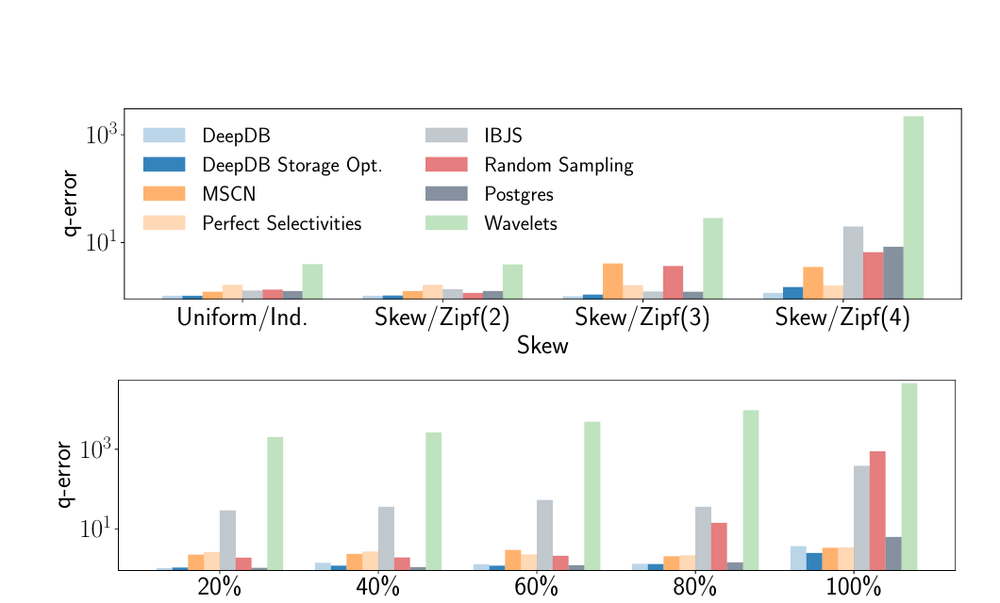

**图 5：合成数据上的平均估计误差。** 上图改变偏斜程度，下图改变属性相关程度；纵轴为对数尺度。

图 5 表明，DeepDB 和存储优化版均优于全部基线。在均匀、独立的数据上，DeepDB 如预期般相对于随机采样或 PostgreSQL 等简单方法没有明显优势；随着偏斜或相关性增强，DeepDB 则超过其他方法。随机采样、IBJS 和 PostgreSQL 都显著退化；MCSN 更能处理偏斜和相关性，但仍会退化，我们仍把原因归于训练查询的覆盖范围。小波受维数灾难影响，在所有配置上精度最低。

#### 泛化能力

泛化对学习型方法尤其重要，即模型在此前未见查询上的表现。MCSN 默认只用至多三路连接的查询训练，否则生成训练数据过于昂贵 [16]。类似地，DeepDB 集成中也只有少量跨大连接的 RSPN，否则训练同样昂贵；不过两种方法都能为未见查询给出基数估计。

我们在 IMDb 数据集上随机生成涉及 4—6 张表、1—5 个选择谓词的查询。图 6 比较 DeepDB 与 MCSN [16] 的中位 q-error。

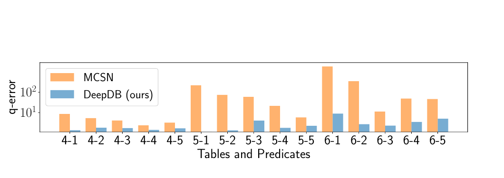

**图 6：不同连接规模（4、5、6）与过滤谓词数（1—5）下的中位 q-error（对数尺度）。**

对更大的连接，DeepDB 的中位 q-error 低数个数量级。MCSN 在过滤谓词较少时反而更不准确。一种可能解释是，此类查询会命中更多元组，需要估计更大的基数；而训练数据最多只连接三张表，因此很可能没有覆盖这些较高基数值。由此，RSPN 在未见查询上表现出更强的泛化能力。

#### 更新

为评估 RSPN 的更新质量，我们先在 IMDb 全量数据的某一部分上训练集成，再用其余元组更新数据库。为贴近真实情况，按影片制作年份划分数据，即较新的影片后插入。基础 RSPN 集成使用预算系数 0，借此说明即使只有基础集成，更新后也能保持良好估计；这也解释了误差为何与表 1 略有不同。

**表 2：更新后 JOB-light 的估计误差（q-error）**

| 时间划分 | < 2019（0%） | < 2011（4.7%） | < 2009（9.3%） | < 2004（19.7%） | < 1991（40.1%） |
| --- | ---: | ---: | ---: | ---: | ---: |
| 中位数 | 1.22 | 1.28 | 1.31 | 1.34 | 1.41 |
| 90 百分位 | 3.45 | 3.17 | 3.23 | 3.60 | 4.06 |
| 95 百分位 | 4.77 | 4.30 | 3.83 | 4.07 | 4.35 |

表 2 表明，即使更新比例提高到 40.1%，更新后的 RSPN q-error 也没有明显变化，精度只略微下降。原因在于更新只改变 RSPN 参数而不改变树结构；若更新导致数据分布或相关性变化，原结构可能不再最优。若精度下降超过阈值，DeepDB 仍可基于新数据在离线阶段重建 RSPN。

#### 参数探索

最后研究 DeepDB 集成训练时间与预测质量的权衡。先把集成选择的预算系数从 0（只学习基础集成，每个双表连接一个 RSPN）变化到 $B=3$（较大 RSPN 的训练约为基础集成的三倍），每个 RSPN 使用 $10^7$ 个样本；再用所得集成评估 200 个涉及 3—6 张表、1—5 个选择谓词的查询。

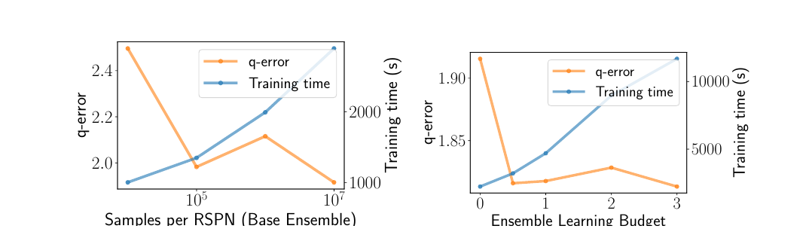

**图 7：预算系数和样本量变化时的 q-error 与训练时间（秒）。**

图 7 显示，预算增大时平均质量改善，但在 $B=0.5$ 已趋于饱和，因为更大的连接中不存在基础集成尚未捕获的强相关性。把样本量从 1000 增至 1000 万时，训练时间增长，而中位预测误差从 2.5 改善到 1.9。因此，若可接受轻微质量妥协，可以显著降低训练时间。

若目标更偏重最短训练时间，还可以只为所有单表学习 RSPN，完全不学习连接，集成训练时间可降至 5 分钟。即使这种廉价策略也具有竞争力：JOB-light 中位 q-error 为 1.98，90 百分位为 5.32，95 百分位为 8.54，最大值为 186.53。它在高百分位上仍优于最先进基线，只有基于索引的连接采样在中位数上略胜，再次体现 RSPN 的稳健性。

#### 延迟

DeepDB 当前基数估计延迟在微秒至毫秒量级，对通常运行数秒的大型数据集复杂连接查询已经足够。跨多列的复杂谓词或更多连接表会增加延迟。图 8 同时报告 RSPN 推断延迟，以及包含概率查询编译中把查询转换为期望与概率之开销的总延迟。

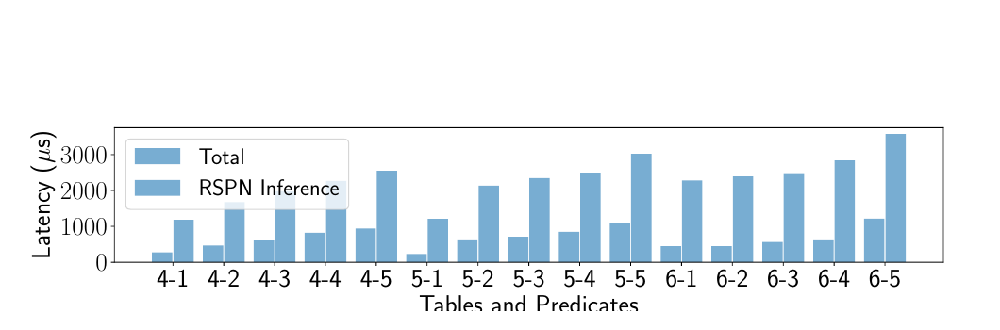

**图 8：不同连接规模（4、5、6）与过滤属性数（1—5）下的 DeepDB 延迟。**

RSPN 推断高效，是因为系统会像 [40] 那样为训练好的 RSPN 自动编译 C++ 代码。复杂谓词和连接虽会提高延迟，最坏情况仍约 3 ms，简单查询则在微秒范围。未来工作将不仅优化 RSPN 推断，还会降低查询转换开销，使总延迟更接近纯 RSPN 推断延迟。

### 6.2 实验 2：AQP

#### 工作负载与设置

评估同时使用合成数据集和真实数据集。合成数据采用比例因子 500 的星型模式基准（Star Schema Benchmark，SSB）[32] 及其标准查询（记作 S1.1—S4.3）。真实数据采用 Flights 数据集 [1]，查询选择率从 5% 到 0.01%，覆盖多种分组属性，以及 `AVG`、`SUM`、`COUNT` 查询（记作 F1.1—F5.2）；使用 IDEBench [9] 把数据集扩展到 10 亿条记录。

基线为 VerdictDB [33]、Wander Join/XDB [21] 和 PostgreSQL 的 `TABLESAMPLE`（随机样本）。VerdictDB 是可配合任意数据库系统使用的中间件，通过为事实表创建分层样本和均匀样本提供近似查询。Flights 数据集使用 VerdictDB 默认的全量数据 1% 样本。SSB 上默认设置会造成很高延迟，因此改为选取使平均查询时间约 2 秒的样本量。

Wander Join 是利用二级索引快速生成连接样本的连接采样算法。为公平比较，也把时间上限设为 2 秒，并只在包含连接的数据集上评估；为连接及谓词创建全部二级索引。`TABLESAMPLE` 同样选择使查询平均耗时 2 秒的样本量。DeepDB 构建 RSPN 时，Flights 使用 1000 万样本，SSB 使用 100 万样本。

#### 训练时间与存储开销

SSB 的训练耗时 17 分钟，Flights 为 3 分钟。二者比 IMDb 更快，是因为跨表相关性更少，集成中的大型 RSPN 模型也更少。VerdictDB 需要从数据集创建均匀和分层样本：标准配置下，Flights 用时 10 小时，SSB 用时 6 天。Wander Join 创建二级索引，在 SSB 上同样需要数小时。

Flights 数据集上 DeepDB 模型为 2.2 MB，VerdictDB 为 11.4 MB；SSB 上 DeepDB 为 34.4 MB，VerdictDB 为 30.7 MB。XDB 与 PostgreSQL `TABLESAMPLE` 在线采样，因此没有额外离线存储开销。

#### 准确性与延迟

AQP 关注两个维度：近似质量和查询运行时间。近似质量使用相对误差

$$
\frac{|a_{true}-a_{predicted}|}{a_{true}},
$$

其中 $a_{true}$ 和 $a_{predicted}$ 分别是真实与预测聚合结果。对分组查询，先为多个组分别计算聚合，再对各组相对误差取平均。

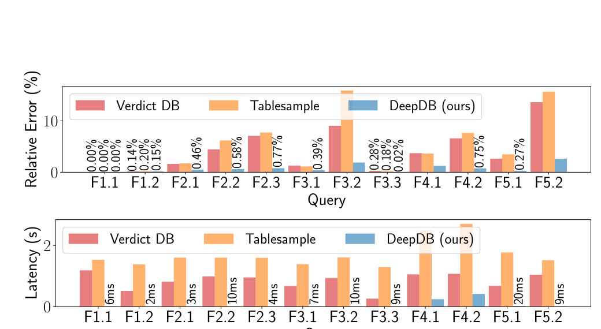

**图 9：Flights 数据集的平均相对误差与延迟。**

图 9 表明，DeepDB 始终具有最低的平均相对误差。低选择率查询中尤其如此：基于采样的方法只有很少元组满足选择谓词，近似因而很不准确；DeepDB 则对数据分布建模，并利用学到的表示作估计。例如选择率为 0.5% 的查询 11 中，VerdictDB 与 `TABLESAMPLE` 的平均相对误差分别为 15.6% 和 13.6%，DeepDB 仅为 2.6%。

`TABLESAMPLE` 与 VerdictDB 平均延迟为 1—2 秒；DeepDB 只求值 RSPN，最大延迟为 31 ms。即使查询有多个分组、必须为每个不同组至少多计算一个期望，也依然如此。

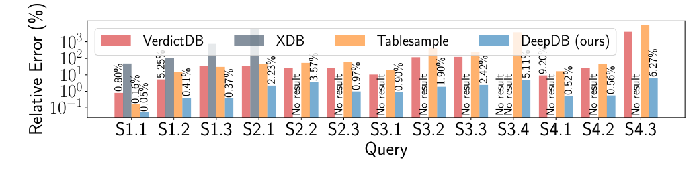

**图 10：SSB 数据集上的平均相对误差。** 误差纵轴为对数尺度。

DeepDB 在 SSB 上的精度优势更明显。查询 1—12 的选择率在 3.42% 到 0.0075% 之间，最后一个查询仅为 0.00007%，导致采样方法预测非常不准确。DeepDB 的平均相对误差始终低于 6%，比基线低数个数量级；VerdictDB、Wander Join 与 `TABLESAMPLE` 经常超过 100%，部分查询甚至完全无法给出估计，因为没有抽到满足过滤谓词的样本。其他方法用 2 秒给出估计，DeepDB 最坏只需 293 ms；分组较少的查询需要计算的期望更少，延迟通常也更低。

#### 置信区间

本实验评估 DeepDB 预测置信区间的准确性。使用相对置信区间长度：

$$
\frac{a_{predicted}-a_{lower}}{a_{predicted}},
$$

其中 $a_{predicted}$ 是预测值， $a_{lower}$ 是置信区间下界。把该长度与基于采样方法的置信区间比较：抽取 1000 万个样本，与本实验模型学习所用样本数一致；估计平均值、计数与求和聚合，再用标准统计方法计算置信区间。这些置信区间长度可视为真实值。满足过滤谓词的样本不足 10 个时，标准差估计本身方差过高，因此排除相应查询。

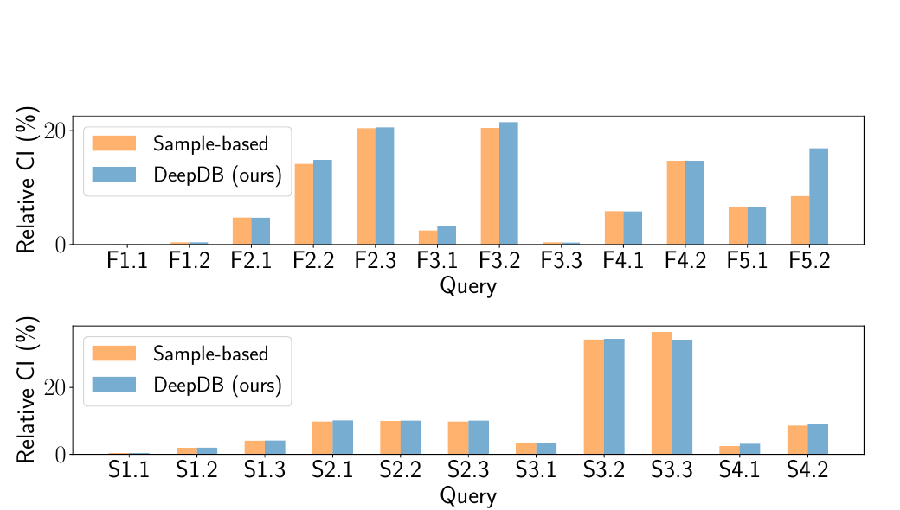

**图 11：置信区间真实相对长度与预测相对长度。**

在几乎所有情况下，DeepDB 的置信区间都是对真实置信区间很好的近似。唯一例外是 Flights 的 F5.2，它是两个 `SUM` 聚合之差。此时第 5.1 节假设（i）不成立：两个 `SUM` 聚合包含相关属性，概率与期望估计不能视为独立，因而置信区间被高估。不过同一查询 F5.2 的 AQP 点估计仍然很准确，如图 9 所示。此类情况很容易识别，只会在估计由多个聚合组成的算术表达式时出现。

#### 非即席方法

下面把 DeepDB 与要求预先了解工作负载，或能利用这些先验信息提高精度的方法比较。

首先是前述小波方法 [5]。它本身不要求先验信息，但小波无法扩展到大量维度，因此可利用先验信息优化：若预先知道所有查询所需的列组合，就能为每个查询单独构造最优、最小的小波。即使如此，图 13 表明 DeepDB 仍优于小波。进一步的实验显示，即使维数不高，小波精度也会显著下降，如图 12 右侧所示。

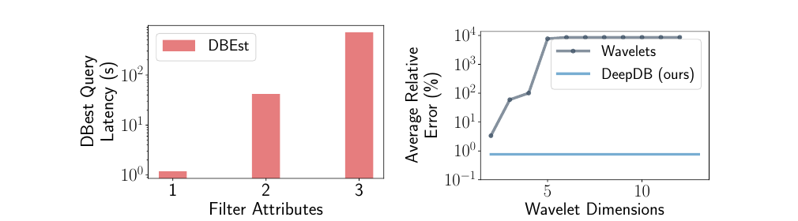

**图 12：非即席方法的微基准。** 左：DBEst 查询延迟随数值列过滤属性数变化；右：小波平均相对误差随维数变化。

其次，与另外两种需要先验信息的方法比较：（1）BlinkDB [2] 使用的分层采样，可减轻偏斜影响；（2）近期学习型 AQP 方法 DBEst [25]。二者不同于 DeepDB，不能回答先验信息没有覆盖的列组合所形成的即席查询；DeepDB 则能按第 4 节的概率查询编译组合多个 RSPN。

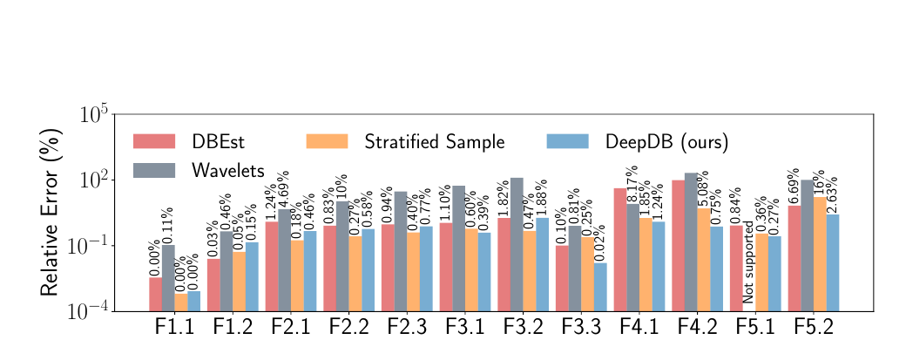

**图 13：DeepDB 与使用先验知识方法的相对误差。**

在预先给出 Flights 全部查询信息时，图 13 显示分层采样可达到与 DeepDB 相当的精度。但若查询在某个分层列上带有高选择性过滤条件，如 F5.2 或 F4.2，DeepDB 仍更优。DBEst 的精度也与 DeepDB 相当，但部分查询需要长达 20 秒。图 12 左侧的进一步分析表明，其延迟随数值列过滤条件数量呈指数增长；由于该方法依赖对数值列域进行积分，这一点不可避免。

## 7. 相关工作

### 学习型基数估计

单表选择率估计是基数估计的一个特例。已有大量工作把不同机器学习方法用于该问题，包括概率图模型 [45, 12, 11]、神经网络 [18, 22] 和深度学习密度模型 [14]。近期 Dutt 等人 [8] 提出把轻量级树模型与对数变换标签结合。最早把机器学习用于含连接基数估计的工作采用简单回归模型 [3, 26]；近来则提出以深度学习端到端解决基数估计 [16, 42]。

Woltmann 等人 [48] 也将大型模式上的基数估计拆开，为特定模式子区学习类似 [16] 的模型，但两个模式子区模型不能组合以估计更大的连接。另一些技术针对反复出现的云工作负载，利用重叠子图模板的学习模型 [49]。这些模型都必须先执行工作负载并把结果作为训练数据，与我们的数据驱动方法不同。

### 学习型 AQP

早期工作 [38] 建议用基于数据簇的混合模型近似 OLAP 立方体，虽然大幅降低存储需求，近似误差却相对较高。FunctionDB [43] 构造分段线性函数作为近似，但与 DeepDB 不同，它只支持连续变量。DBEst [25] 为热门查询构建模型，但不支持这些热门查询的轻微变体，也不支持即席查询。Park 等人提出 Database Learning [34]，从查询结果构建模型，再用它近似未来查询；DeepDB 则是数据驱动的，不要求历史查询结果。此外，也有工作提出专用生成模型来为 AQP 抽样 [44]，但该技术不能处理连接。

### 概率数据库

与我们的工作类似，概率数据库使用图模型表示联合概率分布 [47, 15, 36, 37]，以克服早期方法依赖的元组独立假设 [6, 31, 41]。例如，马尔可夫逻辑网络（Markov Logic Networks，MLN）用于在概率数据库中显式指定相关性 [15, 13]；与 DeepDB 不同，这些相关性必须手工指定，而不是从数据学习。

Rekatsinas 等人 [36] 使用因子图建模概率数据库中的相关性，并构造带注释算术电路（Annotated Arithmetic Circuits，AAC）；与 SPN 相似，AAC 也用和节点与积节点编码概率分布。不同之处在于，该方法必须按查询构建额外表示（lineage-AAC），而 RSPN 是数据驱动的，与工作负载无关。

最后，与计算数据驱动模型这一思想相关的还有知识编译领域：它通过昂贵的离线阶段创建表示，例如用于求值布尔公式 [7, 46, 4]。不过，这些方法都不以 DeepDB 所支持的复杂 SQL 查询为目标。

## 8. 结论与未来工作

我们提出 DeepDB，一种面向学习型数据库组件的数据驱动方法。我们已经证明，该方法具有通用性，可支持包括基数估计和近似查询处理在内的多种任务。我们相信，数据驱动学习方法还可用于其他 DBMS 组件。例如，已有工作证明可利用列相关性改进索引 [50]。此外，SPN 天然给出“相关簇”的概念，也可在数据探索中用于推荐有意义的模式。

## 9. 致谢

本文作者感谢匿名审稿人提供的宝贵反馈。本工作部分源于德国国家研究中心 ATHENE 的“Federated Machine Learning”和“ML for Vulnerability Detection”任务中的讨论与支持，并得到德国联邦经济与能源部人工智能灯塔项目 SPAICER（01MK20015E），以及德国研究基金会训练组“Adaptive Preparation of Information from Heterogeneous Sources”（AIPHES，GRK 1994/1）的支持。

## 10. 参考文献

1. Flights dataset. https://www.kaggle.com/usdot/flight-delays. Accessed: 2019-06-30.
2. S. Agarwal, B. Mozafari, A. Panda, H. Milner, S. Madden, and I. Stoica. Blinkdb: Queries with bounded errors and bounded response times on very large data. In *Proceedings of the 8th ACM European Conference on Computer Systems*, EuroSys '13, pages 29–42, New York, NY, USA, 2013. ACM.
3. M. Akdere, U. Çetintemel, M. Riondato, E. Upfal, and S. B. Zdonik. Learning-based query performance modeling and prediction. In *2012 IEEE 28th International Conference on Data Engineering*, pages 390–401. IEEE, 2012.
4. S. Bova. Sdds are exponentially more succinct than obdds. In *Thirtieth AAAI Conference on Artificial Intelligence*, 2016.
5. K. Chakrabarti, M. Garofalakis, R. Rastogi, and K. Shim. Approximate query processing using wavelets. *The VLDB Journal*, 10, 12 2000.
6. N. Dalvi and D. Suciu. Efficient query evaluation on probabilistic databases. *The VLDB Journal*, 16(4):523–544, Oct. 2007.
7. A. Darwiche and P. Marquis. A knowledge compilation map. *Journal of Artificial Intelligence Research*, 17:229–264, 2002.
8. A. Dutt, C. Wang, A. Nazi, S. Kandula, V. R. Narasayya, and S. Chaudhuri. Selectivity estimation for range predicates using lightweight models. *PVLDB*, 12(9):1044–1057, 2019.
9. P. Eichmann, C. Binnig, T. Kraska, and E. Zgraggen. Idebench: A benchmark for interactive data exploration, 2018.
10. R. Gens and P. Domingos. Learning the Structure of Sum-Product Networks. In *International Conference on Machine Learning*, pages 873–880, 2013.
11. L. Getoor and L. Mihalkova. Learning statistical models from relational data. In *Proceedings of the 2011 ACM SIGMOD International Conference on Management of Data*, SIGMOD '11, pages 1195–1198, New York, NY, USA, 2011. ACM.
12. L. Getoor, B. Taskar, and D. Koller. Selectivity estimation using probabilistic models. In *Proceedings of the 2001 ACM SIGMOD International Conference on Management of Data*, SIGMOD '01, pages 461–472, New York, NY, USA, 2001. ACM.
13. E. Gribkoff and D. Suciu. Slimshot: in-database probabilistic inference for knowledge bases. *PVLDB*, 9(7):552–563, 2016.
14. S. Hasan, S. Thirumuruganathan, J. Augustine, N. Koudas, and G. Das. Multi-attribute selectivity estimation using deep learning. *CoRR*, abs/1903.09999, 2019.
15. A. Jha and D. Suciu. Probabilistic databases with markoviews. *PVLDB*, 5(11):1160–1171, 2012.
16. A. Kipf, T. Kipf, B. Radke, V. Leis, P. A. Boncz, and A. Kemper. Learned cardinalities: Estimating correlated joins with deep learning. In *CIDR 2019, 9th Biennial Conference on Innovative Data Systems Research*, Asilomar, CA, USA, January 13–16, 2019, Online Proceedings, 2019.
17. T. Kraska, A. Beutel, E. H. Chi, J. Dean, and N. Polyzotis. The case for learned index structures. In *Proceedings of the 2018 International Conference on Management of Data*, SIGMOD '18, pages 489–504, New York, NY, USA, 2018. ACM.
18. M. S. Lakshmi and S. Zhou. Selectivity estimation in extensible databases - a neural network approach. In *Proceedings of the 24rd International Conference on Very Large Data Bases*, VLDB '98, pages 623–627, San Francisco, CA, USA, 1998. Morgan Kaufmann Publishers Inc.
19. V. Leis, A. Gubichev, A. Mirchev, P. Boncz, A. Kemper, and T. Neumann. How good are query optimizers, really? *PVLDB*, 9(3):204–215, 2015.
20. V. Leis, B. Radke, A. Gubichev, A. Kemper, and T. Neumann. Cardinality estimation done right: Index-based join sampling. In *CIDR 2017, 8th Biennial Conference on Innovative Data Systems Research*, Chaminade, CA, USA, January 8–11, 2017, Online Proceedings, 2017.
21. F. Li, B. Wu, K. Yi, and Z. Zhao. Wander join: Online aggregation via random walks. In *Proceedings of the 2016 International Conference on Management of Data*, pages 615–629. ACM, 2016.
22. H. Liu, M. Xu, Z. Yu, V. Corvinelli, and C. Zuzarte. Cardinality estimation using neural networks. In *Proceedings of the 25th Annual International Conference on Computer Science and Software Engineering*, CASCON '15, pages 53–59, Riverton, NJ, USA, 2015. IBM Corp.
23. D. Lopez-Paz, P. Hennig, and B. Schölkopf. The randomized dependence coefficient. In *Advances in Neural Information Processing Systems*, pages 1–9, 2013.
24. Q. Ma and P. Triantafillou. Dbest: Revisiting approximate query processing engines with machine learning models. In *Proceedings of the 2019 International Conference on Management of Data*, SIGMOD Conference 2019, Amsterdam, The Netherlands, June 30–July 5, 2019, pages 1553–1570, 2019.
25. Q. Ma and P. Triantafillou. Dbest: Revisiting approximate query processing engines with machine learning models. In *Proceedings of the 2019 International Conference on Management of Data*, SIGMOD '19, pages 1553–1570, New York, NY, USA, 2019. ACM.
26. T. Malik, R. Burns, and N. Chawla. A black-box approach to query cardinality estimation. In *CIDR*, 2007.
27. R. Marcus, P. Negi, H. Mao, C. Zhang, M. Alizadeh, T. Kraska, O. Papaemmanouil, and N. Tatbul. Neo: A learned query optimizer. *CoRR*, abs/1904.03711, 2019.
28. A. Molina, S. Natarajan, and K. Kersting. Poisson Sum-Product Networks: A Deep Architecture for Tractable Multivariate Poisson Distributions. In *AAAI*, 2017.
29. A. Molina, A. Vergari, N. D. Mauro, S. Natarajan, F. Esposito, and K. Kersting. Mixed Sum-Product Networks: A Deep Architecture for Hybrid Domains. In *AAAI*, 2018.
30. A. Molina, A. Vergari, K. Stelzner, R. Peharz, P. Subramani, N. D. Mauro, P. Poupart, and K. Kersting. Spflow: An easy and extensible library for deep probabilistic learning using sum-product networks, 2019.
31. D. Olteanu, J. Huang, and C. Koch. Sprout: Lazy vs. eager query plans for tuple-independent probabilistic databases. In *2009 IEEE 25th International Conference on Data Engineering*, pages 640–651, March 2009.
32. P. O'Neil, E. O'Neil, X. Chen, and S. Revilak. The star schema benchmark and augmented fact table indexing. In *Technology Conference on Performance Evaluation and Benchmarking*, pages 237–252. Springer, 2009.
33. Y. Park, B. Mozafari, J. Sorenson, and J. Wang. Verdictdb: Universalizing approximate query processing. In *Proceedings of the 2018 International Conference on Management of Data*, SIGMOD '18, pages 1461–1476, New York, NY, USA, 2018. ACM.
34. Y. Park, A. S. Tajik, M. Cafarella, and B. Mozafari. Database learning: Toward a database that becomes smarter every time. In *Proceedings of the 2017 ACM International Conference on Management of Data*, SIGMOD '17, pages 587–602, New York, NY, USA, 2017. ACM.
35. H. Poon and P. Domingos. Sum-product networks: A New Deep Architecture. In *2011 IEEE International Conference on Computer Vision Workshops*, pages 689–690, November 2011.
36. T. Rekatsinas, A. Deshpande, and L. Getoor. Local structure and determinism in probabilistic databases. In *Proceedings of the 2012 ACM SIGMOD International Conference on Management of Data*, SIGMOD '12, pages 373–384, New York, NY, USA, 2012. ACM.
37. P. Sen, A. Deshpande, and L. Getoor. Prdb: Managing and exploiting rich correlations in probabilistic databases. *The VLDB Journal*, 18(5):1065–1090, Oct. 2009.
38. J. Shanmugasundaram, U. Fayyad, P. S. Bradley, et al. Compressed data cubes for olap aggregate query approximation on continuous dimensions. In *ACM SIGKDD*, 1999.
39. Y. Sheng, A. Tomasic, T. Zhang, and A. Pavlo. Scheduling OLTP transactions via learned abort prediction. In *Proceedings of the Second International Workshop on Exploiting Artificial Intelligence Techniques for Data Management*, aiDM@SIGMOD 2019, Amsterdam, The Netherlands, July 5, 2019, pages 1:1–1:8, 2019.
40. L. Sommer, J. Oppermann, A. Molina, C. Binnig, K. Kersting, and A. Koch. Automatic mapping of the sum-product network inference problem to fpga-based accelerators. In *2018 IEEE 36th International Conference on Computer Design (ICCD)*, pages 350–357, 2018.
41. D. Suciu and C. Re. Efficient top-k query evaluation on probabilistic data, Oct. 12 2010. US Patent 7,814,113.
42. J. Sun and G. Li. An end-to-end learning-based cost estimator. *CoRR*, abs/1906.02560, 2019.
43. A. Thiagarajan and S. Madden. Querying continuous functions in a database system. In *Proceedings of the 2008 ACM SIGMOD International Conference on Management of Data*, pages 791–804. ACM, 2008.
44. S. Thirumuruganathan, S. Hasan, N. Koudas, and G. Das. Approximate query processing using deep generative models. *CoRR*, abs/1903.10000, 2019.
45. K. Tzoumas, A. Deshpande, and C. S. Jensen. Efficiently adapting graphical models for selectivity estimation. *The VLDB Journal*, 22(1):3–27, Feb. 2013.
46. G. Van den Broeck and A. Darwiche. On the role of canonicity in knowledge compilation. In *Twenty-Ninth AAAI Conference on Artificial Intelligence*, 2015.
47. D. Z. Wang, E. Michelakis, M. Garofalakis, and J. M. Hellerstein. Bayesstore: Managing large, uncertain data repositories with probabilistic graphical models. *PVLDB*, 1(1):340–351, 2008.
48. L. Woltmann, C. Hartmann, M. Thiele, D. Habich, and W. Lehner. Cardinality estimation with local deep learning models. In *Proceedings of the Second International Workshop on Exploiting Artificial Intelligence Techniques for Data Management*, aiDM '19, pages 5:1–5:8, New York, NY, USA, 2019. ACM.
49. C. Wu, A. Jindal, S. Amizadeh, H. Patel, W. Le, S. Qiao, and S. Rao. Towards a learning optimizer for shared clouds. *PVLDB*, 12(3):210–222, 2018.
50. Y. Wu, J. Yu, Y. Tian, R. Sidle, and R. Barber. Designing succinct secondary indexing mechanism by exploiting column correlations. In *Proceedings of the 2019 International Conference on Management of Data*, SIGMOD '19, pages 1223–1240, New York, NY, USA, 2019. ACM.
51. Z. Yang, E. Liang, A. Kamsetty, C. Wu, Y. Duan, X. Chen, P. Abbeel, J. M. Hellerstein, S. Krishnan, and I. Stoica. Deep unsupervised cardinality estimation. *PVLDB*, 13(3):279–292, 2019.
