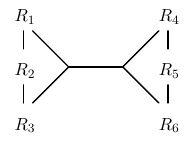
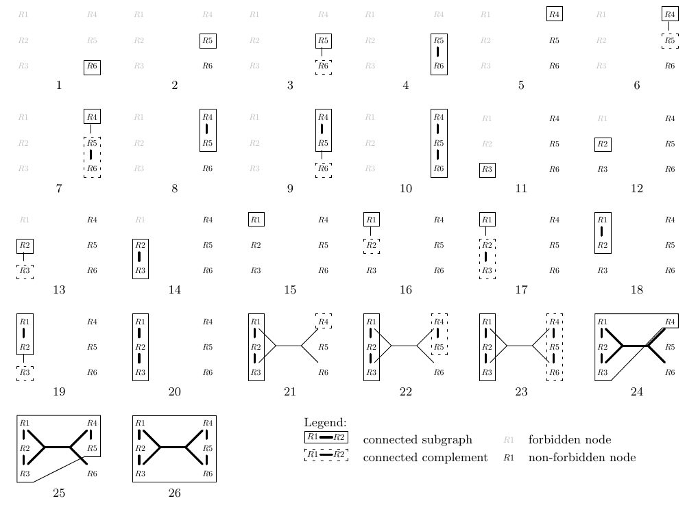
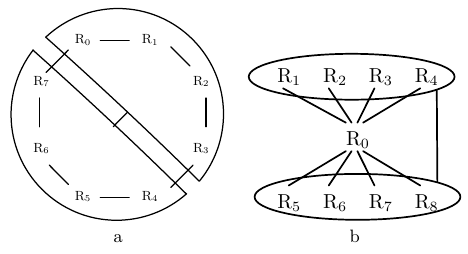
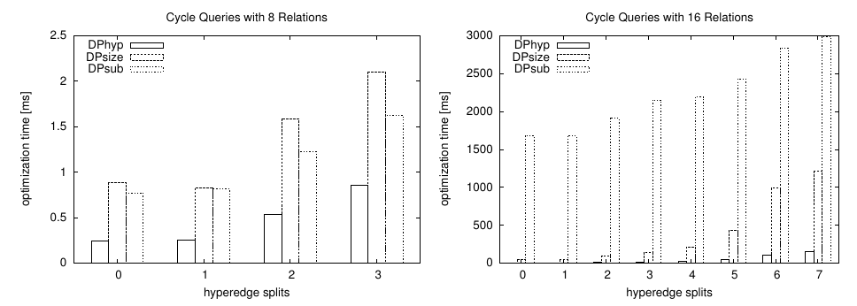
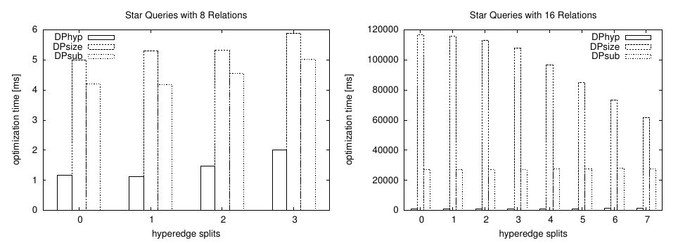
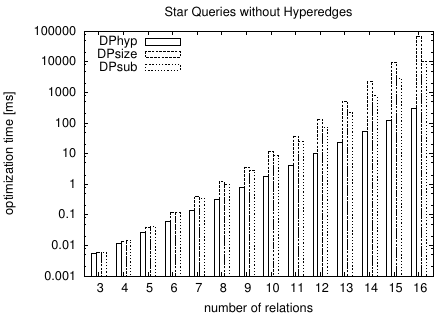
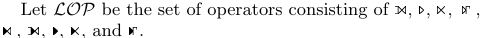
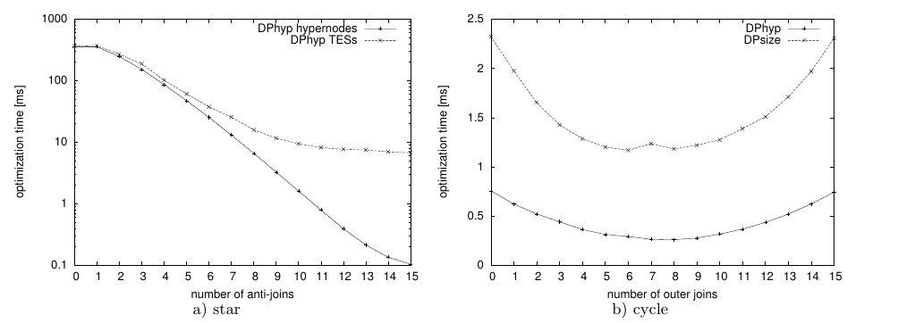
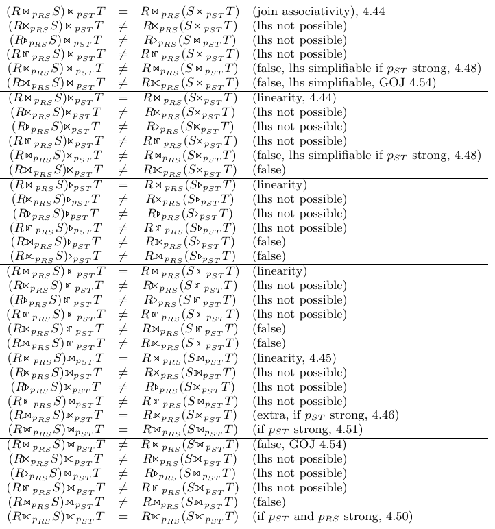

# Dynamic Programming Strikes Back（中文译文）

## 译者说明

本文依据同目录的 `source.pdf` 翻译。章节、图表、公式、算法、代码与参考文献按原文结构保留。

Guido Moerkotte，University of Mannheim，德国 Mannheim；moerkotte@informatik.uni-mannheim.de。

Thomas Neumann，Max-Planck Institute for Informatics，德国 Saarbrücken；neumann@mpi-inf.mpg.de。

SIGMOD ’08，2008 年 6 月 9—12 日，加拿大不列颠哥伦比亚省温哥华。

## 摘要

目前已知有两种能在避免笛卡尔积的同时求得最优连接顺序的高效算法：基于动态规划的 DPccp，以及基于记忆化的 Top-Down Partition Search。两者都有两个严重限制：它们只能处理（1）简单的二元连接谓词和（2）内连接。然而，实际查询可能包含涉及两个以上关系的复杂连接谓词，也可能包含外连接及其他非内连接。

我们以已知最高效的连接排序算法 DPccp 为起点，首先开发一种能高效处理复杂连接谓词的新算法 DPhyp。为此，我们把查询图建模为一种超图变体，并研究它的连通子图。随后，我们给出一种技术，利用这一能力高效处理迄今为止所涉及的最广泛的非内连接类别。我们的实验结果表明，与已知的处理复杂连接谓词和非内连接的算法相比，将非内连接重新表述为复杂谓词，可以使优化时间改善多个数量级。这又一次让动态规划相对于当前的记忆化技术取得了明显优势。

**类别与主题描述符：** H.2 [系统]：查询处理。

**通用术语：** 算法、理论。

## 1. 引言

基于代价的查询优化器是决定数据库管理系统整体性能的重要软件。任何基于代价的查询优化器都必须解决一个重要且复杂的问题：寻找最优连接顺序。在开创性的论文中，Selinger 等人不仅引入了基于代价的查询优化，而且提出了一种动态规划算法，为给定的合取查询寻找最优连接顺序 [21]。更准确地说，他们提出按照规模递增的顺序生成计划。尽管他们把搜索空间限制为左深树，其算法的一般思想仍可扩展成探索浓密树空间的 DPsize 算法（见图 1）。该算法仍是最先进的商业查询优化器的核心，例如 DB2 的优化器 [12]。

最近，我们对 DPsize 进行了全面的复杂度分析 [17]。我们证明，DPsize 的运行时间复杂度远差于下界。这主要是因为其中的测试（图 1 中标有 `*`）失败的次数远多于成功的次数。此外，我们提出了恰好达到下界的 DPccp 算法。实验表明，DPccp 显著优于 DPsize。该算法的核心以自底向上的方式生成连通子图。

动态规划的主要竞争者是记忆化，它以自顶向下的方式生成计划。所有已知方法都需要类似 DPsize 中的测试。因此，随着 DPccp 出现，在生成不含笛卡尔积的最优浓密连接树方面，动态规划优于记忆化。受到这一结果的挑战，DeHaan 和 Tompa 成功设计出一种能够利用最小割生成连通子图的自顶向下算法 [7]。借助这一名为 Top-Down Partition Search 的算法，记忆化几乎可以与动态规划同样高效。

然而，DPccp 和 Top-Down Partition Search 都还没有准备好投入实际使用：两者都存在两个严重缺陷。首先，多处文献已经指出，任何计划生成器都必须能够处理超图 [1, 19, 23]。其次，计划生成器必须处理外连接和反连接 [11, 19]。这些算子一般不能自由重排，也就是说，不同顺序可能产生不同结果。常规的内连接则不然：任意顺序都产生相同结果。将外连接顺序限制为有效顺序，即与原查询产生相同结果的顺序，是 Galindo-Legaria 和 Rosenthal 的开创性工作所研究的问题 [10, 11, 20]。他们还提出了一种考虑外连接复杂性的动态规划算法。Bhargava 等人将该算法扩展为支持超边 [1]。Rao 等人提出了更实用的方法 [19]，其中还包括反连接。所有这些方法都以 DPsize 为起点，因此，其运行时间复杂度远高于实际所需。

**图 1：DPsize 算法。**

```text
DPsize(R = {R0, ..., Rn−1})
for ∀ Ri ∈ R dpTable[{Ri}] = Ri
for ∀ 1 < s ≤ n ascending // 计划规模
    for ∀ 1 ≤ s1 < s // 左子计划规模
        for ∀ S1 ⊂ R: |S1| = s1, S2 ⊂ R: |S2| = s − s1
            if S1 ∩ S2 ≠ ∅ continue (*)
            if ¬(S1 connected to S2) continue (*)
            p = dpTable[S1] ⋈ dpTable[S2]
            if cost(p) < cost(dpTable[S1 ∪ S2])
                dpTable[S1 ∪ S2] = p
return dpTable[{R0, ..., Rn−1}]
```

在本文中，我们引入能够高效处理超图的 DPhyp（第 2、3 节）。实验将表明，它显著优于现有方法（第 4 节）。第二步，我们处理左外连接、全外连接、反连接、嵌套连接及其依赖变体（第 5 节）。我们将说明，非内连接可以通过引入新的超边来处理。因此，要处理一套完整的非内连接和依赖连接，除了计算新超边之外，无需扩展 DPhyp。即使最初不存在超边，即查询只有简单谓词但包含非内连接，这种方法也显著优于现有方法。

## 2. 超图

### 2.1 定义

我们先定义超图。

**定义 1（超图）。** 超图是一个二元组 $H=(V,E)$，满足：

1. $V$ 是非空节点集合；
2. $E$ 是超边集合，其中超边是由 $V$ 的两个非空子集组成的无序对 $(u,v)$（ $u\subset V$ 且 $v\subset V$），并满足附加条件 $u\cap v=\varnothing$。

我们把 $V$ 的任意非空子集称为超节点。我们假设 $V$ 中的节点通过一个任意关系 $≺$ 全序排列。节点顺序对我们的算法非常重要。

若 $|u|=|v|=1$，则超边 $(u,v)$ 是简单边。若一个超图的所有超边都是简单边，则该超图是简单超图。

注意，简单超图与普通无向图相同。在我们的语境中，超图的节点是关系，边则是连接谓词的抽象。例如，考虑如下连接谓词：

$$
R _ 1.a+R _ 2.b+R _ 3.c=R _ 4.d+R _ 5.e+R _ 6.f.
$$

这一谓词产生超边 $(\lbrace R _ 1,R _ 2,R _ 3\rbrace ,\lbrace R _ 4,R _ 5,R _ 6\rbrace )$。图 2 给出了一个超图示例。节点集合为 $V=\lbrace R _ 1,\ldots,R _ 6\rbrace$。关于节点顺序，我们假设 $R _ i≺ R _ j\Longleftrightarrow i\lt j$。其中有简单边 $(\lbrace R _ 1\rbrace ,\lbrace R _ 2\rbrace )$、 $(\lbrace R _ 2\rbrace ,\lbrace R _ 3\rbrace )$、 $(\lbrace R _ 4\rbrace ,\lbrace R _ 5\rbrace )$ 和 $(\lbrace R _ 5\rbrace ,\lbrace R _ 6\rbrace )$。前述超边是这个超图中唯一真正的超边。



**图 2：超图示例。**

注意，上述复杂连接谓词可以改写。例如，它等价于：

$$
R _ 1.a+R _ 2.b=R _ 4.d+R _ 5.e+R _ 6.f-R _ 3.c.
$$

这会产生超边 $(\lbrace R _ 1,R _ 2\rbrace ,\lbrace R _ 3,R _ 4,R _ 5,R _ 6\rbrace )$。如果查询优化器能够执行这类代数变换，那么所有派生超边都会加入超图，至少在概念上如此。我们将在第 6 节重新讨论这一问题。

要将由超图表示的连接排序问题分解为较小问题，需要子图的概念。更具体地说，我们只处理节点诱导子图。

**定义 2（子图）。** 设 $H=(V,E)$ 为超图， $V'\subseteq V$ 为节点子集。 $G$ 的节点诱导子图 $G| _ {V'}$ 定义为 $G| _ {V'}=(V',E')$，其中：

$$
E'=\lbrace (u,v)\mid (u,v)\in E,\ u\subseteq V',\ v\subseteq V'\rbrace .
$$

$V'$ 上的节点顺序是 $V$ 上节点顺序在 $V'$ 上的限制。

由于我们关注连通子图，给出如下定义。

**定义 3（连通）。** 设 $H=(V,E)$ 为超图。若 $|V|=1$，或者存在 $V$ 的一个划分 $V',V''$ 和一条超边 $(u,v)\in E$，使得 $u\subseteq V'$、 $v\subseteq V''$，且 $G| _ {V'}$ 和 $G| _ {V''}$ 都连通，则 $H$ 连通。

若 $H=(V,E)$ 是一个超图，且节点子集 $V'\subseteq V$ 的节点诱导子图 $G| _ {V'}$ 连通，则我们称 $V'$ 为连通子图，简称 csg。连通子图的数量对动态规划很重要：它直接对应动态规划表中的条目数。若节点集 $V''\subseteq(V\setminus V')$ 诱导的子图 $G| _ {V''}$ 连通，则我们称 $V''$ 为 $V'$ 的连通补集，简称 cmp。

在本文中，我们假设所有超图都连通。这样便能确保不需要笛卡尔积。不过，处理超图时，可以通过添加相应的超边轻松保证这一条件：对于每一对连通分量，我们可以添加一条超边，其超节点恰好包含对应连通分量中的关系。将这些超边视为选择率为 1 的 $\bowtie$ 算子，就得到一个等价的连通超图，即描述相同查询的超图。

### 2.2 csg-cmp 对

借助这些记号，我们可以通过定义 csg-cmp 对进一步接近动态规划的核心。

**定义 4（csg-cmp 对）。** 设 $H=(V,E)$ 为超图， $S _ 1,S _ 2$ 为 $V$ 的两个子集，其中 $S _ 1\subseteq V$ 和 $S _ 2\subseteq(V\setminus S _ 1)$ 分别是连通子图和连通补集。若还存在一条超边 $(u,v)\in E$，使得 $u\subseteq S _ 1$ 且 $v\subseteq S _ 2$，则我们称 $(S _ 1,S _ 2)$ 为一个 csg-cmp 对。

注意，若 $(S _ 1,S _ 2)$ 是 csg-cmp 对，则 $(S _ 2,S _ 1)$ 也是。我们将 csg-cmp 对的枚举限制为满足 $\min(S _ 1)≺\min(S _ 2)$ 的 $(S _ 1,S _ 2)$，其中 $\min(S)=s$ 满足 $s\in S$ 且对所有 $s'\in S$， $s\ne s'\Rightarrow s≺ s'$。由于我们的过程枚举出的所有 csg-cmp 对都满足这一限制，可以确保不会计算重复的 csg-cmp 对。因此，要保证我们的动态规划过程完整，还须稍加注意：若应用的二元算子具有交换性，那么从 $S _ 1$ 和 $S _ 2$ 的计划构建 $S _ 1\cup S _ 2$ 的计划时，必须考虑交换性。不过，这并不是真正的难题。

显然，为保证正确性，任何动态规划算法都必须考虑所有 csg-cmp 对 [17]。此外，只需要考虑这些对。因此，对于一个给定超图，任何动态规划算法所需的代价函数最少调用次数，恰好就是 csg-cmp 对的数量。注意，连通子图数量远小于 csg-cmp 对的数量。现在的问题是高效枚举这些对，而且枚举顺序必须适用于动态规划。后一个条件可以更具体地表述为：在枚举 csg-cmp 对 $(S _ 1,S _ 2)$ 之前，必须已枚举所有满足 $S' _ 1\subseteq S _ 1$ 且 $S' _ 2\subseteq S _ 2$ 的 csg-cmp 对 $(S' _ 1,S' _ 2)$。

### 2.3 邻域

生成 csg-cmp 对的主要思想，是考虑子图邻域中的新节点，逐步扩展连通子图。非正式地说，在排除集 $X$ 下，邻域 $N(S)$ 包含从 $S$ 可达且不属于 $X$ 的所有节点。下面我们推导精确定义。

在选择要纳入的邻域子集时，我们必须把超节点作为一个整体处理：其全部节点或者都在某个枚举出的子集中，或者都不在。由于我们要使用 Vance 和 Maier 引入的快速子集枚举过程 [24]，必须用一个比特表示一个超节点，同时用单独的比特表示简单边中的关系。由于这些表示可能重叠，我们必须为超边中的每个超节点选择唯一的代表。我们选择相对于 $≺$ 最小的节点。因此，我们定义：

$$
\min(S)=\lbrace s\mid s\in S,\ \forall s'\in S:\ s\ne s'\Rightarrow s≺ s'\rbrace .
$$

注意，如果 $S$ 为空， $\min(S)$ 也为空；否则，它只包含一个元素。因此，若 $S$ 是单元素集合， $\min(S)$ 就等于其中唯一的元素。对于我们在图 2 中的超图，若 $S=\lbrace R _ 4,R _ 5,R _ 6\rbrace$，我们有 $\min(S)=\lbrace R _ 4\rbrace$。

设 $S$ 为当前集合，我们希望通过添加其他关系来扩展它。考虑一条超边 $(u,v)$，其中 $u\subseteq S$。我们会把 $\min(v)$ 加入 $S$ 的邻域。不过，必须确保 $v$ 中缺少的元素，即 $v\setminus\min(v)$，也包含在每个输出的集合中。因此，我们定义：

$$
\bar{\min}(S)=S\setminus\min(S).
$$

对于我们在图 2 中的超图，若 $S=\lbrace R _ 4,R _ 5,R _ 6\rbrace$，我们有 $\bar{\min}(S)=\lbrace R _ 5,R _ 6\rbrace$。

我们把未被包含的超边集合定义为 $E$ 的最小子集 $E ↓$，使得对于所有 $(u,v)\in E$，均存在超边 $(u',v')\in E ↓$ 满足 $u'\subseteq u$ 且 $v'\subseteq v$。此外，我们确保超节点中的节点都不属于集合 $X$；在考虑邻域时应排除 $X$。因此，我们针对给定的 $S$ 和 $X$ 定义一个包含值得关注的超节点的集合。这个定义分两步进行：首先，把可能值得关注的超节点收集到集合 $E ↓^0(S,X)$；然后将该集合最小化，以去除被包含的超节点。这一步得到算法使用的 $E ↓(S,X)$。

$$
E ↓^0(S,X)=\lbrace v\mid (u,v)\in E,\ u\subseteq S,\ v\cap S=\varnothing,\ v\cap X=\varnothing\rbrace .
$$

定义 $E ↓(S,X)$ 为最小超节点集合，使得对于每个 $v\in E ↓^0(S,X)$，都存在 $E ↓(S,X)$ 中的超节点 $v'$ 满足 $v'\subseteq v$。注意，除连通性之外，我们检验的恰好是定义 4 中的条件。对于我们在图 2 中的超图，当 $X=S=\lbrace R _ 1,R _ 2,R _ 3\rbrace$ 时，我们有 $E ↓(S,X)=\lbrace \lbrace R _ 4,R _ 5,R _ 6\rbrace \rbrace$。

现在，我们可以在给定排除节点集 $X$ 的情况下，定义超节点 $S$ 的邻域：

$$
N(S,X)=\bigcup _ {v\in E↓(S,X)}\min(v).\qquad\text{(1)}
$$

对于我们在图 2 中的超图，当 $X=S=\lbrace R _ 1,R _ 2,R _ 3\rbrace$ 时，我们有 $N(S,X)=\lbrace R _ 4\rbrace$。假设集合使用位向量表示，就可以自底向上高效计算邻域。

## 3. 算法

在开始描述算法之前，我们先概述其中使用的一般原则：

1. 算法通过在查询图逐渐扩大的部分中枚举连通子图来构造 ccp；
2. 主连通子图及其连通补集都通过递归图遍历创建；
3. 遍历时禁止访问某些节点，以避免重复。更准确地说，当一个函数进行递归调用时，它会禁止递归访问自己将要考察的所有节点；
4. 沿着通向相邻节点的边扩大连通子图。为此，将超边解释为从一侧的 $n$ 个节点到另一侧某个特定规范节点的 $n:1$ 边（参见式 (1)）。

概括而言，算法按照固定顺序遍历图，并递归产生更大的连通子图。相对于文献 [17]，主要挑战在于超边的遍历。首先，边的“起始”一侧可能需要多个节点，这使邻域计算复杂化。特别是，不能再通过局部邻域简单的自底向上并集来计算邻域。其次，边的“终止”一侧可能同时通向多个节点，打乱分量的递归增长。因此，算法选择一个规范的终点节点（即上述第 4 项中 $n:1$ 的 1，也见式 (1)），启动递归增长，并使用 DP 表检查是否已经达到有效的组合状态；这里利用了 DP 策略先枚举子集再枚举超集这一事实。现在我们讨论算法细节。

我们通过 DPhyp 类的成员函数伪代码给出超图连接排序算法的实现。假设查询超图 $G=(V,E)$ 和动态规划表 `dpTable` 都是类成员，就可以尽量减少参数数量。

整个算法分布在五个子过程中。顶层过程 `Solve` 使用单个关系的访问计划初始化动态规划表，然后对每个仅含一个关系的集合调用 `EmitCsg` 和 `EnumerateCsgRec`。成员函数 `EnumerateCsgRec` 负责枚举连通子图：它计算邻域，遍历邻域的每个子集，并为每个这样的子集 $S _ 1$ 调用 `EmitCsg`。后者负责寻找合适的补集，通过调用 `EnumerateCmpRec`，为此前找到的连通子图 $S _ 1$ 递归枚举补集 $S _ 2$。 $(S _ 1,S _ 2)$ 是一个 csg-cmp 对。对每个这样的对，都会调用 `EmitCsgCmp`，其主要职责是考虑从 $S _ 1$ 和 $S _ 2$ 的计划构建的计划。下面各小节详细讨论这五个成员函数。我们使用图 2 的超图加以说明；对应的遍历步骤见图 3，我们会在算法描述中解释这些步骤。

### 3.1 Solve

`Solve` 的伪代码如下：

```text
Solve()
for each v ∈ V // 初始化 dpTable
    dpTable[{v}] = plan for v
for each v ∈ V descending according to ≺
    EmitCsg({v}) // 处理单元素集合
    EnumerateCsgRec({v}, Bv) // 扩展单元素集合
return dpTable[V]
```

第一个循环用单个关系的计划初始化动态规划表。第二个循环按照 $≺$ 的递减顺序，对查询图中的每个节点调用两个子过程 `EmitCsg` 和 `EnumerateCsgRec`。算法对单个节点 $v\in V$ 调用 `EmitCsg({v})`，借助对 `EnumerateCsgCmp` 和 `EmitCsgCmp` 的调用，生成所有满足 $v≺\min(S _ 2)$ 的 csg-cmp 对 $(\lbrace v\rbrace ,S _ 2)$。这个条件保证每个 csg-cmp 对只生成一次，不生成对称的对。在图 3 中，这对应单顶点图，例如步骤 1 和 2。调用 `EnumerateCsgRec` 将初始集合 $\lbrace v\rbrace$ 扩展成更大的集合 $S _ 1$，随后寻找其补集中的连通子集 $S _ 2$，使 $(S _ 1,S _ 2)$ 成为 csg-cmp 对。例如，图 3 的步骤 2 中，`EnumerateCsgRec` 从 $R _ 5$ 开始，在步骤 4 中将它扩展为 $\lbrace R _ 5,R _ 6\rbrace$（步骤 3 构造补集）。为避免枚举重复，递归扩展期间禁止使用所有按 $≺$ 排在 $v$ 之前的节点 [17]。形式上，我们将此集合定义为 $B _ v=\lbrace w\mid w≺ v\rbrace \cup\lbrace v\rbrace$。

### 3.2 EnumerateCsgRec

`EnumerateCsgRec` 的一般目的，是将给定集合 $S _ 1$（它诱导 $G$ 的一个连通子图）扩展为具有相同性质的更大集合。它考虑 $S _ 1$ 邻域中的每个非空真子集。对于每个这样的子集 $N$，它检查 $S _ 1\cup N$ 是否为连通分量。这个检查通过查询 `dpTable` 完成。测试成功就表示找到了新的连通分量，并调用 $\mathrm{EmitCsg}(S _ 1\cup N)$ 进一步处理。接下来，在第二步中，我们对邻域的所有这些子集 $N$ 调用 `EnumerateCsgRec`，从而递归地继续扩展 $S _ 1\cup N$。我们之所以先调用 `EmitCsg`，再调用 `EnumerateCsgRec`，是因为必须先生成较小集合，才能使枚举顺序对动态规划有效。代码如下：

```text
EnumerateCsgRec(S1, X)
for each N ⊆ N(S1, X): N ≠ ∅
    if dpTable[S1 ∪ N] ≠ ∅
        EmitCsg(S1 ∪ N)
for each N ⊆ N(S1, X): N ≠ ∅
    EnumerateCsgRec(S1 ∪ N, X ∪ N(S1, X))
```

来看步骤 12。这次调用由 `Solve` 产生， $S _ 1=\lbrace R _ 2\rbrace$。邻域只包含 $\lbrace R _ 3\rbrace$，因为 $R _ 1$ 在 $X$ 中（ $R _ 4,R _ 5,R _ 6$ 虽然也不在 $X$ 中，但不可达）。`EnumerateCsgRec` 首先调用 `EmitCsg`，后者创建可连接的补集（步骤 13）。随后它测试 $\lbrace R _ 2,R _ 3\rbrace$ 的连通性。相应的 `dpTable` 条目已在步骤 13 中生成。因此测试成功，递归调用 `EnumerateCsgRec` 进一步处理 $\lbrace R _ 2,R _ 3\rbrace$（步骤 14）。此时扩展停止，因为 $R _ 1\in X$， $\lbrace R _ 2,R _ 3\rbrace$ 的邻域为空。

### 3.3 EmitCsg

`EmitCsg` 的参数是 $V$ 的一个非空真子集 $S _ 1$，它诱导一个连通子图。该函数负责生成所有 $S _ 2$ 的种子，使 $(S _ 1,S _ 2)$ 成为 csg-cmp 对。不出所料，种子取自 $S _ 1$ 的邻域。所有排在 $S _ 1$ 最小元素之前的节点（由集合 $B _ {\min(S _ 1)}$ 表示）都从邻域中移除，以避免重复枚举 [17]。由于邻域还包含超边 $(u,v)$ 中的 $\min(v)$，且可能有 $|v|\gt 1$，不能保证 $S _ 1$ 与 $v$ 相连。为了避免产生错误的 csg-cmp 对，`EmitCsg` 会检查连通性。不过，每个单独的邻居都可能扩展为 $S _ 1$ 的有效补集 $S _ 2$。因此，在调用执行这种扩展的 `EnumerateCmpRec` 前，无需做这个测试。伪代码如下：

```text
EmitCsg(S1)
X = S1 ∪ Bmin(S1)
N = N(S1, X)
for each v ∈ N descending according to ≺
    S2 = {v}
    if ∃(u, v) ∈ E: u ⊆ S1 ∧ v ⊆ S2
        EmitCsgCmp(S1, S2)
    EnumerateCmpRec(S1, S2, X)
```

来看步骤 20。当前集合是 $S _ 1=\lbrace R _ 1,R _ 2,R _ 3\rbrace$，邻域为 $N=\lbrace R _ 4\rbrace$。由于没有连接这两个集合的超边，因此不调用 `EmitCsgCmp`。不过， $\lbrace R _ 4\rbrace$ 可以扩展为有效补集，即 $\lbrace R _ 4,R _ 5,R _ 6\rbrace$。在步骤 21 中调用 `EnumerateCmpRec`，任务就是正确地扩展补集种子。



**图 3：算法在图 2 上的执行轨迹。** 图例：实线框表示连通子图，虚线框表示连通补集；浅色节点为禁止节点，深色节点为未禁止节点。步骤编号为 1—26。

### 3.4 EnumerateCmpRec

`EnumerateCsgRec` 有三个参数。第一个参数 $S _ 1$ 仅用于传给 `EmitCsgCmp`。第二个参数是连通集合 $S _ 2$，需要不断扩展它，直到得到有效的 csg-cmp 对。因此，该过程考虑 $S _ 2$ 的邻域。对于邻域的每个非空真子集 $N$，检查 $S _ 2\cup N$ 是否诱导连通子集，以及它是否与 $S _ 1$ 相连。如果是，我们就得到有效的 csg-cmp 对 $(S _ 1,S _ 2)$，可以开始构造计划（由 `EmitCsgCmp` 完成）。无论测试结果如何，我们都会递归尝试扩展 $S _ 2$，使该测试成功。总体而言，`EnumerateCmpRec` 的行为与 `EnumerateCsgRec` 很相似。其伪代码如下：

```text
EnumerateCmpRec(S1, S2, X)
for each N ⊆ N(S2, X): N ≠ ∅
    if dpTable[S2 ∪ N] ≠ ∅ ∧
           ∃(u, v) ∈ E: u ⊆ S1 ∧ v ⊆ S2 ∪ N
        EmitCsgCmp(S1, S2 ∪ N)
X = X ∪ N(S2, X)
for each N ⊆ N(S2, X): N ≠ ∅
    EnumerateCmpRec(S1, S2 ∪ N, X)
```

再次来看步骤 21。参数为 $S _ 1=\lbrace R _ 1,R _ 2,R _ 3\rbrace$ 和 $S _ 2=\lbrace R _ 4\rbrace$。邻域只含关系 $R _ 5$。集合 $\lbrace R _ 4,R _ 5\rbrace$ 诱导连通子图，在步骤 6 中已经插入 `dpTable`。不过，没有超边将它连接到 $S _ 1$，所以不调用 `EmitCsgCmp`。接着是步骤 22 中的递归调用，此时 $S _ 2$ 变为 $\lbrace R _ 4,R _ 5\rbrace$，邻域为 $\lbrace R _ 6\rbrace$。集合 $\lbrace R _ 4,R _ 5,R _ 6\rbrace$ 诱导连通子图。通过查询 `dpTable` 进行的相应测试成功，因为对应条目已在步骤 7 中生成。测试的第二部分也成功，因为我们唯一真正的超边将这一集合与 $S _ 1$ 连接起来。因此，步骤 23 调用 `EmitCsgCmp`，生成包含所有关系的计划。

### 3.5 EmitCsgCmp

`EmitCsgCmp(S1, S2)` 的任务是连接 $S _ 1$ 与 $S _ 2$ 的最优计划，两者必须组成 csg-cmp 对。为此，我们必须能够计算适当的连接谓词以及所得连接的代价。这要求在超图上附加连接谓词、选择率与基数。由于我们将代价计算隐藏在抽象函数 `cost` 中，只需显式组装连接谓词。对于给定超图 $G=(V,E)$ 和超边 $(u,v)\in E$，我们用 $\mathcal P(u,v)$ 表示该超边代表的谓词。

`EmitCsgCmp` 的伪代码应该很熟悉：

```text
EmitCsgCmp(S1, S2)
plan1 = dpTable[S1]
plan2 = dpTable[S2]
S = S1 ∪ S2
p = ∧(u1,u2)∈E, ui⊆Si P(u1,u2)
newplan = plan1 ⋈p plan2
if dpTable[S] = ∅ ∨ cost(newplan) < cost(dpTable[S])
    dpTable[S] = newplan
newplan = plan2 ⋈p plan1 // 仅适用于可交换算子
if cost(newplan) < dpTable[S]
    dpTable[S] = newplan
```

首先，从动态规划表取回 $S _ 1$ 和 $S _ 2$ 的最优计划。随后，我们在 $S$ 中记录待构建计划所包含的全部关系。连接谓词 $p$ 是所有连接 $S _ 1$ 与 $S _ 2$ 的超边谓词的合取。之后构造计划，若其代价低于现有计划，就将它存入 `dpTable`。

谓词 $p$ 的计算看起来代价很高，因为必须检查所有边。不过，我们可以给任意计划类 $S\subseteq V$ 附加谓词集合：

$$
p _ S=\lbrace \mathcal P(u,v)\mid (u,v)\in E,\ u\subseteq S\rbrace .
$$

如果用位向量表示 $p _ S$，那么对于一个 csg-cmp 对，我们就可以轻松计算 $p _ {S _ 1}\cap p _ {S _ 2}$，只考虑交集结果。

### 3.6 内存需求

所有动态规划变体 DPsize、DPsub、DPccp 和 DPhyp 都会记住每个关系子集的最优计划，只要该子集诱导查询图的连通子图。由于这是内存消耗的主要因素，所有算法的内存需求大致相同。之所以只是“大致”相同，是因为每个这样的子集所需的字节数可能略有差别。例如，DPsub 需要一个额外指针来链接相同规模的计划。

## 4. 评估

遗憾的是，文献中没有报道超图连接排序的实验。因此，我们必须设计自己的实验。实验所用超图的一般设计原则是：从一个简单图出发，添加一条大超边，然后依次将超边拆成两条较小的超边，直到得到简单边。

作为起点，我们采用已经证明适合研究简单图连接排序的图。我们在文献中经常看到链形、环形、星形和团查询的使用 [17]。连接排序算法在链和环上的行为差别不大：多出一条边的影响很小。因此，我们决定以环为一个起点。星形查询也已被证明非常适合说明连接排序算法不同的性能行为。此外，星形查询在数据仓库中很常见，值得特别关注。因此，我们还以星形查询为起点。最后一个候选是团查询。不过，给团查询添加超边没有太大意义，因为它的每个关系子集本来就已经诱导连通子图。因此，我们把实验限制为从环形和星形查询派生的超图。



**图 4：带初始超边的环形与星形图（n = 8）。** (a) 环形；(b) 星形。

图 4a 展示了以环为基础的初始查询。它包含八个关系 $R _ 0,\ldots,R _ 7$，简单边为 $(\lbrace R _ i\rbrace ,\lbrace R _ {i+1}\rbrace )$，其中 $0\le i\le7$（令 $R _ {7+1}=R _ 0$）。我们随后添加超边 $(\lbrace R _ 0,\ldots,R _ 3\rbrace ,\lbrace R _ 4,\ldots,R _ 7\rbrace )$。它的每个超节点恰好包含一半关系。从这个图（记为 $G _ 0$）出发，我们依次拆分超边，派生超图 $G _ 1,\ldots,G _ 3$。拆分方式是将每个超节点分成两个各包含一半关系的超节点。也就是说，除简单边外， $G _ 1$ 包含超边 $(\lbrace R _ 0,R _ 1\rbrace ,\lbrace R _ 6,R _ 7\rbrace )$ 和 $(\lbrace R _ 2,R _ 3\rbrace ,\lbrace R _ 4,R _ 5\rbrace )$。为了得到 $G _ 2$，我们将第一条超边拆成 $(\lbrace R _ 0\rbrace ,\lbrace R _ 6\rbrace )$ 和 $(\lbrace R _ 1\rbrace ,\lbrace R _ 7\rbrace )$。 $G _ 3$ 进一步将第二条超边拆成 $(\lbrace R _ 2\rbrace ,\lbrace R _ 4\rbrace )$ 和 $(\lbrace R _ 3\rbrace ,\lbrace R _ 5\rbrace )$。

对星形查询，我们使用相同过程。图 4b 展示了从星形图派生的初始超图。它包含九个关系 $R _ 0,\ldots,R _ 8$，简单边为 $(\lbrace R _ 0\rbrace ,\lbrace R _ i\rbrace )$，其中 $1\le i\le8$；超边为 $(\lbrace R _ 1,\ldots,R _ 4\rbrace ,\lbrace R _ 5,\ldots,R _ 8\rbrace )$。按照上述方法依次拆分这条超边，即可生成更多超图。

### 4.1 对比算法

我们将 DPhyp 与 DPsize 和 DPsub 进行比较。文献 [17] 详细解释了这些算法在普通图上的行为。由于 DPsize 是使用最广泛的动态规划算法，我们在图 1 给出其伪代码。处理超图时不必修改伪代码，只需将第二个标有 `*` 的测试实现为能够处理超边，而不仅是普通边。

DPsize 按规模递增的顺序枚举计划，DPsub 则生成子集。假设要寻找关系集 $S$ 的最优计划，那么 DPsub 会生成所有子集 $S _ 1\subset S$，并连接 $S _ 1$ 与 $S _ 2=S\setminus S _ 1$ 的最优计划。在连接之前，测试 $(S _ 1,S _ 2)$ 是否为 csg-cmp 对。同样，无需修改 DPsub 的伪代码，但检查 $S _ 1$ 与 $S _ 2$ 是否相连的测试必须实现为能够处理超边。

### 4.2 基于环形图的超图

对于关系数不超过 3 的很小的查询，不同算法的执行时间没有可观察的差别。四个关系的环形查询表现出少量差别。不过，初始超边中的每个超节点仅含两个关系，所以只会再派生一个超图。因此，我们不绘制运行时间图，而以表格给出结果。运行时间单位为毫秒。实验在配备 3.2 GHz Pentium D CPU 的 PC 上进行。我们在下表给出四个关系的环形查询结果。

| 拆分次数 | DPhyp（毫秒） | DPsize（毫秒） | DPsub（毫秒） |
| --- | ---: | ---: | ---: |
| 0 | 0.02 | 0.035 | 0.035 |
| 1 | 0.025 | 0.025 | 0.025 |

这里只能观察到运行时间的微小差别。当我们转向含 8 个和 16 个关系的环形查询时，情况就不同了。图 5 给出 CPU 时间，单位为毫秒。第一幅图是 8 个关系的结果，第二幅图是 16 个关系的结果。我们可以看到，在所有情况下，DPhyp 都优于其他算法。此外，对大查询，DPsize 优于 DPsub。



**图 5：基于环形图的超图实验结果。** 左：8 个关系；右：16 个关系。横轴为超边拆分次数，纵轴为优化时间（毫秒）；图例为 DPhyp、DPsize、DPsub。

### 4.3 基于星形图的超图

我们先以表格给出四个卫星关系的星形查询结果，表格的组织方式与前面相同。

| 拆分次数 | DPhyp（毫秒） | DPsize（毫秒） | DPsub（毫秒） |
| --- | ---: | ---: | ---: |
| 0 | 0.03 | 0.085 | 0.065 |
| 1 | 0.055 | 0.09 | 0.08 |

我们已经观察到少量运行时间差别。例如，商业系统采用的 DPsize 比 DPhyp 慢近两倍。此外，DPsub 略优于 DPsize，但不如 DPhyp 高效。对于含 8 个和 16 个卫星关系的较大星形查询（见图 6），这些差别变得相当巨大。我们观察到，DPhyp 显著优于 DPsize 和 DPsub；此外，DPsub 优于 DPsize。



**图 6：基于星形图的超图实验结果。** 图内标题分别为具有 8 个和 16 个关系的星形查询；横轴为超边拆分次数，纵轴为优化时间（毫秒），图例为 DPhyp、DPsize、DPsub。

### 4.4 普通图查询

为完整起见，我们还研究普通图（即不含超边的简单超图）的性能，因为它们在实践中更常见，而且 DPhyp 可能比其他方法具有更大的常数。不过，结果与超图结果相似（见图 7）：DPhyp 显著优于 DPsize 和 DPsub（注意对数刻度）。其他图结构也一样，DPhyp 在普通图上的表现与 DPccp 完全相同。



**图 7：基于星形结构的普通图实验结果。** 无超边的星形查询；横轴为关系数量（3—16），纵轴为优化时间（毫秒，对数刻度），图例为 DPhyp、DPsize、DPsub。

## 5. 不可重排的算子

本节组织如下。首先列举我们处理的二元算子集合，然后讨论其可重排性质。第 5.3 节概述现有方法，第 5.4 节讨论非交换算子带来的问题。随后，我们引入用于捕获算子间潜在冲突的 SES 和 TES。最后，我们讨论依赖连接相关问题，展示如何使用 TES 生成查询超图，并以评估结束本节。

### 5.1 考虑的二元算子

我们先定义计划中允许的二元算子集合。除完全可重排的连接（ $\bowtie$）外，我们还考虑下列重排能力受限的算子：全外连接（ $\mathbin{\text{⟗}}$）、左外连接（ $\mathbin{\text{⟕}}$）、左反连接（ $▷$）、左半连接（ $\ltimes$）和左嵌套连接（nestjoin）。除嵌套连接外，它们都是标准算子。

为显示原文使用的专用连接符号，下图保留这一组符号；下文以 $\mathrm{NJ}$ 排印左嵌套连接，以 $\mathrm{dJoin}$、 $\mathrm{dLOJ}$、 $\mathrm{dAnti}$、 $\mathrm{dSemi}$、 $\mathrm{dNJ}$ 分别排印依赖连接、依赖左外连接、依赖左反连接、依赖左半连接和依赖左嵌套连接。



嵌套连接也称为二元分组（binary grouping）或 MD-join，曾被提出用于在面向对象 [6, 22]、关系 [3] 和 XML [14] 的语境下对嵌套查询进行去嵌套。它还用于加速数据仓库查询 [5]。由于各个嵌套连接定义略有不同，我们采用最一般的定义，其他定义都可以作为它的特例。设 $R,S$ 为两个关系， $p$ 为它们之间的连接谓词， $a _ i$ 为属性名， $e _ i$ 为含一个自由变量的表达式。我们采用如下嵌套连接定义：

$$
R\mathbin{\mathrm{NJ}} _ {p;[a _ 1:e _ 1,\ldots,a _ n:e _ n]}S
=\lbrace r\circ s(r)\mid r\in R\rbrace ,
$$

其中 $s(r)=[a _ 1:e _ 1(g(r)),\ldots,a _ n:e _ n(g(r))]$， $g(r)=\lbrace s\mid s\in S,p(r,s)\rbrace$。用文字来说，对每个元组 $r\in R$，我们收集 $S$ 中所有能与它成功连接的元组，得到 $g(r)$。然后把表达式 $e _ i$ 的自由变量绑定到 $g(r)$，对表达式求值。通常， $e _ i$ 只包含一次聚合函数调用。文献 [5, 15] 讨论了嵌套连接的实现问题。

除上述算子外，我们还考虑它们的依赖变体。在这种情况下，一侧的求值依赖另一侧。例如，考虑左依赖连接（简称 d-join）[6]。设 $R$ 为关系， $S$ 为代数表达式，其引用 $R$ 的属性，因此求值依赖 $R$。我们将 $R$ 与 $S$ 之间的 d-join 定义为：

$$
R\mathbin{\mathrm{dJoin}} _ p S=\lbrace r\circ s\mid r\in R,\ s\in S(r),\ p(r,s)\rbrace .
$$

d-join 对具有自由变量的表值函数 [16]、关系查询去嵌套 [9]、面向对象查询处理 [6] 和 XML 查询处理 [4, 13, 14, 18] 非常有用。

下列依赖算子很容易定义：左依赖连接（d-join）、依赖左外连接、依赖左反连接、依赖左半连接以及依赖左嵌套连接。这些算子也有不同名称。例如，d-join 有时称为 [cross] apply [9, 13, 18]，依赖左外连接称为 outer apply [13, 18]。

令 $\mathcal{LOP}$ 为包含 $\mathbin{\text{⟕}}$、 $▷$、 $\ltimes$、 $\mathrm{NJ}$、 $\mathrm{dJoin}$、 $\mathrm{dLOJ}$、 $\mathrm{dAnti}$、 $\mathrm{dSemi}$ 和 $\mathrm{dNJ}$ 的算子集合。

### 5.2 可重排性

我们先给出一个定义，它是确定哪些重排允许、哪些不允许的核心。

**定义 5（线性）。** 设 $\circ$ 是关系上的二元算子。若对所有关系 $S,T$，以下两个条件成立，则称 $\circ$ 为左线性的：

1. $\varnothing\circ T=\varnothing$；
2. 对所有关系 $S _ 1,S _ 2$， $(S _ 1\cup S _ 2)\circ T=(S _ 1\circ T)\cup(S _ 2\circ T)$。

类似地，若满足下列条件，则称 $\circ$ 为右线性的：

1. $S\circ\varnothing=\varnothing$；
2. 对所有关系 $T _ 1,T _ 2$， $S\circ(T _ 1\cup T _ 2)=(S\circ T _ 1)\cup(S\circ T _ 2)$。

**观察 1。** $\mathcal{LOP}$ 中的所有算子都是左线性的，而 $\bowtie$ 既是左线性的，也是右线性的。

全外连接既非左线性，也非右线性。

这一观察简化了等价性的证明。我们只需证明这些算子对单元组关系可重排。在给出算子的可重排结果之前，需要一些记号。设 $S,T$ 是两个关系值代数表达式。我们约定，谓词 $p _ {ST}$ 引用 $S$ 和 $T$ 中关系的属性，不引用其他关系。

现在我们可以陈述如下等价关系。

**定理 1（可重排性）。** 设 $\rightarrow^1$ 和 $\rightarrow^2$ 是 $\mathcal{LOP}$ 中的算子，则：

$$
(R\rightarrow^1 _ {p _ {RS}}S)\rightarrow^2 _ {p _ {RT}}T
=(R\rightarrow^2 _ {p _ {RT}}T)\rightarrow^1 _ {p _ {RS}}S.\qquad\text{(2)}
$$

$$
(R\bowtie _ {p _ {RS}}S)\rightarrow^2 _ {p _ {ST}}T
=R\bowtie _ {p _ {RS}}(S\rightarrow^2 _ {p _ {ST}}T).\qquad\text{(3)}
$$

$$
(R\bowtie _ {p _ {RS}}S)\rightarrow^2 _ {p _ {RT}}T
=S\bowtie _ {p _ {RS}}(R\rightarrow^2 _ {p _ {RT}}T).\qquad\text{(4)}
$$

借助 $\rightarrow^1$ 的右侧变体，第一个等价式也可写为：

$$
(S\leftarrow^1 _ {p _ {RS}}R)\rightarrow^2 _ {p _ {RT}}T
=S\leftarrow^1 _ {p _ {RS}}(R\rightarrow^2 _ {p _ {RT}}T).
$$

除了极少数例外，上述定理的等价式涵盖了所有有效重排。大多数例外发生在给定表达式可以简化的情况下。例如，设谓词 $p _ {ST}$ 相对于 $S$ 是强的。¹ 则：

$$
(R\mathbin{\text{⟕}} _ {p _ {RS}}S)\bowtie _ {p _ {ST}}T
=S\bowtie _ {p _ {RS}}(R\bowtie _ {p _ {RT}}T)
$$

[11]。因此，我们假设已经应用所有已提出的简化 [2, 11]。这是一个典型假设 [19]。我们还做出另一个重要假设：所有谓词在所有表上都是强的。非强谓词只有附着于常规连接时才可重排，因此可通过拆分查询块处理 [19]。由于计划生成器对每个查询块分别调用，我们不必处理它们。

¹ 如果 $S$ 的所有属性均为 NULL 蕴含谓词 $p$ 求值为 false，则称 $p$ 相对于 $S$ 是强的 [11, 20]。

### 5.3 现有方法

单靠查询图或查询超图不能正确捕获查询语义 [11]。需要一个与查询等价的初始算子树 [19]。如前所述，初始算子树必须经过简化。随后可以应用我们的等价式，推导所有等价计划。通常，并非所有有效重排都与原树等价。因此，必须修改任何计划生成算法，将搜索限制为有效重排。

已有若干相关提案。对于包含内连接、左外连接、全外连接且谓词只引用两个关系的连接树，Galindo-Legaria 和 Rosenthal 给出了一个分析查询图路径、检测冲突重排的过程 [11]，然后修改动态规划算法以考虑这些冲突。该方法进一步扩展为利用超图路径进行冲突分析 [1]。Rao 等人指出，存在更高效且更易实现的方法来处理这一问题 [19]。他们建议，为每个谓词计算一个关系集合，求值谓词前这些关系必须存在于其参数中。这个集合称为扩展资格列表（extended eligibility list，简称 EEL）。假设我们的算法以集合 $S _ 1,S _ 2$ 进入 `EmitCsgCmp`，而连接谓词的 EEL 为 $E$，则必须检查 $E\subseteq S _ 1\cup S _ 2$。

如果不存在两个问题，我们本可以在这里结束本节。第一，文献 [19] 仅涵盖常规连接、左外连接和反连接，尤其不处理依赖连接算子。第二，直到 `EmitCsgCmp` 才进行测试，会枚举出最终失败的 csg-cmp 对候选。我们希望尽量减少这些无关候选的生成。

### 5.4 非交换算子

只有内连接和全外连接是可交换的，其他算子都不可交换。这需要格外注意。例如，考虑表达式：

$$
(R _ 1\bowtie _ {p _ 1}R _ 2)\mathbin{\text{⟕}} _ {p _ 3}(R _ 3\bowtie _ {p _ 2}R _ 4).
$$

$(\lbrace R _ 1,R _ 2\rbrace ,\lbrace R _ 3,R _ 4\rbrace )$ 和 $(\lbrace R _ 3,R _ 4\rbrace ,\lbrace R _ 1,R _ 2\rbrace )$ 都是有效的 csg-cmp 对。为了给 $(\lbrace R _ 3,R _ 4\rbrace ,\lbrace R _ 1,R _ 2\rbrace )$ 构建计划，必须恢复 $\lbrace R _ 3,R _ 4\rbrace$ 位于左外连接右侧这一事实，并相应构建计划。对于 $(\lbrace R _ 1,R _ 2\rbrace ,\lbrace R _ 3,R _ 4\rbrace )$ 也是如此。因此，我们会把同一计划构建两次。

幸运的是，我们的算法仅生成满足 $S _ 1\lt S _ 2$ 的 csg-cmp 对 $(S _ 1,S _ 2)$；其中 $\lt$ 表示关系集合之间的字典序，建立在单个关系顺序 $≺$ 的基础上。为了避免重新确定超边哪部分原来在左侧、哪部分在右侧，我们在算子树中从左到右排列关系。也就是说，若 $R,S$ 是树中的两片叶子，且 $R$ 位于 $S$ 左边，则 $R≺ S$。此外，我们给每条超边关联派生它的算子。`EmitCsgCmp` 可以取回这一算子，正确构建计划。

### 5.5 计算 SES 和 TES

文献 [19] 给出了为包含内连接、左外连接和左反连接的算子树自底向上计算 EEL 的过程。该方法充斥各种情况，而它们复杂的相互作用使扩展成为不可能。因此，我们采用完全不同的方法，直接处理冲突。

假设有表达式 $E=(R\circ _ {p _ 1}S)\circ _ {p _ 2}T$。我们问，是否可以将 $E$ 有效地变换为 $E'=R\circ _ {p _ 1}(S\circ _ {p _ 2}T)$。类似地，给定 $E'$，我们问，是否可以安全地将其重排为 $E$。若检测到冲突，即重排无效，我们就报告冲突。问题在于，不仅要报告直接父子算子之间的冲突，也必须报告祖先与后代算子对之间的冲突。

为理解原因，假设 $\circ _ 2$ 是 $\circ _ 1$ 左子树中的一个后代算子。由于 $\circ _ 1$ 左子树中的有效重排， $\circ _ 2$ 可能成为 $\circ _ 1$ 的孩子，此时冲突就会产生影响。在这一旋转过程中，原算子树从 $\circ _ 2$ 到 $\circ _ 1$ 路径上所有右分支中的表，都会出现在重排后树中 $\circ _ 2$ 的右参数内，此时 $\circ _ 2$ 是 $\circ _ 1$ 的孩子。我们的过程为所有具有祖先—后代关系的算子对记录冲突。

现在我们形式化这一方法。照常，用 $F(e)$ 表示表达式 $e$ 中自由出现的属性集合， $A(R)$ 表示关系 $R$ 提供的属性集合。对于属性集 $A$，用 $T(A)$ 表示这些属性所属的表集合。我们将 $T(F(e))$ 缩写为 $FT(e)$。设 $\circ$ 是算子树中的一个算子。用 $\mathrm{left}(\circ)$ 和 $\mathrm{right}(\circ)$ 分别表示它的左、右后继。 $STO(\circ)$ 表示树中位于 $\circ$ 之下的算子， $T(\circ)$ 表示以 $\circ$ 为根的子树中出现的表集合，也就是它的叶子。

设 $\circ _ 2$ 是 $STO(\mathrm{left}(\circ _ 1))$ 中的算子。我们定义 $\mathrm{RightTables}(\circ _ 1,\circ _ 2)$ 为从 $\circ _ 2$（含）到 $\circ _ 1$（不含）的路径上所有 $\circ _ 3$ 的 $T(\mathrm{right}(\circ _ 3))$ 的并集。若 $\circ _ 2$ 可交换，还要把 $T(\mathrm{left}(\circ _ 2))$ 加入 $\mathrm{RightTables}(\circ _ 1,\circ _ 2)$。当 $\circ _ 2\in STO(\mathrm{right}(\circ _ 1))$ 时，类似地定义 $\mathrm{LeftTables}(\circ _ 1,\circ _ 2)$。

语法资格集（syntactic eligibility set，SES）用于表达语法约束：表达式求值前，其引用的所有属性／关系必须存在。首先，它包含谓词引用的表。其次，由于我们还处理表函数、依赖连接算子和嵌套连接，需要以下扩展。设 $R$ 是关系， $T$ 是表值函数调用， $\circ _ p$ 是除嵌套连接以外的任意连接， $nj\in\lbrace \mathrm{NJ},\mathrm{dNJ}\rbrace$，则我们定义：

$$
\begin{aligned}
SES(R)&=\lbrace R\rbrace ,\\
SES(T)&=\lbrace T\rbrace ,\\
SES(\circ _ p)&=\bigcup _ {R\in FT(p)}SES(R)\cap T(\circ _ p),\\
SES(nl _ {p,[a _ 1:e _ 1,\ldots,a _ n:e _ n]})
&=\bigcup _ {R\in FT(p)\cup FT(e _ i)}SES(R)\cap T(nl).
\end{aligned}
$$

在下一小节讨论依赖连接操作时，我们将说明这些定义。

接下来引入的总资格集（total eligibility set，TES）捕获语法约束和额外的可重排约束。假设算子树包含算子 $\circ _ 1,\circ _ 2$，其中 $\circ _ 2\in STO(\circ _ 1)$。如果它们不可重排，即发生冲突，则通过把 $TES(\circ _ 2)$ 加入 $TES(\circ _ 1)$ 来表达这一点。

先为每个算子 $\circ$ 用 $SES(\circ)$ 初始化 $TES(\circ)$，然后自底向上为每个算子调用以下过程，完成 $TES(\circ)$ 的计算。

```text
CalcTES(◦p1) // 算子 ◦1 及其谓词 p1
    for ∀ ◦p2 ∈ STO(left(◦p1))
        if LeftConflict((◦p2), ◦p1) // 添加 ◦p2 < ◦p1
            TES(◦p1) = TES(◦p1) ∪ TES(◦p2)
    for ∀ ◦p2 ∈ STO(right(◦p1))
        if RightConflict(◦p1, (◦p2)) // 添加 ◦p2 < ◦p1
            TES(◦p1) = TES(◦p1) ∪ TES(◦p2)

    for ∀ NJp′,[ai:ei] ∈ STO(◦p1)
        if ∃ai: ai ∈ F(p1) // 添加 NJp′,[ai:ei] < ◦p1
            TES(◦p1) = TES(◦p1) ∪ TES(NJp′,[ai:ei])
```

其中：

$$
\begin{aligned}
\mathrm{LeftConflict}((\circ _ {p _ 2}),\circ _ {p _ 1})&=LC\land OC(\circ _ {p _ 2},\circ _ {p _ 1}),\\
\mathrm{RightConflict}(\circ _ {p _ 1},(\circ _ {p _ 2}))&=RC\land OC(\circ _ {p _ 1},\circ _ {p _ 2}),
\end{aligned}
$$

并且：

$$
\begin{aligned}
LC((\circ _ {p _ 2}),\circ _ {p _ 1})&=FT(p _ 1)\cap\mathrm{RightTables}(\circ _ {p _ 1},\circ _ {p _ 2})\ne\varnothing,\\
RC(\circ _ {p _ 1},(\circ _ {p _ 2}))&=FT(p _ 1)\cap\mathrm{LeftTables}(\circ _ {p _ 1},\circ _ {p _ 2})\ne\varnothing,\\
OC(\circ _ 1,\circ _ 2)&=(\circ _ 1=\bowtie\land\circ _ 2=\mathbin{\text{⟗}})\\
&\quad\lor\bigl(\circ _ 1\ne\bowtie\land\neg(\circ _ 1=\circ _ 2=\mathbin{\text{⟕}})\\
&\qquad\land\neg(\circ _ 1=\mathbin{\text{⟗}}\land\circ _ 2\in\lbrace \mathbin{\text{⟕}},\mathbin{\text{⟗}}\rbrace )\bigr).
\end{aligned}
$$

这里每个算子也代表其对应的依赖变体。我们在附录中给出这些条件的推导。

### 5.6 依赖连接算子

重排依赖连接时必须小心，以下等价式说明了这一点：

$$
R\mathbin{\mathrm{dJoin}} _ {p _ {RS}}(S(R)\bowtie _ {p _ {ST}}T(R))
=(R\mathbin{\mathrm{dJoin}} _ {p _ {RS}}S(R))\mathbin{\mathrm{dJoin}} _ {p _ {ST}}T,
$$

$$
R\mathbin{\mathrm{dJoin}} _ {p _ {RS}}(S\bowtie _ {p _ {ST}}T(R))
=(R\bowtie _ {p _ {RS}}S)\mathbin{\mathrm{dJoin}} _ {p _ {ST}}T(R).
$$

在第一个等价式中，左侧 $S$ 与 $T$ 之间的连接必须在右侧变为依赖连接。在第二个等价式中，左侧 $R$ 与 $S$ 之间的第一个依赖连接，在右侧变成 $R$ 与 $S$ 的常规连接；左侧 $S$ 与 $T$ 之间的常规连接则在右侧变成依赖连接。

借助第 5.4 节讨论的算法编号和枚举性质，一般地决定使用依赖连接还是常规连接（半连接、反连接等）相当简单。我们只给超边附加常规二元算子。当 `EmitCsgCmp` 使用超边生成计划时，我们取回相应算子。随后，当且仅当满足以下条件时，`EmitCsgCmp` 必须将它转为对应的依赖变体：

$$
FT(P _ 2)\cap S _ 1\ne\varnothing,
$$

其中 $P _ 2$ 是 $S _ 2$ 的最优计划。

### 5.7 使用超图更快地处理 TES

注意，如果查询图超边中的超节点变大，搜索空间就会缩小。我们可以按前述方法直接使用 TES，在 `EmitCsgCmp` 中测试冲突。然而，考虑到刚才的观察，我们使用 TES 构建超图，再把它作为算法输入。对每个算子 $\circ$，我们构建超边 $(l,r)$，其中：

$$
r=TES(\circ)\cap T(\mathrm{right}(\circ)),
$$

并且：

$$
l=TES(\circ)\setminus r.
$$

这同样更高效，因为超边直接涵盖所有可能的冲突。注意，这会显著缩小搜索空间。即使是相对简单的反连接星形查询，探索的搜索空间也从 $O(n^2)$ 降到 $O(n)$，运行时间从 $O(n^3)$ 降到 $O(n)$。超图表述显著加速了非内连接的处理。

### 5.8 评估

我们进行了一系列实验，在不同设置下评估各个算法。由于篇幅限制，我们选取两个典型实验。

在第一个实验中，我们想回答第 5.7 节中的搜索空间缩减究竟带来多少收益。我们比较使用 TES 的生成并测试范式，以及根据 TES 派生超图的方法。我们为一个含 16 个关系的星形查询构建左深算子树，并逐渐增加反连接数量。由于反连接比内连接限制更强，搜索空间规模随之缩小。结果见图 8a。对两种方法，搜索空间收缩时优化时间都会下降，但超图的表现好得多。原因在于，基于 TES 测试的方法会生成很多必须丢弃的计划，而基于超图的表述可以避免生成它们。这说明，即使原查询并不诱导超图，超图仍能大幅降低处理非内连接时的优化时间。

反连接的限制性很强，因此相关搜索空间缩减得非常快。外连接更有意思，因为它们彼此可以重排，又会扩大搜索空间。为了研究这一影响，并更好地与其他算法比较，我们构建一个类似上述星形查询、包含 16 个关系的环形查询，把内连接替换为外连接。注意，环形查询对 DPsize 非常有利。DPsub 太慢，因此我们将其排除（超过 1400 毫秒）。结果见图 8b。



**图 8：包含 16 个关系的星形与环形查询。** (a) 星形查询：横轴为反连接数量（0—15），纵轴为优化时间（毫秒，对数刻度），比较 DPhyp hypernodes 与 DPhyp TESs；(b) 环形查询：横轴为外连接数量（0—15），纵轴为优化时间（毫秒），比较 DPhyp 与 DPsize。

运行时间最初下降，因为外连接不能与内连接重排。随着外连接数增加，由于外连接具有结合性，搜索空间再次扩大。两种算法都受益于搜索空间缩减，但 DPhyp 在所有情况下都明显快于 DPsize。显然，DPhyp 比 DPsize 更能从缩小的搜索空间中获益：最慢与最快优化时间之比，对 DPhyp 约为 2.88，对 DPsize 约为 1.96。

## 6. 连接谓词的转换

如第 2 节所述，超图边以连接条件两侧涉及的关系作为边的锚点。例如，连接谓词：

$$
f _ 1(R _ 1.a,R _ 2.b,R _ 3.c)=f _ 2(R _ 4.d,R _ 5.e,R _ 6.f)
$$

形成超边：

$$
(\lbrace R _ 1,R _ 2,R _ 3\rbrace ,\lbrace R _ 4,R _ 5,R _ 6\rbrace ).
$$

但对某些谓词，这种构造并不直接。例如，非常相似的连接谓词 $R _ 1.a+R _ 2.b+R _ 3.c=R _ 4.d+R _ 5.e+R _ 6.f$ 可以转换为同一条超边，也可转换为其他超边，例如：

$$
(\lbrace R _ 1,R _ 2\rbrace ,\lbrace R _ 3,R _ 4,R _ 5,R _ 6\rbrace ),
$$

因为 $R _ 3$ 可以移到等式另一侧。最后，有些谓词不存在内在的顺序，例如 $f(R _ 1.a,R _ 2.b,R _ 3.c)=\mathrm{true}$。注意，虽然前面几种情况都可以归入最后这种谓词形式，但这样做不可取，因为它意味着采用嵌套循环求值。

一般而言，连接谓词涉及的关系可以分为三组：必须出现在连接一侧的关系、必须出现在另一侧的关系，以及可以出现在任意一侧的关系。为了简化本来就不太直观的超图边讨论，我们在第 2 节给出的超图定义不能表达第三组关系所带来的自由度。解释了所有机制之后，我们现在可以推广超图，将这一自由度包括进来。

**定义 6（广义超图）。** 广义超图是二元组 $H=(V,E)$，满足：

1. $V$ 为非空节点集合；
2. $E$ 为超边集合，其中超边是由 $V$ 的非空子集组成的三元组 $(u,v,w)$（ $u\subset V$ 且 $v\subset V$），并满足附加条件： $u,v,w$ 两两不交。

我们称 $V$ 的任意非空子集为超节点。若 $|u|=|v|=1\land|w|=0$，则超边 $(u,v,w)$ 为简单边。若广义超图的所有超边都是简单边，则它是简单广义超图。

**定义 7（连通超节点）。** 广义超图 $H=(V,E)$ 中两个超节点 $V _ 1,V _ 2$ 相连，当且仅当存在 $(u,v,w)\in E$，使得：

$$
(u\subseteq V _ 1\land v\subseteq V _ 2\land w\subseteq(V _ 1\cup V _ 2))
\lor(u\subseteq V _ 2\land v\subseteq V _ 1\land w\subseteq(V _ 1\cup V _ 2)).
$$

直观地说，三元组 $(u,v,w)$ 将 $u$ 中的所有节点与 $v$ 中的所有节点相连，而 $w$ 中的节点可以出现在边的任意一侧。其他定义都可以类似地推出。注意，虽然人类很难直观地画出这些广义超图，但它们在实践中很容易使用，而且之前描述的算法无需改变。特别是，沿这样一条超边前进（例如计算邻域）很简单，因为超边的一侧已经已知：给定超节点 $V _ 1$ 和满足 $v\subseteq V _ 1$ 的边 $(u,v,w)$，相邻超节点 $V _ 2$ 必须为 $v\cup(w\setminus V _ 1)$。这里利用了我们要创建连接树这一事实，即 $V _ 1$ 与 $V _ 2$ 必须不相交。

总体上，使用广义超图不会使优化算法复杂化。不过，值得注意的是，广义超图会与不可重排算子发生相互作用。初始边 $(u,v,w)$ 可以直接从连接谓词派生， $w$ 部分意味着自由度。处理不可重排连接时，第 5.7 节中的超边计算将某些关系显式地放置在连接的不同侧。因此， $w$ 中最初无序的关系可能由于重排约束而移入 $u$ 或 $v$。结果是，所得超边限制更强，搜索空间缩小。这说明了为什么需要这种相对复杂的三元组形式：只使用超节点对，对某些谓词来说限制过强；而将超边看作连接一组无序节点（超图有时采用这种做法），又会浪费搜索空间。将两者结合，我们既能保持表达能力，也能保持对搜索空间的高效探索。

## 7. 相关工作

我们已经在第 5.3 节讨论了密切相关的方法，因此这里只给出简短概述。虽然有很多内连接排序算法（综述见 [16]），但处理其他连接算子和超图的算法很少。

文献 [17] 发表了使用 csg-cmp 对对简单图进行连接枚举的基本思想。DeHaan 和 Tompa 利用相同思想构造了自顶向下算法 [7]。这两项工作均未考虑超图，也未考虑内连接之外的算子。

Galindo-Legaria 和 Rosenthal 扩展 DPsize 以处理全外连接和左外连接 [11]。他们为 DPsize 加入冲突分析，分析查询图中的路径，以检测冲突的连接算子。不过，向超图的扩展留给了 Bhargava 等人 [1]。这里的主要思想是分析超图中的路径，以检测可能的冲突。

Rao 等人提出了使用 EEL 的更简单的排序测试 [19]。它自底向上遍历初始算子树，构建关系依赖，处理左外连接和反连接。他们将 EEL 测试加入 DPsize，方式与我们的第一个（效率较低的）方案很相似（见第 5.8 节）。第 5.3 和 5.5 节更详细地讨论了该方法及其与我们方法的区别。

## 8. 结论

我们提出了 DPhyp，这是一种能够处理超图及比先前方法广泛得多的连接算子类别的连接枚举算法。扩展到超图之后，我们可以比过去高效得多地优化包含非内连接的查询，即使查询只包含二元连接谓词也是如此。

虽然我们的算法在复杂查询的连接排序竞争者中远远最快，未来研究仍有很大空间。首先，csg-cmp 对的生成仍包含一些生成并测试。研究能否在不做任何测试的情况下生成超图连通子图，将很有意义。另外，发生冲突时，补偿（compensation）是允许更多重排的一种手段 [1, 11, 19]。我们的算法尚未包含补偿，因此这是自然的下一步。最近，DeHaan 和 Tompa 提出了一种新的自顶向下连接枚举方法 [7]。它与最优解只相差一个线性因子，因此显著优于现有自顶向下连接枚举算法。它存在与 DPccp 曾有的相同问题，即不支持超图和外连接。研究如何扩展它以处理这些问题，将很有意义。

**致谢。** 我们感谢 Guy Lohman 指出超图的重要性，感谢 Simone Seeger 帮助准备稿件，也感谢 Vasilis Vassalos 和匿名审稿人帮助改善论文的可读性。

## 9. 可重复性评估结果

本文的所有结果均经过 SIGMOD 可重复性委员会验证。

## 10. 参考文献

[1] G. Bhargava, P. Goel, and B. Iyer. Hypergraph based reorderings of outer join queries with complex predicates. In SIGMOD, pages 304–315, 1995.

[2] G. Bhargava, P. Goel, and B. Iyer. Simplification of outer joins. In CASCOM, 1995.

[3] S. Bitzer. Design and implementation of a query unnesting module in Natix. Master’s thesis, U. of Mannheim, 2007.

[4] M. Brantner, S. Helmer, C.-C. Kanne, and G. Moerkotte. Full-fledged algebraic XPath processing in Natix. In ICDE, pages 705–716, 2005.

[5] D. Chatziantoniou, M. Akinde, T. Johnson, and S. Kim. The MD-Join: An Operator for Complex OLAP. In ICDE, pages 524–533, 2001.

[6] S. Cluet and G. Moerkotte. Classification and optimization of nested queries in object bases. Technical Report 95-6, RWTH Aachen, 1995.

[7] D. DeHaan and F. Tompa. Optimal top-down join enumeration. In SIGMOD, pages 785–796, 2007.

[8] C. Galindo-Legaria. Outerjoin Simplification and Reordering for Query Optimization. PhD thesis, Harvard University, 1992.

[9] C. Galindo-Legaria and M. Joshi. Orthogonal optimization of subqueries and aggregation. In SIGMOD, pages 571–581, 2001.

[10] C. Galindo-Legaria and A. Rosenthal. How to extend a conventional optimizer to handle one- and two-sided outerjoin. In ICDE, pages 402–409, 1992.

[11] C. Galindo-Legaria and A. Rosenthal. Outerjoin simplification and reordering for query optimization. TODS, 22(1):43–73, Marc 1997.

[12] P. Gassner, G. Lohman, and K. Schiefer. Query optimization in the IBM DB2 family. IEEE Data Engineering Bulletin, 16:4–18, Dec. 1993.

[13] E. Kogan, G. Schaller, M. Rys, H. Huu, and B. Krishnaswarmy. Optimizing runtime XML processing in relational databases. In XSym, pages 222–236, 2005.

[14] N. May, S. Helmer, and G. Moerkotte. Strategies for query unnesting in XML databases. TODS, 31(3):968–1013, 2006.

[15] N. May and G. Moerkotte. Main memory implementations for binary grouping. In XSym, pages 162–176, 2005.

[16] G. Moerkotte. Building query compilers. available at db.informatik.uni-mannheim.de/moerkotte.html.en, 2006.

[17] G. Moerkotte and T. Neumann. Analysis of two existing and one new dynamic programming algorithm for the generation of optimal bushy trees without cross products. In VLDB, pages 930–941, 2006.

[18] S. Pal, I. Cseri, O. Seeliger, M. Rys, G. Schaller, W. Yu, D. Tomic, A. Baras, B. Berg, and E. K. D. Churin. Xquery implementation in a relational database system. In VLDB, pages 1175–1186, 2005.

[19] J. Rao, B. Lindsay, G. Lohman, H. Pirahesh, and D. Simmen. Using EELs: A practical approach to outerjoin and antijoin reordering. In ICDE, pages 595–606, 2001. IBM Tech. Rep. RJ 10203.

[20] A. Rosenthal and C. Galindo-Legaria. Query graphs, implementing trees, and freely-reorderable outerjoins. In SIGMOD, pages 291–299, 1990.

[21] P. Selinger, M. Astrahan, D. Chamberlin, R. Lorie, and T. Price. Access path selection in a relational database management system. In SIGMOD, pages 23–34, 1979.

[22] H. Steenhagen. Optimization of Object Query Languages. PhD thesis, University of Twente, 1995.

[23] J. Ullman. Database and Knowledge Base Systems, volume Volume 2. Computer Science Press, 1989.

[24] B. Vance and D. Maier. Rapid bushy join-order optimization with cartesian products. In SIGMOD, pages 35–46, 1996.

## 附录 A. 等价关系与冲突规则

在第 5.5 节，我们需要所有考虑算子的冲突规则。以下两个小节概述所有等价关系和冲突规则。第一个小节处理左侧嵌套的算子，第二个处理右侧嵌套的算子。注意，其中存在冗余，但这样更有助于全面了解情况。每个等价关系或冲突规则都有括号中的说明。这些说明有时包含“ $p _ {ST}$（ $p _ {RS}$）为强”，应理解为相对于 $S$ 为强。此外，形如 4.?? 的编号指向 Galindo-Legaria 学位论文 [8] 中的等价关系。

### A.1 左嵌套的等价关系与冲突规则

设 $R,S,T$ 为由我们所考虑的算子构成的任意代数表达式。假设有表达式 $E$：

$$
(R\circ _ {p _ 1}S)\circ _ {p _ 2}T,
$$

我们希望将其重排为如下 $E'$：

$$
R\circ _ {p _ 1}(S\circ _ {p _ 2}T).
$$

对于原表达式 $E$，我们观察到：

$$
\begin{aligned}
FT(T)&\subseteq T(R)\cup T(S),\\
FT(S)&\subseteq T(R),\\
FT(p _ 1)&\subseteq T(R)\cup T(S),\\
FT(p _ 2)&\subseteq T(R)\cup T(S)\cup T(R),\\
FT(p _ 1)\cap T(T)&=\varnothing.
\end{aligned}
$$

这些是必须涵盖的语法约束。如果：

$$
FT(p _ 2)\cap T(R)\ne\varnothing\land FT(p _ 2)\cap T(S)\ne\varnothing,
$$

则不能将 $E$ 重排为 $E'$。不过，这也由我们的语法约束 SES 涵盖。

如果：

$$
FT(p _ 2)\cap T(R)=\varnothing\land FT(p _ 2)\cap T(S)=\varnothing,
$$

则 $p _ 2$ 可能是 true 或 false 这样的常量谓词。第一种情况可能产生笛卡尔积等；第二种情况可以应用简化。如果两者都不是，谓词可能引用参数之外的属性。某些嵌套查询会产生这种代数表达式 [6]。无论如何，在本文中，我们不考虑 $FT(p _ 2)$ 与任意参数关系都没有交集的情况。

因此，我们在这里只需考虑两种情况：

$$
\begin{aligned}
L1:\quad&FT(p _ 2)\cap T(R)\ne\varnothing\land FT(p _ 2)\cap T(S)=\varnothing,\\
L2:\quad&FT(p _ 2)\cap T(R)=\varnothing\land FT(p _ 2)\cap T(S)\ne\varnothing.
\end{aligned}
$$

如果不存在全外连接，情况 L1 允许自由重排（见定理 1）。我们将在下面考虑情况 L2。

对于可交换算子（ $\bowtie$、 $\mathbin{\text{⟗}}$），可通过规范化算子树（在计算 SES 和 TES 之前），把情况 L1 化为 L2：要求所有位于某个其他算子左下方的可交换算子 $\circ _ {p _ 1}$ 都满足：

$$
FT(p _ 2)\cap T(S)\ne\varnothing.
$$

这一步之后，所有可能的冲突都属于情况 L2。

图 9 完整列出了将 $E$ 重排为 $E'$ 的有效和无效情况。以下表格将图中的等价关系及每行说明完整转写。表中左表达式统一为 $(R\circ _ 1{} _ {p _ {RS}}S)\circ _ 2{} _ {p _ {ST}}T$，右表达式统一为 $R\circ _ 1{} _ {p _ {RS}}(S\circ _ 2{} _ {p _ {ST}}T)$；“关系”一列给出左右两式之间的等号或不等号。“左式不可能”对应原图的 lhs not possible。



**图 9：左嵌套的等价关系与冲突规则。**

| 内层算子（左式） | 外层算子（左式） | 关系 | 原图说明 |
| --- | --- | --- | --- |
| $\bowtie$ | $\bowtie$ | $=$ | 连接结合性，4.44 |
| $\ltimes$ | $\bowtie$ | $\ne$ | 左式不可能 |
| $▷$ | $\bowtie$ | $\ne$ | 左式不可能 |
| $\mathrm{NJ}$ | $\bowtie$ | $\ne$ | 左式不可能 |
| $\mathbin{\text{⟕}}$ | $\bowtie$ | $\ne$ | 不成立；若 $p _ {ST}$ 为强，则左式可简化，4.48 |
| $\mathbin{\text{⟗}}$ | $\bowtie$ | $\ne$ | 不成立；左式可简化，GOJ 4.54 |
| $\bowtie$ | $\ltimes$ | $=$ | 线性，4.44 |
| $\ltimes$ | $\ltimes$ | $\ne$ | 左式不可能 |
| $▷$ | $\ltimes$ | $\ne$ | 左式不可能 |
| $\mathrm{NJ}$ | $\ltimes$ | $\ne$ | 左式不可能 |
| $\mathbin{\text{⟕}}$ | $\ltimes$ | $\ne$ | 不成立；若 $p _ {ST}$ 为强，则左式可简化，4.48 |
| $\mathbin{\text{⟗}}$ | $\ltimes$ | $\ne$ | 不成立 |
| $\bowtie$ | $▷$ | $=$ | 线性 |
| $\ltimes$ | $▷$ | $\ne$ | 左式不可能 |
| $▷$ | $▷$ | $\ne$ | 左式不可能 |
| $\mathrm{NJ}$ | $▷$ | $\ne$ | 左式不可能 |
| $\mathbin{\text{⟕}}$ | $▷$ | $\ne$ | 不成立 |
| $\mathbin{\text{⟗}}$ | $▷$ | $\ne$ | 不成立 |
| $\bowtie$ | $\mathrm{NJ}$ | $=$ | 线性 |
| $\ltimes$ | $\mathrm{NJ}$ | $\ne$ | 左式不可能 |
| $▷$ | $\mathrm{NJ}$ | $\ne$ | 左式不可能 |
| $\mathrm{NJ}$ | $\mathrm{NJ}$ | $\ne$ | 左式不可能 |
| $\mathbin{\text{⟕}}$ | $\mathrm{NJ}$ | $\ne$ | 不成立 |
| $\mathbin{\text{⟗}}$ | $\mathrm{NJ}$ | $\ne$ | 不成立 |
| $\bowtie$ | $\mathbin{\text{⟕}}$ | $=$ | 线性，4.45 |
| $\ltimes$ | $\mathbin{\text{⟕}}$ | $\ne$ | 左式不可能 |
| $▷$ | $\mathbin{\text{⟕}}$ | $\ne$ | 左式不可能 |
| $\mathrm{NJ}$ | $\mathbin{\text{⟕}}$ | $\ne$ | 左式不可能 |
| $\mathbin{\text{⟕}}$ | $\mathbin{\text{⟕}}$ | $=$ | 额外情况：若 $p _ {ST}$ 为强，4.46 |
| $\mathbin{\text{⟗}}$ | $\mathbin{\text{⟕}}$ | $=$ | 若 $p _ {ST}$ 为强，4.51 |
| $\bowtie$ | $\mathbin{\text{⟗}}$ | $\ne$ | 不成立，GOJ 4.54 |
| $\ltimes$ | $\mathbin{\text{⟗}}$ | $\ne$ | 左式不可能 |
| $▷$ | $\mathbin{\text{⟗}}$ | $\ne$ | 左式不可能 |
| $\mathrm{NJ}$ | $\mathbin{\text{⟗}}$ | $\ne$ | 左式不可能 |
| $\mathbin{\text{⟕}}$ | $\mathbin{\text{⟗}}$ | $\ne$ | 不成立 |
| $\mathbin{\text{⟗}}$ | $\mathbin{\text{⟗}}$ | $=$ | 若 $p _ {ST}$ 和 $p _ {RS}$ 均为强，4.50 |

根据这些等价关系与冲突规则，我们检查下式就能安全地检测 $E$ 的重排冲突：

$$
\begin{aligned}
L2\land\bigl(& (\circ _ {p _ 1}=\bowtie\land\circ _ {p _ 2}=\mathbin{\text{⟗}})\\
&\lor(\circ _ {p _ 1}\ne\bowtie\\
&\quad\land(\neg(\circ _ {p _ 1}=\mathbin{\text{⟕}}\land\circ _ {p _ 2}=\mathbin{\text{⟕}})\\
&\qquad\land\neg(\circ _ {p _ 1}=\mathbin{\text{⟗}}\land\circ _ {p _ 2}\in\lbrace \mathbin{\text{⟕}},\mathbin{\text{⟗}}\rbrace )))\bigr).
\end{aligned}
$$

于是，当且仅当上述条件不返回 true，即返回 false 时，我们可以将 $E$ 重排为 $E'$。

### A.2 右嵌套的等价关系与冲突规则

设 $R,S,T$ 为由我们所考虑的算子构成的任意代数表达式。假设有表达式 $E$：

$$
R\circ _ {p _ 1}(S\circ _ {p _ 2}T),
$$

我们希望将它重排为定义如下的 $E'$：

$$
(R\circ _ {p _ 1}S)\circ _ {p _ 2}T.
$$

对于原表达式 $E$，我们观察到：

$$
\begin{aligned}
FT(S)&\subseteq T(R),\\
FT(T)&\subseteq T(R)\cup T(S),\\
FT(p _ 1)&\subseteq T(R)\cup T(S)\cup T(R),\\
FT(p _ 2)&\subseteq T(S)\cup T(R),\\
FT(p _ 2)\cap T(R)&=\varnothing.
\end{aligned}
$$

这些是必须涵盖的语法约束。如果：

$$
FT(p _ 1)\cap T(S)\ne\varnothing\land FT(p _ 1)\cap T(T)\ne\varnothing,
$$

则不能将 $E$ 重排为 $E'$。不过，这也由我们的语法约束 SES 涵盖。同样，我们在这里不考虑：

$$
FT(p _ 2)\cap T(R)=\varnothing\land FT(p _ 2)\cap T(S)=\varnothing
$$

这种情况。因此，我们在这里只需考虑两个情况：

$$
\begin{aligned}
R1:\quad&FT(p _ 1)\cap T(S)=\varnothing\land FT(p _ 1)\cap T(T)\ne\varnothing,\\
R2:\quad&FT(p _ 1)\cap T(S)\ne\varnothing\land FT(p _ 1)\cap T(T)=\varnothing.
\end{aligned}
$$

如果不存在全外连接，情况 R1 允许自由重排（见定理 1）。下面我们考虑情况 R2。

对于可交换算子（ $\bowtie$、 $\mathbin{\text{⟗}}$），可通过规范化算子树（在计算 SES 和 TES 之前），把情况 R1 化为 R2：要求所有位于某个其他算子右下方的可交换算子 $\circ _ {p _ 2}$ 都满足：

$$
FT(p _ 1)\cap T(S)\ne\varnothing.
$$

这一步之后，所有可能的冲突都属于情况 R2。

由于篇幅限制，我们省略右嵌套的表格，它与图 9 对称。根据这些等价关系与冲突规则，我们检查下式就能安全地检测 $E$ 的重排冲突：

$$
\begin{aligned}
R2\land\bigl(& (\circ _ {p _ 1}=\bowtie\land\circ _ {p _ 2}=\mathbin{\text{⟗}})\\
&\lor(\circ _ {p _ 1}\ne\bowtie\\
&\quad\land(\neg(\circ _ {p _ 1}=\mathbin{\text{⟕}}\land\circ _ {p _ 2}=\mathbin{\text{⟕}})\\
&\qquad\land\neg(\circ _ {p _ 1}=\mathbin{\text{⟗}}\land\circ _ {p _ 2}\in\lbrace \mathbin{\text{⟕}},\mathbin{\text{⟗}}\rbrace )))\bigr).
\end{aligned}
$$

于是，当且仅当上述条件不返回 true，即返回 false 时，我们可以将 $E$ 重排为 $E'$。

### A.3 小结

注意，前面两小节末尾的条件只在 L2 与 R2 上不同。因此，我们可以把这些条件中的公共部分提取为条件 $OC(\circ _ 1,\circ _ 2)$，定义如下：

$$
\begin{aligned}
OC(\circ _ 1,\circ _ 2)={}&(\circ _ 1=\bowtie\land\circ _ 2=\mathbin{\text{⟗}})\\
&\lor\bigl(\circ _ 1\ne\bowtie\land\neg(\circ _ 1=\circ _ 2=\mathbin{\text{⟕}})\\
&\qquad\land\neg(\circ _ 1=\mathbin{\text{⟗}}\land\circ _ 2\in\lbrace \mathbin{\text{⟕}},\mathbin{\text{⟗}}\rbrace )\bigr).
\end{aligned}
$$
