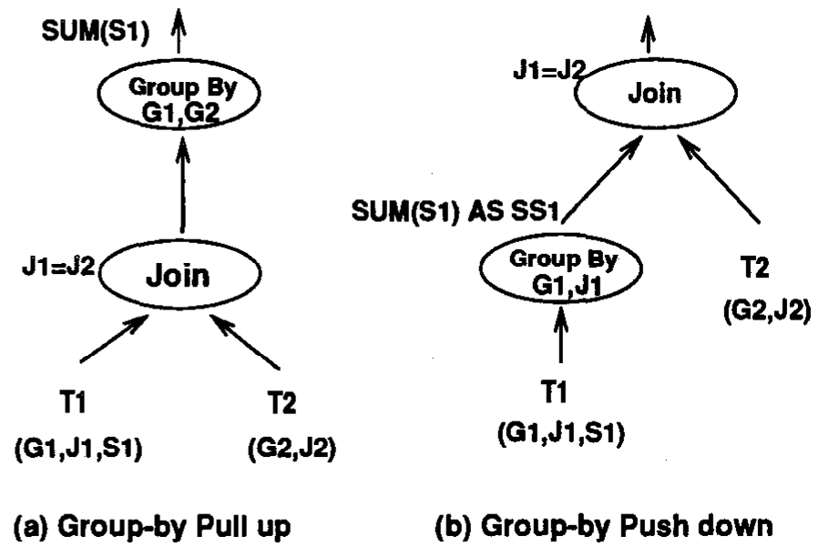
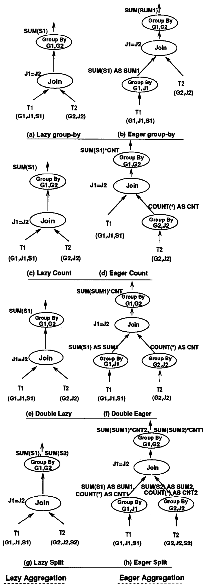
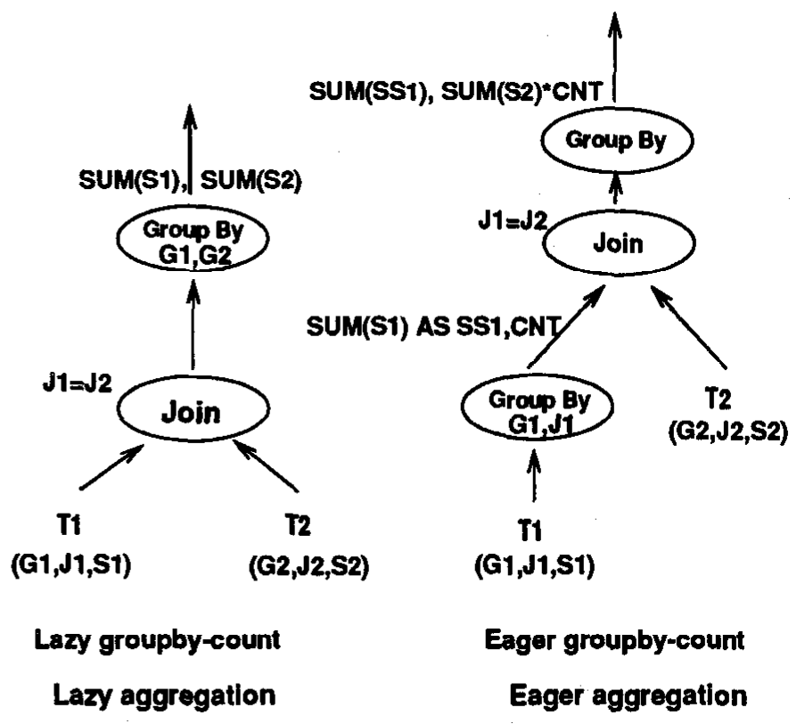
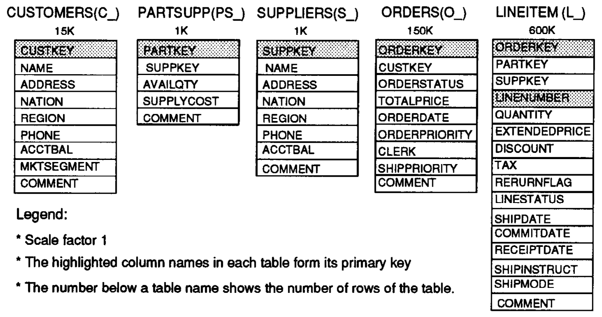

# Eager Aggregation and Lazy Aggregation（中文译文）

## 译者说明

本文依据同目录的 `source.pdf` 翻译。章节、图表、公式、算法、代码与参考文献按原文结构保留。

Weipeng P. Yan、Per-Åke Larson<br>
滑铁卢大学计算机科学系，加拿大安大略省滑铁卢，N2L 3G1<br>
{pwyan,palarson}@bluebox.uwaterloo.ca

第 21 届 VLDB 会议论文集，瑞士苏黎世，1995 年。

## 摘要

高效处理聚合查询对决策支持应用至关重要。本文描述一类称为提前聚合（eager aggregation）和延迟聚合（lazy aggregation）的查询变换，使查询优化器能够在查询树中上下移动 group-by 操作。提前聚合将 group-by 部分下推越过连接。部分下推 group-by 后，我们仍需在上层查询块执行原来的 group-by。提前聚合减少连接的输入行数，因而可能得到更好的整体计划。其逆变换——延迟聚合——将 group-by 上拉到连接之上，并将两个 group-by 合并为一个。当聚合查询引用分组视图（包含 group-by 的视图）时，这种变换通常值得考虑。实验结果表明，该技术对 TPC-D 基准中的查询非常有益。

## 1 引言

聚合广泛用于决策支持系统。TPC-D [Raa95] 基准中的所有查询都包含聚合。高效处理聚合查询，对决策支持应用和大规模应用的性能至关重要。

我们提出过一种新的查询优化技术：group-by 下推（group-by push down）和 group-by 上拉（group-by pull up），它们交换 group-by 与连接的顺序 [YL94, YL95]。group-by 下推是将 group-by 向下推过连接，其主要收益在于 group-by 可能减少连接的输入行数。group-by 上拉是将 group-by 的处理推迟到连接之后，其主要收益在于，如果连接具有较高选择性，连接可能减少 group-by 的输入行数。图 1 展示交换 group-by 与连接的思想。在图 1(a) 中，我们在连接列 J1 和 J2 上连接表 T1(G1,J1,S1) 和 T2(G2,J2)，然后在分组列 G1 和 G2 上对结果分组，随后在 S1 上聚合。图 1(b) 展示另一种做法：先执行 group-by，再连接。请注意，并非总能交换 group-by 与连接。[YL94, YL95] 给出了充要条件。



图 1：group-by 与连接的交换。(a) group-by 上拉；(b) group-by 下推。图中 Group By 表示分组，Join 表示连接。

这项技术可以扩展为仅将 group-by 部分下推越过连接。对于一些包含连接与 group-by 的查询，我们可以先在部分表上执行 group-by，然后连接，最后再执行一次 group-by。我们将第一次 group-by 称为提前分组（eager group-by）；它减少连接的输入行数，因而可能得到更好的计划。我们将提前分组生成的组称为部分组（partial groups），因为第二次 group-by 会合并它们。当数据缩减量不足以抵偿提前分组的代价时，我们或许应将 group-by 延迟到连接之后，我们称之为延迟分组（lazy group-by）。查询优化应同时考虑这两个变换方向。我们将在连接之前执行聚合的技术称为提前聚合，将聚合延迟到连接之后的技术称为延迟聚合。

图 2(a) 和 (b) 展示提前/延迟分组的基本思想。提前分组在所有包含聚合列的表上执行提前聚合。延迟分组是它的逆变换。



图 2：提前聚合与延迟聚合。左列为延迟聚合，右列为提前聚合：(a) 延迟分组，(b) 提前分组；(c) 延迟计数，(d) 提前计数；(e) 双侧延迟，(f) 双侧提前；(g) 延迟拆分，(h) 提前拆分。CNT、CNT1、CNT2 是计数列，SUM1、SUM2 是部分聚合结果。

下面的例子说明提前分组和延迟分组的基本思想。例子基于 TPC-D 数据库的一个子集 [Raa95]。表定义见附录 A。

**例 1：** 求每位办事员处理的订单中，因客户退回零件而造成的收入损失总额。输出办事员和收入损失。

```sql
SELECT O_CLERK,
       SUM(L_EXTENDEDPRICE * (1-L_DISCOUNT))
FROM   LINEITEM, ORDERS
WHERE  O_ORDERKEY = L_ORDERKEY
  AND  L_RETURNFLAG = 'R'
GROUP BY O_CLERK
```

每个订单由一位办事员处理，因此我们可以先求每个订单的收入损失。然后我们将聚合后的视图与 ORDERS 表连接，求每位办事员的损失总额。

```sql
SELECT O_CLERK, SUM(REVENUE)
FROM   (SELECT L_ORDERKEY, SUM(L_EXTENDEDPRICE
                    *(1-L_DISCOUNT)) AS REVENUE
        FROM   LINEITEM
        WHERE  L_RETURNFLAG = 'R'
        GROUP BY L_ORDERKEY) AS LOSS, ORDERS
WHERE  O_ORDERKEY = L_ORDERKEY
GROUP BY O_CLERK
```

提前的（内层）group-by 减少连接的输入行数。如果 LINEITEM 表按 L_ORDERKEY 聚簇，那么提前分组几乎不产生额外代价。DB2 V2 Beta3 上的实验证实，提前分组将耗时减少了 16%。下面的例子表明延迟分组也可能有益。

**例 2：** 求每位办事员处理的 1995 年 5 月订单中，因客户退回零件而造成的收入损失总额。输出办事员和收入损失。

```sql
SELECT O_CLERK, SUM(REVENUE)
FROM   ORDERS, LOSS_BY_ORDER
WHERE  O_ORDERKEY = L_ORDERKEY
  AND  O_ORDERDATE BETWEEN "1995-05-01"
                      AND "1995-05-31"
GROUP BY O_CLERK
```

其中 LOSS_BY_ORDER 是如下定义的聚合视图：

```sql
CREATE VIEW LOSS_BY_ORDER (L_ORDERKEY, REVENUE)
(SELECT L_ORDERKEY,
        SUM(L_EXTENDEDPRICE * (1-L_DISCOUNT))
 FROM   LINEITEM
 WHERE  L_RETURNFLAG = 'R'
 GROUP BY L_ORDERKEY);
```

我们可以将视图与查询合并，将查询改写为：

```sql
SELECT O_CLERK,
       SUM(L_EXTENDEDPRICE*(1-L_DISCOUNT))
FROM   LINEITEM, ORDERS
WHERE  O_ORDERKEY = L_ORDERKEY
  AND  L_RETURNFLAG = 'R'
  AND  O_ORDERDATE BETWEEN "1995-05-01"
                      AND "1995-05-31"
GROUP BY O_CLERK
```

O_ORDERDATE 上的谓词具有很高的选择性。在这种情况下，我们应将 group-by 推迟到连接之后。以 LINEITEM 为内侧、ORDERS 为外侧的嵌套循环连接，看起来是很有希望的求值策略。DB2 V2 Beta3 上的实验证实，延迟分组将耗时减少了 60%。

这些例子表明，查询优化应同时考虑两个方向（提前分组和延迟分组）。当 FROM 子句中有两个以上的表时，可能有多种提前分组方式 [Yan95]。

图 2 和图 3 展示本文介绍的提前/延迟变换。提前计数（eager count）变换在不包含聚合列的表上执行提前聚合，如图 2(d) 所示。它先在提前聚合中统计各组的行数，然后执行连接，最后聚合原来的聚合列。延迟计数（lazy count）是其逆变换。

双侧提前（double eager）在不包含聚合列的表上执行提前计数，在其余可能包含、也可能不包含聚合列的表上执行提前分组，如图 2(f) 所示。其逆变换是双侧延迟（double lazy）。

提前分组计数（eager groupby-count）在包含聚合列的表的一个子集上执行提前聚合，如图 3 所示。其逆变换称为延迟分组计数（lazy groupby-count）。

提前拆分（eager split）如图 2(h) 所示：当两个输入流都参与聚合时，在连接之前对两个输入流都执行提前分组计数。其逆变换称为延迟拆分（lazy split）。

我们的实验表明，我们可以将 group-by 下推/上拉和提前/延迟聚合应用于 TPC-D 基准 17 个查询中的 12 个。这显著减少了其中 6 个查询的耗时。例如，它将查询 5 的耗时降低到原来的十分之一。

### 1.1 本文结构

本文其余部分组织如下。第 2 节回顾 SQL2 中的聚合函数，并介绍可分解聚合函数以及 C 类、D 类聚合函数的概念。第 3 节定义我们考虑的查询类别并介绍记号。第 4 节给出我们的结果所依据的形式化体系。第 5 节介绍并证明我们的主定理。第 6、7、8、9 节分别给出提前/延迟分组、提前/延迟计数、双侧提前/延迟和提前/延迟拆分变换的推论。第 10 节提出寻找一个查询所有可能的提前/延迟变换的算法，并讨论如何将提前/延迟聚合及 group-by 下推/上拉集成进现有优化器。为简化证明，我们在定理和推论中没有考虑 HAVING。第 11 节考虑存在 HAVING 子句的情况。第 12 节表明，提前/延迟聚合及 group-by 下推/上拉对 TPC-D 官方查询非常有益。第 13 节讨论相关工作。第 14 节总结本文。

## 2 聚合函数

在 SQL2 中，值表达式可以包含聚合函数。共有五种聚合函数：SUM、AVG、MIN、MAX 和 COUNT。考虑查询：

```sql
SELECT 2*SUM(T1.C1)/COUNT(DISTINCT T2.C2)*
       MIN(T1.C3*T2.C3)
FROM T1,T2
```

我们可以将该查询改写为：

```sql
SELECT 2*NC1/NC2*NC3
FROM (SELECT SUM(C1) AS NC1,
             COUNT(DISTINCT T2.C2) AS NC2,
             MIN(T1.C3*T2.C3) AS NC3
      FROM T1,T2) TMP_VIEW;
```

对于任意一个查询块，如果它包含的某个任意值表达式中有多个聚合函数，总能将其改写成新查询块，使其成为视图之上的 SELECT，而该视图中的每个值表达式至多包含一个聚合函数。因此，不失一般性，我们假定我们的查询中不存在包含多个聚合函数的值表达式。

### 2.1 可分解聚合函数

本文所有集合都是多重集。令 $\cup _ a$ 表示保留重复的集合并， $\cup _ d$ 表示消除重复的集合并。在 SQL2 中，这两个操作分别对应 UNION ALL 和 UNION。

**定义 1（可分解聚合函数）：** 如果存在聚合函数 $F _ 1$ 和 $F _ 2$，使得

$$
F(S _ 1\cup _ a S _ 2)=F _ 2(F _ 1(S _ 1),F _ 1(S _ 2)),
$$

则聚合函数 $F$ 是可分解的；其中 $S _ 1$ 和 $S _ 2$ 是两个值集合。我们称 $S _ 1$ 和 $S _ 2$ 为部分组。

SUM(C) 是可分解的，因为

$$
SUM(S _ 1\cup _ a S _ 2)=SUM(SUM(S _ 1),SUM(S _ 2));
$$

COUNT(C) 是可分解的，因为

$$
COUNT(S _ 1\cup _ a S _ 2)=SUM(COUNT(S _ 1),COUNT(S _ 2));
$$

MIN(C) 是可分解的，因为

$$
MIN(S _ 1\cup _ a S _ 2)=MIN(MIN(S _ 1),MIN(S _ 2));
$$

AVG(C) 可以作为 SUM(C) 和 COUNT(NOT NULL C) 来处理，因此也是可分解的。[^1]

对于 COUNT(DISTINCT C1) 这样的聚合函数，判断其是否可分解并不简单。 $S _ 1$ 和 $S _ 2$ 中可能存在 C1 值相同的两行。这两行会使最终计数增加 2，而不是 1。不过，如果我们预先知道 C1 列不可能包含重复值，那么 COUNT(DISTINCT C1) 就是可分解的。请注意，即使 C1 存在重复值，也可能有其他条件保证 C1 值相同的行属于同一个部分组（例如 C1 是分组列）。因此，一个聚合函数可能可分解，也可能不可分解。MIN 和 MAX 总是可分解的；SUM 和 COUNT 在不包含 DISTINCT 时是可分解的。这里不再进一步讨论如何判断聚合函数是否可分解。从现在起，我们假定我们知道一个聚合函数是否可分解。

[^1]: SQL2 不支持 `COUNT(NOT NULL C1)` 操作，但在任何现有系统中都很容易实现它。

### 2.2 C 类和 D 类聚合函数

**例 3：** 求每位办事员处理的紧急或高优先级订单明细的总数。

```sql
SELECT O_CLERK,
       SUM(CASE WHEN O_ORDERPRIORITY='1-URGENT'
                  OR O_ORDERPRIORITY='2-HIGH'
                THEN 1 ELSE 0 END)
FROM   LINEITEM, ORDERS
WHERE  O_ORDERKEY = L_ORDERKEY
GROUP BY O_CLERK
```

它等价于如下查询。

```sql
SELECT O_CLERK,
       SUM(CASE WHEN O_ORDERPRIORITY='1-URGENT'
                  OR O_ORDERPRIORITY='2-HIGH'
                THEN 1 ELSE 0 END) * CNT
FROM   (SELECT L_ORDERKEY, COUNT(*) AS CNT
        FROM LINEITEM
        GROUP BY L_ORDERKEY) AS COUNT_BY_ORDER,
       ORDERS
WHERE  O_ORDERKEY = L_ORDERKEY
GROUP BY O_CLERK
```

COUNT_BY_ORDER 统计每个订单的明细数，然后与 ORDERS 表连接，得到所需计数。我们称此变换为提前计数，将相应逆变换称为延迟计数。请注意，这次我们是在不包含聚合列的表上执行提前聚合。提前计数在不包含任何聚合列的表上执行提前聚合。DB2 V2 Beta3 上的实验表明，对此查询执行提前计数将耗时减少了 40%。

执行提前计数时，如果原来的聚合函数是 SUM 或 COUNT，我们需要统计内层 group-by 产生的各组行数，再将此计数乘以后续 group-by 的结果。我们将满足这一性质的聚合函数称为 C 类聚合函数（C 代表 COUNT），将内层 group-by 得到的计数称为重复因子（duplication factor）。如果原来的聚合函数是 SUM(DISTINCT)、COUNT(DISTINCT)、MIN、MAX 或 AVG，我们可以丢弃子查询块中的计数。换言之，我们可以在子查询块中使用 DISTINCT。我们将满足这一性质的聚合函数称为 D 类聚合函数（D 代表 DISTINCT），将此变换称为提前去重（eager distinct），将其相应逆变换称为延迟去重（lazy distinct）。因此，再结合函数是否可分解，我们可以得到四种聚合函数。D 类聚合函数对重复因子不敏感。

## 3 所考虑的查询类别

在 SELECT 子句中，作为聚合函数（COUNT、MIN、MAX、SUM、AVG）操作数出现的任何列称为聚合列。在 SELECT 子句中出现、但不是聚合列的任何列称为选择列。聚合列可以属于多个表。我们将 FROM 子句中的表分成两组：一组包含聚合列，另一组可能包含、也可能不包含这样的列。从技术上说，每组可以看作一个单表，由该组各成员表的笛卡尔积构成。因此，不失一般性，我们可以假定 FROM 子句仅包含两个表 $R _ d$ 和 $R _ u$。令 $R _ d$ 表示包含聚合列的表， $R _ u$ 表示可能包含、也可能不包含这样的列的表。

WHERE 子句中的搜索条件可以表示为 $C _ d\land C _ o\land C _ u$，其中 $C _ d$、 $C _ o$ 和 $C _ u$ 都是合取范式， $C _ d$ 仅涉及 $R _ d$ 中的列， $C _ u$ 仅涉及 $R _ u$ 中的列，而 $C _ o$ 中每个析取分量都同时涉及 $R _ d$ 和 $R _ u$ 中的列。请注意，允许子查询。

GROUP BY 子句提及的分组列可以包含来自 $R _ d$ 和 $R _ u$ 的列，分别记为 $GA _ d$ 和 $GA _ u$。按照 SQL2 [ISO92]，SELECT 子句中的选择列必须是分组列的子集。我们将选择列记为 $SGA _ d$ 和 $SGA _ u$，分别是 $GA _ d$ 和 $GA _ u$ 的子集。暂时，我们假定查询不包含 HAVING 子句（第 11 节放宽此限制）。 $R _ d$ 中参与连接和分组的列记为 $GA _ d^+$， $R _ u$ 中参与连接和分组的列记为 $GA _ u^+$。

总之，我们考虑如下形式的查询：

```sql
SELECT [ALL/DISTINCT] SGA_d, SGA_u, F(AA)
FROM                 R_d, R_u
WHERE                C_d ∧ C_o ∧ C_u
GROUP BY             GA_d, GA_u
```

其中：

- $GA _ d$：表 $R _ d$ 的分组列。
- $GA _ u$：表 $R _ u$ 的分组列； $GA _ d$ 和 $GA _ u$ 不能同时为空。
- $SGA _ d$：选择列，必须是分组列 $GA _ d$ 的子集。
- $SGA _ u$：选择列，必须是分组列 $GA _ u$ 的子集。
- $AA$：表 $R _ d$ 以及可能的表 $R _ u$ 的聚合列。考虑提前/延迟分组、提前/延迟计数和双侧提前/延迟时， $AA$ 属于 $R _ d$。考虑提前/延迟分组计数和提前/延迟拆分时， $AA$ 属于 $R _ d$ 和 $R _ u$，记为聚合列 $AA _ u$ 与 $AA _ d$ 的并，其中 $AA _ u$ 和 $AA _ d$ 分别属于 $R _ d$ 和 $R _ u$。〔原文此处下标归属如此；第 5 节的正式假设则将 $AA _ d$ 归于 $R _ d$、 $AA _ u$ 归于 $R _ u$。〕
- $C _ d$：表 $R _ d$ 的列上的合取谓词。
- $C _ u$：表 $R _ u$ 的列上的合取谓词。
- $C _ o$：涉及 $R _ d$ 和 $R _ u$ 两表列的合取谓词，例如连接谓词。
- $\alpha(C _ o)$： $C _ o$ 涉及的列。
- $F$：应用于 $AA$ 的聚合函数和/或算术聚合表达式数组（可以为空）。考虑提前/延迟分组计数和提前/延迟拆分时， $F$ 表示为聚合函数 $F _ d$ 与 $F _ u$ 的并，其中 $F _ d$ 和 $F _ d$ 分别应用于 $AA _ d$ 和 $AA _ u$。〔原文第二个函数下标也印为 $d$。〕
- $F(AA)$：将聚合函数和/或算术聚合表达式 $F$ 应用于聚合列 $AA$。
- $GA _ d^+\equiv GA _ d\cup\alpha(C _ o)-R _ u$：即 $R _ d$ 中参与连接和分组的列。
- $GA _ u^+\equiv GA _ d\cup\alpha(C _ o)-R _ d$：即 $R _ u$ 中参与连接和分组的列。〔原文右侧分组列印为 $GA _ d$。〕
- $FAA$：对上述查询执行提前分组时，第一次 group-by 中将函数数组 $F$ 应用于 $AA$ 所产生的列。

## 4 形式化

本节我们定义后续定理和证明所需的形式化“工具”。

SQL2 [ISO92] 用特殊值 NULL 表示缺失信息，求值条件表达式时采用三值逻辑。我们按照严格的 SQL2 语义定义函数依赖，将 SQL2 中 NULL 的影响考虑在内。如果函数依赖涉及的列中没有 NULL，我们的函数依赖定义就与传统定义相同。详细定义见 [YL94]。由于篇幅限制，这里不再列出。令 $A$ 和 $B$ 为两个列集合， $A$ 函数决定 $B$ 记为 $A\to B$。

### 4.1 表示 SQL 查询的代数

用标准 SQL 指定操作很烦琐。作为简记，我们定义一种代数，其基本操作由简单 SQL 语句定义。由于所有操作都用 SQL 定义，因此无需证明该代数与 SQL 语句之间的语义等价性。请注意，“标准”关系代数的变换规则不一定适用于这种新代数。操作定义如下。

- $\mathcal G[GA]R$：按分组列 $GA=\lbrace GA _ 1,GA _ 2,\ldots,GA _ n\rbrace$ 对表 $R$ 分组。此操作由查询 `SELECT * FROM R ORDER BY GA` 定义。[^2] 其结果是一个已分组的表。
- $R _ 1\times R _ 2$：表 $R _ 1$ 与 $R _ 2$ 的笛卡尔积。
- $\sigma[C]R$：选择表 $R$ 中满足条件 $C$ 的所有行。不消除重复行。此操作由查询 `SELECT * FROM R WHERE C` 定义。
- $\pi _ d[B]R$，其中 $d=A$ 或 $D$：将表 $R$ 投影到列 $B$； $d=A$ 时不消除重复， $d=D$ 时消除重复。此操作由查询 `SELECT [ALL/DISTINCT] B FROM R` 定义。
- $F[AA]R$： $F[AA]=(f _ 1(AA),f _ 2(AA),\ldots,f _ n(AA))$，其中 $AA=\lbrace A _ 1,A _ 2,\ldots,A _ n\rbrace$， $F=\lbrace f _ 1,f _ 2,\ldots,f _ n\rbrace$。 $AA$ 是已分组表 $R$ 的聚合列， $F$ 是作用于 $AA$ 的算术聚合表达式。我们必须强调这一要求：表 $R$ 已按某些分组列 $C$ 分组。表 $R$ 的所有行在除 $AA$ 列之外的各列上必须取值相同。每个 $f _ i$（ $i=1,2,\ldots,n$）是一个算术表达式（可以仅仅是一个聚合函数），作用于 $R$ 每个组中 $AA$ 的某些列，产生一个值。 $f _ i(AA)$ 的一个例子是 $COUNT(A _ 1)+SUM(A _ 2+A _ 3)$。不消除整体结果中的重复。此操作由查询 `SELECT GA,A,F(AA) FROM R GROUP BY GA` 定义，其中 $GA$ 是 $R$ 的分组列， $A$ 是由 $GA$ 函数决定的一组非分组列，可以为空。请注意，该语句在 SQL2 中语法不合法，因为 SELECT 子句中的 $A$ 列没有出现在 GROUP BY 子句中。不过，由于 $GA\to A$，从查询处理的角度看，它在语义上是合理的。

[^2]: 当然，这个查询通过对结果组排序，做了比 GROUP BY 更多的事情。不过，这似乎是唯一能够表示此操作的合法 SQL 查询。只要我们记住两者的差别，它就适用于我们的目的。

因此，我们考虑的查询类别可以表示为：

$$
\begin{aligned}
&\pi _ d[SGA _ d,SGA _ u,FAA]\thinspace{}F[AA]\pi _ A[GA _ d,GA _ u,AA]\\
&\qquad\mathcal G[GA _ d,GA _ u]\sigma[C _ d\land C _ o\land C _ u] (R _ d\times R _ u).
\end{aligned}
$$

其中 $d=A$ 或 $d=D$， $FAA$ 是对每个组应用 $F[AA]$ 后的聚合值。最后的投影仅将行投影到所需的列上，并可能消除重复。如果所需列恰好是所有现有列，而且投影不消除重复，我们通常在表达式中省略最后的投影。

本文所有集合都是可能包含重复的多重集。 $r _ d$、 $r _ u$ 表示表 $R _ d$、 $R _ u$ 的实例； $T[S]$ 是 $\pi _ A[S]T$ 的简写，其中 $S$ 是列集合， $T$ 是已分组或未分组的表，或者一行。

## 5 主定理

执行提前计数时，我们需要考虑两种情况：

1. $F$ 仅包含 D 类聚合函数。我们可以简单地在子查询块的 SELECT 列表中添加 DISTINCT，而无需修改原来的聚合函数。
2. $F$ 同时包含 C 类和 D 类聚合函数。在这种情况下，我们需要在子查询块的 SELECT 列表中使用 COUNT 聚合函数。C 类聚合函数 $f$ 的聚合值等于该计数乘以应用 $f$ 所得的值。因此，我们需要将 $F$ 改为 $F _ a$，将 $F$ 中的每个 C 类聚合函数 $f$ 替换成 $f\ast count$。例如，如果 $F(C1,C2,C3)$ 是 `(SUM(C1),COUNT(C2),MIN(C3))`，那么 $F _ a(C1,C2,C3,count)$ 就是

$$
\begin{aligned}
&(SUM(C1),MAX(C2),MIN(C3))\circ(count,1,1)\\
&\qquad=(SUM(C1)\ast count,MAX(C2),MIN(C3)).
\end{aligned}
$$

〔原文在此例中将前面的 COUNT(C2) 写成了 MAX(C2)；此处保留原式。〕运算符 $\circ$ 表示向量积。我们称 $F _ a$ 为 $F$ 的重复聚合函数（duplicated aggregation functions）。作为简记，我们用 $F(C _ 1,C _ 2,\ldots,C _ n)\ast count$ 表示 $F _ a$，但要记住，我们只需将 C 类聚合函数乘以该计数。请注意，我们需要为 $F _ a$ 增加一个参数。

请注意，不要求 $F$ 中的函数可分解。



图 3：主定理。左侧为延迟分组计数（延迟聚合），右侧为提前分组计数（提前聚合）。右侧先在 T1 上产生部分和 SS1 及计数 CNT，再与 T2 连接。

考虑图 3 左侧的查询，它对来自两个输入流的列进行聚合。在右侧查询中，我们可以先在一个输入流上聚合。我们不仅需要求部分组的和，还必须记录每个部分组的行数，以供仅在连接之后才聚合的表（T2）使用。这就是提前分组计数的基本思想。

在下面的定理中，令：(1) $NGA _ d$ 表示 $R _ d$ 中的一组列；(2) $CNT$ 表示对 $\sigma[C _ d]R _ d$ 按 $NGA _ d$ 分组后，由 `COUNT(*)` 产生的列；(3) $FAA _ d$ 表示对表 $\sigma[C _ d]r _ d$ 按 $NGA _ d$ 进行第一次 group-by 时，由 $F _ d$ 产生的其余列；(4) $F _ {ua}$ 表示 $F _ u$ 的重复聚合函数。另外假设：(1) $AA=AA _ d\cup _ d AA _ u$，其中 $AA _ d$ 仅包含 $R _ d$ 中的列， $AA _ u$ 仅包含 $R _ u$ 中的列；(2) $F=F _ d\cup _ d F _ u$，其中 $F _ d$ 应用于 $AA _ d$， $F _ u$ 应用于 $AA _ u$。

**定理 1（提前/延迟分组计数，主定理）：** 表达式

$$
\begin{aligned}
E _ 1:\quad &F[AA _ d,AA _ u]\pi _ A[GA _ d,GA _ u,AA _ d,AA _ u]\\
&\mathcal G[GA _ d,GA _ u]\sigma[C _ d\land C _ o\land C _ u] (R _ d\times R _ u)
\end{aligned}
$$

与

$$
\begin{aligned}
E _ 2:\quad &\pi _ d[GA _ d,GA _ u,FAA]\\
&(F _ {ua}[AA _ u,CNT],F _ {d2}[FAA _ d])\\
&\pi _ A[GA _ d,GA _ u,AA _ u,FAA _ d,CNT]\\
&\mathcal G[GA _ d,GA _ u]\sigma[C _ o,C _ u]\\
&(((F _ {d1}[AA _ d],COUNT[])\\
&\qquad\pi _ A[NGA _ d,GA _ d^+,AA _ d]\mathcal G[NGA _ d]\sigma[C _ d]R _ d)\times R _ u)
\end{aligned}
$$

在以下条件下等价：(1) 聚合函数 $F _ d$ 仅包含可分解的聚合函数，且可以分解为 $F _ {d1}$ 和 $F _ {d2}$；(2) $F _ u$ 包含 C 类或 D 类聚合函数；(3) $NGA _ d\to GA _ d^+$ 在 $\sigma[C _ d]R _ d$ 中成立。

主定理如图 3 所示。聚合列拆分成两个集合，分别属于 $R _ d$ 和 $R _ u$ 表。从 $E _ 1$ 到 $E _ 2$ 的变换（提前聚合）中，我们下推 $R _ d$ 表，在连接之前对 $AA _ d$ 执行提前聚合并取得计数。在连接之后，我们再对 $FAA _ d$ 和 $AA _ u$ 聚合。因此，我们实际上将聚合拆成两部分：一部分在连接之前预先求值，另一部分在连接之后求值。我们将从 $E _ 1$ 到 $E _ 2$ 的变换称为提前分组计数，其逆变换称为延迟分组计数。

要求 $NGA _ d\to GA _ d^+$ 并非必要条件。如果在 $\sigma[C _ d]R _ d$ 的某个实例中 $NGA _ d\not\to GA _ d$，那么 $E _ 2$ 的第一次 group-by 可能把在 $E _ 1$ 中不属于同一组的行分到一起。不过，这些错误分组的行可能被连接消除，我们仍可能得到正确结果。如果 $NGA _ d$ 不能函数决定表 $R _ d$ 的连接列，那么 $E _ 2$ 中的连接就没有定义，因为一个组在连接列上可能包含不同值。要得到充要条件，我们需要扩展 $F[AA]$ 的含义，这超出了本文范围。

**证明：**

考虑 $R _ d$ 的某个实例 $r _ d$ 中， $\mathcal G[NGA _ d]\sigma[C _ d]r _ d$ 的一个组 $G _ d$。由于 $NGA _ d\to GA _ d^+$， $G _ d$ 中所有行的 $GA _ d$ 值相同，且 $R _ d$ 的连接列值也相同。因此，如果 $G _ d$ 中有一行满足 $\sigma[C _ d\land C _ o\land C _ u] (r _ d\times r _ u)$ 的连接条件，那么 $G _ d$ 中所有行都满足该条件。如果 $G _ d$ 的一行与 $\sigma[C _ u]r _ u$ 中的一组行 $S _ u$ 连接，那么 $G _ d$ 的所有行都会与 $S _ u$ 连接。请注意，上述论断对所有连接都成立，而不仅是等值连接。

由于 $S _ u$ 依赖于 $G _ d$，我们将与 $G _ d$ 连接的行集合记为 $S _ u(G _ d)$。 $G _ d$ 与 $S _ u$ 连接产生的集合是 $G _ d\times S _ u(G _ d)$，即一个笛卡尔积。 $(F _ {d1}[AA _ d],COUNT[])G _ d$ 表示将 $F _ {d1}$ 和 COUNT 应用于组 $G _ d$ 的 $AA _ d$ 后得到的行。

令 $G _ {d1}$、 $G _ {d2}$ 是 $\mathcal G[NGA _ d]\sigma[C _ d]r _ d$ 产生的两个（部分）组。我们需要考虑两种情况。

**情况 1：** $G _ {d1}[GA _ d]=G _ {d2}[GA _ d]$ 且 $S _ u(G _ {d1})[GA _ u]=S _ u(G _ {d2})[GA _ u]$。在 $E _ 2$ 中，连接后下列两个集合中的所有行

$$
\begin{aligned}
&((F _ {d1}[AA _ d],COUNT[])\\
&\qquad(\pi[NGA _ d,GA _ d^+,AA _ d]G _ {d1}))\times S _ u(G _ {d1})
\end{aligned}
$$

以及

$$
\begin{aligned}
&((F _ {d1}[AA _ d],COUNT[])\\
&\qquad\pi[NGA _ d,GA _ d^+,AA _ d]G _ {d2})\times S _ u(G _ {d2})
\end{aligned}
$$

被第二次（连接后的）group-by 合并到同一个组。

在 $E _ 1$ 中， $G _ {d1}$ 和 $G _ {d2}$ 的每一行分别与 $S _ u(G _ {d1})$ 和 $S _ u(G _ {d2})$ 的每一行连接。因此， $G _ {d1}\times S _ u(G _ {d1})$ 与 $G _ {d2}\times S _ u(G _ {d2})$ 中的所有行被 group-by 合并到同一个组。由于 $F _ d$ 中每个聚合函数都可以分解为 $F _ {d1}$ 与 $F _ {d2}$， $E _ 1$ 中下式产生的行中的聚合值

$$
\begin{aligned}
&F _ d[AA _ d]\pi _ A[GA _ d,GA _ u,AA _ d]\\
&\qquad((G _ {d1}\times S _ u(G _ {d1}))\cup _ a(G _ {d2}\times S _ u(G _ {d2})))
\end{aligned}
$$

等于 $E _ 2$ 中下式产生的聚合值：

$$
\begin{aligned}
&F _ {d2}[FAA _ d]\pi _ A[GA _ d,GA _ u,FAA _ d]\\
&(((F _ {d1}[AA _ d]\pi _ A[NGA _ d,GA _ d^+,AA _ d]G _ {d1})\times S _ u(G _ {d1}))\\
&\qquad\cup _ a((F _ {d1}[AA _ d]\pi _ A[NGA _ d,GA _ d^+,AA _ d]G _ {d2})\times S _ u(G _ {d2}))).
\end{aligned}
$$

由于 $F _ u$ 中每个聚合函数都是 C 类或 D 类， $E _ 1$ 中下式产生的行中的聚合值

$$
\begin{aligned}
&F _ u[AA _ u]\pi _ A[GA _ d,GA _ u,AA _ u]\\
&\qquad((G _ {d1}\times S _ u(G _ {d1}))\cup _ a G _ {d2}(\times S _ u(G _ {d2})))
\end{aligned}
$$

等于 $E _ 2$ 中下式产生的聚合值：

$$
\begin{aligned}
&F _ {ua}[AA _ u,CNT]\pi _ A[GA _ d,GA _ u,AA _ u,CNT]\\
&(((COUNT[]\pi _ A[NGA _ d,GA _ d^+]G _ {d1})\times S _ u(G _ {d1}))\cup _ a\\
&\qquad((COUNT[]\pi _ A[NGA _ d,GA _ d^+]G _ {d2})\times S _ u(G _ {d2}))).
\end{aligned}
$$

〔前一式中第二个笛卡尔积的括号位置沿用原文。〕

**情况 2：** $G _ {d1}[GA _ d]\ne G _ {d2}[GA _ d]$ 或 $S _ u(G _ {d1})[GA _ u]\ne S _ u(G _ {d2})[GA _ u]$。在 $E _ 2$ 中，下列两个集合中的行

$$
\begin{aligned}
&((F _ {d1}[AA _ d],COUNT[])\\
&\qquad\pi[NGA _ d,GA _ d^+,AA _ d]G _ {d1})\times S _ u(G _ {d1})
\end{aligned}
$$

以及

$$
\begin{aligned}
&((F _ {d1}[AA _ d],COUNT[])\\
&\qquad\pi[NGA _ d,GA _ d^+,AA _ d]G _ {d2})\times S _ u(G _ {d2})
\end{aligned}
$$

会被第二次（连接后的）group-by 合并到同一个组。〔原文此句为“are merged”，与情况 2 的条件及下文“not merged”不一致；此处保留原文表述。〕在 $E _ 1$ 中， $G _ {d1}$ 和 $G _ {d2}$ 的每一行分别与 $S _ u(G _ {d1})$ 和 $S _ u(G _ {d2})$ 的每一行连接。不过， $G _ {d1}\times S _ u(G _ {d1})$ 和 $G _ {d2}\times S _ u(G _ {d2})$ 中的行不会被 group-by 合并到同一个组。由于 $F$ 是可分解的， $E _ 1$ 中

$$
F _ d[AA _ d]\pi _ A[GA _ d,GA _ u,AA _ d] (G _ {d1}\times S _ u(G _ {d1}))
$$

的聚合值等于 $E _ 2$ 中

$$
\begin{aligned}
&F _ {d2}[FAA _ d]\pi _ A[GA _ d,GA _ u,FAA _ d]\\
&\qquad((F _ {d1}[AA _ d]\pi _ A[NGA _ d,GA _ d^+,AA _ d]G _ {d1})\times S _ u(G _ {d1}))
\end{aligned}
$$

的聚合值。

此外， $E _ 1$ 中下式产生的行中的聚合值

$$
F _ u[AA _ u,CNT]\pi _ A[GA _ d,GA _ u,AA _ u] (G _ {d1}\times S _ u(G _ {d1}))
$$

等于 $E _ 2$ 中下式产生的聚合值：

$$
\begin{aligned}
&F _ {ua}[AA _ u,CNT]\pi _ A[GA _ d,GA _ u,AA _ u,CNT]\\
&\qquad((COUNT[]\pi _ A[NGA _ d,GA _ d^+]G _ {d1})\times S _ u(G _ {d1})).
\end{aligned}
$$

〔原文在这里的 $F _ u$ 参数中包含 CNT，沿用原式。〕证毕。

主定理假设最终选择列与分组列 $(GA _ d,GA _ u)$ 相同，且最终投影必须为 ALL 投影。我们实际上可以放宽这两个限制：最终选择列可以是分组列 $(GA _ d,GA _ u)$ 的子集 $(SGA _ d,SGA _ u)$，最终投影也可以是 DISTINCT 投影。本文的其他所有推论同样如此。关于变换和证明的形式化描述，请参阅 [Yan95]。

## 6 提前分组和延迟分组

在主定理中，如果我们令 $GA _ d$ 包含所有聚合列，也就是所有聚合列都属于 $R _ d$ 表，就得到以下推论。

在下面的推论中，令 $NGA _ d$ 表示表 $R _ d$ 的一个列集合， $FAA _ d$ 表示对表 $R _ d$ 按 $NGA _ d$ 分组后应用 $F[AA]$ 产生的列。

**推论 1（提前分组与延迟分组）：** 表达式

$$
\begin{aligned}
E _ 1:\quad &F[AA]\pi _ A[GA _ d,GA _ u,AA]\mathcal G[GA _ d,GA _ u]\\
&\sigma[C _ d\land C _ o\land C _ u] (R _ d\times R _ u)
\end{aligned}
$$

与

$$
\begin{aligned}
E _ 2:\quad &F _ 2[FAA _ d]\pi _ A[GA _ d,GA _ u,FAA _ d]\mathcal G[GA _ d,GA _ u]\\
&\pi _ A[GA _ d,GA _ u,FAA _ d]\sigma[C _ o\land C _ u]\\
&((F _ 1[AA]\pi _ A[NGA _ d,GA _ d^+,AA]\\
&\qquad\mathcal G[NGA _ d]\sigma[C _ d]R _ d)\times R _ u)
\end{aligned}
$$

在 $NGA _ d\to GA _ d^+$ 于 $\sigma[C _ d]R _ d$ 中成立，且 $F[AA]$ 中所有聚合函数都可分解为 $F _ 1$ 和 $F _ 2$ 时等价。

提前分组变换引入新的 group-by，延迟分组变换消除一个 group-by。

该推论的证明很直接。由于 $AA _ u$ 为空， $F _ {ua}[AA _ u,CNT]$ 为空。将主定理 $E _ 2$ 中所有与 $AA _ u$ 有关的项删去，就得到本推论的 $E _ 2$。

## 7 提前/延迟计数及提前/延迟去重

在主定理中，如果我们令 $GA _ u$ 包含所有聚合列，也就是所有聚合列都属于 $R _ u$ 表，就得到以下推论。在该推论中， $NGA _ d$ 表示属于 $R _ d$ 的一组分组列， $CNT$ 表示将 $\sigma[C _ d]R _ d$ 按 $NGA _ d$ 分组后由 `COUNT(*)` 产生的列。

**推论 2（提前计数/延迟计数）：** 表达式

$$
\begin{aligned}
E _ 1:\quad &F[AA]\pi _ A[GA _ d,GA _ u,AA]\mathcal G[GA _ d,GA _ u]\\
&\sigma[C _ d\land C _ o\land C _ u] (R _ d\times R _ u)
\end{aligned}
$$

与

$$
\begin{aligned}
E _ 2:\quad &F _ a[AA,CNT]\pi _ A[GA _ d,GA _ u,AA,CNT]\\
&\mathcal G[GA _ d,GA _ u]\pi _ A[GA _ d,GA _ u,AA,CNT]\\
&\sigma[C _ o,C _ u] ((COUNT[]\pi _ A[NGA _ d,GA _ d^+]\\
&\qquad\mathcal G[NGA _ d]\sigma[C _ d]R _ d)\times R _ u)
\end{aligned}
$$

在 $F$ 为 C 类或 D 类聚合函数，且 $NGA _ d\to GA _ d^+$ 于 $\sigma[C _ d]R _ d$ 中成立时等价。

上述 $E _ 2$ 中，内层 group-by 之后的 $COUNT[]$ 表示我们向子查询块的选择列表添加 `COUNT(*)`。

该推论的证明很直接。由于 $AA _ d$ 为空， $F _ d$、 $F _ {d1}$ 和 $F _ {d2}$ 都为空。删除主定理 $E _ 2$ 中所有与 $AA _ d$ 有关的项，就得到本推论的 $E _ 2$。

我们将从 $E _ 1$ 到 $E _ 2$ 的变换称为提前计数，从 $E _ 2$ 到 $E _ 1$ 的变换称为延迟计数。

显然，当定理中的 $F$ 仅包含 D 类聚合函数时，我们可以简单地在子查询块中使用 DISTINCT。此时，我们将从 $E _ 1$ 到 $E _ 2$ 的变换称为提前去重，将从 $E _ 2$ 到 $E _ 1$ 的变换称为延迟去重。请注意，此时 $F _ a$ 与 $F$ 相同。

## 8 双侧提前和双侧延迟

现在我们可以处理双侧提前和双侧延迟变换了。考虑图 2(e) 中的查询，它聚合属于一个输入流（T1）的列。在图 2(f) 的查询中，我们在包含聚合列的输入流（T1）上执行提前分组，在不包含任何聚合列的输入流（T2）上执行提前计数。我们称此变换为双侧提前。双侧提前可以理解为先进行提前分组，再进行提前计数变换。其逆变换称为双侧延迟。

在下面的推论中， $NGA _ u$ 表示 $R _ u$ 中的一组列， $NGA _ d$ 表示属于 $R _ d$ 表的一组分组列， $FAA$ 表示对表 $\sigma[C _ d]R _ d$ 按 $NGA _ d$ 进行第一次 group-by 时由 $F _ 1$ 产生的列， $CNT$ 表示将 $\sigma[C _ u]R _ u$ 按 $NGA _ u$ 分组后由 `COUNT(*)` 产生的列。另外假设 $AA$ 属于 $R _ d$。

**推论 3（双侧提前/双侧延迟）：** 表达式

$$
\begin{aligned}
E _ 1:\quad &F[AA]\pi _ A[GA _ d,GA _ u,AA]\mathcal G[GA _ d,GA _ u]\\
&\sigma[C _ d\land C _ o\land C _ u] (R _ d\times R _ u)
\end{aligned}
$$

与

$$
\begin{aligned}
E _ 2:\quad &F _ a[F _ 2[FAA],CNT]\pi _ A[GA _ d,GA _ u,FAA,CNT]\\
&\mathcal G[GA _ d,GA _ u]\sigma[C _ o] ((COUNT[]\\
&\qquad\pi _ A[NGA _ u,GA _ u^+]\mathcal G[NGA _ u]\sigma[C _ u]R _ u)\\
&\qquad\times(F _ 1[AA]\pi _ A[NGA _ d,GA _ d^+,AA]\mathcal G[NGA _ d]\\
&\qquad\sigma[C _ d]R _ d))
\end{aligned}
$$

在以下条件下等价：(1) $NGA _ u\to GA _ u$ 在 $\sigma[C _ u]R _ u$ 中成立；(2) $NGA _ d\to GA _ d$ 在 $\sigma[C _ d]R _ d$ 中成立；(3) $F$ 中所有聚合函数都可分解，且可分解为 $F _ 1$ 和 $F _ 2$；(4) $F$ 中所有聚合函数都是 C 类或 D 类，其重复聚合函数为 $F _ a$。〔条件 (1)、(2) 的右侧在原文中没有上标加号，沿用原式。〕

该推论的证明很直接：先执行提前/延迟分组，再执行提前/延迟计数即可。

同样，当推论中的 $F$ 仅包含 D 类聚合函数时，我们可以简单地在 $R _ u$ 的子查询块中使用 DISTINCT。请注意，此时 $F _ a$ 与 $F$ 相同。下面的推论说明何时可以消除顶层查询块中的 group-by。

**推论 4（双侧 group-by 下推/双侧 group-by 上拉）：** 假设推论 3 的条件成立。如果另外满足：(1) $GA _ d^+\to NGA _ d$ 在 $\sigma[C _ d]R _ d$ 中成立；(2) $GA _ u^+\to NGA _ u$ 在 $\sigma[C _ u]R _ u$ 中成立；(3) $(GA _ u,GA _ d)$ 在 $\sigma[C _ d\land C _ o\land C _ u] (R _ d\times R _ u)$ 中函数决定连接列，那么表达式

$$
\begin{aligned}
E _ 1:\quad &F[AA]\pi _ A[GA _ d,GA _ u,AA]\mathcal G[GA _ d,GA _ u]\\
&\sigma[C _ d\land C _ o\land C _ u] (R _ d\times R _ u)
\end{aligned}
$$

与

$$
\begin{aligned}
E _ 2:\quad &\pi _ A[GA _ d,GA _ u,FAA\ast CNT]\mathcal G[GA _ d,GA _ u]\\
&\sigma[C _ o] ((COUNT[]\pi _ A[NGA _ u,GA _ u^+]\mathcal G[NGA _ u]\\
&\qquad\sigma[C _ u]R _ u)\times(F[AA]\pi _ A[NGA _ d,GA _ d^+,AA]\\
&\qquad\mathcal G[NGA _ d]\sigma[C _ d]R _ d))
\end{aligned}
$$

等价。

该推论消除了顶层查询块中的 group-by。这可以视为更一般的 group-by 下推，将 group-by 下推到两个下层查询块。我们称此变换为双侧 group-by 下推。其逆变换将两个下层查询块中的 group-by 上拉，称为双侧 group-by 上拉。证明见 [Yan95]。

保证该推论条件成立的一种简单方法，是分别用 $GA _ d^+$ 和 $GA _ u^+$ 作为 $NGA _ d$ 和 $NGA _ u$。这样，如果 $(GA _ u,GA _ d)$ 函数决定连接列，我们就可以应用该推论。

类似地，在提前计数、提前分组计数和提前拆分之后，也可能消除顶层查询块中的 group-by，从而得到这些变换的下推版本；类似地，也可得到延迟聚合的上拉版本。由于篇幅限制，我们无法在这里给出条件。详细条件和证明见 [Yan95]。请注意，提前/延迟分组的下推/上拉版本就是 group-by 下推/上拉。

## 9 提前拆分和延迟拆分

如果我们分别对 $R _ d$ 和 $R _ u$ 应用两次提前分组计数，就可以在连接之前对两个表都执行提前聚合。我们称此变换为提前拆分，因为聚合在连接之前分别计算。我们将其逆变换称为延迟拆分。图 2(g) 和 (h) 展示了这两个变换。

在下面的推论中：(1) $NGA _ d$ 和 $NGA _ u$ 分别表示 $R _ d$ 与 $R _ u$ 中的一组列；(2) $CNT _ 1$ 是对 $\sigma[C _ d]R _ d$ 按 $NGA _ d$ 分组后由 `COUNT(*)` 产生的列；(3) $CNT _ 2$ 是对 $\sigma[C _ u]R _ u$ 按 $NGA _ u$ 分组后由 `COUNT(*)` 产生的列；(4) $FAA _ d$ 是对表 $\sigma[C _ d]R _ d$ 按 $NGA _ d$ 进行第一次聚合时由 $F _ d$ 产生的列；(5) $FAA _ u$ 是对表 $\sigma[C _ u]R _ u$ 按 $NGA _ u$ 进行第一次聚合时由 $F _ u$ 产生的列；(6) $F _ {da}$ 和 $F _ {ua}$ 分别是 $F _ d$ 和 $F _ u$ 的重复聚合函数。另外假设：(1) $AA=AA _ d\cup _ d AA _ u$，其中 $AA _ d$ 仅包含 $R _ d$ 中的列， $AA _ u$ 仅包含 $R _ u$ 中的列；(2) $F=F _ d\cup _ d F _ u$，其中 $F _ d$ 应用于 $AA _ d$， $F _ u$ 应用于 $AA _ u$。

**推论 5（提前拆分与延迟拆分）：** 表达式

$$
\begin{aligned}
E _ 1:\quad &F[AA _ d,AA _ u]\pi _ A[GA _ d,GA _ u,AA _ d,AA _ u]\\
&\mathcal G[GA _ d,GA _ u]\sigma[C _ d\land C _ o\land C _ u] (R _ d\times R _ u)
\end{aligned}
$$

与

$$
\begin{aligned}
E _ 2:\quad &\pi _ d[GA _ d,GA _ u,FAA]\\
&(F _ {ua}[F _ {u2}[FAA _ u],CNT _ 1],F _ {da}[F _ {d2}[FAA _ d],CNT _ 2])\\
&\pi _ A[GA _ d,GA _ u,FAA _ u,FAA _ d,CNT _ 1,CNT _ 2]\\
&\mathcal G[GA _ d,GA _ u]\sigma[C _ o,C _ u] (((F _ {d1}[AA _ d],COUNT[])\\
&\qquad\pi _ A[NGA _ d,GA _ d^+,AA _ d]\mathcal G[NGA _ d]\sigma[C _ d]R _ d)\\
&\qquad\times((F _ {u1}[AA _ u],COUNT[])\\
&\qquad\pi _ A[NGA _ u,GA _ u^+,AA _ u]\mathcal G[NGA _ u]\sigma[C _ u]R _ u))
\end{aligned}
$$

在以下条件下等价：(1) 聚合函数 $F _ d$ 仅包含可分解的聚合函数，且可分解为 $F _ {d1}$ 和 $F _ {d2}$；(2) 聚合函数 $F _ u$ 仅包含可分解的聚合函数，且可分解为 $F _ {u1}$ 和 $F _ {u2}$；(3) $F _ u$ 和 $F _ d$ 包含 C 类或 D 类聚合函数；(4) $NGA _ d\to GA _ d^+$ 在 $\sigma[C _ d]R _ d$ 中成立；(5) $NGA _ u\to GA _ u^+$ 在 $\sigma[C _ u]R _ u$ 中成立。

该推论的证明也很直接：先对 $R _ d$ 执行提前/延迟分组计数，再对 $R _ u$ 执行提前/延迟分组计数即可。

## 10 算法与实现

### 10.1 提前聚合算法

本节我们给出一个实用算法，用于识别给定查询的所有有效提前变换。我们假定 $R _ d$ 表包含聚合列， $R _ u$ 表不包含聚合列。也就是说，所有查询都属于第 3 节规定的查询类别。

#### 10.1.1 寻找提前聚合的提前分组列

给定两组表 $R _ d$ 和 $R _ u$，其中 $R _ d$ 表包含聚合列而 $R _ u$ 表不包含，我们先考虑提前分组。我们可以从令 $NGA _ d$ 使用 $GA _ d^+$ 作为提前分组列开始。按照推论 1，我们可以向 $NGA _ d$ 添加更多 $R _ d$ 的列而不改变查询结果。通常，我们只在新列集合具有某种能够节省排序时间的有序性时，才希望选择新的分组列集合。例如，如果某个新列的有序性由聚簇索引支持，那么将该列加入 $NGA _ d$ 后，就可以将它用作主要排序列（假定 GROUP BY 使用排序）。后续排序可能更快，因为次要列只需在更小范围内排序，此外还具有顺序读取数据行的优势。在这种情况下，即使 $GA _ d^+$ 中某列有索引，由于该索引不是聚簇索引，以 $GA _ d^+$ 为分组列执行分组的代价，也可能比以聚簇索引列加 $GA _ d^+$ 为分组列更高。因此，我们希望考虑向 $GA _ d^+$ 添加可能有益的列，作为提前分组列。我们称这样的列为有希望的列（promising columns）。由于添加新列通常没有收益，一种好的启发式也许是不添加 $GA _ d^+$ 之外的分组列。

执行提前聚合时，我们的目标是在连接之前缩减数据，因此我们希望每个部分组包含尽可能多的行。所以，如果 $NGA _ d$ 包含 $\sigma[C _ d]R _ d$ 的一个唯一键，我们应立即放弃用这个集合执行提前分组。

#### 10.1.2 表划分

当查询包含两个以上的表时，可能存在多种提前聚合方式。问题在于如何将 FROM 子句中的表划分为 $R _ d$ 表和 $R _ u$ 表。第 10.3 节讨论如何划分表，以获得所有可能的变换。我们假定在调用第 10.1.3 节的算法之前已经完成表划分。

#### 10.1.3 算法

假设表划分已经完成，我们得到以下用于寻找有效提前聚合的算法。在这个算法中，我们选择不向 $NGA _ d$ 或 $NGA _ u$ 添加新列。在以下算法中， $R _ d$ 表必须包含聚合列。

输入：输入查询、 $R _ d$、 $R _ u$、 $AA$。<br>
输出：所有可能的改写查询。

**算法 1：提前聚合**

```text
 1  NGA_d := GA_d^+ and NGA_u := GA_u^+
 2  eager_d = false, eager_u = false
 3  if NGA_d is not a unique key of σ[C_d]R_d
 4      eager_d = true
 5  end if
 6  if NGA_u is not a unique key of σ[C_u]R_u
 7      eager_u = true
 8  end if
 9  if eager_u and eager_d
10      if no aggregation columns in R_u
11          Apply double eager on R_d and R_u
12          Output the rewritten query
13      else
14          Apply eager split on both R_d and R_u
15          Output the rewritten query
16          Apply eager groupby-count on R_d
17          Output the rewritten query
18      end if
19  else if eager_d and not eager_u
20      if no aggregation columns in R_u
21          Apply eager group-by on R_d
22      else
23          Apply eager groupby-count on R_d
24      end if
25      Output the rewritten query
26  else if not eager_d and eager_u
27      if no aggregation columns in R_u
28          Apply eager count on R_u
29      else
30          Apply eager groupby-count on R_u
31      end if
32      Output the rewritten query
33  else
34      Output "No transformation"
35  end if
END Algorithm 1
```

算法中的 `is not a unique key` 表示“不是唯一键”；`no aggregation columns` 表示“不含聚合列”；`Apply` 表示应用相应变换；`Output the rewritten query` 表示输出改写后的查询；`No transformation` 表示没有可执行的变换。

### 10.2 延迟聚合算法

现在考虑延迟聚合。只要一个查询匹配我们的任一定理所给的形式并满足其条件，我们就可以执行延迟聚合，消除一个 GROUP BY（或 DISTINCT），将分组推迟到连接之后。当连接具有很高选择性时，延迟聚合特别有用。寻找给定查询所有有效延迟聚合变换的算法，就是遍历每种可用变换并输出改写形式。算法的详细描述见 [Yan95]。

### 10.3 实现

我们需要找到一种方法，将提前/延迟聚合以及 group-by 下推/上拉高效集成进现有优化器。基于代价的优化器用于确定连接顺序的标准技术，是自底向上进行动态规划（例如 Starburst [Loh88]）。在动态规划过程中，构造并保留表访问、两表连接、三表连接以及涉及更多表的连接计划，直到获得最终查询计划。要将这些变换集成进这样的优化器，我们可以先执行 group-by 上拉和延迟聚合，得到一种规范形式，其中所有 group-by 都尽可能推迟执行。随后，在动态规划过程中，每当构造出表访问计划或连接计划，我们就可以考虑在该计划之上添加 group-by。此时将查询中的所有表分成两个集合：一个包含当前连接计划的所有表，另一个包含其余表。然后我们可以应用提前聚合算法，找出所有可能的提前聚合。在一个计划之上添加聚合可能有多种方式。优化器可能希望为每个计划选择代价最低的方式，以减少优化代价。这样，对于每个原始连接计划，至多增加一个在顶层执行 group-by 的计划。另一方面，考虑两个输入流的连接计划时，优化器可以考虑输入流带聚合或不带聚合的备选方案。如果优化器采用穷举搜索，在动态规划过程中考虑所有可能的连接计划（例如 Starburst），那么此过程就能找到所有可能的变换。此方法也适用于只生成左深树或右深树的动态规划过程。不过，此时可能遗漏一些可行的改写。

## 11 包含 HAVING 的查询

包含 HAVING 子句的查询总可以变换成不包含它的查询。这是一种众所周知、且现有数据库系统已经采用的技术。例如，Starburst 优化器总在查询改写阶段开始时，将带 HAVING 的查询变换成不带 HAVING 的查询 [PHH92]。消除 HAVING 后，我们可以在所创建的视图上执行提前聚合变换。

现在考虑延迟聚合。当一个包含聚合（group-by 或 distinct）的子查询块中消除了 HAVING，而且 HAVING 子句不包含聚合时，就可以将 HAVING 子句中的谓词移到 WHERE 子句，然后我们可以尝试应用我们的某个延迟聚合定理。如果 HAVING 子句包含聚合，我们通常放弃执行延迟聚合，因为 HAVING 谓词必须在连接之前求值。不过，当查询的 HAVING 子句包含聚合时，仍有可能执行延迟聚合。

我们在 [YL95] 中已经形式化证明了我们的定理，给出了包含 HAVING 子句的查询执行 group-by 下推变换的条件。为带 HAVING 子句的查询证明提前聚合条件，其过程与我们此前的工作完全类似。由于篇幅限制，我们不在这里给出条件和证明。

## 12 TPC-D 查询

我们可以将 group-by 下推/上拉和提前/延迟聚合应用于 TPC-D 基准 17 个查询中的 12 个，并在 DB2 V2 Beta 3 上显著减少其中 6 个查询的耗时，如表 1 所示。例如，它将查询 5 的耗时改善了十倍。表 2 展示所有可变换的 TPC-D 官方查询的最差与最佳耗时之比。[^3] 形式不佳的查询与形式更佳的查询之间，性能差距可能非常显著。特别是在工具或缺乏经验的用户生成查询的应用中，自动查询变换确实非常重要。

表 1 和表 2 中，每张表均以其名称的首字母表示，唯有 PARTSUPP 表用 PS 表示。另外，我们分别用 PD、PU、EG、EC 和 DC 表示 group-by 下推、group-by 上拉、提前分组、提前计数和查询去相关变换。

**表 1：耗时减少的 TPC-D 查询（与原始写法比较）**

| 查询 | 变换 | 耗时减少比例 |
| --- | --- | --- |
| 5 | 在 L/O 和 C 上 EG | 90.23% |
| 7 | 在 L 上 EG | 61.36% |
| 8 | 在 L/T/S 上 EG | 47.69% |
| 10 | 在 L/O 上 PD | 8.34% |
| 14 | 在 L 上 EG | 6.73% |
| 17 | 先 DC，再 PU | 29.09% |

〔表 1 查询 8 的中间表字母在原文印为 T；表 2 对应最佳写法印为 L/P/S，分别保留。〕

**表 2：所有可变换 TPC-D 查询的最差与最佳耗时之比**

| 查询 | 改写数 | 最差写法 | 最佳写法 | 最差/最佳比值 |
| --- | --- | --- | --- | --- |
| 3 | 3 | 在 L/O 上 PD | 原始写法 | 3.93 |
| 5 | 7 | 在 L/O/C/S 上 EG | 在 L/O/C 上 EG | 43.71 |
| 7 | 7 | 原始写法 | 在 L 上 EG | 2.58 |
| 8 | 14 | 在 L/S 上 EG | 在 L/P/S 上 EG | 501.02 |
| 9 | 8 | 在 L/PS/P 上 EG | 原始写法 | infinity |
| 10 | 4 | 在 L 上 EG | 在 L/O 上 PD | 1.20 |
| 11 | 9 | 对两个聚合都在 PS/S 上 EG | 原始写法 | 6.78 |
| 12 | 2 | 在 L 上 EC | 原始写法 | 1.02 |
| 13 | 2 | 在 L 上 EG | 原始写法 | 16.59 |
| 14 | 2 | 原始写法 | 在 L 上 EG | 1.07 |
| 15 | 2 | PU | 原始写法 | 2.51 |
| 17 | 3 | DC | 先 DC，再 PU | 25.58 |

[^3]: 比值标为“infinity”表示最差写法的查询耗尽系统空间，未能完成。

## 13 相关工作

我们在 [Yan94] 中提出了提前聚合和延迟聚合的思想。Chaudhuri 和 Shim [CS94] 也独立发现了提前分组和提前计数。他们的简单合并分组（simple coalescing grouping）和广义合并分组（generalized coalescing grouping），分别对应我们的提前分组和提前计数变换。他们还提出了一个算法，将 group-by 下推、提前分组和提前计数集成进基于代价的优化器中生成左深树的贪心连接枚举算法。不过，他们没有在该文中讨论延迟聚合变换。

Gupta、Harinarayan 和 Quass [GHQ95] 以另一种方式推广了 group-by 下推。他们表明，当原查询中没有聚合时，可以在连接之前提前消除重复。访问计划必须维护所消除重复的个数。然后，在连接之后或连接期间，访问计划必须恢复这些重复。Chaudhuri 和 Shim [CS95] 也推广了 group-by 上拉，以处理连接是多对多连接的情况。

## 14 结论

group-by 下推和 group-by 上拉交换连接与 group-by 的顺序，group-by 的数量不变。提前聚合在连接之前引入额外的 group-by，而延迟聚合消除连接之前的一个 group-by。group-by 下推和提前聚合减少参与连接的行数，group-by 上拉和延迟聚合减少 group-by 的输入行数。查询优化时应同时考虑两个变换方向。

我们将提前聚合分为五种类型：提前分组、提前计数、双侧提前、提前分组计数和提前拆分。提前分组将 group-by 部分下推到包含所有聚合列的表上；提前计数将 group-by 部分下推到不包含任何聚合列的表上；双侧提前将 group-by 部分下推到这两类表上；提前分组计数将 group-by 部分下推到包含聚合列的表的一个子集；提前拆分将一个 group-by 拆成两个 group-by，并将它们部分下推到连接的两个输入流。作为双侧提前的一种特殊情况，我们可以将 group-by 完全下推到两个输入流，称为双侧 group-by 下推。类似地，我们将延迟聚合分为延迟分组、延迟计数、双侧延迟、延迟分组计数和延迟拆分，它们执行对应提前变换的逆变换。我们还提供实用算法，用于识别所有可能的变换。这些算法不限制查询的连接顺序。

未来工作包括：(1) 为包含带聚合 HAVING 子句的子查询寻找延迟变换的条件；(2) 寻找本文所有变换的充要条件；(3) 寻找涉及其他二元关系操作（例如 UNION、INTERSECT、EXCEPT 和 OUTER JOIN）的提前/延迟聚合变换。

## 致谢

我们感谢审稿人提出的许多有用意见。我们还要感谢 Guy M. Lohman 建议使用 eager 一词，以及 K. Bernhard Schiefer 对 TPC-D 实验的帮助。我们也向 Surajit Chaudhuri 和 Kyuseok Shim 致谢，感谢他们提出的宝贵意见。

## 附录 A TPC-D 数据库

TPC-D 是事务处理性能委员会（Transaction Processing Performance Council，TPC）提出的决策支持基准。它是一组面向业务的查询，在允许持续访问以及并发更新的数据库上执行 [Raa95]。数据库大小可通过比例因子（scale factor）调整。100MB 数据库的比例因子为 0.1。我们在全文使用的数据库大小为 100MB。图 4 展示我们在本文使用的 TPC-D 数据库子集。



图 4：TPC-D 数据库子集。CUSTOMERS、PARTSUPP、SUPPLIERS、ORDERS、LINEITEM 的列名前缀分别为 C_、PS_、S_、O_、L_，图中表名下方分别标有 15K、1K、1K、150K、600K。图例：比例因子为 1；各表中高亮的列名构成主键；表名下方的数字表示该表行数。〔图例的比例因子“1”与本节正文的“0.1”不一致，均按原文保留。〕

## 参考文献

- [CS94] S. Chaudhuri and K. Shim. Including group-by in query optimization. In *Proc. VLDB Conf.*, pages 354–366, Santiago, Chile, Sep. 1994.
- [CS95] S. Chaudhuri and K. Shim. Optimizing complex queries: A unifying approach. Tech. Report HPL-DTD-95-20, HP Lab, Mar. 1995.
- [GHQ95] A. Gupta, V. Harinarayan, and D. Quass. Aggregate-query processing in data warehousing environments. In *Proc. VLDB Conf.*, 1995.
- [ISO92] ISO. *Information Technology - Database languages - SQL*. Reference number ISO/IEC 9075:1992(E), Nov. 1992.
- [Loh88] G. M. Lohman. Grammar-like functional rules for representing query optimization alternatives. In *Proc. ACM SIGMOD Conf.*, pages 18–27, Chicago, Illinois, June 1988.
- [PHH92] H. Pirahesh, J. M. Hellerstein, and W. Hasan. Extensible/rule based query rewrite optimization in STARBURST. In *Proc. SIGMOD Conf.*, pages 39–48, San Diego, California, June 1992.
- [Raa95] F. Raab, editor. *TPC Benchmark™ D (Decision Support), Working Draft 9.1*. Transaction Processing Performance Council, San Jose CA, 95112-6311, USA, February 1995.
- [Yan94] W. P. Yan. Query optimization techniques for aggregation queries. Research Proposal, University of Waterloo, April 1994.
- [Yan95] W. P. Yan. *Rewrite optimization of SQL queries containing GROUP-BY*. PhD thesis, Department of Comp. Sci., University of Waterloo, Sep. 1995.
- [YL94] W. P. Yan and Per-Åke Larson. Performing group-by before join. In *Proc. IEEE ICDE*, pages 89–100, Houston, Texas, Feb. 1994.
- [YL95] W. P. Yan and Per-Åke Larson. Interchanging the order of grouping and join. Technical Report CS 95-09, University of Waterloo, Feb. 1995.
