# Eddies: Continuously Adaptive Query Processing（中文译文）

## 译者说明

本文依据同目录的 `source.pdf` 翻译。章节、图表、公式、算法、代码与参考文献按原文结构保留。

Ron Avnur、Joseph M. Hellerstein

加利福尼亚大学伯克利分校

avnur@cohera.com，jmh@cs.berkeley.edu

## 摘要

在大型联邦数据库和无共享数据库中，资源特性可能大幅波动。查询提交时所作的假设，很少能够在整个查询处理期间持续成立。因此，传统的静态查询优化与执行技术在这些环境中并不有效。

本文介绍一种称为 eddy 的查询处理机制，它在查询计划运行期间持续重排其中的算子。我们刻画流水线连接可以方便地重排的对称时刻（moments of symmetry），以及要求协调来自不同来源输入的同步屏障。通过将 eddy 与适当的连接算法结合，我们把查询处理的优化阶段与执行阶段合并，使每个元组都可以采用灵活的算子顺序。这种灵活性由流体动力学与一个简单学习算法的结合来控制。初步实现展示了令人鼓舞的结果：在静态场景中，eddy 的表现几乎与静态优化器／执行器一样好；在动态执行环境中，则带来显著改进。

## 1 引言

无论面向广域分布的信息资源，还是面向大规模并行数据库系统，人们越来越关注能够在前所未有的规模上运行的查询引擎。我们正在构建一个名为 Telegraph 的系统，目标是查询在线可获得的全部数据。Telegraph 这样的系统有一个关键要求：能够在不可预测、持续波动的环境中稳健运行。这种不可预测性普遍存在于大规模系统中，因为多个维度的复杂性都在增加：

**硬件与工作负载的复杂性：** 在广域环境中，服务器和网络的突发性性能变化十分常见 [UFA98]。这类系统通常服务于庞大的用户群体，其整体行为难以预测，而且广域环境中的硬件组合高度异构。大型计算机集群也会因为用户请求的混合和硬件的异构演进而出现类似性能变化。即使在完全同构的环境中，硬件性能也可能不可预测：例如，磁盘外圈磁道的带宽可能接近内圈磁道的两倍 [Met97]。

**数据的复杂性：** 对于静态字母数字数据集，选择率估计已经相当成熟；对于带有复杂类型 [Aok99] 和方法 [BO99] 的静态数据集，也已有估计统计特性的初步工作。但联邦数据常常没有任何统计摘要，而且复杂的非字母数字数据类型如今已广泛用于对象关系数据库和 Web。在这些场景中，甚至在传统静态关系数据库中，选择率估计都经常很不准确。

**用户接口的复杂性：** 在大规模系统中，许多查询可能运行很长时间。因此，人们开始关注在线聚合等技术，让用户根据不断精化的近似结果，在查询执行期间“控制”查询的属性 [HAC+99]。

由于这些原因，我们预计 Telegraph 中的查询处理参数会随时间显著变化，通常在单次查询期间就会变化多次。因此，先优化查询、再执行静态查询计划的传统体系结构并不适合：它无法适应查询内部的波动。对于这些环境，我们希望在查询处理期间经常重新优化执行计划，使系统能够动态适应计算资源、数据特征和用户偏好的波动。

本文提出一个称为 eddy 的查询处理算子，以逐元组的方式持续重排查询计划中流水线算子的应用顺序。eddy 是一个 $n$ 元元组路由器，位于 $n$ 个数据源与一组查询处理算子之间；它通过动态地引导元组经过各算子，将算子顺序封装起来（图 1）。由于 eddy 能观察元组进入和离开流水线算子，它可以自适应地改变路由，从而实现不同的算子顺序。本文给出的初步实验结果证明了 eddy 的可行性：面对选择率和代价变化，它确实能有效重排；在数据源延迟的情况下也能带来收益。

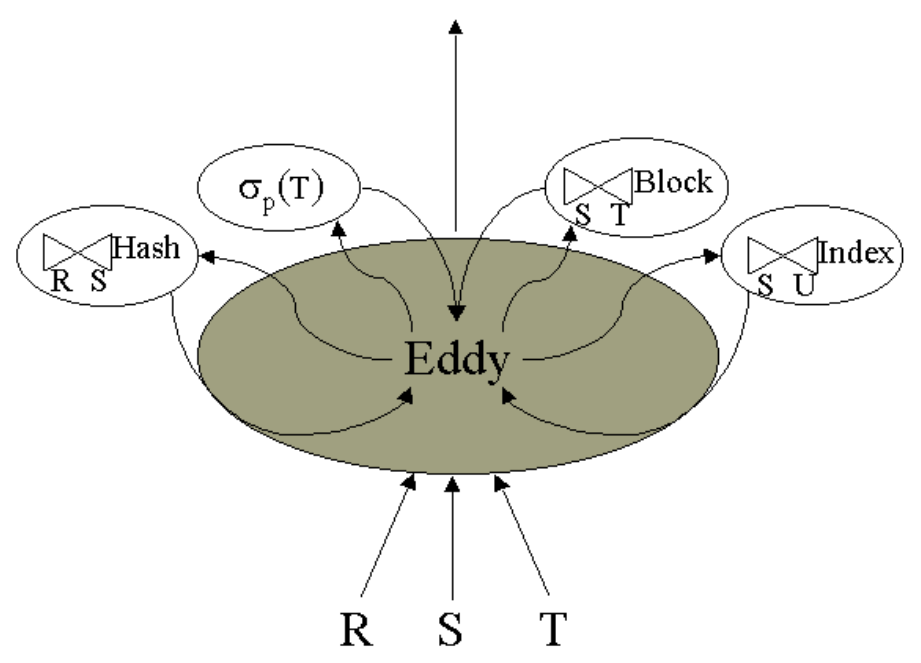

图 1. 流水线中的 eddy。数据从输入关系 R、S 和 T 流入 eddy。eddy 将元组路由到算子；算子作为独立线程运行，并把元组返回给 eddy。只有元组已经过全部算子处理，eddy 才将其送往输出。eddy 自适应地为每个元组选择经过各算子的顺序。

在运行中重新优化查询执行流水线，需要十分谨慎地维护查询执行状态。我们强调一类称为对称时刻的查询处理阶段，在这些时刻，算子可以方便地重排。我们还描述某些连接算法中的同步屏障，它们会将性能限制在较慢输入的速率上。因此，具有频繁对称时刻、屏障可自适应或没有屏障的连接算法，在 Telegraph 环境中尤其有吸引力。我们观察到，Ripple Join 家族 [HH99] 对等值连接和非等值连接都能提供效率、频繁的对称时刻，以及自适应或不存在的屏障。

eddy 体系结构十分简单，无须传统的代价与选择率估计，还简化了计划枚举逻辑。我们希望彻底摆脱传统优化器，同时获得运行时自适应性并降低代码复杂度，eddy 是这一更大目标的第一步。本文聚焦于单站点查询处理器中的持续算子重排；其他优化问题留待未来工作部分讨论。

### 1.1 运行时波动

查询处理期间可能变化的属性有三种：算子的代价、算子的选择率，以及元组从输入到达的速率。第一种和第三种问题常见于广域环境，文献已有讨论 [AFTU96, UFA98, IFF+99]。当集群（无共享）系统“横向扩展”到数千个或更多节点时，这些问题可能更加常见 [Bar99]。

选择率在运行时的变化此前没有得到广泛讨论，但它很自然地就会发生，通常源于谓词与元组交付顺序之间的相关性。例如，考虑按年龄升序聚簇的雇员表，以及选择条件 $\mathrm{salary}\gt 100000$；年龄与薪水往往高度相关。最初，该选择会过滤掉交付的大部分元组，但随着扫描到的雇员年龄不断增大，选择率也会变化。选择率的时间变化也可能依赖性能波动：例如，并行 DBMS 中的聚簇关系往往在多个磁盘之间水平分区，各分区的产出速率会随不同磁盘的性能特性和利用率而变化。最后，在线聚合系统明确允许用户根据数据偏好控制元组的交付顺序 [RRH99]，从而产生类似影响。

### 1.2 体系结构假设

Telegraph 的目标是高效、灵活地提供广域站点之间的分布式查询处理，以及大型无共享集群中的并行查询处理。本文略微缩小范围，集中讨论一个起步阶段就已十分困难的问题：单站点查询执行器中的运行时算子重排，即面对性能变化，改变流水线查询计划树的实际顺序或“形状”。

我们假设在解析期间，由一个简单的预优化器构造初始查询计划树。由于我们将在运行中重排计划树，该优化器无须作出太多判断。不过，既然要构造查询计划，它就必须选择查询图的一棵生成树（即一组需要连接的表对）[KBZ86]，并为每个连接选择算法。第 2 节将再次讨论连接算法的选择；处理期间改变生成树和连接算法的问题，留到第 6 节讨论。

我们研究一个标准的单节点对象关系查询处理系统，并为它增加从外部数据集打开扫描和索引的能力。这正成为非常常见的基础体系结构，许多商用对象关系系统（例如 IBM DB2 UDB [RPK+99]、Informix Dynamic Server UDO [SBH98]）和联邦数据库系统（例如 Cohera [HSC99]）都提供这种能力。我们将这些非驻留表称为外部表。我们不作任何限制外部数据源规模的假设，它们可以任意大。外部表带来了前述许多动态挑战：它们可能位于广域网络另一端，面临突发性使用，而且能提供的代价与统计特性信息非常有限。

### 1.3 概述

在介绍 eddy 之前，第 2 节先讨论查询处理算法中允许或不允许频繁重排的性质。随后介绍 eddy 体系结构，说明它如何使算子顺序具有极高的灵活性（第 3 节）。第 4 节讨论控制 eddy 内元组流的策略。第 4 节的多种实验展示 eddy 在静态和动态环境中的稳健性，并提出一些未来工作问题。第 5 节回顾相关工作，第 6 节提出继续推进本研究的计划。

## 2 计划的可重排性

运行时重新优化的一个基本挑战，是在流水线查询处理算子运行期间对其进行重排。要在运行中改变查询计划，必须考虑各算子中的大量状态；任意改变可能需要显著的处理代价和代码复杂度，才能保证结果正确。例如，混合哈希连接 [DKO+84] 这类算子所维护的状态，可能增长到一个输入关系那么大；如果在构造状态期间重排计划，就可能需要修改或重新计算这些状态。

通过限制算子重排的场景，可以把这项工作降到最低。在描述 eddy 之前，我们先研究各种连接算法的状态管理；这一讨论引出 eddy 的设计，并成为低代价、持续重新优化方法的基础。我们的基本理念是，相比最佳情况下的性能，更偏重自适应性。在高度变化的环境中，最佳情况很少能持续足够长的时间。因此，如果理想化查询处理算法中边际的性能提升妨碍了频繁、高效的重新优化，我们就会舍弃这些提升。

### 2.1 同步屏障

连接这类二元算子通常保存大量状态。其中一种特定状态，与向不同输入请求元组的交错顺序有关。

例如，考虑对两个已排序且无重复值的输入执行归并连接。处理期间，总是从上一个元组值较小的关系中获取下一个元组。这显著约束了元组的消费顺序。一个极端例子是：外部关系 `slowlow` 交付缓慢，连接列含有许多小值；本地关系 `fasthi` 带宽高但很大，连接列中只有大值。在消费 `slowlow` 的大量元组期间，`fasthi` 的处理会被推迟很长时间。借用并行编程术语，我们把这种现象称为同步屏障：一个表扫描要等待另一个表扫描产生一个比此前所见值都大的值。

一般而言，当两个任务完成所需的时间不同（即“到达”屏障所需时间不同）时，屏障就会限制并发性，进而限制性能。注意，即使单站点查询引擎中也存在并发：网络 I/O、磁盘 I/O 和计算可以同时进行。因此，在动态性能环境中，甚至在静态但异构的性能环境中，也应尽量降低同步屏障开销。影响计划中屏障开销的因素有两个：屏障的频率，以及两个输入到达屏障的时间差。下文将说明，采用适当的连接算法，往往可以避免或调节屏障。

### 2.2 对称时刻

注意，对归并连接同步屏障的描述与输入顺序无关：除了输入交付的数据之外，它不根据任何其他属性区别对待输入。因此，归并连接常被称为对称算子，因为其两个输入得到同样的处理[^1]。许多其他连接算法并非如此。例如，传统嵌套循环连接中，“外”关系与“内”关系同步，但反过来不成立：每从外关系消费一个元组（或元组块），就设立一个屏障，直到内关系的完整扫描结束。对于嵌套循环连接这样的非对称算子，重排输入往往可以带来性能收益。

连接算法到达屏障时，就宣告其两个输入关系之间的一次调度依赖已经结束。在这些情况下，通常无须修改连接中的任何状态，就能改变输入顺序；如果确实如此，我们就把该屏障称为对称时刻。回到外关系为 R、内关系为 S 的嵌套循环连接例子。在屏障处，连接已经完成一轮完整的内层循环，将 R 的某个子集中的每个元组与 S 中的每个元组连接。只要产生 R 的迭代器记下当前游标位置 $c _ R$，就可以在此时重排输入，而不影响连接算法。此时，以 S 为对象的新“外层”循环通过获取 S 的第一个元组开始重扫，而 R 从 $c _ R$ 扫描至末尾。这可以反复进行，将 S 的元组与 R 中从位置 $c _ R$ 到末尾的全部元组连接。另一种选择是，在某轮 R 循环结束时（即一个对称时刻），再次交换输入次序：记住 S 的当前位置，再把 R 中下一个元组（从 $c _ R$ 开始）与 S 中从 $c _ S$ 到末尾的元组反复连接。图 2 展示了这种场景，其中发生了两次次序变化。有些算子，例如 [WA91] 的流水线哈希连接，完全没有屏障。它们始终处于对称状态，因为两个输入的处理完全解耦。

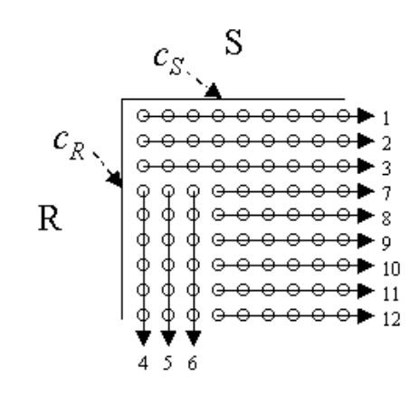

图 2. 嵌套循环连接生成的元组，在两个对称时刻重排。每条轴表示相应关系的元组，按访问方法交付的顺序排列。点表示连接生成的元组，其中一些可能被连接谓词消除。数字按顺序对应到达的屏障。c_R 和 c_S 是发生重排时相应输入所维护的游标位置。

对称时刻允许重排单个二元算子的输入。但可以进一步推广：由于连接具有交换性，一棵由 $n-1$ 个二元连接组成的树，可以看作一个 $n$ 元连接。我们很容易在关系 R、S 和 T 上实现一个双重嵌套循环连接算子，它会在每轮 S 循环结束时到达完全对称时刻。此时，对上述讨论作一个简单扩展，就可以重排全部三个输入，例如改成 T、R、S：为每个输入记录游标，然后每个循环都从记录的游标位置运行到输入末尾。

在采用两个算子的二元实现中，交换二元算子的位置也能达到同样效果。实际上，计划树按以下步骤变换：

$$
(R\bowtie _ 1 S)\bowtie _ 2 T
\quad\longrightarrow\quad
(R\bowtie _ 2 T)\bowtie _ 1 S
\quad\longrightarrow\quad
(T\bowtie _ 2 R)\bowtie _ 1 S
$$

这种方法将一个算子及其右侧输入看成一个单元，例如 $[\bowtie _ 2 T]$，并交换这些单元；这一思想此前已用于静态查询优化方案 [IK84, KBZ86, Hel98]。这样看待问题，就能自然地考虑重排多个连接及其输入，即使这些连接使用不同算法。在查询 $(R\bowtie _ 1 S)\bowtie _ 2 T$ 中，我们要求 $[\bowtie _ 1 S]$ 与 $[\bowtie _ 2 T]$ 相互可交换，但不要求它们采用相同的连接算法。第 2.2.2 节进一步讨论连接算法的交换性。

注意，交换性与对称时刻的结合，允许非常积极地重排计划树。因此，用一个 $n$ 元算子表示可重排的计划树是一种有吸引力的抽象，因为它封装了所有可能改变的顺序。我们将直接利用这一抽象，在输入表与连接算子之间插入一个 $n$ 元元组路由器，即“eddy”。

[^1]: 如果归并连接中有重复值，就用一个非对称但通常很小的嵌套循环处理这些重复值。为便于说明，这里可忽略这一细节。

#### 2.2.1 连接与索引

嵌套循环连接可以利用内关系上的索引，形成相当高效的流水线连接算法。索引嵌套循环连接（下文简称“索引连接”）天然是非对称的，因为其中一个输入关系已经预先建立了索引。即使两个输入都有索引，在“运行中”改变内外关系的选择也会有问题[^2]。因此，出于重排的目的，将索引连接看成作用于无索引输入的一种一元选择算子更简单，图 1 中 S 与 U 的连接就是如此。索引连接与选择的唯一区别是：相对于无索引关系，连接节点的选择率可能大于 1。虽然不能交换单个索引连接的输入，但可以将索引连接及其有索引关系作为一个单元，与计划树中的其他算子一起重排。注意，索引的这一逻辑也可以用于必须传入绑定值的外部表；这样的表可能是访问带表单网页、GIS 索引系统、LDAP 服务器等的网关 [HKWY97, FMLS99]。

[^2]: 在非聚簇索引中，索引顺序与扫描顺序不同。因此，在重排输入后，很难保证对新的“内”关系 R 的索引查找，只产生 R 中从 c_R 到末尾之间的元组；这里使用的是第 2.2 节的术语。

#### 2.2.2 物理属性、谓词与交换性

显然，预优化器选择索引连接算法，会限制可能的连接顺序。从 $n$ 元连接的角度看，必须施加一个顺序约束，让无索引的连接输入排在有索引输入之前，但不一定紧邻其前。该约束源于输入关系的一个物理属性：索引可被探测却不可被扫描，因此不能出现在对应的探测表之前。在保留归并连接的有序输入时，即保留“有趣顺序”时，也会出现类似但更复杂的约束。

某些连接算法的适用性还带来额外约束。许多连接算法只适用于等值连接，不能用于笛卡尔积等其他连接。这些算法也会约束计划树的重排，因为它们总是要求，等值连接谓词中提到的所有关系都先于它们处理。本文将顺序约束视为计划树不可违反的属性，并保证它们始终成立。第 6 节概述一些初步想法，通过考虑多种连接算法和查询图生成树，来放宽这一要求。

#### 2.2.3 连接算法与重排

为了使 eddy 尽可能有效，我们偏好具有频繁对称时刻、自适应或无屏障，以及尽可能少的顺序约束的连接算法：它们提供了最多的重新优化机会。[AH99] 总结了多种连接算法的重要性质。避免阻塞的要求排除了混合哈希连接；尽量减少顺序约束和屏障的要求排除了归并连接。嵌套循环连接的对称时刻不频繁，且屏障不平衡，因此也不理想。

我们考虑的其他算法，是传统迭代、哈希与索引方案中频繁出现对称时刻的版本，即 Ripple Join [HH99]。注意，[WA91] 最初的流水线哈希连接是哈希 Ripple Join 的一种受限版本。[UF99, IFF+99] 的外存哈希扩展可直接用于哈希 Ripple Join，[HH99] 也把索引连接作为特殊情况处理。对于非等值连接，块 Ripple Join 很有效，其对称时刻频繁，尤其是在处理初期 [HH99]。图 3 展示块、索引和哈希 Ripple Join；关于这些算法及其变体的详细讨论，参见 [HH99, IFF+99, UF99]。这些算法能够在不牺牲太多性能的情况下实现自适应：[UF99] 和 [IFF+99] 展示了可扩展的哈希 Ripple Join 版本，其静态场景性能可与混合哈希连接竞争；[HH99] 表明，虽然块 Ripple Join 的效率可能低于嵌套循环连接，但它到达对称时刻的频率高得多，特别是在处理早期。[AH99] 讨论了这些自适应算法的内存开销，它们可能大于标准连接算法。

Ripple Join 在图 3 中矩形波纹的每个“转角”处都有对称时刻，也就是输入流 R 的一个前缀已与输入流 S 的一个前缀中的全部元组连接，反之亦然的时候。对于哈希 Ripple Join 和索引连接，每从扫描输入中消费完一个元组、尚未消费下一个元组时，就会出现这种情况。因此，Ripple Join 提供非常频繁的对称时刻。

Ripple Join 在屏障方面也有吸引力。它被设计为允许每个输入改变速率；最初这样做，是为了主动给对中间结果具有更大统计影响的输入关系投入更多处理。然而，同一机制也允许在广域场景中进行响应式自适应：每个转角都会到达一个屏障，下一个转角可以自适应地反映两个输入的相对速率。对于块 Ripple Join，到达前一个转角时才选择下一个转角；这种选择可以自适应地反映两个输入随时间变化的相对速率。

Ripple Join 家族以适度的性能和内存占用开销，提供了有吸引力的自适应特性。因此，它们很好地符合我们牺牲边际速度以换取适应能力的理念，Telegraph 将重点采用这些算法。

## 3 河流与涡流

上述讨论使我们可以考虑在对称时刻方便地重排查询计划。本节接着介绍 eddy 机制，用自然的方式在查询处理期间实现重排。这里描述的技术可用于任何算子，但对称时刻频繁的算法允许更频繁的重新优化。在讨论 eddy 之前，先介绍基本的查询处理环境。

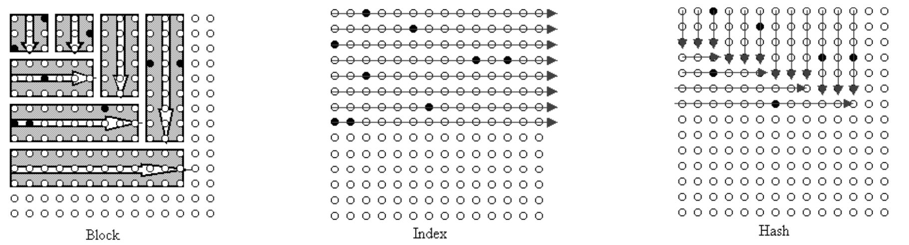

图 3. 块、索引和哈希 Ripple Join 生成的元组。在块 Ripple Join 中，连接生成全部元组，但其中一些可能被连接谓词消除。索引和哈希 Ripple Join 的箭头表示迄今已检查的笛卡尔积空间的逻辑部分；这些连接只在满足连接谓词的元组（黑点）上投入工作。在哈希 Ripple Join 图中，一个关系的到达速率是另一个的 3 倍。

### 3.1 River

我们在 River [AAT+99] 中实现了 eddy。River 是一个无共享并行查询处理框架，可以动态适应性能与工作负载的波动。尽管集群各机器的硬件和工作负载存在异构性与动态变化，River 仍能在并行排序和哈希连接等 I/O 密集型基准上稳健地产生接近纪录水平的性能。有关 River 自适应性与并行性特性的更多细节，参见原论文 [AAT+99]。在 Telegraph 中，我们计划利用 River 的适应能力，在无共享并行环境中动态转移负载，包括查询处理负载和数据交付负载。但本文仅讨论 eddy 的基本单站点特性；并行 River 中的 eddy 留到第 6 节讨论。

由于这里不讨论并行性，对 River 框架作一个简单概述就足够。River 是一个数据流查询引擎，在许多方面类似于 Gamma [DGS+90]、Volcano [Gra90] 和商用并行数据库引擎，其中“迭代器”风格的模块（查询算子）通过固定的数据流图（查询计划）通信。每个模块作为独立线程运行，图中的边对应有限容量的消息队列。生产者与消费者速率不同时，较快线程可能在队列上阻塞，等待较慢线程赶上。与 [UFA98] 一样，River 是多线程的，可以通过以独立速率读取不同输入，利用无屏障算法。我们使用的 River 实现源于 Now-Sort [AAC+97]，具有高效 I/O 机制，包括预取扫描、绕过操作系统缓冲以及高性能用户态网络通信。

#### 3.1.1 预优化

虽然我们用 eddy 重排连接之间的表，但启发式预优化器必须选择最初如何将关系配对成连接，并满足每个关系只参与一个连接的约束。这对应于选择查询图的一棵生成树，其中节点表示关系，边表示二元连接 [KBZ86]。一种合理的生成树选择启发式方法，是先在所有已知很小的表之间形成笛卡尔积链，以便在基础表基数统计可用时处理“星型模式”；接着任意选择等值连接边，假设其选择率相对较低；最后再选择完成生成树所需数量的任意非等值连接边。

给定查询图生成树后，预优化器需要为每条边选择连接算法。对于每条等值连接边，可以使用索引连接（若索引可用），或使用哈希 Ripple Join。对于非等值连接边，可用块 Ripple Join。

这些简单启发式方法，让我们可以专注于最初的 eddy 设计；第 6 节提出关于自适应地决定生成树和算法的初步想法。

### 3.2 River 中的 Eddy

eddy 通过 River 中的一个模块实现，包含任意数量的输入关系、若干参与的一元与二元模块，以及单个输出关系（图 1）[^3]。eddy 封装了参与算子的调度；进入 eddy 的元组可以按多种顺序流经这些算子。

本质上，eddy 在查询计划中将多个一元和二元算子显式合并成单个 $n$ 元算子，这基于第 2.2 节的直觉： $n$ 元算子容易捕获对称性。eddy 模块维护一个固定大小的元组缓冲区，其中的元组需要由一个或多个算子处理。参与 eddy 的每个算子有一个或两个由 eddy 提供元组的输入，以及一个将元组返回 eddy 的输出流。eddy（涡流）的名字，正是来自 River（河流）内部这种循环的数据流。

进入 eddy 的元组关联一个元组描述符，其中包含 Ready 位向量和 Done 位向量，分别表示哪些算子有资格处理该元组，以及哪些算子已经处理过该元组。eddy 只将元组发给对应 Ready 位置位的算子。算子处理完元组后将它返回 eddy，相应 Done 位随之置位。如果所有 Done 位都已置位，元组就被送到 eddy 的输出；否则，它会被送给另一个有资格的算子继续处理。

eddy 从一个输入接收元组时，将 Done 位清零，并适当设置 Ready 位。在简单情况下，eddy 将所有 Ready 位置位，表示任意算子顺序都可接受。如果算子之间存在顺序约束，eddy 只设置可以最先执行的那些算子的 Ready 位。当算子将元组返回 eddy 时，eddy 为所有有资格处理该元组的算子设置 Ready 位。二元算子生成的输出元组对应于输入元组的组合；此时，将两个输入元组的 Done 位和 Ready 位分别作按位或运算。这样，eddy 既保留顺序约束，又尽可能增加元组遵循不同算子顺序的机会。

eddy 的两个性质值得说明。首先，它可以表示与给定连接节点集合对应的整个浓密树（bushy tree）类别。例如，两对元组可能分别由两个不同的连接模块独立组合，然后被路由到第三个连接，将这两条二元记录拼接成四表连接记录。其次，eddy 不要求重排只能发生在整个 eddy 的共同对称时刻。某个算子必须谨慎地避免在下一个对称时刻之前从某些输入获取元组，例如，嵌套循环连接在完成内关系重扫之前，不会从当前外关系获取新元组。但发生这一动作时，并不要求 eddy 中所有算子都处于对称时刻；只有正在获取新元组的那个算子需要如此。因此，无论在能够生成的树形状方面，还是在逻辑上允许算子重排的场景方面，eddy 都相当灵活。

[^3]: 没有任何因素阻止在 eddy 中使用元数大于 2 的 n 元算子，但这类实现并非数据库查询处理中的典型做法，所以本文不作讨论。

## 4 在 Eddy 中路由元组

eddy 模块引导元组从输入经过各算子流向输出，灵活性体现在每个元组都可以独立地经过各算子。eddy 采用的路由策略决定系统效率。本节研究一些有希望的初步策略；我们认为这是一个有大量未来研究机会的领域。第 6 节概述部分尚待解决的问题。

eddy 的元组缓冲区实现为一个优先级队列，采用灵活的优先级方案。给算子分配的，总是缓冲区内对应 Ready 位已置位且优先级最高的元组。为简便起见，我们先考虑一个非常简单的方案：元组进入 eddy 时优先级低，从算子返回 eddy 时则赋予高优先级。它保证在从输入消费新元组之前，已有元组先完整流经 eddy，从而避免 eddy 被新元组“堵住”。

### 4.1 实验设置

为说明 eddy 的工作方式，本节给出一些初步实验；这里先简要介绍实验设置。全部实验都在一台运行 Solaris 2.6 的单处理器 Sun Ultra-1 工作站上进行，内存为 160 MB。我们采用 River 的 Euphrates 实现 [AAT+99]，合成生成表 1 所示关系，每个关系的元组大小都是 100 字节。

表 1. 表的基数；值均匀分布。

| 表 | 基数 | a 列的值 |
| --- | --- | --- |
| R | 10,000 | 500–5500 |
| S | 80,000 | 0–5000 |
| T | 10,000 | N/A |
| U | 50,000 | N/A |

为实验不同选择代价和选择率，我们将选择模块人工实现为与相对代价对应的自旋循环，再按相应选择率作随机化的选择判断。我们用抽象的“延迟单位”描述选择的相对代价；对于优化研究，自旋循环的绝对循环次数并不重要。我们实现了最简单的哈希 Ripple Join，等同于最初的流水线哈希连接 [WA91]；这里的实现没有像 [HH99] 那样，基于统计目的控制磁盘资源消耗。我们通过在文件内执行随机 I/O 来模拟索引连接，返回的平均匹配数对应于预设选择率。允许文件系统缓存预热后吸收部分索引 I/O。为公平比较 eddy 与静态计划，我们用强制元组遵循静态顺序的 eddy 模拟静态计划，即按正确顺序设置 Ready 位。

### 4.2 朴素 Eddy：流体动力学与算子代价

为说明 eddy 的工作方式，考虑一个非常简单的单表查询，带有两个昂贵的选择谓词，并采用传统假设：执行期间性能和选择率属性均不变。SQL 查询如下：

```sql
SELECT *
  FROM U
 WHERE s1() AND s2();
```

第一个实验考察“朴素”eddy 能在多大程度上处理算子之间的代价差异。我们多次运行该查询，始终将 s2 的代价设为 5 个延迟单位，并将两个选择的选择率都设为 50%。各次运行给 s1 采用不同代价，在 1–9 个延迟单位之间变化。我们将这两个选择组成的朴素 eddy，与两种可能的静态顺序比较，也与第 4.3 节将详细介绍的基于“彩票”的 eddy 比较。人们可能以为，朴素 eddy 中的灵活路由会把元组平均交给两个选择：一半先经过 s1 再经过 s2，另一半先经过 s2 再经过 s1，从而整体表现居中。图 4 表明事实并非如此：在没有任何关于算子相对代价的显式信息时，朴素 eddy 在所有情况下都几乎达到两种顺序中较好者的表现。

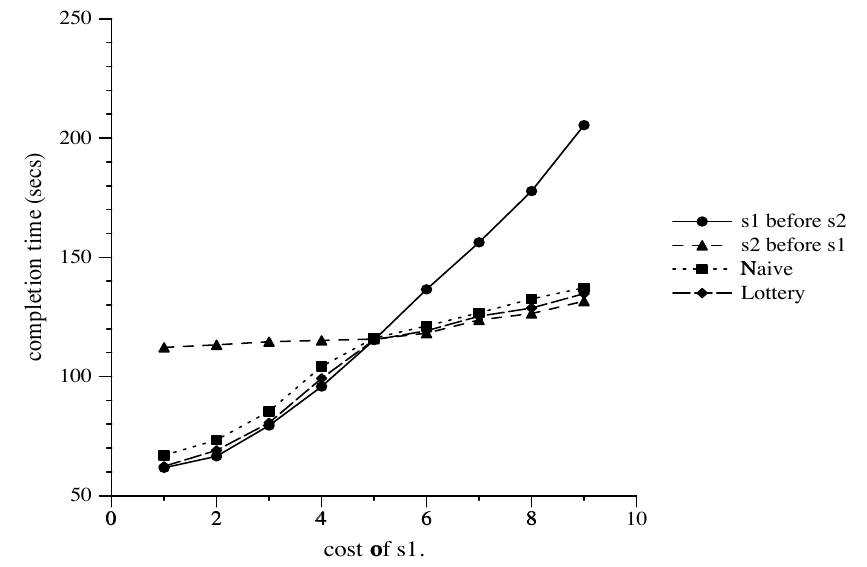

图 4. 两个选择率均为 50% 的选择的性能；s2 的代价为 5，s1 的代价在不同运行之间变化。横轴为 s1 的代价，纵轴为完成时间（秒）。

朴素 eddy 在这种情况下有效，源于 s1 和 s2 的消费速率差异所形成的简单流体动力学。River 数据流图中的边对应固定大小的队列。这一限制与流体流动中的背压具有相同效果：沿任何边输入端的生产速率，都受输出端消费速率限制。代价较低的选择，例如图 4 左侧的 s1，每个元组花费的时间较少，所以可以更快消费元组；因此，低代价算子对输入表施加的背压较小。同时，高代价算子产生元组相对较慢，因而低代价算子很少需要消费一个此前已经见过、具有高优先级的元组。所以，即使完全不显式暴露或跟踪代价，大多数元组也会先被路由到低代价算子。

### 4.3 快速 Eddy：学习选择率

对于代价不同、选择率相同的算子，朴素 eddy 工作得很好。但我们尚未考虑选择率差异。第二个实验将算子代价保持为相同常量（5 单位），将 s2 的选择率固定为 50%，在不同运行中改变 s1 的选择率。图 5 的结果就不那么令人鼓舞了：朴素 eddy 如最初预期，表现大约位于最好与最差计划的中间。显然，朴素优先级方案及其产生的背压不足以捕获选择率差异。

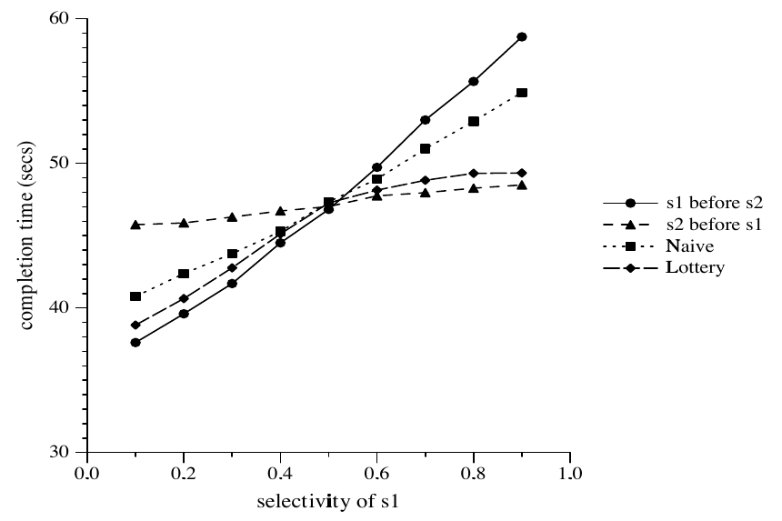

图 5. 两个代价均为 5 的选择的性能；s2 的选择率为 50%，s1 的选择率在不同运行之间变化。横轴为 s1 的选择率，纵轴为完成时间（秒）。

为解决这一问题，我们希望优先级方案同时根据算子的消费速率和生产速率给予偏好。算子的消费（输入）速率只由代价决定，而生产（输出）速率由代价与选择率的乘积决定。由于算子对输入的背压主要依赖其消费速率，朴素方案无法捕获不同选择率也就不足为奇。

为了随时间跟踪消费和生产，我们用一个通过彩票调度（Lottery Scheduling）[WW94] 实现的简单学习算法增强优先级方案。eddy 每交给算子一个元组，就给该算子记入一张“彩票”。算子每向 eddy 返回一个元组，eddy 就从其为该算子维护的累计计数中扣除一张彩票。准备发送元组进行处理时，eddy 在有资格接收该元组的算子之间“抽奖”。关于彩票调度的一种简单高效实现，参见 [WW94]。算子“中奖”并收到元组的概率对应于它的彩票计数，而该计数跟踪的是算子从系统中排除元组的相对效率。通过用彩票方案路由元组，eddy 跟踪并“学会”一个能够带来良好整体效率的算子顺序。

图 4 和图 5 的“Lottery”曲线，将更智能的彩票路由方案与朴素背压方案及两种静态顺序进行比较。彩票方案能够有效处理两种场景：在代价变化实验中略微改善 eddy，在选择率变化实验中则远好于朴素方案。

为进一步解释，图 6 展示两种 eddy 方案中按 s1、s2 顺序而非 s2、s1 顺序处理的元组百分比；它大致表示 s1 与 s2 所持彩票数随时间的平均比例。注意，朴素背压策略对选择率变化几乎不敏感，实际上，随着 s1 选择率升高，它还会略微朝错误方向偏移。相比之下，基于彩票的方案能很好地随选择率变化而适应。

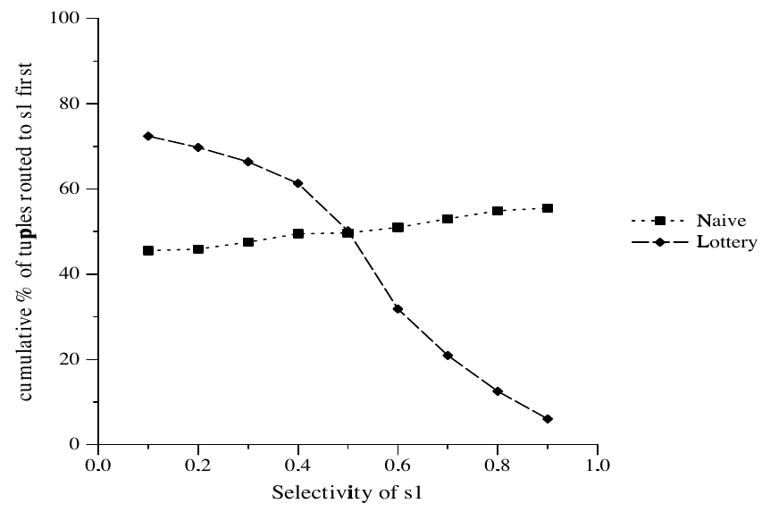

图 6. 选择率变化实验（图 5）中采用彩票方案的元组流。横轴为 s1 的选择率，纵轴为累计先路由到 s1 的元组百分比。

在两幅图中都可以看到，当代价和选择率接近相等（s1 = s2 = 50%）时，遵循较低代价顺序的元组百分比接近 50%。这一观察很直观，却相当重要。基于彩票的 eddy 接近最优顺序的代价，却不关心是否严格遵循最优顺序。对比早期运行时重新优化工作 [KD98, UFA98, IFF+99]，后者在处理期间运行传统查询优化器，以确定剩余部分的最优计划。彩票方案关注整体代价，而非寻找最优计划，因此能以小得多的工作量、用概率方式提供近乎最优的性能，使重新优化可以采用极轻量的技术，并对每个元组执行多次。

另一个相关观察是：图 6 右侧彩票算法更接近完美路由（y = 0%），而左侧距离完美路由（y = 100%）稍远。但是，在对应性能图（图 5）中，这两种情况下彩票 eddy 与最优静态顺序的差距并没有很大变化。考察两种情况下发生顺序错误的“风险”，可以解释这一现象。图的左侧，s1 的选择率为 10%，s2 为 50%，两者代价都为 $c=5$ 个延迟单位。令 $e$ 为元组被错误路由的比例，即在此情况下先到 s2 再到 s1。那么查询的期望代价为：

$$
(1-e)\cdot 1.1c+e\cdot 1.5c=0.4ec+1.1c
$$

相对地，在第二种情况下，s1 的选择率改为 90%，期望代价为：

$$
(1-e)\cdot 1.5c+e\cdot 1.9c=0.4ec+1.5c
$$

由于 90% 选择率时的风险高于 10% 时，彩票方案在 90% 选择率时会比在 10% 时更积极地偏向最优顺序。

译注：原文两式中的错误率项均为 0.4ec；上句关于“风险更高”的表述也按原文保留。

### 4.4 连接

为便于说明，到目前为止我们讨论的是选择，但连接当然是查询处理中更常见的昂贵算子。本节研究 eddy 如何与流水线 Ripple Join 算法交互。我们暂时仍研究静态性能环境，以验证即使在静态技术最有效的场景中，eddy 也能表现良好。

首先考虑一个简单的三表查询：

```sql
SELECT *
  FROM R, S, T
 WHERE R.a = S.a
   AND S.b = T.b
```

实验构造了一个预优化计划：R 与 S 之间采用哈希 Ripple Join，S 与 T 之间采用索引连接。由于数据均匀分布，表 1 表明 RS 连接的选择率为 $1.8\times 10^{-4}$；相对于 S 的选择率为 180%，即每个进入连接的 S 元组平均找到 1.8 个匹配的 R 元组 [Hel98]。我们人为将索引连接相对于 S 的选择率设为 10%，整体选择率为 $1\times 10^{-5}$。图 7 展示两种 eddy 方案与两种静态连接顺序的相对性能。结果与选择实验相呼应：彩票 eddy 近乎最优，朴素 eddy 则位于最好与最差静态计划之间。

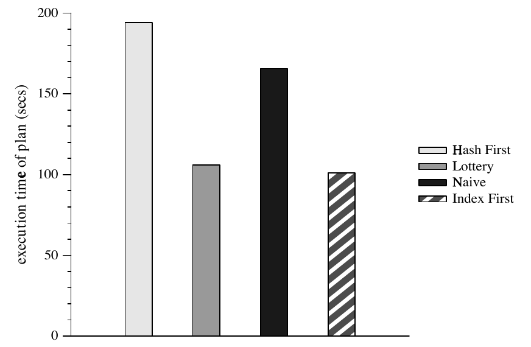

图 7. 两个连接的性能：一个具有筛选作用的索引连接和一个哈希连接。纵轴为计划执行时间（秒）。

如第 2.2.1 节所述，索引连接与选择非常相似。哈希连接的行为更加复杂且对称，值得进一步研究。图 8 展示该查询仅使用哈希 Ripple Join 的两个版本。我们的内存流水线哈希连接具有相同代价。我们改变 R、S 和 T 的数据，使 ST 连接相对于 S 的选择率在一个版本中为 20%，另一个版本中为 180%。所有运行中，RS 连接谓词相对于 S 的选择率都固定为 100%。如图所示，彩票 eddy 继续表现得近乎最优。

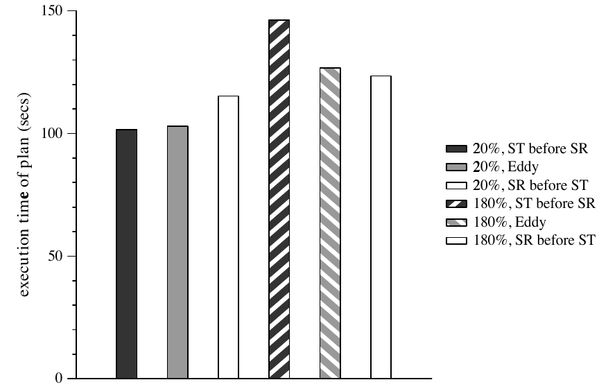

图 8. 哈希连接 R ⋈ S 和 S ⋈ T 的性能。R ⋈ S 相对于 S 的选择率为 100%；两次运行中，S ⋈ T 相对于 S 的选择率分别为 20% 和 180%。纵轴为计划执行时间（秒）。

图 9 展示四个连接实验中，eddy 内遵循两种顺序之一的元组百分比。eddy 虽然并不严格遵循最优顺序，但在哈希连接应先于索引连接的实验中，已经非常接近。此时，索引连接的相对代价非常高，先选择它的风险使哈希连接几乎总能赢得彩票。

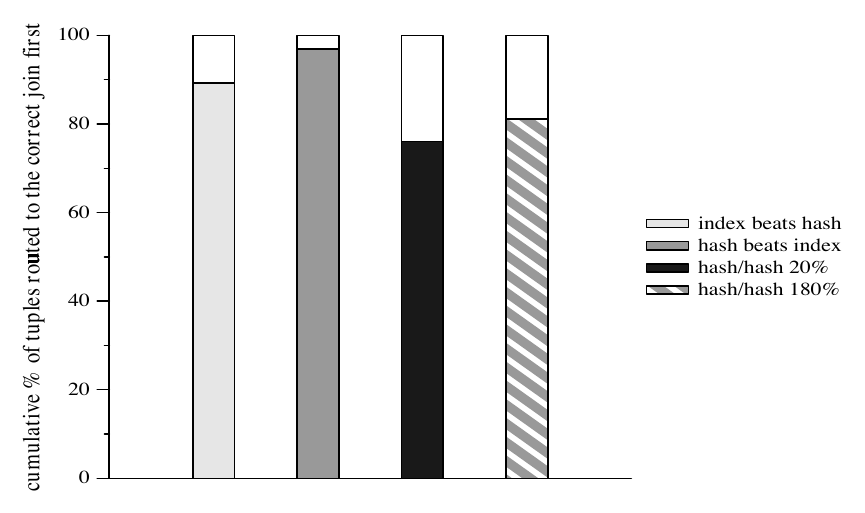

图 9. 所有连接实验中，按最优顺序路由的元组百分比。

### 4.5 响应动态波动

eddy 应当随时间自适应地响应第 1.1 节所述的性能和数据特征变化。到目前为止，前述路由方案尚未考虑如何做到这一点。具体而言，我们的彩票方案给所有经验赋予相同权重：久远过去的观察与最近观察对彩票的影响一样大。因此，在查询早期赚到许多彩票的算子可能变得如此富有，以至于需要很长时间，才会被近期表现最好的算子赶上。

为避免这一问题，需要修改计分方案，在一定程度上遗忘历史。一种简单方法是采用窗口方案，将时间划分为窗口，eddy 为每个算子跟踪两种计数：已存彩票（banked tickets）数和暂存彩票（escrow tickets）数。已存彩票用于抽奖，暂存彩票用于测量窗口期间的效率。

在每个窗口开始时，用暂存账户的值替换已存账户的值，并清零暂存账户，即：

```text
banked = escrow
escrow = 0
```

这一方案确保算子必须在每个窗口中“重新证明自己”。

我们考虑一个三表等值连接查询，其中两个表位于外部，被索引连接用作“内”关系。第三个关系包含 30,000 个元组。由于假定索引服务器位于远程，我们将索引模块的“代价”实现为时间延迟，而不是自旋循环；这样能更好地模拟等待网络响应等外部事件的行为。原文代码为：

```c
while (gettimeofday() < x) ;
```

实验分为两个阶段：起初，一个索引（称为 $I _ {fs}$）很快，没有时间延迟，另一个索引（ $I _ {sf}$）很慢，每次查找需要 5 秒。30 秒后开始第二阶段，两个索引交换速度： $I _ {fs}$ 变慢， $I _ {sf}$ 变快。两个索引均有 1% 的概率返回一个匹配元组。

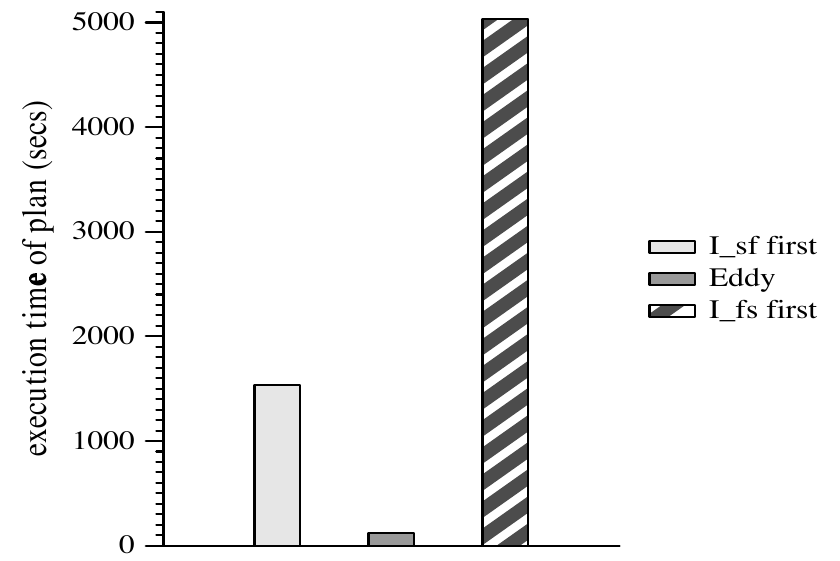

图 10. 适应连接代价变化：性能。纵轴为计划执行时间（秒），比较先执行 I_sf、eddy 和先执行 I_fs 三种方案。

图 10 将两种可能的静态计划与采用窗口式彩票方案的 eddy 进行性能比较。正如我们所希望的，eddy 比两种静态计划都快得多。第一种静态计划先执行 $I _ {sf}$，再执行 $I _ {fs}$；第一个索引连接在第一阶段很慢，只处理并丢弃了 6 个元组。在剩余运行期间，计划快速丢弃 99% 的元组，并将 300 个元组传给此时已变得昂贵的第二个连接。第二种静态计划先执行 $I _ {fs}$，再执行 $I _ {sf}$；第一个连接起初很快，处理约 29,000 个元组，将其中约 290 个传给第二个较慢的连接。30 秒后，第二个连接变快，迅速处理完这 290 个元组中的剩余部分，而第一个连接以每个元组 5 秒的速度缓慢处理剩下的 1,000 个元组。eddy 超过了这两种静态计划：第一阶段与第二种静态计划完全一样，消耗 29,000 个元组，将 290 个排队，等待 eddy 传给 $I _ {sf}$。第二阶段刚开始不久，eddy 就调整了顺序，先把元组传给如今变快的 $I _ {sf}$。因此，eddy 在第一阶段花费 30 秒；进入第二阶段时，在如今很快的 $I _ {sf}$ 处排队的元组不足 290 个，另外只需处理 1,000 个元组，其中只有约 10 个被传给如今很慢的 $I _ {fs}$。

一个类似但控制得更严格的实验更清楚地展示了 eddy 的适应能力。我们再次执行三表连接，两个外部索引均有 10% 的概率返回匹配。我们从扫描的表中读取 4,000 个元组，每处理 1,000 个元组就将代价在 1 和 100 个代价单位之间切换一次，即在实验期间切换三次。图 11 表明，eddy 能够正确适应，在算子代价切换时切换顺序。由于此处代价差距没有那么悬殊，风险更低，eddy 的适应时间略长。尽管存在学习时间，趋势仍然清晰：前 1,000 个元组中，eddy 将大多数先发给初始代价较低的索引 1；第二批 1,000 个元组中，则将大多数先发给索引 2，使累计百分比达到约 50%，对应图中第二个四分之一区间内近乎线性地向 50% 移动。这一模式在第三和第四个四分之一区间中重复，最终 eddy 随时间均匀使用两种顺序，同时始终偏向当时最佳的顺序。

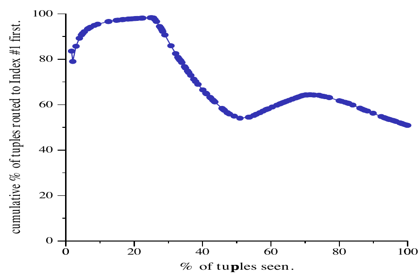

图 11. 适应连接代价变化：元组流动。横轴为已处理元组的百分比，纵轴为先路由到索引 1 的元组的累计百分比。

为简洁起见，我们省略另一个类似实验：固定代价，只随时间改变选择率。结果相似，但仅改变两个算子的选择率时，自适应方案的收益没有那么显著。可以对两个代价均为 $c$ 的算子进行分析，它们的选择率像前述实验一样在低值与高值之间交换。为给任一种静态顺序的性能确定下界，应让选择率在两个极端值（100% 和 0%）之间切换，并在两种状态下停留相同时间，使一半元组通过两个算子。因此，两种静态计划均需 $nc+\frac{1}{2}nc$ 时间，而最优动态计划只需 $nc$ 时间，两者之比仅为 3/2。不过，当算子更多时，适应选择率变化的意义可能更大。

#### 4.5.1 延迟交付

最后一个实验研究输入关系最初发生延迟的情况，与 [AFTU96, UFA98] 相同。我们回到图 8 左侧的三表查询，其中 RS 的选择率为 100%，ST 的选择率为 20%。将 R 的交付延迟 10 秒，结果见图 12。遗憾的是，我们看到，即使采用彩票和基于窗口的遗忘方案，eddy 对 R 初始延迟的适应仍不够理想。图 13 揭示了部分原因：处理初期，eddy 错误地偏向 RS 连接，尽管没有任何 R 元组流入，而且在正常执行中 RS 连接也应排在第二位（图 8）。eddy 这样做，是因为它观察到 RS 连接收到 S 元组时不产生任何输出元组。因此，eddy 起初将大多数 S 元组分配给 RS 连接，后者将它们存入内部哈希表，等 R 元组到达后再进行连接。ST 连接则只剩下获取并哈希 T 元组的工作。这浪费了本可在延迟期间用于连接 S 与 T 元组的资源，也为 RS 连接“蓄好了势”，使 R 元组开始出现时会产生大量元组。

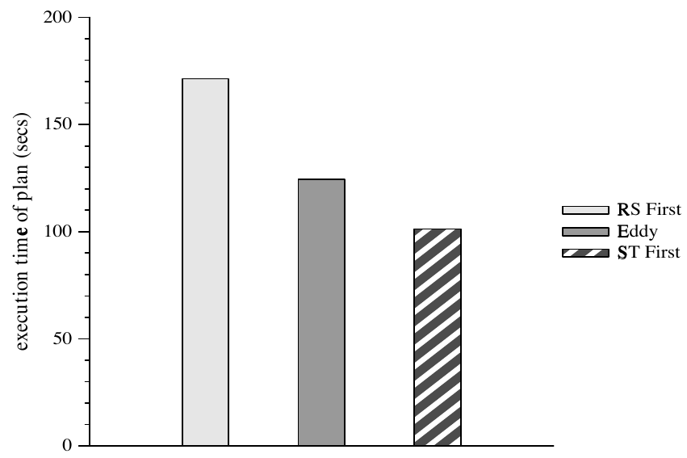

图 12. 适应 R 的初始延迟：性能。纵轴为计划执行时间（秒），比较先执行 RS、eddy 和先执行 ST 三种方案。

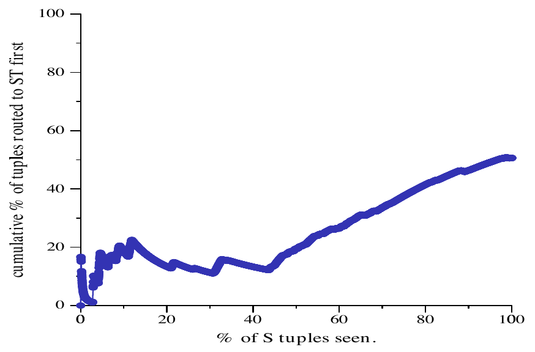

图 13. 适应 R 的初始延迟：元组流动。横轴为已处理 S 元组的百分比，纵轴为先路由到 ST 的元组的累计百分比。

注意，eddy 的表现远好于最差情况：当 R 开始产生元组时（图 13 横轴的 43.5 处），积压在 RS 连接中的 S 值涌出，eddy 迅速抑制 RS 连接，让 ST 连接先处理大多数元组。这一场景指出了我们实现中的两个问题。第一，彩票方案未能捕捉到输入延迟的连接所固有的选择率增长。第二，将元组存储在单个连接的哈希表中，会不必要地阻止其他连接处理这些元组；如果仔细避免产生重复结果，或许可以在多个连接中对输入元组进行哈希。解决第二个问题可能就不再需要解决第一个问题；我们计划在未来工作中进一步探索。

为简洁起见，我们省略该实验的一个变体：将 S 而非 R 的交付延迟 10 秒。在这种情况下，S 的延迟对两个连接产生相同影响，只会使所有计划的完成时间延长约 10 秒。

## 5 相关工作

据我们所知，本文提出了首个能够对流水线中正在执行的算子进行重排的通用查询处理方案；[NWMN99] 则考虑了一元算子这一特殊情况。我们对屏障和对称时刻的刻画似乎也是新的，它源于我们对通用流水线重新优化的关注。

近期一些论文研究在流水线末端重新优化查询 [UFA98, KD98, IFF+99]，仅在临时结果物化后重排算子。[IFF+99] 敏锐地指出，这一方法可以追溯到最初的 INGRES 查询分解方案 [SWK76]。这些流水线间技术并不属于传统控制理论（例如 [Son98]）或机器学习（例如 [Mit97]）所说的自适应：它们在决策时没有来自待优化操作的持续反馈，而是在查询计划中以粗粒度间隔进行静态优化。可以将这些工作视为与我们的工作互补：eddy 可用于流水线内的元组调度，[UFA98, KD98, IFF+99] 等技术可用于跨流水线重新优化。当然，这种结合牺牲了 eddy 的简单性，除了本文的思想，还需要传统的代价估计与计划枚举的复杂机制。如何最好地结合这些技术也存在重要问题，例如计划中放置多少个物化算子、哪些算子应放入哪些 eddy 流水线等。

DEC Rdb（后来的 Oracle Rdb）通过竞争来选择不同的访问方法 [AZ96]。Rdb 在运行时短暂观察各候选访问方法的性能，随后选定一个“胜者”，在查询余下的执行期间始终使用它。这与通过采样进行代价估计颇为相似（综述见 [BDF+97]）。关系稍远一些的是“参数化”或“动态”查询计划方面的工作，它们将部分优化决策推迟到查询执行开始时 [INSS97, GC94]。

Query Scrambling 的早期工作 [AFTU96] 研究了对广域数据源执行查询时的网络不可预测性。当处理因等待其他数据源而阻塞时，它会物化远程数据，这一思想可以与 eddy 配合使用。注意，本地物化能够缓解屏障，但不能消除屏障：跨越屏障后需要在本地完成的工作仍可能相当可观。后续工作关注数据交付最初延迟时重新调度可运行的子计划 [UFA98]，但没有像本文这样尝试对正在执行的算子重排。

近期提出了两个流水线哈希连接的外存版本 [IFF+99, UF99]。X-Join [UF99] 不仅通过处理外存情况增强了流水线哈希连接，还利用延迟时间积极匹配此前已收到并溢写的元组。我们计划在未来工作中试验 X-Join 与 eddy 的结合。

Control 项目 [HAC+99] 研究海量数据集的交互式分析，使用在线聚合、在线重排和 Ripple Join 等技术。交互式查询处理与自适应查询处理之间存在天然的协同关系：以流水线方式提供尽力而为答案的在线技术，本身就会适应不断变化的性能场景。Control 项目中优化流水线的需求最初促成了我们对 eddy 的研究。Control 项目 [HAC+99] 与控制理论领域 [Son98] 没有明确关联，不过 eddy 似乎在某些方面将两者联系了起来。

River 项目 [AAT+99] 是这项工作的另一个主要灵感来源。River 允许各模块尽其所能地快速工作，自然而然地将数据流平衡到更快的模块上。我们将 River 的理念带入了 eddy 最初基于反压的设计，并计划在未来工作中回到优化问题的并行负载均衡方面。

除了第 1.2 节所述的商业项目，还有许多面向异构数据集成的研究系统，例如 [GMPQ+97, HKWY97, IFF+99] 等。

## 6 结论与未来工作

查询优化传统上被视为一个粗粒度的静态问题。Eddy 是一种允许细粒度、自适应、在线优化的查询处理机制。它尤其适用于大规模系统中普遍存在的不可预测查询处理环境，以及交互式在线查询处理。它与 Ripple Join 家族中的算法天然契合，因为这些算法频繁出现对称时刻，并具有自适应的同步屏障，或者根本没有同步屏障。Eddy 可以作为查询处理系统中唯一的优化机制，从而免去传统查询优化器所需的许多复杂代码。另一种方式是将 eddy 与传统优化器配合使用，以提高流水线内的适应能力。我们的初步结果表明，eddy 在多种情形下表现良好，不过在改善反应时间、对存在延迟数据源的连接自适应地选择顺序方面，仍有一些问题尚待解决。这些早期结果已足够令人鼓舞，因此我们正在以 eddy 和 River 作为 Telegraph 系统查询处理的基础。

为了在这项初步工作中集中精力，我们有意推迟了有关理解、调优和扩展这些结果的一些问题。一个主要挑战是制定 eddy 的“彩票”策略，并能够形式化地证明：它们在静态场景下会快速收敛到接近最优的执行方式，在条件改变时也会自适应地收敛。同时考虑选择和连接会使这一挑战更加复杂，其中包括像第 4.5.1 节那样将元组“吸收”到哈希表中的哈希连接。我们计划关注多种性能指标，包括完成时间、计划的输出速率，以及在线聚合估计器的细化速率。我们还已开始研究基于强化学习 [SB98] 的方案，使 eddy 能够有效安排有依赖关系的谓词。在相关方向上，我们希望自动调节遗忘过去观察的积极程度，从而避免引入一个调优旋钮来调整窗口长度或类似常数（例如滞后因子）。

另一个主要目标是处理方案中剩余的静态部分，即对生成树、连接算法和访问方法作出的“预优化”选择。沿着 [AZ96] 的思路，我们认为竞争是这里的关键：可以同时运行多个冗余的连接、连接算法和访问方法，在 eddy 中跟踪其行为，并随时间自适应地选择。在这一场景中，实现上的挑战是避免生成重复结果，效率上的挑战则是避免将过多计算资源浪费在没有前景的候选方案上。

第三个重大挑战是利用 River 所提供的并行性与适应能力。大规模并行系统的可管理性正在接近极限，而数据规模仍在快速增长。Eddy 和 River 这样的自适应技术能够显著改善新一代大规模并行查询处理器的可管理性。River 已展示出能够良好地适应大型集群中的性能变化，将查询处理负载分散到不同节点，将数据交付分散到不同数据源。要兑现 River 的潜力，eddy 还面临额外挑战：尤其是对具有算子内并行性的查询重新优化，需要对数据重新分区；这为重排增加了一项单机 eddy 中不存在的开销。尝试自适应地调整计划中每个算子的分区程度时，还会出现额外复杂性。类似地，我们希望探索增强 eddy 和 River，使它们能够容忍数据源或并行执行参与者的故障。

最后，我们正在探索将 eddy 和 River 应用于通用数据流编程领域，包括多媒体分析与转码，以及可扩展、可靠的互联网服务组合 [GWBC99] 等应用。我们的意图是让 River 成为通用的并行数据流引擎，让 eddy 成为该环境中的主要调度机制。

## 致谢

Vijayshankar Raman 在这项工作过程中提供了大量帮助。Remzi Arpaci-Dusseau、Eric Anderson 和 Noah Treuhaft 实现了 Euphrates，并帮助实现了 eddy。Mike Franklin 提出了尖锐问题，并建议了未来工作方向。Stuart Russell、Christos Papadimitriou、Alistair Sinclair、Kris Hildrum 和 Lakshminarayanan Subramanian 都帮助我们聚焦于形式化问题。感谢 Navin Kabra 和 Mitch Cherniack 最初就运行时重新优化进行的讨论，也感谢 Berkeley 数据库研究组提供的反馈。“eddy”一词由 Stuart Russell 提议。

本项工作完成时，两位作者均在 UC Berkeley，受到 IBM Corporation 的资助、NSF 项目 IIS-9802051 和 Sloan Foundation Fellowship 的支持。本研究的计算与网络资源由 NSF RI 项目 CDA-9401156 提供。

## 参考文献

- [AAC+97] A. C. Arpaci-Dusseau, R. H. Arpaci-Dusseau, D. E. Culler, J. M. Hellerstein, and D. A. Patterson. High-Performance Sorting on Networks of Workstations. In *Proc. ACM-SIGMOD International Conference on Management of Data*, Tucson, May 1997.
- [AAT+99] R. H. Arpaci-Dusseau, E. Anderson, N. Treuhaft, D. E. Culler, J. M. Hellerstein, D. A. Patterson, and K. Yelick. Cluster I/O with River: Making the Fast Case Common. In *Sixth Workshop on I/O in Parallel and Distributed Systems (IOPADS ’99)*, pages 10–22, Atlanta, May 1999.
- [AFTU96] L. Amsaleg, M. J. Franklin, A. Tomasic, and T. Urhan. Scrambling Query Plans to Cope With Unexpected Delays. In *4th International Conference on Parallel and Distributed Information Systems (PDIS)*, Miami Beach, December 1996.
- [AH99] R. Avnur and J. M. Hellerstein. Continuous query optimization. Technical Report CSD-99-1078, University of California, Berkeley, November 1999.
- [Aok99] P. M. Aoki. How to Avoid Building DataBlades That Know the Value of Everything and the Cost of Nothing. In *11th International Conference on Scientific and Statistical Database Management*, Cleveland, July 1999.
- [AZ96] G. Antoshenkov and M. Ziauddin. Query Processing and Optimization in Oracle Rdb. *VLDB Journal*, 5(4):229–237, 1996.
- [Bar99] R. Barnes. Scale Out. In *High Performance Transaction Processing Workshop (HPTS ’99)*, Asilomar, September 1999.
- [BDF+97] D. Barbara, W. DuMouchel, C. Faloutsos, P. J. Haas, J. M. Hellerstein, Y. E. Ioannidis, H. V. Jagadish, T. Johnson, R. T. Ng, V. Poosala, K. A. Ross, and K. C. Sevcik. The New Jersey Data Reduction Report. *IEEE Data Engineering Bulletin*, 20(4), December 1997.
- [BO99] J. Boulos and K. Ono. Cost Estimation of User-Defined Methods in Object-Relational Database Systems. *SIGMOD Record*, 28(3):22–28, September 1999.
- [DGS+90] D. J. DeWitt, S. Ghandeharizadeh, D. Schneider, A. Bricker, H.-I Hsiao, and R. Rasmussen. The Gamma database machine project. *IEEE Transactions on Knowledge and Data Engineering*, 2(1):44–62, Mar 1990.
- [DKO+84] D. J. DeWitt, R. H. Katz, F. Olken, L. D. Shapiro, M. R. Stonebraker, and D. Wood. Implementation Techniques for Main Memory Database Systems. In *Proc. ACM-SIGMOD International Conference on Management of Data*, pages 1–8, Boston, June 1984.
- [FMLS99] D. Florescu, I. Manolescu, A. Levy, and D. Suciu. Query Optimization in the Presence of Limited Access Patterns. In *Proc. ACM-SIGMOD International Conference on Management of Data*, Phildelphia, June 1999.
- [GC94] G. Graefe and R. Cole. Optimization of Dynamic Query Evaluation Plans. In *Proc. ACM-SIGMOD International Conference on Management of Data*, Minneapolis, 1994.
- [GMPQ+97] H. Garcia-Molina, Y. Papakonstantinou, D. Quass, A Rajaraman, Y. Sagiv, J. Ullman, and J. Widom. The TSIMMIS Project: Integration of Heterogeneous Information Sources. *Journal of Intelligent Information Systems*, 8(2):117–132, March 1997.
- [Gra90] G. Graefe. Encapsulation of Parallelism in the Volcano Query Processing System. In *Proc. ACM-SIGMOD International Conference on Management of Data*, pages 102–111, Atlantic City, May 1990.
- [GWBC99] S. D. Gribble, M. Welsh, E. A. Brewer, and D. Culler. The Multi-Space: an Evolutionary Platform for Infrastructural Services. In *Proceedings of the 1999 Usenix Annual Technical Conference*, Monterey, June 1999.
- [HAC+99] J. M. Hellerstein, R. Avnur, A. Chou, C. Hidber, C. Olston, V. Raman, T. Roth, and P. J. Haas. Interactive Data Analysis: The Control Project. *IEEE Computer*, 32(8):51–59, August 1999.
- [Hel98] J. M. Hellerstein. Optimization Techniques for Queries with Expensive Methods. *ACM Transactions on Database Systems*, 23(2):113–157, 1998.
- [HH99] P. J. Haas and J. M. Hellerstein. Ripple Joins for Online Aggregation. In *Proc. ACM-SIGMOD International Conference on Management of Data*, pages 287–298, Philadelphia, 1999.
- [HKWY97] L. Haas, D. Kossmann, E. Wimmers, and J. Yang. Optimizing Queries Across Diverse Data Sources. In *Proc. 23rd International Conference on Very Large Data Bases (VLDB)*, Athens, 1997.
- [HSC99] J. M. Hellerstein, M. Stonebraker, and R. Caccia. Open, Independent Enterprise Data Integration. *IEEE Data Engineering Bulletin*, 22(1), March 1999. http://www.cohera.com.
- [IFF+99] Z. G. Ives, D. Florescu, M. Friedman, A. Levy, and D. S. Weld. An Adaptive Query Execution System for Data Integration. In *Proc. ACM-SIGMOD International Conference on Management of Data*, Philadelphia, 1999.
- [IK84] T. Ibaraki and T. Kameda. Optimal Nesting for Computing N-relational Joins. *ACM Transactions on Database Systems*, 9(3):482–502, October 1984.
- [INSS97] Y. E. Ioannidis, R. T. Ng, K. Shim, and T. K. Sellis. Parametric Query Optimization. *VLDB Journal*, 6(2):132–151, 1997.
- [KBZ86] R. Krishnamurthy, H. Boral, and C. Zaniolo. Optimization of Nonrecursive Queries. In *Proc. 12th International Conference on Very Large Databases (VLDB)*, pages 128–137, August 1986.
- [KD98] N. Kabra and D. J. DeWitt. Efficient Mid-Query Reoptimization of Sub-Optimal Query Execution Plans. In *Proc. ACM-SIGMOD International Conference on Management of Data*, pages 106–117, Seattle, 1998.
- [Met97] R. Van Meter. Observing the Effects of Multi-Zone Disks. In *Proceedings of the Usenix 1997 Technical Conference*, Anaheim, January 1997.
- [Mit97] T. Mitchell. *Machine Learning*. McGraw Hill, 1997.
- [NWMN99] K. W. Ng, Z. Wang, R. R. Muntz, and S. Nittel. Dynamic Query Re-Optimization. In *11th International Conference on Scientific and Statistical Database Management*, Cleveland, July 1999.
- [RPK+99] B. Reinwald, H. Pirahesh, G. Krishnamoorthy, G. Lapis, B. Tran, and S. Vora. Heterogeneous Query Processing Through SQL Table Functions. In *15th International Conference on Data Engineering*, pages 366–373, Sydney, March 1999.
- [RRH99] V. Raman, B. Raman, and J. M. Hellerstein. Online Dynamic Reordering for Interactive Data Processing. In *Proc. 25th International Conference on Very Large Data Bases (VLDB)*, pages 709–720, Edinburgh, 1999.
- [SB98] R. S. Sutton and A. G. Bartow. *Reinforcement Learning*. MIT Press, Cambridge, MA, 1998.
- [SBH98] M. Stonebraker, P. Brown, and M. Herbach. Interoperability, Distributed Applications, and Distributed Databases: The Virtual Table Interface. *IEEE Data Engineering Bulletin*, 21(3):25–34, September 1998.
- [Son98] E. D. Sontag. *Mathematical Control Theory: Deterministic Finite-Dimensional Systems, Second Edition*. Number 6 in Texts in Applied Mathematics. Springer-Verlag, New York, 1998.
- [SWK76] M. R. Stonebraker, E. Wong, and P. Kreps. The Design and Implementation of INGRES. *ACM Transactions on Database Systems*, 1(3):189–222, September 1976.
- [UF99] T. Urhan and M. Franklin. XJoin: Getting Fast Answers From Slow and Bursty Networks. Technical Report CS-TR-3994, University of Maryland, February 1999.
- [UFA98] T. Urhan, M. Franklin, and L. Amsaleg. Cost-Based Query Scrambling for Initial Delays. In *Proc. ACM-SIGMOD International Conference on Management of Data*, Seattle, June 1998.
- [WA91] A. N. Wilschut and P. M. G. Apers. Dataflow Query Execution in a Parallel Main-Memory Environment. In *Proc. First International Conference on Parallel and Distributed Info. Sys. (PDIS)*, pages 68–77, 1991.
- [WW94] C. A. Waldspurger and W. E. Weihl. Lottery scheduling: Flexible proportional-share resource management. In *Proc. of the First Symposium on Operating Systems Design and Implementation (OSDI ’94)*, pages 1–11, Monterey, CA, November 1994. USENIX Assoc.
