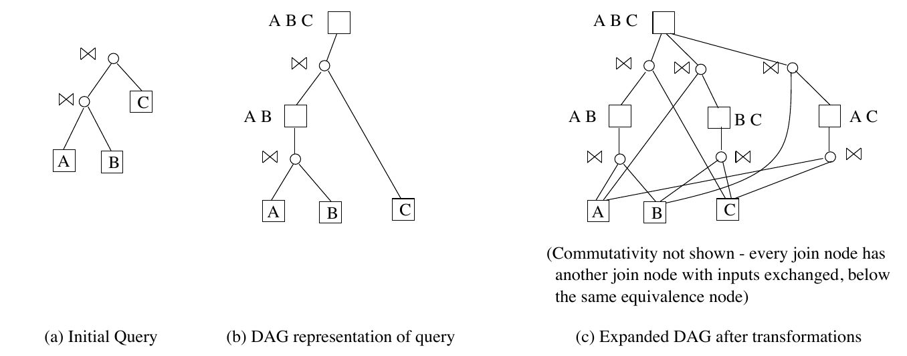
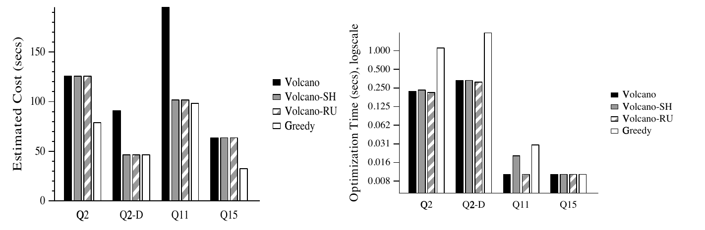
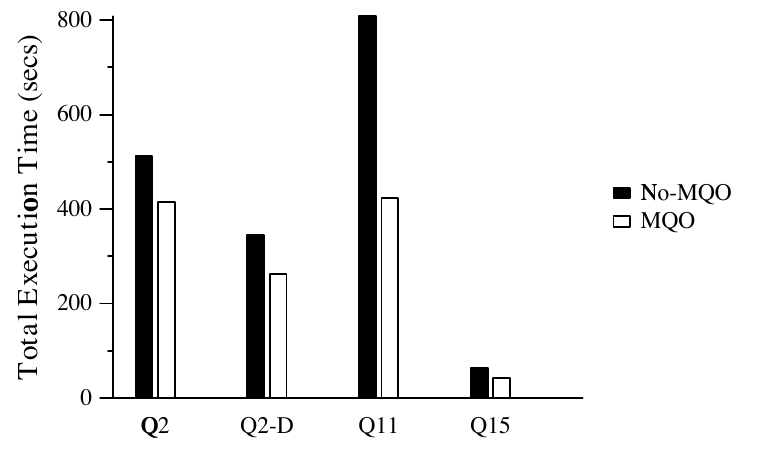
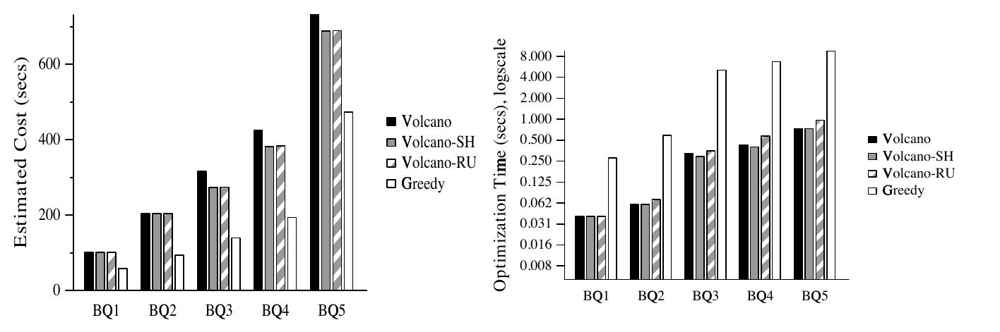
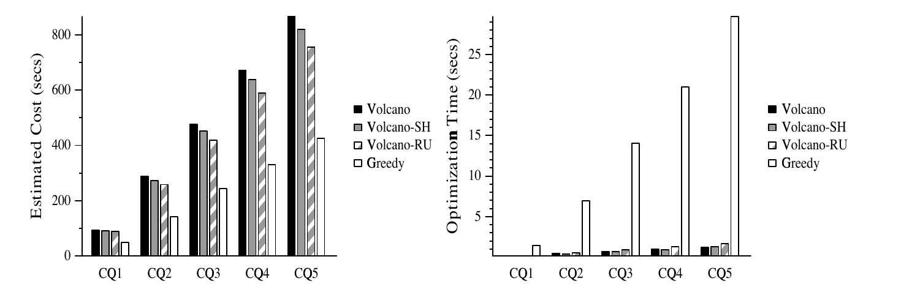

# Efficient and Extensible Algorithms for Multi Query Optimization（中文译文）

## 译者说明

本文依据同目录的 `source.pdf` 翻译。章节、图表、公式、算法、代码与参考文献按原文结构保留。

Prasan Roy（I.I.T. Bombay）、S. Seshadri（Bell Labs.）、S. Sudarshan（I.I.T. Bombay）、Siddhesh Bhobe（PSPL Ltd. Pune）

联系邮箱：`{prasan,sudarsha}@cse.iitb.ernet.in`；`seshadri@research.bell-labs.com`；`siddhesh@pspl.co.in`。

## 摘要

随着决策支持系统的使用日益增多，复杂查询已十分常见。这些复杂查询往往包含大量公共子表达式，既可能出现在单个查询内部，也可能出现在作为一个批次运行的多个查询之间。多查询优化旨在利用公共子表达式来降低求值代价。此前，多查询优化一直被视为不切实际，因为早期算法采用穷举方式，要探索一个双重指数规模的搜索空间。

本文表明，采用启发式方法的多查询优化是可行的，而且能带来显著收益。我们提出三种基于代价的启发式算法：基于对 Volcano 搜索策略做简单修改的 Volcano-SH 和 Volcano-RU，以及一种贪心启发式算法。我们的贪心启发式算法包含能大幅提高效率的新优化技术。这些算法的设计便于将其加入现有优化器。我们使用由 TPC-D 基准查询组成的工作负载，对这些算法进行了性能比较。研究表明，相对于传统优化，我们的算法能带来显著收益，而优化时间开销十分可接受。

## 1 引言

复杂查询正变得十分常见，尤其是因为出现了帮助分析大型数据仓库中信息的自动化工具。这些复杂查询往往包含大量公共子表达式，原因是：i）它们大量使用视图，并在查询中多次引用同一视图；ii）其中许多是相关嵌套查询，内层子查询中的某些部分可能不依赖外层查询变量，因而在反复调用内层查询时构成公共子表达式。

如果考虑作为一个批次执行的一组查询，发现公共子表达式的机会就会大幅增加。例如，SQL-3 存储过程可能调用多个查询，而这些查询可以批量执行。数据分析和报表通常需要执行一批查询。[SHT+99] 关于使用关系数据库存储 XML 数据的工作发现，用 XML-QL 之类语言编写的 XML 数据查询，需要转换为一系列关系查询。更新一组相关物化视图的任务，也会产生具有公共子表达式的相关查询 [RSS96]。

本文研究如何优化一组可能具有公共子表达式的查询；这个问题称为多查询优化。这里要指出，即使在单个查询内部，也可能存在公共子表达式；我们提出的技术同样处理这种查询内公共子表达式。

传统查询优化器不适合优化具有公共子表达式的查询，因为它们做出的是局部最优选择，可能错过全局最优计划，下面的例子说明了这一点。

**例 1.1** 设 $Q _ 1$ 和 $Q _ 2$ 是两个查询，其局部最优计划（即各自的最佳计划）分别为 $(R\bowtie S)\bowtie P$ 和 $(R\bowtie T)\bowtie S$。 $Q _ 1$ 和 $Q _ 2$ 的最佳计划没有任何公共子表达式。但是，如果为 $Q _ 2$ 选择备选计划 $(R\bowtie S)\bowtie T$（它可能不是局部最优计划），那么显然 $R\bowtie S$ 就是一个公共子表达式，可以只计算一次，供两个查询使用。共享 $R\bowtie S$ 的这个备选方案可能才是全局最优选择。

另一方面，盲目使用公共子表达式并不总能得到全局最优策略。例如，将表达式 $R\bowtie S$ 与 $T$ 连接的代价，可能远大于计划 $(R\bowtie T)\bowtie S$ 的代价；在这种情况下，即使已经有了 $R\bowtie S$，复用它也可能没有意义。□

例 1.1 表明，除了普通查询优化的工作以外，多查询优化还要：（i）识别共享计算的可能性；（ii）修改优化器的搜索策略，显式考虑共享计算，并找到全局最优计划。

过去已有多查询优化方面的研究（[Sel88, SSN94, PS88]），但这些研究主要集中于穷举算法。另一些工作侧重于在查询优化之后的阶段寻找公共子表达式 [Fin82, SV98]，但这种做法降低代价的空间有限；还有一些工作只考虑了范围有限的 OLAP 查询 [ZDNS98]。（第 7 节详细讨论相关工作。）多查询优化的搜索空间相对于查询大小呈双重指数增长，因此穷举策略不切实际；这也使多查询优化此前一直被认为开销过大，难以实用。

本文通过开发新的启发式算法，并以性能研究展示其实际收益，说明如何让多查询优化成为可行的技术。

我们的算法基于 AND-OR DAG 表示 [Rou82, GM93]，以紧凑地表示备选查询计划。DAG 表示保证了算法的可扩展性，即可以方便地处理新的操作和变换规则。DAG 可以按 [GM93] 的方式构建，并加上一些扩展，以确保检测并统一所有公共子表达式。DAG 的构建还考虑基于“包含推导”（subsumption）的计算共享，例如从 $\sigma _ {A\lt 10}(E)$ 的结果计算 $\sigma _ {A\lt 5}(E)$。

启发式优化算法的任务，是决定应该物化并共享哪些子表达式。我们给出的两个启发式算法 Volcano-SH 和 Volcano-RU，是对 Volcano 优化算法的轻量修改。第三个启发式算法是一种贪心策略：反复选出在物化并复用后带来最大收益（代价降低）的子表达式。这里的一项重要贡献，是贪心算法实现中的三项新优化，它们使算法十分高效。我们的性能研究表明，每一项优化都大幅改善了贪心算法的性能。

除了选择要物化和复用的中间表达式结果外，我们的优化框架还为物化结果选择排序顺序等物理属性。算法也处理在物化结果或数据库关系上创建哪些（临时）索引的选择。

我们的算法可以很容易地扩展到嵌套查询的多查询优化，以及参数化查询的多次调用（各次调用使用不同参数值）。我们使用的 AND-OR DAG 框架已用于至少两个商业数据库系统，分别来自 Microsoft 和 Tandem。不过，我们的算法也可以扩展为与 System R 风格的自底向上优化器配合工作。

我们使用 TPC-D 基准中的查询，以及其他基于 TPC-D 模式的查询，对多查询优化算法进行了性能研究。研究不仅展示了估计代价上的节省，还展示了在商业数据库上实际运行时间的显著改善。

性能结果表明，与单查询优化相比，我们的多查询优化算法在额外优化时间代价可接受的情况下，带来了显著收益。执行时间的节省足以补偿额外优化时间。三种启发式算法均优于基本 Volcano 算法，而总体上 Greedy 产生的计划最好，其次是 Volcano-RU 和 Volcano-SH。

我们认为，除技术贡献之外，另一项贡献在于展示如何构建一个实用的多查询优化系统：它能顺畅地集成索引、嵌套查询等扩展，使它们无缝协同工作。1999 年夏，我们在 Microsoft SQL Server 优化器上实现了部分算法原型；目前 Microsoft 正在评估多查询优化，以考虑是否将其纳入 SQL Server。

## 2 为多查询优化建立搜索空间

如第 1 节所述，多查询优化器的工作是：（i）识别共享计算的可能性，即通过识别公共子表达式来建立搜索空间；（ii）修改优化器的搜索策略，显式考虑共享计算并找到全局最优计划。这两项任务对多查询优化器都很重要，但彼此正交。换言之，搜索策略的细节并不依赖我们识别公共子表达式时有多积极（当然，其效果会受影响）。我们详细研究了这两项任务，但由于篇幅限制，本文着重讨论搜索策略。本节仍会概述识别公共子表达式算法的高层思路和直觉，并在相应位置引导读者查阅论文完整版 [RSSB98] 中的细节。

介绍识别公共子表达式的算法之前，先介绍查询的 AND-OR DAG 表示。AND-OR DAG 是一个有向无环图，其节点分为 AND 节点和 OR 节点；AND 节点的子节点只能是 OR 节点，而 OR 节点的子节点只能是 AND 节点。

AND-OR DAG 中的 AND 节点对应一个代数操作，例如连接（ $\bowtie$）或选择（ $\sigma$）。它表示由该操作及其输入定义的表达式。下文将 AND 节点称为**操作节点**。AND-OR DAG 中的 OR 节点表示一组产生相同结果集的逻辑表达式；这组表达式由该 OR 节点的 AND 子节点及其输入定义。下文将 OR 节点称为**等价节点**。

给定查询树最初直接表示为 AND-OR DAG。例如，图 1(a) 的查询树最初表示为图 1(b) 中的 AND-OR DAG。等价节点（OR 节点）用方框表示，操作节点（AND 节点）用圆圈表示。



图 1：初始查询及 DAG 表示。（a）初始查询；（b）查询的 DAG 表示；（c）应用变换后的展开 DAG。图中未画出交换律：每个连接节点在同一个等价节点下，都有另一个交换了输入的连接节点。

然后，对表示给定查询集合的初始查询 DAG 中的每个节点，应用所有可能的变换，从而展开初始 AND-OR DAG。假定仅允许连接结合律和交换律变换。那么，通过对图 1(b) 的初始 AND-OR DAG 进行变换，可以得到计划 $A\bowtie(B\bowtie C)$、 $(A\bowtie C)\bowtie B$，以及若干通过交换律与它们等价的计划。这些计划表示在图 1(c) 的 DAG 中。我们把应用了所有变换之后的 DAG 称为**展开 DAG**。注意，对 $\lbrace A,B,C\rbrace$ 的每一个子集，展开 DAG 都恰好具有一个等价节点；该节点表示计算这个子集中各关系连接的所有方式。由于篇幅限制，我们省略展开 DAG 生成算法的细节，详见 [RSSB98]。

### 2.1 面向多查询优化的 DAG 生成扩展

为了对一批查询应用多查询优化，需要把这些查询一起表示在单个 DAG 中，并共享子表达式。为了使 DAG 有一个根，创建一个不执行任何操作的伪操作节点，将所有查询的根等价节点作为其输入。

下面概述帮助实现多查询优化的两项 DAG 生成算法扩展。

第一项扩展处理公共子表达式的识别。如果一个查询包含两个逻辑等价、但语法不同的子表达式，例如 $(A\bowtie B)\bowtie C$ 和 $A\bowtie(B\bowtie C)$，初始查询 DAG 会包含两个不同的等价节点，分别表示这两个子表达式。我们修改了 Volcano 的 DAG 生成算法，使它每当发现节点等价时（应用连接结合律之后），就把这些节点统一，替换为单个等价节点。

Volcano 算法使用散列机制检测重复推导，避免因循环推导（例如表达式 $e1$ 变换为 $e2$，然后又变换回 $e1$）而创建重复等价节点。我们的修改还利用这套散列机制，检测并统一原已存在的重复等价节点，以及从不同表达式变换而产生的重复等价节点。统一操作的细节见 [RSSB98]。

第二项扩展是检测并处理包含推导。例如，假设查询中出现两个子表达式 $e1:\ \sigma _ {A\lt 5}(E)$ 和 $e2:\ \sigma _ {A\lt 10}(E)$。可以在 $e2$ 的结果上再做一次选择而得到 $e1$，即 $\sigma _ {A\lt 5}(E)\equiv\sigma _ {A\lt 5}(\sigma _ {A\lt 10}(E))$。为表示这种可能性，我们在 DAG 的 $e1$ 与 $e2$ 之间增加一个操作节点 $\sigma _ {A\lt 5}$。类似地，给定 $e3:\ \sigma _ {A=5}(E)$ 和 $e4:\ \sigma _ {A=10}(E)$，可以引入一个新的等价节点 $e5:\ \sigma _ {A=5\lor A=10}(E)$，并增加从 $e5$ 推导 $e3$ 和 $e4$ 的新路径。这个新节点表示两次选择之间的访问共享。一般而言，给定表达式 $E$ 上的多个选择，我们创建一个新节点，表示所有选择条件的析取。类似推导也有助于聚合。例如，若有 $e6:\ {} _ {dno}\mathcal{G} _ {sum(Sal)}(E)$ 和 $e7:\ {} _ {age}\mathcal{G} _ {sum(Sal)}(E)$，则可引入新等价节点 $e8:\ {} _ {dno,age}\mathcal{G} _ {sum(Sal)}(E)$，再分别按 $dno$ 和 $age$ 进一步分组，增加从等价节点 $e8$ 推导 $e6$ 和 $e7$ 的路径。

通过在一个子表达式上应用某个操作（例如 $\sigma _ {A\lt 5}$）来生成另一个子表达式的想法，以前就已提出 [Rou82, Sel88, SV98]。像我们这样将这些选项集成到 AND-OR DAG 中，能清晰地将备选计划空间（由 DAG 表示）与优化算法分离。这简化了优化算法，使其不必显式处理这些推导。

### 2.2 物理 AND-OR DAG

表达式结果中不属于逻辑数据模型的属性，例如排序顺序，称为物理属性 [GM93]。中间结果的物理属性很重要：例如，如果一个中间结果按连接属性排序，则使用归并连接可能降低连接代价。将上述 AND-OR DAG 表示细化，以表示物理属性并得到物理 AND-OR DAG，是很直接的。[^1] 虽然我们的搜索算法实际作用于物理 DAG，但基于前面不含物理属性的 AND-OR DAG 表示，就很容易理解这些算法。因此，为简洁起见，后文不再显式考虑物理属性；详见 [RSSB98]。我们的实现确实处理物理属性。

[^1]: 例如，在物理 AND-OR DAG 中，一个等价节点被细化为多个物理等价节点，每个所需物理属性对应一个。

## 3 基于复用的多查询优化算法

本节研究一类基于复用查询其他部分计算结果的多查询优化算法。我们将它们作为 Volcano 优化算法的扩展来介绍。在说明扩展之前，第 3.1 节先简要概述基本 Volcano 优化算法，以及如何扩展它，以便在 DAG 中某些节点已物化的情况下找到最佳计划。第 3.2 和 3.3 节随后介绍两个启发式算法 Volcano-SH 和 Volcano-RU。

### 3.1 Volcano 优化算法与物化视图

Volcano 优化算法作用于前面生成的展开 DAG。它从每个节点出发，对 DAG 进行深度优先遍历，从而寻找该节点的最佳计划，过程如下。我们分别为操作节点和等价节点定义代价。操作节点 $o$ 的代价定义为：

$$
cost(o)=\text{执行 }o\text{ 的代价}+\sum _ {e _ i\in children(o)}cost(e _ i)
$$

$o$ 的子节点（若存在）都是等价节点。[^2] 等价节点 $e$ 的代价为：

$$
cost(e)=\min\lbrace cost(o _ i)\mid o _ i\in children(e)\rbrace
$$

若节点没有子节点，即它是一个基关系，则代价为 0。

Volcano 还缓存为每个等价节点找到的最佳计划，以备深度优先搜索 DAG 时再次访问该节点。算法还通过携带一个代价上限来进行分支定界剪枝；为简化起见，本文不讨论剪枝。由于篇幅限制，这里略去细节，请参阅 [GM93]。

[^2]: 如果输入没有通过流水线提供，执行操作 o 的代价还包含读取输入的代价。

现在考虑如何扩展 Volcano，以便在 DAG 中某些等价节点（所对应的表达式）已物化时寻找最佳计划。令 $reusecost(m)$ 表示复用 $m$ 的物化结果的代价，令 $M$ 表示已物化节点的集合。

为求得已物化节点集合为 $M$ 时某个节点的代价，只需使用上述 Volcano 代价公式，并作如下修改：计算操作节点 $o$ 的代价时，如果某个输入等价节点 $e$ 已物化（即属于 $M$），就在计算 $cost(o)$ 时使用 $reusecost(e)$ 与 $cost(e)$ 中较小的一个。因此，改用以下表达式：

$$
cost(o)=\text{执行 }o\text{ 的代价}+\sum _ {e _ i\in children(o)}C(e _ i)
$$

$$
C(e _ i)=
\begin{cases}
cost(e _ i), & e _ i\notin M;\\
\min(cost(e _ i),reusecost(e _ i)), & e _ i\in M.
\end{cases}
$$

### 3.2 Volcano-SH 算法

第一种策略称为 Volcano-SH，先使用基本 Volcano 优化算法优化展开 DAG。虚拟根的最佳计划，是各个查询的 Volcano 最佳计划的组合。

Volcano 优化算法产生的最佳计划可能具有公共子表达式；因此，DAG 中某些节点可能出现在不止一个查询的最佳计划中。这些共享节点的结果可以在首次计算时物化，供以后复用。由于物化节点需要把结果存入磁盘，而我们假定算子以流水线方式执行，因此重新计算一个节点可能比物化并复用它更便宜。

所以，Volcano-SH 算法以下述方式，基于代价决定哪些节点应物化并共享。

先考虑一个简单的（但不完整的）解法。考虑等价节点 $e$。令 $cost(e)$ 为节点 $e$ 的计算代价， $numuses(e)$ 为执行计划期间使用节点 $e$ 的次数， $matcost(e)$ 为物化节点 $e$ 的代价。与前文相同， $reusecost(e)$ 为复用 $e$ 的物化结果的代价。若 $cost(e)+matcost(e)+reusecost(e)\times(numuses(e)-1)\lt numuses(e)\times cost(e)$，则决定物化 $e$。不等式左侧是在首次计算时物化结果、此后使用物化结果的代价；右侧则是不物化结果、每次使用都重新计算的备选方案代价。上述判定可简化为：

$$
\frac{matcost(e)}{numuses(e)-1}+reusecost(e)\lt cost(e)\qquad\text{(1)}
$$

上述解法的问题是， $numuses(e)$ 和 $cost(e)$ 都依赖其他节点的物化情况。例如，假设计算节点 $e _ 2$ 时使用 $e _ 1$ 两次，计算节点 $e _ 3$ 时又使用 $e _ 2$ 两次。那么，如果没有任何节点被物化，计算 $e _ 3$ 时会使用 $e _ 1$ 四次。如果物化 $e _ 2$，则计算 $e _ 2$ 时使用 $e _ 1$ 两次，而 $e _ 2$ 只计算一次。因此，物化 $e _ 2$ 可以同时降低 $numuses(e _ 1)$ 和 $cost(e _ 3)$。

Volcano-SH 算法通过自底向上遍历树，以启发式方式解决这个问题。遍历到每个等价节点 $e$ 时，Volcano-SH 决定是否物化 $e$。对某个节点作物化决策时，其所有后代的物化决策都已知。由此可按第 3.1 节所述计算节点 $e$ 的 $cost(e)$。

对节点 $e$ 作物化决策，还需要知道 $numuses(e)$。由于 $numuses(e)$ 依赖祖先节点尚未确定的物化状态，Volcano-SH 使用一个使用次数的低估值 $numuses^{-}(e)$，它通过直接统计 Volcano 最佳计划中 $e$ 的父节点数得到。我们在式（1）中用 $numuses^{-}(e)$ 代替 $numuses(e)$，从而作出保守的物化决策。[^3]

回到 Volcano-SH 的第一步。注意，基本 Volcano 优化算法不会利用包含推导，例如通过 $\sigma _ {A\lt 5}(\sigma _ {A\lt 10}(E))$ 推导 $\sigma _ {A\lt 5}(E)$，因为这种嵌套选择的代价高于直接选择，因而不是局部最优。为了考虑这样的计划，我们先进行一次预处理，检查基本 Volcano 优化算法所产生计划中节点之间的包含关系。如果可应用包含推导，就用它替换原来的推导。在 Volcano-SH 结束时，如果没有选择物化该共享子表达式，就将推导换回原表达式。在上例中，预处理将 $\sigma _ {A\lt 5}(E)$ 替换为 $\sigma _ {A\lt 5}(\sigma _ {A\lt 10}(E))$。如果最终没有物化 $\sigma _ {A\lt 10}(E)$，就把 $\sigma _ {A\lt 5}(\sigma _ {A\lt 10}(E))$ 换回 $\sigma _ {A\lt 5}(E)$。

[SV98] 的算法也先寻找最佳计划，再选择要物化的共享子表达式。与 Volcano-SH 不同，它没有把先前的物化选择计入计算代价。

[^3]: 我们还开发并尝试过一个更复杂的低估值。为简洁起见，本文将其略去，因为它对性能只有很小的改善。

### 3.3 Volcano-RU 算法

考虑例 1.1 中的 $Q _ 1$ 和 $Q _ 2$。如果使用该例中的最佳计划，即 $(R\bowtie S)\bowtie P$ 和 $(R\bowtie T)\bowtie S$，Volcano-SH 就无法实现共享。然而，优化 $Q _ 2$ 时，如果认识到 $R\bowtie S$ 已用于 $Q _ 1$ 的最佳计划并可共享，那么就可能发现选择计划 $(R\bowtie S)\bowtie T$ 对 $Q _ 2$ 最好。

由此得到 Volcano-RU 算法的直觉。给定一批查询，Volcano-RU 按顺序优化它们，记录已经为先前查询选出的计划，并考虑复用这些计划的某些部分。最终计划依赖选定的查询顺序；介绍完 Volcano-RU 算法后，我们再回到这个问题。

令 $Q _ 1,\ldots,Q _ n$ 为要联合优化的查询，它们因此位于 DAG 的同一个伪根之下。Volcano-RU 按 $Q _ 1,\ldots,Q _ n$ 的顺序优化它们。优化 $Q _ i$ 后，记录 DAG 中属于 $Q _ i$ 最佳计划 $P _ i$ 的等价节点，将其作为稍后可能复用的候选。我们还检查每个节点在再使用一次的情况下是否值得物化；如果值得，则优化下一个查询时假定该节点已物化可用。

所有单个查询优化完毕后，Volcano-RU 的第二阶段对上面得到的整体最佳计划执行 Volcano-SH，以进一步检测并利用公共子表达式。这一步必不可少，因为 Volcano-RU 的前一阶段没有考虑单个查询内部共享公共子表达式的可能性。然后由 Volcano-SH 最终决定物化哪些节点。与直接对 Volcano 优化结果应用 Volcano-SH 的区别在于，传给 Volcano-SH 的计划 $P$ 在选取时已经考虑了与先前查询某些部分的共享，而 Volcano 计划没有。

注意，Volcano-RU 的结果依赖考虑查询的顺序。在我们的实现中，分别按给定顺序及其逆序考虑查询，并从两个结果计划中选择代价较低者。DAG 仍然只构建一次，因此考虑两个顺序的额外代价相对很小。还可以考虑更多（可能是随机的）顺序，但优化时间会进一步增加。

## 4 贪心算法

本节介绍贪心算法，它为上一节的算法提供了另一种思路。这里的主要贡献在于如何高效实现贪心算法，因此我们将集中讨论这一方面。

本节算法采用不同的优化理念：先选出要物化的节点集合 $S$，再在 $S$ 中节点已物化的条件下寻找最优计划。然后对不同节点集合 $S$ 重复这一过程，以找到最佳（或较好）的物化节点集合。

与前面相同，假设 DAG 有一个虚拟根节点，其输入是一个“不做任何事”的逻辑操作符，而该操作符的输入是查询 $Q _ 1,\ldots,Q _ k$。令 $Q$ 表示这个虚拟根节点。

对于节点集合 $S$，令 $bestcost(Q,S)$ 表示在 $S$ 中节点已物化的条件下， $Q$ 的最优计划代价；该代价包含计算并物化 $S$ 中节点的代价。如 Volcano-SH 算法部分所述，只要恰当地定义 $S$ 中节点的代价，就能使用基本 Volcano 优化算法求出 $bestcost(Q,S)$。

为说明贪心启发式方法的动机，我们先描述一个简单的穷举算法。这个算法遍历 DAG 节点集合的每个子集 $S$，并选择使 $bestcost(Q,S)$ 最小的子集 $S _ {opt}$。于是， $bestcost(Q,S _ {opt})$ 就是 $Q$ 的全局最优计划代价。

```text
过程 GREEDY
输入：合并后的输入查询 Q 的展开 DAG
输出：要物化的节点集合及相应的最佳计划
    X = φ
    Y = DAG 中的等价节点集合
    while (Y ≠ φ)
L1:     选择使 bestcost(Q, {x} ∪ X) 最小的 x ∈ Y
        if (bestcost(Q, {x} ∪ X) < bestcost(Q, X))
            Y = Y - x;  X = X ∪ {x}
        else Y = φ
    return X
```

图 2：贪心算法。

容易看出，穷举算法相对于初始查询 DAG 的大小具有双重指数复杂度，因此不切实际。

图 2 概述了一种贪心启发式方法，尝试通过逐个添加节点来构建 $S _ {opt}$ 的近似解。算法迭代地选择要物化的节点。在每次迭代中，选出物化后能使代价下降最多的节点 $x$，加入 $X$。

由于集合 $Y$ 中节点很多，而且要多次调用函数 $bestcost$，上述贪心算法的代价可能很高。下面给出三项重要的新优化，使贪心算法变得高效且实用。

1. 第一项优化基于如下观察：全局最优计划中物化的节点，显然是该查询某个计划中共享节点集合的子集。因此，只需用该查询某个计划中共享的节点来初始化图 2 中的 $Y$。我们将这些节点称为**可共享节点**。例如，在对应例 1.1 中 $Q _ 1$ 和 $Q _ 2$ 的展开 DAG 里， $R\bowtie S$ 可共享，而 $R\bowtie T$ 不可共享。第 4.1 节给出寻找可共享节点的高效算法。
2. 第二项优化基于如下观察：图 2 的 L1 行会以不同参数多次调用 $bestcost$。一种简单做法是独立处理各次调用，但让一次调用利用前一次调用完成的工作是合理的。第 4.2 节介绍一种新的增量代价更新算法，它在各次 $bestcost$ 调用之间保留优化状态，并从旧状态增量计算新状态。
3. 第三项优化称为**单调性启发式**，避免在图 2 的 L1 行对每个 $x\in Y$ 都调用 $bestcost(Q,\lbrace x\rbrace \cup X)$。第 4.3 节详细介绍这一优化。

### 4.1 可共享性

本小节概述如何检测一个等价节点能否在某个计划中被共享。

节点 $x$ 的子 DAG，由 $x$ 下方的节点以及原 DAG 中这些节点之间的边组成。对 DAG 的每个节点 $x$，以及以 $x$ 为根的子 DAG 中的每个等价节点 $z$，定义 $z$ 在该子 DAG 中的共享度 $E[x][z]$，如下所述。对所有等价节点 $x$， $E[x][x]$ 为 1。对于给定节点 $x$，所有其他 $E[x][\cdot]$ 的值，由 $x$ 的所有子节点 $y$ 的 $E[y][\cdot]$ 计算得到：

如果 $x$ 是操作节点，

$$
E[x][z]=Sum\lbrace E[y][z]\mid y\in children(x)\rbrace
$$

如果 $x$ 是等价节点，

$$
E[x][z]=Max\lbrace E[y][z]\mid y\in children(x)\rbrace
$$

我们将等价节点 $z$ 在完整 DAG 中的共享度定义为 $E[r][z]$，其中 $r$ 是 DAG 的根。可以证明，这个数表示 $z$ 在任一计划中出现次数的最大值。因此，如果节点 $z$ 在完整 DAG 中的共享度为 1，它就不可能在任何计划中出现超过一次。共享度大于 1 的节点称为可共享节点。

在上述算法的合理实现中，计算行 $E[x]$ 的时间复杂度，正比于 $E[x]$ 中非零项的数量（设为 $n _ x$）乘以 $x$ 的子节点数。不过， $E$ 通常相当稀疏，因为 DAG 通常“矮而宽”：随着查询数量增加，DAG 的高度可能不变，但会变宽。因此，对大多数 $x$ 而言， $n _ x$ 只占节点总数的很小一部分，使这个可共享性计算算法在实践中相当高效。事实上，对于性能研究（第 6 节）中的查询，这项计算最多只花费几十毫秒。

### 4.2 增量代价更新

图 2 中 L1 行连续调用 $bestcost$ 时使用的集合密切相关，其（对称）差很小。这是因为 L1 行通过对不同的 $x$ 调用 $bestcost(Q,\lbrace x\rbrace \cup X)$，找到收益最大的节点 $x$。因此， $bestcost$ 的第二个参数每次只删除一个节点 $x _ i$，并增加另一个节点 $x _ {i+1}$。下面介绍一种增量代价更新算法，它利用先前代价计算的结果，增量计算新计划。

令 $S$ 为某个时刻被共享的节点集合，即上一次调用 $bestcost$ 所使用的参数。在 $S$ 中所有节点都共享、其余节点都不共享的条件下，增量代价更新算法维护每个等价节点的计算代价。令 $S'$ 为新的共享节点集合，即下一次调用 $bestcost$ 的参数。增量代价更新算法从 $S$ 变为 $S'$ 时发生变化的节点出发，即 $S'-S$ 和 $S-S'$ 中的节点，将这些节点的代价变化向上传播给其所有父节点；如果父节点的代价发生变化，它们再将变化传播给自己的父节点，依此类推，直到没有代价变化。最后，为得到总代价，还要加上计算并物化 $S'$ 中所有节点的代价。

如果按任意顺序传播，那么在最坏情况下，可能会多次通过节点 $x$ 传播代价变化；例如，先从节点 $y$ 传播一次，之后再从 $z$ 传播一次，而 $y$ 是 $z$ 的祖先。避免重复传播的一种简单机制，是使用 DAG 节点的拓扑编号。DAG 生成时，先对 DAG 进行拓扑排序，使后代在排序中总是位于祖先之前，并按此顺序为节点编号。然后按拓扑编号顺序传播代价，使用一个堆，在每一步高效找到拓扑排序编号最小的节点。

我们的实现还处理物理属性之间的包含关系。如何在具有物理属性包含关系的物理 DAG 上执行增量代价更新，详见 [RSSB98]。

### 4.3 单调性启发式

通常，图 2 中会为 $Y$ 的每个节点调用一次函数 $bestcost$。下面说明如何利用单调性启发式，更高效地确定 $bestcost$ 最小的节点。

定义 $benefit(x,X)$ 为：

$$
benefit(x,X)=bestcost(Q,X)-bestcost(Q,\lbrace x\rbrace \cup X).
$$

注意，在 L1 行最小化 $bestcost$，对应于最大化这里定义的收益。假设收益是单调的。直观而言，如果随着更多节点被物化，一个节点的收益始终不增加，那么它的收益就是单调的；更形式化地说，若对所有满足 $Y\subseteq X$ 的集合，都有 $benefit(x,X)\leq benefit(x,Y)$，则 $benefit$ 具有单调性。

我们为 $Y$ 中每个节点关联一个收益上界，并维护一个按这些上界排序的节点堆 $\mathcal{C}$。[^4] $Y$ 中某个节点收益的初始上界，通过将该节点在没有任何物化时的求值代价，乘以该节点在完整 DAG 中的共享度（前文已定义）来计算。然后利用堆 $\mathcal{C}$，按如下方式高效找到 $benefit(x,X)$ 最大的节点 $x\in Y$：反复取出堆顶节点 $n$，重新计算其当前收益，再调整堆 $\mathcal{C}$ 的顺序。如果 $n$ 仍位于堆顶，就把它从堆中删除，选为物化节点并加入 $X$。假定单调性成立，堆中其他值就是收益上界，因此上述加入 $X$ 的节点 $n$ 确实具有最大的实际收益。

如果单调性不成立，当前收益最大的节点可能不在堆 $\mathcal{C}$ 的顶部，但我们仍使用上述过程，作为寻找最大收益节点的启发式方法。第 6 节实验表明，该过程大幅加快了贪心算法。而且，对实验中的所有查询，即使不使用单调性启发式，结果也完全相同。

[^4]: 这个代价堆不要与前文基于拓扑编号的堆混淆。

## 5 扩展

本节简要概述以下扩展：i）纳入临时索引的创建和使用；ii）优化嵌套查询，利用公共子表达式；iii）优化参数化查询的多次调用。

在数据库关系或物化中间结果上创建（临时）索引，可能显著降低代价。为了纳入索引选择，我们将“存在索引”建模为一种类似排序顺序的物理属性。由于算法实际在物理 DAG 上运行，它们不仅选择物化哪些结果，还选择这些结果应具有哪些物理属性。索引选择因此自然成为物理属性选择的一个特例，完全不需要修改我们的算法。

接下来考虑嵌套查询。一种处理方式是使用去相关技术（例如 [SPL96]）。这类技术会将查询转换为一组查询，并创建临时关系。去相关生成的查询具有若干公共子表达式，因此非常适合进行多查询优化。性能评估中的一个查询展示了这一点。

其他情况下则采用相关求值，可能是因为这种方式对该查询更高效，也可能是因为无法用标准关系操作得到高效的去相关查询 [RR98]。相关求值会以不同的相关变量值反复调用嵌套查询。考虑以下查询：

```sql
select * from a, b, c
where a.x = b.x and b.y = c.y and
a.cost =
  (select min(a1.cost) from a a1, b b1
   where a1.x = b1.x and b1.y = c.y)
```

优化这个查询相关求值的一种选择，是物化 $a\bowtie b$，让它与外层查询共享，并在嵌套查询的各次调用之间共享。为了在嵌套查询中高效访问 $a\bowtie b$，需要在其属性 $b.y$ 上建立索引，因为相关变量会在 $b.y$ 上形成选择条件。如果外层查询的最佳计划使用连接顺序 $(a\bowtie b)\bowtie c$，那么物化并共享 $a\bowtie b$ 可能提供最佳计划。

一般而言，嵌套查询中不依赖相关变量值的部分，可能在多次调用间共享 [RR98]。我们可以扩展算法，考虑嵌套查询多次调用间的这种复用。核心直觉是：当嵌套查询被多次调用时，物化收益必须乘以调用次数；但依赖相关变量的结果不能作为物化候选。[RR98] 中的嵌套查询不变部分优化技术，因而成为我们技术的一个特例。

我们的算法还可以扩展为优化参数化查询的多次调用。参数化查询接收参数值，并将其用于选择谓词；存储过程是常见例子。与嵌套查询一样，查询的某些部分可能保持不变，多查询优化可以利用这些部分。

这些扩展已在我们的系统中实现，细节见 [RSSB98]。算法也可用于 System R 风格的自底向上优化器；这类优化器虽然不显式使用 DAG，但隐含使用了 DAG 表示。

## 6 性能研究

我们的算法通过扩展和修改此前开发的一个基于 Volcano 的查询优化器实现。所有代码均以 C++ 编写，其中基本优化器约 17,000 行，公共 MQO 代码约 1,000 行，Volcano-SH 和 Volcano-RU 各约 500 行，Greedy 约 1,500 行。

优化器规则集包括选择下推、连接交换律和结合律（以生成浓密连接树），以及选择和聚合的包含推导。

物理实现算法包括基于排序的聚合、归并连接、嵌套循环连接、索引连接、索引选择和关系扫描。实现包含本文讨论的所有技术，包括处理基关系和中间关系上的物理属性（排序顺序及索引的存在）、DAG 生成时的统一和包含推导，以及贪心启发式中的可共享性算法。

块大小取为 4 KB，代价函数假定执行时每个算子可用内存为 6 MB（我们也对最大 128 MB 的更大内存进行了实验，结果相似）。利用关系统计信息，以标准技术估计代价。代价估计包含 I/O 和 CPU 两部分：寻道时间为 10 毫秒，读传输时间为每块 2 毫秒，写传输时间为每块 4 毫秒，CPU 代价为每处理一块数据 0.2 毫秒。我们假设中间结果使用类似 Volcano 的迭代器模型，以流水线方式传给下一个输入；只有需要物化以供共享时，才存入磁盘。物化代价就是将结果顺序写出的代价。

测试在单处理器、233 MHz Pentium-II、64 MB 内存的 Linux 机器上进行。优化时间按 CPU 时间（用户态加系统态）测量。

### 6.1 基本实验

基本实验的目标，是以普通 Volcano 风格优化为基线，量化 Volcano-SH、Volcano-RU 和 Greedy 三种多查询优化启发式的收益和代价。我们采用的 Volcano-RU 版本同时考虑查询的正序和逆序来寻找共享机会，并从两者中选择代价最低的计划。

**实验 1（独立 TPCD 查询）：**

第一个实验的工作负载包含四个基于 TPCD 基准的查询。我们使用规模因子为 1 的 TPCD 数据库（即总大小 1 GB），所有基关系的主键上均有聚簇索引。下面讨论结果，图 3 给出对应图形。

TPCD 查询 Q2 有一个较大的嵌套查询；采用相关求值时反复调用该嵌套查询，可以从复用某些中间结果中获益。对于这个查询，Volcano 返回的计划估计代价为 126 秒，Volcano-SH 和 Volcano-RU 均未在此基础上改善，但 Greedy 得到的计划将估计代价显著降低到 79 秒。去相关是相关求值的另一种选择，Q2-D 是 Q2 的一个（手工）去相关版本；由于去相关，Q2-D 实际上是一批查询。由于去相关会产生公共子表达式，多查询优化对 Q2-D 也带来明显收益，得到的计划估计代价为 46 秒。显然，这里的最佳计划来自多查询优化与去相关相结合。

还可以看到，Greedy 对未经去相关的 Q2 得到的代价，远低于 Volcano，甚至低于普通 Volcano 对 Q2-D 得到的代价。这表明，在其他无法去相关的查询上，多查询优化也可能非常有用。为检验这一点，我们对 Q2 的一个变体运行优化器：将 `in` 子句改为 `not in` 子句，使得不引入反半连接等新的内部算子就无法去相关 [RR98]；同时将相关谓词 $PS\verb0_0PARTKEY=P\verb0_0PARTKEY$ 改为 $PS\verb0_0PARTKEY\neq P\verb0_0PARTKEY$。对于这个修改后的查询，Volcano 得到的计划估计代价为 62,927 秒，而 Greedy 得到 7,331 秒的计划，改善接近 9 倍。

接下来考虑 TPCD 查询 Q11 和 Q15，它们都具有公共子表达式，因此也适合多查询优化。对于 Q11，三种算法都得到代价约为 Volcano 所得计划一半的计划。Greedy 对 Q15 也有类似改善，但 Volcano-SH 和 Volcano-RU 在这个查询上没有带来明显收益。

总体而言，Volcano-SH 和 Volcano-RU 与 Volcano 使用相同的时间和空间。对于所有查询，Greedy 都比其他算法耗时更多，但在这四个查询上，Greedy 的最大耗时还不到 2 秒，而 Volcano 对同一查询耗时 0.33 秒。与收益相比，Greedy 的额外开销可以忽略。Greedy 的总空间需求为其他算法的 1.5 到 2.5 倍，但绝对值同样很小，最多仅略超过 130 KB。



图 3：独立 TPCD 查询的优化。左图为估计代价（秒）；右图为优化时间（秒，对数刻度）。

**Microsoft SQL Server 6.5 上的结果：**

为了研究多查询优化在真实数据库上的收益，我们在 Microsoft SQL Server 6.5 上执行上述查询，测试其效果。系统运行于 Windows NT，机器为 333 MHz Pentium-II、64 MB 内存。测试使用规模因子为 1 的 TPCD 数据库。我们将 Greedy 生成的计划编码为 SQL，通过创建、填充、使用和删除临时关系来表示共享决策。如果 Greedy 指示需要索引，就在这些临时关系上创建索引。由于 SQL Server 自身还会优化，无法用 SQL 精确编码求值计划。我们测量的是执行所有这些步骤所需的总历时。

结果如图 4 所示。对 Q2，耗时由 513 秒降到 415 秒。这里，SQL Server 对原始 Q2 和多查询优化后的结果都执行了去相关。因此这些数值不匹配我们的代价估计，但显然多查询优化在这里仍有作用。对于去相关版本 Q2-D，耗时由 345 秒降到 262 秒；因此，即使在 SQL Server 上，Q2 整体的最佳计划也是在去相关查询上按 Greedy 进行多查询优化。采用 Greedy 生成的共享计划后，Q11 耗时由 808 秒降至 424 秒，缩短幅度略低于 50%；Q15 则从 63 秒降至 42 秒。

结果表明，多查询优化在真实系统上带来了显著的时间改善。需要指出，测得的收益低估了潜在收益，原因如下：（a）由于用 SQL 编码共享，即使是首次使用，临时关系也必须先存储再重新读取；（b）SQL Server 6.5 的算子集不支持排序归并连接。我们的优化器有时表明，值得将关系按排序顺序物化，以便低代价地进行归并连接或聚合；但我们无法在 SQL／SQL Server 中编码这一点。如果将多查询优化适当地集成进系统，收益很可能显著增大，并与我们的估计更一致。



图 4：独立 TPCD 查询在 MS SQL Server 上的执行。纵轴为总执行时间（秒）；No-MQO 表示不使用多查询优化，MQO 表示使用多查询优化。

**实验 2（批量 TPCD 查询）：**

第二个实验的工作负载模拟一个将多个 TPCD 查询作为一个批次执行的系统。工作负载由 TPCD 中 Q3、Q5、Q7、Q9 和 Q10 的子序列组成；这些查询各自内部都没有公共子表达式。每个查询以不同的选择常量重复两次。复合查询 BQi 由上述前 i 个查询构成，实验使用 BQ1 到 BQ5。与实验 1 相同，我们使用规模因子为 1 的 TPCD 数据库，并假定数据库关系的主键上有聚簇索引。

注意，虽然每个查询以两个不同的选择常量值重复执行，但我们发现，选择操作通常位于最佳 Volcano 计划树的底部，因此两棵最佳计划树可能并没有公共子表达式。

上述工作负载的结果见图 5。对于返回计划的代价，Volcano-SH 和 Volcano-RU 相对于 Volcano 的改善最多仅约 14%，但附加开销可以忽略。Greedy 表现更好，相对于 Volcano 最多改善 56%，并且始终优于另外两种算法。



图 5：批量 TPCD 查询的优化。左图为估计代价（秒）；右图为优化时间（秒，对数刻度）。

正如预期，Volcano-SH 和 Volcano-RU 的运行时间与空间需求基本与 Volcano 相同。对集合中最大的查询 BQ5，Greedy 约需 10 秒，而 Volcano 约需 0.7 秒。不过，BQ5 的估计代价节省为 260 秒，显然远大于 10 秒的额外优化时间代价。同样，Greedy 的空间需求约为 Volcano 的三到四倍，但 BQ5 上的绝对差值只有 60 KB。因此，Greedy 的收益显然大于其代价。

### 6.2 扩展性分析

为了考察查询数量增加时算法的扩展性，我们定义了一组新的 22 个关系 $PSP _ 1$ 到 $PSP _ {22}$，它们具有相同模式 $(P,SP,NUM)$，分别表示零件 ID、子零件 ID 和数量。在这些关系上定义 18 个组成查询 $SQ _ 1$ 到 $SQ _ {18}$：组成查询 $SQ _ i$ 是五个连续关系 $PSP _ i$ 到 $PSP _ {i+4}$ 上的一对链式查询，连接条件为 $PSP _ j.SP=PSP _ {j+1}.P$，其中 $j=i,\ldots,i+3$。这对查询中的一个带有选择条件 $PSP _ i.NUM\geq a _ i$，另一个带有 $PSP _ i.NUM\geq b _ i$，其中 $a _ i$、 $b _ i$ 是满足 $a _ i\neq b _ i$ 的任意值。

为了测量扩展性，使用复合查询 $CQ _ 1$ 到 $CQ _ 5$，其中 $CQ _ i$ 由 $SQ _ 1$ 到 $SQ _ {4i-2}$ 组成。因此， $CQ _ i$ 使用 $4i+2$ 个关系 $PSP _ 1$ 到 $PSP _ {4i+2}$，包含 $32i-16$ 个连接谓词和 $8i-4$ 个选择谓词。特别地，CQ5 涉及 22 个关系，具有 144 个连接谓词和 36 个选择谓词。22 个基关系 $PSP _ 1,\ldots,PSP _ {22}$ 的大小随机指定为 20,000 到 40,000 个元组，每块 25 个元组。假定基关系上没有索引。

上述工作负载的计划代价和优化时间如图 6 所示。各算法的相对收益与先前工作负载类似，但这次 Volcano-RU 比 Volcano-SH 产生略好的计划。Greedy 仍然最好，尽管相对更昂贵。Volcano、Volcano-SH 和 Volcano-RU 的优化时间线性增加。Greedy 的优化时间增长实际上也近似线性，只有很小的超线性成分。即使对最大的 CQ5（22 个关系、144 个连接谓词和 36 个选择谓词），耗时也仅 30 秒。对这组查询，DAG 大小线性增长。由此可以得出，Greedy 能够扩展到相当大的查询批次。



图 6：扩展性查询的优化。左图为估计代价（秒）；右图为优化时间（秒）。

我们还在包含更多关系的查询上运行 Greedy，以测试单个查询大小增加时的扩展性。查询重复两次，使每个子表达式都被共享。正如预期，DAG 大小随关系数量呈指数增长。对于链式和星形连接模式，Greedy 在 $2^n$ 的增长下表现良好；但在每个关系与其他每个关系都有连接谓词时，Greedy 的扩展性较差，约为 $2^{2n}$。因此，对包含大量关系的查询，应谨慎使用 Greedy。

### 6.3 各项优化的效果

这组实验聚焦各项优化对扩展性查询优化过程的影响。首先考察为 Greedy 加入单调性启发式的效果。不使用单调性启发式时，在物化一个节点之前，需要为尚未物化的所有可共享节点重新计算收益。加入该启发式后，我们发现，从 CQ1 到 CQ5，每次平均只需重新计算约 45 个收益。相比之下，不使用单调性启发式时，即使在 CQ2，每次也要重新计算约 1,558 个收益，使这个查询的优化时间达到 77 秒，而采用单调性启发式只需 7 秒。不使用单调性时，扩展性也差得多。更好的是，对于运行过的查询，采用和不采用单调性启发式假设所产生计划的代价几乎相同。因此，该启发式带来了很大的时间收益，而没有影响所生成计划的质量。

为了考察可共享性计算的收益，我们关闭 Greedy 中的可共享性计算，即假定每个节点都可能共享，再测量其代价。在这组扩展性查询中，优化时间显著增加。对于 CQ2，优化时间从 30 秒增加到 46 秒。因此，可共享性计算也是很有用的优化。

译注：本段原文将 CQ2 的原优化时间写为 30 秒，而上一段单调性实验写为 7 秒；两处数值均按原文保留，原文未在此解释这一差异。

综上，对贪心启发式实现所作的优化，使其性能获得了一个数量级的改善，是该算法能够实际使用的关键。

### 6.4 讨论

为检验内存大小的影响，我们将算子可用内存由 6 MB 增加到 32 MB，再增加到 128 MB，并运行上述所有实验。我们发现计划代价估计略有下降，但各启发式算法的相对收益（相对于 Volcano 的代价比）始终基本不变。

我们强调，虽然优化代价与数据库大小无关，但查询执行代价，以及因此产生的优化收益，依赖底层数据的大小。相应地，我们算法的收益代价比随数据量显著增大。为说明这一点，我们在规模因子为 100、总大小 100 GB 的 TPCD 数据库上运行实验 2 中的批量查询 BQ5。Volcano 返回的计划估计代价为 106,897 秒，Greedy 则得到估计代价为 73,143 秒的计划，改善 33,754 秒。优化阶段额外耗时仍为 10 秒，与收益相比可以忽略。

虽然 MQO 的收益体现在具有公共子表达式的查询工作负载上，但还需考虑重叠很少或不存在重叠时的表现。为了研究没有共享时 Greedy 的开销，我们取包含 TPCD 查询 Q3、Q5、Q7、Q9 和 Q10 的一个批次，通过重命名关系消除查询之间的全部重叠。基本 Volcano 优化耗时 650 毫秒，Greedy 耗时 820 毫秒。因此开销约为 25%，但要注意绝对值很小。这些开销来自完整 DAG 展开和可共享性检测。

总之，对于只需几秒、代价很低的查询，可以考虑使用 Volcano-RU，快速得到一个粗略的结果；尤其是查询在语法上也很复杂时。对于更昂贵的查询，以及很少优化、却频繁在大型数据库上执行的预定义查询，使用 Greedy 显然是合理的。

## 7 相关工作

[Fin82, Sel88, SSN94, PS88, ZDNS98, SV98] 研究了多查询优化问题。[Sel88, SSN94, PS88] 描述的是穷举算法，而且没有利用查询优化问题中表达式包含子表达式这一层次结构。

[SV98] 只考虑在各查询的最佳计划之间共享，类似于 Volcano-SH；正如我们看到的，这往往不能得到最佳共享方案。针对 OLAP 查询这一特例（在事实表与维表连接之上进行聚合），Zhao 等人 [ZDNS98] 考虑通过多查询优化共享扫描和子表达式。他们没有考虑物化共享结果，而处理本文所研究的更一般 SQL 查询类别时需要物化。他们的 Local Greedy 算法在思路上类似于 Volcano-RU，Global Greedy 则作了扩展，允许修改此前考虑过的查询的计划。

物化视图／索引选择问题与多查询优化有关，但需要考虑更新及视图维护代价（例如 [Rou82, RSS96, Gup97]；数据立方体方面见 [GHRU97]）。为此问题提出的若干算法采用了贪心启发式，但没有讨论高效实现，也没有讨论与查询优化器紧密集成。我们目前正在扩展技术，以处理视图／索引选择和维护。

我们的多查询优化算法把存在物化／缓存视图时的查询优化实现为一个子程序。由于作用于一般 DAG 结构，我们的技术具有可扩展性，与 [CKPS95] 和 [CR94] 的解决方案不同。[YL87] 也研究了如何检测一个表达式能否用于计算另一个表达式；但他们没有处理查询优化或选择物化对象的问题。查询结果缓存 [CR94] 可以视为多查询优化的一种动态形式；我们目前正在扩展算法，以更好地选择要缓存的中间结果。

Rao 和 Ross [RR98] 研究了利用嵌套子查询中不变部分的问题。对嵌套查询进行多查询优化可以达到同样效果，因此我们的技术更一般。

## 8 结论

我们介绍了用于多查询优化的三种新启发式搜索算法：Volcano-SH、Volcano-RU 和 Greedy，并给出了多项大幅加快贪心算法的技术。算法基于查询的 AND-OR DAG 表示，因此很容易扩展以处理新的操作符。算法还以十分自然的方式处理索引选择和嵌套查询。我们也扩展了 DAG 生成算法，以检测全部公共子表达式并纳入包含推导。

实现表明，只需相对较少的工作，就能将这些算法加入现有优化器。使用基于 TPC-D 基准的查询所进行的性能研究，表明多查询优化是可行的，能以合理代价带来显著收益。真实数据库系统上的实验也展示了多查询优化的收益。

最后，我们认为，这项工作为多查询优化的实际使用奠定了基础，多查询优化将成为未来所有查询优化器的关键组成部分。

## 致谢

本工作部分得到 Engage Technologies／Redbrick Systems 的资助。Prasan Roy 的部分工作得到 IBM Fellowship 支持。感谢 K. Sriravi 在编程上的帮助；感谢 Dan Jaye 和 Ashok Sawe 通过 Engage.Fusion 项目推动这项工作；感谢 Krithi Ramamritham 和 Sridhar Ramaswamy 对论文的反馈；感谢 Paul Larson 对论文的反馈，并邀请 Prasan Roy 参与在 Microsoft 的 SQL Server 上实现我们算法原型的工作。

## 参考文献

- [CKPS95] Surajit Chaudhuri, Ravi Krishnamurthy, Spyros Potamianos, and Kyuseok Shim. Optimizing queries with materialized views. In *Intl. Conf. on Data Engineering*, Taipei, Taiwan, 1995.
- [CR94] C. M. Chen and N. Roussopolous. The implementation and performance evaluation of the ADMS query optimizer: Integrating query result caching and matching. In *Extending Database Technology (EDBT)*, Cambridge, UK, March 1994.
- [Fin82] S. Finkelstein. Common expression analysis in database applications. In *SIGMOD Intl. Conf. on Management of Data*, pages 235–245, Orlando, FL, 1982.
- [GHRU97] H. Gupta, V. Harinarayan, A. Rajaraman, and J. Ullman. Index selection for olap. In *Intl. Conf. on Data Engineering*, Binghampton, UK, April 1997.
- [GM93] Goetz Graefe and William J. McKenna. Extensibility and Search Efficiency in the Volcano Optimizer Generator. In *Intl. Conf. on Data Engineering*, 1993.
- [Gup97] H. Gupta. Selection of views to materialize in a data warehouse. In *Intl. Conf. on Database Theory*, 1997.
- [PS88] Jooseok Park and Arie Segev. Using common sub-expressions to optimize multiple queries. In *Intl. Conf. on Data Engineering*, 1988.
- [Rou82] N. Roussopolous. View indexing in relational databases. *ACM Trans. on Database Systems*, 7(2):258–290, 1982.
- [RR98] Jun Rao and Ken Ross. Reusing invariants: A new strategy for correlated queries. In *SIGMOD Intl. Conf. on Management of Data*, Seattle, WA, 1998.
- [RSS96] Kenneth Ross, Divesh Srivastava, and S. Sudarshan. Materialized view maintenance and integrity constraint checking: Trading space for time. In *SIGMOD Intl. Conf. on Management of Data*, May 1996.
- [RSSB98] Prasan Roy, S. Seshadri, S. Sudarshan, and Siddhesh Bhobe. Efficient and extensible algorithms for multi query optimization. Technical report, Indian Institute of Technology, Bombay, October Nov 1998.
- [Sel88] Timos K. Sellis. Multiple query optimization. *ACM Transactions on Database Systems*, 13(1):23–52, March 1988.
- [SHT+99] J. Shanmugasundaram, G. He, K. Tufte, C. Zhang, D. DeWitt, and J. Naughton. Relational databases for querying XML documents: Limitations and opportunities. In *Intl. Conf. Very Large Databases*, 1999.
- [SPL96] Praveen Seshadri, Hamid Pirahesh, and T. Y. Cliff Leung. Complex query decorrelation. In *Intl. Conf. on Data Engineering*, 1996.
- [SSN94] Kyuseok Shim, Timos Sellis, and Dana Nau. Improvements on a heuristic algorithm for multiple-query optimization. *Data and Knowledge Engineering*, 12:197–222, 1994.
- [SV98] Subbu N. Subramanian and Shivakumar Venkataraman. Cost based optimization of decision support queries using transient views. In *SIGMOD Intl. Conf. on Management of Data*, Seattle, WA, 1998.
- [YL87] H. Z. Yang and P. A. Larson. Query transformation for PSJ queries. In *Intl. Conf. Very Large Databases*, pages 245–254, Brighton, August 1987.
- [ZDNS98] Y. Zhao, Prasad Deshpande, Jefrrey F. Naughton, and Amit Shukla. Simultaneous optimization and evaluation of multiple dimensional queries. In *SIGMOD Intl. Conf. on Management of Data*, Seattle, WA, 1998.
