# Efficient Processing of Window Functions in Analytical SQL Queries（中文译文）

## 译者说明

本文依据同目录的 `source.pdf` 翻译。章节、图表、公式、算法、代码与参考文献按原文结构保留。

Viktor Leis、Kan Kundhikanjana、Alfons Kemper、Thomas Neumann

慕尼黑工业大学（Technische Universität München）

联系邮箱：leis@in.tum.de、kundhika@in.tum.de、kemper@in.tum.de、neumann@in.tum.de。

发表于 *Proceedings of the VLDB Endowment*，第 8 卷第 10 期，2015 年，第 1058–1069 页。本卷论文获邀在第 41 届国际超大型数据库会议发表成果；会议于 2015 年 8 月 31 日至 9 月 4 日在夏威夷 Kohala Coast 举行。

## 摘要

窗口函数也称为分析型 OLAP 函数，进入 SQL 标准已有十余年，如今已经得到广泛使用。窗口函数可以优雅地表达许多有用的查询，包括时间序列分析、排名、百分位数、移动平均和累积和。仅用 SQL-92 表达这类查询，通常既繁琐又低效。

尽管所有主流数据库系统都支持窗口函数，介绍如何实现高效关系窗口算子的文献却很少。本文旨在填补这一空白，提出一种高效且通用的窗口算子算法。该算法针对高性能内存数据库系统进行了优化，在现代多核 CPU 上具有出色的性能。我们展示了如何将算子的所有阶段充分并行化，从而在任意输入分布下实现有效扩展。

## 1. 引言

窗口函数也称为分析型 OLAP 函数，是 SQL:2003 标准的一部分。这项 SQL 功能应用广泛，例如 TPC-DS 基准 [18] 的 99 条查询中，有 9 条使用了窗口函数。几乎所有主流数据库系统，包括 Oracle [1]、Microsoft SQL Server [2]、IBM DB2 [3]、SAP HANA [4]、PostgreSQL [5]、Actian VectorWise [14]、Cloudera Impala [16] 和 MonetDB [6]，都实现了 SQL 标准描述的这项功能，或至少实现了其中的一个子集。

窗口函数可以方便地表达一些包含时间序列分析、排名、top-k、百分位数、移动平均、累积和等操作的商业智能查询。如果没有窗口函数支持，这类查询就需要难以编写且低效的相关子查询，或者必须在应用层实现。

下面这个可能用于检测时间序列异常值的查询，展示了 SQL 中窗口函数的用法。

```sql
select location, time, value, abs(value-
 (avg(value) over w))/(stddev(value) over w)
from measurement
window w as (
  partition by location
  order by time
  range between 5 preceding and 5 following)
```

该查询通过减去平均值再除以标准差，对每个测量值进行归一化。这两个聚合都在相同地点、测量时刻前后各 5 个时间单位的窗口上计算。不使用窗口函数，也可以如下表达这个查询：

```sql
select location, time, value, abs(value-
 (select avg(value)
  from measurement m2
  where m2.time between m.time-5 and m.time+5
        and m.location = m2.location))
 / (select stddev(value)
    from measurement m3
    where m3.time between m.time-5 and m.time+5
          and m.location = m3.location)
from measurement m
```

这种写法使用相关子查询计算聚合；由于具有二次复杂度，在大多数查询处理引擎中执行会非常缓慢。这个例子也说明，要高效实现窗口函数，需要引入一个新的关系算子。窗口表达式不能由简单聚合（即 `group by`）代替，因为每个测量值都定义了一个单独的窗口。附录 A 给出了更多有用的窗口函数查询示例。

尽管窗口函数实用且在实际中广泛使用，文献却大多忽略了窗口算子。一个例外是 Cao 等人的开创性论文 [12]，它介绍了如何通过避免不必要的排序或分区步骤，优化一个查询中出现的多个窗口函数。本文则聚焦于高效计算窗口函数本身的核心算法。因此，[12] 中的优化技术与本文正交，应当结合使用。

据我们所知，本文首次详细描述了窗口算子的完整算法。该算法具有普遍适用性，实际执行高效，而且渐近复杂度优于商业系统当前采用的算法。实现这一点的关键是用一种专门的数据结构——线段树（Segment Tree）——计算窗口函数。窗口算子的设计面向高性能内存数据库，例如我们的 HyPer [15] 系统；该系统针对现代多核 CPU 进行了优化 [17]。

随着具有数十个核心的商用服务器 CPU 日益普及，将所有依赖输入数据规模的操作并行化变得越来越重要。因此，我们的算法以高度可扩展为设计目标：不仅支持分区间并行——这种尽力而为的方法虽易于实现，却并不适用于所有查询——还展示了如何并行化算法的全部阶段。同时，在可能时，我们也会利用开销较低的、基于分区的并行化。因此，即使查询没有分区子句，或者输入分布任意乃至高度倾斜，我们的实现仍然快速且能够扩展。

本文其余部分安排如下。第 2 节概述 SQL 中窗口函数的语法和语义。第 3 节介绍窗口算子的核心及并行化策略。第 4 节讨论算子的最后阶段，即窗口函数表达式的实际计算。第 5 节在广泛的设置下进行实验评估，并与其他实现比较。最后，在第 6 节介绍相关工作后，第 7 节总结全文并讨论未来研究。

## 2. SQL 中的窗口函数

SQL 的核心原则之一是，除排序算子外，所有算子的输出元组顺序都没有定义。这一设计使许多重要优化成为可能，却也让依赖元组顺序（如排名）或引用相邻元组（如累积和）的查询难以表达。窗口函数允许直接引用相邻元组，也就是“窗口”，因此能够方便地表达这类查询。

本节介绍 SQL 窗口函数的语法和语义。理解其语义需要注意两点。第一，窗口函数表达式在大多数其他子句（包括 `group by` 和 `having`）之后计算，但在最终排序的 `order by` 和去重的 `distinct` 子句之前计算。第二，窗口算子只为每个输入元组计算附加属性，除此之外不会修改或过滤输入。因此，窗口表达式只允许出现在 `select` 和 `order by` 子句中，不允许出现在 `where` 子句中。

### 2.1 分区

窗口函数求值基于三个简单且正交的概念：分区、排序和窗口帧划定。图 1 直观地展示了这些概念。`partition by` 子句依据一个或多个表达式，将输入划分为相互独立的组，从而限制一个元组的窗口。与普通聚合（`group by`）不同，窗口算子不会把一组的全部元组缩减成单个元组，只是在逻辑上将元组分组。如果没有指定分区子句，则认为所有输入行都属于同一个分区。

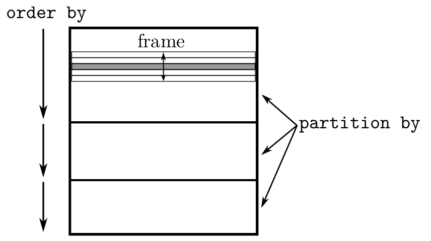

**图 1：** 窗口函数的概念：分区、排序、窗口帧划定。当前行（灰色）可以访问其窗口帧中的行。一个元组的窗口帧只能包含同一分区中的元组。图中 `partition by` 表示分区，`order by` 表示排序，`frame` 表示窗口帧。

### 2.2 排序

每个分区内的行可以使用 `order by` 子句排序。从语义上说，`order by` 定义了计算窗口函数时输入元组的逻辑顺序。例如，使用排名窗口函数时，排名按照指定的顺序计算。需要注意，这种排序只影响窗口函数的处理，不一定决定结果的最终顺序。如果没有指定排序，某些窗口函数（例如 `row_number`）的结果是不确定的。

### 2.3 窗口帧划定

除了分区子句，窗口函数还有窗口帧子句，可以进一步限制窗口函数作用的元组。窗口帧指定当前行附近（按照所指定的排序）的哪些元组属于该帧。图 2 展示了两种可用的模式。

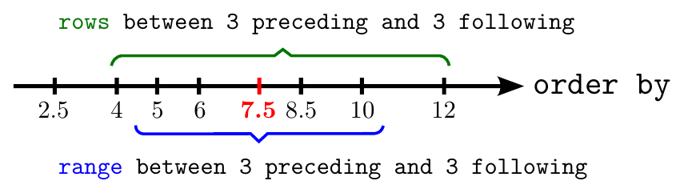

**图 2：** `range` 和 `rows` 两种窗口帧模式的示意图。每个刻度代表一个元组的 `order by` 表达式值。

- `rows` 模式直接指定当前行之前或之后有多少行属于窗口帧。图中当前行前后各 3 行属于窗口帧，窗口帧还包括当前行本身，因此包含值 4、5、6、7.5、8.5、10 和 12。也可以指定不包含当前行的窗口帧，例如 `rows between 5 preceding and 2 preceding`。
- `range` 模式通过对当前行的 `order by` 表达式值做减法或加法来计算窗口帧边界¹。图中当前行的 `order by` 表达式值为 7.5，窗口帧边界为 4.5（7.5−3）和 10.5（7.5−3）。因此，窗口帧包含值 5、6、7.5、8.5 和 10。

> 译注：原文将上界 10.5 后的算式印为“7.5−3”，此处保留；图示的上界对应加 3。

两种模式的窗口帧边界都不必是常量，可以是任意表达式，甚至可以依赖当前行的属性。大多数实现只支持常量窗口帧边界，而我们的实现可以高效支持非常量边界。同一分区内具有相同 `order by` 表达式值的所有行称为同位行（peers）。只有部分窗口函数使用同位行的概念，其他函数则忽略它。例如，所有同位行的 `rank()` 相同，但 `row_number()` 不同。

¹ `range` 模式仅适用于查询恰好包含一个数值型 `order by` 表达式的情况。

除了 `preceding` 和 `following`，窗口帧边界还可以设置为以下值：

- `current row`：当前行（在 `range` 模式下包括所有同位行）。
- `unbounded preceding`：窗口帧从分区的第一行开始。
- `unbounded following`：窗口帧在分区的最后一行结束。

如果未指定窗口帧但有 `order by` 子句，默认的窗口帧规格为 `range between unbounded preceding and current row`。这样，窗口帧包含从当前分区开头到当前行及其所有同位行的全部行，适合计算累积和。没有 `order by` 子句的查询在整个分区上求值，等价于指定 `range between unbounded preceding and unbounded following`。最后，需要强调，窗口帧子句只影响部分窗口函数，即窗口内导航函数（`first_value`、`last_value`、`nth_value`）和非 distinct 聚合函数（`min`、`max`、`count`、`sum`、`avg`）。其他窗口函数（`row_number`、`rank`、`lead` 等）以及 distinct 聚合总是在整个分区上求值。

为方便书写，SQL 允许为分区、排序和窗口帧子句的一个特定组合命名，引言的第一个例子已展示这种用法。多个窗口表达式可以引用该名称，复用窗口规格而无需重复子句。这通常能提高查询的可读性，如下例所示：

```sql
select min(value) over w1, max(value) over w1,
       min(value) over w2, max(value) over w2
from measurement
window
  w1 as (order by time
   range between 5 preceding and 5 following),
  w2 as (order by time
   range between 3 preceding and 3 following)
```

### 2.4 窗口表达式

SQL:2011 为不同用途定义了多种窗口函数。以下函数忽略窗口帧，也就是说，总是在整个分区上求值：

| 类别 | 函数 | 含义 |
| --- | --- | --- |
| 排名 | `rank()` | 当前行的排名，允许有间断 |
| 排名 | `dense_rank()` | 当前行的排名，无间断 |
| 排名 | `row_number()` | 当前行的行号 |
| 排名 | `ntile(num)` | 均匀分配到多个桶中，返回 1 到 `num` 的整数 |
| 分布 | `percent_rank()` | 当前行的相对排名 |
| 分布 | `cume_dist()` | 同位行组的相对排名 |
| 分区内导航 | `lead(expr, offset, default)` | 在分区中之前的行上计算 `expr` |
| 分区内导航 | `lag(expr, offset, default)` | 在分区中之后的行上计算 `expr` |
| distinct 聚合 | `min`、`max`、`sum` 等 | 在分区上计算 distinct 聚合 |

> 译注：原文此处对 `lead` 和 `lag` 的前后方向描述互换；表格按原文保留。附录 D 的 `lag` 代码访问之前的行。

另一些窗口函数则在当前窗口帧上求值，即作用于分区的一个子集：

| 类别 | 函数 | 含义 |
| --- | --- | --- |
| 帧内导航 | `first_expr(expr)`、`last_expr(expr)`、`nth_expr(expr, nth)` | 在窗口帧的第一行、最后一行或第 `nth` 行上计算 `expr` |
| 聚合 | `min`、`max`、`sum` 等 | 在当前窗口帧的所有元组上计算聚合 |

> 译注：原文这里及第 4.3 节使用 `first_expr`、`last_expr`、`nth_expr` 这些名称；第 2.3 节使用的是 `first_value`、`last_value`、`nth_value`。

从这些函数的参数列表可见，大多数函数需要一个任意表达式（`expr` 参数）及其他附加参数作为输入。

为了在语法上区分普通聚合函数（由 `group by` 算子计算）与同名的窗口函数（原文此处同样写为“由聚合算子计算”），窗口函数表达式后必须跟随 `over` 关键字以及一个可能为空的窗口帧规格。下面的查询用窗口算子计算平均值，而用聚合算子计算求和：

```sql
select cid, year, month, sum(price),
    avg(sum(price)) over (partition by cid)
from orders
group by customer_id, year, month
```

对于每位客户及每个月，该查询计算客户的购买总额（使用聚合），以及该客户所有月份支出的平均值（使用不带窗口帧的窗口聚合）。

> 译注：上述 SQL 中的 `cid` 与 `customer_id` 按原文保留。

## 3. 窗口算子

不同查询所用的窗口函数，以及指定或省略的分区、排序和窗口帧子句，会使所需的算法步骤大不相同。为把这些方面全部纳入一个算子，我们以模块化方式介绍算法。如果某个查询不需要某些阶段，就可以直接省略。

窗口函数处理的基本算法直接对应第 2 节讨论的高层语法结构，包括以下阶段：

1. 分区：使用 `partition by` 属性对输入关系分区。
2. 排序：使用 `order by` 属性对每个分区排序。
3. 窗口函数计算：对每个元组，先确定窗口帧（分区的一个子集），再在该窗口帧上计算窗口函数。

本节关注前两个阶段，即分区和排序。第 3 阶段的窗口函数求值将在第 4 节讨论。

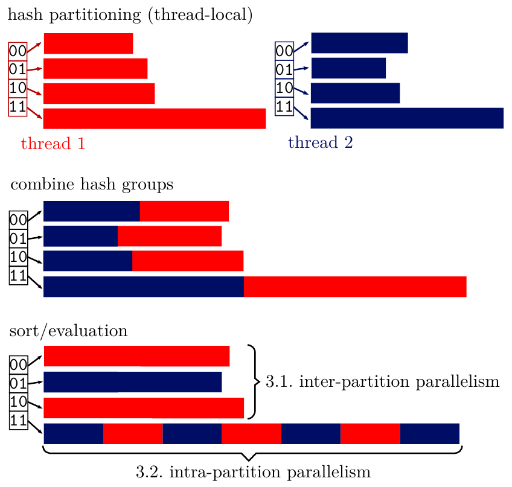

**图 3：** 窗口算子各阶段概览。不同颜色代表两个线程。先进行线程局部的哈希分区，再合并哈希组，最后进行排序和求值；图中同时展示了分区间与分区内并行。

### 3.1 分区与排序

对于最初的分区和排序阶段，有两种传统方法：

1. 基于哈希的方法先利用 `partition by` 属性的哈希值对输入进行完全分区，再仅利用 `order by` 属性独立地排序每个分区。
2. 基于排序的方法先同时按照 `partition by` 和 `order by` 属性对输入排序，再在窗口函数求值阶段（第 3 阶段）中动态确定分区边界，例如使用二分查找。

从纯理论角度看，基于哈希的方法更好。假设有 $n$ 个输入行和 $O(n)$ 个分区，基于哈希的方法总体复杂度为 $O(n)$，而基于排序的方法复杂度为 $O(n\log n)$。然而，商业系统经常使用基于排序的方法，可能是因为它的实现工作量更少，毕竟无论如何都需要排序阶段。为了获得良好的性能和可扩展性，我们结合使用两种方法。

单线程执行时，通常最好先用哈希表对输入数据进行完全分区。如果并行执行，这种方法就需要并发哈希表。然而，我们发现，与无同步的哈希表相比，可以动态增长的并发哈希表（例如 split-ordered lists [23]）有显著开销。不先分区而直接采用基于排序的方法同样非常昂贵。因此，为实现高可扩展性和低开销，我们采用结合两种方法的混合方案。

### 3.2 预分区为哈希组

我们的方法把输入数据划分为固定数量（例如 1024）的哈希组，而不考虑输入数据实际有多少个分区。哈希组数量应为 2 的幂，且大于线程数，同时要足够小，使现代 CPU 能够高效地进行分区。这种分区方式只需要有限的同步，因此可以非常高效地并行执行。如图 3 所示，每个线程（以不同颜色区分）最初都有自己的哈希组数组，图中每个线程有 4 个哈希组²。所有线程完成输入数据的分区后，将各线程对应的哈希组复制到合并后的数组。此时，各线程哈希组的大小和偏移量都已知，因此可以无同步地并行复制。复制后，每个合并哈希组存储在一个连续数组中，可以高效地随机访问每个元组。

哈希组复制完成后，下一步是同时按分区表达式和排序表达式对其排序。这样，具有相同分区键的所有元组，在同一个哈希组内相邻存放；当然，一个哈希组可能包含多个分区键。在执行后续的窗口函数求值步骤时，如有需要，可以像基于排序的方法那样，通过二分查找确定实际的分区边界。

² 在 HyPer 实现中，线程局部哈希组的物理表示是多个串联的数组，因为此时不需要随机访问，而且这些块最终都会复制到合并数组中。此外，所有类型在概念上都具有固定大小（字符串等变长类型以指针存储），使分区和排序阶段可以直接处理元组，而不必处理元组指针。

### 3.3 分区间与分区内并行

乍看之下，窗口算子似乎天然容易并行化，因为分区可以并行执行，各哈希组也相互独立：不同哈希组的排序与窗口函数求值彼此独立，可用线程只需分别处理不同的哈希组，无需任何同步。支持窗口函数并行化的数据库系统通常采用这种策略，因为它易于实现，而且对“良性”查询能提供很好的性能。

然而，如果查询没有分区子句、分区数远小于线程数，或者分区大小高度倾斜（即某个分区包含很大一部分元组），这种方法就不够。因此，为充分利用现代多核和众核 CPU——它们往往有数十个核心——仅靠简单的分区间并行是不够的。对于某些查询，还需要支持分区内并行，也就是在哈希组内部并行化。

我们只对大的哈希组采用分区内并行。如果相对于所需线程数，哈希组数量足够多，而且没有任何哈希组过大，那么分区间并行就已足够，并且最高效。分区阶段结束后，所有哈希组的大小都已知，因此可以动态地将每个哈希组分配到分区间或分区内并行类别。这种分类会考虑哈希组大小、总工作量和线程数。图 3 中，只有哈希组 11 使用分区内并行，其他哈希组都使用分区间并行。我们的方法能够抵御倾斜，始终利用可用的硬件并行性，同时在可能时利用低开销的分区间并行。

采用分区内并行时，必须使用并行排序算法。此外，窗口函数求值阶段本身也必须并行化，下一节将对此进行说明。

## 4. 窗口函数求值

如前所述，一些窗口函数受窗口帧影响，另一些则忽略窗口帧。因此，它们的实现方式差别很大，我们分别讨论。首先讨论受窗口帧影响的窗口函数。

### 4.1 基本算法结构

分区和排序阶段完成后，具有相同分区键的所有元组相邻存储，元组还按照 `order by` 表达式排好了序。基于这种表示，可以将不同线程分配到哈希组的不同子区间，从而并行地计算窗口函数。单线程执行或使用分区间并行时，整个哈希组分配给一个线程。

为了计算窗口函数，每个元组都需要执行以下步骤：

1. 确定分区边界。
2. 确定窗口帧。
3. 在窗口帧上计算窗口函数并输出元组。

第一步计算分区边界是必要的，因为一个哈希组可能包含多个逻辑分区，这一步通过二分查找完成。余下两步——确定窗口帧边界，以及构成主要算法挑战的窗口函数求值——将在下面两节讨论。这个基本代码结构的伪代码见附录 B。

### 4.2 确定窗口帧边界

对于受窗口帧影响的窗口函数，每个元组都需要确定窗口帧边界的下标。由于元组存储在数组中，随后便可以方便地访问帧内元组。`rows` 模式的实现直观且快速，只需根据当前行下标与边界偏移做加减，并确保边界仍在当前分区内。

`range` 模式稍微复杂一些。如果边界是常量，可以记录前一个窗口，并根据需要逐个推进窗口的起点和终点³。显然，帧起点总共最多前进 $n$ 行，帧终点也一样。因此，为 $n$ 个元组查找窗口帧的复杂度为 $O(n)$。如果 `range` 模式下的边界不是常量，窗口便可能任意增长和缩小。此时的解决方法是，先对当前排序键加减边界偏移，再使用二分查找，复杂度为 $O(n\log n)$。计算 $n$ 行的窗口帧的复杂度总结如下：

| 模式 | 常量 | 非常量 |
| --- | --- | --- |
| `rows` | $O(n)$ | $O(n)$ |
| `range` | $O(n)$ | $O(n\log n)$ |

³ 注意，当采用分区内并行且窗口帧较大时，增量方法可能造成冗余工作。因此，为使分区内并行具有更好的可扩展性，即使窗口帧边界为常量，也应使用二分查找。

### 4.3 聚合算法

为某个元组计算出窗口帧边界后，最后一步就是在该帧上求出所需的窗口函数。对于导航函数 `first_expr`、`last_expr` 和 `nth_expr`，求值简单且成本低，复杂度为 $O(1)$，因为这些函数只是选择窗口中的一行，并在其上计算表达式。相比之下，聚合函数在概念上需要对当前窗口的所有行求值，因而更昂贵。因此，我们介绍并分析四种在窗口帧上计算聚合的算法，它们具有不同的性能特征。

#### 4.3.1 朴素聚合

朴素方法直接遍历窗口帧中的所有元组并计算聚合。其内在问题是经常进行冗余工作，导致二次运行时间。例如，对于累积和查询 `sum(b) over (order by a rows between unbounded preceding and current row)`，输入关系的每一行都要把从第一行到当前行的所有值相加；每次都重新从第一行开始，反复做同样的工作。

#### 4.3.2 累积聚合

累积和查询启发了一种改进算法，它试图避免冗余工作，不再为每个元组从头计算聚合。累积算法记录前一个聚合结果和前一个窗口帧边界。只要窗口增长或保持不变，就在前一个结果的基础上，只聚合新加入的行。PostgreSQL 使用这种算法，它对一些常见查询表现良好，例如默认的窗口帧规格 `range between unbounded preceding and current row`。

然而，这种方法只有在窗口帧持续增长时才表现良好。对于窗口帧既能增长又能缩小的查询，例如 `sum(b) over (order by a rows between 5 preceding and 5 following)`，仍然可能产生二次运行时间，因为每次都必须丢弃前一个聚合结果。

#### 4.3.3 可移除的累积聚合

一些商业数据库系统采用可移除的累积算法，这是进一步的算法改进。它不再只允许窗口帧增长到必须重新计算聚合为止，而是允许从前一个聚合结果中移除行。对于 `sum`、`count` 和 `avg`，从当前聚合中移除行可以直接通过减法实现。对于 `min` 和 `max`，则需要维护一棵包含前一个窗口中全部条目的有序搜索树。对每个元组，都要按需增删条目以更新这一数据结构，这会显著增加这些聚合的开销。

可移除累积方法适用于许多查询，尤其是 `sum` 和 `avg` 窗口表达式；它们在窗口表达式中比 `min` 或 `max` 更常见。然而，非常量窗口帧边界的查询，例如 `sum(b) over (order by a rows between x preceding and y following)`，仍可能有问题：最坏情况下，相邻元组的帧边界变化非常剧烈，运行时间会达到 $O(n^2)$。

#### 4.3.4 Segment Tree 聚合

如上一节所示，即使可移除累积算法也可能产生二次执行时间，因为当每个元组的窗口帧任意变化时，缓存前一个窗口的结果并无帮助。因此，我们引入一个附加的数据结构 Segment Tree，使任意窗口帧上的聚合都能在 $O(\log n)$ 时间内求值。Segment Tree 存储整个哈希组各子区间的聚合，如图 5 所示。图中使用 `sum` 聚合，因此根节点存储所有叶节点的和；根节点的两个子节点分别存储两个等宽子区间的和，依此类推。利用聚合的结合律，Segment Tree 可以在对数时间内计算任意区间上的聚合。例如，要计算序列最后 7 个值的和，只需把红色节点 7、13 和 20 相加。

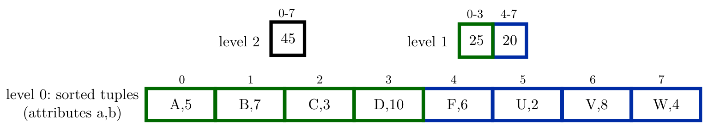

**图 4：** 对 `sum(b) over (order by a)`，扇出为 4 的 Segment Tree 的物理表示。第 0 层为排序后的元组（属性 `a,b`），上层数组保存相应区间的聚合。

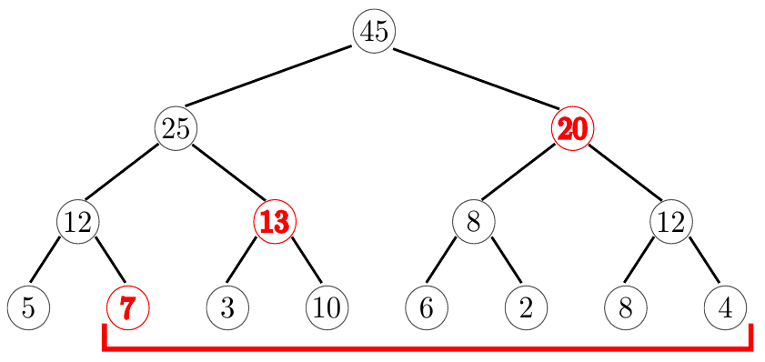

**图 5：** 用于求和聚合的 Segment Tree。计算 7、3、10、6、2、8、4 的和，只需聚合红色节点 7、13、20。

为便于说明，图 5 将 Segment Tree 画成带指针的二叉树。实际上，我们的实现把每层的全部节点存放在一个数组中，不使用任何指针，如图 4 所示。这种紧凑表示类似标准二叉堆，树结构是隐式的，节点的子节点和父节点都可以通过算术运算确定。此外，为进一步节省空间，树的最底层直接使用已排序的输入数据，并采用更大的扇出，图中为 4。这些优化使 Segment Tree 的额外空间消耗可以忽略不计。较大的扇出还能提高性能，第 5.7 节描述的实验将展示这一点。

> 译注：原文这里引用第 5.7 节；专门讨论扇出的实验实际位于第 5.8 节。

为计算给定区间的聚合，从两个窗口帧边界开始，自底向上遍历 Segment Tree。两条路径同时遍历，直至到达同一节点。这样，对小区间可以提前终止，而且总是聚合最少数量的节点。遍历算法的细节见附录 C。

除了改善最坏情况下的效率，Segment Tree 的另一个重要优点是能够并行化任意聚合，甚至是 `sum(b) over (order by a rows between unbounded preceding and current row)` 这样的累积和查询。对于没有分区子句的查询，这一点尤其重要，因为它们只能依靠分区内并行，才能避免串行执行算法的这一阶段。Segment Tree 本身也很容易以自底向上的方式，无同步地并行构建：所有可用线程扫描 Segment Tree 同一层中相邻的区间，例如使用 `parallel_for`，并把计算出的聚合存入上一层。

对于 `min`、`max`、`count` 和 `sum`，Segment Tree 使用对应的聚合函数即可。对于 `avg` 或 `stddev` 这样的派生聚合函数，将所有需要的值（例如和与计数）存放在同一棵 Segment Tree 中，比使用两棵树更高效。有趣的是，除了计算聚合，Segment Tree 也有助于并行化计算无间断排名的 `dense_rank` 函数。为了计算某个元组的 `dense_rank`，必须知道它之前有多少个不同的值。构造一棵在每个区段中统计不同子值数量的 Segment Tree 很容易⁴，并且可以使多个线程并行处理分区的不同区间。

⁴ 用于 `dense_rank` 的 Segment Tree 中，每个节点保存其区段的不同值数量。合并两个相邻区段时，只需把二者的不同值数量相加；如果交界处相邻元组相等，再减 1。注意，Segment Tree 只用于计算第一个结果，参见附录 D。

#### 4.3.5 算法选择

表 1 总结了四种算法的最坏情况复杂度。朴素算法会使许多常见窗口函数查询产生二次运行时间。只要窗口帧仅增长，累积算法就表现良好。此外，对于边界为 `current row` 与 `unbounded following`，或 `1 preceding` 与 `unbounded following` 的查询，也可以先反转排序顺序，再用累积算法高效执行。可移除算法进一步扩大了能高效执行的查询集合，但对 `min` 和 `max` 聚合需要额外的有序树结构，而且在窗口帧边界不是常量时，仍然可能产生二次运行时间。

**表 1：** 为 $n$ 个元组计算聚合的最坏情况复杂度。

| `rows between ...` | 朴素 | 累积 | 可移除累积 | Segment Tree |
| --- | --- | --- | --- | --- |
| `1 preceding and current row` | $O(n)$ | $O(n)$ | $O(n)$ | $O(n\log n)$ |
| `unbounded preceding and current row` | $O(n^2)$ | $O(n)$ | sum： $O(n)$，min： $O(n\log n)$ | $O(n\log n)$ |
| `CONST preceding and CONST following` | $O(n^2)$ | $O(n^2)$ | sum： $O(n)$，min： $O(n\log n)$ | $O(n\log n)$ |
| `VAR preceding and VAR following` | $O(n^2)$ | $O(n^2)$ | sum： $O(n^2)$，min： $O(n^2\log n)$ | $O(n\log n)$ |

因此，上述分析似乎表明应当始终选择 Segment Tree 算法，因为它在所有情况下都能避免二次运行时间。然而，对于 `rows between 1 preceding and current row` 这样的简单查询，更简单的算法在实践中表现更好，因为构建和遍历 Segment Tree 都可能带来显著开销。直观地说，只有当窗口帧相对于前一个元组的窗口帧频繁地大幅变化时，Segment Tree 方法才有收益。遗憾的是，许多情况下不能仅凭查询结构选择最优算法，因为数据分布决定了构建 Segment Tree 是否划算。考虑并行性后，选择最优算法更加困难：如前所述，Segment Tree 在分区内并行场景总是能够良好扩展，其他算法则不然。

幸运的是，我们发现总体查询时间的大部分花在分区和排序阶段，参见图 2 和图 10，因此偏向选择 Segment Tree 总是安全的。我们据此提出一种机会式方法：只有不存在 $O(n^2)$ 运行时间的风险，也不存在并行性不足的风险时，才选择累积聚合等简单算法。这种方法只使用静态查询结构，不依赖查询优化器的基数估计。例如，`sum(b) over (order by a rows between unbounded preceding and current row)` 这样的查询，总能安全、高效地采用累积算法求值。此外，我们分别为采用分区间并行和分区内并行的哈希组选择算法。例如，一个查询的小哈希组可以使用累积算法，而大哈希组可以使用 Segment Tree，以保证求值具有良好的可扩展性。这种方法总能避免二次运行时间，在多核系统上良好扩展，同时对许多常见查询达到最优性能。

> 译注：上述“图 2 和图 10”按原文保留；图 2 实际展示窗口帧语义，分阶段时间数据见表 2。

### 4.4 不受窗口帧影响的窗口函数

不受窗口帧影响的窗口函数比聚合更简单，因为它们不需要复杂的聚合算法，也不需要计算窗口帧。不过，由于要支持分区内并行并计算分区边界，其高层结构仍然相似。通常，这类窗口函数的实现分为两步：先计算工作区间内第一个元组的结果，再利用前一个已计算的结果，顺序计算其余结果。

图 6 展示了用作示例的 `rank` 函数伪代码。其余函数大多具有类似结构，见附录 D。为了计算任意下标 `begin` 处元组的排名，先通过二分查找计算第一个同位行的下标，这由第 5 行的 `findFirstPeer` 完成。同一分区中具有相同 `order by` 键值的所有元组都视为同位行。有了第一个结果，其后的排名计算便可以假定前一个排名已计算完成，见第 10–13 行。所有不受窗口帧影响的窗口函数计算成本都很低，因为它们只需顺序扫描，且只查看相邻元组。

```text
1  // 当前行的排名，允许有间断
2  rank(begin, end)
3     pBegin = findPartitionBegin(0, begin+1)
4     pEnd = findPartitionEnd(begin)
5     p=findFirstPeer(pBegin,begin)-pBegin+1
6     result[begin] = p
7     for (pos from begin+1 below end)
8        if (pos = pEnd)
9           pBegin = pos
10          pEnd = findPartitionEnd(pos)
11       if (isPeer(pos, pos-1))
12          result[pos] = result[pos-1]
13       else
14          result[pos] = pos-pBegin+1
```

**图 6：** 忽略窗口帧的 `rank` 函数伪代码。

### 4.5 数据库引擎集成

我们的窗口函数算法可以集成到不同的数据库查询引擎中，包括使用传统逐元组模型（Volcano 迭代器模型）、逐向量执行 [11]，或基于推送的查询编译 [19] 的引擎。当然，代码结构很大程度上取决于具体查询引擎。图 6 的伪代码与我们的实现所生成的代码非常相似；该实现已集成到 HyPer，并采用基于推送的查询编译。

主要差别是，我们的实现不像伪代码那样把计算结果存入向量（第 6、12、14 行），而是直接把元组推送给下一个算子。这既更快，也更省空间。还应注意，无论采用何种执行模型，窗口函数算子都是完整的流水线阻断点：必须消费所有输入元组后才能产生结果。只有到最后的窗口函数求值阶段，才可以即时产生元组。

第 3 节描述的并行化策略也适合 HyPer 的并行执行框架 [17]。该框架把工作划分为固定大小的工作单元（morsels），通过工作窃取动态调度，在核心间均匀分配工作，并快速响应负载变化。morsel 驱动的方法既可用于最初的分区和复制阶段，也可用于最后的窗口函数计算阶段。

### 4.6 多个窗口函数表达式

为便于介绍，前文一直假设查询只有一个窗口函数表达式。对于包含多个窗口函数表达式的查询，可以为每个表达式依次添加窗口算子来计算。HyPer 目前使用这种方法，它简单且通用，但对于多个窗口表达式共享分区和排序子句的查询，会错失优化机会。由于分区和排序通常占据总体查询执行时间的大部分，避免这些阶段可能带来很大收益。

Cao 等人 [12] 详细讨论了避免不必要的分区和排序步骤的优化。在我们基于编译的查询引擎中，最后的求值阶段（如图 6 所示）可以直接计算所有共享分区和排序子句的窗口表达式。我们计划将来把这项功能加入 HyPer。

## 5. 实验评估

我们已将窗口算子集成到内存数据库系统 HyPer。本节通过实验评估该实现，并与其他系统比较性能。

### 5.1 实现

HyPer 使用以数据为中心的查询编译方法处理查询 [19, 21]。因此，我们的窗口算子实现本身是一个编译器，使用 LLVM 编译器基础设施为任意窗口函数查询生成机器码，而不是以“解释执行”的方式直接计算。编译的一大优势是，可以完全省略算法中一般情况下可能需要、但特定查询不需要的步骤。例如，窗口帧终点设为 `unbounded following` 时，它在一个分区内不会改变，因此无须生成每个元组都重新计算帧终点的代码。窗口算子的多样性使它具有许多类似机会，可以“优化掉”不必要的算法部分。不过，我们的算法也可以集成到基于迭代器或向量化 [11] 的查询引擎中。

对于大哈希组的排序（分区内并行），我们采用 GNU libstdc++ 库的“Parallel Mode”提供的并行多路归并排序实现 [22]。

### 5.2 实验设置

我们最初尝试了 TPC-DS 基准，其中包含若干使用窗口函数的查询。但是，这些查询的开销主要来自昂贵的连接，窗口表达式本身相当简单，没有窗口帧子句。因此，本次评估使用合成数据集，以便在广泛的查询类型和输入分布下评估实现。大多数查询使用 1000 万个输入元组，每个元组由两个 8 字节整数列 `a` 和 `b` 组成。`b` 的值均匀分布且唯一，`a` 的不同值数量和分布则随实验而变化。

实验机器配备 Intel Core i7 3930K 处理器，具有 6 个核心、12 个硬件线程，主频 3.2 GHz，睿频 3.8 GHz。系统具有 12 MB 共享末级缓存以及四通道 DDR3-1600 内存。操作系统使用 Linux，编译器为 GCC 4.9。

作为对比，我们报告了多个窗口函数支持程度不同的数据库系统的结果。VectorWise 2.5 相比其他商业系统非常快，但窗口函数支持有限，不支持窗口帧。PostgreSQL 9.4 比 VectorWise 慢，但支持更完整，不过 `range` 模式支持不完整，也不支持非常量窗口帧边界。最后，我们还测试了一个完全支持窗口函数的商业系统，图中标记为“DBMS”。

### 5.3 性能与可扩展性

为突出算法的特征，首先使用以下排名查询：

```sql
select rank() over (partition by a order by b)
from r
```

图 7 比较了该排名查询的性能。HyPer 的速度分别是 VectorWise 的 3.4 倍、PostgreSQL 的 8 倍，以及商业系统的 14.1 倍。注意，该实验使用单线程执行，因为 PostgreSQL 完全不支持查询内并行，而 VectorWise 的窗口算子不支持查询内并行。其他与 `rank` 一样不受窗口帧影响的窗口函数具有类似性能；只有带窗口帧的聚合函数可能显著更昂贵，参见图 12。

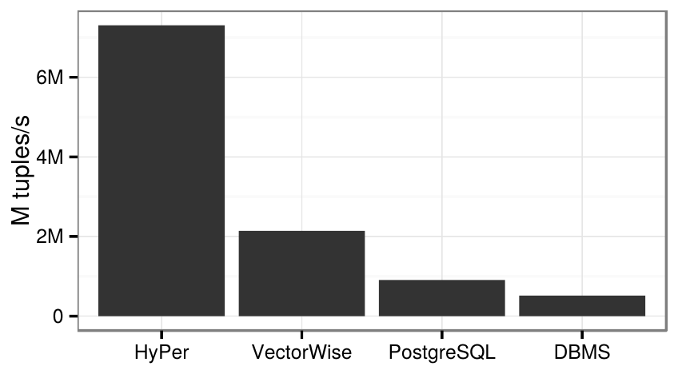

**图 7：** `rank` 查询的单线程性能，使用 100 个分区。纵轴为吞吐量，M tuples/s 表示百万元组/秒。

下一个实验考察实现的可扩展性。我们为属性 `a` 使用不同分布，分别产生 1000 万个分区、100 个分区和 1 个分区。各分区的大小大致相同，所以对于 1000 万个和 100 个分区，算法选择分区间并行；对于 1 个分区，则选择分区内并行。图 8 表明，线程数增加到 6 时，实现仍几乎线性扩展；随后，超线程还能进一步提升性能。

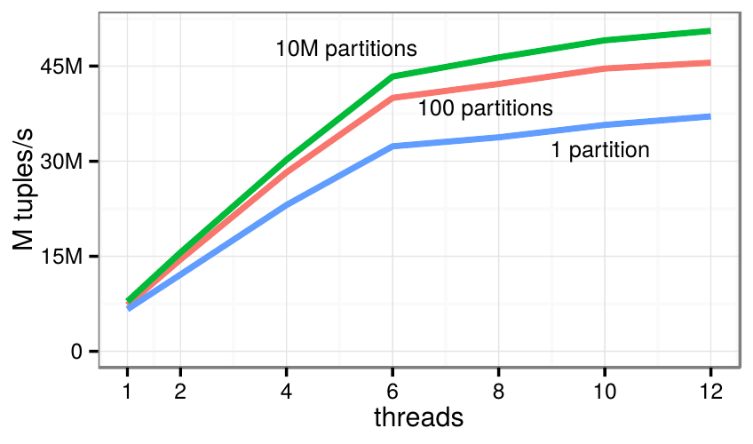

**图 8：** `rank` 查询的可扩展性。横轴为线程数，纵轴为百万元组/秒；三条曲线分别对应 1000 万个、100 个和 1 个分区。

### 5.4 算法阶段

为了更好地理解算法各阶段的行为，我们测量了三个阶段在 12 个线程下的运行时间，以及相对于单线程执行的加速比，结果见表 2。所有数据分布下的总体加速比都超过 6 倍，对于 6 个核心、12 个超线程而言，这是很好的结果。查询执行时间主要花在排序和分区阶段，因为 `rank` 求值只是一次非常快速且简单的顺序扫描。表中还显示，在其他条件相同的情况下，分区越多，总体性能越高。这是因为分区越大，排序由于渐近复杂度和缓存方面的原因，会显著变贵。另一方面，分区数量增多只会稍微增加分区阶段的成本，因为我们仅划分为 1024 个哈希组，这始终十分高效。

**表 2：** 窗口算子各阶段的性能与可扩展性（`rank` 查询）。时间单位为 ms；加速比相对于单线程执行。

| 阶段 | 1000 万分区：时间 | 1000 万分区：加速比 | 100 分区：时间 | 100 分区：加速比 | 1 分区：时间 | 1 分区：加速比 |
| --- | --- | --- | --- | --- | --- | --- |
| 分区 | 46 | 2.5× | 32 | 2.9× | 32 | 2.3× |
| 排序 | 139 | 7.7× | 184 | 6.7× | 198 | 6.9× |
| rank | 12 | 7.0× | 6 | 5.9× | 10 | 7.4× |
| 合计 | 197 | 6.5× | 223 | 6.2× | 239 | 6.3× |

分区阶段使用很多线程时，可用内存带宽会被耗尽，这解释了该阶段加速比略低的原因。当然，更高内存带宽的系统能够取得更高加速比。我们也测试了大于 16 字节的元组，这会因为数据移动成本更高而增加执行时间。但这种影响不是线性的：将元组大小从 16 字节增至 64 字节，会使性能降至原来的 1/1.6。

### 5.5 倾斜的分区键

前面的实验中，每个查询要么使用分区间并行（100 或 1000 万个分区），要么使用分区内并行（1 个分区），从未结合使用。为了说明仅有分区间并行并不足够，我们构造了一个极度倾斜的数据集，其中 50% 的元组属于最大分区，25% 属于第二大分区，以此类推。尽管分区数多于线程数，强制只使用分区间并行时，负载不均衡使加速比仅为 1.9 倍。相比之下，启用自动分类机制后，大分区采用分区内并行，小分区采用分区间并行，测得的加速比为 5.9 倍。

### 5.6 哈希组数量

到目前为止，所有实验都使用 1024 个哈希组。图 9 展示了哈希组数量变化时，`rank` 查询的总体性能。增加哈希组可能因缓存和 TLB 未命中而使分区变慢，但也可能因分区更小而使排序更快。无论分区数量是多少，使用 1024 个哈希组都能获得接近最优的性能，因为在现代 x86 CPU 上，1024 足够小，能使分区对缓存和 TLB 都非常友好。因此，我们认为没有必要依靠查询优化器选择哈希组数量，1024 左右通常就是很好的设置。

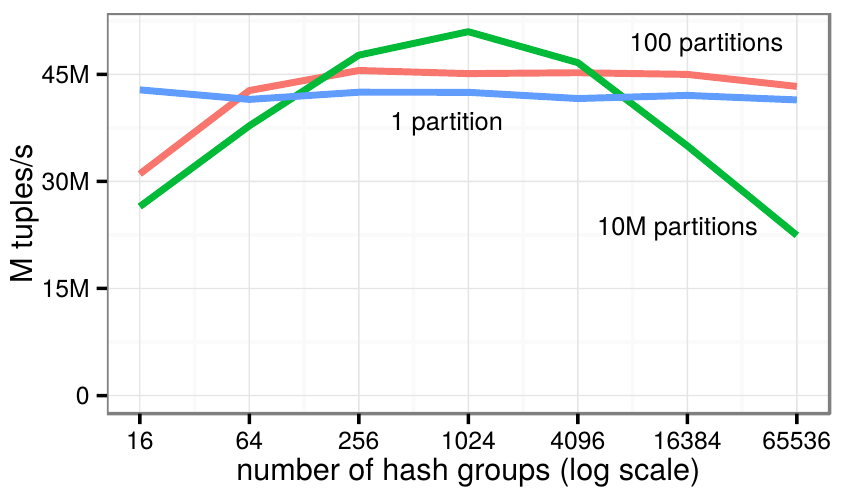

**图 9：** 改变 `rank` 查询的哈希组数量。横轴为哈希组数量，使用对数刻度；纵轴为百万元组/秒。曲线分别对应 1000 万个、100 个和 1 个分区。

### 5.7 带窗口帧的聚合

下一个实验研究四种聚合算法的性能特征。由于 HyPer 只实现了累积算法和 Segment Tree 算法，我们为这项实验用 C++ 实现了全部四种算法。使用 12 个线程，并为占位符代入不同常量，执行以下查询：

```sql
select sum(a) over
   (order by b
    rows between ? preceding and current row)
from r
```

使用不同常量可以得到不同的窗口帧大小，从 1 个元组到 1000 万个元组。窗口帧“落后于”当前行，因此应当非常适合可移除累积聚合算法，而朴素算法和累积算法则必须为每个元组重新计算结果。

图 10 表明，对于非常小的窗口帧（少于 10 个元组），即使简单的朴素算法和累积算法也表现很好。Segment Tree 在这个范围略慢，因为它必须先付出建树成本，而对于如此小的帧，这棵树几乎无用。不过，与占据执行时间大部分的排序和分区阶段相比，这一开销很小。窗口较大时（10 到 10,000 个元组），朴素算法和累积算法因该查询中的二次行为而变得非常慢。使用累积算法的 PostgreSQL 在运行这类查询时也会出现同样的问题，图中未展示。

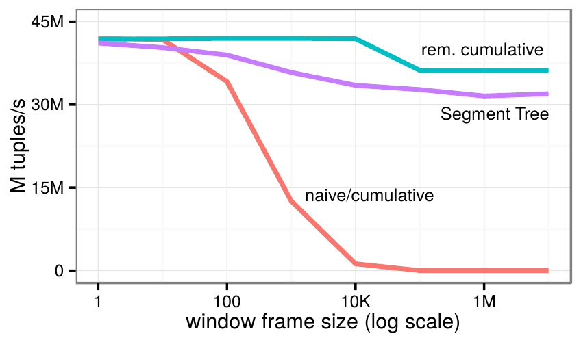

**图 10：** 常量窗口帧边界下，不同帧大小的 `sum` 查询性能。横轴为窗口帧大小，使用对数刻度；纵轴为百万元组/秒。图例 `naive/cumulative` 为朴素/累积算法，`rem. cumulative` 为可移除累积算法。

如预期所示，可移除累积算法在整个范围内都表现良好，因为每个元组的工作量是常量，而且聚合是求和而不是最小值或最大值，不需要有序树。然而，窗口非常大时（超过 10,000 个元组），查询实际上变成了整个分区上的累积和，可移除累积算法无法扩展，变得和单线程执行一样慢。原因是每个线程最初都必须对其之前的大部分元组计算累积和。我们在一个 60 核系统上重复了这个实验，对于大窗口帧，大约使用 20 个线程时，Segment Tree 算法便超过可移除累积算法。随着窗口帧增大，Segment Tree 遍历的性能只略有下降，并始终保持较高水平。

前一个实验中，每条查询的窗口帧边界都是常量。图 11 所示实验则使用依赖当前行的表达式作为帧边界，它相对于前一个帧边界变化非常剧烈。尽管如此，Segment Tree 算法即使面对很大、极度波动的窗口帧，仍然表现良好。相比之下，其他算法因二次行为，在较大的帧尺寸下吞吐量趋近于 0 元组/秒。我们在商业数据库系统中也观察到了相同行为，而 PostgreSQL 根本不支持这类查询。

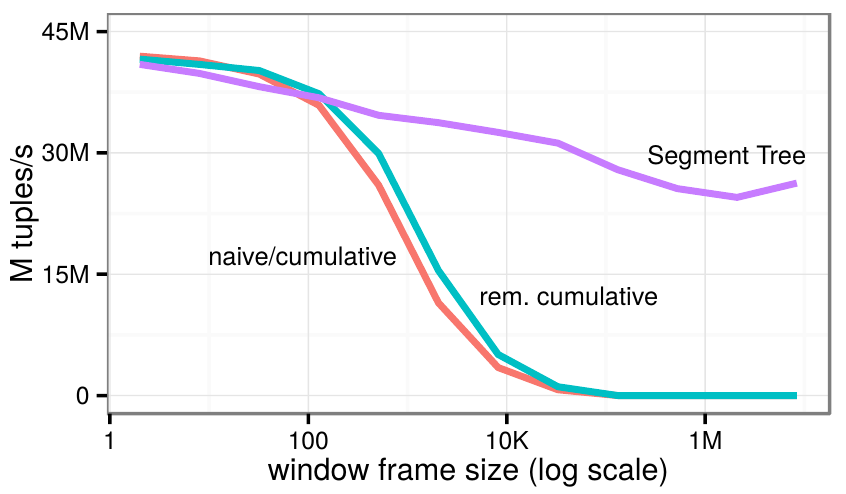

**图 11：** 可变窗口帧边界下，不同帧大小的 `sum` 查询性能。横轴为窗口帧大小，使用对数刻度；纵轴为百万元组/秒。图例与图 10 相同。

总的来说，Segment Tree 方法通常比简单算法开销更高；如果查询结构允许静态判断其他算法更有利，选择其他算法当然是合理的。但许多查询无法进行这种判断。Segment Tree 的优点是所有情况下都很稳健，对于所有可能的窗口帧大小，总体时间仍主要由分区和排序阶段决定。另外，Segment Tree 始终具有很好的可扩展性，而其他方法对大窗口无法扩展；在具有许多核心的大型系统上，这一点更重要。

### 5.8 Segment Tree 的扇出

此前的实验使用扇出为 16 的 Segment Tree。下一个实验研究扇出对聚合及树构建性能的影响。图 12 使用与前面相同的 `sum` 查询，在两种极端负载下改变 Segment Tree 的扇出。图中时间既包括窗口函数求值，也包括 Segment Tree 构建。对于帧非常小的查询（标记为“1 preceding”的曲线），提高扇出总是有益，因为这些查询虽然构建了 Segment Tree，但帧太小，聚合时实际上不使用它。对于大窗口帧查询（标记为“unbounded preceding”的曲线），16 左右的扇出最优。对这两种查询，仅计算 Segment Tree 构建而不含求值的时间（图中未展示），在扇出为 2 时为 23 ms，扇出为 16 或更高时降至 5 ms。

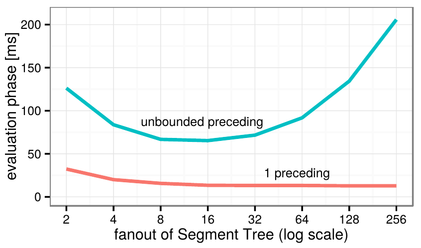

**图 12：** 不同扇出设置下 Segment Tree 的 `sum` 查询性能。横轴为 Segment Tree 扇出，使用对数刻度；纵轴为求值阶段时间（ms），包含建树时间。两条曲线分别对应 `1 preceding` 和 `unbounded preceding`。

提高扇出的另一个优点是降低 Segment Tree 的额外空间消耗。示例查询的输入元组占用约 153 MB。扇出为 2 时，Segment Tree 额外占用 76 MB（50%）；扇出为 16 时降至 5 MB（3.3%）；扇出为 128 时进一步降至 0.6 MB（0.4%）。因此，接近 16 的扇出通常是一个不错的设置，能够在空间消耗与性能之间取得良好平衡。

## 6. 相关工作

窗口函数最初作为 SQL:1999 的可选补充引入，最终完整纳入 SQL:2003 [25]。SQL:2011 增加了用于引用窗口帧内相邻元组的窗口函数支持。Oracle 于 1999 年率先实现窗口函数，IBM DB2 LUW 于 2000 年跟进。之后，所有主流商业和开源数据库系统，包括 Microsoft SQL Server（2005 年）、PostgreSQL（2009 年）和 SAP HANA，也相继提供了支持⁵。

如前所述，我们认为窗口函数在实践中的重要性，与数据库系统领域对它的研究数量之间存在差距，例如与 `rollup` 和 `cube` [13] 等其他分析型 SQL 构造相比。Oracle 早期的一篇技术报告 [8] 包含了说明窗口函数用途的查询示例、优化机会和并行执行策略。较近的一篇论文中，Bellamkonda 等人 [9] 观察到，如果不同组的数量低于期望的并行度，仅靠分区不足以实现良好的可扩展性。他们提出给分区键人为增加额外属性，即“扩展分布键”，以产生更多分区，进而提高并行度。但这种方法会因增加窗口合并阶段（window consolidator）而产生额外工作，并依赖基数估计。我们直接、充分地并行化窗口算子的每个阶段，并在必要时采用分区内并行，从而避开了这些问题。

许多查询优化论文与窗口算子有关。Cao 等人 [12] 关注一个查询中多个窗口函数的优化。他们发现，窗口算子的大部分执行时间往往花在分区和排序阶段。因此，通过优化窗口表达式的执行顺序，通常可以省去部分分区和/或排序工作。该论文证明寻找最优顺序是 NP-hard 的，并为此给出了一种实用的启发式算法。尽管窗口算子本身已经非常有用，其他论文 [26, 7] 还提出通过引入窗口表达式对相关子查询进行去相关。在这种场景下，即使查询原本不含窗口函数，窗口算子的快速实现也很重要。由于采用了另一种子查询解嵌套方法 [20]，HyPer 当前在解嵌套时不引入窗口算子。未来，我们计划研究在采用本文方法的情况下，这样做是否有益。窗口函数也曾用于加速从 XQuery 到 SQL 的翻译 [10]。

Yang 和 Widom [24] 为时态聚合提出了 Segment B-Tree，它与我们的 Segment Tree 非常相似；区别在于我们无需处理更新，因此能够采用无指针方式，更高效地表示该结构。

⁵ 原文发表时，MySQL/MariaDB 和 SQLite 是两个尚不支持窗口函数的广泛使用的系统。

## 7. 总结与未来工作

我们提出了一种窗口函数计算算法，它在实践中非常高效，并在所有情况下避免二次运行时间。我们还展示了如何在多核 CPU 上并行执行窗口函数，即使查询没有分区子句也可以。在涵盖多种查询类型和输入分布的一系列实验中，我们展示了算法的高性能和出色的可扩展性。

由于窗口函数方面的文献很少，未来研究存在许多可能方向。本文聚焦于内存数据库系统中的执行，但核心算法思想也适用于基于磁盘的实现。研究那种环境需要做哪些改动会很有意义。另一个可能的优化方向是非一致内存访问（NUMA）系统。

### 致谢

感谢审稿人提出建设性意见，帮助改进本文。

## 8. 参考文献

[1] http://docs.oracle.com/database/121/DWHSG/analysis.htm.

[2] http://msdn.microsoft.com/en-us/library/ms189461(v=sql.120).aspx.

[3] http://www-01.ibm.com/support/knowledgecenter/SSEPGG_10.5.0/com.ibm.db2.luw.sql.ref.doc/doc/r0023461.html.

[4] http://help.sap.de/hana/SAP_HANA_SQL_and_System_Views_Reference_en.pdf.

[5] http://www.postgresql.org/docs/9.4/static/tutorial-window.html.

[6] https://www.monetdb.org/Documentation/Manuals/SQLreference/WindowFunctions.

[7] S. Bellamkonda, R. Ahmed, A. Witkowski, A. Amor, M. Zaït, and C. C. Lin. Enhanced subquery optimizations in Oracle. *PVLDB*, 2(2):1366–1377, 2009.

[8] S. Bellamkonda, T. Bozkaya, B. Ghosh, A. Gupta, J. Haydu, S. Subramanian, and A. Witkowski. Analytic functions in Oracle 8i. Technical report, Oracle, 2000.

[9] S. Bellamkonda, H.-G. Li, U. Jagtap, Y. Zhu, V. Liang, and T. Cruanes. Adaptive and big data scale parallel execution in Oracle. *PVLDB*, 6(11):1102–1113, 2013.

[10] P. Boncz, T. Grust, M. van Keulen, S. Manegold, J. Rittinger, and J. Teubner. Pathfinder: XQuery - the relational way. In *VLDB*, pages 1322–1325, 2005.

[11] P. Boncz, M. Zukowski, and N. Nes. MonetDB/X100: Hyper-pipelining query execution. In *CIDR*, pages 225–237, 2005.

[12] Y. Cao, C.-Y. Chan, J. Li, and K.-L. Tan. Optimization of analytic window functions. *PVLDB*, 5(11):1244–1255, 2012.

[13] V. Harinarayan, A. Rajaraman, and J. D. Ullman. Implementing data cubes efficiently. In *SIGMOD*, pages 205–216, 1996.

[14] D. Inkster, M. Zukowski, and P. Boncz. Integration of VectorWise with Ingres. *SIGMOD Record*, 40(3):45–53, 2011.

[15] A. Kemper and T. Neumann. HyPer: A hybrid OLTP&OLAP main memory database system based on virtual memory snapshots. In *ICDE*, pages 195–206, 2011.

[16] M. Kornacker, A. Behm, V. B. T. Bobrovytsky, C. Ching, A. Choi, J. Erickson, M. Grund, D. Hecht, M. Jacobs, I. Joshi, L. Kuff, D. Kumar, A. Leblang, N. Li, I. Pandis, H. Robinson, D. Rorke, S. Rus, J. Russell, D. Tsirogiannis, S. Wanderman-Milne, and M. Yoder. Impala: A modern, open-source SQL engine for Hadoop. In *CIDR*, 2015.

[17] V. Leis, P. Boncz, A. Kemper, and T. Neumann. Morsel-driven parallelism: A NUMA-aware query evaluation framework for the many-core age. In *SIGMOD*, pages 743–754, 2014.

[18] R. O. Nambiar and M. Poess. The making of TPC-DS. In *VLDB*, pages 1049–1058, 2006.

[19] T. Neumann. Efficiently compiling efficient query plans for modern hardware. *PVLDB*, 4:539–550, 2011.

[20] T. Neumann and A. Kemper. Unnesting arbitrary queries. In *BTW*, pages 383–402, 2015.

[21] T. Neumann and V. Leis. Compiling database queries into machine code. *IEEE Data Eng. Bull.*, 37(1):3–11, 2014.

[22] F. Putze, P. Sanders, and J. Singler. MCSTL: the multi-core standard template library. In *PPOPP*, pages 144–145, 2007.

[23] O. Shalev and N. Shavit. Split-ordered lists: Lock-free extensible hash tables. *J. ACM*, 53(3):379–405, 2006.

[24] J. Yang and J. Widom. Incremental computation and maintenance of temporal aggregates. In *ICDE*, pages 51–60, 2001.

[25] F. Zemke. What’s new in SQL:2011. *SIGMOD Record*, 41(1):67–73, 2012.

[26] C. Zuzarte, H. Pirahesh, W. Ma, Q. Cheng, L. Liu, and K. Wong. WinMagic: Subquery elimination using window aggregation. In *SIGMOD*, pages 652–656, 2003.

## 附录

### A. 窗口函数查询示例

为了说明窗口算子的实用性和多样性，下面展示一些可以利用窗口函数优雅且高效地表达的查询。

确定奥运会比赛的奖牌获得者，相同分数获得相同奖牌：

> 译注：原文括号中说明并列金牌的语句为“the there are two gold medals no silver medal is not awarded”，存在语法错误及重复否定，字面含义与下面代码不一致。代码按原文保留；按该 `rank()` 查询，若两人并列第一，则下一名为第三，不产生第二名。

```sql
select name, (case rank when 1 then 'Gold'
       when 2 then 'Silver'
       else 'Bronze' end)
from (select name, rank() over w as rank
      from results
      window w as (order by points desc))
where rank <= 3
```

对每笔客户购买记录，确定该客户在同一日历月内所有订单的总额：

```sql
select customer, time, sum(amount) over
 (partition by customer
  order by
  rows between time - extract(days from time)
               and current row)
from orders
```

> 译注：原文的 `order by` 后未提供表达式，窗口帧语法也按原样保留。

计算每次测量相对于前一次测量的变化率，例如“每秒事务数”：

```sql
select time,
       (value - lag(value) over w) /
       (time - lag(time) over w)
from measurement
window w as (order by time)
```

### B. 受窗口帧影响的窗口函数

下面的代码展示了受窗口帧影响的窗口函数的算法模板：

```text
1  evalOverFrame(begin, end)
2     pBegin = findPartitionBegin(0, begin+1)
3     pEnd = findPartitionEnd(begin)
4     for (pos from begin below end)
5        if (pos = pEnd)
6           pBegin = pos
7           pEnd = findPartitionEnd(pos)
8        wBegin = findWindowBegin(pos,pBegin)
9        wEnd = findWindowEnd(pos, pEnd)
10       result[pos] = eval(wBegin, wEnd)
```

这段代码计算哈希组中一个子区间的结果，从 `begin` 开始，不包含 `end`。该接口允许把不同线程分配到不同区间，从而在哈希组内并行计算窗口函数；例如，可以使用 `parallel_for`，在线程间动态分配值区间。由于一个哈希组可能包含多个分区，代码首先计算分区边界（第 2、3 行），再根据需要更新边界（第 5、6、7 行）。

### C. Segment Tree 遍历

以下伪代码使用 Segment Tree，计算从 `begin` 开始、不包含 `end` 的区间的聚合：

```text
1  traverseSTree(levels, begin, end)
2     agg = initAggregate()
3     for (level in levels)
4        parentBegin = begin / fanout
5        parentEnd = end / fanout
6        if (parentBegin = parentEnd)
7           for (pos from begin below end)
8              agg = aggregate(level[pos])
9           return agg
10       groupBegin = parentBegin * fanout
11       if (begin != groupBegin)
12          limit = groupBegin + fanout
13          for (pos from begin below limit)
14             agg = aggregate(level[pos])
15          parentBegin = parentBegin + 1
16       groupEnd = parentEnd * fanout
17       if (end != groupEnd)
18          for (pos from groupEnd below end)
19             agg = aggregate(level[pos])
20       begin = parentBegin
21       end = parentEnd
```

第 3 行从最底层开始，向上遍历 Segment Tree 的各层。第 4、5 行通过整数除法计算 `begin` 和 `end` 的父条目；若 `fanout` 为 2 的幂，可以用位移实现。若父条目相同，就聚合 `begin` 与 `end` 之间的值，并结束搜索（第 6–9 行）。否则，搜索继续到上一层，父节点成为新的 `begin` 和 `end` 边界。不过，在此之前需要先聚合当前层中“突出”的那些值（第 10–18 行）。

### D. 不受窗口帧影响的窗口函数

第 4.4 节展示了 `rank` 函数的伪代码。这里再给出两个总是在整个分区上求值的窗口函数示例：

```text
// 相对排名
percent_rank(begin, end)
    pBegin = findPartitionBegin(0, begin+1)
    pEnd = findPartitionEnd(begin)
    firstPeer = findFirstPeer(pBegin, begin)
    rank = (firstPeer-pBegin)+1
    pSize = pEnd - pBegin
    result[begin] = (rank-1) / (pSize-1)
    for (pos from begin+1 below end)
       if (pos = pEnd)
          pBegin = pos
          pEnd = findPartitionEnd(pos)
          pSize = pEnd-pBegin
       if (isPeer(pos, pos-1))
          result[pos] = result[pos-1]
       else
          rank = pos+1
          result[pos] = (rank-1) / (pSize-1)

// 在之前的行上计算 expr
lag(expr, offset, default, begin, end)
    pBegin = findPartitionBegin(0, begin+1)
    pEnd = findPartitionEnd(begin)
    for (pos from begin below end)
       if (pos = pEnd)
          pBegin = pos
          pEnd = findPartitionEnd(pos)
       if (pos-offset < pBegin)
          result[pos] = default
       else
          result[pos] = expr(pos-offset)
```

> 译注：`percent_rank` 循环中的 `rank = pos+1` 按原文保留，原文此处未减去 `pBegin`。

### E. distinct 聚合

与普通聚合不同，distinct 聚合不能与窗口帧一起使用，最好不通过窗口算子执行。可以使用普通聚合加一次连接来高效执行 distinct 聚合。例如，以下查询：

```sql
select sum(distinct x) over (partition by y)
from r
```

等价于：

```sql
select d.cd from r,
     (select sum(distinct x) as cd, y
      from r group by y) d
where r.y = d.y
```

这种变换避免了排序阶段；对于窗口帧始终覆盖整个分区的非 distinct 聚合，同样有益。
