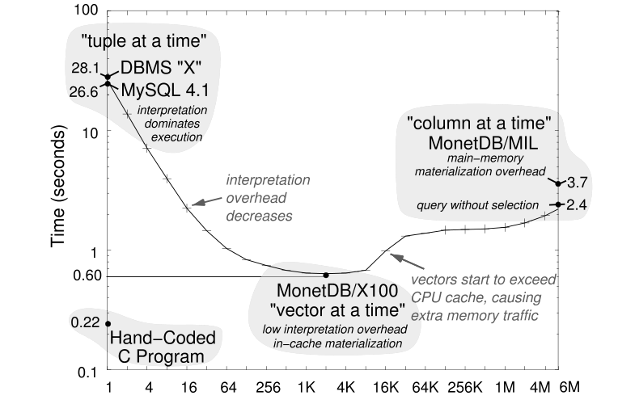
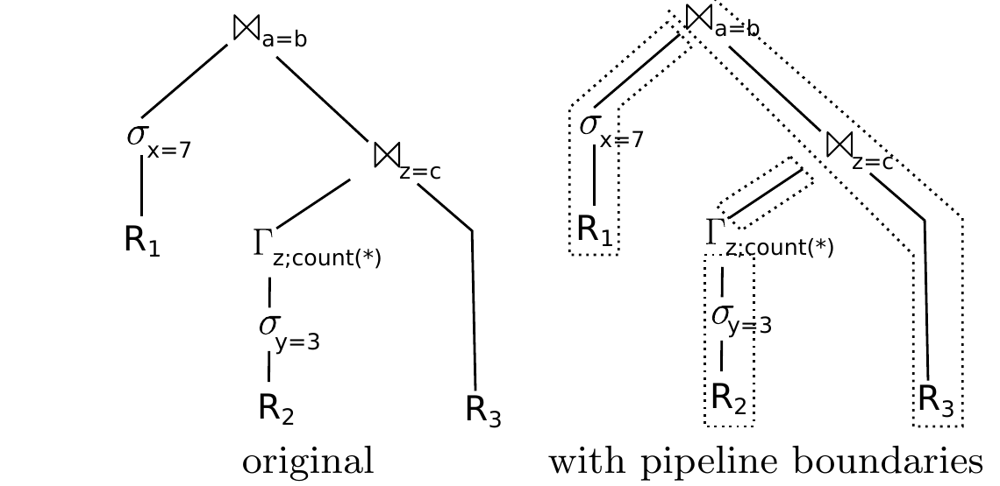
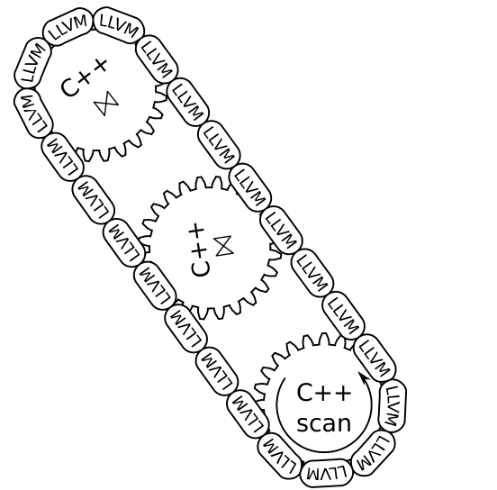
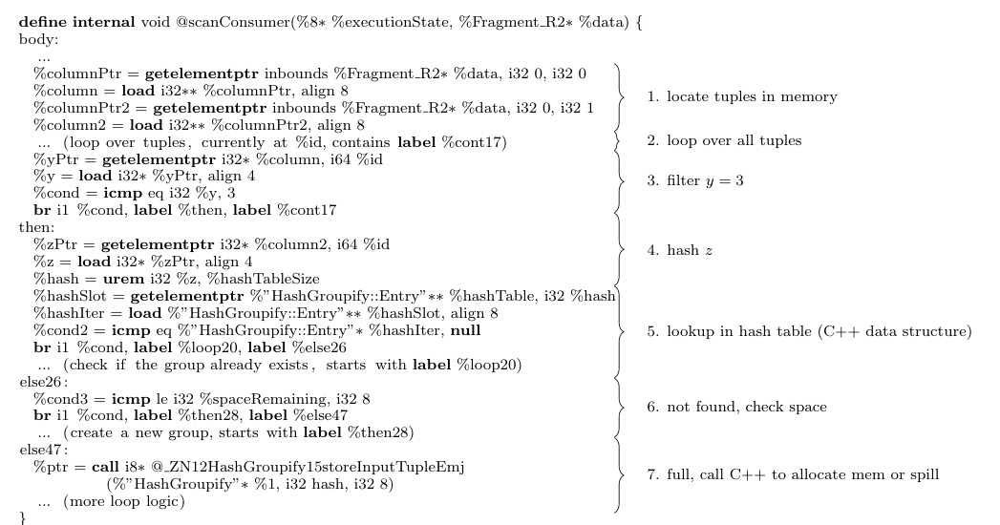
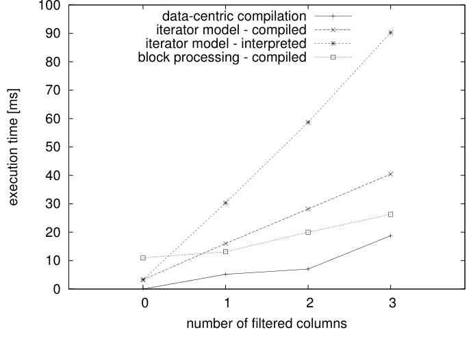
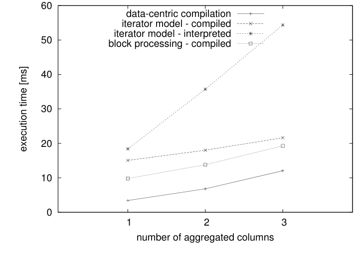

# Efficiently Compiling Efficient Query Plans for Modern Hardware（中文译文）

## 译者说明

本文依据同目录的 `source.pdf` 翻译。章节、图表、公式、算法、代码与参考文献按原文结构保留。

Thomas Neumann，慕尼黑工业大学（Technische Universität München），德国慕尼黑；neumann@in.tum.de。

允许为个人或课堂用途免费制作本文全部或部分内容的数字或纸质副本，条件是副本不得用于营利或商业利益，并须在首页载有本声明及完整引文。其他复制、再版、发布到服务器或转发到邮件列表的行为，须事先获得明确许可和/或付费。

本文所在卷的论文受邀在第 37 届 International Conference on Very Large Data Bases（2011 年 8 月 29 日至 9 月 3 日，美国华盛顿州西雅图）展示其研究结果。

*Proceedings of the VLDB Endowment*，Vol. 4, No. 9。Copyright 2011 VLDB Endowment 2150-8097/11/06，价格 \$10.00。

## 摘要

随着主内存容量增长，查询性能越来越取决于查询处理本身的 CPU 成本。经典 iterator 风格的查询处理技术简单灵活，但在现代 CPU 上因为局部性差和频繁的指令误预测而性能较差。过去提出了批处理、向量化元组处理等方法，但这些技术仍经常慢于手写执行计划。本文提出一种新的编译策略，使用 LLVM 编译框架把查询转换为紧凑高效的机器码。该策略强调良好的代码局部性和数据局部性，以及可预测的分支布局，因此生成代码常能接近手写 C++ 的性能。我们把这些技术集成到 HyPer 主内存数据库系统中，实验显示它能在编译时间适中的前提下获得优异的查询性能。

## 1. 引言

数据库通常把 SQL 查询翻译为物理代数表达式，然后执行该表达式。传统做法是 iterator model [8]，也称 Volcano-style processing [4]：每个物理算子在概念上从输入产生一个元组流，调用者反复调用算子的 `next()` 遍历该流。这个接口清晰、灵活，任意算子也容易组合，但它来自 I/O 主导而 CPU 成本不那么重要的年代。

首先，每产生一个中间或最终 tuple 都要调用一次 `next()`，在一次查询中可能达到数百万次。其次，`next()` 通常是虚调用或经函数指针调用，比普通调用更贵，也会破坏现代 CPU 的分支预测。再次，这种模型常有较差的代码局部性和复杂的状态记录。以压缩关系上的简单扫描为例：扫描算子必须记住当前 tuple 在压缩流中的位置，并在下一次 `next()` 到来时跳到相应的解压代码。

因此，一些现代系统会在内部一次解压若干 tuple 后再遍历已解压数据，或者让每次 `next()` 产生多个 tuple [11]，甚至一次产生全部 tuple [1]。面向 block 的处理把跨算子调用成本摊到大量 tuple 上，却也削弱了 iterator 的重要优势——流水线。流水线意味着算子无需复制或物化数据，便可把数据交给父算子；selection 只转交 tuple，天然可流水化，join 等复杂算子至少也能在一侧流水化。一次产生多个 tuple 时，为了让调用者访问它们，通常必须先将它们物化。物化虽允许向量化操作 [2]，失去流水线却会消耗更多内存带宽。

当数据驻留在内存中时，磁盘 I/O 不再掩盖这些 CPU 开销。手写程序甚至明显快于非常快的向量化系统，如图 1 所示 [16]。这未必令人意外，因为人可以使用 DBMS 不会采用的技巧；但图中的查询只是简单聚合，按理说合理的求值方式并不多，因此差距也说明现有通用执行方式仍然不够理想。本文的目标是让数据库系统自动生成接近手写代码质量的查询机器码，同时保留优化器和关系代数的灵活性。



**图 1：TPC-H Query 1 的手写代码与执行引擎性能对比（原文引自文献 [16] 的图 3）。**

图 1 对比了手写 C 程序、tuple-at-a-time 引擎、vector-at-a-time 引擎和 column-at-a-time 引擎在 TPC-H Q1 上的表现。随着批量变大，解释开销下降，但过大的物化批量会让 vector 超出 CPU cache，重新受到内存流量限制；手写程序仍显著更快。

本文提出的查询编译策略与这些方案在三方面不同。第一，处理是以数据为中心而不是以算子为中心：处理数据时让它尽可能长时间留在 CPU 寄存器中，算子边界尽量淡化。第二，数据不是由算子向下拉取，而是向 consumer 方向推送，从而得到更紧凑的代码和更好的数据局部性。第三，查询通过优化型 LLVM 编译框架 [7] 直接编译为本机机器码。整个框架生成对现代 CPU 友好的代码，在某些场景中甚至可以胜过手写查询计划；LLVM 汇编还允许采用一些在 C++ 等高级语言中很难表达的技巧。LLVM 使系统能持续受益于未来的编译器、代码优化和硬件改进，而不必在查询引擎中手工重写这些优化。我们把这些技术集成到 HyPer 主内存数据库系统 [5]，并在第 6 节用系统比较与微基准评估。第 2 节回顾相关工作，第 3 节介绍编译框架，第 4 节讨论实际代码生成，第 5 节说明如何纳入高级处理技术，第 7 节总结全文。

## 2. 相关工作

经典 iterator 模型很早就已提出 [8]，并因 Volcano 系统而普及 [4]。它灵活、简单；当磁盘 I/O 主导查询时间时，逐元组 `next()` 的调用成本并不突出。CPU 成为瓶颈后，block-oriented 系统让算子一次传递一批 tuple [11]，显著减少函数调用，却引入额外物化。

主存系统重新审视这一权衡。MonetDB [1, 9] 走向另一极端：完整物化每个中间结果，消除反复调用输入算子，也简化算子交互，但写入和读取中间结果的代价很高。MonetDB/X100 [1]（后发展为 VectorWise）采取中间方案，以大向量分块执行；性能优异，但图 1 显示它仍达不到手写代码。

另一条路线是把查询编译为可执行形式。已有工作把查询逻辑编译成 Java bytecode 并交给 JVM [13]，但仍保留 iterator 接口，且运行时较重；HIQUE 用每算子模板生成 C [6]，虽然通过把结果物化内联到算子执行中消除了 iterator，却仍保留明显的算子边界，并承担很高的 C 编译成本 [6]。其他局部优化包括在合取谓词中权衡分支数与实际求值谓词数 [14]，以及用 SIMD 加速表达式 [12, 15]。本文的区别在于同时消除逐元组调用、跨算子物化和通用解释，并把 pipeline 变成紧凑机器码。

## 3. 查询编译器

### 3.1 查询处理架构

#### 传统模型的问题

本文对 pipeline breaker 给出比通常更严格的定义：若一个代数算子对某个输入侧把到达 tuple 移出 CPU 寄存器，它就是该侧的 pipeline breaker；若必须先物化该侧全部 tuple 才继续，则是 full pipeline breaker。该定义近似假定单 tuple 的相关属性能放入寄存器，核心原则是任何向内存 spill 都打断 pipeline。

Volcano 模型的每个算子都把控制权交回调用者。跨越任意函数边界都会逐出寄存器内容；block model 虽减少调用，却产生超过寄存器容量的批次。以 iterator 暴露任意复杂算子的线性输出，本身就容易破坏 producer 的自然局部性；有些算子原本可能无需复制就能低成本地一次产生少量输出 tuple，线性 iterator 接口却无法利用这种能力。

#### 以数据为中心的执行思想

本文反转控制流：不由 consumer 向下拉 tuple，而由 producer 把 tuple 向上推，直到下一个 pipeline breaker。中间算子把属性留在寄存器中；复杂控制流通常移到 tight loop 之外，降低寄存器压力。由于 breaker 本来就必须物化，生成计划实际上把内存访问压到不可避免的位置。

**图 2：示例查询。**

```sql
select *
from R1, R3,
     (select R2.z, count(*)
      from R2
      where R2.y = 3
      group by R2.z) R2
where R1.x = 7
  and R1.a = R3.b
  and R2.z = R3.c;
```



**图 3：图 2 示例查询的原始执行计划及其 pipeline 边界。**

图 3 展示该查询的传统执行计划和 pipeline boundary。查询先过滤 R2、按 $z$ 分组，再把结果与 R3 连接，最后与 R1 中选出的 tuple 连接。经典算子模型中，最上层 join 会反复向左输入取 tuple 并放入 hash table，再向右输入取 tuple 并逐一 probe；两侧输入递归地采用同样方式。细看数据流，tuple 实际上总是在物化点之间传递： $a=b$ join 从已物化的 R1 scan 接收左输入，又把它们物化进 hash table；中间 selection 只流水传递而不物化。以数据为中心的编译因此尽量让元组从一个 breaker 推送到下一个 breaker，中间算子保留在寄存器中执行。

图 4 的四段代码分别处理：过滤 R1 并建 $B _ {a=b}$ 哈希表；过滤 R2 并更新 $\Gamma _ z$；把 $\Gamma _ z$ 结果建成 $B _ {z=c}$；扫描 R3、依次 probe 两张表并输出。每段都在新 tuple 输入和最终物化之间保持强 pipeline，既有数据局部性，也让小段代码在大量数据上循环，形成代码局部性。

**图 4：图 3 执行计划编译得到的查询伪代码。**

```text
initialize memory of B_a=b, B_c=z, and Γ_z

for each tuple t in R1
  if t.x = 7
    materialize t in hash table of B_a=b

for each tuple t in R2
  if t.y = 3
    aggregate t in hash table of Γ_z

for each tuple t in Γ_z
  materialize t in hash table of B_z=c

for each tuple t3 in R3
  for each match t2 in B_z=c[t3.c]
    for each match t1 in B_a=b[t3.b]
      output t1 ◦ t2 ◦ t3
```

为保持示例可读，图 4 暂时假定计算完全在内存中进行。

**译者注：** 原文图 4 的初始化行写作 $B _ {c=z}$，后续却使用 $B _ {z=c}$；第 3.2 节相邻正文也把第一段的建表对象写成 $B _ {c=z}$，而图 3、图 4 的其余内容均指向 $B _ {a=b}$。这些符号并不一致；这里按原文各处的可见内容保留，没有静默统一。

### 3.2 编译代数表达式

#### Produce/Consume 接口

我们提出 produce/consume 代码生成接口。每个算子支持两个方法：

- `produce()`：请求子算子产生数据。
- `consume(attributes, source)`：接收子算子产生的一条元组或一组属性，并依据来源输入生成本算子逻辑。

这种接口只存在于编译器内部，不是运行时虚函数。SQL 仍照常解析、转为代数并优化；最终计划不再转成可解释物理算子，而是由 produce/consume 遍历生成命令式程序。以 $B _ {a=b}$ 的 `produce()` 为例，它先要求左侧 selection 产生 tuple；selection 再要求 R1 scan。Scan 每载入一条所需属性，就调用 selection 的编译期 `consume()` 生成谓词；满足时再调用 join 的 `consume()` 生成建表代码。左侧完成后，join 请求右侧 produce。真实实现还需跟踪已加载属性、operator state 和相关子查询依赖，但接口保持统一。

**图 5：说明 produce/consume 交互的简化翻译方案。**

```text
B.produce       B.left.produce; B.right.produce;
B.consume(a,s)  if (s == B.left)
                  print "materialize tuple in hash table";
                else
                  print "for each match in hashtable[" + a.joinattr + "]";
                  B.parent.consume(a + new attributes)

σ.produce       σ.input.produce
σ.consume(a,s)  print "if " + σ.condition;
                σ.parent.consume(attr, σ)

scan.produce    print "for each tuple in relation"
                scan.parent.consume(attributes, scan)
```

同一个算子的逻辑可能分散在多段代码中：binary breaker 从左右输入消费 tuple 时动作完全不同。这种“暴露不规则性”是优点，生成器可只发射当前情境需要的指令并把属性留在寄存器；易维护的抽象停留在编译器，最终机器码不必维护算子边界。

把图 5 的规则应用到图 3 的算子树，除变量名和内存初始化差异外，就会得到图 4 的伪代码。真实翻译器还必须跟踪算子状态、已载入属性以及相关子查询的属性依赖，因此明显更复杂；附录 A 给出了更详细的算子翻译。由于生成的代码片段每次都处理局部的一块数据，这一方式在实际实现中表现高效。

## 4. 代码生成

### 4.1 生成机器码

我们最初生成 C++、在运行时编译成共享库。这样易调用数据库的 C++ 数据结构，却有两项硬伤：优化 C++ 编译复杂查询要数秒，且 C++ 不能完全控制溢出 flag 等机器级细节。HyPer 因此改用 LLVM [7]：无限数量的 SSA 虚拟寄存器简化属性映射，强类型 IR 暴露了原 C++ 文本生成中隐藏的错误，JIT 跨架构生成机器码通常只需数毫秒，而 C/C++ 编译器需要数秒（见第 6 节与文献 [6]）。



**图 6：LLVM 与 C++ 的交互。**

图 6 用齿轮和链条表示 HyPer 的混合执行模型：复杂数据结构和运行时逻辑保留在预编译 C++ 中，热点 tuple-processing 片段用 LLVM 生成并串联这些 C++ 组件。这样避免把完整数据库内核重写为 LLVM IR，同时让热点路径保持紧凑。

复杂扫描定位、索引结构、磁盘 spill 等留在 C++“齿轮”中，LLVM“链条”负责把它们连接为针对查询的路径。C++ 可驱动 fragment，LLVM 处理 tuple access、filter 和 materialization；sort 等复杂阶段可把控制权交回 C++，批量 tuple 再可处理时回到 LLVM。99% tuple 经过的 hot path 应为纯 LLVM；偶尔切页或扩容调用 C++ 代价可忽略。每次调用外部函数都必须把全部寄存器 spill 到内存；单次写入通常落在 cache 中，绝对成本很低，但若每个 tuple 都跨函数边界，数百万次累积后就会成为可见开销。

### 4.2 复杂算子

复杂查询不应内联成单一巨型函数。外部排序的 merge 适合由 C++ 控制；outer join 会从“匹配”和“产生 NULL”两处调用 consumer，若逐层内联，级联 outer join 将造成指数代码增长。生成器因此可在 LLVM 内定义辅助函数，但仍保证单个 pipeline fragment 的 hot path 紧凑。

这种多函数生成方式要求编译器追踪所有属性，并记住它们当前是否位于寄存器中。把属性物化到内存是显式决策，类似于把 tuple spool 到磁盘。虽然从性能角度看内存物化相对较快，但从代码生成角度看它是非常复杂、应尽可能避免的步骤。

真实查询生成的汇编代码会迅速变得复杂，难以在此完整展示，因此图 7 只给出运行示例中 $\Gamma _ {z;\mathrm{count}(\ast)}(\sigma _ {y=3}(R_2))$ 片段的简短 LLVM IR，以说明主要机制。右侧数字含义是：1 定位内存中的 tuple，2 遍历 tuple，3 过滤 $y=3$，4 计算 $z$ 的 hash，5 查 hash table，6 未找到时检查空间，7 空间不足时调用 C++ 分配或 spill。



图 7：LLVM IR 片段及右侧编号标注，展示扫描、过滤、hash、查表和满表时调用 C++ 分配或 spill 的路径。

```llvm
define internal void @scanConsumer(%8* %executionState, %Fragment_R2* %data) {
body:
  ...
  %columnPtr = getelementptr inbounds %Fragment_R2* %data, i32 0, i32 0
  %column = load i32** %columnPtr, align 8
  %columnPtr2 = getelementptr inbounds %Fragment_R2* %data, i32 0, i32 1
  %column2 = load i32** %columnPtr2, align 8
  ... ; loop over tuples, currently at %id, contains label %cont17

  %yPtr = getelementptr i32* %column, i64 %id
  %y = load i32* %yPtr, align 4
  %cond = icmp eq i32 %y, 3
  br i1 %cond, label %then, label %cont17

then:
  %zPtr = getelementptr i32* %column2, i64 %id
  %z = load i32* %zPtr, align 4
  %hash = urem i32 %z, %hashTableSize
  %hashSlot = getelementptr %"HashGroupify::Entry"** %hashTable, i32 %hash
  %hashIter = load %"HashGroupify::Entry"** %hashSlot, align 8
  %cond2 = icmp eq %"HashGroupify::Entry"* %hashIter, null
  br i1 %cond, label %loop20, label %else26
  ... ; check if the group already exists, starts with label %loop20

else26:
  %cond3 = icmp le i32 %spaceRemaining, i32 8
  br i1 %cond, label %then28, label %else47
  ... ; create a new group, starts with label %then28

else47:
  %ptr = call i8* @_ZN12HashGroupify15storeInputTupleEmj(
      %"HashGroupify"* %1, i32 hash, i32 8)
  ... ; more loop logic
}
```

**译者注：** 原文先定义 `%cond2` 和 `%cond3`，但紧接着的两条分支指令仍分别使用 `%cond`；这里按原文可见代码保留，没有静默改为 `%cond2` 或 `%cond3`。

这段 LLVM 代码由 C++ 针对每个 data fragment（即连续存放的一系列 tuple）调用。它先载入处理所需列的指针，再遍历 fragment 中的 tuple：读取 $y$ 并检查谓词，不满足时继续循环；满足时读取 $z$、计算哈希、查找对应哈希项并遍历候选。未找到匹配 group 时，代码先检查是否有足够空间；若没有，则直接调用 C++ 方法申请内存，并在需要时 spill。这样，热点路径主要停留在 LLVM 中。LLVM 的调用直接以修饰后的符号名调用原生 C++ 方法，不需要额外 wrapper，因此二者可以直接交互而不引入额外封装开销。

### 4.3 性能调优

按上述策略生成的 LLVM 代码本身已经很快：主要工作发生在遍历 tuple 的 tight loop 中，内存访问有良好的预取行为，分支也通常容易预测。代码很快之后，原先不显眼的细节会变成瓶颈。例如，在 TPC-H Q1——本质上只是扫描加基于哈希的聚合——的早期计划中，超过一半执行时间耗在 hashing 上，虽然这里只需要对两个简单值做哈希。

分支布局同样关键。现代 CPU 只要分支几乎总是或几乎从不跳转，就能很好地预测；概率约为 50% 的分支则代价高昂。因此查询编译器必须生成有利于良好分支预测的代码布局。哈希表冲突链的直观写法把“检查当前 entry 是否存在”和“是否到达链尾”混在同一个 `while` 条件里：

```cpp
Entry* iter=hashTable[hash];
while (iter) {
  ... // inspect the entry
  iter=iter->next;
}
```

第一个条件几乎总为真，而第二个几乎总为假；拆成下面的布局后，预测器更容易学习这两条路径：

```cpp
Entry* iter=hashTable[hash];
if (iter) do {
  ... // inspect the entry
  iter=iter->next;
} while (iter);
```

源码使用 LLVM branch 而非 C++ loop，但控制流原则相同。仅这一改动就在实验中把 hash-table lookup 提升了 20% 以上。

生成器还应尽量把 tuple 属性保存在 LLVM 虚拟 CPU 寄存器中；字符串同时保存长度和指针。属性要尽可能晚地载入：在真正需要时，或因访问同一内存而可以顺带取得时再载入。派生属性也遵循同样原则；但若 hash value 等派生值位于关键路径，就应比严格需要的时刻稍早计算，以隐藏计算延迟。分支布局同样必须服从可预测性。避免这些陷阱并不要求庞大的生成器：代码生成器上的一次投入会让此后的所有查询受益；本文覆盖 SQL-92 所需全部代数算子的代码生成实现约为 11,000 行，并不庞大。

## 5. 高级并行化技术

逐 tuple 推送并不排斥一次处理多个 tuple，只要整个小块能留在寄存器中。传统 block-wise processing [11] 的主要缺点是额外内存访问；寄存器内 block 则可以避免这一点。LLVM 原生支持 vector type，生成 SIMD 代码只需对框架做有限扩展。这样的 block 一方面可用 SIMD 指令一次处理多个 tuple [15]，另一方面可先求值并合并谓词、延迟实际分支 [12, 14]；文献 [14] 的技术对单 tuple 已有效，对 tuple block 的收益还可能更大。与传统 block model 不同，它不把中间块写入内存。

多核是另一维度。数据库普遍会利用多核做查询间并行；随着核心数增加，查询内并行也更重要。经典方法 [10, 3] 把算子输入分区，独立处理各分区，再合并结果。本文代码本来就在 tight loop 中处理 storage fragment，因此 fragment 也可由并行调度产生，主体代码几乎不变。真正困难的是优化器何时引入 split/merge：它们并非免费，过度并行反而有害；论文把这一决策留作后续工作。

## 6. 实验

### 6.1 系统比较

我们把技术同时实现于 HyPer 主存系统 [5] 和一个磁盘系统，均可在内存运行或按需 spill。由于存储系统差异等因素也会显著影响查询性能，很难仅靠跨系统结果精确隔离编译策略本身；因此正文给出完整系统比较和生成代码分析，附录 B 再用微基准隔离具体算子行为。跨系统比较使用双路 Intel X5570 四核、64 GB 内存、RHEL 5.4，GCC 4.5.2 与 LLVM 2.8；比较 MonetDB 1.36.5、Ingres VectorWise 1.0 和匿名商业系统 DB X，优化级别见附录 C。TPC-CH [5] 结合 TPC-C 事务与适配到同一 schema 的 22 条 TPC-H 查询；为隔离原始执行速度，装载 12 个 warehouse 后单线程、无 client wait、无并发 update 执行。HyPer 原先用手写代码片段把查询编译为 C++，因此 C++ 与 LLVM backend 的对比能直接估计改用 LLVM 的影响。

表 1 给出 HyPer 的 OLTP 侧性能和总编译时间：

**表 1：不同引擎的 OLTP 性能。**

| 指标 | HyPer + C++ | HyPer + LLVM |
| --- | ---: | ---: |
| TPC-C [tps] | 161,794 | 169,491 |
| total compile time [s] | 16.53 | 0.81 |

OLTP 事务通常只访问不到 30 条 tuple，因此 LLVM 的 169,491 tps 仅略高于 C++ 的 161,794；但编译全部脚本从 16.53 秒降至 0.81 秒，且执行不退化。

表 2 给出前五个 TPC-CH OLAP 查询的执行时间和编译时间：

**表 2：不同引擎的 OLAP 性能。**

| System / metric | Q1 | Q2 | Q3 | Q4 | Q5 |
| --- | ---: | ---: | ---: | ---: | ---: |
| HyPer + C++ [ms] | 142 | 374 | 141 | 203 | 1416 |
| C++ compile time [ms] | 1556 | 2367 | 1976 | 2214 | 2592 |
| HyPer + LLVM [ms] | 35 | 125 | 80 | 117 | 1105 |
| LLVM compile time [ms] | 16 | 41 | 30 | 16 | 34 |
| VectorWise [ms] | 98 | - | 257 | 436 | 1107 |
| MonetDB [ms] | 72 | 218 | 112 | 8168 | 12028 |
| DB X [ms] | 4221 | 6555 | 16410 | 3830 | 15212 |

OLAP 使用 prepared query 的 warm execution time。VectorWise 的 Q2 触发系统 bug；DB X 为通用磁盘系统，即便数据在内存仍明显较慢。HyPer LLVM 对多数查询又快 2-4 倍。Q5 主要受 join 支配，因此 C++/LLVM 差异较小；Q1 只是 scan+aggregation，C++ 看似自然高效，仍无法像 LLVM 那样长期把值留在寄存器。表中的编译时间包含从 SQL 文本到可执行代码的全部步骤：LLVM 为 16-41 ms，C++ 为 1.5-2.6 秒。

### 6.2 代码质量

我们用 Valgrind 3.6.0 Callgrind，只在查询执行区间采集 HyPer LLVM 与 MonetDB 的分支和 cache 行为。MonetDB primitive 也是 tight loop，理论上误预测率低；比较旨在判断生成代码是否同样紧凑。

表 3 给出 LLVM 版本 HyPer 与 MonetDB 在分支和 cache locality 上的对比：

**表 3：分支行为与 Cache 局部性。**

| Metric | Q1 LLVM | Q1 MonetDB | Q2 LLVM | Q2 MonetDB | Q3 LLVM | Q3 MonetDB | Q4 LLVM | Q4 MonetDB | Q5 LLVM | Q5 MonetDB |
| --- | ---: | ---: | ---: | ---: | ---: | ---: | ---: | ---: | ---: | ---: |
| branches | 19,765,048 | 144,557,672 | 37,409,113 | 114,584,910 | 14,362,660 | 127,944,656 | 32,243,391 | 408,891,838 | 11,427,746 | 333,536,532 |
| mispredicts | 188,260 | 456,078 | 6,581,223 | 3,891,827 | 696,839 | 1,884,185 | 1,182,202 | 6,577,871 | 639 | 6,726,700 |
| I1 misses | 2,793 | 187,471 | 1,778 | 146,305 | 791 | 386,561 | 508 | 290,894 | 490 | 2,061,837 |
| D1 misses | 1,764,937 | 7,545,432 | 10,068,857 | 6,610,366 | 2,341,531 | 7,557,629 | 3,480,437 | 20,981,731 | 776,417 | 8,573,962 |
| L2d misses | 1,689,163 | 7,341,140 | 7,539,400 | 4,012,969 | 1,420,628 | 5,947,845 | 3,424,857 | 17,072,319 | 776,229 | 7,552,794 |
| I refs | 132 mil | 1,184 mil | 313 mil | 760 mil | 208 mil | 944 mil | 282 mil | 3,140 mil | 159 mil | 2,089 mil |

LLVM 在所有查询上分支数显著更少，除 Q2 外误预测绝对数也更低；Q2 的例外来自 HyPer 当时过度保守的磁盘 spill 和字符串复制，超过 60% 误预测落在该路径，不是 LLVM 固有限制，而 MonetDB 避免了这些字符串复制。MonetDB 的相对误预测率其实相当好，这与其体系结构相符；但它执行的分支总数过多，因此绝对误预测次数仍然很多。多数查询 D1 与 L2 miss 接近，表明大哈希表 miss L1 后通常也 miss L2；LLVM 除同一 Q2 字符串处理问题外，cache miss 最多低一个数量级，而原文明确说明该问题计划在后续 HyPer 版本中修复。执行指令数与表 2 时间一致，LLVM 代码比基于 BAT、反复触碰 tuple 的 MonetDB 紧凑得多。

这些计数器说明优势来自数据和代码局部性，而不只是“LLVM 比 C++ 编译器更聪明”。LLVM 编译延迟相对 C++ 已大幅下降；对于本文主存/磁盘实现，热点路径保持一致，spill 逻辑仅在必要时转入 C++。

## 7. 结论

实验表明，以数据为中心的查询处理是一种非常高效的查询执行模型。通过把查询编译为使用优化型 LLVM 编译器生成的机器码，DBMS 可以获得足以媲美手写 C++ 代码的查询处理效率。

我们实现的代数表达式 LLVM 汇编编译框架紧凑且易于维护。因此，以数据为中心的编译方法对新的数据库项目很有吸引力；它依托主流编译器框架，还能自动受益于未来的编译器和处理器改进，而无需重新设计查询引擎。

## 8. 参考文献

- [1] P. A. Boncz, S. Manegold, and M. L. Kersten. Database architecture evolution: Mammals flourished long before dinosaurs became extinct. PVLDB, 2(2):1648–1653, 2009.
- [2] P. A. Boncz, M. Zukowski, and N. Nes. MonetDB/X100: Hyper-pipelining query execution. In CIDR, pages 225–237, 2005.
- [3] J. Cieslewicz and K. A. Ross. Adaptive aggregation on chip multiprocessors. In VLDB, pages 339–350, 2007.
- [4] G. Graefe and W. J. McKenna. The Volcano optimizer generator: Extensibility and efficient search. In ICDE, pages 209–218. IEEE Computer Society, 1993.
- [5] A. Kemper and T. Neumann. HyPer: A hybrid OLTP&OLAP main memory database system based on virtual memory snapshots. In ICDE, pages 195–206, 2011.
- [6] K. Krikellas, S. Viglas, and M. Cintra. Generating code for holistic query evaluation. In ICDE, pages 613–624, 2010.
- [7] C. Lattner and V. S. Adve. LLVM: A compilation framework for lifelong program analysis & transformation. In ACM International Symposium on Code Generation and Optimization (CGO), pages 75–88, 2004.
- [8] R. A. Lorie. XRM - an extended (n-ary) relational memory. IBM Research Report, G320-2096, 1974.
- [9] S. Manegold, P. A. Boncz, and M. L. Kersten. Optimizing database architecture for the new bottleneck: memory access. VLDB J., 9(3):231–246, 2000.
- [10] M. Mehta and D. J. DeWitt. Managing intra-operator parallelism in parallel database systems. In VLDB, pages 382–394, 1995.
- [11] S. Padmanabhan, T. Malkemus, R. C. Agarwal, and A. Jhingran. Block oriented processing of relational database operations in modern computer architectures. In ICDE, pages 567–574, 2001.
- [12] V. Raman, G. Swart, L. Qiao, F. Reiss, V. Dialani, D. Kossmann, I. Narang, and R. Sidle. Constant-time query processing. In ICDE, pages 60–69, 2008.
- [13] J. Rao, H. Pirahesh, C. Mohan, and G. M. Lohman. Compiled query execution engine using JVM. In ICDE, page 23, 2006.
- [14] K. A. Ross. Conjunctive selection conditions in main memory. In PODS, pages 109–120, 2002.
- [15] T. Willhalm, N. Popovici, Y. Boshmaf, H. Plattner, A. Zeier, and J. Schaffner. SIMD-scan: Ultra fast in-memory table scan using on-chip vector processing units. PVLDB, 2(1):385–394, 2009.
- [16] M. Zukowski, P. A. Boncz, N. Nes, and S. Héman. MonetDB/X100 - a DBMS in the CPU cache. IEEE Data Eng. Bull., 28(2):17–22, 2005.

## 附录 A. 算子翻译

由于篇幅限制，第 3 节只能高度概述算子翻译，这里给出更详细的讨论。附录集中讨论 Scan、Select、Project、Map 和 HashJoin；这些算子足以翻译很大一类查询。前四种算子较简单，适合说明基本的 produce/consume 交互，hash join 则复杂得多。

查询编译期间会传递相当多的基础设施。最重要的对象是 codegen、context 和 getParent：codegen 提供 LLVM 代码生成接口（operator-> 被重载为访问 LLVM 的 IRBuilder）；context 跟踪来自输入算子以及相关子查询“外部”的可用属性；getParent 返回父算子。此外还有自动完成 LLVM 代码生成任务的辅助对象，特别是用于构造控制流的 Loop 和 If。

### Scan

Scan 使用 ScanConsumer 辅助类访问所有 relation fragment，遍历当前 fragment 中的所有 tuple，把必需列注册为可按需取得（context 会缓存它们），再把 tuple 传给消费算子。根据 relation 类型，ScanConsumer 逻辑也可能生成对 C++ 函数的调用，例如访问 page，以取得数据 fragment。

```cpp
void TableScanTranslator::produce(CodeGen& codegen,Context& context) const
{
  // Access all relation fragments
  llvm::Value* dbPtr=codegen.getDatabasePointer();
  llvm::Value* relationPtr=codegen.getPtr(dbPtr,db.layout.relations[table]);
  auto& required=scanConsumer.getPartitionPtr();
  ScanConsumer scanConsumer(codegen,context)
  for (;db.relations[table]->generateScan(codegen,relationPtr,scanConsumer);) {
    // Prepare accessing the current fragment
    llvm::Value* partitionPtr=required;
    ColumnAccess columnAccess(partitionPtr,required);

    // Loop over all tuples
    llvm::Value* tid=codegen.const64(0);
    llvm::Value* limit=codegen.load(partitionPtr,getLayout().size);
    Loop loop(codegen,codegen->CreateICmpULT(tid,limit),{{tid,"tid"}});
    {
      tid=loop.getLoopVar(0);

      // Prepare column access code
      PartitionAccess::ColumnAccess::Row rowAccess(columnAccess,tid);
      vector<ValueAccess> access;
      for (auto iter=required.begin(),limit=required.end();iter!=limit;++iter)
        access.push_back(rowAccess.loadAttribute(*iter));

      // Register providers in new inner context
      ConsumerContext consumerContext(context);
      unsigned slot=0;
      for (auto iter=required.begin(),limit=required.end();iter!=limit;++iter,++slot)
        consumerContext.registerIUProvider(&(getOutput()[*iter].iu),&access[slot]);

      // Push results to consuming operators
      getParent()->consume(codegen,consumerContext);

      // Go to the next tuple
      tid=codegen->CreateAdd(tid,codegen.const64(1));
      loop.loopDone(codegen->CreateICmpULT(tid,limit),{tid});
    }
  }
}
```

Scan 是叶子算子，因此没有 consume 部分。

**译者注：** 上面的代码按论文印刷内容转写；其中 required 在 scanConsumer 声明前使用、ScanConsumer 声明后缺少分号，均为原文可见问题，译文没有静默修正。

### Selection

Selection 的 produce 部分只把谓词所需属性加入 context，再调用输入算子；consume 部分过滤掉所有不满足条件的 tuple。

```cpp
void SelectTranslator::produce(CodeGen& codegen,Context& context) const
{
  // Ask the input operator to produce tuples
  AddRequired addRequired(context,getCondition().getUsed());
  input->produce(codegen,context);
}

void SelectTranslator::consume(CodeGen& codegen,Context& context) const
{
  // Evaluate the predicate
  ResultValue value=codegen.deriveValue(getCondition(),context);

  // Pass tuple to parent if the predicate is satisfied
  CodeGen::If checkCond(codegen,value);
  {
    getParent()->consume(codegen,context);
  }
}
```

### Projection

Bag projection 几乎是 no-op，并在算子翻译期间被编译掉，因为它只通知输入端哪些列是必需的。真正效果发生在 pipeline breaker 内部：它们会丢弃所有不需要的列。

```cpp
void ProjectTranslator::produce(CodeGen& codegen,Context& context) const
{
  // Ask the input operator to produce tuples
  SetRequired setRequired(context,getOutput());
  input->produce(codegen,context);
}

void ProjectTranslator::consume(CodeGen& codegen,Context& context) const
{
  // No code required here, pass to parent
  getParent()->consume(codegen,context);
}
```

### Map

Map 算子通过求值函数计算新列。计算的放置位置以及 map 与 selection 的顺序已经由查询优化器确定，因此翻译很直接。

```cpp
void MapTranslator::produce(CodeGen& codegen,Context& context) const
{
  // Figure out which columns have to be provided by the input operator
  IUSet required=context.getRequired();
  for (auto iter=functions.begin(),limit=functions.end();iter!=limit;++iter) {
    (*iter).function->getUsed(required);
    required.erase((*iter).result);
  }

  // Ask the input operator to produce tuples
  SetRequired setRequired(context,required);
  input->produce(codegen,context);
}

void MapTranslator::consume(CodeGen& codegen,Context& context) const
{
  // Offer new columns
  vector<ExpressionAccess> accessors;
  for (auto iter=functions.begin(),limit=functions.end();iter!=limit;++iter)
    accessors.push_back(ExpressionAccess(codegen,*(*iter).function));
  for (unsigned index=0,limit=accessors.size();index<limit;index++)
    context.registerIUProvider(functions[index].result,&accessors[index]);

  // Pass to parent
  getParent()->consume(codegen,context);
}
```

### Hash Join

前四个算子较简单，因为大部分逻辑都由纯 LLVM 代码处理。Hash join 涉及 LLVM 与 C++ 之间的控制流往返，因此复杂得多。纯主存 hash join 可以完全用 LLVM 实现；但若需要在内存不足时 spill 到磁盘，就会调用很多与查询无关的方法，例如 I/O，本文实现把这些部分写在 C++ 中。

我们先给出 C++ 代码，因为它定义了随后由 LLVM 片段补充的模板。C++ 代码把 build 侧读入主存，必要时 spill 到磁盘；若数据能放入主存，就直接与 probe 侧 join，否则也把 probe 侧写入分区，再逐分区 join。为简化讨论，代码只处理 inner join；非 inner join 还需额外记录哪些 tuple 已经匹配。

```cpp
void HashJoin::Inner::produce()
{
  // Read the build side
  initMem();
  produceLeft();
  if (inMem) {
    buildHashTable();
  } else {
    // Spool remaining tuples to disk
    spoolLeft();
    finishSpoolLeft();
  }

  // Is a in-memory join possible?
  if (inMem) {
    produceRight();
    return;
  }

  // No, spool the right hand side, too
  spoolRight();

  // Grace hash join
  loadPartition(0);
  while (true) {
    // More tuples on the right?
    for (;rightScanRemaining;) {
      const void* rightTuple=nextRight();
      for (LookupHash lookup(rightTuple);lookup;++lookup) {
        join(lookup.data(),rightTuple);
      }
    }

    // Handle overflow in n:m case
    if (overflow) {
      loadPartitionLeft();
      resetRightScan();
      continue;
    }

    // Go to the next partition
    if ((++inMemPartition)>=partitionCount) {
      return;
    } else {
      loadPartition(inMemPartition);
    }
  }
}
```

因此 LLVM 代码必须提供三个函数：与之前相同的 produce/consume，以及一个额外的 join，供 C++ 在连接已 spill 到磁盘的 tuple 时直接调用。此时 hash table lookup 等操作已经在 C++ 中完成，所以 join 只接收可能匹配的候选。produce 只是把控制流交给 C++；左右两侧各有一个 consume，用于计算 join value 的 hash、确定相关寄存器并将其 materialize 到 hash table。出于性能考虑，若没有数据 spill 到磁盘，HyPer 会跳过右侧的主存 materialization，直接 probe hash table；论文因篇幅限制省略了这条路径。

```cpp
void HJTranslatorInner::produce(CodeGen& codegen,Context& context) const
{
  // Construct functions that will be be called from the C++ code
  {
    AddRequired addRequired(context,getCondiution().getUsed().limitTo(left));
    produceLeft=codegen.derivePlanFunction(left,context);
  }
  {
    AddRequired addRequired(context,getCondiution().getUsed().limitTo(right));
    produceRight=codegen.derivePlanFunction(right,context);
  }

  // Call the C++ code
  codegen.call(HashJoinInnerProxy::produce.getFunction(codegen),
    {context.getOperator(this)});
}

void HJTranslatorInner::consume(CodeGen& codegen,Context& context) const
{
  llvm::Value* opPtr=context.getOperator(this);

  // Left side
  if (source==left) {
    // Collect registers from the left side
    vector<ResultValue> materializedValues;
    matHelperLeft.collectValues(codegen,context,materializedValues);

    // Compute size and hash value
    llvm::Value* size=matHelperLeft.computeSize(codegen,materializedValues);
    llvm::Value* hash=matHelperLeft.computeHash(codegen,materializedValues);

    // Materialize in hash table, spools to disk if needed
    llvm::Value* ptr=codegen.callBase(HashJoinProxy::storeLeftInputTuple,
      {opPtr,size,hash});
    matHelperLeft.materialize(codegen,ptr,materializedValues);

  // Right side
  } else {
    // Collect registers from the right side
    vector<ResultValue> materializedValues;
    matHelperRight.collectValues(codegen,context,materializedValues);

    // Compute size and hash value
    llvm::Value* size=matHelperRight.computeSize(codegen,materializedValues);
    llvm::Value* hash=matHelperRight.computeHash(codegen,materializedValues);

    // Materialize in memory, spools to disk if needed, implicitly joins
    llvm::Value* ptr=codegen.callBase(HashJoinProxy::storeRightInputTuple,
      {opPtr,size});
    matHelperRight.materialize(codegen,ptr,materializedValues);
    codegen.call(HashJoinInnerProxy::storeRightInputTupleDone,{opPtr,hash});
  }
}

void HJTranslatorInner::join(CodeGen& codegen,Context& context) const
{
  llvm::Value* leftPtr=context.getLeftTuple(),*rightPtr=context.getLeftTuple();

  // Load into registers. Actual load may be delayed by optimizer
  vector<ResultValue> leftValues,rightValues;
  matHelperLeft.dematerialize(codegen,leftPtr,leftValues,context);
  matHelperRight.dematerialize(codegen,rightPtr,rightValues,context);

  // Check the join condition, return false for mismatches
  llvm::BasicBlock* returnFalseBB=constructReturnFalseBB(codegen);
  MaterializationHelper::testValues(codegen,leftValues,rightValues,
    joinPredicateIs,returnFalseBB);
  for (auto iter=residuals.begin(),limit=residuals.end();iter!=limit;++iter) {
    ResultValue v=codegen.deriveValue(**iter,context);
    CodeGen::If checkCondition(codegen,v,0,returnFalseBB);
  }

  // Found a match, propagate up
  getParent()->consume(codegen,context);
}
```

**译者注：** 上述代码按论文印刷内容转写；getCondiution 的拼写，以及 rightPtr 仍调用 getLeftTuple，均为原文可见内容。

### 示例

作为一个小例子，我们给出以下查询生成的 LLVM 代码：

```sql
select d_tax
from warehouse, district
where w_id = d_w_id and w_zip = '137411111';
```

它先扫描 warehouse，过滤并 materialize 到 hash table，然后扫描 district 并执行 join。我们强制使用纯主存 hash join，以把代码长度控制在合理范围内。

```llvm
define void @planStart(%14* %executionState) {
body:
  %0 = getelementptr inbounds %14* %executionState, i64 0, i32 0, i32 1,
       i64 0
  store i64 0, i64* %0, align 8
  %1 = getelementptr inbounds %14* %executionState, i64 0, i32 1
  call void @_ZN5hyper9HashTable5resetEv(%"hyper::HashTable"* %1)
  %2 = bitcast %14* %executionState to %"hyper::Database"**
  %3 = load %"hyper::Database"** %2, align 8
  %4 = getelementptr inbounds %"hyper::Database"* %3, i64 0, i32 1
  %5 = load i8** %4, align 8
  %warehouse = getelementptr inbounds i8* %5, i64 5712
  %6 = getelementptr inbounds i8* %5, i64 5784
  %7 = bitcast i8* %6 to i32**
  %8 = load i32** %7, align 8
  %9 = getelementptr inbounds i8* %5, i64 5832
  %10 = bitcast i8* %9 to %3**
  %11 = load %3** %10, align 8
  %12 = bitcast i8* %warehouse to i64*
  %size = load i64* %12, align 8
  %13 = icmp eq i64 %size, 0
  br i1 %13, label %scanDone, label %scanBody

scanBody:
  %tid = phi i64 [ 0, %body ], [ %34, %cont2 ]
  %14 = getelementptr i32* %8, i64 %tid
  %w_id = load i32* %14, align 4
  %15 = getelementptr inbounds %3* %11, i64 %tid, i32 0
  %16 = load i8* %15, align 1
  %17 = icmp eq i8 %16, 9
  br i1 %17, label %then, label %cont2

then:
  %w_zip = getelementptr inbounds %3* %11, i64 %tid, i32 1, i64 0
  %27 = call i32 @memcmp(i8* %w_zip, i8* @"string 137411111", i64 9)
  %28 = icmp eq i32 %27, 0
  br i1 %28, label %then1, label %cont2

then1:
  %29 = zext i32 %w_id to i64
  %30 = call i64 @llvm.x86.sse42.crc64.64(i64 0, i64 %29)
  %31 = shl i64 %30, 32
  %32 = call i8* @_ZN5hyper9HashTable15storeInputTupleEmj(
        %"hyper::HashTable"* %1, i64 %31, i32 4)
  %33 = bitcast i8* %32 to i32*
  store i32 %w_id, i32* %33, align 1
  br label %cont2

cont2:
  %34 = add i64 %tid, 1
  %35 = icmp eq i64 %34, %size
  br i1 %35, label %cont2.scanDone_crit_edge, label %scanBody

cont2.scanDone_crit_edge:
  %.pre = load %"hyper::Database"** %2, align 8
  %.phi.trans.insert = getelementptr inbounds %"hyper::Database"* %.pre,
       i64 0, i32 1
  %.pre11 = load i8** %.phi.trans.insert, align 8
  br label %scanDone

scanDone:
  %18 = phi i8* [ %.pre11, %cont2.scanDone_crit_edge ], [ %5, %body ]
  %district = getelementptr inbounds i8* %18, i64 1512
  %19 = getelementptr inbounds i8* %18, i64 1592
  %20 = bitcast i8* %19 to i32**
  %21 = load i32** %20, align 8
  %22 = getelementptr inbounds i8* %18, i64 1648
  %23 = bitcast i8* %22 to i64**
  %24 = load i64** %23, align 8
  %25 = bitcast i8* %district to i64*
  %size8 = load i64* %25, align 8
  %26 = icmp eq i64 %size8, 0
  br i1 %26, label %scanDone6, label %scanBody5

scanBody5:
  %tid9 = phi i64 [ 0, %scanDone ], [ %58, %loopDone ]
  %36 = getelementptr i32* %21, i64 %tid9
  %d_w_id = load i32* %36, align 4
  %37 = getelementptr i64* %24, i64 %tid9
  %d_tax = load i64* %37, align 8
  %38 = zext i32 %d_w_id to i64
  %39 = call i64 @llvm.x86.sse42.crc64.64(i64 0, i64 %38)
  %40 = shl i64 %39, 32
  %41 = getelementptr inbounds %14* %executionState, i64 0, i32 1, i32 0
  %42 = load %"hyper::HashTable::Entry"*** %41, align 8
  %43 = getelementptr inbounds %14* %executionState, i64 0, i32 1, i32 2
  %44 = load i64* %43, align 8
  %45 = lshr i64 %40, %44
  %46 = getelementptr %"hyper::HashTable::Entry"** %42, i64 %45
  %47 = load %"hyper::HashTable::Entry"** %46, align 8
  %48 = icmp eq %"hyper::HashTable::Entry"* %47, null
  br i1 %48, label %loopDone, label %loop

loopStep:
  %49 = getelementptr inbounds %"hyper::HashTable::Entry"* %iter, i64 0,
        i32 1
  %50 = load %"hyper::HashTable::Entry"** %49, align 8
  %51 = icmp eq %"hyper::HashTable::Entry"* %50, null
  br i1 %51, label %loopDone, label %loop

loop:
  %iter = phi %"hyper::HashTable::Entry"* [ %47, %scanBody5 ], [ %50,
        %loopStep ]
  %52 = getelementptr inbounds %"hyper::HashTable::Entry"* %iter, i64 1
  %53 = bitcast %"hyper::HashTable::Entry"* %52 to i32*
  %54 = load i32* %53, align 4
  %55 = icmp eq i32 %54, %d_w_id
  br i1 %55, label %then10, label %loopStep

then10:
  call void @_ZN6dbcore16RuntimeFunctions12printNumericEljj(i64 %d_tax,
        i32 4, i32 4)
  call void @_ZN6dbcore16RuntimeFunctions7printNlEv()
  br label %loopStep

loopDone:
  %58 = add i64 %tid9, 1
  %59 = icmp eq i64 %58, %size8
  br i1 %59, label %scanDone6, label %scanBody5

scanDone6:
  ret void
}
```

这段 planStart 展示了 phi 循环变量、getelementptr 列访问、memcmp、llvm.x86.sse42.crc64.64、哈希链遍历和最终 C++ 输出调用如何组成一条 pipeline。

## 附录 B. 微基准

我们在同一 HyPer 存储和数据结构上实现四种执行方式：本文的以数据为中心的编译（data-centric compilation）、解释 iterator、编译 iterator、以及类似 MonetDB/VectorWise 的编译 block processing，因而时间差只来自数据流和控制流。这里只比较编译后的 block 模型，因为 MonetDB 与 VectorWise 都会预编译其 building block 以减少解释开销；实验数据采用 column-store 布局，所以访问列数越多，扫描的数据量也越大。

第一个查询把每个不具选择性的过滤条件放成独立 selection，并从 0 个增加到 3 个：

```sql
select count(*)
from orderline
where ol_o_id > 0 and ol_d_id > 0 and ol_w_id > 0;
```



**图 8：级联 Selection 的性能。**

图 8 中解释 iterator 因大量函数调用和差局部性最慢；编译 iterator 消除谓词虚调用后明显改善；block 模型在零过滤时因边界和 frame 设置略慢，从一个 selection 起才受益。以数据为中心的编译在零过滤时几乎为零，因为 LLVM 把“只递增计数器”的 loop 化简为 fragment size 的一次加法。三个过滤条件时性能看似略有回落，但实际上是两个过滤条件的结果因 cache effect 而偏快。三过滤查询以约 4.2 GB/s 的速率读取三个 tuple 属性，已接近机器内存总线带宽，并且还要执行依赖这些数据读取的分支。使用条件式 CPU 操作或许还能略有改善，但对通用 selection 代码而言，已不能期待明显更快。

第二个查询取消 selection，逐步从一列乘积增加到三列：

```sql
select sum(ol_o_id * ol_d_id * ol_w_id)
from orderline;
```



**图 9：聚合查询的性能。**

图 9 中解释 iterator 仍最慢；编译 iterator 每 tuple 只剩一次虚调用，已大幅改善；block 更快但差距不大；以数据为中心的方案始终最佳。三列时属性处理率约 6.5 GB/s，达到内存总线带宽，查询处理已是以 RAM 为“I/O”的带宽受限状态。

## 附录 C. 优化设置

原文说明，实验中的 C++ 代码使用 `g++ 4.5.2` 生成机器码，并采用以下优化参数：

```text
-O3 -fgcse-las -funsafe-loop-optimizations
```

我们指出，在 GCC 4.5 中，这组参数已经包含许多系统会显式指定的优化，例如 `-ftree-vectorize`。这些选项是为了最大化查询性能手工调优的；例如为 Q4 指定 `-funroll-loops` 反而会让性能下降 23%，因为它同时启用 `-fweb` 并影响 register allocator。

LLVM 侧使用手工安排的自定义优化级别，主要优化控制流。原文给出的 pass 顺序如下：

```cpp
llvm::createInstructionCombiningPass()
llvm::createReassociatePass()
llvm::createGVNPass()
llvm::createCFGSimplificationPass()
llvm::createAggressiveDCEPass()
llvm::createCFGSimplificationPass()
```

由于 SQL compiler 已经生成相当合理的 LLVM 代码，系统主要依赖优化控制流的 pass；因此，与激进的 LLVM 优化级别相比，这里的优化时间相当低。

## 附录 D. 查询

原文给出 Q1-Q5 的完整 SQL。它们源自 TPC-H 查询，但适配到组合后的 TPC-C/TPC-H schema。

```sql
-- Q1
select ol_number, sum(ol_quantity) as sum_qty,
       sum(ol_amount) as sum_amount, avg(ol_quantity) as avg_qty,
       avg(ol_amount) as avg_amount, count(*) as count_order
from orderline
where ol_delivery_d > timestamp '2010-01-01 00:00:00'
group by ol_number
order by ol_number;

-- Q2
select su_suppkey, su_name, n_name, i_id,
       i_name, su_address, su_phone, su_comment
from item, supplier, stock, nation, region
where i_id = s_i_id
  and mod((s_w_id * s_i_id), 10000) = su_suppkey
  and su_nationkey = n_nationkey
  and n_regionkey = r_regionkey
  and i_data like '%b'
  and r_name like 'Europ%'
  and s_quantity = (
    select min(s_quantity)
    from stock, supplier, nation, region
    where i_id = s_i_id
      and mod((s_w_id * s_i_id), 10000) = su_suppkey
      and su_nationkey = n_nationkey
      and n_regionkey = r_regionkey
      and r_name like 'Europ%'
  )
order by n_name, su_name, i_id;

-- Q3
select ol_o_id, ol_w_id, ol_d_id,
       sum(ol_amount) as revenue, o_entry_d
from customer, neworder, "order", orderline
where c_state like 'A%'
  and c_id = o_c_id
  and c_w_id = o_w_id
  and c_d_id = o_d_id
  and no_w_id = o_w_id
  and no_d_id = o_d_id
  and no_o_id = o_id
  and ol_w_id = o_w_id
  and ol_d_id = o_d_id
  and ol_o_id = o_id
  and o_entry_d > timestamp '2010-01-01 00:00:00'
group by ol_o_id, ol_w_id, ol_d_id, o_entry_d
order by revenue desc, o_entry_d;

-- Q4
select o_ol_cnt, count(*) as order_count
from "order"
where o_entry_d >= timestamp '2010-01-01 00:00:00'
  and o_entry_d < timestamp '2110-01-01 00:00:00'
  and exists (
    select *
    from orderline
    where o_id = ol_o_id
      and o_w_id = ol_w_id
      and o_d_id = ol_d_id
      and ol_delivery_d > o_entry_d
  )
group by o_ol_cnt
order by o_ol_cnt;

-- Q5
select n_name, sum(ol_amount) as revenue
from customer, "order", orderline, stock, supplier, nation, region
where c_id = o_c_id
  and c_w_id = o_w_id
  and c_d_id = o_d_id
  and ol_o_id = o_id
  and ol_w_id = o_w_id
  and ol_d_id = o_d_id
  and ol_w_id = s_w_id
  and ol_i_id = s_i_id
  and mod((s_w_id * s_i_id), 10000) = su_suppkey
  and ascii(substr(c_state, 1, 1)) = su_nationkey
  and su_nationkey = n_nationkey
  and n_regionkey = r_regionkey
  and r_name = 'Europa'
  and o_entry_d >= timestamp '2010-01-01 00:00:00'
group by n_name
order by revenue desc;
```
