# Enhanced Subquery Optimizations in Oracle（中文译文）

## 译者说明

本文依据同目录的 `source.pdf` 翻译。章节、图表、公式、算法、代码与参考文献按原文结构保留。

Srikanth Bellamkonda、Rafi Ahmed、Andrew Witkowski、Angela Amor、Mohamed Zait、Chun-Chieh Lin

六位作者的机构与地址均为：Oracle USA，500 Oracle Parkway，Redwood Shores, CA, USA。

| 作者 | 联系方式 |
| --- | --- |
| Srikanth Bellamkonda | Srikanth.Bellamkonda@oracle.com |
| Rafi Ahmed | Rafi.Ahmed@oracle.com |
| Andrew Witkowski | Andrew.Witkowski@oracle.com |
| Angela Amor | Angela.Amor@oracle.com |
| Mohamed Zait | Mohamed.Zait@oracle.com |
| Chun-Chieh Lin | Chun-Chieh.Lin@oracle.com |

VLDB ’09，2009 年 8 月 24–28 日，法国里昂。

## 摘要

本文介绍 Oracle 关系数据库系统中增强的子查询优化。文中讨论几种技术：子查询合并、利用窗口函数消除子查询，以及针对 group-by 查询的视图消除。这些技术识别并去除查询结构中的冗余，把查询转换为可能更优的形式。本文还讨论新的并行执行技术；这些技术具有普遍适用性，用于改善经过上述某些变换的查询的可扩展性。文中介绍反连接的一种新变体，用于优化涉及全称量词、且相关列可能包含空值的子查询。随后给出这些优化的性能结果，显示出显著的执行时间改善。

## 1. 引言

当前关系数据库系统要处理复杂的 SQL 查询，其中涉及带聚合函数的嵌套子查询、union/union-all、distinct 和 group-by 视图等。这类查询在决策支持系统（DSS）和联机分析处理（OLAP）中日益重要。查询变换已被提出作为优化这类查询的通用技术。

子查询是 SQL 的一个强大组成部分，扩展了它的声明能力和表达能力。SQL 标准允许在 SELECT、FROM、WHERE 和 HAVING 子句中使用子查询。TPC-H [14] 和 TPC-DS [15] 等决策支持基准广泛使用子查询。TPC-H 基准的 22 条查询中，近一半包含子查询。大多数子查询是相关子查询，许多还包含聚合函数。因此，高效执行复杂子查询对数据库系统至关重要。

### 1.1 Oracle 中的查询变换

Oracle 执行大量查询变换：子查询去嵌套、group-by 和 distinct 视图合并、公共子表达式消除、连接谓词下推、连接因式分解、把集合运算 intersect 和 minus 转为［反］连接、OR 展开、星型变换，以及 group-by 和 distinct 放置等。Oracle 中的查询变换可以基于启发式规则，也可以基于代价。在基于代价的变换中，逻辑变换与物理优化相结合，以生成最优执行计划。

Oracle 10g 引入了一个基于代价的查询变换通用框架 [8]，以及几种状态空间搜索策略。在基于代价的变换过程中，查询会被复制、变换，再由现有的基于代价的物理优化器计算其代价。这个过程反复执行多次，每次应用一组新的变换；最后，如果能够得到最优代价，就选出一种或多种变换并应用于原始查询。基于代价的变换框架提供了一种机制，用于探索应用一种或多种变换所产生的状态空间，从而使 Oracle 能够高效选择最优变换。用户查询中存在多个查询块，以及变换之间的相互依赖，会产生复杂性；基于代价的变换框架能够处理这种复杂性。通用的基于代价的变换框架，使其他创新变换能够加入 Oracle 丰富的查询变换技术集合。本文介绍新的变换技术：子查询合并、子查询消除和过滤连接消除。

### 1.2 子查询去嵌套

子查询去嵌套 [1][2][8][9] 是数据库系统普遍执行的一种重要查询变换。当相关子查询未被去嵌套时，它会按照元组迭代语义被多次求值。这类似于嵌套循环连接，因此无法考虑高效的访问路径、连接方法和连接顺序。

Oracle 几乎对所有类型的子查询都执行去嵌套。去嵌套大致分为两类：一类生成派生表（内联视图），另一类把子查询合并到其外层查询的主体中。在 Oracle 中，前者以基于代价的方式应用，后者则采用启发式方式。

非标量子查询的去嵌套通常产生半连接或反连接。Oracle 可以使用索引查找、哈希以及排序归并半连接或反连接。Oracle 执行引擎缓存来自左表的元组所对应的反连接或半连接结果，因此，当左表连接列中存在大量重复值时，可以避免对子查询进行多次求值。对于出现在存在量化或全称量化的非等值比较（例如 `> ANY`、`< ALL` 等）中的子查询，在缺少相关索引时，Oracle 通过在非等值谓词上使用排序归并连接来完成去嵌套。

在全称量化比较（例如 `<> ALL`）中，如果子查询涉及可空列，就不能使用普通反连接去嵌套。Oracle 使用一种称为“空值感知反连接”（null-aware antijoin）的反连接变体，对此类子查询去嵌套。

### 1.3 窗口函数

SQL 2003 [11] 为 SQL 扩展了窗口函数[^1]。窗口函数不仅易于表达、形式简洁，而且能通过避免大量自连接和多个查询块，带来高效的查询优化与执行。许多分析应用广泛使用窗口函数。Oracle 自 8i 版本起就提供了窗口函数支持。窗口函数的语法如下：

```text
Window_Function ([arguments]) OVER (
    [ PARTITION BY pk₁ [, pk₂, ...]]
    [ ORDER BY ok₁ [, ok₂, ...] [WINDOW clause] ] )
```

窗口函数在由 PARTITION BY（PBY）键 $pk_1$、 $pk_2$ 等定义的分区内求值，每个分区内部的数据按照 ORDER BY（OBY）键 $ok_1$、 $ok_2$ 等排序。WINDOW 子句为每一行定义窗口（起点和终点）。SQL 聚合函数（sum、min、count 等）、排名函数（rank、row_number 等）或引用函数（lag、lead、first_value 等），都可以作为窗口函数使用。ANSI SQL 标准 [10][11] 包含窗口函数语法和语义的细节。

一个查询块中的窗口函数在 WHERE、GROUP-BY 和 HAVING 子句之后求值。Oracle 通过对 PBY 和 OBY 键排序，并按需多遍扫描有序数据，来计算窗口函数。我们称之为窗口排序（window sort）执行。显然，当窗口函数没有 PBY 和 OBY 键时，无需排序。此时 Oracle 缓冲数据以计算窗口函数，这称为窗口缓冲（window buffer）执行。

当 Oracle 基于代价的优化器选择了一个按 PBY 和 OBY 键顺序产生数据的计划时，它会消除窗口计算中的排序。此时采用窗口缓冲执行：Oracle 只缓冲数据，并多遍扫描这些数据来计算窗口函数。不过，对于 rank、row_number、累积窗口聚合等窗口函数，当数据有序到达时，完全可以避免缓冲。通过保留一些上下文信息（窗口函数值和 PBY 键值），便能在处理输入数据的同时计算这些函数。

[^1]: Oracle 文档称之为“分析函数”（analytic functions）。

#### 1.3.1 报告型窗口函数

本文所述的子查询优化使用一类称为报告型窗口函数（reporting window functions）的窗口函数。这类函数依据自身的定义，为每一行报告其对应分区（由 PBY 键定义）中所有行的聚合值。当窗口函数没有 OBY 和 WINDOW 子句，或每一行的窗口包含它所属分区的全部行时，它就是报告型窗口函数。我们在本文中有时把这些函数称为报告型聚合。

报告型窗口函数适用于比较分析，即把某一层次上一行的值与更高层次上的值比较。例如，要针对某个股票代码计算每日成交量与总体成交量之比，每一行（日级别）都需要拥有跨所有日期聚合得到的 SUM。为所有行报告该聚合 SUM 的窗口函数及其输出如下：

Q1

```sql
SELECT ticker, day, volume,
       SUM(volume) OVER (PARTITION BY ticker)
         AS "Reporting SUM"
FROM stocks;
```

表 1. 报告型窗口 SUM 示例

| 股票代码（Ticker） | 日期（Day） | 成交量（Volume） | 报告的总和（Reporting SUM） |
| --- | --- | --- | --- |
| GOOG | 02-Feb-09 | 5 | 18 |
| GOOG | 03-Feb-09 | 6 | 18 |
| GOOG | 04-Feb-09 | 7 | 18 |
| YHOO | 02-Feb-09 | 21 | 62 |
| YHOO | 03-Feb-09 | 19 | 62 |
| YHOO | 04-Feb-09 | 22 | 62 |

当报告型聚合没有 PBY 键时，它报告的是所有行的总计值，因为此时只有一个隐式分区。我们把这种报告型聚合称为总计（grand-total，GT）函数。我们的子查询变换在某些情况下会把 GT 函数引入查询。

## 2. 子查询合并

子查询合并（subquery coalescing）是一种在特定条件下把两个子查询合并为一个子查询的技术，从而把多次表访问和多次连接求值减少为一次表访问和一次连接求值。虽然子查询合并被定义为二元操作，但可以对任意数量的子查询连续应用。子查询合并之所以可行，是因为子查询对外层查询中的表起着过滤谓词的作用。

如果两个查询块产生相同的多重集结果，就称它们语义等价。两个查询块在结构或语法上相同，也可以确立它们的等价性。

如果查询块 Y 的结果是查询块 X 结果的子集（不一定是真子集），就称 X 包含 Y。X 称为包含方查询块，Y 称为被包含方查询块。换言之，如果 Y 包含一些合取过滤谓词 P，并且在判定等价性时不考虑 P 后，X 与 Y 就等价，那么 X 与 Y 满足包含性质。

包含是一个重要性质，使我们能够将两个子查询的行为纳入合并后的子查询。当两个合取子查询不满足包含性质时，不能把它们的过滤谓词以合取形式组合到单个子查询中，因为这样一来，子查询只会产生交集中的行。

目前，当两个 [NOT] EXISTS 子查询出现在合取或析取中时，Oracle 会进行多种类型的子查询合并。由于 ANY 和 ALL 子查询可以分别转换为 EXISTS 和 NOT EXISTS 子查询，我们在这里不讨论 ANY/ALL 子查询的合并。在最简单的情形下，如果两个子查询等价且类型相同（即同为 EXISTS 或同为 NOT EXISTS），子查询合并就是删除其中一个子查询。如果等价子查询类型不同，合并会删除这两个子查询，并根据它们参与的是合取还是析取，替换为 FALSE/TRUE 谓词。

### 2.1 相同类型子查询的合并

当两个合取的 EXISTS 子查询或两个析取的 NOT EXISTS 子查询满足包含性质时，可以保留被包含方子查询，删除包含方子查询，从而将它们合并为一个子查询。对于析取的 EXISTS 子查询或合取的 NOT EXISTS 子查询，可以保留包含方子查询，删除被包含方子查询来完成合并。

不满足包含性质的子查询，只要除了一些合取过滤谓词和相关谓词之外其余部分等价，也可以合并。例如，两个析取的 EXISTS 子查询，如果仅在合取过滤谓词和相关谓词上存在差异，其余部分等价，就可以合并为单个 EXISTS 子查询，并将来自两个子查询的额外（或不同）谓词以析取形式组合。两个合取的 NOT EXISTS 子查询也可以用类似方式合并。

考虑含有两个析取 EXISTS 子查询的 Q2；这两个子查询具有相同的相关谓词，但合取过滤谓词不同。

Q2

```sql
SELECT o_orderpriority, COUNT(*)
FROM orders
WHERE o_orderdate >= '1993-07-01' AND
  EXISTS (SELECT *
          FROM lineitem
          WHERE l_orderkey = o_orderkey AND
                l_returnflag = 'R') OR
  EXISTS (SELECT *
          FROM lineitem
          WHERE l_orderkey = o_orderkey AND
                l_receiptdate > l_commitdate)
GROUP BY o_orderpriority;
```

我们的子查询合并把这两个 EXISTS 子查询组合为一个带有过滤谓词析取的 EXISTS 子查询，得到 Q3。

Q3

```sql
SELECT o_orderpriority, COUNT(*)
FROM orders
WHERE o_orderdate >= '1993-07-01' AND
  EXISTS (SELECT *
          FROM lineitem
          WHERE l_orderkey = o_orderkey AND
                (l_returnflag = 'R' OR
                 l_receiptdate > l_commitdate))
GROUP BY o_orderpriority;
```

> 译注：Q2 原文未给两个 EXISTS 的析取加外层括号；这里保留原文写法。

### 2.2 不同类型子查询的合并

对于满足包含性质但类型不同的两个合取子查询，合并需要另一种技术。考虑 Q4，它是 TPC-H 查询 21 的一个略作简化的版本。

Q4

```sql
SELECT s_name
FROM supplier, lineitem L1
WHERE s_suppkey = l_suppkey AND
  EXISTS (SELECT *
          FROM lineitem L2
          WHERE l_orderkey = L1.l_orderkey
            AND l_suppkey <> L1.l_suppkey)
  AND NOT EXISTS
  (SELECT *
   FROM lineitem L3
   WHERE l_orderkey = L1.l_orderkey AND
         l_suppkey <> L1.l_suppkey AND
         l_receiptdate > l_commitdate);
```

Q4 中两个子查询的差别只在于类型，以及 NOT EXISTS 子查询多了一个过滤谓词 `l_receiptdate > l_commitdate`。子查询合并得到只有一个 EXISTS 子查询的 Q5，从而消除了 lineitem 表的一个实例。

Q5

```sql
SELECT s_name
FROM supplier, lineitem L1
WHERE s_suppkey = l_suppkey AND
  EXISTS (SELECT 1
          FROM lineitem L2
          WHERE l_orderkey =
                  L1.l_orderkey AND
                l_suppkey <> L1.l_suppkey
          HAVING SUM(CASE WHEN
                       l_receiptdate >
                       l_commitdate
                     THEN 1 ELSE 0 END) = 0);
```

HAVING 子句中的聚合函数返回满足子查询谓词的行数总和。合并后的子查询新引入的 HAVING 子句包含一个新的过滤谓词，用来检查是否有行满足子查询谓词，从而模拟被删除的 NOT EXISTS 子查询的行为。

对于每一组相关值，Q4 中的子查询可能处于以下三种状态之一：

- 当 EXISTS 子查询不产生任何行（即求值为 FALSE）时，两个子查询的合取结果为 FALSE。在 Q5 中，HAVING 子句应用于空集，合并后的 EXISTS 子查询也求值为 FALSE。
- 当 EXISTS 子查询返回一些行（即求值为 TRUE），且 NOT EXISTS 子查询也返回一些行（即求值为 FALSE）时，两个子查询的合取结果为 FALSE。在 Q5 中，HAVING 子句应用于一个非空行集，其中存在满足 `l_receiptdate > l_commitdate` 的行，因此该子句求值为 FALSE；于是，合并后的子查询求值为 FALSE。
- 当 EXISTS 子查询产生一些行，而 NOT EXISTS 子查询因为额外的过滤谓词而不产生任何行时，两个子查询的合取结果为 TRUE。在 Q5 中，HAVING 子句应用于一个非空行集，其中没有满足 `l_receiptdate > l_commitdate` 的行，因此该子句求值为 TRUE；于是，合并后的子查询求值为 TRUE。

上述讨论确立了 Q4 与 Q5 的等价性。

如果 NOT EXISTS 子查询是包含方查询，而合取的 EXISTS 子查询是被包含方查询，合并就会删除两个子查询，并用 FALSE 谓词替换。EXISTS 子查询产生一些行（即求值为 TRUE）的条件，保证 NOT EXISTS 子查询也产生一些行（即求值为 FALSE）。如果 NOT EXISTS 子查询不产生任何行，EXISTS 子查询也不返回任何行。因此，两个子查询的合取结果始终为 FALSE。

当 EXISTS 和 NOT EXISTS 子查询出现在析取中并满足包含性质时，也可以给出类似论证并进行合并。

### 2.3 合并与其他变换

在文献 [8] 中，我们讨论了各种变换如何相互作用，以及我们的基于代价的变换框架如何处理可能的相互作用。子查询合并也不例外，因为合并后的子查询还可能接受其他变换。Q5 中的子查询可以去嵌套，得到包含内联视图（派生表）V 的 Q6。

Q6

```sql
SELECT s_name
FROM supplier, lineitem L1,
     (SELECT LX.rowid xrowid
      FROM lineitem L2, lineitem LX
      WHERE L1.l_suppkey <> LX.l_suppkey AND
            L1.l_orderkey = LX.l_orderkey
      GROUP BY LX.rowid
      HAVING SUM(CASE WHEN
                   L2.l_receiptdate >
                   L2.l_commitdate
                 THEN 1 ELSE 0 END) = 0) V
WHERE s_suppkey = L1.l_suppkey AND
      L1.rowid = V.xrowid;
```

视图合并之后，Q6 得到 Q7，其中 LX 表变得冗余，因为在合并后的查询块中，LX 与 L1 在唯一的 rowid 列上连接。因此删除 LX，并把对它的所有引用替换为对 L1 的引用。

Q7

```sql
SELECT s_name
FROM supplier, lineitem L1, lineitem L2
WHERE s_suppkey = L1.l_suppkey AND
      L1.l_orderkey = L2.l_orderkey
GROUP BY L1.rowid, S.rowid, S.s_name
HAVING SUM(CASE WHEN L2.l_receiptdate >
                     L2.l_commitdate
                THEN 1 ELSE 0 END) = 0);
```

> 译注：Q6 子视图中的 `L1` 引用，以及 Q7 中的 `S` 引用、连接谓词和末尾右括号，均按原文保留。

这里我们至少有四个备选查询。在多数情况下，很难明确四个备选中哪一个最优。可以利用第 1.1 节讨论的 Oracle 基于代价的变换框架来作出这一决策。

### 2.4 查询执行增强

Q7 的 HAVING 子句谓词会过滤掉那些至少包含一条收货日期晚于承诺日期记录的分组。这个谓词，以及 `MIN(l_receiptdate) > '18-Feb-2001'`、`COUNT(*) <= 10`、`SUM(amount_sold) < 2000`[^2] 等其他谓词，一旦不满足，就立即使某个分组不可接受（即不再是结果集的候选），因而可以下推到 group-by 中，短路该分组的聚合处理。这样可以提高执行效率。例如在 Q7 中，一条满足 `l_receiptdate > l_commitdate` 的输入记录，会使该分组的 SUM 聚合值变为 1，从而使该分组不再是候选。类似地，当谓词为 `SUM(amount_sold) < 2000`，并且存在声明 amount_sold 为正数的数据库 rely 约束时，一旦该分组的 SUM 超过 2000，它就不再是候选。Group-by 会跳过非候选分组的聚合处理。

当这些谓词被用于减少数据传输时，并行 group-by 执行也会受益。Oracle 采用基于代价的并行 group-by 下推（GPD）技术，把 group-by 求值下推到产生输入的进程（生产者从进程），以降低通信代价并改善 group-by 的可扩展性。生产者从进程按 group-by 键的哈希或范围，把局部聚合后的数据分发给另一组进程（消费者从进程）。消费者从进程随后完成 group-by 处理并产生结果。Q7 带 GPD 的并行查询计划见图 1。当生产者从进程 $P_1 \ldots P_N$ 在 group-by 处理期间依据 HAVING 谓词过滤分组时，就减少了数据传输。

类似地，一旦满足便立即使某个分组成为结果集候选的谓词，也可以下推到 group-by 处理。一旦发现分组是候选，就可以跳过那些不属于结果集的聚合的处理。这类谓词的例子包括 `MIN(l_receiptdate) < '18-Feb-2001'`、`COUNT(*) > 10`，以及已知 amount_sold 为正数时的 `SUM(amount_sold) > 2000`。

[^2]: 当已知 amount_sold 为正数时；例如存在数据库 rely 约束。

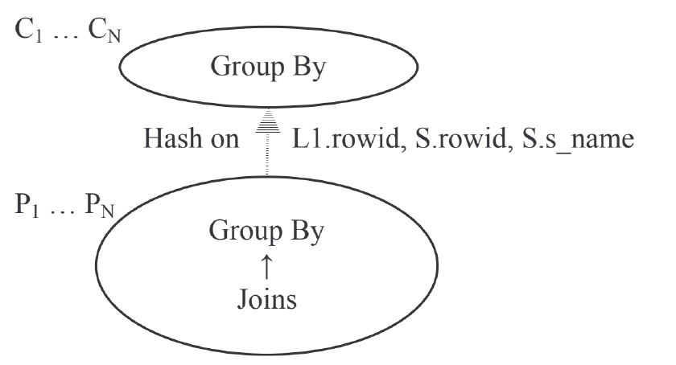

图 1. 并行 group-by 下推。图中生产者 $P_1 \ldots P_N$ 执行连接和分组，再按 L1.rowid、S.rowid、S.s_name 做哈希分发，由消费者 $C_1 \ldots C_N$ 完成分组。

## 3. GROUP-BY 视图消除

本节我们讨论一种称为过滤表消除（filtering table elimination）的技术，其基础是过滤连接的思想。过滤连接是半连接，或者是在参与连接的两个表中某一表的唯一列上进行的等值内连接。

这里我们以下划线标识唯一列，并用非标准记号 $\theta=$ 表示等值半连接。R 是一张表，T1 和 T2 是同一个基表或派生表 T 的两个实例。T1 和 T2 的过滤谓词集合相同（如果存在过滤谓词），或者 T1 的过滤谓词比 T2 更严格。在下列情形下，可以消除 T2 和过滤连接。

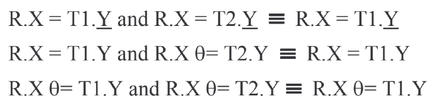

假设非过滤连接（如果存在）先发生。之后的过滤连接会保留 R 的所有结果行，因为过滤连接只能过滤掉 R 的行；相比之下，内连接既可以复制行，也可以过滤行。过滤连接使 T2 表变得冗余，因此可以去掉 T2。尽管这一技术与合取 EXISTS 子查询的合并很相似，但下面我们给出该技术的一种不同应用。

### 3.1 视图消除

考虑 Q8，它是 TPC-H 查询 18 的简化版本。

Q8

```sql
SELECT o_orderkey,c_custkey, SUM(l_quantity)
FROM orders, lineitem L1, customers
WHERE o_orderkey = l_orderkey AND
      c_custkey = o_custkey AND
      o_orderkey IN
        (SELECT l_orderkey
         FROM lineitem L2
         GROUP BY l_orderkey
         HAVING SUM(l_quantity) > 30)
GROUP BY o_orderkey, o_totalprice;
```

Q8 的子查询去嵌套后得到 Q9。Q9 中由去嵌套产生的内联视图（派生表）V2 不必使用半连接，因为这里是等值连接，而且 V2 的连接列是它唯一的分组列，因而具有唯一性。

Q9

```sql
SELECT o_orderkey,c_custkey, SUM(l_quantity)
FROM orders, lineitem L1, customers,
     (SELECT l_orderkey
      FROM lineitem L2
      GROUP BY l_orderkey
      HAVING SUM(l_quantity) > 30) V2
WHERE o_orderkey = V2.l_orderkey AND
      o_orderkey = L1.l_orderkey AND
      c_custkey = o_custkey
GROUP BY o_orderkey, c_custkey;
```

利用 group-by 与连接换序（即 group-by 放置）[5][6][8]，可以生成另一个包含 L1 表的视图 V1，如 Q10 所示；把 `SUM(l_quantity)` 添加到 V2 的 SELECT 列表，不改变 Q9 的语义。

Q10

```sql
SELECT o_orderkey,c_custkey, SUM(V1.qty)
FROM orders, customers,
     (SELECT l_orderkey, SUM(l_quantity) qty
      FROM lineitem L2
      GROUP BY l_orderkey
      HAVING SUM(l_quantity) > 30) V2,
     (SELECT l_orderkey,SUM(l_quantity) qty
      FROM lineitem L1
      GROUP BY l_orderkey) V1
WHERE o_orderkey = V1.l_orderkey AND
      o_orderkey = V2.l_orderkey AND
      c_custkey = o_custkey
GROUP BY o_orderkey, c_custkey;
```

可以看到，V1 和 V2 是同一视图的不同实例，差别只在于 V2 存在 HAVING 子句，因此 V2 的过滤谓词比 V1 更严格。此外，V1 和 V2 与 orders 的等值连接在唯一列 o_orderkey 上进行，因为它是视图中唯一的分组列；所以这两个连接都是过滤连接。因此可以消除 V1，并把对 V1 的引用替换为对 V2 的引用。消除 Q10 中的过滤视图后得到 Q11。

Q11

```sql
SELECT o_orderkey,c_custkey, SUM(V2.qty)
FROM orders, customers,
     (SELECT o_orderkey, SUM(l_quantity)
      FROM lineitem
      GROUP BY l_orderkey
      HAVING SUM(l_quantity) > 30) V2,
WHERE o_orderkey = V2.l_orderkey AND
      c_custkey = o_custkey
GROUP BY o_orderkey, c_custkey;
```

> 译注：原文 Q8 的 GROUP BY 列表与 SELECT 列表不一致；Q11 子视图选择 `o_orderkey`，未给聚合值指定 `qty` 别名，且 V2 后有逗号。上述代码和正文中的列名均忠实保留。

如果 Q9 中的视图 V2 被合并，可以用过滤连接给出另一条论证路径，得到同样的结果：从外层查询中消除 lineitem 表。

## 4. 利用窗口函数消除子查询

这项技术用窗口函数 [11] 替换子查询，从而减少表访问次数和连接求值次数，提高查询性能。这里讨论的部分子查询消除技术在 Oracle 9i 中引入，部分已发表于文献 [13]。在较简单的形式中，利用窗口函数消除的是被涵盖的聚合子查询。

当外层查询块包含子查询中出现的所有表和谓词时，就称该外层查询块涵盖（subsume）这个子查询。外层查询块可以有额外的表和谓词。显然，涵盖性质不同于第 2 节讨论的包含性质。此外，这项技术还利用无损连接性质和代数聚合（例如 SUM、MIN、MAX、COUNT、AVG 等）。

Q12 表示一种带有被涵盖聚合子查询的查询形式，可以对其应用子查询消除。T1 和 T2 是基表或派生表，也可以代表多个表的连接。子查询中的聚合 AGG 与外层查询的 T2.z 列参与关系比较（relop），相关列为 T1.y。

Q12

```sql
SELECT T1.x
FROM T1, T2
WHERE T1.y = T2.y and
      T2.z relop (SELECT AGG(T2.w)
                  FROM T2
                  WHERE T2.y = T1.y);
```

假设 T1 与 T2 的连接是无损连接，其中 T2.y 是引用主键 T1.y 的外键，那么可以引入一个以相关列作为 partition-by 键的窗口函数，来消除子查询，如 Q13 所示。

Q13

```sql
SELECT V.x
FROM (SELECT T1.x, T2.z,
             AGG(T2.w) OVER (PARTITION BY T2.y)
               AS win_agg
      FROM T1, T2
      WHERE T1.y = T2.y) V
WHERE V.z relop win_agg;
```

利用窗口函数消除子查询，并不要求 T1 和 T2 之间的连接是无损的。不过，无损连接使这种变换能够让优化器考虑更多的连接排列。

Q12 还有一些变体：子查询不相关，或者包含额外的表和谓词，或者没有聚合，或者子查询和外层查询都带 group-by。这些都可以使用子查询消除技术来变换。我们将在后续各节给出例子。

### 4.1 被涵盖的相关子查询

考虑 Q14，它是 TPC-H 查询 2 的简化版本。外层查询多了一张 PARTS 表，以及施加于该表的一个过滤谓词。子查询与 PARTS 表相关，并被外层查询涵盖。

Q14

```sql
SELECT s_name, n_name, p_partkey
FROM parts P, supplier, partsupp,
     nation, region
WHERE p_partkey = ps_partkey AND
      s_suppkey = ps_suppkey AND
      s_nationkey = n_nationkey AND
      n_regionkey = r_regionkey AND
      p_size = 36 AND
      r_name = 'ASIA' AND
      ps_supplycost IN
        (SELECT MIN(ps_supplycost)
         FROM partsupp, supplier, nation,
              region
         WHERE P.p_partkey = ps_partkey AND
               s_suppkey = ps_suppkey AND
               s_nationkey = n_nationkey AND
               n_regionkey = r_regionkey AND
               r_name = 'ASIA');
```

子查询消除技术将 Q14 变换为 Q15：

Q15

```sql
SELECT s_name, n_name, p_partkey
FROM (SELECT ps_supplycost,
             MIN(ps_supplycost) OVER
               (PARTITION BY ps_partkey)
                 AS min_ps,
             s_name, n_name, p_partkey
      FROM parts, supplier, partsupp,
           nation, region
      WHERE p_partkey = ps_partkey AND
            s_suppkey = ps_suppkey AND
            s_nationkey = n_nationkey AND
            n_regionkey = r_regionkey AND
            p_size = 36 AND
            r_name = 'ASIA') V
WHERE V.ps_supplycost = V.min_ps;
```

Q15 中 PARTSUPP 和 PARTS 表连接产生的重复行（如果存在）无关紧要，因为聚合函数是 MIN。如果聚合函数不是 MIN/MAX，或者与额外表（这里是 PARTS）的连接不是无损连接，那么必须在一个视图内计算窗口函数，再把这个视图与额外表连接。TPC-H 查询 17 就属于这种情况，对其进行子查询消除变换后得到 Q16：

Q16

```sql
SELECT SUM(V.avg_extprice)/7 AS avg_yearly
FROM parts,
     (SELECT (CASE WHEN l_quantity < (1.2 *
                        AVG(l_quantity) OVER
                        (PARTITION BY l_partkey))
                   THEN l_extprice ELSE NULL
                   END) avg_extprice,
             l_partkey
      FROM lineitem) V
 WHERE p_partkey = V.l_partkey AND
       V.avg_extprice IS NOT NULL AND
       p_brand = 'Brand#23' AND
       p_container = 'MED BOX';
```

### 4.2 被涵盖的非相关子查询

考虑 Q17，它是 TPC-H 查询 15 的简化版本。Q17 含有一个非相关聚合子查询，外层查询和子查询引用了同一个 group-by 视图（派生表）V。

Q17

```sql
WITH V AS (SELECT l_suppkey,
                  SUM(l_extprice) revenue
           FROM lineitem
           WHERE l_shipdate >= '1996-01-01'
           GROUP BY l_suppkey)
SELECT s_suppkey, s_name, V.revenue
FROM supplier, V
WHERE s_suppkey=V.s_suppkey AND
      V.revenue = (SELECT MAX(V.revenue)
                   FROM V);
```

上述查询可以变换为 Q18，其中引入了窗口函数，消除了子查询。

Q18

```sql
SELECT s_suppkey, s_name, V.revenue
FROM supplier,
     (SELECT l_suppkey,
             SUM(l_extprice) revenue
             MAX(SUM(l_extprice)) OVER() gt_rev
      FROM lineitem
      WHERE l_shipdate >= '1996-01-01'
      GROUP BY l_suppkey) V
WHERE s_suppkey = V.l_suppkey AND
      V.revenue = V.gt_rev;
```

> 译注：Q17 原文使用 `V.s_suppkey`，尽管视图投影列写作 `l_suppkey`；Q18 原文在 `SUM(l_extprice) revenue` 后缺少逗号。此处均保留原文。

这里在聚合 `SUM(l_extprice)` 上引入了总计窗口函数 MAX（使用空的 `OVER()` 子句指定），以消除子查询。窗口函数无需 PBY，因为 Q17 中的子查询是不相关的，需要作用于全部行。我们采用第 5 节所述的一种新的总计窗口函数并行化技术，使变换后的 Q18 能够高效执行并具有可扩展性。

### 4.3 HAVING 子句中被涵盖的子查询

当外层查询有 group-by 时，也可以采用子查询消除技术。例如考虑 Q19，它是 TPC-H 查询 11 的简化版本。Q19 中的子查询是不相关的，并且被外层查询涵盖。事实上，子查询与外层查询具有完全相同的表和谓词集合。

Q19

```sql
SELECT ps_partkey,
       SUM(ps_supplycost * ps_availqty) AS value
FROM partsupp, supplier, nation
WHERE ps_suppkey = s_suppkey AND
      s_nationkey = n_nationkey AND
      n_name = 'FRANCE'
GROUP BY ps_partkey
HAVING SUM(ps_supplycost * ps_availqty) >
       (SELECT SUM(ps_supplycost *
                   ps_availqty) * 0.0001
        FROM partsupp, supplier, nation
        WHERE ps_suppkey = s_suppkey AND
              s_nationkey = n_nationkey AND
              n_name = 'FRANCE');
```

Q19 可以变换为 Q20。与 Q17 一样，引入的是没有 PBY 键的总计窗口函数，因为 Q19 中的子查询是不相关的。

Q20

```sql
SELECT V.ps_partkey, V.gb_sum
FROM (SELECT ps_partkey,
             SUM(ps_supplycost*ps_availqty) value,
             SUM(SUM(ps_supplycost*ps_availqty))
               OVER () gt_value
      FROM partsupp, supplier, nation
      WHERE ps_suppkey = s_suppkey AND
            s_nationkey = n_nationkey AND
            n_name = 'FRANCE'
      GROUP BY ps_partkey) V
WHERE V.value > V.gt_value * 0.0001;
```

> 译注：Q20 原文的外层投影写作 `V.gb_sum`，内层聚合别名则为 `value`，此处保留原文。

### 4.4 产生多重集的子查询

要利用窗口函数消除子查询，子查询不一定需要有聚合并产生单元素集合。考虑 Q21，其中子查询产生一个多重集，并参与一个 ALL 子查询谓词。

Q21

```sql
SELECT ps_partkey, s_name,
       SUM(ps_supplycost * ps_availqty) as VALUE
FROM partsupp, supplier, nation
WHERE ps_suppkey = s_suppkey AND
      s_nationkey = n_nationkey AND
      n_name = 'GERMANY'
GROUP BY s_name, ps_partkey
HAVING
  SUM(ps_supplycost * ps_availqty) > ALL
    (SELECT
       ps_supplycost*ps_availqty * 0.01
     FROM partsupp, supplier, nation
     WHERE n_name = 'GERMANY' AND
           ps_suppkey = s_suppkey AND
           s_nationkey = n_nationkey);
```

我们把这个查询变换为 Q22：

Q22

```sql
SELECT ps_partkey, s_name, VALUE
FROM (SELECT ps_partkey, s_name, VALUE,
             SUM(ps_supplycost * ps_availqty)
               as VALUE,
             MAX(MAX(ps_supplycost*ps_availqty))
               OVER ( ) VAL_pkey
      FROM partsupp, supplier, nation
      WHERE n_name = 'GERMANY' AND
            ps_suppkey = s_suppkey AND
            s_nationkey = n_nationkey
      GROUP BY s_name, ps_partkey) V
WHERE V.VALUE > V.VAL_pkey * 0.01;
```

> 译注：Q22 内层 SELECT 列表中，聚合表达式之前额外出现的 `VALUE` 按原文保留。

如果子查询谓词换成 `> ANY`，窗口函数就应为 `MIN(MIN(ps_supplycost * ps_availqty)) OVER ()`。使用多个窗口函数，也可以处理 `= ALL` 和 `= ANY` 谓词。

## 5. 可扩展的并行执行

Oracle 增强了窗口函数的并行化，以实现更具可扩展性的查询执行。通常，Oracle 根据 partition-by（PBY）键，按哈希或范围把数据分发到多个进程，以并行计算窗口函数。SQL model 子句 [7] 也采用类似的并行化。每个进程独立于其他进程，在自己收到的分区上计算窗口函数。例如，子查询消除技术在 Q16 中引入的窗口函数，就是这样并行化的。Q16 的并行查询计划如下：

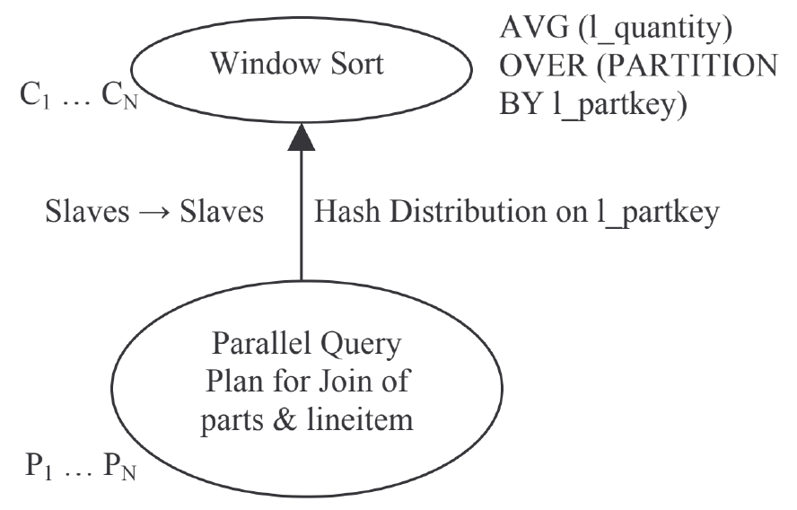

图 2. 窗口函数的典型并行化。底部为 parts 与 lineitem 连接的并行查询计划；按 l_partkey 哈希分发到消费者，执行窗口排序及 `AVG(l_quantity) OVER (PARTITION BY l_partkey)`。

生产者从进程 $P_1$ 到 $P_N$ 把 parts 与 lineitem 表的连接结果，按 l_partkey 做哈希分发，送到执行窗口排序的消费者从进程 $C_1$ 到 $C_N$。每个消费者从进程在它收到的分区（由 PBY 键 l_partkey 定义）上计算 AVG 窗口函数。注意，这种常规窗口函数并行化的可扩展性受 PBY 键基数制约。对于 PBY 键基数很低（例如 region、gender）的窗口函数，以及没有 PBY 键的窗口函数，可扩展性要么有限，要么根本不存在。要让第 4 节利用窗口函数消除子查询的变换获得巨大收益，这类窗口函数的可扩展性就变得至关重要。为此，我们提出了一种新的并行化技术，下面给出概要。

考虑第 4.3 节变换后的 Q20，它含有一个没有 PBY 键的窗口函数 `SUM(SUM(ps_supplycost * ps_availqty)) OVER()`。这是一个总计（GT）报告型窗口函数，因为它作用于整个数据集，并为每一行报告总计值。GT 函数本身并不天然可并行化，因为没有 PBY 键可用于在从进程之间划分工作。如果不并行化这个 GT 函数，就会削弱子查询消除变换的整体收益。GT 窗口函数的常规并行查询计划见图 3。

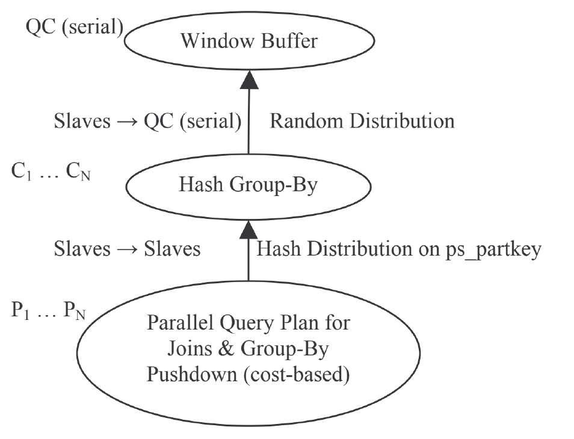

图 3. GT 函数“不太并行”的执行计划。生产者执行连接和基于代价的 group-by 下推，按 ps_partkey 哈希分发给消费者做哈希分组，再随机分发给串行查询协调器（QC）执行窗口缓冲。

显然，图 3 的并行计划无法很好地扩展，因为 GT 窗口函数由查询协调器（Query Coordinator，QC）进程计算。从进程 $C_1$ 到 $C_N$ 把 group-by 操作的结果发送给 QC，由 QC 独自采用“窗口缓冲”执行方式计算 GT 函数。如第 1.3 节所述，Oracle 在这里选择“窗口缓冲”，因为只需缓冲行即可计算 GT 窗口函数。在缓冲行的过程中，会增量计算窗口聚合。当输入耗尽，即所有输入行都已缓冲时，我们就已经算出了总计窗口函数的值。随后输出缓冲的行，并附上总计值。

在我们新的 GT 窗口函数并行化方案中，GT 窗口计算的大部分被下推到从进程，而非由 QC 执行。从进程与 QC 之间通过一个小的协调步骤完成 GT 计算。在这个模型下，GT 求值变得高度可扩展。GT 窗口函数的新并行化计划见图 4。

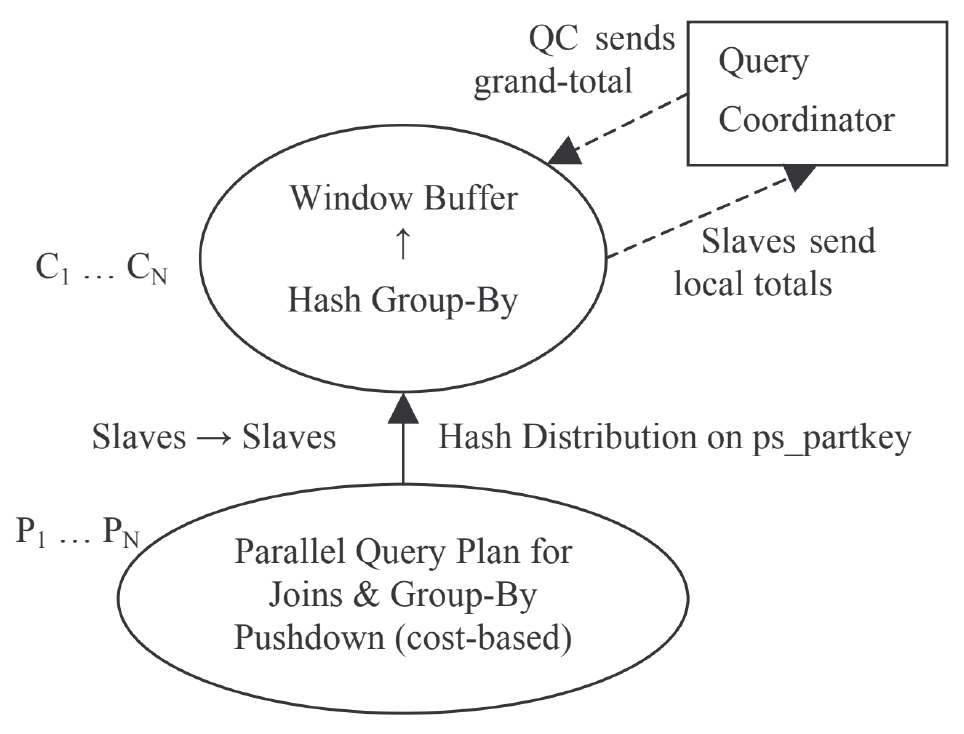

图 4. GT 函数的并行化。窗口缓冲下推到消费者从进程：从进程向 QC 发送局部总计，QC 向从进程回送全局总计。

现在，窗口缓冲处理被下推到从进程 $C_1$ 到 $C_N$。每个从进程计算局部总计，并把它发送给查询协调器进程。QC 汇总从所有从进程收到的结果，再把总计值发回从进程。随后，从进程输出各自缓冲的行，并附上总计值。在这个并行计划中，从进程并发完成大部分行处理。串行部分（或 QC 汇总）将不易察觉，因为 QC 处理的值的数量很少（最多 1000 个），这一数量由并行度（并发处理某项任务的进程数）决定。

这种窗口下推并行化技术也可以扩展到非 GT 报告型窗口函数。具体而言，可以用它改善 PBY 键基数较低的窗口函数的可扩展性。虽然思想相同，但从进程与 QC 之间需要交换更多信息，双方也需要进行更多处理。

从进程 $C_1$ 到 $C_N$ 在本地为每个分区计算报告型窗口聚合，并向 QC 发送一个包含局部窗口聚合及对应 PBY 键值的数组。QC 完成各分区的报告型聚合计算，再把结果（最终窗口聚合和 PBY 键值）传回从进程。为了产生结果，从进程内部的窗口执行把本地数据与 QC 发回的数据连接。由于从进程本地数据和 QC 发回的数据都按 PBY 键排序，这个连接类似于排序归并连接。我们在第 7 节给出实验结果，展示窗口函数的可扩展性。

## 6. 空值感知反连接（NAAJ）

本节我们讨论 Oracle 11g 引入的一种反连接变体，称为空值感知反连接（null-aware antijoin，NAAJ）。大多数应用经常发出 `<> ALL`（即 NOT IN）子查询，因为应用开发者认为 `<> ALL` 语法比与之近似等价的 NOT EXISTS 更直观。带 NOT EXISTS 的子查询会被去嵌套为反连接。反连接的语义恰好与内连接相反：只有当左表的一行不与右表任何行连接时，才返回该行。我们称之为普通反连接。一般而言，商业数据库只有在量化比较中的所有列都保证没有空值时，才能使用普通反连接去嵌套 `<> ALL` 子查询。文献 [9] 使用的另一种策略，是引入一个重复表和一个额外的反连接来处理 NULL。

在 SQL 中，`<> ALL` 运算符可以视为一组不等式的合取。`< ALL`、`<= ALL`、`> ALL` 和 `>= ALL` 运算符也可以类似表达。SQL 标准支持三值逻辑，因此，任何与空值的关系比较总是求值为 UNKNOWN。例如，谓词 `7 = NULL`、`7 <> NULL`、`NULL = NULL`、`NULL <> NULL` 都求值为 UNKNOWN；它不同于 FALSE，因为对 UNKNOWN 取反仍是 UNKNOWN。如果 WHERE 子句的最终结果是 FALSE 或 UNKNOWN，该行就被过滤。考虑带有 `<> ALL` 子查询的 Q23。

Q23

```sql
SELECT T1.c
FROM T1
WHERE T1.x <> ALL (SELECT T2.y
                  FROM T2
                  WHERE T2.z > 10);
```

假设子查询返回的值集合为 `{7, 11, NULL}`，T1.x 的值集合为 `{NULL, 5, 11}`。`<> ALL` 操作可以表达为 `T1.x <> 7 AND T1.x <> 11 AND T1.x <> NULL`。它求值为 UNKNOWN，因为无论 T1.x 取何值，`T1.x <> NULL` 始终求值为 UNKNOWN。因此，对于这组值，Q23 不返回任何行。如果在这里使用普通反连接，就会错误地返回 `{NULL, 5}`。

> 译注：原文把上述整个合取概括为 UNKNOWN，这里保留该表述；当 T1.x 为 11 时，其中的不等比较为 FALSE，整个合取实际为 FALSE，仍不返回该行。

### 6.1 空值感知反连接算法

Q23 的子查询可以用 NAAJ 去嵌套，如 Q24 所示。我们使用如下非标准记号表示 NAAJ：`T1.x NA= T2.y`，其中 T1 和 T2 分别是空值感知反连接的左表和右表。

Q24

```sql
SELECT T1.c
FROM T1, T2
WHERE T1.x NA= T2.y and T2.z > 10;
```

我们以 Q24 为例解释 NAAJ 的语义。NAAJ 在右表上的所有过滤谓词求值之后执行。因此，下文提到 T2 时，指的是对原始 T2 表应用谓词 `T2.z > 10` 后得到的数据集。

1. 如果 T2 没有任何行，返回 T1 的所有行并终止。
2. 如果 T2 中任意一行在 NAAJ 条件涉及的所有列上都是空值，不返回任何行并终止。
3. 如果 T1 中某一行在 NAAJ 条件涉及的所有列上都是空值，不返回该行。
4. 对 T1 的每一行，如果用 T2 中任意一行求值 NAAJ 条件得到 TRUE 或 UNKNOWN，就不返回该 T1 行；否则返回该 T1 行。

步骤 1 与普通反连接相同：如果右侧为空，就返回左侧所有行，包括反连接条件中含空值的行。注意，步骤 2 和步骤 3 已被步骤 4 涵盖，但当左行或右行的所有连接列都为空值时，它们能提供高效执行。步骤 4 从本质上区分了 NAAJ 与普通反连接。普通反连接在反连接条件求值为 UNKNOWN 时会返回左行，而 NAAJ 不会。下面我们介绍 NAAJ 的执行策略。涉及多列的反连接，其策略较复杂，我们用下列查询说明：

Q25

```sql
SELECT c1, c2, c3
FROM L
WHERE (c1, c2, c3) <> ALL (SELECT c1, c2, c3
                          FROM R);
```

### 6.2 NAAJ 的执行策略

在 NAAJ 语义下，左侧一行可以与右侧多个不同的行连接或匹配。例如，如果左侧一行的某个连接列为空，那么它会匹配右侧在该键列上具有任意值的行。此时 NAAJ 条件求值为 UNKNOWN，因此不返回该行。考虑 Q25 左表 L 中的行 `(null, 3, null)`。假设右表 R 有两行：`R={(1, 3, 1), (2, 3, 2)}`。虽然 R 中没有 `(null, 3, null)` 这一行，但 L 中的该行会匹配 R 的两行，因为非空键列 c2 的值为 3，因此不会返回 `(null, 3, null)`。

普通的排序归并和哈希反连接方法经过扩展，在构建数据结构（排序结构或哈希表）时，收集哪些连接列包含 NULL 的信息。

之后，我们执行第 6.1 节的步骤 1 和步骤 2，通过返回全部行或不返回任何行来提前终止连接。否则，对于左侧每一行，除非第 6.1 节的步骤 3 将其排除，我们执行下列操作以寻找右侧匹配行。如果下列任一步骤找到匹配，就像普通反连接一样丢弃左侧行：

1. 在右侧排序或哈希访问结构中搜索精确匹配。
2. 使用收集到的空值信息，搜索其他可能的匹配。例如，假设有三个连接列 c1、c2 和 c3，但右侧只有 c1 和 c2 包含空值。如果左侧到达行的值为 `(1, 2, 3)`，则在右侧访问结构中搜索 `(1, null, 3)`、`(null, 2, 3)` 和 `(null, null, 3)`。
3. 如果左侧行的一个或多个键列为空，就在非空键列上构建一个辅助访问结构（如果尚未构建）。例如，假设左侧行的值为 `(null, 2, 3)`，我们用右侧的 c2 和 c3 列构建辅助排序表或哈希表，然后在新访问结构中搜索 `(x, 2, 3)`、`(x, 2, null)`、`(x, null, 3)` 和 `(x, null, null)`。

如果我们跟踪右侧空值的所有可能模式，还能进一步优化。沿用上述步骤 3 的例子，假设我们知道右侧存在一行，其 c2 和 c3 都为空。这一行会匹配左侧任何 c1 为空的行。此时，左侧的 `(null, 2, 3)` 可以立即排除，无需构建额外访问结构。这些信息也可以用于消除步骤 2 的部分访问。

**单键列优化：** 如果 NAAJ 条件只涉及一列（例如 Q24），执行策略就简单得多。对于左侧连接列为空的行，可以根据右侧是否有行来决定跳过或返回，无需真正寻找匹配。

## 7. 性能研究

我们在一个 30G 的 TPC-H 模式上进行了性能实验。我们使用一台 Linux 机器，配备 8 个双核 400MHz 处理器和 32GB 主存。该机器连接到由 Oracle Automated Storage Manager 管理的共享存储。与 CPU 的处理能力相比，共享存储的 I/O 带宽有些受限，这一点在我们的并行化实验中有所体现。除非另有说明，所有查询都使用全部 CPU 所提供的并行能力。

### 7.1 子查询合并

考虑我们的 Q4，它是 TPC-H 查询 21 的简化版本。与 Q4 相比，原始 TPC-H 查询 21 多了 orders 和 nation 两张表，以及把数据限制到给定国家的选择谓词。模式中有 25 个国家，数据均匀分布。第 2.2 节的子查询合并将 Q4 变换为 Q5。图 5 展示变换后（Q5）与未变换（Q4）版本的耗时随国家数量的变化。平均性能改善为 27%。

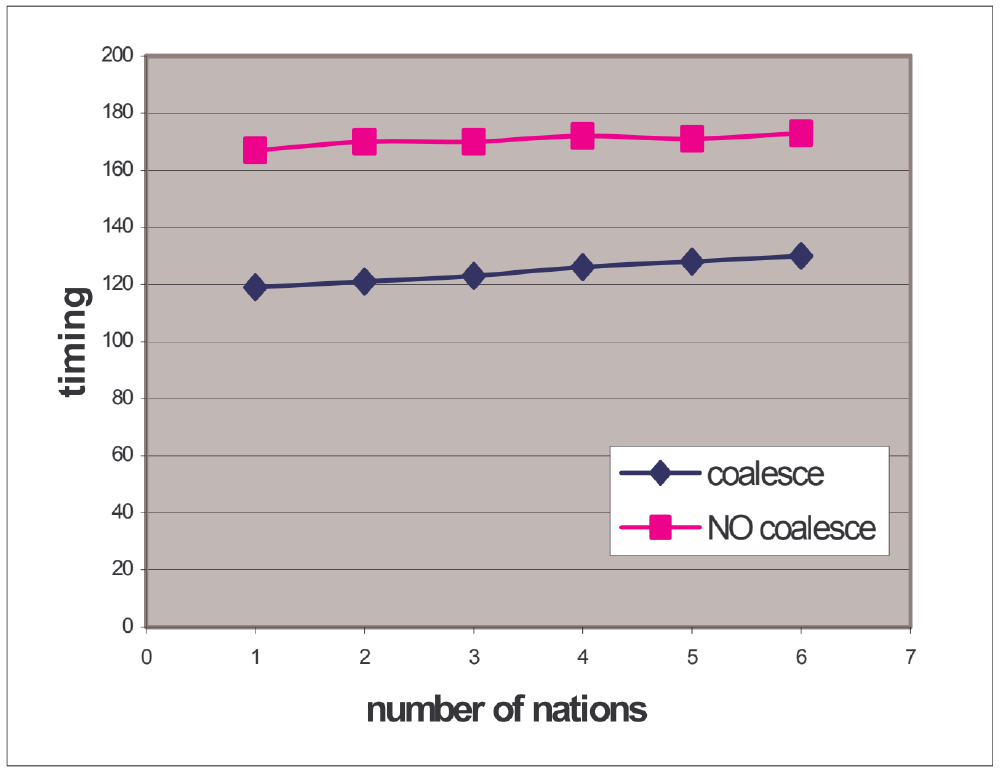

图 5. TPC-H q21，子查询合并。横轴为国家数量，纵轴为计时值（timing）；coalesce 为合并，NO coalesce 为不合并。

### 7.2 GROUP-BY 视图消除

在这个实验中，我们使用 Q8，即 TPC-H 查询 18 的简化版本。我们在第 3.1 节介绍的 Group-By 视图消除技术消除了 Group-By 视图，避免了对 lineitem 表的不必要引用，得到 Q11。我们把 HAVING 子句谓词中的值从 30 变到 300，使子查询返回约 2,000 到 34,000,000 行（如横轴所示）。图 6 给出这个实验的结果。

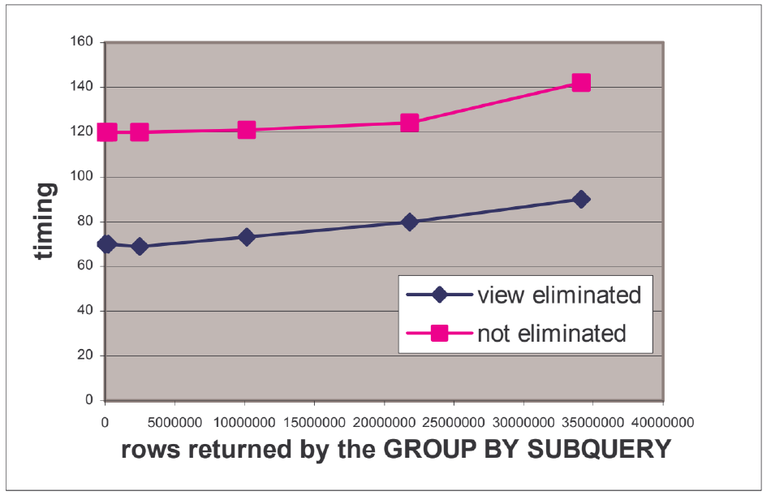

图 6. TPC-H q18，视图消除。横轴为 GROUP BY 子查询返回的行数，纵轴为计时值；view eliminated 为已消除视图，not eliminated 为未消除。

对优化器而言，变换为 Q11 可能具有挑战，因为子查询的 HAVING 子句谓词作用于聚合，优化器难以估计其基数。如果低估基数，优化器可能选择嵌套循环而非哈希连接，导致性能下降。

### 7.3 利用窗口函数消除子查询

为了说明这项优化，我们执行了 TPC-H 查询 2、11、15 和 17。图 7 展示优化后（标记为“opt”）和未优化查询的耗时。TPC-H 查询 2 和 17 变换后的 Q15 与 Q16 表现出明显改善。对于 TPC-H 查询 2，耗时缩短为原来的 1/24，原因是窗口变换消除了多次表访问和连接求值。

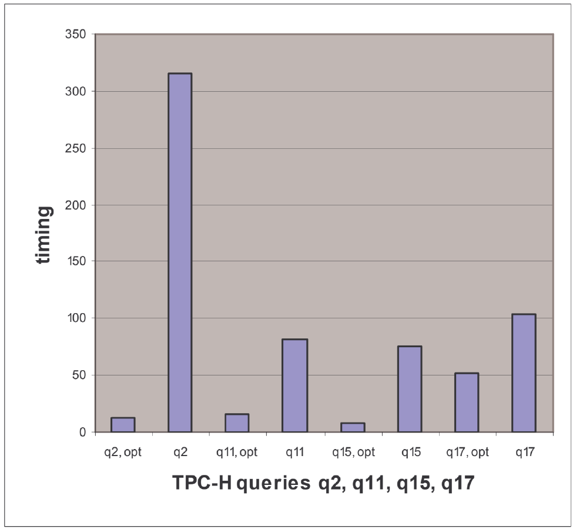

图 7. 利用窗口函数消除子查询。横轴依次为 q2、q11、q15、q17 的优化与未优化版本，纵轴为计时值。

图 8 展示了对 TPC-H 查询 15 使用窗口变换消除非相关子查询的收益，横轴为从 lineitem 表扫描的月份数。第 4.2 节已通过从 Q17（原始查询）到 Q18（变换后查询）的过程解释了这一优化。图 8 中的平均收益是执行时间缩短为原来的 1/8.4。

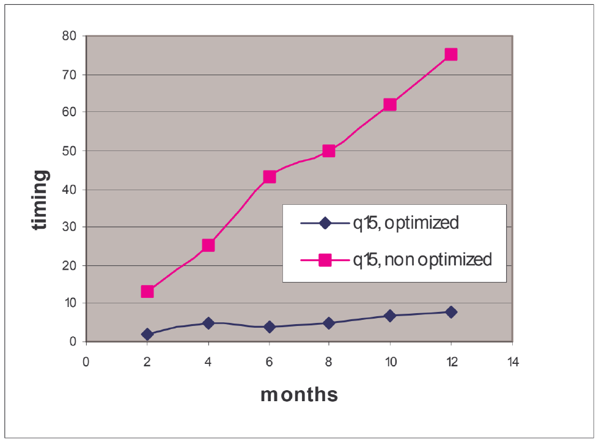

图 8. TPC-H q15，消除非相关子查询。横轴为月份数，纵轴为计时值；q15 optimized 为优化版本，q15 non optimized 为未优化版本。

可以看到，利用窗口函数消除子查询对 TPC-H 查询非常有效。TPC-H 查询 q2、q11、q15 和 q17 的平均收益超过 10 倍。

### 7.4 窗口函数的可扩展执行

为了说明不带 PBY 子句的窗口函数并行化所带来的收益，我们在 lineitem 表上使用以下查询。

```sql
SELECT SUM(l_extprice)) OVER() W
FROM lineitem;
```

> 译注：原文 SUM 后的多余右括号按原样保留。

该查询分别在启用和禁用第 5 节的并行化增强时执行，并行度（DOP）从 2 变到 16。图 9 展示实验结果。

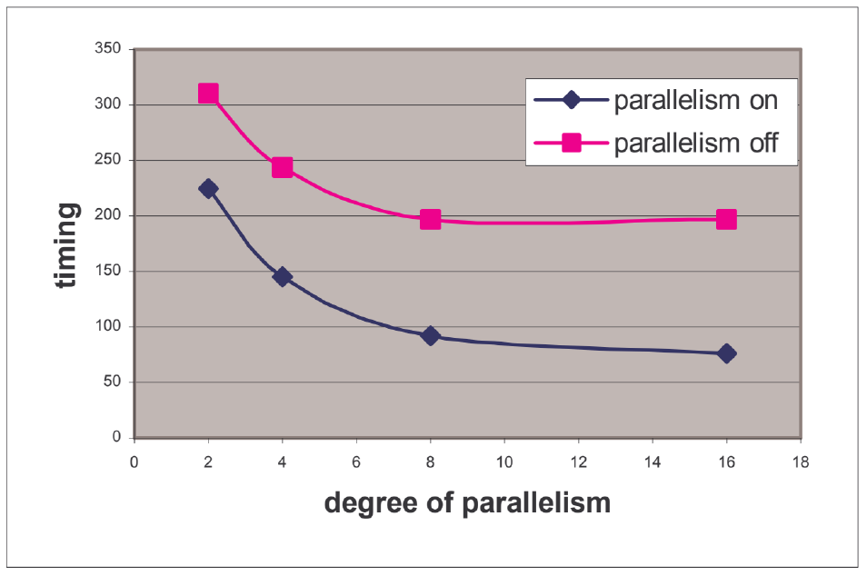

图 9. 不带 PBY 的窗口函数的并行化。横轴为并行度，纵轴为计时值；parallelism on 为开启窗口函数并行化，parallelism off 为关闭。

注意，即使窗口函数不并行化，表扫描仍然是并行的。扫描从进程把数据发送给查询协调器，后者计算窗口函数。因此，当并行度为 2 时，改善略低于 2 倍。图 9 还显示，由于我们的共享磁盘系统带宽有限，当 DOP 大于 8 时，我们的系统未能随 DOP 线性扩展。

### 7.5 空值感知反连接

我们进行了两组实验，以展示空值感知反连接带来的改善。第一组使用 Q26，从给定供应商列表中找出在给定月份（1996 年 1 月）没有订单的供应商。在这个模式中，L_SUPPKEY 可以有空值，而 S_SUPPKEY 不可以。

Q26

```sql
SELECT s_name FROM supplier
WHERE s_suppkey in (<supplier_list>) AND
      s_suppkey <> ALL
        (SELECT l_suppkey FROM lineitem
         WHERE l_shipdate >= '1996-01-01' AND
               l_shipdate < '1996-02-01')
```

没有 NAAJ 时，Q26 中的子查询无法去嵌套，导致采用相关执行：对于 supplier 表的每一行，我们都必须执行子查询。由于无法对相关谓词使用索引探测，性能慢得令人难以忍受。这是因为 Oracle 把 ALL 子查询转换为 NOT EXISTS 子查询，并使用一个等价于 `(l_suppkey IS NULL OR l_suppkey = s_suppkey)` 的相关谓词。非 NAAJ 执行唯一的有利之处，是 lineitem 表按 l_shipdate 分区，使我们能够把扫描裁剪到一个分区。图 10 展示供应商数量最多为 40 时的性能收益。去嵌套后，查询使用 supplier 和 lineitem 表之间的哈希空值感知反连接执行。

第二组实验针对真实工作负载：Oracle Applications 发出的 241,000 条查询，其模式由约 14,000 张表构成，涉及供应链、人力资源、财务、订单录入、CRM 等诸多领域。大多数应用的模式高度规范化。每条查询涉及的表数从 1 到 159 不等，平均为 8 张表。

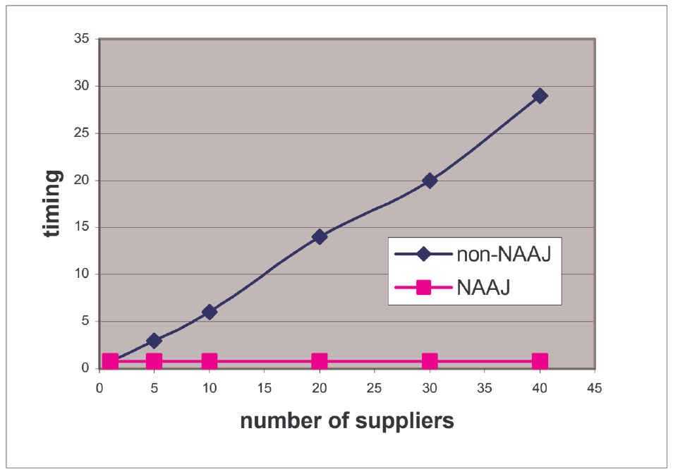

图 10. 非 NAAJ 与 NAAJ 对比。横轴为供应商数量，纵轴为计时值；non-NAAJ 为不使用 NAAJ，NAAJ 为使用 NAAJ。

其中有 72 条不同的查询包含 `<> ALL` 子查询，具备使用 NAAJ 执行的条件。按 CPU 时间衡量，其中 68 条查询从 NAAJ 获益，平均达到 736730 倍！一条查询报告的时间是：不使用 NAAJ 时为 350 秒，使用 NAAJ 时为 0.001 秒。其余 4 条查询的性能下降，平均下降 100 倍；最严重的一条，CPU 时间从 0.000001 变为 0.016。

## 8. 相关工作

以往已经广泛研究各种类型的子查询去嵌套 [1][2][3][4][9]。我们的系统几乎支持所有这些形式的去嵌套技术，同时采用启发式策略和基于代价的策略。早期关于查询变换的一项工作 [2] 提出了一种在算子树中把聚合和 group-by 上拉到连接之前的技术。Oracle 的早期版本（8.1 和 9i）采用了类似算法。这一变换在查询变换阶段由启发式规则触发。在 Oracle 11g 中，基于代价的框架 [8] 用于放置 distinct 和 group-by 算子，并使其与连接换序 [5][6]。利用窗口函数消除子查询的一些技术已发表于文献 [13]。非正式引用 [12] 表明，其他地方已讨论过一种 group-by 子查询消除技术。我们展示了如何把类似技术纳入 Oracle 优化器。关于子查询合并、空值感知反连接以及可扩展窗口函数计算的工作，尚未在文献中讨论。

## 9. 结论

子查询是 SQL 和类 SQL 查询语言的一个强大组成部分，增强了它们的表达能力和声明能力。本文概述了 Oracle 关系数据库中增强的子查询优化，这些优化受益于 Oracle 基于代价的变换框架。本文通过描述多项技术作出了重要贡献[^3]：子查询合并、利用窗口函数消除子查询、针对 group-by 查询的视图消除、空值感知反连接，以及并行执行技术。我们的性能研究表明，这些优化能显著改善复杂查询的执行时间。

[^3]: 这里讨论的部分工作正在申请美国专利。

## 10. 致谢

本文作者感谢 Thierry Cruanes 提供 QC 与从进程之间的通信框架，感谢 Nathan Folkert 和 Sankar Subramanian 利用该框架并行化某一类窗口函数。Susy Fan 在性能实验方面给予帮助，特此衷心感谢。

## 11. 参考文献

[1] W. Kim. “On Optimizing an SQL-Like Nested Query”, ACM TODS, September 1982.

[2] U. Dayal, “Of Nests and Trees: A Unified Approach to Processing Queries that Contain Nested Subqueries, Aggregates, and Quantifiers”, Proceedings of the 13th VLDB Conference, Brighton, U.K., 1987.

[3] M. Muralikrishna, “Improved Unnesting Algorithms for Join Aggregate SQL Queries”, Proceedings of the 18th VLDB Conference, Vancouver, Canada, 1992.

[4] H. Pirahesh, J.M. Hellerstein, and W. Hasan, “Extensible Rule Based Query Rewrite Optimizations in Starburst”. Proc. of ACM SIGMOD, San Diego, U.S.A., 1992.

[5] S. Chaudhuri and K. Shim, “Including Group-By in Query Optimization”, Proceedings of the 20th VLDB Conference, Santiago, Chile, 1994.

[6] W.P. Yan and A.P. Larson, “Eager Aggregation and Lazy Aggregation”, Proceedings of the 21th VLDB Conference, Zurich, Switzerland, 1995.

[7] A. Witkowski, et al, “Spreadsheets in RDBMS for OLAP”, Proceedings of ACM SIGMOD, San Diego, USA, 2003.

[8] R. Ahmed, et al, “Cost-Based Query Transformation in Oracle”, Proceedings of the 32nd VLDB Conference, Seoul, S. Korea, 2006.

[9] M. Elhemali, C. Galindo-Legaria, et al, “Execution Strategies for SQL Subqueries”, Proceedings of ACM SIGMOD, Beijing, China, 2007.

[10] A. Eisenberg, K. Kulkarni, et al, “SQL: 2003 Has Been Published”, SIGMOD Record, March 2004.

[11] F. Zemke. “Rank, Moving and reporting functions for OLAP,” 99/01/22 proposal for ANSI-NCITS.

[12] C. Zuzarte et al, “Method for Aggregation Subquery Join Elimination”, [原文链接](http://www.freepatentsonline.com/7454416.html).

[13] C. Zuzarte, H. Pirahesh, et al, “WinMagic: Subquery Elimination Using Window Aggregation”, Proceedings of ACM SIGMOD, San Diego, USA, 2003.

[14] TPC Benchmark H (Decision Support), Standard Specification Rev 2.8, [原文链接](http://tpc.org/tpch/spec/tpch2.8.0.pdf).

[15] TPC-DS Specification Draft, Rev 32, [原文链接](http://www.tpc.org/tpcds/spec/tpcds32.pdf).
