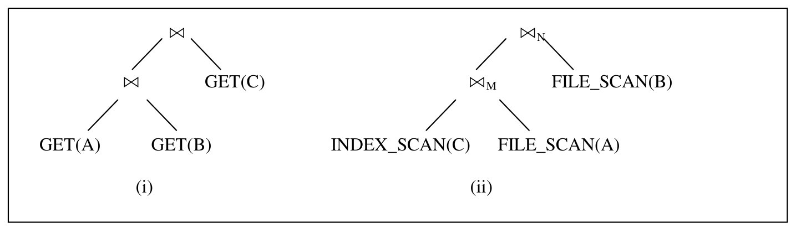
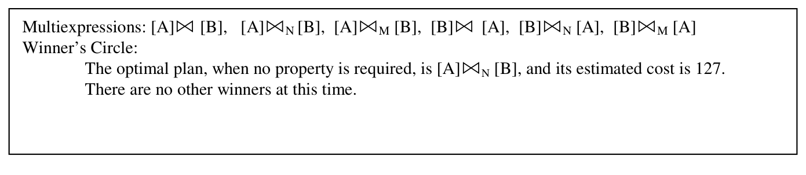
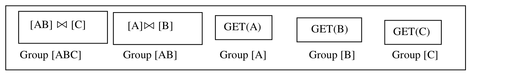
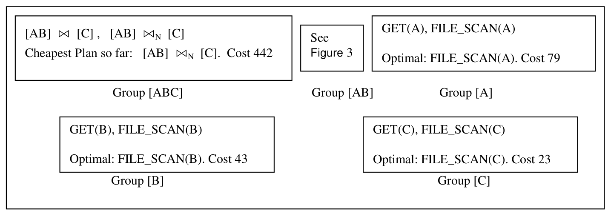
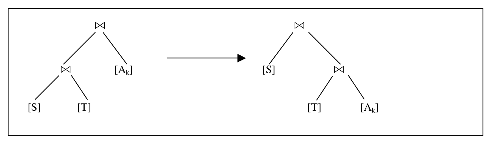
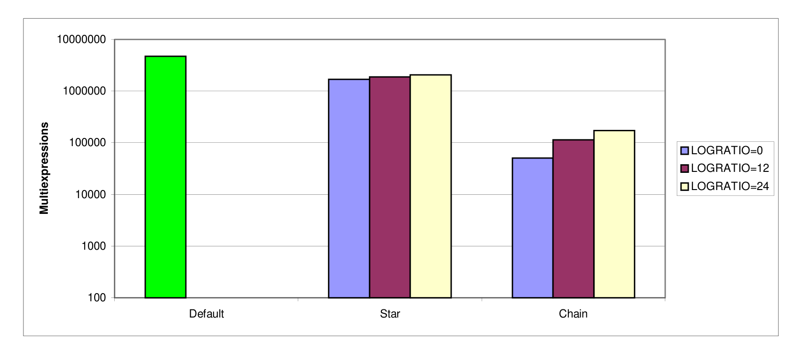
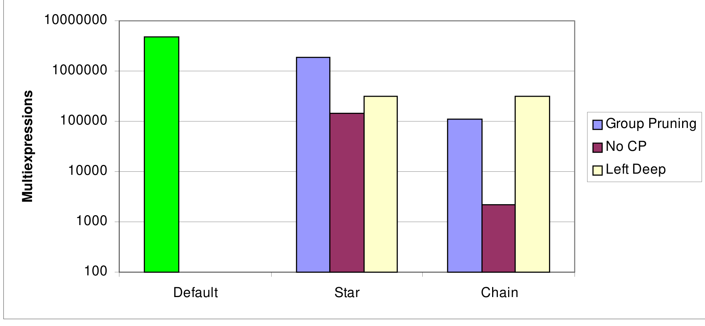
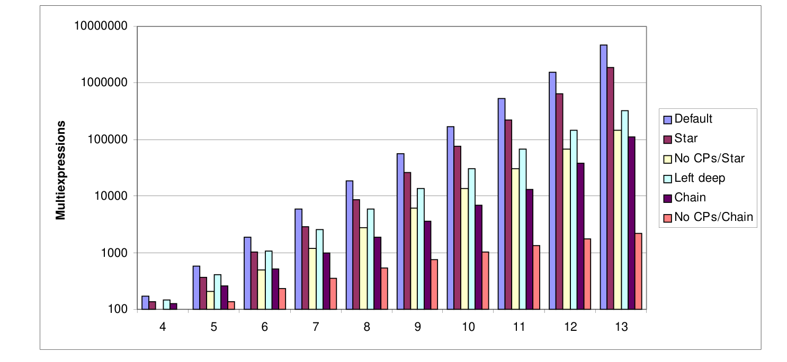

# Exploiting Upper and Lower Bounds in Top-Down Query Optimization（中文译文）

## 译者说明

本文依据同目录的 `source.pdf` 翻译。章节、图表、公式、算法、代码与参考文献按原文结构保留。

## 摘要（Abstract）

System R 的自底向上（bottom-up）查询优化器架构构成了多数当前商业数据库管理器的基础。本文使用优化过程中生成的计划数量作为度量，比较自顶向下（top-down）优化器和自底向上优化器的性能。按该度量，自顶向下优化器更优，因为它们可以使用上界和下界来避免生成整组计划。

在查询优化早期，自顶向下优化器可以推导它生成计划的代价上界。典型自底向上优化器无法获得这些上界，因为它们在考虑更大的包含计划之前，会先生成并估价所有子计划。这些上界可以与下界结合使用；下界只基于逻辑等价子查询组的逻辑属性，从而可以把整组计划排除在考虑之外。

本文在一个名为 Columbia 的自顶向下优化器中实现了这种搜索策略。性能结果显示，使用这些边界非常有效，同时保持最终计划的最优性。在许多情况下，这种新搜索策略甚至比只考虑左深计划等启发式方法更有效。

## 1. 引言（Introduction）

第一代商业查询优化器由 System R 动态规划式自底向上方法 [SAC+79] 的若干变体组成。这一代优化器的可扩展性有限。例如，增加一个新算子（如聚合）需要对优化器做大量修改。

大约十年前，研究者提出了两种构建可扩展优化器的方法。Lohman [Loh88] 提出在自底向上优化器中使用规则（rules）生成计划；Graefe 和 DeWitt [GrD87] 提出使用变换（transforms，也就是自顶向下版本的规则）以自顶向下方式生成新计划。Lohman 的生成式规则在 Starburst [HCL90] 中实现。多个 Starburst 项目展示了它的可扩展性，范围从增量连接 [CSL90] 到分布式异构数据库 [HKW97]。

由于商业界已经在 Starburst 这类自底向上优化器工程上投入巨大，继续研究自顶向下优化器似乎缺乏动力。本文的目的就是展示自顶向下优化器的一个重要优势：性能。这里的性能以优化过程中生成的计划数量来度量。

在查询优化早期，自顶向下优化器可以推导所生成计划的代价上界。例如，如果优化器确定执行 $A \Join B \Join C$ 的某个计划代价为 7，那么任何能够参与 $A \Join B \Join C$ 最优计划的子计划代价都至多为 7。如果优化器能推断出某组即将生成的计划的下界大于 7，那么无需生成这些计划，因为优化器已经知道它们不可能参与最优解。

例如，假设优化器确定 $A \Join C$ 是一个极大的笛卡尔积，并且仅把这个巨大输出传递给下一个算子的代价就是 8。那么执行 $A \Join C$ 的任何计划都无需生成，因为它们不可能参与最优解。典型自底向上优化器无法获得这种上界，因为它们会先生成并估价所有子计划，再考虑更大的包含计划。

如上所示，自顶向下优化器可以使用上界和下界来避免生成自底向上策略会产生的整组计划。本文在名为 Columbia 的优化器中实现了这种技术，以显著减少生成计划的数量，尤其是在无环连通查询中。

第 2 节回顾相关工作。第 3 节描述本文使用的优化模型。第 4 节描述 Cascades 的核心搜索策略，Cascades 是 Columbia 的前身。第 5 节描述 Columbia 的搜索策略，并分析该策略最可能显著减少计划生成数量的情形。第 6 节描述实验结果，第 7 节总结全文。

## 2. 既有工作（Previous Work）

图 1 给出了 System R 式自底向上搜索策略的轮廓，用于寻找 $N$ 个表连接的最优计划。

```text
图 1：System R 对 N 个表 join 的自底向上搜索策略

(1) For i = 1, ..., N
(2)     For each set S containing exactly i of the N tables
(3a)        Generate all appropriate plans for joining the tables in S,
(3b)        considering only plans with optimal inputs, and
(3c)        retaining the optimal generated plan for each set of interesting physical properties.
```

该动态规划搜索策略会生成 $O(3^N)$ 个不同计划 [OnL90]。由于这种指数增长率，自底向上商业优化器在优化大型查询时会使用启发式方法，例如延后笛卡尔积、只允许左深树，或二者兼用 [GLS93]。

Vance 和 Maier [VaM96] 表明，自底向上优化在不使用启发式方法时也可以有效处理最多 20 个关系。他们的方法与本文非常不同。他们不是像本文这样最小化生成计划数量，而是开发专门的数据结构和搜索策略，使优化器能更快处理计划。在他们的模型中，计划代价计算是优化时间的主要因素；在本文模型中，计划创建是主要因素。他们的方法也与 Starburst 略有不同，因为其外层循环由精心选择的关系子集驱动，而不是由子集大小驱动。Vance 和 Maier 的计划代价阈值技术与本文相似，都是使用固定计划代价上界来剪枝计划。但他们用启发式方法选择该阈值，如果无效则重新优化。本文的上界基于此前构造的计划，而不是外部确定的阈值。此外，本文的上界可以针对每个正在优化的子计划而不同。

自顶向下优化始于 Exodus 优化器生成器 [GrD87]，其主要目标是展示可扩展性。Graefe 及其合作者随后开发了 Volcano [GrM93]，主要目标是通过备忘录化（memoization）提升效率。Volcano 的效率受其搜索策略限制：它在生成任何物理表达式之前，会先生成所有逻辑表达式。这种顺序意味着 Volcano 和 Starburst 一样会生成 $O(3^N)$ 个表达式。

后来出现的新一代查询优化器使用面向对象编程技术，大幅简化构建或扩展优化器的任务，同时保持效率并使搜索策略更灵活。这类第三代优化器包括 Wisconsin 的 OPT++ 系统 [KaD96] 和 Graefe 的 Cascades 系统 [Gra95]。

OPT++ 比较了自顶向下和自底向上优化器的性能。但在自顶向下情形中，它使用的是 Volcano 的 $O(3^N)$ 生成策略，因此 OPT++ 基准中的性能较差。Cascades 的开发目标是同时展示面向对象方法的可扩展性和自顶向下优化器的性能。它提出了许多性能改进，大多基于对搜索过程更灵活的控制，但其中很少被实现。本文实现了一个自顶向下优化器 Columbia，它包含 Cascades 框架的一个具体优化器实现。该优化器支持关系查询优化，例如 TPC-D 查询，并包含聚合下推和 bit join 等变换 [Bil97]。Columbia 也包含本文描述的面向性能的技术。

还有三组研究产生了混合优化器，目标是在自底向上优化器的效率和自顶向下优化器的可扩展性之间取得平衡。Bell Labs 和 NCR 开发的 EROC 系统 [MBH96] 结合了自顶向下和自底向上方法。METU [ONK95] 和 Brown University [MDZ93] 开发的基于区域（region-based）的优化器在优化的不同阶段使用不同技术，以提升效率。Microsoft [Gra96] 和 Tandem [Cel96] 的商业系统基于 Cascades。它们包含与本文类似的技术；据我们所知，本文是这些技术的首次分析和测试。

## 3. 优化基础（Optimization Fundamentals）

### 3.1 算子（Operators）

本文只考虑连接算子和文件访问算子，原因有两个。第一，仅用这些算子就能描述 Columbia 的搜索策略。第二，Ono 和 Lohman [OnL90] 的经典性能研究也只使用这些算子，本文将用该研究的方法比较自顶向下和自底向上优化器的性能。

逻辑算子（logical operator）是从算子输入到输出的函数。物理算子（physical operator）是把输入映射为输出的算法。

逻辑等值连接算子记为 $\Join$，它把两个输入流映射为它们的连接。在本文研究中考虑两个物理连接算子：排序归并连接（sort-merge join），记为 $\Join^M$；嵌套循环连接（nested-loops join），记为 $\Join^N$。为简化起见，本文不显示连接条件 [Ram00]。

逻辑文件访问算子记为 `GET(A)`，其中 `A` 是被扫描的表。文件 `A` 实际上是该算子的参数，该算子没有输入，输出为 `A` 的元组。`GET(A)` 有两个实现，也就是两个物理算子：`FILE_SCAN(A)` 和 `INDEX_SCAN(A)`。为简化起见，本文不指定索引扫描所用的索引。

物理属性（physical properties）如排序或压缩，在优化中非常重要。例如，排序归并连接要求其输入按连接属性排序。


算子表达式（operator expression）是一棵算子树，其中某个算子的子节点产生该算子的输入。图 2 展示了两个算子表达式。如果一个表达式的顶层算子是逻辑算子或物理算子，则称该表达式为逻辑表达式或物理表达式。计划（plan）是完全由物理算子组成的表达式。图 2(ii) 是一个计划。如果两个算子表达式在任何合法数据库状态上产生相同结果，则称它们逻辑等价。



### 3.2 优化、多表达式与组（Optimization, Multiexpressions, and Groups）

查询优化器的输入是完全由逻辑算子组成的表达式，例如图 2(i)，以及可选的输出物理属性要求。优化器的目标是产生一个最优计划，例如图 2(ii)。最优计划是指：满足所请求物理属性、与原查询逻辑等价，并且在所有此类计划中代价最小的计划。代价由给定代价模型计算。最优性是相对于该代价模型而言的。

可能计划的搜索空间巨大，除最简单查询外，朴素枚举通常不可行。自底向上优化器使用动态规划 [Bel75]；从 Volcano 开始，自顶向下优化器使用一种动态规划变体，即备忘录化（memoization）[Mic68, RuN95]，来寻找最优计划。

动态规划和备忘录化都利用最优性原则（principle of optimality）：最优计划的每个子计划本身也是最优的，前提是满足相应物理属性要求。该原则的威力在于，它允许优化器把搜索空间限制在小得多的一组表达式上：如果子计划 $p_1$ 的代价高于等价计划 $p_2$，并且两者具有相同物理属性，则无需考虑包含 $p_1$ 的计划。图 1 第 (3c) 行就是自底向上优化器利用最优性原则的位置。

自顶向下优化使用等价技术，即搜索空间的紧凑表示。从 Volcano 开始，自顶向下优化器中的搜索空间被称为 MEMO [McK93]。MEMO 主要由两种相互递归的数据结构组成：组（groups）和多表达式（multiexpressions）。

组是产生相同输出的表达式等价类。图 3 展示了表示所有产生 $A \Join B$ 输出的表达式的组。为了保持搜索空间较小，组不会显式包含它所表示的所有表达式，而是通过多表达式隐式表示这些表达式。多表达式是一个以组作为输入的算子。因此，具有相同顶层算子和相同输入的所有表达式，都由一个多表达式表示。



在图 3 中，多表达式 `[B] JOIN^N [A]` 表示所有顶层算子为嵌套循环连接、左输入产生 `B` 元组、右输入产生 `A` 元组的表达式。

一般而言，如果 $S$ 是原查询中被连接表的一个子集，本文用 `[S]` 表示产生 $S$ 中各表连接结果的多表达式组。逻辑多表达式或物理多表达式分别指顶层算子为逻辑算子或物理算子的多表达式。

在查询优化过程中，优化器生成组，并为每个组找到满足所请求物理属性的最便宜计划。它把这些最便宜计划称为 winners，并把 winners 及其代价和请求属性存储在组中一个称为 winner's circle 的结构里。为某个请求物理属性生成 winner 的过程称为优化该组。图 5 包含若干组，展示了它们在优化早期、尚未找到任何 winner 时的状态。图 5 中的多表达式 `[AB] JOIN [C]` 表示图 2(i) 中的表达式等。



### 3.3 自底向上优化器：组内容和枚举顺序（Bottom-up Optimizers）

自底向上优化器会生成类似多表达式的结构 [Loh88]。其中输入是指向所需属性最优计划的指针。本文也使用多表达式这一术语，并使用 `[A] JOIN [B]` 这类记法，表示自底向上优化中使用的结构，其中 `[A]` 和 `[B]` 是指向产生 `A` 和 `B` 元组的最优计划的指针。

自顶向下和自底向上优化器的关键差异在于枚举多表达式的顺序。自底向上优化器一次枚举一个组中的多表达式，并按照组中表数量递增的顺序枚举，如图 1 第 (3a-c) 行。如果自底向上优化器正在优化表 `A`、`B`、`C` 的连接，则它会按如下顺序优化组：

```text
[A], [B], [C]; [AB], [AC], [BC]; [ABC]
```

分号表示图 1 第 (1) 行的不同迭代。在分号之间，顺序由第 (2) 行控制，并依赖第 (2) 行所用的生成规则。注意，在 `[ABC]` 中生成任何一个多表达式之前，所有子查询（例如 `[AC]`）都已被完全优化，也就是已找到所有预计有用的物理属性的最优计划。因此，无法基于从 `[ABC]` 得到的信息来避免生成 `[AC]` 这类组中的多表达式。自顶向下优化器以不同顺序优化组，可能使用来自 `[ABC]` 优化的信息来避免优化 `[AC]` 等组。

## 4. Cascades 的搜索策略（Cascades' Search Strategy）

图 4 展示了 `OptimizeGroup()` 函数的简化版本，它是 Cascades 搜索策略的核心。`OptimizeGroup()` 的目标是优化给定组，在组 `Grp` 中寻找满足请求属性 `Prop`、且代价小于上界 `UB` 的最优物理多表达式。如果不存在这样的多表达式，则返回 `NULL`。同时，它会把返回的多表达式存入该组的 winner's circle。

```text
图 4：Cascades 搜索策略核心 OptimizeGroup()

Multiexpression* OptimizeGroup(Group Grp, Properties Prop, Real UB)
{
    // Does the winner's circle contain an acceptable solution?
    (1) If there is a winner in the winner's circle of Grp, for Properties Prop {
            If the cost of the winner is less than UB, return the winner
            else return NULL
        }

    // The winner's circle does not hold an acceptable solution, so enumerate
    // multiexpressions in Grp, using transforms, and compute their costs.
    WinnerSoFar = NULL
    (2) For each enumerated physical multiexpression, denoted MExpr {
    (3)     LB = cost of root operator of MExpr
    (4)     If UB <= LB then go to (2)
    (5)     For each input of MExpr {
                input-group = group of current input
                input-prop = properties necessary to produce Prop from current input
    (6)         InputWinner = OptimizeGroup(input-group, input-prop, UB - LB)
    (7)         If InputWinner is NULL then go to (2)
    (8)         LB += cost of InputWinner
            }
    (9)     Use the cost of MExpr to update WinnerSoFar and UB
        }
    (10) Place WinnerSoFar in the winner's circle of Grp, for Property Prop
    Return WinnerSoFar
}
```

第 (1) 行检查 winner's circle，看其中是否存有此前 `OptimizeGroup()` 调用产生的 winner。如果没有可接受 winner，则初始化最终解 `WinnerSoFar`，第 (2) 行使用变换生成所有候选逻辑等价物理多表达式，对应图 1 第 (3a) 行生成的所有计划。第 (3) 行计算该多表达式代价的下界 `LB`。此时 `LB` 只包含根算子的代价；到第 (8) 行，它会加上每个最优输入的代价。

多表达式的代价并不容易定义。多表达式的根算子有代价，但其输入是组而不是表达式，因此不清楚如何计算组的代价。Cascades 搜索策略通过递归搜索输入组的 winners 来寻找 winners，因此多表达式代价通过递归计算：把根算子代价和第 (5) 行递归调用返回的各输入 winner 代价相加。

第 (6) 行递归地为候选多表达式的每个输入寻找 winner。该递归调用使用 `UB - LB` 作为上界，因为父多表达式根算子在第 (3) 行已经消耗了一部分允许代价，之前输入 winner 在第 (8) 行也消耗了一部分。例如，如果 `OptimizeGroup()` 正在寻找代价最多 `UB=53` 的多表达式，而当前候选多表达式的根算子代价为 13，那么第一个输入的可接受代价最多为 40。如果第一个输入 winner 代价为 15，则下一个输入最多可用 `53 - 28 = 25`，依此类推。

第 (5) 行循环尝试为第 (2) 行选择的多表达式构造可接受输入。典型数据库算子有 0 到 2 个输入，因此该循环通常最多执行两次。循环可能以两种方式退出。第一，它可能在第 (4) 行失败退出，因为仅根算子代价就超过上界。第二，它可能在第 (7) 行失败退出，因为对某个输入无法找到可接受 winner，原因可能是边界限制，也可能是物理属性限制。注意在这种情况下，第 (6) 行不会为后续输入调用，因此后续输入对应的组不会被优化。这些组可能永远不会被优化，因此其中的多表达式也不会生成。本文称这种现象为组剪枝（group pruning），并在第 5 节讨论。

第二种退出方式是第 (5) 行循环成功结束，控制流到达第 (9) 行，将得到的多表达式与 `WinnerSoFar` 比较。如果该多表达式代价更低，就替换 `WinnerSoFar`，并把上界 `UB` 设置为这个更低代价。持续调整上界是本文方法成功的关键。

Cascades 如何使用 `OptimizeGroup()`？优化开始时，Cascades 调用 `CopyIn()`，为原始输入查询的每个子表达式创建单独的组，包括叶子节点，如图 5 所示。然后使用顶层组、原始查询请求的输出物理属性以及无限上界调用 `OptimizeGroup()`。当 `OptimizeGroup()` 返回时，它返回查询优化结果；如果没有任何与输入查询逻辑等价且满足请求属性的计划，则返回 `NULL`。由于 `OptimizeGroup()` 只返回多表达式而不是实际表达式，还需要另一个使用 `CopyOut()` 的搜索，递归地从输入组 winner's circle 取回 winners，以便从返回的多表达式构造实际最优表达式。实际实现中，`OptimizeGroup()` 只需要知道第 (6) 行递归调用是否成功以及 `InputWinner` 的代价，因此只返回代价。

与图 1 不同，图 4 是一种自顶向下搜索策略。它从输入查询开始，并在图 4 第 (6) 行沿当前多表达式 `MExpr` 的输入递归向下。不过，计划估价实际上按自顶向下递归返回的顺序自底向上进行。

### 4.1 Cascades 搜索策略示例

用一个例子说明 Cascades 搜索策略。假设初始查询是 `(A JOIN B) JOIN C`，如图 2(i)。假设非平凡连接条件存在于 `A` 与 `B` 之间，以及 `B` 与 `C` 之间。该条件只用于推断 `A JOIN C` 是笛卡尔积，详见第 5.1 节。

Cascades 搜索策略会使用 `CopyIn()` 初始化搜索空间，得到图 5 所示的组和多表达式。


初始化后，会对组 `[ABC]` 调用 `OptimizeGroup()`，无请求属性，上界为无穷。假设图 4 第 (2) 行枚举的第一个物理多表达式是 `[AB] JOIN^N [C]`。从 `[ABC]` 层发出的第一个递归调用会在输入组 `[AB]` 中寻找无请求属性的最优多表达式。该调用会导致一次或多次访问组 `[A]`，寻找 `A` 中的最优多表达式，组 `[B]` 类似。这些调用返回 `[ABC]` 层后，`[AB]` 可能类似图 3。

从 `[ABC]` 对 `[AB] JOIN^N [C]` 发出的第二个递归调用，会为第二个输入 `[C]` 寻找最优多表达式，同样无请求属性。第二次调用返回后，可以计算 `[AB] JOIN^N [C]` 的代价。此时组可能类似图 6。



后续会考虑 `[AB] JOIN^M [C]`，这会导致再次访问 `[AB]`，但这次请求不同的物理属性，即排序顺序。某个时刻逻辑变换会生成 `[A] JOIN [BC]`，这需要创建和初始化新组 `[BC]`。如果处理的是更复杂查询，例如带聚合查询，则每个关系子集可能对应多个组，而不只是一个。

### 4.2 备忘录化与动态规划（Memoization vs. Dynamic Programming）

自底向上优化器精确访问每个组一次，并在该次访问中确定该组中所有预计有用物理属性的最优计划。前例说明，自顶向下优化器（如 Cascades）可能访问任意组 `G` 零次或多次，每次对应一次 `OptimizeGroup(G, ...)` 调用。每次调用中，优化器考虑若干多表达式，并为所需属性选择一个最优多表达式，也可能是表示无可接受计划的 `NULL` 多表达式。新的最优多表达式会在图 4 第 (10) 行存储。

这正是备忘录化 [Mic68, RuN95] 的原始定义：一个函数保存其针对不同输入返回的值，以便未来调用使用。注意，在这里为了让备忘录化工作，只需在组内保留给定物理属性的最佳计划对应的多表达式即可。不过在 Columbia 中，我们选择保留其他多表达式，如图 3 所示。这样做有两个原因。

第一，变换可能以两种不同方式构造相同多表达式，因此需要知道某个多表达式是否已经被考虑过。这不是主要问题，因为 Pellenkoft 等人 [PGK97] 的唯一规则集合能最小化这种表达式重复。第二，保留下来的非最优多表达式可能在之后针对不同物理属性调用该组时成为最佳多表达式。理论上，一旦确定某个组不会再被访问，就可以消除其中所有非 winner 多表达式，但实践中很难判断这个终止条件。

## 5. Columbia 中的组剪枝（Group Pruning in Columbia）

如果在优化过程中，某个组从未被优化，即该组中没有任何多表达式在优化过程中生成，本文称组 `G` 被剪枝。被剪枝的组只包含一个多表达式，即初始化该组时使用的多表达式。

组剪枝可以非常有效：表示 $i$ 个表连接的组包含 $O(2^i)$ 个逻辑多表达式，每个逻辑多表达式又会产生一个或多个物理多表达式，组剪枝会避免生成所有这些表达式。

本节描述 Columbia 如何通过改进优化搜索策略，提高相对于 Cascades 实现组剪枝的可能性。注意，Cascades 中也可能发生某些组剪枝，因为当搜索 `MExpr` 的第一个输入组未能得到低于限制的多表达式时，`OptimizeGroup()` 不会被调用到第二个输入组。

需要强调的是，执行组剪枝的优化器仍然产生最优计划，因为它只会剪掉不可能参与最优计划的计划。本文称这种剪枝技术为安全的（safe），以区别于可能返回非最优计划的启发式技术。

### 5.1 激进计算下界以提高组剪枝频率

第 4 节指出，当图 4 第 (5) 行循环在第 (7) 行退出、后续输入未被优化时，Cascades 搜索策略可能导致组剪枝。本小节展示一种更激进的方法：通过查看已经优化的输入，并对其他输入使用逻辑属性，提前计算当前多表达式的代价下界。这个下界会迫使图 4 第 (5) 行循环更早退出，从而更频繁地触发组剪枝。图 7 是对图 4 的修改。

```text
图 7：Cascades 搜索策略的改进；替换图 4 中第 (3)、(5)、(8) 行。

(3a) LB = Cost of root operator of MExpr +
(3b)      Cost of inputs that have winners for the required properties +
(3c)      Cost of copying-out other inputs

(5a) For each input of MExpr without a winner for the required properties

(8a) LB = LB + cost of InputWinner - copying-out cost for input
```

图 7 改进的目标是避免优化输入组，即避免在第 (6) 行调用 `OptimizeGroup()`。它通过在第 (3a-c) 行相加所有无需优化输入组即可推断出的输入代价来实现。如果这些输入代价之和超过 `UB`，则无需调用 `OptimizeGroup()`。

下界包含三个组成部分。第一，第 (3a) 行与图 4 第 (3) 行相同。第二，第 (3b) 行可以通过查看所有输入组的 winner's circle 推断，而无需优化这些组。第三，对第 (3b) 行没有覆盖到的输入组，也就是没有 winner 的输入组，可以先估计该组输出大小，并据此估计任何 winner 的代价下界。输出大小是逻辑属性，因此组中任何多表达式的输出大小都相同。得到输出大小估计后，代价模型给出把输出复制到下一个算子的估计代价。该值就是第 (3c) 行的复制输出（copying-out）代价。

如果循环在第 (4) 行退出，就避免了对任何输入组调用 `OptimizeGroup()`，这些输入组可能永远不被优化，也就是可能被剪枝。如果循环继续，则控制到达第 (5a) 行，只遍历第 (3b) 行中尚未找到 winner 的输入组。第 (8a) 行包含新项“减去复制输出代价”，因为该代价已在第 (3c) 行包含，现在被该输入 winner 的完整代价替代，而完整代价包含复制输出代价。

继续第 4.1 节的例子，图 6 中目前最便宜计划的代价为 442。因此 442 是组 `[ABC]` 中最优计划代价的上界。此时，多表达式 `[AB] JOIN [C]` 会在图 4 第 (2) 行被转换为归并连接 `[AB] JOIN^M [C]`。随后会以排序属性对输入组 `[AB]` 和 `[C]` 调用 `OptimizeGroup()`。本文略过这些步骤，假设排序归并连接代价超过 442。

接下来，关联律逻辑变换会应用于 `[AB] JOIN [C]`，在组 `[ABC]` 中加入 `[A] JOIN [BC]` 和 `[B] JOIN [AC]` 两个多表达式。之所以产生两个多表达式，是因为组 `[AB]` 包含 `[A] JOIN [B]` 和 `[B] JOIN [A]`。最终，`[B] JOIN [AC]` 会在第 (2) 行被转换为 `[B] JOIN^N [AC]`。

假设根算子嵌套循环连接在第 (3a) 行代价为 200；`[B]` 的 winner 在第 (3b) 行代价为 43。此时剩余可用代价为 `442 - 243 = 199`。由于组 `[AC]` 尚未被优化，该输入没有 winner。连接 `AC` 是笛卡尔积，因此其基数很大。所以组 `[AC]` 中任何计划的复制输出代价都会很大，例如 1000，超过剩余代价 199。于是第 (2) 行循环会在第 (4) 行失败退出，组 `[AC]` 不会被优化。如果每当 `[AC]` 在优化中出现时都有类似上界和下界，那么 `[AC]` 永远不会被优化，除了初始化它所需的一个多表达式外，其中不会构造任何多表达式。

### 5.2 与 AI 搜索策略比较（Comparison with AI Search Strategies）

图 4 和图 7 的搜索策略与 AI 搜索策略相似，尤其是 A* [RuN95]。两类搜索策略都会结合估计代价和精确代价。不过二者有若干差异。A* 处理的是部分解和部分代价，再加上剩余代价估计；组剪枝比较的是一个完整解的代价（`UB`）与一组解代价的下界。A* 的目的是选择接下来扩展哪些子计划，而组剪枝的目的是避免扩展一组子计划。

### 5.3 左深输入简化优化（Left-deep Inputs Simplify Optimization）

本小节证明一个重要引理，该引理本身有意义，并将在下一小节使用。

Pellenkoft 等人 [PGK97] 表明，对于本文研究的连接查询，四个变换及其应用条件可以唯一生成任意组中的所有逻辑多表达式。下面的引理说明，当输入算子树是左深树时，只需要四个变换中的两个。该引理有用，因为任何只包含连接和文件访问算子的算子树，都逻辑等价于一个左深树。因此，可以从左深树开始以简化该类查询的优化。

**引理 1。** 令 $Q$ 是一个左深算子树，如图 2(i)。以 $Q$ 作为输入查询，应用第 4 节描述的搜索策略。只使用两个逻辑变换：从左到右关联律（Left-to-Right Associativity）和交换律（Commutativity）。并按照 Pellenkoft 等人 [PGK97] 描述的条件使用它们：在优化每个组时，先对组中第一个多表达式应用一次关联律，然后对组中得到的所有逻辑多表达式应用一次交换律。则：

1. 每个已优化组都将包含所有可能的等价逻辑多表达式；
2. 如果 MEMO 中某个组包含超过一个表，则该组第一个多表达式的第二个输入是单表组；
3. 只有关联律变换会产生新组。

**证明。** 条件 (3) 显然成立，因为交换律不会产生新组。因此只需证明条件 (1) 和 (2)。

令 MEMO 空间的顶层组表示 $Q$，为 $[A_1, ..., A_k]$。由于 $Q$ 是左深树，组 $[A_1, ..., A_k]$ 的第一个多表达式为 $[A_1, ..., A_{k-1}] \Join [A_k]$，可能经过重编号。

证明按 $k$ 归纳。归纳假设是：对包含集合 $\lbrace{}A_1, ..., A_j\rbrace{}$ 中表的组，条件 (1) 和 (2) 成立。基例 $j=1$ 对单表组显然成立。假设 $j=k-1$ 成立，证明 $j=k$。

先证明顶层组 $[A_1, ..., A_k]$ 的条件 (1)。任何包含 $k$ 个表的组中都有 $2^k - 2$ 个逻辑等价多表达式。现在计算两个变换应用于该组第一个多表达式 $[A_1, ..., A_{k-1}] \Join [A_k]$ 时生成的多表达式数量：关联律会为 $\lbrace{}A_1, ..., A_{k-1}\rbrace{}$ 的每个非平凡子集生成一个多表达式，共 $2^{k-1} - 2$ 个。交换律会为这些多表达式以及原始多表达式 $[A_1, ..., A_{k-1}] \Join [A_k]$ 添加镜像，总数为 $2(2^{k-1} - 2) + 2 = 2^k - 2$ 个不同多表达式，从而证明条件 (1)。条件 (2) 对顶层组显然成立，因此顶层组的归纳步成立。

**图 8：对左深 multiexpression 应用 associativity。**



接下来需证明从进一步优化顶层组产生的任意组，也就是任意包含 $A_k$ 的组，满足条件 (1) 和 (2)。由于交换律不会生成新组，每个新组都由关联律应用于顶层组第一个多表达式 $[A_1, ..., A_{k-1}] \Join [A_k]$ 产生。关联律的任何应用都如图 8 所示，其中 $S$ 和 $T$ 构成 $\lbrace{}A_1, ..., A_{k-1}\rbrace{}$ 的一个非平凡划分。图 8 右侧多表达式有两个输入组 `[S]` 和 `[T A_k]`。根据归纳，`[S]` 已在搜索空间中，而 `[T A_k]` 是新组。它的第一个多表达式由新多表达式的右输入给出，即 `[T] JOIN [A_k]`，满足条件 (2)。类似前文的计数论证可验证该情形的条件 (1)，引理得证。


引理 1 表明，可以安排优化过程，使每个组的第一个多表达式以一个表作为右输入，但左输入可能是笛卡尔积，因此可能非常昂贵，从而在计算基于该逻辑多表达式的物理多表达式代价时得到很高上界。下一小节处理这个问题。

### 5.4 快速获得便宜计划（Obtaining Cheap Plans Quickly）

当优化过程早期获得便宜计划时，组剪枝最有效，因为图 4 第 (4) 行中的 `UB` 表示到目前为止看到的最便宜计划代价。例如，如果第 4.1 节示例中的原始算子树是 `(AC)B`，即包含笛卡尔积，那么组 `[AC]` 会被优化而不是被剪枝。本文希望避免这种情况。

在许多但并非所有情况下，笛卡尔积连接是优化期间考虑的最昂贵连接。该启发式也有例外 [ONL90]；今天可以把这些例外称为星型模式 [MMS98]。

连通查询（connected query）是指其连接图连通的查询。如果某组对应的查询连通，则称该组连通。如果某组不连通，则从该组派生的任何计划都会包含至少一个笛卡尔积。因此，对非连通组而言，通常很难快速获得便宜计划，因为组中的计划通常都不便宜。

因此，查询优化期间最理想的情况是：当优化一个连通组时，该组的第一个多表达式包含不含笛卡尔积的计划。下面的定理表明，对于连通无环查询，总能做到这一点。

**引理 2。** 令 $Q$ 是一个连通无环查询。则 $Q$ 逻辑等价于一个左深算子树 $R$，并且 $R$ 的任意子树的左输入都是连通的。

**证明。** 从 $Q$ 的连接图中一次移除一个非割点，并把移除的表连同从 $Q$ 继承的连接条件加入 $R$，即可构造 $R$。

**定理。** 令 $Q$ 是一个连通无环查询。把第 4 节的搜索策略按引理 1 所述应用于引理 2 给出的左深树。那么，所得 MEMO 中的每个连通组都会以一个包含无笛卡尔积计划的多表达式开始。

**证明。** 通过归纳，可以假设该定理对任意包含 $k-1$ 个或更少表的连通无环查询成立。假设 $Q$ 有 $k$ 个表。根据引理 1，只有关联律会产生新组。因此只需证明，在图 8 中，如果新组 `[T A_k]` 的连接图连通，则其第一个多表达式 `[T] JOIN [A_k]` 会有一个连通计划。

首先证明 `[T]` 连通。观察到 $A_k$ 与 $S$ 或 $T$ 中任意表之间只有一条边。如果有两条这样的边，则 `[ST]` 的连通性会在 `[ST A_k]` 中形成环。令 $B$ 表示这条边连接的另一个表。由于 `[T A_k]` 连通， $B$ 必须在 $T$ 中。由于 $A_k$ 与 $T$ 之间只有一条边，且 `[T A_k]` 连通， $T$ 必须连通。

因为 `[T]` 连通，它包含一个连通计划。因为 `[T A_k]` 连通且 $A_k$ 是单表，所以该计划与 $A_k$ 的连接也是连通的。于是得到所需计划。

需要注意，该定理对连通有环查询不成立。例如，令 $Q$ 是包含表 `A`、`B`、`C`、`D`，并有边 `AB`、`BC`、`CD` 和 `DA` 的查询。假设顶层组的第一个多表达式是 `[ABC] JOIN [D]`。使用子集 `{A, C}` 做关联律会得到多表达式 `[AC] JOIN [D]`，进而生成连通组 `[ACD]`。但 `[AC] JOIN [D]` 不可能有连通计划，因为输入 `[AC]` 是笛卡尔积。

该定理给出了优化任意连通无环查询的处方，并保证所有连通组都以某种意义上“便宜”的多表达式开始。理想情况下，其他非连通组会被优化过程剪枝。下一节将测试这个假设。

该定理还有第二个收益：优化查询所需变换更少，因此优化应更高效。

## 6. 性能分析（Performance Analyses）

比较不同优化器的性能很困难。经过时间或内存使用等度量，只有在两个优化器都在同一环境中实现时才可比较。OPT++ [KaD96] 朝这个方向做出了重要贡献，在一个框架内实现了多种方法，但 OPT++ 只报告 Volcano 搜索策略，而没有报告 Cascades 或 Columbia 搜索策略。如第 2 节所述，Volcano 搜索策略不适合剪枝。此外，也不清楚 OPT++ 的结构是否适合自顶向下优化器使用的多表达式。

本文使用生成多表达式数量作为度量，比较 Starburst 等自底向上优化器与 Columbia。例如在图 3 中，组 `[AB]` 已生成 6 个多表达式。该度量显然与平台无关。自顶向下优化器需要检查每个新生成多表达式，以确保它尚未在 MEMO 中，但实验表明这不是主要开销。相比自底向上优化器，内存使用是自顶向下优化器更显著的另一个开销，但本文把该分析留作未来工作。

本节目标是确定组剪枝在最小化优化期间生成多表达式数量方面的有效性。首先比较带组剪枝的 Columbia 与 Starburst，后者会为每个组考虑所有逻辑等价多表达式。如第 5 节所述，带组剪枝的 Columbia 产生最优计划，因此其输出与 Starburst 相同。然后比较使用启发式方法的 Starburst 与 Columbia。

影响查询优化期间生成多表达式数量的最重要因素是查询形状和涉及的表数量 [OnL90]。极端情形是链式查询（chain，也称 linear）和星型查询（star）。在给定 $n$ 个量词（由变量表示的表）和 $n-1$ 个谓词时，链式查询优化产生最多笛卡尔积，星型查询产生最少笛卡尔积。笛卡尔积影响复杂度，因为如前所述，它们带来剪枝可能性，同时也是 Starburst 最重要启发式方法的核心。

实验使用前述嵌套循环和排序归并算子。实验也使用定理描述的方法，即在优化开始前把每个输入查询转换为左连通深树（left-connected deep tree）。所有 Columbia 数据都来自 Columbia 优化器的执行。Starburst 数值来自 Ono 和 Lohman [OnL90] 的公式。

查询和目录选择受 Vance 和 Maier [VaM96] 影响。每个实验查询使用的表记为 $T_1, ..., T_n$。表基数 $|T_i|$ 的几何平均固定为 4096；我们也使用了其他值，结果类似。在给定目录中，所有 $|T_i|/|T_{i+1}|$ 比值相等， $\log_2(|T_1|/|T_n|)$ 称为 `LOGRATIO`。因此，如果目录有 7 个表且 `LOGRATIO` 为 6，则表基数为 $2^{15}, 2^{14}, ..., 2^{10}, 2^9$。

结果对连接选择率敏感。增加连接选择率与降低 `LOGRATIO` 具有相同效果。

涉及 Starburst 的图与表基数无关，因为计划是否包含笛卡尔积或是否为 bushy tree 并不依赖基数。但表示 Columbia 的图依赖表基数，因为这些基数会影响剪枝所用边界。

对链式查询，假设每个 $T_i$ 与 $T_{i+1}$ 的连接都是外键连接，其连接选择率由 $|T_i \Join T_{i+1}| = |T_i|$ 推导。对星型查询，外键连接为 $T_i$ 与 $T_1$，其中 $i = 2, ..., n$。

### 6.1 组剪枝有效性（Effectiveness of Group Pruning）

图 9 显示 Columbia 的组剪枝可以非常强大，同时展示查询形状和表基数的影响。图中的 `Default` 是 Columbia 不使用组剪枝时生成的多表达式数量，或 Starburst 不使用启发式方法时生成的数量。其他列表示 Columbia 对星型查询和链式查询使用组剪枝时的情况，表基数相差因子从 1 到 $2^{24}$。多表达式节省比例大约从星型查询的 60% 到链式查询的 98%。需要注意，所有这些节省都在产生最优解的同时完成。表基数影响很小，在每种情形中节省比例只变化几个百分点。后续例子使用 `LOGRATIO = 12`。




### 6.2 组剪枝与启发式方法比较（Group Pruning Compared with Heuristics）

图 10 使用相同的 13 表示例查询，比较 Columbia 组剪枝与 Starburst 主要启发式方法的有效性。`Default` 列与图 9 相同。最左侧列表示 Columbia 的组剪枝策略，它产生最优结果。Starburst 的“延后笛卡尔积”启发式，对连通查询而言相当于不允许笛卡尔积；该方法在图中以星型查询和链式查询的中间列显示，竞争力很强。不过，对链式查询而言，只考虑左深计划这一启发式方法劣于组剪枝。当然，这些启发式方法也可以应用在 Columbia 等自顶向下优化器中。




### 6.3 表数量的重要性（Significance of Number of Tables）

图 11 展示表数量变化时多表达式复杂度的变化。无论涉及多少表，默认情形与星型/链式查询组剪枝之间的相对影响，以及排除笛卡尔积或只考虑左深树的影响，都是相同的。注意，`left deep` 列对链式查询和星型查询完全相同，因为查询谓词不影响其计划是否为左深。




## 7. 总结与未来工作（Summary and Future Work）

本文解释了自顶向下和自底向上优化器如何使用最优性原则填充两种数据结构：组和多表达式，并指出二者的关键差异在于枚举组的顺序。本文描述了 Cascades 查询优化器的搜索策略，以及在名为 Columbia 的查询优化器中实现的搜索策略改进。这些改进使用上界和下界实现组剪枝，避免生成和测试不可能参与最优解的候选多表达式。Starburst 等自底向上优化器无法获得这些边界。

本文证明，任何连通无环查询都可以按一种方式优化，使得便宜上界很可能在优化早期获得。本文还描述了 Columbia 相比 Starburst 等自底向上优化器的性能特征。实验考虑了表数量和基数不同的链式查询与星型查询。在基准中，当 Columbia 和 Starburst 都要求产生最优结果时，Columbia 比 Starburst 少生成 60% 到 98% 的多表达式。考虑到 Starburst 使用启发式方法并存在生成非最优计划的风险，本文展示了某些情况下 Columbia 能以比 Starburst 更少的多表达式产生最优结果。

主要结论是：按生成多表达式数量判断，自顶向下优化器有潜力优于自底向上优化器。

未来工作将聚焦两个方向。第一是内存使用。自底向上优化器的优势在于，每一层完成后可以丢弃非 winner 多表达式。自顶向下优化器通常保留所有多表达式，因为 `OptimizeGroup()` 可能对同一组调用多次，且关联律等变换可能多次使用一个组。这种多表达式保留会导致较差的内存使用。我们计划比较替代方案，包括使用启发式方法。

第二个方向更基础。由于自顶向下优化的复杂性，仍有若干有趣问题待回答。例如，能否严格证明它会产生与自底向上优化相同的计划？优化并不总会终止，例如如果被建模机器有无限多个处理器并存在代价无穷小的计划。但是否存在关于规则集合的条件，可以保证终止？每个规则集合是否都等价于某种简单形式的规则集合？

## 致谢（Acknowledgements）

Goetz Graefe 向我们提供了 Cascades 的副本，并帮助我们理解该系统。Bill McKenna、Cesar Galindo-Legaria 和 Pedro Celis 友好地分享了他们在自顶向下优化器商业实现方面的许多经验。Leonidas Fegaras 在本工作早期提供了多次有启发性的讨论。

## 参考文献（References）

[Bel75] R. E. Bellman, Dynamic Programming, Princeton University Press, Princeton, New Jersey, 1975.

[Bil97] Keith Billings, A TPC-D Model for Database Query Optimization in Cascades, M.S. Thesis, Portland State University, Spring 1997.

[Cel96] P. Celis, The Query Optimizer in Tandem's ServerWare SQL Product, Proceedings of VLDB 1996, p. 592.

[CSL90] M. Carey, E. Shekita, G. Lapis, B. Lindsay and J. McPherson, An Incremental Join Attachment for Starburst, Proceedings of VLDB 1990, pp. 662-673.

[GLS93] P. Gassner, G. M. Lohman and K. B. Schiefer, Query Optimization in IBM's DB2 Family of DBMSs, IEEE Data Engineering Bulletin, 16(4), December 1993, pp. 4-18.

[Gra95] G. Graefe, The Cascades Framework for Query Optimization, Bulletin of the IEEE Technical Committee on Data Engineering, 18(3), September 1995, pp. 19-29.

[Gra96] G. Graefe, The Microsoft Relational Engine, Proc. Data Engineering Conf. 1996, pp. 160-161.

[GrD87] G. Graefe and D. J. DeWitt, The EXODUS Optimizer Generator, Proc. SIGMOD 1987, pp. 160-172.

[GrM93] G. Graefe and W. J. McKenna, The Volcano Optimizer Generator: Extensibility and Efficient Search, Proc. Data Engineering Conf. 1993, pp. 209-218.

[HKW97] L. Haas, D. Kossman, E. Wimmers, J. Yang, Optimizing Queries Across Diverse Data Sources, Proc. VLDB 1997, pp. 276-285.

[HCL90] L. Haas, W. Chang, G. Lohman et al., Starburst Mid-Flight: as the Dust Clears, TKDE, 2(1), pp. 143-160, March 1990.

[KaD96] N. Kabra, D. DeWitt, OPT++: an object-oriented implementation for extensible database query optimization, VLDB Journal, 8(1), pp. 55-78, May 1999.

[Loh88] G. Lohman, Grammar-like Functional Rules for Representing Query Optimization Alternatives, Proc. SIGMOD 1988, pp. 18-27.

[MBH96] W. McKenna, L. Burger, C. Hoang and M. Truong, EROC: A Toolkit for Building NEATO Query Optimizers, Proc. VLDB 1996, pp. 111-121.

[McK93] W. McKenna, Efficient Search in Extensible Database Query Optimization: The Volcano Optimizer Generator. PhD thesis, University of Colorado, Boulder, 1993.

[MDZ93] G. Mitchell, U. Dayal and S. B. Zdonik, Control of an Extensible Query Optimizer: A Planning-Based Approach, Proc. VLDB 1993, pp. 517-528.

[Mic68] D. Michie, 'Memo' Functions and Machine Learning, Nature, No. 218, pp. 19-22, April 1968.

[MMS98] D. Maier, M. Meredith and L. Shapiro, Selected Research Issues in Decision Support Databases, Journal of Intelligent Information Systems, 11, pp. 169-191, 1998.

[ONK95] F. Ozcan, S. Nural, P. Koksal, M. Altinel, A. Dogac, A Region Based Query Optimizer through Cascades Optimizer Framework, Bulletin of the Technical Committee on Data Engineering, 18(3), September 1995, pp. 30-40.

[OnL90] K. Ono and G. M. Lohman, Measuring the Complexity of Join Enumeration in Query Optimization, Proc. VLDB 1990, pp. 314-325.

[PGK97] A. Pellenkoft, C. Galindo-Legaria, M. Kersten, The Complexity of Transformation-Based Join Enumeration, Proc. VLDB 1997, pp. 306-315.

[Ram00] R. Ramakrishnan, J. Gehrke, Database Management Systems, Second Edition, McGraw Hill, 2000.

[RuN95] S. Russel, P. Norvig, Artificial Intelligence: A Modern Approach, Prentice Hall Series in Artificial Intelligence, 1995.

[SAC+79] P. Selinger, M. Astrahan, D. Chamberlin, R. Lorie and T. Price, Access Path Selection in a Relational Database Management System, Proc. SIGMOD 1979, pp. 22-34.

[VaM96] B. Vance and D. Maier, Rapid Bushy Join-order Optimization with Cartesian Products, Proc. SIGMOD 1996, pp. 35-46.
