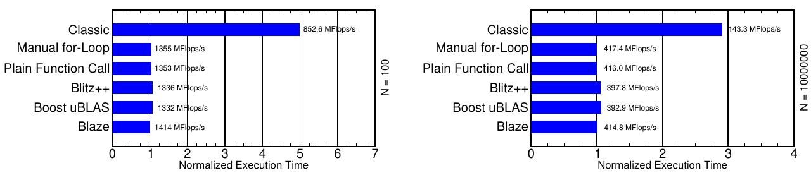
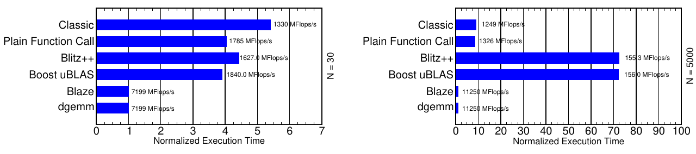
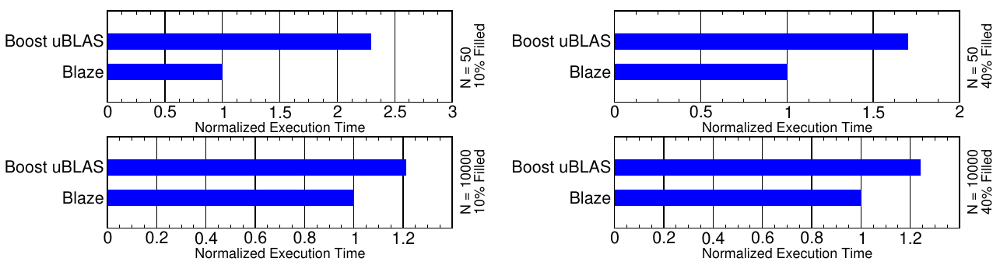
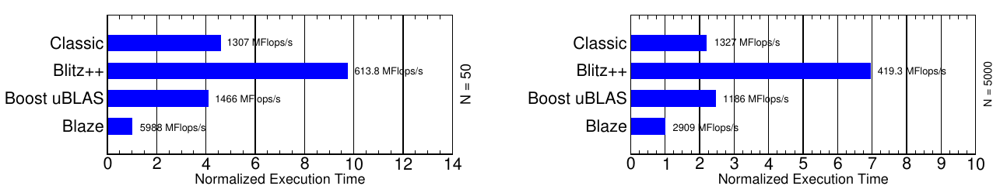
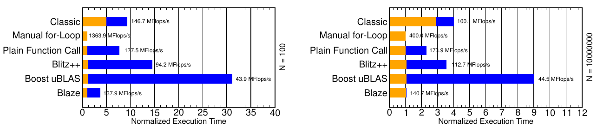

# Expression Templates Revisited: A Performance Analysis of the Current ET Methodology（中文译文）

## 译者说明

本文依据同目录的 `source.pdf` 翻译。章节、图表、公式、算法、代码与参考文献按原文结构保留。

## 作者

Klaus Iglberger、Georg Hager、Jan Treibig、Ulrich Ruede

Friedrich-Alexander University of Erlangen-Nuremberg

## 摘要

过去十年中，Expression Templates（ET）在 C++ 程序中被认为是一种高效的性能优化工具。这种声誉来自若干基于 ET 的线性代数框架，它们试图同时提供优雅的 C++ 代码和高性能。然而，细看之后，“ET 本身是一种性能优化技术”这一假设并不能成立。本文展示并解释了当前 ET 框架在稠密和稀疏线性代数操作中无法提供高性能的原因，并介绍一种新的“智能”ET 实现，它真正允许把高性能代码与领域专用语言（domain-specific language）的优雅性和可维护性结合起来。

**关键词**：Expression Templates；性能优化；高性能编程；线性代数；Boost；uBLAS；Blitz++；Blaze

## 1. 引言

Expression Templates 最初由 Veldhuizen 在 1995 年提出，目标是为基于数组的操作提供一种“性能优化”。其总体思想是，在 C++ 中使用重载运算符编写算术表达式时，避免创建不必要的临时对象。以简单的 O(n) 数组加法为例，ET 可以达到接近手写 C 代码的性能，同时保持优雅的数学语法。这一成功使其很快进入标准教材，并被广泛接受为 C++ 高性能数组数学的技术。

典型的 ET 库包括 Blitz++ 和 Boost uBLAS。Blitz++ 的目标是提供接近 Fortran 77/90 的科学计算性能；Boost uBLAS 是 Boost 项目的一部分。这两个框架都使用 ET 避免临时对象，同时提供快速数组算术和较自然的数学语法。二者还把 ET 方法扩展到矩阵，并支持 BLAS level 2 和 3 操作。与 Blitz++ 相比，Boost uBLAS 还把 ET 思路扩展到稀疏向量和稀疏矩阵。

本文的出发点是在高性能计算（HPC）场景下评估 Blitz++ 和 Boost uBLAS 的单核串行性能。虽然 Expression Templates 的用途更广，例如可用于 lambda 表达式，但本文只关注数值库中的性能问题。基于实验结果，我们解释为什么当前 ET 方法论通常不适合 HPC。作为解决方案，本文描述一种替代 ET 方法，它把高层语言的优点和体系结构相关的性能优化结合起来，因此更适合 HPC。这种“智能”ET 方法已在 Blaze 库中实现。

本文忽略 GPGPU 计算，聚焦当时的主流 CPU 架构 Intel Westmere。为展示可达到的性能，所有 ET 库结果都与优化后的 BLAS 代码，即 Intel MKL 进行比较。

本文结构如下：第 2 节讨论相关工作；第 3 节概述 benchmark 平台；第 4 节回顾当前 ET 技术并评估标准 benchmark，即稠密向量加法；第 5 节扩展到稠密矩阵乘法并揭示标准 ET 的局限；第 6、7 节研究稀疏数据结构和复杂表达式；第 8 节提出 Smart Expression Templates；第 9 节讨论 ET 中的 inlining；第 10 节总结并展望。

## 2. 相关工作

真正深入研究 ET 性能的工作并不多。Bassetti 等人比较了 C++ Expression Templates 和 Fortran 77 代码的性能，指出不同 ET 实现并不能一致保证性能；他们把原因归结为复杂 ET 实现对寄存器的高需求。Haerdtlein 提出了 easy expression templates 和 fast expression templates：前者比经典 ET 更容易实现，后者使用静态内存来改善数组操作性能。

## 3. Benchmark 平台

所有 benchmark 使用一颗 6 核 Intel Westmere CPU，主频 2.93 GHz，12 MB 共享 L3 缓存。GNU g++ 4.4.2 和 Intel 11.1 编译器得到的结果非常相近，因此文中只展示 GNU g++ 结果。

为了直接比较不同 ET 方法，除必要的循环顺序调整外，我们不做其他低层优化。Blitz++、Boost uBLAS 和 Blaze 都按其原样 benchmark。所有结果都按每个测试中最快实现的执行时间归一化。对稠密向量和矩阵测试，文中还给出 MFlops/s。

## 4. Expression Templates 的基本思想

本节回顾 ET 的基本机制，以两个 `Vector` 类型稠密向量相加为例：

**代码清单 1. 两个稠密向量相加**

```cpp
Vector a, b, c;
// ... 初始化向量 a 和 b
c = a + b;
```

使用 C++ 算术运算符可以非常简洁地描述加法：把 `a` 和 `b` 相加，结果赋给 `c`。如果 `Vector` 支持下标访问和 `size()`，传统 `operator+` 通常类似如下：

**代码清单 2. 经典加法运算符实现**

```cpp
inline const Vector operator+(const Vector& a, const Vector& b)
{
   Vector tmp(a.size());

   for (size_t i = 0; i < a.size(); ++i)
      tmp[i] = a[i] + b[i];

   return tmp;
}
```

这个实现直观且灵活，例如可以串接多个向量加法。但与手写 C 代码相比，它会因为临时向量 `tmp` 而损失性能。创建 `tmp` 涉及动态内存分配、从临时对象复制到目标向量，以及内存释放；额外内存占用还会干扰缓存局部性。手写实现则不需要这些开销：

**代码清单 3. C 风格手写向量加法**

```cpp
for (size_t i = 0; i < size; ++i)
   c[i] = a[i] + b[i];
```

如果在一条语句中相加多个向量，性能损失会更严重，因为表达式会被“贪婪”求值：

**代码清单 4. 三个稠密向量相加**

```cpp
Vector a, b, c, d;
// ... 初始化 a、b、c
d = a + b + c;
```

每个单独的加法都会创建一个临时向量，而实际上该操作不需要任何临时对象：

**代码清单 5. C 风格手写三个向量相加**

```cpp
for (size_t i = 0; i < size; ++i)
   d[i] = a[i] + b[i] + c[i];
```

ET 的做法是在编译期构造整个表达式的解析树，从而完全消除昂贵的临时对象创建，并把表达式求值推迟到赋值给目标对象时。加法运算符不再返回加法结果，而是返回一个小的临时表达式对象，用来占位表示这次加法：

**代码清单 6. 基于 ET 的加法运算符实现**

```cpp
template <typename A, typename B>
class Sum
{
 public:
   explicit Sum(const A& a, const B& b)
      : a_(a), b_(b)
   {}

   std::size_t size() const {
      return a_.size();
   }

   double operator[](std::size_t i) const {
      return a_[i] + b_[i];
   }

 private:
   const A& a_;
   const B& b_;
};

template <typename A, typename B>
Sum<A,B> operator+(const A& a, const B& b)
{
   return Sum<A,B>(a, b);
}
```

`operator+` 返回 `Sum<A,B>`，其中 `A` 和 `B` 是左右操作数类型。`Sum` 持有对两个操作数的常量引用，因此创建和复制都很便宜。它提供 `size()` 和下标运算符，允许像访问结果向量一样访问表达式结果。

`Sum` 会临时表示这个加法，直到遇到特殊赋值运算符：

**代码清单 7. ET 赋值运算符**

```cpp
class Vector
{
 public:
   template <typename A>
   Vector& operator=(const A& expr)
   {
      resize(expr.size());

      for (std::size_t i = 0; i < expr.size(); ++i)
         v_[i] = expr[i];

      return *this;
   }
};
```

每当表达式对象被赋给 `Vector` 时，这个赋值运算符负责执行求值。它先调整目标向量大小，然后在单个 `for` 循环中遍历表达式元素。访问 `expr[i]` 时才触发表达式求值。这个循环就是求值整个表达式所需的唯一循环。

在所有函数都内联、求值隐藏在赋值运算符的单个循环中时，编译器可以生成类似手写 C 代码的机器码。即使串接多个加法，也可以避免临时对象，并保持单循环求值。

Boost uBLAS 和 Blitz++ 都基于上述两个核心思想：

- 表达式求值期间不创建临时对象，除 ET 表达式对象本身外；
- 赋值运算符被调用时，通过右侧表达式的元素访问逐元素计算左侧目标。

我们比较了六种稠密向量加法实现：经典 C++ 运算符重载、手写 `for` 循环、普通函数调用、Blitz++、Boost uBLAS 和 Blaze。第三种普通函数调用把两个操作数和目标向量作为参数，用函数封装向量加法：

**代码清单 8. 普通函数中的两个向量加法**

```cpp
inline void addVectors(const Vector& a, const Vector& b, Vector& c)
{
   // 与代码清单 2 相同的实现，但不创建临时对象
}
```

图 1 显示，对于小向量和大向量，经典运算符重载最慢，因为额外临时向量造成额外数据传输。ET 相比朴素运算符重载确实是一种性能优化：它避免中间临时对象，达到手写 C 风格向量加法的性能，同时保留领域专用语言的表达能力和灵活性。



## 5. ET 是一种性能优化技术吗？

ET 作为性能优化的声誉，主要来自它在 BLAS level 1 操作（如稠密向量加法）中相对经典 C++ 运算符重载的优势。除此之外，很少有公开性能比较。然而 Blitz++ 和 Boost uBLAS 都提供远超 BLAS level 1 的功能，包括 BLAS level 3 中的稠密矩阵乘法。矩阵乘法特别适合优化，因为通过适当的内存访问方案等优化，它可以从内存受限变为算术受限。

我们比较了六种稠密矩阵乘法实现：经典 C++ 运算符重载、普通函数、Blitz++、Boost uBLAS、Blaze，以及直接调用 BLAS `dgemm`。

**代码清单 9. 矩阵乘法运算符实现**

```cpp
inline const Matrix operator*(const Matrix& A, const Matrix& B)
{
   Matrix C(A.rows(), B.columns());

   for (size_t i = 0; i < A.rows(); ++i) {
      for (size_t k = 0; k < B.columns(); ++k) {
         C(i,k) = A(i,0) * B(0,k);
      }
      for (size_t j = 1; j < A.columns(); ++j) {
         for (size_t k = 0; k < B.columns(); ++k) {
            C(i,k) += A(i,j) * B(j,k);
         }
      }
   }

   return C;
}
```

Blitz++、Boost uBLAS 和 Blaze 的用法分别如下：

**代码清单 10. Blitz++ 中的矩阵乘法**

```cpp
blitz::Array<double,2> A(N, N), B(N, N), C(N, N);
blitz::firstIndex i;
blitz::secondIndex j;
blitz::thirdIndex k;
// ... 初始化矩阵
C = blitz::sum(A(i,k) * B(k,j), k);
```

**代码清单 11. Boost uBLAS 中的矩阵乘法**

```cpp
boost::numeric::ublas::matrix<double> A(N, N), B(N, N), C(N, N);
// ... 初始化矩阵
noalias(C) = prod(A, B);
```

**代码清单 12. Blaze 中的矩阵乘法**

```cpp
pe::MatN A(N, N), B(N, N), C(N, N);
// ... 初始化矩阵
C = A * B;
```

图 2 显示，在 in-cache 的 30x30 矩阵和 out-of-cache 的 5000x5000 矩阵上，`dgemm` 是最快实现。Blaze 也达到相同性能，因为其内部使用 `dgemm`。相反，Blitz++ 和 Boost uBLAS 表现很差。令人意外的是，在 out-of-cache 场景中，即使经典运算符重载会创建临时对象，它仍明显快于两个 ET 库。



**表 1. 稠密矩阵乘法的 LIKWID 性能分析（N=5000）**

| 实现 | 内存带宽 MB/s | retired 指令数 | 算术操作数 | CPI |
| --- | ---: | ---: | ---: | ---: |
| STREAM | 11814 | - | - | - |
| Classic | 5008 | 12.5054e11 | 2.50231e11 | 0.441127 |
| Plain Function Call | 5328 | 12.5048e11 | 2.50232e11 | 0.440912 |
| Blitz++ | 623 | 10.0126e11 | 2.58185e11 | 4.67952 |
| Boost uBLAS | 623 | 10.0053e11 | 2.50197e11 | 4.72096 |
| Blaze | 496 | 2.02589e11 | 2.50612e11 | 0.322074 |
| dgemm | 496 | 2.02589e11 | 2.50612e11 | 0.322074 |

Blitz++ 和 Boost uBLAS 的 CPI 很高，内存带宽很低，说明生成代码质量很差。原因在 ET 方法论本身：它基于逐个计算目标数据结构元素。矩阵乘法生成的执行模式类似如下：

**代码清单 13. 慢速矩阵乘法循环顺序**

```cpp
for (size_t i = 0; i < A.rows(); ++i) {
   for (size_t j = 0; j < B.columns(); ++j) {
      for (size_t k = 0; k < A.columns(); ++k) {
         C(i,j) += A(i,k) * B(k,j);
      }
   }
}
```

这种循环顺序是矩阵乘法最差的访问方案之一：为了计算目标矩阵的每个元素，都要遍历右侧矩阵的一整列。对 out-of-cache 矩阵而言，每条缓存线往往只用到一个值就被替换，缓存效率极差。经典运算符重载和普通函数调用使用了更缓存友好的访问方案，可以同时计算目标矩阵中的多个值，因此内存带宽更高，CPI 更低。

关键问题是：为什么 ET 库不采用更好的循环顺序？原因是当前 ET 方法无法选择最佳数据访问方案。它只基于三点：避免临时对象、逐元素求值右侧表达式，以及相信编译器在内联后会优化代码结构。这对向量加法有效，因为几乎没有可优化的数据访问方案；但对矩阵乘法，要达到高性能必须利用对数据结构和操作类型的详细知识。

因此，当前 ET 技术的根本问题是：它本质上不是性能优化技术，而是抽象技术。它抽象掉参与运算的数据类型和操作类型，使框架更灵活，却阻碍了内存优化、向量化和超标量执行等真正的性能优化。ET 的优化能力只限于那些抽象访问方案碰巧就是最优访问方案的操作。

这一点还有重要含义：ET 通过函数封装数值操作，带来直观易用和高可维护性。复杂数值 kernel（如矩阵乘法）尤其应该被封装，因为反复手写高性能复杂 kernel 代价很高。但矩阵乘法结果说明，当前 ET 方法不适合封装高度优化的复杂 kernel。

## 6. 稀疏算术

ET 抽象掉实际数据类型，因此非常灵活，可以集成新数据类型。Boost uBLAS 就利用这一点提供稀疏向量和矩阵，并可与稠密结构混合使用。这是 ET 的明显优势。但这种抽象也带来性能代价。

我们选择两个稠密/稀疏混合操作比较 Boost uBLAS 与 Blaze。

第一个操作是行存稀疏矩阵乘稠密向量，常用于工程应用中的线性方程组求解：

**代码清单 14. Boost uBLAS 稀疏矩阵/稠密向量乘法**

```cpp
boost::numeric::ublas::compressed_matrix<double> A(N, N);
boost::numeric::ublas::vector<double> a(N), b(N);
// ... 初始化矩阵和向量
noalias(b) = prod(A, a);
```

**代码清单 15. Blaze 稀疏矩阵/稠密向量乘法**

```cpp
SparseMatrixMxN<double> A(N, N);
Vector<double> a(N), b(N);
// ... 初始化矩阵和向量
b = A * a;
```

图 3 显示，在不同规模和填充率下，Boost uBLAS 与 Blaze 没有巨大性能差异。原因是 ET 默认访问方案正好适合该操作：为了计算结果向量的每个元素，只需把稀疏矩阵的一行与稠密向量相乘。行式访问稀疏矩阵和访问稠密向量都能较好利用数据结构。



第二个操作是行存稠密矩阵乘行存稀疏矩阵：

**代码清单 16. Boost uBLAS 稠密矩阵/稀疏矩阵乘法**

```cpp
boost::numeric::ublas::matrix<double> A(N, N), C(N, N);
boost::numeric::ublas::compressed_matrix<double> B(N, N);
// ... 初始化矩阵
noalias(C) = prod(A, B);
```

**代码清单 17. Blaze 稠密矩阵/稀疏矩阵乘法**

```cpp
MatrixMxN<double> A(N, N), C(N, N);
SparseMatrixMxN<double> B(N, N);
// ... 初始化矩阵
C = A * B;
```

图 4 显示，两库性能差异巨大。Blaze 尝试利用操作和两个数据类型的所有信息，能够有效处理右侧稀疏矩阵的行式存储。Boost uBLAS 则抽象掉当前操作和数据类型，逐个计算结果矩阵元素，通过行迭代器遍历左侧稠密矩阵、通过列迭代器遍历右侧稀疏矩阵。列迭代器作为用户接口很方便，但在内部抽象使用时，在该操作中造成灾难性性能损失。


达到高性能所需的是识别右侧稀疏矩阵的数据结构，并尽量以缓存友好的方式使用和复用其元素。当前 ET 方法由于抽象掉操作和数据类型，无法做到这一点。

## 7. 复杂表达式

ET 的基本规则之一是在表达式求值期间不创建临时对象。但有些情况下，创建临时对象虽有额外工作，却是获得性能所必需的。我们选择两个复杂表达式展示这一规则的缺陷。

第一个表达式是稠密矩阵乘三个稠密向量之和：

$$
A \cdot (a + b + c)
$$

问题很明显：矩阵-向量乘法会多次使用右侧向量。如果不先计算 `a + b + c` 的结果，就会重复计算这些加法，必然损失性能。

**代码清单 18. 经典运算符重载中的 `d = A * (a + b + c)`**

```cpp
class ic::Matrix<double> A(N, N);
class ic::Vector<double> a(N), b(N), c(N), d(N);
// ... 初始化矩阵和向量
d = A * (a + b + c);
```

**代码清单 19. Blitz++ 中的 `d = A * (a + b + c)`**

```cpp
blitz::Array<real,2> A(N, N);
blitz::Array<real,1> a(N), b(N), c(N), d(N), tmp(N);
blitz::firstIndex i;
blitz::secondIndex j;
// ... 初始化
tmp = a + b + c;
d = blitz::sum(A(i,j) * tmp(j), j);
```

**代码清单 20. Boost uBLAS 中的 `d = A * (a + b + c)`**

```cpp
boost::numeric::ublas::matrix<real> A(N, N);
boost::numeric::ublas::vector<real> a(N), b(N), c(N), d(N);
// ... 初始化矩阵
noalias(d) = prod(A, (a + b + c));
```

**代码清单 21. Blaze 中的 `d = A * (a + b + c)`**

```cpp
pe::MatrixMxN<double> A(N, N);
pe::VectorN<double> a(N), b(N), c(N), d(N);
// ... 初始化矩阵
d = A * (a + b + c);
```

图 5 显示，无论小规模还是大规模，传统 ET 库表现都不好。对大规模 N，经典运算符重载虽然需要三个临时对象，却快于 Boost uBLAS，尤其快于 Blitz++。Blaze 使用一个临时对象保存向量加法中间结果，再调用优化的 `dgemv` 进行矩阵-向量乘法，因此性能明显更好。



**表 2. 复杂表达式 `A * (a + b + c)` 的 LIKWID 分析（N=5000）**

| 实现 | 内存带宽 MB/s | retired 指令数 | 算术操作数 | CPI | L1 数据缓存行替换 |
| --- | ---: | ---: | ---: | ---: | ---: |
| STREAM | 11814 | - | - | - | - |
| Classic | 5387 | 4.31892e8 | 7.56438e7 | 0.455758 | 6.32184e6 |
| Blitz++ | 2295 | 6.87758e8 | 7.55893e7 | 0.531862 | 6.36924e6 |
| Boost uBLAS | 4382 | 4.5681e8 | 12.5684e7 | 0.529004 | 12.5812e6 |
| Blaze | 11088 | 2.74818e8 | 7.74858e7 | 0.57686 | 3.99694e6 |

第二个复杂表达式涉及四个稠密矩阵：

$$
E = (A + B) \cdot (C - D)
$$

为了高效执行矩阵乘法，左侧和右侧矩阵表达式都必须先求值。Blitz++ 中无法用单条语句计算该表达式，因此需要两个显式临时矩阵。图 6 显示，Blitz++ 因创建临时对象总是优于不创建中间临时对象的 Boost uBLAS，但二者都远弱于 Blaze。Blaze 内部创建两个临时对象保存矩阵加法和减法结果，再用 `dgemm` 执行后续矩阵乘法。


**表 3. 复杂表达式 `(A + B) * (C - D)` 的 LIKWID 分析（N=5000）**

| 实现 | 内存带宽 MB/s | retired 指令数 | 算术操作数 | CPI | L1 数据缓存行替换 |
| --- | ---: | ---: | ---: | ---: | ---: |
| STREAM | 11814 | - | - | - | - |
| Classic | 4136 | 12.5106e11 | 2.50318e11 | 0.442167 | 31.3006e9 |
| Blitz++ | 624 | 10.0163e11 | 2.56789e11 | 4.68541 | 266.566e9 |
| Boost uBLAS | 619 | 13.7553e11 | 6.15386e11 | 6.90581 | 533.411e9 |
| Blaze | 490 | 2.02977e11 | 2.50684e11 | 0.322925 | 2.07864e9 |

Boost uBLAS 官方建议在必要时显式引入临时对象来提升性能。但 ET 的核心目标之一正是使用中缀运算符语法，为数学操作提供方便、直观的黑盒接口。用户不应被要求自己识别何时需要临时对象。既然库提供了这种接口，就必须处理所有后果，包括自动创建必要临时对象。由此可见，“不创建任何临时对象”这一带来 ET 性能声誉的规则，也可能变成性能“劣化”。

## 8. 新 ET 方法论：Smart Expression Templates

ET 本身显然不能普遍提供高性能。但把高性能代码与 C++ 运算符提供的数学语法结合起来仍然是合理目标：在数学上下文中，高层结构能显著改善代码清晰度、可读性和可维护性。

Blaze 的 smart ET 方法与其他 ET 框架不同。Blaze 完全放弃“ET 本身是性能优化”的观念。ET 只作为解析机制：理解给定数学表达式的结构，知道子表达式应按什么顺序求值，包括何时创建临时对象，并选择适当的高度优化 kernel。这些 kernel 基于对数据类型和操作的详细知识，提供手工的、体系结构相关的性能优化。

本节只概述 smart ET 方法的两个关键概念：选择性创建中间临时对象，以及集成优化后的计算 kernel。

### 8.1 创建中间临时对象

传统 ET 不创建临时对象有两个原因。第一，它抽象掉实际操作，因此无法识别什么时候需要临时对象。第二，人们似乎认为在表达式对象内部高效创建中间临时对象是不可能的，因为临时对象通常意味着内存分配、复制和释放。

这个问题的解决方案其实已经包含在 C++ 标准中。考虑如下操作：

**代码清单 22. 三个稠密向量相加**

```cpp
Vector a, b;
// 初始化 a 和 b
Vector c = a + b;  // 等价于 Vector c(a + b);
```

这里不是赋值，而是初始化 `c`。在这种情况下，所有实现都没有性能差异；即使经典运算符重载也能达到 ET 库性能。原因是 named return value（NRV）优化。如果编译器应用 NRV，局部变量 `tmp` 会被替换为调用者中最终返回值目标的引用；函数不再返回临时对象，而是返回 `void`。

**代码清单 23. 稠密向量加法运算符的 NRV 优化形式**

```cpp
inline void operator+(Vector& dest, const Vector& lhs, const Vector& rhs)
{
   dest.Vector::Vector(lhs.size());

   for (std::size_t i = 0; i < lhs.size(); ++i)
      dest[i] = lhs[i] + rhs[i];
}
```

因此在初始化场景中，编译器可以直接把结果写入目标向量，达到 ET 形式的效果。在赋值场景中，编译器会通过 NRV 优化代码创建临时对象，再把临时对象赋给目标向量：

**代码清单 24. 向量 copy assignment 的编译器生成代码**

```cpp
Vector a, b, c;

// 通过 NRV 优化，把 a 和 b 的加法结果写入临时对象 tmp
Vector tmp(a + b);

// 把临时对象赋值给向量 c
c = tmp;
```

在 ET 中，如果创建中间临时对象，例如某个子表达式的结果，它也是通过初始化创建，而不是赋值创建。临时表达式对象本身的创建也是如此。因此创建临时对象不涉及复制，只涉及必要的内存分配和释放。Smart ET 方法因此使用临时对象作为其他表达式对象的成员变量，保存子表达式的中间结果。

### 8.2 集成优化计算 kernel

Smart ET 的第二个关键思想是选择合适的计算 kernel。解决方案是省略通过赋值运算符进行的抽象赋值，把责任交给结果表达式对象本身。表达式对象掌握参与的数据类型和操作，因此能尽可能高效地执行赋值。

以下代码片段展示了表示两个稠密矩阵相乘的 `DMatDMatMultExpr` 类如何实现这一优化：

**代码清单 25. 矩阵乘法的 smart expression 对象**

```cpp
template <typename MT1, typename MT2>
class DMatDMatMultExpr : private Expression
{
 public:
   // 省略公共接口

 private:
   typedef typename MT1::ResultType RT1;
   typedef typename MT2::ResultType RT2;
   typedef typename MT1::CompositeType CT1;
   typedef typename MT2::CompositeType CT2;

   typedef typename SelectType<IsExpression<MT1>::value, const RT1, CT1>::Type Lhs;
   typedef typename SelectType<IsExpression<MT2>::value, const RT2, CT2>::Type Rhs;

   Lhs lhs_;
   Rhs rhs_;

   template <typename MT>
   friend inline void assign(DenseMatrix<MT>& lhs,
                             const DMatDMatMultExpr& rhs)
   {
      // 根据数据类型使用 cblas_dgemm kernel
      // 或默认矩阵乘法实现
   }
};
```

`DMatDMatMultExpr` 以两个矩阵操作数类型为模板参数。通过模板元编程，类会计算两个成员数据类型。如果任一操作数类型本身是表达式，就使用对应表达式的 `ResultType` 创建临时对象；否则使用其 `CompositeType`，即该矩阵表达式如何参与复合表达式的知识。

核心是 `assign` 函数，它负责把矩阵乘法赋给稠密矩阵。该函数通过 Barton-Nackman trick 注入到外部命名空间。当临时 `DMatDMatMultExpr` 对象被赋给稠密矩阵时，该函数被调用，并基于最快可用计算 kernel 执行赋值。根据矩阵操作数类型，它会调用默认矩阵乘法 kernel，或者调用优化的 BLAS 函数，如单精度 `cblas_sgemm` 和双精度 `cblas_dgemm`。

总结来说，Blaze 的 smart ET 方法把 ET 看作围绕一组高度优化 kernel 的智能包装技术。这些 kernel 提供操作、数据类型和体系结构相关的优化。其显著优势是，这种基于 kernel 的方法容易集成多核、众核和 GPU kernel。

## 9. Inlining

Inlining 是所有 ET 框架的核心问题：如果整个 ET 功能不能完全内联，预期性能就无法达到。因此 ET 非常依赖编译器的内联能力。然而 ET 代码包含大量嵌套函数调用，给编译器带来很大压力。此外，`inline` 关键字只是对编译器的建议，不是强制命令。根据函数大小、编译单元大小、总指令数等因素，编译器可能拒绝内联并插入函数调用。

我们在性能测量中经常遇到内联失败，即使在看似很小的测试程序中也是如此。因此 inlining 是真实问题：即使实现本来能够提供更高性能，内联失败也会导致糟糕表现。我们为保证测得最大可能性能，花了大量精力确保 ET 功能被正确内联。

图 7 展示了稠密向量加法中正确内联与内联失败的对比。结果显示，内联对所有 ET 生产代码都是严重且基础的问题。程序员不能过度相信编译器既能完成足够层级的内联，又能生成最高效的低层循环代码。



## 10. 结论与未来工作

标准 Expression Templates 作为数组操作性能优化的声誉基础很薄弱。它们确实实现了最初目标：为逐元素数组算术提供快速执行，同时保留高层结构的优势，因为它们有效消除了表达式中的临时对象。就此而言，ET 修补了 C++ 语言的一个特定缺陷。

然而，对 BLAS level 2 和 3 操作、稀疏线性代数，以及任何受益于标准和体系结构相关低层优化的复杂操作，传统 ET 往往表现极差。原因是 ET 本质上是一种抽象技术：它隐藏实际数据和操作类型的细节，把它们降为高效的单元素访问。这是不够的。本文展示了对 C++ 编译器高级内联和优化能力的广泛信念是幼稚且缺乏依据的。激进内联是从 ET 源码获得好性能的必要前提，但不能保证最佳低层代码。没有什么可以替代对数据类型、操作和访问模式全部知识的利用。

本文还介绍了一种新的 ET 方法论，称为 Smart Expression Templates。它通过把 ET 机制降级为一组选定高度优化 kernel 的智能包装，消除标准 ET 的缺陷。对 BLAS 类操作，它可以直接使用供应商提供的库。Smart ET 把领域专用语言的优势（易用、高层结构、可读性、封装、可维护性）与适合 HPC 的代码性能结合起来，并且不像标准 ET 那样强烈依赖激进内联。

本文只讨论串行代码。考虑到现代高性能系统中的层次化、多核/多插槽构件非常重要，把 smart ET 推广到分布式数据结构上的并行计算是自然方向，我们计划继续研究。

## 参考文献

[1] D. Abrahams and A. Gurtovoy. *C++ Template Metaprogramming*. Addison-Wesley, 2005.

[2] F. Bassetti, K. Davis, and D. Quinlan. C++ Expression Templates Performance Issues in Scientific Computing. In *Parallel Processing Symposium '98*, 1998.

[3] Blitz++ library. http://www.oonumerics.org/blitz/.

[4] Boost. http://www.boost.org.

[5] Boost Lambda library. http://www.boost.org/doc/libs/1_45_0/doc/html/lambda.html.

[6] Boost uBLAS library. http://www.boost.org/doc/libs/1_45_0/libs/numeric/ublas/doc/index.htm.

[7] M. Ellis and B. Stroustrup. *The Annotated C++ Reference Manual*. Addison-Wesley, 1990.

[8] G. Hager and G. Wellein. *Introduction to High Performance Computing for Scientists and Engineers*. CRC Press, 2010.

[9] J. Haerdtlein. *Moderne Expression Templates Programmierung*. PhD thesis, University of Erlangen-Nuremberg, 2007.

[10] K. Iglberger. *Software Design of a Massively Parallel Rigid Body Framework*. PhD thesis, 2010.

[11] Intel Math Kernel Library (MKL). http://www.intel.com/software/products/mkl.

[12] J. Haerdtlein, C. Pflaum, A. Linke, and C. H. Wolters. Advanced Expression Template Programming. *Computing and Visualization in Science*, 13(2):59-68, 2009.

[13] J. J. Barton and L. R. Nackman. Algebra for C++ Operators. *C++ Report*, 7(3):70-74, 1995.

[14] S. B. Lippman. *Inside the C++ Object Model*. Addison-Wesley, 2007.

[15] B. Meyer. *Object-oriented Software Construction*. Prentice Hall, 1997.

[16] T. Veldhuizen. Expression Templates. *C++ Report*, 7(5):26-31, 1995.

[17] T. Veldhuizen. Expression Templates. In *C++ Gems*, pages 475-487. SIGS Publications, 1996.

[18] J. Treibig, G. Hager, and G. Wellein. LIKWID: A lightweight performance-oriented tool suite for x86 multicore environments. In *PSTI2010*, 2010.

[19] D. Vandevoorde and N. M. Josuttis. *C++ Templates - The Complete Guide*. Addison-Wesley, 2003.
